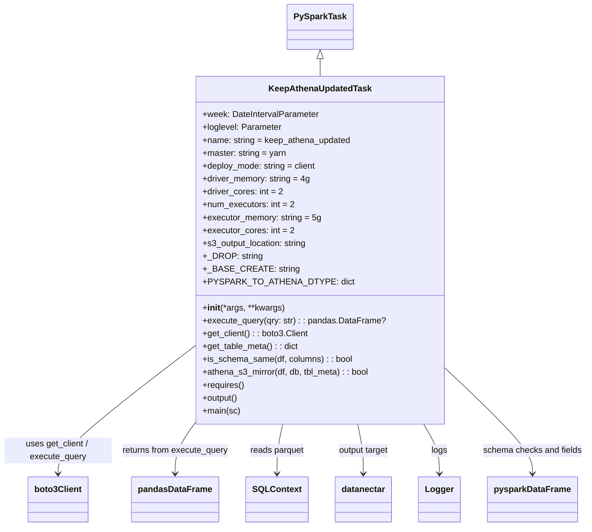
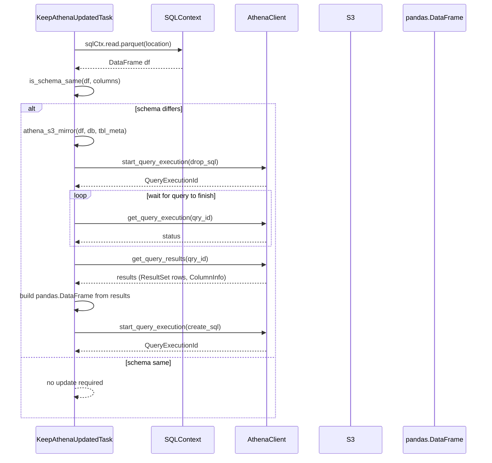

# Diagram: research/orchestrator/tasks/analytics/keep_athena_updated_task.py

> Auto-generated by Obscura crawlers

## Diagram 1

### SVG

<svg id="container" width="1072.078125" xmlns="http://www.w3.org/2000/svg" class="classDiagram" height="980" viewBox="0 0 1072.078125 980" role="graphics-document document" aria-roledescription="class"><g><defs><marker id="container_class-aggregationStart" class="marker aggregation class" refX="18" refY="7" markerWidth="190" markerHeight="240" orient="auto"><path d="M 18,7 L9,13 L1,7 L9,1 Z"></path></marker></defs><defs><marker id="container_class-aggregationEnd" class="marker aggregation class" refX="1" refY="7" markerWidth="20" markerHeight="28" orient="auto"><path d="M 18,7 L9,13 L1,7 L9,1 Z"></path></marker></defs><defs><marker id="container_class-extensionStart" class="marker extension class" refX="18" refY="7" markerWidth="190" markerHeight="240" orient="auto"><path d="M 1,7 L18,13 V 1 Z"></path></marker></defs><defs><marker id="container_class-extensionEnd" class="marker extension class" refX="1" refY="7" markerWidth="20" markerHeight="28" orient="auto"><path d="M 1,1 V 13 L18,7 Z"></path></marker></defs><defs><marker id="container_class-compositionStart" class="marker composition class" refX="18" refY="7" markerWidth="190" markerHeight="240" orient="auto"><path d="M 18,7 L9,13 L1,7 L9,1 Z"></path></marker></defs><defs><marker id="container_class-compositionEnd" class="marker composition class" refX="1" refY="7" markerWidth="20" markerHeight="28" orient="auto"><path d="M 18,7 L9,13 L1,7 L9,1 Z"></path></marker></defs><defs><marker id="container_class-dependencyStart" class="marker dependency class" refX="6" refY="7" markerWidth="190" markerHeight="240" orient="auto"><path d="M 5,7 L9,13 L1,7 L9,1 Z"></path></marker></defs><defs><marker id="container_class-dependencyEnd" class="marker dependency class" refX="13" refY="7" markerWidth="20" markerHeight="28" orient="auto"><path d="M 18,7 L9,13 L14,7 L9,1 Z"></path></marker></defs><defs><marker id="container_class-lollipopStart" class="marker lollipop class" refX="13" refY="7" markerWidth="190" markerHeight="240" orient="auto"><circle stroke="black" fill="transparent" cx="7" cy="7" r="6"></circle></marker></defs><defs><marker id="container_class-lollipopEnd" class="marker lollipop class" refX="1" refY="7" markerWidth="190" markerHeight="240" orient="auto"><circle stroke="black" fill="transparent" cx="7" cy="7" r="6"></circle></marker></defs><g class="root"><g class="clusters"></g><g class="edgePaths"><path d="M587.723,109.25L587.723,110.542C587.723,111.833,587.723,114.417,587.723,119.875C587.723,125.333,587.723,133.667,587.723,137.833L587.723,142" id="id_PySparkTask_KeepAthenaUpdatedTask_1" class="edge-thickness-normal edge-pattern-solid relation" style=";;;" data-edge="true" data-et="edge" data-id="id_PySparkTask_KeepAthenaUpdatedTask_1" data-points="W3sieCI6NTg3LjcyMjY1NjI1LCJ5Ijo5Mn0seyJ4Ijo1ODcuNzIyNjU2MjUsInkiOjExN30seyJ4Ijo1ODcuNzIyNjU2MjUsInkiOjE0Mn1d" marker-start="url(#container_class-extensionStart)"></path><path d="M361.59,641.826L319.325,674.688C277.06,707.55,192.53,773.275,150.265,813.304C108,853.333,108,867.667,108,874.833L108,882" id="id_KeepAthenaUpdatedTask_boto3Client_2" class="edge-thickness-normal edge-pattern-solid relation" style=";;;" data-edge="true" data-et="edge" data-id="id_KeepAthenaUpdatedTask_boto3Client_2" data-points="W3sieCI6MzYxLjU4OTg0Mzc1LCJ5Ijo2NDEuODI1NjMxNjcxOTQ1OX0seyJ4IjoxMDgsInkiOjgzOX0seyJ4IjoxMDgsInkiOjg4OH1d" marker-end="url(#container_class-dependencyEnd)"></path><path d="M362.119,790L356.433,798.167C350.746,806.333,339.373,822.667,333.687,838C328,853.333,328,867.667,328,874.833L328,882" id="id_KeepAthenaUpdatedTask_pandasDataFrame_3" class="edge-thickness-normal edge-pattern-solid relation" style=";;;" data-edge="true" data-et="edge" data-id="id_KeepAthenaUpdatedTask_pandasDataFrame_3" data-points="W3sieCI6MzYyLjExOTA2MjA4MTA5OTIsInkiOjc5MH0seyJ4IjozMjgsInkiOjgzOX0seyJ4IjozMjgsInkiOjg4OH1d" marker-end="url(#container_class-dependencyEnd)"></path><path d="M519.946,790L518.237,798.167C516.529,806.333,513.112,822.667,511.404,838C509.695,853.333,509.695,867.667,509.695,874.833L509.695,882" id="id_KeepAthenaUpdatedTask_SQLContext_4" class="edge-thickness-normal edge-pattern-solid relation" style=";;;" data-edge="true" data-et="edge" data-id="id_KeepAthenaUpdatedTask_SQLContext_4" data-points="W3sieCI6NTE5Ljk0NTU1MzM2Nzk2MjUsInkiOjc5MH0seyJ4Ijo1MDkuNjk1MzEyNSwieSI6ODM5fSx7IngiOjUwOS42OTUzMTI1LCJ5Ijo4ODh9XQ==" marker-end="url(#container_class-dependencyEnd)"></path><path d="M655.5,790L657.208,798.167C658.917,806.333,662.333,822.667,664.042,838C665.75,853.333,665.75,867.667,665.75,874.833L665.75,882" id="id_KeepAthenaUpdatedTask_datanectar_5" class="edge-thickness-normal edge-pattern-solid relation" style=";;;" data-edge="true" data-et="edge" data-id="id_KeepAthenaUpdatedTask_datanectar_5" data-points="W3sieCI6NjU1LjQ5OTc1OTEzMjAzNzUsInkiOjc5MH0seyJ4Ijo2NjUuNzUsInkiOjgzOX0seyJ4Ijo2NjUuNzUsInkiOjg4OH1d" marker-end="url(#container_class-dependencyEnd)"></path><path d="M776.118,790L780.866,798.167C785.615,806.333,795.112,822.667,799.861,838C804.609,853.333,804.609,867.667,804.609,874.833L804.609,882" id="id_KeepAthenaUpdatedTask_Logger_6" class="edge-thickness-normal edge-pattern-solid relation" style=";;;" data-edge="true" data-et="edge" data-id="id_KeepAthenaUpdatedTask_Logger_6" data-points="W3sieCI6Nzc2LjExNzU1NDAzODIwMzcsInkiOjc5MH0seyJ4Ijo4MDQuNjA5Mzc1LCJ5Ijo4Mzl9LHsieCI6ODA0LjYwOTM3NSwieSI6ODg4fV0=" marker-end="url(#container_class-dependencyEnd)"></path><path d="M813.855,685.608L840.18,711.173C866.505,736.739,919.155,787.869,945.48,820.601C971.805,853.333,971.805,867.667,971.805,874.833L971.805,882" id="id_KeepAthenaUpdatedTask_pysparkDataFrame_7" class="edge-thickness-normal edge-pattern-solid relation" style=";;;" data-edge="true" data-et="edge" data-id="id_KeepAthenaUpdatedTask_pysparkDataFrame_7" data-points="W3sieCI6ODEzLjg1NTQ2ODc1LCJ5Ijo2ODUuNjA4MTM2MjgyNzM1OH0seyJ4Ijo5NzEuODA0Njg3NSwieSI6ODM5fSx7IngiOjk3MS44MDQ2ODc1LCJ5Ijo4ODh9XQ==" marker-end="url(#container_class-dependencyEnd)"></path></g><g class="edgeLabels"><g class="edgeLabel"><g class="label" data-id="id_PySparkTask_KeepAthenaUpdatedTask_1" transform="translate(0, 0)"><foreignObject width="0" height="0">

</foreignObject></g></g><g class="edgeLabel" transform="translate(108, 839)"><g class="label" data-id="id_KeepAthenaUpdatedTask_boto3Client_2" transform="translate(-100, -24)"><foreignObject width="200" height="48">

uses get_client / execute_query

</foreignObject></g></g><g class="edgeLabel" transform="translate(328, 839)"><g class="label" data-id="id_KeepAthenaUpdatedTask_pandasDataFrame_3" transform="translate(-100, -24)"><foreignObject width="200" height="48">

returns from execute_query

</foreignObject></g></g><g class="edgeLabel" transform="translate(509.6953125, 839)"><g class="label" data-id="id_KeepAthenaUpdatedTask_SQLContext_4" transform="translate(-50.6875, -12)"><foreignObject width="101.375" height="24">

reads parquet

</foreignObject></g></g><g class="edgeLabel" transform="translate(665.75, 839)"><g class="label" data-id="id_KeepAthenaUpdatedTask_datanectar_5" transform="translate(-48.0703125, -12)"><foreignObject width="96.140625" height="24">

output target

</foreignObject></g></g><g class="edgeLabel" transform="translate(804.609375, 839)"><g class="label" data-id="id_KeepAthenaUpdatedTask_Logger_6" transform="translate(-14.8203125, -12)"><foreignObject width="29.640625" height="24">

logs

</foreignObject></g></g><g class="edgeLabel" transform="translate(971.8046875, 839)"><g class="label" data-id="id_KeepAthenaUpdatedTask_pysparkDataFrame_7" transform="translate(-92.2734375, -12)"><foreignObject width="184.546875" height="24">

schema checks and fields

</foreignObject></g></g></g><g class="nodes"><g class="node default" id="classId-PySparkTask-0" transform="translate(587.72265625, 50)"><g class="basic label-container"><path d="M-58.6953125 -42 L58.6953125 -42 L58.6953125 42 L-58.6953125 42" stroke="none" stroke-width="0" fill="#ECECFF" style=""></path><path d="M-58.6953125 -42 C-30.074043440617203 -42, -1.4527743812344056 -42, 58.6953125 -42 M-58.6953125 -42 C-32.798398765427194 -42, -6.901485030854381 -42, 58.6953125 -42 M58.6953125 -42 C58.6953125 -9.031794555610986, 58.6953125 23.936410888778028, 58.6953125 42 M58.6953125 -42 C58.6953125 -16.586994246648608, 58.6953125 8.826011506702784, 58.6953125 42 M58.6953125 42 C27.093091594353375 42, -4.5091293112932505 42, -58.6953125 42 M58.6953125 42 C26.602657142281842 42, -5.489998215436316 42, -58.6953125 42 M-58.6953125 42 C-58.6953125 9.824552574342157, -58.6953125 -22.350894851315687, -58.6953125 -42 M-58.6953125 42 C-58.6953125 15.09465588411091, -58.6953125 -11.81068823177818, -58.6953125 -42" stroke="#9370DB" stroke-width="1.3" fill="none" stroke-dasharray="0 0" style=""></path></g><g class="annotation-group text" transform="translate(0, -18)"></g><g class="label-group text" transform="translate(-46.6953125, -18)"><g class="label" style="font-weight: bolder" transform="translate(0,-12)"><foreignObject width="93.390625" height="24">

PySparkTask

</foreignObject></g></g><g class="members-group text" transform="translate(-46.6953125, 30)"></g><g class="methods-group text" transform="translate(-46.6953125, 60)"></g><g class="divider" style=""><path d="M-58.6953125 6 C-14.224384974814775 6, 30.24654255037045 6, 58.6953125 6 M-58.6953125 6 C-12.144922901566446 6, 34.40546669686711 6, 58.6953125 6" stroke="#9370DB" stroke-width="1.3" fill="none" stroke-dasharray="0 0" style=""></path></g><g class="divider" style=""><path d="M-58.6953125 24 C-32.98173685764226 24, -7.268161215284515 24, 58.6953125 24 M-58.6953125 24 C-28.536559858665473 24, 1.6221927826690532 24, 58.6953125 24" stroke="#9370DB" stroke-width="1.3" fill="none" stroke-dasharray="0 0" style=""></path></g></g><g class="node default" id="classId-KeepAthenaUpdatedTask-1" transform="translate(587.72265625, 466)"><g class="basic label-container"><path d="M-226.1328125 -324 L226.1328125 -324 L226.1328125 324 L-226.1328125 324" stroke="none" stroke-width="0" fill="#ECECFF" style=""></path><path d="M-226.1328125 -324 C-130.3207577215752 -324, -34.50870294315044 -324, 226.1328125 -324 M-226.1328125 -324 C-132.7960475154937 -324, -39.45928253098742 -324, 226.1328125 -324 M226.1328125 -324 C226.1328125 -75.30081081015689, 226.1328125 173.39837837968622, 226.1328125 324 M226.1328125 -324 C226.1328125 -166.55638964275641, 226.1328125 -9.11277928551283, 226.1328125 324 M226.1328125 324 C128.5662188561169 324, 30.99962521223378 324, -226.1328125 324 M226.1328125 324 C51.94357221557689 324, -122.24566806884621 324, -226.1328125 324 M-226.1328125 324 C-226.1328125 137.10211450809328, -226.1328125 -49.79577098381344, -226.1328125 -324 M-226.1328125 324 C-226.1328125 139.74565756653615, -226.1328125 -44.508684866927695, -226.1328125 -324" stroke="#9370DB" stroke-width="1.3" fill="none" stroke-dasharray="0 0" style=""></path></g><g class="annotation-group text" transform="translate(0, -300)"></g><g class="label-group text" transform="translate(-92.203125, -300)"><g class="label" style="font-weight: bolder" transform="translate(0,-12)"><foreignObject width="184.40625" height="24">

KeepAthenaUpdatedTask

</foreignObject></g></g><g class="members-group text" transform="translate(-214.1328125, -252)"><g class="label" style="" transform="translate(0,-12)"><foreignObject width="216.03125" height="24">

+week: DateIntervalParameter

</foreignObject></g><g class="label" style="" transform="translate(0,12)"><foreignObject width="147.28125" height="24">

+loglevel: Parameter

</foreignObject></g><g class="label" style="" transform="translate(0,36)"><foreignObject width="276.9375" height="24">

+name: string = keep_athena_updated

</foreignObject></g><g class="label" style="" transform="translate(0,60)"><foreignObject width="156.375" height="24">

+master: string = yarn

</foreignObject></g><g class="label" style="" transform="translate(0,84)"><foreignObject width="213.640625" height="24">

+deploy_mode: string = client

</foreignObject></g><g class="label" style="" transform="translate(0,108)"><foreignObject width="200.609375" height="24">

+driver_memory: string = 4g

</foreignObject></g><g class="label" style="" transform="translate(0,132)"><foreignObject width="148.375" height="24">

+driver_cores: int = 2

</foreignObject></g><g class="label" style="" transform="translate(0,156)"><foreignObject width="170.53125" height="24">

+num_executors: int = 2

</foreignObject></g><g class="label" style="" transform="translate(0,180)"><foreignObject width="219.921875" height="24">

+executor_memory: string = 5g

</foreignObject></g><g class="label" style="" transform="translate(0,204)"><foreignObject width="168.1875" height="24">

+executor_cores: int = 2

</foreignObject></g><g class="label" style="" transform="translate(0,228)"><foreignObject width="197.171875" height="24">

+s3_output_location: string

</foreignObject></g><g class="label" style="" transform="translate(0,252)"><foreignObject width="104.875" height="24">

+_DROP: string

</foreignObject></g><g class="label" style="" transform="translate(0,276)"><foreignObject width="160.921875" height="24">

+_BASE_CREATE: string

</foreignObject></g><g class="label" style="" transform="translate(0,300)"><foreignObject width="249.234375" height="24">

+PYSPARK_TO_ATHENA_DTYPE: dict

</foreignObject></g></g><g class="methods-group text" transform="translate(-214.1328125, 108)"><g class="label" style="" transform="translate(0,-12)"><foreignObject width="151.8125" height="24">

+<strong>init</strong>(*args, **kwargs)

</foreignObject></g><g class="label" style="" transform="translate(0,12)"><foreignObject width="336.0625" height="24">

+execute_query(qry: str) : : pandas.DataFrame?

</foreignObject></g><g class="label" style="" transform="translate(0,36)"><foreignObject width="196.828125" height="24">

+get_client() : : boto3.Client

</foreignObject></g><g class="label" style="" transform="translate(0,60)"><foreignObject width="178.828125" height="24">

+get_table_meta() : : dict

</foreignObject></g><g class="label" style="" transform="translate(0,84)"><foreignObject width="277.46875" height="24">

+is_schema_same(df, columns) : : bool

</foreignObject></g><g class="label" style="" transform="translate(0,108)"><foreignObject width="313.734375" height="24">

+athena_s3_mirror(df, db, tbl_meta) : : bool

</foreignObject></g><g class="label" style="" transform="translate(0,132)"><foreignObject width="78.0625" height="24">

+requires()

</foreignObject></g><g class="label" style="" transform="translate(0,156)"><foreignObject width="67.390625" height="24">

+output()

</foreignObject></g><g class="label" style="" transform="translate(0,180)"><foreignObject width="69.78125" height="24">

+main(sc)

</foreignObject></g></g><g class="divider" style=""><path d="M-226.1328125 -276 C-85.33396297664089 -276, 55.46488654671822 -276, 226.1328125 -276 M-226.1328125 -276 C-101.47673549984951 -276, 23.17934150030098 -276, 226.1328125 -276" stroke="#9370DB" stroke-width="1.3" fill="none" stroke-dasharray="0 0" style=""></path></g><g class="divider" style=""><path d="M-226.1328125 84 C-113.85632585959208 84, -1.5798392191841515 84, 226.1328125 84 M-226.1328125 84 C-104.55739282058819 84, 17.018026858823617 84, 226.1328125 84" stroke="#9370DB" stroke-width="1.3" fill="none" stroke-dasharray="0 0" style=""></path></g></g><g class="node default" id="classId-boto3Client-2" transform="translate(108, 930)"><g class="basic label-container"><path d="M-54.34375 -42 L54.34375 -42 L54.34375 42 L-54.34375 42" stroke="none" stroke-width="0" fill="#ECECFF" style=""></path><path d="M-54.34375 -42 C-19.555603230376782 -42, 15.232543539246436 -42, 54.34375 -42 M-54.34375 -42 C-19.406405543707386 -42, 15.530938912585228 -42, 54.34375 -42 M54.34375 -42 C54.34375 -22.187167997743646, 54.34375 -2.374335995487293, 54.34375 42 M54.34375 -42 C54.34375 -15.861735895986353, 54.34375 10.276528208027294, 54.34375 42 M54.34375 42 C25.22383110394638 42, -3.896087792107238 42, -54.34375 42 M54.34375 42 C10.873929073616353 42, -32.595891852767295 42, -54.34375 42 M-54.34375 42 C-54.34375 19.2848233062137, -54.34375 -3.4303533875726018, -54.34375 -42 M-54.34375 42 C-54.34375 25.014295516399695, -54.34375 8.02859103279939, -54.34375 -42" stroke="#9370DB" stroke-width="1.3" fill="none" stroke-dasharray="0 0" style=""></path></g><g class="annotation-group text" transform="translate(0, -18)"></g><g class="label-group text" transform="translate(-42.34375, -18)"><g class="label" style="font-weight: bolder" transform="translate(0,-12)"><foreignObject width="84.6875" height="24">

boto3Client

</foreignObject></g></g><g class="members-group text" transform="translate(-42.34375, 30)"></g><g class="methods-group text" transform="translate(-42.34375, 60)"></g><g class="divider" style=""><path d="M-54.34375 6 C-22.61478758030076 6, 9.11417483939848 6, 54.34375 6 M-54.34375 6 C-25.74945704595658 6, 2.844835908086843 6, 54.34375 6" stroke="#9370DB" stroke-width="1.3" fill="none" stroke-dasharray="0 0" style=""></path></g><g class="divider" style=""><path d="M-54.34375 24 C-19.583699799261296 24, 15.176350401477407 24, 54.34375 24 M-54.34375 24 C-12.954798985878078 24, 28.434152028243844 24, 54.34375 24" stroke="#9370DB" stroke-width="1.3" fill="none" stroke-dasharray="0 0" style=""></path></g></g><g class="node default" id="classId-pandasDataFrame-3" transform="translate(328, 930)"><g class="basic label-container"><path d="M-77.65625 -42 L77.65625 -42 L77.65625 42 L-77.65625 42" stroke="none" stroke-width="0" fill="#ECECFF" style=""></path><path d="M-77.65625 -42 C-43.80539408416823 -42, -9.954538168336455 -42, 77.65625 -42 M-77.65625 -42 C-41.941561115935926 -42, -6.226872231871852 -42, 77.65625 -42 M77.65625 -42 C77.65625 -19.175154814341774, 77.65625 3.649690371316453, 77.65625 42 M77.65625 -42 C77.65625 -18.176383376210588, 77.65625 5.647233247578825, 77.65625 42 M77.65625 42 C29.13608107199012 42, -19.38408785601976 42, -77.65625 42 M77.65625 42 C38.215248191741146 42, -1.2257536165177072 42, -77.65625 42 M-77.65625 42 C-77.65625 15.487958360736826, -77.65625 -11.024083278526348, -77.65625 -42 M-77.65625 42 C-77.65625 23.94635167566414, -77.65625 5.892703351328279, -77.65625 -42" stroke="#9370DB" stroke-width="1.3" fill="none" stroke-dasharray="0 0" style=""></path></g><g class="annotation-group text" transform="translate(0, -18)"></g><g class="label-group text" transform="translate(-65.65625, -18)"><g class="label" style="font-weight: bolder" transform="translate(0,-12)"><foreignObject width="131.3125" height="24">

pandasDataFrame

</foreignObject></g></g><g class="members-group text" transform="translate(-65.65625, 30)"></g><g class="methods-group text" transform="translate(-65.65625, 60)"></g><g class="divider" style=""><path d="M-77.65625 6 C-27.003215535825653 6, 23.649818928348694 6, 77.65625 6 M-77.65625 6 C-36.65163673106122 6, 4.352976537877566 6, 77.65625 6" stroke="#9370DB" stroke-width="1.3" fill="none" stroke-dasharray="0 0" style=""></path></g><g class="divider" style=""><path d="M-77.65625 24 C-43.17981093604101 24, -8.703371872082016 24, 77.65625 24 M-77.65625 24 C-43.6728407861803 24, -9.689431572360604 24, 77.65625 24" stroke="#9370DB" stroke-width="1.3" fill="none" stroke-dasharray="0 0" style=""></path></g></g><g class="node default" id="classId-SQLContext-4" transform="translate(509.6953125, 930)"><g class="basic label-container"><path d="M-54.0390625 -42 L54.0390625 -42 L54.0390625 42 L-54.0390625 42" stroke="none" stroke-width="0" fill="#ECECFF" style=""></path><path d="M-54.0390625 -42 C-14.073985387791417 -42, 25.891091724417166 -42, 54.0390625 -42 M-54.0390625 -42 C-15.83434602807943 -42, 22.37037044384114 -42, 54.0390625 -42 M54.0390625 -42 C54.0390625 -19.319079796272824, 54.0390625 3.361840407454352, 54.0390625 42 M54.0390625 -42 C54.0390625 -18.221863986504754, 54.0390625 5.5562720269904915, 54.0390625 42 M54.0390625 42 C12.032204817256186 42, -29.974652865487627 42, -54.0390625 42 M54.0390625 42 C31.557954350808792 42, 9.076846201617585 42, -54.0390625 42 M-54.0390625 42 C-54.0390625 21.317731934843167, -54.0390625 0.6354638696863333, -54.0390625 -42 M-54.0390625 42 C-54.0390625 12.53808271652116, -54.0390625 -16.92383456695768, -54.0390625 -42" stroke="#9370DB" stroke-width="1.3" fill="none" stroke-dasharray="0 0" style=""></path></g><g class="annotation-group text" transform="translate(0, -18)"></g><g class="label-group text" transform="translate(-42.0390625, -18)"><g class="label" style="font-weight: bolder" transform="translate(0,-12)"><foreignObject width="84.078125" height="24">

SQLContext

</foreignObject></g></g><g class="members-group text" transform="translate(-42.0390625, 30)"></g><g class="methods-group text" transform="translate(-42.0390625, 60)"></g><g class="divider" style=""><path d="M-54.0390625 6 C-30.39481868300086 6, -6.75057486600172 6, 54.0390625 6 M-54.0390625 6 C-31.921195520338234 6, -9.803328540676468 6, 54.0390625 6" stroke="#9370DB" stroke-width="1.3" fill="none" stroke-dasharray="0 0" style=""></path></g><g class="divider" style=""><path d="M-54.0390625 24 C-15.632051100607562 24, 22.774960298784876 24, 54.0390625 24 M-54.0390625 24 C-17.487410250521165 24, 19.06424199895767 24, 54.0390625 24" stroke="#9370DB" stroke-width="1.3" fill="none" stroke-dasharray="0 0" style=""></path></g></g><g class="node default" id="classId-datanectar-5" transform="translate(665.75, 930)"><g class="basic label-container"><path d="M-52.015625 -42 L52.015625 -42 L52.015625 42 L-52.015625 42" stroke="none" stroke-width="0" fill="#ECECFF" style=""></path><path d="M-52.015625 -42 C-20.685930332637998 -42, 10.643764334724004 -42, 52.015625 -42 M-52.015625 -42 C-14.948935669561905 -42, 22.11775366087619 -42, 52.015625 -42 M52.015625 -42 C52.015625 -12.385198472258221, 52.015625 17.229603055483558, 52.015625 42 M52.015625 -42 C52.015625 -14.671414463024679, 52.015625 12.657171073950643, 52.015625 42 M52.015625 42 C14.058330177566681 42, -23.898964644866638 42, -52.015625 42 M52.015625 42 C18.284769266777282 42, -15.446086466445436 42, -52.015625 42 M-52.015625 42 C-52.015625 18.321221052480446, -52.015625 -5.357557895039108, -52.015625 -42 M-52.015625 42 C-52.015625 11.94209094297684, -52.015625 -18.11581811404632, -52.015625 -42" stroke="#9370DB" stroke-width="1.3" fill="none" stroke-dasharray="0 0" style=""></path></g><g class="annotation-group text" transform="translate(0, -18)"></g><g class="label-group text" transform="translate(-40.015625, -18)"><g class="label" style="font-weight: bolder" transform="translate(0,-12)"><foreignObject width="80.03125" height="24">

datanectar

</foreignObject></g></g><g class="members-group text" transform="translate(-40.015625, 30)"></g><g class="methods-group text" transform="translate(-40.015625, 60)"></g><g class="divider" style=""><path d="M-52.015625 6 C-16.113838885869647 6, 19.787947228260705 6, 52.015625 6 M-52.015625 6 C-31.102537207683035 6, -10.18944941536607 6, 52.015625 6" stroke="#9370DB" stroke-width="1.3" fill="none" stroke-dasharray="0 0" style=""></path></g><g class="divider" style=""><path d="M-52.015625 24 C-22.29037565352438 24, 7.434873692951243 24, 52.015625 24 M-52.015625 24 C-18.98268944482556 24, 14.05024611034888 24, 52.015625 24" stroke="#9370DB" stroke-width="1.3" fill="none" stroke-dasharray="0 0" style=""></path></g></g><g class="node default" id="classId-Logger-6" transform="translate(804.609375, 930)"><g class="basic label-container"><path d="M-36.84375 -42 L36.84375 -42 L36.84375 42 L-36.84375 42" stroke="none" stroke-width="0" fill="#ECECFF" style=""></path><path d="M-36.84375 -42 C-16.594199939722312 -42, 3.655350120555376 -42, 36.84375 -42 M-36.84375 -42 C-19.754561161909493 -42, -2.6653723238189855 -42, 36.84375 -42 M36.84375 -42 C36.84375 -12.446937250141762, 36.84375 17.106125499716477, 36.84375 42 M36.84375 -42 C36.84375 -12.386677557462939, 36.84375 17.226644885074123, 36.84375 42 M36.84375 42 C19.207828378140967 42, 1.5719067562819333 42, -36.84375 42 M36.84375 42 C19.60566216373483 42, 2.3675743274696615 42, -36.84375 42 M-36.84375 42 C-36.84375 20.79049737037201, -36.84375 -0.4190052592559823, -36.84375 -42 M-36.84375 42 C-36.84375 9.183588745161366, -36.84375 -23.63282250967727, -36.84375 -42" stroke="#9370DB" stroke-width="1.3" fill="none" stroke-dasharray="0 0" style=""></path></g><g class="annotation-group text" transform="translate(0, -18)"></g><g class="label-group text" transform="translate(-24.84375, -18)"><g class="label" style="font-weight: bolder" transform="translate(0,-12)"><foreignObject width="49.6875" height="24">

Logger

</foreignObject></g></g><g class="members-group text" transform="translate(-24.84375, 30)"></g><g class="methods-group text" transform="translate(-24.84375, 60)"></g><g class="divider" style=""><path d="M-36.84375 6 C-12.555404545220878 6, 11.732940909558245 6, 36.84375 6 M-36.84375 6 C-16.789760429729597 6, 3.264229140540806 6, 36.84375 6" stroke="#9370DB" stroke-width="1.3" fill="none" stroke-dasharray="0 0" style=""></path></g><g class="divider" style=""><path d="M-36.84375 24 C-13.071376857398253 24, 10.700996285203495 24, 36.84375 24 M-36.84375 24 C-12.460066569532916 24, 11.923616860934168 24, 36.84375 24" stroke="#9370DB" stroke-width="1.3" fill="none" stroke-dasharray="0 0" style=""></path></g></g><g class="node default" id="classId-pysparkDataFrame-7" transform="translate(971.8046875, 930)"><g class="basic label-container"><path d="M-80.3515625 -42 L80.3515625 -42 L80.3515625 42 L-80.3515625 42" stroke="none" stroke-width="0" fill="#ECECFF" style=""></path><path d="M-80.3515625 -42 C-44.098332461202645 -42, -7.84510242240529 -42, 80.3515625 -42 M-80.3515625 -42 C-45.115126159657784 -42, -9.878689819315568 -42, 80.3515625 -42 M80.3515625 -42 C80.3515625 -12.796101708530763, 80.3515625 16.407796582938474, 80.3515625 42 M80.3515625 -42 C80.3515625 -22.429920310958007, 80.3515625 -2.859840621916014, 80.3515625 42 M80.3515625 42 C35.93498938458357 42, -8.481583730832867 42, -80.3515625 42 M80.3515625 42 C20.349189691416242 42, -39.653183117167515 42, -80.3515625 42 M-80.3515625 42 C-80.3515625 15.713180294550302, -80.3515625 -10.573639410899396, -80.3515625 -42 M-80.3515625 42 C-80.3515625 24.737595728008582, -80.3515625 7.475191456017164, -80.3515625 -42" stroke="#9370DB" stroke-width="1.3" fill="none" stroke-dasharray="0 0" style=""></path></g><g class="annotation-group text" transform="translate(0, -18)"></g><g class="label-group text" transform="translate(-68.3515625, -18)"><g class="label" style="font-weight: bolder" transform="translate(0,-12)"><foreignObject width="136.703125" height="24">

pysparkDataFrame

</foreignObject></g></g><g class="members-group text" transform="translate(-68.3515625, 30)"></g><g class="methods-group text" transform="translate(-68.3515625, 60)"></g><g class="divider" style=""><path d="M-80.3515625 6 C-46.171627882184325 6, -11.99169326436865 6, 80.3515625 6 M-80.3515625 6 C-26.9824976917983 6, 26.3865671164034 6, 80.3515625 6" stroke="#9370DB" stroke-width="1.3" fill="none" stroke-dasharray="0 0" style=""></path></g><g class="divider" style=""><path d="M-80.3515625 24 C-27.582852002736097 24, 25.185858494527807 24, 80.3515625 24 M-80.3515625 24 C-24.69876176238398 24, 30.954038975232038 24, 80.3515625 24" stroke="#9370DB" stroke-width="1.3" fill="none" stroke-dasharray="0 0" style=""></path></g></g></g></g></g></svg>

## Diagram 2

### SVG

<svg id="container" width="1203" xmlns="http://www.w3.org/2000/svg" height="1148" viewBox="-92 -10 1203 1148" role="graphics-document document" aria-roledescription="sequence"><g><rect x="907" y="1062" fill="#eaeaea" stroke="#666" width="154" height="65" name="PD" rx="3" ry="3" class="actor actor-bottom"></rect><text x="984" y="1094.5" dominant-baseline="central" alignment-baseline="central" class="actor actor-box" style="text-anchor: middle; font-size: 16px; font-weight: 400;"><tspan x="984" dy="0">pandas.DataFrame</tspan></text></g><g><rect x="707" y="1062" fill="#eaeaea" stroke="#666" width="150" height="65" name="S3" rx="3" ry="3" class="actor actor-bottom"></rect><text x="782" y="1094.5" dominant-baseline="central" alignment-baseline="central" class="actor actor-box" style="text-anchor: middle; font-size: 16px; font-weight: 400;"><tspan x="782" dy="0">S3</tspan></text></g><g><rect x="507" y="1062" fill="#eaeaea" stroke="#666" width="150" height="65" name="Athena" rx="3" ry="3" class="actor actor-bottom"></rect><text x="582" y="1094.5" dominant-baseline="central" alignment-baseline="central" class="actor actor-box" style="text-anchor: middle; font-size: 16px; font-weight: 400;"><tspan x="582" dy="0">AthenaClient</tspan></text></g><g><rect x="307" y="1062" fill="#eaeaea" stroke="#666" width="150" height="65" name="SQL" rx="3" ry="3" class="actor actor-bottom"></rect><text x="382" y="1094.5" dominant-baseline="central" alignment-baseline="central" class="actor actor-box" style="text-anchor: middle; font-size: 16px; font-weight: 400;"><tspan x="382" dy="0">SQLContext</tspan></text></g><g><rect x="0" y="1062" fill="#eaeaea" stroke="#666" width="202" height="65" name="Task" rx="3" ry="3" class="actor actor-bottom"></rect><text x="101" y="1094.5" dominant-baseline="central" alignment-baseline="central" class="actor actor-box" style="text-anchor: middle; font-size: 16px; font-weight: 400;"><tspan x="101" dy="0">KeepAthenaUpdatedTask</tspan></text></g><g><line id="actor4" x1="984" y1="65" x2="984" y2="1062" class="actor-line 200" stroke-width="0.5px" stroke="#999" name="PD"></line><g id="root-4"><rect x="907" y="0" fill="#eaeaea" stroke="#666" width="154" height="65" name="PD" rx="3" ry="3" class="actor actor-top"></rect><text x="984" y="32.5" dominant-baseline="central" alignment-baseline="central" class="actor actor-box" style="text-anchor: middle; font-size: 16px; font-weight: 400;"><tspan x="984" dy="0">pandas.DataFrame</tspan></text></g></g><g><line id="actor3" x1="782" y1="65" x2="782" y2="1062" class="actor-line 200" stroke-width="0.5px" stroke="#999" name="S3"></line><g id="root-3"><rect x="707" y="0" fill="#eaeaea" stroke="#666" width="150" height="65" name="S3" rx="3" ry="3" class="actor actor-top"></rect><text x="782" y="32.5" dominant-baseline="central" alignment-baseline="central" class="actor actor-box" style="text-anchor: middle; font-size: 16px; font-weight: 400;"><tspan x="782" dy="0">S3</tspan></text></g></g><g><line id="actor2" x1="582" y1="65" x2="582" y2="1062" class="actor-line 200" stroke-width="0.5px" stroke="#999" name="Athena"></line><g id="root-2"><rect x="507" y="0" fill="#eaeaea" stroke="#666" width="150" height="65" name="Athena" rx="3" ry="3" class="actor actor-top"></rect><text x="582" y="32.5" dominant-baseline="central" alignment-baseline="central" class="actor actor-box" style="text-anchor: middle; font-size: 16px; font-weight: 400;"><tspan x="582" dy="0">AthenaClient</tspan></text></g></g><g><line id="actor1" x1="382" y1="65" x2="382" y2="1062" class="actor-line 200" stroke-width="0.5px" stroke="#999" name="SQL"></line><g id="root-1"><rect x="307" y="0" fill="#eaeaea" stroke="#666" width="150" height="65" name="SQL" rx="3" ry="3" class="actor actor-top"></rect><text x="382" y="32.5" dominant-baseline="central" alignment-baseline="central" class="actor actor-box" style="text-anchor: middle; font-size: 16px; font-weight: 400;"><tspan x="382" dy="0">SQLContext</tspan></text></g></g><g><line id="actor0" x1="101" y1="65" x2="101" y2="1062" class="actor-line 200" stroke-width="0.5px" stroke="#999" name="Task"></line><g id="root-0"><rect x="0" y="0" fill="#eaeaea" stroke="#666" width="202" height="65" name="Task" rx="3" ry="3" class="actor actor-top"></rect><text x="101" y="32.5" dominant-baseline="central" alignment-baseline="central" class="actor actor-box" style="text-anchor: middle; font-size: 16px; font-weight: 400;"><tspan x="101" dy="0">KeepAthenaUpdatedTask</tspan></text></g></g><g></g><defs><symbol id="computer" width="24" height="24"><path transform="scale(.5)" d="M2 2v13h20v-13h-20zm18 11h-16v-9h16v9zm-10.228 6l.466-1h3.524l.467 1h-4.457zm14.228 3h-24l2-6h2.104l-1.33 4h18.45l-1.297-4h2.073l2 6zm-5-10h-14v-7h14v7z"></path></symbol></defs><defs><symbol id="database" fill-rule="evenodd" clip-rule="evenodd"><path transform="scale(.5)" d="M12.258.001l.256.004.255.005.253.008.251.01.249.012.247.015.246.016.242.019.241.02.239.023.236.024.233.027.231.028.229.031.225.032.223.034.22.036.217.038.214.04.211.041.208.043.205.045.201.046.198.048.194.05.191.051.187.053.183.054.18.056.175.057.172.059.168.06.163.061.16.063.155.064.15.066.074.033.073.033.071.034.07.034.069.035.068.035.067.035.066.035.064.036.064.036.062.036.06.036.06.037.058.037.058.037.055.038.055.038.053.038.052.038.051.039.05.039.048.039.047.039.045.04.044.04.043.04.041.04.04.041.039.041.037.041.036.041.034.041.033.042.032.042.03.042.029.042.027.042.026.043.024.043.023.043.021.043.02.043.018.044.017.043.015.044.013.044.012.044.011.045.009.044.007.045.006.045.004.045.002.045.001.045v17l-.001.045-.002.045-.004.045-.006.045-.007.045-.009.044-.011.045-.012.044-.013.044-.015.044-.017.043-.018.044-.02.043-.021.043-.023.043-.024.043-.026.043-.027.042-.029.042-.03.042-.032.042-.033.042-.034.041-.036.041-.037.041-.039.041-.04.041-.041.04-.043.04-.044.04-.045.04-.047.039-.048.039-.05.039-.051.039-.052.038-.053.038-.055.038-.055.038-.058.037-.058.037-.06.037-.06.036-.062.036-.064.036-.064.036-.066.035-.067.035-.068.035-.069.035-.07.034-.071.034-.073.033-.074.033-.15.066-.155.064-.16.063-.163.061-.168.06-.172.059-.175.057-.18.056-.183.054-.187.053-.191.051-.194.05-.198.048-.201.046-.205.045-.208.043-.211.041-.214.04-.217.038-.22.036-.223.034-.225.032-.229.031-.231.028-.233.027-.236.024-.239.023-.241.02-.242.019-.246.016-.247.015-.249.012-.251.01-.253.008-.255.005-.256.004-.258.001-.258-.001-.256-.004-.255-.005-.253-.008-.251-.01-.249-.012-.247-.015-.245-.016-.243-.019-.241-.02-.238-.023-.236-.024-.234-.027-.231-.028-.228-.031-.226-.032-.223-.034-.22-.036-.217-.038-.214-.04-.211-.041-.208-.043-.204-.045-.201-.046-.198-.048-.195-.05-.19-.051-.187-.053-.184-.054-.179-.056-.176-.057-.172-.059-.167-.06-.164-.061-.159-.063-.155-.064-.151-.066-.074-.033-.072-.033-.072-.034-.07-.034-.069-.035-.068-.035-.067-.035-.066-.035-.064-.036-.063-.036-.062-.036-.061-.036-.06-.037-.058-.037-.057-.037-.056-.038-.055-.038-.053-.038-.052-.038-.051-.039-.049-.039-.049-.039-.046-.039-.046-.04-.044-.04-.043-.04-.041-.04-.04-.041-.039-.041-.037-.041-.036-.041-.034-.041-.033-.042-.032-.042-.03-.042-.029-.042-.027-.042-.026-.043-.024-.043-.023-.043-.021-.043-.02-.043-.018-.044-.017-.043-.015-.044-.013-.044-.012-.044-.011-.045-.009-.044-.007-.045-.006-.045-.004-.045-.002-.045-.001-.045v-17l.001-.045.002-.045.004-.045.006-.045.007-.045.009-.044.011-.045.012-.044.013-.044.015-.044.017-.043.018-.044.02-.043.021-.043.023-.043.024-.043.026-.043.027-.042.029-.042.03-.042.032-.042.033-.042.034-.041.036-.041.037-.041.039-.041.04-.041.041-.04.043-.04.044-.04.046-.04.046-.039.049-.039.049-.039.051-.039.052-.038.053-.038.055-.038.056-.038.057-.037.058-.037.06-.037.061-.036.062-.036.063-.036.064-.036.066-.035.067-.035.068-.035.069-.035.07-.034.072-.034.072-.033.074-.033.151-.066.155-.064.159-.063.164-.061.167-.06.172-.059.176-.057.179-.056.184-.054.187-.053.19-.051.195-.05.198-.048.201-.046.204-.045.208-.043.211-.041.214-.04.217-.038.22-.036.223-.034.226-.032.228-.031.231-.028.234-.027.236-.024.238-.023.241-.02.243-.019.245-.016.247-.015.249-.012.251-.01.253-.008.255-.005.256-.004.258-.001.258.001zm-9.258 20.499v.01l.001.021.003.021.004.022.005.021.006.022.007.022.009.023.01.022.011.023.012.023.013.023.015.023.016.024.017.023.018.024.019.024.021.024.022.025.023.024.024.025.052.049.056.05.061.051.066.051.07.051.075.051.079.052.084.052.088.052.092.052.097.052.102.051.105.052.11.052.114.051.119.051.123.051.127.05.131.05.135.05.139.048.144.049.147.047.152.047.155.047.16.045.163.045.167.043.171.043.176.041.178.041.183.039.187.039.19.037.194.035.197.035.202.033.204.031.209.03.212.029.216.027.219.025.222.024.226.021.23.02.233.018.236.016.24.015.243.012.246.01.249.008.253.005.256.004.259.001.26-.001.257-.004.254-.005.25-.008.247-.011.244-.012.241-.014.237-.016.233-.018.231-.021.226-.021.224-.024.22-.026.216-.027.212-.028.21-.031.205-.031.202-.034.198-.034.194-.036.191-.037.187-.039.183-.04.179-.04.175-.042.172-.043.168-.044.163-.045.16-.046.155-.046.152-.047.148-.048.143-.049.139-.049.136-.05.131-.05.126-.05.123-.051.118-.052.114-.051.11-.052.106-.052.101-.052.096-.052.092-.052.088-.053.083-.051.079-.052.074-.052.07-.051.065-.051.06-.051.056-.05.051-.05.023-.024.023-.025.021-.024.02-.024.019-.024.018-.024.017-.024.015-.023.014-.024.013-.023.012-.023.01-.023.01-.022.008-.022.006-.022.006-.022.004-.022.004-.021.001-.021.001-.021v-4.127l-.077.055-.08.053-.083.054-.085.053-.087.052-.09.052-.093.051-.095.05-.097.05-.1.049-.102.049-.105.048-.106.047-.109.047-.111.046-.114.045-.115.045-.118.044-.12.043-.122.042-.124.042-.126.041-.128.04-.13.04-.132.038-.134.038-.135.037-.138.037-.139.035-.142.035-.143.034-.144.033-.147.032-.148.031-.15.03-.151.03-.153.029-.154.027-.156.027-.158.026-.159.025-.161.024-.162.023-.163.022-.165.021-.166.02-.167.019-.169.018-.169.017-.171.016-.173.015-.173.014-.175.013-.175.012-.177.011-.178.01-.179.008-.179.008-.181.006-.182.005-.182.004-.184.003-.184.002h-.37l-.184-.002-.184-.003-.182-.004-.182-.005-.181-.006-.179-.008-.179-.008-.178-.01-.176-.011-.176-.012-.175-.013-.173-.014-.172-.015-.171-.016-.17-.017-.169-.018-.167-.019-.166-.02-.165-.021-.163-.022-.162-.023-.161-.024-.159-.025-.157-.026-.156-.027-.155-.027-.153-.029-.151-.03-.15-.03-.148-.031-.146-.032-.145-.033-.143-.034-.141-.035-.14-.035-.137-.037-.136-.037-.134-.038-.132-.038-.13-.04-.128-.04-.126-.041-.124-.042-.122-.042-.12-.044-.117-.043-.116-.045-.113-.045-.112-.046-.109-.047-.106-.047-.105-.048-.102-.049-.1-.049-.097-.05-.095-.05-.093-.052-.09-.051-.087-.052-.085-.053-.083-.054-.08-.054-.077-.054v4.127zm0-5.654v.011l.001.021.003.021.004.021.005.022.006.022.007.022.009.022.01.022.011.023.012.023.013.023.015.024.016.023.017.024.018.024.019.024.021.024.022.024.023.025.024.024.052.05.056.05.061.05.066.051.07.051.075.052.079.051.084.052.088.052.092.052.097.052.102.052.105.052.11.051.114.051.119.052.123.05.127.051.131.05.135.049.139.049.144.048.147.048.152.047.155.046.16.045.163.045.167.044.171.042.176.042.178.04.183.04.187.038.19.037.194.036.197.034.202.033.204.032.209.03.212.028.216.027.219.025.222.024.226.022.23.02.233.018.236.016.24.014.243.012.246.01.249.008.253.006.256.003.259.001.26-.001.257-.003.254-.006.25-.008.247-.01.244-.012.241-.015.237-.016.233-.018.231-.02.226-.022.224-.024.22-.025.216-.027.212-.029.21-.03.205-.032.202-.033.198-.035.194-.036.191-.037.187-.039.183-.039.179-.041.175-.042.172-.043.168-.044.163-.045.16-.045.155-.047.152-.047.148-.048.143-.048.139-.05.136-.049.131-.05.126-.051.123-.051.118-.051.114-.052.11-.052.106-.052.101-.052.096-.052.092-.052.088-.052.083-.052.079-.052.074-.051.07-.052.065-.051.06-.05.056-.051.051-.049.023-.025.023-.024.021-.025.02-.024.019-.024.018-.024.017-.024.015-.023.014-.023.013-.024.012-.022.01-.023.01-.023.008-.022.006-.022.006-.022.004-.021.004-.022.001-.021.001-.021v-4.139l-.077.054-.08.054-.083.054-.085.052-.087.053-.09.051-.093.051-.095.051-.097.05-.1.049-.102.049-.105.048-.106.047-.109.047-.111.046-.114.045-.115.044-.118.044-.12.044-.122.042-.124.042-.126.041-.128.04-.13.039-.132.039-.134.038-.135.037-.138.036-.139.036-.142.035-.143.033-.144.033-.147.033-.148.031-.15.03-.151.03-.153.028-.154.028-.156.027-.158.026-.159.025-.161.024-.162.023-.163.022-.165.021-.166.02-.167.019-.169.018-.169.017-.171.016-.173.015-.173.014-.175.013-.175.012-.177.011-.178.009-.179.009-.179.007-.181.007-.182.005-.182.004-.184.003-.184.002h-.37l-.184-.002-.184-.003-.182-.004-.182-.005-.181-.007-.179-.007-.179-.009-.178-.009-.176-.011-.176-.012-.175-.013-.173-.014-.172-.015-.171-.016-.17-.017-.169-.018-.167-.019-.166-.02-.165-.021-.163-.022-.162-.023-.161-.024-.159-.025-.157-.026-.156-.027-.155-.028-.153-.028-.151-.03-.15-.03-.148-.031-.146-.033-.145-.033-.143-.033-.141-.035-.14-.036-.137-.036-.136-.037-.134-.038-.132-.039-.13-.039-.128-.04-.126-.041-.124-.042-.122-.043-.12-.043-.117-.044-.116-.044-.113-.046-.112-.046-.109-.046-.106-.047-.105-.048-.102-.049-.1-.049-.097-.05-.095-.051-.093-.051-.09-.051-.087-.053-.085-.052-.083-.054-.08-.054-.077-.054v4.139zm0-5.666v.011l.001.02.003.022.004.021.005.022.006.021.007.022.009.023.01.022.011.023.012.023.013.023.015.023.016.024.017.024.018.023.019.024.021.025.022.024.023.024.024.025.052.05.056.05.061.05.066.051.07.051.075.052.079.051.084.052.088.052.092.052.097.052.102.052.105.051.11.052.114.051.119.051.123.051.127.05.131.05.135.05.139.049.144.048.147.048.152.047.155.046.16.045.163.045.167.043.171.043.176.042.178.04.183.04.187.038.19.037.194.036.197.034.202.033.204.032.209.03.212.028.216.027.219.025.222.024.226.021.23.02.233.018.236.017.24.014.243.012.246.01.249.008.253.006.256.003.259.001.26-.001.257-.003.254-.006.25-.008.247-.01.244-.013.241-.014.237-.016.233-.018.231-.02.226-.022.224-.024.22-.025.216-.027.212-.029.21-.03.205-.032.202-.033.198-.035.194-.036.191-.037.187-.039.183-.039.179-.041.175-.042.172-.043.168-.044.163-.045.16-.045.155-.047.152-.047.148-.048.143-.049.139-.049.136-.049.131-.051.126-.05.123-.051.118-.052.114-.051.11-.052.106-.052.101-.052.096-.052.092-.052.088-.052.083-.052.079-.052.074-.052.07-.051.065-.051.06-.051.056-.05.051-.049.023-.025.023-.025.021-.024.02-.024.019-.024.018-.024.017-.024.015-.023.014-.024.013-.023.012-.023.01-.022.01-.023.008-.022.006-.022.006-.022.004-.022.004-.021.001-.021.001-.021v-4.153l-.077.054-.08.054-.083.053-.085.053-.087.053-.09.051-.093.051-.095.051-.097.05-.1.049-.102.048-.105.048-.106.048-.109.046-.111.046-.114.046-.115.044-.118.044-.12.043-.122.043-.124.042-.126.041-.128.04-.13.039-.132.039-.134.038-.135.037-.138.036-.139.036-.142.034-.143.034-.144.033-.147.032-.148.032-.15.03-.151.03-.153.028-.154.028-.156.027-.158.026-.159.024-.161.024-.162.023-.163.023-.165.021-.166.02-.167.019-.169.018-.169.017-.171.016-.173.015-.173.014-.175.013-.175.012-.177.01-.178.01-.179.009-.179.007-.181.006-.182.006-.182.004-.184.003-.184.001-.185.001-.185-.001-.184-.001-.184-.003-.182-.004-.182-.006-.181-.006-.179-.007-.179-.009-.178-.01-.176-.01-.176-.012-.175-.013-.173-.014-.172-.015-.171-.016-.17-.017-.169-.018-.167-.019-.166-.02-.165-.021-.163-.023-.162-.023-.161-.024-.159-.024-.157-.026-.156-.027-.155-.028-.153-.028-.151-.03-.15-.03-.148-.032-.146-.032-.145-.033-.143-.034-.141-.034-.14-.036-.137-.036-.136-.037-.134-.038-.132-.039-.13-.039-.128-.041-.126-.041-.124-.041-.122-.043-.12-.043-.117-.044-.116-.044-.113-.046-.112-.046-.109-.046-.106-.048-.105-.048-.102-.048-.1-.05-.097-.049-.095-.051-.093-.051-.09-.052-.087-.052-.085-.053-.083-.053-.08-.054-.077-.054v4.153zm8.74-8.179l-.257.004-.254.005-.25.008-.247.011-.244.012-.241.014-.237.016-.233.018-.231.021-.226.022-.224.023-.22.026-.216.027-.212.028-.21.031-.205.032-.202.033-.198.034-.194.036-.191.038-.187.038-.183.04-.179.041-.175.042-.172.043-.168.043-.163.045-.16.046-.155.046-.152.048-.148.048-.143.048-.139.049-.136.05-.131.05-.126.051-.123.051-.118.051-.114.052-.11.052-.106.052-.101.052-.096.052-.092.052-.088.052-.083.052-.079.052-.074.051-.07.052-.065.051-.06.05-.056.05-.051.05-.023.025-.023.024-.021.024-.02.025-.019.024-.018.024-.017.023-.015.024-.014.023-.013.023-.012.023-.01.023-.01.022-.008.022-.006.023-.006.021-.004.022-.004.021-.001.021-.001.021.001.021.001.021.004.021.004.022.006.021.006.023.008.022.01.022.01.023.012.023.013.023.014.023.015.024.017.023.018.024.019.024.02.025.021.024.023.024.023.025.051.05.056.05.06.05.065.051.07.052.074.051.079.052.083.052.088.052.092.052.096.052.101.052.106.052.11.052.114.052.118.051.123.051.126.051.131.05.136.05.139.049.143.048.148.048.152.048.155.046.16.046.163.045.168.043.172.043.175.042.179.041.183.04.187.038.191.038.194.036.198.034.202.033.205.032.21.031.212.028.216.027.22.026.224.023.226.022.231.021.233.018.237.016.241.014.244.012.247.011.25.008.254.005.257.004.26.001.26-.001.257-.004.254-.005.25-.008.247-.011.244-.012.241-.014.237-.016.233-.018.231-.021.226-.022.224-.023.22-.026.216-.027.212-.028.21-.031.205-.032.202-.033.198-.034.194-.036.191-.038.187-.038.183-.04.179-.041.175-.042.172-.043.168-.043.163-.045.16-.046.155-.046.152-.048.148-.048.143-.048.139-.049.136-.05.131-.05.126-.051.123-.051.118-.051.114-.052.11-.052.106-.052.101-.052.096-.052.092-.052.088-.052.083-.052.079-.052.074-.051.07-.052.065-.051.06-.05.056-.05.051-.05.023-.025.023-.024.021-.024.02-.025.019-.024.018-.024.017-.023.015-.024.014-.023.013-.023.012-.023.01-.023.01-.022.008-.022.006-.023.006-.021.004-.022.004-.021.001-.021.001-.021-.001-.021-.001-.021-.004-.021-.004-.022-.006-.021-.006-.023-.008-.022-.01-.022-.01-.023-.012-.023-.013-.023-.014-.023-.015-.024-.017-.023-.018-.024-.019-.024-.02-.025-.021-.024-.023-.024-.023-.025-.051-.05-.056-.05-.06-.05-.065-.051-.07-.052-.074-.051-.079-.052-.083-.052-.088-.052-.092-.052-.096-.052-.101-.052-.106-.052-.11-.052-.114-.052-.118-.051-.123-.051-.126-.051-.131-.05-.136-.05-.139-.049-.143-.048-.148-.048-.152-.048-.155-.046-.16-.046-.163-.045-.168-.043-.172-.043-.175-.042-.179-.041-.183-.04-.187-.038-.191-.038-.194-.036-.198-.034-.202-.033-.205-.032-.21-.031-.212-.028-.216-.027-.22-.026-.224-.023-.226-.022-.231-.021-.233-.018-.237-.016-.241-.014-.244-.012-.247-.011-.25-.008-.254-.005-.257-.004-.26-.001-.26.001z"></path></symbol></defs><defs><symbol id="clock" width="24" height="24"><path transform="scale(.5)" d="M12 2c5.514 0 10 4.486 10 10s-4.486 10-10 10-10-4.486-10-10 4.486-10 10-10zm0-2c-6.627 0-12 5.373-12 12s5.373 12 12 12 12-5.373 12-12-5.373-12-12-12zm5.848 12.459c.202.038.202.333.001.372-1.907.361-6.045 1.111-6.547 1.111-.719 0-1.301-.582-1.301-1.301 0-.512.77-5.447 1.125-7.445.034-.192.312-.181.343.014l.985 6.238 5.394 1.011z"></path></symbol></defs><defs><marker id="arrowhead" refX="7.9" refY="5" markerUnits="userSpaceOnUse" markerWidth="12" markerHeight="12" orient="auto-start-reverse"><path d="M -1 0 L 10 5 L 0 10 z"></path></marker></defs><defs><marker id="crosshead" markerWidth="15" markerHeight="8" orient="auto" refX="4" refY="4.5"><path fill="none" stroke="#000000" stroke-width="1pt" d="M 1,2 L 6,7 M 6,2 L 1,7" style="stroke-dasharray: 0, 0;"></path></marker></defs><defs><marker id="filled-head" refX="15.5" refY="7" markerWidth="20" markerHeight="28" orient="auto"><path d="M 18,7 L9,13 L14,7 L9,1 Z"></path></marker></defs><defs><marker id="sequencenumber" refX="15" refY="15" markerWidth="60" markerHeight="40" orient="auto"><circle cx="15" cy="15" r="6"></circle></marker></defs><g><line x1="90" y1="468" x2="593" y2="468" class="loopLine"></line><line x1="593" y1="468" x2="593" y2="609" class="loopLine"></line><line x1="90" y1="609" x2="593" y2="609" class="loopLine"></line><line x1="90" y1="468" x2="90" y2="609" class="loopLine"></line><polygon points="90,468 140,468 140,481 131.6,488 90,488" class="labelBox"></polygon><text x="115" y="481" text-anchor="middle" dominant-baseline="middle" alignment-baseline="middle" class="labelText" style="font-size: 16px; font-weight: 400;">loop</text><text x="366.5" y="486" text-anchor="middle" class="loopText" style="font-size: 16px; font-weight: 400;"><tspan x="366.5">[wait for query to finish]</tspan></text></g><g><line x1="-42" y1="249" x2="603" y2="249" class="loopLine"></line><line x1="603" y1="249" x2="603" y2="1042" class="loopLine"></line><line x1="-42" y1="1042" x2="603" y2="1042" class="loopLine"></line><line x1="-42" y1="249" x2="-42" y2="1042" class="loopLine"></line><line x1="-42" y1="894" x2="603" y2="894" class="loopLine" style="stroke-dasharray: 3, 3;"></line><polygon points="-42,249 8,249 8,262 -0.40000000000000036,269 -42,269" class="labelBox"></polygon><text x="-17" y="262" text-anchor="middle" dominant-baseline="middle" alignment-baseline="middle" class="labelText" style="font-size: 16px; font-weight: 400;">alt</text><text x="305.5" y="267" text-anchor="middle" class="loopText" style="font-size: 16px; font-weight: 400;"><tspan x="305.5">[schema differs]</tspan></text><text x="280.5" y="912" text-anchor="middle" class="loopText" style="font-size: 16px; font-weight: 400;">[schema same]</text></g><text x="240" y="80" text-anchor="middle" dominant-baseline="middle" alignment-baseline="middle" class="messageText" dy="1em" style="font-size: 16px; font-weight: 400;">sqlCtx.read.parquet(location)</text><line x1="102" y1="113" x2="378" y2="113" class="messageLine0" stroke-width="2" stroke="none" marker-end="url(#arrowhead)" style="fill: none;"></line><text x="243" y="128" text-anchor="middle" dominant-baseline="middle" alignment-baseline="middle" class="messageText" dy="1em" style="font-size: 16px; font-weight: 400;">DataFrame df</text><line x1="381" y1="161" x2="105" y2="161" class="messageLine1" stroke-width="2" stroke="none" marker-end="url(#arrowhead)" style="stroke-dasharray: 3, 3; fill: none;"></line><text x="102" y="176" text-anchor="middle" dominant-baseline="middle" alignment-baseline="middle" class="messageText" dy="1em" style="font-size: 16px; font-weight: 400;">is_schema_same(df, columns)</text><path d="M 102,209 C 162,199 162,239 102,229" class="messageLine0" stroke-width="2" stroke="none" marker-end="url(#arrowhead)" style="fill: none;"></path><text x="102" y="299" text-anchor="middle" dominant-baseline="middle" alignment-baseline="middle" class="messageText" dy="1em" style="font-size: 16px; font-weight: 400;">athena_s3_mirror(df, db, tbl_meta)</text><path d="M 102,332 C 162,322 162,362 102,352" class="messageLine0" stroke-width="2" stroke="none" marker-end="url(#arrowhead)" style="fill: none;"></path><text x="340" y="377" text-anchor="middle" dominant-baseline="middle" alignment-baseline="middle" class="messageText" dy="1em" style="font-size: 16px; font-weight: 400;">start_query_execution(drop_sql)</text><line x1="102" y1="410" x2="578" y2="410" class="messageLine0" stroke-width="2" stroke="none" marker-end="url(#arrowhead)" style="fill: none;"></line><text x="343" y="425" text-anchor="middle" dominant-baseline="middle" alignment-baseline="middle" class="messageText" dy="1em" style="font-size: 16px; font-weight: 400;">QueryExecutionId</text><line x1="581" y1="458" x2="105" y2="458" class="messageLine1" stroke-width="2" stroke="none" marker-end="url(#arrowhead)" style="stroke-dasharray: 3, 3; fill: none;"></line><text x="340" y="518" text-anchor="middle" dominant-baseline="middle" alignment-baseline="middle" class="messageText" dy="1em" style="font-size: 16px; font-weight: 400;">get_query_execution(qry_id)</text><line x1="102" y1="551" x2="578" y2="551" class="messageLine0" stroke-width="2" stroke="none" marker-end="url(#arrowhead)" style="fill: none;"></line><text x="343" y="566" text-anchor="middle" dominant-baseline="middle" alignment-baseline="middle" class="messageText" dy="1em" style="font-size: 16px; font-weight: 400;">status</text><line x1="581" y1="599" x2="105" y2="599" class="messageLine1" stroke-width="2" stroke="none" marker-end="url(#arrowhead)" style="stroke-dasharray: 3, 3; fill: none;"></line><text x="340" y="624" text-anchor="middle" dominant-baseline="middle" alignment-baseline="middle" class="messageText" dy="1em" style="font-size: 16px; font-weight: 400;">get_query_results(qry_id)</text><line x1="102" y1="657" x2="578" y2="657" class="messageLine0" stroke-width="2" stroke="none" marker-end="url(#arrowhead)" style="fill: none;"></line><text x="343" y="672" text-anchor="middle" dominant-baseline="middle" alignment-baseline="middle" class="messageText" dy="1em" style="font-size: 16px; font-weight: 400;">results (ResultSet rows, ColumnInfo)</text><line x1="581" y1="705" x2="105" y2="705" class="messageLine1" stroke-width="2" stroke="none" marker-end="url(#arrowhead)" style="stroke-dasharray: 3, 3; fill: none;"></line><text x="102" y="720" text-anchor="middle" dominant-baseline="middle" alignment-baseline="middle" class="messageText" dy="1em" style="font-size: 16px; font-weight: 400;">build pandas.DataFrame from results</text><path d="M 102,753 C 162,743 162,783 102,773" class="messageLine0" stroke-width="2" stroke="none" marker-end="url(#arrowhead)" style="fill: none;"></path><text x="340" y="798" text-anchor="middle" dominant-baseline="middle" alignment-baseline="middle" class="messageText" dy="1em" style="font-size: 16px; font-weight: 400;">start_query_execution(create_sql)</text><line x1="102" y1="831" x2="578" y2="831" class="messageLine0" stroke-width="2" stroke="none" marker-end="url(#arrowhead)" style="fill: none;"></line><text x="343" y="846" text-anchor="middle" dominant-baseline="middle" alignment-baseline="middle" class="messageText" dy="1em" style="font-size: 16px; font-weight: 400;">QueryExecutionId</text><line x1="581" y1="879" x2="105" y2="879" class="messageLine1" stroke-width="2" stroke="none" marker-end="url(#arrowhead)" style="stroke-dasharray: 3, 3; fill: none;"></line><text x="102" y="939" text-anchor="middle" dominant-baseline="middle" alignment-baseline="middle" class="messageText" dy="1em" style="font-size: 16px; font-weight: 400;">no update required</text><path d="M 102,972 C 162,962 162,1002 102,992" class="messageLine1" stroke-width="2" stroke="none" marker-end="url(#arrowhead)" style="stroke-dasharray: 3, 3; fill: none;"></path></svg>
