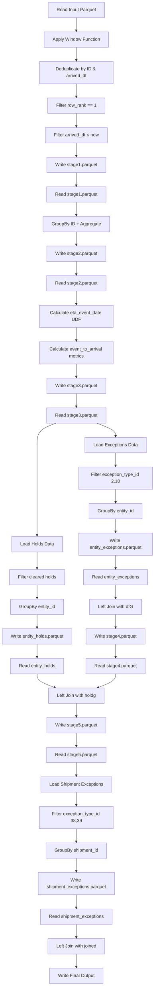
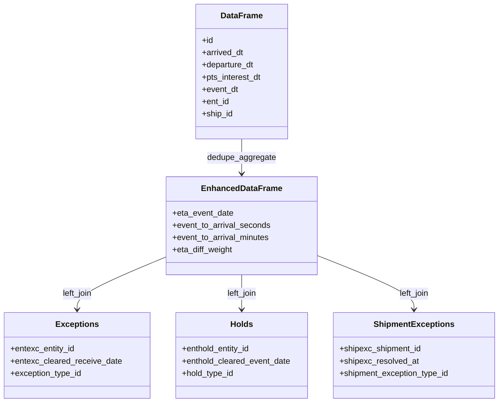
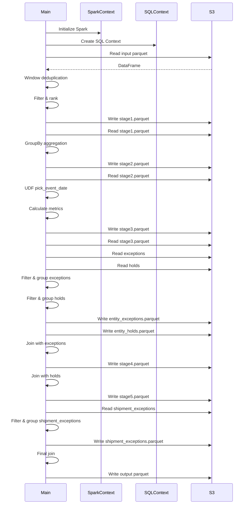

# Diagram: research/orchestrator/tasks/analytics/model_perf_dedupe_enhance_spark.py


> Auto-generated by Obscura crawlers

## Diagram 1

```mermaid
flowchart TD
      A[Read Input Parquet] --> B[Apply Window Function]
      B --> C[Deduplicate by ID & arrived_dt]
      C --> D[Filter row_rank == 1]...
  └ 109 lines...

✗ read_bash
  Invalid shell ID: 0. Please supply a valid shell ID to read output from.

  <no active shell sessions>

● Output diagrams
  $ echo "flowchart TD
      A[Read Input Parquet] --> B[Apply Window Function]
      B --> C[Deduplicate by ID & arrived_dt]
      C --> D[Filter row_rank == 1]
      D --> E[Filter arrived_dt < now]...
  └ 106 lines...

● stop_bash
  └ <command with id: 1 stopped>
```

> SVG rendering failed for this diagram.

## Diagram 2



### SVG

<svg id="container" width="554.5859375" xmlns="http://www.w3.org/2000/svg" class="flowchart" height="3462" viewBox="0 0 554.5859375 3462" role="graphics-document document" aria-roledescription="flowchart-v2"><style>#container{font-family:"trebuchet ms",verdana,arial,sans-serif;font-size:16px;fill:#333;}@keyframes edge-animation-frame{from{stroke-dashoffset:0;}}@keyframes dash{to{stroke-dashoffset:0;}}#container .edge-animation-slow{stroke-dasharray:9,5!important;stroke-dashoffset:900;animation:dash 50s linear infinite;stroke-linecap:round;}#container .edge-animation-fast{stroke-dasharray:9,5!important;stroke-dashoffset:900;animation:dash 20s linear infinite;stroke-linecap:round;}#container .error-icon{fill:#552222;}#container .error-text{fill:#552222;stroke:#552222;}#container .edge-thickness-normal{stroke-width:1px;}#container .edge-thickness-thick{stroke-width:3.5px;}#container .edge-pattern-solid{stroke-dasharray:0;}#container .edge-thickness-invisible{stroke-width:0;fill:none;}#container .edge-pattern-dashed{stroke-dasharray:3;}#container .edge-pattern-dotted{stroke-dasharray:2;}#container .marker{fill:#333333;stroke:#333333;}#container .marker.cross{stroke:#333333;}#container svg{font-family:"trebuchet ms",verdana,arial,sans-serif;font-size:16px;}#container p{margin:0;}#container .label{font-family:"trebuchet ms",verdana,arial,sans-serif;color:#333;}#container .cluster-label text{fill:#333;}#container .cluster-label span{color:#333;}#container .cluster-label span p{background-color:transparent;}#container .label text,#container span{fill:#333;color:#333;}#container .node rect,#container .node circle,#container .node ellipse,#container .node polygon,#container .node path{fill:#ECECFF;stroke:#9370DB;stroke-width:1px;}#container .rough-node .label text,#container .node .label text,#container .image-shape .label,#container .icon-shape .label{text-anchor:middle;}#container .node .katex path{fill:#000;stroke:#000;stroke-width:1px;}#container .rough-node .label,#container .node .label,#container .image-shape .label,#container .icon-shape .label{text-align:center;}#container .node.clickable{cursor:pointer;}#container .root .anchor path{fill:#333333!important;stroke-width:0;stroke:#333333;}#container .arrowheadPath{fill:#333333;}#container .edgePath .path{stroke:#333333;stroke-width:2.0px;}#container .flowchart-link{stroke:#333333;fill:none;}#container .edgeLabel{background-color:rgba(232,232,232, 0.8);text-align:center;}#container .edgeLabel p{background-color:rgba(232,232,232, 0.8);}#container .edgeLabel rect{opacity:0.5;background-color:rgba(232,232,232, 0.8);fill:rgba(232,232,232, 0.8);}#container .labelBkg{background-color:rgba(232, 232, 232, 0.5);}#container .cluster rect{fill:#ffffde;stroke:#aaaa33;stroke-width:1px;}#container .cluster text{fill:#333;}#container .cluster span{color:#333;}#container div.mermaidTooltip{position:absolute;text-align:center;max-width:200px;padding:2px;font-family:"trebuchet ms",verdana,arial,sans-serif;font-size:12px;background:hsl(80, 100%, 96.2745098039%);border:1px solid #aaaa33;border-radius:2px;pointer-events:none;z-index:100;}#container .flowchartTitleText{text-anchor:middle;font-size:18px;fill:#333;}#container rect.text{fill:none;stroke-width:0;}#container .icon-shape,#container .image-shape{background-color:rgba(232,232,232, 0.8);text-align:center;}#container .icon-shape p,#container .image-shape p{background-color:rgba(232,232,232, 0.8);padding:2px;}#container .icon-shape rect,#container .image-shape rect{opacity:0.5;background-color:rgba(232,232,232, 0.8);fill:rgba(232,232,232, 0.8);}#container .label-icon{display:inline-block;height:1em;overflow:visible;vertical-align:-0.125em;}#container .node .label-icon path{fill:currentColor;stroke:revert;stroke-width:revert;}#container :root{--mermaid-font-family:"trebuchet ms",verdana,arial,sans-serif;}</style><g><marker id="container_flowchart-v2-pointEnd" class="marker flowchart-v2" viewBox="0 0 10 10" refX="5" refY="5" markerUnits="userSpaceOnUse" markerWidth="8" markerHeight="8" orient="auto"><path d="M 0 0 L 10 5 L 0 10 z" class="arrowMarkerPath" style="stroke-width: 1; stroke-dasharray: 1, 0;"></path></marker><marker id="container_flowchart-v2-pointStart" class="marker flowchart-v2" viewBox="0 0 10 10" refX="4.5" refY="5" markerUnits="userSpaceOnUse" markerWidth="8" markerHeight="8" orient="auto"><path d="M 0 5 L 10 10 L 10 0 z" class="arrowMarkerPath" style="stroke-width: 1; stroke-dasharray: 1, 0;"></path></marker><marker id="container_flowchart-v2-circleEnd" class="marker flowchart-v2" viewBox="0 0 10 10" refX="11" refY="5" markerUnits="userSpaceOnUse" markerWidth="11" markerHeight="11" orient="auto"><circle cx="5" cy="5" r="5" class="arrowMarkerPath" style="stroke-width: 1; stroke-dasharray: 1, 0;"></circle></marker><marker id="container_flowchart-v2-circleStart" class="marker flowchart-v2" viewBox="0 0 10 10" refX="-1" refY="5" markerUnits="userSpaceOnUse" markerWidth="11" markerHeight="11" orient="auto"><circle cx="5" cy="5" r="5" class="arrowMarkerPath" style="stroke-width: 1; stroke-dasharray: 1, 0;"></circle></marker><marker id="container_flowchart-v2-crossEnd" class="marker cross flowchart-v2" viewBox="0 0 11 11" refX="12" refY="5.2" markerUnits="userSpaceOnUse" markerWidth="11" markerHeight="11" orient="auto"><path d="M 1,1 l 9,9 M 10,1 l -9,9" class="arrowMarkerPath" style="stroke-width: 2; stroke-dasharray: 1, 0;"></path></marker><marker id="container_flowchart-v2-crossStart" class="marker cross flowchart-v2" viewBox="0 0 11 11" refX="-1" refY="5.2" markerUnits="userSpaceOnUse" markerWidth="11" markerHeight="11" orient="auto"><path d="M 1,1 l 9,9 M 10,1 l -9,9" class="arrowMarkerPath" style="stroke-width: 2; stroke-dasharray: 1, 0;"></path></marker><g class="root"><g class="clusters"></g><g class="edgePaths"><path d="M275.656,62L275.656,66.167C275.656,70.333,275.656,78.667,275.656,86.333C275.656,94,275.656,101,275.656,104.5L275.656,108" id="L_A_B_0" class="edge-thickness-normal edge-pattern-solid edge-thickness-normal edge-pattern-solid flowchart-link" style=";" data-edge="true" data-et="edge" data-id="L_A_B_0" data-points="W3sieCI6Mjc1LjY1NjI1LCJ5Ijo2Mn0seyJ4IjoyNzUuNjU2MjUsInkiOjg3fSx7IngiOjI3NS42NTYyNSwieSI6MTEyfV0=" marker-end="url(#container_flowchart-v2-pointEnd)"></path><path d="M275.656,166L275.656,170.167C275.656,174.333,275.656,182.667,275.656,190.333C275.656,198,275.656,205,275.656,208.5L275.656,212" id="L_B_C_0" class="edge-thickness-normal edge-pattern-solid edge-thickness-normal edge-pattern-solid flowchart-link" style=";" data-edge="true" data-et="edge" data-id="L_B_C_0" data-points="W3sieCI6Mjc1LjY1NjI1LCJ5IjoxNjZ9LHsieCI6Mjc1LjY1NjI1LCJ5IjoxOTF9LHsieCI6Mjc1LjY1NjI1LCJ5IjoyMTZ9XQ==" marker-end="url(#container_flowchart-v2-pointEnd)"></path><path d="M275.656,294L275.656,298.167C275.656,302.333,275.656,310.667,275.656,318.333C275.656,326,275.656,333,275.656,336.5L275.656,340" id="L_C_D_0" class="edge-thickness-normal edge-pattern-solid edge-thickness-normal edge-pattern-solid flowchart-link" style=";" data-edge="true" data-et="edge" data-id="L_C_D_0" data-points="W3sieCI6Mjc1LjY1NjI1LCJ5IjoyOTR9LHsieCI6Mjc1LjY1NjI1LCJ5IjozMTl9LHsieCI6Mjc1LjY1NjI1LCJ5IjozNDR9XQ==" marker-end="url(#container_flowchart-v2-pointEnd)"></path><path d="M275.656,398L275.656,402.167C275.656,406.333,275.656,414.667,275.656,422.333C275.656,430,275.656,437,275.656,440.5L275.656,444" id="L_D_E_0" class="edge-thickness-normal edge-pattern-solid edge-thickness-normal edge-pattern-solid flowchart-link" style=";" data-edge="true" data-et="edge" data-id="L_D_E_0" data-points="W3sieCI6Mjc1LjY1NjI1LCJ5IjozOTh9LHsieCI6Mjc1LjY1NjI1LCJ5Ijo0MjN9LHsieCI6Mjc1LjY1NjI1LCJ5Ijo0NDh9XQ==" marker-end="url(#container_flowchart-v2-pointEnd)"></path><path d="M275.656,502L275.656,506.167C275.656,510.333,275.656,518.667,275.656,526.333C275.656,534,275.656,541,275.656,544.5L275.656,548" id="L_E_F_0" class="edge-thickness-normal edge-pattern-solid edge-thickness-normal edge-pattern-solid flowchart-link" style=";" data-edge="true" data-et="edge" data-id="L_E_F_0" data-points="W3sieCI6Mjc1LjY1NjI1LCJ5Ijo1MDJ9LHsieCI6Mjc1LjY1NjI1LCJ5Ijo1Mjd9LHsieCI6Mjc1LjY1NjI1LCJ5Ijo1NTJ9XQ==" marker-end="url(#container_flowchart-v2-pointEnd)"></path><path d="M275.656,606L275.656,610.167C275.656,614.333,275.656,622.667,275.656,630.333C275.656,638,275.656,645,275.656,648.5L275.656,652" id="L_F_G_0" class="edge-thickness-normal edge-pattern-solid edge-thickness-normal edge-pattern-solid flowchart-link" style=";" data-edge="true" data-et="edge" data-id="L_F_G_0" data-points="W3sieCI6Mjc1LjY1NjI1LCJ5Ijo2MDZ9LHsieCI6Mjc1LjY1NjI1LCJ5Ijo2MzF9LHsieCI6Mjc1LjY1NjI1LCJ5Ijo2NTZ9XQ==" marker-end="url(#container_flowchart-v2-pointEnd)"></path><path d="M275.656,710L275.656,714.167C275.656,718.333,275.656,726.667,275.656,734.333C275.656,742,275.656,749,275.656,752.5L275.656,756" id="L_G_H_0" class="edge-thickness-normal edge-pattern-solid edge-thickness-normal edge-pattern-solid flowchart-link" style=";" data-edge="true" data-et="edge" data-id="L_G_H_0" data-points="W3sieCI6Mjc1LjY1NjI1LCJ5Ijo3MTB9LHsieCI6Mjc1LjY1NjI1LCJ5Ijo3MzV9LHsieCI6Mjc1LjY1NjI1LCJ5Ijo3NjB9XQ==" marker-end="url(#container_flowchart-v2-pointEnd)"></path><path d="M275.656,814L275.656,818.167C275.656,822.333,275.656,830.667,275.656,838.333C275.656,846,275.656,853,275.656,856.5L275.656,860" id="L_H_I_0" class="edge-thickness-normal edge-pattern-solid edge-thickness-normal edge-pattern-solid flowchart-link" style=";" data-edge="true" data-et="edge" data-id="L_H_I_0" data-points="W3sieCI6Mjc1LjY1NjI1LCJ5Ijo4MTR9LHsieCI6Mjc1LjY1NjI1LCJ5Ijo4Mzl9LHsieCI6Mjc1LjY1NjI1LCJ5Ijo4NjR9XQ==" marker-end="url(#container_flowchart-v2-pointEnd)"></path><path d="M275.656,918L275.656,922.167C275.656,926.333,275.656,934.667,275.656,942.333C275.656,950,275.656,957,275.656,960.5L275.656,964" id="L_I_J_0" class="edge-thickness-normal edge-pattern-solid edge-thickness-normal edge-pattern-solid flowchart-link" style=";" data-edge="true" data-et="edge" data-id="L_I_J_0" data-points="W3sieCI6Mjc1LjY1NjI1LCJ5Ijo5MTh9LHsieCI6Mjc1LjY1NjI1LCJ5Ijo5NDN9LHsieCI6Mjc1LjY1NjI1LCJ5Ijo5Njh9XQ==" marker-end="url(#container_flowchart-v2-pointEnd)"></path><path d="M275.656,1022L275.656,1026.167C275.656,1030.333,275.656,1038.667,275.656,1046.333C275.656,1054,275.656,1061,275.656,1064.5L275.656,1068" id="L_J_K_0" class="edge-thickness-normal edge-pattern-solid edge-thickness-normal edge-pattern-solid flowchart-link" style=";" data-edge="true" data-et="edge" data-id="L_J_K_0" data-points="W3sieCI6Mjc1LjY1NjI1LCJ5IjoxMDIyfSx7IngiOjI3NS42NTYyNSwieSI6MTA0N30seyJ4IjoyNzUuNjU2MjUsInkiOjEwNzJ9XQ==" marker-end="url(#container_flowchart-v2-pointEnd)"></path><path d="M275.656,1150L275.656,1154.167C275.656,1158.333,275.656,1166.667,275.656,1174.333C275.656,1182,275.656,1189,275.656,1192.5L275.656,1196" id="L_K_L_0" class="edge-thickness-normal edge-pattern-solid edge-thickness-normal edge-pattern-solid flowchart-link" style=";" data-edge="true" data-et="edge" data-id="L_K_L_0" data-points="W3sieCI6Mjc1LjY1NjI1LCJ5IjoxMTUwfSx7IngiOjI3NS42NTYyNSwieSI6MTE3NX0seyJ4IjoyNzUuNjU2MjUsInkiOjEyMDB9XQ==" marker-end="url(#container_flowchart-v2-pointEnd)"></path><path d="M275.656,1278L275.656,1282.167C275.656,1286.333,275.656,1294.667,275.656,1302.333C275.656,1310,275.656,1317,275.656,1320.5L275.656,1324" id="L_L_M_0" class="edge-thickness-normal edge-pattern-solid edge-thickness-normal edge-pattern-solid flowchart-link" style=";" data-edge="true" data-et="edge" data-id="L_L_M_0" data-points="W3sieCI6Mjc1LjY1NjI1LCJ5IjoxMjc4fSx7IngiOjI3NS42NTYyNSwieSI6MTMwM30seyJ4IjoyNzUuNjU2MjUsInkiOjEzMjh9XQ==" marker-end="url(#container_flowchart-v2-pointEnd)"></path><path d="M275.656,1382L275.656,1386.167C275.656,1390.333,275.656,1398.667,275.656,1406.333C275.656,1414,275.656,1421,275.656,1424.5L275.656,1428" id="L_M_N_0" class="edge-thickness-normal edge-pattern-solid edge-thickness-normal edge-pattern-solid flowchart-link" style=";" data-edge="true" data-et="edge" data-id="L_M_N_0" data-points="W3sieCI6Mjc1LjY1NjI1LCJ5IjoxMzgyfSx7IngiOjI3NS42NTYyNSwieSI6MTQwN30seyJ4IjoyNzUuNjU2MjUsInkiOjE0MzJ9XQ==" marker-end="url(#container_flowchart-v2-pointEnd)"></path><path d="M348.831,1486L360.124,1490.167C371.416,1494.333,394.001,1502.667,405.293,1510.333C416.586,1518,416.586,1525,416.586,1528.5L416.586,1532" id="L_N_O_0" class="edge-thickness-normal edge-pattern-solid edge-thickness-normal edge-pattern-solid flowchart-link" style=";" data-edge="true" data-et="edge" data-id="L_N_O_0" data-points="W3sieCI6MzQ4LjgzMTI4MDA0ODA3NjksInkiOjE0ODZ9LHsieCI6NDE2LjU4NTkzNzUsInkiOjE1MTF9LHsieCI6NDE2LjU4NTkzNzUsInkiOjE1MzZ9XQ==" marker-end="url(#container_flowchart-v2-pointEnd)"></path><path d="M202.481,1486L191.189,1490.167C179.896,1494.333,157.311,1502.667,146.019,1515.5C134.727,1528.333,134.727,1545.667,134.727,1563C134.727,1580.333,134.727,1597.667,134.727,1617C134.727,1636.333,134.727,1657.667,134.727,1679C134.727,1700.333,134.727,1721.667,134.727,1741C134.727,1760.333,134.727,1777.667,134.727,1795C134.727,1812.333,134.727,1829.667,134.727,1843.833C134.727,1858,134.727,1869,134.727,1874.5L134.727,1880" id="L_N_P_0" class="edge-thickness-normal edge-pattern-solid edge-thickness-normal edge-pattern-solid flowchart-link" style=";" data-edge="true" data-et="edge" data-id="L_N_P_0" data-points="W3sieCI6MjAyLjQ4MTIxOTk1MTkyMzEsInkiOjE0ODZ9LHsieCI6MTM0LjcyNjU2MjUsInkiOjE1MTF9LHsieCI6MTM0LjcyNjU2MjUsInkiOjE1NjN9LHsieCI6MTM0LjcyNjU2MjUsInkiOjE2MTV9LHsieCI6MTM0LjcyNjU2MjUsInkiOjE2Nzl9LHsieCI6MTM0LjcyNjU2MjUsInkiOjE3NDN9LHsieCI6MTM0LjcyNjU2MjUsInkiOjE3OTV9LHsieCI6MTM0LjcyNjU2MjUsInkiOjE4NDd9LHsieCI6MTM0LjcyNjU2MjUsInkiOjE4ODR9XQ==" marker-end="url(#container_flowchart-v2-pointEnd)"></path><path d="M416.586,1590L416.586,1594.167C416.586,1598.333,416.586,1606.667,416.586,1614.333C416.586,1622,416.586,1629,416.586,1632.5L416.586,1636" id="L_O_Q_0" class="edge-thickness-normal edge-pattern-solid edge-thickness-normal edge-pattern-solid flowchart-link" style=";" data-edge="true" data-et="edge" data-id="L_O_Q_0" data-points="W3sieCI6NDE2LjU4NTkzNzUsInkiOjE1OTB9LHsieCI6NDE2LjU4NTkzNzUsInkiOjE2MTV9LHsieCI6NDE2LjU4NTkzNzUsInkiOjE2NDB9XQ==" marker-end="url(#container_flowchart-v2-pointEnd)"></path><path d="M416.586,1718L416.586,1722.167C416.586,1726.333,416.586,1734.667,416.586,1742.333C416.586,1750,416.586,1757,416.586,1760.5L416.586,1764" id="L_Q_R_0" class="edge-thickness-normal edge-pattern-solid edge-thickness-normal edge-pattern-solid flowchart-link" style=";" data-edge="true" data-et="edge" data-id="L_Q_R_0" data-points="W3sieCI6NDE2LjU4NTkzNzUsInkiOjE3MTh9LHsieCI6NDE2LjU4NTkzNzUsInkiOjE3NDN9LHsieCI6NDE2LjU4NTkzNzUsInkiOjE3Njh9XQ==" marker-end="url(#container_flowchart-v2-pointEnd)"></path><path d="M134.727,1938L134.727,1944.167C134.727,1950.333,134.727,1962.667,134.727,1972.333C134.727,1982,134.727,1989,134.727,1992.5L134.727,1996" id="L_P_S_0" class="edge-thickness-normal edge-pattern-solid edge-thickness-normal edge-pattern-solid flowchart-link" style=";" data-edge="true" data-et="edge" data-id="L_P_S_0" data-points="W3sieCI6MTM0LjcyNjU2MjUsInkiOjE5Mzh9LHsieCI6MTM0LjcyNjU2MjUsInkiOjE5NzV9LHsieCI6MTM0LjcyNjU2MjUsInkiOjIwMDB9XQ==" marker-end="url(#container_flowchart-v2-pointEnd)"></path><path d="M134.727,2054L134.727,2058.167C134.727,2062.333,134.727,2070.667,134.727,2078.333C134.727,2086,134.727,2093,134.727,2096.5L134.727,2100" id="L_S_T_0" class="edge-thickness-normal edge-pattern-solid edge-thickness-normal edge-pattern-solid flowchart-link" style=";" data-edge="true" data-et="edge" data-id="L_S_T_0" data-points="W3sieCI6MTM0LjcyNjU2MjUsInkiOjIwNTR9LHsieCI6MTM0LjcyNjU2MjUsInkiOjIwNzl9LHsieCI6MTM0LjcyNjU2MjUsInkiOjIxMDR9XQ==" marker-end="url(#container_flowchart-v2-pointEnd)"></path><path d="M416.586,1822L416.586,1826.167C416.586,1830.333,416.586,1838.667,416.586,1846.333C416.586,1854,416.586,1861,416.586,1864.5L416.586,1868" id="L_R_U_0" class="edge-thickness-normal edge-pattern-solid edge-thickness-normal edge-pattern-solid flowchart-link" style=";" data-edge="true" data-et="edge" data-id="L_R_U_0" data-points="W3sieCI6NDE2LjU4NTkzNzUsInkiOjE4MjJ9LHsieCI6NDE2LjU4NTkzNzUsInkiOjE4NDd9LHsieCI6NDE2LjU4NTkzNzUsInkiOjE4NzJ9XQ==" marker-end="url(#container_flowchart-v2-pointEnd)"></path><path d="M134.727,2158L134.727,2162.167C134.727,2166.333,134.727,2174.667,134.727,2182.333C134.727,2190,134.727,2197,134.727,2200.5L134.727,2204" id="L_T_V_0" class="edge-thickness-normal edge-pattern-solid edge-thickness-normal edge-pattern-solid flowchart-link" style=";" data-edge="true" data-et="edge" data-id="L_T_V_0" data-points="W3sieCI6MTM0LjcyNjU2MjUsInkiOjIxNTh9LHsieCI6MTM0LjcyNjU2MjUsInkiOjIxODN9LHsieCI6MTM0LjcyNjU2MjUsInkiOjIyMDh9XQ==" marker-end="url(#container_flowchart-v2-pointEnd)"></path><path d="M416.586,1950L416.586,1954.167C416.586,1958.333,416.586,1966.667,416.586,1974.333C416.586,1982,416.586,1989,416.586,1992.5L416.586,1996" id="L_U_W_0" class="edge-thickness-normal edge-pattern-solid edge-thickness-normal edge-pattern-solid flowchart-link" style=";" data-edge="true" data-et="edge" data-id="L_U_W_0" data-points="W3sieCI6NDE2LjU4NTkzNzUsInkiOjE5NTB9LHsieCI6NDE2LjU4NTkzNzUsInkiOjE5NzV9LHsieCI6NDE2LjU4NTkzNzUsInkiOjIwMDB9XQ==" marker-end="url(#container_flowchart-v2-pointEnd)"></path><path d="M134.727,2262L134.727,2266.167C134.727,2270.333,134.727,2278.667,134.727,2286.333C134.727,2294,134.727,2301,134.727,2304.5L134.727,2308" id="L_V_X_0" class="edge-thickness-normal edge-pattern-solid edge-thickness-normal edge-pattern-solid flowchart-link" style=";" data-edge="true" data-et="edge" data-id="L_V_X_0" data-points="W3sieCI6MTM0LjcyNjU2MjUsInkiOjIyNjJ9LHsieCI6MTM0LjcyNjU2MjUsInkiOjIyODd9LHsieCI6MTM0LjcyNjU2MjUsInkiOjIzMTJ9XQ==" marker-end="url(#container_flowchart-v2-pointEnd)"></path><path d="M416.586,2054L416.586,2058.167C416.586,2062.333,416.586,2070.667,416.586,2078.333C416.586,2086,416.586,2093,416.586,2096.5L416.586,2100" id="L_W_Y_0" class="edge-thickness-normal edge-pattern-solid edge-thickness-normal edge-pattern-solid flowchart-link" style=";" data-edge="true" data-et="edge" data-id="L_W_Y_0" data-points="W3sieCI6NDE2LjU4NTkzNzUsInkiOjIwNTR9LHsieCI6NDE2LjU4NTkzNzUsInkiOjIwNzl9LHsieCI6NDE2LjU4NTkzNzUsInkiOjIxMDR9XQ==" marker-end="url(#container_flowchart-v2-pointEnd)"></path><path d="M416.586,2158L416.586,2162.167C416.586,2166.333,416.586,2174.667,416.586,2182.333C416.586,2190,416.586,2197,416.586,2200.5L416.586,2204" id="L_Y_Z_0" class="edge-thickness-normal edge-pattern-solid edge-thickness-normal edge-pattern-solid flowchart-link" style=";" data-edge="true" data-et="edge" data-id="L_Y_Z_0" data-points="W3sieCI6NDE2LjU4NTkzNzUsInkiOjIxNTh9LHsieCI6NDE2LjU4NTkzNzUsInkiOjIxODN9LHsieCI6NDE2LjU4NTkzNzUsInkiOjIyMDh9XQ==" marker-end="url(#container_flowchart-v2-pointEnd)"></path><path d="M416.586,2262L416.586,2266.167C416.586,2270.333,416.586,2278.667,416.586,2286.333C416.586,2294,416.586,2301,416.586,2304.5L416.586,2308" id="L_Z_AA_0" class="edge-thickness-normal edge-pattern-solid edge-thickness-normal edge-pattern-solid flowchart-link" style=";" data-edge="true" data-et="edge" data-id="L_Z_AA_0" data-points="W3sieCI6NDE2LjU4NTkzNzUsInkiOjIyNjJ9LHsieCI6NDE2LjU4NTkzNzUsInkiOjIyODd9LHsieCI6NDE2LjU4NTkzNzUsInkiOjIzMTJ9XQ==" marker-end="url(#container_flowchart-v2-pointEnd)"></path><path d="M134.727,2366L134.727,2370.167C134.727,2374.333,134.727,2382.667,145.394,2390.769C156.061,2398.872,177.395,2406.744,188.062,2410.679L198.729,2414.615" id="L_X_AB_0" class="edge-thickness-normal edge-pattern-solid edge-thickness-normal edge-pattern-solid flowchart-link" style=";" data-edge="true" data-et="edge" data-id="L_X_AB_0" data-points="W3sieCI6MTM0LjcyNjU2MjUsInkiOjIzNjZ9LHsieCI6MTM0LjcyNjU2MjUsInkiOjIzOTF9LHsieCI6MjAyLjQ4MTIxOTk1MTkyMzEsInkiOjI0MTZ9XQ==" marker-end="url(#container_flowchart-v2-pointEnd)"></path><path d="M416.586,2366L416.586,2370.167C416.586,2374.333,416.586,2382.667,405.919,2390.769C395.252,2398.872,373.918,2406.744,363.251,2410.679L352.584,2414.615" id="L_AA_AB_0" class="edge-thickness-normal edge-pattern-solid edge-thickness-normal edge-pattern-solid flowchart-link" style=";" data-edge="true" data-et="edge" data-id="L_AA_AB_0" data-points="W3sieCI6NDE2LjU4NTkzNzUsInkiOjIzNjZ9LHsieCI6NDE2LjU4NTkzNzUsInkiOjIzOTF9LHsieCI6MzQ4LjgzMTI4MDA0ODA3NjksInkiOjI0MTZ9XQ==" marker-end="url(#container_flowchart-v2-pointEnd)"></path><path d="M275.656,2470L275.656,2474.167C275.656,2478.333,275.656,2486.667,275.656,2494.333C275.656,2502,275.656,2509,275.656,2512.5L275.656,2516" id="L_AB_AC_0" class="edge-thickness-normal edge-pattern-solid edge-thickness-normal edge-pattern-solid flowchart-link" style=";" data-edge="true" data-et="edge" data-id="L_AB_AC_0" data-points="W3sieCI6Mjc1LjY1NjI1LCJ5IjoyNDcwfSx7IngiOjI3NS42NTYyNSwieSI6MjQ5NX0seyJ4IjoyNzUuNjU2MjUsInkiOjI1MjB9XQ==" marker-end="url(#container_flowchart-v2-pointEnd)"></path><path d="M275.656,2574L275.656,2578.167C275.656,2582.333,275.656,2590.667,275.656,2598.333C275.656,2606,275.656,2613,275.656,2616.5L275.656,2620" id="L_AC_AD_0" class="edge-thickness-normal edge-pattern-solid edge-thickness-normal edge-pattern-solid flowchart-link" style=";" data-edge="true" data-et="edge" data-id="L_AC_AD_0" data-points="W3sieCI6Mjc1LjY1NjI1LCJ5IjoyNTc0fSx7IngiOjI3NS42NTYyNSwieSI6MjU5OX0seyJ4IjoyNzUuNjU2MjUsInkiOjI2MjR9XQ==" marker-end="url(#container_flowchart-v2-pointEnd)"></path><path d="M275.656,2678L275.656,2682.167C275.656,2686.333,275.656,2694.667,275.656,2702.333C275.656,2710,275.656,2717,275.656,2720.5L275.656,2724" id="L_AD_AE_0" class="edge-thickness-normal edge-pattern-solid edge-thickness-normal edge-pattern-solid flowchart-link" style=";" data-edge="true" data-et="edge" data-id="L_AD_AE_0" data-points="W3sieCI6Mjc1LjY1NjI1LCJ5IjoyNjc4fSx7IngiOjI3NS42NTYyNSwieSI6MjcwM30seyJ4IjoyNzUuNjU2MjUsInkiOjI3Mjh9XQ==" marker-end="url(#container_flowchart-v2-pointEnd)"></path><path d="M275.656,2782L275.656,2786.167C275.656,2790.333,275.656,2798.667,275.656,2806.333C275.656,2814,275.656,2821,275.656,2824.5L275.656,2828" id="L_AE_AF_0" class="edge-thickness-normal edge-pattern-solid edge-thickness-normal edge-pattern-solid flowchart-link" style=";" data-edge="true" data-et="edge" data-id="L_AE_AF_0" data-points="W3sieCI6Mjc1LjY1NjI1LCJ5IjoyNzgyfSx7IngiOjI3NS42NTYyNSwieSI6MjgwN30seyJ4IjoyNzUuNjU2MjUsInkiOjI4MzJ9XQ==" marker-end="url(#container_flowchart-v2-pointEnd)"></path><path d="M275.656,2910L275.656,2914.167C275.656,2918.333,275.656,2926.667,275.656,2934.333C275.656,2942,275.656,2949,275.656,2952.5L275.656,2956" id="L_AF_AG_0" class="edge-thickness-normal edge-pattern-solid edge-thickness-normal edge-pattern-solid flowchart-link" style=";" data-edge="true" data-et="edge" data-id="L_AF_AG_0" data-points="W3sieCI6Mjc1LjY1NjI1LCJ5IjoyOTEwfSx7IngiOjI3NS42NTYyNSwieSI6MjkzNX0seyJ4IjoyNzUuNjU2MjUsInkiOjI5NjB9XQ==" marker-end="url(#container_flowchart-v2-pointEnd)"></path><path d="M275.656,3014L275.656,3018.167C275.656,3022.333,275.656,3030.667,275.656,3038.333C275.656,3046,275.656,3053,275.656,3056.5L275.656,3060" id="L_AG_AH_0" class="edge-thickness-normal edge-pattern-solid edge-thickness-normal edge-pattern-solid flowchart-link" style=";" data-edge="true" data-et="edge" data-id="L_AG_AH_0" data-points="W3sieCI6Mjc1LjY1NjI1LCJ5IjozMDE0fSx7IngiOjI3NS42NTYyNSwieSI6MzAzOX0seyJ4IjoyNzUuNjU2MjUsInkiOjMwNjR9XQ==" marker-end="url(#container_flowchart-v2-pointEnd)"></path><path d="M275.656,3142L275.656,3146.167C275.656,3150.333,275.656,3158.667,275.656,3166.333C275.656,3174,275.656,3181,275.656,3184.5L275.656,3188" id="L_AH_AI_0" class="edge-thickness-normal edge-pattern-solid edge-thickness-normal edge-pattern-solid flowchart-link" style=";" data-edge="true" data-et="edge" data-id="L_AH_AI_0" data-points="W3sieCI6Mjc1LjY1NjI1LCJ5IjozMTQyfSx7IngiOjI3NS42NTYyNSwieSI6MzE2N30seyJ4IjoyNzUuNjU2MjUsInkiOjMxOTJ9XQ==" marker-end="url(#container_flowchart-v2-pointEnd)"></path><path d="M275.656,3246L275.656,3250.167C275.656,3254.333,275.656,3262.667,275.656,3270.333C275.656,3278,275.656,3285,275.656,3288.5L275.656,3292" id="L_AI_AJ_0" class="edge-thickness-normal edge-pattern-solid edge-thickness-normal edge-pattern-solid flowchart-link" style=";" data-edge="true" data-et="edge" data-id="L_AI_AJ_0" data-points="W3sieCI6Mjc1LjY1NjI1LCJ5IjozMjQ2fSx7IngiOjI3NS42NTYyNSwieSI6MzI3MX0seyJ4IjoyNzUuNjU2MjUsInkiOjMyOTZ9XQ==" marker-end="url(#container_flowchart-v2-pointEnd)"></path><path d="M275.656,3350L275.656,3354.167C275.656,3358.333,275.656,3366.667,275.656,3374.333C275.656,3382,275.656,3389,275.656,3392.5L275.656,3396" id="L_AJ_AK_0" class="edge-thickness-normal edge-pattern-solid edge-thickness-normal edge-pattern-solid flowchart-link" style=";" data-edge="true" data-et="edge" data-id="L_AJ_AK_0" data-points="W3sieCI6Mjc1LjY1NjI1LCJ5IjozMzUwfSx7IngiOjI3NS42NTYyNSwieSI6MzM3NX0seyJ4IjoyNzUuNjU2MjUsInkiOjM0MDB9XQ==" marker-end="url(#container_flowchart-v2-pointEnd)"></path></g><g class="edgeLabels"><g class="edgeLabel"><g class="label" data-id="L_A_B_0" transform="translate(0, 0)"><foreignObject width="0" height="0"><div xmlns="http://www.w3.org/1999/xhtml" class="labelBkg" style="display: table-cell; white-space: nowrap; line-height: 1.5; max-width: 200px; text-align: center;"><span class="edgeLabel"></span></div></foreignObject></g></g><g class="edgeLabel"><g class="label" data-id="L_B_C_0" transform="translate(0, 0)"><foreignObject width="0" height="0"><div xmlns="http://www.w3.org/1999/xhtml" class="labelBkg" style="display: table-cell; white-space: nowrap; line-height: 1.5; max-width: 200px; text-align: center;"><span class="edgeLabel"></span></div></foreignObject></g></g><g class="edgeLabel"><g class="label" data-id="L_C_D_0" transform="translate(0, 0)"><foreignObject width="0" height="0"><div xmlns="http://www.w3.org/1999/xhtml" class="labelBkg" style="display: table-cell; white-space: nowrap; line-height: 1.5; max-width: 200px; text-align: center;"><span class="edgeLabel"></span></div></foreignObject></g></g><g class="edgeLabel"><g class="label" data-id="L_D_E_0" transform="translate(0, 0)"><foreignObject width="0" height="0"><div xmlns="http://www.w3.org/1999/xhtml" class="labelBkg" style="display: table-cell; white-space: nowrap; line-height: 1.5; max-width: 200px; text-align: center;"><span class="edgeLabel"></span></div></foreignObject></g></g><g class="edgeLabel"><g class="label" data-id="L_E_F_0" transform="translate(0, 0)"><foreignObject width="0" height="0"><div xmlns="http://www.w3.org/1999/xhtml" class="labelBkg" style="display: table-cell; white-space: nowrap; line-height: 1.5; max-width: 200px; text-align: center;"><span class="edgeLabel"></span></div></foreignObject></g></g><g class="edgeLabel"><g class="label" data-id="L_F_G_0" transform="translate(0, 0)"><foreignObject width="0" height="0"><div xmlns="http://www.w3.org/1999/xhtml" class="labelBkg" style="display: table-cell; white-space: nowrap; line-height: 1.5; max-width: 200px; text-align: center;"><span class="edgeLabel"></span></div></foreignObject></g></g><g class="edgeLabel"><g class="label" data-id="L_G_H_0" transform="translate(0, 0)"><foreignObject width="0" height="0"><div xmlns="http://www.w3.org/1999/xhtml" class="labelBkg" style="display: table-cell; white-space: nowrap; line-height: 1.5; max-width: 200px; text-align: center;"><span class="edgeLabel"></span></div></foreignObject></g></g><g class="edgeLabel"><g class="label" data-id="L_H_I_0" transform="translate(0, 0)"><foreignObject width="0" height="0"><div xmlns="http://www.w3.org/1999/xhtml" class="labelBkg" style="display: table-cell; white-space: nowrap; line-height: 1.5; max-width: 200px; text-align: center;"><span class="edgeLabel"></span></div></foreignObject></g></g><g class="edgeLabel"><g class="label" data-id="L_I_J_0" transform="translate(0, 0)"><foreignObject width="0" height="0"><div xmlns="http://www.w3.org/1999/xhtml" class="labelBkg" style="display: table-cell; white-space: nowrap; line-height: 1.5; max-width: 200px; text-align: center;"><span class="edgeLabel"></span></div></foreignObject></g></g><g class="edgeLabel"><g class="label" data-id="L_J_K_0" transform="translate(0, 0)"><foreignObject width="0" height="0"><div xmlns="http://www.w3.org/1999/xhtml" class="labelBkg" style="display: table-cell; white-space: nowrap; line-height: 1.5; max-width: 200px; text-align: center;"><span class="edgeLabel"></span></div></foreignObject></g></g><g class="edgeLabel"><g class="label" data-id="L_K_L_0" transform="translate(0, 0)"><foreignObject width="0" height="0"><div xmlns="http://www.w3.org/1999/xhtml" class="labelBkg" style="display: table-cell; white-space: nowrap; line-height: 1.5; max-width: 200px; text-align: center;"><span class="edgeLabel"></span></div></foreignObject></g></g><g class="edgeLabel"><g class="label" data-id="L_L_M_0" transform="translate(0, 0)"><foreignObject width="0" height="0"><div xmlns="http://www.w3.org/1999/xhtml" class="labelBkg" style="display: table-cell; white-space: nowrap; line-height: 1.5; max-width: 200px; text-align: center;"><span class="edgeLabel"></span></div></foreignObject></g></g><g class="edgeLabel"><g class="label" data-id="L_M_N_0" transform="translate(0, 0)"><foreignObject width="0" height="0"><div xmlns="http://www.w3.org/1999/xhtml" class="labelBkg" style="display: table-cell; white-space: nowrap; line-height: 1.5; max-width: 200px; text-align: center;"><span class="edgeLabel"></span></div></foreignObject></g></g><g class="edgeLabel"><g class="label" data-id="L_N_O_0" transform="translate(0, 0)"><foreignObject width="0" height="0"><div xmlns="http://www.w3.org/1999/xhtml" class="labelBkg" style="display: table-cell; white-space: nowrap; line-height: 1.5; max-width: 200px; text-align: center;"><span class="edgeLabel"></span></div></foreignObject></g></g><g class="edgeLabel"><g class="label" data-id="L_N_P_0" transform="translate(0, 0)"><foreignObject width="0" height="0"><div xmlns="http://www.w3.org/1999/xhtml" class="labelBkg" style="display: table-cell; white-space: nowrap; line-height: 1.5; max-width: 200px; text-align: center;"><span class="edgeLabel"></span></div></foreignObject></g></g><g class="edgeLabel"><g class="label" data-id="L_O_Q_0" transform="translate(0, 0)"><foreignObject width="0" height="0"><div xmlns="http://www.w3.org/1999/xhtml" class="labelBkg" style="display: table-cell; white-space: nowrap; line-height: 1.5; max-width: 200px; text-align: center;"><span class="edgeLabel"></span></div></foreignObject></g></g><g class="edgeLabel"><g class="label" data-id="L_Q_R_0" transform="translate(0, 0)"><foreignObject width="0" height="0"><div xmlns="http://www.w3.org/1999/xhtml" class="labelBkg" style="display: table-cell; white-space: nowrap; line-height: 1.5; max-width: 200px; text-align: center;"><span class="edgeLabel"></span></div></foreignObject></g></g><g class="edgeLabel"><g class="label" data-id="L_P_S_0" transform="translate(0, 0)"><foreignObject width="0" height="0"><div xmlns="http://www.w3.org/1999/xhtml" class="labelBkg" style="display: table-cell; white-space: nowrap; line-height: 1.5; max-width: 200px; text-align: center;"><span class="edgeLabel"></span></div></foreignObject></g></g><g class="edgeLabel"><g class="label" data-id="L_S_T_0" transform="translate(0, 0)"><foreignObject width="0" height="0"><div xmlns="http://www.w3.org/1999/xhtml" class="labelBkg" style="display: table-cell; white-space: nowrap; line-height: 1.5; max-width: 200px; text-align: center;"><span class="edgeLabel"></span></div></foreignObject></g></g><g class="edgeLabel"><g class="label" data-id="L_R_U_0" transform="translate(0, 0)"><foreignObject width="0" height="0"><div xmlns="http://www.w3.org/1999/xhtml" class="labelBkg" style="display: table-cell; white-space: nowrap; line-height: 1.5; max-width: 200px; text-align: center;"><span class="edgeLabel"></span></div></foreignObject></g></g><g class="edgeLabel"><g class="label" data-id="L_T_V_0" transform="translate(0, 0)"><foreignObject width="0" height="0"><div xmlns="http://www.w3.org/1999/xhtml" class="labelBkg" style="display: table-cell; white-space: nowrap; line-height: 1.5; max-width: 200px; text-align: center;"><span class="edgeLabel"></span></div></foreignObject></g></g><g class="edgeLabel"><g class="label" data-id="L_U_W_0" transform="translate(0, 0)"><foreignObject width="0" height="0"><div xmlns="http://www.w3.org/1999/xhtml" class="labelBkg" style="display: table-cell; white-space: nowrap; line-height: 1.5; max-width: 200px; text-align: center;"><span class="edgeLabel"></span></div></foreignObject></g></g><g class="edgeLabel"><g class="label" data-id="L_V_X_0" transform="translate(0, 0)"><foreignObject width="0" height="0"><div xmlns="http://www.w3.org/1999/xhtml" class="labelBkg" style="display: table-cell; white-space: nowrap; line-height: 1.5; max-width: 200px; text-align: center;"><span class="edgeLabel"></span></div></foreignObject></g></g><g class="edgeLabel"><g class="label" data-id="L_W_Y_0" transform="translate(0, 0)"><foreignObject width="0" height="0"><div xmlns="http://www.w3.org/1999/xhtml" class="labelBkg" style="display: table-cell; white-space: nowrap; line-height: 1.5; max-width: 200px; text-align: center;"><span class="edgeLabel"></span></div></foreignObject></g></g><g class="edgeLabel"><g class="label" data-id="L_Y_Z_0" transform="translate(0, 0)"><foreignObject width="0" height="0"><div xmlns="http://www.w3.org/1999/xhtml" class="labelBkg" style="display: table-cell; white-space: nowrap; line-height: 1.5; max-width: 200px; text-align: center;"><span class="edgeLabel"></span></div></foreignObject></g></g><g class="edgeLabel"><g class="label" data-id="L_Z_AA_0" transform="translate(0, 0)"><foreignObject width="0" height="0"><div xmlns="http://www.w3.org/1999/xhtml" class="labelBkg" style="display: table-cell; white-space: nowrap; line-height: 1.5; max-width: 200px; text-align: center;"><span class="edgeLabel"></span></div></foreignObject></g></g><g class="edgeLabel"><g class="label" data-id="L_X_AB_0" transform="translate(0, 0)"><foreignObject width="0" height="0"><div xmlns="http://www.w3.org/1999/xhtml" class="labelBkg" style="display: table-cell; white-space: nowrap; line-height: 1.5; max-width: 200px; text-align: center;"><span class="edgeLabel"></span></div></foreignObject></g></g><g class="edgeLabel"><g class="label" data-id="L_AA_AB_0" transform="translate(0, 0)"><foreignObject width="0" height="0"><div xmlns="http://www.w3.org/1999/xhtml" class="labelBkg" style="display: table-cell; white-space: nowrap; line-height: 1.5; max-width: 200px; text-align: center;"><span class="edgeLabel"></span></div></foreignObject></g></g><g class="edgeLabel"><g class="label" data-id="L_AB_AC_0" transform="translate(0, 0)"><foreignObject width="0" height="0"><div xmlns="http://www.w3.org/1999/xhtml" class="labelBkg" style="display: table-cell; white-space: nowrap; line-height: 1.5; max-width: 200px; text-align: center;"><span class="edgeLabel"></span></div></foreignObject></g></g><g class="edgeLabel"><g class="label" data-id="L_AC_AD_0" transform="translate(0, 0)"><foreignObject width="0" height="0"><div xmlns="http://www.w3.org/1999/xhtml" class="labelBkg" style="display: table-cell; white-space: nowrap; line-height: 1.5; max-width: 200px; text-align: center;"><span class="edgeLabel"></span></div></foreignObject></g></g><g class="edgeLabel"><g class="label" data-id="L_AD_AE_0" transform="translate(0, 0)"><foreignObject width="0" height="0"><div xmlns="http://www.w3.org/1999/xhtml" class="labelBkg" style="display: table-cell; white-space: nowrap; line-height: 1.5; max-width: 200px; text-align: center;"><span class="edgeLabel"></span></div></foreignObject></g></g><g class="edgeLabel"><g class="label" data-id="L_AE_AF_0" transform="translate(0, 0)"><foreignObject width="0" height="0"><div xmlns="http://www.w3.org/1999/xhtml" class="labelBkg" style="display: table-cell; white-space: nowrap; line-height: 1.5; max-width: 200px; text-align: center;"><span class="edgeLabel"></span></div></foreignObject></g></g><g class="edgeLabel"><g class="label" data-id="L_AF_AG_0" transform="translate(0, 0)"><foreignObject width="0" height="0"><div xmlns="http://www.w3.org/1999/xhtml" class="labelBkg" style="display: table-cell; white-space: nowrap; line-height: 1.5; max-width: 200px; text-align: center;"><span class="edgeLabel"></span></div></foreignObject></g></g><g class="edgeLabel"><g class="label" data-id="L_AG_AH_0" transform="translate(0, 0)"><foreignObject width="0" height="0"><div xmlns="http://www.w3.org/1999/xhtml" class="labelBkg" style="display: table-cell; white-space: nowrap; line-height: 1.5; max-width: 200px; text-align: center;"><span class="edgeLabel"></span></div></foreignObject></g></g><g class="edgeLabel"><g class="label" data-id="L_AH_AI_0" transform="translate(0, 0)"><foreignObject width="0" height="0"><div xmlns="http://www.w3.org/1999/xhtml" class="labelBkg" style="display: table-cell; white-space: nowrap; line-height: 1.5; max-width: 200px; text-align: center;"><span class="edgeLabel"></span></div></foreignObject></g></g><g class="edgeLabel"><g class="label" data-id="L_AI_AJ_0" transform="translate(0, 0)"><foreignObject width="0" height="0"><div xmlns="http://www.w3.org/1999/xhtml" class="labelBkg" style="display: table-cell; white-space: nowrap; line-height: 1.5; max-width: 200px; text-align: center;"><span class="edgeLabel"></span></div></foreignObject></g></g><g class="edgeLabel"><g class="label" data-id="L_AJ_AK_0" transform="translate(0, 0)"><foreignObject width="0" height="0"><div xmlns="http://www.w3.org/1999/xhtml" class="labelBkg" style="display: table-cell; white-space: nowrap; line-height: 1.5; max-width: 200px; text-align: center;"><span class="edgeLabel"></span></div></foreignObject></g></g></g><g class="nodes"><g class="node default" id="flowchart-A-0" transform="translate(275.65625, 35)"><rect class="basic label-container" style="" x="-99.8203125" y="-27" width="199.640625" height="54"></rect><g class="label" style="" transform="translate(-69.8203125, -12)"><rect></rect><foreignObject width="139.640625" height="24"><div xmlns="http://www.w3.org/1999/xhtml" style="display: table-cell; white-space: nowrap; line-height: 1.5; max-width: 200px; text-align: center;"><span class="nodeLabel"><p>Read Input Parquet</p></span></div></foreignObject></g></g><g class="node default" id="flowchart-B-1" transform="translate(275.65625, 139)"><rect class="basic label-container" style="" x="-114.578125" y="-27" width="229.15625" height="54"></rect><g class="label" style="" transform="translate(-84.578125, -12)"><rect></rect><foreignObject width="169.15625" height="24"><div xmlns="http://www.w3.org/1999/xhtml" style="display: table-cell; white-space: nowrap; line-height: 1.5; max-width: 200px; text-align: center;"><span class="nodeLabel"><p>Apply Window Function</p></span></div></foreignObject></g></g><g class="node default" id="flowchart-C-3" transform="translate(275.65625, 255)"><rect class="basic label-container" style="" x="-130" y="-39" width="260" height="78"></rect><g class="label" style="" transform="translate(-100, -24)"><rect></rect><foreignObject width="200" height="48"><div xmlns="http://www.w3.org/1999/xhtml" style="display: table; white-space: break-spaces; line-height: 1.5; max-width: 200px; text-align: center; width: 200px;"><span class="nodeLabel"><p>Deduplicate by ID &amp; arrived_dt</p></span></div></foreignObject></g></g><g class="node default" id="flowchart-D-5" transform="translate(275.65625, 371)"><rect class="basic label-container" style="" x="-99.4921875" y="-27" width="198.984375" height="54"></rect><g class="label" style="" transform="translate(-69.4921875, -12)"><rect></rect><foreignObject width="138.984375" height="24"><div xmlns="http://www.w3.org/1999/xhtml" style="display: table-cell; white-space: nowrap; line-height: 1.5; max-width: 200px; text-align: center;"><span class="nodeLabel"><p>Filter row_rank == 1</p></span></div></foreignObject></g></g><g class="node default" id="flowchart-E-7" transform="translate(275.65625, 475)"><rect class="basic label-container" style="" x="-111.4296875" y="-27" width="222.859375" height="54"></rect><g class="label" style="" transform="translate(-81.4296875, -12)"><rect></rect><foreignObject width="162.859375" height="24"><div xmlns="http://www.w3.org/1999/xhtml" style="display: table-cell; white-space: nowrap; line-height: 1.5; max-width: 200px; text-align: center;"><span class="nodeLabel"><p>Filter arrived_dt &lt; now</p></span></div></foreignObject></g></g><g class="node default" id="flowchart-F-9" transform="translate(275.65625, 579)"><rect class="basic label-container" style="" x="-103.9375" y="-27" width="207.875" height="54"></rect><g class="label" style="" transform="translate(-73.9375, -12)"><rect></rect><foreignObject width="147.875" height="24"><div xmlns="http://www.w3.org/1999/xhtml" style="display: table-cell; white-space: nowrap; line-height: 1.5; max-width: 200px; text-align: center;"><span class="nodeLabel"><p>Write stage1.parquet</p></span></div></foreignObject></g></g><g class="node default" id="flowchart-G-11" transform="translate(275.65625, 683)"><rect class="basic label-container" style="" x="-103.0390625" y="-27" width="206.078125" height="54"></rect><g class="label" style="" transform="translate(-73.0390625, -12)"><rect></rect><foreignObject width="146.078125" height="24"><div xmlns="http://www.w3.org/1999/xhtml" style="display: table-cell; white-space: nowrap; line-height: 1.5; max-width: 200px; text-align: center;"><span class="nodeLabel"><p>Read stage1.parquet</p></span></div></foreignObject></g></g><g class="node default" id="flowchart-H-13" transform="translate(275.65625, 787)"><rect class="basic label-container" style="" x="-114.2421875" y="-27" width="228.484375" height="54"></rect><g class="label" style="" transform="translate(-84.2421875, -12)"><rect></rect><foreignObject width="168.484375" height="24"><div xmlns="http://www.w3.org/1999/xhtml" style="display: table-cell; white-space: nowrap; line-height: 1.5; max-width: 200px; text-align: center;"><span class="nodeLabel"><p>GroupBy ID + Aggregate</p></span></div></foreignObject></g></g><g class="node default" id="flowchart-I-15" transform="translate(275.65625, 891)"><rect class="basic label-container" style="" x="-104.6796875" y="-27" width="209.359375" height="54"></rect><g class="label" style="" transform="translate(-74.6796875, -12)"><rect></rect><foreignObject width="149.359375" height="24"><div xmlns="http://www.w3.org/1999/xhtml" style="display: table-cell; white-space: nowrap; line-height: 1.5; max-width: 200px; text-align: center;"><span class="nodeLabel"><p>Write stage2.parquet</p></span></div></foreignObject></g></g><g class="node default" id="flowchart-J-17" transform="translate(275.65625, 995)"><rect class="basic label-container" style="" x="-103.7734375" y="-27" width="207.546875" height="54"></rect><g class="label" style="" transform="translate(-73.7734375, -12)"><rect></rect><foreignObject width="147.546875" height="24"><div xmlns="http://www.w3.org/1999/xhtml" style="display: table-cell; white-space: nowrap; line-height: 1.5; max-width: 200px; text-align: center;"><span class="nodeLabel"><p>Read stage2.parquet</p></span></div></foreignObject></g></g><g class="node default" id="flowchart-K-19" transform="translate(275.65625, 1111)"><rect class="basic label-container" style="" x="-130" y="-39" width="260" height="78"></rect><g class="label" style="" transform="translate(-100, -24)"><rect></rect><foreignObject width="200" height="48"><div xmlns="http://www.w3.org/1999/xhtml" style="display: table; white-space: break-spaces; line-height: 1.5; max-width: 200px; text-align: center; width: 200px;"><span class="nodeLabel"><p>Calculate eta_event_date UDF</p></span></div></foreignObject></g></g><g class="node default" id="flowchart-L-21" transform="translate(275.65625, 1239)"><rect class="basic label-container" style="" x="-130" y="-39" width="260" height="78"></rect><g class="label" style="" transform="translate(-100, -24)"><rect></rect><foreignObject width="200" height="48"><div xmlns="http://www.w3.org/1999/xhtml" style="display: table; white-space: break-spaces; line-height: 1.5; max-width: 200px; text-align: center; width: 200px;"><span class="nodeLabel"><p>Calculate event_to_arrival metrics</p></span></div></foreignObject></g></g><g class="node default" id="flowchart-M-23" transform="translate(275.65625, 1355)"><rect class="basic label-container" style="" x="-104.7109375" y="-27" width="209.421875" height="54"></rect><g class="label" style="" transform="translate(-74.7109375, -12)"><rect></rect><foreignObject width="149.421875" height="24"><div xmlns="http://www.w3.org/1999/xhtml" style="display: table-cell; white-space: nowrap; line-height: 1.5; max-width: 200px; text-align: center;"><span class="nodeLabel"><p>Write stage3.parquet</p></span></div></foreignObject></g></g><g class="node default" id="flowchart-N-25" transform="translate(275.65625, 1459)"><rect class="basic label-container" style="" x="-103.8046875" y="-27" width="207.609375" height="54"></rect><g class="label" style="" transform="translate(-73.8046875, -12)"><rect></rect><foreignObject width="147.609375" height="24"><div xmlns="http://www.w3.org/1999/xhtml" style="display: table-cell; white-space: nowrap; line-height: 1.5; max-width: 200px; text-align: center;"><span class="nodeLabel"><p>Read stage3.parquet</p></span></div></foreignObject></g></g><g class="node default" id="flowchart-O-27" transform="translate(416.5859375, 1563)"><rect class="basic label-container" style="" x="-107.46875" y="-27" width="214.9375" height="54"></rect><g class="label" style="" transform="translate(-77.46875, -12)"><rect></rect><foreignObject width="154.9375" height="24"><div xmlns="http://www.w3.org/1999/xhtml" style="display: table-cell; white-space: nowrap; line-height: 1.5; max-width: 200px; text-align: center;"><span class="nodeLabel"><p>Load Exceptions Data</p></span></div></foreignObject></g></g><g class="node default" id="flowchart-P-29" transform="translate(134.7265625, 1911)"><rect class="basic label-container" style="" x="-89.296875" y="-27" width="178.59375" height="54"></rect><g class="label" style="" transform="translate(-59.296875, -12)"><rect></rect><foreignObject width="118.59375" height="24"><div xmlns="http://www.w3.org/1999/xhtml" style="display: table-cell; white-space: nowrap; line-height: 1.5; max-width: 200px; text-align: center;"><span class="nodeLabel"><p>Load Holds Data</p></span></div></foreignObject></g></g><g class="node default" id="flowchart-Q-31" transform="translate(416.5859375, 1679)"><rect class="basic label-container" style="" x="-130" y="-39" width="260" height="78"></rect><g class="label" style="" transform="translate(-100, -24)"><rect></rect><foreignObject width="200" height="48"><div xmlns="http://www.w3.org/1999/xhtml" style="display: table; white-space: break-spaces; line-height: 1.5; max-width: 200px; text-align: center; width: 200px;"><span class="nodeLabel"><p>Filter exception_type_id 2,10</p></span></div></foreignObject></g></g><g class="node default" id="flowchart-R-33" transform="translate(416.5859375, 1795)"><rect class="basic label-container" style="" x="-94.8359375" y="-27" width="189.671875" height="54"></rect><g class="label" style="" transform="translate(-64.8359375, -12)"><rect></rect><foreignObject width="129.671875" height="24"><div xmlns="http://www.w3.org/1999/xhtml" style="display: table-cell; white-space: nowrap; line-height: 1.5; max-width: 200px; text-align: center;"><span class="nodeLabel"><p>GroupBy entity_id</p></span></div></foreignObject></g></g><g class="node default" id="flowchart-S-35" transform="translate(134.7265625, 2027)"><rect class="basic label-container" style="" x="-99.640625" y="-27" width="199.28125" height="54"></rect><g class="label" style="" transform="translate(-69.640625, -12)"><rect></rect><foreignObject width="139.28125" height="24"><div xmlns="http://www.w3.org/1999/xhtml" style="display: table-cell; white-space: nowrap; line-height: 1.5; max-width: 200px; text-align: center;"><span class="nodeLabel"><p>Filter cleared holds</p></span></div></foreignObject></g></g><g class="node default" id="flowchart-T-37" transform="translate(134.7265625, 2131)"><rect class="basic label-container" style="" x="-94.8359375" y="-27" width="189.671875" height="54"></rect><g class="label" style="" transform="translate(-64.8359375, -12)"><rect></rect><foreignObject width="129.671875" height="24"><div xmlns="http://www.w3.org/1999/xhtml" style="display: table-cell; white-space: nowrap; line-height: 1.5; max-width: 200px; text-align: center;"><span class="nodeLabel"><p>GroupBy entity_id</p></span></div></foreignObject></g></g><g class="node default" id="flowchart-U-39" transform="translate(416.5859375, 1911)"><rect class="basic label-container" style="" x="-130" y="-39" width="260" height="78"></rect><g class="label" style="" transform="translate(-100, -24)"><rect></rect><foreignObject width="200" height="48"><div xmlns="http://www.w3.org/1999/xhtml" style="display: table; white-space: break-spaces; line-height: 1.5; max-width: 200px; text-align: center; width: 200px;"><span class="nodeLabel"><p>Write entity_exceptions.parquet</p></span></div></foreignObject></g></g><g class="node default" id="flowchart-V-41" transform="translate(134.7265625, 2235)"><rect class="basic label-container" style="" x="-126.7265625" y="-27" width="253.453125" height="54"></rect><g class="label" style="" transform="translate(-96.7265625, -12)"><rect></rect><foreignObject width="193.453125" height="24"><div xmlns="http://www.w3.org/1999/xhtml" style="display: table-cell; white-space: nowrap; line-height: 1.5; max-width: 200px; text-align: center;"><span class="nodeLabel"><p>Write entity_holds.parquet</p></span></div></foreignObject></g></g><g class="node default" id="flowchart-W-43" transform="translate(416.5859375, 2027)"><rect class="basic label-container" style="" x="-114.109375" y="-27" width="228.21875" height="54"></rect><g class="label" style="" transform="translate(-84.109375, -12)"><rect></rect><foreignObject width="168.21875" height="24"><div xmlns="http://www.w3.org/1999/xhtml" style="display: table-cell; white-space: nowrap; line-height: 1.5; max-width: 200px; text-align: center;"><span class="nodeLabel"><p>Read entity_exceptions</p></span></div></foreignObject></g></g><g class="node default" id="flowchart-X-45" transform="translate(134.7265625, 2339)"><rect class="basic label-container" style="" x="-95.34375" y="-27" width="190.6875" height="54"></rect><g class="label" style="" transform="translate(-65.34375, -12)"><rect></rect><foreignObject width="130.6875" height="24"><div xmlns="http://www.w3.org/1999/xhtml" style="display: table-cell; white-space: nowrap; line-height: 1.5; max-width: 200px; text-align: center;"><span class="nodeLabel"><p>Read entity_holds</p></span></div></foreignObject></g></g><g class="node default" id="flowchart-Y-47" transform="translate(416.5859375, 2131)"><rect class="basic label-container" style="" x="-92.2109375" y="-27" width="184.421875" height="54"></rect><g class="label" style="" transform="translate(-62.2109375, -12)"><rect></rect><foreignObject width="124.421875" height="24"><div xmlns="http://www.w3.org/1999/xhtml" style="display: table-cell; white-space: nowrap; line-height: 1.5; max-width: 200px; text-align: center;"><span class="nodeLabel"><p>Left Join with dfG</p></span></div></foreignObject></g></g><g class="node default" id="flowchart-Z-49" transform="translate(416.5859375, 2235)"><rect class="basic label-container" style="" x="-105.1328125" y="-27" width="210.265625" height="54"></rect><g class="label" style="" transform="translate(-75.1328125, -12)"><rect></rect><foreignObject width="150.265625" height="24"><div xmlns="http://www.w3.org/1999/xhtml" style="display: table-cell; white-space: nowrap; line-height: 1.5; max-width: 200px; text-align: center;"><span class="nodeLabel"><p>Write stage4.parquet</p></span></div></foreignObject></g></g><g class="node default" id="flowchart-AA-51" transform="translate(416.5859375, 2339)"><rect class="basic label-container" style="" x="-104.2265625" y="-27" width="208.453125" height="54"></rect><g class="label" style="" transform="translate(-74.2265625, -12)"><rect></rect><foreignObject width="148.453125" height="24"><div xmlns="http://www.w3.org/1999/xhtml" style="display: table-cell; white-space: nowrap; line-height: 1.5; max-width: 200px; text-align: center;"><span class="nodeLabel"><p>Read stage4.parquet</p></span></div></foreignObject></g></g><g class="node default" id="flowchart-AB-53" transform="translate(275.65625, 2443)"><rect class="basic label-container" style="" x="-100.3046875" y="-27" width="200.609375" height="54"></rect><g class="label" style="" transform="translate(-70.3046875, -12)"><rect></rect><foreignObject width="140.609375" height="24"><div xmlns="http://www.w3.org/1999/xhtml" style="display: table-cell; white-space: nowrap; line-height: 1.5; max-width: 200px; text-align: center;"><span class="nodeLabel"><p>Left Join with holdg</p></span></div></foreignObject></g></g><g class="node default" id="flowchart-AC-57" transform="translate(275.65625, 2547)"><rect class="basic label-container" style="" x="-104.8046875" y="-27" width="209.609375" height="54"></rect><g class="label" style="" transform="translate(-74.8046875, -12)"><rect></rect><foreignObject width="149.609375" height="24"><div xmlns="http://www.w3.org/1999/xhtml" style="display: table-cell; white-space: nowrap; line-height: 1.5; max-width: 200px; text-align: center;"><span class="nodeLabel"><p>Write stage5.parquet</p></span></div></foreignObject></g></g><g class="node default" id="flowchart-AD-59" transform="translate(275.65625, 2651)"><rect class="basic label-container" style="" x="-103.8984375" y="-27" width="207.796875" height="54"></rect><g class="label" style="" transform="translate(-73.8984375, -12)"><rect></rect><foreignObject width="147.796875" height="24"><div xmlns="http://www.w3.org/1999/xhtml" style="display: table-cell; white-space: nowrap; line-height: 1.5; max-width: 200px; text-align: center;"><span class="nodeLabel"><p>Read stage5.parquet</p></span></div></foreignObject></g></g><g class="node default" id="flowchart-AE-61" transform="translate(275.65625, 2755)"><rect class="basic label-container" style="" x="-125.7109375" y="-27" width="251.421875" height="54"></rect><g class="label" style="" transform="translate(-95.7109375, -12)"><rect></rect><foreignObject width="191.421875" height="24"><div xmlns="http://www.w3.org/1999/xhtml" style="display: table-cell; white-space: nowrap; line-height: 1.5; max-width: 200px; text-align: center;"><span class="nodeLabel"><p>Load Shipment Exceptions</p></span></div></foreignObject></g></g><g class="node default" id="flowchart-AF-63" transform="translate(275.65625, 2871)"><rect class="basic label-container" style="" x="-130" y="-39" width="260" height="78"></rect><g class="label" style="" transform="translate(-100, -24)"><rect></rect><foreignObject width="200" height="48"><div xmlns="http://www.w3.org/1999/xhtml" style="display: table; white-space: break-spaces; line-height: 1.5; max-width: 200px; text-align: center; width: 200px;"><span class="nodeLabel"><p>Filter exception_type_id 38,39</p></span></div></foreignObject></g></g><g class="node default" id="flowchart-AG-65" transform="translate(275.65625, 2987)"><rect class="basic label-container" style="" x="-108.3203125" y="-27" width="216.640625" height="54"></rect><g class="label" style="" transform="translate(-78.3203125, -12)"><rect></rect><foreignObject width="156.640625" height="24"><div xmlns="http://www.w3.org/1999/xhtml" style="display: table-cell; white-space: nowrap; line-height: 1.5; max-width: 200px; text-align: center;"><span class="nodeLabel"><p>GroupBy shipment_id</p></span></div></foreignObject></g></g><g class="node default" id="flowchart-AH-67" transform="translate(275.65625, 3103)"><rect class="basic label-container" style="" x="-137.8125" y="-39" width="275.625" height="78"></rect><g class="label" style="" transform="translate(-107.8125, -24)"><rect></rect><foreignObject width="215.625" height="48"><div xmlns="http://www.w3.org/1999/xhtml" style="display: table; white-space: break-spaces; line-height: 1.5; max-width: 200px; text-align: center; width: 200px;"><span class="nodeLabel"><p>Write shipment_exceptions.parquet</p></span></div></foreignObject></g></g><g class="node default" id="flowchart-AI-69" transform="translate(275.65625, 3219)"><rect class="basic label-container" style="" x="-127.59375" y="-27" width="255.1875" height="54"></rect><g class="label" style="" transform="translate(-97.59375, -12)"><rect></rect><foreignObject width="195.1875" height="24"><div xmlns="http://www.w3.org/1999/xhtml" style="display: table-cell; white-space: nowrap; line-height: 1.5; max-width: 200px; text-align: center;"><span class="nodeLabel"><p>Read shipment_exceptions</p></span></div></foreignObject></g></g><g class="node default" id="flowchart-AJ-71" transform="translate(275.65625, 3323)"><rect class="basic label-container" style="" x="-102.703125" y="-27" width="205.40625" height="54"></rect><g class="label" style="" transform="translate(-72.703125, -12)"><rect></rect><foreignObject width="145.40625" height="24"><div xmlns="http://www.w3.org/1999/xhtml" style="display: table-cell; white-space: nowrap; line-height: 1.5; max-width: 200px; text-align: center;"><span class="nodeLabel"><p>Left Join with joined</p></span></div></foreignObject></g></g><g class="node default" id="flowchart-AK-73" transform="translate(275.65625, 3427)"><rect class="basic label-container" style="" x="-95.8671875" y="-27" width="191.734375" height="54"></rect><g class="label" style="" transform="translate(-65.8671875, -12)"><rect></rect><foreignObject width="131.734375" height="24"><div xmlns="http://www.w3.org/1999/xhtml" style="display: table-cell; white-space: nowrap; line-height: 1.5; max-width: 200px; text-align: center;"><span class="nodeLabel"><p>Write Final Output</p></span></div></foreignObject></g></g></g></g></g></svg>

## Diagram 3



### SVG

<svg id="container" width="972.4296875" xmlns="http://www.w3.org/2000/svg" class="classDiagram" height="788" viewBox="0 0 972.4296875 788" role="graphics-document document" aria-roledescription="class"><style>#container{font-family:"trebuchet ms",verdana,arial,sans-serif;font-size:16px;fill:#333;}@keyframes edge-animation-frame{from{stroke-dashoffset:0;}}@keyframes dash{to{stroke-dashoffset:0;}}#container .edge-animation-slow{stroke-dasharray:9,5!important;stroke-dashoffset:900;animation:dash 50s linear infinite;stroke-linecap:round;}#container .edge-animation-fast{stroke-dasharray:9,5!important;stroke-dashoffset:900;animation:dash 20s linear infinite;stroke-linecap:round;}#container .error-icon{fill:#552222;}#container .error-text{fill:#552222;stroke:#552222;}#container .edge-thickness-normal{stroke-width:1px;}#container .edge-thickness-thick{stroke-width:3.5px;}#container .edge-pattern-solid{stroke-dasharray:0;}#container .edge-thickness-invisible{stroke-width:0;fill:none;}#container .edge-pattern-dashed{stroke-dasharray:3;}#container .edge-pattern-dotted{stroke-dasharray:2;}#container .marker{fill:#333333;stroke:#333333;}#container .marker.cross{stroke:#333333;}#container svg{font-family:"trebuchet ms",verdana,arial,sans-serif;font-size:16px;}#container p{margin:0;}#container g.classGroup text{fill:#9370DB;stroke:none;font-family:"trebuchet ms",verdana,arial,sans-serif;font-size:10px;}#container g.classGroup text .title{font-weight:bolder;}#container .nodeLabel,#container .edgeLabel{color:#131300;}#container .edgeLabel .label rect{fill:#ECECFF;}#container .label text{fill:#131300;}#container .labelBkg{background:#ECECFF;}#container .edgeLabel .label span{background:#ECECFF;}#container .classTitle{font-weight:bolder;}#container .node rect,#container .node circle,#container .node ellipse,#container .node polygon,#container .node path{fill:#ECECFF;stroke:#9370DB;stroke-width:1px;}#container .divider{stroke:#9370DB;stroke-width:1;}#container g.clickable{cursor:pointer;}#container g.classGroup rect{fill:#ECECFF;stroke:#9370DB;}#container g.classGroup line{stroke:#9370DB;stroke-width:1;}#container .classLabel .box{stroke:none;stroke-width:0;fill:#ECECFF;opacity:0.5;}#container .classLabel .label{fill:#9370DB;font-size:10px;}#container .relation{stroke:#333333;stroke-width:1;fill:none;}#container .dashed-line{stroke-dasharray:3;}#container .dotted-line{stroke-dasharray:1 2;}#container #compositionStart,#container .composition{fill:#333333!important;stroke:#333333!important;stroke-width:1;}#container #compositionEnd,#container .composition{fill:#333333!important;stroke:#333333!important;stroke-width:1;}#container #dependencyStart,#container .dependency{fill:#333333!important;stroke:#333333!important;stroke-width:1;}#container #dependencyStart,#container .dependency{fill:#333333!important;stroke:#333333!important;stroke-width:1;}#container #extensionStart,#container .extension{fill:transparent!important;stroke:#333333!important;stroke-width:1;}#container #extensionEnd,#container .extension{fill:transparent!important;stroke:#333333!important;stroke-width:1;}#container #aggregationStart,#container .aggregation{fill:transparent!important;stroke:#333333!important;stroke-width:1;}#container #aggregationEnd,#container .aggregation{fill:transparent!important;stroke:#333333!important;stroke-width:1;}#container #lollipopStart,#container .lollipop{fill:#ECECFF!important;stroke:#333333!important;stroke-width:1;}#container #lollipopEnd,#container .lollipop{fill:#ECECFF!important;stroke:#333333!important;stroke-width:1;}#container .edgeTerminals{font-size:11px;line-height:initial;}#container .classTitleText{text-anchor:middle;font-size:18px;fill:#333;}#container .label-icon{display:inline-block;height:1em;overflow:visible;vertical-align:-0.125em;}#container .node .label-icon path{fill:currentColor;stroke:revert;stroke-width:revert;}#container :root{--mermaid-font-family:"trebuchet ms",verdana,arial,sans-serif;}</style><g><defs><marker id="container_class-aggregationStart" class="marker aggregation class" refX="18" refY="7" markerWidth="190" markerHeight="240" orient="auto"><path d="M 18,7 L9,13 L1,7 L9,1 Z"></path></marker></defs><defs><marker id="container_class-aggregationEnd" class="marker aggregation class" refX="1" refY="7" markerWidth="20" markerHeight="28" orient="auto"><path d="M 18,7 L9,13 L1,7 L9,1 Z"></path></marker></defs><defs><marker id="container_class-extensionStart" class="marker extension class" refX="18" refY="7" markerWidth="190" markerHeight="240" orient="auto"><path d="M 1,7 L18,13 V 1 Z"></path></marker></defs><defs><marker id="container_class-extensionEnd" class="marker extension class" refX="1" refY="7" markerWidth="20" markerHeight="28" orient="auto"><path d="M 1,1 V 13 L18,7 Z"></path></marker></defs><defs><marker id="container_class-compositionStart" class="marker composition class" refX="18" refY="7" markerWidth="190" markerHeight="240" orient="auto"><path d="M 18,7 L9,13 L1,7 L9,1 Z"></path></marker></defs><defs><marker id="container_class-compositionEnd" class="marker composition class" refX="1" refY="7" markerWidth="20" markerHeight="28" orient="auto"><path d="M 18,7 L9,13 L1,7 L9,1 Z"></path></marker></defs><defs><marker id="container_class-dependencyStart" class="marker dependency class" refX="6" refY="7" markerWidth="190" markerHeight="240" orient="auto"><path d="M 5,7 L9,13 L1,7 L9,1 Z"></path></marker></defs><defs><marker id="container_class-dependencyEnd" class="marker dependency class" refX="13" refY="7" markerWidth="20" markerHeight="28" orient="auto"><path d="M 18,7 L9,13 L14,7 L9,1 Z"></path></marker></defs><defs><marker id="container_class-lollipopStart" class="marker lollipop class" refX="13" refY="7" markerWidth="190" markerHeight="240" orient="auto"><circle stroke="black" fill="transparent" cx="7" cy="7" r="6"></circle></marker></defs><defs><marker id="container_class-lollipopEnd" class="marker lollipop class" refX="1" refY="7" markerWidth="190" markerHeight="240" orient="auto"><circle stroke="black" fill="transparent" cx="7" cy="7" r="6"></circle></marker></defs><g class="root"><g class="clusters"></g><g class="edgePaths"><path d="M468.629,272L468.629,278.167C468.629,284.333,468.629,296.667,468.629,308C468.629,319.333,468.629,329.667,468.629,334.833L468.629,340" id="id_DataFrame_EnhancedDataFrame_1" class="edge-thickness-normal edge-pattern-solid relation" style=";;;" data-edge="true" data-et="edge" data-id="id_DataFrame_EnhancedDataFrame_1" data-points="W3sieCI6NDY4LjYyODkwNjI1LCJ5IjoyNzJ9LHsieCI6NDY4LjYyODkwNjI1LCJ5IjozMDl9LHsieCI6NDY4LjYyODkwNjI1LCJ5IjozNDZ9XQ==" marker-end="url(#container_class-dependencyEnd)"></path><path d="M323.055,502.439L293.926,514.532C264.797,526.626,206.539,550.813,177.41,568.073C148.281,585.333,148.281,595.667,148.281,600.833L148.281,606" id="id_EnhancedDataFrame_Exceptions_2" class="edge-thickness-normal edge-pattern-solid relation" style=";;;" data-edge="true" data-et="edge" data-id="id_EnhancedDataFrame_Exceptions_2" data-points="W3sieCI6MzIzLjA1NDY4NzUsInkiOjUwMi40Mzg2MjI1OTAyMDM1fSx7IngiOjE0OC4yODEyNSwieSI6NTc1fSx7IngiOjE0OC4yODEyNSwieSI6NjEyfV0=" marker-end="url(#container_class-dependencyEnd)"></path><path d="M468.629,538L468.629,544.167C468.629,550.333,468.629,562.667,468.629,574C468.629,585.333,468.629,595.667,468.629,600.833L468.629,606" id="id_EnhancedDataFrame_Holds_3" class="edge-thickness-normal edge-pattern-solid relation" style=";;;" data-edge="true" data-et="edge" data-id="id_EnhancedDataFrame_Holds_3" data-points="W3sieCI6NDY4LjYyODkwNjI1LCJ5Ijo1Mzh9LHsieCI6NDY4LjYyODkwNjI1LCJ5Ijo1NzV9LHsieCI6NDY4LjYyODkwNjI1LCJ5Ijo2MTJ9XQ==" marker-end="url(#container_class-dependencyEnd)"></path><path d="M614.203,499.293L646.263,511.911C678.323,524.529,742.443,549.764,774.503,567.549C806.563,585.333,806.563,595.667,806.563,600.833L806.563,606" id="id_EnhancedDataFrame_ShipmentExceptions_4" class="edge-thickness-normal edge-pattern-solid relation" style=";;;" data-edge="true" data-et="edge" data-id="id_EnhancedDataFrame_ShipmentExceptions_4" data-points="W3sieCI6NjE0LjIwMzEyNSwieSI6NDk5LjI5MzQxOTMzMzk1NzU2fSx7IngiOjgwNi41NjI1LCJ5Ijo1NzV9LHsieCI6ODA2LjU2MjUsInkiOjYxMn1d" marker-end="url(#container_class-dependencyEnd)"></path></g><g class="edgeLabels"><g class="edgeLabel" transform="translate(468.62890625, 309)"><g class="label" data-id="id_DataFrame_EnhancedDataFrame_1" transform="translate(-66.828125, -12)"><foreignObject width="133.65625" height="24"><div xmlns="http://www.w3.org/1999/xhtml" class="labelBkg" style="display: table-cell; white-space: nowrap; line-height: 1.5; max-width: 200px; text-align: center;"><span class="edgeLabel"><p>dedupe_aggregate</p></span></div></foreignObject></g></g><g class="edgeLabel" transform="translate(148.28125, 575)"><g class="label" data-id="id_EnhancedDataFrame_Exceptions_2" transform="translate(-30.5390625, -12)"><foreignObject width="61.078125" height="24"><div xmlns="http://www.w3.org/1999/xhtml" class="labelBkg" style="display: table-cell; white-space: nowrap; line-height: 1.5; max-width: 200px; text-align: center;"><span class="edgeLabel"><p>left_join</p></span></div></foreignObject></g></g><g class="edgeLabel" transform="translate(468.62890625, 575)"><g class="label" data-id="id_EnhancedDataFrame_Holds_3" transform="translate(-30.5390625, -12)"><foreignObject width="61.078125" height="24"><div xmlns="http://www.w3.org/1999/xhtml" class="labelBkg" style="display: table-cell; white-space: nowrap; line-height: 1.5; max-width: 200px; text-align: center;"><span class="edgeLabel"><p>left_join</p></span></div></foreignObject></g></g><g class="edgeLabel" transform="translate(806.5625, 575)"><g class="label" data-id="id_EnhancedDataFrame_ShipmentExceptions_4" transform="translate(-30.5390625, -12)"><foreignObject width="61.078125" height="24"><div xmlns="http://www.w3.org/1999/xhtml" class="labelBkg" style="display: table-cell; white-space: nowrap; line-height: 1.5; max-width: 200px; text-align: center;"><span class="edgeLabel"><p>left_join</p></span></div></foreignObject></g></g></g><g class="nodes"><g class="node default" id="classId-DataFrame-0" transform="translate(468.62890625, 140)"><g class="basic label-container"><path d="M-90.44140625 -132 L90.44140625 -132 L90.44140625 132 L-90.44140625 132" stroke="none" stroke-width="0" fill="#ECECFF" style=""></path><path d="M-90.44140625 -132 C-51.688449147059565 -132, -12.93549204411913 -132, 90.44140625 -132 M-90.44140625 -132 C-41.56689357968428 -132, 7.307619090631434 -132, 90.44140625 -132 M90.44140625 -132 C90.44140625 -35.405048460334555, 90.44140625 61.18990307933089, 90.44140625 132 M90.44140625 -132 C90.44140625 -31.959868133086957, 90.44140625 68.08026373382609, 90.44140625 132 M90.44140625 132 C33.14620345326921 132, -24.148999343461583 132, -90.44140625 132 M90.44140625 132 C49.861663977531656 132, 9.281921705063311 132, -90.44140625 132 M-90.44140625 132 C-90.44140625 44.66441405900568, -90.44140625 -42.67117188198864, -90.44140625 -132 M-90.44140625 132 C-90.44140625 53.10365040168287, -90.44140625 -25.79269919663426, -90.44140625 -132" stroke="#9370DB" stroke-width="1.3" fill="none" stroke-dasharray="0 0" style=""></path></g><g class="annotation-group text" transform="translate(0, -108)"></g><g class="label-group text" transform="translate(-38.9921875, -108)"><g class="label" style="font-weight: bolder" transform="translate(0,-12)"><foreignObject width="77.984375" height="24"><div xmlns="http://www.w3.org/1999/xhtml" style="display: table-cell; white-space: nowrap; line-height: 1.5; max-width: 127px; text-align: center;"><span class="nodeLabel markdown-node-label" style=""><p>DataFrame</p></span></div></foreignObject></g></g><g class="members-group text" transform="translate(-78.44140625, -60)"><g class="label" style="" transform="translate(0,-12)"><foreignObject width="22.078125" height="24"><div xmlns="http://www.w3.org/1999/xhtml" style="display: table-cell; white-space: nowrap; line-height: 1.5; max-width: 79px; text-align: center;"><span class="nodeLabel markdown-node-label" style=""><p>+id</p></span></div></foreignObject></g><g class="label" style="" transform="translate(0,12)"><foreignObject width="82.765625" height="24"><div xmlns="http://www.w3.org/1999/xhtml" style="display: table-cell; white-space: nowrap; line-height: 1.5; max-width: 140px; text-align: center;"><span class="nodeLabel markdown-node-label" style=""><p>+arrived_dt</p></span></div></foreignObject></g><g class="label" style="" transform="translate(0,36)"><foreignObject width="103.03125" height="24"><div xmlns="http://www.w3.org/1999/xhtml" style="display: table-cell; white-space: nowrap; line-height: 1.5; max-width: 161px; text-align: center;"><span class="nodeLabel markdown-node-label" style=""><p>+departure_dt</p></span></div></foreignObject></g><g class="label" style="" transform="translate(0,60)"><foreignObject width="117.890625" height="24"><div xmlns="http://www.w3.org/1999/xhtml" style="display: table-cell; white-space: nowrap; line-height: 1.5; max-width: 175px; text-align: center;"><span class="nodeLabel markdown-node-label" style=""><p>+pts_interest_dt</p></span></div></foreignObject></g><g class="label" style="" transform="translate(0,84)"><foreignObject width="71.671875" height="24"><div xmlns="http://www.w3.org/1999/xhtml" style="display: table-cell; white-space: nowrap; line-height: 1.5; max-width: 129px; text-align: center;"><span class="nodeLabel markdown-node-label" style=""><p>+event_dt</p></span></div></foreignObject></g><g class="label" style="" transform="translate(0,108)"><foreignObject width="54.265625" height="24"><div xmlns="http://www.w3.org/1999/xhtml" style="display: table-cell; white-space: nowrap; line-height: 1.5; max-width: 112px; text-align: center;"><span class="nodeLabel markdown-node-label" style=""><p>+ent_id</p></span></div></foreignObject></g><g class="label" style="" transform="translate(0,132)"><foreignObject width="60.9375" height="24"><div xmlns="http://www.w3.org/1999/xhtml" style="display: table-cell; white-space: nowrap; line-height: 1.5; max-width: 118px; text-align: center;"><span class="nodeLabel markdown-node-label" style=""><p>+ship_id</p></span></div></foreignObject></g></g><g class="methods-group text" transform="translate(-78.44140625, 132)"></g><g class="divider" style=""><path d="M-90.44140625 -84 C-44.28361138663115 -84, 1.8741834767376986 -84, 90.44140625 -84 M-90.44140625 -84 C-37.573388614758755 -84, 15.294629020482489 -84, 90.44140625 -84" stroke="#9370DB" stroke-width="1.3" fill="none" stroke-dasharray="0 0" style=""></path></g><g class="divider" style=""><path d="M-90.44140625 108 C-49.454224396394665 108, -8.46704254278933 108, 90.44140625 108 M-90.44140625 108 C-52.88675217756918 108, -15.332098105138357 108, 90.44140625 108" stroke="#9370DB" stroke-width="1.3" fill="none" stroke-dasharray="0 0" style=""></path></g></g><g class="node default" id="classId-Exceptions-1" transform="translate(148.28125, 696)"><g class="basic label-container"><path d="M-140.28125 -84 L140.28125 -84 L140.28125 84 L-140.28125 84" stroke="none" stroke-width="0" fill="#ECECFF" style=""></path><path d="M-140.28125 -84 C-65.10610767176827 -84, 10.069034656463458 -84, 140.28125 -84 M-140.28125 -84 C-67.81301495895526 -84, 4.655220082089471 -84, 140.28125 -84 M140.28125 -84 C140.28125 -24.755946269600692, 140.28125 34.488107460798616, 140.28125 84 M140.28125 -84 C140.28125 -44.49717106241516, 140.28125 -4.994342124830325, 140.28125 84 M140.28125 84 C56.376011141430254 84, -27.52922771713949 84, -140.28125 84 M140.28125 84 C75.22320348846924 84, 10.165156976938476 84, -140.28125 84 M-140.28125 84 C-140.28125 34.55185010076218, -140.28125 -14.896299798475638, -140.28125 -84 M-140.28125 84 C-140.28125 33.733406287107215, -140.28125 -16.53318742578557, -140.28125 -84" stroke="#9370DB" stroke-width="1.3" fill="none" stroke-dasharray="0 0" style=""></path></g><g class="annotation-group text" transform="translate(0, -60)"></g><g class="label-group text" transform="translate(-39.5625, -60)"><g class="label" style="font-weight: bolder" transform="translate(0,-12)"><foreignObject width="79.125" height="24"><div xmlns="http://www.w3.org/1999/xhtml" style="display: table-cell; white-space: nowrap; line-height: 1.5; max-width: 128px; text-align: center;"><span class="nodeLabel markdown-node-label" style=""><p>Exceptions</p></span></div></foreignObject></g></g><g class="members-group text" transform="translate(-128.28125, -12)"><g class="label" style="" transform="translate(0,-12)"><foreignObject width="127.34375" height="24"><div xmlns="http://www.w3.org/1999/xhtml" style="display: table-cell; white-space: nowrap; line-height: 1.5; max-width: 185px; text-align: center;"><span class="nodeLabel markdown-node-label" style=""><p>+entexc_entity_id</p></span></div></foreignObject></g><g class="label" style="" transform="translate(0,12)"><foreignObject width="217" height="24"><div xmlns="http://www.w3.org/1999/xhtml" style="display: table-cell; white-space: nowrap; line-height: 1.5; max-width: 274px; text-align: center;"><span class="nodeLabel markdown-node-label" style=""><p>+entexc_cleared_receive_date</p></span></div></foreignObject></g><g class="label" style="" transform="translate(0,36)"><foreignObject width="140.609375" height="24"><div xmlns="http://www.w3.org/1999/xhtml" style="display: table-cell; white-space: nowrap; line-height: 1.5; max-width: 198px; text-align: center;"><span class="nodeLabel markdown-node-label" style=""><p>+exception_type_id</p></span></div></foreignObject></g></g><g class="methods-group text" transform="translate(-128.28125, 84)"></g><g class="divider" style=""><path d="M-140.28125 -36 C-82.5254805858103 -36, -24.769711171620614 -36, 140.28125 -36 M-140.28125 -36 C-73.00628005373747 -36, -5.73131010747494 -36, 140.28125 -36" stroke="#9370DB" stroke-width="1.3" fill="none" stroke-dasharray="0 0" style=""></path></g><g class="divider" style=""><path d="M-140.28125 60 C-47.30364132232745 60, 45.6739673553451 60, 140.28125 60 M-140.28125 60 C-28.287307666301047 60, 83.7066346673979 60, 140.28125 60" stroke="#9370DB" stroke-width="1.3" fill="none" stroke-dasharray="0 0" style=""></path></g></g><g class="node default" id="classId-Holds-2" transform="translate(468.62890625, 696)"><g class="basic label-container"><path d="M-130.06640625 -84 L130.06640625 -84 L130.06640625 84 L-130.06640625 84" stroke="none" stroke-width="0" fill="#ECECFF" style=""></path><path d="M-130.06640625 -84 C-74.61223551218185 -84, -19.15806477436371 -84, 130.06640625 -84 M-130.06640625 -84 C-53.80988349490501 -84, 22.446639260189983 -84, 130.06640625 -84 M130.06640625 -84 C130.06640625 -26.049064812985783, 130.06640625 31.901870374028434, 130.06640625 84 M130.06640625 -84 C130.06640625 -25.751631649340034, 130.06640625 32.49673670131993, 130.06640625 84 M130.06640625 84 C36.32967042096698 84, -57.407065408066046 84, -130.06640625 84 M130.06640625 84 C53.63725290317271 84, -22.791900443654583 84, -130.06640625 84 M-130.06640625 84 C-130.06640625 17.77587713455229, -130.06640625 -48.44824573089542, -130.06640625 -84 M-130.06640625 84 C-130.06640625 32.77198399088016, -130.06640625 -18.456032018239682, -130.06640625 -84" stroke="#9370DB" stroke-width="1.3" fill="none" stroke-dasharray="0 0" style=""></path></g><g class="annotation-group text" transform="translate(0, -60)"></g><g class="label-group text" transform="translate(-21.0078125, -60)"><g class="label" style="font-weight: bolder" transform="translate(0,-12)"><foreignObject width="42.015625" height="24"><div xmlns="http://www.w3.org/1999/xhtml" style="display: table-cell; white-space: nowrap; line-height: 1.5; max-width: 92px; text-align: center;"><span class="nodeLabel markdown-node-label" style=""><p>Holds</p></span></div></foreignObject></g></g><g class="members-group text" transform="translate(-118.06640625, -12)"><g class="label" style="" transform="translate(0,-12)"><foreignObject width="136.625" height="24"><div xmlns="http://www.w3.org/1999/xhtml" style="display: table-cell; white-space: nowrap; line-height: 1.5; max-width: 194px; text-align: center;"><span class="nodeLabel markdown-node-label" style=""><p>+enthold_entity_id</p></span></div></foreignObject></g><g class="label" style="" transform="translate(0,12)"><foreignObject width="215.125" height="24"><div xmlns="http://www.w3.org/1999/xhtml" style="display: table-cell; white-space: nowrap; line-height: 1.5; max-width: 272px; text-align: center;"><span class="nodeLabel markdown-node-label" style=""><p>+enthold_cleared_event_date</p></span></div></foreignObject></g><g class="label" style="" transform="translate(0,36)"><foreignObject width="102.765625" height="24"><div xmlns="http://www.w3.org/1999/xhtml" style="display: table-cell; white-space: nowrap; line-height: 1.5; max-width: 160px; text-align: center;"><span class="nodeLabel markdown-node-label" style=""><p>+hold_type_id</p></span></div></foreignObject></g></g><g class="methods-group text" transform="translate(-118.06640625, 84)"></g><g class="divider" style=""><path d="M-130.06640625 -36 C-36.989054638946456 -36, 56.08829697210709 -36, 130.06640625 -36 M-130.06640625 -36 C-57.797235281119995 -36, 14.47193568776001 -36, 130.06640625 -36" stroke="#9370DB" stroke-width="1.3" fill="none" stroke-dasharray="0 0" style=""></path></g><g class="divider" style=""><path d="M-130.06640625 60 C-73.5282946361127 60, -16.99018302222541 60, 130.06640625 60 M-130.06640625 60 C-35.49948033545762 60, 59.06744557908476 60, 130.06640625 60" stroke="#9370DB" stroke-width="1.3" fill="none" stroke-dasharray="0 0" style=""></path></g></g><g class="node default" id="classId-ShipmentExceptions-3" transform="translate(806.5625, 696)"><g class="basic label-container"><path d="M-157.8671875 -84 L157.8671875 -84 L157.8671875 84 L-157.8671875 84" stroke="none" stroke-width="0" fill="#ECECFF" style=""></path><path d="M-157.8671875 -84 C-40.374958145721635 -84, 77.11727120855673 -84, 157.8671875 -84 M-157.8671875 -84 C-49.282370326428634 -84, 59.30244684714273 -84, 157.8671875 -84 M157.8671875 -84 C157.8671875 -49.02558036671322, 157.8671875 -14.051160733426443, 157.8671875 84 M157.8671875 -84 C157.8671875 -31.067471789515665, 157.8671875 21.86505642096867, 157.8671875 84 M157.8671875 84 C81.02146207965436 84, 4.175736659308711 84, -157.8671875 84 M157.8671875 84 C72.14786153725268 84, -13.57146442549464 84, -157.8671875 84 M-157.8671875 84 C-157.8671875 25.9365524807845, -157.8671875 -32.126895038431, -157.8671875 -84 M-157.8671875 84 C-157.8671875 37.47188094225214, -157.8671875 -9.056238115495717, -157.8671875 -84" stroke="#9370DB" stroke-width="1.3" fill="none" stroke-dasharray="0 0" style=""></path></g><g class="annotation-group text" transform="translate(0, -60)"></g><g class="label-group text" transform="translate(-74.671875, -60)"><g class="label" style="font-weight: bolder" transform="translate(0,-12)"><foreignObject width="149.34375" height="24"><div xmlns="http://www.w3.org/1999/xhtml" style="display: table-cell; white-space: nowrap; line-height: 1.5; max-width: 198px; text-align: center;"><span class="nodeLabel markdown-node-label" style=""><p>ShipmentExceptions</p></span></div></foreignObject></g></g><g class="members-group text" transform="translate(-145.8671875, -12)"><g class="label" style="" transform="translate(0,-12)"><foreignObject width="161.859375" height="24"><div xmlns="http://www.w3.org/1999/xhtml" style="display: table-cell; white-space: nowrap; line-height: 1.5; max-width: 219px; text-align: center;"><span class="nodeLabel markdown-node-label" style=""><p>+shipexc_shipment_id</p></span></div></foreignObject></g><g class="label" style="" transform="translate(0,12)"><foreignObject width="155.359375" height="24"><div xmlns="http://www.w3.org/1999/xhtml" style="display: table-cell; white-space: nowrap; line-height: 1.5; max-width: 213px; text-align: center;"><span class="nodeLabel markdown-node-label" style=""><p>+shipexc_resolved_at</p></span></div></foreignObject></g><g class="label" style="" transform="translate(0,36)"><foreignObject width="217.0625" height="24"><div xmlns="http://www.w3.org/1999/xhtml" style="display: table-cell; white-space: nowrap; line-height: 1.5; max-width: 274px; text-align: center;"><span class="nodeLabel markdown-node-label" style=""><p>+shipment_exception_type_id</p></span></div></foreignObject></g></g><g class="methods-group text" transform="translate(-145.8671875, 84)"></g><g class="divider" style=""><path d="M-157.8671875 -36 C-87.59052664785452 -36, -17.313865795709035 -36, 157.8671875 -36 M-157.8671875 -36 C-47.103642565086915 -36, 63.65990236982617 -36, 157.8671875 -36" stroke="#9370DB" stroke-width="1.3" fill="none" stroke-dasharray="0 0" style=""></path></g><g class="divider" style=""><path d="M-157.8671875 60 C-93.06917861165107 60, -28.271169723302137 60, 157.8671875 60 M-157.8671875 60 C-35.137407323773644 60, 87.59237285245271 60, 157.8671875 60" stroke="#9370DB" stroke-width="1.3" fill="none" stroke-dasharray="0 0" style=""></path></g></g><g class="node default" id="classId-EnhancedDataFrame-4" transform="translate(468.62890625, 442)"><g class="basic label-container"><path d="M-145.57421875 -96 L145.57421875 -96 L145.57421875 96 L-145.57421875 96" stroke="none" stroke-width="0" fill="#ECECFF" style=""></path><path d="M-145.57421875 -96 C-55.82067889390596 -96, 33.93286096218807 -96, 145.57421875 -96 M-145.57421875 -96 C-85.41935863927212 -96, -25.264498528544237 -96, 145.57421875 -96 M145.57421875 -96 C145.57421875 -19.58517116514969, 145.57421875 56.82965766970062, 145.57421875 96 M145.57421875 -96 C145.57421875 -21.488447632473594, 145.57421875 53.02310473505281, 145.57421875 96 M145.57421875 96 C36.33309630045302 96, -72.90802614909396 96, -145.57421875 96 M145.57421875 96 C73.97295243881499 96, 2.371686127629971 96, -145.57421875 96 M-145.57421875 96 C-145.57421875 38.94666444651021, -145.57421875 -18.106671106979576, -145.57421875 -96 M-145.57421875 96 C-145.57421875 34.36205470545015, -145.57421875 -27.275890589099703, -145.57421875 -96" stroke="#9370DB" stroke-width="1.3" fill="none" stroke-dasharray="0 0" style=""></path></g><g class="annotation-group text" transform="translate(0, -72)"></g><g class="label-group text" transform="translate(-74.2421875, -72)"><g class="label" style="font-weight: bolder" transform="translate(0,-12)"><foreignObject width="148.484375" height="24"><div xmlns="http://www.w3.org/1999/xhtml" style="display: table-cell; white-space: nowrap; line-height: 1.5; max-width: 198px; text-align: center;"><span class="nodeLabel markdown-node-label" style=""><p>EnhancedDataFrame</p></span></div></foreignObject></g></g><g class="members-group text" transform="translate(-133.57421875, -24)"><g class="label" style="" transform="translate(0,-12)"><foreignObject width="119.9375" height="24"><div xmlns="http://www.w3.org/1999/xhtml" style="display: table-cell; white-space: nowrap; line-height: 1.5; max-width: 177px; text-align: center;"><span class="nodeLabel markdown-node-label" style=""><p>+eta_event_date</p></span></div></foreignObject></g><g class="label" style="" transform="translate(0,12)"><foreignObject width="192.90625" height="24"><div xmlns="http://www.w3.org/1999/xhtml" style="display: table-cell; white-space: nowrap; line-height: 1.5; max-width: 250px; text-align: center;"><span class="nodeLabel markdown-node-label" style=""><p>+event_to_arrival_seconds</p></span></div></foreignObject></g><g class="label" style="" transform="translate(0,36)"><foreignObject width="192.265625" height="24"><div xmlns="http://www.w3.org/1999/xhtml" style="display: table-cell; white-space: nowrap; line-height: 1.5; max-width: 250px; text-align: center;"><span class="nodeLabel markdown-node-label" style=""><p>+event_to_arrival_minutes</p></span></div></foreignObject></g><g class="label" style="" transform="translate(0,60)"><foreignObject width="119.578125" height="24"><div xmlns="http://www.w3.org/1999/xhtml" style="display: table-cell; white-space: nowrap; line-height: 1.5; max-width: 177px; text-align: center;"><span class="nodeLabel markdown-node-label" style=""><p>+eta_diff_weight</p></span></div></foreignObject></g></g><g class="methods-group text" transform="translate(-133.57421875, 96)"></g><g class="divider" style=""><path d="M-145.57421875 -48 C-64.34907807446481 -48, 16.876062601070373 -48, 145.57421875 -48 M-145.57421875 -48 C-73.28331493592907 -48, -0.9924111218581402 -48, 145.57421875 -48" stroke="#9370DB" stroke-width="1.3" fill="none" stroke-dasharray="0 0" style=""></path></g><g class="divider" style=""><path d="M-145.57421875 72 C-54.145743542132706 72, 37.28273166573459 72, 145.57421875 72 M-145.57421875 72 C-76.94636341089233 72, -8.318508071784663 72, 145.57421875 72" stroke="#9370DB" stroke-width="1.3" fill="none" stroke-dasharray="0 0" style=""></path></g></g></g></g></g></svg>

## Diagram 4



### SVG

<svg id="container" width="903" xmlns="http://www.w3.org/2000/svg" height="1941" viewBox="-103 -10 903 1941" role="graphics-document document" aria-roledescription="sequence"><g><rect x="600" y="1855" fill="#eaeaea" stroke="#666" width="150" height="65" name="S3" rx="3" ry="3" class="actor actor-bottom"></rect><text x="675" y="1887.5" dominant-baseline="central" alignment-baseline="central" class="actor actor-box" style="text-anchor: middle; font-size: 16px; font-weight: 400;"><tspan x="675" dy="0">S3</tspan></text></g><g><rect x="400" y="1855" fill="#eaeaea" stroke="#666" width="150" height="65" name="SQLContext" rx="3" ry="3" class="actor actor-bottom"></rect><text x="475" y="1887.5" dominant-baseline="central" alignment-baseline="central" class="actor actor-box" style="text-anchor: middle; font-size: 16px; font-weight: 400;"><tspan x="475" dy="0">SQLContext</tspan></text></g><g><rect x="200" y="1855" fill="#eaeaea" stroke="#666" width="150" height="65" name="SparkContext" rx="3" ry="3" class="actor actor-bottom"></rect><text x="275" y="1887.5" dominant-baseline="central" alignment-baseline="central" class="actor actor-box" style="text-anchor: middle; font-size: 16px; font-weight: 400;"><tspan x="275" dy="0">SparkContext</tspan></text></g><g><rect x="0" y="1855" fill="#eaeaea" stroke="#666" width="150" height="65" name="Main" rx="3" ry="3" class="actor actor-bottom"></rect><text x="75" y="1887.5" dominant-baseline="central" alignment-baseline="central" class="actor actor-box" style="text-anchor: middle; font-size: 16px; font-weight: 400;"><tspan x="75" dy="0">Main</tspan></text></g><g><line id="actor3" x1="675" y1="65" x2="675" y2="1855" class="actor-line 200" stroke-width="0.5px" stroke="#999" name="S3"></line><g id="root-3"><rect x="600" y="0" fill="#eaeaea" stroke="#666" width="150" height="65" name="S3" rx="3" ry="3" class="actor actor-top"></rect><text x="675" y="32.5" dominant-baseline="central" alignment-baseline="central" class="actor actor-box" style="text-anchor: middle; font-size: 16px; font-weight: 400;"><tspan x="675" dy="0">S3</tspan></text></g></g><g><line id="actor2" x1="475" y1="65" x2="475" y2="1855" class="actor-line 200" stroke-width="0.5px" stroke="#999" name="SQLContext"></line><g id="root-2"><rect x="400" y="0" fill="#eaeaea" stroke="#666" width="150" height="65" name="SQLContext" rx="3" ry="3" class="actor actor-top"></rect><text x="475" y="32.5" dominant-baseline="central" alignment-baseline="central" class="actor actor-box" style="text-anchor: middle; font-size: 16px; font-weight: 400;"><tspan x="475" dy="0">SQLContext</tspan></text></g></g><g><line id="actor1" x1="275" y1="65" x2="275" y2="1855" class="actor-line 200" stroke-width="0.5px" stroke="#999" name="SparkContext"></line><g id="root-1"><rect x="200" y="0" fill="#eaeaea" stroke="#666" width="150" height="65" name="SparkContext" rx="3" ry="3" class="actor actor-top"></rect><text x="275" y="32.5" dominant-baseline="central" alignment-baseline="central" class="actor actor-box" style="text-anchor: middle; font-size: 16px; font-weight: 400;"><tspan x="275" dy="0">SparkContext</tspan></text></g></g><g><line id="actor0" x1="75" y1="65" x2="75" y2="1855" class="actor-line 200" stroke-width="0.5px" stroke="#999" name="Main"></line><g id="root-0"><rect x="0" y="0" fill="#eaeaea" stroke="#666" width="150" height="65" name="Main" rx="3" ry="3" class="actor actor-top"></rect><text x="75" y="32.5" dominant-baseline="central" alignment-baseline="central" class="actor actor-box" style="text-anchor: middle; font-size: 16px; font-weight: 400;"><tspan x="75" dy="0">Main</tspan></text></g></g><style>#container{font-family:"trebuchet ms",verdana,arial,sans-serif;font-size:16px;fill:#333;}@keyframes edge-animation-frame{from{stroke-dashoffset:0;}}@keyframes dash{to{stroke-dashoffset:0;}}#container .edge-animation-slow{stroke-dasharray:9,5!important;stroke-dashoffset:900;animation:dash 50s linear infinite;stroke-linecap:round;}#container .edge-animation-fast{stroke-dasharray:9,5!important;stroke-dashoffset:900;animation:dash 20s linear infinite;stroke-linecap:round;}#container .error-icon{fill:#552222;}#container .error-text{fill:#552222;stroke:#552222;}#container .edge-thickness-normal{stroke-width:1px;}#container .edge-thickness-thick{stroke-width:3.5px;}#container .edge-pattern-solid{stroke-dasharray:0;}#container .edge-thickness-invisible{stroke-width:0;fill:none;}#container .edge-pattern-dashed{stroke-dasharray:3;}#container .edge-pattern-dotted{stroke-dasharray:2;}#container .marker{fill:#333333;stroke:#333333;}#container .marker.cross{stroke:#333333;}#container svg{font-family:"trebuchet ms",verdana,arial,sans-serif;font-size:16px;}#container p{margin:0;}#container .actor{stroke:hsl(259.6261682243, 59.7765363128%, 87.9019607843%);fill:#ECECFF;}#container text.actor&gt;tspan{fill:black;stroke:none;}#container .actor-line{stroke:hsl(259.6261682243, 59.7765363128%, 87.9019607843%);}#container .innerArc{stroke-width:1.5;stroke-dasharray:none;}#container .messageLine0{stroke-width:1.5;stroke-dasharray:none;stroke:#333;}#container .messageLine1{stroke-width:1.5;stroke-dasharray:2,2;stroke:#333;}#container #arrowhead path{fill:#333;stroke:#333;}#container .sequenceNumber{fill:white;}#container #sequencenumber{fill:#333;}#container #crosshead path{fill:#333;stroke:#333;}#container .messageText{fill:#333;stroke:none;}#container .labelBox{stroke:hsl(259.6261682243, 59.7765363128%, 87.9019607843%);fill:#ECECFF;}#container .labelText,#container .labelText&gt;tspan{fill:black;stroke:none;}#container .loopText,#container .loopText&gt;tspan{fill:black;stroke:none;}#container .loopLine{stroke-width:2px;stroke-dasharray:2,2;stroke:hsl(259.6261682243, 59.7765363128%, 87.9019607843%);fill:hsl(259.6261682243, 59.7765363128%, 87.9019607843%);}#container .note{stroke:#aaaa33;fill:#fff5ad;}#container .noteText,#container .noteText&gt;tspan{fill:black;stroke:none;}#container .activation0{fill:#f4f4f4;stroke:#666;}#container .activation1{fill:#f4f4f4;stroke:#666;}#container .activation2{fill:#f4f4f4;stroke:#666;}#container .actorPopupMenu{position:absolute;}#container .actorPopupMenuPanel{position:absolute;fill:#ECECFF;box-shadow:0px 8px 16px 0px rgba(0,0,0,0.2);filter:drop-shadow(3px 5px 2px rgb(0 0 0 / 0.4));}#container .actor-man line{stroke:hsl(259.6261682243, 59.7765363128%, 87.9019607843%);fill:#ECECFF;}#container .actor-man circle,#container line{stroke:hsl(259.6261682243, 59.7765363128%, 87.9019607843%);fill:#ECECFF;stroke-width:2px;}#container :root{--mermaid-font-family:"trebuchet ms",verdana,arial,sans-serif;}</style><g></g><defs><symbol id="computer" width="24" height="24"><path transform="scale(.5)" d="M2 2v13h20v-13h-20zm18 11h-16v-9h16v9zm-10.228 6l.466-1h3.524l.467 1h-4.457zm14.228 3h-24l2-6h2.104l-1.33 4h18.45l-1.297-4h2.073l2 6zm-5-10h-14v-7h14v7z"></path></symbol></defs><defs><symbol id="database" fill-rule="evenodd" clip-rule="evenodd"><path transform="scale(.5)" d="M12.258.001l.256.004.255.005.253.008.251.01.249.012.247.015.246.016.242.019.241.02.239.023.236.024.233.027.231.028.229.031.225.032.223.034.22.036.217.038.214.04.211.041.208.043.205.045.201.046.198.048.194.05.191.051.187.053.183.054.18.056.175.057.172.059.168.06.163.061.16.063.155.064.15.066.074.033.073.033.071.034.07.034.069.035.068.035.067.035.066.035.064.036.064.036.062.036.06.036.06.037.058.037.058.037.055.038.055.038.053.038.052.038.051.039.05.039.048.039.047.039.045.04.044.04.043.04.041.04.04.041.039.041.037.041.036.041.034.041.033.042.032.042.03.042.029.042.027.042.026.043.024.043.023.043.021.043.02.043.018.044.017.043.015.044.013.044.012.044.011.045.009.044.007.045.006.045.004.045.002.045.001.045v17l-.001.045-.002.045-.004.045-.006.045-.007.045-.009.044-.011.045-.012.044-.013.044-.015.044-.017.043-.018.044-.02.043-.021.043-.023.043-.024.043-.026.043-.027.042-.029.042-.03.042-.032.042-.033.042-.034.041-.036.041-.037.041-.039.041-.04.041-.041.04-.043.04-.044.04-.045.04-.047.039-.048.039-.05.039-.051.039-.052.038-.053.038-.055.038-.055.038-.058.037-.058.037-.06.037-.06.036-.062.036-.064.036-.064.036-.066.035-.067.035-.068.035-.069.035-.07.034-.071.034-.073.033-.074.033-.15.066-.155.064-.16.063-.163.061-.168.06-.172.059-.175.057-.18.056-.183.054-.187.053-.191.051-.194.05-.198.048-.201.046-.205.045-.208.043-.211.041-.214.04-.217.038-.22.036-.223.034-.225.032-.229.031-.231.028-.233.027-.236.024-.239.023-.241.02-.242.019-.246.016-.247.015-.249.012-.251.01-.253.008-.255.005-.256.004-.258.001-.258-.001-.256-.004-.255-.005-.253-.008-.251-.01-.249-.012-.247-.015-.245-.016-.243-.019-.241-.02-.238-.023-.236-.024-.234-.027-.231-.028-.228-.031-.226-.032-.223-.034-.22-.036-.217-.038-.214-.04-.211-.041-.208-.043-.204-.045-.201-.046-.198-.048-.195-.05-.19-.051-.187-.053-.184-.054-.179-.056-.176-.057-.172-.059-.167-.06-.164-.061-.159-.063-.155-.064-.151-.066-.074-.033-.072-.033-.072-.034-.07-.034-.069-.035-.068-.035-.067-.035-.066-.035-.064-.036-.063-.036-.062-.036-.061-.036-.06-.037-.058-.037-.057-.037-.056-.038-.055-.038-.053-.038-.052-.038-.051-.039-.049-.039-.049-.039-.046-.039-.046-.04-.044-.04-.043-.04-.041-.04-.04-.041-.039-.041-.037-.041-.036-.041-.034-.041-.033-.042-.032-.042-.03-.042-.029-.042-.027-.042-.026-.043-.024-.043-.023-.043-.021-.043-.02-.043-.018-.044-.017-.043-.015-.044-.013-.044-.012-.044-.011-.045-.009-.044-.007-.045-.006-.045-.004-.045-.002-.045-.001-.045v-17l.001-.045.002-.045.004-.045.006-.045.007-.045.009-.044.011-.045.012-.044.013-.044.015-.044.017-.043.018-.044.02-.043.021-.043.023-.043.024-.043.026-.043.027-.042.029-.042.03-.042.032-.042.033-.042.034-.041.036-.041.037-.041.039-.041.04-.041.041-.04.043-.04.044-.04.046-.04.046-.039.049-.039.049-.039.051-.039.052-.038.053-.038.055-.038.056-.038.057-.037.058-.037.06-.037.061-.036.062-.036.063-.036.064-.036.066-.035.067-.035.068-.035.069-.035.07-.034.072-.034.072-.033.074-.033.151-.066.155-.064.159-.063.164-.061.167-.06.172-.059.176-.057.179-.056.184-.054.187-.053.19-.051.195-.05.198-.048.201-.046.204-.045.208-.043.211-.041.214-.04.217-.038.22-.036.223-.034.226-.032.228-.031.231-.028.234-.027.236-.024.238-.023.241-.02.243-.019.245-.016.247-.015.249-.012.251-.01.253-.008.255-.005.256-.004.258-.001.258.001zm-9.258 20.499v.01l.001.021.003.021.004.022.005.021.006.022.007.022.009.023.01.022.011.023.012.023.013.023.015.023.016.024.017.023.018.024.019.024.021.024.022.025.023.024.024.025.052.049.056.05.061.051.066.051.07.051.075.051.079.052.084.052.088.052.092.052.097.052.102.051.105.052.11.052.114.051.119.051.123.051.127.05.131.05.135.05.139.048.144.049.147.047.152.047.155.047.16.045.163.045.167.043.171.043.176.041.178.041.183.039.187.039.19.037.194.035.197.035.202.033.204.031.209.03.212.029.216.027.219.025.222.024.226.021.23.02.233.018.236.016.24.015.243.012.246.01.249.008.253.005.256.004.259.001.26-.001.257-.004.254-.005.25-.008.247-.011.244-.012.241-.014.237-.016.233-.018.231-.021.226-.021.224-.024.22-.026.216-.027.212-.028.21-.031.205-.031.202-.034.198-.034.194-.036.191-.037.187-.039.183-.04.179-.04.175-.042.172-.043.168-.044.163-.045.16-.046.155-.046.152-.047.148-.048.143-.049.139-.049.136-.05.131-.05.126-.05.123-.051.118-.052.114-.051.11-.052.106-.052.101-.052.096-.052.092-.052.088-.053.083-.051.079-.052.074-.052.07-.051.065-.051.06-.051.056-.05.051-.05.023-.024.023-.025.021-.024.02-.024.019-.024.018-.024.017-.024.015-.023.014-.024.013-.023.012-.023.01-.023.01-.022.008-.022.006-.022.006-.022.004-.022.004-.021.001-.021.001-.021v-4.127l-.077.055-.08.053-.083.054-.085.053-.087.052-.09.052-.093.051-.095.05-.097.05-.1.049-.102.049-.105.048-.106.047-.109.047-.111.046-.114.045-.115.045-.118.044-.12.043-.122.042-.124.042-.126.041-.128.04-.13.04-.132.038-.134.038-.135.037-.138.037-.139.035-.142.035-.143.034-.144.033-.147.032-.148.031-.15.03-.151.03-.153.029-.154.027-.156.027-.158.026-.159.025-.161.024-.162.023-.163.022-.165.021-.166.02-.167.019-.169.018-.169.017-.171.016-.173.015-.173.014-.175.013-.175.012-.177.011-.178.01-.179.008-.179.008-.181.006-.182.005-.182.004-.184.003-.184.002h-.37l-.184-.002-.184-.003-.182-.004-.182-.005-.181-.006-.179-.008-.179-.008-.178-.01-.176-.011-.176-.012-.175-.013-.173-.014-.172-.015-.171-.016-.17-.017-.169-.018-.167-.019-.166-.02-.165-.021-.163-.022-.162-.023-.161-.024-.159-.025-.157-.026-.156-.027-.155-.027-.153-.029-.151-.03-.15-.03-.148-.031-.146-.032-.145-.033-.143-.034-.141-.035-.14-.035-.137-.037-.136-.037-.134-.038-.132-.038-.13-.04-.128-.04-.126-.041-.124-.042-.122-.042-.12-.044-.117-.043-.116-.045-.113-.045-.112-.046-.109-.047-.106-.047-.105-.048-.102-.049-.1-.049-.097-.05-.095-.05-.093-.052-.09-.051-.087-.052-.085-.053-.083-.054-.08-.054-.077-.054v4.127zm0-5.654v.011l.001.021.003.021.004.021.005.022.006.022.007.022.009.022.01.022.011.023.012.023.013.023.015.024.016.023.017.024.018.024.019.024.021.024.022.024.023.025.024.024.052.05.056.05.061.05.066.051.07.051.075.052.079.051.084.052.088.052.092.052.097.052.102.052.105.052.11.051.114.051.119.052.123.05.127.051.131.05.135.049.139.049.144.048.147.048.152.047.155.046.16.045.163.045.167.044.171.042.176.042.178.04.183.04.187.038.19.037.194.036.197.034.202.033.204.032.209.03.212.028.216.027.219.025.222.024.226.022.23.02.233.018.236.016.24.014.243.012.246.01.249.008.253.006.256.003.259.001.26-.001.257-.003.254-.006.25-.008.247-.01.244-.012.241-.015.237-.016.233-.018.231-.02.226-.022.224-.024.22-.025.216-.027.212-.029.21-.03.205-.032.202-.033.198-.035.194-.036.191-.037.187-.039.183-.039.179-.041.175-.042.172-.043.168-.044.163-.045.16-.045.155-.047.152-.047.148-.048.143-.048.139-.05.136-.049.131-.05.126-.051.123-.051.118-.051.114-.052.11-.052.106-.052.101-.052.096-.052.092-.052.088-.052.083-.052.079-.052.074-.051.07-.052.065-.051.06-.05.056-.051.051-.049.023-.025.023-.024.021-.025.02-.024.019-.024.018-.024.017-.024.015-.023.014-.023.013-.024.012-.022.01-.023.01-.023.008-.022.006-.022.006-.022.004-.021.004-.022.001-.021.001-.021v-4.139l-.077.054-.08.054-.083.054-.085.052-.087.053-.09.051-.093.051-.095.051-.097.05-.1.049-.102.049-.105.048-.106.047-.109.047-.111.046-.114.045-.115.044-.118.044-.12.044-.122.042-.124.042-.126.041-.128.04-.13.039-.132.039-.134.038-.135.037-.138.036-.139.036-.142.035-.143.033-.144.033-.147.033-.148.031-.15.03-.151.03-.153.028-.154.028-.156.027-.158.026-.159.025-.161.024-.162.023-.163.022-.165.021-.166.02-.167.019-.169.018-.169.017-.171.016-.173.015-.173.014-.175.013-.175.012-.177.011-.178.009-.179.009-.179.007-.181.007-.182.005-.182.004-.184.003-.184.002h-.37l-.184-.002-.184-.003-.182-.004-.182-.005-.181-.007-.179-.007-.179-.009-.178-.009-.176-.011-.176-.012-.175-.013-.173-.014-.172-.015-.171-.016-.17-.017-.169-.018-.167-.019-.166-.02-.165-.021-.163-.022-.162-.023-.161-.024-.159-.025-.157-.026-.156-.027-.155-.028-.153-.028-.151-.03-.15-.03-.148-.031-.146-.033-.145-.033-.143-.033-.141-.035-.14-.036-.137-.036-.136-.037-.134-.038-.132-.039-.13-.039-.128-.04-.126-.041-.124-.042-.122-.043-.12-.043-.117-.044-.116-.044-.113-.046-.112-.046-.109-.046-.106-.047-.105-.048-.102-.049-.1-.049-.097-.05-.095-.051-.093-.051-.09-.051-.087-.053-.085-.052-.083-.054-.08-.054-.077-.054v4.139zm0-5.666v.011l.001.02.003.022.004.021.005.022.006.021.007.022.009.023.01.022.011.023.012.023.013.023.015.023.016.024.017.024.018.023.019.024.021.025.022.024.023.024.024.025.052.05.056.05.061.05.066.051.07.051.075.052.079.051.084.052.088.052.092.052.097.052.102.052.105.051.11.052.114.051.119.051.123.051.127.05.131.05.135.05.139.049.144.048.147.048.152.047.155.046.16.045.163.045.167.043.171.043.176.042.178.04.183.04.187.038.19.037.194.036.197.034.202.033.204.032.209.03.212.028.216.027.219.025.222.024.226.021.23.02.233.018.236.017.24.014.243.012.246.01.249.008.253.006.256.003.259.001.26-.001.257-.003.254-.006.25-.008.247-.01.244-.013.241-.014.237-.016.233-.018.231-.02.226-.022.224-.024.22-.025.216-.027.212-.029.21-.03.205-.032.202-.033.198-.035.194-.036.191-.037.187-.039.183-.039.179-.041.175-.042.172-.043.168-.044.163-.045.16-.045.155-.047.152-.047.148-.048.143-.049.139-.049.136-.049.131-.051.126-.05.123-.051.118-.052.114-.051.11-.052.106-.052.101-.052.096-.052.092-.052.088-.052.083-.052.079-.052.074-.052.07-.051.065-.051.06-.051.056-.05.051-.049.023-.025.023-.025.021-.024.02-.024.019-.024.018-.024.017-.024.015-.023.014-.024.013-.023.012-.023.01-.022.01-.023.008-.022.006-.022.006-.022.004-.022.004-.021.001-.021.001-.021v-4.153l-.077.054-.08.054-.083.053-.085.053-.087.053-.09.051-.093.051-.095.051-.097.05-.1.049-.102.048-.105.048-.106.048-.109.046-.111.046-.114.046-.115.044-.118.044-.12.043-.122.043-.124.042-.126.041-.128.04-.13.039-.132.039-.134.038-.135.037-.138.036-.139.036-.142.034-.143.034-.144.033-.147.032-.148.032-.15.03-.151.03-.153.028-.154.028-.156.027-.158.026-.159.024-.161.024-.162.023-.163.023-.165.021-.166.02-.167.019-.169.018-.169.017-.171.016-.173.015-.173.014-.175.013-.175.012-.177.01-.178.01-.179.009-.179.007-.181.006-.182.006-.182.004-.184.003-.184.001-.185.001-.185-.001-.184-.001-.184-.003-.182-.004-.182-.006-.181-.006-.179-.007-.179-.009-.178-.01-.176-.01-.176-.012-.175-.013-.173-.014-.172-.015-.171-.016-.17-.017-.169-.018-.167-.019-.166-.02-.165-.021-.163-.023-.162-.023-.161-.024-.159-.024-.157-.026-.156-.027-.155-.028-.153-.028-.151-.03-.15-.03-.148-.032-.146-.032-.145-.033-.143-.034-.141-.034-.14-.036-.137-.036-.136-.037-.134-.038-.132-.039-.13-.039-.128-.041-.126-.041-.124-.041-.122-.043-.12-.043-.117-.044-.116-.044-.113-.046-.112-.046-.109-.046-.106-.048-.105-.048-.102-.048-.1-.05-.097-.049-.095-.051-.093-.051-.09-.052-.087-.052-.085-.053-.083-.053-.08-.054-.077-.054v4.153zm8.74-8.179l-.257.004-.254.005-.25.008-.247.011-.244.012-.241.014-.237.016-.233.018-.231.021-.226.022-.224.023-.22.026-.216.027-.212.028-.21.031-.205.032-.202.033-.198.034-.194.036-.191.038-.187.038-.183.04-.179.041-.175.042-.172.043-.168.043-.163.045-.16.046-.155.046-.152.048-.148.048-.143.048-.139.049-.136.05-.131.05-.126.051-.123.051-.118.051-.114.052-.11.052-.106.052-.101.052-.096.052-.092.052-.088.052-.083.052-.079.052-.074.051-.07.052-.065.051-.06.05-.056.05-.051.05-.023.025-.023.024-.021.024-.02.025-.019.024-.018.024-.017.023-.015.024-.014.023-.013.023-.012.023-.01.023-.01.022-.008.022-.006.023-.006.021-.004.022-.004.021-.001.021-.001.021.001.021.001.021.004.021.004.022.006.021.006.023.008.022.01.022.01.023.012.023.013.023.014.023.015.024.017.023.018.024.019.024.02.025.021.024.023.024.023.025.051.05.056.05.06.05.065.051.07.052.074.051.079.052.083.052.088.052.092.052.096.052.101.052.106.052.11.052.114.052.118.051.123.051.126.051.131.05.136.05.139.049.143.048.148.048.152.048.155.046.16.046.163.045.168.043.172.043.175.042.179.041.183.04.187.038.191.038.194.036.198.034.202.033.205.032.21.031.212.028.216.027.22.026.224.023.226.022.231.021.233.018.237.016.241.014.244.012.247.011.25.008.254.005.257.004.26.001.26-.001.257-.004.254-.005.25-.008.247-.011.244-.012.241-.014.237-.016.233-.018.231-.021.226-.022.224-.023.22-.026.216-.027.212-.028.21-.031.205-.032.202-.033.198-.034.194-.036.191-.038.187-.038.183-.04.179-.041.175-.042.172-.043.168-.043.163-.045.16-.046.155-.046.152-.048.148-.048.143-.048.139-.049.136-.05.131-.05.126-.051.123-.051.118-.051.114-.052.11-.052.106-.052.101-.052.096-.052.092-.052.088-.052.083-.052.079-.052.074-.051.07-.052.065-.051.06-.05.056-.05.051-.05.023-.025.023-.024.021-.024.02-.025.019-.024.018-.024.017-.023.015-.024.014-.023.013-.023.012-.023.01-.023.01-.022.008-.022.006-.023.006-.021.004-.022.004-.021.001-.021.001-.021-.001-.021-.001-.021-.004-.021-.004-.022-.006-.021-.006-.023-.008-.022-.01-.022-.01-.023-.012-.023-.013-.023-.014-.023-.015-.024-.017-.023-.018-.024-.019-.024-.02-.025-.021-.024-.023-.024-.023-.025-.051-.05-.056-.05-.06-.05-.065-.051-.07-.052-.074-.051-.079-.052-.083-.052-.088-.052-.092-.052-.096-.052-.101-.052-.106-.052-.11-.052-.114-.052-.118-.051-.123-.051-.126-.051-.131-.05-.136-.05-.139-.049-.143-.048-.148-.048-.152-.048-.155-.046-.16-.046-.163-.045-.168-.043-.172-.043-.175-.042-.179-.041-.183-.04-.187-.038-.191-.038-.194-.036-.198-.034-.202-.033-.205-.032-.21-.031-.212-.028-.216-.027-.22-.026-.224-.023-.226-.022-.231-.021-.233-.018-.237-.016-.241-.014-.244-.012-.247-.011-.25-.008-.254-.005-.257-.004-.26-.001-.26.001z"></path></symbol></defs><defs><symbol id="clock" width="24" height="24"><path transform="scale(.5)" d="M12 2c5.514 0 10 4.486 10 10s-4.486 10-10 10-10-4.486-10-10 4.486-10 10-10zm0-2c-6.627 0-12 5.373-12 12s5.373 12 12 12 12-5.373 12-12-5.373-12-12-12zm5.848 12.459c.202.038.202.333.001.372-1.907.361-6.045 1.111-6.547 1.111-.719 0-1.301-.582-1.301-1.301 0-.512.77-5.447 1.125-7.445.034-.192.312-.181.343.014l.985 6.238 5.394 1.011z"></path></symbol></defs><defs><marker id="arrowhead" refX="7.9" refY="5" markerUnits="userSpaceOnUse" markerWidth="12" markerHeight="12" orient="auto-start-reverse"><path d="M -1 0 L 10 5 L 0 10 z"></path></marker></defs><defs><marker id="crosshead" markerWidth="15" markerHeight="8" orient="auto" refX="4" refY="4.5"><path fill="none" stroke="#000000" stroke-width="1pt" d="M 1,2 L 6,7 M 6,2 L 1,7" style="stroke-dasharray: 0, 0;"></path></marker></defs><defs><marker id="filled-head" refX="15.5" refY="7" markerWidth="20" markerHeight="28" orient="auto"><path d="M 18,7 L9,13 L14,7 L9,1 Z"></path></marker></defs><defs><marker id="sequencenumber" refX="15" refY="15" markerWidth="60" markerHeight="40" orient="auto"><circle cx="15" cy="15" r="6"></circle></marker></defs><text x="174" y="80" text-anchor="middle" dominant-baseline="middle" alignment-baseline="middle" class="messageText" dy="1em" style="font-size: 16px; font-weight: 400;">Initialize Spark</text><line x1="76" y1="113" x2="271" y2="113" class="messageLine0" stroke-width="2" stroke="none" marker-end="url(#arrowhead)" style="fill: none;"></line><text x="274" y="128" text-anchor="middle" dominant-baseline="middle" alignment-baseline="middle" class="messageText" dy="1em" style="font-size: 16px; font-weight: 400;">Create SQL Context</text><line x1="76" y1="161" x2="471" y2="161" class="messageLine0" stroke-width="2" stroke="none" marker-end="url(#arrowhead)" style="fill: none;"></line><text x="374" y="176" text-anchor="middle" dominant-baseline="middle" alignment-baseline="middle" class="messageText" dy="1em" style="font-size: 16px; font-weight: 400;">Read input parquet</text><line x1="76" y1="209" x2="671" y2="209" class="messageLine0" stroke-width="2" stroke="none" marker-end="url(#arrowhead)" style="fill: none;"></line><text x="377" y="224" text-anchor="middle" dominant-baseline="middle" alignment-baseline="middle" class="messageText" dy="1em" style="font-size: 16px; font-weight: 400;">DataFrame</text><line x1="674" y1="257" x2="79" y2="257" class="messageLine1" stroke-width="2" stroke="none" marker-end="url(#arrowhead)" style="stroke-dasharray: 3, 3; fill: none;"></line><text x="76" y="272" text-anchor="middle" dominant-baseline="middle" alignment-baseline="middle" class="messageText" dy="1em" style="font-size: 16px; font-weight: 400;">Window deduplication</text><path d="M 76,305 C 136,295 136,335 76,325" class="messageLine0" stroke-width="2" stroke="none" marker-end="url(#arrowhead)" style="fill: none;"></path><text x="76" y="350" text-anchor="middle" dominant-baseline="middle" alignment-baseline="middle" class="messageText" dy="1em" style="font-size: 16px; font-weight: 400;">Filter &amp; rank</text><path d="M 76,383 C 136,373 136,413 76,403" class="messageLine0" stroke-width="2" stroke="none" marker-end="url(#arrowhead)" style="fill: none;"></path><text x="374" y="428" text-anchor="middle" dominant-baseline="middle" alignment-baseline="middle" class="messageText" dy="1em" style="font-size: 16px; font-weight: 400;">Write stage1.parquet</text><line x1="76" y1="461" x2="671" y2="461" class="messageLine0" stroke-width="2" stroke="none" marker-end="url(#arrowhead)" style="fill: none;"></line><text x="374" y="476" text-anchor="middle" dominant-baseline="middle" alignment-baseline="middle" class="messageText" dy="1em" style="font-size: 16px; font-weight: 400;">Read stage1.parquet</text><line x1="76" y1="509" x2="671" y2="509" class="messageLine0" stroke-width="2" stroke="none" marker-end="url(#arrowhead)" style="fill: none;"></line><text x="76" y="524" text-anchor="middle" dominant-baseline="middle" alignment-baseline="middle" class="messageText" dy="1em" style="font-size: 16px; font-weight: 400;">GroupBy aggregation</text><path d="M 76,557 C 136,547 136,587 76,577" class="messageLine0" stroke-width="2" stroke="none" marker-end="url(#arrowhead)" style="fill: none;"></path><text x="374" y="602" text-anchor="middle" dominant-baseline="middle" alignment-baseline="middle" class="messageText" dy="1em" style="font-size: 16px; font-weight: 400;">Write stage2.parquet</text><line x1="76" y1="635" x2="671" y2="635" class="messageLine0" stroke-width="2" stroke="none" marker-end="url(#arrowhead)" style="fill: none;"></line><text x="374" y="650" text-anchor="middle" dominant-baseline="middle" alignment-baseline="middle" class="messageText" dy="1em" style="font-size: 16px; font-weight: 400;">Read stage2.parquet</text><line x1="76" y1="683" x2="671" y2="683" class="messageLine0" stroke-width="2" stroke="none" marker-end="url(#arrowhead)" style="fill: none;"></line><text x="76" y="698" text-anchor="middle" dominant-baseline="middle" alignment-baseline="middle" class="messageText" dy="1em" style="font-size: 16px; font-weight: 400;">UDF pick_event_date</text><path d="M 76,731 C 136,721 136,761 76,751" class="messageLine0" stroke-width="2" stroke="none" marker-end="url(#arrowhead)" style="fill: none;"></path><text x="76" y="776" text-anchor="middle" dominant-baseline="middle" alignment-baseline="middle" class="messageText" dy="1em" style="font-size: 16px; font-weight: 400;">Calculate metrics</text><path d="M 76,809 C 136,799 136,839 76,829" class="messageLine0" stroke-width="2" stroke="none" marker-end="url(#arrowhead)" style="fill: none;"></path><text x="374" y="854" text-anchor="middle" dominant-baseline="middle" alignment-baseline="middle" class="messageText" dy="1em" style="font-size: 16px; font-weight: 400;">Write stage3.parquet</text><line x1="76" y1="887" x2="671" y2="887" class="messageLine0" stroke-width="2" stroke="none" marker-end="url(#arrowhead)" style="fill: none;"></line><text x="374" y="902" text-anchor="middle" dominant-baseline="middle" alignment-baseline="middle" class="messageText" dy="1em" style="font-size: 16px; font-weight: 400;">Read stage3.parquet</text><line x1="76" y1="935" x2="671" y2="935" class="messageLine0" stroke-width="2" stroke="none" marker-end="url(#arrowhead)" style="fill: none;"></line><text x="374" y="950" text-anchor="middle" dominant-baseline="middle" alignment-baseline="middle" class="messageText" dy="1em" style="font-size: 16px; font-weight: 400;">Read exceptions</text><line x1="76" y1="983" x2="671" y2="983" class="messageLine0" stroke-width="2" stroke="none" marker-end="url(#arrowhead)" style="fill: none;"></line><text x="374" y="998" text-anchor="middle" dominant-baseline="middle" alignment-baseline="middle" class="messageText" dy="1em" style="font-size: 16px; font-weight: 400;">Read holds</text><line x1="76" y1="1031" x2="671" y2="1031" class="messageLine0" stroke-width="2" stroke="none" marker-end="url(#arrowhead)" style="fill: none;"></line><text x="76" y="1046" text-anchor="middle" dominant-baseline="middle" alignment-baseline="middle" class="messageText" dy="1em" style="font-size: 16px; font-weight: 400;">Filter &amp; group exceptions</text><path d="M 76,1079 C 136,1069 136,1109 76,1099" class="messageLine0" stroke-width="2" stroke="none" marker-end="url(#arrowhead)" style="fill: none;"></path><text x="76" y="1124" text-anchor="middle" dominant-baseline="middle" alignment-baseline="middle" class="messageText" dy="1em" style="font-size: 16px; font-weight: 400;">Filter &amp; group holds</text><path d="M 76,1157 C 136,1147 136,1187 76,1177" class="messageLine0" stroke-width="2" stroke="none" marker-end="url(#arrowhead)" style="fill: none;"></path><text x="374" y="1202" text-anchor="middle" dominant-baseline="middle" alignment-baseline="middle" class="messageText" dy="1em" style="font-size: 16px; font-weight: 400;">Write entity_exceptions.parquet</text><line x1="76" y1="1235" x2="671" y2="1235" class="messageLine0" stroke-width="2" stroke="none" marker-end="url(#arrowhead)" style="fill: none;"></line><text x="374" y="1250" text-anchor="middle" dominant-baseline="middle" alignment-baseline="middle" class="messageText" dy="1em" style="font-size: 16px; font-weight: 400;">Write entity_holds.parquet</text><line x1="76" y1="1283" x2="671" y2="1283" class="messageLine0" stroke-width="2" stroke="none" marker-end="url(#arrowhead)" style="fill: none;"></line><text x="76" y="1298" text-anchor="middle" dominant-baseline="middle" alignment-baseline="middle" class="messageText" dy="1em" style="font-size: 16px; font-weight: 400;">Join with exceptions</text><path d="M 76,1331 C 136,1321 136,1361 76,1351" class="messageLine0" stroke-width="2" stroke="none" marker-end="url(#arrowhead)" style="fill: none;"></path><text x="374" y="1376" text-anchor="middle" dominant-baseline="middle" alignment-baseline="middle" class="messageText" dy="1em" style="font-size: 16px; font-weight: 400;">Write stage4.parquet</text><line x1="76" y1="1409" x2="671" y2="1409" class="messageLine0" stroke-width="2" stroke="none" marker-end="url(#arrowhead)" style="fill: none;"></line><text x="76" y="1424" text-anchor="middle" dominant-baseline="middle" alignment-baseline="middle" class="messageText" dy="1em" style="font-size: 16px; font-weight: 400;">Join with holds</text><path d="M 76,1457 C 136,1447 136,1487 76,1477" class="messageLine0" stroke-width="2" stroke="none" marker-end="url(#arrowhead)" style="fill: none;"></path><text x="374" y="1502" text-anchor="middle" dominant-baseline="middle" alignment-baseline="middle" class="messageText" dy="1em" style="font-size: 16px; font-weight: 400;">Write stage5.parquet</text><line x1="76" y1="1535" x2="671" y2="1535" class="messageLine0" stroke-width="2" stroke="none" marker-end="url(#arrowhead)" style="fill: none;"></line><text x="374" y="1550" text-anchor="middle" dominant-baseline="middle" alignment-baseline="middle" class="messageText" dy="1em" style="font-size: 16px; font-weight: 400;">Read shipment_exceptions</text><line x1="76" y1="1583" x2="671" y2="1583" class="messageLine0" stroke-width="2" stroke="none" marker-end="url(#arrowhead)" style="fill: none;"></line><text x="76" y="1598" text-anchor="middle" dominant-baseline="middle" alignment-baseline="middle" class="messageText" dy="1em" style="font-size: 16px; font-weight: 400;">Filter &amp; group shipment_exceptions</text><path d="M 76,1631 C 136,1621 136,1661 76,1651" class="messageLine0" stroke-width="2" stroke="none" marker-end="url(#arrowhead)" style="fill: none;"></path><text x="374" y="1676" text-anchor="middle" dominant-baseline="middle" alignment-baseline="middle" class="messageText" dy="1em" style="font-size: 16px; font-weight: 400;">Write shipment_exceptions.parquet</text><line x1="76" y1="1709" x2="671" y2="1709" class="messageLine0" stroke-width="2" stroke="none" marker-end="url(#arrowhead)" style="fill: none;"></line><text x="76" y="1724" text-anchor="middle" dominant-baseline="middle" alignment-baseline="middle" class="messageText" dy="1em" style="font-size: 16px; font-weight: 400;">Final join</text><path d="M 76,1757 C 136,1747 136,1787 76,1777" class="messageLine0" stroke-width="2" stroke="none" marker-end="url(#arrowhead)" style="fill: none;"></path><text x="374" y="1802" text-anchor="middle" dominant-baseline="middle" alignment-baseline="middle" class="messageText" dy="1em" style="font-size: 16px; font-weight: 400;">Write output parquet</text><line x1="76" y1="1835" x2="671" y2="1835" class="messageLine0" stroke-width="2" stroke="none" marker-end="url(#arrowhead)" style="fill: none;"></line></svg>
