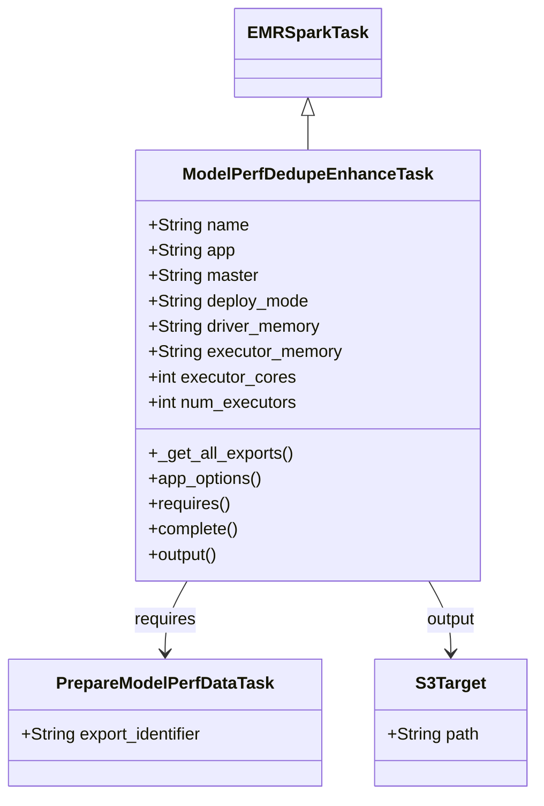
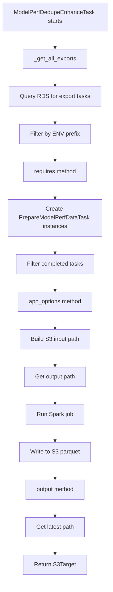
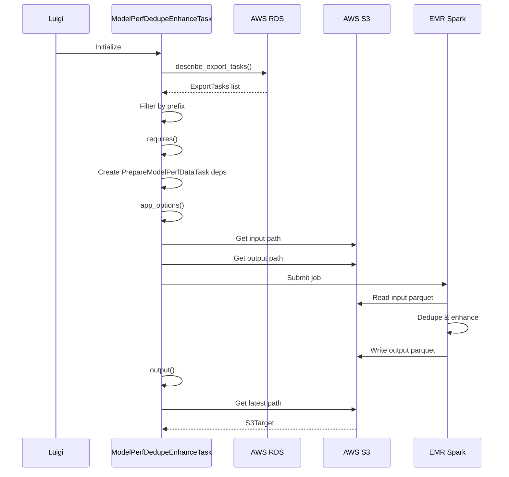

# Diagram: research/orchestrator/tasks/analytics/model_perf_dedupe_enhance_task.py

> Auto-generated by Obscura crawlers

## Diagram 1

### SVG

<svg id="container" width="509.34375" xmlns="http://www.w3.org/2000/svg" class="classDiagram" height="752" viewBox="0 0 509.34375 752" role="graphics-document document" aria-roledescription="class"><g><defs><marker id="container_class-aggregationStart" class="marker aggregation class" refX="18" refY="7" markerWidth="190" markerHeight="240" orient="auto"><path d="M 18,7 L9,13 L1,7 L9,1 Z"></path></marker></defs><defs><marker id="container_class-aggregationEnd" class="marker aggregation class" refX="1" refY="7" markerWidth="20" markerHeight="28" orient="auto"><path d="M 18,7 L9,13 L1,7 L9,1 Z"></path></marker></defs><defs><marker id="container_class-extensionStart" class="marker extension class" refX="18" refY="7" markerWidth="190" markerHeight="240" orient="auto"><path d="M 1,7 L18,13 V 1 Z"></path></marker></defs><defs><marker id="container_class-extensionEnd" class="marker extension class" refX="1" refY="7" markerWidth="20" markerHeight="28" orient="auto"><path d="M 1,1 V 13 L18,7 Z"></path></marker></defs><defs><marker id="container_class-compositionStart" class="marker composition class" refX="18" refY="7" markerWidth="190" markerHeight="240" orient="auto"><path d="M 18,7 L9,13 L1,7 L9,1 Z"></path></marker></defs><defs><marker id="container_class-compositionEnd" class="marker composition class" refX="1" refY="7" markerWidth="20" markerHeight="28" orient="auto"><path d="M 18,7 L9,13 L1,7 L9,1 Z"></path></marker></defs><defs><marker id="container_class-dependencyStart" class="marker dependency class" refX="6" refY="7" markerWidth="190" markerHeight="240" orient="auto"><path d="M 5,7 L9,13 L1,7 L9,1 Z"></path></marker></defs><defs><marker id="container_class-dependencyEnd" class="marker dependency class" refX="13" refY="7" markerWidth="20" markerHeight="28" orient="auto"><path d="M 18,7 L9,13 L14,7 L9,1 Z"></path></marker></defs><defs><marker id="container_class-lollipopStart" class="marker lollipop class" refX="13" refY="7" markerWidth="190" markerHeight="240" orient="auto"><circle stroke="black" fill="transparent" cx="7" cy="7" r="6"></circle></marker></defs><defs><marker id="container_class-lollipopEnd" class="marker lollipop class" refX="1" refY="7" markerWidth="190" markerHeight="240" orient="auto"><circle stroke="black" fill="transparent" cx="7" cy="7" r="6"></circle></marker></defs><g class="root"><g class="clusters"></g><g class="edgePaths"><path d="M293.813,109.25L293.813,110.542C293.813,111.833,293.813,114.417,293.813,119.875C293.813,125.333,293.813,133.667,293.813,137.833L293.813,142" id="id_EMRSparkTask_ModelPerfDedupeEnhanceTask_1" class="edge-thickness-normal edge-pattern-solid relation" style=";;;" data-edge="true" data-et="edge" data-id="id_EMRSparkTask_ModelPerfDedupeEnhanceTask_1" data-points="W3sieCI6MjkzLjgxMjUsInkiOjkyfSx7IngiOjI5My44MTI1LCJ5IjoxMTd9LHsieCI6MjkzLjgxMjUsInkiOjE0Mn1d" marker-start="url(#container_class-extensionStart)"></path><path d="M178.831,550L175.355,556.167C171.88,562.333,164.928,574.667,161.452,586C157.977,597.333,157.977,607.667,157.977,612.833L157.977,618" id="id_ModelPerfDedupeEnhanceTask_PrepareModelPerfDataTask_2" class="edge-thickness-normal edge-pattern-solid relation" style=";;;" data-edge="true" data-et="edge" data-id="id_ModelPerfDedupeEnhanceTask_PrepareModelPerfDataTask_2" data-points="W3sieCI6MTc4LjgzMTA0MjUzMTEyMDMyLCJ5Ijo1NTB9LHsieCI6MTU3Ljk3NjU2MjUsInkiOjU4N30seyJ4IjoxNTcuOTc2NTYyNSwieSI6NjI0fV0=" marker-end="url(#container_class-dependencyEnd)"></path><path d="M408.794,550L412.27,556.167C415.745,562.333,422.697,574.667,426.173,586C429.648,597.333,429.648,607.667,429.648,612.833L429.648,618" id="id_ModelPerfDedupeEnhanceTask_S3Target_3" class="edge-thickness-normal edge-pattern-solid relation" style=";;;" data-edge="true" data-et="edge" data-id="id_ModelPerfDedupeEnhanceTask_S3Target_3" data-points="W3sieCI6NDA4Ljc5Mzk1NzQ2ODg3OTcsInkiOjU1MH0seyJ4Ijo0MjkuNjQ4NDM3NSwieSI6NTg3fSx7IngiOjQyOS42NDg0Mzc1LCJ5Ijo2MjR9XQ==" marker-end="url(#container_class-dependencyEnd)"></path></g><g class="edgeLabels"><g class="edgeLabel"><g class="label" data-id="id_EMRSparkTask_ModelPerfDedupeEnhanceTask_1" transform="translate(0, 0)"><foreignObject width="0" height="0">

</foreignObject></g></g><g class="edgeLabel" transform="translate(157.9765625, 587)"><g class="label" data-id="id_ModelPerfDedupeEnhanceTask_PrepareModelPerfDataTask_2" transform="translate(-29.8515625, -12)"><foreignObject width="59.703125" height="24">

requires

</foreignObject></g></g><g class="edgeLabel" transform="translate(429.6484375, 587)"><g class="label" data-id="id_ModelPerfDedupeEnhanceTask_S3Target_3" transform="translate(-24.515625, -12)"><foreignObject width="49.03125" height="24">

output

</foreignObject></g></g></g><g class="nodes"><g class="node default" id="classId-EMRSparkTask-0" transform="translate(293.8125, 50)"><g class="basic label-container"><path d="M-65.1484375 -42 L65.1484375 -42 L65.1484375 42 L-65.1484375 42" stroke="none" stroke-width="0" fill="#ECECFF" style=""></path><path d="M-65.1484375 -42 C-20.799286711804257 -42, 23.549864076391486 -42, 65.1484375 -42 M-65.1484375 -42 C-26.784809195338717 -42, 11.578819109322566 -42, 65.1484375 -42 M65.1484375 -42 C65.1484375 -10.877302389552224, 65.1484375 20.245395220895553, 65.1484375 42 M65.1484375 -42 C65.1484375 -22.29591249177549, 65.1484375 -2.5918249835509783, 65.1484375 42 M65.1484375 42 C26.764150047406083 42, -11.620137405187833 42, -65.1484375 42 M65.1484375 42 C32.31425481546248 42, -0.5199278690750333 42, -65.1484375 42 M-65.1484375 42 C-65.1484375 15.085389792927586, -65.1484375 -11.829220414144828, -65.1484375 -42 M-65.1484375 42 C-65.1484375 8.70544718905824, -65.1484375 -24.58910562188352, -65.1484375 -42" stroke="#9370DB" stroke-width="1.3" fill="none" stroke-dasharray="0 0" style=""></path></g><g class="annotation-group text" transform="translate(0, -18)"></g><g class="label-group text" transform="translate(-53.1484375, -18)"><g class="label" style="font-weight: bolder" transform="translate(0,-12)"><foreignObject width="106.296875" height="24">

EMRSparkTask

</foreignObject></g></g><g class="members-group text" transform="translate(-53.1484375, 30)"></g><g class="methods-group text" transform="translate(-53.1484375, 60)"></g><g class="divider" style=""><path d="M-65.1484375 6 C-37.03023945665181 6, -8.91204141330362 6, 65.1484375 6 M-65.1484375 6 C-29.607079199280726 6, 5.934279101438548 6, 65.1484375 6" stroke="#9370DB" stroke-width="1.3" fill="none" stroke-dasharray="0 0" style=""></path></g><g class="divider" style=""><path d="M-65.1484375 24 C-28.86920319367345 24, 7.410031112653101 24, 65.1484375 24 M-65.1484375 24 C-36.15138737233801 24, -7.154337244676022 24, 65.1484375 24" stroke="#9370DB" stroke-width="1.3" fill="none" stroke-dasharray="0 0" style=""></path></g></g><g class="node default" id="classId-ModelPerfDedupeEnhanceTask-1" transform="translate(293.8125, 346)"><g class="basic label-container"><path d="M-160.2734375 -204 L160.2734375 -204 L160.2734375 204 L-160.2734375 204" stroke="none" stroke-width="0" fill="#ECECFF" style=""></path><path d="M-160.2734375 -204 C-80.30791024369647 -204, -0.3423829873929378 -204, 160.2734375 -204 M-160.2734375 -204 C-82.69197283181153 -204, -5.110508163623052 -204, 160.2734375 -204 M160.2734375 -204 C160.2734375 -110.89266596361915, 160.2734375 -17.785331927238303, 160.2734375 204 M160.2734375 -204 C160.2734375 -70.24967590296973, 160.2734375 63.500648194060545, 160.2734375 204 M160.2734375 204 C94.46998214484492 204, 28.66652678968984 204, -160.2734375 204 M160.2734375 204 C71.23012270525419 204, -17.813192089491622 204, -160.2734375 204 M-160.2734375 204 C-160.2734375 52.78966932493063, -160.2734375 -98.42066135013874, -160.2734375 -204 M-160.2734375 204 C-160.2734375 93.6701153190401, -160.2734375 -16.659769361919814, -160.2734375 -204" stroke="#9370DB" stroke-width="1.3" fill="none" stroke-dasharray="0 0" style=""></path></g><g class="annotation-group text" transform="translate(0, -180)"></g><g class="label-group text" transform="translate(-112.734375, -180)"><g class="label" style="font-weight: bolder" transform="translate(0,-12)"><foreignObject width="225.46875" height="24">

ModelPerfDedupeEnhanceTask

</foreignObject></g></g><g class="members-group text" transform="translate(-148.2734375, -132)"><g class="label" style="" transform="translate(0,-12)"><foreignObject width="94.984375" height="24">

+String name

</foreignObject></g><g class="label" style="" transform="translate(0,12)"><foreignObject width="82.1875" height="24">

+String app

</foreignObject></g><g class="label" style="" transform="translate(0,36)"><foreignObject width="104.625" height="24">

+String master

</foreignObject></g><g class="label" style="" transform="translate(0,60)"><foreignObject width="153.203125" height="24">

+String deploy_mode

</foreignObject></g><g class="label" style="" transform="translate(0,84)"><foreignObject width="164.015625" height="24">

+String driver_memory

</foreignObject></g><g class="label" style="" transform="translate(0,108)"><foreignObject width="183.8125" height="24">

+String executor_memory

</foreignObject></g><g class="label" style="" transform="translate(0,132)"><foreignObject width="139.9375" height="24">

+int executor_cores

</foreignObject></g><g class="label" style="" transform="translate(0,156)"><foreignObject width="142.296875" height="24">

+int num_executors

</foreignObject></g></g><g class="methods-group text" transform="translate(-148.2734375, 84)"><g class="label" style="" transform="translate(0,-12)"><foreignObject width="136.625" height="24">

+_get_all_exports()

</foreignObject></g><g class="label" style="" transform="translate(0,12)"><foreignObject width="108.84375" height="24">

+app_options()

</foreignObject></g><g class="label" style="" transform="translate(0,36)"><foreignObject width="78.0625" height="24">

+requires()

</foreignObject></g><g class="label" style="" transform="translate(0,60)"><foreignObject width="85.828125" height="24">

+complete()

</foreignObject></g><g class="label" style="" transform="translate(0,84)"><foreignObject width="67.390625" height="24">

+output()

</foreignObject></g></g><g class="divider" style=""><path d="M-160.2734375 -156 C-79.55881645493282 -156, 1.1558045901343519 -156, 160.2734375 -156 M-160.2734375 -156 C-72.33943149234844 -156, 15.594574515303123 -156, 160.2734375 -156" stroke="#9370DB" stroke-width="1.3" fill="none" stroke-dasharray="0 0" style=""></path></g><g class="divider" style=""><path d="M-160.2734375 60 C-69.32500344035418 60, 21.62343061929164 60, 160.2734375 60 M-160.2734375 60 C-32.99417769502122 60, 94.28508210995756 60, 160.2734375 60" stroke="#9370DB" stroke-width="1.3" fill="none" stroke-dasharray="0 0" style=""></path></g></g><g class="node default" id="classId-PrepareModelPerfDataTask-2" transform="translate(157.9765625, 684)"><g class="basic label-container"><path d="M-149.9765625 -60 L149.9765625 -60 L149.9765625 60 L-149.9765625 60" stroke="none" stroke-width="0" fill="#ECECFF" style=""></path><path d="M-149.9765625 -60 C-82.52443066826423 -60, -15.07229883652846 -60, 149.9765625 -60 M-149.9765625 -60 C-57.400821570085384 -60, 35.17491935982923 -60, 149.9765625 -60 M149.9765625 -60 C149.9765625 -20.84069592210531, 149.9765625 18.318608155789377, 149.9765625 60 M149.9765625 -60 C149.9765625 -33.198820628817934, 149.9765625 -6.397641257635868, 149.9765625 60 M149.9765625 60 C52.010601065590336 60, -45.95536036881933 60, -149.9765625 60 M149.9765625 60 C68.74281940870195 60, -12.490923682596105 60, -149.9765625 60 M-149.9765625 60 C-149.9765625 21.470136550894743, -149.9765625 -17.059726898210513, -149.9765625 -60 M-149.9765625 60 C-149.9765625 33.600201528831704, -149.9765625 7.200403057663408, -149.9765625 -60" stroke="#9370DB" stroke-width="1.3" fill="none" stroke-dasharray="0 0" style=""></path></g><g class="annotation-group text" transform="translate(0, -36)"></g><g class="label-group text" transform="translate(-99.46875, -36)"><g class="label" style="font-weight: bolder" transform="translate(0,-12)"><foreignObject width="198.9375" height="24">

PrepareModelPerfDataTask

</foreignObject></g></g><g class="members-group text" transform="translate(-137.9765625, 12)"><g class="label" style="" transform="translate(0,-12)"><foreignObject width="176.484375" height="24">

+String export_identifier

</foreignObject></g></g><g class="methods-group text" transform="translate(-137.9765625, 60)"></g><g class="divider" style=""><path d="M-149.9765625 -12 C-74.17546496649835 -12, 1.6256325670032936 -12, 149.9765625 -12 M-149.9765625 -12 C-37.372257293097064 -12, 75.23204791380587 -12, 149.9765625 -12" stroke="#9370DB" stroke-width="1.3" fill="none" stroke-dasharray="0 0" style=""></path></g><g class="divider" style=""><path d="M-149.9765625 36 C-36.742842064444105 36, 76.49087837111179 36, 149.9765625 36 M-149.9765625 36 C-71.83133766470937 36, 6.313887170581268 36, 149.9765625 36" stroke="#9370DB" stroke-width="1.3" fill="none" stroke-dasharray="0 0" style=""></path></g></g><g class="node default" id="classId-S3Target-3" transform="translate(429.6484375, 684)"><g class="basic label-container"><path d="M-71.6953125 -60 L71.6953125 -60 L71.6953125 60 L-71.6953125 60" stroke="none" stroke-width="0" fill="#ECECFF" style=""></path><path d="M-71.6953125 -60 C-42.23554681012688 -60, -12.775781120253761 -60, 71.6953125 -60 M-71.6953125 -60 C-17.310655825810727 -60, 37.074000848378546 -60, 71.6953125 -60 M71.6953125 -60 C71.6953125 -15.78787441203275, 71.6953125 28.4242511759345, 71.6953125 60 M71.6953125 -60 C71.6953125 -30.97440791864341, 71.6953125 -1.9488158372868227, 71.6953125 60 M71.6953125 60 C15.418448612362234 60, -40.85841527527553 60, -71.6953125 60 M71.6953125 60 C23.59346856664937 60, -24.50837536670126 60, -71.6953125 60 M-71.6953125 60 C-71.6953125 26.247861280443068, -71.6953125 -7.504277439113864, -71.6953125 -60 M-71.6953125 60 C-71.6953125 33.93233918036708, -71.6953125 7.86467836073416, -71.6953125 -60" stroke="#9370DB" stroke-width="1.3" fill="none" stroke-dasharray="0 0" style=""></path></g><g class="annotation-group text" transform="translate(0, -36)"></g><g class="label-group text" transform="translate(-31.71875, -36)"><g class="label" style="font-weight: bolder" transform="translate(0,-12)"><foreignObject width="63.4375" height="24">

S3Target

</foreignObject></g></g><g class="members-group text" transform="translate(-59.6953125, 12)"><g class="label" style="" transform="translate(0,-12)"><foreignObject width="87.671875" height="24">

+String path

</foreignObject></g></g><g class="methods-group text" transform="translate(-59.6953125, 60)"></g><g class="divider" style=""><path d="M-71.6953125 -12 C-24.214911168935878 -12, 23.265490162128245 -12, 71.6953125 -12 M-71.6953125 -12 C-23.483836833885242 -12, 24.727638832229516 -12, 71.6953125 -12" stroke="#9370DB" stroke-width="1.3" fill="none" stroke-dasharray="0 0" style=""></path></g><g class="divider" style=""><path d="M-71.6953125 36 C-40.44407653764934 36, -9.192840575298668 36, 71.6953125 36 M-71.6953125 36 C-28.90084566979573 36, 13.893621160408543 36, 71.6953125 36" stroke="#9370DB" stroke-width="1.3" fill="none" stroke-dasharray="0 0" style=""></path></g></g></g></g></g></svg>

## Diagram 2

### SVG

<svg id="container" width="303.171875" xmlns="http://www.w3.org/2000/svg" class="flowchart" height="1598" viewBox="0 0 303.171875 1598" role="graphics-document document" aria-roledescription="flowchart-v2"><g><marker id="container_flowchart-v2-pointEnd" class="marker flowchart-v2" viewBox="0 0 10 10" refX="5" refY="5" markerUnits="userSpaceOnUse" markerWidth="8" markerHeight="8" orient="auto"><path d="M 0 0 L 10 5 L 0 10 z" class="arrowMarkerPath" style="stroke-width: 1; stroke-dasharray: 1, 0;"></path></marker><marker id="container_flowchart-v2-pointStart" class="marker flowchart-v2" viewBox="0 0 10 10" refX="4.5" refY="5" markerUnits="userSpaceOnUse" markerWidth="8" markerHeight="8" orient="auto"><path d="M 0 5 L 10 10 L 10 0 z" class="arrowMarkerPath" style="stroke-width: 1; stroke-dasharray: 1, 0;"></path></marker><marker id="container_flowchart-v2-circleEnd" class="marker flowchart-v2" viewBox="0 0 10 10" refX="11" refY="5" markerUnits="userSpaceOnUse" markerWidth="11" markerHeight="11" orient="auto"><circle cx="5" cy="5" r="5" class="arrowMarkerPath" style="stroke-width: 1; stroke-dasharray: 1, 0;"></circle></marker><marker id="container_flowchart-v2-circleStart" class="marker flowchart-v2" viewBox="0 0 10 10" refX="-1" refY="5" markerUnits="userSpaceOnUse" markerWidth="11" markerHeight="11" orient="auto"><circle cx="5" cy="5" r="5" class="arrowMarkerPath" style="stroke-width: 1; stroke-dasharray: 1, 0;"></circle></marker><marker id="container_flowchart-v2-crossEnd" class="marker cross flowchart-v2" viewBox="0 0 11 11" refX="12" refY="5.2" markerUnits="userSpaceOnUse" markerWidth="11" markerHeight="11" orient="auto"><path d="M 1,1 l 9,9 M 10,1 l -9,9" class="arrowMarkerPath" style="stroke-width: 2; stroke-dasharray: 1, 0;"></path></marker><marker id="container_flowchart-v2-crossStart" class="marker cross flowchart-v2" viewBox="0 0 11 11" refX="-1" refY="5.2" markerUnits="userSpaceOnUse" markerWidth="11" markerHeight="11" orient="auto"><path d="M 1,1 l 9,9 M 10,1 l -9,9" class="arrowMarkerPath" style="stroke-width: 2; stroke-dasharray: 1, 0;"></path></marker><g class="root"><g class="clusters"></g><g class="edgePaths"><path d="M151.586,86L151.586,90.167C151.586,94.333,151.586,102.667,151.586,110.333C151.586,118,151.586,125,151.586,128.5L151.586,132" id="L_A_B_0" class="edge-thickness-normal edge-pattern-solid edge-thickness-normal edge-pattern-solid flowchart-link" style=";" data-edge="true" data-et="edge" data-id="L_A_B_0" data-points="W3sieCI6MTUxLjU4NTkzNzUsInkiOjg2fSx7IngiOjE1MS41ODU5Mzc1LCJ5IjoxMTF9LHsieCI6MTUxLjU4NTkzNzUsInkiOjEzNn1d" marker-end="url(#container_flowchart-v2-pointEnd)"></path><path d="M151.586,190L151.586,194.167C151.586,198.333,151.586,206.667,151.586,214.333C151.586,222,151.586,229,151.586,232.5L151.586,236" id="L_B_C_0" class="edge-thickness-normal edge-pattern-solid edge-thickness-normal edge-pattern-solid flowchart-link" style=";" data-edge="true" data-et="edge" data-id="L_B_C_0" data-points="W3sieCI6MTUxLjU4NTkzNzUsInkiOjE5MH0seyJ4IjoxNTEuNTg1OTM3NSwieSI6MjE1fSx7IngiOjE1MS41ODU5Mzc1LCJ5IjoyNDB9XQ==" marker-end="url(#container_flowchart-v2-pointEnd)"></path><path d="M151.586,294L151.586,298.167C151.586,302.333,151.586,310.667,151.586,318.333C151.586,326,151.586,333,151.586,336.5L151.586,340" id="L_C_D_0" class="edge-thickness-normal edge-pattern-solid edge-thickness-normal edge-pattern-solid flowchart-link" style=";" data-edge="true" data-et="edge" data-id="L_C_D_0" data-points="W3sieCI6MTUxLjU4NTkzNzUsInkiOjI5NH0seyJ4IjoxNTEuNTg1OTM3NSwieSI6MzE5fSx7IngiOjE1MS41ODU5Mzc1LCJ5IjozNDR9XQ==" marker-end="url(#container_flowchart-v2-pointEnd)"></path><path d="M151.586,398L151.586,402.167C151.586,406.333,151.586,414.667,151.586,422.333C151.586,430,151.586,437,151.586,440.5L151.586,444" id="L_D_E_0" class="edge-thickness-normal edge-pattern-solid edge-thickness-normal edge-pattern-solid flowchart-link" style=";" data-edge="true" data-et="edge" data-id="L_D_E_0" data-points="W3sieCI6MTUxLjU4NTkzNzUsInkiOjM5OH0seyJ4IjoxNTEuNTg1OTM3NSwieSI6NDIzfSx7IngiOjE1MS41ODU5Mzc1LCJ5Ijo0NDh9XQ==" marker-end="url(#container_flowchart-v2-pointEnd)"></path><path d="M151.586,502L151.586,506.167C151.586,510.333,151.586,518.667,151.586,526.333C151.586,534,151.586,541,151.586,544.5L151.586,548" id="L_E_F_0" class="edge-thickness-normal edge-pattern-solid edge-thickness-normal edge-pattern-solid flowchart-link" style=";" data-edge="true" data-et="edge" data-id="L_E_F_0" data-points="W3sieCI6MTUxLjU4NTkzNzUsInkiOjUwMn0seyJ4IjoxNTEuNTg1OTM3NSwieSI6NTI3fSx7IngiOjE1MS41ODU5Mzc1LCJ5Ijo1NTJ9XQ==" marker-end="url(#container_flowchart-v2-pointEnd)"></path><path d="M151.586,654L151.586,658.167C151.586,662.333,151.586,670.667,151.586,678.333C151.586,686,151.586,693,151.586,696.5L151.586,700" id="L_F_G_0" class="edge-thickness-normal edge-pattern-solid edge-thickness-normal edge-pattern-solid flowchart-link" style=";" data-edge="true" data-et="edge" data-id="L_F_G_0" data-points="W3sieCI6MTUxLjU4NTkzNzUsInkiOjY1NH0seyJ4IjoxNTEuNTg1OTM3NSwieSI6Njc5fSx7IngiOjE1MS41ODU5Mzc1LCJ5Ijo3MDR9XQ==" marker-end="url(#container_flowchart-v2-pointEnd)"></path><path d="M151.586,758L151.586,762.167C151.586,766.333,151.586,774.667,151.586,782.333C151.586,790,151.586,797,151.586,800.5L151.586,804" id="L_G_H_0" class="edge-thickness-normal edge-pattern-solid edge-thickness-normal edge-pattern-solid flowchart-link" style=";" data-edge="true" data-et="edge" data-id="L_G_H_0" data-points="W3sieCI6MTUxLjU4NTkzNzUsInkiOjc1OH0seyJ4IjoxNTEuNTg1OTM3NSwieSI6NzgzfSx7IngiOjE1MS41ODU5Mzc1LCJ5Ijo4MDh9XQ==" marker-end="url(#container_flowchart-v2-pointEnd)"></path><path d="M151.586,862L151.586,866.167C151.586,870.333,151.586,878.667,151.586,886.333C151.586,894,151.586,901,151.586,904.5L151.586,908" id="L_H_I_0" class="edge-thickness-normal edge-pattern-solid edge-thickness-normal edge-pattern-solid flowchart-link" style=";" data-edge="true" data-et="edge" data-id="L_H_I_0" data-points="W3sieCI6MTUxLjU4NTkzNzUsInkiOjg2Mn0seyJ4IjoxNTEuNTg1OTM3NSwieSI6ODg3fSx7IngiOjE1MS41ODU5Mzc1LCJ5Ijo5MTJ9XQ==" marker-end="url(#container_flowchart-v2-pointEnd)"></path><path d="M151.586,966L151.586,970.167C151.586,974.333,151.586,982.667,151.586,990.333C151.586,998,151.586,1005,151.586,1008.5L151.586,1012" id="L_I_J_0" class="edge-thickness-normal edge-pattern-solid edge-thickness-normal edge-pattern-solid flowchart-link" style=";" data-edge="true" data-et="edge" data-id="L_I_J_0" data-points="W3sieCI6MTUxLjU4NTkzNzUsInkiOjk2Nn0seyJ4IjoxNTEuNTg1OTM3NSwieSI6OTkxfSx7IngiOjE1MS41ODU5Mzc1LCJ5IjoxMDE2fV0=" marker-end="url(#container_flowchart-v2-pointEnd)"></path><path d="M151.586,1070L151.586,1074.167C151.586,1078.333,151.586,1086.667,151.586,1094.333C151.586,1102,151.586,1109,151.586,1112.5L151.586,1116" id="L_J_K_0" class="edge-thickness-normal edge-pattern-solid edge-thickness-normal edge-pattern-solid flowchart-link" style=";" data-edge="true" data-et="edge" data-id="L_J_K_0" data-points="W3sieCI6MTUxLjU4NTkzNzUsInkiOjEwNzB9LHsieCI6MTUxLjU4NTkzNzUsInkiOjEwOTV9LHsieCI6MTUxLjU4NTkzNzUsInkiOjExMjB9XQ==" marker-end="url(#container_flowchart-v2-pointEnd)"></path><path d="M151.586,1174L151.586,1178.167C151.586,1182.333,151.586,1190.667,151.586,1198.333C151.586,1206,151.586,1213,151.586,1216.5L151.586,1220" id="L_K_L_0" class="edge-thickness-normal edge-pattern-solid edge-thickness-normal edge-pattern-solid flowchart-link" style=";" data-edge="true" data-et="edge" data-id="L_K_L_0" data-points="W3sieCI6MTUxLjU4NTkzNzUsInkiOjExNzR9LHsieCI6MTUxLjU4NTkzNzUsInkiOjExOTl9LHsieCI6MTUxLjU4NTkzNzUsInkiOjEyMjR9XQ==" marker-end="url(#container_flowchart-v2-pointEnd)"></path><path d="M151.586,1278L151.586,1282.167C151.586,1286.333,151.586,1294.667,151.586,1302.333C151.586,1310,151.586,1317,151.586,1320.5L151.586,1324" id="L_L_M_0" class="edge-thickness-normal edge-pattern-solid edge-thickness-normal edge-pattern-solid flowchart-link" style=";" data-edge="true" data-et="edge" data-id="L_L_M_0" data-points="W3sieCI6MTUxLjU4NTkzNzUsInkiOjEyNzh9LHsieCI6MTUxLjU4NTkzNzUsInkiOjEzMDN9LHsieCI6MTUxLjU4NTkzNzUsInkiOjEzMjh9XQ==" marker-end="url(#container_flowchart-v2-pointEnd)"></path><path d="M151.586,1382L151.586,1386.167C151.586,1390.333,151.586,1398.667,151.586,1406.333C151.586,1414,151.586,1421,151.586,1424.5L151.586,1428" id="L_M_N_0" class="edge-thickness-normal edge-pattern-solid edge-thickness-normal edge-pattern-solid flowchart-link" style=";" data-edge="true" data-et="edge" data-id="L_M_N_0" data-points="W3sieCI6MTUxLjU4NTkzNzUsInkiOjEzODJ9LHsieCI6MTUxLjU4NTkzNzUsInkiOjE0MDd9LHsieCI6MTUxLjU4NTkzNzUsInkiOjE0MzJ9XQ==" marker-end="url(#container_flowchart-v2-pointEnd)"></path><path d="M151.586,1486L151.586,1490.167C151.586,1494.333,151.586,1502.667,151.586,1510.333C151.586,1518,151.586,1525,151.586,1528.5L151.586,1532" id="L_N_O_0" class="edge-thickness-normal edge-pattern-solid edge-thickness-normal edge-pattern-solid flowchart-link" style=";" data-edge="true" data-et="edge" data-id="L_N_O_0" data-points="W3sieCI6MTUxLjU4NTkzNzUsInkiOjE0ODZ9LHsieCI6MTUxLjU4NTkzNzUsInkiOjE1MTF9LHsieCI6MTUxLjU4NTkzNzUsInkiOjE1MzZ9XQ==" marker-end="url(#container_flowchart-v2-pointEnd)"></path></g><g class="edgeLabels"><g class="edgeLabel"><g class="label" data-id="L_A_B_0" transform="translate(0, 0)"><foreignObject width="0" height="0">

</foreignObject></g></g><g class="edgeLabel"><g class="label" data-id="L_B_C_0" transform="translate(0, 0)"><foreignObject width="0" height="0">

</foreignObject></g></g><g class="edgeLabel"><g class="label" data-id="L_C_D_0" transform="translate(0, 0)"><foreignObject width="0" height="0">

</foreignObject></g></g><g class="edgeLabel"><g class="label" data-id="L_D_E_0" transform="translate(0, 0)"><foreignObject width="0" height="0">

</foreignObject></g></g><g class="edgeLabel"><g class="label" data-id="L_E_F_0" transform="translate(0, 0)"><foreignObject width="0" height="0">

</foreignObject></g></g><g class="edgeLabel"><g class="label" data-id="L_F_G_0" transform="translate(0, 0)"><foreignObject width="0" height="0">

</foreignObject></g></g><g class="edgeLabel"><g class="label" data-id="L_G_H_0" transform="translate(0, 0)"><foreignObject width="0" height="0">

</foreignObject></g></g><g class="edgeLabel"><g class="label" data-id="L_H_I_0" transform="translate(0, 0)"><foreignObject width="0" height="0">

</foreignObject></g></g><g class="edgeLabel"><g class="label" data-id="L_I_J_0" transform="translate(0, 0)"><foreignObject width="0" height="0">

</foreignObject></g></g><g class="edgeLabel"><g class="label" data-id="L_J_K_0" transform="translate(0, 0)"><foreignObject width="0" height="0">

</foreignObject></g></g><g class="edgeLabel"><g class="label" data-id="L_K_L_0" transform="translate(0, 0)"><foreignObject width="0" height="0">

</foreignObject></g></g><g class="edgeLabel"><g class="label" data-id="L_L_M_0" transform="translate(0, 0)"><foreignObject width="0" height="0">

</foreignObject></g></g><g class="edgeLabel"><g class="label" data-id="L_M_N_0" transform="translate(0, 0)"><foreignObject width="0" height="0">

</foreignObject></g></g><g class="edgeLabel"><g class="label" data-id="L_N_O_0" transform="translate(0, 0)"><foreignObject width="0" height="0">

</foreignObject></g></g></g><g class="nodes"><g class="node default" id="flowchart-A-0" transform="translate(151.5859375, 47)"><rect class="basic label-container" style="" x="-143.5859375" y="-39" width="287.171875" height="78"></rect><g class="label" style="" transform="translate(-113.5859375, -24)"><rect></rect><foreignObject width="227.171875" height="48">

ModelPerfDedupeEnhanceTask starts

</foreignObject></g></g><g class="node default" id="flowchart-B-1" transform="translate(151.5859375, 163)"><rect class="basic label-container" style="" x="-89.78125" y="-27" width="179.5625" height="54"></rect><g class="label" style="" transform="translate(-59.78125, -12)"><rect></rect><foreignObject width="119.5625" height="24">

_get_all_exports

</foreignObject></g></g><g class="node default" id="flowchart-C-3" transform="translate(151.5859375, 267)"><rect class="basic label-container" style="" x="-126.9609375" y="-27" width="253.921875" height="54"></rect><g class="label" style="" transform="translate(-96.9609375, -12)"><rect></rect><foreignObject width="193.921875" height="24">

Query RDS for export tasks

</foreignObject></g></g><g class="node default" id="flowchart-D-5" transform="translate(151.5859375, 371)"><rect class="basic label-container" style="" x="-98.1171875" y="-27" width="196.234375" height="54"></rect><g class="label" style="" transform="translate(-68.1171875, -12)"><rect></rect><foreignObject width="136.234375" height="24">

Filter by ENV prefix

</foreignObject></g></g><g class="node default" id="flowchart-E-7" transform="translate(151.5859375, 475)"><rect class="basic label-container" style="" x="-90.21875" y="-27" width="180.4375" height="54"></rect><g class="label" style="" transform="translate(-60.21875, -12)"><rect></rect><foreignObject width="120.4375" height="24">

requires method

</foreignObject></g></g><g class="node default" id="flowchart-F-9" transform="translate(151.5859375, 603)"><rect class="basic label-container" style="" x="-130" y="-51" width="260" height="102"></rect><g class="label" style="" transform="translate(-100, -36)"><rect></rect><foreignObject width="200" height="72">

Create PrepareModelPerfDataTask instances

</foreignObject></g></g><g class="node default" id="flowchart-G-11" transform="translate(151.5859375, 731)"><rect class="basic label-container" style="" x="-109.859375" y="-27" width="219.71875" height="54"></rect><g class="label" style="" transform="translate(-79.859375, -12)"><rect></rect><foreignObject width="159.71875" height="24">

Filter completed tasks

</foreignObject></g></g><g class="node default" id="flowchart-H-13" transform="translate(151.5859375, 835)"><rect class="basic label-container" style="" x="-105.734375" y="-27" width="211.46875" height="54"></rect><g class="label" style="" transform="translate(-75.734375, -12)"><rect></rect><foreignObject width="151.46875" height="24">

app_options method

</foreignObject></g></g><g class="node default" id="flowchart-I-15" transform="translate(151.5859375, 939)"><rect class="basic label-container" style="" x="-99.421875" y="-27" width="198.84375" height="54"></rect><g class="label" style="" transform="translate(-69.421875, -12)"><rect></rect><foreignObject width="138.84375" height="24">

Build S3 input path

</foreignObject></g></g><g class="node default" id="flowchart-J-17" transform="translate(151.5859375, 1043)"><rect class="basic label-container" style="" x="-87.6484375" y="-27" width="175.296875" height="54"></rect><g class="label" style="" transform="translate(-57.6484375, -12)"><rect></rect><foreignObject width="115.296875" height="24">

Get output path

</foreignObject></g></g><g class="node default" id="flowchart-K-19" transform="translate(151.5859375, 1147)"><rect class="basic label-container" style="" x="-80.65625" y="-27" width="161.3125" height="54"></rect><g class="label" style="" transform="translate(-50.65625, -12)"><rect></rect><foreignObject width="101.3125" height="24">

Run Spark job

</foreignObject></g></g><g class="node default" id="flowchart-L-21" transform="translate(151.5859375, 1251)"><rect class="basic label-container" style="" x="-99.7578125" y="-27" width="199.515625" height="54"></rect><g class="label" style="" transform="translate(-69.7578125, -12)"><rect></rect><foreignObject width="139.515625" height="24">

Write to S3 parquet

</foreignObject></g></g><g class="node default" id="flowchart-M-23" transform="translate(151.5859375, 1355)"><rect class="basic label-container" style="" x="-84.8828125" y="-27" width="169.765625" height="54"></rect><g class="label" style="" transform="translate(-54.8828125, -12)"><rect></rect><foreignObject width="109.765625" height="24">

output method

</foreignObject></g></g><g class="node default" id="flowchart-N-25" transform="translate(151.5859375, 1459)"><rect class="basic label-container" style="" x="-83.546875" y="-27" width="167.09375" height="54"></rect><g class="label" style="" transform="translate(-53.546875, -12)"><rect></rect><foreignObject width="107.09375" height="24">

Get latest path

</foreignObject></g></g><g class="node default" id="flowchart-O-27" transform="translate(151.5859375, 1563)"><rect class="basic label-container" style="" x="-87.015625" y="-27" width="174.03125" height="54"></rect><g class="label" style="" transform="translate(-57.015625, -12)"><rect></rect><foreignObject width="114.03125" height="24">

Return S3Target

</foreignObject></g></g></g></g></g></svg>

## Diagram 3

### SVG

<svg id="container" width="1168" xmlns="http://www.w3.org/2000/svg" height="1119" viewBox="-50 -10 1168 1119" role="graphics-document document" aria-roledescription="sequence"><g><rect x="917" y="1033" fill="#eaeaea" stroke="#666" width="150" height="65" name="Spark" rx="3" ry="3" class="actor actor-bottom"></rect><text x="992" y="1065.5" dominant-baseline="central" alignment-baseline="central" class="actor actor-box" style="text-anchor: middle; font-size: 16px; font-weight: 400;"><tspan x="992" dy="0">EMR Spark</tspan></text></g><g><rect x="694" y="1033" fill="#eaeaea" stroke="#666" width="150" height="65" name="S3" rx="3" ry="3" class="actor actor-bottom"></rect><text x="769" y="1065.5" dominant-baseline="central" alignment-baseline="central" class="actor actor-box" style="text-anchor: middle; font-size: 16px; font-weight: 400;"><tspan x="769" dy="0">AWS S3</tspan></text></g><g><rect x="494" y="1033" fill="#eaeaea" stroke="#666" width="150" height="65" name="RDS" rx="3" ry="3" class="actor actor-bottom"></rect><text x="569" y="1065.5" dominant-baseline="central" alignment-baseline="central" class="actor actor-box" style="text-anchor: middle; font-size: 16px; font-weight: 400;"><tspan x="569" dy="0">AWS RDS</tspan></text></g><g><rect x="200" y="1033" fill="#eaeaea" stroke="#666" width="244" height="65" name="Task" rx="3" ry="3" class="actor actor-bottom"></rect><text x="322" y="1065.5" dominant-baseline="central" alignment-baseline="central" class="actor actor-box" style="text-anchor: middle; font-size: 16px; font-weight: 400;"><tspan x="322" dy="0">ModelPerfDedupeEnhanceTask</tspan></text></g><g><rect x="0" y="1033" fill="#eaeaea" stroke="#666" width="150" height="65" name="Luigi" rx="3" ry="3" class="actor actor-bottom"></rect><text x="75" y="1065.5" dominant-baseline="central" alignment-baseline="central" class="actor actor-box" style="text-anchor: middle; font-size: 16px; font-weight: 400;"><tspan x="75" dy="0">Luigi</tspan></text></g><g><line id="actor4" x1="992" y1="65" x2="992" y2="1033" class="actor-line 200" stroke-width="0.5px" stroke="#999" name="Spark"></line><g id="root-4"><rect x="917" y="0" fill="#eaeaea" stroke="#666" width="150" height="65" name="Spark" rx="3" ry="3" class="actor actor-top"></rect><text x="992" y="32.5" dominant-baseline="central" alignment-baseline="central" class="actor actor-box" style="text-anchor: middle; font-size: 16px; font-weight: 400;"><tspan x="992" dy="0">EMR Spark</tspan></text></g></g><g><line id="actor3" x1="769" y1="65" x2="769" y2="1033" class="actor-line 200" stroke-width="0.5px" stroke="#999" name="S3"></line><g id="root-3"><rect x="694" y="0" fill="#eaeaea" stroke="#666" width="150" height="65" name="S3" rx="3" ry="3" class="actor actor-top"></rect><text x="769" y="32.5" dominant-baseline="central" alignment-baseline="central" class="actor actor-box" style="text-anchor: middle; font-size: 16px; font-weight: 400;"><tspan x="769" dy="0">AWS S3</tspan></text></g></g><g><line id="actor2" x1="569" y1="65" x2="569" y2="1033" class="actor-line 200" stroke-width="0.5px" stroke="#999" name="RDS"></line><g id="root-2"><rect x="494" y="0" fill="#eaeaea" stroke="#666" width="150" height="65" name="RDS" rx="3" ry="3" class="actor actor-top"></rect><text x="569" y="32.5" dominant-baseline="central" alignment-baseline="central" class="actor actor-box" style="text-anchor: middle; font-size: 16px; font-weight: 400;"><tspan x="569" dy="0">AWS RDS</tspan></text></g></g><g><line id="actor1" x1="322" y1="65" x2="322" y2="1033" class="actor-line 200" stroke-width="0.5px" stroke="#999" name="Task"></line><g id="root-1"><rect x="200" y="0" fill="#eaeaea" stroke="#666" width="244" height="65" name="Task" rx="3" ry="3" class="actor actor-top"></rect><text x="322" y="32.5" dominant-baseline="central" alignment-baseline="central" class="actor actor-box" style="text-anchor: middle; font-size: 16px; font-weight: 400;"><tspan x="322" dy="0">ModelPerfDedupeEnhanceTask</tspan></text></g></g><g><line id="actor0" x1="75" y1="65" x2="75" y2="1033" class="actor-line 200" stroke-width="0.5px" stroke="#999" name="Luigi"></line><g id="root-0"><rect x="0" y="0" fill="#eaeaea" stroke="#666" width="150" height="65" name="Luigi" rx="3" ry="3" class="actor actor-top"></rect><text x="75" y="32.5" dominant-baseline="central" alignment-baseline="central" class="actor actor-box" style="text-anchor: middle; font-size: 16px; font-weight: 400;"><tspan x="75" dy="0">Luigi</tspan></text></g></g><g></g><defs><symbol id="computer" width="24" height="24"><path transform="scale(.5)" d="M2 2v13h20v-13h-20zm18 11h-16v-9h16v9zm-10.228 6l.466-1h3.524l.467 1h-4.457zm14.228 3h-24l2-6h2.104l-1.33 4h18.45l-1.297-4h2.073l2 6zm-5-10h-14v-7h14v7z"></path></symbol></defs><defs><symbol id="database" fill-rule="evenodd" clip-rule="evenodd"><path transform="scale(.5)" d="M12.258.001l.256.004.255.005.253.008.251.01.249.012.247.015.246.016.242.019.241.02.239.023.236.024.233.027.231.028.229.031.225.032.223.034.22.036.217.038.214.04.211.041.208.043.205.045.201.046.198.048.194.05.191.051.187.053.183.054.18.056.175.057.172.059.168.06.163.061.16.063.155.064.15.066.074.033.073.033.071.034.07.034.069.035.068.035.067.035.066.035.064.036.064.036.062.036.06.036.06.037.058.037.058.037.055.038.055.038.053.038.052.038.051.039.05.039.048.039.047.039.045.04.044.04.043.04.041.04.04.041.039.041.037.041.036.041.034.041.033.042.032.042.03.042.029.042.027.042.026.043.024.043.023.043.021.043.02.043.018.044.017.043.015.044.013.044.012.044.011.045.009.044.007.045.006.045.004.045.002.045.001.045v17l-.001.045-.002.045-.004.045-.006.045-.007.045-.009.044-.011.045-.012.044-.013.044-.015.044-.017.043-.018.044-.02.043-.021.043-.023.043-.024.043-.026.043-.027.042-.029.042-.03.042-.032.042-.033.042-.034.041-.036.041-.037.041-.039.041-.04.041-.041.04-.043.04-.044.04-.045.04-.047.039-.048.039-.05.039-.051.039-.052.038-.053.038-.055.038-.055.038-.058.037-.058.037-.06.037-.06.036-.062.036-.064.036-.064.036-.066.035-.067.035-.068.035-.069.035-.07.034-.071.034-.073.033-.074.033-.15.066-.155.064-.16.063-.163.061-.168.06-.172.059-.175.057-.18.056-.183.054-.187.053-.191.051-.194.05-.198.048-.201.046-.205.045-.208.043-.211.041-.214.04-.217.038-.22.036-.223.034-.225.032-.229.031-.231.028-.233.027-.236.024-.239.023-.241.02-.242.019-.246.016-.247.015-.249.012-.251.01-.253.008-.255.005-.256.004-.258.001-.258-.001-.256-.004-.255-.005-.253-.008-.251-.01-.249-.012-.247-.015-.245-.016-.243-.019-.241-.02-.238-.023-.236-.024-.234-.027-.231-.028-.228-.031-.226-.032-.223-.034-.22-.036-.217-.038-.214-.04-.211-.041-.208-.043-.204-.045-.201-.046-.198-.048-.195-.05-.19-.051-.187-.053-.184-.054-.179-.056-.176-.057-.172-.059-.167-.06-.164-.061-.159-.063-.155-.064-.151-.066-.074-.033-.072-.033-.072-.034-.07-.034-.069-.035-.068-.035-.067-.035-.066-.035-.064-.036-.063-.036-.062-.036-.061-.036-.06-.037-.058-.037-.057-.037-.056-.038-.055-.038-.053-.038-.052-.038-.051-.039-.049-.039-.049-.039-.046-.039-.046-.04-.044-.04-.043-.04-.041-.04-.04-.041-.039-.041-.037-.041-.036-.041-.034-.041-.033-.042-.032-.042-.03-.042-.029-.042-.027-.042-.026-.043-.024-.043-.023-.043-.021-.043-.02-.043-.018-.044-.017-.043-.015-.044-.013-.044-.012-.044-.011-.045-.009-.044-.007-.045-.006-.045-.004-.045-.002-.045-.001-.045v-17l.001-.045.002-.045.004-.045.006-.045.007-.045.009-.044.011-.045.012-.044.013-.044.015-.044.017-.043.018-.044.02-.043.021-.043.023-.043.024-.043.026-.043.027-.042.029-.042.03-.042.032-.042.033-.042.034-.041.036-.041.037-.041.039-.041.04-.041.041-.04.043-.04.044-.04.046-.04.046-.039.049-.039.049-.039.051-.039.052-.038.053-.038.055-.038.056-.038.057-.037.058-.037.06-.037.061-.036.062-.036.063-.036.064-.036.066-.035.067-.035.068-.035.069-.035.07-.034.072-.034.072-.033.074-.033.151-.066.155-.064.159-.063.164-.061.167-.06.172-.059.176-.057.179-.056.184-.054.187-.053.19-.051.195-.05.198-.048.201-.046.204-.045.208-.043.211-.041.214-.04.217-.038.22-.036.223-.034.226-.032.228-.031.231-.028.234-.027.236-.024.238-.023.241-.02.243-.019.245-.016.247-.015.249-.012.251-.01.253-.008.255-.005.256-.004.258-.001.258.001zm-9.258 20.499v.01l.001.021.003.021.004.022.005.021.006.022.007.022.009.023.01.022.011.023.012.023.013.023.015.023.016.024.017.023.018.024.019.024.021.024.022.025.023.024.024.025.052.049.056.05.061.051.066.051.07.051.075.051.079.052.084.052.088.052.092.052.097.052.102.051.105.052.11.052.114.051.119.051.123.051.127.05.131.05.135.05.139.048.144.049.147.047.152.047.155.047.16.045.163.045.167.043.171.043.176.041.178.041.183.039.187.039.19.037.194.035.197.035.202.033.204.031.209.03.212.029.216.027.219.025.222.024.226.021.23.02.233.018.236.016.24.015.243.012.246.01.249.008.253.005.256.004.259.001.26-.001.257-.004.254-.005.25-.008.247-.011.244-.012.241-.014.237-.016.233-.018.231-.021.226-.021.224-.024.22-.026.216-.027.212-.028.21-.031.205-.031.202-.034.198-.034.194-.036.191-.037.187-.039.183-.04.179-.04.175-.042.172-.043.168-.044.163-.045.16-.046.155-.046.152-.047.148-.048.143-.049.139-.049.136-.05.131-.05.126-.05.123-.051.118-.052.114-.051.11-.052.106-.052.101-.052.096-.052.092-.052.088-.053.083-.051.079-.052.074-.052.07-.051.065-.051.06-.051.056-.05.051-.05.023-.024.023-.025.021-.024.02-.024.019-.024.018-.024.017-.024.015-.023.014-.024.013-.023.012-.023.01-.023.01-.022.008-.022.006-.022.006-.022.004-.022.004-.021.001-.021.001-.021v-4.127l-.077.055-.08.053-.083.054-.085.053-.087.052-.09.052-.093.051-.095.05-.097.05-.1.049-.102.049-.105.048-.106.047-.109.047-.111.046-.114.045-.115.045-.118.044-.12.043-.122.042-.124.042-.126.041-.128.04-.13.04-.132.038-.134.038-.135.037-.138.037-.139.035-.142.035-.143.034-.144.033-.147.032-.148.031-.15.03-.151.03-.153.029-.154.027-.156.027-.158.026-.159.025-.161.024-.162.023-.163.022-.165.021-.166.02-.167.019-.169.018-.169.017-.171.016-.173.015-.173.014-.175.013-.175.012-.177.011-.178.01-.179.008-.179.008-.181.006-.182.005-.182.004-.184.003-.184.002h-.37l-.184-.002-.184-.003-.182-.004-.182-.005-.181-.006-.179-.008-.179-.008-.178-.01-.176-.011-.176-.012-.175-.013-.173-.014-.172-.015-.171-.016-.17-.017-.169-.018-.167-.019-.166-.02-.165-.021-.163-.022-.162-.023-.161-.024-.159-.025-.157-.026-.156-.027-.155-.027-.153-.029-.151-.03-.15-.03-.148-.031-.146-.032-.145-.033-.143-.034-.141-.035-.14-.035-.137-.037-.136-.037-.134-.038-.132-.038-.13-.04-.128-.04-.126-.041-.124-.042-.122-.042-.12-.044-.117-.043-.116-.045-.113-.045-.112-.046-.109-.047-.106-.047-.105-.048-.102-.049-.1-.049-.097-.05-.095-.05-.093-.052-.09-.051-.087-.052-.085-.053-.083-.054-.08-.054-.077-.054v4.127zm0-5.654v.011l.001.021.003.021.004.021.005.022.006.022.007.022.009.022.01.022.011.023.012.023.013.023.015.024.016.023.017.024.018.024.019.024.021.024.022.024.023.025.024.024.052.05.056.05.061.05.066.051.07.051.075.052.079.051.084.052.088.052.092.052.097.052.102.052.105.052.11.051.114.051.119.052.123.05.127.051.131.05.135.049.139.049.144.048.147.048.152.047.155.046.16.045.163.045.167.044.171.042.176.042.178.04.183.04.187.038.19.037.194.036.197.034.202.033.204.032.209.03.212.028.216.027.219.025.222.024.226.022.23.02.233.018.236.016.24.014.243.012.246.01.249.008.253.006.256.003.259.001.26-.001.257-.003.254-.006.25-.008.247-.01.244-.012.241-.015.237-.016.233-.018.231-.02.226-.022.224-.024.22-.025.216-.027.212-.029.21-.03.205-.032.202-.033.198-.035.194-.036.191-.037.187-.039.183-.039.179-.041.175-.042.172-.043.168-.044.163-.045.16-.045.155-.047.152-.047.148-.048.143-.048.139-.05.136-.049.131-.05.126-.051.123-.051.118-.051.114-.052.11-.052.106-.052.101-.052.096-.052.092-.052.088-.052.083-.052.079-.052.074-.051.07-.052.065-.051.06-.05.056-.051.051-.049.023-.025.023-.024.021-.025.02-.024.019-.024.018-.024.017-.024.015-.023.014-.023.013-.024.012-.022.01-.023.01-.023.008-.022.006-.022.006-.022.004-.021.004-.022.001-.021.001-.021v-4.139l-.077.054-.08.054-.083.054-.085.052-.087.053-.09.051-.093.051-.095.051-.097.05-.1.049-.102.049-.105.048-.106.047-.109.047-.111.046-.114.045-.115.044-.118.044-.12.044-.122.042-.124.042-.126.041-.128.04-.13.039-.132.039-.134.038-.135.037-.138.036-.139.036-.142.035-.143.033-.144.033-.147.033-.148.031-.15.03-.151.03-.153.028-.154.028-.156.027-.158.026-.159.025-.161.024-.162.023-.163.022-.165.021-.166.02-.167.019-.169.018-.169.017-.171.016-.173.015-.173.014-.175.013-.175.012-.177.011-.178.009-.179.009-.179.007-.181.007-.182.005-.182.004-.184.003-.184.002h-.37l-.184-.002-.184-.003-.182-.004-.182-.005-.181-.007-.179-.007-.179-.009-.178-.009-.176-.011-.176-.012-.175-.013-.173-.014-.172-.015-.171-.016-.17-.017-.169-.018-.167-.019-.166-.02-.165-.021-.163-.022-.162-.023-.161-.024-.159-.025-.157-.026-.156-.027-.155-.028-.153-.028-.151-.03-.15-.03-.148-.031-.146-.033-.145-.033-.143-.033-.141-.035-.14-.036-.137-.036-.136-.037-.134-.038-.132-.039-.13-.039-.128-.04-.126-.041-.124-.042-.122-.043-.12-.043-.117-.044-.116-.044-.113-.046-.112-.046-.109-.046-.106-.047-.105-.048-.102-.049-.1-.049-.097-.05-.095-.051-.093-.051-.09-.051-.087-.053-.085-.052-.083-.054-.08-.054-.077-.054v4.139zm0-5.666v.011l.001.02.003.022.004.021.005.022.006.021.007.022.009.023.01.022.011.023.012.023.013.023.015.023.016.024.017.024.018.023.019.024.021.025.022.024.023.024.024.025.052.05.056.05.061.05.066.051.07.051.075.052.079.051.084.052.088.052.092.052.097.052.102.052.105.051.11.052.114.051.119.051.123.051.127.05.131.05.135.05.139.049.144.048.147.048.152.047.155.046.16.045.163.045.167.043.171.043.176.042.178.04.183.04.187.038.19.037.194.036.197.034.202.033.204.032.209.03.212.028.216.027.219.025.222.024.226.021.23.02.233.018.236.017.24.014.243.012.246.01.249.008.253.006.256.003.259.001.26-.001.257-.003.254-.006.25-.008.247-.01.244-.013.241-.014.237-.016.233-.018.231-.02.226-.022.224-.024.22-.025.216-.027.212-.029.21-.03.205-.032.202-.033.198-.035.194-.036.191-.037.187-.039.183-.039.179-.041.175-.042.172-.043.168-.044.163-.045.16-.045.155-.047.152-.047.148-.048.143-.049.139-.049.136-.049.131-.051.126-.05.123-.051.118-.052.114-.051.11-.052.106-.052.101-.052.096-.052.092-.052.088-.052.083-.052.079-.052.074-.052.07-.051.065-.051.06-.051.056-.05.051-.049.023-.025.023-.025.021-.024.02-.024.019-.024.018-.024.017-.024.015-.023.014-.024.013-.023.012-.023.01-.022.01-.023.008-.022.006-.022.006-.022.004-.022.004-.021.001-.021.001-.021v-4.153l-.077.054-.08.054-.083.053-.085.053-.087.053-.09.051-.093.051-.095.051-.097.05-.1.049-.102.048-.105.048-.106.048-.109.046-.111.046-.114.046-.115.044-.118.044-.12.043-.122.043-.124.042-.126.041-.128.04-.13.039-.132.039-.134.038-.135.037-.138.036-.139.036-.142.034-.143.034-.144.033-.147.032-.148.032-.15.03-.151.03-.153.028-.154.028-.156.027-.158.026-.159.024-.161.024-.162.023-.163.023-.165.021-.166.02-.167.019-.169.018-.169.017-.171.016-.173.015-.173.014-.175.013-.175.012-.177.01-.178.01-.179.009-.179.007-.181.006-.182.006-.182.004-.184.003-.184.001-.185.001-.185-.001-.184-.001-.184-.003-.182-.004-.182-.006-.181-.006-.179-.007-.179-.009-.178-.01-.176-.01-.176-.012-.175-.013-.173-.014-.172-.015-.171-.016-.17-.017-.169-.018-.167-.019-.166-.02-.165-.021-.163-.023-.162-.023-.161-.024-.159-.024-.157-.026-.156-.027-.155-.028-.153-.028-.151-.03-.15-.03-.148-.032-.146-.032-.145-.033-.143-.034-.141-.034-.14-.036-.137-.036-.136-.037-.134-.038-.132-.039-.13-.039-.128-.041-.126-.041-.124-.041-.122-.043-.12-.043-.117-.044-.116-.044-.113-.046-.112-.046-.109-.046-.106-.048-.105-.048-.102-.048-.1-.05-.097-.049-.095-.051-.093-.051-.09-.052-.087-.052-.085-.053-.083-.053-.08-.054-.077-.054v4.153zm8.74-8.179l-.257.004-.254.005-.25.008-.247.011-.244.012-.241.014-.237.016-.233.018-.231.021-.226.022-.224.023-.22.026-.216.027-.212.028-.21.031-.205.032-.202.033-.198.034-.194.036-.191.038-.187.038-.183.04-.179.041-.175.042-.172.043-.168.043-.163.045-.16.046-.155.046-.152.048-.148.048-.143.048-.139.049-.136.05-.131.05-.126.051-.123.051-.118.051-.114.052-.11.052-.106.052-.101.052-.096.052-.092.052-.088.052-.083.052-.079.052-.074.051-.07.052-.065.051-.06.05-.056.05-.051.05-.023.025-.023.024-.021.024-.02.025-.019.024-.018.024-.017.023-.015.024-.014.023-.013.023-.012.023-.01.023-.01.022-.008.022-.006.023-.006.021-.004.022-.004.021-.001.021-.001.021.001.021.001.021.004.021.004.022.006.021.006.023.008.022.01.022.01.023.012.023.013.023.014.023.015.024.017.023.018.024.019.024.02.025.021.024.023.024.023.025.051.05.056.05.06.05.065.051.07.052.074.051.079.052.083.052.088.052.092.052.096.052.101.052.106.052.11.052.114.052.118.051.123.051.126.051.131.05.136.05.139.049.143.048.148.048.152.048.155.046.16.046.163.045.168.043.172.043.175.042.179.041.183.04.187.038.191.038.194.036.198.034.202.033.205.032.21.031.212.028.216.027.22.026.224.023.226.022.231.021.233.018.237.016.241.014.244.012.247.011.25.008.254.005.257.004.26.001.26-.001.257-.004.254-.005.25-.008.247-.011.244-.012.241-.014.237-.016.233-.018.231-.021.226-.022.224-.023.22-.026.216-.027.212-.028.21-.031.205-.032.202-.033.198-.034.194-.036.191-.038.187-.038.183-.04.179-.041.175-.042.172-.043.168-.043.163-.045.16-.046.155-.046.152-.048.148-.048.143-.048.139-.049.136-.05.131-.05.126-.051.123-.051.118-.051.114-.052.11-.052.106-.052.101-.052.096-.052.092-.052.088-.052.083-.052.079-.052.074-.051.07-.052.065-.051.06-.05.056-.05.051-.05.023-.025.023-.024.021-.024.02-.025.019-.024.018-.024.017-.023.015-.024.014-.023.013-.023.012-.023.01-.023.01-.022.008-.022.006-.023.006-.021.004-.022.004-.021.001-.021.001-.021-.001-.021-.001-.021-.004-.021-.004-.022-.006-.021-.006-.023-.008-.022-.01-.022-.01-.023-.012-.023-.013-.023-.014-.023-.015-.024-.017-.023-.018-.024-.019-.024-.02-.025-.021-.024-.023-.024-.023-.025-.051-.05-.056-.05-.06-.05-.065-.051-.07-.052-.074-.051-.079-.052-.083-.052-.088-.052-.092-.052-.096-.052-.101-.052-.106-.052-.11-.052-.114-.052-.118-.051-.123-.051-.126-.051-.131-.05-.136-.05-.139-.049-.143-.048-.148-.048-.152-.048-.155-.046-.16-.046-.163-.045-.168-.043-.172-.043-.175-.042-.179-.041-.183-.04-.187-.038-.191-.038-.194-.036-.198-.034-.202-.033-.205-.032-.21-.031-.212-.028-.216-.027-.22-.026-.224-.023-.226-.022-.231-.021-.233-.018-.237-.016-.241-.014-.244-.012-.247-.011-.25-.008-.254-.005-.257-.004-.26-.001-.26.001z"></path></symbol></defs><defs><symbol id="clock" width="24" height="24"><path transform="scale(.5)" d="M12 2c5.514 0 10 4.486 10 10s-4.486 10-10 10-10-4.486-10-10 4.486-10 10-10zm0-2c-6.627 0-12 5.373-12 12s5.373 12 12 12 12-5.373 12-12-5.373-12-12-12zm5.848 12.459c.202.038.202.333.001.372-1.907.361-6.045 1.111-6.547 1.111-.719 0-1.301-.582-1.301-1.301 0-.512.77-5.447 1.125-7.445.034-.192.312-.181.343.014l.985 6.238 5.394 1.011z"></path></symbol></defs><defs><marker id="arrowhead" refX="7.9" refY="5" markerUnits="userSpaceOnUse" markerWidth="12" markerHeight="12" orient="auto-start-reverse"><path d="M -1 0 L 10 5 L 0 10 z"></path></marker></defs><defs><marker id="crosshead" markerWidth="15" markerHeight="8" orient="auto" refX="4" refY="4.5"><path fill="none" stroke="#000000" stroke-width="1pt" d="M 1,2 L 6,7 M 6,2 L 1,7" style="stroke-dasharray: 0, 0;"></path></marker></defs><defs><marker id="filled-head" refX="15.5" refY="7" markerWidth="20" markerHeight="28" orient="auto"><path d="M 18,7 L9,13 L14,7 L9,1 Z"></path></marker></defs><defs><marker id="sequencenumber" refX="15" refY="15" markerWidth="60" markerHeight="40" orient="auto"><circle cx="15" cy="15" r="6"></circle></marker></defs><text x="197" y="80" text-anchor="middle" dominant-baseline="middle" alignment-baseline="middle" class="messageText" dy="1em" style="font-size: 16px; font-weight: 400;">Initialize</text><line x1="76" y1="113" x2="318" y2="113" class="messageLine0" stroke-width="2" stroke="none" marker-end="url(#arrowhead)" style="fill: none;"></line><text x="444" y="128" text-anchor="middle" dominant-baseline="middle" alignment-baseline="middle" class="messageText" dy="1em" style="font-size: 16px; font-weight: 400;">describe_export_tasks()</text><line x1="323" y1="161" x2="565" y2="161" class="messageLine0" stroke-width="2" stroke="none" marker-end="url(#arrowhead)" style="fill: none;"></line><text x="447" y="176" text-anchor="middle" dominant-baseline="middle" alignment-baseline="middle" class="messageText" dy="1em" style="font-size: 16px; font-weight: 400;">ExportTasks list</text><line x1="568" y1="209" x2="326" y2="209" class="messageLine1" stroke-width="2" stroke="none" marker-end="url(#arrowhead)" style="stroke-dasharray: 3, 3; fill: none;"></line><text x="323" y="224" text-anchor="middle" dominant-baseline="middle" alignment-baseline="middle" class="messageText" dy="1em" style="font-size: 16px; font-weight: 400;">Filter by prefix</text><path d="M 323,257 C 383,247 383,287 323,277" class="messageLine0" stroke-width="2" stroke="none" marker-end="url(#arrowhead)" style="fill: none;"></path><text x="323" y="302" text-anchor="middle" dominant-baseline="middle" alignment-baseline="middle" class="messageText" dy="1em" style="font-size: 16px; font-weight: 400;">requires()</text><path d="M 323,335 C 383,325 383,365 323,355" class="messageLine0" stroke-width="2" stroke="none" marker-end="url(#arrowhead)" style="fill: none;"></path><text x="323" y="380" text-anchor="middle" dominant-baseline="middle" alignment-baseline="middle" class="messageText" dy="1em" style="font-size: 16px; font-weight: 400;">Create PrepareModelPerfDataTask deps</text><path d="M 323,413 C 383,403 383,443 323,433" class="messageLine0" stroke-width="2" stroke="none" marker-end="url(#arrowhead)" style="fill: none;"></path><text x="323" y="458" text-anchor="middle" dominant-baseline="middle" alignment-baseline="middle" class="messageText" dy="1em" style="font-size: 16px; font-weight: 400;">app_options()</text><path d="M 323,491 C 383,481 383,521 323,511" class="messageLine0" stroke-width="2" stroke="none" marker-end="url(#arrowhead)" style="fill: none;"></path><text x="544" y="536" text-anchor="middle" dominant-baseline="middle" alignment-baseline="middle" class="messageText" dy="1em" style="font-size: 16px; font-weight: 400;">Get input path</text><line x1="323" y1="569" x2="765" y2="569" class="messageLine0" stroke-width="2" stroke="none" marker-end="url(#arrowhead)" style="fill: none;"></line><text x="544" y="584" text-anchor="middle" dominant-baseline="middle" alignment-baseline="middle" class="messageText" dy="1em" style="font-size: 16px; font-weight: 400;">Get output path</text><line x1="323" y1="617" x2="765" y2="617" class="messageLine0" stroke-width="2" stroke="none" marker-end="url(#arrowhead)" style="fill: none;"></line><text x="656" y="632" text-anchor="middle" dominant-baseline="middle" alignment-baseline="middle" class="messageText" dy="1em" style="font-size: 16px; font-weight: 400;">Submit job</text><line x1="323" y1="665" x2="988" y2="665" class="messageLine0" stroke-width="2" stroke="none" marker-end="url(#arrowhead)" style="fill: none;"></line><text x="882" y="680" text-anchor="middle" dominant-baseline="middle" alignment-baseline="middle" class="messageText" dy="1em" style="font-size: 16px; font-weight: 400;">Read input parquet</text><line x1="991" y1="713" x2="773" y2="713" class="messageLine0" stroke-width="2" stroke="none" marker-end="url(#arrowhead)" style="fill: none;"></line><text x="993" y="728" text-anchor="middle" dominant-baseline="middle" alignment-baseline="middle" class="messageText" dy="1em" style="font-size: 16px; font-weight: 400;">Dedupe &amp; enhance</text><path d="M 993,761 C 1053,751 1053,791 993,781" class="messageLine0" stroke-width="2" stroke="none" marker-end="url(#arrowhead)" style="fill: none;"></path><text x="882" y="806" text-anchor="middle" dominant-baseline="middle" alignment-baseline="middle" class="messageText" dy="1em" style="font-size: 16px; font-weight: 400;">Write output parquet</text><line x1="991" y1="839" x2="773" y2="839" class="messageLine0" stroke-width="2" stroke="none" marker-end="url(#arrowhead)" style="fill: none;"></line><text x="323" y="854" text-anchor="middle" dominant-baseline="middle" alignment-baseline="middle" class="messageText" dy="1em" style="font-size: 16px; font-weight: 400;">output()</text><path d="M 323,887 C 383,877 383,917 323,907" class="messageLine0" stroke-width="2" stroke="none" marker-end="url(#arrowhead)" style="fill: none;"></path><text x="544" y="932" text-anchor="middle" dominant-baseline="middle" alignment-baseline="middle" class="messageText" dy="1em" style="font-size: 16px; font-weight: 400;">Get latest path</text><line x1="323" y1="965" x2="765" y2="965" class="messageLine0" stroke-width="2" stroke="none" marker-end="url(#arrowhead)" style="fill: none;"></line><text x="547" y="980" text-anchor="middle" dominant-baseline="middle" alignment-baseline="middle" class="messageText" dy="1em" style="font-size: 16px; font-weight: 400;">S3Target</text><line x1="768" y1="1013" x2="326" y2="1013" class="messageLine1" stroke-width="2" stroke="none" marker-end="url(#arrowhead)" style="stroke-dasharray: 3, 3; fill: none;"></line></svg>
