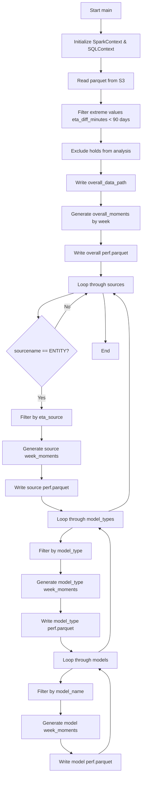
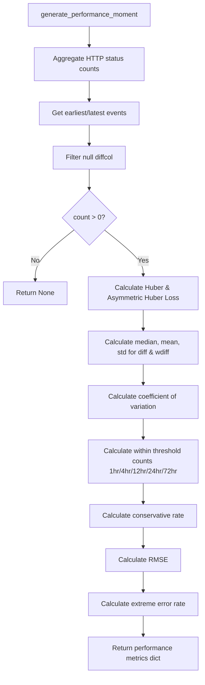
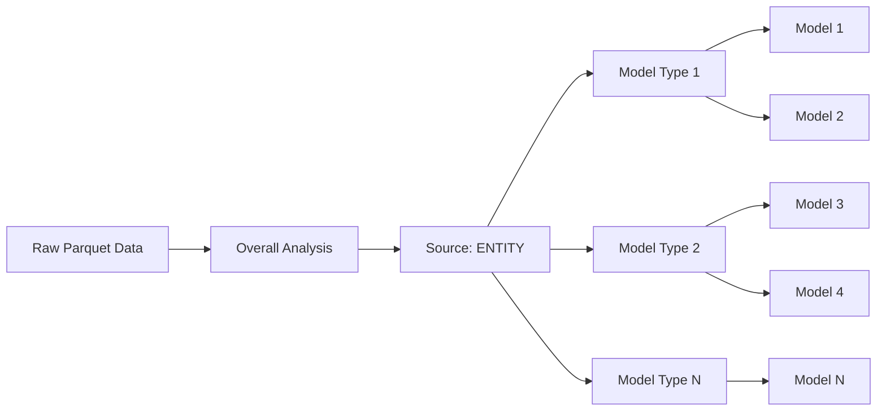
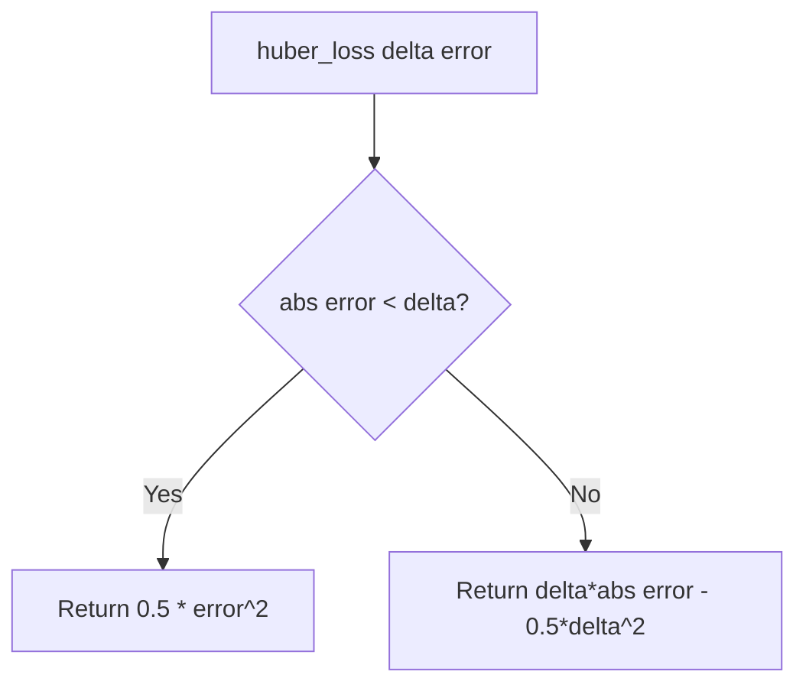
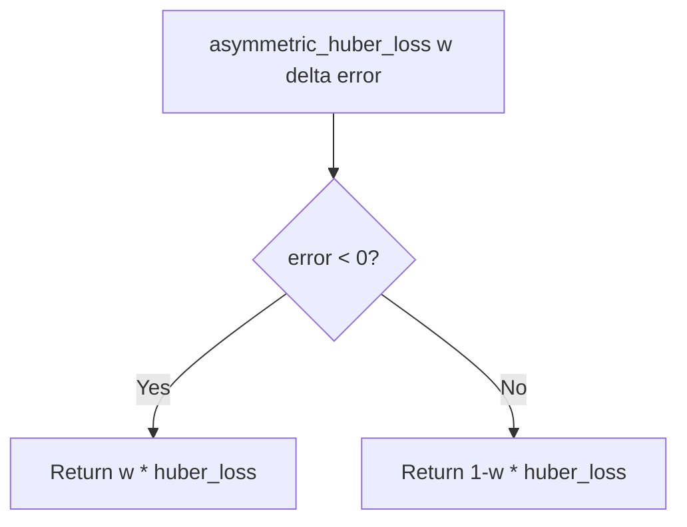
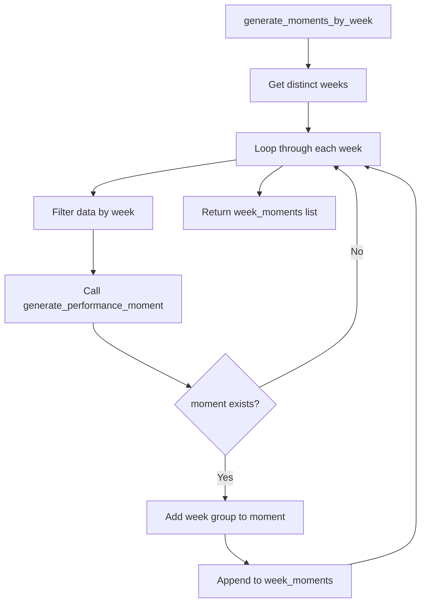

# Diagram: research/orchestrator/tasks/analytics/model_perf_spark.py

> Auto-generated by Obscura crawlers

## Diagram 1

### SVG

<svg id="container" width="466.4921875" xmlns="http://www.w3.org/2000/svg" class="flowchart" height="2559.765625" viewBox="0 0 466.4921875 2559.765625" role="graphics-document document" aria-roledescription="flowchart-v2"><g><marker id="container_flowchart-v2-pointEnd" class="marker flowchart-v2" viewBox="0 0 10 10" refX="5" refY="5" markerUnits="userSpaceOnUse" markerWidth="8" markerHeight="8" orient="auto"><path d="M 0 0 L 10 5 L 0 10 z" class="arrowMarkerPath" style="stroke-width: 1; stroke-dasharray: 1, 0;"></path></marker><marker id="container_flowchart-v2-pointStart" class="marker flowchart-v2" viewBox="0 0 10 10" refX="4.5" refY="5" markerUnits="userSpaceOnUse" markerWidth="8" markerHeight="8" orient="auto"><path d="M 0 5 L 10 10 L 10 0 z" class="arrowMarkerPath" style="stroke-width: 1; stroke-dasharray: 1, 0;"></path></marker><marker id="container_flowchart-v2-circleEnd" class="marker flowchart-v2" viewBox="0 0 10 10" refX="11" refY="5" markerUnits="userSpaceOnUse" markerWidth="11" markerHeight="11" orient="auto"><circle cx="5" cy="5" r="5" class="arrowMarkerPath" style="stroke-width: 1; stroke-dasharray: 1, 0;"></circle></marker><marker id="container_flowchart-v2-circleStart" class="marker flowchart-v2" viewBox="0 0 10 10" refX="-1" refY="5" markerUnits="userSpaceOnUse" markerWidth="11" markerHeight="11" orient="auto"><circle cx="5" cy="5" r="5" class="arrowMarkerPath" style="stroke-width: 1; stroke-dasharray: 1, 0;"></circle></marker><marker id="container_flowchart-v2-crossEnd" class="marker cross flowchart-v2" viewBox="0 0 11 11" refX="12" refY="5.2" markerUnits="userSpaceOnUse" markerWidth="11" markerHeight="11" orient="auto"><path d="M 1,1 l 9,9 M 10,1 l -9,9" class="arrowMarkerPath" style="stroke-width: 2; stroke-dasharray: 1, 0;"></path></marker><marker id="container_flowchart-v2-crossStart" class="marker cross flowchart-v2" viewBox="0 0 11 11" refX="-1" refY="5.2" markerUnits="userSpaceOnUse" markerWidth="11" markerHeight="11" orient="auto"><path d="M 1,1 l 9,9 M 10,1 l -9,9" class="arrowMarkerPath" style="stroke-width: 2; stroke-dasharray: 1, 0;"></path></marker><g class="root"><g class="clusters"></g><g class="edgePaths"><path d="M328.492,62L328.492,66.167C328.492,70.333,328.492,78.667,328.492,86.333C328.492,94,328.492,101,328.492,104.5L328.492,108" id="L_A_B_0" class="edge-thickness-normal edge-pattern-solid edge-thickness-normal edge-pattern-solid flowchart-link" style=";" data-edge="true" data-et="edge" data-id="L_A_B_0" data-points="W3sieCI6MzI4LjQ5MjE4NzUsInkiOjYyfSx7IngiOjMyOC40OTIxODc1LCJ5Ijo4N30seyJ4IjozMjguNDkyMTg3NSwieSI6MTEyfV0=" marker-end="url(#container_flowchart-v2-pointEnd)"></path><path d="M328.492,190L328.492,194.167C328.492,198.333,328.492,206.667,328.492,214.333C328.492,222,328.492,229,328.492,232.5L328.492,236" id="L_B_C_0" class="edge-thickness-normal edge-pattern-solid edge-thickness-normal edge-pattern-solid flowchart-link" style=";" data-edge="true" data-et="edge" data-id="L_B_C_0" data-points="W3sieCI6MzI4LjQ5MjE4NzUsInkiOjE5MH0seyJ4IjozMjguNDkyMTg3NSwieSI6MjE1fSx7IngiOjMyOC40OTIxODc1LCJ5IjoyNDB9XQ==" marker-end="url(#container_flowchart-v2-pointEnd)"></path><path d="M328.492,294L328.492,298.167C328.492,302.333,328.492,310.667,328.492,318.333C328.492,326,328.492,333,328.492,336.5L328.492,340" id="L_C_D_0" class="edge-thickness-normal edge-pattern-solid edge-thickness-normal edge-pattern-solid flowchart-link" style=";" data-edge="true" data-et="edge" data-id="L_C_D_0" data-points="W3sieCI6MzI4LjQ5MjE4NzUsInkiOjI5NH0seyJ4IjozMjguNDkyMTg3NSwieSI6MzE5fSx7IngiOjMyOC40OTIxODc1LCJ5IjozNDR9XQ==" marker-end="url(#container_flowchart-v2-pointEnd)"></path><path d="M328.492,422L328.492,426.167C328.492,430.333,328.492,438.667,328.492,446.333C328.492,454,328.492,461,328.492,464.5L328.492,468" id="L_D_E_0" class="edge-thickness-normal edge-pattern-solid edge-thickness-normal edge-pattern-solid flowchart-link" style=";" data-edge="true" data-et="edge" data-id="L_D_E_0" data-points="W3sieCI6MzI4LjQ5MjE4NzUsInkiOjQyMn0seyJ4IjozMjguNDkyMTg3NSwieSI6NDQ3fSx7IngiOjMyOC40OTIxODc1LCJ5Ijo0NzJ9XQ==" marker-end="url(#container_flowchart-v2-pointEnd)"></path><path d="M328.492,550L328.492,554.167C328.492,558.333,328.492,566.667,328.492,574.333C328.492,582,328.492,589,328.492,592.5L328.492,596" id="L_E_F_0" class="edge-thickness-normal edge-pattern-solid edge-thickness-normal edge-pattern-solid flowchart-link" style=";" data-edge="true" data-et="edge" data-id="L_E_F_0" data-points="W3sieCI6MzI4LjQ5MjE4NzUsInkiOjU1MH0seyJ4IjozMjguNDkyMTg3NSwieSI6NTc1fSx7IngiOjMyOC40OTIxODc1LCJ5Ijo2MDB9XQ==" marker-end="url(#container_flowchart-v2-pointEnd)"></path><path d="M328.492,654L328.492,658.167C328.492,662.333,328.492,670.667,328.492,678.333C328.492,686,328.492,693,328.492,696.5L328.492,700" id="L_F_G_0" class="edge-thickness-normal edge-pattern-solid edge-thickness-normal edge-pattern-solid flowchart-link" style=";" data-edge="true" data-et="edge" data-id="L_F_G_0" data-points="W3sieCI6MzI4LjQ5MjE4NzUsInkiOjY1NH0seyJ4IjozMjguNDkyMTg3NSwieSI6Njc5fSx7IngiOjMyOC40OTIxODc1LCJ5Ijo3MDR9XQ==" marker-end="url(#container_flowchart-v2-pointEnd)"></path><path d="M328.492,782L328.492,786.167C328.492,790.333,328.492,798.667,328.492,806.333C328.492,814,328.492,821,328.492,824.5L328.492,828" id="L_G_H_0" class="edge-thickness-normal edge-pattern-solid edge-thickness-normal edge-pattern-solid flowchart-link" style=";" data-edge="true" data-et="edge" data-id="L_G_H_0" data-points="W3sieCI6MzI4LjQ5MjE4NzUsInkiOjc4Mn0seyJ4IjozMjguNDkyMTg3NSwieSI6ODA3fSx7IngiOjMyOC40OTIxODc1LCJ5Ijo4MzJ9XQ==" marker-end="url(#container_flowchart-v2-pointEnd)"></path><path d="M328.492,886L328.492,890.167C328.492,894.333,328.492,902.667,328.492,910.333C328.492,918,328.492,925,328.492,928.5L328.492,932" id="L_H_I_0" class="edge-thickness-normal edge-pattern-solid edge-thickness-normal edge-pattern-solid flowchart-link" style=";" data-edge="true" data-et="edge" data-id="L_H_I_0" data-points="W3sieCI6MzI4LjQ5MjE4NzUsInkiOjg4Nn0seyJ4IjozMjguNDkyMTg3NSwieSI6OTExfSx7IngiOjMyOC40OTIxODc1LCJ5Ijo5MzZ9XQ==" marker-end="url(#container_flowchart-v2-pointEnd)"></path><path d="M241.771,990L221.964,996.167C202.157,1002.333,162.543,1014.667,143.467,1028.051C124.391,1041.435,125.852,1055.87,126.583,1063.087L127.313,1070.304" id="L_I_J_0" class="edge-thickness-normal edge-pattern-solid edge-thickness-normal edge-pattern-solid flowchart-link" style=";" data-edge="true" data-et="edge" data-id="L_I_J_0" data-points="W3sieCI6MjQxLjc3MDUwNzgxMjUsInkiOjk5MH0seyJ4IjoxMjIuOTI5Njg3NSwieSI6MTAyN30seyJ4IjoxMjcuNzE1OTA4NDQ3ODkzODQsInkiOjEwNzQuMjg0MDkxNTUyMTA2Mn1d" marker-end="url(#container_flowchart-v2-pointEnd)"></path><path d="M179.478,1105.478L187.183,1092.398C194.889,1079.318,210.3,1053.159,227.343,1034.265C244.386,1015.371,263.061,1003.743,272.398,997.929L281.736,992.114" id="L_J_I_0" class="edge-thickness-normal edge-pattern-solid edge-thickness-normal edge-pattern-solid flowchart-link" style=";" data-edge="true" data-et="edge" data-id="L_J_I_0" data-points="W3sieCI6MTc5LjQ3NzYyMzAzMzIwMjM1LCJ5IjoxMTA1LjQ3NzYyMzAzMzIwMjV9LHsieCI6MjI1LjcxMDkzNzUsInkiOjEwMjd9LHsieCI6Mjg1LjEzMTM0NzY1NjI1LCJ5Ijo5OTB9XQ==" marker-end="url(#container_flowchart-v2-pointEnd)"></path><path d="M138,1287.766L138,1293.932C138,1300.099,138,1312.432,138,1324.099C138,1335.766,138,1346.766,138,1352.266L138,1357.766" id="L_J_K_0" class="edge-thickness-normal edge-pattern-solid edge-thickness-normal edge-pattern-solid flowchart-link" style=";" data-edge="true" data-et="edge" data-id="L_J_K_0" data-points="W3sieCI6MTM4LCJ5IjoxMjg3Ljc2NTYyNX0seyJ4IjoxMzgsInkiOjEzMjQuNzY1NjI1fSx7IngiOjEzOCwieSI6MTM2MS43NjU2MjV9XQ==" marker-end="url(#container_flowchart-v2-pointEnd)"></path><path d="M138,1415.766L138,1419.932C138,1424.099,138,1432.432,138,1440.099C138,1447.766,138,1454.766,138,1458.266L138,1461.766" id="L_K_L_0" class="edge-thickness-normal edge-pattern-solid edge-thickness-normal edge-pattern-solid flowchart-link" style=";" data-edge="true" data-et="edge" data-id="L_K_L_0" data-points="W3sieCI6MTM4LCJ5IjoxNDE1Ljc2NTYyNX0seyJ4IjoxMzgsInkiOjE0NDAuNzY1NjI1fSx7IngiOjEzOCwieSI6MTQ2NS43NjU2MjV9XQ==" marker-end="url(#container_flowchart-v2-pointEnd)"></path><path d="M138,1543.766L138,1547.932C138,1552.099,138,1560.432,138,1568.099C138,1575.766,138,1582.766,138,1586.266L138,1589.766" id="L_L_M_0" class="edge-thickness-normal edge-pattern-solid edge-thickness-normal edge-pattern-solid flowchart-link" style=";" data-edge="true" data-et="edge" data-id="L_L_M_0" data-points="W3sieCI6MTM4LCJ5IjoxNTQzLjc2NTYyNX0seyJ4IjoxMzgsInkiOjE1NjguNzY1NjI1fSx7IngiOjEzOCwieSI6MTU5My43NjU2MjV9XQ==" marker-end="url(#container_flowchart-v2-pointEnd)"></path><path d="M138,1647.766L138,1651.932C138,1656.099,138,1664.432,148.762,1672.537C159.524,1680.641,181.047,1688.516,191.809,1692.454L202.571,1696.391" id="L_M_N_0" class="edge-thickness-normal edge-pattern-solid edge-thickness-normal edge-pattern-solid flowchart-link" style=";" data-edge="true" data-et="edge" data-id="L_M_N_0" data-points="W3sieCI6MTM4LCJ5IjoxNjQ3Ljc2NTYyNX0seyJ4IjoxMzgsInkiOjE2NzIuNzY1NjI1fSx7IngiOjIwNi4zMjc0NDg5MTgyNjkyMywieSI6MTY5Ny43NjU2MjV9XQ==" marker-end="url(#container_flowchart-v2-pointEnd)"></path><path d="M237.285,1751.766L230.674,1755.932C224.063,1760.099,210.842,1768.432,204.232,1776.099C197.621,1783.766,197.621,1790.766,197.621,1794.266L197.621,1797.766" id="L_N_O_0" class="edge-thickness-normal edge-pattern-solid edge-thickness-normal edge-pattern-solid flowchart-link" style=";" data-edge="true" data-et="edge" data-id="L_N_O_0" data-points="W3sieCI6MjM3LjI4NDU1NTI4ODQ2MTU1LCJ5IjoxNzUxLjc2NTYyNX0seyJ4IjoxOTcuNjIxMDkzNzUsInkiOjE3NzYuNzY1NjI1fSx7IngiOjE5Ny42MjEwOTM3NSwieSI6MTgwMS43NjU2MjV9XQ==" marker-end="url(#container_flowchart-v2-pointEnd)"></path><path d="M197.621,1855.766L197.621,1859.932C197.621,1864.099,197.621,1872.432,197.621,1880.099C197.621,1887.766,197.621,1894.766,197.621,1898.266L197.621,1901.766" id="L_O_P_0" class="edge-thickness-normal edge-pattern-solid edge-thickness-normal edge-pattern-solid flowchart-link" style=";" data-edge="true" data-et="edge" data-id="L_O_P_0" data-points="W3sieCI6MTk3LjYyMTA5Mzc1LCJ5IjoxODU1Ljc2NTYyNX0seyJ4IjoxOTcuNjIxMDkzNzUsInkiOjE4ODAuNzY1NjI1fSx7IngiOjE5Ny42MjEwOTM3NSwieSI6MTkwNS43NjU2MjV9XQ==" marker-end="url(#container_flowchart-v2-pointEnd)"></path><path d="M197.621,1983.766L197.621,1987.932C197.621,1992.099,197.621,2000.432,197.621,2008.099C197.621,2015.766,197.621,2022.766,197.621,2026.266L197.621,2029.766" id="L_P_Q_0" class="edge-thickness-normal edge-pattern-solid edge-thickness-normal edge-pattern-solid flowchart-link" style=";" data-edge="true" data-et="edge" data-id="L_P_Q_0" data-points="W3sieCI6MTk3LjYyMTA5Mzc1LCJ5IjoxOTgzLjc2NTYyNX0seyJ4IjoxOTcuNjIxMDkzNzUsInkiOjIwMDguNzY1NjI1fSx7IngiOjE5Ny42MjEwOTM3NSwieSI6MjAzMy43NjU2MjV9XQ==" marker-end="url(#container_flowchart-v2-pointEnd)"></path><path d="M197.621,2111.766L197.621,2115.932C197.621,2120.099,197.621,2128.432,203.668,2136.41C209.714,2144.388,221.807,2152.01,227.854,2155.822L233.901,2159.633" id="L_Q_R_0" class="edge-thickness-normal edge-pattern-solid edge-thickness-normal edge-pattern-solid flowchart-link" style=";" data-edge="true" data-et="edge" data-id="L_Q_R_0" data-points="W3sieCI6MTk3LjYyMTA5Mzc1LCJ5IjoyMTExLjc2NTYyNX0seyJ4IjoxOTcuNjIxMDkzNzUsInkiOjIxMzYuNzY1NjI1fSx7IngiOjIzNy4yODQ1NTUyODg0NjE1NSwieSI6MjE2MS43NjU2MjV9XQ==" marker-end="url(#container_flowchart-v2-pointEnd)"></path><path d="M237.285,2215.766L230.674,2219.932C224.063,2224.099,210.842,2232.432,204.232,2240.099C197.621,2247.766,197.621,2254.766,197.621,2258.266L197.621,2261.766" id="L_R_S_0" class="edge-thickness-normal edge-pattern-solid edge-thickness-normal edge-pattern-solid flowchart-link" style=";" data-edge="true" data-et="edge" data-id="L_R_S_0" data-points="W3sieCI6MjM3LjI4NDU1NTI4ODQ2MTU1LCJ5IjoyMjE1Ljc2NTYyNX0seyJ4IjoxOTcuNjIxMDkzNzUsInkiOjIyNDAuNzY1NjI1fSx7IngiOjE5Ny42MjEwOTM3NSwieSI6MjI2NS43NjU2MjV9XQ==" marker-end="url(#container_flowchart-v2-pointEnd)"></path><path d="M197.621,2319.766L197.621,2323.932C197.621,2328.099,197.621,2336.432,197.621,2344.099C197.621,2351.766,197.621,2358.766,197.621,2362.266L197.621,2365.766" id="L_S_T_0" class="edge-thickness-normal edge-pattern-solid edge-thickness-normal edge-pattern-solid flowchart-link" style=";" data-edge="true" data-et="edge" data-id="L_S_T_0" data-points="W3sieCI6MTk3LjYyMTA5Mzc1LCJ5IjoyMzE5Ljc2NTYyNX0seyJ4IjoxOTcuNjIxMDkzNzUsInkiOjIzNDQuNzY1NjI1fSx7IngiOjE5Ny42MjEwOTM3NSwieSI6MjM2OS43NjU2MjV9XQ==" marker-end="url(#container_flowchart-v2-pointEnd)"></path><path d="M197.621,2447.766L197.621,2451.932C197.621,2456.099,197.621,2464.432,203.668,2472.41C209.714,2480.388,221.807,2488.01,227.854,2491.822L233.901,2495.633" id="L_T_U_0" class="edge-thickness-normal edge-pattern-solid edge-thickness-normal edge-pattern-solid flowchart-link" style=";" data-edge="true" data-et="edge" data-id="L_T_U_0" data-points="W3sieCI6MTk3LjYyMTA5Mzc1LCJ5IjoyNDQ3Ljc2NTYyNX0seyJ4IjoxOTcuNjIxMDkzNzUsInkiOjI0NzIuNzY1NjI1fSx7IngiOjIzNy4yODQ1NTUyODg0NjE1NSwieSI6MjQ5Ny43NjU2MjV9XQ==" marker-end="url(#container_flowchart-v2-pointEnd)"></path><path d="M322.958,2497.766L329.568,2493.599C336.179,2489.432,349.4,2481.099,356.011,2466.266C362.621,2451.432,362.621,2430.099,362.621,2408.766C362.621,2387.432,362.621,2366.099,362.621,2346.766C362.621,2327.432,362.621,2310.099,362.621,2292.766C362.621,2275.432,362.621,2258.099,356.575,2245.621C350.528,2233.143,338.435,2225.521,332.388,2221.71L326.342,2217.899" id="L_U_R_0" class="edge-thickness-normal edge-pattern-solid edge-thickness-normal edge-pattern-solid flowchart-link" style=";" data-edge="true" data-et="edge" data-id="L_U_R_0" data-points="W3sieCI6MzIyLjk1NzYzMjIxMTUzODQ1LCJ5IjoyNDk3Ljc2NTYyNX0seyJ4IjozNjIuNjIxMDkzNzUsInkiOjI0NzIuNzY1NjI1fSx7IngiOjM2Mi42MjEwOTM3NSwieSI6MjQwOC43NjU2MjV9LHsieCI6MzYyLjYyMTA5Mzc1LCJ5IjoyMzQ0Ljc2NTYyNX0seyJ4IjozNjIuNjIxMDkzNzUsInkiOjIyOTIuNzY1NjI1fSx7IngiOjM2Mi42MjEwOTM3NSwieSI6MjI0MC43NjU2MjV9LHsieCI6MzIyLjk1NzYzMjIxMTUzODQ1LCJ5IjoyMjE1Ljc2NTYyNX1d" marker-end="url(#container_flowchart-v2-pointEnd)"></path><path d="M322.958,2161.766L329.568,2157.599C336.179,2153.432,349.4,2145.099,356.011,2130.266C362.621,2115.432,362.621,2094.099,362.621,2072.766C362.621,2051.432,362.621,2030.099,362.621,2008.766C362.621,1987.432,362.621,1966.099,362.621,1944.766C362.621,1923.432,362.621,1902.099,362.621,1882.766C362.621,1863.432,362.621,1846.099,362.621,1828.766C362.621,1811.432,362.621,1794.099,356.575,1781.621C350.528,1769.143,338.435,1761.521,332.388,1757.71L326.342,1753.899" id="L_R_N_0" class="edge-thickness-normal edge-pattern-solid edge-thickness-normal edge-pattern-solid flowchart-link" style=";" data-edge="true" data-et="edge" data-id="L_R_N_0" data-points="W3sieCI6MzIyLjk1NzYzMjIxMTUzODQ1LCJ5IjoyMTYxLjc2NTYyNX0seyJ4IjozNjIuNjIxMDkzNzUsInkiOjIxMzYuNzY1NjI1fSx7IngiOjM2Mi42MjEwOTM3NSwieSI6MjA3Mi43NjU2MjV9LHsieCI6MzYyLjYyMTA5Mzc1LCJ5IjoyMDA4Ljc2NTYyNX0seyJ4IjozNjIuNjIxMDkzNzUsInkiOjE5NDQuNzY1NjI1fSx7IngiOjM2Mi42MjEwOTM3NSwieSI6MTg4MC43NjU2MjV9LHsieCI6MzYyLjYyMTA5Mzc1LCJ5IjoxODI4Ljc2NTYyNX0seyJ4IjozNjIuNjIxMDkzNzUsInkiOjE3NzYuNzY1NjI1fSx7IngiOjMyMi45NTc2MzIyMTE1Mzg0NSwieSI6MTc1MS43NjU2MjV9XQ==" marker-end="url(#container_flowchart-v2-pointEnd)"></path><path d="M353.915,1697.766L365.303,1693.599C376.691,1689.432,399.466,1681.099,410.854,1668.266C422.242,1655.432,422.242,1638.099,422.242,1620.766C422.242,1603.432,422.242,1586.099,422.242,1566.766C422.242,1547.432,422.242,1526.099,422.242,1504.766C422.242,1483.432,422.242,1462.099,422.242,1442.766C422.242,1423.432,422.242,1406.099,422.242,1386.766C422.242,1367.432,422.242,1346.099,422.242,1310.618C422.242,1275.138,422.242,1225.51,422.242,1175.883C422.242,1126.255,422.242,1076.628,413.76,1046.023C405.277,1015.418,388.312,1003.837,379.829,998.046L371.347,992.255" id="L_N_I_0" class="edge-thickness-normal edge-pattern-solid edge-thickness-normal edge-pattern-solid flowchart-link" style=";" data-edge="true" data-et="edge" data-id="L_N_I_0" data-points="W3sieCI6MzUzLjkxNDczODU4MTczMDgsInkiOjE2OTcuNzY1NjI1fSx7IngiOjQyMi4yNDIxODc1LCJ5IjoxNjcyLjc2NTYyNX0seyJ4Ijo0MjIuMjQyMTg3NSwieSI6MTYyMC43NjU2MjV9LHsieCI6NDIyLjI0MjE4NzUsInkiOjE1NjguNzY1NjI1fSx7IngiOjQyMi4yNDIxODc1LCJ5IjoxNTA0Ljc2NTYyNX0seyJ4Ijo0MjIuMjQyMTg3NSwieSI6MTQ0MC43NjU2MjV9LHsieCI6NDIyLjI0MjE4NzUsInkiOjEzODguNzY1NjI1fSx7IngiOjQyMi4yNDIxODc1LCJ5IjoxMzI0Ljc2NTYyNX0seyJ4Ijo0MjIuMjQyMTg3NSwieSI6MTE3NS44ODI4MTI1fSx7IngiOjQyMi4yNDIxODc1LCJ5IjoxMDI3fSx7IngiOjM2OC4wNDI5Njg3NSwieSI6OTkwfV0=" marker-end="url(#container_flowchart-v2-pointEnd)"></path><path d="M334.85,990L336.302,996.167C337.754,1002.333,340.658,1014.667,342.11,1040.48C343.563,1066.294,343.563,1105.589,343.563,1125.236L343.563,1144.883" id="L_I_V_0" class="edge-thickness-normal edge-pattern-solid edge-thickness-normal edge-pattern-solid flowchart-link" style=";" data-edge="true" data-et="edge" data-id="L_I_V_0" data-points="W3sieCI6MzM0Ljg0OTk3NTU4NTkzNzUsInkiOjk5MH0seyJ4IjozNDMuNTYyNSwieSI6MTAyN30seyJ4IjozNDMuNTYyNSwieSI6MTE0OC44ODI4MTI1fV0=" marker-end="url(#container_flowchart-v2-pointEnd)"></path></g><g class="edgeLabels"><g class="edgeLabel"><g class="label" data-id="L_A_B_0" transform="translate(0, 0)"><foreignObject width="0" height="0">

</foreignObject></g></g><g class="edgeLabel"><g class="label" data-id="L_B_C_0" transform="translate(0, 0)"><foreignObject width="0" height="0">

</foreignObject></g></g><g class="edgeLabel"><g class="label" data-id="L_C_D_0" transform="translate(0, 0)"><foreignObject width="0" height="0">

</foreignObject></g></g><g class="edgeLabel"><g class="label" data-id="L_D_E_0" transform="translate(0, 0)"><foreignObject width="0" height="0">

</foreignObject></g></g><g class="edgeLabel"><g class="label" data-id="L_E_F_0" transform="translate(0, 0)"><foreignObject width="0" height="0">

</foreignObject></g></g><g class="edgeLabel"><g class="label" data-id="L_F_G_0" transform="translate(0, 0)"><foreignObject width="0" height="0">

</foreignObject></g></g><g class="edgeLabel"><g class="label" data-id="L_G_H_0" transform="translate(0, 0)"><foreignObject width="0" height="0">

</foreignObject></g></g><g class="edgeLabel"><g class="label" data-id="L_H_I_0" transform="translate(0, 0)"><foreignObject width="0" height="0">

</foreignObject></g></g><g class="edgeLabel"><g class="label" data-id="L_I_J_0" transform="translate(0, 0)"><foreignObject width="0" height="0">

</foreignObject></g></g><g class="edgeLabel" transform="translate(220.35958, 1036.08354)"><g class="label" data-id="L_J_I_0" transform="translate(-10.140625, -12)"><foreignObject width="20.28125" height="24">

No

</foreignObject></g></g><g class="edgeLabel" transform="translate(138, 1324.765625)"><g class="label" data-id="L_J_K_0" transform="translate(-12.03125, -12)"><foreignObject width="24.0625" height="24">

Yes

</foreignObject></g></g><g class="edgeLabel"><g class="label" data-id="L_K_L_0" transform="translate(0, 0)"><foreignObject width="0" height="0">

</foreignObject></g></g><g class="edgeLabel"><g class="label" data-id="L_L_M_0" transform="translate(0, 0)"><foreignObject width="0" height="0">

</foreignObject></g></g><g class="edgeLabel"><g class="label" data-id="L_M_N_0" transform="translate(0, 0)"><foreignObject width="0" height="0">

</foreignObject></g></g><g class="edgeLabel"><g class="label" data-id="L_N_O_0" transform="translate(0, 0)"><foreignObject width="0" height="0">

</foreignObject></g></g><g class="edgeLabel"><g class="label" data-id="L_O_P_0" transform="translate(0, 0)"><foreignObject width="0" height="0">

</foreignObject></g></g><g class="edgeLabel"><g class="label" data-id="L_P_Q_0" transform="translate(0, 0)"><foreignObject width="0" height="0">

</foreignObject></g></g><g class="edgeLabel"><g class="label" data-id="L_Q_R_0" transform="translate(0, 0)"><foreignObject width="0" height="0">

</foreignObject></g></g><g class="edgeLabel"><g class="label" data-id="L_R_S_0" transform="translate(0, 0)"><foreignObject width="0" height="0">

</foreignObject></g></g><g class="edgeLabel"><g class="label" data-id="L_S_T_0" transform="translate(0, 0)"><foreignObject width="0" height="0">

</foreignObject></g></g><g class="edgeLabel"><g class="label" data-id="L_T_U_0" transform="translate(0, 0)"><foreignObject width="0" height="0">

</foreignObject></g></g><g class="edgeLabel"><g class="label" data-id="L_U_R_0" transform="translate(0, 0)"><foreignObject width="0" height="0">

</foreignObject></g></g><g class="edgeLabel"><g class="label" data-id="L_R_N_0" transform="translate(0, 0)"><foreignObject width="0" height="0">

</foreignObject></g></g><g class="edgeLabel"><g class="label" data-id="L_N_I_0" transform="translate(0, 0)"><foreignObject width="0" height="0">

</foreignObject></g></g><g class="edgeLabel"><g class="label" data-id="L_I_V_0" transform="translate(0, 0)"><foreignObject width="0" height="0">

</foreignObject></g></g></g><g class="nodes"><g class="node default" id="flowchart-A-0" transform="translate(328.4921875, 35)"><rect class="basic label-container" style="" x="-67.796875" y="-27" width="135.59375" height="54"></rect><g class="label" style="" transform="translate(-37.796875, -12)"><rect></rect><foreignObject width="75.59375" height="24">

Start main

</foreignObject></g></g><g class="node default" id="flowchart-B-1" transform="translate(328.4921875, 151)"><rect class="basic label-container" style="" x="-130" y="-39" width="260" height="78"></rect><g class="label" style="" transform="translate(-100, -24)"><rect></rect><foreignObject width="200" height="48">

Initialize SparkContext &amp; SQLContext

</foreignObject></g></g><g class="node default" id="flowchart-C-3" transform="translate(328.4921875, 267)"><rect class="basic label-container" style="" x="-108.46875" y="-27" width="216.9375" height="54"></rect><g class="label" style="" transform="translate(-78.46875, -12)"><rect></rect><foreignObject width="156.9375" height="24">

Read parquet from S3

</foreignObject></g></g><g class="node default" id="flowchart-D-5" transform="translate(328.4921875, 383)"><rect class="basic label-container" style="" x="-130" y="-39" width="260" height="78"></rect><g class="label" style="" transform="translate(-100, -24)"><rect></rect><foreignObject width="200" height="48">

Filter extreme values eta_diff_minutes &lt; 90 days

</foreignObject></g></g><g class="node default" id="flowchart-E-7" transform="translate(328.4921875, 511)"><rect class="basic label-container" style="" x="-130" y="-39" width="260" height="78"></rect><g class="label" style="" transform="translate(-100, -24)"><rect></rect><foreignObject width="200" height="48">

Exclude holds from analysis

</foreignObject></g></g><g class="node default" id="flowchart-F-9" transform="translate(328.4921875, 627)"><rect class="basic label-container" style="" x="-116.9140625" y="-27" width="233.828125" height="54"></rect><g class="label" style="" transform="translate(-86.9140625, -12)"><rect></rect><foreignObject width="173.828125" height="24">

Write overall_data_path

</foreignObject></g></g><g class="node default" id="flowchart-G-11" transform="translate(328.4921875, 743)"><rect class="basic label-container" style="" x="-130" y="-39" width="260" height="78"></rect><g class="label" style="" transform="translate(-100, -24)"><rect></rect><foreignObject width="200" height="48">

Generate overall_moments by week

</foreignObject></g></g><g class="node default" id="flowchart-H-13" transform="translate(328.4921875, 859)"><rect class="basic label-container" style="" x="-122.9140625" y="-27" width="245.828125" height="54"></rect><g class="label" style="" transform="translate(-92.9140625, -12)"><rect></rect><foreignObject width="185.828125" height="24">

Write overall perf.parquet

</foreignObject></g></g><g class="node default" id="flowchart-I-15" transform="translate(328.4921875, 963)"><rect class="basic label-container" style="" x="-108.3984375" y="-27" width="216.796875" height="54"></rect><g class="label" style="" transform="translate(-78.3984375, -12)"><rect></rect><foreignObject width="156.796875" height="24">

Loop through sources

</foreignObject></g></g><g class="node default" id="flowchart-J-17" transform="translate(138, 1175.8828125)"><polygon points="111.8828125,0 223.765625,-111.8828125 111.8828125,-223.765625 0,-111.8828125" class="label-container" transform="translate(-111.3828125, 111.8828125)"></polygon><g class="label" style="" transform="translate(-84.8828125, -12)"><rect></rect><foreignObject width="169.765625" height="24">

sourcename == ENTITY?

</foreignObject></g></g><g class="node default" id="flowchart-K-21" transform="translate(138, 1388.765625)"><rect class="basic label-container" style="" x="-101.0078125" y="-27" width="202.015625" height="54"></rect><g class="label" style="" transform="translate(-71.0078125, -12)"><rect></rect><foreignObject width="142.015625" height="24">

Filter by eta_source

</foreignObject></g></g><g class="node default" id="flowchart-L-23" transform="translate(138, 1504.765625)"><rect class="basic label-container" style="" x="-130" y="-39" width="260" height="78"></rect><g class="label" style="" transform="translate(-100, -24)"><rect></rect><foreignObject width="200" height="48">

Generate source week_moments

</foreignObject></g></g><g class="node default" id="flowchart-M-25" transform="translate(138, 1620.765625)"><rect class="basic label-container" style="" x="-122.1796875" y="-27" width="244.359375" height="54"></rect><g class="label" style="" transform="translate(-92.1796875, -12)"><rect></rect><foreignObject width="184.359375" height="24">

Write source perf.parquet

</foreignObject></g></g><g class="node default" id="flowchart-N-27" transform="translate(280.12109375, 1724.765625)"><rect class="basic label-container" style="" x="-127.375" y="-27" width="254.75" height="54"></rect><g class="label" style="" transform="translate(-97.375, -12)"><rect></rect><foreignObject width="194.75" height="24">

Loop through model_types

</foreignObject></g></g><g class="node default" id="flowchart-O-29" transform="translate(197.62109375, 1828.765625)"><rect class="basic label-container" style="" x="-104.2734375" y="-27" width="208.546875" height="54"></rect><g class="label" style="" transform="translate(-74.2734375, -12)"><rect></rect><foreignObject width="148.546875" height="24">

Filter by model_type

</foreignObject></g></g><g class="node default" id="flowchart-P-31" transform="translate(197.62109375, 1944.765625)"><rect class="basic label-container" style="" x="-130" y="-39" width="260" height="78"></rect><g class="label" style="" transform="translate(-100, -24)"><rect></rect><foreignObject width="200" height="48">

Generate model_type week_moments

</foreignObject></g></g><g class="node default" id="flowchart-Q-33" transform="translate(197.62109375, 2072.765625)"><rect class="basic label-container" style="" x="-130" y="-39" width="260" height="78"></rect><g class="label" style="" transform="translate(-100, -24)"><rect></rect><foreignObject width="200" height="48">

Write model_type perf.parquet

</foreignObject></g></g><g class="node default" id="flowchart-R-35" transform="translate(280.12109375, 2188.765625)"><rect class="basic label-container" style="" x="-107.4765625" y="-27" width="214.953125" height="54"></rect><g class="label" style="" transform="translate(-77.4765625, -12)"><rect></rect><foreignObject width="154.953125" height="24">

Loop through models

</foreignObject></g></g><g class="node default" id="flowchart-S-37" transform="translate(197.62109375, 2292.765625)"><rect class="basic label-container" style="" x="-108.796875" y="-27" width="217.59375" height="54"></rect><g class="label" style="" transform="translate(-78.796875, -12)"><rect></rect><foreignObject width="157.59375" height="24">

Filter by model_name

</foreignObject></g></g><g class="node default" id="flowchart-T-39" transform="translate(197.62109375, 2408.765625)"><rect class="basic label-container" style="" x="-130" y="-39" width="260" height="78"></rect><g class="label" style="" transform="translate(-100, -24)"><rect></rect><foreignObject width="200" height="48">

Generate model week_moments

</foreignObject></g></g><g class="node default" id="flowchart-U-41" transform="translate(280.12109375, 2524.765625)"><rect class="basic label-container" style="" x="-121.2578125" y="-27" width="242.515625" height="54"></rect><g class="label" style="" transform="translate(-91.2578125, -12)"><rect></rect><foreignObject width="182.515625" height="24">

Write model perf.parquet

</foreignObject></g></g><g class="node default" id="flowchart-V-49" transform="translate(343.5625, 1175.8828125)"><rect class="basic label-container" style="" x="-43.6796875" y="-27" width="87.359375" height="54"></rect><g class="label" style="" transform="translate(-13.6796875, -12)"><rect></rect><foreignObject width="27.359375" height="24">

End

</foreignObject></g></g></g></g></g></svg>

## Diagram 2

### SVG

<svg id="container" width="477.421875" xmlns="http://www.w3.org/2000/svg" class="flowchart" height="1607.578125" viewBox="0 0 477.421875 1607.578125" role="graphics-document document" aria-roledescription="flowchart-v2"><g><marker id="container_flowchart-v2-pointEnd" class="marker flowchart-v2" viewBox="0 0 10 10" refX="5" refY="5" markerUnits="userSpaceOnUse" markerWidth="8" markerHeight="8" orient="auto"><path d="M 0 0 L 10 5 L 0 10 z" class="arrowMarkerPath" style="stroke-width: 1; stroke-dasharray: 1, 0;"></path></marker><marker id="container_flowchart-v2-pointStart" class="marker flowchart-v2" viewBox="0 0 10 10" refX="4.5" refY="5" markerUnits="userSpaceOnUse" markerWidth="8" markerHeight="8" orient="auto"><path d="M 0 5 L 10 10 L 10 0 z" class="arrowMarkerPath" style="stroke-width: 1; stroke-dasharray: 1, 0;"></path></marker><marker id="container_flowchart-v2-circleEnd" class="marker flowchart-v2" viewBox="0 0 10 10" refX="11" refY="5" markerUnits="userSpaceOnUse" markerWidth="11" markerHeight="11" orient="auto"><circle cx="5" cy="5" r="5" class="arrowMarkerPath" style="stroke-width: 1; stroke-dasharray: 1, 0;"></circle></marker><marker id="container_flowchart-v2-circleStart" class="marker flowchart-v2" viewBox="0 0 10 10" refX="-1" refY="5" markerUnits="userSpaceOnUse" markerWidth="11" markerHeight="11" orient="auto"><circle cx="5" cy="5" r="5" class="arrowMarkerPath" style="stroke-width: 1; stroke-dasharray: 1, 0;"></circle></marker><marker id="container_flowchart-v2-crossEnd" class="marker cross flowchart-v2" viewBox="0 0 11 11" refX="12" refY="5.2" markerUnits="userSpaceOnUse" markerWidth="11" markerHeight="11" orient="auto"><path d="M 1,1 l 9,9 M 10,1 l -9,9" class="arrowMarkerPath" style="stroke-width: 2; stroke-dasharray: 1, 0;"></path></marker><marker id="container_flowchart-v2-crossStart" class="marker cross flowchart-v2" viewBox="0 0 11 11" refX="-1" refY="5.2" markerUnits="userSpaceOnUse" markerWidth="11" markerHeight="11" orient="auto"><path d="M 1,1 l 9,9 M 10,1 l -9,9" class="arrowMarkerPath" style="stroke-width: 2; stroke-dasharray: 1, 0;"></path></marker><g class="root"><g class="clusters"></g><g class="edgePaths"><path d="M211.566,62L211.566,66.167C211.566,70.333,211.566,78.667,211.566,86.333C211.566,94,211.566,101,211.566,104.5L211.566,108" id="L_A_B_0" class="edge-thickness-normal edge-pattern-solid edge-thickness-normal edge-pattern-solid flowchart-link" style=";" data-edge="true" data-et="edge" data-id="L_A_B_0" data-points="W3sieCI6MjExLjU2NjQwNjI1LCJ5Ijo2Mn0seyJ4IjoyMTEuNTY2NDA2MjUsInkiOjg3fSx7IngiOjIxMS41NjY0MDYyNSwieSI6MTEyfV0=" marker-end="url(#container_flowchart-v2-pointEnd)"></path><path d="M211.566,190L211.566,194.167C211.566,198.333,211.566,206.667,211.566,214.333C211.566,222,211.566,229,211.566,232.5L211.566,236" id="L_B_C_0" class="edge-thickness-normal edge-pattern-solid edge-thickness-normal edge-pattern-solid flowchart-link" style=";" data-edge="true" data-et="edge" data-id="L_B_C_0" data-points="W3sieCI6MjExLjU2NjQwNjI1LCJ5IjoxOTB9LHsieCI6MjExLjU2NjQwNjI1LCJ5IjoyMTV9LHsieCI6MjExLjU2NjQwNjI1LCJ5IjoyNDB9XQ==" marker-end="url(#container_flowchart-v2-pointEnd)"></path><path d="M211.566,294L211.566,298.167C211.566,302.333,211.566,310.667,211.566,318.333C211.566,326,211.566,333,211.566,336.5L211.566,340" id="L_C_D_0" class="edge-thickness-normal edge-pattern-solid edge-thickness-normal edge-pattern-solid flowchart-link" style=";" data-edge="true" data-et="edge" data-id="L_C_D_0" data-points="W3sieCI6MjExLjU2NjQwNjI1LCJ5IjoyOTR9LHsieCI6MjExLjU2NjQwNjI1LCJ5IjozMTl9LHsieCI6MjExLjU2NjQwNjI1LCJ5IjozNDR9XQ==" marker-end="url(#container_flowchart-v2-pointEnd)"></path><path d="M211.566,398L211.566,402.167C211.566,406.333,211.566,414.667,211.566,422.333C211.566,430,211.566,437,211.566,440.5L211.566,444" id="L_D_E_0" class="edge-thickness-normal edge-pattern-solid edge-thickness-normal edge-pattern-solid flowchart-link" style=";" data-edge="true" data-et="edge" data-id="L_D_E_0" data-points="W3sieCI6MjExLjU2NjQwNjI1LCJ5IjozOTh9LHsieCI6MjExLjU2NjQwNjI1LCJ5Ijo0MjN9LHsieCI6MjExLjU2NjQwNjI1LCJ5Ijo0NDh9XQ==" marker-end="url(#container_flowchart-v2-pointEnd)"></path><path d="M175.896,539.908L160.532,552.02C145.168,564.131,114.439,588.355,99.075,607.966C83.711,627.578,83.711,642.578,83.711,650.078L83.711,657.578" id="L_E_F_0" class="edge-thickness-normal edge-pattern-solid edge-thickness-normal edge-pattern-solid flowchart-link" style=";" data-edge="true" data-et="edge" data-id="L_E_F_0" data-points="W3sieCI6MTc1Ljg5NjI3NDc5MTAzNjcsInkiOjUzOS45MDc5OTM1NDEwMzY3fSx7IngiOjgzLjcxMDkzNzUsInkiOjYxMi41NzgxMjV9LHsieCI6ODMuNzEwOTM3NSwieSI6NjYxLjU3ODEyNX1d" marker-end="url(#container_flowchart-v2-pointEnd)"></path><path d="M247.237,539.908L262.601,552.02C277.965,564.131,308.693,588.355,324.058,605.966C339.422,623.578,339.422,634.578,339.422,640.078L339.422,645.578" id="L_E_G_0" class="edge-thickness-normal edge-pattern-solid edge-thickness-normal edge-pattern-solid flowchart-link" style=";" data-edge="true" data-et="edge" data-id="L_E_G_0" data-points="W3sieCI6MjQ3LjIzNjUzNzcwODk2MzMsInkiOjUzOS45MDc5OTM1NDEwMzY3fSx7IngiOjMzOS40MjE4NzUsInkiOjYxMi41NzgxMjV9LHsieCI6MzM5LjQyMTg3NSwieSI6NjQ5LjU3ODEyNX1d" marker-end="url(#container_flowchart-v2-pointEnd)"></path><path d="M339.422,727.578L339.422,731.745C339.422,735.911,339.422,744.245,339.422,751.911C339.422,759.578,339.422,766.578,339.422,770.078L339.422,773.578" id="L_G_H_0" class="edge-thickness-normal edge-pattern-solid edge-thickness-normal edge-pattern-solid flowchart-link" style=";" data-edge="true" data-et="edge" data-id="L_G_H_0" data-points="W3sieCI6MzM5LjQyMTg3NSwieSI6NzI3LjU3ODEyNX0seyJ4IjozMzkuNDIxODc1LCJ5Ijo3NTIuNTc4MTI1fSx7IngiOjMzOS40MjE4NzUsInkiOjc3Ny41NzgxMjV9XQ==" marker-end="url(#container_flowchart-v2-pointEnd)"></path><path d="M339.422,855.578L339.422,859.745C339.422,863.911,339.422,872.245,339.422,879.911C339.422,887.578,339.422,894.578,339.422,898.078L339.422,901.578" id="L_H_I_0" class="edge-thickness-normal edge-pattern-solid edge-thickness-normal edge-pattern-solid flowchart-link" style=";" data-edge="true" data-et="edge" data-id="L_H_I_0" data-points="W3sieCI6MzM5LjQyMTg3NSwieSI6ODU1LjU3ODEyNX0seyJ4IjozMzkuNDIxODc1LCJ5Ijo4ODAuNTc4MTI1fSx7IngiOjMzOS40MjE4NzUsInkiOjkwNS41NzgxMjV9XQ==" marker-end="url(#container_flowchart-v2-pointEnd)"></path><path d="M339.422,983.578L339.422,987.745C339.422,991.911,339.422,1000.245,339.422,1007.911C339.422,1015.578,339.422,1022.578,339.422,1026.078L339.422,1029.578" id="L_I_J_0" class="edge-thickness-normal edge-pattern-solid edge-thickness-normal edge-pattern-solid flowchart-link" style=";" data-edge="true" data-et="edge" data-id="L_I_J_0" data-points="W3sieCI6MzM5LjQyMTg3NSwieSI6OTgzLjU3ODEyNX0seyJ4IjozMzkuNDIxODc1LCJ5IjoxMDA4LjU3ODEyNX0seyJ4IjozMzkuNDIxODc1LCJ5IjoxMDMzLjU3ODEyNX1d" marker-end="url(#container_flowchart-v2-pointEnd)"></path><path d="M339.422,1135.578L339.422,1139.745C339.422,1143.911,339.422,1152.245,339.422,1159.911C339.422,1167.578,339.422,1174.578,339.422,1178.078L339.422,1181.578" id="L_J_K_0" class="edge-thickness-normal edge-pattern-solid edge-thickness-normal edge-pattern-solid flowchart-link" style=";" data-edge="true" data-et="edge" data-id="L_J_K_0" data-points="W3sieCI6MzM5LjQyMTg3NSwieSI6MTEzNS41NzgxMjV9LHsieCI6MzM5LjQyMTg3NSwieSI6MTE2MC41NzgxMjV9LHsieCI6MzM5LjQyMTg3NSwieSI6MTE4NS41NzgxMjV9XQ==" marker-end="url(#container_flowchart-v2-pointEnd)"></path><path d="M339.422,1239.578L339.422,1243.745C339.422,1247.911,339.422,1256.245,339.422,1263.911C339.422,1271.578,339.422,1278.578,339.422,1282.078L339.422,1285.578" id="L_K_L_0" class="edge-thickness-normal edge-pattern-solid edge-thickness-normal edge-pattern-solid flowchart-link" style=";" data-edge="true" data-et="edge" data-id="L_K_L_0" data-points="W3sieCI6MzM5LjQyMTg3NSwieSI6MTIzOS41NzgxMjV9LHsieCI6MzM5LjQyMTg3NSwieSI6MTI2NC41NzgxMjV9LHsieCI6MzM5LjQyMTg3NSwieSI6MTI4OS41NzgxMjV9XQ==" marker-end="url(#container_flowchart-v2-pointEnd)"></path><path d="M339.422,1343.578L339.422,1347.745C339.422,1351.911,339.422,1360.245,339.422,1367.911C339.422,1375.578,339.422,1382.578,339.422,1386.078L339.422,1389.578" id="L_L_M_0" class="edge-thickness-normal edge-pattern-solid edge-thickness-normal edge-pattern-solid flowchart-link" style=";" data-edge="true" data-et="edge" data-id="L_L_M_0" data-points="W3sieCI6MzM5LjQyMTg3NSwieSI6MTM0My41NzgxMjV9LHsieCI6MzM5LjQyMTg3NSwieSI6MTM2OC41NzgxMjV9LHsieCI6MzM5LjQyMTg3NSwieSI6MTM5My41NzgxMjV9XQ==" marker-end="url(#container_flowchart-v2-pointEnd)"></path><path d="M339.422,1471.578L339.422,1475.745C339.422,1479.911,339.422,1488.245,339.422,1495.911C339.422,1503.578,339.422,1510.578,339.422,1514.078L339.422,1517.578" id="L_M_N_0" class="edge-thickness-normal edge-pattern-solid edge-thickness-normal edge-pattern-solid flowchart-link" style=";" data-edge="true" data-et="edge" data-id="L_M_N_0" data-points="W3sieCI6MzM5LjQyMTg3NSwieSI6MTQ3MS41NzgxMjV9LHsieCI6MzM5LjQyMTg3NSwieSI6MTQ5Ni41NzgxMjV9LHsieCI6MzM5LjQyMTg3NSwieSI6MTUyMS41NzgxMjV9XQ==" marker-end="url(#container_flowchart-v2-pointEnd)"></path></g><g class="edgeLabels"><g class="edgeLabel"><g class="label" data-id="L_A_B_0" transform="translate(0, 0)"><foreignObject width="0" height="0">

</foreignObject></g></g><g class="edgeLabel"><g class="label" data-id="L_B_C_0" transform="translate(0, 0)"><foreignObject width="0" height="0">

</foreignObject></g></g><g class="edgeLabel"><g class="label" data-id="L_C_D_0" transform="translate(0, 0)"><foreignObject width="0" height="0">

</foreignObject></g></g><g class="edgeLabel"><g class="label" data-id="L_D_E_0" transform="translate(0, 0)"><foreignObject width="0" height="0">

</foreignObject></g></g><g class="edgeLabel" transform="translate(83.7109375, 612.578125)"><g class="label" data-id="L_E_F_0" transform="translate(-10.140625, -12)"><foreignObject width="20.28125" height="24">

No

</foreignObject></g></g><g class="edgeLabel" transform="translate(339.421875, 612.578125)"><g class="label" data-id="L_E_G_0" transform="translate(-12.03125, -12)"><foreignObject width="24.0625" height="24">

Yes

</foreignObject></g></g><g class="edgeLabel"><g class="label" data-id="L_G_H_0" transform="translate(0, 0)"><foreignObject width="0" height="0">

</foreignObject></g></g><g class="edgeLabel"><g class="label" data-id="L_H_I_0" transform="translate(0, 0)"><foreignObject width="0" height="0">

</foreignObject></g></g><g class="edgeLabel"><g class="label" data-id="L_I_J_0" transform="translate(0, 0)"><foreignObject width="0" height="0">

</foreignObject></g></g><g class="edgeLabel"><g class="label" data-id="L_J_K_0" transform="translate(0, 0)"><foreignObject width="0" height="0">

</foreignObject></g></g><g class="edgeLabel"><g class="label" data-id="L_K_L_0" transform="translate(0, 0)"><foreignObject width="0" height="0">

</foreignObject></g></g><g class="edgeLabel"><g class="label" data-id="L_L_M_0" transform="translate(0, 0)"><foreignObject width="0" height="0">

</foreignObject></g></g><g class="edgeLabel"><g class="label" data-id="L_M_N_0" transform="translate(0, 0)"><foreignObject width="0" height="0">

</foreignObject></g></g></g><g class="nodes"><g class="node default" id="flowchart-A-0" transform="translate(211.56640625, 35)"><rect class="basic label-container" style="" x="-146.53125" y="-27" width="293.0625" height="54"></rect><g class="label" style="" transform="translate(-116.53125, -12)"><rect></rect><foreignObject width="233.0625" height="24">

generate_performance_moment

</foreignObject></g></g><g class="node default" id="flowchart-B-1" transform="translate(211.56640625, 151)"><rect class="basic label-container" style="" x="-130" y="-39" width="260" height="78"></rect><g class="label" style="" transform="translate(-100, -24)"><rect></rect><foreignObject width="200" height="48">

Aggregate HTTP status counts

</foreignObject></g></g><g class="node default" id="flowchart-C-3" transform="translate(211.56640625, 267)"><rect class="basic label-container" style="" x="-122.3125" y="-27" width="244.625" height="54"></rect><g class="label" style="" transform="translate(-92.3125, -12)"><rect></rect><foreignObject width="184.625" height="24">

Get earliest/latest events

</foreignObject></g></g><g class="node default" id="flowchart-D-5" transform="translate(211.56640625, 371)"><rect class="basic label-container" style="" x="-89.7421875" y="-27" width="179.484375" height="54"></rect><g class="label" style="" transform="translate(-59.7421875, -12)"><rect></rect><foreignObject width="119.484375" height="24">

Filter null diffcol

</foreignObject></g></g><g class="node default" id="flowchart-E-7" transform="translate(211.56640625, 511.7890625)"><polygon points="63.7890625,0 127.578125,-63.7890625 63.7890625,-127.578125 0,-63.7890625" class="label-container" transform="translate(-63.2890625, 63.7890625)"></polygon><g class="label" style="" transform="translate(-36.7890625, -12)"><rect></rect><foreignObject width="73.578125" height="24">

count &gt; 0?

</foreignObject></g></g><g class="node default" id="flowchart-F-9" transform="translate(83.7109375, 688.578125)"><rect class="basic label-container" style="" x="-75.7109375" y="-27" width="151.421875" height="54"></rect><g class="label" style="" transform="translate(-45.7109375, -12)"><rect></rect><foreignObject width="91.421875" height="24">

Return None

</foreignObject></g></g><g class="node default" id="flowchart-G-11" transform="translate(339.421875, 688.578125)"><rect class="basic label-container" style="" x="-130" y="-39" width="260" height="78"></rect><g class="label" style="" transform="translate(-100, -24)"><rect></rect><foreignObject width="200" height="48">

Calculate Huber &amp; Asymmetric Huber Loss

</foreignObject></g></g><g class="node default" id="flowchart-H-13" transform="translate(339.421875, 816.578125)"><rect class="basic label-container" style="" x="-130" y="-39" width="260" height="78"></rect><g class="label" style="" transform="translate(-100, -24)"><rect></rect><foreignObject width="200" height="48">

Calculate median, mean, std for diff &amp; wdiff

</foreignObject></g></g><g class="node default" id="flowchart-I-15" transform="translate(339.421875, 944.578125)"><rect class="basic label-container" style="" x="-130" y="-39" width="260" height="78"></rect><g class="label" style="" transform="translate(-100, -24)"><rect></rect><foreignObject width="200" height="48">

Calculate coefficient of variation

</foreignObject></g></g><g class="node default" id="flowchart-J-17" transform="translate(339.421875, 1084.578125)"><rect class="basic label-container" style="" x="-130" y="-51" width="260" height="102"></rect><g class="label" style="" transform="translate(-100, -36)"><rect></rect><foreignObject width="200" height="72">

Calculate within threshold counts 1hr/4hr/12hr/24hr/72hr

</foreignObject></g></g><g class="node default" id="flowchart-K-19" transform="translate(339.421875, 1212.578125)"><rect class="basic label-container" style="" x="-127.46875" y="-27" width="254.9375" height="54"></rect><g class="label" style="" transform="translate(-97.46875, -12)"><rect></rect><foreignObject width="194.9375" height="24">

Calculate conservative rate

</foreignObject></g></g><g class="node default" id="flowchart-L-21" transform="translate(339.421875, 1316.578125)"><rect class="basic label-container" style="" x="-84.8671875" y="-27" width="169.734375" height="54"></rect><g class="label" style="" transform="translate(-54.8671875, -12)"><rect></rect><foreignObject width="109.734375" height="24">

Calculate RMSE

</foreignObject></g></g><g class="node default" id="flowchart-M-23" transform="translate(339.421875, 1432.578125)"><rect class="basic label-container" style="" x="-130" y="-39" width="260" height="78"></rect><g class="label" style="" transform="translate(-100, -24)"><rect></rect><foreignObject width="200" height="48">

Calculate extreme error rate

</foreignObject></g></g><g class="node default" id="flowchart-N-25" transform="translate(339.421875, 1560.578125)"><rect class="basic label-container" style="" x="-130" y="-39" width="260" height="78"></rect><g class="label" style="" transform="translate(-100, -24)"><rect></rect><foreignObject width="200" height="48">

Return performance metrics dict

</foreignObject></g></g></g></g></g></svg>

## Diagram 3

### SVG

<svg id="container" width="1022.34375" xmlns="http://www.w3.org/2000/svg" class="flowchart" height="486" viewBox="0 0 1022.34375 486" role="graphics-document document" aria-roledescription="flowchart-v2"><g><marker id="container_flowchart-v2-pointEnd" class="marker flowchart-v2" viewBox="0 0 10 10" refX="5" refY="5" markerUnits="userSpaceOnUse" markerWidth="8" markerHeight="8" orient="auto"><path d="M 0 0 L 10 5 L 0 10 z" class="arrowMarkerPath" style="stroke-width: 1; stroke-dasharray: 1, 0;"></path></marker><marker id="container_flowchart-v2-pointStart" class="marker flowchart-v2" viewBox="0 0 10 10" refX="4.5" refY="5" markerUnits="userSpaceOnUse" markerWidth="8" markerHeight="8" orient="auto"><path d="M 0 5 L 10 10 L 10 0 z" class="arrowMarkerPath" style="stroke-width: 1; stroke-dasharray: 1, 0;"></path></marker><marker id="container_flowchart-v2-circleEnd" class="marker flowchart-v2" viewBox="0 0 10 10" refX="11" refY="5" markerUnits="userSpaceOnUse" markerWidth="11" markerHeight="11" orient="auto"><circle cx="5" cy="5" r="5" class="arrowMarkerPath" style="stroke-width: 1; stroke-dasharray: 1, 0;"></circle></marker><marker id="container_flowchart-v2-circleStart" class="marker flowchart-v2" viewBox="0 0 10 10" refX="-1" refY="5" markerUnits="userSpaceOnUse" markerWidth="11" markerHeight="11" orient="auto"><circle cx="5" cy="5" r="5" class="arrowMarkerPath" style="stroke-width: 1; stroke-dasharray: 1, 0;"></circle></marker><marker id="container_flowchart-v2-crossEnd" class="marker cross flowchart-v2" viewBox="0 0 11 11" refX="12" refY="5.2" markerUnits="userSpaceOnUse" markerWidth="11" markerHeight="11" orient="auto"><path d="M 1,1 l 9,9 M 10,1 l -9,9" class="arrowMarkerPath" style="stroke-width: 2; stroke-dasharray: 1, 0;"></path></marker><marker id="container_flowchart-v2-crossStart" class="marker cross flowchart-v2" viewBox="0 0 11 11" refX="-1" refY="5.2" markerUnits="userSpaceOnUse" markerWidth="11" markerHeight="11" orient="auto"><path d="M 1,1 l 9,9 M 10,1 l -9,9" class="arrowMarkerPath" style="stroke-width: 2; stroke-dasharray: 1, 0;"></path></marker><g class="root"><g class="clusters"></g><g class="edgePaths"><path d="M195.516,295L199.682,295C203.849,295,212.182,295,219.849,295C227.516,295,234.516,295,238.016,295L241.516,295" id="L_A_B_0" class="edge-thickness-normal edge-pattern-solid edge-thickness-normal edge-pattern-solid flowchart-link" style=";" data-edge="true" data-et="edge" data-id="L_A_B_0" data-points="W3sieCI6MTk1LjUxNTYyNSwieSI6Mjk1fSx7IngiOjIyMC41MTU2MjUsInkiOjI5NX0seyJ4IjoyNDUuNTE1NjI1LCJ5IjoyOTV9XQ==" marker-end="url(#container_flowchart-v2-pointEnd)"></path><path d="M419.734,295L423.901,295C428.068,295,436.401,295,444.068,295C451.734,295,458.734,295,462.234,295L465.734,295" id="L_B_C_0" class="edge-thickness-normal edge-pattern-solid edge-thickness-normal edge-pattern-solid flowchart-link" style=";" data-edge="true" data-et="edge" data-id="L_B_C_0" data-points="W3sieCI6NDE5LjczNDM3NSwieSI6Mjk1fSx7IngiOjQ0NC43MzQzNzUsInkiOjI5NX0seyJ4Ijo0NjkuNzM0Mzc1LCJ5IjoyOTV9XQ==" marker-end="url(#container_flowchart-v2-pointEnd)"></path><path d="M567.186,268L582.905,237.833C598.624,207.667,630.062,147.333,649.614,117.167C669.167,87,676.833,87,680.667,87L684.5,87" id="L_C_D1_0" class="edge-thickness-normal edge-pattern-solid edge-thickness-normal edge-pattern-solid flowchart-link" style=";" data-edge="true" data-et="edge" data-id="L_C_D1_0" data-points="W3sieCI6NTY3LjE4NjExMDI3NjQ0MjMsInkiOjI2OH0seyJ4Ijo2NjEuNSwieSI6ODd9LHsieCI6Njg4LjUsInkiOjg3fV0=" marker-end="url(#container_flowchart-v2-pointEnd)"></path><path d="M636.5,295L640.667,295C644.833,295,653.167,295,661.083,295C669,295,676.5,295,680.25,295L684,295" id="L_C_D2_0" class="edge-thickness-normal edge-pattern-solid edge-thickness-normal edge-pattern-solid flowchart-link" style=";" data-edge="true" data-et="edge" data-id="L_C_D2_0" data-points="W3sieCI6NjM2LjUsInkiOjI5NX0seyJ4Ijo2NjEuNSwieSI6Mjk1fSx7IngiOjY4OCwieSI6Mjk1fV0=" marker-end="url(#container_flowchart-v2-pointEnd)"></path><path d="M571.876,322L586.813,343.5C601.751,365,631.625,408,650.063,429.5C668.5,451,675.5,451,679,451L682.5,451" id="L_C_D3_0" class="edge-thickness-normal edge-pattern-solid edge-thickness-normal edge-pattern-solid flowchart-link" style=";" data-edge="true" data-et="edge" data-id="L_C_D3_0" data-points="W3sieCI6NTcxLjg3NTc1MTIwMTkyMzEsInkiOjMyMn0seyJ4Ijo2NjEuNSwieSI6NDUxfSx7IngiOjY4Ni41LCJ5Ijo0NTF9XQ==" marker-end="url(#container_flowchart-v2-pointEnd)"></path><path d="M819.429,60L827.758,55.833C836.088,51.667,852.747,43.333,864.91,39.167C877.073,35,884.74,35,888.573,35L892.406,35" id="L_D1_E1_0" class="edge-thickness-normal edge-pattern-solid edge-thickness-normal edge-pattern-solid flowchart-link" style=";" data-edge="true" data-et="edge" data-id="L_D1_E1_0" data-points="W3sieCI6ODE5LjQyODc4NjA1NzY5MjMsInkiOjYwfSx7IngiOjg2OS40MDYyNSwieSI6MzV9LHsieCI6ODk2LjQwNjI1LCJ5IjozNX1d" marker-end="url(#container_flowchart-v2-pointEnd)"></path><path d="M819.429,114L827.758,118.167C836.088,122.333,852.747,130.667,864.827,134.833C876.906,139,884.406,139,888.156,139L891.906,139" id="L_D1_E2_0" class="edge-thickness-normal edge-pattern-solid edge-thickness-normal edge-pattern-solid flowchart-link" style=";" data-edge="true" data-et="edge" data-id="L_D1_E2_0" data-points="W3sieCI6ODE5LjQyODc4NjA1NzY5MjMsInkiOjExNH0seyJ4Ijo4NjkuNDA2MjUsInkiOjEzOX0seyJ4Ijo4OTUuOTA2MjUsInkiOjEzOX1d" marker-end="url(#container_flowchart-v2-pointEnd)"></path><path d="M819.429,268L827.758,263.833C836.088,259.667,852.747,251.333,864.821,247.167C876.896,243,884.385,243,888.13,243L891.875,243" id="L_D2_E3_0" class="edge-thickness-normal edge-pattern-solid edge-thickness-normal edge-pattern-solid flowchart-link" style=";" data-edge="true" data-et="edge" data-id="L_D2_E3_0" data-points="W3sieCI6ODE5LjQyODc4NjA1NzY5MjMsInkiOjI2OH0seyJ4Ijo4NjkuNDA2MjUsInkiOjI0M30seyJ4Ijo4OTUuODc1LCJ5IjoyNDN9XQ==" marker-end="url(#container_flowchart-v2-pointEnd)"></path><path d="M819.429,322L827.758,326.167C836.088,330.333,852.747,338.667,864.777,342.833C876.807,347,884.208,347,887.909,347L891.609,347" id="L_D2_E4_0" class="edge-thickness-normal edge-pattern-solid edge-thickness-normal edge-pattern-solid flowchart-link" style=";" data-edge="true" data-et="edge" data-id="L_D2_E4_0" data-points="W3sieCI6ODE5LjQyODc4NjA1NzY5MjMsInkiOjMyMn0seyJ4Ijo4NjkuNDA2MjUsInkiOjM0N30seyJ4Ijo4OTUuNjA5Mzc1LCJ5IjozNDd9XQ==" marker-end="url(#container_flowchart-v2-pointEnd)"></path><path d="M844.406,451L848.573,451C852.74,451,861.073,451,868.74,451C876.406,451,883.406,451,886.906,451L890.406,451" id="L_D3_E5_0" class="edge-thickness-normal edge-pattern-solid edge-thickness-normal edge-pattern-solid flowchart-link" style=";" data-edge="true" data-et="edge" data-id="L_D3_E5_0" data-points="W3sieCI6ODQ0LjQwNjI1LCJ5Ijo0NTF9LHsieCI6ODY5LjQwNjI1LCJ5Ijo0NTF9LHsieCI6ODk0LjQwNjI1LCJ5Ijo0NTF9XQ==" marker-end="url(#container_flowchart-v2-pointEnd)"></path></g><g class="edgeLabels"><g class="edgeLabel"><g class="label" data-id="L_A_B_0" transform="translate(0, 0)"><foreignObject width="0" height="0">

</foreignObject></g></g><g class="edgeLabel"><g class="label" data-id="L_B_C_0" transform="translate(0, 0)"><foreignObject width="0" height="0">

</foreignObject></g></g><g class="edgeLabel"><g class="label" data-id="L_C_D1_0" transform="translate(0, 0)"><foreignObject width="0" height="0">

</foreignObject></g></g><g class="edgeLabel"><g class="label" data-id="L_C_D2_0" transform="translate(0, 0)"><foreignObject width="0" height="0">

</foreignObject></g></g><g class="edgeLabel"><g class="label" data-id="L_C_D3_0" transform="translate(0, 0)"><foreignObject width="0" height="0">

</foreignObject></g></g><g class="edgeLabel"><g class="label" data-id="L_D1_E1_0" transform="translate(0, 0)"><foreignObject width="0" height="0">

</foreignObject></g></g><g class="edgeLabel"><g class="label" data-id="L_D1_E2_0" transform="translate(0, 0)"><foreignObject width="0" height="0">

</foreignObject></g></g><g class="edgeLabel"><g class="label" data-id="L_D2_E3_0" transform="translate(0, 0)"><foreignObject width="0" height="0">

</foreignObject></g></g><g class="edgeLabel"><g class="label" data-id="L_D2_E4_0" transform="translate(0, 0)"><foreignObject width="0" height="0">

</foreignObject></g></g><g class="edgeLabel"><g class="label" data-id="L_D3_E5_0" transform="translate(0, 0)"><foreignObject width="0" height="0">

</foreignObject></g></g></g><g class="nodes"><g class="node default" id="flowchart-A-0" transform="translate(101.7578125, 295)"><rect class="basic label-container" style="" x="-93.7578125" y="-27" width="187.515625" height="54"></rect><g class="label" style="" transform="translate(-63.7578125, -12)"><rect></rect><foreignObject width="127.515625" height="24">

Raw Parquet Data

</foreignObject></g></g><g class="node default" id="flowchart-B-1" transform="translate(332.625, 295)"><rect class="basic label-container" style="" x="-87.109375" y="-27" width="174.21875" height="54"></rect><g class="label" style="" transform="translate(-57.109375, -12)"><rect></rect><foreignObject width="114.21875" height="24">

Overall Analysis

</foreignObject></g></g><g class="node default" id="flowchart-C-3" transform="translate(553.1171875, 295)"><rect class="basic label-container" style="" x="-83.3828125" y="-27" width="166.765625" height="54"></rect><g class="label" style="" transform="translate(-53.3828125, -12)"><rect></rect><foreignObject width="106.765625" height="24">

Source: ENTITY

</foreignObject></g></g><g class="node default" id="flowchart-D1-5" transform="translate(765.453125, 87)"><rect class="basic label-container" style="" x="-76.953125" y="-27" width="153.90625" height="54"></rect><g class="label" style="" transform="translate(-46.953125, -12)"><rect></rect><foreignObject width="93.90625" height="24">

Model Type 1

</foreignObject></g></g><g class="node default" id="flowchart-D2-7" transform="translate(765.453125, 295)"><rect class="basic label-container" style="" x="-77.453125" y="-27" width="154.90625" height="54"></rect><g class="label" style="" transform="translate(-47.453125, -12)"><rect></rect><foreignObject width="94.90625" height="24">

Model Type 2

</foreignObject></g></g><g class="node default" id="flowchart-D3-9" transform="translate(765.453125, 451)"><rect class="basic label-container" style="" x="-78.953125" y="-27" width="157.90625" height="54"></rect><g class="label" style="" transform="translate(-48.953125, -12)"><rect></rect><foreignObject width="97.90625" height="24">

Model Type N

</foreignObject></g></g><g class="node default" id="flowchart-E1-11" transform="translate(954.375, 35)"><rect class="basic label-container" style="" x="-57.96875" y="-27" width="115.9375" height="54"></rect><g class="label" style="" transform="translate(-27.96875, -12)"><rect></rect><foreignObject width="55.9375" height="24">

Model 1

</foreignObject></g></g><g class="node default" id="flowchart-E2-13" transform="translate(954.375, 139)"><rect class="basic label-container" style="" x="-58.46875" y="-27" width="116.9375" height="54"></rect><g class="label" style="" transform="translate(-28.46875, -12)"><rect></rect><foreignObject width="56.9375" height="24">

Model 2

</foreignObject></g></g><g class="node default" id="flowchart-E3-15" transform="translate(954.375, 243)"><rect class="basic label-container" style="" x="-58.5" y="-27" width="117" height="54"></rect><g class="label" style="" transform="translate(-28.5, -12)"><rect></rect><foreignObject width="57" height="24">

Model 3

</foreignObject></g></g><g class="node default" id="flowchart-E4-17" transform="translate(954.375, 347)"><rect class="basic label-container" style="" x="-58.765625" y="-27" width="117.53125" height="54"></rect><g class="label" style="" transform="translate(-28.765625, -12)"><rect></rect><foreignObject width="57.53125" height="24">

Model 4

</foreignObject></g></g><g class="node default" id="flowchart-E5-19" transform="translate(954.375, 451)"><rect class="basic label-container" style="" x="-59.96875" y="-27" width="119.9375" height="54"></rect><g class="label" style="" transform="translate(-29.96875, -12)"><rect></rect><foreignObject width="59.9375" height="24">

Model N

</foreignObject></g></g></g></g></g></svg>

## Diagram 4

### SVG

<svg id="container" width="527.96875" xmlns="http://www.w3.org/2000/svg" class="flowchart" height="452.734375" viewBox="0 0 527.96875 452.734375" role="graphics-document document" aria-roledescription="flowchart-v2"><g><marker id="container_flowchart-v2-pointEnd" class="marker flowchart-v2" viewBox="0 0 10 10" refX="5" refY="5" markerUnits="userSpaceOnUse" markerWidth="8" markerHeight="8" orient="auto"><path d="M 0 0 L 10 5 L 0 10 z" class="arrowMarkerPath" style="stroke-width: 1; stroke-dasharray: 1, 0;"></path></marker><marker id="container_flowchart-v2-pointStart" class="marker flowchart-v2" viewBox="0 0 10 10" refX="4.5" refY="5" markerUnits="userSpaceOnUse" markerWidth="8" markerHeight="8" orient="auto"><path d="M 0 5 L 10 10 L 10 0 z" class="arrowMarkerPath" style="stroke-width: 1; stroke-dasharray: 1, 0;"></path></marker><marker id="container_flowchart-v2-circleEnd" class="marker flowchart-v2" viewBox="0 0 10 10" refX="11" refY="5" markerUnits="userSpaceOnUse" markerWidth="11" markerHeight="11" orient="auto"><circle cx="5" cy="5" r="5" class="arrowMarkerPath" style="stroke-width: 1; stroke-dasharray: 1, 0;"></circle></marker><marker id="container_flowchart-v2-circleStart" class="marker flowchart-v2" viewBox="0 0 10 10" refX="-1" refY="5" markerUnits="userSpaceOnUse" markerWidth="11" markerHeight="11" orient="auto"><circle cx="5" cy="5" r="5" class="arrowMarkerPath" style="stroke-width: 1; stroke-dasharray: 1, 0;"></circle></marker><marker id="container_flowchart-v2-crossEnd" class="marker cross flowchart-v2" viewBox="0 0 11 11" refX="12" refY="5.2" markerUnits="userSpaceOnUse" markerWidth="11" markerHeight="11" orient="auto"><path d="M 1,1 l 9,9 M 10,1 l -9,9" class="arrowMarkerPath" style="stroke-width: 2; stroke-dasharray: 1, 0;"></path></marker><marker id="container_flowchart-v2-crossStart" class="marker cross flowchart-v2" viewBox="0 0 11 11" refX="-1" refY="5.2" markerUnits="userSpaceOnUse" markerWidth="11" markerHeight="11" orient="auto"><path d="M 1,1 l 9,9 M 10,1 l -9,9" class="arrowMarkerPath" style="stroke-width: 2; stroke-dasharray: 1, 0;"></path></marker><g class="root"><g class="clusters"></g><g class="edgePaths"><path d="M249.477,62L249.477,66.167C249.477,70.333,249.477,78.667,249.477,86.333C249.477,94,249.477,101,249.477,104.5L249.477,108" id="L_A_B_0" class="edge-thickness-normal edge-pattern-solid edge-thickness-normal edge-pattern-solid flowchart-link" style=";" data-edge="true" data-et="edge" data-id="L_A_B_0" data-points="W3sieCI6MjQ5LjQ3NjU2MjUsInkiOjYyfSx7IngiOjI0OS40NzY1NjI1LCJ5Ijo4N30seyJ4IjoyNDkuNDc2NTYyNSwieSI6MTEyfV0=" marker-end="url(#container_flowchart-v2-pointEnd)"></path><path d="M202.079,245.337L186.563,259.403C171.047,273.469,140.016,301.602,124.5,323.168C108.984,344.734,108.984,359.734,108.984,367.234L108.984,374.734" id="L_B_C_0" class="edge-thickness-normal edge-pattern-solid edge-thickness-normal edge-pattern-solid flowchart-link" style=";" data-edge="true" data-et="edge" data-id="L_B_C_0" data-points="W3sieCI6MjAyLjA3ODk5MTEwNjA2MzcsInkiOjI0NS4zMzY4MDM2MDYwNjM3fSx7IngiOjEwOC45ODQzNzUsInkiOjMyOS43MzQzNzV9LHsieCI6MTA4Ljk4NDM3NSwieSI6Mzc4LjczNDM3NX1d" marker-end="url(#container_flowchart-v2-pointEnd)"></path><path d="M296.874,245.337L312.39,259.403C327.906,273.469,358.937,301.602,374.453,321.168C389.969,340.734,389.969,351.734,389.969,357.234L389.969,362.734" id="L_B_D_0" class="edge-thickness-normal edge-pattern-solid edge-thickness-normal edge-pattern-solid flowchart-link" style=";" data-edge="true" data-et="edge" data-id="L_B_D_0" data-points="W3sieCI6Mjk2Ljg3NDEzMzg5MzkzNjMsInkiOjI0NS4zMzY4MDM2MDYwNjM3fSx7IngiOjM4OS45Njg3NSwieSI6MzI5LjczNDM3NX0seyJ4IjozODkuOTY4NzUsInkiOjM2Ni43MzQzNzV9XQ==" marker-end="url(#container_flowchart-v2-pointEnd)"></path></g><g class="edgeLabels"><g class="edgeLabel"><g class="label" data-id="L_A_B_0" transform="translate(0, 0)"><foreignObject width="0" height="0">

</foreignObject></g></g><g class="edgeLabel" transform="translate(108.984375, 329.734375)"><g class="label" data-id="L_B_C_0" transform="translate(-12.03125, -12)"><foreignObject width="24.0625" height="24">

Yes

</foreignObject></g></g><g class="edgeLabel" transform="translate(389.96875, 329.734375)"><g class="label" data-id="L_B_D_0" transform="translate(-10.140625, -12)"><foreignObject width="20.28125" height="24">

No

</foreignObject></g></g></g><g class="nodes"><g class="node default" id="flowchart-A-0" transform="translate(249.4765625, 35)"><rect class="basic label-container" style="" x="-110.3203125" y="-27" width="220.640625" height="54"></rect><g class="label" style="" transform="translate(-80.3203125, -12)"><rect></rect><foreignObject width="160.640625" height="24">

huber_loss delta error

</foreignObject></g></g><g class="node default" id="flowchart-B-1" transform="translate(249.4765625, 202.3671875)"><polygon points="90.3671875,0 180.734375,-90.3671875 90.3671875,-180.734375 0,-90.3671875" class="label-container" transform="translate(-89.8671875, 90.3671875)"></polygon><g class="label" style="" transform="translate(-63.3671875, -12)"><rect></rect><foreignObject width="126.734375" height="24">

abs error &lt; delta?

</foreignObject></g></g><g class="node default" id="flowchart-C-3" transform="translate(108.984375, 405.734375)"><rect class="basic label-container" style="" x="-100.984375" y="-27" width="201.96875" height="54"></rect><g class="label" style="" transform="translate(-70.984375, -12)"><rect></rect><foreignObject width="141.96875" height="24">

Return 0.5 * error^2

</foreignObject></g></g><g class="node default" id="flowchart-D-5" transform="translate(389.96875, 405.734375)"><rect class="basic label-container" style="" x="-130" y="-39" width="260" height="78"></rect><g class="label" style="" transform="translate(-100, -24)"><rect></rect><foreignObject width="200" height="48">

Return delta<em>abs error - 0.5</em>delta^2

</foreignObject></g></g></g></g></g></svg>

## Diagram 5

### SVG

<svg id="container" width="516.84375" xmlns="http://www.w3.org/2000/svg" class="flowchart" height="394.546875" viewBox="0 0 516.84375 394.546875" role="graphics-document document" aria-roledescription="flowchart-v2"><g><marker id="container_flowchart-v2-pointEnd" class="marker flowchart-v2" viewBox="0 0 10 10" refX="5" refY="5" markerUnits="userSpaceOnUse" markerWidth="8" markerHeight="8" orient="auto"><path d="M 0 0 L 10 5 L 0 10 z" class="arrowMarkerPath" style="stroke-width: 1; stroke-dasharray: 1, 0;"></path></marker><marker id="container_flowchart-v2-pointStart" class="marker flowchart-v2" viewBox="0 0 10 10" refX="4.5" refY="5" markerUnits="userSpaceOnUse" markerWidth="8" markerHeight="8" orient="auto"><path d="M 0 5 L 10 10 L 10 0 z" class="arrowMarkerPath" style="stroke-width: 1; stroke-dasharray: 1, 0;"></path></marker><marker id="container_flowchart-v2-circleEnd" class="marker flowchart-v2" viewBox="0 0 10 10" refX="11" refY="5" markerUnits="userSpaceOnUse" markerWidth="11" markerHeight="11" orient="auto"><circle cx="5" cy="5" r="5" class="arrowMarkerPath" style="stroke-width: 1; stroke-dasharray: 1, 0;"></circle></marker><marker id="container_flowchart-v2-circleStart" class="marker flowchart-v2" viewBox="0 0 10 10" refX="-1" refY="5" markerUnits="userSpaceOnUse" markerWidth="11" markerHeight="11" orient="auto"><circle cx="5" cy="5" r="5" class="arrowMarkerPath" style="stroke-width: 1; stroke-dasharray: 1, 0;"></circle></marker><marker id="container_flowchart-v2-crossEnd" class="marker cross flowchart-v2" viewBox="0 0 11 11" refX="12" refY="5.2" markerUnits="userSpaceOnUse" markerWidth="11" markerHeight="11" orient="auto"><path d="M 1,1 l 9,9 M 10,1 l -9,9" class="arrowMarkerPath" style="stroke-width: 2; stroke-dasharray: 1, 0;"></path></marker><marker id="container_flowchart-v2-crossStart" class="marker cross flowchart-v2" viewBox="0 0 11 11" refX="-1" refY="5.2" markerUnits="userSpaceOnUse" markerWidth="11" markerHeight="11" orient="auto"><path d="M 1,1 l 9,9 M 10,1 l -9,9" class="arrowMarkerPath" style="stroke-width: 2; stroke-dasharray: 1, 0;"></path></marker><g class="root"><g class="clusters"></g><g class="edgePaths"><path d="M255.078,86L255.078,90.167C255.078,94.333,255.078,102.667,255.078,110.333C255.078,118,255.078,125,255.078,128.5L255.078,132" id="L_A_B_0" class="edge-thickness-normal edge-pattern-solid edge-thickness-normal edge-pattern-solid flowchart-link" style=";" data-edge="true" data-et="edge" data-id="L_A_B_0" data-points="W3sieCI6MjU1LjA3ODEyNSwieSI6ODZ9LHsieCI6MjU1LjA3ODEyNSwieSI6MTExfSx7IngiOjI1NS4wNzgxMjUsInkiOjEzNn1d" marker-end="url(#container_flowchart-v2-pointEnd)"></path><path d="M219.321,222.79L202.329,234.916C185.337,247.042,151.352,271.295,134.36,288.921C117.367,306.547,117.367,317.547,117.367,323.047L117.367,328.547" id="L_B_C_0" class="edge-thickness-normal edge-pattern-solid edge-thickness-normal edge-pattern-solid flowchart-link" style=";" data-edge="true" data-et="edge" data-id="L_B_C_0" data-points="W3sieCI6MjE5LjMyMTQyNDkxMzUxMDU1LCJ5IjoyMjIuNzkwMTc0OTEzNTEwNTV9LHsieCI6MTE3LjM2NzE4NzUsInkiOjI5NS41NDY4NzV9LHsieCI6MTE3LjM2NzE4NzUsInkiOjMzMi41NDY4NzV9XQ==" marker-end="url(#container_flowchart-v2-pointEnd)"></path><path d="M290.835,222.79L307.827,234.916C324.82,247.042,358.804,271.295,375.797,288.921C392.789,306.547,392.789,317.547,392.789,323.047L392.789,328.547" id="L_B_D_0" class="edge-thickness-normal edge-pattern-solid edge-thickness-normal edge-pattern-solid flowchart-link" style=";" data-edge="true" data-et="edge" data-id="L_B_D_0" data-points="W3sieCI6MjkwLjgzNDgyNTA4NjQ4OTQ1LCJ5IjoyMjIuNzkwMTc0OTEzNTEwNTV9LHsieCI6MzkyLjc4OTA2MjUsInkiOjI5NS41NDY4NzV9LHsieCI6MzkyLjc4OTA2MjUsInkiOjMzMi41NDY4NzV9XQ==" marker-end="url(#container_flowchart-v2-pointEnd)"></path></g><g class="edgeLabels"><g class="edgeLabel"><g class="label" data-id="L_A_B_0" transform="translate(0, 0)"><foreignObject width="0" height="0">

</foreignObject></g></g><g class="edgeLabel" transform="translate(117.3671875, 295.546875)"><g class="label" data-id="L_B_C_0" transform="translate(-12.03125, -12)"><foreignObject width="24.0625" height="24">

Yes

</foreignObject></g></g><g class="edgeLabel" transform="translate(392.7890625, 295.546875)"><g class="label" data-id="L_B_D_0" transform="translate(-10.140625, -12)"><foreignObject width="20.28125" height="24">

No

</foreignObject></g></g></g><g class="nodes"><g class="node default" id="flowchart-A-0" transform="translate(255.078125, 47)"><rect class="basic label-container" style="" x="-130" y="-39" width="260" height="78"></rect><g class="label" style="" transform="translate(-100, -24)"><rect></rect><foreignObject width="200" height="48">

asymmetric_huber_loss w delta error

</foreignObject></g></g><g class="node default" id="flowchart-B-1" transform="translate(255.078125, 197.2734375)"><polygon points="61.2734375,0 122.546875,-61.2734375 61.2734375,-122.546875 0,-61.2734375" class="label-container" transform="translate(-60.7734375, 61.2734375)"></polygon><g class="label" style="" transform="translate(-34.2734375, -12)"><rect></rect><foreignObject width="68.546875" height="24">

error &lt; 0?

</foreignObject></g></g><g class="node default" id="flowchart-C-3" transform="translate(117.3671875, 359.546875)"><rect class="basic label-container" style="" x="-109.3671875" y="-27" width="218.734375" height="54"></rect><g class="label" style="" transform="translate(-79.3671875, -12)"><rect></rect><foreignObject width="158.734375" height="24">

Return w * huber_loss

</foreignObject></g></g><g class="node default" id="flowchart-D-5" transform="translate(392.7890625, 359.546875)"><rect class="basic label-container" style="" x="-116.0546875" y="-27" width="232.109375" height="54"></rect><g class="label" style="" transform="translate(-86.0546875, -12)"><rect></rect><foreignObject width="172.109375" height="24">

Return 1-w * huber_loss

</foreignObject></g></g></g></g></g></svg>

## Diagram 6

### SVG

<svg id="container" width="696.7269897460938" xmlns="http://www.w3.org/2000/svg" class="flowchart" height="1007.3125" viewBox="0 0 696.7269897460938 1007.3125" role="graphics-document document" aria-roledescription="flowchart-v2"><g><marker id="container_flowchart-v2-pointEnd" class="marker flowchart-v2" viewBox="0 0 10 10" refX="5" refY="5" markerUnits="userSpaceOnUse" markerWidth="8" markerHeight="8" orient="auto"><path d="M 0 0 L 10 5 L 0 10 z" class="arrowMarkerPath" style="stroke-width: 1; stroke-dasharray: 1, 0;"></path></marker><marker id="container_flowchart-v2-pointStart" class="marker flowchart-v2" viewBox="0 0 10 10" refX="4.5" refY="5" markerUnits="userSpaceOnUse" markerWidth="8" markerHeight="8" orient="auto"><path d="M 0 5 L 10 10 L 10 0 z" class="arrowMarkerPath" style="stroke-width: 1; stroke-dasharray: 1, 0;"></path></marker><marker id="container_flowchart-v2-circleEnd" class="marker flowchart-v2" viewBox="0 0 10 10" refX="11" refY="5" markerUnits="userSpaceOnUse" markerWidth="11" markerHeight="11" orient="auto"><circle cx="5" cy="5" r="5" class="arrowMarkerPath" style="stroke-width: 1; stroke-dasharray: 1, 0;"></circle></marker><marker id="container_flowchart-v2-circleStart" class="marker flowchart-v2" viewBox="0 0 10 10" refX="-1" refY="5" markerUnits="userSpaceOnUse" markerWidth="11" markerHeight="11" orient="auto"><circle cx="5" cy="5" r="5" class="arrowMarkerPath" style="stroke-width: 1; stroke-dasharray: 1, 0;"></circle></marker><marker id="container_flowchart-v2-crossEnd" class="marker cross flowchart-v2" viewBox="0 0 11 11" refX="12" refY="5.2" markerUnits="userSpaceOnUse" markerWidth="11" markerHeight="11" orient="auto"><path d="M 1,1 l 9,9 M 10,1 l -9,9" class="arrowMarkerPath" style="stroke-width: 2; stroke-dasharray: 1, 0;"></path></marker><marker id="container_flowchart-v2-crossStart" class="marker cross flowchart-v2" viewBox="0 0 11 11" refX="-1" refY="5.2" markerUnits="userSpaceOnUse" markerWidth="11" markerHeight="11" orient="auto"><path d="M 1,1 l 9,9 M 10,1 l -9,9" class="arrowMarkerPath" style="stroke-width: 2; stroke-dasharray: 1, 0;"></path></marker><g class="root"><g class="clusters"></g><g class="edgePaths"><path d="M510.34,62L510.34,66.167C510.34,70.333,510.34,78.667,510.34,86.333C510.34,94,510.34,101,510.34,104.5L510.34,108" id="L_A_B_0" class="edge-thickness-normal edge-pattern-solid edge-thickness-normal edge-pattern-solid flowchart-link" style=";" data-edge="true" data-et="edge" data-id="L_A_B_0" data-points="W3sieCI6NTEwLjMzOTg0Mzc1LCJ5Ijo2Mn0seyJ4Ijo1MTAuMzM5ODQzNzUsInkiOjg3fSx7IngiOjUxMC4zMzk4NDM3NSwieSI6MTEyfV0=" marker-end="url(#container_flowchart-v2-pointEnd)"></path><path d="M510.34,166L510.34,170.167C510.34,174.333,510.34,182.667,510.34,190.333C510.34,198,510.34,205,510.34,208.5L510.34,212" id="L_B_C_0" class="edge-thickness-normal edge-pattern-solid edge-thickness-normal edge-pattern-solid flowchart-link" style=";" data-edge="true" data-et="edge" data-id="L_B_C_0" data-points="W3sieCI6NTEwLjMzOTg0Mzc1LCJ5IjoxNjZ9LHsieCI6NTEwLjMzOTg0Mzc1LCJ5IjoxOTF9LHsieCI6NTEwLjMzOTg0Mzc1LCJ5IjoyMTZ9XQ==" marker-end="url(#container_flowchart-v2-pointEnd)"></path><path d="M391.801,260.324L352.256,266.103C312.711,271.883,233.621,283.441,194.076,292.721C154.531,302,154.531,309,154.531,312.5L154.531,316" id="L_C_D_0" class="edge-thickness-normal edge-pattern-solid edge-thickness-normal edge-pattern-solid flowchart-link" style=";" data-edge="true" data-et="edge" data-id="L_C_D_0" data-points="W3sieCI6MzkxLjgwMDc4MTI1LCJ5IjoyNjAuMzI0MDA4OTE0NTU0Mn0seyJ4IjoxNTQuNTMxMjUsInkiOjI5NX0seyJ4IjoxNTQuNTMxMjUsInkiOjMyMH1d" marker-end="url(#container_flowchart-v2-pointEnd)"></path><path d="M154.531,374L154.531,380.167C154.531,386.333,154.531,398.667,154.531,410.333C154.531,422,154.531,433,154.531,438.5L154.531,444" id="L_D_E_0" class="edge-thickness-normal edge-pattern-solid edge-thickness-normal edge-pattern-solid flowchart-link" style=";" data-edge="true" data-et="edge" data-id="L_D_E_0" data-points="W3sieCI6MTU0LjUzMTI1LCJ5IjozNzR9LHsieCI6MTU0LjUzMTI1LCJ5Ijo0MTF9LHsieCI6MTU0LjUzMTI1LCJ5Ijo0NDh9XQ==" marker-end="url(#container_flowchart-v2-pointEnd)"></path><path d="M154.531,526L154.531,530.167C154.531,534.333,154.531,542.667,181.01,560.012C207.49,577.358,260.448,603.716,286.927,616.895L313.407,630.074" id="L_E_F_0" class="edge-thickness-normal edge-pattern-solid edge-thickness-normal edge-pattern-solid flowchart-link" style=";" data-edge="true" data-et="edge" data-id="L_E_F_0" data-points="W3sieCI6MTU0LjUzMTI1LCJ5Ijo1MjZ9LHsieCI6MTU0LjUzMTI1LCJ5Ijo1NTF9LHsieCI6MzE2Ljk4NzYzMjAxMjgwNywieSI6NjMxLjg1NjExNzk4NzE5M31d" marker-end="url(#container_flowchart-v2-pointEnd)"></path><path d="M428.7,631.856L455.776,618.38C482.852,604.904,537.004,577.952,564.08,553.809C591.156,529.667,591.156,508.333,591.156,485C591.156,461.667,591.156,436.333,591.156,413C591.156,389.667,591.156,368.333,591.156,349C591.156,329.667,591.156,312.333,585.241,299.861C579.326,287.388,567.496,279.776,561.581,275.97L555.666,272.164" id="L_F_C_0" class="edge-thickness-normal edge-pattern-solid edge-thickness-normal edge-pattern-solid flowchart-link" style=";" data-edge="true" data-et="edge" data-id="L_F_C_0" data-points="W3sieCI6NDI4LjY5OTg2Nzk4NzE5MywieSI6NjMxLjg1NjExNzk4NzE5M30seyJ4Ijo1OTEuMTU2MjUsInkiOjU1MX0seyJ4Ijo1OTEuMTU2MjUsInkiOjQ4N30seyJ4Ijo1OTEuMTU2MjUsInkiOjQxMX0seyJ4Ijo1OTEuMTU2MjUsInkiOjM0N30seyJ4Ijo1OTEuMTU2MjUsInkiOjI5NX0seyJ4Ijo1NTIuMzAyMjA4NTMzNjUzOCwieSI6MjcwfV0=" marker-end="url(#container_flowchart-v2-pointEnd)"></path><path d="M372.844,743.313L372.844,749.479C372.844,755.646,372.844,767.979,372.844,779.646C372.844,791.313,372.844,802.313,372.844,807.813L372.844,813.313" id="L_F_G_0" class="edge-thickness-normal edge-pattern-solid edge-thickness-normal edge-pattern-solid flowchart-link" style=";" data-edge="true" data-et="edge" data-id="L_F_G_0" data-points="W3sieCI6MzcyLjg0Mzc1LCJ5Ijo3NDMuMzEyNX0seyJ4IjozNzIuODQzNzUsInkiOjc4MC4zMTI1fSx7IngiOjM3Mi44NDM3NSwieSI6ODE3LjMxMjV9XQ==" marker-end="url(#container_flowchart-v2-pointEnd)"></path><path d="M372.844,895.313L372.844,899.479C372.844,903.646,372.844,911.979,378.89,919.957C384.937,927.935,397.03,935.557,403.077,939.368L409.123,943.18" id="L_G_H_0" class="edge-thickness-normal edge-pattern-solid edge-thickness-normal edge-pattern-solid flowchart-link" style=";" data-edge="true" data-et="edge" data-id="L_G_H_0" data-points="W3sieCI6MzcyLjg0Mzc1LCJ5Ijo4OTUuMzEyNX0seyJ4IjozNzIuODQzNzUsInkiOjkyMC4zMTI1fSx7IngiOjQxMi41MDcyMTE1Mzg0NjE1NSwieSI6OTQ1LjMxMjV9XQ==" marker-end="url(#container_flowchart-v2-pointEnd)"></path><path d="M576.523,945.313L595.224,941.146C613.924,936.979,651.325,928.646,670.026,913.813C688.727,898.979,688.727,877.646,688.727,854.313C688.727,830.979,688.727,805.646,688.727,772.87C688.727,740.094,688.727,699.875,688.727,661.656C688.727,623.438,688.727,587.219,688.727,558.443C688.727,529.667,688.727,508.333,688.727,485C688.727,461.667,688.727,436.333,688.727,413C688.727,389.667,688.727,368.333,688.727,349C688.727,329.667,688.727,312.333,675.073,299.687C661.419,287.04,634.111,279.08,620.458,275.1L606.804,271.119" id="L_H_C_0" class="edge-thickness-normal edge-pattern-solid edge-thickness-normal edge-pattern-solid flowchart-link" style=";" data-edge="true" data-et="edge" data-id="L_H_C_0" data-points="W3sieCI6NTc2LjUyMzI4NzI1OTYxNTQsInkiOjk0NS4zMTI1fSx7IngiOjY4OC43MjY1NjI1LCJ5Ijo5MjAuMzEyNX0seyJ4Ijo2ODguNzI2NTYyNSwieSI6ODU2LjMxMjV9LHsieCI6Njg4LjcyNjU2MjUsInkiOjc4MC4zMTI1fSx7IngiOjY4OC43MjY1NjI1LCJ5Ijo2NTkuNjU2MjV9LHsieCI6Njg4LjcyNjU2MjUsInkiOjU1MX0seyJ4Ijo2ODguNzI2NTYyNSwieSI6NDg3fSx7IngiOjY4OC43MjY1NjI1LCJ5Ijo0MTF9LHsieCI6Njg4LjcyNjU2MjUsInkiOjM0N30seyJ4Ijo2ODguNzI2NTYyNSwieSI6Mjk1fSx7IngiOjYwMi45NjM3MTY5NDcxMTU0LCJ5IjoyNzB9XQ==" marker-end="url(#container_flowchart-v2-pointEnd)"></path><path d="M468.377,270L461.902,274.167C455.426,278.333,442.475,286.667,435.999,294.333C429.523,302,429.523,309,429.523,312.5L429.523,316" id="L_C_I_0" class="edge-thickness-normal edge-pattern-solid edge-thickness-normal edge-pattern-solid flowchart-link" style=";" data-edge="true" data-et="edge" data-id="L_C_I_0" data-points="W3sieCI6NDY4LjM3NzQ3ODk2NjM0NjEzLCJ5IjoyNzB9LHsieCI6NDI5LjUyMzQzNzUsInkiOjI5NX0seyJ4Ijo0MjkuNTIzNDM3NSwieSI6MzIwfV0=" marker-end="url(#container_flowchart-v2-pointEnd)"></path></g><g class="edgeLabels"><g class="edgeLabel"><g class="label" data-id="L_A_B_0" transform="translate(0, 0)"><foreignObject width="0" height="0">

</foreignObject></g></g><g class="edgeLabel"><g class="label" data-id="L_B_C_0" transform="translate(0, 0)"><foreignObject width="0" height="0">

</foreignObject></g></g><g class="edgeLabel"><g class="label" data-id="L_C_D_0" transform="translate(0, 0)"><foreignObject width="0" height="0">

</foreignObject></g></g><g class="edgeLabel"><g class="label" data-id="L_D_E_0" transform="translate(0, 0)"><foreignObject width="0" height="0">

</foreignObject></g></g><g class="edgeLabel"><g class="label" data-id="L_E_F_0" transform="translate(0, 0)"><foreignObject width="0" height="0">

</foreignObject></g></g><g class="edgeLabel" transform="translate(591.15625, 411)"><g class="label" data-id="L_F_C_0" transform="translate(-10.140625, -12)"><foreignObject width="20.28125" height="24">

No

</foreignObject></g></g><g class="edgeLabel" transform="translate(372.84375, 780.3125)"><g class="label" data-id="L_F_G_0" transform="translate(-12.03125, -12)"><foreignObject width="24.0625" height="24">

Yes

</foreignObject></g></g><g class="edgeLabel"><g class="label" data-id="L_G_H_0" transform="translate(0, 0)"><foreignObject width="0" height="0">

</foreignObject></g></g><g class="edgeLabel"><g class="label" data-id="L_H_C_0" transform="translate(0, 0)"><foreignObject width="0" height="0">

</foreignObject></g></g><g class="edgeLabel"><g class="label" data-id="L_C_I_0" transform="translate(0, 0)"><foreignObject width="0" height="0">

</foreignObject></g></g></g><g class="nodes"><g class="node default" id="flowchart-A-0" transform="translate(510.33984375, 35)"><rect class="basic label-container" style="" x="-134.7578125" y="-27" width="269.515625" height="54"></rect><g class="label" style="" transform="translate(-104.7578125, -12)"><rect></rect><foreignObject width="209.515625" height="24">

generate_moments_by_week

</foreignObject></g></g><g class="node default" id="flowchart-B-1" transform="translate(510.33984375, 139)"><rect class="basic label-container" style="" x="-96.109375" y="-27" width="192.21875" height="54"></rect><g class="label" style="" transform="translate(-66.109375, -12)"><rect></rect><foreignObject width="132.21875" height="24">

Get distinct weeks

</foreignObject></g></g><g class="node default" id="flowchart-C-3" transform="translate(510.33984375, 243)"><rect class="basic label-container" style="" x="-118.5390625" y="-27" width="237.078125" height="54"></rect><g class="label" style="" transform="translate(-88.5390625, -12)"><rect></rect><foreignObject width="177.078125" height="24">

Loop through each week

</foreignObject></g></g><g class="node default" id="flowchart-D-5" transform="translate(154.53125, 347)"><rect class="basic label-container" style="" x="-98.359375" y="-27" width="196.71875" height="54"></rect><g class="label" style="" transform="translate(-68.359375, -12)"><rect></rect><foreignObject width="136.71875" height="24">

Filter data by week

</foreignObject></g></g><g class="node default" id="flowchart-E-7" transform="translate(154.53125, 487)"><rect class="basic label-container" style="" x="-146.53125" y="-39" width="293.0625" height="78"></rect><g class="label" style="" transform="translate(-116.53125, -24)"><rect></rect><foreignObject width="233.0625" height="48">

Call generate_performance_moment

</foreignObject></g></g><g class="node default" id="flowchart-F-9" transform="translate(372.84375, 659.65625)"><polygon points="83.65625,0 167.3125,-83.65625 83.65625,-167.3125 0,-83.65625" class="label-container" transform="translate(-83.15625, 83.65625)"></polygon><g class="label" style="" transform="translate(-56.65625, -12)"><rect></rect><foreignObject width="113.3125" height="24">

moment exists?

</foreignObject></g></g><g class="node default" id="flowchart-G-13" transform="translate(372.84375, 856.3125)"><rect class="basic label-container" style="" x="-130" y="-39" width="260" height="78"></rect><g class="label" style="" transform="translate(-100, -24)"><rect></rect><foreignObject width="200" height="48">

Add week group to moment

</foreignObject></g></g><g class="node default" id="flowchart-H-15" transform="translate(455.34375, 972.3125)"><rect class="basic label-container" style="" x="-126.375" y="-27" width="252.75" height="54"></rect><g class="label" style="" transform="translate(-96.375, -12)"><rect></rect><foreignObject width="192.75" height="24">

Append to week_moments

</foreignObject></g></g><g class="node default" id="flowchart-I-19" transform="translate(429.5234375, 347)"><rect class="basic label-container" style="" x="-126.6328125" y="-27" width="253.265625" height="54"></rect><g class="label" style="" transform="translate(-96.6328125, -12)"><rect></rect><foreignObject width="193.265625" height="24">

Return week_moments list

</foreignObject></g></g></g></g></g></svg>
