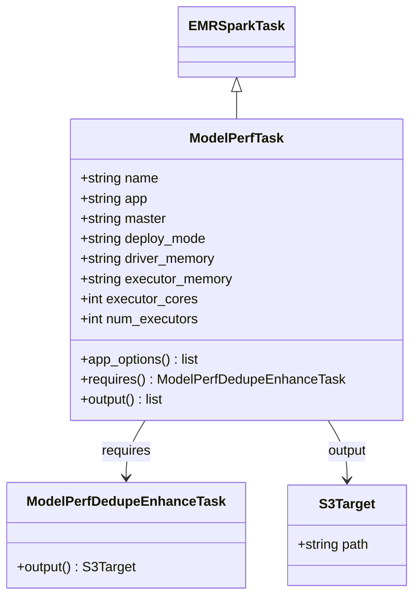
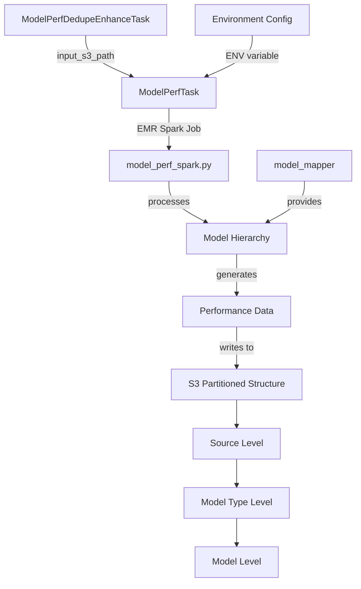

# Diagram: research/orchestrator/tasks/analytics/model_perf_task.py

> Auto-generated by Obscura crawlers

## Diagram 1

### SVG

<svg id="container" width="486.203125" xmlns="http://www.w3.org/2000/svg" class="classDiagram" height="710" viewBox="0 0 486.203125 710" role="graphics-document document" aria-roledescription="class"><g><defs><marker id="container_class-aggregationStart" class="marker aggregation class" refX="18" refY="7" markerWidth="190" markerHeight="240" orient="auto"><path d="M 18,7 L9,13 L1,7 L9,1 Z"></path></marker></defs><defs><marker id="container_class-aggregationEnd" class="marker aggregation class" refX="1" refY="7" markerWidth="20" markerHeight="28" orient="auto"><path d="M 18,7 L9,13 L1,7 L9,1 Z"></path></marker></defs><defs><marker id="container_class-extensionStart" class="marker extension class" refX="18" refY="7" markerWidth="190" markerHeight="240" orient="auto"><path d="M 1,7 L18,13 V 1 Z"></path></marker></defs><defs><marker id="container_class-extensionEnd" class="marker extension class" refX="1" refY="7" markerWidth="20" markerHeight="28" orient="auto"><path d="M 1,1 V 13 L18,7 Z"></path></marker></defs><defs><marker id="container_class-compositionStart" class="marker composition class" refX="18" refY="7" markerWidth="190" markerHeight="240" orient="auto"><path d="M 18,7 L9,13 L1,7 L9,1 Z"></path></marker></defs><defs><marker id="container_class-compositionEnd" class="marker composition class" refX="1" refY="7" markerWidth="20" markerHeight="28" orient="auto"><path d="M 18,7 L9,13 L1,7 L9,1 Z"></path></marker></defs><defs><marker id="container_class-dependencyStart" class="marker dependency class" refX="6" refY="7" markerWidth="190" markerHeight="240" orient="auto"><path d="M 5,7 L9,13 L1,7 L9,1 Z"></path></marker></defs><defs><marker id="container_class-dependencyEnd" class="marker dependency class" refX="13" refY="7" markerWidth="20" markerHeight="28" orient="auto"><path d="M 18,7 L9,13 L14,7 L9,1 Z"></path></marker></defs><defs><marker id="container_class-lollipopStart" class="marker lollipop class" refX="13" refY="7" markerWidth="190" markerHeight="240" orient="auto"><circle stroke="black" fill="transparent" cx="7" cy="7" r="6"></circle></marker></defs><defs><marker id="container_class-lollipopEnd" class="marker lollipop class" refX="1" refY="7" markerWidth="190" markerHeight="240" orient="auto"><circle stroke="black" fill="transparent" cx="7" cy="7" r="6"></circle></marker></defs><g class="root"><g class="clusters"></g><g class="edgePaths"><path d="M276.762,109.25L276.762,110.542C276.762,111.833,276.762,114.417,276.762,119.875C276.762,125.333,276.762,133.667,276.762,137.833L276.762,142" id="id_EMRSparkTask_ModelPerfTask_1" class="edge-thickness-normal edge-pattern-solid relation" style=";;;" data-edge="true" data-et="edge" data-id="id_EMRSparkTask_ModelPerfTask_1" data-points="W3sieCI6Mjc2Ljc2MTcxODc1LCJ5Ijo5Mn0seyJ4IjoyNzYuNzYxNzE4NzUsInkiOjExN30seyJ4IjoyNzYuNzYxNzE4NzUsInkiOjE0Mn1d" marker-start="url(#container_class-extensionStart)"></path><path d="M168.885,502L165.19,508.167C161.494,514.333,154.102,526.667,150.407,538C146.711,549.333,146.711,559.667,146.711,564.833L146.711,570" id="id_ModelPerfTask_ModelPerfDedupeEnhanceTask_2" class="edge-thickness-normal edge-pattern-solid relation" style=";;;" data-edge="true" data-et="edge" data-id="id_ModelPerfTask_ModelPerfDedupeEnhanceTask_2" data-points="W3sieCI6MTY4Ljg4NTQ5NDY3MTY1OSwieSI6NTAyfSx7IngiOjE0Ni43MTA5Mzc1LCJ5Ijo1Mzl9LHsieCI6MTQ2LjcxMDkzNzUsInkiOjU3Nn1d" marker-end="url(#container_class-dependencyEnd)"></path><path d="M384.638,502L388.334,508.167C392.029,514.333,399.421,526.667,403.117,538.5C406.813,550.333,406.813,561.667,406.813,567.333L406.813,573" id="id_ModelPerfTask_S3Target_3" class="edge-thickness-normal edge-pattern-solid relation" style=";;;" data-edge="true" data-et="edge" data-id="id_ModelPerfTask_S3Target_3" data-points="W3sieCI6Mzg0LjYzNzk0MjgyODM0MSwieSI6NTAyfSx7IngiOjQwNi44MTI1LCJ5Ijo1Mzl9LHsieCI6NDA2LjgxMjUsInkiOjU3OX1d" marker-end="url(#container_class-dependencyEnd)"></path></g><g class="edgeLabels"><g class="edgeLabel"><g class="label" data-id="id_EMRSparkTask_ModelPerfTask_1" transform="translate(0, 0)"><foreignObject width="0" height="0">

</foreignObject></g></g><g class="edgeLabel" transform="translate(146.7109375, 539)"><g class="label" data-id="id_ModelPerfTask_ModelPerfDedupeEnhanceTask_2" transform="translate(-29.8515625, -12)"><foreignObject width="59.703125" height="24">

requires

</foreignObject></g></g><g class="edgeLabel" transform="translate(406.8125, 539)"><g class="label" data-id="id_ModelPerfTask_S3Target_3" transform="translate(-24.515625, -12)"><foreignObject width="49.03125" height="24">

output

</foreignObject></g></g></g><g class="nodes"><g class="node default" id="classId-EMRSparkTask-0" transform="translate(276.76171875, 50)"><g class="basic label-container"><path d="M-65.1484375 -42 L65.1484375 -42 L65.1484375 42 L-65.1484375 42" stroke="none" stroke-width="0" fill="#ECECFF" style=""></path><path d="M-65.1484375 -42 C-19.955609343882458 -42, 25.237218812235085 -42, 65.1484375 -42 M-65.1484375 -42 C-16.442813350013367 -42, 32.262810799973266 -42, 65.1484375 -42 M65.1484375 -42 C65.1484375 -21.35279775931481, 65.1484375 -0.7055955186296217, 65.1484375 42 M65.1484375 -42 C65.1484375 -23.56538828581489, 65.1484375 -5.130776571629781, 65.1484375 42 M65.1484375 42 C33.135100670010864 42, 1.1217638400217282 42, -65.1484375 42 M65.1484375 42 C37.661852938589014 42, 10.175268377178028 42, -65.1484375 42 M-65.1484375 42 C-65.1484375 18.23587519983015, -65.1484375 -5.528249600339699, -65.1484375 -42 M-65.1484375 42 C-65.1484375 17.063961740580673, -65.1484375 -7.872076518838654, -65.1484375 -42" stroke="#9370DB" stroke-width="1.3" fill="none" stroke-dasharray="0 0" style=""></path></g><g class="annotation-group text" transform="translate(0, -18)"></g><g class="label-group text" transform="translate(-53.1484375, -18)"><g class="label" style="font-weight: bolder" transform="translate(0,-12)"><foreignObject width="106.296875" height="24">

EMRSparkTask

</foreignObject></g></g><g class="members-group text" transform="translate(-53.1484375, 30)"></g><g class="methods-group text" transform="translate(-53.1484375, 60)"></g><g class="divider" style=""><path d="M-65.1484375 6 C-20.559491618964827 6, 24.029454262070345 6, 65.1484375 6 M-65.1484375 6 C-33.31418262886827 6, -1.4799277577365402 6, 65.1484375 6" stroke="#9370DB" stroke-width="1.3" fill="none" stroke-dasharray="0 0" style=""></path></g><g class="divider" style=""><path d="M-65.1484375 24 C-36.99490902810908 24, -8.841380556218162 24, 65.1484375 24 M-65.1484375 24 C-26.262805777399322 24, 12.622825945201356 24, 65.1484375 24" stroke="#9370DB" stroke-width="1.3" fill="none" stroke-dasharray="0 0" style=""></path></g></g><g class="node default" id="classId-ModelPerfTask-1" transform="translate(276.76171875, 322)"><g class="basic label-container"><path d="M-195.6953125 -180 L195.6953125 -180 L195.6953125 180 L-195.6953125 180" stroke="none" stroke-width="0" fill="#ECECFF" style=""></path><path d="M-195.6953125 -180 C-79.53838731085602 -180, 36.61853787828795 -180, 195.6953125 -180 M-195.6953125 -180 C-107.35376391792884 -180, -19.01221533585769 -180, 195.6953125 -180 M195.6953125 -180 C195.6953125 -73.18856529882576, 195.6953125 33.62286940234847, 195.6953125 180 M195.6953125 -180 C195.6953125 -63.10447920230439, 195.6953125 53.79104159539122, 195.6953125 180 M195.6953125 180 C62.93214879370021 180, -69.83101491259958 180, -195.6953125 180 M195.6953125 180 C57.609497229401086 180, -80.47631804119783 180, -195.6953125 180 M-195.6953125 180 C-195.6953125 89.45581741232, -195.6953125 -1.0883651753599963, -195.6953125 -180 M-195.6953125 180 C-195.6953125 49.283570239049226, -195.6953125 -81.43285952190155, -195.6953125 -180" stroke="#9370DB" stroke-width="1.3" fill="none" stroke-dasharray="0 0" style=""></path></g><g class="annotation-group text" transform="translate(0, -156)"></g><g class="label-group text" transform="translate(-54.09375, -156)"><g class="label" style="font-weight: bolder" transform="translate(0,-12)"><foreignObject width="108.1875" height="24">

ModelPerfTask

</foreignObject></g></g><g class="members-group text" transform="translate(-183.6953125, -108)"><g class="label" style="" transform="translate(0,-12)"><foreignObject width="94.375" height="24">

+string name

</foreignObject></g><g class="label" style="" transform="translate(0,12)"><foreignObject width="81.578125" height="24">

+string app

</foreignObject></g><g class="label" style="" transform="translate(0,36)"><foreignObject width="104.03125" height="24">

+string master

</foreignObject></g><g class="label" style="" transform="translate(0,60)"><foreignObject width="152.59375" height="24">

+string deploy_mode

</foreignObject></g><g class="label" style="" transform="translate(0,84)"><foreignObject width="163.40625" height="24">

+string driver_memory

</foreignObject></g><g class="label" style="" transform="translate(0,108)"><foreignObject width="183.203125" height="24">

+string executor_memory

</foreignObject></g><g class="label" style="" transform="translate(0,132)"><foreignObject width="139.9375" height="24">

+int executor_cores

</foreignObject></g><g class="label" style="" transform="translate(0,156)"><foreignObject width="142.296875" height="24">

+int num_executors

</foreignObject></g></g><g class="methods-group text" transform="translate(-183.6953125, 108)"><g class="label" style="" transform="translate(0,-12)"><foreignObject width="143.609375" height="24">

+app_options() : list

</foreignObject></g><g class="label" style="" transform="translate(0,12)"><foreignObject width="313.296875" height="24">

+requires() : ModelPerfDedupeEnhanceTask

</foreignObject></g><g class="label" style="" transform="translate(0,36)"><foreignObject width="102.15625" height="24">

+output() : list

</foreignObject></g></g><g class="divider" style=""><path d="M-195.6953125 -132 C-44.23217871879706 -132, 107.23095506240588 -132, 195.6953125 -132 M-195.6953125 -132 C-54.93485512780126 -132, 85.82560224439749 -132, 195.6953125 -132" stroke="#9370DB" stroke-width="1.3" fill="none" stroke-dasharray="0 0" style=""></path></g><g class="divider" style=""><path d="M-195.6953125 84 C-68.94483388033892 84, 57.80564473932216 84, 195.6953125 84 M-195.6953125 84 C-113.94202201886165 84, -32.1887315377233 84, 195.6953125 84" stroke="#9370DB" stroke-width="1.3" fill="none" stroke-dasharray="0 0" style=""></path></g></g><g class="node default" id="classId-ModelPerfDedupeEnhanceTask-2" transform="translate(146.7109375, 639)"><g class="basic label-container"><path d="M-138.7109375 -63 L138.7109375 -63 L138.7109375 63 L-138.7109375 63" stroke="none" stroke-width="0" fill="#ECECFF" style=""></path><path d="M-138.7109375 -63 C-46.09200626430797 -63, 46.52692497138406 -63, 138.7109375 -63 M-138.7109375 -63 C-28.808440272424136 -63, 81.09405695515173 -63, 138.7109375 -63 M138.7109375 -63 C138.7109375 -16.927122824956996, 138.7109375 29.14575435008601, 138.7109375 63 M138.7109375 -63 C138.7109375 -27.656449262083697, 138.7109375 7.6871014758326055, 138.7109375 63 M138.7109375 63 C38.00791900337171 63, -62.69509949325658 63, -138.7109375 63 M138.7109375 63 C31.950920366420192 63, -74.80909676715962 63, -138.7109375 63 M-138.7109375 63 C-138.7109375 21.670697863397812, -138.7109375 -19.658604273204375, -138.7109375 -63 M-138.7109375 63 C-138.7109375 15.114427681044944, -138.7109375 -32.77114463791011, -138.7109375 -63" stroke="#9370DB" stroke-width="1.3" fill="none" stroke-dasharray="0 0" style=""></path></g><g class="annotation-group text" transform="translate(0, -39)"></g><g class="label-group text" transform="translate(-112.734375, -39)"><g class="label" style="font-weight: bolder" transform="translate(0,-12)"><foreignObject width="225.46875" height="24">

ModelPerfDedupeEnhanceTask

</foreignObject></g></g><g class="members-group text" transform="translate(-126.7109375, 9)"></g><g class="methods-group text" transform="translate(-126.7109375, 39)"><g class="label" style="" transform="translate(0,-12)"><foreignObject width="140.6875" height="24">

+output() : S3Target

</foreignObject></g></g><g class="divider" style=""><path d="M-138.7109375 -15 C-38.82222699644575 -15, 61.0664835071085 -15, 138.7109375 -15 M-138.7109375 -15 C-72.37379003571426 -15, -6.03664257142853 -15, 138.7109375 -15" stroke="#9370DB" stroke-width="1.3" fill="none" stroke-dasharray="0 0" style=""></path></g><g class="divider" style=""><path d="M-138.7109375 9 C-50.355731314148585 9, 37.99947487170283 9, 138.7109375 9 M-138.7109375 9 C-38.82957233675339 9, 61.05179282649323 9, 138.7109375 9" stroke="#9370DB" stroke-width="1.3" fill="none" stroke-dasharray="0 0" style=""></path></g></g><g class="node default" id="classId-S3Target-3" transform="translate(406.8125, 639)"><g class="basic label-container"><path d="M-71.390625 -60 L71.390625 -60 L71.390625 60 L-71.390625 60" stroke="none" stroke-width="0" fill="#ECECFF" style=""></path><path d="M-71.390625 -60 C-37.59244610349665 -60, -3.794267206993297 -60, 71.390625 -60 M-71.390625 -60 C-23.499967692534277 -60, 24.390689614931446 -60, 71.390625 -60 M71.390625 -60 C71.390625 -32.14014702468668, 71.390625 -4.280294049373353, 71.390625 60 M71.390625 -60 C71.390625 -24.044118655446304, 71.390625 11.911762689107391, 71.390625 60 M71.390625 60 C15.61064138703378 60, -40.16934222593244 60, -71.390625 60 M71.390625 60 C40.019998189642834 60, 8.649371379285661 60, -71.390625 60 M-71.390625 60 C-71.390625 31.600407255260393, -71.390625 3.200814510520786, -71.390625 -60 M-71.390625 60 C-71.390625 25.89678268224828, -71.390625 -8.206434635503442, -71.390625 -60" stroke="#9370DB" stroke-width="1.3" fill="none" stroke-dasharray="0 0" style=""></path></g><g class="annotation-group text" transform="translate(0, -36)"></g><g class="label-group text" transform="translate(-31.71875, -36)"><g class="label" style="font-weight: bolder" transform="translate(0,-12)"><foreignObject width="63.4375" height="24">

S3Target

</foreignObject></g></g><g class="members-group text" transform="translate(-59.390625, 12)"><g class="label" style="" transform="translate(0,-12)"><foreignObject width="87.0625" height="24">

+string path

</foreignObject></g></g><g class="methods-group text" transform="translate(-59.390625, 60)"></g><g class="divider" style=""><path d="M-71.390625 -12 C-17.644757554368944 -12, 36.10110989126211 -12, 71.390625 -12 M-71.390625 -12 C-40.62280172007294 -12, -9.854978440145892 -12, 71.390625 -12" stroke="#9370DB" stroke-width="1.3" fill="none" stroke-dasharray="0 0" style=""></path></g><g class="divider" style=""><path d="M-71.390625 36 C-14.934889284432508 36, 41.520846431134984 36, 71.390625 36 M-71.390625 36 C-24.30354583393163 36, 22.78353333213674 36, 71.390625 36" stroke="#9370DB" stroke-width="1.3" fill="none" stroke-dasharray="0 0" style=""></path></g></g></g></g></g></svg>

## Diagram 2

### SVG

<svg id="container" width="630.71484375" xmlns="http://www.w3.org/2000/svg" class="flowchart" height="1022" viewBox="0 0 630.71484375 1022" role="graphics-document document" aria-roledescription="flowchart-v2"><g><marker id="container_flowchart-v2-pointEnd" class="marker flowchart-v2" viewBox="0 0 10 10" refX="5" refY="5" markerUnits="userSpaceOnUse" markerWidth="8" markerHeight="8" orient="auto"><path d="M 0 0 L 10 5 L 0 10 z" class="arrowMarkerPath" style="stroke-width: 1; stroke-dasharray: 1, 0;"></path></marker><marker id="container_flowchart-v2-pointStart" class="marker flowchart-v2" viewBox="0 0 10 10" refX="4.5" refY="5" markerUnits="userSpaceOnUse" markerWidth="8" markerHeight="8" orient="auto"><path d="M 0 5 L 10 10 L 10 0 z" class="arrowMarkerPath" style="stroke-width: 1; stroke-dasharray: 1, 0;"></path></marker><marker id="container_flowchart-v2-circleEnd" class="marker flowchart-v2" viewBox="0 0 10 10" refX="11" refY="5" markerUnits="userSpaceOnUse" markerWidth="11" markerHeight="11" orient="auto"><circle cx="5" cy="5" r="5" class="arrowMarkerPath" style="stroke-width: 1; stroke-dasharray: 1, 0;"></circle></marker><marker id="container_flowchart-v2-circleStart" class="marker flowchart-v2" viewBox="0 0 10 10" refX="-1" refY="5" markerUnits="userSpaceOnUse" markerWidth="11" markerHeight="11" orient="auto"><circle cx="5" cy="5" r="5" class="arrowMarkerPath" style="stroke-width: 1; stroke-dasharray: 1, 0;"></circle></marker><marker id="container_flowchart-v2-crossEnd" class="marker cross flowchart-v2" viewBox="0 0 11 11" refX="12" refY="5.2" markerUnits="userSpaceOnUse" markerWidth="11" markerHeight="11" orient="auto"><path d="M 1,1 l 9,9 M 10,1 l -9,9" class="arrowMarkerPath" style="stroke-width: 2; stroke-dasharray: 1, 0;"></path></marker><marker id="container_flowchart-v2-crossStart" class="marker cross flowchart-v2" viewBox="0 0 11 11" refX="-1" refY="5.2" markerUnits="userSpaceOnUse" markerWidth="11" markerHeight="11" orient="auto"><path d="M 1,1 l 9,9 M 10,1 l -9,9" class="arrowMarkerPath" style="stroke-width: 2; stroke-dasharray: 1, 0;"></path></marker><g class="root"><g class="clusters"></g><g class="edgePaths"><path d="M149.469,62L149.469,68.167C149.469,74.333,149.469,86.667,162.928,98.732C176.388,110.798,203.308,122.596,216.767,128.495L230.227,134.394" id="L_A_B_0" class="edge-thickness-normal edge-pattern-solid edge-thickness-normal edge-pattern-solid flowchart-link" style=";" data-edge="true" data-et="edge" data-id="L_A_B_0" data-points="W3sieCI6MTQ5LjQ2ODc1LCJ5Ijo2Mn0seyJ4IjoxNDkuNDY4NzUsInkiOjk5fSx7IngiOjIzMy44OTA4MDgxMDU0Njg3NSwieSI6MTM2fV0=" marker-end="url(#container_flowchart-v2-pointEnd)"></path><path d="M295.496,190L295.496,196.167C295.496,202.333,295.496,214.667,295.496,226.333C295.496,238,295.496,249,295.496,254.5L295.496,260" id="L_B_C_0" class="edge-thickness-normal edge-pattern-solid edge-thickness-normal edge-pattern-solid flowchart-link" style=";" data-edge="true" data-et="edge" data-id="L_B_C_0" data-points="W3sieCI6Mjk1LjQ5NjA5Mzc1LCJ5IjoxOTB9LHsieCI6Mjk1LjQ5NjA5Mzc1LCJ5IjoyMjd9LHsieCI6Mjk1LjQ5NjA5Mzc1LCJ5IjoyNjR9XQ==" marker-end="url(#container_flowchart-v2-pointEnd)"></path><path d="M295.496,318L295.496,324.167C295.496,330.333,295.496,342.667,306.56,354.688C317.623,366.71,339.75,378.419,350.814,384.274L361.878,390.129" id="L_C_D_0" class="edge-thickness-normal edge-pattern-solid edge-thickness-normal edge-pattern-solid flowchart-link" style=";" data-edge="true" data-et="edge" data-id="L_C_D_0" data-points="W3sieCI6Mjk1LjQ5NjA5Mzc1LCJ5IjozMTh9LHsieCI6Mjk1LjQ5NjA5Mzc1LCJ5IjozNTV9LHsieCI6MzY1LjQxMzA4NTkzNzUsInkiOjM5Mn1d" marker-end="url(#container_flowchart-v2-pointEnd)"></path><path d="M416.434,446L416.434,452.167C416.434,458.333,416.434,470.667,416.434,482.333C416.434,494,416.434,505,416.434,510.5L416.434,516" id="L_D_E_0" class="edge-thickness-normal edge-pattern-solid edge-thickness-normal edge-pattern-solid flowchart-link" style=";" data-edge="true" data-et="edge" data-id="L_D_E_0" data-points="W3sieCI6NDE2LjQzMzU5Mzc1LCJ5Ijo0NDZ9LHsieCI6NDE2LjQzMzU5Mzc1LCJ5Ijo0ODN9LHsieCI6NDE2LjQzMzU5Mzc1LCJ5Ijo1MjB9XQ==" marker-end="url(#container_flowchart-v2-pointEnd)"></path><path d="M416.434,574L416.434,580.167C416.434,586.333,416.434,598.667,416.434,610.333C416.434,622,416.434,633,416.434,638.5L416.434,644" id="L_E_F_0" class="edge-thickness-normal edge-pattern-solid edge-thickness-normal edge-pattern-solid flowchart-link" style=";" data-edge="true" data-et="edge" data-id="L_E_F_0" data-points="W3sieCI6NDE2LjQzMzU5Mzc1LCJ5Ijo1NzR9LHsieCI6NDE2LjQzMzU5Mzc1LCJ5Ijo2MTF9LHsieCI6NDE2LjQzMzU5Mzc1LCJ5Ijo2NDh9XQ==" marker-end="url(#container_flowchart-v2-pointEnd)"></path><path d="M416.434,702L416.434,706.167C416.434,710.333,416.434,718.667,416.434,726.333C416.434,734,416.434,741,416.434,744.5L416.434,748" id="L_F_G_0" class="edge-thickness-normal edge-pattern-solid edge-thickness-normal edge-pattern-solid flowchart-link" style=";" data-edge="true" data-et="edge" data-id="L_F_G_0" data-points="W3sieCI6NDE2LjQzMzU5Mzc1LCJ5Ijo3MDJ9LHsieCI6NDE2LjQzMzU5Mzc1LCJ5Ijo3Mjd9LHsieCI6NDE2LjQzMzU5Mzc1LCJ5Ijo3NTJ9XQ==" marker-end="url(#container_flowchart-v2-pointEnd)"></path><path d="M416.434,806L416.434,810.167C416.434,814.333,416.434,822.667,416.434,830.333C416.434,838,416.434,845,416.434,848.5L416.434,852" id="L_G_H_0" class="edge-thickness-normal edge-pattern-solid edge-thickness-normal edge-pattern-solid flowchart-link" style=";" data-edge="true" data-et="edge" data-id="L_G_H_0" data-points="W3sieCI6NDE2LjQzMzU5Mzc1LCJ5Ijo4MDZ9LHsieCI6NDE2LjQzMzU5Mzc1LCJ5Ijo4MzF9LHsieCI6NDE2LjQzMzU5Mzc1LCJ5Ijo4NTZ9XQ==" marker-end="url(#container_flowchart-v2-pointEnd)"></path><path d="M416.434,910L416.434,914.167C416.434,918.333,416.434,926.667,416.434,934.333C416.434,942,416.434,949,416.434,952.5L416.434,956" id="L_H_I_0" class="edge-thickness-normal edge-pattern-solid edge-thickness-normal edge-pattern-solid flowchart-link" style=";" data-edge="true" data-et="edge" data-id="L_H_I_0" data-points="W3sieCI6NDE2LjQzMzU5Mzc1LCJ5Ijo5MTB9LHsieCI6NDE2LjQzMzU5Mzc1LCJ5Ijo5MzV9LHsieCI6NDE2LjQzMzU5Mzc1LCJ5Ijo5NjB9XQ==" marker-end="url(#container_flowchart-v2-pointEnd)"></path><path d="M537.371,318L537.371,324.167C537.371,330.333,537.371,342.667,526.308,354.688C515.244,366.71,493.117,378.419,482.053,384.274L470.99,390.129" id="L_J_D_0" class="edge-thickness-normal edge-pattern-solid edge-thickness-normal edge-pattern-solid flowchart-link" style=";" data-edge="true" data-et="edge" data-id="L_J_D_0" data-points="W3sieCI6NTM3LjM3MTA5Mzc1LCJ5IjozMTh9LHsieCI6NTM3LjM3MTA5Mzc1LCJ5IjozNTV9LHsieCI6NDY3LjQ1NDEwMTU2MjUsInkiOjM5Mn1d" marker-end="url(#container_flowchart-v2-pointEnd)"></path><path d="M441.523,62L441.523,68.167C441.523,74.333,441.523,86.667,428.064,98.732C414.604,110.798,387.684,122.596,374.225,128.495L360.765,134.394" id="L_K_B_0" class="edge-thickness-normal edge-pattern-solid edge-thickness-normal edge-pattern-solid flowchart-link" style=";" data-edge="true" data-et="edge" data-id="L_K_B_0" data-points="W3sieCI6NDQxLjUyMzQzNzUsInkiOjYyfSx7IngiOjQ0MS41MjM0Mzc1LCJ5Ijo5OX0seyJ4IjozNTcuMTAxMzc5Mzk0NTMxMjUsInkiOjEzNn1d" marker-end="url(#container_flowchart-v2-pointEnd)"></path></g><g class="edgeLabels"><g class="edgeLabel" transform="translate(149.46875, 99)"><g class="label" data-id="L_A_B_0" transform="translate(-51.734375, -12)"><foreignObject width="103.46875" height="24">

input_s3_path

</foreignObject></g></g><g class="edgeLabel" transform="translate(295.49609375, 227)"><g class="label" data-id="L_B_C_0" transform="translate(-52.0234375, -12)"><foreignObject width="104.046875" height="24">

EMR Spark Job

</foreignObject></g></g><g class="edgeLabel" transform="translate(295.49609375, 355)"><g class="label" data-id="L_C_D_0" transform="translate(-35.7890625, -12)"><foreignObject width="71.578125" height="24">

processes

</foreignObject></g></g><g class="edgeLabel" transform="translate(416.43359375, 483)"><g class="label" data-id="L_D_E_0" transform="translate(-35.46875, -12)"><foreignObject width="70.9375" height="24">

generates

</foreignObject></g></g><g class="edgeLabel" transform="translate(416.43359375, 611)"><g class="label" data-id="L_E_F_0" transform="translate(-31.5078125, -12)"><foreignObject width="63.015625" height="24">

writes to

</foreignObject></g></g><g class="edgeLabel"><g class="label" data-id="L_F_G_0" transform="translate(0, 0)"><foreignObject width="0" height="0">

</foreignObject></g></g><g class="edgeLabel"><g class="label" data-id="L_G_H_0" transform="translate(0, 0)"><foreignObject width="0" height="0">

</foreignObject></g></g><g class="edgeLabel"><g class="label" data-id="L_H_I_0" transform="translate(0, 0)"><foreignObject width="0" height="0">

</foreignObject></g></g><g class="edgeLabel" transform="translate(537.37109375, 355)"><g class="label" data-id="L_J_D_0" transform="translate(-31.3125, -12)"><foreignObject width="62.625" height="24">

provides

</foreignObject></g></g><g class="edgeLabel" transform="translate(441.5234375, 99)"><g class="label" data-id="L_K_B_0" transform="translate(-45.5859375, -12)"><foreignObject width="91.171875" height="24">

ENV variable

</foreignObject></g></g></g><g class="nodes"><g class="node default" id="flowchart-A-0" transform="translate(149.46875, 35)"><rect class="basic label-container" style="" x="-141.46875" y="-27" width="282.9375" height="54"></rect><g class="label" style="" transform="translate(-111.46875, -12)"><rect></rect><foreignObject width="222.9375" height="24">

ModelPerfDedupeEnhanceTask

</foreignObject></g></g><g class="node default" id="flowchart-B-1" transform="translate(295.49609375, 163)"><rect class="basic label-container" style="" x="-82.765625" y="-27" width="165.53125" height="54"></rect><g class="label" style="" transform="translate(-52.765625, -12)"><rect></rect><foreignObject width="105.53125" height="24">

ModelPerfTask

</foreignObject></g></g><g class="node default" id="flowchart-C-3" transform="translate(295.49609375, 291)"><rect class="basic label-container" style="" x="-106.53125" y="-27" width="213.0625" height="54"></rect><g class="label" style="" transform="translate(-76.53125, -12)"><rect></rect><foreignObject width="153.0625" height="24">

model_perf_spark.py

</foreignObject></g></g><g class="node default" id="flowchart-D-5" transform="translate(416.43359375, 419)"><rect class="basic label-container" style="" x="-88.9609375" y="-27" width="177.921875" height="54"></rect><g class="label" style="" transform="translate(-58.9609375, -12)"><rect></rect><foreignObject width="117.921875" height="24">

Model Hierarchy

</foreignObject></g></g><g class="node default" id="flowchart-E-7" transform="translate(416.43359375, 547)"><rect class="basic label-container" style="" x="-94.8671875" y="-27" width="189.734375" height="54"></rect><g class="label" style="" transform="translate(-64.8671875, -12)"><rect></rect><foreignObject width="129.734375" height="24">

Performance Data

</foreignObject></g></g><g class="node default" id="flowchart-F-9" transform="translate(416.43359375, 675)"><rect class="basic label-container" style="" x="-116.6015625" y="-27" width="233.203125" height="54"></rect><g class="label" style="" transform="translate(-86.6015625, -12)"><rect></rect><foreignObject width="173.203125" height="24">

S3 Partitioned Structure

</foreignObject></g></g><g class="node default" id="flowchart-G-11" transform="translate(416.43359375, 779)"><rect class="basic label-container" style="" x="-75.40625" y="-27" width="150.8125" height="54"></rect><g class="label" style="" transform="translate(-45.40625, -12)"><rect></rect><foreignObject width="90.8125" height="24">

Source Level

</foreignObject></g></g><g class="node default" id="flowchart-H-13" transform="translate(416.43359375, 883)"><rect class="basic label-container" style="" x="-92.2109375" y="-27" width="184.421875" height="54"></rect><g class="label" style="" transform="translate(-62.2109375, -12)"><rect></rect><foreignObject width="124.421875" height="24">

Model Type Level

</foreignObject></g></g><g class="node default" id="flowchart-I-15" transform="translate(416.43359375, 987)"><rect class="basic label-container" style="" x="-73.2265625" y="-27" width="146.453125" height="54"></rect><g class="label" style="" transform="translate(-43.2265625, -12)"><rect></rect><foreignObject width="86.453125" height="24">

Model Level

</foreignObject></g></g><g class="node default" id="flowchart-J-16" transform="translate(537.37109375, 291)"><rect class="basic label-container" style="" x="-85.34375" y="-27" width="170.6875" height="54"></rect><g class="label" style="" transform="translate(-55.34375, -12)"><rect></rect><foreignObject width="110.6875" height="24">

model_mapper

</foreignObject></g></g><g class="node default" id="flowchart-K-18" transform="translate(441.5234375, 35)"><rect class="basic label-container" style="" x="-100.5859375" y="-27" width="201.171875" height="54"></rect><g class="label" style="" transform="translate(-70.5859375, -12)"><rect></rect><foreignObject width="141.171875" height="24">

Environment Config

</foreignObject></g></g></g></g></g></svg>

## Diagram 3

### SVG

<svg id="container" width="2709.390625" xmlns="http://www.w3.org/2000/svg" class="flowchart" height="94" viewBox="0 0 2709.390625 94" role="graphics-document document" aria-roledescription="flowchart-v2"><g><marker id="container_flowchart-v2-pointEnd" class="marker flowchart-v2" viewBox="0 0 10 10" refX="5" refY="5" markerUnits="userSpaceOnUse" markerWidth="8" markerHeight="8" orient="auto"><path d="M 0 0 L 10 5 L 0 10 z" class="arrowMarkerPath" style="stroke-width: 1; stroke-dasharray: 1, 0;"></path></marker><marker id="container_flowchart-v2-pointStart" class="marker flowchart-v2" viewBox="0 0 10 10" refX="4.5" refY="5" markerUnits="userSpaceOnUse" markerWidth="8" markerHeight="8" orient="auto"><path d="M 0 5 L 10 10 L 10 0 z" class="arrowMarkerPath" style="stroke-width: 1; stroke-dasharray: 1, 0;"></path></marker><marker id="container_flowchart-v2-circleEnd" class="marker flowchart-v2" viewBox="0 0 10 10" refX="11" refY="5" markerUnits="userSpaceOnUse" markerWidth="11" markerHeight="11" orient="auto"><circle cx="5" cy="5" r="5" class="arrowMarkerPath" style="stroke-width: 1; stroke-dasharray: 1, 0;"></circle></marker><marker id="container_flowchart-v2-circleStart" class="marker flowchart-v2" viewBox="0 0 10 10" refX="-1" refY="5" markerUnits="userSpaceOnUse" markerWidth="11" markerHeight="11" orient="auto"><circle cx="5" cy="5" r="5" class="arrowMarkerPath" style="stroke-width: 1; stroke-dasharray: 1, 0;"></circle></marker><marker id="container_flowchart-v2-crossEnd" class="marker cross flowchart-v2" viewBox="0 0 11 11" refX="12" refY="5.2" markerUnits="userSpaceOnUse" markerWidth="11" markerHeight="11" orient="auto"><path d="M 1,1 l 9,9 M 10,1 l -9,9" class="arrowMarkerPath" style="stroke-width: 2; stroke-dasharray: 1, 0;"></path></marker><marker id="container_flowchart-v2-crossStart" class="marker cross flowchart-v2" viewBox="0 0 11 11" refX="-1" refY="5.2" markerUnits="userSpaceOnUse" markerWidth="11" markerHeight="11" orient="auto"><path d="M 1,1 l 9,9 M 10,1 l -9,9" class="arrowMarkerPath" style="stroke-width: 2; stroke-dasharray: 1, 0;"></path></marker><g class="root"><g class="clusters"></g><g class="edgePaths"><path d="M103.047,47L107.214,47C111.38,47,119.714,47,127.38,47C135.047,47,142.047,47,145.547,47L149.047,47" id="L_A_B_0" class="edge-thickness-normal edge-pattern-solid edge-thickness-normal edge-pattern-solid flowchart-link" style=";" data-edge="true" data-et="edge" data-id="L_A_B_0" data-points="W3sieCI6MTAzLjA0Njg3NSwieSI6NDd9LHsieCI6MTI4LjA0Njg3NSwieSI6NDd9LHsieCI6MTUzLjA0Njg3NSwieSI6NDd9XQ==" marker-end="url(#container_flowchart-v2-pointEnd)"></path><path d="M413.047,47L417.214,47C421.38,47,429.714,47,437.38,47C445.047,47,452.047,47,455.547,47L459.047,47" id="L_B_C_0" class="edge-thickness-normal edge-pattern-solid edge-thickness-normal edge-pattern-solid flowchart-link" style=";" data-edge="true" data-et="edge" data-id="L_B_C_0" data-points="W3sieCI6NDEzLjA0Njg3NSwieSI6NDd9LHsieCI6NDM4LjA0Njg3NSwieSI6NDd9LHsieCI6NDYzLjA0Njg3NSwieSI6NDd9XQ==" marker-end="url(#container_flowchart-v2-pointEnd)"></path><path d="M665.688,47L669.854,47C674.021,47,682.354,47,690.021,47C697.688,47,704.688,47,708.188,47L711.688,47" id="L_C_D_0" class="edge-thickness-normal edge-pattern-solid edge-thickness-normal edge-pattern-solid flowchart-link" style=";" data-edge="true" data-et="edge" data-id="L_C_D_0" data-points="W3sieCI6NjY1LjY4NzUsInkiOjQ3fSx7IngiOjY5MC42ODc1LCJ5Ijo0N30seyJ4Ijo3MTUuNjg3NSwieSI6NDd9XQ==" marker-end="url(#container_flowchart-v2-pointEnd)"></path><path d="M975.688,47L979.854,47C984.021,47,992.354,47,1000.021,47C1007.688,47,1014.688,47,1018.188,47L1021.688,47" id="L_D_E_0" class="edge-thickness-normal edge-pattern-solid edge-thickness-normal edge-pattern-solid flowchart-link" style=";" data-edge="true" data-et="edge" data-id="L_D_E_0" data-points="W3sieCI6OTc1LjY4NzUsInkiOjQ3fSx7IngiOjEwMDAuNjg3NSwieSI6NDd9LHsieCI6MTAyNS42ODc1LCJ5Ijo0N31d" marker-end="url(#container_flowchart-v2-pointEnd)"></path><path d="M1271.781,47L1275.948,47C1280.115,47,1288.448,47,1296.115,47C1303.781,47,1310.781,47,1314.281,47L1317.781,47" id="L_E_F_0" class="edge-thickness-normal edge-pattern-solid edge-thickness-normal edge-pattern-solid flowchart-link" style=";" data-edge="true" data-et="edge" data-id="L_E_F_0" data-points="W3sieCI6MTI3MS43ODEyNSwieSI6NDd9LHsieCI6MTI5Ni43ODEyNSwieSI6NDd9LHsieCI6MTMyMS43ODEyNSwieSI6NDd9XQ==" marker-end="url(#container_flowchart-v2-pointEnd)"></path><path d="M1581.781,47L1585.948,47C1590.115,47,1598.448,47,1606.115,47C1613.781,47,1620.781,47,1624.281,47L1627.781,47" id="L_F_G_0" class="edge-thickness-normal edge-pattern-solid edge-thickness-normal edge-pattern-solid flowchart-link" style=";" data-edge="true" data-et="edge" data-id="L_F_G_0" data-points="W3sieCI6MTU4MS43ODEyNSwieSI6NDd9LHsieCI6MTYwNi43ODEyNSwieSI6NDd9LHsieCI6MTYzMS43ODEyNSwieSI6NDd9XQ==" marker-end="url(#container_flowchart-v2-pointEnd)"></path><path d="M1891.781,47L1895.948,47C1900.115,47,1908.448,47,1916.115,47C1923.781,47,1930.781,47,1934.281,47L1937.781,47" id="L_G_H_0" class="edge-thickness-normal edge-pattern-solid edge-thickness-normal edge-pattern-solid flowchart-link" style=";" data-edge="true" data-et="edge" data-id="L_G_H_0" data-points="W3sieCI6MTg5MS43ODEyNSwieSI6NDd9LHsieCI6MTkxNi43ODEyNSwieSI6NDd9LHsieCI6MTk0MS43ODEyNSwieSI6NDd9XQ==" marker-end="url(#container_flowchart-v2-pointEnd)"></path><path d="M2171.75,47L2175.917,47C2180.083,47,2188.417,47,2196.083,47C2203.75,47,2210.75,47,2214.25,47L2217.75,47" id="L_H_I_0" class="edge-thickness-normal edge-pattern-solid edge-thickness-normal edge-pattern-solid flowchart-link" style=";" data-edge="true" data-et="edge" data-id="L_H_I_0" data-points="W3sieCI6MjE3MS43NSwieSI6NDd9LHsieCI6MjE5Ni43NSwieSI6NDd9LHsieCI6MjIyMS43NSwieSI6NDd9XQ==" marker-end="url(#container_flowchart-v2-pointEnd)"></path><path d="M2465.844,47L2470.01,47C2474.177,47,2482.51,47,2490.177,47C2497.844,47,2504.844,47,2508.344,47L2511.844,47" id="L_I_J_0" class="edge-thickness-normal edge-pattern-solid edge-thickness-normal edge-pattern-solid flowchart-link" style=";" data-edge="true" data-et="edge" data-id="L_I_J_0" data-points="W3sieCI6MjQ2NS44NDM3NSwieSI6NDd9LHsieCI6MjQ5MC44NDM3NSwieSI6NDd9LHsieCI6MjUxNS44NDM3NSwieSI6NDd9XQ==" marker-end="url(#container_flowchart-v2-pointEnd)"></path></g><g class="edgeLabels"><g class="edgeLabel"><g class="label" data-id="L_A_B_0" transform="translate(0, 0)"><foreignObject width="0" height="0">

</foreignObject></g></g><g class="edgeLabel"><g class="label" data-id="L_B_C_0" transform="translate(0, 0)"><foreignObject width="0" height="0">

</foreignObject></g></g><g class="edgeLabel"><g class="label" data-id="L_C_D_0" transform="translate(0, 0)"><foreignObject width="0" height="0">

</foreignObject></g></g><g class="edgeLabel"><g class="label" data-id="L_D_E_0" transform="translate(0, 0)"><foreignObject width="0" height="0">

</foreignObject></g></g><g class="edgeLabel"><g class="label" data-id="L_E_F_0" transform="translate(0, 0)"><foreignObject width="0" height="0">

</foreignObject></g></g><g class="edgeLabel"><g class="label" data-id="L_F_G_0" transform="translate(0, 0)"><foreignObject width="0" height="0">

</foreignObject></g></g><g class="edgeLabel"><g class="label" data-id="L_G_H_0" transform="translate(0, 0)"><foreignObject width="0" height="0">

</foreignObject></g></g><g class="edgeLabel"><g class="label" data-id="L_H_I_0" transform="translate(0, 0)"><foreignObject width="0" height="0">

</foreignObject></g></g><g class="edgeLabel"><g class="label" data-id="L_I_J_0" transform="translate(0, 0)"><foreignObject width="0" height="0">

</foreignObject></g></g></g><g class="nodes"><g class="node default" id="flowchart-A-0" transform="translate(55.5234375, 47)"><rect class="basic label-container" style="" x="-47.5234375" y="-27" width="95.046875" height="54"></rect><g class="label" style="" transform="translate(-17.5234375, -12)"><rect></rect><foreignObject width="35.046875" height="24">

Start

</foreignObject></g></g><g class="node default" id="flowchart-B-1" transform="translate(283.046875, 47)"><rect class="basic label-container" style="" x="-130" y="-39" width="260" height="78"></rect><g class="label" style="" transform="translate(-100, -24)"><rect></rect><foreignObject width="200" height="48">

Get models from model_mapper

</foreignObject></g></g><g class="node default" id="flowchart-C-3" transform="translate(564.3671875, 47)"><rect class="basic label-container" style="" x="-101.3203125" y="-27" width="202.640625" height="54"></rect><g class="label" style="" transform="translate(-71.3203125, -12)"><rect></rect><foreignObject width="142.640625" height="24">

Create base S3 path

</foreignObject></g></g><g class="node default" id="flowchart-D-5" transform="translate(845.6875, 47)"><rect class="basic label-container" style="" x="-130" y="-39" width="260" height="78"></rect><g class="label" style="" transform="translate(-100, -24)"><rect></rect><foreignObject width="200" height="48">

Iterate sources: entity, shipment, partview

</foreignObject></g></g><g class="node default" id="flowchart-E-7" transform="translate(1148.734375, 47)"><rect class="basic label-container" style="" x="-123.046875" y="-27" width="246.09375" height="54"></rect><g class="label" style="" transform="translate(-93.046875, -12)"><rect></rect><foreignObject width="186.09375" height="24">

Create source-level target

</foreignObject></g></g><g class="node default" id="flowchart-F-9" transform="translate(1451.78125, 47)"><rect class="basic label-container" style="" x="-130" y="-39" width="260" height="78"></rect><g class="label" style="" transform="translate(-100, -24)"><rect></rect><foreignObject width="200" height="48">

Iterate model_types per source

</foreignObject></g></g><g class="node default" id="flowchart-G-11" transform="translate(1761.78125, 47)"><rect class="basic label-container" style="" x="-130" y="-39" width="260" height="78"></rect><g class="label" style="" transform="translate(-100, -24)"><rect></rect><foreignObject width="200" height="48">

Create model_type-level target

</foreignObject></g></g><g class="node default" id="flowchart-H-13" transform="translate(2056.765625, 47)"><rect class="basic label-container" style="" x="-114.984375" y="-27" width="229.96875" height="54"></rect><g class="label" style="" transform="translate(-84.984375, -12)"><rect></rect><foreignObject width="169.96875" height="24">

Iterate models per type

</foreignObject></g></g><g class="node default" id="flowchart-I-15" transform="translate(2343.796875, 47)"><rect class="basic label-container" style="" x="-122.046875" y="-27" width="244.09375" height="54"></rect><g class="label" style="" transform="translate(-92.046875, -12)"><rect></rect><foreignObject width="184.09375" height="24">

Create model-level target

</foreignObject></g></g><g class="node default" id="flowchart-J-17" transform="translate(2608.6171875, 47)"><rect class="basic label-container" style="" x="-92.7734375" y="-27" width="185.546875" height="54"></rect><g class="label" style="" transform="translate(-62.7734375, -12)"><rect></rect><foreignObject width="125.546875" height="24">

Return all targets

</foreignObject></g></g></g></g></g></svg>
