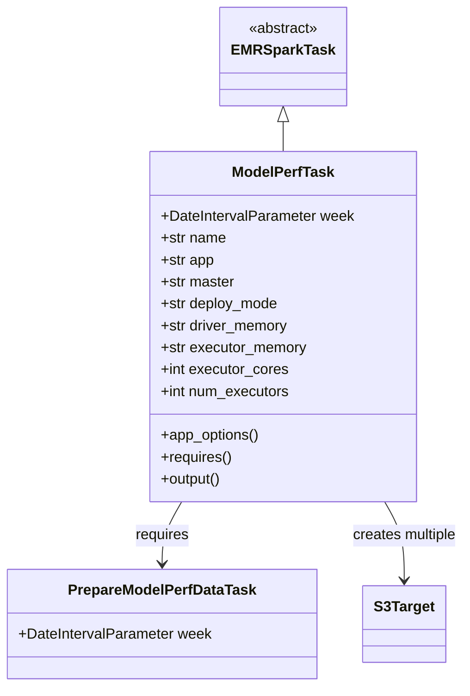
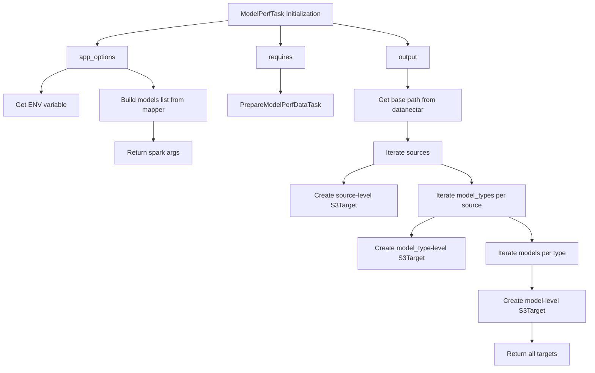
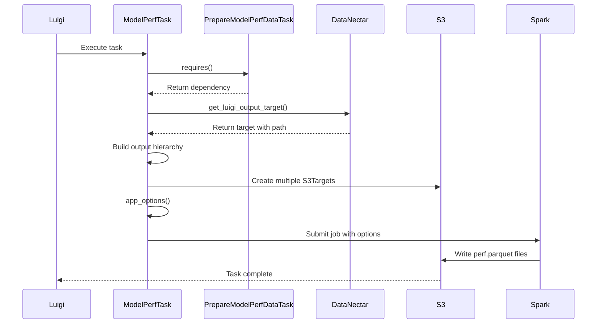

# Diagram: research/orchestrator/tasks/analytics/model_performance_task.py

> Auto-generated by Obscura crawlers

## Diagram 1

### SVG

<svg id="container" width="504.0234375" xmlns="http://www.w3.org/2000/svg" class="classDiagram" height="752" viewBox="0 0 504.0234375 752" role="graphics-document document" aria-roledescription="class"><g><defs><marker id="container_class-aggregationStart" class="marker aggregation class" refX="18" refY="7" markerWidth="190" markerHeight="240" orient="auto"><path d="M 18,7 L9,13 L1,7 L9,1 Z"></path></marker></defs><defs><marker id="container_class-aggregationEnd" class="marker aggregation class" refX="1" refY="7" markerWidth="20" markerHeight="28" orient="auto"><path d="M 18,7 L9,13 L1,7 L9,1 Z"></path></marker></defs><defs><marker id="container_class-extensionStart" class="marker extension class" refX="18" refY="7" markerWidth="190" markerHeight="240" orient="auto"><path d="M 1,7 L18,13 V 1 Z"></path></marker></defs><defs><marker id="container_class-extensionEnd" class="marker extension class" refX="1" refY="7" markerWidth="20" markerHeight="28" orient="auto"><path d="M 1,1 V 13 L18,7 Z"></path></marker></defs><defs><marker id="container_class-compositionStart" class="marker composition class" refX="18" refY="7" markerWidth="190" markerHeight="240" orient="auto"><path d="M 18,7 L9,13 L1,7 L9,1 Z"></path></marker></defs><defs><marker id="container_class-compositionEnd" class="marker composition class" refX="1" refY="7" markerWidth="20" markerHeight="28" orient="auto"><path d="M 18,7 L9,13 L1,7 L9,1 Z"></path></marker></defs><defs><marker id="container_class-dependencyStart" class="marker dependency class" refX="6" refY="7" markerWidth="190" markerHeight="240" orient="auto"><path d="M 5,7 L9,13 L1,7 L9,1 Z"></path></marker></defs><defs><marker id="container_class-dependencyEnd" class="marker dependency class" refX="13" refY="7" markerWidth="20" markerHeight="28" orient="auto"><path d="M 18,7 L9,13 L14,7 L9,1 Z"></path></marker></defs><defs><marker id="container_class-lollipopStart" class="marker lollipop class" refX="13" refY="7" markerWidth="190" markerHeight="240" orient="auto"><circle stroke="black" fill="transparent" cx="7" cy="7" r="6"></circle></marker></defs><defs><marker id="container_class-lollipopEnd" class="marker lollipop class" refX="1" refY="7" markerWidth="190" markerHeight="240" orient="auto"><circle stroke="black" fill="transparent" cx="7" cy="7" r="6"></circle></marker></defs><g class="root"><g class="clusters"></g><g class="edgePaths"><path d="M306.555,133.25L306.555,134.542C306.555,135.833,306.555,138.417,306.555,143.875C306.555,149.333,306.555,157.667,306.555,161.833L306.555,166" id="id_EMRSparkTask_ModelPerfTask_1" class="edge-thickness-normal edge-pattern-solid relation" style=";;;" data-edge="true" data-et="edge" data-id="id_EMRSparkTask_ModelPerfTask_1" data-points="W3sieCI6MzA2LjU1NDY4NzUsInkiOjExNn0seyJ4IjozMDYuNTU0Njg3NSwieSI6MTQxfSx7IngiOjMwNi41NTQ2ODc1LCJ5IjoxNjZ9XQ==" marker-start="url(#container_class-extensionStart)"></path><path d="M196.924,550L193.403,556.167C189.881,562.333,182.839,574.667,179.318,586C175.797,597.333,175.797,607.667,175.797,612.833L175.797,618" id="id_ModelPerfTask_PrepareModelPerfDataTask_2" class="edge-thickness-normal edge-pattern-solid relation" style=";;;" data-edge="true" data-et="edge" data-id="id_ModelPerfTask_PrepareModelPerfDataTask_2" data-points="W3sieCI6MTk2LjkyMzY4MzEzMzE4Nzc4LCJ5Ijo1NTB9LHsieCI6MTc1Ljc5Njg3NSwieSI6NTg3fSx7IngiOjE3NS43OTY4NzUsInkiOjYyNH1d" marker-end="url(#container_class-dependencyEnd)"></path><path d="M416.186,550L419.707,556.167C423.228,562.333,430.27,574.667,433.791,589C437.313,603.333,437.313,619.667,437.313,627.833L437.313,636" id="id_ModelPerfTask_S3Target_3" class="edge-thickness-normal edge-pattern-solid relation" style=";;;" data-edge="true" data-et="edge" data-id="id_ModelPerfTask_S3Target_3" data-points="W3sieCI6NDE2LjE4NTY5MTg2NjgxMjI1LCJ5Ijo1NTB9LHsieCI6NDM3LjMxMjUsInkiOjU4N30seyJ4Ijo0MzcuMzEyNSwieSI6NjQyfV0=" marker-end="url(#container_class-dependencyEnd)"></path></g><g class="edgeLabels"><g class="edgeLabel"><g class="label" data-id="id_EMRSparkTask_ModelPerfTask_1" transform="translate(0, 0)"><foreignObject width="0" height="0">

</foreignObject></g></g><g class="edgeLabel" transform="translate(175.796875, 587)"><g class="label" data-id="id_ModelPerfTask_PrepareModelPerfDataTask_2" transform="translate(-29.8515625, -12)"><foreignObject width="59.703125" height="24">

requires

</foreignObject></g></g><g class="edgeLabel" transform="translate(437.3125, 587)"><g class="label" data-id="id_ModelPerfTask_S3Target_3" transform="translate(-58.7109375, -12)"><foreignObject width="117.421875" height="24">

creates multiple

</foreignObject></g></g></g><g class="nodes"><g class="node default" id="classId-EMRSparkTask-0" transform="translate(306.5546875, 62)"><g class="basic label-container"><path d="M-65.1484375 -54 L65.1484375 -54 L65.1484375 54 L-65.1484375 54" stroke="none" stroke-width="0" fill="#ECECFF" style=""></path><path d="M-65.1484375 -54 C-34.157206778569794 -54, -3.165976057139588 -54, 65.1484375 -54 M-65.1484375 -54 C-31.13329289413936 -54, 2.881851711721282 -54, 65.1484375 -54 M65.1484375 -54 C65.1484375 -22.304069041143844, 65.1484375 9.391861917712312, 65.1484375 54 M65.1484375 -54 C65.1484375 -26.113423598623164, 65.1484375 1.7731528027536712, 65.1484375 54 M65.1484375 54 C27.44579465717613 54, -10.25684818564774 54, -65.1484375 54 M65.1484375 54 C27.947833952585356 54, -9.252769594829289 54, -65.1484375 54 M-65.1484375 54 C-65.1484375 16.895745085911194, -65.1484375 -20.20850982817761, -65.1484375 -54 M-65.1484375 54 C-65.1484375 14.684232388745237, -65.1484375 -24.631535222509527, -65.1484375 -54" stroke="#9370DB" stroke-width="1.3" fill="none" stroke-dasharray="0 0" style=""></path></g><g class="annotation-group text" transform="translate(-38.609375, -30)"><g class="label" style="" transform="translate(0,-12)"><foreignObject width="77.21875" height="24">

«abstract»

</foreignObject></g></g><g class="label-group text" transform="translate(-53.1484375, -6)"><g class="label" style="font-weight: bolder" transform="translate(0,-12)"><foreignObject width="106.296875" height="24">

EMRSparkTask

</foreignObject></g></g><g class="members-group text" transform="translate(-53.1484375, 42)"></g><g class="methods-group text" transform="translate(-53.1484375, 72)"></g><g class="divider" style=""><path d="M-65.1484375 18 C-35.94604315556256 18, -6.743648811125134 18, 65.1484375 18 M-65.1484375 18 C-16.749679113077292 18, 31.649079273845416 18, 65.1484375 18" stroke="#9370DB" stroke-width="1.3" fill="none" stroke-dasharray="0 0" style=""></path></g><g class="divider" style=""><path d="M-65.1484375 36 C-17.984261218137362 36, 29.179915063725275 36, 65.1484375 36 M-65.1484375 36 C-31.70267065290409 36, 1.7430961941918213 36, 65.1484375 36" stroke="#9370DB" stroke-width="1.3" fill="none" stroke-dasharray="0 0" style=""></path></g></g><g class="node default" id="classId-ModelPerfTask-1" transform="translate(306.5546875, 358)"><g class="basic label-container"><path d="M-145.109375 -192 L145.109375 -192 L145.109375 192 L-145.109375 192" stroke="none" stroke-width="0" fill="#ECECFF" style=""></path><path d="M-145.109375 -192 C-79.44699517680424 -192, -13.784615353608473 -192, 145.109375 -192 M-145.109375 -192 C-53.10401418542497 -192, 38.901346629150055 -192, 145.109375 -192 M145.109375 -192 C145.109375 -98.18911242270909, 145.109375 -4.378224845418174, 145.109375 192 M145.109375 -192 C145.109375 -84.94084530173376, 145.109375 22.11830939653248, 145.109375 192 M145.109375 192 C45.07260593159242 192, -54.96416313681516 192, -145.109375 192 M145.109375 192 C68.69134529050481 192, -7.726684418990374 192, -145.109375 192 M-145.109375 192 C-145.109375 52.65736219750022, -145.109375 -86.68527560499956, -145.109375 -192 M-145.109375 192 C-145.109375 69.81743284913699, -145.109375 -52.365134301726016, -145.109375 -192" stroke="#9370DB" stroke-width="1.3" fill="none" stroke-dasharray="0 0" style=""></path></g><g class="annotation-group text" transform="translate(0, -168)"></g><g class="label-group text" transform="translate(-54.09375, -168)"><g class="label" style="font-weight: bolder" transform="translate(0,-12)"><foreignObject width="108.1875" height="24">

ModelPerfTask

</foreignObject></g></g><g class="members-group text" transform="translate(-133.109375, -120)"><g class="label" style="" transform="translate(0,-12)"><foreignObject width="212.125" height="24">

+DateIntervalParameter week

</foreignObject></g><g class="label" style="" transform="translate(0,12)"><foreignObject width="72.171875" height="24">

+str name

</foreignObject></g><g class="label" style="" transform="translate(0,36)"><foreignObject width="59.375" height="24">

+str app

</foreignObject></g><g class="label" style="" transform="translate(0,60)"><foreignObject width="81.8125" height="24">

+str master

</foreignObject></g><g class="label" style="" transform="translate(0,84)"><foreignObject width="130.390625" height="24">

+str deploy_mode

</foreignObject></g><g class="label" style="" transform="translate(0,108)"><foreignObject width="141.1875" height="24">

+str driver_memory

</foreignObject></g><g class="label" style="" transform="translate(0,132)"><foreignObject width="161" height="24">

+str executor_memory

</foreignObject></g><g class="label" style="" transform="translate(0,156)"><foreignObject width="139.9375" height="24">

+int executor_cores

</foreignObject></g><g class="label" style="" transform="translate(0,180)"><foreignObject width="142.296875" height="24">

+int num_executors

</foreignObject></g></g><g class="methods-group text" transform="translate(-133.109375, 120)"><g class="label" style="" transform="translate(0,-12)"><foreignObject width="108.84375" height="24">

+app_options()

</foreignObject></g><g class="label" style="" transform="translate(0,12)"><foreignObject width="78.0625" height="24">

+requires()

</foreignObject></g><g class="label" style="" transform="translate(0,36)"><foreignObject width="67.390625" height="24">

+output()

</foreignObject></g></g><g class="divider" style=""><path d="M-145.109375 -144 C-85.12109788656528 -144, -25.13282077313056 -144, 145.109375 -144 M-145.109375 -144 C-76.93853270011432 -144, -8.767690400228645 -144, 145.109375 -144" stroke="#9370DB" stroke-width="1.3" fill="none" stroke-dasharray="0 0" style=""></path></g><g class="divider" style=""><path d="M-145.109375 96 C-86.02021966666192 96, -26.931064333323846 96, 145.109375 96 M-145.109375 96 C-70.37482054415707 96, 4.359733911685851 96, 145.109375 96" stroke="#9370DB" stroke-width="1.3" fill="none" stroke-dasharray="0 0" style=""></path></g></g><g class="node default" id="classId-PrepareModelPerfDataTask-2" transform="translate(175.796875, 684)"><g class="basic label-container"><path d="M-167.796875 -60 L167.796875 -60 L167.796875 60 L-167.796875 60" stroke="none" stroke-width="0" fill="#ECECFF" style=""></path><path d="M-167.796875 -60 C-84.03680163470734 -60, -0.27672826941469 -60, 167.796875 -60 M-167.796875 -60 C-51.14143913443321 -60, 65.51399673113357 -60, 167.796875 -60 M167.796875 -60 C167.796875 -26.9126795575772, 167.796875 6.174640884845601, 167.796875 60 M167.796875 -60 C167.796875 -17.9751033087244, 167.796875 24.0497933825512, 167.796875 60 M167.796875 60 C75.37814677795026 60, -17.040581444099473 60, -167.796875 60 M167.796875 60 C44.782371972946294 60, -78.23213105410741 60, -167.796875 60 M-167.796875 60 C-167.796875 25.204658634552842, -167.796875 -9.590682730894315, -167.796875 -60 M-167.796875 60 C-167.796875 32.39475277062534, -167.796875 4.789505541250676, -167.796875 -60" stroke="#9370DB" stroke-width="1.3" fill="none" stroke-dasharray="0 0" style=""></path></g><g class="annotation-group text" transform="translate(0, -36)"></g><g class="label-group text" transform="translate(-99.46875, -36)"><g class="label" style="font-weight: bolder" transform="translate(0,-12)"><foreignObject width="198.9375" height="24">

PrepareModelPerfDataTask

</foreignObject></g></g><g class="members-group text" transform="translate(-155.796875, 12)"><g class="label" style="" transform="translate(0,-12)"><foreignObject width="212.125" height="24">

+DateIntervalParameter week

</foreignObject></g></g><g class="methods-group text" transform="translate(-155.796875, 60)"></g><g class="divider" style=""><path d="M-167.796875 -12 C-41.09635445289 -12, 85.60416609422 -12, 167.796875 -12 M-167.796875 -12 C-66.25196307547547 -12, 35.292948849049054 -12, 167.796875 -12" stroke="#9370DB" stroke-width="1.3" fill="none" stroke-dasharray="0 0" style=""></path></g><g class="divider" style=""><path d="M-167.796875 36 C-74.96143784861854 36, 17.87399930276291 36, 167.796875 36 M-167.796875 36 C-45.46610719018973 36, 76.86466061962054 36, 167.796875 36" stroke="#9370DB" stroke-width="1.3" fill="none" stroke-dasharray="0 0" style=""></path></g></g><g class="node default" id="classId-S3Target-3" transform="translate(437.3125, 684)"><g class="basic label-container"><path d="M-43.71875 -42 L43.71875 -42 L43.71875 42 L-43.71875 42" stroke="none" stroke-width="0" fill="#ECECFF" style=""></path><path d="M-43.71875 -42 C-21.692459125381337 -42, 0.3338317492373264 -42, 43.71875 -42 M-43.71875 -42 C-21.36712073584483 -42, 0.984508528310343 -42, 43.71875 -42 M43.71875 -42 C43.71875 -10.599984973811058, 43.71875 20.800030052377885, 43.71875 42 M43.71875 -42 C43.71875 -23.79120214370026, 43.71875 -5.5824042874005215, 43.71875 42 M43.71875 42 C26.145292344795948 42, 8.571834689591896 42, -43.71875 42 M43.71875 42 C23.771934808448233 42, 3.8251196168964654 42, -43.71875 42 M-43.71875 42 C-43.71875 18.313988688873682, -43.71875 -5.372022622252636, -43.71875 -42 M-43.71875 42 C-43.71875 12.51921179769925, -43.71875 -16.9615764046015, -43.71875 -42" stroke="#9370DB" stroke-width="1.3" fill="none" stroke-dasharray="0 0" style=""></path></g><g class="annotation-group text" transform="translate(0, -18)"></g><g class="label-group text" transform="translate(-31.71875, -18)"><g class="label" style="font-weight: bolder" transform="translate(0,-12)"><foreignObject width="63.4375" height="24">

S3Target

</foreignObject></g></g><g class="members-group text" transform="translate(-31.71875, 30)"></g><g class="methods-group text" transform="translate(-31.71875, 60)"></g><g class="divider" style=""><path d="M-43.71875 6 C-21.065120801244397 6, 1.5885083975112053 6, 43.71875 6 M-43.71875 6 C-25.857180217520533 6, -7.9956104350410655 6, 43.71875 6" stroke="#9370DB" stroke-width="1.3" fill="none" stroke-dasharray="0 0" style=""></path></g><g class="divider" style=""><path d="M-43.71875 24 C-17.139272346375737 24, 9.440205307248526 24, 43.71875 24 M-43.71875 24 C-22.235037715886932 24, -0.7513254317738642 24, 43.71875 24" stroke="#9370DB" stroke-width="1.3" fill="none" stroke-dasharray="0 0" style=""></path></g></g></g></g></g></svg>

## Diagram 2

### SVG

<svg id="container" width="1423.1015625" xmlns="http://www.w3.org/2000/svg" class="flowchart" height="918" viewBox="0 0 1423.1015625 918" role="graphics-document document" aria-roledescription="flowchart-v2"><g><marker id="container_flowchart-v2-pointEnd" class="marker flowchart-v2" viewBox="0 0 10 10" refX="5" refY="5" markerUnits="userSpaceOnUse" markerWidth="8" markerHeight="8" orient="auto"><path d="M 0 0 L 10 5 L 0 10 z" class="arrowMarkerPath" style="stroke-width: 1; stroke-dasharray: 1, 0;"></path></marker><marker id="container_flowchart-v2-pointStart" class="marker flowchart-v2" viewBox="0 0 10 10" refX="4.5" refY="5" markerUnits="userSpaceOnUse" markerWidth="8" markerHeight="8" orient="auto"><path d="M 0 5 L 10 10 L 10 0 z" class="arrowMarkerPath" style="stroke-width: 1; stroke-dasharray: 1, 0;"></path></marker><marker id="container_flowchart-v2-circleEnd" class="marker flowchart-v2" viewBox="0 0 10 10" refX="11" refY="5" markerUnits="userSpaceOnUse" markerWidth="11" markerHeight="11" orient="auto"><circle cx="5" cy="5" r="5" class="arrowMarkerPath" style="stroke-width: 1; stroke-dasharray: 1, 0;"></circle></marker><marker id="container_flowchart-v2-circleStart" class="marker flowchart-v2" viewBox="0 0 10 10" refX="-1" refY="5" markerUnits="userSpaceOnUse" markerWidth="11" markerHeight="11" orient="auto"><circle cx="5" cy="5" r="5" class="arrowMarkerPath" style="stroke-width: 1; stroke-dasharray: 1, 0;"></circle></marker><marker id="container_flowchart-v2-crossEnd" class="marker cross flowchart-v2" viewBox="0 0 11 11" refX="12" refY="5.2" markerUnits="userSpaceOnUse" markerWidth="11" markerHeight="11" orient="auto"><path d="M 1,1 l 9,9 M 10,1 l -9,9" class="arrowMarkerPath" style="stroke-width: 2; stroke-dasharray: 1, 0;"></path></marker><marker id="container_flowchart-v2-crossStart" class="marker cross flowchart-v2" viewBox="0 0 11 11" refX="-1" refY="5.2" markerUnits="userSpaceOnUse" markerWidth="11" markerHeight="11" orient="auto"><path d="M 1,1 l 9,9 M 10,1 l -9,9" class="arrowMarkerPath" style="stroke-width: 2; stroke-dasharray: 1, 0;"></path></marker><g class="root"><g class="clusters"></g><g class="edgePaths"><path d="M545.313,65.811L493.262,73.342C441.212,80.874,337.112,95.937,285.062,106.968C233.012,118,233.012,125,233.012,128.5L233.012,132" id="L_A_B_0" class="edge-thickness-normal edge-pattern-solid edge-thickness-normal edge-pattern-solid flowchart-link" style=";" data-edge="true" data-et="edge" data-id="L_A_B_0" data-points="W3sieCI6NTQ1LjMxMjUsInkiOjY1LjgxMDcyODcwMDI0NDY0fSx7IngiOjIzMy4wMTE3MTg3NSwieSI6MTExfSx7IngiOjIzMy4wMTE3MTg3NSwieSI6MTM2fV0=" marker-end="url(#container_flowchart-v2-pointEnd)"></path><path d="M162.914,190L152.096,194.167C141.278,198.333,119.643,206.667,108.825,216.333C98.008,226,98.008,237,98.008,242.5L98.008,248" id="L_B_C_0" class="edge-thickness-normal edge-pattern-solid edge-thickness-normal edge-pattern-solid flowchart-link" style=";" data-edge="true" data-et="edge" data-id="L_B_C_0" data-points="W3sieCI6MTYyLjkxMzUzNjY1ODY1Mzg0LCJ5IjoxOTB9LHsieCI6OTguMDA3ODEyNSwieSI6MjE1fSx7IngiOjk4LjAwNzgxMjUsInkiOjI1Mn1d" marker-end="url(#container_flowchart-v2-pointEnd)"></path><path d="M303.11,190L313.928,194.167C324.745,198.333,346.38,206.667,357.198,214.333C368.016,222,368.016,229,368.016,232.5L368.016,236" id="L_B_D_0" class="edge-thickness-normal edge-pattern-solid edge-thickness-normal edge-pattern-solid flowchart-link" style=";" data-edge="true" data-et="edge" data-id="L_B_D_0" data-points="W3sieCI6MzAzLjEwOTkwMDg0MTM0NjIsInkiOjE5MH0seyJ4IjozNjguMDE1NjI1LCJ5IjoyMTV9LHsieCI6MzY4LjAxNTYyNSwieSI6MjQwfV0=" marker-end="url(#container_flowchart-v2-pointEnd)"></path><path d="M368.016,318L368.016,322.167C368.016,326.333,368.016,334.667,368.016,342.333C368.016,350,368.016,357,368.016,360.5L368.016,364" id="L_D_E_0" class="edge-thickness-normal edge-pattern-solid edge-thickness-normal edge-pattern-solid flowchart-link" style=";" data-edge="true" data-et="edge" data-id="L_D_E_0" data-points="W3sieCI6MzY4LjAxNTYyNSwieSI6MzE4fSx7IngiOjM2OC4wMTU2MjUsInkiOjM0M30seyJ4IjozNjguMDE1NjI1LCJ5IjozNjh9XQ==" marker-end="url(#container_flowchart-v2-pointEnd)"></path><path d="M675.313,86L675.313,90.167C675.313,94.333,675.313,102.667,675.313,110.333C675.313,118,675.313,125,675.313,128.5L675.313,132" id="L_A_F_0" class="edge-thickness-normal edge-pattern-solid edge-thickness-normal edge-pattern-solid flowchart-link" style=";" data-edge="true" data-et="edge" data-id="L_A_F_0" data-points="W3sieCI6Njc1LjMxMjUsInkiOjg2fSx7IngiOjY3NS4zMTI1LCJ5IjoxMTF9LHsieCI6Njc1LjMxMjUsInkiOjEzNn1d" marker-end="url(#container_flowchart-v2-pointEnd)"></path><path d="M675.313,190L675.313,194.167C675.313,198.333,675.313,206.667,675.313,216.333C675.313,226,675.313,237,675.313,242.5L675.313,248" id="L_F_G_0" class="edge-thickness-normal edge-pattern-solid edge-thickness-normal edge-pattern-solid flowchart-link" style=";" data-edge="true" data-et="edge" data-id="L_F_G_0" data-points="W3sieCI6Njc1LjMxMjUsInkiOjE5MH0seyJ4Ijo2NzUuMzEyNSwieSI6MjE1fSx7IngiOjY3NS4zMTI1LCJ5IjoyNTJ9XQ==" marker-end="url(#container_flowchart-v2-pointEnd)"></path><path d="M805.313,74.075L834.862,80.229C864.411,86.383,923.51,98.692,953.06,108.346C982.609,118,982.609,125,982.609,128.5L982.609,132" id="L_A_H_0" class="edge-thickness-normal edge-pattern-solid edge-thickness-normal edge-pattern-solid flowchart-link" style=";" data-edge="true" data-et="edge" data-id="L_A_H_0" data-points="W3sieCI6ODA1LjMxMjUsInkiOjc0LjA3NDc5NTM0MjQ1MTgyfSx7IngiOjk4Mi42MDkzNzUsInkiOjExMX0seyJ4Ijo5ODIuNjA5Mzc1LCJ5IjoxMzZ9XQ==" marker-end="url(#container_flowchart-v2-pointEnd)"></path><path d="M982.609,190L982.609,194.167C982.609,198.333,982.609,206.667,982.609,214.333C982.609,222,982.609,229,982.609,232.5L982.609,236" id="L_H_I_0" class="edge-thickness-normal edge-pattern-solid edge-thickness-normal edge-pattern-solid flowchart-link" style=";" data-edge="true" data-et="edge" data-id="L_H_I_0" data-points="W3sieCI6OTgyLjYwOTM3NSwieSI6MTkwfSx7IngiOjk4Mi42MDkzNzUsInkiOjIxNX0seyJ4Ijo5ODIuNjA5Mzc1LCJ5IjoyNDB9XQ==" marker-end="url(#container_flowchart-v2-pointEnd)"></path><path d="M982.609,318L982.609,322.167C982.609,326.333,982.609,334.667,982.609,342.333C982.609,350,982.609,357,982.609,360.5L982.609,364" id="L_I_J_0" class="edge-thickness-normal edge-pattern-solid edge-thickness-normal edge-pattern-solid flowchart-link" style=";" data-edge="true" data-et="edge" data-id="L_I_J_0" data-points="W3sieCI6OTgyLjYwOTM3NSwieSI6MzE4fSx7IngiOjk4Mi42MDkzNzUsInkiOjM0M30seyJ4Ijo5ODIuNjA5Mzc1LCJ5IjozNjh9XQ==" marker-end="url(#container_flowchart-v2-pointEnd)"></path><path d="M902.129,422L889.709,426.167C877.289,430.333,852.449,438.667,840.029,446.333C827.609,454,827.609,461,827.609,464.5L827.609,468" id="L_J_K_0" class="edge-thickness-normal edge-pattern-solid edge-thickness-normal edge-pattern-solid flowchart-link" style=";" data-edge="true" data-et="edge" data-id="L_J_K_0" data-points="W3sieCI6OTAyLjEyODYwNTc2OTIzMDcsInkiOjQyMn0seyJ4Ijo4MjcuNjA5Mzc1LCJ5Ijo0NDd9LHsieCI6ODI3LjYwOTM3NSwieSI6NDcyfV0=" marker-end="url(#container_flowchart-v2-pointEnd)"></path><path d="M1063.09,422L1075.51,426.167C1087.93,430.333,1112.77,438.667,1125.19,446.333C1137.609,454,1137.609,461,1137.609,464.5L1137.609,468" id="L_J_L_0" class="edge-thickness-normal edge-pattern-solid edge-thickness-normal edge-pattern-solid flowchart-link" style=";" data-edge="true" data-et="edge" data-id="L_J_L_0" data-points="W3sieCI6MTA2My4wOTAxNDQyMzA3NjkzLCJ5Ijo0MjJ9LHsieCI6MTEzNy42MDkzNzUsInkiOjQ0N30seyJ4IjoxMTM3LjYwOTM3NSwieSI6NDcyfV0=" marker-end="url(#container_flowchart-v2-pointEnd)"></path><path d="M1047.731,550L1038.129,554.167C1028.527,558.333,1009.322,566.667,999.72,574.333C990.117,582,990.117,589,990.117,592.5L990.117,596" id="L_L_M_0" class="edge-thickness-normal edge-pattern-solid edge-thickness-normal edge-pattern-solid flowchart-link" style=";" data-edge="true" data-et="edge" data-id="L_L_M_0" data-points="W3sieCI6MTA0Ny43MzEzMjMyNDIxODc1LCJ5Ijo1NTB9LHsieCI6OTkwLjExNzE4NzUsInkiOjU3NX0seyJ4Ijo5OTAuMTE3MTg3NSwieSI6NjAwfV0=" marker-end="url(#container_flowchart-v2-pointEnd)"></path><path d="M1227.487,550L1237.09,554.167C1246.692,558.333,1265.897,566.667,1275.499,576.333C1285.102,586,1285.102,597,1285.102,602.5L1285.102,608" id="L_L_N_0" class="edge-thickness-normal edge-pattern-solid edge-thickness-normal edge-pattern-solid flowchart-link" style=";" data-edge="true" data-et="edge" data-id="L_L_N_0" data-points="W3sieCI6MTIyNy40ODc0MjY3NTc4MTI1LCJ5Ijo1NTB9LHsieCI6MTI4NS4xMDE1NjI1LCJ5Ijo1NzV9LHsieCI6MTI4NS4xMDE1NjI1LCJ5Ijo2MTJ9XQ==" marker-end="url(#container_flowchart-v2-pointEnd)"></path><path d="M1285.102,666L1285.102,672.167C1285.102,678.333,1285.102,690.667,1285.102,700.333C1285.102,710,1285.102,717,1285.102,720.5L1285.102,724" id="L_N_O_0" class="edge-thickness-normal edge-pattern-solid edge-thickness-normal edge-pattern-solid flowchart-link" style=";" data-edge="true" data-et="edge" data-id="L_N_O_0" data-points="W3sieCI6MTI4NS4xMDE1NjI1LCJ5Ijo2NjZ9LHsieCI6MTI4NS4xMDE1NjI1LCJ5Ijo3MDN9LHsieCI6MTI4NS4xMDE1NjI1LCJ5Ijo3Mjh9XQ==" marker-end="url(#container_flowchart-v2-pointEnd)"></path><path d="M1285.102,806L1285.102,810.167C1285.102,814.333,1285.102,822.667,1285.102,830.333C1285.102,838,1285.102,845,1285.102,848.5L1285.102,852" id="L_O_P_0" class="edge-thickness-normal edge-pattern-solid edge-thickness-normal edge-pattern-solid flowchart-link" style=";" data-edge="true" data-et="edge" data-id="L_O_P_0" data-points="W3sieCI6MTI4NS4xMDE1NjI1LCJ5Ijo4MDZ9LHsieCI6MTI4NS4xMDE1NjI1LCJ5Ijo4MzF9LHsieCI6MTI4NS4xMDE1NjI1LCJ5Ijo4NTZ9XQ==" marker-end="url(#container_flowchart-v2-pointEnd)"></path></g><g class="edgeLabels"><g class="edgeLabel"><g class="label" data-id="L_A_B_0" transform="translate(0, 0)"><foreignObject width="0" height="0">

</foreignObject></g></g><g class="edgeLabel"><g class="label" data-id="L_B_C_0" transform="translate(0, 0)"><foreignObject width="0" height="0">

</foreignObject></g></g><g class="edgeLabel"><g class="label" data-id="L_B_D_0" transform="translate(0, 0)"><foreignObject width="0" height="0">

</foreignObject></g></g><g class="edgeLabel"><g class="label" data-id="L_D_E_0" transform="translate(0, 0)"><foreignObject width="0" height="0">

</foreignObject></g></g><g class="edgeLabel"><g class="label" data-id="L_A_F_0" transform="translate(0, 0)"><foreignObject width="0" height="0">

</foreignObject></g></g><g class="edgeLabel"><g class="label" data-id="L_F_G_0" transform="translate(0, 0)"><foreignObject width="0" height="0">

</foreignObject></g></g><g class="edgeLabel"><g class="label" data-id="L_A_H_0" transform="translate(0, 0)"><foreignObject width="0" height="0">

</foreignObject></g></g><g class="edgeLabel"><g class="label" data-id="L_H_I_0" transform="translate(0, 0)"><foreignObject width="0" height="0">

</foreignObject></g></g><g class="edgeLabel"><g class="label" data-id="L_I_J_0" transform="translate(0, 0)"><foreignObject width="0" height="0">

</foreignObject></g></g><g class="edgeLabel"><g class="label" data-id="L_J_K_0" transform="translate(0, 0)"><foreignObject width="0" height="0">

</foreignObject></g></g><g class="edgeLabel"><g class="label" data-id="L_J_L_0" transform="translate(0, 0)"><foreignObject width="0" height="0">

</foreignObject></g></g><g class="edgeLabel"><g class="label" data-id="L_L_M_0" transform="translate(0, 0)"><foreignObject width="0" height="0">

</foreignObject></g></g><g class="edgeLabel"><g class="label" data-id="L_L_N_0" transform="translate(0, 0)"><foreignObject width="0" height="0">

</foreignObject></g></g><g class="edgeLabel"><g class="label" data-id="L_N_O_0" transform="translate(0, 0)"><foreignObject width="0" height="0">

</foreignObject></g></g><g class="edgeLabel"><g class="label" data-id="L_O_P_0" transform="translate(0, 0)"><foreignObject width="0" height="0">

</foreignObject></g></g></g><g class="nodes"><g class="node default" id="flowchart-A-0" transform="translate(675.3125, 47)"><rect class="basic label-container" style="" x="-130" y="-39" width="260" height="78"></rect><g class="label" style="" transform="translate(-100, -24)"><rect></rect><foreignObject width="200" height="48">

ModelPerfTask Initialization

</foreignObject></g></g><g class="node default" id="flowchart-B-1" transform="translate(233.01171875, 163)"><rect class="basic label-container" style="" x="-75.3671875" y="-27" width="150.734375" height="54"></rect><g class="label" style="" transform="translate(-45.3671875, -12)"><rect></rect><foreignObject width="90.734375" height="24">

app_options

</foreignObject></g></g><g class="node default" id="flowchart-C-3" transform="translate(98.0078125, 279)"><rect class="basic label-container" style="" x="-90.0078125" y="-27" width="180.015625" height="54"></rect><g class="label" style="" transform="translate(-60.0078125, -12)"><rect></rect><foreignObject width="120.015625" height="24">

Get ENV variable

</foreignObject></g></g><g class="node default" id="flowchart-D-5" transform="translate(368.015625, 279)"><rect class="basic label-container" style="" x="-130" y="-39" width="260" height="78"></rect><g class="label" style="" transform="translate(-100, -24)"><rect></rect><foreignObject width="200" height="48">

Build models list from mapper

</foreignObject></g></g><g class="node default" id="flowchart-E-7" transform="translate(368.015625, 395)"><rect class="basic label-container" style="" x="-93.75" y="-27" width="187.5" height="54"></rect><g class="label" style="" transform="translate(-63.75, -12)"><rect></rect><foreignObject width="127.5" height="24">

Return spark args

</foreignObject></g></g><g class="node default" id="flowchart-F-9" transform="translate(675.3125, 163)"><rect class="basic label-container" style="" x="-59.8515625" y="-27" width="119.703125" height="54"></rect><g class="label" style="" transform="translate(-29.8515625, -12)"><rect></rect><foreignObject width="59.703125" height="24">

requires

</foreignObject></g></g><g class="node default" id="flowchart-G-11" transform="translate(675.3125, 279)"><rect class="basic label-container" style="" x="-127.296875" y="-27" width="254.59375" height="54"></rect><g class="label" style="" transform="translate(-97.296875, -12)"><rect></rect><foreignObject width="194.59375" height="24">

PrepareModelPerfDataTask

</foreignObject></g></g><g class="node default" id="flowchart-H-13" transform="translate(982.609375, 163)"><rect class="basic label-container" style="" x="-54.515625" y="-27" width="109.03125" height="54"></rect><g class="label" style="" transform="translate(-24.515625, -12)"><rect></rect><foreignObject width="49.03125" height="24">

output

</foreignObject></g></g><g class="node default" id="flowchart-I-15" transform="translate(982.609375, 279)"><rect class="basic label-container" style="" x="-130" y="-39" width="260" height="78"></rect><g class="label" style="" transform="translate(-100, -24)"><rect></rect><foreignObject width="200" height="48">

Get base path from datanectar

</foreignObject></g></g><g class="node default" id="flowchart-J-17" transform="translate(982.609375, 395)"><rect class="basic label-container" style="" x="-83.5703125" y="-27" width="167.140625" height="54"></rect><g class="label" style="" transform="translate(-53.5703125, -12)"><rect></rect><foreignObject width="107.140625" height="24">

Iterate sources

</foreignObject></g></g><g class="node default" id="flowchart-K-19" transform="translate(827.609375, 511)"><rect class="basic label-container" style="" x="-130" y="-39" width="260" height="78"></rect><g class="label" style="" transform="translate(-100, -24)"><rect></rect><foreignObject width="200" height="48">

Create source-level S3Target

</foreignObject></g></g><g class="node default" id="flowchart-L-21" transform="translate(1137.609375, 511)"><rect class="basic label-container" style="" x="-130" y="-39" width="260" height="78"></rect><g class="label" style="" transform="translate(-100, -24)"><rect></rect><foreignObject width="200" height="48">

Iterate model_types per source

</foreignObject></g></g><g class="node default" id="flowchart-M-23" transform="translate(990.1171875, 639)"><rect class="basic label-container" style="" x="-130" y="-39" width="260" height="78"></rect><g class="label" style="" transform="translate(-100, -24)"><rect></rect><foreignObject width="200" height="48">

Create model_type-level S3Target

</foreignObject></g></g><g class="node default" id="flowchart-N-25" transform="translate(1285.1015625, 639)"><rect class="basic label-container" style="" x="-114.984375" y="-27" width="229.96875" height="54"></rect><g class="label" style="" transform="translate(-84.984375, -12)"><rect></rect><foreignObject width="169.96875" height="24">

Iterate models per type

</foreignObject></g></g><g class="node default" id="flowchart-O-27" transform="translate(1285.1015625, 767)"><rect class="basic label-container" style="" x="-130" y="-39" width="260" height="78"></rect><g class="label" style="" transform="translate(-100, -24)"><rect></rect><foreignObject width="200" height="48">

Create model-level S3Target

</foreignObject></g></g><g class="node default" id="flowchart-P-29" transform="translate(1285.1015625, 883)"><rect class="basic label-container" style="" x="-92.7734375" y="-27" width="185.546875" height="54"></rect><g class="label" style="" transform="translate(-62.7734375, -12)"><rect></rect><foreignObject width="125.546875" height="24">

Return all targets

</foreignObject></g></g></g></g></g></svg>

## Diagram 3

### SVG

<svg id="container" width="1351" xmlns="http://www.w3.org/2000/svg" height="759" viewBox="-50 -10 1351 759" role="graphics-document document" aria-roledescription="sequence"><g><rect x="1101" y="673" fill="#eaeaea" stroke="#666" width="150" height="65" name="Spark" rx="3" ry="3" class="actor actor-bottom"></rect><text x="1176" y="705.5" dominant-baseline="central" alignment-baseline="central" class="actor actor-box" style="text-anchor: middle; font-size: 16px; font-weight: 400;"><tspan x="1176" dy="0">Spark</tspan></text></g><g><rect x="865" y="673" fill="#eaeaea" stroke="#666" width="150" height="65" name="S3" rx="3" ry="3" class="actor actor-bottom"></rect><text x="940" y="705.5" dominant-baseline="central" alignment-baseline="central" class="actor actor-box" style="text-anchor: middle; font-size: 16px; font-weight: 400;"><tspan x="940" dy="0">S3</tspan></text></g><g><rect x="665" y="673" fill="#eaeaea" stroke="#666" width="150" height="65" name="DataNectar" rx="3" ry="3" class="actor actor-bottom"></rect><text x="740" y="705.5" dominant-baseline="central" alignment-baseline="central" class="actor actor-box" style="text-anchor: middle; font-size: 16px; font-weight: 400;"><tspan x="740" dy="0">DataNectar</tspan></text></g><g><rect x="400" y="673" fill="#eaeaea" stroke="#666" width="215" height="65" name="PrepareModelPerfDataTask" rx="3" ry="3" class="actor actor-bottom"></rect><text x="507.5" y="705.5" dominant-baseline="central" alignment-baseline="central" class="actor actor-box" style="text-anchor: middle; font-size: 16px; font-weight: 400;"><tspan x="507.5" dy="0">PrepareModelPerfDataTask</tspan></text></g><g><rect x="200" y="673" fill="#eaeaea" stroke="#666" width="150" height="65" name="ModelPerfTask" rx="3" ry="3" class="actor actor-bottom"></rect><text x="275" y="705.5" dominant-baseline="central" alignment-baseline="central" class="actor actor-box" style="text-anchor: middle; font-size: 16px; font-weight: 400;"><tspan x="275" dy="0">ModelPerfTask</tspan></text></g><g><rect x="0" y="673" fill="#eaeaea" stroke="#666" width="150" height="65" name="Luigi" rx="3" ry="3" class="actor actor-bottom"></rect><text x="75" y="705.5" dominant-baseline="central" alignment-baseline="central" class="actor actor-box" style="text-anchor: middle; font-size: 16px; font-weight: 400;"><tspan x="75" dy="0">Luigi</tspan></text></g><g><line id="actor5" x1="1176" y1="65" x2="1176" y2="673" class="actor-line 200" stroke-width="0.5px" stroke="#999" name="Spark"></line><g id="root-5"><rect x="1101" y="0" fill="#eaeaea" stroke="#666" width="150" height="65" name="Spark" rx="3" ry="3" class="actor actor-top"></rect><text x="1176" y="32.5" dominant-baseline="central" alignment-baseline="central" class="actor actor-box" style="text-anchor: middle; font-size: 16px; font-weight: 400;"><tspan x="1176" dy="0">Spark</tspan></text></g></g><g><line id="actor4" x1="940" y1="65" x2="940" y2="673" class="actor-line 200" stroke-width="0.5px" stroke="#999" name="S3"></line><g id="root-4"><rect x="865" y="0" fill="#eaeaea" stroke="#666" width="150" height="65" name="S3" rx="3" ry="3" class="actor actor-top"></rect><text x="940" y="32.5" dominant-baseline="central" alignment-baseline="central" class="actor actor-box" style="text-anchor: middle; font-size: 16px; font-weight: 400;"><tspan x="940" dy="0">S3</tspan></text></g></g><g><line id="actor3" x1="740" y1="65" x2="740" y2="673" class="actor-line 200" stroke-width="0.5px" stroke="#999" name="DataNectar"></line><g id="root-3"><rect x="665" y="0" fill="#eaeaea" stroke="#666" width="150" height="65" name="DataNectar" rx="3" ry="3" class="actor actor-top"></rect><text x="740" y="32.5" dominant-baseline="central" alignment-baseline="central" class="actor actor-box" style="text-anchor: middle; font-size: 16px; font-weight: 400;"><tspan x="740" dy="0">DataNectar</tspan></text></g></g><g><line id="actor2" x1="507.5" y1="65" x2="507.5" y2="673" class="actor-line 200" stroke-width="0.5px" stroke="#999" name="PrepareModelPerfDataTask"></line><g id="root-2"><rect x="400" y="0" fill="#eaeaea" stroke="#666" width="215" height="65" name="PrepareModelPerfDataTask" rx="3" ry="3" class="actor actor-top"></rect><text x="507.5" y="32.5" dominant-baseline="central" alignment-baseline="central" class="actor actor-box" style="text-anchor: middle; font-size: 16px; font-weight: 400;"><tspan x="507.5" dy="0">PrepareModelPerfDataTask</tspan></text></g></g><g><line id="actor1" x1="275" y1="65" x2="275" y2="673" class="actor-line 200" stroke-width="0.5px" stroke="#999" name="ModelPerfTask"></line><g id="root-1"><rect x="200" y="0" fill="#eaeaea" stroke="#666" width="150" height="65" name="ModelPerfTask" rx="3" ry="3" class="actor actor-top"></rect><text x="275" y="32.5" dominant-baseline="central" alignment-baseline="central" class="actor actor-box" style="text-anchor: middle; font-size: 16px; font-weight: 400;"><tspan x="275" dy="0">ModelPerfTask</tspan></text></g></g><g><line id="actor0" x1="75" y1="65" x2="75" y2="673" class="actor-line 200" stroke-width="0.5px" stroke="#999" name="Luigi"></line><g id="root-0"><rect x="0" y="0" fill="#eaeaea" stroke="#666" width="150" height="65" name="Luigi" rx="3" ry="3" class="actor actor-top"></rect><text x="75" y="32.5" dominant-baseline="central" alignment-baseline="central" class="actor actor-box" style="text-anchor: middle; font-size: 16px; font-weight: 400;"><tspan x="75" dy="0">Luigi</tspan></text></g></g><g></g><defs><symbol id="computer" width="24" height="24"><path transform="scale(.5)" d="M2 2v13h20v-13h-20zm18 11h-16v-9h16v9zm-10.228 6l.466-1h3.524l.467 1h-4.457zm14.228 3h-24l2-6h2.104l-1.33 4h18.45l-1.297-4h2.073l2 6zm-5-10h-14v-7h14v7z"></path></symbol></defs><defs><symbol id="database" fill-rule="evenodd" clip-rule="evenodd"><path transform="scale(.5)" d="M12.258.001l.256.004.255.005.253.008.251.01.249.012.247.015.246.016.242.019.241.02.239.023.236.024.233.027.231.028.229.031.225.032.223.034.22.036.217.038.214.04.211.041.208.043.205.045.201.046.198.048.194.05.191.051.187.053.183.054.18.056.175.057.172.059.168.06.163.061.16.063.155.064.15.066.074.033.073.033.071.034.07.034.069.035.068.035.067.035.066.035.064.036.064.036.062.036.06.036.06.037.058.037.058.037.055.038.055.038.053.038.052.038.051.039.05.039.048.039.047.039.045.04.044.04.043.04.041.04.04.041.039.041.037.041.036.041.034.041.033.042.032.042.03.042.029.042.027.042.026.043.024.043.023.043.021.043.02.043.018.044.017.043.015.044.013.044.012.044.011.045.009.044.007.045.006.045.004.045.002.045.001.045v17l-.001.045-.002.045-.004.045-.006.045-.007.045-.009.044-.011.045-.012.044-.013.044-.015.044-.017.043-.018.044-.02.043-.021.043-.023.043-.024.043-.026.043-.027.042-.029.042-.03.042-.032.042-.033.042-.034.041-.036.041-.037.041-.039.041-.04.041-.041.04-.043.04-.044.04-.045.04-.047.039-.048.039-.05.039-.051.039-.052.038-.053.038-.055.038-.055.038-.058.037-.058.037-.06.037-.06.036-.062.036-.064.036-.064.036-.066.035-.067.035-.068.035-.069.035-.07.034-.071.034-.073.033-.074.033-.15.066-.155.064-.16.063-.163.061-.168.06-.172.059-.175.057-.18.056-.183.054-.187.053-.191.051-.194.05-.198.048-.201.046-.205.045-.208.043-.211.041-.214.04-.217.038-.22.036-.223.034-.225.032-.229.031-.231.028-.233.027-.236.024-.239.023-.241.02-.242.019-.246.016-.247.015-.249.012-.251.01-.253.008-.255.005-.256.004-.258.001-.258-.001-.256-.004-.255-.005-.253-.008-.251-.01-.249-.012-.247-.015-.245-.016-.243-.019-.241-.02-.238-.023-.236-.024-.234-.027-.231-.028-.228-.031-.226-.032-.223-.034-.22-.036-.217-.038-.214-.04-.211-.041-.208-.043-.204-.045-.201-.046-.198-.048-.195-.05-.19-.051-.187-.053-.184-.054-.179-.056-.176-.057-.172-.059-.167-.06-.164-.061-.159-.063-.155-.064-.151-.066-.074-.033-.072-.033-.072-.034-.07-.034-.069-.035-.068-.035-.067-.035-.066-.035-.064-.036-.063-.036-.062-.036-.061-.036-.06-.037-.058-.037-.057-.037-.056-.038-.055-.038-.053-.038-.052-.038-.051-.039-.049-.039-.049-.039-.046-.039-.046-.04-.044-.04-.043-.04-.041-.04-.04-.041-.039-.041-.037-.041-.036-.041-.034-.041-.033-.042-.032-.042-.03-.042-.029-.042-.027-.042-.026-.043-.024-.043-.023-.043-.021-.043-.02-.043-.018-.044-.017-.043-.015-.044-.013-.044-.012-.044-.011-.045-.009-.044-.007-.045-.006-.045-.004-.045-.002-.045-.001-.045v-17l.001-.045.002-.045.004-.045.006-.045.007-.045.009-.044.011-.045.012-.044.013-.044.015-.044.017-.043.018-.044.02-.043.021-.043.023-.043.024-.043.026-.043.027-.042.029-.042.03-.042.032-.042.033-.042.034-.041.036-.041.037-.041.039-.041.04-.041.041-.04.043-.04.044-.04.046-.04.046-.039.049-.039.049-.039.051-.039.052-.038.053-.038.055-.038.056-.038.057-.037.058-.037.06-.037.061-.036.062-.036.063-.036.064-.036.066-.035.067-.035.068-.035.069-.035.07-.034.072-.034.072-.033.074-.033.151-.066.155-.064.159-.063.164-.061.167-.06.172-.059.176-.057.179-.056.184-.054.187-.053.19-.051.195-.05.198-.048.201-.046.204-.045.208-.043.211-.041.214-.04.217-.038.22-.036.223-.034.226-.032.228-.031.231-.028.234-.027.236-.024.238-.023.241-.02.243-.019.245-.016.247-.015.249-.012.251-.01.253-.008.255-.005.256-.004.258-.001.258.001zm-9.258 20.499v.01l.001.021.003.021.004.022.005.021.006.022.007.022.009.023.01.022.011.023.012.023.013.023.015.023.016.024.017.023.018.024.019.024.021.024.022.025.023.024.024.025.052.049.056.05.061.051.066.051.07.051.075.051.079.052.084.052.088.052.092.052.097.052.102.051.105.052.11.052.114.051.119.051.123.051.127.05.131.05.135.05.139.048.144.049.147.047.152.047.155.047.16.045.163.045.167.043.171.043.176.041.178.041.183.039.187.039.19.037.194.035.197.035.202.033.204.031.209.03.212.029.216.027.219.025.222.024.226.021.23.02.233.018.236.016.24.015.243.012.246.01.249.008.253.005.256.004.259.001.26-.001.257-.004.254-.005.25-.008.247-.011.244-.012.241-.014.237-.016.233-.018.231-.021.226-.021.224-.024.22-.026.216-.027.212-.028.21-.031.205-.031.202-.034.198-.034.194-.036.191-.037.187-.039.183-.04.179-.04.175-.042.172-.043.168-.044.163-.045.16-.046.155-.046.152-.047.148-.048.143-.049.139-.049.136-.05.131-.05.126-.05.123-.051.118-.052.114-.051.11-.052.106-.052.101-.052.096-.052.092-.052.088-.053.083-.051.079-.052.074-.052.07-.051.065-.051.06-.051.056-.05.051-.05.023-.024.023-.025.021-.024.02-.024.019-.024.018-.024.017-.024.015-.023.014-.024.013-.023.012-.023.01-.023.01-.022.008-.022.006-.022.006-.022.004-.022.004-.021.001-.021.001-.021v-4.127l-.077.055-.08.053-.083.054-.085.053-.087.052-.09.052-.093.051-.095.05-.097.05-.1.049-.102.049-.105.048-.106.047-.109.047-.111.046-.114.045-.115.045-.118.044-.12.043-.122.042-.124.042-.126.041-.128.04-.13.04-.132.038-.134.038-.135.037-.138.037-.139.035-.142.035-.143.034-.144.033-.147.032-.148.031-.15.03-.151.03-.153.029-.154.027-.156.027-.158.026-.159.025-.161.024-.162.023-.163.022-.165.021-.166.02-.167.019-.169.018-.169.017-.171.016-.173.015-.173.014-.175.013-.175.012-.177.011-.178.01-.179.008-.179.008-.181.006-.182.005-.182.004-.184.003-.184.002h-.37l-.184-.002-.184-.003-.182-.004-.182-.005-.181-.006-.179-.008-.179-.008-.178-.01-.176-.011-.176-.012-.175-.013-.173-.014-.172-.015-.171-.016-.17-.017-.169-.018-.167-.019-.166-.02-.165-.021-.163-.022-.162-.023-.161-.024-.159-.025-.157-.026-.156-.027-.155-.027-.153-.029-.151-.03-.15-.03-.148-.031-.146-.032-.145-.033-.143-.034-.141-.035-.14-.035-.137-.037-.136-.037-.134-.038-.132-.038-.13-.04-.128-.04-.126-.041-.124-.042-.122-.042-.12-.044-.117-.043-.116-.045-.113-.045-.112-.046-.109-.047-.106-.047-.105-.048-.102-.049-.1-.049-.097-.05-.095-.05-.093-.052-.09-.051-.087-.052-.085-.053-.083-.054-.08-.054-.077-.054v4.127zm0-5.654v.011l.001.021.003.021.004.021.005.022.006.022.007.022.009.022.01.022.011.023.012.023.013.023.015.024.016.023.017.024.018.024.019.024.021.024.022.024.023.025.024.024.052.05.056.05.061.05.066.051.07.051.075.052.079.051.084.052.088.052.092.052.097.052.102.052.105.052.11.051.114.051.119.052.123.05.127.051.131.05.135.049.139.049.144.048.147.048.152.047.155.046.16.045.163.045.167.044.171.042.176.042.178.04.183.04.187.038.19.037.194.036.197.034.202.033.204.032.209.03.212.028.216.027.219.025.222.024.226.022.23.02.233.018.236.016.24.014.243.012.246.01.249.008.253.006.256.003.259.001.26-.001.257-.003.254-.006.25-.008.247-.01.244-.012.241-.015.237-.016.233-.018.231-.02.226-.022.224-.024.22-.025.216-.027.212-.029.21-.03.205-.032.202-.033.198-.035.194-.036.191-.037.187-.039.183-.039.179-.041.175-.042.172-.043.168-.044.163-.045.16-.045.155-.047.152-.047.148-.048.143-.048.139-.05.136-.049.131-.05.126-.051.123-.051.118-.051.114-.052.11-.052.106-.052.101-.052.096-.052.092-.052.088-.052.083-.052.079-.052.074-.051.07-.052.065-.051.06-.05.056-.051.051-.049.023-.025.023-.024.021-.025.02-.024.019-.024.018-.024.017-.024.015-.023.014-.023.013-.024.012-.022.01-.023.01-.023.008-.022.006-.022.006-.022.004-.021.004-.022.001-.021.001-.021v-4.139l-.077.054-.08.054-.083.054-.085.052-.087.053-.09.051-.093.051-.095.051-.097.05-.1.049-.102.049-.105.048-.106.047-.109.047-.111.046-.114.045-.115.044-.118.044-.12.044-.122.042-.124.042-.126.041-.128.04-.13.039-.132.039-.134.038-.135.037-.138.036-.139.036-.142.035-.143.033-.144.033-.147.033-.148.031-.15.03-.151.03-.153.028-.154.028-.156.027-.158.026-.159.025-.161.024-.162.023-.163.022-.165.021-.166.02-.167.019-.169.018-.169.017-.171.016-.173.015-.173.014-.175.013-.175.012-.177.011-.178.009-.179.009-.179.007-.181.007-.182.005-.182.004-.184.003-.184.002h-.37l-.184-.002-.184-.003-.182-.004-.182-.005-.181-.007-.179-.007-.179-.009-.178-.009-.176-.011-.176-.012-.175-.013-.173-.014-.172-.015-.171-.016-.17-.017-.169-.018-.167-.019-.166-.02-.165-.021-.163-.022-.162-.023-.161-.024-.159-.025-.157-.026-.156-.027-.155-.028-.153-.028-.151-.03-.15-.03-.148-.031-.146-.033-.145-.033-.143-.033-.141-.035-.14-.036-.137-.036-.136-.037-.134-.038-.132-.039-.13-.039-.128-.04-.126-.041-.124-.042-.122-.043-.12-.043-.117-.044-.116-.044-.113-.046-.112-.046-.109-.046-.106-.047-.105-.048-.102-.049-.1-.049-.097-.05-.095-.051-.093-.051-.09-.051-.087-.053-.085-.052-.083-.054-.08-.054-.077-.054v4.139zm0-5.666v.011l.001.02.003.022.004.021.005.022.006.021.007.022.009.023.01.022.011.023.012.023.013.023.015.023.016.024.017.024.018.023.019.024.021.025.022.024.023.024.024.025.052.05.056.05.061.05.066.051.07.051.075.052.079.051.084.052.088.052.092.052.097.052.102.052.105.051.11.052.114.051.119.051.123.051.127.05.131.05.135.05.139.049.144.048.147.048.152.047.155.046.16.045.163.045.167.043.171.043.176.042.178.04.183.04.187.038.19.037.194.036.197.034.202.033.204.032.209.03.212.028.216.027.219.025.222.024.226.021.23.02.233.018.236.017.24.014.243.012.246.01.249.008.253.006.256.003.259.001.26-.001.257-.003.254-.006.25-.008.247-.01.244-.013.241-.014.237-.016.233-.018.231-.02.226-.022.224-.024.22-.025.216-.027.212-.029.21-.03.205-.032.202-.033.198-.035.194-.036.191-.037.187-.039.183-.039.179-.041.175-.042.172-.043.168-.044.163-.045.16-.045.155-.047.152-.047.148-.048.143-.049.139-.049.136-.049.131-.051.126-.05.123-.051.118-.052.114-.051.11-.052.106-.052.101-.052.096-.052.092-.052.088-.052.083-.052.079-.052.074-.052.07-.051.065-.051.06-.051.056-.05.051-.049.023-.025.023-.025.021-.024.02-.024.019-.024.018-.024.017-.024.015-.023.014-.024.013-.023.012-.023.01-.022.01-.023.008-.022.006-.022.006-.022.004-.022.004-.021.001-.021.001-.021v-4.153l-.077.054-.08.054-.083.053-.085.053-.087.053-.09.051-.093.051-.095.051-.097.05-.1.049-.102.048-.105.048-.106.048-.109.046-.111.046-.114.046-.115.044-.118.044-.12.043-.122.043-.124.042-.126.041-.128.04-.13.039-.132.039-.134.038-.135.037-.138.036-.139.036-.142.034-.143.034-.144.033-.147.032-.148.032-.15.03-.151.03-.153.028-.154.028-.156.027-.158.026-.159.024-.161.024-.162.023-.163.023-.165.021-.166.02-.167.019-.169.018-.169.017-.171.016-.173.015-.173.014-.175.013-.175.012-.177.01-.178.01-.179.009-.179.007-.181.006-.182.006-.182.004-.184.003-.184.001-.185.001-.185-.001-.184-.001-.184-.003-.182-.004-.182-.006-.181-.006-.179-.007-.179-.009-.178-.01-.176-.01-.176-.012-.175-.013-.173-.014-.172-.015-.171-.016-.17-.017-.169-.018-.167-.019-.166-.02-.165-.021-.163-.023-.162-.023-.161-.024-.159-.024-.157-.026-.156-.027-.155-.028-.153-.028-.151-.03-.15-.03-.148-.032-.146-.032-.145-.033-.143-.034-.141-.034-.14-.036-.137-.036-.136-.037-.134-.038-.132-.039-.13-.039-.128-.041-.126-.041-.124-.041-.122-.043-.12-.043-.117-.044-.116-.044-.113-.046-.112-.046-.109-.046-.106-.048-.105-.048-.102-.048-.1-.05-.097-.049-.095-.051-.093-.051-.09-.052-.087-.052-.085-.053-.083-.053-.08-.054-.077-.054v4.153zm8.74-8.179l-.257.004-.254.005-.25.008-.247.011-.244.012-.241.014-.237.016-.233.018-.231.021-.226.022-.224.023-.22.026-.216.027-.212.028-.21.031-.205.032-.202.033-.198.034-.194.036-.191.038-.187.038-.183.04-.179.041-.175.042-.172.043-.168.043-.163.045-.16.046-.155.046-.152.048-.148.048-.143.048-.139.049-.136.05-.131.05-.126.051-.123.051-.118.051-.114.052-.11.052-.106.052-.101.052-.096.052-.092.052-.088.052-.083.052-.079.052-.074.051-.07.052-.065.051-.06.05-.056.05-.051.05-.023.025-.023.024-.021.024-.02.025-.019.024-.018.024-.017.023-.015.024-.014.023-.013.023-.012.023-.01.023-.01.022-.008.022-.006.023-.006.021-.004.022-.004.021-.001.021-.001.021.001.021.001.021.004.021.004.022.006.021.006.023.008.022.01.022.01.023.012.023.013.023.014.023.015.024.017.023.018.024.019.024.02.025.021.024.023.024.023.025.051.05.056.05.06.05.065.051.07.052.074.051.079.052.083.052.088.052.092.052.096.052.101.052.106.052.11.052.114.052.118.051.123.051.126.051.131.05.136.05.139.049.143.048.148.048.152.048.155.046.16.046.163.045.168.043.172.043.175.042.179.041.183.04.187.038.191.038.194.036.198.034.202.033.205.032.21.031.212.028.216.027.22.026.224.023.226.022.231.021.233.018.237.016.241.014.244.012.247.011.25.008.254.005.257.004.26.001.26-.001.257-.004.254-.005.25-.008.247-.011.244-.012.241-.014.237-.016.233-.018.231-.021.226-.022.224-.023.22-.026.216-.027.212-.028.21-.031.205-.032.202-.033.198-.034.194-.036.191-.038.187-.038.183-.04.179-.041.175-.042.172-.043.168-.043.163-.045.16-.046.155-.046.152-.048.148-.048.143-.048.139-.049.136-.05.131-.05.126-.051.123-.051.118-.051.114-.052.11-.052.106-.052.101-.052.096-.052.092-.052.088-.052.083-.052.079-.052.074-.051.07-.052.065-.051.06-.05.056-.05.051-.05.023-.025.023-.024.021-.024.02-.025.019-.024.018-.024.017-.023.015-.024.014-.023.013-.023.012-.023.01-.023.01-.022.008-.022.006-.023.006-.021.004-.022.004-.021.001-.021.001-.021-.001-.021-.001-.021-.004-.021-.004-.022-.006-.021-.006-.023-.008-.022-.01-.022-.01-.023-.012-.023-.013-.023-.014-.023-.015-.024-.017-.023-.018-.024-.019-.024-.02-.025-.021-.024-.023-.024-.023-.025-.051-.05-.056-.05-.06-.05-.065-.051-.07-.052-.074-.051-.079-.052-.083-.052-.088-.052-.092-.052-.096-.052-.101-.052-.106-.052-.11-.052-.114-.052-.118-.051-.123-.051-.126-.051-.131-.05-.136-.05-.139-.049-.143-.048-.148-.048-.152-.048-.155-.046-.16-.046-.163-.045-.168-.043-.172-.043-.175-.042-.179-.041-.183-.04-.187-.038-.191-.038-.194-.036-.198-.034-.202-.033-.205-.032-.21-.031-.212-.028-.216-.027-.22-.026-.224-.023-.226-.022-.231-.021-.233-.018-.237-.016-.241-.014-.244-.012-.247-.011-.25-.008-.254-.005-.257-.004-.26-.001-.26.001z"></path></symbol></defs><defs><symbol id="clock" width="24" height="24"><path transform="scale(.5)" d="M12 2c5.514 0 10 4.486 10 10s-4.486 10-10 10-10-4.486-10-10 4.486-10 10-10zm0-2c-6.627 0-12 5.373-12 12s5.373 12 12 12 12-5.373 12-12-5.373-12-12-12zm5.848 12.459c.202.038.202.333.001.372-1.907.361-6.045 1.111-6.547 1.111-.719 0-1.301-.582-1.301-1.301 0-.512.77-5.447 1.125-7.445.034-.192.312-.181.343.014l.985 6.238 5.394 1.011z"></path></symbol></defs><defs><marker id="arrowhead" refX="7.9" refY="5" markerUnits="userSpaceOnUse" markerWidth="12" markerHeight="12" orient="auto-start-reverse"><path d="M -1 0 L 10 5 L 0 10 z"></path></marker></defs><defs><marker id="crosshead" markerWidth="15" markerHeight="8" orient="auto" refX="4" refY="4.5"><path fill="none" stroke="#000000" stroke-width="1pt" d="M 1,2 L 6,7 M 6,2 L 1,7" style="stroke-dasharray: 0, 0;"></path></marker></defs><defs><marker id="filled-head" refX="15.5" refY="7" markerWidth="20" markerHeight="28" orient="auto"><path d="M 18,7 L9,13 L14,7 L9,1 Z"></path></marker></defs><defs><marker id="sequencenumber" refX="15" refY="15" markerWidth="60" markerHeight="40" orient="auto"><circle cx="15" cy="15" r="6"></circle></marker></defs><text x="174" y="80" text-anchor="middle" dominant-baseline="middle" alignment-baseline="middle" class="messageText" dy="1em" style="font-size: 16px; font-weight: 400;">Execute task</text><line x1="76" y1="113" x2="271" y2="113" class="messageLine0" stroke-width="2" stroke="none" marker-end="url(#arrowhead)" style="fill: none;"></line><text x="390" y="128" text-anchor="middle" dominant-baseline="middle" alignment-baseline="middle" class="messageText" dy="1em" style="font-size: 16px; font-weight: 400;">requires()</text><line x1="276" y1="161" x2="503.5" y2="161" class="messageLine0" stroke-width="2" stroke="none" marker-end="url(#arrowhead)" style="fill: none;"></line><text x="393" y="176" text-anchor="middle" dominant-baseline="middle" alignment-baseline="middle" class="messageText" dy="1em" style="font-size: 16px; font-weight: 400;">Return dependency</text><line x1="506.5" y1="209" x2="279" y2="209" class="messageLine1" stroke-width="2" stroke="none" marker-end="url(#arrowhead)" style="stroke-dasharray: 3, 3; fill: none;"></line><text x="506" y="224" text-anchor="middle" dominant-baseline="middle" alignment-baseline="middle" class="messageText" dy="1em" style="font-size: 16px; font-weight: 400;">get_luigi_output_target()</text><line x1="276" y1="257" x2="736" y2="257" class="messageLine0" stroke-width="2" stroke="none" marker-end="url(#arrowhead)" style="fill: none;"></line><text x="509" y="272" text-anchor="middle" dominant-baseline="middle" alignment-baseline="middle" class="messageText" dy="1em" style="font-size: 16px; font-weight: 400;">Return target with path</text><line x1="739" y1="305" x2="279" y2="305" class="messageLine1" stroke-width="2" stroke="none" marker-end="url(#arrowhead)" style="stroke-dasharray: 3, 3; fill: none;"></line><text x="276" y="320" text-anchor="middle" dominant-baseline="middle" alignment-baseline="middle" class="messageText" dy="1em" style="font-size: 16px; font-weight: 400;">Build output hierarchy</text><path d="M 276,353 C 336,343 336,383 276,373" class="messageLine0" stroke-width="2" stroke="none" marker-end="url(#arrowhead)" style="fill: none;"></path><text x="606" y="398" text-anchor="middle" dominant-baseline="middle" alignment-baseline="middle" class="messageText" dy="1em" style="font-size: 16px; font-weight: 400;">Create multiple S3Targets</text><line x1="276" y1="431" x2="936" y2="431" class="messageLine0" stroke-width="2" stroke="none" marker-end="url(#arrowhead)" style="fill: none;"></line><text x="276" y="446" text-anchor="middle" dominant-baseline="middle" alignment-baseline="middle" class="messageText" dy="1em" style="font-size: 16px; font-weight: 400;">app_options()</text><path d="M 276,479 C 336,469 336,509 276,499" class="messageLine0" stroke-width="2" stroke="none" marker-end="url(#arrowhead)" style="fill: none;"></path><text x="724" y="524" text-anchor="middle" dominant-baseline="middle" alignment-baseline="middle" class="messageText" dy="1em" style="font-size: 16px; font-weight: 400;">Submit job with options</text><line x1="276" y1="557" x2="1172" y2="557" class="messageLine0" stroke-width="2" stroke="none" marker-end="url(#arrowhead)" style="fill: none;"></line><text x="1060" y="572" text-anchor="middle" dominant-baseline="middle" alignment-baseline="middle" class="messageText" dy="1em" style="font-size: 16px; font-weight: 400;">Write perf.parquet files</text><line x1="1175" y1="605" x2="944" y2="605" class="messageLine0" stroke-width="2" stroke="none" marker-end="url(#arrowhead)" style="fill: none;"></line><text x="509" y="620" text-anchor="middle" dominant-baseline="middle" alignment-baseline="middle" class="messageText" dy="1em" style="font-size: 16px; font-weight: 400;">Task complete</text><line x1="939" y1="653" x2="79" y2="653" class="messageLine1" stroke-width="2" stroke="none" marker-end="url(#arrowhead)" style="stroke-dasharray: 3, 3; fill: none;"></line></svg>
