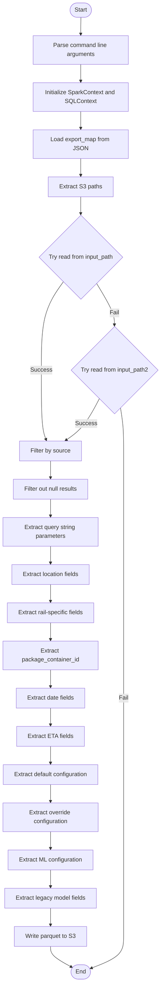
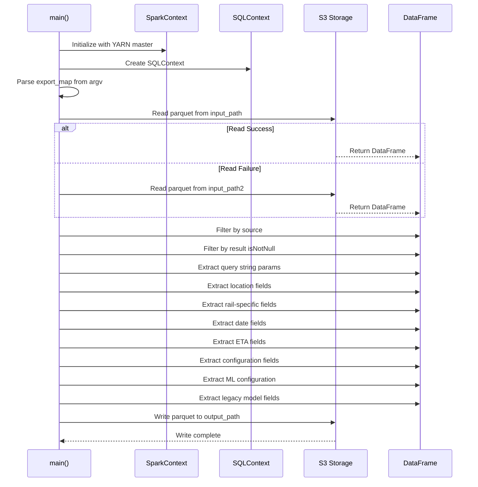
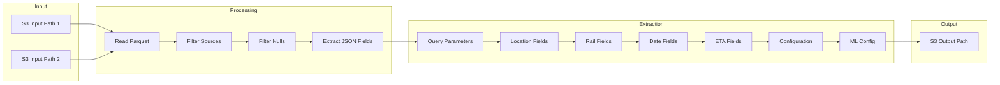
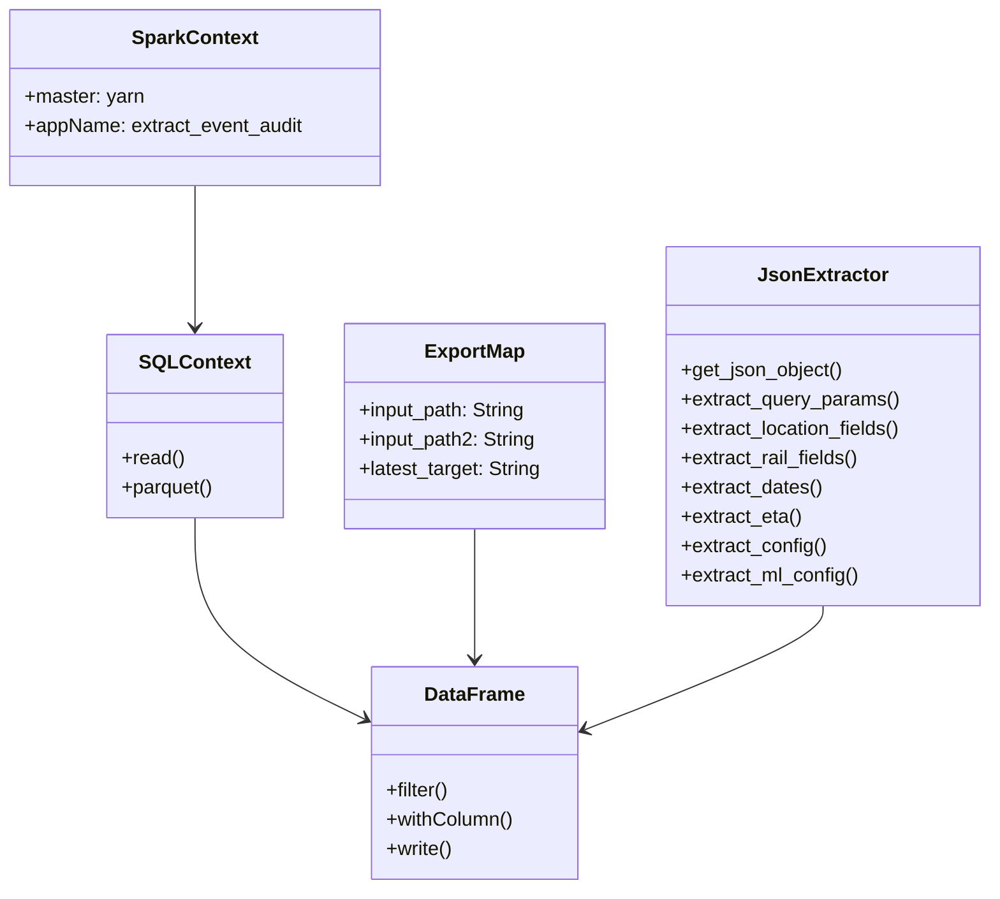

# Diagram: research/orchestrator/tasks/analytics/prepare_event_audit_spark.py

> Auto-generated by Obscura crawlers

## Diagram 1

### SVG

<svg id="container" width="442.89453125" xmlns="http://www.w3.org/2000/svg" class="flowchart" height="2706.328125" viewBox="0 0 442.89453125 2706.328125" role="graphics-document document" aria-roledescription="flowchart-v2"><g><marker id="container_flowchart-v2-pointEnd" class="marker flowchart-v2" viewBox="0 0 10 10" refX="5" refY="5" markerUnits="userSpaceOnUse" markerWidth="8" markerHeight="8" orient="auto"><path d="M 0 0 L 10 5 L 0 10 z" class="arrowMarkerPath" style="stroke-width: 1; stroke-dasharray: 1, 0;"></path></marker><marker id="container_flowchart-v2-pointStart" class="marker flowchart-v2" viewBox="0 0 10 10" refX="4.5" refY="5" markerUnits="userSpaceOnUse" markerWidth="8" markerHeight="8" orient="auto"><path d="M 0 5 L 10 10 L 10 0 z" class="arrowMarkerPath" style="stroke-width: 1; stroke-dasharray: 1, 0;"></path></marker><marker id="container_flowchart-v2-circleEnd" class="marker flowchart-v2" viewBox="0 0 10 10" refX="11" refY="5" markerUnits="userSpaceOnUse" markerWidth="11" markerHeight="11" orient="auto"><circle cx="5" cy="5" r="5" class="arrowMarkerPath" style="stroke-width: 1; stroke-dasharray: 1, 0;"></circle></marker><marker id="container_flowchart-v2-circleStart" class="marker flowchart-v2" viewBox="0 0 10 10" refX="-1" refY="5" markerUnits="userSpaceOnUse" markerWidth="11" markerHeight="11" orient="auto"><circle cx="5" cy="5" r="5" class="arrowMarkerPath" style="stroke-width: 1; stroke-dasharray: 1, 0;"></circle></marker><marker id="container_flowchart-v2-crossEnd" class="marker cross flowchart-v2" viewBox="0 0 11 11" refX="12" refY="5.2" markerUnits="userSpaceOnUse" markerWidth="11" markerHeight="11" orient="auto"><path d="M 1,1 l 9,9 M 10,1 l -9,9" class="arrowMarkerPath" style="stroke-width: 2; stroke-dasharray: 1, 0;"></path></marker><marker id="container_flowchart-v2-crossStart" class="marker cross flowchart-v2" viewBox="0 0 11 11" refX="-1" refY="5.2" markerUnits="userSpaceOnUse" markerWidth="11" markerHeight="11" orient="auto"><path d="M 1,1 l 9,9 M 10,1 l -9,9" class="arrowMarkerPath" style="stroke-width: 2; stroke-dasharray: 1, 0;"></path></marker><g class="root"><g class="clusters"></g><g class="edgePaths"><path d="M221,47.5L220.917,51.583C220.833,55.667,220.667,63.833,220.583,71.417C220.5,79,220.5,86,220.5,89.5L220.5,93" id="L_Start_ParseArgs_0" class="edge-thickness-normal edge-pattern-solid edge-thickness-normal edge-pattern-solid flowchart-link" style=";" data-edge="true" data-et="edge" data-id="L_Start_ParseArgs_0" data-points="W3sieCI6MjIxLCJ5Ijo0Ny41fSx7IngiOjIyMC41LCJ5Ijo3Mn0seyJ4IjoyMjAuNSwieSI6OTd9XQ==" marker-end="url(#container_flowchart-v2-pointEnd)"></path><path d="M220.5,175L220.5,179.167C220.5,183.333,220.5,191.667,220.5,199.333C220.5,207,220.5,214,220.5,217.5L220.5,221" id="L_ParseArgs_InitSpark_0" class="edge-thickness-normal edge-pattern-solid edge-thickness-normal edge-pattern-solid flowchart-link" style=";" data-edge="true" data-et="edge" data-id="L_ParseArgs_InitSpark_0" data-points="W3sieCI6MjIwLjUsInkiOjE3NX0seyJ4IjoyMjAuNSwieSI6MjAwfSx7IngiOjIyMC41LCJ5IjoyMjV9XQ==" marker-end="url(#container_flowchart-v2-pointEnd)"></path><path d="M220.5,303L220.5,307.167C220.5,311.333,220.5,319.667,220.5,327.333C220.5,335,220.5,342,220.5,345.5L220.5,349" id="L_InitSpark_LoadConfig_0" class="edge-thickness-normal edge-pattern-solid edge-thickness-normal edge-pattern-solid flowchart-link" style=";" data-edge="true" data-et="edge" data-id="L_InitSpark_LoadConfig_0" data-points="W3sieCI6MjIwLjUsInkiOjMwM30seyJ4IjoyMjAuNSwieSI6MzI4fSx7IngiOjIyMC41LCJ5IjozNTN9XQ==" marker-end="url(#container_flowchart-v2-pointEnd)"></path><path d="M220.5,431L220.5,435.167C220.5,439.333,220.5,447.667,220.5,455.333C220.5,463,220.5,470,220.5,473.5L220.5,477" id="L_LoadConfig_GetPaths_0" class="edge-thickness-normal edge-pattern-solid edge-thickness-normal edge-pattern-solid flowchart-link" style=";" data-edge="true" data-et="edge" data-id="L_LoadConfig_GetPaths_0" data-points="W3sieCI6MjIwLjUsInkiOjQzMX0seyJ4IjoyMjAuNSwieSI6NDU2fSx7IngiOjIyMC41LCJ5Ijo0ODF9XQ==" marker-end="url(#container_flowchart-v2-pointEnd)"></path><path d="M220.5,535L220.5,539.167C220.5,543.333,220.5,551.667,220.5,559.333C220.5,567,220.5,574,220.5,577.5L220.5,581" id="L_GetPaths_TryRead1_0" class="edge-thickness-normal edge-pattern-solid edge-thickness-normal edge-pattern-solid flowchart-link" style=";" data-edge="true" data-et="edge" data-id="L_GetPaths_TryRead1_0" data-points="W3sieCI6MjIwLjUsInkiOjUzNX0seyJ4IjoyMjAuNSwieSI6NTYwfSx7IngiOjIyMC41LCJ5Ijo1ODV9XQ==" marker-end="url(#container_flowchart-v2-pointEnd)"></path><path d="M172.518,772.221L162.757,786.385C152.995,800.549,133.472,828.876,123.711,869.467C113.949,910.057,113.949,962.911,113.949,1015.766C113.949,1068.62,113.949,1121.474,116.032,1153.444C118.115,1185.413,122.281,1196.499,124.364,1202.041L126.446,1207.584" id="L_TryRead1_FilterSource_0" class="edge-thickness-normal edge-pattern-solid edge-thickness-normal edge-pattern-solid flowchart-link" style=";" data-edge="true" data-et="edge" data-id="L_TryRead1_FilterSource_0" data-points="W3sieCI6MTcyLjUxODI4MTA1MTM0MjQ2LCJ5Ijo3NzIuMjIxNDA2MDUxMzQyNX0seyJ4IjoxMTMuOTQ5MjE4NzUsInkiOjg1Ny4yMDMxMjV9LHsieCI6MTEzLjk0OTIxODc1LCJ5IjoxMDE1Ljc2NTYyNX0seyJ4IjoxMTMuOTQ5MjE4NzUsInkiOjExNzQuMzI4MTI1fSx7IngiOjEyNy44NTM1NzY2NjAxNTYyNSwieSI6MTIxMS4zMjgxMjV9XQ==" marker-end="url(#container_flowchart-v2-pointEnd)"></path><path d="M264.473,776.23L272.533,789.726C280.593,803.221,296.712,830.212,304.772,849.208C312.832,868.203,312.832,879.203,312.832,884.703L312.832,890.203" id="L_TryRead1_TryRead2_0" class="edge-thickness-normal edge-pattern-solid edge-thickness-normal edge-pattern-solid flowchart-link" style=";" data-edge="true" data-et="edge" data-id="L_TryRead1_TryRead2_0" data-points="W3sieCI6MjY0LjQ3MjkxOTkyMTEwMjYsInkiOjc3Ni4yMzAyMDUwNzg4OTc0fSx7IngiOjMxMi44MzIwMzEyNSwieSI6ODU3LjIwMzEyNX0seyJ4IjozMTIuODMyMDMxMjUsInkiOjg5NC4yMDMxMjV9XQ==" marker-end="url(#container_flowchart-v2-pointEnd)"></path><path d="M271.229,1095.725L264.413,1108.826C257.597,1121.926,243.964,1148.127,228.8,1167.015C213.635,1185.902,196.937,1197.476,188.589,1203.263L180.24,1209.049" id="L_TryRead2_FilterSource_0" class="edge-thickness-normal edge-pattern-solid edge-thickness-normal edge-pattern-solid flowchart-link" style=";" data-edge="true" data-et="edge" data-id="L_TryRead2_FilterSource_0" data-points="W3sieCI6MjcxLjIyOTEwMTUxMTg2MTUzLCJ5IjoxMDk1LjcyNTE5NTI2MTg2MTV9LHsieCI6MjMwLjMzMjAzMTI1LCJ5IjoxMTc0LjMyODEyNX0seyJ4IjoxNzYuOTUyNTc1NjgzNTkzNzUsInkiOjEyMTEuMzI4MTI1fV0=" marker-end="url(#container_flowchart-v2-pointEnd)"></path><path d="M328.842,1121.318L330.182,1130.153C331.522,1138.988,334.203,1156.658,335.543,1176.16C336.883,1195.661,336.883,1216.995,336.883,1236.328C336.883,1255.661,336.883,1272.995,336.883,1290.328C336.883,1307.661,336.883,1324.995,336.883,1342.328C336.883,1359.661,336.883,1376.995,336.883,1396.328C336.883,1415.661,336.883,1436.995,336.883,1458.328C336.883,1479.661,336.883,1500.995,336.883,1520.328C336.883,1539.661,336.883,1556.995,336.883,1574.328C336.883,1591.661,336.883,1608.995,336.883,1626.328C336.883,1643.661,336.883,1660.995,336.883,1678.328C336.883,1695.661,336.883,1712.995,336.883,1732.328C336.883,1751.661,336.883,1772.995,336.883,1794.328C336.883,1815.661,336.883,1836.995,336.883,1856.328C336.883,1875.661,336.883,1892.995,336.883,1910.328C336.883,1927.661,336.883,1944.995,336.883,1962.328C336.883,1979.661,336.883,1996.995,336.883,2014.328C336.883,2031.661,336.883,2048.995,336.883,2068.328C336.883,2087.661,336.883,2108.995,336.883,2130.328C336.883,2151.661,336.883,2172.995,336.883,2194.328C336.883,2215.661,336.883,2236.995,336.883,2258.328C336.883,2279.661,336.883,2300.995,336.883,2320.328C336.883,2339.661,336.883,2356.995,336.883,2374.328C336.883,2391.661,336.883,2408.995,336.883,2426.328C336.883,2443.661,336.883,2460.995,336.883,2478.328C336.883,2495.661,336.883,2512.995,336.883,2530.328C336.883,2547.661,336.883,2564.995,336.883,2582.328C336.883,2599.661,336.883,2616.995,322.157,2631.403C307.43,2645.811,277.978,2657.293,263.251,2663.034L248.525,2668.776" id="L_TryRead2_End_0" class="edge-thickness-normal edge-pattern-solid edge-thickness-normal edge-pattern-solid flowchart-link" style=";" data-edge="true" data-et="edge" data-id="L_TryRead2_End_0" data-points="W3sieCI6MzI4Ljg0MjIxOTk3MDYxNDM0LCJ5IjoxMTIxLjMxNzkzNjI3OTM4NTV9LHsieCI6MzM2Ljg4MjgxMjUsInkiOjExNzQuMzI4MTI1fSx7IngiOjMzNi44ODI4MTI1LCJ5IjoxMjM4LjMyODEyNX0seyJ4IjozMzYuODgyODEyNSwieSI6MTI5MC4zMjgxMjV9LHsieCI6MzM2Ljg4MjgxMjUsInkiOjEzNDIuMzI4MTI1fSx7IngiOjMzNi44ODI4MTI1LCJ5IjoxMzk0LjMyODEyNX0seyJ4IjozMzYuODgyODEyNSwieSI6MTQ1OC4zMjgxMjV9LHsieCI6MzM2Ljg4MjgxMjUsInkiOjE1MjIuMzI4MTI1fSx7IngiOjMzNi44ODI4MTI1LCJ5IjoxNTc0LjMyODEyNX0seyJ4IjozMzYuODgyODEyNSwieSI6MTYyNi4zMjgxMjV9LHsieCI6MzM2Ljg4MjgxMjUsInkiOjE2NzguMzI4MTI1fSx7IngiOjMzNi44ODI4MTI1LCJ5IjoxNzMwLjMyODEyNX0seyJ4IjozMzYuODgyODEyNSwieSI6MTc5NC4zMjgxMjV9LHsieCI6MzM2Ljg4MjgxMjUsInkiOjE4NTguMzI4MTI1fSx7IngiOjMzNi44ODI4MTI1LCJ5IjoxOTEwLjMyODEyNX0seyJ4IjozMzYuODgyODEyNSwieSI6MTk2Mi4zMjgxMjV9LHsieCI6MzM2Ljg4MjgxMjUsInkiOjIwMTQuMzI4MTI1fSx7IngiOjMzNi44ODI4MTI1LCJ5IjoyMDY2LjMyODEyNX0seyJ4IjozMzYuODgyODEyNSwieSI6MjEzMC4zMjgxMjV9LHsieCI6MzM2Ljg4MjgxMjUsInkiOjIxOTQuMzI4MTI1fSx7IngiOjMzNi44ODI4MTI1LCJ5IjoyMjU4LjMyODEyNX0seyJ4IjozMzYuODgyODEyNSwieSI6MjMyMi4zMjgxMjV9LHsieCI6MzM2Ljg4MjgxMjUsInkiOjIzNzQuMzI4MTI1fSx7IngiOjMzNi44ODI4MTI1LCJ5IjoyNDI2LjMyODEyNX0seyJ4IjozMzYuODgyODEyNSwieSI6MjQ3OC4zMjgxMjV9LHsieCI6MzM2Ljg4MjgxMjUsInkiOjI1MzAuMzI4MTI1fSx7IngiOjMzNi44ODI4MTI1LCJ5IjoyNTgyLjMyODEyNX0seyJ4IjozMzYuODgyODEyNSwieSI6MjYzNC4zMjgxMjV9LHsieCI6MjQ0Ljc5ODMxODU0ODc3MjIsInkiOjI2NzAuMjI4NjI2OTQ5ODAxM31d" marker-end="url(#container_flowchart-v2-pointEnd)"></path><path d="M138,1265.328L138,1269.495C138,1273.661,138,1281.995,138,1289.661C138,1297.328,138,1304.328,138,1307.828L138,1311.328" id="L_FilterSource_FilterNull_0" class="edge-thickness-normal edge-pattern-solid edge-thickness-normal edge-pattern-solid flowchart-link" style=";" data-edge="true" data-et="edge" data-id="L_FilterSource_FilterNull_0" data-points="W3sieCI6MTM4LCJ5IjoxMjY1LjMyODEyNX0seyJ4IjoxMzgsInkiOjEyOTAuMzI4MTI1fSx7IngiOjEzOCwieSI6MTMxNS4zMjgxMjV9XQ==" marker-end="url(#container_flowchart-v2-pointEnd)"></path><path d="M138,1369.328L138,1373.495C138,1377.661,138,1385.995,138,1393.661C138,1401.328,138,1408.328,138,1411.828L138,1415.328" id="L_FilterNull_ExtractQuery_0" class="edge-thickness-normal edge-pattern-solid edge-thickness-normal edge-pattern-solid flowchart-link" style=";" data-edge="true" data-et="edge" data-id="L_FilterNull_ExtractQuery_0" data-points="W3sieCI6MTM4LCJ5IjoxMzY5LjMyODEyNX0seyJ4IjoxMzgsInkiOjEzOTQuMzI4MTI1fSx7IngiOjEzOCwieSI6MTQxOS4zMjgxMjV9XQ==" marker-end="url(#container_flowchart-v2-pointEnd)"></path><path d="M138,1497.328L138,1501.495C138,1505.661,138,1513.995,138,1521.661C138,1529.328,138,1536.328,138,1539.828L138,1543.328" id="L_ExtractQuery_ExtractLocation_0" class="edge-thickness-normal edge-pattern-solid edge-thickness-normal edge-pattern-solid flowchart-link" style=";" data-edge="true" data-et="edge" data-id="L_ExtractQuery_ExtractLocation_0" data-points="W3sieCI6MTM4LCJ5IjoxNDk3LjMyODEyNX0seyJ4IjoxMzgsInkiOjE1MjIuMzI4MTI1fSx7IngiOjEzOCwieSI6MTU0Ny4zMjgxMjV9XQ==" marker-end="url(#container_flowchart-v2-pointEnd)"></path><path d="M138,1601.328L138,1605.495C138,1609.661,138,1617.995,138,1625.661C138,1633.328,138,1640.328,138,1643.828L138,1647.328" id="L_ExtractLocation_ExtractRail_0" class="edge-thickness-normal edge-pattern-solid edge-thickness-normal edge-pattern-solid flowchart-link" style=";" data-edge="true" data-et="edge" data-id="L_ExtractLocation_ExtractRail_0" data-points="W3sieCI6MTM4LCJ5IjoxNjAxLjMyODEyNX0seyJ4IjoxMzgsInkiOjE2MjYuMzI4MTI1fSx7IngiOjEzOCwieSI6MTY1MS4zMjgxMjV9XQ==" marker-end="url(#container_flowchart-v2-pointEnd)"></path><path d="M138,1705.328L138,1709.495C138,1713.661,138,1721.995,138,1729.661C138,1737.328,138,1744.328,138,1747.828L138,1751.328" id="L_ExtractRail_ExtractJoinKey_0" class="edge-thickness-normal edge-pattern-solid edge-thickness-normal edge-pattern-solid flowchart-link" style=";" data-edge="true" data-et="edge" data-id="L_ExtractRail_ExtractJoinKey_0" data-points="W3sieCI6MTM4LCJ5IjoxNzA1LjMyODEyNX0seyJ4IjoxMzgsInkiOjE3MzAuMzI4MTI1fSx7IngiOjEzOCwieSI6MTc1NS4zMjgxMjV9XQ==" marker-end="url(#container_flowchart-v2-pointEnd)"></path><path d="M138,1833.328L138,1837.495C138,1841.661,138,1849.995,138,1857.661C138,1865.328,138,1872.328,138,1875.828L138,1879.328" id="L_ExtractJoinKey_ExtractDates_0" class="edge-thickness-normal edge-pattern-solid edge-thickness-normal edge-pattern-solid flowchart-link" style=";" data-edge="true" data-et="edge" data-id="L_ExtractJoinKey_ExtractDates_0" data-points="W3sieCI6MTM4LCJ5IjoxODMzLjMyODEyNX0seyJ4IjoxMzgsInkiOjE4NTguMzI4MTI1fSx7IngiOjEzOCwieSI6MTg4My4zMjgxMjV9XQ==" marker-end="url(#container_flowchart-v2-pointEnd)"></path><path d="M138,1937.328L138,1941.495C138,1945.661,138,1953.995,138,1961.661C138,1969.328,138,1976.328,138,1979.828L138,1983.328" id="L_ExtractDates_ExtractETA_0" class="edge-thickness-normal edge-pattern-solid edge-thickness-normal edge-pattern-solid flowchart-link" style=";" data-edge="true" data-et="edge" data-id="L_ExtractDates_ExtractETA_0" data-points="W3sieCI6MTM4LCJ5IjoxOTM3LjMyODEyNX0seyJ4IjoxMzgsInkiOjE5NjIuMzI4MTI1fSx7IngiOjEzOCwieSI6MTk4Ny4zMjgxMjV9XQ==" marker-end="url(#container_flowchart-v2-pointEnd)"></path><path d="M138,2041.328L138,2045.495C138,2049.661,138,2057.995,138,2065.661C138,2073.328,138,2080.328,138,2083.828L138,2087.328" id="L_ExtractETA_ExtractDefault_0" class="edge-thickness-normal edge-pattern-solid edge-thickness-normal edge-pattern-solid flowchart-link" style=";" data-edge="true" data-et="edge" data-id="L_ExtractETA_ExtractDefault_0" data-points="W3sieCI6MTM4LCJ5IjoyMDQxLjMyODEyNX0seyJ4IjoxMzgsInkiOjIwNjYuMzI4MTI1fSx7IngiOjEzOCwieSI6MjA5MS4zMjgxMjV9XQ==" marker-end="url(#container_flowchart-v2-pointEnd)"></path><path d="M138,2169.328L138,2173.495C138,2177.661,138,2185.995,138,2193.661C138,2201.328,138,2208.328,138,2211.828L138,2215.328" id="L_ExtractDefault_ExtractOverride_0" class="edge-thickness-normal edge-pattern-solid edge-thickness-normal edge-pattern-solid flowchart-link" style=";" data-edge="true" data-et="edge" data-id="L_ExtractDefault_ExtractOverride_0" data-points="W3sieCI6MTM4LCJ5IjoyMTY5LjMyODEyNX0seyJ4IjoxMzgsInkiOjIxOTQuMzI4MTI1fSx7IngiOjEzOCwieSI6MjIxOS4zMjgxMjV9XQ==" marker-end="url(#container_flowchart-v2-pointEnd)"></path><path d="M138,2297.328L138,2301.495C138,2305.661,138,2313.995,138,2321.661C138,2329.328,138,2336.328,138,2339.828L138,2343.328" id="L_ExtractOverride_ExtractML_0" class="edge-thickness-normal edge-pattern-solid edge-thickness-normal edge-pattern-solid flowchart-link" style=";" data-edge="true" data-et="edge" data-id="L_ExtractOverride_ExtractML_0" data-points="W3sieCI6MTM4LCJ5IjoyMjk3LjMyODEyNX0seyJ4IjoxMzgsInkiOjIzMjIuMzI4MTI1fSx7IngiOjEzOCwieSI6MjM0Ny4zMjgxMjV9XQ==" marker-end="url(#container_flowchart-v2-pointEnd)"></path><path d="M138,2401.328L138,2405.495C138,2409.661,138,2417.995,138,2425.661C138,2433.328,138,2440.328,138,2443.828L138,2447.328" id="L_ExtractML_ExtractLegacy_0" class="edge-thickness-normal edge-pattern-solid edge-thickness-normal edge-pattern-solid flowchart-link" style=";" data-edge="true" data-et="edge" data-id="L_ExtractML_ExtractLegacy_0" data-points="W3sieCI6MTM4LCJ5IjoyNDAxLjMyODEyNX0seyJ4IjoxMzgsInkiOjI0MjYuMzI4MTI1fSx7IngiOjEzOCwieSI6MjQ1MS4zMjgxMjV9XQ==" marker-end="url(#container_flowchart-v2-pointEnd)"></path><path d="M138,2505.328L138,2509.495C138,2513.661,138,2521.995,138,2529.661C138,2537.328,138,2544.328,138,2547.828L138,2551.328" id="L_ExtractLegacy_WriteOutput_0" class="edge-thickness-normal edge-pattern-solid edge-thickness-normal edge-pattern-solid flowchart-link" style=";" data-edge="true" data-et="edge" data-id="L_ExtractLegacy_WriteOutput_0" data-points="W3sieCI6MTM4LCJ5IjoyNTA1LjMyODEyNX0seyJ4IjoxMzgsInkiOjI1MzAuMzI4MTI1fSx7IngiOjEzOCwieSI6MjU1NS4zMjgxMjV9XQ==" marker-end="url(#container_flowchart-v2-pointEnd)"></path><path d="M138,2609.328L138,2613.495C138,2617.661,138,2625.995,147.579,2635.364C157.157,2644.734,176.315,2655.14,185.894,2660.342L195.472,2665.545" id="L_WriteOutput_End_0" class="edge-thickness-normal edge-pattern-solid edge-thickness-normal edge-pattern-solid flowchart-link" style=";" data-edge="true" data-et="edge" data-id="L_WriteOutput_End_0" data-points="W3sieCI6MTM4LCJ5IjoyNjA5LjMyODEyNX0seyJ4IjoxMzgsInkiOjI2MzQuMzI4MTI1fSx7IngiOjE5OC45ODcyNjEzMTU2MDgwNywieSI6MjY2Ny40NTQ1ODcxNjQxNzZ9XQ==" marker-end="url(#container_flowchart-v2-pointEnd)"></path></g><g class="edgeLabels"><g class="edgeLabel"><g class="label" data-id="L_Start_ParseArgs_0" transform="translate(0, 0)"><foreignObject width="0" height="0">

</foreignObject></g></g><g class="edgeLabel"><g class="label" data-id="L_ParseArgs_InitSpark_0" transform="translate(0, 0)"><foreignObject width="0" height="0">

</foreignObject></g></g><g class="edgeLabel"><g class="label" data-id="L_InitSpark_LoadConfig_0" transform="translate(0, 0)"><foreignObject width="0" height="0">

</foreignObject></g></g><g class="edgeLabel"><g class="label" data-id="L_LoadConfig_GetPaths_0" transform="translate(0, 0)"><foreignObject width="0" height="0">

</foreignObject></g></g><g class="edgeLabel"><g class="label" data-id="L_GetPaths_TryRead1_0" transform="translate(0, 0)"><foreignObject width="0" height="0">

</foreignObject></g></g><g class="edgeLabel" transform="translate(113.94921875, 1015.765625)"><g class="label" data-id="L_TryRead1_FilterSource_0" transform="translate(-28.1015625, -12)"><foreignObject width="56.203125" height="24">

Success

</foreignObject></g></g><g class="edgeLabel" transform="translate(312.83203125, 857.203125)"><g class="label" data-id="L_TryRead1_TryRead2_0" transform="translate(-12.40625, -12)"><foreignObject width="24.8125" height="24">

Fail

</foreignObject></g></g><g class="edgeLabel" transform="translate(235.79159, 1163.83503)"><g class="label" data-id="L_TryRead2_FilterSource_0" transform="translate(-28.1015625, -12)"><foreignObject width="56.203125" height="24">

Success

</foreignObject></g></g><g class="edgeLabel" transform="translate(336.8828125, 1910.328125)"><g class="label" data-id="L_TryRead2_End_0" transform="translate(-12.40625, -12)"><foreignObject width="24.8125" height="24">

Fail

</foreignObject></g></g><g class="edgeLabel"><g class="label" data-id="L_FilterSource_FilterNull_0" transform="translate(0, 0)"><foreignObject width="0" height="0">

</foreignObject></g></g><g class="edgeLabel"><g class="label" data-id="L_FilterNull_ExtractQuery_0" transform="translate(0, 0)"><foreignObject width="0" height="0">

</foreignObject></g></g><g class="edgeLabel"><g class="label" data-id="L_ExtractQuery_ExtractLocation_0" transform="translate(0, 0)"><foreignObject width="0" height="0">

</foreignObject></g></g><g class="edgeLabel"><g class="label" data-id="L_ExtractLocation_ExtractRail_0" transform="translate(0, 0)"><foreignObject width="0" height="0">

</foreignObject></g></g><g class="edgeLabel"><g class="label" data-id="L_ExtractRail_ExtractJoinKey_0" transform="translate(0, 0)"><foreignObject width="0" height="0">

</foreignObject></g></g><g class="edgeLabel"><g class="label" data-id="L_ExtractJoinKey_ExtractDates_0" transform="translate(0, 0)"><foreignObject width="0" height="0">

</foreignObject></g></g><g class="edgeLabel"><g class="label" data-id="L_ExtractDates_ExtractETA_0" transform="translate(0, 0)"><foreignObject width="0" height="0">

</foreignObject></g></g><g class="edgeLabel"><g class="label" data-id="L_ExtractETA_ExtractDefault_0" transform="translate(0, 0)"><foreignObject width="0" height="0">

</foreignObject></g></g><g class="edgeLabel"><g class="label" data-id="L_ExtractDefault_ExtractOverride_0" transform="translate(0, 0)"><foreignObject width="0" height="0">

</foreignObject></g></g><g class="edgeLabel"><g class="label" data-id="L_ExtractOverride_ExtractML_0" transform="translate(0, 0)"><foreignObject width="0" height="0">

</foreignObject></g></g><g class="edgeLabel"><g class="label" data-id="L_ExtractML_ExtractLegacy_0" transform="translate(0, 0)"><foreignObject width="0" height="0">

</foreignObject></g></g><g class="edgeLabel"><g class="label" data-id="L_ExtractLegacy_WriteOutput_0" transform="translate(0, 0)"><foreignObject width="0" height="0">

</foreignObject></g></g><g class="edgeLabel"><g class="label" data-id="L_WriteOutput_End_0" transform="translate(0, 0)"><foreignObject width="0" height="0">

</foreignObject></g></g></g><g class="nodes"><g class="node default" id="flowchart-Start-0" transform="translate(220.5, 27.5)"><g class="basic label-container outer-path"><path d="M-10.3984375 -19.5 C-2.0887446188855083 -19.5, 6.220948262228983 -19.5, 10.3984375 -19.5 C10.3984375 -19.5, 10.398437499999998 -19.5, 10.398437499999998 -19.5 C10.868822245169552 -19.484915676770775, 11.339206990339106 -19.46983135354155, 11.6478067896239 -19.45993515863156 C12.033596880068853 -19.4227184525868, 12.419386970513804 -19.385501746542044, 12.892042152847864 -19.3399052695533 C13.167151919126377 -19.29542765604949, 13.44226168540489 -19.250950042545682, 14.126030759676757 -19.140403561325776 C14.577674186887418 -19.03731889631374, 15.02931761409808 -18.9342342313017, 15.34470188623539 -18.862249829261074 C15.785453254384501 -18.731437136745562, 16.226204622533615 -18.600624444230046, 16.543047751460602 -18.50658706670804 C16.85107625728225 -18.393229729181378, 17.1591047631039 -18.279872391654717, 17.716144095147794 -18.074876768247425 C18.003087015919924 -17.94785564908092, 18.290029936692054 -17.820834529914418, 18.85917041279238 -17.568892924097174 C19.2549328125852 -17.362423933623177, 19.650695212378018 -17.15595494314918, 19.967429764076783 -16.990714730406097 C20.34683601551611 -16.760716431144957, 20.726242266955435 -16.530718131883816, 21.036368073605697 -16.342718045390892 C21.255045490179022 -16.190178145982134, 21.473722906752347 -16.037638246573376, 22.061592844578712 -15.627565626425154 C22.287658365347383 -15.447284389468296, 22.513723886116054 -15.267003152511439, 23.03889120850187 -14.848196188198123 C23.271395530689077 -14.637041914514963, 23.503899852876284 -14.425887640831803, 23.964247236767985 -14.007812326905688 C24.152884438435812 -13.813028928781371, 24.341521640103643 -13.618245530657054, 24.833858442968648 -13.10986736009568 C24.999959205505398 -12.914755953018881, 25.16605996804215 -12.719644545942081, 25.644151408126582 -12.158051136245305 C25.902335354027695 -11.812108169779156, 26.16051929992881 -11.466165203313006, 26.391796464640635 -11.156274872382312 C26.656415002014885 -10.74974973894884, 26.921033539389132 -10.343224605515367, 27.073721378604247 -10.108655082055241 C27.226052997309413 -9.83817486779517, 27.37838461601458 -9.567694653535096, 27.6871239742735 -9.019496659696287 C27.861236648148495 -8.657947966980437, 28.035349322023492 -8.296399274264587, 28.22948364880834 -7.893275190886684 C28.350398916199048 -7.594612142693975, 28.471314183589758 -7.295949094501267, 28.698571729970325 -6.734618561215508 C28.804329890689797 -6.416091831403059, 28.910088051409268 -6.097565101590611, 29.09246063421488 -5.548287939305138 C29.15964596008137 -5.2920811734717885, 29.22683128594786 -5.035874407638439, 29.40953178754556 -4.339158212148133 C29.486760131259505 -3.9426069893932545, 29.56398847497345 -3.546055766638376, 29.648482276581777 -3.1121979531509023 C29.70584192860657 -2.6673278189910508, 29.763201580631367 -2.222457684831199, 29.808330202509367 -1.872449005199798 C29.83586333340909 -1.4435982670933556, 29.863396464308813 -1.0147475289869132, 29.888418715913414 -0.6250057626472757 C29.888418715913414 -0.13372363986295543, 29.888418715913414 0.35755848292136483, 29.888418715913414 0.625005762647271 C29.8662731827704 0.969940316902355, 29.84412764962738 1.3148748711574392, 29.808330202509367 1.8724490051997846 C29.765614488821278 2.203743645392859, 29.72289877513319 2.535038285585933, 29.648482276581777 3.1121979531508885 C29.598490765033805 3.368893799240028, 29.54849925348583 3.625589645329167, 29.40953178754556 4.339158212148129 C29.306254032103237 4.733001054512069, 29.20297627666091 5.12684389687601, 29.092460634214884 5.548287939305125 C29.011580520744907 5.791885954580633, 28.93070040727493 6.035483969856141, 28.69857172997033 6.734618561215495 C28.583141961154553 7.019732321873223, 28.467712192338777 7.3048460825309505, 28.229483648808344 7.893275190886679 C28.062754749345167 8.239491318048922, 27.896025849881994 8.585707445211163, 27.687123974273504 9.019496659696284 C27.462238471580672 9.418803641853875, 27.237352968887844 9.818110624011467, 27.07372137860425 10.108655082055236 C26.9331127331681 10.324667720153176, 26.792504087731952 10.540680358251118, 26.39179646464064 11.156274872382301 C26.202091052451923 11.410462842196598, 26.012385640263208 11.664650812010894, 25.644151408126582 12.158051136245302 C25.41227042979531 12.430431727794662, 25.180389451464038 12.702812319344023, 24.83385844296866 13.10986736009567 C24.503512114114297 13.450977066575799, 24.173165785259933 13.792086773055926, 23.96424723676799 14.007812326905684 C23.65118881546203 14.292123702063826, 23.338130394156074 14.576435077221968, 23.038891208501887 14.848196188198111 C22.822915698819948 15.02043090981977, 22.60694018913801 15.19266563144143, 22.061592844578715 15.627565626425152 C21.67976516410414 15.89391208727033, 21.297937483629568 16.160258548115507, 21.036368073605708 16.34271804539089 C20.741199159498553 16.521651175727722, 20.4460302453914 16.700584306064556, 19.967429764076787 16.990714730406093 C19.56437114516921 17.20099015371881, 19.161312526261632 17.411265577031525, 18.859170412792388 17.56889292409717 C18.456496150541426 17.747144875088086, 18.05382188829046 17.925396826079, 17.716144095147804 18.07487676824742 C17.452186808420926 18.17201548975732, 17.18822952169405 18.269154211267224, 16.543047751460616 18.506587066708033 C16.246364956154764 18.59464096303504, 15.949682160848914 18.682694859362044, 15.344701886235413 18.86224982926107 C14.961582847243125 18.949694249825686, 14.578463808250838 19.0371386703903, 14.126030759676766 19.140403561325773 C13.868093862623189 19.182104798510885, 13.610156965569612 19.223806035695993, 12.892042152847878 19.3399052695533 C12.550549909307886 19.37284861558309, 12.209057665767894 19.405791961612884, 11.6478067896239 19.45993515863156 C11.376935381882516 19.468621477458615, 11.106063974141133 19.477307796285668, 10.398437500000004 19.5 C10.398437500000002 19.5, 10.398437500000002 19.5, 10.3984375 19.5 C2.183539971206894 19.5, -6.031357557586212 19.5, -10.398437499999996 19.5 C-10.712311998777858 19.489934655743845, -11.026186497555722 19.479869311487686, -11.647806789623893 19.45993515863156 C-12.123586282219598 19.41403728318941, -12.599365774815304 19.368139407747258, -12.892042152847871 19.3399052695533 C-13.25944903129196 19.280505774729356, -13.626855909736047 19.22110627990541, -14.126030759676759 19.140403561325773 C-14.510271866364041 19.052703036131952, -14.894512973051324 18.96500251093813, -15.344701886235388 18.862249829261074 C-15.63128397520702 18.777193769554376, -15.917866064178654 18.692137709847678, -16.54304775146059 18.506587066708043 C-16.909591909303085 18.371695428324955, -17.27613606714558 18.236803789941863, -17.716144095147797 18.074876768247425 C-18.011979869675617 17.94391904652041, -18.307815644203433 17.8129613247934, -18.85917041279238 17.568892924097174 C-19.23624498689481 17.372173360315728, -19.613319560997244 17.17545379653428, -19.96742976407678 16.990714730406097 C-20.225558883361135 16.834235341360838, -20.48368800264549 16.677755952315582, -21.036368073605686 16.3427180453909 C-21.336570782826207 16.133309631004494, -21.63677349204673 15.923901216618091, -22.061592844578712 15.627565626425156 C-22.448706028701903 15.318853163601377, -22.835819212825093 15.010140700777598, -23.03889120850187 14.848196188198125 C-23.28258169813736 14.626882933208206, -23.526272187772847 14.405569678218288, -23.964247236767974 14.007812326905697 C-24.197298283277124 13.767167987538242, -24.43034932978627 13.526523648170787, -24.833858442968655 13.109867360095677 C-25.010196851702407 12.902730231257305, -25.18653526043616 12.695593102418934, -25.64415140812658 12.158051136245307 C-25.81646093698385 11.927172065297576, -25.98877046584112 11.696292994349843, -26.391796464640635 11.156274872382316 C-26.57908323929838 10.868552092967262, -26.766370013956127 10.580829313552208, -27.073721378604244 10.108655082055249 C-27.206207371901137 9.873412785295047, -27.338693365198033 9.638170488534847, -27.6871239742735 9.019496659696289 C-27.799468155353264 8.786211563903766, -27.911812336433023 8.552926468111243, -28.22948364880834 7.893275190886686 C-28.408921697678718 7.450059740978186, -28.588359746549095 7.006844291069686, -28.698571729970325 6.73461856121551 C-28.801598631450194 6.424317949065674, -28.904625532930066 6.11401733691584, -29.09246063421488 5.5482879393051325 C-29.15951489579564 5.292580978396906, -29.226569157376392 5.036874017488678, -29.409531787545557 4.339158212148136 C-29.46332284611729 4.062952495126549, -29.517113904689023 3.7867467781049617, -29.648482276581777 3.112197953150904 C-29.701208435372404 2.7032642775285187, -29.75393459416303 2.2943306019061334, -29.808330202509364 1.872449005199809 C-29.836102394204794 1.4398747022338365, -29.863874585900223 1.007300399267864, -29.888418715913414 0.6250057626472781 C-29.888418715913414 0.27469786400755597, -29.888418715913414 -0.0756100346321662, -29.888418715913414 -0.6250057626472687 C-29.867768295060415 -0.9466527361524326, -29.847117874207417 -1.2682997096575965, -29.808330202509367 -1.8724490051997822 C-29.75718997432078 -2.2690825162501564, -29.706049746132194 -2.6657160273005305, -29.648482276581777 -3.112197953150895 C-29.59824051814011 -3.370178764149461, -29.547998759698437 -3.6281595751480267, -29.40953178754556 -4.339158212148126 C-29.29762169268254 -4.765919906002751, -29.185711597819516 -5.1926815998573765, -29.092460634214884 -5.548287939305123 C-28.983170454934566 -5.877452546272106, -28.87388027565425 -6.206617153239089, -28.698571729970332 -6.734618561215485 C-28.511122811226773 -7.197621014590377, -28.323673892483214 -7.660623467965268, -28.229483648808344 -7.893275190886676 C-28.03802413299505 -8.29084497205036, -27.84656461718176 -8.688414753214044, -27.687123974273504 -9.019496659696282 C-27.447224892078125 -9.445461772550429, -27.207325809882747 -9.871426885404574, -27.073721378604247 -10.108655082055243 C-26.92797061355413 -10.332567396732697, -26.78221984850401 -10.556479711410152, -26.39179646464064 -11.156274872382308 C-26.116630798634596 -11.524971796722536, -25.841465132628553 -11.893668721062763, -25.644151408126586 -12.158051136245302 C-25.364783779184965 -12.486212249668542, -25.085416150243347 -12.814373363091784, -24.833858442968662 -13.10986736009567 C-24.605635067685956 -13.345526732562643, -24.377411692403253 -13.581186105029616, -23.964247236767996 -14.007812326905677 C-23.601355905131474 -14.33738063271948, -23.23846457349495 -14.666948938533285, -23.038891208501887 -14.848196188198107 C-22.753483950904922 -15.075800881125595, -22.468076693307957 -15.30340557405308, -22.06159284457872 -15.627565626425149 C-21.83925552703562 -15.782658514315864, -21.616918209492518 -15.93775140220658, -21.03636807360571 -16.342718045390885 C-20.726504619056836 -16.530559092498198, -20.416641164507958 -16.718400139605507, -19.96742976407679 -16.99071473040609 C-19.64274572167763 -17.160102187355676, -19.318061679278472 -17.329489644305266, -18.859170412792388 -17.56889292409717 C-18.49962346528934 -17.72805369217552, -18.14007651778629 -17.887214460253873, -17.716144095147804 -18.07487676824742 C-17.300926414765698 -18.2276807128582, -16.885708734383588 -18.380484657468976, -16.54304775146062 -18.506587066708033 C-16.090859346114176 -18.64079421182948, -15.638670940767733 -18.77500135695093, -15.344701886235413 -18.862249829261067 C-14.890519260184988 -18.96591404983846, -14.436336634134562 -19.06957827041585, -14.126030759676768 -19.140403561325773 C-13.865560664888925 -19.18251434627532, -13.605090570101082 -19.22462513122486, -12.89204215284788 -19.3399052695533 C-12.490784472126453 -19.378614115429528, -12.089526791405028 -19.41732296130576, -11.647806789623903 -19.45993515863156 C-11.246356680118325 -19.47280888226817, -10.844906570612746 -19.485682605904778, -10.398437500000005 -19.5 C-10.398437500000004 -19.5, -10.398437500000004 -19.5, -10.3984375 -19.5" stroke="none" stroke-width="0" fill="#ECECFF" style=""></path><path d="M-10.3984375 -19.5 C-3.9295343969808556 -19.5, 2.539368706038289 -19.5, 10.3984375 -19.5 M-10.3984375 -19.5 C-2.8744268233891557 -19.5, 4.649583853221689 -19.5, 10.3984375 -19.5 M10.3984375 -19.5 C10.3984375 -19.5, 10.3984375 -19.5, 10.398437499999998 -19.5 M10.3984375 -19.5 C10.3984375 -19.5, 10.398437499999998 -19.5, 10.398437499999998 -19.5 M10.398437499999998 -19.5 C10.85465827536298 -19.48536988771398, 11.310879050725962 -19.470739775427955, 11.6478067896239 -19.45993515863156 M10.398437499999998 -19.5 C10.819323597440896 -19.48650300206016, 11.240209694881793 -19.47300600412032, 11.6478067896239 -19.45993515863156 M11.6478067896239 -19.45993515863156 C11.988609520100333 -19.427058329097747, 12.329412250576768 -19.394181499563935, 12.892042152847864 -19.3399052695533 M11.6478067896239 -19.45993515863156 C11.9882840576835 -19.427089726065674, 12.3287613257431 -19.39424429349979, 12.892042152847864 -19.3399052695533 M12.892042152847864 -19.3399052695533 C13.157870811017492 -19.296928153632468, 13.42369946918712 -19.253951037711634, 14.126030759676757 -19.140403561325776 M12.892042152847864 -19.3399052695533 C13.19172257912756 -19.291455262288814, 13.491403005407257 -19.24300525502433, 14.126030759676757 -19.140403561325776 M14.126030759676757 -19.140403561325776 C14.443364803295763 -19.0679741366679, 14.76069884691477 -18.99554471201002, 15.34470188623539 -18.862249829261074 M14.126030759676757 -19.140403561325776 C14.585102068856953 -19.035623530725655, 15.044173378037147 -18.93084350012553, 15.34470188623539 -18.862249829261074 M15.34470188623539 -18.862249829261074 C15.713717180707341 -18.752728026862606, 16.08273247517929 -18.64320622446414, 16.543047751460602 -18.50658706670804 M15.34470188623539 -18.862249829261074 C15.71115319365353 -18.753489004761537, 16.07760450107167 -18.644728180261996, 16.543047751460602 -18.50658706670804 M16.543047751460602 -18.50658706670804 C16.781502491038236 -18.418833518292022, 17.019957230615873 -18.331079969876, 17.716144095147794 -18.074876768247425 M16.543047751460602 -18.50658706670804 C16.868650832057824 -18.386762123206378, 17.194253912655043 -18.26693717970472, 17.716144095147794 -18.074876768247425 M17.716144095147794 -18.074876768247425 C18.074058256859473 -17.916438786004043, 18.431972418571153 -17.758000803760662, 18.85917041279238 -17.568892924097174 M17.716144095147794 -18.074876768247425 C17.955819825247623 -17.968779432260156, 18.195495555347453 -17.862682096272884, 18.85917041279238 -17.568892924097174 M18.85917041279238 -17.568892924097174 C19.08317804592326 -17.45202828537653, 19.307185679054136 -17.33516364665589, 19.967429764076783 -16.990714730406097 M18.85917041279238 -17.568892924097174 C19.141432635237482 -17.421636903445147, 19.423694857682587 -17.274380882793118, 19.967429764076783 -16.990714730406097 M19.967429764076783 -16.990714730406097 C20.295854605772018 -16.791621661331842, 20.624279447467256 -16.59252859225759, 21.036368073605697 -16.342718045390892 M19.967429764076783 -16.990714730406097 C20.294703395365197 -16.79231953184572, 20.62197702665361 -16.593924333285347, 21.036368073605697 -16.342718045390892 M21.036368073605697 -16.342718045390892 C21.24369517002745 -16.19809563797243, 21.451022266449204 -16.053473230553966, 22.061592844578712 -15.627565626425154 M21.036368073605697 -16.342718045390892 C21.309586771274095 -16.152132509344217, 21.58280546894249 -15.96154697329754, 22.061592844578712 -15.627565626425154 M22.061592844578712 -15.627565626425154 C22.258710201233214 -15.470369780006347, 22.455827557887712 -15.313173933587542, 23.03889120850187 -14.848196188198123 M22.061592844578712 -15.627565626425154 C22.391717722772476 -15.36429982105758, 22.721842600966244 -15.101034015690008, 23.03889120850187 -14.848196188198123 M23.03889120850187 -14.848196188198123 C23.229093958224897 -14.675459083388656, 23.419296707947925 -14.502721978579187, 23.964247236767985 -14.007812326905688 M23.03889120850187 -14.848196188198123 C23.26426701459269 -14.643515844223502, 23.489642820683507 -14.43883550024888, 23.964247236767985 -14.007812326905688 M23.964247236767985 -14.007812326905688 C24.219377338618084 -13.744369550174545, 24.474507440468184 -13.480926773443402, 24.833858442968648 -13.10986736009568 M23.964247236767985 -14.007812326905688 C24.206115289119936 -13.758063705115896, 24.447983341471886 -13.508315083326107, 24.833858442968648 -13.10986736009568 M24.833858442968648 -13.10986736009568 C25.089463225938808 -12.80961943769476, 25.345068008908967 -12.50937151529384, 25.644151408126582 -12.158051136245305 M24.833858442968648 -13.10986736009568 C25.107457194763565 -12.788482698027368, 25.381055946558483 -12.467098035959054, 25.644151408126582 -12.158051136245305 M25.644151408126582 -12.158051136245305 C25.862882817605517 -11.864970974384871, 26.081614227084447 -11.571890812524437, 26.391796464640635 -11.156274872382312 M25.644151408126582 -12.158051136245305 C25.82849903599052 -11.911042109322018, 26.01284666385446 -11.664033082398731, 26.391796464640635 -11.156274872382312 M26.391796464640635 -11.156274872382312 C26.531557995478018 -10.941563629790195, 26.6713195263154 -10.726852387198077, 27.073721378604247 -10.108655082055241 M26.391796464640635 -11.156274872382312 C26.53815679112146 -10.931426107657135, 26.68451711760228 -10.706577342931958, 27.073721378604247 -10.108655082055241 M27.073721378604247 -10.108655082055241 C27.279537060976455 -9.743208496905615, 27.485352743348663 -9.377761911755988, 27.6871239742735 -9.019496659696287 M27.073721378604247 -10.108655082055241 C27.312381029241337 -9.68489070543889, 27.55104067987843 -9.26112632882254, 27.6871239742735 -9.019496659696287 M27.6871239742735 -9.019496659696287 C27.899855967463015 -8.577754124102782, 28.11258796065253 -8.136011588509277, 28.22948364880834 -7.893275190886684 M27.6871239742735 -9.019496659696287 C27.840345476294317 -8.701328932335114, 27.99356697831513 -8.383161204973941, 28.22948364880834 -7.893275190886684 M28.22948364880834 -7.893275190886684 C28.40435778190214 -7.461332701183645, 28.579231914995937 -7.029390211480607, 28.698571729970325 -6.734618561215508 M28.22948364880834 -7.893275190886684 C28.330111840935693 -7.644721610818383, 28.430740033063046 -7.396168030750082, 28.698571729970325 -6.734618561215508 M28.698571729970325 -6.734618561215508 C28.815878600634964 -6.381308957085268, 28.9331854712996 -6.027999352955026, 29.09246063421488 -5.548287939305138 M28.698571729970325 -6.734618561215508 C28.799030908492636 -6.4320515215027445, 28.89949008701495 -6.129484481789981, 29.09246063421488 -5.548287939305138 M29.09246063421488 -5.548287939305138 C29.20620605402988 -5.114527355973754, 29.31995147384488 -4.68076677264237, 29.40953178754556 -4.339158212148133 M29.09246063421488 -5.548287939305138 C29.167388536257015 -5.262555374860321, 29.242316438299145 -4.976822810415506, 29.40953178754556 -4.339158212148133 M29.40953178754556 -4.339158212148133 C29.481240271831354 -3.9709503009341027, 29.55294875611715 -3.602742389720072, 29.648482276581777 -3.1121979531509023 M29.40953178754556 -4.339158212148133 C29.487455921840716 -3.939034251814122, 29.565380056135872 -3.5389102914801107, 29.648482276581777 -3.1121979531509023 M29.648482276581777 -3.1121979531509023 C29.685267289923864 -2.82690065369218, 29.72205230326595 -2.541603354233458, 29.808330202509367 -1.872449005199798 M29.648482276581777 -3.1121979531509023 C29.706484884819652 -2.6623411775684676, 29.764487493057526 -2.212484401986033, 29.808330202509367 -1.872449005199798 M29.808330202509367 -1.872449005199798 C29.829903639718463 -1.5364253069030192, 29.851477076927562 -1.2004016086062403, 29.888418715913414 -0.6250057626472757 M29.808330202509367 -1.872449005199798 C29.8352723958584 -1.4528025964415385, 29.862214589207436 -1.0331561876832793, 29.888418715913414 -0.6250057626472757 M29.888418715913414 -0.6250057626472757 C29.888418715913414 -0.2534788541177413, 29.888418715913414 0.11804805441179311, 29.888418715913414 0.625005762647271 M29.888418715913414 -0.6250057626472757 C29.888418715913414 -0.27188026504926976, 29.888418715913414 0.08124523254873617, 29.888418715913414 0.625005762647271 M29.888418715913414 0.625005762647271 C29.870360084925352 0.906283516950904, 29.85230145393729 1.1875612712545371, 29.808330202509367 1.8724490051997846 M29.888418715913414 0.625005762647271 C29.85760875784885 1.1048957288533954, 29.826798799784285 1.5847856950595198, 29.808330202509367 1.8724490051997846 M29.808330202509367 1.8724490051997846 C29.76448838114111 2.212477514185128, 29.720646559772852 2.552506023170472, 29.648482276581777 3.1121979531508885 M29.808330202509367 1.8724490051997846 C29.746836236582844 2.3493840615688075, 29.685342270656324 2.8263191179378304, 29.648482276581777 3.1121979531508885 M29.648482276581777 3.1121979531508885 C29.578124398839357 3.4734707852154862, 29.50776652109694 3.8347436172800844, 29.40953178754556 4.339158212148129 M29.648482276581777 3.1121979531508885 C29.58215972013355 3.4527502632352673, 29.515837163685323 3.7933025733196466, 29.40953178754556 4.339158212148129 M29.40953178754556 4.339158212148129 C29.314708614898837 4.7007600660730775, 29.219885442252114 5.062361919998026, 29.092460634214884 5.548287939305125 M29.40953178754556 4.339158212148129 C29.293883905107297 4.7801737099945285, 29.178236022669036 5.221189207840927, 29.092460634214884 5.548287939305125 M29.092460634214884 5.548287939305125 C29.010259505440867 5.7958646422011935, 28.928058376666854 6.043441345097262, 28.69857172997033 6.734618561215495 M29.092460634214884 5.548287939305125 C29.005933508844237 5.808893854696291, 28.919406383473593 6.069499770087457, 28.69857172997033 6.734618561215495 M28.69857172997033 6.734618561215495 C28.58061799722581 7.025966561574733, 28.462664264481297 7.317314561933971, 28.229483648808344 7.893275190886679 M28.69857172997033 6.734618561215495 C28.526823804879832 7.158839256709265, 28.355075879789332 7.583059952203035, 28.229483648808344 7.893275190886679 M28.229483648808344 7.893275190886679 C28.07742697314086 8.209024131401868, 27.92537029747338 8.524773071917059, 27.687123974273504 9.019496659696284 M28.229483648808344 7.893275190886679 C28.111671973484885 8.137913655461878, 27.993860298161422 8.382552120037078, 27.687123974273504 9.019496659696284 M27.687123974273504 9.019496659696284 C27.505485048734975 9.342014964925616, 27.323846123196443 9.66453327015495, 27.07372137860425 10.108655082055236 M27.687123974273504 9.019496659696284 C27.467125043342904 9.410127038870991, 27.2471261124123 9.8007574180457, 27.07372137860425 10.108655082055236 M27.07372137860425 10.108655082055236 C26.879476822079436 10.407066882844145, 26.685232265554617 10.705478683633054, 26.39179646464064 11.156274872382301 M27.07372137860425 10.108655082055236 C26.93372970148591 10.323719891137838, 26.793738024367563 10.53878470022044, 26.39179646464064 11.156274872382301 M26.39179646464064 11.156274872382301 C26.233427020656414 11.368475499568016, 26.075057576672183 11.58067612675373, 25.644151408126582 12.158051136245302 M26.39179646464064 11.156274872382301 C26.21249676231597 11.396520138958449, 26.033197059991295 11.636765405534597, 25.644151408126582 12.158051136245302 M25.644151408126582 12.158051136245302 C25.480852587573324 12.34987122283328, 25.317553767020062 12.541691309421259, 24.83385844296866 13.10986736009567 M25.644151408126582 12.158051136245302 C25.388769124225913 12.458037698578648, 25.13338684032524 12.758024260911993, 24.83385844296866 13.10986736009567 M24.83385844296866 13.10986736009567 C24.548472914592843 13.404551348731331, 24.263087386217023 13.699235337366993, 23.96424723676799 14.007812326905684 M24.83385844296866 13.10986736009567 C24.656635473365924 13.292864626486898, 24.479412503763186 13.475861892878125, 23.96424723676799 14.007812326905684 M23.96424723676799 14.007812326905684 C23.622636339698804 14.31805430509488, 23.28102544262962 14.628296283284072, 23.038891208501887 14.848196188198111 M23.96424723676799 14.007812326905684 C23.64138828074489 14.301024288385994, 23.318529324721794 14.594236249866304, 23.038891208501887 14.848196188198111 M23.038891208501887 14.848196188198111 C22.700517407649922 15.118040289872548, 22.362143606797954 15.387884391546985, 22.061592844578715 15.627565626425152 M23.038891208501887 14.848196188198111 C22.680859906133634 15.133716624223704, 22.32282860376538 15.419237060249296, 22.061592844578715 15.627565626425152 M22.061592844578715 15.627565626425152 C21.805912656091294 15.805917057697005, 21.550232467603873 15.98426848896886, 21.036368073605708 16.34271804539089 M22.061592844578715 15.627565626425152 C21.699828128215202 15.87991703201817, 21.338063411851692 16.132268437611188, 21.036368073605708 16.34271804539089 M21.036368073605708 16.34271804539089 C20.689308973860175 16.553107311202286, 20.342249874114646 16.763496577013683, 19.967429764076787 16.990714730406093 M21.036368073605708 16.34271804539089 C20.766191263961623 16.506500815132302, 20.496014454317535 16.670283584873715, 19.967429764076787 16.990714730406093 M19.967429764076787 16.990714730406093 C19.624149524325478 17.169803811602865, 19.280869284574166 17.348892892799636, 18.859170412792388 17.56889292409717 M19.967429764076787 16.990714730406093 C19.60833826010231 17.17805253802049, 19.24924675612784 17.36539034563489, 18.859170412792388 17.56889292409717 M18.859170412792388 17.56889292409717 C18.617443811712 17.675898119830606, 18.375717210631617 17.78290331556404, 17.716144095147804 18.07487676824742 M18.859170412792388 17.56889292409717 C18.430384134282914 17.758703890100286, 18.00159785577344 17.948514856103404, 17.716144095147804 18.07487676824742 M17.716144095147804 18.07487676824742 C17.471919707432058 18.16475360051231, 17.227695319716307 18.254630432777194, 16.543047751460616 18.506587066708033 M17.716144095147804 18.07487676824742 C17.283626282631317 18.23404732140432, 16.85110847011483 18.393217874561216, 16.543047751460616 18.506587066708033 M16.543047751460616 18.506587066708033 C16.069145525346915 18.647238759855032, 15.595243299233218 18.787890453002035, 15.344701886235413 18.86224982926107 M16.543047751460616 18.506587066708033 C16.122988571331852 18.63125842643462, 15.702929391203089 18.755929786161207, 15.344701886235413 18.86224982926107 M15.344701886235413 18.86224982926107 C14.985412003108925 18.94425540049909, 14.626122119982435 19.026260971737113, 14.126030759676766 19.140403561325773 M15.344701886235413 18.86224982926107 C14.975914081711382 18.94642323907835, 14.607126277187351 19.03059664889563, 14.126030759676766 19.140403561325773 M14.126030759676766 19.140403561325773 C13.74840130740005 19.201455762609733, 13.370771855123332 19.262507963893693, 12.892042152847878 19.3399052695533 M14.126030759676766 19.140403561325773 C13.722766361912438 19.2056002217942, 13.31950196414811 19.270796882262623, 12.892042152847878 19.3399052695533 M12.892042152847878 19.3399052695533 C12.402760754826378 19.38710565757346, 11.913479356804876 19.43430604559362, 11.6478067896239 19.45993515863156 M12.892042152847878 19.3399052695533 C12.551493899352524 19.3727575499988, 12.210945645857171 19.4056098304443, 11.6478067896239 19.45993515863156 M11.6478067896239 19.45993515863156 C11.22547459057405 19.47347853023533, 10.8031423915242 19.487021901839103, 10.398437500000004 19.5 M11.6478067896239 19.45993515863156 C11.34698301669424 19.46958199151146, 11.046159243764581 19.479228824391363, 10.398437500000004 19.5 M10.398437500000004 19.5 C10.398437500000002 19.5, 10.398437500000002 19.5, 10.3984375 19.5 M10.398437500000004 19.5 C10.398437500000004 19.5, 10.398437500000002 19.5, 10.3984375 19.5 M10.3984375 19.5 C3.6506664570982874 19.5, -3.097104585803425 19.5, -10.398437499999996 19.5 M10.3984375 19.5 C5.655679466236029 19.5, 0.9129214324720571 19.5, -10.398437499999996 19.5 M-10.398437499999996 19.5 C-10.880231156872224 19.48454981517857, -11.362024813744451 19.469099630357142, -11.647806789623893 19.45993515863156 M-10.398437499999996 19.5 C-10.745225098566817 19.488879196695073, -11.092012697133637 19.477758393390147, -11.647806789623893 19.45993515863156 M-11.647806789623893 19.45993515863156 C-12.01472760229295 19.424538749120217, -12.381648414962006 19.38914233960887, -12.892042152847871 19.3399052695533 M-11.647806789623893 19.45993515863156 C-12.035977027921527 19.422488842586, -12.42414726621916 19.38504252654044, -12.892042152847871 19.3399052695533 M-12.892042152847871 19.3399052695533 C-13.245189124580053 19.282811205859307, -13.598336096312233 19.225717142165315, -14.126030759676759 19.140403561325773 M-12.892042152847871 19.3399052695533 C-13.325149209022818 19.269883879506317, -13.758256265197765 19.199862489459335, -14.126030759676759 19.140403561325773 M-14.126030759676759 19.140403561325773 C-14.561883757942551 19.040922958678223, -14.997736756208344 18.941442356030677, -15.344701886235388 18.862249829261074 M-14.126030759676759 19.140403561325773 C-14.415216326413406 19.074398842830316, -14.704401893150052 19.00839412433486, -15.344701886235388 18.862249829261074 M-15.344701886235388 18.862249829261074 C-15.608515972658632 18.783951193199055, -15.872330059081875 18.705652557137032, -16.54304775146059 18.506587066708043 M-15.344701886235388 18.862249829261074 C-15.799788429396193 18.72718253204896, -16.254874972556998 18.592115234836847, -16.54304775146059 18.506587066708043 M-16.54304775146059 18.506587066708043 C-16.796038797762694 18.413484023045275, -17.0490298440648 18.320380979382502, -17.716144095147797 18.074876768247425 M-16.54304775146059 18.506587066708043 C-16.81536901541609 18.40637032426225, -17.087690279371586 18.30615358181646, -17.716144095147797 18.074876768247425 M-17.716144095147797 18.074876768247425 C-18.09608437252586 17.906688477980044, -18.476024649903916 17.738500187712663, -18.85917041279238 17.568892924097174 M-17.716144095147797 18.074876768247425 C-17.96009490307251 17.96688698212276, -18.204045710997217 17.85889719599809, -18.85917041279238 17.568892924097174 M-18.85917041279238 17.568892924097174 C-19.084945612513454 17.451106147018606, -19.31072081223453 17.33331936994004, -19.96742976407678 16.990714730406097 M-18.85917041279238 17.568892924097174 C-19.264080733859426 17.357651468953936, -19.668991054926472 17.146410013810694, -19.96742976407678 16.990714730406097 M-19.96742976407678 16.990714730406097 C-20.222214281525666 16.836262858648563, -20.476998798974552 16.681810986891026, -21.036368073605686 16.3427180453909 M-19.96742976407678 16.990714730406097 C-20.343754540916084 16.762584439156246, -20.72007931775539 16.534454147906395, -21.036368073605686 16.3427180453909 M-21.036368073605686 16.3427180453909 C-21.30197802672116 16.157440040167103, -21.567587979836627 15.972162034943304, -22.061592844578712 15.627565626425156 M-21.036368073605686 16.3427180453909 C-21.24717792043573 16.19566622205345, -21.45798776726577 16.048614398716, -22.061592844578712 15.627565626425156 M-22.061592844578712 15.627565626425156 C-22.393699207332308 15.362719639850635, -22.725805570085907 15.097873653276116, -23.03889120850187 14.848196188198125 M-22.061592844578712 15.627565626425156 C-22.262481770611632 15.467362053792737, -22.463370696644553 15.307158481160316, -23.03889120850187 14.848196188198125 M-23.03889120850187 14.848196188198125 C-23.34868461443997 14.566850013609496, -23.658478020378077 14.285503839020867, -23.964247236767974 14.007812326905697 M-23.03889120850187 14.848196188198125 C-23.268040003989693 14.640089315080973, -23.497188799477517 14.43198244196382, -23.964247236767974 14.007812326905697 M-23.964247236767974 14.007812326905697 C-24.14861096047454 13.817441645635453, -24.3329746841811 13.627070964365211, -24.833858442968655 13.109867360095677 M-23.964247236767974 14.007812326905697 C-24.251585523164348 13.711111955289399, -24.53892380956072 13.414411583673102, -24.833858442968655 13.109867360095677 M-24.833858442968655 13.109867360095677 C-25.132128379557603 12.75950252053811, -25.43039831614655 12.40913768098054, -25.64415140812658 12.158051136245307 M-24.833858442968655 13.109867360095677 C-25.031797177328635 12.87735725968339, -25.229735911688618 12.644847159271102, -25.64415140812658 12.158051136245307 M-25.64415140812658 12.158051136245307 C-25.84688124641617 11.886411622005467, -26.049611084705763 11.614772107765626, -26.391796464640635 11.156274872382316 M-25.64415140812658 12.158051136245307 C-25.942136719948813 11.758777965423889, -26.240122031771044 11.35950479460247, -26.391796464640635 11.156274872382316 M-26.391796464640635 11.156274872382316 C-26.58784425923871 10.855092813675656, -26.78389205383679 10.553910754968996, -27.073721378604244 10.108655082055249 M-26.391796464640635 11.156274872382316 C-26.591408252561855 10.849617562865097, -26.791020040483076 10.542960253347879, -27.073721378604244 10.108655082055249 M-27.073721378604244 10.108655082055249 C-27.24215008758814 9.809592853998149, -27.410578796572036 9.510530625941048, -27.6871239742735 9.019496659696289 M-27.073721378604244 10.108655082055249 C-27.265351724203693 9.76839599876676, -27.456982069803146 9.428136915478273, -27.6871239742735 9.019496659696289 M-27.6871239742735 9.019496659696289 C-27.88758771972838 8.603229403022203, -28.08805146518326 8.186962146348115, -28.22948364880834 7.893275190886686 M-27.6871239742735 9.019496659696289 C-27.88069325124802 8.617545914339667, -28.074262528222537 8.215595168983043, -28.22948364880834 7.893275190886686 M-28.22948364880834 7.893275190886686 C-28.40035049839564 7.471230768920258, -28.571217347982937 7.049186346953831, -28.698571729970325 6.73461856121551 M-28.22948364880834 7.893275190886686 C-28.387846419740935 7.502116084947293, -28.54620919067353 7.110956979007899, -28.698571729970325 6.73461856121551 M-28.698571729970325 6.73461856121551 C-28.830650918768317 6.336817088516869, -28.962730107566305 5.939015615818229, -29.09246063421488 5.5482879393051325 M-28.698571729970325 6.73461856121551 C-28.834250475127373 6.325975798274811, -28.96992922028442 5.917333035334114, -29.09246063421488 5.5482879393051325 M-29.09246063421488 5.5482879393051325 C-29.181027625833124 5.210543615087796, -29.269594617451364 4.872799290870459, -29.409531787545557 4.339158212148136 M-29.09246063421488 5.5482879393051325 C-29.207983298081203 5.1077499541436095, -29.323505961947525 4.6672119689820875, -29.409531787545557 4.339158212148136 M-29.409531787545557 4.339158212148136 C-29.503533434826828 3.8564796206140026, -29.5975350821081 3.3738010290798695, -29.648482276581777 3.112197953150904 M-29.409531787545557 4.339158212148136 C-29.470794342376617 4.024587940936202, -29.532056897207674 3.710017669724269, -29.648482276581777 3.112197953150904 M-29.648482276581777 3.112197953150904 C-29.701090017683207 2.704182701741709, -29.75369775878464 2.296167450332514, -29.808330202509364 1.872449005199809 M-29.648482276581777 3.112197953150904 C-29.70194356293955 2.697562773285101, -29.75540484929732 2.2829275934192976, -29.808330202509364 1.872449005199809 M-29.808330202509364 1.872449005199809 C-29.82557268174852 1.6038834731712277, -29.842815160987676 1.3353179411426466, -29.888418715913414 0.6250057626472781 M-29.808330202509364 1.872449005199809 C-29.837359650126253 1.4202919264184173, -29.866389097743138 0.9681348476370256, -29.888418715913414 0.6250057626472781 M-29.888418715913414 0.6250057626472781 C-29.888418715913414 0.13123786246233343, -29.888418715913414 -0.3625300377226113, -29.888418715913414 -0.6250057626472687 M-29.888418715913414 0.6250057626472781 C-29.888418715913414 0.34576011995318606, -29.888418715913414 0.06651447725909398, -29.888418715913414 -0.6250057626472687 M-29.888418715913414 -0.6250057626472687 C-29.872108667665728 -0.8790479293389759, -29.855798619418042 -1.1330900960306831, -29.808330202509367 -1.8724490051997822 M-29.888418715913414 -0.6250057626472687 C-29.861813480946047 -1.0394037726231304, -29.835208245978684 -1.4538017825989922, -29.808330202509367 -1.8724490051997822 M-29.808330202509367 -1.8724490051997822 C-29.762471569102356 -2.228119510093102, -29.71661293569535 -2.583790014986422, -29.648482276581777 -3.112197953150895 M-29.808330202509367 -1.8724490051997822 C-29.75194796529769 -2.3097385030814994, -29.69556572808601 -2.747028000963217, -29.648482276581777 -3.112197953150895 M-29.648482276581777 -3.112197953150895 C-29.564707962944983 -3.542361347968381, -29.480933649308188 -3.9725247427858665, -29.40953178754556 -4.339158212148126 M-29.648482276581777 -3.112197953150895 C-29.567833893242152 -3.526310356558019, -29.487185509902524 -3.9404227599651427, -29.40953178754556 -4.339158212148126 M-29.40953178754556 -4.339158212148126 C-29.29890540591705 -4.76102455107472, -29.18827902428854 -5.182890890001315, -29.092460634214884 -5.548287939305123 M-29.40953178754556 -4.339158212148126 C-29.334207289039234 -4.626403170796914, -29.258882790532905 -4.913648129445703, -29.092460634214884 -5.548287939305123 M-29.092460634214884 -5.548287939305123 C-28.999363267160494 -5.82868237582188, -28.9062659001061 -6.109076812338637, -28.698571729970332 -6.734618561215485 M-29.092460634214884 -5.548287939305123 C-29.008467996845475 -5.8012603806523835, -28.924475359476066 -6.054232821999644, -28.698571729970332 -6.734618561215485 M-28.698571729970332 -6.734618561215485 C-28.524829815758917 -7.16376444838908, -28.3510879015475 -7.592910335562675, -28.229483648808344 -7.893275190886676 M-28.698571729970332 -6.734618561215485 C-28.53448089366529 -7.139926099369444, -28.370390057360243 -7.5452336375234035, -28.229483648808344 -7.893275190886676 M-28.229483648808344 -7.893275190886676 C-28.107207812906005 -8.14718358042165, -27.98493197700367 -8.401091969956623, -27.687123974273504 -9.019496659696282 M-28.229483648808344 -7.893275190886676 C-28.0937438602687 -8.175141766155454, -27.958004071729054 -8.457008341424231, -27.687123974273504 -9.019496659696282 M-27.687123974273504 -9.019496659696282 C-27.52979583397688 -9.298848703994663, -27.372467693680257 -9.578200748293044, -27.073721378604247 -10.108655082055243 M-27.687123974273504 -9.019496659696282 C-27.522391181729034 -9.311996413863058, -27.357658389184564 -9.604496168029836, -27.073721378604247 -10.108655082055243 M-27.073721378604247 -10.108655082055243 C-26.817762727457282 -10.501876304738557, -26.561804076310317 -10.895097527421873, -26.39179646464064 -11.156274872382308 M-27.073721378604247 -10.108655082055243 C-26.87129811170962 -10.419631578263424, -26.668874844814997 -10.730608074471606, -26.39179646464064 -11.156274872382308 M-26.39179646464064 -11.156274872382308 C-26.226946500799038 -11.3771588057894, -26.062096536957434 -11.598042739196492, -25.644151408126586 -12.158051136245302 M-26.39179646464064 -11.156274872382308 C-26.122458807963366 -11.517162795164557, -25.853121151286093 -11.878050717946806, -25.644151408126586 -12.158051136245302 M-25.644151408126586 -12.158051136245302 C-25.36597361022164 -12.484814606429563, -25.087795812316692 -12.811578076613824, -24.833858442968662 -13.10986736009567 M-25.644151408126586 -12.158051136245302 C-25.3707017890777 -12.479260618504236, -25.09725217002881 -12.800470100763173, -24.833858442968662 -13.10986736009567 M-24.833858442968662 -13.10986736009567 C-24.50704346476315 -13.44733065710158, -24.18022848655764 -13.784793954107487, -23.964247236767996 -14.007812326905677 M-24.833858442968662 -13.10986736009567 C-24.553313228752934 -13.399553326963854, -24.272768014537206 -13.689239293832038, -23.964247236767996 -14.007812326905677 M-23.964247236767996 -14.007812326905677 C-23.736539409764845 -14.214610550570987, -23.508831582761694 -14.421408774236294, -23.038891208501887 -14.848196188198107 M-23.964247236767996 -14.007812326905677 C-23.65457603993448 -14.289047514418996, -23.344904843100963 -14.570282701932314, -23.038891208501887 -14.848196188198107 M-23.038891208501887 -14.848196188198107 C-22.82746330436202 -15.016804315416831, -22.616035400222156 -15.185412442635556, -22.06159284457872 -15.627565626425149 M-23.038891208501887 -14.848196188198107 C-22.813858403709098 -15.027653861645927, -22.58882559891631 -15.207111535093746, -22.06159284457872 -15.627565626425149 M-22.06159284457872 -15.627565626425149 C-21.673413908242665 -15.89834244841786, -21.285234971906608 -16.169119270410572, -21.03636807360571 -16.342718045390885 M-22.06159284457872 -15.627565626425149 C-21.75930434717647 -15.838428996354812, -21.457015849774223 -16.049292366284476, -21.03636807360571 -16.342718045390885 M-21.03636807360571 -16.342718045390885 C-20.73675045006109 -16.52434800953223, -20.43713282651647 -16.705977973673576, -19.96742976407679 -16.99071473040609 M-21.03636807360571 -16.342718045390885 C-20.71407767539736 -16.5380923787734, -20.391787277189007 -16.73346671215591, -19.96742976407679 -16.99071473040609 M-19.96742976407679 -16.99071473040609 C-19.537010959054836 -17.215263945289642, -19.10659215403288 -17.439813160173195, -18.859170412792388 -17.56889292409717 M-19.96742976407679 -16.99071473040609 C-19.66782920165446 -17.1470161519185, -19.368228639232132 -17.30331757343091, -18.859170412792388 -17.56889292409717 M-18.859170412792388 -17.56889292409717 C-18.469353741465614 -17.74145320099283, -18.07953707013884 -17.91401347788849, -17.716144095147804 -18.07487676824742 M-18.859170412792388 -17.56889292409717 C-18.405699799711638 -17.769630912780222, -17.952229186630884 -17.970368901463274, -17.716144095147804 -18.07487676824742 M-17.716144095147804 -18.07487676824742 C-17.477901716996335 -18.162552165695566, -17.239659338844863 -18.250227563143707, -16.54304775146062 -18.506587066708033 M-17.716144095147804 -18.07487676824742 C-17.442540600748536 -18.17556538334933, -17.168937106349265 -18.27625399845124, -16.54304775146062 -18.506587066708033 M-16.54304775146062 -18.506587066708033 C-16.213205572176363 -18.60448249414267, -15.883363392892107 -18.702377921577305, -15.344701886235413 -18.862249829261067 M-16.54304775146062 -18.506587066708033 C-16.069944434881 -18.64700164769888, -15.596841118301379 -18.787416228689725, -15.344701886235413 -18.862249829261067 M-15.344701886235413 -18.862249829261067 C-14.905104306113833 -18.96258510828152, -14.465506725992253 -19.062920387301972, -14.126030759676768 -19.140403561325773 M-15.344701886235413 -18.862249829261067 C-15.009731619958483 -18.93870460665351, -14.674761353681555 -19.015159384045948, -14.126030759676768 -19.140403561325773 M-14.126030759676768 -19.140403561325773 C-13.82999743486538 -19.18826393350856, -13.533964110053992 -19.23612430569134, -12.89204215284788 -19.3399052695533 M-14.126030759676768 -19.140403561325773 C-13.860536433903192 -19.1833266249776, -13.595042108129618 -19.226249688629423, -12.89204215284788 -19.3399052695533 M-12.89204215284788 -19.3399052695533 C-12.492415809409437 -19.37845674228381, -12.092789465970991 -19.41700821501432, -11.647806789623903 -19.45993515863156 M-12.89204215284788 -19.3399052695533 C-12.615314922398706 -19.366600812661545, -12.338587691949533 -19.393296355769788, -11.647806789623903 -19.45993515863156 M-11.647806789623903 -19.45993515863156 C-11.15404305278761 -19.475769200619087, -10.660279315951316 -19.49160324260662, -10.398437500000005 -19.5 M-11.647806789623903 -19.45993515863156 C-11.177269141163283 -19.475024385171718, -10.706731492702664 -19.49011361171188, -10.398437500000005 -19.5 M-10.398437500000005 -19.5 C-10.398437500000004 -19.5, -10.398437500000004 -19.5, -10.3984375 -19.5 M-10.398437500000005 -19.5 C-10.398437500000004 -19.5, -10.398437500000004 -19.5, -10.3984375 -19.5" stroke="#9370DB" stroke-width="1.3" fill="none" stroke-dasharray="0 0" style=""></path></g><g class="label" style="" transform="translate(-17.5234375, -12)"><rect></rect><foreignObject width="35.046875" height="24">

Start

</foreignObject></g></g><g class="node default" id="flowchart-ParseArgs-1" transform="translate(220.5, 136)"><rect class="basic label-container" style="" x="-130" y="-39" width="260" height="78"></rect><g class="label" style="" transform="translate(-100, -24)"><rect></rect><foreignObject width="200" height="48">

Parse command line arguments

</foreignObject></g></g><g class="node default" id="flowchart-InitSpark-3" transform="translate(220.5, 264)"><rect class="basic label-container" style="" x="-130" y="-39" width="260" height="78"></rect><g class="label" style="" transform="translate(-100, -24)"><rect></rect><foreignObject width="200" height="48">

Initialize SparkContext and SQLContext

</foreignObject></g></g><g class="node default" id="flowchart-LoadConfig-5" transform="translate(220.5, 392)"><rect class="basic label-container" style="" x="-130" y="-39" width="260" height="78"></rect><g class="label" style="" transform="translate(-100, -24)"><rect></rect><foreignObject width="200" height="48">

Load export_map from JSON

</foreignObject></g></g><g class="node default" id="flowchart-GetPaths-7" transform="translate(220.5, 508)"><rect class="basic label-container" style="" x="-87.8515625" y="-27" width="175.703125" height="54"></rect><g class="label" style="" transform="translate(-57.8515625, -12)"><rect></rect><foreignObject width="115.703125" height="24">

Extract S3 paths

</foreignObject></g></g><g class="node default" id="flowchart-TryRead1-9" transform="translate(220.5, 702.6015625)"><polygon points="117.6015625,0 235.203125,-117.6015625 117.6015625,-235.203125 0,-117.6015625" class="label-container" transform="translate(-117.1015625, 117.6015625)"></polygon><g class="label" style="" transform="translate(-90.6015625, -12)"><rect></rect><foreignObject width="181.203125" height="24">

Try read from input_path

</foreignObject></g></g><g class="node default" id="flowchart-FilterSource-11" transform="translate(138, 1238.328125)"><rect class="basic label-container" style="" x="-85.296875" y="-27" width="170.59375" height="54"></rect><g class="label" style="" transform="translate(-55.296875, -12)"><rect></rect><foreignObject width="110.59375" height="24">

Filter by source

</foreignObject></g></g><g class="node default" id="flowchart-TryRead2-13" transform="translate(312.83203125, 1015.765625)"><polygon points="121.5625,0 243.125,-121.5625 121.5625,-243.125 0,-121.5625" class="label-container" transform="translate(-121.0625, 121.5625)"></polygon><g class="label" style="" transform="translate(-94.5625, -12)"><rect></rect><foreignObject width="189.125" height="24">

Try read from input_path2

</foreignObject></g></g><g class="node default" id="flowchart-End-17" transform="translate(220.5, 2678.828125)"><g class="basic label-container outer-path"><path d="M-6.5546875 -19.5 C-1.8374594141433533 -19.5, 2.8797686717132933 -19.5, 6.5546875 -19.5 C6.5546875 -19.5, 6.554687499999999 -19.5, 6.554687499999999 -19.5 C7.041694439198577 -19.484382635361403, 7.5287013783971535 -19.468765270722805, 7.8040567896239 -19.45993515863156 C8.171142046469873 -19.42452288538824, 8.538227303315848 -19.389110612144922, 9.048292152847864 -19.3399052695533 C9.401622659788721 -19.282781533310107, 9.754953166729576 -19.225657797066916, 10.282280759676757 -19.140403561325776 C10.526844750662306 -19.084583426312513, 10.771408741647857 -19.02876329129925, 11.50095188623539 -18.862249829261074 C11.875332101924267 -18.75113574640647, 12.249712317613145 -18.640021663551863, 12.699297751460602 -18.50658706670804 C13.165344164874647 -18.335077678485852, 13.631390578288693 -18.16356829026366, 13.872394095147794 -18.074876768247425 C14.12832688527301 -17.961582914035468, 14.384259675398225 -17.84828905982351, 15.015420412792382 -17.568892924097174 C15.453062344130021 -17.340575408841364, 15.890704275467662 -17.112257893585554, 16.123679764076783 -16.990714730406097 C16.547483997715922 -16.733802113423927, 16.97128823135506 -16.476889496441753, 17.192618073605697 -16.342718045390892 C17.458686819663498 -16.157120006071352, 17.724755565721296 -15.971521966751812, 18.217842844578712 -15.627565626425154 C18.42923562021359 -15.458985513254351, 18.640628395848463 -15.290405400083548, 19.19514120850187 -14.848196188198123 C19.559879509039074 -14.51695051409684, 19.924617809576276 -14.185704839995557, 20.120497236767985 -14.007812326905688 C20.40732502619396 -13.711639085323904, 20.694152815619937 -13.41546584374212, 20.990108442968648 -13.10986736009568 C21.29297976965948 -12.75409746589793, 21.59585109635031 -12.39832757170018, 21.800401408126582 -12.158051136245305 C22.002623625925978 -11.88709178721715, 22.20484584372537 -11.616132438188995, 22.548046464640635 -11.156274872382312 C22.819550299761005 -10.739172072649476, 23.09105413488137 -10.322069272916638, 23.229971378604247 -10.108655082055241 C23.464463102753506 -9.692291280966357, 23.698954826902767 -9.27592747987747, 23.8433739742735 -9.019496659696287 C24.016100969792102 -8.660825357736256, 24.188827965310704 -8.302154055776223, 24.38573364880834 -7.893275190886684 C24.52398721384024 -7.55178621230705, 24.662240778872142 -7.210297233727416, 24.854821729970325 -6.734618561215508 C24.981316667399163 -6.35363596391113, 25.107811604828 -5.972653366606752, 25.24871063421488 -5.548287939305138 C25.345127687213203 -5.1806079288074365, 25.441544740211523 -4.812927918309736, 25.56578178754556 -4.339158212148133 C25.644663707048437 -3.9341162272004606, 25.72354562655131 -3.5290742422527877, 25.804732276581777 -3.1121979531509023 C25.851991643910193 -2.7456636325693644, 25.899251011238608 -2.3791293119878265, 25.964580202509367 -1.872449005199798 C25.98573761111316 -1.5429052882428895, 26.00689501971695 -1.213361571285981, 26.044668715913414 -0.6250057626472757 C26.044668715913414 -0.1509474817397397, 26.044668715913414 0.3231107991677963, 26.044668715913414 0.625005762647271 C26.016805808526513 1.0589930357322868, 25.988942901139612 1.4929803088173026, 25.964580202509367 1.8724490051997846 C25.923932359228555 2.1877056508612136, 25.883284515947743 2.502962296522642, 25.804732276581777 3.1121979531508885 C25.742899139049324 3.4296980459417927, 25.68106600151687 3.7471981387326965, 25.56578178754556 4.339158212148129 C25.498928751341747 4.594097813482444, 25.432075715137934 4.849037414816759, 25.248710634214884 5.548287939305125 C25.153394349317782 5.8353654028275725, 25.058078064420684 6.1224428663500206, 24.85482172997033 6.734618561215495 C24.747996046720377 6.998480064176959, 24.641170363470426 7.262341567138423, 24.385733648808344 7.893275190886679 C24.23318425631602 8.210047268431106, 24.08063486382369 8.526819345975534, 23.843373974273504 9.019496659696284 C23.64671715241494 9.368680760568742, 23.450060330556376 9.7178648614412, 23.22997137860425 10.108655082055236 C23.04794610033167 10.388294790113067, 22.865920822059092 10.667934498170899, 22.54804646464064 11.156274872382301 C22.375378222994385 11.387634585787865, 22.202709981348132 11.618994299193428, 21.800401408126582 12.158051136245302 C21.57200831564757 12.42633465860627, 21.34361522316856 12.69461818096724, 20.99010844296866 13.10986736009567 C20.75147303598323 13.356278010139405, 20.512837628997804 13.602688660183142, 20.12049723676799 14.007812326905684 C19.82883863221191 14.272688954699712, 19.537180027655825 14.537565582493741, 19.195141208501887 14.848196188198111 C18.828361370133436 15.14069334887554, 18.46158153176498 15.433190509552972, 18.217842844578715 15.627565626425152 C17.956142181687387 15.810116680019036, 17.69444151879606 15.992667733612917, 17.192618073605708 16.34271804539089 C16.833562105039686 16.560379883582694, 16.474506136473664 16.7780417217745, 16.123679764076787 16.990714730406093 C15.681158003697558 17.221578049347222, 15.23863624331833 17.452441368288348, 15.015420412792386 17.56889292409717 C14.65099740297834 17.73021218031735, 14.286574393164297 17.89153143653753, 13.872394095147804 18.07487676824742 C13.619337340769654 18.168003993089574, 13.366280586391504 18.261131217931727, 12.699297751460616 18.506587066708033 C12.432315665648137 18.585825948359613, 12.165333579835657 18.66506483001119, 11.500951886235413 18.86224982926107 C11.129609447329461 18.947006317705476, 10.758267008423509 19.03176280614988, 10.282280759676766 19.140403561325773 C9.956759516923047 19.193031311399253, 9.631238274169327 19.245659061472736, 9.048292152847878 19.3399052695533 C8.740959357883265 19.36955329466177, 8.433626562918649 19.399201319770246, 7.804056789623901 19.45993515863156 C7.461177114021836 19.470930642453315, 7.118297438419771 19.481926126275074, 6.5546875000000036 19.5 C6.554687500000003 19.5, 6.554687500000002 19.5, 6.5546875 19.5 C3.0832343959175637 19.5, -0.3882187081648727 19.5, -6.5546874999999964 19.5 C-6.886726610146316 19.48935215201253, -7.218765720292636 19.478704304025058, -7.8040567896238935 19.45993515863156 C-8.080148588188719 19.43330091487298, -8.356240386753544 19.406666671114397, -9.048292152847871 19.3399052695533 C-9.350589652552667 19.29103215415315, -9.652887152257463 19.242159038753, -10.282280759676759 19.140403561325773 C-10.617736315218172 19.06383801982552, -10.953191870759587 18.987272478325274, -11.500951886235388 18.862249829261074 C-11.926837398935815 18.735849244610264, -12.352722911636244 18.60944865995945, -12.699297751460593 18.506587066708043 C-12.955783778728636 18.412197837742557, -13.212269805996678 18.31780860877707, -13.872394095147797 18.074876768247425 C-14.306136316790317 17.882871953232137, -14.739878538432839 17.690867138216852, -15.01542041279238 17.568892924097174 C-15.413086478568074 17.361430792299267, -15.810752544343766 17.15396866050136, -16.12367976407678 16.990714730406097 C-16.42897507321796 16.80564291989033, -16.734270382359142 16.62057110937457, -17.192618073605686 16.3427180453909 C-17.42549733249993 16.18027155556691, -17.658376591394177 16.017825065742926, -18.217842844578712 15.627565626425156 C-18.509695762024393 15.394820691294532, -18.801548679470073 15.16207575616391, -19.19514120850187 14.848196188198125 C-19.410728946527822 14.652405108661927, -19.62631668455377 14.45661402912573, -20.120497236767974 14.007812326905697 C-20.3705897012264 13.749571324379179, -20.62068216568483 13.491330321852661, -20.990108442968655 13.109867360095677 C-21.24364807566881 12.812045280712283, -21.49718770836896 12.514223201328889, -21.80040140812658 12.158051136245307 C-21.963879703983 11.939005112976837, -22.127357999839422 11.719959089708365, -22.548046464640635 11.156274872382316 C-22.79683421947087 10.77407007209678, -23.045621974301103 10.391865271811245, -23.229971378604244 10.108655082055249 C-23.470103076725476 9.682276936069837, -23.710234774846704 9.255898790084423, -23.8433739742735 9.019496659696289 C-23.995839724614775 8.702898266868178, -24.148305474956047 8.38629987404007, -24.38573364880834 7.893275190886686 C-24.523469178419383 7.553065769812101, -24.66120470803043 7.212856348737517, -24.854821729970325 6.73461856121551 C-24.958121063214982 6.423497427996242, -25.06142039645964 6.112376294776975, -25.24871063421488 5.5482879393051325 C-25.34751587687367 5.171500726584119, -25.44632111953246 4.7947135138631065, -25.565781787545557 4.339158212148136 C-25.636377400084015 3.9766646621511472, -25.706973012622477 3.6141711121541586, -25.804732276581777 3.112197953150904 C-25.836874770558687 2.8629071171193394, -25.8690172645356 2.6136162810877748, -25.964580202509364 1.872449005199809 C-25.987274046257117 1.5189740706875758, -26.009967890004873 1.1654991361753426, -26.044668715913414 0.6250057626472781 C-26.044668715913414 0.14108514556718332, -26.044668715913414 -0.3428354715129115, -26.044668715913414 -0.6250057626472687 C-26.01559364979237 -1.0778733864535432, -25.98651858367132 -1.5307410102598178, -25.964580202509367 -1.8724490051997822 C-25.931942821618343 -2.1255780864107403, -25.899305440727318 -2.3787071676216986, -25.804732276581777 -3.112197953150895 C-25.754141226682773 -3.3719723019601027, -25.703550176783768 -3.63174665076931, -25.56578178754556 -4.339158212148126 C-25.457394968547668 -4.752484128131591, -25.34900814954978 -5.165810044115055, -25.248710634214884 -5.548287939305123 C-25.15059917801286 -5.843784013447932, -25.052487721810838 -6.13928008759074, -24.854821729970332 -6.734618561215485 C-24.676834028730738 -7.174251624435391, -24.49884632749114 -7.613884687655299, -24.385733648808344 -7.893275190886676 C-24.179388877206048 -8.321754524189675, -23.973044105603755 -8.750233857492672, -23.843373974273504 -9.019496659696282 C-23.676051333740563 -9.316594951217137, -23.508728693207622 -9.613693242737993, -23.229971378604247 -10.108655082055243 C-23.078276207967278 -10.341699600010504, -22.92658103733031 -10.574744117965766, -22.54804646464064 -11.156274872382308 C-22.30586026364406 -11.480782318100925, -22.06367406264748 -11.805289763819541, -21.800401408126586 -12.158051136245302 C-21.50886005465437 -12.50051219920673, -21.217318701182155 -12.842973262168156, -20.990108442968662 -13.10986736009567 C-20.672129829613816 -13.43820638491422, -20.35415121625897 -13.76654540973277, -20.120497236767996 -14.007812326905677 C-19.866854606436146 -14.238163852756816, -19.613211976104296 -14.468515378607956, -19.195141208501887 -14.848196188198107 C-18.81359494667136 -15.152469178635515, -18.432048684840826 -15.456742169072923, -18.21784284457872 -15.627565626425149 C-17.855919646960036 -15.880027581681231, -17.493996449341353 -16.132489536937314, -17.19261807360571 -16.342718045390885 C-16.781070583713177 -16.59220055228524, -16.369523093820646 -16.841683059179598, -16.12367976407679 -16.99071473040609 C-15.80507431212601 -17.15693099061228, -15.48646886017523 -17.323147250818472, -15.01542041279239 -17.56889292409717 C-14.661238537371235 -17.725678733914076, -14.307056661950078 -17.882464543730983, -13.872394095147806 -18.07487676824742 C-13.61928994625937 -18.16802143470747, -13.366185797370935 -18.261166101167518, -12.699297751460618 -18.506587066708033 C-12.287195489796359 -18.62889685480107, -11.875093228132098 -18.75120664289411, -11.500951886235413 -18.862249829261067 C-11.242728131787999 -18.921187716146214, -10.984504377340583 -18.98012560303136, -10.282280759676768 -19.140403561325773 C-9.830996569227418 -19.21336368947646, -9.379712378778066 -19.286323817627142, -9.04829215284788 -19.3399052695533 C-8.67375538077873 -19.376036381508438, -8.299218608709579 -19.412167493463578, -7.804056789623903 -19.45993515863156 C-7.362904937125918 -19.47408203989118, -6.921753084627932 -19.4882289211508, -6.554687500000006 -19.5 C-6.5546875000000036 -19.5, -6.554687500000001 -19.5, -6.5546875 -19.5" stroke="none" stroke-width="0" fill="#ECECFF" style=""></path><path d="M-6.5546875 -19.5 C-1.3921931208336815 -19.5, 3.770301258332637 -19.5, 6.5546875 -19.5 M-6.5546875 -19.5 C-2.4259263713634143 -19.5, 1.7028347572731715 -19.5, 6.5546875 -19.5 M6.5546875 -19.5 C6.5546875 -19.5, 6.554687499999999 -19.5, 6.554687499999999 -19.5 M6.5546875 -19.5 C6.5546875 -19.5, 6.554687499999999 -19.5, 6.554687499999999 -19.5 M6.554687499999999 -19.5 C6.90543243282163 -19.488752292688005, 7.2561773656432615 -19.477504585376014, 7.8040567896239 -19.45993515863156 M6.554687499999999 -19.5 C6.848006429262862 -19.4905938328492, 7.141325358525727 -19.481187665698403, 7.8040567896239 -19.45993515863156 M7.8040567896239 -19.45993515863156 C8.143114401958146 -19.427226678546113, 8.482172014292392 -19.394518198460666, 9.048292152847864 -19.3399052695533 M7.8040567896239 -19.45993515863156 C8.191856428233706 -19.422524593892174, 8.579656066843512 -19.385114029152785, 9.048292152847864 -19.3399052695533 M9.048292152847864 -19.3399052695533 C9.504897400930313 -19.266084874069914, 9.961502649012761 -19.19226447858653, 10.282280759676757 -19.140403561325776 M9.048292152847864 -19.3399052695533 C9.420239920226534 -19.279771639021533, 9.792187687605205 -19.219638008489767, 10.282280759676757 -19.140403561325776 M10.282280759676757 -19.140403561325776 C10.663611357882873 -19.05336734069994, 11.044941956088989 -18.9663311200741, 11.50095188623539 -18.862249829261074 M10.282280759676757 -19.140403561325776 C10.555368034310124 -19.07807317295172, 10.828455308943493 -19.01574278457766, 11.50095188623539 -18.862249829261074 M11.50095188623539 -18.862249829261074 C11.75809348890427 -18.785931551352768, 12.015235091573151 -18.70961327344446, 12.699297751460602 -18.50658706670804 M11.50095188623539 -18.862249829261074 C11.745853419590974 -18.78956433967552, 11.990754952946556 -18.716878850089962, 12.699297751460602 -18.50658706670804 M12.699297751460602 -18.50658706670804 C13.098311982731067 -18.359746141153387, 13.497326214001534 -18.212905215598735, 13.872394095147794 -18.074876768247425 M12.699297751460602 -18.50658706670804 C12.971899165884864 -18.40626722630006, 13.244500580309127 -18.30594738589208, 13.872394095147794 -18.074876768247425 M13.872394095147794 -18.074876768247425 C14.253605368504953 -17.90612584576285, 14.634816641862114 -17.73737492327828, 15.015420412792382 -17.568892924097174 M13.872394095147794 -18.074876768247425 C14.224485023722345 -17.919016558573777, 14.576575952296894 -17.76315634890013, 15.015420412792382 -17.568892924097174 M15.015420412792382 -17.568892924097174 C15.450681983703989 -17.34181724135093, 15.885943554615595 -17.11474155860469, 16.123679764076783 -16.990714730406097 M15.015420412792382 -17.568892924097174 C15.38010690420355 -17.378636215120814, 15.74479339561472 -17.188379506144454, 16.123679764076783 -16.990714730406097 M16.123679764076783 -16.990714730406097 C16.45764491168992 -16.788263095325963, 16.79161005930305 -16.585811460245825, 17.192618073605697 -16.342718045390892 M16.123679764076783 -16.990714730406097 C16.351207472849083 -16.852786096247097, 16.57873518162138 -16.714857462088094, 17.192618073605697 -16.342718045390892 M17.192618073605697 -16.342718045390892 C17.577454859190862 -16.07427256308263, 17.962291644776027 -15.805827080774367, 18.217842844578712 -15.627565626425154 M17.192618073605697 -16.342718045390892 C17.43830054121333 -16.171340591410416, 17.683983008820963 -15.999963137429942, 18.217842844578712 -15.627565626425154 M18.217842844578712 -15.627565626425154 C18.544272489794647 -15.367246671023121, 18.870702135010582 -15.106927715621087, 19.19514120850187 -14.848196188198123 M18.217842844578712 -15.627565626425154 C18.581315984648693 -15.337705469645815, 18.944789124718678 -15.047845312866478, 19.19514120850187 -14.848196188198123 M19.19514120850187 -14.848196188198123 C19.38749062343229 -14.673509538844952, 19.579840038362708 -14.49882288949178, 20.120497236767985 -14.007812326905688 M19.19514120850187 -14.848196188198123 C19.541044756519067 -14.534055737995267, 19.886948304536265 -14.219915287792409, 20.120497236767985 -14.007812326905688 M20.120497236767985 -14.007812326905688 C20.426527661178728 -13.69181078813648, 20.73255808558947 -13.375809249367272, 20.990108442968648 -13.10986736009568 M20.120497236767985 -14.007812326905688 C20.391209423287737 -13.728279768440187, 20.661921609807486 -13.448747209974686, 20.990108442968648 -13.10986736009568 M20.990108442968648 -13.10986736009568 C21.20188926964934 -12.861097550406123, 21.41367009633003 -12.612327740716566, 21.800401408126582 -12.158051136245305 M20.990108442968648 -13.10986736009568 C21.28167447296983 -12.767377310679196, 21.57324050297101 -12.424887261262713, 21.800401408126582 -12.158051136245305 M21.800401408126582 -12.158051136245305 C22.025493386388824 -11.856448391674972, 22.25058536465107 -11.554845647104639, 22.548046464640635 -11.156274872382312 M21.800401408126582 -12.158051136245305 C22.02665827762596 -11.854887543540986, 22.25291514712534 -11.551723950836667, 22.548046464640635 -11.156274872382312 M22.548046464640635 -11.156274872382312 C22.76472365259098 -10.823400525718812, 22.981400840541326 -10.490526179055312, 23.229971378604247 -10.108655082055241 M22.548046464640635 -11.156274872382312 C22.78974349397761 -10.78496333058082, 23.031440523314586 -10.41365178877933, 23.229971378604247 -10.108655082055241 M23.229971378604247 -10.108655082055241 C23.41627923717995 -9.77784661343767, 23.602587095755656 -9.447038144820098, 23.8433739742735 -9.019496659696287 M23.229971378604247 -10.108655082055241 C23.46726894377331 -9.687309226113486, 23.70456650894237 -9.265963370171729, 23.8433739742735 -9.019496659696287 M23.8433739742735 -9.019496659696287 C23.975014946515348 -8.746141364170509, 24.106655918757195 -8.472786068644728, 24.38573364880834 -7.893275190886684 M23.8433739742735 -9.019496659696287 C23.975825925340963 -8.744457349286952, 24.108277876408422 -8.469418038877617, 24.38573364880834 -7.893275190886684 M24.38573364880834 -7.893275190886684 C24.482747096631932 -7.653650099135, 24.57976054445552 -7.414025007383315, 24.854821729970325 -6.734618561215508 M24.38573364880834 -7.893275190886684 C24.505944603813848 -7.596351807902372, 24.62615555881936 -7.29942842491806, 24.854821729970325 -6.734618561215508 M24.854821729970325 -6.734618561215508 C24.95298343247791 -6.438971153206009, 25.051145134985497 -6.1433237451965095, 25.24871063421488 -5.548287939305138 M24.854821729970325 -6.734618561215508 C24.97170345475469 -6.382589428738859, 25.08858517953905 -6.030560296262209, 25.24871063421488 -5.548287939305138 M25.24871063421488 -5.548287939305138 C25.34962333937039 -5.163464058704106, 25.4505360445259 -4.778640178103074, 25.56578178754556 -4.339158212148133 M25.24871063421488 -5.548287939305138 C25.32142901207217 -5.270981248190967, 25.39414738992946 -4.993674557076797, 25.56578178754556 -4.339158212148133 M25.56578178754556 -4.339158212148133 C25.645126707735063 -3.9317388165298612, 25.724471627924565 -3.524319420911589, 25.804732276581777 -3.1121979531509023 M25.56578178754556 -4.339158212148133 C25.64303951387187 -3.9424561158887754, 25.720297240198178 -3.5457540196294177, 25.804732276581777 -3.1121979531509023 M25.804732276581777 -3.1121979531509023 C25.86825493145019 -2.6195287859585425, 25.931777586318596 -2.126859618766183, 25.964580202509367 -1.872449005199798 M25.804732276581777 -3.1121979531509023 C25.862301129307195 -2.6657052996683768, 25.919869982032612 -2.2192126461858512, 25.964580202509367 -1.872449005199798 M25.964580202509367 -1.872449005199798 C25.98091864442278 -1.6179645842454733, 25.99725708633619 -1.3634801632911486, 26.044668715913414 -0.6250057626472757 M25.964580202509367 -1.872449005199798 C25.98627297487673 -1.5345665654874319, 26.007965747244093 -1.1966841257750658, 26.044668715913414 -0.6250057626472757 M26.044668715913414 -0.6250057626472757 C26.044668715913414 -0.3664695344889099, 26.044668715913414 -0.1079333063305441, 26.044668715913414 0.625005762647271 M26.044668715913414 -0.6250057626472757 C26.044668715913414 -0.3690745925211783, 26.044668715913414 -0.1131434223950809, 26.044668715913414 0.625005762647271 M26.044668715913414 0.625005762647271 C26.02439702979653 0.9407536369283016, 26.00412534367964 1.2565015112093323, 25.964580202509367 1.8724490051997846 M26.044668715913414 0.625005762647271 C26.024822107676137 0.9341327058366726, 26.004975499438864 1.243259649026074, 25.964580202509367 1.8724490051997846 M25.964580202509367 1.8724490051997846 C25.90956517115674 2.2991347244240345, 25.85455013980411 2.725820443648284, 25.804732276581777 3.1121979531508885 M25.964580202509367 1.8724490051997846 C25.91346178947119 2.268913322251474, 25.86234337643301 2.665377639303163, 25.804732276581777 3.1121979531508885 M25.804732276581777 3.1121979531508885 C25.741610743260203 3.4363136860163914, 25.678489209938625 3.7604294188818943, 25.56578178754556 4.339158212148129 M25.804732276581777 3.1121979531508885 C25.73913168749603 3.4490431134167965, 25.67353109841028 3.785888273682704, 25.56578178754556 4.339158212148129 M25.56578178754556 4.339158212148129 C25.493229798247256 4.6158303915736365, 25.42067780894895 4.892502570999143, 25.248710634214884 5.548287939305125 M25.56578178754556 4.339158212148129 C25.45045020451271 4.7789675232766715, 25.335118621479857 5.2187768344052134, 25.248710634214884 5.548287939305125 M25.248710634214884 5.548287939305125 C25.150418240192206 5.844328969335223, 25.052125846169524 6.140369999365319, 24.85482172997033 6.734618561215495 M25.248710634214884 5.548287939305125 C25.12664454676009 5.915931546129094, 25.0045784593053 6.283575152953063, 24.85482172997033 6.734618561215495 M24.85482172997033 6.734618561215495 C24.706600893928524 7.1007268918936735, 24.558380057886716 7.466835222571851, 24.385733648808344 7.893275190886679 M24.85482172997033 6.734618561215495 C24.68663794962027 7.150035750292332, 24.51845416927021 7.565452939369169, 24.385733648808344 7.893275190886679 M24.385733648808344 7.893275190886679 C24.27601679092324 8.121104593849784, 24.166299933038136 8.348933996812889, 23.843373974273504 9.019496659696284 M24.385733648808344 7.893275190886679 C24.251808006316832 8.171374653070004, 24.117882363825316 8.449474115253329, 23.843373974273504 9.019496659696284 M23.843373974273504 9.019496659696284 C23.63380603838734 9.391605750916806, 23.424238102501178 9.763714842137329, 23.22997137860425 10.108655082055236 M23.843373974273504 9.019496659696284 C23.636712300277832 9.386445388639308, 23.430050626282164 9.753394117582333, 23.22997137860425 10.108655082055236 M23.22997137860425 10.108655082055236 C23.030865595214294 10.414535032731187, 22.83175981182434 10.720414983407139, 22.54804646464064 11.156274872382301 M23.22997137860425 10.108655082055236 C23.037320615023773 10.404618388888307, 22.8446698514433 10.700581695721379, 22.54804646464064 11.156274872382301 M22.54804646464064 11.156274872382301 C22.347721908790977 11.42469152727838, 22.147397352941308 11.693108182174461, 21.800401408126582 12.158051136245302 M22.54804646464064 11.156274872382301 C22.324012359817253 11.45646016291882, 22.099978254993868 11.756645453455338, 21.800401408126582 12.158051136245302 M21.800401408126582 12.158051136245302 C21.479227455891657 12.535320335856042, 21.158053503656735 12.912589535466784, 20.99010844296866 13.10986736009567 M21.800401408126582 12.158051136245302 C21.619999577702963 12.369961391415837, 21.439597747279343 12.58187164658637, 20.99010844296866 13.10986736009567 M20.99010844296866 13.10986736009567 C20.755843041012692 13.351765621162402, 20.521577639056726 13.593663882229134, 20.12049723676799 14.007812326905684 M20.99010844296866 13.10986736009567 C20.64602409106374 13.465162703288167, 20.301939739158822 13.820458046480661, 20.12049723676799 14.007812326905684 M20.12049723676799 14.007812326905684 C19.87110099002296 14.234307399536426, 19.62170474327793 14.46080247216717, 19.195141208501887 14.848196188198111 M20.12049723676799 14.007812326905684 C19.845198497406614 14.257831357988193, 19.56989975804524 14.507850389070702, 19.195141208501887 14.848196188198111 M19.195141208501887 14.848196188198111 C18.96015916678046 15.035588113336203, 18.725177125059034 15.222980038474297, 18.217842844578715 15.627565626425152 M19.195141208501887 14.848196188198111 C18.80872397613766 15.15635364801417, 18.422306743773433 15.46451110783023, 18.217842844578715 15.627565626425152 M18.217842844578715 15.627565626425152 C17.969979942034787 15.80046405742768, 17.722117039490858 15.973362488430208, 17.192618073605708 16.34271804539089 M18.217842844578715 15.627565626425152 C17.9075397725252 15.844019616686193, 17.59723670047169 16.060473606947234, 17.192618073605708 16.34271804539089 M17.192618073605708 16.34271804539089 C16.8333840044193 16.560487849225407, 16.474149935232894 16.778257653059924, 16.123679764076787 16.990714730406093 M17.192618073605708 16.34271804539089 C16.91822899403779 16.509054317914174, 16.643839914469876 16.67539059043746, 16.123679764076787 16.990714730406093 M16.123679764076787 16.990714730406093 C15.838743650583124 17.139365718305445, 15.553807537089464 17.288016706204797, 15.015420412792386 17.56889292409717 M16.123679764076787 16.990714730406093 C15.762562517849512 17.179109366456228, 15.401445271622235 17.36750400250636, 15.015420412792386 17.56889292409717 M15.015420412792386 17.56889292409717 C14.731079580527702 17.69476217586964, 14.446738748263018 17.820631427642112, 13.872394095147804 18.07487676824742 M15.015420412792386 17.56889292409717 C14.713026885494854 17.70275356844651, 14.410633358197323 17.836614212795855, 13.872394095147804 18.07487676824742 M13.872394095147804 18.07487676824742 C13.456519417440772 18.227922493946988, 13.040644739733738 18.380968219646554, 12.699297751460616 18.506587066708033 M13.872394095147804 18.07487676824742 C13.626375655511726 18.16541382820302, 13.38035721587565 18.255950888158626, 12.699297751460616 18.506587066708033 M12.699297751460616 18.506587066708033 C12.260272212512465 18.636887542175764, 11.821246673564316 18.767188017643498, 11.500951886235413 18.86224982926107 M12.699297751460616 18.506587066708033 C12.41798158240278 18.590080229025695, 12.136665413344943 18.673573391343357, 11.500951886235413 18.86224982926107 M11.500951886235413 18.86224982926107 C11.112916732163356 18.95081632101199, 10.7248815780913 19.039382812762916, 10.282280759676766 19.140403561325773 M11.500951886235413 18.86224982926107 C11.157225300771115 18.940703179367706, 10.81349871530682 19.019156529474337, 10.282280759676766 19.140403561325773 M10.282280759676766 19.140403561325773 C9.939821400830695 19.195769734652014, 9.597362041984626 19.251135907978252, 9.048292152847878 19.3399052695533 M10.282280759676766 19.140403561325773 C10.015303044274543 19.1835664479089, 9.74832532887232 19.226729334492028, 9.048292152847878 19.3399052695533 M9.048292152847878 19.3399052695533 C8.680143828908328 19.37542009560061, 8.311995504968777 19.410934921647918, 7.804056789623901 19.45993515863156 M9.048292152847878 19.3399052695533 C8.563755517023255 19.386647936070737, 8.079218881198633 19.433390602588176, 7.804056789623901 19.45993515863156 M7.804056789623901 19.45993515863156 C7.486315354310417 19.47012450801588, 7.168573918996932 19.480313857400194, 6.5546875000000036 19.5 M7.804056789623901 19.45993515863156 C7.552478934393289 19.468002770782217, 7.300901079162678 19.47607038293287, 6.5546875000000036 19.5 M6.5546875000000036 19.5 C6.554687500000003 19.5, 6.554687500000002 19.5, 6.5546875 19.5 M6.5546875000000036 19.5 C6.554687500000002 19.5, 6.554687500000001 19.5, 6.5546875 19.5 M6.5546875 19.5 C3.7665547434278133 19.5, 0.9784219868556265 19.5, -6.5546874999999964 19.5 M6.5546875 19.5 C2.1780772727047344 19.5, -2.198532954590531 19.5, -6.5546874999999964 19.5 M-6.5546874999999964 19.5 C-6.8554172101194535 19.49035618353134, -7.1561469202389105 19.48071236706268, -7.8040567896238935 19.45993515863156 M-6.5546874999999964 19.5 C-6.982268555351898 19.4862883077909, -7.4098496107038 19.4725766155818, -7.8040567896238935 19.45993515863156 M-7.8040567896238935 19.45993515863156 C-8.13923047016126 19.427601356775448, -8.474404150698629 19.395267554919332, -9.048292152847871 19.3399052695533 M-7.8040567896238935 19.45993515863156 C-8.069073766200113 19.434369289630798, -8.33409074277633 19.408803420630036, -9.048292152847871 19.3399052695533 M-9.048292152847871 19.3399052695533 C-9.433036649584137 19.277702763059114, -9.817781146320405 19.215500256564926, -10.282280759676759 19.140403561325773 M-9.048292152847871 19.3399052695533 C-9.463001106878133 19.272858341981657, -9.877710060908393 19.205811414410014, -10.282280759676759 19.140403561325773 M-10.282280759676759 19.140403561325773 C-10.758313452943217 19.031752205491337, -11.234346146209674 18.9231008496569, -11.500951886235388 18.862249829261074 M-10.282280759676759 19.140403561325773 C-10.731445389370203 19.037884665671378, -11.180610019063646 18.93536577001698, -11.500951886235388 18.862249829261074 M-11.500951886235388 18.862249829261074 C-11.819278063700521 18.767772290717627, -12.137604241165652 18.67329475217418, -12.699297751460593 18.506587066708043 M-11.500951886235388 18.862249829261074 C-11.963994552730068 18.72482119640601, -12.427037219224749 18.587392563550946, -12.699297751460593 18.506587066708043 M-12.699297751460593 18.506587066708043 C-13.043822636733502 18.379798724174485, -13.388347522006411 18.253010381640927, -13.872394095147797 18.074876768247425 M-12.699297751460593 18.506587066708043 C-13.032539398122749 18.383951060284357, -13.365781044784905 18.26131505386067, -13.872394095147797 18.074876768247425 M-13.872394095147797 18.074876768247425 C-14.30889101019123 17.88165253217863, -14.745387925234663 17.688428296109837, -15.01542041279238 17.568892924097174 M-13.872394095147797 18.074876768247425 C-14.198517580876553 17.930511575224788, -14.524641066605309 17.786146382202148, -15.01542041279238 17.568892924097174 M-15.01542041279238 17.568892924097174 C-15.329940381510646 17.404808057876508, -15.644460350228911 17.240723191655846, -16.12367976407678 16.990714730406097 M-15.01542041279238 17.568892924097174 C-15.276210839345227 17.432838725608796, -15.537001265898072 17.296784527120415, -16.12367976407678 16.990714730406097 M-16.12367976407678 16.990714730406097 C-16.51597751705202 16.752901527155014, -16.90827527002726 16.51508832390393, -17.192618073605686 16.3427180453909 M-16.12367976407678 16.990714730406097 C-16.536128174491257 16.74068608019694, -16.948576584905734 16.490657429987788, -17.192618073605686 16.3427180453909 M-17.192618073605686 16.3427180453909 C-17.482136883869337 16.140762256418277, -17.77165569413299 15.938806467445653, -18.217842844578712 15.627565626425156 M-17.192618073605686 16.3427180453909 C-17.472732601613384 16.147322276615213, -17.752847129621077 15.951926507839527, -18.217842844578712 15.627565626425156 M-18.217842844578712 15.627565626425156 C-18.433641991410607 15.455471549483192, -18.649441138242505 15.283377472541227, -19.19514120850187 14.848196188198125 M-18.217842844578712 15.627565626425156 C-18.57091129768208 15.346002930621344, -18.92397975078545 15.064440234817532, -19.19514120850187 14.848196188198125 M-19.19514120850187 14.848196188198125 C-19.526620611253577 14.547155365083414, -19.858100014005284 14.246114541968703, -20.120497236767974 14.007812326905697 M-19.19514120850187 14.848196188198125 C-19.446339817440567 14.620064257910983, -19.697538426379268 14.39193232762384, -20.120497236767974 14.007812326905697 M-20.120497236767974 14.007812326905697 C-20.36246589235682 13.757959824014135, -20.60443454794566 13.508107321122573, -20.990108442968655 13.109867360095677 M-20.120497236767974 14.007812326905697 C-20.38026800344789 13.739577682732103, -20.640038770127806 13.471343038558508, -20.990108442968655 13.109867360095677 M-20.990108442968655 13.109867360095677 C-21.30172644143854 12.743823127526525, -21.61334443990842 12.377778894957373, -21.80040140812658 12.158051136245307 M-20.990108442968655 13.109867360095677 C-21.26343774716257 12.788799206511502, -21.536767051356485 12.467731052927325, -21.80040140812658 12.158051136245307 M-21.80040140812658 12.158051136245307 C-22.028436892675433 11.852504361409855, -22.25647237722429 11.546957586574402, -22.548046464640635 11.156274872382316 M-21.80040140812658 12.158051136245307 C-21.998664017067796 11.892397302359324, -22.196926626009013 11.626743468473341, -22.548046464640635 11.156274872382316 M-22.548046464640635 11.156274872382316 C-22.761805191834814 10.827884065156733, -22.975563919028993 10.49949325793115, -23.229971378604244 10.108655082055249 M-22.548046464640635 11.156274872382316 C-22.762813312499212 10.826335321097917, -22.977580160357785 10.496395769813516, -23.229971378604244 10.108655082055249 M-23.229971378604244 10.108655082055249 C-23.361325558493867 9.87542243460819, -23.492679738383494 9.642189787161133, -23.8433739742735 9.019496659696289 M-23.229971378604244 10.108655082055249 C-23.364030708206148 9.870619167367925, -23.49809003780805 9.632583252680602, -23.8433739742735 9.019496659696289 M-23.8433739742735 9.019496659696289 C-23.96715427212673 8.762464222729959, -24.09093456997996 8.50543178576363, -24.38573364880834 7.893275190886686 M-23.8433739742735 9.019496659696289 C-24.057620846989273 8.574608444353277, -24.271867719705046 8.129720229010264, -24.38573364880834 7.893275190886686 M-24.38573364880834 7.893275190886686 C-24.519267309384738 7.563444467565293, -24.652800969961135 7.233613744243899, -24.854821729970325 6.73461856121551 M-24.38573364880834 7.893275190886686 C-24.493356182121662 7.627445452862652, -24.600978715434984 7.361615714838618, -24.854821729970325 6.73461856121551 M-24.854821729970325 6.73461856121551 C-24.999395630967925 6.299185006133682, -25.143969531965524 5.863751451051853, -25.24871063421488 5.5482879393051325 M-24.854821729970325 6.73461856121551 C-25.003196551387823 6.287737239423379, -25.15157137280532 5.840855917631248, -25.24871063421488 5.5482879393051325 M-25.24871063421488 5.5482879393051325 C-25.338367170127448 5.206388710482054, -25.428023706040012 4.864489481658976, -25.565781787545557 4.339158212148136 M-25.24871063421488 5.5482879393051325 C-25.3174052932347 5.286325432009013, -25.38609995225452 5.024362924712894, -25.565781787545557 4.339158212148136 M-25.565781787545557 4.339158212148136 C-25.65622123150225 3.8747707818137695, -25.746660675458944 3.4103833514794033, -25.804732276581777 3.112197953150904 M-25.565781787545557 4.339158212148136 C-25.614956747338205 4.086655186744324, -25.664131707130853 3.8341521613405134, -25.804732276581777 3.112197953150904 M-25.804732276581777 3.112197953150904 C-25.84896377054091 2.769147220500311, -25.893195264500037 2.426096487849718, -25.964580202509364 1.872449005199809 M-25.804732276581777 3.112197953150904 C-25.861582831671775 2.6712762742847818, -25.91843338676177 2.2303545954186594, -25.964580202509364 1.872449005199809 M-25.964580202509364 1.872449005199809 C-25.988738772452827 1.4961597778836915, -26.01289734239629 1.119870550567574, -26.044668715913414 0.6250057626472781 M-25.964580202509364 1.872449005199809 C-25.988423694244233 1.5010673753090993, -26.012267185979102 1.1296857454183897, -26.044668715913414 0.6250057626472781 M-26.044668715913414 0.6250057626472781 C-26.044668715913414 0.36789569900192093, -26.044668715913414 0.11078563535656372, -26.044668715913414 -0.6250057626472687 M-26.044668715913414 0.6250057626472781 C-26.044668715913414 0.36486037073415944, -26.044668715913414 0.10471497882104075, -26.044668715913414 -0.6250057626472687 M-26.044668715913414 -0.6250057626472687 C-26.015284275690913 -1.082692137805975, -25.985899835468413 -1.5403785129646814, -25.964580202509367 -1.8724490051997822 M-26.044668715913414 -0.6250057626472687 C-26.019029273714157 -1.0243607706859672, -25.993389831514897 -1.4237157787246657, -25.964580202509367 -1.8724490051997822 M-25.964580202509367 -1.8724490051997822 C-25.91958306901246 -2.221437886912729, -25.874585935515558 -2.5704267686256754, -25.804732276581777 -3.112197953150895 M-25.964580202509367 -1.8724490051997822 C-25.91297517500491 -2.2726874079590575, -25.86137014750045 -2.6729258107183327, -25.804732276581777 -3.112197953150895 M-25.804732276581777 -3.112197953150895 C-25.735996966346402 -3.465139243996583, -25.667261656111027 -3.818080534842271, -25.56578178754556 -4.339158212148126 M-25.804732276581777 -3.112197953150895 C-25.7540012982128 -3.372690805079521, -25.70327031984382 -3.633183657008146, -25.56578178754556 -4.339158212148126 M-25.56578178754556 -4.339158212148126 C-25.48817919160128 -4.6350905436615, -25.410576595657 -4.9310228751748735, -25.248710634214884 -5.548287939305123 M-25.56578178754556 -4.339158212148126 C-25.45795398028846 -4.750352374086746, -25.350126173031352 -5.161546536025365, -25.248710634214884 -5.548287939305123 M-25.248710634214884 -5.548287939305123 C-25.165542191350205 -5.798778038121695, -25.08237374848553 -6.049268136938267, -24.854821729970332 -6.734618561215485 M-25.248710634214884 -5.548287939305123 C-25.116600122678037 -5.9461837511026, -24.98448961114119 -6.344079562900078, -24.854821729970332 -6.734618561215485 M-24.854821729970332 -6.734618561215485 C-24.722382805722102 -7.061745264641023, -24.58994388147387 -7.38887196806656, -24.385733648808344 -7.893275190886676 M-24.854821729970332 -6.734618561215485 C-24.7362415629015 -7.027513866467067, -24.61766139583267 -7.320409171718649, -24.385733648808344 -7.893275190886676 M-24.385733648808344 -7.893275190886676 C-24.2695891159159 -8.134451798532742, -24.15344458302345 -8.375628406178807, -23.843373974273504 -9.019496659696282 M-24.385733648808344 -7.893275190886676 C-24.255849706654857 -8.162981975839559, -24.125965764501366 -8.432688760792443, -23.843373974273504 -9.019496659696282 M-23.843373974273504 -9.019496659696282 C-23.643127968425514 -9.375053720186253, -23.442881962577527 -9.730610780676223, -23.229971378604247 -10.108655082055243 M-23.843373974273504 -9.019496659696282 C-23.690494568207917 -9.290949525884265, -23.53761516214233 -9.56240239207225, -23.229971378604247 -10.108655082055243 M-23.229971378604247 -10.108655082055243 C-23.03219314694719 -10.412495556771908, -22.834414915290136 -10.716336031488572, -22.54804646464064 -11.156274872382308 M-23.229971378604247 -10.108655082055243 C-22.981346669953886 -10.490609399624462, -22.73272196130353 -10.872563717193682, -22.54804646464064 -11.156274872382308 M-22.54804646464064 -11.156274872382308 C-22.386262351679907 -11.373050844913793, -22.224478238719175 -11.58982681744528, -21.800401408126586 -12.158051136245302 M-22.54804646464064 -11.156274872382308 C-22.342482600693845 -11.431711722817756, -22.136918736747045 -11.707148573253205, -21.800401408126586 -12.158051136245302 M-21.800401408126586 -12.158051136245302 C-21.56704634426059 -12.432163272541594, -21.33369128039459 -12.706275408837888, -20.990108442968662 -13.10986736009567 M-21.800401408126586 -12.158051136245302 C-21.540786896622087 -12.463009113942675, -21.281172385117593 -12.767967091640047, -20.990108442968662 -13.10986736009567 M-20.990108442968662 -13.10986736009567 C-20.650285845813045 -13.460762091612938, -20.310463248657427 -13.811656823130207, -20.120497236767996 -14.007812326905677 M-20.990108442968662 -13.10986736009567 C-20.71203066263347 -13.397005498902113, -20.433952882298275 -13.684143637708557, -20.120497236767996 -14.007812326905677 M-20.120497236767996 -14.007812326905677 C-19.878081120041458 -14.227968230137744, -19.63566500331492 -14.448124133369813, -19.195141208501887 -14.848196188198107 M-20.120497236767996 -14.007812326905677 C-19.769165476837998 -14.326882535545122, -19.417833716908 -14.64595274418457, -19.195141208501887 -14.848196188198107 M-19.195141208501887 -14.848196188198107 C-18.821909664307974 -15.145838412584242, -18.44867812011406 -15.443480636970374, -18.21784284457872 -15.627565626425149 M-19.195141208501887 -14.848196188198107 C-18.8054989471008 -15.158925522849435, -18.41585668569972 -15.469654857500764, -18.21784284457872 -15.627565626425149 M-18.21784284457872 -15.627565626425149 C-17.873711564500304 -15.867616710204837, -17.529580284421893 -16.107667793984525, -17.19261807360571 -16.342718045390885 M-18.21784284457872 -15.627565626425149 C-17.814508232677053 -15.90891439161381, -17.41117362077539 -16.19026315680247, -17.19261807360571 -16.342718045390885 M-17.19261807360571 -16.342718045390885 C-16.956374836856416 -16.485930083827668, -16.72013160010712 -16.62914212226445, -16.12367976407679 -16.99071473040609 M-17.19261807360571 -16.342718045390885 C-16.816392340426752 -16.57078829579179, -16.440166607247793 -16.798858546192694, -16.12367976407679 -16.99071473040609 M-16.12367976407679 -16.99071473040609 C-15.851878535490064 -17.13251325726279, -15.580077306903336 -17.27431178411949, -15.01542041279239 -17.56889292409717 M-16.12367976407679 -16.99071473040609 C-15.750311597165672 -17.185500663929897, -15.376943430254553 -17.380286597453704, -15.01542041279239 -17.56889292409717 M-15.01542041279239 -17.56889292409717 C-14.728621114855942 -17.695850465694736, -14.441821816919495 -17.822808007292306, -13.872394095147806 -18.07487676824742 M-15.01542041279239 -17.56889292409717 C-14.693253333854054 -17.711506733196327, -14.371086254915719 -17.854120542295483, -13.872394095147806 -18.07487676824742 M-13.872394095147806 -18.07487676824742 C-13.480220826346315 -18.219200156376324, -13.088047557544826 -18.36352354450523, -12.699297751460618 -18.506587066708033 M-13.872394095147806 -18.07487676824742 C-13.472425483063319 -18.22206891476383, -13.072456870978833 -18.36926106128024, -12.699297751460618 -18.506587066708033 M-12.699297751460618 -18.506587066708033 C-12.292412918182588 -18.62734834944288, -11.88552808490456 -18.748109632177723, -11.500951886235413 -18.862249829261067 M-12.699297751460618 -18.506587066708033 C-12.228354233893162 -18.646360630689085, -11.757410716325706 -18.786134194670137, -11.500951886235413 -18.862249829261067 M-11.500951886235413 -18.862249829261067 C-11.120412515137287 -18.949105457462746, -10.739873144039164 -19.035961085664425, -10.282280759676768 -19.140403561325773 M-11.500951886235413 -18.862249829261067 C-11.212620661849833 -18.928059549689998, -10.924289437464255 -18.99386927011893, -10.282280759676768 -19.140403561325773 M-10.282280759676768 -19.140403561325773 C-10.009944576512163 -19.18443276342118, -9.737608393347557 -19.228461965516594, -9.04829215284788 -19.3399052695533 M-10.282280759676768 -19.140403561325773 C-9.983405442488825 -19.18872340479602, -9.684530125300885 -19.237043248266264, -9.04829215284788 -19.3399052695533 M-9.04829215284788 -19.3399052695533 C-8.577585480664313 -19.38531377611125, -8.106878808480744 -19.4307222826692, -7.804056789623903 -19.45993515863156 M-9.04829215284788 -19.3399052695533 C-8.657251922397375 -19.377628450290175, -8.266211691946872 -19.41535163102705, -7.804056789623903 -19.45993515863156 M-7.804056789623903 -19.45993515863156 C-7.55289538248241 -19.467989416102565, -7.301733975340916 -19.47604367357357, -6.554687500000006 -19.5 M-7.804056789623903 -19.45993515863156 C-7.463051974093498 -19.47087051934001, -7.122047158563094 -19.481805880048462, -6.554687500000006 -19.5 M-6.554687500000006 -19.5 C-6.554687500000004 -19.5, -6.5546875000000036 -19.5, -6.5546875 -19.5 M-6.554687500000006 -19.5 C-6.5546875000000036 -19.5, -6.554687500000002 -19.5, -6.5546875 -19.5" stroke="#9370DB" stroke-width="1.3" fill="none" stroke-dasharray="0 0" style=""></path></g><g class="label" style="" transform="translate(-13.6796875, -12)"><rect></rect><foreignObject width="27.359375" height="24">

End

</foreignObject></g></g><g class="node default" id="flowchart-FilterNull-19" transform="translate(138, 1342.328125)"><rect class="basic label-container" style="" x="-105.640625" y="-27" width="211.28125" height="54"></rect><g class="label" style="" transform="translate(-75.640625, -12)"><rect></rect><foreignObject width="151.28125" height="24">

Filter out null results

</foreignObject></g></g><g class="node default" id="flowchart-ExtractQuery-21" transform="translate(138, 1458.328125)"><rect class="basic label-container" style="" x="-130" y="-39" width="260" height="78"></rect><g class="label" style="" transform="translate(-100, -24)"><rect></rect><foreignObject width="200" height="48">

Extract query string parameters

</foreignObject></g></g><g class="node default" id="flowchart-ExtractLocation-23" transform="translate(138, 1574.328125)"><rect class="basic label-container" style="" x="-108.5234375" y="-27" width="217.046875" height="54"></rect><g class="label" style="" transform="translate(-78.5234375, -12)"><rect></rect><foreignObject width="157.046875" height="24">

Extract location fields

</foreignObject></g></g><g class="node default" id="flowchart-ExtractRail-25" transform="translate(138, 1678.328125)"><rect class="basic label-container" style="" x="-121.203125" y="-27" width="242.40625" height="54"></rect><g class="label" style="" transform="translate(-91.203125, -12)"><rect></rect><foreignObject width="182.40625" height="24">

Extract rail-specific fields

</foreignObject></g></g><g class="node default" id="flowchart-ExtractJoinKey-27" transform="translate(138, 1794.328125)"><rect class="basic label-container" style="" x="-130" y="-39" width="260" height="78"></rect><g class="label" style="" transform="translate(-100, -24)"><rect></rect><foreignObject width="200" height="48">

Extract package_container_id

</foreignObject></g></g><g class="node default" id="flowchart-ExtractDates-29" transform="translate(138, 1910.328125)"><rect class="basic label-container" style="" x="-95.2109375" y="-27" width="190.421875" height="54"></rect><g class="label" style="" transform="translate(-65.2109375, -12)"><rect></rect><foreignObject width="130.421875" height="24">

Extract date fields

</foreignObject></g></g><g class="node default" id="flowchart-ExtractETA-31" transform="translate(138, 2014.328125)"><rect class="basic label-container" style="" x="-91.546875" y="-27" width="183.09375" height="54"></rect><g class="label" style="" transform="translate(-61.546875, -12)"><rect></rect><foreignObject width="123.09375" height="24">

Extract ETA fields

</foreignObject></g></g><g class="node default" id="flowchart-ExtractDefault-33" transform="translate(138, 2130.328125)"><rect class="basic label-container" style="" x="-130" y="-39" width="260" height="78"></rect><g class="label" style="" transform="translate(-100, -24)"><rect></rect><foreignObject width="200" height="48">

Extract default configuration

</foreignObject></g></g><g class="node default" id="flowchart-ExtractOverride-35" transform="translate(138, 2258.328125)"><rect class="basic label-container" style="" x="-130" y="-39" width="260" height="78"></rect><g class="label" style="" transform="translate(-100, -24)"><rect></rect><foreignObject width="200" height="48">

Extract override configuration

</foreignObject></g></g><g class="node default" id="flowchart-ExtractML-37" transform="translate(138, 2374.328125)"><rect class="basic label-container" style="" x="-117.3984375" y="-27" width="234.796875" height="54"></rect><g class="label" style="" transform="translate(-87.3984375, -12)"><rect></rect><foreignObject width="174.796875" height="24">

Extract ML configuration

</foreignObject></g></g><g class="node default" id="flowchart-ExtractLegacy-39" transform="translate(138, 2478.328125)"><rect class="basic label-container" style="" x="-126.8671875" y="-27" width="253.734375" height="54"></rect><g class="label" style="" transform="translate(-96.8671875, -12)"><rect></rect><foreignObject width="193.734375" height="24">

Extract legacy model fields

</foreignObject></g></g><g class="node default" id="flowchart-WriteOutput-41" transform="translate(138, 2582.328125)"><rect class="basic label-container" style="" x="-99.7578125" y="-27" width="199.515625" height="54"></rect><g class="label" style="" transform="translate(-69.7578125, -12)"><rect></rect><foreignObject width="139.515625" height="24">

Write parquet to S3

</foreignObject></g></g></g></g></g></svg>

## Diagram 2

### SVG

<svg id="container" width="1141" xmlns="http://www.w3.org/2000/svg" height="1213" viewBox="-76 -10 1141 1213" role="graphics-document document" aria-roledescription="sequence"><g><rect x="865" y="1127" fill="#eaeaea" stroke="#666" width="150" height="65" name="DF" rx="3" ry="3" class="actor actor-bottom"></rect><text x="940" y="1159.5" dominant-baseline="central" alignment-baseline="central" class="actor actor-box" style="text-anchor: middle; font-size: 16px; font-weight: 400;"><tspan x="940" dy="0">DataFrame</tspan></text></g><g><rect x="665" y="1127" fill="#eaeaea" stroke="#666" width="150" height="65" name="S3" rx="3" ry="3" class="actor actor-bottom"></rect><text x="740" y="1159.5" dominant-baseline="central" alignment-baseline="central" class="actor actor-box" style="text-anchor: middle; font-size: 16px; font-weight: 400;"><tspan x="740" dy="0">S3 Storage</tspan></text></g><g><rect x="465" y="1127" fill="#eaeaea" stroke="#666" width="150" height="65" name="SQL" rx="3" ry="3" class="actor actor-bottom"></rect><text x="540" y="1159.5" dominant-baseline="central" alignment-baseline="central" class="actor actor-box" style="text-anchor: middle; font-size: 16px; font-weight: 400;"><tspan x="540" dy="0">SQLContext</tspan></text></g><g><rect x="265" y="1127" fill="#eaeaea" stroke="#666" width="150" height="65" name="SC" rx="3" ry="3" class="actor actor-bottom"></rect><text x="340" y="1159.5" dominant-baseline="central" alignment-baseline="central" class="actor actor-box" style="text-anchor: middle; font-size: 16px; font-weight: 400;"><tspan x="340" dy="0">SparkContext</tspan></text></g><g><rect x="0" y="1127" fill="#eaeaea" stroke="#666" width="150" height="65" name="Main" rx="3" ry="3" class="actor actor-bottom"></rect><text x="75" y="1159.5" dominant-baseline="central" alignment-baseline="central" class="actor actor-box" style="text-anchor: middle; font-size: 16px; font-weight: 400;"><tspan x="75" dy="0">main()</tspan></text></g><g><line id="actor4" x1="940" y1="65" x2="940" y2="1127" class="actor-line 200" stroke-width="0.5px" stroke="#999" name="DF"></line><g id="root-4"><rect x="865" y="0" fill="#eaeaea" stroke="#666" width="150" height="65" name="DF" rx="3" ry="3" class="actor actor-top"></rect><text x="940" y="32.5" dominant-baseline="central" alignment-baseline="central" class="actor actor-box" style="text-anchor: middle; font-size: 16px; font-weight: 400;"><tspan x="940" dy="0">DataFrame</tspan></text></g></g><g><line id="actor3" x1="740" y1="65" x2="740" y2="1127" class="actor-line 200" stroke-width="0.5px" stroke="#999" name="S3"></line><g id="root-3"><rect x="665" y="0" fill="#eaeaea" stroke="#666" width="150" height="65" name="S3" rx="3" ry="3" class="actor actor-top"></rect><text x="740" y="32.5" dominant-baseline="central" alignment-baseline="central" class="actor actor-box" style="text-anchor: middle; font-size: 16px; font-weight: 400;"><tspan x="740" dy="0">S3 Storage</tspan></text></g></g><g><line id="actor2" x1="540" y1="65" x2="540" y2="1127" class="actor-line 200" stroke-width="0.5px" stroke="#999" name="SQL"></line><g id="root-2"><rect x="465" y="0" fill="#eaeaea" stroke="#666" width="150" height="65" name="SQL" rx="3" ry="3" class="actor actor-top"></rect><text x="540" y="32.5" dominant-baseline="central" alignment-baseline="central" class="actor actor-box" style="text-anchor: middle; font-size: 16px; font-weight: 400;"><tspan x="540" dy="0">SQLContext</tspan></text></g></g><g><line id="actor1" x1="340" y1="65" x2="340" y2="1127" class="actor-line 200" stroke-width="0.5px" stroke="#999" name="SC"></line><g id="root-1"><rect x="265" y="0" fill="#eaeaea" stroke="#666" width="150" height="65" name="SC" rx="3" ry="3" class="actor actor-top"></rect><text x="340" y="32.5" dominant-baseline="central" alignment-baseline="central" class="actor actor-box" style="text-anchor: middle; font-size: 16px; font-weight: 400;"><tspan x="340" dy="0">SparkContext</tspan></text></g></g><g><line id="actor0" x1="75" y1="65" x2="75" y2="1127" class="actor-line 200" stroke-width="0.5px" stroke="#999" name="Main"></line><g id="root-0"><rect x="0" y="0" fill="#eaeaea" stroke="#666" width="150" height="65" name="Main" rx="3" ry="3" class="actor actor-top"></rect><text x="75" y="32.5" dominant-baseline="central" alignment-baseline="central" class="actor actor-box" style="text-anchor: middle; font-size: 16px; font-weight: 400;"><tspan x="75" dy="0">main()</tspan></text></g></g><g></g><defs><symbol id="computer" width="24" height="24"><path transform="scale(.5)" d="M2 2v13h20v-13h-20zm18 11h-16v-9h16v9zm-10.228 6l.466-1h3.524l.467 1h-4.457zm14.228 3h-24l2-6h2.104l-1.33 4h18.45l-1.297-4h2.073l2 6zm-5-10h-14v-7h14v7z"></path></symbol></defs><defs><symbol id="database" fill-rule="evenodd" clip-rule="evenodd"><path transform="scale(.5)" d="M12.258.001l.256.004.255.005.253.008.251.01.249.012.247.015.246.016.242.019.241.02.239.023.236.024.233.027.231.028.229.031.225.032.223.034.22.036.217.038.214.04.211.041.208.043.205.045.201.046.198.048.194.05.191.051.187.053.183.054.18.056.175.057.172.059.168.06.163.061.16.063.155.064.15.066.074.033.073.033.071.034.07.034.069.035.068.035.067.035.066.035.064.036.064.036.062.036.06.036.06.037.058.037.058.037.055.038.055.038.053.038.052.038.051.039.05.039.048.039.047.039.045.04.044.04.043.04.041.04.04.041.039.041.037.041.036.041.034.041.033.042.032.042.03.042.029.042.027.042.026.043.024.043.023.043.021.043.02.043.018.044.017.043.015.044.013.044.012.044.011.045.009.044.007.045.006.045.004.045.002.045.001.045v17l-.001.045-.002.045-.004.045-.006.045-.007.045-.009.044-.011.045-.012.044-.013.044-.015.044-.017.043-.018.044-.02.043-.021.043-.023.043-.024.043-.026.043-.027.042-.029.042-.03.042-.032.042-.033.042-.034.041-.036.041-.037.041-.039.041-.04.041-.041.04-.043.04-.044.04-.045.04-.047.039-.048.039-.05.039-.051.039-.052.038-.053.038-.055.038-.055.038-.058.037-.058.037-.06.037-.06.036-.062.036-.064.036-.064.036-.066.035-.067.035-.068.035-.069.035-.07.034-.071.034-.073.033-.074.033-.15.066-.155.064-.16.063-.163.061-.168.06-.172.059-.175.057-.18.056-.183.054-.187.053-.191.051-.194.05-.198.048-.201.046-.205.045-.208.043-.211.041-.214.04-.217.038-.22.036-.223.034-.225.032-.229.031-.231.028-.233.027-.236.024-.239.023-.241.02-.242.019-.246.016-.247.015-.249.012-.251.01-.253.008-.255.005-.256.004-.258.001-.258-.001-.256-.004-.255-.005-.253-.008-.251-.01-.249-.012-.247-.015-.245-.016-.243-.019-.241-.02-.238-.023-.236-.024-.234-.027-.231-.028-.228-.031-.226-.032-.223-.034-.22-.036-.217-.038-.214-.04-.211-.041-.208-.043-.204-.045-.201-.046-.198-.048-.195-.05-.19-.051-.187-.053-.184-.054-.179-.056-.176-.057-.172-.059-.167-.06-.164-.061-.159-.063-.155-.064-.151-.066-.074-.033-.072-.033-.072-.034-.07-.034-.069-.035-.068-.035-.067-.035-.066-.035-.064-.036-.063-.036-.062-.036-.061-.036-.06-.037-.058-.037-.057-.037-.056-.038-.055-.038-.053-.038-.052-.038-.051-.039-.049-.039-.049-.039-.046-.039-.046-.04-.044-.04-.043-.04-.041-.04-.04-.041-.039-.041-.037-.041-.036-.041-.034-.041-.033-.042-.032-.042-.03-.042-.029-.042-.027-.042-.026-.043-.024-.043-.023-.043-.021-.043-.02-.043-.018-.044-.017-.043-.015-.044-.013-.044-.012-.044-.011-.045-.009-.044-.007-.045-.006-.045-.004-.045-.002-.045-.001-.045v-17l.001-.045.002-.045.004-.045.006-.045.007-.045.009-.044.011-.045.012-.044.013-.044.015-.044.017-.043.018-.044.02-.043.021-.043.023-.043.024-.043.026-.043.027-.042.029-.042.03-.042.032-.042.033-.042.034-.041.036-.041.037-.041.039-.041.04-.041.041-.04.043-.04.044-.04.046-.04.046-.039.049-.039.049-.039.051-.039.052-.038.053-.038.055-.038.056-.038.057-.037.058-.037.06-.037.061-.036.062-.036.063-.036.064-.036.066-.035.067-.035.068-.035.069-.035.07-.034.072-.034.072-.033.074-.033.151-.066.155-.064.159-.063.164-.061.167-.06.172-.059.176-.057.179-.056.184-.054.187-.053.19-.051.195-.05.198-.048.201-.046.204-.045.208-.043.211-.041.214-.04.217-.038.22-.036.223-.034.226-.032.228-.031.231-.028.234-.027.236-.024.238-.023.241-.02.243-.019.245-.016.247-.015.249-.012.251-.01.253-.008.255-.005.256-.004.258-.001.258.001zm-9.258 20.499v.01l.001.021.003.021.004.022.005.021.006.022.007.022.009.023.01.022.011.023.012.023.013.023.015.023.016.024.017.023.018.024.019.024.021.024.022.025.023.024.024.025.052.049.056.05.061.051.066.051.07.051.075.051.079.052.084.052.088.052.092.052.097.052.102.051.105.052.11.052.114.051.119.051.123.051.127.05.131.05.135.05.139.048.144.049.147.047.152.047.155.047.16.045.163.045.167.043.171.043.176.041.178.041.183.039.187.039.19.037.194.035.197.035.202.033.204.031.209.03.212.029.216.027.219.025.222.024.226.021.23.02.233.018.236.016.24.015.243.012.246.01.249.008.253.005.256.004.259.001.26-.001.257-.004.254-.005.25-.008.247-.011.244-.012.241-.014.237-.016.233-.018.231-.021.226-.021.224-.024.22-.026.216-.027.212-.028.21-.031.205-.031.202-.034.198-.034.194-.036.191-.037.187-.039.183-.04.179-.04.175-.042.172-.043.168-.044.163-.045.16-.046.155-.046.152-.047.148-.048.143-.049.139-.049.136-.05.131-.05.126-.05.123-.051.118-.052.114-.051.11-.052.106-.052.101-.052.096-.052.092-.052.088-.053.083-.051.079-.052.074-.052.07-.051.065-.051.06-.051.056-.05.051-.05.023-.024.023-.025.021-.024.02-.024.019-.024.018-.024.017-.024.015-.023.014-.024.013-.023.012-.023.01-.023.01-.022.008-.022.006-.022.006-.022.004-.022.004-.021.001-.021.001-.021v-4.127l-.077.055-.08.053-.083.054-.085.053-.087.052-.09.052-.093.051-.095.05-.097.05-.1.049-.102.049-.105.048-.106.047-.109.047-.111.046-.114.045-.115.045-.118.044-.12.043-.122.042-.124.042-.126.041-.128.04-.13.04-.132.038-.134.038-.135.037-.138.037-.139.035-.142.035-.143.034-.144.033-.147.032-.148.031-.15.03-.151.03-.153.029-.154.027-.156.027-.158.026-.159.025-.161.024-.162.023-.163.022-.165.021-.166.02-.167.019-.169.018-.169.017-.171.016-.173.015-.173.014-.175.013-.175.012-.177.011-.178.01-.179.008-.179.008-.181.006-.182.005-.182.004-.184.003-.184.002h-.37l-.184-.002-.184-.003-.182-.004-.182-.005-.181-.006-.179-.008-.179-.008-.178-.01-.176-.011-.176-.012-.175-.013-.173-.014-.172-.015-.171-.016-.17-.017-.169-.018-.167-.019-.166-.02-.165-.021-.163-.022-.162-.023-.161-.024-.159-.025-.157-.026-.156-.027-.155-.027-.153-.029-.151-.03-.15-.03-.148-.031-.146-.032-.145-.033-.143-.034-.141-.035-.14-.035-.137-.037-.136-.037-.134-.038-.132-.038-.13-.04-.128-.04-.126-.041-.124-.042-.122-.042-.12-.044-.117-.043-.116-.045-.113-.045-.112-.046-.109-.047-.106-.047-.105-.048-.102-.049-.1-.049-.097-.05-.095-.05-.093-.052-.09-.051-.087-.052-.085-.053-.083-.054-.08-.054-.077-.054v4.127zm0-5.654v.011l.001.021.003.021.004.021.005.022.006.022.007.022.009.022.01.022.011.023.012.023.013.023.015.024.016.023.017.024.018.024.019.024.021.024.022.024.023.025.024.024.052.05.056.05.061.05.066.051.07.051.075.052.079.051.084.052.088.052.092.052.097.052.102.052.105.052.11.051.114.051.119.052.123.05.127.051.131.05.135.049.139.049.144.048.147.048.152.047.155.046.16.045.163.045.167.044.171.042.176.042.178.04.183.04.187.038.19.037.194.036.197.034.202.033.204.032.209.03.212.028.216.027.219.025.222.024.226.022.23.02.233.018.236.016.24.014.243.012.246.01.249.008.253.006.256.003.259.001.26-.001.257-.003.254-.006.25-.008.247-.01.244-.012.241-.015.237-.016.233-.018.231-.02.226-.022.224-.024.22-.025.216-.027.212-.029.21-.03.205-.032.202-.033.198-.035.194-.036.191-.037.187-.039.183-.039.179-.041.175-.042.172-.043.168-.044.163-.045.16-.045.155-.047.152-.047.148-.048.143-.048.139-.05.136-.049.131-.05.126-.051.123-.051.118-.051.114-.052.11-.052.106-.052.101-.052.096-.052.092-.052.088-.052.083-.052.079-.052.074-.051.07-.052.065-.051.06-.05.056-.051.051-.049.023-.025.023-.024.021-.025.02-.024.019-.024.018-.024.017-.024.015-.023.014-.023.013-.024.012-.022.01-.023.01-.023.008-.022.006-.022.006-.022.004-.021.004-.022.001-.021.001-.021v-4.139l-.077.054-.08.054-.083.054-.085.052-.087.053-.09.051-.093.051-.095.051-.097.05-.1.049-.102.049-.105.048-.106.047-.109.047-.111.046-.114.045-.115.044-.118.044-.12.044-.122.042-.124.042-.126.041-.128.04-.13.039-.132.039-.134.038-.135.037-.138.036-.139.036-.142.035-.143.033-.144.033-.147.033-.148.031-.15.03-.151.03-.153.028-.154.028-.156.027-.158.026-.159.025-.161.024-.162.023-.163.022-.165.021-.166.02-.167.019-.169.018-.169.017-.171.016-.173.015-.173.014-.175.013-.175.012-.177.011-.178.009-.179.009-.179.007-.181.007-.182.005-.182.004-.184.003-.184.002h-.37l-.184-.002-.184-.003-.182-.004-.182-.005-.181-.007-.179-.007-.179-.009-.178-.009-.176-.011-.176-.012-.175-.013-.173-.014-.172-.015-.171-.016-.17-.017-.169-.018-.167-.019-.166-.02-.165-.021-.163-.022-.162-.023-.161-.024-.159-.025-.157-.026-.156-.027-.155-.028-.153-.028-.151-.03-.15-.03-.148-.031-.146-.033-.145-.033-.143-.033-.141-.035-.14-.036-.137-.036-.136-.037-.134-.038-.132-.039-.13-.039-.128-.04-.126-.041-.124-.042-.122-.043-.12-.043-.117-.044-.116-.044-.113-.046-.112-.046-.109-.046-.106-.047-.105-.048-.102-.049-.1-.049-.097-.05-.095-.051-.093-.051-.09-.051-.087-.053-.085-.052-.083-.054-.08-.054-.077-.054v4.139zm0-5.666v.011l.001.02.003.022.004.021.005.022.006.021.007.022.009.023.01.022.011.023.012.023.013.023.015.023.016.024.017.024.018.023.019.024.021.025.022.024.023.024.024.025.052.05.056.05.061.05.066.051.07.051.075.052.079.051.084.052.088.052.092.052.097.052.102.052.105.051.11.052.114.051.119.051.123.051.127.05.131.05.135.05.139.049.144.048.147.048.152.047.155.046.16.045.163.045.167.043.171.043.176.042.178.04.183.04.187.038.19.037.194.036.197.034.202.033.204.032.209.03.212.028.216.027.219.025.222.024.226.021.23.02.233.018.236.017.24.014.243.012.246.01.249.008.253.006.256.003.259.001.26-.001.257-.003.254-.006.25-.008.247-.01.244-.013.241-.014.237-.016.233-.018.231-.02.226-.022.224-.024.22-.025.216-.027.212-.029.21-.03.205-.032.202-.033.198-.035.194-.036.191-.037.187-.039.183-.039.179-.041.175-.042.172-.043.168-.044.163-.045.16-.045.155-.047.152-.047.148-.048.143-.049.139-.049.136-.049.131-.051.126-.05.123-.051.118-.052.114-.051.11-.052.106-.052.101-.052.096-.052.092-.052.088-.052.083-.052.079-.052.074-.052.07-.051.065-.051.06-.051.056-.05.051-.049.023-.025.023-.025.021-.024.02-.024.019-.024.018-.024.017-.024.015-.023.014-.024.013-.023.012-.023.01-.022.01-.023.008-.022.006-.022.006-.022.004-.022.004-.021.001-.021.001-.021v-4.153l-.077.054-.08.054-.083.053-.085.053-.087.053-.09.051-.093.051-.095.051-.097.05-.1.049-.102.048-.105.048-.106.048-.109.046-.111.046-.114.046-.115.044-.118.044-.12.043-.122.043-.124.042-.126.041-.128.04-.13.039-.132.039-.134.038-.135.037-.138.036-.139.036-.142.034-.143.034-.144.033-.147.032-.148.032-.15.03-.151.03-.153.028-.154.028-.156.027-.158.026-.159.024-.161.024-.162.023-.163.023-.165.021-.166.02-.167.019-.169.018-.169.017-.171.016-.173.015-.173.014-.175.013-.175.012-.177.01-.178.01-.179.009-.179.007-.181.006-.182.006-.182.004-.184.003-.184.001-.185.001-.185-.001-.184-.001-.184-.003-.182-.004-.182-.006-.181-.006-.179-.007-.179-.009-.178-.01-.176-.01-.176-.012-.175-.013-.173-.014-.172-.015-.171-.016-.17-.017-.169-.018-.167-.019-.166-.02-.165-.021-.163-.023-.162-.023-.161-.024-.159-.024-.157-.026-.156-.027-.155-.028-.153-.028-.151-.03-.15-.03-.148-.032-.146-.032-.145-.033-.143-.034-.141-.034-.14-.036-.137-.036-.136-.037-.134-.038-.132-.039-.13-.039-.128-.041-.126-.041-.124-.041-.122-.043-.12-.043-.117-.044-.116-.044-.113-.046-.112-.046-.109-.046-.106-.048-.105-.048-.102-.048-.1-.05-.097-.049-.095-.051-.093-.051-.09-.052-.087-.052-.085-.053-.083-.053-.08-.054-.077-.054v4.153zm8.74-8.179l-.257.004-.254.005-.25.008-.247.011-.244.012-.241.014-.237.016-.233.018-.231.021-.226.022-.224.023-.22.026-.216.027-.212.028-.21.031-.205.032-.202.033-.198.034-.194.036-.191.038-.187.038-.183.04-.179.041-.175.042-.172.043-.168.043-.163.045-.16.046-.155.046-.152.048-.148.048-.143.048-.139.049-.136.05-.131.05-.126.051-.123.051-.118.051-.114.052-.11.052-.106.052-.101.052-.096.052-.092.052-.088.052-.083.052-.079.052-.074.051-.07.052-.065.051-.06.05-.056.05-.051.05-.023.025-.023.024-.021.024-.02.025-.019.024-.018.024-.017.023-.015.024-.014.023-.013.023-.012.023-.01.023-.01.022-.008.022-.006.023-.006.021-.004.022-.004.021-.001.021-.001.021.001.021.001.021.004.021.004.022.006.021.006.023.008.022.01.022.01.023.012.023.013.023.014.023.015.024.017.023.018.024.019.024.02.025.021.024.023.024.023.025.051.05.056.05.06.05.065.051.07.052.074.051.079.052.083.052.088.052.092.052.096.052.101.052.106.052.11.052.114.052.118.051.123.051.126.051.131.05.136.05.139.049.143.048.148.048.152.048.155.046.16.046.163.045.168.043.172.043.175.042.179.041.183.04.187.038.191.038.194.036.198.034.202.033.205.032.21.031.212.028.216.027.22.026.224.023.226.022.231.021.233.018.237.016.241.014.244.012.247.011.25.008.254.005.257.004.26.001.26-.001.257-.004.254-.005.25-.008.247-.011.244-.012.241-.014.237-.016.233-.018.231-.021.226-.022.224-.023.22-.026.216-.027.212-.028.21-.031.205-.032.202-.033.198-.034.194-.036.191-.038.187-.038.183-.04.179-.041.175-.042.172-.043.168-.043.163-.045.16-.046.155-.046.152-.048.148-.048.143-.048.139-.049.136-.05.131-.05.126-.051.123-.051.118-.051.114-.052.11-.052.106-.052.101-.052.096-.052.092-.052.088-.052.083-.052.079-.052.074-.051.07-.052.065-.051.06-.05.056-.05.051-.05.023-.025.023-.024.021-.024.02-.025.019-.024.018-.024.017-.023.015-.024.014-.023.013-.023.012-.023.01-.023.01-.022.008-.022.006-.023.006-.021.004-.022.004-.021.001-.021.001-.021-.001-.021-.001-.021-.004-.021-.004-.022-.006-.021-.006-.023-.008-.022-.01-.022-.01-.023-.012-.023-.013-.023-.014-.023-.015-.024-.017-.023-.018-.024-.019-.024-.02-.025-.021-.024-.023-.024-.023-.025-.051-.05-.056-.05-.06-.05-.065-.051-.07-.052-.074-.051-.079-.052-.083-.052-.088-.052-.092-.052-.096-.052-.101-.052-.106-.052-.11-.052-.114-.052-.118-.051-.123-.051-.126-.051-.131-.05-.136-.05-.139-.049-.143-.048-.148-.048-.152-.048-.155-.046-.16-.046-.163-.045-.168-.043-.172-.043-.175-.042-.179-.041-.183-.04-.187-.038-.191-.038-.194-.036-.198-.034-.202-.033-.205-.032-.21-.031-.212-.028-.216-.027-.22-.026-.224-.023-.226-.022-.231-.021-.233-.018-.237-.016-.241-.014-.244-.012-.247-.011-.25-.008-.254-.005-.257-.004-.26-.001-.26.001z"></path></symbol></defs><defs><symbol id="clock" width="24" height="24"><path transform="scale(.5)" d="M12 2c5.514 0 10 4.486 10 10s-4.486 10-10 10-10-4.486-10-10 4.486-10 10-10zm0-2c-6.627 0-12 5.373-12 12s5.373 12 12 12 12-5.373 12-12-5.373-12-12-12zm5.848 12.459c.202.038.202.333.001.372-1.907.361-6.045 1.111-6.547 1.111-.719 0-1.301-.582-1.301-1.301 0-.512.77-5.447 1.125-7.445.034-.192.312-.181.343.014l.985 6.238 5.394 1.011z"></path></symbol></defs><defs><marker id="arrowhead" refX="7.9" refY="5" markerUnits="userSpaceOnUse" markerWidth="12" markerHeight="12" orient="auto-start-reverse"><path d="M -1 0 L 10 5 L 0 10 z"></path></marker></defs><defs><marker id="crosshead" markerWidth="15" markerHeight="8" orient="auto" refX="4" refY="4.5"><path fill="none" stroke="#000000" stroke-width="1pt" d="M 1,2 L 6,7 M 6,2 L 1,7" style="stroke-dasharray: 0, 0;"></path></marker></defs><defs><marker id="filled-head" refX="15.5" refY="7" markerWidth="20" markerHeight="28" orient="auto"><path d="M 18,7 L9,13 L14,7 L9,1 Z"></path></marker></defs><defs><marker id="sequencenumber" refX="15" refY="15" markerWidth="60" markerHeight="40" orient="auto"><circle cx="15" cy="15" r="6"></circle></marker></defs><g><line x1="64" y1="297" x2="951" y2="297" class="loopLine"></line><line x1="951" y1="297" x2="951" y2="531" class="loopLine"></line><line x1="64" y1="531" x2="951" y2="531" class="loopLine"></line><line x1="64" y1="297" x2="64" y2="531" class="loopLine"></line><line x1="64" y1="395" x2="951" y2="395" class="loopLine" style="stroke-dasharray: 3, 3;"></line><polygon points="64,297 114,297 114,310 105.6,317 64,317" class="labelBox"></polygon><text x="89" y="310" text-anchor="middle" dominant-baseline="middle" alignment-baseline="middle" class="labelText" style="font-size: 16px; font-weight: 400;">alt</text><text x="532.5" y="315" text-anchor="middle" class="loopText" style="font-size: 16px; font-weight: 400;"><tspan x="532.5">[Read Success]</tspan></text><text x="507.5" y="413" text-anchor="middle" class="loopText" style="font-size: 16px; font-weight: 400;">[Read Failure]</text></g><text x="206" y="80" text-anchor="middle" dominant-baseline="middle" alignment-baseline="middle" class="messageText" dy="1em" style="font-size: 16px; font-weight: 400;">Initialize with YARN master</text><line x1="76" y1="113" x2="336" y2="113" class="messageLine0" stroke-width="2" stroke="none" marker-end="url(#arrowhead)" style="fill: none;"></line><text x="306" y="128" text-anchor="middle" dominant-baseline="middle" alignment-baseline="middle" class="messageText" dy="1em" style="font-size: 16px; font-weight: 400;">Create SQLContext</text><line x1="76" y1="161" x2="536" y2="161" class="messageLine0" stroke-width="2" stroke="none" marker-end="url(#arrowhead)" style="fill: none;"></line><text x="76" y="176" text-anchor="middle" dominant-baseline="middle" alignment-baseline="middle" class="messageText" dy="1em" style="font-size: 16px; font-weight: 400;">Parse export_map from argv</text><path d="M 76,209 C 136,199 136,239 76,229" class="messageLine0" stroke-width="2" stroke="none" marker-end="url(#arrowhead)" style="fill: none;"></path><text x="406" y="254" text-anchor="middle" dominant-baseline="middle" alignment-baseline="middle" class="messageText" dy="1em" style="font-size: 16px; font-weight: 400;">Read parquet from input_path</text><line x1="76" y1="287" x2="736" y2="287" class="messageLine0" stroke-width="2" stroke="none" marker-end="url(#arrowhead)" style="fill: none;"></line><text x="839" y="347" text-anchor="middle" dominant-baseline="middle" alignment-baseline="middle" class="messageText" dy="1em" style="font-size: 16px; font-weight: 400;">Return DataFrame</text><line x1="741" y1="380" x2="936" y2="380" class="messageLine1" stroke-width="2" stroke="none" marker-end="url(#arrowhead)" style="stroke-dasharray: 3, 3; fill: none;"></line><text x="406" y="440" text-anchor="middle" dominant-baseline="middle" alignment-baseline="middle" class="messageText" dy="1em" style="font-size: 16px; font-weight: 400;">Read parquet from input_path2</text><line x1="76" y1="473" x2="736" y2="473" class="messageLine0" stroke-width="2" stroke="none" marker-end="url(#arrowhead)" style="fill: none;"></line><text x="839" y="488" text-anchor="middle" dominant-baseline="middle" alignment-baseline="middle" class="messageText" dy="1em" style="font-size: 16px; font-weight: 400;">Return DataFrame</text><line x1="741" y1="521" x2="936" y2="521" class="messageLine1" stroke-width="2" stroke="none" marker-end="url(#arrowhead)" style="stroke-dasharray: 3, 3; fill: none;"></line><text x="506" y="546" text-anchor="middle" dominant-baseline="middle" alignment-baseline="middle" class="messageText" dy="1em" style="font-size: 16px; font-weight: 400;">Filter by source</text><line x1="76" y1="579" x2="936" y2="579" class="messageLine0" stroke-width="2" stroke="none" marker-end="url(#arrowhead)" style="fill: none;"></line><text x="506" y="594" text-anchor="middle" dominant-baseline="middle" alignment-baseline="middle" class="messageText" dy="1em" style="font-size: 16px; font-weight: 400;">Filter by result isNotNull</text><line x1="76" y1="627" x2="936" y2="627" class="messageLine0" stroke-width="2" stroke="none" marker-end="url(#arrowhead)" style="fill: none;"></line><text x="506" y="642" text-anchor="middle" dominant-baseline="middle" alignment-baseline="middle" class="messageText" dy="1em" style="font-size: 16px; font-weight: 400;">Extract query string params</text><line x1="76" y1="675" x2="936" y2="675" class="messageLine0" stroke-width="2" stroke="none" marker-end="url(#arrowhead)" style="fill: none;"></line><text x="506" y="690" text-anchor="middle" dominant-baseline="middle" alignment-baseline="middle" class="messageText" dy="1em" style="font-size: 16px; font-weight: 400;">Extract location fields</text><line x1="76" y1="723" x2="936" y2="723" class="messageLine0" stroke-width="2" stroke="none" marker-end="url(#arrowhead)" style="fill: none;"></line><text x="506" y="738" text-anchor="middle" dominant-baseline="middle" alignment-baseline="middle" class="messageText" dy="1em" style="font-size: 16px; font-weight: 400;">Extract rail-specific fields</text><line x1="76" y1="771" x2="936" y2="771" class="messageLine0" stroke-width="2" stroke="none" marker-end="url(#arrowhead)" style="fill: none;"></line><text x="506" y="786" text-anchor="middle" dominant-baseline="middle" alignment-baseline="middle" class="messageText" dy="1em" style="font-size: 16px; font-weight: 400;">Extract date fields</text><line x1="76" y1="819" x2="936" y2="819" class="messageLine0" stroke-width="2" stroke="none" marker-end="url(#arrowhead)" style="fill: none;"></line><text x="506" y="834" text-anchor="middle" dominant-baseline="middle" alignment-baseline="middle" class="messageText" dy="1em" style="font-size: 16px; font-weight: 400;">Extract ETA fields</text><line x1="76" y1="867" x2="936" y2="867" class="messageLine0" stroke-width="2" stroke="none" marker-end="url(#arrowhead)" style="fill: none;"></line><text x="506" y="882" text-anchor="middle" dominant-baseline="middle" alignment-baseline="middle" class="messageText" dy="1em" style="font-size: 16px; font-weight: 400;">Extract configuration fields</text><line x1="76" y1="915" x2="936" y2="915" class="messageLine0" stroke-width="2" stroke="none" marker-end="url(#arrowhead)" style="fill: none;"></line><text x="506" y="930" text-anchor="middle" dominant-baseline="middle" alignment-baseline="middle" class="messageText" dy="1em" style="font-size: 16px; font-weight: 400;">Extract ML configuration</text><line x1="76" y1="963" x2="936" y2="963" class="messageLine0" stroke-width="2" stroke="none" marker-end="url(#arrowhead)" style="fill: none;"></line><text x="506" y="978" text-anchor="middle" dominant-baseline="middle" alignment-baseline="middle" class="messageText" dy="1em" style="font-size: 16px; font-weight: 400;">Extract legacy model fields</text><line x1="76" y1="1011" x2="936" y2="1011" class="messageLine0" stroke-width="2" stroke="none" marker-end="url(#arrowhead)" style="fill: none;"></line><text x="406" y="1026" text-anchor="middle" dominant-baseline="middle" alignment-baseline="middle" class="messageText" dy="1em" style="font-size: 16px; font-weight: 400;">Write parquet to output_path</text><line x1="76" y1="1059" x2="736" y2="1059" class="messageLine0" stroke-width="2" stroke="none" marker-end="url(#arrowhead)" style="fill: none;"></line><text x="409" y="1074" text-anchor="middle" dominant-baseline="middle" alignment-baseline="middle" class="messageText" dy="1em" style="font-size: 16px; font-weight: 400;">Write complete</text><line x1="739" y1="1107" x2="79" y2="1107" class="messageLine1" stroke-width="2" stroke="none" marker-end="url(#arrowhead)" style="stroke-dasharray: 3, 3; fill: none;"></line></svg>

## Diagram 3

### SVG

<svg id="container" width="2850.765625" xmlns="http://www.w3.org/2000/svg" class="flowchart" height="244" viewBox="0 0 2850.765625 244" role="graphics-document document" aria-roledescription="flowchart-v2"><g><marker id="container_flowchart-v2-pointEnd" class="marker flowchart-v2" viewBox="0 0 10 10" refX="5" refY="5" markerUnits="userSpaceOnUse" markerWidth="8" markerHeight="8" orient="auto"><path d="M 0 0 L 10 5 L 0 10 z" class="arrowMarkerPath" style="stroke-width: 1; stroke-dasharray: 1, 0;"></path></marker><marker id="container_flowchart-v2-pointStart" class="marker flowchart-v2" viewBox="0 0 10 10" refX="4.5" refY="5" markerUnits="userSpaceOnUse" markerWidth="8" markerHeight="8" orient="auto"><path d="M 0 5 L 10 10 L 10 0 z" class="arrowMarkerPath" style="stroke-width: 1; stroke-dasharray: 1, 0;"></path></marker><marker id="container_flowchart-v2-circleEnd" class="marker flowchart-v2" viewBox="0 0 10 10" refX="11" refY="5" markerUnits="userSpaceOnUse" markerWidth="11" markerHeight="11" orient="auto"><circle cx="5" cy="5" r="5" class="arrowMarkerPath" style="stroke-width: 1; stroke-dasharray: 1, 0;"></circle></marker><marker id="container_flowchart-v2-circleStart" class="marker flowchart-v2" viewBox="0 0 10 10" refX="-1" refY="5" markerUnits="userSpaceOnUse" markerWidth="11" markerHeight="11" orient="auto"><circle cx="5" cy="5" r="5" class="arrowMarkerPath" style="stroke-width: 1; stroke-dasharray: 1, 0;"></circle></marker><marker id="container_flowchart-v2-crossEnd" class="marker cross flowchart-v2" viewBox="0 0 11 11" refX="12" refY="5.2" markerUnits="userSpaceOnUse" markerWidth="11" markerHeight="11" orient="auto"><path d="M 1,1 l 9,9 M 10,1 l -9,9" class="arrowMarkerPath" style="stroke-width: 2; stroke-dasharray: 1, 0;"></path></marker><marker id="container_flowchart-v2-crossStart" class="marker cross flowchart-v2" viewBox="0 0 11 11" refX="-1" refY="5.2" markerUnits="userSpaceOnUse" markerWidth="11" markerHeight="11" orient="auto"><path d="M 1,1 l 9,9 M 10,1 l -9,9" class="arrowMarkerPath" style="stroke-width: 2; stroke-dasharray: 1, 0;"></path></marker><g class="root"><g class="clusters"><g class="cluster" id="Output" data-look="classic"><rect style="" x="2624.546875" y="60" width="218.21875" height="124"></rect><g class="cluster-label" transform="translate(2708.2734375, 60)"><foreignObject width="50.765625" height="24">

Output

</foreignObject></g></g><g class="cluster" id="Extraction" data-look="classic"><rect style="" x="1175.171875" y="60" width="1399.375" height="124"></rect><g class="cluster-label" transform="translate(1838.3203125, 60)"><foreignObject width="73.078125" height="24">

Extraction

</foreignObject></g></g><g class="cluster" id="Processing" data-look="classic"><rect style="" x="276.3125" y="19" width="848.859375" height="196"></rect><g class="cluster-label" transform="translate(662.2109375, 19)"><foreignObject width="77.0625" height="24">

Processing

</foreignObject></g></g><g class="cluster" id="Input" data-look="classic"><rect style="" x="8" y="8" width="218.3125" height="228"></rect><g class="cluster-label" transform="translate(97.8046875, 8)"><foreignObject width="38.703125" height="24">

Input

</foreignObject></g></g></g><g class="edgePaths"><path d="M200.813,70L205.063,70C209.313,70,217.813,70,226.229,70C234.646,70,242.979,70,251.313,70C259.646,70,267.979,70,279.832,73.867C291.685,77.734,307.058,85.468,314.745,89.335L322.431,93.202" id="L_A1_B_0" class="edge-thickness-normal edge-pattern-solid edge-thickness-normal edge-pattern-solid flowchart-link" style=";" data-edge="true" data-et="edge" data-id="L_A1_B_0" data-points="W3sieCI6MjAwLjgxMjUsInkiOjcwfSx7IngiOjIyNi4zMTI1LCJ5Ijo3MH0seyJ4IjoyNTEuMzEyNSwieSI6NzB9LHsieCI6Mjc2LjMxMjUsInkiOjcwfSx7IngiOjMyNi4wMDQ1MDcyMTE1Mzg0NSwieSI6OTV9XQ==" marker-end="url(#container_flowchart-v2-pointEnd)"></path><path d="M201.313,174L205.479,174C209.646,174,217.979,174,226.313,174C234.646,174,242.979,174,251.313,174C259.646,174,267.979,174,279.832,170.133C291.685,166.266,307.058,158.532,314.745,154.665L322.431,150.798" id="L_A2_B_0" class="edge-thickness-normal edge-pattern-solid edge-thickness-normal edge-pattern-solid flowchart-link" style=";" data-edge="true" data-et="edge" data-id="L_A2_B_0" data-points="W3sieCI6MjAxLjMxMjUsInkiOjE3NH0seyJ4IjoyMjYuMzEyNSwieSI6MTc0fSx7IngiOjI1MS4zMTI1LCJ5IjoxNzR9LHsieCI6Mjc2LjMxMjUsInkiOjE3NH0seyJ4IjozMjYuMDA0NTA3MjExNTM4NDUsInkiOjE0OX1d" marker-end="url(#container_flowchart-v2-pointEnd)"></path><path d="M458.031,122L462.198,122C466.365,122,474.698,122,482.365,122C490.031,122,497.031,122,500.531,122L504.031,122" id="L_B_C_0" class="edge-thickness-normal edge-pattern-solid edge-thickness-normal edge-pattern-solid flowchart-link" style=";" data-edge="true" data-et="edge" data-id="L_B_C_0" data-points="W3sieCI6NDU4LjAzMTI1LCJ5IjoxMjJ9LHsieCI6NDgzLjAzMTI1LCJ5IjoxMjJ9LHsieCI6NTA4LjAzMTI1LCJ5IjoxMjJ9XQ==" marker-end="url(#container_flowchart-v2-pointEnd)"></path><path d="M665.797,122L669.964,122C674.13,122,682.464,122,690.13,122C697.797,122,704.797,122,708.297,122L711.797,122" id="L_C_D_0" class="edge-thickness-normal edge-pattern-solid edge-thickness-normal edge-pattern-solid flowchart-link" style=";" data-edge="true" data-et="edge" data-id="L_C_D_0" data-points="W3sieCI6NjY1Ljc5Njg3NSwieSI6MTIyfSx7IngiOjY5MC43OTY4NzUsInkiOjEyMn0seyJ4Ijo3MTUuNzk2ODc1LCJ5IjoxMjJ9XQ==" marker-end="url(#container_flowchart-v2-pointEnd)"></path><path d="M854.063,122L858.229,122C862.396,122,870.729,122,878.396,122C886.063,122,893.063,122,896.563,122L900.063,122" id="L_D_E_0" class="edge-thickness-normal edge-pattern-solid edge-thickness-normal edge-pattern-solid flowchart-link" style=";" data-edge="true" data-et="edge" data-id="L_D_E_0" data-points="W3sieCI6ODU0LjA2MjUsInkiOjEyMn0seyJ4Ijo4NzkuMDYyNSwieSI6MTIyfSx7IngiOjkwNC4wNjI1LCJ5IjoxMjJ9XQ==" marker-end="url(#container_flowchart-v2-pointEnd)"></path><path d="M1100.172,122L1104.339,122C1108.505,122,1116.839,122,1125.172,122C1133.505,122,1141.839,122,1150.172,122C1158.505,122,1166.839,122,1174.505,122C1182.172,122,1189.172,122,1192.672,122L1196.172,122" id="L_E_F_0" class="edge-thickness-normal edge-pattern-solid edge-thickness-normal edge-pattern-solid flowchart-link" style=";" data-edge="true" data-et="edge" data-id="L_E_F_0" data-points="W3sieCI6MTEwMC4xNzE4NzUsInkiOjEyMn0seyJ4IjoxMTI1LjE3MTg3NSwieSI6MTIyfSx7IngiOjExNTAuMTcxODc1LCJ5IjoxMjJ9LHsieCI6MTE3NS4xNzE4NzUsInkiOjEyMn0seyJ4IjoxMjAwLjE3MTg3NSwieSI6MTIyfV0=" marker-end="url(#container_flowchart-v2-pointEnd)"></path><path d="M1389.094,122L1393.26,122C1397.427,122,1405.76,122,1413.427,122C1421.094,122,1428.094,122,1431.594,122L1435.094,122" id="L_F_G_0" class="edge-thickness-normal edge-pattern-solid edge-thickness-normal edge-pattern-solid flowchart-link" style=";" data-edge="true" data-et="edge" data-id="L_F_G_0" data-points="W3sieCI6MTM4OS4wOTM3NSwieSI6MTIyfSx7IngiOjE0MTQuMDkzNzUsInkiOjEyMn0seyJ4IjoxNDM5LjA5Mzc1LCJ5IjoxMjJ9XQ==" marker-end="url(#container_flowchart-v2-pointEnd)"></path><path d="M1607.625,122L1611.792,122C1615.958,122,1624.292,122,1631.958,122C1639.625,122,1646.625,122,1650.125,122L1653.625,122" id="L_G_H_0" class="edge-thickness-normal edge-pattern-solid edge-thickness-normal edge-pattern-solid flowchart-link" style=";" data-edge="true" data-et="edge" data-id="L_G_H_0" data-points="W3sieCI6MTYwNy42MjUsInkiOjEyMn0seyJ4IjoxNjMyLjYyNSwieSI6MTIyfSx7IngiOjE2NTcuNjI1LCJ5IjoxMjJ9XQ==" marker-end="url(#container_flowchart-v2-pointEnd)"></path><path d="M1791.469,122L1795.635,122C1799.802,122,1808.135,122,1815.802,122C1823.469,122,1830.469,122,1833.969,122L1837.469,122" id="L_H_I_0" class="edge-thickness-normal edge-pattern-solid edge-thickness-normal edge-pattern-solid flowchart-link" style=";" data-edge="true" data-et="edge" data-id="L_H_I_0" data-points="W3sieCI6MTc5MS40Njg3NSwieSI6MTIyfSx7IngiOjE4MTYuNDY4NzUsInkiOjEyMn0seyJ4IjoxODQxLjQ2ODc1LCJ5IjoxMjJ9XQ==" marker-end="url(#container_flowchart-v2-pointEnd)"></path><path d="M1981,122L1985.167,122C1989.333,122,1997.667,122,2005.333,122C2013,122,2020,122,2023.5,122L2027,122" id="L_I_J_0" class="edge-thickness-normal edge-pattern-solid edge-thickness-normal edge-pattern-solid flowchart-link" style=";" data-edge="true" data-et="edge" data-id="L_I_J_0" data-points="W3sieCI6MTk4MSwieSI6MTIyfSx7IngiOjIwMDYsInkiOjEyMn0seyJ4IjoyMDMxLCJ5IjoxMjJ9XQ==" marker-end="url(#container_flowchart-v2-pointEnd)"></path><path d="M2162.625,122L2166.792,122C2170.958,122,2179.292,122,2186.958,122C2194.625,122,2201.625,122,2205.125,122L2208.625,122" id="L_J_K_0" class="edge-thickness-normal edge-pattern-solid edge-thickness-normal edge-pattern-solid flowchart-link" style=";" data-edge="true" data-et="edge" data-id="L_J_K_0" data-points="W3sieCI6MjE2Mi42MjUsInkiOjEyMn0seyJ4IjoyMTg3LjYyNSwieSI6MTIyfSx7IngiOjIyMTIuNjI1LCJ5IjoxMjJ9XQ==" marker-end="url(#container_flowchart-v2-pointEnd)"></path><path d="M2370,122L2374.167,122C2378.333,122,2386.667,122,2394.333,122C2402,122,2409,122,2412.5,122L2416,122" id="L_K_L_0" class="edge-thickness-normal edge-pattern-solid edge-thickness-normal edge-pattern-solid flowchart-link" style=";" data-edge="true" data-et="edge" data-id="L_K_L_0" data-points="W3sieCI6MjM3MCwieSI6MTIyfSx7IngiOjIzOTUsInkiOjEyMn0seyJ4IjoyNDIwLCJ5IjoxMjJ9XQ==" marker-end="url(#container_flowchart-v2-pointEnd)"></path><path d="M2549.547,122L2553.714,122C2557.88,122,2566.214,122,2574.547,122C2582.88,122,2591.214,122,2599.547,122C2607.88,122,2616.214,122,2623.88,122C2631.547,122,2638.547,122,2642.047,122L2645.547,122" id="L_L_M_0" class="edge-thickness-normal edge-pattern-solid edge-thickness-normal edge-pattern-solid flowchart-link" style=";" data-edge="true" data-et="edge" data-id="L_L_M_0" data-points="W3sieCI6MjU0OS41NDY4NzUsInkiOjEyMn0seyJ4IjoyNTc0LjU0Njg3NSwieSI6MTIyfSx7IngiOjI1OTkuNTQ2ODc1LCJ5IjoxMjJ9LHsieCI6MjYyNC41NDY4NzUsInkiOjEyMn0seyJ4IjoyNjQ5LjU0Njg3NSwieSI6MTIyfV0=" marker-end="url(#container_flowchart-v2-pointEnd)"></path></g><g class="edgeLabels"><g class="edgeLabel"><g class="label" data-id="L_A1_B_0" transform="translate(0, 0)"><foreignObject width="0" height="0">

</foreignObject></g></g><g class="edgeLabel"><g class="label" data-id="L_A2_B_0" transform="translate(0, 0)"><foreignObject width="0" height="0">

</foreignObject></g></g><g class="edgeLabel"><g class="label" data-id="L_B_C_0" transform="translate(0, 0)"><foreignObject width="0" height="0">

</foreignObject></g></g><g class="edgeLabel"><g class="label" data-id="L_C_D_0" transform="translate(0, 0)"><foreignObject width="0" height="0">

</foreignObject></g></g><g class="edgeLabel"><g class="label" data-id="L_D_E_0" transform="translate(0, 0)"><foreignObject width="0" height="0">

</foreignObject></g></g><g class="edgeLabel"><g class="label" data-id="L_E_F_0" transform="translate(0, 0)"><foreignObject width="0" height="0">

</foreignObject></g></g><g class="edgeLabel"><g class="label" data-id="L_F_G_0" transform="translate(0, 0)"><foreignObject width="0" height="0">

</foreignObject></g></g><g class="edgeLabel"><g class="label" data-id="L_G_H_0" transform="translate(0, 0)"><foreignObject width="0" height="0">

</foreignObject></g></g><g class="edgeLabel"><g class="label" data-id="L_H_I_0" transform="translate(0, 0)"><foreignObject width="0" height="0">

</foreignObject></g></g><g class="edgeLabel"><g class="label" data-id="L_I_J_0" transform="translate(0, 0)"><foreignObject width="0" height="0">

</foreignObject></g></g><g class="edgeLabel"><g class="label" data-id="L_J_K_0" transform="translate(0, 0)"><foreignObject width="0" height="0">

</foreignObject></g></g><g class="edgeLabel"><g class="label" data-id="L_K_L_0" transform="translate(0, 0)"><foreignObject width="0" height="0">

</foreignObject></g></g><g class="edgeLabel"><g class="label" data-id="L_L_M_0" transform="translate(0, 0)"><foreignObject width="0" height="0">

</foreignObject></g></g></g><g class="nodes"><g class="node default" id="flowchart-A1-0" transform="translate(117.15625, 70)"><rect class="basic label-container" style="" x="-83.65625" y="-27" width="167.3125" height="54"></rect><g class="label" style="" transform="translate(-53.65625, -12)"><rect></rect><foreignObject width="107.3125" height="24">

S3 Input Path 1

</foreignObject></g></g><g class="node default" id="flowchart-A2-1" transform="translate(117.15625, 174)"><rect class="basic label-container" style="" x="-84.15625" y="-27" width="168.3125" height="54"></rect><g class="label" style="" transform="translate(-54.15625, -12)"><rect></rect><foreignObject width="108.3125" height="24">

S3 Input Path 2

</foreignObject></g></g><g class="node default" id="flowchart-B-2" transform="translate(379.671875, 122)"><rect class="basic label-container" style="" x="-78.359375" y="-27" width="156.71875" height="54"></rect><g class="label" style="" transform="translate(-48.359375, -12)"><rect></rect><foreignObject width="96.71875" height="24">

Read Parquet

</foreignObject></g></g><g class="node default" id="flowchart-C-3" transform="translate(586.9140625, 122)"><rect class="basic label-container" style="" x="-78.8828125" y="-27" width="157.765625" height="54"></rect><g class="label" style="" transform="translate(-48.8828125, -12)"><rect></rect><foreignObject width="97.765625" height="24">

Filter Sources

</foreignObject></g></g><g class="node default" id="flowchart-D-4" transform="translate(784.9296875, 122)"><rect class="basic label-container" style="" x="-69.1328125" y="-27" width="138.265625" height="54"></rect><g class="label" style="" transform="translate(-39.1328125, -12)"><rect></rect><foreignObject width="78.265625" height="24">

Filter Nulls

</foreignObject></g></g><g class="node default" id="flowchart-E-5" transform="translate(1002.1171875, 122)"><rect class="basic label-container" style="" x="-98.0546875" y="-27" width="196.109375" height="54"></rect><g class="label" style="" transform="translate(-68.0546875, -12)"><rect></rect><foreignObject width="136.109375" height="24">

Extract JSON Fields

</foreignObject></g></g><g class="node default" id="flowchart-F-6" transform="translate(1294.6328125, 122)"><rect class="basic label-container" style="" x="-94.4609375" y="-27" width="188.921875" height="54"></rect><g class="label" style="" transform="translate(-64.4609375, -12)"><rect></rect><foreignObject width="128.921875" height="24">

Query Parameters

</foreignObject></g></g><g class="node default" id="flowchart-G-7" transform="translate(1523.359375, 122)"><rect class="basic label-container" style="" x="-84.265625" y="-27" width="168.53125" height="54"></rect><g class="label" style="" transform="translate(-54.265625, -12)"><rect></rect><foreignObject width="108.53125" height="24">

Location Fields

</foreignObject></g></g><g class="node default" id="flowchart-H-8" transform="translate(1724.546875, 122)"><rect class="basic label-container" style="" x="-66.921875" y="-27" width="133.84375" height="54"></rect><g class="label" style="" transform="translate(-36.921875, -12)"><rect></rect><foreignObject width="73.84375" height="24">

Rail Fields

</foreignObject></g></g><g class="node default" id="flowchart-I-9" transform="translate(1911.234375, 122)"><rect class="basic label-container" style="" x="-69.765625" y="-27" width="139.53125" height="54"></rect><g class="label" style="" transform="translate(-39.765625, -12)"><rect></rect><foreignObject width="79.53125" height="24">

Date Fields

</foreignObject></g></g><g class="node default" id="flowchart-J-10" transform="translate(2096.8125, 122)"><rect class="basic label-container" style="" x="-65.8125" y="-27" width="131.625" height="54"></rect><g class="label" style="" transform="translate(-35.8125, -12)"><rect></rect><foreignObject width="71.625" height="24">

ETA Fields

</foreignObject></g></g><g class="node default" id="flowchart-K-11" transform="translate(2291.3125, 122)"><rect class="basic label-container" style="" x="-78.6875" y="-27" width="157.375" height="54"></rect><g class="label" style="" transform="translate(-48.6875, -12)"><rect></rect><foreignObject width="97.375" height="24">

Configuration

</foreignObject></g></g><g class="node default" id="flowchart-L-12" transform="translate(2484.7734375, 122)"><rect class="basic label-container" style="" x="-64.7734375" y="-27" width="129.546875" height="54"></rect><g class="label" style="" transform="translate(-34.7734375, -12)"><rect></rect><foreignObject width="69.546875" height="24">

ML Config

</foreignObject></g></g><g class="node default" id="flowchart-M-13" transform="translate(2733.65625, 122)"><rect class="basic label-container" style="" x="-84.109375" y="-27" width="168.21875" height="54"></rect><g class="label" style="" transform="translate(-54.109375, -12)"><rect></rect><foreignObject width="108.21875" height="24">

S3 Output Path

</foreignObject></g></g></g></g></g></svg>

## Diagram 4

### SVG

<svg id="container" width="808.67578125" xmlns="http://www.w3.org/2000/svg" class="classDiagram" height="728" viewBox="0 0 808.67578125 728" role="graphics-document document" aria-roledescription="class"><g><defs><marker id="container_class-aggregationStart" class="marker aggregation class" refX="18" refY="7" markerWidth="190" markerHeight="240" orient="auto"><path d="M 18,7 L9,13 L1,7 L9,1 Z"></path></marker></defs><defs><marker id="container_class-aggregationEnd" class="marker aggregation class" refX="1" refY="7" markerWidth="20" markerHeight="28" orient="auto"><path d="M 18,7 L9,13 L1,7 L9,1 Z"></path></marker></defs><defs><marker id="container_class-extensionStart" class="marker extension class" refX="18" refY="7" markerWidth="190" markerHeight="240" orient="auto"><path d="M 1,7 L18,13 V 1 Z"></path></marker></defs><defs><marker id="container_class-extensionEnd" class="marker extension class" refX="1" refY="7" markerWidth="20" markerHeight="28" orient="auto"><path d="M 1,1 V 13 L18,7 Z"></path></marker></defs><defs><marker id="container_class-compositionStart" class="marker composition class" refX="18" refY="7" markerWidth="190" markerHeight="240" orient="auto"><path d="M 18,7 L9,13 L1,7 L9,1 Z"></path></marker></defs><defs><marker id="container_class-compositionEnd" class="marker composition class" refX="1" refY="7" markerWidth="20" markerHeight="28" orient="auto"><path d="M 18,7 L9,13 L1,7 L9,1 Z"></path></marker></defs><defs><marker id="container_class-dependencyStart" class="marker dependency class" refX="6" refY="7" markerWidth="190" markerHeight="240" orient="auto"><path d="M 5,7 L9,13 L1,7 L9,1 Z"></path></marker></defs><defs><marker id="container_class-dependencyEnd" class="marker dependency class" refX="13" refY="7" markerWidth="20" markerHeight="28" orient="auto"><path d="M 18,7 L9,13 L14,7 L9,1 Z"></path></marker></defs><defs><marker id="container_class-lollipopStart" class="marker lollipop class" refX="13" refY="7" markerWidth="190" markerHeight="240" orient="auto"><circle stroke="black" fill="transparent" cx="7" cy="7" r="6"></circle></marker></defs><defs><marker id="container_class-lollipopEnd" class="marker lollipop class" refX="1" refY="7" markerWidth="190" markerHeight="240" orient="auto"><circle stroke="black" fill="transparent" cx="7" cy="7" r="6"></circle></marker></defs><g class="root"><g class="clusters"></g><g class="edgePaths"><path d="M159.563,152L159.563,156.167C159.563,160.333,159.563,168.667,159.563,188C159.563,207.333,159.563,237.667,159.563,252.833L159.563,268" id="id_SparkContext_SQLContext_1" class="edge-thickness-normal edge-pattern-solid relation" style=";;;" data-edge="true" data-et="edge" data-id="id_SparkContext_SQLContext_1" data-points="W3sieCI6MTU5LjU2MjUsInkiOjE1Mn0seyJ4IjoxNTkuNTYyNSwieSI6MTc3fSx7IngiOjE1OS41NjI1LCJ5IjoyNzR9XQ==" marker-end="url(#container_class-dependencyEnd)"></path><path d="M159.563,424L159.563,440.167C159.563,456.333,159.563,488.667,182.679,516.196C205.796,543.725,252.03,566.45,275.147,577.812L298.264,589.175" id="id_SQLContext_DataFrame_2" class="edge-thickness-normal edge-pattern-solid relation" style=";;;" data-edge="true" data-et="edge" data-id="id_SQLContext_DataFrame_2" data-points="W3sieCI6MTU5LjU2MjUsInkiOjQyNH0seyJ4IjoxNTkuNTYyNSwieSI6NTIxfSx7IngiOjMwMy42NDg0Mzc1LCJ5Ijo1OTEuODIxNTI0Njk0NDI2OH1d" marker-end="url(#container_class-dependencyEnd)"></path><path d="M387.426,433L387.426,447.667C387.426,462.333,387.426,491.667,387.426,509.5C387.426,527.333,387.426,533.667,387.426,536.833L387.426,540" id="id_ExportMap_DataFrame_3" class="edge-thickness-normal edge-pattern-solid relation" style=";;;" data-edge="true" data-et="edge" data-id="id_ExportMap_DataFrame_3" data-points="W3sieCI6Mzg3LjQyNTc4MTI1LCJ5Ijo0MzN9LHsieCI6Mzg3LjQyNTc4MTI1LCJ5Ijo1MjF9LHsieCI6Mzg3LjQyNTc4MTI1LCJ5Ijo1NDZ9XQ==" marker-end="url(#container_class-dependencyEnd)"></path><path d="M672.602,496L672.602,500.167C672.602,504.333,672.602,512.667,639.966,529.651C607.33,546.635,542.059,572.269,509.423,585.087L476.788,597.904" id="id_JsonExtractor_DataFrame_4" class="edge-thickness-normal edge-pattern-solid relation" style=";;;" data-edge="true" data-et="edge" data-id="id_JsonExtractor_DataFrame_4" data-points="W3sieCI6NjcyLjYwMTU2MjUsInkiOjQ5Nn0seyJ4Ijo2NzIuNjAxNTYyNSwieSI6NTIxfSx7IngiOjQ3MS4yMDMxMjUsInkiOjYwMC4wOTcyNjczMTA0NTgyfV0=" marker-end="url(#container_class-dependencyEnd)"></path></g><g class="edgeLabels"><g class="edgeLabel"><g class="label" data-id="id_SparkContext_SQLContext_1" transform="translate(0, 0)"><foreignObject width="0" height="0">

</foreignObject></g></g><g class="edgeLabel"><g class="label" data-id="id_SQLContext_DataFrame_2" transform="translate(0, 0)"><foreignObject width="0" height="0">

</foreignObject></g></g><g class="edgeLabel"><g class="label" data-id="id_ExportMap_DataFrame_3" transform="translate(0, 0)"><foreignObject width="0" height="0">

</foreignObject></g></g><g class="edgeLabel"><g class="label" data-id="id_JsonExtractor_DataFrame_4" transform="translate(0, 0)"><foreignObject width="0" height="0">

</foreignObject></g></g></g><g class="nodes"><g class="node default" id="classId-SparkContext-0" transform="translate(159.5625, 80)"><g class="basic label-container"><path d="M-151.5625 -72 L151.5625 -72 L151.5625 72 L-151.5625 72" stroke="none" stroke-width="0" fill="#ECECFF" style=""></path><path d="M-151.5625 -72 C-70.92925825632258 -72, 9.703983487354833 -72, 151.5625 -72 M-151.5625 -72 C-52.3112625390727 -72, 46.9399749218546 -72, 151.5625 -72 M151.5625 -72 C151.5625 -33.42157208405732, 151.5625 5.156855831885366, 151.5625 72 M151.5625 -72 C151.5625 -29.856328528373993, 151.5625 12.287342943252014, 151.5625 72 M151.5625 72 C51.47693895050348 72, -48.60862209899304 72, -151.5625 72 M151.5625 72 C71.51701049073056 72, -8.528479018538889 72, -151.5625 72 M-151.5625 72 C-151.5625 33.989957567234526, -151.5625 -4.020084865530947, -151.5625 -72 M-151.5625 72 C-151.5625 19.28643317363541, -151.5625 -33.42713365272918, -151.5625 -72" stroke="#9370DB" stroke-width="1.3" fill="none" stroke-dasharray="0 0" style=""></path></g><g class="annotation-group text" transform="translate(0, -48)"></g><g class="label-group text" transform="translate(-49.453125, -48)"><g class="label" style="font-weight: bolder" transform="translate(0,-12)"><foreignObject width="98.90625" height="24">

SparkContext

</foreignObject></g></g><g class="members-group text" transform="translate(-139.5625, 0)"><g class="label" style="" transform="translate(0,-12)"><foreignObject width="98.265625" height="24">

+master: yarn

</foreignObject></g><g class="label" style="" transform="translate(0,12)"><foreignObject width="229.671875" height="24">

+appName: extract_event_audit

</foreignObject></g></g><g class="methods-group text" transform="translate(-139.5625, 72)"></g><g class="divider" style=""><path d="M-151.5625 -24 C-80.47718027496077 -24, -9.391860549921546 -24, 151.5625 -24 M-151.5625 -24 C-42.92647354779527 -24, 65.70955290440946 -24, 151.5625 -24" stroke="#9370DB" stroke-width="1.3" fill="none" stroke-dasharray="0 0" style=""></path></g><g class="divider" style=""><path d="M-151.5625 48 C-32.50678381187697 48, 86.54893237624606 48, 151.5625 48 M-151.5625 48 C-38.30425813718092 48, 74.95398372563815 48, 151.5625 48" stroke="#9370DB" stroke-width="1.3" fill="none" stroke-dasharray="0 0" style=""></path></g></g><g class="node default" id="classId-SQLContext-1" transform="translate(159.5625, 349)"><g class="basic label-container"><path d="M-70.76171875 -75 L70.76171875 -75 L70.76171875 75 L-70.76171875 75" stroke="none" stroke-width="0" fill="#ECECFF" style=""></path><path d="M-70.76171875 -75 C-19.853091783472138 -75, 31.055535183055724 -75, 70.76171875 -75 M-70.76171875 -75 C-39.810458900626266 -75, -8.859199051252531 -75, 70.76171875 -75 M70.76171875 -75 C70.76171875 -37.178350187109594, 70.76171875 0.6432996257808128, 70.76171875 75 M70.76171875 -75 C70.76171875 -15.219794056033507, 70.76171875 44.560411887932986, 70.76171875 75 M70.76171875 75 C29.98052654201831 75, -10.800665665963379 75, -70.76171875 75 M70.76171875 75 C23.820467042661406 75, -23.12078466467719 75, -70.76171875 75 M-70.76171875 75 C-70.76171875 33.733090408009325, -70.76171875 -7.53381918398135, -70.76171875 -75 M-70.76171875 75 C-70.76171875 19.72396790970948, -70.76171875 -35.55206418058104, -70.76171875 -75" stroke="#9370DB" stroke-width="1.3" fill="none" stroke-dasharray="0 0" style=""></path></g><g class="annotation-group text" transform="translate(0, -51)"></g><g class="label-group text" transform="translate(-42.0390625, -51)"><g class="label" style="font-weight: bolder" transform="translate(0,-12)"><foreignObject width="84.078125" height="24">

SQLContext

</foreignObject></g></g><g class="members-group text" transform="translate(-58.76171875, -3)"></g><g class="methods-group text" transform="translate(-58.76171875, 27)"><g class="label" style="" transform="translate(0,-12)"><foreignObject width="50.890625" height="24">

+read()

</foreignObject></g><g class="label" style="" transform="translate(0,12)"><foreignObject width="75.484375" height="24">

+parquet()

</foreignObject></g></g><g class="divider" style=""><path d="M-70.76171875 -27 C-24.822027239018233 -27, 21.117664271963534 -27, 70.76171875 -27 M-70.76171875 -27 C-18.74744841457504 -27, 33.26682192084992 -27, 70.76171875 -27" stroke="#9370DB" stroke-width="1.3" fill="none" stroke-dasharray="0 0" style=""></path></g><g class="divider" style=""><path d="M-70.76171875 -3 C-39.637973447557656 -3, -8.514228145115318 -3, 70.76171875 -3 M-70.76171875 -3 C-17.469137671469774 -3, 35.82344340706045 -3, 70.76171875 -3" stroke="#9370DB" stroke-width="1.3" fill="none" stroke-dasharray="0 0" style=""></path></g></g><g class="node default" id="classId-DataFrame-2" transform="translate(387.42578125, 633)"><g class="basic label-container"><path d="M-83.77734375 -87 L83.77734375 -87 L83.77734375 87 L-83.77734375 87" stroke="none" stroke-width="0" fill="#ECECFF" style=""></path><path d="M-83.77734375 -87 C-46.17883788745073 -87, -8.580332024901466 -87, 83.77734375 -87 M-83.77734375 -87 C-30.3877716330151 -87, 23.001800483969802 -87, 83.77734375 -87 M83.77734375 -87 C83.77734375 -43.51432199527251, 83.77734375 -0.02864399054502087, 83.77734375 87 M83.77734375 -87 C83.77734375 -41.21622521828391, 83.77734375 4.5675495634321805, 83.77734375 87 M83.77734375 87 C42.09801796928525 87, 0.4186921885705033 87, -83.77734375 87 M83.77734375 87 C41.190234406119394 87, -1.3968749377612113 87, -83.77734375 87 M-83.77734375 87 C-83.77734375 38.48099761594366, -83.77734375 -10.038004768112685, -83.77734375 -87 M-83.77734375 87 C-83.77734375 27.766522622518913, -83.77734375 -31.466954754962174, -83.77734375 -87" stroke="#9370DB" stroke-width="1.3" fill="none" stroke-dasharray="0 0" style=""></path></g><g class="annotation-group text" transform="translate(0, -63)"></g><g class="label-group text" transform="translate(-38.9921875, -63)"><g class="label" style="font-weight: bolder" transform="translate(0,-12)"><foreignObject width="77.984375" height="24">

DataFrame

</foreignObject></g></g><g class="members-group text" transform="translate(-71.77734375, -15)"></g><g class="methods-group text" transform="translate(-71.77734375, 15)"><g class="label" style="" transform="translate(0,-12)"><foreignObject width="52.4375" height="24">

+filter()

</foreignObject></g><g class="label" style="" transform="translate(0,12)"><foreignObject width="104.5625" height="24">

+withColumn()

</foreignObject></g><g class="label" style="" transform="translate(0,36)"><foreignObject width="54.78125" height="24">

+write()

</foreignObject></g></g><g class="divider" style=""><path d="M-83.77734375 -39 C-49.102872046489686 -39, -14.428400342979373 -39, 83.77734375 -39 M-83.77734375 -39 C-36.61441934188529 -39, 10.548505066229424 -39, 83.77734375 -39" stroke="#9370DB" stroke-width="1.3" fill="none" stroke-dasharray="0 0" style=""></path></g><g class="divider" style=""><path d="M-83.77734375 -15 C-49.00905337446041 -15, -14.240762998920815 -15, 83.77734375 -15 M-83.77734375 -15 C-24.333099505122057 -15, 35.111144739755886 -15, 83.77734375 -15" stroke="#9370DB" stroke-width="1.3" fill="none" stroke-dasharray="0 0" style=""></path></g></g><g class="node default" id="classId-ExportMap-3" transform="translate(387.42578125, 349)"><g class="basic label-container"><path d="M-107.1015625 -84 L107.1015625 -84 L107.1015625 84 L-107.1015625 84" stroke="none" stroke-width="0" fill="#ECECFF" style=""></path><path d="M-107.1015625 -84 C-47.91121289637116 -84, 11.279136707257678 -84, 107.1015625 -84 M-107.1015625 -84 C-60.30338745453771 -84, -13.505212409075426 -84, 107.1015625 -84 M107.1015625 -84 C107.1015625 -33.896191249823275, 107.1015625 16.20761750035345, 107.1015625 84 M107.1015625 -84 C107.1015625 -37.207415881799996, 107.1015625 9.585168236400008, 107.1015625 84 M107.1015625 84 C60.13824958796434 84, 13.174936675928677 84, -107.1015625 84 M107.1015625 84 C26.91210173641781 84, -53.27735902716438 84, -107.1015625 84 M-107.1015625 84 C-107.1015625 43.88599704617027, -107.1015625 3.7719940923405346, -107.1015625 -84 M-107.1015625 84 C-107.1015625 19.01730491513142, -107.1015625 -45.96539016973716, -107.1015625 -84" stroke="#9370DB" stroke-width="1.3" fill="none" stroke-dasharray="0 0" style=""></path></g><g class="annotation-group text" transform="translate(0, -60)"></g><g class="label-group text" transform="translate(-39.5, -60)"><g class="label" style="font-weight: bolder" transform="translate(0,-12)"><foreignObject width="79" height="24">

ExportMap

</foreignObject></g></g><g class="members-group text" transform="translate(-95.1015625, -12)"><g class="label" style="" transform="translate(0,-12)"><foreignObject width="138.953125" height="24">

+input_path: String

</foreignObject></g><g class="label" style="" transform="translate(0,12)"><foreignObject width="146.875" height="24">

+input_path2: String

</foreignObject></g><g class="label" style="" transform="translate(0,36)"><foreignObject width="150.703125" height="24">

+latest_target: String

</foreignObject></g></g><g class="methods-group text" transform="translate(-95.1015625, 84)"></g><g class="divider" style=""><path d="M-107.1015625 -36 C-53.44784821536654 -36, 0.20586606926691786 -36, 107.1015625 -36 M-107.1015625 -36 C-43.32257487199086 -36, 20.45641275601828 -36, 107.1015625 -36" stroke="#9370DB" stroke-width="1.3" fill="none" stroke-dasharray="0 0" style=""></path></g><g class="divider" style=""><path d="M-107.1015625 60 C-33.215361871577386 60, 40.67083875684523 60, 107.1015625 60 M-107.1015625 60 C-30.393266305963877 60, 46.315029888072246 60, 107.1015625 60" stroke="#9370DB" stroke-width="1.3" fill="none" stroke-dasharray="0 0" style=""></path></g></g><g class="node default" id="classId-JsonExtractor-4" transform="translate(672.6015625, 349)"><g class="basic label-container"><path d="M-128.07421875 -147 L128.07421875 -147 L128.07421875 147 L-128.07421875 147" stroke="none" stroke-width="0" fill="#ECECFF" style=""></path><path d="M-128.07421875 -147 C-69.24778194377342 -147, -10.42134513754685 -147, 128.07421875 -147 M-128.07421875 -147 C-26.85306481334932 -147, 74.36808912330136 -147, 128.07421875 -147 M128.07421875 -147 C128.07421875 -69.01329754527879, 128.07421875 8.973404909442422, 128.07421875 147 M128.07421875 -147 C128.07421875 -39.269187092014775, 128.07421875 68.46162581597045, 128.07421875 147 M128.07421875 147 C61.02071206489899 147, -6.032794620202026 147, -128.07421875 147 M128.07421875 147 C32.4170714503185 147, -63.240075849362995 147, -128.07421875 147 M-128.07421875 147 C-128.07421875 45.30541281056293, -128.07421875 -56.389174378874145, -128.07421875 -147 M-128.07421875 147 C-128.07421875 77.57976136832214, -128.07421875 8.159522736644277, -128.07421875 -147" stroke="#9370DB" stroke-width="1.3" fill="none" stroke-dasharray="0 0" style=""></path></g><g class="annotation-group text" transform="translate(0, -123)"></g><g class="label-group text" transform="translate(-49.0546875, -123)"><g class="label" style="font-weight: bolder" transform="translate(0,-12)"><foreignObject width="98.109375" height="24">

JsonExtractor

</foreignObject></g></g><g class="members-group text" transform="translate(-116.07421875, -75)"></g><g class="methods-group text" transform="translate(-116.07421875, -45)"><g class="label" style="" transform="translate(0,-12)"><foreignObject width="133.953125" height="24">

+get_json_object()

</foreignObject></g><g class="label" style="" transform="translate(0,12)"><foreignObject width="179.25" height="24">

+extract_query_params()

</foreignObject></g><g class="label" style="" transform="translate(0,36)"><foreignObject width="183.09375" height="24">

+extract_location_fields()

</foreignObject></g><g class="label" style="" transform="translate(0,60)"><foreignObject width="147.625" height="24">

+extract_rail_fields()

</foreignObject></g><g class="label" style="" transform="translate(0,84)"><foreignObject width="116.21875" height="24">

+extract_dates()

</foreignObject></g><g class="label" style="" transform="translate(0,108)"><foreignObject width="99.296875" height="24">

+extract_eta()

</foreignObject></g><g class="label" style="" transform="translate(0,132)"><foreignObject width="119.78125" height="24">

+extract_config()

</foreignObject></g><g class="label" style="" transform="translate(0,156)"><foreignObject width="146.5" height="24">

+extract_ml_config()

</foreignObject></g></g><g class="divider" style=""><path d="M-128.07421875 -99 C-50.21925738336127 -99, 27.635703983277466 -99, 128.07421875 -99 M-128.07421875 -99 C-71.73671646724114 -99, -15.399214184482261 -99, 128.07421875 -99" stroke="#9370DB" stroke-width="1.3" fill="none" stroke-dasharray="0 0" style=""></path></g><g class="divider" style=""><path d="M-128.07421875 -75 C-40.602221017864096 -75, 46.86977671427181 -75, 128.07421875 -75 M-128.07421875 -75 C-52.744041829618155 -75, 22.58613509076369 -75, 128.07421875 -75" stroke="#9370DB" stroke-width="1.3" fill="none" stroke-dasharray="0 0" style=""></path></g></g></g></g></g></svg>
