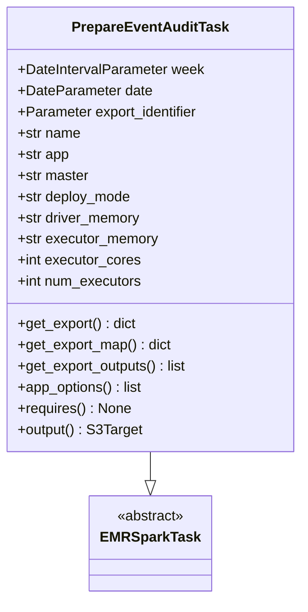
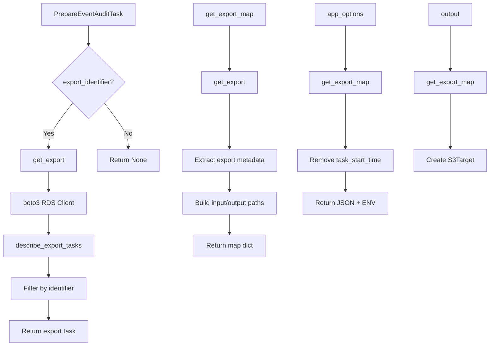
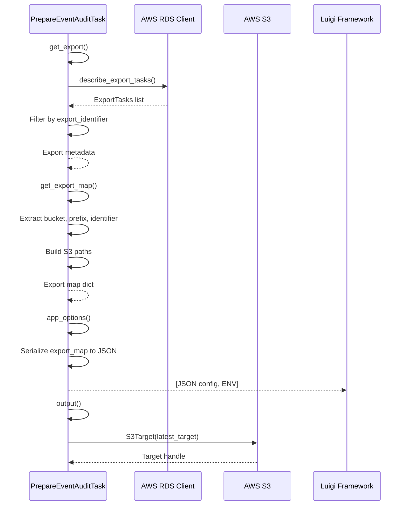

# Diagram: research/orchestrator/tasks/analytics/prepare_event_audit_task.py

> Auto-generated by Obscura crawlers

## Diagram 1

### SVG

<svg id="container" width="336.765625" xmlns="http://www.w3.org/2000/svg" class="classDiagram" height="678" viewBox="0 0 336.765625 678" role="graphics-document document" aria-roledescription="class"><g><defs><marker id="container_class-aggregationStart" class="marker aggregation class" refX="18" refY="7" markerWidth="190" markerHeight="240" orient="auto"><path d="M 18,7 L9,13 L1,7 L9,1 Z"></path></marker></defs><defs><marker id="container_class-aggregationEnd" class="marker aggregation class" refX="1" refY="7" markerWidth="20" markerHeight="28" orient="auto"><path d="M 18,7 L9,13 L1,7 L9,1 Z"></path></marker></defs><defs><marker id="container_class-extensionStart" class="marker extension class" refX="18" refY="7" markerWidth="190" markerHeight="240" orient="auto"><path d="M 1,7 L18,13 V 1 Z"></path></marker></defs><defs><marker id="container_class-extensionEnd" class="marker extension class" refX="1" refY="7" markerWidth="20" markerHeight="28" orient="auto"><path d="M 1,1 V 13 L18,7 Z"></path></marker></defs><defs><marker id="container_class-compositionStart" class="marker composition class" refX="18" refY="7" markerWidth="190" markerHeight="240" orient="auto"><path d="M 18,7 L9,13 L1,7 L9,1 Z"></path></marker></defs><defs><marker id="container_class-compositionEnd" class="marker composition class" refX="1" refY="7" markerWidth="20" markerHeight="28" orient="auto"><path d="M 18,7 L9,13 L1,7 L9,1 Z"></path></marker></defs><defs><marker id="container_class-dependencyStart" class="marker dependency class" refX="6" refY="7" markerWidth="190" markerHeight="240" orient="auto"><path d="M 5,7 L9,13 L1,7 L9,1 Z"></path></marker></defs><defs><marker id="container_class-dependencyEnd" class="marker dependency class" refX="13" refY="7" markerWidth="20" markerHeight="28" orient="auto"><path d="M 18,7 L9,13 L14,7 L9,1 Z"></path></marker></defs><defs><marker id="container_class-lollipopStart" class="marker lollipop class" refX="13" refY="7" markerWidth="190" markerHeight="240" orient="auto"><circle stroke="black" fill="transparent" cx="7" cy="7" r="6"></circle></marker></defs><defs><marker id="container_class-lollipopEnd" class="marker lollipop class" refX="1" refY="7" markerWidth="190" markerHeight="240" orient="auto"><circle stroke="black" fill="transparent" cx="7" cy="7" r="6"></circle></marker></defs><g class="root"><g class="clusters"></g><g class="edgePaths"><path d="M168.383,512L168.383,516.167C168.383,520.333,168.383,528.667,168.383,534.125C168.383,539.583,168.383,542.167,168.383,543.458L168.383,544.75" id="id_PrepareEventAuditTask_EMRSparkTask_1" class="edge-thickness-normal edge-pattern-solid relation" style=";;;" data-edge="true" data-et="edge" data-id="id_PrepareEventAuditTask_EMRSparkTask_1" data-points="W3sieCI6MTY4LjM4MjgxMjUsInkiOjUxMn0seyJ4IjoxNjguMzgyODEyNSwieSI6NTM3fSx7IngiOjE2OC4zODI4MTI1LCJ5Ijo1NjJ9XQ==" marker-end="url(#container_class-extensionEnd)"></path></g><g class="edgeLabels"><g class="edgeLabel"><g class="label" data-id="id_PrepareEventAuditTask_EMRSparkTask_1" transform="translate(0, 0)"><foreignObject width="0" height="0">

</foreignObject></g></g></g><g class="nodes"><g class="node default" id="classId-PrepareEventAuditTask-0" transform="translate(168.3828125, 260)"><g class="basic label-container"><path d="M-160.3828125 -252 L160.3828125 -252 L160.3828125 252 L-160.3828125 252" stroke="none" stroke-width="0" fill="#ECECFF" style=""></path><path d="M-160.3828125 -252 C-59.58327184396137 -252, 41.21626881207726 -252, 160.3828125 -252 M-160.3828125 -252 C-94.73593154089694 -252, -29.089050581793884 -252, 160.3828125 -252 M160.3828125 -252 C160.3828125 -132.61551142454218, 160.3828125 -13.231022849084354, 160.3828125 252 M160.3828125 -252 C160.3828125 -64.26180102859249, 160.3828125 123.47639794281503, 160.3828125 252 M160.3828125 252 C83.31918095620676 252, 6.255549412413529 252, -160.3828125 252 M160.3828125 252 C47.26093879824033 252, -65.86093490351934 252, -160.3828125 252 M-160.3828125 252 C-160.3828125 124.63194809700637, -160.3828125 -2.7361038059872556, -160.3828125 -252 M-160.3828125 252 C-160.3828125 95.10650232981419, -160.3828125 -61.78699534037162, -160.3828125 -252" stroke="#9370DB" stroke-width="1.3" fill="none" stroke-dasharray="0 0" style=""></path></g><g class="annotation-group text" transform="translate(0, -228)"></g><g class="label-group text" transform="translate(-84.640625, -228)"><g class="label" style="font-weight: bolder" transform="translate(0,-12)"><foreignObject width="169.28125" height="24">

PrepareEventAuditTask

</foreignObject></g></g><g class="members-group text" transform="translate(-148.3828125, -180)"><g class="label" style="" transform="translate(0,-12)"><foreignObject width="212.125" height="24">

+DateIntervalParameter week

</foreignObject></g><g class="label" style="" transform="translate(0,12)"><foreignObject width="152.171875" height="24">

+DateParameter date

</foreignObject></g><g class="label" style="" transform="translate(0,36)"><foreignObject width="208.546875" height="24">

+Parameter export_identifier

</foreignObject></g><g class="label" style="" transform="translate(0,60)"><foreignObject width="72.171875" height="24">

+str name

</foreignObject></g><g class="label" style="" transform="translate(0,84)"><foreignObject width="59.375" height="24">

+str app

</foreignObject></g><g class="label" style="" transform="translate(0,108)"><foreignObject width="81.8125" height="24">

+str master

</foreignObject></g><g class="label" style="" transform="translate(0,132)"><foreignObject width="130.390625" height="24">

+str deploy_mode

</foreignObject></g><g class="label" style="" transform="translate(0,156)"><foreignObject width="141.1875" height="24">

+str driver_memory

</foreignObject></g><g class="label" style="" transform="translate(0,180)"><foreignObject width="161" height="24">

+str executor_memory

</foreignObject></g><g class="label" style="" transform="translate(0,204)"><foreignObject width="139.9375" height="24">

+int executor_cores

</foreignObject></g><g class="label" style="" transform="translate(0,228)"><foreignObject width="142.296875" height="24">

+int num_executors

</foreignObject></g></g><g class="methods-group text" transform="translate(-148.3828125, 108)"><g class="label" style="" transform="translate(0,-12)"><foreignObject width="135.875" height="24">

+get_export() : dict

</foreignObject></g><g class="label" style="" transform="translate(0,12)"><foreignObject width="176.125" height="24">

+get_export_map() : dict

</foreignObject></g><g class="label" style="" transform="translate(0,36)"><foreignObject width="195.3125" height="24">

+get_export_outputs() : list

</foreignObject></g><g class="label" style="" transform="translate(0,60)"><foreignObject width="143.609375" height="24">

+app_options() : list

</foreignObject></g><g class="label" style="" transform="translate(0,84)"><foreignObject width="128.75" height="24">

+requires() : None

</foreignObject></g><g class="label" style="" transform="translate(0,108)"><foreignObject width="140.6875" height="24">

+output() : S3Target

</foreignObject></g></g><g class="divider" style=""><path d="M-160.3828125 -204 C-76.04980286329483 -204, 8.283206773410342 -204, 160.3828125 -204 M-160.3828125 -204 C-77.66878547320975 -204, 5.045241553580496 -204, 160.3828125 -204" stroke="#9370DB" stroke-width="1.3" fill="none" stroke-dasharray="0 0" style=""></path></g><g class="divider" style=""><path d="M-160.3828125 84 C-69.58510497094352 84, 21.212602558112962 84, 160.3828125 84 M-160.3828125 84 C-42.970451860146866 84, 74.44190877970627 84, 160.3828125 84" stroke="#9370DB" stroke-width="1.3" fill="none" stroke-dasharray="0 0" style=""></path></g></g><g class="node default" id="classId-EMRSparkTask-1" transform="translate(168.3828125, 616)"><g class="basic label-container"><path d="M-65.1484375 -54 L65.1484375 -54 L65.1484375 54 L-65.1484375 54" stroke="none" stroke-width="0" fill="#ECECFF" style=""></path><path d="M-65.1484375 -54 C-30.02902575939784 -54, 5.090385981204321 -54, 65.1484375 -54 M-65.1484375 -54 C-23.761024263304222 -54, 17.626388973391556 -54, 65.1484375 -54 M65.1484375 -54 C65.1484375 -31.484283834129805, 65.1484375 -8.96856766825961, 65.1484375 54 M65.1484375 -54 C65.1484375 -13.022245097062168, 65.1484375 27.955509805875664, 65.1484375 54 M65.1484375 54 C18.81079191561085 54, -27.5268536687783 54, -65.1484375 54 M65.1484375 54 C19.96104803047156 54, -25.22634143905688 54, -65.1484375 54 M-65.1484375 54 C-65.1484375 18.754569245198653, -65.1484375 -16.490861509602695, -65.1484375 -54 M-65.1484375 54 C-65.1484375 27.480856046564153, -65.1484375 0.9617120931283054, -65.1484375 -54" stroke="#9370DB" stroke-width="1.3" fill="none" stroke-dasharray="0 0" style=""></path></g><g class="annotation-group text" transform="translate(-38.609375, -30)"><g class="label" style="" transform="translate(0,-12)"><foreignObject width="77.21875" height="24">

«abstract»

</foreignObject></g></g><g class="label-group text" transform="translate(-53.1484375, -6)"><g class="label" style="font-weight: bolder" transform="translate(0,-12)"><foreignObject width="106.296875" height="24">

EMRSparkTask

</foreignObject></g></g><g class="members-group text" transform="translate(-53.1484375, 42)"></g><g class="methods-group text" transform="translate(-53.1484375, 72)"></g><g class="divider" style=""><path d="M-65.1484375 18 C-24.688657729356436 18, 15.771122041287128 18, 65.1484375 18 M-65.1484375 18 C-31.296794842382425 18, 2.5548478152351493 18, 65.1484375 18" stroke="#9370DB" stroke-width="1.3" fill="none" stroke-dasharray="0 0" style=""></path></g><g class="divider" style=""><path d="M-65.1484375 36 C-32.54099277791669 36, 0.06645194416661582 36, 65.1484375 36 M-65.1484375 36 C-18.505694518297403 36, 28.137048463405193 36, 65.1484375 36" stroke="#9370DB" stroke-width="1.3" fill="none" stroke-dasharray="0 0" style=""></path></g></g></g></g></g></svg>

## Diagram 2

### SVG

<svg id="container" width="1195.90625" xmlns="http://www.w3.org/2000/svg" class="flowchart" height="846.890625" viewBox="0 0 1195.90625 846.890625" role="graphics-document document" aria-roledescription="flowchart-v2"><g><marker id="container_flowchart-v2-pointEnd" class="marker flowchart-v2" viewBox="0 0 10 10" refX="5" refY="5" markerUnits="userSpaceOnUse" markerWidth="8" markerHeight="8" orient="auto"><path d="M 0 0 L 10 5 L 0 10 z" class="arrowMarkerPath" style="stroke-width: 1; stroke-dasharray: 1, 0;"></path></marker><marker id="container_flowchart-v2-pointStart" class="marker flowchart-v2" viewBox="0 0 10 10" refX="4.5" refY="5" markerUnits="userSpaceOnUse" markerWidth="8" markerHeight="8" orient="auto"><path d="M 0 5 L 10 10 L 10 0 z" class="arrowMarkerPath" style="stroke-width: 1; stroke-dasharray: 1, 0;"></path></marker><marker id="container_flowchart-v2-circleEnd" class="marker flowchart-v2" viewBox="0 0 10 10" refX="11" refY="5" markerUnits="userSpaceOnUse" markerWidth="11" markerHeight="11" orient="auto"><circle cx="5" cy="5" r="5" class="arrowMarkerPath" style="stroke-width: 1; stroke-dasharray: 1, 0;"></circle></marker><marker id="container_flowchart-v2-circleStart" class="marker flowchart-v2" viewBox="0 0 10 10" refX="-1" refY="5" markerUnits="userSpaceOnUse" markerWidth="11" markerHeight="11" orient="auto"><circle cx="5" cy="5" r="5" class="arrowMarkerPath" style="stroke-width: 1; stroke-dasharray: 1, 0;"></circle></marker><marker id="container_flowchart-v2-crossEnd" class="marker cross flowchart-v2" viewBox="0 0 11 11" refX="12" refY="5.2" markerUnits="userSpaceOnUse" markerWidth="11" markerHeight="11" orient="auto"><path d="M 1,1 l 9,9 M 10,1 l -9,9" class="arrowMarkerPath" style="stroke-width: 2; stroke-dasharray: 1, 0;"></path></marker><marker id="container_flowchart-v2-crossStart" class="marker cross flowchart-v2" viewBox="0 0 11 11" refX="-1" refY="5.2" markerUnits="userSpaceOnUse" markerWidth="11" markerHeight="11" orient="auto"><path d="M 1,1 l 9,9 M 10,1 l -9,9" class="arrowMarkerPath" style="stroke-width: 2; stroke-dasharray: 1, 0;"></path></marker><g class="root"><g class="clusters"></g><g class="edgePaths"><path d="M216.484,62L216.484,66.167C216.484,70.333,216.484,78.667,216.484,86.333C216.484,94,216.484,101,216.484,104.5L216.484,108" id="L_A_B_0" class="edge-thickness-normal edge-pattern-solid edge-thickness-normal edge-pattern-solid flowchart-link" style=";" data-edge="true" data-et="edge" data-id="L_A_B_0" data-points="W3sieCI6MjE2LjQ4NDM3NSwieSI6NjJ9LHsieCI6MjE2LjQ4NDM3NSwieSI6ODd9LHsieCI6MjE2LjQ4NDM3NSwieSI6MTEyfV0=" marker-end="url(#container_flowchart-v2-pointEnd)"></path><path d="M177.074,255.48L167.429,268.216C157.784,280.951,138.493,306.421,128.848,324.656C119.203,342.891,119.203,353.891,119.203,359.391L119.203,364.891" id="L_B_C_0" class="edge-thickness-normal edge-pattern-solid edge-thickness-normal edge-pattern-solid flowchart-link" style=";" data-edge="true" data-et="edge" data-id="L_B_C_0" data-points="W3sieCI6MTc3LjA3NDIzOTk3NTk0NTc0LCJ5IjoyNTUuNDgwNDg5OTc1OTQ1NzR9LHsieCI6MTE5LjIwMzEyNSwieSI6MzMxLjg5MDYyNX0seyJ4IjoxMTkuMjAzMTI1LCJ5IjozNjguODkwNjI1fV0=" marker-end="url(#container_flowchart-v2-pointEnd)"></path><path d="M119.203,422.891L119.203,427.057C119.203,431.224,119.203,439.557,119.203,447.224C119.203,454.891,119.203,461.891,119.203,465.391L119.203,468.891" id="L_C_D_0" class="edge-thickness-normal edge-pattern-solid edge-thickness-normal edge-pattern-solid flowchart-link" style=";" data-edge="true" data-et="edge" data-id="L_C_D_0" data-points="W3sieCI6MTE5LjIwMzEyNSwieSI6NDIyLjg5MDYyNX0seyJ4IjoxMTkuMjAzMTI1LCJ5Ijo0NDcuODkwNjI1fSx7IngiOjExOS4yMDMxMjUsInkiOjQ3Mi44OTA2MjV9XQ==" marker-end="url(#container_flowchart-v2-pointEnd)"></path><path d="M119.203,526.891L119.203,531.057C119.203,535.224,119.203,543.557,119.203,551.224C119.203,558.891,119.203,565.891,119.203,569.391L119.203,572.891" id="L_D_E_0" class="edge-thickness-normal edge-pattern-solid edge-thickness-normal edge-pattern-solid flowchart-link" style=";" data-edge="true" data-et="edge" data-id="L_D_E_0" data-points="W3sieCI6MTE5LjIwMzEyNSwieSI6NTI2Ljg5MDYyNX0seyJ4IjoxMTkuMjAzMTI1LCJ5Ijo1NTEuODkwNjI1fSx7IngiOjExOS4yMDMxMjUsInkiOjU3Ni44OTA2MjV9XQ==" marker-end="url(#container_flowchart-v2-pointEnd)"></path><path d="M119.203,630.891L119.203,635.057C119.203,639.224,119.203,647.557,119.203,655.224C119.203,662.891,119.203,669.891,119.203,673.391L119.203,676.891" id="L_E_F_0" class="edge-thickness-normal edge-pattern-solid edge-thickness-normal edge-pattern-solid flowchart-link" style=";" data-edge="true" data-et="edge" data-id="L_E_F_0" data-points="W3sieCI6MTE5LjIwMzEyNSwieSI6NjMwLjg5MDYyNX0seyJ4IjoxMTkuMjAzMTI1LCJ5Ijo2NTUuODkwNjI1fSx7IngiOjExOS4yMDMxMjUsInkiOjY4MC44OTA2MjV9XQ==" marker-end="url(#container_flowchart-v2-pointEnd)"></path><path d="M119.203,734.891L119.203,739.057C119.203,743.224,119.203,751.557,119.203,759.224C119.203,766.891,119.203,773.891,119.203,777.391L119.203,780.891" id="L_F_G_0" class="edge-thickness-normal edge-pattern-solid edge-thickness-normal edge-pattern-solid flowchart-link" style=";" data-edge="true" data-et="edge" data-id="L_F_G_0" data-points="W3sieCI6MTE5LjIwMzEyNSwieSI6NzM0Ljg5MDYyNX0seyJ4IjoxMTkuMjAzMTI1LCJ5Ijo3NTkuODkwNjI1fSx7IngiOjExOS4yMDMxMjUsInkiOjc4NC44OTA2MjV9XQ==" marker-end="url(#container_flowchart-v2-pointEnd)"></path><path d="M255.895,255.48L265.54,268.216C275.185,280.951,294.475,306.421,304.12,324.656C313.766,342.891,313.766,353.891,313.766,359.391L313.766,364.891" id="L_B_H_0" class="edge-thickness-normal edge-pattern-solid edge-thickness-normal edge-pattern-solid flowchart-link" style=";" data-edge="true" data-et="edge" data-id="L_B_H_0" data-points="W3sieCI6MjU1Ljg5NDUxMDAyNDA1NDI4LCJ5IjoyNTUuNDgwNDg5OTc1OTQ1NzR9LHsieCI6MzEzLjc2NTYyNSwieSI6MzMxLjg5MDYyNX0seyJ4IjozMTMuNzY1NjI1LCJ5IjozNjguODkwNjI1fV0=" marker-end="url(#container_flowchart-v2-pointEnd)"></path><path d="M561.281,62L561.281,66.167C561.281,70.333,561.281,78.667,561.281,97.074C561.281,115.482,561.281,143.964,561.281,158.204L561.281,172.445" id="L_I_J_0" class="edge-thickness-normal edge-pattern-solid edge-thickness-normal edge-pattern-solid flowchart-link" style=";" data-edge="true" data-et="edge" data-id="L_I_J_0" data-points="W3sieCI6NTYxLjI4MTI1LCJ5Ijo2Mn0seyJ4Ijo1NjEuMjgxMjUsInkiOjg3fSx7IngiOjU2MS4yODEyNSwieSI6MTc2LjQ0NTMxMjV9XQ==" marker-end="url(#container_flowchart-v2-pointEnd)"></path><path d="M561.281,230.445L561.281,247.353C561.281,264.26,561.281,298.076,561.281,320.483C561.281,342.891,561.281,353.891,561.281,359.391L561.281,364.891" id="L_J_K_0" class="edge-thickness-normal edge-pattern-solid edge-thickness-normal edge-pattern-solid flowchart-link" style=";" data-edge="true" data-et="edge" data-id="L_J_K_0" data-points="W3sieCI6NTYxLjI4MTI1LCJ5IjoyMzAuNDQ1MzEyNX0seyJ4Ijo1NjEuMjgxMjUsInkiOjMzMS44OTA2MjV9LHsieCI6NTYxLjI4MTI1LCJ5IjozNjguODkwNjI1fV0=" marker-end="url(#container_flowchart-v2-pointEnd)"></path><path d="M561.281,422.891L561.281,427.057C561.281,431.224,561.281,439.557,561.281,447.224C561.281,454.891,561.281,461.891,561.281,465.391L561.281,468.891" id="L_K_L_0" class="edge-thickness-normal edge-pattern-solid edge-thickness-normal edge-pattern-solid flowchart-link" style=";" data-edge="true" data-et="edge" data-id="L_K_L_0" data-points="W3sieCI6NTYxLjI4MTI1LCJ5Ijo0MjIuODkwNjI1fSx7IngiOjU2MS4yODEyNSwieSI6NDQ3Ljg5MDYyNX0seyJ4Ijo1NjEuMjgxMjUsInkiOjQ3Mi44OTA2MjV9XQ==" marker-end="url(#container_flowchart-v2-pointEnd)"></path><path d="M561.281,526.891L561.281,531.057C561.281,535.224,561.281,543.557,561.281,551.224C561.281,558.891,561.281,565.891,561.281,569.391L561.281,572.891" id="L_L_M_0" class="edge-thickness-normal edge-pattern-solid edge-thickness-normal edge-pattern-solid flowchart-link" style=";" data-edge="true" data-et="edge" data-id="L_L_M_0" data-points="W3sieCI6NTYxLjI4MTI1LCJ5Ijo1MjYuODkwNjI1fSx7IngiOjU2MS4yODEyNSwieSI6NTUxLjg5MDYyNX0seyJ4Ijo1NjEuMjgxMjUsInkiOjU3Ni44OTA2MjV9XQ==" marker-end="url(#container_flowchart-v2-pointEnd)"></path><path d="M846.047,62L846.047,66.167C846.047,70.333,846.047,78.667,846.047,97.074C846.047,115.482,846.047,143.964,846.047,158.204L846.047,172.445" id="L_N_O_0" class="edge-thickness-normal edge-pattern-solid edge-thickness-normal edge-pattern-solid flowchart-link" style=";" data-edge="true" data-et="edge" data-id="L_N_O_0" data-points="W3sieCI6ODQ2LjA0Njg3NSwieSI6NjJ9LHsieCI6ODQ2LjA0Njg3NSwieSI6ODd9LHsieCI6ODQ2LjA0Njg3NSwieSI6MTc2LjQ0NTMxMjV9XQ==" marker-end="url(#container_flowchart-v2-pointEnd)"></path><path d="M846.047,230.445L846.047,247.353C846.047,264.26,846.047,298.076,846.047,320.483C846.047,342.891,846.047,353.891,846.047,359.391L846.047,364.891" id="L_O_P_0" class="edge-thickness-normal edge-pattern-solid edge-thickness-normal edge-pattern-solid flowchart-link" style=";" data-edge="true" data-et="edge" data-id="L_O_P_0" data-points="W3sieCI6ODQ2LjA0Njg3NSwieSI6MjMwLjQ0NTMxMjV9LHsieCI6ODQ2LjA0Njg3NSwieSI6MzMxLjg5MDYyNX0seyJ4Ijo4NDYuMDQ2ODc1LCJ5IjozNjguODkwNjI1fV0=" marker-end="url(#container_flowchart-v2-pointEnd)"></path><path d="M846.047,422.891L846.047,427.057C846.047,431.224,846.047,439.557,846.047,447.224C846.047,454.891,846.047,461.891,846.047,465.391L846.047,468.891" id="L_P_Q_0" class="edge-thickness-normal edge-pattern-solid edge-thickness-normal edge-pattern-solid flowchart-link" style=";" data-edge="true" data-et="edge" data-id="L_P_Q_0" data-points="W3sieCI6ODQ2LjA0Njg3NSwieSI6NDIyLjg5MDYyNX0seyJ4Ijo4NDYuMDQ2ODc1LCJ5Ijo0NDcuODkwNjI1fSx7IngiOjg0Ni4wNDY4NzUsInkiOjQ3Mi44OTA2MjV9XQ==" marker-end="url(#container_flowchart-v2-pointEnd)"></path><path d="M1098.938,62L1098.938,66.167C1098.938,70.333,1098.938,78.667,1098.938,97.074C1098.938,115.482,1098.938,143.964,1098.938,158.204L1098.938,172.445" id="L_R_S_0" class="edge-thickness-normal edge-pattern-solid edge-thickness-normal edge-pattern-solid flowchart-link" style=";" data-edge="true" data-et="edge" data-id="L_R_S_0" data-points="W3sieCI6MTA5OC45Mzc1LCJ5Ijo2Mn0seyJ4IjoxMDk4LjkzNzUsInkiOjg3fSx7IngiOjEwOTguOTM3NSwieSI6MTc2LjQ0NTMxMjV9XQ==" marker-end="url(#container_flowchart-v2-pointEnd)"></path><path d="M1098.938,230.445L1098.938,247.353C1098.938,264.26,1098.938,298.076,1098.938,320.483C1098.938,342.891,1098.938,353.891,1098.938,359.391L1098.938,364.891" id="L_S_T_0" class="edge-thickness-normal edge-pattern-solid edge-thickness-normal edge-pattern-solid flowchart-link" style=";" data-edge="true" data-et="edge" data-id="L_S_T_0" data-points="W3sieCI6MTA5OC45Mzc1LCJ5IjoyMzAuNDQ1MzEyNX0seyJ4IjoxMDk4LjkzNzUsInkiOjMzMS44OTA2MjV9LHsieCI6MTA5OC45Mzc1LCJ5IjozNjguODkwNjI1fV0=" marker-end="url(#container_flowchart-v2-pointEnd)"></path></g><g class="edgeLabels"><g class="edgeLabel"><g class="label" data-id="L_A_B_0" transform="translate(0, 0)"><foreignObject width="0" height="0">

</foreignObject></g></g><g class="edgeLabel" transform="translate(119.203125, 331.890625)"><g class="label" data-id="L_B_C_0" transform="translate(-12.03125, -12)"><foreignObject width="24.0625" height="24">

Yes

</foreignObject></g></g><g class="edgeLabel"><g class="label" data-id="L_C_D_0" transform="translate(0, 0)"><foreignObject width="0" height="0">

</foreignObject></g></g><g class="edgeLabel"><g class="label" data-id="L_D_E_0" transform="translate(0, 0)"><foreignObject width="0" height="0">

</foreignObject></g></g><g class="edgeLabel"><g class="label" data-id="L_E_F_0" transform="translate(0, 0)"><foreignObject width="0" height="0">

</foreignObject></g></g><g class="edgeLabel"><g class="label" data-id="L_F_G_0" transform="translate(0, 0)"><foreignObject width="0" height="0">

</foreignObject></g></g><g class="edgeLabel" transform="translate(313.765625, 331.890625)"><g class="label" data-id="L_B_H_0" transform="translate(-10.140625, -12)"><foreignObject width="20.28125" height="24">

No

</foreignObject></g></g><g class="edgeLabel"><g class="label" data-id="L_I_J_0" transform="translate(0, 0)"><foreignObject width="0" height="0">

</foreignObject></g></g><g class="edgeLabel"><g class="label" data-id="L_J_K_0" transform="translate(0, 0)"><foreignObject width="0" height="0">

</foreignObject></g></g><g class="edgeLabel"><g class="label" data-id="L_K_L_0" transform="translate(0, 0)"><foreignObject width="0" height="0">

</foreignObject></g></g><g class="edgeLabel"><g class="label" data-id="L_L_M_0" transform="translate(0, 0)"><foreignObject width="0" height="0">

</foreignObject></g></g><g class="edgeLabel"><g class="label" data-id="L_N_O_0" transform="translate(0, 0)"><foreignObject width="0" height="0">

</foreignObject></g></g><g class="edgeLabel"><g class="label" data-id="L_O_P_0" transform="translate(0, 0)"><foreignObject width="0" height="0">

</foreignObject></g></g><g class="edgeLabel"><g class="label" data-id="L_P_Q_0" transform="translate(0, 0)"><foreignObject width="0" height="0">

</foreignObject></g></g><g class="edgeLabel"><g class="label" data-id="L_R_S_0" transform="translate(0, 0)"><foreignObject width="0" height="0">

</foreignObject></g></g><g class="edgeLabel"><g class="label" data-id="L_S_T_0" transform="translate(0, 0)"><foreignObject width="0" height="0">

</foreignObject></g></g></g><g class="nodes"><g class="node default" id="flowchart-A-0" transform="translate(216.484375, 35)"><rect class="basic label-container" style="" x="-112.8984375" y="-27" width="225.796875" height="54"></rect><g class="label" style="" transform="translate(-82.8984375, -12)"><rect></rect><foreignObject width="165.796875" height="24">

PrepareEventAuditTask

</foreignObject></g></g><g class="node default" id="flowchart-B-1" transform="translate(216.484375, 203.4453125)"><polygon points="91.4453125,0 182.890625,-91.4453125 91.4453125,-182.890625 0,-91.4453125" class="label-container" transform="translate(-90.9453125, 91.4453125)"></polygon><g class="label" style="" transform="translate(-64.4453125, -12)"><rect></rect><foreignObject width="128.890625" height="24">

export_identifier?

</foreignObject></g></g><g class="node default" id="flowchart-C-3" transform="translate(119.203125, 395.890625)"><rect class="basic label-container" style="" x="-68.8515625" y="-27" width="137.703125" height="54"></rect><g class="label" style="" transform="translate(-38.8515625, -12)"><rect></rect><foreignObject width="77.703125" height="24">

get_export

</foreignObject></g></g><g class="node default" id="flowchart-D-5" transform="translate(119.203125, 499.890625)"><rect class="basic label-container" style="" x="-90.2265625" y="-27" width="180.453125" height="54"></rect><g class="label" style="" transform="translate(-60.2265625, -12)"><rect></rect><foreignObject width="120.453125" height="24">

boto3 RDS Client

</foreignObject></g></g><g class="node default" id="flowchart-E-7" transform="translate(119.203125, 603.890625)"><rect class="basic label-container" style="" x="-111.203125" y="-27" width="222.40625" height="54"></rect><g class="label" style="" transform="translate(-81.203125, -12)"><rect></rect><foreignObject width="162.40625" height="24">

describe_export_tasks

</foreignObject></g></g><g class="node default" id="flowchart-F-9" transform="translate(119.203125, 707.890625)"><rect class="basic label-container" style="" x="-94.640625" y="-27" width="189.28125" height="54"></rect><g class="label" style="" transform="translate(-64.640625, -12)"><rect></rect><foreignObject width="129.28125" height="24">

Filter by identifier

</foreignObject></g></g><g class="node default" id="flowchart-G-11" transform="translate(119.203125, 811.890625)"><rect class="basic label-container" style="" x="-97.1484375" y="-27" width="194.296875" height="54"></rect><g class="label" style="" transform="translate(-67.1484375, -12)"><rect></rect><foreignObject width="134.296875" height="24">

Return export task

</foreignObject></g></g><g class="node default" id="flowchart-H-13" transform="translate(313.765625, 395.890625)"><rect class="basic label-container" style="" x="-75.7109375" y="-27" width="151.421875" height="54"></rect><g class="label" style="" transform="translate(-45.7109375, -12)"><rect></rect><foreignObject width="91.421875" height="24">

Return None

</foreignObject></g></g><g class="node default" id="flowchart-I-14" transform="translate(561.28125, 35)"><rect class="basic label-container" style="" x="-88.96875" y="-27" width="177.9375" height="54"></rect><g class="label" style="" transform="translate(-58.96875, -12)"><rect></rect><foreignObject width="117.9375" height="24">

get_export_map

</foreignObject></g></g><g class="node default" id="flowchart-J-15" transform="translate(561.28125, 203.4453125)"><rect class="basic label-container" style="" x="-68.8515625" y="-27" width="137.703125" height="54"></rect><g class="label" style="" transform="translate(-38.8515625, -12)"><rect></rect><foreignObject width="77.703125" height="24">

get_export

</foreignObject></g></g><g class="node default" id="flowchart-K-17" transform="translate(561.28125, 395.890625)"><rect class="basic label-container" style="" x="-117.453125" y="-27" width="234.90625" height="54"></rect><g class="label" style="" transform="translate(-87.453125, -12)"><rect></rect><foreignObject width="174.90625" height="24">

Extract export metadata

</foreignObject></g></g><g class="node default" id="flowchart-L-19" transform="translate(561.28125, 499.890625)"><rect class="basic label-container" style="" x="-120.953125" y="-27" width="241.90625" height="54"></rect><g class="label" style="" transform="translate(-90.953125, -12)"><rect></rect><foreignObject width="181.90625" height="24">

Build input/output paths

</foreignObject></g></g><g class="node default" id="flowchart-M-21" transform="translate(561.28125, 603.890625)"><rect class="basic label-container" style="" x="-88.359375" y="-27" width="176.71875" height="54"></rect><g class="label" style="" transform="translate(-58.359375, -12)"><rect></rect><foreignObject width="116.71875" height="24">

Return map dict

</foreignObject></g></g><g class="node default" id="flowchart-N-22" transform="translate(846.046875, 35)"><rect class="basic label-container" style="" x="-75.3671875" y="-27" width="150.734375" height="54"></rect><g class="label" style="" transform="translate(-45.3671875, -12)"><rect></rect><foreignObject width="90.734375" height="24">

app_options

</foreignObject></g></g><g class="node default" id="flowchart-O-23" transform="translate(846.046875, 203.4453125)"><rect class="basic label-container" style="" x="-88.96875" y="-27" width="177.9375" height="54"></rect><g class="label" style="" transform="translate(-58.96875, -12)"><rect></rect><foreignObject width="117.9375" height="24">

get_export_map

</foreignObject></g></g><g class="node default" id="flowchart-P-25" transform="translate(846.046875, 395.890625)"><rect class="basic label-container" style="" x="-117.3125" y="-27" width="234.625" height="54"></rect><g class="label" style="" transform="translate(-87.3125, -12)"><rect></rect><foreignObject width="174.625" height="24">

Remove task_start_time

</foreignObject></g></g><g class="node default" id="flowchart-Q-27" transform="translate(846.046875, 499.890625)"><rect class="basic label-container" style="" x="-96.75" y="-27" width="193.5" height="54"></rect><g class="label" style="" transform="translate(-66.75, -12)"><rect></rect><foreignObject width="133.5" height="24">

Return JSON + ENV

</foreignObject></g></g><g class="node default" id="flowchart-R-28" transform="translate(1098.9375, 35)"><rect class="basic label-container" style="" x="-54.515625" y="-27" width="109.03125" height="54"></rect><g class="label" style="" transform="translate(-24.515625, -12)"><rect></rect><foreignObject width="49.03125" height="24">

output

</foreignObject></g></g><g class="node default" id="flowchart-S-29" transform="translate(1098.9375, 203.4453125)"><rect class="basic label-container" style="" x="-88.96875" y="-27" width="177.9375" height="54"></rect><g class="label" style="" transform="translate(-58.96875, -12)"><rect></rect><foreignObject width="117.9375" height="24">

get_export_map

</foreignObject></g></g><g class="node default" id="flowchart-T-31" transform="translate(1098.9375, 395.890625)"><rect class="basic label-container" style="" x="-85.578125" y="-27" width="171.15625" height="54"></rect><g class="label" style="" transform="translate(-55.578125, -12)"><rect></rect><foreignObject width="111.15625" height="24">

Create S3Target

</foreignObject></g></g></g></g></g></svg>

## Diagram 3

### SVG

<svg id="container" width="931" xmlns="http://www.w3.org/2000/svg" height="1191" viewBox="-69.5 -10 931 1191" role="graphics-document document" aria-roledescription="sequence"><g><rect x="661.5" y="1105" fill="#eaeaea" stroke="#666" width="150" height="65" name="Luigi" rx="3" ry="3" class="actor actor-bottom"></rect><text x="736.5" y="1137.5" dominant-baseline="central" alignment-baseline="central" class="actor actor-box" style="text-anchor: middle; font-size: 16px; font-weight: 400;"><tspan x="736.5" dy="0">Luigi Framework</tspan></text></g><g><rect x="461.5" y="1105" fill="#eaeaea" stroke="#666" width="150" height="65" name="S3" rx="3" ry="3" class="actor actor-bottom"></rect><text x="536.5" y="1137.5" dominant-baseline="central" alignment-baseline="central" class="actor actor-box" style="text-anchor: middle; font-size: 16px; font-weight: 400;"><tspan x="536.5" dy="0">AWS S3</tspan></text></g><g><rect x="261.5" y="1105" fill="#eaeaea" stroke="#666" width="150" height="65" name="RDS" rx="3" ry="3" class="actor actor-bottom"></rect><text x="336.5" y="1137.5" dominant-baseline="central" alignment-baseline="central" class="actor actor-box" style="text-anchor: middle; font-size: 16px; font-weight: 400;"><tspan x="336.5" dy="0">AWS RDS Client</tspan></text></g><g><rect x="0" y="1105" fill="#eaeaea" stroke="#666" width="187" height="65" name="Task" rx="3" ry="3" class="actor actor-bottom"></rect><text x="93.5" y="1137.5" dominant-baseline="central" alignment-baseline="central" class="actor actor-box" style="text-anchor: middle; font-size: 16px; font-weight: 400;"><tspan x="93.5" dy="0">PrepareEventAuditTask</tspan></text></g><g><line id="actor3" x1="736.5" y1="65" x2="736.5" y2="1105" class="actor-line 200" stroke-width="0.5px" stroke="#999" name="Luigi"></line><g id="root-3"><rect x="661.5" y="0" fill="#eaeaea" stroke="#666" width="150" height="65" name="Luigi" rx="3" ry="3" class="actor actor-top"></rect><text x="736.5" y="32.5" dominant-baseline="central" alignment-baseline="central" class="actor actor-box" style="text-anchor: middle; font-size: 16px; font-weight: 400;"><tspan x="736.5" dy="0">Luigi Framework</tspan></text></g></g><g><line id="actor2" x1="536.5" y1="65" x2="536.5" y2="1105" class="actor-line 200" stroke-width="0.5px" stroke="#999" name="S3"></line><g id="root-2"><rect x="461.5" y="0" fill="#eaeaea" stroke="#666" width="150" height="65" name="S3" rx="3" ry="3" class="actor actor-top"></rect><text x="536.5" y="32.5" dominant-baseline="central" alignment-baseline="central" class="actor actor-box" style="text-anchor: middle; font-size: 16px; font-weight: 400;"><tspan x="536.5" dy="0">AWS S3</tspan></text></g></g><g><line id="actor1" x1="336.5" y1="65" x2="336.5" y2="1105" class="actor-line 200" stroke-width="0.5px" stroke="#999" name="RDS"></line><g id="root-1"><rect x="261.5" y="0" fill="#eaeaea" stroke="#666" width="150" height="65" name="RDS" rx="3" ry="3" class="actor actor-top"></rect><text x="336.5" y="32.5" dominant-baseline="central" alignment-baseline="central" class="actor actor-box" style="text-anchor: middle; font-size: 16px; font-weight: 400;"><tspan x="336.5" dy="0">AWS RDS Client</tspan></text></g></g><g><line id="actor0" x1="93.5" y1="65" x2="93.5" y2="1105" class="actor-line 200" stroke-width="0.5px" stroke="#999" name="Task"></line><g id="root-0"><rect x="0" y="0" fill="#eaeaea" stroke="#666" width="187" height="65" name="Task" rx="3" ry="3" class="actor actor-top"></rect><text x="93.5" y="32.5" dominant-baseline="central" alignment-baseline="central" class="actor actor-box" style="text-anchor: middle; font-size: 16px; font-weight: 400;"><tspan x="93.5" dy="0">PrepareEventAuditTask</tspan></text></g></g><g></g><defs><symbol id="computer" width="24" height="24"><path transform="scale(.5)" d="M2 2v13h20v-13h-20zm18 11h-16v-9h16v9zm-10.228 6l.466-1h3.524l.467 1h-4.457zm14.228 3h-24l2-6h2.104l-1.33 4h18.45l-1.297-4h2.073l2 6zm-5-10h-14v-7h14v7z"></path></symbol></defs><defs><symbol id="database" fill-rule="evenodd" clip-rule="evenodd"><path transform="scale(.5)" d="M12.258.001l.256.004.255.005.253.008.251.01.249.012.247.015.246.016.242.019.241.02.239.023.236.024.233.027.231.028.229.031.225.032.223.034.22.036.217.038.214.04.211.041.208.043.205.045.201.046.198.048.194.05.191.051.187.053.183.054.18.056.175.057.172.059.168.06.163.061.16.063.155.064.15.066.074.033.073.033.071.034.07.034.069.035.068.035.067.035.066.035.064.036.064.036.062.036.06.036.06.037.058.037.058.037.055.038.055.038.053.038.052.038.051.039.05.039.048.039.047.039.045.04.044.04.043.04.041.04.04.041.039.041.037.041.036.041.034.041.033.042.032.042.03.042.029.042.027.042.026.043.024.043.023.043.021.043.02.043.018.044.017.043.015.044.013.044.012.044.011.045.009.044.007.045.006.045.004.045.002.045.001.045v17l-.001.045-.002.045-.004.045-.006.045-.007.045-.009.044-.011.045-.012.044-.013.044-.015.044-.017.043-.018.044-.02.043-.021.043-.023.043-.024.043-.026.043-.027.042-.029.042-.03.042-.032.042-.033.042-.034.041-.036.041-.037.041-.039.041-.04.041-.041.04-.043.04-.044.04-.045.04-.047.039-.048.039-.05.039-.051.039-.052.038-.053.038-.055.038-.055.038-.058.037-.058.037-.06.037-.06.036-.062.036-.064.036-.064.036-.066.035-.067.035-.068.035-.069.035-.07.034-.071.034-.073.033-.074.033-.15.066-.155.064-.16.063-.163.061-.168.06-.172.059-.175.057-.18.056-.183.054-.187.053-.191.051-.194.05-.198.048-.201.046-.205.045-.208.043-.211.041-.214.04-.217.038-.22.036-.223.034-.225.032-.229.031-.231.028-.233.027-.236.024-.239.023-.241.02-.242.019-.246.016-.247.015-.249.012-.251.01-.253.008-.255.005-.256.004-.258.001-.258-.001-.256-.004-.255-.005-.253-.008-.251-.01-.249-.012-.247-.015-.245-.016-.243-.019-.241-.02-.238-.023-.236-.024-.234-.027-.231-.028-.228-.031-.226-.032-.223-.034-.22-.036-.217-.038-.214-.04-.211-.041-.208-.043-.204-.045-.201-.046-.198-.048-.195-.05-.19-.051-.187-.053-.184-.054-.179-.056-.176-.057-.172-.059-.167-.06-.164-.061-.159-.063-.155-.064-.151-.066-.074-.033-.072-.033-.072-.034-.07-.034-.069-.035-.068-.035-.067-.035-.066-.035-.064-.036-.063-.036-.062-.036-.061-.036-.06-.037-.058-.037-.057-.037-.056-.038-.055-.038-.053-.038-.052-.038-.051-.039-.049-.039-.049-.039-.046-.039-.046-.04-.044-.04-.043-.04-.041-.04-.04-.041-.039-.041-.037-.041-.036-.041-.034-.041-.033-.042-.032-.042-.03-.042-.029-.042-.027-.042-.026-.043-.024-.043-.023-.043-.021-.043-.02-.043-.018-.044-.017-.043-.015-.044-.013-.044-.012-.044-.011-.045-.009-.044-.007-.045-.006-.045-.004-.045-.002-.045-.001-.045v-17l.001-.045.002-.045.004-.045.006-.045.007-.045.009-.044.011-.045.012-.044.013-.044.015-.044.017-.043.018-.044.02-.043.021-.043.023-.043.024-.043.026-.043.027-.042.029-.042.03-.042.032-.042.033-.042.034-.041.036-.041.037-.041.039-.041.04-.041.041-.04.043-.04.044-.04.046-.04.046-.039.049-.039.049-.039.051-.039.052-.038.053-.038.055-.038.056-.038.057-.037.058-.037.06-.037.061-.036.062-.036.063-.036.064-.036.066-.035.067-.035.068-.035.069-.035.07-.034.072-.034.072-.033.074-.033.151-.066.155-.064.159-.063.164-.061.167-.06.172-.059.176-.057.179-.056.184-.054.187-.053.19-.051.195-.05.198-.048.201-.046.204-.045.208-.043.211-.041.214-.04.217-.038.22-.036.223-.034.226-.032.228-.031.231-.028.234-.027.236-.024.238-.023.241-.02.243-.019.245-.016.247-.015.249-.012.251-.01.253-.008.255-.005.256-.004.258-.001.258.001zm-9.258 20.499v.01l.001.021.003.021.004.022.005.021.006.022.007.022.009.023.01.022.011.023.012.023.013.023.015.023.016.024.017.023.018.024.019.024.021.024.022.025.023.024.024.025.052.049.056.05.061.051.066.051.07.051.075.051.079.052.084.052.088.052.092.052.097.052.102.051.105.052.11.052.114.051.119.051.123.051.127.05.131.05.135.05.139.048.144.049.147.047.152.047.155.047.16.045.163.045.167.043.171.043.176.041.178.041.183.039.187.039.19.037.194.035.197.035.202.033.204.031.209.03.212.029.216.027.219.025.222.024.226.021.23.02.233.018.236.016.24.015.243.012.246.01.249.008.253.005.256.004.259.001.26-.001.257-.004.254-.005.25-.008.247-.011.244-.012.241-.014.237-.016.233-.018.231-.021.226-.021.224-.024.22-.026.216-.027.212-.028.21-.031.205-.031.202-.034.198-.034.194-.036.191-.037.187-.039.183-.04.179-.04.175-.042.172-.043.168-.044.163-.045.16-.046.155-.046.152-.047.148-.048.143-.049.139-.049.136-.05.131-.05.126-.05.123-.051.118-.052.114-.051.11-.052.106-.052.101-.052.096-.052.092-.052.088-.053.083-.051.079-.052.074-.052.07-.051.065-.051.06-.051.056-.05.051-.05.023-.024.023-.025.021-.024.02-.024.019-.024.018-.024.017-.024.015-.023.014-.024.013-.023.012-.023.01-.023.01-.022.008-.022.006-.022.006-.022.004-.022.004-.021.001-.021.001-.021v-4.127l-.077.055-.08.053-.083.054-.085.053-.087.052-.09.052-.093.051-.095.05-.097.05-.1.049-.102.049-.105.048-.106.047-.109.047-.111.046-.114.045-.115.045-.118.044-.12.043-.122.042-.124.042-.126.041-.128.04-.13.04-.132.038-.134.038-.135.037-.138.037-.139.035-.142.035-.143.034-.144.033-.147.032-.148.031-.15.03-.151.03-.153.029-.154.027-.156.027-.158.026-.159.025-.161.024-.162.023-.163.022-.165.021-.166.02-.167.019-.169.018-.169.017-.171.016-.173.015-.173.014-.175.013-.175.012-.177.011-.178.01-.179.008-.179.008-.181.006-.182.005-.182.004-.184.003-.184.002h-.37l-.184-.002-.184-.003-.182-.004-.182-.005-.181-.006-.179-.008-.179-.008-.178-.01-.176-.011-.176-.012-.175-.013-.173-.014-.172-.015-.171-.016-.17-.017-.169-.018-.167-.019-.166-.02-.165-.021-.163-.022-.162-.023-.161-.024-.159-.025-.157-.026-.156-.027-.155-.027-.153-.029-.151-.03-.15-.03-.148-.031-.146-.032-.145-.033-.143-.034-.141-.035-.14-.035-.137-.037-.136-.037-.134-.038-.132-.038-.13-.04-.128-.04-.126-.041-.124-.042-.122-.042-.12-.044-.117-.043-.116-.045-.113-.045-.112-.046-.109-.047-.106-.047-.105-.048-.102-.049-.1-.049-.097-.05-.095-.05-.093-.052-.09-.051-.087-.052-.085-.053-.083-.054-.08-.054-.077-.054v4.127zm0-5.654v.011l.001.021.003.021.004.021.005.022.006.022.007.022.009.022.01.022.011.023.012.023.013.023.015.024.016.023.017.024.018.024.019.024.021.024.022.024.023.025.024.024.052.05.056.05.061.05.066.051.07.051.075.052.079.051.084.052.088.052.092.052.097.052.102.052.105.052.11.051.114.051.119.052.123.05.127.051.131.05.135.049.139.049.144.048.147.048.152.047.155.046.16.045.163.045.167.044.171.042.176.042.178.04.183.04.187.038.19.037.194.036.197.034.202.033.204.032.209.03.212.028.216.027.219.025.222.024.226.022.23.02.233.018.236.016.24.014.243.012.246.01.249.008.253.006.256.003.259.001.26-.001.257-.003.254-.006.25-.008.247-.01.244-.012.241-.015.237-.016.233-.018.231-.02.226-.022.224-.024.22-.025.216-.027.212-.029.21-.03.205-.032.202-.033.198-.035.194-.036.191-.037.187-.039.183-.039.179-.041.175-.042.172-.043.168-.044.163-.045.16-.045.155-.047.152-.047.148-.048.143-.048.139-.05.136-.049.131-.05.126-.051.123-.051.118-.051.114-.052.11-.052.106-.052.101-.052.096-.052.092-.052.088-.052.083-.052.079-.052.074-.051.07-.052.065-.051.06-.05.056-.051.051-.049.023-.025.023-.024.021-.025.02-.024.019-.024.018-.024.017-.024.015-.023.014-.023.013-.024.012-.022.01-.023.01-.023.008-.022.006-.022.006-.022.004-.021.004-.022.001-.021.001-.021v-4.139l-.077.054-.08.054-.083.054-.085.052-.087.053-.09.051-.093.051-.095.051-.097.05-.1.049-.102.049-.105.048-.106.047-.109.047-.111.046-.114.045-.115.044-.118.044-.12.044-.122.042-.124.042-.126.041-.128.04-.13.039-.132.039-.134.038-.135.037-.138.036-.139.036-.142.035-.143.033-.144.033-.147.033-.148.031-.15.03-.151.03-.153.028-.154.028-.156.027-.158.026-.159.025-.161.024-.162.023-.163.022-.165.021-.166.02-.167.019-.169.018-.169.017-.171.016-.173.015-.173.014-.175.013-.175.012-.177.011-.178.009-.179.009-.179.007-.181.007-.182.005-.182.004-.184.003-.184.002h-.37l-.184-.002-.184-.003-.182-.004-.182-.005-.181-.007-.179-.007-.179-.009-.178-.009-.176-.011-.176-.012-.175-.013-.173-.014-.172-.015-.171-.016-.17-.017-.169-.018-.167-.019-.166-.02-.165-.021-.163-.022-.162-.023-.161-.024-.159-.025-.157-.026-.156-.027-.155-.028-.153-.028-.151-.03-.15-.03-.148-.031-.146-.033-.145-.033-.143-.033-.141-.035-.14-.036-.137-.036-.136-.037-.134-.038-.132-.039-.13-.039-.128-.04-.126-.041-.124-.042-.122-.043-.12-.043-.117-.044-.116-.044-.113-.046-.112-.046-.109-.046-.106-.047-.105-.048-.102-.049-.1-.049-.097-.05-.095-.051-.093-.051-.09-.051-.087-.053-.085-.052-.083-.054-.08-.054-.077-.054v4.139zm0-5.666v.011l.001.02.003.022.004.021.005.022.006.021.007.022.009.023.01.022.011.023.012.023.013.023.015.023.016.024.017.024.018.023.019.024.021.025.022.024.023.024.024.025.052.05.056.05.061.05.066.051.07.051.075.052.079.051.084.052.088.052.092.052.097.052.102.052.105.051.11.052.114.051.119.051.123.051.127.05.131.05.135.05.139.049.144.048.147.048.152.047.155.046.16.045.163.045.167.043.171.043.176.042.178.04.183.04.187.038.19.037.194.036.197.034.202.033.204.032.209.03.212.028.216.027.219.025.222.024.226.021.23.02.233.018.236.017.24.014.243.012.246.01.249.008.253.006.256.003.259.001.26-.001.257-.003.254-.006.25-.008.247-.01.244-.013.241-.014.237-.016.233-.018.231-.02.226-.022.224-.024.22-.025.216-.027.212-.029.21-.03.205-.032.202-.033.198-.035.194-.036.191-.037.187-.039.183-.039.179-.041.175-.042.172-.043.168-.044.163-.045.16-.045.155-.047.152-.047.148-.048.143-.049.139-.049.136-.049.131-.051.126-.05.123-.051.118-.052.114-.051.11-.052.106-.052.101-.052.096-.052.092-.052.088-.052.083-.052.079-.052.074-.052.07-.051.065-.051.06-.051.056-.05.051-.049.023-.025.023-.025.021-.024.02-.024.019-.024.018-.024.017-.024.015-.023.014-.024.013-.023.012-.023.01-.022.01-.023.008-.022.006-.022.006-.022.004-.022.004-.021.001-.021.001-.021v-4.153l-.077.054-.08.054-.083.053-.085.053-.087.053-.09.051-.093.051-.095.051-.097.05-.1.049-.102.048-.105.048-.106.048-.109.046-.111.046-.114.046-.115.044-.118.044-.12.043-.122.043-.124.042-.126.041-.128.04-.13.039-.132.039-.134.038-.135.037-.138.036-.139.036-.142.034-.143.034-.144.033-.147.032-.148.032-.15.03-.151.03-.153.028-.154.028-.156.027-.158.026-.159.024-.161.024-.162.023-.163.023-.165.021-.166.02-.167.019-.169.018-.169.017-.171.016-.173.015-.173.014-.175.013-.175.012-.177.01-.178.01-.179.009-.179.007-.181.006-.182.006-.182.004-.184.003-.184.001-.185.001-.185-.001-.184-.001-.184-.003-.182-.004-.182-.006-.181-.006-.179-.007-.179-.009-.178-.01-.176-.01-.176-.012-.175-.013-.173-.014-.172-.015-.171-.016-.17-.017-.169-.018-.167-.019-.166-.02-.165-.021-.163-.023-.162-.023-.161-.024-.159-.024-.157-.026-.156-.027-.155-.028-.153-.028-.151-.03-.15-.03-.148-.032-.146-.032-.145-.033-.143-.034-.141-.034-.14-.036-.137-.036-.136-.037-.134-.038-.132-.039-.13-.039-.128-.041-.126-.041-.124-.041-.122-.043-.12-.043-.117-.044-.116-.044-.113-.046-.112-.046-.109-.046-.106-.048-.105-.048-.102-.048-.1-.05-.097-.049-.095-.051-.093-.051-.09-.052-.087-.052-.085-.053-.083-.053-.08-.054-.077-.054v4.153zm8.74-8.179l-.257.004-.254.005-.25.008-.247.011-.244.012-.241.014-.237.016-.233.018-.231.021-.226.022-.224.023-.22.026-.216.027-.212.028-.21.031-.205.032-.202.033-.198.034-.194.036-.191.038-.187.038-.183.04-.179.041-.175.042-.172.043-.168.043-.163.045-.16.046-.155.046-.152.048-.148.048-.143.048-.139.049-.136.05-.131.05-.126.051-.123.051-.118.051-.114.052-.11.052-.106.052-.101.052-.096.052-.092.052-.088.052-.083.052-.079.052-.074.051-.07.052-.065.051-.06.05-.056.05-.051.05-.023.025-.023.024-.021.024-.02.025-.019.024-.018.024-.017.023-.015.024-.014.023-.013.023-.012.023-.01.023-.01.022-.008.022-.006.023-.006.021-.004.022-.004.021-.001.021-.001.021.001.021.001.021.004.021.004.022.006.021.006.023.008.022.01.022.01.023.012.023.013.023.014.023.015.024.017.023.018.024.019.024.02.025.021.024.023.024.023.025.051.05.056.05.06.05.065.051.07.052.074.051.079.052.083.052.088.052.092.052.096.052.101.052.106.052.11.052.114.052.118.051.123.051.126.051.131.05.136.05.139.049.143.048.148.048.152.048.155.046.16.046.163.045.168.043.172.043.175.042.179.041.183.04.187.038.191.038.194.036.198.034.202.033.205.032.21.031.212.028.216.027.22.026.224.023.226.022.231.021.233.018.237.016.241.014.244.012.247.011.25.008.254.005.257.004.26.001.26-.001.257-.004.254-.005.25-.008.247-.011.244-.012.241-.014.237-.016.233-.018.231-.021.226-.022.224-.023.22-.026.216-.027.212-.028.21-.031.205-.032.202-.033.198-.034.194-.036.191-.038.187-.038.183-.04.179-.041.175-.042.172-.043.168-.043.163-.045.16-.046.155-.046.152-.048.148-.048.143-.048.139-.049.136-.05.131-.05.126-.051.123-.051.118-.051.114-.052.11-.052.106-.052.101-.052.096-.052.092-.052.088-.052.083-.052.079-.052.074-.051.07-.052.065-.051.06-.05.056-.05.051-.05.023-.025.023-.024.021-.024.02-.025.019-.024.018-.024.017-.023.015-.024.014-.023.013-.023.012-.023.01-.023.01-.022.008-.022.006-.023.006-.021.004-.022.004-.021.001-.021.001-.021-.001-.021-.001-.021-.004-.021-.004-.022-.006-.021-.006-.023-.008-.022-.01-.022-.01-.023-.012-.023-.013-.023-.014-.023-.015-.024-.017-.023-.018-.024-.019-.024-.02-.025-.021-.024-.023-.024-.023-.025-.051-.05-.056-.05-.06-.05-.065-.051-.07-.052-.074-.051-.079-.052-.083-.052-.088-.052-.092-.052-.096-.052-.101-.052-.106-.052-.11-.052-.114-.052-.118-.051-.123-.051-.126-.051-.131-.05-.136-.05-.139-.049-.143-.048-.148-.048-.152-.048-.155-.046-.16-.046-.163-.045-.168-.043-.172-.043-.175-.042-.179-.041-.183-.04-.187-.038-.191-.038-.194-.036-.198-.034-.202-.033-.205-.032-.21-.031-.212-.028-.216-.027-.22-.026-.224-.023-.226-.022-.231-.021-.233-.018-.237-.016-.241-.014-.244-.012-.247-.011-.25-.008-.254-.005-.257-.004-.26-.001-.26.001z"></path></symbol></defs><defs><symbol id="clock" width="24" height="24"><path transform="scale(.5)" d="M12 2c5.514 0 10 4.486 10 10s-4.486 10-10 10-10-4.486-10-10 4.486-10 10-10zm0-2c-6.627 0-12 5.373-12 12s5.373 12 12 12 12-5.373 12-12-5.373-12-12-12zm5.848 12.459c.202.038.202.333.001.372-1.907.361-6.045 1.111-6.547 1.111-.719 0-1.301-.582-1.301-1.301 0-.512.77-5.447 1.125-7.445.034-.192.312-.181.343.014l.985 6.238 5.394 1.011z"></path></symbol></defs><defs><marker id="arrowhead" refX="7.9" refY="5" markerUnits="userSpaceOnUse" markerWidth="12" markerHeight="12" orient="auto-start-reverse"><path d="M -1 0 L 10 5 L 0 10 z"></path></marker></defs><defs><marker id="crosshead" markerWidth="15" markerHeight="8" orient="auto" refX="4" refY="4.5"><path fill="none" stroke="#000000" stroke-width="1pt" d="M 1,2 L 6,7 M 6,2 L 1,7" style="stroke-dasharray: 0, 0;"></path></marker></defs><defs><marker id="filled-head" refX="15.5" refY="7" markerWidth="20" markerHeight="28" orient="auto"><path d="M 18,7 L9,13 L14,7 L9,1 Z"></path></marker></defs><defs><marker id="sequencenumber" refX="15" refY="15" markerWidth="60" markerHeight="40" orient="auto"><circle cx="15" cy="15" r="6"></circle></marker></defs><text x="95" y="80" text-anchor="middle" dominant-baseline="middle" alignment-baseline="middle" class="messageText" dy="1em" style="font-size: 16px; font-weight: 400;">get_export()</text><path d="M 94.5,113 C 154.5,103 154.5,143 94.5,133" class="messageLine0" stroke-width="2" stroke="none" marker-end="url(#arrowhead)" style="fill: none;"></path><text x="214" y="158" text-anchor="middle" dominant-baseline="middle" alignment-baseline="middle" class="messageText" dy="1em" style="font-size: 16px; font-weight: 400;">describe_export_tasks()</text><line x1="94.5" y1="191" x2="332.5" y2="191" class="messageLine0" stroke-width="2" stroke="none" marker-end="url(#arrowhead)" style="fill: none;"></line><text x="217" y="206" text-anchor="middle" dominant-baseline="middle" alignment-baseline="middle" class="messageText" dy="1em" style="font-size: 16px; font-weight: 400;">ExportTasks list</text><line x1="335.5" y1="239" x2="97.5" y2="239" class="messageLine1" stroke-width="2" stroke="none" marker-end="url(#arrowhead)" style="stroke-dasharray: 3, 3; fill: none;"></line><text x="95" y="254" text-anchor="middle" dominant-baseline="middle" alignment-baseline="middle" class="messageText" dy="1em" style="font-size: 16px; font-weight: 400;">Filter by export_identifier</text><path d="M 94.5,287 C 154.5,277 154.5,317 94.5,307" class="messageLine0" stroke-width="2" stroke="none" marker-end="url(#arrowhead)" style="fill: none;"></path><text x="95" y="332" text-anchor="middle" dominant-baseline="middle" alignment-baseline="middle" class="messageText" dy="1em" style="font-size: 16px; font-weight: 400;">Export metadata</text><path d="M 94.5,365 C 154.5,355 154.5,395 94.5,385" class="messageLine1" stroke-width="2" stroke="none" marker-end="url(#arrowhead)" style="stroke-dasharray: 3, 3; fill: none;"></path><text x="95" y="410" text-anchor="middle" dominant-baseline="middle" alignment-baseline="middle" class="messageText" dy="1em" style="font-size: 16px; font-weight: 400;">get_export_map()</text><path d="M 94.5,443 C 154.5,433 154.5,473 94.5,463" class="messageLine0" stroke-width="2" stroke="none" marker-end="url(#arrowhead)" style="fill: none;"></path><text x="95" y="488" text-anchor="middle" dominant-baseline="middle" alignment-baseline="middle" class="messageText" dy="1em" style="font-size: 16px; font-weight: 400;">Extract bucket, prefix, identifier</text><path d="M 94.5,521 C 154.5,511 154.5,551 94.5,541" class="messageLine0" stroke-width="2" stroke="none" marker-end="url(#arrowhead)" style="fill: none;"></path><text x="95" y="566" text-anchor="middle" dominant-baseline="middle" alignment-baseline="middle" class="messageText" dy="1em" style="font-size: 16px; font-weight: 400;">Build S3 paths</text><path d="M 94.5,599 C 154.5,589 154.5,629 94.5,619" class="messageLine0" stroke-width="2" stroke="none" marker-end="url(#arrowhead)" style="fill: none;"></path><text x="95" y="644" text-anchor="middle" dominant-baseline="middle" alignment-baseline="middle" class="messageText" dy="1em" style="font-size: 16px; font-weight: 400;">Export map dict</text><path d="M 94.5,677 C 154.5,667 154.5,707 94.5,697" class="messageLine1" stroke-width="2" stroke="none" marker-end="url(#arrowhead)" style="stroke-dasharray: 3, 3; fill: none;"></path><text x="95" y="722" text-anchor="middle" dominant-baseline="middle" alignment-baseline="middle" class="messageText" dy="1em" style="font-size: 16px; font-weight: 400;">app_options()</text><path d="M 94.5,755 C 154.5,745 154.5,785 94.5,775" class="messageLine0" stroke-width="2" stroke="none" marker-end="url(#arrowhead)" style="fill: none;"></path><text x="95" y="800" text-anchor="middle" dominant-baseline="middle" alignment-baseline="middle" class="messageText" dy="1em" style="font-size: 16px; font-weight: 400;">Serialize export_map to JSON</text><path d="M 94.5,833 C 154.5,823 154.5,863 94.5,853" class="messageLine0" stroke-width="2" stroke="none" marker-end="url(#arrowhead)" style="fill: none;"></path><text x="414" y="878" text-anchor="middle" dominant-baseline="middle" alignment-baseline="middle" class="messageText" dy="1em" style="font-size: 16px; font-weight: 400;">[JSON config, ENV]</text><line x1="94.5" y1="911" x2="732.5" y2="911" class="messageLine1" stroke-width="2" stroke="none" marker-end="url(#arrowhead)" style="stroke-dasharray: 3, 3; fill: none;"></line><text x="95" y="926" text-anchor="middle" dominant-baseline="middle" alignment-baseline="middle" class="messageText" dy="1em" style="font-size: 16px; font-weight: 400;">output()</text><path d="M 94.5,959 C 154.5,949 154.5,989 94.5,979" class="messageLine0" stroke-width="2" stroke="none" marker-end="url(#arrowhead)" style="fill: none;"></path><text x="314" y="1004" text-anchor="middle" dominant-baseline="middle" alignment-baseline="middle" class="messageText" dy="1em" style="font-size: 16px; font-weight: 400;">S3Target(latest_target)</text><line x1="94.5" y1="1037" x2="532.5" y2="1037" class="messageLine0" stroke-width="2" stroke="none" marker-end="url(#arrowhead)" style="fill: none;"></line><text x="317" y="1052" text-anchor="middle" dominant-baseline="middle" alignment-baseline="middle" class="messageText" dy="1em" style="font-size: 16px; font-weight: 400;">Target handle</text><line x1="535.5" y1="1085" x2="97.5" y2="1085" class="messageLine1" stroke-width="2" stroke="none" marker-end="url(#arrowhead)" style="stroke-dasharray: 3, 3; fill: none;"></line></svg>
