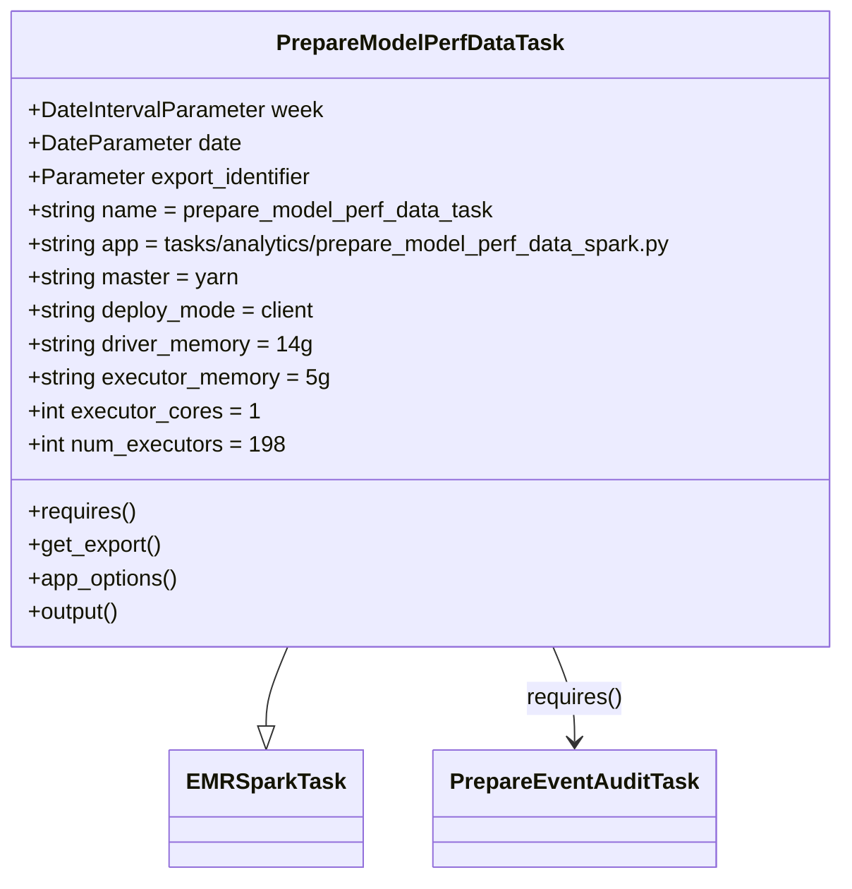

# Diagram: research/orchestrator/tasks/analytics/prepare_model_perf_data_task.py


> Auto-generated by Obscura crawlers

## Diagram 1



### SVG

<svg id="container" width="612.65625" xmlns="http://www.w3.org/2000/svg" class="classDiagram" height="630" viewBox="0 0 612.65625 630" role="graphics-document document" aria-roledescription="class"><style>#container{font-family:"trebuchet ms",verdana,arial,sans-serif;font-size:16px;fill:#333;}@keyframes edge-animation-frame{from{stroke-dashoffset:0;}}@keyframes dash{to{stroke-dashoffset:0;}}#container .edge-animation-slow{stroke-dasharray:9,5!important;stroke-dashoffset:900;animation:dash 50s linear infinite;stroke-linecap:round;}#container .edge-animation-fast{stroke-dasharray:9,5!important;stroke-dashoffset:900;animation:dash 20s linear infinite;stroke-linecap:round;}#container .error-icon{fill:#552222;}#container .error-text{fill:#552222;stroke:#552222;}#container .edge-thickness-normal{stroke-width:1px;}#container .edge-thickness-thick{stroke-width:3.5px;}#container .edge-pattern-solid{stroke-dasharray:0;}#container .edge-thickness-invisible{stroke-width:0;fill:none;}#container .edge-pattern-dashed{stroke-dasharray:3;}#container .edge-pattern-dotted{stroke-dasharray:2;}#container .marker{fill:#333333;stroke:#333333;}#container .marker.cross{stroke:#333333;}#container svg{font-family:"trebuchet ms",verdana,arial,sans-serif;font-size:16px;}#container p{margin:0;}#container g.classGroup text{fill:#9370DB;stroke:none;font-family:"trebuchet ms",verdana,arial,sans-serif;font-size:10px;}#container g.classGroup text .title{font-weight:bolder;}#container .nodeLabel,#container .edgeLabel{color:#131300;}#container .edgeLabel .label rect{fill:#ECECFF;}#container .label text{fill:#131300;}#container .labelBkg{background:#ECECFF;}#container .edgeLabel .label span{background:#ECECFF;}#container .classTitle{font-weight:bolder;}#container .node rect,#container .node circle,#container .node ellipse,#container .node polygon,#container .node path{fill:#ECECFF;stroke:#9370DB;stroke-width:1px;}#container .divider{stroke:#9370DB;stroke-width:1;}#container g.clickable{cursor:pointer;}#container g.classGroup rect{fill:#ECECFF;stroke:#9370DB;}#container g.classGroup line{stroke:#9370DB;stroke-width:1;}#container .classLabel .box{stroke:none;stroke-width:0;fill:#ECECFF;opacity:0.5;}#container .classLabel .label{fill:#9370DB;font-size:10px;}#container .relation{stroke:#333333;stroke-width:1;fill:none;}#container .dashed-line{stroke-dasharray:3;}#container .dotted-line{stroke-dasharray:1 2;}#container #compositionStart,#container .composition{fill:#333333!important;stroke:#333333!important;stroke-width:1;}#container #compositionEnd,#container .composition{fill:#333333!important;stroke:#333333!important;stroke-width:1;}#container #dependencyStart,#container .dependency{fill:#333333!important;stroke:#333333!important;stroke-width:1;}#container #dependencyStart,#container .dependency{fill:#333333!important;stroke:#333333!important;stroke-width:1;}#container #extensionStart,#container .extension{fill:transparent!important;stroke:#333333!important;stroke-width:1;}#container #extensionEnd,#container .extension{fill:transparent!important;stroke:#333333!important;stroke-width:1;}#container #aggregationStart,#container .aggregation{fill:transparent!important;stroke:#333333!important;stroke-width:1;}#container #aggregationEnd,#container .aggregation{fill:transparent!important;stroke:#333333!important;stroke-width:1;}#container #lollipopStart,#container .lollipop{fill:#ECECFF!important;stroke:#333333!important;stroke-width:1;}#container #lollipopEnd,#container .lollipop{fill:#ECECFF!important;stroke:#333333!important;stroke-width:1;}#container .edgeTerminals{font-size:11px;line-height:initial;}#container .classTitleText{text-anchor:middle;font-size:18px;fill:#333;}#container .label-icon{display:inline-block;height:1em;overflow:visible;vertical-align:-0.125em;}#container .node .label-icon path{fill:currentColor;stroke:revert;stroke-width:revert;}#container :root{--mermaid-font-family:"trebuchet ms",verdana,arial,sans-serif;}</style><g><defs><marker id="container_class-aggregationStart" class="marker aggregation class" refX="18" refY="7" markerWidth="190" markerHeight="240" orient="auto"><path d="M 18,7 L9,13 L1,7 L9,1 Z"></path></marker></defs><defs><marker id="container_class-aggregationEnd" class="marker aggregation class" refX="1" refY="7" markerWidth="20" markerHeight="28" orient="auto"><path d="M 18,7 L9,13 L1,7 L9,1 Z"></path></marker></defs><defs><marker id="container_class-extensionStart" class="marker extension class" refX="18" refY="7" markerWidth="190" markerHeight="240" orient="auto"><path d="M 1,7 L18,13 V 1 Z"></path></marker></defs><defs><marker id="container_class-extensionEnd" class="marker extension class" refX="1" refY="7" markerWidth="20" markerHeight="28" orient="auto"><path d="M 1,1 V 13 L18,7 Z"></path></marker></defs><defs><marker id="container_class-compositionStart" class="marker composition class" refX="18" refY="7" markerWidth="190" markerHeight="240" orient="auto"><path d="M 18,7 L9,13 L1,7 L9,1 Z"></path></marker></defs><defs><marker id="container_class-compositionEnd" class="marker composition class" refX="1" refY="7" markerWidth="20" markerHeight="28" orient="auto"><path d="M 18,7 L9,13 L1,7 L9,1 Z"></path></marker></defs><defs><marker id="container_class-dependencyStart" class="marker dependency class" refX="6" refY="7" markerWidth="190" markerHeight="240" orient="auto"><path d="M 5,7 L9,13 L1,7 L9,1 Z"></path></marker></defs><defs><marker id="container_class-dependencyEnd" class="marker dependency class" refX="13" refY="7" markerWidth="20" markerHeight="28" orient="auto"><path d="M 18,7 L9,13 L14,7 L9,1 Z"></path></marker></defs><defs><marker id="container_class-lollipopStart" class="marker lollipop class" refX="13" refY="7" markerWidth="190" markerHeight="240" orient="auto"><circle stroke="black" fill="transparent" cx="7" cy="7" r="6"></circle></marker></defs><defs><marker id="container_class-lollipopEnd" class="marker lollipop class" refX="1" refY="7" markerWidth="190" markerHeight="240" orient="auto"><circle stroke="black" fill="transparent" cx="7" cy="7" r="6"></circle></marker></defs><g class="root"><g class="clusters"></g><g class="edgePaths"><path d="M215.219,464L212.755,470.167C210.29,476.333,205.362,488.667,202.898,498.125C200.434,507.583,200.434,514.167,200.434,517.458L200.434,520.75" id="id_PrepareModelPerfDataTask_EMRSparkTask_1" class="edge-thickness-normal edge-pattern-solid relation" style=";;;" data-edge="true" data-et="edge" data-id="id_PrepareModelPerfDataTask_EMRSparkTask_1" data-points="W3sieCI6MjE1LjIxODg2NzkyNDUyODMsInkiOjQ2NH0seyJ4IjoyMDAuNDMzNTkzNzUsInkiOjUwMX0seyJ4IjoyMDAuNDMzNTkzNzUsInkiOjUzOH1d" marker-end="url(#container_class-extensionEnd)"></path><path d="M397.437,464L399.902,470.167C402.366,476.333,407.294,488.667,409.758,500C412.223,511.333,412.223,521.667,412.223,526.833L412.223,532" id="id_PrepareModelPerfDataTask_PrepareEventAuditTask_2" class="edge-thickness-normal edge-pattern-solid relation" style=";;;" data-edge="true" data-et="edge" data-id="id_PrepareModelPerfDataTask_PrepareEventAuditTask_2" data-points="W3sieCI6Mzk3LjQzNzM4MjA3NTQ3MTcsInkiOjQ2NH0seyJ4Ijo0MTIuMjIyNjU2MjUsInkiOjUwMX0seyJ4Ijo0MTIuMjIyNjU2MjUsInkiOjUzOH1d" marker-end="url(#container_class-dependencyEnd)"></path></g><g class="edgeLabels"><g class="edgeLabel"><g class="label" data-id="id_PrepareModelPerfDataTask_EMRSparkTask_1" transform="translate(0, 0)"><foreignObject width="0" height="0"><div xmlns="http://www.w3.org/1999/xhtml" class="labelBkg" style="display: table-cell; white-space: nowrap; line-height: 1.5; max-width: 200px; text-align: center;"><span class="edgeLabel"></span></div></foreignObject></g></g><g class="edgeLabel" transform="translate(412.22265625, 501)"><g class="label" data-id="id_PrepareModelPerfDataTask_PrepareEventAuditTask_2" transform="translate(-35.0390625, -12)"><foreignObject width="70.078125" height="24"><div xmlns="http://www.w3.org/1999/xhtml" class="labelBkg" style="display: table-cell; white-space: nowrap; line-height: 1.5; max-width: 200px; text-align: center;"><span class="edgeLabel"><p>requires()</p></span></div></foreignObject></g></g></g><g class="nodes"><g class="node default" id="classId-EMRSparkTask-0" transform="translate(200.43359375, 580)"><g class="basic label-container"><path d="M-65.1484375 -42 L65.1484375 -42 L65.1484375 42 L-65.1484375 42" stroke="none" stroke-width="0" fill="#ECECFF" style=""></path><path d="M-65.1484375 -42 C-13.143098938044574 -42, 38.86223962391085 -42, 65.1484375 -42 M-65.1484375 -42 C-36.87146712135939 -42, -8.594496742718782 -42, 65.1484375 -42 M65.1484375 -42 C65.1484375 -20.9755632337846, 65.1484375 0.04887353243079673, 65.1484375 42 M65.1484375 -42 C65.1484375 -11.104977412799215, 65.1484375 19.79004517440157, 65.1484375 42 M65.1484375 42 C24.753165768680624 42, -15.642105962638752 42, -65.1484375 42 M65.1484375 42 C36.16405417352762 42, 7.179670847055242 42, -65.1484375 42 M-65.1484375 42 C-65.1484375 18.386383436234272, -65.1484375 -5.227233127531456, -65.1484375 -42 M-65.1484375 42 C-65.1484375 16.714378233106007, -65.1484375 -8.571243533787985, -65.1484375 -42" stroke="#9370DB" stroke-width="1.3" fill="none" stroke-dasharray="0 0" style=""></path></g><g class="annotation-group text" transform="translate(0, -18)"></g><g class="label-group text" transform="translate(-53.1484375, -18)"><g class="label" style="font-weight: bolder" transform="translate(0,-12)"><foreignObject width="106.296875" height="24"><div xmlns="http://www.w3.org/1999/xhtml" style="display: table-cell; white-space: nowrap; line-height: 1.5; max-width: 154px; text-align: center;"><span class="nodeLabel markdown-node-label" style=""><p>EMRSparkTask</p></span></div></foreignObject></g></g><g class="members-group text" transform="translate(-53.1484375, 30)"></g><g class="methods-group text" transform="translate(-53.1484375, 60)"></g><g class="divider" style=""><path d="M-65.1484375 6 C-18.127428272425057 6, 28.893580955149886 6, 65.1484375 6 M-65.1484375 6 C-22.64742153946105 6, 19.8535944210779 6, 65.1484375 6" stroke="#9370DB" stroke-width="1.3" fill="none" stroke-dasharray="0 0" style=""></path></g><g class="divider" style=""><path d="M-65.1484375 24 C-37.851860541496855 24, -10.55528358299371 24, 65.1484375 24 M-65.1484375 24 C-37.696366802194575 24, -10.244296104389143 24, 65.1484375 24" stroke="#9370DB" stroke-width="1.3" fill="none" stroke-dasharray="0 0" style=""></path></g></g><g class="node default" id="classId-PrepareEventAuditTask-1" transform="translate(412.22265625, 580)"><g class="basic label-container"><path d="M-96.640625 -42 L96.640625 -42 L96.640625 42 L-96.640625 42" stroke="none" stroke-width="0" fill="#ECECFF" style=""></path><path d="M-96.640625 -42 C-44.59833237061586 -42, 7.443960258768286 -42, 96.640625 -42 M-96.640625 -42 C-25.823768396887843 -42, 44.993088206224314 -42, 96.640625 -42 M96.640625 -42 C96.640625 -14.378314298297141, 96.640625 13.243371403405718, 96.640625 42 M96.640625 -42 C96.640625 -17.74000073354132, 96.640625 6.519998532917363, 96.640625 42 M96.640625 42 C52.0878743833703 42, 7.535123766740597 42, -96.640625 42 M96.640625 42 C22.90632588590735 42, -50.8279732281853 42, -96.640625 42 M-96.640625 42 C-96.640625 22.180914801661515, -96.640625 2.361829603323031, -96.640625 -42 M-96.640625 42 C-96.640625 12.60734334679692, -96.640625 -16.78531330640616, -96.640625 -42" stroke="#9370DB" stroke-width="1.3" fill="none" stroke-dasharray="0 0" style=""></path></g><g class="annotation-group text" transform="translate(0, -18)"></g><g class="label-group text" transform="translate(-84.640625, -18)"><g class="label" style="font-weight: bolder" transform="translate(0,-12)"><foreignObject width="169.28125" height="24"><div xmlns="http://www.w3.org/1999/xhtml" style="display: table-cell; white-space: nowrap; line-height: 1.5; max-width: 217px; text-align: center;"><span class="nodeLabel markdown-node-label" style=""><p>PrepareEventAuditTask</p></span></div></foreignObject></g></g><g class="members-group text" transform="translate(-84.640625, 30)"></g><g class="methods-group text" transform="translate(-84.640625, 60)"></g><g class="divider" style=""><path d="M-96.640625 6 C-51.54064147290304 6, -6.44065794580608 6, 96.640625 6 M-96.640625 6 C-32.88074914411378 6, 30.879126711772443 6, 96.640625 6" stroke="#9370DB" stroke-width="1.3" fill="none" stroke-dasharray="0 0" style=""></path></g><g class="divider" style=""><path d="M-96.640625 24 C-25.31229632383399 24, 46.01603235233202 24, 96.640625 24 M-96.640625 24 C-23.793522920993937 24, 49.05357915801213 24, 96.640625 24" stroke="#9370DB" stroke-width="1.3" fill="none" stroke-dasharray="0 0" style=""></path></g></g><g class="node default" id="classId-PrepareModelPerfDataTask-2" transform="translate(306.328125, 236)"><g class="basic label-container"><path d="M-298.328125 -228 L298.328125 -228 L298.328125 228 L-298.328125 228" stroke="none" stroke-width="0" fill="#ECECFF" style=""></path><path d="M-298.328125 -228 C-127.10995543562623 -228, 44.108214128747534 -228, 298.328125 -228 M-298.328125 -228 C-121.14200940121762 -228, 56.04410619756476 -228, 298.328125 -228 M298.328125 -228 C298.328125 -132.12523629903652, 298.328125 -36.25047259807303, 298.328125 228 M298.328125 -228 C298.328125 -128.97052388585314, 298.328125 -29.94104777170628, 298.328125 228 M298.328125 228 C59.7053443131079 228, -178.9174363737842 228, -298.328125 228 M298.328125 228 C60.66686132722975 228, -176.9944023455405 228, -298.328125 228 M-298.328125 228 C-298.328125 52.244638401535354, -298.328125 -123.51072319692929, -298.328125 -228 M-298.328125 228 C-298.328125 73.16087166475634, -298.328125 -81.67825667048731, -298.328125 -228" stroke="#9370DB" stroke-width="1.3" fill="none" stroke-dasharray="0 0" style=""></path></g><g class="annotation-group text" transform="translate(0, -204)"></g><g class="label-group text" transform="translate(-99.46875, -204)"><g class="label" style="font-weight: bolder" transform="translate(0,-12)"><foreignObject width="198.9375" height="24"><div xmlns="http://www.w3.org/1999/xhtml" style="display: table-cell; white-space: nowrap; line-height: 1.5; max-width: 245px; text-align: center;"><span class="nodeLabel markdown-node-label" style=""><p>PrepareModelPerfDataTask</p></span></div></foreignObject></g></g><g class="members-group text" transform="translate(-286.328125, -156)"><g class="label" style="" transform="translate(0,-12)"><foreignObject width="212.125" height="24"><div xmlns="http://www.w3.org/1999/xhtml" style="display: table-cell; white-space: nowrap; line-height: 1.5; max-width: 270px; text-align: center;"><span class="nodeLabel markdown-node-label" style=""><p>+DateIntervalParameter week</p></span></div></foreignObject></g><g class="label" style="" transform="translate(0,12)"><foreignObject width="152.171875" height="24"><div xmlns="http://www.w3.org/1999/xhtml" style="display: table-cell; white-space: nowrap; line-height: 1.5; max-width: 210px; text-align: center;"><span class="nodeLabel markdown-node-label" style=""><p>+DateParameter date</p></span></div></foreignObject></g><g class="label" style="" transform="translate(0,36)"><foreignObject width="208.546875" height="24"><div xmlns="http://www.w3.org/1999/xhtml" style="display: table-cell; white-space: nowrap; line-height: 1.5; max-width: 267px; text-align: center;"><span class="nodeLabel markdown-node-label" style=""><p>+Parameter export_identifier</p></span></div></foreignObject></g><g class="label" style="" transform="translate(0,60)"><foreignObject width="337.390625" height="24"><div xmlns="http://www.w3.org/1999/xhtml" style="display: table-cell; white-space: nowrap; line-height: 1.5; max-width: 396px; text-align: center;"><span class="nodeLabel markdown-node-label" style=""><p>+string name = prepare_model_perf_data_task</p></span></div></foreignObject></g><g class="label" style="" transform="translate(0,84)"><foreignObject width="473.1875" height="24"><div xmlns="http://www.w3.org/1999/xhtml" style="display: table-cell; white-space: nowrap; line-height: 1.5; max-width: 531px; text-align: center;"><span class="nodeLabel markdown-node-label" style=""><p>+string app = tasks/analytics/prepare_model_perf_data_spark.py</p></span></div></foreignObject></g><g class="label" style="" transform="translate(0,108)"><foreignObject width="152.375" height="24"><div xmlns="http://www.w3.org/1999/xhtml" style="display: table-cell; white-space: nowrap; line-height: 1.5; max-width: 210px; text-align: center;"><span class="nodeLabel markdown-node-label" style=""><p>+string master = yarn</p></span></div></foreignObject></g><g class="label" style="" transform="translate(0,132)"><foreignObject width="209.796875" height="24"><div xmlns="http://www.w3.org/1999/xhtml" style="display: table-cell; white-space: nowrap; line-height: 1.5; max-width: 267px; text-align: center;"><span class="nodeLabel markdown-node-label" style=""><p>+string deploy_mode = client</p></span></div></foreignObject></g><g class="label" style="" transform="translate(0,156)"><foreignObject width="203.640625" height="24"><div xmlns="http://www.w3.org/1999/xhtml" style="display: table-cell; white-space: nowrap; line-height: 1.5; max-width: 262px; text-align: center;"><span class="nodeLabel markdown-node-label" style=""><p>+string driver_memory = 14g</p></span></div></foreignObject></g><g class="label" style="" transform="translate(0,180)"><foreignObject width="216.03125" height="24"><div xmlns="http://www.w3.org/1999/xhtml" style="display: table-cell; white-space: nowrap; line-height: 1.5; max-width: 274px; text-align: center;"><span class="nodeLabel markdown-node-label" style=""><p>+string executor_memory = 5g</p></span></div></foreignObject></g><g class="label" style="" transform="translate(0,204)"><foreignObject width="163.359375" height="24"><div xmlns="http://www.w3.org/1999/xhtml" style="display: table-cell; white-space: nowrap; line-height: 1.5; max-width: 221px; text-align: center;"><span class="nodeLabel markdown-node-label" style=""><p>+int executor_cores = 1</p></span></div></foreignObject></g><g class="label" style="" transform="translate(0,228)"><foreignObject width="182.921875" height="24"><div xmlns="http://www.w3.org/1999/xhtml" style="display: table-cell; white-space: nowrap; line-height: 1.5; max-width: 240px; text-align: center;"><span class="nodeLabel markdown-node-label" style=""><p>+int num_executors = 198</p></span></div></foreignObject></g></g><g class="methods-group text" transform="translate(-286.328125, 132)"><g class="label" style="" transform="translate(0,-12)"><foreignObject width="78.0625" height="24"><div xmlns="http://www.w3.org/1999/xhtml" style="display: table-cell; white-space: nowrap; line-height: 1.5; max-width: 135px; text-align: center;"><span class="nodeLabel markdown-node-label" style=""><p>+requires()</p></span></div></foreignObject></g><g class="label" style="" transform="translate(0,12)"><foreignObject width="96.0625" height="24"><div xmlns="http://www.w3.org/1999/xhtml" style="display: table-cell; white-space: nowrap; line-height: 1.5; max-width: 153px; text-align: center;"><span class="nodeLabel markdown-node-label" style=""><p>+get_export()</p></span></div></foreignObject></g><g class="label" style="" transform="translate(0,36)"><foreignObject width="108.84375" height="24"><div xmlns="http://www.w3.org/1999/xhtml" style="display: table-cell; white-space: nowrap; line-height: 1.5; max-width: 166px; text-align: center;"><span class="nodeLabel markdown-node-label" style=""><p>+app_options()</p></span></div></foreignObject></g><g class="label" style="" transform="translate(0,60)"><foreignObject width="67.390625" height="24"><div xmlns="http://www.w3.org/1999/xhtml" style="display: table-cell; white-space: nowrap; line-height: 1.5; max-width: 125px; text-align: center;"><span class="nodeLabel markdown-node-label" style=""><p>+output()</p></span></div></foreignObject></g></g><g class="divider" style=""><path d="M-298.328125 -180 C-68.7154398762774 -180, 160.8972452474452 -180, 298.328125 -180 M-298.328125 -180 C-163.48657328094674 -180, -28.645021561893486 -180, 298.328125 -180" stroke="#9370DB" stroke-width="1.3" fill="none" stroke-dasharray="0 0" style=""></path></g><g class="divider" style=""><path d="M-298.328125 108 C-175.33603237809268 108, -52.343939756185335 108, 298.328125 108 M-298.328125 108 C-161.21931626591868 108, -24.110507531837357 108, 298.328125 108" stroke="#9370DB" stroke-width="1.3" fill="none" stroke-dasharray="0 0" style=""></path></g></g></g></g></g></svg>

## Diagram 2

```mermaid
flowchart LR
    PMT[PrepareModelPerfDataTask]
    PMT --> REQ[call requires()]
    REQ --> PREP[PrepareEventAuditTask]
    PMT --> APP_OPT[call app_options()]
    APP_OPT --> OUT_GETLATEST[get_latest_path(datanectar.get_luigi_output_target(...).path)]
    OUT_GETLATEST --> OUTPUT_S3[output_s3_path]
    APP_OPT --> INPUT_S3[input_s3_path = requires().output().path]
    APP_OPT --> ENV[env = os.getenv("ENV")]
    OUTPUT_S3 --> APP_OPT_RET
    INPUT_S3 --> APP_OPT_RET
    ENV --> APP_OPT_RET
    APP_OPT_RET[returns [input_s3_path, output_s3_path, env]] 
    PMT --> GET_EXPORT[call get_export()]
    GET_EXPORT --> CHECK_ID{export_identifier set?}
    CHECK_ID -- Yes --> BOTO3[boto3.client('rds')]
    CHECK_ID -- No --> NO_EXPORT[return None]
    BOTO3 --> DESCRIBE[describe_export_tasks()]
    DESCRIBE --> EXPORTS[ExportTasks list]
    EXPORTS --> FILTER[filter ExportTasks by ExportTaskIdentifier == export_identifier]
    FILTER --> MATCH[next(export) -> matched export]
    PMT --> OUTPUT_CALL[call output()]
    OUTPUT_CALL --> OUT_GETLATEST2[get_latest_path(datanectar.get_luigi_output_target(...).path)]
    OUT_GETLATEST2 --> S3TARGET[luigi_s3.S3Target(latest_path)]
    S3TARGET --> OUTPUT_RETURN[returns S3Target]
```

> SVG rendering failed for this diagram.
