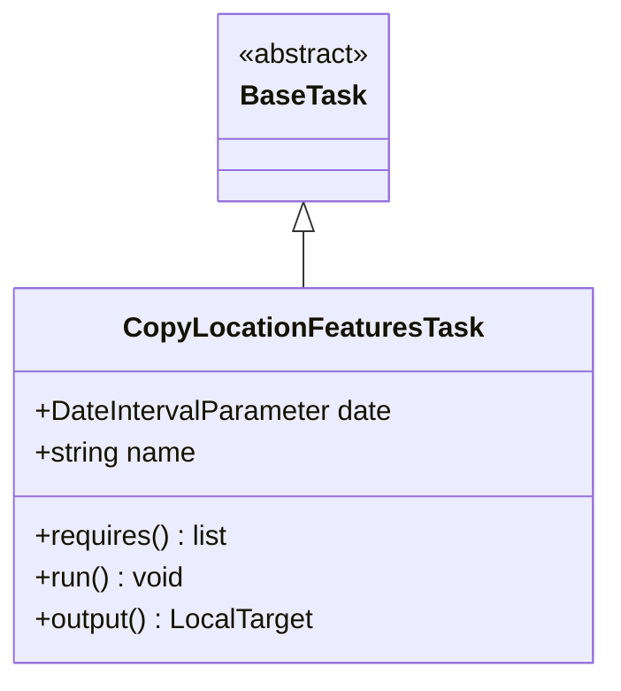
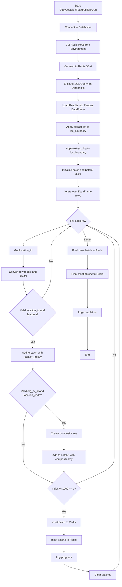
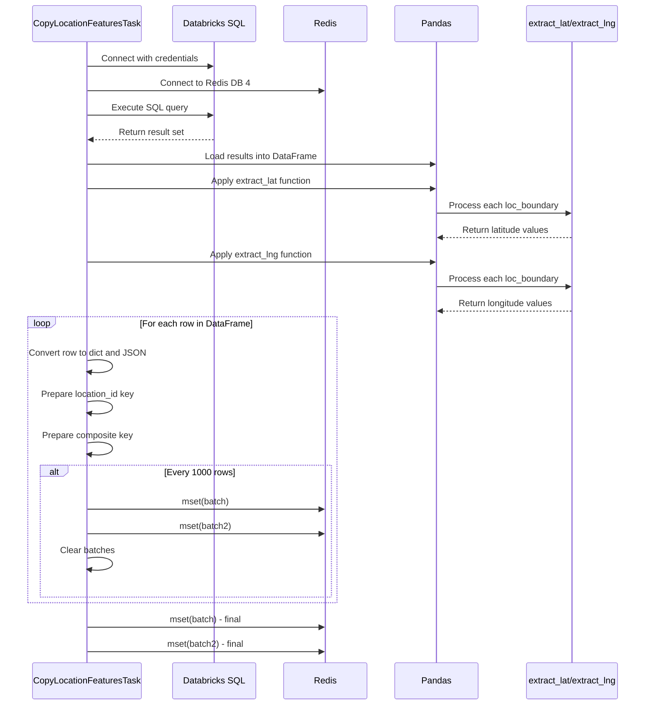
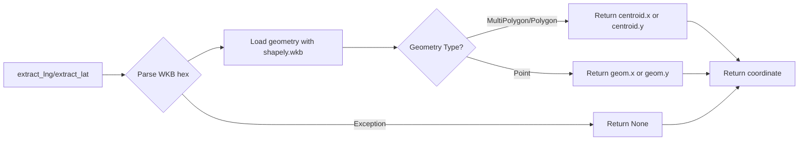

# Diagram: research/orchestrator/tasks/data_transforms/copy_location_features_task.py


> Auto-generated by Obscura crawlers

## Diagram 1

```mermaid
classDiagram
      class BaseTask {
          <<abstract>>
      }...
  └ 85 lines...

✗ read_bash
  Invalid shell ID: 0. Please supply a valid shell ID to read output from.

  <no active shell sessions>
```

> SVG rendering failed for this diagram.

## Diagram 2



### SVG

<svg id="container" width="344.6171875" xmlns="http://www.w3.org/2000/svg" class="classDiagram" height="390" viewBox="0 0 344.6171875 390" role="graphics-document document" aria-roledescription="class"><style>#container{font-family:"trebuchet ms",verdana,arial,sans-serif;font-size:16px;fill:#333;}@keyframes edge-animation-frame{from{stroke-dashoffset:0;}}@keyframes dash{to{stroke-dashoffset:0;}}#container .edge-animation-slow{stroke-dasharray:9,5!important;stroke-dashoffset:900;animation:dash 50s linear infinite;stroke-linecap:round;}#container .edge-animation-fast{stroke-dasharray:9,5!important;stroke-dashoffset:900;animation:dash 20s linear infinite;stroke-linecap:round;}#container .error-icon{fill:#552222;}#container .error-text{fill:#552222;stroke:#552222;}#container .edge-thickness-normal{stroke-width:1px;}#container .edge-thickness-thick{stroke-width:3.5px;}#container .edge-pattern-solid{stroke-dasharray:0;}#container .edge-thickness-invisible{stroke-width:0;fill:none;}#container .edge-pattern-dashed{stroke-dasharray:3;}#container .edge-pattern-dotted{stroke-dasharray:2;}#container .marker{fill:#333333;stroke:#333333;}#container .marker.cross{stroke:#333333;}#container svg{font-family:"trebuchet ms",verdana,arial,sans-serif;font-size:16px;}#container p{margin:0;}#container g.classGroup text{fill:#9370DB;stroke:none;font-family:"trebuchet ms",verdana,arial,sans-serif;font-size:10px;}#container g.classGroup text .title{font-weight:bolder;}#container .nodeLabel,#container .edgeLabel{color:#131300;}#container .edgeLabel .label rect{fill:#ECECFF;}#container .label text{fill:#131300;}#container .labelBkg{background:#ECECFF;}#container .edgeLabel .label span{background:#ECECFF;}#container .classTitle{font-weight:bolder;}#container .node rect,#container .node circle,#container .node ellipse,#container .node polygon,#container .node path{fill:#ECECFF;stroke:#9370DB;stroke-width:1px;}#container .divider{stroke:#9370DB;stroke-width:1;}#container g.clickable{cursor:pointer;}#container g.classGroup rect{fill:#ECECFF;stroke:#9370DB;}#container g.classGroup line{stroke:#9370DB;stroke-width:1;}#container .classLabel .box{stroke:none;stroke-width:0;fill:#ECECFF;opacity:0.5;}#container .classLabel .label{fill:#9370DB;font-size:10px;}#container .relation{stroke:#333333;stroke-width:1;fill:none;}#container .dashed-line{stroke-dasharray:3;}#container .dotted-line{stroke-dasharray:1 2;}#container #compositionStart,#container .composition{fill:#333333!important;stroke:#333333!important;stroke-width:1;}#container #compositionEnd,#container .composition{fill:#333333!important;stroke:#333333!important;stroke-width:1;}#container #dependencyStart,#container .dependency{fill:#333333!important;stroke:#333333!important;stroke-width:1;}#container #dependencyStart,#container .dependency{fill:#333333!important;stroke:#333333!important;stroke-width:1;}#container #extensionStart,#container .extension{fill:transparent!important;stroke:#333333!important;stroke-width:1;}#container #extensionEnd,#container .extension{fill:transparent!important;stroke:#333333!important;stroke-width:1;}#container #aggregationStart,#container .aggregation{fill:transparent!important;stroke:#333333!important;stroke-width:1;}#container #aggregationEnd,#container .aggregation{fill:transparent!important;stroke:#333333!important;stroke-width:1;}#container #lollipopStart,#container .lollipop{fill:#ECECFF!important;stroke:#333333!important;stroke-width:1;}#container #lollipopEnd,#container .lollipop{fill:#ECECFF!important;stroke:#333333!important;stroke-width:1;}#container .edgeTerminals{font-size:11px;line-height:initial;}#container .classTitleText{text-anchor:middle;font-size:18px;fill:#333;}#container .label-icon{display:inline-block;height:1em;overflow:visible;vertical-align:-0.125em;}#container .node .label-icon path{fill:currentColor;stroke:revert;stroke-width:revert;}#container :root{--mermaid-font-family:"trebuchet ms",verdana,arial,sans-serif;}</style><g><defs><marker id="container_class-aggregationStart" class="marker aggregation class" refX="18" refY="7" markerWidth="190" markerHeight="240" orient="auto"><path d="M 18,7 L9,13 L1,7 L9,1 Z"></path></marker></defs><defs><marker id="container_class-aggregationEnd" class="marker aggregation class" refX="1" refY="7" markerWidth="20" markerHeight="28" orient="auto"><path d="M 18,7 L9,13 L1,7 L9,1 Z"></path></marker></defs><defs><marker id="container_class-extensionStart" class="marker extension class" refX="18" refY="7" markerWidth="190" markerHeight="240" orient="auto"><path d="M 1,7 L18,13 V 1 Z"></path></marker></defs><defs><marker id="container_class-extensionEnd" class="marker extension class" refX="1" refY="7" markerWidth="20" markerHeight="28" orient="auto"><path d="M 1,1 V 13 L18,7 Z"></path></marker></defs><defs><marker id="container_class-compositionStart" class="marker composition class" refX="18" refY="7" markerWidth="190" markerHeight="240" orient="auto"><path d="M 18,7 L9,13 L1,7 L9,1 Z"></path></marker></defs><defs><marker id="container_class-compositionEnd" class="marker composition class" refX="1" refY="7" markerWidth="20" markerHeight="28" orient="auto"><path d="M 18,7 L9,13 L1,7 L9,1 Z"></path></marker></defs><defs><marker id="container_class-dependencyStart" class="marker dependency class" refX="6" refY="7" markerWidth="190" markerHeight="240" orient="auto"><path d="M 5,7 L9,13 L1,7 L9,1 Z"></path></marker></defs><defs><marker id="container_class-dependencyEnd" class="marker dependency class" refX="13" refY="7" markerWidth="20" markerHeight="28" orient="auto"><path d="M 18,7 L9,13 L14,7 L9,1 Z"></path></marker></defs><defs><marker id="container_class-lollipopStart" class="marker lollipop class" refX="13" refY="7" markerWidth="190" markerHeight="240" orient="auto"><circle stroke="black" fill="transparent" cx="7" cy="7" r="6"></circle></marker></defs><defs><marker id="container_class-lollipopEnd" class="marker lollipop class" refX="1" refY="7" markerWidth="190" markerHeight="240" orient="auto"><circle stroke="black" fill="transparent" cx="7" cy="7" r="6"></circle></marker></defs><g class="root"><g class="clusters"></g><g class="edgePaths"><path d="M172.309,133.25L172.309,134.542C172.309,135.833,172.309,138.417,172.309,143.875C172.309,149.333,172.309,157.667,172.309,161.833L172.309,166" id="id_BaseTask_CopyLocationFeaturesTask_1" class="edge-thickness-normal edge-pattern-solid relation" style=";;;" data-edge="true" data-et="edge" data-id="id_BaseTask_CopyLocationFeaturesTask_1" data-points="W3sieCI6MTcyLjMwODU5Mzc1LCJ5IjoxMTZ9LHsieCI6MTcyLjMwODU5Mzc1LCJ5IjoxNDF9LHsieCI6MTcyLjMwODU5Mzc1LCJ5IjoxNjZ9XQ==" marker-start="url(#container_class-extensionStart)"></path></g><g class="edgeLabels"><g class="edgeLabel"><g class="label" data-id="id_BaseTask_CopyLocationFeaturesTask_1" transform="translate(0, 0)"><foreignObject width="0" height="0"><div xmlns="http://www.w3.org/1999/xhtml" class="labelBkg" style="display: table-cell; white-space: nowrap; line-height: 1.5; max-width: 200px; text-align: center;"><span class="edgeLabel"></span></div></foreignObject></g></g></g><g class="nodes"><g class="node default" id="classId-BaseTask-0" transform="translate(172.30859375, 62)"><g class="basic label-container"><path d="M-50.609375 -54 L50.609375 -54 L50.609375 54 L-50.609375 54" stroke="none" stroke-width="0" fill="#ECECFF" style=""></path><path d="M-50.609375 -54 C-26.0431393159504 -54, -1.4769036319007967 -54, 50.609375 -54 M-50.609375 -54 C-28.090617681210617 -54, -5.5718603624212335 -54, 50.609375 -54 M50.609375 -54 C50.609375 -10.883211404597944, 50.609375 32.23357719080411, 50.609375 54 M50.609375 -54 C50.609375 -29.348030551734517, 50.609375 -4.6960611034690345, 50.609375 54 M50.609375 54 C16.26415761350134 54, -18.08105977299732 54, -50.609375 54 M50.609375 54 C17.693193985039876 54, -15.222987029920247 54, -50.609375 54 M-50.609375 54 C-50.609375 17.464524006036307, -50.609375 -19.070951987927387, -50.609375 -54 M-50.609375 54 C-50.609375 13.771993235544997, -50.609375 -26.456013528910006, -50.609375 -54" stroke="#9370DB" stroke-width="1.3" fill="none" stroke-dasharray="0 0" style=""></path></g><g class="annotation-group text" transform="translate(-38.609375, -30)"><g class="label" style="" transform="translate(0,-12)"><foreignObject width="77.21875" height="24"><div xmlns="http://www.w3.org/1999/xhtml" style="display: table-cell; white-space: nowrap; line-height: 1.5; max-width: 127px; text-align: center;"><span class="nodeLabel markdown-node-label" style=""><p>«abstract»</p></span></div></foreignObject></g></g><g class="label-group text" transform="translate(-34.03125, -6)"><g class="label" style="font-weight: bolder" transform="translate(0,-12)"><foreignObject width="68.0625" height="24"><div xmlns="http://www.w3.org/1999/xhtml" style="display: table-cell; white-space: nowrap; line-height: 1.5; max-width: 117px; text-align: center;"><span class="nodeLabel markdown-node-label" style=""><p>BaseTask</p></span></div></foreignObject></g></g><g class="members-group text" transform="translate(-38.609375, 42)"></g><g class="methods-group text" transform="translate(-38.609375, 72)"></g><g class="divider" style=""><path d="M-50.609375 18 C-28.901333744474645 18, -7.1932924889492895 18, 50.609375 18 M-50.609375 18 C-28.393844140763 18, -6.178313281526002 18, 50.609375 18" stroke="#9370DB" stroke-width="1.3" fill="none" stroke-dasharray="0 0" style=""></path></g><g class="divider" style=""><path d="M-50.609375 36 C-26.726460706743193 36, -2.8435464134863864 36, 50.609375 36 M-50.609375 36 C-14.861237543394921 36, 20.886899913210158 36, 50.609375 36" stroke="#9370DB" stroke-width="1.3" fill="none" stroke-dasharray="0 0" style=""></path></g></g><g class="node default" id="classId-CopyLocationFeaturesTask-1" transform="translate(172.30859375, 274)"><g class="basic label-container"><path d="M-164.30859375 -108 L164.30859375 -108 L164.30859375 108 L-164.30859375 108" stroke="none" stroke-width="0" fill="#ECECFF" style=""></path><path d="M-164.30859375 -108 C-73.26019753627837 -108, 17.788198677443262 -108, 164.30859375 -108 M-164.30859375 -108 C-65.4579671790755 -108, 33.39265939184901 -108, 164.30859375 -108 M164.30859375 -108 C164.30859375 -49.665460534584405, 164.30859375 8.66907893083119, 164.30859375 108 M164.30859375 -108 C164.30859375 -59.41586535971874, 164.30859375 -10.831730719437473, 164.30859375 108 M164.30859375 108 C65.45358802922199 108, -33.40141769155602 108, -164.30859375 108 M164.30859375 108 C34.5549067303013 108, -95.1987802893974 108, -164.30859375 108 M-164.30859375 108 C-164.30859375 26.030680614323416, -164.30859375 -55.93863877135317, -164.30859375 -108 M-164.30859375 108 C-164.30859375 59.56520409947248, -164.30859375 11.130408198944963, -164.30859375 -108" stroke="#9370DB" stroke-width="1.3" fill="none" stroke-dasharray="0 0" style=""></path></g><g class="annotation-group text" transform="translate(0, -84)"></g><g class="label-group text" transform="translate(-97.0703125, -84)"><g class="label" style="font-weight: bolder" transform="translate(0,-12)"><foreignObject width="194.140625" height="24"><div xmlns="http://www.w3.org/1999/xhtml" style="display: table-cell; white-space: nowrap; line-height: 1.5; max-width: 241px; text-align: center;"><span class="nodeLabel markdown-node-label" style=""><p>CopyLocationFeaturesTask</p></span></div></foreignObject></g></g><g class="members-group text" transform="translate(-152.30859375, -36)"><g class="label" style="" transform="translate(0,-12)"><foreignObject width="207.546875" height="24"><div xmlns="http://www.w3.org/1999/xhtml" style="display: table-cell; white-space: nowrap; line-height: 1.5; max-width: 265px; text-align: center;"><span class="nodeLabel markdown-node-label" style=""><p>+DateIntervalParameter date</p></span></div></foreignObject></g><g class="label" style="" transform="translate(0,12)"><foreignObject width="94.375" height="24"><div xmlns="http://www.w3.org/1999/xhtml" style="display: table-cell; white-space: nowrap; line-height: 1.5; max-width: 152px; text-align: center;"><span class="nodeLabel markdown-node-label" style=""><p>+string name</p></span></div></foreignObject></g></g><g class="methods-group text" transform="translate(-152.30859375, 36)"><g class="label" style="" transform="translate(0,-12)"><foreignObject width="112.828125" height="24"><div xmlns="http://www.w3.org/1999/xhtml" style="display: table-cell; white-space: nowrap; line-height: 1.5; max-width: 170px; text-align: center;"><span class="nodeLabel markdown-node-label" style=""><p>+requires() : list</p></span></div></foreignObject></g><g class="label" style="" transform="translate(0,12)"><foreignObject width="86.78125" height="24"><div xmlns="http://www.w3.org/1999/xhtml" style="display: table-cell; white-space: nowrap; line-height: 1.5; max-width: 144px; text-align: center;"><span class="nodeLabel markdown-node-label" style=""><p>+run() : void</p></span></div></foreignObject></g><g class="label" style="" transform="translate(0,36)"><foreignObject width="162.015625" height="24"><div xmlns="http://www.w3.org/1999/xhtml" style="display: table-cell; white-space: nowrap; line-height: 1.5; max-width: 220px; text-align: center;"><span class="nodeLabel markdown-node-label" style=""><p>+output() : LocalTarget</p></span></div></foreignObject></g></g><g class="divider" style=""><path d="M-164.30859375 -60 C-52.04385011249914 -60, 60.22089352500171 -60, 164.30859375 -60 M-164.30859375 -60 C-52.69558924844307 -60, 58.91741525311386 -60, 164.30859375 -60" stroke="#9370DB" stroke-width="1.3" fill="none" stroke-dasharray="0 0" style=""></path></g><g class="divider" style=""><path d="M-164.30859375 12 C-67.72045067704904 12, 28.867692395901912 12, 164.30859375 12 M-164.30859375 12 C-87.41487276913291 12, -10.521151788265826 12, 164.30859375 12" stroke="#9370DB" stroke-width="1.3" fill="none" stroke-dasharray="0 0" style=""></path></g></g></g></g></g></svg>

## Diagram 3



### SVG

<svg id="container" width="718.7069702148438" xmlns="http://www.w3.org/2000/svg" class="flowchart" height="3441.953125" viewBox="0 0 718.7069702148438 3441.953125" role="graphics-document document" aria-roledescription="flowchart-v2"><style>#container{font-family:"trebuchet ms",verdana,arial,sans-serif;font-size:16px;fill:#333;}@keyframes edge-animation-frame{from{stroke-dashoffset:0;}}@keyframes dash{to{stroke-dashoffset:0;}}#container .edge-animation-slow{stroke-dasharray:9,5!important;stroke-dashoffset:900;animation:dash 50s linear infinite;stroke-linecap:round;}#container .edge-animation-fast{stroke-dasharray:9,5!important;stroke-dashoffset:900;animation:dash 20s linear infinite;stroke-linecap:round;}#container .error-icon{fill:#552222;}#container .error-text{fill:#552222;stroke:#552222;}#container .edge-thickness-normal{stroke-width:1px;}#container .edge-thickness-thick{stroke-width:3.5px;}#container .edge-pattern-solid{stroke-dasharray:0;}#container .edge-thickness-invisible{stroke-width:0;fill:none;}#container .edge-pattern-dashed{stroke-dasharray:3;}#container .edge-pattern-dotted{stroke-dasharray:2;}#container .marker{fill:#333333;stroke:#333333;}#container .marker.cross{stroke:#333333;}#container svg{font-family:"trebuchet ms",verdana,arial,sans-serif;font-size:16px;}#container p{margin:0;}#container .label{font-family:"trebuchet ms",verdana,arial,sans-serif;color:#333;}#container .cluster-label text{fill:#333;}#container .cluster-label span{color:#333;}#container .cluster-label span p{background-color:transparent;}#container .label text,#container span{fill:#333;color:#333;}#container .node rect,#container .node circle,#container .node ellipse,#container .node polygon,#container .node path{fill:#ECECFF;stroke:#9370DB;stroke-width:1px;}#container .rough-node .label text,#container .node .label text,#container .image-shape .label,#container .icon-shape .label{text-anchor:middle;}#container .node .katex path{fill:#000;stroke:#000;stroke-width:1px;}#container .rough-node .label,#container .node .label,#container .image-shape .label,#container .icon-shape .label{text-align:center;}#container .node.clickable{cursor:pointer;}#container .root .anchor path{fill:#333333!important;stroke-width:0;stroke:#333333;}#container .arrowheadPath{fill:#333333;}#container .edgePath .path{stroke:#333333;stroke-width:2.0px;}#container .flowchart-link{stroke:#333333;fill:none;}#container .edgeLabel{background-color:rgba(232,232,232, 0.8);text-align:center;}#container .edgeLabel p{background-color:rgba(232,232,232, 0.8);}#container .edgeLabel rect{opacity:0.5;background-color:rgba(232,232,232, 0.8);fill:rgba(232,232,232, 0.8);}#container .labelBkg{background-color:rgba(232, 232, 232, 0.5);}#container .cluster rect{fill:#ffffde;stroke:#aaaa33;stroke-width:1px;}#container .cluster text{fill:#333;}#container .cluster span{color:#333;}#container div.mermaidTooltip{position:absolute;text-align:center;max-width:200px;padding:2px;font-family:"trebuchet ms",verdana,arial,sans-serif;font-size:12px;background:hsl(80, 100%, 96.2745098039%);border:1px solid #aaaa33;border-radius:2px;pointer-events:none;z-index:100;}#container .flowchartTitleText{text-anchor:middle;font-size:18px;fill:#333;}#container rect.text{fill:none;stroke-width:0;}#container .icon-shape,#container .image-shape{background-color:rgba(232,232,232, 0.8);text-align:center;}#container .icon-shape p,#container .image-shape p{background-color:rgba(232,232,232, 0.8);padding:2px;}#container .icon-shape rect,#container .image-shape rect{opacity:0.5;background-color:rgba(232,232,232, 0.8);fill:rgba(232,232,232, 0.8);}#container .label-icon{display:inline-block;height:1em;overflow:visible;vertical-align:-0.125em;}#container .node .label-icon path{fill:currentColor;stroke:revert;stroke-width:revert;}#container :root{--mermaid-font-family:"trebuchet ms",verdana,arial,sans-serif;}</style><g><marker id="container_flowchart-v2-pointEnd" class="marker flowchart-v2" viewBox="0 0 10 10" refX="5" refY="5" markerUnits="userSpaceOnUse" markerWidth="8" markerHeight="8" orient="auto"><path d="M 0 0 L 10 5 L 0 10 z" class="arrowMarkerPath" style="stroke-width: 1; stroke-dasharray: 1, 0;"></path></marker><marker id="container_flowchart-v2-pointStart" class="marker flowchart-v2" viewBox="0 0 10 10" refX="4.5" refY="5" markerUnits="userSpaceOnUse" markerWidth="8" markerHeight="8" orient="auto"><path d="M 0 5 L 10 10 L 10 0 z" class="arrowMarkerPath" style="stroke-width: 1; stroke-dasharray: 1, 0;"></path></marker><marker id="container_flowchart-v2-circleEnd" class="marker flowchart-v2" viewBox="0 0 10 10" refX="11" refY="5" markerUnits="userSpaceOnUse" markerWidth="11" markerHeight="11" orient="auto"><circle cx="5" cy="5" r="5" class="arrowMarkerPath" style="stroke-width: 1; stroke-dasharray: 1, 0;"></circle></marker><marker id="container_flowchart-v2-circleStart" class="marker flowchart-v2" viewBox="0 0 10 10" refX="-1" refY="5" markerUnits="userSpaceOnUse" markerWidth="11" markerHeight="11" orient="auto"><circle cx="5" cy="5" r="5" class="arrowMarkerPath" style="stroke-width: 1; stroke-dasharray: 1, 0;"></circle></marker><marker id="container_flowchart-v2-crossEnd" class="marker cross flowchart-v2" viewBox="0 0 11 11" refX="12" refY="5.2" markerUnits="userSpaceOnUse" markerWidth="11" markerHeight="11" orient="auto"><path d="M 1,1 l 9,9 M 10,1 l -9,9" class="arrowMarkerPath" style="stroke-width: 2; stroke-dasharray: 1, 0;"></path></marker><marker id="container_flowchart-v2-crossStart" class="marker cross flowchart-v2" viewBox="0 0 11 11" refX="-1" refY="5.2" markerUnits="userSpaceOnUse" markerWidth="11" markerHeight="11" orient="auto"><path d="M 1,1 l 9,9 M 10,1 l -9,9" class="arrowMarkerPath" style="stroke-width: 2; stroke-dasharray: 1, 0;"></path></marker><g class="root"><g class="clusters"></g><g class="edgePaths"><path d="M465.16,86L465.16,90.167C465.16,94.333,465.16,102.667,465.16,110.333C465.16,118,465.16,125,465.16,128.5L465.16,132" id="L_A_B_0" class="edge-thickness-normal edge-pattern-solid edge-thickness-normal edge-pattern-solid flowchart-link" style=";" data-edge="true" data-et="edge" data-id="L_A_B_0" data-points="W3sieCI6NDY1LjE2MDE1NjI1LCJ5Ijo4Nn0seyJ4Ijo0NjUuMTYwMTU2MjUsInkiOjExMX0seyJ4Ijo0NjUuMTYwMTU2MjUsInkiOjEzNn1d" marker-end="url(#container_flowchart-v2-pointEnd)"></path><path d="M465.16,190L465.16,194.167C465.16,198.333,465.16,206.667,465.16,214.333C465.16,222,465.16,229,465.16,232.5L465.16,236" id="L_B_C_0" class="edge-thickness-normal edge-pattern-solid edge-thickness-normal edge-pattern-solid flowchart-link" style=";" data-edge="true" data-et="edge" data-id="L_B_C_0" data-points="W3sieCI6NDY1LjE2MDE1NjI1LCJ5IjoxOTB9LHsieCI6NDY1LjE2MDE1NjI1LCJ5IjoyMTV9LHsieCI6NDY1LjE2MDE1NjI1LCJ5IjoyNDB9XQ==" marker-end="url(#container_flowchart-v2-pointEnd)"></path><path d="M465.16,318L465.16,322.167C465.16,326.333,465.16,334.667,465.16,342.333C465.16,350,465.16,357,465.16,360.5L465.16,364" id="L_C_D_0" class="edge-thickness-normal edge-pattern-solid edge-thickness-normal edge-pattern-solid flowchart-link" style=";" data-edge="true" data-et="edge" data-id="L_C_D_0" data-points="W3sieCI6NDY1LjE2MDE1NjI1LCJ5IjozMTh9LHsieCI6NDY1LjE2MDE1NjI1LCJ5IjozNDN9LHsieCI6NDY1LjE2MDE1NjI1LCJ5IjozNjh9XQ==" marker-end="url(#container_flowchart-v2-pointEnd)"></path><path d="M465.16,422L465.16,426.167C465.16,430.333,465.16,438.667,465.16,446.333C465.16,454,465.16,461,465.16,464.5L465.16,468" id="L_D_E_0" class="edge-thickness-normal edge-pattern-solid edge-thickness-normal edge-pattern-solid flowchart-link" style=";" data-edge="true" data-et="edge" data-id="L_D_E_0" data-points="W3sieCI6NDY1LjE2MDE1NjI1LCJ5Ijo0MjJ9LHsieCI6NDY1LjE2MDE1NjI1LCJ5Ijo0NDd9LHsieCI6NDY1LjE2MDE1NjI1LCJ5Ijo0NzJ9XQ==" marker-end="url(#container_flowchart-v2-pointEnd)"></path><path d="M465.16,550L465.16,554.167C465.16,558.333,465.16,566.667,465.16,574.333C465.16,582,465.16,589,465.16,592.5L465.16,596" id="L_E_F_0" class="edge-thickness-normal edge-pattern-solid edge-thickness-normal edge-pattern-solid flowchart-link" style=";" data-edge="true" data-et="edge" data-id="L_E_F_0" data-points="W3sieCI6NDY1LjE2MDE1NjI1LCJ5Ijo1NTB9LHsieCI6NDY1LjE2MDE1NjI1LCJ5Ijo1NzV9LHsieCI6NDY1LjE2MDE1NjI1LCJ5Ijo2MDB9XQ==" marker-end="url(#container_flowchart-v2-pointEnd)"></path><path d="M465.16,678L465.16,682.167C465.16,686.333,465.16,694.667,465.16,702.333C465.16,710,465.16,717,465.16,720.5L465.16,724" id="L_F_G_0" class="edge-thickness-normal edge-pattern-solid edge-thickness-normal edge-pattern-solid flowchart-link" style=";" data-edge="true" data-et="edge" data-id="L_F_G_0" data-points="W3sieCI6NDY1LjE2MDE1NjI1LCJ5Ijo2Nzh9LHsieCI6NDY1LjE2MDE1NjI1LCJ5Ijo3MDN9LHsieCI6NDY1LjE2MDE1NjI1LCJ5Ijo3Mjh9XQ==" marker-end="url(#container_flowchart-v2-pointEnd)"></path><path d="M465.16,806L465.16,810.167C465.16,814.333,465.16,822.667,465.16,830.333C465.16,838,465.16,845,465.16,848.5L465.16,852" id="L_G_H_0" class="edge-thickness-normal edge-pattern-solid edge-thickness-normal edge-pattern-solid flowchart-link" style=";" data-edge="true" data-et="edge" data-id="L_G_H_0" data-points="W3sieCI6NDY1LjE2MDE1NjI1LCJ5Ijo4MDZ9LHsieCI6NDY1LjE2MDE1NjI1LCJ5Ijo4MzF9LHsieCI6NDY1LjE2MDE1NjI1LCJ5Ijo4NTZ9XQ==" marker-end="url(#container_flowchart-v2-pointEnd)"></path><path d="M465.16,934L465.16,938.167C465.16,942.333,465.16,950.667,465.16,958.333C465.16,966,465.16,973,465.16,976.5L465.16,980" id="L_H_I_0" class="edge-thickness-normal edge-pattern-solid edge-thickness-normal edge-pattern-solid flowchart-link" style=";" data-edge="true" data-et="edge" data-id="L_H_I_0" data-points="W3sieCI6NDY1LjE2MDE1NjI1LCJ5Ijo5MzR9LHsieCI6NDY1LjE2MDE1NjI1LCJ5Ijo5NTl9LHsieCI6NDY1LjE2MDE1NjI1LCJ5Ijo5ODR9XQ==" marker-end="url(#container_flowchart-v2-pointEnd)"></path><path d="M465.16,1062L465.16,1066.167C465.16,1070.333,465.16,1078.667,465.16,1086.333C465.16,1094,465.16,1101,465.16,1104.5L465.16,1108" id="L_I_J_0" class="edge-thickness-normal edge-pattern-solid edge-thickness-normal edge-pattern-solid flowchart-link" style=";" data-edge="true" data-et="edge" data-id="L_I_J_0" data-points="W3sieCI6NDY1LjE2MDE1NjI1LCJ5IjoxMDYyfSx7IngiOjQ2NS4xNjAxNTYyNSwieSI6MTA4N30seyJ4Ijo0NjUuMTYwMTU2MjUsInkiOjExMTJ9XQ==" marker-end="url(#container_flowchart-v2-pointEnd)"></path><path d="M465.16,1190L465.16,1194.167C465.16,1198.333,465.16,1206.667,465.16,1214.333C465.16,1222,465.16,1229,465.16,1232.5L465.16,1236" id="L_J_K_0" class="edge-thickness-normal edge-pattern-solid edge-thickness-normal edge-pattern-solid flowchart-link" style=";" data-edge="true" data-et="edge" data-id="L_J_K_0" data-points="W3sieCI6NDY1LjE2MDE1NjI1LCJ5IjoxMTkwfSx7IngiOjQ2NS4xNjAxNTYyNSwieSI6MTIxNX0seyJ4Ijo0NjUuMTYwMTU2MjUsInkiOjEyNDB9XQ==" marker-end="url(#container_flowchart-v2-pointEnd)"></path><path d="M410.495,1331.444L365.079,1346.721C319.663,1361.999,228.832,1392.554,183.416,1413.332C138,1434.109,138,1445.109,138,1450.609L138,1456.109" id="L_K_L_0" class="edge-thickness-normal edge-pattern-solid edge-thickness-normal edge-pattern-solid flowchart-link" style=";" data-edge="true" data-et="edge" data-id="L_K_L_0" data-points="W3sieCI6NDEwLjQ5NDYyMjA4NzY2NjUsInkiOjEzMzEuNDQzODQwODM3NjY2Nn0seyJ4IjoxMzgsInkiOjE0MjMuMTA5Mzc1fSx7IngiOjEzOCwieSI6MTQ2MC4xMDkzNzV9XQ==" marker-end="url(#container_flowchart-v2-pointEnd)"></path><path d="M138,1514.109L138,1520.276C138,1526.443,138,1538.776,138,1550.443C138,1562.109,138,1573.109,138,1578.609L138,1584.109" id="L_L_M_0" class="edge-thickness-normal edge-pattern-solid edge-thickness-normal edge-pattern-solid flowchart-link" style=";" data-edge="true" data-et="edge" data-id="L_L_M_0" data-points="W3sieCI6MTM4LCJ5IjoxNTE0LjEwOTM3NX0seyJ4IjoxMzgsInkiOjE1NTEuMTA5Mzc1fSx7IngiOjEzOCwieSI6MTU4OC4xMDkzNzV9XQ==" marker-end="url(#container_flowchart-v2-pointEnd)"></path><path d="M138,1666.109L138,1670.276C138,1674.443,138,1682.776,141.338,1696.485C144.677,1710.193,151.354,1729.277,154.692,1738.819L158.031,1748.361" id="L_M_N_0" class="edge-thickness-normal edge-pattern-solid edge-thickness-normal edge-pattern-solid flowchart-link" style=";" data-edge="true" data-et="edge" data-id="L_M_N_0" data-points="W3sieCI6MTM4LCJ5IjoxNjY2LjEwOTM3NX0seyJ4IjoxMzgsInkiOjE2OTEuMTA5Mzc1fSx7IngiOjE1OS4zNTE2Nzk4ODExODI0LCJ5IjoxNzUyLjEzNjYwMTM2ODgxNzV9XQ==" marker-end="url(#container_flowchart-v2-pointEnd)"></path><path d="M195.379,1994.109L195.379,2000.276C195.379,2006.443,195.379,2018.776,195.379,2030.443C195.379,2042.109,195.379,2053.109,195.379,2058.609L195.379,2064.109" id="L_N_O_0" class="edge-thickness-normal edge-pattern-solid edge-thickness-normal edge-pattern-solid flowchart-link" style=";" data-edge="true" data-et="edge" data-id="L_N_O_0" data-points="W3sieCI6MTk1LjM3ODkwNjI1LCJ5IjoxOTk0LjEwOTM3NX0seyJ4IjoxOTUuMzc4OTA2MjUsInkiOjIwMzEuMTA5Mzc1fSx7IngiOjE5NS4zNzg5MDYyNSwieSI6MjA2OC4xMDkzNzV9XQ==" marker-end="url(#container_flowchart-v2-pointEnd)"></path><path d="M250.453,1771.184L259.211,1757.838C267.969,1744.492,285.484,1717.801,294.242,1693.788C303,1669.776,303,1648.443,303,1625.109C303,1601.776,303,1576.443,303,1553.109C303,1529.776,303,1508.443,303,1487.109C303,1465.776,303,1444.443,322.222,1420.731C341.444,1397.018,379.888,1370.927,399.109,1357.882L418.331,1344.836" id="L_N_K_0" class="edge-thickness-normal edge-pattern-solid edge-thickness-normal edge-pattern-solid flowchart-link" style=";" data-edge="true" data-et="edge" data-id="L_N_K_0" data-points="W3sieCI6MjUwLjQ1MzE3MTAwODc1NDYsInkiOjE3NzEuMTgzNjM5NzU4NzU0N30seyJ4IjozMDMsInkiOjE2OTEuMTA5Mzc1fSx7IngiOjMwMywieSI6MTYyNy4xMDkzNzV9LHsieCI6MzAzLCJ5IjoxNTUxLjEwOTM3NX0seyJ4IjozMDMsInkiOjE0ODcuMTA5Mzc1fSx7IngiOjMwMywieSI6MTQyMy4xMDkzNzV9LHsieCI6NDIxLjY0MTAwMjg2MTQ1NTUsInkiOjEzNDIuNTkwMjIxNjExNDU1NX1d" marker-end="url(#container_flowchart-v2-pointEnd)"></path><path d="M195.379,2146.109L195.379,2150.276C195.379,2154.443,195.379,2162.776,195.379,2170.443C195.379,2178.109,195.379,2185.109,195.379,2188.609L195.379,2192.109" id="L_O_P_0" class="edge-thickness-normal edge-pattern-solid edge-thickness-normal edge-pattern-solid flowchart-link" style=";" data-edge="true" data-et="edge" data-id="L_O_P_0" data-points="W3sieCI6MTk1LjM3ODkwNjI1LCJ5IjoyMTQ2LjEwOTM3NX0seyJ4IjoxOTUuMzc4OTA2MjUsInkiOjIxNzEuMTA5Mzc1fSx7IngiOjE5NS4zNzg5MDYyNSwieSI6MjE5Ni4xMDkzNzV9XQ==" marker-end="url(#container_flowchart-v2-pointEnd)"></path><path d="M266.652,2402.836L285.642,2420.882C304.633,2438.927,342.613,2475.018,361.603,2498.564C380.594,2522.109,380.594,2533.109,380.594,2538.609L380.594,2544.109" id="L_P_Q_0" class="edge-thickness-normal edge-pattern-solid edge-thickness-normal edge-pattern-solid flowchart-link" style=";" data-edge="true" data-et="edge" data-id="L_P_Q_0" data-points="W3sieCI6MjY2LjY1MTg5OTk0NTMyMDcsInkiOjI0MDIuODM2MzgxMzA0Njc5NH0seyJ4IjozODAuNTkzNzUsInkiOjI1MTEuMTA5Mzc1fSx7IngiOjM4MC41OTM3NSwieSI6MjU0OC4xMDkzNzV9XQ==" marker-end="url(#container_flowchart-v2-pointEnd)"></path><path d="M161.204,2439.935L157.337,2451.797C153.469,2463.66,145.735,2487.384,141.867,2509.914C138,2532.443,138,2553.776,138,2575.109C138,2596.443,138,2617.776,138,2641.109C138,2664.443,138,2689.776,138,2713.109C138,2736.443,138,2757.776,167.248,2782.901C196.496,2808.026,254.991,2836.942,284.239,2851.4L313.487,2865.858" id="L_P_R_0" class="edge-thickness-normal edge-pattern-solid edge-thickness-normal edge-pattern-solid flowchart-link" style=";" data-edge="true" data-et="edge" data-id="L_P_R_0" data-points="W3sieCI6MTYxLjIwNDE0Njg1NTkwODQ1LCJ5IjoyNDM5LjkzNDYxNTYwNTkwOH0seyJ4IjoxMzgsInkiOjI1MTEuMTA5Mzc1fSx7IngiOjEzOCwieSI6MjU3NS4xMDkzNzV9LHsieCI6MTM4LCJ5IjoyNjM5LjEwOTM3NX0seyJ4IjoxMzgsInkiOjI3MTUuMTA5Mzc1fSx7IngiOjEzOCwieSI6Mjc3OS4xMDkzNzV9LHsieCI6MzE3LjA3MjQ3ODAxODE4ODg2LCJ5IjoyODY3LjYzMDY0Njk4MTgxMX1d" marker-end="url(#container_flowchart-v2-pointEnd)"></path><path d="M380.594,2602.109L380.594,2608.276C380.594,2614.443,380.594,2626.776,380.594,2638.443C380.594,2650.109,380.594,2661.109,380.594,2666.609L380.594,2672.109" id="L_Q_S_0" class="edge-thickness-normal edge-pattern-solid edge-thickness-normal edge-pattern-solid flowchart-link" style=";" data-edge="true" data-et="edge" data-id="L_Q_S_0" data-points="W3sieCI6MzgwLjU5Mzc1LCJ5IjoyNjAyLjEwOTM3NX0seyJ4IjozODAuNTkzNzUsInkiOjI2MzkuMTA5Mzc1fSx7IngiOjM4MC41OTM3NSwieSI6MjY3Ni4xMDkzNzV9XQ==" marker-end="url(#container_flowchart-v2-pointEnd)"></path><path d="M380.594,2754.109L380.594,2758.276C380.594,2762.443,380.594,2770.776,380.594,2778.443C380.594,2786.109,380.594,2793.109,380.594,2796.609L380.594,2800.109" id="L_S_R_0" class="edge-thickness-normal edge-pattern-solid edge-thickness-normal edge-pattern-solid flowchart-link" style=";" data-edge="true" data-et="edge" data-id="L_S_R_0" data-points="W3sieCI6MzgwLjU5Mzc1LCJ5IjoyNzU0LjEwOTM3NX0seyJ4IjozODAuNTkzNzUsInkiOjI3NzkuMTA5Mzc1fSx7IngiOjM4MC41OTM3NSwieSI6MjgwNC4xMDkzNzV9XQ==" marker-end="url(#container_flowchart-v2-pointEnd)"></path><path d="M380.594,2993.953L380.594,3000.12C380.594,3006.286,380.594,3018.62,380.594,3030.286C380.594,3041.953,380.594,3052.953,380.594,3058.453L380.594,3063.953" id="L_R_T_0" class="edge-thickness-normal edge-pattern-solid edge-thickness-normal edge-pattern-solid flowchart-link" style=";" data-edge="true" data-et="edge" data-id="L_R_T_0" data-points="W3sieCI6MzgwLjU5Mzc1LCJ5IjoyOTkzLjk1MzEyNX0seyJ4IjozODAuNTkzNzUsInkiOjMwMzAuOTUzMTI1fSx7IngiOjM4MC41OTM3NSwieSI6MzA2Ny45NTMxMjV9XQ==" marker-end="url(#container_flowchart-v2-pointEnd)"></path><path d="M380.594,3121.953L380.594,3126.12C380.594,3130.286,380.594,3138.62,380.594,3146.286C380.594,3153.953,380.594,3160.953,380.594,3164.453L380.594,3167.953" id="L_T_U_0" class="edge-thickness-normal edge-pattern-solid edge-thickness-normal edge-pattern-solid flowchart-link" style=";" data-edge="true" data-et="edge" data-id="L_T_U_0" data-points="W3sieCI6MzgwLjU5Mzc1LCJ5IjozMTIxLjk1MzEyNX0seyJ4IjozODAuNTkzNzUsInkiOjMxNDYuOTUzMTI1fSx7IngiOjM4MC41OTM3NSwieSI6MzE3MS45NTMxMjV9XQ==" marker-end="url(#container_flowchart-v2-pointEnd)"></path><path d="M380.594,3225.953L380.594,3230.12C380.594,3234.286,380.594,3242.62,380.594,3250.286C380.594,3257.953,380.594,3264.953,380.594,3268.453L380.594,3271.953" id="L_U_V_0" class="edge-thickness-normal edge-pattern-solid edge-thickness-normal edge-pattern-solid flowchart-link" style=";" data-edge="true" data-et="edge" data-id="L_U_V_0" data-points="W3sieCI6MzgwLjU5Mzc1LCJ5IjozMjI1Ljk1MzEyNX0seyJ4IjozODAuNTkzNzUsInkiOjMyNTAuOTUzMTI1fSx7IngiOjM4MC41OTM3NSwieSI6MzI3NS45NTMxMjV9XQ==" marker-end="url(#container_flowchart-v2-pointEnd)"></path><path d="M380.594,3329.953L380.594,3334.12C380.594,3338.286,380.594,3346.62,405.543,3356.365C430.492,3366.111,480.39,3377.269,505.339,3382.848L530.288,3388.427" id="L_V_W_0" class="edge-thickness-normal edge-pattern-solid edge-thickness-normal edge-pattern-solid flowchart-link" style=";" data-edge="true" data-et="edge" data-id="L_V_W_0" data-points="W3sieCI6MzgwLjU5Mzc1LCJ5IjozMzI5Ljk1MzEyNX0seyJ4IjozODAuNTkzNzUsInkiOjMzNTQuOTUzMTI1fSx7IngiOjUzNC4xOTE0MDYyNSwieSI6MzM4OS4yOTk4MDE1MjE0NzZ9XQ==" marker-end="url(#container_flowchart-v2-pointEnd)"></path><path d="M663.798,3379.953L671.616,3375.786C679.434,3371.62,695.071,3363.286,702.889,3350.453C710.707,3337.62,710.707,3320.286,710.707,3302.953C710.707,3285.62,710.707,3268.286,710.707,3250.953C710.707,3233.62,710.707,3216.286,710.707,3198.953C710.707,3181.62,710.707,3164.286,710.707,3146.953C710.707,3129.62,710.707,3112.286,710.707,3092.953C710.707,3073.62,710.707,3052.286,710.707,3019.633C710.707,2986.979,710.707,2943.005,710.707,2901.031C710.707,2859.057,710.707,2819.083,710.707,2788.43C710.707,2757.776,710.707,2736.443,710.707,2713.109C710.707,2689.776,710.707,2664.443,710.707,2641.109C710.707,2617.776,710.707,2596.443,710.707,2575.109C710.707,2553.776,710.707,2532.443,710.707,2492.443C710.707,2452.443,710.707,2393.776,710.707,2337.109C710.707,2280.443,710.707,2225.776,710.707,2187.776C710.707,2149.776,710.707,2128.443,710.707,2105.109C710.707,2081.776,710.707,2056.443,710.707,2014.443C710.707,1972.443,710.707,1913.776,710.707,1857.109C710.707,1800.443,710.707,1745.776,710.707,1707.776C710.707,1669.776,710.707,1648.443,710.707,1625.109C710.707,1601.776,710.707,1576.443,710.707,1553.109C710.707,1529.776,710.707,1508.443,710.707,1487.109C710.707,1465.776,710.707,1444.443,678.798,1419.475C646.89,1394.506,583.073,1365.903,551.164,1351.602L519.255,1337.3" id="L_W_K_0" class="edge-thickness-normal edge-pattern-solid edge-thickness-normal edge-pattern-solid flowchart-link" style=";" data-edge="true" data-et="edge" data-id="L_W_K_0" data-points="W3sieCI6NjYzLjc5ODIyNzE2MzQ2MTUsInkiOjMzNzkuOTUzMTI1fSx7IngiOjcxMC43MDcwMzEyNSwieSI6MzM1NC45NTMxMjV9LHsieCI6NzEwLjcwNzAzMTI1LCJ5IjozMzAyLjk1MzEyNX0seyJ4Ijo3MTAuNzA3MDMxMjUsInkiOjMyNTAuOTUzMTI1fSx7IngiOjcxMC43MDcwMzEyNSwieSI6MzE5OC45NTMxMjV9LHsieCI6NzEwLjcwNzAzMTI1LCJ5IjozMTQ2Ljk1MzEyNX0seyJ4Ijo3MTAuNzA3MDMxMjUsInkiOjMwOTQuOTUzMTI1fSx7IngiOjcxMC43MDcwMzEyNSwieSI6MzAzMC45NTMxMjV9LHsieCI6NzEwLjcwNzAzMTI1LCJ5IjoyODk5LjAzMTI1fSx7IngiOjcxMC43MDcwMzEyNSwieSI6Mjc3OS4xMDkzNzV9LHsieCI6NzEwLjcwNzAzMTI1LCJ5IjoyNzE1LjEwOTM3NX0seyJ4Ijo3MTAuNzA3MDMxMjUsInkiOjI2MzkuMTA5Mzc1fSx7IngiOjcxMC43MDcwMzEyNSwieSI6MjU3NS4xMDkzNzV9LHsieCI6NzEwLjcwNzAzMTI1LCJ5IjoyNTExLjEwOTM3NX0seyJ4Ijo3MTAuNzA3MDMxMjUsInkiOjIzMzUuMTA5Mzc1fSx7IngiOjcxMC43MDcwMzEyNSwieSI6MjE3MS4xMDkzNzV9LHsieCI6NzEwLjcwNzAzMTI1LCJ5IjoyMTA3LjEwOTM3NX0seyJ4Ijo3MTAuNzA3MDMxMjUsInkiOjIwMzEuMTA5Mzc1fSx7IngiOjcxMC43MDcwMzEyNSwieSI6MTg1NS4xMDkzNzV9LHsieCI6NzEwLjcwNzAzMTI1LCJ5IjoxNjkxLjEwOTM3NX0seyJ4Ijo3MTAuNzA3MDMxMjUsInkiOjE2MjcuMTA5Mzc1fSx7IngiOjcxMC43MDcwMzEyNSwieSI6MTU1MS4xMDkzNzV9LHsieCI6NzEwLjcwNzAzMTI1LCJ5IjoxNDg3LjEwOTM3NX0seyJ4Ijo3MTAuNzA3MDMxMjUsInkiOjE0MjMuMTA5Mzc1fSx7IngiOjUxNS42MDUyMzg5MjUxNTQ0LCJ5IjoxMzM1LjY2NDI5MjMyNDg0NTd9XQ==" marker-end="url(#container_flowchart-v2-pointEnd)"></path><path d="M448.406,2871.922L487.099,2856.453C525.793,2840.984,603.18,2810.047,641.873,2783.911C680.566,2757.776,680.566,2736.443,680.566,2713.109C680.566,2689.776,680.566,2664.443,680.566,2641.109C680.566,2617.776,680.566,2596.443,680.566,2575.109C680.566,2553.776,680.566,2532.443,680.566,2492.443C680.566,2452.443,680.566,2393.776,680.566,2337.109C680.566,2280.443,680.566,2225.776,680.566,2187.776C680.566,2149.776,680.566,2128.443,680.566,2105.109C680.566,2081.776,680.566,2056.443,680.566,2014.443C680.566,1972.443,680.566,1913.776,680.566,1857.109C680.566,1800.443,680.566,1745.776,680.566,1707.776C680.566,1669.776,680.566,1648.443,680.566,1625.109C680.566,1601.776,680.566,1576.443,680.566,1553.109C680.566,1529.776,680.566,1508.443,680.566,1487.109C680.566,1465.776,680.566,1444.443,653.318,1419.854C626.069,1395.266,571.571,1367.422,544.322,1353.5L517.073,1339.578" id="L_R_K_0" class="edge-thickness-normal edge-pattern-solid edge-thickness-normal edge-pattern-solid flowchart-link" style=";" data-edge="true" data-et="edge" data-id="L_R_K_0" data-points="W3sieCI6NDQ4LjQwNTkzODIwNjQ0MTM2LCJ5IjoyODcxLjkyMTU2MzIwNjQ0MTV9LHsieCI6NjgwLjU2NjQwNjI1LCJ5IjoyNzc5LjEwOTM3NX0seyJ4Ijo2ODAuNTY2NDA2MjUsInkiOjI3MTUuMTA5Mzc1fSx7IngiOjY4MC41NjY0MDYyNSwieSI6MjYzOS4xMDkzNzV9LHsieCI6NjgwLjU2NjQwNjI1LCJ5IjoyNTc1LjEwOTM3NX0seyJ4Ijo2ODAuNTY2NDA2MjUsInkiOjI1MTEuMTA5Mzc1fSx7IngiOjY4MC41NjY0MDYyNSwieSI6MjMzNS4xMDkzNzV9LHsieCI6NjgwLjU2NjQwNjI1LCJ5IjoyMTcxLjEwOTM3NX0seyJ4Ijo2ODAuNTY2NDA2MjUsInkiOjIxMDcuMTA5Mzc1fSx7IngiOjY4MC41NjY0MDYyNSwieSI6MjAzMS4xMDkzNzV9LHsieCI6NjgwLjU2NjQwNjI1LCJ5IjoxODU1LjEwOTM3NX0seyJ4Ijo2ODAuNTY2NDA2MjUsInkiOjE2OTEuMTA5Mzc1fSx7IngiOjY4MC41NjY0MDYyNSwieSI6MTYyNy4xMDkzNzV9LHsieCI6NjgwLjU2NjQwNjI1LCJ5IjoxNTUxLjEwOTM3NX0seyJ4Ijo2ODAuNTY2NDA2MjUsInkiOjE0ODcuMTA5Mzc1fSx7IngiOjY4MC41NjY0MDYyNSwieSI6MTQyMy4xMDkzNzV9LHsieCI6NTEzLjUxMTM4NTEyNjExMzIsInkiOjEzMzcuNzU4MTQ2MTIzODg2N31d" marker-end="url(#container_flowchart-v2-pointEnd)"></path><path d="M489.596,1361.674L494.742,1371.913C499.888,1382.152,510.18,1402.631,515.326,1418.37C520.473,1434.109,520.473,1445.109,520.473,1450.609L520.473,1456.109" id="L_K_X_0" class="edge-thickness-normal edge-pattern-solid edge-thickness-normal edge-pattern-solid flowchart-link" style=";" data-edge="true" data-et="edge" data-id="L_K_X_0" data-points="W3sieCI6NDg5LjU5NTcwMTU1NjM3MzEsInkiOjEzNjEuNjczODI5NjkzNjI2OX0seyJ4Ijo1MjAuNDcyNjU2MjUsInkiOjE0MjMuMTA5Mzc1fSx7IngiOjUyMC40NzI2NTYyNSwieSI6MTQ2MC4xMDkzNzV9XQ==" marker-end="url(#container_flowchart-v2-pointEnd)"></path><path d="M520.473,1514.109L520.473,1520.276C520.473,1526.443,520.473,1538.776,520.473,1552.443C520.473,1566.109,520.473,1581.109,520.473,1588.609L520.473,1596.109" id="L_X_Y_0" class="edge-thickness-normal edge-pattern-solid edge-thickness-normal edge-pattern-solid flowchart-link" style=";" data-edge="true" data-et="edge" data-id="L_X_Y_0" data-points="W3sieCI6NTIwLjQ3MjY1NjI1LCJ5IjoxNTE0LjEwOTM3NX0seyJ4Ijo1MjAuNDcyNjU2MjUsInkiOjE1NTEuMTA5Mzc1fSx7IngiOjUyMC40NzI2NTYyNSwieSI6MTYwMC4xMDkzNzV9XQ==" marker-end="url(#container_flowchart-v2-pointEnd)"></path><path d="M520.473,1654.109L520.473,1660.276C520.473,1666.443,520.473,1678.776,520.473,1707.109C520.473,1735.443,520.473,1779.776,520.473,1801.943L520.473,1824.109" id="L_Y_Z_0" class="edge-thickness-normal edge-pattern-solid edge-thickness-normal edge-pattern-solid flowchart-link" style=";" data-edge="true" data-et="edge" data-id="L_Y_Z_0" data-points="W3sieCI6NTIwLjQ3MjY1NjI1LCJ5IjoxNjU0LjEwOTM3NX0seyJ4Ijo1MjAuNDcyNjU2MjUsInkiOjE2OTEuMTA5Mzc1fSx7IngiOjUyMC40NzI2NTYyNSwieSI6MTgyOC4xMDkzNzV9XQ==" marker-end="url(#container_flowchart-v2-pointEnd)"></path><path d="M520.473,1882.109L520.473,1906.943C520.473,1931.776,520.473,1981.443,520.473,2013.776C520.473,2046.109,520.473,2061.109,520.473,2068.609L520.473,2076.109" id="L_Z_AA_0" class="edge-thickness-normal edge-pattern-solid edge-thickness-normal edge-pattern-solid flowchart-link" style=";" data-edge="true" data-et="edge" data-id="L_Z_AA_0" data-points="W3sieCI6NTIwLjQ3MjY1NjI1LCJ5IjoxODgyLjEwOTM3NX0seyJ4Ijo1MjAuNDcyNjU2MjUsInkiOjIwMzEuMTA5Mzc1fSx7IngiOjUyMC40NzI2NTYyNSwieSI6MjA4MC4xMDkzNzV9XQ==" marker-end="url(#container_flowchart-v2-pointEnd)"></path></g><g class="edgeLabels"><g class="edgeLabel"><g class="label" data-id="L_A_B_0" transform="translate(0, 0)"><foreignObject width="0" height="0"><div xmlns="http://www.w3.org/1999/xhtml" class="labelBkg" style="display: table-cell; white-space: nowrap; line-height: 1.5; max-width: 200px; text-align: center;"><span class="edgeLabel"></span></div></foreignObject></g></g><g class="edgeLabel"><g class="label" data-id="L_B_C_0" transform="translate(0, 0)"><foreignObject width="0" height="0"><div xmlns="http://www.w3.org/1999/xhtml" class="labelBkg" style="display: table-cell; white-space: nowrap; line-height: 1.5; max-width: 200px; text-align: center;"><span class="edgeLabel"></span></div></foreignObject></g></g><g class="edgeLabel"><g class="label" data-id="L_C_D_0" transform="translate(0, 0)"><foreignObject width="0" height="0"><div xmlns="http://www.w3.org/1999/xhtml" class="labelBkg" style="display: table-cell; white-space: nowrap; line-height: 1.5; max-width: 200px; text-align: center;"><span class="edgeLabel"></span></div></foreignObject></g></g><g class="edgeLabel"><g class="label" data-id="L_D_E_0" transform="translate(0, 0)"><foreignObject width="0" height="0"><div xmlns="http://www.w3.org/1999/xhtml" class="labelBkg" style="display: table-cell; white-space: nowrap; line-height: 1.5; max-width: 200px; text-align: center;"><span class="edgeLabel"></span></div></foreignObject></g></g><g class="edgeLabel"><g class="label" data-id="L_E_F_0" transform="translate(0, 0)"><foreignObject width="0" height="0"><div xmlns="http://www.w3.org/1999/xhtml" class="labelBkg" style="display: table-cell; white-space: nowrap; line-height: 1.5; max-width: 200px; text-align: center;"><span class="edgeLabel"></span></div></foreignObject></g></g><g class="edgeLabel"><g class="label" data-id="L_F_G_0" transform="translate(0, 0)"><foreignObject width="0" height="0"><div xmlns="http://www.w3.org/1999/xhtml" class="labelBkg" style="display: table-cell; white-space: nowrap; line-height: 1.5; max-width: 200px; text-align: center;"><span class="edgeLabel"></span></div></foreignObject></g></g><g class="edgeLabel"><g class="label" data-id="L_G_H_0" transform="translate(0, 0)"><foreignObject width="0" height="0"><div xmlns="http://www.w3.org/1999/xhtml" class="labelBkg" style="display: table-cell; white-space: nowrap; line-height: 1.5; max-width: 200px; text-align: center;"><span class="edgeLabel"></span></div></foreignObject></g></g><g class="edgeLabel"><g class="label" data-id="L_H_I_0" transform="translate(0, 0)"><foreignObject width="0" height="0"><div xmlns="http://www.w3.org/1999/xhtml" class="labelBkg" style="display: table-cell; white-space: nowrap; line-height: 1.5; max-width: 200px; text-align: center;"><span class="edgeLabel"></span></div></foreignObject></g></g><g class="edgeLabel"><g class="label" data-id="L_I_J_0" transform="translate(0, 0)"><foreignObject width="0" height="0"><div xmlns="http://www.w3.org/1999/xhtml" class="labelBkg" style="display: table-cell; white-space: nowrap; line-height: 1.5; max-width: 200px; text-align: center;"><span class="edgeLabel"></span></div></foreignObject></g></g><g class="edgeLabel"><g class="label" data-id="L_J_K_0" transform="translate(0, 0)"><foreignObject width="0" height="0"><div xmlns="http://www.w3.org/1999/xhtml" class="labelBkg" style="display: table-cell; white-space: nowrap; line-height: 1.5; max-width: 200px; text-align: center;"><span class="edgeLabel"></span></div></foreignObject></g></g><g class="edgeLabel"><g class="label" data-id="L_K_L_0" transform="translate(0, 0)"><foreignObject width="0" height="0"><div xmlns="http://www.w3.org/1999/xhtml" class="labelBkg" style="display: table-cell; white-space: nowrap; line-height: 1.5; max-width: 200px; text-align: center;"><span class="edgeLabel"></span></div></foreignObject></g></g><g class="edgeLabel"><g class="label" data-id="L_L_M_0" transform="translate(0, 0)"><foreignObject width="0" height="0"><div xmlns="http://www.w3.org/1999/xhtml" class="labelBkg" style="display: table-cell; white-space: nowrap; line-height: 1.5; max-width: 200px; text-align: center;"><span class="edgeLabel"></span></div></foreignObject></g></g><g class="edgeLabel"><g class="label" data-id="L_M_N_0" transform="translate(0, 0)"><foreignObject width="0" height="0"><div xmlns="http://www.w3.org/1999/xhtml" class="labelBkg" style="display: table-cell; white-space: nowrap; line-height: 1.5; max-width: 200px; text-align: center;"><span class="edgeLabel"></span></div></foreignObject></g></g><g class="edgeLabel" transform="translate(195.37890625, 2031.109375)"><g class="label" data-id="L_N_O_0" transform="translate(-12.03125, -12)"><foreignObject width="24.0625" height="24"><div xmlns="http://www.w3.org/1999/xhtml" class="labelBkg" style="display: table-cell; white-space: nowrap; line-height: 1.5; max-width: 200px; text-align: center;"><span class="edgeLabel"><p>Yes</p></span></div></foreignObject></g></g><g class="edgeLabel" transform="translate(303, 1551.109375)"><g class="label" data-id="L_N_K_0" transform="translate(-10.140625, -12)"><foreignObject width="20.28125" height="24"><div xmlns="http://www.w3.org/1999/xhtml" class="labelBkg" style="display: table-cell; white-space: nowrap; line-height: 1.5; max-width: 200px; text-align: center;"><span class="edgeLabel"><p>No</p></span></div></foreignObject></g></g><g class="edgeLabel"><g class="label" data-id="L_O_P_0" transform="translate(0, 0)"><foreignObject width="0" height="0"><div xmlns="http://www.w3.org/1999/xhtml" class="labelBkg" style="display: table-cell; white-space: nowrap; line-height: 1.5; max-width: 200px; text-align: center;"><span class="edgeLabel"></span></div></foreignObject></g></g><g class="edgeLabel" transform="translate(380.59375, 2511.109375)"><g class="label" data-id="L_P_Q_0" transform="translate(-12.03125, -12)"><foreignObject width="24.0625" height="24"><div xmlns="http://www.w3.org/1999/xhtml" class="labelBkg" style="display: table-cell; white-space: nowrap; line-height: 1.5; max-width: 200px; text-align: center;"><span class="edgeLabel"><p>Yes</p></span></div></foreignObject></g></g><g class="edgeLabel" transform="translate(138, 2639.109375)"><g class="label" data-id="L_P_R_0" transform="translate(-10.140625, -12)"><foreignObject width="20.28125" height="24"><div xmlns="http://www.w3.org/1999/xhtml" class="labelBkg" style="display: table-cell; white-space: nowrap; line-height: 1.5; max-width: 200px; text-align: center;"><span class="edgeLabel"><p>No</p></span></div></foreignObject></g></g><g class="edgeLabel"><g class="label" data-id="L_Q_S_0" transform="translate(0, 0)"><foreignObject width="0" height="0"><div xmlns="http://www.w3.org/1999/xhtml" class="labelBkg" style="display: table-cell; white-space: nowrap; line-height: 1.5; max-width: 200px; text-align: center;"><span class="edgeLabel"></span></div></foreignObject></g></g><g class="edgeLabel"><g class="label" data-id="L_S_R_0" transform="translate(0, 0)"><foreignObject width="0" height="0"><div xmlns="http://www.w3.org/1999/xhtml" class="labelBkg" style="display: table-cell; white-space: nowrap; line-height: 1.5; max-width: 200px; text-align: center;"><span class="edgeLabel"></span></div></foreignObject></g></g><g class="edgeLabel" transform="translate(380.59375, 3030.953125)"><g class="label" data-id="L_R_T_0" transform="translate(-12.03125, -12)"><foreignObject width="24.0625" height="24"><div xmlns="http://www.w3.org/1999/xhtml" class="labelBkg" style="display: table-cell; white-space: nowrap; line-height: 1.5; max-width: 200px; text-align: center;"><span class="edgeLabel"><p>Yes</p></span></div></foreignObject></g></g><g class="edgeLabel"><g class="label" data-id="L_T_U_0" transform="translate(0, 0)"><foreignObject width="0" height="0"><div xmlns="http://www.w3.org/1999/xhtml" class="labelBkg" style="display: table-cell; white-space: nowrap; line-height: 1.5; max-width: 200px; text-align: center;"><span class="edgeLabel"></span></div></foreignObject></g></g><g class="edgeLabel"><g class="label" data-id="L_U_V_0" transform="translate(0, 0)"><foreignObject width="0" height="0"><div xmlns="http://www.w3.org/1999/xhtml" class="labelBkg" style="display: table-cell; white-space: nowrap; line-height: 1.5; max-width: 200px; text-align: center;"><span class="edgeLabel"></span></div></foreignObject></g></g><g class="edgeLabel"><g class="label" data-id="L_V_W_0" transform="translate(0, 0)"><foreignObject width="0" height="0"><div xmlns="http://www.w3.org/1999/xhtml" class="labelBkg" style="display: table-cell; white-space: nowrap; line-height: 1.5; max-width: 200px; text-align: center;"><span class="edgeLabel"></span></div></foreignObject></g></g><g class="edgeLabel"><g class="label" data-id="L_W_K_0" transform="translate(0, 0)"><foreignObject width="0" height="0"><div xmlns="http://www.w3.org/1999/xhtml" class="labelBkg" style="display: table-cell; white-space: nowrap; line-height: 1.5; max-width: 200px; text-align: center;"><span class="edgeLabel"></span></div></foreignObject></g></g><g class="edgeLabel" transform="translate(680.56640625, 2107.109375)"><g class="label" data-id="L_R_K_0" transform="translate(-10.140625, -12)"><foreignObject width="20.28125" height="24"><div xmlns="http://www.w3.org/1999/xhtml" class="labelBkg" style="display: table-cell; white-space: nowrap; line-height: 1.5; max-width: 200px; text-align: center;"><span class="edgeLabel"><p>No</p></span></div></foreignObject></g></g><g class="edgeLabel" transform="translate(520.47265625, 1423.109375)"><g class="label" data-id="L_K_X_0" transform="translate(-18.875, -12)"><foreignObject width="37.75" height="24"><div xmlns="http://www.w3.org/1999/xhtml" class="labelBkg" style="display: table-cell; white-space: nowrap; line-height: 1.5; max-width: 200px; text-align: center;"><span class="edgeLabel"><p>Done</p></span></div></foreignObject></g></g><g class="edgeLabel"><g class="label" data-id="L_X_Y_0" transform="translate(0, 0)"><foreignObject width="0" height="0"><div xmlns="http://www.w3.org/1999/xhtml" class="labelBkg" style="display: table-cell; white-space: nowrap; line-height: 1.5; max-width: 200px; text-align: center;"><span class="edgeLabel"></span></div></foreignObject></g></g><g class="edgeLabel"><g class="label" data-id="L_Y_Z_0" transform="translate(0, 0)"><foreignObject width="0" height="0"><div xmlns="http://www.w3.org/1999/xhtml" class="labelBkg" style="display: table-cell; white-space: nowrap; line-height: 1.5; max-width: 200px; text-align: center;"><span class="edgeLabel"></span></div></foreignObject></g></g><g class="edgeLabel"><g class="label" data-id="L_Z_AA_0" transform="translate(0, 0)"><foreignObject width="0" height="0"><div xmlns="http://www.w3.org/1999/xhtml" class="labelBkg" style="display: table-cell; white-space: nowrap; line-height: 1.5; max-width: 200px; text-align: center;"><span class="edgeLabel"></span></div></foreignObject></g></g></g><g class="nodes"><g class="node default" id="flowchart-A-0" transform="translate(465.16015625, 47)"><rect class="basic label-container" style="" x="-139.6953125" y="-39" width="279.390625" height="78"></rect><g class="label" style="" transform="translate(-109.6953125, -24)"><rect></rect><foreignObject width="219.390625" height="48"><div xmlns="http://www.w3.org/1999/xhtml" style="display: table; white-space: break-spaces; line-height: 1.5; max-width: 200px; text-align: center; width: 200px;"><span class="nodeLabel"><p>Start: CopyLocationFeaturesTask.run</p></span></div></foreignObject></g></g><g class="node default" id="flowchart-B-1" transform="translate(465.16015625, 163)"><rect class="basic label-container" style="" x="-109.4453125" y="-27" width="218.890625" height="54"></rect><g class="label" style="" transform="translate(-79.4453125, -12)"><rect></rect><foreignObject width="158.890625" height="24"><div xmlns="http://www.w3.org/1999/xhtml" style="display: table-cell; white-space: nowrap; line-height: 1.5; max-width: 200px; text-align: center;"><span class="nodeLabel"><p>Connect to Databricks</p></span></div></foreignObject></g></g><g class="node default" id="flowchart-C-3" transform="translate(465.16015625, 279)"><rect class="basic label-container" style="" x="-130" y="-39" width="260" height="78"></rect><g class="label" style="" transform="translate(-100, -24)"><rect></rect><foreignObject width="200" height="48"><div xmlns="http://www.w3.org/1999/xhtml" style="display: table; white-space: break-spaces; line-height: 1.5; max-width: 200px; text-align: center; width: 200px;"><span class="nodeLabel"><p>Get Redis Host from Environment</p></span></div></foreignObject></g></g><g class="node default" id="flowchart-D-5" transform="translate(465.16015625, 395)"><rect class="basic label-container" style="" x="-109.4921875" y="-27" width="218.984375" height="54"></rect><g class="label" style="" transform="translate(-79.4921875, -12)"><rect></rect><foreignObject width="158.984375" height="24"><div xmlns="http://www.w3.org/1999/xhtml" style="display: table-cell; white-space: nowrap; line-height: 1.5; max-width: 200px; text-align: center;"><span class="nodeLabel"><p>Connect to Redis DB 4</p></span></div></foreignObject></g></g><g class="node default" id="flowchart-E-7" transform="translate(465.16015625, 511)"><rect class="basic label-container" style="" x="-130" y="-39" width="260" height="78"></rect><g class="label" style="" transform="translate(-100, -24)"><rect></rect><foreignObject width="200" height="48"><div xmlns="http://www.w3.org/1999/xhtml" style="display: table; white-space: break-spaces; line-height: 1.5; max-width: 200px; text-align: center; width: 200px;"><span class="nodeLabel"><p>Execute SQL Query on Databricks</p></span></div></foreignObject></g></g><g class="node default" id="flowchart-F-9" transform="translate(465.16015625, 639)"><rect class="basic label-container" style="" x="-130" y="-39" width="260" height="78"></rect><g class="label" style="" transform="translate(-100, -24)"><rect></rect><foreignObject width="200" height="48"><div xmlns="http://www.w3.org/1999/xhtml" style="display: table; white-space: break-spaces; line-height: 1.5; max-width: 200px; text-align: center; width: 200px;"><span class="nodeLabel"><p>Load Results into Pandas DataFrame</p></span></div></foreignObject></g></g><g class="node default" id="flowchart-G-11" transform="translate(465.16015625, 767)"><rect class="basic label-container" style="" x="-130" y="-39" width="260" height="78"></rect><g class="label" style="" transform="translate(-100, -24)"><rect></rect><foreignObject width="200" height="48"><div xmlns="http://www.w3.org/1999/xhtml" style="display: table; white-space: break-spaces; line-height: 1.5; max-width: 200px; text-align: center; width: 200px;"><span class="nodeLabel"><p>Apply extract_lat to loc_boundary</p></span></div></foreignObject></g></g><g class="node default" id="flowchart-H-13" transform="translate(465.16015625, 895)"><rect class="basic label-container" style="" x="-130" y="-39" width="260" height="78"></rect><g class="label" style="" transform="translate(-100, -24)"><rect></rect><foreignObject width="200" height="48"><div xmlns="http://www.w3.org/1999/xhtml" style="display: table; white-space: break-spaces; line-height: 1.5; max-width: 200px; text-align: center; width: 200px;"><span class="nodeLabel"><p>Apply extract_lng to loc_boundary</p></span></div></foreignObject></g></g><g class="node default" id="flowchart-I-15" transform="translate(465.16015625, 1023)"><rect class="basic label-container" style="" x="-130" y="-39" width="260" height="78"></rect><g class="label" style="" transform="translate(-100, -24)"><rect></rect><foreignObject width="200" height="48"><div xmlns="http://www.w3.org/1999/xhtml" style="display: table; white-space: break-spaces; line-height: 1.5; max-width: 200px; text-align: center; width: 200px;"><span class="nodeLabel"><p>Initialize batch and batch2 dicts</p></span></div></foreignObject></g></g><g class="node default" id="flowchart-J-17" transform="translate(465.16015625, 1151)"><rect class="basic label-container" style="" x="-130" y="-39" width="260" height="78"></rect><g class="label" style="" transform="translate(-100, -24)"><rect></rect><foreignObject width="200" height="48"><div xmlns="http://www.w3.org/1999/xhtml" style="display: table; white-space: break-spaces; line-height: 1.5; max-width: 200px; text-align: center; width: 200px;"><span class="nodeLabel"><p>Iterate over DataFrame rows</p></span></div></foreignObject></g></g><g class="node default" id="flowchart-K-19" transform="translate(465.16015625, 1313.0546875)"><polygon points="73.0546875,0 146.109375,-73.0546875 73.0546875,-146.109375 0,-73.0546875" class="label-container" transform="translate(-72.5546875, 73.0546875)"></polygon><g class="label" style="" transform="translate(-46.0546875, -12)"><rect></rect><foreignObject width="92.109375" height="24"><div xmlns="http://www.w3.org/1999/xhtml" style="display: table-cell; white-space: nowrap; line-height: 1.5; max-width: 200px; text-align: center;"><span class="nodeLabel"><p>For each row</p></span></div></foreignObject></g></g><g class="node default" id="flowchart-L-21" transform="translate(138, 1487.109375)"><rect class="basic label-container" style="" x="-85.1953125" y="-27" width="170.390625" height="54"></rect><g class="label" style="" transform="translate(-55.1953125, -12)"><rect></rect><foreignObject width="110.390625" height="24"><div xmlns="http://www.w3.org/1999/xhtml" style="display: table-cell; white-space: nowrap; line-height: 1.5; max-width: 200px; text-align: center;"><span class="nodeLabel"><p>Get location_id</p></span></div></foreignObject></g></g><g class="node default" id="flowchart-M-23" transform="translate(138, 1627.109375)"><rect class="basic label-container" style="" x="-130" y="-39" width="260" height="78"></rect><g class="label" style="" transform="translate(-100, -24)"><rect></rect><foreignObject width="200" height="48"><div xmlns="http://www.w3.org/1999/xhtml" style="display: table; white-space: break-spaces; line-height: 1.5; max-width: 200px; text-align: center; width: 200px;"><span class="nodeLabel"><p>Convert row to dict and JSON</p></span></div></foreignObject></g></g><g class="node default" id="flowchart-N-25" transform="translate(195.37890625, 1855.109375)"><polygon points="139,0 278,-139 139,-278 0,-139" class="label-container" transform="translate(-138.5, 139)"></polygon><g class="label" style="" transform="translate(-100, -24)"><rect></rect><foreignObject width="200" height="48"><div xmlns="http://www.w3.org/1999/xhtml" style="display: table; white-space: break-spaces; line-height: 1.5; max-width: 200px; text-align: center; width: 200px;"><span class="nodeLabel"><p>Valid location_id and features?</p></span></div></foreignObject></g></g><g class="node default" id="flowchart-O-27" transform="translate(195.37890625, 2107.109375)"><rect class="basic label-container" style="" x="-130" y="-39" width="260" height="78"></rect><g class="label" style="" transform="translate(-100, -24)"><rect></rect><foreignObject width="200" height="48"><div xmlns="http://www.w3.org/1999/xhtml" style="display: table; white-space: break-spaces; line-height: 1.5; max-width: 200px; text-align: center; width: 200px;"><span class="nodeLabel"><p>Add to batch with location_id key</p></span></div></foreignObject></g></g><g class="node default" id="flowchart-P-31" transform="translate(195.37890625, 2335.109375)"><polygon points="139,0 278,-139 139,-278 0,-139" class="label-container" transform="translate(-138.5, 139)"></polygon><g class="label" style="" transform="translate(-100, -24)"><rect></rect><foreignObject width="200" height="48"><div xmlns="http://www.w3.org/1999/xhtml" style="display: table; white-space: break-spaces; line-height: 1.5; max-width: 200px; text-align: center; width: 200px;"><span class="nodeLabel"><p>Valid org_fv_id and location_code?</p></span></div></foreignObject></g></g><g class="node default" id="flowchart-Q-33" transform="translate(380.59375, 2575.109375)"><rect class="basic label-container" style="" x="-107.234375" y="-27" width="214.46875" height="54"></rect><g class="label" style="" transform="translate(-77.234375, -12)"><rect></rect><foreignObject width="154.46875" height="24"><div xmlns="http://www.w3.org/1999/xhtml" style="display: table-cell; white-space: nowrap; line-height: 1.5; max-width: 200px; text-align: center;"><span class="nodeLabel"><p>Create composite key</p></span></div></foreignObject></g></g><g class="node default" id="flowchart-R-35" transform="translate(380.59375, 2899.03125)"><polygon points="94.921875,0 189.84375,-94.921875 94.921875,-189.84375 0,-94.921875" class="label-container" transform="translate(-94.421875, 94.921875)"></polygon><g class="label" style="" transform="translate(-67.921875, -12)"><rect></rect><foreignObject width="135.84375" height="24"><div xmlns="http://www.w3.org/1999/xhtml" style="display: table-cell; white-space: nowrap; line-height: 1.5; max-width: 200px; text-align: center;"><span class="nodeLabel"><p>Index % 1000 == 0?</p></span></div></foreignObject></g></g><g class="node default" id="flowchart-S-37" transform="translate(380.59375, 2715.109375)"><rect class="basic label-container" style="" x="-130" y="-39" width="260" height="78"></rect><g class="label" style="" transform="translate(-100, -24)"><rect></rect><foreignObject width="200" height="48"><div xmlns="http://www.w3.org/1999/xhtml" style="display: table; white-space: break-spaces; line-height: 1.5; max-width: 200px; text-align: center; width: 200px;"><span class="nodeLabel"><p>Add to batch2 with composite key</p></span></div></foreignObject></g></g><g class="node default" id="flowchart-T-41" transform="translate(380.59375, 3094.953125)"><rect class="basic label-container" style="" x="-101.8046875" y="-27" width="203.609375" height="54"></rect><g class="label" style="" transform="translate(-71.8046875, -12)"><rect></rect><foreignObject width="143.609375" height="24"><div xmlns="http://www.w3.org/1999/xhtml" style="display: table-cell; white-space: nowrap; line-height: 1.5; max-width: 200px; text-align: center;"><span class="nodeLabel"><p>mset batch to Redis</p></span></div></foreignObject></g></g><g class="node default" id="flowchart-U-43" transform="translate(380.59375, 3198.953125)"><rect class="basic label-container" style="" x="-105.765625" y="-27" width="211.53125" height="54"></rect><g class="label" style="" transform="translate(-75.765625, -12)"><rect></rect><foreignObject width="151.53125" height="24"><div xmlns="http://www.w3.org/1999/xhtml" style="display: table-cell; white-space: nowrap; line-height: 1.5; max-width: 200px; text-align: center;"><span class="nodeLabel"><p>mset batch2 to Redis</p></span></div></foreignObject></g></g><g class="node default" id="flowchart-V-45" transform="translate(380.59375, 3302.953125)"><rect class="basic label-container" style="" x="-75.7734375" y="-27" width="151.546875" height="54"></rect><g class="label" style="" transform="translate(-45.7734375, -12)"><rect></rect><foreignObject width="91.546875" height="24"><div xmlns="http://www.w3.org/1999/xhtml" style="display: table-cell; white-space: nowrap; line-height: 1.5; max-width: 200px; text-align: center;"><span class="nodeLabel"><p>Log progress</p></span></div></foreignObject></g></g><g class="node default" id="flowchart-W-47" transform="translate(613.13671875, 3406.953125)"><rect class="basic label-container" style="" x="-78.9453125" y="-27" width="157.890625" height="54"></rect><g class="label" style="" transform="translate(-48.9453125, -12)"><rect></rect><foreignObject width="97.890625" height="24"><div xmlns="http://www.w3.org/1999/xhtml" style="display: table-cell; white-space: nowrap; line-height: 1.5; max-width: 200px; text-align: center;"><span class="nodeLabel"><p>Clear batches</p></span></div></foreignObject></g></g><g class="node default" id="flowchart-X-53" transform="translate(520.47265625, 1487.109375)"><rect class="basic label-container" style="" x="-121.1328125" y="-27" width="242.265625" height="54"></rect><g class="label" style="" transform="translate(-91.1328125, -12)"><rect></rect><foreignObject width="182.265625" height="24"><div xmlns="http://www.w3.org/1999/xhtml" style="display: table-cell; white-space: nowrap; line-height: 1.5; max-width: 200px; text-align: center;"><span class="nodeLabel"><p>Final mset batch to Redis</p></span></div></foreignObject></g></g><g class="node default" id="flowchart-Y-55" transform="translate(520.47265625, 1627.109375)"><rect class="basic label-container" style="" x="-125.09375" y="-27" width="250.1875" height="54"></rect><g class="label" style="" transform="translate(-95.09375, -12)"><rect></rect><foreignObject width="190.1875" height="24"><div xmlns="http://www.w3.org/1999/xhtml" style="display: table-cell; white-space: nowrap; line-height: 1.5; max-width: 200px; text-align: center;"><span class="nodeLabel"><p>Final mset batch2 to Redis</p></span></div></foreignObject></g></g><g class="node default" id="flowchart-Z-57" transform="translate(520.47265625, 1855.109375)"><rect class="basic label-container" style="" x="-85.8515625" y="-27" width="171.703125" height="54"></rect><g class="label" style="" transform="translate(-55.8515625, -12)"><rect></rect><foreignObject width="111.703125" height="24"><div xmlns="http://www.w3.org/1999/xhtml" style="display: table-cell; white-space: nowrap; line-height: 1.5; max-width: 200px; text-align: center;"><span class="nodeLabel"><p>Log completion</p></span></div></foreignObject></g></g><g class="node default" id="flowchart-AA-59" transform="translate(520.47265625, 2107.109375)"><rect class="basic label-container" style="" x="-43.6796875" y="-27" width="87.359375" height="54"></rect><g class="label" style="" transform="translate(-13.6796875, -12)"><rect></rect><foreignObject width="27.359375" height="24"><div xmlns="http://www.w3.org/1999/xhtml" style="display: table-cell; white-space: nowrap; line-height: 1.5; max-width: 200px; text-align: center;"><span class="nodeLabel"><p>End</p></span></div></foreignObject></g></g></g></g></g></svg>

## Diagram 4



### SVG

<svg id="container" width="1223.5" xmlns="http://www.w3.org/2000/svg" height="1343" viewBox="-58 -10 1223.5 1343" role="graphics-document document" aria-roledescription="sequence"><g><rect x="929.5" y="1257" fill="#eaeaea" stroke="#666" width="186" height="65" name="Helper" rx="3" ry="3" class="actor actor-bottom"></rect><text x="1022.5" y="1289.5" dominant-baseline="central" alignment-baseline="central" class="actor actor-box" style="text-anchor: middle; font-size: 16px; font-weight: 400;"><tspan x="1022.5" dy="0">extract_lat/extract_lng</tspan></text></g><g><rect x="679.5" y="1257" fill="#eaeaea" stroke="#666" width="150" height="65" name="PD" rx="3" ry="3" class="actor actor-bottom"></rect><text x="754.5" y="1289.5" dominant-baseline="central" alignment-baseline="central" class="actor actor-box" style="text-anchor: middle; font-size: 16px; font-weight: 400;"><tspan x="754.5" dy="0">Pandas</tspan></text></g><g><rect x="479.5" y="1257" fill="#eaeaea" stroke="#666" width="150" height="65" name="R" rx="3" ry="3" class="actor actor-bottom"></rect><text x="554.5" y="1289.5" dominant-baseline="central" alignment-baseline="central" class="actor actor-box" style="text-anchor: middle; font-size: 16px; font-weight: 400;"><tspan x="554.5" dy="0">Redis</tspan></text></g><g><rect x="279.5" y="1257" fill="#eaeaea" stroke="#666" width="150" height="65" name="DB" rx="3" ry="3" class="actor actor-bottom"></rect><text x="354.5" y="1289.5" dominant-baseline="central" alignment-baseline="central" class="actor actor-box" style="text-anchor: middle; font-size: 16px; font-weight: 400;"><tspan x="354.5" dy="0">Databricks SQL</tspan></text></g><g><rect x="0" y="1257" fill="#eaeaea" stroke="#666" width="211" height="65" name="Task" rx="3" ry="3" class="actor actor-bottom"></rect><text x="105.5" y="1289.5" dominant-baseline="central" alignment-baseline="central" class="actor actor-box" style="text-anchor: middle; font-size: 16px; font-weight: 400;"><tspan x="105.5" dy="0">CopyLocationFeaturesTask</tspan></text></g><g><line id="actor4" x1="1022.5" y1="65" x2="1022.5" y2="1257" class="actor-line 200" stroke-width="0.5px" stroke="#999" name="Helper"></line><g id="root-4"><rect x="929.5" y="0" fill="#eaeaea" stroke="#666" width="186" height="65" name="Helper" rx="3" ry="3" class="actor actor-top"></rect><text x="1022.5" y="32.5" dominant-baseline="central" alignment-baseline="central" class="actor actor-box" style="text-anchor: middle; font-size: 16px; font-weight: 400;"><tspan x="1022.5" dy="0">extract_lat/extract_lng</tspan></text></g></g><g><line id="actor3" x1="754.5" y1="65" x2="754.5" y2="1257" class="actor-line 200" stroke-width="0.5px" stroke="#999" name="PD"></line><g id="root-3"><rect x="679.5" y="0" fill="#eaeaea" stroke="#666" width="150" height="65" name="PD" rx="3" ry="3" class="actor actor-top"></rect><text x="754.5" y="32.5" dominant-baseline="central" alignment-baseline="central" class="actor actor-box" style="text-anchor: middle; font-size: 16px; font-weight: 400;"><tspan x="754.5" dy="0">Pandas</tspan></text></g></g><g><line id="actor2" x1="554.5" y1="65" x2="554.5" y2="1257" class="actor-line 200" stroke-width="0.5px" stroke="#999" name="R"></line><g id="root-2"><rect x="479.5" y="0" fill="#eaeaea" stroke="#666" width="150" height="65" name="R" rx="3" ry="3" class="actor actor-top"></rect><text x="554.5" y="32.5" dominant-baseline="central" alignment-baseline="central" class="actor actor-box" style="text-anchor: middle; font-size: 16px; font-weight: 400;"><tspan x="554.5" dy="0">Redis</tspan></text></g></g><g><line id="actor1" x1="354.5" y1="65" x2="354.5" y2="1257" class="actor-line 200" stroke-width="0.5px" stroke="#999" name="DB"></line><g id="root-1"><rect x="279.5" y="0" fill="#eaeaea" stroke="#666" width="150" height="65" name="DB" rx="3" ry="3" class="actor actor-top"></rect><text x="354.5" y="32.5" dominant-baseline="central" alignment-baseline="central" class="actor actor-box" style="text-anchor: middle; font-size: 16px; font-weight: 400;"><tspan x="354.5" dy="0">Databricks SQL</tspan></text></g></g><g><line id="actor0" x1="105.5" y1="65" x2="105.5" y2="1257" class="actor-line 200" stroke-width="0.5px" stroke="#999" name="Task"></line><g id="root-0"><rect x="0" y="0" fill="#eaeaea" stroke="#666" width="211" height="65" name="Task" rx="3" ry="3" class="actor actor-top"></rect><text x="105.5" y="32.5" dominant-baseline="central" alignment-baseline="central" class="actor actor-box" style="text-anchor: middle; font-size: 16px; font-weight: 400;"><tspan x="105.5" dy="0">CopyLocationFeaturesTask</tspan></text></g></g><style>#container{font-family:"trebuchet ms",verdana,arial,sans-serif;font-size:16px;fill:#333;}@keyframes edge-animation-frame{from{stroke-dashoffset:0;}}@keyframes dash{to{stroke-dashoffset:0;}}#container .edge-animation-slow{stroke-dasharray:9,5!important;stroke-dashoffset:900;animation:dash 50s linear infinite;stroke-linecap:round;}#container .edge-animation-fast{stroke-dasharray:9,5!important;stroke-dashoffset:900;animation:dash 20s linear infinite;stroke-linecap:round;}#container .error-icon{fill:#552222;}#container .error-text{fill:#552222;stroke:#552222;}#container .edge-thickness-normal{stroke-width:1px;}#container .edge-thickness-thick{stroke-width:3.5px;}#container .edge-pattern-solid{stroke-dasharray:0;}#container .edge-thickness-invisible{stroke-width:0;fill:none;}#container .edge-pattern-dashed{stroke-dasharray:3;}#container .edge-pattern-dotted{stroke-dasharray:2;}#container .marker{fill:#333333;stroke:#333333;}#container .marker.cross{stroke:#333333;}#container svg{font-family:"trebuchet ms",verdana,arial,sans-serif;font-size:16px;}#container p{margin:0;}#container .actor{stroke:hsl(259.6261682243, 59.7765363128%, 87.9019607843%);fill:#ECECFF;}#container text.actor&gt;tspan{fill:black;stroke:none;}#container .actor-line{stroke:hsl(259.6261682243, 59.7765363128%, 87.9019607843%);}#container .innerArc{stroke-width:1.5;stroke-dasharray:none;}#container .messageLine0{stroke-width:1.5;stroke-dasharray:none;stroke:#333;}#container .messageLine1{stroke-width:1.5;stroke-dasharray:2,2;stroke:#333;}#container #arrowhead path{fill:#333;stroke:#333;}#container .sequenceNumber{fill:white;}#container #sequencenumber{fill:#333;}#container #crosshead path{fill:#333;stroke:#333;}#container .messageText{fill:#333;stroke:none;}#container .labelBox{stroke:hsl(259.6261682243, 59.7765363128%, 87.9019607843%);fill:#ECECFF;}#container .labelText,#container .labelText&gt;tspan{fill:black;stroke:none;}#container .loopText,#container .loopText&gt;tspan{fill:black;stroke:none;}#container .loopLine{stroke-width:2px;stroke-dasharray:2,2;stroke:hsl(259.6261682243, 59.7765363128%, 87.9019607843%);fill:hsl(259.6261682243, 59.7765363128%, 87.9019607843%);}#container .note{stroke:#aaaa33;fill:#fff5ad;}#container .noteText,#container .noteText&gt;tspan{fill:black;stroke:none;}#container .activation0{fill:#f4f4f4;stroke:#666;}#container .activation1{fill:#f4f4f4;stroke:#666;}#container .activation2{fill:#f4f4f4;stroke:#666;}#container .actorPopupMenu{position:absolute;}#container .actorPopupMenuPanel{position:absolute;fill:#ECECFF;box-shadow:0px 8px 16px 0px rgba(0,0,0,0.2);filter:drop-shadow(3px 5px 2px rgb(0 0 0 / 0.4));}#container .actor-man line{stroke:hsl(259.6261682243, 59.7765363128%, 87.9019607843%);fill:#ECECFF;}#container .actor-man circle,#container line{stroke:hsl(259.6261682243, 59.7765363128%, 87.9019607843%);fill:#ECECFF;stroke-width:2px;}#container :root{--mermaid-font-family:"trebuchet ms",verdana,arial,sans-serif;}</style><g></g><defs><symbol id="computer" width="24" height="24"><path transform="scale(.5)" d="M2 2v13h20v-13h-20zm18 11h-16v-9h16v9zm-10.228 6l.466-1h3.524l.467 1h-4.457zm14.228 3h-24l2-6h2.104l-1.33 4h18.45l-1.297-4h2.073l2 6zm-5-10h-14v-7h14v7z"></path></symbol></defs><defs><symbol id="database" fill-rule="evenodd" clip-rule="evenodd"><path transform="scale(.5)" d="M12.258.001l.256.004.255.005.253.008.251.01.249.012.247.015.246.016.242.019.241.02.239.023.236.024.233.027.231.028.229.031.225.032.223.034.22.036.217.038.214.04.211.041.208.043.205.045.201.046.198.048.194.05.191.051.187.053.183.054.18.056.175.057.172.059.168.06.163.061.16.063.155.064.15.066.074.033.073.033.071.034.07.034.069.035.068.035.067.035.066.035.064.036.064.036.062.036.06.036.06.037.058.037.058.037.055.038.055.038.053.038.052.038.051.039.05.039.048.039.047.039.045.04.044.04.043.04.041.04.04.041.039.041.037.041.036.041.034.041.033.042.032.042.03.042.029.042.027.042.026.043.024.043.023.043.021.043.02.043.018.044.017.043.015.044.013.044.012.044.011.045.009.044.007.045.006.045.004.045.002.045.001.045v17l-.001.045-.002.045-.004.045-.006.045-.007.045-.009.044-.011.045-.012.044-.013.044-.015.044-.017.043-.018.044-.02.043-.021.043-.023.043-.024.043-.026.043-.027.042-.029.042-.03.042-.032.042-.033.042-.034.041-.036.041-.037.041-.039.041-.04.041-.041.04-.043.04-.044.04-.045.04-.047.039-.048.039-.05.039-.051.039-.052.038-.053.038-.055.038-.055.038-.058.037-.058.037-.06.037-.06.036-.062.036-.064.036-.064.036-.066.035-.067.035-.068.035-.069.035-.07.034-.071.034-.073.033-.074.033-.15.066-.155.064-.16.063-.163.061-.168.06-.172.059-.175.057-.18.056-.183.054-.187.053-.191.051-.194.05-.198.048-.201.046-.205.045-.208.043-.211.041-.214.04-.217.038-.22.036-.223.034-.225.032-.229.031-.231.028-.233.027-.236.024-.239.023-.241.02-.242.019-.246.016-.247.015-.249.012-.251.01-.253.008-.255.005-.256.004-.258.001-.258-.001-.256-.004-.255-.005-.253-.008-.251-.01-.249-.012-.247-.015-.245-.016-.243-.019-.241-.02-.238-.023-.236-.024-.234-.027-.231-.028-.228-.031-.226-.032-.223-.034-.22-.036-.217-.038-.214-.04-.211-.041-.208-.043-.204-.045-.201-.046-.198-.048-.195-.05-.19-.051-.187-.053-.184-.054-.179-.056-.176-.057-.172-.059-.167-.06-.164-.061-.159-.063-.155-.064-.151-.066-.074-.033-.072-.033-.072-.034-.07-.034-.069-.035-.068-.035-.067-.035-.066-.035-.064-.036-.063-.036-.062-.036-.061-.036-.06-.037-.058-.037-.057-.037-.056-.038-.055-.038-.053-.038-.052-.038-.051-.039-.049-.039-.049-.039-.046-.039-.046-.04-.044-.04-.043-.04-.041-.04-.04-.041-.039-.041-.037-.041-.036-.041-.034-.041-.033-.042-.032-.042-.03-.042-.029-.042-.027-.042-.026-.043-.024-.043-.023-.043-.021-.043-.02-.043-.018-.044-.017-.043-.015-.044-.013-.044-.012-.044-.011-.045-.009-.044-.007-.045-.006-.045-.004-.045-.002-.045-.001-.045v-17l.001-.045.002-.045.004-.045.006-.045.007-.045.009-.044.011-.045.012-.044.013-.044.015-.044.017-.043.018-.044.02-.043.021-.043.023-.043.024-.043.026-.043.027-.042.029-.042.03-.042.032-.042.033-.042.034-.041.036-.041.037-.041.039-.041.04-.041.041-.04.043-.04.044-.04.046-.04.046-.039.049-.039.049-.039.051-.039.052-.038.053-.038.055-.038.056-.038.057-.037.058-.037.06-.037.061-.036.062-.036.063-.036.064-.036.066-.035.067-.035.068-.035.069-.035.07-.034.072-.034.072-.033.074-.033.151-.066.155-.064.159-.063.164-.061.167-.06.172-.059.176-.057.179-.056.184-.054.187-.053.19-.051.195-.05.198-.048.201-.046.204-.045.208-.043.211-.041.214-.04.217-.038.22-.036.223-.034.226-.032.228-.031.231-.028.234-.027.236-.024.238-.023.241-.02.243-.019.245-.016.247-.015.249-.012.251-.01.253-.008.255-.005.256-.004.258-.001.258.001zm-9.258 20.499v.01l.001.021.003.021.004.022.005.021.006.022.007.022.009.023.01.022.011.023.012.023.013.023.015.023.016.024.017.023.018.024.019.024.021.024.022.025.023.024.024.025.052.049.056.05.061.051.066.051.07.051.075.051.079.052.084.052.088.052.092.052.097.052.102.051.105.052.11.052.114.051.119.051.123.051.127.05.131.05.135.05.139.048.144.049.147.047.152.047.155.047.16.045.163.045.167.043.171.043.176.041.178.041.183.039.187.039.19.037.194.035.197.035.202.033.204.031.209.03.212.029.216.027.219.025.222.024.226.021.23.02.233.018.236.016.24.015.243.012.246.01.249.008.253.005.256.004.259.001.26-.001.257-.004.254-.005.25-.008.247-.011.244-.012.241-.014.237-.016.233-.018.231-.021.226-.021.224-.024.22-.026.216-.027.212-.028.21-.031.205-.031.202-.034.198-.034.194-.036.191-.037.187-.039.183-.04.179-.04.175-.042.172-.043.168-.044.163-.045.16-.046.155-.046.152-.047.148-.048.143-.049.139-.049.136-.05.131-.05.126-.05.123-.051.118-.052.114-.051.11-.052.106-.052.101-.052.096-.052.092-.052.088-.053.083-.051.079-.052.074-.052.07-.051.065-.051.06-.051.056-.05.051-.05.023-.024.023-.025.021-.024.02-.024.019-.024.018-.024.017-.024.015-.023.014-.024.013-.023.012-.023.01-.023.01-.022.008-.022.006-.022.006-.022.004-.022.004-.021.001-.021.001-.021v-4.127l-.077.055-.08.053-.083.054-.085.053-.087.052-.09.052-.093.051-.095.05-.097.05-.1.049-.102.049-.105.048-.106.047-.109.047-.111.046-.114.045-.115.045-.118.044-.12.043-.122.042-.124.042-.126.041-.128.04-.13.04-.132.038-.134.038-.135.037-.138.037-.139.035-.142.035-.143.034-.144.033-.147.032-.148.031-.15.03-.151.03-.153.029-.154.027-.156.027-.158.026-.159.025-.161.024-.162.023-.163.022-.165.021-.166.02-.167.019-.169.018-.169.017-.171.016-.173.015-.173.014-.175.013-.175.012-.177.011-.178.01-.179.008-.179.008-.181.006-.182.005-.182.004-.184.003-.184.002h-.37l-.184-.002-.184-.003-.182-.004-.182-.005-.181-.006-.179-.008-.179-.008-.178-.01-.176-.011-.176-.012-.175-.013-.173-.014-.172-.015-.171-.016-.17-.017-.169-.018-.167-.019-.166-.02-.165-.021-.163-.022-.162-.023-.161-.024-.159-.025-.157-.026-.156-.027-.155-.027-.153-.029-.151-.03-.15-.03-.148-.031-.146-.032-.145-.033-.143-.034-.141-.035-.14-.035-.137-.037-.136-.037-.134-.038-.132-.038-.13-.04-.128-.04-.126-.041-.124-.042-.122-.042-.12-.044-.117-.043-.116-.045-.113-.045-.112-.046-.109-.047-.106-.047-.105-.048-.102-.049-.1-.049-.097-.05-.095-.05-.093-.052-.09-.051-.087-.052-.085-.053-.083-.054-.08-.054-.077-.054v4.127zm0-5.654v.011l.001.021.003.021.004.021.005.022.006.022.007.022.009.022.01.022.011.023.012.023.013.023.015.024.016.023.017.024.018.024.019.024.021.024.022.024.023.025.024.024.052.05.056.05.061.05.066.051.07.051.075.052.079.051.084.052.088.052.092.052.097.052.102.052.105.052.11.051.114.051.119.052.123.05.127.051.131.05.135.049.139.049.144.048.147.048.152.047.155.046.16.045.163.045.167.044.171.042.176.042.178.04.183.04.187.038.19.037.194.036.197.034.202.033.204.032.209.03.212.028.216.027.219.025.222.024.226.022.23.02.233.018.236.016.24.014.243.012.246.01.249.008.253.006.256.003.259.001.26-.001.257-.003.254-.006.25-.008.247-.01.244-.012.241-.015.237-.016.233-.018.231-.02.226-.022.224-.024.22-.025.216-.027.212-.029.21-.03.205-.032.202-.033.198-.035.194-.036.191-.037.187-.039.183-.039.179-.041.175-.042.172-.043.168-.044.163-.045.16-.045.155-.047.152-.047.148-.048.143-.048.139-.05.136-.049.131-.05.126-.051.123-.051.118-.051.114-.052.11-.052.106-.052.101-.052.096-.052.092-.052.088-.052.083-.052.079-.052.074-.051.07-.052.065-.051.06-.05.056-.051.051-.049.023-.025.023-.024.021-.025.02-.024.019-.024.018-.024.017-.024.015-.023.014-.023.013-.024.012-.022.01-.023.01-.023.008-.022.006-.022.006-.022.004-.021.004-.022.001-.021.001-.021v-4.139l-.077.054-.08.054-.083.054-.085.052-.087.053-.09.051-.093.051-.095.051-.097.05-.1.049-.102.049-.105.048-.106.047-.109.047-.111.046-.114.045-.115.044-.118.044-.12.044-.122.042-.124.042-.126.041-.128.04-.13.039-.132.039-.134.038-.135.037-.138.036-.139.036-.142.035-.143.033-.144.033-.147.033-.148.031-.15.03-.151.03-.153.028-.154.028-.156.027-.158.026-.159.025-.161.024-.162.023-.163.022-.165.021-.166.02-.167.019-.169.018-.169.017-.171.016-.173.015-.173.014-.175.013-.175.012-.177.011-.178.009-.179.009-.179.007-.181.007-.182.005-.182.004-.184.003-.184.002h-.37l-.184-.002-.184-.003-.182-.004-.182-.005-.181-.007-.179-.007-.179-.009-.178-.009-.176-.011-.176-.012-.175-.013-.173-.014-.172-.015-.171-.016-.17-.017-.169-.018-.167-.019-.166-.02-.165-.021-.163-.022-.162-.023-.161-.024-.159-.025-.157-.026-.156-.027-.155-.028-.153-.028-.151-.03-.15-.03-.148-.031-.146-.033-.145-.033-.143-.033-.141-.035-.14-.036-.137-.036-.136-.037-.134-.038-.132-.039-.13-.039-.128-.04-.126-.041-.124-.042-.122-.043-.12-.043-.117-.044-.116-.044-.113-.046-.112-.046-.109-.046-.106-.047-.105-.048-.102-.049-.1-.049-.097-.05-.095-.051-.093-.051-.09-.051-.087-.053-.085-.052-.083-.054-.08-.054-.077-.054v4.139zm0-5.666v.011l.001.02.003.022.004.021.005.022.006.021.007.022.009.023.01.022.011.023.012.023.013.023.015.023.016.024.017.024.018.023.019.024.021.025.022.024.023.024.024.025.052.05.056.05.061.05.066.051.07.051.075.052.079.051.084.052.088.052.092.052.097.052.102.052.105.051.11.052.114.051.119.051.123.051.127.05.131.05.135.05.139.049.144.048.147.048.152.047.155.046.16.045.163.045.167.043.171.043.176.042.178.04.183.04.187.038.19.037.194.036.197.034.202.033.204.032.209.03.212.028.216.027.219.025.222.024.226.021.23.02.233.018.236.017.24.014.243.012.246.01.249.008.253.006.256.003.259.001.26-.001.257-.003.254-.006.25-.008.247-.01.244-.013.241-.014.237-.016.233-.018.231-.02.226-.022.224-.024.22-.025.216-.027.212-.029.21-.03.205-.032.202-.033.198-.035.194-.036.191-.037.187-.039.183-.039.179-.041.175-.042.172-.043.168-.044.163-.045.16-.045.155-.047.152-.047.148-.048.143-.049.139-.049.136-.049.131-.051.126-.05.123-.051.118-.052.114-.051.11-.052.106-.052.101-.052.096-.052.092-.052.088-.052.083-.052.079-.052.074-.052.07-.051.065-.051.06-.051.056-.05.051-.049.023-.025.023-.025.021-.024.02-.024.019-.024.018-.024.017-.024.015-.023.014-.024.013-.023.012-.023.01-.022.01-.023.008-.022.006-.022.006-.022.004-.022.004-.021.001-.021.001-.021v-4.153l-.077.054-.08.054-.083.053-.085.053-.087.053-.09.051-.093.051-.095.051-.097.05-.1.049-.102.048-.105.048-.106.048-.109.046-.111.046-.114.046-.115.044-.118.044-.12.043-.122.043-.124.042-.126.041-.128.04-.13.039-.132.039-.134.038-.135.037-.138.036-.139.036-.142.034-.143.034-.144.033-.147.032-.148.032-.15.03-.151.03-.153.028-.154.028-.156.027-.158.026-.159.024-.161.024-.162.023-.163.023-.165.021-.166.02-.167.019-.169.018-.169.017-.171.016-.173.015-.173.014-.175.013-.175.012-.177.01-.178.01-.179.009-.179.007-.181.006-.182.006-.182.004-.184.003-.184.001-.185.001-.185-.001-.184-.001-.184-.003-.182-.004-.182-.006-.181-.006-.179-.007-.179-.009-.178-.01-.176-.01-.176-.012-.175-.013-.173-.014-.172-.015-.171-.016-.17-.017-.169-.018-.167-.019-.166-.02-.165-.021-.163-.023-.162-.023-.161-.024-.159-.024-.157-.026-.156-.027-.155-.028-.153-.028-.151-.03-.15-.03-.148-.032-.146-.032-.145-.033-.143-.034-.141-.034-.14-.036-.137-.036-.136-.037-.134-.038-.132-.039-.13-.039-.128-.041-.126-.041-.124-.041-.122-.043-.12-.043-.117-.044-.116-.044-.113-.046-.112-.046-.109-.046-.106-.048-.105-.048-.102-.048-.1-.05-.097-.049-.095-.051-.093-.051-.09-.052-.087-.052-.085-.053-.083-.053-.08-.054-.077-.054v4.153zm8.74-8.179l-.257.004-.254.005-.25.008-.247.011-.244.012-.241.014-.237.016-.233.018-.231.021-.226.022-.224.023-.22.026-.216.027-.212.028-.21.031-.205.032-.202.033-.198.034-.194.036-.191.038-.187.038-.183.04-.179.041-.175.042-.172.043-.168.043-.163.045-.16.046-.155.046-.152.048-.148.048-.143.048-.139.049-.136.05-.131.05-.126.051-.123.051-.118.051-.114.052-.11.052-.106.052-.101.052-.096.052-.092.052-.088.052-.083.052-.079.052-.074.051-.07.052-.065.051-.06.05-.056.05-.051.05-.023.025-.023.024-.021.024-.02.025-.019.024-.018.024-.017.023-.015.024-.014.023-.013.023-.012.023-.01.023-.01.022-.008.022-.006.023-.006.021-.004.022-.004.021-.001.021-.001.021.001.021.001.021.004.021.004.022.006.021.006.023.008.022.01.022.01.023.012.023.013.023.014.023.015.024.017.023.018.024.019.024.02.025.021.024.023.024.023.025.051.05.056.05.06.05.065.051.07.052.074.051.079.052.083.052.088.052.092.052.096.052.101.052.106.052.11.052.114.052.118.051.123.051.126.051.131.05.136.05.139.049.143.048.148.048.152.048.155.046.16.046.163.045.168.043.172.043.175.042.179.041.183.04.187.038.191.038.194.036.198.034.202.033.205.032.21.031.212.028.216.027.22.026.224.023.226.022.231.021.233.018.237.016.241.014.244.012.247.011.25.008.254.005.257.004.26.001.26-.001.257-.004.254-.005.25-.008.247-.011.244-.012.241-.014.237-.016.233-.018.231-.021.226-.022.224-.023.22-.026.216-.027.212-.028.21-.031.205-.032.202-.033.198-.034.194-.036.191-.038.187-.038.183-.04.179-.041.175-.042.172-.043.168-.043.163-.045.16-.046.155-.046.152-.048.148-.048.143-.048.139-.049.136-.05.131-.05.126-.051.123-.051.118-.051.114-.052.11-.052.106-.052.101-.052.096-.052.092-.052.088-.052.083-.052.079-.052.074-.051.07-.052.065-.051.06-.05.056-.05.051-.05.023-.025.023-.024.021-.024.02-.025.019-.024.018-.024.017-.023.015-.024.014-.023.013-.023.012-.023.01-.023.01-.022.008-.022.006-.023.006-.021.004-.022.004-.021.001-.021.001-.021-.001-.021-.001-.021-.004-.021-.004-.022-.006-.021-.006-.023-.008-.022-.01-.022-.01-.023-.012-.023-.013-.023-.014-.023-.015-.024-.017-.023-.018-.024-.019-.024-.02-.025-.021-.024-.023-.024-.023-.025-.051-.05-.056-.05-.06-.05-.065-.051-.07-.052-.074-.051-.079-.052-.083-.052-.088-.052-.092-.052-.096-.052-.101-.052-.106-.052-.11-.052-.114-.052-.118-.051-.123-.051-.126-.051-.131-.05-.136-.05-.139-.049-.143-.048-.148-.048-.152-.048-.155-.046-.16-.046-.163-.045-.168-.043-.172-.043-.175-.042-.179-.041-.183-.04-.187-.038-.191-.038-.194-.036-.198-.034-.202-.033-.205-.032-.21-.031-.212-.028-.216-.027-.22-.026-.224-.023-.226-.022-.231-.021-.233-.018-.237-.016-.241-.014-.244-.012-.247-.011-.25-.008-.254-.005-.257-.004-.26-.001-.26.001z"></path></symbol></defs><defs><symbol id="clock" width="24" height="24"><path transform="scale(.5)" d="M12 2c5.514 0 10 4.486 10 10s-4.486 10-10 10-10-4.486-10-10 4.486-10 10-10zm0-2c-6.627 0-12 5.373-12 12s5.373 12 12 12 12-5.373 12-12-5.373-12-12-12zm5.848 12.459c.202.038.202.333.001.372-1.907.361-6.045 1.111-6.547 1.111-.719 0-1.301-.582-1.301-1.301 0-.512.77-5.447 1.125-7.445.034-.192.312-.181.343.014l.985 6.238 5.394 1.011z"></path></symbol></defs><defs><marker id="arrowhead" refX="7.9" refY="5" markerUnits="userSpaceOnUse" markerWidth="12" markerHeight="12" orient="auto-start-reverse"><path d="M -1 0 L 10 5 L 0 10 z"></path></marker></defs><defs><marker id="crosshead" markerWidth="15" markerHeight="8" orient="auto" refX="4" refY="4.5"><path fill="none" stroke="#000000" stroke-width="1pt" d="M 1,2 L 6,7 M 6,2 L 1,7" style="stroke-dasharray: 0, 0;"></path></marker></defs><defs><marker id="filled-head" refX="15.5" refY="7" markerWidth="20" markerHeight="28" orient="auto"><path d="M 18,7 L9,13 L14,7 L9,1 Z"></path></marker></defs><defs><marker id="sequencenumber" refX="15" refY="15" markerWidth="60" markerHeight="40" orient="auto"><circle cx="15" cy="15" r="6"></circle></marker></defs><g><line x1="21.5" y1="882" x2="565.5" y2="882" class="loopLine"></line><line x1="565.5" y1="882" x2="565.5" y2="1131" class="loopLine"></line><line x1="21.5" y1="1131" x2="565.5" y2="1131" class="loopLine"></line><line x1="21.5" y1="882" x2="21.5" y2="1131" class="loopLine"></line><polygon points="21.5,882 71.5,882 71.5,895 63.1,902 21.5,902" class="labelBox"></polygon><text x="47" y="895" text-anchor="middle" dominant-baseline="middle" alignment-baseline="middle" class="labelText" style="font-size: 16px; font-weight: 400;">alt</text><text x="318.5" y="900" text-anchor="middle" class="loopText" style="font-size: 16px; font-weight: 400;"><tspan x="318.5">[Every 1000 rows]</tspan></text></g><g><line x1="-8" y1="603" x2="575.5" y2="603" class="loopLine"></line><line x1="575.5" y1="603" x2="575.5" y2="1141" class="loopLine"></line><line x1="-8" y1="1141" x2="575.5" y2="1141" class="loopLine"></line><line x1="-8" y1="603" x2="-8" y2="1141" class="loopLine"></line><polygon points="-8,603 42,603 42,616 33.6,623 -8,623" class="labelBox"></polygon><text x="17" y="616" text-anchor="middle" dominant-baseline="middle" alignment-baseline="middle" class="labelText" style="font-size: 16px; font-weight: 400;">loop</text><text x="308.75" y="621" text-anchor="middle" class="loopText" style="font-size: 16px; font-weight: 400;"><tspan x="308.75">[For each row in DataFrame]</tspan></text></g><text x="229" y="80" text-anchor="middle" dominant-baseline="middle" alignment-baseline="middle" class="messageText" dy="1em" style="font-size: 16px; font-weight: 400;">Connect with credentials</text><line x1="106.5" y1="113" x2="350.5" y2="113" class="messageLine0" stroke-width="2" stroke="none" marker-end="url(#arrowhead)" style="fill: none;"></line><text x="329" y="128" text-anchor="middle" dominant-baseline="middle" alignment-baseline="middle" class="messageText" dy="1em" style="font-size: 16px; font-weight: 400;">Connect to Redis DB 4</text><line x1="106.5" y1="161" x2="550.5" y2="161" class="messageLine0" stroke-width="2" stroke="none" marker-end="url(#arrowhead)" style="fill: none;"></line><text x="229" y="176" text-anchor="middle" dominant-baseline="middle" alignment-baseline="middle" class="messageText" dy="1em" style="font-size: 16px; font-weight: 400;">Execute SQL query</text><line x1="106.5" y1="209" x2="350.5" y2="209" class="messageLine0" stroke-width="2" stroke="none" marker-end="url(#arrowhead)" style="fill: none;"></line><text x="232" y="224" text-anchor="middle" dominant-baseline="middle" alignment-baseline="middle" class="messageText" dy="1em" style="font-size: 16px; font-weight: 400;">Return result set</text><line x1="353.5" y1="257" x2="109.5" y2="257" class="messageLine1" stroke-width="2" stroke="none" marker-end="url(#arrowhead)" style="stroke-dasharray: 3, 3; fill: none;"></line><text x="429" y="272" text-anchor="middle" dominant-baseline="middle" alignment-baseline="middle" class="messageText" dy="1em" style="font-size: 16px; font-weight: 400;">Load results into DataFrame</text><line x1="106.5" y1="305" x2="750.5" y2="305" class="messageLine0" stroke-width="2" stroke="none" marker-end="url(#arrowhead)" style="fill: none;"></line><text x="429" y="320" text-anchor="middle" dominant-baseline="middle" alignment-baseline="middle" class="messageText" dy="1em" style="font-size: 16px; font-weight: 400;">Apply extract_lat function</text><line x1="106.5" y1="353" x2="750.5" y2="353" class="messageLine0" stroke-width="2" stroke="none" marker-end="url(#arrowhead)" style="fill: none;"></line><text x="887" y="368" text-anchor="middle" dominant-baseline="middle" alignment-baseline="middle" class="messageText" dy="1em" style="font-size: 16px; font-weight: 400;">Process each loc_boundary</text><line x1="755.5" y1="401" x2="1018.5" y2="401" class="messageLine0" stroke-width="2" stroke="none" marker-end="url(#arrowhead)" style="fill: none;"></line><text x="890" y="416" text-anchor="middle" dominant-baseline="middle" alignment-baseline="middle" class="messageText" dy="1em" style="font-size: 16px; font-weight: 400;">Return latitude values</text><line x1="1021.5" y1="449" x2="758.5" y2="449" class="messageLine1" stroke-width="2" stroke="none" marker-end="url(#arrowhead)" style="stroke-dasharray: 3, 3; fill: none;"></line><text x="429" y="464" text-anchor="middle" dominant-baseline="middle" alignment-baseline="middle" class="messageText" dy="1em" style="font-size: 16px; font-weight: 400;">Apply extract_lng function</text><line x1="106.5" y1="497" x2="750.5" y2="497" class="messageLine0" stroke-width="2" stroke="none" marker-end="url(#arrowhead)" style="fill: none;"></line><text x="887" y="512" text-anchor="middle" dominant-baseline="middle" alignment-baseline="middle" class="messageText" dy="1em" style="font-size: 16px; font-weight: 400;">Process each loc_boundary</text><line x1="755.5" y1="545" x2="1018.5" y2="545" class="messageLine0" stroke-width="2" stroke="none" marker-end="url(#arrowhead)" style="fill: none;"></line><text x="890" y="560" text-anchor="middle" dominant-baseline="middle" alignment-baseline="middle" class="messageText" dy="1em" style="font-size: 16px; font-weight: 400;">Return longitude values</text><line x1="1021.5" y1="593" x2="758.5" y2="593" class="messageLine1" stroke-width="2" stroke="none" marker-end="url(#arrowhead)" style="stroke-dasharray: 3, 3; fill: none;"></line><text x="107" y="653" text-anchor="middle" dominant-baseline="middle" alignment-baseline="middle" class="messageText" dy="1em" style="font-size: 16px; font-weight: 400;">Convert row to dict and JSON</text><path d="M 106.5,686 C 166.5,676 166.5,716 106.5,706" class="messageLine0" stroke-width="2" stroke="none" marker-end="url(#arrowhead)" style="fill: none;"></path><text x="107" y="731" text-anchor="middle" dominant-baseline="middle" alignment-baseline="middle" class="messageText" dy="1em" style="font-size: 16px; font-weight: 400;">Prepare location_id key</text><path d="M 106.5,764 C 166.5,754 166.5,794 106.5,784" class="messageLine0" stroke-width="2" stroke="none" marker-end="url(#arrowhead)" style="fill: none;"></path><text x="107" y="809" text-anchor="middle" dominant-baseline="middle" alignment-baseline="middle" class="messageText" dy="1em" style="font-size: 16px; font-weight: 400;">Prepare composite key</text><path d="M 106.5,842 C 166.5,832 166.5,872 106.5,862" class="messageLine0" stroke-width="2" stroke="none" marker-end="url(#arrowhead)" style="fill: none;"></path><text x="329" y="932" text-anchor="middle" dominant-baseline="middle" alignment-baseline="middle" class="messageText" dy="1em" style="font-size: 16px; font-weight: 400;">mset(batch)</text><line x1="106.5" y1="965" x2="550.5" y2="965" class="messageLine0" stroke-width="2" stroke="none" marker-end="url(#arrowhead)" style="fill: none;"></line><text x="329" y="980" text-anchor="middle" dominant-baseline="middle" alignment-baseline="middle" class="messageText" dy="1em" style="font-size: 16px; font-weight: 400;">mset(batch2)</text><line x1="106.5" y1="1013" x2="550.5" y2="1013" class="messageLine0" stroke-width="2" stroke="none" marker-end="url(#arrowhead)" style="fill: none;"></line><text x="107" y="1028" text-anchor="middle" dominant-baseline="middle" alignment-baseline="middle" class="messageText" dy="1em" style="font-size: 16px; font-weight: 400;">Clear batches</text><path d="M 106.5,1061 C 166.5,1051 166.5,1091 106.5,1081" class="messageLine0" stroke-width="2" stroke="none" marker-end="url(#arrowhead)" style="fill: none;"></path><text x="329" y="1156" text-anchor="middle" dominant-baseline="middle" alignment-baseline="middle" class="messageText" dy="1em" style="font-size: 16px; font-weight: 400;">mset(batch) - final</text><line x1="106.5" y1="1189" x2="550.5" y2="1189" class="messageLine0" stroke-width="2" stroke="none" marker-end="url(#arrowhead)" style="fill: none;"></line><text x="329" y="1204" text-anchor="middle" dominant-baseline="middle" alignment-baseline="middle" class="messageText" dy="1em" style="font-size: 16px; font-weight: 400;">mset(batch2) - final</text><line x1="106.5" y1="1237" x2="550.5" y2="1237" class="messageLine0" stroke-width="2" stroke="none" marker-end="url(#arrowhead)" style="fill: none;"></line></svg>

## Diagram 5



### SVG

<svg id="container" width="1761.546875" xmlns="http://www.w3.org/2000/svg" class="flowchart" height="309.7734375" viewBox="0 0 1761.546875 309.7734375" role="graphics-document document" aria-roledescription="flowchart-v2"><style>#container{font-family:"trebuchet ms",verdana,arial,sans-serif;font-size:16px;fill:#333;}@keyframes edge-animation-frame{from{stroke-dashoffset:0;}}@keyframes dash{to{stroke-dashoffset:0;}}#container .edge-animation-slow{stroke-dasharray:9,5!important;stroke-dashoffset:900;animation:dash 50s linear infinite;stroke-linecap:round;}#container .edge-animation-fast{stroke-dasharray:9,5!important;stroke-dashoffset:900;animation:dash 20s linear infinite;stroke-linecap:round;}#container .error-icon{fill:#552222;}#container .error-text{fill:#552222;stroke:#552222;}#container .edge-thickness-normal{stroke-width:1px;}#container .edge-thickness-thick{stroke-width:3.5px;}#container .edge-pattern-solid{stroke-dasharray:0;}#container .edge-thickness-invisible{stroke-width:0;fill:none;}#container .edge-pattern-dashed{stroke-dasharray:3;}#container .edge-pattern-dotted{stroke-dasharray:2;}#container .marker{fill:#333333;stroke:#333333;}#container .marker.cross{stroke:#333333;}#container svg{font-family:"trebuchet ms",verdana,arial,sans-serif;font-size:16px;}#container p{margin:0;}#container .label{font-family:"trebuchet ms",verdana,arial,sans-serif;color:#333;}#container .cluster-label text{fill:#333;}#container .cluster-label span{color:#333;}#container .cluster-label span p{background-color:transparent;}#container .label text,#container span{fill:#333;color:#333;}#container .node rect,#container .node circle,#container .node ellipse,#container .node polygon,#container .node path{fill:#ECECFF;stroke:#9370DB;stroke-width:1px;}#container .rough-node .label text,#container .node .label text,#container .image-shape .label,#container .icon-shape .label{text-anchor:middle;}#container .node .katex path{fill:#000;stroke:#000;stroke-width:1px;}#container .rough-node .label,#container .node .label,#container .image-shape .label,#container .icon-shape .label{text-align:center;}#container .node.clickable{cursor:pointer;}#container .root .anchor path{fill:#333333!important;stroke-width:0;stroke:#333333;}#container .arrowheadPath{fill:#333333;}#container .edgePath .path{stroke:#333333;stroke-width:2.0px;}#container .flowchart-link{stroke:#333333;fill:none;}#container .edgeLabel{background-color:rgba(232,232,232, 0.8);text-align:center;}#container .edgeLabel p{background-color:rgba(232,232,232, 0.8);}#container .edgeLabel rect{opacity:0.5;background-color:rgba(232,232,232, 0.8);fill:rgba(232,232,232, 0.8);}#container .labelBkg{background-color:rgba(232, 232, 232, 0.5);}#container .cluster rect{fill:#ffffde;stroke:#aaaa33;stroke-width:1px;}#container .cluster text{fill:#333;}#container .cluster span{color:#333;}#container div.mermaidTooltip{position:absolute;text-align:center;max-width:200px;padding:2px;font-family:"trebuchet ms",verdana,arial,sans-serif;font-size:12px;background:hsl(80, 100%, 96.2745098039%);border:1px solid #aaaa33;border-radius:2px;pointer-events:none;z-index:100;}#container .flowchartTitleText{text-anchor:middle;font-size:18px;fill:#333;}#container rect.text{fill:none;stroke-width:0;}#container .icon-shape,#container .image-shape{background-color:rgba(232,232,232, 0.8);text-align:center;}#container .icon-shape p,#container .image-shape p{background-color:rgba(232,232,232, 0.8);padding:2px;}#container .icon-shape rect,#container .image-shape rect{opacity:0.5;background-color:rgba(232,232,232, 0.8);fill:rgba(232,232,232, 0.8);}#container .label-icon{display:inline-block;height:1em;overflow:visible;vertical-align:-0.125em;}#container .node .label-icon path{fill:currentColor;stroke:revert;stroke-width:revert;}#container :root{--mermaid-font-family:"trebuchet ms",verdana,arial,sans-serif;}</style><g><marker id="container_flowchart-v2-pointEnd" class="marker flowchart-v2" viewBox="0 0 10 10" refX="5" refY="5" markerUnits="userSpaceOnUse" markerWidth="8" markerHeight="8" orient="auto"><path d="M 0 0 L 10 5 L 0 10 z" class="arrowMarkerPath" style="stroke-width: 1; stroke-dasharray: 1, 0;"></path></marker><marker id="container_flowchart-v2-pointStart" class="marker flowchart-v2" viewBox="0 0 10 10" refX="4.5" refY="5" markerUnits="userSpaceOnUse" markerWidth="8" markerHeight="8" orient="auto"><path d="M 0 5 L 10 10 L 10 0 z" class="arrowMarkerPath" style="stroke-width: 1; stroke-dasharray: 1, 0;"></path></marker><marker id="container_flowchart-v2-circleEnd" class="marker flowchart-v2" viewBox="0 0 10 10" refX="11" refY="5" markerUnits="userSpaceOnUse" markerWidth="11" markerHeight="11" orient="auto"><circle cx="5" cy="5" r="5" class="arrowMarkerPath" style="stroke-width: 1; stroke-dasharray: 1, 0;"></circle></marker><marker id="container_flowchart-v2-circleStart" class="marker flowchart-v2" viewBox="0 0 10 10" refX="-1" refY="5" markerUnits="userSpaceOnUse" markerWidth="11" markerHeight="11" orient="auto"><circle cx="5" cy="5" r="5" class="arrowMarkerPath" style="stroke-width: 1; stroke-dasharray: 1, 0;"></circle></marker><marker id="container_flowchart-v2-crossEnd" class="marker cross flowchart-v2" viewBox="0 0 11 11" refX="12" refY="5.2" markerUnits="userSpaceOnUse" markerWidth="11" markerHeight="11" orient="auto"><path d="M 1,1 l 9,9 M 10,1 l -9,9" class="arrowMarkerPath" style="stroke-width: 2; stroke-dasharray: 1, 0;"></path></marker><marker id="container_flowchart-v2-crossStart" class="marker cross flowchart-v2" viewBox="0 0 11 11" refX="-1" refY="5.2" markerUnits="userSpaceOnUse" markerWidth="11" markerHeight="11" orient="auto"><path d="M 1,1 l 9,9 M 10,1 l -9,9" class="arrowMarkerPath" style="stroke-width: 2; stroke-dasharray: 1, 0;"></path></marker><g class="root"><g class="clusters"></g><g class="edgePaths"><path d="M233.031,164.773L237.198,164.773C241.365,164.773,249.698,164.773,257.365,164.773C265.031,164.773,272.031,164.773,275.531,164.773L279.031,164.773" id="L_A_B_0" class="edge-thickness-normal edge-pattern-solid edge-thickness-normal edge-pattern-solid flowchart-link" style=";" data-edge="true" data-et="edge" data-id="L_A_B_0" data-points="W3sieCI6MjMzLjAzMTI1LCJ5IjoxNjQuNzczNDM3NX0seyJ4IjoyNTguMDMxMjUsInkiOjE2NC43NzM0Mzc1fSx7IngiOjI4My4wMzEyNSwieSI6MTY0Ljc3MzQzNzV9XQ==" marker-end="url(#container_flowchart-v2-pointEnd)"></path><path d="M413.84,135.77L422.841,130.642C431.841,125.513,449.843,115.257,462.343,110.128C474.844,105,481.844,105,485.344,105L488.844,105" id="L_B_C_0" class="edge-thickness-normal edge-pattern-solid edge-thickness-normal edge-pattern-solid flowchart-link" style=";" data-edge="true" data-et="edge" data-id="L_B_C_0" data-points="W3sieCI6NDEzLjg0MDM0NzYyMDg1NDg2LCJ5IjoxMzUuNzcwMDM1MTIwODU0ODl9LHsieCI6NDY3Ljg0Mzc1LCJ5IjoxMDV9LHsieCI6NDkyLjg0Mzc1LCJ5IjoxMDV9XQ==" marker-end="url(#container_flowchart-v2-pointEnd)"></path><path d="M752.844,105L762.906,105C772.969,105,793.094,105,812.552,105C832.01,105,850.802,105,860.198,105L869.594,105" id="L_C_D_0" class="edge-thickness-normal edge-pattern-solid edge-thickness-normal edge-pattern-solid flowchart-link" style=";" data-edge="true" data-et="edge" data-id="L_C_D_0" data-points="W3sieCI6NzUyLjg0Mzc1LCJ5IjoxMDV9LHsieCI6ODEzLjIxODc1LCJ5IjoxMDV9LHsieCI6ODczLjU5Mzc1LCJ5IjoxMDV9XQ==" marker-end="url(#container_flowchart-v2-pointEnd)"></path><path d="M1022.866,85.178L1043.643,78.815C1064.421,72.452,1105.976,59.726,1143.561,53.363C1181.146,47,1214.76,47,1231.568,47L1248.375,47" id="L_D_E_0" class="edge-thickness-normal edge-pattern-solid edge-thickness-normal edge-pattern-solid flowchart-link" style=";" data-edge="true" data-et="edge" data-id="L_D_E_0" data-points="W3sieCI6MTAyMi44NjU3MzUzMzEyNzAxLCJ5Ijo4NS4xNzgyMzUzMzEyNzAxM30seyJ4IjoxMTQ3LjUzMTI1LCJ5Ijo0N30seyJ4IjoxMjUyLjM3NSwieSI6NDd9XQ==" marker-end="url(#container_flowchart-v2-pointEnd)"></path><path d="M1022.866,124.822L1043.643,131.185C1064.421,137.548,1105.976,150.274,1145.272,156.637C1184.568,163,1221.604,163,1240.122,163L1258.641,163" id="L_D_F_0" class="edge-thickness-normal edge-pattern-solid edge-thickness-normal edge-pattern-solid flowchart-link" style=";" data-edge="true" data-et="edge" data-id="L_D_F_0" data-points="W3sieCI6MTAyMi44NjU3MzUzMzEyNzAxLCJ5IjoxMjQuODIxNzY0NjY4NzI5ODd9LHsieCI6MTE0Ny41MzEyNSwieSI6MTYzfSx7IngiOjEyNjIuNjQwNjI1LCJ5IjoxNjN9XQ==" marker-end="url(#container_flowchart-v2-pointEnd)"></path><path d="M401.944,205.674L412.927,217.19C423.91,228.707,445.877,251.74,482.694,263.257C519.51,274.773,571.177,274.773,628.74,274.773C686.302,274.773,749.76,274.773,805.643,274.773C861.526,274.773,909.833,274.773,965.552,274.773C1021.271,274.773,1084.401,274.773,1141.822,274.773C1199.242,274.773,1250.953,274.773,1276.809,274.773L1302.664,274.773" id="L_B_G_0" class="edge-thickness-normal edge-pattern-solid edge-thickness-normal edge-pattern-solid flowchart-link" style=";" data-edge="true" data-et="edge" data-id="L_B_G_0" data-points="W3sieCI6NDAxLjk0MzY0ODIxMTQyOTQsInkiOjIwNS42NzM1MzkyODg1NzA2fSx7IngiOjQ2Ny44NDM3NSwieSI6Mjc0Ljc3MzQzNzV9LHsieCI6NjIyLjg0Mzc1LCJ5IjoyNzQuNzczNDM3NX0seyJ4Ijo4MTMuMjE4NzUsInkiOjI3NC43NzM0Mzc1fSx7IngiOjk1OC4xNDA2MjUsInkiOjI3NC43NzM0Mzc1fSx7IngiOjExNDcuNTMxMjUsInkiOjI3NC43NzM0Mzc1fSx7IngiOjEzMDYuNjY0MDYyNSwieSI6Mjc0Ljc3MzQzNzV9XQ==" marker-end="url(#container_flowchart-v2-pointEnd)"></path><path d="M1512.375,47L1516.542,47C1520.708,47,1529.042,47,1548.148,61.371C1567.254,75.742,1597.132,104.485,1612.072,118.856L1627.011,133.227" id="L_E_H_0" class="edge-thickness-normal edge-pattern-solid edge-thickness-normal edge-pattern-solid flowchart-link" style=";" data-edge="true" data-et="edge" data-id="L_E_H_0" data-points="W3sieCI6MTUxMi4zNzUsInkiOjQ3fSx7IngiOjE1MzcuMzc1LCJ5Ijo0N30seyJ4IjoxNjI5Ljg5MzUyMTAxMjkzMSwieSI6MTM2fV0=" marker-end="url(#container_flowchart-v2-pointEnd)"></path><path d="M1502.109,163L1507.987,163C1513.865,163,1525.62,163,1534.997,163C1544.375,163,1551.375,163,1554.875,163L1558.375,163" id="L_F_H_0" class="edge-thickness-normal edge-pattern-solid edge-thickness-normal edge-pattern-solid flowchart-link" style=";" data-edge="true" data-et="edge" data-id="L_F_H_0" data-points="W3sieCI6MTUwMi4xMDkzNzUsInkiOjE2M30seyJ4IjoxNTM3LjM3NSwieSI6MTYzfSx7IngiOjE1NjIuMzc1LCJ5IjoxNjN9XQ==" marker-end="url(#container_flowchart-v2-pointEnd)"></path><path d="M1458.086,274.773L1471.301,274.773C1484.516,274.773,1510.945,274.773,1538.914,261.098C1566.883,247.422,1596.391,220.071,1611.145,206.395L1625.899,192.719" id="L_G_H_0" class="edge-thickness-normal edge-pattern-solid edge-thickness-normal edge-pattern-solid flowchart-link" style=";" data-edge="true" data-et="edge" data-id="L_G_H_0" data-points="W3sieCI6MTQ1OC4wODU5Mzc1LCJ5IjoyNzQuNzczNDM3NX0seyJ4IjoxNTM3LjM3NSwieSI6Mjc0Ljc3MzQzNzV9LHsieCI6MTYyOC44MzIxODkzMzQ3NjYsInkiOjE5MH1d" marker-end="url(#container_flowchart-v2-pointEnd)"></path></g><g class="edgeLabels"><g class="edgeLabel"><g class="label" data-id="L_A_B_0" transform="translate(0, 0)"><foreignObject width="0" height="0"><div xmlns="http://www.w3.org/1999/xhtml" class="labelBkg" style="display: table-cell; white-space: nowrap; line-height: 1.5; max-width: 200px; text-align: center;"><span class="edgeLabel"></span></div></foreignObject></g></g><g class="edgeLabel"><g class="label" data-id="L_B_C_0" transform="translate(0, 0)"><foreignObject width="0" height="0"><div xmlns="http://www.w3.org/1999/xhtml" class="labelBkg" style="display: table-cell; white-space: nowrap; line-height: 1.5; max-width: 200px; text-align: center;"><span class="edgeLabel"></span></div></foreignObject></g></g><g class="edgeLabel"><g class="label" data-id="L_C_D_0" transform="translate(0, 0)"><foreignObject width="0" height="0"><div xmlns="http://www.w3.org/1999/xhtml" class="labelBkg" style="display: table-cell; white-space: nowrap; line-height: 1.5; max-width: 200px; text-align: center;"><span class="edgeLabel"></span></div></foreignObject></g></g><g class="edgeLabel" transform="translate(1147.53125, 47)"><g class="label" data-id="L_D_E_0" transform="translate(-79.84375, -12)"><foreignObject width="159.6875" height="24"><div xmlns="http://www.w3.org/1999/xhtml" class="labelBkg" style="display: table-cell; white-space: nowrap; line-height: 1.5; max-width: 200px; text-align: center;"><span class="edgeLabel"><p>MultiPolygon/Polygon</p></span></div></foreignObject></g></g><g class="edgeLabel" transform="translate(1147.53125, 163)"><g class="label" data-id="L_D_F_0" transform="translate(-18.9140625, -12)"><foreignObject width="37.828125" height="24"><div xmlns="http://www.w3.org/1999/xhtml" class="labelBkg" style="display: table-cell; white-space: nowrap; line-height: 1.5; max-width: 200px; text-align: center;"><span class="edgeLabel"><p>Point</p></span></div></foreignObject></g></g><g class="edgeLabel" transform="translate(813.21875, 274.7734375)"><g class="label" data-id="L_B_G_0" transform="translate(-35.375, -12)"><foreignObject width="70.75" height="24"><div xmlns="http://www.w3.org/1999/xhtml" class="labelBkg" style="display: table-cell; white-space: nowrap; line-height: 1.5; max-width: 200px; text-align: center;"><span class="edgeLabel"><p>Exception</p></span></div></foreignObject></g></g><g class="edgeLabel"><g class="label" data-id="L_E_H_0" transform="translate(0, 0)"><foreignObject width="0" height="0"><div xmlns="http://www.w3.org/1999/xhtml" class="labelBkg" style="display: table-cell; white-space: nowrap; line-height: 1.5; max-width: 200px; text-align: center;"><span class="edgeLabel"></span></div></foreignObject></g></g><g class="edgeLabel"><g class="label" data-id="L_F_H_0" transform="translate(0, 0)"><foreignObject width="0" height="0"><div xmlns="http://www.w3.org/1999/xhtml" class="labelBkg" style="display: table-cell; white-space: nowrap; line-height: 1.5; max-width: 200px; text-align: center;"><span class="edgeLabel"></span></div></foreignObject></g></g><g class="edgeLabel"><g class="label" data-id="L_G_H_0" transform="translate(0, 0)"><foreignObject width="0" height="0"><div xmlns="http://www.w3.org/1999/xhtml" class="labelBkg" style="display: table-cell; white-space: nowrap; line-height: 1.5; max-width: 200px; text-align: center;"><span class="edgeLabel"></span></div></foreignObject></g></g></g><g class="nodes"><g class="node default" id="flowchart-A-0" transform="translate(120.515625, 164.7734375)"><rect class="basic label-container" style="" x="-112.515625" y="-27" width="225.03125" height="54"></rect><g class="label" style="" transform="translate(-82.515625, -12)"><rect></rect><foreignObject width="165.03125" height="24"><div xmlns="http://www.w3.org/1999/xhtml" style="display: table-cell; white-space: nowrap; line-height: 1.5; max-width: 200px; text-align: center;"><span class="nodeLabel"><p>extract_lng/extract_lat</p></span></div></foreignObject></g></g><g class="node default" id="flowchart-B-1" transform="translate(362.9375, 164.7734375)"><polygon points="79.90625,0 159.8125,-79.90625 79.90625,-159.8125 0,-79.90625" class="label-container" transform="translate(-79.40625, 79.90625)"></polygon><g class="label" style="" transform="translate(-52.90625, -12)"><rect></rect><foreignObject width="105.8125" height="24"><div xmlns="http://www.w3.org/1999/xhtml" style="display: table-cell; white-space: nowrap; line-height: 1.5; max-width: 200px; text-align: center;"><span class="nodeLabel"><p>Parse WKB hex</p></span></div></foreignObject></g></g><g class="node default" id="flowchart-C-3" transform="translate(622.84375, 105)"><rect class="basic label-container" style="" x="-130" y="-39" width="260" height="78"></rect><g class="label" style="" transform="translate(-100, -24)"><rect></rect><foreignObject width="200" height="48"><div xmlns="http://www.w3.org/1999/xhtml" style="display: table; white-space: break-spaces; line-height: 1.5; max-width: 200px; text-align: center; width: 200px;"><span class="nodeLabel"><p>Load geometry with shapely.wkb</p></span></div></foreignObject></g></g><g class="node default" id="flowchart-D-5" transform="translate(958.140625, 105)"><polygon points="84.546875,0 169.09375,-84.546875 84.546875,-169.09375 0,-84.546875" class="label-container" transform="translate(-84.046875, 84.546875)"></polygon><g class="label" style="" transform="translate(-57.546875, -12)"><rect></rect><foreignObject width="115.09375" height="24"><div xmlns="http://www.w3.org/1999/xhtml" style="display: table-cell; white-space: nowrap; line-height: 1.5; max-width: 200px; text-align: center;"><span class="nodeLabel"><p>Geometry Type?</p></span></div></foreignObject></g></g><g class="node default" id="flowchart-E-7" transform="translate(1382.375, 47)"><rect class="basic label-container" style="" x="-130" y="-39" width="260" height="78"></rect><g class="label" style="" transform="translate(-100, -24)"><rect></rect><foreignObject width="200" height="48"><div xmlns="http://www.w3.org/1999/xhtml" style="display: table; white-space: break-spaces; line-height: 1.5; max-width: 200px; text-align: center; width: 200px;"><span class="nodeLabel"><p>Return centroid.x or centroid.y</p></span></div></foreignObject></g></g><g class="node default" id="flowchart-F-9" transform="translate(1382.375, 163)"><rect class="basic label-container" style="" x="-119.734375" y="-27" width="239.46875" height="54"></rect><g class="label" style="" transform="translate(-89.734375, -12)"><rect></rect><foreignObject width="179.46875" height="24"><div xmlns="http://www.w3.org/1999/xhtml" style="display: table-cell; white-space: nowrap; line-height: 1.5; max-width: 200px; text-align: center;"><span class="nodeLabel"><p>Return geom.x or geom.y</p></span></div></foreignObject></g></g><g class="node default" id="flowchart-G-11" transform="translate(1382.375, 274.7734375)"><rect class="basic label-container" style="" x="-75.7109375" y="-27" width="151.421875" height="54"></rect><g class="label" style="" transform="translate(-45.7109375, -12)"><rect></rect><foreignObject width="91.421875" height="24"><div xmlns="http://www.w3.org/1999/xhtml" style="display: table-cell; white-space: nowrap; line-height: 1.5; max-width: 200px; text-align: center;"><span class="nodeLabel"><p>Return None</p></span></div></foreignObject></g></g><g class="node default" id="flowchart-H-13" transform="translate(1657.9609375, 163)"><rect class="basic label-container" style="" x="-95.5859375" y="-27" width="191.171875" height="54"></rect><g class="label" style="" transform="translate(-65.5859375, -12)"><rect></rect><foreignObject width="131.171875" height="24"><div xmlns="http://www.w3.org/1999/xhtml" style="display: table-cell; white-space: nowrap; line-height: 1.5; max-width: 200px; text-align: center;"><span class="nodeLabel"><p>Return coordinate</p></span></div></foreignObject></g></g></g></g></g></svg>
