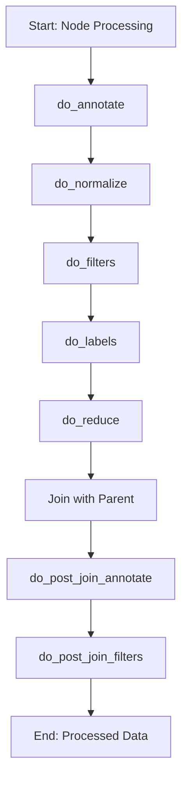
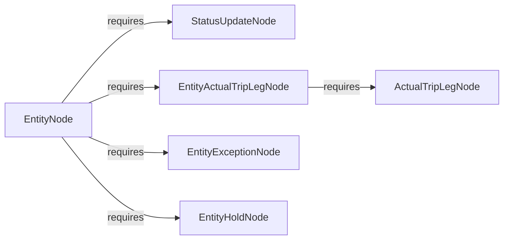

# Diagram: research/orchestrator/tasks/data_transforms/entity_features.py


> Auto-generated by Obscura crawlers

## Diagram 1

```mermaid
classDiagram
      class GraphReduceNode {
          +String prefix
          +String pk...
  └ 119 lines...

✗ read_bash
  Invalid shell ID: 0. Please supply a valid shell ID to read output from.

  <no active shell sessions>
```

> SVG rendering failed for this diagram.

## Diagram 2

```mermaid
classDiagram
    class GraphReduceNode {
        +String prefix
        +String pk
        +String date_key
        +do_annotate()
        +do_normalize()
        +do_filters()
        +do_labels(reduce_key)
        +do_reduce(reduce_key)
        +do_post_join_annotate()
        +do_post_join_filters()
    }
    
    class StatusUpdateNode {
        +prefix = "sup"
        +pk = "id"
        +date_key = "status_update_ts"
    }
    
    class EntityHoldNode {
        +prefix = "hold"
        +pk = "id"
        +date_key = "cleared_event_date"
        +do_filters()
        +do_reduce(reduce_key)
    }
    
    class EntityExceptionNode {
        +prefix = "exc"
        +pk = "id"
        +date_key = "cleared_receive_date"
        +do_filters()
        +do_reduce(reduce_key)
    }
    
    class ActualTripLegNode {
        +prefix = "atl"
        +pk = "id"
        +date_key = "ts"
        +do_filters()
    }
    
    class EntityActualTripLegNode {
        +prefix = "eatl"
        +pk = "id"
        +date_key = "ts"
        +do_reduce(reduce_key)
        +do_post_join_filters()
        +do_post_join_annotate()
    }
    
    class ActualTripStopNode {
        +pk = "id"
        +date_key = "arrived"
    }
    
    class PlannedTripLegNode {
        +prefix = "ptl"
        +pk = "id"
        +date_key = "ts"
    }
    
    class PlannedTripStopNode {
        +pk = "id"
        +date_key = "ts"
    }
    
    class EntityPlannedTripLegNode {
        +prefix = "eptl"
        +pk = "id"
        +date_key = "ts"
    }
    
    class EntityReferenceNode {
        +prefix = "er"
        +pk = "id"
        +date_key = "ts"
        +do_annotate()
        +do_reduce(reduce_key)
    }
    
    class EntityNode {
        +prefix = "ent"
        +pk = "id"
        +date_key = "trip_plan_complete_ts"
        +do_annotate()
        +do_post_join_annotate()
        +do_post_join_filters()
    }
    
    GraphReduceNode <|-- StatusUpdateNode
    GraphReduceNode <|-- EntityHoldNode
    GraphReduceNode <|-- EntityExceptionNode
    GraphReduceNode <|-- ActualTripLegNode
    GraphReduceNode <|-- EntityActualTripLegNode
    GraphReduceNode <|-- ActualTripStopNode
    GraphReduceNode <|-- PlannedTripLegNode
    GraphReduceNode <|-- PlannedTripStopNode
    GraphReduceNode <|-- EntityPlannedTripLegNode
    GraphReduceNode <|-- EntityReferenceNode
    GraphReduceNode <|-- EntityNode
```



### SVG

<svg id="container" width="3558.1484375" xmlns="http://www.w3.org/2000/svg" class="classDiagram" height="642" viewBox="0 0 3558.1484375 642" role="graphics-document document" aria-roledescription="class"><style>#container{font-family:"trebuchet ms",verdana,arial,sans-serif;font-size:16px;fill:#333;}@keyframes edge-animation-frame{from{stroke-dashoffset:0;}}@keyframes dash{to{stroke-dashoffset:0;}}#container .edge-animation-slow{stroke-dasharray:9,5!important;stroke-dashoffset:900;animation:dash 50s linear infinite;stroke-linecap:round;}#container .edge-animation-fast{stroke-dasharray:9,5!important;stroke-dashoffset:900;animation:dash 20s linear infinite;stroke-linecap:round;}#container .error-icon{fill:#552222;}#container .error-text{fill:#552222;stroke:#552222;}#container .edge-thickness-normal{stroke-width:1px;}#container .edge-thickness-thick{stroke-width:3.5px;}#container .edge-pattern-solid{stroke-dasharray:0;}#container .edge-thickness-invisible{stroke-width:0;fill:none;}#container .edge-pattern-dashed{stroke-dasharray:3;}#container .edge-pattern-dotted{stroke-dasharray:2;}#container .marker{fill:#333333;stroke:#333333;}#container .marker.cross{stroke:#333333;}#container svg{font-family:"trebuchet ms",verdana,arial,sans-serif;font-size:16px;}#container p{margin:0;}#container g.classGroup text{fill:#9370DB;stroke:none;font-family:"trebuchet ms",verdana,arial,sans-serif;font-size:10px;}#container g.classGroup text .title{font-weight:bolder;}#container .nodeLabel,#container .edgeLabel{color:#131300;}#container .edgeLabel .label rect{fill:#ECECFF;}#container .label text{fill:#131300;}#container .labelBkg{background:#ECECFF;}#container .edgeLabel .label span{background:#ECECFF;}#container .classTitle{font-weight:bolder;}#container .node rect,#container .node circle,#container .node ellipse,#container .node polygon,#container .node path{fill:#ECECFF;stroke:#9370DB;stroke-width:1px;}#container .divider{stroke:#9370DB;stroke-width:1;}#container g.clickable{cursor:pointer;}#container g.classGroup rect{fill:#ECECFF;stroke:#9370DB;}#container g.classGroup line{stroke:#9370DB;stroke-width:1;}#container .classLabel .box{stroke:none;stroke-width:0;fill:#ECECFF;opacity:0.5;}#container .classLabel .label{fill:#9370DB;font-size:10px;}#container .relation{stroke:#333333;stroke-width:1;fill:none;}#container .dashed-line{stroke-dasharray:3;}#container .dotted-line{stroke-dasharray:1 2;}#container #compositionStart,#container .composition{fill:#333333!important;stroke:#333333!important;stroke-width:1;}#container #compositionEnd,#container .composition{fill:#333333!important;stroke:#333333!important;stroke-width:1;}#container #dependencyStart,#container .dependency{fill:#333333!important;stroke:#333333!important;stroke-width:1;}#container #dependencyStart,#container .dependency{fill:#333333!important;stroke:#333333!important;stroke-width:1;}#container #extensionStart,#container .extension{fill:transparent!important;stroke:#333333!important;stroke-width:1;}#container #extensionEnd,#container .extension{fill:transparent!important;stroke:#333333!important;stroke-width:1;}#container #aggregationStart,#container .aggregation{fill:transparent!important;stroke:#333333!important;stroke-width:1;}#container #aggregationEnd,#container .aggregation{fill:transparent!important;stroke:#333333!important;stroke-width:1;}#container #lollipopStart,#container .lollipop{fill:#ECECFF!important;stroke:#333333!important;stroke-width:1;}#container #lollipopEnd,#container .lollipop{fill:#ECECFF!important;stroke:#333333!important;stroke-width:1;}#container .edgeTerminals{font-size:11px;line-height:initial;}#container .classTitleText{text-anchor:middle;font-size:18px;fill:#333;}#container .label-icon{display:inline-block;height:1em;overflow:visible;vertical-align:-0.125em;}#container .node .label-icon path{fill:currentColor;stroke:revert;stroke-width:revert;}#container :root{--mermaid-font-family:"trebuchet ms",verdana,arial,sans-serif;}</style><g><defs><marker id="container_class-aggregationStart" class="marker aggregation class" refX="18" refY="7" markerWidth="190" markerHeight="240" orient="auto"><path d="M 18,7 L9,13 L1,7 L9,1 Z"></path></marker></defs><defs><marker id="container_class-aggregationEnd" class="marker aggregation class" refX="1" refY="7" markerWidth="20" markerHeight="28" orient="auto"><path d="M 18,7 L9,13 L1,7 L9,1 Z"></path></marker></defs><defs><marker id="container_class-extensionStart" class="marker extension class" refX="18" refY="7" markerWidth="190" markerHeight="240" orient="auto"><path d="M 1,7 L18,13 V 1 Z"></path></marker></defs><defs><marker id="container_class-extensionEnd" class="marker extension class" refX="1" refY="7" markerWidth="20" markerHeight="28" orient="auto"><path d="M 1,1 V 13 L18,7 Z"></path></marker></defs><defs><marker id="container_class-compositionStart" class="marker composition class" refX="18" refY="7" markerWidth="190" markerHeight="240" orient="auto"><path d="M 18,7 L9,13 L1,7 L9,1 Z"></path></marker></defs><defs><marker id="container_class-compositionEnd" class="marker composition class" refX="1" refY="7" markerWidth="20" markerHeight="28" orient="auto"><path d="M 18,7 L9,13 L1,7 L9,1 Z"></path></marker></defs><defs><marker id="container_class-dependencyStart" class="marker dependency class" refX="6" refY="7" markerWidth="190" markerHeight="240" orient="auto"><path d="M 5,7 L9,13 L1,7 L9,1 Z"></path></marker></defs><defs><marker id="container_class-dependencyEnd" class="marker dependency class" refX="13" refY="7" markerWidth="20" markerHeight="28" orient="auto"><path d="M 18,7 L9,13 L14,7 L9,1 Z"></path></marker></defs><defs><marker id="container_class-lollipopStart" class="marker lollipop class" refX="13" refY="7" markerWidth="190" markerHeight="240" orient="auto"><circle stroke="black" fill="transparent" cx="7" cy="7" r="6"></circle></marker></defs><defs><marker id="container_class-lollipopEnd" class="marker lollipop class" refX="1" refY="7" markerWidth="190" markerHeight="240" orient="auto"><circle stroke="black" fill="transparent" cx="7" cy="7" r="6"></circle></marker></defs><g class="root"><g class="clusters"></g><g class="edgePaths"><path d="M1738.568,193.509L1476.765,222.758C1214.962,252.006,691.356,310.503,429.553,349.918C167.75,389.333,167.75,409.667,167.75,419.833L167.75,430" id="id_GraphReduceNode_StatusUpdateNode_1" class="edge-thickness-normal edge-pattern-solid relation" style=";;;" data-edge="true" data-et="edge" data-id="id_GraphReduceNode_StatusUpdateNode_1" data-points="W3sieCI6MTc1NS43MTA5Mzc1LCJ5IjoxOTEuNTk0MDE1NjE1NTY2NzJ9LHsieCI6MTY3Ljc1LCJ5IjozNjl9LHsieCI6MTY3Ljc1LCJ5Ijo0MzB9XQ==" marker-start="url(#container_class-extensionStart)"></path><path d="M1738.633,198.317L1538.944,226.764C1339.256,255.212,939.878,312.106,740.189,346.72C540.5,381.333,540.5,393.667,540.5,399.833L540.5,406" id="id_GraphReduceNode_EntityHoldNode_2" class="edge-thickness-normal edge-pattern-solid relation" style=";;;" data-edge="true" data-et="edge" data-id="id_GraphReduceNode_EntityHoldNode_2" data-points="W3sieCI6MTc1NS43MTA5Mzc1LCJ5IjoxOTUuODg0NDY0MDEyMzE3Mzh9LHsieCI6NTQwLjUsInkiOjM2OX0seyJ4Ijo1NDAuNSwieSI6NDA2fV0=" marker-start="url(#container_class-extensionStart)"></path><path d="M1738.797,207.334L1604.225,234.278C1469.653,261.223,1200.51,315.111,1065.939,348.222C931.367,381.333,931.367,393.667,931.367,399.833L931.367,406" id="id_GraphReduceNode_EntityExceptionNode_3" class="edge-thickness-normal edge-pattern-solid relation" style=";;;" data-edge="true" data-et="edge" data-id="id_GraphReduceNode_EntityExceptionNode_3" data-points="W3sieCI6MTc1NS43MTA5Mzc1LCJ5IjoyMDMuOTQ3NTE2ODY4Mjc1NX0seyJ4Ijo5MzEuMzY3MTg3NSwieSI6MzY5fSx7IngiOjkzMS4zNjcxODc1LCJ5Ijo0MDZ9XQ==" marker-start="url(#container_class-extensionStart)"></path><path d="M1739.214,223.684L1659.938,247.903C1580.663,272.123,1422.113,320.561,1342.838,352.947C1263.563,385.333,1263.563,401.667,1263.563,409.833L1263.563,418" id="id_GraphReduceNode_ActualTripLegNode_4" class="edge-thickness-normal edge-pattern-solid relation" style=";;;" data-edge="true" data-et="edge" data-id="id_GraphReduceNode_ActualTripLegNode_4" data-points="W3sieCI6MTc1NS43MTA5Mzc1LCJ5IjoyMTguNjQzNzExNzc4NzgyMjN9LHsieCI6MTI2My41NjI1LCJ5IjozNjl9LHsieCI6MTI2My41NjI1LCJ5Ijo0MTh9XQ==" marker-start="url(#container_class-extensionStart)"></path><path d="M1740.861,267.291L1712.185,284.242C1683.509,301.194,1626.157,335.097,1597.481,356.215C1568.805,377.333,1568.805,385.667,1568.805,389.833L1568.805,394" id="id_GraphReduceNode_EntityActualTripLegNode_5" class="edge-thickness-normal edge-pattern-solid relation" style=";;;" data-edge="true" data-et="edge" data-id="id_GraphReduceNode_EntityActualTripLegNode_5" data-points="W3sieCI6MTc1NS43MTA5Mzc1LCJ5IjoyNTguNTEyNDAxMTQzODAwNn0seyJ4IjoxNTY4LjgwNDY4NzUsInkiOjM2OX0seyJ4IjoxNTY4LjgwNDY4NzUsInkiOjM5NH1d" marker-start="url(#container_class-extensionStart)"></path><path d="M1895.293,361.25L1895.293,362.542C1895.293,363.833,1895.293,366.417,1895.293,379.875C1895.293,393.333,1895.293,417.667,1895.293,429.833L1895.293,442" id="id_GraphReduceNode_ActualTripStopNode_6" class="edge-thickness-normal edge-pattern-solid relation" style=";;;" data-edge="true" data-et="edge" data-id="id_GraphReduceNode_ActualTripStopNode_6" data-points="W3sieCI6MTg5NS4yOTI5Njg3NSwieSI6MzQ0fSx7IngiOjE4OTUuMjkyOTY4NzUsInkiOjM2OX0seyJ4IjoxODk1LjI5Mjk2ODc1LCJ5Ijo0NDJ9XQ==" marker-start="url(#container_class-extensionStart)"></path><path d="M2049.133,280.768L2070.726,295.473C2092.319,310.179,2135.505,339.589,2157.098,364.461C2178.691,389.333,2178.691,409.667,2178.691,419.833L2178.691,430" id="id_GraphReduceNode_PlannedTripLegNode_7" class="edge-thickness-normal edge-pattern-solid relation" style=";;;" data-edge="true" data-et="edge" data-id="id_GraphReduceNode_PlannedTripLegNode_7" data-points="W3sieCI6MjAzNC44NzUsInkiOjI3MS4wNTgxNTI5OTc5MzI0NH0seyJ4IjoyMTc4LjY5MTQwNjI1LCJ5IjozNjl9LHsieCI6MjE3OC42OTE0MDYyNSwieSI6NDMwfV0=" marker-start="url(#container_class-extensionStart)"></path><path d="M2051.156,230.578L2117.04,253.648C2182.924,276.719,2314.693,322.859,2380.577,358.096C2446.461,393.333,2446.461,417.667,2446.461,429.833L2446.461,442" id="id_GraphReduceNode_PlannedTripStopNode_8" class="edge-thickness-normal edge-pattern-solid relation" style=";;;" data-edge="true" data-et="edge" data-id="id_GraphReduceNode_PlannedTripStopNode_8" data-points="W3sieCI6MjAzNC44NzUsInkiOjIyNC44NzY4MDk4OTk0MzIzMn0seyJ4IjoyNDQ2LjQ2MDkzNzUsInkiOjM2OX0seyJ4IjoyNDQ2LjQ2MDkzNzUsInkiOjQ0Mn1d" marker-start="url(#container_class-extensionStart)"></path><path d="M2051.676,212.382L2163.875,238.485C2276.075,264.588,2500.473,316.794,2612.672,353.064C2724.871,389.333,2724.871,409.667,2724.871,419.833L2724.871,430" id="id_GraphReduceNode_EntityPlannedTripLegNode_9" class="edge-thickness-normal edge-pattern-solid relation" style=";;;" data-edge="true" data-et="edge" data-id="id_GraphReduceNode_EntityPlannedTripLegNode_9" data-points="W3sieCI6MjAzNC44NzUsInkiOjIwOC40NzM1MzIyOTIzOTI1OH0seyJ4IjoyNzI0Ljg3MTA5Mzc1LCJ5IjozNjl9LHsieCI6MjcyNC44NzEwOTM3NSwieSI6NDMwfV0=" marker-start="url(#container_class-extensionStart)"></path><path d="M2051.882,202.585L2215.25,230.321C2378.618,258.057,2705.354,313.528,2868.722,347.431C3032.09,381.333,3032.09,393.667,3032.09,399.833L3032.09,406" id="id_GraphReduceNode_EntityReferenceNode_10" class="edge-thickness-normal edge-pattern-solid relation" style=";;;" data-edge="true" data-et="edge" data-id="id_GraphReduceNode_EntityReferenceNode_10" data-points="W3sieCI6MjAzNC44NzUsInkiOjE5OS42OTc1Nzc0ODYwODM0NX0seyJ4IjozMDMyLjA4OTg0Mzc1LCJ5IjozNjl9LHsieCI6MzAzMi4wODk4NDM3NSwieSI6NDA2fV0=" marker-start="url(#container_class-extensionStart)"></path><path d="M2051.982,196.293L2274.234,225.078C2496.487,253.862,2940.991,311.431,3163.244,344.382C3385.496,377.333,3385.496,385.667,3385.496,389.833L3385.496,394" id="id_GraphReduceNode_EntityNode_11" class="edge-thickness-normal edge-pattern-solid relation" style=";;;" data-edge="true" data-et="edge" data-id="id_GraphReduceNode_EntityNode_11" data-points="W3sieCI6MjAzNC44NzUsInkiOjE5NC4wNzc2MjQxNzAzNjI3fSx7IngiOjMzODUuNDk2MDkzNzUsInkiOjM2OX0seyJ4IjozMzg1LjQ5NjA5Mzc1LCJ5IjozOTR9XQ==" marker-start="url(#container_class-extensionStart)"></path></g><g class="edgeLabels"><g class="edgeLabel"><g class="label" data-id="id_GraphReduceNode_StatusUpdateNode_1" transform="translate(0, 0)"><foreignObject width="0" height="0"><div xmlns="http://www.w3.org/1999/xhtml" class="labelBkg" style="display: table-cell; white-space: nowrap; line-height: 1.5; max-width: 200px; text-align: center;"><span class="edgeLabel"></span></div></foreignObject></g></g><g class="edgeLabel"><g class="label" data-id="id_GraphReduceNode_EntityHoldNode_2" transform="translate(0, 0)"><foreignObject width="0" height="0"><div xmlns="http://www.w3.org/1999/xhtml" class="labelBkg" style="display: table-cell; white-space: nowrap; line-height: 1.5; max-width: 200px; text-align: center;"><span class="edgeLabel"></span></div></foreignObject></g></g><g class="edgeLabel"><g class="label" data-id="id_GraphReduceNode_EntityExceptionNode_3" transform="translate(0, 0)"><foreignObject width="0" height="0"><div xmlns="http://www.w3.org/1999/xhtml" class="labelBkg" style="display: table-cell; white-space: nowrap; line-height: 1.5; max-width: 200px; text-align: center;"><span class="edgeLabel"></span></div></foreignObject></g></g><g class="edgeLabel"><g class="label" data-id="id_GraphReduceNode_ActualTripLegNode_4" transform="translate(0, 0)"><foreignObject width="0" height="0"><div xmlns="http://www.w3.org/1999/xhtml" class="labelBkg" style="display: table-cell; white-space: nowrap; line-height: 1.5; max-width: 200px; text-align: center;"><span class="edgeLabel"></span></div></foreignObject></g></g><g class="edgeLabel"><g class="label" data-id="id_GraphReduceNode_EntityActualTripLegNode_5" transform="translate(0, 0)"><foreignObject width="0" height="0"><div xmlns="http://www.w3.org/1999/xhtml" class="labelBkg" style="display: table-cell; white-space: nowrap; line-height: 1.5; max-width: 200px; text-align: center;"><span class="edgeLabel"></span></div></foreignObject></g></g><g class="edgeLabel"><g class="label" data-id="id_GraphReduceNode_ActualTripStopNode_6" transform="translate(0, 0)"><foreignObject width="0" height="0"><div xmlns="http://www.w3.org/1999/xhtml" class="labelBkg" style="display: table-cell; white-space: nowrap; line-height: 1.5; max-width: 200px; text-align: center;"><span class="edgeLabel"></span></div></foreignObject></g></g><g class="edgeLabel"><g class="label" data-id="id_GraphReduceNode_PlannedTripLegNode_7" transform="translate(0, 0)"><foreignObject width="0" height="0"><div xmlns="http://www.w3.org/1999/xhtml" class="labelBkg" style="display: table-cell; white-space: nowrap; line-height: 1.5; max-width: 200px; text-align: center;"><span class="edgeLabel"></span></div></foreignObject></g></g><g class="edgeLabel"><g class="label" data-id="id_GraphReduceNode_PlannedTripStopNode_8" transform="translate(0, 0)"><foreignObject width="0" height="0"><div xmlns="http://www.w3.org/1999/xhtml" class="labelBkg" style="display: table-cell; white-space: nowrap; line-height: 1.5; max-width: 200px; text-align: center;"><span class="edgeLabel"></span></div></foreignObject></g></g><g class="edgeLabel"><g class="label" data-id="id_GraphReduceNode_EntityPlannedTripLegNode_9" transform="translate(0, 0)"><foreignObject width="0" height="0"><div xmlns="http://www.w3.org/1999/xhtml" class="labelBkg" style="display: table-cell; white-space: nowrap; line-height: 1.5; max-width: 200px; text-align: center;"><span class="edgeLabel"></span></div></foreignObject></g></g><g class="edgeLabel"><g class="label" data-id="id_GraphReduceNode_EntityReferenceNode_10" transform="translate(0, 0)"><foreignObject width="0" height="0"><div xmlns="http://www.w3.org/1999/xhtml" class="labelBkg" style="display: table-cell; white-space: nowrap; line-height: 1.5; max-width: 200px; text-align: center;"><span class="edgeLabel"></span></div></foreignObject></g></g><g class="edgeLabel"><g class="label" data-id="id_GraphReduceNode_EntityNode_11" transform="translate(0, 0)"><foreignObject width="0" height="0"><div xmlns="http://www.w3.org/1999/xhtml" class="labelBkg" style="display: table-cell; white-space: nowrap; line-height: 1.5; max-width: 200px; text-align: center;"><span class="edgeLabel"></span></div></foreignObject></g></g></g><g class="nodes"><g class="node default" id="classId-GraphReduceNode-0" transform="translate(1895.29296875, 176)"><g class="basic label-container"><path d="M-139.58203125 -168 L139.58203125 -168 L139.58203125 168 L-139.58203125 168" stroke="none" stroke-width="0" fill="#ECECFF" style=""></path><path d="M-139.58203125 -168 C-32.1329901451806 -168, 75.3160509596388 -168, 139.58203125 -168 M-139.58203125 -168 C-73.22915440064484 -168, -6.876277551289689 -168, 139.58203125 -168 M139.58203125 -168 C139.58203125 -46.90936896514778, 139.58203125 74.18126206970445, 139.58203125 168 M139.58203125 -168 C139.58203125 -36.216310228485725, 139.58203125 95.56737954302855, 139.58203125 168 M139.58203125 168 C33.67371964853308 168, -72.23459195293384 168, -139.58203125 168 M139.58203125 168 C46.04177572545463 168, -47.498479799090745 168, -139.58203125 168 M-139.58203125 168 C-139.58203125 81.88136654963122, -139.58203125 -4.237266900737552, -139.58203125 -168 M-139.58203125 168 C-139.58203125 60.11545938036342, -139.58203125 -47.76908123927316, -139.58203125 -168" stroke="#9370DB" stroke-width="1.3" fill="none" stroke-dasharray="0 0" style=""></path></g><g class="annotation-group text" transform="translate(0, -144)"></g><g class="label-group text" transform="translate(-67.7578125, -144)"><g class="label" style="font-weight: bolder" transform="translate(0,-12)"><foreignObject width="135.515625" height="24"><div xmlns="http://www.w3.org/1999/xhtml" style="display: table-cell; white-space: nowrap; line-height: 1.5; max-width: 185px; text-align: center;"><span class="nodeLabel markdown-node-label" style=""><p>GraphReduceNode</p></span></div></foreignObject></g></g><g class="members-group text" transform="translate(-127.58203125, -96)"><g class="label" style="" transform="translate(0,-12)"><foreignObject width="95.359375" height="24"><div xmlns="http://www.w3.org/1999/xhtml" style="display: table-cell; white-space: nowrap; line-height: 1.5; max-width: 153px; text-align: center;"><span class="nodeLabel markdown-node-label" style=""><p>+String prefix</p></span></div></foreignObject></g><g class="label" style="" transform="translate(0,12)"><foreignObject width="72.171875" height="24"><div xmlns="http://www.w3.org/1999/xhtml" style="display: table-cell; white-space: nowrap; line-height: 1.5; max-width: 130px; text-align: center;"><span class="nodeLabel markdown-node-label" style=""><p>+String pk</p></span></div></foreignObject></g><g class="label" style="" transform="translate(0,36)"><foreignObject width="119.578125" height="24"><div xmlns="http://www.w3.org/1999/xhtml" style="display: table-cell; white-space: nowrap; line-height: 1.5; max-width: 177px; text-align: center;"><span class="nodeLabel markdown-node-label" style=""><p>+String date_key</p></span></div></foreignObject></g></g><g class="methods-group text" transform="translate(-127.58203125, 0)"><g class="label" style="" transform="translate(0,-12)"><foreignObject width="110.375" height="24"><div xmlns="http://www.w3.org/1999/xhtml" style="display: table-cell; white-space: nowrap; line-height: 1.5; max-width: 168px; text-align: center;"><span class="nodeLabel markdown-node-label" style=""><p>+do_annotate()</p></span></div></foreignObject></g><g class="label" style="" transform="translate(0,12)"><foreignObject width="117.21875" height="24"><div xmlns="http://www.w3.org/1999/xhtml" style="display: table-cell; white-space: nowrap; line-height: 1.5; max-width: 175px; text-align: center;"><span class="nodeLabel markdown-node-label" style=""><p>+do_normalize()</p></span></div></foreignObject></g><g class="label" style="" transform="translate(0,36)"><foreignObject width="86.5" height="24"><div xmlns="http://www.w3.org/1999/xhtml" style="display: table-cell; white-space: nowrap; line-height: 1.5; max-width: 144px; text-align: center;"><span class="nodeLabel markdown-node-label" style=""><p>+do_filters()</p></span></div></foreignObject></g><g class="label" style="" transform="translate(0,60)"><foreignObject width="170.734375" height="24"><div xmlns="http://www.w3.org/1999/xhtml" style="display: table-cell; white-space: nowrap; line-height: 1.5; max-width: 228px; text-align: center;"><span class="nodeLabel markdown-node-label" style=""><p>+do_labels(reduce_key)</p></span></div></foreignObject></g><g class="label" style="" transform="translate(0,84)"><foreignObject width="176.53125" height="24"><div xmlns="http://www.w3.org/1999/xhtml" style="display: table-cell; white-space: nowrap; line-height: 1.5; max-width: 234px; text-align: center;"><span class="nodeLabel markdown-node-label" style=""><p>+do_reduce(reduce_key)</p></span></div></foreignObject></g><g class="label" style="" transform="translate(0,108)"><foreignObject width="187.40625" height="24"><div xmlns="http://www.w3.org/1999/xhtml" style="display: table-cell; white-space: nowrap; line-height: 1.5; max-width: 245px; text-align: center;"><span class="nodeLabel markdown-node-label" style=""><p>+do_post_join_annotate()</p></span></div></foreignObject></g><g class="label" style="" transform="translate(0,132)"><foreignObject width="163.53125" height="24"><div xmlns="http://www.w3.org/1999/xhtml" style="display: table-cell; white-space: nowrap; line-height: 1.5; max-width: 221px; text-align: center;"><span class="nodeLabel markdown-node-label" style=""><p>+do_post_join_filters()</p></span></div></foreignObject></g></g><g class="divider" style=""><path d="M-139.58203125 -120 C-72.36752478872464 -120, -5.153018327449274 -120, 139.58203125 -120 M-139.58203125 -120 C-68.12924405311864 -120, 3.32354314376272 -120, 139.58203125 -120" stroke="#9370DB" stroke-width="1.3" fill="none" stroke-dasharray="0 0" style=""></path></g><g class="divider" style=""><path d="M-139.58203125 -24 C-42.409661370283075 -24, 54.76270850943385 -24, 139.58203125 -24 M-139.58203125 -24 C-52.76231731178801 -24, 34.05739662642398 -24, 139.58203125 -24" stroke="#9370DB" stroke-width="1.3" fill="none" stroke-dasharray="0 0" style=""></path></g></g><g class="node default" id="classId-StatusUpdateNode-1" transform="translate(167.75, 514)"><g class="basic label-container"><path d="M-159.75 -84 L159.75 -84 L159.75 84 L-159.75 84" stroke="none" stroke-width="0" fill="#ECECFF" style=""></path><path d="M-159.75 -84 C-88.4650844153169 -84, -17.18016883063379 -84, 159.75 -84 M-159.75 -84 C-83.03107861850197 -84, -6.31215723700393 -84, 159.75 -84 M159.75 -84 C159.75 -44.39198835633147, 159.75 -4.783976712662934, 159.75 84 M159.75 -84 C159.75 -20.024003577484756, 159.75 43.95199284503049, 159.75 84 M159.75 84 C83.63864417850127 84, 7.527288357002533 84, -159.75 84 M159.75 84 C67.78333145842477 84, -24.183337083150462 84, -159.75 84 M-159.75 84 C-159.75 38.46971263077863, -159.75 -7.060574738442739, -159.75 -84 M-159.75 84 C-159.75 16.856384510431994, -159.75 -50.28723097913601, -159.75 -84" stroke="#9370DB" stroke-width="1.3" fill="none" stroke-dasharray="0 0" style=""></path></g><g class="annotation-group text" transform="translate(0, -60)"></g><g class="label-group text" transform="translate(-69.203125, -60)"><g class="label" style="font-weight: bolder" transform="translate(0,-12)"><foreignObject width="138.40625" height="24"><div xmlns="http://www.w3.org/1999/xhtml" style="display: table-cell; white-space: nowrap; line-height: 1.5; max-width: 187px; text-align: center;"><span class="nodeLabel markdown-node-label" style=""><p>StatusUpdateNode</p></span></div></foreignObject></g></g><g class="members-group text" transform="translate(-147.75, -12)"><g class="label" style="" transform="translate(0,-12)"><foreignObject width="104.09375" height="24"><div xmlns="http://www.w3.org/1999/xhtml" style="display: table-cell; white-space: nowrap; line-height: 1.5; max-width: 161px; text-align: center;"><span class="nodeLabel markdown-node-label" style=""><p>+prefix = "sup"</p></span></div></foreignObject></g><g class="label" style="" transform="translate(0,12)"><foreignObject width="69.015625" height="24"><div xmlns="http://www.w3.org/1999/xhtml" style="display: table-cell; white-space: nowrap; line-height: 1.5; max-width: 126px; text-align: center;"><span class="nodeLabel markdown-node-label" style=""><p>+pk = "id"</p></span></div></foreignObject></g><g class="label" style="" transform="translate(0,36)"><foreignObject width="226.296875" height="24"><div xmlns="http://www.w3.org/1999/xhtml" style="display: table-cell; white-space: nowrap; line-height: 1.5; max-width: 284px; text-align: center;"><span class="nodeLabel markdown-node-label" style=""><p>+date_key = "status_update_ts"</p></span></div></foreignObject></g></g><g class="methods-group text" transform="translate(-147.75, 84)"></g><g class="divider" style=""><path d="M-159.75 -36 C-83.62105479309407 -36, -7.49210958618815 -36, 159.75 -36 M-159.75 -36 C-63.9025251867988 -36, 31.944949626402405 -36, 159.75 -36" stroke="#9370DB" stroke-width="1.3" fill="none" stroke-dasharray="0 0" style=""></path></g><g class="divider" style=""><path d="M-159.75 60 C-58.36047108104336 60, 43.029057837913285 60, 159.75 60 M-159.75 60 C-69.75798841148729 60, 20.23402317702542 60, 159.75 60" stroke="#9370DB" stroke-width="1.3" fill="none" stroke-dasharray="0 0" style=""></path></g></g><g class="node default" id="classId-EntityHoldNode-2" transform="translate(540.5, 514)"><g class="basic label-container"><path d="M-163 -108 L163 -108 L163 108 L-163 108" stroke="none" stroke-width="0" fill="#ECECFF" style=""></path><path d="M-163 -108 C-74.08533566118939 -108, 14.82932867762122 -108, 163 -108 M-163 -108 C-34.197420497239705 -108, 94.60515900552059 -108, 163 -108 M163 -108 C163 -28.28622703012411, 163 51.42754593975178, 163 108 M163 -108 C163 -48.37770366182779, 163 11.244592676344425, 163 108 M163 108 C55.569444381135284 108, -51.86111123772943 108, -163 108 M163 108 C54.11646932064083 108, -54.76706135871834 108, -163 108 M-163 108 C-163 48.14490672896071, -163 -11.710186542078574, -163 -108 M-163 108 C-163 55.09266929088097, -163 2.1853385817619397, -163 -108" stroke="#9370DB" stroke-width="1.3" fill="none" stroke-dasharray="0 0" style=""></path></g><g class="annotation-group text" transform="translate(0, -84)"></g><g class="label-group text" transform="translate(-57.609375, -84)"><g class="label" style="font-weight: bolder" transform="translate(0,-12)"><foreignObject width="115.21875" height="24"><div xmlns="http://www.w3.org/1999/xhtml" style="display: table-cell; white-space: nowrap; line-height: 1.5; max-width: 165px; text-align: center;"><span class="nodeLabel markdown-node-label" style=""><p>EntityHoldNode</p></span></div></foreignObject></g></g><g class="members-group text" transform="translate(-151, -36)"><g class="label" style="" transform="translate(0,-12)"><foreignObject width="111.015625" height="24"><div xmlns="http://www.w3.org/1999/xhtml" style="display: table-cell; white-space: nowrap; line-height: 1.5; max-width: 168px; text-align: center;"><span class="nodeLabel markdown-node-label" style=""><p>+prefix = "hold"</p></span></div></foreignObject></g><g class="label" style="" transform="translate(0,12)"><foreignObject width="69.015625" height="24"><div xmlns="http://www.w3.org/1999/xhtml" style="display: table-cell; white-space: nowrap; line-height: 1.5; max-width: 126px; text-align: center;"><span class="nodeLabel markdown-node-label" style=""><p>+pk = "id"</p></span></div></foreignObject></g><g class="label" style="" transform="translate(0,36)"><foreignObject width="244.390625" height="24"><div xmlns="http://www.w3.org/1999/xhtml" style="display: table-cell; white-space: nowrap; line-height: 1.5; max-width: 302px; text-align: center;"><span class="nodeLabel markdown-node-label" style=""><p>+date_key = "cleared_event_date"</p></span></div></foreignObject></g></g><g class="methods-group text" transform="translate(-151, 60)"><g class="label" style="" transform="translate(0,-12)"><foreignObject width="86.5" height="24"><div xmlns="http://www.w3.org/1999/xhtml" style="display: table-cell; white-space: nowrap; line-height: 1.5; max-width: 144px; text-align: center;"><span class="nodeLabel markdown-node-label" style=""><p>+do_filters()</p></span></div></foreignObject></g><g class="label" style="" transform="translate(0,12)"><foreignObject width="176.53125" height="24"><div xmlns="http://www.w3.org/1999/xhtml" style="display: table-cell; white-space: nowrap; line-height: 1.5; max-width: 234px; text-align: center;"><span class="nodeLabel markdown-node-label" style=""><p>+do_reduce(reduce_key)</p></span></div></foreignObject></g></g><g class="divider" style=""><path d="M-163 -60 C-85.06611334163848 -60, -7.1322266832769685 -60, 163 -60 M-163 -60 C-39.032441002161434 -60, 84.93511799567713 -60, 163 -60" stroke="#9370DB" stroke-width="1.3" fill="none" stroke-dasharray="0 0" style=""></path></g><g class="divider" style=""><path d="M-163 36 C-50.107771476684704 36, 62.78445704663059 36, 163 36 M-163 36 C-67.94558499595935 36, 27.1088300080813 36, 163 36" stroke="#9370DB" stroke-width="1.3" fill="none" stroke-dasharray="0 0" style=""></path></g></g><g class="node default" id="classId-EntityExceptionNode-3" transform="translate(931.3671875, 514)"><g class="basic label-container"><path d="M-177.8671875 -108 L177.8671875 -108 L177.8671875 108 L-177.8671875 108" stroke="none" stroke-width="0" fill="#ECECFF" style=""></path><path d="M-177.8671875 -108 C-66.82933453142584 -108, 44.208518437148314 -108, 177.8671875 -108 M-177.8671875 -108 C-105.2079843123653 -108, -32.548781124730596 -108, 177.8671875 -108 M177.8671875 -108 C177.8671875 -42.62869043324817, 177.8671875 22.742619133503666, 177.8671875 108 M177.8671875 -108 C177.8671875 -37.87109276272801, 177.8671875 32.25781447454398, 177.8671875 108 M177.8671875 108 C103.40117288117808 108, 28.93515826235617 108, -177.8671875 108 M177.8671875 108 C102.02309544148406 108, 26.17900338296812 108, -177.8671875 108 M-177.8671875 108 C-177.8671875 48.17005811288027, -177.8671875 -11.65988377423946, -177.8671875 -108 M-177.8671875 108 C-177.8671875 44.59091363999662, -177.8671875 -18.818172720006757, -177.8671875 -108" stroke="#9370DB" stroke-width="1.3" fill="none" stroke-dasharray="0 0" style=""></path></g><g class="annotation-group text" transform="translate(0, -84)"></g><g class="label-group text" transform="translate(-76.171875, -84)"><g class="label" style="font-weight: bolder" transform="translate(0,-12)"><foreignObject width="152.34375" height="24"><div xmlns="http://www.w3.org/1999/xhtml" style="display: table-cell; white-space: nowrap; line-height: 1.5; max-width: 201px; text-align: center;"><span class="nodeLabel markdown-node-label" style=""><p>EntityExceptionNode</p></span></div></foreignObject></g></g><g class="members-group text" transform="translate(-165.8671875, -36)"><g class="label" style="" transform="translate(0,-12)"><foreignObject width="101.796875" height="24"><div xmlns="http://www.w3.org/1999/xhtml" style="display: table-cell; white-space: nowrap; line-height: 1.5; max-width: 159px; text-align: center;"><span class="nodeLabel markdown-node-label" style=""><p>+prefix = "exc"</p></span></div></foreignObject></g><g class="label" style="" transform="translate(0,12)"><foreignObject width="69.015625" height="24"><div xmlns="http://www.w3.org/1999/xhtml" style="display: table-cell; white-space: nowrap; line-height: 1.5; max-width: 126px; text-align: center;"><span class="nodeLabel markdown-node-label" style=""><p>+pk = "id"</p></span></div></foreignObject></g><g class="label" style="" transform="translate(0,36)"><foreignObject width="255.5625" height="24"><div xmlns="http://www.w3.org/1999/xhtml" style="display: table-cell; white-space: nowrap; line-height: 1.5; max-width: 313px; text-align: center;"><span class="nodeLabel markdown-node-label" style=""><p>+date_key = "cleared_receive_date"</p></span></div></foreignObject></g></g><g class="methods-group text" transform="translate(-165.8671875, 60)"><g class="label" style="" transform="translate(0,-12)"><foreignObject width="86.5" height="24"><div xmlns="http://www.w3.org/1999/xhtml" style="display: table-cell; white-space: nowrap; line-height: 1.5; max-width: 144px; text-align: center;"><span class="nodeLabel markdown-node-label" style=""><p>+do_filters()</p></span></div></foreignObject></g><g class="label" style="" transform="translate(0,12)"><foreignObject width="176.53125" height="24"><div xmlns="http://www.w3.org/1999/xhtml" style="display: table-cell; white-space: nowrap; line-height: 1.5; max-width: 234px; text-align: center;"><span class="nodeLabel markdown-node-label" style=""><p>+do_reduce(reduce_key)</p></span></div></foreignObject></g></g><g class="divider" style=""><path d="M-177.8671875 -60 C-57.350308252965206 -60, 63.16657099406959 -60, 177.8671875 -60 M-177.8671875 -60 C-49.693276760223455 -60, 78.48063397955309 -60, 177.8671875 -60" stroke="#9370DB" stroke-width="1.3" fill="none" stroke-dasharray="0 0" style=""></path></g><g class="divider" style=""><path d="M-177.8671875 36 C-49.72802981696509 36, 78.41112786606982 36, 177.8671875 36 M-177.8671875 36 C-106.3534317134256 36, -34.839675926851214 36, 177.8671875 36" stroke="#9370DB" stroke-width="1.3" fill="none" stroke-dasharray="0 0" style=""></path></g></g><g class="node default" id="classId-ActualTripLegNode-4" transform="translate(1263.5625, 514)"><g class="basic label-container"><path d="M-104.328125 -96 L104.328125 -96 L104.328125 96 L-104.328125 96" stroke="none" stroke-width="0" fill="#ECECFF" style=""></path><path d="M-104.328125 -96 C-53.662046654892244 -96, -2.9959683097844874 -96, 104.328125 -96 M-104.328125 -96 C-61.10070770837629 -96, -17.87329041675258 -96, 104.328125 -96 M104.328125 -96 C104.328125 -21.91833329770337, 104.328125 52.16333340459326, 104.328125 96 M104.328125 -96 C104.328125 -24.711235759740674, 104.328125 46.57752848051865, 104.328125 96 M104.328125 96 C25.63355082020621 96, -53.06102335958758 96, -104.328125 96 M104.328125 96 C40.70195230936221 96, -22.924220381275575 96, -104.328125 96 M-104.328125 96 C-104.328125 21.127790971199403, -104.328125 -53.744418057601195, -104.328125 -96 M-104.328125 96 C-104.328125 48.27277630143283, -104.328125 0.545552602865655, -104.328125 -96" stroke="#9370DB" stroke-width="1.3" fill="none" stroke-dasharray="0 0" style=""></path></g><g class="annotation-group text" transform="translate(0, -72)"></g><g class="label-group text" transform="translate(-69.140625, -72)"><g class="label" style="font-weight: bolder" transform="translate(0,-12)"><foreignObject width="138.28125" height="24"><div xmlns="http://www.w3.org/1999/xhtml" style="display: table-cell; white-space: nowrap; line-height: 1.5; max-width: 186px; text-align: center;"><span class="nodeLabel markdown-node-label" style=""><p>ActualTripLegNode</p></span></div></foreignObject></g></g><g class="members-group text" transform="translate(-92.328125, -24)"><g class="label" style="" transform="translate(0,-12)"><foreignObject width="96.640625" height="24"><div xmlns="http://www.w3.org/1999/xhtml" style="display: table-cell; white-space: nowrap; line-height: 1.5; max-width: 154px; text-align: center;"><span class="nodeLabel markdown-node-label" style=""><p>+prefix = "atl"</p></span></div></foreignObject></g><g class="label" style="" transform="translate(0,12)"><foreignObject width="69.015625" height="24"><div xmlns="http://www.w3.org/1999/xhtml" style="display: table-cell; white-space: nowrap; line-height: 1.5; max-width: 126px; text-align: center;"><span class="nodeLabel markdown-node-label" style=""><p>+pk = "id"</p></span></div></foreignObject></g><g class="label" style="" transform="translate(0,36)"><foreignObject width="115.515625" height="24"><div xmlns="http://www.w3.org/1999/xhtml" style="display: table-cell; white-space: nowrap; line-height: 1.5; max-width: 173px; text-align: center;"><span class="nodeLabel markdown-node-label" style=""><p>+date_key = "ts"</p></span></div></foreignObject></g></g><g class="methods-group text" transform="translate(-92.328125, 72)"><g class="label" style="" transform="translate(0,-12)"><foreignObject width="86.5" height="24"><div xmlns="http://www.w3.org/1999/xhtml" style="display: table-cell; white-space: nowrap; line-height: 1.5; max-width: 144px; text-align: center;"><span class="nodeLabel markdown-node-label" style=""><p>+do_filters()</p></span></div></foreignObject></g></g><g class="divider" style=""><path d="M-104.328125 -48 C-22.246044165532666 -48, 59.83603666893467 -48, 104.328125 -48 M-104.328125 -48 C-51.94849117099114 -48, 0.4311426580177198 -48, 104.328125 -48" stroke="#9370DB" stroke-width="1.3" fill="none" stroke-dasharray="0 0" style=""></path></g><g class="divider" style=""><path d="M-104.328125 48 C-41.74057020625816 48, 20.846984587483675 48, 104.328125 48 M-104.328125 48 C-34.00546536856645 48, 36.317194262867105 48, 104.328125 48" stroke="#9370DB" stroke-width="1.3" fill="none" stroke-dasharray="0 0" style=""></path></g></g><g class="node default" id="classId-EntityActualTripLegNode-5" transform="translate(1568.8046875, 514)"><g class="basic label-container"><path d="M-150.9140625 -120 L150.9140625 -120 L150.9140625 120 L-150.9140625 120" stroke="none" stroke-width="0" fill="#ECECFF" style=""></path><path d="M-150.9140625 -120 C-60.717154611119085 -120, 29.47975327776183 -120, 150.9140625 -120 M-150.9140625 -120 C-57.2540225894096 -120, 36.4060173211808 -120, 150.9140625 -120 M150.9140625 -120 C150.9140625 -70.97430912060383, 150.9140625 -21.948618241207654, 150.9140625 120 M150.9140625 -120 C150.9140625 -67.59407730009056, 150.9140625 -15.188154600181136, 150.9140625 120 M150.9140625 120 C38.59781701094984 120, -73.71842847810032 120, -150.9140625 120 M150.9140625 120 C44.79162065867676 120, -61.330821182646474 120, -150.9140625 120 M-150.9140625 120 C-150.9140625 27.874290369908664, -150.9140625 -64.25141926018267, -150.9140625 -120 M-150.9140625 120 C-150.9140625 31.43427370814277, -150.9140625 -57.13145258371446, -150.9140625 -120" stroke="#9370DB" stroke-width="1.3" fill="none" stroke-dasharray="0 0" style=""></path></g><g class="annotation-group text" transform="translate(0, -96)"></g><g class="label-group text" transform="translate(-90.421875, -96)"><g class="label" style="font-weight: bolder" transform="translate(0,-12)"><foreignObject width="180.84375" height="24"><div xmlns="http://www.w3.org/1999/xhtml" style="display: table-cell; white-space: nowrap; line-height: 1.5; max-width: 228px; text-align: center;"><span class="nodeLabel markdown-node-label" style=""><p>EntityActualTripLegNode</p></span></div></foreignObject></g></g><g class="members-group text" transform="translate(-138.9140625, -48)"><g class="label" style="" transform="translate(0,-12)"><foreignObject width="105.28125" height="24"><div xmlns="http://www.w3.org/1999/xhtml" style="display: table-cell; white-space: nowrap; line-height: 1.5; max-width: 163px; text-align: center;"><span class="nodeLabel markdown-node-label" style=""><p>+prefix = "eatl"</p></span></div></foreignObject></g><g class="label" style="" transform="translate(0,12)"><foreignObject width="69.015625" height="24"><div xmlns="http://www.w3.org/1999/xhtml" style="display: table-cell; white-space: nowrap; line-height: 1.5; max-width: 126px; text-align: center;"><span class="nodeLabel markdown-node-label" style=""><p>+pk = "id"</p></span></div></foreignObject></g><g class="label" style="" transform="translate(0,36)"><foreignObject width="115.515625" height="24"><div xmlns="http://www.w3.org/1999/xhtml" style="display: table-cell; white-space: nowrap; line-height: 1.5; max-width: 173px; text-align: center;"><span class="nodeLabel markdown-node-label" style=""><p>+date_key = "ts"</p></span></div></foreignObject></g></g><g class="methods-group text" transform="translate(-138.9140625, 48)"><g class="label" style="" transform="translate(0,-12)"><foreignObject width="176.53125" height="24"><div xmlns="http://www.w3.org/1999/xhtml" style="display: table-cell; white-space: nowrap; line-height: 1.5; max-width: 234px; text-align: center;"><span class="nodeLabel markdown-node-label" style=""><p>+do_reduce(reduce_key)</p></span></div></foreignObject></g><g class="label" style="" transform="translate(0,12)"><foreignObject width="163.53125" height="24"><div xmlns="http://www.w3.org/1999/xhtml" style="display: table-cell; white-space: nowrap; line-height: 1.5; max-width: 221px; text-align: center;"><span class="nodeLabel markdown-node-label" style=""><p>+do_post_join_filters()</p></span></div></foreignObject></g><g class="label" style="" transform="translate(0,36)"><foreignObject width="187.40625" height="24"><div xmlns="http://www.w3.org/1999/xhtml" style="display: table-cell; white-space: nowrap; line-height: 1.5; max-width: 245px; text-align: center;"><span class="nodeLabel markdown-node-label" style=""><p>+do_post_join_annotate()</p></span></div></foreignObject></g></g><g class="divider" style=""><path d="M-150.9140625 -72 C-44.62419361012928 -72, 61.665675279741436 -72, 150.9140625 -72 M-150.9140625 -72 C-85.3922495098283 -72, -19.870436519656607 -72, 150.9140625 -72" stroke="#9370DB" stroke-width="1.3" fill="none" stroke-dasharray="0 0" style=""></path></g><g class="divider" style=""><path d="M-150.9140625 24 C-48.002686325527534 24, 54.90868984894493 24, 150.9140625 24 M-150.9140625 24 C-56.13064723927718 24, 38.65276802144564 24, 150.9140625 24" stroke="#9370DB" stroke-width="1.3" fill="none" stroke-dasharray="0 0" style=""></path></g></g><g class="node default" id="classId-ActualTripStopNode-6" transform="translate(1895.29296875, 514)"><g class="basic label-container"><path d="M-125.57421875 -72 L125.57421875 -72 L125.57421875 72 L-125.57421875 72" stroke="none" stroke-width="0" fill="#ECECFF" style=""></path><path d="M-125.57421875 -72 C-54.01806273496585 -72, 17.538093280068296 -72, 125.57421875 -72 M-125.57421875 -72 C-47.02791975667502 -72, 31.518379236649963 -72, 125.57421875 -72 M125.57421875 -72 C125.57421875 -19.64788102933249, 125.57421875 32.70423794133502, 125.57421875 72 M125.57421875 -72 C125.57421875 -36.03375142524955, 125.57421875 -0.06750285049909621, 125.57421875 72 M125.57421875 72 C46.89604118325214 72, -31.782136383495725 72, -125.57421875 72 M125.57421875 72 C52.54545330707978 72, -20.483312135840436 72, -125.57421875 72 M-125.57421875 72 C-125.57421875 26.06865201399812, -125.57421875 -19.862695972003763, -125.57421875 -72 M-125.57421875 72 C-125.57421875 33.85533032754249, -125.57421875 -4.289339344915021, -125.57421875 -72" stroke="#9370DB" stroke-width="1.3" fill="none" stroke-dasharray="0 0" style=""></path></g><g class="annotation-group text" transform="translate(0, -48)"></g><g class="label-group text" transform="translate(-73.3828125, -48)"><g class="label" style="font-weight: bolder" transform="translate(0,-12)"><foreignObject width="146.765625" height="24"><div xmlns="http://www.w3.org/1999/xhtml" style="display: table-cell; white-space: nowrap; line-height: 1.5; max-width: 195px; text-align: center;"><span class="nodeLabel markdown-node-label" style=""><p>ActualTripStopNode</p></span></div></foreignObject></g></g><g class="members-group text" transform="translate(-113.57421875, 0)"><g class="label" style="" transform="translate(0,-12)"><foreignObject width="69.015625" height="24"><div xmlns="http://www.w3.org/1999/xhtml" style="display: table-cell; white-space: nowrap; line-height: 1.5; max-width: 126px; text-align: center;"><span class="nodeLabel markdown-node-label" style=""><p>+pk = "id"</p></span></div></foreignObject></g><g class="label" style="" transform="translate(0,12)"><foreignObject width="153.765625" height="24"><div xmlns="http://www.w3.org/1999/xhtml" style="display: table-cell; white-space: nowrap; line-height: 1.5; max-width: 211px; text-align: center;"><span class="nodeLabel markdown-node-label" style=""><p>+date_key = "arrived"</p></span></div></foreignObject></g></g><g class="methods-group text" transform="translate(-113.57421875, 72)"></g><g class="divider" style=""><path d="M-125.57421875 -24 C-67.79566303750877 -24, -10.017107325017562 -24, 125.57421875 -24 M-125.57421875 -24 C-53.35312568839858 -24, 18.867967373202845 -24, 125.57421875 -24" stroke="#9370DB" stroke-width="1.3" fill="none" stroke-dasharray="0 0" style=""></path></g><g class="divider" style=""><path d="M-125.57421875 48 C-53.0661423706206 48, 19.441934008758807 48, 125.57421875 48 M-125.57421875 48 C-61.14124254785787 48, 3.2917336542842577 48, 125.57421875 48" stroke="#9370DB" stroke-width="1.3" fill="none" stroke-dasharray="0 0" style=""></path></g></g><g class="node default" id="classId-PlannedTripLegNode-7" transform="translate(2178.69140625, 514)"><g class="basic label-container"><path d="M-107.82421875 -84 L107.82421875 -84 L107.82421875 84 L-107.82421875 84" stroke="none" stroke-width="0" fill="#ECECFF" style=""></path><path d="M-107.82421875 -84 C-25.06205933945124 -84, 57.70010007109752 -84, 107.82421875 -84 M-107.82421875 -84 C-54.264306129611214 -84, -0.7043935092224274 -84, 107.82421875 -84 M107.82421875 -84 C107.82421875 -46.147578677265535, 107.82421875 -8.29515735453107, 107.82421875 84 M107.82421875 -84 C107.82421875 -24.749227336756043, 107.82421875 34.501545326487914, 107.82421875 84 M107.82421875 84 C40.995930351185024 84, -25.832358047629953 84, -107.82421875 84 M107.82421875 84 C24.272602775390993 84, -59.279013199218014 84, -107.82421875 84 M-107.82421875 84 C-107.82421875 50.02491978180436, -107.82421875 16.049839563608714, -107.82421875 -84 M-107.82421875 84 C-107.82421875 32.41444370471748, -107.82421875 -19.171112590565045, -107.82421875 -84" stroke="#9370DB" stroke-width="1.3" fill="none" stroke-dasharray="0 0" style=""></path></g><g class="annotation-group text" transform="translate(0, -60)"></g><g class="label-group text" transform="translate(-76.1328125, -60)"><g class="label" style="font-weight: bolder" transform="translate(0,-12)"><foreignObject width="152.265625" height="24"><div xmlns="http://www.w3.org/1999/xhtml" style="display: table-cell; white-space: nowrap; line-height: 1.5; max-width: 201px; text-align: center;"><span class="nodeLabel markdown-node-label" style=""><p>PlannedTripLegNode</p></span></div></foreignObject></g></g><g class="members-group text" transform="translate(-95.82421875, -12)"><g class="label" style="" transform="translate(0,-12)"><foreignObject width="97.6875" height="24"><div xmlns="http://www.w3.org/1999/xhtml" style="display: table-cell; white-space: nowrap; line-height: 1.5; max-width: 155px; text-align: center;"><span class="nodeLabel markdown-node-label" style=""><p>+prefix = "ptl"</p></span></div></foreignObject></g><g class="label" style="" transform="translate(0,12)"><foreignObject width="69.015625" height="24"><div xmlns="http://www.w3.org/1999/xhtml" style="display: table-cell; white-space: nowrap; line-height: 1.5; max-width: 126px; text-align: center;"><span class="nodeLabel markdown-node-label" style=""><p>+pk = "id"</p></span></div></foreignObject></g><g class="label" style="" transform="translate(0,36)"><foreignObject width="115.515625" height="24"><div xmlns="http://www.w3.org/1999/xhtml" style="display: table-cell; white-space: nowrap; line-height: 1.5; max-width: 173px; text-align: center;"><span class="nodeLabel markdown-node-label" style=""><p>+date_key = "ts"</p></span></div></foreignObject></g></g><g class="methods-group text" transform="translate(-95.82421875, 84)"></g><g class="divider" style=""><path d="M-107.82421875 -36 C-23.038159486012546 -36, 61.74789977797491 -36, 107.82421875 -36 M-107.82421875 -36 C-44.38639983595806 -36, 19.05141907808388 -36, 107.82421875 -36" stroke="#9370DB" stroke-width="1.3" fill="none" stroke-dasharray="0 0" style=""></path></g><g class="divider" style=""><path d="M-107.82421875 60 C-43.945152991631986 60, 19.93391276673603 60, 107.82421875 60 M-107.82421875 60 C-26.483661417649174 60, 54.85689591470165 60, 107.82421875 60" stroke="#9370DB" stroke-width="1.3" fill="none" stroke-dasharray="0 0" style=""></path></g></g><g class="node default" id="classId-PlannedTripStopNode-8" transform="translate(2446.4609375, 514)"><g class="basic label-container"><path d="M-109.9453125 -72 L109.9453125 -72 L109.9453125 72 L-109.9453125 72" stroke="none" stroke-width="0" fill="#ECECFF" style=""></path><path d="M-109.9453125 -72 C-28.34121530450065 -72, 53.2628818909987 -72, 109.9453125 -72 M-109.9453125 -72 C-62.69145645115271 -72, -15.43760040230542 -72, 109.9453125 -72 M109.9453125 -72 C109.9453125 -30.448038946794682, 109.9453125 11.103922106410636, 109.9453125 72 M109.9453125 -72 C109.9453125 -16.191558335720728, 109.9453125 39.616883328558544, 109.9453125 72 M109.9453125 72 C52.54883022401396 72, -4.8476520519720765 72, -109.9453125 72 M109.9453125 72 C43.30390414770514 72, -23.33750420458972 72, -109.9453125 72 M-109.9453125 72 C-109.9453125 41.82542369238151, -109.9453125 11.650847384763026, -109.9453125 -72 M-109.9453125 72 C-109.9453125 31.711421220393206, -109.9453125 -8.577157559213589, -109.9453125 -72" stroke="#9370DB" stroke-width="1.3" fill="none" stroke-dasharray="0 0" style=""></path></g><g class="annotation-group text" transform="translate(0, -48)"></g><g class="label-group text" transform="translate(-80.375, -48)"><g class="label" style="font-weight: bolder" transform="translate(0,-12)"><foreignObject width="160.75" height="24"><div xmlns="http://www.w3.org/1999/xhtml" style="display: table-cell; white-space: nowrap; line-height: 1.5; max-width: 209px; text-align: center;"><span class="nodeLabel markdown-node-label" style=""><p>PlannedTripStopNode</p></span></div></foreignObject></g></g><g class="members-group text" transform="translate(-97.9453125, 0)"><g class="label" style="" transform="translate(0,-12)"><foreignObject width="69.015625" height="24"><div xmlns="http://www.w3.org/1999/xhtml" style="display: table-cell; white-space: nowrap; line-height: 1.5; max-width: 126px; text-align: center;"><span class="nodeLabel markdown-node-label" style=""><p>+pk = "id"</p></span></div></foreignObject></g><g class="label" style="" transform="translate(0,12)"><foreignObject width="115.515625" height="24"><div xmlns="http://www.w3.org/1999/xhtml" style="display: table-cell; white-space: nowrap; line-height: 1.5; max-width: 173px; text-align: center;"><span class="nodeLabel markdown-node-label" style=""><p>+date_key = "ts"</p></span></div></foreignObject></g></g><g class="methods-group text" transform="translate(-97.9453125, 72)"></g><g class="divider" style=""><path d="M-109.9453125 -24 C-28.68624119751209 -24, 52.57283010497582 -24, 109.9453125 -24 M-109.9453125 -24 C-24.214900166548077 -24, 61.51551216690385 -24, 109.9453125 -24" stroke="#9370DB" stroke-width="1.3" fill="none" stroke-dasharray="0 0" style=""></path></g><g class="divider" style=""><path d="M-109.9453125 48 C-24.34915678805558 48, 61.24699892388884 48, 109.9453125 48 M-109.9453125 48 C-38.51768481559125 48, 32.909942868817495 48, 109.9453125 48" stroke="#9370DB" stroke-width="1.3" fill="none" stroke-dasharray="0 0" style=""></path></g></g><g class="node default" id="classId-EntityPlannedTripLegNode-9" transform="translate(2724.87109375, 514)"><g class="basic label-container"><path d="M-118.46484375 -84 L118.46484375 -84 L118.46484375 84 L-118.46484375 84" stroke="none" stroke-width="0" fill="#ECECFF" style=""></path><path d="M-118.46484375 -84 C-32.39291124385775 -84, 53.67902126228449 -84, 118.46484375 -84 M-118.46484375 -84 C-33.41946537930113 -84, 51.62591299139774 -84, 118.46484375 -84 M118.46484375 -84 C118.46484375 -39.147540656495345, 118.46484375 5.704918687009311, 118.46484375 84 M118.46484375 -84 C118.46484375 -43.89019743814907, 118.46484375 -3.7803948762981463, 118.46484375 84 M118.46484375 84 C61.61086355675412 84, 4.756883363508237 84, -118.46484375 84 M118.46484375 84 C27.446885635310892 84, -63.571072479378216 84, -118.46484375 84 M-118.46484375 84 C-118.46484375 31.068098613098826, -118.46484375 -21.863802773802348, -118.46484375 -84 M-118.46484375 84 C-118.46484375 48.16754491246032, -118.46484375 12.335089824920644, -118.46484375 -84" stroke="#9370DB" stroke-width="1.3" fill="none" stroke-dasharray="0 0" style=""></path></g><g class="annotation-group text" transform="translate(0, -60)"></g><g class="label-group text" transform="translate(-97.4140625, -60)"><g class="label" style="font-weight: bolder" transform="translate(0,-12)"><foreignObject width="194.828125" height="24"><div xmlns="http://www.w3.org/1999/xhtml" style="display: table-cell; white-space: nowrap; line-height: 1.5; max-width: 242px; text-align: center;"><span class="nodeLabel markdown-node-label" style=""><p>EntityPlannedTripLegNode</p></span></div></foreignObject></g></g><g class="members-group text" transform="translate(-106.46484375, -12)"><g class="label" style="" transform="translate(0,-12)"><foreignObject width="106.25" height="24"><div xmlns="http://www.w3.org/1999/xhtml" style="display: table-cell; white-space: nowrap; line-height: 1.5; max-width: 164px; text-align: center;"><span class="nodeLabel markdown-node-label" style=""><p>+prefix = "eptl"</p></span></div></foreignObject></g><g class="label" style="" transform="translate(0,12)"><foreignObject width="69.015625" height="24"><div xmlns="http://www.w3.org/1999/xhtml" style="display: table-cell; white-space: nowrap; line-height: 1.5; max-width: 126px; text-align: center;"><span class="nodeLabel markdown-node-label" style=""><p>+pk = "id"</p></span></div></foreignObject></g><g class="label" style="" transform="translate(0,36)"><foreignObject width="115.515625" height="24"><div xmlns="http://www.w3.org/1999/xhtml" style="display: table-cell; white-space: nowrap; line-height: 1.5; max-width: 173px; text-align: center;"><span class="nodeLabel markdown-node-label" style=""><p>+date_key = "ts"</p></span></div></foreignObject></g></g><g class="methods-group text" transform="translate(-106.46484375, 84)"></g><g class="divider" style=""><path d="M-118.46484375 -36 C-43.11352325949926 -36, 32.23779723100148 -36, 118.46484375 -36 M-118.46484375 -36 C-58.04118892577357 -36, 2.382465898452864 -36, 118.46484375 -36" stroke="#9370DB" stroke-width="1.3" fill="none" stroke-dasharray="0 0" style=""></path></g><g class="divider" style=""><path d="M-118.46484375 60 C-29.74723640845866 60, 58.97037093308268 60, 118.46484375 60 M-118.46484375 60 C-33.66877812488697 60, 51.12728750022606 60, 118.46484375 60" stroke="#9370DB" stroke-width="1.3" fill="none" stroke-dasharray="0 0" style=""></path></g></g><g class="node default" id="classId-EntityReferenceNode-10" transform="translate(3032.08984375, 514)"><g class="basic label-container"><path d="M-138.75390625 -108 L138.75390625 -108 L138.75390625 108 L-138.75390625 108" stroke="none" stroke-width="0" fill="#ECECFF" style=""></path><path d="M-138.75390625 -108 C-40.26245603183462 -108, 58.228994186330766 -108, 138.75390625 -108 M-138.75390625 -108 C-53.128185975199315 -108, 32.49753429960137 -108, 138.75390625 -108 M138.75390625 -108 C138.75390625 -35.46918996146309, 138.75390625 37.061620077073826, 138.75390625 108 M138.75390625 -108 C138.75390625 -58.852387881455876, 138.75390625 -9.704775762911751, 138.75390625 108 M138.75390625 108 C31.257309565318437 108, -76.23928711936313 108, -138.75390625 108 M138.75390625 108 C54.76266289280234 108, -29.22858046439532 108, -138.75390625 108 M-138.75390625 108 C-138.75390625 25.662640554418104, -138.75390625 -56.67471889116379, -138.75390625 -108 M-138.75390625 108 C-138.75390625 54.10213771681712, -138.75390625 0.20427543363423695, -138.75390625 -108" stroke="#9370DB" stroke-width="1.3" fill="none" stroke-dasharray="0 0" style=""></path></g><g class="annotation-group text" transform="translate(0, -84)"></g><g class="label-group text" transform="translate(-76.9765625, -84)"><g class="label" style="font-weight: bolder" transform="translate(0,-12)"><foreignObject width="153.953125" height="24"><div xmlns="http://www.w3.org/1999/xhtml" style="display: table-cell; white-space: nowrap; line-height: 1.5; max-width: 202px; text-align: center;"><span class="nodeLabel markdown-node-label" style=""><p>EntityReferenceNode</p></span></div></foreignObject></g></g><g class="members-group text" transform="translate(-126.75390625, -36)"><g class="label" style="" transform="translate(0,-12)"><foreignObject width="92.921875" height="24"><div xmlns="http://www.w3.org/1999/xhtml" style="display: table-cell; white-space: nowrap; line-height: 1.5; max-width: 150px; text-align: center;"><span class="nodeLabel markdown-node-label" style=""><p>+prefix = "er"</p></span></div></foreignObject></g><g class="label" style="" transform="translate(0,12)"><foreignObject width="69.015625" height="24"><div xmlns="http://www.w3.org/1999/xhtml" style="display: table-cell; white-space: nowrap; line-height: 1.5; max-width: 126px; text-align: center;"><span class="nodeLabel markdown-node-label" style=""><p>+pk = "id"</p></span></div></foreignObject></g><g class="label" style="" transform="translate(0,36)"><foreignObject width="115.515625" height="24"><div xmlns="http://www.w3.org/1999/xhtml" style="display: table-cell; white-space: nowrap; line-height: 1.5; max-width: 173px; text-align: center;"><span class="nodeLabel markdown-node-label" style=""><p>+date_key = "ts"</p></span></div></foreignObject></g></g><g class="methods-group text" transform="translate(-126.75390625, 60)"><g class="label" style="" transform="translate(0,-12)"><foreignObject width="110.375" height="24"><div xmlns="http://www.w3.org/1999/xhtml" style="display: table-cell; white-space: nowrap; line-height: 1.5; max-width: 168px; text-align: center;"><span class="nodeLabel markdown-node-label" style=""><p>+do_annotate()</p></span></div></foreignObject></g><g class="label" style="" transform="translate(0,12)"><foreignObject width="176.53125" height="24"><div xmlns="http://www.w3.org/1999/xhtml" style="display: table-cell; white-space: nowrap; line-height: 1.5; max-width: 234px; text-align: center;"><span class="nodeLabel markdown-node-label" style=""><p>+do_reduce(reduce_key)</p></span></div></foreignObject></g></g><g class="divider" style=""><path d="M-138.75390625 -60 C-72.95247579264935 -60, -7.151045335298704 -60, 138.75390625 -60 M-138.75390625 -60 C-55.25494434133715 -60, 28.2440175673257 -60, 138.75390625 -60" stroke="#9370DB" stroke-width="1.3" fill="none" stroke-dasharray="0 0" style=""></path></g><g class="divider" style=""><path d="M-138.75390625 36 C-29.803279305058638 36, 79.14734763988272 36, 138.75390625 36 M-138.75390625 36 C-30.53315024498029 36, 77.68760576003942 36, 138.75390625 36" stroke="#9370DB" stroke-width="1.3" fill="none" stroke-dasharray="0 0" style=""></path></g></g><g class="node default" id="classId-EntityNode-11" transform="translate(3385.49609375, 514)"><g class="basic label-container"><path d="M-164.65234375 -120 L164.65234375 -120 L164.65234375 120 L-164.65234375 120" stroke="none" stroke-width="0" fill="#ECECFF" style=""></path><path d="M-164.65234375 -120 C-39.604433461744776 -120, 85.44347682651045 -120, 164.65234375 -120 M-164.65234375 -120 C-68.97959350425589 -120, 26.693156741488224 -120, 164.65234375 -120 M164.65234375 -120 C164.65234375 -36.04173088443032, 164.65234375 47.916538231139356, 164.65234375 120 M164.65234375 -120 C164.65234375 -45.419878217694134, 164.65234375 29.160243564611733, 164.65234375 120 M164.65234375 120 C50.6984249797552 120, -63.255493790489595 120, -164.65234375 120 M164.65234375 120 C41.35225077857223 120, -81.94784219285555 120, -164.65234375 120 M-164.65234375 120 C-164.65234375 29.266849059941052, -164.65234375 -61.466301880117896, -164.65234375 -120 M-164.65234375 120 C-164.65234375 41.41691461329442, -164.65234375 -37.16617077341115, -164.65234375 -120" stroke="#9370DB" stroke-width="1.3" fill="none" stroke-dasharray="0 0" style=""></path></g><g class="annotation-group text" transform="translate(0, -96)"></g><g class="label-group text" transform="translate(-40.4765625, -96)"><g class="label" style="font-weight: bolder" transform="translate(0,-12)"><foreignObject width="80.953125" height="24"><div xmlns="http://www.w3.org/1999/xhtml" style="display: table-cell; white-space: nowrap; line-height: 1.5; max-width: 130px; text-align: center;"><span class="nodeLabel markdown-node-label" style=""><p>EntityNode</p></span></div></foreignObject></g></g><g class="members-group text" transform="translate(-152.65234375, -48)"><g class="label" style="" transform="translate(0,-12)"><foreignObject width="101.59375" height="24"><div xmlns="http://www.w3.org/1999/xhtml" style="display: table-cell; white-space: nowrap; line-height: 1.5; max-width: 159px; text-align: center;"><span class="nodeLabel markdown-node-label" style=""><p>+prefix = "ent"</p></span></div></foreignObject></g><g class="label" style="" transform="translate(0,12)"><foreignObject width="69.015625" height="24"><div xmlns="http://www.w3.org/1999/xhtml" style="display: table-cell; white-space: nowrap; line-height: 1.5; max-width: 126px; text-align: center;"><span class="nodeLabel markdown-node-label" style=""><p>+pk = "id"</p></span></div></foreignObject></g><g class="label" style="" transform="translate(0,36)"><foreignObject width="264.828125" height="24"><div xmlns="http://www.w3.org/1999/xhtml" style="display: table-cell; white-space: nowrap; line-height: 1.5; max-width: 322px; text-align: center;"><span class="nodeLabel markdown-node-label" style=""><p>+date_key = "trip_plan_complete_ts"</p></span></div></foreignObject></g></g><g class="methods-group text" transform="translate(-152.65234375, 48)"><g class="label" style="" transform="translate(0,-12)"><foreignObject width="110.375" height="24"><div xmlns="http://www.w3.org/1999/xhtml" style="display: table-cell; white-space: nowrap; line-height: 1.5; max-width: 168px; text-align: center;"><span class="nodeLabel markdown-node-label" style=""><p>+do_annotate()</p></span></div></foreignObject></g><g class="label" style="" transform="translate(0,12)"><foreignObject width="187.40625" height="24"><div xmlns="http://www.w3.org/1999/xhtml" style="display: table-cell; white-space: nowrap; line-height: 1.5; max-width: 245px; text-align: center;"><span class="nodeLabel markdown-node-label" style=""><p>+do_post_join_annotate()</p></span></div></foreignObject></g><g class="label" style="" transform="translate(0,36)"><foreignObject width="163.53125" height="24"><div xmlns="http://www.w3.org/1999/xhtml" style="display: table-cell; white-space: nowrap; line-height: 1.5; max-width: 221px; text-align: center;"><span class="nodeLabel markdown-node-label" style=""><p>+do_post_join_filters()</p></span></div></foreignObject></g></g><g class="divider" style=""><path d="M-164.65234375 -72 C-44.521231537344136 -72, 75.60988067531173 -72, 164.65234375 -72 M-164.65234375 -72 C-74.14327060945251 -72, 16.36580253109497 -72, 164.65234375 -72" stroke="#9370DB" stroke-width="1.3" fill="none" stroke-dasharray="0 0" style=""></path></g><g class="divider" style=""><path d="M-164.65234375 24 C-33.79518430951262 24, 97.06197513097476 24, 164.65234375 24 M-164.65234375 24 C-56.51638556468262 24, 51.619572620634756 24, 164.65234375 24" stroke="#9370DB" stroke-width="1.3" fill="none" stroke-dasharray="0 0" style=""></path></g></g></g></g></g></svg>

## Diagram 3



### SVG

<svg id="container" width="245.046875" xmlns="http://www.w3.org/2000/svg" class="flowchart" height="1006" viewBox="0 0 245.046875 1006" role="graphics-document document" aria-roledescription="flowchart-v2"><style>#container{font-family:"trebuchet ms",verdana,arial,sans-serif;font-size:16px;fill:#333;}@keyframes edge-animation-frame{from{stroke-dashoffset:0;}}@keyframes dash{to{stroke-dashoffset:0;}}#container .edge-animation-slow{stroke-dasharray:9,5!important;stroke-dashoffset:900;animation:dash 50s linear infinite;stroke-linecap:round;}#container .edge-animation-fast{stroke-dasharray:9,5!important;stroke-dashoffset:900;animation:dash 20s linear infinite;stroke-linecap:round;}#container .error-icon{fill:#552222;}#container .error-text{fill:#552222;stroke:#552222;}#container .edge-thickness-normal{stroke-width:1px;}#container .edge-thickness-thick{stroke-width:3.5px;}#container .edge-pattern-solid{stroke-dasharray:0;}#container .edge-thickness-invisible{stroke-width:0;fill:none;}#container .edge-pattern-dashed{stroke-dasharray:3;}#container .edge-pattern-dotted{stroke-dasharray:2;}#container .marker{fill:#333333;stroke:#333333;}#container .marker.cross{stroke:#333333;}#container svg{font-family:"trebuchet ms",verdana,arial,sans-serif;font-size:16px;}#container p{margin:0;}#container .label{font-family:"trebuchet ms",verdana,arial,sans-serif;color:#333;}#container .cluster-label text{fill:#333;}#container .cluster-label span{color:#333;}#container .cluster-label span p{background-color:transparent;}#container .label text,#container span{fill:#333;color:#333;}#container .node rect,#container .node circle,#container .node ellipse,#container .node polygon,#container .node path{fill:#ECECFF;stroke:#9370DB;stroke-width:1px;}#container .rough-node .label text,#container .node .label text,#container .image-shape .label,#container .icon-shape .label{text-anchor:middle;}#container .node .katex path{fill:#000;stroke:#000;stroke-width:1px;}#container .rough-node .label,#container .node .label,#container .image-shape .label,#container .icon-shape .label{text-align:center;}#container .node.clickable{cursor:pointer;}#container .root .anchor path{fill:#333333!important;stroke-width:0;stroke:#333333;}#container .arrowheadPath{fill:#333333;}#container .edgePath .path{stroke:#333333;stroke-width:2.0px;}#container .flowchart-link{stroke:#333333;fill:none;}#container .edgeLabel{background-color:rgba(232,232,232, 0.8);text-align:center;}#container .edgeLabel p{background-color:rgba(232,232,232, 0.8);}#container .edgeLabel rect{opacity:0.5;background-color:rgba(232,232,232, 0.8);fill:rgba(232,232,232, 0.8);}#container .labelBkg{background-color:rgba(232, 232, 232, 0.5);}#container .cluster rect{fill:#ffffde;stroke:#aaaa33;stroke-width:1px;}#container .cluster text{fill:#333;}#container .cluster span{color:#333;}#container div.mermaidTooltip{position:absolute;text-align:center;max-width:200px;padding:2px;font-family:"trebuchet ms",verdana,arial,sans-serif;font-size:12px;background:hsl(80, 100%, 96.2745098039%);border:1px solid #aaaa33;border-radius:2px;pointer-events:none;z-index:100;}#container .flowchartTitleText{text-anchor:middle;font-size:18px;fill:#333;}#container rect.text{fill:none;stroke-width:0;}#container .icon-shape,#container .image-shape{background-color:rgba(232,232,232, 0.8);text-align:center;}#container .icon-shape p,#container .image-shape p{background-color:rgba(232,232,232, 0.8);padding:2px;}#container .icon-shape rect,#container .image-shape rect{opacity:0.5;background-color:rgba(232,232,232, 0.8);fill:rgba(232,232,232, 0.8);}#container .label-icon{display:inline-block;height:1em;overflow:visible;vertical-align:-0.125em;}#container .node .label-icon path{fill:currentColor;stroke:revert;stroke-width:revert;}#container :root{--mermaid-font-family:"trebuchet ms",verdana,arial,sans-serif;}</style><g><marker id="container_flowchart-v2-pointEnd" class="marker flowchart-v2" viewBox="0 0 10 10" refX="5" refY="5" markerUnits="userSpaceOnUse" markerWidth="8" markerHeight="8" orient="auto"><path d="M 0 0 L 10 5 L 0 10 z" class="arrowMarkerPath" style="stroke-width: 1; stroke-dasharray: 1, 0;"></path></marker><marker id="container_flowchart-v2-pointStart" class="marker flowchart-v2" viewBox="0 0 10 10" refX="4.5" refY="5" markerUnits="userSpaceOnUse" markerWidth="8" markerHeight="8" orient="auto"><path d="M 0 5 L 10 10 L 10 0 z" class="arrowMarkerPath" style="stroke-width: 1; stroke-dasharray: 1, 0;"></path></marker><marker id="container_flowchart-v2-circleEnd" class="marker flowchart-v2" viewBox="0 0 10 10" refX="11" refY="5" markerUnits="userSpaceOnUse" markerWidth="11" markerHeight="11" orient="auto"><circle cx="5" cy="5" r="5" class="arrowMarkerPath" style="stroke-width: 1; stroke-dasharray: 1, 0;"></circle></marker><marker id="container_flowchart-v2-circleStart" class="marker flowchart-v2" viewBox="0 0 10 10" refX="-1" refY="5" markerUnits="userSpaceOnUse" markerWidth="11" markerHeight="11" orient="auto"><circle cx="5" cy="5" r="5" class="arrowMarkerPath" style="stroke-width: 1; stroke-dasharray: 1, 0;"></circle></marker><marker id="container_flowchart-v2-crossEnd" class="marker cross flowchart-v2" viewBox="0 0 11 11" refX="12" refY="5.2" markerUnits="userSpaceOnUse" markerWidth="11" markerHeight="11" orient="auto"><path d="M 1,1 l 9,9 M 10,1 l -9,9" class="arrowMarkerPath" style="stroke-width: 2; stroke-dasharray: 1, 0;"></path></marker><marker id="container_flowchart-v2-crossStart" class="marker cross flowchart-v2" viewBox="0 0 11 11" refX="-1" refY="5.2" markerUnits="userSpaceOnUse" markerWidth="11" markerHeight="11" orient="auto"><path d="M 1,1 l 9,9 M 10,1 l -9,9" class="arrowMarkerPath" style="stroke-width: 2; stroke-dasharray: 1, 0;"></path></marker><g class="root"><g class="clusters"></g><g class="edgePaths"><path d="M122.523,62L122.523,66.167C122.523,70.333,122.523,78.667,122.523,86.333C122.523,94,122.523,101,122.523,104.5L122.523,108" id="L_A_B_0" class="edge-thickness-normal edge-pattern-solid edge-thickness-normal edge-pattern-solid flowchart-link" style=";" data-edge="true" data-et="edge" data-id="L_A_B_0" data-points="W3sieCI6MTIyLjUyMzQzNzUsInkiOjYyfSx7IngiOjEyMi41MjM0Mzc1LCJ5Ijo4N30seyJ4IjoxMjIuNTIzNDM3NSwieSI6MTEyfV0=" marker-end="url(#container_flowchart-v2-pointEnd)"></path><path d="M122.523,166L122.523,170.167C122.523,174.333,122.523,182.667,122.523,190.333C122.523,198,122.523,205,122.523,208.5L122.523,212" id="L_B_C_0" class="edge-thickness-normal edge-pattern-solid edge-thickness-normal edge-pattern-solid flowchart-link" style=";" data-edge="true" data-et="edge" data-id="L_B_C_0" data-points="W3sieCI6MTIyLjUyMzQzNzUsInkiOjE2Nn0seyJ4IjoxMjIuNTIzNDM3NSwieSI6MTkxfSx7IngiOjEyMi41MjM0Mzc1LCJ5IjoyMTZ9XQ==" marker-end="url(#container_flowchart-v2-pointEnd)"></path><path d="M122.523,270L122.523,274.167C122.523,278.333,122.523,286.667,122.523,294.333C122.523,302,122.523,309,122.523,312.5L122.523,316" id="L_C_D_0" class="edge-thickness-normal edge-pattern-solid edge-thickness-normal edge-pattern-solid flowchart-link" style=";" data-edge="true" data-et="edge" data-id="L_C_D_0" data-points="W3sieCI6MTIyLjUyMzQzNzUsInkiOjI3MH0seyJ4IjoxMjIuNTIzNDM3NSwieSI6Mjk1fSx7IngiOjEyMi41MjM0Mzc1LCJ5IjozMjB9XQ==" marker-end="url(#container_flowchart-v2-pointEnd)"></path><path d="M122.523,374L122.523,378.167C122.523,382.333,122.523,390.667,122.523,398.333C122.523,406,122.523,413,122.523,416.5L122.523,420" id="L_D_E_0" class="edge-thickness-normal edge-pattern-solid edge-thickness-normal edge-pattern-solid flowchart-link" style=";" data-edge="true" data-et="edge" data-id="L_D_E_0" data-points="W3sieCI6MTIyLjUyMzQzNzUsInkiOjM3NH0seyJ4IjoxMjIuNTIzNDM3NSwieSI6Mzk5fSx7IngiOjEyMi41MjM0Mzc1LCJ5Ijo0MjR9XQ==" marker-end="url(#container_flowchart-v2-pointEnd)"></path><path d="M122.523,478L122.523,482.167C122.523,486.333,122.523,494.667,122.523,502.333C122.523,510,122.523,517,122.523,520.5L122.523,524" id="L_E_F_0" class="edge-thickness-normal edge-pattern-solid edge-thickness-normal edge-pattern-solid flowchart-link" style=";" data-edge="true" data-et="edge" data-id="L_E_F_0" data-points="W3sieCI6MTIyLjUyMzQzNzUsInkiOjQ3OH0seyJ4IjoxMjIuNTIzNDM3NSwieSI6NTAzfSx7IngiOjEyMi41MjM0Mzc1LCJ5Ijo1Mjh9XQ==" marker-end="url(#container_flowchart-v2-pointEnd)"></path><path d="M122.523,582L122.523,586.167C122.523,590.333,122.523,598.667,122.523,606.333C122.523,614,122.523,621,122.523,624.5L122.523,628" id="L_F_G_0" class="edge-thickness-normal edge-pattern-solid edge-thickness-normal edge-pattern-solid flowchart-link" style=";" data-edge="true" data-et="edge" data-id="L_F_G_0" data-points="W3sieCI6MTIyLjUyMzQzNzUsInkiOjU4Mn0seyJ4IjoxMjIuNTIzNDM3NSwieSI6NjA3fSx7IngiOjEyMi41MjM0Mzc1LCJ5Ijo2MzJ9XQ==" marker-end="url(#container_flowchart-v2-pointEnd)"></path><path d="M122.523,686L122.523,690.167C122.523,694.333,122.523,702.667,122.523,710.333C122.523,718,122.523,725,122.523,728.5L122.523,732" id="L_G_H_0" class="edge-thickness-normal edge-pattern-solid edge-thickness-normal edge-pattern-solid flowchart-link" style=";" data-edge="true" data-et="edge" data-id="L_G_H_0" data-points="W3sieCI6MTIyLjUyMzQzNzUsInkiOjY4Nn0seyJ4IjoxMjIuNTIzNDM3NSwieSI6NzExfSx7IngiOjEyMi41MjM0Mzc1LCJ5Ijo3MzZ9XQ==" marker-end="url(#container_flowchart-v2-pointEnd)"></path><path d="M122.523,790L122.523,794.167C122.523,798.333,122.523,806.667,122.523,814.333C122.523,822,122.523,829,122.523,832.5L122.523,836" id="L_H_I_0" class="edge-thickness-normal edge-pattern-solid edge-thickness-normal edge-pattern-solid flowchart-link" style=";" data-edge="true" data-et="edge" data-id="L_H_I_0" data-points="W3sieCI6MTIyLjUyMzQzNzUsInkiOjc5MH0seyJ4IjoxMjIuNTIzNDM3NSwieSI6ODE1fSx7IngiOjEyMi41MjM0Mzc1LCJ5Ijo4NDB9XQ==" marker-end="url(#container_flowchart-v2-pointEnd)"></path><path d="M122.523,894L122.523,898.167C122.523,902.333,122.523,910.667,122.523,918.333C122.523,926,122.523,933,122.523,936.5L122.523,940" id="L_I_J_0" class="edge-thickness-normal edge-pattern-solid edge-thickness-normal edge-pattern-solid flowchart-link" style=";" data-edge="true" data-et="edge" data-id="L_I_J_0" data-points="W3sieCI6MTIyLjUyMzQzNzUsInkiOjg5NH0seyJ4IjoxMjIuNTIzNDM3NSwieSI6OTE5fSx7IngiOjEyMi41MjM0Mzc1LCJ5Ijo5NDR9XQ==" marker-end="url(#container_flowchart-v2-pointEnd)"></path></g><g class="edgeLabels"><g class="edgeLabel"><g class="label" data-id="L_A_B_0" transform="translate(0, 0)"><foreignObject width="0" height="0"><div xmlns="http://www.w3.org/1999/xhtml" class="labelBkg" style="display: table-cell; white-space: nowrap; line-height: 1.5; max-width: 200px; text-align: center;"><span class="edgeLabel"></span></div></foreignObject></g></g><g class="edgeLabel"><g class="label" data-id="L_B_C_0" transform="translate(0, 0)"><foreignObject width="0" height="0"><div xmlns="http://www.w3.org/1999/xhtml" class="labelBkg" style="display: table-cell; white-space: nowrap; line-height: 1.5; max-width: 200px; text-align: center;"><span class="edgeLabel"></span></div></foreignObject></g></g><g class="edgeLabel"><g class="label" data-id="L_C_D_0" transform="translate(0, 0)"><foreignObject width="0" height="0"><div xmlns="http://www.w3.org/1999/xhtml" class="labelBkg" style="display: table-cell; white-space: nowrap; line-height: 1.5; max-width: 200px; text-align: center;"><span class="edgeLabel"></span></div></foreignObject></g></g><g class="edgeLabel"><g class="label" data-id="L_D_E_0" transform="translate(0, 0)"><foreignObject width="0" height="0"><div xmlns="http://www.w3.org/1999/xhtml" class="labelBkg" style="display: table-cell; white-space: nowrap; line-height: 1.5; max-width: 200px; text-align: center;"><span class="edgeLabel"></span></div></foreignObject></g></g><g class="edgeLabel"><g class="label" data-id="L_E_F_0" transform="translate(0, 0)"><foreignObject width="0" height="0"><div xmlns="http://www.w3.org/1999/xhtml" class="labelBkg" style="display: table-cell; white-space: nowrap; line-height: 1.5; max-width: 200px; text-align: center;"><span class="edgeLabel"></span></div></foreignObject></g></g><g class="edgeLabel"><g class="label" data-id="L_F_G_0" transform="translate(0, 0)"><foreignObject width="0" height="0"><div xmlns="http://www.w3.org/1999/xhtml" class="labelBkg" style="display: table-cell; white-space: nowrap; line-height: 1.5; max-width: 200px; text-align: center;"><span class="edgeLabel"></span></div></foreignObject></g></g><g class="edgeLabel"><g class="label" data-id="L_G_H_0" transform="translate(0, 0)"><foreignObject width="0" height="0"><div xmlns="http://www.w3.org/1999/xhtml" class="labelBkg" style="display: table-cell; white-space: nowrap; line-height: 1.5; max-width: 200px; text-align: center;"><span class="edgeLabel"></span></div></foreignObject></g></g><g class="edgeLabel"><g class="label" data-id="L_H_I_0" transform="translate(0, 0)"><foreignObject width="0" height="0"><div xmlns="http://www.w3.org/1999/xhtml" class="labelBkg" style="display: table-cell; white-space: nowrap; line-height: 1.5; max-width: 200px; text-align: center;"><span class="edgeLabel"></span></div></foreignObject></g></g><g class="edgeLabel"><g class="label" data-id="L_I_J_0" transform="translate(0, 0)"><foreignObject width="0" height="0"><div xmlns="http://www.w3.org/1999/xhtml" class="labelBkg" style="display: table-cell; white-space: nowrap; line-height: 1.5; max-width: 200px; text-align: center;"><span class="edgeLabel"></span></div></foreignObject></g></g></g><g class="nodes"><g class="node default" id="flowchart-A-0" transform="translate(122.5234375, 35)"><rect class="basic label-container" style="" x="-111.5234375" y="-27" width="223.046875" height="54"></rect><g class="label" style="" transform="translate(-81.5234375, -12)"><rect></rect><foreignObject width="163.046875" height="24"><div xmlns="http://www.w3.org/1999/xhtml" style="display: table-cell; white-space: nowrap; line-height: 1.5; max-width: 200px; text-align: center;"><span class="nodeLabel"><p>Start: Node Processing</p></span></div></foreignObject></g></g><g class="node default" id="flowchart-B-1" transform="translate(122.5234375, 139)"><rect class="basic label-container" style="" x="-76.015625" y="-27" width="152.03125" height="54"></rect><g class="label" style="" transform="translate(-46.015625, -12)"><rect></rect><foreignObject width="92.03125" height="24"><div xmlns="http://www.w3.org/1999/xhtml" style="display: table-cell; white-space: nowrap; line-height: 1.5; max-width: 200px; text-align: center;"><span class="nodeLabel"><p>do_annotate</p></span></div></foreignObject></g></g><g class="node default" id="flowchart-C-3" transform="translate(122.5234375, 243)"><rect class="basic label-container" style="" x="-79.4375" y="-27" width="158.875" height="54"></rect><g class="label" style="" transform="translate(-49.4375, -12)"><rect></rect><foreignObject width="98.875" height="24"><div xmlns="http://www.w3.org/1999/xhtml" style="display: table-cell; white-space: nowrap; line-height: 1.5; max-width: 200px; text-align: center;"><span class="nodeLabel"><p>do_normalize</p></span></div></foreignObject></g></g><g class="node default" id="flowchart-D-5" transform="translate(122.5234375, 347)"><rect class="basic label-container" style="" x="-64.078125" y="-27" width="128.15625" height="54"></rect><g class="label" style="" transform="translate(-34.078125, -12)"><rect></rect><foreignObject width="68.15625" height="24"><div xmlns="http://www.w3.org/1999/xhtml" style="display: table-cell; white-space: nowrap; line-height: 1.5; max-width: 200px; text-align: center;"><span class="nodeLabel"><p>do_filters</p></span></div></foreignObject></g></g><g class="node default" id="flowchart-E-7" transform="translate(122.5234375, 451)"><rect class="basic label-container" style="" x="-65.2265625" y="-27" width="130.453125" height="54"></rect><g class="label" style="" transform="translate(-35.2265625, -12)"><rect></rect><foreignObject width="70.453125" height="24"><div xmlns="http://www.w3.org/1999/xhtml" style="display: table-cell; white-space: nowrap; line-height: 1.5; max-width: 200px; text-align: center;"><span class="nodeLabel"><p>do_labels</p></span></div></foreignObject></g></g><g class="node default" id="flowchart-F-9" transform="translate(122.5234375, 555)"><rect class="basic label-container" style="" x="-68.1328125" y="-27" width="136.265625" height="54"></rect><g class="label" style="" transform="translate(-38.1328125, -12)"><rect></rect><foreignObject width="76.265625" height="24"><div xmlns="http://www.w3.org/1999/xhtml" style="display: table-cell; white-space: nowrap; line-height: 1.5; max-width: 200px; text-align: center;"><span class="nodeLabel"><p>do_reduce</p></span></div></foreignObject></g></g><g class="node default" id="flowchart-G-11" transform="translate(122.5234375, 659)"><rect class="basic label-container" style="" x="-87.2109375" y="-27" width="174.421875" height="54"></rect><g class="label" style="" transform="translate(-57.2109375, -12)"><rect></rect><foreignObject width="114.421875" height="24"><div xmlns="http://www.w3.org/1999/xhtml" style="display: table-cell; white-space: nowrap; line-height: 1.5; max-width: 200px; text-align: center;"><span class="nodeLabel"><p>Join with Parent</p></span></div></foreignObject></g></g><g class="node default" id="flowchart-H-13" transform="translate(122.5234375, 763)"><rect class="basic label-container" style="" x="-114.5234375" y="-27" width="229.046875" height="54"></rect><g class="label" style="" transform="translate(-84.5234375, -12)"><rect></rect><foreignObject width="169.046875" height="24"><div xmlns="http://www.w3.org/1999/xhtml" style="display: table-cell; white-space: nowrap; line-height: 1.5; max-width: 200px; text-align: center;"><span class="nodeLabel"><p>do_post_join_annotate</p></span></div></foreignObject></g></g><g class="node default" id="flowchart-I-15" transform="translate(122.5234375, 867)"><rect class="basic label-container" style="" x="-102.5859375" y="-27" width="205.171875" height="54"></rect><g class="label" style="" transform="translate(-72.5859375, -12)"><rect></rect><foreignObject width="145.171875" height="24"><div xmlns="http://www.w3.org/1999/xhtml" style="display: table-cell; white-space: nowrap; line-height: 1.5; max-width: 200px; text-align: center;"><span class="nodeLabel"><p>do_post_join_filters</p></span></div></foreignObject></g></g><g class="node default" id="flowchart-J-17" transform="translate(122.5234375, 971)"><rect class="basic label-container" style="" x="-103.015625" y="-27" width="206.03125" height="54"></rect><g class="label" style="" transform="translate(-73.015625, -12)"><rect></rect><foreignObject width="146.03125" height="24"><div xmlns="http://www.w3.org/1999/xhtml" style="display: table-cell; white-space: nowrap; line-height: 1.5; max-width: 200px; text-align: center;"><span class="nodeLabel"><p>End: Processed Data</p></span></div></foreignObject></g></g></g></g></g></svg>

## Diagram 4



### SVG

<svg id="container" width="809.828125" xmlns="http://www.w3.org/2000/svg" class="flowchart" height="382" viewBox="0 0 809.828125 382" role="graphics-document document" aria-roledescription="flowchart-v2"><style>#container{font-family:"trebuchet ms",verdana,arial,sans-serif;font-size:16px;fill:#333;}@keyframes edge-animation-frame{from{stroke-dashoffset:0;}}@keyframes dash{to{stroke-dashoffset:0;}}#container .edge-animation-slow{stroke-dasharray:9,5!important;stroke-dashoffset:900;animation:dash 50s linear infinite;stroke-linecap:round;}#container .edge-animation-fast{stroke-dasharray:9,5!important;stroke-dashoffset:900;animation:dash 20s linear infinite;stroke-linecap:round;}#container .error-icon{fill:#552222;}#container .error-text{fill:#552222;stroke:#552222;}#container .edge-thickness-normal{stroke-width:1px;}#container .edge-thickness-thick{stroke-width:3.5px;}#container .edge-pattern-solid{stroke-dasharray:0;}#container .edge-thickness-invisible{stroke-width:0;fill:none;}#container .edge-pattern-dashed{stroke-dasharray:3;}#container .edge-pattern-dotted{stroke-dasharray:2;}#container .marker{fill:#333333;stroke:#333333;}#container .marker.cross{stroke:#333333;}#container svg{font-family:"trebuchet ms",verdana,arial,sans-serif;font-size:16px;}#container p{margin:0;}#container .label{font-family:"trebuchet ms",verdana,arial,sans-serif;color:#333;}#container .cluster-label text{fill:#333;}#container .cluster-label span{color:#333;}#container .cluster-label span p{background-color:transparent;}#container .label text,#container span{fill:#333;color:#333;}#container .node rect,#container .node circle,#container .node ellipse,#container .node polygon,#container .node path{fill:#ECECFF;stroke:#9370DB;stroke-width:1px;}#container .rough-node .label text,#container .node .label text,#container .image-shape .label,#container .icon-shape .label{text-anchor:middle;}#container .node .katex path{fill:#000;stroke:#000;stroke-width:1px;}#container .rough-node .label,#container .node .label,#container .image-shape .label,#container .icon-shape .label{text-align:center;}#container .node.clickable{cursor:pointer;}#container .root .anchor path{fill:#333333!important;stroke-width:0;stroke:#333333;}#container .arrowheadPath{fill:#333333;}#container .edgePath .path{stroke:#333333;stroke-width:2.0px;}#container .flowchart-link{stroke:#333333;fill:none;}#container .edgeLabel{background-color:rgba(232,232,232, 0.8);text-align:center;}#container .edgeLabel p{background-color:rgba(232,232,232, 0.8);}#container .edgeLabel rect{opacity:0.5;background-color:rgba(232,232,232, 0.8);fill:rgba(232,232,232, 0.8);}#container .labelBkg{background-color:rgba(232, 232, 232, 0.5);}#container .cluster rect{fill:#ffffde;stroke:#aaaa33;stroke-width:1px;}#container .cluster text{fill:#333;}#container .cluster span{color:#333;}#container div.mermaidTooltip{position:absolute;text-align:center;max-width:200px;padding:2px;font-family:"trebuchet ms",verdana,arial,sans-serif;font-size:12px;background:hsl(80, 100%, 96.2745098039%);border:1px solid #aaaa33;border-radius:2px;pointer-events:none;z-index:100;}#container .flowchartTitleText{text-anchor:middle;font-size:18px;fill:#333;}#container rect.text{fill:none;stroke-width:0;}#container .icon-shape,#container .image-shape{background-color:rgba(232,232,232, 0.8);text-align:center;}#container .icon-shape p,#container .image-shape p{background-color:rgba(232,232,232, 0.8);padding:2px;}#container .icon-shape rect,#container .image-shape rect{opacity:0.5;background-color:rgba(232,232,232, 0.8);fill:rgba(232,232,232, 0.8);}#container .label-icon{display:inline-block;height:1em;overflow:visible;vertical-align:-0.125em;}#container .node .label-icon path{fill:currentColor;stroke:revert;stroke-width:revert;}#container :root{--mermaid-font-family:"trebuchet ms",verdana,arial,sans-serif;}</style><g><marker id="container_flowchart-v2-pointEnd" class="marker flowchart-v2" viewBox="0 0 10 10" refX="5" refY="5" markerUnits="userSpaceOnUse" markerWidth="8" markerHeight="8" orient="auto"><path d="M 0 0 L 10 5 L 0 10 z" class="arrowMarkerPath" style="stroke-width: 1; stroke-dasharray: 1, 0;"></path></marker><marker id="container_flowchart-v2-pointStart" class="marker flowchart-v2" viewBox="0 0 10 10" refX="4.5" refY="5" markerUnits="userSpaceOnUse" markerWidth="8" markerHeight="8" orient="auto"><path d="M 0 5 L 10 10 L 10 0 z" class="arrowMarkerPath" style="stroke-width: 1; stroke-dasharray: 1, 0;"></path></marker><marker id="container_flowchart-v2-circleEnd" class="marker flowchart-v2" viewBox="0 0 10 10" refX="11" refY="5" markerUnits="userSpaceOnUse" markerWidth="11" markerHeight="11" orient="auto"><circle cx="5" cy="5" r="5" class="arrowMarkerPath" style="stroke-width: 1; stroke-dasharray: 1, 0;"></circle></marker><marker id="container_flowchart-v2-circleStart" class="marker flowchart-v2" viewBox="0 0 10 10" refX="-1" refY="5" markerUnits="userSpaceOnUse" markerWidth="11" markerHeight="11" orient="auto"><circle cx="5" cy="5" r="5" class="arrowMarkerPath" style="stroke-width: 1; stroke-dasharray: 1, 0;"></circle></marker><marker id="container_flowchart-v2-crossEnd" class="marker cross flowchart-v2" viewBox="0 0 11 11" refX="12" refY="5.2" markerUnits="userSpaceOnUse" markerWidth="11" markerHeight="11" orient="auto"><path d="M 1,1 l 9,9 M 10,1 l -9,9" class="arrowMarkerPath" style="stroke-width: 2; stroke-dasharray: 1, 0;"></path></marker><marker id="container_flowchart-v2-crossStart" class="marker cross flowchart-v2" viewBox="0 0 11 11" refX="-1" refY="5.2" markerUnits="userSpaceOnUse" markerWidth="11" markerHeight="11" orient="auto"><path d="M 1,1 l 9,9 M 10,1 l -9,9" class="arrowMarkerPath" style="stroke-width: 2; stroke-dasharray: 1, 0;"></path></marker><g class="root"><g class="clusters"></g><g class="edgePaths"><path d="M99.728,164L116.949,142.5C134.17,121,168.612,78,197.732,56.5C226.852,35,250.648,35,262.547,35L274.445,35" id="L_EntityNode_StatusUpdateNode_0" class="edge-thickness-normal edge-pattern-solid edge-thickness-normal edge-pattern-solid flowchart-link" style=";" data-edge="true" data-et="edge" data-id="L_EntityNode_StatusUpdateNode_0" data-points="W3sieCI6OTkuNzI4MDY0OTAzODQ2MTYsInkiOjE2NH0seyJ4IjoyMDMuMDU0Njg3NSwieSI6MzV9LHsieCI6Mjc4LjQ0NTMxMjUsInkiOjM1fV0=" marker-end="url(#container_flowchart-v2-pointEnd)"></path><path d="M142.981,164L152.993,159.833C163.006,155.667,183.03,147.333,201.518,143.167C220.005,139,236.956,139,245.431,139L253.906,139" id="L_EntityNode_EntityActualTripLegNode_0" class="edge-thickness-normal edge-pattern-solid edge-thickness-normal edge-pattern-solid flowchart-link" style=";" data-edge="true" data-et="edge" data-id="L_EntityNode_EntityActualTripLegNode_0" data-points="W3sieCI6MTQyLjk4MTA2OTcxMTUzODQ1LCJ5IjoxNjR9LHsieCI6MjAzLjA1NDY4NzUsInkiOjEzOX0seyJ4IjoyNTcuOTA2MjUsInkiOjEzOX1d" marker-end="url(#container_flowchart-v2-pointEnd)"></path><path d="M142.981,218L152.993,222.167C163.006,226.333,183.03,234.667,203.766,238.833C224.503,243,245.951,243,256.674,243L267.398,243" id="L_EntityNode_EntityExceptionNode_0" class="edge-thickness-normal edge-pattern-solid edge-thickness-normal edge-pattern-solid flowchart-link" style=";" data-edge="true" data-et="edge" data-id="L_EntityNode_EntityExceptionNode_0" data-points="W3sieCI6MTQyLjk4MTA2OTcxMTUzODQ1LCJ5IjoyMTh9LHsieCI6MjAzLjA1NDY4NzUsInkiOjI0M30seyJ4IjoyNzEuMzk4NDM3NSwieSI6MjQzfV0=" marker-end="url(#container_flowchart-v2-pointEnd)"></path><path d="M99.728,218L116.949,239.5C134.17,261,168.612,304,199.586,325.5C230.56,347,258.065,347,271.818,347L285.57,347" id="L_EntityNode_EntityHoldNode_0" class="edge-thickness-normal edge-pattern-solid edge-thickness-normal edge-pattern-solid flowchart-link" style=";" data-edge="true" data-et="edge" data-id="L_EntityNode_EntityHoldNode_0" data-points="W3sieCI6OTkuNzI4MDY0OTAzODQ2MTYsInkiOjIxOH0seyJ4IjoyMDMuMDU0Njg3NSwieSI6MzQ3fSx7IngiOjI4OS41NzAzMTI1LCJ5IjozNDd9XQ==" marker-end="url(#container_flowchart-v2-pointEnd)"></path><path d="M495.828,139L504.97,139C514.112,139,532.396,139,550.013,139C567.63,139,584.581,139,593.056,139L601.531,139" id="L_EntityActualTripLegNode_ActualTripLegNode_0" class="edge-thickness-normal edge-pattern-solid edge-thickness-normal edge-pattern-solid flowchart-link" style=";" data-edge="true" data-et="edge" data-id="L_EntityActualTripLegNode_ActualTripLegNode_0" data-points="W3sieCI6NDk1LjgyODEyNSwieSI6MTM5fSx7IngiOjU1MC42Nzk2ODc1LCJ5IjoxMzl9LHsieCI6NjA1LjUzMTI1LCJ5IjoxMzl9XQ==" marker-end="url(#container_flowchart-v2-pointEnd)"></path></g><g class="edgeLabels"><g class="edgeLabel" transform="translate(203.0546875, 35)"><g class="label" data-id="L_EntityNode_StatusUpdateNode_0" transform="translate(-29.8515625, -12)"><foreignObject width="59.703125" height="24"><div xmlns="http://www.w3.org/1999/xhtml" class="labelBkg" style="display: table-cell; white-space: nowrap; line-height: 1.5; max-width: 200px; text-align: center;"><span class="edgeLabel"><p>requires</p></span></div></foreignObject></g></g><g class="edgeLabel" transform="translate(203.0546875, 139)"><g class="label" data-id="L_EntityNode_EntityActualTripLegNode_0" transform="translate(-29.8515625, -12)"><foreignObject width="59.703125" height="24"><div xmlns="http://www.w3.org/1999/xhtml" class="labelBkg" style="display: table-cell; white-space: nowrap; line-height: 1.5; max-width: 200px; text-align: center;"><span class="edgeLabel"><p>requires</p></span></div></foreignObject></g></g><g class="edgeLabel" transform="translate(203.0546875, 243)"><g class="label" data-id="L_EntityNode_EntityExceptionNode_0" transform="translate(-29.8515625, -12)"><foreignObject width="59.703125" height="24"><div xmlns="http://www.w3.org/1999/xhtml" class="labelBkg" style="display: table-cell; white-space: nowrap; line-height: 1.5; max-width: 200px; text-align: center;"><span class="edgeLabel"><p>requires</p></span></div></foreignObject></g></g><g class="edgeLabel" transform="translate(203.0546875, 347)"><g class="label" data-id="L_EntityNode_EntityHoldNode_0" transform="translate(-29.8515625, -12)"><foreignObject width="59.703125" height="24"><div xmlns="http://www.w3.org/1999/xhtml" class="labelBkg" style="display: table-cell; white-space: nowrap; line-height: 1.5; max-width: 200px; text-align: center;"><span class="edgeLabel"><p>requires</p></span></div></foreignObject></g></g><g class="edgeLabel" transform="translate(550.6796875, 139)"><g class="label" data-id="L_EntityActualTripLegNode_ActualTripLegNode_0" transform="translate(-29.8515625, -12)"><foreignObject width="59.703125" height="24"><div xmlns="http://www.w3.org/1999/xhtml" class="labelBkg" style="display: table-cell; white-space: nowrap; line-height: 1.5; max-width: 200px; text-align: center;"><span class="edgeLabel"><p>requires</p></span></div></foreignObject></g></g></g><g class="nodes"><g class="node default" id="flowchart-EntityNode-0" transform="translate(78.1015625, 191)"><rect class="basic label-container" style="" x="-70.1015625" y="-27" width="140.203125" height="54"></rect><g class="label" style="" transform="translate(-40.1015625, -12)"><rect></rect><foreignObject width="80.203125" height="24"><div xmlns="http://www.w3.org/1999/xhtml" style="display: table-cell; white-space: nowrap; line-height: 1.5; max-width: 200px; text-align: center;"><span class="nodeLabel"><p>EntityNode</p></span></div></foreignObject></g></g><g class="node default" id="flowchart-StatusUpdateNode-1" transform="translate(376.8671875, 35)"><rect class="basic label-container" style="" x="-98.421875" y="-27" width="196.84375" height="54"></rect><g class="label" style="" transform="translate(-68.421875, -12)"><rect></rect><foreignObject width="136.84375" height="24"><div xmlns="http://www.w3.org/1999/xhtml" style="display: table-cell; white-space: nowrap; line-height: 1.5; max-width: 200px; text-align: center;"><span class="nodeLabel"><p>StatusUpdateNode</p></span></div></foreignObject></g></g><g class="node default" id="flowchart-EntityActualTripLegNode-3" transform="translate(376.8671875, 139)"><rect class="basic label-container" style="" x="-118.9609375" y="-27" width="237.921875" height="54"></rect><g class="label" style="" transform="translate(-88.9609375, -12)"><rect></rect><foreignObject width="177.921875" height="24"><div xmlns="http://www.w3.org/1999/xhtml" style="display: table-cell; white-space: nowrap; line-height: 1.5; max-width: 200px; text-align: center;"><span class="nodeLabel"><p>EntityActualTripLegNode</p></span></div></foreignObject></g></g><g class="node default" id="flowchart-EntityExceptionNode-5" transform="translate(376.8671875, 243)"><rect class="basic label-container" style="" x="-105.46875" y="-27" width="210.9375" height="54"></rect><g class="label" style="" transform="translate(-75.46875, -12)"><rect></rect><foreignObject width="150.9375" height="24"><div xmlns="http://www.w3.org/1999/xhtml" style="display: table-cell; white-space: nowrap; line-height: 1.5; max-width: 200px; text-align: center;"><span class="nodeLabel"><p>EntityExceptionNode</p></span></div></foreignObject></g></g><g class="node default" id="flowchart-EntityHoldNode-7" transform="translate(376.8671875, 347)"><rect class="basic label-container" style="" x="-87.296875" y="-27" width="174.59375" height="54"></rect><g class="label" style="" transform="translate(-57.296875, -12)"><rect></rect><foreignObject width="114.59375" height="24"><div xmlns="http://www.w3.org/1999/xhtml" style="display: table-cell; white-space: nowrap; line-height: 1.5; max-width: 200px; text-align: center;"><span class="nodeLabel"><p>EntityHoldNode</p></span></div></foreignObject></g></g><g class="node default" id="flowchart-ActualTripLegNode-9" transform="translate(703.6796875, 139)"><rect class="basic label-container" style="" x="-98.1484375" y="-27" width="196.296875" height="54"></rect><g class="label" style="" transform="translate(-68.1484375, -12)"><rect></rect><foreignObject width="136.296875" height="24"><div xmlns="http://www.w3.org/1999/xhtml" style="display: table-cell; white-space: nowrap; line-height: 1.5; max-width: 200px; text-align: center;"><span class="nodeLabel"><p>ActualTripLegNode</p></span></div></foreignObject></g></g></g></g></g></svg>
