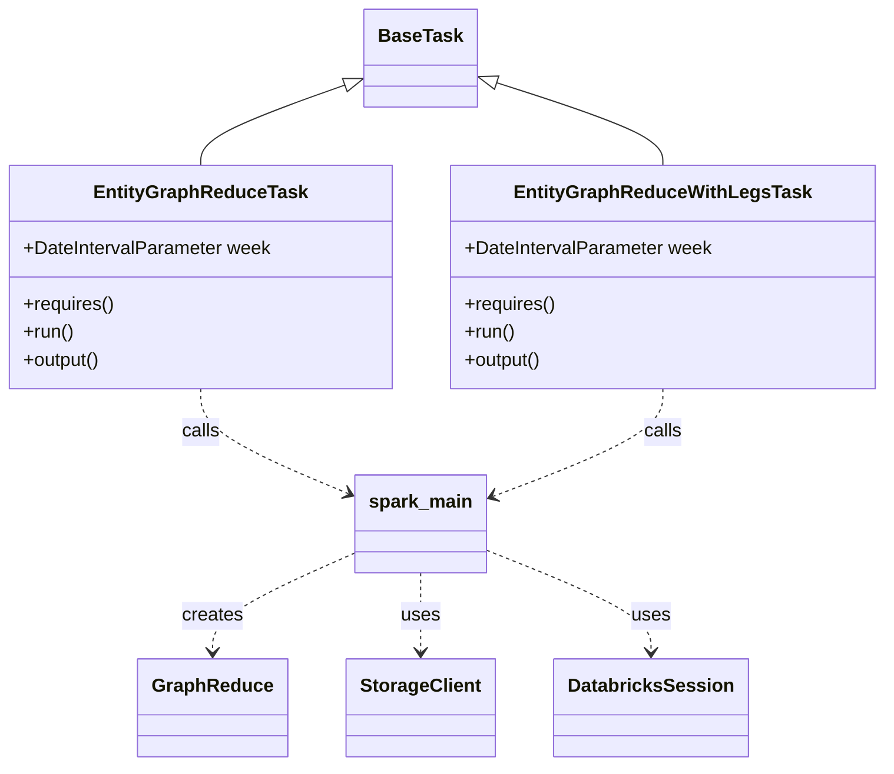
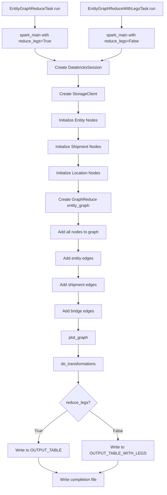
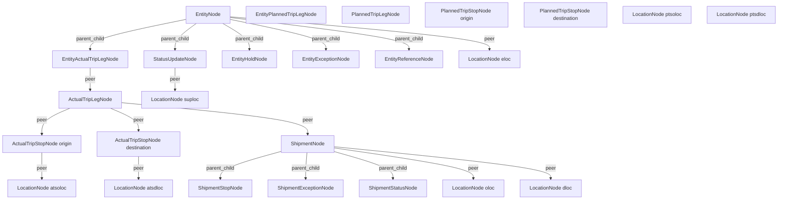

# Diagram: research/orchestrator/tasks/data_transforms/entity_graph_reduce.py

> Auto-generated by Obscura crawlers

## Diagram 1

### SVG

<svg id="container" width="744.203125" xmlns="http://www.w3.org/2000/svg" class="classDiagram" height="658" viewBox="0 0 744.203125 658" role="graphics-document document" aria-roledescription="class"><g><defs><marker id="container_class-aggregationStart" class="marker aggregation class" refX="18" refY="7" markerWidth="190" markerHeight="240" orient="auto"><path d="M 18,7 L9,13 L1,7 L9,1 Z"></path></marker></defs><defs><marker id="container_class-aggregationEnd" class="marker aggregation class" refX="1" refY="7" markerWidth="20" markerHeight="28" orient="auto"><path d="M 18,7 L9,13 L1,7 L9,1 Z"></path></marker></defs><defs><marker id="container_class-extensionStart" class="marker extension class" refX="18" refY="7" markerWidth="190" markerHeight="240" orient="auto"><path d="M 1,7 L18,13 V 1 Z"></path></marker></defs><defs><marker id="container_class-extensionEnd" class="marker extension class" refX="1" refY="7" markerWidth="20" markerHeight="28" orient="auto"><path d="M 1,1 V 13 L18,7 Z"></path></marker></defs><defs><marker id="container_class-compositionStart" class="marker composition class" refX="18" refY="7" markerWidth="190" markerHeight="240" orient="auto"><path d="M 18,7 L9,13 L1,7 L9,1 Z"></path></marker></defs><defs><marker id="container_class-compositionEnd" class="marker composition class" refX="1" refY="7" markerWidth="20" markerHeight="28" orient="auto"><path d="M 18,7 L9,13 L1,7 L9,1 Z"></path></marker></defs><defs><marker id="container_class-dependencyStart" class="marker dependency class" refX="6" refY="7" markerWidth="190" markerHeight="240" orient="auto"><path d="M 5,7 L9,13 L1,7 L9,1 Z"></path></marker></defs><defs><marker id="container_class-dependencyEnd" class="marker dependency class" refX="13" refY="7" markerWidth="20" markerHeight="28" orient="auto"><path d="M 18,7 L9,13 L14,7 L9,1 Z"></path></marker></defs><defs><marker id="container_class-lollipopStart" class="marker lollipop class" refX="13" refY="7" markerWidth="190" markerHeight="240" orient="auto"><circle stroke="black" fill="transparent" cx="7" cy="7" r="6"></circle></marker></defs><defs><marker id="container_class-lollipopEnd" class="marker lollipop class" refX="1" refY="7" markerWidth="190" markerHeight="240" orient="auto"><circle stroke="black" fill="transparent" cx="7" cy="7" r="6"></circle></marker></defs><g class="root"><g class="clusters"></g><g class="edgePaths"><path d="M292.112,72.53L271.633,79.942C251.154,87.353,210.196,102.177,189.717,113.755C169.238,125.333,169.238,133.667,169.238,137.833L169.238,142" id="id_BaseTask_EntityGraphReduceTask_1" class="edge-thickness-normal edge-pattern-solid relation" style=";;;" data-edge="true" data-et="edge" data-id="id_BaseTask_EntityGraphReduceTask_1" data-points="W3sieCI6MzA4LjMzMjAzMTI1LCJ5Ijo2Ni42NTk1MjA1OTQxOTMxMX0seyJ4IjoxNjkuMjM4MjgxMjUsInkiOjExN30seyJ4IjoxNjkuMjM4MjgxMjUsInkiOjE0Mn1d" marker-start="url(#container_class-extensionStart)"></path><path d="M416.783,70.503L440.376,78.252C463.969,86.002,511.154,101.501,534.747,113.417C558.34,125.333,558.34,133.667,558.34,137.833L558.34,142" id="id_BaseTask_EntityGraphReduceWithLegsTask_2" class="edge-thickness-normal edge-pattern-solid relation" style=";;;" data-edge="true" data-et="edge" data-id="id_BaseTask_EntityGraphReduceWithLegsTask_2" data-points="W3sieCI6NDAwLjM5NDUzMTI1LCJ5Ijo2NS4xMTk4NDM3MzIwNDY0Mn0seyJ4Ijo1NTguMzM5ODQzNzUsInkiOjExN30seyJ4Ijo1NTguMzM5ODQzNzUsInkiOjE0Mn1d" marker-start="url(#container_class-extensionStart)"></path><path d="M169.238,334L169.238,340.167C169.238,346.333,169.238,358.667,190.048,373.714C210.857,388.76,252.476,406.521,273.285,415.401L294.095,424.281" id="id_EntityGraphReduceTask_spark_main_3" class="edge-thickness-normal edge-pattern-dashed relation" style=";;;" data-edge="true" data-et="edge" data-id="id_EntityGraphReduceTask_spark_main_3" data-points="W3sieCI6MTY5LjIzODI4MTI1LCJ5IjozMzR9LHsieCI6MTY5LjIzODI4MTI1LCJ5IjozNzF9LHsieCI6Mjk5LjYxMzI4MTI1LCJ5Ijo0MjYuNjM2MDU2NzE4NDMzNX1d" marker-end="url(#container_class-dependencyEnd)"></path><path d="M558.34,334L558.34,340.167C558.34,346.333,558.34,358.667,534.401,374.105C510.463,389.543,462.585,408.086,438.647,417.357L414.708,426.628" id="id_EntityGraphReduceWithLegsTask_spark_main_4" class="edge-thickness-normal edge-pattern-dashed relation" style=";;;" data-edge="true" data-et="edge" data-id="id_EntityGraphReduceWithLegsTask_spark_main_4" data-points="W3sieCI6NTU4LjMzOTg0Mzc1LCJ5IjozMzR9LHsieCI6NTU4LjMzOTg0Mzc1LCJ5IjozNzF9LHsieCI6NDA5LjExMzI4MTI1LCJ5Ijo0MjguNzk1MzU3OTIyNTU1NDd9XQ==" marker-end="url(#container_class-dependencyEnd)"></path><path d="M299.613,475.159L280.086,484.133C260.559,493.106,221.504,511.053,201.977,525.193C182.449,539.333,182.449,549.667,182.449,554.833L182.449,560" id="id_spark_main_GraphReduce_5" class="edge-thickness-normal edge-pattern-dashed relation" style=";;;" data-edge="true" data-et="edge" data-id="id_spark_main_GraphReduce_5" data-points="W3sieCI6Mjk5LjYxMzI4MTI1LCJ5Ijo0NzUuMTU5MzcyODY5ODAyM30seyJ4IjoxODIuNDQ5MjE4NzUsInkiOjUyOX0seyJ4IjoxODIuNDQ5MjE4NzUsInkiOjU2Nn1d" marker-end="url(#container_class-dependencyEnd)"></path><path d="M354.363,492L354.363,498.167C354.363,504.333,354.363,516.667,354.363,528C354.363,539.333,354.363,549.667,354.363,554.833L354.363,560" id="id_spark_main_StorageClient_6" class="edge-thickness-normal edge-pattern-dashed relation" style=";;;" data-edge="true" data-et="edge" data-id="id_spark_main_StorageClient_6" data-points="W3sieCI6MzU0LjM2MzI4MTI1LCJ5Ijo0OTJ9LHsieCI6MzU0LjM2MzI4MTI1LCJ5Ijo1Mjl9LHsieCI6MzU0LjM2MzI4MTI1LCJ5Ijo1NjZ9XQ==" marker-end="url(#container_class-dependencyEnd)"></path><path d="M409.113,472.673L431.783,482.061C454.452,491.449,499.79,510.224,522.46,524.779C545.129,539.333,545.129,549.667,545.129,554.833L545.129,560" id="id_spark_main_DatabricksSession_7" class="edge-thickness-normal edge-pattern-dashed relation" style=";;;" data-edge="true" data-et="edge" data-id="id_spark_main_DatabricksSession_7" data-points="W3sieCI6NDA5LjExMzI4MTI1LCJ5Ijo0NzIuNjczMTEwMDAwODE5MDd9LHsieCI6NTQ1LjEyODkwNjI1LCJ5Ijo1Mjl9LHsieCI6NTQ1LjEyODkwNjI1LCJ5Ijo1NjZ9XQ==" marker-end="url(#container_class-dependencyEnd)"></path></g><g class="edgeLabels"><g class="edgeLabel"><g class="label" data-id="id_BaseTask_EntityGraphReduceTask_1" transform="translate(0, 0)"><foreignObject width="0" height="0">

</foreignObject></g></g><g class="edgeLabel"><g class="label" data-id="id_BaseTask_EntityGraphReduceWithLegsTask_2" transform="translate(0, 0)"><foreignObject width="0" height="0">

</foreignObject></g></g><g class="edgeLabel" transform="translate(169.23828125, 371)"><g class="label" data-id="id_EntityGraphReduceTask_spark_main_3" transform="translate(-16.4453125, -12)"><foreignObject width="32.890625" height="24">

calls

</foreignObject></g></g><g class="edgeLabel" transform="translate(558.33984375, 371)"><g class="label" data-id="id_EntityGraphReduceWithLegsTask_spark_main_4" transform="translate(-16.4453125, -12)"><foreignObject width="32.890625" height="24">

calls

</foreignObject></g></g><g class="edgeLabel" transform="translate(182.44921875, 529)"><g class="label" data-id="id_spark_main_GraphReduce_5" transform="translate(-26.171875, -12)"><foreignObject width="52.34375" height="24">

creates

</foreignObject></g></g><g class="edgeLabel" transform="translate(354.36328125, 529)"><g class="label" data-id="id_spark_main_StorageClient_6" transform="translate(-16.4921875, -12)"><foreignObject width="32.984375" height="24">

uses

</foreignObject></g></g><g class="edgeLabel" transform="translate(545.12890625, 529)"><g class="label" data-id="id_spark_main_DatabricksSession_7" transform="translate(-16.4921875, -12)"><foreignObject width="32.984375" height="24">

uses

</foreignObject></g></g></g><g class="nodes"><g class="node default" id="classId-BaseTask-0" transform="translate(354.36328125, 50)"><g class="basic label-container"><path d="M-46.03125 -42 L46.03125 -42 L46.03125 42 L-46.03125 42" stroke="none" stroke-width="0" fill="#ECECFF" style=""></path><path d="M-46.03125 -42 C-17.656193264362706 -42, 10.718863471274588 -42, 46.03125 -42 M-46.03125 -42 C-26.524919254572065 -42, -7.018588509144131 -42, 46.03125 -42 M46.03125 -42 C46.03125 -21.258196949036495, 46.03125 -0.516393898072991, 46.03125 42 M46.03125 -42 C46.03125 -23.793209001100372, 46.03125 -5.586418002200745, 46.03125 42 M46.03125 42 C23.836764699311743 42, 1.6422793986234865 42, -46.03125 42 M46.03125 42 C17.223106384603298 42, -11.585037230793404 42, -46.03125 42 M-46.03125 42 C-46.03125 15.363631920442216, -46.03125 -11.272736159115567, -46.03125 -42 M-46.03125 42 C-46.03125 22.12069852057518, -46.03125 2.241397041150357, -46.03125 -42" stroke="#9370DB" stroke-width="1.3" fill="none" stroke-dasharray="0 0" style=""></path></g><g class="annotation-group text" transform="translate(0, -18)"></g><g class="label-group text" transform="translate(-34.03125, -18)"><g class="label" style="font-weight: bolder" transform="translate(0,-12)"><foreignObject width="68.0625" height="24">

BaseTask

</foreignObject></g></g><g class="members-group text" transform="translate(-34.03125, 30)"></g><g class="methods-group text" transform="translate(-34.03125, 60)"></g><g class="divider" style=""><path d="M-46.03125 6 C-19.166404750003945 6, 7.69844049999211 6, 46.03125 6 M-46.03125 6 C-25.23959210125647 6, -4.44793420251294 6, 46.03125 6" stroke="#9370DB" stroke-width="1.3" fill="none" stroke-dasharray="0 0" style=""></path></g><g class="divider" style=""><path d="M-46.03125 24 C-12.186326853226916 24, 21.658596293546168 24, 46.03125 24 M-46.03125 24 C-15.977430958117559 24, 14.076388083764883 24, 46.03125 24" stroke="#9370DB" stroke-width="1.3" fill="none" stroke-dasharray="0 0" style=""></path></g></g><g class="node default" id="classId-EntityGraphReduceTask-1" transform="translate(169.23828125, 238)"><g class="basic label-container"><path d="M-161.23828125 -96 L161.23828125 -96 L161.23828125 96 L-161.23828125 96" stroke="none" stroke-width="0" fill="#ECECFF" style=""></path><path d="M-161.23828125 -96 C-37.74433366776164 -96, 85.74961391447673 -96, 161.23828125 -96 M-161.23828125 -96 C-47.44730478697889 -96, 66.34367167604222 -96, 161.23828125 -96 M161.23828125 -96 C161.23828125 -23.043472167523547, 161.23828125 49.91305566495291, 161.23828125 96 M161.23828125 -96 C161.23828125 -41.691025740254645, 161.23828125 12.61794851949071, 161.23828125 96 M161.23828125 96 C38.03414827149744 96, -85.16998470700511 96, -161.23828125 96 M161.23828125 96 C44.54595018886437 96, -72.14638087227127 96, -161.23828125 96 M-161.23828125 96 C-161.23828125 33.48862917854943, -161.23828125 -29.02274164290114, -161.23828125 -96 M-161.23828125 96 C-161.23828125 56.49621172330159, -161.23828125 16.992423446603183, -161.23828125 -96" stroke="#9370DB" stroke-width="1.3" fill="none" stroke-dasharray="0 0" style=""></path></g><g class="annotation-group text" transform="translate(0, -72)"></g><g class="label-group text" transform="translate(-86.3515625, -72)"><g class="label" style="font-weight: bolder" transform="translate(0,-12)"><foreignObject width="172.703125" height="24">

EntityGraphReduceTask

</foreignObject></g></g><g class="members-group text" transform="translate(-149.23828125, -24)"><g class="label" style="" transform="translate(0,-12)"><foreignObject width="212.125" height="24">

+DateIntervalParameter week

</foreignObject></g></g><g class="methods-group text" transform="translate(-149.23828125, 24)"><g class="label" style="" transform="translate(0,-12)"><foreignObject width="78.0625" height="24">

+requires()

</foreignObject></g><g class="label" style="" transform="translate(0,12)"><foreignObject width="43.21875" height="24">

+run()

</foreignObject></g><g class="label" style="" transform="translate(0,36)"><foreignObject width="67.390625" height="24">

+output()

</foreignObject></g></g><g class="divider" style=""><path d="M-161.23828125 -48 C-58.25386464237687 -48, 44.73055196524626 -48, 161.23828125 -48 M-161.23828125 -48 C-76.16116379934886 -48, 8.915953651302289 -48, 161.23828125 -48" stroke="#9370DB" stroke-width="1.3" fill="none" stroke-dasharray="0 0" style=""></path></g><g class="divider" style=""><path d="M-161.23828125 0 C-66.19727000701583 0, 28.843741235968338 0, 161.23828125 0 M-161.23828125 0 C-49.28512400554389 0, 62.668033238912216 0, 161.23828125 0" stroke="#9370DB" stroke-width="1.3" fill="none" stroke-dasharray="0 0" style=""></path></g></g><g class="node default" id="classId-EntityGraphReduceWithLegsTask-2" transform="translate(558.33984375, 238)"><g class="basic label-container"><path d="M-177.86328125 -96 L177.86328125 -96 L177.86328125 96 L-177.86328125 96" stroke="none" stroke-width="0" fill="#ECECFF" style=""></path><path d="M-177.86328125 -96 C-82.6270516366418 -96, 12.60917797671641 -96, 177.86328125 -96 M-177.86328125 -96 C-78.41348790887416 -96, 21.03630543225168 -96, 177.86328125 -96 M177.86328125 -96 C177.86328125 -33.75215969834402, 177.86328125 28.495680603311953, 177.86328125 96 M177.86328125 -96 C177.86328125 -47.26061214948885, 177.86328125 1.4787757010223004, 177.86328125 96 M177.86328125 96 C99.3530448725591 96, 20.84280849511819 96, -177.86328125 96 M177.86328125 96 C52.468089353957765 96, -72.92710254208447 96, -177.86328125 96 M-177.86328125 96 C-177.86328125 44.8645916312238, -177.86328125 -6.270816737552394, -177.86328125 -96 M-177.86328125 96 C-177.86328125 42.592980181155156, -177.86328125 -10.814039637689689, -177.86328125 -96" stroke="#9370DB" stroke-width="1.3" fill="none" stroke-dasharray="0 0" style=""></path></g><g class="annotation-group text" transform="translate(0, -72)"></g><g class="label-group text" transform="translate(-119.6015625, -72)"><g class="label" style="font-weight: bolder" transform="translate(0,-12)"><foreignObject width="239.203125" height="24">

EntityGraphReduceWithLegsTask

</foreignObject></g></g><g class="members-group text" transform="translate(-165.86328125, -24)"><g class="label" style="" transform="translate(0,-12)"><foreignObject width="212.125" height="24">

+DateIntervalParameter week

</foreignObject></g></g><g class="methods-group text" transform="translate(-165.86328125, 24)"><g class="label" style="" transform="translate(0,-12)"><foreignObject width="78.0625" height="24">

+requires()

</foreignObject></g><g class="label" style="" transform="translate(0,12)"><foreignObject width="43.21875" height="24">

+run()

</foreignObject></g><g class="label" style="" transform="translate(0,36)"><foreignObject width="67.390625" height="24">

+output()

</foreignObject></g></g><g class="divider" style=""><path d="M-177.86328125 -48 C-86.96183292607603 -48, 3.9396153978479447 -48, 177.86328125 -48 M-177.86328125 -48 C-65.7596686962116 -48, 46.34394385757679 -48, 177.86328125 -48" stroke="#9370DB" stroke-width="1.3" fill="none" stroke-dasharray="0 0" style=""></path></g><g class="divider" style=""><path d="M-177.86328125 0 C-97.78743950481267 0, -17.711597759625334 0, 177.86328125 0 M-177.86328125 0 C-38.499137357179734 0, 100.86500653564053 0, 177.86328125 0" stroke="#9370DB" stroke-width="1.3" fill="none" stroke-dasharray="0 0" style=""></path></g></g><g class="node default" id="classId-spark_main-3" transform="translate(354.36328125, 450)"><g class="basic label-container"><path d="M-54.75 -42 L54.75 -42 L54.75 42 L-54.75 42" stroke="none" stroke-width="0" fill="#ECECFF" style=""></path><path d="M-54.75 -42 C-24.354922089968138 -42, 6.040155820063724 -42, 54.75 -42 M-54.75 -42 C-30.034367042357456 -42, -5.318734084714912 -42, 54.75 -42 M54.75 -42 C54.75 -21.28178509061391, 54.75 -0.5635701812278171, 54.75 42 M54.75 -42 C54.75 -16.420722704581983, 54.75 9.158554590836033, 54.75 42 M54.75 42 C27.782279545963362 42, 0.8145590919267249 42, -54.75 42 M54.75 42 C12.73800633809283 42, -29.27398732381434 42, -54.75 42 M-54.75 42 C-54.75 10.07133096802984, -54.75 -21.85733806394032, -54.75 -42 M-54.75 42 C-54.75 10.416323568977003, -54.75 -21.167352862045995, -54.75 -42" stroke="#9370DB" stroke-width="1.3" fill="none" stroke-dasharray="0 0" style=""></path></g><g class="annotation-group text" transform="translate(0, -18)"></g><g class="label-group text" transform="translate(-42.75, -18)"><g class="label" style="font-weight: bolder" transform="translate(0,-12)"><foreignObject width="85.5" height="24">

spark_main

</foreignObject></g></g><g class="members-group text" transform="translate(-42.75, 30)"></g><g class="methods-group text" transform="translate(-42.75, 60)"></g><g class="divider" style=""><path d="M-54.75 6 C-15.90671594879133 6, 22.93656810241734 6, 54.75 6 M-54.75 6 C-30.024261856718603 6, -5.298523713437206 6, 54.75 6" stroke="#9370DB" stroke-width="1.3" fill="none" stroke-dasharray="0 0" style=""></path></g><g class="divider" style=""><path d="M-54.75 24 C-13.539754327920129 24, 27.670491344159743 24, 54.75 24 M-54.75 24 C-22.731286499828386 24, 9.287427000343229 24, 54.75 24" stroke="#9370DB" stroke-width="1.3" fill="none" stroke-dasharray="0 0" style=""></path></g></g><g class="node default" id="classId-GraphReduce-4" transform="translate(182.44921875, 608)"><g class="basic label-container"><path d="M-60.5625 -42 L60.5625 -42 L60.5625 42 L-60.5625 42" stroke="none" stroke-width="0" fill="#ECECFF" style=""></path><path d="M-60.5625 -42 C-19.695913353626842 -42, 21.170673292746315 -42, 60.5625 -42 M-60.5625 -42 C-31.38510444618622 -42, -2.2077088923724375 -42, 60.5625 -42 M60.5625 -42 C60.5625 -14.316668200538619, 60.5625 13.366663598922763, 60.5625 42 M60.5625 -42 C60.5625 -16.68772491745568, 60.5625 8.624550165088642, 60.5625 42 M60.5625 42 C17.583865823445592 42, -25.394768353108816 42, -60.5625 42 M60.5625 42 C34.01168096921303 42, 7.460861938426056 42, -60.5625 42 M-60.5625 42 C-60.5625 8.907517058290026, -60.5625 -24.18496588341995, -60.5625 -42 M-60.5625 42 C-60.5625 23.50551988430586, -60.5625 5.011039768611717, -60.5625 -42" stroke="#9370DB" stroke-width="1.3" fill="none" stroke-dasharray="0 0" style=""></path></g><g class="annotation-group text" transform="translate(0, -18)"></g><g class="label-group text" transform="translate(-48.5625, -18)"><g class="label" style="font-weight: bolder" transform="translate(0,-12)"><foreignObject width="97.125" height="24">

GraphReduce

</foreignObject></g></g><g class="members-group text" transform="translate(-48.5625, 30)"></g><g class="methods-group text" transform="translate(-48.5625, 60)"></g><g class="divider" style=""><path d="M-60.5625 6 C-16.956857446384376 6, 26.648785107231248 6, 60.5625 6 M-60.5625 6 C-28.854513546722394 6, 2.8534729065552114 6, 60.5625 6" stroke="#9370DB" stroke-width="1.3" fill="none" stroke-dasharray="0 0" style=""></path></g><g class="divider" style=""><path d="M-60.5625 24 C-26.13830031220251 24, 8.28589937559498 24, 60.5625 24 M-60.5625 24 C-22.644230748183112 24, 15.274038503633776 24, 60.5625 24" stroke="#9370DB" stroke-width="1.3" fill="none" stroke-dasharray="0 0" style=""></path></g></g><g class="node default" id="classId-StorageClient-5" transform="translate(354.36328125, 608)"><g class="basic label-container"><path d="M-61.3515625 -42 L61.3515625 -42 L61.3515625 42 L-61.3515625 42" stroke="none" stroke-width="0" fill="#ECECFF" style=""></path><path d="M-61.3515625 -42 C-33.67976271911424 -42, -6.0079629382284665 -42, 61.3515625 -42 M-61.3515625 -42 C-17.009705590620683 -42, 27.332151318758633 -42, 61.3515625 -42 M61.3515625 -42 C61.3515625 -14.563219567077518, 61.3515625 12.873560865844965, 61.3515625 42 M61.3515625 -42 C61.3515625 -20.612474997106528, 61.3515625 0.7750500057869445, 61.3515625 42 M61.3515625 42 C34.16272625267408 42, 6.973890005348146 42, -61.3515625 42 M61.3515625 42 C34.38978561831519 42, 7.4280087366303675 42, -61.3515625 42 M-61.3515625 42 C-61.3515625 24.790109448366184, -61.3515625 7.580218896732369, -61.3515625 -42 M-61.3515625 42 C-61.3515625 20.84590650718669, -61.3515625 -0.3081869856266195, -61.3515625 -42" stroke="#9370DB" stroke-width="1.3" fill="none" stroke-dasharray="0 0" style=""></path></g><g class="annotation-group text" transform="translate(0, -18)"></g><g class="label-group text" transform="translate(-49.3515625, -18)"><g class="label" style="font-weight: bolder" transform="translate(0,-12)"><foreignObject width="98.703125" height="24">

StorageClient

</foreignObject></g></g><g class="members-group text" transform="translate(-49.3515625, 30)"></g><g class="methods-group text" transform="translate(-49.3515625, 60)"></g><g class="divider" style=""><path d="M-61.3515625 6 C-34.29737720297655 6, -7.24319190595309 6, 61.3515625 6 M-61.3515625 6 C-29.93687014315233 6, 1.4778222136953403 6, 61.3515625 6" stroke="#9370DB" stroke-width="1.3" fill="none" stroke-dasharray="0 0" style=""></path></g><g class="divider" style=""><path d="M-61.3515625 24 C-16.853145644360204 24, 27.645271211279592 24, 61.3515625 24 M-61.3515625 24 C-36.59082929126469 24, -11.83009608252938 24, 61.3515625 24" stroke="#9370DB" stroke-width="1.3" fill="none" stroke-dasharray="0 0" style=""></path></g></g><g class="node default" id="classId-DatabricksSession-6" transform="translate(545.12890625, 608)"><g class="basic label-container"><path d="M-79.4140625 -42 L79.4140625 -42 L79.4140625 42 L-79.4140625 42" stroke="none" stroke-width="0" fill="#ECECFF" style=""></path><path d="M-79.4140625 -42 C-22.055623026743604 -42, 35.30281644651279 -42, 79.4140625 -42 M-79.4140625 -42 C-35.96836875940833 -42, 7.477324981183344 -42, 79.4140625 -42 M79.4140625 -42 C79.4140625 -16.01329269817997, 79.4140625 9.973414603640059, 79.4140625 42 M79.4140625 -42 C79.4140625 -16.016413143654436, 79.4140625 9.967173712691128, 79.4140625 42 M79.4140625 42 C27.185917106012987 42, -25.042228287974027 42, -79.4140625 42 M79.4140625 42 C26.504310947671286 42, -26.40544060465743 42, -79.4140625 42 M-79.4140625 42 C-79.4140625 14.669018772082367, -79.4140625 -12.661962455835265, -79.4140625 -42 M-79.4140625 42 C-79.4140625 11.368069972569526, -79.4140625 -19.26386005486095, -79.4140625 -42" stroke="#9370DB" stroke-width="1.3" fill="none" stroke-dasharray="0 0" style=""></path></g><g class="annotation-group text" transform="translate(0, -18)"></g><g class="label-group text" transform="translate(-67.4140625, -18)"><g class="label" style="font-weight: bolder" transform="translate(0,-12)"><foreignObject width="134.828125" height="24">

DatabricksSession

</foreignObject></g></g><g class="members-group text" transform="translate(-67.4140625, 30)"></g><g class="methods-group text" transform="translate(-67.4140625, 60)"></g><g class="divider" style=""><path d="M-79.4140625 6 C-32.773422500311604 6, 13.867217499376792 6, 79.4140625 6 M-79.4140625 6 C-18.44953177303389 6, 42.51499895393222 6, 79.4140625 6" stroke="#9370DB" stroke-width="1.3" fill="none" stroke-dasharray="0 0" style=""></path></g><g class="divider" style=""><path d="M-79.4140625 24 C-23.824691455940027 24, 31.764679588119947 24, 79.4140625 24 M-79.4140625 24 C-23.20914556440234 24, 32.99577137119532 24, 79.4140625 24" stroke="#9370DB" stroke-width="1.3" fill="none" stroke-dasharray="0 0" style=""></path></g></g></g></g></g></svg>

## Diagram 2

### SVG

<svg id="container" width="648.5625" xmlns="http://www.w3.org/2000/svg" class="flowchart" height="1923.0625" viewBox="0 0 648.5625 1923.0625" role="graphics-document document" aria-roledescription="flowchart-v2"><g><marker id="container_flowchart-v2-pointEnd" class="marker flowchart-v2" viewBox="0 0 10 10" refX="5" refY="5" markerUnits="userSpaceOnUse" markerWidth="8" markerHeight="8" orient="auto"><path d="M 0 0 L 10 5 L 0 10 z" class="arrowMarkerPath" style="stroke-width: 1; stroke-dasharray: 1, 0;"></path></marker><marker id="container_flowchart-v2-pointStart" class="marker flowchart-v2" viewBox="0 0 10 10" refX="4.5" refY="5" markerUnits="userSpaceOnUse" markerWidth="8" markerHeight="8" orient="auto"><path d="M 0 5 L 10 10 L 10 0 z" class="arrowMarkerPath" style="stroke-width: 1; stroke-dasharray: 1, 0;"></path></marker><marker id="container_flowchart-v2-circleEnd" class="marker flowchart-v2" viewBox="0 0 10 10" refX="11" refY="5" markerUnits="userSpaceOnUse" markerWidth="11" markerHeight="11" orient="auto"><circle cx="5" cy="5" r="5" class="arrowMarkerPath" style="stroke-width: 1; stroke-dasharray: 1, 0;"></circle></marker><marker id="container_flowchart-v2-circleStart" class="marker flowchart-v2" viewBox="0 0 10 10" refX="-1" refY="5" markerUnits="userSpaceOnUse" markerWidth="11" markerHeight="11" orient="auto"><circle cx="5" cy="5" r="5" class="arrowMarkerPath" style="stroke-width: 1; stroke-dasharray: 1, 0;"></circle></marker><marker id="container_flowchart-v2-crossEnd" class="marker cross flowchart-v2" viewBox="0 0 11 11" refX="12" refY="5.2" markerUnits="userSpaceOnUse" markerWidth="11" markerHeight="11" orient="auto"><path d="M 1,1 l 9,9 M 10,1 l -9,9" class="arrowMarkerPath" style="stroke-width: 2; stroke-dasharray: 1, 0;"></path></marker><marker id="container_flowchart-v2-crossStart" class="marker cross flowchart-v2" viewBox="0 0 11 11" refX="-1" refY="5.2" markerUnits="userSpaceOnUse" markerWidth="11" markerHeight="11" orient="auto"><path d="M 1,1 l 9,9 M 10,1 l -9,9" class="arrowMarkerPath" style="stroke-width: 2; stroke-dasharray: 1, 0;"></path></marker><g class="root"><g class="clusters"></g><g class="edgePaths"><path d="M138,62L138,66.167C138,70.333,138,78.667,138,86.333C138,94,138,101,138,104.5L138,108" id="L_A_B_0" class="edge-thickness-normal edge-pattern-solid edge-thickness-normal edge-pattern-solid flowchart-link" style=";" data-edge="true" data-et="edge" data-id="L_A_B_0" data-points="W3sieCI6MTM4LCJ5Ijo2Mn0seyJ4IjoxMzgsInkiOjg3fSx7IngiOjEzOCwieSI6MTEyfV0=" marker-end="url(#container_flowchart-v2-pointEnd)"></path><path d="M478.898,62L478.898,66.167C478.898,70.333,478.898,78.667,478.898,86.333C478.898,94,478.898,101,478.898,104.5L478.898,108" id="L_C_D_0" class="edge-thickness-normal edge-pattern-solid edge-thickness-normal edge-pattern-solid flowchart-link" style=";" data-edge="true" data-et="edge" data-id="L_C_D_0" data-points="W3sieCI6NDc4Ljg5ODQzNzUsInkiOjYyfSx7IngiOjQ3OC44OTg0Mzc1LCJ5Ijo4N30seyJ4Ijo0NzguODk4NDM3NSwieSI6MTEyfV0=" marker-end="url(#container_flowchart-v2-pointEnd)"></path><path d="M138,190L138,194.167C138,198.333,138,206.667,151.02,214.805C164.04,222.944,190.081,230.889,203.101,234.861L216.121,238.833" id="L_B_E_0" class="edge-thickness-normal edge-pattern-solid edge-thickness-normal edge-pattern-solid flowchart-link" style=";" data-edge="true" data-et="edge" data-id="L_B_E_0" data-points="W3sieCI6MTM4LCJ5IjoxOTB9LHsieCI6MTM4LCJ5IjoyMTV9LHsieCI6MjE5Ljk0NjczOTc4MzY1Mzg0LCJ5IjoyNDB9XQ==" marker-end="url(#container_flowchart-v2-pointEnd)"></path><path d="M478.898,190L478.898,194.167C478.898,198.333,478.898,206.667,465.878,214.805C452.858,222.944,426.818,230.889,413.798,234.861L400.778,238.833" id="L_D_E_0" class="edge-thickness-normal edge-pattern-solid edge-thickness-normal edge-pattern-solid flowchart-link" style=";" data-edge="true" data-et="edge" data-id="L_D_E_0" data-points="W3sieCI6NDc4Ljg5ODQzNzUsInkiOjE5MH0seyJ4Ijo0NzguODk4NDM3NSwieSI6MjE1fSx7IngiOjM5Ni45NTE2OTc3MTYzNDYyLCJ5IjoyNDB9XQ==" marker-end="url(#container_flowchart-v2-pointEnd)"></path><path d="M308.449,294L308.449,298.167C308.449,302.333,308.449,310.667,308.449,318.333C308.449,326,308.449,333,308.449,336.5L308.449,340" id="L_E_F_0" class="edge-thickness-normal edge-pattern-solid edge-thickness-normal edge-pattern-solid flowchart-link" style=";" data-edge="true" data-et="edge" data-id="L_E_F_0" data-points="W3sieCI6MzA4LjQ0OTIxODc1LCJ5IjoyOTR9LHsieCI6MzA4LjQ0OTIxODc1LCJ5IjozMTl9LHsieCI6MzA4LjQ0OTIxODc1LCJ5IjozNDR9XQ==" marker-end="url(#container_flowchart-v2-pointEnd)"></path><path d="M308.449,398L308.449,402.167C308.449,406.333,308.449,414.667,308.449,422.333C308.449,430,308.449,437,308.449,440.5L308.449,444" id="L_F_G_0" class="edge-thickness-normal edge-pattern-solid edge-thickness-normal edge-pattern-solid flowchart-link" style=";" data-edge="true" data-et="edge" data-id="L_F_G_0" data-points="W3sieCI6MzA4LjQ0OTIxODc1LCJ5IjozOTh9LHsieCI6MzA4LjQ0OTIxODc1LCJ5Ijo0MjN9LHsieCI6MzA4LjQ0OTIxODc1LCJ5Ijo0NDh9XQ==" marker-end="url(#container_flowchart-v2-pointEnd)"></path><path d="M308.449,502L308.449,506.167C308.449,510.333,308.449,518.667,308.449,526.333C308.449,534,308.449,541,308.449,544.5L308.449,548" id="L_G_H_0" class="edge-thickness-normal edge-pattern-solid edge-thickness-normal edge-pattern-solid flowchart-link" style=";" data-edge="true" data-et="edge" data-id="L_G_H_0" data-points="W3sieCI6MzA4LjQ0OTIxODc1LCJ5Ijo1MDJ9LHsieCI6MzA4LjQ0OTIxODc1LCJ5Ijo1Mjd9LHsieCI6MzA4LjQ0OTIxODc1LCJ5Ijo1NTJ9XQ==" marker-end="url(#container_flowchart-v2-pointEnd)"></path><path d="M308.449,606L308.449,610.167C308.449,614.333,308.449,622.667,308.449,630.333C308.449,638,308.449,645,308.449,648.5L308.449,652" id="L_H_I_0" class="edge-thickness-normal edge-pattern-solid edge-thickness-normal edge-pattern-solid flowchart-link" style=";" data-edge="true" data-et="edge" data-id="L_H_I_0" data-points="W3sieCI6MzA4LjQ0OTIxODc1LCJ5Ijo2MDZ9LHsieCI6MzA4LjQ0OTIxODc1LCJ5Ijo2MzF9LHsieCI6MzA4LjQ0OTIxODc1LCJ5Ijo2NTZ9XQ==" marker-end="url(#container_flowchart-v2-pointEnd)"></path><path d="M308.449,710L308.449,714.167C308.449,718.333,308.449,726.667,308.449,734.333C308.449,742,308.449,749,308.449,752.5L308.449,756" id="L_I_J_0" class="edge-thickness-normal edge-pattern-solid edge-thickness-normal edge-pattern-solid flowchart-link" style=";" data-edge="true" data-et="edge" data-id="L_I_J_0" data-points="W3sieCI6MzA4LjQ0OTIxODc1LCJ5Ijo3MTB9LHsieCI6MzA4LjQ0OTIxODc1LCJ5Ijo3MzV9LHsieCI6MzA4LjQ0OTIxODc1LCJ5Ijo3NjB9XQ==" marker-end="url(#container_flowchart-v2-pointEnd)"></path><path d="M308.449,838L308.449,842.167C308.449,846.333,308.449,854.667,308.449,862.333C308.449,870,308.449,877,308.449,880.5L308.449,884" id="L_J_K_0" class="edge-thickness-normal edge-pattern-solid edge-thickness-normal edge-pattern-solid flowchart-link" style=";" data-edge="true" data-et="edge" data-id="L_J_K_0" data-points="W3sieCI6MzA4LjQ0OTIxODc1LCJ5Ijo4Mzh9LHsieCI6MzA4LjQ0OTIxODc1LCJ5Ijo4NjN9LHsieCI6MzA4LjQ0OTIxODc1LCJ5Ijo4ODh9XQ==" marker-end="url(#container_flowchart-v2-pointEnd)"></path><path d="M308.449,942L308.449,946.167C308.449,950.333,308.449,958.667,308.449,966.333C308.449,974,308.449,981,308.449,984.5L308.449,988" id="L_K_L_0" class="edge-thickness-normal edge-pattern-solid edge-thickness-normal edge-pattern-solid flowchart-link" style=";" data-edge="true" data-et="edge" data-id="L_K_L_0" data-points="W3sieCI6MzA4LjQ0OTIxODc1LCJ5Ijo5NDJ9LHsieCI6MzA4LjQ0OTIxODc1LCJ5Ijo5Njd9LHsieCI6MzA4LjQ0OTIxODc1LCJ5Ijo5OTJ9XQ==" marker-end="url(#container_flowchart-v2-pointEnd)"></path><path d="M308.449,1046L308.449,1050.167C308.449,1054.333,308.449,1062.667,308.449,1070.333C308.449,1078,308.449,1085,308.449,1088.5L308.449,1092" id="L_L_M_0" class="edge-thickness-normal edge-pattern-solid edge-thickness-normal edge-pattern-solid flowchart-link" style=";" data-edge="true" data-et="edge" data-id="L_L_M_0" data-points="W3sieCI6MzA4LjQ0OTIxODc1LCJ5IjoxMDQ2fSx7IngiOjMwOC40NDkyMTg3NSwieSI6MTA3MX0seyJ4IjozMDguNDQ5MjE4NzUsInkiOjEwOTZ9XQ==" marker-end="url(#container_flowchart-v2-pointEnd)"></path><path d="M308.449,1150L308.449,1154.167C308.449,1158.333,308.449,1166.667,308.449,1174.333C308.449,1182,308.449,1189,308.449,1192.5L308.449,1196" id="L_M_N_0" class="edge-thickness-normal edge-pattern-solid edge-thickness-normal edge-pattern-solid flowchart-link" style=";" data-edge="true" data-et="edge" data-id="L_M_N_0" data-points="W3sieCI6MzA4LjQ0OTIxODc1LCJ5IjoxMTUwfSx7IngiOjMwOC40NDkyMTg3NSwieSI6MTE3NX0seyJ4IjozMDguNDQ5MjE4NzUsInkiOjEyMDB9XQ==" marker-end="url(#container_flowchart-v2-pointEnd)"></path><path d="M308.449,1254L308.449,1258.167C308.449,1262.333,308.449,1270.667,308.449,1278.333C308.449,1286,308.449,1293,308.449,1296.5L308.449,1300" id="L_N_O_0" class="edge-thickness-normal edge-pattern-solid edge-thickness-normal edge-pattern-solid flowchart-link" style=";" data-edge="true" data-et="edge" data-id="L_N_O_0" data-points="W3sieCI6MzA4LjQ0OTIxODc1LCJ5IjoxMjU0fSx7IngiOjMwOC40NDkyMTg3NSwieSI6MTI3OX0seyJ4IjozMDguNDQ5MjE4NzUsInkiOjEzMDR9XQ==" marker-end="url(#container_flowchart-v2-pointEnd)"></path><path d="M308.449,1358L308.449,1362.167C308.449,1366.333,308.449,1374.667,308.449,1382.333C308.449,1390,308.449,1397,308.449,1400.5L308.449,1404" id="L_O_P_0" class="edge-thickness-normal edge-pattern-solid edge-thickness-normal edge-pattern-solid flowchart-link" style=";" data-edge="true" data-et="edge" data-id="L_O_P_0" data-points="W3sieCI6MzA4LjQ0OTIxODc1LCJ5IjoxMzU4fSx7IngiOjMwOC40NDkyMTg3NSwieSI6MTM4M30seyJ4IjozMDguNDQ5MjE4NzUsInkiOjE0MDh9XQ==" marker-end="url(#container_flowchart-v2-pointEnd)"></path><path d="M308.449,1462L308.449,1466.167C308.449,1470.333,308.449,1478.667,308.449,1486.333C308.449,1494,308.449,1501,308.449,1504.5L308.449,1508" id="L_P_Q_0" class="edge-thickness-normal edge-pattern-solid edge-thickness-normal edge-pattern-solid flowchart-link" style=";" data-edge="true" data-et="edge" data-id="L_P_Q_0" data-points="W3sieCI6MzA4LjQ0OTIxODc1LCJ5IjoxNDYyfSx7IngiOjMwOC40NDkyMTg3NSwieSI6MTQ4N30seyJ4IjozMDguNDQ5MjE4NzUsInkiOjE1MTJ9XQ==" marker-end="url(#container_flowchart-v2-pointEnd)"></path><path d="M266.442,1617.055L248.895,1630.223C231.348,1643.391,196.254,1669.727,178.707,1690.395C161.16,1711.063,161.16,1726.063,161.16,1733.563L161.16,1741.063" id="L_Q_R_0" class="edge-thickness-normal edge-pattern-solid edge-thickness-normal edge-pattern-solid flowchart-link" style=";" data-edge="true" data-et="edge" data-id="L_Q_R_0" data-points="W3sieCI6MjY2LjQ0MTg2NTc1MzEyMTE0LCJ5IjoxNjE3LjA1NTE0NzAwMzEyMTJ9LHsieCI6MTYxLjE2MDE1NjI1LCJ5IjoxNjk2LjA2MjV9LHsieCI6MTYxLjE2MDE1NjI1LCJ5IjoxNzQ1LjA2MjV9XQ==" marker-end="url(#container_flowchart-v2-pointEnd)"></path><path d="M350.457,1617.055L368.004,1630.223C385.55,1643.391,420.644,1669.727,438.191,1688.395C455.738,1707.063,455.738,1718.063,455.738,1723.563L455.738,1729.063" id="L_Q_S_0" class="edge-thickness-normal edge-pattern-solid edge-thickness-normal edge-pattern-solid flowchart-link" style=";" data-edge="true" data-et="edge" data-id="L_Q_S_0" data-points="W3sieCI6MzUwLjQ1NjU3MTc0Njg3ODg2LCJ5IjoxNjE3LjA1NTE0NzAwMzEyMTJ9LHsieCI6NDU1LjczODI4MTI1LCJ5IjoxNjk2LjA2MjV9LHsieCI6NDU1LjczODI4MTI1LCJ5IjoxNzMzLjA2MjV9XQ==" marker-end="url(#container_flowchart-v2-pointEnd)"></path><path d="M161.16,1799.063L161.16,1805.229C161.16,1811.396,161.16,1823.729,172.334,1833.841C183.507,1843.952,205.854,1851.841,217.027,1855.786L228.2,1859.731" id="L_R_T_0" class="edge-thickness-normal edge-pattern-solid edge-thickness-normal edge-pattern-solid flowchart-link" style=";" data-edge="true" data-et="edge" data-id="L_R_T_0" data-points="W3sieCI6MTYxLjE2MDE1NjI1LCJ5IjoxNzk5LjA2MjV9LHsieCI6MTYxLjE2MDE1NjI1LCJ5IjoxODM2LjA2MjV9LHsieCI6MjMxLjk3MjIwNTUyODg0NjE2LCJ5IjoxODYxLjA2MjV9XQ==" marker-end="url(#container_flowchart-v2-pointEnd)"></path><path d="M455.738,1811.063L455.738,1815.229C455.738,1819.396,455.738,1827.729,444.565,1835.841C433.392,1843.952,411.045,1851.841,399.871,1855.786L388.698,1859.731" id="L_S_T_0" class="edge-thickness-normal edge-pattern-solid edge-thickness-normal edge-pattern-solid flowchart-link" style=";" data-edge="true" data-et="edge" data-id="L_S_T_0" data-points="W3sieCI6NDU1LjczODI4MTI1LCJ5IjoxODExLjA2MjV9LHsieCI6NDU1LjczODI4MTI1LCJ5IjoxODM2LjA2MjV9LHsieCI6Mzg0LjkyNjIzMTk3MTE1MzgsInkiOjE4NjEuMDYyNX1d" marker-end="url(#container_flowchart-v2-pointEnd)"></path></g><g class="edgeLabels"><g class="edgeLabel"><g class="label" data-id="L_A_B_0" transform="translate(0, 0)"><foreignObject width="0" height="0">

</foreignObject></g></g><g class="edgeLabel"><g class="label" data-id="L_C_D_0" transform="translate(0, 0)"><foreignObject width="0" height="0">

</foreignObject></g></g><g class="edgeLabel"><g class="label" data-id="L_B_E_0" transform="translate(0, 0)"><foreignObject width="0" height="0">

</foreignObject></g></g><g class="edgeLabel"><g class="label" data-id="L_D_E_0" transform="translate(0, 0)"><foreignObject width="0" height="0">

</foreignObject></g></g><g class="edgeLabel"><g class="label" data-id="L_E_F_0" transform="translate(0, 0)"><foreignObject width="0" height="0">

</foreignObject></g></g><g class="edgeLabel"><g class="label" data-id="L_F_G_0" transform="translate(0, 0)"><foreignObject width="0" height="0">

</foreignObject></g></g><g class="edgeLabel"><g class="label" data-id="L_G_H_0" transform="translate(0, 0)"><foreignObject width="0" height="0">

</foreignObject></g></g><g class="edgeLabel"><g class="label" data-id="L_H_I_0" transform="translate(0, 0)"><foreignObject width="0" height="0">

</foreignObject></g></g><g class="edgeLabel"><g class="label" data-id="L_I_J_0" transform="translate(0, 0)"><foreignObject width="0" height="0">

</foreignObject></g></g><g class="edgeLabel"><g class="label" data-id="L_J_K_0" transform="translate(0, 0)"><foreignObject width="0" height="0">

</foreignObject></g></g><g class="edgeLabel"><g class="label" data-id="L_K_L_0" transform="translate(0, 0)"><foreignObject width="0" height="0">

</foreignObject></g></g><g class="edgeLabel"><g class="label" data-id="L_L_M_0" transform="translate(0, 0)"><foreignObject width="0" height="0">

</foreignObject></g></g><g class="edgeLabel"><g class="label" data-id="L_M_N_0" transform="translate(0, 0)"><foreignObject width="0" height="0">

</foreignObject></g></g><g class="edgeLabel"><g class="label" data-id="L_N_O_0" transform="translate(0, 0)"><foreignObject width="0" height="0">

</foreignObject></g></g><g class="edgeLabel"><g class="label" data-id="L_O_P_0" transform="translate(0, 0)"><foreignObject width="0" height="0">

</foreignObject></g></g><g class="edgeLabel"><g class="label" data-id="L_P_Q_0" transform="translate(0, 0)"><foreignObject width="0" height="0">

</foreignObject></g></g><g class="edgeLabel" transform="translate(161.16015625, 1696.0625)"><g class="label" data-id="L_Q_R_0" transform="translate(-16.0078125, -12)"><foreignObject width="32.015625" height="24">

True

</foreignObject></g></g><g class="edgeLabel" transform="translate(455.73828125, 1696.0625)"><g class="label" data-id="L_Q_S_0" transform="translate(-18.1640625, -12)"><foreignObject width="36.328125" height="24">

False

</foreignObject></g></g><g class="edgeLabel"><g class="label" data-id="L_R_T_0" transform="translate(0, 0)"><foreignObject width="0" height="0">

</foreignObject></g></g><g class="edgeLabel"><g class="label" data-id="L_S_T_0" transform="translate(0, 0)"><foreignObject width="0" height="0">

</foreignObject></g></g></g><g class="nodes"><g class="node default" id="flowchart-A-0" transform="translate(138, 35)"><rect class="basic label-container" style="" x="-129.234375" y="-27" width="258.46875" height="54"></rect><g class="label" style="" transform="translate(-99.234375, -12)"><rect></rect><foreignObject width="198.46875" height="24">

EntityGraphReduceTask.run

</foreignObject></g></g><g class="node default" id="flowchart-B-1" transform="translate(138, 151)"><rect class="basic label-container" style="" x="-130" y="-39" width="260" height="78"></rect><g class="label" style="" transform="translate(-100, -24)"><rect></rect><foreignObject width="200" height="48">

spark_main with reduce_legs=True

</foreignObject></g></g><g class="node default" id="flowchart-C-2" transform="translate(478.8984375, 35)"><rect class="basic label-container" style="" x="-161.6640625" y="-27" width="323.328125" height="54"></rect><g class="label" style="" transform="translate(-131.6640625, -12)"><rect></rect><foreignObject width="263.328125" height="24">

EntityGraphReduceWithLegsTask.run

</foreignObject></g></g><g class="node default" id="flowchart-D-3" transform="translate(478.8984375, 151)"><rect class="basic label-container" style="" x="-130" y="-39" width="260" height="78"></rect><g class="label" style="" transform="translate(-100, -24)"><rect></rect><foreignObject width="200" height="48">

spark_main with reduce_legs=False

</foreignObject></g></g><g class="node default" id="flowchart-E-5" transform="translate(308.44921875, 267)"><rect class="basic label-container" style="" x="-121.140625" y="-27" width="242.28125" height="54"></rect><g class="label" style="" transform="translate(-91.140625, -12)"><rect></rect><foreignObject width="182.28125" height="24">

Create DatabricksSession

</foreignObject></g></g><g class="node default" id="flowchart-F-9" transform="translate(308.44921875, 371)"><rect class="basic label-container" style="" x="-103.296875" y="-27" width="206.59375" height="54"></rect><g class="label" style="" transform="translate(-73.296875, -12)"><rect></rect><foreignObject width="146.59375" height="24">

Create StorageClient

</foreignObject></g></g><g class="node default" id="flowchart-G-11" transform="translate(308.44921875, 475)"><rect class="basic label-container" style="" x="-109.1953125" y="-27" width="218.390625" height="54"></rect><g class="label" style="" transform="translate(-79.1953125, -12)"><rect></rect><foreignObject width="158.390625" height="24">

Initialize Entity Nodes

</foreignObject></g></g><g class="node default" id="flowchart-H-13" transform="translate(308.44921875, 579)"><rect class="basic label-container" style="" x="-123.2265625" y="-27" width="246.453125" height="54"></rect><g class="label" style="" transform="translate(-93.2265625, -12)"><rect></rect><foreignObject width="186.453125" height="24">

Initialize Shipment Nodes

</foreignObject></g></g><g class="node default" id="flowchart-I-15" transform="translate(308.44921875, 683)"><rect class="basic label-container" style="" x="-119.4375" y="-27" width="238.875" height="54"></rect><g class="label" style="" transform="translate(-89.4375, -12)"><rect></rect><foreignObject width="178.875" height="24">

Initialize Location Nodes

</foreignObject></g></g><g class="node default" id="flowchart-J-17" transform="translate(308.44921875, 799)"><rect class="basic label-container" style="" x="-130" y="-39" width="260" height="78"></rect><g class="label" style="" transform="translate(-100, -24)"><rect></rect><foreignObject width="200" height="48">

Create GraphReduce entity_graph

</foreignObject></g></g><g class="node default" id="flowchart-K-19" transform="translate(308.44921875, 915)"><rect class="basic label-container" style="" x="-112.0390625" y="-27" width="224.078125" height="54"></rect><g class="label" style="" transform="translate(-82.0390625, -12)"><rect></rect><foreignObject width="164.078125" height="24">

Add all nodes to graph

</foreignObject></g></g><g class="node default" id="flowchart-L-21" transform="translate(308.44921875, 1019)"><rect class="basic label-container" style="" x="-90.640625" y="-27" width="181.28125" height="54"></rect><g class="label" style="" transform="translate(-60.640625, -12)"><rect></rect><foreignObject width="121.28125" height="24">

Add entity edges

</foreignObject></g></g><g class="node default" id="flowchart-M-23" transform="translate(308.44921875, 1123)"><rect class="basic label-container" style="" x="-103.890625" y="-27" width="207.78125" height="54"></rect><g class="label" style="" transform="translate(-73.890625, -12)"><rect></rect><foreignObject width="147.78125" height="24">

Add shipment edges

</foreignObject></g></g><g class="node default" id="flowchart-N-25" transform="translate(308.44921875, 1227)"><rect class="basic label-container" style="" x="-92.9375" y="-27" width="185.875" height="54"></rect><g class="label" style="" transform="translate(-62.9375, -12)"><rect></rect><foreignObject width="125.875" height="24">

Add bridge edges

</foreignObject></g></g><g class="node default" id="flowchart-O-27" transform="translate(308.44921875, 1331)"><rect class="basic label-container" style="" x="-69.609375" y="-27" width="139.21875" height="54"></rect><g class="label" style="" transform="translate(-39.609375, -12)"><rect></rect><foreignObject width="79.21875" height="24">

plot_graph

</foreignObject></g></g><g class="node default" id="flowchart-P-29" transform="translate(308.44921875, 1435)"><rect class="basic label-container" style="" x="-101.578125" y="-27" width="203.15625" height="54"></rect><g class="label" style="" transform="translate(-71.578125, -12)"><rect></rect><foreignObject width="143.15625" height="24">

do_transformations

</foreignObject></g></g><g class="node default" id="flowchart-Q-31" transform="translate(308.44921875, 1585.53125)"><polygon points="73.53125,0 147.0625,-73.53125 73.53125,-147.0625 0,-73.53125" class="label-container" transform="translate(-73.03125, 73.53125)"></polygon><g class="label" style="" transform="translate(-46.53125, -12)"><rect></rect><foreignObject width="93.0625" height="24">

reduce_legs?

</foreignObject></g></g><g class="node default" id="flowchart-R-33" transform="translate(161.16015625, 1772.0625)"><rect class="basic label-container" style="" x="-114.578125" y="-27" width="229.15625" height="54"></rect><g class="label" style="" transform="translate(-84.578125, -12)"><rect></rect><foreignObject width="169.15625" height="24">

Write to OUTPUT_TABLE

</foreignObject></g></g><g class="node default" id="flowchart-S-35" transform="translate(455.73828125, 1772.0625)"><rect class="basic label-container" style="" x="-130" y="-39" width="260" height="78"></rect><g class="label" style="" transform="translate(-100, -24)"><rect></rect><foreignObject width="200" height="48">

Write to OUTPUT_TABLE_WITH_LEGS

</foreignObject></g></g><g class="node default" id="flowchart-T-37" transform="translate(308.44921875, 1888.0625)"><rect class="basic label-container" style="" x="-105.65625" y="-27" width="211.3125" height="54"></rect><g class="label" style="" transform="translate(-75.65625, -12)"><rect></rect><foreignObject width="151.3125" height="24">

Write completion file

</foreignObject></g></g></g></g></g></svg>

## Diagram 3

### SVG

<svg id="container" width="2457.859375" xmlns="http://www.w3.org/2000/svg" class="flowchart" height="630" viewBox="0 0 2457.859375 630" role="graphics-document document" aria-roledescription="flowchart-v2"><g><marker id="container_flowchart-v2-pointEnd" class="marker flowchart-v2" viewBox="0 0 10 10" refX="5" refY="5" markerUnits="userSpaceOnUse" markerWidth="8" markerHeight="8" orient="auto"><path d="M 0 0 L 10 5 L 0 10 z" class="arrowMarkerPath" style="stroke-width: 1; stroke-dasharray: 1, 0;"></path></marker><marker id="container_flowchart-v2-pointStart" class="marker flowchart-v2" viewBox="0 0 10 10" refX="4.5" refY="5" markerUnits="userSpaceOnUse" markerWidth="8" markerHeight="8" orient="auto"><path d="M 0 5 L 10 10 L 10 0 z" class="arrowMarkerPath" style="stroke-width: 1; stroke-dasharray: 1, 0;"></path></marker><marker id="container_flowchart-v2-circleEnd" class="marker flowchart-v2" viewBox="0 0 10 10" refX="11" refY="5" markerUnits="userSpaceOnUse" markerWidth="11" markerHeight="11" orient="auto"><circle cx="5" cy="5" r="5" class="arrowMarkerPath" style="stroke-width: 1; stroke-dasharray: 1, 0;"></circle></marker><marker id="container_flowchart-v2-circleStart" class="marker flowchart-v2" viewBox="0 0 10 10" refX="-1" refY="5" markerUnits="userSpaceOnUse" markerWidth="11" markerHeight="11" orient="auto"><circle cx="5" cy="5" r="5" class="arrowMarkerPath" style="stroke-width: 1; stroke-dasharray: 1, 0;"></circle></marker><marker id="container_flowchart-v2-crossEnd" class="marker cross flowchart-v2" viewBox="0 0 11 11" refX="12" refY="5.2" markerUnits="userSpaceOnUse" markerWidth="11" markerHeight="11" orient="auto"><path d="M 1,1 l 9,9 M 10,1 l -9,9" class="arrowMarkerPath" style="stroke-width: 2; stroke-dasharray: 1, 0;"></path></marker><marker id="container_flowchart-v2-crossStart" class="marker cross flowchart-v2" viewBox="0 0 11 11" refX="-1" refY="5.2" markerUnits="userSpaceOnUse" markerWidth="11" markerHeight="11" orient="auto"><path d="M 1,1 l 9,9 M 10,1 l -9,9" class="arrowMarkerPath" style="stroke-width: 2; stroke-dasharray: 1, 0;"></path></marker><g class="root"><g class="clusters"></g><g class="edgePaths"><path d="M729.484,55.397L823.545,66.664C917.605,77.931,1105.727,100.466,1199.787,117.233C1293.848,134,1293.848,145,1293.848,150.5L1293.848,156" id="L_entity_er_0" class="edge-thickness-normal edge-pattern-solid edge-thickness-normal edge-pattern-solid flowchart-link" style=";" data-edge="true" data-et="edge" data-id="L_entity_er_0" data-points="W3sieCI6NzI5LjQ4NDM3NSwieSI6NTUuMzk3MTg1MTI3NzIyMDZ9LHsieCI6MTI5My44NDc2NTYyNSwieSI6MTIzfSx7IngiOjEyOTMuODQ3NjU2MjUsInkiOjE2MH1d" marker-end="url(#container_flowchart-v2-pointEnd)"></path><path d="M589.281,61.286L538.809,71.572C488.337,81.857,387.393,102.429,336.921,118.214C286.449,134,286.449,145,286.449,150.5L286.449,156" id="L_entity_eatl_0" class="edge-thickness-normal edge-pattern-solid edge-thickness-normal edge-pattern-solid flowchart-link" style=";" data-edge="true" data-et="edge" data-id="L_entity_eatl_0" data-points="W3sieCI6NTg5LjI4MTI1LCJ5Ijo2MS4yODU5NzE2NTYzMTQ0OX0seyJ4IjoyODYuNDQ5MjE4NzUsInkiOjEyM30seyJ4IjoyODYuNDQ5MjE4NzUsInkiOjE2MH1d" marker-end="url(#container_flowchart-v2-pointEnd)"></path><path d="M729.484,52.999L865.825,64.666C1002.165,76.332,1274.846,99.666,1411.187,116.833C1547.527,134,1547.527,145,1547.527,150.5L1547.527,156" id="L_entity_eloc_0" class="edge-thickness-normal edge-pattern-solid edge-thickness-normal edge-pattern-solid flowchart-link" style=";" data-edge="true" data-et="edge" data-id="L_entity_eloc_0" data-points="W3sieCI6NzI5LjQ4NDM3NSwieSI6NTIuOTk4NzA2OTI0OTg4NDU0fSx7IngiOjE1NDcuNTI3MzQzNzUsInkiOjEyM30seyJ4IjoxNTQ3LjUyNzM0Mzc1LCJ5IjoxNjB9XQ==" marker-end="url(#container_flowchart-v2-pointEnd)"></path><path d="M705.627,74L719.614,82.167C733.601,90.333,761.576,106.667,775.563,120.333C789.551,134,789.551,145,789.551,150.5L789.551,156" id="L_entity_hold_0" class="edge-thickness-normal edge-pattern-solid edge-thickness-normal edge-pattern-solid flowchart-link" style=";" data-edge="true" data-et="edge" data-id="L_entity_hold_0" data-points="W3sieCI6NzA1LjYyNjY5NjEzNDg2ODQsInkiOjc0fSx7IngiOjc4OS41NTA3ODEyNSwieSI6MTIzfSx7IngiOjc4OS41NTA3ODEyNSwieSI6MTYwfV0=" marker-end="url(#container_flowchart-v2-pointEnd)"></path><path d="M729.484,61.286L779.956,71.572C830.428,81.857,931.372,102.429,981.844,118.214C1032.316,134,1032.316,145,1032.316,150.5L1032.316,156" id="L_entity_exc_0" class="edge-thickness-normal edge-pattern-solid edge-thickness-normal edge-pattern-solid flowchart-link" style=";" data-edge="true" data-et="edge" data-id="L_entity_exc_0" data-points="W3sieCI6NzI5LjQ4NDM3NSwieSI6NjEuMjg1OTcxNjU2MzE0NDl9LHsieCI6MTAzMi4zMTY0MDYyNSwieSI6MTIzfSx7IngiOjEwMzIuMzE2NDA2MjUsInkiOjE2MH1d" marker-end="url(#container_flowchart-v2-pointEnd)"></path><path d="M621.885,74L610.542,82.167C599.2,90.333,576.516,106.667,565.174,120.333C553.832,134,553.832,145,553.832,150.5L553.832,156" id="L_entity_sup_0" class="edge-thickness-normal edge-pattern-solid edge-thickness-normal edge-pattern-solid flowchart-link" style=";" data-edge="true" data-et="edge" data-id="L_entity_sup_0" data-points="W3sieCI6NjIxLjg4NDUwODYzNDg2ODQsInkiOjc0fSx7IngiOjU1My44MzIwMzEyNSwieSI6MTIzfSx7IngiOjU1My44MzIwMzEyNSwieSI6MTYwfV0=" marker-end="url(#container_flowchart-v2-pointEnd)"></path><path d="M553.832,214L553.832,220.167C553.832,226.333,553.832,238.667,553.832,250.333C553.832,262,553.832,273,553.832,278.5L553.832,284" id="L_sup_suploc_0" class="edge-thickness-normal edge-pattern-solid edge-thickness-normal edge-pattern-solid flowchart-link" style=";" data-edge="true" data-et="edge" data-id="L_sup_suploc_0" data-points="W3sieCI6NTUzLjgzMjAzMTI1LCJ5IjoyMTR9LHsieCI6NTUzLjgzMjAzMTI1LCJ5IjoyNTF9LHsieCI6NTUzLjgzMjAzMTI1LCJ5IjoyODh9XQ==" marker-end="url(#container_flowchart-v2-pointEnd)"></path><path d="M286.449,214L286.449,220.167C286.449,226.333,286.449,238.667,286.449,250.333C286.449,262,286.449,273,286.449,278.5L286.449,284" id="L_eatl_atl_0" class="edge-thickness-normal edge-pattern-solid edge-thickness-normal edge-pattern-solid flowchart-link" style=";" data-edge="true" data-et="edge" data-id="L_eatl_atl_0" data-points="W3sieCI6Mjg2LjQ0OTIxODc1LCJ5IjoyMTR9LHsieCI6Mjg2LjQ0OTIxODc1LCJ5IjoyNTF9LHsieCI6Mjg2LjQ0OTIxODc1LCJ5IjoyODh9XQ==" marker-end="url(#container_flowchart-v2-pointEnd)"></path><path d="M221.98,342L207.255,348.167C192.531,354.333,163.082,366.667,148.357,380.333C133.633,394,133.633,409,133.633,416.5L133.633,424" id="L_atl_atso_0" class="edge-thickness-normal edge-pattern-solid edge-thickness-normal edge-pattern-solid flowchart-link" style=";" data-edge="true" data-et="edge" data-id="L_atl_atso_0" data-points="W3sieCI6MjIxLjk3OTc5NzM2MzI4MTI1LCJ5IjozNDJ9LHsieCI6MTMzLjYzMjgxMjUsInkiOjM3OX0seyJ4IjoxMzMuNjMyODEyNSwieSI6NDI4fV0=" marker-end="url(#container_flowchart-v2-pointEnd)"></path><path d="M350.919,342L365.643,348.167C380.368,354.333,409.817,366.667,424.541,378.333C439.266,390,439.266,401,439.266,406.5L439.266,412" id="L_atl_atsd_0" class="edge-thickness-normal edge-pattern-solid edge-thickness-normal edge-pattern-solid flowchart-link" style=";" data-edge="true" data-et="edge" data-id="L_atl_atsd_0" data-points="W3sieCI6MzUwLjkxODY0MDEzNjcxODc1LCJ5IjozNDJ9LHsieCI6NDM5LjI2NTYyNSwieSI6Mzc5fSx7IngiOjQzOS4yNjU2MjUsInkiOjQxNn1d" marker-end="url(#container_flowchart-v2-pointEnd)"></path><path d="M384.598,324.129L482.916,333.274C581.234,342.42,777.871,360.71,876.189,377.355C974.508,394,974.508,409,974.508,416.5L974.508,424" id="L_atl_ship_0" class="edge-thickness-normal edge-pattern-solid edge-thickness-normal edge-pattern-solid flowchart-link" style=";" data-edge="true" data-et="edge" data-id="L_atl_ship_0" data-points="W3sieCI6Mzg0LjU5NzY1NjI1LCJ5IjozMjQuMTI5MzA5NzA4NTg5MDZ9LHsieCI6OTc0LjUwNzgxMjUsInkiOjM3OX0seyJ4Ijo5NzQuNTA3ODEyNSwieSI6NDI4fV0=" marker-end="url(#container_flowchart-v2-pointEnd)"></path><path d="M439.266,494L439.266,500.167C439.266,506.333,439.266,518.667,439.266,530.333C439.266,542,439.266,553,439.266,558.5L439.266,564" id="L_atsd_atsdloc_0" class="edge-thickness-normal edge-pattern-solid edge-thickness-normal edge-pattern-solid flowchart-link" style=";" data-edge="true" data-et="edge" data-id="L_atsd_atsdloc_0" data-points="W3sieCI6NDM5LjI2NTYyNSwieSI6NDk0fSx7IngiOjQzOS4yNjU2MjUsInkiOjUzMX0seyJ4Ijo0MzkuMjY1NjI1LCJ5Ijo1Njh9XQ==" marker-end="url(#container_flowchart-v2-pointEnd)"></path><path d="M133.633,482L133.633,490.167C133.633,498.333,133.633,514.667,133.633,528.333C133.633,542,133.633,553,133.633,558.5L133.633,564" id="L_atso_atsoloc_0" class="edge-thickness-normal edge-pattern-solid edge-thickness-normal edge-pattern-solid flowchart-link" style=";" data-edge="true" data-et="edge" data-id="L_atso_atsoloc_0" data-points="W3sieCI6MTMzLjYzMjgxMjUsInkiOjQ4Mn0seyJ4IjoxMzMuNjMyODEyNSwieSI6NTMxfSx7IngiOjEzMy42MzI4MTI1LCJ5Ijo1Njh9XQ==" marker-end="url(#container_flowchart-v2-pointEnd)"></path><path d="M890.375,478.206L858.475,487.005C826.576,495.804,762.776,513.402,730.876,527.701C698.977,542,698.977,553,698.977,558.5L698.977,564" id="L_ship_sstop_0" class="edge-thickness-normal edge-pattern-solid edge-thickness-normal edge-pattern-solid flowchart-link" style=";" data-edge="true" data-et="edge" data-id="L_ship_sstop_0" data-points="W3sieCI6ODkwLjM3NSwieSI6NDc4LjIwNjQxOTQxNzAzNTI1fSx7IngiOjY5OC45NzY1NjI1LCJ5Ijo1MzF9LHsieCI6Njk4Ljk3NjU2MjUsInkiOjU2OH1d" marker-end="url(#container_flowchart-v2-pointEnd)"></path><path d="M972.609,482L972.035,490.167C971.461,498.333,970.313,514.667,969.738,528.333C969.164,542,969.164,553,969.164,558.5L969.164,564" id="L_ship_sex_0" class="edge-thickness-normal edge-pattern-solid edge-thickness-normal edge-pattern-solid flowchart-link" style=";" data-edge="true" data-et="edge" data-id="L_ship_sex_0" data-points="W3sieCI6OTcyLjYwOTM3NSwieSI6NDgyfSx7IngiOjk2OS4xNjQwNjI1LCJ5Ijo1MzF9LHsieCI6OTY5LjE2NDA2MjUsInkiOjU2OH1d" marker-end="url(#container_flowchart-v2-pointEnd)"></path><path d="M1058.641,478.585L1089.803,487.321C1120.966,496.057,1183.292,513.528,1214.454,527.764C1245.617,542,1245.617,553,1245.617,558.5L1245.617,564" id="L_ship_sstat_0" class="edge-thickness-normal edge-pattern-solid edge-thickness-normal edge-pattern-solid flowchart-link" style=";" data-edge="true" data-et="edge" data-id="L_ship_sstat_0" data-points="W3sieCI6MTA1OC42NDA2MjUsInkiOjQ3OC41ODQ5MjMwNTkxODk3fSx7IngiOjEyNDUuNjE3MTg3NSwieSI6NTMxfSx7IngiOjEyNDUuNjE3MTg3NSwieSI6NTY4fV0=" marker-end="url(#container_flowchart-v2-pointEnd)"></path><path d="M1058.641,467.156L1132.284,477.797C1205.927,488.438,1353.214,509.719,1426.857,525.859C1500.5,542,1500.5,553,1500.5,558.5L1500.5,564" id="L_ship_oloc_0" class="edge-thickness-normal edge-pattern-solid edge-thickness-normal edge-pattern-solid flowchart-link" style=";" data-edge="true" data-et="edge" data-id="L_ship_oloc_0" data-points="W3sieCI6MTA1OC42NDA2MjUsInkiOjQ2Ny4xNTYyNTIzMjA3NjI4Nn0seyJ4IjoxNTAwLjUsInkiOjUzMX0seyJ4IjoxNTAwLjUsInkiOjU2OH1d" marker-end="url(#container_flowchart-v2-pointEnd)"></path><path d="M1058.641,463.283L1173.28,474.569C1287.919,485.855,1517.198,508.428,1631.837,525.214C1746.477,542,1746.477,553,1746.477,558.5L1746.477,564" id="L_ship_dloc_0" class="edge-thickness-normal edge-pattern-solid edge-thickness-normal edge-pattern-solid flowchart-link" style=";" data-edge="true" data-et="edge" data-id="L_ship_dloc_0" data-points="W3sieCI6MTA1OC42NDA2MjUsInkiOjQ2My4yODI4NDAxNDA4NzM2fSx7IngiOjE3NDYuNDc2NTYyNSwieSI6NTMxfSx7IngiOjE3NDYuNDc2NTYyNSwieSI6NTY4fV0=" marker-end="url(#container_flowchart-v2-pointEnd)"></path></g><g class="edgeLabels"><g class="edgeLabel" transform="translate(1293.84765625, 123)"><g class="label" data-id="L_entity_er_0" transform="translate(-45.671875, -12)"><foreignObject width="91.34375" height="24">

parent_child

</foreignObject></g></g><g class="edgeLabel" transform="translate(286.44921875, 123)"><g class="label" data-id="L_entity_eatl_0" transform="translate(-45.671875, -12)"><foreignObject width="91.34375" height="24">

parent_child

</foreignObject></g></g><g class="edgeLabel" transform="translate(1547.52734375, 123)"><g class="label" data-id="L_entity_eloc_0" transform="translate(-16.5625, -12)"><foreignObject width="33.125" height="24">

peer

</foreignObject></g></g><g class="edgeLabel" transform="translate(789.55078125, 123)"><g class="label" data-id="L_entity_hold_0" transform="translate(-45.671875, -12)"><foreignObject width="91.34375" height="24">

parent_child

</foreignObject></g></g><g class="edgeLabel" transform="translate(1032.31640625, 123)"><g class="label" data-id="L_entity_exc_0" transform="translate(-45.671875, -12)"><foreignObject width="91.34375" height="24">

parent_child

</foreignObject></g></g><g class="edgeLabel" transform="translate(553.83203125, 123)"><g class="label" data-id="L_entity_sup_0" transform="translate(-45.671875, -12)"><foreignObject width="91.34375" height="24">

parent_child

</foreignObject></g></g><g class="edgeLabel" transform="translate(553.83203125, 251)"><g class="label" data-id="L_sup_suploc_0" transform="translate(-16.5625, -12)"><foreignObject width="33.125" height="24">

peer

</foreignObject></g></g><g class="edgeLabel" transform="translate(286.44921875, 251)"><g class="label" data-id="L_eatl_atl_0" transform="translate(-16.5625, -12)"><foreignObject width="33.125" height="24">

peer

</foreignObject></g></g><g class="edgeLabel" transform="translate(133.6328125, 379)"><g class="label" data-id="L_atl_atso_0" transform="translate(-16.5625, -12)"><foreignObject width="33.125" height="24">

peer

</foreignObject></g></g><g class="edgeLabel" transform="translate(439.265625, 379)"><g class="label" data-id="L_atl_atsd_0" transform="translate(-16.5625, -12)"><foreignObject width="33.125" height="24">

peer

</foreignObject></g></g><g class="edgeLabel" transform="translate(974.5078125, 379)"><g class="label" data-id="L_atl_ship_0" transform="translate(-16.5625, -12)"><foreignObject width="33.125" height="24">

peer

</foreignObject></g></g><g class="edgeLabel" transform="translate(439.265625, 531)"><g class="label" data-id="L_atsd_atsdloc_0" transform="translate(-16.5625, -12)"><foreignObject width="33.125" height="24">

peer

</foreignObject></g></g><g class="edgeLabel" transform="translate(133.6328125, 531)"><g class="label" data-id="L_atso_atsoloc_0" transform="translate(-16.5625, -12)"><foreignObject width="33.125" height="24">

peer

</foreignObject></g></g><g class="edgeLabel" transform="translate(698.9765625, 531)"><g class="label" data-id="L_ship_sstop_0" transform="translate(-45.671875, -12)"><foreignObject width="91.34375" height="24">

parent_child

</foreignObject></g></g><g class="edgeLabel" transform="translate(969.1640625, 531)"><g class="label" data-id="L_ship_sex_0" transform="translate(-45.671875, -12)"><foreignObject width="91.34375" height="24">

parent_child

</foreignObject></g></g><g class="edgeLabel" transform="translate(1245.6171875, 531)"><g class="label" data-id="L_ship_sstat_0" transform="translate(-45.671875, -12)"><foreignObject width="91.34375" height="24">

parent_child

</foreignObject></g></g><g class="edgeLabel" transform="translate(1500.5, 531)"><g class="label" data-id="L_ship_oloc_0" transform="translate(-16.5625, -12)"><foreignObject width="33.125" height="24">

peer

</foreignObject></g></g><g class="edgeLabel" transform="translate(1746.4765625, 531)"><g class="label" data-id="L_ship_dloc_0" transform="translate(-16.5625, -12)"><foreignObject width="33.125" height="24">

peer

</foreignObject></g></g></g><g class="nodes"><g class="node default" id="flowchart-entity-0" transform="translate(659.3828125, 47)"><rect class="basic label-container" style="" x="-70.1015625" y="-27" width="140.203125" height="54"></rect><g class="label" style="" transform="translate(-40.1015625, -12)"><rect></rect><foreignObject width="80.203125" height="24">

EntityNode

</foreignObject></g></g><g class="node default" id="flowchart-eatl-1" transform="translate(286.44921875, 187)"><rect class="basic label-container" style="" x="-118.9609375" y="-27" width="237.921875" height="54"></rect><g class="label" style="" transform="translate(-88.9609375, -12)"><rect></rect><foreignObject width="177.921875" height="24">

EntityActualTripLegNode

</foreignObject></g></g><g class="node default" id="flowchart-atl-2" transform="translate(286.44921875, 315)"><rect class="basic label-container" style="" x="-98.1484375" y="-27" width="196.296875" height="54"></rect><g class="label" style="" transform="translate(-68.1484375, -12)"><rect></rect><foreignObject width="136.296875" height="24">

ActualTripLegNode

</foreignObject></g></g><g class="node default" id="flowchart-atso-3" transform="translate(133.6328125, 455)"><rect class="basic label-container" style="" x="-125.6328125" y="-27" width="251.265625" height="54"></rect><g class="label" style="" transform="translate(-95.6328125, -12)"><rect></rect><foreignObject width="191.265625" height="24">

ActualTripStopNode origin

</foreignObject></g></g><g class="node default" id="flowchart-atsd-4" transform="translate(439.265625, 455)"><rect class="basic label-container" style="" x="-130" y="-39" width="260" height="78"></rect><g class="label" style="" transform="translate(-100, -24)"><rect></rect><foreignObject width="200" height="48">

ActualTripStopNode destination

</foreignObject></g></g><g class="node default" id="flowchart-atsoloc-5" transform="translate(133.6328125, 595)"><rect class="basic label-container" style="" x="-108.90625" y="-27" width="217.8125" height="54"></rect><g class="label" style="" transform="translate(-78.90625, -12)"><rect></rect><foreignObject width="157.8125" height="24">

LocationNode atsoloc

</foreignObject></g></g><g class="node default" id="flowchart-atsdloc-6" transform="translate(439.265625, 595)"><rect class="basic label-container" style="" x="-109.0234375" y="-27" width="218.046875" height="54"></rect><g class="label" style="" transform="translate(-79.0234375, -12)"><rect></rect><foreignObject width="158.046875" height="24">

LocationNode atsdloc

</foreignObject></g></g><g class="node default" id="flowchart-eptl-7" transform="translate(905.625, 47)"><rect class="basic label-container" style="" x="-126.140625" y="-27" width="252.28125" height="54"></rect><g class="label" style="" transform="translate(-96.140625, -12)"><rect></rect><foreignObject width="192.28125" height="24">

EntityPlannedTripLegNode

</foreignObject></g></g><g class="node default" id="flowchart-ptl-8" transform="translate(1187.0859375, 47)"><rect class="basic label-container" style="" x="-105.3203125" y="-27" width="210.640625" height="54"></rect><g class="label" style="" transform="translate(-75.3203125, -12)"><rect></rect><foreignObject width="150.640625" height="24">

PlannedTripLegNode

</foreignObject></g></g><g class="node default" id="flowchart-ptso-9" transform="translate(1472.40625, 47)"><rect class="basic label-container" style="" x="-130" y="-39" width="260" height="78"></rect><g class="label" style="" transform="translate(-100, -24)"><rect></rect><foreignObject width="200" height="48">

PlannedTripStopNode origin

</foreignObject></g></g><g class="node default" id="flowchart-ptsd-10" transform="translate(1782.40625, 47)"><rect class="basic label-container" style="" x="-130" y="-39" width="260" height="78"></rect><g class="label" style="" transform="translate(-100, -24)"><rect></rect><foreignObject width="200" height="48">

PlannedTripStopNode destination

</foreignObject></g></g><g class="node default" id="flowchart-ptsoloc-11" transform="translate(2071.7109375, 47)"><rect class="basic label-container" style="" x="-109.3046875" y="-27" width="218.609375" height="54"></rect><g class="label" style="" transform="translate(-79.3046875, -12)"><rect></rect><foreignObject width="158.609375" height="24">

LocationNode ptsoloc

</foreignObject></g></g><g class="node default" id="flowchart-ptsdloc-12" transform="translate(2340.4375, 47)"><rect class="basic label-container" style="" x="-109.421875" y="-27" width="218.84375" height="54"></rect><g class="label" style="" transform="translate(-79.421875, -12)"><rect></rect><foreignObject width="158.84375" height="24">

LocationNode ptsdloc

</foreignObject></g></g><g class="node default" id="flowchart-sup-13" transform="translate(553.83203125, 187)"><rect class="basic label-container" style="" x="-98.421875" y="-27" width="196.84375" height="54"></rect><g class="label" style="" transform="translate(-68.421875, -12)"><rect></rect><foreignObject width="136.84375" height="24">

StatusUpdateNode

</foreignObject></g></g><g class="node default" id="flowchart-suploc-14" transform="translate(553.83203125, 315)"><rect class="basic label-container" style="" x="-106.40625" y="-27" width="212.8125" height="54"></rect><g class="label" style="" transform="translate(-76.40625, -12)"><rect></rect><foreignObject width="152.8125" height="24">

LocationNode suploc

</foreignObject></g></g><g class="node default" id="flowchart-hold-15" transform="translate(789.55078125, 187)"><rect class="basic label-container" style="" x="-87.296875" y="-27" width="174.59375" height="54"></rect><g class="label" style="" transform="translate(-57.296875, -12)"><rect></rect><foreignObject width="114.59375" height="24">

EntityHoldNode

</foreignObject></g></g><g class="node default" id="flowchart-exc-16" transform="translate(1032.31640625, 187)"><rect class="basic label-container" style="" x="-105.46875" y="-27" width="210.9375" height="54"></rect><g class="label" style="" transform="translate(-75.46875, -12)"><rect></rect><foreignObject width="150.9375" height="24">

EntityExceptionNode

</foreignObject></g></g><g class="node default" id="flowchart-er-17" transform="translate(1293.84765625, 187)"><rect class="basic label-container" style="" x="-106.0625" y="-27" width="212.125" height="54"></rect><g class="label" style="" transform="translate(-76.0625, -12)"><rect></rect><foreignObject width="152.125" height="24">

EntityReferenceNode

</foreignObject></g></g><g class="node default" id="flowchart-eloc-18" transform="translate(1547.52734375, 187)"><rect class="basic label-container" style="" x="-97.6171875" y="-27" width="195.234375" height="54"></rect><g class="label" style="" transform="translate(-67.6171875, -12)"><rect></rect><foreignObject width="135.234375" height="24">

LocationNode eloc

</foreignObject></g></g><g class="node default" id="flowchart-ship-19" transform="translate(974.5078125, 455)"><rect class="basic label-container" style="" x="-84.1328125" y="-27" width="168.265625" height="54"></rect><g class="label" style="" transform="translate(-54.1328125, -12)"><rect></rect><foreignObject width="108.265625" height="24">

ShipmentNode

</foreignObject></g></g><g class="node default" id="flowchart-sstop-20" transform="translate(698.9765625, 595)"><rect class="basic label-container" style="" x="-100.6875" y="-27" width="201.375" height="54"></rect><g class="label" style="" transform="translate(-70.6875, -12)"><rect></rect><foreignObject width="141.375" height="24">

ShipmentStopNode

</foreignObject></g></g><g class="node default" id="flowchart-sex-21" transform="translate(969.1640625, 595)"><rect class="basic label-container" style="" x="-119.5" y="-27" width="239" height="54"></rect><g class="label" style="" transform="translate(-89.5, -12)"><rect></rect><foreignObject width="179" height="24">

ShipmentExceptionNode

</foreignObject></g></g><g class="node default" id="flowchart-sstat-22" transform="translate(1245.6171875, 595)"><rect class="basic label-container" style="" x="-106.953125" y="-27" width="213.90625" height="54"></rect><g class="label" style="" transform="translate(-76.953125, -12)"><rect></rect><foreignObject width="153.90625" height="24">

ShipmentStatusNode

</foreignObject></g></g><g class="node default" id="flowchart-oloc-23" transform="translate(1500.5, 595)"><rect class="basic label-container" style="" x="-97.9296875" y="-27" width="195.859375" height="54"></rect><g class="label" style="" transform="translate(-67.9296875, -12)"><rect></rect><foreignObject width="135.859375" height="24">

LocationNode oloc

</foreignObject></g></g><g class="node default" id="flowchart-dloc-24" transform="translate(1746.4765625, 595)"><rect class="basic label-container" style="" x="-98.046875" y="-27" width="196.09375" height="54"></rect><g class="label" style="" transform="translate(-68.046875, -12)"><rect></rect><foreignObject width="136.09375" height="24">

LocationNode dloc

</foreignObject></g></g></g></g></g></svg>
