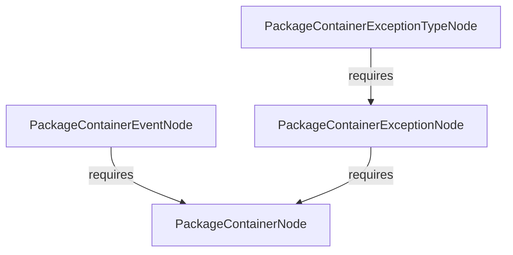

# Diagram: research/orchestrator/tasks/data_transforms/package_features.py

> Auto-generated by Obscura crawlers

## Diagram 1

```mermaid
classDiagram
    GraphReduceNode <|-- PackageContainerExceptionTypeNode
    GraphReduceNode <|-- SolutionNode
    GraphReduceNode <|-- OrganizationNode
    GraphReduceNode <|-- PackageContainerExceptionNode
    GraphReduceNode <|-- PackageContainerEventNode
    GraphReduceNode <|-- TripLegNode
    GraphReduceNode <|-- PackageContainerToTripLegNode
    GraphReduceNode <|-- PackageContainerNode
    GraphReduceNode <|-- LocationNode
    
    class GraphReduceNode {
        +do_annotate()
        +do_normalize()
        +do_filters()
        +do_labels()
        +do_reduce()
        +do_post_join_annotate()
    }
    
    class PackageContainerExceptionTypeNode {
        +prefix: ext
        +pk: id
        +do_annotate()
        +do_normalize()
        +do_filters()
        +do_labels()
        +do_reduce()
        +do_post_join_annotate()
    }
    
    class SolutionNode {
        +prefix: sol
        +pk: id
        +do_annotate()
        +do_normalize()
        +do_filters()
        +do_labels()
        +do_reduce()
        +do_post_join_annotate()
    }
    
    class OrganizationNode {
        +prefix: org
        +pk: id
        +do_annotate()
        +do_normalize()
        +do_filters()
        +do_labels()
        +do_reduce()
        +do_post_join_annotate()
    }
    
    class PackageContainerExceptionNode {
        +prefix: ex
        +pk: id
        +date_key: resolved_ts
        +do_annotate()
        +do_normalize()
        +do_filters()
        +do_labels()
        +do_reduce()
        +do_post_join_annotate()
        +do_post_join_filters()
    }
    
    class PackageContainerEventNode {
        +prefix: evt
        +pk: id
        +date_key: event_ts
        +env: str
        +do_annotate()
        +do_normalize()
        +do_filters()
        +do_labels()
        +do_reduce()
        +do_post_join_annotate()
    }
    
    class TripLegNode {
        +prefix: tl
        +pk: id
        +date_key: ts
        +do_annotate()
        +do_filters()
        +do_normalize()
        +do_labels()
        +do_reduce()
        +do_post_join_annotate()
        +do_post_join_filters()
    }
    
    class PackageContainerToTripLegNode {
        +prefix: ptl
        +pk: id
        +date_key: modified
        +do_annotate()
        +do_filters()
        +do_normalize()
        +do_labels()
        +do_reduce()
        +do_post_join_annotate()
        +do_post_join_filters()
    }
    
    class PackageContainerNode {
        +prefix: pc
        +pk: id
        +date_key: destination_arrived_ts
        +env: str
        +do_annotate()
        +do_normalize()
        +do_filters()
        +do_labels()
        +do_reduce()
        +do_post_join_annotate()
        +do_post_join_filters()
    }
    
    class LocationNode {
        +pk: id
        +date_key: ts
        +do_annotate()
        +do_normalize()
        +do_filters()
        +do_labels()
        +do_reduce()
        +do_post_join_annotate()
    }
```

### SVG

<svg id="container" width="3156.984375" xmlns="http://www.w3.org/2000/svg" class="classDiagram" height="672" viewBox="0 0 3156.984375 672" role="graphics-document document" aria-roledescription="class"><g><defs><marker id="container_class-aggregationStart" class="marker aggregation class" refX="18" refY="7" markerWidth="190" markerHeight="240" orient="auto"><path d="M 18,7 L9,13 L1,7 L9,1 Z"></path></marker></defs><defs><marker id="container_class-aggregationEnd" class="marker aggregation class" refX="1" refY="7" markerWidth="20" markerHeight="28" orient="auto"><path d="M 18,7 L9,13 L1,7 L9,1 Z"></path></marker></defs><defs><marker id="container_class-extensionStart" class="marker extension class" refX="18" refY="7" markerWidth="190" markerHeight="240" orient="auto"><path d="M 1,7 L18,13 V 1 Z"></path></marker></defs><defs><marker id="container_class-extensionEnd" class="marker extension class" refX="1" refY="7" markerWidth="20" markerHeight="28" orient="auto"><path d="M 1,1 V 13 L18,7 Z"></path></marker></defs><defs><marker id="container_class-compositionStart" class="marker composition class" refX="18" refY="7" markerWidth="190" markerHeight="240" orient="auto"><path d="M 18,7 L9,13 L1,7 L9,1 Z"></path></marker></defs><defs><marker id="container_class-compositionEnd" class="marker composition class" refX="1" refY="7" markerWidth="20" markerHeight="28" orient="auto"><path d="M 18,7 L9,13 L1,7 L9,1 Z"></path></marker></defs><defs><marker id="container_class-dependencyStart" class="marker dependency class" refX="6" refY="7" markerWidth="190" markerHeight="240" orient="auto"><path d="M 5,7 L9,13 L1,7 L9,1 Z"></path></marker></defs><defs><marker id="container_class-dependencyEnd" class="marker dependency class" refX="13" refY="7" markerWidth="20" markerHeight="28" orient="auto"><path d="M 18,7 L9,13 L14,7 L9,1 Z"></path></marker></defs><defs><marker id="container_class-lollipopStart" class="marker lollipop class" refX="13" refY="7" markerWidth="190" markerHeight="240" orient="auto"><circle stroke="black" fill="transparent" cx="7" cy="7" r="6"></circle></marker></defs><defs><marker id="container_class-lollipopEnd" class="marker lollipop class" refX="1" refY="7" markerWidth="190" markerHeight="240" orient="auto"><circle stroke="black" fill="transparent" cx="7" cy="7" r="6"></circle></marker></defs><g class="root"><g class="clusters"></g><g class="edgePaths"><path d="M1428.955,147.532L1221.219,169.443C1013.484,191.355,598.013,235.177,390.278,267.255C182.543,299.333,182.543,319.667,182.543,329.833L182.543,340" id="id_GraphReduceNode_PackageContainerExceptionTypeNode_1" class="edge-thickness-normal edge-pattern-solid relation" style=";;;" data-edge="true" data-et="edge" data-id="id_GraphReduceNode_PackageContainerExceptionTypeNode_1" data-points="W3sieCI6MTQ0Ni4xMDkzNzUsInkiOjE0NS43MjI3MDUwNzczMDk0fSx7IngiOjE4Mi41NDI5Njg3NSwieSI6Mjc5fSx7IngiOjE4Mi41NDI5Njg3NSwieSI6MzQwfV0=" marker-start="url(#container_class-extensionStart)"></path><path d="M1429.029,153.126L1280.492,174.105C1131.954,195.084,834.879,237.042,686.342,268.188C537.805,299.333,537.805,319.667,537.805,329.833L537.805,340" id="id_GraphReduceNode_SolutionNode_2" class="edge-thickness-normal edge-pattern-solid relation" style=";;;" data-edge="true" data-et="edge" data-id="id_GraphReduceNode_SolutionNode_2" data-points="W3sieCI6MTQ0Ni4xMDkzNzUsInkiOjE1MC43MTQwOTcxOTcxMTE3Nn0seyJ4Ijo1MzcuODA0Njg3NSwieSI6Mjc5fSx7IngiOjUzNy44MDQ2ODc1LCJ5IjozNDB9XQ==" marker-start="url(#container_class-extensionStart)"></path><path d="M1429.205,162.79L1333.865,182.159C1238.526,201.527,1047.847,240.263,952.507,269.798C857.168,299.333,857.168,319.667,857.168,329.833L857.168,340" id="id_GraphReduceNode_OrganizationNode_3" class="edge-thickness-normal edge-pattern-solid relation" style=";;;" data-edge="true" data-et="edge" data-id="id_GraphReduceNode_OrganizationNode_3" data-points="W3sieCI6MTQ0Ni4xMDkzNzUsInkiOjE1OS4zNTYxNzg0ODYwMjE2fSx7IngiOjg1Ny4xNjc5Njg3NSwieSI6Mjc5fSx7IngiOjg1Ny4xNjc5Njg3NSwieSI6MzQwfV0=" marker-start="url(#container_class-extensionStart)"></path><path d="M1430.07,192.582L1393.673,206.985C1357.276,221.388,1284.482,250.194,1248.085,270.764C1211.688,291.333,1211.688,303.667,1211.688,309.833L1211.688,316" id="id_GraphReduceNode_PackageContainerExceptionNode_4" class="edge-thickness-normal edge-pattern-solid relation" style=";;;" data-edge="true" data-et="edge" data-id="id_GraphReduceNode_PackageContainerExceptionNode_4" data-points="W3sieCI6MTQ0Ni4xMDkzNzUsInkiOjE4Ni4yMzUwOTMyMTYzNTU5NX0seyJ4IjoxMjExLjY4NzUsInkiOjI3OX0seyJ4IjoxMjExLjY4NzUsInkiOjMxNn1d" marker-start="url(#container_class-extensionStart)"></path><path d="M1585.691,271.25L1585.691,272.542C1585.691,273.833,1585.691,276.417,1585.691,283.875C1585.691,291.333,1585.691,303.667,1585.691,309.833L1585.691,316" id="id_GraphReduceNode_PackageContainerEventNode_5" class="edge-thickness-normal edge-pattern-solid relation" style=";;;" data-edge="true" data-et="edge" data-id="id_GraphReduceNode_PackageContainerEventNode_5" data-points="W3sieCI6MTU4NS42OTE0MDYyNSwieSI6MjU0fSx7IngiOjE1ODUuNjkxNDA2MjUsInkiOjI3OX0seyJ4IjoxNTg1LjY5MTQwNjI1LCJ5IjozMTZ9XQ==" marker-start="url(#container_class-extensionStart)"></path><path d="M1741.067,199.246L1771.33,212.538C1801.593,225.83,1862.119,252.415,1892.382,271.874C1922.645,291.333,1922.645,303.667,1922.645,309.833L1922.645,316" id="id_GraphReduceNode_TripLegNode_6" class="edge-thickness-normal edge-pattern-solid relation" style=";;;" data-edge="true" data-et="edge" data-id="id_GraphReduceNode_TripLegNode_6" data-points="W3sieCI6MTcyNS4yNzM0Mzc1LCJ5IjoxOTIuMzA4NjQ4MjcyNjY0MDR9LHsieCI6MTkyMi42NDQ1MzEyNSwieSI6Mjc5fSx7IngiOjE5MjIuNjQ0NTMxMjUsInkiOjMxNn1d" marker-start="url(#container_class-extensionStart)"></path><path d="M1742.131,164.969L1829.658,183.974C1917.185,202.979,2092.239,240.99,2179.766,266.161C2267.293,291.333,2267.293,303.667,2267.293,309.833L2267.293,316" id="id_GraphReduceNode_PackageContainerToTripLegNode_7" class="edge-thickness-normal edge-pattern-solid relation" style=";;;" data-edge="true" data-et="edge" data-id="id_GraphReduceNode_PackageContainerToTripLegNode_7" data-points="W3sieCI6MTcyNS4yNzM0Mzc1LCJ5IjoxNjEuMzA4MjM1NDI4OTY0NDJ9LHsieCI6MjI2Ny4yOTI5Njg3NSwieSI6Mjc5fSx7IngiOjIyNjcuMjkyOTY4NzUsInkiOjMxNn1d" marker-start="url(#container_class-extensionStart)"></path><path d="M1742.362,152.582L1895.315,173.652C2048.267,194.721,2354.173,236.861,2507.125,262.097C2660.078,287.333,2660.078,295.667,2660.078,299.833L2660.078,304" id="id_GraphReduceNode_PackageContainerNode_8" class="edge-thickness-normal edge-pattern-solid relation" style=";;;" data-edge="true" data-et="edge" data-id="id_GraphReduceNode_PackageContainerNode_8" data-points="W3sieCI6MTcyNS4yNzM0Mzc1LCJ5IjoxNTAuMjI3ODQ0MzczNDI1MjZ9LHsieCI6MjY2MC4wNzgxMjUsInkiOjI3OX0seyJ4IjoyNjYwLjA3ODEyNSwieSI6MzA0fV0=" marker-start="url(#container_class-extensionStart)"></path><path d="M1742.432,147.196L1955.029,169.163C2167.625,191.131,2592.819,235.065,2805.415,267.199C3018.012,299.333,3018.012,319.667,3018.012,329.833L3018.012,340" id="id_GraphReduceNode_LocationNode_9" class="edge-thickness-normal edge-pattern-solid relation" style=";;;" data-edge="true" data-et="edge" data-id="id_GraphReduceNode_LocationNode_9" data-points="W3sieCI6MTcyNS4yNzM0Mzc1LCJ5IjoxNDUuNDIyODQ5NzI0ODIzN30seyJ4IjozMDE4LjAxMTcxODc1LCJ5IjoyNzl9LHsieCI6MzAxOC4wMTE3MTg3NSwieSI6MzQwfV0=" marker-start="url(#container_class-extensionStart)"></path></g><g class="edgeLabels"><g class="edgeLabel"><g class="label" data-id="id_GraphReduceNode_PackageContainerExceptionTypeNode_1" transform="translate(0, 0)"><foreignObject width="0" height="0">

</foreignObject></g></g><g class="edgeLabel"><g class="label" data-id="id_GraphReduceNode_SolutionNode_2" transform="translate(0, 0)"><foreignObject width="0" height="0">

</foreignObject></g></g><g class="edgeLabel"><g class="label" data-id="id_GraphReduceNode_OrganizationNode_3" transform="translate(0, 0)"><foreignObject width="0" height="0">

</foreignObject></g></g><g class="edgeLabel"><g class="label" data-id="id_GraphReduceNode_PackageContainerExceptionNode_4" transform="translate(0, 0)"><foreignObject width="0" height="0">

</foreignObject></g></g><g class="edgeLabel"><g class="label" data-id="id_GraphReduceNode_PackageContainerEventNode_5" transform="translate(0, 0)"><foreignObject width="0" height="0">

</foreignObject></g></g><g class="edgeLabel"><g class="label" data-id="id_GraphReduceNode_TripLegNode_6" transform="translate(0, 0)"><foreignObject width="0" height="0">

</foreignObject></g></g><g class="edgeLabel"><g class="label" data-id="id_GraphReduceNode_PackageContainerToTripLegNode_7" transform="translate(0, 0)"><foreignObject width="0" height="0">

</foreignObject></g></g><g class="edgeLabel"><g class="label" data-id="id_GraphReduceNode_PackageContainerNode_8" transform="translate(0, 0)"><foreignObject width="0" height="0">

</foreignObject></g></g><g class="edgeLabel"><g class="label" data-id="id_GraphReduceNode_LocationNode_9" transform="translate(0, 0)"><foreignObject width="0" height="0">

</foreignObject></g></g></g><g class="nodes"><g class="node default" id="classId-GraphReduceNode-0" transform="translate(1585.69140625, 131)"><g class="basic label-container"><path d="M-139.58203125 -123 L139.58203125 -123 L139.58203125 123 L-139.58203125 123" stroke="none" stroke-width="0" fill="#ECECFF" style=""></path><path d="M-139.58203125 -123 C-59.096668498526554 -123, 21.38869425294689 -123, 139.58203125 -123 M-139.58203125 -123 C-56.44182228273941 -123, 26.698386684521182 -123, 139.58203125 -123 M139.58203125 -123 C139.58203125 -34.640120989060804, 139.58203125 53.71975802187839, 139.58203125 123 M139.58203125 -123 C139.58203125 -43.7038417007293, 139.58203125 35.5923165985414, 139.58203125 123 M139.58203125 123 C28.182915180316087 123, -83.21620088936783 123, -139.58203125 123 M139.58203125 123 C55.35202531337353 123, -28.877980623252938 123, -139.58203125 123 M-139.58203125 123 C-139.58203125 33.03457710583886, -139.58203125 -56.93084578832227, -139.58203125 -123 M-139.58203125 123 C-139.58203125 58.139412092230586, -139.58203125 -6.721175815538828, -139.58203125 -123" stroke="#9370DB" stroke-width="1.3" fill="none" stroke-dasharray="0 0" style=""></path></g><g class="annotation-group text" transform="translate(0, -99)"></g><g class="label-group text" transform="translate(-67.7578125, -99)"><g class="label" style="font-weight: bolder" transform="translate(0,-12)"><foreignObject width="135.515625" height="24">

GraphReduceNode

</foreignObject></g></g><g class="members-group text" transform="translate(-127.58203125, -51)"></g><g class="methods-group text" transform="translate(-127.58203125, -21)"><g class="label" style="" transform="translate(0,-12)"><foreignObject width="110.375" height="24">

+do_annotate()

</foreignObject></g><g class="label" style="" transform="translate(0,12)"><foreignObject width="117.21875" height="24">

+do_normalize()

</foreignObject></g><g class="label" style="" transform="translate(0,36)"><foreignObject width="86.5" height="24">

+do_filters()

</foreignObject></g><g class="label" style="" transform="translate(0,60)"><foreignObject width="88.8125" height="24">

+do_labels()

</foreignObject></g><g class="label" style="" transform="translate(0,84)"><foreignObject width="94.609375" height="24">

+do_reduce()

</foreignObject></g><g class="label" style="" transform="translate(0,108)"><foreignObject width="187.40625" height="24">

+do_post_join_annotate()

</foreignObject></g></g><g class="divider" style=""><path d="M-139.58203125 -75 C-69.89899252719265 -75, -0.21595380438529332 -75, 139.58203125 -75 M-139.58203125 -75 C-54.256369846364734 -75, 31.06929155727053 -75, 139.58203125 -75" stroke="#9370DB" stroke-width="1.3" fill="none" stroke-dasharray="0 0" style=""></path></g><g class="divider" style=""><path d="M-139.58203125 -51 C-39.05420875283049 -51, 61.47361374433902 -51, 139.58203125 -51 M-139.58203125 -51 C-79.50034938734402 -51, -19.418667524688047 -51, 139.58203125 -51" stroke="#9370DB" stroke-width="1.3" fill="none" stroke-dasharray="0 0" style=""></path></g></g><g class="node default" id="classId-PackageContainerExceptionTypeNode-1" transform="translate(182.54296875, 484)"><g class="basic label-container"><path d="M-174.54296875 -144 L174.54296875 -144 L174.54296875 144 L-174.54296875 144" stroke="none" stroke-width="0" fill="#ECECFF" style=""></path><path d="M-174.54296875 -144 C-38.63848706843487 -144, 97.26599461313026 -144, 174.54296875 -144 M-174.54296875 -144 C-92.28876520148854 -144, -10.03456165297709 -144, 174.54296875 -144 M174.54296875 -144 C174.54296875 -34.30229405884131, 174.54296875 75.39541188231738, 174.54296875 144 M174.54296875 -144 C174.54296875 -62.0649199632675, 174.54296875 19.870160073465, 174.54296875 144 M174.54296875 144 C50.16849388791664 144, -74.20598097416672 144, -174.54296875 144 M174.54296875 144 C60.44769884517392 144, -53.647571059652165 144, -174.54296875 144 M-174.54296875 144 C-174.54296875 81.14143196920173, -174.54296875 18.282863938403466, -174.54296875 -144 M-174.54296875 144 C-174.54296875 37.3783916476371, -174.54296875 -69.2432167047258, -174.54296875 -144" stroke="#9370DB" stroke-width="1.3" fill="none" stroke-dasharray="0 0" style=""></path></g><g class="annotation-group text" transform="translate(0, -120)"></g><g class="label-group text" transform="translate(-137.6796875, -120)"><g class="label" style="font-weight: bolder" transform="translate(0,-12)"><foreignObject width="275.359375" height="24">

PackageContainerExceptionTypeNode

</foreignObject></g></g><g class="members-group text" transform="translate(-162.54296875, -72)"><g class="label" style="" transform="translate(0,-12)"><foreignObject width="79.125" height="24">

+prefix: ext

</foreignObject></g><g class="label" style="" transform="translate(0,12)"><foreignObject width="47.90625" height="24">

+pk: id

</foreignObject></g></g><g class="methods-group text" transform="translate(-162.54296875, 0)"><g class="label" style="" transform="translate(0,-12)"><foreignObject width="110.375" height="24">

+do_annotate()

</foreignObject></g><g class="label" style="" transform="translate(0,12)"><foreignObject width="117.21875" height="24">

+do_normalize()

</foreignObject></g><g class="label" style="" transform="translate(0,36)"><foreignObject width="86.5" height="24">

+do_filters()

</foreignObject></g><g class="label" style="" transform="translate(0,60)"><foreignObject width="88.8125" height="24">

+do_labels()

</foreignObject></g><g class="label" style="" transform="translate(0,84)"><foreignObject width="94.609375" height="24">

+do_reduce()

</foreignObject></g><g class="label" style="" transform="translate(0,108)"><foreignObject width="187.40625" height="24">

+do_post_join_annotate()

</foreignObject></g></g><g class="divider" style=""><path d="M-174.54296875 -96 C-66.16207444938354 -96, 42.21881985123292 -96, 174.54296875 -96 M-174.54296875 -96 C-42.683171806419324 -96, 89.17662513716135 -96, 174.54296875 -96" stroke="#9370DB" stroke-width="1.3" fill="none" stroke-dasharray="0 0" style=""></path></g><g class="divider" style=""><path d="M-174.54296875 -24 C-37.830803888684926 -24, 98.88136097263015 -24, 174.54296875 -24 M-174.54296875 -24 C-82.55385961322192 -24, 9.435249523556166 -24, 174.54296875 -24" stroke="#9370DB" stroke-width="1.3" fill="none" stroke-dasharray="0 0" style=""></path></g></g><g class="node default" id="classId-SolutionNode-2" transform="translate(537.8046875, 484)"><g class="basic label-container"><path d="M-130.71875 -144 L130.71875 -144 L130.71875 144 L-130.71875 144" stroke="none" stroke-width="0" fill="#ECECFF" style=""></path><path d="M-130.71875 -144 C-38.22052844459667 -144, 54.277693110806666 -144, 130.71875 -144 M-130.71875 -144 C-70.20387096586526 -144, -9.688991931730513 -144, 130.71875 -144 M130.71875 -144 C130.71875 -34.83243507695255, 130.71875 74.3351298460949, 130.71875 144 M130.71875 -144 C130.71875 -51.00899631075235, 130.71875 41.9820073784953, 130.71875 144 M130.71875 144 C45.613533966592996 144, -39.49168206681401 144, -130.71875 144 M130.71875 144 C35.20860659839923 144, -60.30153680320154 144, -130.71875 144 M-130.71875 144 C-130.71875 80.59938702509473, -130.71875 17.198774050189456, -130.71875 -144 M-130.71875 144 C-130.71875 77.30313796735274, -130.71875 10.60627593470548, -130.71875 -144" stroke="#9370DB" stroke-width="1.3" fill="none" stroke-dasharray="0 0" style=""></path></g><g class="annotation-group text" transform="translate(0, -120)"></g><g class="label-group text" transform="translate(-50.03125, -120)"><g class="label" style="font-weight: bolder" transform="translate(0,-12)"><foreignObject width="100.0625" height="24">

SolutionNode

</foreignObject></g></g><g class="members-group text" transform="translate(-118.71875, -72)"><g class="label" style="" transform="translate(0,-12)"><foreignObject width="78.515625" height="24">

+prefix: sol

</foreignObject></g><g class="label" style="" transform="translate(0,12)"><foreignObject width="47.90625" height="24">

+pk: id

</foreignObject></g></g><g class="methods-group text" transform="translate(-118.71875, 0)"><g class="label" style="" transform="translate(0,-12)"><foreignObject width="110.375" height="24">

+do_annotate()

</foreignObject></g><g class="label" style="" transform="translate(0,12)"><foreignObject width="117.21875" height="24">

+do_normalize()

</foreignObject></g><g class="label" style="" transform="translate(0,36)"><foreignObject width="86.5" height="24">

+do_filters()

</foreignObject></g><g class="label" style="" transform="translate(0,60)"><foreignObject width="88.8125" height="24">

+do_labels()

</foreignObject></g><g class="label" style="" transform="translate(0,84)"><foreignObject width="94.609375" height="24">

+do_reduce()

</foreignObject></g><g class="label" style="" transform="translate(0,108)"><foreignObject width="187.40625" height="24">

+do_post_join_annotate()

</foreignObject></g></g><g class="divider" style=""><path d="M-130.71875 -96 C-26.656238660750418 -96, 77.40627267849916 -96, 130.71875 -96 M-130.71875 -96 C-30.654401392282892 -96, 69.40994721543422 -96, 130.71875 -96" stroke="#9370DB" stroke-width="1.3" fill="none" stroke-dasharray="0 0" style=""></path></g><g class="divider" style=""><path d="M-130.71875 -24 C-45.36580833165179 -24, 39.98713333669642 -24, 130.71875 -24 M-130.71875 -24 C-78.04128393337146 -24, -25.363817866742934 -24, 130.71875 -24" stroke="#9370DB" stroke-width="1.3" fill="none" stroke-dasharray="0 0" style=""></path></g></g><g class="node default" id="classId-OrganizationNode-3" transform="translate(857.16796875, 484)"><g class="basic label-container"><path d="M-138.64453125 -144 L138.64453125 -144 L138.64453125 144 L-138.64453125 144" stroke="none" stroke-width="0" fill="#ECECFF" style=""></path><path d="M-138.64453125 -144 C-79.77456126931175 -144, -20.904591288623493 -144, 138.64453125 -144 M-138.64453125 -144 C-38.006070152435456 -144, 62.63239094512909 -144, 138.64453125 -144 M138.64453125 -144 C138.64453125 -79.3154606064031, 138.64453125 -14.630921212806186, 138.64453125 144 M138.64453125 -144 C138.64453125 -34.935845862499576, 138.64453125 74.12830827500085, 138.64453125 144 M138.64453125 144 C34.953267161325584 144, -68.73799692734883 144, -138.64453125 144 M138.64453125 144 C58.41806192874519 144, -21.808407392509622 144, -138.64453125 144 M-138.64453125 144 C-138.64453125 42.16284841794052, -138.64453125 -59.67430316411895, -138.64453125 -144 M-138.64453125 144 C-138.64453125 34.7953855431162, -138.64453125 -74.4092289137676, -138.64453125 -144" stroke="#9370DB" stroke-width="1.3" fill="none" stroke-dasharray="0 0" style=""></path></g><g class="annotation-group text" transform="translate(0, -120)"></g><g class="label-group text" transform="translate(-65.8828125, -120)"><g class="label" style="font-weight: bolder" transform="translate(0,-12)"><foreignObject width="131.765625" height="24">

OrganizationNode

</foreignObject></g></g><g class="members-group text" transform="translate(-126.64453125, -72)"><g class="label" style="" transform="translate(0,-12)"><foreignObject width="80.609375" height="24">

+prefix: org

</foreignObject></g><g class="label" style="" transform="translate(0,12)"><foreignObject width="47.90625" height="24">

+pk: id

</foreignObject></g></g><g class="methods-group text" transform="translate(-126.64453125, 0)"><g class="label" style="" transform="translate(0,-12)"><foreignObject width="110.375" height="24">

+do_annotate()

</foreignObject></g><g class="label" style="" transform="translate(0,12)"><foreignObject width="117.21875" height="24">

+do_normalize()

</foreignObject></g><g class="label" style="" transform="translate(0,36)"><foreignObject width="86.5" height="24">

+do_filters()

</foreignObject></g><g class="label" style="" transform="translate(0,60)"><foreignObject width="88.8125" height="24">

+do_labels()

</foreignObject></g><g class="label" style="" transform="translate(0,84)"><foreignObject width="94.609375" height="24">

+do_reduce()

</foreignObject></g><g class="label" style="" transform="translate(0,108)"><foreignObject width="187.40625" height="24">

+do_post_join_annotate()

</foreignObject></g></g><g class="divider" style=""><path d="M-138.64453125 -96 C-75.68438017973341 -96, -12.724229109466833 -96, 138.64453125 -96 M-138.64453125 -96 C-79.76803894798897 -96, -20.89154664597794 -96, 138.64453125 -96" stroke="#9370DB" stroke-width="1.3" fill="none" stroke-dasharray="0 0" style=""></path></g><g class="divider" style=""><path d="M-138.64453125 -24 C-60.20172948060788 -24, 18.24107228878424 -24, 138.64453125 -24 M-138.64453125 -24 C-60.19899339738551 -24, 18.246544455228985 -24, 138.64453125 -24" stroke="#9370DB" stroke-width="1.3" fill="none" stroke-dasharray="0 0" style=""></path></g></g><g class="node default" id="classId-PackageContainerExceptionNode-4" transform="translate(1211.6875, 484)"><g class="basic label-container"><path d="M-165.875 -168 L165.875 -168 L165.875 168 L-165.875 168" stroke="none" stroke-width="0" fill="#ECECFF" style=""></path><path d="M-165.875 -168 C-95.31414099043734 -168, -24.753281980874675 -168, 165.875 -168 M-165.875 -168 C-98.04392811968142 -168, -30.21285623936285 -168, 165.875 -168 M165.875 -168 C165.875 -66.85001234734702, 165.875 34.29997530530596, 165.875 168 M165.875 -168 C165.875 -49.64843009783614, 165.875 68.70313980432772, 165.875 168 M165.875 168 C93.66864255937597 168, 21.462285118751936 168, -165.875 168 M165.875 168 C40.998581369937725 168, -83.87783726012455 168, -165.875 168 M-165.875 168 C-165.875 79.19311250432702, -165.875 -9.613774991345963, -165.875 -168 M-165.875 168 C-165.875 80.76807896194919, -165.875 -6.463842076101628, -165.875 -168" stroke="#9370DB" stroke-width="1.3" fill="none" stroke-dasharray="0 0" style=""></path></g><g class="annotation-group text" transform="translate(0, -144)"></g><g class="label-group text" transform="translate(-120.34375, -144)"><g class="label" style="font-weight: bolder" transform="translate(0,-12)"><foreignObject width="240.6875" height="24">

PackageContainerExceptionNode

</foreignObject></g></g><g class="members-group text" transform="translate(-153.875, -96)"><g class="label" style="" transform="translate(0,-12)"><foreignObject width="73.359375" height="24">

+prefix: ex

</foreignObject></g><g class="label" style="" transform="translate(0,12)"><foreignObject width="47.90625" height="24">

+pk: id

</foreignObject></g><g class="label" style="" transform="translate(0,36)"><foreignObject width="164.34375" height="24">

+date_key: resolved_ts

</foreignObject></g></g><g class="methods-group text" transform="translate(-153.875, 0)"><g class="label" style="" transform="translate(0,-12)"><foreignObject width="110.375" height="24">

+do_annotate()

</foreignObject></g><g class="label" style="" transform="translate(0,12)"><foreignObject width="117.21875" height="24">

+do_normalize()

</foreignObject></g><g class="label" style="" transform="translate(0,36)"><foreignObject width="86.5" height="24">

+do_filters()

</foreignObject></g><g class="label" style="" transform="translate(0,60)"><foreignObject width="88.8125" height="24">

+do_labels()

</foreignObject></g><g class="label" style="" transform="translate(0,84)"><foreignObject width="94.609375" height="24">

+do_reduce()

</foreignObject></g><g class="label" style="" transform="translate(0,108)"><foreignObject width="187.40625" height="24">

+do_post_join_annotate()

</foreignObject></g><g class="label" style="" transform="translate(0,132)"><foreignObject width="163.53125" height="24">

+do_post_join_filters()

</foreignObject></g></g><g class="divider" style=""><path d="M-165.875 -120 C-72.01371032105537 -120, 21.84757935788926 -120, 165.875 -120 M-165.875 -120 C-74.94175535993271 -120, 15.991489280134573 -120, 165.875 -120" stroke="#9370DB" stroke-width="1.3" fill="none" stroke-dasharray="0 0" style=""></path></g><g class="divider" style=""><path d="M-165.875 -24 C-35.17778166955043 -24, 95.51943666089915 -24, 165.875 -24 M-165.875 -24 C-44.34352965712705 -24, 77.1879406857459 -24, 165.875 -24" stroke="#9370DB" stroke-width="1.3" fill="none" stroke-dasharray="0 0" style=""></path></g></g><g class="node default" id="classId-PackageContainerEventNode-5" transform="translate(1585.69140625, 484)"><g class="basic label-container"><path d="M-158.12890625 -168 L158.12890625 -168 L158.12890625 168 L-158.12890625 168" stroke="none" stroke-width="0" fill="#ECECFF" style=""></path><path d="M-158.12890625 -168 C-45.95963489002297 -168, 66.20963646995406 -168, 158.12890625 -168 M-158.12890625 -168 C-80.14551529185216 -168, -2.1621243337043268 -168, 158.12890625 -168 M158.12890625 -168 C158.12890625 -48.03743156076014, 158.12890625 71.92513687847972, 158.12890625 168 M158.12890625 -168 C158.12890625 -72.40673861208579, 158.12890625 23.186522775828422, 158.12890625 168 M158.12890625 168 C58.60976038343509 168, -40.909385483129824 168, -158.12890625 168 M158.12890625 168 C52.32944396113615 168, -53.4700183277277 168, -158.12890625 168 M-158.12890625 168 C-158.12890625 44.339284654030976, -158.12890625 -79.32143069193805, -158.12890625 -168 M-158.12890625 168 C-158.12890625 68.44003812782502, -158.12890625 -31.11992374434996, -158.12890625 -168" stroke="#9370DB" stroke-width="1.3" fill="none" stroke-dasharray="0 0" style=""></path></g><g class="annotation-group text" transform="translate(0, -144)"></g><g class="label-group text" transform="translate(-104.8515625, -144)"><g class="label" style="font-weight: bolder" transform="translate(0,-12)"><foreignObject width="209.703125" height="24">

PackageContainerEventNode

</foreignObject></g></g><g class="members-group text" transform="translate(-146.12890625, -96)"><g class="label" style="" transform="translate(0,-12)"><foreignObject width="79.3125" height="24">

+prefix: evt

</foreignObject></g><g class="label" style="" transform="translate(0,12)"><foreignObject width="47.90625" height="24">

+pk: id

</foreignObject></g><g class="label" style="" transform="translate(0,36)"><foreignObject width="142.828125" height="24">

+date_key: event_ts

</foreignObject></g><g class="label" style="" transform="translate(0,60)"><foreignObject width="61.421875" height="24">

+env: str

</foreignObject></g></g><g class="methods-group text" transform="translate(-146.12890625, 24)"><g class="label" style="" transform="translate(0,-12)"><foreignObject width="110.375" height="24">

+do_annotate()

</foreignObject></g><g class="label" style="" transform="translate(0,12)"><foreignObject width="117.21875" height="24">

+do_normalize()

</foreignObject></g><g class="label" style="" transform="translate(0,36)"><foreignObject width="86.5" height="24">

+do_filters()

</foreignObject></g><g class="label" style="" transform="translate(0,60)"><foreignObject width="88.8125" height="24">

+do_labels()

</foreignObject></g><g class="label" style="" transform="translate(0,84)"><foreignObject width="94.609375" height="24">

+do_reduce()

</foreignObject></g><g class="label" style="" transform="translate(0,108)"><foreignObject width="187.40625" height="24">

+do_post_join_annotate()

</foreignObject></g></g><g class="divider" style=""><path d="M-158.12890625 -120 C-35.89411481233172 -120, 86.34067662533656 -120, 158.12890625 -120 M-158.12890625 -120 C-72.21556444102958 -120, 13.69777736794083 -120, 158.12890625 -120" stroke="#9370DB" stroke-width="1.3" fill="none" stroke-dasharray="0 0" style=""></path></g><g class="divider" style=""><path d="M-158.12890625 0 C-73.74362957279448 0, 10.64164710441105 0, 158.12890625 0 M-158.12890625 0 C-85.83624256428025 0, -13.54357887856051 0, 158.12890625 0" stroke="#9370DB" stroke-width="1.3" fill="none" stroke-dasharray="0 0" style=""></path></g></g><g class="node default" id="classId-TripLegNode-6" transform="translate(1922.64453125, 484)"><g class="basic label-container"><path d="M-128.82421875 -168 L128.82421875 -168 L128.82421875 168 L-128.82421875 168" stroke="none" stroke-width="0" fill="#ECECFF" style=""></path><path d="M-128.82421875 -168 C-33.94729000016994 -168, 60.929638749660114 -168, 128.82421875 -168 M-128.82421875 -168 C-28.19201656933157 -168, 72.44018561133686 -168, 128.82421875 -168 M128.82421875 -168 C128.82421875 -45.37695969124992, 128.82421875 77.24608061750016, 128.82421875 168 M128.82421875 -168 C128.82421875 -39.400017382419094, 128.82421875 89.19996523516181, 128.82421875 168 M128.82421875 168 C39.07041131591288 168, -50.683396118174244 168, -128.82421875 168 M128.82421875 168 C49.18707034143961 168, -30.450078067120785 168, -128.82421875 168 M-128.82421875 168 C-128.82421875 61.54335678930953, -128.82421875 -44.913286421380946, -128.82421875 -168 M-128.82421875 168 C-128.82421875 64.20594618003422, -128.82421875 -39.588107639931565, -128.82421875 -168" stroke="#9370DB" stroke-width="1.3" fill="none" stroke-dasharray="0 0" style=""></path></g><g class="annotation-group text" transform="translate(0, -144)"></g><g class="label-group text" transform="translate(-46.2421875, -144)"><g class="label" style="font-weight: bolder" transform="translate(0,-12)"><foreignObject width="92.484375" height="24">

TripLegNode

</foreignObject></g></g><g class="members-group text" transform="translate(-116.82421875, -96)"><g class="label" style="" transform="translate(0,-12)"><foreignObject width="67.3125" height="24">

+prefix: tl

</foreignObject></g><g class="label" style="" transform="translate(0,12)"><foreignObject width="47.90625" height="24">

+pk: id

</foreignObject></g><g class="label" style="" transform="translate(0,36)"><foreignObject width="94.484375" height="24">

+date_key: ts

</foreignObject></g></g><g class="methods-group text" transform="translate(-116.82421875, 0)"><g class="label" style="" transform="translate(0,-12)"><foreignObject width="110.375" height="24">

+do_annotate()

</foreignObject></g><g class="label" style="" transform="translate(0,12)"><foreignObject width="86.5" height="24">

+do_filters()

</foreignObject></g><g class="label" style="" transform="translate(0,36)"><foreignObject width="117.21875" height="24">

+do_normalize()

</foreignObject></g><g class="label" style="" transform="translate(0,60)"><foreignObject width="88.8125" height="24">

+do_labels()

</foreignObject></g><g class="label" style="" transform="translate(0,84)"><foreignObject width="94.609375" height="24">

+do_reduce()

</foreignObject></g><g class="label" style="" transform="translate(0,108)"><foreignObject width="187.40625" height="24">

+do_post_join_annotate()

</foreignObject></g><g class="label" style="" transform="translate(0,132)"><foreignObject width="163.53125" height="24">

+do_post_join_filters()

</foreignObject></g></g><g class="divider" style=""><path d="M-128.82421875 -120 C-57.311979157018214 -120, 14.200260435963571 -120, 128.82421875 -120 M-128.82421875 -120 C-28.953571124180925 -120, 70.91707650163815 -120, 128.82421875 -120" stroke="#9370DB" stroke-width="1.3" fill="none" stroke-dasharray="0 0" style=""></path></g><g class="divider" style=""><path d="M-128.82421875 -24 C-55.37512095620633 -24, 18.073976837587338 -24, 128.82421875 -24 M-128.82421875 -24 C-28.54321268699512 -24, 71.73779337600976 -24, 128.82421875 -24" stroke="#9370DB" stroke-width="1.3" fill="none" stroke-dasharray="0 0" style=""></path></g></g><g class="node default" id="classId-PackageContainerToTripLegNode-7" transform="translate(2267.29296875, 484)"><g class="basic label-container"><path d="M-165.82421875 -168 L165.82421875 -168 L165.82421875 168 L-165.82421875 168" stroke="none" stroke-width="0" fill="#ECECFF" style=""></path><path d="M-165.82421875 -168 C-71.77963886565351 -168, 22.26494101869298 -168, 165.82421875 -168 M-165.82421875 -168 C-55.318482699652975 -168, 55.18725335069405 -168, 165.82421875 -168 M165.82421875 -168 C165.82421875 -64.25450104782863, 165.82421875 39.49099790434275, 165.82421875 168 M165.82421875 -168 C165.82421875 -67.50064904919697, 165.82421875 32.99870190160607, 165.82421875 168 M165.82421875 168 C51.3549455901335 168, -63.11432756973301 168, -165.82421875 168 M165.82421875 168 C40.104725137473366 168, -85.61476847505327 168, -165.82421875 168 M-165.82421875 168 C-165.82421875 61.31658893014631, -165.82421875 -45.36682213970738, -165.82421875 -168 M-165.82421875 168 C-165.82421875 71.38940759448036, -165.82421875 -25.22118481103928, -165.82421875 -168" stroke="#9370DB" stroke-width="1.3" fill="none" stroke-dasharray="0 0" style=""></path></g><g class="annotation-group text" transform="translate(0, -144)"></g><g class="label-group text" transform="translate(-120.2421875, -144)"><g class="label" style="font-weight: bolder" transform="translate(0,-12)"><foreignObject width="240.484375" height="24">

PackageContainerToTripLegNode

</foreignObject></g></g><g class="members-group text" transform="translate(-153.82421875, -96)"><g class="label" style="" transform="translate(0,-12)"><foreignObject width="76.828125" height="24">

+prefix: ptl

</foreignObject></g><g class="label" style="" transform="translate(0,12)"><foreignObject width="47.90625" height="24">

+pk: id

</foreignObject></g><g class="label" style="" transform="translate(0,36)"><foreignObject width="145.859375" height="24">

+date_key: modified

</foreignObject></g></g><g class="methods-group text" transform="translate(-153.82421875, 0)"><g class="label" style="" transform="translate(0,-12)"><foreignObject width="110.375" height="24">

+do_annotate()

</foreignObject></g><g class="label" style="" transform="translate(0,12)"><foreignObject width="86.5" height="24">

+do_filters()

</foreignObject></g><g class="label" style="" transform="translate(0,36)"><foreignObject width="117.21875" height="24">

+do_normalize()

</foreignObject></g><g class="label" style="" transform="translate(0,60)"><foreignObject width="88.8125" height="24">

+do_labels()

</foreignObject></g><g class="label" style="" transform="translate(0,84)"><foreignObject width="94.609375" height="24">

+do_reduce()

</foreignObject></g><g class="label" style="" transform="translate(0,108)"><foreignObject width="187.40625" height="24">

+do_post_join_annotate()

</foreignObject></g><g class="label" style="" transform="translate(0,132)"><foreignObject width="163.53125" height="24">

+do_post_join_filters()

</foreignObject></g></g><g class="divider" style=""><path d="M-165.82421875 -120 C-40.90219354997008 -120, 84.01983165005984 -120, 165.82421875 -120 M-165.82421875 -120 C-95.44565798569151 -120, -25.067097221383023 -120, 165.82421875 -120" stroke="#9370DB" stroke-width="1.3" fill="none" stroke-dasharray="0 0" style=""></path></g><g class="divider" style=""><path d="M-165.82421875 -24 C-46.84391588567321 -24, 72.13638697865358 -24, 165.82421875 -24 M-165.82421875 -24 C-74.84347978189476 -24, 16.137259186210485 -24, 165.82421875 -24" stroke="#9370DB" stroke-width="1.3" fill="none" stroke-dasharray="0 0" style=""></path></g></g><g class="node default" id="classId-PackageContainerNode-8" transform="translate(2660.078125, 484)"><g class="basic label-container"><path d="M-176.9609375 -180 L176.9609375 -180 L176.9609375 180 L-176.9609375 180" stroke="none" stroke-width="0" fill="#ECECFF" style=""></path><path d="M-176.9609375 -180 C-96.2390594850382 -180, -15.517181470076395 -180, 176.9609375 -180 M-176.9609375 -180 C-101.30502346607203 -180, -25.64910943214406 -180, 176.9609375 -180 M176.9609375 -180 C176.9609375 -48.92104990817509, 176.9609375 82.15790018364982, 176.9609375 180 M176.9609375 -180 C176.9609375 -71.18346931980189, 176.9609375 37.633061360396226, 176.9609375 180 M176.9609375 180 C39.33869229141874 180, -98.28355291716252 180, -176.9609375 180 M176.9609375 180 C45.50893468696532 180, -85.94306812606936 180, -176.9609375 180 M-176.9609375 180 C-176.9609375 100.77831573960108, -176.9609375 21.556631479202167, -176.9609375 -180 M-176.9609375 180 C-176.9609375 43.56833139491076, -176.9609375 -92.86333721017849, -176.9609375 -180" stroke="#9370DB" stroke-width="1.3" fill="none" stroke-dasharray="0 0" style=""></path></g><g class="annotation-group text" transform="translate(0, -156)"></g><g class="label-group text" transform="translate(-84.640625, -156)"><g class="label" style="font-weight: bolder" transform="translate(0,-12)"><foreignObject width="169.28125" height="24">

PackageContainerNode

</foreignObject></g></g><g class="members-group text" transform="translate(-164.9609375, -108)"><g class="label" style="" transform="translate(0,-12)"><foreignObject width="74.171875" height="24">

+prefix: pc

</foreignObject></g><g class="label" style="" transform="translate(0,12)"><foreignObject width="47.90625" height="24">

+pk: id

</foreignObject></g><g class="label" style="" transform="translate(0,36)"><foreignObject width="245.28125" height="24">

+date_key: destination_arrived_ts

</foreignObject></g><g class="label" style="" transform="translate(0,60)"><foreignObject width="61.421875" height="24">

+env: str

</foreignObject></g></g><g class="methods-group text" transform="translate(-164.9609375, 12)"><g class="label" style="" transform="translate(0,-12)"><foreignObject width="110.375" height="24">

+do_annotate()

</foreignObject></g><g class="label" style="" transform="translate(0,12)"><foreignObject width="117.21875" height="24">

+do_normalize()

</foreignObject></g><g class="label" style="" transform="translate(0,36)"><foreignObject width="86.5" height="24">

+do_filters()

</foreignObject></g><g class="label" style="" transform="translate(0,60)"><foreignObject width="88.8125" height="24">

+do_labels()

</foreignObject></g><g class="label" style="" transform="translate(0,84)"><foreignObject width="94.609375" height="24">

+do_reduce()

</foreignObject></g><g class="label" style="" transform="translate(0,108)"><foreignObject width="187.40625" height="24">

+do_post_join_annotate()

</foreignObject></g><g class="label" style="" transform="translate(0,132)"><foreignObject width="163.53125" height="24">

+do_post_join_filters()

</foreignObject></g></g><g class="divider" style=""><path d="M-176.9609375 -132 C-104.8569713692783 -132, -32.7530052385566 -132, 176.9609375 -132 M-176.9609375 -132 C-103.93183455897646 -132, -30.902731617952924 -132, 176.9609375 -132" stroke="#9370DB" stroke-width="1.3" fill="none" stroke-dasharray="0 0" style=""></path></g><g class="divider" style=""><path d="M-176.9609375 -12 C-70.96709043671868 -12, 35.026756626562644 -12, 176.9609375 -12 M-176.9609375 -12 C-60.714804803857916 -12, 55.53132789228417 -12, 176.9609375 -12" stroke="#9370DB" stroke-width="1.3" fill="none" stroke-dasharray="0 0" style=""></path></g></g><g class="node default" id="classId-LocationNode-9" transform="translate(3018.01171875, 484)"><g class="basic label-container"><path d="M-130.97265625 -144 L130.97265625 -144 L130.97265625 144 L-130.97265625 144" stroke="none" stroke-width="0" fill="#ECECFF" style=""></path><path d="M-130.97265625 -144 C-47.93404063982119 -144, 35.10457497035762 -144, 130.97265625 -144 M-130.97265625 -144 C-43.26617404812586 -144, 44.440308153748276 -144, 130.97265625 -144 M130.97265625 -144 C130.97265625 -50.078989163265916, 130.97265625 43.84202167346817, 130.97265625 144 M130.97265625 -144 C130.97265625 -59.438719948873356, 130.97265625 25.12256010225329, 130.97265625 144 M130.97265625 144 C67.01567141664711 144, 3.058686583294218 144, -130.97265625 144 M130.97265625 144 C60.783608321323044 144, -9.405439607353912 144, -130.97265625 144 M-130.97265625 144 C-130.97265625 28.892055371869745, -130.97265625 -86.21588925626051, -130.97265625 -144 M-130.97265625 144 C-130.97265625 78.56540049582894, -130.97265625 13.130800991657878, -130.97265625 -144" stroke="#9370DB" stroke-width="1.3" fill="none" stroke-dasharray="0 0" style=""></path></g><g class="annotation-group text" transform="translate(0, -120)"></g><g class="label-group text" transform="translate(-50.5390625, -120)"><g class="label" style="font-weight: bolder" transform="translate(0,-12)"><foreignObject width="101.078125" height="24">

LocationNode

</foreignObject></g></g><g class="members-group text" transform="translate(-118.97265625, -72)"><g class="label" style="" transform="translate(0,-12)"><foreignObject width="47.90625" height="24">

+pk: id

</foreignObject></g><g class="label" style="" transform="translate(0,12)"><foreignObject width="94.484375" height="24">

+date_key: ts

</foreignObject></g></g><g class="methods-group text" transform="translate(-118.97265625, 0)"><g class="label" style="" transform="translate(0,-12)"><foreignObject width="110.375" height="24">

+do_annotate()

</foreignObject></g><g class="label" style="" transform="translate(0,12)"><foreignObject width="117.21875" height="24">

+do_normalize()

</foreignObject></g><g class="label" style="" transform="translate(0,36)"><foreignObject width="86.5" height="24">

+do_filters()

</foreignObject></g><g class="label" style="" transform="translate(0,60)"><foreignObject width="88.8125" height="24">

+do_labels()

</foreignObject></g><g class="label" style="" transform="translate(0,84)"><foreignObject width="94.609375" height="24">

+do_reduce()

</foreignObject></g><g class="label" style="" transform="translate(0,108)"><foreignObject width="187.40625" height="24">

+do_post_join_annotate()

</foreignObject></g></g><g class="divider" style=""><path d="M-130.97265625 -96 C-28.052817148727 -96, 74.867021952546 -96, 130.97265625 -96 M-130.97265625 -96 C-73.10572676986476 -96, -15.238797289729519 -96, 130.97265625 -96" stroke="#9370DB" stroke-width="1.3" fill="none" stroke-dasharray="0 0" style=""></path></g><g class="divider" style=""><path d="M-130.97265625 -24 C-75.7380350636073 -24, -20.503413877214584 -24, 130.97265625 -24 M-130.97265625 -24 C-30.67536176316527 -24, 69.62193272366946 -24, 130.97265625 -24" stroke="#9370DB" stroke-width="1.3" fill="none" stroke-dasharray="0 0" style=""></path></g></g></g></g></g></svg>

## Diagram 2

### SVG

<svg id="container" width="647.7734375" xmlns="http://www.w3.org/2000/svg" class="flowchart" height="326" viewBox="0 0 647.7734375 326" role="graphics-document document" aria-roledescription="flowchart-v2"><g><marker id="container_flowchart-v2-pointEnd" class="marker flowchart-v2" viewBox="0 0 10 10" refX="5" refY="5" markerUnits="userSpaceOnUse" markerWidth="8" markerHeight="8" orient="auto"><path d="M 0 0 L 10 5 L 0 10 z" class="arrowMarkerPath" style="stroke-width: 1; stroke-dasharray: 1, 0;"></path></marker><marker id="container_flowchart-v2-pointStart" class="marker flowchart-v2" viewBox="0 0 10 10" refX="4.5" refY="5" markerUnits="userSpaceOnUse" markerWidth="8" markerHeight="8" orient="auto"><path d="M 0 5 L 10 10 L 10 0 z" class="arrowMarkerPath" style="stroke-width: 1; stroke-dasharray: 1, 0;"></path></marker><marker id="container_flowchart-v2-circleEnd" class="marker flowchart-v2" viewBox="0 0 10 10" refX="11" refY="5" markerUnits="userSpaceOnUse" markerWidth="11" markerHeight="11" orient="auto"><circle cx="5" cy="5" r="5" class="arrowMarkerPath" style="stroke-width: 1; stroke-dasharray: 1, 0;"></circle></marker><marker id="container_flowchart-v2-circleStart" class="marker flowchart-v2" viewBox="0 0 10 10" refX="-1" refY="5" markerUnits="userSpaceOnUse" markerWidth="11" markerHeight="11" orient="auto"><circle cx="5" cy="5" r="5" class="arrowMarkerPath" style="stroke-width: 1; stroke-dasharray: 1, 0;"></circle></marker><marker id="container_flowchart-v2-crossEnd" class="marker cross flowchart-v2" viewBox="0 0 11 11" refX="12" refY="5.2" markerUnits="userSpaceOnUse" markerWidth="11" markerHeight="11" orient="auto"><path d="M 1,1 l 9,9 M 10,1 l -9,9" class="arrowMarkerPath" style="stroke-width: 2; stroke-dasharray: 1, 0;"></path></marker><marker id="container_flowchart-v2-crossStart" class="marker cross flowchart-v2" viewBox="0 0 11 11" refX="-1" refY="5.2" markerUnits="userSpaceOnUse" markerWidth="11" markerHeight="11" orient="auto"><path d="M 1,1 l 9,9 M 10,1 l -9,9" class="arrowMarkerPath" style="stroke-width: 2; stroke-dasharray: 1, 0;"></path></marker><g class="root"><g class="clusters"></g><g class="edgePaths"><path d="M473.977,62L473.977,68.167C473.977,74.333,473.977,86.667,473.977,98.333C473.977,110,473.977,121,473.977,126.5L473.977,132" id="L_PackageContainerExceptionTypeNode_PackageContainerExceptionNode_0" class="edge-thickness-normal edge-pattern-solid edge-thickness-normal edge-pattern-solid flowchart-link" style=";" data-edge="true" data-et="edge" data-id="L_PackageContainerExceptionTypeNode_PackageContainerExceptionNode_0" data-points="W3sieCI6NDczLjk3NjU2MjUsInkiOjYyfSx7IngiOjQ3My45NzY1NjI1LCJ5Ijo5OX0seyJ4Ijo0NzMuOTc2NTYyNSwieSI6MTM2fV0=" marker-end="url(#container_flowchart-v2-pointEnd)"></path><path d="M141.523,190L141.523,196.167C141.523,202.333,141.523,214.667,156.918,226.76C172.312,238.854,203.101,250.709,218.496,256.636L233.89,262.563" id="L_PackageContainerEventNode_PackageContainerNode_0" class="edge-thickness-normal edge-pattern-solid edge-thickness-normal edge-pattern-solid flowchart-link" style=";" data-edge="true" data-et="edge" data-id="L_PackageContainerEventNode_PackageContainerNode_0" data-points="W3sieCI6MTQxLjUyMzQzNzUsInkiOjE5MH0seyJ4IjoxNDEuNTIzNDM3NSwieSI6MjI3fSx7IngiOjIzNy42MjMxNjg5NDUzMTI1LCJ5IjoyNjR9XQ==" marker-end="url(#container_flowchart-v2-pointEnd)"></path><path d="M473.977,190L473.977,196.167C473.977,202.333,473.977,214.667,458.582,226.76C443.188,238.854,412.399,250.709,397.004,256.636L381.61,262.563" id="L_PackageContainerExceptionNode_PackageContainerNode_0" class="edge-thickness-normal edge-pattern-solid edge-thickness-normal edge-pattern-solid flowchart-link" style=";" data-edge="true" data-et="edge" data-id="L_PackageContainerExceptionNode_PackageContainerNode_0" data-points="W3sieCI6NDczLjk3NjU2MjUsInkiOjE5MH0seyJ4Ijo0NzMuOTc2NTYyNSwieSI6MjI3fSx7IngiOjM3Ny44NzY4MzEwNTQ2ODc1LCJ5IjoyNjR9XQ==" marker-end="url(#container_flowchart-v2-pointEnd)"></path></g><g class="edgeLabels"><g class="edgeLabel" transform="translate(473.9765625, 99)"><g class="label" data-id="L_PackageContainerExceptionTypeNode_PackageContainerExceptionNode_0" transform="translate(-29.8515625, -12)"><foreignObject width="59.703125" height="24">

requires

</foreignObject></g></g><g class="edgeLabel" transform="translate(141.5234375, 227)"><g class="label" data-id="L_PackageContainerEventNode_PackageContainerNode_0" transform="translate(-29.8515625, -12)"><foreignObject width="59.703125" height="24">

requires

</foreignObject></g></g><g class="edgeLabel" transform="translate(473.9765625, 227)"><g class="label" data-id="L_PackageContainerExceptionNode_PackageContainerNode_0" transform="translate(-29.8515625, -12)"><foreignObject width="59.703125" height="24">

requires

</foreignObject></g></g></g><g class="nodes"><g class="node default" id="flowchart-PackageContainerExceptionTypeNode-0" transform="translate(473.9765625, 35)"><rect class="basic label-container" style="" x="-165.796875" y="-27" width="331.59375" height="54"></rect><g class="label" style="" transform="translate(-135.796875, -12)"><rect></rect><foreignObject width="271.59375" height="24">

PackageContainerExceptionTypeNode

</foreignObject></g></g><g class="node default" id="flowchart-PackageContainerExceptionNode-1" transform="translate(473.9765625, 163)"><rect class="basic label-container" style="" x="-148.9296875" y="-27" width="297.859375" height="54"></rect><g class="label" style="" transform="translate(-118.9296875, -12)"><rect></rect><foreignObject width="237.859375" height="24">

PackageContainerExceptionNode

</foreignObject></g></g><g class="node default" id="flowchart-PackageContainerEventNode-2" transform="translate(141.5234375, 163)"><rect class="basic label-container" style="" x="-133.5234375" y="-27" width="267.046875" height="54"></rect><g class="label" style="" transform="translate(-103.5234375, -12)"><rect></rect><foreignObject width="207.046875" height="24">

PackageContainerEventNode

</foreignObject></g></g><g class="node default" id="flowchart-PackageContainerNode-3" transform="translate(307.75, 291)"><rect class="basic label-container" style="" x="-113.5625" y="-27" width="227.125" height="54"></rect><g class="label" style="" transform="translate(-83.5625, -12)"><rect></rect><foreignObject width="167.125" height="24">

PackageContainerNode

</foreignObject></g></g></g></g></g></svg>

## Diagram 3

### SVG

<svg id="container" width="1733.125" xmlns="http://www.w3.org/2000/svg" class="flowchart" height="70" viewBox="0 0 1733.125 70" role="graphics-document document" aria-roledescription="flowchart-v2"><g><marker id="container_flowchart-v2-pointEnd" class="marker flowchart-v2" viewBox="0 0 10 10" refX="5" refY="5" markerUnits="userSpaceOnUse" markerWidth="8" markerHeight="8" orient="auto"><path d="M 0 0 L 10 5 L 0 10 z" class="arrowMarkerPath" style="stroke-width: 1; stroke-dasharray: 1, 0;"></path></marker><marker id="container_flowchart-v2-pointStart" class="marker flowchart-v2" viewBox="0 0 10 10" refX="4.5" refY="5" markerUnits="userSpaceOnUse" markerWidth="8" markerHeight="8" orient="auto"><path d="M 0 5 L 10 10 L 10 0 z" class="arrowMarkerPath" style="stroke-width: 1; stroke-dasharray: 1, 0;"></path></marker><marker id="container_flowchart-v2-circleEnd" class="marker flowchart-v2" viewBox="0 0 10 10" refX="11" refY="5" markerUnits="userSpaceOnUse" markerWidth="11" markerHeight="11" orient="auto"><circle cx="5" cy="5" r="5" class="arrowMarkerPath" style="stroke-width: 1; stroke-dasharray: 1, 0;"></circle></marker><marker id="container_flowchart-v2-circleStart" class="marker flowchart-v2" viewBox="0 0 10 10" refX="-1" refY="5" markerUnits="userSpaceOnUse" markerWidth="11" markerHeight="11" orient="auto"><circle cx="5" cy="5" r="5" class="arrowMarkerPath" style="stroke-width: 1; stroke-dasharray: 1, 0;"></circle></marker><marker id="container_flowchart-v2-crossEnd" class="marker cross flowchart-v2" viewBox="0 0 11 11" refX="12" refY="5.2" markerUnits="userSpaceOnUse" markerWidth="11" markerHeight="11" orient="auto"><path d="M 1,1 l 9,9 M 10,1 l -9,9" class="arrowMarkerPath" style="stroke-width: 2; stroke-dasharray: 1, 0;"></path></marker><marker id="container_flowchart-v2-crossStart" class="marker cross flowchart-v2" viewBox="0 0 11 11" refX="-1" refY="5.2" markerUnits="userSpaceOnUse" markerWidth="11" markerHeight="11" orient="auto"><path d="M 1,1 l 9,9 M 10,1 l -9,9" class="arrowMarkerPath" style="stroke-width: 2; stroke-dasharray: 1, 0;"></path></marker><g class="root"><g class="clusters"></g><g class="edgePaths"><path d="M235.125,35L239.292,35C243.458,35,251.792,35,259.458,35C267.125,35,274.125,35,277.625,35L281.125,35" id="L_A_B_0" class="edge-thickness-normal edge-pattern-solid edge-thickness-normal edge-pattern-solid flowchart-link" style=";" data-edge="true" data-et="edge" data-id="L_A_B_0" data-points="W3sieCI6MjM1LjEyNSwieSI6MzV9LHsieCI6MjYwLjEyNSwieSI6MzV9LHsieCI6Mjg1LjEyNSwieSI6MzV9XQ==" marker-end="url(#container_flowchart-v2-pointEnd)"></path><path d="M437.156,35L441.323,35C445.49,35,453.823,35,461.49,35C469.156,35,476.156,35,479.656,35L483.156,35" id="L_B_C_0" class="edge-thickness-normal edge-pattern-solid edge-thickness-normal edge-pattern-solid flowchart-link" style=";" data-edge="true" data-et="edge" data-id="L_B_C_0" data-points="W3sieCI6NDM3LjE1NjI1LCJ5IjozNX0seyJ4Ijo0NjIuMTU2MjUsInkiOjM1fSx7IngiOjQ4Ny4xNTYyNSwieSI6MzV9XQ==" marker-end="url(#container_flowchart-v2-pointEnd)"></path><path d="M646.031,35L650.198,35C654.365,35,662.698,35,670.365,35C678.031,35,685.031,35,688.531,35L692.031,35" id="L_C_D_0" class="edge-thickness-normal edge-pattern-solid edge-thickness-normal edge-pattern-solid flowchart-link" style=";" data-edge="true" data-et="edge" data-id="L_C_D_0" data-points="W3sieCI6NjQ2LjAzMTI1LCJ5IjozNX0seyJ4Ijo2NzEuMDMxMjUsInkiOjM1fSx7IngiOjY5Ni4wMzEyNSwieSI6MzV9XQ==" marker-end="url(#container_flowchart-v2-pointEnd)"></path><path d="M824.188,35L828.354,35C832.521,35,840.854,35,848.521,35C856.188,35,863.188,35,866.688,35L870.188,35" id="L_D_E_0" class="edge-thickness-normal edge-pattern-solid edge-thickness-normal edge-pattern-solid flowchart-link" style=";" data-edge="true" data-et="edge" data-id="L_D_E_0" data-points="W3sieCI6ODI0LjE4NzUsInkiOjM1fSx7IngiOjg0OS4xODc1LCJ5IjozNX0seyJ4Ijo4NzQuMTg3NSwieSI6MzV9XQ==" marker-end="url(#container_flowchart-v2-pointEnd)"></path><path d="M1004.641,35L1008.807,35C1012.974,35,1021.307,35,1028.974,35C1036.641,35,1043.641,35,1047.141,35L1050.641,35" id="L_E_F_0" class="edge-thickness-normal edge-pattern-solid edge-thickness-normal edge-pattern-solid flowchart-link" style=";" data-edge="true" data-et="edge" data-id="L_E_F_0" data-points="W3sieCI6MTAwNC42NDA2MjUsInkiOjM1fSx7IngiOjEwMjkuNjQwNjI1LCJ5IjozNX0seyJ4IjoxMDU0LjY0MDYyNSwieSI6MzV9XQ==" marker-end="url(#container_flowchart-v2-pointEnd)"></path><path d="M1190.906,35L1195.073,35C1199.24,35,1207.573,35,1215.24,35C1222.906,35,1229.906,35,1233.406,35L1236.906,35" id="L_F_G_0" class="edge-thickness-normal edge-pattern-solid edge-thickness-normal edge-pattern-solid flowchart-link" style=";" data-edge="true" data-et="edge" data-id="L_F_G_0" data-points="W3sieCI6MTE5MC45MDYyNSwieSI6MzV9LHsieCI6MTIxNS45MDYyNSwieSI6MzV9LHsieCI6MTI0MC45MDYyNSwieSI6MzV9XQ==" marker-end="url(#container_flowchart-v2-pointEnd)"></path><path d="M1469.953,35L1474.12,35C1478.286,35,1486.62,35,1494.286,35C1501.953,35,1508.953,35,1512.453,35L1515.953,35" id="L_G_H_0" class="edge-thickness-normal edge-pattern-solid edge-thickness-normal edge-pattern-solid flowchart-link" style=";" data-edge="true" data-et="edge" data-id="L_G_H_0" data-points="W3sieCI6MTQ2OS45NTMxMjUsInkiOjM1fSx7IngiOjE0OTQuOTUzMTI1LCJ5IjozNX0seyJ4IjoxNTE5Ljk1MzEyNSwieSI6MzV9XQ==" marker-end="url(#container_flowchart-v2-pointEnd)"></path></g><g class="edgeLabels"><g class="edgeLabel"><g class="label" data-id="L_A_B_0" transform="translate(0, 0)"><foreignObject width="0" height="0">

</foreignObject></g></g><g class="edgeLabel"><g class="label" data-id="L_B_C_0" transform="translate(0, 0)"><foreignObject width="0" height="0">

</foreignObject></g></g><g class="edgeLabel"><g class="label" data-id="L_C_D_0" transform="translate(0, 0)"><foreignObject width="0" height="0">

</foreignObject></g></g><g class="edgeLabel"><g class="label" data-id="L_D_E_0" transform="translate(0, 0)"><foreignObject width="0" height="0">

</foreignObject></g></g><g class="edgeLabel"><g class="label" data-id="L_E_F_0" transform="translate(0, 0)"><foreignObject width="0" height="0">

</foreignObject></g></g><g class="edgeLabel"><g class="label" data-id="L_F_G_0" transform="translate(0, 0)"><foreignObject width="0" height="0">

</foreignObject></g></g><g class="edgeLabel"><g class="label" data-id="L_G_H_0" transform="translate(0, 0)"><foreignObject width="0" height="0">

</foreignObject></g></g></g><g class="nodes"><g class="node default" id="flowchart-A-0" transform="translate(121.5625, 35)"><rect class="basic label-container" style="" x="-113.5625" y="-27" width="227.125" height="54"></rect><g class="label" style="" transform="translate(-83.5625, -12)"><rect></rect><foreignObject width="167.125" height="24">

PackageContainerNode

</foreignObject></g></g><g class="node default" id="flowchart-B-1" transform="translate(361.140625, 35)"><rect class="basic label-container" style="" x="-76.015625" y="-27" width="152.03125" height="54"></rect><g class="label" style="" transform="translate(-46.015625, -12)"><rect></rect><foreignObject width="92.03125" height="24">

do_annotate

</foreignObject></g></g><g class="node default" id="flowchart-C-3" transform="translate(566.59375, 35)"><rect class="basic label-container" style="" x="-79.4375" y="-27" width="158.875" height="54"></rect><g class="label" style="" transform="translate(-49.4375, -12)"><rect></rect><foreignObject width="98.875" height="24">

do_normalize

</foreignObject></g></g><g class="node default" id="flowchart-D-5" transform="translate(760.109375, 35)"><rect class="basic label-container" style="" x="-64.078125" y="-27" width="128.15625" height="54"></rect><g class="label" style="" transform="translate(-34.078125, -12)"><rect></rect><foreignObject width="68.15625" height="24">

do_filters

</foreignObject></g></g><g class="node default" id="flowchart-E-7" transform="translate(939.4140625, 35)"><rect class="basic label-container" style="" x="-65.2265625" y="-27" width="130.453125" height="54"></rect><g class="label" style="" transform="translate(-35.2265625, -12)"><rect></rect><foreignObject width="70.453125" height="24">

do_labels

</foreignObject></g></g><g class="node default" id="flowchart-F-9" transform="translate(1122.7734375, 35)"><rect class="basic label-container" style="" x="-68.1328125" y="-27" width="136.265625" height="54"></rect><g class="label" style="" transform="translate(-38.1328125, -12)"><rect></rect><foreignObject width="76.265625" height="24">

do_reduce

</foreignObject></g></g><g class="node default" id="flowchart-G-11" transform="translate(1355.4296875, 35)"><rect class="basic label-container" style="" x="-114.5234375" y="-27" width="229.046875" height="54"></rect><g class="label" style="" transform="translate(-84.5234375, -12)"><rect></rect><foreignObject width="169.046875" height="24">

do_post_join_annotate

</foreignObject></g></g><g class="node default" id="flowchart-H-13" transform="translate(1622.5390625, 35)"><rect class="basic label-container" style="" x="-102.5859375" y="-27" width="205.171875" height="54"></rect><g class="label" style="" transform="translate(-72.5859375, -12)"><rect></rect><foreignObject width="145.171875" height="24">

do_post_join_filters

</foreignObject></g></g></g></g></g></svg>
