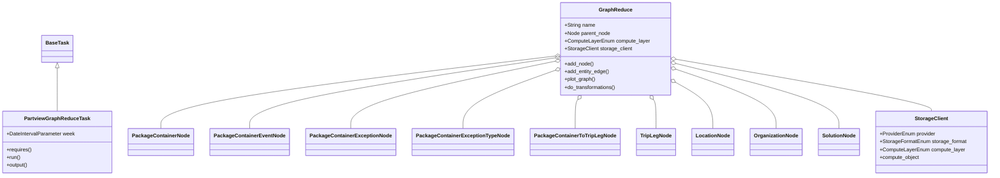
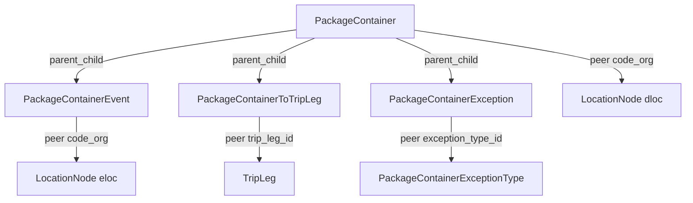
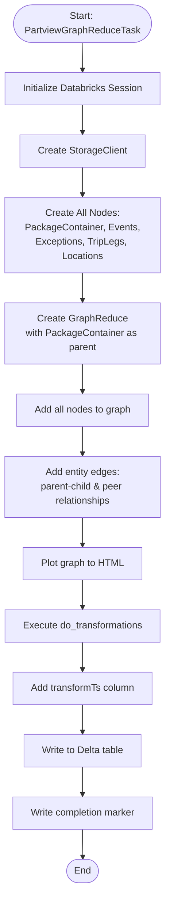
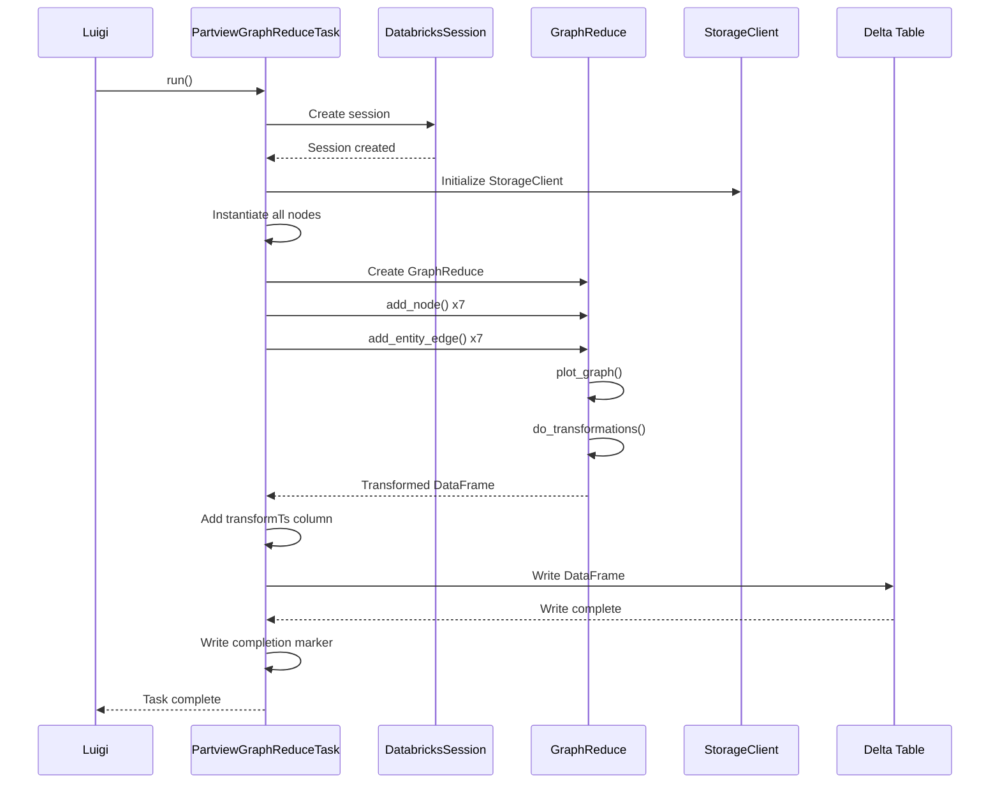
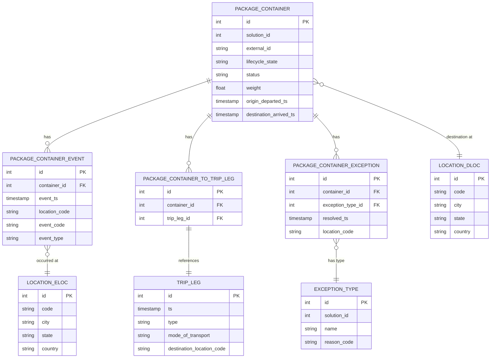

# Diagram: research/orchestrator/tasks/data_transforms/partview_graph_reduce.py

> Auto-generated by Obscura crawlers

## Diagram 1

### SVG

<svg id="container" width="2967.0703125" xmlns="http://www.w3.org/2000/svg" class="classDiagram" height="546" viewBox="0 0 2967.0703125 546" role="graphics-document document" aria-roledescription="class"><g><defs><marker id="container_class-aggregationStart" class="marker aggregation class" refX="18" refY="7" markerWidth="190" markerHeight="240" orient="auto"><path d="M 18,7 L9,13 L1,7 L9,1 Z"></path></marker></defs><defs><marker id="container_class-aggregationEnd" class="marker aggregation class" refX="1" refY="7" markerWidth="20" markerHeight="28" orient="auto"><path d="M 18,7 L9,13 L1,7 L9,1 Z"></path></marker></defs><defs><marker id="container_class-extensionStart" class="marker extension class" refX="18" refY="7" markerWidth="190" markerHeight="240" orient="auto"><path d="M 1,7 L18,13 V 1 Z"></path></marker></defs><defs><marker id="container_class-extensionEnd" class="marker extension class" refX="1" refY="7" markerWidth="20" markerHeight="28" orient="auto"><path d="M 1,1 V 13 L18,7 Z"></path></marker></defs><defs><marker id="container_class-compositionStart" class="marker composition class" refX="18" refY="7" markerWidth="190" markerHeight="240" orient="auto"><path d="M 18,7 L9,13 L1,7 L9,1 Z"></path></marker></defs><defs><marker id="container_class-compositionEnd" class="marker composition class" refX="1" refY="7" markerWidth="20" markerHeight="28" orient="auto"><path d="M 18,7 L9,13 L1,7 L9,1 Z"></path></marker></defs><defs><marker id="container_class-dependencyStart" class="marker dependency class" refX="6" refY="7" markerWidth="190" markerHeight="240" orient="auto"><path d="M 5,7 L9,13 L1,7 L9,1 Z"></path></marker></defs><defs><marker id="container_class-dependencyEnd" class="marker dependency class" refX="13" refY="7" markerWidth="20" markerHeight="28" orient="auto"><path d="M 18,7 L9,13 L14,7 L9,1 Z"></path></marker></defs><defs><marker id="container_class-lollipopStart" class="marker lollipop class" refX="13" refY="7" markerWidth="190" markerHeight="240" orient="auto"><circle stroke="black" fill="transparent" cx="7" cy="7" r="6"></circle></marker></defs><defs><marker id="container_class-lollipopEnd" class="marker lollipop class" refX="1" refY="7" markerWidth="190" markerHeight="240" orient="auto"><circle stroke="black" fill="transparent" cx="7" cy="7" r="6"></circle></marker></defs><g class="root"><g class="clusters"></g><g class="edgePaths"><path d="M174.492,211.25L174.492,229.542C174.492,247.833,174.492,284.417,174.492,306.875C174.492,329.333,174.492,337.667,174.492,341.833L174.492,346" id="id_BaseTask_PartviewGraphReduceTask_1" class="edge-thickness-normal edge-pattern-solid relation" style=";;;" data-edge="true" data-et="edge" data-id="id_BaseTask_PartviewGraphReduceTask_1" data-points="W3sieCI6MTc0LjQ5MjE4NzUsInkiOjE5NH0seyJ4IjoxNzQuNDkyMTg3NSwieSI6MzIxfSx7IngiOjE3NC40OTIxODc1LCJ5IjozNDZ9XQ==" marker-start="url(#container_class-extensionStart)"></path><path d="M1649.181,175.253L1455.588,199.544C1261.996,223.835,874.81,272.418,681.218,309.876C487.625,347.333,487.625,373.667,487.625,386.833L487.625,400" id="id_GraphReduce_PackageContainerNode_2" class="edge-thickness-normal edge-pattern-solid relation" style=";;;" data-edge="true" data-et="edge" data-id="id_GraphReduce_PackageContainerNode_2" data-points="W3sieCI6MTY2Ni4yOTY4NzUsInkiOjE3My4xMDUzOTQ0MzE1NTQ1Mn0seyJ4Ijo0ODcuNjI1LCJ5IjozMjF9LHsieCI6NDg3LjYyNSwieSI6NDAwfV0=" marker-start="url(#container_class-aggregationStart)"></path><path d="M1649.253,180.897L1499.564,204.248C1349.874,227.598,1050.496,274.299,900.806,310.816C751.117,347.333,751.117,373.667,751.117,386.833L751.117,400" id="id_GraphReduce_PackageContainerEventNode_3" class="edge-thickness-normal edge-pattern-solid relation" style=";;;" data-edge="true" data-et="edge" data-id="id_GraphReduce_PackageContainerEventNode_3" data-points="W3sieCI6MTY2Ni4yOTY4NzUsInkiOjE3OC4yMzg0ODkxMDc0Njg2NH0seyJ4Ijo3NTEuMTE3MTg3NSwieSI6MzIxfSx7IngiOjc1MS4xMTcxODc1LCJ5Ijo0MDB9XQ==" marker-start="url(#container_class-aggregationStart)"></path><path d="M1649.434,191.884L1549.58,213.403C1449.727,234.922,1250.02,277.961,1150.166,312.647C1050.313,347.333,1050.313,373.667,1050.313,386.833L1050.313,400" id="id_GraphReduce_PackageContainerExceptionNode_4" class="edge-thickness-normal edge-pattern-solid relation" style=";;;" data-edge="true" data-et="edge" data-id="id_GraphReduce_PackageContainerExceptionNode_4" data-points="W3sieCI6MTY2Ni4yOTY4NzUsInkiOjE4OC4yNDk0MDIyNDc1NDkyfSx7IngiOjEwNTAuMzEyNSwieSI6MzIxfSx7IngiOjEwNTAuMzEyNSwieSI6NDAwfV0=" marker-start="url(#container_class-aggregationStart)"></path><path d="M1650.139,220.907L1605.505,237.589C1560.871,254.271,1471.603,287.636,1426.97,317.484C1382.336,347.333,1382.336,373.667,1382.336,386.833L1382.336,400" id="id_GraphReduce_PackageContainerExceptionTypeNode_5" class="edge-thickness-normal edge-pattern-solid relation" style=";;;" data-edge="true" data-et="edge" data-id="id_GraphReduce_PackageContainerExceptionTypeNode_5" data-points="W3sieCI6MTY2Ni4yOTY4NzUsInkiOjIxNC44NjcyODc1MjM1NDEzfSx7IngiOjEzODIuMzM1OTM3NSwieSI6MzIxfSx7IngiOjEzODIuMzM1OTM3NSwieSI6NDAwfV0=" marker-start="url(#container_class-aggregationStart)"></path><path d="M1722.045,310.055L1720.747,311.88C1719.449,313.704,1716.853,317.352,1715.556,332.343C1714.258,347.333,1714.258,373.667,1714.258,386.833L1714.258,400" id="id_GraphReduce_PackageContainerToTripLegNode_6" class="edge-thickness-normal edge-pattern-solid relation" style=";;;" data-edge="true" data-et="edge" data-id="id_GraphReduce_PackageContainerToTripLegNode_6" data-points="W3sieCI6MTczMi4wNDUxMTgzNDMxOTUzLCJ5IjoyOTZ9LHsieCI6MTcxNC4yNTc4MTI1LCJ5IjozMjF9LHsieCI6MTcxNC4yNTc4MTI1LCJ5Ijo0MDB9XQ==" marker-start="url(#container_class-aggregationStart)"></path><path d="M1946.955,310.055L1948.253,311.88C1949.551,313.704,1952.147,317.352,1953.444,332.343C1954.742,347.333,1954.742,373.667,1954.742,386.833L1954.742,400" id="id_GraphReduce_TripLegNode_7" class="edge-thickness-normal edge-pattern-solid relation" style=";;;" data-edge="true" data-et="edge" data-id="id_GraphReduce_TripLegNode_7" data-points="W3sieCI6MTkzNi45NTQ4ODE2NTY4MDQ3LCJ5IjoyOTZ9LHsieCI6MTk1NC43NDIxODc1LCJ5IjozMjF9LHsieCI6MTk1NC43NDIxODc1LCJ5Ijo0MDB9XQ==" marker-start="url(#container_class-aggregationStart)"></path><path d="M2017.62,258.34L2035.604,268.783C2053.588,279.226,2089.556,300.113,2107.54,323.723C2125.523,347.333,2125.523,373.667,2125.523,386.833L2125.523,400" id="id_GraphReduce_LocationNode_8" class="edge-thickness-normal edge-pattern-solid relation" style=";;;" data-edge="true" data-et="edge" data-id="id_GraphReduce_LocationNode_8" data-points="W3sieCI6MjAwMi43MDMxMjUsInkiOjI0OS42NzcxMDkzMzkzNDY2fSx7IngiOjIxMjUuNTIzNDM3NSwieSI6MzIxfSx7IngiOjIxMjUuNTIzNDM3NSwieSI6NDAwfV0=" marker-start="url(#container_class-aggregationStart)"></path><path d="M2018.979,216.757L2068.474,234.131C2117.968,251.505,2216.957,286.252,2266.451,316.793C2315.945,347.333,2315.945,373.667,2315.945,386.833L2315.945,400" id="id_GraphReduce_OrganizationNode_9" class="edge-thickness-normal edge-pattern-solid relation" style=";;;" data-edge="true" data-et="edge" data-id="id_GraphReduce_OrganizationNode_9" data-points="W3sieCI6MjAwMi43MDMxMjUsInkiOjIxMS4wNDM3MzIyNTE1MjEzfSx7IngiOjIzMTUuOTQ1MzEyNSwieSI6MzIxfSx7IngiOjIzMTUuOTQ1MzEyNSwieSI6NDAwfV0=" marker-start="url(#container_class-aggregationStart)"></path><path d="M2019.431,198.552L2100.503,218.96C2181.574,239.368,2343.717,280.184,2424.788,313.759C2505.859,347.333,2505.859,373.667,2505.859,386.833L2505.859,400" id="id_GraphReduce_SolutionNode_10" class="edge-thickness-normal edge-pattern-solid relation" style=";;;" data-edge="true" data-et="edge" data-id="id_GraphReduce_SolutionNode_10" data-points="W3sieCI6MjAwMi43MDMxMjUsInkiOjE5NC4zNDE0NDgwODgwNjc1OH0seyJ4IjoyNTA1Ljg1OTM3NSwieSI6MzIxfSx7IngiOjI1MDUuODU5Mzc1LCJ5Ijo0MDB9XQ==" marker-start="url(#container_class-aggregationStart)"></path><path d="M2019.689,184.807L2147.821,207.506C2275.953,230.204,2532.217,275.602,2660.348,302.468C2788.48,329.333,2788.48,337.667,2788.48,341.833L2788.48,346" id="id_GraphReduce_StorageClient_11" class="edge-thickness-normal edge-pattern-solid relation" style=";;;" data-edge="true" data-et="edge" data-id="id_GraphReduce_StorageClient_11" data-points="W3sieCI6MjAwMi43MDMxMjUsInkiOjE4MS43OTc1OTk2OTUzNTU0fSx7IngiOjI3ODguNDgwNDY4NzUsInkiOjMyMX0seyJ4IjoyNzg4LjQ4MDQ2ODc1LCJ5IjozNDZ9XQ==" marker-start="url(#container_class-aggregationStart)"></path></g><g class="edgeLabels"><g class="edgeLabel"><g class="label" data-id="id_BaseTask_PartviewGraphReduceTask_1" transform="translate(0, 0)"><foreignObject width="0" height="0">

</foreignObject></g></g><g class="edgeLabel"><g class="label" data-id="id_GraphReduce_PackageContainerNode_2" transform="translate(0, 0)"><foreignObject width="0" height="0">

</foreignObject></g></g><g class="edgeLabel"><g class="label" data-id="id_GraphReduce_PackageContainerEventNode_3" transform="translate(0, 0)"><foreignObject width="0" height="0">

</foreignObject></g></g><g class="edgeLabel"><g class="label" data-id="id_GraphReduce_PackageContainerExceptionNode_4" transform="translate(0, 0)"><foreignObject width="0" height="0">

</foreignObject></g></g><g class="edgeLabel"><g class="label" data-id="id_GraphReduce_PackageContainerExceptionTypeNode_5" transform="translate(0, 0)"><foreignObject width="0" height="0">

</foreignObject></g></g><g class="edgeLabel"><g class="label" data-id="id_GraphReduce_PackageContainerToTripLegNode_6" transform="translate(0, 0)"><foreignObject width="0" height="0">

</foreignObject></g></g><g class="edgeLabel"><g class="label" data-id="id_GraphReduce_TripLegNode_7" transform="translate(0, 0)"><foreignObject width="0" height="0">

</foreignObject></g></g><g class="edgeLabel"><g class="label" data-id="id_GraphReduce_LocationNode_8" transform="translate(0, 0)"><foreignObject width="0" height="0">

</foreignObject></g></g><g class="edgeLabel"><g class="label" data-id="id_GraphReduce_OrganizationNode_9" transform="translate(0, 0)"><foreignObject width="0" height="0">

</foreignObject></g></g><g class="edgeLabel"><g class="label" data-id="id_GraphReduce_SolutionNode_10" transform="translate(0, 0)"><foreignObject width="0" height="0">

</foreignObject></g></g><g class="edgeLabel"><g class="label" data-id="id_GraphReduce_StorageClient_11" transform="translate(0, 0)"><foreignObject width="0" height="0">

</foreignObject></g></g></g><g class="nodes"><g class="node default" id="classId-BaseTask-0" transform="translate(174.4921875, 152)"><g class="basic label-container"><path d="M-46.03125 -42 L46.03125 -42 L46.03125 42 L-46.03125 42" stroke="none" stroke-width="0" fill="#ECECFF" style=""></path><path d="M-46.03125 -42 C-26.47502850359076 -42, -6.91880700718152 -42, 46.03125 -42 M-46.03125 -42 C-27.25491165023747 -42, -8.478573300474942 -42, 46.03125 -42 M46.03125 -42 C46.03125 -19.161950295035993, 46.03125 3.676099409928014, 46.03125 42 M46.03125 -42 C46.03125 -20.85279820240302, 46.03125 0.29440359519396253, 46.03125 42 M46.03125 42 C19.305064492952734 42, -7.421121014094531 42, -46.03125 42 M46.03125 42 C18.919505435039454 42, -8.192239129921091 42, -46.03125 42 M-46.03125 42 C-46.03125 20.946894357551294, -46.03125 -0.10621128489741238, -46.03125 -42 M-46.03125 42 C-46.03125 23.657914829942072, -46.03125 5.315829659884145, -46.03125 -42" stroke="#9370DB" stroke-width="1.3" fill="none" stroke-dasharray="0 0" style=""></path></g><g class="annotation-group text" transform="translate(0, -18)"></g><g class="label-group text" transform="translate(-34.03125, -18)"><g class="label" style="font-weight: bolder" transform="translate(0,-12)"><foreignObject width="68.0625" height="24">

BaseTask

</foreignObject></g></g><g class="members-group text" transform="translate(-34.03125, 30)"></g><g class="methods-group text" transform="translate(-34.03125, 60)"></g><g class="divider" style=""><path d="M-46.03125 6 C-9.585596834660272 6, 26.860056330679456 6, 46.03125 6 M-46.03125 6 C-17.544235268424107 6, 10.942779463151787 6, 46.03125 6" stroke="#9370DB" stroke-width="1.3" fill="none" stroke-dasharray="0 0" style=""></path></g><g class="divider" style=""><path d="M-46.03125 24 C-20.40381757617308 24, 5.223614847653842 24, 46.03125 24 M-46.03125 24 C-21.31886972223241 24, 3.3935105555351797 24, 46.03125 24" stroke="#9370DB" stroke-width="1.3" fill="none" stroke-dasharray="0 0" style=""></path></g></g><g class="node default" id="classId-PartviewGraphReduceTask-1" transform="translate(174.4921875, 442)"><g class="basic label-container"><path d="M-166.4921875 -96 L166.4921875 -96 L166.4921875 96 L-166.4921875 96" stroke="none" stroke-width="0" fill="#ECECFF" style=""></path><path d="M-166.4921875 -96 C-35.25987736442616 -96, 95.97243277114768 -96, 166.4921875 -96 M-166.4921875 -96 C-69.0759867013893 -96, 28.340214097221406 -96, 166.4921875 -96 M166.4921875 -96 C166.4921875 -32.851369130175065, 166.4921875 30.29726173964987, 166.4921875 96 M166.4921875 -96 C166.4921875 -20.34191565451556, 166.4921875 55.31616869096888, 166.4921875 96 M166.4921875 96 C38.45315694903769 96, -89.58587360192462 96, -166.4921875 96 M166.4921875 96 C89.12224640424124 96, 11.752305308482477 96, -166.4921875 96 M-166.4921875 96 C-166.4921875 24.778900260620176, -166.4921875 -46.44219947875965, -166.4921875 -96 M-166.4921875 96 C-166.4921875 22.244342406637003, -166.4921875 -51.511315186725994, -166.4921875 -96" stroke="#9370DB" stroke-width="1.3" fill="none" stroke-dasharray="0 0" style=""></path></g><g class="annotation-group text" transform="translate(0, -72)"></g><g class="label-group text" transform="translate(-96.859375, -72)"><g class="label" style="font-weight: bolder" transform="translate(0,-12)"><foreignObject width="193.71875" height="24">

PartviewGraphReduceTask

</foreignObject></g></g><g class="members-group text" transform="translate(-154.4921875, -24)"><g class="label" style="" transform="translate(0,-12)"><foreignObject width="212.125" height="24">

+DateIntervalParameter week

</foreignObject></g></g><g class="methods-group text" transform="translate(-154.4921875, 24)"><g class="label" style="" transform="translate(0,-12)"><foreignObject width="78.0625" height="24">

+requires()

</foreignObject></g><g class="label" style="" transform="translate(0,12)"><foreignObject width="43.21875" height="24">

+run()

</foreignObject></g><g class="label" style="" transform="translate(0,36)"><foreignObject width="67.390625" height="24">

+output()

</foreignObject></g></g><g class="divider" style=""><path d="M-166.4921875 -48 C-64.00652816439153 -48, 38.47913117121695 -48, 166.4921875 -48 M-166.4921875 -48 C-47.93095417600655 -48, 70.6302791479869 -48, 166.4921875 -48" stroke="#9370DB" stroke-width="1.3" fill="none" stroke-dasharray="0 0" style=""></path></g><g class="divider" style=""><path d="M-166.4921875 0 C-48.88784410580344 0, 68.71649928839312 0, 166.4921875 0 M-166.4921875 0 C-73.10544150039124 0, 20.281304499217526 0, 166.4921875 0" stroke="#9370DB" stroke-width="1.3" fill="none" stroke-dasharray="0 0" style=""></path></g></g><g class="node default" id="classId-GraphReduce-2" transform="translate(1834.5, 152)"><g class="basic label-container"><path d="M-168.203125 -144 L168.203125 -144 L168.203125 144 L-168.203125 144" stroke="none" stroke-width="0" fill="#ECECFF" style=""></path><path d="M-168.203125 -144 C-39.312623094133784 -144, 89.57787881173243 -144, 168.203125 -144 M-168.203125 -144 C-97.48939982043346 -144, -26.775674640866924 -144, 168.203125 -144 M168.203125 -144 C168.203125 -83.26988478083626, 168.203125 -22.539769561672514, 168.203125 144 M168.203125 -144 C168.203125 -71.35047769023471, 168.203125 1.2990446195305765, 168.203125 144 M168.203125 144 C83.89333972646727 144, -0.41644554706545023 144, -168.203125 144 M168.203125 144 C93.55028912951208 144, 18.89745325902416 144, -168.203125 144 M-168.203125 144 C-168.203125 72.19101432488893, -168.203125 0.3820286497778511, -168.203125 -144 M-168.203125 144 C-168.203125 51.45210193512885, -168.203125 -41.0957961297423, -168.203125 -144" stroke="#9370DB" stroke-width="1.3" fill="none" stroke-dasharray="0 0" style=""></path></g><g class="annotation-group text" transform="translate(0, -120)"></g><g class="label-group text" transform="translate(-48.5625, -120)"><g class="label" style="font-weight: bolder" transform="translate(0,-12)"><foreignObject width="97.125" height="24">

GraphReduce

</foreignObject></g></g><g class="members-group text" transform="translate(-156.203125, -72)"><g class="label" style="" transform="translate(0,-12)"><foreignObject width="94.984375" height="24">

+String name

</foreignObject></g><g class="label" style="" transform="translate(0,12)"><foreignObject width="143.734375" height="24">

+Node parent_node

</foreignObject></g><g class="label" style="" transform="translate(0,36)"><foreignObject width="263.84375" height="24">

+ComputeLayerEnum compute_layer

</foreignObject></g><g class="label" style="" transform="translate(0,60)"><foreignObject width="209.703125" height="24">

+StorageClient storage_client

</foreignObject></g></g><g class="methods-group text" transform="translate(-156.203125, 48)"><g class="label" style="" transform="translate(0,-12)"><foreignObject width="91.28125" height="24">

+add_node()

</foreignObject></g><g class="label" style="" transform="translate(0,12)"><foreignObject width="138.5" height="24">

+add_entity_edge()

</foreignObject></g><g class="label" style="" transform="translate(0,36)"><foreignObject width="97.578125" height="24">

+plot_graph()

</foreignObject></g><g class="label" style="" transform="translate(0,60)"><foreignObject width="161.515625" height="24">

+do_transformations()

</foreignObject></g></g><g class="divider" style=""><path d="M-168.203125 -96 C-35.025221107188486 -96, 98.15268278562303 -96, 168.203125 -96 M-168.203125 -96 C-67.74515160452681 -96, 32.71282179094638 -96, 168.203125 -96" stroke="#9370DB" stroke-width="1.3" fill="none" stroke-dasharray="0 0" style=""></path></g><g class="divider" style=""><path d="M-168.203125 24 C-63.01416843754072 24, 42.174788124918564 24, 168.203125 24 M-168.203125 24 C-47.28229608932827 24, 73.63853282134346 24, 168.203125 24" stroke="#9370DB" stroke-width="1.3" fill="none" stroke-dasharray="0 0" style=""></path></g></g><g class="node default" id="classId-PackageContainerNode-3" transform="translate(487.625, 442)"><g class="basic label-container"><path d="M-96.640625 -42 L96.640625 -42 L96.640625 42 L-96.640625 42" stroke="none" stroke-width="0" fill="#ECECFF" style=""></path><path d="M-96.640625 -42 C-49.749315078247676 -42, -2.858005156495352 -42, 96.640625 -42 M-96.640625 -42 C-24.915577125941383 -42, 46.809470748117235 -42, 96.640625 -42 M96.640625 -42 C96.640625 -17.54934047715274, 96.640625 6.901319045694521, 96.640625 42 M96.640625 -42 C96.640625 -11.200604552166514, 96.640625 19.598790895666973, 96.640625 42 M96.640625 42 C37.14990970498051 42, -22.340805590038983 42, -96.640625 42 M96.640625 42 C46.48875955869178 42, -3.663105882616435 42, -96.640625 42 M-96.640625 42 C-96.640625 19.06384849429733, -96.640625 -3.872303011405343, -96.640625 -42 M-96.640625 42 C-96.640625 23.98493590073005, -96.640625 5.969871801460101, -96.640625 -42" stroke="#9370DB" stroke-width="1.3" fill="none" stroke-dasharray="0 0" style=""></path></g><g class="annotation-group text" transform="translate(0, -18)"></g><g class="label-group text" transform="translate(-84.640625, -18)"><g class="label" style="font-weight: bolder" transform="translate(0,-12)"><foreignObject width="169.28125" height="24">

PackageContainerNode

</foreignObject></g></g><g class="members-group text" transform="translate(-84.640625, 30)"></g><g class="methods-group text" transform="translate(-84.640625, 60)"></g><g class="divider" style=""><path d="M-96.640625 6 C-25.967152199750018 6, 44.706320600499964 6, 96.640625 6 M-96.640625 6 C-35.532282340127736 6, 25.576060319744528 6, 96.640625 6" stroke="#9370DB" stroke-width="1.3" fill="none" stroke-dasharray="0 0" style=""></path></g><g class="divider" style=""><path d="M-96.640625 24 C-40.38549416332116 24, 15.869636673357675 24, 96.640625 24 M-96.640625 24 C-47.49133896003701 24, 1.6579470799259752 24, 96.640625 24" stroke="#9370DB" stroke-width="1.3" fill="none" stroke-dasharray="0 0" style=""></path></g></g><g class="node default" id="classId-PackageContainerEventNode-4" transform="translate(751.1171875, 442)"><g class="basic label-container"><path d="M-116.8515625 -42 L116.8515625 -42 L116.8515625 42 L-116.8515625 42" stroke="none" stroke-width="0" fill="#ECECFF" style=""></path><path d="M-116.8515625 -42 C-63.09483455368423 -42, -9.33810660736846 -42, 116.8515625 -42 M-116.8515625 -42 C-41.92066978517602 -42, 33.010222929647966 -42, 116.8515625 -42 M116.8515625 -42 C116.8515625 -24.1365081658063, 116.8515625 -6.273016331612602, 116.8515625 42 M116.8515625 -42 C116.8515625 -11.229564763396763, 116.8515625 19.540870473206475, 116.8515625 42 M116.8515625 42 C61.50990961611943 42, 6.168256732238859 42, -116.8515625 42 M116.8515625 42 C67.804942043443 42, 18.758321586886012 42, -116.8515625 42 M-116.8515625 42 C-116.8515625 20.1910735267271, -116.8515625 -1.6178529465458027, -116.8515625 -42 M-116.8515625 42 C-116.8515625 21.583308325944902, -116.8515625 1.1666166518898038, -116.8515625 -42" stroke="#9370DB" stroke-width="1.3" fill="none" stroke-dasharray="0 0" style=""></path></g><g class="annotation-group text" transform="translate(0, -18)"></g><g class="label-group text" transform="translate(-104.8515625, -18)"><g class="label" style="font-weight: bolder" transform="translate(0,-12)"><foreignObject width="209.703125" height="24">

PackageContainerEventNode

</foreignObject></g></g><g class="members-group text" transform="translate(-104.8515625, 30)"></g><g class="methods-group text" transform="translate(-104.8515625, 60)"></g><g class="divider" style=""><path d="M-116.8515625 6 C-29.75481367933355 6, 57.3419351413329 6, 116.8515625 6 M-116.8515625 6 C-54.02919916890092 6, 8.793164162198167 6, 116.8515625 6" stroke="#9370DB" stroke-width="1.3" fill="none" stroke-dasharray="0 0" style=""></path></g><g class="divider" style=""><path d="M-116.8515625 24 C-57.61416133929467 24, 1.6232398214106638 24, 116.8515625 24 M-116.8515625 24 C-47.79662417302822 24, 21.25831415394356 24, 116.8515625 24" stroke="#9370DB" stroke-width="1.3" fill="none" stroke-dasharray="0 0" style=""></path></g></g><g class="node default" id="classId-PackageContainerExceptionNode-5" transform="translate(1050.3125, 442)"><g class="basic label-container"><path d="M-132.34375 -42 L132.34375 -42 L132.34375 42 L-132.34375 42" stroke="none" stroke-width="0" fill="#ECECFF" style=""></path><path d="M-132.34375 -42 C-66.40181154086648 -42, -0.45987308173295105 -42, 132.34375 -42 M-132.34375 -42 C-75.99436276196961 -42, -19.644975523939223 -42, 132.34375 -42 M132.34375 -42 C132.34375 -12.00229677686724, 132.34375 17.99540644626552, 132.34375 42 M132.34375 -42 C132.34375 -21.646708860963336, 132.34375 -1.293417721926673, 132.34375 42 M132.34375 42 C26.55821039697959 42, -79.22732920604082 42, -132.34375 42 M132.34375 42 C28.189215137468338 42, -75.96531972506332 42, -132.34375 42 M-132.34375 42 C-132.34375 21.88781806830949, -132.34375 1.775636136618978, -132.34375 -42 M-132.34375 42 C-132.34375 19.92616571197379, -132.34375 -2.1476685760524177, -132.34375 -42" stroke="#9370DB" stroke-width="1.3" fill="none" stroke-dasharray="0 0" style=""></path></g><g class="annotation-group text" transform="translate(0, -18)"></g><g class="label-group text" transform="translate(-120.34375, -18)"><g class="label" style="font-weight: bolder" transform="translate(0,-12)"><foreignObject width="240.6875" height="24">

PackageContainerExceptionNode

</foreignObject></g></g><g class="members-group text" transform="translate(-120.34375, 30)"></g><g class="methods-group text" transform="translate(-120.34375, 60)"></g><g class="divider" style=""><path d="M-132.34375 6 C-63.80596653659752 6, 4.731816926804953 6, 132.34375 6 M-132.34375 6 C-64.54287023736818 6, 3.2580095252636454 6, 132.34375 6" stroke="#9370DB" stroke-width="1.3" fill="none" stroke-dasharray="0 0" style=""></path></g><g class="divider" style=""><path d="M-132.34375 24 C-61.30796988194945 24, 9.727810236101107 24, 132.34375 24 M-132.34375 24 C-42.25312637239975 24, 47.8374972552005 24, 132.34375 24" stroke="#9370DB" stroke-width="1.3" fill="none" stroke-dasharray="0 0" style=""></path></g></g><g class="node default" id="classId-PackageContainerExceptionTypeNode-6" transform="translate(1382.3359375, 442)"><g class="basic label-container"><path d="M-149.6796875 -42 L149.6796875 -42 L149.6796875 42 L-149.6796875 42" stroke="none" stroke-width="0" fill="#ECECFF" style=""></path><path d="M-149.6796875 -42 C-63.05634879902394 -42, 23.566989901952127 -42, 149.6796875 -42 M-149.6796875 -42 C-89.58397278454251 -42, -29.488258069085006 -42, 149.6796875 -42 M149.6796875 -42 C149.6796875 -9.932235867488359, 149.6796875 22.135528265023282, 149.6796875 42 M149.6796875 -42 C149.6796875 -17.218358328764737, 149.6796875 7.563283342470527, 149.6796875 42 M149.6796875 42 C51.16492978286671 42, -47.349827934266585 42, -149.6796875 42 M149.6796875 42 C61.2476022695012 42, -27.1844829609976 42, -149.6796875 42 M-149.6796875 42 C-149.6796875 17.54306151295792, -149.6796875 -6.913876974084161, -149.6796875 -42 M-149.6796875 42 C-149.6796875 8.995610017914672, -149.6796875 -24.008779964170657, -149.6796875 -42" stroke="#9370DB" stroke-width="1.3" fill="none" stroke-dasharray="0 0" style=""></path></g><g class="annotation-group text" transform="translate(0, -18)"></g><g class="label-group text" transform="translate(-137.6796875, -18)"><g class="label" style="font-weight: bolder" transform="translate(0,-12)"><foreignObject width="275.359375" height="24">

PackageContainerExceptionTypeNode

</foreignObject></g></g><g class="members-group text" transform="translate(-137.6796875, 30)"></g><g class="methods-group text" transform="translate(-137.6796875, 60)"></g><g class="divider" style=""><path d="M-149.6796875 6 C-68.61425775870705 6, 12.45117198258589 6, 149.6796875 6 M-149.6796875 6 C-78.28317875333238 6, -6.886670006664758 6, 149.6796875 6" stroke="#9370DB" stroke-width="1.3" fill="none" stroke-dasharray="0 0" style=""></path></g><g class="divider" style=""><path d="M-149.6796875 24 C-73.90705588143003 24, 1.8655757371399488 24, 149.6796875 24 M-149.6796875 24 C-34.756927141652355 24, 80.16583321669529 24, 149.6796875 24" stroke="#9370DB" stroke-width="1.3" fill="none" stroke-dasharray="0 0" style=""></path></g></g><g class="node default" id="classId-PackageContainerToTripLegNode-7" transform="translate(1714.2578125, 442)"><g class="basic label-container"><path d="M-132.2421875 -42 L132.2421875 -42 L132.2421875 42 L-132.2421875 42" stroke="none" stroke-width="0" fill="#ECECFF" style=""></path><path d="M-132.2421875 -42 C-72.63944583622467 -42, -13.03670417244932 -42, 132.2421875 -42 M-132.2421875 -42 C-33.81946533501845 -42, 64.6032568299631 -42, 132.2421875 -42 M132.2421875 -42 C132.2421875 -13.033550181494213, 132.2421875 15.932899637011573, 132.2421875 42 M132.2421875 -42 C132.2421875 -14.160220336949251, 132.2421875 13.679559326101497, 132.2421875 42 M132.2421875 42 C74.46041457585633 42, 16.678641651712667 42, -132.2421875 42 M132.2421875 42 C73.64633771772483 42, 15.050487935449667 42, -132.2421875 42 M-132.2421875 42 C-132.2421875 9.654865032957098, -132.2421875 -22.690269934085805, -132.2421875 -42 M-132.2421875 42 C-132.2421875 23.732100942592037, -132.2421875 5.464201885184075, -132.2421875 -42" stroke="#9370DB" stroke-width="1.3" fill="none" stroke-dasharray="0 0" style=""></path></g><g class="annotation-group text" transform="translate(0, -18)"></g><g class="label-group text" transform="translate(-120.2421875, -18)"><g class="label" style="font-weight: bolder" transform="translate(0,-12)"><foreignObject width="240.484375" height="24">

PackageContainerToTripLegNode

</foreignObject></g></g><g class="members-group text" transform="translate(-120.2421875, 30)"></g><g class="methods-group text" transform="translate(-120.2421875, 60)"></g><g class="divider" style=""><path d="M-132.2421875 6 C-70.07710115378245 6, -7.9120148075649155 6, 132.2421875 6 M-132.2421875 6 C-47.84944585247139 6, 36.54329579505722 6, 132.2421875 6" stroke="#9370DB" stroke-width="1.3" fill="none" stroke-dasharray="0 0" style=""></path></g><g class="divider" style=""><path d="M-132.2421875 24 C-36.94044471623691 24, 58.36129806752618 24, 132.2421875 24 M-132.2421875 24 C-42.83493050445493 24, 46.57232649109014 24, 132.2421875 24" stroke="#9370DB" stroke-width="1.3" fill="none" stroke-dasharray="0 0" style=""></path></g></g><g class="node default" id="classId-TripLegNode-8" transform="translate(1954.7421875, 442)"><g class="basic label-container"><path d="M-58.2421875 -42 L58.2421875 -42 L58.2421875 42 L-58.2421875 42" stroke="none" stroke-width="0" fill="#ECECFF" style=""></path><path d="M-58.2421875 -42 C-34.49798986380131 -42, -10.753792227602624 -42, 58.2421875 -42 M-58.2421875 -42 C-15.280857439117021 -42, 27.680472621765958 -42, 58.2421875 -42 M58.2421875 -42 C58.2421875 -18.52837273305898, 58.2421875 4.94325453388204, 58.2421875 42 M58.2421875 -42 C58.2421875 -10.314124614487184, 58.2421875 21.37175077102563, 58.2421875 42 M58.2421875 42 C28.83726268390758 42, -0.567662132184843 42, -58.2421875 42 M58.2421875 42 C25.909803254913932 42, -6.422580990172136 42, -58.2421875 42 M-58.2421875 42 C-58.2421875 16.34728559500167, -58.2421875 -9.305428809996663, -58.2421875 -42 M-58.2421875 42 C-58.2421875 11.758067688829566, -58.2421875 -18.483864622340867, -58.2421875 -42" stroke="#9370DB" stroke-width="1.3" fill="none" stroke-dasharray="0 0" style=""></path></g><g class="annotation-group text" transform="translate(0, -18)"></g><g class="label-group text" transform="translate(-46.2421875, -18)"><g class="label" style="font-weight: bolder" transform="translate(0,-12)"><foreignObject width="92.484375" height="24">

TripLegNode

</foreignObject></g></g><g class="members-group text" transform="translate(-46.2421875, 30)"></g><g class="methods-group text" transform="translate(-46.2421875, 60)"></g><g class="divider" style=""><path d="M-58.2421875 6 C-20.721134005778552 6, 16.799919488442896 6, 58.2421875 6 M-58.2421875 6 C-18.955473159898155 6, 20.33124118020369 6, 58.2421875 6" stroke="#9370DB" stroke-width="1.3" fill="none" stroke-dasharray="0 0" style=""></path></g><g class="divider" style=""><path d="M-58.2421875 24 C-24.062259694972468 24, 10.117668110055064 24, 58.2421875 24 M-58.2421875 24 C-14.369304049206278 24, 29.503579401587444 24, 58.2421875 24" stroke="#9370DB" stroke-width="1.3" fill="none" stroke-dasharray="0 0" style=""></path></g></g><g class="node default" id="classId-LocationNode-9" transform="translate(2125.5234375, 442)"><g class="basic label-container"><path d="M-62.5390625 -42 L62.5390625 -42 L62.5390625 42 L-62.5390625 42" stroke="none" stroke-width="0" fill="#ECECFF" style=""></path><path d="M-62.5390625 -42 C-12.916182341460662 -42, 36.70669781707868 -42, 62.5390625 -42 M-62.5390625 -42 C-30.411046863093773 -42, 1.7169687738124537 -42, 62.5390625 -42 M62.5390625 -42 C62.5390625 -10.649540689220178, 62.5390625 20.700918621559644, 62.5390625 42 M62.5390625 -42 C62.5390625 -23.025995226203914, 62.5390625 -4.0519904524078285, 62.5390625 42 M62.5390625 42 C21.40835420309829 42, -19.722354093803418 42, -62.5390625 42 M62.5390625 42 C16.765702911529544 42, -29.00765667694091 42, -62.5390625 42 M-62.5390625 42 C-62.5390625 12.151957411905435, -62.5390625 -17.69608517618913, -62.5390625 -42 M-62.5390625 42 C-62.5390625 13.677880862044859, -62.5390625 -14.644238275910283, -62.5390625 -42" stroke="#9370DB" stroke-width="1.3" fill="none" stroke-dasharray="0 0" style=""></path></g><g class="annotation-group text" transform="translate(0, -18)"></g><g class="label-group text" transform="translate(-50.5390625, -18)"><g class="label" style="font-weight: bolder" transform="translate(0,-12)"><foreignObject width="101.078125" height="24">

LocationNode

</foreignObject></g></g><g class="members-group text" transform="translate(-50.5390625, 30)"></g><g class="methods-group text" transform="translate(-50.5390625, 60)"></g><g class="divider" style=""><path d="M-62.5390625 6 C-23.061899540597906 6, 16.415263418804187 6, 62.5390625 6 M-62.5390625 6 C-36.57006811470161 6, -10.601073729403218 6, 62.5390625 6" stroke="#9370DB" stroke-width="1.3" fill="none" stroke-dasharray="0 0" style=""></path></g><g class="divider" style=""><path d="M-62.5390625 24 C-15.034230505376968 24, 32.470601489246064 24, 62.5390625 24 M-62.5390625 24 C-35.70628471446558 24, -8.873506928931171 24, 62.5390625 24" stroke="#9370DB" stroke-width="1.3" fill="none" stroke-dasharray="0 0" style=""></path></g></g><g class="node default" id="classId-OrganizationNode-10" transform="translate(2315.9453125, 442)"><g class="basic label-container"><path d="M-77.8828125 -42 L77.8828125 -42 L77.8828125 42 L-77.8828125 42" stroke="none" stroke-width="0" fill="#ECECFF" style=""></path><path d="M-77.8828125 -42 C-24.864414404993845 -42, 28.15398369001231 -42, 77.8828125 -42 M-77.8828125 -42 C-34.63804492805835 -42, 8.606722643883302 -42, 77.8828125 -42 M77.8828125 -42 C77.8828125 -15.89827414817195, 77.8828125 10.2034517036561, 77.8828125 42 M77.8828125 -42 C77.8828125 -15.011515242109901, 77.8828125 11.976969515780198, 77.8828125 42 M77.8828125 42 C18.117760320481878 42, -41.647291859036244 42, -77.8828125 42 M77.8828125 42 C19.77887026614637 42, -38.32507196770726 42, -77.8828125 42 M-77.8828125 42 C-77.8828125 22.328573382786725, -77.8828125 2.657146765573451, -77.8828125 -42 M-77.8828125 42 C-77.8828125 22.775202558546557, -77.8828125 3.5504051170931135, -77.8828125 -42" stroke="#9370DB" stroke-width="1.3" fill="none" stroke-dasharray="0 0" style=""></path></g><g class="annotation-group text" transform="translate(0, -18)"></g><g class="label-group text" transform="translate(-65.8828125, -18)"><g class="label" style="font-weight: bolder" transform="translate(0,-12)"><foreignObject width="131.765625" height="24">

OrganizationNode

</foreignObject></g></g><g class="members-group text" transform="translate(-65.8828125, 30)"></g><g class="methods-group text" transform="translate(-65.8828125, 60)"></g><g class="divider" style=""><path d="M-77.8828125 6 C-15.844724196807327 6, 46.193364106385346 6, 77.8828125 6 M-77.8828125 6 C-32.51279743734244 6, 12.857217625315116 6, 77.8828125 6" stroke="#9370DB" stroke-width="1.3" fill="none" stroke-dasharray="0 0" style=""></path></g><g class="divider" style=""><path d="M-77.8828125 24 C-25.72893542647507 24, 26.424941647049863 24, 77.8828125 24 M-77.8828125 24 C-44.37915539240636 24, -10.875498284812721 24, 77.8828125 24" stroke="#9370DB" stroke-width="1.3" fill="none" stroke-dasharray="0 0" style=""></path></g></g><g class="node default" id="classId-SolutionNode-11" transform="translate(2505.859375, 442)"><g class="basic label-container"><path d="M-62.03125 -42 L62.03125 -42 L62.03125 42 L-62.03125 42" stroke="none" stroke-width="0" fill="#ECECFF" style=""></path><path d="M-62.03125 -42 C-25.594623354576996 -42, 10.842003290846009 -42, 62.03125 -42 M-62.03125 -42 C-35.54504395915241 -42, -9.058837918304825 -42, 62.03125 -42 M62.03125 -42 C62.03125 -23.154263013291338, 62.03125 -4.308526026582676, 62.03125 42 M62.03125 -42 C62.03125 -18.376016632360855, 62.03125 5.24796673527829, 62.03125 42 M62.03125 42 C32.40039802975822 42, 2.7695460595164505 42, -62.03125 42 M62.03125 42 C14.587744900253547 42, -32.855760199492906 42, -62.03125 42 M-62.03125 42 C-62.03125 22.514345383260395, -62.03125 3.028690766520789, -62.03125 -42 M-62.03125 42 C-62.03125 19.21118577463275, -62.03125 -3.577628450734501, -62.03125 -42" stroke="#9370DB" stroke-width="1.3" fill="none" stroke-dasharray="0 0" style=""></path></g><g class="annotation-group text" transform="translate(0, -18)"></g><g class="label-group text" transform="translate(-50.03125, -18)"><g class="label" style="font-weight: bolder" transform="translate(0,-12)"><foreignObject width="100.0625" height="24">

SolutionNode

</foreignObject></g></g><g class="members-group text" transform="translate(-50.03125, 30)"></g><g class="methods-group text" transform="translate(-50.03125, 60)"></g><g class="divider" style=""><path d="M-62.03125 6 C-32.548829043439355 6, -3.0664080868787096 6, 62.03125 6 M-62.03125 6 C-36.50438852687101 6, -10.977527053742016 6, 62.03125 6" stroke="#9370DB" stroke-width="1.3" fill="none" stroke-dasharray="0 0" style=""></path></g><g class="divider" style=""><path d="M-62.03125 24 C-31.36853402571095 24, -0.7058180514219003 24, 62.03125 24 M-62.03125 24 C-17.461110127393788 24, 27.109029745212425 24, 62.03125 24" stroke="#9370DB" stroke-width="1.3" fill="none" stroke-dasharray="0 0" style=""></path></g></g><g class="node default" id="classId-StorageClient-12" transform="translate(2788.48046875, 442)"><g class="basic label-container"><path d="M-170.58984375 -96 L170.58984375 -96 L170.58984375 96 L-170.58984375 96" stroke="none" stroke-width="0" fill="#ECECFF" style=""></path><path d="M-170.58984375 -96 C-67.38468586296415 -96, 35.820472024071705 -96, 170.58984375 -96 M-170.58984375 -96 C-37.124965320421836 -96, 96.33991310915633 -96, 170.58984375 -96 M170.58984375 -96 C170.58984375 -20.01356727621355, 170.58984375 55.9728654475729, 170.58984375 96 M170.58984375 -96 C170.58984375 -31.30569103839342, 170.58984375 33.38861792321316, 170.58984375 96 M170.58984375 96 C71.75582114109962 96, -27.078201467800767 96, -170.58984375 96 M170.58984375 96 C64.32881560103722 96, -41.93221254792556 96, -170.58984375 96 M-170.58984375 96 C-170.58984375 30.61063256475842, -170.58984375 -34.77873487048316, -170.58984375 -96 M-170.58984375 96 C-170.58984375 40.03606130466291, -170.58984375 -15.927877390674183, -170.58984375 -96" stroke="#9370DB" stroke-width="1.3" fill="none" stroke-dasharray="0 0" style=""></path></g><g class="annotation-group text" transform="translate(0, -72)"></g><g class="label-group text" transform="translate(-49.3515625, -72)"><g class="label" style="font-weight: bolder" transform="translate(0,-12)"><foreignObject width="98.703125" height="24">

StorageClient

</foreignObject></g></g><g class="members-group text" transform="translate(-158.58984375, -24)"><g class="label" style="" transform="translate(0,-12)"><foreignObject width="175.15625" height="24">

+ProviderEnum provider

</foreignObject></g><g class="label" style="" transform="translate(0,12)"><foreignObject width="267.828125" height="24">

+StorageFormatEnum storage_format

</foreignObject></g><g class="label" style="" transform="translate(0,36)"><foreignObject width="263.84375" height="24">

+ComputeLayerEnum compute_layer

</foreignObject></g><g class="label" style="" transform="translate(0,60)"><foreignObject width="124.59375" height="24">

+compute_object

</foreignObject></g></g><g class="methods-group text" transform="translate(-158.58984375, 96)"></g><g class="divider" style=""><path d="M-170.58984375 -48 C-96.52707666737768 -48, -22.46430958475537 -48, 170.58984375 -48 M-170.58984375 -48 C-78.81626258973226 -48, 12.957318570535477 -48, 170.58984375 -48" stroke="#9370DB" stroke-width="1.3" fill="none" stroke-dasharray="0 0" style=""></path></g><g class="divider" style=""><path d="M-170.58984375 72 C-55.24692058002428 72, 60.09600258995144 72, 170.58984375 72 M-170.58984375 72 C-77.75153577496457 72, 15.086772200070868 72, 170.58984375 72" stroke="#9370DB" stroke-width="1.3" fill="none" stroke-dasharray="0 0" style=""></path></g></g></g></g></g></svg>

## Diagram 2

### SVG

<svg id="container" width="1107.765625" xmlns="http://www.w3.org/2000/svg" class="flowchart" height="326" viewBox="0 0 1107.765625 326" role="graphics-document document" aria-roledescription="flowchart-v2"><g><marker id="container_flowchart-v2-pointEnd" class="marker flowchart-v2" viewBox="0 0 10 10" refX="5" refY="5" markerUnits="userSpaceOnUse" markerWidth="8" markerHeight="8" orient="auto"><path d="M 0 0 L 10 5 L 0 10 z" class="arrowMarkerPath" style="stroke-width: 1; stroke-dasharray: 1, 0;"></path></marker><marker id="container_flowchart-v2-pointStart" class="marker flowchart-v2" viewBox="0 0 10 10" refX="4.5" refY="5" markerUnits="userSpaceOnUse" markerWidth="8" markerHeight="8" orient="auto"><path d="M 0 5 L 10 10 L 10 0 z" class="arrowMarkerPath" style="stroke-width: 1; stroke-dasharray: 1, 0;"></path></marker><marker id="container_flowchart-v2-circleEnd" class="marker flowchart-v2" viewBox="0 0 10 10" refX="11" refY="5" markerUnits="userSpaceOnUse" markerWidth="11" markerHeight="11" orient="auto"><circle cx="5" cy="5" r="5" class="arrowMarkerPath" style="stroke-width: 1; stroke-dasharray: 1, 0;"></circle></marker><marker id="container_flowchart-v2-circleStart" class="marker flowchart-v2" viewBox="0 0 10 10" refX="-1" refY="5" markerUnits="userSpaceOnUse" markerWidth="11" markerHeight="11" orient="auto"><circle cx="5" cy="5" r="5" class="arrowMarkerPath" style="stroke-width: 1; stroke-dasharray: 1, 0;"></circle></marker><marker id="container_flowchart-v2-crossEnd" class="marker cross flowchart-v2" viewBox="0 0 11 11" refX="12" refY="5.2" markerUnits="userSpaceOnUse" markerWidth="11" markerHeight="11" orient="auto"><path d="M 1,1 l 9,9 M 10,1 l -9,9" class="arrowMarkerPath" style="stroke-width: 2; stroke-dasharray: 1, 0;"></path></marker><marker id="container_flowchart-v2-crossStart" class="marker cross flowchart-v2" viewBox="0 0 11 11" refX="-1" refY="5.2" markerUnits="userSpaceOnUse" markerWidth="11" markerHeight="11" orient="auto"><path d="M 1,1 l 9,9 M 10,1 l -9,9" class="arrowMarkerPath" style="stroke-width: 2; stroke-dasharray: 1, 0;"></path></marker><g class="root"><g class="clusters"></g><g class="edgePaths"><path d="M475.445,48.484L416.578,56.904C357.711,65.323,239.977,82.161,181.109,96.081C122.242,110,122.242,121,122.242,126.5L122.242,132" id="L_PC_PCE_0" class="edge-thickness-normal edge-pattern-solid edge-thickness-normal edge-pattern-solid flowchart-link" style=";" data-edge="true" data-et="edge" data-id="L_PC_PCE_0" data-points="W3sieCI6NDc1LjQ0NTMxMjUsInkiOjQ4LjQ4NDI2OTcwMjE1NDQxfSx7IngiOjEyMi4yNDIxODc1LCJ5Ijo5OX0seyJ4IjoxMjIuMjQyMTg3NSwieSI6MTM2fV0=" marker-end="url(#container_flowchart-v2-pointEnd)"></path><path d="M504.633,62L489.765,68.167C474.898,74.333,445.164,86.667,430.297,98.333C415.43,110,415.43,121,415.43,126.5L415.43,132" id="L_PC_PCTTL_0" class="edge-thickness-normal edge-pattern-solid edge-thickness-normal edge-pattern-solid flowchart-link" style=";" data-edge="true" data-et="edge" data-id="L_PC_PCTTL_0" data-points="W3sieCI6NTA0LjYzMjU2ODM1OTM3NSwieSI6NjJ9LHsieCI6NDE1LjQyOTY4NzUsInkiOjk5fSx7IngiOjQxNS40Mjk2ODc1LCJ5IjoxMzZ9XQ==" marker-end="url(#container_flowchart-v2-pointEnd)"></path><path d="M634.821,62L649.688,68.167C664.555,74.333,694.289,86.667,709.156,98.333C724.023,110,724.023,121,724.023,126.5L724.023,132" id="L_PC_PCEX_0" class="edge-thickness-normal edge-pattern-solid edge-thickness-normal edge-pattern-solid flowchart-link" style=";" data-edge="true" data-et="edge" data-id="L_PC_PCEX_0" data-points="W3sieCI6NjM0LjgyMDU1NjY0MDYyNSwieSI6NjJ9LHsieCI6NzI0LjAyMzQzNzUsInkiOjk5fSx7IngiOjcyNC4wMjM0Mzc1LCJ5IjoxMzZ9XQ==" marker-end="url(#container_flowchart-v2-pointEnd)"></path><path d="M664.008,48.968L720.293,57.307C776.578,65.645,889.148,82.323,945.434,96.161C1001.719,110,1001.719,121,1001.719,126.5L1001.719,132" id="L_PC_DLOC_0" class="edge-thickness-normal edge-pattern-solid edge-thickness-normal edge-pattern-solid flowchart-link" style=";" data-edge="true" data-et="edge" data-id="L_PC_DLOC_0" data-points="W3sieCI6NjY0LjAwNzgxMjUsInkiOjQ4Ljk2Nzg0NTE5Mzk1OTY3fSx7IngiOjEwMDEuNzE4NzUsInkiOjk5fSx7IngiOjEwMDEuNzE4NzUsInkiOjEzNn1d" marker-end="url(#container_flowchart-v2-pointEnd)"></path><path d="M415.43,190L415.43,196.167C415.43,202.333,415.43,214.667,415.43,226.333C415.43,238,415.43,249,415.43,254.5L415.43,260" id="L_PCTTL_TL_0" class="edge-thickness-normal edge-pattern-solid edge-thickness-normal edge-pattern-solid flowchart-link" style=";" data-edge="true" data-et="edge" data-id="L_PCTTL_TL_0" data-points="W3sieCI6NDE1LjQyOTY4NzUsInkiOjE5MH0seyJ4Ijo0MTUuNDI5Njg3NSwieSI6MjI3fSx7IngiOjQxNS40Mjk2ODc1LCJ5IjoyNjR9XQ==" marker-end="url(#container_flowchart-v2-pointEnd)"></path><path d="M724.023,190L724.023,196.167C724.023,202.333,724.023,214.667,724.023,226.333C724.023,238,724.023,249,724.023,254.5L724.023,260" id="L_PCEX_PCET_0" class="edge-thickness-normal edge-pattern-solid edge-thickness-normal edge-pattern-solid flowchart-link" style=";" data-edge="true" data-et="edge" data-id="L_PCEX_PCET_0" data-points="W3sieCI6NzI0LjAyMzQzNzUsInkiOjE5MH0seyJ4Ijo3MjQuMDIzNDM3NSwieSI6MjI3fSx7IngiOjcyNC4wMjM0Mzc1LCJ5IjoyNjR9XQ==" marker-end="url(#container_flowchart-v2-pointEnd)"></path><path d="M122.242,190L122.242,196.167C122.242,202.333,122.242,214.667,122.242,226.333C122.242,238,122.242,249,122.242,254.5L122.242,260" id="L_PCE_ELOC_0" class="edge-thickness-normal edge-pattern-solid edge-thickness-normal edge-pattern-solid flowchart-link" style=";" data-edge="true" data-et="edge" data-id="L_PCE_ELOC_0" data-points="W3sieCI6MTIyLjI0MjE4NzUsInkiOjE5MH0seyJ4IjoxMjIuMjQyMTg3NSwieSI6MjI3fSx7IngiOjEyMi4yNDIxODc1LCJ5IjoyNjR9XQ==" marker-end="url(#container_flowchart-v2-pointEnd)"></path></g><g class="edgeLabels"><g class="edgeLabel" transform="translate(122.2421875, 99)"><g class="label" data-id="L_PC_PCE_0" transform="translate(-45.671875, -12)"><foreignObject width="91.34375" height="24">

parent_child

</foreignObject></g></g><g class="edgeLabel" transform="translate(415.4296875, 99)"><g class="label" data-id="L_PC_PCTTL_0" transform="translate(-45.671875, -12)"><foreignObject width="91.34375" height="24">

parent_child

</foreignObject></g></g><g class="edgeLabel" transform="translate(724.0234375, 99)"><g class="label" data-id="L_PC_PCEX_0" transform="translate(-45.671875, -12)"><foreignObject width="91.34375" height="24">

parent_child

</foreignObject></g></g><g class="edgeLabel" transform="translate(1001.71875, 99)"><g class="label" data-id="L_PC_DLOC_0" transform="translate(-51.8046875, -12)"><foreignObject width="103.609375" height="24">

peer code_org

</foreignObject></g></g><g class="edgeLabel" transform="translate(415.4296875, 227)"><g class="label" data-id="L_PCTTL_TL_0" transform="translate(-57.640625, -12)"><foreignObject width="115.28125" height="24">

peer trip_leg_id

</foreignObject></g></g><g class="edgeLabel" transform="translate(724.0234375, 227)"><g class="label" data-id="L_PCEX_PCET_0" transform="translate(-84.9921875, -12)"><foreignObject width="169.984375" height="24">

peer exception_type_id

</foreignObject></g></g><g class="edgeLabel" transform="translate(122.2421875, 227)"><g class="label" data-id="L_PCE_ELOC_0" transform="translate(-51.8046875, -12)"><foreignObject width="103.609375" height="24">

peer code_org

</foreignObject></g></g></g><g class="nodes"><g class="node default" id="flowchart-PC-0" transform="translate(569.7265625, 35)"><rect class="basic label-container" style="" x="-94.28125" y="-27" width="188.5625" height="54"></rect><g class="label" style="" transform="translate(-64.28125, -12)"><rect></rect><foreignObject width="128.5625" height="24">

PackageContainer

</foreignObject></g></g><g class="node default" id="flowchart-PCE-1" transform="translate(122.2421875, 163)"><rect class="basic label-container" style="" x="-114.2421875" y="-27" width="228.484375" height="54"></rect><g class="label" style="" transform="translate(-84.2421875, -12)"><rect></rect><foreignObject width="168.484375" height="24">

PackageContainerEvent

</foreignObject></g></g><g class="node default" id="flowchart-PCTTL-2" transform="translate(415.4296875, 163)"><rect class="basic label-container" style="" x="-128.9453125" y="-27" width="257.890625" height="54"></rect><g class="label" style="" transform="translate(-98.9453125, -12)"><rect></rect><foreignObject width="197.890625" height="24">

PackageContainerToTripLeg

</foreignObject></g></g><g class="node default" id="flowchart-TL-3" transform="translate(415.4296875, 291)"><rect class="basic label-container" style="" x="-56.296875" y="-27" width="112.59375" height="54"></rect><g class="label" style="" transform="translate(-26.296875, -12)"><rect></rect><foreignObject width="52.59375" height="24">

TripLeg

</foreignObject></g></g><g class="node default" id="flowchart-PCEX-4" transform="translate(724.0234375, 163)"><rect class="basic label-container" style="" x="-129.6484375" y="-27" width="259.296875" height="54"></rect><g class="label" style="" transform="translate(-99.6484375, -12)"><rect></rect><foreignObject width="199.296875" height="24">

PackageContainerException

</foreignObject></g></g><g class="node default" id="flowchart-PCET-5" transform="translate(724.0234375, 291)"><rect class="basic label-container" style="" x="-146.515625" y="-27" width="293.03125" height="54"></rect><g class="label" style="" transform="translate(-116.515625, -12)"><rect></rect><foreignObject width="233.03125" height="24">

PackageContainerExceptionType

</foreignObject></g></g><g class="node default" id="flowchart-DLOC-6" transform="translate(1001.71875, 163)"><rect class="basic label-container" style="" x="-98.046875" y="-27" width="196.09375" height="54"></rect><g class="label" style="" transform="translate(-68.046875, -12)"><rect></rect><foreignObject width="136.09375" height="24">

LocationNode dloc

</foreignObject></g></g><g class="node default" id="flowchart-ELOC-7" transform="translate(122.2421875, 291)"><rect class="basic label-container" style="" x="-97.6171875" y="-27" width="195.234375" height="54"></rect><g class="label" style="" transform="translate(-67.6171875, -12)"><rect></rect><foreignObject width="135.234375" height="24">

LocationNode eloc

</foreignObject></g></g></g></g></g></svg>

## Diagram 3

### SVG

<svg id="container" width="276" xmlns="http://www.w3.org/2000/svg" class="flowchart" height="1528" viewBox="0 0 276 1528" role="graphics-document document" aria-roledescription="flowchart-v2"><g><marker id="container_flowchart-v2-pointEnd" class="marker flowchart-v2" viewBox="0 0 10 10" refX="5" refY="5" markerUnits="userSpaceOnUse" markerWidth="8" markerHeight="8" orient="auto"><path d="M 0 0 L 10 5 L 0 10 z" class="arrowMarkerPath" style="stroke-width: 1; stroke-dasharray: 1, 0;"></path></marker><marker id="container_flowchart-v2-pointStart" class="marker flowchart-v2" viewBox="0 0 10 10" refX="4.5" refY="5" markerUnits="userSpaceOnUse" markerWidth="8" markerHeight="8" orient="auto"><path d="M 0 5 L 10 10 L 10 0 z" class="arrowMarkerPath" style="stroke-width: 1; stroke-dasharray: 1, 0;"></path></marker><marker id="container_flowchart-v2-circleEnd" class="marker flowchart-v2" viewBox="0 0 10 10" refX="11" refY="5" markerUnits="userSpaceOnUse" markerWidth="11" markerHeight="11" orient="auto"><circle cx="5" cy="5" r="5" class="arrowMarkerPath" style="stroke-width: 1; stroke-dasharray: 1, 0;"></circle></marker><marker id="container_flowchart-v2-circleStart" class="marker flowchart-v2" viewBox="0 0 10 10" refX="-1" refY="5" markerUnits="userSpaceOnUse" markerWidth="11" markerHeight="11" orient="auto"><circle cx="5" cy="5" r="5" class="arrowMarkerPath" style="stroke-width: 1; stroke-dasharray: 1, 0;"></circle></marker><marker id="container_flowchart-v2-crossEnd" class="marker cross flowchart-v2" viewBox="0 0 11 11" refX="12" refY="5.2" markerUnits="userSpaceOnUse" markerWidth="11" markerHeight="11" orient="auto"><path d="M 1,1 l 9,9 M 10,1 l -9,9" class="arrowMarkerPath" style="stroke-width: 2; stroke-dasharray: 1, 0;"></path></marker><marker id="container_flowchart-v2-crossStart" class="marker cross flowchart-v2" viewBox="0 0 11 11" refX="-1" refY="5.2" markerUnits="userSpaceOnUse" markerWidth="11" markerHeight="11" orient="auto"><path d="M 1,1 l 9,9 M 10,1 l -9,9" class="arrowMarkerPath" style="stroke-width: 2; stroke-dasharray: 1, 0;"></path></marker><g class="root"><g class="clusters"></g><g class="edgePaths"><path d="M138.5,71.5L138.417,75.583C138.333,79.667,138.167,87.833,138.083,95.417C138,103,138,110,138,113.5L138,117" id="L_Start_Init_0" class="edge-thickness-normal edge-pattern-solid edge-thickness-normal edge-pattern-solid flowchart-link" style=";" data-edge="true" data-et="edge" data-id="L_Start_Init_0" data-points="W3sieCI6MTM4LjUsInkiOjcxLjV9LHsieCI6MTM4LCJ5Ijo5Nn0seyJ4IjoxMzgsInkiOjEyMX1d" marker-end="url(#container_flowchart-v2-pointEnd)"></path><path d="M138,199L138,203.167C138,207.333,138,215.667,138,223.333C138,231,138,238,138,241.5L138,245" id="L_Init_Storage_0" class="edge-thickness-normal edge-pattern-solid edge-thickness-normal edge-pattern-solid flowchart-link" style=";" data-edge="true" data-et="edge" data-id="L_Init_Storage_0" data-points="W3sieCI6MTM4LCJ5IjoxOTl9LHsieCI6MTM4LCJ5IjoyMjR9LHsieCI6MTM4LCJ5IjoyNDl9XQ==" marker-end="url(#container_flowchart-v2-pointEnd)"></path><path d="M138,303L138,307.167C138,311.333,138,319.667,138,327.333C138,335,138,342,138,345.5L138,349" id="L_Storage_CreateNodes_0" class="edge-thickness-normal edge-pattern-solid edge-thickness-normal edge-pattern-solid flowchart-link" style=";" data-edge="true" data-et="edge" data-id="L_Storage_CreateNodes_0" data-points="W3sieCI6MTM4LCJ5IjozMDN9LHsieCI6MTM4LCJ5IjozMjh9LHsieCI6MTM4LCJ5IjozNTN9XQ==" marker-end="url(#container_flowchart-v2-pointEnd)"></path><path d="M138,479L138,483.167C138,487.333,138,495.667,138,503.333C138,511,138,518,138,521.5L138,525" id="L_CreateNodes_CreateGraph_0" class="edge-thickness-normal edge-pattern-solid edge-thickness-normal edge-pattern-solid flowchart-link" style=";" data-edge="true" data-et="edge" data-id="L_CreateNodes_CreateGraph_0" data-points="W3sieCI6MTM4LCJ5Ijo0Nzl9LHsieCI6MTM4LCJ5Ijo1MDR9LHsieCI6MTM4LCJ5Ijo1Mjl9XQ==" marker-end="url(#container_flowchart-v2-pointEnd)"></path><path d="M138,631L138,635.167C138,639.333,138,647.667,138,655.333C138,663,138,670,138,673.5L138,677" id="L_CreateGraph_AddNodes_0" class="edge-thickness-normal edge-pattern-solid edge-thickness-normal edge-pattern-solid flowchart-link" style=";" data-edge="true" data-et="edge" data-id="L_CreateGraph_AddNodes_0" data-points="W3sieCI6MTM4LCJ5Ijo2MzF9LHsieCI6MTM4LCJ5Ijo2NTZ9LHsieCI6MTM4LCJ5Ijo2ODF9XQ==" marker-end="url(#container_flowchart-v2-pointEnd)"></path><path d="M138,735L138,739.167C138,743.333,138,751.667,138,759.333C138,767,138,774,138,777.5L138,781" id="L_AddNodes_AddEdges_0" class="edge-thickness-normal edge-pattern-solid edge-thickness-normal edge-pattern-solid flowchart-link" style=";" data-edge="true" data-et="edge" data-id="L_AddNodes_AddEdges_0" data-points="W3sieCI6MTM4LCJ5Ijo3MzV9LHsieCI6MTM4LCJ5Ijo3NjB9LHsieCI6MTM4LCJ5Ijo3ODV9XQ==" marker-end="url(#container_flowchart-v2-pointEnd)"></path><path d="M138,887L138,891.167C138,895.333,138,903.667,138,911.333C138,919,138,926,138,929.5L138,933" id="L_AddEdges_Plot_0" class="edge-thickness-normal edge-pattern-solid edge-thickness-normal edge-pattern-solid flowchart-link" style=";" data-edge="true" data-et="edge" data-id="L_AddEdges_Plot_0" data-points="W3sieCI6MTM4LCJ5Ijo4ODd9LHsieCI6MTM4LCJ5Ijo5MTJ9LHsieCI6MTM4LCJ5Ijo5Mzd9XQ==" marker-end="url(#container_flowchart-v2-pointEnd)"></path><path d="M138,991L138,995.167C138,999.333,138,1007.667,138,1015.333C138,1023,138,1030,138,1033.5L138,1037" id="L_Plot_Transform_0" class="edge-thickness-normal edge-pattern-solid edge-thickness-normal edge-pattern-solid flowchart-link" style=";" data-edge="true" data-et="edge" data-id="L_Plot_Transform_0" data-points="W3sieCI6MTM4LCJ5Ijo5OTF9LHsieCI6MTM4LCJ5IjoxMDE2fSx7IngiOjEzOCwieSI6MTA0MX1d" marker-end="url(#container_flowchart-v2-pointEnd)"></path><path d="M138,1119L138,1123.167C138,1127.333,138,1135.667,138,1143.333C138,1151,138,1158,138,1161.5L138,1165" id="L_Transform_AddTS_0" class="edge-thickness-normal edge-pattern-solid edge-thickness-normal edge-pattern-solid flowchart-link" style=";" data-edge="true" data-et="edge" data-id="L_Transform_AddTS_0" data-points="W3sieCI6MTM4LCJ5IjoxMTE5fSx7IngiOjEzOCwieSI6MTE0NH0seyJ4IjoxMzgsInkiOjExNjl9XQ==" marker-end="url(#container_flowchart-v2-pointEnd)"></path><path d="M138,1223L138,1227.167C138,1231.333,138,1239.667,138,1247.333C138,1255,138,1262,138,1265.5L138,1269" id="L_AddTS_Write_0" class="edge-thickness-normal edge-pattern-solid edge-thickness-normal edge-pattern-solid flowchart-link" style=";" data-edge="true" data-et="edge" data-id="L_AddTS_Write_0" data-points="W3sieCI6MTM4LCJ5IjoxMjIzfSx7IngiOjEzOCwieSI6MTI0OH0seyJ4IjoxMzgsInkiOjEyNzN9XQ==" marker-end="url(#container_flowchart-v2-pointEnd)"></path><path d="M138,1327L138,1331.167C138,1335.333,138,1343.667,138,1351.333C138,1359,138,1366,138,1369.5L138,1373" id="L_Write_Output_0" class="edge-thickness-normal edge-pattern-solid edge-thickness-normal edge-pattern-solid flowchart-link" style=";" data-edge="true" data-et="edge" data-id="L_Write_Output_0" data-points="W3sieCI6MTM4LCJ5IjoxMzI3fSx7IngiOjEzOCwieSI6MTM1Mn0seyJ4IjoxMzgsInkiOjEzNzd9XQ==" marker-end="url(#container_flowchart-v2-pointEnd)"></path><path d="M138,1431L138,1435.167C138,1439.333,138,1447.667,138.07,1455.417C138.141,1463.167,138.281,1470.334,138.351,1473.917L138.422,1477.501" id="L_Output_End_0" class="edge-thickness-normal edge-pattern-solid edge-thickness-normal edge-pattern-solid flowchart-link" style=";" data-edge="true" data-et="edge" data-id="L_Output_End_0" data-points="W3sieCI6MTM4LCJ5IjoxNDMxfSx7IngiOjEzOCwieSI6MTQ1Nn0seyJ4IjoxMzguNSwieSI6MTQ4MS41fV0=" marker-end="url(#container_flowchart-v2-pointEnd)"></path></g><g class="edgeLabels"><g class="edgeLabel"><g class="label" data-id="L_Start_Init_0" transform="translate(0, 0)"><foreignObject width="0" height="0">

</foreignObject></g></g><g class="edgeLabel"><g class="label" data-id="L_Init_Storage_0" transform="translate(0, 0)"><foreignObject width="0" height="0">

</foreignObject></g></g><g class="edgeLabel"><g class="label" data-id="L_Storage_CreateNodes_0" transform="translate(0, 0)"><foreignObject width="0" height="0">

</foreignObject></g></g><g class="edgeLabel"><g class="label" data-id="L_CreateNodes_CreateGraph_0" transform="translate(0, 0)"><foreignObject width="0" height="0">

</foreignObject></g></g><g class="edgeLabel"><g class="label" data-id="L_CreateGraph_AddNodes_0" transform="translate(0, 0)"><foreignObject width="0" height="0">

</foreignObject></g></g><g class="edgeLabel"><g class="label" data-id="L_AddNodes_AddEdges_0" transform="translate(0, 0)"><foreignObject width="0" height="0">

</foreignObject></g></g><g class="edgeLabel"><g class="label" data-id="L_AddEdges_Plot_0" transform="translate(0, 0)"><foreignObject width="0" height="0">

</foreignObject></g></g><g class="edgeLabel"><g class="label" data-id="L_Plot_Transform_0" transform="translate(0, 0)"><foreignObject width="0" height="0">

</foreignObject></g></g><g class="edgeLabel"><g class="label" data-id="L_Transform_AddTS_0" transform="translate(0, 0)"><foreignObject width="0" height="0">

</foreignObject></g></g><g class="edgeLabel"><g class="label" data-id="L_AddTS_Write_0" transform="translate(0, 0)"><foreignObject width="0" height="0">

</foreignObject></g></g><g class="edgeLabel"><g class="label" data-id="L_Write_Output_0" transform="translate(0, 0)"><foreignObject width="0" height="0">

</foreignObject></g></g><g class="edgeLabel"><g class="label" data-id="L_Output_End_0" transform="translate(0, 0)"><foreignObject width="0" height="0">

</foreignObject></g></g></g><g class="nodes"><g class="node default" id="flowchart-Start-0" transform="translate(138, 39.5)"><g class="basic label-container outer-path"><path d="M-83.875 -31.5 C-23.820491380096854 -31.5, 36.23401723980629 -31.5, 83.875 -31.5 C83.875 -31.5, 83.875 -31.5, 83.875 -31.5 C84.64419303674516 -31.475333476455003, 85.41338607349032 -31.450666952910005, 85.89321192939245 -31.435279871635593 C86.69581631641884 -31.35785359169216, 87.49842070344523 -31.28042731174872, 87.90313059306193 -31.241385435432253 C88.66029202917667 -31.118973446315856, 89.41745346529142 -30.99656145719946, 89.89649680409322 -30.91911344521856 C90.67196513094751 -30.742117860017817, 91.44743345780181 -30.565122274817078, 91.86511939314947 -30.469788185729428 C92.29360127340077 -30.342617012818128, 92.72208315365208 -30.215445839906828, 93.80090886774406 -29.895256030836062 C94.38397069229505 -29.68068388963687, 94.96703251684606 -29.46611174843768, 95.69591065370028 -29.197877856399685 C96.21741001256974 -28.967025559957015, 96.7389093714392 -28.736173263514345, 97.54233778220308 -28.380519338926202 C98.12207851218547 -28.07806897143605, 98.70181924216786 -27.775618603945897, 99.33260288812403 -27.44653917988677 C99.88140296418158 -27.11385334867346, 100.4302030402391 -26.78116751746015, 101.05934938813228 -26.399775304092984 C101.40797491552452 -26.156589227939993, 101.75660044291678 -25.913403151787, 102.7154817104733 -25.244529088840633 C103.05061500236643 -24.9772692068273, 103.38574829425956 -24.710009324813967, 104.29419445219533 -23.985547688627737 C104.85358328537674 -23.47752555094985, 105.41297211855816 -22.969503413271966, 105.78900034400982 -22.62800452807842 C106.08281245897199 -22.32461939695673, 106.37662457393415 -22.02123426583504, 107.19375690787243 -21.177478043231485 C107.55243168044679 -20.756158246192918, 107.91110645302115 -20.334838449154354, 108.50269169774293 -19.63992875855011 C108.96517938461702 -19.020237391633888, 109.42766707149109 -18.400546024717663, 109.7104260198041 -18.02167479384835 C110.13356573597173 -17.371618560891545, 110.55670545213934 -16.721562327934738, 110.8119970346684 -16.329365901781543 C111.11297210901962 -15.794954180239849, 111.41394718337085 -15.260542458698152, 111.8028781507495 -14.56995614258631 C112.12031918331049 -13.910783046323411, 112.43776021587148 -13.251609950060514, 112.67899762499809 -12.750675308355413 C112.90205932365356 -12.199708600071853, 113.12512102230902 -11.648741891788292, 113.43675529456745 -10.878999214271206 C113.67036964397823 -10.175390015237747, 113.90398399338902 -9.471780816204289, 114.07303737065482 -8.962618978877531 C114.25111249319953 -8.283541358368247, 114.42918761574423 -7.604463737858961, 114.58522923372745 -7.009409419623907 C114.6961489920303 -6.439859903637932, 114.80706875033317 -5.870310387651957, 114.97122617755518 -5.027396693551458 C115.0376369349458 -4.5123279735172215, 115.10404769233641 -3.9972592534829854, 115.22944205789975 -3.024725316091981 C115.28110987040684 -2.2199574307865118, 115.33277768291391 -1.4151895454810421, 115.35881581032167 -1.0096246935071378 C115.35881581032167 -0.5572916237305452, 115.35881581032167 -0.1049585539539526, 115.35881581032167 1.00962469350713 C115.32566291378946 1.5260078175327811, 115.29251001725724 2.0423909415584323, 115.22944205789975 3.02472531609196 C115.14797240808356 3.656587832064316, 115.06650275826736 4.2884503480366725, 114.97122617755518 5.027396693551435 C114.83400869814254 5.731979449410794, 114.6967912187299 6.436562205270151, 114.58522923372745 7.0094094196239 C114.42754238914972 7.610737699909493, 114.26985554457201 8.212065980195087, 114.07303737065482 8.96261897887751 C113.86468297186518 9.590149231266668, 113.65632857307554 10.217679483655829, 113.43675529456746 10.878999214271184 C113.13373772676734 11.62745846518362, 112.83072015896721 12.375917716096058, 112.67899762499809 12.750675308355405 C112.4721681123611 13.180161216788738, 112.26533859972412 13.609647125222073, 111.8028781507495 14.569956142586303 C111.48601642655161 15.132576219628502, 111.16915470235371 15.695196296670701, 110.81199703466841 16.329365901781536 C110.52035940284378 16.777399619933536, 110.22872177101915 17.225433338085537, 109.71042601980412 18.021674793848334 C109.30452449144258 18.565545863462855, 108.89862296308102 19.109416933077377, 108.50269169774295 19.639928758550102 C108.1695477853155 20.031258554513013, 107.83640387288806 20.422588350475923, 107.19375690787246 21.177478043231467 C106.6560561801288 21.732698190677535, 106.11835545238515 22.287918338123607, 105.78900034400982 22.628004528078414 C105.32134203921053 23.05271942693643, 104.85368373441125 23.47743432579445, 104.29419445219536 23.985547688627715 C103.86832378806957 24.3251682103737, 103.44245312394379 24.66478873211969, 102.71548171047331 25.24452908884063 C102.21081930900537 25.596559733621408, 101.70615690753743 25.948590378402187, 101.05934938813229 26.399775304092973 C100.64999373603136 26.647929106037388, 100.24063808393043 26.896082907981807, 99.33260288812404 27.446539179886766 C98.70857462046715 27.77209432741419, 98.08454635281024 28.097649474941612, 97.54233778220309 28.3805193389262 C97.14655864832304 28.55571902112403, 96.75077951444297 28.730918703321862, 95.6959106537003 29.197877856399682 C95.07151853466932 29.427659928020557, 94.44712641563835 29.65744199964143, 93.80090886774407 29.895256030836055 C93.18356035946765 30.07848182756405, 92.56621185119123 30.261707624292047, 91.86511939314951 30.46978818572942 C91.40912116727542 30.57386680511867, 90.95312294140132 30.677945424507914, 89.89649680409323 30.919113445218557 C89.1070265456876 31.046748874164287, 88.31755628728199 31.174384303110013, 87.90313059306196 31.24138543543225 C87.20470713957583 31.30876150601296, 86.5062836860897 31.37613757659367, 85.89321192939245 31.435279871635593 C85.447956167077 31.449558357295285, 85.00270040476153 31.463836842954976, 83.875 31.5 C83.875 31.5, 83.875 31.5, 83.875 31.5 C49.706247214939495 31.5, 15.53749442987899 31.5, -83.875 31.5 C-84.42751773994165 31.48228183149061, -84.9800354798833 31.46456366298122, -85.89321192939244 31.435279871635593 C-86.47574615162355 31.37908349581686, -87.05828037385467 31.32288711999813, -87.90313059306195 31.24138543543225 C-88.4090477414746 31.159592674322976, -88.91496488988724 31.0777999132137, -89.89649680409323 30.919113445218557 C-90.56045706059005 30.767568849418744, -91.22441731708689 30.616024253618935, -91.86511939314947 30.469788185729428 C-92.54614088170516 30.26766458268084, -93.22716237026084 30.065540979632257, -93.80090886774403 29.89525603083607 C-94.19537414910083 29.75008916089968, -94.58983943045762 29.60492229096329, -95.69591065370028 29.197877856399685 C-96.40211859160686 28.885260551202602, -97.10832652951345 28.572643246005523, -97.54233778220308 28.380519338926206 C-97.9064167800735 28.190579558940932, -98.27049577794392 28.00063977895566, -99.33260288812403 27.446539179886773 C-99.98535062726822 27.050839664446066, -100.63809836641241 26.655140149005355, -101.05934938813226 26.399775304092994 C-101.51421730812176 26.08247913402322, -101.96908522811125 25.765182963953443, -102.7154817104733 25.244529088840636 C-103.29163620362688 24.78506121266563, -103.86779069678045 24.325593336490627, -104.29419445219533 23.98554768862774 C-104.80514387571365 23.521516941169324, -105.31609329923198 23.05748619371091, -105.7890003440098 22.628004528078435 C-106.10664848881629 22.300006739168044, -106.42429663362277 21.972008950257653, -107.19375690787244 21.177478043231478 C-107.61133476374988 20.68696733286473, -108.0289126196273 20.19645662249798, -108.50269169774293 19.639928758550113 C-108.76498548017551 19.28847898554562, -109.02727926260808 18.937029212541127, -109.7104260198041 18.021674793848355 C-110.13932317933181 17.362773581800454, -110.5682203388595 16.70387236975255, -110.8119970346684 16.329365901781557 C-111.15178871367813 15.726031368061228, -111.49158039268788 15.122696834340898, -111.8028781507495 14.569956142586314 C-112.14232502584402 13.865087443452934, -112.48177190093854 13.160218744319554, -112.67899762499809 12.750675308355417 C-112.88120150256124 12.251227821428431, -113.08340538012438 11.751780334501445, -113.43675529456745 10.878999214271209 C-113.61643596261736 10.337829670331525, -113.79611663066729 9.79666012639184, -114.07303737065482 8.962618978877522 C-114.22891299804593 8.368197654710933, -114.38478862543704 7.773776330544342, -114.58522923372743 7.009409419623911 C-114.70452595738477 6.396845957014988, -114.8238226810421 5.784282494406065, -114.97122617755518 5.027396693551461 C-115.02849060345105 4.583265114443098, -115.0857550293469 4.139133535334734, -115.22944205789975 3.024725316091999 C-115.26712012421456 2.437859020051105, -115.30479819052937 1.8509927240102115, -115.35881581032167 1.0096246935071416 C-115.35881581032167 0.29147860278286697, -115.35881581032167 -0.42666748794140763, -115.35881581032167 -1.0096246935071262 C-115.3263201913904 -1.5157701883532666, -115.29382457245912 -2.021915683199407, -115.22944205789975 -3.024725316091956 C-115.17682712135341 -3.4327963739508993, -115.12421218480708 -3.8408674318098424, -114.97122617755518 -5.027396693551446 C-114.82880202050234 -5.758714638661582, -114.68637786344948 -6.490032583771717, -114.58522923372745 -7.009409419623896 C-114.44139778209042 -7.557901081661369, -114.29756633045338 -8.106392743698843, -114.07303737065482 -8.962618978877506 C-113.92607948066059 -9.405232728980117, -113.77912159066635 -9.847846479082728, -113.43675529456746 -10.878999214271168 C-113.22548294910693 -11.40084599223158, -113.01421060364642 -11.922692770191993, -112.67899762499809 -12.750675308355401 C-112.41511405864317 -13.2986351800952, -112.15123049228826 -13.846595051834997, -111.8028781507495 -14.5699561425863 C-111.55118406483633 -15.016864478915025, -111.29948997892316 -15.463772815243749, -110.8119970346684 -16.329365901781546 C-110.54947130653078 -16.73267591822958, -110.28694557839317 -17.13598593467762, -109.71042601980412 -18.021674793848344 C-109.42229418822465 -18.407745198814958, -109.1341623566452 -18.793815603781574, -108.50269169774295 -19.639928758550102 C-108.13191445772117 -20.075464802502317, -107.76113721769939 -20.511000846454532, -107.19375690787246 -21.177478043231467 C-106.70059826839494 -21.686704827569287, -106.20743962891744 -22.195931611907106, -105.78900034400984 -22.628004528078403 C-105.37718653261021 -23.00200293559518, -104.96537272121057 -23.37600134311196, -104.29419445219536 -23.98554768862771 C-103.87911620936731 -24.316561541587145, -103.46403796653928 -24.64757539454658, -102.71548171047331 -25.244529088840626 C-102.30583376474252 -25.530281762408666, -101.89618581901173 -25.81603443597671, -101.0593493881323 -26.39977530409297 C-100.51536214772494 -26.729543566051774, -99.9713749073176 -27.059311828010582, -99.33260288812404 -27.446539179886763 C-98.90201193103198 -27.67117820639502, -98.47142097393993 -27.895817232903276, -97.54233778220309 -28.3805193389262 C-97.04039286348504 -28.6027154647757, -96.53844794476697 -28.8249115906252, -95.6959106537003 -29.19787785639968 C-95.15708744617834 -29.39616977759489, -94.6182642386564 -29.5944616987901, -93.80090886774407 -29.895256030836055 C-93.38335890947884 -30.01918266668472, -92.9658089512136 -30.143109302533382, -91.86511939314951 -30.469788185729417 C-91.17999480020643 -30.62616340321288, -90.49487020726336 -30.782538620696346, -89.89649680409325 -30.919113445218553 C-89.31705724311058 -31.01279273981732, -88.73761768212792 -31.106472034416093, -87.90313059306196 -31.24138543543225 C-87.1009518855391 -31.318770650585936, -86.29877317801625 -31.39615586573962, -85.89321192939246 -31.435279871635593 C-85.18141364361406 -31.458105857229192, -84.46961535783565 -31.48093184282279, -83.87500000000001 -31.5 C-83.87500000000001 -31.5, -83.875 -31.5, -83.875 -31.5" stroke="none" stroke-width="0" fill="#ECECFF" style=""></path><path d="M-83.875 -31.5 C-43.336343433314305 -31.5, -2.7976868666286094 -31.5, 83.875 -31.5 M-83.875 -31.5 C-41.47444723630868 -31.5, 0.9261055273826457 -31.5, 83.875 -31.5 M83.875 -31.5 C83.875 -31.5, 83.875 -31.5, 83.875 -31.5 M83.875 -31.5 C83.875 -31.5, 83.875 -31.5, 83.875 -31.5 M83.875 -31.5 C84.53566802446792 -31.47881366236761, 85.19633604893586 -31.457627324735224, 85.89321192939245 -31.435279871635593 M83.875 -31.5 C84.52855020916515 -31.479041916850385, 85.18210041833028 -31.45808383370077, 85.89321192939245 -31.435279871635593 M85.89321192939245 -31.435279871635593 C86.60998385225234 -31.36613374628166, 87.32675577511223 -31.296987620927723, 87.90313059306193 -31.241385435432253 M85.89321192939245 -31.435279871635593 C86.69624332640255 -31.357812398552586, 87.49927472341265 -31.280344925469574, 87.90313059306193 -31.241385435432253 M87.90313059306193 -31.241385435432253 C88.51967084157376 -31.141707989393897, 89.13621109008558 -31.042030543355544, 89.89649680409322 -30.91911344521856 M87.90313059306193 -31.241385435432253 C88.43039748088256 -31.1561410140252, 88.9576643687032 -31.07089659261814, 89.89649680409322 -30.91911344521856 M89.89649680409322 -30.91911344521856 C90.52215778118088 -30.776310410017736, 91.14781875826856 -30.633507374816908, 91.86511939314947 -30.469788185729428 M89.89649680409322 -30.91911344521856 C90.31850772651161 -30.822792206055194, 90.74051864892999 -30.726470966891828, 91.86511939314947 -30.469788185729428 M91.86511939314947 -30.469788185729428 C92.41522302633238 -30.306520314953634, 92.9653266595153 -30.14325244417784, 93.80090886774406 -29.895256030836062 M91.86511939314947 -30.469788185729428 C92.48690375259025 -30.285245851660108, 93.10868811203105 -30.10070351759079, 93.80090886774406 -29.895256030836062 M93.80090886774406 -29.895256030836062 C94.44035335670766 -29.659934547937397, 95.07979784567127 -29.424613065038727, 95.69591065370028 -29.197877856399685 M93.80090886774406 -29.895256030836062 C94.40647303449921 -29.67240281969637, 95.01203720125437 -29.449549608556673, 95.69591065370028 -29.197877856399685 M95.69591065370028 -29.197877856399685 C96.2546244848561 -28.950551817003944, 96.81333831601191 -28.703225777608203, 97.54233778220308 -28.380519338926202 M95.69591065370028 -29.197877856399685 C96.2476913301905 -28.953620918909674, 96.79947200668073 -28.709363981419664, 97.54233778220308 -28.380519338926202 M97.54233778220308 -28.380519338926202 C98.05116983214413 -28.115061984394437, 98.56000188208517 -27.849604629862675, 99.33260288812403 -27.44653917988677 M97.54233778220308 -28.380519338926202 C97.93861567163015 -28.173781417840207, 98.3348935610572 -27.967043496754208, 99.33260288812403 -27.44653917988677 M99.33260288812403 -27.44653917988677 C99.93579518140228 -27.080880466950113, 100.53898747468054 -26.715221754013456, 101.05934938813228 -26.399775304092984 M99.33260288812403 -27.44653917988677 C99.69989153213271 -27.22388664546105, 100.0671801761414 -27.00123411103533, 101.05934938813228 -26.399775304092984 M101.05934938813228 -26.399775304092984 C101.4653917201261 -26.116537750583344, 101.87143405211994 -25.833300197073704, 102.7154817104733 -25.244529088840633 M101.05934938813228 -26.399775304092984 C101.39334114617756 -26.16679711195077, 101.72733290422285 -25.93381891980856, 102.7154817104733 -25.244529088840633 M102.7154817104733 -25.244529088840633 C103.16971289358091 -24.88229180791175, 103.62394407668852 -24.52005452698286, 104.29419445219533 -23.985547688627737 M102.7154817104733 -25.244529088840633 C103.31978683922776 -24.762611829893793, 103.92409196798224 -24.28069457094695, 104.29419445219533 -23.985547688627737 M104.29419445219533 -23.985547688627737 C104.624918432402 -23.685192920281043, 104.95564241260867 -23.38483815193435, 105.78900034400982 -22.62800452807842 M104.29419445219533 -23.985547688627737 C104.76420941113923 -23.558692538829224, 105.23422437008315 -23.13183738903071, 105.78900034400982 -22.62800452807842 M105.78900034400982 -22.62800452807842 C106.07983562705708 -22.327693220311325, 106.37067091010432 -22.027381912544225, 107.19375690787243 -21.177478043231485 M105.78900034400982 -22.62800452807842 C106.10487981439906 -22.301833040714705, 106.42075928478829 -21.97566155335099, 107.19375690787243 -21.177478043231485 M107.19375690787243 -21.177478043231485 C107.45693456780981 -20.86833458863596, 107.72011222774718 -20.55919113404044, 108.50269169774293 -19.63992875855011 M107.19375690787243 -21.177478043231485 C107.67514110722598 -20.612016771133888, 108.15652530657954 -20.046555499036295, 108.50269169774293 -19.63992875855011 M108.50269169774293 -19.63992875855011 C108.80123046866846 -19.23991400295143, 109.099769239594 -18.839899247352747, 109.7104260198041 -18.02167479384835 M108.50269169774293 -19.63992875855011 C108.90313243899314 -19.103374646176846, 109.30357318024335 -18.566820533803583, 109.7104260198041 -18.02167479384835 M109.7104260198041 -18.02167479384835 C110.05401126989793 -17.493835584146186, 110.39759651999175 -16.96599637444402, 110.8119970346684 -16.329365901781543 M109.7104260198041 -18.02167479384835 C109.98698753116936 -17.596802045227136, 110.2635490425346 -17.17192929660592, 110.8119970346684 -16.329365901781543 M110.8119970346684 -16.329365901781543 C111.10709592447705 -15.805387940923401, 111.40219481428569 -15.281409980065261, 111.8028781507495 -14.56995614258631 M110.8119970346684 -16.329365901781543 C111.0757258371594 -15.861088707521686, 111.3394546396504 -15.39281151326183, 111.8028781507495 -14.56995614258631 M111.8028781507495 -14.56995614258631 C112.1093796332126 -13.933499256170554, 112.41588111567569 -13.297042369754799, 112.67899762499809 -12.750675308355413 M111.8028781507495 -14.56995614258631 C112.10576872806612 -13.940997377968218, 112.40865930538273 -13.312038613350127, 112.67899762499809 -12.750675308355413 M112.67899762499809 -12.750675308355413 C112.97437828092315 -12.021079377424053, 113.26975893684819 -11.291483446492693, 113.43675529456745 -10.878999214271206 M112.67899762499809 -12.750675308355413 C112.83918784283831 -12.355002373222899, 112.99937806067852 -11.959329438090384, 113.43675529456745 -10.878999214271206 M113.43675529456745 -10.878999214271206 C113.68449325499287 -10.132851949153487, 113.93223121541828 -9.386704684035768, 114.07303737065482 -8.962618978877531 M113.43675529456745 -10.878999214271206 C113.57861878448526 -10.451728985516365, 113.72048227440307 -10.024458756761524, 114.07303737065482 -8.962618978877531 M114.07303737065482 -8.962618978877531 C114.225000732331 -8.383116819468702, 114.37696409400716 -7.803614660059871, 114.58522923372745 -7.009409419623907 M114.07303737065482 -8.962618978877531 C114.1923132522806 -8.507768347744333, 114.31158913390637 -8.052917716611136, 114.58522923372745 -7.009409419623907 M114.58522923372745 -7.009409419623907 C114.69736414659134 -6.43362034179006, 114.80949905945522 -5.8578312639562125, 114.97122617755518 -5.027396693551458 M114.58522923372745 -7.009409419623907 C114.73326196624008 -6.249292624900603, 114.88129469875273 -5.489175830177299, 114.97122617755518 -5.027396693551458 M114.97122617755518 -5.027396693551458 C115.02836896508933 -4.584208517556337, 115.08551175262347 -4.141020341561216, 115.22944205789975 -3.024725316091981 M114.97122617755518 -5.027396693551458 C115.02346171037955 -4.622268216038302, 115.07569724320392 -4.217139738525147, 115.22944205789975 -3.024725316091981 M115.22944205789975 -3.024725316091981 C115.27920168651568 -2.249678935149545, 115.32896131513161 -1.4746325542071093, 115.35881581032167 -1.0096246935071378 M115.22944205789975 -3.024725316091981 C115.27332627583462 -2.3411931990532633, 115.31721049376948 -1.6576610820145452, 115.35881581032167 -1.0096246935071378 M115.35881581032167 -1.0096246935071378 C115.35881581032167 -0.22587442786367307, 115.35881581032167 0.5578758377797917, 115.35881581032167 1.00962469350713 M115.35881581032167 -1.0096246935071378 C115.35881581032167 -0.3978845857760148, 115.35881581032167 0.21385552195510815, 115.35881581032167 1.00962469350713 M115.35881581032167 1.00962469350713 C115.31858201629241 1.6362985116468103, 115.27834822226316 2.262972329786491, 115.22944205789975 3.02472531609196 M115.35881581032167 1.00962469350713 C115.31661204085506 1.666982469219052, 115.27440827138847 2.3243402449309736, 115.22944205789975 3.02472531609196 M115.22944205789975 3.02472531609196 C115.17720277289915 3.42988289474295, 115.12496348789855 3.8350404733939407, 114.97122617755518 5.027396693551435 M115.22944205789975 3.02472531609196 C115.14095861163918 3.7109854522561663, 115.0524751653786 4.397245588420373, 114.97122617755518 5.027396693551435 M114.97122617755518 5.027396693551435 C114.83772612656347 5.712891240148139, 114.70422607557175 6.398385786744841, 114.58522923372745 7.0094094196239 M114.97122617755518 5.027396693551435 C114.83691180146384 5.717072627427002, 114.70259742537252 6.406748561302567, 114.58522923372745 7.0094094196239 M114.58522923372745 7.0094094196239 C114.47523484003027 7.42886571466305, 114.36524044633308 7.848322009702199, 114.07303737065482 8.96261897887751 M114.58522923372745 7.0094094196239 C114.4482897243374 7.531619118886935, 114.31135021494735 8.05382881814997, 114.07303737065482 8.96261897887751 M114.07303737065482 8.96261897887751 C113.86426717257288 9.591401552486445, 113.65549697449094 10.22018412609538, 113.43675529456746 10.878999214271184 M114.07303737065482 8.96261897887751 C113.86119866406659 9.600643411206965, 113.64935995747835 10.23866784353642, 113.43675529456746 10.878999214271184 M113.43675529456746 10.878999214271184 C113.24382177642686 11.355548734194292, 113.05088825828625 11.832098254117401, 112.67899762499809 12.750675308355405 M113.43675529456746 10.878999214271184 C113.17407105391396 11.527834367339615, 112.91138681326046 12.176669520408046, 112.67899762499809 12.750675308355405 M112.67899762499809 12.750675308355405 C112.44342067856306 13.239855878166916, 112.20784373212804 13.729036447978427, 111.8028781507495 14.569956142586303 M112.67899762499809 12.750675308355405 C112.45099021101592 13.224137582066502, 112.22298279703375 13.697599855777598, 111.8028781507495 14.569956142586303 M111.8028781507495 14.569956142586303 C111.57150453561826 14.98078342537094, 111.340130920487 15.391610708155579, 110.81199703466841 16.329365901781536 M111.8028781507495 14.569956142586303 C111.44563294843894 15.204281174288141, 111.08838774612836 15.83860620598998, 110.81199703466841 16.329365901781536 M110.81199703466841 16.329365901781536 C110.54997022216418 16.731909449839076, 110.28794340965996 17.13445299789662, 109.71042601980412 18.021674793848334 M110.81199703466841 16.329365901781536 C110.43380848318102 16.91036507471167, 110.05561993169364 17.4913642476418, 109.71042601980412 18.021674793848334 M109.71042601980412 18.021674793848334 C109.43588377137398 18.389536395431357, 109.16134152294384 18.75739799701438, 108.50269169774295 19.639928758550102 M109.71042601980412 18.021674793848334 C109.38728144398567 18.454659086368572, 109.06413686816724 18.887643378888807, 108.50269169774295 19.639928758550102 M108.50269169774295 19.639928758550102 C108.07991087072523 20.136551174875667, 107.65713004370753 20.63317359120123, 107.19375690787246 21.177478043231467 M108.50269169774295 19.639928758550102 C108.11360871035339 20.09696777498704, 107.72452572296383 20.554006791423976, 107.19375690787246 21.177478043231467 M107.19375690787246 21.177478043231467 C106.827228005731 21.555949227275022, 106.46069910358955 21.93442041131858, 105.78900034400982 22.628004528078414 M107.19375690787246 21.177478043231467 C106.74125887163585 21.64471941642545, 106.28876083539923 22.111960789619435, 105.78900034400982 22.628004528078414 M105.78900034400982 22.628004528078414 C105.37341414584519 23.005428917443286, 104.95782794768056 23.382853306808155, 104.29419445219536 23.985547688627715 M105.78900034400982 22.628004528078414 C105.45958057213186 22.927174848928445, 105.13016080025388 23.22634516977848, 104.29419445219536 23.985547688627715 M104.29419445219536 23.985547688627715 C103.88392296775969 24.312728279682446, 103.473651483324 24.63990887073718, 102.71548171047331 25.24452908884063 M104.29419445219536 23.985547688627715 C103.69758309424977 24.46132937009432, 103.10097173630417 24.937111051560926, 102.71548171047331 25.24452908884063 M102.71548171047331 25.24452908884063 C102.31572956154605 25.523378882940662, 101.9159774126188 25.802228677040695, 101.05934938813229 26.399775304092973 M102.71548171047331 25.24452908884063 C102.37650940230296 25.48098149714555, 102.0375370941326 25.71743390545047, 101.05934938813229 26.399775304092973 M101.05934938813229 26.399775304092973 C100.38763941923862 26.80696983464225, 99.71592945034496 27.214164365191525, 99.33260288812404 27.446539179886766 M101.05934938813229 26.399775304092973 C100.60093190728193 26.677670674944604, 100.14251442643157 26.955566045796232, 99.33260288812404 27.446539179886766 M99.33260288812404 27.446539179886766 C98.92411505468267 27.65964702094418, 98.51562722124132 27.872754862001596, 97.54233778220309 28.3805193389262 M99.33260288812404 27.446539179886766 C98.82772550162278 27.70993338903508, 98.3228481151215 27.973327598183392, 97.54233778220309 28.3805193389262 M97.54233778220309 28.3805193389262 C97.13035683561695 28.562891082999318, 96.7183758890308 28.745262827072434, 95.6959106537003 29.197877856399682 M97.54233778220309 28.3805193389262 C97.05477824283024 28.596347484066694, 96.56721870345739 28.81217562920719, 95.6959106537003 29.197877856399682 M95.6959106537003 29.197877856399682 C94.98390933360622 29.459900923862357, 94.27190801351215 29.721923991325028, 93.80090886774407 29.895256030836055 M95.6959106537003 29.197877856399682 C95.08948912956646 29.42104658298005, 94.48306760543264 29.644215309560416, 93.80090886774407 29.895256030836055 M93.80090886774407 29.895256030836055 C93.17502396516525 30.081015384584553, 92.54913906258645 30.26677473833305, 91.86511939314951 30.46978818572942 M93.80090886774407 29.895256030836055 C93.19476835777728 30.075155352497738, 92.58862784781047 30.25505467415942, 91.86511939314951 30.46978818572942 M91.86511939314951 30.46978818572942 C91.24129123788107 30.612172891310287, 90.61746308261264 30.75455759689115, 89.89649680409323 30.919113445218557 M91.86511939314951 30.46978818572942 C91.35743551669748 30.58566371758269, 90.84975164024544 30.701539249435964, 89.89649680409323 30.919113445218557 M89.89649680409323 30.919113445218557 C89.39013039490045 31.000978839326695, 88.88376398570767 31.08284423343483, 87.90313059306196 31.24138543543225 M89.89649680409323 30.919113445218557 C89.34419444143556 31.008405408044258, 88.79189207877789 31.09769737086996, 87.90313059306196 31.24138543543225 M87.90313059306196 31.24138543543225 C87.18611781077348 31.310554796205583, 86.46910502848502 31.379724156978916, 85.89321192939245 31.435279871635593 M87.90313059306196 31.24138543543225 C87.28938071256502 31.300593148261566, 86.67563083206807 31.35980086109088, 85.89321192939245 31.435279871635593 M85.89321192939245 31.435279871635593 C85.25877689927599 31.455624968198556, 84.62434186915952 31.47597006476152, 83.875 31.5 M85.89321192939245 31.435279871635593 C85.13541440034875 31.459580963428614, 84.37761687130504 31.48388205522164, 83.875 31.5 M83.875 31.5 C83.875 31.5, 83.875 31.5, 83.875 31.5 M83.875 31.5 C83.875 31.5, 83.875 31.5, 83.875 31.5 M83.875 31.5 C25.25482623016174 31.5, -33.36534753967652 31.5, -83.875 31.5 M83.875 31.5 C37.45331868231806 31.5, -8.968362635363874 31.5, -83.875 31.5 M-83.875 31.5 C-84.3989447798767 31.483198110706002, -84.92288955975339 31.466396221412, -85.89321192939244 31.435279871635593 M-83.875 31.5 C-84.50177015043687 31.479900701209576, -85.12854030087375 31.459801402419156, -85.89321192939244 31.435279871635593 M-85.89321192939244 31.435279871635593 C-86.33226506894644 31.392924943301473, -86.77131820850046 31.350570014967353, -87.90313059306195 31.24138543543225 M-85.89321192939244 31.435279871635593 C-86.57791538535149 31.36922735271561, -87.26261884131054 31.303174833795623, -87.90313059306195 31.24138543543225 M-87.90313059306195 31.24138543543225 C-88.31964376946941 31.174046815178617, -88.73615694587687 31.10670819492498, -89.89649680409323 30.919113445218557 M-87.90313059306195 31.24138543543225 C-88.57187175558096 31.133268550441347, -89.24061291809998 31.025151665450444, -89.89649680409323 30.919113445218557 M-89.89649680409323 30.919113445218557 C-90.4801881241435 30.785889710358912, -91.06387944419374 30.652665975499268, -91.86511939314947 30.469788185729428 M-89.89649680409323 30.919113445218557 C-90.34385397347489 30.817007090585545, -90.79121114285655 30.71490073595253, -91.86511939314947 30.469788185729428 M-91.86511939314947 30.469788185729428 C-92.36928223905161 30.32015529947045, -92.87344508495377 30.170522413211476, -93.80090886774403 29.89525603083607 M-91.86511939314947 30.469788185729428 C-92.43451084319696 30.300795792152044, -93.00390229324445 30.13180339857466, -93.80090886774403 29.89525603083607 M-93.80090886774403 29.89525603083607 C-94.22399611558772 29.739556012653942, -94.64708336343142 29.58385599447182, -95.69591065370028 29.197877856399685 M-93.80090886774403 29.89525603083607 C-94.22339363192555 29.73977773221092, -94.64587839610708 29.58429943358577, -95.69591065370028 29.197877856399685 M-95.69591065370028 29.197877856399685 C-96.37407581946636 28.897674254569925, -97.05224098523244 28.597470652740167, -97.54233778220308 28.380519338926206 M-95.69591065370028 29.197877856399685 C-96.12640659569911 29.0073100730852, -96.55690253769794 28.816742289770712, -97.54233778220308 28.380519338926206 M-97.54233778220308 28.380519338926206 C-98.04272690072479 28.119466656307956, -98.5431160192465 27.858413973689707, -99.33260288812403 27.446539179886773 M-97.54233778220308 28.380519338926206 C-98.13578797733484 28.070916752248955, -98.72923817246661 27.761314165571708, -99.33260288812403 27.446539179886773 M-99.33260288812403 27.446539179886773 C-99.8587278441376 27.12759913969791, -100.38485280015118 26.808659099509047, -101.05934938813226 26.399775304092994 M-99.33260288812403 27.446539179886773 C-99.92668306456079 27.08640428572817, -100.52076324099757 26.726269391569566, -101.05934938813226 26.399775304092994 M-101.05934938813226 26.399775304092994 C-101.56901958156287 26.04425144042288, -102.07868977499348 25.688727576752765, -102.7154817104733 25.244529088840636 M-101.05934938813226 26.399775304092994 C-101.54730040642501 26.059401796791118, -102.03525142471774 25.719028289489238, -102.7154817104733 25.244529088840636 M-102.7154817104733 25.244529088840636 C-103.1209665139561 24.921165748466887, -103.52645131743891 24.59780240809314, -104.29419445219533 23.98554768862774 M-102.7154817104733 25.244529088840636 C-103.03221562324771 24.991942222046447, -103.34894953602212 24.739355355252258, -104.29419445219533 23.98554768862774 M-104.29419445219533 23.98554768862774 C-104.71959440556326 23.599210706444968, -105.1449943589312 23.212873724262195, -105.7890003440098 22.628004528078435 M-104.29419445219533 23.98554768862774 C-104.81873406041484 23.509174695000294, -105.34327366863434 23.03280170137285, -105.7890003440098 22.628004528078435 M-105.7890003440098 22.628004528078435 C-106.30420758538186 22.096010752060607, -106.81941482675393 21.56401697604278, -107.19375690787244 21.177478043231478 M-105.7890003440098 22.628004528078435 C-106.12943280058612 22.276480066638918, -106.46986525716241 21.9249556051994, -107.19375690787244 21.177478043231478 M-107.19375690787244 21.177478043231478 C-107.4646734806686 20.859244021235416, -107.73559005346476 20.54100999923935, -108.50269169774293 19.639928758550113 M-107.19375690787244 21.177478043231478 C-107.64142321735113 20.651623723183178, -108.08908952682982 20.125769403134882, -108.50269169774293 19.639928758550113 M-108.50269169774293 19.639928758550113 C-108.78259112725964 19.264889022360332, -109.06249055677634 18.889849286170552, -109.7104260198041 18.021674793848355 M-108.50269169774293 19.639928758550113 C-108.9817351368342 18.9980541919229, -109.46077857592549 18.356179625295688, -109.7104260198041 18.021674793848355 M-109.7104260198041 18.021674793848355 C-110.12684873632813 17.38193767611106, -110.54327145285217 16.742200558373767, -110.8119970346684 16.329365901781557 M-109.7104260198041 18.021674793848355 C-109.94433084201991 17.662334174685565, -110.17823566423573 17.302993555522775, -110.8119970346684 16.329365901781557 M-110.8119970346684 16.329365901781557 C-111.12038471830793 15.781792341840381, -111.42877240194747 15.234218781899205, -111.8028781507495 14.569956142586314 M-110.8119970346684 16.329365901781557 C-111.20481030959785 15.631886155486992, -111.59762358452731 14.934406409192427, -111.8028781507495 14.569956142586314 M-111.8028781507495 14.569956142586314 C-112.1304224640352 13.889803367722976, -112.45796677732089 13.209650592859639, -112.67899762499809 12.750675308355417 M-111.8028781507495 14.569956142586314 C-112.10552853701665 13.941496139821696, -112.4081789232838 13.31303613705708, -112.67899762499809 12.750675308355417 M-112.67899762499809 12.750675308355417 C-112.8879877649444 12.234465622138558, -113.09697790489071 11.7182559359217, -113.43675529456745 10.878999214271209 M-112.67899762499809 12.750675308355417 C-112.92874381505275 12.133797390406286, -113.17849000510742 11.516919472457156, -113.43675529456745 10.878999214271209 M-113.43675529456745 10.878999214271209 C-113.64695642260708 10.245906907617425, -113.85715755064672 9.61281460096364, -114.07303737065482 8.962618978877522 M-113.43675529456745 10.878999214271209 C-113.59093563154137 10.41463260460641, -113.7451159685153 9.950265994941613, -114.07303737065482 8.962618978877522 M-114.07303737065482 8.962618978877522 C-114.2233915072436 8.389253492169432, -114.37374564383241 7.815888005461343, -114.58522923372743 7.009409419623911 M-114.07303737065482 8.962618978877522 C-114.20104415738007 8.47447362260182, -114.32905094410532 7.98632826632612, -114.58522923372743 7.009409419623911 M-114.58522923372743 7.009409419623911 C-114.72215692254869 6.3063146772040355, -114.85908461136995 5.60321993478416, -114.97122617755518 5.027396693551461 M-114.58522923372743 7.009409419623911 C-114.7124165662902 6.356329347966346, -114.83960389885299 5.703249276308782, -114.97122617755518 5.027396693551461 M-114.97122617755518 5.027396693551461 C-115.0653088664436 4.2977099372611445, -115.15939155533204 3.568023180970828, -115.22944205789975 3.024725316091999 M-114.97122617755518 5.027396693551461 C-115.04473367777197 4.457287037567807, -115.11824117798875 3.887177381584152, -115.22944205789975 3.024725316091999 M-115.22944205789975 3.024725316091999 C-115.26941922460999 2.4020486755917396, -115.30939639132023 1.7793720350914806, -115.35881581032167 1.0096246935071416 M-115.22944205789975 3.024725316091999 C-115.26295055781269 2.5028033823737217, -115.29645905772561 1.9808814486554447, -115.35881581032167 1.0096246935071416 M-115.35881581032167 1.0096246935071416 C-115.35881581032167 0.25817048079000326, -115.35881581032167 -0.49328373192713504, -115.35881581032167 -1.0096246935071262 M-115.35881581032167 1.0096246935071416 C-115.35881581032167 0.24842168404607723, -115.35881581032167 -0.5127813254149871, -115.35881581032167 -1.0096246935071262 M-115.35881581032167 -1.0096246935071262 C-115.31686920127406 -1.6629769881170975, -115.27492259222645 -2.316329282727069, -115.22944205789975 -3.024725316091956 M-115.35881581032167 -1.0096246935071262 C-115.31479424291553 -1.6952961394274673, -115.27077267550938 -2.380967585347808, -115.22944205789975 -3.024725316091956 M-115.22944205789975 -3.024725316091956 C-115.14952175939973 -3.6445713692101003, -115.0696014608997 -4.264417422328245, -114.97122617755518 -5.027396693551446 M-115.22944205789975 -3.024725316091956 C-115.16195938628314 -3.548107591189536, -115.09447671466654 -4.071489866287116, -114.97122617755518 -5.027396693551446 M-114.97122617755518 -5.027396693551446 C-114.85708650141423 -5.613479807106134, -114.74294682527328 -6.1995629206608225, -114.58522923372745 -7.009409419623896 M-114.97122617755518 -5.027396693551446 C-114.89053208548911 -5.4417438016083075, -114.80983799342305 -5.856090909665169, -114.58522923372745 -7.009409419623896 M-114.58522923372745 -7.009409419623896 C-114.40312135423474 -7.703865690183828, -114.22101347474204 -8.39832196074376, -114.07303737065482 -8.962618978877506 M-114.58522923372745 -7.009409419623896 C-114.44807360905305 -7.532443260131138, -114.31091798437865 -8.05547710063838, -114.07303737065482 -8.962618978877506 M-114.07303737065482 -8.962618978877506 C-113.82801671475086 -9.700582155720264, -113.5829960588469 -10.438545332563024, -113.43675529456746 -10.878999214271168 M-114.07303737065482 -8.962618978877506 C-113.92148000130692 -9.419085627965849, -113.76992263195902 -9.875552277054192, -113.43675529456746 -10.878999214271168 M-113.43675529456746 -10.878999214271168 C-113.22589563059333 -11.399826660981546, -113.0150359666192 -11.920654107691924, -112.67899762499809 -12.750675308355401 M-113.43675529456746 -10.878999214271168 C-113.14056299157542 -11.610599929150114, -112.84437068858338 -12.34220064402906, -112.67899762499809 -12.750675308355401 M-112.67899762499809 -12.750675308355401 C-112.42264961077905 -13.282987444850074, -112.16630159656 -13.815299581344748, -111.8028781507495 -14.5699561425863 M-112.67899762499809 -12.750675308355401 C-112.33585687438669 -13.46321441903587, -111.9927161237753 -14.175753529716337, -111.8028781507495 -14.5699561425863 M-111.8028781507495 -14.5699561425863 C-111.42915460466885 -15.23354014226517, -111.05543105858818 -15.89712414194404, -110.8119970346684 -16.329365901781546 M-111.8028781507495 -14.5699561425863 C-111.43268263433751 -15.227275768336707, -111.06248711792553 -15.884595394087116, -110.8119970346684 -16.329365901781546 M-110.8119970346684 -16.329365901781546 C-110.3734812809682 -17.003043857432576, -109.93496552726802 -17.676721813083606, -109.71042601980412 -18.021674793848344 M-110.8119970346684 -16.329365901781546 C-110.45517199291899 -16.877544986848537, -110.09834695116959 -17.425724071915532, -109.71042601980412 -18.021674793848344 M-109.71042601980412 -18.021674793848344 C-109.43423798451742 -18.391741599884877, -109.15804994923074 -18.76180840592141, -108.50269169774295 -19.639928758550102 M-109.71042601980412 -18.021674793848344 C-109.39636937461012 -18.44248208725934, -109.08231272941612 -18.863289380670338, -108.50269169774295 -19.639928758550102 M-108.50269169774295 -19.639928758550102 C-108.09337290365816 -20.120737904981272, -107.68405410957338 -20.601547051412446, -107.19375690787246 -21.177478043231467 M-108.50269169774295 -19.639928758550102 C-108.10927299007577 -20.10206075873461, -107.71585428240859 -20.564192758919116, -107.19375690787246 -21.177478043231467 M-107.19375690787246 -21.177478043231467 C-106.64968173501582 -21.739280328608373, -106.10560656215918 -22.30108261398528, -105.78900034400984 -22.628004528078403 M-107.19375690787246 -21.177478043231467 C-106.64883449729055 -21.740155171119213, -106.10391208670866 -22.30283229900696, -105.78900034400984 -22.628004528078403 M-105.78900034400984 -22.628004528078403 C-105.2132824797293 -23.150856259758026, -104.63756461544875 -23.67370799143765, -104.29419445219536 -23.98554768862771 M-105.78900034400984 -22.628004528078403 C-105.48015703303453 -22.90848785155995, -105.17131372205922 -23.188971175041498, -104.29419445219536 -23.98554768862771 M-104.29419445219536 -23.98554768862771 C-103.85213363420749 -24.338079427240626, -103.41007281621962 -24.690611165853536, -102.71548171047331 -25.244529088840626 M-104.29419445219536 -23.98554768862771 C-103.68145380309699 -24.474192050570192, -103.06871315399862 -24.962836412512672, -102.71548171047331 -25.244529088840626 M-102.71548171047331 -25.244529088840626 C-102.18766741604878 -25.612709491918633, -101.65985312162424 -25.980889894996643, -101.0593493881323 -26.39977530409297 M-102.71548171047331 -25.244529088840626 C-102.18625310621827 -25.613696053231905, -101.65702450196325 -25.98286301762318, -101.0593493881323 -26.39977530409297 M-101.0593493881323 -26.39977530409297 C-100.4175702304318 -26.78882560100397, -99.77579107273131 -27.177875897914973, -99.33260288812404 -27.446539179886763 M-101.0593493881323 -26.39977530409297 C-100.51253343767124 -26.73125834670968, -99.96571748721017 -27.06274138932639, -99.33260288812404 -27.446539179886763 M-99.33260288812404 -27.446539179886763 C-98.75640141707575 -27.747143118258006, -98.18019994602744 -28.047747056629245, -97.54233778220309 -28.3805193389262 M-99.33260288812404 -27.446539179886763 C-98.87792007801262 -27.683746910683656, -98.42323726790119 -27.92095464148055, -97.54233778220309 -28.3805193389262 M-97.54233778220309 -28.3805193389262 C-97.12896967253778 -28.563505138945736, -96.71560156287245 -28.746490938965273, -95.6959106537003 -29.19787785639968 M-97.54233778220309 -28.3805193389262 C-96.83887813826374 -28.691920055909232, -96.13541849432437 -29.00332077289227, -95.6959106537003 -29.19787785639968 M-95.6959106537003 -29.19787785639968 C-94.99183502175121 -29.456984197360736, -94.28775938980215 -29.716090538321794, -93.80090886774407 -29.895256030836055 M-95.6959106537003 -29.19787785639968 C-95.06232196776128 -29.431044349654847, -94.42873328182226 -29.664210842910016, -93.80090886774407 -29.895256030836055 M-93.80090886774407 -29.895256030836055 C-93.28444749362552 -30.04853905571337, -92.76798611950697 -30.20182208059068, -91.86511939314951 -30.469788185729417 M-93.80090886774407 -29.895256030836055 C-93.14875967710012 -30.088810487418225, -92.49661048645615 -30.282364944000395, -91.86511939314951 -30.469788185729417 M-91.86511939314951 -30.469788185729417 C-91.1540058020315 -30.632095222452246, -90.4428922109135 -30.79440225917508, -89.89649680409325 -30.919113445218553 M-91.86511939314951 -30.469788185729417 C-91.41256664862372 -30.573080396484784, -90.96001390409792 -30.676372607240147, -89.89649680409325 -30.919113445218553 M-89.89649680409325 -30.919113445218553 C-89.39204845868487 -31.000668741648834, -88.8876001132765 -31.082224038079115, -87.90313059306196 -31.24138543543225 M-89.89649680409325 -30.919113445218553 C-89.11647242251722 -31.04522173805234, -88.3364480409412 -31.17133003088613, -87.90313059306196 -31.24138543543225 M-87.90313059306196 -31.24138543543225 C-87.43912595304285 -31.286147405007668, -86.97512131302372 -31.33090937458309, -85.89321192939246 -31.435279871635593 M-87.90313059306196 -31.24138543543225 C-87.40586454118106 -31.289356093407275, -86.90859848930018 -31.3373267513823, -85.89321192939246 -31.435279871635593 M-85.89321192939246 -31.435279871635593 C-85.29694175659817 -31.454401095507624, -84.70067158380387 -31.473522319379654, -83.87500000000001 -31.5 M-85.89321192939246 -31.435279871635593 C-85.10686001388713 -31.460496647024698, -84.32050809838178 -31.485713422413806, -83.87500000000001 -31.5 M-83.87500000000001 -31.5 C-83.87500000000001 -31.5, -83.875 -31.5, -83.875 -31.5 M-83.87500000000001 -31.5 C-83.87500000000001 -31.5, -83.875 -31.5, -83.875 -31.5" stroke="#9370DB" stroke-width="1.3" fill="none" stroke-dasharray="0 0" style=""></path></g><g class="label" style="" transform="translate(-100, -24)"><rect></rect><foreignObject width="200" height="48">

Start: PartviewGraphReduceTask

</foreignObject></g></g><g class="node default" id="flowchart-Init-2" transform="translate(138, 160)"><rect class="basic label-container" style="" x="-130" y="-39" width="260" height="78"></rect><g class="label" style="" transform="translate(-100, -24)"><rect></rect><foreignObject width="200" height="48">

Initialize Databricks Session

</foreignObject></g></g><g class="node default" id="flowchart-Storage-4" transform="translate(138, 276)"><rect class="basic label-container" style="" x="-103.296875" y="-27" width="206.59375" height="54"></rect><g class="label" style="" transform="translate(-73.296875, -12)"><rect></rect><foreignObject width="146.59375" height="24">

Create StorageClient

</foreignObject></g></g><g class="node default" id="flowchart-CreateNodes-6" transform="translate(138, 416)"><rect class="basic label-container" style="" x="-130" y="-63" width="260" height="126"></rect><g class="label" style="" transform="translate(-100, -48)"><rect></rect><foreignObject width="200" height="96">

Create All Nodes: PackageContainer, Events, Exceptions, TripLegs, Locations

</foreignObject></g></g><g class="node default" id="flowchart-CreateGraph-8" transform="translate(138, 580)"><rect class="basic label-container" style="" x="-130" y="-51" width="260" height="102"></rect><g class="label" style="" transform="translate(-100, -36)"><rect></rect><foreignObject width="200" height="72">

Create GraphReduce with PackageContainer as parent

</foreignObject></g></g><g class="node default" id="flowchart-AddNodes-10" transform="translate(138, 708)"><rect class="basic label-container" style="" x="-112.0390625" y="-27" width="224.078125" height="54"></rect><g class="label" style="" transform="translate(-82.0390625, -12)"><rect></rect><foreignObject width="164.078125" height="24">

Add all nodes to graph

</foreignObject></g></g><g class="node default" id="flowchart-AddEdges-12" transform="translate(138, 836)"><rect class="basic label-container" style="" x="-130" y="-51" width="260" height="102"></rect><g class="label" style="" transform="translate(-100, -36)"><rect></rect><foreignObject width="200" height="72">

Add entity edges: parent-child &amp; peer relationships

</foreignObject></g></g><g class="node default" id="flowchart-Plot-14" transform="translate(138, 964)"><rect class="basic label-container" style="" x="-98.6171875" y="-27" width="197.234375" height="54"></rect><g class="label" style="" transform="translate(-68.6171875, -12)"><rect></rect><foreignObject width="137.234375" height="24">

Plot graph to HTML

</foreignObject></g></g><g class="node default" id="flowchart-Transform-16" transform="translate(138, 1080)"><rect class="basic label-container" style="" x="-130" y="-39" width="260" height="78"></rect><g class="label" style="" transform="translate(-100, -24)"><rect></rect><foreignObject width="200" height="48">

Execute do_transformations

</foreignObject></g></g><g class="node default" id="flowchart-AddTS-18" transform="translate(138, 1196)"><rect class="basic label-container" style="" x="-118.4375" y="-27" width="236.875" height="54"></rect><g class="label" style="" transform="translate(-88.4375, -12)"><rect></rect><foreignObject width="176.875" height="24">

Add transformTs column

</foreignObject></g></g><g class="node default" id="flowchart-Write-20" transform="translate(138, 1300)"><rect class="basic label-container" style="" x="-100.484375" y="-27" width="200.96875" height="54"></rect><g class="label" style="" transform="translate(-70.484375, -12)"><rect></rect><foreignObject width="140.96875" height="24">

Write to Delta table

</foreignObject></g></g><g class="node default" id="flowchart-Output-22" transform="translate(138, 1404)"><rect class="basic label-container" style="" x="-120.1640625" y="-27" width="240.328125" height="54"></rect><g class="label" style="" transform="translate(-90.1640625, -12)"><rect></rect><foreignObject width="180.328125" height="24">

Write completion marker

</foreignObject></g></g><g class="node default" id="flowchart-End-24" transform="translate(138, 1500.5)"><g class="basic label-container outer-path"><path d="M-6.5546875 -19.5 C-2.6156475486079396 -19.5, 1.3233924027841208 -19.5, 6.5546875 -19.5 C6.5546875 -19.5, 6.554687499999999 -19.5, 6.554687499999999 -19.5 C6.820819104892623 -19.491465677424838, 7.086950709785246 -19.482931354849676, 7.8040567896239 -19.45993515863156 C8.122819832354361 -19.429184471267998, 8.441582875084823 -19.398433783904437, 9.048292152847864 -19.3399052695533 C9.364896120867943 -19.288719195304253, 9.681500088888024 -19.23753312105521, 10.282280759676757 -19.140403561325776 C10.657741607563786 -19.05470707290657, 11.033202455450816 -18.96901058448736, 11.50095188623539 -18.862249829261074 C11.939033927321658 -18.732229379006228, 12.377115968407926 -18.602208928751384, 12.699297751460602 -18.50658706670804 C13.13382279607404 -18.346677833584813, 13.568347840687478 -18.186768600461587, 13.872394095147794 -18.074876768247425 C14.156910106567215 -17.948929969859655, 14.441426117986635 -17.82298317147189, 15.015420412792382 -17.568892924097174 C15.370329888607804 -17.383736877894638, 15.725239364423224 -17.1985808316921, 16.123679764076783 -16.990714730406097 C16.54471251774162 -16.735482200871374, 16.96574527140645 -16.48024967133665, 17.192618073605697 -16.342718045390892 C17.537265951967708 -16.102306605011748, 17.881913830329722 -15.861895164632601, 18.217842844578712 -15.627565626425154 C18.532697650131755 -15.376477297634858, 18.8475524556848 -15.125388968844563, 19.19514120850187 -14.848196188198123 C19.436427080270743 -14.629066743531965, 19.677712952039617 -14.409937298865804, 20.120497236767985 -14.007812326905688 C20.316897234208653 -13.805013204808526, 20.513297231649325 -13.602214082711367, 20.990108442968648 -13.10986736009568 C21.168655554490556 -12.900135763283593, 21.347202666012464 -12.690404166471506, 21.800401408126582 -12.158051136245305 C22.05732228277259 -11.813800570192841, 22.314243157418595 -11.469550004140379, 22.548046464640635 -11.156274872382312 C22.803668026939707 -10.763571508690395, 23.05928958923878 -10.370868144998477, 23.229971378604247 -10.108655082055241 C23.384862351160308 -9.833630475870228, 23.539753323716365 -9.558605869685215, 23.8433739742735 -9.019496659696287 C24.000007740885938 -8.694243291899847, 24.15664150749837 -8.368989924103406, 24.38573364880834 -7.893275190886684 C24.562998792483658 -7.45542685882025, 24.740263936158975 -7.017578526753816, 24.854821729970325 -6.734618561215508 C24.973227243678185 -6.378000019284079, 25.091632757386044 -6.02138147735265, 25.24871063421488 -5.548287939305138 C25.3367877889064 -5.21241157558606, 25.42486494359792 -4.876535211866983, 25.56578178754556 -4.339158212148133 C25.64787234232046 -3.9176405632239124, 25.729962897095362 -3.4961229142996917, 25.804732276581777 -3.1121979531509023 C25.864611505241307 -2.6477864801587305, 25.924490733900836 -2.1833750071665587, 25.964580202509367 -1.872449005199798 C25.98143374956641 -1.6099414058480248, 25.998287296623452 -1.3474338064962517, 26.044668715913414 -0.6250057626472757 C26.044668715913414 -0.34568845445230867, 26.044668715913414 -0.06637114625734164, 26.044668715913414 0.625005762647271 C26.025212904707512 0.9280457266273423, 26.00575709350161 1.2310856906074137, 25.964580202509367 1.8724490051997846 C25.908164597620893 2.3099972961935418, 25.851748992732414 2.747545587187299, 25.804732276581777 3.1121979531508885 C25.713567499356195 3.580309816521767, 25.622402722130612 4.048421679892645, 25.56578178754556 4.339158212148129 C25.500021566676875 4.589930434980438, 25.43426134580819 4.840702657812747, 25.248710634214884 5.548287939305125 C25.151020163166006 5.842516073241537, 25.053329692117128 6.136744207177948, 24.85482172997033 6.734618561215495 C24.692267445041065 7.136130787764079, 24.529713160111797 7.537643014312664, 24.385733648808344 7.893275190886679 C24.211130525967278 8.255842311374506, 24.036527403126208 8.618409431862332, 23.843373974273504 9.019496659696284 C23.63381772086435 9.391585007495898, 23.424261467455196 9.763673355295515, 23.22997137860425 10.108655082055236 C22.97728020471467 10.496856582230706, 22.724589030825094 10.885058082406175, 22.54804646464064 11.156274872382301 C22.274907011862428 11.52225685558906, 22.00176755908421 11.88823883879582, 21.800401408126582 12.158051136245302 C21.497127724445427 12.514293661858652, 21.19385404076427 12.870536187472004, 20.99010844296866 13.10986736009567 C20.725623575963528 13.382969699889886, 20.461138708958398 13.656072039684103, 20.12049723676799 14.007812326905684 C19.755970073687106 14.33886625155553, 19.391442910606223 14.669920176205375, 19.195141208501887 14.848196188198111 C18.851100760156754 15.122559290452527, 18.50706031181162 15.39692239270694, 18.217842844578715 15.627565626425152 C17.940990017875933 15.820686173567307, 17.66413719117315 16.01380672070946, 17.192618073605708 16.34271804539089 C16.78373838506984 16.590583315425093, 16.374858696533973 16.838448585459297, 16.123679764076787 16.990714730406093 C15.77715702199602 17.17149542299122, 15.430634279915253 17.352276115576345, 15.015420412792386 17.56889292409717 C14.745544919437021 17.68835879943352, 14.475669426081659 17.807824674769865, 13.872394095147804 18.07487676824742 C13.51136432200152 18.207739062087892, 13.150334548855234 18.340601355928364, 12.699297751460616 18.506587066708033 C12.23046092413667 18.645735376083056, 11.761624096812726 18.784883685458077, 11.500951886235413 18.86224982926107 C11.112747670122268 18.950854908319638, 10.724543454009124 19.03945998737821, 10.282280759676766 19.140403561325773 C9.918492824586234 19.19921797345364, 9.554704889495703 19.258032385581505, 9.048292152847878 19.3399052695533 C8.704044387542124 19.373114437453832, 8.35979662223637 19.40632360535437, 7.804056789623901 19.45993515863156 C7.3129742920519805 19.475683218494595, 6.82189179448006 19.491431278357634, 6.5546875000000036 19.5 C6.554687500000003 19.5, 6.554687500000002 19.5, 6.5546875 19.5 C2.8930108597987148 19.5, -0.7686657804025705 19.5, -6.5546874999999964 19.5 C-6.981749370423444 19.486304957041025, -7.408811240846892 19.472609914082046, -7.8040567896238935 19.45993515863156 C-8.18142654366799 19.423530752312455, -8.558796297712089 19.38712634599335, -9.048292152847871 19.3399052695533 C-9.445095629099525 19.27575316076985, -9.841899105351178 19.2116010519864, -10.282280759676759 19.140403561325773 C-10.589931474246546 19.070184293333753, -10.897582188816335 18.999965025341734, -11.500951886235388 18.862249829261074 C-11.945826915566599 18.730213255752254, -12.39070194489781 18.598176682243434, -12.699297751460593 18.506587066708043 C-13.14993689943684 18.340747694590164, -13.600576047413087 18.174908322472287, -13.872394095147797 18.074876768247425 C-14.231744510348646 17.915802999189335, -14.591094925549493 17.756729230131246, -15.01542041279238 17.568892924097174 C-15.429668825224528 17.352779792670095, -15.843917237656676 17.136666661243016, -16.12367976407678 16.990714730406097 C-16.473583588733934 16.778600975635815, -16.82348741339109 16.566487220865532, -17.192618073605686 16.3427180453909 C-17.546716721982236 16.095714156966853, -17.90081537035879 15.848710268542805, -18.217842844578712 15.627565626425156 C-18.442281017991334 15.448582155679215, -18.666719191403953 15.269598684933277, -19.19514120850187 14.848196188198125 C-19.447345356632123 14.619151053822321, -19.699549504762377 14.390105919446516, -20.120497236767974 14.007812326905697 C-20.377184241585603 13.74276192003647, -20.63387124640323 13.477711513167243, -20.990108442968655 13.109867360095677 C-21.307514655110012 12.737023962389324, -21.62492086725137 12.364180564682973, -21.80040140812658 12.158051136245307 C-22.038681958828693 11.838776906109214, -22.276962509530808 11.51950267597312, -22.548046464640635 11.156274872382316 C-22.779055908225317 10.801382332314963, -23.01006535181 10.44648979224761, -23.229971378604244 10.108655082055249 C-23.472798304270732 9.67749128664185, -23.715625229937217 9.24632749122845, -23.8433739742735 9.019496659696289 C-24.040058540268564 8.611076950031993, -24.23674310626363 8.202657240367696, -24.38573364880834 7.893275190886686 C-24.490614972438973 7.634216293776575, -24.59549629606961 7.375157396666464, -24.854821729970325 6.73461856121551 C-24.936845574324053 6.487575810746906, -25.018869418677784 6.240533060278302, -25.24871063421488 5.5482879393051325 C-25.35389531671471 5.147173157603524, -25.459079999214534 4.7460583759019155, -25.565781787545557 4.339158212148136 C-25.623374465557344 4.04343198277443, -25.680967143569127 3.7477057534007234, -25.804732276581777 3.112197953150904 C-25.84235316436776 2.820417776567388, -25.879974052153745 2.528637599983872, -25.964580202509364 1.872449005199809 C-25.992729403315007 1.4340024810259915, -26.02087860412065 0.9955559568521738, -26.044668715913414 0.6250057626472781 C-26.044668715913414 0.3422941273321921, -26.044668715913414 0.05958249201710608, -26.044668715913414 -0.6250057626472687 C-26.026926996933508 -0.9013473566170849, -26.009185277953605 -1.177688950586901, -25.964580202509367 -1.8724490051997822 C-25.919324374809456 -2.223444268066289, -25.874068547109548 -2.5744395309327954, -25.804732276581777 -3.112197953150895 C-25.73316593877446 -3.4796759722406296, -25.661599600967136 -3.847153991330364, -25.56578178754556 -4.339158212148126 C-25.4962441144702 -4.604335497402627, -25.426706441394842 -4.869512782657129, -25.248710634214884 -5.548287939305123 C-25.110469144757094 -5.964649279761801, -24.972227655299307 -6.381010620218478, -24.854821729970332 -6.734618561215485 C-24.73756219118922 -7.02425188906379, -24.620302652408107 -7.313885216912096, -24.385733648808344 -7.893275190886676 C-24.241874364099356 -8.192002073680483, -24.09801507939037 -8.490728956474287, -23.843373974273504 -9.019496659696282 C-23.64877045305037 -9.365034917371293, -23.454166931827242 -9.710573175046306, -23.229971378604247 -10.108655082055243 C-23.00712710690055 -10.45100372545775, -22.78428283519686 -10.79335236886026, -22.54804646464064 -11.156274872382308 C-22.257685261965154 -11.545332431517721, -21.967324059289666 -11.934389990653134, -21.800401408126586 -12.158051136245302 C-21.589637645194777 -12.405626244982857, -21.37887388226297 -12.653201353720412, -20.990108442968662 -13.10986736009567 C-20.7307133173274 -13.377714124056153, -20.471318191686137 -13.645560888016638, -20.120497236767996 -14.007812326905677 C-19.87616840729002 -14.229705305250995, -19.631839577812045 -14.451598283596313, -19.195141208501887 -14.848196188198107 C-18.96242356003772 -15.033782319971571, -18.72970591157355 -15.219368451745037, -18.21784284457872 -15.627565626425149 C-18.004893830080878 -15.77610964052458, -17.791944815583037 -15.924653654624011, -17.19261807360571 -16.342718045390885 C-16.96700409627312 -16.4794865643048, -16.741390118940526 -16.616255083218718, -16.12367976407679 -16.99071473040609 C-15.767808652287702 -17.17637246148013, -15.411937540498611 -17.362030192554176, -15.01542041279239 -17.56889292409717 C-14.678688900384474 -17.71795397585474, -14.34195738797656 -17.86701502761231, -13.872394095147806 -18.07487676824742 C-13.602198926181623 -18.174311088083737, -13.332003757215439 -18.273745407920057, -12.699297751460618 -18.506587066708033 C-12.234580327799703 -18.644512758699058, -11.76986290413879 -18.782438450690083, -11.500951886235413 -18.862249829261067 C-11.226992658592884 -18.92477923521944, -10.953033430950358 -18.987308641177812, -10.282280759676768 -19.140403561325773 C-9.816512324296017 -19.21570538986997, -9.350743888915266 -19.29100721841417, -9.04829215284788 -19.3399052695533 C-8.718866760280186 -19.371684540982304, -8.389441367712491 -19.40346381241131, -7.804056789623903 -19.45993515863156 C-7.308080049112843 -19.475840167339587, -6.812103308601784 -19.491745176047615, -6.554687500000006 -19.5 C-6.554687500000004 -19.5, -6.554687500000002 -19.5, -6.5546875 -19.5" stroke="none" stroke-width="0" fill="#ECECFF" style=""></path><path d="M-6.5546875 -19.5 C-3.303988640666428 -19.5, -0.05328978133285567 -19.5, 6.5546875 -19.5 M-6.5546875 -19.5 C-3.675415894506047 -19.5, -0.7961442890120942 -19.5, 6.5546875 -19.5 M6.5546875 -19.5 C6.5546875 -19.5, 6.554687499999999 -19.5, 6.554687499999999 -19.5 M6.5546875 -19.5 C6.5546875 -19.5, 6.5546875 -19.5, 6.554687499999999 -19.5 M6.554687499999999 -19.5 C6.918139574007623 -19.488344799403123, 7.2815916480152465 -19.476689598806242, 7.8040567896239 -19.45993515863156 M6.554687499999999 -19.5 C7.048505499168773 -19.484164217925084, 7.542323498337546 -19.468328435850168, 7.8040567896239 -19.45993515863156 M7.8040567896239 -19.45993515863156 C8.091655400220665 -19.432190866555224, 8.379254010817428 -19.404446574478886, 9.048292152847864 -19.3399052695533 M7.8040567896239 -19.45993515863156 C8.100321808302258 -19.43135482859047, 8.396586826980618 -19.402774498549388, 9.048292152847864 -19.3399052695533 M9.048292152847864 -19.3399052695533 C9.427503000302378 -19.278597400560898, 9.80671384775689 -19.217289531568497, 10.282280759676757 -19.140403561325776 M9.048292152847864 -19.3399052695533 C9.513919296381378 -19.26462628397923, 9.979546439914891 -19.18934729840516, 10.282280759676757 -19.140403561325776 M10.282280759676757 -19.140403561325776 C10.623558344230643 -19.06250917969572, 10.964835928784527 -18.98461479806566, 11.50095188623539 -18.862249829261074 M10.282280759676757 -19.140403561325776 C10.75301200208377 -19.032962227054806, 11.223743244490784 -18.925520892783837, 11.50095188623539 -18.862249829261074 M11.50095188623539 -18.862249829261074 C11.773342952083475 -18.781405590727246, 12.045734017931558 -18.700561352193414, 12.699297751460602 -18.50658706670804 M11.50095188623539 -18.862249829261074 C11.927031703777722 -18.73579157595311, 12.353111521320054 -18.60933332264515, 12.699297751460602 -18.50658706670804 M12.699297751460602 -18.50658706670804 C13.091331943852271 -18.362314859983556, 13.483366136243939 -18.218042653259072, 13.872394095147794 -18.074876768247425 M12.699297751460602 -18.50658706670804 C13.056313649441854 -18.375201916032154, 13.413329547423107 -18.24381676535627, 13.872394095147794 -18.074876768247425 M13.872394095147794 -18.074876768247425 C14.316969979684268 -17.878076212038177, 14.761545864220745 -17.68127565582893, 15.015420412792382 -17.568892924097174 M13.872394095147794 -18.074876768247425 C14.200412534703812 -17.929672735377267, 14.528430974259832 -17.78446870250711, 15.015420412792382 -17.568892924097174 M15.015420412792382 -17.568892924097174 C15.441852296691737 -17.34642368340954, 15.868284180591091 -17.123954442721903, 16.123679764076783 -16.990714730406097 M15.015420412792382 -17.568892924097174 C15.403185314166285 -17.36659622342568, 15.790950215540189 -17.16429952275419, 16.123679764076783 -16.990714730406097 M16.123679764076783 -16.990714730406097 C16.338533011385852 -16.860469429269507, 16.553386258694925 -16.73022412813292, 17.192618073605697 -16.342718045390892 M16.123679764076783 -16.990714730406097 C16.530379394826678 -16.744171024213188, 16.937079025576576 -16.49762731802028, 17.192618073605697 -16.342718045390892 M17.192618073605697 -16.342718045390892 C17.580075069333482 -16.072444817914207, 17.967532065061267 -15.80217159043752, 18.217842844578712 -15.627565626425154 M17.192618073605697 -16.342718045390892 C17.52081374493948 -16.113782952430075, 17.84900941627327 -15.884847859469255, 18.217842844578712 -15.627565626425154 M18.217842844578712 -15.627565626425154 C18.41552122516111 -15.469922378353322, 18.61319960574351 -15.312279130281492, 19.19514120850187 -14.848196188198123 M18.217842844578712 -15.627565626425154 C18.414932414214434 -15.47039193941438, 18.61202198385016 -15.313218252403605, 19.19514120850187 -14.848196188198123 M19.19514120850187 -14.848196188198123 C19.45314833456265 -14.613880942804201, 19.711155460623427 -14.379565697410277, 20.120497236767985 -14.007812326905688 M19.19514120850187 -14.848196188198123 C19.412671460144104 -14.650640969191713, 19.630201711786334 -14.453085750185302, 20.120497236767985 -14.007812326905688 M20.120497236767985 -14.007812326905688 C20.374283006025582 -13.745757683948062, 20.62806877528318 -13.483703040990436, 20.990108442968648 -13.10986736009568 M20.120497236767985 -14.007812326905688 C20.34517933667396 -13.775809612009303, 20.569861436579938 -13.543806897112917, 20.990108442968648 -13.10986736009568 M20.990108442968648 -13.10986736009568 C21.164466316641718 -12.905056680435223, 21.338824190314792 -12.700246000774767, 21.800401408126582 -12.158051136245305 M20.990108442968648 -13.10986736009568 C21.23459623916389 -12.822678082935047, 21.47908403535913 -12.535488805774413, 21.800401408126582 -12.158051136245305 M21.800401408126582 -12.158051136245305 C22.028212127387988 -11.852805526418493, 22.256022846649397 -11.54755991659168, 22.548046464640635 -11.156274872382312 M21.800401408126582 -12.158051136245305 C22.01439049802581 -11.871325250587471, 22.22837958792504 -11.58459936492964, 22.548046464640635 -11.156274872382312 M22.548046464640635 -11.156274872382312 C22.820789264262356 -10.737268690466845, 23.09353206388408 -10.318262508551376, 23.229971378604247 -10.108655082055241 M22.548046464640635 -11.156274872382312 C22.685773348631223 -10.944689393726051, 22.82350023262181 -10.733103915069792, 23.229971378604247 -10.108655082055241 M23.229971378604247 -10.108655082055241 C23.3764611730616 -9.848547618296013, 23.522950967518952 -9.588440154536785, 23.8433739742735 -9.019496659696287 M23.229971378604247 -10.108655082055241 C23.45935617529393 -9.701359147803315, 23.688740971983616 -9.294063213551388, 23.8433739742735 -9.019496659696287 M23.8433739742735 -9.019496659696287 C24.044389617140066 -8.602083376238124, 24.245405260006628 -8.184670092779962, 24.38573364880834 -7.893275190886684 M23.8433739742735 -9.019496659696287 C23.976998051112748 -8.742023405042366, 24.110622127951995 -8.464550150388446, 24.38573364880834 -7.893275190886684 M24.38573364880834 -7.893275190886684 C24.546984996306428 -7.4949812449836895, 24.70823634380452 -7.0966872990806955, 24.854821729970325 -6.734618561215508 M24.38573364880834 -7.893275190886684 C24.562827083511504 -7.455850983301237, 24.739920518214667 -7.018426775715789, 24.854821729970325 -6.734618561215508 M24.854821729970325 -6.734618561215508 C24.95267927128702 -6.439887238251462, 25.050536812603717 -6.145155915287416, 25.24871063421488 -5.548287939305138 M24.854821729970325 -6.734618561215508 C24.93466161630094 -6.4941535443460685, 25.014501502631557 -6.25368852747663, 25.24871063421488 -5.548287939305138 M25.24871063421488 -5.548287939305138 C25.315136146497743 -5.294978671971453, 25.381561658780605 -5.041669404637769, 25.56578178754556 -4.339158212148133 M25.24871063421488 -5.548287939305138 C25.34288473887601 -5.189161262917113, 25.437058843537137 -4.830034586529089, 25.56578178754556 -4.339158212148133 M25.56578178754556 -4.339158212148133 C25.660431472300967 -3.853152085147075, 25.755081157056374 -3.3671459581460166, 25.804732276581777 -3.1121979531509023 M25.56578178754556 -4.339158212148133 C25.632194423784274 -3.99814336137798, 25.698607060022987 -3.6571285106078273, 25.804732276581777 -3.1121979531509023 M25.804732276581777 -3.1121979531509023 C25.842229086687002 -2.821380098557446, 25.879725896792227 -2.5305622439639905, 25.964580202509367 -1.872449005199798 M25.804732276581777 -3.1121979531509023 C25.85267801022181 -2.7403403109948186, 25.900623743861843 -2.368482668838735, 25.964580202509367 -1.872449005199798 M25.964580202509367 -1.872449005199798 C25.98137808213788 -1.6108084709812966, 25.998175961766396 -1.3491679367627953, 26.044668715913414 -0.6250057626472757 M25.964580202509367 -1.872449005199798 C25.992670323255535 -1.4349227006408585, 26.020760444001702 -0.9973963960819188, 26.044668715913414 -0.6250057626472757 M26.044668715913414 -0.6250057626472757 C26.044668715913414 -0.35904828073181855, 26.044668715913414 -0.0930907988163614, 26.044668715913414 0.625005762647271 M26.044668715913414 -0.6250057626472757 C26.044668715913414 -0.29798981422360954, 26.044668715913414 0.02902613420005662, 26.044668715913414 0.625005762647271 M26.044668715913414 0.625005762647271 C26.021142532276425 0.9914450627870048, 25.997616348639436 1.3578843629267388, 25.964580202509367 1.8724490051997846 M26.044668715913414 0.625005762647271 C26.028559990893292 0.8759121575644461, 26.012451265873175 1.126818552481621, 25.964580202509367 1.8724490051997846 M25.964580202509367 1.8724490051997846 C25.909295340188994 2.301227480125701, 25.854010477868623 2.7300059550516176, 25.804732276581777 3.1121979531508885 M25.964580202509367 1.8724490051997846 C25.908222024557364 2.309551904214497, 25.851863846605358 2.7466548032292097, 25.804732276581777 3.1121979531508885 M25.804732276581777 3.1121979531508885 C25.756179202790875 3.361507725371391, 25.707626128999973 3.610817497591894, 25.56578178754556 4.339158212148129 M25.804732276581777 3.1121979531508885 C25.72928757724931 3.4995905389802635, 25.65384287791684 3.886983124809638, 25.56578178754556 4.339158212148129 M25.56578178754556 4.339158212148129 C25.496190361850513 4.6045404794380325, 25.426598936155465 4.869922746727936, 25.248710634214884 5.548287939305125 M25.56578178754556 4.339158212148129 C25.456298019822132 4.756667269042655, 25.346814252098703 5.1741763259371805, 25.248710634214884 5.548287939305125 M25.248710634214884 5.548287939305125 C25.110122441098852 5.965693495940704, 24.97153424798282 6.3830990525762825, 24.85482172997033 6.734618561215495 M25.248710634214884 5.548287939305125 C25.10822196013127 5.971417441814539, 24.967733286047658 6.394546944323952, 24.85482172997033 6.734618561215495 M24.85482172997033 6.734618561215495 C24.697195558204324 7.1239582529722405, 24.53956938643832 7.513297944728987, 24.385733648808344 7.893275190886679 M24.85482172997033 6.734618561215495 C24.7470451820172 7.000828718377521, 24.639268634064074 7.267038875539549, 24.385733648808344 7.893275190886679 M24.385733648808344 7.893275190886679 C24.182339987643193 8.315626480223298, 23.97894632647804 8.737977769559919, 23.843373974273504 9.019496659696284 M24.385733648808344 7.893275190886679 C24.193258581855652 8.292953785720634, 24.000783514902963 8.69263238055459, 23.843373974273504 9.019496659696284 M23.843373974273504 9.019496659696284 C23.67171515733321 9.324294271513864, 23.50005634039292 9.629091883331444, 23.22997137860425 10.108655082055236 M23.843373974273504 9.019496659696284 C23.667081381418352 9.332522009871386, 23.4907887885632 9.64554736004649, 23.22997137860425 10.108655082055236 M23.22997137860425 10.108655082055236 C22.95929530526637 10.524486217405011, 22.688619231928488 10.940317352754784, 22.54804646464064 11.156274872382301 M23.22997137860425 10.108655082055236 C23.036630773343056 10.405678170958318, 22.843290168081865 10.7027012598614, 22.54804646464064 11.156274872382301 M22.54804646464064 11.156274872382301 C22.25625333834651 11.54725107871577, 21.96446021205238 11.938227285049239, 21.800401408126582 12.158051136245302 M22.54804646464064 11.156274872382301 C22.39286099290755 11.364209266817328, 22.237675521174463 11.572143661252353, 21.800401408126582 12.158051136245302 M21.800401408126582 12.158051136245302 C21.58849616470742 12.406967092915384, 21.376590921288255 12.655883049585464, 20.99010844296866 13.10986736009567 M21.800401408126582 12.158051136245302 C21.561181453235548 12.439052507261357, 21.32196149834451 12.72005387827741, 20.99010844296866 13.10986736009567 M20.99010844296866 13.10986736009567 C20.778455459556174 13.328416442502167, 20.56680247614369 13.546965524908664, 20.12049723676799 14.007812326905684 M20.99010844296866 13.10986736009567 C20.658478840217445 13.452302152233043, 20.32684923746623 13.794736944370415, 20.12049723676799 14.007812326905684 M20.12049723676799 14.007812326905684 C19.817128981671225 14.283323349500385, 19.51376072657446 14.558834372095085, 19.195141208501887 14.848196188198111 M20.12049723676799 14.007812326905684 C19.765371203676 14.330328394039883, 19.410245170584016 14.652844461174082, 19.195141208501887 14.848196188198111 M19.195141208501887 14.848196188198111 C18.89468581945924 15.087801365505934, 18.59423043041659 15.327406542813755, 18.217842844578715 15.627565626425152 M19.195141208501887 14.848196188198111 C18.829688250034206 15.139635197464434, 18.464235291566524 15.431074206730756, 18.217842844578715 15.627565626425152 M18.217842844578715 15.627565626425152 C17.94582322836094 15.817314735159275, 17.673803612143164 16.0070638438934, 17.192618073605708 16.34271804539089 M18.217842844578715 15.627565626425152 C17.84042503891908 15.890835949499833, 17.463007233259443 16.154106272574513, 17.192618073605708 16.34271804539089 M17.192618073605708 16.34271804539089 C16.917667291744433 16.50939482514534, 16.642716509883158 16.676071604899786, 16.123679764076787 16.990714730406093 M17.192618073605708 16.34271804539089 C16.961574151932144 16.482778228474196, 16.73053023025858 16.622838411557503, 16.123679764076787 16.990714730406093 M16.123679764076787 16.990714730406093 C15.74664632722045 17.187412832912603, 15.369612890364113 17.38411093541911, 15.015420412792386 17.56889292409717 M16.123679764076787 16.990714730406093 C15.74232270074021 17.18966846607793, 15.360965637403634 17.38862220174976, 15.015420412792386 17.56889292409717 M15.015420412792386 17.56889292409717 C14.590197554679307 17.757126469595914, 14.164974696566228 17.945360015094657, 13.872394095147804 18.07487676824742 M15.015420412792386 17.56889292409717 C14.581093180518653 17.76115670596517, 14.14676594824492 17.95342048783317, 13.872394095147804 18.07487676824742 M13.872394095147804 18.07487676824742 C13.629948648470792 18.164098933765704, 13.387503201793779 18.253321099283983, 12.699297751460616 18.506587066708033 M13.872394095147804 18.07487676824742 C13.493510040604773 18.214309602685063, 13.114625986061743 18.353742437122705, 12.699297751460616 18.506587066708033 M12.699297751460616 18.506587066708033 C12.263536724632225 18.635918652114395, 11.827775697803835 18.765250237520757, 11.500951886235413 18.86224982926107 M12.699297751460616 18.506587066708033 C12.294375997876086 18.626765717694266, 11.889454244291557 18.7469443686805, 11.500951886235413 18.86224982926107 M11.500951886235413 18.86224982926107 C11.20599713411707 18.929571326672445, 10.911042381998726 18.996892824083822, 10.282280759676766 19.140403561325773 M11.500951886235413 18.86224982926107 C11.067192171834973 18.961252653526305, 10.633432457434534 19.06025547779154, 10.282280759676766 19.140403561325773 M10.282280759676766 19.140403561325773 C9.883485125046176 19.20487774682651, 9.484689490415589 19.269351932327247, 9.048292152847878 19.3399052695533 M10.282280759676766 19.140403561325773 C9.922928454092865 19.198500855273828, 9.563576148508965 19.256598149221883, 9.048292152847878 19.3399052695533 M9.048292152847878 19.3399052695533 C8.759824378696491 19.367733408792425, 8.471356604545104 19.395561548031555, 7.804056789623901 19.45993515863156 M9.048292152847878 19.3399052695533 C8.795140285380933 19.36432652574817, 8.54198841791399 19.388747781943042, 7.804056789623901 19.45993515863156 M7.804056789623901 19.45993515863156 C7.3371986173245345 19.474906391532894, 6.870340445025169 19.48987762443423, 6.5546875000000036 19.5 M7.804056789623901 19.45993515863156 C7.369301201417513 19.47387692414492, 6.934545613211125 19.487818689658283, 6.5546875000000036 19.5 M6.5546875000000036 19.5 C6.554687500000003 19.5, 6.554687500000002 19.5, 6.5546875 19.5 M6.5546875000000036 19.5 C6.554687500000003 19.5, 6.554687500000002 19.5, 6.5546875 19.5 M6.5546875 19.5 C1.5266330927314629 19.5, -3.5014213145370743 19.5, -6.5546874999999964 19.5 M6.5546875 19.5 C2.051355513213678 19.5, -2.4519764735726444 19.5, -6.5546874999999964 19.5 M-6.5546874999999964 19.5 C-6.829532536283916 19.491186254639786, -7.104377572567837 19.482372509279568, -7.8040567896238935 19.45993515863156 M-6.5546874999999964 19.5 C-6.890831496360411 19.48922051630132, -7.226975492720825 19.47844103260264, -7.8040567896238935 19.45993515863156 M-7.8040567896238935 19.45993515863156 C-8.20672661906861 19.42109008446635, -8.609396448513326 19.38224501030114, -9.048292152847871 19.3399052695533 M-7.8040567896238935 19.45993515863156 C-8.176295747196665 19.42402571407736, -8.548534704769434 19.38811626952316, -9.048292152847871 19.3399052695533 M-9.048292152847871 19.3399052695533 C-9.406283242326815 19.282028046468707, -9.764274331805757 19.22415082338411, -10.282280759676759 19.140403561325773 M-9.048292152847871 19.3399052695533 C-9.406173797303012 19.282045740691395, -9.764055441758154 19.22418621182949, -10.282280759676759 19.140403561325773 M-10.282280759676759 19.140403561325773 C-10.724532009634817 19.039462599481958, -11.166783259592874 18.938521637638146, -11.500951886235388 18.862249829261074 M-10.282280759676759 19.140403561325773 C-10.74622676997945 19.034510912004837, -11.21017278028214 18.928618262683905, -11.500951886235388 18.862249829261074 M-11.500951886235388 18.862249829261074 C-11.895601487188555 18.745119899256203, -12.290251088141723 18.62798996925133, -12.699297751460593 18.506587066708043 M-11.500951886235388 18.862249829261074 C-11.874367217904036 18.751422118918896, -12.247782549572683 18.640594408576714, -12.699297751460593 18.506587066708043 M-12.699297751460593 18.506587066708043 C-13.106053894404251 18.35689704609221, -13.51281003734791 18.207207025476375, -13.872394095147797 18.074876768247425 M-12.699297751460593 18.506587066708043 C-12.942539370990522 18.417071902220147, -13.18578099052045 18.32755673773225, -13.872394095147797 18.074876768247425 M-13.872394095147797 18.074876768247425 C-14.172621179346736 17.94197514399258, -14.472848263545675 17.809073519737733, -15.01542041279238 17.568892924097174 M-13.872394095147797 18.074876768247425 C-14.23686861983471 17.913534707921162, -14.60134314452162 17.7521926475949, -15.01542041279238 17.568892924097174 M-15.01542041279238 17.568892924097174 C-15.406984550531895 17.36461416424727, -15.79854868827141 17.160335404397365, -16.12367976407678 16.990714730406097 M-15.01542041279238 17.568892924097174 C-15.45578453803211 17.33915524202629, -15.896148663271843 17.109417559955407, -16.12367976407678 16.990714730406097 M-16.12367976407678 16.990714730406097 C-16.449279233041825 16.79333441888462, -16.774878702006866 16.59595410736314, -17.192618073605686 16.3427180453909 M-16.12367976407678 16.990714730406097 C-16.35840765006028 16.84842130650873, -16.593135536043782 16.70612788261136, -17.192618073605686 16.3427180453909 M-17.192618073605686 16.3427180453909 C-17.448611126245904 16.164148373629725, -17.70460417888612 15.985578701868555, -18.217842844578712 15.627565626425156 M-17.192618073605686 16.3427180453909 C-17.56981108035404 16.079604532305343, -17.947004087102393 15.81649101921979, -18.217842844578712 15.627565626425156 M-18.217842844578712 15.627565626425156 C-18.431654454899753 15.45705655696003, -18.6454660652208 15.286547487494904, -19.19514120850187 14.848196188198125 M-18.217842844578712 15.627565626425156 C-18.561428969075127 15.353564835350028, -18.905015093571542 15.0795640442749, -19.19514120850187 14.848196188198125 M-19.19514120850187 14.848196188198125 C-19.48025892620247 14.589259820783864, -19.765376643903068 14.330323453369601, -20.120497236767974 14.007812326905697 M-19.19514120850187 14.848196188198125 C-19.517213286679947 14.555698848357016, -19.839285364858025 14.263201508515907, -20.120497236767974 14.007812326905697 M-20.120497236767974 14.007812326905697 C-20.454139296920566 13.663299507275578, -20.787781357073154 13.318786687645462, -20.990108442968655 13.109867360095677 M-20.120497236767974 14.007812326905697 C-20.319575119870834 13.802248068003824, -20.518653002973693 13.59668380910195, -20.990108442968655 13.109867360095677 M-20.990108442968655 13.109867360095677 C-21.282380469790212 12.766548006641623, -21.574652496611765 12.423228653187568, -21.80040140812658 12.158051136245307 M-20.990108442968655 13.109867360095677 C-21.26567963403037 12.786165758629606, -21.54125082509209 12.462464157163534, -21.80040140812658 12.158051136245307 M-21.80040140812658 12.158051136245307 C-22.094411279167222 11.764104693901112, -22.38842115020787 11.370158251556918, -22.548046464640635 11.156274872382316 M-21.80040140812658 12.158051136245307 C-22.007975582791467 11.879920652590695, -22.21554975745635 11.601790168936082, -22.548046464640635 11.156274872382316 M-22.548046464640635 11.156274872382316 C-22.813770983403188 10.748050654538822, -23.07949550216574 10.339826436695327, -23.229971378604244 10.108655082055249 M-22.548046464640635 11.156274872382316 C-22.77919087015489 10.801174994548788, -23.010335275669142 10.44607511671526, -23.229971378604244 10.108655082055249 M-23.229971378604244 10.108655082055249 C-23.449828907346042 9.718275776785289, -23.669686436087837 9.327896471515327, -23.8433739742735 9.019496659696289 M-23.229971378604244 10.108655082055249 C-23.36891279160293 9.861950533932388, -23.507854204601617 9.615245985809528, -23.8433739742735 9.019496659696289 M-23.8433739742735 9.019496659696289 C-24.00995447980073 8.67358867571716, -24.17653498532796 8.327680691738031, -24.38573364880834 7.893275190886686 M-23.8433739742735 9.019496659696289 C-24.059430912121886 8.57084980537622, -24.27548784997027 8.12220295105615, -24.38573364880834 7.893275190886686 M-24.38573364880834 7.893275190886686 C-24.526351072022734 7.545947436894206, -24.66696849523713 7.198619682901725, -24.854821729970325 6.73461856121551 M-24.38573364880834 7.893275190886686 C-24.493404044700227 7.627327231368235, -24.601074440592114 7.361379271849783, -24.854821729970325 6.73461856121551 M-24.854821729970325 6.73461856121551 C-24.95269892286178 6.439828050839343, -25.050576115753234 6.145037540463177, -25.24871063421488 5.5482879393051325 M-24.854821729970325 6.73461856121551 C-24.986472974347787 6.338105988927814, -25.11812421872525 5.941593416640118, -25.24871063421488 5.5482879393051325 M-25.24871063421488 5.5482879393051325 C-25.333072877410345 5.226578143173344, -25.41743512060581 4.904868347041555, -25.565781787545557 4.339158212148136 M-25.24871063421488 5.5482879393051325 C-25.344067353269462 5.184651441686542, -25.439424072324048 4.821014944067951, -25.565781787545557 4.339158212148136 M-25.565781787545557 4.339158212148136 C-25.65647880379619 3.8734482025223094, -25.747175820046824 3.407738192896483, -25.804732276581777 3.112197953150904 M-25.565781787545557 4.339158212148136 C-25.633453441978848 3.9916785690424295, -25.701125096412134 3.6441989259367236, -25.804732276581777 3.112197953150904 M-25.804732276581777 3.112197953150904 C-25.8491537617702 2.76767368604393, -25.893575246958623 2.423149418936956, -25.964580202509364 1.872449005199809 M-25.804732276581777 3.112197953150904 C-25.85598776585954 2.714670499853769, -25.9072432551373 2.3171430465566334, -25.964580202509364 1.872449005199809 M-25.964580202509364 1.872449005199809 C-25.985339407356783 1.5491076331726925, -26.0060986122042 1.225766261145576, -26.044668715913414 0.6250057626472781 M-25.964580202509364 1.872449005199809 C-25.995978808989076 1.383390364779291, -26.02737741546879 0.8943317243587728, -26.044668715913414 0.6250057626472781 M-26.044668715913414 0.6250057626472781 C-26.044668715913414 0.3205606006666846, -26.044668715913414 0.01611543868609111, -26.044668715913414 -0.6250057626472687 M-26.044668715913414 0.6250057626472781 C-26.044668715913414 0.20490775360245034, -26.044668715913414 -0.21519025544237746, -26.044668715913414 -0.6250057626472687 M-26.044668715913414 -0.6250057626472687 C-26.016278529149297 -1.0672058376447064, -25.98788834238518 -1.509405912642144, -25.964580202509367 -1.8724490051997822 M-26.044668715913414 -0.6250057626472687 C-26.02074511857488 -0.9976351019751664, -25.996821521236342 -1.370264441303064, -25.964580202509367 -1.8724490051997822 M-25.964580202509367 -1.8724490051997822 C-25.927370776552255 -2.1610379650908813, -25.890161350595147 -2.44962692498198, -25.804732276581777 -3.112197953150895 M-25.964580202509367 -1.8724490051997822 C-25.929781167332347 -2.142343450186009, -25.894982132155324 -2.4122378951722356, -25.804732276581777 -3.112197953150895 M-25.804732276581777 -3.112197953150895 C-25.730809845017824 -3.4917740157203476, -25.656887413453873 -3.8713500782897996, -25.56578178754556 -4.339158212148126 M-25.804732276581777 -3.112197953150895 C-25.730200232201575 -3.4949042486900748, -25.655668187821373 -3.8776105442292543, -25.56578178754556 -4.339158212148126 M-25.56578178754556 -4.339158212148126 C-25.460712800746958 -4.739831795998134, -25.355643813948355 -5.1405053798481415, -25.248710634214884 -5.548287939305123 M-25.56578178754556 -4.339158212148126 C-25.485371951662927 -4.645795766211929, -25.404962115780293 -4.952433320275732, -25.248710634214884 -5.548287939305123 M-25.248710634214884 -5.548287939305123 C-25.10455733654 -5.982454704192962, -24.960404038865118 -6.416621469080801, -24.854821729970332 -6.734618561215485 M-25.248710634214884 -5.548287939305123 C-25.160578084833787 -5.813729136026186, -25.07244553545269 -6.07917033274725, -24.854821729970332 -6.734618561215485 M-24.854821729970332 -6.734618561215485 C-24.721662299222967 -7.063524929623932, -24.5885028684756 -7.3924312980323785, -24.385733648808344 -7.893275190886676 M-24.854821729970332 -6.734618561215485 C-24.74138535121937 -7.0148086098735485, -24.627948972468406 -7.294998658531613, -24.385733648808344 -7.893275190886676 M-24.385733648808344 -7.893275190886676 C-24.209388949025456 -8.259458733157967, -24.03304424924257 -8.625642275429257, -23.843373974273504 -9.019496659696282 M-24.385733648808344 -7.893275190886676 C-24.243811246097806 -8.187980096768062, -24.101888843387272 -8.482685002649447, -23.843373974273504 -9.019496659696282 M-23.843373974273504 -9.019496659696282 C-23.610605967830825 -9.432799825451788, -23.377837961388146 -9.846102991207296, -23.229971378604247 -10.108655082055243 M-23.843373974273504 -9.019496659696282 C-23.6655414629037 -9.33525629112781, -23.4877089515339 -9.651015922559335, -23.229971378604247 -10.108655082055243 M-23.229971378604247 -10.108655082055243 C-22.984574512136692 -10.485650567234684, -22.739177645669137 -10.862646052414126, -22.54804646464064 -11.156274872382308 M-23.229971378604247 -10.108655082055243 C-23.07589265141515 -10.345361382949124, -22.921813924226054 -10.582067683843004, -22.54804646464064 -11.156274872382308 M-22.54804646464064 -11.156274872382308 C-22.390576948488803 -11.367269678257733, -22.23310743233696 -11.578264484133157, -21.800401408126586 -12.158051136245302 M-22.54804646464064 -11.156274872382308 C-22.316667560040386 -11.466301525494806, -22.085288655440127 -11.776328178607303, -21.800401408126586 -12.158051136245302 M-21.800401408126586 -12.158051136245302 C-21.510880999064998 -12.498138282907012, -21.22136059000341 -12.838225429568723, -20.990108442968662 -13.10986736009567 M-21.800401408126586 -12.158051136245302 C-21.523281033765382 -12.483572496565978, -21.24616065940418 -12.809093856886653, -20.990108442968662 -13.10986736009567 M-20.990108442968662 -13.10986736009567 C-20.737565230588398 -13.370638961061632, -20.485022018208134 -13.631410562027593, -20.120497236767996 -14.007812326905677 M-20.990108442968662 -13.10986736009567 C-20.742383316690635 -13.365663891588847, -20.494658190412608 -13.621460423082025, -20.120497236767996 -14.007812326905677 M-20.120497236767996 -14.007812326905677 C-19.927614615735195 -14.18298321993317, -19.734731994702393 -14.358154112960666, -19.195141208501887 -14.848196188198107 M-20.120497236767996 -14.007812326905677 C-19.931568582705484 -14.179392331746989, -19.742639928642973 -14.350972336588299, -19.195141208501887 -14.848196188198107 M-19.195141208501887 -14.848196188198107 C-18.825068688992875 -15.143319174463212, -18.45499616948386 -15.438442160728314, -18.21784284457872 -15.627565626425149 M-19.195141208501887 -14.848196188198107 C-18.952740504791645 -15.041504298853393, -18.710339801081403 -15.234812409508681, -18.21784284457872 -15.627565626425149 M-18.21784284457872 -15.627565626425149 C-17.894675957476817 -15.852992857198368, -17.571509070374912 -16.078420087971587, -17.19261807360571 -16.342718045390885 M-18.21784284457872 -15.627565626425149 C-17.931048408483612 -15.827621009914054, -17.644253972388505 -16.02767639340296, -17.19261807360571 -16.342718045390885 M-17.19261807360571 -16.342718045390885 C-16.850988329545892 -16.54981600387917, -16.509358585486073 -16.75691396236745, -16.12367976407679 -16.99071473040609 M-17.19261807360571 -16.342718045390885 C-16.8732121934812 -16.536343766959664, -16.55380631335669 -16.72996948852844, -16.12367976407679 -16.99071473040609 M-16.12367976407679 -16.99071473040609 C-15.710156508415825 -17.20644954801013, -15.296633252754857 -17.42218436561417, -15.01542041279239 -17.56889292409717 M-16.12367976407679 -16.99071473040609 C-15.801118364979327 -17.1589948057048, -15.478556965881864 -17.32727488100351, -15.01542041279239 -17.56889292409717 M-15.01542041279239 -17.56889292409717 C-14.627217492087622 -17.74073884146268, -14.239014571382855 -17.91258475882819, -13.872394095147806 -18.07487676824742 M-15.01542041279239 -17.56889292409717 C-14.76996517962472 -17.677548674649707, -14.524509946457048 -17.786204425202243, -13.872394095147806 -18.07487676824742 M-13.872394095147806 -18.07487676824742 C-13.494079482463457 -18.214100042817204, -13.115764869779108 -18.353323317386987, -12.699297751460618 -18.506587066708033 M-13.872394095147806 -18.07487676824742 C-13.479781826144528 -18.219361712508658, -13.08716955714125 -18.363846656769894, -12.699297751460618 -18.506587066708033 M-12.699297751460618 -18.506587066708033 C-12.379745955665587 -18.601428362338392, -12.060194159870557 -18.696269657968752, -11.500951886235413 -18.862249829261067 M-12.699297751460618 -18.506587066708033 C-12.359385381425271 -18.607471273898085, -12.019473011389927 -18.708355481088134, -11.500951886235413 -18.862249829261067 M-11.500951886235413 -18.862249829261067 C-11.167294122705554 -18.93840503646637, -10.833636359175694 -19.014560243671674, -10.282280759676768 -19.140403561325773 M-11.500951886235413 -18.862249829261067 C-11.140412882857431 -18.94454050404522, -10.779873879479448 -19.026831178829372, -10.282280759676768 -19.140403561325773 M-10.282280759676768 -19.140403561325773 C-9.960635060150977 -19.19240474362545, -9.638989360625187 -19.244405925925125, -9.04829215284788 -19.3399052695533 M-10.282280759676768 -19.140403561325773 C-9.952848308539748 -19.193663645238793, -9.623415857402726 -19.246923729151813, -9.04829215284788 -19.3399052695533 M-9.04829215284788 -19.3399052695533 C-8.654356208468597 -19.37790779633028, -8.260420264089316 -19.41591032310726, -7.804056789623903 -19.45993515863156 M-9.04829215284788 -19.3399052695533 C-8.78543546231308 -19.365262738357767, -8.522578771778281 -19.39062020716224, -7.804056789623903 -19.45993515863156 M-7.804056789623903 -19.45993515863156 C-7.33366149327048 -19.475019820216712, -6.863266196917055 -19.49010448180187, -6.554687500000006 -19.5 M-7.804056789623903 -19.45993515863156 C-7.466143036755749 -19.470771394976822, -7.128229283887596 -19.481607631322085, -6.554687500000006 -19.5 M-6.554687500000006 -19.5 C-6.554687500000004 -19.5, -6.5546875000000036 -19.5, -6.5546875 -19.5 M-6.554687500000006 -19.5 C-6.554687500000004 -19.5, -6.554687500000003 -19.5, -6.5546875 -19.5" stroke="#9370DB" stroke-width="1.3" fill="none" stroke-dasharray="0 0" style=""></path></g><g class="label" style="" transform="translate(-13.6796875, -12)"><rect></rect><foreignObject width="27.359375" height="24">

End

</foreignObject></g></g></g></g></g></svg>

## Diagram 4

### SVG

<svg id="container" width="1312" xmlns="http://www.w3.org/2000/svg" height="1089" viewBox="-50 -10 1312 1089" role="graphics-document document" aria-roledescription="sequence"><g><rect x="1062" y="1003" fill="#eaeaea" stroke="#666" width="150" height="65" name="Delta" rx="3" ry="3" class="actor actor-bottom"></rect><text x="1137" y="1035.5" dominant-baseline="central" alignment-baseline="central" class="actor actor-box" style="text-anchor: middle; font-size: 16px; font-weight: 400;"><tspan x="1137" dy="0">Delta Table</tspan></text></g><g><rect x="862" y="1003" fill="#eaeaea" stroke="#666" width="150" height="65" name="Storage" rx="3" ry="3" class="actor actor-bottom"></rect><text x="937" y="1035.5" dominant-baseline="central" alignment-baseline="central" class="actor actor-box" style="text-anchor: middle; font-size: 16px; font-weight: 400;"><tspan x="937" dy="0">StorageClient</tspan></text></g><g><rect x="662" y="1003" fill="#eaeaea" stroke="#666" width="150" height="65" name="GR" rx="3" ry="3" class="actor actor-bottom"></rect><text x="737" y="1035.5" dominant-baseline="central" alignment-baseline="central" class="actor actor-box" style="text-anchor: middle; font-size: 16px; font-weight: 400;"><tspan x="737" dy="0">GraphReduce</tspan></text></g><g><rect x="460" y="1003" fill="#eaeaea" stroke="#666" width="152" height="65" name="Spark" rx="3" ry="3" class="actor actor-bottom"></rect><text x="536" y="1035.5" dominant-baseline="central" alignment-baseline="central" class="actor actor-box" style="text-anchor: middle; font-size: 16px; font-weight: 400;"><tspan x="536" dy="0">DatabricksSession</tspan></text></g><g><rect x="200" y="1003" fill="#eaeaea" stroke="#666" width="210" height="65" name="Task" rx="3" ry="3" class="actor actor-bottom"></rect><text x="305" y="1035.5" dominant-baseline="central" alignment-baseline="central" class="actor actor-box" style="text-anchor: middle; font-size: 16px; font-weight: 400;"><tspan x="305" dy="0">PartviewGraphReduceTask</tspan></text></g><g><rect x="0" y="1003" fill="#eaeaea" stroke="#666" width="150" height="65" name="Luigi" rx="3" ry="3" class="actor actor-bottom"></rect><text x="75" y="1035.5" dominant-baseline="central" alignment-baseline="central" class="actor actor-box" style="text-anchor: middle; font-size: 16px; font-weight: 400;"><tspan x="75" dy="0">Luigi</tspan></text></g><g><line id="actor5" x1="1137" y1="65" x2="1137" y2="1003" class="actor-line 200" stroke-width="0.5px" stroke="#999" name="Delta"></line><g id="root-5"><rect x="1062" y="0" fill="#eaeaea" stroke="#666" width="150" height="65" name="Delta" rx="3" ry="3" class="actor actor-top"></rect><text x="1137" y="32.5" dominant-baseline="central" alignment-baseline="central" class="actor actor-box" style="text-anchor: middle; font-size: 16px; font-weight: 400;"><tspan x="1137" dy="0">Delta Table</tspan></text></g></g><g><line id="actor4" x1="937" y1="65" x2="937" y2="1003" class="actor-line 200" stroke-width="0.5px" stroke="#999" name="Storage"></line><g id="root-4"><rect x="862" y="0" fill="#eaeaea" stroke="#666" width="150" height="65" name="Storage" rx="3" ry="3" class="actor actor-top"></rect><text x="937" y="32.5" dominant-baseline="central" alignment-baseline="central" class="actor actor-box" style="text-anchor: middle; font-size: 16px; font-weight: 400;"><tspan x="937" dy="0">StorageClient</tspan></text></g></g><g><line id="actor3" x1="737" y1="65" x2="737" y2="1003" class="actor-line 200" stroke-width="0.5px" stroke="#999" name="GR"></line><g id="root-3"><rect x="662" y="0" fill="#eaeaea" stroke="#666" width="150" height="65" name="GR" rx="3" ry="3" class="actor actor-top"></rect><text x="737" y="32.5" dominant-baseline="central" alignment-baseline="central" class="actor actor-box" style="text-anchor: middle; font-size: 16px; font-weight: 400;"><tspan x="737" dy="0">GraphReduce</tspan></text></g></g><g><line id="actor2" x1="536" y1="65" x2="536" y2="1003" class="actor-line 200" stroke-width="0.5px" stroke="#999" name="Spark"></line><g id="root-2"><rect x="460" y="0" fill="#eaeaea" stroke="#666" width="152" height="65" name="Spark" rx="3" ry="3" class="actor actor-top"></rect><text x="536" y="32.5" dominant-baseline="central" alignment-baseline="central" class="actor actor-box" style="text-anchor: middle; font-size: 16px; font-weight: 400;"><tspan x="536" dy="0">DatabricksSession</tspan></text></g></g><g><line id="actor1" x1="305" y1="65" x2="305" y2="1003" class="actor-line 200" stroke-width="0.5px" stroke="#999" name="Task"></line><g id="root-1"><rect x="200" y="0" fill="#eaeaea" stroke="#666" width="210" height="65" name="Task" rx="3" ry="3" class="actor actor-top"></rect><text x="305" y="32.5" dominant-baseline="central" alignment-baseline="central" class="actor actor-box" style="text-anchor: middle; font-size: 16px; font-weight: 400;"><tspan x="305" dy="0">PartviewGraphReduceTask</tspan></text></g></g><g><line id="actor0" x1="75" y1="65" x2="75" y2="1003" class="actor-line 200" stroke-width="0.5px" stroke="#999" name="Luigi"></line><g id="root-0"><rect x="0" y="0" fill="#eaeaea" stroke="#666" width="150" height="65" name="Luigi" rx="3" ry="3" class="actor actor-top"></rect><text x="75" y="32.5" dominant-baseline="central" alignment-baseline="central" class="actor actor-box" style="text-anchor: middle; font-size: 16px; font-weight: 400;"><tspan x="75" dy="0">Luigi</tspan></text></g></g><g></g><defs><symbol id="computer" width="24" height="24"><path transform="scale(.5)" d="M2 2v13h20v-13h-20zm18 11h-16v-9h16v9zm-10.228 6l.466-1h3.524l.467 1h-4.457zm14.228 3h-24l2-6h2.104l-1.33 4h18.45l-1.297-4h2.073l2 6zm-5-10h-14v-7h14v7z"></path></symbol></defs><defs><symbol id="database" fill-rule="evenodd" clip-rule="evenodd"><path transform="scale(.5)" d="M12.258.001l.256.004.255.005.253.008.251.01.249.012.247.015.246.016.242.019.241.02.239.023.236.024.233.027.231.028.229.031.225.032.223.034.22.036.217.038.214.04.211.041.208.043.205.045.201.046.198.048.194.05.191.051.187.053.183.054.18.056.175.057.172.059.168.06.163.061.16.063.155.064.15.066.074.033.073.033.071.034.07.034.069.035.068.035.067.035.066.035.064.036.064.036.062.036.06.036.06.037.058.037.058.037.055.038.055.038.053.038.052.038.051.039.05.039.048.039.047.039.045.04.044.04.043.04.041.04.04.041.039.041.037.041.036.041.034.041.033.042.032.042.03.042.029.042.027.042.026.043.024.043.023.043.021.043.02.043.018.044.017.043.015.044.013.044.012.044.011.045.009.044.007.045.006.045.004.045.002.045.001.045v17l-.001.045-.002.045-.004.045-.006.045-.007.045-.009.044-.011.045-.012.044-.013.044-.015.044-.017.043-.018.044-.02.043-.021.043-.023.043-.024.043-.026.043-.027.042-.029.042-.03.042-.032.042-.033.042-.034.041-.036.041-.037.041-.039.041-.04.041-.041.04-.043.04-.044.04-.045.04-.047.039-.048.039-.05.039-.051.039-.052.038-.053.038-.055.038-.055.038-.058.037-.058.037-.06.037-.06.036-.062.036-.064.036-.064.036-.066.035-.067.035-.068.035-.069.035-.07.034-.071.034-.073.033-.074.033-.15.066-.155.064-.16.063-.163.061-.168.06-.172.059-.175.057-.18.056-.183.054-.187.053-.191.051-.194.05-.198.048-.201.046-.205.045-.208.043-.211.041-.214.04-.217.038-.22.036-.223.034-.225.032-.229.031-.231.028-.233.027-.236.024-.239.023-.241.02-.242.019-.246.016-.247.015-.249.012-.251.01-.253.008-.255.005-.256.004-.258.001-.258-.001-.256-.004-.255-.005-.253-.008-.251-.01-.249-.012-.247-.015-.245-.016-.243-.019-.241-.02-.238-.023-.236-.024-.234-.027-.231-.028-.228-.031-.226-.032-.223-.034-.22-.036-.217-.038-.214-.04-.211-.041-.208-.043-.204-.045-.201-.046-.198-.048-.195-.05-.19-.051-.187-.053-.184-.054-.179-.056-.176-.057-.172-.059-.167-.06-.164-.061-.159-.063-.155-.064-.151-.066-.074-.033-.072-.033-.072-.034-.07-.034-.069-.035-.068-.035-.067-.035-.066-.035-.064-.036-.063-.036-.062-.036-.061-.036-.06-.037-.058-.037-.057-.037-.056-.038-.055-.038-.053-.038-.052-.038-.051-.039-.049-.039-.049-.039-.046-.039-.046-.04-.044-.04-.043-.04-.041-.04-.04-.041-.039-.041-.037-.041-.036-.041-.034-.041-.033-.042-.032-.042-.03-.042-.029-.042-.027-.042-.026-.043-.024-.043-.023-.043-.021-.043-.02-.043-.018-.044-.017-.043-.015-.044-.013-.044-.012-.044-.011-.045-.009-.044-.007-.045-.006-.045-.004-.045-.002-.045-.001-.045v-17l.001-.045.002-.045.004-.045.006-.045.007-.045.009-.044.011-.045.012-.044.013-.044.015-.044.017-.043.018-.044.02-.043.021-.043.023-.043.024-.043.026-.043.027-.042.029-.042.03-.042.032-.042.033-.042.034-.041.036-.041.037-.041.039-.041.04-.041.041-.04.043-.04.044-.04.046-.04.046-.039.049-.039.049-.039.051-.039.052-.038.053-.038.055-.038.056-.038.057-.037.058-.037.06-.037.061-.036.062-.036.063-.036.064-.036.066-.035.067-.035.068-.035.069-.035.07-.034.072-.034.072-.033.074-.033.151-.066.155-.064.159-.063.164-.061.167-.06.172-.059.176-.057.179-.056.184-.054.187-.053.19-.051.195-.05.198-.048.201-.046.204-.045.208-.043.211-.041.214-.04.217-.038.22-.036.223-.034.226-.032.228-.031.231-.028.234-.027.236-.024.238-.023.241-.02.243-.019.245-.016.247-.015.249-.012.251-.01.253-.008.255-.005.256-.004.258-.001.258.001zm-9.258 20.499v.01l.001.021.003.021.004.022.005.021.006.022.007.022.009.023.01.022.011.023.012.023.013.023.015.023.016.024.017.023.018.024.019.024.021.024.022.025.023.024.024.025.052.049.056.05.061.051.066.051.07.051.075.051.079.052.084.052.088.052.092.052.097.052.102.051.105.052.11.052.114.051.119.051.123.051.127.05.131.05.135.05.139.048.144.049.147.047.152.047.155.047.16.045.163.045.167.043.171.043.176.041.178.041.183.039.187.039.19.037.194.035.197.035.202.033.204.031.209.03.212.029.216.027.219.025.222.024.226.021.23.02.233.018.236.016.24.015.243.012.246.01.249.008.253.005.256.004.259.001.26-.001.257-.004.254-.005.25-.008.247-.011.244-.012.241-.014.237-.016.233-.018.231-.021.226-.021.224-.024.22-.026.216-.027.212-.028.21-.031.205-.031.202-.034.198-.034.194-.036.191-.037.187-.039.183-.04.179-.04.175-.042.172-.043.168-.044.163-.045.16-.046.155-.046.152-.047.148-.048.143-.049.139-.049.136-.05.131-.05.126-.05.123-.051.118-.052.114-.051.11-.052.106-.052.101-.052.096-.052.092-.052.088-.053.083-.051.079-.052.074-.052.07-.051.065-.051.06-.051.056-.05.051-.05.023-.024.023-.025.021-.024.02-.024.019-.024.018-.024.017-.024.015-.023.014-.024.013-.023.012-.023.01-.023.01-.022.008-.022.006-.022.006-.022.004-.022.004-.021.001-.021.001-.021v-4.127l-.077.055-.08.053-.083.054-.085.053-.087.052-.09.052-.093.051-.095.05-.097.05-.1.049-.102.049-.105.048-.106.047-.109.047-.111.046-.114.045-.115.045-.118.044-.12.043-.122.042-.124.042-.126.041-.128.04-.13.04-.132.038-.134.038-.135.037-.138.037-.139.035-.142.035-.143.034-.144.033-.147.032-.148.031-.15.03-.151.03-.153.029-.154.027-.156.027-.158.026-.159.025-.161.024-.162.023-.163.022-.165.021-.166.02-.167.019-.169.018-.169.017-.171.016-.173.015-.173.014-.175.013-.175.012-.177.011-.178.01-.179.008-.179.008-.181.006-.182.005-.182.004-.184.003-.184.002h-.37l-.184-.002-.184-.003-.182-.004-.182-.005-.181-.006-.179-.008-.179-.008-.178-.01-.176-.011-.176-.012-.175-.013-.173-.014-.172-.015-.171-.016-.17-.017-.169-.018-.167-.019-.166-.02-.165-.021-.163-.022-.162-.023-.161-.024-.159-.025-.157-.026-.156-.027-.155-.027-.153-.029-.151-.03-.15-.03-.148-.031-.146-.032-.145-.033-.143-.034-.141-.035-.14-.035-.137-.037-.136-.037-.134-.038-.132-.038-.13-.04-.128-.04-.126-.041-.124-.042-.122-.042-.12-.044-.117-.043-.116-.045-.113-.045-.112-.046-.109-.047-.106-.047-.105-.048-.102-.049-.1-.049-.097-.05-.095-.05-.093-.052-.09-.051-.087-.052-.085-.053-.083-.054-.08-.054-.077-.054v4.127zm0-5.654v.011l.001.021.003.021.004.021.005.022.006.022.007.022.009.022.01.022.011.023.012.023.013.023.015.024.016.023.017.024.018.024.019.024.021.024.022.024.023.025.024.024.052.05.056.05.061.05.066.051.07.051.075.052.079.051.084.052.088.052.092.052.097.052.102.052.105.052.11.051.114.051.119.052.123.05.127.051.131.05.135.049.139.049.144.048.147.048.152.047.155.046.16.045.163.045.167.044.171.042.176.042.178.04.183.04.187.038.19.037.194.036.197.034.202.033.204.032.209.03.212.028.216.027.219.025.222.024.226.022.23.02.233.018.236.016.24.014.243.012.246.01.249.008.253.006.256.003.259.001.26-.001.257-.003.254-.006.25-.008.247-.01.244-.012.241-.015.237-.016.233-.018.231-.02.226-.022.224-.024.22-.025.216-.027.212-.029.21-.03.205-.032.202-.033.198-.035.194-.036.191-.037.187-.039.183-.039.179-.041.175-.042.172-.043.168-.044.163-.045.16-.045.155-.047.152-.047.148-.048.143-.048.139-.05.136-.049.131-.05.126-.051.123-.051.118-.051.114-.052.11-.052.106-.052.101-.052.096-.052.092-.052.088-.052.083-.052.079-.052.074-.051.07-.052.065-.051.06-.05.056-.051.051-.049.023-.025.023-.024.021-.025.02-.024.019-.024.018-.024.017-.024.015-.023.014-.023.013-.024.012-.022.01-.023.01-.023.008-.022.006-.022.006-.022.004-.021.004-.022.001-.021.001-.021v-4.139l-.077.054-.08.054-.083.054-.085.052-.087.053-.09.051-.093.051-.095.051-.097.05-.1.049-.102.049-.105.048-.106.047-.109.047-.111.046-.114.045-.115.044-.118.044-.12.044-.122.042-.124.042-.126.041-.128.04-.13.039-.132.039-.134.038-.135.037-.138.036-.139.036-.142.035-.143.033-.144.033-.147.033-.148.031-.15.03-.151.03-.153.028-.154.028-.156.027-.158.026-.159.025-.161.024-.162.023-.163.022-.165.021-.166.02-.167.019-.169.018-.169.017-.171.016-.173.015-.173.014-.175.013-.175.012-.177.011-.178.009-.179.009-.179.007-.181.007-.182.005-.182.004-.184.003-.184.002h-.37l-.184-.002-.184-.003-.182-.004-.182-.005-.181-.007-.179-.007-.179-.009-.178-.009-.176-.011-.176-.012-.175-.013-.173-.014-.172-.015-.171-.016-.17-.017-.169-.018-.167-.019-.166-.02-.165-.021-.163-.022-.162-.023-.161-.024-.159-.025-.157-.026-.156-.027-.155-.028-.153-.028-.151-.03-.15-.03-.148-.031-.146-.033-.145-.033-.143-.033-.141-.035-.14-.036-.137-.036-.136-.037-.134-.038-.132-.039-.13-.039-.128-.04-.126-.041-.124-.042-.122-.043-.12-.043-.117-.044-.116-.044-.113-.046-.112-.046-.109-.046-.106-.047-.105-.048-.102-.049-.1-.049-.097-.05-.095-.051-.093-.051-.09-.051-.087-.053-.085-.052-.083-.054-.08-.054-.077-.054v4.139zm0-5.666v.011l.001.02.003.022.004.021.005.022.006.021.007.022.009.023.01.022.011.023.012.023.013.023.015.023.016.024.017.024.018.023.019.024.021.025.022.024.023.024.024.025.052.05.056.05.061.05.066.051.07.051.075.052.079.051.084.052.088.052.092.052.097.052.102.052.105.051.11.052.114.051.119.051.123.051.127.05.131.05.135.05.139.049.144.048.147.048.152.047.155.046.16.045.163.045.167.043.171.043.176.042.178.04.183.04.187.038.19.037.194.036.197.034.202.033.204.032.209.03.212.028.216.027.219.025.222.024.226.021.23.02.233.018.236.017.24.014.243.012.246.01.249.008.253.006.256.003.259.001.26-.001.257-.003.254-.006.25-.008.247-.01.244-.013.241-.014.237-.016.233-.018.231-.02.226-.022.224-.024.22-.025.216-.027.212-.029.21-.03.205-.032.202-.033.198-.035.194-.036.191-.037.187-.039.183-.039.179-.041.175-.042.172-.043.168-.044.163-.045.16-.045.155-.047.152-.047.148-.048.143-.049.139-.049.136-.049.131-.051.126-.05.123-.051.118-.052.114-.051.11-.052.106-.052.101-.052.096-.052.092-.052.088-.052.083-.052.079-.052.074-.052.07-.051.065-.051.06-.051.056-.05.051-.049.023-.025.023-.025.021-.024.02-.024.019-.024.018-.024.017-.024.015-.023.014-.024.013-.023.012-.023.01-.022.01-.023.008-.022.006-.022.006-.022.004-.022.004-.021.001-.021.001-.021v-4.153l-.077.054-.08.054-.083.053-.085.053-.087.053-.09.051-.093.051-.095.051-.097.05-.1.049-.102.048-.105.048-.106.048-.109.046-.111.046-.114.046-.115.044-.118.044-.12.043-.122.043-.124.042-.126.041-.128.04-.13.039-.132.039-.134.038-.135.037-.138.036-.139.036-.142.034-.143.034-.144.033-.147.032-.148.032-.15.03-.151.03-.153.028-.154.028-.156.027-.158.026-.159.024-.161.024-.162.023-.163.023-.165.021-.166.02-.167.019-.169.018-.169.017-.171.016-.173.015-.173.014-.175.013-.175.012-.177.01-.178.01-.179.009-.179.007-.181.006-.182.006-.182.004-.184.003-.184.001-.185.001-.185-.001-.184-.001-.184-.003-.182-.004-.182-.006-.181-.006-.179-.007-.179-.009-.178-.01-.176-.01-.176-.012-.175-.013-.173-.014-.172-.015-.171-.016-.17-.017-.169-.018-.167-.019-.166-.02-.165-.021-.163-.023-.162-.023-.161-.024-.159-.024-.157-.026-.156-.027-.155-.028-.153-.028-.151-.03-.15-.03-.148-.032-.146-.032-.145-.033-.143-.034-.141-.034-.14-.036-.137-.036-.136-.037-.134-.038-.132-.039-.13-.039-.128-.041-.126-.041-.124-.041-.122-.043-.12-.043-.117-.044-.116-.044-.113-.046-.112-.046-.109-.046-.106-.048-.105-.048-.102-.048-.1-.05-.097-.049-.095-.051-.093-.051-.09-.052-.087-.052-.085-.053-.083-.053-.08-.054-.077-.054v4.153zm8.74-8.179l-.257.004-.254.005-.25.008-.247.011-.244.012-.241.014-.237.016-.233.018-.231.021-.226.022-.224.023-.22.026-.216.027-.212.028-.21.031-.205.032-.202.033-.198.034-.194.036-.191.038-.187.038-.183.04-.179.041-.175.042-.172.043-.168.043-.163.045-.16.046-.155.046-.152.048-.148.048-.143.048-.139.049-.136.05-.131.05-.126.051-.123.051-.118.051-.114.052-.11.052-.106.052-.101.052-.096.052-.092.052-.088.052-.083.052-.079.052-.074.051-.07.052-.065.051-.06.05-.056.05-.051.05-.023.025-.023.024-.021.024-.02.025-.019.024-.018.024-.017.023-.015.024-.014.023-.013.023-.012.023-.01.023-.01.022-.008.022-.006.023-.006.021-.004.022-.004.021-.001.021-.001.021.001.021.001.021.004.021.004.022.006.021.006.023.008.022.01.022.01.023.012.023.013.023.014.023.015.024.017.023.018.024.019.024.02.025.021.024.023.024.023.025.051.05.056.05.06.05.065.051.07.052.074.051.079.052.083.052.088.052.092.052.096.052.101.052.106.052.11.052.114.052.118.051.123.051.126.051.131.05.136.05.139.049.143.048.148.048.152.048.155.046.16.046.163.045.168.043.172.043.175.042.179.041.183.04.187.038.191.038.194.036.198.034.202.033.205.032.21.031.212.028.216.027.22.026.224.023.226.022.231.021.233.018.237.016.241.014.244.012.247.011.25.008.254.005.257.004.26.001.26-.001.257-.004.254-.005.25-.008.247-.011.244-.012.241-.014.237-.016.233-.018.231-.021.226-.022.224-.023.22-.026.216-.027.212-.028.21-.031.205-.032.202-.033.198-.034.194-.036.191-.038.187-.038.183-.04.179-.041.175-.042.172-.043.168-.043.163-.045.16-.046.155-.046.152-.048.148-.048.143-.048.139-.049.136-.05.131-.05.126-.051.123-.051.118-.051.114-.052.11-.052.106-.052.101-.052.096-.052.092-.052.088-.052.083-.052.079-.052.074-.051.07-.052.065-.051.06-.05.056-.05.051-.05.023-.025.023-.024.021-.024.02-.025.019-.024.018-.024.017-.023.015-.024.014-.023.013-.023.012-.023.01-.023.01-.022.008-.022.006-.023.006-.021.004-.022.004-.021.001-.021.001-.021-.001-.021-.001-.021-.004-.021-.004-.022-.006-.021-.006-.023-.008-.022-.01-.022-.01-.023-.012-.023-.013-.023-.014-.023-.015-.024-.017-.023-.018-.024-.019-.024-.02-.025-.021-.024-.023-.024-.023-.025-.051-.05-.056-.05-.06-.05-.065-.051-.07-.052-.074-.051-.079-.052-.083-.052-.088-.052-.092-.052-.096-.052-.101-.052-.106-.052-.11-.052-.114-.052-.118-.051-.123-.051-.126-.051-.131-.05-.136-.05-.139-.049-.143-.048-.148-.048-.152-.048-.155-.046-.16-.046-.163-.045-.168-.043-.172-.043-.175-.042-.179-.041-.183-.04-.187-.038-.191-.038-.194-.036-.198-.034-.202-.033-.205-.032-.21-.031-.212-.028-.216-.027-.22-.026-.224-.023-.226-.022-.231-.021-.233-.018-.237-.016-.241-.014-.244-.012-.247-.011-.25-.008-.254-.005-.257-.004-.26-.001-.26.001z"></path></symbol></defs><defs><symbol id="clock" width="24" height="24"><path transform="scale(.5)" d="M12 2c5.514 0 10 4.486 10 10s-4.486 10-10 10-10-4.486-10-10 4.486-10 10-10zm0-2c-6.627 0-12 5.373-12 12s5.373 12 12 12 12-5.373 12-12-5.373-12-12-12zm5.848 12.459c.202.038.202.333.001.372-1.907.361-6.045 1.111-6.547 1.111-.719 0-1.301-.582-1.301-1.301 0-.512.77-5.447 1.125-7.445.034-.192.312-.181.343.014l.985 6.238 5.394 1.011z"></path></symbol></defs><defs><marker id="arrowhead" refX="7.9" refY="5" markerUnits="userSpaceOnUse" markerWidth="12" markerHeight="12" orient="auto-start-reverse"><path d="M -1 0 L 10 5 L 0 10 z"></path></marker></defs><defs><marker id="crosshead" markerWidth="15" markerHeight="8" orient="auto" refX="4" refY="4.5"><path fill="none" stroke="#000000" stroke-width="1pt" d="M 1,2 L 6,7 M 6,2 L 1,7" style="stroke-dasharray: 0, 0;"></path></marker></defs><defs><marker id="filled-head" refX="15.5" refY="7" markerWidth="20" markerHeight="28" orient="auto"><path d="M 18,7 L9,13 L14,7 L9,1 Z"></path></marker></defs><defs><marker id="sequencenumber" refX="15" refY="15" markerWidth="60" markerHeight="40" orient="auto"><circle cx="15" cy="15" r="6"></circle></marker></defs><text x="189" y="80" text-anchor="middle" dominant-baseline="middle" alignment-baseline="middle" class="messageText" dy="1em" style="font-size: 16px; font-weight: 400;">run()</text><line x1="76" y1="113" x2="301" y2="113" class="messageLine0" stroke-width="2" stroke="none" marker-end="url(#arrowhead)" style="fill: none;"></line><text x="419" y="128" text-anchor="middle" dominant-baseline="middle" alignment-baseline="middle" class="messageText" dy="1em" style="font-size: 16px; font-weight: 400;">Create session</text><line x1="306" y1="161" x2="532" y2="161" class="messageLine0" stroke-width="2" stroke="none" marker-end="url(#arrowhead)" style="fill: none;"></line><text x="422" y="176" text-anchor="middle" dominant-baseline="middle" alignment-baseline="middle" class="messageText" dy="1em" style="font-size: 16px; font-weight: 400;">Session created</text><line x1="535" y1="209" x2="309" y2="209" class="messageLine1" stroke-width="2" stroke="none" marker-end="url(#arrowhead)" style="stroke-dasharray: 3, 3; fill: none;"></line><text x="620" y="224" text-anchor="middle" dominant-baseline="middle" alignment-baseline="middle" class="messageText" dy="1em" style="font-size: 16px; font-weight: 400;">Initialize StorageClient</text><line x1="306" y1="257" x2="933" y2="257" class="messageLine0" stroke-width="2" stroke="none" marker-end="url(#arrowhead)" style="fill: none;"></line><text x="306" y="272" text-anchor="middle" dominant-baseline="middle" alignment-baseline="middle" class="messageText" dy="1em" style="font-size: 16px; font-weight: 400;">Instantiate all nodes</text><path d="M 306,305 C 366,295 366,335 306,325" class="messageLine0" stroke-width="2" stroke="none" marker-end="url(#arrowhead)" style="fill: none;"></path><text x="520" y="350" text-anchor="middle" dominant-baseline="middle" alignment-baseline="middle" class="messageText" dy="1em" style="font-size: 16px; font-weight: 400;">Create GraphReduce</text><line x1="306" y1="383" x2="733" y2="383" class="messageLine0" stroke-width="2" stroke="none" marker-end="url(#arrowhead)" style="fill: none;"></line><text x="520" y="398" text-anchor="middle" dominant-baseline="middle" alignment-baseline="middle" class="messageText" dy="1em" style="font-size: 16px; font-weight: 400;">add_node() x7</text><line x1="306" y1="431" x2="733" y2="431" class="messageLine0" stroke-width="2" stroke="none" marker-end="url(#arrowhead)" style="fill: none;"></line><text x="520" y="446" text-anchor="middle" dominant-baseline="middle" alignment-baseline="middle" class="messageText" dy="1em" style="font-size: 16px; font-weight: 400;">add_entity_edge() x7</text><line x1="306" y1="479" x2="733" y2="479" class="messageLine0" stroke-width="2" stroke="none" marker-end="url(#arrowhead)" style="fill: none;"></line><text x="738" y="494" text-anchor="middle" dominant-baseline="middle" alignment-baseline="middle" class="messageText" dy="1em" style="font-size: 16px; font-weight: 400;">plot_graph()</text><path d="M 738,527 C 798,517 798,557 738,547" class="messageLine0" stroke-width="2" stroke="none" marker-end="url(#arrowhead)" style="fill: none;"></path><text x="738" y="572" text-anchor="middle" dominant-baseline="middle" alignment-baseline="middle" class="messageText" dy="1em" style="font-size: 16px; font-weight: 400;">do_transformations()</text><path d="M 738,605 C 798,595 798,635 738,625" class="messageLine0" stroke-width="2" stroke="none" marker-end="url(#arrowhead)" style="fill: none;"></path><text x="523" y="650" text-anchor="middle" dominant-baseline="middle" alignment-baseline="middle" class="messageText" dy="1em" style="font-size: 16px; font-weight: 400;">Transformed DataFrame</text><line x1="736" y1="683" x2="309" y2="683" class="messageLine1" stroke-width="2" stroke="none" marker-end="url(#arrowhead)" style="stroke-dasharray: 3, 3; fill: none;"></line><text x="306" y="698" text-anchor="middle" dominant-baseline="middle" alignment-baseline="middle" class="messageText" dy="1em" style="font-size: 16px; font-weight: 400;">Add transformTs column</text><path d="M 306,731 C 366,721 366,761 306,751" class="messageLine0" stroke-width="2" stroke="none" marker-end="url(#arrowhead)" style="fill: none;"></path><text x="720" y="776" text-anchor="middle" dominant-baseline="middle" alignment-baseline="middle" class="messageText" dy="1em" style="font-size: 16px; font-weight: 400;">Write DataFrame</text><line x1="306" y1="809" x2="1133" y2="809" class="messageLine0" stroke-width="2" stroke="none" marker-end="url(#arrowhead)" style="fill: none;"></line><text x="723" y="824" text-anchor="middle" dominant-baseline="middle" alignment-baseline="middle" class="messageText" dy="1em" style="font-size: 16px; font-weight: 400;">Write complete</text><line x1="1136" y1="857" x2="309" y2="857" class="messageLine1" stroke-width="2" stroke="none" marker-end="url(#arrowhead)" style="stroke-dasharray: 3, 3; fill: none;"></line><text x="306" y="872" text-anchor="middle" dominant-baseline="middle" alignment-baseline="middle" class="messageText" dy="1em" style="font-size: 16px; font-weight: 400;">Write completion marker</text><path d="M 306,905 C 366,895 366,935 306,925" class="messageLine0" stroke-width="2" stroke="none" marker-end="url(#arrowhead)" style="fill: none;"></path><text x="192" y="950" text-anchor="middle" dominant-baseline="middle" alignment-baseline="middle" class="messageText" dy="1em" style="font-size: 16px; font-weight: 400;">Task complete</text><line x1="304" y1="983" x2="79" y2="983" class="messageLine1" stroke-width="2" stroke="none" marker-end="url(#arrowhead)" style="stroke-dasharray: 3, 3; fill: none;"></line></svg>

## Diagram 5

### SVG

<svg id="container" width="1504.890625" xmlns="http://www.w3.org/2000/svg" class="erDiagram" height="1158.5" viewBox="0 0 1504.890625 1158.5" role="graphics-document document" aria-roledescription="er"><g><defs><marker id="container_er-onlyOneStart" class="marker onlyOne er" refX="0" refY="9" markerWidth="18" markerHeight="18" orient="auto"><path d="M9,0 L9,18 M15,0 L15,18"></path></marker></defs><defs><marker id="container_er-onlyOneEnd" class="marker onlyOne er" refX="18" refY="9" markerWidth="18" markerHeight="18" orient="auto"><path d="M3,0 L3,18 M9,0 L9,18"></path></marker></defs><defs><marker id="container_er-zeroOrOneStart" class="marker zeroOrOne er" refX="0" refY="9" markerWidth="30" markerHeight="18" orient="auto"><circle fill="white" cx="21" cy="9" r="6"></circle><path d="M9,0 L9,18"></path></marker></defs><defs><marker id="container_er-zeroOrOneEnd" class="marker zeroOrOne er" refX="30" refY="9" markerWidth="30" markerHeight="18" orient="auto"><circle fill="white" cx="9" cy="9" r="6"></circle><path d="M21,0 L21,18"></path></marker></defs><defs><marker id="container_er-oneOrMoreStart" class="marker oneOrMore er" refX="18" refY="18" markerWidth="45" markerHeight="36" orient="auto"><path d="M0,18 Q 18,0 36,18 Q 18,36 0,18 M42,9 L42,27"></path></marker></defs><defs><marker id="container_er-oneOrMoreEnd" class="marker oneOrMore er" refX="27" refY="18" markerWidth="45" markerHeight="36" orient="auto"><path d="M3,9 L3,27 M9,18 Q27,0 45,18 Q27,36 9,18"></path></marker></defs><defs><marker id="container_er-zeroOrMoreStart" class="marker zeroOrMore er" refX="18" refY="18" markerWidth="57" markerHeight="36" orient="auto"><circle fill="white" cx="48" cy="18" r="6"></circle><path d="M0,18 Q18,0 36,18 Q18,36 0,18"></path></marker></defs><defs><marker id="container_er-zeroOrMoreEnd" class="marker zeroOrMore er" refX="39" refY="18" markerWidth="57" markerHeight="36" orient="auto"><circle fill="white" cx="9" cy="18" r="6"></circle><path d="M21,18 Q39,0 57,18 Q39,36 21,18"></path></marker></defs><g class="root"><g class="clusters"></g><g class="edgePaths"><path d="M625.297,263.238L545.217,293.24C465.138,323.242,304.979,383.246,224.9,421.665C144.82,460.083,144.82,476.917,144.82,485.333L144.82,493.75" id="id_entity-PACKAGE_CONTAINER-0_entity-PACKAGE_CONTAINER_EVENT-1_0" class="edge-thickness-normal edge-pattern-solid relationshipLine" style="undefined;;;undefined" data-edge="true" data-et="edge" data-id="id_entity-PACKAGE_CONTAINER-0_entity-PACKAGE_CONTAINER_EVENT-1_0" data-points="W3sieCI6NjI1LjI5Njg3NSwieSI6MjYzLjIzNzc2MzMyMjgwODQ2fSx7IngiOjE0NC44MjAzMTI1LCJ5Ijo0NDMuMjV9LHsieCI6MTQ0LjgyMDMxMjUsInkiOjQ5My43NX1d" marker-start="url(#container_er-onlyOneStart)" marker-end="url(#container_er-zeroOrMoreEnd)"></path><path d="M625.297,384.629L616.4,394.399C607.503,404.169,589.708,423.71,580.811,452.584C571.914,481.458,571.914,519.667,571.914,538.771L571.914,557.875" id="id_entity-PACKAGE_CONTAINER-0_entity-PACKAGE_CONTAINER_TO_TRIP_LEG-2_1" class="edge-thickness-normal edge-pattern-solid relationshipLine" style="undefined;;;undefined" data-edge="true" data-et="edge" data-id="id_entity-PACKAGE_CONTAINER-0_entity-PACKAGE_CONTAINER_TO_TRIP_LEG-2_1" data-points="W3sieCI6NjI1LjI5Njg3NSwieSI6Mzg0LjYyODg0NTgxNDE5OTk2fSx7IngiOjU3MS45MTQwNjI1LCJ5Ijo0NDMuMjV9LHsieCI6NTcxLjkxNDA2MjUsInkiOjU1Ny44NzV9XQ==" marker-start="url(#container_er-onlyOneStart)" marker-end="url(#container_er-zeroOrMoreEnd)"></path><path d="M960.875,384.629L969.772,394.399C978.669,404.169,996.464,423.71,1005.361,445.459C1014.258,467.208,1014.258,491.167,1014.258,503.146L1014.258,515.125" id="id_entity-PACKAGE_CONTAINER-0_entity-PACKAGE_CONTAINER_EXCEPTION-3_2" class="edge-thickness-normal edge-pattern-solid relationshipLine" style="undefined;;;undefined" data-edge="true" data-et="edge" data-id="id_entity-PACKAGE_CONTAINER-0_entity-PACKAGE_CONTAINER_EXCEPTION-3_2" data-points="W3sieCI6OTYwLjg3NSwieSI6Mzg0LjYyODg0NTgxNDE5OTk2fSx7IngiOjEwMTQuMjU3ODEyNSwieSI6NDQzLjI1fSx7IngiOjEwMTQuMjU3ODEyNSwieSI6NTE1LjEyNX1d" marker-start="url(#container_er-onlyOneStart)" marker-end="url(#container_er-zeroOrMoreEnd)"></path><path d="M960.875,267.343L1034.331,296.661C1107.786,325.979,1254.698,384.614,1328.154,425.911C1401.609,467.208,1401.609,491.167,1401.609,503.146L1401.609,515.125" id="id_entity-PACKAGE_CONTAINER-0_entity-LOCATION_DLOC-4_3" class="edge-thickness-normal edge-pattern-solid relationshipLine" style="undefined;;;undefined" data-edge="true" data-et="edge" data-id="id_entity-PACKAGE_CONTAINER-0_entity-LOCATION_DLOC-4_3" data-points="W3sieCI6OTYwLjg3NSwieSI6MjY3LjM0MzI4MDk5NTIzNjl9LHsieCI6MTQwMS42MDkzNzUsInkiOjQ0My4yNX0seyJ4IjoxNDAxLjYwOTM3NSwieSI6NTE1LjEyNX1d" marker-start="url(#container_er-zeroOrMoreStart)" marker-end="url(#container_er-onlyOneEnd)"></path><path d="M571.914,728.875L571.914,747.979C571.914,767.083,571.914,805.292,571.914,832.813C571.914,860.333,571.914,877.167,571.914,885.583L571.914,894" id="id_entity-PACKAGE_CONTAINER_TO_TRIP_LEG-2_entity-TRIP_LEG-5_4" class="edge-thickness-normal edge-pattern-solid relationshipLine" style="undefined;;;undefined" data-edge="true" data-et="edge" data-id="id_entity-PACKAGE_CONTAINER_TO_TRIP_LEG-2_entity-TRIP_LEG-5_4" data-points="W3sieCI6NTcxLjkxNDA2MjUsInkiOjcyOC44NzV9LHsieCI6NTcxLjkxNDA2MjUsInkiOjg0My41fSx7IngiOjU3MS45MTQwNjI1LCJ5Ijo4OTR9XQ==" marker-start="url(#container_er-onlyOneStart)" marker-end="url(#container_er-onlyOneEnd)"></path><path d="M1014.258,771.625L1014.258,783.604C1014.258,795.583,1014.258,819.542,1014.258,843.5C1014.258,867.458,1014.258,891.417,1014.258,903.396L1014.258,915.375" id="id_entity-PACKAGE_CONTAINER_EXCEPTION-3_entity-EXCEPTION_TYPE-6_5" class="edge-thickness-normal edge-pattern-solid relationshipLine" style="undefined;;;undefined" data-edge="true" data-et="edge" data-id="id_entity-PACKAGE_CONTAINER_EXCEPTION-3_entity-EXCEPTION_TYPE-6_5" data-points="W3sieCI6MTAxNC4yNTc4MTI1LCJ5Ijo3NzEuNjI1fSx7IngiOjEwMTQuMjU3ODEyNSwieSI6ODQzLjV9LHsieCI6MTAxNC4yNTc4MTI1LCJ5Ijo5MTUuMzc1fV0=" marker-start="url(#container_er-zeroOrMoreStart)" marker-end="url(#container_er-onlyOneEnd)"></path><path d="M144.82,793L144.82,801.417C144.82,809.833,144.82,826.667,144.82,843.5C144.82,860.333,144.82,877.167,144.82,885.583L144.82,894" id="id_entity-PACKAGE_CONTAINER_EVENT-1_entity-LOCATION_ELOC-7_6" class="edge-thickness-normal edge-pattern-solid relationshipLine" style="undefined;;;undefined" data-edge="true" data-et="edge" data-id="id_entity-PACKAGE_CONTAINER_EVENT-1_entity-LOCATION_ELOC-7_6" data-points="W3sieCI6MTQ0LjgyMDMxMjUsInkiOjc5M30seyJ4IjoxNDQuODIwMzEyNSwieSI6ODQzLjV9LHsieCI6MTQ0LjgyMDMxMjUsInkiOjg5NH1d" marker-start="url(#container_er-zeroOrMoreStart)" marker-end="url(#container_er-onlyOneEnd)"></path></g><g class="edgeLabels"><g class="edgeLabel" transform="translate(144.8203125, 443.25)"><g class="label" data-id="id_entity-PACKAGE_CONTAINER-0_entity-PACKAGE_CONTAINER_EVENT-1_0" transform="translate(-11.109375, -10.5)"><foreignObject width="22.21875" height="21">

has

</foreignObject></g></g><g class="edgeLabel" transform="translate(571.9140625, 443.25)"><g class="label" data-id="id_entity-PACKAGE_CONTAINER-0_entity-PACKAGE_CONTAINER_TO_TRIP_LEG-2_1" transform="translate(-11.109375, -10.5)"><foreignObject width="22.21875" height="21">

has

</foreignObject></g></g><g class="edgeLabel" transform="translate(1014.2578125, 443.25)"><g class="label" data-id="id_entity-PACKAGE_CONTAINER-0_entity-PACKAGE_CONTAINER_EXCEPTION-3_2" transform="translate(-11.109375, -10.5)"><foreignObject width="22.21875" height="21">

has

</foreignObject></g></g><g class="edgeLabel" transform="translate(1401.609375, 443.25)"><g class="label" data-id="id_entity-PACKAGE_CONTAINER-0_entity-LOCATION_DLOC-4_3" transform="translate(-44.5625, -10.5)"><foreignObject width="89.125" height="21">

destination at

</foreignObject></g></g><g class="edgeLabel" transform="translate(571.9140625, 843.5)"><g class="label" data-id="id_entity-PACKAGE_CONTAINER_TO_TRIP_LEG-2_entity-TRIP_LEG-5_4" transform="translate(-33.1015625, -10.5)"><foreignObject width="66.203125" height="21">

references

</foreignObject></g></g><g class="edgeLabel" transform="translate(1014.2578125, 843.5)"><g class="label" data-id="id_entity-PACKAGE_CONTAINER_EXCEPTION-3_entity-EXCEPTION_TYPE-6_5" transform="translate(-26.875, -10.5)"><foreignObject width="53.75" height="21">

has type

</foreignObject></g></g><g class="edgeLabel" transform="translate(144.8203125, 843.5)"><g class="label" data-id="id_entity-PACKAGE_CONTAINER_EVENT-1_entity-LOCATION_ELOC-7_6" transform="translate(-36.03125, -10.5)"><foreignObject width="72.0625" height="21">

occurred at

</foreignObject></g></g></g><g class="nodes"><g class="node default" id="entity-PACKAGE_CONTAINER-0" transform="translate(793.0859375, 200.375)"><g style=""><path d="M-167.7890625 -192.375 L167.7890625 -192.375 L167.7890625 192.375 L-167.7890625 192.375" stroke="none" stroke-width="0" fill="#ECECFF"></path><path d="M-167.7890625 -192.375 C-39.626481742694295 -192.375, 88.53609901461141 -192.375, 167.7890625 -192.375 M-167.7890625 -192.375 C-47.67970427013408 -192.375, 72.42965395973184 -192.375, 167.7890625 -192.375 M167.7890625 -192.375 C167.7890625 -54.70053855293369, 167.7890625 82.97392289413261, 167.7890625 192.375 M167.7890625 -192.375 C167.7890625 -88.86430114975127, 167.7890625 14.64639770049746, 167.7890625 192.375 M167.7890625 192.375 C94.64245268468842 192.375, 21.495842869376844 192.375, -167.7890625 192.375 M167.7890625 192.375 C78.05423575290827 192.375, -11.680590994183461 192.375, -167.7890625 192.375 M-167.7890625 192.375 C-167.7890625 95.37804379395983, -167.7890625 -1.6189124120803342, -167.7890625 -192.375 M-167.7890625 192.375 C-167.7890625 41.658876313174176, -167.7890625 -109.05724737365165, -167.7890625 -192.375" stroke="#9370DB" stroke-width="1.3" fill="none" stroke-dasharray="0 0"></path></g><g style="" class="row-rect-odd"><path d="M-167.7890625 -149.625 L167.7890625 -149.625 L167.7890625 -106.875 L-167.7890625 -106.875" stroke="none" stroke-width="0" fill="hsl(240, 100%, 100%)"></path><path d="M-167.7890625 -149.625 C-54.385599908170335 -149.625, 59.01786268365933 -149.625, 167.7890625 -149.625 M-167.7890625 -149.625 C-47.10520502077287 -149.625, 73.57865245845426 -149.625, 167.7890625 -149.625 M167.7890625 -149.625 C167.7890625 -135.6574279625111, 167.7890625 -121.6898559250222, 167.7890625 -106.875 M167.7890625 -149.625 C167.7890625 -133.07704035547326, 167.7890625 -116.52908071094652, 167.7890625 -106.875 M167.7890625 -106.875 C38.23337195958675 -106.875, -91.3223185808265 -106.875, -167.7890625 -106.875 M167.7890625 -106.875 C77.95012966275875 -106.875, -11.88880317448249 -106.875, -167.7890625 -106.875 M-167.7890625 -106.875 C-167.7890625 -119.78979500501688, -167.7890625 -132.70459001003377, -167.7890625 -149.625 M-167.7890625 -106.875 C-167.7890625 -123.77571812059065, -167.7890625 -140.6764362411813, -167.7890625 -149.625" stroke="#9370DB" stroke-width="1.3" fill="none" stroke-dasharray="0 0"></path></g><g style="" class="row-rect-even"><path d="M-167.7890625 -106.875 L167.7890625 -106.875 L167.7890625 -64.125 L-167.7890625 -64.125" stroke="none" stroke-width="0" fill="hsl(240, 100%, 97.2745098039%)"></path><path d="M-167.7890625 -106.875 C-69.07840441924336 -106.875, 29.63225366151329 -106.875, 167.7890625 -106.875 M-167.7890625 -106.875 C-64.28526653128687 -106.875, 39.21852943742627 -106.875, 167.7890625 -106.875 M167.7890625 -106.875 C167.7890625 -95.7173567509206, 167.7890625 -84.55971350184122, 167.7890625 -64.125 M167.7890625 -106.875 C167.7890625 -92.46610163211604, 167.7890625 -78.05720326423207, 167.7890625 -64.125 M167.7890625 -64.125 C34.80468316174492 -64.125, -98.17969617651016 -64.125, -167.7890625 -64.125 M167.7890625 -64.125 C60.85280125316646 -64.125, -46.08345999366708 -64.125, -167.7890625 -64.125 M-167.7890625 -64.125 C-167.7890625 -74.570371616351, -167.7890625 -85.01574323270201, -167.7890625 -106.875 M-167.7890625 -64.125 C-167.7890625 -76.2036557415128, -167.7890625 -88.28231148302561, -167.7890625 -106.875" stroke="#9370DB" stroke-width="1.3" fill="none" stroke-dasharray="0 0"></path></g><g style="" class="row-rect-odd"><path d="M-167.7890625 -64.125 L167.7890625 -64.125 L167.7890625 -21.375 L-167.7890625 -21.375" stroke="none" stroke-width="0" fill="hsl(240, 100%, 100%)"></path><path d="M-167.7890625 -64.125 C-55.54436577878134 -64.125, 56.70033094243732 -64.125, 167.7890625 -64.125 M-167.7890625 -64.125 C-77.28013206573894 -64.125, 13.22879836852212 -64.125, 167.7890625 -64.125 M167.7890625 -64.125 C167.7890625 -53.9578376554884, 167.7890625 -43.790675310976795, 167.7890625 -21.375 M167.7890625 -64.125 C167.7890625 -55.380773253031535, 167.7890625 -46.63654650606306, 167.7890625 -21.375 M167.7890625 -21.375 C52.342284954365525 -21.375, -63.10449259126895 -21.375, -167.7890625 -21.375 M167.7890625 -21.375 C71.96250590672692 -21.375, -23.864050686546165 -21.375, -167.7890625 -21.375 M-167.7890625 -21.375 C-167.7890625 -36.66840708176699, -167.7890625 -51.96181416353399, -167.7890625 -64.125 M-167.7890625 -21.375 C-167.7890625 -37.539299760158656, -167.7890625 -53.70359952031731, -167.7890625 -64.125" stroke="#9370DB" stroke-width="1.3" fill="none" stroke-dasharray="0 0"></path></g><g style="" class="row-rect-even"><path d="M-167.7890625 -21.375 L167.7890625 -21.375 L167.7890625 21.375 L-167.7890625 21.375" stroke="none" stroke-width="0" fill="hsl(240, 100%, 97.2745098039%)"></path><path d="M-167.7890625 -21.375 C-53.17011458529619 -21.375, 61.44883332940762 -21.375, 167.7890625 -21.375 M-167.7890625 -21.375 C-34.46621504798608 -21.375, 98.85663240402783 -21.375, 167.7890625 -21.375 M167.7890625 -21.375 C167.7890625 -8.263115997257708, 167.7890625 4.848768005484583, 167.7890625 21.375 M167.7890625 -21.375 C167.7890625 -6.037403729898585, 167.7890625 9.30019254020283, 167.7890625 21.375 M167.7890625 21.375 C77.9115200457785 21.375, -11.966022408442996 21.375, -167.7890625 21.375 M167.7890625 21.375 C85.41290270528546 21.375, 3.036742910570922 21.375, -167.7890625 21.375 M-167.7890625 21.375 C-167.7890625 9.988366663075123, -167.7890625 -1.3982666738497542, -167.7890625 -21.375 M-167.7890625 21.375 C-167.7890625 7.250855986176132, -167.7890625 -6.873288027647735, -167.7890625 -21.375" stroke="#9370DB" stroke-width="1.3" fill="none" stroke-dasharray="0 0"></path></g><g style="" class="row-rect-odd"><path d="M-167.7890625 21.375 L167.7890625 21.375 L167.7890625 64.125 L-167.7890625 64.125" stroke="none" stroke-width="0" fill="hsl(240, 100%, 100%)"></path><path d="M-167.7890625 21.375 C-45.929372653567114 21.375, 75.93031719286577 21.375, 167.7890625 21.375 M-167.7890625 21.375 C-76.90479800484565 21.375, 13.97946649030871 21.375, 167.7890625 21.375 M167.7890625 21.375 C167.7890625 30.31210581738646, 167.7890625 39.24921163477292, 167.7890625 64.125 M167.7890625 21.375 C167.7890625 36.98394526128233, 167.7890625 52.59289052256466, 167.7890625 64.125 M167.7890625 64.125 C61.457559566738766 64.125, -44.87394336652247 64.125, -167.7890625 64.125 M167.7890625 64.125 C88.72499875052662 64.125, 9.660935001053247 64.125, -167.7890625 64.125 M-167.7890625 64.125 C-167.7890625 54.422694657757646, -167.7890625 44.72038931551529, -167.7890625 21.375 M-167.7890625 64.125 C-167.7890625 47.228667850383985, -167.7890625 30.332335700767977, -167.7890625 21.375" stroke="#9370DB" stroke-width="1.3" fill="none" stroke-dasharray="0 0"></path></g><g style="" class="row-rect-even"><path d="M-167.7890625 64.125 L167.7890625 64.125 L167.7890625 106.875 L-167.7890625 106.875" stroke="none" stroke-width="0" fill="hsl(240, 100%, 97.2745098039%)"></path><path d="M-167.7890625 64.125 C-48.39008098305689 64.125, 71.00890053388622 64.125, 167.7890625 64.125 M-167.7890625 64.125 C-80.4862029845891 64.125, 6.816656530821803 64.125, 167.7890625 64.125 M167.7890625 64.125 C167.7890625 74.06827416030563, 167.7890625 84.01154832061128, 167.7890625 106.875 M167.7890625 64.125 C167.7890625 76.46417066097864, 167.7890625 88.80334132195728, 167.7890625 106.875 M167.7890625 106.875 C59.728300572541315 106.875, -48.33246135491737 106.875, -167.7890625 106.875 M167.7890625 106.875 C87.30196607888793 106.875, 6.8148696577758585 106.875, -167.7890625 106.875 M-167.7890625 106.875 C-167.7890625 90.91196996516507, -167.7890625 74.94893993033016, -167.7890625 64.125 M-167.7890625 106.875 C-167.7890625 95.8199788987034, -167.7890625 84.76495779740681, -167.7890625 64.125" stroke="#9370DB" stroke-width="1.3" fill="none" stroke-dasharray="0 0"></path></g><g style="" class="row-rect-odd"><path d="M-167.7890625 106.875 L167.7890625 106.875 L167.7890625 149.625 L-167.7890625 149.625" stroke="none" stroke-width="0" fill="hsl(240, 100%, 100%)"></path><path d="M-167.7890625 106.875 C-98.22065197606514 106.875, -28.652241452130284 106.875, 167.7890625 106.875 M-167.7890625 106.875 C-41.89511492716345 106.875, 83.9988326456731 106.875, 167.7890625 106.875 M167.7890625 106.875 C167.7890625 117.88503170029739, 167.7890625 128.89506340059478, 167.7890625 149.625 M167.7890625 106.875 C167.7890625 121.69124949117796, 167.7890625 136.5074989823559, 167.7890625 149.625 M167.7890625 149.625 C47.34414650626594 149.625, -73.10076948746811 149.625, -167.7890625 149.625 M167.7890625 149.625 C51.66270832663854 149.625, -64.46364584672293 149.625, -167.7890625 149.625 M-167.7890625 149.625 C-167.7890625 132.70454827743987, -167.7890625 115.78409655487975, -167.7890625 106.875 M-167.7890625 149.625 C-167.7890625 140.8876398521183, -167.7890625 132.15027970423662, -167.7890625 106.875" stroke="#9370DB" stroke-width="1.3" fill="none" stroke-dasharray="0 0"></path></g><g style="" class="row-rect-even"><path d="M-167.7890625 149.625 L167.7890625 149.625 L167.7890625 192.375 L-167.7890625 192.375" stroke="none" stroke-width="0" fill="hsl(240, 100%, 97.2745098039%)"></path><path d="M-167.7890625 149.625 C-40.865909834939416 149.625, 86.05724283012117 149.625, 167.7890625 149.625 M-167.7890625 149.625 C-99.8499895840003 149.625, -31.910916668000596 149.625, 167.7890625 149.625 M167.7890625 149.625 C167.7890625 161.0922981437258, 167.7890625 172.55959628745163, 167.7890625 192.375 M167.7890625 149.625 C167.7890625 165.9836274052632, 167.7890625 182.34225481052638, 167.7890625 192.375 M167.7890625 192.375 C65.51846139414604 192.375, -36.75213971170791 192.375, -167.7890625 192.375 M167.7890625 192.375 C48.79167522552363 192.375, -70.20571204895273 192.375, -167.7890625 192.375 M-167.7890625 192.375 C-167.7890625 182.0606577792657, -167.7890625 171.7463155585314, -167.7890625 149.625 M-167.7890625 192.375 C-167.7890625 183.5341092639331, -167.7890625 174.69321852786618, -167.7890625 149.625" stroke="#9370DB" stroke-width="1.3" fill="none" stroke-dasharray="0 0"></path></g><g class="label name" transform="translate(-76.125, -183)" style=""><foreignObject width="152.25" height="24">

PACKAGE_CONTAINER

</foreignObject></g><g class="label attribute-type" transform="translate(-155.2890625, -140.25)" style=""><foreignObject width="19.671875" height="24">

int

</foreignObject></g><g class="label attribute-name" transform="translate(-52.5078125, -140.25)" style=""><foreignObject width="14.09375" height="24">

id

</foreignObject></g><g class="label attribute-keys" transform="translate(136.5546875, -140.25)" style=""><foreignObject width="18.734375" height="24">

PK

</foreignObject></g><g class="label attribute-comment" transform="translate(180.2890625, -140.25)" style=""><foreignObject width="0" height="0">

</foreignObject></g><g class="label attribute-type" transform="translate(-155.2890625, -97.5)" style=""><foreignObject width="19.671875" height="24">

int

</foreignObject></g><g class="label attribute-name" transform="translate(-52.5078125, -97.5)" style=""><foreignObject width="82.234375" height="24">

solution_id

</foreignObject></g><g class="label attribute-keys" transform="translate(136.5546875, -97.5)" style=""><foreignObject width="0" height="0">

</foreignObject></g><g class="label attribute-comment" transform="translate(180.2890625, -97.5)" style=""><foreignObject width="0" height="0">

</foreignObject></g><g class="label attribute-type" transform="translate(-155.2890625, -54.75)" style=""><foreignObject width="41.640625" height="24">

string

</foreignObject></g><g class="label attribute-name" transform="translate(-52.5078125, -54.75)" style=""><foreignObject width="81.78125" height="24">

external_id

</foreignObject></g><g class="label attribute-keys" transform="translate(136.5546875, -54.75)" style=""><foreignObject width="0" height="0">

</foreignObject></g><g class="label attribute-comment" transform="translate(180.2890625, -54.75)" style=""><foreignObject width="0" height="0">

</foreignObject></g><g class="label attribute-type" transform="translate(-155.2890625, -12)" style=""><foreignObject width="41.640625" height="24">

string

</foreignObject></g><g class="label attribute-name" transform="translate(-52.5078125, -12)" style=""><foreignObject width="103.65625" height="24">

lifecycle_state

</foreignObject></g><g class="label attribute-keys" transform="translate(136.5546875, -12)" style=""><foreignObject width="0" height="0">

</foreignObject></g><g class="label attribute-comment" transform="translate(180.2890625, -12)" style=""><foreignObject width="0" height="0">

</foreignObject></g><g class="label attribute-type" transform="translate(-155.2890625, 30.75)" style=""><foreignObject width="41.640625" height="24">

string

</foreignObject></g><g class="label attribute-name" transform="translate(-52.5078125, 30.75)" style=""><foreignObject width="44.40625" height="24">

status

</foreignObject></g><g class="label attribute-keys" transform="translate(136.5546875, 30.75)" style=""><foreignObject width="0" height="0">

</foreignObject></g><g class="label attribute-comment" transform="translate(180.2890625, 30.75)" style=""><foreignObject width="0" height="0">

</foreignObject></g><g class="label attribute-type" transform="translate(-155.2890625, 73.5)" style=""><foreignObject width="33.0625" height="24">

float

</foreignObject></g><g class="label attribute-name" transform="translate(-52.5078125, 73.5)" style=""><foreignObject width="48.1875" height="24">

weight

</foreignObject></g><g class="label attribute-keys" transform="translate(136.5546875, 73.5)" style=""><foreignObject width="0" height="0">

</foreignObject></g><g class="label attribute-comment" transform="translate(180.2890625, 73.5)" style=""><foreignObject width="0" height="0">

</foreignObject></g><g class="label attribute-type" transform="translate(-155.2890625, 116.25)" style=""><foreignObject width="77.78125" height="24">

timestamp

</foreignObject></g><g class="label attribute-name" transform="translate(-52.5078125, 116.25)" style=""><foreignObject width="137.828125" height="24">

origin_departed_ts

</foreignObject></g><g class="label attribute-keys" transform="translate(136.5546875, 116.25)" style=""><foreignObject width="0" height="0">

</foreignObject></g><g class="label attribute-comment" transform="translate(180.2890625, 116.25)" style=""><foreignObject width="0" height="0">

</foreignObject></g><g class="label attribute-type" transform="translate(-155.2890625, 159)" style=""><foreignObject width="77.78125" height="24">

timestamp

</foreignObject></g><g class="label attribute-name" transform="translate(-52.5078125, 159)" style=""><foreignObject width="164.0625" height="24">

destination_arrived_ts

</foreignObject></g><g class="label attribute-keys" transform="translate(136.5546875, 159)" style=""><foreignObject width="0" height="0">

</foreignObject></g><g class="label attribute-comment" transform="translate(180.2890625, 159)" style=""><foreignObject width="0" height="0">

</foreignObject></g><g class="divider"><path d="M-167.7890625 -149.625 C-46.51012465832366 -149.625, 74.76881318335268 -149.625, 167.7890625 -149.625 M-167.7890625 -149.625 C-97.83726424415164 -149.625, -27.88546598830328 -149.625, 167.7890625 -149.625" stroke="#9370DB" stroke-width="1.3" fill="none" stroke-dasharray="0 0"></path></g><g class="divider"><path d="M-65.0078125 -149.625 C-65.0078125 -59.228128986385286, -65.0078125 31.168742027229428, -65.0078125 192.375 M-65.0078125 -149.625 C-65.0078125 -56.23623515034777, -65.0078125 37.152529699304466, -65.0078125 192.375" stroke="#9370DB" stroke-width="1.3" fill="none" stroke-dasharray="0 0"></path></g><g class="divider"><path d="M124.0546875 -149.625 C124.0546875 -28.372662335427904, 124.0546875 92.87967532914419, 124.0546875 192.375 M124.0546875 -149.625 C124.0546875 -64.6580973688136, 124.0546875 20.3088052623728, 124.0546875 192.375" stroke="#9370DB" stroke-width="1.3" fill="none" stroke-dasharray="0 0"></path></g><g class="divider"><path d="M-167.7890625 -149.625 C-53.2225515776604 -149.625, 61.343959344679206 -149.625, 167.7890625 -149.625 M-167.7890625 -149.625 C-87.59733454381688 -149.625, -7.40560658763377 -149.625, 167.7890625 -149.625" stroke="#9370DB" stroke-width="1.3" fill="none" stroke-dasharray="0 0"></path></g></g><g class="node default" id="entity-PACKAGE_CONTAINER_EVENT-1" transform="translate(144.8203125, 643.375)"><g style=""><path d="M-136.8203125 -149.625 L136.8203125 -149.625 L136.8203125 149.625 L-136.8203125 149.625" stroke="none" stroke-width="0" fill="#ECECFF"></path><path d="M-136.8203125 -149.625 C-76.30357846899406 -149.625, -15.786844437988123 -149.625, 136.8203125 -149.625 M-136.8203125 -149.625 C-64.76740329012549 -149.625, 7.285505919749028 -149.625, 136.8203125 -149.625 M136.8203125 -149.625 C136.8203125 -44.49169764834272, 136.8203125 60.641604703314556, 136.8203125 149.625 M136.8203125 -149.625 C136.8203125 -57.75332883649263, 136.8203125 34.118342327014744, 136.8203125 149.625 M136.8203125 149.625 C57.45683343751597 149.625, -21.906645624968064 149.625, -136.8203125 149.625 M136.8203125 149.625 C42.26197079668202 149.625, -52.29637090663596 149.625, -136.8203125 149.625 M-136.8203125 149.625 C-136.8203125 50.87226711749889, -136.8203125 -47.880465765002214, -136.8203125 -149.625 M-136.8203125 149.625 C-136.8203125 38.99537145792165, -136.8203125 -71.6342570841567, -136.8203125 -149.625" stroke="#9370DB" stroke-width="1.3" fill="none" stroke-dasharray="0 0"></path></g><g style="" class="row-rect-odd"><path d="M-136.8203125 -106.875 L136.8203125 -106.875 L136.8203125 -64.125 L-136.8203125 -64.125" stroke="none" stroke-width="0" fill="hsl(240, 100%, 100%)"></path><path d="M-136.8203125 -106.875 C-66.76993851242945 -106.875, 3.280435475141104 -106.875, 136.8203125 -106.875 M-136.8203125 -106.875 C-61.0254955144903 -106.875, 14.769321471019396 -106.875, 136.8203125 -106.875 M136.8203125 -106.875 C136.8203125 -90.85620370908991, 136.8203125 -74.83740741817982, 136.8203125 -64.125 M136.8203125 -106.875 C136.8203125 -98.0089654752369, 136.8203125 -89.14293095047381, 136.8203125 -64.125 M136.8203125 -64.125 C45.10591227636246 -64.125, -46.60848794727508 -64.125, -136.8203125 -64.125 M136.8203125 -64.125 C66.4149218080982 -64.125, -3.990468883803601 -64.125, -136.8203125 -64.125 M-136.8203125 -64.125 C-136.8203125 -75.61968410774756, -136.8203125 -87.11436821549512, -136.8203125 -106.875 M-136.8203125 -64.125 C-136.8203125 -73.46890145167833, -136.8203125 -82.81280290335667, -136.8203125 -106.875" stroke="#9370DB" stroke-width="1.3" fill="none" stroke-dasharray="0 0"></path></g><g style="" class="row-rect-even"><path d="M-136.8203125 -64.125 L136.8203125 -64.125 L136.8203125 -21.375 L-136.8203125 -21.375" stroke="none" stroke-width="0" fill="hsl(240, 100%, 97.2745098039%)"></path><path d="M-136.8203125 -64.125 C-67.77126653495348 -64.125, 1.2777794300930339 -64.125, 136.8203125 -64.125 M-136.8203125 -64.125 C-30.779337072976475 -64.125, 75.26163835404705 -64.125, 136.8203125 -64.125 M136.8203125 -64.125 C136.8203125 -54.473696861063914, 136.8203125 -44.822393722127835, 136.8203125 -21.375 M136.8203125 -64.125 C136.8203125 -52.76547701391439, 136.8203125 -41.40595402782878, 136.8203125 -21.375 M136.8203125 -21.375 C79.20192067005542 -21.375, 21.583528840110816 -21.375, -136.8203125 -21.375 M136.8203125 -21.375 C60.533990825699206 -21.375, -15.752330848601588 -21.375, -136.8203125 -21.375 M-136.8203125 -21.375 C-136.8203125 -32.50461391369226, -136.8203125 -43.63422782738452, -136.8203125 -64.125 M-136.8203125 -21.375 C-136.8203125 -32.05617136818898, -136.8203125 -42.737342736377954, -136.8203125 -64.125" stroke="#9370DB" stroke-width="1.3" fill="none" stroke-dasharray="0 0"></path></g><g style="" class="row-rect-odd"><path d="M-136.8203125 -21.375 L136.8203125 -21.375 L136.8203125 21.375 L-136.8203125 21.375" stroke="none" stroke-width="0" fill="hsl(240, 100%, 100%)"></path><path d="M-136.8203125 -21.375 C-65.34225262336453 -21.375, 6.13580725327094 -21.375, 136.8203125 -21.375 M-136.8203125 -21.375 C-52.39439792699112 -21.375, 32.031516646017764 -21.375, 136.8203125 -21.375 M136.8203125 -21.375 C136.8203125 -8.062131813744825, 136.8203125 5.2507363725103495, 136.8203125 21.375 M136.8203125 -21.375 C136.8203125 -10.0835545823012, 136.8203125 1.207890835397599, 136.8203125 21.375 M136.8203125 21.375 C79.66053828617537 21.375, 22.500764072350734 21.375, -136.8203125 21.375 M136.8203125 21.375 C53.62229938443856 21.375, -29.575713731122875 21.375, -136.8203125 21.375 M-136.8203125 21.375 C-136.8203125 12.057477554460066, -136.8203125 2.7399551089201317, -136.8203125 -21.375 M-136.8203125 21.375 C-136.8203125 11.162491564375737, -136.8203125 0.9499831287514731, -136.8203125 -21.375" stroke="#9370DB" stroke-width="1.3" fill="none" stroke-dasharray="0 0"></path></g><g style="" class="row-rect-even"><path d="M-136.8203125 21.375 L136.8203125 21.375 L136.8203125 64.125 L-136.8203125 64.125" stroke="none" stroke-width="0" fill="hsl(240, 100%, 97.2745098039%)"></path><path d="M-136.8203125 21.375 C-41.12152311140123 21.375, 54.57726627719754 21.375, 136.8203125 21.375 M-136.8203125 21.375 C-32.174743238838545 21.375, 72.47082602232291 21.375, 136.8203125 21.375 M136.8203125 21.375 C136.8203125 35.25940505517689, 136.8203125 49.14381011035378, 136.8203125 64.125 M136.8203125 21.375 C136.8203125 36.193757063466414, 136.8203125 51.01251412693283, 136.8203125 64.125 M136.8203125 64.125 C77.69749791428475 64.125, 18.574683328569492 64.125, -136.8203125 64.125 M136.8203125 64.125 C35.107922746137945 64.125, -66.60446700772411 64.125, -136.8203125 64.125 M-136.8203125 64.125 C-136.8203125 53.66151115569324, -136.8203125 43.19802231138648, -136.8203125 21.375 M-136.8203125 64.125 C-136.8203125 55.11611325736271, -136.8203125 46.10722651472543, -136.8203125 21.375" stroke="#9370DB" stroke-width="1.3" fill="none" stroke-dasharray="0 0"></path></g><g style="" class="row-rect-odd"><path d="M-136.8203125 64.125 L136.8203125 64.125 L136.8203125 106.875 L-136.8203125 106.875" stroke="none" stroke-width="0" fill="hsl(240, 100%, 100%)"></path><path d="M-136.8203125 64.125 C-29.57667630295407 64.125, 77.66695989409186 64.125, 136.8203125 64.125 M-136.8203125 64.125 C-77.81828956454905 64.125, -18.81626662909808 64.125, 136.8203125 64.125 M136.8203125 64.125 C136.8203125 79.92937340134907, 136.8203125 95.73374680269814, 136.8203125 106.875 M136.8203125 64.125 C136.8203125 79.09164639143034, 136.8203125 94.05829278286068, 136.8203125 106.875 M136.8203125 106.875 C34.175061549175965 106.875, -68.47018940164807 106.875, -136.8203125 106.875 M136.8203125 106.875 C76.94915135195066 106.875, 17.077990203901308 106.875, -136.8203125 106.875 M-136.8203125 106.875 C-136.8203125 92.93663816865012, -136.8203125 78.99827633730024, -136.8203125 64.125 M-136.8203125 106.875 C-136.8203125 90.58114721138489, -136.8203125 74.28729442276978, -136.8203125 64.125" stroke="#9370DB" stroke-width="1.3" fill="none" stroke-dasharray="0 0"></path></g><g style="" class="row-rect-even"><path d="M-136.8203125 106.875 L136.8203125 106.875 L136.8203125 149.625 L-136.8203125 149.625" stroke="none" stroke-width="0" fill="hsl(240, 100%, 97.2745098039%)"></path><path d="M-136.8203125 106.875 C-38.6815293467446 106.875, 59.457253806510806 106.875, 136.8203125 106.875 M-136.8203125 106.875 C-41.263186174893875 106.875, 54.29394015021225 106.875, 136.8203125 106.875 M136.8203125 106.875 C136.8203125 116.77522920599576, 136.8203125 126.6754584119915, 136.8203125 149.625 M136.8203125 106.875 C136.8203125 118.60834303266238, 136.8203125 130.34168606532475, 136.8203125 149.625 M136.8203125 149.625 C54.890448150173896 149.625, -27.03941619965221 149.625, -136.8203125 149.625 M136.8203125 149.625 C80.23553604486565 149.625, 23.650759589731308 149.625, -136.8203125 149.625 M-136.8203125 149.625 C-136.8203125 137.40614185458324, -136.8203125 125.18728370916648, -136.8203125 106.875 M-136.8203125 149.625 C-136.8203125 132.88283560891233, -136.8203125 116.14067121782469, -136.8203125 106.875" stroke="#9370DB" stroke-width="1.3" fill="none" stroke-dasharray="0 0"></path></g><g class="label name" transform="translate(-102.890625, -140.25)" style=""><foreignObject width="205.78125" height="24">

PACKAGE_CONTAINER_EVENT

</foreignObject></g><g class="label attribute-type" transform="translate(-124.3203125, -97.5)" style=""><foreignObject width="19.671875" height="24">

int

</foreignObject></g><g class="label attribute-name" transform="translate(-21.5390625, -97.5)" style=""><foreignObject width="14.09375" height="24">

id

</foreignObject></g><g class="label attribute-keys" transform="translate(105.5859375, -97.5)" style=""><foreignObject width="18.734375" height="24">

PK

</foreignObject></g><g class="label attribute-comment" transform="translate(149.3203125, -97.5)" style=""><foreignObject width="0" height="0">

</foreignObject></g><g class="label attribute-type" transform="translate(-124.3203125, -54.75)" style=""><foreignObject width="19.671875" height="24">

int

</foreignObject></g><g class="label attribute-name" transform="translate(-21.5390625, -54.75)" style=""><foreignObject width="90.328125" height="24">

container_id

</foreignObject></g><g class="label attribute-keys" transform="translate(105.5859375, -54.75)" style=""><foreignObject width="17.28125" height="24">

FK

</foreignObject></g><g class="label attribute-comment" transform="translate(149.3203125, -54.75)" style=""><foreignObject width="0" height="0">

</foreignObject></g><g class="label attribute-type" transform="translate(-124.3203125, -12)" style=""><foreignObject width="77.78125" height="24">

timestamp

</foreignObject></g><g class="label attribute-name" transform="translate(-21.5390625, -12)" style=""><foreignObject width="61.59375" height="24">

event_ts

</foreignObject></g><g class="label attribute-keys" transform="translate(105.5859375, -12)" style=""><foreignObject width="0" height="0">

</foreignObject></g><g class="label attribute-comment" transform="translate(149.3203125, -12)" style=""><foreignObject width="0" height="0">

</foreignObject></g><g class="label attribute-type" transform="translate(-124.3203125, 30.75)" style=""><foreignObject width="41.640625" height="24">

string

</foreignObject></g><g class="label attribute-name" transform="translate(-21.5390625, 30.75)" style=""><foreignObject width="102.125" height="24">

location_code

</foreignObject></g><g class="label attribute-keys" transform="translate(105.5859375, 30.75)" style=""><foreignObject width="0" height="0">

</foreignObject></g><g class="label attribute-comment" transform="translate(149.3203125, 30.75)" style=""><foreignObject width="0" height="0">

</foreignObject></g><g class="label attribute-type" transform="translate(-124.3203125, 73.5)" style=""><foreignObject width="41.640625" height="24">

string

</foreignObject></g><g class="label attribute-name" transform="translate(-21.5390625, 73.5)" style=""><foreignObject width="83.296875" height="24">

event_code

</foreignObject></g><g class="label attribute-keys" transform="translate(105.5859375, 73.5)" style=""><foreignObject width="0" height="0">

</foreignObject></g><g class="label attribute-comment" transform="translate(149.3203125, 73.5)" style=""><foreignObject width="0" height="0">

</foreignObject></g><g class="label attribute-type" transform="translate(-124.3203125, 116.25)" style=""><foreignObject width="41.640625" height="24">

string

</foreignObject></g><g class="label attribute-name" transform="translate(-21.5390625, 116.25)" style=""><foreignObject width="80.140625" height="24">

event_type

</foreignObject></g><g class="label attribute-keys" transform="translate(105.5859375, 116.25)" style=""><foreignObject width="0" height="0">

</foreignObject></g><g class="label attribute-comment" transform="translate(149.3203125, 116.25)" style=""><foreignObject width="0" height="0">

</foreignObject></g><g class="divider"><path d="M-136.8203125 -106.875 C-60.20850071302041 -106.875, 16.403311073959173 -106.875, 136.8203125 -106.875 M-136.8203125 -106.875 C-45.1805700929838 -106.875, 46.4591723140324 -106.875, 136.8203125 -106.875" stroke="#9370DB" stroke-width="1.3" fill="none" stroke-dasharray="0 0"></path></g><g class="divider"><path d="M-34.0390625 -106.875 C-34.0390625 -12.566049883862576, -34.0390625 81.74290023227485, -34.0390625 149.625 M-34.0390625 -106.875 C-34.0390625 -49.81263104000748, -34.0390625 7.249737919985037, -34.0390625 149.625" stroke="#9370DB" stroke-width="1.3" fill="none" stroke-dasharray="0 0"></path></g><g class="divider"><path d="M93.0859375 -106.875 C93.0859375 -29.288255530085607, 93.0859375 48.298488939828786, 93.0859375 149.625 M93.0859375 -106.875 C93.0859375 -36.36878512829351, 93.0859375 34.13742974341298, 93.0859375 149.625" stroke="#9370DB" stroke-width="1.3" fill="none" stroke-dasharray="0 0"></path></g><g class="divider"><path d="M-136.8203125 -106.875 C-44.77289894695441 -106.875, 47.274514606091174 -106.875, 136.8203125 -106.875 M-136.8203125 -106.875 C-28.857553887367416 -106.875, 79.10520472526517 -106.875, 136.8203125 -106.875" stroke="#9370DB" stroke-width="1.3" fill="none" stroke-dasharray="0 0"></path></g></g><g class="node default" id="entity-PACKAGE_CONTAINER_TO_TRIP_LEG-2" transform="translate(571.9140625, 643.375)"><g style=""><path d="M-150.2734375 -85.5 L150.2734375 -85.5 L150.2734375 85.5 L-150.2734375 85.5" stroke="none" stroke-width="0" fill="#ECECFF"></path><path d="M-150.2734375 -85.5 C-61.103858870512056 -85.5, 28.065719758975888 -85.5, 150.2734375 -85.5 M-150.2734375 -85.5 C-71.2185367248727 -85.5, 7.836364050254588 -85.5, 150.2734375 -85.5 M150.2734375 -85.5 C150.2734375 -49.73646527456416, 150.2734375 -13.972930549128321, 150.2734375 85.5 M150.2734375 -85.5 C150.2734375 -38.88062583301972, 150.2734375 7.738748333960558, 150.2734375 85.5 M150.2734375 85.5 C85.3118360808592 85.5, 20.35023466171839 85.5, -150.2734375 85.5 M150.2734375 85.5 C40.978825923086646 85.5, -68.31578565382671 85.5, -150.2734375 85.5 M-150.2734375 85.5 C-150.2734375 42.09598937687798, -150.2734375 -1.3080212462440386, -150.2734375 -85.5 M-150.2734375 85.5 C-150.2734375 33.709405479963586, -150.2734375 -18.08118904007283, -150.2734375 -85.5" stroke="#9370DB" stroke-width="1.3" fill="none" stroke-dasharray="0 0"></path></g><g style="" class="row-rect-odd"><path d="M-150.2734375 -42.75 L150.2734375 -42.75 L150.2734375 0 L-150.2734375 0" stroke="none" stroke-width="0" fill="hsl(240, 100%, 100%)"></path><path d="M-150.2734375 -42.75 C-66.7034521455698 -42.75, 16.866533208860403 -42.75, 150.2734375 -42.75 M-150.2734375 -42.75 C-57.22718076430499 -42.75, 35.81907597139002 -42.75, 150.2734375 -42.75 M150.2734375 -42.75 C150.2734375 -32.62282112653611, 150.2734375 -22.495642253072212, 150.2734375 0 M150.2734375 -42.75 C150.2734375 -26.344771487547288, 150.2734375 -9.939542975094575, 150.2734375 0 M150.2734375 0 C75.19233718375607 0, 0.11123686751213313 0, -150.2734375 0 M150.2734375 0 C69.62783214814174 0, -11.01777320371653 0, -150.2734375 0 M-150.2734375 0 C-150.2734375 -16.543787504832256, -150.2734375 -33.08757500966451, -150.2734375 -42.75 M-150.2734375 0 C-150.2734375 -9.485924692040959, -150.2734375 -18.971849384081917, -150.2734375 -42.75" stroke="#9370DB" stroke-width="1.3" fill="none" stroke-dasharray="0 0"></path></g><g style="" class="row-rect-even"><path d="M-150.2734375 0 L150.2734375 0 L150.2734375 42.75 L-150.2734375 42.75" stroke="none" stroke-width="0" fill="hsl(240, 100%, 97.2745098039%)"></path><path d="M-150.2734375 0 C-75.26954733494617 0, -0.2656571698923358 0, 150.2734375 0 M-150.2734375 0 C-30.195149785947123 0, 89.88313792810575 0, 150.2734375 0 M150.2734375 0 C150.2734375 8.59450778452325, 150.2734375 17.1890155690465, 150.2734375 42.75 M150.2734375 0 C150.2734375 14.181213849152687, 150.2734375 28.362427698305375, 150.2734375 42.75 M150.2734375 42.75 C52.4838827392672 42.75, -45.3056720214656 42.75, -150.2734375 42.75 M150.2734375 42.75 C76.98823321722206 42.75, 3.70302893444412 42.75, -150.2734375 42.75 M-150.2734375 42.75 C-150.2734375 29.77830060774668, -150.2734375 16.806601215493362, -150.2734375 0 M-150.2734375 42.75 C-150.2734375 32.2244599326784, -150.2734375 21.6989198653568, -150.2734375 0" stroke="#9370DB" stroke-width="1.3" fill="none" stroke-dasharray="0 0"></path></g><g style="" class="row-rect-odd"><path d="M-150.2734375 42.75 L150.2734375 42.75 L150.2734375 85.5 L-150.2734375 85.5" stroke="none" stroke-width="0" fill="hsl(240, 100%, 100%)"></path><path d="M-150.2734375 42.75 C-74.55464907269884 42.75, 1.1641393546023266 42.75, 150.2734375 42.75 M-150.2734375 42.75 C-59.33005793083865 42.75, 31.613321638322702 42.75, 150.2734375 42.75 M150.2734375 42.75 C150.2734375 58.369624144149036, 150.2734375 73.98924828829807, 150.2734375 85.5 M150.2734375 42.75 C150.2734375 53.31758489255814, 150.2734375 63.885169785116275, 150.2734375 85.5 M150.2734375 85.5 C80.14000695074381 85.5, 10.00657640148762 85.5, -150.2734375 85.5 M150.2734375 85.5 C35.42305687814331 85.5, -79.42732374371337 85.5, -150.2734375 85.5 M-150.2734375 85.5 C-150.2734375 72.08662171576405, -150.2734375 58.6732434315281, -150.2734375 42.75 M-150.2734375 85.5 C-150.2734375 69.25015169507273, -150.2734375 53.00030339014547, -150.2734375 42.75" stroke="#9370DB" stroke-width="1.3" fill="none" stroke-dasharray="0 0"></path></g><g class="label name" transform="translate(-125.2734375, -76.125)" style=""><foreignObject width="250.546875" height="24">

PACKAGE_CONTAINER_TO_TRIP_LEG

</foreignObject></g><g class="label attribute-type" transform="translate(-137.7734375, -33.375)" style=""><foreignObject width="19.671875" height="24">

int

</foreignObject></g><g class="label attribute-name" transform="translate(-60.83072916666666, -33.375)" style=""><foreignObject width="14.09375" height="24">

id

</foreignObject></g><g class="label attribute-keys" transform="translate(86.76822916666669, -33.375)" style=""><foreignObject width="18.734375" height="24">

PK

</foreignObject></g><g class="label attribute-comment" transform="translate(162.7734375, -33.375)" style=""><foreignObject width="0" height="0">

</foreignObject></g><g class="label attribute-type" transform="translate(-137.7734375, 9.375)" style=""><foreignObject width="19.671875" height="24">

int

</foreignObject></g><g class="label attribute-name" transform="translate(-60.83072916666666, 9.375)" style=""><foreignObject width="90.328125" height="24">

container_id

</foreignObject></g><g class="label attribute-keys" transform="translate(86.76822916666669, 9.375)" style=""><foreignObject width="17.28125" height="24">

FK

</foreignObject></g><g class="label attribute-comment" transform="translate(162.7734375, 9.375)" style=""><foreignObject width="0" height="0">

</foreignObject></g><g class="label attribute-type" transform="translate(-137.7734375, 52.125)" style=""><foreignObject width="19.671875" height="24">

int

</foreignObject></g><g class="label attribute-name" transform="translate(-60.83072916666666, 52.125)" style=""><foreignObject width="77.921875" height="24">

trip_leg_id

</foreignObject></g><g class="label attribute-keys" transform="translate(86.76822916666669, 52.125)" style=""><foreignObject width="17.28125" height="24">

FK

</foreignObject></g><g class="label attribute-comment" transform="translate(162.7734375, 52.125)" style=""><foreignObject width="0" height="0">

</foreignObject></g><g class="divider"><path d="M-150.2734375 -42.75 C-81.45771922497856 -42.75, -12.642000949957122 -42.75, 150.2734375 -42.75 M-150.2734375 -42.75 C-80.25285611099227 -42.75, -10.232274721984538 -42.75, 150.2734375 -42.75" stroke="#9370DB" stroke-width="1.3" fill="none" stroke-dasharray="0 0"></path></g><g class="divider"><path d="M-73.33072916666666 -42.75 C-73.33072916666666 6.872919614839795, -73.33072916666666 56.49583922967959, -73.33072916666666 85.5 M-73.33072916666666 -42.75 C-73.33072916666666 -12.740826478334611, -73.33072916666666 17.268347043330778, -73.33072916666666 85.5" stroke="#9370DB" stroke-width="1.3" fill="none" stroke-dasharray="0 0"></path></g><g class="divider"><path d="M74.26822916666669 -42.75 C74.26822916666669 -3.707671663198262, 74.26822916666669 35.334656673603476, 74.26822916666669 85.5 M74.26822916666669 -42.75 C74.26822916666669 5.189151939040229, 74.26822916666669 53.12830387808046, 74.26822916666669 85.5" stroke="#9370DB" stroke-width="1.3" fill="none" stroke-dasharray="0 0"></path></g><g class="divider"><path d="M-150.2734375 -42.75 C-68.53957567865994 -42.75, 13.194286142680113 -42.75, 150.2734375 -42.75 M-150.2734375 -42.75 C-66.01886071876412 -42.75, 18.235716062471766 -42.75, 150.2734375 -42.75" stroke="#9370DB" stroke-width="1.3" fill="none" stroke-dasharray="0 0"></path></g></g><g class="node default" id="entity-PACKAGE_CONTAINER_EXCEPTION-3" transform="translate(1014.2578125, 643.375)"><g style=""><path d="M-152.0703125 -128.25 L152.0703125 -128.25 L152.0703125 128.25 L-152.0703125 128.25" stroke="none" stroke-width="0" fill="#ECECFF"></path><path d="M-152.0703125 -128.25 C-58.381344925558025 -128.25, 35.30762264888395 -128.25, 152.0703125 -128.25 M-152.0703125 -128.25 C-51.632567202296485 -128.25, 48.80517809540703 -128.25, 152.0703125 -128.25 M152.0703125 -128.25 C152.0703125 -60.67230630139744, 152.0703125 6.905387397205118, 152.0703125 128.25 M152.0703125 -128.25 C152.0703125 -43.03650045596294, 152.0703125 42.176999088074126, 152.0703125 128.25 M152.0703125 128.25 C64.34465607651045 128.25, -23.381000346979107 128.25, -152.0703125 128.25 M152.0703125 128.25 C89.149003659431 128.25, 26.22769481886202 128.25, -152.0703125 128.25 M-152.0703125 128.25 C-152.0703125 62.15627265019357, -152.0703125 -3.937454699612857, -152.0703125 -128.25 M-152.0703125 128.25 C-152.0703125 32.211797645959365, -152.0703125 -63.82640470808127, -152.0703125 -128.25" stroke="#9370DB" stroke-width="1.3" fill="none" stroke-dasharray="0 0"></path></g><g style="" class="row-rect-odd"><path d="M-152.0703125 -85.5 L152.0703125 -85.5 L152.0703125 -42.75 L-152.0703125 -42.75" stroke="none" stroke-width="0" fill="hsl(240, 100%, 100%)"></path><path d="M-152.0703125 -85.5 C-63.82794869596219 -85.5, 24.414415108075616 -85.5, 152.0703125 -85.5 M-152.0703125 -85.5 C-53.318832784620156 -85.5, 45.43264693075969 -85.5, 152.0703125 -85.5 M152.0703125 -85.5 C152.0703125 -74.2962353184864, 152.0703125 -63.09247063697278, 152.0703125 -42.75 M152.0703125 -85.5 C152.0703125 -70.75660728019464, 152.0703125 -56.01321456038928, 152.0703125 -42.75 M152.0703125 -42.75 C31.47411847912832 -42.75, -89.12207554174336 -42.75, -152.0703125 -42.75 M152.0703125 -42.75 C65.46831101410314 -42.75, -21.133690471793727 -42.75, -152.0703125 -42.75 M-152.0703125 -42.75 C-152.0703125 -56.45689990339818, -152.0703125 -70.16379980679636, -152.0703125 -85.5 M-152.0703125 -42.75 C-152.0703125 -59.456380308121055, -152.0703125 -76.16276061624211, -152.0703125 -85.5" stroke="#9370DB" stroke-width="1.3" fill="none" stroke-dasharray="0 0"></path></g><g style="" class="row-rect-even"><path d="M-152.0703125 -42.75 L152.0703125 -42.75 L152.0703125 0 L-152.0703125 0" stroke="none" stroke-width="0" fill="hsl(240, 100%, 97.2745098039%)"></path><path d="M-152.0703125 -42.75 C-71.31746180771387 -42.75, 9.435388884572262 -42.75, 152.0703125 -42.75 M-152.0703125 -42.75 C-45.6914642218763 -42.75, 60.687384056247396 -42.75, 152.0703125 -42.75 M152.0703125 -42.75 C152.0703125 -32.11031819681469, 152.0703125 -21.47063639362937, 152.0703125 0 M152.0703125 -42.75 C152.0703125 -33.849315932329205, 152.0703125 -24.948631864658413, 152.0703125 0 M152.0703125 0 C76.8329463741145 0, 1.5955802482289982 0, -152.0703125 0 M152.0703125 0 C73.2462857608183 0, -5.577740978363408 0, -152.0703125 0 M-152.0703125 0 C-152.0703125 -13.868546575827759, -152.0703125 -27.737093151655518, -152.0703125 -42.75 M-152.0703125 0 C-152.0703125 -14.84186402218925, -152.0703125 -29.6837280443785, -152.0703125 -42.75" stroke="#9370DB" stroke-width="1.3" fill="none" stroke-dasharray="0 0"></path></g><g style="" class="row-rect-odd"><path d="M-152.0703125 0 L152.0703125 0 L152.0703125 42.75 L-152.0703125 42.75" stroke="none" stroke-width="0" fill="hsl(240, 100%, 100%)"></path><path d="M-152.0703125 0 C-43.86036152121025 0, 64.3495894575795 0, 152.0703125 0 M-152.0703125 0 C-57.177964657599446 0, 37.71438318480111 0, 152.0703125 0 M152.0703125 0 C152.0703125 9.272113481334578, 152.0703125 18.544226962669157, 152.0703125 42.75 M152.0703125 0 C152.0703125 16.688671498410233, 152.0703125 33.37734299682047, 152.0703125 42.75 M152.0703125 42.75 C81.85043349398349 42.75, 11.630554487966975 42.75, -152.0703125 42.75 M152.0703125 42.75 C54.34304813372562 42.75, -43.384216232548766 42.75, -152.0703125 42.75 M-152.0703125 42.75 C-152.0703125 28.323171772767804, -152.0703125 13.896343545535608, -152.0703125 0 M-152.0703125 42.75 C-152.0703125 27.87518840962904, -152.0703125 13.000376819258083, -152.0703125 0" stroke="#9370DB" stroke-width="1.3" fill="none" stroke-dasharray="0 0"></path></g><g style="" class="row-rect-even"><path d="M-152.0703125 42.75 L152.0703125 42.75 L152.0703125 85.5 L-152.0703125 85.5" stroke="none" stroke-width="0" fill="hsl(240, 100%, 97.2745098039%)"></path><path d="M-152.0703125 42.75 C-81.96282700037169 42.75, -11.855341500743378 42.75, 152.0703125 42.75 M-152.0703125 42.75 C-71.27481789687025 42.75, 9.520676706259508 42.75, 152.0703125 42.75 M152.0703125 42.75 C152.0703125 58.69475995409491, 152.0703125 74.63951990818983, 152.0703125 85.5 M152.0703125 42.75 C152.0703125 52.515281772472754, 152.0703125 62.28056354494551, 152.0703125 85.5 M152.0703125 85.5 C86.72759310249526 85.5, 21.384873704990525 85.5, -152.0703125 85.5 M152.0703125 85.5 C61.042877574621215 85.5, -29.98455735075757 85.5, -152.0703125 85.5 M-152.0703125 85.5 C-152.0703125 75.4638697511369, -152.0703125 65.4277395022738, -152.0703125 42.75 M-152.0703125 85.5 C-152.0703125 74.629876372398, -152.0703125 63.75975274479602, -152.0703125 42.75" stroke="#9370DB" stroke-width="1.3" fill="none" stroke-dasharray="0 0"></path></g><g style="" class="row-rect-odd"><path d="M-152.0703125 85.5 L152.0703125 85.5 L152.0703125 128.25 L-152.0703125 128.25" stroke="none" stroke-width="0" fill="hsl(240, 100%, 100%)"></path><path d="M-152.0703125 85.5 C-81.91040508681355 85.5, -11.750497673627109 85.5, 152.0703125 85.5 M-152.0703125 85.5 C-57.38869290606041 85.5, 37.292926687879174 85.5, 152.0703125 85.5 M152.0703125 85.5 C152.0703125 100.01702296548692, 152.0703125 114.53404593097383, 152.0703125 128.25 M152.0703125 85.5 C152.0703125 98.15430066778052, 152.0703125 110.80860133556104, 152.0703125 128.25 M152.0703125 128.25 C76.45323255911556 128.25, 0.8361526182311252 128.25, -152.0703125 128.25 M152.0703125 128.25 C51.36983211001548 128.25, -49.33064827996904 128.25, -152.0703125 128.25 M-152.0703125 128.25 C-152.0703125 114.0132992434613, -152.0703125 99.77659848692262, -152.0703125 85.5 M-152.0703125 128.25 C-152.0703125 117.58761458673024, -152.0703125 106.92522917346048, -152.0703125 85.5" stroke="#9370DB" stroke-width="1.3" fill="none" stroke-dasharray="0 0"></path></g><g class="label name" transform="translate(-119.4765625, -118.875)" style=""><foreignObject width="238.953125" height="24">

PACKAGE_CONTAINER_EXCEPTION

</foreignObject></g><g class="label attribute-type" transform="translate(-139.5703125, -76.125)" style=""><foreignObject width="19.671875" height="24">

int

</foreignObject></g><g class="label attribute-name" transform="translate(-36.7890625, -76.125)" style=""><foreignObject width="14.09375" height="24">

id

</foreignObject></g><g class="label attribute-keys" transform="translate(120.8359375, -76.125)" style=""><foreignObject width="18.734375" height="24">

PK

</foreignObject></g><g class="label attribute-comment" transform="translate(164.5703125, -76.125)" style=""><foreignObject width="0" height="0">

</foreignObject></g><g class="label attribute-type" transform="translate(-139.5703125, -33.375)" style=""><foreignObject width="19.671875" height="24">

int

</foreignObject></g><g class="label attribute-name" transform="translate(-36.7890625, -33.375)" style=""><foreignObject width="90.328125" height="24">

container_id

</foreignObject></g><g class="label attribute-keys" transform="translate(120.8359375, -33.375)" style=""><foreignObject width="17.28125" height="24">

FK

</foreignObject></g><g class="label attribute-comment" transform="translate(164.5703125, -33.375)" style=""><foreignObject width="0" height="0">

</foreignObject></g><g class="label attribute-type" transform="translate(-139.5703125, 9.375)" style=""><foreignObject width="19.671875" height="24">

int

</foreignObject></g><g class="label attribute-name" transform="translate(-36.7890625, 9.375)" style=""><foreignObject width="132.625" height="24">

exception_type_id

</foreignObject></g><g class="label attribute-keys" transform="translate(120.8359375, 9.375)" style=""><foreignObject width="17.28125" height="24">

FK

</foreignObject></g><g class="label attribute-comment" transform="translate(164.5703125, 9.375)" style=""><foreignObject width="0" height="0">

</foreignObject></g><g class="label attribute-type" transform="translate(-139.5703125, 52.125)" style=""><foreignObject width="77.78125" height="24">

timestamp

</foreignObject></g><g class="label attribute-name" transform="translate(-36.7890625, 52.125)" style=""><foreignObject width="83.109375" height="24">

resolved_ts

</foreignObject></g><g class="label attribute-keys" transform="translate(120.8359375, 52.125)" style=""><foreignObject width="0" height="0">

</foreignObject></g><g class="label attribute-comment" transform="translate(164.5703125, 52.125)" style=""><foreignObject width="0" height="0">

</foreignObject></g><g class="label attribute-type" transform="translate(-139.5703125, 94.875)" style=""><foreignObject width="41.640625" height="24">

string

</foreignObject></g><g class="label attribute-name" transform="translate(-36.7890625, 94.875)" style=""><foreignObject width="102.125" height="24">

location_code

</foreignObject></g><g class="label attribute-keys" transform="translate(120.8359375, 94.875)" style=""><foreignObject width="0" height="0">

</foreignObject></g><g class="label attribute-comment" transform="translate(164.5703125, 94.875)" style=""><foreignObject width="0" height="0">

</foreignObject></g><g class="divider"><path d="M-152.0703125 -85.5 C-63.94251628277023 -85.5, 24.185279934459544 -85.5, 152.0703125 -85.5 M-152.0703125 -85.5 C-60.078347831020935 -85.5, 31.91361683795813 -85.5, 152.0703125 -85.5" stroke="#9370DB" stroke-width="1.3" fill="none" stroke-dasharray="0 0"></path></g><g class="divider"><path d="M-49.2890625 -85.5 C-49.2890625 -17.360531577504844, -49.2890625 50.77893684499031, -49.2890625 128.25 M-49.2890625 -85.5 C-49.2890625 -32.39578208133216, -49.2890625 20.708435837335685, -49.2890625 128.25" stroke="#9370DB" stroke-width="1.3" fill="none" stroke-dasharray="0 0"></path></g><g class="divider"><path d="M108.3359375 -85.5 C108.3359375 -39.19831259485605, 108.3359375 7.103374810287903, 108.3359375 128.25 M108.3359375 -85.5 C108.3359375 -14.047069135102177, 108.3359375 57.405861729795646, 108.3359375 128.25" stroke="#9370DB" stroke-width="1.3" fill="none" stroke-dasharray="0 0"></path></g><g class="divider"><path d="M-152.0703125 -85.5 C-86.65567464376055 -85.5, -21.241036787521097 -85.5, 152.0703125 -85.5 M-152.0703125 -85.5 C-46.94007146122517 -85.5, 58.19016957754965 -85.5, 152.0703125 -85.5" stroke="#9370DB" stroke-width="1.3" fill="none" stroke-dasharray="0 0"></path></g></g><g class="node default" id="entity-LOCATION_DLOC-4" transform="translate(1401.609375, 643.375)"><g style=""><path d="M-95.28125 -128.25 L95.28125 -128.25 L95.28125 128.25 L-95.28125 128.25" stroke="none" stroke-width="0" fill="#ECECFF"></path><path d="M-95.28125 -128.25 C-52.13875493235669 -128.25, -8.99625986471338 -128.25, 95.28125 -128.25 M-95.28125 -128.25 C-26.009855551367792 -128.25, 43.261538897264415 -128.25, 95.28125 -128.25 M95.28125 -128.25 C95.28125 -46.57875302689979, 95.28125 35.09249394620042, 95.28125 128.25 M95.28125 -128.25 C95.28125 -57.770802984589565, 95.28125 12.70839403082087, 95.28125 128.25 M95.28125 128.25 C34.21082981849703 128.25, -26.859590363005935 128.25, -95.28125 128.25 M95.28125 128.25 C22.396282750334777 128.25, -50.488684499330446 128.25, -95.28125 128.25 M-95.28125 128.25 C-95.28125 57.04832516140476, -95.28125 -14.153349677190477, -95.28125 -128.25 M-95.28125 128.25 C-95.28125 68.07291492260285, -95.28125 7.895829845205711, -95.28125 -128.25" stroke="#9370DB" stroke-width="1.3" fill="none" stroke-dasharray="0 0"></path></g><g style="" class="row-rect-odd"><path d="M-95.28125 -85.5 L95.28125 -85.5 L95.28125 -42.75 L-95.28125 -42.75" stroke="none" stroke-width="0" fill="hsl(240, 100%, 100%)"></path><path d="M-95.28125 -85.5 C-29.093667530481227 -85.5, 37.093914939037546 -85.5, 95.28125 -85.5 M-95.28125 -85.5 C-33.777401782804816 -85.5, 27.72644643439037 -85.5, 95.28125 -85.5 M95.28125 -85.5 C95.28125 -76.69703829473937, 95.28125 -67.89407658947874, 95.28125 -42.75 M95.28125 -85.5 C95.28125 -76.8271722506046, 95.28125 -68.15434450120922, 95.28125 -42.75 M95.28125 -42.75 C43.94985917329976 -42.75, -7.3815316534004864 -42.75, -95.28125 -42.75 M95.28125 -42.75 C23.85699476087889 -42.75, -47.56726047824222 -42.75, -95.28125 -42.75 M-95.28125 -42.75 C-95.28125 -55.48370611791646, -95.28125 -68.21741223583292, -95.28125 -85.5 M-95.28125 -42.75 C-95.28125 -57.111248695478224, -95.28125 -71.47249739095645, -95.28125 -85.5" stroke="#9370DB" stroke-width="1.3" fill="none" stroke-dasharray="0 0"></path></g><g style="" class="row-rect-even"><path d="M-95.28125 -42.75 L95.28125 -42.75 L95.28125 0 L-95.28125 0" stroke="none" stroke-width="0" fill="hsl(240, 100%, 97.2745098039%)"></path><path d="M-95.28125 -42.75 C-37.87115865935695 -42.75, 19.5389326812861 -42.75, 95.28125 -42.75 M-95.28125 -42.75 C-49.299632653920874 -42.75, -3.3180153078417476 -42.75, 95.28125 -42.75 M95.28125 -42.75 C95.28125 -32.42413194783627, 95.28125 -22.09826389567254, 95.28125 0 M95.28125 -42.75 C95.28125 -30.714621297459658, 95.28125 -18.679242594919316, 95.28125 0 M95.28125 0 C21.032833653267446 0, -53.21558269346511 0, -95.28125 0 M95.28125 0 C51.912690582549935 0, 8.54413116509987 0, -95.28125 0 M-95.28125 0 C-95.28125 -12.528580114765925, -95.28125 -25.05716022953185, -95.28125 -42.75 M-95.28125 0 C-95.28125 -8.616193877130117, -95.28125 -17.232387754260234, -95.28125 -42.75" stroke="#9370DB" stroke-width="1.3" fill="none" stroke-dasharray="0 0"></path></g><g style="" class="row-rect-odd"><path d="M-95.28125 0 L95.28125 0 L95.28125 42.75 L-95.28125 42.75" stroke="none" stroke-width="0" fill="hsl(240, 100%, 100%)"></path><path d="M-95.28125 0 C-28.843955504763926 0, 37.59333899047215 0, 95.28125 0 M-95.28125 0 C-38.13353305344361 0, 19.014183893112786 0, 95.28125 0 M95.28125 0 C95.28125 9.70090294879659, 95.28125 19.40180589759318, 95.28125 42.75 M95.28125 0 C95.28125 14.361789349316952, 95.28125 28.723578698633904, 95.28125 42.75 M95.28125 42.75 C49.557581872527535 42.75, 3.833913745055071 42.75, -95.28125 42.75 M95.28125 42.75 C28.857550713143866 42.75, -37.56614857371227 42.75, -95.28125 42.75 M-95.28125 42.75 C-95.28125 33.98460737857504, -95.28125 25.219214757150088, -95.28125 0 M-95.28125 42.75 C-95.28125 28.661214415141533, -95.28125 14.572428830283066, -95.28125 0" stroke="#9370DB" stroke-width="1.3" fill="none" stroke-dasharray="0 0"></path></g><g style="" class="row-rect-even"><path d="M-95.28125 42.75 L95.28125 42.75 L95.28125 85.5 L-95.28125 85.5" stroke="none" stroke-width="0" fill="hsl(240, 100%, 97.2745098039%)"></path><path d="M-95.28125 42.75 C-56.87135858932674 42.75, -18.46146717865348 42.75, 95.28125 42.75 M-95.28125 42.75 C-51.213264095721335 42.75, -7.145278191442671 42.75, 95.28125 42.75 M95.28125 42.75 C95.28125 54.33042836273885, 95.28125 65.9108567254777, 95.28125 85.5 M95.28125 42.75 C95.28125 51.77810142041693, 95.28125 60.806202840833855, 95.28125 85.5 M95.28125 85.5 C39.21938488379254 85.5, -16.842480232414914 85.5, -95.28125 85.5 M95.28125 85.5 C55.857170195841114 85.5, 16.433090391682228 85.5, -95.28125 85.5 M-95.28125 85.5 C-95.28125 76.17750128683372, -95.28125 66.85500257366742, -95.28125 42.75 M-95.28125 85.5 C-95.28125 71.3746436935722, -95.28125 57.2492873871444, -95.28125 42.75" stroke="#9370DB" stroke-width="1.3" fill="none" stroke-dasharray="0 0"></path></g><g style="" class="row-rect-odd"><path d="M-95.28125 85.5 L95.28125 85.5 L95.28125 128.25 L-95.28125 128.25" stroke="none" stroke-width="0" fill="hsl(240, 100%, 100%)"></path><path d="M-95.28125 85.5 C-55.70687174305065 85.5, -16.132493486101296 85.5, 95.28125 85.5 M-95.28125 85.5 C-48.97080877087466 85.5, -2.6603675417493235 85.5, 95.28125 85.5 M95.28125 85.5 C95.28125 94.67508585193202, 95.28125 103.85017170386405, 95.28125 128.25 M95.28125 85.5 C95.28125 101.60226384905094, 95.28125 117.70452769810188, 95.28125 128.25 M95.28125 128.25 C51.383245958549416 128.25, 7.485241917098833 128.25, -95.28125 128.25 M95.28125 128.25 C37.14767592533655 128.25, -20.9858981493269 128.25, -95.28125 128.25 M-95.28125 128.25 C-95.28125 115.86874513556933, -95.28125 103.48749027113864, -95.28125 85.5 M-95.28125 128.25 C-95.28125 111.5674471201744, -95.28125 94.88489424034881, -95.28125 85.5" stroke="#9370DB" stroke-width="1.3" fill="none" stroke-dasharray="0 0"></path></g><g class="label name" transform="translate(-58.2734375, -118.875)" style=""><foreignObject width="116.546875" height="24">

LOCATION_DLOC

</foreignObject></g><g class="label attribute-type" transform="translate(-82.78125, -76.125)" style=""><foreignObject width="19.671875" height="24">

int

</foreignObject></g><g class="label attribute-name" transform="translate(-16.140625, -76.125)" style=""><foreignObject width="14.09375" height="24">

id

</foreignObject></g><g class="label attribute-keys" transform="translate(64.046875, -76.125)" style=""><foreignObject width="18.734375" height="24">

PK

</foreignObject></g><g class="label attribute-comment" transform="translate(107.78125, -76.125)" style=""><foreignObject width="0" height="0">

</foreignObject></g><g class="label attribute-type" transform="translate(-82.78125, -33.375)" style=""><foreignObject width="41.640625" height="24">

string

</foreignObject></g><g class="label attribute-name" transform="translate(-16.140625, -33.375)" style=""><foreignObject width="34.96875" height="24">

code

</foreignObject></g><g class="label attribute-keys" transform="translate(64.046875, -33.375)" style=""><foreignObject width="0" height="0">

</foreignObject></g><g class="label attribute-comment" transform="translate(107.78125, -33.375)" style=""><foreignObject width="0" height="0">

</foreignObject></g><g class="label attribute-type" transform="translate(-82.78125, 9.375)" style=""><foreignObject width="41.640625" height="24">

string

</foreignObject></g><g class="label attribute-name" transform="translate(-16.140625, 9.375)" style=""><foreignObject width="25.734375" height="24">

city

</foreignObject></g><g class="label attribute-keys" transform="translate(64.046875, 9.375)" style=""><foreignObject width="0" height="0">

</foreignObject></g><g class="label attribute-comment" transform="translate(107.78125, 9.375)" style=""><foreignObject width="0" height="0">

</foreignObject></g><g class="label attribute-type" transform="translate(-82.78125, 52.125)" style=""><foreignObject width="41.640625" height="24">

string

</foreignObject></g><g class="label attribute-name" transform="translate(-16.140625, 52.125)" style=""><foreignObject width="36.109375" height="24">

state

</foreignObject></g><g class="label attribute-keys" transform="translate(64.046875, 52.125)" style=""><foreignObject width="0" height="0">

</foreignObject></g><g class="label attribute-comment" transform="translate(107.78125, 52.125)" style=""><foreignObject width="0" height="0">

</foreignObject></g><g class="label attribute-type" transform="translate(-82.78125, 94.875)" style=""><foreignObject width="41.640625" height="24">

string

</foreignObject></g><g class="label attribute-name" transform="translate(-16.140625, 94.875)" style=""><foreignObject width="55.1875" height="24">

country

</foreignObject></g><g class="label attribute-keys" transform="translate(64.046875, 94.875)" style=""><foreignObject width="0" height="0">

</foreignObject></g><g class="label attribute-comment" transform="translate(107.78125, 94.875)" style=""><foreignObject width="0" height="0">

</foreignObject></g><g class="divider"><path d="M-95.28125 -85.5 C-40.15397296648243 -85.5, 14.973304067035144 -85.5, 95.28125 -85.5 M-95.28125 -85.5 C-54.99742563330759 -85.5, -14.713601266615186 -85.5, 95.28125 -85.5" stroke="#9370DB" stroke-width="1.3" fill="none" stroke-dasharray="0 0"></path></g><g class="divider"><path d="M-28.640625 -85.5 C-28.640625 -24.518122407289226, -28.640625 36.46375518542155, -28.640625 128.25 M-28.640625 -85.5 C-28.640625 -34.99736005457316, -28.640625 15.505279890853686, -28.640625 128.25" stroke="#9370DB" stroke-width="1.3" fill="none" stroke-dasharray="0 0"></path></g><g class="divider"><path d="M51.546875 -85.5 C51.546875 -31.495407405919856, 51.546875 22.509185188160288, 51.546875 128.25 M51.546875 -85.5 C51.546875 -39.82485726847681, 51.546875 5.850285463046376, 51.546875 128.25" stroke="#9370DB" stroke-width="1.3" fill="none" stroke-dasharray="0 0"></path></g><g class="divider"><path d="M-95.28125 -85.5 C-41.658726593910465 -85.5, 11.96379681217907 -85.5, 95.28125 -85.5 M-95.28125 -85.5 C-33.25819976736853 -85.5, 28.76485046526294 -85.5, 95.28125 -85.5" stroke="#9370DB" stroke-width="1.3" fill="none" stroke-dasharray="0 0"></path></g></g><g class="node default" id="entity-TRIP_LEG-5" transform="translate(571.9140625, 1022.25)"><g style=""><path d="M-182.46875 -128.25 L182.46875 -128.25 L182.46875 128.25 L-182.46875 128.25" stroke="none" stroke-width="0" fill="#ECECFF"></path><path d="M-182.46875 -128.25 C-90.15054661926055 -128.25, 2.167656761478895 -128.25, 182.46875 -128.25 M-182.46875 -128.25 C-94.92044117702162 -128.25, -7.372132354043231 -128.25, 182.46875 -128.25 M182.46875 -128.25 C182.46875 -70.85894560009021, 182.46875 -13.467891200180418, 182.46875 128.25 M182.46875 -128.25 C182.46875 -52.48395933352204, 182.46875 23.282081332955926, 182.46875 128.25 M182.46875 128.25 C53.207549886940086 128.25, -76.05365022611983 128.25, -182.46875 128.25 M182.46875 128.25 C65.28801028422194 128.25, -51.89272943155612 128.25, -182.46875 128.25 M-182.46875 128.25 C-182.46875 29.98422606993155, -182.46875 -68.2815478601369, -182.46875 -128.25 M-182.46875 128.25 C-182.46875 76.63436236300458, -182.46875 25.018724726009154, -182.46875 -128.25" stroke="#9370DB" stroke-width="1.3" fill="none" stroke-dasharray="0 0"></path></g><g style="" class="row-rect-odd"><path d="M-182.46875 -85.5 L182.46875 -85.5 L182.46875 -42.75 L-182.46875 -42.75" stroke="none" stroke-width="0" fill="hsl(240, 100%, 100%)"></path><path d="M-182.46875 -85.5 C-71.9315974214632 -85.5, 38.60555515707361 -85.5, 182.46875 -85.5 M-182.46875 -85.5 C-71.149577204805 -85.5, 40.16959559039 -85.5, 182.46875 -85.5 M182.46875 -85.5 C182.46875 -76.36889308482341, 182.46875 -67.23778616964682, 182.46875 -42.75 M182.46875 -85.5 C182.46875 -71.02202326208327, 182.46875 -56.544046524166525, 182.46875 -42.75 M182.46875 -42.75 C83.80448139844697 -42.75, -14.859787203106066 -42.75, -182.46875 -42.75 M182.46875 -42.75 C74.76515548233056 -42.75, -32.93843903533889 -42.75, -182.46875 -42.75 M-182.46875 -42.75 C-182.46875 -57.81609770207541, -182.46875 -72.88219540415082, -182.46875 -85.5 M-182.46875 -42.75 C-182.46875 -52.690333560254615, -182.46875 -62.63066712050923, -182.46875 -85.5" stroke="#9370DB" stroke-width="1.3" fill="none" stroke-dasharray="0 0"></path></g><g style="" class="row-rect-even"><path d="M-182.46875 -42.75 L182.46875 -42.75 L182.46875 0 L-182.46875 0" stroke="none" stroke-width="0" fill="hsl(240, 100%, 97.2745098039%)"></path><path d="M-182.46875 -42.75 C-75.67758531214547 -42.75, 31.113579375709065 -42.75, 182.46875 -42.75 M-182.46875 -42.75 C-61.7819511952665 -42.75, 58.904847609467 -42.75, 182.46875 -42.75 M182.46875 -42.75 C182.46875 -29.378188681141644, 182.46875 -16.006377362283285, 182.46875 0 M182.46875 -42.75 C182.46875 -27.43112165846824, 182.46875 -12.112243316936478, 182.46875 0 M182.46875 0 C64.6054128517161 0, -53.25792429656781 0, -182.46875 0 M182.46875 0 C69.71224537589667 0, -43.04425924820666 0, -182.46875 0 M-182.46875 0 C-182.46875 -11.627948907713304, -182.46875 -23.255897815426607, -182.46875 -42.75 M-182.46875 0 C-182.46875 -12.362127241311773, -182.46875 -24.724254482623547, -182.46875 -42.75" stroke="#9370DB" stroke-width="1.3" fill="none" stroke-dasharray="0 0"></path></g><g style="" class="row-rect-odd"><path d="M-182.46875 0 L182.46875 0 L182.46875 42.75 L-182.46875 42.75" stroke="none" stroke-width="0" fill="hsl(240, 100%, 100%)"></path><path d="M-182.46875 0 C-39.712091966310965 0, 103.04456606737807 0, 182.46875 0 M-182.46875 0 C-64.02687824496442 0, 54.414993510071156 0, 182.46875 0 M182.46875 0 C182.46875 16.127284092411017, 182.46875 32.254568184822034, 182.46875 42.75 M182.46875 0 C182.46875 13.406218084009687, 182.46875 26.812436168019374, 182.46875 42.75 M182.46875 42.75 C45.84441395769585 42.75, -90.7799220846083 42.75, -182.46875 42.75 M182.46875 42.75 C59.62202832848928 42.75, -63.22469334302144 42.75, -182.46875 42.75 M-182.46875 42.75 C-182.46875 26.485668324690756, -182.46875 10.221336649381513, -182.46875 0 M-182.46875 42.75 C-182.46875 33.88714202377382, -182.46875 25.02428404754764, -182.46875 0" stroke="#9370DB" stroke-width="1.3" fill="none" stroke-dasharray="0 0"></path></g><g style="" class="row-rect-even"><path d="M-182.46875 42.75 L182.46875 42.75 L182.46875 85.5 L-182.46875 85.5" stroke="none" stroke-width="0" fill="hsl(240, 100%, 97.2745098039%)"></path><path d="M-182.46875 42.75 C-93.08265789120736 42.75, -3.696565782414723 42.75, 182.46875 42.75 M-182.46875 42.75 C-82.46570377595607 42.75, 17.537342448087855 42.75, 182.46875 42.75 M182.46875 42.75 C182.46875 56.47852508841955, 182.46875 70.2070501768391, 182.46875 85.5 M182.46875 42.75 C182.46875 52.13506436332098, 182.46875 61.520128726641964, 182.46875 85.5 M182.46875 85.5 C84.84223829964647 85.5, -12.784273400707065 85.5, -182.46875 85.5 M182.46875 85.5 C40.37034153079361 85.5, -101.72806693841278 85.5, -182.46875 85.5 M-182.46875 85.5 C-182.46875 73.95558854719572, -182.46875 62.41117709439143, -182.46875 42.75 M-182.46875 85.5 C-182.46875 70.90463272208784, -182.46875 56.30926544417568, -182.46875 42.75" stroke="#9370DB" stroke-width="1.3" fill="none" stroke-dasharray="0 0"></path></g><g style="" class="row-rect-odd"><path d="M-182.46875 85.5 L182.46875 85.5 L182.46875 128.25 L-182.46875 128.25" stroke="none" stroke-width="0" fill="hsl(240, 100%, 100%)"></path><path d="M-182.46875 85.5 C-69.60423636983917 85.5, 43.26027726032166 85.5, 182.46875 85.5 M-182.46875 85.5 C-97.58096758391925 85.5, -12.693185167838493 85.5, 182.46875 85.5 M182.46875 85.5 C182.46875 97.83474766983757, 182.46875 110.16949533967514, 182.46875 128.25 M182.46875 85.5 C182.46875 98.07109763265272, 182.46875 110.64219526530545, 182.46875 128.25 M182.46875 128.25 C86.830411310591 128.25, -8.807927378817993 128.25, -182.46875 128.25 M182.46875 128.25 C66.3256931584734 128.25, -49.8173636830532 128.25, -182.46875 128.25 M-182.46875 128.25 C-182.46875 115.58874957272695, -182.46875 102.92749914545392, -182.46875 85.5 M-182.46875 128.25 C-182.46875 113.57981876424572, -182.46875 98.90963752849142, -182.46875 85.5" stroke="#9370DB" stroke-width="1.3" fill="none" stroke-dasharray="0 0"></path></g><g class="label name" transform="translate(-32.5625, -118.875)" style=""><foreignObject width="65.125" height="24">

TRIP_LEG

</foreignObject></g><g class="label attribute-type" transform="translate(-169.96875, -76.125)" style=""><foreignObject width="19.671875" height="24">

int

</foreignObject></g><g class="label attribute-name" transform="translate(-67.1875, -76.125)" style=""><foreignObject width="14.09375" height="24">

id

</foreignObject></g><g class="label attribute-keys" transform="translate(151.234375, -76.125)" style=""><foreignObject width="18.734375" height="24">

PK

</foreignObject></g><g class="label attribute-comment" transform="translate(194.96875, -76.125)" style=""><foreignObject width="0" height="0">

</foreignObject></g><g class="label attribute-type" transform="translate(-169.96875, -33.375)" style=""><foreignObject width="77.78125" height="24">

timestamp

</foreignObject></g><g class="label attribute-name" transform="translate(-67.1875, -33.375)" style=""><foreignObject width="13.25" height="24">

ts

</foreignObject></g><g class="label attribute-keys" transform="translate(151.234375, -33.375)" style=""><foreignObject width="0" height="0">

</foreignObject></g><g class="label attribute-comment" transform="translate(194.96875, -33.375)" style=""><foreignObject width="0" height="0">

</foreignObject></g><g class="label attribute-type" transform="translate(-169.96875, 9.375)" style=""><foreignObject width="41.640625" height="24">

string

</foreignObject></g><g class="label attribute-name" transform="translate(-67.1875, 9.375)" style=""><foreignObject width="31.796875" height="24">

type

</foreignObject></g><g class="label attribute-keys" transform="translate(151.234375, 9.375)" style=""><foreignObject width="0" height="0">

</foreignObject></g><g class="label attribute-comment" transform="translate(194.96875, 9.375)" style=""><foreignObject width="0" height="0">

</foreignObject></g><g class="label attribute-type" transform="translate(-169.96875, 52.125)" style=""><foreignObject width="41.640625" height="24">

string

</foreignObject></g><g class="label attribute-name" transform="translate(-67.1875, 52.125)" style=""><foreignObject width="139" height="24">

mode_of_transport

</foreignObject></g><g class="label attribute-keys" transform="translate(151.234375, 52.125)" style=""><foreignObject width="0" height="0">

</foreignObject></g><g class="label attribute-comment" transform="translate(194.96875, 52.125)" style=""><foreignObject width="0" height="0">

</foreignObject></g><g class="label attribute-type" transform="translate(-169.96875, 94.875)" style=""><foreignObject width="41.640625" height="24">

string

</foreignObject></g><g class="label attribute-name" transform="translate(-67.1875, 94.875)" style=""><foreignObject width="193.421875" height="24">

destination_location_code

</foreignObject></g><g class="label attribute-keys" transform="translate(151.234375, 94.875)" style=""><foreignObject width="0" height="0">

</foreignObject></g><g class="label attribute-comment" transform="translate(194.96875, 94.875)" style=""><foreignObject width="0" height="0">

</foreignObject></g><g class="divider"><path d="M-182.46875 -85.5 C-57.37511541976406 -85.5, 67.71851916047189 -85.5, 182.46875 -85.5 M-182.46875 -85.5 C-85.3506407773957 -85.5, 11.767468445208607 -85.5, 182.46875 -85.5" stroke="#9370DB" stroke-width="1.3" fill="none" stroke-dasharray="0 0"></path></g><g class="divider"><path d="M-79.6875 -85.5 C-79.6875 -24.886791939325683, -79.6875 35.726416121348635, -79.6875 128.25 M-79.6875 -85.5 C-79.6875 -5.616181417289155, -79.6875 74.26763716542169, -79.6875 128.25" stroke="#9370DB" stroke-width="1.3" fill="none" stroke-dasharray="0 0"></path></g><g class="divider"><path d="M138.734375 -85.5 C138.734375 -25.491559952011464, 138.734375 34.51688009597707, 138.734375 128.25 M138.734375 -85.5 C138.734375 -24.635757981924655, 138.734375 36.22848403615069, 138.734375 128.25" stroke="#9370DB" stroke-width="1.3" fill="none" stroke-dasharray="0 0"></path></g><g class="divider"><path d="M-182.46875 -85.5 C-81.33781671271434 -85.5, 19.793116574571314 -85.5, 182.46875 -85.5 M-182.46875 -85.5 C-74.25130101865342 -85.5, 33.96614796269316 -85.5, 182.46875 -85.5" stroke="#9370DB" stroke-width="1.3" fill="none" stroke-dasharray="0 0"></path></g></g><g class="node default" id="entity-EXCEPTION_TYPE-6" transform="translate(1014.2578125, 1022.25)"><g style=""><path d="M-113.6640625 -106.875 L113.6640625 -106.875 L113.6640625 106.875 L-113.6640625 106.875" stroke="none" stroke-width="0" fill="#ECECFF"></path><path d="M-113.6640625 -106.875 C-59.952108003954336 -106.875, -6.240153507908673 -106.875, 113.6640625 -106.875 M-113.6640625 -106.875 C-27.741157670153896 -106.875, 58.18174715969221 -106.875, 113.6640625 -106.875 M113.6640625 -106.875 C113.6640625 -37.5717822282121, 113.6640625 31.7314355435758, 113.6640625 106.875 M113.6640625 -106.875 C113.6640625 -31.902550795215248, 113.6640625 43.069898409569504, 113.6640625 106.875 M113.6640625 106.875 C33.53888222852535 106.875, -46.586298042949295 106.875, -113.6640625 106.875 M113.6640625 106.875 C42.18090206955827 106.875, -29.302258360883457 106.875, -113.6640625 106.875 M-113.6640625 106.875 C-113.6640625 48.875804034206155, -113.6640625 -9.12339193158769, -113.6640625 -106.875 M-113.6640625 106.875 C-113.6640625 44.532468126380834, -113.6640625 -17.81006374723833, -113.6640625 -106.875" stroke="#9370DB" stroke-width="1.3" fill="none" stroke-dasharray="0 0"></path></g><g style="" class="row-rect-odd"><path d="M-113.6640625 -64.125 L113.6640625 -64.125 L113.6640625 -21.375 L-113.6640625 -21.375" stroke="none" stroke-width="0" fill="hsl(240, 100%, 100%)"></path><path d="M-113.6640625 -64.125 C-45.92639462308004 -64.125, 21.811273253839914 -64.125, 113.6640625 -64.125 M-113.6640625 -64.125 C-30.56020510421274 -64.125, 52.54365229157452 -64.125, 113.6640625 -64.125 M113.6640625 -64.125 C113.6640625 -50.401596602853765, 113.6640625 -36.67819320570753, 113.6640625 -21.375 M113.6640625 -64.125 C113.6640625 -51.059311651138145, 113.6640625 -37.9936233022763, 113.6640625 -21.375 M113.6640625 -21.375 C29.130343597412576 -21.375, -55.40337530517485 -21.375, -113.6640625 -21.375 M113.6640625 -21.375 C52.79599375891799 -21.375, -8.072074982164025 -21.375, -113.6640625 -21.375 M-113.6640625 -21.375 C-113.6640625 -37.32592148930486, -113.6640625 -53.27684297860972, -113.6640625 -64.125 M-113.6640625 -21.375 C-113.6640625 -36.28831885703186, -113.6640625 -51.20163771406372, -113.6640625 -64.125" stroke="#9370DB" stroke-width="1.3" fill="none" stroke-dasharray="0 0"></path></g><g style="" class="row-rect-even"><path d="M-113.6640625 -21.375 L113.6640625 -21.375 L113.6640625 21.375 L-113.6640625 21.375" stroke="none" stroke-width="0" fill="hsl(240, 100%, 97.2745098039%)"></path><path d="M-113.6640625 -21.375 C-35.581574280122524 -21.375, 42.50091393975495 -21.375, 113.6640625 -21.375 M-113.6640625 -21.375 C-43.14880653192003 -21.375, 27.36644943615994 -21.375, 113.6640625 -21.375 M113.6640625 -21.375 C113.6640625 -11.514523432148513, 113.6640625 -1.654046864297026, 113.6640625 21.375 M113.6640625 -21.375 C113.6640625 -6.710527944438072, 113.6640625 7.953944111123857, 113.6640625 21.375 M113.6640625 21.375 C22.972899726204673 21.375, -67.71826304759065 21.375, -113.6640625 21.375 M113.6640625 21.375 C54.71584554000424 21.375, -4.232371419991523 21.375, -113.6640625 21.375 M-113.6640625 21.375 C-113.6640625 4.509975416042053, -113.6640625 -12.355049167915894, -113.6640625 -21.375 M-113.6640625 21.375 C-113.6640625 9.52957166069123, -113.6640625 -2.315856678617539, -113.6640625 -21.375" stroke="#9370DB" stroke-width="1.3" fill="none" stroke-dasharray="0 0"></path></g><g style="" class="row-rect-odd"><path d="M-113.6640625 21.375 L113.6640625 21.375 L113.6640625 64.125 L-113.6640625 64.125" stroke="none" stroke-width="0" fill="hsl(240, 100%, 100%)"></path><path d="M-113.6640625 21.375 C-62.161157667070896 21.375, -10.658252834141791 21.375, 113.6640625 21.375 M-113.6640625 21.375 C-53.01474609257152 21.375, 7.634570314856958 21.375, 113.6640625 21.375 M113.6640625 21.375 C113.6640625 33.023302266900714, 113.6640625 44.67160453380142, 113.6640625 64.125 M113.6640625 21.375 C113.6640625 35.74300871975071, 113.6640625 50.111017439501424, 113.6640625 64.125 M113.6640625 64.125 C63.70457292734616 64.125, 13.745083354692326 64.125, -113.6640625 64.125 M113.6640625 64.125 C28.824116400326517 64.125, -56.015829699346966 64.125, -113.6640625 64.125 M-113.6640625 64.125 C-113.6640625 54.942844193455365, -113.6640625 45.76068838691073, -113.6640625 21.375 M-113.6640625 64.125 C-113.6640625 51.691180566253465, -113.6640625 39.25736113250693, -113.6640625 21.375" stroke="#9370DB" stroke-width="1.3" fill="none" stroke-dasharray="0 0"></path></g><g style="" class="row-rect-even"><path d="M-113.6640625 64.125 L113.6640625 64.125 L113.6640625 106.875 L-113.6640625 106.875" stroke="none" stroke-width="0" fill="hsl(240, 100%, 97.2745098039%)"></path><path d="M-113.6640625 64.125 C-66.28221661604492 64.125, -18.90037073208984 64.125, 113.6640625 64.125 M-113.6640625 64.125 C-39.78021439769691 64.125, 34.10363370460618 64.125, 113.6640625 64.125 M113.6640625 64.125 C113.6640625 79.26946143262904, 113.6640625 94.4139228652581, 113.6640625 106.875 M113.6640625 64.125 C113.6640625 77.43439737961705, 113.6640625 90.74379475923409, 113.6640625 106.875 M113.6640625 106.875 C51.200152051381494 106.875, -11.263758397237012 106.875, -113.6640625 106.875 M113.6640625 106.875 C61.44476657687512 106.875, 9.225470653750236 106.875, -113.6640625 106.875 M-113.6640625 106.875 C-113.6640625 93.6378305171072, -113.6640625 80.40066103421441, -113.6640625 64.125 M-113.6640625 106.875 C-113.6640625 93.64503726275652, -113.6640625 80.41507452551303, -113.6640625 64.125" stroke="#9370DB" stroke-width="1.3" fill="none" stroke-dasharray="0 0"></path></g><g class="label name" transform="translate(-60.421875, -97.5)" style=""><foreignObject width="120.84375" height="24">

EXCEPTION_TYPE

</foreignObject></g><g class="label attribute-type" transform="translate(-101.1640625, -54.75)" style=""><foreignObject width="19.671875" height="24">

int

</foreignObject></g><g class="label attribute-name" transform="translate(-34.5234375, -54.75)" style=""><foreignObject width="14.09375" height="24">

id

</foreignObject></g><g class="label attribute-keys" transform="translate(82.4296875, -54.75)" style=""><foreignObject width="18.734375" height="24">

PK

</foreignObject></g><g class="label attribute-comment" transform="translate(126.1640625, -54.75)" style=""><foreignObject width="0" height="0">

</foreignObject></g><g class="label attribute-type" transform="translate(-101.1640625, -12)" style=""><foreignObject width="19.671875" height="24">

int

</foreignObject></g><g class="label attribute-name" transform="translate(-34.5234375, -12)" style=""><foreignObject width="82.234375" height="24">

solution_id

</foreignObject></g><g class="label attribute-keys" transform="translate(82.4296875, -12)" style=""><foreignObject width="0" height="0">

</foreignObject></g><g class="label attribute-comment" transform="translate(126.1640625, -12)" style=""><foreignObject width="0" height="0">

</foreignObject></g><g class="label attribute-type" transform="translate(-101.1640625, 30.75)" style=""><foreignObject width="41.640625" height="24">

string

</foreignObject></g><g class="label attribute-name" transform="translate(-34.5234375, 30.75)" style=""><foreignObject width="40.515625" height="24">

name

</foreignObject></g><g class="label attribute-keys" transform="translate(82.4296875, 30.75)" style=""><foreignObject width="0" height="0">

</foreignObject></g><g class="label attribute-comment" transform="translate(126.1640625, 30.75)" style=""><foreignObject width="0" height="0">

</foreignObject></g><g class="label attribute-type" transform="translate(-101.1640625, 73.5)" style=""><foreignObject width="41.640625" height="24">

string

</foreignObject></g><g class="label attribute-name" transform="translate(-34.5234375, 73.5)" style=""><foreignObject width="91.953125" height="24">

reason_code

</foreignObject></g><g class="label attribute-keys" transform="translate(82.4296875, 73.5)" style=""><foreignObject width="0" height="0">

</foreignObject></g><g class="label attribute-comment" transform="translate(126.1640625, 73.5)" style=""><foreignObject width="0" height="0">

</foreignObject></g><g class="divider"><path d="M-113.6640625 -64.125 C-45.935185478110824 -64.125, 21.79369154377835 -64.125, 113.6640625 -64.125 M-113.6640625 -64.125 C-36.05945720451655 -64.125, 41.545148090966904 -64.125, 113.6640625 -64.125" stroke="#9370DB" stroke-width="1.3" fill="none" stroke-dasharray="0 0"></path></g><g class="divider"><path d="M-47.0234375 -64.125 C-47.0234375 -15.206869680303662, -47.0234375 33.71126063939268, -47.0234375 106.875 M-47.0234375 -64.125 C-47.0234375 -13.523441852516598, -47.0234375 37.078116294966804, -47.0234375 106.875" stroke="#9370DB" stroke-width="1.3" fill="none" stroke-dasharray="0 0"></path></g><g class="divider"><path d="M69.9296875 -64.125 C69.9296875 -24.935410762991765, 69.9296875 14.25417847401647, 69.9296875 106.875 M69.9296875 -64.125 C69.9296875 -21.120218536266655, 69.9296875 21.88456292746669, 69.9296875 106.875" stroke="#9370DB" stroke-width="1.3" fill="none" stroke-dasharray="0 0"></path></g><g class="divider"><path d="M-113.6640625 -64.125 C-48.64241328778192 -64.125, 16.37923592443616 -64.125, 113.6640625 -64.125 M-113.6640625 -64.125 C-61.82524763062365 -64.125, -9.9864327612473 -64.125, 113.6640625 -64.125" stroke="#9370DB" stroke-width="1.3" fill="none" stroke-dasharray="0 0"></path></g></g><g class="node default" id="entity-LOCATION_ELOC-7" transform="translate(144.8203125, 1022.25)"><g style=""><path d="M-95.28125 -128.25 L95.28125 -128.25 L95.28125 128.25 L-95.28125 128.25" stroke="none" stroke-width="0" fill="#ECECFF"></path><path d="M-95.28125 -128.25 C-29.09033152981287 -128.25, 37.10058694037426 -128.25, 95.28125 -128.25 M-95.28125 -128.25 C-56.95496219833875 -128.25, -18.628674396677496 -128.25, 95.28125 -128.25 M95.28125 -128.25 C95.28125 -61.1248048700086, 95.28125 6.000390259982794, 95.28125 128.25 M95.28125 -128.25 C95.28125 -27.262295229912198, 95.28125 73.7254095401756, 95.28125 128.25 M95.28125 128.25 C49.671965906942745 128.25, 4.06268181388549 128.25, -95.28125 128.25 M95.28125 128.25 C22.220260386112813 128.25, -50.840729227774375 128.25, -95.28125 128.25 M-95.28125 128.25 C-95.28125 68.2170322258556, -95.28125 8.184064451711222, -95.28125 -128.25 M-95.28125 128.25 C-95.28125 57.02766755755934, -95.28125 -14.19466488488132, -95.28125 -128.25" stroke="#9370DB" stroke-width="1.3" fill="none" stroke-dasharray="0 0"></path></g><g style="" class="row-rect-odd"><path d="M-95.28125 -85.5 L95.28125 -85.5 L95.28125 -42.75 L-95.28125 -42.75" stroke="none" stroke-width="0" fill="hsl(240, 100%, 100%)"></path><path d="M-95.28125 -85.5 C-29.291077513307826 -85.5, 36.69909497338435 -85.5, 95.28125 -85.5 M-95.28125 -85.5 C-28.168250355984924 -85.5, 38.94474928803015 -85.5, 95.28125 -85.5 M95.28125 -85.5 C95.28125 -70.87922014820622, 95.28125 -56.25844029641242, 95.28125 -42.75 M95.28125 -85.5 C95.28125 -71.68962235070367, 95.28125 -57.879244701407345, 95.28125 -42.75 M95.28125 -42.75 C45.67031195738259 -42.75, -3.9406260852348254 -42.75, -95.28125 -42.75 M95.28125 -42.75 C55.18665955592832 -42.75, 15.092069111856645 -42.75, -95.28125 -42.75 M-95.28125 -42.75 C-95.28125 -53.78113617021259, -95.28125 -64.81227234042518, -95.28125 -85.5 M-95.28125 -42.75 C-95.28125 -53.08270362727196, -95.28125 -63.41540725454392, -95.28125 -85.5" stroke="#9370DB" stroke-width="1.3" fill="none" stroke-dasharray="0 0"></path></g><g style="" class="row-rect-even"><path d="M-95.28125 -42.75 L95.28125 -42.75 L95.28125 0 L-95.28125 0" stroke="none" stroke-width="0" fill="hsl(240, 100%, 97.2745098039%)"></path><path d="M-95.28125 -42.75 C-22.32917912237552 -42.75, 50.62289175524896 -42.75, 95.28125 -42.75 M-95.28125 -42.75 C-33.30113354763305 -42.75, 28.6789829047339 -42.75, 95.28125 -42.75 M95.28125 -42.75 C95.28125 -28.293273787845514, 95.28125 -13.836547575691025, 95.28125 0 M95.28125 -42.75 C95.28125 -28.17623723332656, 95.28125 -13.602474466653124, 95.28125 0 M95.28125 0 C38.37395707300356 0, -18.53333585399288 0, -95.28125 0 M95.28125 0 C29.20857878507715 0, -36.8640924298457 0, -95.28125 0 M-95.28125 0 C-95.28125 -11.331912231158855, -95.28125 -22.66382446231771, -95.28125 -42.75 M-95.28125 0 C-95.28125 -13.623125139220624, -95.28125 -27.24625027844125, -95.28125 -42.75" stroke="#9370DB" stroke-width="1.3" fill="none" stroke-dasharray="0 0"></path></g><g style="" class="row-rect-odd"><path d="M-95.28125 0 L95.28125 0 L95.28125 42.75 L-95.28125 42.75" stroke="none" stroke-width="0" fill="hsl(240, 100%, 100%)"></path><path d="M-95.28125 0 C-22.23422215465608 0, 50.81280569068784 0, 95.28125 0 M-95.28125 0 C-29.42470274925836 0, 36.43184450148328 0, 95.28125 0 M95.28125 0 C95.28125 13.212179287991729, 95.28125 26.424358575983458, 95.28125 42.75 M95.28125 0 C95.28125 11.778893019408184, 95.28125 23.557786038816367, 95.28125 42.75 M95.28125 42.75 C45.62238596594501 42.75, -4.036478068109986 42.75, -95.28125 42.75 M95.28125 42.75 C29.252554021772056 42.75, -36.77614195645589 42.75, -95.28125 42.75 M-95.28125 42.75 C-95.28125 28.585218408349284, -95.28125 14.420436816698569, -95.28125 0 M-95.28125 42.75 C-95.28125 32.1514220542794, -95.28125 21.5528441085588, -95.28125 0" stroke="#9370DB" stroke-width="1.3" fill="none" stroke-dasharray="0 0"></path></g><g style="" class="row-rect-even"><path d="M-95.28125 42.75 L95.28125 42.75 L95.28125 85.5 L-95.28125 85.5" stroke="none" stroke-width="0" fill="hsl(240, 100%, 97.2745098039%)"></path><path d="M-95.28125 42.75 C-23.07438670083836 42.75, 49.13247659832328 42.75, 95.28125 42.75 M-95.28125 42.75 C-44.24560749854133 42.75, 6.790035002917335 42.75, 95.28125 42.75 M95.28125 42.75 C95.28125 53.367586974065176, 95.28125 63.98517394813035, 95.28125 85.5 M95.28125 42.75 C95.28125 55.15679601056486, 95.28125 67.56359202112972, 95.28125 85.5 M95.28125 85.5 C55.584782163675236 85.5, 15.888314327350471 85.5, -95.28125 85.5 M95.28125 85.5 C56.15148790097838 85.5, 17.021725801956762 85.5, -95.28125 85.5 M-95.28125 85.5 C-95.28125 74.06816519080903, -95.28125 62.63633038161804, -95.28125 42.75 M-95.28125 85.5 C-95.28125 69.83946172590277, -95.28125 54.17892345180554, -95.28125 42.75" stroke="#9370DB" stroke-width="1.3" fill="none" stroke-dasharray="0 0"></path></g><g style="" class="row-rect-odd"><path d="M-95.28125 85.5 L95.28125 85.5 L95.28125 128.25 L-95.28125 128.25" stroke="none" stroke-width="0" fill="hsl(240, 100%, 100%)"></path><path d="M-95.28125 85.5 C-23.552693049949454 85.5, 48.17586390010109 85.5, 95.28125 85.5 M-95.28125 85.5 C-48.700665009472445 85.5, -2.12008001894489 85.5, 95.28125 85.5 M95.28125 85.5 C95.28125 95.45774409968543, 95.28125 105.41548819937086, 95.28125 128.25 M95.28125 85.5 C95.28125 100.0762979370268, 95.28125 114.65259587405359, 95.28125 128.25 M95.28125 128.25 C27.7122511373677 128.25, -39.8567477252646 128.25, -95.28125 128.25 M95.28125 128.25 C27.58046603241418 128.25, -40.12031793517164 128.25, -95.28125 128.25 M-95.28125 128.25 C-95.28125 115.98825067069752, -95.28125 103.72650134139504, -95.28125 85.5 M-95.28125 128.25 C-95.28125 116.66356810220933, -95.28125 105.07713620441865, -95.28125 85.5" stroke="#9370DB" stroke-width="1.3" fill="none" stroke-dasharray="0 0"></path></g><g class="label name" transform="translate(-57.40625, -118.875)" style=""><foreignObject width="114.8125" height="24">

LOCATION_ELOC

</foreignObject></g><g class="label attribute-type" transform="translate(-82.78125, -76.125)" style=""><foreignObject width="19.671875" height="24">

int

</foreignObject></g><g class="label attribute-name" transform="translate(-16.140625, -76.125)" style=""><foreignObject width="14.09375" height="24">

id

</foreignObject></g><g class="label attribute-keys" transform="translate(64.046875, -76.125)" style=""><foreignObject width="18.734375" height="24">

PK

</foreignObject></g><g class="label attribute-comment" transform="translate(107.78125, -76.125)" style=""><foreignObject width="0" height="0">

</foreignObject></g><g class="label attribute-type" transform="translate(-82.78125, -33.375)" style=""><foreignObject width="41.640625" height="24">

string

</foreignObject></g><g class="label attribute-name" transform="translate(-16.140625, -33.375)" style=""><foreignObject width="34.96875" height="24">

code

</foreignObject></g><g class="label attribute-keys" transform="translate(64.046875, -33.375)" style=""><foreignObject width="0" height="0">

</foreignObject></g><g class="label attribute-comment" transform="translate(107.78125, -33.375)" style=""><foreignObject width="0" height="0">

</foreignObject></g><g class="label attribute-type" transform="translate(-82.78125, 9.375)" style=""><foreignObject width="41.640625" height="24">

string

</foreignObject></g><g class="label attribute-name" transform="translate(-16.140625, 9.375)" style=""><foreignObject width="25.734375" height="24">

city

</foreignObject></g><g class="label attribute-keys" transform="translate(64.046875, 9.375)" style=""><foreignObject width="0" height="0">

</foreignObject></g><g class="label attribute-comment" transform="translate(107.78125, 9.375)" style=""><foreignObject width="0" height="0">

</foreignObject></g><g class="label attribute-type" transform="translate(-82.78125, 52.125)" style=""><foreignObject width="41.640625" height="24">

string

</foreignObject></g><g class="label attribute-name" transform="translate(-16.140625, 52.125)" style=""><foreignObject width="36.109375" height="24">

state

</foreignObject></g><g class="label attribute-keys" transform="translate(64.046875, 52.125)" style=""><foreignObject width="0" height="0">

</foreignObject></g><g class="label attribute-comment" transform="translate(107.78125, 52.125)" style=""><foreignObject width="0" height="0">

</foreignObject></g><g class="label attribute-type" transform="translate(-82.78125, 94.875)" style=""><foreignObject width="41.640625" height="24">

string

</foreignObject></g><g class="label attribute-name" transform="translate(-16.140625, 94.875)" style=""><foreignObject width="55.1875" height="24">

country

</foreignObject></g><g class="label attribute-keys" transform="translate(64.046875, 94.875)" style=""><foreignObject width="0" height="0">

</foreignObject></g><g class="label attribute-comment" transform="translate(107.78125, 94.875)" style=""><foreignObject width="0" height="0">

</foreignObject></g><g class="divider"><path d="M-95.28125 -85.5 C-56.92278009560828 -85.5, -18.564310191216563 -85.5, 95.28125 -85.5 M-95.28125 -85.5 C-46.093282539734226 -85.5, 3.0946849205315488 -85.5, 95.28125 -85.5" stroke="#9370DB" stroke-width="1.3" fill="none" stroke-dasharray="0 0"></path></g><g class="divider"><path d="M-28.640625 -85.5 C-28.640625 -35.23409413357876, -28.640625 15.031811732842485, -28.640625 128.25 M-28.640625 -85.5 C-28.640625 -33.698381877527076, -28.640625 18.103236244945847, -28.640625 128.25" stroke="#9370DB" stroke-width="1.3" fill="none" stroke-dasharray="0 0"></path></g><g class="divider"><path d="M51.546875 -85.5 C51.546875 -9.539767145024939, 51.546875 66.42046570995012, 51.546875 128.25 M51.546875 -85.5 C51.546875 -20.958110850501527, 51.546875 43.58377829899695, 51.546875 128.25" stroke="#9370DB" stroke-width="1.3" fill="none" stroke-dasharray="0 0"></path></g><g class="divider"><path d="M-95.28125 -85.5 C-40.385597721435104 -85.5, 14.510054557129791 -85.5, 95.28125 -85.5 M-95.28125 -85.5 C-33.40804196598217 -85.5, 28.465166068035657 -85.5, 95.28125 -85.5" stroke="#9370DB" stroke-width="1.3" fill="none" stroke-dasharray="0 0"></path></g></g></g></g></g></svg>
