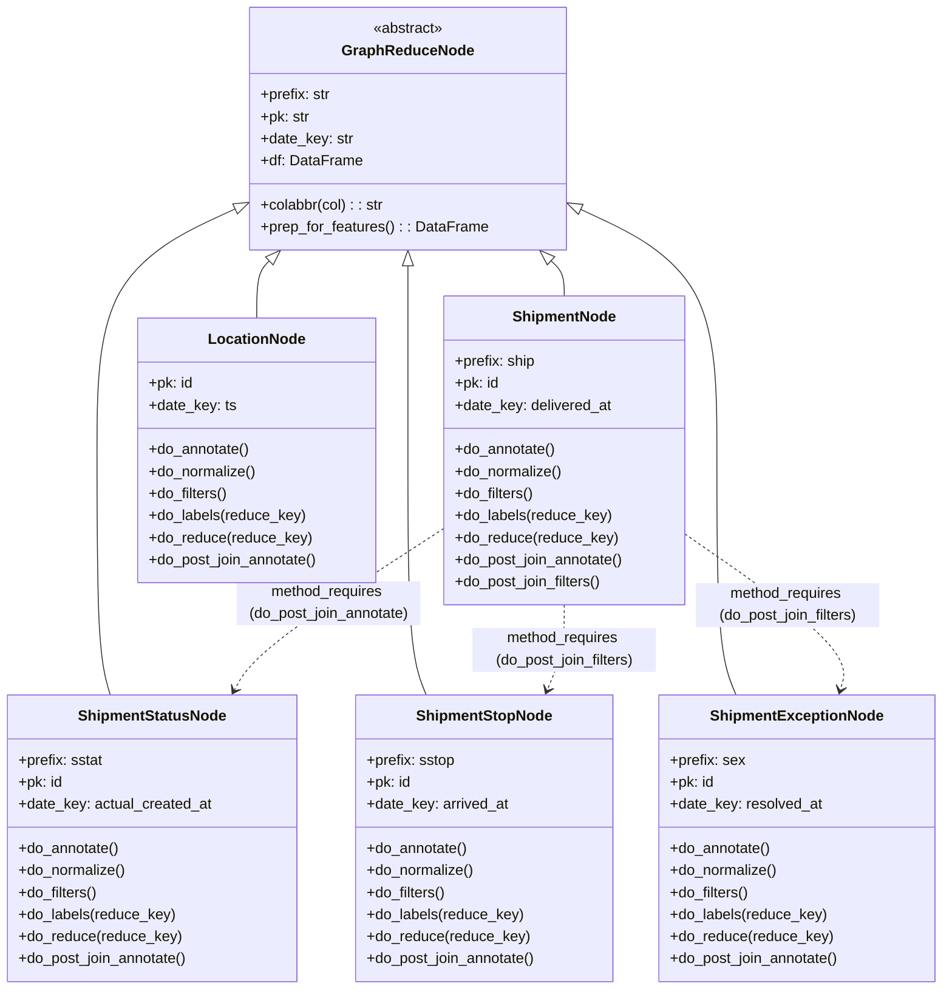

# Diagram: research/orchestrator/tasks/data_transforms/shipment_features.py


> Auto-generated by Obscura crawlers

## Diagram 1



### SVG

<svg id="container" width="1028.765625" xmlns="http://www.w3.org/2000/svg" class="classDiagram" height="1076" viewBox="0 0 1028.765625 1076" role="graphics-document document" aria-roledescription="class"><style>#container{font-family:"trebuchet ms",verdana,arial,sans-serif;font-size:16px;fill:#333;}@keyframes edge-animation-frame{from{stroke-dashoffset:0;}}@keyframes dash{to{stroke-dashoffset:0;}}#container .edge-animation-slow{stroke-dasharray:9,5!important;stroke-dashoffset:900;animation:dash 50s linear infinite;stroke-linecap:round;}#container .edge-animation-fast{stroke-dasharray:9,5!important;stroke-dashoffset:900;animation:dash 20s linear infinite;stroke-linecap:round;}#container .error-icon{fill:#552222;}#container .error-text{fill:#552222;stroke:#552222;}#container .edge-thickness-normal{stroke-width:1px;}#container .edge-thickness-thick{stroke-width:3.5px;}#container .edge-pattern-solid{stroke-dasharray:0;}#container .edge-thickness-invisible{stroke-width:0;fill:none;}#container .edge-pattern-dashed{stroke-dasharray:3;}#container .edge-pattern-dotted{stroke-dasharray:2;}#container .marker{fill:#333333;stroke:#333333;}#container .marker.cross{stroke:#333333;}#container svg{font-family:"trebuchet ms",verdana,arial,sans-serif;font-size:16px;}#container p{margin:0;}#container g.classGroup text{fill:#9370DB;stroke:none;font-family:"trebuchet ms",verdana,arial,sans-serif;font-size:10px;}#container g.classGroup text .title{font-weight:bolder;}#container .nodeLabel,#container .edgeLabel{color:#131300;}#container .edgeLabel .label rect{fill:#ECECFF;}#container .label text{fill:#131300;}#container .labelBkg{background:#ECECFF;}#container .edgeLabel .label span{background:#ECECFF;}#container .classTitle{font-weight:bolder;}#container .node rect,#container .node circle,#container .node ellipse,#container .node polygon,#container .node path{fill:#ECECFF;stroke:#9370DB;stroke-width:1px;}#container .divider{stroke:#9370DB;stroke-width:1;}#container g.clickable{cursor:pointer;}#container g.classGroup rect{fill:#ECECFF;stroke:#9370DB;}#container g.classGroup line{stroke:#9370DB;stroke-width:1;}#container .classLabel .box{stroke:none;stroke-width:0;fill:#ECECFF;opacity:0.5;}#container .classLabel .label{fill:#9370DB;font-size:10px;}#container .relation{stroke:#333333;stroke-width:1;fill:none;}#container .dashed-line{stroke-dasharray:3;}#container .dotted-line{stroke-dasharray:1 2;}#container #compositionStart,#container .composition{fill:#333333!important;stroke:#333333!important;stroke-width:1;}#container #compositionEnd,#container .composition{fill:#333333!important;stroke:#333333!important;stroke-width:1;}#container #dependencyStart,#container .dependency{fill:#333333!important;stroke:#333333!important;stroke-width:1;}#container #dependencyStart,#container .dependency{fill:#333333!important;stroke:#333333!important;stroke-width:1;}#container #extensionStart,#container .extension{fill:transparent!important;stroke:#333333!important;stroke-width:1;}#container #extensionEnd,#container .extension{fill:transparent!important;stroke:#333333!important;stroke-width:1;}#container #aggregationStart,#container .aggregation{fill:transparent!important;stroke:#333333!important;stroke-width:1;}#container #aggregationEnd,#container .aggregation{fill:transparent!important;stroke:#333333!important;stroke-width:1;}#container #lollipopStart,#container .lollipop{fill:#ECECFF!important;stroke:#333333!important;stroke-width:1;}#container #lollipopEnd,#container .lollipop{fill:#ECECFF!important;stroke:#333333!important;stroke-width:1;}#container .edgeTerminals{font-size:11px;line-height:initial;}#container .classTitleText{text-anchor:middle;font-size:18px;fill:#333;}#container .label-icon{display:inline-block;height:1em;overflow:visible;vertical-align:-0.125em;}#container .node .label-icon path{fill:currentColor;stroke:revert;stroke-width:revert;}#container :root{--mermaid-font-family:"trebuchet ms",verdana,arial,sans-serif;}</style><g><defs><marker id="container_class-aggregationStart" class="marker aggregation class" refX="18" refY="7" markerWidth="190" markerHeight="240" orient="auto"><path d="M 18,7 L9,13 L1,7 L9,1 Z"></path></marker></defs><defs><marker id="container_class-aggregationEnd" class="marker aggregation class" refX="1" refY="7" markerWidth="20" markerHeight="28" orient="auto"><path d="M 18,7 L9,13 L1,7 L9,1 Z"></path></marker></defs><defs><marker id="container_class-extensionStart" class="marker extension class" refX="18" refY="7" markerWidth="190" markerHeight="240" orient="auto"><path d="M 1,7 L18,13 V 1 Z"></path></marker></defs><defs><marker id="container_class-extensionEnd" class="marker extension class" refX="1" refY="7" markerWidth="20" markerHeight="28" orient="auto"><path d="M 1,1 V 13 L18,7 Z"></path></marker></defs><defs><marker id="container_class-compositionStart" class="marker composition class" refX="18" refY="7" markerWidth="190" markerHeight="240" orient="auto"><path d="M 18,7 L9,13 L1,7 L9,1 Z"></path></marker></defs><defs><marker id="container_class-compositionEnd" class="marker composition class" refX="1" refY="7" markerWidth="20" markerHeight="28" orient="auto"><path d="M 18,7 L9,13 L1,7 L9,1 Z"></path></marker></defs><defs><marker id="container_class-dependencyStart" class="marker dependency class" refX="6" refY="7" markerWidth="190" markerHeight="240" orient="auto"><path d="M 5,7 L9,13 L1,7 L9,1 Z"></path></marker></defs><defs><marker id="container_class-dependencyEnd" class="marker dependency class" refX="13" refY="7" markerWidth="20" markerHeight="28" orient="auto"><path d="M 18,7 L9,13 L14,7 L9,1 Z"></path></marker></defs><defs><marker id="container_class-lollipopStart" class="marker lollipop class" refX="13" refY="7" markerWidth="190" markerHeight="240" orient="auto"><circle stroke="black" fill="transparent" cx="7" cy="7" r="6"></circle></marker></defs><defs><marker id="container_class-lollipopEnd" class="marker lollipop class" refX="1" refY="7" markerWidth="190" markerHeight="240" orient="auto"><circle stroke="black" fill="transparent" cx="7" cy="7" r="6"></circle></marker></defs><g class="root"><g class="clusters"></g><g class="edgePaths"><path d="M260.552,224.807L234.511,236.839C208.469,248.871,156.387,272.936,130.346,317.134C104.305,361.333,104.305,425.667,104.305,494C104.305,562.333,104.305,634.667,106.695,679C109.085,723.333,113.866,739.667,116.256,747.833L118.646,756" id="id_GraphReduceNode_ShipmentStatusNode_1" class="edge-thickness-normal edge-pattern-solid relation" style=";;;" data-edge="true" data-et="edge" data-id="id_GraphReduceNode_ShipmentStatusNode_1" data-points="W3sieCI6Mjc2LjIxMDkzNzUsInkiOjIxNy41NzEzOTU3MjU3OTgxfSx7IngiOjEwNC4zMDQ2ODc1LCJ5IjoyOTd9LHsieCI6MTA0LjMwNDY4NzUsInkiOjQ5MH0seyJ4IjoxMDQuMzA0Njg3NSwieSI6NzA3fSx7IngiOjExOC42NDYxNTA5MTQ2MzQxNSwieSI6NzU2fV0=" marker-start="url(#container_class-extensionStart)"></path><path d="M444.098,289.25L444.098,290.542C444.098,291.833,444.098,294.417,444.098,327.875C444.098,361.333,444.098,425.667,444.098,494C444.098,562.333,444.098,634.667,447.441,679C450.784,723.333,457.471,739.667,460.815,747.833L464.158,756" id="id_GraphReduceNode_ShipmentStopNode_2" class="edge-thickness-normal edge-pattern-solid relation" style=";;;" data-edge="true" data-et="edge" data-id="id_GraphReduceNode_ShipmentStopNode_2" data-points="W3sieCI6NDQ0LjA5NzY1NjI1LCJ5IjoyNzJ9LHsieCI6NDQ0LjA5NzY1NjI1LCJ5IjoyOTd9LHsieCI6NDQ0LjA5NzY1NjI1LCJ5Ijo0OTB9LHsieCI6NDQ0LjA5NzY1NjI1LCJ5Ijo3MDd9LHsieCI6NDY0LjE1Nzk2NDkzOTAyNDQsInkiOjc1Nn1d" marker-start="url(#container_class-extensionStart)"></path><path d="M627.636,225.034L653.525,237.028C679.414,249.023,731.191,273.011,757.08,317.172C782.969,361.333,782.969,425.667,782.969,494C782.969,562.333,782.969,634.667,786.438,679C789.908,723.333,796.847,739.667,800.317,747.833L803.786,756" id="id_GraphReduceNode_ShipmentExceptionNode_3" class="edge-thickness-normal edge-pattern-solid relation" style=";;;" data-edge="true" data-et="edge" data-id="id_GraphReduceNode_ShipmentExceptionNode_3" data-points="W3sieCI6NjExLjk4NDM3NSwieSI6MjE3Ljc4MjQyMzI1NzM2ODh9LHsieCI6NzgyLjk2ODc1LCJ5IjoyOTd9LHsieCI6NzgyLjk2ODc1LCJ5Ijo0OTB9LHsieCI6NzgyLjk2ODc1LCJ5Ijo3MDd9LHsieCI6ODAzLjc4NjI4MDQ4NzgwNDksInkiOjc1Nn1d" marker-start="url(#container_class-extensionStart)"></path><path d="M600.592,283.666L603.013,285.888C605.434,288.11,610.275,292.555,612.696,298.944C615.117,305.333,615.117,313.667,615.117,317.833L615.117,322" id="id_GraphReduceNode_ShipmentNode_4" class="edge-thickness-normal edge-pattern-solid relation" style=";;;" data-edge="true" data-et="edge" data-id="id_GraphReduceNode_ShipmentNode_4" data-points="W3sieCI6NTg3Ljg4NDc3ODA2NTI4NjYsInkiOjI3Mn0seyJ4Ijo2MTUuMTE3MTg3NSwieSI6Mjk3fSx7IngiOjYxNS4xMTcxODc1LCJ5IjozMjJ9XQ==" marker-start="url(#container_class-extensionStart)"></path><path d="M292.022,283.854L289.706,286.045C287.39,288.236,282.757,292.618,280.441,302.976C278.125,313.333,278.125,329.667,278.125,337.833L278.125,346" id="id_GraphReduceNode_LocationNode_5" class="edge-thickness-normal edge-pattern-solid relation" style=";;;" data-edge="true" data-et="edge" data-id="id_GraphReduceNode_LocationNode_5" data-points="W3sieCI6MzA0LjU1Mzc2NjkxODc4OTg1LCJ5IjoyNzJ9LHsieCI6Mjc4LjEyNSwieSI6Mjk3fSx7IngiOjI3OC4xMjUsInkiOjM0Nn1d" marker-start="url(#container_class-extensionStart)"></path><path d="M482.266,575.547L448.242,597.456C414.219,619.365,346.172,663.182,308.1,692.384C270.027,721.585,261.929,736.17,257.881,743.462L253.832,750.754" id="id_ShipmentNode_ShipmentStatusNode_6" class="edge-thickness-normal edge-pattern-dashed relation" style=";;;" data-edge="true" data-et="edge" data-id="id_ShipmentNode_ShipmentStatusNode_6" data-points="W3sieCI6NDgyLjI2NTYyNSwieSI6NTc1LjU0NzM1MTMzODgyfSx7IngiOjI3OC4xMjUsInkiOjcwN30seyJ4IjoyNTAuOTE5MTY5MjA3MzE3MDUsInkiOjc1Nn1d" marker-end="url(#container_class-dependencyEnd)"></path><path d="M747.969,581.536L778.318,602.447C808.667,623.357,869.365,665.179,897.604,693.296C925.844,721.414,921.625,735.828,919.516,743.035L917.406,750.242" id="id_ShipmentNode_ShipmentExceptionNode_7" class="edge-thickness-normal edge-pattern-dashed relation" style=";;;" data-edge="true" data-et="edge" data-id="id_ShipmentNode_ShipmentExceptionNode_7" data-points="W3sieCI6NzQ3Ljk2ODc1LCJ5Ijo1ODEuNTM1ODU2OTE5NjA0Mn0seyJ4Ijo5MzAuMDYyNSwieSI6NzA3fSx7IngiOjkxNS43MjEwMzY1ODUzNjU4LCJ5Ijo3NTZ9XQ==" marker-end="url(#container_class-dependencyEnd)"></path><path d="M615.117,658L615.117,666.167C615.117,674.333,615.117,690.667,612.039,706.08C608.96,721.493,602.803,735.985,599.724,743.231L596.646,750.478" id="id_ShipmentNode_ShipmentStopNode_8" class="edge-thickness-normal edge-pattern-dashed relation" style=";;;" data-edge="true" data-et="edge" data-id="id_ShipmentNode_ShipmentStopNode_8" data-points="W3sieCI6NjE1LjExNzE4NzUsInkiOjY1OH0seyJ4Ijo2MTUuMTE3MTg3NSwieSI6NzA3fSx7IngiOjU5NC4yOTk2NTcwMTIxOTUxLCJ5Ijo3NTZ9XQ==" marker-end="url(#container_class-dependencyEnd)"></path></g><g class="edgeLabels"><g class="edgeLabel"><g class="label" data-id="id_GraphReduceNode_ShipmentStatusNode_1" transform="translate(0, 0)"><foreignObject width="0" height="0"><div xmlns="http://www.w3.org/1999/xhtml" class="labelBkg" style="display: table-cell; white-space: nowrap; line-height: 1.5; max-width: 200px; text-align: center;"><span class="edgeLabel"></span></div></foreignObject></g></g><g class="edgeLabel"><g class="label" data-id="id_GraphReduceNode_ShipmentStopNode_2" transform="translate(0, 0)"><foreignObject width="0" height="0"><div xmlns="http://www.w3.org/1999/xhtml" class="labelBkg" style="display: table-cell; white-space: nowrap; line-height: 1.5; max-width: 200px; text-align: center;"><span class="edgeLabel"></span></div></foreignObject></g></g><g class="edgeLabel"><g class="label" data-id="id_GraphReduceNode_ShipmentExceptionNode_3" transform="translate(0, 0)"><foreignObject width="0" height="0"><div xmlns="http://www.w3.org/1999/xhtml" class="labelBkg" style="display: table-cell; white-space: nowrap; line-height: 1.5; max-width: 200px; text-align: center;"><span class="edgeLabel"></span></div></foreignObject></g></g><g class="edgeLabel"><g class="label" data-id="id_GraphReduceNode_ShipmentNode_4" transform="translate(0, 0)"><foreignObject width="0" height="0"><div xmlns="http://www.w3.org/1999/xhtml" class="labelBkg" style="display: table-cell; white-space: nowrap; line-height: 1.5; max-width: 200px; text-align: center;"><span class="edgeLabel"></span></div></foreignObject></g></g><g class="edgeLabel"><g class="label" data-id="id_GraphReduceNode_LocationNode_5" transform="translate(0, 0)"><foreignObject width="0" height="0"><div xmlns="http://www.w3.org/1999/xhtml" class="labelBkg" style="display: table-cell; white-space: nowrap; line-height: 1.5; max-width: 200px; text-align: center;"><span class="edgeLabel"></span></div></foreignObject></g></g><g class="edgeLabel" transform="translate(356.63448, 656.44525)"><g class="label" data-id="id_ShipmentNode_ShipmentStatusNode_6" transform="translate(-100, -24)"><foreignObject width="200" height="48"><div xmlns="http://www.w3.org/1999/xhtml" class="labelBkg" style="display: table; white-space: break-spaces; line-height: 1.5; max-width: 200px; text-align: center; width: 200px;"><span class="edgeLabel"><p>method_requires (do_post_join_annotate)</p></span></div></foreignObject></g></g><g class="edgeLabel" transform="translate(860.0368, 658.7517)"><g class="label" data-id="id_ShipmentNode_ShipmentExceptionNode_7" transform="translate(-100, -24)"><foreignObject width="200" height="48"><div xmlns="http://www.w3.org/1999/xhtml" class="labelBkg" style="display: table; white-space: break-spaces; line-height: 1.5; max-width: 200px; text-align: center; width: 200px;"><span class="edgeLabel"><p>method_requires (do_post_join_filters)</p></span></div></foreignObject></g></g><g class="edgeLabel" transform="translate(615.1171875, 707)"><g class="label" data-id="id_ShipmentNode_ShipmentStopNode_8" transform="translate(-100, -24)"><foreignObject width="200" height="48"><div xmlns="http://www.w3.org/1999/xhtml" class="labelBkg" style="display: table; white-space: break-spaces; line-height: 1.5; max-width: 200px; text-align: center; width: 200px;"><span class="edgeLabel"><p>method_requires (do_post_join_filters)</p></span></div></foreignObject></g></g></g><g class="nodes"><g class="node default" id="classId-GraphReduceNode-0" transform="translate(444.09765625, 140)"><g class="basic label-container"><path d="M-167.88671875 -132 L167.88671875 -132 L167.88671875 132 L-167.88671875 132" stroke="none" stroke-width="0" fill="#ECECFF" style=""></path><path d="M-167.88671875 -132 C-72.1753142598484 -132, 23.536090230303188 -132, 167.88671875 -132 M-167.88671875 -132 C-41.60989586392388 -132, 84.66692702215224 -132, 167.88671875 -132 M167.88671875 -132 C167.88671875 -48.16417417197604, 167.88671875 35.67165165604791, 167.88671875 132 M167.88671875 -132 C167.88671875 -42.871677632681966, 167.88671875 46.25664473463607, 167.88671875 132 M167.88671875 132 C54.247877104134204 132, -59.39096454173159 132, -167.88671875 132 M167.88671875 132 C73.85062028973074 132, -20.185478170538516 132, -167.88671875 132 M-167.88671875 132 C-167.88671875 29.835267051868996, -167.88671875 -72.32946589626201, -167.88671875 -132 M-167.88671875 132 C-167.88671875 72.83795054000834, -167.88671875 13.675901080016672, -167.88671875 -132" stroke="#9370DB" stroke-width="1.3" fill="none" stroke-dasharray="0 0" style=""></path></g><g class="annotation-group text" transform="translate(-38.609375, -108)"><g class="label" style="" transform="translate(0,-12)"><foreignObject width="77.21875" height="24"><div xmlns="http://www.w3.org/1999/xhtml" style="display: table-cell; white-space: nowrap; line-height: 1.5; max-width: 127px; text-align: center;"><span class="nodeLabel markdown-node-label" style=""><p>«abstract»</p></span></div></foreignObject></g></g><g class="label-group text" transform="translate(-67.7578125, -84)"><g class="label" style="font-weight: bolder" transform="translate(0,-12)"><foreignObject width="135.515625" height="24"><div xmlns="http://www.w3.org/1999/xhtml" style="display: table-cell; white-space: nowrap; line-height: 1.5; max-width: 185px; text-align: center;"><span class="nodeLabel markdown-node-label" style=""><p>GraphReduceNode</p></span></div></foreignObject></g></g><g class="members-group text" transform="translate(-155.88671875, -36)"><g class="label" style="" transform="translate(0,-12)"><foreignObject width="76.4375" height="24"><div xmlns="http://www.w3.org/1999/xhtml" style="display: table-cell; white-space: nowrap; line-height: 1.5; max-width: 135px; text-align: center;"><span class="nodeLabel markdown-node-label" style=""><p>+prefix: str</p></span></div></foreignObject></g><g class="label" style="" transform="translate(0,12)"><foreignObject width="53.25" height="24"><div xmlns="http://www.w3.org/1999/xhtml" style="display: table-cell; white-space: nowrap; line-height: 1.5; max-width: 111px; text-align: center;"><span class="nodeLabel markdown-node-label" style=""><p>+pk: str</p></span></div></foreignObject></g><g class="label" style="" transform="translate(0,36)"><foreignObject width="100.65625" height="24"><div xmlns="http://www.w3.org/1999/xhtml" style="display: table-cell; white-space: nowrap; line-height: 1.5; max-width: 159px; text-align: center;"><span class="nodeLabel markdown-node-label" style=""><p>+date_key: str</p></span></div></foreignObject></g><g class="label" style="" transform="translate(0,60)"><foreignObject width="108.359375" height="24"><div xmlns="http://www.w3.org/1999/xhtml" style="display: table-cell; white-space: nowrap; line-height: 1.5; max-width: 166px; text-align: center;"><span class="nodeLabel markdown-node-label" style=""><p>+df: DataFrame</p></span></div></foreignObject></g></g><g class="methods-group text" transform="translate(-155.88671875, 84)"><g class="label" style="" transform="translate(0,-12)"><foreignObject width="134.71875" height="24"><div xmlns="http://www.w3.org/1999/xhtml" style="display: table-cell; white-space: nowrap; line-height: 1.5; max-width: 193px; text-align: center;"><span class="nodeLabel markdown-node-label" style=""><p>+colabbr(col) : : str</p></span></div></foreignObject></g><g class="label" style="" transform="translate(0,12)"><foreignObject width="244.015625" height="24"><div xmlns="http://www.w3.org/1999/xhtml" style="display: table-cell; white-space: nowrap; line-height: 1.5; max-width: 301px; text-align: center;"><span class="nodeLabel markdown-node-label" style=""><p>+prep_for_features() : : DataFrame</p></span></div></foreignObject></g></g><g class="divider" style=""><path d="M-167.88671875 -60 C-59.74522720482244 -60, 48.39626434035512 -60, 167.88671875 -60 M-167.88671875 -60 C-55.015567136911216 -60, 57.85558447617757 -60, 167.88671875 -60" stroke="#9370DB" stroke-width="1.3" fill="none" stroke-dasharray="0 0" style=""></path></g><g class="divider" style=""><path d="M-167.88671875 60 C-76.11337210759515 60, 15.659974534809692 60, 167.88671875 60 M-167.88671875 60 C-55.536064819838515 60, 56.81458911032297 60, 167.88671875 60" stroke="#9370DB" stroke-width="1.3" fill="none" stroke-dasharray="0 0" style=""></path></g></g><g class="node default" id="classId-ShipmentStatusNode-1" transform="translate(164.3046875, 912)"><g class="basic label-container"><path d="M-156.3046875 -156 L156.3046875 -156 L156.3046875 156 L-156.3046875 156" stroke="none" stroke-width="0" fill="#ECECFF" style=""></path><path d="M-156.3046875 -156 C-61.26191279707152 -156, 33.780861905856966 -156, 156.3046875 -156 M-156.3046875 -156 C-57.140280336776016 -156, 42.02412682644797 -156, 156.3046875 -156 M156.3046875 -156 C156.3046875 -45.396293741888584, 156.3046875 65.20741251622283, 156.3046875 156 M156.3046875 -156 C156.3046875 -90.86912987290978, 156.3046875 -25.738259745819562, 156.3046875 156 M156.3046875 156 C83.40672496551625 156, 10.508762431032494 156, -156.3046875 156 M156.3046875 156 C66.64982241062187 156, -23.00504267875627 156, -156.3046875 156 M-156.3046875 156 C-156.3046875 73.34681836259807, -156.3046875 -9.306363274803857, -156.3046875 -156 M-156.3046875 156 C-156.3046875 65.78305536292633, -156.3046875 -24.433889274147333, -156.3046875 -156" stroke="#9370DB" stroke-width="1.3" fill="none" stroke-dasharray="0 0" style=""></path></g><g class="annotation-group text" transform="translate(0, -132)"></g><g class="label-group text" transform="translate(-77.78125, -132)"><g class="label" style="font-weight: bolder" transform="translate(0,-12)"><foreignObject width="155.5625" height="24"><div xmlns="http://www.w3.org/1999/xhtml" style="display: table-cell; white-space: nowrap; line-height: 1.5; max-width: 204px; text-align: center;"><span class="nodeLabel markdown-node-label" style=""><p>ShipmentStatusNode</p></span></div></foreignObject></g></g><g class="members-group text" transform="translate(-144.3046875, -84)"><g class="label" style="" transform="translate(0,-12)"><foreignObject width="91.9375" height="24"><div xmlns="http://www.w3.org/1999/xhtml" style="display: table-cell; white-space: nowrap; line-height: 1.5; max-width: 150px; text-align: center;"><span class="nodeLabel markdown-node-label" style=""><p>+prefix: sstat</p></span></div></foreignObject></g><g class="label" style="" transform="translate(0,12)"><foreignObject width="47.90625" height="24"><div xmlns="http://www.w3.org/1999/xhtml" style="display: table-cell; white-space: nowrap; line-height: 1.5; max-width: 105px; text-align: center;"><span class="nodeLabel markdown-node-label" style=""><p>+pk: id</p></span></div></foreignObject></g><g class="label" style="" transform="translate(0,36)"><foreignObject width="210.828125" height="24"><div xmlns="http://www.w3.org/1999/xhtml" style="display: table-cell; white-space: nowrap; line-height: 1.5; max-width: 268px; text-align: center;"><span class="nodeLabel markdown-node-label" style=""><p>+date_key: actual_created_at</p></span></div></foreignObject></g></g><g class="methods-group text" transform="translate(-144.3046875, 12)"><g class="label" style="" transform="translate(0,-12)"><foreignObject width="110.375" height="24"><div xmlns="http://www.w3.org/1999/xhtml" style="display: table-cell; white-space: nowrap; line-height: 1.5; max-width: 168px; text-align: center;"><span class="nodeLabel markdown-node-label" style=""><p>+do_annotate()</p></span></div></foreignObject></g><g class="label" style="" transform="translate(0,12)"><foreignObject width="117.21875" height="24"><div xmlns="http://www.w3.org/1999/xhtml" style="display: table-cell; white-space: nowrap; line-height: 1.5; max-width: 175px; text-align: center;"><span class="nodeLabel markdown-node-label" style=""><p>+do_normalize()</p></span></div></foreignObject></g><g class="label" style="" transform="translate(0,36)"><foreignObject width="86.5" height="24"><div xmlns="http://www.w3.org/1999/xhtml" style="display: table-cell; white-space: nowrap; line-height: 1.5; max-width: 144px; text-align: center;"><span class="nodeLabel markdown-node-label" style=""><p>+do_filters()</p></span></div></foreignObject></g><g class="label" style="" transform="translate(0,60)"><foreignObject width="170.734375" height="24"><div xmlns="http://www.w3.org/1999/xhtml" style="display: table-cell; white-space: nowrap; line-height: 1.5; max-width: 228px; text-align: center;"><span class="nodeLabel markdown-node-label" style=""><p>+do_labels(reduce_key)</p></span></div></foreignObject></g><g class="label" style="" transform="translate(0,84)"><foreignObject width="176.53125" height="24"><div xmlns="http://www.w3.org/1999/xhtml" style="display: table-cell; white-space: nowrap; line-height: 1.5; max-width: 234px; text-align: center;"><span class="nodeLabel markdown-node-label" style=""><p>+do_reduce(reduce_key)</p></span></div></foreignObject></g><g class="label" style="" transform="translate(0,108)"><foreignObject width="187.40625" height="24"><div xmlns="http://www.w3.org/1999/xhtml" style="display: table-cell; white-space: nowrap; line-height: 1.5; max-width: 245px; text-align: center;"><span class="nodeLabel markdown-node-label" style=""><p>+do_post_join_annotate()</p></span></div></foreignObject></g></g><g class="divider" style=""><path d="M-156.3046875 -108 C-86.64649357549494 -108, -16.988299650989887 -108, 156.3046875 -108 M-156.3046875 -108 C-63.520041511127104 -108, 29.26460447774579 -108, 156.3046875 -108" stroke="#9370DB" stroke-width="1.3" fill="none" stroke-dasharray="0 0" style=""></path></g><g class="divider" style=""><path d="M-156.3046875 -12 C-81.22247343420261 -12, -6.140259368405225 -12, 156.3046875 -12 M-156.3046875 -12 C-62.25818576457536 -12, 31.788315970849283 -12, 156.3046875 -12" stroke="#9370DB" stroke-width="1.3" fill="none" stroke-dasharray="0 0" style=""></path></g></g><g class="node default" id="classId-ShipmentStopNode-2" transform="translate(528.0234375, 912)"><g class="basic label-container"><path d="M-141.3359375 -156 L141.3359375 -156 L141.3359375 156 L-141.3359375 156" stroke="none" stroke-width="0" fill="#ECECFF" style=""></path><path d="M-141.3359375 -156 C-57.82032826747704 -156, 25.695280965045924 -156, 141.3359375 -156 M-141.3359375 -156 C-50.56962872533306 -156, 40.19668004933388 -156, 141.3359375 -156 M141.3359375 -156 C141.3359375 -78.30531894009512, 141.3359375 -0.6106378801902395, 141.3359375 156 M141.3359375 -156 C141.3359375 -52.32089583507734, 141.3359375 51.358208329845326, 141.3359375 156 M141.3359375 156 C30.541511296012146 156, -80.25291490797571 156, -141.3359375 156 M141.3359375 156 C54.450225213942645 156, -32.43548707211471 156, -141.3359375 156 M-141.3359375 156 C-141.3359375 85.27035614457596, -141.3359375 14.540712289151912, -141.3359375 -156 M-141.3359375 156 C-141.3359375 54.19855582925, -141.3359375 -47.602888341500005, -141.3359375 -156" stroke="#9370DB" stroke-width="1.3" fill="none" stroke-dasharray="0 0" style=""></path></g><g class="annotation-group text" transform="translate(0, -132)"></g><g class="label-group text" transform="translate(-71.265625, -132)"><g class="label" style="font-weight: bolder" transform="translate(0,-12)"><foreignObject width="142.53125" height="24"><div xmlns="http://www.w3.org/1999/xhtml" style="display: table-cell; white-space: nowrap; line-height: 1.5; max-width: 191px; text-align: center;"><span class="nodeLabel markdown-node-label" style=""><p>ShipmentStopNode</p></span></div></foreignObject></g></g><g class="members-group text" transform="translate(-129.3359375, -84)"><g class="label" style="" transform="translate(0,-12)"><foreignObject width="96.1875" height="24"><div xmlns="http://www.w3.org/1999/xhtml" style="display: table-cell; white-space: nowrap; line-height: 1.5; max-width: 154px; text-align: center;"><span class="nodeLabel markdown-node-label" style=""><p>+prefix: sstop</p></span></div></foreignObject></g><g class="label" style="" transform="translate(0,12)"><foreignObject width="47.90625" height="24"><div xmlns="http://www.w3.org/1999/xhtml" style="display: table-cell; white-space: nowrap; line-height: 1.5; max-width: 105px; text-align: center;"><span class="nodeLabel markdown-node-label" style=""><p>+pk: id</p></span></div></foreignObject></g><g class="label" style="" transform="translate(0,36)"><foreignObject width="155.390625" height="24"><div xmlns="http://www.w3.org/1999/xhtml" style="display: table-cell; white-space: nowrap; line-height: 1.5; max-width: 213px; text-align: center;"><span class="nodeLabel markdown-node-label" style=""><p>+date_key: arrived_at</p></span></div></foreignObject></g></g><g class="methods-group text" transform="translate(-129.3359375, 12)"><g class="label" style="" transform="translate(0,-12)"><foreignObject width="110.375" height="24"><div xmlns="http://www.w3.org/1999/xhtml" style="display: table-cell; white-space: nowrap; line-height: 1.5; max-width: 168px; text-align: center;"><span class="nodeLabel markdown-node-label" style=""><p>+do_annotate()</p></span></div></foreignObject></g><g class="label" style="" transform="translate(0,12)"><foreignObject width="117.21875" height="24"><div xmlns="http://www.w3.org/1999/xhtml" style="display: table-cell; white-space: nowrap; line-height: 1.5; max-width: 175px; text-align: center;"><span class="nodeLabel markdown-node-label" style=""><p>+do_normalize()</p></span></div></foreignObject></g><g class="label" style="" transform="translate(0,36)"><foreignObject width="86.5" height="24"><div xmlns="http://www.w3.org/1999/xhtml" style="display: table-cell; white-space: nowrap; line-height: 1.5; max-width: 144px; text-align: center;"><span class="nodeLabel markdown-node-label" style=""><p>+do_filters()</p></span></div></foreignObject></g><g class="label" style="" transform="translate(0,60)"><foreignObject width="170.734375" height="24"><div xmlns="http://www.w3.org/1999/xhtml" style="display: table-cell; white-space: nowrap; line-height: 1.5; max-width: 228px; text-align: center;"><span class="nodeLabel markdown-node-label" style=""><p>+do_labels(reduce_key)</p></span></div></foreignObject></g><g class="label" style="" transform="translate(0,84)"><foreignObject width="176.53125" height="24"><div xmlns="http://www.w3.org/1999/xhtml" style="display: table-cell; white-space: nowrap; line-height: 1.5; max-width: 234px; text-align: center;"><span class="nodeLabel markdown-node-label" style=""><p>+do_reduce(reduce_key)</p></span></div></foreignObject></g><g class="label" style="" transform="translate(0,108)"><foreignObject width="187.40625" height="24"><div xmlns="http://www.w3.org/1999/xhtml" style="display: table-cell; white-space: nowrap; line-height: 1.5; max-width: 245px; text-align: center;"><span class="nodeLabel markdown-node-label" style=""><p>+do_post_join_annotate()</p></span></div></foreignObject></g></g><g class="divider" style=""><path d="M-141.3359375 -108 C-75.26992186599094 -108, -9.203906231981875 -108, 141.3359375 -108 M-141.3359375 -108 C-62.250082973994 -108, 16.835771552012005 -108, 141.3359375 -108" stroke="#9370DB" stroke-width="1.3" fill="none" stroke-dasharray="0 0" style=""></path></g><g class="divider" style=""><path d="M-141.3359375 -12 C-35.5608313835688 -12, 70.2142747328624 -12, 141.3359375 -12 M-141.3359375 -12 C-42.23184332800281 -12, 56.87225084399438 -12, 141.3359375 -12" stroke="#9370DB" stroke-width="1.3" fill="none" stroke-dasharray="0 0" style=""></path></g></g><g class="node default" id="classId-ShipmentExceptionNode-3" transform="translate(870.0625, 912)"><g class="basic label-container"><path d="M-150.703125 -156 L150.703125 -156 L150.703125 156 L-150.703125 156" stroke="none" stroke-width="0" fill="#ECECFF" style=""></path><path d="M-150.703125 -156 C-72.74690063953737 -156, 5.209323720925255 -156, 150.703125 -156 M-150.703125 -156 C-44.52455069096156 -156, 61.65402361807688 -156, 150.703125 -156 M150.703125 -156 C150.703125 -42.19105804005265, 150.703125 71.6178839198947, 150.703125 156 M150.703125 -156 C150.703125 -33.01186353753447, 150.703125 89.97627292493107, 150.703125 156 M150.703125 156 C49.940545415131 156, -50.822034169738004 156, -150.703125 156 M150.703125 156 C52.80158815666118 156, -45.099948686677635 156, -150.703125 156 M-150.703125 156 C-150.703125 65.67684808126603, -150.703125 -24.64630383746794, -150.703125 -156 M-150.703125 156 C-150.703125 84.40851081368471, -150.703125 12.817021627369428, -150.703125 -156" stroke="#9370DB" stroke-width="1.3" fill="none" stroke-dasharray="0 0" style=""></path></g><g class="annotation-group text" transform="translate(0, -132)"></g><g class="label-group text" transform="translate(-90, -132)"><g class="label" style="font-weight: bolder" transform="translate(0,-12)"><foreignObject width="180" height="24"><div xmlns="http://www.w3.org/1999/xhtml" style="display: table-cell; white-space: nowrap; line-height: 1.5; max-width: 229px; text-align: center;"><span class="nodeLabel markdown-node-label" style=""><p>ShipmentExceptionNode</p></span></div></foreignObject></g></g><g class="members-group text" transform="translate(-138.703125, -84)"><g class="label" style="" transform="translate(0,-12)"><foreignObject width="80.828125" height="24"><div xmlns="http://www.w3.org/1999/xhtml" style="display: table-cell; white-space: nowrap; line-height: 1.5; max-width: 138px; text-align: center;"><span class="nodeLabel markdown-node-label" style=""><p>+prefix: sex</p></span></div></foreignObject></g><g class="label" style="" transform="translate(0,12)"><foreignObject width="47.90625" height="24"><div xmlns="http://www.w3.org/1999/xhtml" style="display: table-cell; white-space: nowrap; line-height: 1.5; max-width: 105px; text-align: center;"><span class="nodeLabel markdown-node-label" style=""><p>+pk: id</p></span></div></foreignObject></g><g class="label" style="" transform="translate(0,36)"><foreignObject width="165.578125" height="24"><div xmlns="http://www.w3.org/1999/xhtml" style="display: table-cell; white-space: nowrap; line-height: 1.5; max-width: 223px; text-align: center;"><span class="nodeLabel markdown-node-label" style=""><p>+date_key: resolved_at</p></span></div></foreignObject></g></g><g class="methods-group text" transform="translate(-138.703125, 12)"><g class="label" style="" transform="translate(0,-12)"><foreignObject width="110.375" height="24"><div xmlns="http://www.w3.org/1999/xhtml" style="display: table-cell; white-space: nowrap; line-height: 1.5; max-width: 168px; text-align: center;"><span class="nodeLabel markdown-node-label" style=""><p>+do_annotate()</p></span></div></foreignObject></g><g class="label" style="" transform="translate(0,12)"><foreignObject width="117.21875" height="24"><div xmlns="http://www.w3.org/1999/xhtml" style="display: table-cell; white-space: nowrap; line-height: 1.5; max-width: 175px; text-align: center;"><span class="nodeLabel markdown-node-label" style=""><p>+do_normalize()</p></span></div></foreignObject></g><g class="label" style="" transform="translate(0,36)"><foreignObject width="86.5" height="24"><div xmlns="http://www.w3.org/1999/xhtml" style="display: table-cell; white-space: nowrap; line-height: 1.5; max-width: 144px; text-align: center;"><span class="nodeLabel markdown-node-label" style=""><p>+do_filters()</p></span></div></foreignObject></g><g class="label" style="" transform="translate(0,60)"><foreignObject width="170.734375" height="24"><div xmlns="http://www.w3.org/1999/xhtml" style="display: table-cell; white-space: nowrap; line-height: 1.5; max-width: 228px; text-align: center;"><span class="nodeLabel markdown-node-label" style=""><p>+do_labels(reduce_key)</p></span></div></foreignObject></g><g class="label" style="" transform="translate(0,84)"><foreignObject width="176.53125" height="24"><div xmlns="http://www.w3.org/1999/xhtml" style="display: table-cell; white-space: nowrap; line-height: 1.5; max-width: 234px; text-align: center;"><span class="nodeLabel markdown-node-label" style=""><p>+do_reduce(reduce_key)</p></span></div></foreignObject></g><g class="label" style="" transform="translate(0,108)"><foreignObject width="187.40625" height="24"><div xmlns="http://www.w3.org/1999/xhtml" style="display: table-cell; white-space: nowrap; line-height: 1.5; max-width: 245px; text-align: center;"><span class="nodeLabel markdown-node-label" style=""><p>+do_post_join_annotate()</p></span></div></foreignObject></g></g><g class="divider" style=""><path d="M-150.703125 -108 C-41.221365123504825 -108, 68.26039475299035 -108, 150.703125 -108 M-150.703125 -108 C-64.0616828216939 -108, 22.579759356612186 -108, 150.703125 -108" stroke="#9370DB" stroke-width="1.3" fill="none" stroke-dasharray="0 0" style=""></path></g><g class="divider" style=""><path d="M-150.703125 -12 C-30.309212061213984 -12, 90.08470087757203 -12, 150.703125 -12 M-150.703125 -12 C-68.83511013273838 -12, 13.032904734523242 -12, 150.703125 -12" stroke="#9370DB" stroke-width="1.3" fill="none" stroke-dasharray="0 0" style=""></path></g></g><g class="node default" id="classId-ShipmentNode-4" transform="translate(615.1171875, 490)"><g class="basic label-container"><path d="M-132.8515625 -168 L132.8515625 -168 L132.8515625 168 L-132.8515625 168" stroke="none" stroke-width="0" fill="#ECECFF" style=""></path><path d="M-132.8515625 -168 C-65.72666434833882 -168, 1.3982338033223698 -168, 132.8515625 -168 M-132.8515625 -168 C-30.01762992221697 -168, 72.81630265556606 -168, 132.8515625 -168 M132.8515625 -168 C132.8515625 -90.65652855840207, 132.8515625 -13.313057116804146, 132.8515625 168 M132.8515625 -168 C132.8515625 -78.72726151570944, 132.8515625 10.545476968581113, 132.8515625 168 M132.8515625 168 C34.04663653903097 168, -64.75828942193806 168, -132.8515625 168 M132.8515625 168 C58.2614025502301 168, -16.328757399539796 168, -132.8515625 168 M-132.8515625 168 C-132.8515625 98.57815568945222, -132.8515625 29.156311378904434, -132.8515625 -168 M-132.8515625 168 C-132.8515625 37.33342768413249, -132.8515625 -93.33314463173502, -132.8515625 -168" stroke="#9370DB" stroke-width="1.3" fill="none" stroke-dasharray="0 0" style=""></path></g><g class="annotation-group text" transform="translate(0, -144)"></g><g class="label-group text" transform="translate(-54.296875, -144)"><g class="label" style="font-weight: bolder" transform="translate(0,-12)"><foreignObject width="108.59375" height="24"><div xmlns="http://www.w3.org/1999/xhtml" style="display: table-cell; white-space: nowrap; line-height: 1.5; max-width: 158px; text-align: center;"><span class="nodeLabel markdown-node-label" style=""><p>ShipmentNode</p></span></div></foreignObject></g></g><g class="members-group text" transform="translate(-120.8515625, -96)"><g class="label" style="" transform="translate(0,-12)"><foreignObject width="87.875" height="24"><div xmlns="http://www.w3.org/1999/xhtml" style="display: table-cell; white-space: nowrap; line-height: 1.5; max-width: 145px; text-align: center;"><span class="nodeLabel markdown-node-label" style=""><p>+prefix: ship</p></span></div></foreignObject></g><g class="label" style="" transform="translate(0,12)"><foreignObject width="47.90625" height="24"><div xmlns="http://www.w3.org/1999/xhtml" style="display: table-cell; white-space: nowrap; line-height: 1.5; max-width: 105px; text-align: center;"><span class="nodeLabel markdown-node-label" style=""><p>+pk: id</p></span></div></foreignObject></g><g class="label" style="" transform="translate(0,36)"><foreignObject width="171.71875" height="24"><div xmlns="http://www.w3.org/1999/xhtml" style="display: table-cell; white-space: nowrap; line-height: 1.5; max-width: 229px; text-align: center;"><span class="nodeLabel markdown-node-label" style=""><p>+date_key: delivered_at</p></span></div></foreignObject></g></g><g class="methods-group text" transform="translate(-120.8515625, 0)"><g class="label" style="" transform="translate(0,-12)"><foreignObject width="110.375" height="24"><div xmlns="http://www.w3.org/1999/xhtml" style="display: table-cell; white-space: nowrap; line-height: 1.5; max-width: 168px; text-align: center;"><span class="nodeLabel markdown-node-label" style=""><p>+do_annotate()</p></span></div></foreignObject></g><g class="label" style="" transform="translate(0,12)"><foreignObject width="117.21875" height="24"><div xmlns="http://www.w3.org/1999/xhtml" style="display: table-cell; white-space: nowrap; line-height: 1.5; max-width: 175px; text-align: center;"><span class="nodeLabel markdown-node-label" style=""><p>+do_normalize()</p></span></div></foreignObject></g><g class="label" style="" transform="translate(0,36)"><foreignObject width="86.5" height="24"><div xmlns="http://www.w3.org/1999/xhtml" style="display: table-cell; white-space: nowrap; line-height: 1.5; max-width: 144px; text-align: center;"><span class="nodeLabel markdown-node-label" style=""><p>+do_filters()</p></span></div></foreignObject></g><g class="label" style="" transform="translate(0,60)"><foreignObject width="170.734375" height="24"><div xmlns="http://www.w3.org/1999/xhtml" style="display: table-cell; white-space: nowrap; line-height: 1.5; max-width: 228px; text-align: center;"><span class="nodeLabel markdown-node-label" style=""><p>+do_labels(reduce_key)</p></span></div></foreignObject></g><g class="label" style="" transform="translate(0,84)"><foreignObject width="176.53125" height="24"><div xmlns="http://www.w3.org/1999/xhtml" style="display: table-cell; white-space: nowrap; line-height: 1.5; max-width: 234px; text-align: center;"><span class="nodeLabel markdown-node-label" style=""><p>+do_reduce(reduce_key)</p></span></div></foreignObject></g><g class="label" style="" transform="translate(0,108)"><foreignObject width="187.40625" height="24"><div xmlns="http://www.w3.org/1999/xhtml" style="display: table-cell; white-space: nowrap; line-height: 1.5; max-width: 245px; text-align: center;"><span class="nodeLabel markdown-node-label" style=""><p>+do_post_join_annotate()</p></span></div></foreignObject></g><g class="label" style="" transform="translate(0,132)"><foreignObject width="163.53125" height="24"><div xmlns="http://www.w3.org/1999/xhtml" style="display: table-cell; white-space: nowrap; line-height: 1.5; max-width: 221px; text-align: center;"><span class="nodeLabel markdown-node-label" style=""><p>+do_post_join_filters()</p></span></div></foreignObject></g></g><g class="divider" style=""><path d="M-132.8515625 -120 C-73.19662219231179 -120, -13.541681884623571 -120, 132.8515625 -120 M-132.8515625 -120 C-73.41763838449063 -120, -13.98371426898126 -120, 132.8515625 -120" stroke="#9370DB" stroke-width="1.3" fill="none" stroke-dasharray="0 0" style=""></path></g><g class="divider" style=""><path d="M-132.8515625 -24 C-51.81131722897895 -24, 29.2289280420421 -24, 132.8515625 -24 M-132.8515625 -24 C-35.620342535924536 -24, 61.61087742815093 -24, 132.8515625 -24" stroke="#9370DB" stroke-width="1.3" fill="none" stroke-dasharray="0 0" style=""></path></g></g><g class="node default" id="classId-LocationNode-5" transform="translate(278.125, 490)"><g class="basic label-container"><path d="M-130.97265625 -144 L130.97265625 -144 L130.97265625 144 L-130.97265625 144" stroke="none" stroke-width="0" fill="#ECECFF" style=""></path><path d="M-130.97265625 -144 C-63.38519043739424 -144, 4.202275375211514 -144, 130.97265625 -144 M-130.97265625 -144 C-35.90573378867788 -144, 59.16118867264424 -144, 130.97265625 -144 M130.97265625 -144 C130.97265625 -73.69115901916494, 130.97265625 -3.3823180383298848, 130.97265625 144 M130.97265625 -144 C130.97265625 -40.70241536843572, 130.97265625 62.595169263128554, 130.97265625 144 M130.97265625 144 C46.38647325513618 144, -38.19970973972764 144, -130.97265625 144 M130.97265625 144 C63.70862980587589 144, -3.555396638248226 144, -130.97265625 144 M-130.97265625 144 C-130.97265625 42.92459139352319, -130.97265625 -58.150817212953626, -130.97265625 -144 M-130.97265625 144 C-130.97265625 43.28959129759275, -130.97265625 -57.4208174048145, -130.97265625 -144" stroke="#9370DB" stroke-width="1.3" fill="none" stroke-dasharray="0 0" style=""></path></g><g class="annotation-group text" transform="translate(0, -120)"></g><g class="label-group text" transform="translate(-50.5390625, -120)"><g class="label" style="font-weight: bolder" transform="translate(0,-12)"><foreignObject width="101.078125" height="24"><div xmlns="http://www.w3.org/1999/xhtml" style="display: table-cell; white-space: nowrap; line-height: 1.5; max-width: 151px; text-align: center;"><span class="nodeLabel markdown-node-label" style=""><p>LocationNode</p></span></div></foreignObject></g></g><g class="members-group text" transform="translate(-118.97265625, -72)"><g class="label" style="" transform="translate(0,-12)"><foreignObject width="47.90625" height="24"><div xmlns="http://www.w3.org/1999/xhtml" style="display: table-cell; white-space: nowrap; line-height: 1.5; max-width: 105px; text-align: center;"><span class="nodeLabel markdown-node-label" style=""><p>+pk: id</p></span></div></foreignObject></g><g class="label" style="" transform="translate(0,12)"><foreignObject width="94.484375" height="24"><div xmlns="http://www.w3.org/1999/xhtml" style="display: table-cell; white-space: nowrap; line-height: 1.5; max-width: 152px; text-align: center;"><span class="nodeLabel markdown-node-label" style=""><p>+date_key: ts</p></span></div></foreignObject></g></g><g class="methods-group text" transform="translate(-118.97265625, 0)"><g class="label" style="" transform="translate(0,-12)"><foreignObject width="110.375" height="24"><div xmlns="http://www.w3.org/1999/xhtml" style="display: table-cell; white-space: nowrap; line-height: 1.5; max-width: 168px; text-align: center;"><span class="nodeLabel markdown-node-label" style=""><p>+do_annotate()</p></span></div></foreignObject></g><g class="label" style="" transform="translate(0,12)"><foreignObject width="117.21875" height="24"><div xmlns="http://www.w3.org/1999/xhtml" style="display: table-cell; white-space: nowrap; line-height: 1.5; max-width: 175px; text-align: center;"><span class="nodeLabel markdown-node-label" style=""><p>+do_normalize()</p></span></div></foreignObject></g><g class="label" style="" transform="translate(0,36)"><foreignObject width="86.5" height="24"><div xmlns="http://www.w3.org/1999/xhtml" style="display: table-cell; white-space: nowrap; line-height: 1.5; max-width: 144px; text-align: center;"><span class="nodeLabel markdown-node-label" style=""><p>+do_filters()</p></span></div></foreignObject></g><g class="label" style="" transform="translate(0,60)"><foreignObject width="170.734375" height="24"><div xmlns="http://www.w3.org/1999/xhtml" style="display: table-cell; white-space: nowrap; line-height: 1.5; max-width: 228px; text-align: center;"><span class="nodeLabel markdown-node-label" style=""><p>+do_labels(reduce_key)</p></span></div></foreignObject></g><g class="label" style="" transform="translate(0,84)"><foreignObject width="176.53125" height="24"><div xmlns="http://www.w3.org/1999/xhtml" style="display: table-cell; white-space: nowrap; line-height: 1.5; max-width: 234px; text-align: center;"><span class="nodeLabel markdown-node-label" style=""><p>+do_reduce(reduce_key)</p></span></div></foreignObject></g><g class="label" style="" transform="translate(0,108)"><foreignObject width="187.40625" height="24"><div xmlns="http://www.w3.org/1999/xhtml" style="display: table-cell; white-space: nowrap; line-height: 1.5; max-width: 245px; text-align: center;"><span class="nodeLabel markdown-node-label" style=""><p>+do_post_join_annotate()</p></span></div></foreignObject></g></g><g class="divider" style=""><path d="M-130.97265625 -96 C-41.683298599921855 -96, 47.60605905015629 -96, 130.97265625 -96 M-130.97265625 -96 C-31.372126190030684 -96, 68.22840386993863 -96, 130.97265625 -96" stroke="#9370DB" stroke-width="1.3" fill="none" stroke-dasharray="0 0" style=""></path></g><g class="divider" style=""><path d="M-130.97265625 -24 C-57.02470932650772 -24, 16.923237596984563 -24, 130.97265625 -24 M-130.97265625 -24 C-76.11372917706916 -24, -21.254802104138335 -24, 130.97265625 -24" stroke="#9370DB" stroke-width="1.3" fill="none" stroke-dasharray="0 0" style=""></path></g></g></g></g></g></svg>

## Diagram 2

```mermaid
flowchart TD
    subgraph sstat[ShipmentStatusNode (sstat)]
        sstat_an[do_annotate]
        sstat_norm[do_normalize]
        sstat_fil[do_filters]
        sstat_red[do_reduce]
    end
    subgraph sstop[ShipmentStopNode (sstop)]
        sstop_an[do_annotate]
        sstop_norm[do_normalize]
        sstop_fil[do_filters]
        sstop_red[do_reduce]
    end
    subgraph sex[ShipmentExceptionNode (sex)]
        sex_an[do_annotate]
        sex_norm[do_normalize]
        sex_fil[do_filters]
        sex_red[do_reduce]
    end
    subgraph ship[ShipmentNode (ship)]
        ship_an[do_annotate]
        ship_post_ann[do_post_join_annotate]
        ship_post_fil[do_post_join_filters]
    end

    sstat_an --> sstat_norm --> sstat_fil --> sstat_red
    sstop_an --> sstop_norm --> sstop_fil --> sstop_red
    sex_an --> sex_norm --> sex_fil --> sex_red

    ship_an --> ship_post_ann
    sstat_red --> ship_post_ann
    sstat_red --> ship_post_fil
    sex_red --> ship_post_fil
    sstop_red --> ship_post_fil
    ship_post_ann --> ship_post_fil
    ship_post_fil --> final[Final feature set]
```

> SVG rendering failed for this diagram.
