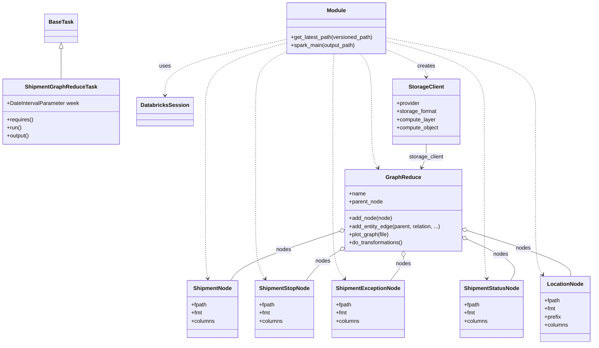

# Diagram: research/orchestrator/tasks/data_transforms/shipment_graph_reduce.py


> Auto-generated by Obscura crawlers

## Diagram 1



### SVG

<svg id="container" width="1711.5234375" xmlns="http://www.w3.org/2000/svg" class="classDiagram" height="1012" viewBox="0 0 1711.5234375 1012" role="graphics-document document" aria-roledescription="class"><style>#container{font-family:"trebuchet ms",verdana,arial,sans-serif;font-size:16px;fill:#333;}@keyframes edge-animation-frame{from{stroke-dashoffset:0;}}@keyframes dash{to{stroke-dashoffset:0;}}#container .edge-animation-slow{stroke-dasharray:9,5!important;stroke-dashoffset:900;animation:dash 50s linear infinite;stroke-linecap:round;}#container .edge-animation-fast{stroke-dasharray:9,5!important;stroke-dashoffset:900;animation:dash 20s linear infinite;stroke-linecap:round;}#container .error-icon{fill:#552222;}#container .error-text{fill:#552222;stroke:#552222;}#container .edge-thickness-normal{stroke-width:1px;}#container .edge-thickness-thick{stroke-width:3.5px;}#container .edge-pattern-solid{stroke-dasharray:0;}#container .edge-thickness-invisible{stroke-width:0;fill:none;}#container .edge-pattern-dashed{stroke-dasharray:3;}#container .edge-pattern-dotted{stroke-dasharray:2;}#container .marker{fill:#333333;stroke:#333333;}#container .marker.cross{stroke:#333333;}#container svg{font-family:"trebuchet ms",verdana,arial,sans-serif;font-size:16px;}#container p{margin:0;}#container g.classGroup text{fill:#9370DB;stroke:none;font-family:"trebuchet ms",verdana,arial,sans-serif;font-size:10px;}#container g.classGroup text .title{font-weight:bolder;}#container .nodeLabel,#container .edgeLabel{color:#131300;}#container .edgeLabel .label rect{fill:#ECECFF;}#container .label text{fill:#131300;}#container .labelBkg{background:#ECECFF;}#container .edgeLabel .label span{background:#ECECFF;}#container .classTitle{font-weight:bolder;}#container .node rect,#container .node circle,#container .node ellipse,#container .node polygon,#container .node path{fill:#ECECFF;stroke:#9370DB;stroke-width:1px;}#container .divider{stroke:#9370DB;stroke-width:1;}#container g.clickable{cursor:pointer;}#container g.classGroup rect{fill:#ECECFF;stroke:#9370DB;}#container g.classGroup line{stroke:#9370DB;stroke-width:1;}#container .classLabel .box{stroke:none;stroke-width:0;fill:#ECECFF;opacity:0.5;}#container .classLabel .label{fill:#9370DB;font-size:10px;}#container .relation{stroke:#333333;stroke-width:1;fill:none;}#container .dashed-line{stroke-dasharray:3;}#container .dotted-line{stroke-dasharray:1 2;}#container #compositionStart,#container .composition{fill:#333333!important;stroke:#333333!important;stroke-width:1;}#container #compositionEnd,#container .composition{fill:#333333!important;stroke:#333333!important;stroke-width:1;}#container #dependencyStart,#container .dependency{fill:#333333!important;stroke:#333333!important;stroke-width:1;}#container #dependencyStart,#container .dependency{fill:#333333!important;stroke:#333333!important;stroke-width:1;}#container #extensionStart,#container .extension{fill:transparent!important;stroke:#333333!important;stroke-width:1;}#container #extensionEnd,#container .extension{fill:transparent!important;stroke:#333333!important;stroke-width:1;}#container #aggregationStart,#container .aggregation{fill:transparent!important;stroke:#333333!important;stroke-width:1;}#container #aggregationEnd,#container .aggregation{fill:transparent!important;stroke:#333333!important;stroke-width:1;}#container #lollipopStart,#container .lollipop{fill:#ECECFF!important;stroke:#333333!important;stroke-width:1;}#container #lollipopEnd,#container .lollipop{fill:#ECECFF!important;stroke:#333333!important;stroke-width:1;}#container .edgeTerminals{font-size:11px;line-height:initial;}#container .classTitleText{text-anchor:middle;font-size:18px;fill:#333;}#container .label-icon{display:inline-block;height:1em;overflow:visible;vertical-align:-0.125em;}#container .node .label-icon path{fill:currentColor;stroke:revert;stroke-width:revert;}#container :root{--mermaid-font-family:"trebuchet ms",verdana,arial,sans-serif;}</style><g><defs><marker id="container_class-aggregationStart" class="marker aggregation class" refX="18" refY="7" markerWidth="190" markerHeight="240" orient="auto"><path d="M 18,7 L9,13 L1,7 L9,1 Z"></path></marker></defs><defs><marker id="container_class-aggregationEnd" class="marker aggregation class" refX="1" refY="7" markerWidth="20" markerHeight="28" orient="auto"><path d="M 18,7 L9,13 L1,7 L9,1 Z"></path></marker></defs><defs><marker id="container_class-extensionStart" class="marker extension class" refX="18" refY="7" markerWidth="190" markerHeight="240" orient="auto"><path d="M 1,7 L18,13 V 1 Z"></path></marker></defs><defs><marker id="container_class-extensionEnd" class="marker extension class" refX="1" refY="7" markerWidth="20" markerHeight="28" orient="auto"><path d="M 1,1 V 13 L18,7 Z"></path></marker></defs><defs><marker id="container_class-compositionStart" class="marker composition class" refX="18" refY="7" markerWidth="190" markerHeight="240" orient="auto"><path d="M 18,7 L9,13 L1,7 L9,1 Z"></path></marker></defs><defs><marker id="container_class-compositionEnd" class="marker composition class" refX="1" refY="7" markerWidth="20" markerHeight="28" orient="auto"><path d="M 18,7 L9,13 L1,7 L9,1 Z"></path></marker></defs><defs><marker id="container_class-dependencyStart" class="marker dependency class" refX="6" refY="7" markerWidth="190" markerHeight="240" orient="auto"><path d="M 5,7 L9,13 L1,7 L9,1 Z"></path></marker></defs><defs><marker id="container_class-dependencyEnd" class="marker dependency class" refX="13" refY="7" markerWidth="20" markerHeight="28" orient="auto"><path d="M 18,7 L9,13 L14,7 L9,1 Z"></path></marker></defs><defs><marker id="container_class-lollipopStart" class="marker lollipop class" refX="13" refY="7" markerWidth="190" markerHeight="240" orient="auto"><circle stroke="black" fill="transparent" cx="7" cy="7" r="6"></circle></marker></defs><defs><marker id="container_class-lollipopEnd" class="marker lollipop class" refX="1" refY="7" markerWidth="190" markerHeight="240" orient="auto"><circle stroke="black" fill="transparent" cx="7" cy="7" r="6"></circle></marker></defs><g class="root"><g class="clusters"></g><g class="edgePaths"><path d="M176.148,142.25L176.148,151.042C176.148,159.833,176.148,177.417,176.148,192.375C176.148,207.333,176.148,219.667,176.148,225.833L176.148,232" id="id_BaseTask_ShipmentGraphReduceTask_1" class="edge-thickness-normal edge-pattern-solid relation" style=";;;" data-edge="true" data-et="edge" data-id="id_BaseTask_ShipmentGraphReduceTask_1" data-points="W3sieCI6MTc2LjE0ODQzNzUsInkiOjEyNX0seyJ4IjoxNzYuMTQ4NDM3NSwieSI6MTk1fSx7IngiOjE3Ni4xNDg0Mzc1LCJ5IjoyMzJ9XQ==" marker-start="url(#container_class-extensionStart)"></path><path d="M817.281,116.679L760.02,129.733C702.758,142.786,588.234,168.893,530.973,196.113C473.711,223.333,473.711,251.667,473.711,265.833L473.711,280" id="id_Module_DatabricksSession_2" class="edge-thickness-normal edge-pattern-dashed relation" style=";;;" data-edge="true" data-et="edge" data-id="id_Module_DatabricksSession_2" data-points="W3sieCI6ODE3LjI4MTI1LCJ5IjoxMTYuNjc5NDMwMDk3OTUxOTJ9LHsieCI6NDczLjcxMDkzNzUsInkiOjE5NX0seyJ4Ijo0NzMuNzEwOTM3NSwieSI6Mjg2fV0=" marker-end="url(#container_class-dependencyEnd)"></path><path d="M1112.766,145.782L1132.069,153.985C1151.373,162.188,1189.98,178.594,1209.284,191.964C1228.588,205.333,1228.588,215.667,1228.588,220.833L1228.588,226" id="id_Module_StorageClient_3" class="edge-thickness-normal edge-pattern-dashed relation" style=";;;" data-edge="true" data-et="edge" data-id="id_Module_StorageClient_3" data-points="W3sieCI6MTExMi43NjU2MjUsInkiOjE0NS43ODIwODE1ODg3OTU0NX0seyJ4IjoxMjI4LjU4Nzg5MDYyNSwieSI6MTk1fSx7IngiOjEyMjguNTg3ODkwNjI1LCJ5IjoyMzJ9XQ==" marker-end="url(#container_class-dependencyEnd)"></path><path d="M817.281,126.903L779.089,138.253C740.896,149.602,664.51,172.301,626.318,205.817C588.125,239.333,588.125,283.667,588.125,328C588.125,372.333,588.125,416.667,588.125,465C588.125,513.333,588.125,565.667,588.125,618C588.125,670.333,588.125,722.667,589.265,756.012C590.405,789.358,592.685,803.716,593.825,810.895L594.965,818.074" id="id_Module_ShipmentNode_4" class="edge-thickness-normal edge-pattern-dashed relation" style=";;;" data-edge="true" data-et="edge" data-id="id_Module_ShipmentNode_4" data-points="W3sieCI6ODE3LjI4MTI1LCJ5IjoxMjYuOTAzNDA1Njc1NDM0Nzh9LHsieCI6NTg4LjEyNSwieSI6MTk1fSx7IngiOjU4OC4xMjUsInkiOjMyOH0seyJ4Ijo1ODguMTI1LCJ5Ijo0NjF9LHsieCI6NTg4LjEyNSwieSI6NjE4fSx7IngiOjU4OC4xMjUsInkiOjc3NX0seyJ4Ijo1OTUuOTA2NDU1NTkyMTA1MywieSI6ODI0fV0=" marker-end="url(#container_class-dependencyEnd)"></path><path d="M817.281,154.588L803.381,161.323C789.48,168.059,761.68,181.529,747.779,210.431C733.879,239.333,733.879,283.667,733.879,328C733.879,372.333,733.879,416.667,733.879,465C733.879,513.333,733.879,565.667,733.879,618C733.879,670.333,733.879,722.667,738.411,756.15C742.944,789.633,752.009,804.266,756.541,811.583L761.074,818.899" id="id_Module_ShipmentStopNode_5" class="edge-thickness-normal edge-pattern-dashed relation" style=";;;" data-edge="true" data-et="edge" data-id="id_Module_ShipmentStopNode_5" data-points="W3sieCI6ODE3LjI4MTI1LCJ5IjoxNTQuNTg3Nzg0OTY5NDk2MjN9LHsieCI6NzMzLjg3ODkwNjI1LCJ5IjoxOTV9LHsieCI6NzMzLjg3ODkwNjI1LCJ5IjozMjh9LHsieCI6NzMzLjg3ODkwNjI1LCJ5Ijo0NjF9LHsieCI6NzMzLjg3ODkwNjI1LCJ5Ijo2MTh9LHsieCI6NzMzLjg3ODkwNjI1LCJ5Ijo3NzV9LHsieCI6NzY0LjIzMzM0NzAzOTQ3MzYsInkiOjgyNH1d" marker-end="url(#container_class-dependencyEnd)"></path><path d="M958.327,158L957.776,164.167C957.226,170.333,956.125,182.667,955.574,211C955.023,239.333,955.023,283.667,955.023,328C955.023,372.333,955.023,416.667,955.023,465C955.023,513.333,955.023,565.667,955.023,618C955.023,670.333,955.023,722.667,960.752,756.21C966.481,789.754,977.939,804.507,983.668,811.884L989.397,819.261" id="id_Module_ShipmentExceptionNode_6" class="edge-thickness-normal edge-pattern-dashed relation" style=";;;" data-edge="true" data-et="edge" data-id="id_Module_ShipmentExceptionNode_6" data-points="W3sieCI6OTU4LjMyNzAwODkyODU3MTQsInkiOjE1OH0seyJ4Ijo5NTUuMDIzNDM3NSwieSI6MTk1fSx7IngiOjk1NS4wMjM0Mzc1LCJ5IjozMjh9LHsieCI6OTU1LjAyMzQzNzUsInkiOjQ2MX0seyJ4Ijo5NTUuMDIzNDM3NSwieSI6NjE4fSx7IngiOjk1NS4wMjM0Mzc1LCJ5Ijo3NzV9LHsieCI6OTkzLjA3NzMwMjYzMTU3OSwieSI6ODI0fV0=" marker-end="url(#container_class-dependencyEnd)"></path><path d="M1112.766,121.141L1160.449,133.451C1208.132,145.761,1303.497,170.38,1351.18,204.857C1398.863,239.333,1398.863,283.667,1398.863,328C1398.863,372.333,1398.863,416.667,1398.863,465C1398.863,513.333,1398.863,565.667,1398.863,618C1398.863,670.333,1398.863,722.667,1400.003,756.012C1401.143,789.358,1403.424,803.716,1404.564,810.895L1405.704,818.074" id="id_Module_ShipmentStatusNode_7" class="edge-thickness-normal edge-pattern-dashed relation" style=";;;" data-edge="true" data-et="edge" data-id="id_Module_ShipmentStatusNode_7" data-points="W3sieCI6MTExMi43NjU2MjUsInkiOjEyMS4xNDEwOTEwOTI0NDMwMn0seyJ4IjoxMzk4Ljg2MzI4MTI1LCJ5IjoxOTV9LHsieCI6MTM5OC44NjMyODEyNSwieSI6MzI4fSx7IngiOjEzOTguODYzMjgxMjUsInkiOjQ2MX0seyJ4IjoxMzk4Ljg2MzI4MTI1LCJ5Ijo2MTh9LHsieCI6MTM5OC44NjMyODEyNSwieSI6Nzc1fSx7IngiOjE0MDYuNjQ0NzM2ODQyMTA1MiwieSI6ODI0fV0=" marker-end="url(#container_class-dependencyEnd)"></path><path d="M1112.766,111.436L1185.127,125.363C1257.489,139.291,1402.212,167.145,1474.574,203.239C1546.936,239.333,1546.936,283.667,1546.936,328C1546.936,372.333,1546.936,416.667,1546.936,465C1546.936,513.333,1546.936,565.667,1546.936,618C1546.936,670.333,1546.936,722.667,1550.326,754.157C1553.716,785.646,1560.497,796.293,1563.888,801.616L1567.278,806.939" id="id_Module_LocationNode_8" class="edge-thickness-normal edge-pattern-dashed relation" style=";;;" data-edge="true" data-et="edge" data-id="id_Module_LocationNode_8" data-points="W3sieCI6MTExMi43NjU2MjUsInkiOjExMS40MzU3ODA0Nzg1NTQzNH0seyJ4IjoxNTQ2LjkzNTU0Njg3NSwieSI6MTk1fSx7IngiOjE1NDYuOTM1NTQ2ODc1LCJ5IjozMjh9LHsieCI6MTU0Ni45MzU1NDY4NzUsInkiOjQ2MX0seyJ4IjoxNTQ2LjkzNTU0Njg3NSwieSI6NjE4fSx7IngiOjE1NDYuOTM1NTQ2ODc1LCJ5Ijo3NzV9LHsieCI6MTU3MC41MDEyMDQxODIzMzA5LCJ5Ijo4MTJ9XQ==" marker-end="url(#container_class-dependencyEnd)"></path><path d="M1034.19,158L1039.877,164.167C1045.564,170.333,1056.938,182.667,1062.625,211C1068.313,239.333,1068.313,283.667,1068.313,328C1068.313,372.333,1068.313,416.667,1071.466,444.14C1074.619,471.614,1080.926,482.228,1084.079,487.535L1087.233,492.842" id="id_Module_GraphReduce_9" class="edge-thickness-normal edge-pattern-dashed relation" style=";;;" data-edge="true" data-et="edge" data-id="id_Module_GraphReduce_9" data-points="W3sieCI6MTAzNC4xOTAyMjA0MjQxMDcsInkiOjE1OH0seyJ4IjoxMDY4LjMxMjUsInkiOjE5NX0seyJ4IjoxMDY4LjMxMjUsInkiOjMyOH0seyJ4IjoxMDY4LjMxMjUsInkiOjQ2MX0seyJ4IjoxMDkwLjI5NzgyMDQ2MTc4MzQsInkiOjQ5OH1d" marker-end="url(#container_class-dependencyEnd)"></path><path d="M973.662,680.784L926.658,696.487C879.654,712.19,785.645,743.595,733.582,767.464C681.519,791.333,671.4,807.667,666.341,815.833L661.282,824" id="id_GraphReduce_ShipmentNode_10" class="edge-thickness-normal edge-pattern-solid relation" style=";;;" data-edge="true" data-et="edge" data-id="id_GraphReduce_ShipmentNode_10" data-points="W3sieCI6OTkwLjAyMzQzNzUsInkiOjY3NS4zMTg2ODI0MTQ3NDE4fSx7IngiOjY5MS42MzY3MTg3NSwieSI6Nzc1fSx7IngiOjY2MS4yODIyNzc5NjA1MjY0LCJ5Ijo4MjR9XQ==" marker-start="url(#container_class-aggregationStart)"></path><path d="M975.435,735.467L964.993,742.056C954.55,748.645,933.666,761.822,917.297,776.578C900.929,791.333,889.077,807.667,883.15,815.833L877.224,824" id="id_GraphReduce_ShipmentStopNode_11" class="edge-thickness-normal edge-pattern-solid relation" style=";;;" data-edge="true" data-et="edge" data-id="id_GraphReduce_ShipmentStopNode_11" data-points="W3sieCI6OTkwLjAyMzQzNzUsInkiOjcyNi4yNjE5MjM0NTEyODU3fSx7IngiOjkxMi43ODEyNSwieSI6Nzc1fSx7IngiOjg3Ny4yMjQzMDA5ODY4NDIxLCJ5Ijo4MjR9XQ==" marker-start="url(#container_class-aggregationStart)"></path><path d="M1161.602,755.25L1161.602,758.542C1161.602,761.833,1161.602,768.417,1155.259,779.875C1148.917,791.333,1136.232,807.667,1129.89,815.833L1123.548,824" id="id_GraphReduce_ShipmentExceptionNode_12" class="edge-thickness-normal edge-pattern-solid relation" style=";;;" data-edge="true" data-et="edge" data-id="id_GraphReduce_ShipmentExceptionNode_12" data-points="W3sieCI6MTE2MS42MDE1NjI1LCJ5Ijo3Mzh9LHsieCI6MTE2MS42MDE1NjI1LCJ5Ijo3NzV9LHsieCI6MTEyMy41NDc2OTczNjg0MjEsInkiOjgyNH1d" marker-start="url(#container_class-aggregationStart)"></path><path d="M1348.865,703.693L1374.837,715.577C1400.808,727.462,1452.751,751.231,1473.521,771.282C1494.291,791.333,1483.888,807.667,1478.686,815.833L1473.485,824" id="id_GraphReduce_ShipmentStatusNode_13" class="edge-thickness-normal edge-pattern-solid relation" style=";;;" data-edge="true" data-et="edge" data-id="id_GraphReduce_ShipmentStatusNode_13" data-points="W3sieCI6MTMzMy4xNzk2ODc1LCJ5Ijo2OTYuNTE0NzQ2OTg3MTI4OH0seyJ4IjoxNTA0LjY5MzM1OTM3NSwieSI6Nzc1fSx7IngiOjE0NzMuNDg0Nzg2MTg0MjEwNiwieSI6ODI0fV0=" marker-start="url(#container_class-aggregationStart)"></path><path d="M1349.611,678.097L1400.137,694.247C1450.662,710.398,1551.714,742.699,1601.261,765.016C1650.807,787.333,1648.848,799.667,1647.869,805.833L1646.89,812" id="id_GraphReduce_LocationNode_14" class="edge-thickness-normal edge-pattern-solid relation" style=";;;" data-edge="true" data-et="edge" data-id="id_GraphReduce_LocationNode_14" data-points="W3sieCI6MTMzMy4xNzk2ODc1LCJ5Ijo2NzIuODQ0NzQwNjUxMTk1NH0seyJ4IjoxNjUyLjc2NTYyNSwieSI6Nzc1fSx7IngiOjE2NDYuODg5ODMyMDAxODc5OCwieSI6ODEyfV0=" marker-start="url(#container_class-aggregationStart)"></path><path d="M1228.588,424L1228.588,430.167C1228.588,436.333,1228.588,448.667,1226.349,460.08C1224.111,471.494,1219.633,481.988,1217.395,487.234L1215.156,492.481" id="id_StorageClient_GraphReduce_15" class="edge-thickness-normal edge-pattern-solid relation" style=";;;" data-edge="true" data-et="edge" data-id="id_StorageClient_GraphReduce_15" data-points="W3sieCI6MTIyOC41ODc4OTA2MjUsInkiOjQyNH0seyJ4IjoxMjI4LjU4Nzg5MDYyNSwieSI6NDYxfSx7IngiOjEyMTIuODAxMzAzNzQyMDM4MywieSI6NDk4fV0=" marker-end="url(#container_class-dependencyEnd)"></path></g><g class="edgeLabels"><g class="edgeLabel"><g class="label" data-id="id_BaseTask_ShipmentGraphReduceTask_1" transform="translate(0, 0)"><foreignObject width="0" height="0"><div xmlns="http://www.w3.org/1999/xhtml" class="labelBkg" style="display: table-cell; white-space: nowrap; line-height: 1.5; max-width: 200px; text-align: center;"><span class="edgeLabel"></span></div></foreignObject></g></g><g class="edgeLabel" transform="translate(473.7109375, 195)"><g class="label" data-id="id_Module_DatabricksSession_2" transform="translate(-16.4921875, -12)"><foreignObject width="32.984375" height="24"><div xmlns="http://www.w3.org/1999/xhtml" class="labelBkg" style="display: table-cell; white-space: nowrap; line-height: 1.5; max-width: 200px; text-align: center;"><span class="edgeLabel"><p>uses</p></span></div></foreignObject></g></g><g class="edgeLabel" transform="translate(1228.587890625, 195)"><g class="label" data-id="id_Module_StorageClient_3" transform="translate(-26.171875, -12)"><foreignObject width="52.34375" height="24"><div xmlns="http://www.w3.org/1999/xhtml" class="labelBkg" style="display: table-cell; white-space: nowrap; line-height: 1.5; max-width: 200px; text-align: center;"><span class="edgeLabel"><p>creates</p></span></div></foreignObject></g></g><g class="edgeLabel"><g class="label" data-id="id_Module_ShipmentNode_4" transform="translate(0, 0)"><foreignObject width="0" height="0"><div xmlns="http://www.w3.org/1999/xhtml" class="labelBkg" style="display: table-cell; white-space: nowrap; line-height: 1.5; max-width: 200px; text-align: center;"><span class="edgeLabel"></span></div></foreignObject></g></g><g class="edgeLabel"><g class="label" data-id="id_Module_ShipmentStopNode_5" transform="translate(0, 0)"><foreignObject width="0" height="0"><div xmlns="http://www.w3.org/1999/xhtml" class="labelBkg" style="display: table-cell; white-space: nowrap; line-height: 1.5; max-width: 200px; text-align: center;"><span class="edgeLabel"></span></div></foreignObject></g></g><g class="edgeLabel"><g class="label" data-id="id_Module_ShipmentExceptionNode_6" transform="translate(0, 0)"><foreignObject width="0" height="0"><div xmlns="http://www.w3.org/1999/xhtml" class="labelBkg" style="display: table-cell; white-space: nowrap; line-height: 1.5; max-width: 200px; text-align: center;"><span class="edgeLabel"></span></div></foreignObject></g></g><g class="edgeLabel"><g class="label" data-id="id_Module_ShipmentStatusNode_7" transform="translate(0, 0)"><foreignObject width="0" height="0"><div xmlns="http://www.w3.org/1999/xhtml" class="labelBkg" style="display: table-cell; white-space: nowrap; line-height: 1.5; max-width: 200px; text-align: center;"><span class="edgeLabel"></span></div></foreignObject></g></g><g class="edgeLabel"><g class="label" data-id="id_Module_LocationNode_8" transform="translate(0, 0)"><foreignObject width="0" height="0"><div xmlns="http://www.w3.org/1999/xhtml" class="labelBkg" style="display: table-cell; white-space: nowrap; line-height: 1.5; max-width: 200px; text-align: center;"><span class="edgeLabel"></span></div></foreignObject></g></g><g class="edgeLabel"><g class="label" data-id="id_Module_GraphReduce_9" transform="translate(0, 0)"><foreignObject width="0" height="0"><div xmlns="http://www.w3.org/1999/xhtml" class="labelBkg" style="display: table-cell; white-space: nowrap; line-height: 1.5; max-width: 200px; text-align: center;"><span class="edgeLabel"></span></div></foreignObject></g></g><g class="edgeLabel" transform="translate(813.49496, 734.29112)"><g class="label" data-id="id_GraphReduce_ShipmentNode_10" transform="translate(-22.2421875, -12)"><foreignObject width="44.484375" height="24"><div xmlns="http://www.w3.org/1999/xhtml" class="labelBkg" style="display: table-cell; white-space: nowrap; line-height: 1.5; max-width: 200px; text-align: center;"><span class="edgeLabel"><p>nodes</p></span></div></foreignObject></g></g><g class="edgeLabel" transform="translate(925.80173, 766.78437)"><g class="label" data-id="id_GraphReduce_ShipmentStopNode_11" transform="translate(-22.2421875, -12)"><foreignObject width="44.484375" height="24"><div xmlns="http://www.w3.org/1999/xhtml" class="labelBkg" style="display: table-cell; white-space: nowrap; line-height: 1.5; max-width: 200px; text-align: center;"><span class="edgeLabel"><p>nodes</p></span></div></foreignObject></g></g><g class="edgeLabel" transform="translate(1161.6015625, 775)"><g class="label" data-id="id_GraphReduce_ShipmentExceptionNode_12" transform="translate(-22.2421875, -12)"><foreignObject width="44.484375" height="24"><div xmlns="http://www.w3.org/1999/xhtml" class="labelBkg" style="display: table-cell; white-space: nowrap; line-height: 1.5; max-width: 200px; text-align: center;"><span class="edgeLabel"><p>nodes</p></span></div></foreignObject></g></g><g class="edgeLabel" transform="translate(1445.34967, 747.84412)"><g class="label" data-id="id_GraphReduce_ShipmentStatusNode_13" transform="translate(-22.2421875, -12)"><foreignObject width="44.484375" height="24"><div xmlns="http://www.w3.org/1999/xhtml" class="labelBkg" style="display: table-cell; white-space: nowrap; line-height: 1.5; max-width: 200px; text-align: center;"><span class="edgeLabel"><p>nodes</p></span></div></foreignObject></g></g><g class="edgeLabel" transform="translate(1510.81512, 729.62569)"><g class="label" data-id="id_GraphReduce_LocationNode_14" transform="translate(-22.2421875, -12)"><foreignObject width="44.484375" height="24"><div xmlns="http://www.w3.org/1999/xhtml" class="labelBkg" style="display: table-cell; white-space: nowrap; line-height: 1.5; max-width: 200px; text-align: center;"><span class="edgeLabel"><p>nodes</p></span></div></foreignObject></g></g><g class="edgeLabel" transform="translate(1228.587890625, 461)"><g class="label" data-id="id_StorageClient_GraphReduce_15" transform="translate(-50.8515625, -12)"><foreignObject width="101.703125" height="24"><div xmlns="http://www.w3.org/1999/xhtml" class="labelBkg" style="display: table-cell; white-space: nowrap; line-height: 1.5; max-width: 200px; text-align: center;"><span class="edgeLabel"><p>storage_client</p></span></div></foreignObject></g></g></g><g class="nodes"><g class="node default" id="classId-BaseTask-0" transform="translate(176.1484375, 83)"><g class="basic label-container"><path d="M-46.03125 -42 L46.03125 -42 L46.03125 42 L-46.03125 42" stroke="none" stroke-width="0" fill="#ECECFF" style=""></path><path d="M-46.03125 -42 C-17.796239706025617 -42, 10.438770587948767 -42, 46.03125 -42 M-46.03125 -42 C-13.577083436242681 -42, 18.877083127514638 -42, 46.03125 -42 M46.03125 -42 C46.03125 -16.798859904059192, 46.03125 8.402280191881616, 46.03125 42 M46.03125 -42 C46.03125 -10.948291329352202, 46.03125 20.103417341295597, 46.03125 42 M46.03125 42 C16.020339527926545 42, -13.99057094414691 42, -46.03125 42 M46.03125 42 C17.733023761305365 42, -10.56520247738927 42, -46.03125 42 M-46.03125 42 C-46.03125 21.71483254820389, -46.03125 1.4296650964077813, -46.03125 -42 M-46.03125 42 C-46.03125 13.385601618894924, -46.03125 -15.228796762210152, -46.03125 -42" stroke="#9370DB" stroke-width="1.3" fill="none" stroke-dasharray="0 0" style=""></path></g><g class="annotation-group text" transform="translate(0, -18)"></g><g class="label-group text" transform="translate(-34.03125, -18)"><g class="label" style="font-weight: bolder" transform="translate(0,-12)"><foreignObject width="68.0625" height="24"><div xmlns="http://www.w3.org/1999/xhtml" style="display: table-cell; white-space: nowrap; line-height: 1.5; max-width: 117px; text-align: center;"><span class="nodeLabel markdown-node-label" style=""><p>BaseTask</p></span></div></foreignObject></g></g><g class="members-group text" transform="translate(-34.03125, 30)"></g><g class="methods-group text" transform="translate(-34.03125, 60)"></g><g class="divider" style=""><path d="M-46.03125 6 C-9.625730684921095 6, 26.77978863015781 6, 46.03125 6 M-46.03125 6 C-13.303364851560382 6, 19.424520296879237 6, 46.03125 6" stroke="#9370DB" stroke-width="1.3" fill="none" stroke-dasharray="0 0" style=""></path></g><g class="divider" style=""><path d="M-46.03125 24 C-17.3002870363249 24, 11.430675927350201 24, 46.03125 24 M-46.03125 24 C-20.278971881838682 24, 5.473306236322635 24, 46.03125 24" stroke="#9370DB" stroke-width="1.3" fill="none" stroke-dasharray="0 0" style=""></path></g></g><g class="node default" id="classId-ShipmentGraphReduceTask-1" transform="translate(176.1484375, 328)"><g class="basic label-container"><path d="M-168.1484375 -96 L168.1484375 -96 L168.1484375 96 L-168.1484375 96" stroke="none" stroke-width="0" fill="#ECECFF" style=""></path><path d="M-168.1484375 -96 C-55.754232987178426 -96, 56.63997152564315 -96, 168.1484375 -96 M-168.1484375 -96 C-62.54541983983985 -96, 43.0575978203203 -96, 168.1484375 -96 M168.1484375 -96 C168.1484375 -39.45826322606554, 168.1484375 17.08347354786892, 168.1484375 96 M168.1484375 -96 C168.1484375 -40.480928899017016, 168.1484375 15.038142201965968, 168.1484375 96 M168.1484375 96 C91.86126291390504 96, 15.574088327810074 96, -168.1484375 96 M168.1484375 96 C53.36495931314694 96, -61.41851887370612 96, -168.1484375 96 M-168.1484375 96 C-168.1484375 57.23887297135989, -168.1484375 18.47774594271978, -168.1484375 -96 M-168.1484375 96 C-168.1484375 20.849433012403708, -168.1484375 -54.301133975192585, -168.1484375 -96" stroke="#9370DB" stroke-width="1.3" fill="none" stroke-dasharray="0 0" style=""></path></g><g class="annotation-group text" transform="translate(0, -72)"></g><g class="label-group text" transform="translate(-100.171875, -72)"><g class="label" style="font-weight: bolder" transform="translate(0,-12)"><foreignObject width="200.34375" height="24"><div xmlns="http://www.w3.org/1999/xhtml" style="display: table-cell; white-space: nowrap; line-height: 1.5; max-width: 249px; text-align: center;"><span class="nodeLabel markdown-node-label" style=""><p>ShipmentGraphReduceTask</p></span></div></foreignObject></g></g><g class="members-group text" transform="translate(-156.1484375, -24)"><g class="label" style="" transform="translate(0,-12)"><foreignObject width="212.125" height="24"><div xmlns="http://www.w3.org/1999/xhtml" style="display: table-cell; white-space: nowrap; line-height: 1.5; max-width: 270px; text-align: center;"><span class="nodeLabel markdown-node-label" style=""><p>+DateIntervalParameter week</p></span></div></foreignObject></g></g><g class="methods-group text" transform="translate(-156.1484375, 24)"><g class="label" style="" transform="translate(0,-12)"><foreignObject width="78.0625" height="24"><div xmlns="http://www.w3.org/1999/xhtml" style="display: table-cell; white-space: nowrap; line-height: 1.5; max-width: 135px; text-align: center;"><span class="nodeLabel markdown-node-label" style=""><p>+requires()</p></span></div></foreignObject></g><g class="label" style="" transform="translate(0,12)"><foreignObject width="43.21875" height="24"><div xmlns="http://www.w3.org/1999/xhtml" style="display: table-cell; white-space: nowrap; line-height: 1.5; max-width: 101px; text-align: center;"><span class="nodeLabel markdown-node-label" style=""><p>+run()</p></span></div></foreignObject></g><g class="label" style="" transform="translate(0,36)"><foreignObject width="67.390625" height="24"><div xmlns="http://www.w3.org/1999/xhtml" style="display: table-cell; white-space: nowrap; line-height: 1.5; max-width: 125px; text-align: center;"><span class="nodeLabel markdown-node-label" style=""><p>+output()</p></span></div></foreignObject></g></g><g class="divider" style=""><path d="M-168.1484375 -48 C-77.58975452521577 -48, 12.968928449568466 -48, 168.1484375 -48 M-168.1484375 -48 C-81.11612542966974 -48, 5.916186640660527 -48, 168.1484375 -48" stroke="#9370DB" stroke-width="1.3" fill="none" stroke-dasharray="0 0" style=""></path></g><g class="divider" style=""><path d="M-168.1484375 0 C-39.80369414545916 0, 88.54104920908168 0, 168.1484375 0 M-168.1484375 0 C-61.17637401194085 0, 45.7956894761183 0, 168.1484375 0" stroke="#9370DB" stroke-width="1.3" fill="none" stroke-dasharray="0 0" style=""></path></g></g><g class="node default" id="classId-Module-2" transform="translate(965.0234375, 83)"><g class="basic label-container"><path d="M-147.7421875 -75 L147.7421875 -75 L147.7421875 75 L-147.7421875 75" stroke="none" stroke-width="0" fill="#ECECFF" style=""></path><path d="M-147.7421875 -75 C-35.75009459186737 -75, 76.24199831626527 -75, 147.7421875 -75 M-147.7421875 -75 C-36.25425435406346 -75, 75.23367879187307 -75, 147.7421875 -75 M147.7421875 -75 C147.7421875 -30.30642348117256, 147.7421875 14.387153037654883, 147.7421875 75 M147.7421875 -75 C147.7421875 -44.432613716575666, 147.7421875 -13.865227433151333, 147.7421875 75 M147.7421875 75 C38.13587128921945 75, -71.4704449215611 75, -147.7421875 75 M147.7421875 75 C47.04107392025739 75, -53.66003965948522 75, -147.7421875 75 M-147.7421875 75 C-147.7421875 39.830729077341246, -147.7421875 4.661458154682492, -147.7421875 -75 M-147.7421875 75 C-147.7421875 37.079912446141975, -147.7421875 -0.8401751077160498, -147.7421875 -75" stroke="#9370DB" stroke-width="1.3" fill="none" stroke-dasharray="0 0" style=""></path></g><g class="annotation-group text" transform="translate(0, -51)"></g><g class="label-group text" transform="translate(-27.09375, -51)"><g class="label" style="font-weight: bolder" transform="translate(0,-12)"><foreignObject width="54.1875" height="24"><div xmlns="http://www.w3.org/1999/xhtml" style="display: table-cell; white-space: nowrap; line-height: 1.5; max-width: 104px; text-align: center;"><span class="nodeLabel markdown-node-label" style=""><p>Module</p></span></div></foreignObject></g></g><g class="members-group text" transform="translate(-135.7421875, -3)"></g><g class="methods-group text" transform="translate(-135.7421875, 27)"><g class="label" style="" transform="translate(0,-12)"><foreignObject width="244.390625" height="24"><div xmlns="http://www.w3.org/1999/xhtml" style="display: table-cell; white-space: nowrap; line-height: 1.5; max-width: 302px; text-align: center;"><span class="nodeLabel markdown-node-label" style=""><p>+get_latest_path(versioned_path)</p></span></div></foreignObject></g><g class="label" style="" transform="translate(0,12)"><foreignObject width="193.421875" height="24"><div xmlns="http://www.w3.org/1999/xhtml" style="display: table-cell; white-space: nowrap; line-height: 1.5; max-width: 251px; text-align: center;"><span class="nodeLabel markdown-node-label" style=""><p>+spark_main(output_path)</p></span></div></foreignObject></g></g><g class="divider" style=""><path d="M-147.7421875 -27 C-83.08785835412516 -27, -18.43352920825032 -27, 147.7421875 -27 M-147.7421875 -27 C-58.288526369477864 -27, 31.16513476104427 -27, 147.7421875 -27" stroke="#9370DB" stroke-width="1.3" fill="none" stroke-dasharray="0 0" style=""></path></g><g class="divider" style=""><path d="M-147.7421875 -3 C-32.45885574000178 -3, 82.82447601999644 -3, 147.7421875 -3 M-147.7421875 -3 C-63.73300744706317 -3, 20.276172605873654 -3, 147.7421875 -3" stroke="#9370DB" stroke-width="1.3" fill="none" stroke-dasharray="0 0" style=""></path></g></g><g class="node default" id="classId-DatabricksSession-3" transform="translate(473.7109375, 328)"><g class="basic label-container"><path d="M-79.4140625 -42 L79.4140625 -42 L79.4140625 42 L-79.4140625 42" stroke="none" stroke-width="0" fill="#ECECFF" style=""></path><path d="M-79.4140625 -42 C-45.860454135351 -42, -12.306845770701997 -42, 79.4140625 -42 M-79.4140625 -42 C-23.094951066720405 -42, 33.22416036655919 -42, 79.4140625 -42 M79.4140625 -42 C79.4140625 -13.029174565732927, 79.4140625 15.941650868534147, 79.4140625 42 M79.4140625 -42 C79.4140625 -25.045237842658345, 79.4140625 -8.09047568531669, 79.4140625 42 M79.4140625 42 C47.618434765125045 42, 15.82280703025009 42, -79.4140625 42 M79.4140625 42 C40.04833149093343 42, 0.6826004818668565 42, -79.4140625 42 M-79.4140625 42 C-79.4140625 19.7258986301258, -79.4140625 -2.5482027397483975, -79.4140625 -42 M-79.4140625 42 C-79.4140625 12.754576335800145, -79.4140625 -16.49084732839971, -79.4140625 -42" stroke="#9370DB" stroke-width="1.3" fill="none" stroke-dasharray="0 0" style=""></path></g><g class="annotation-group text" transform="translate(0, -18)"></g><g class="label-group text" transform="translate(-67.4140625, -18)"><g class="label" style="font-weight: bolder" transform="translate(0,-12)"><foreignObject width="134.828125" height="24"><div xmlns="http://www.w3.org/1999/xhtml" style="display: table-cell; white-space: nowrap; line-height: 1.5; max-width: 182px; text-align: center;"><span class="nodeLabel markdown-node-label" style=""><p>DatabricksSession</p></span></div></foreignObject></g></g><g class="members-group text" transform="translate(-67.4140625, 30)"></g><g class="methods-group text" transform="translate(-67.4140625, 60)"></g><g class="divider" style=""><path d="M-79.4140625 6 C-47.15041361187054 6, -14.88676472374108 6, 79.4140625 6 M-79.4140625 6 C-20.89496146793679 6, 37.62413956412642 6, 79.4140625 6" stroke="#9370DB" stroke-width="1.3" fill="none" stroke-dasharray="0 0" style=""></path></g><g class="divider" style=""><path d="M-79.4140625 24 C-16.53039898237722 24, 46.35326453524556 24, 79.4140625 24 M-79.4140625 24 C-16.124206856224745 24, 47.16564878755051 24, 79.4140625 24" stroke="#9370DB" stroke-width="1.3" fill="none" stroke-dasharray="0 0" style=""></path></g></g><g class="node default" id="classId-StorageClient-4" transform="translate(1228.587890625, 328)"><g class="basic label-container"><path d="M-98.97265625 -96 L98.97265625 -96 L98.97265625 96 L-98.97265625 96" stroke="none" stroke-width="0" fill="#ECECFF" style=""></path><path d="M-98.97265625 -96 C-33.59898894275425 -96, 31.774678364491507 -96, 98.97265625 -96 M-98.97265625 -96 C-37.462340002857985 -96, 24.04797624428403 -96, 98.97265625 -96 M98.97265625 -96 C98.97265625 -23.450525377242258, 98.97265625 49.098949245515485, 98.97265625 96 M98.97265625 -96 C98.97265625 -57.03953759699405, 98.97265625 -18.079075193988103, 98.97265625 96 M98.97265625 96 C51.639584321945435 96, 4.30651239389087 96, -98.97265625 96 M98.97265625 96 C21.594396526440676 96, -55.78386319711865 96, -98.97265625 96 M-98.97265625 96 C-98.97265625 37.60275537564274, -98.97265625 -20.794489248714527, -98.97265625 -96 M-98.97265625 96 C-98.97265625 43.3501964536032, -98.97265625 -9.299607092793593, -98.97265625 -96" stroke="#9370DB" stroke-width="1.3" fill="none" stroke-dasharray="0 0" style=""></path></g><g class="annotation-group text" transform="translate(0, -72)"></g><g class="label-group text" transform="translate(-49.3515625, -72)"><g class="label" style="font-weight: bolder" transform="translate(0,-12)"><foreignObject width="98.703125" height="24"><div xmlns="http://www.w3.org/1999/xhtml" style="display: table-cell; white-space: nowrap; line-height: 1.5; max-width: 147px; text-align: center;"><span class="nodeLabel markdown-node-label" style=""><p>StorageClient</p></span></div></foreignObject></g></g><g class="members-group text" transform="translate(-86.97265625, -24)"><g class="label" style="" transform="translate(0,-12)"><foreignObject width="69.3125" height="24"><div xmlns="http://www.w3.org/1999/xhtml" style="display: table-cell; white-space: nowrap; line-height: 1.5; max-width: 127px; text-align: center;"><span class="nodeLabel markdown-node-label" style=""><p>+provider</p></span></div></foreignObject></g><g class="label" style="" transform="translate(0,12)"><foreignObject width="117.875" height="24"><div xmlns="http://www.w3.org/1999/xhtml" style="display: table-cell; white-space: nowrap; line-height: 1.5; max-width: 175px; text-align: center;"><span class="nodeLabel markdown-node-label" style=""><p>+storage_format</p></span></div></foreignObject></g><g class="label" style="" transform="translate(0,36)"><foreignObject width="115.0625" height="24"><div xmlns="http://www.w3.org/1999/xhtml" style="display: table-cell; white-space: nowrap; line-height: 1.5; max-width: 173px; text-align: center;"><span class="nodeLabel markdown-node-label" style=""><p>+compute_layer</p></span></div></foreignObject></g><g class="label" style="" transform="translate(0,60)"><foreignObject width="124.59375" height="24"><div xmlns="http://www.w3.org/1999/xhtml" style="display: table-cell; white-space: nowrap; line-height: 1.5; max-width: 182px; text-align: center;"><span class="nodeLabel markdown-node-label" style=""><p>+compute_object</p></span></div></foreignObject></g></g><g class="methods-group text" transform="translate(-86.97265625, 96)"></g><g class="divider" style=""><path d="M-98.97265625 -48 C-42.14597718895247 -48, 14.680701872095057 -48, 98.97265625 -48 M-98.97265625 -48 C-58.13441981297395 -48, -17.296183375947905 -48, 98.97265625 -48" stroke="#9370DB" stroke-width="1.3" fill="none" stroke-dasharray="0 0" style=""></path></g><g class="divider" style=""><path d="M-98.97265625 72 C-56.74299737409697 72, -14.513338498193946 72, 98.97265625 72 M-98.97265625 72 C-45.014290368557084 72, 8.944075512885831 72, 98.97265625 72" stroke="#9370DB" stroke-width="1.3" fill="none" stroke-dasharray="0 0" style=""></path></g></g><g class="node default" id="classId-ShipmentNode-5" transform="translate(609.24609375, 908)"><g class="basic label-container"><path d="M-73.7578125 -84 L73.7578125 -84 L73.7578125 84 L-73.7578125 84" stroke="none" stroke-width="0" fill="#ECECFF" style=""></path><path d="M-73.7578125 -84 C-28.84138875164362 -84, 16.07503499671276 -84, 73.7578125 -84 M-73.7578125 -84 C-38.156696881584836 -84, -2.555581263169671 -84, 73.7578125 -84 M73.7578125 -84 C73.7578125 -27.96472100388001, 73.7578125 28.070557992239983, 73.7578125 84 M73.7578125 -84 C73.7578125 -26.633468202467135, 73.7578125 30.73306359506573, 73.7578125 84 M73.7578125 84 C30.978554754920566 84, -11.800702990158868 84, -73.7578125 84 M73.7578125 84 C15.323728409020198 84, -43.110355681959604 84, -73.7578125 84 M-73.7578125 84 C-73.7578125 24.007631455145436, -73.7578125 -35.98473708970913, -73.7578125 -84 M-73.7578125 84 C-73.7578125 26.366201836500082, -73.7578125 -31.267596326999836, -73.7578125 -84" stroke="#9370DB" stroke-width="1.3" fill="none" stroke-dasharray="0 0" style=""></path></g><g class="annotation-group text" transform="translate(0, -60)"></g><g class="label-group text" transform="translate(-54.296875, -60)"><g class="label" style="font-weight: bolder" transform="translate(0,-12)"><foreignObject width="108.59375" height="24"><div xmlns="http://www.w3.org/1999/xhtml" style="display: table-cell; white-space: nowrap; line-height: 1.5; max-width: 158px; text-align: center;"><span class="nodeLabel markdown-node-label" style=""><p>ShipmentNode</p></span></div></foreignObject></g></g><g class="members-group text" transform="translate(-61.7578125, -12)"><g class="label" style="" transform="translate(0,-12)"><foreignObject width="46.3125" height="24"><div xmlns="http://www.w3.org/1999/xhtml" style="display: table-cell; white-space: nowrap; line-height: 1.5; max-width: 104px; text-align: center;"><span class="nodeLabel markdown-node-label" style=""><p>+fpath</p></span></div></foreignObject></g><g class="label" style="" transform="translate(0,12)"><foreignObject width="32.59375" height="24"><div xmlns="http://www.w3.org/1999/xhtml" style="display: table-cell; white-space: nowrap; line-height: 1.5; max-width: 90px; text-align: center;"><span class="nodeLabel markdown-node-label" style=""><p>+fmt</p></span></div></foreignObject></g><g class="label" style="" transform="translate(0,36)"><foreignObject width="69.21875" height="24"><div xmlns="http://www.w3.org/1999/xhtml" style="display: table-cell; white-space: nowrap; line-height: 1.5; max-width: 127px; text-align: center;"><span class="nodeLabel markdown-node-label" style=""><p>+columns</p></span></div></foreignObject></g></g><g class="methods-group text" transform="translate(-61.7578125, 84)"></g><g class="divider" style=""><path d="M-73.7578125 -36 C-37.63459717475205 -36, -1.5113818495041045 -36, 73.7578125 -36 M-73.7578125 -36 C-43.63676062789315 -36, -13.5157087557863 -36, 73.7578125 -36" stroke="#9370DB" stroke-width="1.3" fill="none" stroke-dasharray="0 0" style=""></path></g><g class="divider" style=""><path d="M-73.7578125 60 C-17.442860855717733 60, 38.872090788564535 60, 73.7578125 60 M-73.7578125 60 C-33.466186734118104 60, 6.825439031763793 60, 73.7578125 60" stroke="#9370DB" stroke-width="1.3" fill="none" stroke-dasharray="0 0" style=""></path></g></g><g class="node default" id="classId-ShipmentStopNode-6" transform="translate(816.26953125, 908)"><g class="basic label-container"><path d="M-83.265625 -84 L83.265625 -84 L83.265625 84 L-83.265625 84" stroke="none" stroke-width="0" fill="#ECECFF" style=""></path><path d="M-83.265625 -84 C-44.05578263947997 -84, -4.845940278959944 -84, 83.265625 -84 M-83.265625 -84 C-21.777871527178753 -84, 39.70988194564249 -84, 83.265625 -84 M83.265625 -84 C83.265625 -23.13342144426212, 83.265625 37.73315711147576, 83.265625 84 M83.265625 -84 C83.265625 -27.172829840094956, 83.265625 29.65434031981009, 83.265625 84 M83.265625 84 C37.79548567957583 84, -7.674653640848334 84, -83.265625 84 M83.265625 84 C27.082462460428978 84, -29.100700079142044 84, -83.265625 84 M-83.265625 84 C-83.265625 38.54324584020944, -83.265625 -6.913508319581126, -83.265625 -84 M-83.265625 84 C-83.265625 31.02907325641236, -83.265625 -21.94185348717528, -83.265625 -84" stroke="#9370DB" stroke-width="1.3" fill="none" stroke-dasharray="0 0" style=""></path></g><g class="annotation-group text" transform="translate(0, -60)"></g><g class="label-group text" transform="translate(-71.265625, -60)"><g class="label" style="font-weight: bolder" transform="translate(0,-12)"><foreignObject width="142.53125" height="24"><div xmlns="http://www.w3.org/1999/xhtml" style="display: table-cell; white-space: nowrap; line-height: 1.5; max-width: 191px; text-align: center;"><span class="nodeLabel markdown-node-label" style=""><p>ShipmentStopNode</p></span></div></foreignObject></g></g><g class="members-group text" transform="translate(-71.265625, -12)"><g class="label" style="" transform="translate(0,-12)"><foreignObject width="46.3125" height="24"><div xmlns="http://www.w3.org/1999/xhtml" style="display: table-cell; white-space: nowrap; line-height: 1.5; max-width: 104px; text-align: center;"><span class="nodeLabel markdown-node-label" style=""><p>+fpath</p></span></div></foreignObject></g><g class="label" style="" transform="translate(0,12)"><foreignObject width="32.59375" height="24"><div xmlns="http://www.w3.org/1999/xhtml" style="display: table-cell; white-space: nowrap; line-height: 1.5; max-width: 90px; text-align: center;"><span class="nodeLabel markdown-node-label" style=""><p>+fmt</p></span></div></foreignObject></g><g class="label" style="" transform="translate(0,36)"><foreignObject width="69.21875" height="24"><div xmlns="http://www.w3.org/1999/xhtml" style="display: table-cell; white-space: nowrap; line-height: 1.5; max-width: 127px; text-align: center;"><span class="nodeLabel markdown-node-label" style=""><p>+columns</p></span></div></foreignObject></g></g><g class="methods-group text" transform="translate(-71.265625, 84)"></g><g class="divider" style=""><path d="M-83.265625 -36 C-29.345451780620962 -36, 24.574721438758075 -36, 83.265625 -36 M-83.265625 -36 C-27.4649292775893 -36, 28.335766444821402 -36, 83.265625 -36" stroke="#9370DB" stroke-width="1.3" fill="none" stroke-dasharray="0 0" style=""></path></g><g class="divider" style=""><path d="M-83.265625 60 C-28.837565289053614 60, 25.59049442189277 60, 83.265625 60 M-83.265625 60 C-48.16731032301226 60, -13.068995646024518 60, 83.265625 60" stroke="#9370DB" stroke-width="1.3" fill="none" stroke-dasharray="0 0" style=""></path></g></g><g class="node default" id="classId-ShipmentExceptionNode-7" transform="translate(1058.3125, 908)"><g class="basic label-container"><path d="M-102 -84 L102 -84 L102 84 L-102 84" stroke="none" stroke-width="0" fill="#ECECFF" style=""></path><path d="M-102 -84 C-26.950131530721833 -84, 48.09973693855633 -84, 102 -84 M-102 -84 C-44.372554303835635 -84, 13.25489139232873 -84, 102 -84 M102 -84 C102 -35.13821974221836, 102 13.723560515563278, 102 84 M102 -84 C102 -47.67480619961944, 102 -11.349612399238879, 102 84 M102 84 C21.001374554957437 84, -59.99725089008513 84, -102 84 M102 84 C49.05619683260767 84, -3.887606334784664 84, -102 84 M-102 84 C-102 30.211768081864925, -102 -23.57646383627015, -102 -84 M-102 84 C-102 32.6110070804337, -102 -18.777985839132597, -102 -84" stroke="#9370DB" stroke-width="1.3" fill="none" stroke-dasharray="0 0" style=""></path></g><g class="annotation-group text" transform="translate(0, -60)"></g><g class="label-group text" transform="translate(-90, -60)"><g class="label" style="font-weight: bolder" transform="translate(0,-12)"><foreignObject width="180" height="24"><div xmlns="http://www.w3.org/1999/xhtml" style="display: table-cell; white-space: nowrap; line-height: 1.5; max-width: 229px; text-align: center;"><span class="nodeLabel markdown-node-label" style=""><p>ShipmentExceptionNode</p></span></div></foreignObject></g></g><g class="members-group text" transform="translate(-90, -12)"><g class="label" style="" transform="translate(0,-12)"><foreignObject width="46.3125" height="24"><div xmlns="http://www.w3.org/1999/xhtml" style="display: table-cell; white-space: nowrap; line-height: 1.5; max-width: 104px; text-align: center;"><span class="nodeLabel markdown-node-label" style=""><p>+fpath</p></span></div></foreignObject></g><g class="label" style="" transform="translate(0,12)"><foreignObject width="32.59375" height="24"><div xmlns="http://www.w3.org/1999/xhtml" style="display: table-cell; white-space: nowrap; line-height: 1.5; max-width: 90px; text-align: center;"><span class="nodeLabel markdown-node-label" style=""><p>+fmt</p></span></div></foreignObject></g><g class="label" style="" transform="translate(0,36)"><foreignObject width="69.21875" height="24"><div xmlns="http://www.w3.org/1999/xhtml" style="display: table-cell; white-space: nowrap; line-height: 1.5; max-width: 127px; text-align: center;"><span class="nodeLabel markdown-node-label" style=""><p>+columns</p></span></div></foreignObject></g></g><g class="methods-group text" transform="translate(-90, 84)"></g><g class="divider" style=""><path d="M-102 -36 C-39.86739771764009 -36, 22.265204564719824 -36, 102 -36 M-102 -36 C-45.248716033567 -36, 11.502567932866 -36, 102 -36" stroke="#9370DB" stroke-width="1.3" fill="none" stroke-dasharray="0 0" style=""></path></g><g class="divider" style=""><path d="M-102 60 C-30.410868107568078 60, 41.178263784863844 60, 102 60 M-102 60 C-49.631046840506755 60, 2.7379063189864894 60, 102 60" stroke="#9370DB" stroke-width="1.3" fill="none" stroke-dasharray="0 0" style=""></path></g></g><g class="node default" id="classId-ShipmentStatusNode-8" transform="translate(1419.984375, 908)"><g class="basic label-container"><path d="M-89.78125 -84 L89.78125 -84 L89.78125 84 L-89.78125 84" stroke="none" stroke-width="0" fill="#ECECFF" style=""></path><path d="M-89.78125 -84 C-30.98229787159817 -84, 27.81665425680366 -84, 89.78125 -84 M-89.78125 -84 C-38.006008922891866 -84, 13.769232154216269 -84, 89.78125 -84 M89.78125 -84 C89.78125 -43.1683113462933, 89.78125 -2.3366226925866016, 89.78125 84 M89.78125 -84 C89.78125 -31.913515192435362, 89.78125 20.172969615129276, 89.78125 84 M89.78125 84 C44.76244914275206 84, -0.256351714495878 84, -89.78125 84 M89.78125 84 C40.26611953188942 84, -9.249010936221154 84, -89.78125 84 M-89.78125 84 C-89.78125 16.856434587164685, -89.78125 -50.28713082567063, -89.78125 -84 M-89.78125 84 C-89.78125 49.09033685700939, -89.78125 14.18067371401878, -89.78125 -84" stroke="#9370DB" stroke-width="1.3" fill="none" stroke-dasharray="0 0" style=""></path></g><g class="annotation-group text" transform="translate(0, -60)"></g><g class="label-group text" transform="translate(-77.78125, -60)"><g class="label" style="font-weight: bolder" transform="translate(0,-12)"><foreignObject width="155.5625" height="24"><div xmlns="http://www.w3.org/1999/xhtml" style="display: table-cell; white-space: nowrap; line-height: 1.5; max-width: 204px; text-align: center;"><span class="nodeLabel markdown-node-label" style=""><p>ShipmentStatusNode</p></span></div></foreignObject></g></g><g class="members-group text" transform="translate(-77.78125, -12)"><g class="label" style="" transform="translate(0,-12)"><foreignObject width="46.3125" height="24"><div xmlns="http://www.w3.org/1999/xhtml" style="display: table-cell; white-space: nowrap; line-height: 1.5; max-width: 104px; text-align: center;"><span class="nodeLabel markdown-node-label" style=""><p>+fpath</p></span></div></foreignObject></g><g class="label" style="" transform="translate(0,12)"><foreignObject width="32.59375" height="24"><div xmlns="http://www.w3.org/1999/xhtml" style="display: table-cell; white-space: nowrap; line-height: 1.5; max-width: 90px; text-align: center;"><span class="nodeLabel markdown-node-label" style=""><p>+fmt</p></span></div></foreignObject></g><g class="label" style="" transform="translate(0,36)"><foreignObject width="69.21875" height="24"><div xmlns="http://www.w3.org/1999/xhtml" style="display: table-cell; white-space: nowrap; line-height: 1.5; max-width: 127px; text-align: center;"><span class="nodeLabel markdown-node-label" style=""><p>+columns</p></span></div></foreignObject></g></g><g class="methods-group text" transform="translate(-77.78125, 84)"></g><g class="divider" style=""><path d="M-89.78125 -36 C-18.477562351246164 -36, 52.82612529750767 -36, 89.78125 -36 M-89.78125 -36 C-26.60714070345054 -36, 36.56696859309892 -36, 89.78125 -36" stroke="#9370DB" stroke-width="1.3" fill="none" stroke-dasharray="0 0" style=""></path></g><g class="divider" style=""><path d="M-89.78125 60 C-40.13325721018172 60, 9.514735579636564 60, 89.78125 60 M-89.78125 60 C-38.96905102133563 60, 11.843147957328739 60, 89.78125 60" stroke="#9370DB" stroke-width="1.3" fill="none" stroke-dasharray="0 0" style=""></path></g></g><g class="node default" id="classId-LocationNode-9" transform="translate(1631.64453125, 908)"><g class="basic label-container"><path d="M-71.87890625 -96 L71.87890625 -96 L71.87890625 96 L-71.87890625 96" stroke="none" stroke-width="0" fill="#ECECFF" style=""></path><path d="M-71.87890625 -96 C-33.95718439557148 -96, 3.9645374588570377 -96, 71.87890625 -96 M-71.87890625 -96 C-14.387187603267932 -96, 43.104531043464135 -96, 71.87890625 -96 M71.87890625 -96 C71.87890625 -36.843500870089336, 71.87890625 22.312998259821327, 71.87890625 96 M71.87890625 -96 C71.87890625 -47.18773449951162, 71.87890625 1.6245310009767593, 71.87890625 96 M71.87890625 96 C22.580357267960153 96, -26.718191714079694 96, -71.87890625 96 M71.87890625 96 C25.07227759124411 96, -21.73435106751178 96, -71.87890625 96 M-71.87890625 96 C-71.87890625 22.698416812446823, -71.87890625 -50.603166375106355, -71.87890625 -96 M-71.87890625 96 C-71.87890625 24.137474252196014, -71.87890625 -47.72505149560797, -71.87890625 -96" stroke="#9370DB" stroke-width="1.3" fill="none" stroke-dasharray="0 0" style=""></path></g><g class="annotation-group text" transform="translate(0, -72)"></g><g class="label-group text" transform="translate(-50.5390625, -72)"><g class="label" style="font-weight: bolder" transform="translate(0,-12)"><foreignObject width="101.078125" height="24"><div xmlns="http://www.w3.org/1999/xhtml" style="display: table-cell; white-space: nowrap; line-height: 1.5; max-width: 151px; text-align: center;"><span class="nodeLabel markdown-node-label" style=""><p>LocationNode</p></span></div></foreignObject></g></g><g class="members-group text" transform="translate(-59.87890625, -24)"><g class="label" style="" transform="translate(0,-12)"><foreignObject width="46.3125" height="24"><div xmlns="http://www.w3.org/1999/xhtml" style="display: table-cell; white-space: nowrap; line-height: 1.5; max-width: 104px; text-align: center;"><span class="nodeLabel markdown-node-label" style=""><p>+fpath</p></span></div></foreignObject></g><g class="label" style="" transform="translate(0,12)"><foreignObject width="32.59375" height="24"><div xmlns="http://www.w3.org/1999/xhtml" style="display: table-cell; white-space: nowrap; line-height: 1.5; max-width: 90px; text-align: center;"><span class="nodeLabel markdown-node-label" style=""><p>+fmt</p></span></div></foreignObject></g><g class="label" style="" transform="translate(0,36)"><foreignObject width="48.875" height="24"><div xmlns="http://www.w3.org/1999/xhtml" style="display: table-cell; white-space: nowrap; line-height: 1.5; max-width: 106px; text-align: center;"><span class="nodeLabel markdown-node-label" style=""><p>+prefix</p></span></div></foreignObject></g><g class="label" style="" transform="translate(0,60)"><foreignObject width="69.21875" height="24"><div xmlns="http://www.w3.org/1999/xhtml" style="display: table-cell; white-space: nowrap; line-height: 1.5; max-width: 127px; text-align: center;"><span class="nodeLabel markdown-node-label" style=""><p>+columns</p></span></div></foreignObject></g></g><g class="methods-group text" transform="translate(-59.87890625, 96)"></g><g class="divider" style=""><path d="M-71.87890625 -48 C-33.88939776274121 -48, 4.100110724517577 -48, 71.87890625 -48 M-71.87890625 -48 C-31.167479374331137 -48, 9.543947501337726 -48, 71.87890625 -48" stroke="#9370DB" stroke-width="1.3" fill="none" stroke-dasharray="0 0" style=""></path></g><g class="divider" style=""><path d="M-71.87890625 72 C-16.87223940915699 72, 38.13442743168602 72, 71.87890625 72 M-71.87890625 72 C-41.82875820924113 72, -11.778610168482253 72, 71.87890625 72" stroke="#9370DB" stroke-width="1.3" fill="none" stroke-dasharray="0 0" style=""></path></g></g><g class="node default" id="classId-GraphReduce-10" transform="translate(1161.6015625, 618)"><g class="basic label-container"><path d="M-171.578125 -120 L171.578125 -120 L171.578125 120 L-171.578125 120" stroke="none" stroke-width="0" fill="#ECECFF" style=""></path><path d="M-171.578125 -120 C-76.94946390647817 -120, 17.679197187043656 -120, 171.578125 -120 M-171.578125 -120 C-56.253839020702685 -120, 59.07044695859463 -120, 171.578125 -120 M171.578125 -120 C171.578125 -59.61607618200385, 171.578125 0.7678476359922968, 171.578125 120 M171.578125 -120 C171.578125 -58.68350398387104, 171.578125 2.632992032257917, 171.578125 120 M171.578125 120 C50.84885534462212 120, -69.88041431075575 120, -171.578125 120 M171.578125 120 C48.33446451001636 120, -74.90919597996728 120, -171.578125 120 M-171.578125 120 C-171.578125 53.67689517928778, -171.578125 -12.646209641424434, -171.578125 -120 M-171.578125 120 C-171.578125 44.695278473018476, -171.578125 -30.609443053963048, -171.578125 -120" stroke="#9370DB" stroke-width="1.3" fill="none" stroke-dasharray="0 0" style=""></path></g><g class="annotation-group text" transform="translate(0, -96)"></g><g class="label-group text" transform="translate(-48.5625, -96)"><g class="label" style="font-weight: bolder" transform="translate(0,-12)"><foreignObject width="97.125" height="24"><div xmlns="http://www.w3.org/1999/xhtml" style="display: table-cell; white-space: nowrap; line-height: 1.5; max-width: 146px; text-align: center;"><span class="nodeLabel markdown-node-label" style=""><p>GraphReduce</p></span></div></foreignObject></g></g><g class="members-group text" transform="translate(-159.578125, -48)"><g class="label" style="" transform="translate(0,-12)"><foreignObject width="48.5" height="24"><div xmlns="http://www.w3.org/1999/xhtml" style="display: table-cell; white-space: nowrap; line-height: 1.5; max-width: 106px; text-align: center;"><span class="nodeLabel markdown-node-label" style=""><p>+name</p></span></div></foreignObject></g><g class="label" style="" transform="translate(0,12)"><foreignObject width="100.9375" height="24"><div xmlns="http://www.w3.org/1999/xhtml" style="display: table-cell; white-space: nowrap; line-height: 1.5; max-width: 158px; text-align: center;"><span class="nodeLabel markdown-node-label" style=""><p>+parent_node</p></span></div></foreignObject></g></g><g class="methods-group text" transform="translate(-159.578125, 24)"><g class="label" style="" transform="translate(0,-12)"><foreignObject width="128.296875" height="24"><div xmlns="http://www.w3.org/1999/xhtml" style="display: table-cell; white-space: nowrap; line-height: 1.5; max-width: 186px; text-align: center;"><span class="nodeLabel markdown-node-label" style=""><p>+add_node(node)</p></span></div></foreignObject></g><g class="label" style="" transform="translate(0,12)"><foreignObject width="270.59375" height="24"><div xmlns="http://www.w3.org/1999/xhtml" style="display: table-cell; white-space: nowrap; line-height: 1.5; max-width: 328px; text-align: center;"><span class="nodeLabel markdown-node-label" style=""><p>+add_entity_edge(parent, relation, ...)</p></span></div></foreignObject></g><g class="label" style="" transform="translate(0,36)"><foreignObject width="120.109375" height="24"><div xmlns="http://www.w3.org/1999/xhtml" style="display: table-cell; white-space: nowrap; line-height: 1.5; max-width: 177px; text-align: center;"><span class="nodeLabel markdown-node-label" style=""><p>+plot_graph(file)</p></span></div></foreignObject></g><g class="label" style="" transform="translate(0,60)"><foreignObject width="161.515625" height="24"><div xmlns="http://www.w3.org/1999/xhtml" style="display: table-cell; white-space: nowrap; line-height: 1.5; max-width: 219px; text-align: center;"><span class="nodeLabel markdown-node-label" style=""><p>+do_transformations()</p></span></div></foreignObject></g></g><g class="divider" style=""><path d="M-171.578125 -72 C-77.87396432166896 -72, 15.830196356662071 -72, 171.578125 -72 M-171.578125 -72 C-73.64540079945156 -72, 24.28732340109687 -72, 171.578125 -72" stroke="#9370DB" stroke-width="1.3" fill="none" stroke-dasharray="0 0" style=""></path></g><g class="divider" style=""><path d="M-171.578125 0 C-61.72019593879928 0, 48.13773312240144 0, 171.578125 0 M-171.578125 0 C-75.47700500187015 0, 20.624114996259692 0, 171.578125 0" stroke="#9370DB" stroke-width="1.3" fill="none" stroke-dasharray="0 0" style=""></path></g></g></g></g></g></svg>

## Diagram 2

```mermaid
graph TD
Luigi[Luigi scheduler] --> Task[ShipmentGraphReduceTask]
Task --> Run[run()]
Run --> SparkMain[spark_main(output_path)]
SparkMain --> Builder[DatabricksSession.builder.profile(...).getOrCreate()]
Builder --> SparkCtx[DatabricksSession / spark sqlCtx]
SparkMain --> Storage[StorageClient(provider=databricks, storage_format=delta, compute_layer=spark)]
SparkMain --> Instantiate[Instantiate nodes: ship, sstop, sex, sstat, oloc, dloc]
Instantiate --> GR[GraphReduce(name=shipment_graph, parent_node=ship, ...)]
GR --> AddShip[add_node(ship)]
GR --> AddSex[add_node(sex)]
GR --> AddSstop[add_node(sstop)]
GR --> AddSstat[add_node(sstat)]
GR --> AddOloc[add_node(oloc)]
GR --> AddDloc[add_node(dloc)]
AddDloc --> Edge1[add_entity_edge(ship -> sstop)]
Edge1 --> Edge2[add_entity_edge(ship -> sex)]
Edge2 --> Edge3[add_entity_edge(ship -> sstat)]
Edge3 --> Edge4[add_entity_edge(ship -> oloc)]
Edge4 --> Edge5[add_entity_edge(ship -> dloc)]
Edge5 --> Plot[plot_graph('shipment_compute_graph.html')]
Plot --> Transform[do_transformations()]
Transform --> MapDF[rename columns; add transformTs]
MapDF --> WriteTable[write delta table: fv_prod.eta.shipment_graph_reduce]
WriteTable --> WriteFile[write file: ARTIFACT_ROOT/shipment_graph_reduce_<week>.txt]
WriteFile --> Done[Done]
```

> SVG rendering failed for this diagram.
