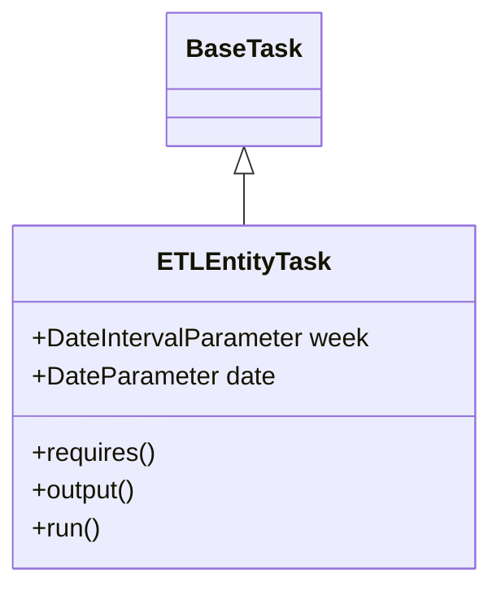

# Diagram: research/orchestrator/tasks/etl/etl_entity_task.py


> Auto-generated by Obscura crawlers

## Diagram 1

```mermaid
classDiagram
      BaseTask <|-- ETLEntityTask
      class BaseTask {
      }...
  └ 49 lines...
```

> SVG rendering failed for this diagram.

## Diagram 2



### SVG

<svg id="container" width="302.546875" xmlns="http://www.w3.org/2000/svg" class="classDiagram" height="366" viewBox="0 0 302.546875 366" role="graphics-document document" aria-roledescription="class"><style>#container{font-family:"trebuchet ms",verdana,arial,sans-serif;font-size:16px;fill:#333;}@keyframes edge-animation-frame{from{stroke-dashoffset:0;}}@keyframes dash{to{stroke-dashoffset:0;}}#container .edge-animation-slow{stroke-dasharray:9,5!important;stroke-dashoffset:900;animation:dash 50s linear infinite;stroke-linecap:round;}#container .edge-animation-fast{stroke-dasharray:9,5!important;stroke-dashoffset:900;animation:dash 20s linear infinite;stroke-linecap:round;}#container .error-icon{fill:#552222;}#container .error-text{fill:#552222;stroke:#552222;}#container .edge-thickness-normal{stroke-width:1px;}#container .edge-thickness-thick{stroke-width:3.5px;}#container .edge-pattern-solid{stroke-dasharray:0;}#container .edge-thickness-invisible{stroke-width:0;fill:none;}#container .edge-pattern-dashed{stroke-dasharray:3;}#container .edge-pattern-dotted{stroke-dasharray:2;}#container .marker{fill:#333333;stroke:#333333;}#container .marker.cross{stroke:#333333;}#container svg{font-family:"trebuchet ms",verdana,arial,sans-serif;font-size:16px;}#container p{margin:0;}#container g.classGroup text{fill:#9370DB;stroke:none;font-family:"trebuchet ms",verdana,arial,sans-serif;font-size:10px;}#container g.classGroup text .title{font-weight:bolder;}#container .nodeLabel,#container .edgeLabel{color:#131300;}#container .edgeLabel .label rect{fill:#ECECFF;}#container .label text{fill:#131300;}#container .labelBkg{background:#ECECFF;}#container .edgeLabel .label span{background:#ECECFF;}#container .classTitle{font-weight:bolder;}#container .node rect,#container .node circle,#container .node ellipse,#container .node polygon,#container .node path{fill:#ECECFF;stroke:#9370DB;stroke-width:1px;}#container .divider{stroke:#9370DB;stroke-width:1;}#container g.clickable{cursor:pointer;}#container g.classGroup rect{fill:#ECECFF;stroke:#9370DB;}#container g.classGroup line{stroke:#9370DB;stroke-width:1;}#container .classLabel .box{stroke:none;stroke-width:0;fill:#ECECFF;opacity:0.5;}#container .classLabel .label{fill:#9370DB;font-size:10px;}#container .relation{stroke:#333333;stroke-width:1;fill:none;}#container .dashed-line{stroke-dasharray:3;}#container .dotted-line{stroke-dasharray:1 2;}#container #compositionStart,#container .composition{fill:#333333!important;stroke:#333333!important;stroke-width:1;}#container #compositionEnd,#container .composition{fill:#333333!important;stroke:#333333!important;stroke-width:1;}#container #dependencyStart,#container .dependency{fill:#333333!important;stroke:#333333!important;stroke-width:1;}#container #dependencyStart,#container .dependency{fill:#333333!important;stroke:#333333!important;stroke-width:1;}#container #extensionStart,#container .extension{fill:transparent!important;stroke:#333333!important;stroke-width:1;}#container #extensionEnd,#container .extension{fill:transparent!important;stroke:#333333!important;stroke-width:1;}#container #aggregationStart,#container .aggregation{fill:transparent!important;stroke:#333333!important;stroke-width:1;}#container #aggregationEnd,#container .aggregation{fill:transparent!important;stroke:#333333!important;stroke-width:1;}#container #lollipopStart,#container .lollipop{fill:#ECECFF!important;stroke:#333333!important;stroke-width:1;}#container #lollipopEnd,#container .lollipop{fill:#ECECFF!important;stroke:#333333!important;stroke-width:1;}#container .edgeTerminals{font-size:11px;line-height:initial;}#container .classTitleText{text-anchor:middle;font-size:18px;fill:#333;}#container .label-icon{display:inline-block;height:1em;overflow:visible;vertical-align:-0.125em;}#container .node .label-icon path{fill:currentColor;stroke:revert;stroke-width:revert;}#container :root{--mermaid-font-family:"trebuchet ms",verdana,arial,sans-serif;}</style><g><defs><marker id="container_class-aggregationStart" class="marker aggregation class" refX="18" refY="7" markerWidth="190" markerHeight="240" orient="auto"><path d="M 18,7 L9,13 L1,7 L9,1 Z"></path></marker></defs><defs><marker id="container_class-aggregationEnd" class="marker aggregation class" refX="1" refY="7" markerWidth="20" markerHeight="28" orient="auto"><path d="M 18,7 L9,13 L1,7 L9,1 Z"></path></marker></defs><defs><marker id="container_class-extensionStart" class="marker extension class" refX="18" refY="7" markerWidth="190" markerHeight="240" orient="auto"><path d="M 1,7 L18,13 V 1 Z"></path></marker></defs><defs><marker id="container_class-extensionEnd" class="marker extension class" refX="1" refY="7" markerWidth="20" markerHeight="28" orient="auto"><path d="M 1,1 V 13 L18,7 Z"></path></marker></defs><defs><marker id="container_class-compositionStart" class="marker composition class" refX="18" refY="7" markerWidth="190" markerHeight="240" orient="auto"><path d="M 18,7 L9,13 L1,7 L9,1 Z"></path></marker></defs><defs><marker id="container_class-compositionEnd" class="marker composition class" refX="1" refY="7" markerWidth="20" markerHeight="28" orient="auto"><path d="M 18,7 L9,13 L1,7 L9,1 Z"></path></marker></defs><defs><marker id="container_class-dependencyStart" class="marker dependency class" refX="6" refY="7" markerWidth="190" markerHeight="240" orient="auto"><path d="M 5,7 L9,13 L1,7 L9,1 Z"></path></marker></defs><defs><marker id="container_class-dependencyEnd" class="marker dependency class" refX="13" refY="7" markerWidth="20" markerHeight="28" orient="auto"><path d="M 18,7 L9,13 L14,7 L9,1 Z"></path></marker></defs><defs><marker id="container_class-lollipopStart" class="marker lollipop class" refX="13" refY="7" markerWidth="190" markerHeight="240" orient="auto"><circle stroke="black" fill="transparent" cx="7" cy="7" r="6"></circle></marker></defs><defs><marker id="container_class-lollipopEnd" class="marker lollipop class" refX="1" refY="7" markerWidth="190" markerHeight="240" orient="auto"><circle stroke="black" fill="transparent" cx="7" cy="7" r="6"></circle></marker></defs><g class="root"><g class="clusters"></g><g class="edgePaths"><path d="M151.273,109.25L151.273,110.542C151.273,111.833,151.273,114.417,151.273,119.875C151.273,125.333,151.273,133.667,151.273,137.833L151.273,142" id="id_BaseTask_ETLEntityTask_1" class="edge-thickness-normal edge-pattern-solid relation" style=";;;" data-edge="true" data-et="edge" data-id="id_BaseTask_ETLEntityTask_1" data-points="W3sieCI6MTUxLjI3MzQzNzUsInkiOjkyfSx7IngiOjE1MS4yNzM0Mzc1LCJ5IjoxMTd9LHsieCI6MTUxLjI3MzQzNzUsInkiOjE0Mn1d" marker-start="url(#container_class-extensionStart)"></path></g><g class="edgeLabels"><g class="edgeLabel"><g class="label" data-id="id_BaseTask_ETLEntityTask_1" transform="translate(0, 0)"><foreignObject width="0" height="0"><div xmlns="http://www.w3.org/1999/xhtml" class="labelBkg" style="display: table-cell; white-space: nowrap; line-height: 1.5; max-width: 200px; text-align: center;"><span class="edgeLabel"></span></div></foreignObject></g></g></g><g class="nodes"><g class="node default" id="classId-BaseTask-0" transform="translate(151.2734375, 50)"><g class="basic label-container"><path d="M-46.03125 -42 L46.03125 -42 L46.03125 42 L-46.03125 42" stroke="none" stroke-width="0" fill="#ECECFF" style=""></path><path d="M-46.03125 -42 C-25.52214230607032 -42, -5.013034612140643 -42, 46.03125 -42 M-46.03125 -42 C-18.44380575970593 -42, 9.143638480588137 -42, 46.03125 -42 M46.03125 -42 C46.03125 -16.686202423166026, 46.03125 8.627595153667947, 46.03125 42 M46.03125 -42 C46.03125 -24.602644309725548, 46.03125 -7.205288619451096, 46.03125 42 M46.03125 42 C14.326179580452141 42, -17.378890839095718 42, -46.03125 42 M46.03125 42 C14.33859239704546 42, -17.35406520590908 42, -46.03125 42 M-46.03125 42 C-46.03125 17.305172427640336, -46.03125 -7.3896551447193275, -46.03125 -42 M-46.03125 42 C-46.03125 20.99815008486755, -46.03125 -0.0036998302648996173, -46.03125 -42" stroke="#9370DB" stroke-width="1.3" fill="none" stroke-dasharray="0 0" style=""></path></g><g class="annotation-group text" transform="translate(0, -18)"></g><g class="label-group text" transform="translate(-34.03125, -18)"><g class="label" style="font-weight: bolder" transform="translate(0,-12)"><foreignObject width="68.0625" height="24"><div xmlns="http://www.w3.org/1999/xhtml" style="display: table-cell; white-space: nowrap; line-height: 1.5; max-width: 117px; text-align: center;"><span class="nodeLabel markdown-node-label" style=""><p>BaseTask</p></span></div></foreignObject></g></g><g class="members-group text" transform="translate(-34.03125, 30)"></g><g class="methods-group text" transform="translate(-34.03125, 60)"></g><g class="divider" style=""><path d="M-46.03125 6 C-11.876172272554882 6, 22.278905454890236 6, 46.03125 6 M-46.03125 6 C-23.788182530495096 6, -1.5451150609901916 6, 46.03125 6" stroke="#9370DB" stroke-width="1.3" fill="none" stroke-dasharray="0 0" style=""></path></g><g class="divider" style=""><path d="M-46.03125 24 C-10.195290535809157 24, 25.640668928381686 24, 46.03125 24 M-46.03125 24 C-12.173063979778306 24, 21.68512204044339 24, 46.03125 24" stroke="#9370DB" stroke-width="1.3" fill="none" stroke-dasharray="0 0" style=""></path></g></g><g class="node default" id="classId-ETLEntityTask-1" transform="translate(151.2734375, 250)"><g class="basic label-container"><path d="M-143.2734375 -108 L143.2734375 -108 L143.2734375 108 L-143.2734375 108" stroke="none" stroke-width="0" fill="#ECECFF" style=""></path><path d="M-143.2734375 -108 C-56.323714781801016 -108, 30.62600793639797 -108, 143.2734375 -108 M-143.2734375 -108 C-58.27766591389532 -108, 26.71810567220936 -108, 143.2734375 -108 M143.2734375 -108 C143.2734375 -63.21195549980422, 143.2734375 -18.423910999608438, 143.2734375 108 M143.2734375 -108 C143.2734375 -38.24268679399255, 143.2734375 31.514626412014906, 143.2734375 108 M143.2734375 108 C57.21599324116919 108, -28.841451017661626 108, -143.2734375 108 M143.2734375 108 C58.27893048545498 108, -26.715576529090043 108, -143.2734375 108 M-143.2734375 108 C-143.2734375 37.96925330050345, -143.2734375 -32.06149339899309, -143.2734375 -108 M-143.2734375 108 C-143.2734375 55.45938842150642, -143.2734375 2.918776843012836, -143.2734375 -108" stroke="#9370DB" stroke-width="1.3" fill="none" stroke-dasharray="0 0" style=""></path></g><g class="annotation-group text" transform="translate(0, -84)"></g><g class="label-group text" transform="translate(-50.421875, -84)"><g class="label" style="font-weight: bolder" transform="translate(0,-12)"><foreignObject width="100.84375" height="24"><div xmlns="http://www.w3.org/1999/xhtml" style="display: table-cell; white-space: nowrap; line-height: 1.5; max-width: 149px; text-align: center;"><span class="nodeLabel markdown-node-label" style=""><p>ETLEntityTask</p></span></div></foreignObject></g></g><g class="members-group text" transform="translate(-131.2734375, -36)"><g class="label" style="" transform="translate(0,-12)"><foreignObject width="212.125" height="24"><div xmlns="http://www.w3.org/1999/xhtml" style="display: table-cell; white-space: nowrap; line-height: 1.5; max-width: 270px; text-align: center;"><span class="nodeLabel markdown-node-label" style=""><p>+DateIntervalParameter week</p></span></div></foreignObject></g><g class="label" style="" transform="translate(0,12)"><foreignObject width="152.171875" height="24"><div xmlns="http://www.w3.org/1999/xhtml" style="display: table-cell; white-space: nowrap; line-height: 1.5; max-width: 210px; text-align: center;"><span class="nodeLabel markdown-node-label" style=""><p>+DateParameter date</p></span></div></foreignObject></g></g><g class="methods-group text" transform="translate(-131.2734375, 36)"><g class="label" style="" transform="translate(0,-12)"><foreignObject width="78.0625" height="24"><div xmlns="http://www.w3.org/1999/xhtml" style="display: table-cell; white-space: nowrap; line-height: 1.5; max-width: 135px; text-align: center;"><span class="nodeLabel markdown-node-label" style=""><p>+requires()</p></span></div></foreignObject></g><g class="label" style="" transform="translate(0,12)"><foreignObject width="67.390625" height="24"><div xmlns="http://www.w3.org/1999/xhtml" style="display: table-cell; white-space: nowrap; line-height: 1.5; max-width: 125px; text-align: center;"><span class="nodeLabel markdown-node-label" style=""><p>+output()</p></span></div></foreignObject></g><g class="label" style="" transform="translate(0,36)"><foreignObject width="43.21875" height="24"><div xmlns="http://www.w3.org/1999/xhtml" style="display: table-cell; white-space: nowrap; line-height: 1.5; max-width: 101px; text-align: center;"><span class="nodeLabel markdown-node-label" style=""><p>+run()</p></span></div></foreignObject></g></g><g class="divider" style=""><path d="M-143.2734375 -60 C-61.05298908322109 -60, 21.167459333557815 -60, 143.2734375 -60 M-143.2734375 -60 C-35.4155126728335 -60, 72.442412154333 -60, 143.2734375 -60" stroke="#9370DB" stroke-width="1.3" fill="none" stroke-dasharray="0 0" style=""></path></g><g class="divider" style=""><path d="M-143.2734375 12 C-29.39401987543775 12, 84.4853977491245 12, 143.2734375 12 M-143.2734375 12 C-52.548270865220346 12, 38.17689576955931 12, 143.2734375 12" stroke="#9370DB" stroke-width="1.3" fill="none" stroke-dasharray="0 0" style=""></path></g></g></g></g></g></svg>

## Diagram 3

```mermaid
graph TD
    ETLEntityTask[ETLEntityTask]
    ETLEntityTask --> ExtractPublicActualTripLegTask
    ETLEntityTask --> ExtractPublicEntityTask
    ETLEntityTask --> ExtractPublicEntityActualTripLegTask
    ETLEntityTask --> ExtractPublicHoldTask
    ETLEntityTask --> ExtractPublicStatusUpdateTask
    ETLEntityTask --> ExtractPublicExceptionTask
    ETLEntityTask --> ExtractPublicActualTripStopTask
    ETLEntityTask --> ExtractPublicEntityPlannedTripLegTask
    ETLEntityTask --> ExtractPublicPlannedTripStopTask
    ETLEntityTask --> ExtractPublicPlannedTripLegTask
    ETLEntityTask --> ExtractPublicEntityReferenceTask
```



### SVG

<svg id="container" width="3650.890625" xmlns="http://www.w3.org/2000/svg" class="flowchart" height="174" viewBox="0 0 3650.890625 174" role="graphics-document document" aria-roledescription="flowchart-v2"><style>#container{font-family:"trebuchet ms",verdana,arial,sans-serif;font-size:16px;fill:#333;}@keyframes edge-animation-frame{from{stroke-dashoffset:0;}}@keyframes dash{to{stroke-dashoffset:0;}}#container .edge-animation-slow{stroke-dasharray:9,5!important;stroke-dashoffset:900;animation:dash 50s linear infinite;stroke-linecap:round;}#container .edge-animation-fast{stroke-dasharray:9,5!important;stroke-dashoffset:900;animation:dash 20s linear infinite;stroke-linecap:round;}#container .error-icon{fill:#552222;}#container .error-text{fill:#552222;stroke:#552222;}#container .edge-thickness-normal{stroke-width:1px;}#container .edge-thickness-thick{stroke-width:3.5px;}#container .edge-pattern-solid{stroke-dasharray:0;}#container .edge-thickness-invisible{stroke-width:0;fill:none;}#container .edge-pattern-dashed{stroke-dasharray:3;}#container .edge-pattern-dotted{stroke-dasharray:2;}#container .marker{fill:#333333;stroke:#333333;}#container .marker.cross{stroke:#333333;}#container svg{font-family:"trebuchet ms",verdana,arial,sans-serif;font-size:16px;}#container p{margin:0;}#container .label{font-family:"trebuchet ms",verdana,arial,sans-serif;color:#333;}#container .cluster-label text{fill:#333;}#container .cluster-label span{color:#333;}#container .cluster-label span p{background-color:transparent;}#container .label text,#container span{fill:#333;color:#333;}#container .node rect,#container .node circle,#container .node ellipse,#container .node polygon,#container .node path{fill:#ECECFF;stroke:#9370DB;stroke-width:1px;}#container .rough-node .label text,#container .node .label text,#container .image-shape .label,#container .icon-shape .label{text-anchor:middle;}#container .node .katex path{fill:#000;stroke:#000;stroke-width:1px;}#container .rough-node .label,#container .node .label,#container .image-shape .label,#container .icon-shape .label{text-align:center;}#container .node.clickable{cursor:pointer;}#container .root .anchor path{fill:#333333!important;stroke-width:0;stroke:#333333;}#container .arrowheadPath{fill:#333333;}#container .edgePath .path{stroke:#333333;stroke-width:2.0px;}#container .flowchart-link{stroke:#333333;fill:none;}#container .edgeLabel{background-color:rgba(232,232,232, 0.8);text-align:center;}#container .edgeLabel p{background-color:rgba(232,232,232, 0.8);}#container .edgeLabel rect{opacity:0.5;background-color:rgba(232,232,232, 0.8);fill:rgba(232,232,232, 0.8);}#container .labelBkg{background-color:rgba(232, 232, 232, 0.5);}#container .cluster rect{fill:#ffffde;stroke:#aaaa33;stroke-width:1px;}#container .cluster text{fill:#333;}#container .cluster span{color:#333;}#container div.mermaidTooltip{position:absolute;text-align:center;max-width:200px;padding:2px;font-family:"trebuchet ms",verdana,arial,sans-serif;font-size:12px;background:hsl(80, 100%, 96.2745098039%);border:1px solid #aaaa33;border-radius:2px;pointer-events:none;z-index:100;}#container .flowchartTitleText{text-anchor:middle;font-size:18px;fill:#333;}#container rect.text{fill:none;stroke-width:0;}#container .icon-shape,#container .image-shape{background-color:rgba(232,232,232, 0.8);text-align:center;}#container .icon-shape p,#container .image-shape p{background-color:rgba(232,232,232, 0.8);padding:2px;}#container .icon-shape rect,#container .image-shape rect{opacity:0.5;background-color:rgba(232,232,232, 0.8);fill:rgba(232,232,232, 0.8);}#container .label-icon{display:inline-block;height:1em;overflow:visible;vertical-align:-0.125em;}#container .node .label-icon path{fill:currentColor;stroke:revert;stroke-width:revert;}#container :root{--mermaid-font-family:"trebuchet ms",verdana,arial,sans-serif;}</style><g><marker id="container_flowchart-v2-pointEnd" class="marker flowchart-v2" viewBox="0 0 10 10" refX="5" refY="5" markerUnits="userSpaceOnUse" markerWidth="8" markerHeight="8" orient="auto"><path d="M 0 0 L 10 5 L 0 10 z" class="arrowMarkerPath" style="stroke-width: 1; stroke-dasharray: 1, 0;"></path></marker><marker id="container_flowchart-v2-pointStart" class="marker flowchart-v2" viewBox="0 0 10 10" refX="4.5" refY="5" markerUnits="userSpaceOnUse" markerWidth="8" markerHeight="8" orient="auto"><path d="M 0 5 L 10 10 L 10 0 z" class="arrowMarkerPath" style="stroke-width: 1; stroke-dasharray: 1, 0;"></path></marker><marker id="container_flowchart-v2-circleEnd" class="marker flowchart-v2" viewBox="0 0 10 10" refX="11" refY="5" markerUnits="userSpaceOnUse" markerWidth="11" markerHeight="11" orient="auto"><circle cx="5" cy="5" r="5" class="arrowMarkerPath" style="stroke-width: 1; stroke-dasharray: 1, 0;"></circle></marker><marker id="container_flowchart-v2-circleStart" class="marker flowchart-v2" viewBox="0 0 10 10" refX="-1" refY="5" markerUnits="userSpaceOnUse" markerWidth="11" markerHeight="11" orient="auto"><circle cx="5" cy="5" r="5" class="arrowMarkerPath" style="stroke-width: 1; stroke-dasharray: 1, 0;"></circle></marker><marker id="container_flowchart-v2-crossEnd" class="marker cross flowchart-v2" viewBox="0 0 11 11" refX="12" refY="5.2" markerUnits="userSpaceOnUse" markerWidth="11" markerHeight="11" orient="auto"><path d="M 1,1 l 9,9 M 10,1 l -9,9" class="arrowMarkerPath" style="stroke-width: 2; stroke-dasharray: 1, 0;"></path></marker><marker id="container_flowchart-v2-crossStart" class="marker cross flowchart-v2" viewBox="0 0 11 11" refX="-1" refY="5.2" markerUnits="userSpaceOnUse" markerWidth="11" markerHeight="11" orient="auto"><path d="M 1,1 l 9,9 M 10,1 l -9,9" class="arrowMarkerPath" style="stroke-width: 2; stroke-dasharray: 1, 0;"></path></marker><g class="root"><g class="clusters"></g><g class="edgePaths"><path d="M1649.008,37.605L1399.155,45.838C1149.302,54.07,649.596,70.535,399.743,82.268C149.891,94,149.891,101,149.891,104.5L149.891,108" id="L_ETLEntityTask_ExtractPublicActualTripLegTask_0" class="edge-thickness-normal edge-pattern-solid edge-thickness-normal edge-pattern-solid flowchart-link" style=";" data-edge="true" data-et="edge" data-id="L_ETLEntityTask_ExtractPublicActualTripLegTask_0" data-points="W3sieCI6MTY0OS4wMDc4MTI1LCJ5IjozNy42MDUwNTgyNDA1NTYwMn0seyJ4IjoxNDkuODkwNjI1LCJ5Ijo4N30seyJ4IjoxNDkuODkwNjI1LCJ5IjoxMTJ9XQ==" marker-end="url(#container_flowchart-v2-pointEnd)"></path><path d="M1649.008,38.231L1450.111,46.359C1251.214,54.487,853.419,70.744,654.522,82.372C455.625,94,455.625,101,455.625,104.5L455.625,108" id="L_ETLEntityTask_ExtractPublicEntityTask_0" class="edge-thickness-normal edge-pattern-solid edge-thickness-normal edge-pattern-solid flowchart-link" style=";" data-edge="true" data-et="edge" data-id="L_ETLEntityTask_ExtractPublicEntityTask_0" data-points="W3sieCI6MTY0OS4wMDc4MTI1LCJ5IjozOC4yMzA5ODM2NDk4Mzc2MDR9LHsieCI6NDU1LjYyNSwieSI6ODd9LHsieCI6NDU1LjYyNSwieSI6MTEyfV0=" marker-end="url(#container_flowchart-v2-pointEnd)"></path><path d="M1649.008,39.346L1504.536,47.289C1360.065,55.231,1071.122,71.115,926.651,82.558C782.18,94,782.18,101,782.18,104.5L782.18,108" id="L_ETLEntityTask_ExtractPublicEntityActualTripLegTask_0" class="edge-thickness-normal edge-pattern-solid edge-thickness-normal edge-pattern-solid flowchart-link" style=";" data-edge="true" data-et="edge" data-id="L_ETLEntityTask_ExtractPublicEntityActualTripLegTask_0" data-points="W3sieCI6MTY0OS4wMDc4MTI1LCJ5IjozOS4zNDY0MzI3NjAxMzAxN30seyJ4Ijo3ODIuMTc5Njg3NSwieSI6ODd9LHsieCI6NzgyLjE3OTY4NzUsInkiOjExMn1d" marker-end="url(#container_flowchart-v2-pointEnd)"></path><path d="M1649.008,41.6L1558.359,49.166C1467.711,56.733,1286.414,71.867,1195.766,82.933C1105.117,94,1105.117,101,1105.117,104.5L1105.117,108" id="L_ETLEntityTask_ExtractPublicHoldTask_0" class="edge-thickness-normal edge-pattern-solid edge-thickness-normal edge-pattern-solid flowchart-link" style=";" data-edge="true" data-et="edge" data-id="L_ETLEntityTask_ExtractPublicHoldTask_0" data-points="W3sieCI6MTY0OS4wMDc4MTI1LCJ5Ijo0MS41OTk2MTM3MzQ5ODIwNjR9LHsieCI6MTEwNS4xMTcxODc1LCJ5Ijo4N30seyJ4IjoxMTA1LjExNzE4NzUsInkiOjExMn1d" marker-end="url(#container_flowchart-v2-pointEnd)"></path><path d="M1649.008,47.825L1608.758,54.354C1568.508,60.883,1488.008,73.942,1447.758,83.971C1407.508,94,1407.508,101,1407.508,104.5L1407.508,108" id="L_ETLEntityTask_ExtractPublicStatusUpdateTask_0" class="edge-thickness-normal edge-pattern-solid edge-thickness-normal edge-pattern-solid flowchart-link" style=";" data-edge="true" data-et="edge" data-id="L_ETLEntityTask_ExtractPublicStatusUpdateTask_0" data-points="W3sieCI6MTY0OS4wMDc4MTI1LCJ5Ijo0Ny44MjUxMTIxMDc2MjMzMn0seyJ4IjoxNDA3LjUwNzgxMjUsInkiOjg3fSx7IngiOjE0MDcuNTA3ODEyNSwieSI6MTEyfV0=" marker-end="url(#container_flowchart-v2-pointEnd)"></path><path d="M1728.07,62L1728.07,66.167C1728.07,70.333,1728.07,78.667,1728.07,86.333C1728.07,94,1728.07,101,1728.07,104.5L1728.07,108" id="L_ETLEntityTask_ExtractPublicExceptionTask_0" class="edge-thickness-normal edge-pattern-solid edge-thickness-normal edge-pattern-solid flowchart-link" style=";" data-edge="true" data-et="edge" data-id="L_ETLEntityTask_ExtractPublicExceptionTask_0" data-points="W3sieCI6MTcyOC4wNzAzMTI1LCJ5Ijo2Mn0seyJ4IjoxNzI4LjA3MDMxMjUsInkiOjg3fSx7IngiOjE3MjguMDcwMzEyNSwieSI6MTEyfV0=" marker-end="url(#container_flowchart-v2-pointEnd)"></path><path d="M1807.133,47.668L1848.046,54.223C1888.958,60.779,1970.784,73.889,2011.697,83.945C2052.609,94,2052.609,101,2052.609,104.5L2052.609,108" id="L_ETLEntityTask_ExtractPublicActualTripStopTask_0" class="edge-thickness-normal edge-pattern-solid edge-thickness-normal edge-pattern-solid flowchart-link" style=";" data-edge="true" data-et="edge" data-id="L_ETLEntityTask_ExtractPublicActualTripStopTask_0" data-points="W3sieCI6MTgwNy4xMzI4MTI1LCJ5Ijo0Ny42Njc5NjY1ODcyMjcwOH0seyJ4IjoyMDUyLjYwOTM3NSwieSI6ODd9LHsieCI6MjA1Mi42MDkzNzUsInkiOjExMn1d" marker-end="url(#container_flowchart-v2-pointEnd)"></path><path d="M1807.133,40.953L1909.049,48.628C2010.966,56.302,2214.799,71.651,2316.716,82.826C2418.633,94,2418.633,101,2418.633,104.5L2418.633,108" id="L_ETLEntityTask_ExtractPublicEntityPlannedTripLegTask_0" class="edge-thickness-normal edge-pattern-solid edge-thickness-normal edge-pattern-solid flowchart-link" style=";" data-edge="true" data-et="edge" data-id="L_ETLEntityTask_ExtractPublicEntityPlannedTripLegTask_0" data-points="W3sieCI6MTgwNy4xMzI4MTI1LCJ5Ijo0MC45NTM0Nzk5NTI5MzY5Mn0seyJ4IjoyNDE4LjYzMjgxMjUsInkiOjg3fSx7IngiOjI0MTguNjMyODEyNSwieSI6MTEyfV0=" marker-end="url(#container_flowchart-v2-pointEnd)"></path><path d="M1807.133,38.865L1971.249,46.887C2135.365,54.91,2463.596,70.955,2627.712,82.477C2791.828,94,2791.828,101,2791.828,104.5L2791.828,108" id="L_ETLEntityTask_ExtractPublicPlannedTripStopTask_0" class="edge-thickness-normal edge-pattern-solid edge-thickness-normal edge-pattern-solid flowchart-link" style=";" data-edge="true" data-et="edge" data-id="L_ETLEntityTask_ExtractPublicPlannedTripStopTask_0" data-points="W3sieCI6MTgwNy4xMzI4MTI1LCJ5IjozOC44NjQ4MzY0ODAzNDMxMn0seyJ4IjoyNzkxLjgyODEyNSwieSI6ODd9LHsieCI6Mjc5MS44MjgxMjUsInkiOjExMn1d" marker-end="url(#container_flowchart-v2-pointEnd)"></path><path d="M1807.133,37.903L2029.979,46.086C2252.826,54.269,2698.518,70.634,2921.365,82.317C3144.211,94,3144.211,101,3144.211,104.5L3144.211,108" id="L_ETLEntityTask_ExtractPublicPlannedTripLegTask_0" class="edge-thickness-normal edge-pattern-solid edge-thickness-normal edge-pattern-solid flowchart-link" style=";" data-edge="true" data-et="edge" data-id="L_ETLEntityTask_ExtractPublicPlannedTripLegTask_0" data-points="W3sieCI6MTgwNy4xMzI4MTI1LCJ5IjozNy45MDMxMzY4MjY1NDIyMX0seyJ4IjozMTQ0LjIxMDkzNzUsInkiOjg3fSx7IngiOjMxNDQuMjEwOTM3NSwieSI6MTEyfV0=" marker-end="url(#container_flowchart-v2-pointEnd)"></path><path d="M1807.133,37.329L2088.125,45.608C2369.117,53.886,2931.102,70.443,3212.094,82.222C3493.086,94,3493.086,101,3493.086,104.5L3493.086,108" id="L_ETLEntityTask_ExtractPublicEntityReferenceTask_0" class="edge-thickness-normal edge-pattern-solid edge-thickness-normal edge-pattern-solid flowchart-link" style=";" data-edge="true" data-et="edge" data-id="L_ETLEntityTask_ExtractPublicEntityReferenceTask_0" data-points="W3sieCI6MTgwNy4xMzI4MTI1LCJ5IjozNy4zMjkyOTk0OTI3NDUyODV9LHsieCI6MzQ5My4wODU5Mzc1LCJ5Ijo4N30seyJ4IjozNDkzLjA4NTkzNzUsInkiOjExMn1d" marker-end="url(#container_flowchart-v2-pointEnd)"></path></g><g class="edgeLabels"><g class="edgeLabel"><g class="label" data-id="L_ETLEntityTask_ExtractPublicActualTripLegTask_0" transform="translate(0, 0)"><foreignObject width="0" height="0"><div xmlns="http://www.w3.org/1999/xhtml" class="labelBkg" style="display: table-cell; white-space: nowrap; line-height: 1.5; max-width: 200px; text-align: center;"><span class="edgeLabel"></span></div></foreignObject></g></g><g class="edgeLabel"><g class="label" data-id="L_ETLEntityTask_ExtractPublicEntityTask_0" transform="translate(0, 0)"><foreignObject width="0" height="0"><div xmlns="http://www.w3.org/1999/xhtml" class="labelBkg" style="display: table-cell; white-space: nowrap; line-height: 1.5; max-width: 200px; text-align: center;"><span class="edgeLabel"></span></div></foreignObject></g></g><g class="edgeLabel"><g class="label" data-id="L_ETLEntityTask_ExtractPublicEntityActualTripLegTask_0" transform="translate(0, 0)"><foreignObject width="0" height="0"><div xmlns="http://www.w3.org/1999/xhtml" class="labelBkg" style="display: table-cell; white-space: nowrap; line-height: 1.5; max-width: 200px; text-align: center;"><span class="edgeLabel"></span></div></foreignObject></g></g><g class="edgeLabel"><g class="label" data-id="L_ETLEntityTask_ExtractPublicHoldTask_0" transform="translate(0, 0)"><foreignObject width="0" height="0"><div xmlns="http://www.w3.org/1999/xhtml" class="labelBkg" style="display: table-cell; white-space: nowrap; line-height: 1.5; max-width: 200px; text-align: center;"><span class="edgeLabel"></span></div></foreignObject></g></g><g class="edgeLabel"><g class="label" data-id="L_ETLEntityTask_ExtractPublicStatusUpdateTask_0" transform="translate(0, 0)"><foreignObject width="0" height="0"><div xmlns="http://www.w3.org/1999/xhtml" class="labelBkg" style="display: table-cell; white-space: nowrap; line-height: 1.5; max-width: 200px; text-align: center;"><span class="edgeLabel"></span></div></foreignObject></g></g><g class="edgeLabel"><g class="label" data-id="L_ETLEntityTask_ExtractPublicExceptionTask_0" transform="translate(0, 0)"><foreignObject width="0" height="0"><div xmlns="http://www.w3.org/1999/xhtml" class="labelBkg" style="display: table-cell; white-space: nowrap; line-height: 1.5; max-width: 200px; text-align: center;"><span class="edgeLabel"></span></div></foreignObject></g></g><g class="edgeLabel"><g class="label" data-id="L_ETLEntityTask_ExtractPublicActualTripStopTask_0" transform="translate(0, 0)"><foreignObject width="0" height="0"><div xmlns="http://www.w3.org/1999/xhtml" class="labelBkg" style="display: table-cell; white-space: nowrap; line-height: 1.5; max-width: 200px; text-align: center;"><span class="edgeLabel"></span></div></foreignObject></g></g><g class="edgeLabel"><g class="label" data-id="L_ETLEntityTask_ExtractPublicEntityPlannedTripLegTask_0" transform="translate(0, 0)"><foreignObject width="0" height="0"><div xmlns="http://www.w3.org/1999/xhtml" class="labelBkg" style="display: table-cell; white-space: nowrap; line-height: 1.5; max-width: 200px; text-align: center;"><span class="edgeLabel"></span></div></foreignObject></g></g><g class="edgeLabel"><g class="label" data-id="L_ETLEntityTask_ExtractPublicPlannedTripStopTask_0" transform="translate(0, 0)"><foreignObject width="0" height="0"><div xmlns="http://www.w3.org/1999/xhtml" class="labelBkg" style="display: table-cell; white-space: nowrap; line-height: 1.5; max-width: 200px; text-align: center;"><span class="edgeLabel"></span></div></foreignObject></g></g><g class="edgeLabel"><g class="label" data-id="L_ETLEntityTask_ExtractPublicPlannedTripLegTask_0" transform="translate(0, 0)"><foreignObject width="0" height="0"><div xmlns="http://www.w3.org/1999/xhtml" class="labelBkg" style="display: table-cell; white-space: nowrap; line-height: 1.5; max-width: 200px; text-align: center;"><span class="edgeLabel"></span></div></foreignObject></g></g><g class="edgeLabel"><g class="label" data-id="L_ETLEntityTask_ExtractPublicEntityReferenceTask_0" transform="translate(0, 0)"><foreignObject width="0" height="0"><div xmlns="http://www.w3.org/1999/xhtml" class="labelBkg" style="display: table-cell; white-space: nowrap; line-height: 1.5; max-width: 200px; text-align: center;"><span class="edgeLabel"></span></div></foreignObject></g></g></g><g class="nodes"><g class="node default" id="flowchart-ETLEntityTask-0" transform="translate(1728.0703125, 35)"><rect class="basic label-container" style="" x="-79.0625" y="-27" width="158.125" height="54"></rect><g class="label" style="" transform="translate(-49.0625, -12)"><rect></rect><foreignObject width="98.125" height="24"><div xmlns="http://www.w3.org/1999/xhtml" style="display: table-cell; white-space: nowrap; line-height: 1.5; max-width: 200px; text-align: center;"><span class="nodeLabel"><p>ETLEntityTask</p></span></div></foreignObject></g></g><g class="node default" id="flowchart-ExtractPublicActualTripLegTask-2" transform="translate(149.890625, 139)"><rect class="basic label-container" style="" x="-141.890625" y="-27" width="283.78125" height="54"></rect><g class="label" style="" transform="translate(-111.890625, -12)"><rect></rect><foreignObject width="223.78125" height="24"><div xmlns="http://www.w3.org/1999/xhtml" style="display: table; white-space: break-spaces; line-height: 1.5; max-width: 200px; text-align: center; width: 200px;"><span class="nodeLabel"><p>ExtractPublicActualTripLegTask</p></span></div></foreignObject></g></g><g class="node default" id="flowchart-ExtractPublicEntityTask-4" transform="translate(455.625, 139)"><rect class="basic label-container" style="" x="-113.84375" y="-27" width="227.6875" height="54"></rect><g class="label" style="" transform="translate(-83.84375, -12)"><rect></rect><foreignObject width="167.6875" height="24"><div xmlns="http://www.w3.org/1999/xhtml" style="display: table-cell; white-space: nowrap; line-height: 1.5; max-width: 200px; text-align: center;"><span class="nodeLabel"><p>ExtractPublicEntityTask</p></span></div></foreignObject></g></g><g class="node default" id="flowchart-ExtractPublicEntityActualTripLegTask-6" transform="translate(782.1796875, 139)"><rect class="basic label-container" style="" x="-162.7109375" y="-27" width="325.421875" height="54"></rect><g class="label" style="" transform="translate(-132.7109375, -12)"><rect></rect><foreignObject width="265.421875" height="24"><div xmlns="http://www.w3.org/1999/xhtml" style="display: table; white-space: break-spaces; line-height: 1.5; max-width: 200px; text-align: center; width: 200px;"><span class="nodeLabel"><p>ExtractPublicEntityActualTripLegTask</p></span></div></foreignObject></g></g><g class="node default" id="flowchart-ExtractPublicHoldTask-8" transform="translate(1105.1171875, 139)"><rect class="basic label-container" style="" x="-110.2265625" y="-27" width="220.453125" height="54"></rect><g class="label" style="" transform="translate(-80.2265625, -12)"><rect></rect><foreignObject width="160.453125" height="24"><div xmlns="http://www.w3.org/1999/xhtml" style="display: table-cell; white-space: nowrap; line-height: 1.5; max-width: 200px; text-align: center;"><span class="nodeLabel"><p>ExtractPublicHoldTask</p></span></div></foreignObject></g></g><g class="node default" id="flowchart-ExtractPublicStatusUpdateTask-10" transform="translate(1407.5078125, 139)"><rect class="basic label-container" style="" x="-142.1640625" y="-27" width="284.328125" height="54"></rect><g class="label" style="" transform="translate(-112.1640625, -12)"><rect></rect><foreignObject width="224.328125" height="24"><div xmlns="http://www.w3.org/1999/xhtml" style="display: table; white-space: break-spaces; line-height: 1.5; max-width: 200px; text-align: center; width: 200px;"><span class="nodeLabel"><p>ExtractPublicStatusUpdateTask</p></span></div></foreignObject></g></g><g class="node default" id="flowchart-ExtractPublicExceptionTask-12" transform="translate(1728.0703125, 139)"><rect class="basic label-container" style="" x="-128.3984375" y="-27" width="256.796875" height="54"></rect><g class="label" style="" transform="translate(-98.3984375, -12)"><rect></rect><foreignObject width="196.796875" height="24"><div xmlns="http://www.w3.org/1999/xhtml" style="display: table-cell; white-space: nowrap; line-height: 1.5; max-width: 200px; text-align: center;"><span class="nodeLabel"><p>ExtractPublicExceptionTask</p></span></div></foreignObject></g></g><g class="node default" id="flowchart-ExtractPublicActualTripStopTask-14" transform="translate(2052.609375, 139)"><rect class="basic label-container" style="" x="-146.140625" y="-27" width="292.28125" height="54"></rect><g class="label" style="" transform="translate(-116.140625, -12)"><rect></rect><foreignObject width="232.28125" height="24"><div xmlns="http://www.w3.org/1999/xhtml" style="display: table; white-space: break-spaces; line-height: 1.5; max-width: 200px; text-align: center; width: 200px;"><span class="nodeLabel"><p>ExtractPublicActualTripStopTask</p></span></div></foreignObject></g></g><g class="node default" id="flowchart-ExtractPublicEntityPlannedTripLegTask-16" transform="translate(2418.6328125, 139)"><rect class="basic label-container" style="" x="-169.8828125" y="-27" width="339.765625" height="54"></rect><g class="label" style="" transform="translate(-139.8828125, -12)"><rect></rect><foreignObject width="279.765625" height="24"><div xmlns="http://www.w3.org/1999/xhtml" style="display: table; white-space: break-spaces; line-height: 1.5; max-width: 200px; text-align: center; width: 200px;"><span class="nodeLabel"><p>ExtractPublicEntityPlannedTripLegTask</p></span></div></foreignObject></g></g><g class="node default" id="flowchart-ExtractPublicPlannedTripStopTask-18" transform="translate(2791.828125, 139)"><rect class="basic label-container" style="" x="-153.3125" y="-27" width="306.625" height="54"></rect><g class="label" style="" transform="translate(-123.3125, -12)"><rect></rect><foreignObject width="246.625" height="24"><div xmlns="http://www.w3.org/1999/xhtml" style="display: table; white-space: break-spaces; line-height: 1.5; max-width: 200px; text-align: center; width: 200px;"><span class="nodeLabel"><p>ExtractPublicPlannedTripStopTask</p></span></div></foreignObject></g></g><g class="node default" id="flowchart-ExtractPublicPlannedTripLegTask-20" transform="translate(3144.2109375, 139)"><rect class="basic label-container" style="" x="-149.0703125" y="-27" width="298.140625" height="54"></rect><g class="label" style="" transform="translate(-119.0703125, -12)"><rect></rect><foreignObject width="238.140625" height="24"><div xmlns="http://www.w3.org/1999/xhtml" style="display: table; white-space: break-spaces; line-height: 1.5; max-width: 200px; text-align: center; width: 200px;"><span class="nodeLabel"><p>ExtractPublicPlannedTripLegTask</p></span></div></foreignObject></g></g><g class="node default" id="flowchart-ExtractPublicEntityReferenceTask-22" transform="translate(3493.0859375, 139)"><rect class="basic label-container" style="" x="-149.8046875" y="-27" width="299.609375" height="54"></rect><g class="label" style="" transform="translate(-119.8046875, -12)"><rect></rect><foreignObject width="239.609375" height="24"><div xmlns="http://www.w3.org/1999/xhtml" style="display: table; white-space: break-spaces; line-height: 1.5; max-width: 200px; text-align: center; width: 200px;"><span class="nodeLabel"><p>ExtractPublicEntityReferenceTask</p></span></div></foreignObject></g></g></g></g></g></svg>
