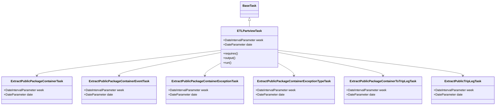
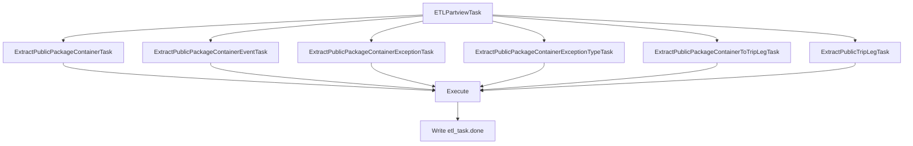

# Diagram: research/orchestrator/tasks/etl/etl_partview_task.py

> Auto-generated by Obscura crawlers

## Diagram 1

### SVG

<svg id="container" width="2568.8125" xmlns="http://www.w3.org/2000/svg" class="classDiagram" height="560" viewBox="0 0 2568.8125 560" role="graphics-document document" aria-roledescription="class"><g><defs><marker id="container_class-aggregationStart" class="marker aggregation class" refX="18" refY="7" markerWidth="190" markerHeight="240" orient="auto"><path d="M 18,7 L9,13 L1,7 L9,1 Z"></path></marker></defs><defs><marker id="container_class-aggregationEnd" class="marker aggregation class" refX="1" refY="7" markerWidth="20" markerHeight="28" orient="auto"><path d="M 18,7 L9,13 L1,7 L9,1 Z"></path></marker></defs><defs><marker id="container_class-extensionStart" class="marker extension class" refX="18" refY="7" markerWidth="190" markerHeight="240" orient="auto"><path d="M 1,7 L18,13 V 1 Z"></path></marker></defs><defs><marker id="container_class-extensionEnd" class="marker extension class" refX="1" refY="7" markerWidth="20" markerHeight="28" orient="auto"><path d="M 1,1 V 13 L18,7 Z"></path></marker></defs><defs><marker id="container_class-compositionStart" class="marker composition class" refX="18" refY="7" markerWidth="190" markerHeight="240" orient="auto"><path d="M 18,7 L9,13 L1,7 L9,1 Z"></path></marker></defs><defs><marker id="container_class-compositionEnd" class="marker composition class" refX="1" refY="7" markerWidth="20" markerHeight="28" orient="auto"><path d="M 18,7 L9,13 L1,7 L9,1 Z"></path></marker></defs><defs><marker id="container_class-dependencyStart" class="marker dependency class" refX="6" refY="7" markerWidth="190" markerHeight="240" orient="auto"><path d="M 5,7 L9,13 L1,7 L9,1 Z"></path></marker></defs><defs><marker id="container_class-dependencyEnd" class="marker dependency class" refX="13" refY="7" markerWidth="20" markerHeight="28" orient="auto"><path d="M 18,7 L9,13 L14,7 L9,1 Z"></path></marker></defs><defs><marker id="container_class-lollipopStart" class="marker lollipop class" refX="13" refY="7" markerWidth="190" markerHeight="240" orient="auto"><circle stroke="black" fill="transparent" cx="7" cy="7" r="6"></circle></marker></defs><defs><marker id="container_class-lollipopEnd" class="marker lollipop class" refX="1" refY="7" markerWidth="190" markerHeight="240" orient="auto"><circle stroke="black" fill="transparent" cx="7" cy="7" r="6"></circle></marker></defs><g class="root"><g class="clusters"></g><g class="edgePaths"><path d="M1291.576,109.25L1291.576,110.542C1291.576,111.833,1291.576,114.417,1291.576,119.875C1291.576,125.333,1291.576,133.667,1291.576,137.833L1291.576,142" id="id_BaseTask_ETLPartviewTask_1" class="edge-thickness-normal edge-pattern-solid relation" style=";;;" data-edge="true" data-et="edge" data-id="id_BaseTask_ETLPartviewTask_1" data-points="W3sieCI6MTI5MS41NzYxNzE4NzUsInkiOjkyfSx7IngiOjEyOTEuNTc2MTcxODc1LCJ5IjoxMTd9LHsieCI6MTI5MS41NzYxNzE4NzUsInkiOjE0Mn1d" marker-start="url(#container_class-extensionStart)"></path><path d="M1143.049,267.95L984.383,287.125C825.717,306.3,508.386,344.65,349.72,366.992C191.055,389.333,191.055,395.667,191.055,398.833L191.055,402" id="id_ETLPartviewTask_ExtractPublicPackageContainerTask_2" class="edge-thickness-normal edge-pattern-solid relation" style=";;;" data-edge="true" data-et="edge" data-id="id_ETLPartviewTask_ExtractPublicPackageContainerTask_2" data-points="W3sieCI6MTE0My4wNDg4MjgxMjUsInkiOjI2Ny45NDk3OTY1Mjc1Njk1fSx7IngiOjE5MS4wNTQ2ODc1LCJ5IjozODN9LHsieCI6MTkxLjA1NDY4NzUsInkiOjQwOH1d" marker-end="url(#container_class-dependencyEnd)"></path><path d="M1143.049,279.295L1055.419,296.58C967.789,313.864,792.529,348.432,704.899,368.883C617.27,389.333,617.27,395.667,617.27,398.833L617.27,402" id="id_ETLPartviewTask_ExtractPublicPackageContainerEventTask_3" class="edge-thickness-normal edge-pattern-solid relation" style=";;;" data-edge="true" data-et="edge" data-id="id_ETLPartviewTask_ExtractPublicPackageContainerEventTask_3" data-points="W3sieCI6MTE0My4wNDg4MjgxMjUsInkiOjI3OS4yOTU0ODAwMjE0MzQwNn0seyJ4Ijo2MTcuMjY5NTMxMjUsInkiOjM4M30seyJ4Ijo2MTcuMjY5NTMxMjUsInkiOjQwOH1d" marker-end="url(#container_class-dependencyEnd)"></path><path d="M1143.049,335.798L1129.43,343.665C1115.811,351.532,1088.574,367.266,1074.955,378.3C1061.336,389.333,1061.336,395.667,1061.336,398.833L1061.336,402" id="id_ETLPartviewTask_ExtractPublicPackageContainerExceptionTask_4" class="edge-thickness-normal edge-pattern-solid relation" style=";;;" data-edge="true" data-et="edge" data-id="id_ETLPartviewTask_ExtractPublicPackageContainerExceptionTask_4" data-points="W3sieCI6MTE0My4wNDg4MjgxMjUsInkiOjMzNS43OTc5MzUyNDA4NzQ0NH0seyJ4IjoxMDYxLjMzNTkzNzUsInkiOjM4M30seyJ4IjoxMDYxLjMzNTkzNzUsInkiOjQwOH1d" marker-end="url(#container_class-dependencyEnd)"></path><path d="M1440.104,335.798L1453.722,343.665C1467.341,351.532,1494.579,367.266,1508.198,378.3C1521.816,389.333,1521.816,395.667,1521.816,398.833L1521.816,402" id="id_ETLPartviewTask_ExtractPublicPackageContainerExceptionTypeTask_5" class="edge-thickness-normal edge-pattern-solid relation" style=";;;" data-edge="true" data-et="edge" data-id="id_ETLPartviewTask_ExtractPublicPackageContainerExceptionTypeTask_5" data-points="W3sieCI6MTQ0MC4xMDM1MTU2MjUsInkiOjMzNS43OTc5MzUyNDA4NzQ0NH0seyJ4IjoxNTIxLjgxNjQwNjI1LCJ5IjozODN9LHsieCI6MTUyMS44MTY0MDYyNSwieSI6NDA4fV0=" marker-end="url(#container_class-dependencyEnd)"></path><path d="M1440.104,278.601L1530.461,296.001C1620.818,313.401,1801.532,348.2,1891.889,368.767C1982.246,389.333,1982.246,395.667,1982.246,398.833L1982.246,402" id="id_ETLPartviewTask_ExtractPublicPackageContainerToTripLegTask_6" class="edge-thickness-normal edge-pattern-solid relation" style=";;;" data-edge="true" data-et="edge" data-id="id_ETLPartviewTask_ExtractPublicPackageContainerToTripLegTask_6" data-points="W3sieCI6MTQ0MC4xMDM1MTU2MjUsInkiOjI3OC42MDE0MTQ1MDA3NTM2fSx7IngiOjE5ODIuMjQ2MDkzNzUsInkiOjM4M30seyJ4IjoxOTgyLjI0NjA5Mzc1LCJ5Ijo0MDh9XQ==" marker-end="url(#container_class-dependencyEnd)"></path><path d="M1440.104,267.871L1599.579,287.059C1759.055,306.247,2078.006,344.624,2237.481,366.978C2396.957,389.333,2396.957,395.667,2396.957,398.833L2396.957,402" id="id_ETLPartviewTask_ExtractPublicTripLegTask_7" class="edge-thickness-normal edge-pattern-solid relation" style=";;;" data-edge="true" data-et="edge" data-id="id_ETLPartviewTask_ExtractPublicTripLegTask_7" data-points="W3sieCI6MTQ0MC4xMDM1MTU2MjUsInkiOjI2Ny44NzA4ODcyNjEzNTQ3fSx7IngiOjIzOTYuOTU3MDMxMjUsInkiOjM4M30seyJ4IjoyMzk2Ljk1NzAzMTI1LCJ5Ijo0MDh9XQ==" marker-end="url(#container_class-dependencyEnd)"></path></g><g class="edgeLabels"><g class="edgeLabel"><g class="label" data-id="id_BaseTask_ETLPartviewTask_1" transform="translate(0, 0)"><foreignObject width="0" height="0">

</foreignObject></g></g><g class="edgeLabel"><g class="label" data-id="id_ETLPartviewTask_ExtractPublicPackageContainerTask_2" transform="translate(0, 0)"><foreignObject width="0" height="0">

</foreignObject></g></g><g class="edgeLabel"><g class="label" data-id="id_ETLPartviewTask_ExtractPublicPackageContainerEventTask_3" transform="translate(0, 0)"><foreignObject width="0" height="0">

</foreignObject></g></g><g class="edgeLabel"><g class="label" data-id="id_ETLPartviewTask_ExtractPublicPackageContainerExceptionTask_4" transform="translate(0, 0)"><foreignObject width="0" height="0">

</foreignObject></g></g><g class="edgeLabel"><g class="label" data-id="id_ETLPartviewTask_ExtractPublicPackageContainerExceptionTypeTask_5" transform="translate(0, 0)"><foreignObject width="0" height="0">

</foreignObject></g></g><g class="edgeLabel"><g class="label" data-id="id_ETLPartviewTask_ExtractPublicPackageContainerToTripLegTask_6" transform="translate(0, 0)"><foreignObject width="0" height="0">

</foreignObject></g></g><g class="edgeLabel"><g class="label" data-id="id_ETLPartviewTask_ExtractPublicTripLegTask_7" transform="translate(0, 0)"><foreignObject width="0" height="0">

</foreignObject></g></g></g><g class="nodes"><g class="node default" id="classId-BaseTask-0" transform="translate(1291.576171875, 50)"><g class="basic label-container"><path d="M-46.03125 -42 L46.03125 -42 L46.03125 42 L-46.03125 42" stroke="none" stroke-width="0" fill="#ECECFF" style=""></path><path d="M-46.03125 -42 C-16.907073279978935 -42, 12.21710344004213 -42, 46.03125 -42 M-46.03125 -42 C-12.344022523102446 -42, 21.34320495379511 -42, 46.03125 -42 M46.03125 -42 C46.03125 -14.512417626744092, 46.03125 12.975164746511815, 46.03125 42 M46.03125 -42 C46.03125 -18.00289286470248, 46.03125 5.994214270595037, 46.03125 42 M46.03125 42 C23.962451353014625 42, 1.8936527060292505 42, -46.03125 42 M46.03125 42 C15.26727174439397 42, -15.49670651121206 42, -46.03125 42 M-46.03125 42 C-46.03125 23.87730555845376, -46.03125 5.754611116907519, -46.03125 -42 M-46.03125 42 C-46.03125 9.899890068459456, -46.03125 -22.200219863081088, -46.03125 -42" stroke="#9370DB" stroke-width="1.3" fill="none" stroke-dasharray="0 0" style=""></path></g><g class="annotation-group text" transform="translate(0, -18)"></g><g class="label-group text" transform="translate(-34.03125, -18)"><g class="label" style="font-weight: bolder" transform="translate(0,-12)"><foreignObject width="68.0625" height="24">

BaseTask

</foreignObject></g></g><g class="members-group text" transform="translate(-34.03125, 30)"></g><g class="methods-group text" transform="translate(-34.03125, 60)"></g><g class="divider" style=""><path d="M-46.03125 6 C-16.744450644991755 6, 12.54234871001649 6, 46.03125 6 M-46.03125 6 C-15.449223848503824 6, 15.132802302992353 6, 46.03125 6" stroke="#9370DB" stroke-width="1.3" fill="none" stroke-dasharray="0 0" style=""></path></g><g class="divider" style=""><path d="M-46.03125 24 C-20.56398636679839 24, 4.903277266403222 24, 46.03125 24 M-46.03125 24 C-9.377600931015664 24, 27.276048137968672 24, 46.03125 24" stroke="#9370DB" stroke-width="1.3" fill="none" stroke-dasharray="0 0" style=""></path></g></g><g class="node default" id="classId-ETLPartviewTask-1" transform="translate(1291.576171875, 250)"><g class="basic label-container"><path d="M-148.52734375 -108 L148.52734375 -108 L148.52734375 108 L-148.52734375 108" stroke="none" stroke-width="0" fill="#ECECFF" style=""></path><path d="M-148.52734375 -108 C-35.94559047947534 -108, 76.63616279104932 -108, 148.52734375 -108 M-148.52734375 -108 C-78.19564027362681 -108, -7.863936797253615 -108, 148.52734375 -108 M148.52734375 -108 C148.52734375 -24.787564485893228, 148.52734375 58.424871028213545, 148.52734375 108 M148.52734375 -108 C148.52734375 -25.342675821055252, 148.52734375 57.314648357889496, 148.52734375 108 M148.52734375 108 C51.05188520346982 108, -46.423573343060355 108, -148.52734375 108 M148.52734375 108 C78.45209015154184 108, 8.376836553083677 108, -148.52734375 108 M-148.52734375 108 C-148.52734375 48.313256581696734, -148.52734375 -11.373486836606531, -148.52734375 -108 M-148.52734375 108 C-148.52734375 31.488613697618916, -148.52734375 -45.02277260476217, -148.52734375 -108" stroke="#9370DB" stroke-width="1.3" fill="none" stroke-dasharray="0 0" style=""></path></g><g class="annotation-group text" transform="translate(0, -84)"></g><g class="label-group text" transform="translate(-60.9296875, -84)"><g class="label" style="font-weight: bolder" transform="translate(0,-12)"><foreignObject width="121.859375" height="24">

ETLPartviewTask

</foreignObject></g></g><g class="members-group text" transform="translate(-136.52734375, -36)"><g class="label" style="" transform="translate(0,-12)"><foreignObject width="212.125" height="24">

+DateIntervalParameter week

</foreignObject></g><g class="label" style="" transform="translate(0,12)"><foreignObject width="152.171875" height="24">

+DateParameter date

</foreignObject></g></g><g class="methods-group text" transform="translate(-136.52734375, 36)"><g class="label" style="" transform="translate(0,-12)"><foreignObject width="78.0625" height="24">

+requires()

</foreignObject></g><g class="label" style="" transform="translate(0,12)"><foreignObject width="67.390625" height="24">

+output()

</foreignObject></g><g class="label" style="" transform="translate(0,36)"><foreignObject width="43.21875" height="24">

+run()

</foreignObject></g></g><g class="divider" style=""><path d="M-148.52734375 -60 C-77.68362151500406 -60, -6.839899280008126 -60, 148.52734375 -60 M-148.52734375 -60 C-34.176412209130135 -60, 80.17451933173973 -60, 148.52734375 -60" stroke="#9370DB" stroke-width="1.3" fill="none" stroke-dasharray="0 0" style=""></path></g><g class="divider" style=""><path d="M-148.52734375 12 C-75.19861365989705 12, -1.8698835697940979 12, 148.52734375 12 M-148.52734375 12 C-66.21611793501549 12, 16.09510787996902 12, 148.52734375 12" stroke="#9370DB" stroke-width="1.3" fill="none" stroke-dasharray="0 0" style=""></path></g></g><g class="node default" id="classId-ExtractPublicPackageContainerTask-2" transform="translate(191.0546875, 480)"><g class="basic label-container"><path d="M-183.0546875 -72 L183.0546875 -72 L183.0546875 72 L-183.0546875 72" stroke="none" stroke-width="0" fill="#ECECFF" style=""></path><path d="M-183.0546875 -72 C-85.57437571411748 -72, 11.90593607176504 -72, 183.0546875 -72 M-183.0546875 -72 C-98.8072994251193 -72, -14.559911350238593 -72, 183.0546875 -72 M183.0546875 -72 C183.0546875 -34.516186081606406, 183.0546875 2.9676278367871873, 183.0546875 72 M183.0546875 -72 C183.0546875 -16.45278643611441, 183.0546875 39.09442712777118, 183.0546875 72 M183.0546875 72 C58.19927593389639 72, -66.65613563220722 72, -183.0546875 72 M183.0546875 72 C88.72736380844356 72, -5.599959883112888 72, -183.0546875 72 M-183.0546875 72 C-183.0546875 22.020485352882098, -183.0546875 -27.959029294235805, -183.0546875 -72 M-183.0546875 72 C-183.0546875 35.905157885507435, -183.0546875 -0.18968422898512927, -183.0546875 -72" stroke="#9370DB" stroke-width="1.3" fill="none" stroke-dasharray="0 0" style=""></path></g><g class="annotation-group text" transform="translate(0, -48)"></g><g class="label-group text" transform="translate(-129.984375, -48)"><g class="label" style="font-weight: bolder" transform="translate(0,-12)"><foreignObject width="259.96875" height="24">

ExtractPublicPackageContainerTask

</foreignObject></g></g><g class="members-group text" transform="translate(-171.0546875, 0)"><g class="label" style="" transform="translate(0,-12)"><foreignObject width="212.125" height="24">

+DateIntervalParameter week

</foreignObject></g><g class="label" style="" transform="translate(0,12)"><foreignObject width="152.171875" height="24">

+DateParameter date

</foreignObject></g></g><g class="methods-group text" transform="translate(-171.0546875, 72)"></g><g class="divider" style=""><path d="M-183.0546875 -24 C-103.95015275375061 -24, -24.84561800750123 -24, 183.0546875 -24 M-183.0546875 -24 C-44.745852795131526 -24, 93.56298190973695 -24, 183.0546875 -24" stroke="#9370DB" stroke-width="1.3" fill="none" stroke-dasharray="0 0" style=""></path></g><g class="divider" style=""><path d="M-183.0546875 48 C-82.64016708693761 48, 17.774353326124782 48, 183.0546875 48 M-183.0546875 48 C-91.90797890183345 48, -0.7612703036668904 48, 183.0546875 48" stroke="#9370DB" stroke-width="1.3" fill="none" stroke-dasharray="0 0" style=""></path></g></g><g class="node default" id="classId-ExtractPublicPackageContainerEventTask-3" transform="translate(617.26953125, 480)"><g class="basic label-container"><path d="M-193.16015625 -72 L193.16015625 -72 L193.16015625 72 L-193.16015625 72" stroke="none" stroke-width="0" fill="#ECECFF" style=""></path><path d="M-193.16015625 -72 C-46.48805394696876 -72, 100.18404835606248 -72, 193.16015625 -72 M-193.16015625 -72 C-108.99089851882536 -72, -24.821640787650722 -72, 193.16015625 -72 M193.16015625 -72 C193.16015625 -30.304405472723758, 193.16015625 11.391189054552484, 193.16015625 72 M193.16015625 -72 C193.16015625 -42.828015626407634, 193.16015625 -13.65603125281526, 193.16015625 72 M193.16015625 72 C94.52514720338093 72, -4.10986184323815 72, -193.16015625 72 M193.16015625 72 C47.47166979581911 72, -98.21681665836178 72, -193.16015625 72 M-193.16015625 72 C-193.16015625 24.59657930613468, -193.16015625 -22.806841387730643, -193.16015625 -72 M-193.16015625 72 C-193.16015625 35.95944058076191, -193.16015625 -0.08111883847618628, -193.16015625 -72" stroke="#9370DB" stroke-width="1.3" fill="none" stroke-dasharray="0 0" style=""></path></g><g class="annotation-group text" transform="translate(0, -48)"></g><g class="label-group text" transform="translate(-150.1953125, -48)"><g class="label" style="font-weight: bolder" transform="translate(0,-12)"><foreignObject width="300.390625" height="24">

ExtractPublicPackageContainerEventTask

</foreignObject></g></g><g class="members-group text" transform="translate(-181.16015625, 0)"><g class="label" style="" transform="translate(0,-12)"><foreignObject width="212.125" height="24">

+DateIntervalParameter week

</foreignObject></g><g class="label" style="" transform="translate(0,12)"><foreignObject width="152.171875" height="24">

+DateParameter date

</foreignObject></g></g><g class="methods-group text" transform="translate(-181.16015625, 72)"></g><g class="divider" style=""><path d="M-193.16015625 -24 C-88.06256904498254 -24, 17.035018160034923 -24, 193.16015625 -24 M-193.16015625 -24 C-72.52728935683058 -24, 48.10557753633884 -24, 193.16015625 -24" stroke="#9370DB" stroke-width="1.3" fill="none" stroke-dasharray="0 0" style=""></path></g><g class="divider" style=""><path d="M-193.16015625 48 C-99.65496093311138 48, -6.149765616222766 48, 193.16015625 48 M-193.16015625 48 C-98.25158067556265 48, -3.3430051011253 48, 193.16015625 48" stroke="#9370DB" stroke-width="1.3" fill="none" stroke-dasharray="0 0" style=""></path></g></g><g class="node default" id="classId-ExtractPublicPackageContainerExceptionTask-4" transform="translate(1061.3359375, 480)"><g class="basic label-container"><path d="M-200.90625 -72 L200.90625 -72 L200.90625 72 L-200.90625 72" stroke="none" stroke-width="0" fill="#ECECFF" style=""></path><path d="M-200.90625 -72 C-114.45535938851347 -72, -28.004468777026943 -72, 200.90625 -72 M-200.90625 -72 C-76.42308393143357 -72, 48.060082137132866 -72, 200.90625 -72 M200.90625 -72 C200.90625 -25.833417945501274, 200.90625 20.33316410899745, 200.90625 72 M200.90625 -72 C200.90625 -36.891013723147736, 200.90625 -1.7820274462954728, 200.90625 72 M200.90625 72 C97.01111807526134 72, -6.884013849477327 72, -200.90625 72 M200.90625 72 C67.8386543459419 72, -65.22894130811619 72, -200.90625 72 M-200.90625 72 C-200.90625 15.755229538365256, -200.90625 -40.48954092326949, -200.90625 -72 M-200.90625 72 C-200.90625 30.452758354401197, -200.90625 -11.094483291197605, -200.90625 -72" stroke="#9370DB" stroke-width="1.3" fill="none" stroke-dasharray="0 0" style=""></path></g><g class="annotation-group text" transform="translate(0, -48)"></g><g class="label-group text" transform="translate(-165.6875, -48)"><g class="label" style="font-weight: bolder" transform="translate(0,-12)"><foreignObject width="331.375" height="24">

ExtractPublicPackageContainerExceptionTask

</foreignObject></g></g><g class="members-group text" transform="translate(-188.90625, 0)"><g class="label" style="" transform="translate(0,-12)"><foreignObject width="212.125" height="24">

+DateIntervalParameter week

</foreignObject></g><g class="label" style="" transform="translate(0,12)"><foreignObject width="152.171875" height="24">

+DateParameter date

</foreignObject></g></g><g class="methods-group text" transform="translate(-188.90625, 72)"></g><g class="divider" style=""><path d="M-200.90625 -24 C-80.12361937247017 -24, 40.65901125505965 -24, 200.90625 -24 M-200.90625 -24 C-110.55656472080167 -24, -20.20687944160335 -24, 200.90625 -24" stroke="#9370DB" stroke-width="1.3" fill="none" stroke-dasharray="0 0" style=""></path></g><g class="divider" style=""><path d="M-200.90625 48 C-70.08960697171833 48, 60.72703605656335 48, 200.90625 48 M-200.90625 48 C-87.22474172564611 48, 26.456766548707776 48, 200.90625 48" stroke="#9370DB" stroke-width="1.3" fill="none" stroke-dasharray="0 0" style=""></path></g></g><g class="node default" id="classId-ExtractPublicPackageContainerExceptionTypeTask-5" transform="translate(1521.81640625, 480)"><g class="basic label-container"><path d="M-209.57421875 -72 L209.57421875 -72 L209.57421875 72 L-209.57421875 72" stroke="none" stroke-width="0" fill="#ECECFF" style=""></path><path d="M-209.57421875 -72 C-88.9459384753559 -72, 31.682341799288196 -72, 209.57421875 -72 M-209.57421875 -72 C-56.71672439227714 -72, 96.14076996544571 -72, 209.57421875 -72 M209.57421875 -72 C209.57421875 -17.28340049753495, 209.57421875 37.4331990049301, 209.57421875 72 M209.57421875 -72 C209.57421875 -30.57335105255887, 209.57421875 10.85329789488226, 209.57421875 72 M209.57421875 72 C111.56632323841094 72, 13.55842772682189 72, -209.57421875 72 M209.57421875 72 C80.60525299827728 72, -48.36371275344544 72, -209.57421875 72 M-209.57421875 72 C-209.57421875 20.951115288947918, -209.57421875 -30.097769422104165, -209.57421875 -72 M-209.57421875 72 C-209.57421875 16.859709075211455, -209.57421875 -38.28058184957709, -209.57421875 -72" stroke="#9370DB" stroke-width="1.3" fill="none" stroke-dasharray="0 0" style=""></path></g><g class="annotation-group text" transform="translate(0, -48)"></g><g class="label-group text" transform="translate(-183.0234375, -48)"><g class="label" style="font-weight: bolder" transform="translate(0,-12)"><foreignObject width="366.046875" height="24">

ExtractPublicPackageContainerExceptionTypeTask

</foreignObject></g></g><g class="members-group text" transform="translate(-197.57421875, 0)"><g class="label" style="" transform="translate(0,-12)"><foreignObject width="212.125" height="24">

+DateIntervalParameter week

</foreignObject></g><g class="label" style="" transform="translate(0,12)"><foreignObject width="152.171875" height="24">

+DateParameter date

</foreignObject></g></g><g class="methods-group text" transform="translate(-197.57421875, 72)"></g><g class="divider" style=""><path d="M-209.57421875 -24 C-49.58989548922483 -24, 110.39442777155034 -24, 209.57421875 -24 M-209.57421875 -24 C-98.14261305289864 -24, 13.288992644202722 -24, 209.57421875 -24" stroke="#9370DB" stroke-width="1.3" fill="none" stroke-dasharray="0 0" style=""></path></g><g class="divider" style=""><path d="M-209.57421875 48 C-107.80187956009169 48, -6.029540370183383 48, 209.57421875 48 M-209.57421875 48 C-46.33920972436789 48, 116.89579930126422 48, 209.57421875 48" stroke="#9370DB" stroke-width="1.3" fill="none" stroke-dasharray="0 0" style=""></path></g></g><g class="node default" id="classId-ExtractPublicPackageContainerToTripLegTask-6" transform="translate(1982.24609375, 480)"><g class="basic label-container"><path d="M-200.85546875 -72 L200.85546875 -72 L200.85546875 72 L-200.85546875 72" stroke="none" stroke-width="0" fill="#ECECFF" style=""></path><path d="M-200.85546875 -72 C-83.82163715647414 -72, 33.21219443705172 -72, 200.85546875 -72 M-200.85546875 -72 C-99.38253582896185 -72, 2.0903970920763015 -72, 200.85546875 -72 M200.85546875 -72 C200.85546875 -29.738161599321465, 200.85546875 12.52367680135707, 200.85546875 72 M200.85546875 -72 C200.85546875 -15.364243685078115, 200.85546875 41.27151262984377, 200.85546875 72 M200.85546875 72 C46.123447514331474 72, -108.60857372133705 72, -200.85546875 72 M200.85546875 72 C44.05054586631056 72, -112.75437701737889 72, -200.85546875 72 M-200.85546875 72 C-200.85546875 31.18286355964557, -200.85546875 -9.634272880708863, -200.85546875 -72 M-200.85546875 72 C-200.85546875 37.57654303271158, -200.85546875 3.153086065423153, -200.85546875 -72" stroke="#9370DB" stroke-width="1.3" fill="none" stroke-dasharray="0 0" style=""></path></g><g class="annotation-group text" transform="translate(0, -48)"></g><g class="label-group text" transform="translate(-165.5859375, -48)"><g class="label" style="font-weight: bolder" transform="translate(0,-12)"><foreignObject width="331.171875" height="24">

ExtractPublicPackageContainerToTripLegTask

</foreignObject></g></g><g class="members-group text" transform="translate(-188.85546875, 0)"><g class="label" style="" transform="translate(0,-12)"><foreignObject width="212.125" height="24">

+DateIntervalParameter week

</foreignObject></g><g class="label" style="" transform="translate(0,12)"><foreignObject width="152.171875" height="24">

+DateParameter date

</foreignObject></g></g><g class="methods-group text" transform="translate(-188.85546875, 72)"></g><g class="divider" style=""><path d="M-200.85546875 -24 C-69.74188744359381 -24, 61.37169386281238 -24, 200.85546875 -24 M-200.85546875 -24 C-66.51053363670604 -24, 67.83440147658791 -24, 200.85546875 -24" stroke="#9370DB" stroke-width="1.3" fill="none" stroke-dasharray="0 0" style=""></path></g><g class="divider" style=""><path d="M-200.85546875 48 C-119.28021209445497 48, -37.704955438909934 48, 200.85546875 48 M-200.85546875 48 C-75.99789482623976 48, 48.859679097520484 48, 200.85546875 48" stroke="#9370DB" stroke-width="1.3" fill="none" stroke-dasharray="0 0" style=""></path></g></g><g class="node default" id="classId-ExtractPublicTripLegTask-7" transform="translate(2396.95703125, 480)"><g class="basic label-container"><path d="M-163.85546875 -72 L163.85546875 -72 L163.85546875 72 L-163.85546875 72" stroke="none" stroke-width="0" fill="#ECECFF" style=""></path><path d="M-163.85546875 -72 C-47.37649746469509 -72, 69.10247382060982 -72, 163.85546875 -72 M-163.85546875 -72 C-48.470047471425715 -72, 66.91537380714857 -72, 163.85546875 -72 M163.85546875 -72 C163.85546875 -31.948463471430514, 163.85546875 8.103073057138971, 163.85546875 72 M163.85546875 -72 C163.85546875 -20.09238482095104, 163.85546875 31.81523035809792, 163.85546875 72 M163.85546875 72 C48.53098699745533 72, -66.79349475508934 72, -163.85546875 72 M163.85546875 72 C79.73529940129946 72, -4.384869947401086 72, -163.85546875 72 M-163.85546875 72 C-163.85546875 14.78236332993481, -163.85546875 -42.43527334013038, -163.85546875 -72 M-163.85546875 72 C-163.85546875 37.29591962712089, -163.85546875 2.5918392542417763, -163.85546875 -72" stroke="#9370DB" stroke-width="1.3" fill="none" stroke-dasharray="0 0" style=""></path></g><g class="annotation-group text" transform="translate(0, -48)"></g><g class="label-group text" transform="translate(-91.5859375, -48)"><g class="label" style="font-weight: bolder" transform="translate(0,-12)"><foreignObject width="183.171875" height="24">

ExtractPublicTripLegTask

</foreignObject></g></g><g class="members-group text" transform="translate(-151.85546875, 0)"><g class="label" style="" transform="translate(0,-12)"><foreignObject width="212.125" height="24">

+DateIntervalParameter week

</foreignObject></g><g class="label" style="" transform="translate(0,12)"><foreignObject width="152.171875" height="24">

+DateParameter date

</foreignObject></g></g><g class="methods-group text" transform="translate(-151.85546875, 72)"></g><g class="divider" style=""><path d="M-163.85546875 -24 C-87.17658192056953 -24, -10.497695091139065 -24, 163.85546875 -24 M-163.85546875 -24 C-90.95043710552775 -24, -18.04540546105551 -24, 163.85546875 -24" stroke="#9370DB" stroke-width="1.3" fill="none" stroke-dasharray="0 0" style=""></path></g><g class="divider" style=""><path d="M-163.85546875 48 C-80.5550268501993 48, 2.745415049601405 48, 163.85546875 48 M-163.85546875 48 C-44.35304040450755 48, 75.1493879409849 48, 163.85546875 48" stroke="#9370DB" stroke-width="1.3" fill="none" stroke-dasharray="0 0" style=""></path></g></g></g></g></g></svg>

## Diagram 2

### SVG

<svg id="container" width="2362.15625" xmlns="http://www.w3.org/2000/svg" class="flowchart" height="382" viewBox="0 0 2362.15625 382" role="graphics-document document" aria-roledescription="flowchart-v2"><g><marker id="container_flowchart-v2-pointEnd" class="marker flowchart-v2" viewBox="0 0 10 10" refX="5" refY="5" markerUnits="userSpaceOnUse" markerWidth="8" markerHeight="8" orient="auto"><path d="M 0 0 L 10 5 L 0 10 z" class="arrowMarkerPath" style="stroke-width: 1; stroke-dasharray: 1, 0;"></path></marker><marker id="container_flowchart-v2-pointStart" class="marker flowchart-v2" viewBox="0 0 10 10" refX="4.5" refY="5" markerUnits="userSpaceOnUse" markerWidth="8" markerHeight="8" orient="auto"><path d="M 0 5 L 10 10 L 10 0 z" class="arrowMarkerPath" style="stroke-width: 1; stroke-dasharray: 1, 0;"></path></marker><marker id="container_flowchart-v2-circleEnd" class="marker flowchart-v2" viewBox="0 0 10 10" refX="11" refY="5" markerUnits="userSpaceOnUse" markerWidth="11" markerHeight="11" orient="auto"><circle cx="5" cy="5" r="5" class="arrowMarkerPath" style="stroke-width: 1; stroke-dasharray: 1, 0;"></circle></marker><marker id="container_flowchart-v2-circleStart" class="marker flowchart-v2" viewBox="0 0 10 10" refX="-1" refY="5" markerUnits="userSpaceOnUse" markerWidth="11" markerHeight="11" orient="auto"><circle cx="5" cy="5" r="5" class="arrowMarkerPath" style="stroke-width: 1; stroke-dasharray: 1, 0;"></circle></marker><marker id="container_flowchart-v2-crossEnd" class="marker cross flowchart-v2" viewBox="0 0 11 11" refX="12" refY="5.2" markerUnits="userSpaceOnUse" markerWidth="11" markerHeight="11" orient="auto"><path d="M 1,1 l 9,9 M 10,1 l -9,9" class="arrowMarkerPath" style="stroke-width: 2; stroke-dasharray: 1, 0;"></path></marker><marker id="container_flowchart-v2-crossStart" class="marker cross flowchart-v2" viewBox="0 0 11 11" refX="-1" refY="5.2" markerUnits="userSpaceOnUse" markerWidth="11" markerHeight="11" orient="auto"><path d="M 1,1 l 9,9 M 10,1 l -9,9" class="arrowMarkerPath" style="stroke-width: 2; stroke-dasharray: 1, 0;"></path></marker><g class="root"><g class="clusters"></g><g class="edgePaths"><path d="M1106.898,39.492L949.966,47.41C793.034,55.328,479.169,71.164,322.237,82.582C165.305,94,165.305,101,165.305,104.5L165.305,108" id="L_A_B_0" class="edge-thickness-normal edge-pattern-solid edge-thickness-normal edge-pattern-solid flowchart-link" style=";" data-edge="true" data-et="edge" data-id="L_A_B_0" data-points="W3sieCI6MTEwNi44OTg0Mzc1LCJ5IjozOS40OTIwNTU3OTEzODg3Mn0seyJ4IjoxNjUuMzA0Njg3NSwieSI6ODd9LHsieCI6MTY1LjMwNDY4NzUsInkiOjExMn1d" marker-end="url(#container_flowchart-v2-pointEnd)"></path><path d="M1106.898,42.166L1014.061,49.638C921.224,57.111,735.549,72.055,642.712,83.028C549.875,94,549.875,101,549.875,104.5L549.875,108" id="L_A_C_0" class="edge-thickness-normal edge-pattern-solid edge-thickness-normal edge-pattern-solid flowchart-link" style=";" data-edge="true" data-et="edge" data-id="L_A_C_0" data-points="W3sieCI6MTEwNi44OTg0Mzc1LCJ5Ijo0Mi4xNjU5OTU1MjU3MjcwN30seyJ4Ijo1NDkuODc1LCJ5Ijo4N30seyJ4Ijo1NDkuODc1LCJ5IjoxMTJ9XQ==" marker-end="url(#container_flowchart-v2-pointEnd)"></path><path d="M1106.898,55.475L1084.052,60.729C1061.206,65.983,1015.513,76.492,992.667,85.246C969.82,94,969.82,101,969.82,104.5L969.82,108" id="L_A_D_0" class="edge-thickness-normal edge-pattern-solid edge-thickness-normal edge-pattern-solid flowchart-link" style=";" data-edge="true" data-et="edge" data-id="L_A_D_0" data-points="W3sieCI6MTEwNi44OTg0Mzc1LCJ5Ijo1NS40NzUxNTcyMTA5NzM2N30seyJ4Ijo5NjkuODIwMzEyNSwieSI6ODd9LHsieCI6OTY5LjgyMDMxMjUsInkiOjExMn1d" marker-end="url(#container_flowchart-v2-pointEnd)"></path><path d="M1284.961,55.475L1307.807,60.729C1330.654,65.983,1376.346,76.492,1399.193,85.246C1422.039,94,1422.039,101,1422.039,104.5L1422.039,108" id="L_A_E_0" class="edge-thickness-normal edge-pattern-solid edge-thickness-normal edge-pattern-solid flowchart-link" style=";" data-edge="true" data-et="edge" data-id="L_A_E_0" data-points="W3sieCI6MTI4NC45NjA5Mzc1LCJ5Ijo1NS40NzUxNTcyMTA5NzM2N30seyJ4IjoxNDIyLjAzOTA2MjUsInkiOjg3fSx7IngiOjE0MjIuMDM5MDYyNSwieSI6MTEyfV0=" marker-end="url(#container_flowchart-v2-pointEnd)"></path><path d="M1284.961,41.832L1383.059,49.36C1481.156,56.888,1677.352,71.944,1775.449,82.972C1873.547,94,1873.547,101,1873.547,104.5L1873.547,108" id="L_A_F_0" class="edge-thickness-normal edge-pattern-solid edge-thickness-normal edge-pattern-solid flowchart-link" style=";" data-edge="true" data-et="edge" data-id="L_A_F_0" data-points="W3sieCI6MTI4NC45NjA5Mzc1LCJ5Ijo0MS44MzIyMTMwNjI3Nzc0M30seyJ4IjoxODczLjU0Njg3NSwieSI6ODd9LHsieCI6MTg3My41NDY4NzUsInkiOjExMn1d" marker-end="url(#container_flowchart-v2-pointEnd)"></path><path d="M1284.961,39.456L1443.273,47.38C1601.586,55.304,1918.211,71.152,2076.523,82.576C2234.836,94,2234.836,101,2234.836,104.5L2234.836,108" id="L_A_G_0" class="edge-thickness-normal edge-pattern-solid edge-thickness-normal edge-pattern-solid flowchart-link" style=";" data-edge="true" data-et="edge" data-id="L_A_G_0" data-points="W3sieCI6MTI4NC45NjA5Mzc1LCJ5IjozOS40NTYyNDkwNjAwMDkwMn0seyJ4IjoyMjM0LjgzNTkzNzUsInkiOjg3fSx7IngiOjIyMzQuODM1OTM3NSwieSI6MTEyfV0=" marker-end="url(#container_flowchart-v2-pointEnd)"></path><path d="M165.305,166L165.305,170.167C165.305,174.333,165.305,182.667,326.747,194.979C488.189,207.291,811.074,223.582,972.516,231.728L1133.958,239.873" id="L_B_H_0" class="edge-thickness-normal edge-pattern-solid edge-thickness-normal edge-pattern-solid flowchart-link" style=";" data-edge="true" data-et="edge" data-id="L_B_H_0" data-points="W3sieCI6MTY1LjMwNDY4NzUsInkiOjE2Nn0seyJ4IjoxNjUuMzA0Njg3NSwieSI6MTkxfSx7IngiOjExMzcuOTUzMTI1LCJ5IjoyNDAuMDc0ODAyOTEwODU1MDZ9XQ==" marker-end="url(#container_flowchart-v2-pointEnd)"></path><path d="M549.875,166L549.875,170.167C549.875,174.333,549.875,182.667,647.224,194.669C744.572,206.671,939.269,222.342,1036.618,230.177L1133.966,238.013" id="L_C_H_0" class="edge-thickness-normal edge-pattern-solid edge-thickness-normal edge-pattern-solid flowchart-link" style=";" data-edge="true" data-et="edge" data-id="L_C_H_0" data-points="W3sieCI6NTQ5Ljg3NSwieSI6MTY2fSx7IngiOjU0OS44NzUsInkiOjE5MX0seyJ4IjoxMTM3Ljk1MzEyNSwieSI6MjM4LjMzMzU1MTAwMDY2NTF9XQ==" marker-end="url(#container_flowchart-v2-pointEnd)"></path><path d="M969.82,166L969.82,170.167C969.82,174.333,969.82,182.667,997.193,193.128C1024.565,203.59,1079.31,216.18,1106.682,222.475L1134.055,228.77" id="L_D_H_0" class="edge-thickness-normal edge-pattern-solid edge-thickness-normal edge-pattern-solid flowchart-link" style=";" data-edge="true" data-et="edge" data-id="L_D_H_0" data-points="W3sieCI6OTY5LjgyMDMxMjUsInkiOjE2Nn0seyJ4Ijo5NjkuODIwMzEyNSwieSI6MTkxfSx7IngiOjExMzcuOTUzMTI1LCJ5IjoyMjkuNjY2NzEyNzM1ODE2NDd9XQ==" marker-end="url(#container_flowchart-v2-pointEnd)"></path><path d="M1422.039,166L1422.039,170.167C1422.039,174.333,1422.039,182.667,1394.667,193.128C1367.294,203.59,1312.549,216.18,1285.177,222.475L1257.804,228.77" id="L_E_H_0" class="edge-thickness-normal edge-pattern-solid edge-thickness-normal edge-pattern-solid flowchart-link" style=";" data-edge="true" data-et="edge" data-id="L_E_H_0" data-points="W3sieCI6MTQyMi4wMzkwNjI1LCJ5IjoxNjZ9LHsieCI6MTQyMi4wMzkwNjI1LCJ5IjoxOTF9LHsieCI6MTI1My45MDYyNSwieSI6MjI5LjY2NjcxMjczNTgxNjQ3fV0=" marker-end="url(#container_flowchart-v2-pointEnd)"></path><path d="M1873.547,166L1873.547,170.167C1873.547,174.333,1873.547,182.667,1770.938,194.707C1668.329,206.748,1463.112,222.497,1360.503,230.371L1257.895,238.245" id="L_F_H_0" class="edge-thickness-normal edge-pattern-solid edge-thickness-normal edge-pattern-solid flowchart-link" style=";" data-edge="true" data-et="edge" data-id="L_F_H_0" data-points="W3sieCI6MTg3My41NDY4NzUsInkiOjE2Nn0seyJ4IjoxODczLjU0Njg3NSwieSI6MTkxfSx7IngiOjEyNTMuOTA2MjUsInkiOjIzOC41NTA5MDc5Mzc5NzE5N31d" marker-end="url(#container_flowchart-v2-pointEnd)"></path><path d="M2234.836,166L2234.836,170.167C2234.836,174.333,2234.836,182.667,2072.013,194.983C1909.191,207.299,1583.546,223.599,1420.724,231.748L1257.901,239.898" id="L_G_H_0" class="edge-thickness-normal edge-pattern-solid edge-thickness-normal edge-pattern-solid flowchart-link" style=";" data-edge="true" data-et="edge" data-id="L_G_H_0" data-points="W3sieCI6MjIzNC44MzU5Mzc1LCJ5IjoxNjZ9LHsieCI6MjIzNC44MzU5Mzc1LCJ5IjoxOTF9LHsieCI6MTI1My45MDYyNSwieSI6MjQwLjA5ODEyMDAxODA0Nzg0fV0=" marker-end="url(#container_flowchart-v2-pointEnd)"></path><path d="M1195.93,270L1195.93,274.167C1195.93,278.333,1195.93,286.667,1195.93,294.333C1195.93,302,1195.93,309,1195.93,312.5L1195.93,316" id="L_H_I_0" class="edge-thickness-normal edge-pattern-solid edge-thickness-normal edge-pattern-solid flowchart-link" style=";" data-edge="true" data-et="edge" data-id="L_H_I_0" data-points="W3sieCI6MTE5NS45Mjk2ODc1LCJ5IjoyNzB9LHsieCI6MTE5NS45Mjk2ODc1LCJ5IjoyOTV9LHsieCI6MTE5NS45Mjk2ODc1LCJ5IjozMjB9XQ==" marker-end="url(#container_flowchart-v2-pointEnd)"></path></g><g class="edgeLabels"><g class="edgeLabel"><g class="label" data-id="L_A_B_0" transform="translate(0, 0)"><foreignObject width="0" height="0">

</foreignObject></g></g><g class="edgeLabel"><g class="label" data-id="L_A_C_0" transform="translate(0, 0)"><foreignObject width="0" height="0">

</foreignObject></g></g><g class="edgeLabel"><g class="label" data-id="L_A_D_0" transform="translate(0, 0)"><foreignObject width="0" height="0">

</foreignObject></g></g><g class="edgeLabel"><g class="label" data-id="L_A_E_0" transform="translate(0, 0)"><foreignObject width="0" height="0">

</foreignObject></g></g><g class="edgeLabel"><g class="label" data-id="L_A_F_0" transform="translate(0, 0)"><foreignObject width="0" height="0">

</foreignObject></g></g><g class="edgeLabel"><g class="label" data-id="L_A_G_0" transform="translate(0, 0)"><foreignObject width="0" height="0">

</foreignObject></g></g><g class="edgeLabel"><g class="label" data-id="L_B_H_0" transform="translate(0, 0)"><foreignObject width="0" height="0">

</foreignObject></g></g><g class="edgeLabel"><g class="label" data-id="L_C_H_0" transform="translate(0, 0)"><foreignObject width="0" height="0">

</foreignObject></g></g><g class="edgeLabel"><g class="label" data-id="L_D_H_0" transform="translate(0, 0)"><foreignObject width="0" height="0">

</foreignObject></g></g><g class="edgeLabel"><g class="label" data-id="L_E_H_0" transform="translate(0, 0)"><foreignObject width="0" height="0">

</foreignObject></g></g><g class="edgeLabel"><g class="label" data-id="L_F_H_0" transform="translate(0, 0)"><foreignObject width="0" height="0">

</foreignObject></g></g><g class="edgeLabel"><g class="label" data-id="L_G_H_0" transform="translate(0, 0)"><foreignObject width="0" height="0">

</foreignObject></g></g><g class="edgeLabel"><g class="label" data-id="L_H_I_0" transform="translate(0, 0)"><foreignObject width="0" height="0">

</foreignObject></g></g></g><g class="nodes"><g class="node default" id="flowchart-A-0" transform="translate(1195.9296875, 35)"><rect class="basic label-container" style="" x="-89.03125" y="-27" width="178.0625" height="54"></rect><g class="label" style="" transform="translate(-59.03125, -12)"><rect></rect><foreignObject width="118.0625" height="24">

ETLPartviewTask

</foreignObject></g></g><g class="node default" id="flowchart-B-1" transform="translate(165.3046875, 139)"><rect class="basic label-container" style="" x="-157.3046875" y="-27" width="314.609375" height="54"></rect><g class="label" style="" transform="translate(-127.3046875, -12)"><rect></rect><foreignObject width="254.609375" height="24">

ExtractPublicPackageContainerTask

</foreignObject></g></g><g class="node default" id="flowchart-C-3" transform="translate(549.875, 139)"><rect class="basic label-container" style="" x="-177.265625" y="-27" width="354.53125" height="54"></rect><g class="label" style="" transform="translate(-147.265625, -12)"><rect></rect><foreignObject width="294.53125" height="24">

ExtractPublicPackageContainerEventTask

</foreignObject></g></g><g class="node default" id="flowchart-D-5" transform="translate(969.8203125, 139)"><rect class="basic label-container" style="" x="-192.6796875" y="-27" width="385.359375" height="54"></rect><g class="label" style="" transform="translate(-162.6796875, -12)"><rect></rect><foreignObject width="325.359375" height="24">

ExtractPublicPackageContainerExceptionTask

</foreignObject></g></g><g class="node default" id="flowchart-E-7" transform="translate(1422.0390625, 139)"><rect class="basic label-container" style="" x="-209.5390625" y="-27" width="419.078125" height="54"></rect><g class="label" style="" transform="translate(-179.5390625, -12)"><rect></rect><foreignObject width="359.078125" height="24">

ExtractPublicPackageContainerExceptionTypeTask

</foreignObject></g></g><g class="node default" id="flowchart-F-9" transform="translate(1873.546875, 139)"><rect class="basic label-container" style="" x="-191.96875" y="-27" width="383.9375" height="54"></rect><g class="label" style="" transform="translate(-161.96875, -12)"><rect></rect><foreignObject width="323.9375" height="24">

ExtractPublicPackageContainerToTripLegTask

</foreignObject></g></g><g class="node default" id="flowchart-G-11" transform="translate(2234.8359375, 139)"><rect class="basic label-container" style="" x="-119.3203125" y="-27" width="238.640625" height="54"></rect><g class="label" style="" transform="translate(-89.3203125, -12)"><rect></rect><foreignObject width="178.640625" height="24">

ExtractPublicTripLegTask

</foreignObject></g></g><g class="node default" id="flowchart-H-13" transform="translate(1195.9296875, 243)"><rect class="basic label-container" style="" x="-57.9765625" y="-27" width="115.953125" height="54"></rect><g class="label" style="" transform="translate(-27.9765625, -12)"><rect></rect><foreignObject width="55.953125" height="24">

Execute

</foreignObject></g></g><g class="node default" id="flowchart-I-25" transform="translate(1195.9296875, 347)"><rect class="basic label-container" style="" x="-99.984375" y="-27" width="199.96875" height="54"></rect><g class="label" style="" transform="translate(-69.984375, -12)"><rect></rect><foreignObject width="139.96875" height="24">

Write etl_task.done

</foreignObject></g></g></g></g></g></svg>
