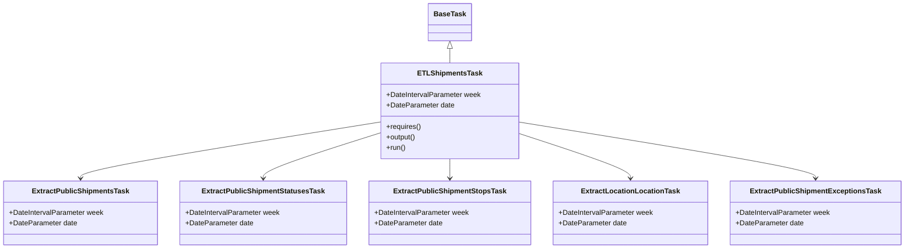
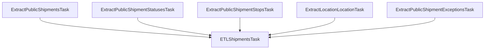

# Diagram: research/orchestrator/tasks/etl/etl_shipments_task.py


> Auto-generated by Obscura crawlers

## Diagram 1

```mermaid
classDiagram
      BaseTask <|-- ETLShipmentsTask
      ETLShipmentsTask --> ExtractPublicShipmentsTask
      ETLShipmentsTask --> ExtractPublicShipmentStatusesTask...
  └ 113 lines...
```

> SVG rendering failed for this diagram.

## Diagram 2



### SVG

<svg id="container" width="1996.0390625" xmlns="http://www.w3.org/2000/svg" class="classDiagram" height="560" viewBox="0 0 1996.0390625 560" role="graphics-document document" aria-roledescription="class"><style>#container{font-family:"trebuchet ms",verdana,arial,sans-serif;font-size:16px;fill:#333;}@keyframes edge-animation-frame{from{stroke-dashoffset:0;}}@keyframes dash{to{stroke-dashoffset:0;}}#container .edge-animation-slow{stroke-dasharray:9,5!important;stroke-dashoffset:900;animation:dash 50s linear infinite;stroke-linecap:round;}#container .edge-animation-fast{stroke-dasharray:9,5!important;stroke-dashoffset:900;animation:dash 20s linear infinite;stroke-linecap:round;}#container .error-icon{fill:#552222;}#container .error-text{fill:#552222;stroke:#552222;}#container .edge-thickness-normal{stroke-width:1px;}#container .edge-thickness-thick{stroke-width:3.5px;}#container .edge-pattern-solid{stroke-dasharray:0;}#container .edge-thickness-invisible{stroke-width:0;fill:none;}#container .edge-pattern-dashed{stroke-dasharray:3;}#container .edge-pattern-dotted{stroke-dasharray:2;}#container .marker{fill:#333333;stroke:#333333;}#container .marker.cross{stroke:#333333;}#container svg{font-family:"trebuchet ms",verdana,arial,sans-serif;font-size:16px;}#container p{margin:0;}#container g.classGroup text{fill:#9370DB;stroke:none;font-family:"trebuchet ms",verdana,arial,sans-serif;font-size:10px;}#container g.classGroup text .title{font-weight:bolder;}#container .nodeLabel,#container .edgeLabel{color:#131300;}#container .edgeLabel .label rect{fill:#ECECFF;}#container .label text{fill:#131300;}#container .labelBkg{background:#ECECFF;}#container .edgeLabel .label span{background:#ECECFF;}#container .classTitle{font-weight:bolder;}#container .node rect,#container .node circle,#container .node ellipse,#container .node polygon,#container .node path{fill:#ECECFF;stroke:#9370DB;stroke-width:1px;}#container .divider{stroke:#9370DB;stroke-width:1;}#container g.clickable{cursor:pointer;}#container g.classGroup rect{fill:#ECECFF;stroke:#9370DB;}#container g.classGroup line{stroke:#9370DB;stroke-width:1;}#container .classLabel .box{stroke:none;stroke-width:0;fill:#ECECFF;opacity:0.5;}#container .classLabel .label{fill:#9370DB;font-size:10px;}#container .relation{stroke:#333333;stroke-width:1;fill:none;}#container .dashed-line{stroke-dasharray:3;}#container .dotted-line{stroke-dasharray:1 2;}#container #compositionStart,#container .composition{fill:#333333!important;stroke:#333333!important;stroke-width:1;}#container #compositionEnd,#container .composition{fill:#333333!important;stroke:#333333!important;stroke-width:1;}#container #dependencyStart,#container .dependency{fill:#333333!important;stroke:#333333!important;stroke-width:1;}#container #dependencyStart,#container .dependency{fill:#333333!important;stroke:#333333!important;stroke-width:1;}#container #extensionStart,#container .extension{fill:transparent!important;stroke:#333333!important;stroke-width:1;}#container #extensionEnd,#container .extension{fill:transparent!important;stroke:#333333!important;stroke-width:1;}#container #aggregationStart,#container .aggregation{fill:transparent!important;stroke:#333333!important;stroke-width:1;}#container #aggregationEnd,#container .aggregation{fill:transparent!important;stroke:#333333!important;stroke-width:1;}#container #lollipopStart,#container .lollipop{fill:#ECECFF!important;stroke:#333333!important;stroke-width:1;}#container #lollipopEnd,#container .lollipop{fill:#ECECFF!important;stroke:#333333!important;stroke-width:1;}#container .edgeTerminals{font-size:11px;line-height:initial;}#container .classTitleText{text-anchor:middle;font-size:18px;fill:#333;}#container .label-icon{display:inline-block;height:1em;overflow:visible;vertical-align:-0.125em;}#container .node .label-icon path{fill:currentColor;stroke:revert;stroke-width:revert;}#container :root{--mermaid-font-family:"trebuchet ms",verdana,arial,sans-serif;}</style><g><defs><marker id="container_class-aggregationStart" class="marker aggregation class" refX="18" refY="7" markerWidth="190" markerHeight="240" orient="auto"><path d="M 18,7 L9,13 L1,7 L9,1 Z"></path></marker></defs><defs><marker id="container_class-aggregationEnd" class="marker aggregation class" refX="1" refY="7" markerWidth="20" markerHeight="28" orient="auto"><path d="M 18,7 L9,13 L1,7 L9,1 Z"></path></marker></defs><defs><marker id="container_class-extensionStart" class="marker extension class" refX="18" refY="7" markerWidth="190" markerHeight="240" orient="auto"><path d="M 1,7 L18,13 V 1 Z"></path></marker></defs><defs><marker id="container_class-extensionEnd" class="marker extension class" refX="1" refY="7" markerWidth="20" markerHeight="28" orient="auto"><path d="M 1,1 V 13 L18,7 Z"></path></marker></defs><defs><marker id="container_class-compositionStart" class="marker composition class" refX="18" refY="7" markerWidth="190" markerHeight="240" orient="auto"><path d="M 18,7 L9,13 L1,7 L9,1 Z"></path></marker></defs><defs><marker id="container_class-compositionEnd" class="marker composition class" refX="1" refY="7" markerWidth="20" markerHeight="28" orient="auto"><path d="M 18,7 L9,13 L1,7 L9,1 Z"></path></marker></defs><defs><marker id="container_class-dependencyStart" class="marker dependency class" refX="6" refY="7" markerWidth="190" markerHeight="240" orient="auto"><path d="M 5,7 L9,13 L1,7 L9,1 Z"></path></marker></defs><defs><marker id="container_class-dependencyEnd" class="marker dependency class" refX="13" refY="7" markerWidth="20" markerHeight="28" orient="auto"><path d="M 18,7 L9,13 L14,7 L9,1 Z"></path></marker></defs><defs><marker id="container_class-lollipopStart" class="marker lollipop class" refX="13" refY="7" markerWidth="190" markerHeight="240" orient="auto"><circle stroke="black" fill="transparent" cx="7" cy="7" r="6"></circle></marker></defs><defs><marker id="container_class-lollipopEnd" class="marker lollipop class" refX="1" refY="7" markerWidth="190" markerHeight="240" orient="auto"><circle stroke="black" fill="transparent" cx="7" cy="7" r="6"></circle></marker></defs><g class="root"><g class="clusters"></g><g class="edgePaths"><path d="M993.465,109.25L993.465,110.542C993.465,111.833,993.465,114.417,993.465,119.875C993.465,125.333,993.465,133.667,993.465,137.833L993.465,142" id="id_BaseTask_ETLShipmentsTask_1" class="edge-thickness-normal edge-pattern-solid relation" style=";;;" data-edge="true" data-et="edge" data-id="id_BaseTask_ETLShipmentsTask_1" data-points="W3sieCI6OTkzLjQ2NDg0Mzc1LCJ5Ijo5Mn0seyJ4Ijo5OTMuNDY0ODQzNzUsInkiOjExN30seyJ4Ijo5OTMuNDY0ODQzNzUsInkiOjE0Mn1d" marker-start="url(#container_class-extensionStart)"></path><path d="M841.395,274.797L730.798,292.831C620.202,310.864,399.009,346.932,288.413,368.133C177.816,389.333,177.816,395.667,177.816,398.833L177.816,402" id="id_ETLShipmentsTask_ExtractPublicShipmentsTask_2" class="edge-thickness-normal edge-pattern-solid relation" style=";;;" data-edge="true" data-et="edge" data-id="id_ETLShipmentsTask_ExtractPublicShipmentsTask_2" data-points="W3sieCI6ODQxLjM5NDUzMTI1LCJ5IjoyNzQuNzk2NjUzMzUyODczfSx7IngiOjE3Ny44MTY0MDYyNSwieSI6MzgzfSx7IngiOjE3Ny44MTY0MDYyNSwieSI6NDA4fV0=" marker-end="url(#container_class-dependencyEnd)"></path><path d="M841.395,299.083L798.062,313.069C754.729,327.055,668.064,355.028,624.731,372.18C581.398,389.333,581.398,395.667,581.398,398.833L581.398,402" id="id_ETLShipmentsTask_ExtractPublicShipmentStatusesTask_3" class="edge-thickness-normal edge-pattern-solid relation" style=";;;" data-edge="true" data-et="edge" data-id="id_ETLShipmentsTask_ExtractPublicShipmentStatusesTask_3" data-points="W3sieCI6ODQxLjM5NDUzMTI1LCJ5IjoyOTkuMDgyNzQ3OTY0MjQyNzR9LHsieCI6NTgxLjM5ODQzNzUsInkiOjM4M30seyJ4Ijo1ODEuMzk4NDM3NSwieSI6NDA4fV0=" marker-end="url(#container_class-dependencyEnd)"></path><path d="M993.465,358L993.465,362.167C993.465,366.333,993.465,374.667,993.465,382C993.465,389.333,993.465,395.667,993.465,398.833L993.465,402" id="id_ETLShipmentsTask_ExtractPublicShipmentStopsTask_4" class="edge-thickness-normal edge-pattern-solid relation" style=";;;" data-edge="true" data-et="edge" data-id="id_ETLShipmentsTask_ExtractPublicShipmentStopsTask_4" data-points="W3sieCI6OTkzLjQ2NDg0Mzc1LCJ5IjozNTh9LHsieCI6OTkzLjQ2NDg0Mzc1LCJ5IjozODN9LHsieCI6OTkzLjQ2NDg0Mzc1LCJ5Ijo0MDh9XQ==" marker-end="url(#container_class-dependencyEnd)"></path><path d="M1145.535,300.719L1186.652,314.432C1227.77,328.146,1310.004,355.573,1351.121,372.453C1392.238,389.333,1392.238,395.667,1392.238,398.833L1392.238,402" id="id_ETLShipmentsTask_ExtractLocationLocationTask_5" class="edge-thickness-normal edge-pattern-solid relation" style=";;;" data-edge="true" data-et="edge" data-id="id_ETLShipmentsTask_ExtractLocationLocationTask_5" data-points="W3sieCI6MTE0NS41MzUxNTYyNSwieSI6MzAwLjcxODkwMzY2OTQ1NTJ9LHsieCI6MTM5Mi4yMzgyODEyNSwieSI6MzgzfSx7IngiOjEzOTIuMjM4MjgxMjUsInkiOjQwOH1d" marker-end="url(#container_class-dependencyEnd)"></path><path d="M1145.535,275.065L1254.675,293.054C1363.815,311.043,1582.095,347.022,1691.235,368.178C1800.375,389.333,1800.375,395.667,1800.375,398.833L1800.375,402" id="id_ETLShipmentsTask_ExtractPublicShipmentExceptionsTask_6" class="edge-thickness-normal edge-pattern-solid relation" style=";;;" data-edge="true" data-et="edge" data-id="id_ETLShipmentsTask_ExtractPublicShipmentExceptionsTask_6" data-points="W3sieCI6MTE0NS41MzUxNTYyNSwieSI6Mjc1LjA2NTE4NDAzMDUxNzZ9LHsieCI6MTgwMC4zNzUsInkiOjM4M30seyJ4IjoxODAwLjM3NSwieSI6NDA4fV0=" marker-end="url(#container_class-dependencyEnd)"></path></g><g class="edgeLabels"><g class="edgeLabel"><g class="label" data-id="id_BaseTask_ETLShipmentsTask_1" transform="translate(0, 0)"><foreignObject width="0" height="0"><div xmlns="http://www.w3.org/1999/xhtml" class="labelBkg" style="display: table-cell; white-space: nowrap; line-height: 1.5; max-width: 200px; text-align: center;"><span class="edgeLabel"></span></div></foreignObject></g></g><g class="edgeLabel"><g class="label" data-id="id_ETLShipmentsTask_ExtractPublicShipmentsTask_2" transform="translate(0, 0)"><foreignObject width="0" height="0"><div xmlns="http://www.w3.org/1999/xhtml" class="labelBkg" style="display: table-cell; white-space: nowrap; line-height: 1.5; max-width: 200px; text-align: center;"><span class="edgeLabel"></span></div></foreignObject></g></g><g class="edgeLabel"><g class="label" data-id="id_ETLShipmentsTask_ExtractPublicShipmentStatusesTask_3" transform="translate(0, 0)"><foreignObject width="0" height="0"><div xmlns="http://www.w3.org/1999/xhtml" class="labelBkg" style="display: table-cell; white-space: nowrap; line-height: 1.5; max-width: 200px; text-align: center;"><span class="edgeLabel"></span></div></foreignObject></g></g><g class="edgeLabel"><g class="label" data-id="id_ETLShipmentsTask_ExtractPublicShipmentStopsTask_4" transform="translate(0, 0)"><foreignObject width="0" height="0"><div xmlns="http://www.w3.org/1999/xhtml" class="labelBkg" style="display: table-cell; white-space: nowrap; line-height: 1.5; max-width: 200px; text-align: center;"><span class="edgeLabel"></span></div></foreignObject></g></g><g class="edgeLabel"><g class="label" data-id="id_ETLShipmentsTask_ExtractLocationLocationTask_5" transform="translate(0, 0)"><foreignObject width="0" height="0"><div xmlns="http://www.w3.org/1999/xhtml" class="labelBkg" style="display: table-cell; white-space: nowrap; line-height: 1.5; max-width: 200px; text-align: center;"><span class="edgeLabel"></span></div></foreignObject></g></g><g class="edgeLabel"><g class="label" data-id="id_ETLShipmentsTask_ExtractPublicShipmentExceptionsTask_6" transform="translate(0, 0)"><foreignObject width="0" height="0"><div xmlns="http://www.w3.org/1999/xhtml" class="labelBkg" style="display: table-cell; white-space: nowrap; line-height: 1.5; max-width: 200px; text-align: center;"><span class="edgeLabel"></span></div></foreignObject></g></g></g><g class="nodes"><g class="node default" id="classId-BaseTask-0" transform="translate(993.46484375, 50)"><g class="basic label-container"><path d="M-46.03125 -42 L46.03125 -42 L46.03125 42 L-46.03125 42" stroke="none" stroke-width="0" fill="#ECECFF" style=""></path><path d="M-46.03125 -42 C-14.394340614664237 -42, 17.242568770671525 -42, 46.03125 -42 M-46.03125 -42 C-10.926097969189733 -42, 24.179054061620533 -42, 46.03125 -42 M46.03125 -42 C46.03125 -19.86166887801783, 46.03125 2.2766622439643385, 46.03125 42 M46.03125 -42 C46.03125 -18.806811727855845, 46.03125 4.386376544288311, 46.03125 42 M46.03125 42 C21.446270575477243 42, -3.138708849045514 42, -46.03125 42 M46.03125 42 C15.772378393035037 42, -14.486493213929926 42, -46.03125 42 M-46.03125 42 C-46.03125 14.388975001840855, -46.03125 -13.22204999631829, -46.03125 -42 M-46.03125 42 C-46.03125 18.40432432373617, -46.03125 -5.191351352527661, -46.03125 -42" stroke="#9370DB" stroke-width="1.3" fill="none" stroke-dasharray="0 0" style=""></path></g><g class="annotation-group text" transform="translate(0, -18)"></g><g class="label-group text" transform="translate(-34.03125, -18)"><g class="label" style="font-weight: bolder" transform="translate(0,-12)"><foreignObject width="68.0625" height="24"><div xmlns="http://www.w3.org/1999/xhtml" style="display: table-cell; white-space: nowrap; line-height: 1.5; max-width: 117px; text-align: center;"><span class="nodeLabel markdown-node-label" style=""><p>BaseTask</p></span></div></foreignObject></g></g><g class="members-group text" transform="translate(-34.03125, 30)"></g><g class="methods-group text" transform="translate(-34.03125, 60)"></g><g class="divider" style=""><path d="M-46.03125 6 C-9.726126964523907 6, 26.578996070952186 6, 46.03125 6 M-46.03125 6 C-23.78473538140431 6, -1.5382207628086206 6, 46.03125 6" stroke="#9370DB" stroke-width="1.3" fill="none" stroke-dasharray="0 0" style=""></path></g><g class="divider" style=""><path d="M-46.03125 24 C-21.589264564155805 24, 2.8527208716883905 24, 46.03125 24 M-46.03125 24 C-22.458833030144664 24, 1.1135839397106722 24, 46.03125 24" stroke="#9370DB" stroke-width="1.3" fill="none" stroke-dasharray="0 0" style=""></path></g></g><g class="node default" id="classId-ETLShipmentsTask-1" transform="translate(993.46484375, 250)"><g class="basic label-container"><path d="M-152.0703125 -108 L152.0703125 -108 L152.0703125 108 L-152.0703125 108" stroke="none" stroke-width="0" fill="#ECECFF" style=""></path><path d="M-152.0703125 -108 C-53.68500097939231 -108, 44.70031054121537 -108, 152.0703125 -108 M-152.0703125 -108 C-44.024422139159356 -108, 64.02146822168129 -108, 152.0703125 -108 M152.0703125 -108 C152.0703125 -43.236987644670165, 152.0703125 21.52602471065967, 152.0703125 108 M152.0703125 -108 C152.0703125 -31.967832884478042, 152.0703125 44.064334231043915, 152.0703125 108 M152.0703125 108 C75.22499968253379 108, -1.6203131349324167 108, -152.0703125 108 M152.0703125 108 C34.92624522151105 108, -82.2178220569779 108, -152.0703125 108 M-152.0703125 108 C-152.0703125 57.65729195875856, -152.0703125 7.314583917517126, -152.0703125 -108 M-152.0703125 108 C-152.0703125 33.19087507072433, -152.0703125 -41.61824985855134, -152.0703125 -108" stroke="#9370DB" stroke-width="1.3" fill="none" stroke-dasharray="0 0" style=""></path></g><g class="annotation-group text" transform="translate(0, -84)"></g><g class="label-group text" transform="translate(-68.015625, -84)"><g class="label" style="font-weight: bolder" transform="translate(0,-12)"><foreignObject width="136.03125" height="24"><div xmlns="http://www.w3.org/1999/xhtml" style="display: table-cell; white-space: nowrap; line-height: 1.5; max-width: 184px; text-align: center;"><span class="nodeLabel markdown-node-label" style=""><p>ETLShipmentsTask</p></span></div></foreignObject></g></g><g class="members-group text" transform="translate(-140.0703125, -36)"><g class="label" style="" transform="translate(0,-12)"><foreignObject width="212.125" height="24"><div xmlns="http://www.w3.org/1999/xhtml" style="display: table-cell; white-space: nowrap; line-height: 1.5; max-width: 270px; text-align: center;"><span class="nodeLabel markdown-node-label" style=""><p>+DateIntervalParameter week</p></span></div></foreignObject></g><g class="label" style="" transform="translate(0,12)"><foreignObject width="152.171875" height="24"><div xmlns="http://www.w3.org/1999/xhtml" style="display: table-cell; white-space: nowrap; line-height: 1.5; max-width: 210px; text-align: center;"><span class="nodeLabel markdown-node-label" style=""><p>+DateParameter date</p></span></div></foreignObject></g></g><g class="methods-group text" transform="translate(-140.0703125, 36)"><g class="label" style="" transform="translate(0,-12)"><foreignObject width="78.0625" height="24"><div xmlns="http://www.w3.org/1999/xhtml" style="display: table-cell; white-space: nowrap; line-height: 1.5; max-width: 135px; text-align: center;"><span class="nodeLabel markdown-node-label" style=""><p>+requires()</p></span></div></foreignObject></g><g class="label" style="" transform="translate(0,12)"><foreignObject width="67.390625" height="24"><div xmlns="http://www.w3.org/1999/xhtml" style="display: table-cell; white-space: nowrap; line-height: 1.5; max-width: 125px; text-align: center;"><span class="nodeLabel markdown-node-label" style=""><p>+output()</p></span></div></foreignObject></g><g class="label" style="" transform="translate(0,36)"><foreignObject width="43.21875" height="24"><div xmlns="http://www.w3.org/1999/xhtml" style="display: table-cell; white-space: nowrap; line-height: 1.5; max-width: 101px; text-align: center;"><span class="nodeLabel markdown-node-label" style=""><p>+run()</p></span></div></foreignObject></g></g><g class="divider" style=""><path d="M-152.0703125 -60 C-86.99610969875025 -60, -21.92190689750049 -60, 152.0703125 -60 M-152.0703125 -60 C-49.00581710801261 -60, 54.058678283974785 -60, 152.0703125 -60" stroke="#9370DB" stroke-width="1.3" fill="none" stroke-dasharray="0 0" style=""></path></g><g class="divider" style=""><path d="M-152.0703125 12 C-75.34404214136126 12, 1.3822282172774862 12, 152.0703125 12 M-152.0703125 12 C-76.31783604725021 12, -0.5653595945004213 12, 152.0703125 12" stroke="#9370DB" stroke-width="1.3" fill="none" stroke-dasharray="0 0" style=""></path></g></g><g class="node default" id="classId-ExtractPublicShipmentsTask-2" transform="translate(177.81640625, 480)"><g class="basic label-container"><path d="M-169.81640625 -72 L169.81640625 -72 L169.81640625 72 L-169.81640625 72" stroke="none" stroke-width="0" fill="#ECECFF" style=""></path><path d="M-169.81640625 -72 C-71.0063986796534 -72, 27.803608890693198 -72, 169.81640625 -72 M-169.81640625 -72 C-57.05405299531026 -72, 55.708300259379484 -72, 169.81640625 -72 M169.81640625 -72 C169.81640625 -20.800225252172908, 169.81640625 30.399549495654185, 169.81640625 72 M169.81640625 -72 C169.81640625 -40.276077348015576, 169.81640625 -8.552154696031153, 169.81640625 72 M169.81640625 72 C53.87498640280002 72, -62.06643344439996 72, -169.81640625 72 M169.81640625 72 C44.774914824269885 72, -80.26657660146023 72, -169.81640625 72 M-169.81640625 72 C-169.81640625 31.75256753248808, -169.81640625 -8.494864935023841, -169.81640625 -72 M-169.81640625 72 C-169.81640625 17.37915483128336, -169.81640625 -37.24169033743328, -169.81640625 -72" stroke="#9370DB" stroke-width="1.3" fill="none" stroke-dasharray="0 0" style=""></path></g><g class="annotation-group text" transform="translate(0, -48)"></g><g class="label-group text" transform="translate(-103.5078125, -48)"><g class="label" style="font-weight: bolder" transform="translate(0,-12)"><foreignObject width="207.015625" height="24"><div xmlns="http://www.w3.org/1999/xhtml" style="display: table-cell; white-space: nowrap; line-height: 1.5; max-width: 254px; text-align: center;"><span class="nodeLabel markdown-node-label" style=""><p>ExtractPublicShipmentsTask</p></span></div></foreignObject></g></g><g class="members-group text" transform="translate(-157.81640625, 0)"><g class="label" style="" transform="translate(0,-12)"><foreignObject width="212.125" height="24"><div xmlns="http://www.w3.org/1999/xhtml" style="display: table-cell; white-space: nowrap; line-height: 1.5; max-width: 270px; text-align: center;"><span class="nodeLabel markdown-node-label" style=""><p>+DateIntervalParameter week</p></span></div></foreignObject></g><g class="label" style="" transform="translate(0,12)"><foreignObject width="152.171875" height="24"><div xmlns="http://www.w3.org/1999/xhtml" style="display: table-cell; white-space: nowrap; line-height: 1.5; max-width: 210px; text-align: center;"><span class="nodeLabel markdown-node-label" style=""><p>+DateParameter date</p></span></div></foreignObject></g></g><g class="methods-group text" transform="translate(-157.81640625, 72)"></g><g class="divider" style=""><path d="M-169.81640625 -24 C-67.97631390766198 -24, 33.86377843467605 -24, 169.81640625 -24 M-169.81640625 -24 C-68.64458496967875 -24, 32.52723631064251 -24, 169.81640625 -24" stroke="#9370DB" stroke-width="1.3" fill="none" stroke-dasharray="0 0" style=""></path></g><g class="divider" style=""><path d="M-169.81640625 48 C-62.1692133069801 48, 45.477979636039805 48, 169.81640625 48 M-169.81640625 48 C-61.144326132718604 48, 47.52775398456279 48, 169.81640625 48" stroke="#9370DB" stroke-width="1.3" fill="none" stroke-dasharray="0 0" style=""></path></g></g><g class="node default" id="classId-ExtractPublicShipmentStatusesTask-3" transform="translate(581.3984375, 480)"><g class="basic label-container"><path d="M-183.765625 -72 L183.765625 -72 L183.765625 72 L-183.765625 72" stroke="none" stroke-width="0" fill="#ECECFF" style=""></path><path d="M-183.765625 -72 C-92.9643252340161 -72, -2.1630254680322025 -72, 183.765625 -72 M-183.765625 -72 C-70.42261983359374 -72, 42.920385332812515 -72, 183.765625 -72 M183.765625 -72 C183.765625 -34.69830245844112, 183.765625 2.6033950831177606, 183.765625 72 M183.765625 -72 C183.765625 -25.68138546703831, 183.765625 20.63722906592338, 183.765625 72 M183.765625 72 C49.69398987027745 72, -84.3776452594451 72, -183.765625 72 M183.765625 72 C77.48089296684721 72, -28.803839066305585 72, -183.765625 72 M-183.765625 72 C-183.765625 18.423387825773347, -183.765625 -35.15322434845331, -183.765625 -72 M-183.765625 72 C-183.765625 34.15916881860715, -183.765625 -3.6816623627857012, -183.765625 -72" stroke="#9370DB" stroke-width="1.3" fill="none" stroke-dasharray="0 0" style=""></path></g><g class="annotation-group text" transform="translate(0, -48)"></g><g class="label-group text" transform="translate(-131.40625, -48)"><g class="label" style="font-weight: bolder" transform="translate(0,-12)"><foreignObject width="262.8125" height="24"><div xmlns="http://www.w3.org/1999/xhtml" style="display: table-cell; white-space: nowrap; line-height: 1.5; max-width: 308px; text-align: center;"><span class="nodeLabel markdown-node-label" style=""><p>ExtractPublicShipmentStatusesTask</p></span></div></foreignObject></g></g><g class="members-group text" transform="translate(-171.765625, 0)"><g class="label" style="" transform="translate(0,-12)"><foreignObject width="212.125" height="24"><div xmlns="http://www.w3.org/1999/xhtml" style="display: table-cell; white-space: nowrap; line-height: 1.5; max-width: 270px; text-align: center;"><span class="nodeLabel markdown-node-label" style=""><p>+DateIntervalParameter week</p></span></div></foreignObject></g><g class="label" style="" transform="translate(0,12)"><foreignObject width="152.171875" height="24"><div xmlns="http://www.w3.org/1999/xhtml" style="display: table-cell; white-space: nowrap; line-height: 1.5; max-width: 210px; text-align: center;"><span class="nodeLabel markdown-node-label" style=""><p>+DateParameter date</p></span></div></foreignObject></g></g><g class="methods-group text" transform="translate(-171.765625, 72)"></g><g class="divider" style=""><path d="M-183.765625 -24 C-50.760740220537 -24, 82.244144558926 -24, 183.765625 -24 M-183.765625 -24 C-46.12216632944251 -24, 91.52129234111499 -24, 183.765625 -24" stroke="#9370DB" stroke-width="1.3" fill="none" stroke-dasharray="0 0" style=""></path></g><g class="divider" style=""><path d="M-183.765625 48 C-98.40736421282581 48, -13.049103425651623 48, 183.765625 48 M-183.765625 48 C-42.39552572375925 48, 98.9745735524815 48, 183.765625 48" stroke="#9370DB" stroke-width="1.3" fill="none" stroke-dasharray="0 0" style=""></path></g></g><g class="node default" id="classId-ExtractPublicShipmentStopsTask-4" transform="translate(993.46484375, 480)"><g class="basic label-container"><path d="M-178.30078125 -72 L178.30078125 -72 L178.30078125 72 L-178.30078125 72" stroke="none" stroke-width="0" fill="#ECECFF" style=""></path><path d="M-178.30078125 -72 C-52.63141123111032 -72, 73.03795878777936 -72, 178.30078125 -72 M-178.30078125 -72 C-70.9147994411001 -72, 36.4711823677998 -72, 178.30078125 -72 M178.30078125 -72 C178.30078125 -23.347801444077454, 178.30078125 25.30439711184509, 178.30078125 72 M178.30078125 -72 C178.30078125 -16.476527121889127, 178.30078125 39.046945756221746, 178.30078125 72 M178.30078125 72 C101.76477980865694 72, 25.22877836731388 72, -178.30078125 72 M178.30078125 72 C94.1927820596535 72, 10.084782869306991 72, -178.30078125 72 M-178.30078125 72 C-178.30078125 26.425896356196567, -178.30078125 -19.148207287606866, -178.30078125 -72 M-178.30078125 72 C-178.30078125 16.62802214186616, -178.30078125 -38.74395571626768, -178.30078125 -72" stroke="#9370DB" stroke-width="1.3" fill="none" stroke-dasharray="0 0" style=""></path></g><g class="annotation-group text" transform="translate(0, -48)"></g><g class="label-group text" transform="translate(-120.4765625, -48)"><g class="label" style="font-weight: bolder" transform="translate(0,-12)"><foreignObject width="240.953125" height="24"><div xmlns="http://www.w3.org/1999/xhtml" style="display: table-cell; white-space: nowrap; line-height: 1.5; max-width: 287px; text-align: center;"><span class="nodeLabel markdown-node-label" style=""><p>ExtractPublicShipmentStopsTask</p></span></div></foreignObject></g></g><g class="members-group text" transform="translate(-166.30078125, 0)"><g class="label" style="" transform="translate(0,-12)"><foreignObject width="212.125" height="24"><div xmlns="http://www.w3.org/1999/xhtml" style="display: table-cell; white-space: nowrap; line-height: 1.5; max-width: 270px; text-align: center;"><span class="nodeLabel markdown-node-label" style=""><p>+DateIntervalParameter week</p></span></div></foreignObject></g><g class="label" style="" transform="translate(0,12)"><foreignObject width="152.171875" height="24"><div xmlns="http://www.w3.org/1999/xhtml" style="display: table-cell; white-space: nowrap; line-height: 1.5; max-width: 210px; text-align: center;"><span class="nodeLabel markdown-node-label" style=""><p>+DateParameter date</p></span></div></foreignObject></g></g><g class="methods-group text" transform="translate(-166.30078125, 72)"></g><g class="divider" style=""><path d="M-178.30078125 -24 C-67.71781408014209 -24, 42.86515308971582 -24, 178.30078125 -24 M-178.30078125 -24 C-68.0695135130035 -24, 42.161754223993 -24, 178.30078125 -24" stroke="#9370DB" stroke-width="1.3" fill="none" stroke-dasharray="0 0" style=""></path></g><g class="divider" style=""><path d="M-178.30078125 48 C-55.08600119875794 48, 68.12877885248412 48, 178.30078125 48 M-178.30078125 48 C-59.611716191811 48, 59.077348866378 48, 178.30078125 48" stroke="#9370DB" stroke-width="1.3" fill="none" stroke-dasharray="0 0" style=""></path></g></g><g class="node default" id="classId-ExtractLocationLocationTask-5" transform="translate(1392.23828125, 480)"><g class="basic label-container"><path d="M-170.47265625 -72 L170.47265625 -72 L170.47265625 72 L-170.47265625 72" stroke="none" stroke-width="0" fill="#ECECFF" style=""></path><path d="M-170.47265625 -72 C-74.91477567586571 -72, 20.643104898268575 -72, 170.47265625 -72 M-170.47265625 -72 C-50.70756338997657 -72, 69.05752947004686 -72, 170.47265625 -72 M170.47265625 -72 C170.47265625 -17.422923144042542, 170.47265625 37.154153711914915, 170.47265625 72 M170.47265625 -72 C170.47265625 -34.590552848443124, 170.47265625 2.818894303113751, 170.47265625 72 M170.47265625 72 C77.41843289616448 72, -15.63579045767105 72, -170.47265625 72 M170.47265625 72 C50.51101226641505 72, -69.4506317171699 72, -170.47265625 72 M-170.47265625 72 C-170.47265625 15.370275417512133, -170.47265625 -41.259449164975734, -170.47265625 -72 M-170.47265625 72 C-170.47265625 36.17704439724339, -170.47265625 0.35408879448678476, -170.47265625 -72" stroke="#9370DB" stroke-width="1.3" fill="none" stroke-dasharray="0 0" style=""></path></g><g class="annotation-group text" transform="translate(0, -48)"></g><g class="label-group text" transform="translate(-104.8203125, -48)"><g class="label" style="font-weight: bolder" transform="translate(0,-12)"><foreignObject width="209.640625" height="24"><div xmlns="http://www.w3.org/1999/xhtml" style="display: table-cell; white-space: nowrap; line-height: 1.5; max-width: 257px; text-align: center;"><span class="nodeLabel markdown-node-label" style=""><p>ExtractLocationLocationTask</p></span></div></foreignObject></g></g><g class="members-group text" transform="translate(-158.47265625, 0)"><g class="label" style="" transform="translate(0,-12)"><foreignObject width="212.125" height="24"><div xmlns="http://www.w3.org/1999/xhtml" style="display: table-cell; white-space: nowrap; line-height: 1.5; max-width: 270px; text-align: center;"><span class="nodeLabel markdown-node-label" style=""><p>+DateIntervalParameter week</p></span></div></foreignObject></g><g class="label" style="" transform="translate(0,12)"><foreignObject width="152.171875" height="24"><div xmlns="http://www.w3.org/1999/xhtml" style="display: table-cell; white-space: nowrap; line-height: 1.5; max-width: 210px; text-align: center;"><span class="nodeLabel markdown-node-label" style=""><p>+DateParameter date</p></span></div></foreignObject></g></g><g class="methods-group text" transform="translate(-158.47265625, 72)"></g><g class="divider" style=""><path d="M-170.47265625 -24 C-77.9928676564431 -24, 14.486920937113808 -24, 170.47265625 -24 M-170.47265625 -24 C-94.44451161879486 -24, -18.416366987589726 -24, 170.47265625 -24" stroke="#9370DB" stroke-width="1.3" fill="none" stroke-dasharray="0 0" style=""></path></g><g class="divider" style=""><path d="M-170.47265625 48 C-61.104073689520376 48, 48.26450887095925 48, 170.47265625 48 M-170.47265625 48 C-80.00274083008637 48, 10.467174589827266 48, 170.47265625 48" stroke="#9370DB" stroke-width="1.3" fill="none" stroke-dasharray="0 0" style=""></path></g></g><g class="node default" id="classId-ExtractPublicShipmentExceptionsTask-6" transform="translate(1800.375, 480)"><g class="basic label-container"><path d="M-187.6640625 -72 L187.6640625 -72 L187.6640625 72 L-187.6640625 72" stroke="none" stroke-width="0" fill="#ECECFF" style=""></path><path d="M-187.6640625 -72 C-74.62049332401433 -72, 38.42307585197133 -72, 187.6640625 -72 M-187.6640625 -72 C-71.46770413742995 -72, 44.728654225140104 -72, 187.6640625 -72 M187.6640625 -72 C187.6640625 -32.41640903749163, 187.6640625 7.167181925016735, 187.6640625 72 M187.6640625 -72 C187.6640625 -34.938670764023385, 187.6640625 2.1226584719532298, 187.6640625 72 M187.6640625 72 C92.22330204368812 72, -3.217458412623756 72, -187.6640625 72 M187.6640625 72 C112.246447740123 72, 36.828832980246005 72, -187.6640625 72 M-187.6640625 72 C-187.6640625 25.674013914294413, -187.6640625 -20.651972171411174, -187.6640625 -72 M-187.6640625 72 C-187.6640625 37.17122082194681, -187.6640625 2.342441643893622, -187.6640625 -72" stroke="#9370DB" stroke-width="1.3" fill="none" stroke-dasharray="0 0" style=""></path></g><g class="annotation-group text" transform="translate(0, -48)"></g><g class="label-group text" transform="translate(-139.203125, -48)"><g class="label" style="font-weight: bolder" transform="translate(0,-12)"><foreignObject width="278.40625" height="24"><div xmlns="http://www.w3.org/1999/xhtml" style="display: table-cell; white-space: nowrap; line-height: 1.5; max-width: 325px; text-align: center;"><span class="nodeLabel markdown-node-label" style=""><p>ExtractPublicShipmentExceptionsTask</p></span></div></foreignObject></g></g><g class="members-group text" transform="translate(-175.6640625, 0)"><g class="label" style="" transform="translate(0,-12)"><foreignObject width="212.125" height="24"><div xmlns="http://www.w3.org/1999/xhtml" style="display: table-cell; white-space: nowrap; line-height: 1.5; max-width: 270px; text-align: center;"><span class="nodeLabel markdown-node-label" style=""><p>+DateIntervalParameter week</p></span></div></foreignObject></g><g class="label" style="" transform="translate(0,12)"><foreignObject width="152.171875" height="24"><div xmlns="http://www.w3.org/1999/xhtml" style="display: table-cell; white-space: nowrap; line-height: 1.5; max-width: 210px; text-align: center;"><span class="nodeLabel markdown-node-label" style=""><p>+DateParameter date</p></span></div></foreignObject></g></g><g class="methods-group text" transform="translate(-175.6640625, 72)"></g><g class="divider" style=""><path d="M-187.6640625 -24 C-44.35946481688222 -24, 98.94513286623555 -24, 187.6640625 -24 M-187.6640625 -24 C-37.67816456713308 -24, 112.30773336573384 -24, 187.6640625 -24" stroke="#9370DB" stroke-width="1.3" fill="none" stroke-dasharray="0 0" style=""></path></g><g class="divider" style=""><path d="M-187.6640625 48 C-93.10333466396824 48, 1.4573931720635187 48, 187.6640625 48 M-187.6640625 48 C-76.83934012777125 48, 33.9853822444575 48, 187.6640625 48" stroke="#9370DB" stroke-width="1.3" fill="none" stroke-dasharray="0 0" style=""></path></g></g></g></g></g></svg>

## Diagram 3



### SVG

<svg id="container" width="1692.84375" xmlns="http://www.w3.org/2000/svg" class="flowchart" height="174" viewBox="0 0 1692.84375 174" role="graphics-document document" aria-roledescription="flowchart-v2"><style>#container{font-family:"trebuchet ms",verdana,arial,sans-serif;font-size:16px;fill:#333;}@keyframes edge-animation-frame{from{stroke-dashoffset:0;}}@keyframes dash{to{stroke-dashoffset:0;}}#container .edge-animation-slow{stroke-dasharray:9,5!important;stroke-dashoffset:900;animation:dash 50s linear infinite;stroke-linecap:round;}#container .edge-animation-fast{stroke-dasharray:9,5!important;stroke-dashoffset:900;animation:dash 20s linear infinite;stroke-linecap:round;}#container .error-icon{fill:#552222;}#container .error-text{fill:#552222;stroke:#552222;}#container .edge-thickness-normal{stroke-width:1px;}#container .edge-thickness-thick{stroke-width:3.5px;}#container .edge-pattern-solid{stroke-dasharray:0;}#container .edge-thickness-invisible{stroke-width:0;fill:none;}#container .edge-pattern-dashed{stroke-dasharray:3;}#container .edge-pattern-dotted{stroke-dasharray:2;}#container .marker{fill:#333333;stroke:#333333;}#container .marker.cross{stroke:#333333;}#container svg{font-family:"trebuchet ms",verdana,arial,sans-serif;font-size:16px;}#container p{margin:0;}#container .label{font-family:"trebuchet ms",verdana,arial,sans-serif;color:#333;}#container .cluster-label text{fill:#333;}#container .cluster-label span{color:#333;}#container .cluster-label span p{background-color:transparent;}#container .label text,#container span{fill:#333;color:#333;}#container .node rect,#container .node circle,#container .node ellipse,#container .node polygon,#container .node path{fill:#ECECFF;stroke:#9370DB;stroke-width:1px;}#container .rough-node .label text,#container .node .label text,#container .image-shape .label,#container .icon-shape .label{text-anchor:middle;}#container .node .katex path{fill:#000;stroke:#000;stroke-width:1px;}#container .rough-node .label,#container .node .label,#container .image-shape .label,#container .icon-shape .label{text-align:center;}#container .node.clickable{cursor:pointer;}#container .root .anchor path{fill:#333333!important;stroke-width:0;stroke:#333333;}#container .arrowheadPath{fill:#333333;}#container .edgePath .path{stroke:#333333;stroke-width:2.0px;}#container .flowchart-link{stroke:#333333;fill:none;}#container .edgeLabel{background-color:rgba(232,232,232, 0.8);text-align:center;}#container .edgeLabel p{background-color:rgba(232,232,232, 0.8);}#container .edgeLabel rect{opacity:0.5;background-color:rgba(232,232,232, 0.8);fill:rgba(232,232,232, 0.8);}#container .labelBkg{background-color:rgba(232, 232, 232, 0.5);}#container .cluster rect{fill:#ffffde;stroke:#aaaa33;stroke-width:1px;}#container .cluster text{fill:#333;}#container .cluster span{color:#333;}#container div.mermaidTooltip{position:absolute;text-align:center;max-width:200px;padding:2px;font-family:"trebuchet ms",verdana,arial,sans-serif;font-size:12px;background:hsl(80, 100%, 96.2745098039%);border:1px solid #aaaa33;border-radius:2px;pointer-events:none;z-index:100;}#container .flowchartTitleText{text-anchor:middle;font-size:18px;fill:#333;}#container rect.text{fill:none;stroke-width:0;}#container .icon-shape,#container .image-shape{background-color:rgba(232,232,232, 0.8);text-align:center;}#container .icon-shape p,#container .image-shape p{background-color:rgba(232,232,232, 0.8);padding:2px;}#container .icon-shape rect,#container .image-shape rect{opacity:0.5;background-color:rgba(232,232,232, 0.8);fill:rgba(232,232,232, 0.8);}#container .label-icon{display:inline-block;height:1em;overflow:visible;vertical-align:-0.125em;}#container .node .label-icon path{fill:currentColor;stroke:revert;stroke-width:revert;}#container :root{--mermaid-font-family:"trebuchet ms",verdana,arial,sans-serif;}</style><g><marker id="container_flowchart-v2-pointEnd" class="marker flowchart-v2" viewBox="0 0 10 10" refX="5" refY="5" markerUnits="userSpaceOnUse" markerWidth="8" markerHeight="8" orient="auto"><path d="M 0 0 L 10 5 L 0 10 z" class="arrowMarkerPath" style="stroke-width: 1; stroke-dasharray: 1, 0;"></path></marker><marker id="container_flowchart-v2-pointStart" class="marker flowchart-v2" viewBox="0 0 10 10" refX="4.5" refY="5" markerUnits="userSpaceOnUse" markerWidth="8" markerHeight="8" orient="auto"><path d="M 0 5 L 10 10 L 10 0 z" class="arrowMarkerPath" style="stroke-width: 1; stroke-dasharray: 1, 0;"></path></marker><marker id="container_flowchart-v2-circleEnd" class="marker flowchart-v2" viewBox="0 0 10 10" refX="11" refY="5" markerUnits="userSpaceOnUse" markerWidth="11" markerHeight="11" orient="auto"><circle cx="5" cy="5" r="5" class="arrowMarkerPath" style="stroke-width: 1; stroke-dasharray: 1, 0;"></circle></marker><marker id="container_flowchart-v2-circleStart" class="marker flowchart-v2" viewBox="0 0 10 10" refX="-1" refY="5" markerUnits="userSpaceOnUse" markerWidth="11" markerHeight="11" orient="auto"><circle cx="5" cy="5" r="5" class="arrowMarkerPath" style="stroke-width: 1; stroke-dasharray: 1, 0;"></circle></marker><marker id="container_flowchart-v2-crossEnd" class="marker cross flowchart-v2" viewBox="0 0 11 11" refX="12" refY="5.2" markerUnits="userSpaceOnUse" markerWidth="11" markerHeight="11" orient="auto"><path d="M 1,1 l 9,9 M 10,1 l -9,9" class="arrowMarkerPath" style="stroke-width: 2; stroke-dasharray: 1, 0;"></path></marker><marker id="container_flowchart-v2-crossStart" class="marker cross flowchart-v2" viewBox="0 0 11 11" refX="-1" refY="5.2" markerUnits="userSpaceOnUse" markerWidth="11" markerHeight="11" orient="auto"><path d="M 1,1 l 9,9 M 10,1 l -9,9" class="arrowMarkerPath" style="stroke-width: 2; stroke-dasharray: 1, 0;"></path></marker><g class="root"><g class="clusters"></g><g class="edgePaths"><path d="M139.609,62L139.609,66.167C139.609,70.333,139.609,78.667,239.054,90.249C338.498,101.83,537.388,116.661,636.832,124.076L736.277,131.491" id="L_ExtractPublicShipmentsTask_ETLShipmentsTask_0" class="edge-thickness-normal edge-pattern-solid edge-thickness-normal edge-pattern-solid flowchart-link" style=";" data-edge="true" data-et="edge" data-id="L_ExtractPublicShipmentsTask_ETLShipmentsTask_0" data-points="W3sieCI6MTM5LjYwOTM3NSwieSI6NjJ9LHsieCI6MTM5LjYwOTM3NSwieSI6ODd9LHsieCI6NzQwLjI2NTYyNSwieSI6MTMxLjc4ODYzNTgyODk1NDg4fV0=" marker-end="url(#container_flowchart-v2-pointEnd)"></path><path d="M480.016,62L480.016,66.167C480.016,70.333,480.016,78.667,522.731,89.056C565.446,99.445,650.877,111.89,693.592,118.113L736.307,124.335" id="L_ExtractPublicShipmentStatusesTask_ETLShipmentsTask_0" class="edge-thickness-normal edge-pattern-solid edge-thickness-normal edge-pattern-solid flowchart-link" style=";" data-edge="true" data-et="edge" data-id="L_ExtractPublicShipmentStatusesTask_ETLShipmentsTask_0" data-points="W3sieCI6NDgwLjAxNTYyNSwieSI6NjJ9LHsieCI6NDgwLjAxNTYyNSwieSI6ODd9LHsieCI6NzQwLjI2NTYyNSwieSI6MTI0LjkxMTcxMTI3NzkzMjJ9XQ==" marker-end="url(#container_flowchart-v2-pointEnd)"></path><path d="M836.977,62L836.977,66.167C836.977,70.333,836.977,78.667,836.977,86.333C836.977,94,836.977,101,836.977,104.5L836.977,108" id="L_ExtractPublicShipmentStopsTask_ETLShipmentsTask_0" class="edge-thickness-normal edge-pattern-solid edge-thickness-normal edge-pattern-solid flowchart-link" style=";" data-edge="true" data-et="edge" data-id="L_ExtractPublicShipmentStopsTask_ETLShipmentsTask_0" data-points="W3sieCI6ODM2Ljk3NjU2MjUsInkiOjYyfSx7IngiOjgzNi45NzY1NjI1LCJ5Ijo4N30seyJ4Ijo4MzYuOTc2NTYyNSwieSI6MTEyfV0=" marker-end="url(#container_flowchart-v2-pointEnd)"></path><path d="M1168.016,62L1168.016,66.167C1168.016,70.333,1168.016,78.667,1129.62,88.865C1091.223,99.063,1014.431,111.125,976.035,117.157L937.639,123.188" id="L_ExtractLocationLocationTask_ETLShipmentsTask_0" class="edge-thickness-normal edge-pattern-solid edge-thickness-normal edge-pattern-solid flowchart-link" style=";" data-edge="true" data-et="edge" data-id="L_ExtractLocationLocationTask_ETLShipmentsTask_0" data-points="W3sieCI6MTE2OC4wMTU2MjUsInkiOjYyfSx7IngiOjExNjguMDE1NjI1LCJ5Ijo4N30seyJ4Ijo5MzMuNjg3NSwieSI6MTIzLjgwODUzMzczNjEwNTU1fV0=" marker-end="url(#container_flowchart-v2-pointEnd)"></path><path d="M1517.867,62L1517.867,66.167C1517.867,70.333,1517.867,78.667,1421.169,90.218C1324.47,101.77,1131.073,116.54,1034.374,123.925L937.676,131.31" id="L_ExtractPublicShipmentExceptionsTask_ETLShipmentsTask_0" class="edge-thickness-normal edge-pattern-solid edge-thickness-normal edge-pattern-solid flowchart-link" style=";" data-edge="true" data-et="edge" data-id="L_ExtractPublicShipmentExceptionsTask_ETLShipmentsTask_0" data-points="W3sieCI6MTUxNy44NjcxODc1LCJ5Ijo2Mn0seyJ4IjoxNTE3Ljg2NzE4NzUsInkiOjg3fSx7IngiOjkzMy42ODc1LCJ5IjoxMzEuNjE0MTMxMzA3OH1d" marker-end="url(#container_flowchart-v2-pointEnd)"></path></g><g class="edgeLabels"><g class="edgeLabel"><g class="label" data-id="L_ExtractPublicShipmentsTask_ETLShipmentsTask_0" transform="translate(0, 0)"><foreignObject width="0" height="0"><div xmlns="http://www.w3.org/1999/xhtml" class="labelBkg" style="display: table-cell; white-space: nowrap; line-height: 1.5; max-width: 200px; text-align: center;"><span class="edgeLabel"></span></div></foreignObject></g></g><g class="edgeLabel"><g class="label" data-id="L_ExtractPublicShipmentStatusesTask_ETLShipmentsTask_0" transform="translate(0, 0)"><foreignObject width="0" height="0"><div xmlns="http://www.w3.org/1999/xhtml" class="labelBkg" style="display: table-cell; white-space: nowrap; line-height: 1.5; max-width: 200px; text-align: center;"><span class="edgeLabel"></span></div></foreignObject></g></g><g class="edgeLabel"><g class="label" data-id="L_ExtractPublicShipmentStopsTask_ETLShipmentsTask_0" transform="translate(0, 0)"><foreignObject width="0" height="0"><div xmlns="http://www.w3.org/1999/xhtml" class="labelBkg" style="display: table-cell; white-space: nowrap; line-height: 1.5; max-width: 200px; text-align: center;"><span class="edgeLabel"></span></div></foreignObject></g></g><g class="edgeLabel"><g class="label" data-id="L_ExtractLocationLocationTask_ETLShipmentsTask_0" transform="translate(0, 0)"><foreignObject width="0" height="0"><div xmlns="http://www.w3.org/1999/xhtml" class="labelBkg" style="display: table-cell; white-space: nowrap; line-height: 1.5; max-width: 200px; text-align: center;"><span class="edgeLabel"></span></div></foreignObject></g></g><g class="edgeLabel"><g class="label" data-id="L_ExtractPublicShipmentExceptionsTask_ETLShipmentsTask_0" transform="translate(0, 0)"><foreignObject width="0" height="0"><div xmlns="http://www.w3.org/1999/xhtml" class="labelBkg" style="display: table-cell; white-space: nowrap; line-height: 1.5; max-width: 200px; text-align: center;"><span class="edgeLabel"></span></div></foreignObject></g></g></g><g class="nodes"><g class="node default" id="flowchart-ETLShipmentsTask-0" transform="translate(836.9765625, 139)"><rect class="basic label-container" style="" x="-96.7109375" y="-27" width="193.421875" height="54"></rect><g class="label" style="" transform="translate(-66.7109375, -12)"><rect></rect><foreignObject width="133.421875" height="24"><div xmlns="http://www.w3.org/1999/xhtml" style="display: table-cell; white-space: nowrap; line-height: 1.5; max-width: 200px; text-align: center;"><span class="nodeLabel"><p>ETLShipmentsTask</p></span></div></foreignObject></g></g><g class="node default" id="flowchart-ExtractPublicShipmentsTask-1" transform="translate(139.609375, 35)"><rect class="basic label-container" style="" x="-131.609375" y="-27" width="263.21875" height="54"></rect><g class="label" style="" transform="translate(-101.609375, -12)"><rect></rect><foreignObject width="203.21875" height="24"><div xmlns="http://www.w3.org/1999/xhtml" style="display: table; white-space: break-spaces; line-height: 1.5; max-width: 200px; text-align: center; width: 200px;"><span class="nodeLabel"><p>ExtractPublicShipmentsTask</p></span></div></foreignObject></g></g><g class="node default" id="flowchart-ExtractPublicShipmentStatusesTask-2" transform="translate(480.015625, 35)"><rect class="basic label-container" style="" x="-158.796875" y="-27" width="317.59375" height="54"></rect><g class="label" style="" transform="translate(-128.796875, -12)"><rect></rect><foreignObject width="257.59375" height="24"><div xmlns="http://www.w3.org/1999/xhtml" style="display: table; white-space: break-spaces; line-height: 1.5; max-width: 200px; text-align: center; width: 200px;"><span class="nodeLabel"><p>ExtractPublicShipmentStatusesTask</p></span></div></foreignObject></g></g><g class="node default" id="flowchart-ExtractPublicShipmentStopsTask-3" transform="translate(836.9765625, 35)"><rect class="basic label-container" style="" x="-148.1640625" y="-27" width="296.328125" height="54"></rect><g class="label" style="" transform="translate(-118.1640625, -12)"><rect></rect><foreignObject width="236.328125" height="24"><div xmlns="http://www.w3.org/1999/xhtml" style="display: table; white-space: break-spaces; line-height: 1.5; max-width: 200px; text-align: center; width: 200px;"><span class="nodeLabel"><p>ExtractPublicShipmentStopsTask</p></span></div></foreignObject></g></g><g class="node default" id="flowchart-ExtractLocationLocationTask-4" transform="translate(1168.015625, 35)"><rect class="basic label-container" style="" x="-132.875" y="-27" width="265.75" height="54"></rect><g class="label" style="" transform="translate(-102.875, -12)"><rect></rect><foreignObject width="205.75" height="24"><div xmlns="http://www.w3.org/1999/xhtml" style="display: table; white-space: break-spaces; line-height: 1.5; max-width: 200px; text-align: center; width: 200px;"><span class="nodeLabel"><p>ExtractLocationLocationTask</p></span></div></foreignObject></g></g><g class="node default" id="flowchart-ExtractPublicShipmentExceptionsTask-5" transform="translate(1517.8671875, 35)"><rect class="basic label-container" style="" x="-166.9765625" y="-27" width="333.953125" height="54"></rect><g class="label" style="" transform="translate(-136.9765625, -12)"><rect></rect><foreignObject width="273.953125" height="24"><div xmlns="http://www.w3.org/1999/xhtml" style="display: table; white-space: break-spaces; line-height: 1.5; max-width: 200px; text-align: center; width: 200px;"><span class="nodeLabel"><p>ExtractPublicShipmentExceptionsTask</p></span></div></foreignObject></g></g></g></g></g></svg>
