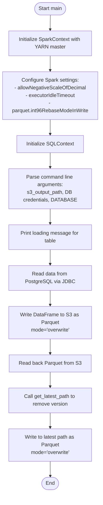
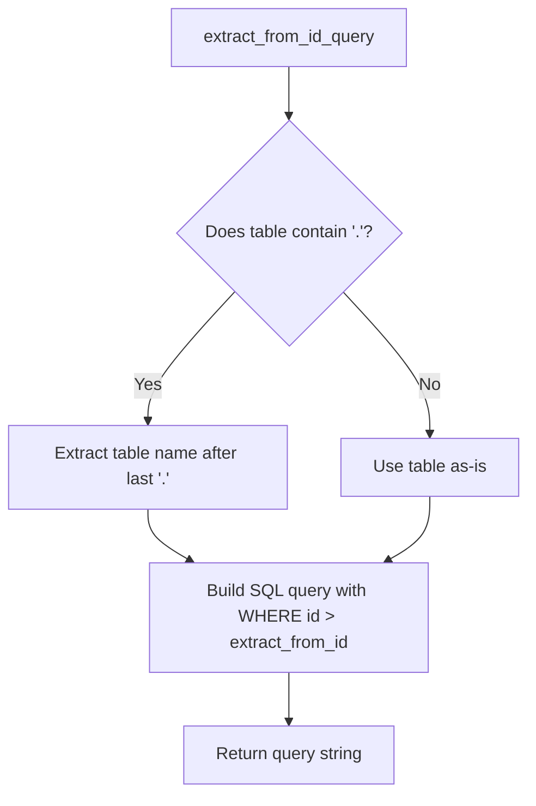
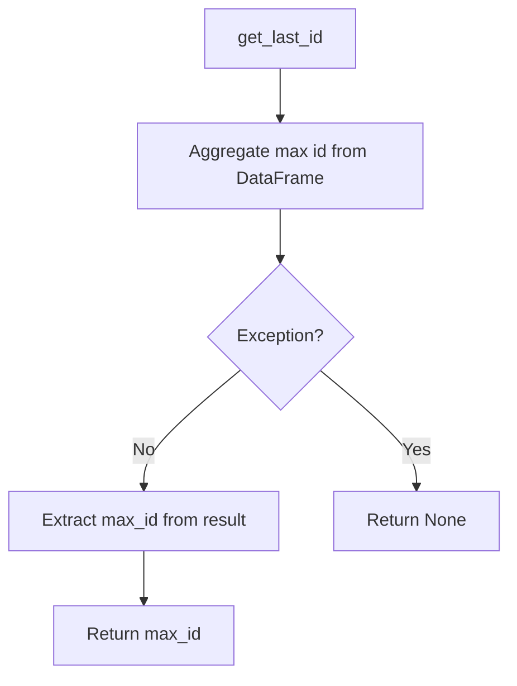
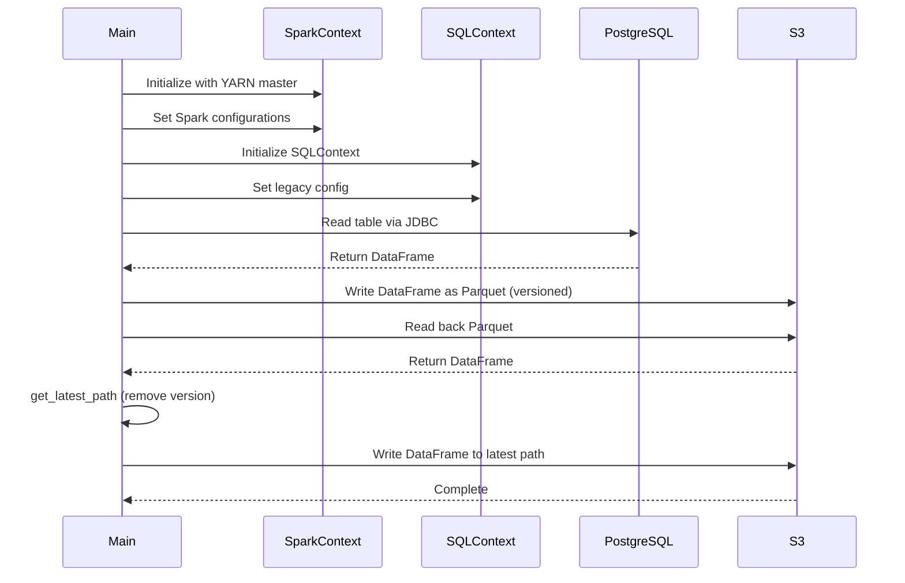

# Diagram: research/orchestrator/tasks/etl/extract_location_lad_spark.py

> Auto-generated by Obscura crawlers

## Diagram 1

### SVG

<svg id="container" width="318.03125" xmlns="http://www.w3.org/2000/svg" class="flowchart" height="1544" viewBox="0 0 318.03125 1544" role="graphics-document document" aria-roledescription="flowchart-v2"><g><marker id="container_flowchart-v2-pointEnd" class="marker flowchart-v2" viewBox="0 0 10 10" refX="5" refY="5" markerUnits="userSpaceOnUse" markerWidth="8" markerHeight="8" orient="auto"><path d="M 0 0 L 10 5 L 0 10 z" class="arrowMarkerPath" style="stroke-width: 1; stroke-dasharray: 1, 0;"></path></marker><marker id="container_flowchart-v2-pointStart" class="marker flowchart-v2" viewBox="0 0 10 10" refX="4.5" refY="5" markerUnits="userSpaceOnUse" markerWidth="8" markerHeight="8" orient="auto"><path d="M 0 5 L 10 10 L 10 0 z" class="arrowMarkerPath" style="stroke-width: 1; stroke-dasharray: 1, 0;"></path></marker><marker id="container_flowchart-v2-circleEnd" class="marker flowchart-v2" viewBox="0 0 10 10" refX="11" refY="5" markerUnits="userSpaceOnUse" markerWidth="11" markerHeight="11" orient="auto"><circle cx="5" cy="5" r="5" class="arrowMarkerPath" style="stroke-width: 1; stroke-dasharray: 1, 0;"></circle></marker><marker id="container_flowchart-v2-circleStart" class="marker flowchart-v2" viewBox="0 0 10 10" refX="-1" refY="5" markerUnits="userSpaceOnUse" markerWidth="11" markerHeight="11" orient="auto"><circle cx="5" cy="5" r="5" class="arrowMarkerPath" style="stroke-width: 1; stroke-dasharray: 1, 0;"></circle></marker><marker id="container_flowchart-v2-crossEnd" class="marker cross flowchart-v2" viewBox="0 0 11 11" refX="12" refY="5.2" markerUnits="userSpaceOnUse" markerWidth="11" markerHeight="11" orient="auto"><path d="M 1,1 l 9,9 M 10,1 l -9,9" class="arrowMarkerPath" style="stroke-width: 2; stroke-dasharray: 1, 0;"></path></marker><marker id="container_flowchart-v2-crossStart" class="marker cross flowchart-v2" viewBox="0 0 11 11" refX="-1" refY="5.2" markerUnits="userSpaceOnUse" markerWidth="11" markerHeight="11" orient="auto"><path d="M 1,1 l 9,9 M 10,1 l -9,9" class="arrowMarkerPath" style="stroke-width: 2; stroke-dasharray: 1, 0;"></path></marker><g class="root"><g class="clusters"></g><g class="edgePaths"><path d="M159.516,47.5L159.432,51.583C159.349,55.667,159.182,63.833,159.099,71.417C159.016,79,159.016,86,159.016,89.5L159.016,93" id="L_Start_InitSpark_0" class="edge-thickness-normal edge-pattern-solid edge-thickness-normal edge-pattern-solid flowchart-link" style=";" data-edge="true" data-et="edge" data-id="L_Start_InitSpark_0" data-points="W3sieCI6MTU5LjUxNTYyNSwieSI6NDcuNTAwMDAwMDAwMDAwMDE0fSx7IngiOjE1OS4wMTU2MjUsInkiOjcyfSx7IngiOjE1OS4wMTU2MjUsInkiOjk3fV0=" marker-end="url(#container_flowchart-v2-pointEnd)"></path><path d="M159.016,175L159.016,179.167C159.016,183.333,159.016,191.667,159.016,199.333C159.016,207,159.016,214,159.016,217.5L159.016,221" id="L_InitSpark_ConfigSpark_0" class="edge-thickness-normal edge-pattern-solid edge-thickness-normal edge-pattern-solid flowchart-link" style=";" data-edge="true" data-et="edge" data-id="L_InitSpark_ConfigSpark_0" data-points="W3sieCI6MTU5LjAxNTYyNSwieSI6MTc1fSx7IngiOjE1OS4wMTU2MjUsInkiOjIwMH0seyJ4IjoxNTkuMDE1NjI1LCJ5IjoyMjV9XQ==" marker-end="url(#container_flowchart-v2-pointEnd)"></path><path d="M159.016,375L159.016,379.167C159.016,383.333,159.016,391.667,159.016,399.333C159.016,407,159.016,414,159.016,417.5L159.016,421" id="L_ConfigSpark_InitSQL_0" class="edge-thickness-normal edge-pattern-solid edge-thickness-normal edge-pattern-solid flowchart-link" style=";" data-edge="true" data-et="edge" data-id="L_ConfigSpark_InitSQL_0" data-points="W3sieCI6MTU5LjAxNTYyNSwieSI6Mzc1fSx7IngiOjE1OS4wMTU2MjUsInkiOjQwMH0seyJ4IjoxNTkuMDE1NjI1LCJ5Ijo0MjV9XQ==" marker-end="url(#container_flowchart-v2-pointEnd)"></path><path d="M159.016,479L159.016,483.167C159.016,487.333,159.016,495.667,159.016,503.333C159.016,511,159.016,518,159.016,521.5L159.016,525" id="L_InitSQL_ParseArgs_0" class="edge-thickness-normal edge-pattern-solid edge-thickness-normal edge-pattern-solid flowchart-link" style=";" data-edge="true" data-et="edge" data-id="L_InitSQL_ParseArgs_0" data-points="W3sieCI6MTU5LjAxNTYyNSwieSI6NDc5fSx7IngiOjE1OS4wMTU2MjUsInkiOjUwNH0seyJ4IjoxNTkuMDE1NjI1LCJ5Ijo1Mjl9XQ==" marker-end="url(#container_flowchart-v2-pointEnd)"></path><path d="M159.016,655L159.016,659.167C159.016,663.333,159.016,671.667,159.016,679.333C159.016,687,159.016,694,159.016,697.5L159.016,701" id="L_ParseArgs_PrintTable_0" class="edge-thickness-normal edge-pattern-solid edge-thickness-normal edge-pattern-solid flowchart-link" style=";" data-edge="true" data-et="edge" data-id="L_ParseArgs_PrintTable_0" data-points="W3sieCI6MTU5LjAxNTYyNSwieSI6NjU1fSx7IngiOjE1OS4wMTU2MjUsInkiOjY4MH0seyJ4IjoxNTkuMDE1NjI1LCJ5Ijo3MDV9XQ==" marker-end="url(#container_flowchart-v2-pointEnd)"></path><path d="M159.016,783L159.016,787.167C159.016,791.333,159.016,799.667,159.016,807.333C159.016,815,159.016,822,159.016,825.5L159.016,829" id="L_PrintTable_ReadJDBC_0" class="edge-thickness-normal edge-pattern-solid edge-thickness-normal edge-pattern-solid flowchart-link" style=";" data-edge="true" data-et="edge" data-id="L_PrintTable_ReadJDBC_0" data-points="W3sieCI6MTU5LjAxNTYyNSwieSI6NzgzfSx7IngiOjE1OS4wMTU2MjUsInkiOjgwOH0seyJ4IjoxNTkuMDE1NjI1LCJ5Ijo4MzN9XQ==" marker-end="url(#container_flowchart-v2-pointEnd)"></path><path d="M159.016,911L159.016,915.167C159.016,919.333,159.016,927.667,159.016,935.333C159.016,943,159.016,950,159.016,953.5L159.016,957" id="L_ReadJDBC_WriteParquet_0" class="edge-thickness-normal edge-pattern-solid edge-thickness-normal edge-pattern-solid flowchart-link" style=";" data-edge="true" data-et="edge" data-id="L_ReadJDBC_WriteParquet_0" data-points="W3sieCI6MTU5LjAxNTYyNSwieSI6OTExfSx7IngiOjE1OS4wMTU2MjUsInkiOjkzNn0seyJ4IjoxNTkuMDE1NjI1LCJ5Ijo5NjF9XQ==" marker-end="url(#container_flowchart-v2-pointEnd)"></path><path d="M159.016,1063L159.016,1067.167C159.016,1071.333,159.016,1079.667,159.016,1087.333C159.016,1095,159.016,1102,159.016,1105.5L159.016,1109" id="L_WriteParquet_ReadBack_0" class="edge-thickness-normal edge-pattern-solid edge-thickness-normal edge-pattern-solid flowchart-link" style=";" data-edge="true" data-et="edge" data-id="L_WriteParquet_ReadBack_0" data-points="W3sieCI6MTU5LjAxNTYyNSwieSI6MTA2M30seyJ4IjoxNTkuMDE1NjI1LCJ5IjoxMDg4fSx7IngiOjE1OS4wMTU2MjUsInkiOjExMTN9XQ==" marker-end="url(#container_flowchart-v2-pointEnd)"></path><path d="M159.016,1167L159.016,1171.167C159.016,1175.333,159.016,1183.667,159.016,1191.333C159.016,1199,159.016,1206,159.016,1209.5L159.016,1213" id="L_ReadBack_GetLatest_0" class="edge-thickness-normal edge-pattern-solid edge-thickness-normal edge-pattern-solid flowchart-link" style=";" data-edge="true" data-et="edge" data-id="L_ReadBack_GetLatest_0" data-points="W3sieCI6MTU5LjAxNTYyNSwieSI6MTE2N30seyJ4IjoxNTkuMDE1NjI1LCJ5IjoxMTkyfSx7IngiOjE1OS4wMTU2MjUsInkiOjEyMTd9XQ==" marker-end="url(#container_flowchart-v2-pointEnd)"></path><path d="M159.016,1295L159.016,1299.167C159.016,1303.333,159.016,1311.667,159.016,1319.333C159.016,1327,159.016,1334,159.016,1337.5L159.016,1341" id="L_GetLatest_WriteLatest_0" class="edge-thickness-normal edge-pattern-solid edge-thickness-normal edge-pattern-solid flowchart-link" style=";" data-edge="true" data-et="edge" data-id="L_GetLatest_WriteLatest_0" data-points="W3sieCI6MTU5LjAxNTYyNSwieSI6MTI5NX0seyJ4IjoxNTkuMDE1NjI1LCJ5IjoxMzIwfSx7IngiOjE1OS4wMTU2MjUsInkiOjEzNDV9XQ==" marker-end="url(#container_flowchart-v2-pointEnd)"></path><path d="M159.016,1447L159.016,1451.167C159.016,1455.333,159.016,1463.667,159.086,1471.417C159.156,1479.167,159.297,1486.334,159.367,1489.917L159.437,1493.501" id="L_WriteLatest_End_0" class="edge-thickness-normal edge-pattern-solid edge-thickness-normal edge-pattern-solid flowchart-link" style=";" data-edge="true" data-et="edge" data-id="L_WriteLatest_End_0" data-points="W3sieCI6MTU5LjAxNTYyNSwieSI6MTQ0N30seyJ4IjoxNTkuMDE1NjI1LCJ5IjoxNDcyfSx7IngiOjE1OS41MTU2MjUsInkiOjE0OTcuNX1d" marker-end="url(#container_flowchart-v2-pointEnd)"></path></g><g class="edgeLabels"><g class="edgeLabel"><g class="label" data-id="L_Start_InitSpark_0" transform="translate(0, 0)"><foreignObject width="0" height="0">

</foreignObject></g></g><g class="edgeLabel"><g class="label" data-id="L_InitSpark_ConfigSpark_0" transform="translate(0, 0)"><foreignObject width="0" height="0">

</foreignObject></g></g><g class="edgeLabel"><g class="label" data-id="L_ConfigSpark_InitSQL_0" transform="translate(0, 0)"><foreignObject width="0" height="0">

</foreignObject></g></g><g class="edgeLabel"><g class="label" data-id="L_InitSQL_ParseArgs_0" transform="translate(0, 0)"><foreignObject width="0" height="0">

</foreignObject></g></g><g class="edgeLabel"><g class="label" data-id="L_ParseArgs_PrintTable_0" transform="translate(0, 0)"><foreignObject width="0" height="0">

</foreignObject></g></g><g class="edgeLabel"><g class="label" data-id="L_PrintTable_ReadJDBC_0" transform="translate(0, 0)"><foreignObject width="0" height="0">

</foreignObject></g></g><g class="edgeLabel"><g class="label" data-id="L_ReadJDBC_WriteParquet_0" transform="translate(0, 0)"><foreignObject width="0" height="0">

</foreignObject></g></g><g class="edgeLabel"><g class="label" data-id="L_WriteParquet_ReadBack_0" transform="translate(0, 0)"><foreignObject width="0" height="0">

</foreignObject></g></g><g class="edgeLabel"><g class="label" data-id="L_ReadBack_GetLatest_0" transform="translate(0, 0)"><foreignObject width="0" height="0">

</foreignObject></g></g><g class="edgeLabel"><g class="label" data-id="L_GetLatest_WriteLatest_0" transform="translate(0, 0)"><foreignObject width="0" height="0">

</foreignObject></g></g><g class="edgeLabel"><g class="label" data-id="L_WriteLatest_End_0" transform="translate(0, 0)"><foreignObject width="0" height="0">

</foreignObject></g></g></g><g class="nodes"><g class="node default" id="flowchart-Start-0" transform="translate(159.015625, 27.5)"><g class="basic label-container outer-path"><path d="M-30.671875 -19.5 C-15.593876647625859 -19.5, -0.5158782952517171 -19.5, 30.671875 -19.5 C30.671875 -19.5, 30.671875 -19.5, 30.671875 -19.5 C31.018363043983328 -19.488888802827518, 31.364851087966656 -19.47777760565504, 31.9212442896239 -19.45993515863156 C32.23263673075126 -19.429895504340205, 32.54402917187862 -19.39985585004885, 33.165479652847864 -19.3399052695533 C33.56733769721117 -19.274935977396318, 33.96919574157448 -19.209966685239337, 34.39946825967676 -19.140403561325776 C34.87172452597148 -19.03261415030415, 35.343980792266194 -18.924824739282524, 35.61813938623539 -18.862249829261074 C36.09618310584956 -18.72036896258228, 36.57422682546373 -18.578488095903484, 36.816485251460605 -18.50658706670804 C37.176773590973994 -18.373997627298213, 37.537061930487376 -18.241408187888382, 37.9895815951478 -18.074876768247425 C38.36226356885526 -17.909901513705087, 38.734945542562734 -17.744926259162746, 39.13260791279238 -17.568892924097174 C39.50110073652403 -17.376650453987292, 39.86959356025568 -17.18440798387741, 40.24086726407678 -16.990714730406097 C40.481598787020516 -16.84478186650215, 40.72233030996424 -16.6988490025982, 41.3098055736057 -16.342718045390892 C41.5710829864831 -16.16046223268453, 41.83236039936049 -15.97820641997817, 42.33503034457871 -15.627565626425154 C42.62029583545073 -15.40007398868824, 42.905561326322754 -15.172582350951325, 43.312328708501866 -14.848196188198123 C43.51349912228304 -14.665498541079538, 43.714669536064214 -14.482800893960952, 44.23768473676799 -14.007812326905688 C44.53300983998524 -13.702864911191973, 44.82833494320249 -13.397917495478257, 45.10729594296865 -13.10986736009568 C45.35668431199241 -12.816921591240172, 45.60607268101617 -12.523975822384664, 45.91758890812658 -12.158051136245305 C46.09420847343138 -11.921397009110281, 46.270828038736184 -11.684742881975257, 46.665233964640635 -11.156274872382312 C46.80432303266324 -10.942596713255242, 46.94341210068585 -10.728918554128171, 47.34715887860425 -10.108655082055241 C47.58806785983063 -9.680896791208188, 47.828976841057006 -9.253138500361135, 47.960561474273504 -9.019496659696287 C48.09146718986366 -8.747668140339723, 48.22237290545381 -8.47583962098316, 48.50292114880834 -7.893275190886684 C48.639016562433135 -7.557116888007615, 48.775111976057936 -7.220958585128545, 48.972009229970325 -6.734618561215508 C49.0949291280914 -6.364403412700954, 49.21784902621247 -5.9941882641864, 49.36589813421488 -5.548287939305138 C49.487333944369176 -5.085200564573766, 49.60876975452347 -4.622113189842393, 49.68296928754556 -4.339158212148133 C49.73325866711607 -4.080932876717726, 49.78354804668657 -3.822707541287319, 49.921919776581774 -3.1121979531509023 C49.97625250077985 -2.6908040734806065, 50.03058522497792 -2.2694101938103106, 50.08176770250937 -1.872449005199798 C50.1024601580635 -1.550147307294628, 50.12315261361764 -1.2278456093894579, 50.16185621591342 -0.6250057626472757 C50.16185621591342 -0.16631308707363507, 50.16185621591342 0.29237958850000556, 50.16185621591342 0.625005762647271 C50.14302836808704 0.9182646901083571, 50.12420052026066 1.211523617569443, 50.08176770250937 1.8724490051997846 C50.032139754409016 2.257353570519282, 49.982511806308665 2.6422581358387793, 49.921919776581774 3.1121979531508885 C49.85663406105633 3.447426304233163, 49.7913483455309 3.782654655315438, 49.68296928754556 4.339158212148129 C49.6046562283228 4.637799848059067, 49.52634316910005 4.936441483970006, 49.36589813421489 5.548287939305125 C49.231943187679484 5.951738895447435, 49.09798824114408 6.355189851589745, 48.972009229970325 6.734618561215495 C48.806344765916684 7.143812990332514, 48.64068030186304 7.553007419449534, 48.50292114880834 7.893275190886679 C48.33358893317037 8.244897159787936, 48.164256717532396 8.596519128689192, 47.960561474273504 9.019496659696284 C47.80002080687599 9.304552871165939, 47.63948013947847 9.589609082635592, 47.34715887860425 10.108655082055236 C47.18241373794692 10.361747858369379, 47.01766859728959 10.614840634683523, 46.66523396464064 11.156274872382301 C46.373878444227266 11.54666472670227, 46.0825229238139 11.937054581022238, 45.91758890812658 12.158051136245302 C45.638508102289514 12.485875330929243, 45.359427296452445 12.813699525613183, 45.10729594296866 13.10986736009567 C44.8923034378923 13.331864772799948, 44.67731093281594 13.553862185504224, 44.23768473676799 14.007812326905684 C44.02052812011982 14.20502822049633, 43.803371503471645 14.402244114086972, 43.31232870850189 14.848196188198111 C43.07491854497023 15.037524475864828, 42.837508381438575 15.226852763531543, 42.33503034457871 15.627565626425152 C42.02555782621967 15.843440258383021, 41.716085307860624 16.05931489034089, 41.30980557360571 16.34271804539089 C41.075605628679654 16.484691428316705, 40.84140568375361 16.626664811242524, 40.24086726407678 16.990714730406093 C39.861851317622126 17.18844710690019, 39.48283537116747 17.386179483394287, 39.13260791279239 17.56889292409717 C38.85917384339151 17.68993407548746, 38.585739773990625 17.81097522687775, 37.989581595147804 18.07487676824742 C37.58384485553599 18.224191639013874, 37.17810811592419 18.373506509780324, 36.81648525146062 18.506587066708033 C36.39032963077118 18.63306781799216, 35.964174010081734 18.759548569276287, 35.61813938623541 18.86224982926107 C35.274386650192646 18.940709148066592, 34.93063391414989 19.01916846687211, 34.399468259676766 19.140403561325773 C33.96820609063961 19.21012668432763, 33.53694392160245 19.279849807329487, 33.16547965284788 19.3399052695533 C32.752640458482574 19.379731370121945, 32.33980126411727 19.419557470690595, 31.9212442896239 19.45993515863156 C31.66533613564093 19.46814163503479, 31.409427981657963 19.476348111438018, 30.671875000000004 19.5 C30.671875000000004 19.5, 30.671875 19.5, 30.671875 19.5 C14.664549932361993 19.5, -1.342775135276014 19.5, -30.671874999999996 19.5 C-31.019393498625984 19.488855758152788, -31.366911997251975 19.477711516305575, -31.921244289623893 19.45993515863156 C-32.23495685154756 19.429671685077338, -32.54866941347122 19.39940821152312, -33.16547965284787 19.3399052695533 C-33.41363551722715 19.299785353877926, -33.66179138160643 19.259665438202557, -34.39946825967676 19.140403561325773 C-34.731351551277065 19.06465336575888, -35.06323484287737 18.988903170191985, -35.618139386235384 18.862249829261074 C-35.87796324374558 18.785135472195307, -36.13778710125579 18.708021115129537, -36.81648525146059 18.506587066708043 C-37.139339251926124 18.387773810107063, -37.46219325239166 18.268960553506083, -37.9895815951478 18.074876768247425 C-38.435810231982124 17.87734458762307, -38.88203886881645 17.67981240699872, -39.13260791279238 17.568892924097174 C-39.4876632750698 17.383660769020857, -39.84271863734722 17.198428613944543, -40.24086726407678 16.990714730406097 C-40.63304882868235 16.75297196122751, -41.02523039328792 16.51522919204892, -41.309805573605686 16.3427180453909 C-41.63926330988019 16.112902590561347, -41.9687210461547 15.883087135731792, -42.33503034457871 15.627565626425156 C-42.68283615754151 15.350199746088714, -43.030641970504306 15.072833865752273, -43.312328708501866 14.848196188198125 C-43.6784791453709 14.51566804924335, -44.04462958223994 14.183139910288576, -44.237684736767974 14.007812326905697 C-44.53333598988421 13.702528134643883, -44.82898724300044 13.397243942382069, -45.107295942968655 13.109867360095677 C-45.37334314050228 12.79735318335829, -45.639390338035895 12.484839006620902, -45.917588908126575 12.158051136245307 C-46.129935614653576 11.873525894682057, -46.34228232118058 11.589000653118806, -46.665233964640635 11.156274872382316 C-46.90562785641004 10.786965299826042, -47.14602174817945 10.417655727269768, -47.34715887860425 10.108655082055249 C-47.54755094174703 9.752838682048463, -47.74794300488982 9.397022282041677, -47.960561474273504 9.019496659696289 C-48.07743038781099 8.776815860141536, -48.19429930134847 8.534135060586785, -48.50292114880834 7.893275190886686 C-48.64822509885497 7.534371625010746, -48.793529048901604 7.175468059134807, -48.972009229970325 6.73461856121551 C-49.098909200517326 6.352416068692483, -49.22580917106433 5.970213576169455, -49.36589813421488 5.5482879393051325 C-49.437485077775165 5.275295897532186, -49.50907202133544 5.00230385575924, -49.68296928754556 4.339158212148136 C-49.73688026118472 4.062336756599343, -49.790791234823885 3.785515301050552, -49.921919776581774 3.112197953150904 C-49.96377300165683 2.7875926043228905, -50.005626226731884 2.462987255494877, -50.08176770250937 1.872449005199809 C-50.10463357599146 1.516294568715347, -50.127499449473554 1.1601401322308853, -50.16185621591342 0.6250057626472781 C-50.16185621591342 0.1272595656665202, -50.16185621591342 -0.37048663131423776, -50.16185621591342 -0.6250057626472687 C-50.134006838762694 -1.0587822913824056, -50.10615746161197 -1.4925588201175426, -50.08176770250937 -1.8724490051997822 C-50.02218803246156 -2.3345371607539924, -49.96260836241375 -2.7966253163082024, -49.921919776581774 -3.112197953150895 C-49.85540579517919 -3.453733189918248, -49.788891813776594 -3.795268426685601, -49.68296928754556 -4.339158212148126 C-49.58280889298764 -4.721113206387076, -49.48264849842972 -5.103068200626026, -49.36589813421489 -5.548287939305123 C-49.24477784548008 -5.913082951077049, -49.12365755674528 -6.277877962848976, -48.97200922997033 -6.734618561215485 C-48.80501397404613 -7.147100071981894, -48.63801871812193 -7.5595815827483035, -48.50292114880834 -7.893275190886676 C-48.321392649663096 -8.270223003449441, -48.13986415051785 -8.647170816012208, -47.960561474273504 -9.019496659696282 C-47.74335414066961 -9.405170275137536, -47.52614680706572 -9.79084389057879, -47.34715887860425 -10.108655082055243 C-47.08869813008635 -10.505720198207523, -46.83023738156846 -10.902785314359805, -46.66523396464064 -11.156274872382308 C-46.456207136216065 -11.43635177973543, -46.24718030779148 -11.71642868708855, -45.91758890812659 -12.158051136245302 C-45.69202286798093 -12.423013842071676, -45.46645682783527 -12.68797654789805, -45.10729594296866 -13.10986736009567 C-44.931527622239095 -13.291362582096456, -44.75575930150953 -13.472857804097242, -44.237684736767996 -14.007812326905677 C-43.97721823169232 -14.244361115249326, -43.71675172661665 -14.480909903592975, -43.31232870850189 -14.848196188198107 C-43.07119366787571 -15.040494966224564, -42.83005862724953 -15.232793744251019, -42.33503034457872 -15.627565626425149 C-42.05091413089008 -15.825752797901686, -41.76679791720143 -16.023939969378223, -41.309805573605715 -16.342718045390885 C-40.92732770259289 -16.57457837848832, -40.54484983158007 -16.80643871158575, -40.24086726407679 -16.99071473040609 C-39.829271978612375 -17.205443727193515, -39.41767669314796 -17.420172723980937, -39.13260791279239 -17.56889292409717 C-38.780585024802846 -17.72472301422219, -38.4285621368133 -17.880553104347204, -37.989581595147804 -18.07487676824742 C-37.55427972164601 -18.23507188158249, -37.11897784814422 -18.395266994917556, -36.81648525146062 -18.506587066708033 C-36.46361685945195 -18.61131655321222, -36.11074846744328 -18.716046039716403, -35.61813938623541 -18.862249829261067 C-35.187486934428186 -18.960543441116187, -34.75683448262096 -19.058837052971306, -34.399468259676766 -19.140403561325773 C-33.9234803698796 -19.217357592006962, -33.44749248008243 -19.294311622688156, -33.16547965284788 -19.3399052695533 C-32.754079573534575 -19.37959254042367, -32.34267949422127 -19.41927981129404, -31.921244289623903 -19.45993515863156 C-31.667404817980717 -19.468075296418597, -31.41356534633753 -19.476215434205635, -30.671875000000007 -19.5 C-30.671875000000007 -19.5, -30.671875000000004 -19.5, -30.671875 -19.5" stroke="none" stroke-width="0" fill="#ECECFF" style=""></path><path d="M-30.671875 -19.5 C-6.711750246604545 -19.5, 17.24837450679091 -19.5, 30.671875 -19.5 M-30.671875 -19.5 C-13.99598367617704 -19.5, 2.679907647645919 -19.5, 30.671875 -19.5 M30.671875 -19.5 C30.671875 -19.5, 30.671875 -19.5, 30.671875 -19.5 M30.671875 -19.5 C30.671875 -19.5, 30.671875 -19.5, 30.671875 -19.5 M30.671875 -19.5 C30.970978953614324 -19.490408318378115, 31.270082907228648 -19.480816636756234, 31.9212442896239 -19.45993515863156 M30.671875 -19.5 C31.013372332005265 -19.489048845246824, 31.35486966401053 -19.478097690493648, 31.9212442896239 -19.45993515863156 M31.9212442896239 -19.45993515863156 C32.21367654834854 -19.43172457033364, 32.50610880707317 -19.403513982035722, 33.165479652847864 -19.3399052695533 M31.9212442896239 -19.45993515863156 C32.353516367999575 -19.41823439111389, 32.78578844637526 -19.376533623596227, 33.165479652847864 -19.3399052695533 M33.165479652847864 -19.3399052695533 C33.629212068777846 -19.264932608844337, 34.09294448470783 -19.189959948135375, 34.39946825967676 -19.140403561325776 M33.165479652847864 -19.3399052695533 C33.5988227197462 -19.269845723122852, 34.03216578664454 -19.199786176692403, 34.39946825967676 -19.140403561325776 M34.39946825967676 -19.140403561325776 C34.8475361942057 -19.038134979186072, 35.295604128734645 -18.935866397046368, 35.61813938623539 -18.862249829261074 M34.39946825967676 -19.140403561325776 C34.710098748010665 -19.069504179416935, 35.02072923634457 -18.998604797508097, 35.61813938623539 -18.862249829261074 M35.61813938623539 -18.862249829261074 C35.98994647000709 -18.751899438452842, 36.36175355377879 -18.641549047644613, 36.816485251460605 -18.50658706670804 M35.61813938623539 -18.862249829261074 C35.87984714233561 -18.78457634098257, 36.14155489843584 -18.706902852704072, 36.816485251460605 -18.50658706670804 M36.816485251460605 -18.50658706670804 C37.112293053179535 -18.397727061258127, 37.40810085489847 -18.28886705580822, 37.9895815951478 -18.074876768247425 M36.816485251460605 -18.50658706670804 C37.08786013449216 -18.406718601190505, 37.35923501752372 -18.306850135672974, 37.9895815951478 -18.074876768247425 M37.9895815951478 -18.074876768247425 C38.31665380912734 -17.93009160137119, 38.64372602310688 -17.785306434494952, 39.13260791279238 -17.568892924097174 M37.9895815951478 -18.074876768247425 C38.36566552495107 -17.908395568656918, 38.741749454754334 -17.741914369066407, 39.13260791279238 -17.568892924097174 M39.13260791279238 -17.568892924097174 C39.35601858536304 -17.452339719318427, 39.5794292579337 -17.33578651453968, 40.24086726407678 -16.990714730406097 M39.13260791279238 -17.568892924097174 C39.44629567209498 -17.405242220995607, 39.75998343139758 -17.24159151789404, 40.24086726407678 -16.990714730406097 M40.24086726407678 -16.990714730406097 C40.4776926400957 -16.84714979572304, 40.71451801611461 -16.703584861039985, 41.3098055736057 -16.342718045390892 M40.24086726407678 -16.990714730406097 C40.54574361082936 -16.805896897352397, 40.85061995758194 -16.6210790642987, 41.3098055736057 -16.342718045390892 M41.3098055736057 -16.342718045390892 C41.52184043927818 -16.194811701939173, 41.73387530495065 -16.04690535848745, 42.33503034457871 -15.627565626425154 M41.3098055736057 -16.342718045390892 C41.690751214177475 -16.076986857399014, 42.071696854749256 -15.811255669407139, 42.33503034457871 -15.627565626425154 M42.33503034457871 -15.627565626425154 C42.70946477833515 -15.32896412962314, 43.083899212091595 -15.030362632821124, 43.312328708501866 -14.848196188198123 M42.33503034457871 -15.627565626425154 C42.70873081642997 -15.329549444710977, 43.08243128828122 -15.031533262996803, 43.312328708501866 -14.848196188198123 M43.312328708501866 -14.848196188198123 C43.62693915328115 -14.562475306385798, 43.94154959806044 -14.276754424573472, 44.23768473676799 -14.007812326905688 M43.312328708501866 -14.848196188198123 C43.582480503785995 -14.602851475545897, 43.852632299070116 -14.35750676289367, 44.23768473676799 -14.007812326905688 M44.23768473676799 -14.007812326905688 C44.514728962918326 -13.721741417651483, 44.791773189068664 -13.435670508397276, 45.10729594296865 -13.10986736009568 M44.23768473676799 -14.007812326905688 C44.450965241027504 -13.787582695602687, 44.66424574528701 -13.567353064299684, 45.10729594296865 -13.10986736009568 M45.10729594296865 -13.10986736009568 C45.30381936792035 -12.87901976264775, 45.50034279287205 -12.648172165199819, 45.91758890812658 -12.158051136245305 M45.10729594296865 -13.10986736009568 C45.31165310527417 -12.86981780899967, 45.51601026757969 -12.629768257903661, 45.91758890812658 -12.158051136245305 M45.91758890812658 -12.158051136245305 C46.12076002227604 -11.885820352554303, 46.32393113642549 -11.613589568863299, 46.665233964640635 -11.156274872382312 M45.91758890812658 -12.158051136245305 C46.17583378424037 -11.812026528845037, 46.434078660354146 -11.466001921444768, 46.665233964640635 -11.156274872382312 M46.665233964640635 -11.156274872382312 C46.85669429939309 -10.862140383903974, 47.048154634145554 -10.568005895425637, 47.34715887860425 -10.108655082055241 M46.665233964640635 -11.156274872382312 C46.813110991854394 -10.929096048040176, 46.96098801906815 -10.701917223698038, 47.34715887860425 -10.108655082055241 M47.34715887860425 -10.108655082055241 C47.590118194647445 -9.677256214122018, 47.83307751069064 -9.245857346188792, 47.960561474273504 -9.019496659696287 M47.34715887860425 -10.108655082055241 C47.585122085853804 -9.686127311196005, 47.823085293103354 -9.263599540336768, 47.960561474273504 -9.019496659696287 M47.960561474273504 -9.019496659696287 C48.07354083074512 -8.784892608612008, 48.18652018721673 -8.550288557527729, 48.50292114880834 -7.893275190886684 M47.960561474273504 -9.019496659696287 C48.129707092345335 -8.668262164633683, 48.29885271041716 -8.317027669571079, 48.50292114880834 -7.893275190886684 M48.50292114880834 -7.893275190886684 C48.59910172815064 -7.655707300386196, 48.695282307492946 -7.418139409885709, 48.972009229970325 -6.734618561215508 M48.50292114880834 -7.893275190886684 C48.66998189138219 -7.480631926829548, 48.83704263395604 -7.067988662772411, 48.972009229970325 -6.734618561215508 M48.972009229970325 -6.734618561215508 C49.128394513580076 -6.263611003594146, 49.28477979718982 -5.7926034459727855, 49.36589813421488 -5.548287939305138 M48.972009229970325 -6.734618561215508 C49.11902013482531 -6.291845138799069, 49.2660310396803 -5.849071716382629, 49.36589813421488 -5.548287939305138 M49.36589813421488 -5.548287939305138 C49.43037644912752 -5.302404179464786, 49.49485476404016 -5.0565204196244355, 49.68296928754556 -4.339158212148133 M49.36589813421488 -5.548287939305138 C49.44706202866679 -5.238774833105621, 49.528225923118704 -4.929261726906105, 49.68296928754556 -4.339158212148133 M49.68296928754556 -4.339158212148133 C49.74378785893693 -4.026867702063042, 49.804606430328306 -3.7145771919779507, 49.921919776581774 -3.1121979531509023 M49.68296928754556 -4.339158212148133 C49.767557426059675 -3.9048159985875714, 49.85214556457378 -3.4704737850270093, 49.921919776581774 -3.1121979531509023 M49.921919776581774 -3.1121979531509023 C49.956632289661286 -2.842974556467259, 49.9913448027408 -2.573751159783615, 50.08176770250937 -1.872449005199798 M49.921919776581774 -3.1121979531509023 C49.956748750303696 -2.842071310722454, 49.991577724025625 -2.5719446682940053, 50.08176770250937 -1.872449005199798 M50.08176770250937 -1.872449005199798 C50.098746249529945 -1.6079944305178147, 50.11572479655052 -1.3435398558358314, 50.16185621591342 -0.6250057626472757 M50.08176770250937 -1.872449005199798 C50.106673334731504 -1.4845236798755026, 50.13157896695365 -1.0965983545512072, 50.16185621591342 -0.6250057626472757 M50.16185621591342 -0.6250057626472757 C50.16185621591342 -0.2898131749951297, 50.16185621591342 0.04537941265701628, 50.16185621591342 0.625005762647271 M50.16185621591342 -0.6250057626472757 C50.16185621591342 -0.30627745035083265, 50.16185621591342 0.012450861945610403, 50.16185621591342 0.625005762647271 M50.16185621591342 0.625005762647271 C50.13673559965111 1.0162796379291508, 50.111614983388804 1.4075535132110306, 50.08176770250937 1.8724490051997846 M50.16185621591342 0.625005762647271 C50.13092710634938 1.1067516096349888, 50.09999799678535 1.5884974566227066, 50.08176770250937 1.8724490051997846 M50.08176770250937 1.8724490051997846 C50.028879452403686 2.2826398290531493, 49.975991202298005 2.6928306529065136, 49.921919776581774 3.1121979531508885 M50.08176770250937 1.8724490051997846 C50.0348433293762 2.2363851769550496, 49.987918956243035 2.600321348710315, 49.921919776581774 3.1121979531508885 M49.921919776581774 3.1121979531508885 C49.86011649318404 3.4295447512696913, 49.79831320978631 3.7468915493884944, 49.68296928754556 4.339158212148129 M49.921919776581774 3.1121979531508885 C49.850665676868516 3.4780726956191828, 49.77941157715525 3.8439474380874774, 49.68296928754556 4.339158212148129 M49.68296928754556 4.339158212148129 C49.59842526815006 4.6615611997129704, 49.51388124875456 4.983964187277813, 49.36589813421489 5.548287939305125 M49.68296928754556 4.339158212148129 C49.602028293242846 4.647821303473211, 49.52108729894014 4.956484394798295, 49.36589813421489 5.548287939305125 M49.36589813421489 5.548287939305125 C49.21122389773236 6.014142095597634, 49.056549661249825 6.479996251890144, 48.972009229970325 6.734618561215495 M49.36589813421489 5.548287939305125 C49.23784369792204 5.933967498715507, 49.10978926162918 6.31964705812589, 48.972009229970325 6.734618561215495 M48.972009229970325 6.734618561215495 C48.82034451890252 7.109233329790673, 48.66867980783473 7.4838480983658515, 48.50292114880834 7.893275190886679 M48.972009229970325 6.734618561215495 C48.83583287326042 7.0709767950797, 48.699656516550526 7.407335028943905, 48.50292114880834 7.893275190886679 M48.50292114880834 7.893275190886679 C48.30382748821884 8.306697437022686, 48.104733827629346 8.720119683158693, 47.960561474273504 9.019496659696284 M48.50292114880834 7.893275190886679 C48.3223962109607 8.268139086942208, 48.141871273113054 8.643002982997738, 47.960561474273504 9.019496659696284 M47.960561474273504 9.019496659696284 C47.781415263593296 9.337588897279916, 47.60226905291309 9.65568113486355, 47.34715887860425 10.108655082055236 M47.960561474273504 9.019496659696284 C47.73970878205929 9.411642978482753, 47.51885608984507 9.80378929726922, 47.34715887860425 10.108655082055236 M47.34715887860425 10.108655082055236 C47.15209363746614 10.408327674794846, 46.95702839632802 10.708000267534453, 46.66523396464064 11.156274872382301 M47.34715887860425 10.108655082055236 C47.108624719720034 10.475107605491647, 46.87009056083583 10.841560128928059, 46.66523396464064 11.156274872382301 M46.66523396464064 11.156274872382301 C46.49259286397279 11.387598219349403, 46.31995176330493 11.618921566316505, 45.91758890812658 12.158051136245302 M46.66523396464064 11.156274872382301 C46.43273930405467 11.46779653686819, 46.20024464346871 11.77931820135408, 45.91758890812658 12.158051136245302 M45.91758890812658 12.158051136245302 C45.64666104670784 12.476298418499791, 45.37573318528911 12.79454570075428, 45.10729594296866 13.10986736009567 M45.91758890812658 12.158051136245302 C45.601556331765806 12.529280983201698, 45.28552375540502 12.900510830158094, 45.10729594296866 13.10986736009567 M45.10729594296866 13.10986736009567 C44.79350625551341 13.433880975005682, 44.47971656805815 13.757894589915692, 44.23768473676799 14.007812326905684 M45.10729594296866 13.10986736009567 C44.91751185334476 13.305835014195878, 44.72772776372087 13.501802668296088, 44.23768473676799 14.007812326905684 M44.23768473676799 14.007812326905684 C43.99761341181549 14.225838752288363, 43.75754208686299 14.44386517767104, 43.31232870850189 14.848196188198111 M44.23768473676799 14.007812326905684 C43.94233370582335 14.27604231864955, 43.646982674878714 14.544272310393415, 43.31232870850189 14.848196188198111 M43.31232870850189 14.848196188198111 C43.006870179427146 15.09179123654238, 42.701411650352405 15.335386284886646, 42.33503034457871 15.627565626425152 M43.31232870850189 14.848196188198111 C42.96339667688946 15.126460197937694, 42.61446464527703 15.404724207677278, 42.33503034457871 15.627565626425152 M42.33503034457871 15.627565626425152 C42.04937412108626 15.826827042074875, 41.763717897593814 16.026088457724597, 41.30980557360571 16.34271804539089 M42.33503034457871 15.627565626425152 C42.06323723914713 15.817156731040322, 41.791444133715544 16.006747835655492, 41.30980557360571 16.34271804539089 M41.30980557360571 16.34271804539089 C41.07745280016203 16.483571662108908, 40.84510002671834 16.62442527882693, 40.24086726407678 16.990714730406093 M41.30980557360571 16.34271804539089 C41.08269662673217 16.48039282362594, 40.85558767985864 16.618067601860993, 40.24086726407678 16.990714730406093 M40.24086726407678 16.990714730406093 C39.84412560674369 17.19769459891161, 39.447383949410586 17.40467446741713, 39.13260791279239 17.56889292409717 M40.24086726407678 16.990714730406093 C39.807764801830416 17.216664007544654, 39.374662339584056 17.44261328468322, 39.13260791279239 17.56889292409717 M39.13260791279239 17.56889292409717 C38.859861554644986 17.689629646115776, 38.58711519649758 17.810366368134382, 37.989581595147804 18.07487676824742 M39.13260791279239 17.56889292409717 C38.68748654684166 17.765934948747375, 38.24236518089094 17.96297697339758, 37.989581595147804 18.07487676824742 M37.989581595147804 18.07487676824742 C37.72856302260703 18.17093401577166, 37.467544450066256 18.2669912632959, 36.81648525146062 18.506587066708033 M37.989581595147804 18.07487676824742 C37.60053539994491 18.218049364385692, 37.21148920474202 18.36122196052396, 36.81648525146062 18.506587066708033 M36.81648525146062 18.506587066708033 C36.54593512804548 18.586884923191068, 36.27538500463034 18.667182779674107, 35.61813938623541 18.86224982926107 M36.81648525146062 18.506587066708033 C36.385846720001794 18.634398322377233, 35.95520818854297 18.762209578046434, 35.61813938623541 18.86224982926107 M35.61813938623541 18.86224982926107 C35.17036424330718 18.964451583628556, 34.72258910037895 19.06665333799604, 34.399468259676766 19.140403561325773 M35.61813938623541 18.86224982926107 C35.14542520353413 18.97014375671431, 34.67271102083285 19.07803768416755, 34.399468259676766 19.140403561325773 M34.399468259676766 19.140403561325773 C34.012336293013504 19.20299205544265, 33.62520432635024 19.265580549559527, 33.16547965284788 19.3399052695533 M34.399468259676766 19.140403561325773 C33.93870948685297 19.214895466478275, 33.477950714029184 19.289387371630777, 33.16547965284788 19.3399052695533 M33.16547965284788 19.3399052695533 C32.81816216208223 19.373410570177064, 32.470844671316584 19.40691587080083, 31.9212442896239 19.45993515863156 M33.16547965284788 19.3399052695533 C32.7436769667917 19.380596067385188, 32.32187428073552 19.42128686521708, 31.9212442896239 19.45993515863156 M31.9212442896239 19.45993515863156 C31.540598642723776 19.47214172364584, 31.159952995823655 19.484348288660122, 30.671875000000004 19.5 M31.9212442896239 19.45993515863156 C31.629385574851593 19.469294499545782, 31.33752686007929 19.47865384046, 30.671875000000004 19.5 M30.671875000000004 19.5 C30.671875000000004 19.5, 30.671875 19.5, 30.671875 19.5 M30.671875000000004 19.5 C30.671875000000004 19.5, 30.671875 19.5, 30.671875 19.5 M30.671875 19.5 C17.739860369871195 19.5, 4.80784573974239 19.5, -30.671874999999996 19.5 M30.671875 19.5 C8.399408963497645 19.5, -13.87305707300471 19.5, -30.671874999999996 19.5 M-30.671874999999996 19.5 C-31.152299680759914 19.484593715577944, -31.632724361519834 19.469187431155884, -31.921244289623893 19.45993515863156 M-30.671874999999996 19.5 C-31.129095645099323 19.48533782383766, -31.586316290198646 19.470675647675325, -31.921244289623893 19.45993515863156 M-31.921244289623893 19.45993515863156 C-32.392606177466384 19.414463444207005, -32.863968065308875 19.368991729782447, -33.16547965284787 19.3399052695533 M-31.921244289623893 19.45993515863156 C-32.37453212693563 19.41620702612448, -32.82781996424736 19.3724788936174, -33.16547965284787 19.3399052695533 M-33.16547965284787 19.3399052695533 C-33.44250134331645 19.295118550973633, -33.71952303378504 19.250331832393968, -34.39946825967676 19.140403561325773 M-33.16547965284787 19.3399052695533 C-33.502914886211336 19.28535135787241, -33.8403501195748 19.230797446191524, -34.39946825967676 19.140403561325773 M-34.39946825967676 19.140403561325773 C-34.87502699965832 19.03186038223578, -35.35058573963988 18.923317203145785, -35.618139386235384 18.862249829261074 M-34.39946825967676 19.140403561325773 C-34.742592947074804 19.06208759052501, -35.08571763447285 18.983771619724244, -35.618139386235384 18.862249829261074 M-35.618139386235384 18.862249829261074 C-35.88646504633383 18.782612181813988, -36.15479070643228 18.7029745343669, -36.81648525146059 18.506587066708043 M-35.618139386235384 18.862249829261074 C-35.91355466742119 18.774572124471582, -36.208969948606985 18.686894419682094, -36.81648525146059 18.506587066708043 M-36.81648525146059 18.506587066708043 C-37.206721237741014 18.362976616454933, -37.596957224021445 18.219366166201823, -37.9895815951478 18.074876768247425 M-36.81648525146059 18.506587066708043 C-37.09041082693552 18.40577992279301, -37.364336402410444 18.304972778877975, -37.9895815951478 18.074876768247425 M-37.9895815951478 18.074876768247425 C-38.30744429184657 17.93416838148076, -38.625306988545354 17.79345999471409, -39.13260791279238 17.568892924097174 M-37.9895815951478 18.074876768247425 C-38.441661752632086 17.874754293010525, -38.893741910116375 17.674631817773626, -39.13260791279238 17.568892924097174 M-39.13260791279238 17.568892924097174 C-39.5302875069947 17.36142373452776, -39.92796710119703 17.153954544958346, -40.24086726407678 16.990714730406097 M-39.13260791279238 17.568892924097174 C-39.36597018913639 17.447147974004174, -39.5993324654804 17.325403023911175, -40.24086726407678 16.990714730406097 M-40.24086726407678 16.990714730406097 C-40.577617731257085 16.786574618235992, -40.91436819843739 16.582434506065884, -41.309805573605686 16.3427180453909 M-40.24086726407678 16.990714730406097 C-40.651121769954834 16.742016038019734, -41.06137627583289 16.493317345633372, -41.309805573605686 16.3427180453909 M-41.309805573605686 16.3427180453909 C-41.57496908145564 16.15775146105802, -41.840132589305604 15.972784876725141, -42.33503034457871 15.627565626425156 M-41.309805573605686 16.3427180453909 C-41.55821133194722 16.169440941683813, -41.80661709028875 15.996163837976725, -42.33503034457871 15.627565626425156 M-42.33503034457871 15.627565626425156 C-42.69119007714566 15.343537717511536, -43.04734980971262 15.059509808597916, -43.312328708501866 14.848196188198125 M-42.33503034457871 15.627565626425156 C-42.574622256359866 15.436497452588224, -42.81421416814102 15.245429278751292, -43.312328708501866 14.848196188198125 M-43.312328708501866 14.848196188198125 C-43.55841375336206 14.624708261509591, -43.804498798222255 14.401220334821055, -44.237684736767974 14.007812326905697 M-43.312328708501866 14.848196188198125 C-43.560621270084724 14.62270345322976, -43.80891383166758 14.397210718261395, -44.237684736767974 14.007812326905697 M-44.237684736767974 14.007812326905697 C-44.512471582683744 13.72407234807805, -44.787258428599515 13.440332369250404, -45.107295942968655 13.109867360095677 M-44.237684736767974 14.007812326905697 C-44.42971041250915 13.809530051101756, -44.62173608825032 13.611247775297816, -45.107295942968655 13.109867360095677 M-45.107295942968655 13.109867360095677 C-45.35057325121929 12.82409999095349, -45.59385055946992 12.538332621811303, -45.917588908126575 12.158051136245307 M-45.107295942968655 13.109867360095677 C-45.423221207357535 12.738763567887695, -45.739146471746416 12.367659775679712, -45.917588908126575 12.158051136245307 M-45.917588908126575 12.158051136245307 C-46.20287873484934 11.775788758874693, -46.4881685615721 11.393526381504081, -46.665233964640635 11.156274872382316 M-45.917588908126575 12.158051136245307 C-46.080309431908084 11.94002045852276, -46.2430299556896 11.721989780800213, -46.665233964640635 11.156274872382316 M-46.665233964640635 11.156274872382316 C-46.92344255838948 10.75959713366833, -47.18165115213833 10.362919394954345, -47.34715887860425 10.108655082055249 M-46.665233964640635 11.156274872382316 C-46.86446479664743 10.85020281345064, -47.06369562865423 10.544130754518964, -47.34715887860425 10.108655082055249 M-47.34715887860425 10.108655082055249 C-47.51429437551909 9.811889082978665, -47.681429872433945 9.51512308390208, -47.960561474273504 9.019496659696289 M-47.34715887860425 10.108655082055249 C-47.528251166994046 9.787107386436503, -47.709343455383845 9.465559690817757, -47.960561474273504 9.019496659696289 M-47.960561474273504 9.019496659696289 C-48.12442930993705 8.679221592730935, -48.288297145600595 8.338946525765579, -48.50292114880834 7.893275190886686 M-47.960561474273504 9.019496659696289 C-48.14818436642451 8.629893709657939, -48.335807258575514 8.240290759619587, -48.50292114880834 7.893275190886686 M-48.50292114880834 7.893275190886686 C-48.63619482621567 7.5640866310193156, -48.769468503623 7.234898071151946, -48.972009229970325 6.73461856121551 M-48.50292114880834 7.893275190886686 C-48.639260133202605 7.5565152634979125, -48.77559911759687 7.219755336109139, -48.972009229970325 6.73461856121551 M-48.972009229970325 6.73461856121551 C-49.08342670464712 6.399046879452832, -49.194844179323916 6.063475197690153, -49.36589813421488 5.5482879393051325 M-48.972009229970325 6.73461856121551 C-49.07178498336743 6.434109889090868, -49.17156073676453 6.133601216966226, -49.36589813421488 5.5482879393051325 M-49.36589813421488 5.5482879393051325 C-49.489145086478125 5.078293894758388, -49.61239203874137 4.608299850211643, -49.68296928754556 4.339158212148136 M-49.36589813421488 5.5482879393051325 C-49.46835567633505 5.1575729258212775, -49.57081321845522 4.7668579123374215, -49.68296928754556 4.339158212148136 M-49.68296928754556 4.339158212148136 C-49.776822846489104 3.8572400229297457, -49.87067640543265 3.3753218337113555, -49.921919776581774 3.112197953150904 M-49.68296928754556 4.339158212148136 C-49.746779839362446 4.011504514933316, -49.81059039117934 3.683850817718495, -49.921919776581774 3.112197953150904 M-49.921919776581774 3.112197953150904 C-49.97969522682952 2.664102970082494, -50.037470677077266 2.216007987014084, -50.08176770250937 1.872449005199809 M-49.921919776581774 3.112197953150904 C-49.98177253640155 2.647991767253037, -50.04162529622132 2.1837855813551696, -50.08176770250937 1.872449005199809 M-50.08176770250937 1.872449005199809 C-50.10965057041873 1.4381508308655642, -50.1375334383281 1.0038526565313195, -50.16185621591342 0.6250057626472781 M-50.08176770250937 1.872449005199809 C-50.111811201688965 1.404497254801512, -50.141854700868564 0.9365455044032147, -50.16185621591342 0.6250057626472781 M-50.16185621591342 0.6250057626472781 C-50.16185621591342 0.14907870542057527, -50.16185621591342 -0.3268483518061276, -50.16185621591342 -0.6250057626472687 M-50.16185621591342 0.6250057626472781 C-50.16185621591342 0.17494529511580065, -50.16185621591342 -0.27511517241567685, -50.16185621591342 -0.6250057626472687 M-50.16185621591342 -0.6250057626472687 C-50.14393399529777 -0.9041588152920621, -50.12601177468213 -1.1833118679368555, -50.08176770250937 -1.8724490051997822 M-50.16185621591342 -0.6250057626472687 C-50.14010641973074 -0.963776394311946, -50.11835662354806 -1.3025470259766232, -50.08176770250937 -1.8724490051997822 M-50.08176770250937 -1.8724490051997822 C-50.02446323744797 -2.3168911201694353, -49.96715877238657 -2.7613332351390882, -49.921919776581774 -3.112197953150895 M-50.08176770250937 -1.8724490051997822 C-50.02874829119263 -2.2836570895054233, -49.97572887987589 -2.6948651738110643, -49.921919776581774 -3.112197953150895 M-49.921919776581774 -3.112197953150895 C-49.830545270975826 -3.5813867274288596, -49.73917076536987 -4.050575501706824, -49.68296928754556 -4.339158212148126 M-49.921919776581774 -3.112197953150895 C-49.86076974482263 -3.4261904421703058, -49.79961971306349 -3.740182931189717, -49.68296928754556 -4.339158212148126 M-49.68296928754556 -4.339158212148126 C-49.59066273741578 -4.691163093704878, -49.498356187286 -5.04316797526163, -49.36589813421489 -5.548287939305123 M-49.68296928754556 -4.339158212148126 C-49.56950349210696 -4.771852466542321, -49.45603769666837 -5.204546720936516, -49.36589813421489 -5.548287939305123 M-49.36589813421489 -5.548287939305123 C-49.239348752665045 -5.9294345136274815, -49.112799371115194 -6.31058108794984, -48.97200922997033 -6.734618561215485 M-49.36589813421489 -5.548287939305123 C-49.21333724388319 -6.007777033707309, -49.060776353551496 -6.467266128109495, -48.97200922997033 -6.734618561215485 M-48.97200922997033 -6.734618561215485 C-48.859020578117985 -7.013702715777757, -48.74603192626564 -7.292786870340029, -48.50292114880834 -7.893275190886676 M-48.97200922997033 -6.734618561215485 C-48.82948356011202 -7.0866597213118885, -48.6869578902537 -7.438700881408293, -48.50292114880834 -7.893275190886676 M-48.50292114880834 -7.893275190886676 C-48.3412144206856 -8.22906267180325, -48.179507692562865 -8.564850152719826, -47.960561474273504 -9.019496659696282 M-48.50292114880834 -7.893275190886676 C-48.32741133043517 -8.25772508404709, -48.151901512062004 -8.622174977207502, -47.960561474273504 -9.019496659696282 M-47.960561474273504 -9.019496659696282 C-47.76749751902567 -9.362301262084195, -47.57443356377784 -9.705105864472106, -47.34715887860425 -10.108655082055243 M-47.960561474273504 -9.019496659696282 C-47.81339217256762 -9.28081065738285, -47.66622287086174 -9.542124655069417, -47.34715887860425 -10.108655082055243 M-47.34715887860425 -10.108655082055243 C-47.103174117899684 -10.483481193579241, -46.85918935719512 -10.858307305103237, -46.66523396464064 -11.156274872382308 M-47.34715887860425 -10.108655082055243 C-47.15426565698287 -10.40499086954824, -46.9613724353615 -10.701326657041236, -46.66523396464064 -11.156274872382308 M-46.66523396464064 -11.156274872382308 C-46.44776138410286 -11.447668318143277, -46.230288803565074 -11.739061763904246, -45.91758890812659 -12.158051136245302 M-46.66523396464064 -11.156274872382308 C-46.44391261818857 -11.452825313838638, -46.2225912717365 -11.749375755294965, -45.91758890812659 -12.158051136245302 M-45.91758890812659 -12.158051136245302 C-45.72396723359544 -12.385490172534983, -45.53034555906429 -12.612929208824662, -45.10729594296866 -13.10986736009567 M-45.91758890812659 -12.158051136245302 C-45.61002670980306 -12.519331195180976, -45.302464511479535 -12.880611254116651, -45.10729594296866 -13.10986736009567 M-45.10729594296866 -13.10986736009567 C-44.77575280662229 -13.452212868571014, -44.444209670275924 -13.794558377046359, -44.237684736767996 -14.007812326905677 M-45.10729594296866 -13.10986736009567 C-44.82005425210991 -13.406467988888734, -44.53281256125116 -13.703068617681796, -44.237684736767996 -14.007812326905677 M-44.237684736767996 -14.007812326905677 C-43.89556346785503 -14.318517811299696, -43.55344219894206 -14.629223295693713, -43.31232870850189 -14.848196188198107 M-44.237684736767996 -14.007812326905677 C-43.96639067630931 -14.25419441456676, -43.69509661585063 -14.500576502227842, -43.31232870850189 -14.848196188198107 M-43.31232870850189 -14.848196188198107 C-42.92962981196449 -15.153388374141343, -42.5469309154271 -15.458580560084577, -42.33503034457872 -15.627565626425149 M-43.31232870850189 -14.848196188198107 C-43.084753537369195 -15.029681331146792, -42.8571783662365 -15.211166474095476, -42.33503034457872 -15.627565626425149 M-42.33503034457872 -15.627565626425149 C-42.107783262730614 -15.786083353354764, -41.880536180882515 -15.944601080284377, -41.309805573605715 -16.342718045390885 M-42.33503034457872 -15.627565626425149 C-41.939785521546156 -15.903271305100038, -41.5445406985136 -16.178976983774927, -41.309805573605715 -16.342718045390885 M-41.309805573605715 -16.342718045390885 C-41.03322554210241 -16.51038248585287, -40.7566455105991 -16.67804692631485, -40.24086726407679 -16.99071473040609 M-41.309805573605715 -16.342718045390885 C-41.01438550645761 -16.521803426177083, -40.7189654393095 -16.70088880696328, -40.24086726407679 -16.99071473040609 M-40.24086726407679 -16.99071473040609 C-39.91197101978352 -17.16229969038579, -39.583074775490246 -17.33388465036549, -39.13260791279239 -17.56889292409717 M-40.24086726407679 -16.99071473040609 C-39.94314423413268 -17.14603664442723, -39.645421204188565 -17.301358558448374, -39.13260791279239 -17.56889292409717 M-39.13260791279239 -17.56889292409717 C-38.81046879016215 -17.71149435776803, -38.48832966753191 -17.854095791438887, -37.989581595147804 -18.07487676824742 M-39.13260791279239 -17.56889292409717 C-38.82955410056748 -17.703045856997203, -38.526500288342575 -17.83719878989724, -37.989581595147804 -18.07487676824742 M-37.989581595147804 -18.07487676824742 C-37.639068467224035 -18.203868839431205, -37.28855533930026 -18.33286091061499, -36.81648525146062 -18.506587066708033 M-37.989581595147804 -18.07487676824742 C-37.55927574558068 -18.23323329859179, -37.12896989601355 -18.391589828936166, -36.81648525146062 -18.506587066708033 M-36.81648525146062 -18.506587066708033 C-36.36910504585996 -18.63936716338369, -35.9217248402593 -18.77214726005934, -35.61813938623541 -18.862249829261067 M-36.81648525146062 -18.506587066708033 C-36.5252880937333 -18.593012854596427, -36.234090936005984 -18.679438642484826, -35.61813938623541 -18.862249829261067 M-35.61813938623541 -18.862249829261067 C-35.22720521635672 -18.95147800245201, -34.836271046478025 -19.040706175642953, -34.399468259676766 -19.140403561325773 M-35.61813938623541 -18.862249829261067 C-35.154975877230626 -18.967963877767055, -34.69181236822584 -19.073677926273042, -34.399468259676766 -19.140403561325773 M-34.399468259676766 -19.140403561325773 C-34.12112706087014 -19.185403607780593, -33.84278586206351 -19.230403654235417, -33.16547965284788 -19.3399052695533 M-34.399468259676766 -19.140403561325773 C-33.995303096403426 -19.205745850576154, -33.59113793313009 -19.271088139826535, -33.16547965284788 -19.3399052695533 M-33.16547965284788 -19.3399052695533 C-32.88421902602198 -19.3670381439578, -32.60295839919608 -19.3941710183623, -31.921244289623903 -19.45993515863156 M-33.16547965284788 -19.3399052695533 C-32.75917349290672 -19.379101136148172, -32.352867332965566 -19.418297002743046, -31.921244289623903 -19.45993515863156 M-31.921244289623903 -19.45993515863156 C-31.631016138263607 -19.469242210550856, -31.34078798690331 -19.478549262470157, -30.671875000000007 -19.5 M-31.921244289623903 -19.45993515863156 C-31.57823129159078 -19.470934917844183, -31.235218293557654 -19.48193467705681, -30.671875000000007 -19.5 M-30.671875000000007 -19.5 C-30.671875000000004 -19.5, -30.671875000000004 -19.5, -30.671875 -19.5 M-30.671875000000007 -19.5 C-30.671875000000004 -19.5, -30.671875000000004 -19.5, -30.671875 -19.5" stroke="#9370DB" stroke-width="1.3" fill="none" stroke-dasharray="0 0" style=""></path></g><g class="label" style="" transform="translate(-37.796875, -12)"><rect></rect><foreignObject width="75.59375" height="24">

Start main

</foreignObject></g></g><g class="node default" id="flowchart-InitSpark-1" transform="translate(159.015625, 136)"><rect class="basic label-container" style="" x="-130" y="-39" width="260" height="78"></rect><g class="label" style="" transform="translate(-100, -24)"><rect></rect><foreignObject width="200" height="48">

Initialize SparkContext with YARN master

</foreignObject></g></g><g class="node default" id="flowchart-ConfigSpark-3" transform="translate(159.015625, 300)"><rect class="basic label-container" style="" x="-151.015625" y="-75" width="302.03125" height="150"></rect><g class="label" style="" transform="translate(-121.015625, -60)"><rect></rect><foreignObject width="242.03125" height="120">

Configure Spark settings: - allowNegativeScaleOfDecimal - executorIdleTimeout - parquet.int96RebaseModeInWrite

</foreignObject></g></g><g class="node default" id="flowchart-InitSQL-5" transform="translate(159.015625, 452)"><rect class="basic label-container" style="" x="-104.2578125" y="-27" width="208.515625" height="54"></rect><g class="label" style="" transform="translate(-74.2578125, -12)"><rect></rect><foreignObject width="148.515625" height="24">

Initialize SQLContext

</foreignObject></g></g><g class="node default" id="flowchart-ParseArgs-7" transform="translate(159.015625, 592)"><rect class="basic label-container" style="" x="-130" y="-63" width="260" height="126"></rect><g class="label" style="" transform="translate(-100, -48)"><rect></rect><foreignObject width="200" height="96">

Parse command line arguments: s3_output_path, DB credentials, DATABASE

</foreignObject></g></g><g class="node default" id="flowchart-PrintTable-9" transform="translate(159.015625, 744)"><rect class="basic label-container" style="" x="-130" y="-39" width="260" height="78"></rect><g class="label" style="" transform="translate(-100, -24)"><rect></rect><foreignObject width="200" height="48">

Print loading message for table

</foreignObject></g></g><g class="node default" id="flowchart-ReadJDBC-11" transform="translate(159.015625, 872)"><rect class="basic label-container" style="" x="-130" y="-39" width="260" height="78"></rect><g class="label" style="" transform="translate(-100, -24)"><rect></rect><foreignObject width="200" height="48">

Read data from PostgreSQL via JDBC

</foreignObject></g></g><g class="node default" id="flowchart-WriteParquet-13" transform="translate(159.015625, 1012)"><rect class="basic label-container" style="" x="-130" y="-51" width="260" height="102"></rect><g class="label" style="" transform="translate(-100, -36)"><rect></rect><foreignObject width="200" height="72">

Write DataFrame to S3 as Parquet mode='overwrite'

</foreignObject></g></g><g class="node default" id="flowchart-ReadBack-15" transform="translate(159.015625, 1140)"><rect class="basic label-container" style="" x="-127.0703125" y="-27" width="254.140625" height="54"></rect><g class="label" style="" transform="translate(-97.0703125, -12)"><rect></rect><foreignObject width="194.140625" height="24">

Read back Parquet from S3

</foreignObject></g></g><g class="node default" id="flowchart-GetLatest-17" transform="translate(159.015625, 1256)"><rect class="basic label-container" style="" x="-130" y="-39" width="260" height="78"></rect><g class="label" style="" transform="translate(-100, -24)"><rect></rect><foreignObject width="200" height="48">

Call get_latest_path to remove version

</foreignObject></g></g><g class="node default" id="flowchart-WriteLatest-19" transform="translate(159.015625, 1396)"><rect class="basic label-container" style="" x="-130" y="-51" width="260" height="102"></rect><g class="label" style="" transform="translate(-100, -36)"><rect></rect><foreignObject width="200" height="72">

Write to latest path as Parquet mode='overwrite'

</foreignObject></g></g><g class="node default" id="flowchart-End-21" transform="translate(159.015625, 1516.5)"><g class="basic label-container outer-path"><path d="M-6.5546875 -19.5 C-1.319328234727326 -19.5, 3.916031030545348 -19.5, 6.5546875 -19.5 C6.5546875 -19.5, 6.554687499999999 -19.5, 6.554687499999999 -19.5 C6.98494429905511 -19.486202501898358, 7.415201098110222 -19.472405003796716, 7.8040567896239 -19.45993515863156 C8.217370601654148 -19.420063272267587, 8.630684413684396 -19.38019138590361, 9.048292152847864 -19.3399052695533 C9.482600728913294 -19.26968962708835, 9.916909304978725 -19.199473984623403, 10.282280759676757 -19.140403561325776 C10.670562185057221 -19.05178085975578, 11.058843610437686 -18.96315815818578, 11.50095188623539 -18.862249829261074 C11.840846046561289 -18.7613710266172, 12.180740206887188 -18.660492223973332, 12.699297751460602 -18.50658706670804 C12.936298876455176 -18.419368461895655, 13.17330000144975 -18.332149857083266, 13.872394095147794 -18.074876768247425 C14.19030788903167 -17.93414576227266, 14.508221682915547 -17.793414756297896, 15.015420412792382 -17.568892924097174 C15.334923605574456 -17.40220831307433, 15.654426798356532 -17.23552370205148, 16.123679764076783 -16.990714730406097 C16.38237221281621 -16.833893847734682, 16.64106466155564 -16.677072965063267, 17.192618073605697 -16.342718045390892 C17.405225175595938 -16.19441253465561, 17.617832277586178 -16.046107023920328, 18.217842844578712 -15.627565626425154 C18.593589975015202 -15.327917288953126, 18.969337105451697 -15.028268951481097, 19.19514120850187 -14.848196188198123 C19.47945005248162 -14.589994418495511, 19.763758896461372 -14.331792648792897, 20.120497236767985 -14.007812326905688 C20.36876178031892 -13.751458802791252, 20.617026323869855 -13.495105278676817, 20.990108442968648 -13.10986736009568 C21.22207340918032 -12.837388111602955, 21.454038375392 -12.564908863110228, 21.800401408126582 -12.158051136245305 C21.965117279006726 -11.937346875190448, 22.12983314988687 -11.716642614135592, 22.548046464640635 -11.156274872382312 C22.75395086997504 -10.839950412714074, 22.959855275309444 -10.523625953045839, 23.229971378604247 -10.108655082055241 C23.466441604588024 -9.688778250614137, 23.7029118305718 -9.26890141917303, 23.8433739742735 -9.019496659696287 C23.970087014207465 -8.756374321048687, 24.09680005414143 -8.493251982401086, 24.38573364880834 -7.893275190886684 C24.495183720700574 -7.622931397239681, 24.60463379259281 -7.352587603592677, 24.854821729970325 -6.734618561215508 C24.96478624564786 -6.40342296046102, 25.074750761325394 -6.072227359706533, 25.24871063421488 -5.548287939305138 C25.312686470888355 -5.304320346766176, 25.376662307561826 -5.060352754227214, 25.56578178754556 -4.339158212148133 C25.63541868259651 -3.981587473824502, 25.705055577647453 -3.624016735500871, 25.804732276581777 -3.1121979531509023 C25.861854615274915 -2.669168374328557, 25.918976953968055 -2.2261387955062117, 25.964580202509367 -1.872449005199798 C25.984267045507053 -1.5658105345771653, 26.003953888504743 -1.2591720639545327, 26.044668715913414 -0.6250057626472757 C26.044668715913414 -0.2719881215526116, 26.044668715913414 0.08102951954205251, 26.044668715913414 0.625005762647271 C26.018232265656263 1.0367748145209998, 25.991795815399108 1.4485438663947288, 25.964580202509367 1.8724490051997846 C25.902040214612384 2.357496801411302, 25.8395002267154 2.84254459762282, 25.804732276581777 3.1121979531508885 C25.71961498928508 3.5492572338743886, 25.634497701988384 3.9863165145978887, 25.56578178754556 4.339158212148129 C25.459827289560565 4.743208633934822, 25.353872791575572 5.147259055721515, 25.248710634214884 5.548287939305125 C25.130642232740747 5.903891152900125, 25.012573831266607 6.259494366495124, 24.85482172997033 6.734618561215495 C24.741831166409423 7.013707437734873, 24.628840602848513 7.292796314254252, 24.385733648808344 7.893275190886679 C24.24786148751429 8.17956968380546, 24.109989326220234 8.465864176724239, 23.843373974273504 9.019496659696284 C23.60723514529138 9.438785062203367, 23.371096316309256 9.858073464710452, 23.22997137860425 10.108655082055236 C23.07643553437397 10.344527368939888, 22.92289969014369 10.580399655824538, 22.54804646464064 11.156274872382301 C22.312270027043724 11.472193819086828, 22.07649358944681 11.788112765791352, 21.800401408126582 12.158051136245302 C21.50806780498803 12.501442820745092, 21.215734201849475 12.844834505244885, 20.99010844296866 13.10986736009567 C20.73343038158821 13.37490853213174, 20.476752320207762 13.639949704167808, 20.12049723676799 14.007812326905684 C19.805806309176937 14.293606301078198, 19.49111538158589 14.579400275250713, 19.195141208501887 14.848196188198111 C18.918791162027436 15.068577996277902, 18.64244111555298 15.288959804357695, 18.217842844578715 15.627565626425152 C17.868555399841917 15.871213427463758, 17.51926795510512 16.114861228502363, 17.192618073605708 16.34271804539089 C16.85981762420806 16.54446363356827, 16.52701717481041 16.74620922174565, 16.123679764076787 16.990714730406093 C15.897196682750277 17.108870808864797, 15.670713601423767 17.2270268873235, 15.015420412792386 17.56889292409717 C14.783089540551167 17.6717389093879, 14.550758668309948 17.774584894678632, 13.872394095147804 18.07487676824742 C13.44464139800685 18.232293714897878, 13.016888700865897 18.389710661548335, 12.699297751460616 18.506587066708033 C12.430291113682447 18.58642682475594, 12.161284475904278 18.666266582803843, 11.500951886235413 18.86224982926107 C11.0204975137559 18.971910404521733, 10.540043141276387 19.081570979782395, 10.282280759676766 19.140403561325773 C9.972686210741275 19.19045640705608, 9.663091661805785 19.240509252786385, 9.048292152847878 19.3399052695533 C8.765159244567853 19.36721876069793, 8.482026336287829 19.394532251842563, 7.804056789623901 19.45993515863156 C7.410063286554525 19.472569763413162, 7.016069783485149 19.485204368194765, 6.5546875000000036 19.5 C6.554687500000002 19.5, 6.554687500000001 19.5, 6.5546875 19.5 C2.047801981099931 19.5, -2.4590835378001383 19.5, -6.5546874999999964 19.5 C-6.989660157364249 19.486051273501246, -7.424632814728502 19.47210254700249, -7.8040567896238935 19.45993515863156 C-8.279345931029699 19.414084586778966, -8.754635072435505 19.36823401492637, -9.048292152847871 19.3399052695533 C-9.38501669789722 19.285466256447567, -9.721741242946567 19.231027243341835, -10.282280759676759 19.140403561325773 C-10.660428266277913 19.054093860587155, -11.038575772879065 18.967784159848534, -11.500951886235388 18.862249829261074 C-11.829807489201091 18.76464721249914, -12.158663092166792 18.667044595737206, -12.699297751460593 18.506587066708043 C-12.995950092095686 18.397416263130154, -13.292602432730781 18.28824545955226, -13.872394095147797 18.074876768247425 C-14.207936315198536 17.926342180937272, -14.543478535249273 17.77780759362712, -15.01542041279238 17.568892924097174 C-15.312270515160142 17.41402641583348, -15.609120617527903 17.25915990756978, -16.12367976407678 16.990714730406097 C-16.40272026912125 16.821558736424112, -16.68176077416572 16.65240274244213, -17.192618073605686 16.3427180453909 C-17.400083909907913 16.19799885903777, -17.60754974621014 16.053279672684642, -18.217842844578712 15.627565626425156 C-18.549991742016495 15.362685719571893, -18.882140639454274 15.097805812718631, -19.19514120850187 14.848196188198125 C-19.38314819604453 14.677453216504183, -19.57115518358719 14.50671024481024, -20.120497236767974 14.007812326905697 C-20.37879018928507 13.741103647186014, -20.63708314180216 13.474394967466331, -20.990108442968655 13.109867360095677 C-21.2497635291377 12.804861721088562, -21.509418615306743 12.499856082081447, -21.80040140812658 12.158051136245307 C-21.971285128918094 11.929082518211903, -22.14216884970961 11.700113900178499, -22.548046464640635 11.156274872382316 C-22.762694452586715 10.826517921841862, -22.977342440532798 10.49676097130141, -23.229971378604244 10.108655082055249 C-23.43233266385797 9.749342128785125, -23.634693949111696 9.390029175515002, -23.8433739742735 9.019496659696289 C-23.972709285758 8.75092911806638, -24.102044597242497 8.482361576436473, -24.38573364880834 7.893275190886686 C-24.557682555403613 7.468558067190416, -24.729631461998885 7.0438409434941445, -24.854821729970325 6.73461856121551 C-24.979442803505865 6.359279743398081, -25.1040638770414 5.983940925580652, -25.24871063421488 5.5482879393051325 C-25.342346634571125 5.191213287847509, -25.43598263492737 4.834138636389885, -25.565781787545557 4.339158212148136 C-25.621302608371554 4.054070531536276, -25.676823429197555 3.768982850924416, -25.804732276581777 3.112197953150904 C-25.85426394950163 2.7280400791196837, -25.903795622421477 2.3438822050884633, -25.964580202509364 1.872449005199809 C-25.98475991446624 1.5581337027011912, -26.004939626423113 1.2438184002025736, -26.044668715913414 0.6250057626472781 C-26.044668715913414 0.17677198150706075, -26.044668715913414 -0.27146179963315664, -26.044668715913414 -0.6250057626472687 C-26.020485652049327 -1.0016765025482384, -25.99630258818524 -1.378347242449208, -25.964580202509367 -1.8724490051997822 C-25.928362484910682 -2.153346470897895, -25.892144767311997 -2.434243936596008, -25.804732276581777 -3.112197953150895 C-25.751335462281578 -3.386379309161714, -25.69793864798138 -3.6605606651725324, -25.56578178754556 -4.339158212148126 C-25.501642216053277 -4.583750196514336, -25.43750264456099 -4.828342180880545, -25.248710634214884 -5.548287939305123 C-25.15829862747422 -5.820594498410997, -25.067886620733553 -6.092901057516871, -24.854821729970332 -6.734618561215485 C-24.698475386625624 -7.120797052027829, -24.542129043280916 -7.506975542840173, -24.385733648808344 -7.893275190886676 C-24.2326810198441 -8.211092249732577, -24.079628390879854 -8.528909308578477, -23.843373974273504 -9.019496659696282 C-23.653422958127823 -9.356773923489055, -23.463471941982142 -9.69405118728183, -23.229971378604247 -10.108655082055243 C-23.017502691591677 -10.435064041137585, -22.80503400457911 -10.761473000219924, -22.54804646464064 -11.156274872382308 C-22.288783271821632 -11.503663931397018, -22.029520079002626 -11.851052990411727, -21.800401408126586 -12.158051136245302 C-21.498761722712167 -12.512374274517406, -21.19712203729775 -12.86669741278951, -20.990108442968662 -13.10986736009567 C-20.683195817430978 -13.426779843958506, -20.37628319189329 -13.743692327821341, -20.120497236767996 -14.007812326905677 C-19.805938798348944 -14.293485977917653, -19.49138035992989 -14.579159628929629, -19.195141208501887 -14.848196188198107 C-18.9991498692669 -15.004494065689435, -18.80315853003191 -15.160791943180762, -18.21784284457872 -15.627565626425149 C-17.83834809735653 -15.892284734024514, -17.45885335013434 -16.15700384162388, -17.19261807360571 -16.342718045390885 C-16.818099824851625 -16.56975320869914, -16.443581576097536 -16.796788372007395, -16.12367976407679 -16.99071473040609 C-15.808602821586446 -17.15509016948689, -15.4935258790961 -17.31946560856769, -15.01542041279239 -17.56889292409717 C-14.647113110447881 -17.731931641397143, -14.278805808103373 -17.894970358697112, -13.872394095147806 -18.07487676824742 C-13.609583418241845 -18.17159352674408, -13.346772741335887 -18.268310285240737, -12.699297751460618 -18.506587066708033 C-12.248336386201998 -18.64043003277228, -11.797375020943377 -18.77427299883653, -11.500951886235413 -18.862249829261067 C-11.10885831634368 -18.951742627939193, -10.716764746451949 -19.04123542661732, -10.282280759676768 -19.140403561325773 C-9.814576246604009 -19.216018399896708, -9.346871733531248 -19.291633238467643, -9.04829215284788 -19.3399052695533 C-8.73817295144059 -19.36982209594015, -8.428053750033301 -19.399738922327007, -7.804056789623903 -19.45993515863156 C-7.353330418434516 -19.474389076069944, -6.90260404724513 -19.488842993508328, -6.554687500000006 -19.5 C-6.554687500000004 -19.5, -6.554687500000003 -19.5, -6.5546875 -19.5" stroke="none" stroke-width="0" fill="#ECECFF" style=""></path><path d="M-6.5546875 -19.5 C-2.5000802661381156 -19.5, 1.5545269677237687 -19.5, 6.5546875 -19.5 M-6.5546875 -19.5 C-1.9297757811907745 -19.5, 2.695135937618451 -19.5, 6.5546875 -19.5 M6.5546875 -19.5 C6.5546875 -19.5, 6.5546875 -19.5, 6.554687499999999 -19.5 M6.5546875 -19.5 C6.5546875 -19.5, 6.554687499999999 -19.5, 6.554687499999999 -19.5 M6.554687499999999 -19.5 C7.023320774176705 -19.484971843036487, 7.49195404835341 -19.46994368607297, 7.8040567896239 -19.45993515863156 M6.554687499999999 -19.5 C7.024368493990727 -19.48493824470131, 7.4940494879814565 -19.469876489402626, 7.8040567896239 -19.45993515863156 M7.8040567896239 -19.45993515863156 C8.20685239666523 -19.421077950852872, 8.609648003706559 -19.38222074307419, 9.048292152847864 -19.3399052695533 M7.8040567896239 -19.45993515863156 C8.204340409868172 -19.42132027919808, 8.604624030112443 -19.3827053997646, 9.048292152847864 -19.3399052695533 M9.048292152847864 -19.3399052695533 C9.429265166758341 -19.2783125071541, 9.810238180668819 -19.216719744754904, 10.282280759676757 -19.140403561325776 M9.048292152847864 -19.3399052695533 C9.516259022644102 -19.26424801518192, 9.984225892440339 -19.18859076081054, 10.282280759676757 -19.140403561325776 M10.282280759676757 -19.140403561325776 C10.529005127335823 -19.084090334434556, 10.77572949499489 -19.02777710754334, 11.50095188623539 -18.862249829261074 M10.282280759676757 -19.140403561325776 C10.654210183670674 -19.055513097365477, 11.02613960766459 -18.970622633405178, 11.50095188623539 -18.862249829261074 M11.50095188623539 -18.862249829261074 C11.916176002945651 -18.739013490977335, 12.33140011965591 -18.615777152693596, 12.699297751460602 -18.50658706670804 M11.50095188623539 -18.862249829261074 C11.968675812723133 -18.723431823012504, 12.436399739210874 -18.584613816763934, 12.699297751460602 -18.50658706670804 M12.699297751460602 -18.50658706670804 C13.03814843774128 -18.381886881855344, 13.376999124021957 -18.257186697002645, 13.872394095147794 -18.074876768247425 M12.699297751460602 -18.50658706670804 C12.985091092996763 -18.401412475178045, 13.270884434532922 -18.296237883648047, 13.872394095147794 -18.074876768247425 M13.872394095147794 -18.074876768247425 C14.169993099542872 -17.94313851696253, 14.467592103937951 -17.811400265677637, 15.015420412792382 -17.568892924097174 M13.872394095147794 -18.074876768247425 C14.219896756007183 -17.921047648585155, 14.56739941686657 -17.767218528922882, 15.015420412792382 -17.568892924097174 M15.015420412792382 -17.568892924097174 C15.244804368164738 -17.44922346150685, 15.474188323537094 -17.32955399891653, 16.123679764076783 -16.990714730406097 M15.015420412792382 -17.568892924097174 C15.371838835592495 -17.38294966121925, 15.728257258392608 -17.19700639834133, 16.123679764076783 -16.990714730406097 M16.123679764076783 -16.990714730406097 C16.385531259731952 -16.83197881492974, 16.64738275538712 -16.67324289945338, 17.192618073605697 -16.342718045390892 M16.123679764076783 -16.990714730406097 C16.47770323308165 -16.77610362302251, 16.831726702086517 -16.56149251563893, 17.192618073605697 -16.342718045390892 M17.192618073605697 -16.342718045390892 C17.477060832363264 -16.144303090210183, 17.76150359112083 -15.945888135029477, 18.217842844578712 -15.627565626425154 M17.192618073605697 -16.342718045390892 C17.60050322331039 -16.05819502202045, 18.008388373015084 -15.773671998650004, 18.217842844578712 -15.627565626425154 M18.217842844578712 -15.627565626425154 C18.551555027774288 -15.36143904078083, 18.885267210969868 -15.095312455136506, 19.19514120850187 -14.848196188198123 M18.217842844578712 -15.627565626425154 C18.502894773555038 -15.400244298616935, 18.787946702531368 -15.172922970808717, 19.19514120850187 -14.848196188198123 M19.19514120850187 -14.848196188198123 C19.468377841464964 -14.600049907586188, 19.741614474428058 -14.351903626974254, 20.120497236767985 -14.007812326905688 M19.19514120850187 -14.848196188198123 C19.38988680677764 -14.671333388530241, 19.58463240505341 -14.49447058886236, 20.120497236767985 -14.007812326905688 M20.120497236767985 -14.007812326905688 C20.368593292594834 -13.751632780199468, 20.616689348421687 -13.495453233493247, 20.990108442968648 -13.10986736009568 M20.120497236767985 -14.007812326905688 C20.313429193808037 -13.808594241253576, 20.50636115084809 -13.609376155601465, 20.990108442968648 -13.10986736009568 M20.990108442968648 -13.10986736009568 C21.311689349731235 -12.732120128540378, 21.633270256493823 -12.354372896985078, 21.800401408126582 -12.158051136245305 M20.990108442968648 -13.10986736009568 C21.2184361147329 -12.841660684628813, 21.446763786497154 -12.573454009161948, 21.800401408126582 -12.158051136245305 M21.800401408126582 -12.158051136245305 C22.057747697825576 -11.813230552777949, 22.315093987524566 -11.468409969310594, 22.548046464640635 -11.156274872382312 M21.800401408126582 -12.158051136245305 C21.996987240313313 -11.894644030452827, 22.193573072500044 -11.631236924660348, 22.548046464640635 -11.156274872382312 M22.548046464640635 -11.156274872382312 C22.807018870965624 -10.758423712438978, 23.065991277290614 -10.360572552495643, 23.229971378604247 -10.108655082055241 M22.548046464640635 -11.156274872382312 C22.735887975494297 -10.867699869202804, 22.923729486347963 -10.579124866023298, 23.229971378604247 -10.108655082055241 M23.229971378604247 -10.108655082055241 C23.432420411734533 -9.749186323544851, 23.63486944486482 -9.389717565034463, 23.8433739742735 -9.019496659696287 M23.229971378604247 -10.108655082055241 C23.357249047440195 -9.882660692775492, 23.484526716276143 -9.656666303495744, 23.8433739742735 -9.019496659696287 M23.8433739742735 -9.019496659696287 C23.973556757358274 -8.749169325155421, 24.103739540443048 -8.478841990614555, 24.38573364880834 -7.893275190886684 M23.8433739742735 -9.019496659696287 C24.056633229908645 -8.576659252352819, 24.26989248554379 -8.133821845009352, 24.38573364880834 -7.893275190886684 M24.38573364880834 -7.893275190886684 C24.53871187216473 -7.51541602156366, 24.69169009552112 -7.137556852240636, 24.854821729970325 -6.734618561215508 M24.38573364880834 -7.893275190886684 C24.525681314366434 -7.547601751254148, 24.665628979924527 -7.201928311621611, 24.854821729970325 -6.734618561215508 M24.854821729970325 -6.734618561215508 C24.960366467413007 -6.416734628308364, 25.06591120485569 -6.098850695401221, 25.24871063421488 -5.548287939305138 M24.854821729970325 -6.734618561215508 C24.97603455769523 -6.369544836749492, 25.09724738542013 -6.0044711122834755, 25.24871063421488 -5.548287939305138 M25.24871063421488 -5.548287939305138 C25.313231088916282 -5.302243482186745, 25.37775154361768 -5.056199025068351, 25.56578178754556 -4.339158212148133 M25.24871063421488 -5.548287939305138 C25.3569390548276 -5.135566065014636, 25.465167475440317 -4.722844190724135, 25.56578178754556 -4.339158212148133 M25.56578178754556 -4.339158212148133 C25.632986123899293 -3.9940781486132333, 25.700190460253026 -3.6489980850783335, 25.804732276581777 -3.1121979531509023 M25.56578178754556 -4.339158212148133 C25.651470060480772 -3.899167040848729, 25.73715833341598 -3.4591758695493247, 25.804732276581777 -3.1121979531509023 M25.804732276581777 -3.1121979531509023 C25.866052757890067 -2.6366084092224646, 25.92737323919836 -2.161018865294027, 25.964580202509367 -1.872449005199798 M25.804732276581777 -3.1121979531509023 C25.857615602100076 -2.702045323424795, 25.910498927618374 -2.2918926936986876, 25.964580202509367 -1.872449005199798 M25.964580202509367 -1.872449005199798 C25.985565929821778 -1.5455793629347752, 26.006551657134192 -1.2187097206697524, 26.044668715913414 -0.6250057626472757 M25.964580202509367 -1.872449005199798 C25.98332881009582 -1.580424308437129, 26.002077417682273 -1.28839961167446, 26.044668715913414 -0.6250057626472757 M26.044668715913414 -0.6250057626472757 C26.044668715913414 -0.1933616570854248, 26.044668715913414 0.2382824484764261, 26.044668715913414 0.625005762647271 M26.044668715913414 -0.6250057626472757 C26.044668715913414 -0.36049758453357644, 26.044668715913414 -0.09598940641987719, 26.044668715913414 0.625005762647271 M26.044668715913414 0.625005762647271 C26.022201131356862 0.9749565276234262, 25.999733546800307 1.3249072925995815, 25.964580202509367 1.8724490051997846 M26.044668715913414 0.625005762647271 C26.02710603111786 0.8985587546820304, 26.009543346322307 1.1721117467167896, 25.964580202509367 1.8724490051997846 M25.964580202509367 1.8724490051997846 C25.90593045186063 2.327324889528129, 25.847280701211897 2.7822007738564727, 25.804732276581777 3.1121979531508885 M25.964580202509367 1.8724490051997846 C25.91251499347875 2.2762564850027966, 25.86044978444814 2.680063964805809, 25.804732276581777 3.1121979531508885 M25.804732276581777 3.1121979531508885 C25.73439812806247 3.4733489406699856, 25.66406397954316 3.834499928189082, 25.56578178754556 4.339158212148129 M25.804732276581777 3.1121979531508885 C25.744741130855996 3.420239807319632, 25.684749985130217 3.7282816614883756, 25.56578178754556 4.339158212148129 M25.56578178754556 4.339158212148129 C25.480910747361612 4.662808271711024, 25.39603970717766 4.986458331273919, 25.248710634214884 5.548287939305125 M25.56578178754556 4.339158212148129 C25.448084440136476 4.787989208172008, 25.330387092727392 5.2368202041958885, 25.248710634214884 5.548287939305125 M25.248710634214884 5.548287939305125 C25.091476361916197 6.021852515589594, 24.93424208961751 6.495417091874063, 24.85482172997033 6.734618561215495 M25.248710634214884 5.548287939305125 C25.10432988888625 5.9831397402871955, 24.95994914355762 6.417991541269266, 24.85482172997033 6.734618561215495 M24.85482172997033 6.734618561215495 C24.718324809039174 7.071768594903884, 24.58182788810802 7.408918628592273, 24.385733648808344 7.893275190886679 M24.85482172997033 6.734618561215495 C24.69421041140323 7.131331623284832, 24.53359909283613 7.5280446853541685, 24.385733648808344 7.893275190886679 M24.385733648808344 7.893275190886679 C24.215225828454994 8.247338328133326, 24.04471800810164 8.601401465379972, 23.843373974273504 9.019496659696284 M24.385733648808344 7.893275190886679 C24.226927946172534 8.223038630307641, 24.068122243536724 8.552802069728605, 23.843373974273504 9.019496659696284 M23.843373974273504 9.019496659696284 C23.680129415905135 9.30935390338334, 23.51688485753677 9.599211147070394, 23.22997137860425 10.108655082055236 M23.843373974273504 9.019496659696284 C23.63912675414481 9.382158281308522, 23.434879534016122 9.74481990292076, 23.22997137860425 10.108655082055236 M23.22997137860425 10.108655082055236 C23.02414543644675 10.424859001213436, 22.81831949428925 10.741062920371636, 22.54804646464064 11.156274872382301 M23.22997137860425 10.108655082055236 C22.969307883342275 10.509104208726749, 22.708644388080295 10.909553335398261, 22.54804646464064 11.156274872382301 M22.54804646464064 11.156274872382301 C22.25132907511324 11.553849142838745, 21.95461168558584 11.951423413295187, 21.800401408126582 12.158051136245302 M22.54804646464064 11.156274872382301 C22.346293888094117 11.42660494491681, 22.14454131154759 11.696935017451318, 21.800401408126582 12.158051136245302 M21.800401408126582 12.158051136245302 C21.517548809259218 12.490305893643729, 21.234696210391853 12.822560651042156, 20.99010844296866 13.10986736009567 M21.800401408126582 12.158051136245302 C21.547453972619373 12.455177587108892, 21.29450653711216 12.75230403797248, 20.99010844296866 13.10986736009567 M20.99010844296866 13.10986736009567 C20.676622043598204 13.433567805157708, 20.36313564422775 13.757268250219747, 20.12049723676799 14.007812326905684 M20.99010844296866 13.10986736009567 C20.770550580357757 13.336578879277186, 20.550992717746855 13.563290398458701, 20.12049723676799 14.007812326905684 M20.12049723676799 14.007812326905684 C19.930881848722613 14.180016005380246, 19.74126646067724 14.352219683854807, 19.195141208501887 14.848196188198111 M20.12049723676799 14.007812326905684 C19.780069302597635 14.316979969489642, 19.43964136842728 14.6261476120736, 19.195141208501887 14.848196188198111 M19.195141208501887 14.848196188198111 C18.89620836945865 15.08658717239816, 18.597275530415413 15.32497815659821, 18.217842844578715 15.627565626425152 M19.195141208501887 14.848196188198111 C18.89534035023002 15.087279394634033, 18.59553949195815 15.326362601069953, 18.217842844578715 15.627565626425152 M18.217842844578715 15.627565626425152 C17.87126369384051 15.869324238810497, 17.524684543102307 16.111082851195842, 17.192618073605708 16.34271804539089 M18.217842844578715 15.627565626425152 C17.826962268961854 15.900226995028076, 17.43608169334499 16.172888363631, 17.192618073605708 16.34271804539089 M17.192618073605708 16.34271804539089 C16.947695700328367 16.49119142739524, 16.70277332705103 16.63966480939959, 16.123679764076787 16.990714730406093 M17.192618073605708 16.34271804539089 C16.87377788463446 16.53600084165819, 16.554937695663213 16.729283637925487, 16.123679764076787 16.990714730406093 M16.123679764076787 16.990714730406093 C15.814561197560963 17.15198168855751, 15.505442631045137 17.31324864670892, 15.015420412792386 17.56889292409717 M16.123679764076787 16.990714730406093 C15.811060238563037 17.153808136624253, 15.498440713049286 17.316901542842412, 15.015420412792386 17.56889292409717 M15.015420412792386 17.56889292409717 C14.599328858123195 17.753084312431795, 14.183237303454005 17.937275700766424, 13.872394095147804 18.07487676824742 M15.015420412792386 17.56889292409717 C14.682649812478891 17.716200597566825, 14.349879212165396 17.863508271036476, 13.872394095147804 18.07487676824742 M13.872394095147804 18.07487676824742 C13.573132466297617 18.18500781400846, 13.27387083744743 18.2951388597695, 12.699297751460616 18.506587066708033 M13.872394095147804 18.07487676824742 C13.593207642981653 18.177619963415836, 13.3140211908155 18.280363158584255, 12.699297751460616 18.506587066708033 M12.699297751460616 18.506587066708033 C12.39150968505587 18.597936949204435, 12.083721618651124 18.689286831700834, 11.500951886235413 18.86224982926107 M12.699297751460616 18.506587066708033 C12.305289621074563 18.623526611615734, 11.91128149068851 18.740466156523436, 11.500951886235413 18.86224982926107 M11.500951886235413 18.86224982926107 C11.143156813748716 18.94391421972511, 10.785361741262017 19.02557861018915, 10.282280759676766 19.140403561325773 M11.500951886235413 18.86224982926107 C11.186300182793815 18.934067027277358, 10.871648479352219 19.00588422529365, 10.282280759676766 19.140403561325773 M10.282280759676766 19.140403561325773 C9.93748274912653 19.196147829723028, 9.592684738576297 19.251892098120283, 9.048292152847878 19.3399052695533 M10.282280759676766 19.140403561325773 C10.010436256700723 19.184353272381333, 9.73859175372468 19.228302983436894, 9.048292152847878 19.3399052695533 M9.048292152847878 19.3399052695533 C8.659335701185128 19.37742743065663, 8.270379249522378 19.414949591759964, 7.804056789623901 19.45993515863156 M9.048292152847878 19.3399052695533 C8.585931008274452 19.384508693099665, 8.123569863701027 19.42911211664603, 7.804056789623901 19.45993515863156 M7.804056789623901 19.45993515863156 C7.418596644105737 19.47229611524567, 7.033136498587573 19.48465707185978, 6.5546875000000036 19.5 M7.804056789623901 19.45993515863156 C7.319510383679051 19.475473618757846, 6.834963977734202 19.491012078884133, 6.5546875000000036 19.5 M6.5546875000000036 19.5 C6.554687500000003 19.5, 6.554687500000002 19.5, 6.5546875 19.5 M6.5546875000000036 19.5 C6.554687500000002 19.5, 6.554687500000001 19.5, 6.5546875 19.5 M6.5546875 19.5 C3.8739712518496185 19.5, 1.193255003699237 19.5, -6.5546874999999964 19.5 M6.5546875 19.5 C3.197830683306218 19.5, -0.159026133387564 19.5, -6.5546874999999964 19.5 M-6.5546874999999964 19.5 C-6.907698486362765 19.48867962476155, -7.260709472725534 19.477359249523094, -7.8040567896238935 19.45993515863156 M-6.5546874999999964 19.5 C-7.05146043162517 19.484069458992632, -7.548233363250343 19.468138917985268, -7.8040567896238935 19.45993515863156 M-7.8040567896238935 19.45993515863156 C-8.206711746346947 19.42109151921992, -8.609366703070002 19.382247879808283, -9.048292152847871 19.3399052695533 M-7.8040567896238935 19.45993515863156 C-8.253068539052292 19.416619535179837, -8.702080288480689 19.373303911728115, -9.048292152847871 19.3399052695533 M-9.048292152847871 19.3399052695533 C-9.426280739849378 19.278795006152166, -9.804269326850886 19.217684742751032, -10.282280759676759 19.140403561325773 M-9.048292152847871 19.3399052695533 C-9.422588236931428 19.27939198138815, -9.796884321014987 19.218878693223008, -10.282280759676759 19.140403561325773 M-10.282280759676759 19.140403561325773 C-10.583065538471445 19.07175139837, -10.88385031726613 19.00309923541423, -11.500951886235388 18.862249829261074 M-10.282280759676759 19.140403561325773 C-10.612293536695065 19.065080298505972, -10.942306313713372 18.989757035686175, -11.500951886235388 18.862249829261074 M-11.500951886235388 18.862249829261074 C-11.769193144666888 18.782637231785703, -12.037434403098388 18.703024634310335, -12.699297751460593 18.506587066708043 M-11.500951886235388 18.862249829261074 C-11.894084286538428 18.74557019644521, -12.287216686841468 18.62889056362935, -12.699297751460593 18.506587066708043 M-12.699297751460593 18.506587066708043 C-13.146683421709628 18.3419450044686, -13.594069091958664 18.17730294222915, -13.872394095147797 18.074876768247425 M-12.699297751460593 18.506587066708043 C-13.036891892796913 18.382349302010244, -13.374486034133234 18.258111537312445, -13.872394095147797 18.074876768247425 M-13.872394095147797 18.074876768247425 C-14.264229004616595 17.901423077195197, -14.656063914085394 17.72796938614297, -15.01542041279238 17.568892924097174 M-13.872394095147797 18.074876768247425 C-14.123914290392175 17.963536238894235, -14.375434485636555 17.85219570954105, -15.01542041279238 17.568892924097174 M-15.01542041279238 17.568892924097174 C-15.266244322637862 17.43803825099117, -15.517068232483343 17.307183577885162, -16.12367976407678 16.990714730406097 M-15.01542041279238 17.568892924097174 C-15.413390070943954 17.36127240835123, -15.811359729095528 17.153651892605286, -16.12367976407678 16.990714730406097 M-16.12367976407678 16.990714730406097 C-16.354367294587547 16.850870593740062, -16.585054825098315 16.71102645707403, -17.192618073605686 16.3427180453909 M-16.12367976407678 16.990714730406097 C-16.515560128820084 16.753154550354058, -16.907440493563392 16.51559437030202, -17.192618073605686 16.3427180453909 M-17.192618073605686 16.3427180453909 C-17.58760006797369 16.06719570461474, -17.98258206234169 15.791673363838578, -18.217842844578712 15.627565626425156 M-17.192618073605686 16.3427180453909 C-17.434155615205913 16.174231912362238, -17.675693156806137 16.005745779333576, -18.217842844578712 15.627565626425156 M-18.217842844578712 15.627565626425156 C-18.60855384876366 15.315983997844137, -18.99926485294861 15.004402369263119, -19.19514120850187 14.848196188198125 M-18.217842844578712 15.627565626425156 C-18.41768035193183 15.468200532210455, -18.61751785928494 15.308835437995754, -19.19514120850187 14.848196188198125 M-19.19514120850187 14.848196188198125 C-19.433073664683306 14.632112226841961, -19.671006120864742 14.416028265485796, -20.120497236767974 14.007812326905697 M-19.19514120850187 14.848196188198125 C-19.468970976645537 14.599511237908692, -19.7428007447892 14.350826287619258, -20.120497236767974 14.007812326905697 M-20.120497236767974 14.007812326905697 C-20.320788059723387 13.80099560802185, -20.521078882678797 13.594178889138004, -20.990108442968655 13.109867360095677 M-20.120497236767974 14.007812326905697 C-20.449656533461212 13.667928328589085, -20.77881583015445 13.328044330272473, -20.990108442968655 13.109867360095677 M-20.990108442968655 13.109867360095677 C-21.243402048348404 12.81233427840218, -21.496695653728153 12.514801196708682, -21.80040140812658 12.158051136245307 M-20.990108442968655 13.109867360095677 C-21.280991940550663 12.768179052095945, -21.571875438132675 12.426490744096213, -21.80040140812658 12.158051136245307 M-21.80040140812658 12.158051136245307 C-22.001450221654004 11.888664042042263, -22.20249903518143 11.61927694783922, -22.548046464640635 11.156274872382316 M-21.80040140812658 12.158051136245307 C-22.046709514365983 11.8280207130146, -22.293017620605386 11.497990289783894, -22.548046464640635 11.156274872382316 M-22.548046464640635 11.156274872382316 C-22.727615734720263 10.880408252439402, -22.90718500479989 10.604541632496487, -23.229971378604244 10.108655082055249 M-22.548046464640635 11.156274872382316 C-22.746978666683667 10.850661589268357, -22.945910868726695 10.5450483061544, -23.229971378604244 10.108655082055249 M-23.229971378604244 10.108655082055249 C-23.434775277802796 9.745005020384601, -23.63957917700135 9.381354958713954, -23.8433739742735 9.019496659696289 M-23.229971378604244 10.108655082055249 C-23.397720838665393 9.810798929241896, -23.56547029872654 9.512942776428545, -23.8433739742735 9.019496659696289 M-23.8433739742735 9.019496659696289 C-24.011899337267455 8.669550137574223, -24.18042470026141 8.319603615452158, -24.38573364880834 7.893275190886686 M-23.8433739742735 9.019496659696289 C-23.99264691351727 8.70952820742736, -24.14191985276104 8.39955975515843, -24.38573364880834 7.893275190886686 M-24.38573364880834 7.893275190886686 C-24.48278001993318 7.653568777944386, -24.57982639105802 7.413862365002086, -24.854821729970325 6.73461856121551 M-24.38573364880834 7.893275190886686 C-24.564419188628555 7.451918452880861, -24.74310472844877 7.010561714875036, -24.854821729970325 6.73461856121551 M-24.854821729970325 6.73461856121551 C-24.999879449207356 6.297727822682484, -25.144937168444386 5.860837084149457, -25.24871063421488 5.5482879393051325 M-24.854821729970325 6.73461856121551 C-24.996179228803943 6.308872296987508, -25.13753672763756 5.883126032759508, -25.24871063421488 5.5482879393051325 M-25.24871063421488 5.5482879393051325 C-25.347179289012388 5.172784281977294, -25.44564794380989 4.7972806246494555, -25.565781787545557 4.339158212148136 M-25.24871063421488 5.5482879393051325 C-25.348102320820995 5.169264361646547, -25.447494007427114 4.7902407839879615, -25.565781787545557 4.339158212148136 M-25.565781787545557 4.339158212148136 C-25.644542039284882 3.9347409654518093, -25.723302291024208 3.5303237187554832, -25.804732276581777 3.112197953150904 M-25.565781787545557 4.339158212148136 C-25.639944572732666 3.9583479845225433, -25.714107357919772 3.577537756896951, -25.804732276581777 3.112197953150904 M-25.804732276581777 3.112197953150904 C-25.83740521937388 2.858793060857665, -25.870078162165985 2.6053881685644265, -25.964580202509364 1.872449005199809 M-25.804732276581777 3.112197953150904 C-25.840723611613004 2.8330562659417033, -25.876714946644228 2.5539145787325026, -25.964580202509364 1.872449005199809 M-25.964580202509364 1.872449005199809 C-25.99497605320606 1.3990090955096872, -26.025371903902755 0.9255691858195656, -26.044668715913414 0.6250057626472781 M-25.964580202509364 1.872449005199809 C-25.995963775711655 1.3836245202097852, -26.027347348913946 0.8948000352197611, -26.044668715913414 0.6250057626472781 M-26.044668715913414 0.6250057626472781 C-26.044668715913414 0.2687753553691961, -26.044668715913414 -0.08745505190888592, -26.044668715913414 -0.6250057626472687 M-26.044668715913414 0.6250057626472781 C-26.044668715913414 0.2632738566978574, -26.044668715913414 -0.09845804925156332, -26.044668715913414 -0.6250057626472687 M-26.044668715913414 -0.6250057626472687 C-26.024824091015955 -0.9341018137180985, -26.004979466118495 -1.2431978647889284, -25.964580202509367 -1.8724490051997822 M-26.044668715913414 -0.6250057626472687 C-26.02159661998622 -0.9843722801739568, -25.998524524059025 -1.343738797700645, -25.964580202509367 -1.8724490051997822 M-25.964580202509367 -1.8724490051997822 C-25.916188618137372 -2.247764577589786, -25.867797033765378 -2.6230801499797893, -25.804732276581777 -3.112197953150895 M-25.964580202509367 -1.8724490051997822 C-25.917655854069316 -2.2363849854401323, -25.870731505629266 -2.600320965680482, -25.804732276581777 -3.112197953150895 M-25.804732276581777 -3.112197953150895 C-25.719433377723593 -3.5501897708590167, -25.63413447886541 -3.988181588567138, -25.56578178754556 -4.339158212148126 M-25.804732276581777 -3.112197953150895 C-25.73080509843802 -3.4917983884044603, -25.65687792029426 -3.871398823658026, -25.56578178754556 -4.339158212148126 M-25.56578178754556 -4.339158212148126 C-25.44901492608444 -4.7844408619772505, -25.332248064623325 -5.229723511806375, -25.248710634214884 -5.548287939305123 M-25.56578178754556 -4.339158212148126 C-25.488129801337085 -4.635278890144753, -25.410477815128612 -4.93139956814138, -25.248710634214884 -5.548287939305123 M-25.248710634214884 -5.548287939305123 C-25.148461262280662 -5.8502230750026945, -25.048211890346444 -6.152158210700266, -24.854821729970332 -6.734618561215485 M-25.248710634214884 -5.548287939305123 C-25.127502445547496 -5.913347691669041, -25.006294256880107 -6.278407444032959, -24.854821729970332 -6.734618561215485 M-24.854821729970332 -6.734618561215485 C-24.7437375165147 -7.008998716118062, -24.632653303059065 -7.283378871020638, -24.385733648808344 -7.893275190886676 M-24.854821729970332 -6.734618561215485 C-24.680566625912867 -7.165032037230673, -24.5063115218554 -7.59544551324586, -24.385733648808344 -7.893275190886676 M-24.385733648808344 -7.893275190886676 C-24.20883795408127 -8.260602885948973, -24.031942259354196 -8.62793058101127, -23.843373974273504 -9.019496659696282 M-24.385733648808344 -7.893275190886676 C-24.246960657690124 -8.181440276210006, -24.1081876665719 -8.469605361533336, -23.843373974273504 -9.019496659696282 M-23.843373974273504 -9.019496659696282 C-23.670211185825483 -9.326964725219467, -23.49704839737746 -9.634432790742652, -23.229971378604247 -10.108655082055243 M-23.843373974273504 -9.019496659696282 C-23.65177328963849 -9.359703076938915, -23.460172605003475 -9.699909494181549, -23.229971378604247 -10.108655082055243 M-23.229971378604247 -10.108655082055243 C-23.07264985007689 -10.350343196618779, -22.91532832154953 -10.592031311182316, -22.54804646464064 -11.156274872382308 M-23.229971378604247 -10.108655082055243 C-23.006225755739663 -10.452388442887555, -22.782480132875076 -10.796121803719867, -22.54804646464064 -11.156274872382308 M-22.54804646464064 -11.156274872382308 C-22.297162279924322 -11.492436823882757, -22.046278095208002 -11.828598775383206, -21.800401408126586 -12.158051136245302 M-22.54804646464064 -11.156274872382308 C-22.277458369695413 -11.518838268526343, -22.006870274750188 -11.881401664670376, -21.800401408126586 -12.158051136245302 M-21.800401408126586 -12.158051136245302 C-21.589942722968157 -12.405267883270826, -21.379484037809732 -12.65248463029635, -20.990108442968662 -13.10986736009567 M-21.800401408126586 -12.158051136245302 C-21.625670540447647 -12.363299955889012, -21.45093967276871 -12.568548775532724, -20.990108442968662 -13.10986736009567 M-20.990108442968662 -13.10986736009567 C-20.686567216440732 -13.423298597683925, -20.383025989912802 -13.73672983527218, -20.120497236767996 -14.007812326905677 M-20.990108442968662 -13.10986736009567 C-20.65605340495864 -13.4548066132697, -20.32199836694862 -13.799745866443729, -20.120497236767996 -14.007812326905677 M-20.120497236767996 -14.007812326905677 C-19.856036294944463 -14.247988757016728, -19.591575353120927 -14.488165187127777, -19.195141208501887 -14.848196188198107 M-20.120497236767996 -14.007812326905677 C-19.909130291445287 -14.199770194184845, -19.69776334612258 -14.391728061464011, -19.195141208501887 -14.848196188198107 M-19.195141208501887 -14.848196188198107 C-18.96436024644883 -15.0322378640961, -18.733579284395777 -15.216279539994092, -18.21784284457872 -15.627565626425149 M-19.195141208501887 -14.848196188198107 C-18.808882245665295 -15.15622743227761, -18.4226232828287 -15.464258676357113, -18.21784284457872 -15.627565626425149 M-18.21784284457872 -15.627565626425149 C-17.852747387976827 -15.882240412223041, -17.487651931374934 -16.136915198020933, -17.19261807360571 -16.342718045390885 M-18.21784284457872 -15.627565626425149 C-17.91718085681545 -15.837294413641128, -17.616518869052175 -16.047023200857108, -17.19261807360571 -16.342718045390885 M-17.19261807360571 -16.342718045390885 C-16.806180119904568 -16.576979003886006, -16.419742166203427 -16.811239962381126, -16.12367976407679 -16.99071473040609 M-17.19261807360571 -16.342718045390885 C-16.974968891801886 -16.47465825844893, -16.75731970999806 -16.60659847150697, -16.12367976407679 -16.99071473040609 M-16.12367976407679 -16.99071473040609 C-15.78455060569927 -17.16763819510905, -15.44542144732175 -17.34456165981201, -15.01542041279239 -17.56889292409717 M-16.12367976407679 -16.99071473040609 C-15.842171931683552 -17.13757718625127, -15.560664099290314 -17.28443964209645, -15.01542041279239 -17.56889292409717 M-15.01542041279239 -17.56889292409717 C-14.68345600958616 -17.715843718022423, -14.351491606379932 -17.86279451194768, -13.872394095147806 -18.07487676824742 M-15.01542041279239 -17.56889292409717 C-14.754786721306399 -17.68426772789426, -14.494153029820406 -17.799642531691347, -13.872394095147806 -18.07487676824742 M-13.872394095147806 -18.07487676824742 C-13.457751939699815 -18.227468914362348, -13.043109784251826 -18.380061060477278, -12.699297751460618 -18.506587066708033 M-13.872394095147806 -18.07487676824742 C-13.469351954808936 -18.223200001572827, -13.066309814470065 -18.371523234898238, -12.699297751460618 -18.506587066708033 M-12.699297751460618 -18.506587066708033 C-12.342349811818744 -18.61252734153577, -11.985401872176869 -18.71846761636351, -11.500951886235413 -18.862249829261067 M-12.699297751460618 -18.506587066708033 C-12.42758684832217 -18.58722943651989, -12.155875945183721 -18.667871806331746, -11.500951886235413 -18.862249829261067 M-11.500951886235413 -18.862249829261067 C-11.190240481329056 -18.93316767984954, -10.8795290764227 -19.00408553043801, -10.282280759676768 -19.140403561325773 M-11.500951886235413 -18.862249829261067 C-11.123771530382697 -18.948338784152604, -10.746591174529982 -19.03442773904414, -10.282280759676768 -19.140403561325773 M-10.282280759676768 -19.140403561325773 C-9.834944009906216 -19.21272549788037, -9.387607260135667 -19.285047434434965, -9.04829215284788 -19.3399052695533 M-10.282280759676768 -19.140403561325773 C-10.008277741776972 -19.184702244334673, -9.734274723877174 -19.229000927343574, -9.04829215284788 -19.3399052695533 M-9.04829215284788 -19.3399052695533 C-8.625144748268832 -19.38072579076383, -8.201997343689785 -19.42154631197436, -7.804056789623903 -19.45993515863156 M-9.04829215284788 -19.3399052695533 C-8.581690813181721 -19.38491773962068, -8.11508947351556 -19.429930209688063, -7.804056789623903 -19.45993515863156 M-7.804056789623903 -19.45993515863156 C-7.532925517350801 -19.468629810808352, -7.261794245077699 -19.477324462985145, -6.554687500000006 -19.5 M-7.804056789623903 -19.45993515863156 C-7.534016898147569 -19.468594812350442, -7.263977006671234 -19.477254466069326, -6.554687500000006 -19.5 M-6.554687500000006 -19.5 C-6.554687500000005 -19.5, -6.5546875000000036 -19.5, -6.5546875 -19.5 M-6.554687500000006 -19.5 C-6.554687500000005 -19.5, -6.5546875000000036 -19.5, -6.5546875 -19.5" stroke="#9370DB" stroke-width="1.3" fill="none" stroke-dasharray="0 0" style=""></path></g><g class="label" style="" transform="translate(-13.6796875, -12)"><rect></rect><foreignObject width="27.359375" height="24">

End

</foreignObject></g></g></g></g></g></svg>

## Diagram 2

### SVG

<svg id="container" width="1227.703125" xmlns="http://www.w3.org/2000/svg" class="flowchart" height="118" viewBox="0 0 1227.703125 118" role="graphics-document document" aria-roledescription="flowchart-v2"><g><marker id="container_flowchart-v2-pointEnd" class="marker flowchart-v2" viewBox="0 0 10 10" refX="5" refY="5" markerUnits="userSpaceOnUse" markerWidth="8" markerHeight="8" orient="auto"><path d="M 0 0 L 10 5 L 0 10 z" class="arrowMarkerPath" style="stroke-width: 1; stroke-dasharray: 1, 0;"></path></marker><marker id="container_flowchart-v2-pointStart" class="marker flowchart-v2" viewBox="0 0 10 10" refX="4.5" refY="5" markerUnits="userSpaceOnUse" markerWidth="8" markerHeight="8" orient="auto"><path d="M 0 5 L 10 10 L 10 0 z" class="arrowMarkerPath" style="stroke-width: 1; stroke-dasharray: 1, 0;"></path></marker><marker id="container_flowchart-v2-circleEnd" class="marker flowchart-v2" viewBox="0 0 10 10" refX="11" refY="5" markerUnits="userSpaceOnUse" markerWidth="11" markerHeight="11" orient="auto"><circle cx="5" cy="5" r="5" class="arrowMarkerPath" style="stroke-width: 1; stroke-dasharray: 1, 0;"></circle></marker><marker id="container_flowchart-v2-circleStart" class="marker flowchart-v2" viewBox="0 0 10 10" refX="-1" refY="5" markerUnits="userSpaceOnUse" markerWidth="11" markerHeight="11" orient="auto"><circle cx="5" cy="5" r="5" class="arrowMarkerPath" style="stroke-width: 1; stroke-dasharray: 1, 0;"></circle></marker><marker id="container_flowchart-v2-crossEnd" class="marker cross flowchart-v2" viewBox="0 0 11 11" refX="12" refY="5.2" markerUnits="userSpaceOnUse" markerWidth="11" markerHeight="11" orient="auto"><path d="M 1,1 l 9,9 M 10,1 l -9,9" class="arrowMarkerPath" style="stroke-width: 2; stroke-dasharray: 1, 0;"></path></marker><marker id="container_flowchart-v2-crossStart" class="marker cross flowchart-v2" viewBox="0 0 11 11" refX="-1" refY="5.2" markerUnits="userSpaceOnUse" markerWidth="11" markerHeight="11" orient="auto"><path d="M 1,1 l 9,9 M 10,1 l -9,9" class="arrowMarkerPath" style="stroke-width: 2; stroke-dasharray: 1, 0;"></path></marker><g class="root"><g class="clusters"></g><g class="edgePaths"><path d="M181.063,59L185.229,59C189.396,59,197.729,59,205.396,59C213.063,59,220.063,59,223.563,59L227.063,59" id="L_A_B_0" class="edge-thickness-normal edge-pattern-solid edge-thickness-normal edge-pattern-solid flowchart-link" style=";" data-edge="true" data-et="edge" data-id="L_A_B_0" data-points="W3sieCI6MTgxLjA2MjUsInkiOjU5fSx7IngiOjIwNi4wNjI1LCJ5Ijo1OX0seyJ4IjoyMzEuMDYyNSwieSI6NTl9XQ==" marker-end="url(#container_flowchart-v2-pointEnd)"></path><path d="M401.234,59L405.401,59C409.568,59,417.901,59,425.568,59C433.234,59,440.234,59,443.734,59L447.234,59" id="L_B_C_0" class="edge-thickness-normal edge-pattern-solid edge-thickness-normal edge-pattern-solid flowchart-link" style=";" data-edge="true" data-et="edge" data-id="L_B_C_0" data-points="W3sieCI6NDAxLjIzNDM3NSwieSI6NTl9LHsieCI6NDI2LjIzNDM3NSwieSI6NTl9LHsieCI6NDUxLjIzNDM3NSwieSI6NTl9XQ==" marker-end="url(#container_flowchart-v2-pointEnd)"></path><path d="M711.234,59L715.401,59C719.568,59,727.901,59,735.568,59C743.234,59,750.234,59,753.734,59L757.234,59" id="L_C_D_0" class="edge-thickness-normal edge-pattern-solid edge-thickness-normal edge-pattern-solid flowchart-link" style=";" data-edge="true" data-et="edge" data-id="L_C_D_0" data-points="W3sieCI6NzExLjIzNDM3NSwieSI6NTl9LHsieCI6NzM2LjIzNDM3NSwieSI6NTl9LHsieCI6NzYxLjIzNDM3NSwieSI6NTl9XQ==" marker-end="url(#container_flowchart-v2-pointEnd)"></path><path d="M929.188,59L933.354,59C937.521,59,945.854,59,953.521,59C961.188,59,968.188,59,971.688,59L975.188,59" id="L_D_E_0" class="edge-thickness-normal edge-pattern-solid edge-thickness-normal edge-pattern-solid flowchart-link" style=";" data-edge="true" data-et="edge" data-id="L_D_E_0" data-points="W3sieCI6OTI5LjE4NzUsInkiOjU5fSx7IngiOjk1NC4xODc1LCJ5Ijo1OX0seyJ4Ijo5NzkuMTg3NSwieSI6NTl9XQ==" marker-end="url(#container_flowchart-v2-pointEnd)"></path></g><g class="edgeLabels"><g class="edgeLabel"><g class="label" data-id="L_A_B_0" transform="translate(0, 0)"><foreignObject width="0" height="0">

</foreignObject></g></g><g class="edgeLabel"><g class="label" data-id="L_B_C_0" transform="translate(0, 0)"><foreignObject width="0" height="0">

</foreignObject></g></g><g class="edgeLabel"><g class="label" data-id="L_C_D_0" transform="translate(0, 0)"><foreignObject width="0" height="0">

</foreignObject></g></g><g class="edgeLabel"><g class="label" data-id="L_D_E_0" transform="translate(0, 0)"><foreignObject width="0" height="0">

</foreignObject></g></g></g><g class="nodes"><g class="node default" id="flowchart-A-0" transform="translate(94.53125, 59)"><rect class="basic label-container" style="" x="-86.53125" y="-27" width="173.0625" height="54"></rect><g class="label" style="" transform="translate(-56.53125, -12)"><rect></rect><foreignObject width="113.0625" height="24">

get_latest_path

</foreignObject></g></g><g class="node default" id="flowchart-B-1" transform="translate(316.1484375, 59)"><rect class="basic label-container" style="" x="-85.0859375" y="-27" width="170.171875" height="54"></rect><g class="label" style="" transform="translate(-55.0859375, -12)"><rect></rect><foreignObject width="110.171875" height="24">

Split path by '/'

</foreignObject></g></g><g class="node default" id="flowchart-C-3" transform="translate(581.234375, 59)"><rect class="basic label-container" style="" x="-130" y="-51" width="260" height="102"></rect><g class="label" style="" transform="translate(-100, -36)"><rect></rect><foreignObject width="200" height="72">

Remove second-to-last part version timestamp

</foreignObject></g></g><g class="node default" id="flowchart-D-5" transform="translate(845.2109375, 59)"><rect class="basic label-container" style="" x="-83.9765625" y="-27" width="167.953125" height="54"></rect><g class="label" style="" transform="translate(-53.9765625, -12)"><rect></rect><foreignObject width="107.953125" height="24">

Join parts back

</foreignObject></g></g><g class="node default" id="flowchart-E-7" transform="translate(1099.4453125, 59)"><rect class="basic label-container" style="" x="-120.2578125" y="-27" width="240.515625" height="54"></rect><g class="label" style="" transform="translate(-90.2578125, -12)"><rect></rect><foreignObject width="180.515625" height="24">

Return unversioned path

</foreignObject></g></g></g></g></g></svg>

## Diagram 3

### SVG

<svg id="container" width="492.6875" xmlns="http://www.w3.org/2000/svg" class="flowchart" height="737.0625" viewBox="0 0 492.6875 737.0625" role="graphics-document document" aria-roledescription="flowchart-v2"><g><marker id="container_flowchart-v2-pointEnd" class="marker flowchart-v2" viewBox="0 0 10 10" refX="5" refY="5" markerUnits="userSpaceOnUse" markerWidth="8" markerHeight="8" orient="auto"><path d="M 0 0 L 10 5 L 0 10 z" class="arrowMarkerPath" style="stroke-width: 1; stroke-dasharray: 1, 0;"></path></marker><marker id="container_flowchart-v2-pointStart" class="marker flowchart-v2" viewBox="0 0 10 10" refX="4.5" refY="5" markerUnits="userSpaceOnUse" markerWidth="8" markerHeight="8" orient="auto"><path d="M 0 5 L 10 10 L 10 0 z" class="arrowMarkerPath" style="stroke-width: 1; stroke-dasharray: 1, 0;"></path></marker><marker id="container_flowchart-v2-circleEnd" class="marker flowchart-v2" viewBox="0 0 10 10" refX="11" refY="5" markerUnits="userSpaceOnUse" markerWidth="11" markerHeight="11" orient="auto"><circle cx="5" cy="5" r="5" class="arrowMarkerPath" style="stroke-width: 1; stroke-dasharray: 1, 0;"></circle></marker><marker id="container_flowchart-v2-circleStart" class="marker flowchart-v2" viewBox="0 0 10 10" refX="-1" refY="5" markerUnits="userSpaceOnUse" markerWidth="11" markerHeight="11" orient="auto"><circle cx="5" cy="5" r="5" class="arrowMarkerPath" style="stroke-width: 1; stroke-dasharray: 1, 0;"></circle></marker><marker id="container_flowchart-v2-crossEnd" class="marker cross flowchart-v2" viewBox="0 0 11 11" refX="12" refY="5.2" markerUnits="userSpaceOnUse" markerWidth="11" markerHeight="11" orient="auto"><path d="M 1,1 l 9,9 M 10,1 l -9,9" class="arrowMarkerPath" style="stroke-width: 2; stroke-dasharray: 1, 0;"></path></marker><marker id="container_flowchart-v2-crossStart" class="marker cross flowchart-v2" viewBox="0 0 11 11" refX="-1" refY="5.2" markerUnits="userSpaceOnUse" markerWidth="11" markerHeight="11" orient="auto"><path d="M 1,1 l 9,9 M 10,1 l -9,9" class="arrowMarkerPath" style="stroke-width: 2; stroke-dasharray: 1, 0;"></path></marker><g class="root"><g class="clusters"></g><g class="edgePaths"><path d="M269.672,62L269.672,66.167C269.672,70.333,269.672,78.667,269.672,86.333C269.672,94,269.672,101,269.672,104.5L269.672,108" id="L_F_G_0" class="edge-thickness-normal edge-pattern-solid edge-thickness-normal edge-pattern-solid flowchart-link" style=";" data-edge="true" data-et="edge" data-id="L_F_G_0" data-points="W3sieCI6MjY5LjY3MTg3NSwieSI6NjJ9LHsieCI6MjY5LjY3MTg3NSwieSI6ODd9LHsieCI6MjY5LjY3MTg3NSwieSI6MTEyfV0=" marker-end="url(#container_flowchart-v2-pointEnd)"></path><path d="M219.292,270.683L205.744,285.246C192.195,299.81,165.097,328.936,151.549,348.999C138,369.063,138,380.063,138,385.563L138,391.063" id="L_G_H_0" class="edge-thickness-normal edge-pattern-solid edge-thickness-normal edge-pattern-solid flowchart-link" style=";" data-edge="true" data-et="edge" data-id="L_G_H_0" data-points="W3sieCI6MjE5LjI5MjQxNTgyMDcwMzQ3LCJ5IjoyNzAuNjgzMDQwODIwNzAzNDd9LHsieCI6MTM4LCJ5IjozNTguMDYyNX0seyJ4IjoxMzgsInkiOjM5NS4wNjI1fV0=" marker-end="url(#container_flowchart-v2-pointEnd)"></path><path d="M320.051,270.683L333.6,285.246C347.149,299.81,374.246,328.936,387.795,350.999C401.344,373.063,401.344,388.063,401.344,395.563L401.344,403.063" id="L_G_I_0" class="edge-thickness-normal edge-pattern-solid edge-thickness-normal edge-pattern-solid flowchart-link" style=";" data-edge="true" data-et="edge" data-id="L_G_I_0" data-points="W3sieCI6MzIwLjA1MTMzNDE3OTI5NjUzLCJ5IjoyNzAuNjgzMDQwODIwNzAzNDd9LHsieCI6NDAxLjM0Mzc1LCJ5IjozNTguMDYyNX0seyJ4Ijo0MDEuMzQzNzUsInkiOjQwNy4wNjI1fV0=" marker-end="url(#container_flowchart-v2-pointEnd)"></path><path d="M138,473.063L138,477.229C138,481.396,138,489.729,144.641,497.729C151.283,505.729,164.566,513.396,171.207,517.23L177.849,521.063" id="L_H_J_0" class="edge-thickness-normal edge-pattern-solid edge-thickness-normal edge-pattern-solid flowchart-link" style=";" data-edge="true" data-et="edge" data-id="L_H_J_0" data-points="W3sieCI6MTM4LCJ5Ijo0NzMuMDYyNX0seyJ4IjoxMzgsInkiOjQ5OC4wNjI1fSx7IngiOjE4MS4zMTMxMTY3NzYzMTU3OCwieSI6NTIzLjA2MjV9XQ==" marker-end="url(#container_flowchart-v2-pointEnd)"></path><path d="M401.344,461.063L401.344,467.229C401.344,473.396,401.344,485.729,394.702,495.729C388.061,505.729,374.778,513.396,368.136,517.23L361.495,521.063" id="L_I_J_0" class="edge-thickness-normal edge-pattern-solid edge-thickness-normal edge-pattern-solid flowchart-link" style=";" data-edge="true" data-et="edge" data-id="L_I_J_0" data-points="W3sieCI6NDAxLjM0Mzc1LCJ5Ijo0NjEuMDYyNX0seyJ4Ijo0MDEuMzQzNzUsInkiOjQ5OC4wNjI1fSx7IngiOjM1OC4wMzA2MzMyMjM2ODQyLCJ5Ijo1MjMuMDYyNX1d" marker-end="url(#container_flowchart-v2-pointEnd)"></path><path d="M269.672,625.063L269.672,629.229C269.672,633.396,269.672,641.729,269.672,649.396C269.672,657.063,269.672,664.063,269.672,667.563L269.672,671.063" id="L_J_K_0" class="edge-thickness-normal edge-pattern-solid edge-thickness-normal edge-pattern-solid flowchart-link" style=";" data-edge="true" data-et="edge" data-id="L_J_K_0" data-points="W3sieCI6MjY5LjY3MTg3NSwieSI6NjI1LjA2MjV9LHsieCI6MjY5LjY3MTg3NSwieSI6NjUwLjA2MjV9LHsieCI6MjY5LjY3MTg3NSwieSI6Njc1LjA2MjV9XQ==" marker-end="url(#container_flowchart-v2-pointEnd)"></path></g><g class="edgeLabels"><g class="edgeLabel"><g class="label" data-id="L_F_G_0" transform="translate(0, 0)"><foreignObject width="0" height="0">

</foreignObject></g></g><g class="edgeLabel" transform="translate(138, 358.0625)"><g class="label" data-id="L_G_H_0" transform="translate(-12.03125, -12)"><foreignObject width="24.0625" height="24">

Yes

</foreignObject></g></g><g class="edgeLabel" transform="translate(401.34375, 358.0625)"><g class="label" data-id="L_G_I_0" transform="translate(-10.140625, -12)"><foreignObject width="20.28125" height="24">

No

</foreignObject></g></g><g class="edgeLabel"><g class="label" data-id="L_H_J_0" transform="translate(0, 0)"><foreignObject width="0" height="0">

</foreignObject></g></g><g class="edgeLabel"><g class="label" data-id="L_I_J_0" transform="translate(0, 0)"><foreignObject width="0" height="0">

</foreignObject></g></g><g class="edgeLabel"><g class="label" data-id="L_J_K_0" transform="translate(0, 0)"><foreignObject width="0" height="0">

</foreignObject></g></g></g><g class="nodes"><g class="node default" id="flowchart-F-0" transform="translate(269.671875, 35)"><rect class="basic label-container" style="" x="-112.015625" y="-27" width="224.03125" height="54"></rect><g class="label" style="" transform="translate(-82.015625, -12)"><rect></rect><foreignObject width="164.03125" height="24">

extract_from_id_query

</foreignObject></g></g><g class="node default" id="flowchart-G-1" transform="translate(269.671875, 216.53125)"><polygon points="104.53125,0 209.0625,-104.53125 104.53125,-209.0625 0,-104.53125" class="label-container" transform="translate(-104.03125, 104.53125)"></polygon><g class="label" style="" transform="translate(-77.53125, -12)"><rect></rect><foreignObject width="155.0625" height="24">

Does table contain '.'?

</foreignObject></g></g><g class="node default" id="flowchart-H-3" transform="translate(138, 434.0625)"><rect class="basic label-container" style="" x="-130" y="-39" width="260" height="78"></rect><g class="label" style="" transform="translate(-100, -24)"><rect></rect><foreignObject width="200" height="48">

Extract table name after last '.'

</foreignObject></g></g><g class="node default" id="flowchart-I-5" transform="translate(401.34375, 434.0625)"><rect class="basic label-container" style="" x="-83.34375" y="-27" width="166.6875" height="54"></rect><g class="label" style="" transform="translate(-53.34375, -12)"><rect></rect><foreignObject width="106.6875" height="24">

Use table as-is

</foreignObject></g></g><g class="node default" id="flowchart-J-7" transform="translate(269.671875, 574.0625)"><rect class="basic label-container" style="" x="-130" y="-51" width="260" height="102"></rect><g class="label" style="" transform="translate(-100, -36)"><rect></rect><foreignObject width="200" height="72">

Build SQL query with WHERE id &gt; extract_from_id

</foreignObject></g></g><g class="node default" id="flowchart-K-11" transform="translate(269.671875, 702.0625)"><rect class="basic label-container" style="" x="-100.28125" y="-27" width="200.5625" height="54"></rect><g class="label" style="" transform="translate(-70.28125, -12)"><rect></rect><foreignObject width="140.5625" height="24">

Return query string

</foreignObject></g></g></g></g></g></svg>

## Diagram 4

### SVG

<svg id="container" width="468.34375" xmlns="http://www.w3.org/2000/svg" class="flowchart" height="611.609375" viewBox="0 0 468.34375 611.609375" role="graphics-document document" aria-roledescription="flowchart-v2"><g><marker id="container_flowchart-v2-pointEnd" class="marker flowchart-v2" viewBox="0 0 10 10" refX="5" refY="5" markerUnits="userSpaceOnUse" markerWidth="8" markerHeight="8" orient="auto"><path d="M 0 0 L 10 5 L 0 10 z" class="arrowMarkerPath" style="stroke-width: 1; stroke-dasharray: 1, 0;"></path></marker><marker id="container_flowchart-v2-pointStart" class="marker flowchart-v2" viewBox="0 0 10 10" refX="4.5" refY="5" markerUnits="userSpaceOnUse" markerWidth="8" markerHeight="8" orient="auto"><path d="M 0 5 L 10 10 L 10 0 z" class="arrowMarkerPath" style="stroke-width: 1; stroke-dasharray: 1, 0;"></path></marker><marker id="container_flowchart-v2-circleEnd" class="marker flowchart-v2" viewBox="0 0 10 10" refX="11" refY="5" markerUnits="userSpaceOnUse" markerWidth="11" markerHeight="11" orient="auto"><circle cx="5" cy="5" r="5" class="arrowMarkerPath" style="stroke-width: 1; stroke-dasharray: 1, 0;"></circle></marker><marker id="container_flowchart-v2-circleStart" class="marker flowchart-v2" viewBox="0 0 10 10" refX="-1" refY="5" markerUnits="userSpaceOnUse" markerWidth="11" markerHeight="11" orient="auto"><circle cx="5" cy="5" r="5" class="arrowMarkerPath" style="stroke-width: 1; stroke-dasharray: 1, 0;"></circle></marker><marker id="container_flowchart-v2-crossEnd" class="marker cross flowchart-v2" viewBox="0 0 11 11" refX="12" refY="5.2" markerUnits="userSpaceOnUse" markerWidth="11" markerHeight="11" orient="auto"><path d="M 1,1 l 9,9 M 10,1 l -9,9" class="arrowMarkerPath" style="stroke-width: 2; stroke-dasharray: 1, 0;"></path></marker><marker id="container_flowchart-v2-crossStart" class="marker cross flowchart-v2" viewBox="0 0 11 11" refX="-1" refY="5.2" markerUnits="userSpaceOnUse" markerWidth="11" markerHeight="11" orient="auto"><path d="M 1,1 l 9,9 M 10,1 l -9,9" class="arrowMarkerPath" style="stroke-width: 2; stroke-dasharray: 1, 0;"></path></marker><g class="root"><g class="clusters"></g><g class="edgePaths"><path d="M259.047,62L259.047,66.167C259.047,70.333,259.047,78.667,259.047,86.333C259.047,94,259.047,101,259.047,104.5L259.047,108" id="L_L_M_0" class="edge-thickness-normal edge-pattern-solid edge-thickness-normal edge-pattern-solid flowchart-link" style=";" data-edge="true" data-et="edge" data-id="L_L_M_0" data-points="W3sieCI6MjU5LjA0Njg3NSwieSI6NjJ9LHsieCI6MjU5LjA0Njg3NSwieSI6ODd9LHsieCI6MjU5LjA0Njg3NSwieSI6MTEyfV0=" marker-end="url(#container_flowchart-v2-pointEnd)"></path><path d="M259.047,190L259.047,194.167C259.047,198.333,259.047,206.667,259.047,214.333C259.047,222,259.047,229,259.047,232.5L259.047,236" id="L_M_N_0" class="edge-thickness-normal edge-pattern-solid edge-thickness-normal edge-pattern-solid flowchart-link" style=";" data-edge="true" data-et="edge" data-id="L_M_N_0" data-points="W3sieCI6MjU5LjA0Njg3NSwieSI6MTkwfSx7IngiOjI1OS4wNDY4NzUsInkiOjIxNX0seyJ4IjoyNTkuMDQ2ODc1LCJ5IjoyNDB9XQ==" marker-end="url(#container_flowchart-v2-pointEnd)"></path><path d="M222.863,335.425L207.962,347.623C193.062,359.82,163.262,384.215,148.361,401.912C133.461,419.609,133.461,430.609,133.461,436.109L133.461,441.609" id="L_N_O_0" class="edge-thickness-normal edge-pattern-solid edge-thickness-normal edge-pattern-solid flowchart-link" style=";" data-edge="true" data-et="edge" data-id="L_N_O_0" data-points="W3sieCI6MjIyLjg2MjYyNTQ0MjU0OTc4LCJ5IjozMzUuNDI1MTI1NDQyNTQ5NzZ9LHsieCI6MTMzLjQ2MDkzNzUsInkiOjQwOC42MDkzNzV9LHsieCI6MTMzLjQ2MDkzNzUsInkiOjQ0NS42MDkzNzV9XQ==" marker-end="url(#container_flowchart-v2-pointEnd)"></path><path d="M295.231,335.425L310.131,347.623C325.032,359.82,354.832,384.215,369.733,401.912C384.633,419.609,384.633,430.609,384.633,436.109L384.633,441.609" id="L_N_P_0" class="edge-thickness-normal edge-pattern-solid edge-thickness-normal edge-pattern-solid flowchart-link" style=";" data-edge="true" data-et="edge" data-id="L_N_P_0" data-points="W3sieCI6Mjk1LjIzMTEyNDU1NzQ1MDI0LCJ5IjozMzUuNDI1MTI1NDQyNTQ5NzZ9LHsieCI6Mzg0LjYzMjgxMjUsInkiOjQwOC42MDkzNzV9LHsieCI6Mzg0LjYzMjgxMjUsInkiOjQ0NS42MDkzNzV9XQ==" marker-end="url(#container_flowchart-v2-pointEnd)"></path><path d="M133.461,499.609L133.461,503.776C133.461,507.943,133.461,516.276,133.461,523.943C133.461,531.609,133.461,538.609,133.461,542.109L133.461,545.609" id="L_O_Q_0" class="edge-thickness-normal edge-pattern-solid edge-thickness-normal edge-pattern-solid flowchart-link" style=";" data-edge="true" data-et="edge" data-id="L_O_Q_0" data-points="W3sieCI6MTMzLjQ2MDkzNzUsInkiOjQ5OS42MDkzNzV9LHsieCI6MTMzLjQ2MDkzNzUsInkiOjUyNC42MDkzNzV9LHsieCI6MTMzLjQ2MDkzNzUsInkiOjU0OS42MDkzNzV9XQ==" marker-end="url(#container_flowchart-v2-pointEnd)"></path></g><g class="edgeLabels"><g class="edgeLabel"><g class="label" data-id="L_L_M_0" transform="translate(0, 0)"><foreignObject width="0" height="0">

</foreignObject></g></g><g class="edgeLabel"><g class="label" data-id="L_M_N_0" transform="translate(0, 0)"><foreignObject width="0" height="0">

</foreignObject></g></g><g class="edgeLabel" transform="translate(133.4609375, 408.609375)"><g class="label" data-id="L_N_O_0" transform="translate(-10.140625, -12)"><foreignObject width="20.28125" height="24">

No

</foreignObject></g></g><g class="edgeLabel" transform="translate(384.6328125, 408.609375)"><g class="label" data-id="L_N_P_0" transform="translate(-12.03125, -12)"><foreignObject width="24.0625" height="24">

Yes

</foreignObject></g></g><g class="edgeLabel"><g class="label" data-id="L_O_Q_0" transform="translate(0, 0)"><foreignObject width="0" height="0">

</foreignObject></g></g></g><g class="nodes"><g class="node default" id="flowchart-L-0" transform="translate(259.046875, 35)"><rect class="basic label-container" style="" x="-69.765625" y="-27" width="139.53125" height="54"></rect><g class="label" style="" transform="translate(-39.765625, -12)"><rect></rect><foreignObject width="79.53125" height="24">

get_last_id

</foreignObject></g></g><g class="node default" id="flowchart-M-1" transform="translate(259.046875, 151)"><rect class="basic label-container" style="" x="-130" y="-39" width="260" height="78"></rect><g class="label" style="" transform="translate(-100, -24)"><rect></rect><foreignObject width="200" height="48">

Aggregate max id from DataFrame

</foreignObject></g></g><g class="node default" id="flowchart-N-3" transform="translate(259.046875, 305.8046875)"><polygon points="65.8046875,0 131.609375,-65.8046875 65.8046875,-131.609375 0,-65.8046875" class="label-container" transform="translate(-65.3046875, 65.8046875)"></polygon><g class="label" style="" transform="translate(-38.8046875, -12)"><rect></rect><foreignObject width="77.609375" height="24">

Exception?

</foreignObject></g></g><g class="node default" id="flowchart-O-5" transform="translate(133.4609375, 472.609375)"><rect class="basic label-container" style="" x="-125.4609375" y="-27" width="250.921875" height="54"></rect><g class="label" style="" transform="translate(-95.4609375, -12)"><rect></rect><foreignObject width="190.921875" height="24">

Extract max_id from result

</foreignObject></g></g><g class="node default" id="flowchart-P-7" transform="translate(384.6328125, 472.609375)"><rect class="basic label-container" style="" x="-75.7109375" y="-27" width="151.421875" height="54"></rect><g class="label" style="" transform="translate(-45.7109375, -12)"><rect></rect><foreignObject width="91.421875" height="24">

Return None

</foreignObject></g></g><g class="node default" id="flowchart-Q-9" transform="translate(133.4609375, 576.609375)"><rect class="basic label-container" style="" x="-82.8125" y="-27" width="165.625" height="54"></rect><g class="label" style="" transform="translate(-52.8125, -12)"><rect></rect><foreignObject width="105.625" height="24">

Return max_id

</foreignObject></g></g></g></g></g></svg>

## Diagram 5

### SVG

<svg id="container" width="1158.5" xmlns="http://www.w3.org/2000/svg" height="777" viewBox="-93.5 -10 1158.5 777" role="graphics-document document" aria-roledescription="sequence"><g><rect x="865" y="691" fill="#eaeaea" stroke="#666" width="150" height="65" name="S3" rx="3" ry="3" class="actor actor-bottom"></rect><text x="940" y="723.5" dominant-baseline="central" alignment-baseline="central" class="actor actor-box" style="text-anchor: middle; font-size: 16px; font-weight: 400;"><tspan x="940" dy="0">S3</tspan></text></g><g><rect x="665" y="691" fill="#eaeaea" stroke="#666" width="150" height="65" name="PostgreSQL" rx="3" ry="3" class="actor actor-bottom"></rect><text x="740" y="723.5" dominant-baseline="central" alignment-baseline="central" class="actor actor-box" style="text-anchor: middle; font-size: 16px; font-weight: 400;"><tspan x="740" dy="0">PostgreSQL</tspan></text></g><g><rect x="465" y="691" fill="#eaeaea" stroke="#666" width="150" height="65" name="SQLContext" rx="3" ry="3" class="actor actor-bottom"></rect><text x="540" y="723.5" dominant-baseline="central" alignment-baseline="central" class="actor actor-box" style="text-anchor: middle; font-size: 16px; font-weight: 400;"><tspan x="540" dy="0">SQLContext</tspan></text></g><g><rect x="265" y="691" fill="#eaeaea" stroke="#666" width="150" height="65" name="SparkContext" rx="3" ry="3" class="actor actor-bottom"></rect><text x="340" y="723.5" dominant-baseline="central" alignment-baseline="central" class="actor actor-box" style="text-anchor: middle; font-size: 16px; font-weight: 400;"><tspan x="340" dy="0">SparkContext</tspan></text></g><g><rect x="0" y="691" fill="#eaeaea" stroke="#666" width="150" height="65" name="Main" rx="3" ry="3" class="actor actor-bottom"></rect><text x="75" y="723.5" dominant-baseline="central" alignment-baseline="central" class="actor actor-box" style="text-anchor: middle; font-size: 16px; font-weight: 400;"><tspan x="75" dy="0">Main</tspan></text></g><g><line id="actor4" x1="940" y1="65" x2="940" y2="691" class="actor-line 200" stroke-width="0.5px" stroke="#999" name="S3"></line><g id="root-4"><rect x="865" y="0" fill="#eaeaea" stroke="#666" width="150" height="65" name="S3" rx="3" ry="3" class="actor actor-top"></rect><text x="940" y="32.5" dominant-baseline="central" alignment-baseline="central" class="actor actor-box" style="text-anchor: middle; font-size: 16px; font-weight: 400;"><tspan x="940" dy="0">S3</tspan></text></g></g><g><line id="actor3" x1="740" y1="65" x2="740" y2="691" class="actor-line 200" stroke-width="0.5px" stroke="#999" name="PostgreSQL"></line><g id="root-3"><rect x="665" y="0" fill="#eaeaea" stroke="#666" width="150" height="65" name="PostgreSQL" rx="3" ry="3" class="actor actor-top"></rect><text x="740" y="32.5" dominant-baseline="central" alignment-baseline="central" class="actor actor-box" style="text-anchor: middle; font-size: 16px; font-weight: 400;"><tspan x="740" dy="0">PostgreSQL</tspan></text></g></g><g><line id="actor2" x1="540" y1="65" x2="540" y2="691" class="actor-line 200" stroke-width="0.5px" stroke="#999" name="SQLContext"></line><g id="root-2"><rect x="465" y="0" fill="#eaeaea" stroke="#666" width="150" height="65" name="SQLContext" rx="3" ry="3" class="actor actor-top"></rect><text x="540" y="32.5" dominant-baseline="central" alignment-baseline="central" class="actor actor-box" style="text-anchor: middle; font-size: 16px; font-weight: 400;"><tspan x="540" dy="0">SQLContext</tspan></text></g></g><g><line id="actor1" x1="340" y1="65" x2="340" y2="691" class="actor-line 200" stroke-width="0.5px" stroke="#999" name="SparkContext"></line><g id="root-1"><rect x="265" y="0" fill="#eaeaea" stroke="#666" width="150" height="65" name="SparkContext" rx="3" ry="3" class="actor actor-top"></rect><text x="340" y="32.5" dominant-baseline="central" alignment-baseline="central" class="actor actor-box" style="text-anchor: middle; font-size: 16px; font-weight: 400;"><tspan x="340" dy="0">SparkContext</tspan></text></g></g><g><line id="actor0" x1="75" y1="65" x2="75" y2="691" class="actor-line 200" stroke-width="0.5px" stroke="#999" name="Main"></line><g id="root-0"><rect x="0" y="0" fill="#eaeaea" stroke="#666" width="150" height="65" name="Main" rx="3" ry="3" class="actor actor-top"></rect><text x="75" y="32.5" dominant-baseline="central" alignment-baseline="central" class="actor actor-box" style="text-anchor: middle; font-size: 16px; font-weight: 400;"><tspan x="75" dy="0">Main</tspan></text></g></g><g></g><defs><symbol id="computer" width="24" height="24"><path transform="scale(.5)" d="M2 2v13h20v-13h-20zm18 11h-16v-9h16v9zm-10.228 6l.466-1h3.524l.467 1h-4.457zm14.228 3h-24l2-6h2.104l-1.33 4h18.45l-1.297-4h2.073l2 6zm-5-10h-14v-7h14v7z"></path></symbol></defs><defs><symbol id="database" fill-rule="evenodd" clip-rule="evenodd"><path transform="scale(.5)" d="M12.258.001l.256.004.255.005.253.008.251.01.249.012.247.015.246.016.242.019.241.02.239.023.236.024.233.027.231.028.229.031.225.032.223.034.22.036.217.038.214.04.211.041.208.043.205.045.201.046.198.048.194.05.191.051.187.053.183.054.18.056.175.057.172.059.168.06.163.061.16.063.155.064.15.066.074.033.073.033.071.034.07.034.069.035.068.035.067.035.066.035.064.036.064.036.062.036.06.036.06.037.058.037.058.037.055.038.055.038.053.038.052.038.051.039.05.039.048.039.047.039.045.04.044.04.043.04.041.04.04.041.039.041.037.041.036.041.034.041.033.042.032.042.03.042.029.042.027.042.026.043.024.043.023.043.021.043.02.043.018.044.017.043.015.044.013.044.012.044.011.045.009.044.007.045.006.045.004.045.002.045.001.045v17l-.001.045-.002.045-.004.045-.006.045-.007.045-.009.044-.011.045-.012.044-.013.044-.015.044-.017.043-.018.044-.02.043-.021.043-.023.043-.024.043-.026.043-.027.042-.029.042-.03.042-.032.042-.033.042-.034.041-.036.041-.037.041-.039.041-.04.041-.041.04-.043.04-.044.04-.045.04-.047.039-.048.039-.05.039-.051.039-.052.038-.053.038-.055.038-.055.038-.058.037-.058.037-.06.037-.06.036-.062.036-.064.036-.064.036-.066.035-.067.035-.068.035-.069.035-.07.034-.071.034-.073.033-.074.033-.15.066-.155.064-.16.063-.163.061-.168.06-.172.059-.175.057-.18.056-.183.054-.187.053-.191.051-.194.05-.198.048-.201.046-.205.045-.208.043-.211.041-.214.04-.217.038-.22.036-.223.034-.225.032-.229.031-.231.028-.233.027-.236.024-.239.023-.241.02-.242.019-.246.016-.247.015-.249.012-.251.01-.253.008-.255.005-.256.004-.258.001-.258-.001-.256-.004-.255-.005-.253-.008-.251-.01-.249-.012-.247-.015-.245-.016-.243-.019-.241-.02-.238-.023-.236-.024-.234-.027-.231-.028-.228-.031-.226-.032-.223-.034-.22-.036-.217-.038-.214-.04-.211-.041-.208-.043-.204-.045-.201-.046-.198-.048-.195-.05-.19-.051-.187-.053-.184-.054-.179-.056-.176-.057-.172-.059-.167-.06-.164-.061-.159-.063-.155-.064-.151-.066-.074-.033-.072-.033-.072-.034-.07-.034-.069-.035-.068-.035-.067-.035-.066-.035-.064-.036-.063-.036-.062-.036-.061-.036-.06-.037-.058-.037-.057-.037-.056-.038-.055-.038-.053-.038-.052-.038-.051-.039-.049-.039-.049-.039-.046-.039-.046-.04-.044-.04-.043-.04-.041-.04-.04-.041-.039-.041-.037-.041-.036-.041-.034-.041-.033-.042-.032-.042-.03-.042-.029-.042-.027-.042-.026-.043-.024-.043-.023-.043-.021-.043-.02-.043-.018-.044-.017-.043-.015-.044-.013-.044-.012-.044-.011-.045-.009-.044-.007-.045-.006-.045-.004-.045-.002-.045-.001-.045v-17l.001-.045.002-.045.004-.045.006-.045.007-.045.009-.044.011-.045.012-.044.013-.044.015-.044.017-.043.018-.044.02-.043.021-.043.023-.043.024-.043.026-.043.027-.042.029-.042.03-.042.032-.042.033-.042.034-.041.036-.041.037-.041.039-.041.04-.041.041-.04.043-.04.044-.04.046-.04.046-.039.049-.039.049-.039.051-.039.052-.038.053-.038.055-.038.056-.038.057-.037.058-.037.06-.037.061-.036.062-.036.063-.036.064-.036.066-.035.067-.035.068-.035.069-.035.07-.034.072-.034.072-.033.074-.033.151-.066.155-.064.159-.063.164-.061.167-.06.172-.059.176-.057.179-.056.184-.054.187-.053.19-.051.195-.05.198-.048.201-.046.204-.045.208-.043.211-.041.214-.04.217-.038.22-.036.223-.034.226-.032.228-.031.231-.028.234-.027.236-.024.238-.023.241-.02.243-.019.245-.016.247-.015.249-.012.251-.01.253-.008.255-.005.256-.004.258-.001.258.001zm-9.258 20.499v.01l.001.021.003.021.004.022.005.021.006.022.007.022.009.023.01.022.011.023.012.023.013.023.015.023.016.024.017.023.018.024.019.024.021.024.022.025.023.024.024.025.052.049.056.05.061.051.066.051.07.051.075.051.079.052.084.052.088.052.092.052.097.052.102.051.105.052.11.052.114.051.119.051.123.051.127.05.131.05.135.05.139.048.144.049.147.047.152.047.155.047.16.045.163.045.167.043.171.043.176.041.178.041.183.039.187.039.19.037.194.035.197.035.202.033.204.031.209.03.212.029.216.027.219.025.222.024.226.021.23.02.233.018.236.016.24.015.243.012.246.01.249.008.253.005.256.004.259.001.26-.001.257-.004.254-.005.25-.008.247-.011.244-.012.241-.014.237-.016.233-.018.231-.021.226-.021.224-.024.22-.026.216-.027.212-.028.21-.031.205-.031.202-.034.198-.034.194-.036.191-.037.187-.039.183-.04.179-.04.175-.042.172-.043.168-.044.163-.045.16-.046.155-.046.152-.047.148-.048.143-.049.139-.049.136-.05.131-.05.126-.05.123-.051.118-.052.114-.051.11-.052.106-.052.101-.052.096-.052.092-.052.088-.053.083-.051.079-.052.074-.052.07-.051.065-.051.06-.051.056-.05.051-.05.023-.024.023-.025.021-.024.02-.024.019-.024.018-.024.017-.024.015-.023.014-.024.013-.023.012-.023.01-.023.01-.022.008-.022.006-.022.006-.022.004-.022.004-.021.001-.021.001-.021v-4.127l-.077.055-.08.053-.083.054-.085.053-.087.052-.09.052-.093.051-.095.05-.097.05-.1.049-.102.049-.105.048-.106.047-.109.047-.111.046-.114.045-.115.045-.118.044-.12.043-.122.042-.124.042-.126.041-.128.04-.13.04-.132.038-.134.038-.135.037-.138.037-.139.035-.142.035-.143.034-.144.033-.147.032-.148.031-.15.03-.151.03-.153.029-.154.027-.156.027-.158.026-.159.025-.161.024-.162.023-.163.022-.165.021-.166.02-.167.019-.169.018-.169.017-.171.016-.173.015-.173.014-.175.013-.175.012-.177.011-.178.01-.179.008-.179.008-.181.006-.182.005-.182.004-.184.003-.184.002h-.37l-.184-.002-.184-.003-.182-.004-.182-.005-.181-.006-.179-.008-.179-.008-.178-.01-.176-.011-.176-.012-.175-.013-.173-.014-.172-.015-.171-.016-.17-.017-.169-.018-.167-.019-.166-.02-.165-.021-.163-.022-.162-.023-.161-.024-.159-.025-.157-.026-.156-.027-.155-.027-.153-.029-.151-.03-.15-.03-.148-.031-.146-.032-.145-.033-.143-.034-.141-.035-.14-.035-.137-.037-.136-.037-.134-.038-.132-.038-.13-.04-.128-.04-.126-.041-.124-.042-.122-.042-.12-.044-.117-.043-.116-.045-.113-.045-.112-.046-.109-.047-.106-.047-.105-.048-.102-.049-.1-.049-.097-.05-.095-.05-.093-.052-.09-.051-.087-.052-.085-.053-.083-.054-.08-.054-.077-.054v4.127zm0-5.654v.011l.001.021.003.021.004.021.005.022.006.022.007.022.009.022.01.022.011.023.012.023.013.023.015.024.016.023.017.024.018.024.019.024.021.024.022.024.023.025.024.024.052.05.056.05.061.05.066.051.07.051.075.052.079.051.084.052.088.052.092.052.097.052.102.052.105.052.11.051.114.051.119.052.123.05.127.051.131.05.135.049.139.049.144.048.147.048.152.047.155.046.16.045.163.045.167.044.171.042.176.042.178.04.183.04.187.038.19.037.194.036.197.034.202.033.204.032.209.03.212.028.216.027.219.025.222.024.226.022.23.02.233.018.236.016.24.014.243.012.246.01.249.008.253.006.256.003.259.001.26-.001.257-.003.254-.006.25-.008.247-.01.244-.012.241-.015.237-.016.233-.018.231-.02.226-.022.224-.024.22-.025.216-.027.212-.029.21-.03.205-.032.202-.033.198-.035.194-.036.191-.037.187-.039.183-.039.179-.041.175-.042.172-.043.168-.044.163-.045.16-.045.155-.047.152-.047.148-.048.143-.048.139-.05.136-.049.131-.05.126-.051.123-.051.118-.051.114-.052.11-.052.106-.052.101-.052.096-.052.092-.052.088-.052.083-.052.079-.052.074-.051.07-.052.065-.051.06-.05.056-.051.051-.049.023-.025.023-.024.021-.025.02-.024.019-.024.018-.024.017-.024.015-.023.014-.023.013-.024.012-.022.01-.023.01-.023.008-.022.006-.022.006-.022.004-.021.004-.022.001-.021.001-.021v-4.139l-.077.054-.08.054-.083.054-.085.052-.087.053-.09.051-.093.051-.095.051-.097.05-.1.049-.102.049-.105.048-.106.047-.109.047-.111.046-.114.045-.115.044-.118.044-.12.044-.122.042-.124.042-.126.041-.128.04-.13.039-.132.039-.134.038-.135.037-.138.036-.139.036-.142.035-.143.033-.144.033-.147.033-.148.031-.15.03-.151.03-.153.028-.154.028-.156.027-.158.026-.159.025-.161.024-.162.023-.163.022-.165.021-.166.02-.167.019-.169.018-.169.017-.171.016-.173.015-.173.014-.175.013-.175.012-.177.011-.178.009-.179.009-.179.007-.181.007-.182.005-.182.004-.184.003-.184.002h-.37l-.184-.002-.184-.003-.182-.004-.182-.005-.181-.007-.179-.007-.179-.009-.178-.009-.176-.011-.176-.012-.175-.013-.173-.014-.172-.015-.171-.016-.17-.017-.169-.018-.167-.019-.166-.02-.165-.021-.163-.022-.162-.023-.161-.024-.159-.025-.157-.026-.156-.027-.155-.028-.153-.028-.151-.03-.15-.03-.148-.031-.146-.033-.145-.033-.143-.033-.141-.035-.14-.036-.137-.036-.136-.037-.134-.038-.132-.039-.13-.039-.128-.04-.126-.041-.124-.042-.122-.043-.12-.043-.117-.044-.116-.044-.113-.046-.112-.046-.109-.046-.106-.047-.105-.048-.102-.049-.1-.049-.097-.05-.095-.051-.093-.051-.09-.051-.087-.053-.085-.052-.083-.054-.08-.054-.077-.054v4.139zm0-5.666v.011l.001.02.003.022.004.021.005.022.006.021.007.022.009.023.01.022.011.023.012.023.013.023.015.023.016.024.017.024.018.023.019.024.021.025.022.024.023.024.024.025.052.05.056.05.061.05.066.051.07.051.075.052.079.051.084.052.088.052.092.052.097.052.102.052.105.051.11.052.114.051.119.051.123.051.127.05.131.05.135.05.139.049.144.048.147.048.152.047.155.046.16.045.163.045.167.043.171.043.176.042.178.04.183.04.187.038.19.037.194.036.197.034.202.033.204.032.209.03.212.028.216.027.219.025.222.024.226.021.23.02.233.018.236.017.24.014.243.012.246.01.249.008.253.006.256.003.259.001.26-.001.257-.003.254-.006.25-.008.247-.01.244-.013.241-.014.237-.016.233-.018.231-.02.226-.022.224-.024.22-.025.216-.027.212-.029.21-.03.205-.032.202-.033.198-.035.194-.036.191-.037.187-.039.183-.039.179-.041.175-.042.172-.043.168-.044.163-.045.16-.045.155-.047.152-.047.148-.048.143-.049.139-.049.136-.049.131-.051.126-.05.123-.051.118-.052.114-.051.11-.052.106-.052.101-.052.096-.052.092-.052.088-.052.083-.052.079-.052.074-.052.07-.051.065-.051.06-.051.056-.05.051-.049.023-.025.023-.025.021-.024.02-.024.019-.024.018-.024.017-.024.015-.023.014-.024.013-.023.012-.023.01-.022.01-.023.008-.022.006-.022.006-.022.004-.022.004-.021.001-.021.001-.021v-4.153l-.077.054-.08.054-.083.053-.085.053-.087.053-.09.051-.093.051-.095.051-.097.05-.1.049-.102.048-.105.048-.106.048-.109.046-.111.046-.114.046-.115.044-.118.044-.12.043-.122.043-.124.042-.126.041-.128.04-.13.039-.132.039-.134.038-.135.037-.138.036-.139.036-.142.034-.143.034-.144.033-.147.032-.148.032-.15.03-.151.03-.153.028-.154.028-.156.027-.158.026-.159.024-.161.024-.162.023-.163.023-.165.021-.166.02-.167.019-.169.018-.169.017-.171.016-.173.015-.173.014-.175.013-.175.012-.177.01-.178.01-.179.009-.179.007-.181.006-.182.006-.182.004-.184.003-.184.001-.185.001-.185-.001-.184-.001-.184-.003-.182-.004-.182-.006-.181-.006-.179-.007-.179-.009-.178-.01-.176-.01-.176-.012-.175-.013-.173-.014-.172-.015-.171-.016-.17-.017-.169-.018-.167-.019-.166-.02-.165-.021-.163-.023-.162-.023-.161-.024-.159-.024-.157-.026-.156-.027-.155-.028-.153-.028-.151-.03-.15-.03-.148-.032-.146-.032-.145-.033-.143-.034-.141-.034-.14-.036-.137-.036-.136-.037-.134-.038-.132-.039-.13-.039-.128-.041-.126-.041-.124-.041-.122-.043-.12-.043-.117-.044-.116-.044-.113-.046-.112-.046-.109-.046-.106-.048-.105-.048-.102-.048-.1-.05-.097-.049-.095-.051-.093-.051-.09-.052-.087-.052-.085-.053-.083-.053-.08-.054-.077-.054v4.153zm8.74-8.179l-.257.004-.254.005-.25.008-.247.011-.244.012-.241.014-.237.016-.233.018-.231.021-.226.022-.224.023-.22.026-.216.027-.212.028-.21.031-.205.032-.202.033-.198.034-.194.036-.191.038-.187.038-.183.04-.179.041-.175.042-.172.043-.168.043-.163.045-.16.046-.155.046-.152.048-.148.048-.143.048-.139.049-.136.05-.131.05-.126.051-.123.051-.118.051-.114.052-.11.052-.106.052-.101.052-.096.052-.092.052-.088.052-.083.052-.079.052-.074.051-.07.052-.065.051-.06.05-.056.05-.051.05-.023.025-.023.024-.021.024-.02.025-.019.024-.018.024-.017.023-.015.024-.014.023-.013.023-.012.023-.01.023-.01.022-.008.022-.006.023-.006.021-.004.022-.004.021-.001.021-.001.021.001.021.001.021.004.021.004.022.006.021.006.023.008.022.01.022.01.023.012.023.013.023.014.023.015.024.017.023.018.024.019.024.02.025.021.024.023.024.023.025.051.05.056.05.06.05.065.051.07.052.074.051.079.052.083.052.088.052.092.052.096.052.101.052.106.052.11.052.114.052.118.051.123.051.126.051.131.05.136.05.139.049.143.048.148.048.152.048.155.046.16.046.163.045.168.043.172.043.175.042.179.041.183.04.187.038.191.038.194.036.198.034.202.033.205.032.21.031.212.028.216.027.22.026.224.023.226.022.231.021.233.018.237.016.241.014.244.012.247.011.25.008.254.005.257.004.26.001.26-.001.257-.004.254-.005.25-.008.247-.011.244-.012.241-.014.237-.016.233-.018.231-.021.226-.022.224-.023.22-.026.216-.027.212-.028.21-.031.205-.032.202-.033.198-.034.194-.036.191-.038.187-.038.183-.04.179-.041.175-.042.172-.043.168-.043.163-.045.16-.046.155-.046.152-.048.148-.048.143-.048.139-.049.136-.05.131-.05.126-.051.123-.051.118-.051.114-.052.11-.052.106-.052.101-.052.096-.052.092-.052.088-.052.083-.052.079-.052.074-.051.07-.052.065-.051.06-.05.056-.05.051-.05.023-.025.023-.024.021-.024.02-.025.019-.024.018-.024.017-.023.015-.024.014-.023.013-.023.012-.023.01-.023.01-.022.008-.022.006-.023.006-.021.004-.022.004-.021.001-.021.001-.021-.001-.021-.001-.021-.004-.021-.004-.022-.006-.021-.006-.023-.008-.022-.01-.022-.01-.023-.012-.023-.013-.023-.014-.023-.015-.024-.017-.023-.018-.024-.019-.024-.02-.025-.021-.024-.023-.024-.023-.025-.051-.05-.056-.05-.06-.05-.065-.051-.07-.052-.074-.051-.079-.052-.083-.052-.088-.052-.092-.052-.096-.052-.101-.052-.106-.052-.11-.052-.114-.052-.118-.051-.123-.051-.126-.051-.131-.05-.136-.05-.139-.049-.143-.048-.148-.048-.152-.048-.155-.046-.16-.046-.163-.045-.168-.043-.172-.043-.175-.042-.179-.041-.183-.04-.187-.038-.191-.038-.194-.036-.198-.034-.202-.033-.205-.032-.21-.031-.212-.028-.216-.027-.22-.026-.224-.023-.226-.022-.231-.021-.233-.018-.237-.016-.241-.014-.244-.012-.247-.011-.25-.008-.254-.005-.257-.004-.26-.001-.26.001z"></path></symbol></defs><defs><symbol id="clock" width="24" height="24"><path transform="scale(.5)" d="M12 2c5.514 0 10 4.486 10 10s-4.486 10-10 10-10-4.486-10-10 4.486-10 10-10zm0-2c-6.627 0-12 5.373-12 12s5.373 12 12 12 12-5.373 12-12-5.373-12-12-12zm5.848 12.459c.202.038.202.333.001.372-1.907.361-6.045 1.111-6.547 1.111-.719 0-1.301-.582-1.301-1.301 0-.512.77-5.447 1.125-7.445.034-.192.312-.181.343.014l.985 6.238 5.394 1.011z"></path></symbol></defs><defs><marker id="arrowhead" refX="7.9" refY="5" markerUnits="userSpaceOnUse" markerWidth="12" markerHeight="12" orient="auto-start-reverse"><path d="M -1 0 L 10 5 L 0 10 z"></path></marker></defs><defs><marker id="crosshead" markerWidth="15" markerHeight="8" orient="auto" refX="4" refY="4.5"><path fill="none" stroke="#000000" stroke-width="1pt" d="M 1,2 L 6,7 M 6,2 L 1,7" style="stroke-dasharray: 0, 0;"></path></marker></defs><defs><marker id="filled-head" refX="15.5" refY="7" markerWidth="20" markerHeight="28" orient="auto"><path d="M 18,7 L9,13 L14,7 L9,1 Z"></path></marker></defs><defs><marker id="sequencenumber" refX="15" refY="15" markerWidth="60" markerHeight="40" orient="auto"><circle cx="15" cy="15" r="6"></circle></marker></defs><text x="206" y="80" text-anchor="middle" dominant-baseline="middle" alignment-baseline="middle" class="messageText" dy="1em" style="font-size: 16px; font-weight: 400;">Initialize with YARN master</text><line x1="76" y1="113" x2="336" y2="113" class="messageLine0" stroke-width="2" stroke="none" marker-end="url(#arrowhead)" style="fill: none;"></line><text x="206" y="128" text-anchor="middle" dominant-baseline="middle" alignment-baseline="middle" class="messageText" dy="1em" style="font-size: 16px; font-weight: 400;">Set Spark configurations</text><line x1="76" y1="161" x2="336" y2="161" class="messageLine0" stroke-width="2" stroke="none" marker-end="url(#arrowhead)" style="fill: none;"></line><text x="306" y="176" text-anchor="middle" dominant-baseline="middle" alignment-baseline="middle" class="messageText" dy="1em" style="font-size: 16px; font-weight: 400;">Initialize SQLContext</text><line x1="76" y1="209" x2="536" y2="209" class="messageLine0" stroke-width="2" stroke="none" marker-end="url(#arrowhead)" style="fill: none;"></line><text x="306" y="224" text-anchor="middle" dominant-baseline="middle" alignment-baseline="middle" class="messageText" dy="1em" style="font-size: 16px; font-weight: 400;">Set legacy config</text><line x1="76" y1="257" x2="536" y2="257" class="messageLine0" stroke-width="2" stroke="none" marker-end="url(#arrowhead)" style="fill: none;"></line><text x="406" y="272" text-anchor="middle" dominant-baseline="middle" alignment-baseline="middle" class="messageText" dy="1em" style="font-size: 16px; font-weight: 400;">Read table via JDBC</text><line x1="76" y1="305" x2="736" y2="305" class="messageLine0" stroke-width="2" stroke="none" marker-end="url(#arrowhead)" style="fill: none;"></line><text x="409" y="320" text-anchor="middle" dominant-baseline="middle" alignment-baseline="middle" class="messageText" dy="1em" style="font-size: 16px; font-weight: 400;">Return DataFrame</text><line x1="739" y1="353" x2="79" y2="353" class="messageLine1" stroke-width="2" stroke="none" marker-end="url(#arrowhead)" style="stroke-dasharray: 3, 3; fill: none;"></line><text x="506" y="368" text-anchor="middle" dominant-baseline="middle" alignment-baseline="middle" class="messageText" dy="1em" style="font-size: 16px; font-weight: 400;">Write DataFrame as Parquet (versioned)</text><line x1="76" y1="401" x2="936" y2="401" class="messageLine0" stroke-width="2" stroke="none" marker-end="url(#arrowhead)" style="fill: none;"></line><text x="506" y="416" text-anchor="middle" dominant-baseline="middle" alignment-baseline="middle" class="messageText" dy="1em" style="font-size: 16px; font-weight: 400;">Read back Parquet</text><line x1="76" y1="449" x2="936" y2="449" class="messageLine0" stroke-width="2" stroke="none" marker-end="url(#arrowhead)" style="fill: none;"></line><text x="509" y="464" text-anchor="middle" dominant-baseline="middle" alignment-baseline="middle" class="messageText" dy="1em" style="font-size: 16px; font-weight: 400;">Return DataFrame</text><line x1="939" y1="497" x2="79" y2="497" class="messageLine1" stroke-width="2" stroke="none" marker-end="url(#arrowhead)" style="stroke-dasharray: 3, 3; fill: none;"></line><text x="76" y="512" text-anchor="middle" dominant-baseline="middle" alignment-baseline="middle" class="messageText" dy="1em" style="font-size: 16px; font-weight: 400;">get_latest_path (remove version)</text><path d="M 76,545 C 136,535 136,575 76,565" class="messageLine0" stroke-width="2" stroke="none" marker-end="url(#arrowhead)" style="fill: none;"></path><text x="506" y="590" text-anchor="middle" dominant-baseline="middle" alignment-baseline="middle" class="messageText" dy="1em" style="font-size: 16px; font-weight: 400;">Write DataFrame to latest path</text><line x1="76" y1="623" x2="936" y2="623" class="messageLine0" stroke-width="2" stroke="none" marker-end="url(#arrowhead)" style="fill: none;"></line><text x="509" y="638" text-anchor="middle" dominant-baseline="middle" alignment-baseline="middle" class="messageText" dy="1em" style="font-size: 16px; font-weight: 400;">Complete</text><line x1="939" y1="671" x2="79" y2="671" class="messageLine1" stroke-width="2" stroke="none" marker-end="url(#arrowhead)" style="stroke-dasharray: 3, 3; fill: none;"></line></svg>
