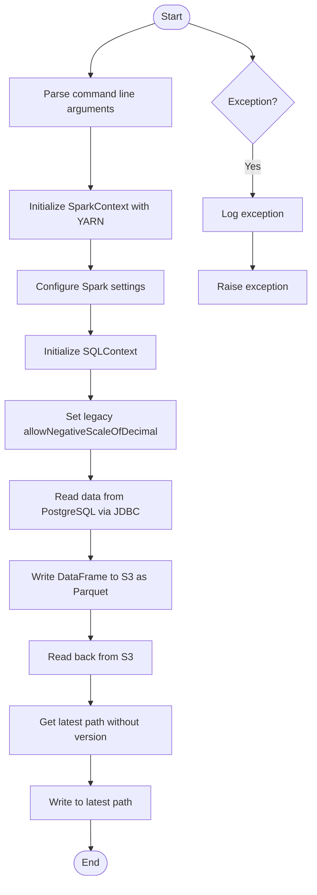
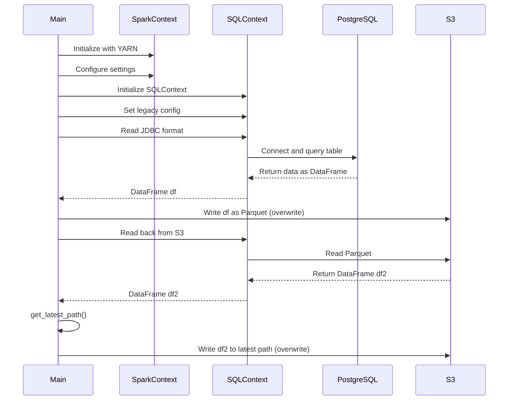
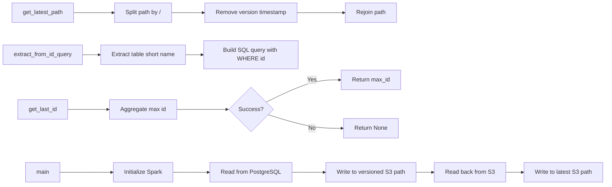

# Diagram: research/orchestrator/tasks/etl/extract_location_lob_spark.py

> Auto-generated by Obscura crawlers

## Diagram 1

### SVG

<svg id="container" width="500.3203125" xmlns="http://www.w3.org/2000/svg" class="flowchart" height="1405.609375" viewBox="0 0 500.3203125 1405.609375" role="graphics-document document" aria-roledescription="flowchart-v2"><g><marker id="container_flowchart-v2-pointEnd" class="marker flowchart-v2" viewBox="0 0 10 10" refX="5" refY="5" markerUnits="userSpaceOnUse" markerWidth="8" markerHeight="8" orient="auto"><path d="M 0 0 L 10 5 L 0 10 z" class="arrowMarkerPath" style="stroke-width: 1; stroke-dasharray: 1, 0;"></path></marker><marker id="container_flowchart-v2-pointStart" class="marker flowchart-v2" viewBox="0 0 10 10" refX="4.5" refY="5" markerUnits="userSpaceOnUse" markerWidth="8" markerHeight="8" orient="auto"><path d="M 0 5 L 10 10 L 10 0 z" class="arrowMarkerPath" style="stroke-width: 1; stroke-dasharray: 1, 0;"></path></marker><marker id="container_flowchart-v2-circleEnd" class="marker flowchart-v2" viewBox="0 0 10 10" refX="11" refY="5" markerUnits="userSpaceOnUse" markerWidth="11" markerHeight="11" orient="auto"><circle cx="5" cy="5" r="5" class="arrowMarkerPath" style="stroke-width: 1; stroke-dasharray: 1, 0;"></circle></marker><marker id="container_flowchart-v2-circleStart" class="marker flowchart-v2" viewBox="0 0 10 10" refX="-1" refY="5" markerUnits="userSpaceOnUse" markerWidth="11" markerHeight="11" orient="auto"><circle cx="5" cy="5" r="5" class="arrowMarkerPath" style="stroke-width: 1; stroke-dasharray: 1, 0;"></circle></marker><marker id="container_flowchart-v2-crossEnd" class="marker cross flowchart-v2" viewBox="0 0 11 11" refX="12" refY="5.2" markerUnits="userSpaceOnUse" markerWidth="11" markerHeight="11" orient="auto"><path d="M 1,1 l 9,9 M 10,1 l -9,9" class="arrowMarkerPath" style="stroke-width: 2; stroke-dasharray: 1, 0;"></path></marker><marker id="container_flowchart-v2-crossStart" class="marker cross flowchart-v2" viewBox="0 0 11 11" refX="-1" refY="5.2" markerUnits="userSpaceOnUse" markerWidth="11" markerHeight="11" orient="auto"><path d="M 1,1 l 9,9 M 10,1 l -9,9" class="arrowMarkerPath" style="stroke-width: 2; stroke-dasharray: 1, 0;"></path></marker><g class="root"><g class="clusters"></g><g class="edgePaths"><path d="M248.328,37.4L231.147,43.167C213.966,48.933,179.604,60.467,162.423,74.201C145.242,87.935,145.242,103.87,145.242,111.837L145.242,119.805" id="L_Start_ParseArgs_0" class="edge-thickness-normal edge-pattern-solid edge-thickness-normal edge-pattern-solid flowchart-link" style=";" data-edge="true" data-et="edge" data-id="L_Start_ParseArgs_0" data-points="W3sieCI6MjQ4LjMyNzkxNzIwNjA5NjQsInkiOjM3LjM5OTkzNTk0MTk3Nzc3fSx7IngiOjE0NS4yNDIxODc1LCJ5Ijo3Mn0seyJ4IjoxNDUuMjQyMTg3NSwieSI6MTIzLjgwNDY4NzV9XQ==" marker-end="url(#container_flowchart-v2-pointEnd)"></path><path d="M145.242,201.805L145.242,212.439C145.242,223.073,145.242,244.341,145.242,260.475C145.242,276.609,145.242,287.609,145.242,293.109L145.242,298.609" id="L_ParseArgs_InitSpark_0" class="edge-thickness-normal edge-pattern-solid edge-thickness-normal edge-pattern-solid flowchart-link" style=";" data-edge="true" data-et="edge" data-id="L_ParseArgs_InitSpark_0" data-points="W3sieCI6MTQ1LjI0MjE4NzUsInkiOjIwMS44MDQ2ODc1fSx7IngiOjE0NS4yNDIxODc1LCJ5IjoyNjUuNjA5Mzc1fSx7IngiOjE0NS4yNDIxODc1LCJ5IjozMDIuNjA5Mzc1fV0=" marker-end="url(#container_flowchart-v2-pointEnd)"></path><path d="M145.242,380.609L145.242,384.776C145.242,388.943,145.242,397.276,145.242,404.943C145.242,412.609,145.242,419.609,145.242,423.109L145.242,426.609" id="L_InitSpark_ConfigSpark_0" class="edge-thickness-normal edge-pattern-solid edge-thickness-normal edge-pattern-solid flowchart-link" style=";" data-edge="true" data-et="edge" data-id="L_InitSpark_ConfigSpark_0" data-points="W3sieCI6MTQ1LjI0MjE4NzUsInkiOjM4MC42MDkzNzV9LHsieCI6MTQ1LjI0MjE4NzUsInkiOjQwNS42MDkzNzV9LHsieCI6MTQ1LjI0MjE4NzUsInkiOjQzMC42MDkzNzV9XQ==" marker-end="url(#container_flowchart-v2-pointEnd)"></path><path d="M145.242,484.609L145.242,488.776C145.242,492.943,145.242,501.276,145.242,508.943C145.242,516.609,145.242,523.609,145.242,527.109L145.242,530.609" id="L_ConfigSpark_InitSQL_0" class="edge-thickness-normal edge-pattern-solid edge-thickness-normal edge-pattern-solid flowchart-link" style=";" data-edge="true" data-et="edge" data-id="L_ConfigSpark_InitSQL_0" data-points="W3sieCI6MTQ1LjI0MjE4NzUsInkiOjQ4NC42MDkzNzV9LHsieCI6MTQ1LjI0MjE4NzUsInkiOjUwOS42MDkzNzV9LHsieCI6MTQ1LjI0MjE4NzUsInkiOjUzNC42MDkzNzV9XQ==" marker-end="url(#container_flowchart-v2-pointEnd)"></path><path d="M145.242,588.609L145.242,592.776C145.242,596.943,145.242,605.276,145.242,612.943C145.242,620.609,145.242,627.609,145.242,631.109L145.242,634.609" id="L_InitSQL_SetLegacy_0" class="edge-thickness-normal edge-pattern-solid edge-thickness-normal edge-pattern-solid flowchart-link" style=";" data-edge="true" data-et="edge" data-id="L_InitSQL_SetLegacy_0" data-points="W3sieCI6MTQ1LjI0MjE4NzUsInkiOjU4OC42MDkzNzV9LHsieCI6MTQ1LjI0MjE4NzUsInkiOjYxMy42MDkzNzV9LHsieCI6MTQ1LjI0MjE4NzUsInkiOjYzOC42MDkzNzV9XQ==" marker-end="url(#container_flowchart-v2-pointEnd)"></path><path d="M145.242,716.609L145.242,720.776C145.242,724.943,145.242,733.276,145.242,740.943C145.242,748.609,145.242,755.609,145.242,759.109L145.242,762.609" id="L_SetLegacy_ReadJDBC_0" class="edge-thickness-normal edge-pattern-solid edge-thickness-normal edge-pattern-solid flowchart-link" style=";" data-edge="true" data-et="edge" data-id="L_SetLegacy_ReadJDBC_0" data-points="W3sieCI6MTQ1LjI0MjE4NzUsInkiOjcxNi42MDkzNzV9LHsieCI6MTQ1LjI0MjE4NzUsInkiOjc0MS42MDkzNzV9LHsieCI6MTQ1LjI0MjE4NzUsInkiOjc2Ni42MDkzNzV9XQ==" marker-end="url(#container_flowchart-v2-pointEnd)"></path><path d="M145.242,844.609L145.242,848.776C145.242,852.943,145.242,861.276,145.242,868.943C145.242,876.609,145.242,883.609,145.242,887.109L145.242,890.609" id="L_ReadJDBC_WriteParquet_0" class="edge-thickness-normal edge-pattern-solid edge-thickness-normal edge-pattern-solid flowchart-link" style=";" data-edge="true" data-et="edge" data-id="L_ReadJDBC_WriteParquet_0" data-points="W3sieCI6MTQ1LjI0MjE4NzUsInkiOjg0NC42MDkzNzV9LHsieCI6MTQ1LjI0MjE4NzUsInkiOjg2OS42MDkzNzV9LHsieCI6MTQ1LjI0MjE4NzUsInkiOjg5NC42MDkzNzV9XQ==" marker-end="url(#container_flowchart-v2-pointEnd)"></path><path d="M145.242,972.609L145.242,976.776C145.242,980.943,145.242,989.276,145.242,996.943C145.242,1004.609,145.242,1011.609,145.242,1015.109L145.242,1018.609" id="L_WriteParquet_ReadBack_0" class="edge-thickness-normal edge-pattern-solid edge-thickness-normal edge-pattern-solid flowchart-link" style=";" data-edge="true" data-et="edge" data-id="L_WriteParquet_ReadBack_0" data-points="W3sieCI6MTQ1LjI0MjE4NzUsInkiOjk3Mi42MDkzNzV9LHsieCI6MTQ1LjI0MjE4NzUsInkiOjk5Ny42MDkzNzV9LHsieCI6MTQ1LjI0MjE4NzUsInkiOjEwMjIuNjA5Mzc1fV0=" marker-end="url(#container_flowchart-v2-pointEnd)"></path><path d="M145.242,1076.609L145.242,1080.776C145.242,1084.943,145.242,1093.276,145.242,1100.943C145.242,1108.609,145.242,1115.609,145.242,1119.109L145.242,1122.609" id="L_ReadBack_GetLatest_0" class="edge-thickness-normal edge-pattern-solid edge-thickness-normal edge-pattern-solid flowchart-link" style=";" data-edge="true" data-et="edge" data-id="L_ReadBack_GetLatest_0" data-points="W3sieCI6MTQ1LjI0MjE4NzUsInkiOjEwNzYuNjA5Mzc1fSx7IngiOjE0NS4yNDIxODc1LCJ5IjoxMTAxLjYwOTM3NX0seyJ4IjoxNDUuMjQyMTg3NSwieSI6MTEyNi42MDkzNzV9XQ==" marker-end="url(#container_flowchart-v2-pointEnd)"></path><path d="M145.242,1204.609L145.242,1208.776C145.242,1212.943,145.242,1221.276,145.242,1228.943C145.242,1236.609,145.242,1243.609,145.242,1247.109L145.242,1250.609" id="L_GetLatest_WriteLatest_0" class="edge-thickness-normal edge-pattern-solid edge-thickness-normal edge-pattern-solid flowchart-link" style=";" data-edge="true" data-et="edge" data-id="L_GetLatest_WriteLatest_0" data-points="W3sieCI6MTQ1LjI0MjE4NzUsInkiOjEyMDQuNjA5Mzc1fSx7IngiOjE0NS4yNDIxODc1LCJ5IjoxMjI5LjYwOTM3NX0seyJ4IjoxNDUuMjQyMTg3NSwieSI6MTI1NC42MDkzNzV9XQ==" marker-end="url(#container_flowchart-v2-pointEnd)"></path><path d="M145.242,1308.609L145.242,1312.776C145.242,1316.943,145.242,1325.276,145.312,1333.026C145.383,1340.776,145.523,1347.943,145.594,1351.527L145.664,1355.11" id="L_WriteLatest_End_0" class="edge-thickness-normal edge-pattern-solid edge-thickness-normal edge-pattern-solid flowchart-link" style=";" data-edge="true" data-et="edge" data-id="L_WriteLatest_End_0" data-points="W3sieCI6MTQ1LjI0MjE4NzUsInkiOjEzMDguNjA5Mzc1fSx7IngiOjE0NS4yNDIxODc1LCJ5IjoxMzMzLjYwOTM3NX0seyJ4IjoxNDUuNzQyMTg3NSwieSI6MTM1OS4xMDkzNzV9XQ==" marker-end="url(#container_flowchart-v2-pointEnd)"></path><path d="M303.274,37.4L320.288,43.167C337.302,48.933,371.331,60.467,388.345,69.733C405.359,79,405.359,86,405.359,89.5L405.359,93" id="L_Start_Exception_0" class="edge-thickness-normal edge-pattern-solid edge-thickness-normal edge-pattern-solid flowchart-link" style=";" data-edge="true" data-et="edge" data-id="L_Start_Exception_0" data-points="W3sieCI6MzAzLjI3MzY0NjE2Mjk5NDk2LCJ5IjozNy4zOTk5MzYyMzkzNDAzOX0seyJ4Ijo0MDUuMzU5Mzc1LCJ5Ijo3Mn0seyJ4Ijo0MDUuMzU5Mzc1LCJ5Ijo5N31d" marker-end="url(#container_flowchart-v2-pointEnd)"></path><path d="M405.359,228.609L405.359,234.776C405.359,240.943,405.359,253.276,405.359,266.943C405.359,280.609,405.359,295.609,405.359,303.109L405.359,310.609" id="L_Exception_LogError_0" class="edge-thickness-normal edge-pattern-solid edge-thickness-normal edge-pattern-solid flowchart-link" style=";" data-edge="true" data-et="edge" data-id="L_Exception_LogError_0" data-points="W3sieCI6NDA1LjM1OTM3NSwieSI6MjI4LjYwOTM3NX0seyJ4Ijo0MDUuMzU5Mzc1LCJ5IjoyNjUuNjA5Mzc1fSx7IngiOjQwNS4zNTkzNzUsInkiOjMxNC42MDkzNzV9XQ==" marker-end="url(#container_flowchart-v2-pointEnd)"></path><path d="M405.359,368.609L405.359,374.776C405.359,380.943,405.359,393.276,405.359,402.943C405.359,412.609,405.359,419.609,405.359,423.109L405.359,426.609" id="L_LogError_Raise_0" class="edge-thickness-normal edge-pattern-solid edge-thickness-normal edge-pattern-solid flowchart-link" style=";" data-edge="true" data-et="edge" data-id="L_LogError_Raise_0" data-points="W3sieCI6NDA1LjM1OTM3NSwieSI6MzY4LjYwOTM3NX0seyJ4Ijo0MDUuMzU5Mzc1LCJ5Ijo0MDUuNjA5Mzc1fSx7IngiOjQwNS4zNTkzNzUsInkiOjQzMC42MDkzNzV9XQ==" marker-end="url(#container_flowchart-v2-pointEnd)"></path></g><g class="edgeLabels"><g class="edgeLabel"><g class="label" data-id="L_Start_ParseArgs_0" transform="translate(0, 0)"><foreignObject width="0" height="0">

</foreignObject></g></g><g class="edgeLabel"><g class="label" data-id="L_ParseArgs_InitSpark_0" transform="translate(0, 0)"><foreignObject width="0" height="0">

</foreignObject></g></g><g class="edgeLabel"><g class="label" data-id="L_InitSpark_ConfigSpark_0" transform="translate(0, 0)"><foreignObject width="0" height="0">

</foreignObject></g></g><g class="edgeLabel"><g class="label" data-id="L_ConfigSpark_InitSQL_0" transform="translate(0, 0)"><foreignObject width="0" height="0">

</foreignObject></g></g><g class="edgeLabel"><g class="label" data-id="L_InitSQL_SetLegacy_0" transform="translate(0, 0)"><foreignObject width="0" height="0">

</foreignObject></g></g><g class="edgeLabel"><g class="label" data-id="L_SetLegacy_ReadJDBC_0" transform="translate(0, 0)"><foreignObject width="0" height="0">

</foreignObject></g></g><g class="edgeLabel"><g class="label" data-id="L_ReadJDBC_WriteParquet_0" transform="translate(0, 0)"><foreignObject width="0" height="0">

</foreignObject></g></g><g class="edgeLabel"><g class="label" data-id="L_WriteParquet_ReadBack_0" transform="translate(0, 0)"><foreignObject width="0" height="0">

</foreignObject></g></g><g class="edgeLabel"><g class="label" data-id="L_ReadBack_GetLatest_0" transform="translate(0, 0)"><foreignObject width="0" height="0">

</foreignObject></g></g><g class="edgeLabel"><g class="label" data-id="L_GetLatest_WriteLatest_0" transform="translate(0, 0)"><foreignObject width="0" height="0">

</foreignObject></g></g><g class="edgeLabel"><g class="label" data-id="L_WriteLatest_End_0" transform="translate(0, 0)"><foreignObject width="0" height="0">

</foreignObject></g></g><g class="edgeLabel"><g class="label" data-id="L_Start_Exception_0" transform="translate(0, 0)"><foreignObject width="0" height="0">

</foreignObject></g></g><g class="edgeLabel" transform="translate(405.359375, 265.609375)"><g class="label" data-id="L_Exception_LogError_0" transform="translate(-12.03125, -12)"><foreignObject width="24.0625" height="24">

Yes

</foreignObject></g></g><g class="edgeLabel"><g class="label" data-id="L_LogError_Raise_0" transform="translate(0, 0)"><foreignObject width="0" height="0">

</foreignObject></g></g></g><g class="nodes"><g class="node default" id="flowchart-Start-0" transform="translate(275.30078125, 27.5)"><g class="basic label-container outer-path"><path d="M-10.3984375 -19.5 C-4.229106450237845 -19.5, 1.94022459952431 -19.5, 10.3984375 -19.5 C10.3984375 -19.5, 10.398437499999998 -19.5, 10.398437499999998 -19.5 C10.783708311088835 -19.487645114972523, 11.168979122177674 -19.475290229945045, 11.6478067896239 -19.45993515863156 C12.006545405501106 -19.42532807580419, 12.36528402137831 -19.390720992976828, 12.892042152847864 -19.3399052695533 C13.321440004443977 -19.270483554937314, 13.750837856040087 -19.20106184032133, 14.126030759676757 -19.140403561325776 C14.393055112698624 -19.079456995245284, 14.66007946572049 -19.01851042916479, 15.34470188623539 -18.862249829261074 C15.66729685738195 -18.766505335160332, 15.989891828528512 -18.670760841059593, 16.543047751460602 -18.50658706670804 C16.995995300697476 -18.33989818158762, 17.44894284993435 -18.173209296467206, 17.716144095147794 -18.074876768247425 C18.151122019264594 -17.882324944402587, 18.58609994338139 -17.68977312055775, 18.85917041279238 -17.568892924097174 C19.180684884910193 -17.40115902993316, 19.502199357028 -17.233425135769146, 19.967429764076783 -16.990714730406097 C20.37342179730519 -16.74459997398902, 20.7794138305336 -16.498485217571943, 21.036368073605697 -16.342718045390892 C21.390060171539115 -16.095997748956687, 21.743752269472537 -15.849277452522482, 22.061592844578712 -15.627565626425154 C22.32417387008542 -15.418164246158101, 22.586754895592133 -15.208762865891048, 23.03889120850187 -14.848196188198123 C23.24178154628988 -14.663936551603223, 23.44467188407789 -14.479676915008323, 23.964247236767985 -14.007812326905688 C24.22638778242313 -13.737130691377693, 24.488528328078274 -13.4664490558497, 24.833858442968648 -13.10986736009568 C25.131070653426615 -12.760744985837885, 25.428282863884586 -12.411622611580091, 25.644151408126582 -12.158051136245305 C25.83944302866384 -11.896378156158015, 26.034734649201095 -11.634705176070725, 26.391796464640635 -11.156274872382312 C26.618012132719063 -10.808746858801527, 26.84422780079749 -10.461218845220744, 27.073721378604247 -10.108655082055241 C27.316738993662288 -9.677152698317748, 27.559756608720324 -9.245650314580253, 27.6871239742735 -9.019496659696287 C27.850532183726163 -8.680176016392261, 28.013940393178824 -8.340855373088237, 28.22948364880834 -7.893275190886684 C28.387781338469573 -7.502276836945818, 28.5460790281308 -7.111278483004951, 28.698571729970325 -6.734618561215508 C28.81747584792443 -6.376498302736187, 28.936379965878533 -6.018378044256866, 29.09246063421488 -5.548287939305138 C29.180543733086303 -5.212388907851865, 29.26862683195773 -4.87648987639859, 29.40953178754556 -4.339158212148133 C29.502039138597844 -3.8641525159302197, 29.59454648965013 -3.3891468197123062, 29.648482276581777 -3.1121979531509023 C29.69202723781777 -2.774471832729748, 29.735572199053763 -2.436745712308593, 29.808330202509367 -1.872449005199798 C29.824716982705667 -1.61721167647151, 29.84110376290197 -1.3619743477432222, 29.888418715913414 -0.6250057626472757 C29.888418715913414 -0.15507188717787113, 29.888418715913414 0.31486198829153345, 29.888418715913414 0.625005762647271 C29.860977499626756 1.0524248564630885, 29.8335362833401 1.4798439502789058, 29.808330202509367 1.8724490051997846 C29.753411083223387 2.2983908493751017, 29.698491963937403 2.7243326935504184, 29.648482276581777 3.1121979531508885 C29.579758678959514 3.465079102203715, 29.51103508133725 3.817960251256541, 29.40953178754556 4.339158212148129 C29.312385584764677 4.709618786782257, 29.215239381983793 5.080079361416385, 29.092460634214884 5.548287939305125 C28.983610296821283 5.876127812588612, 28.874759959427678 6.203967685872099, 28.69857172997033 6.734618561215495 C28.523336424115 7.167453154622314, 28.348101118259674 7.600287748029134, 28.229483648808344 7.893275190886679 C28.044713085545776 8.276955218958122, 27.85994252228321 8.660635247029566, 27.687123974273504 9.019496659696284 C27.447458130482705 9.44504763414515, 27.207792286691905 9.870598608594015, 27.07372137860425 10.108655082055236 C26.819866827163477 10.498643842559954, 26.566012275722706 10.888632603064671, 26.39179646464064 11.156274872382301 C26.147692446977317 11.483352017717662, 25.90358842931399 11.810429163053023, 25.644151408126582 12.158051136245302 C25.43894915573595 12.399093378242274, 25.233746903345324 12.640135620239244, 24.83385844296866 13.10986736009567 C24.49239358823362 13.462457857395547, 24.15092873349858 13.815048354695424, 23.96424723676799 14.007812326905684 C23.706999423164298 14.241437984816388, 23.449751609560607 14.475063642727092, 23.038891208501887 14.848196188198111 C22.793467748543563 15.04391486652232, 22.548044288585242 15.239633544846528, 22.061592844578715 15.627565626425152 C21.772958367220554 15.828904543045063, 21.48432388986239 16.030243459664973, 21.036368073605708 16.34271804539089 C20.756899415162767 16.512133588479134, 20.477430756719826 16.68154913156738, 19.967429764076787 16.990714730406093 C19.56746651146048 17.19937530310733, 19.167503258844174 17.40803587580857, 18.859170412792388 17.56889292409717 C18.553691235327438 17.704119494243066, 18.24821205786249 17.839346064388963, 17.716144095147804 18.07487676824742 C17.4765451430884 18.163051397433716, 17.236946191029 18.251226026620007, 16.543047751460616 18.506587066708033 C16.253780532371728 18.592440058938998, 15.964513313282838 18.678293051169963, 15.344701886235413 18.86224982926107 C14.88660770440924 18.966806836918987, 14.428513522583065 19.071363844576908, 14.126030759676766 19.140403561325773 C13.768350627589127 19.19823051123085, 13.410670495501487 19.256057461135928, 12.892042152847878 19.3399052695533 C12.634618627799568 19.364738607417625, 12.377195102751257 19.38957194528195, 11.6478067896239 19.45993515863156 C11.166939282028235 19.475355643648328, 10.68607177443257 19.4907761286651, 10.398437500000004 19.5 C10.398437500000002 19.5, 10.398437500000002 19.5, 10.3984375 19.5 C3.698453544740718 19.5, -3.001530410518564 19.5, -10.398437499999996 19.5 C-10.844419968432572 19.48569821028958, -11.290402436865147 19.47139642057916, -11.647806789623893 19.45993515863156 C-11.9755332858571 19.42831977768872, -12.303259782090308 19.39670439674588, -12.892042152847871 19.3399052695533 C-13.177081048797543 19.293822391365808, -13.462119944747213 19.247739513178317, -14.126030759676759 19.140403561325773 C-14.437916661503374 19.06921763947956, -14.74980256332999 18.99803171763335, -15.344701886235388 18.862249829261074 C-15.750125399951584 18.741922258501557, -16.15554891366778 18.621594687742043, -16.54304775146059 18.506587066708043 C-16.793142896318066 18.414549741546317, -17.043238041175545 18.322512416384587, -17.716144095147797 18.074876768247425 C-18.165528615121538 17.8759475717732, -18.61491313509528 17.677018375298974, -18.85917041279238 17.568892924097174 C-19.17928934637561 17.401887081492767, -19.499408279958843 17.234881238888356, -19.96742976407678 16.990714730406097 C-20.283211075944863 16.79928624341469, -20.59899238781295 16.607857756423286, -21.036368073605686 16.3427180453909 C-21.40668916922333 16.08439808002989, -21.777010264840975 15.826078114668876, -22.061592844578712 15.627565626425156 C-22.426065613726543 15.336908292057482, -22.79053838287437 15.046250957689807, -23.03889120850187 14.848196188198125 C-23.244949793931266 14.661059232922558, -23.45100837936066 14.47392227764699, -23.964247236767974 14.007812326905697 C-24.148560582078805 13.81749366546519, -24.332873927389638 13.627175004024684, -24.833858442968655 13.109867360095677 C-25.084097421356102 12.815922417080538, -25.33433639974355 12.521977474065398, -25.64415140812658 12.158051136245307 C-25.878896759725492 11.843513750844242, -26.113642111324403 11.528976365443176, -26.391796464640635 11.156274872382316 C-26.56073232637967 10.896744023120489, -26.729668188118712 10.637213173858663, -27.073721378604244 10.108655082055249 C-27.20693381803255 9.872122906628078, -27.340146257460855 9.63559073120091, -27.6871239742735 9.019496659696289 C-27.88115500968242 8.61658706307058, -28.075186045091343 8.213677466444874, -28.22948364880834 7.893275190886686 C-28.369205848296886 7.548158656805022, -28.50892804778543 7.203042122723357, -28.698571729970325 6.73461856121551 C-28.83436428515123 6.325633020616114, -28.970156840332137 5.916647480016717, -29.09246063421488 5.5482879393051325 C-29.215145618260795 5.080436923129622, -29.33783060230671 4.612585906954111, -29.409531787545557 4.339158212148136 C-29.46865612861326 4.035567216699387, -29.527780469680966 3.731976221250637, -29.648482276581777 3.112197953150904 C-29.696397039114622 2.740580516786232, -29.744311801647466 2.3689630804215605, -29.808330202509364 1.872449005199809 C-29.837562106061622 1.41713851180553, -29.86679400961388 0.9618280184112509, -29.888418715913414 0.6250057626472781 C-29.888418715913414 0.27542275664388005, -29.888418715913414 -0.07416024935951804, -29.888418715913414 -0.6250057626472687 C-29.871551154876208 -0.8877316410519385, -29.854683593839006 -1.1504575194566082, -29.808330202509367 -1.8724490051997822 C-29.77464496153878 -2.133705082264452, -29.740959720568192 -2.394961159329122, -29.648482276581777 -3.112197953150895 C-29.56180472883499 -3.5572688415244453, -29.4751271810882 -4.0023397298979955, -29.40953178754556 -4.339158212148126 C-29.301672850415592 -4.750471085783757, -29.19381391328562 -5.161783959419387, -29.092460634214884 -5.548287939305123 C-28.94784255229077 -5.983854560298333, -28.803224470366658 -6.4194211812915425, -28.698571729970332 -6.734618561215485 C-28.583378529716903 -7.019147992950476, -28.468185329463473 -7.303677424685466, -28.229483648808344 -7.893275190886676 C-28.07645468158578 -8.211043115619695, -27.92342571436322 -8.528811040352716, -27.687123974273504 -9.019496659696282 C-27.48851949612484 -9.372139021533396, -27.289915017976178 -9.724781383370512, -27.073721378604247 -10.108655082055243 C-26.869611955989797 -10.422221966245282, -26.66550253337535 -10.735788850435322, -26.39179646464064 -11.156274872382308 C-26.2124292685695 -11.396610574429914, -26.03306207249836 -11.63694627647752, -25.644151408126586 -12.158051136245302 C-25.401862565090752 -12.442657397900918, -25.15957372205492 -12.727263659556536, -24.833858442968662 -13.10986736009567 C-24.61601053834096 -13.334813207269372, -24.398162633713255 -13.559759054443072, -23.964247236767996 -14.007812326905677 C-23.62014350499877 -14.320318231612656, -23.276039773229545 -14.632824136319634, -23.038891208501887 -14.848196188198107 C-22.663878624884482 -15.147258744129028, -22.288866041267077 -15.446321300059946, -22.06159284457872 -15.627565626425149 C-21.725879816591938 -15.861744501965973, -21.390166788605157 -16.095923377506796, -21.03636807360571 -16.342718045390885 C-20.76087483005682 -16.509723668608224, -20.48538158650793 -16.676729291825566, -19.96742976407679 -16.99071473040609 C-19.72849930558157 -17.115364597560784, -19.489568847086343 -17.240014464715482, -18.859170412792388 -17.56889292409717 C-18.49901924870073 -17.72832116093585, -18.138868084609076 -17.887749397774527, -17.716144095147804 -18.07487676824742 C-17.36600593959598 -18.20373084613212, -17.015867784044154 -18.332584924016825, -16.54304775146062 -18.506587066708033 C-16.210983917951857 -18.6051418694548, -15.878920084443095 -18.703696672201573, -15.344701886235413 -18.862249829261067 C-14.98590630741126 -18.944142578767718, -14.627110728587109 -19.026035328274368, -14.126030759676768 -19.140403561325773 C-13.773967990889021 -19.197322339495827, -13.421905222101277 -19.25424111766588, -12.89204215284788 -19.3399052695533 C-12.623832210362488 -19.365779160135215, -12.355622267877097 -19.39165305071713, -11.647806789623903 -19.45993515863156 C-11.208977617845324 -19.474007556041332, -10.770148446066745 -19.488079953451106, -10.398437500000005 -19.5 C-10.398437500000004 -19.5, -10.398437500000002 -19.5, -10.3984375 -19.5" stroke="none" stroke-width="0" fill="#ECECFF" style=""></path><path d="M-10.3984375 -19.5 C-2.78908505850974 -19.5, 4.82026738298052 -19.5, 10.3984375 -19.5 M-10.3984375 -19.5 C-3.790736523762728 -19.5, 2.8169644524745436 -19.5, 10.3984375 -19.5 M10.3984375 -19.5 C10.3984375 -19.5, 10.398437499999998 -19.5, 10.398437499999998 -19.5 M10.3984375 -19.5 C10.3984375 -19.5, 10.398437499999998 -19.5, 10.398437499999998 -19.5 M10.398437499999998 -19.5 C10.793374807823884 -19.487335129236925, 11.188312115647769 -19.474670258473846, 11.6478067896239 -19.45993515863156 M10.398437499999998 -19.5 C10.82090049021628 -19.48645243417809, 11.243363480432562 -19.47290486835618, 11.6478067896239 -19.45993515863156 M11.6478067896239 -19.45993515863156 C12.011045477692221 -19.424893959252046, 12.374284165760544 -19.38985275987253, 12.892042152847864 -19.3399052695533 M11.6478067896239 -19.45993515863156 C11.979420445299619 -19.427944788092294, 12.31103410097534 -19.39595441755303, 12.892042152847864 -19.3399052695533 M12.892042152847864 -19.3399052695533 C13.162264729416874 -19.296217778981003, 13.432487305985884 -19.252530288408703, 14.126030759676757 -19.140403561325776 M12.892042152847864 -19.3399052695533 C13.371067916858168 -19.262460098928397, 13.850093680868472 -19.18501492830349, 14.126030759676757 -19.140403561325776 M14.126030759676757 -19.140403561325776 C14.531301246838375 -19.04790321726822, 14.936571733999992 -18.955402873210662, 15.34470188623539 -18.862249829261074 M14.126030759676757 -19.140403561325776 C14.54251843521743 -19.045342967219696, 14.9590061107581 -18.950282373113616, 15.34470188623539 -18.862249829261074 M15.34470188623539 -18.862249829261074 C15.59834603003711 -18.786969578786003, 15.851990173838832 -18.711689328310932, 16.543047751460602 -18.50658706670804 M15.34470188623539 -18.862249829261074 C15.685045629041339 -18.761237592897032, 16.025389371847286 -18.660225356532987, 16.543047751460602 -18.50658706670804 M16.543047751460602 -18.50658706670804 C16.86439906148025 -18.388326814081864, 17.185750371499896 -18.270066561455685, 17.716144095147794 -18.074876768247425 M16.543047751460602 -18.50658706670804 C16.973832805028145 -18.3480541848618, 17.404617858595685 -18.189521303015564, 17.716144095147794 -18.074876768247425 M17.716144095147794 -18.074876768247425 C17.98431183112409 -17.95616686644397, 18.252479567100384 -17.837456964640513, 18.85917041279238 -17.568892924097174 M17.716144095147794 -18.074876768247425 C18.08345855610689 -17.91227755237718, 18.450773017065988 -17.74967833650694, 18.85917041279238 -17.568892924097174 M18.85917041279238 -17.568892924097174 C19.257660051537208 -17.36100113480879, 19.65614969028204 -17.153109345520413, 19.967429764076783 -16.990714730406097 M18.85917041279238 -17.568892924097174 C19.254794565660205 -17.362496056955393, 19.650418718528034 -17.156099189813613, 19.967429764076783 -16.990714730406097 M19.967429764076783 -16.990714730406097 C20.2640677927694 -16.81089101417408, 20.56070582146201 -16.631067297942064, 21.036368073605697 -16.342718045390892 M19.967429764076783 -16.990714730406097 C20.373481725749 -16.744563645014207, 20.77953368742121 -16.498412559622313, 21.036368073605697 -16.342718045390892 M21.036368073605697 -16.342718045390892 C21.42946366727378 -16.068511576082024, 21.822559260941862 -15.794305106773159, 22.061592844578712 -15.627565626425154 M21.036368073605697 -16.342718045390892 C21.257165009078424 -16.188699661350405, 21.477961944551154 -16.034681277309915, 22.061592844578712 -15.627565626425154 M22.061592844578712 -15.627565626425154 C22.331149867536727 -15.412601073829775, 22.60070689049474 -15.197636521234395, 23.03889120850187 -14.848196188198123 M22.061592844578712 -15.627565626425154 C22.30806535252715 -15.431010360245168, 22.554537860475588 -15.234455094065181, 23.03889120850187 -14.848196188198123 M23.03889120850187 -14.848196188198123 C23.275744400152988 -14.63309238633262, 23.512597591804106 -14.417988584467118, 23.964247236767985 -14.007812326905688 M23.03889120850187 -14.848196188198123 C23.38061087095684 -14.537855432163337, 23.722330533411807 -14.227514676128548, 23.964247236767985 -14.007812326905688 M23.964247236767985 -14.007812326905688 C24.249997613548235 -13.712751602337839, 24.535747990328485 -13.41769087776999, 24.833858442968648 -13.10986736009568 M23.964247236767985 -14.007812326905688 C24.188459980635376 -13.776294260653987, 24.41267272450277 -13.544776194402289, 24.833858442968648 -13.10986736009568 M24.833858442968648 -13.10986736009568 C25.1485226951588 -12.740244824569958, 25.46318694734895 -12.370622289044235, 25.644151408126582 -12.158051136245305 M24.833858442968648 -13.10986736009568 C25.07450089647326 -12.827195041265655, 25.315143349977873 -12.54452272243563, 25.644151408126582 -12.158051136245305 M25.644151408126582 -12.158051136245305 C25.82914218240849 -11.910180351713784, 26.014132956690396 -11.662309567182264, 26.391796464640635 -11.156274872382312 M25.644151408126582 -12.158051136245305 C25.910610647884443 -11.801020029905896, 26.1770698876423 -11.443988923566488, 26.391796464640635 -11.156274872382312 M26.391796464640635 -11.156274872382312 C26.639867598356915 -10.775170994567524, 26.887938732073195 -10.394067116752735, 27.073721378604247 -10.108655082055241 M26.391796464640635 -11.156274872382312 C26.571147788702874 -10.880743076048805, 26.750499112765112 -10.6052112797153, 27.073721378604247 -10.108655082055241 M27.073721378604247 -10.108655082055241 C27.22275742197151 -9.844026495520804, 27.371793465338772 -9.579397908986369, 27.6871239742735 -9.019496659696287 M27.073721378604247 -10.108655082055241 C27.271078480356085 -9.758227563321249, 27.468435582107922 -9.407800044587258, 27.6871239742735 -9.019496659696287 M27.6871239742735 -9.019496659696287 C27.844467358318287 -8.69276975611819, 28.001810742363073 -8.366042852540094, 28.22948364880834 -7.893275190886684 M27.6871239742735 -9.019496659696287 C27.83384794375914 -8.714821197669336, 27.980571913244773 -8.410145735642384, 28.22948364880834 -7.893275190886684 M28.22948364880834 -7.893275190886684 C28.393547059302286 -7.488035395016384, 28.55761046979623 -7.082795599146085, 28.698571729970325 -6.734618561215508 M28.22948364880834 -7.893275190886684 C28.324025845759852 -7.659754136567418, 28.418568042711367 -7.426233082248151, 28.698571729970325 -6.734618561215508 M28.698571729970325 -6.734618561215508 C28.819767266307416 -6.369596915654568, 28.94096280264451 -6.0045752700936275, 29.09246063421488 -5.548287939305138 M28.698571729970325 -6.734618561215508 C28.83048290596833 -6.337323116301213, 28.96239408196634 -5.940027671386917, 29.09246063421488 -5.548287939305138 M29.09246063421488 -5.548287939305138 C29.177801124839718 -5.22284766175003, 29.263141615464555 -4.8974073841949215, 29.40953178754556 -4.339158212148133 M29.09246063421488 -5.548287939305138 C29.156842023332302 -5.302773799529866, 29.22122341244972 -5.057259659754593, 29.40953178754556 -4.339158212148133 M29.40953178754556 -4.339158212148133 C29.49712748115065 -3.889372838842408, 29.584723174755737 -3.439587465536682, 29.648482276581777 -3.1121979531509023 M29.40953178754556 -4.339158212148133 C29.497818728963228 -3.88582342742009, 29.586105670380896 -3.4324886426920465, 29.648482276581777 -3.1121979531509023 M29.648482276581777 -3.1121979531509023 C29.70943306825167 -2.639475649054395, 29.770383859921566 -2.1667533449578884, 29.808330202509367 -1.872449005199798 M29.648482276581777 -3.1121979531509023 C29.71007908981533 -2.6344652333780427, 29.771675903048884 -2.156732513605183, 29.808330202509367 -1.872449005199798 M29.808330202509367 -1.872449005199798 C29.827085224590892 -1.5803243974987076, 29.845840246672417 -1.2881997897976172, 29.888418715913414 -0.6250057626472757 M29.808330202509367 -1.872449005199798 C29.82720868919335 -1.5784013366566187, 29.84608717587733 -1.2843536681134395, 29.888418715913414 -0.6250057626472757 M29.888418715913414 -0.6250057626472757 C29.888418715913414 -0.18425615576991067, 29.888418715913414 0.25649345110745436, 29.888418715913414 0.625005762647271 M29.888418715913414 -0.6250057626472757 C29.888418715913414 -0.19835681524254328, 29.888418715913414 0.22829213216218913, 29.888418715913414 0.625005762647271 M29.888418715913414 0.625005762647271 C29.85713606391319 1.1122583184529582, 29.82585341191297 1.5995108742586455, 29.808330202509367 1.8724490051997846 M29.888418715913414 0.625005762647271 C29.86330076770624 1.0162380808168734, 29.838182819499067 1.4074703989864759, 29.808330202509367 1.8724490051997846 M29.808330202509367 1.8724490051997846 C29.75112119458574 2.3161507734590283, 29.69391218666211 2.759852541718272, 29.648482276581777 3.1121979531508885 M29.808330202509367 1.8724490051997846 C29.76965815508548 2.17238176835992, 29.730986107661593 2.4723145315200554, 29.648482276581777 3.1121979531508885 M29.648482276581777 3.1121979531508885 C29.59907541501195 3.3658917451680757, 29.549668553442118 3.6195855371852623, 29.40953178754556 4.339158212148129 M29.648482276581777 3.1121979531508885 C29.56231834329507 3.554631539824394, 29.47615441000836 3.9970651264979002, 29.40953178754556 4.339158212148129 M29.40953178754556 4.339158212148129 C29.34175203320183 4.597631791392131, 29.2739722788581 4.856105370636134, 29.092460634214884 5.548287939305125 M29.40953178754556 4.339158212148129 C29.302262039279885 4.748224253288135, 29.19499229101421 5.157290294428142, 29.092460634214884 5.548287939305125 M29.092460634214884 5.548287939305125 C29.010170589196147 5.796132443763422, 28.927880544177405 6.043976948221718, 28.69857172997033 6.734618561215495 M29.092460634214884 5.548287939305125 C29.003572417379374 5.816005085999624, 28.914684200543864 6.083722232694123, 28.69857172997033 6.734618561215495 M28.69857172997033 6.734618561215495 C28.570513484295674 7.050924903869643, 28.44245523862102 7.367231246523792, 28.229483648808344 7.893275190886679 M28.69857172997033 6.734618561215495 C28.53833788103992 7.130399265984333, 28.378104032109505 7.526179970753171, 28.229483648808344 7.893275190886679 M28.229483648808344 7.893275190886679 C28.0223871521485 8.323315497356019, 27.815290655488653 8.75335580382536, 27.687123974273504 9.019496659696284 M28.229483648808344 7.893275190886679 C28.02816165713771 8.311324614191314, 27.82683966546707 8.729374037495948, 27.687123974273504 9.019496659696284 M27.687123974273504 9.019496659696284 C27.557897583006024 9.248951202982763, 27.428671191738545 9.478405746269242, 27.07372137860425 10.108655082055236 M27.687123974273504 9.019496659696284 C27.516611503969276 9.322258816981346, 27.34609903366505 9.625020974266409, 27.07372137860425 10.108655082055236 M27.07372137860425 10.108655082055236 C26.930349760461578 10.328912388192457, 26.7869781423189 10.549169694329677, 26.39179646464064 11.156274872382301 M27.07372137860425 10.108655082055236 C26.92823541118276 10.332160596466997, 26.782749443761272 10.555666110878756, 26.39179646464064 11.156274872382301 M26.39179646464064 11.156274872382301 C26.127892518861902 11.509882117581759, 25.863988573083162 11.863489362781218, 25.644151408126582 12.158051136245302 M26.39179646464064 11.156274872382301 C26.196059901157376 11.418544035482105, 26.000323337674114 11.680813198581907, 25.644151408126582 12.158051136245302 M25.644151408126582 12.158051136245302 C25.35349597231205 12.49947154991587, 25.06284053649752 12.840891963586438, 24.83385844296866 13.10986736009567 M25.644151408126582 12.158051136245302 C25.431638006121975 12.40768147059505, 25.219124604117365 12.657311804944799, 24.83385844296866 13.10986736009567 M24.83385844296866 13.10986736009567 C24.62807159206995 13.322359179063259, 24.42228474117124 13.534850998030848, 23.96424723676799 14.007812326905684 M24.83385844296866 13.10986736009567 C24.557674134914393 13.39505033331509, 24.281489826860128 13.680233306534511, 23.96424723676799 14.007812326905684 M23.96424723676799 14.007812326905684 C23.607098542151522 14.332165321719723, 23.24994984753506 14.656518316533761, 23.038891208501887 14.848196188198111 M23.96424723676799 14.007812326905684 C23.641211504615566 14.301184831789406, 23.318175772463142 14.59455733667313, 23.038891208501887 14.848196188198111 M23.038891208501887 14.848196188198111 C22.7093024959558 15.111034415729629, 22.379713783409713 15.373872643261144, 22.061592844578715 15.627565626425152 M23.038891208501887 14.848196188198111 C22.779426813542347 15.055112138540819, 22.519962418582807 15.262028088883525, 22.061592844578715 15.627565626425152 M22.061592844578715 15.627565626425152 C21.66891392493658 15.901481441971049, 21.276235005294442 16.175397257516945, 21.036368073605708 16.34271804539089 M22.061592844578715 15.627565626425152 C21.69267118735053 15.88490940414639, 21.323749530122345 16.142253181867627, 21.036368073605708 16.34271804539089 M21.036368073605708 16.34271804539089 C20.73915925481095 16.52288777793716, 20.44195043601619 16.70305751048343, 19.967429764076787 16.990714730406093 M21.036368073605708 16.34271804539089 C20.720419833175043 16.534247725457913, 20.404471592744375 16.725777405524934, 19.967429764076787 16.990714730406093 M19.967429764076787 16.990714730406093 C19.72830606296077 17.11546541211228, 19.489182361844755 17.240216093818464, 18.859170412792388 17.56889292409717 M19.967429764076787 16.990714730406093 C19.670457117693555 17.14564516980417, 19.373484471310324 17.30057560920224, 18.859170412792388 17.56889292409717 M18.859170412792388 17.56889292409717 C18.467552043457165 17.7422507592557, 18.075933674121938 17.915608594414227, 17.716144095147804 18.07487676824742 M18.859170412792388 17.56889292409717 C18.561348033471738 17.700730056835432, 18.26352565415109 17.832567189573695, 17.716144095147804 18.07487676824742 M17.716144095147804 18.07487676824742 C17.389872443133545 18.19494775221076, 17.063600791119285 18.315018736174093, 16.543047751460616 18.506587066708033 M17.716144095147804 18.07487676824742 C17.350236990429888 18.20953396519181, 16.984329885711976 18.3441911621362, 16.543047751460616 18.506587066708033 M16.543047751460616 18.506587066708033 C16.210648459407025 18.60524143179005, 15.878249167353438 18.703895796872068, 15.344701886235413 18.86224982926107 M16.543047751460616 18.506587066708033 C16.29228390380913 18.581012460404697, 16.041520056157637 18.655437854101365, 15.344701886235413 18.86224982926107 M15.344701886235413 18.86224982926107 C15.027767675061636 18.934587994772475, 14.710833463887859 19.00692616028388, 14.126030759676766 19.140403561325773 M15.344701886235413 18.86224982926107 C14.95940448911102 18.950191445854223, 14.574107091986626 19.038133062447375, 14.126030759676766 19.140403561325773 M14.126030759676766 19.140403561325773 C13.739545815659692 19.20288744983895, 13.353060871642619 19.265371338352125, 12.892042152847878 19.3399052695533 M14.126030759676766 19.140403561325773 C13.763459817875185 19.199021219416604, 13.400888876073605 19.257638877507436, 12.892042152847878 19.3399052695533 M12.892042152847878 19.3399052695533 C12.482179403188743 19.37944423608084, 12.07231665352961 19.41898320260838, 11.6478067896239 19.45993515863156 M12.892042152847878 19.3399052695533 C12.485401701908076 19.379133384798767, 12.078761250968276 19.418361500044238, 11.6478067896239 19.45993515863156 M11.6478067896239 19.45993515863156 C11.298577524654785 19.47113426142559, 10.94934825968567 19.482333364219624, 10.398437500000004 19.5 M11.6478067896239 19.45993515863156 C11.262254154828245 19.472299081196777, 10.87670152003259 19.484663003761998, 10.398437500000004 19.5 M10.398437500000004 19.5 C10.398437500000002 19.5, 10.398437500000002 19.5, 10.3984375 19.5 M10.398437500000004 19.5 C10.398437500000004 19.5, 10.398437500000002 19.5, 10.3984375 19.5 M10.3984375 19.5 C2.7982959811004893 19.5, -4.8018455377990215 19.5, -10.398437499999996 19.5 M10.3984375 19.5 C3.474732772479661 19.5, -3.448971955040678 19.5, -10.398437499999996 19.5 M-10.398437499999996 19.5 C-10.724498217350648 19.489543867433248, -11.0505589347013 19.4790877348665, -11.647806789623893 19.45993515863156 M-10.398437499999996 19.5 C-10.852537868104223 19.485437885047645, -11.30663823620845 19.470875770095287, -11.647806789623893 19.45993515863156 M-11.647806789623893 19.45993515863156 C-11.925213232525984 19.433174092714854, -12.202619675428075 19.40641302679815, -12.892042152847871 19.3399052695533 M-11.647806789623893 19.45993515863156 C-12.137114364701866 19.412732245342244, -12.626421939779839 19.36552933205293, -12.892042152847871 19.3399052695533 M-12.892042152847871 19.3399052695533 C-13.366776441461058 19.26315391138971, -13.841510730074246 19.186402553226124, -14.126030759676759 19.140403561325773 M-12.892042152847871 19.3399052695533 C-13.273274574883347 19.27827056806019, -13.654506996918823 19.21663586656708, -14.126030759676759 19.140403561325773 M-14.126030759676759 19.140403561325773 C-14.591831757520975 19.03408752320341, -15.05763275536519 18.92777148508105, -15.344701886235388 18.862249829261074 M-14.126030759676759 19.140403561325773 C-14.600728843138706 19.03205682147007, -15.07542692660065 18.923710081614374, -15.344701886235388 18.862249829261074 M-15.344701886235388 18.862249829261074 C-15.74766445378894 18.74265265440486, -16.15062702134249 18.623055479548647, -16.54304775146059 18.506587066708043 M-15.344701886235388 18.862249829261074 C-15.812777636706302 18.72332740350106, -16.280853387177217 18.584404977741045, -16.54304775146059 18.506587066708043 M-16.54304775146059 18.506587066708043 C-16.960974856272983 18.352786028861278, -17.378901961085376 18.19898499101451, -17.716144095147797 18.074876768247425 M-16.54304775146059 18.506587066708043 C-17.005649267366294 18.33634543261321, -17.468250783271994 18.166103798518375, -17.716144095147797 18.074876768247425 M-17.716144095147797 18.074876768247425 C-18.079031043791012 17.914237480741935, -18.441917992434227 17.753598193236446, -18.85917041279238 17.568892924097174 M-17.716144095147797 18.074876768247425 C-18.00389754469098 17.947496852037457, -18.29165099423416 17.82011693582749, -18.85917041279238 17.568892924097174 M-18.85917041279238 17.568892924097174 C-19.106473724535416 17.439874944766164, -19.35377703627845 17.310856965435153, -19.96742976407678 16.990714730406097 M-18.85917041279238 17.568892924097174 C-19.245344435359094 17.367426183880387, -19.631518457925807 17.1659594436636, -19.96742976407678 16.990714730406097 M-19.96742976407678 16.990714730406097 C-20.310614200077996 16.782674308526556, -20.653798636079213 16.574633886647014, -21.036368073605686 16.3427180453909 M-19.96742976407678 16.990714730406097 C-20.373458779903704 16.744577554920465, -20.77948779573063 16.498440379434836, -21.036368073605686 16.3427180453909 M-21.036368073605686 16.3427180453909 C-21.345950503830693 16.126766743673347, -21.6555329340557 15.91081544195579, -22.061592844578712 15.627565626425156 M-21.036368073605686 16.3427180453909 C-21.250615806285854 16.19326810170808, -21.464863538966018 16.043818158025267, -22.061592844578712 15.627565626425156 M-22.061592844578712 15.627565626425156 C-22.368363034101606 15.382924563778237, -22.6751332236245 15.138283501131317, -23.03889120850187 14.848196188198125 M-22.061592844578712 15.627565626425156 C-22.264155540226508 15.466027267065751, -22.466718235874307 15.304488907706348, -23.03889120850187 14.848196188198125 M-23.03889120850187 14.848196188198125 C-23.396389850574142 14.523525380363825, -23.75388849264641 14.198854572529527, -23.964247236767974 14.007812326905697 M-23.03889120850187 14.848196188198125 C-23.23537173555469 14.669757772118624, -23.431852262607514 14.491319356039122, -23.964247236767974 14.007812326905697 M-23.964247236767974 14.007812326905697 C-24.173365666421656 13.791880379345898, -24.382484096075338 13.575948431786099, -24.833858442968655 13.109867360095677 M-23.964247236767974 14.007812326905697 C-24.273311005501814 13.688678611080693, -24.58237477423565 13.369544895255691, -24.833858442968655 13.109867360095677 M-24.833858442968655 13.109867360095677 C-25.07411538553406 12.827647884351036, -25.314372328099466 12.545428408606396, -25.64415140812658 12.158051136245307 M-24.833858442968655 13.109867360095677 C-25.02411242780879 12.886384203744036, -25.214366412648925 12.662901047392396, -25.64415140812658 12.158051136245307 M-25.64415140812658 12.158051136245307 C-25.867247027721216 11.85912333041755, -26.090342647315858 11.560195524589792, -26.391796464640635 11.156274872382316 M-25.64415140812658 12.158051136245307 C-25.8192092704851 11.92348954878423, -25.994267132843625 11.688927961323156, -26.391796464640635 11.156274872382316 M-26.391796464640635 11.156274872382316 C-26.58874791267816 10.85370455932774, -26.785699360715686 10.551134246273163, -27.073721378604244 10.108655082055249 M-26.391796464640635 11.156274872382316 C-26.531617353851413 10.941472439388708, -26.67143824306219 10.726670006395102, -27.073721378604244 10.108655082055249 M-27.073721378604244 10.108655082055249 C-27.26127160893548 9.775640656581949, -27.448821839266714 9.44262623110865, -27.6871239742735 9.019496659696289 M-27.073721378604244 10.108655082055249 C-27.226354435512885 9.837639633740975, -27.37898749242153 9.566624185426702, -27.6871239742735 9.019496659696289 M-27.6871239742735 9.019496659696289 C-27.868324043993834 8.64323083786162, -28.049524113714167 8.26696501602695, -28.22948364880834 7.893275190886686 M-27.6871239742735 9.019496659696289 C-27.89769648246526 8.5822383409062, -28.108268990657017 8.14498002211611, -28.22948364880834 7.893275190886686 M-28.22948364880834 7.893275190886686 C-28.379300721480142 7.523224124871286, -28.529117794151944 7.153173058855885, -28.698571729970325 6.73461856121551 M-28.22948364880834 7.893275190886686 C-28.332985903357457 7.637622621070413, -28.43648815790657 7.38197005125414, -28.698571729970325 6.73461856121551 M-28.698571729970325 6.73461856121551 C-28.795945972803395 6.441342856280991, -28.893320215636464 6.1480671513464715, -29.09246063421488 5.5482879393051325 M-28.698571729970325 6.73461856121551 C-28.850287715509175 6.277674185432079, -29.00200370104802 5.820729809648648, -29.09246063421488 5.5482879393051325 M-29.09246063421488 5.5482879393051325 C-29.193578274365247 5.162682552749317, -29.294695914515618 4.7770771661935, -29.409531787545557 4.339158212148136 M-29.09246063421488 5.5482879393051325 C-29.212817116831907 5.089316508256883, -29.33317359944893 4.6303450772086325, -29.409531787545557 4.339158212148136 M-29.409531787545557 4.339158212148136 C-29.46503200844346 4.054176307813256, -29.52053222934136 3.7691944034783753, -29.648482276581777 3.112197953150904 M-29.409531787545557 4.339158212148136 C-29.495567282430983 3.8973841295197724, -29.581602777316405 3.455610046891409, -29.648482276581777 3.112197953150904 M-29.648482276581777 3.112197953150904 C-29.68701379485022 2.8133551063697597, -29.725545313118666 2.5145122595886154, -29.808330202509364 1.872449005199809 M-29.648482276581777 3.112197953150904 C-29.70887129273333 2.643832669039501, -29.76926030888489 2.175467384928097, -29.808330202509364 1.872449005199809 M-29.808330202509364 1.872449005199809 C-29.836379566397618 1.435557521601248, -29.86442893028587 0.9986660380026868, -29.888418715913414 0.6250057626472781 M-29.808330202509364 1.872449005199809 C-29.826806709347693 1.5846624972249657, -29.84528321618602 1.2968759892501223, -29.888418715913414 0.6250057626472781 M-29.888418715913414 0.6250057626472781 C-29.888418715913414 0.12947880836973535, -29.888418715913414 -0.36604814590780743, -29.888418715913414 -0.6250057626472687 M-29.888418715913414 0.6250057626472781 C-29.888418715913414 0.29480057275068056, -29.888418715913414 -0.03540461714591703, -29.888418715913414 -0.6250057626472687 M-29.888418715913414 -0.6250057626472687 C-29.857813486303975 -1.1017069179109575, -29.82720825669454 -1.5784080731746466, -29.808330202509367 -1.8724490051997822 M-29.888418715913414 -0.6250057626472687 C-29.865717436320494 -0.9785965164500676, -29.843016156727575 -1.3321872702528665, -29.808330202509367 -1.8724490051997822 M-29.808330202509367 -1.8724490051997822 C-29.745233962701093 -2.361810981390904, -29.682137722892822 -2.8511729575820257, -29.648482276581777 -3.112197953150895 M-29.808330202509367 -1.8724490051997822 C-29.766305380548737 -2.1983852255866854, -29.724280558588106 -2.5243214459735888, -29.648482276581777 -3.112197953150895 M-29.648482276581777 -3.112197953150895 C-29.556407096010556 -3.5849845452878135, -29.464331915439335 -4.057771137424732, -29.40953178754556 -4.339158212148126 M-29.648482276581777 -3.112197953150895 C-29.568838714727324 -3.5211508106007625, -29.489195152872867 -3.93010366805063, -29.40953178754556 -4.339158212148126 M-29.40953178754556 -4.339158212148126 C-29.313946675852275 -4.703665669884083, -29.21836156415899 -5.0681731276200415, -29.092460634214884 -5.548287939305123 M-29.40953178754556 -4.339158212148126 C-29.301150704598985 -4.752462254081906, -29.192769621652406 -5.165766296015686, -29.092460634214884 -5.548287939305123 M-29.092460634214884 -5.548287939305123 C-28.955897534030047 -5.959594238686688, -28.819334433845206 -6.370900538068254, -28.698571729970332 -6.734618561215485 M-29.092460634214884 -5.548287939305123 C-28.951064421047086 -5.974150804939384, -28.809668207879287 -6.400013670573645, -28.698571729970332 -6.734618561215485 M-28.698571729970332 -6.734618561215485 C-28.591034605707506 -7.000237337233527, -28.48349748144468 -7.265856113251568, -28.229483648808344 -7.893275190886676 M-28.698571729970332 -6.734618561215485 C-28.52879490997462 -7.153970589016406, -28.35901808997891 -7.573322616817326, -28.229483648808344 -7.893275190886676 M-28.229483648808344 -7.893275190886676 C-28.092493077120157 -8.177739044125872, -27.955502505431973 -8.462202897365067, -27.687123974273504 -9.019496659696282 M-28.229483648808344 -7.893275190886676 C-28.07236662414179 -8.219532054372559, -27.91524959947524 -8.545788917858442, -27.687123974273504 -9.019496659696282 M-27.687123974273504 -9.019496659696282 C-27.54348453172199 -9.274543035017263, -27.39984508917048 -9.529589410338247, -27.073721378604247 -10.108655082055243 M-27.687123974273504 -9.019496659696282 C-27.500612056169363 -9.350667456669864, -27.314100138065218 -9.681838253643447, -27.073721378604247 -10.108655082055243 M-27.073721378604247 -10.108655082055243 C-26.80806041371638 -10.51678166408062, -26.54239944882851 -10.924908246105995, -26.39179646464064 -11.156274872382308 M-27.073721378604247 -10.108655082055243 C-26.906000027235436 -10.366320117246705, -26.738278675866624 -10.623985152438165, -26.39179646464064 -11.156274872382308 M-26.39179646464064 -11.156274872382308 C-26.206393321716696 -11.404698193326603, -26.02099017879275 -11.653121514270897, -25.644151408126586 -12.158051136245302 M-26.39179646464064 -11.156274872382308 C-26.21346431401945 -11.395223707821565, -26.035132163398256 -11.634172543260823, -25.644151408126586 -12.158051136245302 M-25.644151408126586 -12.158051136245302 C-25.44783619230408 -12.388654159402648, -25.251520976481576 -12.619257182559993, -24.833858442968662 -13.10986736009567 M-25.644151408126586 -12.158051136245302 C-25.398281910659634 -12.446863438340717, -25.152412413192685 -12.735675740436134, -24.833858442968662 -13.10986736009567 M-24.833858442968662 -13.10986736009567 C-24.491544811056205 -13.463334289517132, -24.149231179143747 -13.816801218938595, -23.964247236767996 -14.007812326905677 M-24.833858442968662 -13.10986736009567 C-24.641702820056782 -13.308283817022227, -24.4495471971449 -13.506700273948784, -23.964247236767996 -14.007812326905677 M-23.964247236767996 -14.007812326905677 C-23.67820732060062 -14.267586210567428, -23.39216740443325 -14.52736009422918, -23.038891208501887 -14.848196188198107 M-23.964247236767996 -14.007812326905677 C-23.77605968816165 -14.178719279380275, -23.587872139555305 -14.349626231854872, -23.038891208501887 -14.848196188198107 M-23.038891208501887 -14.848196188198107 C-22.73700340204277 -15.088943680277337, -22.435115595583653 -15.329691172356565, -22.06159284457872 -15.627565626425149 M-23.038891208501887 -14.848196188198107 C-22.664918283095385 -15.146429644372299, -22.290945357688884 -15.444663100546489, -22.06159284457872 -15.627565626425149 M-22.06159284457872 -15.627565626425149 C-21.817902119591647 -15.79755372697467, -21.574211394604575 -15.96754182752419, -21.03636807360571 -16.342718045390885 M-22.06159284457872 -15.627565626425149 C-21.65373453351999 -15.912069928317994, -21.245876222461266 -16.196574230210842, -21.03636807360571 -16.342718045390885 M-21.03636807360571 -16.342718045390885 C-20.688624338905434 -16.55352234093521, -20.340880604205154 -16.764326636479538, -19.96742976407679 -16.99071473040609 M-21.03636807360571 -16.342718045390885 C-20.77120173503709 -16.503463438121557, -20.506035396468462 -16.664208830852232, -19.96742976407679 -16.99071473040609 M-19.96742976407679 -16.99071473040609 C-19.576901358382525 -17.194453149511407, -19.18637295268826 -17.398191568616724, -18.859170412792388 -17.56889292409717 M-19.96742976407679 -16.99071473040609 C-19.728909134696636 -17.115150789973963, -19.49038850531648 -17.239586849541833, -18.859170412792388 -17.56889292409717 M-18.859170412792388 -17.56889292409717 C-18.58669317178293 -17.689510515941883, -18.31421593077347 -17.810128107786596, -17.716144095147804 -18.07487676824742 M-18.859170412792388 -17.56889292409717 C-18.534097471727456 -17.712793072160434, -18.20902453066252 -17.856693220223697, -17.716144095147804 -18.07487676824742 M-17.716144095147804 -18.07487676824742 C-17.33122863738053 -18.216529214825265, -16.94631317961326 -18.35818166140311, -16.54304775146062 -18.506587066708033 M-17.716144095147804 -18.07487676824742 C-17.386483786833473 -18.19619480905358, -17.05682347851914 -18.31751284985974, -16.54304775146062 -18.506587066708033 M-16.54304775146062 -18.506587066708033 C-16.245459617610187 -18.594909662762852, -15.947871483759751 -18.683232258817668, -15.344701886235413 -18.862249829261067 M-16.54304775146062 -18.506587066708033 C-16.176154007326822 -18.61547920410238, -15.809260263193027 -18.724371341496727, -15.344701886235413 -18.862249829261067 M-15.344701886235413 -18.862249829261067 C-14.998558603839072 -18.941254774672018, -14.652415321442732 -19.020259720082972, -14.126030759676768 -19.140403561325773 M-15.344701886235413 -18.862249829261067 C-15.069747722454977 -18.92500632290035, -14.794793558674542 -18.98776281653964, -14.126030759676768 -19.140403561325773 M-14.126030759676768 -19.140403561325773 C-13.671477561491754 -19.21389219729563, -13.21692436330674 -19.28738083326548, -12.89204215284788 -19.3399052695533 M-14.126030759676768 -19.140403561325773 C-13.713867942645177 -19.207038849213056, -13.301705125613584 -19.27367413710034, -12.89204215284788 -19.3399052695533 M-12.89204215284788 -19.3399052695533 C-12.563494198737411 -19.37159989554961, -12.23494624462694 -19.403294521545924, -11.647806789623903 -19.45993515863156 M-12.89204215284788 -19.3399052695533 C-12.618515648111277 -19.366292042501488, -12.344989143374676 -19.392678815449678, -11.647806789623903 -19.45993515863156 M-11.647806789623903 -19.45993515863156 C-11.295070532019235 -19.471246723853465, -10.942334274414566 -19.482558289075374, -10.398437500000005 -19.5 M-11.647806789623903 -19.45993515863156 C-11.237393249918439 -19.473096322028418, -10.826979710212976 -19.48625748542528, -10.398437500000005 -19.5 M-10.398437500000005 -19.5 C-10.398437500000004 -19.5, -10.398437500000002 -19.5, -10.3984375 -19.5 M-10.398437500000005 -19.5 C-10.398437500000004 -19.5, -10.398437500000002 -19.5, -10.3984375 -19.5" stroke="#9370DB" stroke-width="1.3" fill="none" stroke-dasharray="0 0" style=""></path></g><g class="label" style="" transform="translate(-17.5234375, -12)"><rect></rect><foreignObject width="35.046875" height="24">

Start

</foreignObject></g></g><g class="node default" id="flowchart-ParseArgs-1" transform="translate(145.2421875, 162.8046875)"><rect class="basic label-container" style="" x="-130" y="-39" width="260" height="78"></rect><g class="label" style="" transform="translate(-100, -24)"><rect></rect><foreignObject width="200" height="48">

Parse command line arguments

</foreignObject></g></g><g class="node default" id="flowchart-InitSpark-3" transform="translate(145.2421875, 341.609375)"><rect class="basic label-container" style="" x="-130" y="-39" width="260" height="78"></rect><g class="label" style="" transform="translate(-100, -24)"><rect></rect><foreignObject width="200" height="48">

Initialize SparkContext with YARN

</foreignObject></g></g><g class="node default" id="flowchart-ConfigSpark-5" transform="translate(145.2421875, 457.609375)"><rect class="basic label-container" style="" x="-117.6953125" y="-27" width="235.390625" height="54"></rect><g class="label" style="" transform="translate(-87.6953125, -12)"><rect></rect><foreignObject width="175.390625" height="24">

Configure Spark settings

</foreignObject></g></g><g class="node default" id="flowchart-InitSQL-7" transform="translate(145.2421875, 561.609375)"><rect class="basic label-container" style="" x="-104.2578125" y="-27" width="208.515625" height="54"></rect><g class="label" style="" transform="translate(-74.2578125, -12)"><rect></rect><foreignObject width="148.515625" height="24">

Initialize SQLContext

</foreignObject></g></g><g class="node default" id="flowchart-SetLegacy-9" transform="translate(145.2421875, 677.609375)"><rect class="basic label-container" style="" x="-137.2421875" y="-39" width="274.484375" height="78"></rect><g class="label" style="" transform="translate(-107.2421875, -24)"><rect></rect><foreignObject width="214.484375" height="48">

Set legacy allowNegativeScaleOfDecimal

</foreignObject></g></g><g class="node default" id="flowchart-ReadJDBC-11" transform="translate(145.2421875, 805.609375)"><rect class="basic label-container" style="" x="-130" y="-39" width="260" height="78"></rect><g class="label" style="" transform="translate(-100, -24)"><rect></rect><foreignObject width="200" height="48">

Read data from PostgreSQL via JDBC

</foreignObject></g></g><g class="node default" id="flowchart-WriteParquet-13" transform="translate(145.2421875, 933.609375)"><rect class="basic label-container" style="" x="-130" y="-39" width="260" height="78"></rect><g class="label" style="" transform="translate(-100, -24)"><rect></rect><foreignObject width="200" height="48">

Write DataFrame to S3 as Parquet

</foreignObject></g></g><g class="node default" id="flowchart-ReadBack-15" transform="translate(145.2421875, 1049.609375)"><rect class="basic label-container" style="" x="-96.8515625" y="-27" width="193.703125" height="54"></rect><g class="label" style="" transform="translate(-66.8515625, -12)"><rect></rect><foreignObject width="133.703125" height="24">

Read back from S3

</foreignObject></g></g><g class="node default" id="flowchart-GetLatest-17" transform="translate(145.2421875, 1165.609375)"><rect class="basic label-container" style="" x="-130" y="-39" width="260" height="78"></rect><g class="label" style="" transform="translate(-100, -24)"><rect></rect><foreignObject width="200" height="48">

Get latest path without version

</foreignObject></g></g><g class="node default" id="flowchart-WriteLatest-19" transform="translate(145.2421875, 1281.609375)"><rect class="basic label-container" style="" x="-99.8515625" y="-27" width="199.703125" height="54"></rect><g class="label" style="" transform="translate(-69.8515625, -12)"><rect></rect><foreignObject width="139.703125" height="24">

Write to latest path

</foreignObject></g></g><g class="node default" id="flowchart-End-21" transform="translate(145.2421875, 1378.109375)"><g class="basic label-container outer-path"><path d="M-6.5546875 -19.5 C-3.3752500475639375 -19.5, -0.19581259512787508 -19.5, 6.5546875 -19.5 C6.5546875 -19.5, 6.554687499999999 -19.5, 6.554687499999999 -19.5 C6.8427213504954745 -19.49076331503849, 7.130755200990951 -19.481526630076978, 7.8040567896239 -19.45993515863156 C8.158033068406912 -19.42578749273612, 8.512009347189924 -19.391639826840684, 9.048292152847864 -19.3399052695533 C9.482977356666195 -19.269628736834054, 9.917662560484525 -19.19935220411481, 10.282280759676757 -19.140403561325776 C10.682266175661349 -19.049109500276064, 11.082251591645942 -18.95781543922635, 11.50095188623539 -18.862249829261074 C11.754897475747503 -18.78688011128148, 12.008843065259617 -18.711510393301886, 12.699297751460602 -18.50658706670804 C13.154265792914272 -18.339154621774618, 13.60923383436794 -18.171722176841193, 13.872394095147794 -18.074876768247425 C14.312368044680545 -17.880113352152772, 14.752341994213294 -17.685349936058124, 15.015420412792382 -17.568892924097174 C15.25175033401201 -17.445599755573433, 15.488080255231639 -17.32230658704969, 16.123679764076783 -16.990714730406097 C16.458805632956615 -16.787559459272934, 16.79393150183645 -16.58440418813977, 17.192618073605697 -16.342718045390892 C17.5659747964634 -16.0822805578774, 17.939331519321108 -15.821843070363906, 18.217842844578712 -15.627565626425154 C18.422092078527957 -15.464682297651017, 18.626341312477198 -15.301798968876877, 19.19514120850187 -14.848196188198123 C19.527567908014557 -14.54629505522919, 19.859994607527245 -14.244393922260256, 20.120497236767985 -14.007812326905688 C20.453422999741765 -13.66403914292178, 20.786348762715548 -13.320265958937872, 20.990108442968648 -13.10986736009568 C21.242659432824226 -12.813206596852897, 21.495210422679804 -12.516545833610113, 21.800401408126582 -12.158051136245305 C22.066474443732645 -11.801537508285385, 22.332547479338704 -11.445023880325463, 22.548046464640635 -11.156274872382312 C22.688523640467142 -10.94046420690931, 22.829000816293654 -10.72465354143631, 23.229971378604247 -10.108655082055241 C23.398543544249762 -9.809338132168877, 23.567115709895276 -9.510021182282511, 23.8433739742735 -9.019496659696287 C24.02860577650913 -8.634858859028343, 24.213837578744766 -8.250221058360397, 24.38573364880834 -7.893275190886684 C24.52735162507086 -7.543476051520951, 24.668969601333384 -7.193676912155219, 24.854821729970325 -6.734618561215508 C24.98622667948801 -6.338847789803712, 25.117631629005693 -5.943077018391915, 25.24871063421488 -5.548287939305138 C25.339584270307927 -5.201747379999331, 25.430457906400974 -4.855206820693525, 25.56578178754556 -4.339158212148133 C25.622700984713855 -4.0468901645655215, 25.67962018188215 -3.754622116982911, 25.804732276581777 -3.1121979531509023 C25.859588153141548 -2.6867466070713912, 25.91444402970132 -2.2612952609918797, 25.964580202509367 -1.872449005199798 C25.990897428613792 -1.4625369657408112, 26.017214654718217 -1.0526249262818244, 26.044668715913414 -0.6250057626472757 C26.044668715913414 -0.1625157324774429, 26.044668715913414 0.2999742976923899, 26.044668715913414 0.625005762647271 C26.02429277092956 0.9423775529375948, 26.0039168259457 1.2597493432279188, 25.964580202509367 1.8724490051997846 C25.902962741157705 2.3503418676992784, 25.84134527980604 2.8282347301987723, 25.804732276581777 3.1121979531508885 C25.727418855480206 3.509186030310118, 25.650105434378638 3.906174107469348, 25.56578178754556 4.339158212148129 C25.46117925860819 4.738052990009142, 25.356576729670817 5.136947767870155, 25.248710634214884 5.548287939305125 C25.098066100028404 6.002005274327812, 24.94742156584192 6.455722609350497, 24.85482172997033 6.734618561215495 C24.73287732648105 7.035823595468673, 24.61093292299177 7.337028629721852, 24.385733648808344 7.893275190886679 C24.192506924465594 8.294514618373988, 23.99928020012284 8.695754045861296, 23.843373974273504 9.019496659696284 C23.624338780403967 9.40841582613011, 23.405303586534433 9.797334992563934, 23.22997137860425 10.108655082055236 C22.967075882978058 10.512533160662201, 22.704180387351865 10.916411239269165, 22.54804646464064 11.156274872382301 C22.274209174250124 11.523191894415232, 22.000371883859604 11.890108916448163, 21.800401408126582 12.158051136245302 C21.554864302548104 12.446472991914883, 21.309327196969626 12.734894847584465, 20.99010844296866 13.10986736009567 C20.645954485091554 13.465234577169204, 20.30180052721445 13.820601794242739, 20.12049723676799 14.007812326905684 C19.822226774652517 14.278693668794986, 19.523956312537045 14.549575010684288, 19.195141208501887 14.848196188198111 C18.950332765635316 15.043424406757941, 18.705524322768742 15.238652625317771, 18.217842844578715 15.627565626425152 C17.973432355041044 15.798055803567067, 17.72902186550337 15.96854598070898, 17.192618073605708 16.34271804539089 C16.959332496066096 16.484137133433627, 16.726046918526485 16.625556221476366, 16.123679764076787 16.990714730406093 C15.7729618874228 17.173684022010956, 15.422244010768814 17.35665331361582, 15.015420412792386 17.56889292409717 C14.589692123223031 17.757350209108516, 14.163963833653678 17.945807494119858, 13.872394095147804 18.07487676824742 C13.523203726840899 18.203382051664743, 13.174013358533994 18.33188733508206, 12.699297751460616 18.506587066708033 C12.307999941046543 18.62272220287481, 11.91670213063247 18.738857339041587, 11.500951886235413 18.86224982926107 C11.095102029706961 18.954882410595868, 10.689252173178511 19.047514991930665, 10.282280759676766 19.140403561325773 C9.982196594323401 19.188918841992646, 9.682112428970036 19.23743412265952, 9.048292152847878 19.3399052695533 C8.559249037828854 19.38708267069879, 8.070205922809832 19.434260071844275, 7.804056789623901 19.45993515863156 C7.536565610152806 19.4685130801172, 7.2690744306817106 19.477091001602844, 6.5546875000000036 19.5 C6.554687500000003 19.5, 6.554687500000002 19.5, 6.5546875 19.5 C1.5469129110941848 19.5, -3.4608616778116303 19.5, -6.5546874999999964 19.5 C-6.82387673184888 19.49136762527966, -7.093065963697764 19.482735250559323, -7.8040567896238935 19.45993515863156 C-8.210743743381903 19.420702557315145, -8.61743069713991 19.381469955998732, -9.048292152847871 19.3399052695533 C-9.514025718795182 19.264609078428684, -9.979759284742494 19.18931288730407, -10.282280759676759 19.140403561325773 C-10.74074857285103 19.035761274750822, -11.1992163860253 18.931118988175875, -11.500951886235388 18.862249829261074 C-11.746463956671338 18.78938313547484, -11.991976027107286 18.716516441688608, -12.699297751460593 18.506587066708043 C-12.964966621873115 18.40881846658012, -13.230635492285636 18.311049866452194, -13.872394095147797 18.074876768247425 C-14.317862193974362 17.87768125523855, -14.763330292800926 17.680485742229674, -15.01542041279238 17.568892924097174 C-15.427515959586904 17.353902941294265, -15.839611506381429 17.13891295849136, -16.12367976407678 16.990714730406097 C-16.35835597481083 16.84845263234862, -16.59303218554488 16.706190534291146, -17.192618073605686 16.3427180453909 C-17.589461544779535 16.065897218977014, -17.986305015953388 15.789076392563125, -18.217842844578712 15.627565626425156 C-18.531653034284435 15.377310350974703, -18.845463223990155 15.12705507552425, -19.19514120850187 14.848196188198125 C-19.433733368042006 14.631513101706386, -19.67232552758214 14.414830015214644, -20.120497236767974 14.007812326905697 C-20.32231573288891 13.799418160054145, -20.52413422900985 13.591023993202596, -20.990108442968655 13.109867360095677 C-21.256624533486022 12.796802394978815, -21.52314062400339 12.483737429861954, -21.80040140812658 12.158051136245307 C-22.03243258824264 11.847150493365156, -22.2644637683587 11.536249850485003, -22.548046464640635 11.156274872382316 C-22.781740289481306 10.797258401848467, -23.015434114321973 10.43824193131462, -23.229971378604244 10.108655082055249 C-23.4252711568844 9.761880549471817, -23.620570935164558 9.415106016888384, -23.8433739742735 9.019496659696289 C-24.03275687100212 8.62623902249446, -24.22213976773074 8.232981385292632, -24.38573364880834 7.893275190886686 C-24.493656944671216 7.626702563550411, -24.601580240534087 7.360129936214135, -24.854821729970325 6.73461856121551 C-25.003175833309278 6.287799638974975, -25.151529936648235 5.84098071673444, -25.24871063421488 5.5482879393051325 C-25.341051065562688 5.196153853979839, -25.433391496910495 4.844019768654544, -25.565781787545557 4.339158212148136 C-25.64786656851906 3.9176702104738026, -25.729951349492566 3.49618220879947, -25.804732276581777 3.112197953150904 C-25.849667390729447 2.763690081263525, -25.894602504877113 2.4151822093761455, -25.964580202509364 1.872449005199809 C-25.991796076210335 1.4485398040493571, -26.019011949911302 1.0246306028989052, -26.044668715913414 0.6250057626472781 C-26.044668715913414 0.17796840478831044, -26.044668715913414 -0.26906895307065726, -26.044668715913414 -0.6250057626472687 C-26.02195099751083 -0.9788525641797367, -25.99923327910825 -1.3326993657122046, -25.964580202509367 -1.8724490051997822 C-25.930481846308076 -2.136909122414957, -25.896383490106786 -2.4013692396301316, -25.804732276581777 -3.112197953150895 C-25.727238657489305 -3.510111308908536, -25.649745038396837 -3.9080246646661765, -25.56578178754556 -4.339158212148126 C-25.442365065510344 -4.809799662414097, -25.318948343475125 -5.280441112680068, -25.248710634214884 -5.548287939305123 C-25.153955505507145 -5.833675289793309, -25.059200376799406 -6.119062640281494, -24.854821729970332 -6.734618561215485 C-24.667363823412494 -7.197643214665414, -24.479905916854655 -7.660667868115342, -24.385733648808344 -7.893275190886676 C-24.172954398253673 -8.335115857410075, -23.960175147699005 -8.776956523933475, -23.843373974273504 -9.019496659696282 C-23.649080668275282 -9.364484098826768, -23.45478736227706 -9.709471537957254, -23.229971378604247 -10.108655082055243 C-22.980202406135945 -10.492367296126679, -22.730433433667645 -10.876079510198116, -22.54804646464064 -11.156274872382308 C-22.33207907256271 -11.445651502732566, -22.116111680484774 -11.735028133082825, -21.800401408126586 -12.158051136245302 C-21.63016086205343 -12.35802536862432, -21.459920315980277 -12.55799960100334, -20.990108442968662 -13.10986736009567 C-20.695767748703556 -13.413798292744813, -20.40142705443845 -13.717729225393958, -20.120497236767996 -14.007812326905677 C-19.865111325852293 -14.239747054058395, -19.609725414936594 -14.47168178121111, -19.195141208501887 -14.848196188198107 C-18.92870927801483 -15.060668562710104, -18.66227734752777 -15.273140937222102, -18.21784284457872 -15.627565626425149 C-17.98807182303112 -15.787843944429543, -17.75830080148352 -15.948122262433937, -17.19261807360571 -16.342718045390885 C-16.9633972677948 -16.481673044924435, -16.734176461983886 -16.620628044457987, -16.12367976407679 -16.99071473040609 C-15.697661955213775 -17.212967948412494, -15.271644146350761 -17.435221166418902, -15.01542041279239 -17.56889292409717 C-14.677155393818534 -17.718632813721626, -14.338890374844679 -17.868372703346083, -13.872394095147806 -18.07487676824742 C-13.637645162745615 -18.16126654536677, -13.402896230343423 -18.24765632248612, -12.699297751460618 -18.506587066708033 C-12.361775774780321 -18.606761817697734, -12.024253798100027 -18.70693656868744, -11.500951886235413 -18.862249829261067 C-11.202403526384328 -18.93039154418696, -10.903855166533246 -18.998533259112854, -10.282280759676768 -19.140403561325773 C-9.84525835947198 -19.211057953831553, -9.408235959267193 -19.281712346337333, -9.04829215284788 -19.3399052695533 C-8.715264660336304 -19.372032031231733, -8.382237167824726 -19.404158792910167, -7.804056789623903 -19.45993515863156 C-7.434472912517858 -19.471786994218974, -7.064889035411812 -19.483638829806388, -6.554687500000006 -19.5 C-6.554687500000004 -19.5, -6.554687500000002 -19.5, -6.5546875 -19.5" stroke="none" stroke-width="0" fill="#ECECFF" style=""></path><path d="M-6.5546875 -19.5 C-2.705605956257079 -19.5, 1.1434755874858418 -19.5, 6.5546875 -19.5 M-6.5546875 -19.5 C-2.458228844122723 -19.5, 1.6382298117545542 -19.5, 6.5546875 -19.5 M6.5546875 -19.5 C6.5546875 -19.5, 6.554687499999999 -19.5, 6.554687499999999 -19.5 M6.5546875 -19.5 C6.5546875 -19.5, 6.554687499999999 -19.5, 6.554687499999999 -19.5 M6.554687499999999 -19.5 C6.9774798944182255 -19.48644187082648, 7.400272288836451 -19.47288374165296, 7.8040567896239 -19.45993515863156 M6.554687499999999 -19.5 C6.808474091075368 -19.491861557989846, 7.062260682150736 -19.48372311597969, 7.8040567896239 -19.45993515863156 M7.8040567896239 -19.45993515863156 C8.27536843992937 -19.414468290561782, 8.746680090234838 -19.369001422492, 9.048292152847864 -19.3399052695533 M7.8040567896239 -19.45993515863156 C8.155309655147455 -19.426050217137877, 8.50656252067101 -19.392165275644196, 9.048292152847864 -19.3399052695533 M9.048292152847864 -19.3399052695533 C9.31939430831465 -19.296075575486046, 9.590496463781436 -19.25224588141879, 10.282280759676757 -19.140403561325776 M9.048292152847864 -19.3399052695533 C9.498040734705048 -19.267193406690975, 9.947789316562234 -19.194481543828648, 10.282280759676757 -19.140403561325776 M10.282280759676757 -19.140403561325776 C10.618391771654235 -19.063688416171246, 10.954502783631714 -18.98697327101672, 11.50095188623539 -18.862249829261074 M10.282280759676757 -19.140403561325776 C10.729407194895474 -19.038349870259772, 11.17653363011419 -18.93629617919377, 11.50095188623539 -18.862249829261074 M11.50095188623539 -18.862249829261074 C11.929308264857735 -18.735115904574478, 12.357664643480081 -18.60798197988788, 12.699297751460602 -18.50658706670804 M11.50095188623539 -18.862249829261074 C11.824785631498312 -18.766137673505057, 12.148619376761232 -18.67002551774904, 12.699297751460602 -18.50658706670804 M12.699297751460602 -18.50658706670804 C12.986126543271373 -18.40103141990539, 13.272955335082145 -18.29547577310274, 13.872394095147794 -18.074876768247425 M12.699297751460602 -18.50658706670804 C13.087695408468782 -18.363653138620446, 13.476093065476965 -18.22071921053285, 13.872394095147794 -18.074876768247425 M13.872394095147794 -18.074876768247425 C14.273074049513715 -17.897507638198178, 14.673754003879637 -17.720138508148928, 15.015420412792382 -17.568892924097174 M13.872394095147794 -18.074876768247425 C14.135934325716386 -17.95821532581789, 14.399474556284977 -17.84155388338835, 15.015420412792382 -17.568892924097174 M15.015420412792382 -17.568892924097174 C15.439472495725713 -17.347665224049177, 15.863524578659044 -17.126437524001183, 16.123679764076783 -16.990714730406097 M15.015420412792382 -17.568892924097174 C15.315001903384768 -17.41260145234623, 15.614583393977156 -17.256309980595283, 16.123679764076783 -16.990714730406097 M16.123679764076783 -16.990714730406097 C16.399491567585933 -16.82351599426878, 16.675303371095083 -16.656317258131462, 17.192618073605697 -16.342718045390892 M16.123679764076783 -16.990714730406097 C16.509227469724166 -16.756993445512844, 16.894775175371546 -16.523272160619587, 17.192618073605697 -16.342718045390892 M17.192618073605697 -16.342718045390892 C17.56134168929165 -16.08551241287644, 17.930065304977596 -15.828306780361984, 18.217842844578712 -15.627565626425154 M17.192618073605697 -16.342718045390892 C17.514029529639725 -16.118515327339235, 17.835440985673756 -15.894312609287581, 18.217842844578712 -15.627565626425154 M18.217842844578712 -15.627565626425154 C18.50682191354928 -15.397112508977113, 18.79580098251985 -15.166659391529071, 19.19514120850187 -14.848196188198123 M18.217842844578712 -15.627565626425154 C18.593093269489668 -15.328313398391852, 18.96834369440062 -15.029061170358553, 19.19514120850187 -14.848196188198123 M19.19514120850187 -14.848196188198123 C19.444653838353933 -14.6215954195089, 19.694166468206 -14.394994650819676, 20.120497236767985 -14.007812326905688 M19.19514120850187 -14.848196188198123 C19.559049078791816 -14.517704688875417, 19.922956949081765 -14.187213189552711, 20.120497236767985 -14.007812326905688 M20.120497236767985 -14.007812326905688 C20.35652264918067 -13.76409671054285, 20.59254806159335 -13.520381094180012, 20.990108442968648 -13.10986736009568 M20.120497236767985 -14.007812326905688 C20.37895597915974 -13.740932455528812, 20.6374147215515 -13.474052584151936, 20.990108442968648 -13.10986736009568 M20.990108442968648 -13.10986736009568 C21.276152747200975 -12.77386344396239, 21.5621970514333 -12.4378595278291, 21.800401408126582 -12.158051136245305 M20.990108442968648 -13.10986736009568 C21.226481183182738 -12.83221048945027, 21.462853923396832 -12.55455361880486, 21.800401408126582 -12.158051136245305 M21.800401408126582 -12.158051136245305 C21.98228823609516 -11.914339356998319, 22.16417506406374 -11.67062757775133, 22.548046464640635 -11.156274872382312 M21.800401408126582 -12.158051136245305 C21.975995057164766 -11.922771643444651, 22.15158870620295 -11.687492150643997, 22.548046464640635 -11.156274872382312 M22.548046464640635 -11.156274872382312 C22.751557415533522 -10.843627401468753, 22.95506836642641 -10.530979930555194, 23.229971378604247 -10.108655082055241 M22.548046464640635 -11.156274872382312 C22.687098715099395 -10.94265327492021, 22.826150965558156 -10.729031677458105, 23.229971378604247 -10.108655082055241 M23.229971378604247 -10.108655082055241 C23.353686580508235 -9.888986213552082, 23.477401782412223 -9.669317345048922, 23.8433739742735 -9.019496659696287 M23.229971378604247 -10.108655082055241 C23.456749180546527 -9.705988130964174, 23.683526982488807 -9.303321179873109, 23.8433739742735 -9.019496659696287 M23.8433739742735 -9.019496659696287 C24.052915875653095 -8.584378418003105, 24.262457777032694 -8.149260176309923, 24.38573364880834 -7.893275190886684 M23.8433739742735 -9.019496659696287 C23.971028955510437 -8.754418359778745, 24.098683936747378 -8.489340059861203, 24.38573364880834 -7.893275190886684 M24.38573364880834 -7.893275190886684 C24.57257389614815 -7.431776167646915, 24.759414143487962 -6.970277144407147, 24.854821729970325 -6.734618561215508 M24.38573364880834 -7.893275190886684 C24.562450876536193 -7.456780221803718, 24.73916810426405 -7.020285252720751, 24.854821729970325 -6.734618561215508 M24.854821729970325 -6.734618561215508 C24.95447215176606 -6.434487367905313, 25.05412257356179 -6.134356174595118, 25.24871063421488 -5.548287939305138 M24.854821729970325 -6.734618561215508 C24.952187245296166 -6.441369142142221, 25.04955276062201 -6.148119723068932, 25.24871063421488 -5.548287939305138 M25.24871063421488 -5.548287939305138 C25.316349310920113 -5.29035235024016, 25.38398798762535 -5.032416761175183, 25.56578178754556 -4.339158212148133 M25.24871063421488 -5.548287939305138 C25.34775983091821 -5.170570424081943, 25.44680902762154 -4.792852908858747, 25.56578178754556 -4.339158212148133 M25.56578178754556 -4.339158212148133 C25.629808374321907 -4.010395221075498, 25.693834961098254 -3.681632230002864, 25.804732276581777 -3.1121979531509023 M25.56578178754556 -4.339158212148133 C25.61679908871508 -4.077195153153066, 25.667816389884603 -3.8152320941579987, 25.804732276581777 -3.1121979531509023 M25.804732276581777 -3.1121979531509023 C25.859161964197053 -2.6900520443643643, 25.91359165181233 -2.2679061355778263, 25.964580202509367 -1.872449005199798 M25.804732276581777 -3.1121979531509023 C25.843380250914 -2.812451896135942, 25.882028225246223 -2.512705839120982, 25.964580202509367 -1.872449005199798 M25.964580202509367 -1.872449005199798 C25.99107857004614 -1.4597155417172258, 26.017576937582916 -1.046982078234654, 26.044668715913414 -0.6250057626472757 M25.964580202509367 -1.872449005199798 C25.98228657323339 -1.596657988847887, 25.99999294395742 -1.3208669724959758, 26.044668715913414 -0.6250057626472757 M26.044668715913414 -0.6250057626472757 C26.044668715913414 -0.37046248205581234, 26.044668715913414 -0.11591920146434898, 26.044668715913414 0.625005762647271 M26.044668715913414 -0.6250057626472757 C26.044668715913414 -0.26981364943424646, 26.044668715913414 0.08537846377878278, 26.044668715913414 0.625005762647271 M26.044668715913414 0.625005762647271 C26.021031649013402 0.9931721591119467, 25.99739458211339 1.3613385555766222, 25.964580202509367 1.8724490051997846 M26.044668715913414 0.625005762647271 C26.02021542889806 1.0058854462494562, 25.995762141882704 1.386765129851641, 25.964580202509367 1.8724490051997846 M25.964580202509367 1.8724490051997846 C25.914825523805817 2.25833646805192, 25.865070845102263 2.6442239309040554, 25.804732276581777 3.1121979531508885 M25.964580202509367 1.8724490051997846 C25.925557494896946 2.1751014195365053, 25.886534787284525 2.4777538338732263, 25.804732276581777 3.1121979531508885 M25.804732276581777 3.1121979531508885 C25.712182679065293 3.587420576033672, 25.61963308154881 4.062643198916456, 25.56578178754556 4.339158212148129 M25.804732276581777 3.1121979531508885 C25.744457770574797 3.4216948024753706, 25.68418326456782 3.7311916517998527, 25.56578178754556 4.339158212148129 M25.56578178754556 4.339158212148129 C25.498881922940665 4.594276390471328, 25.43198205833577 4.849394568794528, 25.248710634214884 5.548287939305125 M25.56578178754556 4.339158212148129 C25.49183346949275 4.6211551982872745, 25.41788515143994 4.90315218442642, 25.248710634214884 5.548287939305125 M25.248710634214884 5.548287939305125 C25.145491078876407 5.859168794181856, 25.04227152353793 6.170049649058587, 24.85482172997033 6.734618561215495 M25.248710634214884 5.548287939305125 C25.097925616359753 6.002428388754751, 24.947140598504625 6.456568838204378, 24.85482172997033 6.734618561215495 M24.85482172997033 6.734618561215495 C24.743247222412915 7.010209752028666, 24.631672714855497 7.285800942841837, 24.385733648808344 7.893275190886679 M24.85482172997033 6.734618561215495 C24.731805902123924 7.038470034345349, 24.60879007427752 7.342321507475204, 24.385733648808344 7.893275190886679 M24.385733648808344 7.893275190886679 C24.248966910112966 8.177274250127052, 24.112200171417587 8.461273309367424, 23.843373974273504 9.019496659696284 M24.385733648808344 7.893275190886679 C24.227068129888313 8.222747535822378, 24.06840261096828 8.552219880758079, 23.843373974273504 9.019496659696284 M23.843373974273504 9.019496659696284 C23.701889901676722 9.270715957407766, 23.56040582907994 9.52193525511925, 23.22997137860425 10.108655082055236 M23.843373974273504 9.019496659696284 C23.690541784563962 9.290865688462937, 23.53770959485442 9.562234717229591, 23.22997137860425 10.108655082055236 M23.22997137860425 10.108655082055236 C23.001269136453384 10.460003141149917, 22.772566894302518 10.811351200244598, 22.54804646464064 11.156274872382301 M23.22997137860425 10.108655082055236 C23.021418374920287 10.429048500036636, 22.812865371236324 10.749441918018038, 22.54804646464064 11.156274872382301 M22.54804646464064 11.156274872382301 C22.337291588449805 11.43866720631382, 22.126536712258964 11.721059540245339, 21.800401408126582 12.158051136245302 M22.54804646464064 11.156274872382301 C22.295786263531483 11.494280560491486, 22.04352606242232 11.832286248600669, 21.800401408126582 12.158051136245302 M21.800401408126582 12.158051136245302 C21.61947815065438 12.370573889297141, 21.438554893182175 12.58309664234898, 20.99010844296866 13.10986736009567 M21.800401408126582 12.158051136245302 C21.520287892283076 12.487088410865667, 21.240174376439565 12.816125685486032, 20.99010844296866 13.10986736009567 M20.99010844296866 13.10986736009567 C20.73993790498569 13.36818897994623, 20.489767367002727 13.626510599796793, 20.12049723676799 14.007812326905684 M20.99010844296866 13.10986736009567 C20.764817082942052 13.342499186087792, 20.539525722915446 13.575131012079916, 20.12049723676799 14.007812326905684 M20.12049723676799 14.007812326905684 C19.78864140673299 14.309195011319362, 19.45678557669799 14.61057769573304, 19.195141208501887 14.848196188198111 M20.12049723676799 14.007812326905684 C19.814376005688832 14.285823529447839, 19.50825477460968 14.563834731989996, 19.195141208501887 14.848196188198111 M19.195141208501887 14.848196188198111 C18.82265686201972 15.145242542292891, 18.450172515537556 15.442288896387673, 18.217842844578715 15.627565626425152 M19.195141208501887 14.848196188198111 C18.806971891573475 15.15775088882918, 18.418802574645067 15.467305589460246, 18.217842844578715 15.627565626425152 M18.217842844578715 15.627565626425152 C17.94933954608024 15.814861904137233, 17.680836247581762 16.002158181849314, 17.192618073605708 16.34271804539089 M18.217842844578715 15.627565626425152 C17.871968510648127 15.868832589116531, 17.526094176717542 16.11009955180791, 17.192618073605708 16.34271804539089 M17.192618073605708 16.34271804539089 C16.971175191164413 16.476958022069628, 16.749732308723114 16.611197998748363, 16.123679764076787 16.990714730406093 M17.192618073605708 16.34271804539089 C16.921223855258734 16.50723881544228, 16.649829636911758 16.671759585493675, 16.123679764076787 16.990714730406093 M16.123679764076787 16.990714730406093 C15.882203668897148 17.11669265458849, 15.640727573717509 17.242670578770888, 15.015420412792386 17.56889292409717 M16.123679764076787 16.990714730406093 C15.788610674705753 17.165520059708967, 15.453541585334717 17.34032538901184, 15.015420412792386 17.56889292409717 M15.015420412792386 17.56889292409717 C14.706662551025483 17.705570870524827, 14.397904689258578 17.842248816952488, 13.872394095147804 18.07487676824742 M15.015420412792386 17.56889292409717 C14.585965669768703 17.758999799511432, 14.156510926745018 17.949106674925694, 13.872394095147804 18.07487676824742 M13.872394095147804 18.07487676824742 C13.51173540033362 18.20760250183147, 13.151076705519435 18.340328235415516, 12.699297751460616 18.506587066708033 M13.872394095147804 18.07487676824742 C13.495309071867979 18.21364754255014, 13.118224048588154 18.35241831685286, 12.699297751460616 18.506587066708033 M12.699297751460616 18.506587066708033 C12.307482939266649 18.622875646289284, 11.915668127072681 18.73916422587054, 11.500951886235413 18.86224982926107 M12.699297751460616 18.506587066708033 C12.404550025241361 18.594066644687523, 12.109802299022109 18.68154622266701, 11.500951886235413 18.86224982926107 M11.500951886235413 18.86224982926107 C11.240854598403514 18.921615337915277, 10.980757310571615 18.980980846569484, 10.282280759676766 19.140403561325773 M11.500951886235413 18.86224982926107 C11.137006134731969 18.94531807207375, 10.773060383228525 19.02838631488643, 10.282280759676766 19.140403561325773 M10.282280759676766 19.140403561325773 C10.03191470097849 19.180880804078328, 9.781548642280216 19.221358046830883, 9.048292152847878 19.3399052695533 M10.282280759676766 19.140403561325773 C9.87063905285179 19.20695460015612, 9.458997346026814 19.27350563898647, 9.048292152847878 19.3399052695533 M9.048292152847878 19.3399052695533 C8.63954646213989 19.379336474747284, 8.230800771431902 19.41876767994127, 7.804056789623901 19.45993515863156 M9.048292152847878 19.3399052695533 C8.758686395082341 19.36784318870306, 8.469080637316805 19.395781107852816, 7.804056789623901 19.45993515863156 M7.804056789623901 19.45993515863156 C7.310904740658824 19.47574958497964, 6.817752691693747 19.491564011327714, 6.5546875000000036 19.5 M7.804056789623901 19.45993515863156 C7.445766468701263 19.471424831853746, 7.087476147778625 19.482914505075932, 6.5546875000000036 19.5 M6.5546875000000036 19.5 C6.554687500000003 19.5, 6.554687500000002 19.5, 6.5546875 19.5 M6.5546875000000036 19.5 C6.554687500000003 19.5, 6.554687500000002 19.5, 6.5546875 19.5 M6.5546875 19.5 C1.3474782034841448 19.5, -3.8597310930317104 19.5, -6.5546874999999964 19.5 M6.5546875 19.5 C1.7922577143601348 19.5, -2.9701720712797304 19.5, -6.5546874999999964 19.5 M-6.5546874999999964 19.5 C-7.0145264429919685 19.48525386012045, -7.4743653859839405 19.470507720240906, -7.8040567896238935 19.45993515863156 M-6.5546874999999964 19.5 C-6.90560481535641 19.48874676471564, -7.256522130712824 19.477493529431275, -7.8040567896238935 19.45993515863156 M-7.8040567896238935 19.45993515863156 C-8.114795370793797 19.429958581423918, -8.425533951963699 19.39998200421628, -9.048292152847871 19.3399052695533 M-7.8040567896238935 19.45993515863156 C-8.272795536523315 19.414716495458993, -8.741534283422737 19.369497832286427, -9.048292152847871 19.3399052695533 M-9.048292152847871 19.3399052695533 C-9.485884354299639 19.26915875600078, -9.923476555751407 19.198412242448263, -10.282280759676759 19.140403561325773 M-9.048292152847871 19.3399052695533 C-9.513983973093719 19.264615827549953, -9.979675793339565 19.189326385546607, -10.282280759676759 19.140403561325773 M-10.282280759676759 19.140403561325773 C-10.69617289446572 19.045935382458783, -11.11006502925468 18.951467203591797, -11.500951886235388 18.862249829261074 M-10.282280759676759 19.140403561325773 C-10.75591527359062 19.032299574278984, -11.229549787504482 18.924195587232195, -11.500951886235388 18.862249829261074 M-11.500951886235388 18.862249829261074 C-11.772406097852887 18.781683644145236, -12.043860309470386 18.701117459029394, -12.699297751460593 18.506587066708043 M-11.500951886235388 18.862249829261074 C-11.835009137002507 18.763103390735687, -12.169066387769625 18.6639569522103, -12.699297751460593 18.506587066708043 M-12.699297751460593 18.506587066708043 C-13.050738577866891 18.377253593907138, -13.40217940427319 18.247920121106233, -13.872394095147797 18.074876768247425 M-12.699297751460593 18.506587066708043 C-13.039437882233004 18.381412354362894, -13.379578013005418 18.256237642017744, -13.872394095147797 18.074876768247425 M-13.872394095147797 18.074876768247425 C-14.246839017987792 17.909121108420145, -14.621283940827787 17.743365448592865, -15.01542041279238 17.568892924097174 M-13.872394095147797 18.074876768247425 C-14.193729046094184 17.932631317526102, -14.51506399704057 17.790385866804783, -15.01542041279238 17.568892924097174 M-15.01542041279238 17.568892924097174 C-15.310369754509356 17.415018041447496, -15.605319096226333 17.26114315879782, -16.12367976407678 16.990714730406097 M-15.01542041279238 17.568892924097174 C-15.452587921171451 17.340822914994966, -15.889755429550522 17.11275290589276, -16.12367976407678 16.990714730406097 M-16.12367976407678 16.990714730406097 C-16.373867872151607 16.839049229022617, -16.624055980226437 16.687383727639133, -17.192618073605686 16.3427180453909 M-16.12367976407678 16.990714730406097 C-16.398646231997237 16.82402844167039, -16.67361269991769 16.657342152934685, -17.192618073605686 16.3427180453909 M-17.192618073605686 16.3427180453909 C-17.572211265621625 16.07793026696502, -17.951804457637568 15.813142488539143, -18.217842844578712 15.627565626425156 M-17.192618073605686 16.3427180453909 C-17.457680604965528 16.157821897886322, -17.722743136325374 15.972925750381746, -18.217842844578712 15.627565626425156 M-18.217842844578712 15.627565626425156 C-18.485364811358554 15.41422397697675, -18.752886778138393 15.200882327528344, -19.19514120850187 14.848196188198125 M-18.217842844578712 15.627565626425156 C-18.46298042185901 15.432074931929012, -18.708117999139315 15.236584237432869, -19.19514120850187 14.848196188198125 M-19.19514120850187 14.848196188198125 C-19.391053587145645 14.670273749471338, -19.586965965789418 14.492351310744551, -20.120497236767974 14.007812326905697 M-19.19514120850187 14.848196188198125 C-19.38412957497276 14.676561954127425, -19.573117941443655 14.504927720056727, -20.120497236767974 14.007812326905697 M-20.120497236767974 14.007812326905697 C-20.46547165286681 13.651597919357354, -20.810446068965646 13.29538351180901, -20.990108442968655 13.109867360095677 M-20.120497236767974 14.007812326905697 C-20.340009807909972 13.781147574884326, -20.55952237905197 13.554482822862955, -20.990108442968655 13.109867360095677 M-20.990108442968655 13.109867360095677 C-21.267573972976784 12.78394056031221, -21.545039502984913 12.458013760528743, -21.80040140812658 12.158051136245307 M-20.990108442968655 13.109867360095677 C-21.283554602378732 12.76516880369311, -21.577000761788806 12.420470247290542, -21.80040140812658 12.158051136245307 M-21.80040140812658 12.158051136245307 C-22.097504543438735 11.759960001579458, -22.39460767875089 11.361868866913609, -22.548046464640635 11.156274872382316 M-21.80040140812658 12.158051136245307 C-22.022056932150036 11.861052927287524, -22.243712456173498 11.564054718329743, -22.548046464640635 11.156274872382316 M-22.548046464640635 11.156274872382316 C-22.701534252032364 10.920476413706748, -22.855022039424092 10.684677955031182, -23.229971378604244 10.108655082055249 M-22.548046464640635 11.156274872382316 C-22.81225903662595 10.750373410803219, -23.07647160861126 10.34447194922412, -23.229971378604244 10.108655082055249 M-23.229971378604244 10.108655082055249 C-23.46459216987467 9.692062109223272, -23.699212961145093 9.275469136391294, -23.8433739742735 9.019496659696289 M-23.229971378604244 10.108655082055249 C-23.455367993990432 9.708440567554826, -23.680764609376624 9.308226053054401, -23.8433739742735 9.019496659696289 M-23.8433739742735 9.019496659696289 C-24.051193148127453 8.58795569857057, -24.259012321981405 8.156414737444852, -24.38573364880834 7.893275190886686 M-23.8433739742735 9.019496659696289 C-23.97616859142403 8.743745795833577, -24.108963208574565 8.467994931970866, -24.38573364880834 7.893275190886686 M-24.38573364880834 7.893275190886686 C-24.542376506462034 7.506364303998436, -24.699019364115728 7.119453417110185, -24.854821729970325 6.73461856121551 M-24.38573364880834 7.893275190886686 C-24.48959822495881 7.636727679710053, -24.593462801109283 7.38018016853342, -24.854821729970325 6.73461856121551 M-24.854821729970325 6.73461856121551 C-24.997788025860995 6.304026856578672, -25.14075432175166 5.873435151941834, -25.24871063421488 5.5482879393051325 M-24.854821729970325 6.73461856121551 C-24.991678089038217 6.322429012802642, -25.12853444810611 5.910239464389775, -25.24871063421488 5.5482879393051325 M-25.24871063421488 5.5482879393051325 C-25.31730246707295 5.28671755272891, -25.385894299931017 5.025147166152687, -25.565781787545557 4.339158212148136 M-25.24871063421488 5.5482879393051325 C-25.36697854188946 5.097281149706545, -25.485246449564034 4.646274360107956, -25.565781787545557 4.339158212148136 M-25.565781787545557 4.339158212148136 C-25.660354861494504 3.8535454654465635, -25.754927935443447 3.367932718744991, -25.804732276581777 3.112197953150904 M-25.565781787545557 4.339158212148136 C-25.62223589446129 4.049278304715574, -25.678690001377024 3.7593983972830123, -25.804732276581777 3.112197953150904 M-25.804732276581777 3.112197953150904 C-25.842572138830306 2.818719453877284, -25.880412001078838 2.525240954603664, -25.964580202509364 1.872449005199809 M-25.804732276581777 3.112197953150904 C-25.856740251868484 2.7088343669635493, -25.908748227155193 2.3054707807761945, -25.964580202509364 1.872449005199809 M-25.964580202509364 1.872449005199809 C-25.98524360106451 1.5505998935083105, -26.005906999619654 1.2287507818168122, -26.044668715913414 0.6250057626472781 M-25.964580202509364 1.872449005199809 C-25.98101790985723 1.6164184449782613, -25.997455617205095 1.3603878847567132, -26.044668715913414 0.6250057626472781 M-26.044668715913414 0.6250057626472781 C-26.044668715913414 0.22192463234648913, -26.044668715913414 -0.1811564979542999, -26.044668715913414 -0.6250057626472687 M-26.044668715913414 0.6250057626472781 C-26.044668715913414 0.2521832295317152, -26.044668715913414 -0.12063930358384778, -26.044668715913414 -0.6250057626472687 M-26.044668715913414 -0.6250057626472687 C-26.028194602290117 -0.8816033799952683, -26.011720488666825 -1.1382009973432679, -25.964580202509367 -1.8724490051997822 M-26.044668715913414 -0.6250057626472687 C-26.021212966323304 -0.9903479956535463, -25.99775721673319 -1.3556902286598238, -25.964580202509367 -1.8724490051997822 M-25.964580202509367 -1.8724490051997822 C-25.92770512375451 -2.158444834214526, -25.890830044999653 -2.444440663229271, -25.804732276581777 -3.112197953150895 M-25.964580202509367 -1.8724490051997822 C-25.905367435374835 -2.3316915342117834, -25.846154668240306 -2.790934063223785, -25.804732276581777 -3.112197953150895 M-25.804732276581777 -3.112197953150895 C-25.756225805518735 -3.361268430213321, -25.707719334455696 -3.6103389072757466, -25.56578178754556 -4.339158212148126 M-25.804732276581777 -3.112197953150895 C-25.73292157307939 -3.4809307384380848, -25.661110869577005 -3.8496635237252743, -25.56578178754556 -4.339158212148126 M-25.56578178754556 -4.339158212148126 C-25.469332058786218 -4.706962829484362, -25.37288233002688 -5.074767446820598, -25.248710634214884 -5.548287939305123 M-25.56578178754556 -4.339158212148126 C-25.480449444363156 -4.6645674199741105, -25.395117101180755 -4.989976627800094, -25.248710634214884 -5.548287939305123 M-25.248710634214884 -5.548287939305123 C-25.127239494153933 -5.914139659370839, -25.005768354092982 -6.279991379436556, -24.854821729970332 -6.734618561215485 M-25.248710634214884 -5.548287939305123 C-25.127820428885943 -5.912389976517404, -25.006930223557003 -6.276492013729684, -24.854821729970332 -6.734618561215485 M-24.854821729970332 -6.734618561215485 C-24.683436803671103 -7.15794264267672, -24.51205187737187 -7.581266724137954, -24.385733648808344 -7.893275190886676 M-24.854821729970332 -6.734618561215485 C-24.719058115752524 -7.069957313144386, -24.58329450153472 -7.405296065073285, -24.385733648808344 -7.893275190886676 M-24.385733648808344 -7.893275190886676 C-24.276530831822782 -8.120037176923171, -24.167328014837217 -8.346799162959666, -23.843373974273504 -9.019496659696282 M-24.385733648808344 -7.893275190886676 C-24.19948727880765 -8.280019763227047, -24.013240908806956 -8.666764335567416, -23.843373974273504 -9.019496659696282 M-23.843373974273504 -9.019496659696282 C-23.636492670204 -9.386835364075358, -23.42961136613449 -9.754174068454436, -23.229971378604247 -10.108655082055243 M-23.843373974273504 -9.019496659696282 C-23.65442028269851 -9.355003072723735, -23.465466591123516 -9.690509485751189, -23.229971378604247 -10.108655082055243 M-23.229971378604247 -10.108655082055243 C-23.09129094662856 -10.3217054664801, -22.95261051465288 -10.534755850904958, -22.54804646464064 -11.156274872382308 M-23.229971378604247 -10.108655082055243 C-23.084737346936926 -10.33177355549438, -22.939503315269604 -10.554892028933516, -22.54804646464064 -11.156274872382308 M-22.54804646464064 -11.156274872382308 C-22.38295224532015 -11.377486085878974, -22.217858025999664 -11.59869729937564, -21.800401408126586 -12.158051136245302 M-22.54804646464064 -11.156274872382308 C-22.302169815675242 -11.485727182172413, -22.056293166709846 -11.81517949196252, -21.800401408126586 -12.158051136245302 M-21.800401408126586 -12.158051136245302 C-21.58268505261596 -12.41379315583966, -21.364968697105333 -12.669535175434017, -20.990108442968662 -13.10986736009567 M-21.800401408126586 -12.158051136245302 C-21.534495061205426 -12.470399861838665, -21.268588714284263 -12.78274858743203, -20.990108442968662 -13.10986736009567 M-20.990108442968662 -13.10986736009567 C-20.68632792877491 -13.423545681844766, -20.382547414581165 -13.737224003593864, -20.120497236767996 -14.007812326905677 M-20.990108442968662 -13.10986736009567 C-20.68389303182645 -13.426059912852812, -20.377677620684235 -13.742252465609957, -20.120497236767996 -14.007812326905677 M-20.120497236767996 -14.007812326905677 C-19.849463028786865 -14.253958423421965, -19.578428820805733 -14.500104519938255, -19.195141208501887 -14.848196188198107 M-20.120497236767996 -14.007812326905677 C-19.82326359042294 -14.277752060144929, -19.526029944077884 -14.54769179338418, -19.195141208501887 -14.848196188198107 M-19.195141208501887 -14.848196188198107 C-18.929507656283203 -15.060031877286814, -18.66387410406452 -15.271867566375521, -18.21784284457872 -15.627565626425149 M-19.195141208501887 -14.848196188198107 C-18.960628234593393 -15.035214044237806, -18.7261152606849 -15.222231900277505, -18.21784284457872 -15.627565626425149 M-18.21784284457872 -15.627565626425149 C-17.98377047757088 -15.790844376820363, -17.749698110563042 -15.954123127215576, -17.19261807360571 -16.342718045390885 M-18.21784284457872 -15.627565626425149 C-17.888483368881836 -15.857312538929387, -17.55912389318495 -16.087059451433625, -17.19261807360571 -16.342718045390885 M-17.19261807360571 -16.342718045390885 C-16.954814439600497 -16.486876005814118, -16.717010805595283 -16.63103396623735, -16.12367976407679 -16.99071473040609 M-17.19261807360571 -16.342718045390885 C-16.78328851628557 -16.590856028525838, -16.373958958965428 -16.83899401166079, -16.12367976407679 -16.99071473040609 M-16.12367976407679 -16.99071473040609 C-15.709528572668534 -17.20677714168728, -15.295377381260277 -17.42283955296847, -15.01542041279239 -17.56889292409717 M-16.12367976407679 -16.99071473040609 C-15.755677124493216 -17.182701471759902, -15.387674484909642 -17.37468821311371, -15.01542041279239 -17.56889292409717 M-15.01542041279239 -17.56889292409717 C-14.664561063466142 -17.724207950171095, -14.313701714139892 -17.87952297624502, -13.872394095147806 -18.07487676824742 M-15.01542041279239 -17.56889292409717 C-14.593368231007126 -17.75572290524036, -14.171316049221861 -17.942552886383552, -13.872394095147806 -18.07487676824742 M-13.872394095147806 -18.07487676824742 C-13.527714343051676 -18.201722103203497, -13.183034590955545 -18.328567438159574, -12.699297751460618 -18.506587066708033 M-13.872394095147806 -18.07487676824742 C-13.428766594022521 -18.23813578950919, -12.985139092897239 -18.401394810770963, -12.699297751460618 -18.506587066708033 M-12.699297751460618 -18.506587066708033 C-12.420408314932514 -18.58935998754905, -12.14151887840441 -18.672132908390065, -11.500951886235413 -18.862249829261067 M-12.699297751460618 -18.506587066708033 C-12.372011737855516 -18.603723837586685, -12.044725724250414 -18.700860608465337, -11.500951886235413 -18.862249829261067 M-11.500951886235413 -18.862249829261067 C-11.120473517817945 -18.949091533998967, -10.739995149400478 -19.035933238736867, -10.282280759676768 -19.140403561325773 M-11.500951886235413 -18.862249829261067 C-11.162486551537647 -18.93950233321311, -10.824021216839883 -19.016754837165156, -10.282280759676768 -19.140403561325773 M-10.282280759676768 -19.140403561325773 C-9.986302488168121 -19.188255032917514, -9.690324216659477 -19.236106504509255, -9.04829215284788 -19.3399052695533 M-10.282280759676768 -19.140403561325773 C-9.973979555320916 -19.190247309134477, -9.665678350965067 -19.240091056943186, -9.04829215284788 -19.3399052695533 M-9.04829215284788 -19.3399052695533 C-8.747266673594341 -19.36894483550078, -8.446241194340802 -19.397984401448262, -7.804056789623903 -19.45993515863156 M-9.04829215284788 -19.3399052695533 C-8.586860053942914 -19.38441906918137, -8.12542795503795 -19.42893286880944, -7.804056789623903 -19.45993515863156 M-7.804056789623903 -19.45993515863156 C-7.380120658986845 -19.473529965199468, -6.956184528349787 -19.48712477176738, -6.554687500000006 -19.5 M-7.804056789623903 -19.45993515863156 C-7.333918150692613 -19.47501158971274, -6.863779511761322 -19.49008802079392, -6.554687500000006 -19.5 M-6.554687500000006 -19.5 C-6.5546875000000036 -19.5, -6.554687500000002 -19.5, -6.5546875 -19.5 M-6.554687500000006 -19.5 C-6.554687500000004 -19.5, -6.5546875000000036 -19.5, -6.5546875 -19.5" stroke="#9370DB" stroke-width="1.3" fill="none" stroke-dasharray="0 0" style=""></path></g><g class="label" style="" transform="translate(-13.6796875, -12)"><rect></rect><foreignObject width="27.359375" height="24">

End

</foreignObject></g></g><g class="node default" id="flowchart-Exception-23" transform="translate(405.359375, 162.8046875)"><polygon points="65.8046875,0 131.609375,-65.8046875 65.8046875,-131.609375 0,-65.8046875" class="label-container" transform="translate(-65.3046875, 65.8046875)"></polygon><g class="label" style="" transform="translate(-38.8046875, -12)"><rect></rect><foreignObject width="77.609375" height="24">

Exception?

</foreignObject></g></g><g class="node default" id="flowchart-LogError-25" transform="translate(405.359375, 341.609375)"><rect class="basic label-container" style="" x="-80.1171875" y="-27" width="160.234375" height="54"></rect><g class="label" style="" transform="translate(-50.1171875, -12)"><rect></rect><foreignObject width="100.234375" height="24">

Log exception

</foreignObject></g></g><g class="node default" id="flowchart-Raise-27" transform="translate(405.359375, 457.609375)"><rect class="basic label-container" style="" x="-86.9609375" y="-27" width="173.921875" height="54"></rect><g class="label" style="" transform="translate(-56.9609375, -12)"><rect></rect><foreignObject width="113.921875" height="24">

Raise exception

</foreignObject></g></g></g></g></g></svg>

## Diagram 2

### SVG

<svg id="container" width="1117" xmlns="http://www.w3.org/2000/svg" height="921" viewBox="-50 -10 1117 921" role="graphics-document document" aria-roledescription="sequence"><g><rect x="867" y="835" fill="#eaeaea" stroke="#666" width="150" height="65" name="S3" rx="3" ry="3" class="actor actor-bottom"></rect><text x="942" y="867.5" dominant-baseline="central" alignment-baseline="central" class="actor actor-box" style="text-anchor: middle; font-size: 16px; font-weight: 400;"><tspan x="942" dy="0">S3</tspan></text></g><g><rect x="667" y="835" fill="#eaeaea" stroke="#666" width="150" height="65" name="PostgreSQL" rx="3" ry="3" class="actor actor-bottom"></rect><text x="742" y="867.5" dominant-baseline="central" alignment-baseline="central" class="actor actor-box" style="text-anchor: middle; font-size: 16px; font-weight: 400;"><tspan x="742" dy="0">PostgreSQL</tspan></text></g><g><rect x="410" y="835" fill="#eaeaea" stroke="#666" width="150" height="65" name="SQLContext" rx="3" ry="3" class="actor actor-bottom"></rect><text x="485" y="867.5" dominant-baseline="central" alignment-baseline="central" class="actor actor-box" style="text-anchor: middle; font-size: 16px; font-weight: 400;"><tspan x="485" dy="0">SQLContext</tspan></text></g><g><rect x="210" y="835" fill="#eaeaea" stroke="#666" width="150" height="65" name="SparkContext" rx="3" ry="3" class="actor actor-bottom"></rect><text x="285" y="867.5" dominant-baseline="central" alignment-baseline="central" class="actor actor-box" style="text-anchor: middle; font-size: 16px; font-weight: 400;"><tspan x="285" dy="0">SparkContext</tspan></text></g><g><rect x="0" y="835" fill="#eaeaea" stroke="#666" width="150" height="65" name="Main" rx="3" ry="3" class="actor actor-bottom"></rect><text x="75" y="867.5" dominant-baseline="central" alignment-baseline="central" class="actor actor-box" style="text-anchor: middle; font-size: 16px; font-weight: 400;"><tspan x="75" dy="0">Main</tspan></text></g><g><line id="actor4" x1="942" y1="65" x2="942" y2="835" class="actor-line 200" stroke-width="0.5px" stroke="#999" name="S3"></line><g id="root-4"><rect x="867" y="0" fill="#eaeaea" stroke="#666" width="150" height="65" name="S3" rx="3" ry="3" class="actor actor-top"></rect><text x="942" y="32.5" dominant-baseline="central" alignment-baseline="central" class="actor actor-box" style="text-anchor: middle; font-size: 16px; font-weight: 400;"><tspan x="942" dy="0">S3</tspan></text></g></g><g><line id="actor3" x1="742" y1="65" x2="742" y2="835" class="actor-line 200" stroke-width="0.5px" stroke="#999" name="PostgreSQL"></line><g id="root-3"><rect x="667" y="0" fill="#eaeaea" stroke="#666" width="150" height="65" name="PostgreSQL" rx="3" ry="3" class="actor actor-top"></rect><text x="742" y="32.5" dominant-baseline="central" alignment-baseline="central" class="actor actor-box" style="text-anchor: middle; font-size: 16px; font-weight: 400;"><tspan x="742" dy="0">PostgreSQL</tspan></text></g></g><g><line id="actor2" x1="485" y1="65" x2="485" y2="835" class="actor-line 200" stroke-width="0.5px" stroke="#999" name="SQLContext"></line><g id="root-2"><rect x="410" y="0" fill="#eaeaea" stroke="#666" width="150" height="65" name="SQLContext" rx="3" ry="3" class="actor actor-top"></rect><text x="485" y="32.5" dominant-baseline="central" alignment-baseline="central" class="actor actor-box" style="text-anchor: middle; font-size: 16px; font-weight: 400;"><tspan x="485" dy="0">SQLContext</tspan></text></g></g><g><line id="actor1" x1="285" y1="65" x2="285" y2="835" class="actor-line 200" stroke-width="0.5px" stroke="#999" name="SparkContext"></line><g id="root-1"><rect x="210" y="0" fill="#eaeaea" stroke="#666" width="150" height="65" name="SparkContext" rx="3" ry="3" class="actor actor-top"></rect><text x="285" y="32.5" dominant-baseline="central" alignment-baseline="central" class="actor actor-box" style="text-anchor: middle; font-size: 16px; font-weight: 400;"><tspan x="285" dy="0">SparkContext</tspan></text></g></g><g><line id="actor0" x1="75" y1="65" x2="75" y2="835" class="actor-line 200" stroke-width="0.5px" stroke="#999" name="Main"></line><g id="root-0"><rect x="0" y="0" fill="#eaeaea" stroke="#666" width="150" height="65" name="Main" rx="3" ry="3" class="actor actor-top"></rect><text x="75" y="32.5" dominant-baseline="central" alignment-baseline="central" class="actor actor-box" style="text-anchor: middle; font-size: 16px; font-weight: 400;"><tspan x="75" dy="0">Main</tspan></text></g></g><g></g><defs><symbol id="computer" width="24" height="24"><path transform="scale(.5)" d="M2 2v13h20v-13h-20zm18 11h-16v-9h16v9zm-10.228 6l.466-1h3.524l.467 1h-4.457zm14.228 3h-24l2-6h2.104l-1.33 4h18.45l-1.297-4h2.073l2 6zm-5-10h-14v-7h14v7z"></path></symbol></defs><defs><symbol id="database" fill-rule="evenodd" clip-rule="evenodd"><path transform="scale(.5)" d="M12.258.001l.256.004.255.005.253.008.251.01.249.012.247.015.246.016.242.019.241.02.239.023.236.024.233.027.231.028.229.031.225.032.223.034.22.036.217.038.214.04.211.041.208.043.205.045.201.046.198.048.194.05.191.051.187.053.183.054.18.056.175.057.172.059.168.06.163.061.16.063.155.064.15.066.074.033.073.033.071.034.07.034.069.035.068.035.067.035.066.035.064.036.064.036.062.036.06.036.06.037.058.037.058.037.055.038.055.038.053.038.052.038.051.039.05.039.048.039.047.039.045.04.044.04.043.04.041.04.04.041.039.041.037.041.036.041.034.041.033.042.032.042.03.042.029.042.027.042.026.043.024.043.023.043.021.043.02.043.018.044.017.043.015.044.013.044.012.044.011.045.009.044.007.045.006.045.004.045.002.045.001.045v17l-.001.045-.002.045-.004.045-.006.045-.007.045-.009.044-.011.045-.012.044-.013.044-.015.044-.017.043-.018.044-.02.043-.021.043-.023.043-.024.043-.026.043-.027.042-.029.042-.03.042-.032.042-.033.042-.034.041-.036.041-.037.041-.039.041-.04.041-.041.04-.043.04-.044.04-.045.04-.047.039-.048.039-.05.039-.051.039-.052.038-.053.038-.055.038-.055.038-.058.037-.058.037-.06.037-.06.036-.062.036-.064.036-.064.036-.066.035-.067.035-.068.035-.069.035-.07.034-.071.034-.073.033-.074.033-.15.066-.155.064-.16.063-.163.061-.168.06-.172.059-.175.057-.18.056-.183.054-.187.053-.191.051-.194.05-.198.048-.201.046-.205.045-.208.043-.211.041-.214.04-.217.038-.22.036-.223.034-.225.032-.229.031-.231.028-.233.027-.236.024-.239.023-.241.02-.242.019-.246.016-.247.015-.249.012-.251.01-.253.008-.255.005-.256.004-.258.001-.258-.001-.256-.004-.255-.005-.253-.008-.251-.01-.249-.012-.247-.015-.245-.016-.243-.019-.241-.02-.238-.023-.236-.024-.234-.027-.231-.028-.228-.031-.226-.032-.223-.034-.22-.036-.217-.038-.214-.04-.211-.041-.208-.043-.204-.045-.201-.046-.198-.048-.195-.05-.19-.051-.187-.053-.184-.054-.179-.056-.176-.057-.172-.059-.167-.06-.164-.061-.159-.063-.155-.064-.151-.066-.074-.033-.072-.033-.072-.034-.07-.034-.069-.035-.068-.035-.067-.035-.066-.035-.064-.036-.063-.036-.062-.036-.061-.036-.06-.037-.058-.037-.057-.037-.056-.038-.055-.038-.053-.038-.052-.038-.051-.039-.049-.039-.049-.039-.046-.039-.046-.04-.044-.04-.043-.04-.041-.04-.04-.041-.039-.041-.037-.041-.036-.041-.034-.041-.033-.042-.032-.042-.03-.042-.029-.042-.027-.042-.026-.043-.024-.043-.023-.043-.021-.043-.02-.043-.018-.044-.017-.043-.015-.044-.013-.044-.012-.044-.011-.045-.009-.044-.007-.045-.006-.045-.004-.045-.002-.045-.001-.045v-17l.001-.045.002-.045.004-.045.006-.045.007-.045.009-.044.011-.045.012-.044.013-.044.015-.044.017-.043.018-.044.02-.043.021-.043.023-.043.024-.043.026-.043.027-.042.029-.042.03-.042.032-.042.033-.042.034-.041.036-.041.037-.041.039-.041.04-.041.041-.04.043-.04.044-.04.046-.04.046-.039.049-.039.049-.039.051-.039.052-.038.053-.038.055-.038.056-.038.057-.037.058-.037.06-.037.061-.036.062-.036.063-.036.064-.036.066-.035.067-.035.068-.035.069-.035.07-.034.072-.034.072-.033.074-.033.151-.066.155-.064.159-.063.164-.061.167-.06.172-.059.176-.057.179-.056.184-.054.187-.053.19-.051.195-.05.198-.048.201-.046.204-.045.208-.043.211-.041.214-.04.217-.038.22-.036.223-.034.226-.032.228-.031.231-.028.234-.027.236-.024.238-.023.241-.02.243-.019.245-.016.247-.015.249-.012.251-.01.253-.008.255-.005.256-.004.258-.001.258.001zm-9.258 20.499v.01l.001.021.003.021.004.022.005.021.006.022.007.022.009.023.01.022.011.023.012.023.013.023.015.023.016.024.017.023.018.024.019.024.021.024.022.025.023.024.024.025.052.049.056.05.061.051.066.051.07.051.075.051.079.052.084.052.088.052.092.052.097.052.102.051.105.052.11.052.114.051.119.051.123.051.127.05.131.05.135.05.139.048.144.049.147.047.152.047.155.047.16.045.163.045.167.043.171.043.176.041.178.041.183.039.187.039.19.037.194.035.197.035.202.033.204.031.209.03.212.029.216.027.219.025.222.024.226.021.23.02.233.018.236.016.24.015.243.012.246.01.249.008.253.005.256.004.259.001.26-.001.257-.004.254-.005.25-.008.247-.011.244-.012.241-.014.237-.016.233-.018.231-.021.226-.021.224-.024.22-.026.216-.027.212-.028.21-.031.205-.031.202-.034.198-.034.194-.036.191-.037.187-.039.183-.04.179-.04.175-.042.172-.043.168-.044.163-.045.16-.046.155-.046.152-.047.148-.048.143-.049.139-.049.136-.05.131-.05.126-.05.123-.051.118-.052.114-.051.11-.052.106-.052.101-.052.096-.052.092-.052.088-.053.083-.051.079-.052.074-.052.07-.051.065-.051.06-.051.056-.05.051-.05.023-.024.023-.025.021-.024.02-.024.019-.024.018-.024.017-.024.015-.023.014-.024.013-.023.012-.023.01-.023.01-.022.008-.022.006-.022.006-.022.004-.022.004-.021.001-.021.001-.021v-4.127l-.077.055-.08.053-.083.054-.085.053-.087.052-.09.052-.093.051-.095.05-.097.05-.1.049-.102.049-.105.048-.106.047-.109.047-.111.046-.114.045-.115.045-.118.044-.12.043-.122.042-.124.042-.126.041-.128.04-.13.04-.132.038-.134.038-.135.037-.138.037-.139.035-.142.035-.143.034-.144.033-.147.032-.148.031-.15.03-.151.03-.153.029-.154.027-.156.027-.158.026-.159.025-.161.024-.162.023-.163.022-.165.021-.166.02-.167.019-.169.018-.169.017-.171.016-.173.015-.173.014-.175.013-.175.012-.177.011-.178.01-.179.008-.179.008-.181.006-.182.005-.182.004-.184.003-.184.002h-.37l-.184-.002-.184-.003-.182-.004-.182-.005-.181-.006-.179-.008-.179-.008-.178-.01-.176-.011-.176-.012-.175-.013-.173-.014-.172-.015-.171-.016-.17-.017-.169-.018-.167-.019-.166-.02-.165-.021-.163-.022-.162-.023-.161-.024-.159-.025-.157-.026-.156-.027-.155-.027-.153-.029-.151-.03-.15-.03-.148-.031-.146-.032-.145-.033-.143-.034-.141-.035-.14-.035-.137-.037-.136-.037-.134-.038-.132-.038-.13-.04-.128-.04-.126-.041-.124-.042-.122-.042-.12-.044-.117-.043-.116-.045-.113-.045-.112-.046-.109-.047-.106-.047-.105-.048-.102-.049-.1-.049-.097-.05-.095-.05-.093-.052-.09-.051-.087-.052-.085-.053-.083-.054-.08-.054-.077-.054v4.127zm0-5.654v.011l.001.021.003.021.004.021.005.022.006.022.007.022.009.022.01.022.011.023.012.023.013.023.015.024.016.023.017.024.018.024.019.024.021.024.022.024.023.025.024.024.052.05.056.05.061.05.066.051.07.051.075.052.079.051.084.052.088.052.092.052.097.052.102.052.105.052.11.051.114.051.119.052.123.05.127.051.131.05.135.049.139.049.144.048.147.048.152.047.155.046.16.045.163.045.167.044.171.042.176.042.178.04.183.04.187.038.19.037.194.036.197.034.202.033.204.032.209.03.212.028.216.027.219.025.222.024.226.022.23.02.233.018.236.016.24.014.243.012.246.01.249.008.253.006.256.003.259.001.26-.001.257-.003.254-.006.25-.008.247-.01.244-.012.241-.015.237-.016.233-.018.231-.02.226-.022.224-.024.22-.025.216-.027.212-.029.21-.03.205-.032.202-.033.198-.035.194-.036.191-.037.187-.039.183-.039.179-.041.175-.042.172-.043.168-.044.163-.045.16-.045.155-.047.152-.047.148-.048.143-.048.139-.05.136-.049.131-.05.126-.051.123-.051.118-.051.114-.052.11-.052.106-.052.101-.052.096-.052.092-.052.088-.052.083-.052.079-.052.074-.051.07-.052.065-.051.06-.05.056-.051.051-.049.023-.025.023-.024.021-.025.02-.024.019-.024.018-.024.017-.024.015-.023.014-.023.013-.024.012-.022.01-.023.01-.023.008-.022.006-.022.006-.022.004-.021.004-.022.001-.021.001-.021v-4.139l-.077.054-.08.054-.083.054-.085.052-.087.053-.09.051-.093.051-.095.051-.097.05-.1.049-.102.049-.105.048-.106.047-.109.047-.111.046-.114.045-.115.044-.118.044-.12.044-.122.042-.124.042-.126.041-.128.04-.13.039-.132.039-.134.038-.135.037-.138.036-.139.036-.142.035-.143.033-.144.033-.147.033-.148.031-.15.03-.151.03-.153.028-.154.028-.156.027-.158.026-.159.025-.161.024-.162.023-.163.022-.165.021-.166.02-.167.019-.169.018-.169.017-.171.016-.173.015-.173.014-.175.013-.175.012-.177.011-.178.009-.179.009-.179.007-.181.007-.182.005-.182.004-.184.003-.184.002h-.37l-.184-.002-.184-.003-.182-.004-.182-.005-.181-.007-.179-.007-.179-.009-.178-.009-.176-.011-.176-.012-.175-.013-.173-.014-.172-.015-.171-.016-.17-.017-.169-.018-.167-.019-.166-.02-.165-.021-.163-.022-.162-.023-.161-.024-.159-.025-.157-.026-.156-.027-.155-.028-.153-.028-.151-.03-.15-.03-.148-.031-.146-.033-.145-.033-.143-.033-.141-.035-.14-.036-.137-.036-.136-.037-.134-.038-.132-.039-.13-.039-.128-.04-.126-.041-.124-.042-.122-.043-.12-.043-.117-.044-.116-.044-.113-.046-.112-.046-.109-.046-.106-.047-.105-.048-.102-.049-.1-.049-.097-.05-.095-.051-.093-.051-.09-.051-.087-.053-.085-.052-.083-.054-.08-.054-.077-.054v4.139zm0-5.666v.011l.001.02.003.022.004.021.005.022.006.021.007.022.009.023.01.022.011.023.012.023.013.023.015.023.016.024.017.024.018.023.019.024.021.025.022.024.023.024.024.025.052.05.056.05.061.05.066.051.07.051.075.052.079.051.084.052.088.052.092.052.097.052.102.052.105.051.11.052.114.051.119.051.123.051.127.05.131.05.135.05.139.049.144.048.147.048.152.047.155.046.16.045.163.045.167.043.171.043.176.042.178.04.183.04.187.038.19.037.194.036.197.034.202.033.204.032.209.03.212.028.216.027.219.025.222.024.226.021.23.02.233.018.236.017.24.014.243.012.246.01.249.008.253.006.256.003.259.001.26-.001.257-.003.254-.006.25-.008.247-.01.244-.013.241-.014.237-.016.233-.018.231-.02.226-.022.224-.024.22-.025.216-.027.212-.029.21-.03.205-.032.202-.033.198-.035.194-.036.191-.037.187-.039.183-.039.179-.041.175-.042.172-.043.168-.044.163-.045.16-.045.155-.047.152-.047.148-.048.143-.049.139-.049.136-.049.131-.051.126-.05.123-.051.118-.052.114-.051.11-.052.106-.052.101-.052.096-.052.092-.052.088-.052.083-.052.079-.052.074-.052.07-.051.065-.051.06-.051.056-.05.051-.049.023-.025.023-.025.021-.024.02-.024.019-.024.018-.024.017-.024.015-.023.014-.024.013-.023.012-.023.01-.022.01-.023.008-.022.006-.022.006-.022.004-.022.004-.021.001-.021.001-.021v-4.153l-.077.054-.08.054-.083.053-.085.053-.087.053-.09.051-.093.051-.095.051-.097.05-.1.049-.102.048-.105.048-.106.048-.109.046-.111.046-.114.046-.115.044-.118.044-.12.043-.122.043-.124.042-.126.041-.128.04-.13.039-.132.039-.134.038-.135.037-.138.036-.139.036-.142.034-.143.034-.144.033-.147.032-.148.032-.15.03-.151.03-.153.028-.154.028-.156.027-.158.026-.159.024-.161.024-.162.023-.163.023-.165.021-.166.02-.167.019-.169.018-.169.017-.171.016-.173.015-.173.014-.175.013-.175.012-.177.01-.178.01-.179.009-.179.007-.181.006-.182.006-.182.004-.184.003-.184.001-.185.001-.185-.001-.184-.001-.184-.003-.182-.004-.182-.006-.181-.006-.179-.007-.179-.009-.178-.01-.176-.01-.176-.012-.175-.013-.173-.014-.172-.015-.171-.016-.17-.017-.169-.018-.167-.019-.166-.02-.165-.021-.163-.023-.162-.023-.161-.024-.159-.024-.157-.026-.156-.027-.155-.028-.153-.028-.151-.03-.15-.03-.148-.032-.146-.032-.145-.033-.143-.034-.141-.034-.14-.036-.137-.036-.136-.037-.134-.038-.132-.039-.13-.039-.128-.041-.126-.041-.124-.041-.122-.043-.12-.043-.117-.044-.116-.044-.113-.046-.112-.046-.109-.046-.106-.048-.105-.048-.102-.048-.1-.05-.097-.049-.095-.051-.093-.051-.09-.052-.087-.052-.085-.053-.083-.053-.08-.054-.077-.054v4.153zm8.74-8.179l-.257.004-.254.005-.25.008-.247.011-.244.012-.241.014-.237.016-.233.018-.231.021-.226.022-.224.023-.22.026-.216.027-.212.028-.21.031-.205.032-.202.033-.198.034-.194.036-.191.038-.187.038-.183.04-.179.041-.175.042-.172.043-.168.043-.163.045-.16.046-.155.046-.152.048-.148.048-.143.048-.139.049-.136.05-.131.05-.126.051-.123.051-.118.051-.114.052-.11.052-.106.052-.101.052-.096.052-.092.052-.088.052-.083.052-.079.052-.074.051-.07.052-.065.051-.06.05-.056.05-.051.05-.023.025-.023.024-.021.024-.02.025-.019.024-.018.024-.017.023-.015.024-.014.023-.013.023-.012.023-.01.023-.01.022-.008.022-.006.023-.006.021-.004.022-.004.021-.001.021-.001.021.001.021.001.021.004.021.004.022.006.021.006.023.008.022.01.022.01.023.012.023.013.023.014.023.015.024.017.023.018.024.019.024.02.025.021.024.023.024.023.025.051.05.056.05.06.05.065.051.07.052.074.051.079.052.083.052.088.052.092.052.096.052.101.052.106.052.11.052.114.052.118.051.123.051.126.051.131.05.136.05.139.049.143.048.148.048.152.048.155.046.16.046.163.045.168.043.172.043.175.042.179.041.183.04.187.038.191.038.194.036.198.034.202.033.205.032.21.031.212.028.216.027.22.026.224.023.226.022.231.021.233.018.237.016.241.014.244.012.247.011.25.008.254.005.257.004.26.001.26-.001.257-.004.254-.005.25-.008.247-.011.244-.012.241-.014.237-.016.233-.018.231-.021.226-.022.224-.023.22-.026.216-.027.212-.028.21-.031.205-.032.202-.033.198-.034.194-.036.191-.038.187-.038.183-.04.179-.041.175-.042.172-.043.168-.043.163-.045.16-.046.155-.046.152-.048.148-.048.143-.048.139-.049.136-.05.131-.05.126-.051.123-.051.118-.051.114-.052.11-.052.106-.052.101-.052.096-.052.092-.052.088-.052.083-.052.079-.052.074-.051.07-.052.065-.051.06-.05.056-.05.051-.05.023-.025.023-.024.021-.024.02-.025.019-.024.018-.024.017-.023.015-.024.014-.023.013-.023.012-.023.01-.023.01-.022.008-.022.006-.023.006-.021.004-.022.004-.021.001-.021.001-.021-.001-.021-.001-.021-.004-.021-.004-.022-.006-.021-.006-.023-.008-.022-.01-.022-.01-.023-.012-.023-.013-.023-.014-.023-.015-.024-.017-.023-.018-.024-.019-.024-.02-.025-.021-.024-.023-.024-.023-.025-.051-.05-.056-.05-.06-.05-.065-.051-.07-.052-.074-.051-.079-.052-.083-.052-.088-.052-.092-.052-.096-.052-.101-.052-.106-.052-.11-.052-.114-.052-.118-.051-.123-.051-.126-.051-.131-.05-.136-.05-.139-.049-.143-.048-.148-.048-.152-.048-.155-.046-.16-.046-.163-.045-.168-.043-.172-.043-.175-.042-.179-.041-.183-.04-.187-.038-.191-.038-.194-.036-.198-.034-.202-.033-.205-.032-.21-.031-.212-.028-.216-.027-.22-.026-.224-.023-.226-.022-.231-.021-.233-.018-.237-.016-.241-.014-.244-.012-.247-.011-.25-.008-.254-.005-.257-.004-.26-.001-.26.001z"></path></symbol></defs><defs><symbol id="clock" width="24" height="24"><path transform="scale(.5)" d="M12 2c5.514 0 10 4.486 10 10s-4.486 10-10 10-10-4.486-10-10 4.486-10 10-10zm0-2c-6.627 0-12 5.373-12 12s5.373 12 12 12 12-5.373 12-12-5.373-12-12-12zm5.848 12.459c.202.038.202.333.001.372-1.907.361-6.045 1.111-6.547 1.111-.719 0-1.301-.582-1.301-1.301 0-.512.77-5.447 1.125-7.445.034-.192.312-.181.343.014l.985 6.238 5.394 1.011z"></path></symbol></defs><defs><marker id="arrowhead" refX="7.9" refY="5" markerUnits="userSpaceOnUse" markerWidth="12" markerHeight="12" orient="auto-start-reverse"><path d="M -1 0 L 10 5 L 0 10 z"></path></marker></defs><defs><marker id="crosshead" markerWidth="15" markerHeight="8" orient="auto" refX="4" refY="4.5"><path fill="none" stroke="#000000" stroke-width="1pt" d="M 1,2 L 6,7 M 6,2 L 1,7" style="stroke-dasharray: 0, 0;"></path></marker></defs><defs><marker id="filled-head" refX="15.5" refY="7" markerWidth="20" markerHeight="28" orient="auto"><path d="M 18,7 L9,13 L14,7 L9,1 Z"></path></marker></defs><defs><marker id="sequencenumber" refX="15" refY="15" markerWidth="60" markerHeight="40" orient="auto"><circle cx="15" cy="15" r="6"></circle></marker></defs><text x="179" y="80" text-anchor="middle" dominant-baseline="middle" alignment-baseline="middle" class="messageText" dy="1em" style="font-size: 16px; font-weight: 400;">Initialize with YARN</text><line x1="76" y1="113" x2="281" y2="113" class="messageLine0" stroke-width="2" stroke="none" marker-end="url(#arrowhead)" style="fill: none;"></line><text x="179" y="128" text-anchor="middle" dominant-baseline="middle" alignment-baseline="middle" class="messageText" dy="1em" style="font-size: 16px; font-weight: 400;">Configure settings</text><line x1="76" y1="161" x2="281" y2="161" class="messageLine0" stroke-width="2" stroke="none" marker-end="url(#arrowhead)" style="fill: none;"></line><text x="279" y="176" text-anchor="middle" dominant-baseline="middle" alignment-baseline="middle" class="messageText" dy="1em" style="font-size: 16px; font-weight: 400;">Initialize SQLContext</text><line x1="76" y1="209" x2="481" y2="209" class="messageLine0" stroke-width="2" stroke="none" marker-end="url(#arrowhead)" style="fill: none;"></line><text x="279" y="224" text-anchor="middle" dominant-baseline="middle" alignment-baseline="middle" class="messageText" dy="1em" style="font-size: 16px; font-weight: 400;">Set legacy config</text><line x1="76" y1="257" x2="481" y2="257" class="messageLine0" stroke-width="2" stroke="none" marker-end="url(#arrowhead)" style="fill: none;"></line><text x="279" y="272" text-anchor="middle" dominant-baseline="middle" alignment-baseline="middle" class="messageText" dy="1em" style="font-size: 16px; font-weight: 400;">Read JDBC format</text><line x1="76" y1="305" x2="481" y2="305" class="messageLine0" stroke-width="2" stroke="none" marker-end="url(#arrowhead)" style="fill: none;"></line><text x="612" y="320" text-anchor="middle" dominant-baseline="middle" alignment-baseline="middle" class="messageText" dy="1em" style="font-size: 16px; font-weight: 400;">Connect and query table</text><line x1="486" y1="353" x2="738" y2="353" class="messageLine0" stroke-width="2" stroke="none" marker-end="url(#arrowhead)" style="fill: none;"></line><text x="615" y="368" text-anchor="middle" dominant-baseline="middle" alignment-baseline="middle" class="messageText" dy="1em" style="font-size: 16px; font-weight: 400;">Return data as DataFrame</text><line x1="741" y1="401" x2="489" y2="401" class="messageLine1" stroke-width="2" stroke="none" marker-end="url(#arrowhead)" style="stroke-dasharray: 3, 3; fill: none;"></line><text x="282" y="416" text-anchor="middle" dominant-baseline="middle" alignment-baseline="middle" class="messageText" dy="1em" style="font-size: 16px; font-weight: 400;">DataFrame df</text><line x1="484" y1="449" x2="79" y2="449" class="messageLine1" stroke-width="2" stroke="none" marker-end="url(#arrowhead)" style="stroke-dasharray: 3, 3; fill: none;"></line><text x="507" y="464" text-anchor="middle" dominant-baseline="middle" alignment-baseline="middle" class="messageText" dy="1em" style="font-size: 16px; font-weight: 400;">Write df as Parquet (overwrite)</text><line x1="76" y1="497" x2="938" y2="497" class="messageLine0" stroke-width="2" stroke="none" marker-end="url(#arrowhead)" style="fill: none;"></line><text x="279" y="512" text-anchor="middle" dominant-baseline="middle" alignment-baseline="middle" class="messageText" dy="1em" style="font-size: 16px; font-weight: 400;">Read back from S3</text><line x1="76" y1="545" x2="481" y2="545" class="messageLine0" stroke-width="2" stroke="none" marker-end="url(#arrowhead)" style="fill: none;"></line><text x="712" y="560" text-anchor="middle" dominant-baseline="middle" alignment-baseline="middle" class="messageText" dy="1em" style="font-size: 16px; font-weight: 400;">Read Parquet</text><line x1="486" y1="593" x2="938" y2="593" class="messageLine0" stroke-width="2" stroke="none" marker-end="url(#arrowhead)" style="fill: none;"></line><text x="715" y="608" text-anchor="middle" dominant-baseline="middle" alignment-baseline="middle" class="messageText" dy="1em" style="font-size: 16px; font-weight: 400;">Return DataFrame df2</text><line x1="941" y1="641" x2="489" y2="641" class="messageLine1" stroke-width="2" stroke="none" marker-end="url(#arrowhead)" style="stroke-dasharray: 3, 3; fill: none;"></line><text x="282" y="656" text-anchor="middle" dominant-baseline="middle" alignment-baseline="middle" class="messageText" dy="1em" style="font-size: 16px; font-weight: 400;">DataFrame df2</text><line x1="484" y1="689" x2="79" y2="689" class="messageLine1" stroke-width="2" stroke="none" marker-end="url(#arrowhead)" style="stroke-dasharray: 3, 3; fill: none;"></line><text x="76" y="704" text-anchor="middle" dominant-baseline="middle" alignment-baseline="middle" class="messageText" dy="1em" style="font-size: 16px; font-weight: 400;">get_latest_path()</text><path d="M 76,737 C 136,727 136,767 76,757" class="messageLine0" stroke-width="2" stroke="none" marker-end="url(#arrowhead)" style="fill: none;"></path><text x="507" y="782" text-anchor="middle" dominant-baseline="middle" alignment-baseline="middle" class="messageText" dy="1em" style="font-size: 16px; font-weight: 400;">Write df2 to latest path (overwrite)</text><line x1="76" y1="815" x2="938" y2="815" class="messageLine0" stroke-width="2" stroke="none" marker-end="url(#arrowhead)" style="fill: none;"></line></svg>

## Diagram 3

### SVG

<svg id="container" width="1678.140625" xmlns="http://www.w3.org/2000/svg" class="flowchart" height="505.296875" viewBox="0 0 1678.140625 505.296875" role="graphics-document document" aria-roledescription="flowchart-v2"><g><marker id="container_flowchart-v2-pointEnd" class="marker flowchart-v2" viewBox="0 0 10 10" refX="5" refY="5" markerUnits="userSpaceOnUse" markerWidth="8" markerHeight="8" orient="auto"><path d="M 0 0 L 10 5 L 0 10 z" class="arrowMarkerPath" style="stroke-width: 1; stroke-dasharray: 1, 0;"></path></marker><marker id="container_flowchart-v2-pointStart" class="marker flowchart-v2" viewBox="0 0 10 10" refX="4.5" refY="5" markerUnits="userSpaceOnUse" markerWidth="8" markerHeight="8" orient="auto"><path d="M 0 5 L 10 10 L 10 0 z" class="arrowMarkerPath" style="stroke-width: 1; stroke-dasharray: 1, 0;"></path></marker><marker id="container_flowchart-v2-circleEnd" class="marker flowchart-v2" viewBox="0 0 10 10" refX="11" refY="5" markerUnits="userSpaceOnUse" markerWidth="11" markerHeight="11" orient="auto"><circle cx="5" cy="5" r="5" class="arrowMarkerPath" style="stroke-width: 1; stroke-dasharray: 1, 0;"></circle></marker><marker id="container_flowchart-v2-circleStart" class="marker flowchart-v2" viewBox="0 0 10 10" refX="-1" refY="5" markerUnits="userSpaceOnUse" markerWidth="11" markerHeight="11" orient="auto"><circle cx="5" cy="5" r="5" class="arrowMarkerPath" style="stroke-width: 1; stroke-dasharray: 1, 0;"></circle></marker><marker id="container_flowchart-v2-crossEnd" class="marker cross flowchart-v2" viewBox="0 0 11 11" refX="12" refY="5.2" markerUnits="userSpaceOnUse" markerWidth="11" markerHeight="11" orient="auto"><path d="M 1,1 l 9,9 M 10,1 l -9,9" class="arrowMarkerPath" style="stroke-width: 2; stroke-dasharray: 1, 0;"></path></marker><marker id="container_flowchart-v2-crossStart" class="marker cross flowchart-v2" viewBox="0 0 11 11" refX="-1" refY="5.2" markerUnits="userSpaceOnUse" markerWidth="11" markerHeight="11" orient="auto"><path d="M 1,1 l 9,9 M 10,1 l -9,9" class="arrowMarkerPath" style="stroke-width: 2; stroke-dasharray: 1, 0;"></path></marker><g class="root"><g class="clusters"></g><g class="edgePaths"><path d="M206.547,35L214.961,35C223.375,35,240.203,35,258.255,35C276.307,35,295.583,35,305.221,35L314.859,35" id="L_A_A1_0" class="edge-thickness-normal edge-pattern-solid edge-thickness-normal edge-pattern-solid flowchart-link" style=";" data-edge="true" data-et="edge" data-id="L_A_A1_0" data-points="W3sieCI6MjA2LjU0Njg3NSwieSI6MzV9LHsieCI6MjU3LjAzMTI1LCJ5IjozNX0seyJ4IjozMTguODU5Mzc1LCJ5IjozNX1d" marker-end="url(#container_flowchart-v2-pointEnd)"></path><path d="M483.625,35L493.93,35C504.234,35,524.844,35,538.889,35C552.935,35,560.417,35,564.158,35L567.898,35" id="L_A1_A2_0" class="edge-thickness-normal edge-pattern-solid edge-thickness-normal edge-pattern-solid flowchart-link" style=";" data-edge="true" data-et="edge" data-id="L_A1_A2_0" data-points="W3sieCI6NDgzLjYyNSwieSI6MzV9LHsieCI6NTQ1LjQ1MzEyNSwieSI6MzV9LHsieCI6NTcxLjg5ODQzNzUsInkiOjM1fV0=" marker-end="url(#container_flowchart-v2-pointEnd)"></path><path d="M829.008,35L835.421,35C841.833,35,854.659,35,875.574,35C896.49,35,925.495,35,939.997,35L954.5,35" id="L_A2_A3_0" class="edge-thickness-normal edge-pattern-solid edge-thickness-normal edge-pattern-solid flowchart-link" style=";" data-edge="true" data-et="edge" data-id="L_A2_A3_0" data-points="W3sieCI6ODI5LjAwNzgxMjUsInkiOjM1fSx7IngiOjg2Ny40ODQzNzUsInkiOjM1fSx7IngiOjk1OC41LCJ5IjozNX1d" marker-end="url(#container_flowchart-v2-pointEnd)"></path><path d="M232.031,151L236.198,151C240.365,151,248.698,151,256.365,151C264.031,151,271.031,151,274.531,151L278.031,151" id="L_B_B1_0" class="edge-thickness-normal edge-pattern-solid edge-thickness-normal edge-pattern-solid flowchart-link" style=";" data-edge="true" data-et="edge" data-id="L_B_B1_0" data-points="W3sieCI6MjMyLjAzMTI1LCJ5IjoxNTF9LHsieCI6MjU3LjAzMTI1LCJ5IjoxNTF9LHsieCI6MjgyLjAzMTI1LCJ5IjoxNTF9XQ==" marker-end="url(#container_flowchart-v2-pointEnd)"></path><path d="M520.453,151L524.62,151C528.786,151,537.12,151,544.786,151C552.453,151,559.453,151,562.953,151L566.453,151" id="L_B1_B2_0" class="edge-thickness-normal edge-pattern-solid edge-thickness-normal edge-pattern-solid flowchart-link" style=";" data-edge="true" data-et="edge" data-id="L_B1_B2_0" data-points="W3sieCI6NTIwLjQ1MzEyNSwieSI6MTUxfSx7IngiOjU0NS40NTMxMjUsInkiOjE1MX0seyJ4Ijo1NzAuNDUzMTI1LCJ5IjoxNTF9XQ==" marker-end="url(#container_flowchart-v2-pointEnd)"></path><path d="M189.781,298.531L200.99,298.531C212.198,298.531,234.615,298.531,253.863,298.531C273.112,298.531,289.193,298.531,297.233,298.531L305.273,298.531" id="L_C_C1_0" class="edge-thickness-normal edge-pattern-solid edge-thickness-normal edge-pattern-solid flowchart-link" style=";" data-edge="true" data-et="edge" data-id="L_C_C1_0" data-points="W3sieCI6MTg5Ljc4MTI1LCJ5IjoyOTguNTMxMjV9LHsieCI6MjU3LjAzMTI1LCJ5IjoyOTguNTMxMjV9LHsieCI6MzA5LjI3MzQzNzUsInkiOjI5OC41MzEyNX1d" marker-end="url(#container_flowchart-v2-pointEnd)"></path><path d="M493.211,298.531L501.918,298.531C510.625,298.531,528.039,298.531,552.158,298.531C576.276,298.531,607.099,298.531,622.51,298.531L637.922,298.531" id="L_C1_C2_0" class="edge-thickness-normal edge-pattern-solid edge-thickness-normal edge-pattern-solid flowchart-link" style=";" data-edge="true" data-et="edge" data-id="L_C1_C2_0" data-points="W3sieCI6NDkzLjIxMDkzNzUsInkiOjI5OC41MzEyNX0seyJ4Ijo1NDUuNDUzMTI1LCJ5IjoyOTguNTMxMjV9LHsieCI6NjQxLjkyMTg3NSwieSI6Mjk4LjUzMTI1fV0=" marker-end="url(#container_flowchart-v2-pointEnd)"></path><path d="M740.067,279.614L761.303,269.472C782.539,259.331,825.012,239.048,858.891,228.907C892.771,218.766,918.057,218.766,930.701,218.766L943.344,218.766" id="L_C2_C3_0" class="edge-thickness-normal edge-pattern-solid edge-thickness-normal edge-pattern-solid flowchart-link" style=";" data-edge="true" data-et="edge" data-id="L_C2_C3_0" data-points="W3sieCI6NzQwLjA2Njg2NzQ4MTc5OCwieSI6Mjc5LjYxMzc0MjQ4MTc5ODA2fSx7IngiOjg2Ny40ODQzNzUsInkiOjIxOC43NjU2MjV9LHsieCI6OTQ3LjM0Mzc1LCJ5IjoyMTguNzY1NjI1fV0=" marker-end="url(#container_flowchart-v2-pointEnd)"></path><path d="M745.089,312.427L765.488,318.778C785.887,325.128,826.686,337.83,860.912,344.181C895.138,350.531,922.792,350.531,936.618,350.531L950.445,350.531" id="L_C2_C4_0" class="edge-thickness-normal edge-pattern-solid edge-thickness-normal edge-pattern-solid flowchart-link" style=";" data-edge="true" data-et="edge" data-id="L_C2_C4_0" data-points="W3sieCI6NzQ1LjA4ODUyNjgwNDgyMjMsInkiOjMxMi40MjcwOTgxOTUxNzc2fSx7IngiOjg2Ny40ODQzNzUsInkiOjM1MC41MzEyNX0seyJ4Ijo5NTQuNDQ1MzEyNSwieSI6MzUwLjUzMTI1fV0=" marker-end="url(#container_flowchart-v2-pointEnd)"></path><path d="M168.172,470.297L182.982,470.297C197.792,470.297,227.411,470.297,251.621,470.297C275.831,470.297,294.63,470.297,304.03,470.297L313.43,470.297" id="L_D_D1_0" class="edge-thickness-normal edge-pattern-solid edge-thickness-normal edge-pattern-solid flowchart-link" style=";" data-edge="true" data-et="edge" data-id="L_D_D1_0" data-points="W3sieCI6MTY4LjE3MTg3NSwieSI6NDcwLjI5Njg3NX0seyJ4IjoyNTcuMDMxMjUsInkiOjQ3MC4yOTY4NzV9LHsieCI6MzE3LjQyOTY4NzUsInkiOjQ3MC4yOTY4NzV9XQ==" marker-end="url(#container_flowchart-v2-pointEnd)"></path><path d="M485.055,470.297L495.121,470.297C505.188,470.297,525.32,470.297,542.177,470.297C559.034,470.297,572.615,470.297,579.405,470.297L586.195,470.297" id="L_D1_D2_0" class="edge-thickness-normal edge-pattern-solid edge-thickness-normal edge-pattern-solid flowchart-link" style=";" data-edge="true" data-et="edge" data-id="L_D1_D2_0" data-points="W3sieCI6NDg1LjA1NDY4NzUsInkiOjQ3MC4yOTY4NzV9LHsieCI6NTQ1LjQ1MzEyNSwieSI6NDcwLjI5Njg3NX0seyJ4Ijo1OTAuMTk1MzEyNSwieSI6NDcwLjI5Njg3NX1d" marker-end="url(#container_flowchart-v2-pointEnd)"></path><path d="M810.711,470.297L820.173,470.297C829.635,470.297,848.56,470.297,863.527,470.297C878.495,470.297,889.505,470.297,895.01,470.297L900.516,470.297" id="L_D2_D3_0" class="edge-thickness-normal edge-pattern-solid edge-thickness-normal edge-pattern-solid flowchart-link" style=";" data-edge="true" data-et="edge" data-id="L_D2_D3_0" data-points="W3sieCI6ODEwLjcxMDkzNzUsInkiOjQ3MC4yOTY4NzV9LHsieCI6ODY3LjQ4NDM3NSwieSI6NDcwLjI5Njg3NX0seyJ4Ijo5MDQuNTE1NjI1LCJ5Ijo0NzAuMjk2ODc1fV0=" marker-end="url(#container_flowchart-v2-pointEnd)"></path><path d="M1155.797,470.297L1159.964,470.297C1164.13,470.297,1172.464,470.297,1180.13,470.297C1187.797,470.297,1194.797,470.297,1198.297,470.297L1201.797,470.297" id="L_D3_D4_0" class="edge-thickness-normal edge-pattern-solid edge-thickness-normal edge-pattern-solid flowchart-link" style=";" data-edge="true" data-et="edge" data-id="L_D3_D4_0" data-points="W3sieCI6MTE1NS43OTY4NzUsInkiOjQ3MC4yOTY4NzV9LHsieCI6MTE4MC43OTY4NzUsInkiOjQ3MC4yOTY4NzV9LHsieCI6MTIwNS43OTY4NzUsInkiOjQ3MC4yOTY4NzV9XQ==" marker-end="url(#container_flowchart-v2-pointEnd)"></path><path d="M1399.5,470.297L1403.667,470.297C1407.833,470.297,1416.167,470.297,1423.833,470.297C1431.5,470.297,1438.5,470.297,1442,470.297L1445.5,470.297" id="L_D4_D5_0" class="edge-thickness-normal edge-pattern-solid edge-thickness-normal edge-pattern-solid flowchart-link" style=";" data-edge="true" data-et="edge" data-id="L_D4_D5_0" data-points="W3sieCI6MTM5OS41LCJ5Ijo0NzAuMjk2ODc1fSx7IngiOjE0MjQuNSwieSI6NDcwLjI5Njg3NX0seyJ4IjoxNDQ5LjUsInkiOjQ3MC4yOTY4NzV9XQ==" marker-end="url(#container_flowchart-v2-pointEnd)"></path></g><g class="edgeLabels"><g class="edgeLabel"><g class="label" data-id="L_A_A1_0" transform="translate(0, 0)"><foreignObject width="0" height="0">

</foreignObject></g></g><g class="edgeLabel"><g class="label" data-id="L_A1_A2_0" transform="translate(0, 0)"><foreignObject width="0" height="0">

</foreignObject></g></g><g class="edgeLabel"><g class="label" data-id="L_A2_A3_0" transform="translate(0, 0)"><foreignObject width="0" height="0">

</foreignObject></g></g><g class="edgeLabel"><g class="label" data-id="L_B_B1_0" transform="translate(0, 0)"><foreignObject width="0" height="0">

</foreignObject></g></g><g class="edgeLabel"><g class="label" data-id="L_B1_B2_0" transform="translate(0, 0)"><foreignObject width="0" height="0">

</foreignObject></g></g><g class="edgeLabel"><g class="label" data-id="L_C_C1_0" transform="translate(0, 0)"><foreignObject width="0" height="0">

</foreignObject></g></g><g class="edgeLabel"><g class="label" data-id="L_C1_C2_0" transform="translate(0, 0)"><foreignObject width="0" height="0">

</foreignObject></g></g><g class="edgeLabel" transform="translate(867.484375, 218.765625)"><g class="label" data-id="L_C2_C3_0" transform="translate(-12.03125, -12)"><foreignObject width="24.0625" height="24">

Yes

</foreignObject></g></g><g class="edgeLabel" transform="translate(867.484375, 350.53125)"><g class="label" data-id="L_C2_C4_0" transform="translate(-10.140625, -12)"><foreignObject width="20.28125" height="24">

No

</foreignObject></g></g><g class="edgeLabel"><g class="label" data-id="L_D_D1_0" transform="translate(0, 0)"><foreignObject width="0" height="0">

</foreignObject></g></g><g class="edgeLabel"><g class="label" data-id="L_D1_D2_0" transform="translate(0, 0)"><foreignObject width="0" height="0">

</foreignObject></g></g><g class="edgeLabel"><g class="label" data-id="L_D2_D3_0" transform="translate(0, 0)"><foreignObject width="0" height="0">

</foreignObject></g></g><g class="edgeLabel"><g class="label" data-id="L_D3_D4_0" transform="translate(0, 0)"><foreignObject width="0" height="0">

</foreignObject></g></g><g class="edgeLabel"><g class="label" data-id="L_D4_D5_0" transform="translate(0, 0)"><foreignObject width="0" height="0">

</foreignObject></g></g></g><g class="nodes"><g class="node default" id="flowchart-A-0" transform="translate(120.015625, 35)"><rect class="basic label-container" style="" x="-86.53125" y="-27" width="173.0625" height="54"></rect><g class="label" style="" transform="translate(-56.53125, -12)"><rect></rect><foreignObject width="113.0625" height="24">

get_latest_path

</foreignObject></g></g><g class="node default" id="flowchart-A1-1" transform="translate(401.2421875, 35)"><rect class="basic label-container" style="" x="-82.3828125" y="-27" width="164.765625" height="54"></rect><g class="label" style="" transform="translate(-52.3828125, -12)"><rect></rect><foreignObject width="104.765625" height="24">

Split path by /

</foreignObject></g></g><g class="node default" id="flowchart-A2-3" transform="translate(700.453125, 35)"><rect class="basic label-container" style="" x="-128.5546875" y="-27" width="257.109375" height="54"></rect><g class="label" style="" transform="translate(-98.5546875, -12)"><rect></rect><foreignObject width="197.109375" height="24">

Remove version timestamp

</foreignObject></g></g><g class="node default" id="flowchart-A3-5" transform="translate(1030.15625, 35)"><rect class="basic label-container" style="" x="-71.65625" y="-27" width="143.3125" height="54"></rect><g class="label" style="" transform="translate(-41.65625, -12)"><rect></rect><foreignObject width="83.3125" height="24">

Rejoin path

</foreignObject></g></g><g class="node default" id="flowchart-B-6" transform="translate(120.015625, 151)"><rect class="basic label-container" style="" x="-112.015625" y="-27" width="224.03125" height="54"></rect><g class="label" style="" transform="translate(-82.015625, -12)"><rect></rect><foreignObject width="164.03125" height="24">

extract_from_id_query

</foreignObject></g></g><g class="node default" id="flowchart-B1-7" transform="translate(401.2421875, 151)"><rect class="basic label-container" style="" x="-119.2109375" y="-27" width="238.421875" height="54"></rect><g class="label" style="" transform="translate(-89.2109375, -12)"><rect></rect><foreignObject width="178.421875" height="24">

Extract table short name

</foreignObject></g></g><g class="node default" id="flowchart-B2-9" transform="translate(700.453125, 151)"><rect class="basic label-container" style="" x="-130" y="-39" width="260" height="78"></rect><g class="label" style="" transform="translate(-100, -24)"><rect></rect><foreignObject width="200" height="48">

Build SQL query with WHERE id

</foreignObject></g></g><g class="node default" id="flowchart-C-10" transform="translate(120.015625, 298.53125)"><rect class="basic label-container" style="" x="-69.765625" y="-27" width="139.53125" height="54"></rect><g class="label" style="" transform="translate(-39.765625, -12)"><rect></rect><foreignObject width="79.53125" height="24">

get_last_id

</foreignObject></g></g><g class="node default" id="flowchart-C1-11" transform="translate(401.2421875, 298.53125)"><rect class="basic label-container" style="" x="-91.96875" y="-27" width="183.9375" height="54"></rect><g class="label" style="" transform="translate(-61.96875, -12)"><rect></rect><foreignObject width="123.9375" height="24">

Aggregate max id

</foreignObject></g></g><g class="node default" id="flowchart-C2-13" transform="translate(700.453125, 298.53125)"><polygon points="58.53125,0 117.0625,-58.53125 58.53125,-117.0625 0,-58.53125" class="label-container" transform="translate(-58.03125, 58.53125)"></polygon><g class="label" style="" transform="translate(-31.53125, -12)"><rect></rect><foreignObject width="63.0625" height="24">

Success?

</foreignObject></g></g><g class="node default" id="flowchart-C3-15" transform="translate(1030.15625, 218.765625)"><rect class="basic label-container" style="" x="-82.8125" y="-27" width="165.625" height="54"></rect><g class="label" style="" transform="translate(-52.8125, -12)"><rect></rect><foreignObject width="105.625" height="24">

Return max_id

</foreignObject></g></g><g class="node default" id="flowchart-C4-17" transform="translate(1030.15625, 350.53125)"><rect class="basic label-container" style="" x="-75.7109375" y="-27" width="151.421875" height="54"></rect><g class="label" style="" transform="translate(-45.7109375, -12)"><rect></rect><foreignObject width="91.421875" height="24">

Return None

</foreignObject></g></g><g class="node default" id="flowchart-D-18" transform="translate(120.015625, 470.296875)"><rect class="basic label-container" style="" x="-48.15625" y="-27" width="96.3125" height="54"></rect><g class="label" style="" transform="translate(-18.15625, -12)"><rect></rect><foreignObject width="36.3125" height="24">

main

</foreignObject></g></g><g class="node default" id="flowchart-D1-19" transform="translate(401.2421875, 470.296875)"><rect class="basic label-container" style="" x="-83.8125" y="-27" width="167.625" height="54"></rect><g class="label" style="" transform="translate(-53.8125, -12)"><rect></rect><foreignObject width="107.625" height="24">

Initialize Spark

</foreignObject></g></g><g class="node default" id="flowchart-D2-21" transform="translate(700.453125, 470.296875)"><rect class="basic label-container" style="" x="-110.2578125" y="-27" width="220.515625" height="54"></rect><g class="label" style="" transform="translate(-80.2578125, -12)"><rect></rect><foreignObject width="160.515625" height="24">

Read from PostgreSQL

</foreignObject></g></g><g class="node default" id="flowchart-D3-23" transform="translate(1030.15625, 470.296875)"><rect class="basic label-container" style="" x="-125.640625" y="-27" width="251.28125" height="54"></rect><g class="label" style="" transform="translate(-95.640625, -12)"><rect></rect><foreignObject width="191.28125" height="24">

Write to versioned S3 path

</foreignObject></g></g><g class="node default" id="flowchart-D4-25" transform="translate(1302.6484375, 470.296875)"><rect class="basic label-container" style="" x="-96.8515625" y="-27" width="193.703125" height="54"></rect><g class="label" style="" transform="translate(-66.8515625, -12)"><rect></rect><foreignObject width="133.703125" height="24">

Read back from S3

</foreignObject></g></g><g class="node default" id="flowchart-D5-27" transform="translate(1559.8203125, 470.296875)"><rect class="basic label-container" style="" x="-110.3203125" y="-27" width="220.640625" height="54"></rect><g class="label" style="" transform="translate(-80.3203125, -12)"><rect></rect><foreignObject width="160.640625" height="24">

Write to latest S3 path

</foreignObject></g></g></g></g></g></svg>
