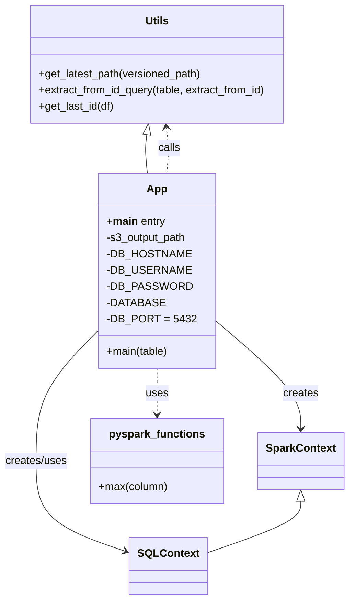

# Diagram: research/orchestrator/tasks/etl/extract_location_location_spark.py


> Auto-generated by Obscura crawlers

## Diagram 1

```mermaid
flowchart TD
Start([Start]) --> ParseArgs[/Parse CLI args:\ns3_output_path, table,\nDB_HOSTNAME, DB_USERNAME,\nDB_PASSWORD, DATABASE/]
ParseArgs --> InitSpark[Initialize SparkContext\n(master="yarn") and set confs]
InitSpark --> InitSQL[Create SQLContext(sc)]
InitSQL --> LatestPath[Call get_latest_path(s3_output_path)]
LatestPath --> ReadLatest[latest_df = sqlCtx.read.parquet(latest_path)]
ReadLatest --> ComputeMax[max_id = latest_df.agg(F.max('id')).collect()[0].max_id]
ComputeMax --> LoadJDBC[Read JDBC table using\nurl, partitionColumn=id,\nlowerBound=1, upperBound=max_id,\nnumPartitions=32 -> df]
LoadJDBC --> WriteOut[df.write.parquet(s3_output_path,\nmode="overwrite")]
WriteOut --> ReadBack[df2 = sqlCtx.read.parquet(s3_output_path)]
ReadBack --> LatestPath2[latest_s3_output_path = get_latest_path(s3_output_path)]
LatestPath2 --> WriteLatest[df2.write.parquet(latest_s3_output_path,\nmode="overwrite")]
WriteLatest --> End([End])
Start -.-> Error[Exception handler:\nlogging.exception and raise] 
ParseArgs -.-> Error
InitSpark -.-> Error
InitSQL -.-> Error
ReadLatest -.-> Error
LoadJDBC -.-> Error
WriteOut -.-> Error
ReadBack -.-> Error
WriteLatest -.-> Error
```

> SVG rendering failed for this diagram.

## Diagram 2



### SVG

<svg id="container" width="511.0859375" xmlns="http://www.w3.org/2000/svg" class="classDiagram" height="886" viewBox="0 0 511.0859375 886" role="graphics-document document" aria-roledescription="class"><style>#container{font-family:"trebuchet ms",verdana,arial,sans-serif;font-size:16px;fill:#333;}@keyframes edge-animation-frame{from{stroke-dashoffset:0;}}@keyframes dash{to{stroke-dashoffset:0;}}#container .edge-animation-slow{stroke-dasharray:9,5!important;stroke-dashoffset:900;animation:dash 50s linear infinite;stroke-linecap:round;}#container .edge-animation-fast{stroke-dasharray:9,5!important;stroke-dashoffset:900;animation:dash 20s linear infinite;stroke-linecap:round;}#container .error-icon{fill:#552222;}#container .error-text{fill:#552222;stroke:#552222;}#container .edge-thickness-normal{stroke-width:1px;}#container .edge-thickness-thick{stroke-width:3.5px;}#container .edge-pattern-solid{stroke-dasharray:0;}#container .edge-thickness-invisible{stroke-width:0;fill:none;}#container .edge-pattern-dashed{stroke-dasharray:3;}#container .edge-pattern-dotted{stroke-dasharray:2;}#container .marker{fill:#333333;stroke:#333333;}#container .marker.cross{stroke:#333333;}#container svg{font-family:"trebuchet ms",verdana,arial,sans-serif;font-size:16px;}#container p{margin:0;}#container g.classGroup text{fill:#9370DB;stroke:none;font-family:"trebuchet ms",verdana,arial,sans-serif;font-size:10px;}#container g.classGroup text .title{font-weight:bolder;}#container .nodeLabel,#container .edgeLabel{color:#131300;}#container .edgeLabel .label rect{fill:#ECECFF;}#container .label text{fill:#131300;}#container .labelBkg{background:#ECECFF;}#container .edgeLabel .label span{background:#ECECFF;}#container .classTitle{font-weight:bolder;}#container .node rect,#container .node circle,#container .node ellipse,#container .node polygon,#container .node path{fill:#ECECFF;stroke:#9370DB;stroke-width:1px;}#container .divider{stroke:#9370DB;stroke-width:1;}#container g.clickable{cursor:pointer;}#container g.classGroup rect{fill:#ECECFF;stroke:#9370DB;}#container g.classGroup line{stroke:#9370DB;stroke-width:1;}#container .classLabel .box{stroke:none;stroke-width:0;fill:#ECECFF;opacity:0.5;}#container .classLabel .label{fill:#9370DB;font-size:10px;}#container .relation{stroke:#333333;stroke-width:1;fill:none;}#container .dashed-line{stroke-dasharray:3;}#container .dotted-line{stroke-dasharray:1 2;}#container #compositionStart,#container .composition{fill:#333333!important;stroke:#333333!important;stroke-width:1;}#container #compositionEnd,#container .composition{fill:#333333!important;stroke:#333333!important;stroke-width:1;}#container #dependencyStart,#container .dependency{fill:#333333!important;stroke:#333333!important;stroke-width:1;}#container #dependencyStart,#container .dependency{fill:#333333!important;stroke:#333333!important;stroke-width:1;}#container #extensionStart,#container .extension{fill:transparent!important;stroke:#333333!important;stroke-width:1;}#container #extensionEnd,#container .extension{fill:transparent!important;stroke:#333333!important;stroke-width:1;}#container #aggregationStart,#container .aggregation{fill:transparent!important;stroke:#333333!important;stroke-width:1;}#container #aggregationEnd,#container .aggregation{fill:transparent!important;stroke:#333333!important;stroke-width:1;}#container #lollipopStart,#container .lollipop{fill:#ECECFF!important;stroke:#333333!important;stroke-width:1;}#container #lollipopEnd,#container .lollipop{fill:#ECECFF!important;stroke:#333333!important;stroke-width:1;}#container .edgeTerminals{font-size:11px;line-height:initial;}#container .classTitleText{text-anchor:middle;font-size:18px;fill:#333;}#container .label-icon{display:inline-block;height:1em;overflow:visible;vertical-align:-0.125em;}#container .node .label-icon path{fill:currentColor;stroke:revert;stroke-width:revert;}#container :root{--mermaid-font-family:"trebuchet ms",verdana,arial,sans-serif;}</style><g><defs><marker id="container_class-aggregationStart" class="marker aggregation class" refX="18" refY="7" markerWidth="190" markerHeight="240" orient="auto"><path d="M 18,7 L9,13 L1,7 L9,1 Z"></path></marker></defs><defs><marker id="container_class-aggregationEnd" class="marker aggregation class" refX="1" refY="7" markerWidth="20" markerHeight="28" orient="auto"><path d="M 18,7 L9,13 L1,7 L9,1 Z"></path></marker></defs><defs><marker id="container_class-extensionStart" class="marker extension class" refX="18" refY="7" markerWidth="190" markerHeight="240" orient="auto"><path d="M 1,7 L18,13 V 1 Z"></path></marker></defs><defs><marker id="container_class-extensionEnd" class="marker extension class" refX="1" refY="7" markerWidth="20" markerHeight="28" orient="auto"><path d="M 1,1 V 13 L18,7 Z"></path></marker></defs><defs><marker id="container_class-compositionStart" class="marker composition class" refX="18" refY="7" markerWidth="190" markerHeight="240" orient="auto"><path d="M 18,7 L9,13 L1,7 L9,1 Z"></path></marker></defs><defs><marker id="container_class-compositionEnd" class="marker composition class" refX="1" refY="7" markerWidth="20" markerHeight="28" orient="auto"><path d="M 18,7 L9,13 L1,7 L9,1 Z"></path></marker></defs><defs><marker id="container_class-dependencyStart" class="marker dependency class" refX="6" refY="7" markerWidth="190" markerHeight="240" orient="auto"><path d="M 5,7 L9,13 L1,7 L9,1 Z"></path></marker></defs><defs><marker id="container_class-dependencyEnd" class="marker dependency class" refX="13" refY="7" markerWidth="20" markerHeight="28" orient="auto"><path d="M 18,7 L9,13 L14,7 L9,1 Z"></path></marker></defs><defs><marker id="container_class-lollipopStart" class="marker lollipop class" refX="13" refY="7" markerWidth="190" markerHeight="240" orient="auto"><circle stroke="black" fill="transparent" cx="7" cy="7" r="6"></circle></marker></defs><defs><marker id="container_class-lollipopEnd" class="marker lollipop class" refX="1" refY="7" markerWidth="190" markerHeight="240" orient="auto"><circle stroke="black" fill="transparent" cx="7" cy="7" r="6"></circle></marker></defs><g class="root"><g class="clusters"></g><g class="edgePaths"><path d="M312.789,469.131L334.263,487.776C355.737,506.421,398.685,543.71,420.159,571.022C441.633,598.333,441.633,615.667,441.633,624.333L441.633,633" id="id_App_SparkContext_1" class="edge-thickness-normal edge-pattern-solid relation" style=";;;" data-edge="true" data-et="edge" data-id="id_App_SparkContext_1" data-points="W3sieCI6MzEyLjc4OTA2MjUsInkiOjQ2OS4xMzExNjcyMDA3MDQ1N30seyJ4Ijo0NDEuNjMyODEyNSwieSI6NTgxfSx7IngiOjQ0MS42MzI4MTI1LCJ5Ijo2Mzl9XQ==" marker-end="url(#container_class-dependencyEnd)"></path><path d="M153.547,480.696L137.052,497.413C120.557,514.13,87.568,547.565,71.073,580.949C54.578,614.333,54.578,647.667,54.578,679C54.578,710.333,54.578,739.667,76.881,762.055C99.184,784.443,143.79,799.886,166.094,807.607L188.397,815.329" id="id_App_SQLContext_2" class="edge-thickness-normal edge-pattern-solid relation" style=";;;" data-edge="true" data-et="edge" data-id="id_App_SQLContext_2" data-points="W3sieCI6MTUzLjU0Njg3NSwieSI6NDgwLjY5NTYxODg4OTMwMjA3fSx7IngiOjU0LjU3ODEyNSwieSI6NTgxfSx7IngiOjU0LjU3ODEyNSwieSI6NjgxfSx7IngiOjU0LjU3ODEyNSwieSI6NzY5fSx7IngiOjE5NC4wNjY0MDYyNSwieSI6ODE3LjI5MTQ0Mzc5NjI5ODJ9XQ==" marker-end="url(#container_class-dependencyEnd)"></path><path d="M247.666,256L248.286,249.833C248.907,243.667,250.149,231.333,250.009,219.989C249.869,208.645,248.347,198.291,247.586,193.114L246.826,187.936" id="id_App_Utils_3" class="edge-thickness-normal edge-pattern-dashed relation" style=";;;" data-edge="true" data-et="edge" data-id="id_App_Utils_3" data-points="W3sieCI6MjQ3LjY2NTU1MTYyMjkyODE4LCJ5IjoyNTZ9LHsieCI6MjUxLjM5MDYyNSwieSI6MjE5fSx7IngiOjI0NS45NTMyMTk1MDYwNDgzOCwieSI6MTgyfV0=" marker-end="url(#container_class-dependencyEnd)"></path><path d="M233.168,544L233.168,550.167C233.168,556.333,233.168,568.667,233.168,580C233.168,591.333,233.168,601.667,233.168,606.833L233.168,612" id="id_App_pyspark_functions_4" class="edge-thickness-normal edge-pattern-dashed relation" style=";;;" data-edge="true" data-et="edge" data-id="id_App_pyspark_functions_4" data-points="W3sieCI6MjMzLjE2Nzk2ODc1LCJ5Ijo1NDR9LHsieCI6MjMzLjE2Nzk2ODc1LCJ5Ijo1ODF9LHsieCI6MjMzLjE2Nzk2ODc1LCJ5Ijo2MTh9XQ==" marker-end="url(#container_class-dependencyEnd)"></path><path d="M217.875,199.067L217.386,202.389C216.898,205.711,215.922,212.356,216.054,221.844C216.187,231.333,217.429,243.667,218.05,249.833L218.67,256" id="id_Utils_App_5" class="edge-thickness-normal edge-pattern-solid relation" style=";;;" data-edge="true" data-et="edge" data-id="id_Utils_App_5" data-points="W3sieCI6MjIwLjM4MjcxNzk5Mzk1MTYyLCJ5IjoxODJ9LHsieCI6MjE0Ljk0NTMxMjUsInkiOjIxOX0seyJ4IjoyMTguNjcwMzg1ODc3MDcxODIsInkiOjI1Nn1d" marker-start="url(#container_class-extensionStart)"></path><path d="M441.633,740.25L441.633,745.042C441.633,749.833,441.633,759.417,418.385,772.257C395.137,785.097,348.641,801.194,325.393,809.243L302.145,817.291" id="id_SparkContext_SQLContext_6" class="edge-thickness-normal edge-pattern-solid relation" style=";;;" data-edge="true" data-et="edge" data-id="id_SparkContext_SQLContext_6" data-points="W3sieCI6NDQxLjYzMjgxMjUsInkiOjcyM30seyJ4Ijo0NDEuNjMyODEyNSwieSI6NzY5fSx7IngiOjMwMi4xNDQ1MzEyNSwieSI6ODE3LjI5MTQ0Mzc5NjI5ODJ9XQ==" marker-start="url(#container_class-extensionStart)"></path></g><g class="edgeLabels"><g class="edgeLabel" transform="translate(441.6328125, 581)"><g class="label" data-id="id_App_SparkContext_1" transform="translate(-26.171875, -12)"><foreignObject width="52.34375" height="24"><div xmlns="http://www.w3.org/1999/xhtml" class="labelBkg" style="display: table-cell; white-space: nowrap; line-height: 1.5; max-width: 200px; text-align: center;"><span class="edgeLabel"><p>creates</p></span></div></foreignObject></g></g><g class="edgeLabel" transform="translate(54.578125, 681)"><g class="label" data-id="id_App_SQLContext_2" transform="translate(-46.578125, -12)"><foreignObject width="93.15625" height="24"><div xmlns="http://www.w3.org/1999/xhtml" class="labelBkg" style="display: table-cell; white-space: nowrap; line-height: 1.5; max-width: 200px; text-align: center;"><span class="edgeLabel"><p>creates/uses</p></span></div></foreignObject></g></g><g class="edgeLabel" transform="translate(251.37533, 218.89594)"><g class="label" data-id="id_App_Utils_3" transform="translate(-16.4453125, -12)"><foreignObject width="32.890625" height="24"><div xmlns="http://www.w3.org/1999/xhtml" class="labelBkg" style="display: table-cell; white-space: nowrap; line-height: 1.5; max-width: 200px; text-align: center;"><span class="edgeLabel"><p>calls</p></span></div></foreignObject></g></g><g class="edgeLabel" transform="translate(233.16796875, 581)"><g class="label" data-id="id_App_pyspark_functions_4" transform="translate(-16.4921875, -12)"><foreignObject width="32.984375" height="24"><div xmlns="http://www.w3.org/1999/xhtml" class="labelBkg" style="display: table-cell; white-space: nowrap; line-height: 1.5; max-width: 200px; text-align: center;"><span class="edgeLabel"><p>uses</p></span></div></foreignObject></g></g><g class="edgeLabel"><g class="label" data-id="id_Utils_App_5" transform="translate(0, 0)"><foreignObject width="0" height="0"><div xmlns="http://www.w3.org/1999/xhtml" class="labelBkg" style="display: table-cell; white-space: nowrap; line-height: 1.5; max-width: 200px; text-align: center;"><span class="edgeLabel"></span></div></foreignObject></g></g><g class="edgeLabel"><g class="label" data-id="id_SparkContext_SQLContext_6" transform="translate(0, 0)"><foreignObject width="0" height="0"><div xmlns="http://www.w3.org/1999/xhtml" class="labelBkg" style="display: table-cell; white-space: nowrap; line-height: 1.5; max-width: 200px; text-align: center;"><span class="edgeLabel"></span></div></foreignObject></g></g></g><g class="nodes"><g class="node default" id="classId-Utils-0" transform="translate(233.16796875, 95)"><g class="basic label-container"><path d="M-191.328125 -87 L191.328125 -87 L191.328125 87 L-191.328125 87" stroke="none" stroke-width="0" fill="#ECECFF" style=""></path><path d="M-191.328125 -87 C-80.97962248649294 -87, 29.368880027014114 -87, 191.328125 -87 M-191.328125 -87 C-59.785280137059885 -87, 71.75756472588023 -87, 191.328125 -87 M191.328125 -87 C191.328125 -34.16186376054332, 191.328125 18.67627247891336, 191.328125 87 M191.328125 -87 C191.328125 -43.696822645580994, 191.328125 -0.3936452911619881, 191.328125 87 M191.328125 87 C93.66854097819902 87, -3.9910430436019624 87, -191.328125 87 M191.328125 87 C59.70642882731917 87, -71.91526734536166 87, -191.328125 87 M-191.328125 87 C-191.328125 22.051558146658223, -191.328125 -42.89688370668355, -191.328125 -87 M-191.328125 87 C-191.328125 46.831468580399616, -191.328125 6.662937160799231, -191.328125 -87" stroke="#9370DB" stroke-width="1.3" fill="none" stroke-dasharray="0 0" style=""></path></g><g class="annotation-group text" transform="translate(0, -63)"></g><g class="label-group text" transform="translate(-16.796875, -63)"><g class="label" style="font-weight: bolder" transform="translate(0,-12)"><foreignObject width="33.59375" height="24"><div xmlns="http://www.w3.org/1999/xhtml" style="display: table-cell; white-space: nowrap; line-height: 1.5; max-width: 83px; text-align: center;"><span class="nodeLabel markdown-node-label" style=""><p>Utils</p></span></div></foreignObject></g></g><g class="members-group text" transform="translate(-179.328125, -15)"></g><g class="methods-group text" transform="translate(-179.328125, 15)"><g class="label" style="" transform="translate(0,-12)"><foreignObject width="244.390625" height="24"><div xmlns="http://www.w3.org/1999/xhtml" style="display: table-cell; white-space: nowrap; line-height: 1.5; max-width: 302px; text-align: center;"><span class="nodeLabel markdown-node-label" style=""><p>+get_latest_path(versioned_path)</p></span></div></foreignObject></g><g class="label" style="" transform="translate(0,12)"><foreignObject width="341.859375" height="24"><div xmlns="http://www.w3.org/1999/xhtml" style="display: table-cell; white-space: nowrap; line-height: 1.5; max-width: 399px; text-align: center;"><span class="nodeLabel markdown-node-label" style=""><p>+extract_from_id_query(table, extract_from_id)</p></span></div></foreignObject></g><g class="label" style="" transform="translate(0,36)"><foreignObject width="114.09375" height="24"><div xmlns="http://www.w3.org/1999/xhtml" style="display: table-cell; white-space: nowrap; line-height: 1.5; max-width: 171px; text-align: center;"><span class="nodeLabel markdown-node-label" style=""><p>+get_last_id(df)</p></span></div></foreignObject></g></g><g class="divider" style=""><path d="M-191.328125 -39 C-91.60267604526805 -39, 8.12277290946389 -39, 191.328125 -39 M-191.328125 -39 C-49.89272292324881 -39, 91.54267915350238 -39, 191.328125 -39" stroke="#9370DB" stroke-width="1.3" fill="none" stroke-dasharray="0 0" style=""></path></g><g class="divider" style=""><path d="M-191.328125 -15 C-101.15551564211664 -15, -10.98290628423328 -15, 191.328125 -15 M-191.328125 -15 C-74.55265017283097 -15, 42.22282465433807 -15, 191.328125 -15" stroke="#9370DB" stroke-width="1.3" fill="none" stroke-dasharray="0 0" style=""></path></g></g><g class="node default" id="classId-App-1" transform="translate(233.16796875, 400)"><g class="basic label-container"><path d="M-79.62109375 -144 L79.62109375 -144 L79.62109375 144 L-79.62109375 144" stroke="none" stroke-width="0" fill="#ECECFF" style=""></path><path d="M-79.62109375 -144 C-39.760466746638485 -144, 0.1001602567230293 -144, 79.62109375 -144 M-79.62109375 -144 C-39.523549848179705 -144, 0.5739940536405896 -144, 79.62109375 -144 M79.62109375 -144 C79.62109375 -35.23328560074265, 79.62109375 73.5334287985147, 79.62109375 144 M79.62109375 -144 C79.62109375 -68.82959853925396, 79.62109375 6.34080292149207, 79.62109375 144 M79.62109375 144 C46.82940569306137 144, 14.037717636122736 144, -79.62109375 144 M79.62109375 144 C27.23761610006722 144, -25.145861549865558 144, -79.62109375 144 M-79.62109375 144 C-79.62109375 69.15523099427539, -79.62109375 -5.68953801144923, -79.62109375 -144 M-79.62109375 144 C-79.62109375 85.30325569244181, -79.62109375 26.606511384883632, -79.62109375 -144" stroke="#9370DB" stroke-width="1.3" fill="none" stroke-dasharray="0 0" style=""></path></g><g class="annotation-group text" transform="translate(0, -120)"></g><g class="label-group text" transform="translate(-14.2734375, -120)"><g class="label" style="font-weight: bolder" transform="translate(0,-12)"><foreignObject width="28.546875" height="24"><div xmlns="http://www.w3.org/1999/xhtml" style="display: table-cell; white-space: nowrap; line-height: 1.5; max-width: 78px; text-align: center;"><span class="nodeLabel markdown-node-label" style=""><p>App</p></span></div></foreignObject></g></g><g class="members-group text" transform="translate(-67.62109375, -72)"><g class="label" style="" transform="translate(0,-12)"><foreignObject width="86.203125" height="24"><div xmlns="http://www.w3.org/1999/xhtml" style="display: table-cell; white-space: nowrap; line-height: 1.5; max-width: 176px; text-align: center;"><span class="nodeLabel markdown-node-label" style=""><p>+<strong>main</strong> entry</p></span></div></foreignObject></g><g class="label" style="" transform="translate(0,12)"><foreignObject width="120.140625" height="24"><div xmlns="http://www.w3.org/1999/xhtml" style="display: table-cell; white-space: nowrap; line-height: 1.5; max-width: 178px; text-align: center;"><span class="nodeLabel markdown-node-label" style=""><p>-s3_output_path</p></span></div></foreignObject></g><g class="label" style="" transform="translate(0,36)"><foreignObject width="114.1875" height="24"><div xmlns="http://www.w3.org/1999/xhtml" style="display: table-cell; white-space: nowrap; line-height: 1.5; max-width: 172px; text-align: center;"><span class="nodeLabel markdown-node-label" style=""><p>-DB_HOSTNAME</p></span></div></foreignObject></g><g class="label" style="" transform="translate(0,60)"><foreignObject width="112.546875" height="24"><div xmlns="http://www.w3.org/1999/xhtml" style="display: table-cell; white-space: nowrap; line-height: 1.5; max-width: 170px; text-align: center;"><span class="nodeLabel markdown-node-label" style=""><p>-DB_USERNAME</p></span></div></foreignObject></g><g class="label" style="" transform="translate(0,84)"><foreignObject width="113.359375" height="24"><div xmlns="http://www.w3.org/1999/xhtml" style="display: table-cell; white-space: nowrap; line-height: 1.5; max-width: 171px; text-align: center;"><span class="nodeLabel markdown-node-label" style=""><p>-DB_PASSWORD</p></span></div></foreignObject></g><g class="label" style="" transform="translate(0,108)"><foreignObject width="77.703125" height="24"><div xmlns="http://www.w3.org/1999/xhtml" style="display: table-cell; white-space: nowrap; line-height: 1.5; max-width: 135px; text-align: center;"><span class="nodeLabel markdown-node-label" style=""><p>-DATABASE</p></span></div></foreignObject></g><g class="label" style="" transform="translate(0,132)"><foreignObject width="120.96875" height="24"><div xmlns="http://www.w3.org/1999/xhtml" style="display: table-cell; white-space: nowrap; line-height: 1.5; max-width: 178px; text-align: center;"><span class="nodeLabel markdown-node-label" style=""><p>-DB_PORT = 5432</p></span></div></foreignObject></g></g><g class="methods-group text" transform="translate(-67.62109375, 120)"><g class="label" style="" transform="translate(0,-12)"><foreignObject width="91.859375" height="24"><div xmlns="http://www.w3.org/1999/xhtml" style="display: table-cell; white-space: nowrap; line-height: 1.5; max-width: 149px; text-align: center;"><span class="nodeLabel markdown-node-label" style=""><p>+main(table)</p></span></div></foreignObject></g></g><g class="divider" style=""><path d="M-79.62109375 -96 C-18.104513163784418 -96, 43.412067422431164 -96, 79.62109375 -96 M-79.62109375 -96 C-22.42183600651577 -96, 34.77742173696846 -96, 79.62109375 -96" stroke="#9370DB" stroke-width="1.3" fill="none" stroke-dasharray="0 0" style=""></path></g><g class="divider" style=""><path d="M-79.62109375 96 C-16.83819935275823 96, 45.94469504448354 96, 79.62109375 96 M-79.62109375 96 C-37.35694577924408 96, 4.907202191511843 96, 79.62109375 96" stroke="#9370DB" stroke-width="1.3" fill="none" stroke-dasharray="0 0" style=""></path></g></g><g class="node default" id="classId-SparkContext-2" transform="translate(441.6328125, 681)"><g class="basic label-container"><path d="M-61.453125 -42 L61.453125 -42 L61.453125 42 L-61.453125 42" stroke="none" stroke-width="0" fill="#ECECFF" style=""></path><path d="M-61.453125 -42 C-34.18250435751393 -42, -6.911883715027855 -42, 61.453125 -42 M-61.453125 -42 C-14.19214358720312 -42, 33.06883782559376 -42, 61.453125 -42 M61.453125 -42 C61.453125 -16.344374681555582, 61.453125 9.311250636888836, 61.453125 42 M61.453125 -42 C61.453125 -17.81311938544308, 61.453125 6.373761229113839, 61.453125 42 M61.453125 42 C34.490701935811735 42, 7.5282788716234705 42, -61.453125 42 M61.453125 42 C20.725738615483607 42, -20.001647769032786 42, -61.453125 42 M-61.453125 42 C-61.453125 10.697940125371467, -61.453125 -20.604119749257066, -61.453125 -42 M-61.453125 42 C-61.453125 10.689027199190285, -61.453125 -20.62194560161943, -61.453125 -42" stroke="#9370DB" stroke-width="1.3" fill="none" stroke-dasharray="0 0" style=""></path></g><g class="annotation-group text" transform="translate(0, -18)"></g><g class="label-group text" transform="translate(-49.453125, -18)"><g class="label" style="font-weight: bolder" transform="translate(0,-12)"><foreignObject width="98.90625" height="24"><div xmlns="http://www.w3.org/1999/xhtml" style="display: table-cell; white-space: nowrap; line-height: 1.5; max-width: 146px; text-align: center;"><span class="nodeLabel markdown-node-label" style=""><p>SparkContext</p></span></div></foreignObject></g></g><g class="members-group text" transform="translate(-49.453125, 30)"></g><g class="methods-group text" transform="translate(-49.453125, 60)"></g><g class="divider" style=""><path d="M-61.453125 6 C-33.32401348478632 6, -5.194901969572641 6, 61.453125 6 M-61.453125 6 C-13.680854405260078 6, 34.091416189479844 6, 61.453125 6" stroke="#9370DB" stroke-width="1.3" fill="none" stroke-dasharray="0 0" style=""></path></g><g class="divider" style=""><path d="M-61.453125 24 C-15.837894275192298 24, 29.777336449615404 24, 61.453125 24 M-61.453125 24 C-28.477276497302555 24, 4.498572005394891 24, 61.453125 24" stroke="#9370DB" stroke-width="1.3" fill="none" stroke-dasharray="0 0" style=""></path></g></g><g class="node default" id="classId-SQLContext-3" transform="translate(248.10546875, 836)"><g class="basic label-container"><path d="M-54.0390625 -42 L54.0390625 -42 L54.0390625 42 L-54.0390625 42" stroke="none" stroke-width="0" fill="#ECECFF" style=""></path><path d="M-54.0390625 -42 C-17.24375514776645 -42, 19.5515522044671 -42, 54.0390625 -42 M-54.0390625 -42 C-21.421841052714953 -42, 11.195380394570094 -42, 54.0390625 -42 M54.0390625 -42 C54.0390625 -8.601200477675306, 54.0390625 24.797599044649388, 54.0390625 42 M54.0390625 -42 C54.0390625 -13.478472517009905, 54.0390625 15.04305496598019, 54.0390625 42 M54.0390625 42 C27.575862695667976 42, 1.112662891335951 42, -54.0390625 42 M54.0390625 42 C11.400567280283369 42, -31.237927939433263 42, -54.0390625 42 M-54.0390625 42 C-54.0390625 8.617359980280945, -54.0390625 -24.76528003943811, -54.0390625 -42 M-54.0390625 42 C-54.0390625 21.868339276597634, -54.0390625 1.7366785531952686, -54.0390625 -42" stroke="#9370DB" stroke-width="1.3" fill="none" stroke-dasharray="0 0" style=""></path></g><g class="annotation-group text" transform="translate(0, -18)"></g><g class="label-group text" transform="translate(-42.0390625, -18)"><g class="label" style="font-weight: bolder" transform="translate(0,-12)"><foreignObject width="84.078125" height="24"><div xmlns="http://www.w3.org/1999/xhtml" style="display: table-cell; white-space: nowrap; line-height: 1.5; max-width: 132px; text-align: center;"><span class="nodeLabel markdown-node-label" style=""><p>SQLContext</p></span></div></foreignObject></g></g><g class="members-group text" transform="translate(-42.0390625, 30)"></g><g class="methods-group text" transform="translate(-42.0390625, 60)"></g><g class="divider" style=""><path d="M-54.0390625 6 C-32.11302007057158 6, -10.186977641143152 6, 54.0390625 6 M-54.0390625 6 C-19.97204000651947 6, 14.094982486961058 6, 54.0390625 6" stroke="#9370DB" stroke-width="1.3" fill="none" stroke-dasharray="0 0" style=""></path></g><g class="divider" style=""><path d="M-54.0390625 24 C-14.75737708360289 24, 24.52430833279422 24, 54.0390625 24 M-54.0390625 24 C-25.63620612579248 24, 2.76665024841504 24, 54.0390625 24" stroke="#9370DB" stroke-width="1.3" fill="none" stroke-dasharray="0 0" style=""></path></g></g><g class="node default" id="classId-pyspark_functions-4" transform="translate(233.16796875, 681)"><g class="basic label-container"><path d="M-97.01171875 -63 L97.01171875 -63 L97.01171875 63 L-97.01171875 63" stroke="none" stroke-width="0" fill="#ECECFF" style=""></path><path d="M-97.01171875 -63 C-56.92042960982282 -63, -16.829140469645637 -63, 97.01171875 -63 M-97.01171875 -63 C-27.250775116755037 -63, 42.51016851648993 -63, 97.01171875 -63 M97.01171875 -63 C97.01171875 -24.342306180141726, 97.01171875 14.315387639716548, 97.01171875 63 M97.01171875 -63 C97.01171875 -17.792417344819974, 97.01171875 27.415165310360052, 97.01171875 63 M97.01171875 63 C40.09258282242737 63, -16.826553105145265 63, -97.01171875 63 M97.01171875 63 C28.59187862948407 63, -39.82796149103186 63, -97.01171875 63 M-97.01171875 63 C-97.01171875 13.154971548759661, -97.01171875 -36.69005690248068, -97.01171875 -63 M-97.01171875 63 C-97.01171875 30.026847506722284, -97.01171875 -2.9463049865554325, -97.01171875 -63" stroke="#9370DB" stroke-width="1.3" fill="none" stroke-dasharray="0 0" style=""></path></g><g class="annotation-group text" transform="translate(0, -39)"></g><g class="label-group text" transform="translate(-67.7265625, -39)"><g class="label" style="font-weight: bolder" transform="translate(0,-12)"><foreignObject width="135.453125" height="24"><div xmlns="http://www.w3.org/1999/xhtml" style="display: table-cell; white-space: nowrap; line-height: 1.5; max-width: 183px; text-align: center;"><span class="nodeLabel markdown-node-label" style=""><p>pyspark_functions</p></span></div></foreignObject></g></g><g class="members-group text" transform="translate(-85.01171875, 9)"></g><g class="methods-group text" transform="translate(-85.01171875, 39)"><g class="label" style="" transform="translate(0,-12)"><foreignObject width="102.296875" height="24"><div xmlns="http://www.w3.org/1999/xhtml" style="display: table-cell; white-space: nowrap; line-height: 1.5; max-width: 160px; text-align: center;"><span class="nodeLabel markdown-node-label" style=""><p>+max(column)</p></span></div></foreignObject></g></g><g class="divider" style=""><path d="M-97.01171875 -15 C-28.03163669110978 -15, 40.94844536778044 -15, 97.01171875 -15 M-97.01171875 -15 C-50.17514094988344 -15, -3.338563149766884 -15, 97.01171875 -15" stroke="#9370DB" stroke-width="1.3" fill="none" stroke-dasharray="0 0" style=""></path></g><g class="divider" style=""><path d="M-97.01171875 9 C-55.05355329287155 9, -13.095387835743097 9, 97.01171875 9 M-97.01171875 9 C-57.530110289304794 9, -18.048501828609588 9, 97.01171875 9" stroke="#9370DB" stroke-width="1.3" fill="none" stroke-dasharray="0 0" style=""></path></g></g></g></g></g></svg>
