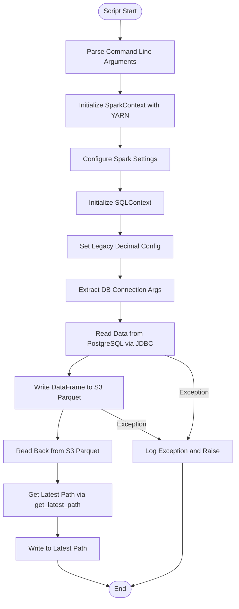
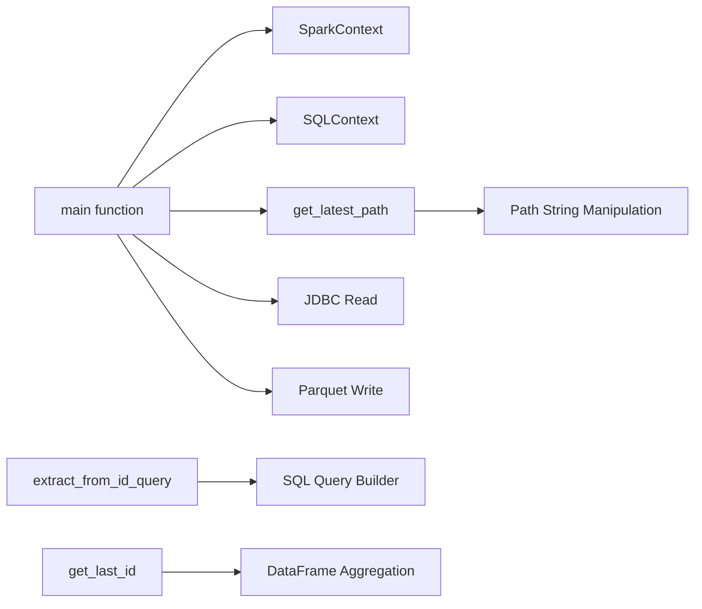
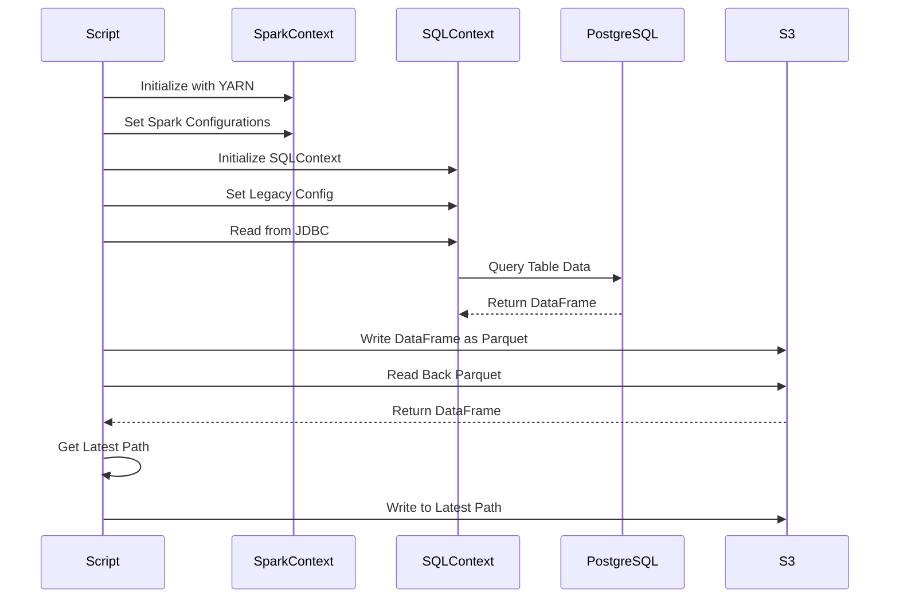

# Diagram: research/orchestrator/tasks/etl/extract_location_locationlad_spark.py

> Auto-generated by Obscura crawlers

## Diagram 1

### SVG

<svg id="container" width="558.5234375" xmlns="http://www.w3.org/2000/svg" class="flowchart" height="1432" viewBox="0 0 558.5234375 1432" role="graphics-document document" aria-roledescription="flowchart-v2"><g><marker id="container_flowchart-v2-pointEnd" class="marker flowchart-v2" viewBox="0 0 10 10" refX="5" refY="5" markerUnits="userSpaceOnUse" markerWidth="8" markerHeight="8" orient="auto"><path d="M 0 0 L 10 5 L 0 10 z" class="arrowMarkerPath" style="stroke-width: 1; stroke-dasharray: 1, 0;"></path></marker><marker id="container_flowchart-v2-pointStart" class="marker flowchart-v2" viewBox="0 0 10 10" refX="4.5" refY="5" markerUnits="userSpaceOnUse" markerWidth="8" markerHeight="8" orient="auto"><path d="M 0 5 L 10 10 L 10 0 z" class="arrowMarkerPath" style="stroke-width: 1; stroke-dasharray: 1, 0;"></path></marker><marker id="container_flowchart-v2-circleEnd" class="marker flowchart-v2" viewBox="0 0 10 10" refX="11" refY="5" markerUnits="userSpaceOnUse" markerWidth="11" markerHeight="11" orient="auto"><circle cx="5" cy="5" r="5" class="arrowMarkerPath" style="stroke-width: 1; stroke-dasharray: 1, 0;"></circle></marker><marker id="container_flowchart-v2-circleStart" class="marker flowchart-v2" viewBox="0 0 10 10" refX="-1" refY="5" markerUnits="userSpaceOnUse" markerWidth="11" markerHeight="11" orient="auto"><circle cx="5" cy="5" r="5" class="arrowMarkerPath" style="stroke-width: 1; stroke-dasharray: 1, 0;"></circle></marker><marker id="container_flowchart-v2-crossEnd" class="marker cross flowchart-v2" viewBox="0 0 11 11" refX="12" refY="5.2" markerUnits="userSpaceOnUse" markerWidth="11" markerHeight="11" orient="auto"><path d="M 1,1 l 9,9 M 10,1 l -9,9" class="arrowMarkerPath" style="stroke-width: 2; stroke-dasharray: 1, 0;"></path></marker><marker id="container_flowchart-v2-crossStart" class="marker cross flowchart-v2" viewBox="0 0 11 11" refX="-1" refY="5.2" markerUnits="userSpaceOnUse" markerWidth="11" markerHeight="11" orient="auto"><path d="M 1,1 l 9,9 M 10,1 l -9,9" class="arrowMarkerPath" style="stroke-width: 2; stroke-dasharray: 1, 0;"></path></marker><g class="root"><g class="clusters"></g><g class="edgePaths"><path d="M285.945,47.5L285.862,51.583C285.779,55.667,285.612,63.833,285.529,71.417C285.445,79,285.445,86,285.445,89.5L285.445,93" id="L_Start_ParseArgs_0" class="edge-thickness-normal edge-pattern-solid edge-thickness-normal edge-pattern-solid flowchart-link" style=";" data-edge="true" data-et="edge" data-id="L_Start_ParseArgs_0" data-points="W3sieCI6Mjg1Ljk0NTMxMjUsInkiOjQ3LjV9LHsieCI6Mjg1LjQ0NTMxMjUsInkiOjcyfSx7IngiOjI4NS40NDUzMTI1LCJ5Ijo5N31d" marker-end="url(#container_flowchart-v2-pointEnd)"></path><path d="M285.445,175L285.445,179.167C285.445,183.333,285.445,191.667,285.445,199.333C285.445,207,285.445,214,285.445,217.5L285.445,221" id="L_ParseArgs_InitSpark_0" class="edge-thickness-normal edge-pattern-solid edge-thickness-normal edge-pattern-solid flowchart-link" style=";" data-edge="true" data-et="edge" data-id="L_ParseArgs_InitSpark_0" data-points="W3sieCI6Mjg1LjQ0NTMxMjUsInkiOjE3NX0seyJ4IjoyODUuNDQ1MzEyNSwieSI6MjAwfSx7IngiOjI4NS40NDUzMTI1LCJ5IjoyMjV9XQ==" marker-end="url(#container_flowchart-v2-pointEnd)"></path><path d="M285.445,303L285.445,307.167C285.445,311.333,285.445,319.667,285.445,327.333C285.445,335,285.445,342,285.445,345.5L285.445,349" id="L_InitSpark_ConfigSpark_0" class="edge-thickness-normal edge-pattern-solid edge-thickness-normal edge-pattern-solid flowchart-link" style=";" data-edge="true" data-et="edge" data-id="L_InitSpark_ConfigSpark_0" data-points="W3sieCI6Mjg1LjQ0NTMxMjUsInkiOjMwM30seyJ4IjoyODUuNDQ1MzEyNSwieSI6MzI4fSx7IngiOjI4NS40NDUzMTI1LCJ5IjozNTN9XQ==" marker-end="url(#container_flowchart-v2-pointEnd)"></path><path d="M285.445,407L285.445,411.167C285.445,415.333,285.445,423.667,285.445,431.333C285.445,439,285.445,446,285.445,449.5L285.445,453" id="L_ConfigSpark_InitSQL_0" class="edge-thickness-normal edge-pattern-solid edge-thickness-normal edge-pattern-solid flowchart-link" style=";" data-edge="true" data-et="edge" data-id="L_ConfigSpark_InitSQL_0" data-points="W3sieCI6Mjg1LjQ0NTMxMjUsInkiOjQwN30seyJ4IjoyODUuNDQ1MzEyNSwieSI6NDMyfSx7IngiOjI4NS40NDUzMTI1LCJ5Ijo0NTd9XQ==" marker-end="url(#container_flowchart-v2-pointEnd)"></path><path d="M285.445,511L285.445,515.167C285.445,519.333,285.445,527.667,285.445,535.333C285.445,543,285.445,550,285.445,553.5L285.445,557" id="L_InitSQL_SetConfig_0" class="edge-thickness-normal edge-pattern-solid edge-thickness-normal edge-pattern-solid flowchart-link" style=";" data-edge="true" data-et="edge" data-id="L_InitSQL_SetConfig_0" data-points="W3sieCI6Mjg1LjQ0NTMxMjUsInkiOjUxMX0seyJ4IjoyODUuNDQ1MzEyNSwieSI6NTM2fSx7IngiOjI4NS40NDUzMTI1LCJ5Ijo1NjF9XQ==" marker-end="url(#container_flowchart-v2-pointEnd)"></path><path d="M285.445,615L285.445,619.167C285.445,623.333,285.445,631.667,285.445,639.333C285.445,647,285.445,654,285.445,657.5L285.445,661" id="L_SetConfig_ExtractArgs_0" class="edge-thickness-normal edge-pattern-solid edge-thickness-normal edge-pattern-solid flowchart-link" style=";" data-edge="true" data-et="edge" data-id="L_SetConfig_ExtractArgs_0" data-points="W3sieCI6Mjg1LjQ0NTMxMjUsInkiOjYxNX0seyJ4IjoyODUuNDQ1MzEyNSwieSI6NjQwfSx7IngiOjI4NS40NDUzMTI1LCJ5Ijo2NjV9XQ==" marker-end="url(#container_flowchart-v2-pointEnd)"></path><path d="M285.445,719L285.445,723.167C285.445,727.333,285.445,735.667,285.445,743.333C285.445,751,285.445,758,285.445,761.5L285.445,765" id="L_ExtractArgs_ReadJDBC_0" class="edge-thickness-normal edge-pattern-solid edge-thickness-normal edge-pattern-solid flowchart-link" style=";" data-edge="true" data-et="edge" data-id="L_ExtractArgs_ReadJDBC_0" data-points="W3sieCI6Mjg1LjQ0NTMxMjUsInkiOjcxOX0seyJ4IjoyODUuNDQ1MzEyNSwieSI6NzQ0fSx7IngiOjI4NS40NDUzMTI1LCJ5Ijo3Njl9XQ==" marker-end="url(#container_flowchart-v2-pointEnd)"></path><path d="M212.468,847L204.671,851.167C196.874,855.333,181.281,863.667,173.484,871.333C165.688,879,165.688,886,165.688,889.5L165.688,893" id="L_ReadJDBC_WriteParquet_0" class="edge-thickness-normal edge-pattern-solid edge-thickness-normal edge-pattern-solid flowchart-link" style=";" data-edge="true" data-et="edge" data-id="L_ReadJDBC_WriteParquet_0" data-points="W3sieCI6MjEyLjQ2Nzg5NTUwNzgxMjUsInkiOjg0N30seyJ4IjoxNjUuNjg3NSwieSI6ODcyfSx7IngiOjE2NS42ODc1LCJ5Ijo4OTd9XQ==" marker-end="url(#container_flowchart-v2-pointEnd)"></path><path d="M151.479,975L149.233,981.167C146.986,987.333,142.493,999.667,140.247,1011.333C138,1023,138,1034,138,1039.5L138,1045" id="L_WriteParquet_ReadBack_0" class="edge-thickness-normal edge-pattern-solid edge-thickness-normal edge-pattern-solid flowchart-link" style=";" data-edge="true" data-et="edge" data-id="L_WriteParquet_ReadBack_0" data-points="W3sieCI6MTUxLjQ3OTQ0MDc4OTQ3MzcsInkiOjk3NX0seyJ4IjoxMzgsInkiOjEwMTJ9LHsieCI6MTM4LCJ5IjoxMDQ5fV0=" marker-end="url(#container_flowchart-v2-pointEnd)"></path><path d="M138,1103L138,1107.167C138,1111.333,138,1119.667,138,1127.333C138,1135,138,1142,138,1145.5L138,1149" id="L_ReadBack_GetLatest_0" class="edge-thickness-normal edge-pattern-solid edge-thickness-normal edge-pattern-solid flowchart-link" style=";" data-edge="true" data-et="edge" data-id="L_ReadBack_GetLatest_0" data-points="W3sieCI6MTM4LCJ5IjoxMTAzfSx7IngiOjEzOCwieSI6MTEyOH0seyJ4IjoxMzgsInkiOjExNTN9XQ==" marker-end="url(#container_flowchart-v2-pointEnd)"></path><path d="M138,1231L138,1235.167C138,1239.333,138,1247.667,138,1255.333C138,1263,138,1270,138,1273.5L138,1277" id="L_GetLatest_WriteLatest_0" class="edge-thickness-normal edge-pattern-solid edge-thickness-normal edge-pattern-solid flowchart-link" style=";" data-edge="true" data-et="edge" data-id="L_GetLatest_WriteLatest_0" data-points="W3sieCI6MTM4LCJ5IjoxMjMxfSx7IngiOjEzOCwieSI6MTI1Nn0seyJ4IjoxMzgsInkiOjEyODF9XQ==" marker-end="url(#container_flowchart-v2-pointEnd)"></path><path d="M138,1335L138,1339.167C138,1343.333,138,1351.667,157.923,1361.903C177.847,1372.139,217.694,1384.278,237.617,1390.347L257.541,1396.416" id="L_WriteLatest_End_0" class="edge-thickness-normal edge-pattern-solid edge-thickness-normal edge-pattern-solid flowchart-link" style=";" data-edge="true" data-et="edge" data-id="L_WriteLatest_End_0" data-points="W3sieCI6MTM4LCJ5IjoxMzM1fSx7IngiOjEzOCwieSI6MTM2MH0seyJ4IjoyNjEuMzY3MTA4ODY4MDQxNCwieSI6MTM5Ny41ODIxMzA2Njg4MDUzfV0=" marker-end="url(#container_flowchart-v2-pointEnd)"></path><path d="M392.167,847L403.569,851.167C414.971,855.333,437.774,863.667,449.176,878.5C460.578,893.333,460.578,914.667,460.578,938C460.578,961.333,460.578,986.667,458.175,1004.888C455.772,1023.11,450.966,1034.219,448.563,1039.774L446.16,1045.329" id="L_ReadJDBC_Error_0" class="edge-thickness-normal edge-pattern-solid edge-thickness-normal edge-pattern-solid flowchart-link" style=";" data-edge="true" data-et="edge" data-id="L_ReadJDBC_Error_0" data-points="W3sieCI6MzkyLjE2Njg3MDExNzE4NzUsInkiOjg0N30seyJ4Ijo0NjAuNTc4MTI1LCJ5Ijo4NzJ9LHsieCI6NDYwLjU3ODEyNSwieSI6OTM2fSx7IngiOjQ2MC41NzgxMjUsInkiOjEwMTJ9LHsieCI6NDQ0LjU3MTI4OTA2MjUsInkiOjEwNDl9XQ==" marker-end="url(#container_flowchart-v2-pointEnd)"></path><path d="M241.35,975L253.314,981.167C265.278,987.333,289.205,999.667,312.12,1011.686C335.035,1023.705,356.938,1035.41,367.889,1041.262L378.84,1047.115" id="L_WriteParquet_Error_0" class="edge-thickness-normal edge-pattern-solid edge-thickness-normal edge-pattern-solid flowchart-link" style=";" data-edge="true" data-et="edge" data-id="L_WriteParquet_Error_0" data-points="W3sieCI6MjQxLjM1MDIyNjE1MTMxNTc4LCJ5Ijo5NzV9LHsieCI6MzEzLjEzMjgxMjUsInkiOjEwMTJ9LHsieCI6MzgyLjM2Nzc5Nzg1MTU2MjUsInkiOjEwNDl9XQ==" marker-end="url(#container_flowchart-v2-pointEnd)"></path><path d="M432.891,1103L432.891,1107.167C432.891,1111.333,432.891,1119.667,432.891,1134.5C432.891,1149.333,432.891,1170.667,432.891,1192C432.891,1213.333,432.891,1234.667,432.891,1254C432.891,1273.333,432.891,1290.667,432.891,1308C432.891,1325.333,432.891,1342.667,413.133,1357.401C393.376,1372.136,353.862,1384.272,334.104,1390.34L314.347,1396.408" id="L_Error_End_0" class="edge-thickness-normal edge-pattern-solid edge-thickness-normal edge-pattern-solid flowchart-link" style=";" data-edge="true" data-et="edge" data-id="L_Error_End_0" data-points="W3sieCI6NDMyLjg5MDYyNSwieSI6MTEwM30seyJ4Ijo0MzIuODkwNjI1LCJ5IjoxMTI4fSx7IngiOjQzMi44OTA2MjUsInkiOjExOTJ9LHsieCI6NDMyLjg5MDYyNSwieSI6MTI1Nn0seyJ4Ijo0MzIuODkwNjI1LCJ5IjoxMzA4fSx7IngiOjQzMi44OTA2MjUsInkiOjEzNjB9LHsieCI6MzEwLjUyMzUxNzA1NTY2MjgsInkiOjEzOTcuNTgyMTMwMzkwMDI1Mn1d" marker-end="url(#container_flowchart-v2-pointEnd)"></path></g><g class="edgeLabels"><g class="edgeLabel"><g class="label" data-id="L_Start_ParseArgs_0" transform="translate(0, 0)"><foreignObject width="0" height="0">

</foreignObject></g></g><g class="edgeLabel"><g class="label" data-id="L_ParseArgs_InitSpark_0" transform="translate(0, 0)"><foreignObject width="0" height="0">

</foreignObject></g></g><g class="edgeLabel"><g class="label" data-id="L_InitSpark_ConfigSpark_0" transform="translate(0, 0)"><foreignObject width="0" height="0">

</foreignObject></g></g><g class="edgeLabel"><g class="label" data-id="L_ConfigSpark_InitSQL_0" transform="translate(0, 0)"><foreignObject width="0" height="0">

</foreignObject></g></g><g class="edgeLabel"><g class="label" data-id="L_InitSQL_SetConfig_0" transform="translate(0, 0)"><foreignObject width="0" height="0">

</foreignObject></g></g><g class="edgeLabel"><g class="label" data-id="L_SetConfig_ExtractArgs_0" transform="translate(0, 0)"><foreignObject width="0" height="0">

</foreignObject></g></g><g class="edgeLabel"><g class="label" data-id="L_ExtractArgs_ReadJDBC_0" transform="translate(0, 0)"><foreignObject width="0" height="0">

</foreignObject></g></g><g class="edgeLabel"><g class="label" data-id="L_ReadJDBC_WriteParquet_0" transform="translate(0, 0)"><foreignObject width="0" height="0">

</foreignObject></g></g><g class="edgeLabel"><g class="label" data-id="L_WriteParquet_ReadBack_0" transform="translate(0, 0)"><foreignObject width="0" height="0">

</foreignObject></g></g><g class="edgeLabel"><g class="label" data-id="L_ReadBack_GetLatest_0" transform="translate(0, 0)"><foreignObject width="0" height="0">

</foreignObject></g></g><g class="edgeLabel"><g class="label" data-id="L_GetLatest_WriteLatest_0" transform="translate(0, 0)"><foreignObject width="0" height="0">

</foreignObject></g></g><g class="edgeLabel"><g class="label" data-id="L_WriteLatest_End_0" transform="translate(0, 0)"><foreignObject width="0" height="0">

</foreignObject></g></g><g class="edgeLabel" transform="translate(460.578125, 936)"><g class="label" data-id="L_ReadJDBC_Error_0" transform="translate(-35.375, -12)"><foreignObject width="70.75" height="24">

Exception

</foreignObject></g></g><g class="edgeLabel" transform="translate(313.1328125, 1012)"><g class="label" data-id="L_WriteParquet_Error_0" transform="translate(-35.375, -12)"><foreignObject width="70.75" height="24">

Exception

</foreignObject></g></g><g class="edgeLabel"><g class="label" data-id="L_Error_End_0" transform="translate(0, 0)"><foreignObject width="0" height="0">

</foreignObject></g></g></g><g class="nodes"><g class="node default" id="flowchart-Start-0" transform="translate(285.4453125, 27.5)"><g class="basic label-container outer-path"><path d="M-33.6875 -19.5 C-10.419980135216168 -19.5, 12.847539729567664 -19.5, 33.6875 -19.5 C33.6875 -19.5, 33.6875 -19.5, 33.6875 -19.5 C33.94679974227429 -19.491684761961594, 34.20609948454858 -19.483369523923187, 34.9368692896239 -19.45993515863156 C35.256456514818176 -19.42910496337694, 35.57604374001246 -19.39827476812232, 36.181104652847864 -19.3399052695533 C36.66718318030292 -19.261319862829644, 37.15326170775798 -19.182734456105994, 37.41509325967676 -19.140403561325776 C37.67212764704597 -19.081737139714885, 37.92916203441518 -19.02307071810399, 38.63376438623539 -18.862249829261074 C38.98718456171763 -18.7573565763183, 39.34060473719988 -18.65246332337553, 39.832110251460605 -18.50658706670804 C40.085661438381926 -18.413277886119513, 40.339212625303254 -18.31996870553099, 41.0052065951478 -18.074876768247425 C41.2526732974457 -17.965330599979044, 41.5001399997436 -17.855784431710667, 42.14823291279238 -17.568892924097174 C42.57211706548716 -17.347752833147066, 42.99600121818194 -17.126612742196958, 43.25649226407678 -16.990714730406097 C43.4891779580844 -16.84965929528576, 43.72186365209201 -16.70860386016543, 44.3254305736057 -16.342718045390892 C44.694154716368864 -16.08551204521019, 45.06287885913203 -15.828306045029489, 45.35065534457871 -15.627565626425154 C45.74062824456213 -15.316572616303077, 46.13060114454555 -15.005579606180998, 46.327953708501866 -14.848196188198123 C46.563451182832026 -14.634323612933201, 46.798948657162185 -14.420451037668279, 47.25330973676799 -14.007812326905688 C47.491001607751535 -13.762375955249643, 47.728693478735075 -13.516939583593597, 48.12292094296865 -13.10986736009568 C48.2860136236764 -12.918289417099922, 48.44910630438416 -12.726711474104166, 48.93321390812658 -12.158051136245305 C49.171907347624234 -11.838223672738131, 49.41060078712189 -11.518396209230957, 49.680858964640635 -11.156274872382312 C49.936910004470285 -10.762911715872564, 50.192961044299935 -10.369548559362814, 50.36278387860425 -10.108655082055241 C50.539263216638496 -9.795298146904647, 50.71574255467275 -9.481941211754053, 50.976186474273504 -9.019496659696287 C51.150437395166655 -8.657660894089231, 51.3246883160598 -8.295825128482173, 51.51854614880834 -7.893275190886684 C51.64552471040736 -7.579635688773638, 51.77250327200637 -7.265996186660592, 51.987634229970325 -6.734618561215508 C52.125595081501416 -6.31910245748046, 52.26355593303251 -5.903586353745412, 52.38152313421488 -5.548287939305138 C52.49872954828237 -5.101329084884615, 52.61593596234986 -4.654370230464092, 52.69859428754556 -4.339158212148133 C52.77063837667124 -3.969227041011389, 52.84268246579692 -3.5992958698746444, 52.937544776581774 -3.1121979531509023 C52.975331691145726 -2.8191301056631737, 53.01311860570968 -2.526062258175445, 53.09739270250937 -1.872449005199798 C53.12669808116804 -1.4159940777150803, 53.156003459826714 -0.9595391502303628, 53.17748121591342 -0.6250057626472757 C53.17748121591342 -0.1811463447660504, 53.17748121591342 0.2627130731151749, 53.17748121591342 0.625005762647271 C53.14968421670686 1.0579664626232765, 53.12188721750031 1.4909271625992817, 53.09739270250937 1.8724490051997846 C53.06090897230779 2.155409612115768, 53.02442524210622 2.4383702190317518, 52.937544776581774 3.1121979531508885 C52.849695347270526 3.5632862056806966, 52.76184591795928 4.014374458210505, 52.69859428754556 4.339158212148129 C52.6090870600188 4.680488063385474, 52.519579832492035 5.021817914622821, 52.38152313421489 5.548287939305125 C52.28623902053244 5.83526850825482, 52.190954906849996 6.122249077204513, 51.987634229970325 6.734618561215495 C51.86252334139351 7.043644874854704, 51.7374124528167 7.352671188493913, 51.51854614880834 7.893275190886679 C51.326598156958696 8.291859302991567, 51.13465016510904 8.690443415096455, 50.976186474273504 9.019496659696284 C50.82703867125128 9.284323686814988, 50.67789086822906 9.549150713933694, 50.36278387860425 10.108655082055236 C50.14817326515116 10.438354615337998, 49.93356265169807 10.76805414862076, 49.68085896464064 11.156274872382301 C49.423131061032755 11.501606783721835, 49.16540315742486 11.84693869506137, 48.93321390812658 12.158051136245302 C48.691181064234016 12.442356686740476, 48.44914822034145 12.726662237235649, 48.12292094296866 13.10986736009567 C47.8681184226035 13.37297188204867, 47.61331590223835 13.63607640400167, 47.25330973676799 14.007812326905684 C46.98371272026103 14.25265320415113, 46.714115703754075 14.497494081396578, 46.32795370850189 14.848196188198111 C45.98108202393832 15.124817125994365, 45.634210339374754 15.401438063790618, 45.35065534457871 15.627565626425152 C44.96105797244169 15.899331887829526, 44.57146060030466 16.1710981492339, 44.32543057360571 16.34271804539089 C43.91206646533679 16.593301797020644, 43.49870235706787 16.843885548650398, 43.25649226407678 16.990714730406093 C42.86388326714121 17.19553859262932, 42.47127427020563 17.400362454852544, 42.14823291279239 17.56889292409717 C41.70080685084005 17.76695516930091, 41.253380788887725 17.96501741450465, 41.005206595147804 18.07487676824742 C40.761414132606184 18.16459464805556, 40.517621670064564 18.254312527863693, 39.83211025146062 18.506587066708033 C39.370500991982915 18.64359027188457, 38.90889173250521 18.780593477061103, 38.63376438623541 18.86224982926107 C38.17540464800129 18.966867448436187, 37.71704490976716 19.071485067611302, 37.415093259676766 19.140403561325773 C36.94737893850276 19.216019985594453, 36.479664617328744 19.291636409863138, 36.18110465284788 19.3399052695533 C35.9291235364436 19.36421358480119, 35.67714242003931 19.38852190004908, 34.9368692896239 19.45993515863156 C34.59810307007364 19.47079873192409, 34.25933685052339 19.481662305216624, 33.68750000000001 19.5 C33.68750000000001 19.5, 33.68750000000001 19.5, 33.6875 19.5 C7.38637350348084 19.5, -18.91475299303832 19.5, -33.68749999999999 19.5 C-34.02658845034032 19.489126093393214, -34.36567690068064 19.47825218678643, -34.93686928962389 19.45993515863156 C-35.43201306003 19.41216923459799, -35.92715683043612 19.36440331056442, -36.18110465284787 19.3399052695533 C-36.67393735896147 19.260227899603567, -37.16677006507507 19.18055052965384, -37.41509325967676 19.140403561325773 C-37.87099749103535 19.036346395571318, -38.326901722393934 18.932289229816863, -38.633764386235384 18.862249829261074 C-38.97487776192066 18.761009169898333, -39.315991137605934 18.659768510535592, -39.83211025146059 18.506587066708043 C-40.24204837884808 18.355726046402935, -40.65198650623558 18.204865026097828, -41.0052065951478 18.074876768247425 C-41.41231391212656 17.89466243543041, -41.819421229105316 17.714448102613396, -42.14823291279238 17.568892924097174 C-42.45921336572911 17.40665462099257, -42.770193818665845 17.24441631788796, -43.25649226407678 16.990714730406097 C-43.52968847547927 16.825101581574767, -43.802884686881754 16.659488432743434, -44.325430573605686 16.3427180453909 C-44.61847511305677 16.13830286036348, -44.91151965250785 15.933887675336061, -45.35065534457871 15.627565626425156 C-45.589860018086185 15.436806264806645, -45.82906469159365 15.246046903188132, -46.327953708501866 14.848196188198125 C-46.54481754447792 14.651246190267345, -46.76168138045397 14.454296192336566, -47.253309736767974 14.007812326905697 C-47.55253386364744 13.69883884914495, -47.85175799052691 13.389865371384206, -48.122920942968655 13.109867360095677 C-48.32101758819122 12.877171768598817, -48.51911423341378 12.644476177101955, -48.933213908126575 12.158051136245307 C-49.20239471445688 11.797373378638644, -49.47157552078718 11.43669562103198, -49.680858964640635 11.156274872382316 C-49.9004744834162 10.818886460518979, -50.12009000219176 10.481498048655641, -50.36278387860425 10.108655082055249 C-50.536497911404815 9.80020822636458, -50.710211944205376 9.491761370673911, -50.976186474273504 9.019496659696289 C-51.1204051215134 8.720023552917926, -51.264623768753296 8.420550446139565, -51.51854614880834 7.893275190886686 C-51.68922535169784 7.471694259891716, -51.859904554587345 7.050113328896748, -51.987634229970325 6.73461856121551 C-52.13250488131619 6.2982912413654715, -52.27737553266204 5.861963921515432, -52.38152313421488 5.5482879393051325 C-52.50092983952302 5.092938420771776, -52.62033654483115 4.637588902238418, -52.69859428754556 4.339158212148136 C-52.77739444449406 3.9345360606366677, -52.85619460144255 3.5299139091252, -52.937544776581774 3.112197953150904 C-52.98341345602045 2.756449533219829, -53.02928213545912 2.4007011132887537, -53.09739270250937 1.872449005199809 C-53.1162810086054 1.5782483913878362, -53.135169314701436 1.2840477775758634, -53.17748121591342 0.6250057626472781 C-53.17748121591342 0.20775738299836388, -53.17748121591342 -0.20949099665055038, -53.17748121591342 -0.6250057626472687 C-53.1510798061303 -1.0362290308537634, -53.12467839634718 -1.447452299060258, -53.09739270250937 -1.8724490051997822 C-53.0421902316297 -2.3005884683816675, -52.98698776075002 -2.7287279315635526, -52.937544776581774 -3.112197953150895 C-52.85384157633825 -3.5419961957237898, -52.770138376094714 -3.971794438296684, -52.69859428754556 -4.339158212148126 C-52.633271512699025 -4.588262263707672, -52.56794873785249 -4.837366315267218, -52.38152313421489 -5.548287939305123 C-52.28090051545976 -5.851347234958447, -52.18027789670464 -6.154406530611772, -51.98763422997033 -6.734618561215485 C-51.86767154812137 -7.030928704703079, -51.74770886627242 -7.3272388481906745, -51.51854614880834 -7.893275190886676 C-51.308978143874036 -8.328447637169738, -51.09941013893973 -8.7636200834528, -50.976186474273504 -9.019496659696282 C-50.85274962738661 -9.23867128068009, -50.72931278049972 -9.457845901663902, -50.36278387860425 -10.108655082055243 C-50.14952198431672 -10.436282620517892, -49.936260090029194 -10.763910158980542, -49.68085896464064 -11.156274872382308 C-49.39101717725956 -11.544636462342922, -49.101175389878485 -11.932998052303535, -48.93321390812659 -12.158051136245302 C-48.737628446866694 -12.387796948169195, -48.5420429856068 -12.617542760093087, -48.12292094296866 -13.10986736009567 C-47.92667828199002 -13.312504019378224, -47.730435621011374 -13.515140678660778, -47.253309736767996 -14.007812326905677 C-47.022608626250765 -14.21732897146053, -46.791907515733534 -14.426845616015383, -46.32795370850189 -14.848196188198107 C-46.117258201322784 -15.016220248330523, -45.90656269414369 -15.184244308462938, -45.35065534457872 -15.627565626425149 C-45.13801361661676 -15.775895290739369, -44.9253718886548 -15.924224955053589, -44.325430573605715 -16.342718045390885 C-43.95020505300189 -16.570181961050842, -43.57497953239807 -16.797645876710796, -43.25649226407679 -16.99071473040609 C-42.98791336069251 -17.130832172268672, -42.71933445730822 -17.270949614131254, -42.14823291279239 -17.56889292409717 C-41.849000851196614 -17.70135408136189, -41.54976878960085 -17.83381523862661, -41.005206595147804 -18.07487676824742 C-40.72988831667608 -18.176196439739282, -40.45457003820435 -18.277516111231144, -39.83211025146062 -18.506587066708033 C-39.39906662002378 -18.63511214342608, -38.96602298858694 -18.763637220144126, -38.63376438623541 -18.862249829261067 C-38.23297571174998 -18.953727228821847, -37.83218703726454 -19.045204628382624, -37.415093259676766 -19.140403561325773 C-37.118215516303295 -19.18840045255311, -36.82133777292982 -19.23639734378045, -36.18110465284788 -19.3399052695533 C-35.88916817835881 -19.36806803014228, -35.59723170386974 -19.396230790731263, -34.9368692896239 -19.45993515863156 C-34.64865836174357 -19.46917752212014, -34.36044743386324 -19.478419885608727, -33.68750000000001 -19.5 C-33.68750000000001 -19.5, -33.6875 -19.5, -33.6875 -19.5" stroke="none" stroke-width="0" fill="#ECECFF" style=""></path><path d="M-33.6875 -19.5 C-7.422158813809904 -19.5, 18.84318237238019 -19.5, 33.6875 -19.5 M-33.6875 -19.5 C-8.82804780031713 -19.5, 16.03140439936574 -19.5, 33.6875 -19.5 M33.6875 -19.5 C33.6875 -19.5, 33.6875 -19.5, 33.6875 -19.5 M33.6875 -19.5 C33.6875 -19.5, 33.6875 -19.5, 33.6875 -19.5 M33.6875 -19.5 C34.143479663432636 -19.485377619704288, 34.59945932686528 -19.470755239408575, 34.9368692896239 -19.45993515863156 M33.6875 -19.5 C34.11651374069121 -19.48624236436062, 34.545527481382415 -19.472484728721245, 34.9368692896239 -19.45993515863156 M34.9368692896239 -19.45993515863156 C35.398925650997604 -19.415361137153916, 35.86098201237131 -19.37078711567627, 36.181104652847864 -19.3399052695533 M34.9368692896239 -19.45993515863156 C35.368674259639626 -19.418279452495597, 35.800479229655345 -19.376623746359638, 36.181104652847864 -19.3399052695533 M36.181104652847864 -19.3399052695533 C36.537049737854545 -19.28235882860478, 36.892994822861226 -19.22481238765626, 37.41509325967676 -19.140403561325776 M36.181104652847864 -19.3399052695533 C36.55715288624445 -19.279108707475345, 36.93320111964105 -19.218312145397388, 37.41509325967676 -19.140403561325776 M37.41509325967676 -19.140403561325776 C37.8013465368382 -19.05224377135187, 38.18759981399964 -18.964083981377957, 38.63376438623539 -18.862249829261074 M37.41509325967676 -19.140403561325776 C37.79671445849649 -19.053301013006227, 38.17833565731622 -18.966198464686677, 38.63376438623539 -18.862249829261074 M38.63376438623539 -18.862249829261074 C38.946549351158346 -18.769416893513725, 39.2593343160813 -18.67658395776638, 39.832110251460605 -18.50658706670804 M38.63376438623539 -18.862249829261074 C39.00509778915491 -18.752040024443367, 39.37643119207443 -18.641830219625664, 39.832110251460605 -18.50658706670804 M39.832110251460605 -18.50658706670804 C40.21089135388931 -18.367192119600148, 40.58967245631801 -18.227797172492256, 41.0052065951478 -18.074876768247425 M39.832110251460605 -18.50658706670804 C40.2330267124201 -18.35904610304381, 40.633943173379585 -18.211505139379575, 41.0052065951478 -18.074876768247425 M41.0052065951478 -18.074876768247425 C41.43287435391109 -17.88556093775623, 41.86054211267439 -17.69624510726504, 42.14823291279238 -17.568892924097174 M41.0052065951478 -18.074876768247425 C41.37954135508354 -17.909169874269992, 41.753876115019274 -17.74346298029256, 42.14823291279238 -17.568892924097174 M42.14823291279238 -17.568892924097174 C42.56358251056248 -17.35220530498463, 42.97893210833258 -17.13551768587208, 43.25649226407678 -16.990714730406097 M42.14823291279238 -17.568892924097174 C42.413415831497716 -17.43054716526637, 42.67859875020305 -17.292201406435563, 43.25649226407678 -16.990714730406097 M43.25649226407678 -16.990714730406097 C43.59982269357202 -16.782585806412527, 43.94315312306726 -16.574456882418954, 44.3254305736057 -16.342718045390892 M43.25649226407678 -16.990714730406097 C43.538278269211006 -16.819894398135357, 43.82006427434523 -16.649074065864617, 44.3254305736057 -16.342718045390892 M44.3254305736057 -16.342718045390892 C44.70393101753838 -16.078692520723592, 45.08243146147106 -15.814666996056292, 45.35065534457871 -15.627565626425154 M44.3254305736057 -16.342718045390892 C44.63395277871156 -16.127506310820046, 44.94247498381743 -15.912294576249199, 45.35065534457871 -15.627565626425154 M45.35065534457871 -15.627565626425154 C45.71097330125304 -15.340221644440891, 46.07129125792737 -15.052877662456629, 46.327953708501866 -14.848196188198123 M45.35065534457871 -15.627565626425154 C45.66541518712297 -15.376553028107292, 45.98017502966723 -15.125540429789428, 46.327953708501866 -14.848196188198123 M46.327953708501866 -14.848196188198123 C46.56563403311084 -14.632341206065034, 46.80331435771982 -14.416486223931944, 47.25330973676799 -14.007812326905688 M46.327953708501866 -14.848196188198123 C46.51425414174334 -14.679003063967567, 46.700554574984814 -14.50980993973701, 47.25330973676799 -14.007812326905688 M47.25330973676799 -14.007812326905688 C47.50592314349756 -13.746968244510999, 47.758536550227134 -13.486124162116312, 48.12292094296865 -13.10986736009568 M47.25330973676799 -14.007812326905688 C47.5666260135444 -13.684287547389317, 47.87994229032082 -13.360762767872947, 48.12292094296865 -13.10986736009568 M48.12292094296865 -13.10986736009568 C48.359276769462205 -12.832230357268829, 48.59563259595576 -12.554593354441977, 48.93321390812658 -12.158051136245305 M48.12292094296865 -13.10986736009568 C48.29266222707026 -12.910479589237246, 48.46240351117188 -12.711091818378812, 48.93321390812658 -12.158051136245305 M48.93321390812658 -12.158051136245305 C49.192335091628856 -11.810852356777701, 49.451456275131136 -11.463653577310097, 49.680858964640635 -11.156274872382312 M48.93321390812658 -12.158051136245305 C49.19140271956911 -11.812101650396919, 49.44959153101164 -11.466152164548534, 49.680858964640635 -11.156274872382312 M49.680858964640635 -11.156274872382312 C49.90051948521326 -10.81881732567401, 50.12018000578589 -10.481359778965707, 50.36278387860425 -10.108655082055241 M49.680858964640635 -11.156274872382312 C49.93572400348653 -10.764733731869471, 50.19058904233242 -10.37319259135663, 50.36278387860425 -10.108655082055241 M50.36278387860425 -10.108655082055241 C50.506589757282754 -9.853313182537292, 50.65039563596127 -9.597971283019342, 50.976186474273504 -9.019496659696287 M50.36278387860425 -10.108655082055241 C50.521069996515166 -9.827602051496925, 50.67935611442609 -9.54654902093861, 50.976186474273504 -9.019496659696287 M50.976186474273504 -9.019496659696287 C51.128585136499794 -8.703037576774392, 51.28098379872608 -8.386578493852499, 51.51854614880834 -7.893275190886684 M50.976186474273504 -9.019496659696287 C51.16903727311204 -8.619037849562003, 51.361888071950574 -8.218579039427718, 51.51854614880834 -7.893275190886684 M51.51854614880834 -7.893275190886684 C51.62085387368017 -7.640573132467968, 51.723161598552 -7.387871074049252, 51.987634229970325 -6.734618561215508 M51.51854614880834 -7.893275190886684 C51.652606772622036 -7.562142858181027, 51.786667396435725 -7.231010525475369, 51.987634229970325 -6.734618561215508 M51.987634229970325 -6.734618561215508 C52.11499592031519 -6.3510254422263905, 52.24235761066005 -5.967432323237272, 52.38152313421488 -5.548287939305138 M51.987634229970325 -6.734618561215508 C52.121899985534995 -6.330231497797735, 52.256165741099665 -5.925844434379963, 52.38152313421488 -5.548287939305138 M52.38152313421488 -5.548287939305138 C52.48709994008786 -5.1456778212343535, 52.592676745960844 -4.743067703163569, 52.69859428754556 -4.339158212148133 M52.38152313421488 -5.548287939305138 C52.47135074554745 -5.205736325761036, 52.56117835688002 -4.863184712216933, 52.69859428754556 -4.339158212148133 M52.69859428754556 -4.339158212148133 C52.778345709469995 -3.929651516035157, 52.85809713139442 -3.520144819922181, 52.937544776581774 -3.1121979531509023 M52.69859428754556 -4.339158212148133 C52.774478476327126 -3.9495089408837663, 52.85036266510869 -3.5598596696193994, 52.937544776581774 -3.1121979531509023 M52.937544776581774 -3.1121979531509023 C52.99826839172347 -2.641237585346026, 53.05899200686517 -2.1702772175411504, 53.09739270250937 -1.872449005199798 M52.937544776581774 -3.1121979531509023 C52.97487941869607 -2.8226378414714133, 53.012214060810365 -2.5330777297919247, 53.09739270250937 -1.872449005199798 M53.09739270250937 -1.872449005199798 C53.127374554250785 -1.4054574634121073, 53.1573564059922 -0.9384659216244168, 53.17748121591342 -0.6250057626472757 M53.09739270250937 -1.872449005199798 C53.11889882841085 -1.5374737348518248, 53.14040495431233 -1.2024984645038517, 53.17748121591342 -0.6250057626472757 M53.17748121591342 -0.6250057626472757 C53.17748121591342 -0.3202545282117754, 53.17748121591342 -0.015503293776275129, 53.17748121591342 0.625005762647271 M53.17748121591342 -0.6250057626472757 C53.17748121591342 -0.2289892107469087, 53.17748121591342 0.1670273411534583, 53.17748121591342 0.625005762647271 M53.17748121591342 0.625005762647271 C53.15533800108482 0.9699042072839347, 53.133194786256226 1.3148026519205982, 53.09739270250937 1.8724490051997846 M53.17748121591342 0.625005762647271 C53.15106189105577 1.0365080726003355, 53.12464256619812 1.4480103825534, 53.09739270250937 1.8724490051997846 M53.09739270250937 1.8724490051997846 C53.06408786197618 2.1307547715904867, 53.03078302144301 2.3890605379811887, 52.937544776581774 3.1121979531508885 M53.09739270250937 1.8724490051997846 C53.0408382457595 2.311074203811035, 52.984283789009645 2.7496994024222854, 52.937544776581774 3.1121979531508885 M52.937544776581774 3.1121979531508885 C52.869378342206225 3.462218186688327, 52.80121190783068 3.8122384202257655, 52.69859428754556 4.339158212148129 M52.937544776581774 3.1121979531508885 C52.87704173468882 3.4228682859487805, 52.816538692795866 3.733538618746673, 52.69859428754556 4.339158212148129 M52.69859428754556 4.339158212148129 C52.58252760984382 4.781770757841175, 52.46646093214209 5.22438330353422, 52.38152313421489 5.548287939305125 M52.69859428754556 4.339158212148129 C52.58451081658045 4.774207931027181, 52.47042734561534 5.209257649906235, 52.38152313421489 5.548287939305125 M52.38152313421489 5.548287939305125 C52.28679639080535 5.83358979779771, 52.19206964739581 6.118891656290293, 51.987634229970325 6.734618561215495 M52.38152313421489 5.548287939305125 C52.22601231877942 6.016661738113127, 52.070501503343955 6.48503553692113, 51.987634229970325 6.734618561215495 M51.987634229970325 6.734618561215495 C51.89047287498343 6.974608986520136, 51.793311519996536 7.214599411824777, 51.51854614880834 7.893275190886679 M51.987634229970325 6.734618561215495 C51.82144493164123 7.145109341139866, 51.65525563331213 7.555600121064237, 51.51854614880834 7.893275190886679 M51.51854614880834 7.893275190886679 C51.379146065951645 8.182742445622573, 51.23974598309494 8.472209700358466, 50.976186474273504 9.019496659696284 M51.51854614880834 7.893275190886679 C51.30809943313304 8.330272298824818, 51.09765271745774 8.767269406762956, 50.976186474273504 9.019496659696284 M50.976186474273504 9.019496659696284 C50.74847843137218 9.423815347807247, 50.52077038847085 9.82813403591821, 50.36278387860425 10.108655082055236 M50.976186474273504 9.019496659696284 C50.790909242943805 9.348475145276245, 50.605632011614105 9.677453630856204, 50.36278387860425 10.108655082055236 M50.36278387860425 10.108655082055236 C50.180605648525315 10.38852976516094, 49.99842741844638 10.668404448266642, 49.68085896464064 11.156274872382301 M50.36278387860425 10.108655082055236 C50.19518359507239 10.366134124537863, 50.02758331154054 10.62361316702049, 49.68085896464064 11.156274872382301 M49.68085896464064 11.156274872382301 C49.50728836665146 11.388843661081035, 49.333717768662275 11.621412449779767, 48.93321390812658 12.158051136245302 M49.68085896464064 11.156274872382301 C49.505194013232874 11.391649903862415, 49.329529061825106 11.62702493534253, 48.93321390812658 12.158051136245302 M48.93321390812658 12.158051136245302 C48.72712339313253 12.40013678203983, 48.52103287813848 12.642222427834357, 48.12292094296866 13.10986736009567 M48.93321390812658 12.158051136245302 C48.70078140542809 12.431079579699027, 48.468348902729595 12.70410802315275, 48.12292094296866 13.10986736009567 M48.12292094296866 13.10986736009567 C47.83435171998379 13.40783877480136, 47.54578249699893 13.705810189507051, 47.25330973676799 14.007812326905684 M48.12292094296866 13.10986736009567 C47.85302175013444 13.388560435832844, 47.58312255730021 13.667253511570017, 47.25330973676799 14.007812326905684 M47.25330973676799 14.007812326905684 C47.060743496161514 14.182695891600956, 46.86817725555504 14.357579456296227, 46.32795370850189 14.848196188198111 M47.25330973676799 14.007812326905684 C46.88485396536073 14.342434109692263, 46.51639819395348 14.67705589247884, 46.32795370850189 14.848196188198111 M46.32795370850189 14.848196188198111 C46.121837464079675 15.012568408141203, 45.91572121965747 15.176940628084296, 45.35065534457871 15.627565626425152 M46.32795370850189 14.848196188198111 C46.049037689190406 15.07062429133203, 45.77012166987892 15.293052394465946, 45.35065534457871 15.627565626425152 M45.35065534457871 15.627565626425152 C45.017024952453916 15.860291745344512, 44.68339456032912 16.09301786426387, 44.32543057360571 16.34271804539089 M45.35065534457871 15.627565626425152 C44.97695598542573 15.888242122185742, 44.60325662627276 16.148918617946332, 44.32543057360571 16.34271804539089 M44.32543057360571 16.34271804539089 C44.01969899724117 16.52805432366124, 43.713967420876635 16.713390601931593, 43.25649226407678 16.990714730406093 M44.32543057360571 16.34271804539089 C43.98740519305369 16.54763101753915, 43.64937981250167 16.752543989687414, 43.25649226407678 16.990714730406093 M43.25649226407678 16.990714730406093 C42.989385314498826 17.13006425491075, 42.72227836492086 17.269413779415405, 42.14823291279239 17.56889292409717 M43.25649226407678 16.990714730406093 C43.023407011577696 17.11231515733664, 42.790321759078616 17.23391558426718, 42.14823291279239 17.56889292409717 M42.14823291279239 17.56889292409717 C41.8406689491352 17.705042367247387, 41.533104985478005 17.841191810397603, 41.005206595147804 18.07487676824742 M42.14823291279239 17.56889292409717 C41.758858713787355 17.74125733162147, 41.36948451478232 17.91362173914577, 41.005206595147804 18.07487676824742 M41.005206595147804 18.07487676824742 C40.701082966447906 18.18679707489699, 40.396959337748015 18.298717381546556, 39.83211025146062 18.506587066708033 M41.005206595147804 18.07487676824742 C40.584300609104545 18.229774061923624, 40.16339462306129 18.384671355599824, 39.83211025146062 18.506587066708033 M39.83211025146062 18.506587066708033 C39.36979723783 18.643799142423074, 38.90748422419937 18.781011218138115, 38.63376438623541 18.86224982926107 M39.83211025146062 18.506587066708033 C39.42281897530908 18.628062569056063, 39.01352769915753 18.749538071404093, 38.63376438623541 18.86224982926107 M38.63376438623541 18.86224982926107 C38.19522670474508 18.962343193335425, 37.756689023254744 19.06243655740978, 37.415093259676766 19.140403561325773 M38.63376438623541 18.86224982926107 C38.156111387089354 18.97127100933904, 37.678458387943294 19.080292189417012, 37.415093259676766 19.140403561325773 M37.415093259676766 19.140403561325773 C36.94903534023228 19.215752191408413, 36.48297742078779 19.291100821491053, 36.18110465284788 19.3399052695533 M37.415093259676766 19.140403561325773 C36.969905847740804 19.212378009607637, 36.52471843580485 19.2843524578895, 36.18110465284788 19.3399052695533 M36.18110465284788 19.3399052695533 C35.862217113252676 19.37066796697967, 35.54332957365747 19.401430664406043, 34.9368692896239 19.45993515863156 M36.18110465284788 19.3399052695533 C35.840188419586745 19.372793048564244, 35.499272186325605 19.40568082757519, 34.9368692896239 19.45993515863156 M34.9368692896239 19.45993515863156 C34.593709971754 19.470939610036556, 34.25055065388411 19.48194406144155, 33.68750000000001 19.5 M34.9368692896239 19.45993515863156 C34.609226975707394 19.470442009921786, 34.281584661790895 19.48094886121201, 33.68750000000001 19.5 M33.68750000000001 19.5 C33.68750000000001 19.5, 33.6875 19.5, 33.6875 19.5 M33.68750000000001 19.5 C33.68750000000001 19.5, 33.68750000000001 19.5, 33.6875 19.5 M33.6875 19.5 C9.387988286350044 19.5, -14.911523427299912 19.5, -33.68749999999999 19.5 M33.6875 19.5 C15.82736753240992 19.5, -2.032764935180161 19.5, -33.68749999999999 19.5 M-33.68749999999999 19.5 C-34.17551192748648 19.4843504073431, -34.66352385497297 19.4687008146862, -34.93686928962389 19.45993515863156 M-33.68749999999999 19.5 C-34.18435541714709 19.484066813842492, -34.68121083429418 19.46813362768499, -34.93686928962389 19.45993515863156 M-34.93686928962389 19.45993515863156 C-35.24981956422996 19.429745222018084, -35.56276983883603 19.399555285404606, -36.18110465284787 19.3399052695533 M-34.93686928962389 19.45993515863156 C-35.263726694636 19.428403617873585, -35.59058409964811 19.396872077115606, -36.18110465284787 19.3399052695533 M-36.18110465284787 19.3399052695533 C-36.43765667954344 19.29842792746784, -36.694208706239 19.256950585382384, -37.41509325967676 19.140403561325773 M-36.18110465284787 19.3399052695533 C-36.59599716208051 19.272828666200027, -37.01088967131315 19.20575206284676, -37.41509325967676 19.140403561325773 M-37.41509325967676 19.140403561325773 C-37.70357713737162 19.074558998775156, -37.99206101506647 19.00871443622454, -38.633764386235384 18.862249829261074 M-37.41509325967676 19.140403561325773 C-37.754399715398726 19.062959076988783, -38.09370617112069 18.985514592651796, -38.633764386235384 18.862249829261074 M-38.633764386235384 18.862249829261074 C-38.88169995841034 18.788663852879925, -39.12963553058529 18.715077876498775, -39.83211025146059 18.506587066708043 M-38.633764386235384 18.862249829261074 C-39.10334362679399 18.72288117553501, -39.57292286735261 18.58351252180895, -39.83211025146059 18.506587066708043 M-39.83211025146059 18.506587066708043 C-40.23073684183003 18.359888796588283, -40.62936343219946 18.213190526468523, -41.0052065951478 18.074876768247425 M-39.83211025146059 18.506587066708043 C-40.2862337066169 18.33946543733932, -40.74035716177321 18.172343807970595, -41.0052065951478 18.074876768247425 M-41.0052065951478 18.074876768247425 C-41.415577135193544 17.89321790337873, -41.825947675239284 17.711559038510032, -42.14823291279238 17.568892924097174 M-41.0052065951478 18.074876768247425 C-41.42168604942053 17.890513668264944, -41.83816550369326 17.706150568282464, -42.14823291279238 17.568892924097174 M-42.14823291279238 17.568892924097174 C-42.51733957891889 17.376330212803076, -42.886446245045406 17.183767501508978, -43.25649226407678 16.990714730406097 M-42.14823291279238 17.568892924097174 C-42.374289945223154 17.450959115074482, -42.60034697765392 17.333025306051788, -43.25649226407678 16.990714730406097 M-43.25649226407678 16.990714730406097 C-43.51760927605324 16.832424063252077, -43.77872628802971 16.674133396098057, -44.325430573605686 16.3427180453909 M-43.25649226407678 16.990714730406097 C-43.65054594194597 16.751837075165344, -44.04459961981515 16.51295941992459, -44.325430573605686 16.3427180453909 M-44.325430573605686 16.3427180453909 C-44.54719440759234 16.18802519480346, -44.768958241579 16.033332344216017, -45.35065534457871 15.627565626425156 M-44.325430573605686 16.3427180453909 C-44.55088215107212 16.185452784591806, -44.77633372853855 16.028187523792713, -45.35065534457871 15.627565626425156 M-45.35065534457871 15.627565626425156 C-45.68965725165297 15.35722062675305, -46.02865915872722 15.086875627080943, -46.327953708501866 14.848196188198125 M-45.35065534457871 15.627565626425156 C-45.59488875201569 15.432795983318087, -45.83912215945268 15.238026340211018, -46.327953708501866 14.848196188198125 M-46.327953708501866 14.848196188198125 C-46.6776254151718 14.530633596006863, -47.02729712184174 14.213071003815601, -47.253309736767974 14.007812326905697 M-46.327953708501866 14.848196188198125 C-46.65099577747782 14.554817928378938, -46.97403784645377 14.261439668559753, -47.253309736767974 14.007812326905697 M-47.253309736767974 14.007812326905697 C-47.435079764708874 13.820119849459882, -47.61684979264978 13.632427372014067, -48.122920942968655 13.109867360095677 M-47.253309736767974 14.007812326905697 C-47.46907944329334 13.7850123898959, -47.684849149818696 13.562212452886104, -48.122920942968655 13.109867360095677 M-48.122920942968655 13.109867360095677 C-48.43661790003596 12.741381064461892, -48.75031485710327 12.372894768828107, -48.933213908126575 12.158051136245307 M-48.122920942968655 13.109867360095677 C-48.31401482458331 12.885397613201201, -48.50510870619797 12.660927866306723, -48.933213908126575 12.158051136245307 M-48.933213908126575 12.158051136245307 C-49.134978914883256 11.887704408361607, -49.33674392163994 11.617357680477905, -49.680858964640635 11.156274872382316 M-48.933213908126575 12.158051136245307 C-49.22875987905523 11.762046459992758, -49.52430584998388 11.36604178374021, -49.680858964640635 11.156274872382316 M-49.680858964640635 11.156274872382316 C-49.85594460141837 10.887296317215231, -50.0310302381961 10.618317762048145, -50.36278387860425 10.108655082055249 M-49.680858964640635 11.156274872382316 C-49.90418588157164 10.813184756302265, -50.12751279850266 10.470094640222213, -50.36278387860425 10.108655082055249 M-50.36278387860425 10.108655082055249 C-50.59297668971824 9.699924436372624, -50.823169500832236 9.29119379069, -50.976186474273504 9.019496659696289 M-50.36278387860425 10.108655082055249 C-50.561546720637466 9.755731529105029, -50.76030956267068 9.40280797615481, -50.976186474273504 9.019496659696289 M-50.976186474273504 9.019496659696289 C-51.175815702059204 8.604962296818073, -51.375444929844896 8.190427933939857, -51.51854614880834 7.893275190886686 M-50.976186474273504 9.019496659696289 C-51.09147487700815 8.780097824641143, -51.2067632797428 8.540698989585994, -51.51854614880834 7.893275190886686 M-51.51854614880834 7.893275190886686 C-51.683887532011276 7.484878777717265, -51.849228915214205 7.076482364547845, -51.987634229970325 6.73461856121551 M-51.51854614880834 7.893275190886686 C-51.66752150480769 7.525303181325733, -51.816496860807035 7.15733117176478, -51.987634229970325 6.73461856121551 M-51.987634229970325 6.73461856121551 C-52.08330728679549 6.446466557489621, -52.17898034362065 6.158314553763732, -52.38152313421488 5.5482879393051325 M-51.987634229970325 6.73461856121551 C-52.07235356889649 6.479457410563463, -52.15707290782266 6.224296259911417, -52.38152313421488 5.5482879393051325 M-52.38152313421488 5.5482879393051325 C-52.46614866557438 5.225574111294064, -52.55077419693388 4.902860283282994, -52.69859428754556 4.339158212148136 M-52.38152313421488 5.5482879393051325 C-52.49459294202651 5.117103757354697, -52.60766274983814 4.685919575404262, -52.69859428754556 4.339158212148136 M-52.69859428754556 4.339158212148136 C-52.767299501970534 3.9863714569281132, -52.8360047163955 3.6335847017080902, -52.937544776581774 3.112197953150904 M-52.69859428754556 4.339158212148136 C-52.755842053053385 4.045203035584983, -52.81308981856121 3.7512478590218303, -52.937544776581774 3.112197953150904 M-52.937544776581774 3.112197953150904 C-52.98526048993997 2.742124302878147, -53.032976203298155 2.37205065260539, -53.09739270250937 1.872449005199809 M-52.937544776581774 3.112197953150904 C-52.99823159326584 2.6415229869167094, -53.05891840994991 2.1708480206825147, -53.09739270250937 1.872449005199809 M-53.09739270250937 1.872449005199809 C-53.11593923704642 1.5835717592919778, -53.13448577158347 1.2946945133841465, -53.17748121591342 0.6250057626472781 M-53.09739270250937 1.872449005199809 C-53.12806978636456 1.3946286620587856, -53.15874687021975 0.9168083189177619, -53.17748121591342 0.6250057626472781 M-53.17748121591342 0.6250057626472781 C-53.17748121591342 0.37010408368820813, -53.17748121591342 0.11520240472913812, -53.17748121591342 -0.6250057626472687 M-53.17748121591342 0.6250057626472781 C-53.17748121591342 0.2616145474740823, -53.17748121591342 -0.10177666769911353, -53.17748121591342 -0.6250057626472687 M-53.17748121591342 -0.6250057626472687 C-53.154530682463864 -0.9824788464612623, -53.131580149014304 -1.3399519302752558, -53.09739270250937 -1.8724490051997822 M-53.17748121591342 -0.6250057626472687 C-53.15057759791655 -1.044051329158051, -53.12367397991968 -1.4630968956688337, -53.09739270250937 -1.8724490051997822 M-53.09739270250937 -1.8724490051997822 C-53.04604173334771 -2.270716981621792, -52.994690764186046 -2.6689849580438016, -52.937544776581774 -3.112197953150895 M-53.09739270250937 -1.8724490051997822 C-53.03591625295742 -2.349248208026618, -52.97443980340547 -2.8260474108534535, -52.937544776581774 -3.112197953150895 M-52.937544776581774 -3.112197953150895 C-52.85377464727044 -3.542339862341498, -52.77000451795911 -3.9724817715321006, -52.69859428754556 -4.339158212148126 M-52.937544776581774 -3.112197953150895 C-52.85914732597853 -3.5147522926915027, -52.780749875375285 -3.91730663223211, -52.69859428754556 -4.339158212148126 M-52.69859428754556 -4.339158212148126 C-52.590548174918176 -4.751184867077764, -52.4825020622908 -5.163211522007402, -52.38152313421489 -5.548287939305123 M-52.69859428754556 -4.339158212148126 C-52.63438672537044 -4.58400947445534, -52.57017916319532 -4.828860736762554, -52.38152313421489 -5.548287939305123 M-52.38152313421489 -5.548287939305123 C-52.26640261112215 -5.895012612895978, -52.15128208802941 -6.241737286486833, -51.98763422997033 -6.734618561215485 M-52.38152313421489 -5.548287939305123 C-52.26349659339065 -5.903765075292225, -52.1454700525664 -6.259242211279327, -51.98763422997033 -6.734618561215485 M-51.98763422997033 -6.734618561215485 C-51.85146149014211 -7.070967861312029, -51.715288750313874 -7.4073171614085735, -51.51854614880834 -7.893275190886676 M-51.98763422997033 -6.734618561215485 C-51.88389151593166 -6.990865070619941, -51.78014880189298 -7.247111580024397, -51.51854614880834 -7.893275190886676 M-51.51854614880834 -7.893275190886676 C-51.310313477210514 -8.325674788924994, -51.10208080561268 -8.75807438696331, -50.976186474273504 -9.019496659696282 M-51.51854614880834 -7.893275190886676 C-51.37749731536347 -8.186166111496512, -51.23644848191861 -8.479057032106349, -50.976186474273504 -9.019496659696282 M-50.976186474273504 -9.019496659696282 C-50.77065874470858 -9.384431955478199, -50.56513101514365 -9.749367251260116, -50.36278387860425 -10.108655082055243 M-50.976186474273504 -9.019496659696282 C-50.82116150984216 -9.294759182024006, -50.66613654541082 -9.57002170435173, -50.36278387860425 -10.108655082055243 M-50.36278387860425 -10.108655082055243 C-50.155741148934744 -10.426728313585079, -49.94869841926524 -10.744801545114914, -49.68085896464064 -11.156274872382308 M-50.36278387860425 -10.108655082055243 C-50.20922842221558 -10.344557498481779, -50.055672965826915 -10.580459914908316, -49.68085896464064 -11.156274872382308 M-49.68085896464064 -11.156274872382308 C-49.44115197521601 -11.477460400455334, -49.20144498579138 -11.798645928528357, -48.93321390812659 -12.158051136245302 M-49.68085896464064 -11.156274872382308 C-49.48839022057497 -11.414165455167012, -49.2959214765093 -11.672056037951714, -48.93321390812659 -12.158051136245302 M-48.93321390812659 -12.158051136245302 C-48.75246663829115 -12.370367164205017, -48.57171936845571 -12.582683192164733, -48.12292094296866 -13.10986736009567 M-48.93321390812659 -12.158051136245302 C-48.6482923751968 -12.492736181319135, -48.36337084226701 -12.827421226392968, -48.12292094296866 -13.10986736009567 M-48.12292094296866 -13.10986736009567 C-47.78812473394642 -13.455571933191091, -47.453328524924174 -13.801276506286513, -47.253309736767996 -14.007812326905677 M-48.12292094296866 -13.10986736009567 C-47.795419304555786 -13.448039690141536, -47.4679176661429 -13.786212020187401, -47.253309736767996 -14.007812326905677 M-47.253309736767996 -14.007812326905677 C-46.891150585681665 -14.336715685716232, -46.52899143459534 -14.665619044526785, -46.32795370850189 -14.848196188198107 M-47.253309736767996 -14.007812326905677 C-47.04969400018588 -14.192730751492386, -46.84607826360376 -14.377649176079093, -46.32795370850189 -14.848196188198107 M-46.32795370850189 -14.848196188198107 C-46.033975189533706 -15.082636233978292, -45.73999667056553 -15.317076279758476, -45.35065534457872 -15.627565626425149 M-46.32795370850189 -14.848196188198107 C-46.00762343781713 -15.1036510547227, -45.687293167132374 -15.359105921247293, -45.35065534457872 -15.627565626425149 M-45.35065534457872 -15.627565626425149 C-45.05265778754396 -15.835435822106271, -44.75466023050919 -16.043306017787394, -44.325430573605715 -16.342718045390885 M-45.35065534457872 -15.627565626425149 C-45.06992360125286 -15.823391937887967, -44.789191857927 -16.019218249350786, -44.325430573605715 -16.342718045390885 M-44.325430573605715 -16.342718045390885 C-43.994567882808276 -16.543288952917283, -43.66370519201084 -16.743859860443685, -43.25649226407679 -16.99071473040609 M-44.325430573605715 -16.342718045390885 C-43.97815995143452 -16.553235537339763, -43.630889329263326 -16.76375302928864, -43.25649226407679 -16.99071473040609 M-43.25649226407679 -16.99071473040609 C-42.8502638574586 -17.202643829937085, -42.44403545084042 -17.414572929468083, -42.14823291279239 -17.56889292409717 M-43.25649226407679 -16.99071473040609 C-42.94900181257799 -17.151132301995982, -42.64151136107919 -17.31154987358587, -42.14823291279239 -17.56889292409717 M-42.14823291279239 -17.56889292409717 C-41.800012632298134 -17.72303971268437, -41.451792351803874 -17.877186501271563, -41.005206595147804 -18.07487676824742 M-42.14823291279239 -17.56889292409717 C-41.714451746711674 -17.760914978659997, -41.28067058063096 -17.952937033222828, -41.005206595147804 -18.07487676824742 M-41.005206595147804 -18.07487676824742 C-40.56164912579647 -18.23811001716901, -40.118091656445145 -18.4013432660906, -39.83211025146062 -18.506587066708033 M-41.005206595147804 -18.07487676824742 C-40.72467736799129 -18.178114117024766, -40.444148140834784 -18.28135146580211, -39.83211025146062 -18.506587066708033 M-39.83211025146062 -18.506587066708033 C-39.57199602670456 -18.583787603248204, -39.3118818019485 -18.660988139788373, -38.63376438623541 -18.862249829261067 M-39.83211025146062 -18.506587066708033 C-39.421717488490486 -18.628389484561996, -39.01132472552036 -18.750191902415956, -38.63376438623541 -18.862249829261067 M-38.63376438623541 -18.862249829261067 C-38.342521262678225 -18.928724171674, -38.051278139121045 -18.99519851408693, -37.415093259676766 -19.140403561325773 M-38.63376438623541 -18.862249829261067 C-38.27226520381111 -18.944759658646788, -37.910766021386806 -19.027269488032513, -37.415093259676766 -19.140403561325773 M-37.415093259676766 -19.140403561325773 C-37.049005145529264 -19.199589848565413, -36.68291703138176 -19.258776135805057, -36.18110465284788 -19.3399052695533 M-37.415093259676766 -19.140403561325773 C-37.12781521544949 -19.186848447641932, -36.8405371712222 -19.233293333958095, -36.18110465284788 -19.3399052695533 M-36.18110465284788 -19.3399052695533 C-35.842864259711135 -19.372534913485612, -35.504623866574384 -19.405164557417926, -34.9368692896239 -19.45993515863156 M-36.18110465284788 -19.3399052695533 C-35.69740651930747 -19.386567046763826, -35.21370838576706 -19.433228823974353, -34.9368692896239 -19.45993515863156 M-34.9368692896239 -19.45993515863156 C-34.63353017429864 -19.46966265364627, -34.33019105897339 -19.479390148660983, -33.68750000000001 -19.5 M-34.9368692896239 -19.45993515863156 C-34.448421167755335 -19.47559873919329, -33.95997304588677 -19.491262319755023, -33.68750000000001 -19.5 M-33.68750000000001 -19.5 C-33.68750000000001 -19.5, -33.6875 -19.5, -33.6875 -19.5 M-33.68750000000001 -19.5 C-33.68750000000001 -19.5, -33.6875 -19.5, -33.6875 -19.5" stroke="#9370DB" stroke-width="1.3" fill="none" stroke-dasharray="0 0" style=""></path></g><g class="label" style="" transform="translate(-40.8125, -12)"><rect></rect><foreignObject width="81.625" height="24">

Script Start

</foreignObject></g></g><g class="node default" id="flowchart-ParseArgs-1" transform="translate(285.4453125, 136)"><rect class="basic label-container" style="" x="-130" y="-39" width="260" height="78"></rect><g class="label" style="" transform="translate(-100, -24)"><rect></rect><foreignObject width="200" height="48">

Parse Command Line Arguments

</foreignObject></g></g><g class="node default" id="flowchart-InitSpark-3" transform="translate(285.4453125, 264)"><rect class="basic label-container" style="" x="-130" y="-39" width="260" height="78"></rect><g class="label" style="" transform="translate(-100, -24)"><rect></rect><foreignObject width="200" height="48">

Initialize SparkContext with YARN

</foreignObject></g></g><g class="node default" id="flowchart-ConfigSpark-5" transform="translate(285.4453125, 380)"><rect class="basic label-container" style="" x="-118.3125" y="-27" width="236.625" height="54"></rect><g class="label" style="" transform="translate(-88.3125, -12)"><rect></rect><foreignObject width="176.625" height="24">

Configure Spark Settings

</foreignObject></g></g><g class="node default" id="flowchart-InitSQL-7" transform="translate(285.4453125, 484)"><rect class="basic label-container" style="" x="-104.2578125" y="-27" width="208.515625" height="54"></rect><g class="label" style="" transform="translate(-74.2578125, -12)"><rect></rect><foreignObject width="148.515625" height="24">

Initialize SQLContext

</foreignObject></g></g><g class="node default" id="flowchart-SetConfig-9" transform="translate(285.4453125, 588)"><rect class="basic label-container" style="" x="-123.7421875" y="-27" width="247.484375" height="54"></rect><g class="label" style="" transform="translate(-93.7421875, -12)"><rect></rect><foreignObject width="187.484375" height="24">

Set Legacy Decimal Config

</foreignObject></g></g><g class="node default" id="flowchart-ExtractArgs-11" transform="translate(285.4453125, 692)"><rect class="basic label-container" style="" x="-127.75" y="-27" width="255.5" height="54"></rect><g class="label" style="" transform="translate(-97.75, -12)"><rect></rect><foreignObject width="195.5" height="24">

Extract DB Connection Args

</foreignObject></g></g><g class="node default" id="flowchart-ReadJDBC-13" transform="translate(285.4453125, 808)"><rect class="basic label-container" style="" x="-130" y="-39" width="260" height="78"></rect><g class="label" style="" transform="translate(-100, -24)"><rect></rect><foreignObject width="200" height="48">

Read Data from PostgreSQL via JDBC

</foreignObject></g></g><g class="node default" id="flowchart-WriteParquet-15" transform="translate(165.6875, 936)"><rect class="basic label-container" style="" x="-130" y="-39" width="260" height="78"></rect><g class="label" style="" transform="translate(-100, -24)"><rect></rect><foreignObject width="200" height="48">

Write DataFrame to S3 Parquet

</foreignObject></g></g><g class="node default" id="flowchart-ReadBack-17" transform="translate(138, 1076)"><rect class="basic label-container" style="" x="-127.2578125" y="-27" width="254.515625" height="54"></rect><g class="label" style="" transform="translate(-97.2578125, -12)"><rect></rect><foreignObject width="194.515625" height="24">

Read Back from S3 Parquet

</foreignObject></g></g><g class="node default" id="flowchart-GetLatest-19" transform="translate(138, 1192)"><rect class="basic label-container" style="" x="-130" y="-39" width="260" height="78"></rect><g class="label" style="" transform="translate(-100, -24)"><rect></rect><foreignObject width="200" height="48">

Get Latest Path via get_latest_path

</foreignObject></g></g><g class="node default" id="flowchart-WriteLatest-21" transform="translate(138, 1308)"><rect class="basic label-container" style="" x="-100.984375" y="-27" width="201.96875" height="54"></rect><g class="label" style="" transform="translate(-70.984375, -12)"><rect></rect><foreignObject width="141.96875" height="24">

Write to Latest Path

</foreignObject></g></g><g class="node default" id="flowchart-End-23" transform="translate(285.4453125, 1404.5)"><g class="basic label-container outer-path"><path d="M-6.5546875 -19.5 C-1.4770761435236457 -19.5, 3.6005352129527086 -19.5, 6.5546875 -19.5 C6.5546875 -19.5, 6.554687499999999 -19.5, 6.554687499999999 -19.5 C7.050139887014028 -19.48411180628803, 7.545592274028057 -19.468223612576057, 7.8040567896239 -19.45993515863156 C8.284187020545051 -19.41361757269568, 8.764317251466204 -19.3672999867598, 9.048292152847864 -19.3399052695533 C9.5100812716054 -19.265246786060683, 9.971870390362938 -19.190588302568067, 10.282280759676757 -19.140403561325776 C10.682717509515149 -19.04900648626916, 11.08315425935354 -18.957609411212548, 11.50095188623539 -18.862249829261074 C11.975017095693891 -18.721549763512854, 12.449082305152391 -18.580849697764638, 12.699297751460602 -18.50658706670804 C12.936753693524972 -18.419201085009686, 13.174209635589344 -18.331815103311328, 13.872394095147794 -18.074876768247425 C14.253151846580785 -17.90632660646543, 14.633909598013775 -17.73777644468344, 15.015420412792382 -17.568892924097174 C15.2977320338942 -17.42161113219758, 15.580043654996016 -17.274329340297985, 16.123679764076783 -16.990714730406097 C16.438478644274394 -16.799881799266743, 16.753277524472004 -16.609048868127385, 17.192618073605697 -16.342718045390892 C17.522964987854703 -16.112282338498222, 17.853311902103705 -15.881846631605551, 18.217842844578712 -15.627565626425154 C18.579147681935194 -15.339434633358874, 18.94045251929168 -15.051303640292593, 19.19514120850187 -14.848196188198123 C19.426623684397388 -14.637969928280503, 19.658106160292906 -14.427743668362885, 20.120497236767985 -14.007812326905688 C20.363374344648573 -13.757021772437579, 20.60625145252916 -13.506231217969471, 20.990108442968648 -13.10986736009568 C21.253419747813584 -12.80056691858713, 21.51673105265852 -12.491266477078579, 21.800401408126582 -12.158051136245305 C22.069131137080355 -11.797977781229193, 22.337860866034127 -11.437904426213082, 22.548046464640635 -11.156274872382312 C22.81181373472863 -10.751057514097795, 23.07558100481663 -10.34584015581328, 23.229971378604247 -10.108655082055241 C23.397927577729007 -9.810431843099849, 23.565883776853767 -9.512208604144456, 23.8433739742735 -9.019496659696287 C24.05589682413648 -8.578188414695285, 24.268419673999453 -8.136880169694283, 24.38573364880834 -7.893275190886684 C24.54864451204463 -7.490882209025781, 24.71155537528092 -7.088489227164877, 24.854821729970325 -6.734618561215508 C24.940100470045337 -6.4777725834316096, 25.02537921012035 -6.220926605647711, 25.24871063421488 -5.548287939305138 C25.34847270753928 -5.167851916563119, 25.44823478086368 -4.7874158938211, 25.56578178754556 -4.339158212148133 C25.64984716086701 -3.9075002873654316, 25.73391253418846 -3.4758423625827306, 25.804732276581777 -3.1121979531509023 C25.841121822593145 -2.829967820215367, 25.877511368604516 -2.547737687279832, 25.964580202509367 -1.872449005199798 C25.981586752650607 -1.6075582593097835, 25.998593302791846 -1.342667513419769, 26.044668715913414 -0.6250057626472757 C26.044668715913414 -0.3287953791787078, 26.044668715913414 -0.03258499571013995, 26.044668715913414 0.625005762647271 C26.024401295131316 0.9406872008960259, 26.004133874349222 1.2563686391447808, 25.964580202509367 1.8724490051997846 C25.903513873538056 2.346067393790673, 25.842447544566742 2.8196857823815615, 25.804732276581777 3.1121979531508885 C25.73778731600843 3.4559461768726134, 25.670842355435077 3.7996944005943383, 25.56578178754556 4.339158212148129 C25.442689487648263 4.808562500196768, 25.319597187750965 5.277966788245407, 25.248710634214884 5.548287939305125 C25.125642617740695 5.918949196699804, 25.00257460126651 6.289610454094483, 24.85482172997033 6.734618561215495 C24.718812465921125 7.070564072977257, 24.582803201871926 7.40650958473902, 24.385733648808344 7.893275190886679 C24.24652008556689 8.182355133650635, 24.107306522325437 8.47143507641459, 23.843373974273504 9.019496659696284 C23.649593634679594 9.363573275032431, 23.455813295085687 9.707649890368579, 23.22997137860425 10.108655082055236 C23.001905753101866 10.459025127022343, 22.77384012759948 10.809395171989449, 22.54804646464064 11.156274872382301 C22.352694056704568 11.418029302046161, 22.157341648768494 11.67978373171002, 21.800401408126582 12.158051136245302 C21.495691810587438 12.515980367982056, 21.190982213048297 12.87390959971881, 20.99010844296866 13.10986736009567 C20.686111194750808 13.42376947751885, 20.382113946532954 13.737671594942029, 20.12049723676799 14.007812326905684 C19.881168627757123 14.225164237321358, 19.641840018746255 14.442516147737033, 19.195141208501887 14.848196188198111 C18.835155261823395 15.135275401045849, 18.475169315144903 15.422354613893585, 18.217842844578715 15.627565626425152 C17.958789373386683 15.80827011368469, 17.699735902194647 15.988974600944227, 17.192618073605708 16.34271804539089 C16.93076481650799 16.501455028664072, 16.668911559410265 16.660192011937255, 16.123679764076787 16.990714730406093 C15.834203450335568 17.14173433786646, 15.544727136594348 17.292753945326826, 15.015420412792386 17.56889292409717 C14.584158323020153 17.75979985830398, 14.152896233247922 17.950706792510786, 13.872394095147804 18.07487676824742 C13.547076157432482 18.19459677653271, 13.221758219717161 18.314316784817997, 12.699297751460616 18.506587066708033 C12.389903820291707 18.59841356143708, 12.0805098891228 18.69024005616613, 11.500951886235413 18.86224982926107 C11.055371132469348 18.96395072862202, 10.609790378703284 19.065651627982966, 10.282280759676766 19.140403561325773 C9.841687157826831 19.21163531801846, 9.401093555976898 19.28286707471114, 9.048292152847878 19.3399052695533 C8.721665906904834 19.37141451067389, 8.39503966096179 19.402923751794482, 7.804056789623901 19.45993515863156 C7.400018395267366 19.47289188352555, 6.995980000910831 19.485848608419534, 6.5546875000000036 19.5 C6.554687500000003 19.5, 6.554687500000002 19.5, 6.5546875 19.5 C2.3002331528395974 19.5, -1.9542211943208052 19.5, -6.5546874999999964 19.5 C-6.9535550347809165 19.487209094508135, -7.352422569561836 19.47441818901627, -7.8040567896238935 19.45993515863156 C-8.176161203331908 19.424038693362178, -8.548265617039922 19.3881422280928, -9.048292152847871 19.3399052695533 C-9.343433999875579 19.292189024585067, -9.638575846903287 19.244472779616835, -10.282280759676759 19.140403561325773 C-10.633024195286973 19.06034866096256, -10.983767630897185 18.98029376059935, -11.500951886235388 18.862249829261074 C-11.889416043780423 18.74695570639168, -12.277880201325459 18.63166158352229, -12.699297751460593 18.506587066708043 C-13.156569071029187 18.33830699413706, -13.61384039059778 18.170026921566077, -13.872394095147797 18.074876768247425 C-14.138914822090033 17.956895948486558, -14.405435549032267 17.83891512872569, -15.01542041279238 17.568892924097174 C-15.244668492718022 17.44929434764037, -15.473916572643661 17.329695771183566, -16.12367976407678 16.990714730406097 C-16.358641342038194 16.84827964105839, -16.59360291999961 16.705844551710683, -17.192618073605686 16.3427180453909 C-17.47644724635981 16.144731101244485, -17.760276419113936 15.946744157098067, -18.217842844578712 15.627565626425156 C-18.47630209939174 15.421451248601388, -18.73476135420477 15.21533687077762, -19.19514120850187 14.848196188198125 C-19.50013323023858 14.57121050370354, -19.805125251975284 14.294224819208953, -20.120497236767974 14.007812326905697 C-20.440828325105738 13.677044178525497, -20.7611594134435 13.346276030145297, -20.990108442968655 13.109867360095677 C-21.276451145574846 12.773512928253094, -21.562793848181038 12.437158496410513, -21.80040140812658 12.158051136245307 C-22.00890698233782 11.878672662050823, -22.217412556549064 11.599294187856337, -22.548046464640635 11.156274872382316 C-22.72692041553151 10.881476449432672, -22.905794366422384 10.606678026483026, -23.229971378604244 10.108655082055249 C-23.439783033982142 9.736113242197874, -23.649594689360043 9.363571402340497, -23.8433739742735 9.019496659696289 C-24.001249501833023 8.691664748723793, -24.15912502939255 8.363832837751296, -24.38573364880834 7.893275190886686 C-24.498210166804398 7.615456016850882, -24.61068668480046 7.337636842815078, -24.854821729970325 6.73461856121551 C-24.970111465014615 6.387384248186836, -25.085401200058904 6.040149935158163, -25.24871063421488 5.5482879393051325 C-25.341568216267035 5.194181734209625, -25.434425798319193 4.8400755291141175, -25.565781787545557 4.339158212148136 C-25.630429936340068 4.007203631479417, -25.69507808513458 3.6752490508106974, -25.804732276581777 3.112197953150904 C-25.859831799958158 2.684856930475269, -25.91493132333454 2.2575159077996343, -25.964580202509364 1.872449005199809 C-25.984461418905102 1.562783012007145, -26.00434263530084 1.2531170188144811, -26.044668715913414 0.6250057626472781 C-26.044668715913414 0.14105705845739042, -26.044668715913414 -0.3428916457324973, -26.044668715913414 -0.6250057626472687 C-26.01991654976796 -1.0105407299516158, -25.99516438362251 -1.3960756972559627, -25.964580202509367 -1.8724490051997822 C-25.91658052912931 -2.2447249933279174, -25.868580855749247 -2.617000981456053, -25.804732276581777 -3.112197953150895 C-25.753568797055024 -3.3749116071155414, -25.70240531752827 -3.6376252610801876, -25.56578178754556 -4.339158212148126 C-25.45779408284618 -4.750962132334126, -25.349806378146805 -5.1627660525201255, -25.248710634214884 -5.548287939305123 C-25.1492942892345 -5.847714130542557, -25.049877944254117 -6.147140321779991, -24.854821729970332 -6.734618561215485 C-24.715817858297516 -7.077960811704377, -24.5768139866247 -7.421303062193268, -24.385733648808344 -7.893275190886676 C-24.21472863670508 -8.248370757440222, -24.04372362460181 -8.603466323993768, -23.843373974273504 -9.019496659696282 C-23.64164401905727 -9.377688622555736, -23.43991406384104 -9.73588058541519, -23.229971378604247 -10.108655082055243 C-22.96992346341059 -10.508158512435418, -22.70987554821694 -10.907661942815595, -22.54804646464064 -11.156274872382308 C-22.249142916717183 -11.556778395926338, -21.950239368793724 -11.957281919470368, -21.800401408126586 -12.158051136245302 C-21.54452692941597 -12.45861585860909, -21.28865245070535 -12.759180580972878, -20.990108442968662 -13.10986736009567 C-20.73895128533018 -13.369207745743529, -20.487794127691703 -13.628548131391387, -20.120497236767996 -14.007812326905677 C-19.874491268620055 -14.2312284382164, -19.628485300472114 -14.454644549527124, -19.195141208501887 -14.848196188198107 C-18.950746811749447 -15.043094216000148, -18.706352414997006 -15.23799224380219, -18.21784284457872 -15.627565626425149 C-17.899839798163665 -15.849390785474283, -17.58183675174861 -16.071215944523416, -17.19261807360571 -16.342718045390885 C-16.835738029375232 -16.559060825463334, -16.478857985144753 -16.775403605535782, -16.12367976407679 -16.99071473040609 C-15.862917288624075 -17.126754346823436, -15.602154813171358 -17.26279396324078, -15.01542041279239 -17.56889292409717 C-14.65991520407686 -17.726264534308207, -14.304409995361333 -17.883636144519244, -13.872394095147806 -18.07487676824742 C-13.635262842132365 -18.16214326137438, -13.398131589116923 -18.249409754501333, -12.699297751460618 -18.506587066708033 C-12.231294109137629 -18.64548809114825, -11.76329046681464 -18.78438911558846, -11.500951886235413 -18.862249829261067 C-11.030094782659583 -18.969719890522498, -10.559237679083754 -19.07718995178393, -10.282280759676768 -19.140403561325773 C-9.924707528762166 -19.198213228278224, -9.567134297847566 -19.25602289523068, -9.04829215284788 -19.3399052695533 C-8.613424161310695 -19.381856461691612, -8.178556169773508 -19.42380765382993, -7.804056789623903 -19.45993515863156 C-7.307851312643335 -19.475847502472956, -6.811645835662765 -19.491759846314356, -6.554687500000006 -19.5 C-6.554687500000004 -19.5, -6.5546875000000036 -19.5, -6.5546875 -19.5" stroke="none" stroke-width="0" fill="#ECECFF" style=""></path><path d="M-6.5546875 -19.5 C-1.9136738742073849 -19.5, 2.7273397515852302 -19.5, 6.5546875 -19.5 M-6.5546875 -19.5 C-3.760797727635608 -19.5, -0.9669079552712159 -19.5, 6.5546875 -19.5 M6.5546875 -19.5 C6.5546875 -19.5, 6.554687499999999 -19.5, 6.554687499999999 -19.5 M6.5546875 -19.5 C6.5546875 -19.5, 6.554687499999999 -19.5, 6.554687499999999 -19.5 M6.554687499999999 -19.5 C6.933623628113973 -19.487848255925815, 7.312559756227947 -19.475696511851627, 7.8040567896239 -19.45993515863156 M6.554687499999999 -19.5 C6.805053278976106 -19.491971256775663, 7.055419057952214 -19.483942513551323, 7.8040567896239 -19.45993515863156 M7.8040567896239 -19.45993515863156 C8.142441783645413 -19.4272915652258, 8.480826777666927 -19.394647971820042, 9.048292152847864 -19.3399052695533 M7.8040567896239 -19.45993515863156 C8.163359205622749 -19.425273686684527, 8.5226616216216 -19.390612214737494, 9.048292152847864 -19.3399052695533 M9.048292152847864 -19.3399052695533 C9.338413143144553 -19.293000757764013, 9.628534133441242 -19.246096245974726, 10.282280759676757 -19.140403561325776 M9.048292152847864 -19.3399052695533 C9.463109821715111 -19.27284076580991, 9.877927490582358 -19.20577626206652, 10.282280759676757 -19.140403561325776 M10.282280759676757 -19.140403561325776 C10.763486737856185 -19.030571436968792, 11.244692716035615 -18.920739312611808, 11.50095188623539 -18.862249829261074 M10.282280759676757 -19.140403561325776 C10.728014691616856 -19.038667700046183, 11.173748623556957 -18.936931838766593, 11.50095188623539 -18.862249829261074 M11.50095188623539 -18.862249829261074 C11.899304429963385 -18.744020885277777, 12.29765697369138 -18.62579194129448, 12.699297751460602 -18.50658706670804 M11.50095188623539 -18.862249829261074 C11.883131505360087 -18.748820924406623, 12.265311124484784 -18.63539201955217, 12.699297751460602 -18.50658706670804 M12.699297751460602 -18.50658706670804 C13.12897165205976 -18.34846309942555, 13.55864555265892 -18.190339132143063, 13.872394095147794 -18.074876768247425 M12.699297751460602 -18.50658706670804 C13.121358863894995 -18.351264675842028, 13.543419976329389 -18.195942284976017, 13.872394095147794 -18.074876768247425 M13.872394095147794 -18.074876768247425 C14.118668661152995 -17.96585832335236, 14.364943227158195 -17.856839878457293, 15.015420412792382 -17.568892924097174 M13.872394095147794 -18.074876768247425 C14.156829850570407 -17.948965496808736, 14.441265605993019 -17.823054225370043, 15.015420412792382 -17.568892924097174 M15.015420412792382 -17.568892924097174 C15.332355443727185 -17.403548121465064, 15.649290474661985 -17.238203318832955, 16.123679764076783 -16.990714730406097 M15.015420412792382 -17.568892924097174 C15.403782776914756 -17.3662845274925, 15.79214514103713 -17.163676130887822, 16.123679764076783 -16.990714730406097 M16.123679764076783 -16.990714730406097 C16.38271306041632 -16.833687223916453, 16.64174635675586 -16.676659717426805, 17.192618073605697 -16.342718045390892 M16.123679764076783 -16.990714730406097 C16.365841274214727 -16.84391499986148, 16.60800278435267 -16.69711526931686, 17.192618073605697 -16.342718045390892 M17.192618073605697 -16.342718045390892 C17.44501998301294 -16.166653399690958, 17.697421892420188 -15.99058875399102, 18.217842844578712 -15.627565626425154 M17.192618073605697 -16.342718045390892 C17.527084203866945 -16.109408951726067, 17.861550334128193 -15.876099858061245, 18.217842844578712 -15.627565626425154 M18.217842844578712 -15.627565626425154 C18.50522239772027 -15.398388080285844, 18.792601950861826 -15.169210534146536, 19.19514120850187 -14.848196188198123 M18.217842844578712 -15.627565626425154 C18.466345487080837 -15.429391381962752, 18.71484812958296 -15.23121713750035, 19.19514120850187 -14.848196188198123 M19.19514120850187 -14.848196188198123 C19.559066346003757 -14.5176890072504, 19.922991483505644 -14.187181826302675, 20.120497236767985 -14.007812326905688 M19.19514120850187 -14.848196188198123 C19.435106837797377 -14.630265752814573, 19.675072467092885 -14.412335317431022, 20.120497236767985 -14.007812326905688 M20.120497236767985 -14.007812326905688 C20.36984454658025 -13.750340757729663, 20.61919185639252 -13.49286918855364, 20.990108442968648 -13.10986736009568 M20.120497236767985 -14.007812326905688 C20.368006121384138 -13.752239082682166, 20.61551500600029 -13.496665838458647, 20.990108442968648 -13.10986736009568 M20.990108442968648 -13.10986736009568 C21.169437664997822 -12.89921705177841, 21.348766887026997 -12.68856674346114, 21.800401408126582 -12.158051136245305 M20.990108442968648 -13.10986736009568 C21.26645571731735 -12.78525412704033, 21.542802991666047 -12.460640893984982, 21.800401408126582 -12.158051136245305 M21.800401408126582 -12.158051136245305 C21.99755259181519 -11.893886510944892, 22.1947037755038 -11.629721885644479, 22.548046464640635 -11.156274872382312 M21.800401408126582 -12.158051136245305 C21.99057305347135 -11.903238456476615, 22.18074469881612 -11.648425776707924, 22.548046464640635 -11.156274872382312 M22.548046464640635 -11.156274872382312 C22.713711332223475 -10.90176914852932, 22.879376199806316 -10.647263424676328, 23.229971378604247 -10.108655082055241 M22.548046464640635 -11.156274872382312 C22.775013003846436 -10.807593319112756, 23.001979543052233 -10.4589117658432, 23.229971378604247 -10.108655082055241 M23.229971378604247 -10.108655082055241 C23.414341248371482 -9.781287708809757, 23.598711118138713 -9.453920335564272, 23.8433739742735 -9.019496659696287 M23.229971378604247 -10.108655082055241 C23.41586186355166 -9.778587702578363, 23.601752348499073 -9.448520323101487, 23.8433739742735 -9.019496659696287 M23.8433739742735 -9.019496659696287 C23.968982765118493 -8.758667317909078, 24.09459155596349 -8.49783797612187, 24.38573364880834 -7.893275190886684 M23.8433739742735 -9.019496659696287 C24.003780550030008 -8.686408972986998, 24.164187125786516 -8.353321286277707, 24.38573364880834 -7.893275190886684 M24.38573364880834 -7.893275190886684 C24.531729652832333 -7.532662238306709, 24.677725656856325 -7.172049285726732, 24.854821729970325 -6.734618561215508 M24.38573364880834 -7.893275190886684 C24.546419953473983 -7.496376911704194, 24.707106258139625 -7.099478632521703, 24.854821729970325 -6.734618561215508 M24.854821729970325 -6.734618561215508 C24.944824768585868 -6.463543748942282, 25.03482780720141 -6.192468936669057, 25.24871063421488 -5.548287939305138 M24.854821729970325 -6.734618561215508 C25.011829351280785 -6.261736621595654, 25.168836972591244 -5.788854681975801, 25.24871063421488 -5.548287939305138 M25.24871063421488 -5.548287939305138 C25.32664027610087 -5.251108439873408, 25.404569917986866 -4.953928940441679, 25.56578178754556 -4.339158212148133 M25.24871063421488 -5.548287939305138 C25.320622245205534 -5.274057799908418, 25.39253385619619 -4.999827660511698, 25.56578178754556 -4.339158212148133 M25.56578178754556 -4.339158212148133 C25.647140884829096 -3.9213964428484864, 25.728499982112627 -3.5036346735488393, 25.804732276581777 -3.1121979531509023 M25.56578178754556 -4.339158212148133 C25.656156857330494 -3.8751013295802728, 25.746531927115424 -3.4110444470124124, 25.804732276581777 -3.1121979531509023 M25.804732276581777 -3.1121979531509023 C25.862132417227 -2.6670137972464105, 25.91953255787222 -2.2218296413419187, 25.964580202509367 -1.872449005199798 M25.804732276581777 -3.1121979531509023 C25.84618682980233 -2.7906846244997374, 25.887641383022885 -2.469171295848573, 25.964580202509367 -1.872449005199798 M25.964580202509367 -1.872449005199798 C25.99287771842791 -1.431692353424737, 26.021175234346455 -0.9909357016496759, 26.044668715913414 -0.6250057626472757 M25.964580202509367 -1.872449005199798 C25.980971285028573 -1.6171446643194844, 25.99736236754778 -1.3618403234391707, 26.044668715913414 -0.6250057626472757 M26.044668715913414 -0.6250057626472757 C26.044668715913414 -0.2731617587480995, 26.044668715913414 0.07868224515107669, 26.044668715913414 0.625005762647271 M26.044668715913414 -0.6250057626472757 C26.044668715913414 -0.3643832217415989, 26.044668715913414 -0.10376068083592205, 26.044668715913414 0.625005762647271 M26.044668715913414 0.625005762647271 C26.01734844768622 1.0505409928093792, 25.99002817945903 1.4760762229714872, 25.964580202509367 1.8724490051997846 M26.044668715913414 0.625005762647271 C26.0202768732659 1.004928400623335, 25.995885030618386 1.3848510385993986, 25.964580202509367 1.8724490051997846 M25.964580202509367 1.8724490051997846 C25.92682172144043 2.165296328115018, 25.88906324037149 2.4581436510302512, 25.804732276581777 3.1121979531508885 M25.964580202509367 1.8724490051997846 C25.90652009105156 2.322751764400714, 25.848459979593756 2.773054523601643, 25.804732276581777 3.1121979531508885 M25.804732276581777 3.1121979531508885 C25.726414881039933 3.514341226870847, 25.64809748549809 3.9164845005908053, 25.56578178754556 4.339158212148129 M25.804732276581777 3.1121979531508885 C25.749290349497215 3.396880531074677, 25.693848422412653 3.681563108998465, 25.56578178754556 4.339158212148129 M25.56578178754556 4.339158212148129 C25.440837551833425 4.8156247340928005, 25.31589331612129 5.292091256037472, 25.248710634214884 5.548287939305125 M25.56578178754556 4.339158212148129 C25.489433739078585 4.630306410406219, 25.413085690611613 4.92145460866431, 25.248710634214884 5.548287939305125 M25.248710634214884 5.548287939305125 C25.14767412926219 5.8525937942417245, 25.046637624309497 6.156899649178323, 24.85482172997033 6.734618561215495 M25.248710634214884 5.548287939305125 C25.162562503117055 5.8077523843311045, 25.076414372019226 6.0672168293570845, 24.85482172997033 6.734618561215495 M24.85482172997033 6.734618561215495 C24.743440613756366 7.009732071671373, 24.6320594975424 7.284845582127253, 24.385733648808344 7.893275190886679 M24.85482172997033 6.734618561215495 C24.680549318503875 7.165074786865496, 24.506276907037424 7.595531012515498, 24.385733648808344 7.893275190886679 M24.385733648808344 7.893275190886679 C24.22299909331985 8.231196977320227, 24.060264537831355 8.569118763753776, 23.843373974273504 9.019496659696284 M24.385733648808344 7.893275190886679 C24.267150443611712 8.139515753751613, 24.14856723841508 8.385756316616547, 23.843373974273504 9.019496659696284 M23.843373974273504 9.019496659696284 C23.67953658527353 9.310406534200364, 23.51569919627356 9.601316408704445, 23.22997137860425 10.108655082055236 M23.843373974273504 9.019496659696284 C23.708044292033218 9.259788214130209, 23.57271460979293 9.500079768564134, 23.22997137860425 10.108655082055236 M23.22997137860425 10.108655082055236 C23.019610177919684 10.431826376198444, 22.809248977235118 10.754997670341654, 22.54804646464064 11.156274872382301 M23.22997137860425 10.108655082055236 C23.044781985721293 10.39315571983835, 22.859592592838332 10.677656357621466, 22.54804646464064 11.156274872382301 M22.54804646464064 11.156274872382301 C22.370379948655625 11.394331818049645, 22.192713432670608 11.632388763716989, 21.800401408126582 12.158051136245302 M22.54804646464064 11.156274872382301 C22.394528683829193 11.361974712912096, 22.241010903017745 11.56767455344189, 21.800401408126582 12.158051136245302 M21.800401408126582 12.158051136245302 C21.614468264188154 12.376458787010986, 21.428535120249723 12.59486643777667, 20.99010844296866 13.10986736009567 M21.800401408126582 12.158051136245302 C21.479609958406876 12.534871026636656, 21.158818508687173 12.911690917028011, 20.99010844296866 13.10986736009567 M20.99010844296866 13.10986736009567 C20.651625915202622 13.459378359946456, 20.313143387436583 13.808889359797242, 20.12049723676799 14.007812326905684 M20.99010844296866 13.10986736009567 C20.748950485749447 13.358882750361015, 20.50779252853023 13.60789814062636, 20.12049723676799 14.007812326905684 M20.12049723676799 14.007812326905684 C19.785983607970213 14.311608753834212, 19.451469979172437 14.61540518076274, 19.195141208501887 14.848196188198111 M20.12049723676799 14.007812326905684 C19.923025860335823 14.187150606175068, 19.725554483903657 14.366488885444452, 19.195141208501887 14.848196188198111 M19.195141208501887 14.848196188198111 C18.95907644183546 15.036451557667322, 18.723011675169033 15.22470692713653, 18.217842844578715 15.627565626425152 M19.195141208501887 14.848196188198111 C18.82150623112758 15.146160139809801, 18.44787125375327 15.444124091421491, 18.217842844578715 15.627565626425152 M18.217842844578715 15.627565626425152 C17.942645349645662 15.8195314857829, 17.66744785471261 16.011497345140647, 17.192618073605708 16.34271804539089 M18.217842844578715 15.627565626425152 C17.9093953627536 15.84272523727007, 17.60094788092848 16.057884848114988, 17.192618073605708 16.34271804539089 M17.192618073605708 16.34271804539089 C16.78467923863367 16.59001296446563, 16.376740403661632 16.83730788354037, 16.123679764076787 16.990714730406093 M17.192618073605708 16.34271804539089 C16.912469512872324 16.51254574924315, 16.632320952138944 16.68237345309541, 16.123679764076787 16.990714730406093 M16.123679764076787 16.990714730406093 C15.791771518335084 17.163871049612162, 15.459863272593381 17.33702736881823, 15.015420412792386 17.56889292409717 M16.123679764076787 16.990714730406093 C15.717370550292348 17.202685986983962, 15.311061336507908 17.414657243561834, 15.015420412792386 17.56889292409717 M15.015420412792386 17.56889292409717 C14.732775938703139 17.69401124842605, 14.450131464613893 17.819129572754935, 13.872394095147804 18.07487676824742 M15.015420412792386 17.56889292409717 C14.624407460618698 17.74198275903735, 14.233394508445013 17.915072593977527, 13.872394095147804 18.07487676824742 M13.872394095147804 18.07487676824742 C13.475885243487378 18.2207956909461, 13.079376391826951 18.366714613644785, 12.699297751460616 18.506587066708033 M13.872394095147804 18.07487676824742 C13.581896100001856 18.18178271579516, 13.291398104855906 18.2886886633429, 12.699297751460616 18.506587066708033 M12.699297751460616 18.506587066708033 C12.458421813434839 18.578077780730485, 12.217545875409062 18.649568494752934, 11.500951886235413 18.86224982926107 M12.699297751460616 18.506587066708033 C12.406819361047102 18.593393117732365, 12.114340970633586 18.680199168756698, 11.500951886235413 18.86224982926107 M11.500951886235413 18.86224982926107 C11.254844900661535 18.91842214272014, 11.008737915087655 18.974594456179208, 10.282280759676766 19.140403561325773 M11.500951886235413 18.86224982926107 C11.20267187342285 18.93033029572655, 10.904391860610287 18.998410762192027, 10.282280759676766 19.140403561325773 M10.282280759676766 19.140403561325773 C10.005449665351989 19.185159465799003, 9.728618571027212 19.229915370272234, 9.048292152847878 19.3399052695533 M10.282280759676766 19.140403561325773 C9.88428854837449 19.20474785557343, 9.486296337072215 19.269092149821088, 9.048292152847878 19.3399052695533 M9.048292152847878 19.3399052695533 C8.73271459013305 19.37034865749085, 8.417137027418221 19.400792045428403, 7.804056789623901 19.45993515863156 M9.048292152847878 19.3399052695533 C8.789899048489382 19.36483214156759, 8.531505944130883 19.38975901358188, 7.804056789623901 19.45993515863156 M7.804056789623901 19.45993515863156 C7.3363096892437785 19.47493489772625, 6.8685625888636554 19.48993463682094, 6.5546875000000036 19.5 M7.804056789623901 19.45993515863156 C7.531264201374263 19.468683085978164, 7.258471613124627 19.477431013324768, 6.5546875000000036 19.5 M6.5546875000000036 19.5 C6.554687500000003 19.5, 6.554687500000001 19.5, 6.5546875 19.5 M6.5546875000000036 19.5 C6.554687500000003 19.5, 6.554687500000002 19.5, 6.5546875 19.5 M6.5546875 19.5 C2.6036088244196343 19.5, -1.3474698511607315 19.5, -6.5546874999999964 19.5 M6.5546875 19.5 C2.8108006829664944 19.5, -0.9330861340670111 19.5, -6.5546874999999964 19.5 M-6.5546874999999964 19.5 C-7.011055230343027 19.4853651751538, -7.467422960686058 19.470730350307598, -7.8040567896238935 19.45993515863156 M-6.5546874999999964 19.5 C-7.039266020281779 19.484460510029436, -7.5238445405635614 19.46892102005887, -7.8040567896238935 19.45993515863156 M-7.8040567896238935 19.45993515863156 C-8.194007700561146 19.422317063238026, -8.583958611498398 19.384698967844496, -9.048292152847871 19.3399052695533 M-7.8040567896238935 19.45993515863156 C-8.19848640230109 19.4218850082676, -8.592916014978284 19.383834857903643, -9.048292152847871 19.3399052695533 M-9.048292152847871 19.3399052695533 C-9.485592983291955 19.269205862605688, -9.922893813736037 19.198506455658077, -10.282280759676759 19.140403561325773 M-9.048292152847871 19.3399052695533 C-9.461902442787196 19.273035965471614, -9.87551273272652 19.206166661389926, -10.282280759676759 19.140403561325773 M-10.282280759676759 19.140403561325773 C-10.589568772568885 19.07026707762483, -10.89685678546101 19.000130593923885, -11.500951886235388 18.862249829261074 M-10.282280759676759 19.140403561325773 C-10.668395069496635 19.05227548974073, -11.05450937931651 18.964147418155687, -11.500951886235388 18.862249829261074 M-11.500951886235388 18.862249829261074 C-11.964496917760325 18.724672097101998, -12.428041949285262 18.58709436494292, -12.699297751460593 18.506587066708043 M-11.500951886235388 18.862249829261074 C-11.869607162291869 18.752834878438545, -12.238262438348352 18.643419927616012, -12.699297751460593 18.506587066708043 M-12.699297751460593 18.506587066708043 C-12.967463608135006 18.407899552553854, -13.235629464809417 18.309212038399664, -13.872394095147797 18.074876768247425 M-12.699297751460593 18.506587066708043 C-12.998773603591683 18.396377184799373, -13.298249455722772 18.2861673028907, -13.872394095147797 18.074876768247425 M-13.872394095147797 18.074876768247425 C-14.141469771267104 17.955764948275743, -14.41054544738641 17.836653128304064, -15.01542041279238 17.568892924097174 M-13.872394095147797 18.074876768247425 C-14.187254329236607 17.9354974826133, -14.502114563325417 17.79611819697918, -15.01542041279238 17.568892924097174 M-15.01542041279238 17.568892924097174 C-15.248682053871406 17.44720047535746, -15.48194369495043 17.325508026617744, -16.12367976407678 16.990714730406097 M-15.01542041279238 17.568892924097174 C-15.268055982277064 17.437093109317818, -15.520691551761749 17.305293294538465, -16.12367976407678 16.990714730406097 M-16.12367976407678 16.990714730406097 C-16.376930850426465 16.83719243359234, -16.63018193677615 16.68367013677858, -17.192618073605686 16.3427180453909 M-16.12367976407678 16.990714730406097 C-16.357616577134568 16.848900859565155, -16.591553390192356 16.707086988724214, -17.192618073605686 16.3427180453909 M-17.192618073605686 16.3427180453909 C-17.567875485758563 16.08095471930461, -17.94313289791144 15.81919139321832, -18.217842844578712 15.627565626425156 M-17.192618073605686 16.3427180453909 C-17.485507170587212 16.13841129030125, -17.778396267568738 15.934104535211596, -18.217842844578712 15.627565626425156 M-18.217842844578712 15.627565626425156 C-18.514409219539548 15.391061834356568, -18.81097559450038 15.154558042287983, -19.19514120850187 14.848196188198125 M-18.217842844578712 15.627565626425156 C-18.48001321887103 15.418491729573692, -18.74218359316335 15.20941783272223, -19.19514120850187 14.848196188198125 M-19.19514120850187 14.848196188198125 C-19.535897383246894 14.538730446209021, -19.876653557991915 14.229264704219919, -20.120497236767974 14.007812326905697 M-19.19514120850187 14.848196188198125 C-19.544332804436714 14.531069619873442, -19.893524400371554 14.213943051548759, -20.120497236767974 14.007812326905697 M-20.120497236767974 14.007812326905697 C-20.446374756833837 13.671317032395722, -20.7722522768997 13.334821737885749, -20.990108442968655 13.109867360095677 M-20.120497236767974 14.007812326905697 C-20.42373387294105 13.69469560386616, -20.72697050911413 13.381578880826625, -20.990108442968655 13.109867360095677 M-20.990108442968655 13.109867360095677 C-21.204803042414714 12.857674867117552, -21.41949764186077 12.605482374139426, -21.80040140812658 12.158051136245307 M-20.990108442968655 13.109867360095677 C-21.228792748637176 12.829495193135692, -21.467477054305697 12.549123026175709, -21.80040140812658 12.158051136245307 M-21.80040140812658 12.158051136245307 C-22.034568100745872 11.844289101160014, -22.268734793365166 11.530527066074718, -22.548046464640635 11.156274872382316 M-21.80040140812658 12.158051136245307 C-22.058305083203646 11.812483707150186, -22.316208758280712 11.466916278055063, -22.548046464640635 11.156274872382316 M-22.548046464640635 11.156274872382316 C-22.757681266848675 10.834219521364354, -22.967316069056718 10.51216417034639, -23.229971378604244 10.108655082055249 M-22.548046464640635 11.156274872382316 C-22.767313644663904 10.819421602384553, -22.986580824687174 10.48256833238679, -23.229971378604244 10.108655082055249 M-23.229971378604244 10.108655082055249 C-23.470963107882046 9.680749863663744, -23.71195483715985 9.252844645272239, -23.8433739742735 9.019496659696289 M-23.229971378604244 10.108655082055249 C-23.35728561699402 9.88259575982961, -23.484599855383795 9.65653643760397, -23.8433739742735 9.019496659696289 M-23.8433739742735 9.019496659696289 C-24.01587753220434 8.661289330668046, -24.188381090135177 8.303082001639805, -24.38573364880834 7.893275190886686 M-23.8433739742735 9.019496659696289 C-23.997581184734255 8.6992820876688, -24.15178839519501 8.37906751564131, -24.38573364880834 7.893275190886686 M-24.38573364880834 7.893275190886686 C-24.493126193005892 7.62801353042514, -24.600518737203444 7.362751869963595, -24.854821729970325 6.73461856121551 M-24.38573364880834 7.893275190886686 C-24.57303383253809 7.430640115871504, -24.760334016267837 6.968005040856322, -24.854821729970325 6.73461856121551 M-24.854821729970325 6.73461856121551 C-24.97224229056946 6.38096654111659, -25.089662851168594 6.0273145210176695, -25.24871063421488 5.5482879393051325 M-24.854821729970325 6.73461856121551 C-24.978734080834165 6.36141430316561, -25.102646431698005 5.988210045115711, -25.24871063421488 5.5482879393051325 M-25.24871063421488 5.5482879393051325 C-25.338305406356344 5.206624242509852, -25.427900178497808 4.864960545714571, -25.565781787545557 4.339158212148136 M-25.24871063421488 5.5482879393051325 C-25.35345054549258 5.148869263038563, -25.458190456770282 4.749450586771992, -25.565781787545557 4.339158212148136 M-25.565781787545557 4.339158212148136 C-25.644699437586976 3.9339327584367068, -25.72361708762839 3.528707304725278, -25.804732276581777 3.112197953150904 M-25.565781787545557 4.339158212148136 C-25.622811906735684 4.046320603426799, -25.67984202592581 3.753482994705461, -25.804732276581777 3.112197953150904 M-25.804732276581777 3.112197953150904 C-25.858577493845573 2.694585080993717, -25.912422711109368 2.27697220883653, -25.964580202509364 1.872449005199809 M-25.804732276581777 3.112197953150904 C-25.863355502656187 2.657527788183143, -25.9219787287306 2.2028576232153823, -25.964580202509364 1.872449005199809 M-25.964580202509364 1.872449005199809 C-25.994649405754114 1.4040968932388047, -26.024718608998867 0.9357447812778005, -26.044668715913414 0.6250057626472781 M-25.964580202509364 1.872449005199809 C-25.98675969185925 1.5269855556138021, -26.008939181209133 1.1815221060277952, -26.044668715913414 0.6250057626472781 M-26.044668715913414 0.6250057626472781 C-26.044668715913414 0.3747830551073136, -26.044668715913414 0.12456034756734902, -26.044668715913414 -0.6250057626472687 M-26.044668715913414 0.6250057626472781 C-26.044668715913414 0.26091865395224173, -26.044668715913414 -0.10316845474279468, -26.044668715913414 -0.6250057626472687 M-26.044668715913414 -0.6250057626472687 C-26.01294307628739 -1.1191582082980105, -25.981217436661364 -1.6133106539487523, -25.964580202509367 -1.8724490051997822 M-26.044668715913414 -0.6250057626472687 C-26.021978645590647 -0.9784219230194866, -25.99928857526788 -1.3318380833917045, -25.964580202509367 -1.8724490051997822 M-25.964580202509367 -1.8724490051997822 C-25.912621135620416 -2.2754332675121995, -25.860662068731465 -2.678417529824617, -25.804732276581777 -3.112197953150895 M-25.964580202509367 -1.8724490051997822 C-25.916986521452777 -2.241576197039336, -25.869392840396188 -2.61070338887889, -25.804732276581777 -3.112197953150895 M-25.804732276581777 -3.112197953150895 C-25.748886767912502 -3.3989528372151914, -25.693041259243223 -3.6857077212794875, -25.56578178754556 -4.339158212148126 M-25.804732276581777 -3.112197953150895 C-25.729650391290015 -3.497727565562015, -25.654568505998256 -3.8832571779731344, -25.56578178754556 -4.339158212148126 M-25.56578178754556 -4.339158212148126 C-25.497149093494453 -4.600884420162767, -25.428516399443343 -4.862610628177408, -25.248710634214884 -5.548287939305123 M-25.56578178754556 -4.339158212148126 C-25.45445235492966 -4.7637055891938624, -25.343122922313764 -5.188252966239598, -25.248710634214884 -5.548287939305123 M-25.248710634214884 -5.548287939305123 C-25.13477444207737 -5.891445596756362, -25.020838249939857 -6.2346032542076015, -24.854821729970332 -6.734618561215485 M-25.248710634214884 -5.548287939305123 C-25.11439956443583 -5.95281148191679, -24.980088494656773 -6.357335024528457, -24.854821729970332 -6.734618561215485 M-24.854821729970332 -6.734618561215485 C-24.757142393994354 -6.9758884095776414, -24.659463058018375 -7.217158257939798, -24.385733648808344 -7.893275190886676 M-24.854821729970332 -6.734618561215485 C-24.704899495697674 -7.104929378418161, -24.55497726142502 -7.475240195620837, -24.385733648808344 -7.893275190886676 M-24.385733648808344 -7.893275190886676 C-24.17295888134321 -8.33510654817873, -23.96018411387808 -8.776937905470783, -23.843373974273504 -9.019496659696282 M-24.385733648808344 -7.893275190886676 C-24.197613426385306 -8.283910857876066, -24.009493203962265 -8.674546524865455, -23.843373974273504 -9.019496659696282 M-23.843373974273504 -9.019496659696282 C-23.631930820360203 -9.394935390410401, -23.420487666446906 -9.77037412112452, -23.229971378604247 -10.108655082055243 M-23.843373974273504 -9.019496659696282 C-23.690830054576182 -9.290353835865734, -23.53828613487886 -9.561211012035185, -23.229971378604247 -10.108655082055243 M-23.229971378604247 -10.108655082055243 C-22.96839662731765 -10.51050414268708, -22.70682187603105 -10.912353203318919, -22.54804646464064 -11.156274872382308 M-23.229971378604247 -10.108655082055243 C-23.03237843554525 -10.412210903728335, -22.834785492486255 -10.715766725401425, -22.54804646464064 -11.156274872382308 M-22.54804646464064 -11.156274872382308 C-22.385139825619216 -11.374554927570895, -22.22223318659779 -11.592834982759479, -21.800401408126586 -12.158051136245302 M-22.54804646464064 -11.156274872382308 C-22.278095243996283 -11.51798491498362, -22.008144023351925 -11.879694957584931, -21.800401408126586 -12.158051136245302 M-21.800401408126586 -12.158051136245302 C-21.53633451030652 -12.4682391402569, -21.272267612486452 -12.7784271442685, -20.990108442968662 -13.10986736009567 M-21.800401408126586 -12.158051136245302 C-21.59762116437337 -12.39624834908057, -21.394840920620155 -12.634445561915841, -20.990108442968662 -13.10986736009567 M-20.990108442968662 -13.10986736009567 C-20.673891109948276 -13.436387718365086, -20.357673776927886 -13.762908076634503, -20.120497236767996 -14.007812326905677 M-20.990108442968662 -13.10986736009567 C-20.65427267252463 -13.456645365708665, -20.318436902080602 -13.80342337132166, -20.120497236767996 -14.007812326905677 M-20.120497236767996 -14.007812326905677 C-19.86968116461544 -14.235596847405013, -19.618865092462887 -14.463381367904349, -19.195141208501887 -14.848196188198107 M-20.120497236767996 -14.007812326905677 C-19.88632608474607 -14.220480371342829, -19.65215493272414 -14.433148415779982, -19.195141208501887 -14.848196188198107 M-19.195141208501887 -14.848196188198107 C-18.977306087945227 -15.021913900006037, -18.759470967388562 -15.195631611813965, -18.21784284457872 -15.627565626425149 M-19.195141208501887 -14.848196188198107 C-18.889589924184882 -15.091865206379762, -18.584038639867874 -15.335534224561417, -18.21784284457872 -15.627565626425149 M-18.21784284457872 -15.627565626425149 C-17.95054786900113 -15.814019030375075, -17.68325289342354 -16.000472434325, -17.19261807360571 -16.342718045390885 M-18.21784284457872 -15.627565626425149 C-17.85953937830666 -15.87750261378947, -17.501235912034602 -16.127439601153792, -17.19261807360571 -16.342718045390885 M-17.19261807360571 -16.342718045390885 C-16.919238294019824 -16.50844247433376, -16.645858514433936 -16.674166903276635, -16.12367976407679 -16.99071473040609 M-17.19261807360571 -16.342718045390885 C-16.86743449015215 -16.53984624467129, -16.542250906698587 -16.736974443951688, -16.12367976407679 -16.99071473040609 M-16.12367976407679 -16.99071473040609 C-15.793430847513688 -17.163005378642534, -15.463181930950586 -17.33529602687898, -15.01542041279239 -17.56889292409717 M-16.12367976407679 -16.99071473040609 C-15.815581657950935 -17.151449315025694, -15.507483551825079 -17.312183899645298, -15.01542041279239 -17.56889292409717 M-15.01542041279239 -17.56889292409717 C-14.626089406302258 -17.741238211576384, -14.236758399812128 -17.913583499055598, -13.872394095147806 -18.07487676824742 M-15.01542041279239 -17.56889292409717 C-14.784702049221933 -17.671025099632725, -14.553983685651476 -17.77315727516828, -13.872394095147806 -18.07487676824742 M-13.872394095147806 -18.07487676824742 C-13.627178312140137 -18.16511844314409, -13.381962529132466 -18.255360118040766, -12.699297751460618 -18.506587066708033 M-13.872394095147806 -18.07487676824742 C-13.63154270906236 -18.16351230473267, -13.390691322976913 -18.252147841217923, -12.699297751460618 -18.506587066708033 M-12.699297751460618 -18.506587066708033 C-12.292861737355905 -18.62721514226814, -11.886425723251191 -18.747843217828244, -11.500951886235413 -18.862249829261067 M-12.699297751460618 -18.506587066708033 C-12.305458780332884 -18.6234764060358, -11.911619809205149 -18.740365745363565, -11.500951886235413 -18.862249829261067 M-11.500951886235413 -18.862249829261067 C-11.038592574318221 -18.967780325029686, -10.57623326240103 -19.073310820798305, -10.282280759676768 -19.140403561325773 M-11.500951886235413 -18.862249829261067 C-11.078357321886415 -18.958704280886476, -10.655762757537419 -19.05515873251188, -10.282280759676768 -19.140403561325773 M-10.282280759676768 -19.140403561325773 C-9.79790433406738 -19.218713785423017, -9.313527908457994 -19.29702400952026, -9.04829215284788 -19.3399052695533 M-10.282280759676768 -19.140403561325773 C-9.86510975630939 -19.207848533940762, -9.447938752942012 -19.27529350655575, -9.04829215284788 -19.3399052695533 M-9.04829215284788 -19.3399052695533 C-8.686586346544221 -19.374798593672537, -8.324880540240564 -19.409691917791772, -7.804056789623903 -19.45993515863156 M-9.04829215284788 -19.3399052695533 C-8.603215927478605 -19.382841237732197, -8.15813970210933 -19.425777205911096, -7.804056789623903 -19.45993515863156 M-7.804056789623903 -19.45993515863156 C-7.54761291176316 -19.468158814656825, -7.291169033902417 -19.476382470682093, -6.554687500000006 -19.5 M-7.804056789623903 -19.45993515863156 C-7.402194771714531 -19.472822091368947, -7.000332753805159 -19.485709024106335, -6.554687500000006 -19.5 M-6.554687500000006 -19.5 C-6.554687500000004 -19.5, -6.5546875000000036 -19.5, -6.5546875 -19.5 M-6.554687500000006 -19.5 C-6.5546875000000036 -19.5, -6.554687500000002 -19.5, -6.5546875 -19.5" stroke="#9370DB" stroke-width="1.3" fill="none" stroke-dasharray="0 0" style=""></path></g><g class="label" style="" transform="translate(-13.6796875, -12)"><rect></rect><foreignObject width="27.359375" height="24">

End

</foreignObject></g></g><g class="node default" id="flowchart-Error-25" transform="translate(432.890625, 1076)"><rect class="basic label-container" style="" x="-117.6328125" y="-27" width="235.265625" height="54"></rect><g class="label" style="" transform="translate(-87.6328125, -12)"><rect></rect><foreignObject width="175.265625" height="24">

Log Exception and Raise

</foreignObject></g></g></g></g></g></svg>

## Diagram 2

### SVG

<svg id="container" width="807.3125" xmlns="http://www.w3.org/2000/svg" class="flowchart" height="694" viewBox="0 0 807.3125 694" role="graphics-document document" aria-roledescription="flowchart-v2"><g><marker id="container_flowchart-v2-pointEnd" class="marker flowchart-v2" viewBox="0 0 10 10" refX="5" refY="5" markerUnits="userSpaceOnUse" markerWidth="8" markerHeight="8" orient="auto"><path d="M 0 0 L 10 5 L 0 10 z" class="arrowMarkerPath" style="stroke-width: 1; stroke-dasharray: 1, 0;"></path></marker><marker id="container_flowchart-v2-pointStart" class="marker flowchart-v2" viewBox="0 0 10 10" refX="4.5" refY="5" markerUnits="userSpaceOnUse" markerWidth="8" markerHeight="8" orient="auto"><path d="M 0 5 L 10 10 L 10 0 z" class="arrowMarkerPath" style="stroke-width: 1; stroke-dasharray: 1, 0;"></path></marker><marker id="container_flowchart-v2-circleEnd" class="marker flowchart-v2" viewBox="0 0 10 10" refX="11" refY="5" markerUnits="userSpaceOnUse" markerWidth="11" markerHeight="11" orient="auto"><circle cx="5" cy="5" r="5" class="arrowMarkerPath" style="stroke-width: 1; stroke-dasharray: 1, 0;"></circle></marker><marker id="container_flowchart-v2-circleStart" class="marker flowchart-v2" viewBox="0 0 10 10" refX="-1" refY="5" markerUnits="userSpaceOnUse" markerWidth="11" markerHeight="11" orient="auto"><circle cx="5" cy="5" r="5" class="arrowMarkerPath" style="stroke-width: 1; stroke-dasharray: 1, 0;"></circle></marker><marker id="container_flowchart-v2-crossEnd" class="marker cross flowchart-v2" viewBox="0 0 11 11" refX="12" refY="5.2" markerUnits="userSpaceOnUse" markerWidth="11" markerHeight="11" orient="auto"><path d="M 1,1 l 9,9 M 10,1 l -9,9" class="arrowMarkerPath" style="stroke-width: 2; stroke-dasharray: 1, 0;"></path></marker><marker id="container_flowchart-v2-crossStart" class="marker cross flowchart-v2" viewBox="0 0 11 11" refX="-1" refY="5.2" markerUnits="userSpaceOnUse" markerWidth="11" markerHeight="11" orient="auto"><path d="M 1,1 l 9,9 M 10,1 l -9,9" class="arrowMarkerPath" style="stroke-width: 2; stroke-dasharray: 1, 0;"></path></marker><g class="root"><g class="clusters"></g><g class="edgePaths"><path d="M137.801,216L157.673,185.833C177.545,155.667,217.288,95.333,246.602,65.167C275.917,35,294.802,35,304.245,35L313.688,35" id="L_main_SparkContext_0" class="edge-thickness-normal edge-pattern-solid edge-thickness-normal edge-pattern-solid flowchart-link" style=";" data-edge="true" data-et="edge" data-id="L_main_SparkContext_0" data-points="W3sieCI6MTM3LjgwMTMwNzA5MTM0NjE2LCJ5IjoyMTZ9LHsieCI6MjU3LjAzMTI1LCJ5IjozNX0seyJ4IjozMTcuNjg3NSwieSI6MzV9XQ==" marker-end="url(#container_flowchart-v2-pointEnd)"></path><path d="M155.587,216L172.494,203.167C189.402,190.333,223.216,164.667,250.742,151.833C278.268,139,299.505,139,310.124,139L320.742,139" id="L_main_SQLContext_0" class="edge-thickness-normal edge-pattern-solid edge-thickness-normal edge-pattern-solid flowchart-link" style=";" data-edge="true" data-et="edge" data-id="L_main_SQLContext_0" data-points="W3sieCI6MTU1LjU4Njk4OTE4MjY5MjMyLCJ5IjoyMTZ9LHsieCI6MjU3LjAzMTI1LCJ5IjoxMzl9LHsieCI6MzI0Ljc0MjE4NzUsInkiOjEzOX1d" marker-end="url(#container_flowchart-v2-pointEnd)"></path><path d="M200.641,243L210.039,243C219.438,243,238.234,243,255.667,243C273.099,243,289.167,243,297.201,243L305.234,243" id="L_main_get_latest_path_0" class="edge-thickness-normal edge-pattern-solid edge-thickness-normal edge-pattern-solid flowchart-link" style=";" data-edge="true" data-et="edge" data-id="L_main_get_latest_path_0" data-points="W3sieCI6MjAwLjY0MDYyNSwieSI6MjQzfSx7IngiOjI1Ny4wMzEyNSwieSI6MjQzfSx7IngiOjMwOS4yMzQzNzUsInkiOjI0M31d" marker-end="url(#container_flowchart-v2-pointEnd)"></path><path d="M155.587,270L172.494,282.833C189.402,295.667,223.216,321.333,251.38,334.167C279.544,347,302.057,347,313.314,347L324.57,347" id="L_main_JDBC_0" class="edge-thickness-normal edge-pattern-solid edge-thickness-normal edge-pattern-solid flowchart-link" style=";" data-edge="true" data-et="edge" data-id="L_main_JDBC_0" data-points="W3sieCI6MTU1LjU4Njk4OTE4MjY5MjMyLCJ5IjoyNzB9LHsieCI6MjU3LjAzMTI1LCJ5IjozNDd9LHsieCI6MzI4LjU3MDMxMjUsInkiOjM0N31d" marker-end="url(#container_flowchart-v2-pointEnd)"></path><path d="M137.801,270L157.673,300.167C177.545,330.333,217.288,390.667,246.406,420.833C275.523,451,294.016,451,303.262,451L312.508,451" id="L_main_Parquet_0" class="edge-thickness-normal edge-pattern-solid edge-thickness-normal edge-pattern-solid flowchart-link" style=";" data-edge="true" data-et="edge" data-id="L_main_Parquet_0" data-points="W3sieCI6MTM3LjgwMTMwNzA5MTM0NjE2LCJ5IjoyNzB9LHsieCI6MjU3LjAzMTI1LCJ5Ijo0NTF9LHsieCI6MzE2LjUwNzgxMjUsInkiOjQ1MX1d" marker-end="url(#container_flowchart-v2-pointEnd)"></path><path d="M482.297,243L490.997,243C499.698,243,517.099,243,529.299,243C541.5,243,548.5,243,552,243L555.5,243" id="L_get_latest_path_PathManipulation_0" class="edge-thickness-normal edge-pattern-solid edge-thickness-normal edge-pattern-solid flowchart-link" style=";" data-edge="true" data-et="edge" data-id="L_get_latest_path_PathManipulation_0" data-points="W3sieCI6NDgyLjI5Njg3NSwieSI6MjQzfSx7IngiOjUzNC41LCJ5IjoyNDN9LHsieCI6NTU5LjUsInkiOjI0M31d" marker-end="url(#container_flowchart-v2-pointEnd)"></path><path d="M232.031,555L236.198,555C240.365,555,248.698,555,259.322,555C269.945,555,282.859,555,289.316,555L295.773,555" id="L_extract_from_id_query_QueryBuilder_0" class="edge-thickness-normal edge-pattern-solid edge-thickness-normal edge-pattern-solid flowchart-link" style=";" data-edge="true" data-et="edge" data-id="L_extract_from_id_query_QueryBuilder_0" data-points="W3sieCI6MjMyLjAzMTI1LCJ5Ijo1NTV9LHsieCI6MjU3LjAzMTI1LCJ5Ijo1NTV9LHsieCI6Mjk5Ljc3MzQzNzUsInkiOjU1NX1d" marker-end="url(#container_flowchart-v2-pointEnd)"></path><path d="M189.781,659L200.99,659C212.198,659,234.615,659,249.323,659C264.031,659,271.031,659,274.531,659L278.031,659" id="L_get_last_id_DataFrame_0" class="edge-thickness-normal edge-pattern-solid edge-thickness-normal edge-pattern-solid flowchart-link" style=";" data-edge="true" data-et="edge" data-id="L_get_last_id_DataFrame_0" data-points="W3sieCI6MTg5Ljc4MTI1LCJ5Ijo2NTl9LHsieCI6MjU3LjAzMTI1LCJ5Ijo2NTl9LHsieCI6MjgyLjAzMTI1LCJ5Ijo2NTl9XQ==" marker-end="url(#container_flowchart-v2-pointEnd)"></path></g><g class="edgeLabels"><g class="edgeLabel"><g class="label" data-id="L_main_SparkContext_0" transform="translate(0, 0)"><foreignObject width="0" height="0">

</foreignObject></g></g><g class="edgeLabel"><g class="label" data-id="L_main_SQLContext_0" transform="translate(0, 0)"><foreignObject width="0" height="0">

</foreignObject></g></g><g class="edgeLabel"><g class="label" data-id="L_main_get_latest_path_0" transform="translate(0, 0)"><foreignObject width="0" height="0">

</foreignObject></g></g><g class="edgeLabel"><g class="label" data-id="L_main_JDBC_0" transform="translate(0, 0)"><foreignObject width="0" height="0">

</foreignObject></g></g><g class="edgeLabel"><g class="label" data-id="L_main_Parquet_0" transform="translate(0, 0)"><foreignObject width="0" height="0">

</foreignObject></g></g><g class="edgeLabel"><g class="label" data-id="L_get_latest_path_PathManipulation_0" transform="translate(0, 0)"><foreignObject width="0" height="0">

</foreignObject></g></g><g class="edgeLabel"><g class="label" data-id="L_extract_from_id_query_QueryBuilder_0" transform="translate(0, 0)"><foreignObject width="0" height="0">

</foreignObject></g></g><g class="edgeLabel"><g class="label" data-id="L_get_last_id_DataFrame_0" transform="translate(0, 0)"><foreignObject width="0" height="0">

</foreignObject></g></g></g><g class="nodes"><g class="node default" id="flowchart-main-0" transform="translate(120.015625, 243)"><rect class="basic label-container" style="" x="-80.625" y="-27" width="161.25" height="54"></rect><g class="label" style="" transform="translate(-50.625, -12)"><rect></rect><foreignObject width="101.25" height="24">

main function

</foreignObject></g></g><g class="node default" id="flowchart-SparkContext-1" transform="translate(395.765625, 35)"><rect class="basic label-container" style="" x="-78.078125" y="-27" width="156.15625" height="54"></rect><g class="label" style="" transform="translate(-48.078125, -12)"><rect></rect><foreignObject width="96.15625" height="24">

SparkContext

</foreignObject></g></g><g class="node default" id="flowchart-SQLContext-3" transform="translate(395.765625, 139)"><rect class="basic label-container" style="" x="-71.0234375" y="-27" width="142.046875" height="54"></rect><g class="label" style="" transform="translate(-41.0234375, -12)"><rect></rect><foreignObject width="82.046875" height="24">

SQLContext

</foreignObject></g></g><g class="node default" id="flowchart-get_latest_path-5" transform="translate(395.765625, 243)"><rect class="basic label-container" style="" x="-86.53125" y="-27" width="173.0625" height="54"></rect><g class="label" style="" transform="translate(-56.53125, -12)"><rect></rect><foreignObject width="113.0625" height="24">

get_latest_path

</foreignObject></g></g><g class="node default" id="flowchart-JDBC-7" transform="translate(395.765625, 347)"><rect class="basic label-container" style="" x="-67.1953125" y="-27" width="134.390625" height="54"></rect><g class="label" style="" transform="translate(-37.1953125, -12)"><rect></rect><foreignObject width="74.390625" height="24">

JDBC Read

</foreignObject></g></g><g class="node default" id="flowchart-Parquet-9" transform="translate(395.765625, 451)"><rect class="basic label-container" style="" x="-79.2578125" y="-27" width="158.515625" height="54"></rect><g class="label" style="" transform="translate(-49.2578125, -12)"><rect></rect><foreignObject width="98.515625" height="24">

Parquet Write

</foreignObject></g></g><g class="node default" id="flowchart-PathManipulation-11" transform="translate(679.40625, 243)"><rect class="basic label-container" style="" x="-119.90625" y="-27" width="239.8125" height="54"></rect><g class="label" style="" transform="translate(-89.90625, -12)"><rect></rect><foreignObject width="179.8125" height="24">

Path String Manipulation

</foreignObject></g></g><g class="node default" id="flowchart-extract_from_id_query-12" transform="translate(120.015625, 555)"><rect class="basic label-container" style="" x="-112.015625" y="-27" width="224.03125" height="54"></rect><g class="label" style="" transform="translate(-82.015625, -12)"><rect></rect><foreignObject width="164.03125" height="24">

extract_from_id_query

</foreignObject></g></g><g class="node default" id="flowchart-QueryBuilder-13" transform="translate(395.765625, 555)"><rect class="basic label-container" style="" x="-95.9921875" y="-27" width="191.984375" height="54"></rect><g class="label" style="" transform="translate(-65.9921875, -12)"><rect></rect><foreignObject width="131.984375" height="24">

SQL Query Builder

</foreignObject></g></g><g class="node default" id="flowchart-get_last_id-14" transform="translate(120.015625, 659)"><rect class="basic label-container" style="" x="-69.765625" y="-27" width="139.53125" height="54"></rect><g class="label" style="" transform="translate(-39.765625, -12)"><rect></rect><foreignObject width="79.53125" height="24">

get_last_id

</foreignObject></g></g><g class="node default" id="flowchart-DataFrame-15" transform="translate(395.765625, 659)"><rect class="basic label-container" style="" x="-113.734375" y="-27" width="227.46875" height="54"></rect><g class="label" style="" transform="translate(-83.734375, -12)"><rect></rect><foreignObject width="167.46875" height="24">

DataFrame Aggregation

</foreignObject></g></g></g></g></g></svg>

## Diagram 3

### SVG

<svg id="container" width="1098" xmlns="http://www.w3.org/2000/svg" height="777" viewBox="-50 -10 1098 777" role="graphics-document document" aria-roledescription="sequence"><g><rect x="848" y="691" fill="#eaeaea" stroke="#666" width="150" height="65" name="S3" rx="3" ry="3" class="actor actor-bottom"></rect><text x="923" y="723.5" dominant-baseline="central" alignment-baseline="central" class="actor actor-box" style="text-anchor: middle; font-size: 16px; font-weight: 400;"><tspan x="923" dy="0">S3</tspan></text></g><g><rect x="648" y="691" fill="#eaeaea" stroke="#666" width="150" height="65" name="PostgreSQL" rx="3" ry="3" class="actor actor-bottom"></rect><text x="723" y="723.5" dominant-baseline="central" alignment-baseline="central" class="actor actor-box" style="text-anchor: middle; font-size: 16px; font-weight: 400;"><tspan x="723" dy="0">PostgreSQL</tspan></text></g><g><rect x="448" y="691" fill="#eaeaea" stroke="#666" width="150" height="65" name="SQLContext" rx="3" ry="3" class="actor actor-bottom"></rect><text x="523" y="723.5" dominant-baseline="central" alignment-baseline="central" class="actor actor-box" style="text-anchor: middle; font-size: 16px; font-weight: 400;"><tspan x="523" dy="0">SQLContext</tspan></text></g><g><rect x="248" y="691" fill="#eaeaea" stroke="#666" width="150" height="65" name="SparkContext" rx="3" ry="3" class="actor actor-bottom"></rect><text x="323" y="723.5" dominant-baseline="central" alignment-baseline="central" class="actor actor-box" style="text-anchor: middle; font-size: 16px; font-weight: 400;"><tspan x="323" dy="0">SparkContext</tspan></text></g><g><rect x="0" y="691" fill="#eaeaea" stroke="#666" width="150" height="65" name="Script" rx="3" ry="3" class="actor actor-bottom"></rect><text x="75" y="723.5" dominant-baseline="central" alignment-baseline="central" class="actor actor-box" style="text-anchor: middle; font-size: 16px; font-weight: 400;"><tspan x="75" dy="0">Script</tspan></text></g><g><line id="actor4" x1="923" y1="65" x2="923" y2="691" class="actor-line 200" stroke-width="0.5px" stroke="#999" name="S3"></line><g id="root-4"><rect x="848" y="0" fill="#eaeaea" stroke="#666" width="150" height="65" name="S3" rx="3" ry="3" class="actor actor-top"></rect><text x="923" y="32.5" dominant-baseline="central" alignment-baseline="central" class="actor actor-box" style="text-anchor: middle; font-size: 16px; font-weight: 400;"><tspan x="923" dy="0">S3</tspan></text></g></g><g><line id="actor3" x1="723" y1="65" x2="723" y2="691" class="actor-line 200" stroke-width="0.5px" stroke="#999" name="PostgreSQL"></line><g id="root-3"><rect x="648" y="0" fill="#eaeaea" stroke="#666" width="150" height="65" name="PostgreSQL" rx="3" ry="3" class="actor actor-top"></rect><text x="723" y="32.5" dominant-baseline="central" alignment-baseline="central" class="actor actor-box" style="text-anchor: middle; font-size: 16px; font-weight: 400;"><tspan x="723" dy="0">PostgreSQL</tspan></text></g></g><g><line id="actor2" x1="523" y1="65" x2="523" y2="691" class="actor-line 200" stroke-width="0.5px" stroke="#999" name="SQLContext"></line><g id="root-2"><rect x="448" y="0" fill="#eaeaea" stroke="#666" width="150" height="65" name="SQLContext" rx="3" ry="3" class="actor actor-top"></rect><text x="523" y="32.5" dominant-baseline="central" alignment-baseline="central" class="actor actor-box" style="text-anchor: middle; font-size: 16px; font-weight: 400;"><tspan x="523" dy="0">SQLContext</tspan></text></g></g><g><line id="actor1" x1="323" y1="65" x2="323" y2="691" class="actor-line 200" stroke-width="0.5px" stroke="#999" name="SparkContext"></line><g id="root-1"><rect x="248" y="0" fill="#eaeaea" stroke="#666" width="150" height="65" name="SparkContext" rx="3" ry="3" class="actor actor-top"></rect><text x="323" y="32.5" dominant-baseline="central" alignment-baseline="central" class="actor actor-box" style="text-anchor: middle; font-size: 16px; font-weight: 400;"><tspan x="323" dy="0">SparkContext</tspan></text></g></g><g><line id="actor0" x1="75" y1="65" x2="75" y2="691" class="actor-line 200" stroke-width="0.5px" stroke="#999" name="Script"></line><g id="root-0"><rect x="0" y="0" fill="#eaeaea" stroke="#666" width="150" height="65" name="Script" rx="3" ry="3" class="actor actor-top"></rect><text x="75" y="32.5" dominant-baseline="central" alignment-baseline="central" class="actor actor-box" style="text-anchor: middle; font-size: 16px; font-weight: 400;"><tspan x="75" dy="0">Script</tspan></text></g></g><g></g><defs><symbol id="computer" width="24" height="24"><path transform="scale(.5)" d="M2 2v13h20v-13h-20zm18 11h-16v-9h16v9zm-10.228 6l.466-1h3.524l.467 1h-4.457zm14.228 3h-24l2-6h2.104l-1.33 4h18.45l-1.297-4h2.073l2 6zm-5-10h-14v-7h14v7z"></path></symbol></defs><defs><symbol id="database" fill-rule="evenodd" clip-rule="evenodd"><path transform="scale(.5)" d="M12.258.001l.256.004.255.005.253.008.251.01.249.012.247.015.246.016.242.019.241.02.239.023.236.024.233.027.231.028.229.031.225.032.223.034.22.036.217.038.214.04.211.041.208.043.205.045.201.046.198.048.194.05.191.051.187.053.183.054.18.056.175.057.172.059.168.06.163.061.16.063.155.064.15.066.074.033.073.033.071.034.07.034.069.035.068.035.067.035.066.035.064.036.064.036.062.036.06.036.06.037.058.037.058.037.055.038.055.038.053.038.052.038.051.039.05.039.048.039.047.039.045.04.044.04.043.04.041.04.04.041.039.041.037.041.036.041.034.041.033.042.032.042.03.042.029.042.027.042.026.043.024.043.023.043.021.043.02.043.018.044.017.043.015.044.013.044.012.044.011.045.009.044.007.045.006.045.004.045.002.045.001.045v17l-.001.045-.002.045-.004.045-.006.045-.007.045-.009.044-.011.045-.012.044-.013.044-.015.044-.017.043-.018.044-.02.043-.021.043-.023.043-.024.043-.026.043-.027.042-.029.042-.03.042-.032.042-.033.042-.034.041-.036.041-.037.041-.039.041-.04.041-.041.04-.043.04-.044.04-.045.04-.047.039-.048.039-.05.039-.051.039-.052.038-.053.038-.055.038-.055.038-.058.037-.058.037-.06.037-.06.036-.062.036-.064.036-.064.036-.066.035-.067.035-.068.035-.069.035-.07.034-.071.034-.073.033-.074.033-.15.066-.155.064-.16.063-.163.061-.168.06-.172.059-.175.057-.18.056-.183.054-.187.053-.191.051-.194.05-.198.048-.201.046-.205.045-.208.043-.211.041-.214.04-.217.038-.22.036-.223.034-.225.032-.229.031-.231.028-.233.027-.236.024-.239.023-.241.02-.242.019-.246.016-.247.015-.249.012-.251.01-.253.008-.255.005-.256.004-.258.001-.258-.001-.256-.004-.255-.005-.253-.008-.251-.01-.249-.012-.247-.015-.245-.016-.243-.019-.241-.02-.238-.023-.236-.024-.234-.027-.231-.028-.228-.031-.226-.032-.223-.034-.22-.036-.217-.038-.214-.04-.211-.041-.208-.043-.204-.045-.201-.046-.198-.048-.195-.05-.19-.051-.187-.053-.184-.054-.179-.056-.176-.057-.172-.059-.167-.06-.164-.061-.159-.063-.155-.064-.151-.066-.074-.033-.072-.033-.072-.034-.07-.034-.069-.035-.068-.035-.067-.035-.066-.035-.064-.036-.063-.036-.062-.036-.061-.036-.06-.037-.058-.037-.057-.037-.056-.038-.055-.038-.053-.038-.052-.038-.051-.039-.049-.039-.049-.039-.046-.039-.046-.04-.044-.04-.043-.04-.041-.04-.04-.041-.039-.041-.037-.041-.036-.041-.034-.041-.033-.042-.032-.042-.03-.042-.029-.042-.027-.042-.026-.043-.024-.043-.023-.043-.021-.043-.02-.043-.018-.044-.017-.043-.015-.044-.013-.044-.012-.044-.011-.045-.009-.044-.007-.045-.006-.045-.004-.045-.002-.045-.001-.045v-17l.001-.045.002-.045.004-.045.006-.045.007-.045.009-.044.011-.045.012-.044.013-.044.015-.044.017-.043.018-.044.02-.043.021-.043.023-.043.024-.043.026-.043.027-.042.029-.042.03-.042.032-.042.033-.042.034-.041.036-.041.037-.041.039-.041.04-.041.041-.04.043-.04.044-.04.046-.04.046-.039.049-.039.049-.039.051-.039.052-.038.053-.038.055-.038.056-.038.057-.037.058-.037.06-.037.061-.036.062-.036.063-.036.064-.036.066-.035.067-.035.068-.035.069-.035.07-.034.072-.034.072-.033.074-.033.151-.066.155-.064.159-.063.164-.061.167-.06.172-.059.176-.057.179-.056.184-.054.187-.053.19-.051.195-.05.198-.048.201-.046.204-.045.208-.043.211-.041.214-.04.217-.038.22-.036.223-.034.226-.032.228-.031.231-.028.234-.027.236-.024.238-.023.241-.02.243-.019.245-.016.247-.015.249-.012.251-.01.253-.008.255-.005.256-.004.258-.001.258.001zm-9.258 20.499v.01l.001.021.003.021.004.022.005.021.006.022.007.022.009.023.01.022.011.023.012.023.013.023.015.023.016.024.017.023.018.024.019.024.021.024.022.025.023.024.024.025.052.049.056.05.061.051.066.051.07.051.075.051.079.052.084.052.088.052.092.052.097.052.102.051.105.052.11.052.114.051.119.051.123.051.127.05.131.05.135.05.139.048.144.049.147.047.152.047.155.047.16.045.163.045.167.043.171.043.176.041.178.041.183.039.187.039.19.037.194.035.197.035.202.033.204.031.209.03.212.029.216.027.219.025.222.024.226.021.23.02.233.018.236.016.24.015.243.012.246.01.249.008.253.005.256.004.259.001.26-.001.257-.004.254-.005.25-.008.247-.011.244-.012.241-.014.237-.016.233-.018.231-.021.226-.021.224-.024.22-.026.216-.027.212-.028.21-.031.205-.031.202-.034.198-.034.194-.036.191-.037.187-.039.183-.04.179-.04.175-.042.172-.043.168-.044.163-.045.16-.046.155-.046.152-.047.148-.048.143-.049.139-.049.136-.05.131-.05.126-.05.123-.051.118-.052.114-.051.11-.052.106-.052.101-.052.096-.052.092-.052.088-.053.083-.051.079-.052.074-.052.07-.051.065-.051.06-.051.056-.05.051-.05.023-.024.023-.025.021-.024.02-.024.019-.024.018-.024.017-.024.015-.023.014-.024.013-.023.012-.023.01-.023.01-.022.008-.022.006-.022.006-.022.004-.022.004-.021.001-.021.001-.021v-4.127l-.077.055-.08.053-.083.054-.085.053-.087.052-.09.052-.093.051-.095.05-.097.05-.1.049-.102.049-.105.048-.106.047-.109.047-.111.046-.114.045-.115.045-.118.044-.12.043-.122.042-.124.042-.126.041-.128.04-.13.04-.132.038-.134.038-.135.037-.138.037-.139.035-.142.035-.143.034-.144.033-.147.032-.148.031-.15.03-.151.03-.153.029-.154.027-.156.027-.158.026-.159.025-.161.024-.162.023-.163.022-.165.021-.166.02-.167.019-.169.018-.169.017-.171.016-.173.015-.173.014-.175.013-.175.012-.177.011-.178.01-.179.008-.179.008-.181.006-.182.005-.182.004-.184.003-.184.002h-.37l-.184-.002-.184-.003-.182-.004-.182-.005-.181-.006-.179-.008-.179-.008-.178-.01-.176-.011-.176-.012-.175-.013-.173-.014-.172-.015-.171-.016-.17-.017-.169-.018-.167-.019-.166-.02-.165-.021-.163-.022-.162-.023-.161-.024-.159-.025-.157-.026-.156-.027-.155-.027-.153-.029-.151-.03-.15-.03-.148-.031-.146-.032-.145-.033-.143-.034-.141-.035-.14-.035-.137-.037-.136-.037-.134-.038-.132-.038-.13-.04-.128-.04-.126-.041-.124-.042-.122-.042-.12-.044-.117-.043-.116-.045-.113-.045-.112-.046-.109-.047-.106-.047-.105-.048-.102-.049-.1-.049-.097-.05-.095-.05-.093-.052-.09-.051-.087-.052-.085-.053-.083-.054-.08-.054-.077-.054v4.127zm0-5.654v.011l.001.021.003.021.004.021.005.022.006.022.007.022.009.022.01.022.011.023.012.023.013.023.015.024.016.023.017.024.018.024.019.024.021.024.022.024.023.025.024.024.052.05.056.05.061.05.066.051.07.051.075.052.079.051.084.052.088.052.092.052.097.052.102.052.105.052.11.051.114.051.119.052.123.05.127.051.131.05.135.049.139.049.144.048.147.048.152.047.155.046.16.045.163.045.167.044.171.042.176.042.178.04.183.04.187.038.19.037.194.036.197.034.202.033.204.032.209.03.212.028.216.027.219.025.222.024.226.022.23.02.233.018.236.016.24.014.243.012.246.01.249.008.253.006.256.003.259.001.26-.001.257-.003.254-.006.25-.008.247-.01.244-.012.241-.015.237-.016.233-.018.231-.02.226-.022.224-.024.22-.025.216-.027.212-.029.21-.03.205-.032.202-.033.198-.035.194-.036.191-.037.187-.039.183-.039.179-.041.175-.042.172-.043.168-.044.163-.045.16-.045.155-.047.152-.047.148-.048.143-.048.139-.05.136-.049.131-.05.126-.051.123-.051.118-.051.114-.052.11-.052.106-.052.101-.052.096-.052.092-.052.088-.052.083-.052.079-.052.074-.051.07-.052.065-.051.06-.05.056-.051.051-.049.023-.025.023-.024.021-.025.02-.024.019-.024.018-.024.017-.024.015-.023.014-.023.013-.024.012-.022.01-.023.01-.023.008-.022.006-.022.006-.022.004-.021.004-.022.001-.021.001-.021v-4.139l-.077.054-.08.054-.083.054-.085.052-.087.053-.09.051-.093.051-.095.051-.097.05-.1.049-.102.049-.105.048-.106.047-.109.047-.111.046-.114.045-.115.044-.118.044-.12.044-.122.042-.124.042-.126.041-.128.04-.13.039-.132.039-.134.038-.135.037-.138.036-.139.036-.142.035-.143.033-.144.033-.147.033-.148.031-.15.03-.151.03-.153.028-.154.028-.156.027-.158.026-.159.025-.161.024-.162.023-.163.022-.165.021-.166.02-.167.019-.169.018-.169.017-.171.016-.173.015-.173.014-.175.013-.175.012-.177.011-.178.009-.179.009-.179.007-.181.007-.182.005-.182.004-.184.003-.184.002h-.37l-.184-.002-.184-.003-.182-.004-.182-.005-.181-.007-.179-.007-.179-.009-.178-.009-.176-.011-.176-.012-.175-.013-.173-.014-.172-.015-.171-.016-.17-.017-.169-.018-.167-.019-.166-.02-.165-.021-.163-.022-.162-.023-.161-.024-.159-.025-.157-.026-.156-.027-.155-.028-.153-.028-.151-.03-.15-.03-.148-.031-.146-.033-.145-.033-.143-.033-.141-.035-.14-.036-.137-.036-.136-.037-.134-.038-.132-.039-.13-.039-.128-.04-.126-.041-.124-.042-.122-.043-.12-.043-.117-.044-.116-.044-.113-.046-.112-.046-.109-.046-.106-.047-.105-.048-.102-.049-.1-.049-.097-.05-.095-.051-.093-.051-.09-.051-.087-.053-.085-.052-.083-.054-.08-.054-.077-.054v4.139zm0-5.666v.011l.001.02.003.022.004.021.005.022.006.021.007.022.009.023.01.022.011.023.012.023.013.023.015.023.016.024.017.024.018.023.019.024.021.025.022.024.023.024.024.025.052.05.056.05.061.05.066.051.07.051.075.052.079.051.084.052.088.052.092.052.097.052.102.052.105.051.11.052.114.051.119.051.123.051.127.05.131.05.135.05.139.049.144.048.147.048.152.047.155.046.16.045.163.045.167.043.171.043.176.042.178.04.183.04.187.038.19.037.194.036.197.034.202.033.204.032.209.03.212.028.216.027.219.025.222.024.226.021.23.02.233.018.236.017.24.014.243.012.246.01.249.008.253.006.256.003.259.001.26-.001.257-.003.254-.006.25-.008.247-.01.244-.013.241-.014.237-.016.233-.018.231-.02.226-.022.224-.024.22-.025.216-.027.212-.029.21-.03.205-.032.202-.033.198-.035.194-.036.191-.037.187-.039.183-.039.179-.041.175-.042.172-.043.168-.044.163-.045.16-.045.155-.047.152-.047.148-.048.143-.049.139-.049.136-.049.131-.051.126-.05.123-.051.118-.052.114-.051.11-.052.106-.052.101-.052.096-.052.092-.052.088-.052.083-.052.079-.052.074-.052.07-.051.065-.051.06-.051.056-.05.051-.049.023-.025.023-.025.021-.024.02-.024.019-.024.018-.024.017-.024.015-.023.014-.024.013-.023.012-.023.01-.022.01-.023.008-.022.006-.022.006-.022.004-.022.004-.021.001-.021.001-.021v-4.153l-.077.054-.08.054-.083.053-.085.053-.087.053-.09.051-.093.051-.095.051-.097.05-.1.049-.102.048-.105.048-.106.048-.109.046-.111.046-.114.046-.115.044-.118.044-.12.043-.122.043-.124.042-.126.041-.128.04-.13.039-.132.039-.134.038-.135.037-.138.036-.139.036-.142.034-.143.034-.144.033-.147.032-.148.032-.15.03-.151.03-.153.028-.154.028-.156.027-.158.026-.159.024-.161.024-.162.023-.163.023-.165.021-.166.02-.167.019-.169.018-.169.017-.171.016-.173.015-.173.014-.175.013-.175.012-.177.01-.178.01-.179.009-.179.007-.181.006-.182.006-.182.004-.184.003-.184.001-.185.001-.185-.001-.184-.001-.184-.003-.182-.004-.182-.006-.181-.006-.179-.007-.179-.009-.178-.01-.176-.01-.176-.012-.175-.013-.173-.014-.172-.015-.171-.016-.17-.017-.169-.018-.167-.019-.166-.02-.165-.021-.163-.023-.162-.023-.161-.024-.159-.024-.157-.026-.156-.027-.155-.028-.153-.028-.151-.03-.15-.03-.148-.032-.146-.032-.145-.033-.143-.034-.141-.034-.14-.036-.137-.036-.136-.037-.134-.038-.132-.039-.13-.039-.128-.041-.126-.041-.124-.041-.122-.043-.12-.043-.117-.044-.116-.044-.113-.046-.112-.046-.109-.046-.106-.048-.105-.048-.102-.048-.1-.05-.097-.049-.095-.051-.093-.051-.09-.052-.087-.052-.085-.053-.083-.053-.08-.054-.077-.054v4.153zm8.74-8.179l-.257.004-.254.005-.25.008-.247.011-.244.012-.241.014-.237.016-.233.018-.231.021-.226.022-.224.023-.22.026-.216.027-.212.028-.21.031-.205.032-.202.033-.198.034-.194.036-.191.038-.187.038-.183.04-.179.041-.175.042-.172.043-.168.043-.163.045-.16.046-.155.046-.152.048-.148.048-.143.048-.139.049-.136.05-.131.05-.126.051-.123.051-.118.051-.114.052-.11.052-.106.052-.101.052-.096.052-.092.052-.088.052-.083.052-.079.052-.074.051-.07.052-.065.051-.06.05-.056.05-.051.05-.023.025-.023.024-.021.024-.02.025-.019.024-.018.024-.017.023-.015.024-.014.023-.013.023-.012.023-.01.023-.01.022-.008.022-.006.023-.006.021-.004.022-.004.021-.001.021-.001.021.001.021.001.021.004.021.004.022.006.021.006.023.008.022.01.022.01.023.012.023.013.023.014.023.015.024.017.023.018.024.019.024.02.025.021.024.023.024.023.025.051.05.056.05.06.05.065.051.07.052.074.051.079.052.083.052.088.052.092.052.096.052.101.052.106.052.11.052.114.052.118.051.123.051.126.051.131.05.136.05.139.049.143.048.148.048.152.048.155.046.16.046.163.045.168.043.172.043.175.042.179.041.183.04.187.038.191.038.194.036.198.034.202.033.205.032.21.031.212.028.216.027.22.026.224.023.226.022.231.021.233.018.237.016.241.014.244.012.247.011.25.008.254.005.257.004.26.001.26-.001.257-.004.254-.005.25-.008.247-.011.244-.012.241-.014.237-.016.233-.018.231-.021.226-.022.224-.023.22-.026.216-.027.212-.028.21-.031.205-.032.202-.033.198-.034.194-.036.191-.038.187-.038.183-.04.179-.041.175-.042.172-.043.168-.043.163-.045.16-.046.155-.046.152-.048.148-.048.143-.048.139-.049.136-.05.131-.05.126-.051.123-.051.118-.051.114-.052.11-.052.106-.052.101-.052.096-.052.092-.052.088-.052.083-.052.079-.052.074-.051.07-.052.065-.051.06-.05.056-.05.051-.05.023-.025.023-.024.021-.024.02-.025.019-.024.018-.024.017-.023.015-.024.014-.023.013-.023.012-.023.01-.023.01-.022.008-.022.006-.023.006-.021.004-.022.004-.021.001-.021.001-.021-.001-.021-.001-.021-.004-.021-.004-.022-.006-.021-.006-.023-.008-.022-.01-.022-.01-.023-.012-.023-.013-.023-.014-.023-.015-.024-.017-.023-.018-.024-.019-.024-.02-.025-.021-.024-.023-.024-.023-.025-.051-.05-.056-.05-.06-.05-.065-.051-.07-.052-.074-.051-.079-.052-.083-.052-.088-.052-.092-.052-.096-.052-.101-.052-.106-.052-.11-.052-.114-.052-.118-.051-.123-.051-.126-.051-.131-.05-.136-.05-.139-.049-.143-.048-.148-.048-.152-.048-.155-.046-.16-.046-.163-.045-.168-.043-.172-.043-.175-.042-.179-.041-.183-.04-.187-.038-.191-.038-.194-.036-.198-.034-.202-.033-.205-.032-.21-.031-.212-.028-.216-.027-.22-.026-.224-.023-.226-.022-.231-.021-.233-.018-.237-.016-.241-.014-.244-.012-.247-.011-.25-.008-.254-.005-.257-.004-.26-.001-.26.001z"></path></symbol></defs><defs><symbol id="clock" width="24" height="24"><path transform="scale(.5)" d="M12 2c5.514 0 10 4.486 10 10s-4.486 10-10 10-10-4.486-10-10 4.486-10 10-10zm0-2c-6.627 0-12 5.373-12 12s5.373 12 12 12 12-5.373 12-12-5.373-12-12-12zm5.848 12.459c.202.038.202.333.001.372-1.907.361-6.045 1.111-6.547 1.111-.719 0-1.301-.582-1.301-1.301 0-.512.77-5.447 1.125-7.445.034-.192.312-.181.343.014l.985 6.238 5.394 1.011z"></path></symbol></defs><defs><marker id="arrowhead" refX="7.9" refY="5" markerUnits="userSpaceOnUse" markerWidth="12" markerHeight="12" orient="auto-start-reverse"><path d="M -1 0 L 10 5 L 0 10 z"></path></marker></defs><defs><marker id="crosshead" markerWidth="15" markerHeight="8" orient="auto" refX="4" refY="4.5"><path fill="none" stroke="#000000" stroke-width="1pt" d="M 1,2 L 6,7 M 6,2 L 1,7" style="stroke-dasharray: 0, 0;"></path></marker></defs><defs><marker id="filled-head" refX="15.5" refY="7" markerWidth="20" markerHeight="28" orient="auto"><path d="M 18,7 L9,13 L14,7 L9,1 Z"></path></marker></defs><defs><marker id="sequencenumber" refX="15" refY="15" markerWidth="60" markerHeight="40" orient="auto"><circle cx="15" cy="15" r="6"></circle></marker></defs><text x="198" y="80" text-anchor="middle" dominant-baseline="middle" alignment-baseline="middle" class="messageText" dy="1em" style="font-size: 16px; font-weight: 400;">Initialize with YARN</text><line x1="76" y1="113" x2="319" y2="113" class="messageLine0" stroke-width="2" stroke="none" marker-end="url(#arrowhead)" style="fill: none;"></line><text x="198" y="128" text-anchor="middle" dominant-baseline="middle" alignment-baseline="middle" class="messageText" dy="1em" style="font-size: 16px; font-weight: 400;">Set Spark Configurations</text><line x1="76" y1="161" x2="319" y2="161" class="messageLine0" stroke-width="2" stroke="none" marker-end="url(#arrowhead)" style="fill: none;"></line><text x="298" y="176" text-anchor="middle" dominant-baseline="middle" alignment-baseline="middle" class="messageText" dy="1em" style="font-size: 16px; font-weight: 400;">Initialize SQLContext</text><line x1="76" y1="209" x2="519" y2="209" class="messageLine0" stroke-width="2" stroke="none" marker-end="url(#arrowhead)" style="fill: none;"></line><text x="298" y="224" text-anchor="middle" dominant-baseline="middle" alignment-baseline="middle" class="messageText" dy="1em" style="font-size: 16px; font-weight: 400;">Set Legacy Config</text><line x1="76" y1="257" x2="519" y2="257" class="messageLine0" stroke-width="2" stroke="none" marker-end="url(#arrowhead)" style="fill: none;"></line><text x="298" y="272" text-anchor="middle" dominant-baseline="middle" alignment-baseline="middle" class="messageText" dy="1em" style="font-size: 16px; font-weight: 400;">Read from JDBC</text><line x1="76" y1="305" x2="519" y2="305" class="messageLine0" stroke-width="2" stroke="none" marker-end="url(#arrowhead)" style="fill: none;"></line><text x="622" y="320" text-anchor="middle" dominant-baseline="middle" alignment-baseline="middle" class="messageText" dy="1em" style="font-size: 16px; font-weight: 400;">Query Table Data</text><line x1="524" y1="353" x2="719" y2="353" class="messageLine0" stroke-width="2" stroke="none" marker-end="url(#arrowhead)" style="fill: none;"></line><text x="625" y="368" text-anchor="middle" dominant-baseline="middle" alignment-baseline="middle" class="messageText" dy="1em" style="font-size: 16px; font-weight: 400;">Return DataFrame</text><line x1="722" y1="401" x2="527" y2="401" class="messageLine1" stroke-width="2" stroke="none" marker-end="url(#arrowhead)" style="stroke-dasharray: 3, 3; fill: none;"></line><text x="498" y="416" text-anchor="middle" dominant-baseline="middle" alignment-baseline="middle" class="messageText" dy="1em" style="font-size: 16px; font-weight: 400;">Write DataFrame as Parquet</text><line x1="76" y1="449" x2="919" y2="449" class="messageLine0" stroke-width="2" stroke="none" marker-end="url(#arrowhead)" style="fill: none;"></line><text x="498" y="464" text-anchor="middle" dominant-baseline="middle" alignment-baseline="middle" class="messageText" dy="1em" style="font-size: 16px; font-weight: 400;">Read Back Parquet</text><line x1="76" y1="497" x2="919" y2="497" class="messageLine0" stroke-width="2" stroke="none" marker-end="url(#arrowhead)" style="fill: none;"></line><text x="501" y="512" text-anchor="middle" dominant-baseline="middle" alignment-baseline="middle" class="messageText" dy="1em" style="font-size: 16px; font-weight: 400;">Return DataFrame</text><line x1="922" y1="545" x2="79" y2="545" class="messageLine1" stroke-width="2" stroke="none" marker-end="url(#arrowhead)" style="stroke-dasharray: 3, 3; fill: none;"></line><text x="76" y="560" text-anchor="middle" dominant-baseline="middle" alignment-baseline="middle" class="messageText" dy="1em" style="font-size: 16px; font-weight: 400;">Get Latest Path</text><path d="M 76,593 C 136,583 136,623 76,613" class="messageLine0" stroke-width="2" stroke="none" marker-end="url(#arrowhead)" style="fill: none;"></path><text x="498" y="638" text-anchor="middle" dominant-baseline="middle" alignment-baseline="middle" class="messageText" dy="1em" style="font-size: 16px; font-weight: 400;">Write to Latest Path</text><line x1="76" y1="671" x2="919" y2="671" class="messageLine0" stroke-width="2" stroke="none" marker-end="url(#arrowhead)" style="fill: none;"></line></svg>
