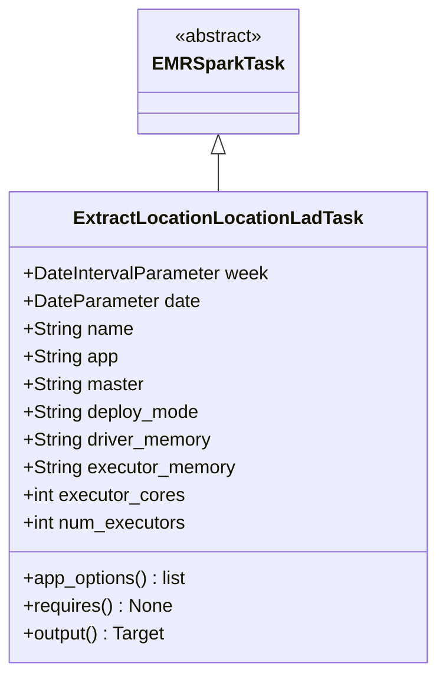
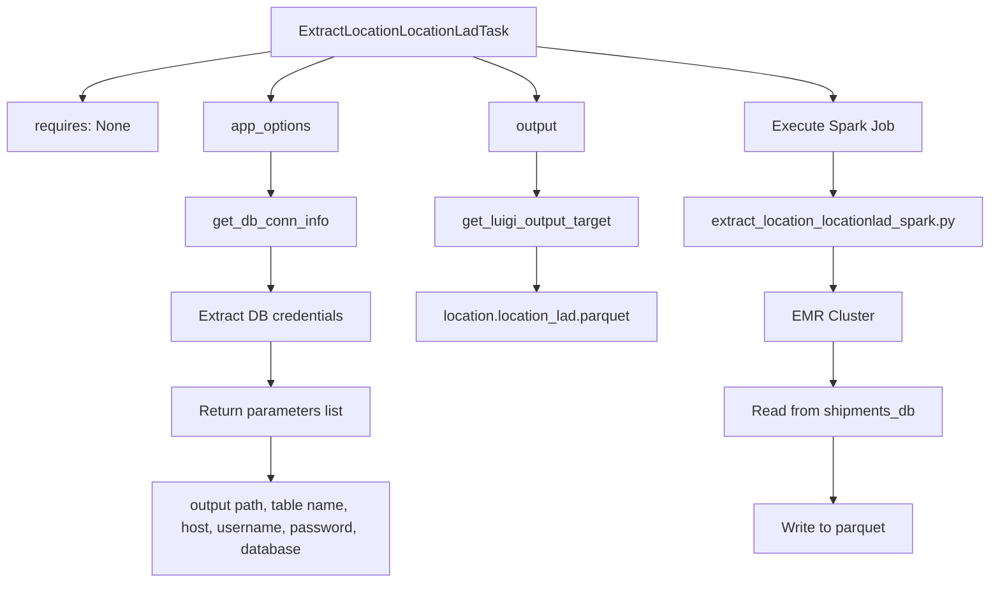

# Diagram: research/orchestrator/tasks/etl/extract_location_locationlad_task.py

> Auto-generated by Obscura crawlers

## Diagram 1

### SVG

<svg id="container" width="370.15625" xmlns="http://www.w3.org/2000/svg" class="classDiagram" height="582" viewBox="0 0 370.15625 582" role="graphics-document document" aria-roledescription="class"><g><defs><marker id="container_class-aggregationStart" class="marker aggregation class" refX="18" refY="7" markerWidth="190" markerHeight="240" orient="auto"><path d="M 18,7 L9,13 L1,7 L9,1 Z"></path></marker></defs><defs><marker id="container_class-aggregationEnd" class="marker aggregation class" refX="1" refY="7" markerWidth="20" markerHeight="28" orient="auto"><path d="M 18,7 L9,13 L1,7 L9,1 Z"></path></marker></defs><defs><marker id="container_class-extensionStart" class="marker extension class" refX="18" refY="7" markerWidth="190" markerHeight="240" orient="auto"><path d="M 1,7 L18,13 V 1 Z"></path></marker></defs><defs><marker id="container_class-extensionEnd" class="marker extension class" refX="1" refY="7" markerWidth="20" markerHeight="28" orient="auto"><path d="M 1,1 V 13 L18,7 Z"></path></marker></defs><defs><marker id="container_class-compositionStart" class="marker composition class" refX="18" refY="7" markerWidth="190" markerHeight="240" orient="auto"><path d="M 18,7 L9,13 L1,7 L9,1 Z"></path></marker></defs><defs><marker id="container_class-compositionEnd" class="marker composition class" refX="1" refY="7" markerWidth="20" markerHeight="28" orient="auto"><path d="M 18,7 L9,13 L1,7 L9,1 Z"></path></marker></defs><defs><marker id="container_class-dependencyStart" class="marker dependency class" refX="6" refY="7" markerWidth="190" markerHeight="240" orient="auto"><path d="M 5,7 L9,13 L1,7 L9,1 Z"></path></marker></defs><defs><marker id="container_class-dependencyEnd" class="marker dependency class" refX="13" refY="7" markerWidth="20" markerHeight="28" orient="auto"><path d="M 18,7 L9,13 L14,7 L9,1 Z"></path></marker></defs><defs><marker id="container_class-lollipopStart" class="marker lollipop class" refX="13" refY="7" markerWidth="190" markerHeight="240" orient="auto"><circle stroke="black" fill="transparent" cx="7" cy="7" r="6"></circle></marker></defs><defs><marker id="container_class-lollipopEnd" class="marker lollipop class" refX="1" refY="7" markerWidth="190" markerHeight="240" orient="auto"><circle stroke="black" fill="transparent" cx="7" cy="7" r="6"></circle></marker></defs><g class="root"><g class="clusters"></g><g class="edgePaths"><path d="M185.078,133.25L185.078,134.542C185.078,135.833,185.078,138.417,185.078,143.875C185.078,149.333,185.078,157.667,185.078,161.833L185.078,166" id="id_EMRSparkTask_ExtractLocationLocationLadTask_1" class="edge-thickness-normal edge-pattern-solid relation" style=";;;" data-edge="true" data-et="edge" data-id="id_EMRSparkTask_ExtractLocationLocationLadTask_1" data-points="W3sieCI6MTg1LjA3ODEyNSwieSI6MTE2fSx7IngiOjE4NS4wNzgxMjUsInkiOjE0MX0seyJ4IjoxODUuMDc4MTI1LCJ5IjoxNjZ9XQ==" marker-start="url(#container_class-extensionStart)"></path></g><g class="edgeLabels"><g class="edgeLabel"><g class="label" data-id="id_EMRSparkTask_ExtractLocationLocationLadTask_1" transform="translate(0, 0)"><foreignObject width="0" height="0">

</foreignObject></g></g></g><g class="nodes"><g class="node default" id="classId-EMRSparkTask-0" transform="translate(185.078125, 62)"><g class="basic label-container"><path d="M-65.1484375 -54 L65.1484375 -54 L65.1484375 54 L-65.1484375 54" stroke="none" stroke-width="0" fill="#ECECFF" style=""></path><path d="M-65.1484375 -54 C-36.979208768460246 -54, -8.809980036920493 -54, 65.1484375 -54 M-65.1484375 -54 C-33.560736515450614 -54, -1.9730355309012282 -54, 65.1484375 -54 M65.1484375 -54 C65.1484375 -21.577690619606294, 65.1484375 10.844618760787412, 65.1484375 54 M65.1484375 -54 C65.1484375 -28.89306641212251, 65.1484375 -3.7861328242450227, 65.1484375 54 M65.1484375 54 C30.833927232335512 54, -3.4805830353289764 54, -65.1484375 54 M65.1484375 54 C30.351432473783547 54, -4.445572552432907 54, -65.1484375 54 M-65.1484375 54 C-65.1484375 31.18346122643144, -65.1484375 8.36692245286288, -65.1484375 -54 M-65.1484375 54 C-65.1484375 17.66550611415318, -65.1484375 -18.668987771693637, -65.1484375 -54" stroke="#9370DB" stroke-width="1.3" fill="none" stroke-dasharray="0 0" style=""></path></g><g class="annotation-group text" transform="translate(-38.609375, -30)"><g class="label" style="" transform="translate(0,-12)"><foreignObject width="77.21875" height="24">

«abstract»

</foreignObject></g></g><g class="label-group text" transform="translate(-53.1484375, -6)"><g class="label" style="font-weight: bolder" transform="translate(0,-12)"><foreignObject width="106.296875" height="24">

EMRSparkTask

</foreignObject></g></g><g class="members-group text" transform="translate(-53.1484375, 42)"></g><g class="methods-group text" transform="translate(-53.1484375, 72)"></g><g class="divider" style=""><path d="M-65.1484375 18 C-26.166819564340308 18, 12.814798371319384 18, 65.1484375 18 M-65.1484375 18 C-33.35081509022395 18, -1.553192680447907 18, 65.1484375 18" stroke="#9370DB" stroke-width="1.3" fill="none" stroke-dasharray="0 0" style=""></path></g><g class="divider" style=""><path d="M-65.1484375 36 C-38.49512323088943 36, -11.84180896177886 36, 65.1484375 36 M-65.1484375 36 C-26.711683534834172 36, 11.725070430331655 36, 65.1484375 36" stroke="#9370DB" stroke-width="1.3" fill="none" stroke-dasharray="0 0" style=""></path></g></g><g class="node default" id="classId-ExtractLocationLocationLadTask-1" transform="translate(185.078125, 370)"><g class="basic label-container"><path d="M-177.078125 -204 L177.078125 -204 L177.078125 204 L-177.078125 204" stroke="none" stroke-width="0" fill="#ECECFF" style=""></path><path d="M-177.078125 -204 C-50.281824289489975 -204, 76.51447642102005 -204, 177.078125 -204 M-177.078125 -204 C-35.49391003382334 -204, 106.09030493235332 -204, 177.078125 -204 M177.078125 -204 C177.078125 -109.31167963471837, 177.078125 -14.623359269436747, 177.078125 204 M177.078125 -204 C177.078125 -60.816450624570194, 177.078125 82.36709875085961, 177.078125 204 M177.078125 204 C48.48982902485355 204, -80.0984669502929 204, -177.078125 204 M177.078125 204 C99.25875890386449 204, 21.43939280772898 204, -177.078125 204 M-177.078125 204 C-177.078125 116.150204947834, -177.078125 28.300409895667997, -177.078125 -204 M-177.078125 204 C-177.078125 46.48436804786962, -177.078125 -111.03126390426075, -177.078125 -204" stroke="#9370DB" stroke-width="1.3" fill="none" stroke-dasharray="0 0" style=""></path></g><g class="annotation-group text" transform="translate(0, -180)"></g><g class="label-group text" transform="translate(-118.03125, -180)"><g class="label" style="font-weight: bolder" transform="translate(0,-12)"><foreignObject width="236.0625" height="24">

ExtractLocationLocationLadTask

</foreignObject></g></g><g class="members-group text" transform="translate(-165.078125, -132)"><g class="label" style="" transform="translate(0,-12)"><foreignObject width="212.125" height="24">

+DateIntervalParameter week

</foreignObject></g><g class="label" style="" transform="translate(0,12)"><foreignObject width="152.171875" height="24">

+DateParameter date

</foreignObject></g><g class="label" style="" transform="translate(0,36)"><foreignObject width="94.984375" height="24">

+String name

</foreignObject></g><g class="label" style="" transform="translate(0,60)"><foreignObject width="82.1875" height="24">

+String app

</foreignObject></g><g class="label" style="" transform="translate(0,84)"><foreignObject width="104.625" height="24">

+String master

</foreignObject></g><g class="label" style="" transform="translate(0,108)"><foreignObject width="153.203125" height="24">

+String deploy_mode

</foreignObject></g><g class="label" style="" transform="translate(0,132)"><foreignObject width="164.015625" height="24">

+String driver_memory

</foreignObject></g><g class="label" style="" transform="translate(0,156)"><foreignObject width="183.8125" height="24">

+String executor_memory

</foreignObject></g><g class="label" style="" transform="translate(0,180)"><foreignObject width="139.9375" height="24">

+int executor_cores

</foreignObject></g><g class="label" style="" transform="translate(0,204)"><foreignObject width="142.296875" height="24">

+int num_executors

</foreignObject></g></g><g class="methods-group text" transform="translate(-165.078125, 132)"><g class="label" style="" transform="translate(0,-12)"><foreignObject width="143.609375" height="24">

+app_options() : list

</foreignObject></g><g class="label" style="" transform="translate(0,12)"><foreignObject width="128.75" height="24">

+requires() : None

</foreignObject></g><g class="label" style="" transform="translate(0,36)"><foreignObject width="124.375" height="24">

+output() : Target

</foreignObject></g></g><g class="divider" style=""><path d="M-177.078125 -156 C-49.82915129247361 -156, 77.41982241505278 -156, 177.078125 -156 M-177.078125 -156 C-65.03939964830927 -156, 46.99932570338146 -156, 177.078125 -156" stroke="#9370DB" stroke-width="1.3" fill="none" stroke-dasharray="0 0" style=""></path></g><g class="divider" style=""><path d="M-177.078125 108 C-71.30869144679471 108, 34.46074210641058 108, 177.078125 108 M-177.078125 108 C-89.95233103230673 108, -2.8265370646134613 108, 177.078125 108" stroke="#9370DB" stroke-width="1.3" fill="none" stroke-dasharray="0 0" style=""></path></g></g></g></g></g></svg>

## Diagram 2

### SVG

<svg id="container" width="1105.9140625" xmlns="http://www.w3.org/2000/svg" class="flowchart" height="638" viewBox="0 0 1105.9140625 638" role="graphics-document document" aria-roledescription="flowchart-v2"><g><marker id="container_flowchart-v2-pointEnd" class="marker flowchart-v2" viewBox="0 0 10 10" refX="5" refY="5" markerUnits="userSpaceOnUse" markerWidth="8" markerHeight="8" orient="auto"><path d="M 0 0 L 10 5 L 0 10 z" class="arrowMarkerPath" style="stroke-width: 1; stroke-dasharray: 1, 0;"></path></marker><marker id="container_flowchart-v2-pointStart" class="marker flowchart-v2" viewBox="0 0 10 10" refX="4.5" refY="5" markerUnits="userSpaceOnUse" markerWidth="8" markerHeight="8" orient="auto"><path d="M 0 5 L 10 10 L 10 0 z" class="arrowMarkerPath" style="stroke-width: 1; stroke-dasharray: 1, 0;"></path></marker><marker id="container_flowchart-v2-circleEnd" class="marker flowchart-v2" viewBox="0 0 10 10" refX="11" refY="5" markerUnits="userSpaceOnUse" markerWidth="11" markerHeight="11" orient="auto"><circle cx="5" cy="5" r="5" class="arrowMarkerPath" style="stroke-width: 1; stroke-dasharray: 1, 0;"></circle></marker><marker id="container_flowchart-v2-circleStart" class="marker flowchart-v2" viewBox="0 0 10 10" refX="-1" refY="5" markerUnits="userSpaceOnUse" markerWidth="11" markerHeight="11" orient="auto"><circle cx="5" cy="5" r="5" class="arrowMarkerPath" style="stroke-width: 1; stroke-dasharray: 1, 0;"></circle></marker><marker id="container_flowchart-v2-crossEnd" class="marker cross flowchart-v2" viewBox="0 0 11 11" refX="12" refY="5.2" markerUnits="userSpaceOnUse" markerWidth="11" markerHeight="11" orient="auto"><path d="M 1,1 l 9,9 M 10,1 l -9,9" class="arrowMarkerPath" style="stroke-width: 2; stroke-dasharray: 1, 0;"></path></marker><marker id="container_flowchart-v2-crossStart" class="marker cross flowchart-v2" viewBox="0 0 11 11" refX="-1" refY="5.2" markerUnits="userSpaceOnUse" markerWidth="11" markerHeight="11" orient="auto"><path d="M 1,1 l 9,9 M 10,1 l -9,9" class="arrowMarkerPath" style="stroke-width: 2; stroke-dasharray: 1, 0;"></path></marker><g class="root"><g class="clusters"></g><g class="edgePaths"><path d="M301.918,56.268L266.778,61.39C231.638,66.512,161.358,76.756,126.218,85.378C91.078,94,91.078,101,91.078,104.5L91.078,108" id="L_A_B_0" class="edge-thickness-normal edge-pattern-solid edge-thickness-normal edge-pattern-solid flowchart-link" style=";" data-edge="true" data-et="edge" data-id="L_A_B_0" data-points="W3sieCI6MzAxLjkxNzk2ODc1LCJ5Ijo1Ni4yNjgyNDk5NTM0NjQ5NDV9LHsieCI6OTEuMDc4MTI1LCJ5Ijo4N30seyJ4Ijo5MS4wNzgxMjUsInkiOjExMn1d" marker-end="url(#container_flowchart-v2-pointEnd)"></path><path d="M370.826,62L358.942,66.167C347.058,70.333,323.291,78.667,311.407,86.333C299.523,94,299.523,101,299.523,104.5L299.523,108" id="L_A_C_0" class="edge-thickness-normal edge-pattern-solid edge-thickness-normal edge-pattern-solid flowchart-link" style=";" data-edge="true" data-et="edge" data-id="L_A_C_0" data-points="W3sieCI6MzcwLjgyNTY0NjAzMzY1MzgsInkiOjYyfSx7IngiOjI5OS41MjM0Mzc1LCJ5Ijo4N30seyJ4IjoyOTkuNTIzNDM3NSwieSI6MTEyfV0=" marker-end="url(#container_flowchart-v2-pointEnd)"></path><path d="M299.523,166L299.523,170.167C299.523,174.333,299.523,182.667,299.523,190.333C299.523,198,299.523,205,299.523,208.5L299.523,212" id="L_C_D_0" class="edge-thickness-normal edge-pattern-solid edge-thickness-normal edge-pattern-solid flowchart-link" style=";" data-edge="true" data-et="edge" data-id="L_C_D_0" data-points="W3sieCI6Mjk5LjUyMzQzNzUsInkiOjE2Nn0seyJ4IjoyOTkuNTIzNDM3NSwieSI6MTkxfSx7IngiOjI5OS41MjM0Mzc1LCJ5IjoyMTZ9XQ==" marker-end="url(#container_flowchart-v2-pointEnd)"></path><path d="M299.523,270L299.523,274.167C299.523,278.333,299.523,286.667,299.523,294.333C299.523,302,299.523,309,299.523,312.5L299.523,316" id="L_D_E_0" class="edge-thickness-normal edge-pattern-solid edge-thickness-normal edge-pattern-solid flowchart-link" style=";" data-edge="true" data-et="edge" data-id="L_D_E_0" data-points="W3sieCI6Mjk5LjUyMzQzNzUsInkiOjI3MH0seyJ4IjoyOTkuNTIzNDM3NSwieSI6Mjk1fSx7IngiOjI5OS41MjM0Mzc1LCJ5IjozMjB9XQ==" marker-end="url(#container_flowchart-v2-pointEnd)"></path><path d="M299.523,374L299.523,378.167C299.523,382.333,299.523,390.667,299.523,398.333C299.523,406,299.523,413,299.523,416.5L299.523,420" id="L_E_F_0" class="edge-thickness-normal edge-pattern-solid edge-thickness-normal edge-pattern-solid flowchart-link" style=";" data-edge="true" data-et="edge" data-id="L_E_F_0" data-points="W3sieCI6Mjk5LjUyMzQzNzUsInkiOjM3NH0seyJ4IjoyOTkuNTIzNDM3NSwieSI6Mzk5fSx7IngiOjI5OS41MjM0Mzc1LCJ5Ijo0MjR9XQ==" marker-end="url(#container_flowchart-v2-pointEnd)"></path><path d="M299.523,478L299.523,482.167C299.523,486.333,299.523,494.667,299.523,502.333C299.523,510,299.523,517,299.523,520.5L299.523,524" id="L_F_G_0" class="edge-thickness-normal edge-pattern-solid edge-thickness-normal edge-pattern-solid flowchart-link" style=";" data-edge="true" data-et="edge" data-id="L_F_G_0" data-points="W3sieCI6Mjk5LjUyMzQzNzUsInkiOjQ3OH0seyJ4IjoyOTkuNTIzNDM3NSwieSI6NTAzfSx7IngiOjI5OS41MjM0Mzc1LCJ5Ijo1Mjh9XQ==" marker-end="url(#container_flowchart-v2-pointEnd)"></path><path d="M524.838,62L536.722,66.167C548.606,70.333,572.373,78.667,584.257,86.333C596.141,94,596.141,101,596.141,104.5L596.141,108" id="L_A_H_0" class="edge-thickness-normal edge-pattern-solid edge-thickness-normal edge-pattern-solid flowchart-link" style=";" data-edge="true" data-et="edge" data-id="L_A_H_0" data-points="W3sieCI6NTI0LjgzODQxNjQ2NjM0NjIsInkiOjYyfSx7IngiOjU5Ni4xNDA2MjUsInkiOjg3fSx7IngiOjU5Ni4xNDA2MjUsInkiOjExMn1d" marker-end="url(#container_flowchart-v2-pointEnd)"></path><path d="M596.141,166L596.141,170.167C596.141,174.333,596.141,182.667,596.141,190.333C596.141,198,596.141,205,596.141,208.5L596.141,212" id="L_H_I_0" class="edge-thickness-normal edge-pattern-solid edge-thickness-normal edge-pattern-solid flowchart-link" style=";" data-edge="true" data-et="edge" data-id="L_H_I_0" data-points="W3sieCI6NTk2LjE0MDYyNSwieSI6MTY2fSx7IngiOjU5Ni4xNDA2MjUsInkiOjE5MX0seyJ4Ijo1OTYuMTQwNjI1LCJ5IjoyMTZ9XQ==" marker-end="url(#container_flowchart-v2-pointEnd)"></path><path d="M596.141,270L596.141,274.167C596.141,278.333,596.141,286.667,596.141,294.333C596.141,302,596.141,309,596.141,312.5L596.141,316" id="L_I_J_0" class="edge-thickness-normal edge-pattern-solid edge-thickness-normal edge-pattern-solid flowchart-link" style=";" data-edge="true" data-et="edge" data-id="L_I_J_0" data-points="W3sieCI6NTk2LjE0MDYyNSwieSI6MjcwfSx7IngiOjU5Ni4xNDA2MjUsInkiOjI5NX0seyJ4Ijo1OTYuMTQwNjI1LCJ5IjozMjB9XQ==" marker-end="url(#container_flowchart-v2-pointEnd)"></path><path d="M593.746,50.752L649.708,56.793C705.669,62.835,817.592,74.917,873.554,84.459C929.516,94,929.516,101,929.516,104.5L929.516,108" id="L_A_K_0" class="edge-thickness-normal edge-pattern-solid edge-thickness-normal edge-pattern-solid flowchart-link" style=";" data-edge="true" data-et="edge" data-id="L_A_K_0" data-points="W3sieCI6NTkzLjc0NjA5Mzc1LCJ5Ijo1MC43NTIxMDY0NjI1MjE1OTZ9LHsieCI6OTI5LjUxNTYyNSwieSI6ODd9LHsieCI6OTI5LjUxNTYyNSwieSI6MTEyfV0=" marker-end="url(#container_flowchart-v2-pointEnd)"></path><path d="M929.516,166L929.516,170.167C929.516,174.333,929.516,182.667,929.516,190.333C929.516,198,929.516,205,929.516,208.5L929.516,212" id="L_K_L_0" class="edge-thickness-normal edge-pattern-solid edge-thickness-normal edge-pattern-solid flowchart-link" style=";" data-edge="true" data-et="edge" data-id="L_K_L_0" data-points="W3sieCI6OTI5LjUxNTYyNSwieSI6MTY2fSx7IngiOjkyOS41MTU2MjUsInkiOjE5MX0seyJ4Ijo5MjkuNTE1NjI1LCJ5IjoyMTZ9XQ==" marker-end="url(#container_flowchart-v2-pointEnd)"></path><path d="M929.516,270L929.516,274.167C929.516,278.333,929.516,286.667,929.516,294.333C929.516,302,929.516,309,929.516,312.5L929.516,316" id="L_L_M_0" class="edge-thickness-normal edge-pattern-solid edge-thickness-normal edge-pattern-solid flowchart-link" style=";" data-edge="true" data-et="edge" data-id="L_L_M_0" data-points="W3sieCI6OTI5LjUxNTYyNSwieSI6MjcwfSx7IngiOjkyOS41MTU2MjUsInkiOjI5NX0seyJ4Ijo5MjkuNTE1NjI1LCJ5IjozMjB9XQ==" marker-end="url(#container_flowchart-v2-pointEnd)"></path><path d="M929.516,374L929.516,378.167C929.516,382.333,929.516,390.667,929.516,398.333C929.516,406,929.516,413,929.516,416.5L929.516,420" id="L_M_N_0" class="edge-thickness-normal edge-pattern-solid edge-thickness-normal edge-pattern-solid flowchart-link" style=";" data-edge="true" data-et="edge" data-id="L_M_N_0" data-points="W3sieCI6OTI5LjUxNTYyNSwieSI6Mzc0fSx7IngiOjkyOS41MTU2MjUsInkiOjM5OX0seyJ4Ijo5MjkuNTE1NjI1LCJ5Ijo0MjR9XQ==" marker-end="url(#container_flowchart-v2-pointEnd)"></path><path d="M929.516,478L929.516,482.167C929.516,486.333,929.516,494.667,929.516,506.333C929.516,518,929.516,533,929.516,540.5L929.516,548" id="L_N_O_0" class="edge-thickness-normal edge-pattern-solid edge-thickness-normal edge-pattern-solid flowchart-link" style=";" data-edge="true" data-et="edge" data-id="L_N_O_0" data-points="W3sieCI6OTI5LjUxNTYyNSwieSI6NDc4fSx7IngiOjkyOS41MTU2MjUsInkiOjUwM30seyJ4Ijo5MjkuNTE1NjI1LCJ5Ijo1NTJ9XQ==" marker-end="url(#container_flowchart-v2-pointEnd)"></path></g><g class="edgeLabels"><g class="edgeLabel"><g class="label" data-id="L_A_B_0" transform="translate(0, 0)"><foreignObject width="0" height="0">

</foreignObject></g></g><g class="edgeLabel"><g class="label" data-id="L_A_C_0" transform="translate(0, 0)"><foreignObject width="0" height="0">

</foreignObject></g></g><g class="edgeLabel"><g class="label" data-id="L_C_D_0" transform="translate(0, 0)"><foreignObject width="0" height="0">

</foreignObject></g></g><g class="edgeLabel"><g class="label" data-id="L_D_E_0" transform="translate(0, 0)"><foreignObject width="0" height="0">

</foreignObject></g></g><g class="edgeLabel"><g class="label" data-id="L_E_F_0" transform="translate(0, 0)"><foreignObject width="0" height="0">

</foreignObject></g></g><g class="edgeLabel"><g class="label" data-id="L_F_G_0" transform="translate(0, 0)"><foreignObject width="0" height="0">

</foreignObject></g></g><g class="edgeLabel"><g class="label" data-id="L_A_H_0" transform="translate(0, 0)"><foreignObject width="0" height="0">

</foreignObject></g></g><g class="edgeLabel"><g class="label" data-id="L_H_I_0" transform="translate(0, 0)"><foreignObject width="0" height="0">

</foreignObject></g></g><g class="edgeLabel"><g class="label" data-id="L_I_J_0" transform="translate(0, 0)"><foreignObject width="0" height="0">

</foreignObject></g></g><g class="edgeLabel"><g class="label" data-id="L_A_K_0" transform="translate(0, 0)"><foreignObject width="0" height="0">

</foreignObject></g></g><g class="edgeLabel"><g class="label" data-id="L_K_L_0" transform="translate(0, 0)"><foreignObject width="0" height="0">

</foreignObject></g></g><g class="edgeLabel"><g class="label" data-id="L_L_M_0" transform="translate(0, 0)"><foreignObject width="0" height="0">

</foreignObject></g></g><g class="edgeLabel"><g class="label" data-id="L_M_N_0" transform="translate(0, 0)"><foreignObject width="0" height="0">

</foreignObject></g></g><g class="edgeLabel"><g class="label" data-id="L_N_O_0" transform="translate(0, 0)"><foreignObject width="0" height="0">

</foreignObject></g></g></g><g class="nodes"><g class="node default" id="flowchart-A-0" transform="translate(447.83203125, 35)"><rect class="basic label-container" style="" x="-145.9140625" y="-27" width="291.828125" height="54"></rect><g class="label" style="" transform="translate(-115.9140625, -12)"><rect></rect><foreignObject width="231.828125" height="24">

ExtractLocationLocationLadTask

</foreignObject></g></g><g class="node default" id="flowchart-B-1" transform="translate(91.078125, 139)"><rect class="basic label-container" style="" x="-83.078125" y="-27" width="166.15625" height="54"></rect><g class="label" style="" transform="translate(-53.078125, -12)"><rect></rect><foreignObject width="106.15625" height="24">

requires: None

</foreignObject></g></g><g class="node default" id="flowchart-C-3" transform="translate(299.5234375, 139)"><rect class="basic label-container" style="" x="-75.3671875" y="-27" width="150.734375" height="54"></rect><g class="label" style="" transform="translate(-45.3671875, -12)"><rect></rect><foreignObject width="90.734375" height="24">

app_options

</foreignObject></g></g><g class="node default" id="flowchart-D-5" transform="translate(299.5234375, 243)"><rect class="basic label-container" style="" x="-94.75" y="-27" width="189.5" height="54"></rect><g class="label" style="" transform="translate(-64.75, -12)"><rect></rect><foreignObject width="129.5" height="24">

get_db_conn_info

</foreignObject></g></g><g class="node default" id="flowchart-E-7" transform="translate(299.5234375, 347)"><rect class="basic label-container" style="" x="-109.5390625" y="-27" width="219.078125" height="54"></rect><g class="label" style="" transform="translate(-79.5390625, -12)"><rect></rect><foreignObject width="159.078125" height="24">

Extract DB credentials

</foreignObject></g></g><g class="node default" id="flowchart-F-9" transform="translate(299.5234375, 451)"><rect class="basic label-container" style="" x="-111.1015625" y="-27" width="222.203125" height="54"></rect><g class="label" style="" transform="translate(-81.1015625, -12)"><rect></rect><foreignObject width="162.203125" height="24">

Return parameters list

</foreignObject></g></g><g class="node default" id="flowchart-G-11" transform="translate(299.5234375, 579)"><rect class="basic label-container" style="" x="-130" y="-51" width="260" height="102"></rect><g class="label" style="" transform="translate(-100, -36)"><rect></rect><foreignObject width="200" height="72">

output path, table name, host, username, password, database

</foreignObject></g></g><g class="node default" id="flowchart-H-13" transform="translate(596.140625, 139)"><rect class="basic label-container" style="" x="-54.515625" y="-27" width="109.03125" height="54"></rect><g class="label" style="" transform="translate(-24.515625, -12)"><rect></rect><foreignObject width="49.03125" height="24">

output

</foreignObject></g></g><g class="node default" id="flowchart-I-15" transform="translate(596.140625, 243)"><rect class="basic label-container" style="" x="-114.9765625" y="-27" width="229.953125" height="54"></rect><g class="label" style="" transform="translate(-84.9765625, -12)"><rect></rect><foreignObject width="169.953125" height="24">

get_luigi_output_target

</foreignObject></g></g><g class="node default" id="flowchart-J-17" transform="translate(596.140625, 347)"><rect class="basic label-container" style="" x="-137.078125" y="-27" width="274.15625" height="54"></rect><g class="label" style="" transform="translate(-107.078125, -12)"><rect></rect><foreignObject width="214.15625" height="24">

location.location_lad.parquet

</foreignObject></g></g><g class="node default" id="flowchart-K-19" transform="translate(929.515625, 139)"><rect class="basic label-container" style="" x="-94.6484375" y="-27" width="189.296875" height="54"></rect><g class="label" style="" transform="translate(-64.6484375, -12)"><rect></rect><foreignObject width="129.296875" height="24">

Execute Spark Job

</foreignObject></g></g><g class="node default" id="flowchart-L-21" transform="translate(929.515625, 243)"><rect class="basic label-container" style="" x="-168.3984375" y="-27" width="336.796875" height="54"></rect><g class="label" style="" transform="translate(-138.3984375, -12)"><rect></rect><foreignObject width="276.796875" height="24">

extract_location_locationlad_spark.py

</foreignObject></g></g><g class="node default" id="flowchart-M-23" transform="translate(929.515625, 347)"><rect class="basic label-container" style="" x="-72.8203125" y="-27" width="145.640625" height="54"></rect><g class="label" style="" transform="translate(-42.8203125, -12)"><rect></rect><foreignObject width="85.640625" height="24">

EMR Cluster

</foreignObject></g></g><g class="node default" id="flowchart-N-25" transform="translate(929.515625, 451)"><rect class="basic label-container" style="" x="-120.7734375" y="-27" width="241.546875" height="54"></rect><g class="label" style="" transform="translate(-90.7734375, -12)"><rect></rect><foreignObject width="181.546875" height="24">

Read from shipments_db

</foreignObject></g></g><g class="node default" id="flowchart-O-27" transform="translate(929.515625, 579)"><rect class="basic label-container" style="" x="-89.28125" y="-27" width="178.5625" height="54"></rect><g class="label" style="" transform="translate(-59.28125, -12)"><rect></rect><foreignObject width="118.5625" height="24">

Write to parquet

</foreignObject></g></g></g></g></g></svg>
