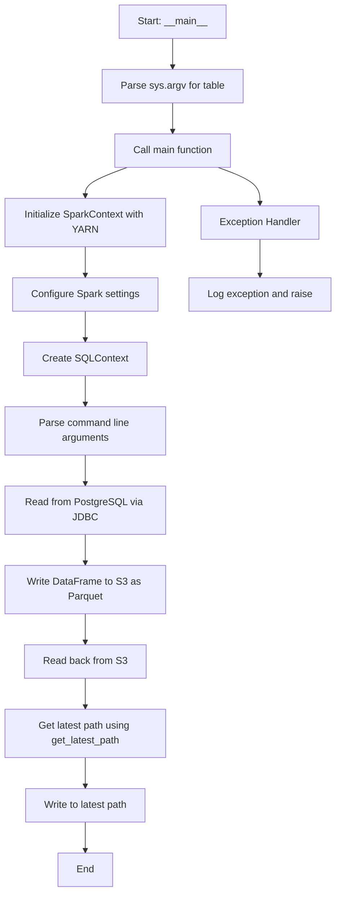
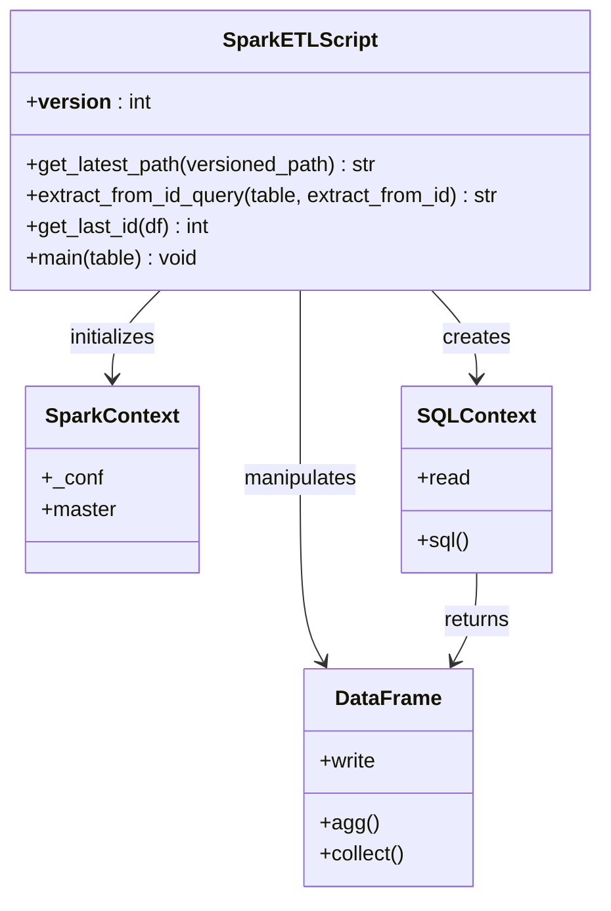
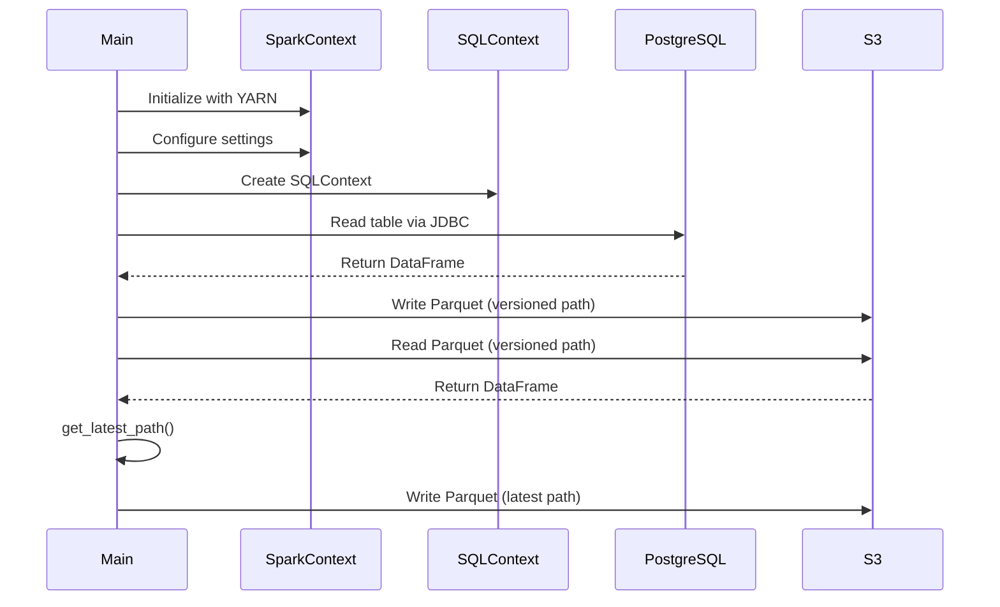

# Diagram: research/orchestrator/tasks/etl/extract_location_organizationlad_spark.py

> Auto-generated by Obscura crawlers

## Diagram 1

### SVG

<svg id="container" width="545.0859375" xmlns="http://www.w3.org/2000/svg" class="flowchart" height="1438" viewBox="0 0 545.0859375 1438" role="graphics-document document" aria-roledescription="flowchart-v2"><g><marker id="container_flowchart-v2-pointEnd" class="marker flowchart-v2" viewBox="0 0 10 10" refX="5" refY="5" markerUnits="userSpaceOnUse" markerWidth="8" markerHeight="8" orient="auto"><path d="M 0 0 L 10 5 L 0 10 z" class="arrowMarkerPath" style="stroke-width: 1; stroke-dasharray: 1, 0;"></path></marker><marker id="container_flowchart-v2-pointStart" class="marker flowchart-v2" viewBox="0 0 10 10" refX="4.5" refY="5" markerUnits="userSpaceOnUse" markerWidth="8" markerHeight="8" orient="auto"><path d="M 0 5 L 10 10 L 10 0 z" class="arrowMarkerPath" style="stroke-width: 1; stroke-dasharray: 1, 0;"></path></marker><marker id="container_flowchart-v2-circleEnd" class="marker flowchart-v2" viewBox="0 0 10 10" refX="11" refY="5" markerUnits="userSpaceOnUse" markerWidth="11" markerHeight="11" orient="auto"><circle cx="5" cy="5" r="5" class="arrowMarkerPath" style="stroke-width: 1; stroke-dasharray: 1, 0;"></circle></marker><marker id="container_flowchart-v2-circleStart" class="marker flowchart-v2" viewBox="0 0 10 10" refX="-1" refY="5" markerUnits="userSpaceOnUse" markerWidth="11" markerHeight="11" orient="auto"><circle cx="5" cy="5" r="5" class="arrowMarkerPath" style="stroke-width: 1; stroke-dasharray: 1, 0;"></circle></marker><marker id="container_flowchart-v2-crossEnd" class="marker cross flowchart-v2" viewBox="0 0 11 11" refX="12" refY="5.2" markerUnits="userSpaceOnUse" markerWidth="11" markerHeight="11" orient="auto"><path d="M 1,1 l 9,9 M 10,1 l -9,9" class="arrowMarkerPath" style="stroke-width: 2; stroke-dasharray: 1, 0;"></path></marker><marker id="container_flowchart-v2-crossStart" class="marker cross flowchart-v2" viewBox="0 0 11 11" refX="-1" refY="5.2" markerUnits="userSpaceOnUse" markerWidth="11" markerHeight="11" orient="auto"><path d="M 1,1 l 9,9 M 10,1 l -9,9" class="arrowMarkerPath" style="stroke-width: 2; stroke-dasharray: 1, 0;"></path></marker><g class="root"><g class="clusters"></g><g class="edgePaths"><path d="M279.695,62L279.695,66.167C279.695,70.333,279.695,78.667,279.695,86.333C279.695,94,279.695,101,279.695,104.5L279.695,108" id="L_A_B_0" class="edge-thickness-normal edge-pattern-solid edge-thickness-normal edge-pattern-solid flowchart-link" style=";" data-edge="true" data-et="edge" data-id="L_A_B_0" data-points="W3sieCI6Mjc5LjY5NTMxMjUsInkiOjYyfSx7IngiOjI3OS42OTUzMTI1LCJ5Ijo4N30seyJ4IjoyNzkuNjk1MzEyNSwieSI6MTEyfV0=" marker-end="url(#container_flowchart-v2-pointEnd)"></path><path d="M279.695,166L279.695,170.167C279.695,174.333,279.695,182.667,279.695,190.333C279.695,198,279.695,205,279.695,208.5L279.695,212" id="L_B_C_0" class="edge-thickness-normal edge-pattern-solid edge-thickness-normal edge-pattern-solid flowchart-link" style=";" data-edge="true" data-et="edge" data-id="L_B_C_0" data-points="W3sieCI6Mjc5LjY5NTMxMjUsInkiOjE2Nn0seyJ4IjoyNzkuNjk1MzEyNSwieSI6MTkxfSx7IngiOjI3OS42OTUzMTI1LCJ5IjoyMTZ9XQ==" marker-end="url(#container_flowchart-v2-pointEnd)"></path><path d="M206.123,270L194.769,274.167C183.415,278.333,160.708,286.667,149.354,294.333C138,302,138,309,138,312.5L138,316" id="L_C_D_0" class="edge-thickness-normal edge-pattern-solid edge-thickness-normal edge-pattern-solid flowchart-link" style=";" data-edge="true" data-et="edge" data-id="L_C_D_0" data-points="W3sieCI6MjA2LjEyMjc0NjM5NDIzMDc3LCJ5IjoyNzB9LHsieCI6MTM4LCJ5IjoyOTV9LHsieCI6MTM4LCJ5IjozMjB9XQ==" marker-end="url(#container_flowchart-v2-pointEnd)"></path><path d="M138,398L138,402.167C138,406.333,138,414.667,138,422.333C138,430,138,437,138,440.5L138,444" id="L_D_E_0" class="edge-thickness-normal edge-pattern-solid edge-thickness-normal edge-pattern-solid flowchart-link" style=";" data-edge="true" data-et="edge" data-id="L_D_E_0" data-points="W3sieCI6MTM4LCJ5IjozOTh9LHsieCI6MTM4LCJ5Ijo0MjN9LHsieCI6MTM4LCJ5Ijo0NDh9XQ==" marker-end="url(#container_flowchart-v2-pointEnd)"></path><path d="M138,502L138,506.167C138,510.333,138,518.667,138,526.333C138,534,138,541,138,544.5L138,548" id="L_E_F_0" class="edge-thickness-normal edge-pattern-solid edge-thickness-normal edge-pattern-solid flowchart-link" style=";" data-edge="true" data-et="edge" data-id="L_E_F_0" data-points="W3sieCI6MTM4LCJ5Ijo1MDJ9LHsieCI6MTM4LCJ5Ijo1Mjd9LHsieCI6MTM4LCJ5Ijo1NTJ9XQ==" marker-end="url(#container_flowchart-v2-pointEnd)"></path><path d="M138,606L138,610.167C138,614.333,138,622.667,138,630.333C138,638,138,645,138,648.5L138,652" id="L_F_G_0" class="edge-thickness-normal edge-pattern-solid edge-thickness-normal edge-pattern-solid flowchart-link" style=";" data-edge="true" data-et="edge" data-id="L_F_G_0" data-points="W3sieCI6MTM4LCJ5Ijo2MDZ9LHsieCI6MTM4LCJ5Ijo2MzF9LHsieCI6MTM4LCJ5Ijo2NTZ9XQ==" marker-end="url(#container_flowchart-v2-pointEnd)"></path><path d="M138,734L138,738.167C138,742.333,138,750.667,138,758.333C138,766,138,773,138,776.5L138,780" id="L_G_H_0" class="edge-thickness-normal edge-pattern-solid edge-thickness-normal edge-pattern-solid flowchart-link" style=";" data-edge="true" data-et="edge" data-id="L_G_H_0" data-points="W3sieCI6MTM4LCJ5Ijo3MzR9LHsieCI6MTM4LCJ5Ijo3NTl9LHsieCI6MTM4LCJ5Ijo3ODR9XQ==" marker-end="url(#container_flowchart-v2-pointEnd)"></path><path d="M138,862L138,866.167C138,870.333,138,878.667,138,886.333C138,894,138,901,138,904.5L138,908" id="L_H_I_0" class="edge-thickness-normal edge-pattern-solid edge-thickness-normal edge-pattern-solid flowchart-link" style=";" data-edge="true" data-et="edge" data-id="L_H_I_0" data-points="W3sieCI6MTM4LCJ5Ijo4NjJ9LHsieCI6MTM4LCJ5Ijo4ODd9LHsieCI6MTM4LCJ5Ijo5MTJ9XQ==" marker-end="url(#container_flowchart-v2-pointEnd)"></path><path d="M138,990L138,994.167C138,998.333,138,1006.667,138,1014.333C138,1022,138,1029,138,1032.5L138,1036" id="L_I_J_0" class="edge-thickness-normal edge-pattern-solid edge-thickness-normal edge-pattern-solid flowchart-link" style=";" data-edge="true" data-et="edge" data-id="L_I_J_0" data-points="W3sieCI6MTM4LCJ5Ijo5OTB9LHsieCI6MTM4LCJ5IjoxMDE1fSx7IngiOjEzOCwieSI6MTA0MH1d" marker-end="url(#container_flowchart-v2-pointEnd)"></path><path d="M138,1094L138,1098.167C138,1102.333,138,1110.667,138,1118.333C138,1126,138,1133,138,1136.5L138,1140" id="L_J_K_0" class="edge-thickness-normal edge-pattern-solid edge-thickness-normal edge-pattern-solid flowchart-link" style=";" data-edge="true" data-et="edge" data-id="L_J_K_0" data-points="W3sieCI6MTM4LCJ5IjoxMDk0fSx7IngiOjEzOCwieSI6MTExOX0seyJ4IjoxMzgsInkiOjExNDR9XQ==" marker-end="url(#container_flowchart-v2-pointEnd)"></path><path d="M138,1222L138,1226.167C138,1230.333,138,1238.667,138,1246.333C138,1254,138,1261,138,1264.5L138,1268" id="L_K_L_0" class="edge-thickness-normal edge-pattern-solid edge-thickness-normal edge-pattern-solid flowchart-link" style=";" data-edge="true" data-et="edge" data-id="L_K_L_0" data-points="W3sieCI6MTM4LCJ5IjoxMjIyfSx7IngiOjEzOCwieSI6MTI0N30seyJ4IjoxMzgsInkiOjEyNzJ9XQ==" marker-end="url(#container_flowchart-v2-pointEnd)"></path><path d="M138,1326L138,1330.167C138,1334.333,138,1342.667,138,1350.333C138,1358,138,1365,138,1368.5L138,1372" id="L_L_M_0" class="edge-thickness-normal edge-pattern-solid edge-thickness-normal edge-pattern-solid flowchart-link" style=";" data-edge="true" data-et="edge" data-id="L_L_M_0" data-points="W3sieCI6MTM4LCJ5IjoxMzI2fSx7IngiOjEzOCwieSI6MTM1MX0seyJ4IjoxMzgsInkiOjEzNzZ9XQ==" marker-end="url(#container_flowchart-v2-pointEnd)"></path><path d="M353.268,270L364.622,274.167C375.975,278.333,398.683,286.667,410.037,296.333C421.391,306,421.391,317,421.391,322.5L421.391,328" id="L_C_N_0" class="edge-thickness-normal edge-pattern-solid edge-thickness-normal edge-pattern-solid flowchart-link" style=";" data-edge="true" data-et="edge" data-id="L_C_N_0" data-points="W3sieCI6MzUzLjI2Nzg3ODYwNTc2OTIsInkiOjI3MH0seyJ4Ijo0MjEuMzkwNjI1LCJ5IjoyOTV9LHsieCI6NDIxLjM5MDYyNSwieSI6MzMyfV0=" marker-end="url(#container_flowchart-v2-pointEnd)"></path><path d="M421.391,386L421.391,392.167C421.391,398.333,421.391,410.667,421.391,420.333C421.391,430,421.391,437,421.391,440.5L421.391,444" id="L_N_O_0" class="edge-thickness-normal edge-pattern-solid edge-thickness-normal edge-pattern-solid flowchart-link" style=";" data-edge="true" data-et="edge" data-id="L_N_O_0" data-points="W3sieCI6NDIxLjM5MDYyNSwieSI6Mzg2fSx7IngiOjQyMS4zOTA2MjUsInkiOjQyM30seyJ4Ijo0MjEuMzkwNjI1LCJ5Ijo0NDh9XQ==" marker-end="url(#container_flowchart-v2-pointEnd)"></path></g><g class="edgeLabels"><g class="edgeLabel"><g class="label" data-id="L_A_B_0" transform="translate(0, 0)"><foreignObject width="0" height="0">

</foreignObject></g></g><g class="edgeLabel"><g class="label" data-id="L_B_C_0" transform="translate(0, 0)"><foreignObject width="0" height="0">

</foreignObject></g></g><g class="edgeLabel"><g class="label" data-id="L_C_D_0" transform="translate(0, 0)"><foreignObject width="0" height="0">

</foreignObject></g></g><g class="edgeLabel"><g class="label" data-id="L_D_E_0" transform="translate(0, 0)"><foreignObject width="0" height="0">

</foreignObject></g></g><g class="edgeLabel"><g class="label" data-id="L_E_F_0" transform="translate(0, 0)"><foreignObject width="0" height="0">

</foreignObject></g></g><g class="edgeLabel"><g class="label" data-id="L_F_G_0" transform="translate(0, 0)"><foreignObject width="0" height="0">

</foreignObject></g></g><g class="edgeLabel"><g class="label" data-id="L_G_H_0" transform="translate(0, 0)"><foreignObject width="0" height="0">

</foreignObject></g></g><g class="edgeLabel"><g class="label" data-id="L_H_I_0" transform="translate(0, 0)"><foreignObject width="0" height="0">

</foreignObject></g></g><g class="edgeLabel"><g class="label" data-id="L_I_J_0" transform="translate(0, 0)"><foreignObject width="0" height="0">

</foreignObject></g></g><g class="edgeLabel"><g class="label" data-id="L_J_K_0" transform="translate(0, 0)"><foreignObject width="0" height="0">

</foreignObject></g></g><g class="edgeLabel"><g class="label" data-id="L_K_L_0" transform="translate(0, 0)"><foreignObject width="0" height="0">

</foreignObject></g></g><g class="edgeLabel"><g class="label" data-id="L_L_M_0" transform="translate(0, 0)"><foreignObject width="0" height="0">

</foreignObject></g></g><g class="edgeLabel"><g class="label" data-id="L_C_N_0" transform="translate(0, 0)"><foreignObject width="0" height="0">

</foreignObject></g></g><g class="edgeLabel"><g class="label" data-id="L_N_O_0" transform="translate(0, 0)"><foreignObject width="0" height="0">

</foreignObject></g></g></g><g class="nodes"><g class="node default" id="flowchart-A-0" transform="translate(279.6953125, 35)"><rect class="basic label-container" style="" x="-69.6171875" y="-27" width="139.234375" height="54"></rect><g class="label" style="" transform="translate(-39.6171875, -12)"><rect></rect><foreignObject width="79.234375" height="24">

Start: <strong>main</strong>

</foreignObject></g></g><g class="node default" id="flowchart-B-1" transform="translate(279.6953125, 139)"><rect class="basic label-container" style="" x="-113.5" y="-27" width="227" height="54"></rect><g class="label" style="" transform="translate(-83.5, -12)"><rect></rect><foreignObject width="167" height="24">

Parse sys.argv for table

</foreignObject></g></g><g class="node default" id="flowchart-C-3" transform="translate(279.6953125, 243)"><rect class="basic label-container" style="" x="-96.109375" y="-27" width="192.21875" height="54"></rect><g class="label" style="" transform="translate(-66.109375, -12)"><rect></rect><foreignObject width="132.21875" height="24">

Call main function

</foreignObject></g></g><g class="node default" id="flowchart-D-5" transform="translate(138, 359)"><rect class="basic label-container" style="" x="-130" y="-39" width="260" height="78"></rect><g class="label" style="" transform="translate(-100, -24)"><rect></rect><foreignObject width="200" height="48">

Initialize SparkContext with YARN

</foreignObject></g></g><g class="node default" id="flowchart-E-7" transform="translate(138, 475)"><rect class="basic label-container" style="" x="-117.6953125" y="-27" width="235.390625" height="54"></rect><g class="label" style="" transform="translate(-87.6953125, -12)"><rect></rect><foreignObject width="175.390625" height="24">

Configure Spark settings

</foreignObject></g></g><g class="node default" id="flowchart-F-9" transform="translate(138, 579)"><rect class="basic label-container" style="" x="-96.109375" y="-27" width="192.21875" height="54"></rect><g class="label" style="" transform="translate(-66.109375, -12)"><rect></rect><foreignObject width="132.21875" height="24">

Create SQLContext

</foreignObject></g></g><g class="node default" id="flowchart-G-11" transform="translate(138, 695)"><rect class="basic label-container" style="" x="-130" y="-39" width="260" height="78"></rect><g class="label" style="" transform="translate(-100, -24)"><rect></rect><foreignObject width="200" height="48">

Parse command line arguments

</foreignObject></g></g><g class="node default" id="flowchart-H-13" transform="translate(138, 823)"><rect class="basic label-container" style="" x="-130" y="-39" width="260" height="78"></rect><g class="label" style="" transform="translate(-100, -24)"><rect></rect><foreignObject width="200" height="48">

Read from PostgreSQL via JDBC

</foreignObject></g></g><g class="node default" id="flowchart-I-15" transform="translate(138, 951)"><rect class="basic label-container" style="" x="-130" y="-39" width="260" height="78"></rect><g class="label" style="" transform="translate(-100, -24)"><rect></rect><foreignObject width="200" height="48">

Write DataFrame to S3 as Parquet

</foreignObject></g></g><g class="node default" id="flowchart-J-17" transform="translate(138, 1067)"><rect class="basic label-container" style="" x="-96.8515625" y="-27" width="193.703125" height="54"></rect><g class="label" style="" transform="translate(-66.8515625, -12)"><rect></rect><foreignObject width="133.703125" height="24">

Read back from S3

</foreignObject></g></g><g class="node default" id="flowchart-K-19" transform="translate(138, 1183)"><rect class="basic label-container" style="" x="-130" y="-39" width="260" height="78"></rect><g class="label" style="" transform="translate(-100, -24)"><rect></rect><foreignObject width="200" height="48">

Get latest path using get_latest_path

</foreignObject></g></g><g class="node default" id="flowchart-L-21" transform="translate(138, 1299)"><rect class="basic label-container" style="" x="-99.8515625" y="-27" width="199.703125" height="54"></rect><g class="label" style="" transform="translate(-69.8515625, -12)"><rect></rect><foreignObject width="139.703125" height="24">

Write to latest path

</foreignObject></g></g><g class="node default" id="flowchart-M-23" transform="translate(138, 1403)"><rect class="basic label-container" style="" x="-43.6796875" y="-27" width="87.359375" height="54"></rect><g class="label" style="" transform="translate(-13.6796875, -12)"><rect></rect><foreignObject width="27.359375" height="24">

End

</foreignObject></g></g><g class="node default" id="flowchart-N-25" transform="translate(421.390625, 359)"><rect class="basic label-container" style="" x="-96.5078125" y="-27" width="193.015625" height="54"></rect><g class="label" style="" transform="translate(-66.5078125, -12)"><rect></rect><foreignObject width="133.015625" height="24">

Exception Handler

</foreignObject></g></g><g class="node default" id="flowchart-O-27" transform="translate(421.390625, 475)"><rect class="basic label-container" style="" x="-115.6953125" y="-27" width="231.390625" height="54"></rect><g class="label" style="" transform="translate(-85.6953125, -12)"><rect></rect><foreignObject width="171.390625" height="24">

Log exception and raise

</foreignObject></g></g></g></g></g></svg>

## Diagram 2

### SVG

<svg id="container" width="469.1640625" xmlns="http://www.w3.org/2000/svg" class="classDiagram" height="692" viewBox="0 0 469.1640625 692" role="graphics-document document" aria-roledescription="class"><g><defs><marker id="container_class-aggregationStart" class="marker aggregation class" refX="18" refY="7" markerWidth="190" markerHeight="240" orient="auto"><path d="M 18,7 L9,13 L1,7 L9,1 Z"></path></marker></defs><defs><marker id="container_class-aggregationEnd" class="marker aggregation class" refX="1" refY="7" markerWidth="20" markerHeight="28" orient="auto"><path d="M 18,7 L9,13 L1,7 L9,1 Z"></path></marker></defs><defs><marker id="container_class-extensionStart" class="marker extension class" refX="18" refY="7" markerWidth="190" markerHeight="240" orient="auto"><path d="M 1,7 L18,13 V 1 Z"></path></marker></defs><defs><marker id="container_class-extensionEnd" class="marker extension class" refX="1" refY="7" markerWidth="20" markerHeight="28" orient="auto"><path d="M 1,1 V 13 L18,7 Z"></path></marker></defs><defs><marker id="container_class-compositionStart" class="marker composition class" refX="18" refY="7" markerWidth="190" markerHeight="240" orient="auto"><path d="M 18,7 L9,13 L1,7 L9,1 Z"></path></marker></defs><defs><marker id="container_class-compositionEnd" class="marker composition class" refX="1" refY="7" markerWidth="20" markerHeight="28" orient="auto"><path d="M 18,7 L9,13 L1,7 L9,1 Z"></path></marker></defs><defs><marker id="container_class-dependencyStart" class="marker dependency class" refX="6" refY="7" markerWidth="190" markerHeight="240" orient="auto"><path d="M 5,7 L9,13 L1,7 L9,1 Z"></path></marker></defs><defs><marker id="container_class-dependencyEnd" class="marker dependency class" refX="13" refY="7" markerWidth="20" markerHeight="28" orient="auto"><path d="M 18,7 L9,13 L14,7 L9,1 Z"></path></marker></defs><defs><marker id="container_class-lollipopStart" class="marker lollipop class" refX="13" refY="7" markerWidth="190" markerHeight="240" orient="auto"><circle stroke="black" fill="transparent" cx="7" cy="7" r="6"></circle></marker></defs><defs><marker id="container_class-lollipopEnd" class="marker lollipop class" refX="1" refY="7" markerWidth="190" markerHeight="240" orient="auto"><circle stroke="black" fill="transparent" cx="7" cy="7" r="6"></circle></marker></defs><g class="root"><g class="clusters"></g><g class="edgePaths"><path d="M125.919,224L119.714,230.167C113.51,236.333,101.1,248.667,94.896,260C88.691,271.333,88.691,281.667,88.691,286.833L88.691,292" id="id_SparkETLScript_SparkContext_1" class="edge-thickness-normal edge-pattern-solid relation" style=";;;" data-edge="true" data-et="edge" data-id="id_SparkETLScript_SparkContext_1" data-points="W3sieCI6MTI1LjkxODY2OTE4MTAzNDQ5LCJ5IjoyMjR9LHsieCI6ODguNjkxNDA2MjUsInkiOjI2MX0seyJ4Ijo4OC42OTE0MDYyNSwieSI6Mjk4fV0=" marker-end="url(#container_class-dependencyEnd)"></path><path d="M334.482,224L340.186,230.167C345.89,236.333,357.299,248.667,363.003,260C368.707,271.333,368.707,281.667,368.707,286.833L368.707,292" id="id_SparkETLScript_SQLContext_2" class="edge-thickness-normal edge-pattern-solid relation" style=";;;" data-edge="true" data-et="edge" data-id="id_SparkETLScript_SQLContext_2" data-points="W3sieCI6MzM0LjQ4MjAzMTI1LCJ5IjoyMjR9LHsieCI6MzY4LjcwNzAzMTI1LCJ5IjoyNjF9LHsieCI6MzY4LjcwNzAzMTI1LCJ5IjoyOTh9XQ==" marker-end="url(#container_class-dependencyEnd)"></path><path d="M234.582,224L234.582,230.167C234.582,236.333,234.582,248.667,234.582,273C234.582,297.333,234.582,333.667,234.582,370C234.582,406.333,234.582,442.667,237.515,466.125C240.448,489.584,246.314,500.168,249.247,505.46L252.18,510.752" id="id_SparkETLScript_DataFrame_3" class="edge-thickness-normal edge-pattern-solid relation" style=";;;" data-edge="true" data-et="edge" data-id="id_SparkETLScript_DataFrame_3" data-points="W3sieCI6MjM0LjU4MjAzMTI1LCJ5IjoyMjR9LHsieCI6MjM0LjU4MjAzMTI1LCJ5IjoyNjF9LHsieCI6MjM0LjU4MjAzMTI1LCJ5IjozNzB9LHsieCI6MjM0LjU4MjAzMTI1LCJ5Ijo0Nzl9LHsieCI6MjU1LjA4ODc0NjEyNjAzMzA3LCJ5Ijo1MTZ9XQ==" marker-end="url(#container_class-dependencyEnd)"></path><path d="M368.707,442L368.707,448.167C368.707,454.333,368.707,466.667,365.774,478.125C362.841,489.584,356.975,500.168,354.042,505.46L351.109,510.752" id="id_SQLContext_DataFrame_4" class="edge-thickness-normal edge-pattern-solid relation" style=";;;" data-edge="true" data-et="edge" data-id="id_SQLContext_DataFrame_4" data-points="W3sieCI6MzY4LjcwNzAzMTI1LCJ5Ijo0NDJ9LHsieCI6MzY4LjcwNzAzMTI1LCJ5Ijo0Nzl9LHsieCI6MzQ4LjIwMDMxNjM3Mzk2NjksInkiOjUxNn1d" marker-end="url(#container_class-dependencyEnd)"></path></g><g class="edgeLabels"><g class="edgeLabel" transform="translate(88.69140625, 261)"><g class="label" data-id="id_SparkETLScript_SparkContext_1" transform="translate(-34.7578125, -12)"><foreignObject width="69.515625" height="24">

initializes

</foreignObject></g></g><g class="edgeLabel" transform="translate(368.70703125, 261)"><g class="label" data-id="id_SparkETLScript_SQLContext_2" transform="translate(-26.171875, -12)"><foreignObject width="52.34375" height="24">

creates

</foreignObject></g></g><g class="edgeLabel" transform="translate(234.58203125, 370)"><g class="label" data-id="id_SparkETLScript_DataFrame_3" transform="translate(-45.0859375, -12)"><foreignObject width="90.171875" height="24">

manipulates

</foreignObject></g></g><g class="edgeLabel" transform="translate(368.70703125, 479)"><g class="label" data-id="id_SQLContext_DataFrame_4" transform="translate(-26.265625, -12)"><foreignObject width="52.53125" height="24">

returns

</foreignObject></g></g></g><g class="nodes"><g class="node default" id="classId-SparkETLScript-0" transform="translate(234.58203125, 116)"><g class="basic label-container"><path d="M-226.58203125 -108 L226.58203125 -108 L226.58203125 108 L-226.58203125 108" stroke="none" stroke-width="0" fill="#ECECFF" style=""></path><path d="M-226.58203125 -108 C-68.06730934923971 -108, 90.44741255152059 -108, 226.58203125 -108 M-226.58203125 -108 C-124.9495563621187 -108, -23.317081474237398 -108, 226.58203125 -108 M226.58203125 -108 C226.58203125 -25.43509692620046, 226.58203125 57.12980614759908, 226.58203125 108 M226.58203125 -108 C226.58203125 -47.5948065566277, 226.58203125 12.810386886744595, 226.58203125 108 M226.58203125 108 C125.08394835584747 108, 23.585865461694937 108, -226.58203125 108 M226.58203125 108 C104.6176682800304 108, -17.3466946899392 108, -226.58203125 108 M-226.58203125 108 C-226.58203125 49.71887248094222, -226.58203125 -8.562255038115566, -226.58203125 -108 M-226.58203125 108 C-226.58203125 58.66850979812173, -226.58203125 9.337019596243465, -226.58203125 -108" stroke="#9370DB" stroke-width="1.3" fill="none" stroke-dasharray="0 0" style=""></path></g><g class="annotation-group text" transform="translate(0, -84)"></g><g class="label-group text" transform="translate(-55.5546875, -84)"><g class="label" style="font-weight: bolder" transform="translate(0,-12)"><foreignObject width="111.109375" height="24">

SparkETLScript

</foreignObject></g></g><g class="members-group text" transform="translate(-214.58203125, -36)"><g class="label" style="" transform="translate(0,-12)"><foreignObject width="93.921875" height="24">

+<strong>version</strong> : int

</foreignObject></g></g><g class="methods-group text" transform="translate(-214.58203125, 12)"><g class="label" style="" transform="translate(0,-12)"><foreignObject width="276.140625" height="24">

+get_latest_path(versioned_path) : str

</foreignObject></g><g class="label" style="" transform="translate(0,12)"><foreignObject width="373.609375" height="24">

+extract_from_id_query(table, extract_from_id) : str

</foreignObject></g><g class="label" style="" transform="translate(0,36)"><foreignObject width="146.078125" height="24">

+get_last_id(df) : int

</foreignObject></g><g class="label" style="" transform="translate(0,60)"><foreignObject width="135.421875" height="24">

+main(table) : void

</foreignObject></g></g><g class="divider" style=""><path d="M-226.58203125 -60 C-77.92620627522464 -60, 70.72961869955071 -60, 226.58203125 -60 M-226.58203125 -60 C-67.900279127207 -60, 90.781472995586 -60, 226.58203125 -60" stroke="#9370DB" stroke-width="1.3" fill="none" stroke-dasharray="0 0" style=""></path></g><g class="divider" style=""><path d="M-226.58203125 -12 C-117.67761341544221 -12, -8.773195580884419 -12, 226.58203125 -12 M-226.58203125 -12 C-109.12664361691165 -12, 8.3287440161767 -12, 226.58203125 -12" stroke="#9370DB" stroke-width="1.3" fill="none" stroke-dasharray="0 0" style=""></path></g></g><g class="node default" id="classId-SparkContext-1" transform="translate(88.69140625, 370)"><g class="basic label-container"><path d="M-65.8046875 -72 L65.8046875 -72 L65.8046875 72 L-65.8046875 72" stroke="none" stroke-width="0" fill="#ECECFF" style=""></path><path d="M-65.8046875 -72 C-15.50383470678608 -72, 34.79701808642784 -72, 65.8046875 -72 M-65.8046875 -72 C-34.99868742443427 -72, -4.192687348868546 -72, 65.8046875 -72 M65.8046875 -72 C65.8046875 -30.705053640452824, 65.8046875 10.589892719094351, 65.8046875 72 M65.8046875 -72 C65.8046875 -26.58771926481463, 65.8046875 18.82456147037074, 65.8046875 72 M65.8046875 72 C14.237999144398515 72, -37.32868921120297 72, -65.8046875 72 M65.8046875 72 C28.873919079447326 72, -8.056849341105348 72, -65.8046875 72 M-65.8046875 72 C-65.8046875 38.97537500773248, -65.8046875 5.950750015464962, -65.8046875 -72 M-65.8046875 72 C-65.8046875 26.943417186676925, -65.8046875 -18.11316562664615, -65.8046875 -72" stroke="#9370DB" stroke-width="1.3" fill="none" stroke-dasharray="0 0" style=""></path></g><g class="annotation-group text" transform="translate(0, -48)"></g><g class="label-group text" transform="translate(-49.453125, -48)"><g class="label" style="font-weight: bolder" transform="translate(0,-12)"><foreignObject width="98.90625" height="24">

SparkContext

</foreignObject></g></g><g class="members-group text" transform="translate(-53.8046875, 0)"><g class="label" style="" transform="translate(0,-12)"><foreignObject width="46.125" height="24">

+_conf

</foreignObject></g><g class="label" style="" transform="translate(0,12)"><foreignObject width="58.15625" height="24">

+master

</foreignObject></g></g><g class="methods-group text" transform="translate(-53.8046875, 72)"></g><g class="divider" style=""><path d="M-65.8046875 -24 C-32.11830073297332 -24, 1.5680860340533656 -24, 65.8046875 -24 M-65.8046875 -24 C-38.11071043463396 -24, -10.416733369267916 -24, 65.8046875 -24" stroke="#9370DB" stroke-width="1.3" fill="none" stroke-dasharray="0 0" style=""></path></g><g class="divider" style=""><path d="M-65.8046875 48 C-27.998209519158628 48, 9.808268461682744 48, 65.8046875 48 M-65.8046875 48 C-23.485112875747618 48, 18.834461748504765 48, 65.8046875 48" stroke="#9370DB" stroke-width="1.3" fill="none" stroke-dasharray="0 0" style=""></path></g></g><g class="node default" id="classId-SQLContext-2" transform="translate(368.70703125, 370)"><g class="basic label-container"><path d="M-54.0390625 -72 L54.0390625 -72 L54.0390625 72 L-54.0390625 72" stroke="none" stroke-width="0" fill="#ECECFF" style=""></path><path d="M-54.0390625 -72 C-19.84602968175429 -72, 14.347003136491423 -72, 54.0390625 -72 M-54.0390625 -72 C-27.78981382632236 -72, -1.5405651526447173 -72, 54.0390625 -72 M54.0390625 -72 C54.0390625 -17.41429330925564, 54.0390625 37.17141338148872, 54.0390625 72 M54.0390625 -72 C54.0390625 -22.795282628389984, 54.0390625 26.409434743220032, 54.0390625 72 M54.0390625 72 C25.56364154251673 72, -2.9117794149665386 72, -54.0390625 72 M54.0390625 72 C26.848192563759184 72, -0.34267737248163144 72, -54.0390625 72 M-54.0390625 72 C-54.0390625 16.132963042772523, -54.0390625 -39.73407391445495, -54.0390625 -72 M-54.0390625 72 C-54.0390625 16.05331689024723, -54.0390625 -39.89336621950554, -54.0390625 -72" stroke="#9370DB" stroke-width="1.3" fill="none" stroke-dasharray="0 0" style=""></path></g><g class="annotation-group text" transform="translate(0, -48)"></g><g class="label-group text" transform="translate(-42.0390625, -48)"><g class="label" style="font-weight: bolder" transform="translate(0,-12)"><foreignObject width="84.078125" height="24">

SQLContext

</foreignObject></g></g><g class="members-group text" transform="translate(-42.0390625, 0)"><g class="label" style="" transform="translate(0,-12)"><foreignObject width="40.515625" height="24">

+read

</foreignObject></g></g><g class="methods-group text" transform="translate(-42.0390625, 48)"><g class="label" style="" transform="translate(0,-12)"><foreignObject width="40.09375" height="24">

+sql()

</foreignObject></g></g><g class="divider" style=""><path d="M-54.0390625 -24 C-25.046797256629773 -24, 3.9454679867404536 -24, 54.0390625 -24 M-54.0390625 -24 C-23.368381384803598 -24, 7.302299730392804 -24, 54.0390625 -24" stroke="#9370DB" stroke-width="1.3" fill="none" stroke-dasharray="0 0" style=""></path></g><g class="divider" style=""><path d="M-54.0390625 24 C-28.271094244026187 24, -2.503125988052375 24, 54.0390625 24 M-54.0390625 24 C-14.326160627551516 24, 25.386741244896967 24, 54.0390625 24" stroke="#9370DB" stroke-width="1.3" fill="none" stroke-dasharray="0 0" style=""></path></g></g><g class="node default" id="classId-DataFrame-3" transform="translate(301.64453125, 600)"><g class="basic label-container"><path d="M-64.73046875 -84 L64.73046875 -84 L64.73046875 84 L-64.73046875 84" stroke="none" stroke-width="0" fill="#ECECFF" style=""></path><path d="M-64.73046875 -84 C-23.166206241491793 -84, 18.398056267016415 -84, 64.73046875 -84 M-64.73046875 -84 C-33.023116984287014 -84, -1.315765218574036 -84, 64.73046875 -84 M64.73046875 -84 C64.73046875 -42.03964311912387, 64.73046875 -0.07928623824774661, 64.73046875 84 M64.73046875 -84 C64.73046875 -36.316025512784506, 64.73046875 11.367948974430988, 64.73046875 84 M64.73046875 84 C28.307566540563478 84, -8.115335668873044 84, -64.73046875 84 M64.73046875 84 C37.07613099553515 84, 9.421793241070304 84, -64.73046875 84 M-64.73046875 84 C-64.73046875 35.717320407070794, -64.73046875 -12.565359185858412, -64.73046875 -84 M-64.73046875 84 C-64.73046875 43.86493043646852, -64.73046875 3.7298608729370386, -64.73046875 -84" stroke="#9370DB" stroke-width="1.3" fill="none" stroke-dasharray="0 0" style=""></path></g><g class="annotation-group text" transform="translate(0, -60)"></g><g class="label-group text" transform="translate(-38.9921875, -60)"><g class="label" style="font-weight: bolder" transform="translate(0,-12)"><foreignObject width="77.984375" height="24">

DataFrame

</foreignObject></g></g><g class="members-group text" transform="translate(-52.73046875, -12)"><g class="label" style="" transform="translate(0,-12)"><foreignObject width="44.40625" height="24">

+write

</foreignObject></g></g><g class="methods-group text" transform="translate(-52.73046875, 36)"><g class="label" style="" transform="translate(0,-12)"><foreignObject width="43.296875" height="24">

+agg()

</foreignObject></g><g class="label" style="" transform="translate(0,12)"><foreignObject width="66.46875" height="24">

+collect()

</foreignObject></g></g><g class="divider" style=""><path d="M-64.73046875 -36 C-14.049829919799343 -36, 36.63080891040131 -36, 64.73046875 -36 M-64.73046875 -36 C-17.752684933200868 -36, 29.225098883598264 -36, 64.73046875 -36" stroke="#9370DB" stroke-width="1.3" fill="none" stroke-dasharray="0 0" style=""></path></g><g class="divider" style=""><path d="M-64.73046875 12 C-15.014308064406265 12, 34.70185262118747 12, 64.73046875 12 M-64.73046875 12 C-15.168592215779228 12, 34.393284318441545 12, 64.73046875 12" stroke="#9370DB" stroke-width="1.3" fill="none" stroke-dasharray="0 0" style=""></path></g></g></g></g></g></svg>

## Diagram 3

### SVG

<svg id="container" width="1060" xmlns="http://www.w3.org/2000/svg" height="681" viewBox="-50 -10 1060 681" role="graphics-document document" aria-roledescription="sequence"><g><rect x="810" y="595" fill="#eaeaea" stroke="#666" width="150" height="65" name="S3" rx="3" ry="3" class="actor actor-bottom"></rect><text x="885" y="627.5" dominant-baseline="central" alignment-baseline="central" class="actor actor-box" style="text-anchor: middle; font-size: 16px; font-weight: 400;"><tspan x="885" dy="0">S3</tspan></text></g><g><rect x="610" y="595" fill="#eaeaea" stroke="#666" width="150" height="65" name="PostgreSQL" rx="3" ry="3" class="actor actor-bottom"></rect><text x="685" y="627.5" dominant-baseline="central" alignment-baseline="central" class="actor actor-box" style="text-anchor: middle; font-size: 16px; font-weight: 400;"><tspan x="685" dy="0">PostgreSQL</tspan></text></g><g><rect x="410" y="595" fill="#eaeaea" stroke="#666" width="150" height="65" name="SQLContext" rx="3" ry="3" class="actor actor-bottom"></rect><text x="485" y="627.5" dominant-baseline="central" alignment-baseline="central" class="actor actor-box" style="text-anchor: middle; font-size: 16px; font-weight: 400;"><tspan x="485" dy="0">SQLContext</tspan></text></g><g><rect x="210" y="595" fill="#eaeaea" stroke="#666" width="150" height="65" name="SparkContext" rx="3" ry="3" class="actor actor-bottom"></rect><text x="285" y="627.5" dominant-baseline="central" alignment-baseline="central" class="actor actor-box" style="text-anchor: middle; font-size: 16px; font-weight: 400;"><tspan x="285" dy="0">SparkContext</tspan></text></g><g><rect x="0" y="595" fill="#eaeaea" stroke="#666" width="150" height="65" name="Main" rx="3" ry="3" class="actor actor-bottom"></rect><text x="75" y="627.5" dominant-baseline="central" alignment-baseline="central" class="actor actor-box" style="text-anchor: middle; font-size: 16px; font-weight: 400;"><tspan x="75" dy="0">Main</tspan></text></g><g><line id="actor4" x1="885" y1="65" x2="885" y2="595" class="actor-line 200" stroke-width="0.5px" stroke="#999" name="S3"></line><g id="root-4"><rect x="810" y="0" fill="#eaeaea" stroke="#666" width="150" height="65" name="S3" rx="3" ry="3" class="actor actor-top"></rect><text x="885" y="32.5" dominant-baseline="central" alignment-baseline="central" class="actor actor-box" style="text-anchor: middle; font-size: 16px; font-weight: 400;"><tspan x="885" dy="0">S3</tspan></text></g></g><g><line id="actor3" x1="685" y1="65" x2="685" y2="595" class="actor-line 200" stroke-width="0.5px" stroke="#999" name="PostgreSQL"></line><g id="root-3"><rect x="610" y="0" fill="#eaeaea" stroke="#666" width="150" height="65" name="PostgreSQL" rx="3" ry="3" class="actor actor-top"></rect><text x="685" y="32.5" dominant-baseline="central" alignment-baseline="central" class="actor actor-box" style="text-anchor: middle; font-size: 16px; font-weight: 400;"><tspan x="685" dy="0">PostgreSQL</tspan></text></g></g><g><line id="actor2" x1="485" y1="65" x2="485" y2="595" class="actor-line 200" stroke-width="0.5px" stroke="#999" name="SQLContext"></line><g id="root-2"><rect x="410" y="0" fill="#eaeaea" stroke="#666" width="150" height="65" name="SQLContext" rx="3" ry="3" class="actor actor-top"></rect><text x="485" y="32.5" dominant-baseline="central" alignment-baseline="central" class="actor actor-box" style="text-anchor: middle; font-size: 16px; font-weight: 400;"><tspan x="485" dy="0">SQLContext</tspan></text></g></g><g><line id="actor1" x1="285" y1="65" x2="285" y2="595" class="actor-line 200" stroke-width="0.5px" stroke="#999" name="SparkContext"></line><g id="root-1"><rect x="210" y="0" fill="#eaeaea" stroke="#666" width="150" height="65" name="SparkContext" rx="3" ry="3" class="actor actor-top"></rect><text x="285" y="32.5" dominant-baseline="central" alignment-baseline="central" class="actor actor-box" style="text-anchor: middle; font-size: 16px; font-weight: 400;"><tspan x="285" dy="0">SparkContext</tspan></text></g></g><g><line id="actor0" x1="75" y1="65" x2="75" y2="595" class="actor-line 200" stroke-width="0.5px" stroke="#999" name="Main"></line><g id="root-0"><rect x="0" y="0" fill="#eaeaea" stroke="#666" width="150" height="65" name="Main" rx="3" ry="3" class="actor actor-top"></rect><text x="75" y="32.5" dominant-baseline="central" alignment-baseline="central" class="actor actor-box" style="text-anchor: middle; font-size: 16px; font-weight: 400;"><tspan x="75" dy="0">Main</tspan></text></g></g><g></g><defs><symbol id="computer" width="24" height="24"><path transform="scale(.5)" d="M2 2v13h20v-13h-20zm18 11h-16v-9h16v9zm-10.228 6l.466-1h3.524l.467 1h-4.457zm14.228 3h-24l2-6h2.104l-1.33 4h18.45l-1.297-4h2.073l2 6zm-5-10h-14v-7h14v7z"></path></symbol></defs><defs><symbol id="database" fill-rule="evenodd" clip-rule="evenodd"><path transform="scale(.5)" d="M12.258.001l.256.004.255.005.253.008.251.01.249.012.247.015.246.016.242.019.241.02.239.023.236.024.233.027.231.028.229.031.225.032.223.034.22.036.217.038.214.04.211.041.208.043.205.045.201.046.198.048.194.05.191.051.187.053.183.054.18.056.175.057.172.059.168.06.163.061.16.063.155.064.15.066.074.033.073.033.071.034.07.034.069.035.068.035.067.035.066.035.064.036.064.036.062.036.06.036.06.037.058.037.058.037.055.038.055.038.053.038.052.038.051.039.05.039.048.039.047.039.045.04.044.04.043.04.041.04.04.041.039.041.037.041.036.041.034.041.033.042.032.042.03.042.029.042.027.042.026.043.024.043.023.043.021.043.02.043.018.044.017.043.015.044.013.044.012.044.011.045.009.044.007.045.006.045.004.045.002.045.001.045v17l-.001.045-.002.045-.004.045-.006.045-.007.045-.009.044-.011.045-.012.044-.013.044-.015.044-.017.043-.018.044-.02.043-.021.043-.023.043-.024.043-.026.043-.027.042-.029.042-.03.042-.032.042-.033.042-.034.041-.036.041-.037.041-.039.041-.04.041-.041.04-.043.04-.044.04-.045.04-.047.039-.048.039-.05.039-.051.039-.052.038-.053.038-.055.038-.055.038-.058.037-.058.037-.06.037-.06.036-.062.036-.064.036-.064.036-.066.035-.067.035-.068.035-.069.035-.07.034-.071.034-.073.033-.074.033-.15.066-.155.064-.16.063-.163.061-.168.06-.172.059-.175.057-.18.056-.183.054-.187.053-.191.051-.194.05-.198.048-.201.046-.205.045-.208.043-.211.041-.214.04-.217.038-.22.036-.223.034-.225.032-.229.031-.231.028-.233.027-.236.024-.239.023-.241.02-.242.019-.246.016-.247.015-.249.012-.251.01-.253.008-.255.005-.256.004-.258.001-.258-.001-.256-.004-.255-.005-.253-.008-.251-.01-.249-.012-.247-.015-.245-.016-.243-.019-.241-.02-.238-.023-.236-.024-.234-.027-.231-.028-.228-.031-.226-.032-.223-.034-.22-.036-.217-.038-.214-.04-.211-.041-.208-.043-.204-.045-.201-.046-.198-.048-.195-.05-.19-.051-.187-.053-.184-.054-.179-.056-.176-.057-.172-.059-.167-.06-.164-.061-.159-.063-.155-.064-.151-.066-.074-.033-.072-.033-.072-.034-.07-.034-.069-.035-.068-.035-.067-.035-.066-.035-.064-.036-.063-.036-.062-.036-.061-.036-.06-.037-.058-.037-.057-.037-.056-.038-.055-.038-.053-.038-.052-.038-.051-.039-.049-.039-.049-.039-.046-.039-.046-.04-.044-.04-.043-.04-.041-.04-.04-.041-.039-.041-.037-.041-.036-.041-.034-.041-.033-.042-.032-.042-.03-.042-.029-.042-.027-.042-.026-.043-.024-.043-.023-.043-.021-.043-.02-.043-.018-.044-.017-.043-.015-.044-.013-.044-.012-.044-.011-.045-.009-.044-.007-.045-.006-.045-.004-.045-.002-.045-.001-.045v-17l.001-.045.002-.045.004-.045.006-.045.007-.045.009-.044.011-.045.012-.044.013-.044.015-.044.017-.043.018-.044.02-.043.021-.043.023-.043.024-.043.026-.043.027-.042.029-.042.03-.042.032-.042.033-.042.034-.041.036-.041.037-.041.039-.041.04-.041.041-.04.043-.04.044-.04.046-.04.046-.039.049-.039.049-.039.051-.039.052-.038.053-.038.055-.038.056-.038.057-.037.058-.037.06-.037.061-.036.062-.036.063-.036.064-.036.066-.035.067-.035.068-.035.069-.035.07-.034.072-.034.072-.033.074-.033.151-.066.155-.064.159-.063.164-.061.167-.06.172-.059.176-.057.179-.056.184-.054.187-.053.19-.051.195-.05.198-.048.201-.046.204-.045.208-.043.211-.041.214-.04.217-.038.22-.036.223-.034.226-.032.228-.031.231-.028.234-.027.236-.024.238-.023.241-.02.243-.019.245-.016.247-.015.249-.012.251-.01.253-.008.255-.005.256-.004.258-.001.258.001zm-9.258 20.499v.01l.001.021.003.021.004.022.005.021.006.022.007.022.009.023.01.022.011.023.012.023.013.023.015.023.016.024.017.023.018.024.019.024.021.024.022.025.023.024.024.025.052.049.056.05.061.051.066.051.07.051.075.051.079.052.084.052.088.052.092.052.097.052.102.051.105.052.11.052.114.051.119.051.123.051.127.05.131.05.135.05.139.048.144.049.147.047.152.047.155.047.16.045.163.045.167.043.171.043.176.041.178.041.183.039.187.039.19.037.194.035.197.035.202.033.204.031.209.03.212.029.216.027.219.025.222.024.226.021.23.02.233.018.236.016.24.015.243.012.246.01.249.008.253.005.256.004.259.001.26-.001.257-.004.254-.005.25-.008.247-.011.244-.012.241-.014.237-.016.233-.018.231-.021.226-.021.224-.024.22-.026.216-.027.212-.028.21-.031.205-.031.202-.034.198-.034.194-.036.191-.037.187-.039.183-.04.179-.04.175-.042.172-.043.168-.044.163-.045.16-.046.155-.046.152-.047.148-.048.143-.049.139-.049.136-.05.131-.05.126-.05.123-.051.118-.052.114-.051.11-.052.106-.052.101-.052.096-.052.092-.052.088-.053.083-.051.079-.052.074-.052.07-.051.065-.051.06-.051.056-.05.051-.05.023-.024.023-.025.021-.024.02-.024.019-.024.018-.024.017-.024.015-.023.014-.024.013-.023.012-.023.01-.023.01-.022.008-.022.006-.022.006-.022.004-.022.004-.021.001-.021.001-.021v-4.127l-.077.055-.08.053-.083.054-.085.053-.087.052-.09.052-.093.051-.095.05-.097.05-.1.049-.102.049-.105.048-.106.047-.109.047-.111.046-.114.045-.115.045-.118.044-.12.043-.122.042-.124.042-.126.041-.128.04-.13.04-.132.038-.134.038-.135.037-.138.037-.139.035-.142.035-.143.034-.144.033-.147.032-.148.031-.15.03-.151.03-.153.029-.154.027-.156.027-.158.026-.159.025-.161.024-.162.023-.163.022-.165.021-.166.02-.167.019-.169.018-.169.017-.171.016-.173.015-.173.014-.175.013-.175.012-.177.011-.178.01-.179.008-.179.008-.181.006-.182.005-.182.004-.184.003-.184.002h-.37l-.184-.002-.184-.003-.182-.004-.182-.005-.181-.006-.179-.008-.179-.008-.178-.01-.176-.011-.176-.012-.175-.013-.173-.014-.172-.015-.171-.016-.17-.017-.169-.018-.167-.019-.166-.02-.165-.021-.163-.022-.162-.023-.161-.024-.159-.025-.157-.026-.156-.027-.155-.027-.153-.029-.151-.03-.15-.03-.148-.031-.146-.032-.145-.033-.143-.034-.141-.035-.14-.035-.137-.037-.136-.037-.134-.038-.132-.038-.13-.04-.128-.04-.126-.041-.124-.042-.122-.042-.12-.044-.117-.043-.116-.045-.113-.045-.112-.046-.109-.047-.106-.047-.105-.048-.102-.049-.1-.049-.097-.05-.095-.05-.093-.052-.09-.051-.087-.052-.085-.053-.083-.054-.08-.054-.077-.054v4.127zm0-5.654v.011l.001.021.003.021.004.021.005.022.006.022.007.022.009.022.01.022.011.023.012.023.013.023.015.024.016.023.017.024.018.024.019.024.021.024.022.024.023.025.024.024.052.05.056.05.061.05.066.051.07.051.075.052.079.051.084.052.088.052.092.052.097.052.102.052.105.052.11.051.114.051.119.052.123.05.127.051.131.05.135.049.139.049.144.048.147.048.152.047.155.046.16.045.163.045.167.044.171.042.176.042.178.04.183.04.187.038.19.037.194.036.197.034.202.033.204.032.209.03.212.028.216.027.219.025.222.024.226.022.23.02.233.018.236.016.24.014.243.012.246.01.249.008.253.006.256.003.259.001.26-.001.257-.003.254-.006.25-.008.247-.01.244-.012.241-.015.237-.016.233-.018.231-.02.226-.022.224-.024.22-.025.216-.027.212-.029.21-.03.205-.032.202-.033.198-.035.194-.036.191-.037.187-.039.183-.039.179-.041.175-.042.172-.043.168-.044.163-.045.16-.045.155-.047.152-.047.148-.048.143-.048.139-.05.136-.049.131-.05.126-.051.123-.051.118-.051.114-.052.11-.052.106-.052.101-.052.096-.052.092-.052.088-.052.083-.052.079-.052.074-.051.07-.052.065-.051.06-.05.056-.051.051-.049.023-.025.023-.024.021-.025.02-.024.019-.024.018-.024.017-.024.015-.023.014-.023.013-.024.012-.022.01-.023.01-.023.008-.022.006-.022.006-.022.004-.021.004-.022.001-.021.001-.021v-4.139l-.077.054-.08.054-.083.054-.085.052-.087.053-.09.051-.093.051-.095.051-.097.05-.1.049-.102.049-.105.048-.106.047-.109.047-.111.046-.114.045-.115.044-.118.044-.12.044-.122.042-.124.042-.126.041-.128.04-.13.039-.132.039-.134.038-.135.037-.138.036-.139.036-.142.035-.143.033-.144.033-.147.033-.148.031-.15.03-.151.03-.153.028-.154.028-.156.027-.158.026-.159.025-.161.024-.162.023-.163.022-.165.021-.166.02-.167.019-.169.018-.169.017-.171.016-.173.015-.173.014-.175.013-.175.012-.177.011-.178.009-.179.009-.179.007-.181.007-.182.005-.182.004-.184.003-.184.002h-.37l-.184-.002-.184-.003-.182-.004-.182-.005-.181-.007-.179-.007-.179-.009-.178-.009-.176-.011-.176-.012-.175-.013-.173-.014-.172-.015-.171-.016-.17-.017-.169-.018-.167-.019-.166-.02-.165-.021-.163-.022-.162-.023-.161-.024-.159-.025-.157-.026-.156-.027-.155-.028-.153-.028-.151-.03-.15-.03-.148-.031-.146-.033-.145-.033-.143-.033-.141-.035-.14-.036-.137-.036-.136-.037-.134-.038-.132-.039-.13-.039-.128-.04-.126-.041-.124-.042-.122-.043-.12-.043-.117-.044-.116-.044-.113-.046-.112-.046-.109-.046-.106-.047-.105-.048-.102-.049-.1-.049-.097-.05-.095-.051-.093-.051-.09-.051-.087-.053-.085-.052-.083-.054-.08-.054-.077-.054v4.139zm0-5.666v.011l.001.02.003.022.004.021.005.022.006.021.007.022.009.023.01.022.011.023.012.023.013.023.015.023.016.024.017.024.018.023.019.024.021.025.022.024.023.024.024.025.052.05.056.05.061.05.066.051.07.051.075.052.079.051.084.052.088.052.092.052.097.052.102.052.105.051.11.052.114.051.119.051.123.051.127.05.131.05.135.05.139.049.144.048.147.048.152.047.155.046.16.045.163.045.167.043.171.043.176.042.178.04.183.04.187.038.19.037.194.036.197.034.202.033.204.032.209.03.212.028.216.027.219.025.222.024.226.021.23.02.233.018.236.017.24.014.243.012.246.01.249.008.253.006.256.003.259.001.26-.001.257-.003.254-.006.25-.008.247-.01.244-.013.241-.014.237-.016.233-.018.231-.02.226-.022.224-.024.22-.025.216-.027.212-.029.21-.03.205-.032.202-.033.198-.035.194-.036.191-.037.187-.039.183-.039.179-.041.175-.042.172-.043.168-.044.163-.045.16-.045.155-.047.152-.047.148-.048.143-.049.139-.049.136-.049.131-.051.126-.05.123-.051.118-.052.114-.051.11-.052.106-.052.101-.052.096-.052.092-.052.088-.052.083-.052.079-.052.074-.052.07-.051.065-.051.06-.051.056-.05.051-.049.023-.025.023-.025.021-.024.02-.024.019-.024.018-.024.017-.024.015-.023.014-.024.013-.023.012-.023.01-.022.01-.023.008-.022.006-.022.006-.022.004-.022.004-.021.001-.021.001-.021v-4.153l-.077.054-.08.054-.083.053-.085.053-.087.053-.09.051-.093.051-.095.051-.097.05-.1.049-.102.048-.105.048-.106.048-.109.046-.111.046-.114.046-.115.044-.118.044-.12.043-.122.043-.124.042-.126.041-.128.04-.13.039-.132.039-.134.038-.135.037-.138.036-.139.036-.142.034-.143.034-.144.033-.147.032-.148.032-.15.03-.151.03-.153.028-.154.028-.156.027-.158.026-.159.024-.161.024-.162.023-.163.023-.165.021-.166.02-.167.019-.169.018-.169.017-.171.016-.173.015-.173.014-.175.013-.175.012-.177.01-.178.01-.179.009-.179.007-.181.006-.182.006-.182.004-.184.003-.184.001-.185.001-.185-.001-.184-.001-.184-.003-.182-.004-.182-.006-.181-.006-.179-.007-.179-.009-.178-.01-.176-.01-.176-.012-.175-.013-.173-.014-.172-.015-.171-.016-.17-.017-.169-.018-.167-.019-.166-.02-.165-.021-.163-.023-.162-.023-.161-.024-.159-.024-.157-.026-.156-.027-.155-.028-.153-.028-.151-.03-.15-.03-.148-.032-.146-.032-.145-.033-.143-.034-.141-.034-.14-.036-.137-.036-.136-.037-.134-.038-.132-.039-.13-.039-.128-.041-.126-.041-.124-.041-.122-.043-.12-.043-.117-.044-.116-.044-.113-.046-.112-.046-.109-.046-.106-.048-.105-.048-.102-.048-.1-.05-.097-.049-.095-.051-.093-.051-.09-.052-.087-.052-.085-.053-.083-.053-.08-.054-.077-.054v4.153zm8.74-8.179l-.257.004-.254.005-.25.008-.247.011-.244.012-.241.014-.237.016-.233.018-.231.021-.226.022-.224.023-.22.026-.216.027-.212.028-.21.031-.205.032-.202.033-.198.034-.194.036-.191.038-.187.038-.183.04-.179.041-.175.042-.172.043-.168.043-.163.045-.16.046-.155.046-.152.048-.148.048-.143.048-.139.049-.136.05-.131.05-.126.051-.123.051-.118.051-.114.052-.11.052-.106.052-.101.052-.096.052-.092.052-.088.052-.083.052-.079.052-.074.051-.07.052-.065.051-.06.05-.056.05-.051.05-.023.025-.023.024-.021.024-.02.025-.019.024-.018.024-.017.023-.015.024-.014.023-.013.023-.012.023-.01.023-.01.022-.008.022-.006.023-.006.021-.004.022-.004.021-.001.021-.001.021.001.021.001.021.004.021.004.022.006.021.006.023.008.022.01.022.01.023.012.023.013.023.014.023.015.024.017.023.018.024.019.024.02.025.021.024.023.024.023.025.051.05.056.05.06.05.065.051.07.052.074.051.079.052.083.052.088.052.092.052.096.052.101.052.106.052.11.052.114.052.118.051.123.051.126.051.131.05.136.05.139.049.143.048.148.048.152.048.155.046.16.046.163.045.168.043.172.043.175.042.179.041.183.04.187.038.191.038.194.036.198.034.202.033.205.032.21.031.212.028.216.027.22.026.224.023.226.022.231.021.233.018.237.016.241.014.244.012.247.011.25.008.254.005.257.004.26.001.26-.001.257-.004.254-.005.25-.008.247-.011.244-.012.241-.014.237-.016.233-.018.231-.021.226-.022.224-.023.22-.026.216-.027.212-.028.21-.031.205-.032.202-.033.198-.034.194-.036.191-.038.187-.038.183-.04.179-.041.175-.042.172-.043.168-.043.163-.045.16-.046.155-.046.152-.048.148-.048.143-.048.139-.049.136-.05.131-.05.126-.051.123-.051.118-.051.114-.052.11-.052.106-.052.101-.052.096-.052.092-.052.088-.052.083-.052.079-.052.074-.051.07-.052.065-.051.06-.05.056-.05.051-.05.023-.025.023-.024.021-.024.02-.025.019-.024.018-.024.017-.023.015-.024.014-.023.013-.023.012-.023.01-.023.01-.022.008-.022.006-.023.006-.021.004-.022.004-.021.001-.021.001-.021-.001-.021-.001-.021-.004-.021-.004-.022-.006-.021-.006-.023-.008-.022-.01-.022-.01-.023-.012-.023-.013-.023-.014-.023-.015-.024-.017-.023-.018-.024-.019-.024-.02-.025-.021-.024-.023-.024-.023-.025-.051-.05-.056-.05-.06-.05-.065-.051-.07-.052-.074-.051-.079-.052-.083-.052-.088-.052-.092-.052-.096-.052-.101-.052-.106-.052-.11-.052-.114-.052-.118-.051-.123-.051-.126-.051-.131-.05-.136-.05-.139-.049-.143-.048-.148-.048-.152-.048-.155-.046-.16-.046-.163-.045-.168-.043-.172-.043-.175-.042-.179-.041-.183-.04-.187-.038-.191-.038-.194-.036-.198-.034-.202-.033-.205-.032-.21-.031-.212-.028-.216-.027-.22-.026-.224-.023-.226-.022-.231-.021-.233-.018-.237-.016-.241-.014-.244-.012-.247-.011-.25-.008-.254-.005-.257-.004-.26-.001-.26.001z"></path></symbol></defs><defs><symbol id="clock" width="24" height="24"><path transform="scale(.5)" d="M12 2c5.514 0 10 4.486 10 10s-4.486 10-10 10-10-4.486-10-10 4.486-10 10-10zm0-2c-6.627 0-12 5.373-12 12s5.373 12 12 12 12-5.373 12-12-5.373-12-12-12zm5.848 12.459c.202.038.202.333.001.372-1.907.361-6.045 1.111-6.547 1.111-.719 0-1.301-.582-1.301-1.301 0-.512.77-5.447 1.125-7.445.034-.192.312-.181.343.014l.985 6.238 5.394 1.011z"></path></symbol></defs><defs><marker id="arrowhead" refX="7.9" refY="5" markerUnits="userSpaceOnUse" markerWidth="12" markerHeight="12" orient="auto-start-reverse"><path d="M -1 0 L 10 5 L 0 10 z"></path></marker></defs><defs><marker id="crosshead" markerWidth="15" markerHeight="8" orient="auto" refX="4" refY="4.5"><path fill="none" stroke="#000000" stroke-width="1pt" d="M 1,2 L 6,7 M 6,2 L 1,7" style="stroke-dasharray: 0, 0;"></path></marker></defs><defs><marker id="filled-head" refX="15.5" refY="7" markerWidth="20" markerHeight="28" orient="auto"><path d="M 18,7 L9,13 L14,7 L9,1 Z"></path></marker></defs><defs><marker id="sequencenumber" refX="15" refY="15" markerWidth="60" markerHeight="40" orient="auto"><circle cx="15" cy="15" r="6"></circle></marker></defs><text x="179" y="80" text-anchor="middle" dominant-baseline="middle" alignment-baseline="middle" class="messageText" dy="1em" style="font-size: 16px; font-weight: 400;">Initialize with YARN</text><line x1="76" y1="113" x2="281" y2="113" class="messageLine0" stroke-width="2" stroke="none" marker-end="url(#arrowhead)" style="fill: none;"></line><text x="179" y="128" text-anchor="middle" dominant-baseline="middle" alignment-baseline="middle" class="messageText" dy="1em" style="font-size: 16px; font-weight: 400;">Configure settings</text><line x1="76" y1="161" x2="281" y2="161" class="messageLine0" stroke-width="2" stroke="none" marker-end="url(#arrowhead)" style="fill: none;"></line><text x="279" y="176" text-anchor="middle" dominant-baseline="middle" alignment-baseline="middle" class="messageText" dy="1em" style="font-size: 16px; font-weight: 400;">Create SQLContext</text><line x1="76" y1="209" x2="481" y2="209" class="messageLine0" stroke-width="2" stroke="none" marker-end="url(#arrowhead)" style="fill: none;"></line><text x="379" y="224" text-anchor="middle" dominant-baseline="middle" alignment-baseline="middle" class="messageText" dy="1em" style="font-size: 16px; font-weight: 400;">Read table via JDBC</text><line x1="76" y1="257" x2="681" y2="257" class="messageLine0" stroke-width="2" stroke="none" marker-end="url(#arrowhead)" style="fill: none;"></line><text x="382" y="272" text-anchor="middle" dominant-baseline="middle" alignment-baseline="middle" class="messageText" dy="1em" style="font-size: 16px; font-weight: 400;">Return DataFrame</text><line x1="684" y1="305" x2="79" y2="305" class="messageLine1" stroke-width="2" stroke="none" marker-end="url(#arrowhead)" style="stroke-dasharray: 3, 3; fill: none;"></line><text x="479" y="320" text-anchor="middle" dominant-baseline="middle" alignment-baseline="middle" class="messageText" dy="1em" style="font-size: 16px; font-weight: 400;">Write Parquet (versioned path)</text><line x1="76" y1="353" x2="881" y2="353" class="messageLine0" stroke-width="2" stroke="none" marker-end="url(#arrowhead)" style="fill: none;"></line><text x="479" y="368" text-anchor="middle" dominant-baseline="middle" alignment-baseline="middle" class="messageText" dy="1em" style="font-size: 16px; font-weight: 400;">Read Parquet (versioned path)</text><line x1="76" y1="401" x2="881" y2="401" class="messageLine0" stroke-width="2" stroke="none" marker-end="url(#arrowhead)" style="fill: none;"></line><text x="482" y="416" text-anchor="middle" dominant-baseline="middle" alignment-baseline="middle" class="messageText" dy="1em" style="font-size: 16px; font-weight: 400;">Return DataFrame</text><line x1="884" y1="449" x2="79" y2="449" class="messageLine1" stroke-width="2" stroke="none" marker-end="url(#arrowhead)" style="stroke-dasharray: 3, 3; fill: none;"></line><text x="76" y="464" text-anchor="middle" dominant-baseline="middle" alignment-baseline="middle" class="messageText" dy="1em" style="font-size: 16px; font-weight: 400;">get_latest_path()</text><path d="M 76,497 C 136,487 136,527 76,517" class="messageLine0" stroke-width="2" stroke="none" marker-end="url(#arrowhead)" style="fill: none;"></path><text x="479" y="542" text-anchor="middle" dominant-baseline="middle" alignment-baseline="middle" class="messageText" dy="1em" style="font-size: 16px; font-weight: 400;">Write Parquet (latest path)</text><line x1="76" y1="575" x2="881" y2="575" class="messageLine0" stroke-width="2" stroke="none" marker-end="url(#arrowhead)" style="fill: none;"></line></svg>
