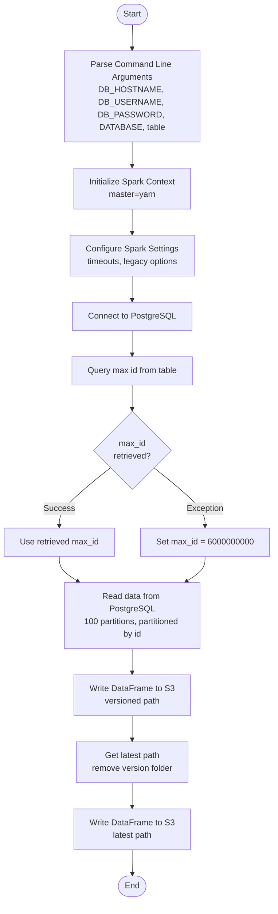
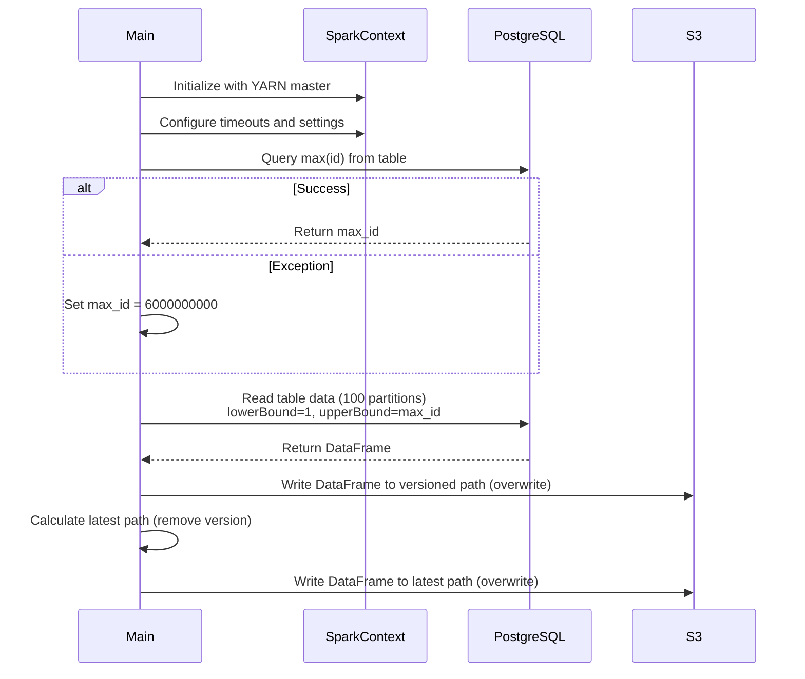
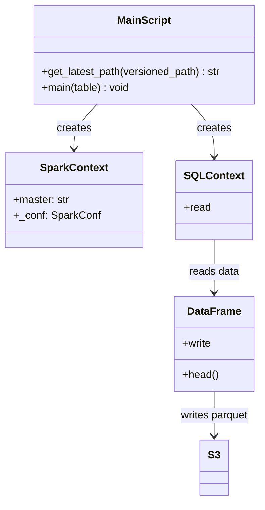

# Diagram: research/orchestrator/tasks/etl/extract_public_actualtripleg_spark.py

> Auto-generated by Obscura crawlers

## Diagram 1

### SVG

<svg id="container" width="524.8125" xmlns="http://www.w3.org/2000/svg" class="flowchart" height="1696.984375" viewBox="0 0 524.8125 1696.984375" role="graphics-document document" aria-roledescription="flowchart-v2"><g><marker id="container_flowchart-v2-pointEnd" class="marker flowchart-v2" viewBox="0 0 10 10" refX="5" refY="5" markerUnits="userSpaceOnUse" markerWidth="8" markerHeight="8" orient="auto"><path d="M 0 0 L 10 5 L 0 10 z" class="arrowMarkerPath" style="stroke-width: 1; stroke-dasharray: 1, 0;"></path></marker><marker id="container_flowchart-v2-pointStart" class="marker flowchart-v2" viewBox="0 0 10 10" refX="4.5" refY="5" markerUnits="userSpaceOnUse" markerWidth="8" markerHeight="8" orient="auto"><path d="M 0 5 L 10 10 L 10 0 z" class="arrowMarkerPath" style="stroke-width: 1; stroke-dasharray: 1, 0;"></path></marker><marker id="container_flowchart-v2-circleEnd" class="marker flowchart-v2" viewBox="0 0 10 10" refX="11" refY="5" markerUnits="userSpaceOnUse" markerWidth="11" markerHeight="11" orient="auto"><circle cx="5" cy="5" r="5" class="arrowMarkerPath" style="stroke-width: 1; stroke-dasharray: 1, 0;"></circle></marker><marker id="container_flowchart-v2-circleStart" class="marker flowchart-v2" viewBox="0 0 10 10" refX="-1" refY="5" markerUnits="userSpaceOnUse" markerWidth="11" markerHeight="11" orient="auto"><circle cx="5" cy="5" r="5" class="arrowMarkerPath" style="stroke-width: 1; stroke-dasharray: 1, 0;"></circle></marker><marker id="container_flowchart-v2-crossEnd" class="marker cross flowchart-v2" viewBox="0 0 11 11" refX="12" refY="5.2" markerUnits="userSpaceOnUse" markerWidth="11" markerHeight="11" orient="auto"><path d="M 1,1 l 9,9 M 10,1 l -9,9" class="arrowMarkerPath" style="stroke-width: 2; stroke-dasharray: 1, 0;"></path></marker><marker id="container_flowchart-v2-crossStart" class="marker cross flowchart-v2" viewBox="0 0 11 11" refX="-1" refY="5.2" markerUnits="userSpaceOnUse" markerWidth="11" markerHeight="11" orient="auto"><path d="M 1,1 l 9,9 M 10,1 l -9,9" class="arrowMarkerPath" style="stroke-width: 2; stroke-dasharray: 1, 0;"></path></marker><g class="root"><g class="clusters"></g><g class="edgePaths"><path d="M254.906,47.5L254.823,51.583C254.74,55.667,254.573,63.833,254.49,71.417C254.406,79,254.406,86,254.406,89.5L254.406,93" id="L_Start_ParseArgs_0" class="edge-thickness-normal edge-pattern-solid edge-thickness-normal edge-pattern-solid flowchart-link" style=";" data-edge="true" data-et="edge" data-id="L_Start_ParseArgs_0" data-points="W3sieCI6MjU0LjkwNjI1LCJ5Ijo0Ny41fSx7IngiOjI1NC40MDYyNSwieSI6NzJ9LHsieCI6MjU0LjQwNjI1LCJ5Ijo5N31d" marker-end="url(#container_flowchart-v2-pointEnd)"></path><path d="M254.406,271L254.406,275.167C254.406,279.333,254.406,287.667,254.406,295.333C254.406,303,254.406,310,254.406,313.5L254.406,317" id="L_ParseArgs_InitSpark_0" class="edge-thickness-normal edge-pattern-solid edge-thickness-normal edge-pattern-solid flowchart-link" style=";" data-edge="true" data-et="edge" data-id="L_ParseArgs_InitSpark_0" data-points="W3sieCI6MjU0LjQwNjI1LCJ5IjoyNzF9LHsieCI6MjU0LjQwNjI1LCJ5IjoyOTZ9LHsieCI6MjU0LjQwNjI1LCJ5IjozMjF9XQ==" marker-end="url(#container_flowchart-v2-pointEnd)"></path><path d="M254.406,399L254.406,403.167C254.406,407.333,254.406,415.667,254.406,423.333C254.406,431,254.406,438,254.406,441.5L254.406,445" id="L_InitSpark_ConfigSpark_0" class="edge-thickness-normal edge-pattern-solid edge-thickness-normal edge-pattern-solid flowchart-link" style=";" data-edge="true" data-et="edge" data-id="L_InitSpark_ConfigSpark_0" data-points="W3sieCI6MjU0LjQwNjI1LCJ5IjozOTl9LHsieCI6MjU0LjQwNjI1LCJ5Ijo0MjR9LHsieCI6MjU0LjQwNjI1LCJ5Ijo0NDl9XQ==" marker-end="url(#container_flowchart-v2-pointEnd)"></path><path d="M254.406,527L254.406,531.167C254.406,535.333,254.406,543.667,254.406,551.333C254.406,559,254.406,566,254.406,569.5L254.406,573" id="L_ConfigSpark_ConnectDB_0" class="edge-thickness-normal edge-pattern-solid edge-thickness-normal edge-pattern-solid flowchart-link" style=";" data-edge="true" data-et="edge" data-id="L_ConfigSpark_ConnectDB_0" data-points="W3sieCI6MjU0LjQwNjI1LCJ5Ijo1Mjd9LHsieCI6MjU0LjQwNjI1LCJ5Ijo1NTJ9LHsieCI6MjU0LjQwNjI1LCJ5Ijo1Nzd9XQ==" marker-end="url(#container_flowchart-v2-pointEnd)"></path><path d="M254.406,631L254.406,635.167C254.406,639.333,254.406,647.667,254.406,655.333C254.406,663,254.406,670,254.406,673.5L254.406,677" id="L_ConnectDB_GetMaxId_0" class="edge-thickness-normal edge-pattern-solid edge-thickness-normal edge-pattern-solid flowchart-link" style=";" data-edge="true" data-et="edge" data-id="L_ConnectDB_GetMaxId_0" data-points="W3sieCI6MjU0LjQwNjI1LCJ5Ijo2MzF9LHsieCI6MjU0LjQwNjI1LCJ5Ijo2NTZ9LHsieCI6MjU0LjQwNjI1LCJ5Ijo2ODF9XQ==" marker-end="url(#container_flowchart-v2-pointEnd)"></path><path d="M254.406,735L254.406,739.167C254.406,743.333,254.406,751.667,254.406,759.333C254.406,767,254.406,774,254.406,777.5L254.406,781" id="L_GetMaxId_CheckMaxId_0" class="edge-thickness-normal edge-pattern-solid edge-thickness-normal edge-pattern-solid flowchart-link" style=";" data-edge="true" data-et="edge" data-id="L_GetMaxId_CheckMaxId_0" data-points="W3sieCI6MjU0LjQwNjI1LCJ5Ijo3MzV9LHsieCI6MjU0LjQwNjI1LCJ5Ijo3NjB9LHsieCI6MjU0LjQwNjI1LCJ5Ijo3ODV9XQ==" marker-end="url(#container_flowchart-v2-pointEnd)"></path><path d="M212.587,894.166L196.273,907.302C179.959,920.439,147.331,946.711,131.017,965.348C114.703,983.984,114.703,994.984,114.703,1000.484L114.703,1005.984" id="L_CheckMaxId_UseMaxId_0" class="edge-thickness-normal edge-pattern-solid edge-thickness-normal edge-pattern-solid flowchart-link" style=";" data-edge="true" data-et="edge" data-id="L_CheckMaxId_UseMaxId_0" data-points="W3sieCI6MjEyLjU4NzQ5MjkzMzE0OTUyLCJ5Ijo4OTQuMTY1NjE3OTMzMTQ5NX0seyJ4IjoxMTQuNzAzMTI1LCJ5Ijo5NzIuOTg0Mzc1fSx7IngiOjExNC43MDMxMjUsInkiOjEwMDkuOTg0Mzc1fV0=" marker-end="url(#container_flowchart-v2-pointEnd)"></path><path d="M296.225,894.166L312.539,907.302C328.853,920.439,361.481,946.711,377.795,965.348C394.109,983.984,394.109,994.984,394.109,1000.484L394.109,1005.984" id="L_CheckMaxId_DefaultMaxId_0" class="edge-thickness-normal edge-pattern-solid edge-thickness-normal edge-pattern-solid flowchart-link" style=";" data-edge="true" data-et="edge" data-id="L_CheckMaxId_DefaultMaxId_0" data-points="W3sieCI6Mjk2LjIyNTAwNzA2Njg1MDUsInkiOjg5NC4xNjU2MTc5MzMxNDk1fSx7IngiOjM5NC4xMDkzNzUsInkiOjk3Mi45ODQzNzV9LHsieCI6Mzk0LjEwOTM3NSwieSI6MTAwOS45ODQzNzV9XQ==" marker-end="url(#container_flowchart-v2-pointEnd)"></path><path d="M114.703,1063.984L114.703,1068.151C114.703,1072.318,114.703,1080.651,121.777,1088.666C128.85,1096.681,142.997,1104.377,150.071,1108.225L157.144,1112.073" id="L_UseMaxId_ReadData_0" class="edge-thickness-normal edge-pattern-solid edge-thickness-normal edge-pattern-solid flowchart-link" style=";" data-edge="true" data-et="edge" data-id="L_UseMaxId_ReadData_0" data-points="W3sieCI6MTE0LjcwMzEyNSwieSI6MTA2My45ODQzNzV9LHsieCI6MTE0LjcwMzEyNSwieSI6MTA4OC45ODQzNzV9LHsieCI6MTYwLjY1ODEwMDMyODk0NzM3LCJ5IjoxMTEzLjk4NDM3NX1d" marker-end="url(#container_flowchart-v2-pointEnd)"></path><path d="M394.109,1063.984L394.109,1068.151C394.109,1072.318,394.109,1080.651,387.036,1088.666C379.962,1096.681,365.815,1104.377,358.742,1108.225L351.668,1112.073" id="L_DefaultMaxId_ReadData_0" class="edge-thickness-normal edge-pattern-solid edge-thickness-normal edge-pattern-solid flowchart-link" style=";" data-edge="true" data-et="edge" data-id="L_DefaultMaxId_ReadData_0" data-points="W3sieCI6Mzk0LjEwOTM3NSwieSI6MTA2My45ODQzNzV9LHsieCI6Mzk0LjEwOTM3NSwieSI6MTA4OC45ODQzNzV9LHsieCI6MzQ4LjE1NDM5OTY3MTA1MjYsInkiOjExMTMuOTg0Mzc1fV0=" marker-end="url(#container_flowchart-v2-pointEnd)"></path><path d="M254.406,1215.984L254.406,1220.151C254.406,1224.318,254.406,1232.651,254.406,1240.318C254.406,1247.984,254.406,1254.984,254.406,1258.484L254.406,1261.984" id="L_ReadData_WriteS3v1_0" class="edge-thickness-normal edge-pattern-solid edge-thickness-normal edge-pattern-solid flowchart-link" style=";" data-edge="true" data-et="edge" data-id="L_ReadData_WriteS3v1_0" data-points="W3sieCI6MjU0LjQwNjI1LCJ5IjoxMjE1Ljk4NDM3NX0seyJ4IjoyNTQuNDA2MjUsInkiOjEyNDAuOTg0Mzc1fSx7IngiOjI1NC40MDYyNSwieSI6MTI2NS45ODQzNzV9XQ==" marker-end="url(#container_flowchart-v2-pointEnd)"></path><path d="M254.406,1343.984L254.406,1348.151C254.406,1352.318,254.406,1360.651,254.406,1368.318C254.406,1375.984,254.406,1382.984,254.406,1386.484L254.406,1389.984" id="L_WriteS3v1_GetLatest_0" class="edge-thickness-normal edge-pattern-solid edge-thickness-normal edge-pattern-solid flowchart-link" style=";" data-edge="true" data-et="edge" data-id="L_WriteS3v1_GetLatest_0" data-points="W3sieCI6MjU0LjQwNjI1LCJ5IjoxMzQzLjk4NDM3NX0seyJ4IjoyNTQuNDA2MjUsInkiOjEzNjguOTg0Mzc1fSx7IngiOjI1NC40MDYyNSwieSI6MTM5My45ODQzNzV9XQ==" marker-end="url(#container_flowchart-v2-pointEnd)"></path><path d="M254.406,1471.984L254.406,1476.151C254.406,1480.318,254.406,1488.651,254.406,1496.318C254.406,1503.984,254.406,1510.984,254.406,1514.484L254.406,1517.984" id="L_GetLatest_WriteS3v2_0" class="edge-thickness-normal edge-pattern-solid edge-thickness-normal edge-pattern-solid flowchart-link" style=";" data-edge="true" data-et="edge" data-id="L_GetLatest_WriteS3v2_0" data-points="W3sieCI6MjU0LjQwNjI1LCJ5IjoxNDcxLjk4NDM3NX0seyJ4IjoyNTQuNDA2MjUsInkiOjE0OTYuOTg0Mzc1fSx7IngiOjI1NC40MDYyNSwieSI6MTUyMS45ODQzNzV9XQ==" marker-end="url(#container_flowchart-v2-pointEnd)"></path><path d="M254.406,1599.984L254.406,1604.151C254.406,1608.318,254.406,1616.651,254.477,1624.401C254.547,1632.151,254.687,1639.318,254.758,1642.902L254.828,1646.485" id="L_WriteS3v2_End_0" class="edge-thickness-normal edge-pattern-solid edge-thickness-normal edge-pattern-solid flowchart-link" style=";" data-edge="true" data-et="edge" data-id="L_WriteS3v2_End_0" data-points="W3sieCI6MjU0LjQwNjI1LCJ5IjoxNTk5Ljk4NDM3NX0seyJ4IjoyNTQuNDA2MjUsInkiOjE2MjQuOTg0Mzc1fSx7IngiOjI1NC45MDYyNSwieSI6MTY1MC40ODQzNzV9XQ==" marker-end="url(#container_flowchart-v2-pointEnd)"></path></g><g class="edgeLabels"><g class="edgeLabel"><g class="label" data-id="L_Start_ParseArgs_0" transform="translate(0, 0)"><foreignObject width="0" height="0">

</foreignObject></g></g><g class="edgeLabel"><g class="label" data-id="L_ParseArgs_InitSpark_0" transform="translate(0, 0)"><foreignObject width="0" height="0">

</foreignObject></g></g><g class="edgeLabel"><g class="label" data-id="L_InitSpark_ConfigSpark_0" transform="translate(0, 0)"><foreignObject width="0" height="0">

</foreignObject></g></g><g class="edgeLabel"><g class="label" data-id="L_ConfigSpark_ConnectDB_0" transform="translate(0, 0)"><foreignObject width="0" height="0">

</foreignObject></g></g><g class="edgeLabel"><g class="label" data-id="L_ConnectDB_GetMaxId_0" transform="translate(0, 0)"><foreignObject width="0" height="0">

</foreignObject></g></g><g class="edgeLabel"><g class="label" data-id="L_GetMaxId_CheckMaxId_0" transform="translate(0, 0)"><foreignObject width="0" height="0">

</foreignObject></g></g><g class="edgeLabel" transform="translate(114.703125, 972.984375)"><g class="label" data-id="L_CheckMaxId_UseMaxId_0" transform="translate(-28.1015625, -12)"><foreignObject width="56.203125" height="24">

Success

</foreignObject></g></g><g class="edgeLabel" transform="translate(394.109375, 972.984375)"><g class="label" data-id="L_CheckMaxId_DefaultMaxId_0" transform="translate(-35.375, -12)"><foreignObject width="70.75" height="24">

Exception

</foreignObject></g></g><g class="edgeLabel"><g class="label" data-id="L_UseMaxId_ReadData_0" transform="translate(0, 0)"><foreignObject width="0" height="0">

</foreignObject></g></g><g class="edgeLabel"><g class="label" data-id="L_DefaultMaxId_ReadData_0" transform="translate(0, 0)"><foreignObject width="0" height="0">

</foreignObject></g></g><g class="edgeLabel"><g class="label" data-id="L_ReadData_WriteS3v1_0" transform="translate(0, 0)"><foreignObject width="0" height="0">

</foreignObject></g></g><g class="edgeLabel"><g class="label" data-id="L_WriteS3v1_GetLatest_0" transform="translate(0, 0)"><foreignObject width="0" height="0">

</foreignObject></g></g><g class="edgeLabel"><g class="label" data-id="L_GetLatest_WriteS3v2_0" transform="translate(0, 0)"><foreignObject width="0" height="0">

</foreignObject></g></g><g class="edgeLabel"><g class="label" data-id="L_WriteS3v2_End_0" transform="translate(0, 0)"><foreignObject width="0" height="0">

</foreignObject></g></g></g><g class="nodes"><g class="node default" id="flowchart-Start-0" transform="translate(254.40625, 27.5)"><g class="basic label-container outer-path"><path d="M-10.3984375 -19.5 C-5.313215349428911 -19.5, -0.22799319885782232 -19.5, 10.3984375 -19.5 C10.3984375 -19.5, 10.3984375 -19.5, 10.398437499999998 -19.5 C10.808341472161008 -19.48685517744248, 11.218245444322017 -19.473710354884954, 11.6478067896239 -19.45993515863156 C12.04204859098802 -19.421903126199098, 12.436290392352142 -19.383871093766636, 12.892042152847864 -19.3399052695533 C13.30877003896572 -19.272531936698787, 13.725497925083577 -19.20515860384428, 14.126030759676757 -19.140403561325776 C14.583164212116198 -19.036065833881032, 15.04029766455564 -18.93172810643629, 15.34470188623539 -18.862249829261074 C15.757294147781394 -18.739794611775196, 16.169886409327397 -18.617339394289317, 16.543047751460602 -18.50658706670804 C16.78367553730479 -18.418033817178507, 17.02430332314898 -18.32948056764898, 17.716144095147794 -18.074876768247425 C18.102801503445882 -17.903715003378355, 18.48945891174397 -17.732553238509286, 18.85917041279238 -17.568892924097174 C19.27328718900087 -17.35284846720366, 19.687403965209363 -17.136804010310144, 19.967429764076783 -16.990714730406097 C20.306864550834106 -16.784947367933587, 20.64629933759143 -16.579180005461076, 21.036368073605697 -16.342718045390892 C21.278872945108887 -16.17355714489696, 21.521377816612077 -16.004396244403026, 22.061592844578712 -15.627565626425154 C22.278934470593327 -15.454241463382065, 22.496276096607946 -15.280917300338977, 23.03889120850187 -14.848196188198123 C23.277032980466707 -14.631922131785668, 23.51517475243154 -14.41564807537321, 23.964247236767985 -14.007812326905688 C24.230178764344096 -13.733216191298892, 24.496110291920207 -13.458620055692098, 24.833858442968648 -13.10986736009568 C25.156741634427313 -12.730590390834267, 25.47962482588598 -12.351313421572854, 25.644151408126582 -12.158051136245305 C25.927916109302416 -11.777832288165781, 26.211680810478246 -11.397613440086257, 26.391796464640635 -11.156274872382312 C26.611287803720284 -10.819077233878815, 26.830779142799933 -10.481879595375316, 27.073721378604247 -10.108655082055241 C27.295171866416528 -9.715447316651037, 27.51662235422881 -9.322239551246833, 27.6871239742735 -9.019496659696287 C27.862608797332793 -8.655098669839955, 28.038093620392086 -8.290700679983622, 28.22948364880834 -7.893275190886684 C28.38975844821358 -7.497393337653299, 28.55003324761882 -7.101511484419914, 28.698571729970325 -6.734618561215508 C28.83781653605458 -6.315235390936714, 28.977061342138832 -5.89585222065792, 29.09246063421488 -5.548287939305138 C29.18191608872821 -5.207155521006575, 29.271371543241543 -4.866023102708012, 29.40953178754556 -4.339158212148133 C29.504654830136165 -3.850721492707557, 29.59977787272677 -3.362284773266981, 29.648482276581777 -3.1121979531509023 C29.69859352078087 -2.723545038727168, 29.748704764979966 -2.3348921243034333, 29.808330202509367 -1.872449005199798 C29.829239193748762 -1.5467745892122544, 29.850148184988157 -1.2211001732247109, 29.888418715913414 -0.6250057626472757 C29.888418715913414 -0.32601439124076975, 29.888418715913414 -0.027023019834263806, 29.888418715913414 0.625005762647271 C29.86623905073685 0.970471950875722, 29.84405938556029 1.3159381391041731, 29.808330202509367 1.8724490051997846 C29.764567519573085 2.211863732134383, 29.720804836636802 2.551278459068981, 29.648482276581777 3.1121979531508885 C29.599071103903793 3.3659138817972987, 29.549659931225808 3.619629810443709, 29.40953178754556 4.339158212148129 C29.295542981725696 4.77384693180023, 29.181554175905827 5.208535651452331, 29.092460634214884 5.548287939305125 C28.976958577895292 5.896161730186208, 28.861456521575697 6.24403552106729, 28.69857172997033 6.734618561215495 C28.548460211651758 7.105396913671138, 28.398348693333187 7.476175266126781, 28.229483648808344 7.893275190886679 C28.06118489062253 8.242751163276072, 27.89288613243672 8.592227135665466, 27.687123974273504 9.019496659696284 C27.471917169948025 9.401618132828157, 27.25671036562255 9.78373960596003, 27.07372137860425 10.108655082055236 C26.900550692062183 10.3746917594242, 26.727380005520114 10.640728436793163, 26.39179646464064 11.156274872382301 C26.172886863032222 11.44959379546261, 25.953977261423805 11.742912718542916, 25.644151408126582 12.158051136245302 C25.35234404378763 12.500824670707244, 25.06053667944868 12.843598205169187, 24.83385844296866 13.10986736009567 C24.54343354728852 13.409754909212793, 24.25300865160838 13.709642458329919, 23.96424723676799 14.007812326905684 C23.701889429004954 14.24607874630887, 23.439531621241915 14.484345165712055, 23.038891208501887 14.848196188198111 C22.835905527420383 15.01007186718478, 22.63291984633888 15.17194754617145, 22.061592844578715 15.627565626425152 C21.82632316009414 15.7916795736611, 21.591053475609563 15.955793520897046, 21.036368073605708 16.34271804539089 C20.820388150761627 16.47364634385788, 20.60440822791755 16.60457464232487, 19.967429764076787 16.990714730406093 C19.556092891929662 17.205308913131407, 19.144756019782537 17.41990309585672, 18.859170412792388 17.56889292409717 C18.51004803025876 17.72343904649729, 18.16092564772513 17.877985168897414, 17.716144095147804 18.07487676824742 C17.45243282470655 18.171924953490063, 17.188721554265292 18.268973138732708, 16.543047751460616 18.506587066708033 C16.09514334453308 18.639522743585918, 15.647238937605549 18.772458420463803, 15.344701886235413 18.86224982926107 C15.012446509071054 18.938084950929873, 14.680191131906694 19.013920072598676, 14.126030759676766 19.140403561325773 C13.666917633030206 19.214629411166516, 13.207804506383646 19.28885526100726, 12.892042152847878 19.3399052695533 C12.483578720146683 19.379309245656835, 12.07511528744549 19.418713221760367, 11.6478067896239 19.45993515863156 C11.376904653936833 19.468622462844024, 11.106002518249769 19.47730976705649, 10.398437500000004 19.5 C10.398437500000004 19.5, 10.398437500000002 19.5, 10.3984375 19.5 C5.614442882038733 19.5, 0.8304482640774662 19.5, -10.398437499999996 19.5 C-10.70121656961716 19.490290464561085, -11.003995639234322 19.48058092912217, -11.647806789623893 19.45993515863156 C-12.035498472067754 19.422535008293664, -12.423190154511616 19.385134857955773, -12.892042152847871 19.3399052695533 C-13.241253588448076 19.283447472820587, -13.590465024048282 19.226989676087875, -14.126030759676759 19.140403561325773 C-14.458581361835092 19.06450105647862, -14.791131963993427 18.988598551631465, -15.344701886235388 18.862249829261074 C-15.750583492094103 18.741786299158232, -16.156465097952818 18.621322769055393, -16.54304775146059 18.506587066708043 C-16.951122675802257 18.35641172234706, -17.359197600143922 18.20623637798608, -17.716144095147797 18.074876768247425 C-18.041877345775266 17.93068432072821, -18.367610596402738 17.786491873209002, -18.85917041279238 17.568892924097174 C-19.201170170262525 17.390471869686298, -19.54316992773267 17.212050815275425, -19.96742976407678 16.990714730406097 C-20.373171306634994 16.74475182290534, -20.778912849193205 16.49878891540458, -21.036368073605686 16.3427180453909 C-21.397551486116694 16.090772132201153, -21.7587348986277 15.838826219011404, -22.061592844578712 15.627565626425156 C-22.381662930803895 15.372318250083277, -22.701733017029078 15.117070873741396, -23.03889120850187 14.848196188198125 C-23.28398331575972 14.625610021168349, -23.52907542301757 14.403023854138572, -23.964247236767974 14.007812326905697 C-24.15674417139986 13.809043437606023, -24.349241106031744 13.610274548306348, -24.833858442968655 13.109867360095677 C-24.996686598648797 12.918600143249254, -25.159514754328935 12.72733292640283, -25.64415140812658 12.158051136245307 C-25.919740521330265 11.788786831237076, -26.195329634533948 11.419522526228844, -26.391796464640635 11.156274872382316 C-26.53366268072426 10.93833026806485, -26.675528896807883 10.720385663747386, -27.073721378604244 10.108655082055249 C-27.20105094108407 9.882568550355995, -27.328380503563892 9.656482018656739, -27.6871239742735 9.019496659696289 C-27.897989141488473 8.581630628182598, -28.108854308703442 8.143764596668907, -28.22948364880834 7.893275190886686 C-28.37105055644262 7.543602192020055, -28.5126174640769 7.193929193153425, -28.698571729970325 6.73461856121551 C-28.782139441611097 6.482925928460177, -28.865707153251872 6.231233295704845, -29.09246063421488 5.5482879393051325 C-29.189769219930078 5.177208128165257, -29.287077805645275 4.806128317025381, -29.409531787545557 4.339158212148136 C-29.498032802421776 3.884724205454886, -29.58653381729799 3.4302901987616363, -29.648482276581777 3.112197953150904 C-29.704990857887267 2.673928555427051, -29.761499439192757 2.235659157703198, -29.808330202509364 1.872449005199809 C-29.829412322409915 1.544077970567841, -29.850494442310463 1.2157069359358725, -29.888418715913414 0.6250057626472781 C-29.888418715913414 0.25636393488394066, -29.888418715913414 -0.11227789287939682, -29.888418715913414 -0.6250057626472687 C-29.872251722332834 -0.8768197374271212, -29.856084728752258 -1.1286337122069736, -29.808330202509367 -1.8724490051997822 C-29.75855741630023 -2.258476906289501, -29.708784630091095 -2.644504807379221, -29.648482276581777 -3.112197953150895 C-29.58450415804462 -3.4407120700590657, -29.52052603950746 -3.769226186967236, -29.40953178754556 -4.339158212148126 C-29.317513401715466 -4.690064198338968, -29.22549501588537 -5.040970184529811, -29.092460634214884 -5.548287939305123 C-28.9893266024462 -5.858911210815965, -28.88619257067752 -6.169534482326807, -28.698571729970332 -6.734618561215485 C-28.57507720212215 -7.0396524326047665, -28.45158267427397 -7.344686303994047, -28.229483648808344 -7.893275190886676 C-28.092582775988987 -8.177552782505503, -27.955681903169626 -8.461830374124329, -27.687123974273504 -9.019496659696282 C-27.505066465031618 -9.342758202677118, -27.323008955789735 -9.666019745657954, -27.073721378604247 -10.108655082055243 C-26.870606411214222 -10.420694215971947, -26.667491443824197 -10.732733349888653, -26.39179646464064 -11.156274872382308 C-26.24014248779581 -11.35947738539287, -26.08848851095098 -11.562679898403433, -25.644151408126586 -12.158051136245302 C-25.4170348379953 -12.424835182820452, -25.189918267864012 -12.691619229395602, -24.833858442968662 -13.10986736009567 C-24.51493913451927 -13.439177729831842, -24.19601982606988 -13.768488099568012, -23.964247236767996 -14.007812326905677 C-23.68315713925291 -14.263090916232446, -23.402067041737823 -14.518369505559216, -23.038891208501887 -14.848196188198107 C-22.70192404065827 -15.116918537480464, -22.364956872814652 -15.38564088676282, -22.06159284457872 -15.627565626425149 C-21.670109752246056 -15.900647284606485, -21.278626659913396 -16.17372894278782, -21.03636807360571 -16.342718045390885 C-20.80679275906342 -16.481887950200722, -20.57721744452113 -16.62105785501056, -19.96742976407679 -16.99071473040609 C-19.695925595866004 -17.132358281054938, -19.42442142765522 -17.274001831703785, -18.859170412792388 -17.56889292409717 C-18.607634554488804 -17.68024038702204, -18.356098696185217 -17.79158784994691, -17.716144095147804 -18.07487676824742 C-17.446831882489 -18.173986152000666, -17.177519669830197 -18.273095535753907, -16.54304775146062 -18.506587066708033 C-16.16266251423123 -18.61948340843486, -15.782277277001839 -18.732379750161687, -15.344701886235413 -18.862249829261067 C-15.008737219473158 -18.938931572075212, -14.672772552710905 -19.01561331488936, -14.126030759676768 -19.140403561325773 C-13.707835315704752 -19.208014157553063, -13.289639871732735 -19.275624753780356, -12.89204215284788 -19.3399052695533 C-12.506836564724864 -19.377065589362026, -12.121630976601846 -19.414225909170753, -11.647806789623903 -19.45993515863156 C-11.161466333809125 -19.475531150445267, -10.675125877994349 -19.49112714225898, -10.398437500000005 -19.5 C-10.398437500000004 -19.5, -10.398437500000002 -19.5, -10.3984375 -19.5" stroke="none" stroke-width="0" fill="#ECECFF" style=""></path><path d="M-10.3984375 -19.5 C-5.0212971185749495 -19.5, 0.3558432628501009 -19.5, 10.3984375 -19.5 M-10.3984375 -19.5 C-2.5682125352286764 -19.5, 5.262012429542647 -19.5, 10.3984375 -19.5 M10.3984375 -19.5 C10.3984375 -19.5, 10.3984375 -19.5, 10.398437499999998 -19.5 M10.3984375 -19.5 C10.3984375 -19.5, 10.3984375 -19.5, 10.398437499999998 -19.5 M10.398437499999998 -19.5 C10.895004871921607 -19.48407605089223, 11.391572243843216 -19.468152101784458, 11.6478067896239 -19.45993515863156 M10.398437499999998 -19.5 C10.661613921299262 -19.491560444410762, 10.924790342598524 -19.48312088882152, 11.6478067896239 -19.45993515863156 M11.6478067896239 -19.45993515863156 C12.027949134449441 -19.423263283814297, 12.408091479274983 -19.386591408997035, 12.892042152847864 -19.3399052695533 M11.6478067896239 -19.45993515863156 C12.003283845040619 -19.425642714619215, 12.358760900457337 -19.39135027060687, 12.892042152847864 -19.3399052695533 M12.892042152847864 -19.3399052695533 C13.19352595578899 -19.29116370633559, 13.495009758730118 -19.242422143117878, 14.126030759676757 -19.140403561325776 M12.892042152847864 -19.3399052695533 C13.14873733635024 -19.298404782985514, 13.405432519852617 -19.25690429641773, 14.126030759676757 -19.140403561325776 M14.126030759676757 -19.140403561325776 C14.597877805116017 -19.032707552293992, 15.069724850555277 -18.925011543262208, 15.34470188623539 -18.862249829261074 M14.126030759676757 -19.140403561325776 C14.604824830844269 -19.031121939005097, 15.08361890201178 -18.92184031668442, 15.34470188623539 -18.862249829261074 M15.34470188623539 -18.862249829261074 C15.773087384313346 -18.735107262072905, 16.2014728823913 -18.607964694884732, 16.543047751460602 -18.50658706670804 M15.34470188623539 -18.862249829261074 C15.765677696429426 -18.737306418542605, 16.186653506623465 -18.612363007824136, 16.543047751460602 -18.50658706670804 M16.543047751460602 -18.50658706670804 C16.937973654007592 -18.36125068391572, 17.332899556554587 -18.215914301123405, 17.716144095147794 -18.074876768247425 M16.543047751460602 -18.50658706670804 C16.98707892974254 -18.343179488521066, 17.431110108024484 -18.179771910334097, 17.716144095147794 -18.074876768247425 M17.716144095147794 -18.074876768247425 C18.05105233675777 -17.926622824386694, 18.385960578367747 -17.778368880525967, 18.85917041279238 -17.568892924097174 M17.716144095147794 -18.074876768247425 C17.99421988609434 -17.951780864420645, 18.272295677040887 -17.82868496059387, 18.85917041279238 -17.568892924097174 M18.85917041279238 -17.568892924097174 C19.152593526978503 -17.41581427337275, 19.446016641164622 -17.262735622648325, 19.967429764076783 -16.990714730406097 M18.85917041279238 -17.568892924097174 C19.2848543132123 -17.346813905911656, 19.71053821363222 -17.124734887726135, 19.967429764076783 -16.990714730406097 M19.967429764076783 -16.990714730406097 C20.27798554971311 -16.802453988124984, 20.588541335349436 -16.614193245843868, 21.036368073605697 -16.342718045390892 M19.967429764076783 -16.990714730406097 C20.265363046928996 -16.810105823490773, 20.56329632978121 -16.629496916575448, 21.036368073605697 -16.342718045390892 M21.036368073605697 -16.342718045390892 C21.286963066513174 -16.16791382642104, 21.53755805942065 -15.993109607451187, 22.061592844578712 -15.627565626425154 M21.036368073605697 -16.342718045390892 C21.320541784310812 -16.144490766484672, 21.604715495015924 -15.946263487578454, 22.061592844578712 -15.627565626425154 M22.061592844578712 -15.627565626425154 C22.286417918248972 -15.448273613019595, 22.511242991919232 -15.268981599614037, 23.03889120850187 -14.848196188198123 M22.061592844578712 -15.627565626425154 C22.40009754227033 -15.357617138004404, 22.73860223996195 -15.087668649583655, 23.03889120850187 -14.848196188198123 M23.03889120850187 -14.848196188198123 C23.398205905217488 -14.52187608758691, 23.757520601933106 -14.195555986975698, 23.964247236767985 -14.007812326905688 M23.03889120850187 -14.848196188198123 C23.313476620554994 -14.59882498210336, 23.58806203260812 -14.349453776008598, 23.964247236767985 -14.007812326905688 M23.964247236767985 -14.007812326905688 C24.164733264459443 -13.800794043105265, 24.3652192921509 -13.593775759304842, 24.833858442968648 -13.10986736009568 M23.964247236767985 -14.007812326905688 C24.289496685223238 -13.671965567899303, 24.61474613367849 -13.336118808892918, 24.833858442968648 -13.10986736009568 M24.833858442968648 -13.10986736009568 C25.003376419010515 -12.910741899590812, 25.17289439505238 -12.711616439085946, 25.644151408126582 -12.158051136245305 M24.833858442968648 -13.10986736009568 C25.10024187087604 -12.796958228029215, 25.36662529878343 -12.48404909596275, 25.644151408126582 -12.158051136245305 M25.644151408126582 -12.158051136245305 C25.81920374196523 -11.923496956497202, 25.994256075803875 -11.6889427767491, 26.391796464640635 -11.156274872382312 M25.644151408126582 -12.158051136245305 C25.901552543359198 -11.813157064759425, 26.158953678591814 -11.468262993273544, 26.391796464640635 -11.156274872382312 M26.391796464640635 -11.156274872382312 C26.551621278460793 -10.910741039382813, 26.711446092280955 -10.665207206383315, 27.073721378604247 -10.108655082055241 M26.391796464640635 -11.156274872382312 C26.628944199683456 -10.791952268273205, 26.86609193472628 -10.4276296641641, 27.073721378604247 -10.108655082055241 M27.073721378604247 -10.108655082055241 C27.219102705745385 -9.85051581426044, 27.36448403288652 -9.59237654646564, 27.6871239742735 -9.019496659696287 M27.073721378604247 -10.108655082055241 C27.318262417841975 -9.674447704423287, 27.5628034570797 -9.24024032679133, 27.6871239742735 -9.019496659696287 M27.6871239742735 -9.019496659696287 C27.839364335576324 -8.703366292029068, 27.99160469687915 -8.38723592436185, 28.22948364880834 -7.893275190886684 M27.6871239742735 -9.019496659696287 C27.86685045350971 -8.64629078003169, 28.046576932745914 -8.273084900367092, 28.22948364880834 -7.893275190886684 M28.22948364880834 -7.893275190886684 C28.324995866798805 -7.657358165847126, 28.42050808478927 -7.421441140807567, 28.698571729970325 -6.734618561215508 M28.22948364880834 -7.893275190886684 C28.344404892796668 -7.6094174963844115, 28.459326136785 -7.3255598018821395, 28.698571729970325 -6.734618561215508 M28.698571729970325 -6.734618561215508 C28.842147996742646 -6.302189721468801, 28.985724263514964 -5.869760881722094, 29.09246063421488 -5.548287939305138 M28.698571729970325 -6.734618561215508 C28.781481266644313 -6.484908246594194, 28.8643908033183 -6.23519793197288, 29.09246063421488 -5.548287939305138 M29.09246063421488 -5.548287939305138 C29.19256283497352 -5.166554863244205, 29.292665035732156 -4.7848217871832714, 29.40953178754556 -4.339158212148133 M29.09246063421488 -5.548287939305138 C29.15762509441311 -5.299787610113591, 29.22278955461134 -5.051287280922045, 29.40953178754556 -4.339158212148133 M29.40953178754556 -4.339158212148133 C29.489548675354204 -3.9282884048259743, 29.569565563162847 -3.5174185975038155, 29.648482276581777 -3.1121979531509023 M29.40953178754556 -4.339158212148133 C29.500928980837852 -3.869852941395852, 29.592326174130147 -3.4005476706435704, 29.648482276581777 -3.1121979531509023 M29.648482276581777 -3.1121979531509023 C29.708491729236307 -2.646776488569147, 29.768501181890837 -2.181355023987392, 29.808330202509367 -1.872449005199798 M29.648482276581777 -3.1121979531509023 C29.706223992274385 -2.664364608630507, 29.763965707966992 -2.216531264110111, 29.808330202509367 -1.872449005199798 M29.808330202509367 -1.872449005199798 C29.839306231658874 -1.3899723477955, 29.870282260808384 -0.9074956903912019, 29.888418715913414 -0.6250057626472757 M29.808330202509367 -1.872449005199798 C29.827920000678507 -1.5673220861149462, 29.84750979884765 -1.2621951670300946, 29.888418715913414 -0.6250057626472757 M29.888418715913414 -0.6250057626472757 C29.888418715913414 -0.3344925575103841, 29.888418715913414 -0.043979352373492486, 29.888418715913414 0.625005762647271 M29.888418715913414 -0.6250057626472757 C29.888418715913414 -0.2073584044599207, 29.888418715913414 0.21028895372743428, 29.888418715913414 0.625005762647271 M29.888418715913414 0.625005762647271 C29.86024159603523 1.0638871489117825, 29.832064476157047 1.5027685351762938, 29.808330202509367 1.8724490051997846 M29.888418715913414 0.625005762647271 C29.86822189653441 0.939587527054403, 29.84802507715541 1.254169291461535, 29.808330202509367 1.8724490051997846 M29.808330202509367 1.8724490051997846 C29.74480332245949 2.365150942065245, 29.681276442409615 2.8578528789307045, 29.648482276581777 3.1121979531508885 M29.808330202509367 1.8724490051997846 C29.746182644159525 2.3544531953376655, 29.684035085809683 2.8364573854755464, 29.648482276581777 3.1121979531508885 M29.648482276581777 3.1121979531508885 C29.573509674201393 3.4971664209090374, 29.49853707182101 3.8821348886671863, 29.40953178754556 4.339158212148129 M29.648482276581777 3.1121979531508885 C29.554813123967204 3.5931692548443093, 29.46114397135263 4.0741405565377296, 29.40953178754556 4.339158212148129 M29.40953178754556 4.339158212148129 C29.32436628443989 4.663931186452589, 29.239200781334215 4.988704160757049, 29.092460634214884 5.548287939305125 M29.40953178754556 4.339158212148129 C29.282950470941067 4.821867633050711, 29.156369154336574 5.304577053953292, 29.092460634214884 5.548287939305125 M29.092460634214884 5.548287939305125 C28.983930012203857 5.875164880796023, 28.87539939019283 6.202041822286919, 28.69857172997033 6.734618561215495 M29.092460634214884 5.548287939305125 C28.984346900856156 5.8739092785974885, 28.876233167497425 6.1995306178898515, 28.69857172997033 6.734618561215495 M28.69857172997033 6.734618561215495 C28.534615664580517 7.139593212603215, 28.370659599190702 7.544567863990935, 28.229483648808344 7.893275190886679 M28.69857172997033 6.734618561215495 C28.599171782616672 6.980138352946278, 28.49977183526301 7.225658144677061, 28.229483648808344 7.893275190886679 M28.229483648808344 7.893275190886679 C28.08438272893354 8.19458035566904, 27.939281809058734 8.495885520451399, 27.687123974273504 9.019496659696284 M28.229483648808344 7.893275190886679 C28.04472855502342 8.276923096256809, 27.85997346123849 8.660571001626938, 27.687123974273504 9.019496659696284 M27.687123974273504 9.019496659696284 C27.50591014600451 9.341260161677786, 27.32469631773552 9.663023663659287, 27.07372137860425 10.108655082055236 M27.687123974273504 9.019496659696284 C27.54496129275628 9.271920896262616, 27.402798611239056 9.524345132828948, 27.07372137860425 10.108655082055236 M27.07372137860425 10.108655082055236 C26.86330144652974 10.431916603384987, 26.652881514455228 10.755178124714737, 26.39179646464064 11.156274872382301 M27.07372137860425 10.108655082055236 C26.930596332414794 10.328533587458473, 26.78747128622534 10.54841209286171, 26.39179646464064 11.156274872382301 M26.39179646464064 11.156274872382301 C26.093654743083793 11.555757617998886, 25.795513021526943 11.95524036361547, 25.644151408126582 12.158051136245302 M26.39179646464064 11.156274872382301 C26.097889075447014 11.550083998387782, 25.80398168625339 11.943893124393261, 25.644151408126582 12.158051136245302 M25.644151408126582 12.158051136245302 C25.42276138773258 12.418108451649127, 25.201371367338577 12.678165767052953, 24.83385844296866 13.10986736009567 M25.644151408126582 12.158051136245302 C25.41918441303512 12.422310169664394, 25.19421741794365 12.686569203083485, 24.83385844296866 13.10986736009567 M24.83385844296866 13.10986736009567 C24.519423310268255 13.434547450213337, 24.204988177567852 13.759227540331004, 23.96424723676799 14.007812326905684 M24.83385844296866 13.10986736009567 C24.509421609273403 13.444875027645445, 24.184984775578148 13.77988269519522, 23.96424723676799 14.007812326905684 M23.96424723676799 14.007812326905684 C23.621361529179445 14.319212054278923, 23.278475821590902 14.63061178165216, 23.038891208501887 14.848196188198111 M23.96424723676799 14.007812326905684 C23.664645575485853 14.27990262865655, 23.365043914203717 14.551992930407417, 23.038891208501887 14.848196188198111 M23.038891208501887 14.848196188198111 C22.757467954241637 15.072623744483348, 22.476044699981387 15.297051300768585, 22.061592844578715 15.627565626425152 M23.038891208501887 14.848196188198111 C22.717545446297887 15.104460882185935, 22.396199684093887 15.360725576173756, 22.061592844578715 15.627565626425152 M22.061592844578715 15.627565626425152 C21.69799129495076 15.881198327388216, 21.334389745322806 16.13483102835128, 21.036368073605708 16.34271804539089 M22.061592844578715 15.627565626425152 C21.84445468215218 15.779031808774352, 21.62731651972564 15.930497991123552, 21.036368073605708 16.34271804539089 M21.036368073605708 16.34271804539089 C20.81231561499201 16.47853996248091, 20.588263156378314 16.614361879570925, 19.967429764076787 16.990714730406093 M21.036368073605708 16.34271804539089 C20.81210996345516 16.47866462965109, 20.58785185330461 16.614611213911292, 19.967429764076787 16.990714730406093 M19.967429764076787 16.990714730406093 C19.543594674832892 17.2118292249853, 19.119759585589 17.43294371956451, 18.859170412792388 17.56889292409717 M19.967429764076787 16.990714730406093 C19.743550641153472 17.107512325433763, 19.519671518230155 17.224309920461437, 18.859170412792388 17.56889292409717 M18.859170412792388 17.56889292409717 C18.523374789104842 17.717539685680386, 18.187579165417297 17.8661864472636, 17.716144095147804 18.07487676824742 M18.859170412792388 17.56889292409717 C18.427275750247606 17.76007987950578, 17.995381087702825 17.951266834914392, 17.716144095147804 18.07487676824742 M17.716144095147804 18.07487676824742 C17.444854500994943 18.174713846669192, 17.17356490684208 18.274550925090963, 16.543047751460616 18.506587066708033 M17.716144095147804 18.07487676824742 C17.4212921054524 18.183385026037243, 17.126440115757003 18.291893283827065, 16.543047751460616 18.506587066708033 M16.543047751460616 18.506587066708033 C16.2427460347508 18.595715039911628, 15.942444318040987 18.684843013115227, 15.344701886235413 18.86224982926107 M16.543047751460616 18.506587066708033 C16.228847448847205 18.59984006725265, 15.914647146233792 18.693093067797268, 15.344701886235413 18.86224982926107 M15.344701886235413 18.86224982926107 C15.090153662834696 18.92034880016989, 14.835605439433978 18.97844777107871, 14.126030759676766 19.140403561325773 M15.344701886235413 18.86224982926107 C14.86029448526177 18.972812657479597, 14.375887084288125 19.083375485698124, 14.126030759676766 19.140403561325773 M14.126030759676766 19.140403561325773 C13.697416526846768 19.209698586536707, 13.26880229401677 19.278993611747644, 12.892042152847878 19.3399052695533 M14.126030759676766 19.140403561325773 C13.841782060961306 19.18635868655251, 13.557533362245845 19.232313811779242, 12.892042152847878 19.3399052695533 M12.892042152847878 19.3399052695533 C12.51305435401401 19.376465766707287, 12.134066555180139 19.413026263861276, 11.6478067896239 19.45993515863156 M12.892042152847878 19.3399052695533 C12.632699963173357 19.364923698686585, 12.373357773498835 19.389942127819868, 11.6478067896239 19.45993515863156 M11.6478067896239 19.45993515863156 C11.215949789483089 19.473783972067416, 10.784092789342278 19.487632785503276, 10.398437500000004 19.5 M11.6478067896239 19.45993515863156 C11.255653605041699 19.472510747981243, 10.8635004204595 19.485086337330923, 10.398437500000004 19.5 M10.398437500000004 19.5 C10.398437500000002 19.5, 10.398437500000002 19.5, 10.3984375 19.5 M10.398437500000004 19.5 C10.398437500000002 19.5, 10.398437500000002 19.5, 10.3984375 19.5 M10.3984375 19.5 C2.3219950248502244 19.5, -5.754447450299551 19.5, -10.398437499999996 19.5 M10.3984375 19.5 C3.507248549481596 19.5, -3.383940401036808 19.5, -10.398437499999996 19.5 M-10.398437499999996 19.5 C-10.649255934907522 19.49195674098098, -10.900074369815048 19.483913481961967, -11.647806789623893 19.45993515863156 M-10.398437499999996 19.5 C-10.726407000996376 19.489482656456953, -11.054376501992756 19.478965312913907, -11.647806789623893 19.45993515863156 M-11.647806789623893 19.45993515863156 C-12.0665458096865 19.419539908973473, -12.485284829749107 19.379144659315383, -12.892042152847871 19.3399052695533 M-11.647806789623893 19.45993515863156 C-12.02842889463694 19.423217001926005, -12.40905099964999 19.38649884522045, -12.892042152847871 19.3399052695533 M-12.892042152847871 19.3399052695533 C-13.382689134333743 19.26058127061083, -13.873336115819615 19.181257271668365, -14.126030759676759 19.140403561325773 M-12.892042152847871 19.3399052695533 C-13.28540768728928 19.27630898054009, -13.67877322173069 19.212712691526885, -14.126030759676759 19.140403561325773 M-14.126030759676759 19.140403561325773 C-14.441755559376093 19.068341436091263, -14.757480359075425 18.996279310856753, -15.344701886235388 18.862249829261074 M-14.126030759676759 19.140403561325773 C-14.388455789422986 19.080506760769556, -14.650880819169215 19.02060996021334, -15.344701886235388 18.862249829261074 M-15.344701886235388 18.862249829261074 C-15.770011243708808 18.73602024445734, -16.195320601182228 18.6097906596536, -16.54304775146059 18.506587066708043 M-15.344701886235388 18.862249829261074 C-15.644938690967825 18.773141121591635, -15.945175495700264 18.684032413922196, -16.54304775146059 18.506587066708043 M-16.54304775146059 18.506587066708043 C-16.823822754390704 18.403259270174086, -17.10459775732082 18.29993147364013, -17.716144095147797 18.074876768247425 M-16.54304775146059 18.506587066708043 C-16.89211156979669 18.378128354849792, -17.241175388132792 18.249669642991545, -17.716144095147797 18.074876768247425 M-17.716144095147797 18.074876768247425 C-18.088698167010037 17.909958132057895, -18.461252238872277 17.745039495868365, -18.85917041279238 17.568892924097174 M-17.716144095147797 18.074876768247425 C-18.136975152448873 17.888587342690013, -18.557806209749952 17.7022979171326, -18.85917041279238 17.568892924097174 M-18.85917041279238 17.568892924097174 C-19.17116543255885 17.406125322127355, -19.483160452325322 17.243357720157533, -19.96742976407678 16.990714730406097 M-18.85917041279238 17.568892924097174 C-19.21507275148647 17.383218901966796, -19.57097509018056 17.197544879836414, -19.96742976407678 16.990714730406097 M-19.96742976407678 16.990714730406097 C-20.360856684031532 16.752217019496314, -20.75428360398628 16.51371930858653, -21.036368073605686 16.3427180453909 M-19.96742976407678 16.990714730406097 C-20.355113047411713 16.755698845768602, -20.742796330746646 16.520682961131108, -21.036368073605686 16.3427180453909 M-21.036368073605686 16.3427180453909 C-21.330841796183524 16.137305924082597, -21.62531551876136 15.931893802774296, -22.061592844578712 15.627565626425156 M-21.036368073605686 16.3427180453909 C-21.36416618274784 16.114060274604775, -21.691964291889995 15.885402503818648, -22.061592844578712 15.627565626425156 M-22.061592844578712 15.627565626425156 C-22.370263365247403 15.381409100259399, -22.678933885916095 15.135252574093641, -23.03889120850187 14.848196188198125 M-22.061592844578712 15.627565626425156 C-22.28454228726226 15.449769378818864, -22.507491729945805 15.271973131212574, -23.03889120850187 14.848196188198125 M-23.03889120850187 14.848196188198125 C-23.368911376021295 14.548480603912123, -23.69893154354072 14.248765019626124, -23.964247236767974 14.007812326905697 M-23.03889120850187 14.848196188198125 C-23.242273279196812 14.663489972787687, -23.44565534989176 14.478783757377249, -23.964247236767974 14.007812326905697 M-23.964247236767974 14.007812326905697 C-24.307215919982703 13.653669003233926, -24.65018460319743 13.299525679562157, -24.833858442968655 13.109867360095677 M-23.964247236767974 14.007812326905697 C-24.16152357556668 13.804108310407404, -24.35879991436538 13.600404293909111, -24.833858442968655 13.109867360095677 M-24.833858442968655 13.109867360095677 C-25.109988147891006 12.785509696468566, -25.386117852813353 12.461152032841456, -25.64415140812658 12.158051136245307 M-24.833858442968655 13.109867360095677 C-25.00684452712886 12.906668062454067, -25.179830611289063 12.703468764812456, -25.64415140812658 12.158051136245307 M-25.64415140812658 12.158051136245307 C-25.917894445524027 11.791260404636466, -26.19163748292148 11.424469673027623, -26.391796464640635 11.156274872382316 M-25.64415140812658 12.158051136245307 C-25.840982976138736 11.894314766833755, -26.03781454415089 11.630578397422202, -26.391796464640635 11.156274872382316 M-26.391796464640635 11.156274872382316 C-26.60427752870968 10.829846898817525, -26.816758592778726 10.503418925252733, -27.073721378604244 10.108655082055249 M-26.391796464640635 11.156274872382316 C-26.5630095706471 10.893245564400015, -26.734222676653562 10.630216256417715, -27.073721378604244 10.108655082055249 M-27.073721378604244 10.108655082055249 C-27.313425048919388 9.683036942782056, -27.553128719234532 9.257418803508866, -27.6871239742735 9.019496659696289 M-27.073721378604244 10.108655082055249 C-27.234621912571992 9.822959891049699, -27.395522446539744 9.53726470004415, -27.6871239742735 9.019496659696289 M-27.6871239742735 9.019496659696289 C-27.886286984260355 8.605930408052835, -28.08544999424721 8.192364156409383, -28.22948364880834 7.893275190886686 M-27.6871239742735 9.019496659696289 C-27.87376718313467 8.63192804297115, -28.06041039199584 8.244359426246012, -28.22948364880834 7.893275190886686 M-28.22948364880834 7.893275190886686 C-28.362857780985145 7.56383850579656, -28.496231913161946 7.234401820706434, -28.698571729970325 6.73461856121551 M-28.22948364880834 7.893275190886686 C-28.36070839194165 7.569147538289602, -28.491933135074955 7.2450198856925185, -28.698571729970325 6.73461856121551 M-28.698571729970325 6.73461856121551 C-28.850147094152764 6.278097714552617, -29.001722458335202 5.821576867889724, -29.09246063421488 5.5482879393051325 M-28.698571729970325 6.73461856121551 C-28.793194394677 6.449630171193253, -28.887817059383675 6.164641781170997, -29.09246063421488 5.5482879393051325 M-29.09246063421488 5.5482879393051325 C-29.186643650000008 5.189127280939195, -29.280826665785135 4.829966622573257, -29.409531787545557 4.339158212148136 M-29.09246063421488 5.5482879393051325 C-29.18066053461337 5.211943493007048, -29.268860435011863 4.875599046708963, -29.409531787545557 4.339158212148136 M-29.409531787545557 4.339158212148136 C-29.48256741729357 3.9641356894779034, -29.555603047041586 3.589113166807671, -29.648482276581777 3.112197953150904 M-29.409531787545557 4.339158212148136 C-29.502434372148425 3.8621230751806306, -29.59533695675129 3.3850879382131254, -29.648482276581777 3.112197953150904 M-29.648482276581777 3.112197953150904 C-29.685019678961147 2.8288210754226886, -29.721557081340517 2.545444197694473, -29.808330202509364 1.872449005199809 M-29.648482276581777 3.112197953150904 C-29.687562318369288 2.809100866274108, -29.726642360156795 2.506003779397312, -29.808330202509364 1.872449005199809 M-29.808330202509364 1.872449005199809 C-29.837194791774483 1.4228597283184738, -29.8660593810396 0.9732704514371389, -29.888418715913414 0.6250057626472781 M-29.808330202509364 1.872449005199809 C-29.830455638636508 1.5278274781889265, -29.852581074763656 1.183205951178044, -29.888418715913414 0.6250057626472781 M-29.888418715913414 0.6250057626472781 C-29.888418715913414 0.3125520225899987, -29.888418715913414 0.00009828253271926268, -29.888418715913414 -0.6250057626472687 M-29.888418715913414 0.6250057626472781 C-29.888418715913414 0.358935873450502, -29.888418715913414 0.09286598425372583, -29.888418715913414 -0.6250057626472687 M-29.888418715913414 -0.6250057626472687 C-29.857124287301424 -1.1124417486871276, -29.825829858689435 -1.5998777347269866, -29.808330202509367 -1.8724490051997822 M-29.888418715913414 -0.6250057626472687 C-29.866284160774747 -0.9697693256233237, -29.844149605636083 -1.3145328885993788, -29.808330202509367 -1.8724490051997822 M-29.808330202509367 -1.8724490051997822 C-29.756848886767738 -2.2717279239561963, -29.70536757102611 -2.6710068427126106, -29.648482276581777 -3.112197953150895 M-29.808330202509367 -1.8724490051997822 C-29.765787247278514 -2.202403764913542, -29.723244292047664 -2.532358524627302, -29.648482276581777 -3.112197953150895 M-29.648482276581777 -3.112197953150895 C-29.583283086607864 -3.4469820138132548, -29.518083896633954 -3.781766074475614, -29.40953178754556 -4.339158212148126 M-29.648482276581777 -3.112197953150895 C-29.58086265684482 -3.459410409088494, -29.513243037107856 -3.806622865026093, -29.40953178754556 -4.339158212148126 M-29.40953178754556 -4.339158212148126 C-29.339653790773013 -4.605633299157231, -29.269775794000463 -4.872108386166334, -29.092460634214884 -5.548287939305123 M-29.40953178754556 -4.339158212148126 C-29.336470260118865 -4.6177734812924, -29.263408732692174 -4.896388750436675, -29.092460634214884 -5.548287939305123 M-29.092460634214884 -5.548287939305123 C-29.005868120987245 -5.8090907925034125, -28.919275607759605 -6.069893645701702, -28.698571729970332 -6.734618561215485 M-29.092460634214884 -5.548287939305123 C-28.984802594227638 -5.872536802767461, -28.877144554240388 -6.196785666229799, -28.698571729970332 -6.734618561215485 M-28.698571729970332 -6.734618561215485 C-28.581533555893078 -7.023705113965463, -28.464495381815823 -7.312791666715443, -28.229483648808344 -7.893275190886676 M-28.698571729970332 -6.734618561215485 C-28.56451548286469 -7.065740083367649, -28.43045923575904 -7.396861605519813, -28.229483648808344 -7.893275190886676 M-28.229483648808344 -7.893275190886676 C-28.064651499924505 -8.235552674886963, -27.89981935104067 -8.57783015888725, -27.687123974273504 -9.019496659696282 M-28.229483648808344 -7.893275190886676 C-28.093079917807305 -8.176520456882633, -27.956676186806266 -8.45976572287859, -27.687123974273504 -9.019496659696282 M-27.687123974273504 -9.019496659696282 C-27.468700914925158 -9.407328919302396, -27.25027785557681 -9.79516117890851, -27.073721378604247 -10.108655082055243 M-27.687123974273504 -9.019496659696282 C-27.481514407205623 -9.38457726625164, -27.27590484013774 -9.749657872806997, -27.073721378604247 -10.108655082055243 M-27.073721378604247 -10.108655082055243 C-26.86505146983518 -10.429228097640776, -26.656381561066112 -10.749801113226308, -26.39179646464064 -11.156274872382308 M-27.073721378604247 -10.108655082055243 C-26.827555080854008 -10.486832620306119, -26.581388783103765 -10.865010158556995, -26.39179646464064 -11.156274872382308 M-26.39179646464064 -11.156274872382308 C-26.107011626862324 -11.537860610572805, -25.822226789084006 -11.919446348763303, -25.644151408126586 -12.158051136245302 M-26.39179646464064 -11.156274872382308 C-26.186030931760012 -11.431981940816673, -25.980265398879382 -11.70768900925104, -25.644151408126586 -12.158051136245302 M-25.644151408126586 -12.158051136245302 C-25.364012794960015 -12.487117891609413, -25.083874181793448 -12.816184646973525, -24.833858442968662 -13.10986736009567 M-25.644151408126586 -12.158051136245302 C-25.446586896671214 -12.39012165313995, -25.249022385215838 -12.622192170034598, -24.833858442968662 -13.10986736009567 M-24.833858442968662 -13.10986736009567 C-24.5636673111367 -13.38886188681664, -24.293476179304744 -13.66785641353761, -23.964247236767996 -14.007812326905677 M-24.833858442968662 -13.10986736009567 C-24.590518783739768 -13.361135536807076, -24.347179124510873 -13.612403713518482, -23.964247236767996 -14.007812326905677 M-23.964247236767996 -14.007812326905677 C-23.641416394326722 -14.300998756374817, -23.31858555188545 -14.594185185843958, -23.038891208501887 -14.848196188198107 M-23.964247236767996 -14.007812326905677 C-23.688521625728384 -14.258219031551956, -23.41279601468877 -14.508625736198233, -23.038891208501887 -14.848196188198107 M-23.038891208501887 -14.848196188198107 C-22.741998612045958 -15.084960133227915, -22.445106015590028 -15.321724078257722, -22.06159284457872 -15.627565626425149 M-23.038891208501887 -14.848196188198107 C-22.838744880825132 -15.007807558402858, -22.638598553148377 -15.167418928607608, -22.06159284457872 -15.627565626425149 M-22.06159284457872 -15.627565626425149 C-21.748225414019302 -15.846157180525967, -21.43485798345988 -16.064748734626786, -21.03636807360571 -16.342718045390885 M-22.06159284457872 -15.627565626425149 C-21.782678060907667 -15.82212450548769, -21.50376327723661 -16.01668338455023, -21.03636807360571 -16.342718045390885 M-21.03636807360571 -16.342718045390885 C-20.619086013060148 -16.595676882715185, -20.20180395251458 -16.84863572003949, -19.96742976407679 -16.99071473040609 M-21.03636807360571 -16.342718045390885 C-20.771470001859157 -16.50330081319751, -20.506571930112603 -16.663883581004132, -19.96742976407679 -16.99071473040609 M-19.96742976407679 -16.99071473040609 C-19.702606155487953 -17.128873037379268, -19.437782546899115 -17.26703134435245, -18.859170412792388 -17.56889292409717 M-19.96742976407679 -16.99071473040609 C-19.537206766086857 -17.215161792886455, -19.106983768096924 -17.439608855366824, -18.859170412792388 -17.56889292409717 M-18.859170412792388 -17.56889292409717 C-18.405482429218683 -17.769727136249386, -17.95179444564498 -17.970561348401603, -17.716144095147804 -18.07487676824742 M-18.859170412792388 -17.56889292409717 C-18.454009060367344 -17.748245836131243, -18.048847707942297 -17.927598748165316, -17.716144095147804 -18.07487676824742 M-17.716144095147804 -18.07487676824742 C-17.433862317404078 -18.17875907184126, -17.15158053966035 -18.2826413754351, -16.54304775146062 -18.506587066708033 M-17.716144095147804 -18.07487676824742 C-17.38593315865356 -18.19639744531374, -17.055722222159314 -18.317918122380057, -16.54304775146062 -18.506587066708033 M-16.54304775146062 -18.506587066708033 C-16.242293086910685 -18.595849472453004, -15.941538422360749 -18.685111878197976, -15.344701886235413 -18.862249829261067 M-16.54304775146062 -18.506587066708033 C-16.068732223386792 -18.64736142570733, -15.594416695312965 -18.78813578470663, -15.344701886235413 -18.862249829261067 M-15.344701886235413 -18.862249829261067 C-14.955205261182673 -18.951149892226343, -14.565708636129933 -19.04004995519162, -14.126030759676768 -19.140403561325773 M-15.344701886235413 -18.862249829261067 C-15.088008620312854 -18.920838392127788, -14.831315354390293 -18.97942695499451, -14.126030759676768 -19.140403561325773 M-14.126030759676768 -19.140403561325773 C-13.756901968197914 -19.20008144169554, -13.38777317671906 -19.259759322065314, -12.89204215284788 -19.3399052695533 M-14.126030759676768 -19.140403561325773 C-13.855026711716969 -19.184217394132133, -13.584022663757171 -19.228031226938494, -12.89204215284788 -19.3399052695533 M-12.89204215284788 -19.3399052695533 C-12.622060103436588 -19.365950113159087, -12.352078054025299 -19.391994956764872, -11.647806789623903 -19.45993515863156 M-12.89204215284788 -19.3399052695533 C-12.583474960441828 -19.369672375498368, -12.274907768035776 -19.399439481443434, -11.647806789623903 -19.45993515863156 M-11.647806789623903 -19.45993515863156 C-11.157069256225192 -19.475672156164993, -10.666331722826483 -19.491409153698427, -10.398437500000005 -19.5 M-11.647806789623903 -19.45993515863156 C-11.172728142946324 -19.47517000614602, -10.697649496268745 -19.490404853660483, -10.398437500000005 -19.5 M-10.398437500000005 -19.5 C-10.398437500000004 -19.5, -10.398437500000004 -19.5, -10.3984375 -19.5 M-10.398437500000005 -19.5 C-10.398437500000004 -19.5, -10.398437500000002 -19.5, -10.3984375 -19.5" stroke="#9370DB" stroke-width="1.3" fill="none" stroke-dasharray="0 0" style=""></path></g><g class="label" style="" transform="translate(-17.5234375, -12)"><rect></rect><foreignObject width="35.046875" height="24">

Start

</foreignObject></g></g><g class="node default" id="flowchart-ParseArgs-1" transform="translate(254.40625, 184)"><rect class="basic label-container" style="" x="-130" y="-87" width="260" height="174"></rect><g class="label" style="" transform="translate(-100, -72)"><rect></rect><foreignObject width="200" height="144">

Parse Command Line Arguments DB_HOSTNAME, DB_USERNAME, DB_PASSWORD, DATABASE, table

</foreignObject></g></g><g class="node default" id="flowchart-InitSpark-3" transform="translate(254.40625, 360)"><rect class="basic label-container" style="" x="-113.4375" y="-39" width="226.875" height="78"></rect><g class="label" style="" transform="translate(-83.4375, -24)"><rect></rect><foreignObject width="166.875" height="48">

Initialize Spark Context master=yarn

</foreignObject></g></g><g class="node default" id="flowchart-ConfigSpark-5" transform="translate(254.40625, 488)"><rect class="basic label-container" style="" x="-118.921875" y="-39" width="237.84375" height="78"></rect><g class="label" style="" transform="translate(-88.921875, -24)"><rect></rect><foreignObject width="177.84375" height="48">

Configure Spark Settings timeouts, legacy options

</foreignObject></g></g><g class="node default" id="flowchart-ConnectDB-7" transform="translate(254.40625, 604)"><rect class="basic label-container" style="" x="-111.9453125" y="-27" width="223.890625" height="54"></rect><g class="label" style="" transform="translate(-81.9453125, -12)"><rect></rect><foreignObject width="163.890625" height="24">

Connect to PostgreSQL

</foreignObject></g></g><g class="node default" id="flowchart-GetMaxId-9" transform="translate(254.40625, 708)"><rect class="basic label-container" style="" x="-117.8359375" y="-27" width="235.671875" height="54"></rect><g class="label" style="" transform="translate(-87.8359375, -12)"><rect></rect><foreignObject width="175.671875" height="24">

Query max id from table

</foreignObject></g></g><g class="node default" id="flowchart-CheckMaxId-11" transform="translate(254.40625, 860.4921875)"><polygon points="75.4921875,0 150.984375,-75.4921875 75.4921875,-150.984375 0,-75.4921875" class="label-container" transform="translate(-74.9921875, 75.4921875)"></polygon><g class="label" style="" transform="translate(-36.4921875, -24)"><rect></rect><foreignObject width="72.984375" height="48">

max_id retrieved?

</foreignObject></g></g><g class="node default" id="flowchart-UseMaxId-13" transform="translate(114.703125, 1036.984375)"><rect class="basic label-container" style="" x="-106.703125" y="-27" width="213.40625" height="54"></rect><g class="label" style="" transform="translate(-76.703125, -12)"><rect></rect><foreignObject width="153.40625" height="24">

Use retrieved max_id

</foreignObject></g></g><g class="node default" id="flowchart-DefaultMaxId-15" transform="translate(394.109375, 1036.984375)"><rect class="basic label-container" style="" x="-122.703125" y="-27" width="245.40625" height="54"></rect><g class="label" style="" transform="translate(-92.703125, -12)"><rect></rect><foreignObject width="185.40625" height="24">

Set max_id = 6000000000

</foreignObject></g></g><g class="node default" id="flowchart-ReadData-17" transform="translate(254.40625, 1164.984375)"><rect class="basic label-container" style="" x="-130" y="-51" width="260" height="102"></rect><g class="label" style="" transform="translate(-100, -36)"><rect></rect><foreignObject width="200" height="72">

Read data from PostgreSQL 100 partitions, partitioned by id

</foreignObject></g></g><g class="node default" id="flowchart-WriteS3v1-21" transform="translate(254.40625, 1304.984375)"><rect class="basic label-container" style="" x="-109.828125" y="-39" width="219.65625" height="78"></rect><g class="label" style="" transform="translate(-79.828125, -24)"><rect></rect><foreignObject width="159.65625" height="48">

Write DataFrame to S3 versioned path

</foreignObject></g></g><g class="node default" id="flowchart-GetLatest-23" transform="translate(254.40625, 1432.984375)"><rect class="basic label-container" style="" x="-109.6015625" y="-39" width="219.203125" height="78"></rect><g class="label" style="" transform="translate(-79.6015625, -24)"><rect></rect><foreignObject width="159.203125" height="48">

Get latest path remove version folder

</foreignObject></g></g><g class="node default" id="flowchart-WriteS3v2-25" transform="translate(254.40625, 1560.984375)"><rect class="basic label-container" style="" x="-109.828125" y="-39" width="219.65625" height="78"></rect><g class="label" style="" transform="translate(-79.828125, -24)"><rect></rect><foreignObject width="159.65625" height="48">

Write DataFrame to S3 latest path

</foreignObject></g></g><g class="node default" id="flowchart-End-27" transform="translate(254.40625, 1669.484375)"><g class="basic label-container outer-path"><path d="M-6.5546875 -19.5 C-3.252573709553635 -19.5, 0.04954008089273021 -19.5, 6.5546875 -19.5 C6.5546875 -19.5, 6.554687499999999 -19.5, 6.554687499999999 -19.5 C6.979452806354964 -19.486378603380707, 7.4042181127099305 -19.47275720676142, 7.8040567896239 -19.45993515863156 C8.056011470177785 -19.435629393618363, 8.307966150731668 -19.411323628605164, 9.048292152847864 -19.3399052695533 C9.479717716507338 -19.27015573017605, 9.91114328016681 -19.200406190798805, 10.282280759676757 -19.140403561325776 C10.74813504991074 -19.034075359563214, 11.213989340144723 -18.927747157800653, 11.50095188623539 -18.862249829261074 C11.808517154270556 -18.770966072151275, 12.116082422305722 -18.679682315041475, 12.699297751460602 -18.50658706670804 C13.157420806393212 -18.33799354764974, 13.61554386132582 -18.169400028591443, 13.872394095147794 -18.074876768247425 C14.282277421953221 -17.89343357822755, 14.692160748758647 -17.711990388207678, 15.015420412792382 -17.568892924097174 C15.304560730969616 -17.418048605307323, 15.593701049146848 -17.267204286517476, 16.123679764076783 -16.990714730406097 C16.44093815872197 -16.79839082715491, 16.758196553367156 -16.60606692390372, 17.192618073605697 -16.342718045390892 C17.40272375536023 -16.196157417127303, 17.612829437114765 -16.04959678886371, 18.217842844578712 -15.627565626425154 C18.480955262998013 -15.41774047445127, 18.744067681417313 -15.207915322477383, 19.19514120850187 -14.848196188198123 C19.514628739794613 -14.558046065454912, 19.83411627108736 -14.2678959427117, 20.120497236767985 -14.007812326905688 C20.35614220403876 -13.764489551386998, 20.591787171309534 -13.521166775868307, 20.990108442968648 -13.10986736009568 C21.185951516235775 -12.879818942449555, 21.381794589502903 -12.64977052480343, 21.800401408126582 -12.158051136245305 C22.022922651166382 -11.85989294267425, 22.24544389420618 -11.561734749103195, 22.548046464640635 -11.156274872382312 C22.739959601098015 -10.861444758890935, 22.931872737555395 -10.566614645399556, 23.229971378604247 -10.108655082055241 C23.358740227229937 -9.880012952060477, 23.487509075855627 -9.651370822065715, 23.8433739742735 -9.019496659696287 C23.99450319264983 -8.705673604090585, 24.145632411026163 -8.39185054848488, 24.38573364880834 -7.893275190886684 C24.552720669515413 -7.4808140212657985, 24.71970769022249 -7.068352851644913, 24.854821729970325 -6.734618561215508 C24.941462365301696 -6.473670771907998, 25.028103000633067 -6.212722982600488, 25.24871063421488 -5.548287939305138 C25.318559036498424 -5.281925708908941, 25.388407438781968 -5.015563478512743, 25.56578178754556 -4.339158212148133 C25.651195733142664 -3.9005756537507987, 25.736609678739768 -3.4619930953534643, 25.804732276581777 -3.1121979531509023 C25.83794421173572 -2.8546127425353127, 25.871156146889668 -2.597027531919723, 25.964580202509367 -1.872449005199798 C25.98331783039366 -1.5805953261609222, 26.002055458277955 -1.2887416471220465, 26.044668715913414 -0.6250057626472757 C26.044668715913414 -0.21016119819385587, 26.044668715913414 0.20468336625956396, 26.044668715913414 0.625005762647271 C26.025206169212236 0.9281506374030727, 26.005743622511055 1.2312955121588742, 25.964580202509367 1.8724490051997846 C25.901844923177524 2.359011443215411, 25.839109643845685 2.8455738812310374, 25.804732276581777 3.1121979531508885 C25.742315429105346 3.4326952731369698, 25.67989858162892 3.7531925931230505, 25.56578178754556 4.339158212148129 C25.445031661297556 4.799630776967528, 25.324281535049554 5.2601033417869285, 25.248710634214884 5.548287939305125 C25.11668938018377 5.945914921716577, 24.98466812615266 6.3435419041280285, 24.85482172997033 6.734618561215495 C24.70657336973153 7.100794877192389, 24.55832500949273 7.466971193169284, 24.385733648808344 7.893275190886679 C24.213098415947574 8.251755945724318, 24.040463183086803 8.610236700561956, 23.843373974273504 9.019496659696284 C23.698399492387406 9.276913532543215, 23.553425010501307 9.534330405390149, 23.22997137860425 10.108655082055236 C23.023460715138967 10.425910917015607, 22.816950051673683 10.743166751975977, 22.54804646464064 11.156274872382301 C22.281673704012725 11.513190104565997, 22.01530094338481 11.870105336749692, 21.800401408126582 12.158051136245302 C21.49554919585612 12.516147891360472, 21.190696983585656 12.874244646475644, 20.99010844296866 13.10986736009567 C20.717538540789587 13.391318162500712, 20.44496863861052 13.672768964905751, 20.12049723676799 14.007812326905684 C19.81338568049874 14.286722916582915, 19.50627412422949 14.565633506260147, 19.195141208501887 14.848196188198111 C18.84854159952658 15.124600152952967, 18.50194199055127 15.40100411770782, 18.217842844578715 15.627565626425152 C17.873764509409106 15.867579778128407, 17.529686174239497 16.107593929831662, 17.192618073605708 16.34271804539089 C16.80912420896458 16.575194279796442, 16.425630344323455 16.80767051420199, 16.123679764076787 16.990714730406093 C15.859828569372787 17.128365729678414, 15.59597737466879 17.26601672895073, 15.015420412792386 17.56889292409717 C14.697688656032735 17.70954334763698, 14.379956899273084 17.85019377117679, 13.872394095147804 18.07487676824742 C13.513536666568173 18.20693961920643, 13.154679237988542 18.33900247016544, 12.699297751460616 18.506587066708033 C12.260474879583622 18.63682739165287, 11.82165200770663 18.7670677165977, 11.500951886235413 18.86224982926107 C11.194305662963327 18.93223982866931, 10.887659439691241 19.002229828077546, 10.282280759676766 19.140403561325773 C9.926979883581595 19.197845851573394, 9.571679007486424 19.255288141821016, 9.048292152847878 19.3399052695533 C8.757252367245648 19.367981527643792, 8.466212581643417 19.39605778573429, 7.804056789623901 19.45993515863156 C7.317463524520773 19.475539257547084, 6.830870259417644 19.491143356462604, 6.5546875000000036 19.5 C6.554687500000003 19.5, 6.554687500000002 19.5, 6.5546875 19.5 C2.0139013465215188 19.5, -2.5268848069569625 19.5, -6.5546874999999964 19.5 C-6.877031903580305 19.4896630423825, -7.199376307160614 19.479326084765, -7.8040567896238935 19.45993515863156 C-8.264523284940308 19.41551450962037, -8.724989780256724 19.371093860609175, -9.048292152847871 19.3399052695533 C-9.483951532358896 19.269471239662902, -9.91961091186992 19.199037209772506, -10.282280759676759 19.140403561325773 C-10.657526991290633 19.05475605767041, -11.032773222904504 18.96910855401505, -11.500951886235388 18.862249829261074 C-11.861541175132437 18.75522882108823, -12.222130464029487 18.64820781291539, -12.699297751460593 18.506587066708043 C-13.111633364649464 18.354843749465914, -13.523968977838335 18.203100432223785, -13.872394095147797 18.074876768247425 C-14.230453428153904 17.91637452297835, -14.588512761160013 17.757872277709282, -15.01542041279238 17.568892924097174 C-15.313833739252923 17.413210882825567, -15.612247065713467 17.25752884155396, -16.12367976407678 16.990714730406097 C-16.378862444338598 16.836021490011497, -16.634045124600416 16.6813282496169, -17.192618073605686 16.3427180453909 C-17.407204274771676 16.193032000744438, -17.621790475937665 16.043345956097976, -18.217842844578712 15.627565626425156 C-18.586694446640553 15.333416289334195, -18.955546048702395 15.039266952243233, -19.19514120850187 14.848196188198125 C-19.54472400801924 14.530714339130467, -19.894306807536616 14.213232490062811, -20.120497236767974 14.007812326905697 C-20.368440123697315 13.751790939661557, -20.616383010626656 13.495769552417418, -20.990108442968655 13.109867360095677 C-21.240243576011267 12.816044399731549, -21.49037870905388 12.52222143936742, -21.80040140812658 12.158051136245307 C-21.997856633147155 11.893479123258796, -22.195311858167727 11.628907110272284, -22.548046464640635 11.156274872382316 C-22.75134441715139 10.843954624181787, -22.954642369662142 10.531634375981259, -23.229971378604244 10.108655082055249 C-23.39513663962933 9.815387436308951, -23.56030190065442 9.522119790562654, -23.8433739742735 9.019496659696289 C-23.96025156624002 8.776797839197961, -24.07712915820654 8.534099018699633, -24.38573364880834 7.893275190886686 C-24.543012093294543 7.504794392233907, -24.700290537780745 7.116313593581127, -24.854821729970325 6.73461856121551 C-24.970941014923387 6.384885776032443, -25.08706029987645 6.035152990849377, -25.24871063421488 5.5482879393051325 C-25.355846264227868 5.139733349189846, -25.462981894240855 4.731178759074558, -25.565781787545557 4.339158212148136 C-25.614472854667408 4.089139873338112, -25.66316392178926 3.839121534528088, -25.804732276581777 3.112197953150904 C-25.868554400239958 2.617206165161861, -25.932376523898142 2.122214377172818, -25.964580202509364 1.872449005199809 C-25.989536768044225 1.4837303524172336, -26.014493333579086 1.0950116996346582, -26.044668715913414 0.6250057626472781 C-26.044668715913414 0.3474151968001878, -26.044668715913414 0.06982463095309743, -26.044668715913414 -0.6250057626472687 C-26.020665030921453 -0.9988825318228296, -25.996661345929496 -1.3727593009983905, -25.964580202509367 -1.8724490051997822 C-25.90322659668584 -2.34829545632721, -25.841872990862317 -2.8241419074546386, -25.804732276581777 -3.112197953150895 C-25.710397935601897 -3.5965848565125564, -25.616063594622016 -4.080971759874218, -25.56578178754556 -4.339158212148126 C-25.474339343346653 -4.687867883284578, -25.38289689914774 -5.036577554421029, -25.248710634214884 -5.548287939305123 C-25.092149594948523 -6.019824844961339, -24.935588555682163 -6.491361750617555, -24.854821729970332 -6.734618561215485 C-24.709729619794846 -7.09299887851405, -24.564637509619363 -7.451379195812614, -24.385733648808344 -7.893275190886676 C-24.23392644212312 -8.208506103722419, -24.0821192354379 -8.523737016558162, -23.843373974273504 -9.019496659696282 C-23.642130856824895 -9.37682419280165, -23.44088773937629 -9.734151725907019, -23.229971378604247 -10.108655082055243 C-23.0562270792722 -10.375572982706219, -22.88248277994015 -10.642490883357194, -22.54804646464064 -11.156274872382308 C-22.339879072799093 -11.435200213010454, -22.13171168095754 -11.714125553638599, -21.800401408126586 -12.158051136245302 C-21.504736557789567 -12.505355893257747, -21.209071707452544 -12.852660650270193, -20.990108442968662 -13.10986736009567 C-20.70013893050625 -13.409284688652834, -20.410169418043832 -13.70870201721, -20.120497236767996 -14.007812326905677 C-19.833152914620094 -14.268770837566255, -19.545808592472188 -14.529729348226834, -19.195141208501887 -14.848196188198107 C-18.82676853819996 -15.141963589955449, -18.45839586789803 -15.435730991712788, -18.21784284457872 -15.627565626425149 C-17.973657276163262 -15.797898908328884, -17.729471707747805 -15.96823219023262, -17.19261807360571 -16.342718045390885 C-16.885286125768367 -16.529024478252882, -16.577954177931023 -16.715330911114876, -16.12367976407679 -16.99071473040609 C-15.70642028744419 -17.20839873209787, -15.28916081081159 -17.426082733789645, -15.01542041279239 -17.56889292409717 C-14.694179258562226 -17.7110968537946, -14.372938104332064 -17.853300783492028, -13.872394095147806 -18.07487676824742 C-13.493738729329001 -18.214225443120572, -13.115083363510195 -18.353574117993723, -12.699297751460618 -18.506587066708033 C-12.284338326735137 -18.629744845800086, -11.869378902009654 -18.75290262489214, -11.500951886235413 -18.862249829261067 C-11.029563037667161 -18.969841257847058, -10.558174189098908 -19.07743268643305, -10.282280759676768 -19.140403561325773 C-9.975805700310902 -19.189952072174464, -9.669330640945036 -19.239500583023155, -9.04829215284788 -19.3399052695533 C-8.735050106973256 -19.370123352990145, -8.42180806109863 -19.400341436426995, -7.804056789623903 -19.45993515863156 C-7.4010231884965325 -19.4728596617624, -6.997989587369162 -19.48578416489324, -6.554687500000006 -19.5 C-6.554687500000005 -19.5, -6.5546875000000036 -19.5, -6.5546875 -19.5" stroke="none" stroke-width="0" fill="#ECECFF" style=""></path><path d="M-6.5546875 -19.5 C-3.0650644238312856 -19.5, 0.42455865233742873 -19.5, 6.5546875 -19.5 M-6.5546875 -19.5 C-3.4497288915025273 -19.5, -0.3447702830050545 -19.5, 6.5546875 -19.5 M6.5546875 -19.5 C6.5546875 -19.5, 6.554687499999999 -19.5, 6.554687499999999 -19.5 M6.5546875 -19.5 C6.5546875 -19.5, 6.554687499999999 -19.5, 6.554687499999999 -19.5 M6.554687499999999 -19.5 C6.828351868965016 -19.49122411634267, 7.102016237930034 -19.482448232685343, 7.8040567896239 -19.45993515863156 M6.554687499999999 -19.5 C6.920669146896447 -19.488263680924092, 7.286650793792896 -19.476527361848184, 7.8040567896239 -19.45993515863156 M7.8040567896239 -19.45993515863156 C8.163723665578548 -19.425238527670917, 8.523390541533194 -19.39054189671028, 9.048292152847864 -19.3399052695533 M7.8040567896239 -19.45993515863156 C8.176071101983947 -19.424047385330855, 8.548085414343996 -19.38815961203015, 9.048292152847864 -19.3399052695533 M9.048292152847864 -19.3399052695533 C9.520383636107457 -19.26358117966402, 9.99247511936705 -19.187257089774743, 10.282280759676757 -19.140403561325776 M9.048292152847864 -19.3399052695533 C9.410974027992646 -19.28126967661984, 9.77365590313743 -19.22263408368638, 10.282280759676757 -19.140403561325776 M10.282280759676757 -19.140403561325776 C10.675782485839079 -19.050589360167965, 11.069284212001401 -18.960775159010154, 11.50095188623539 -18.862249829261074 M10.282280759676757 -19.140403561325776 C10.655026545757892 -19.05532676804633, 11.027772331839026 -18.970249974766883, 11.50095188623539 -18.862249829261074 M11.50095188623539 -18.862249829261074 C11.803520026625865 -18.77244919340576, 12.10608816701634 -18.682648557550447, 12.699297751460602 -18.50658706670804 M11.50095188623539 -18.862249829261074 C11.885903656311477 -18.747998164555568, 12.270855426387564 -18.63374649985006, 12.699297751460602 -18.50658706670804 M12.699297751460602 -18.50658706670804 C13.005491414521932 -18.393904968278274, 13.311685077583263 -18.281222869848513, 13.872394095147794 -18.074876768247425 M12.699297751460602 -18.50658706670804 C13.032310681774543 -18.384035230014725, 13.365323612088485 -18.261483393321413, 13.872394095147794 -18.074876768247425 M13.872394095147794 -18.074876768247425 C14.197800294485008 -17.930829096632777, 14.52320649382222 -17.78678142501813, 15.015420412792382 -17.568892924097174 M13.872394095147794 -18.074876768247425 C14.255940750757285 -17.905092041316397, 14.639487406366777 -17.735307314385373, 15.015420412792382 -17.568892924097174 M15.015420412792382 -17.568892924097174 C15.370895520847672 -17.383441787917402, 15.726370628902961 -17.197990651737634, 16.123679764076783 -16.990714730406097 M15.015420412792382 -17.568892924097174 C15.427017138476842 -17.35416317594788, 15.838613864161301 -17.13943342779858, 16.123679764076783 -16.990714730406097 M16.123679764076783 -16.990714730406097 C16.461341318818004 -16.786022311602416, 16.799002873559225 -16.581329892798735, 17.192618073605697 -16.342718045390892 M16.123679764076783 -16.990714730406097 C16.394185868975875 -16.826732339945945, 16.664691973874962 -16.662749949485793, 17.192618073605697 -16.342718045390892 M17.192618073605697 -16.342718045390892 C17.498917967554416 -16.12905649888097, 17.805217861503134 -15.915394952371049, 18.217842844578712 -15.627565626425154 M17.192618073605697 -16.342718045390892 C17.528893646535376 -16.10814676285008, 17.865169219465056 -15.87357548030927, 18.217842844578712 -15.627565626425154 M18.217842844578712 -15.627565626425154 C18.420707119409002 -15.465786765693073, 18.62357139423929 -15.30400790496099, 19.19514120850187 -14.848196188198123 M18.217842844578712 -15.627565626425154 C18.459178414543096 -15.435106931587788, 18.700513984507484 -15.242648236750423, 19.19514120850187 -14.848196188198123 M19.19514120850187 -14.848196188198123 C19.445921022614005 -14.620444596291764, 19.696700836726137 -14.392693004385404, 20.120497236767985 -14.007812326905688 M19.19514120850187 -14.848196188198123 C19.530058696093654 -14.544032987398396, 19.86497618368544 -14.239869786598668, 20.120497236767985 -14.007812326905688 M20.120497236767985 -14.007812326905688 C20.388984105002866 -13.730577592271343, 20.657470973237746 -13.453342857637, 20.990108442968648 -13.10986736009568 M20.120497236767985 -14.007812326905688 C20.378449827938105 -13.74145509822094, 20.636402419108226 -13.475097869536192, 20.990108442968648 -13.10986736009568 M20.990108442968648 -13.10986736009568 C21.30280674488175 -12.742554141631118, 21.615505046794855 -12.375240923166556, 21.800401408126582 -12.158051136245305 M20.990108442968648 -13.10986736009568 C21.23953237169208 -12.816879820793536, 21.48895630041551 -12.523892281491392, 21.800401408126582 -12.158051136245305 M21.800401408126582 -12.158051136245305 C21.982675773652616 -11.913820091976728, 22.164950139178647 -11.66958904770815, 22.548046464640635 -11.156274872382312 M21.800401408126582 -12.158051136245305 C22.004367071693988 -11.884755728719192, 22.208332735261394 -11.611460321193078, 22.548046464640635 -11.156274872382312 M22.548046464640635 -11.156274872382312 C22.726582613611107 -10.881995403894923, 22.905118762581576 -10.607715935407533, 23.229971378604247 -10.108655082055241 M22.548046464640635 -11.156274872382312 C22.78065843093976 -10.798920427087975, 23.01327039723888 -10.441565981793637, 23.229971378604247 -10.108655082055241 M23.229971378604247 -10.108655082055241 C23.397221329882463 -9.811685857666735, 23.56447128116068 -9.514716633278228, 23.8433739742735 -9.019496659696287 M23.229971378604247 -10.108655082055241 C23.404743130188116 -9.798330139559177, 23.579514881771985 -9.48800519706311, 23.8433739742735 -9.019496659696287 M23.8433739742735 -9.019496659696287 C24.0411049791483 -8.608903997308017, 24.238835984023098 -8.19831133491975, 24.38573364880834 -7.893275190886684 M23.8433739742735 -9.019496659696287 C24.059890936273238 -8.569894555382993, 24.276407898272975 -8.120292451069698, 24.38573364880834 -7.893275190886684 M24.38573364880834 -7.893275190886684 C24.566818228216658 -7.445992778715973, 24.747902807624975 -6.998710366545261, 24.854821729970325 -6.734618561215508 M24.38573364880834 -7.893275190886684 C24.50803755596269 -7.591182175630258, 24.63034146311704 -7.28908916037383, 24.854821729970325 -6.734618561215508 M24.854821729970325 -6.734618561215508 C24.981357482324256 -6.3535130358597245, 25.107893234678187 -5.972407510503942, 25.24871063421488 -5.548287939305138 M24.854821729970325 -6.734618561215508 C24.97703285976006 -6.366538109988049, 25.099243989549795 -5.99845765876059, 25.24871063421488 -5.548287939305138 M25.24871063421488 -5.548287939305138 C25.34423645333636 -5.184006589843033, 25.43976227245784 -4.819725240380929, 25.56578178754556 -4.339158212148133 M25.24871063421488 -5.548287939305138 C25.343816219273855 -5.185609124453973, 25.438921804332825 -4.822930309602807, 25.56578178754556 -4.339158212148133 M25.56578178754556 -4.339158212148133 C25.651534380346273 -3.8988367719333863, 25.737286973146983 -3.45851533171864, 25.804732276581777 -3.1121979531509023 M25.56578178754556 -4.339158212148133 C25.61734223111951 -4.0744062316995295, 25.668902674693452 -3.8096542512509264, 25.804732276581777 -3.1121979531509023 M25.804732276581777 -3.1121979531509023 C25.85454682545646 -2.7258461490741763, 25.904361374331145 -2.33949434499745, 25.964580202509367 -1.872449005199798 M25.804732276581777 -3.1121979531509023 C25.849131988312628 -2.7678425566812046, 25.89353170004348 -2.423487160211507, 25.964580202509367 -1.872449005199798 M25.964580202509367 -1.872449005199798 C25.992481606139624 -1.4378621220509145, 26.020383009769876 -1.003275238902031, 26.044668715913414 -0.6250057626472757 M25.964580202509367 -1.872449005199798 C25.98218135016967 -1.5982969229998574, 25.99978249782998 -1.3241448407999168, 26.044668715913414 -0.6250057626472757 M26.044668715913414 -0.6250057626472757 C26.044668715913414 -0.36569219059158226, 26.044668715913414 -0.10637861853588881, 26.044668715913414 0.625005762647271 M26.044668715913414 -0.6250057626472757 C26.044668715913414 -0.34634333824763436, 26.044668715913414 -0.06768091384799302, 26.044668715913414 0.625005762647271 M26.044668715913414 0.625005762647271 C26.020997048747045 0.9937110861892959, 25.997325381580676 1.362416409731321, 25.964580202509367 1.8724490051997846 M26.044668715913414 0.625005762647271 C26.025449121406183 0.9243664608748252, 26.006229526898956 1.2237271591023795, 25.964580202509367 1.8724490051997846 M25.964580202509367 1.8724490051997846 C25.915245563444792 2.2550787235582295, 25.865910924380216 2.637708441916674, 25.804732276581777 3.1121979531508885 M25.964580202509367 1.8724490051997846 C25.928615193650607 2.1513865118140174, 25.89265018479185 2.4303240184282506, 25.804732276581777 3.1121979531508885 M25.804732276581777 3.1121979531508885 C25.745626993697417 3.41569108885612, 25.686521710813057 3.719184224561351, 25.56578178754556 4.339158212148129 M25.804732276581777 3.1121979531508885 C25.731481931321948 3.488322994594171, 25.658231586062115 3.8644480360374533, 25.56578178754556 4.339158212148129 M25.56578178754556 4.339158212148129 C25.478734108220845 4.671108740116137, 25.39168642889613 5.0030592680841455, 25.248710634214884 5.548287939305125 M25.56578178754556 4.339158212148129 C25.483240624004182 4.653923442297976, 25.400699460462803 4.968688672447824, 25.248710634214884 5.548287939305125 M25.248710634214884 5.548287939305125 C25.105054142150532 5.98095840484927, 24.96139765008618 6.4136288703934135, 24.85482172997033 6.734618561215495 M25.248710634214884 5.548287939305125 C25.092020066154415 6.020214965051588, 24.935329498093946 6.49214199079805, 24.85482172997033 6.734618561215495 M24.85482172997033 6.734618561215495 C24.71496428049153 7.080069165387973, 24.575106831012725 7.4255197695604505, 24.385733648808344 7.893275190886679 M24.85482172997033 6.734618561215495 C24.714349175224918 7.081588487288753, 24.573876620479503 7.428558413362011, 24.385733648808344 7.893275190886679 M24.385733648808344 7.893275190886679 C24.271081103985026 8.131353653383771, 24.156428559161704 8.369432115880864, 23.843373974273504 9.019496659696284 M24.385733648808344 7.893275190886679 C24.19437614602657 8.290633139807683, 24.003018643244797 8.687991088728687, 23.843373974273504 9.019496659696284 M23.843373974273504 9.019496659696284 C23.670517969685598 9.3264199994106, 23.497661965097688 9.633343339124917, 23.22997137860425 10.108655082055236 M23.843373974273504 9.019496659696284 C23.640278101971354 9.380113946655886, 23.437182229669208 9.740731233615486, 23.22997137860425 10.108655082055236 M23.22997137860425 10.108655082055236 C22.99059593427742 10.476400045848285, 22.751220489950583 10.844145009641332, 22.54804646464064 11.156274872382301 M23.22997137860425 10.108655082055236 C22.97625598446659 10.498430059573403, 22.722540590328933 10.888205037091568, 22.54804646464064 11.156274872382301 M22.54804646464064 11.156274872382301 C22.29214140897504 11.499164333544032, 22.03623635330944 11.842053794705764, 21.800401408126582 12.158051136245302 M22.54804646464064 11.156274872382301 C22.33698585654712 11.439076859210667, 22.125925248453598 11.721878846039031, 21.800401408126582 12.158051136245302 M21.800401408126582 12.158051136245302 C21.477257280741032 12.53763461569411, 21.154113153355482 12.917218095142918, 20.99010844296866 13.10986736009567 M21.800401408126582 12.158051136245302 C21.558986950949336 12.441630294517458, 21.31757249377209 12.725209452789612, 20.99010844296866 13.10986736009567 M20.99010844296866 13.10986736009567 C20.730934522557703 13.377485711494575, 20.471760602146748 13.645104062893479, 20.12049723676799 14.007812326905684 M20.99010844296866 13.10986736009567 C20.65960001553446 13.45114444666802, 20.329091588100262 13.79242153324037, 20.12049723676799 14.007812326905684 M20.12049723676799 14.007812326905684 C19.889936278174066 14.217201689192006, 19.659375319580146 14.42659105147833, 19.195141208501887 14.848196188198111 M20.12049723676799 14.007812326905684 C19.820304009921205 14.280439872850396, 19.520110783074422 14.553067418795107, 19.195141208501887 14.848196188198111 M19.195141208501887 14.848196188198111 C18.982559646408077 15.017724326934978, 18.769978084314264 15.187252465671845, 18.217842844578715 15.627565626425152 M19.195141208501887 14.848196188198111 C18.944190995290953 15.048322305168197, 18.693240782080018 15.248448422138283, 18.217842844578715 15.627565626425152 M18.217842844578715 15.627565626425152 C17.8703653022986 15.86995091785939, 17.522887760018488 16.112336209293627, 17.192618073605708 16.34271804539089 M18.217842844578715 15.627565626425152 C17.946383695709237 15.816923777399342, 17.67492454683976 16.006281928373532, 17.192618073605708 16.34271804539089 M17.192618073605708 16.34271804539089 C16.765870630202393 16.601414853428324, 16.33912318679908 16.860111661465755, 16.123679764076787 16.990714730406093 M17.192618073605708 16.34271804539089 C16.85078938272826 16.54993660660916, 16.50896069185081 16.75715516782743, 16.123679764076787 16.990714730406093 M16.123679764076787 16.990714730406093 C15.779780389331266 17.170126813932768, 15.435881014585746 17.349538897459443, 15.015420412792386 17.56889292409717 M16.123679764076787 16.990714730406093 C15.857172639919845 17.12975132637281, 15.590665515762904 17.268787922339527, 15.015420412792386 17.56889292409717 M15.015420412792386 17.56889292409717 C14.69651711986777 17.710061951944827, 14.377613826943154 17.85123097979248, 13.872394095147804 18.07487676824742 M15.015420412792386 17.56889292409717 C14.63507900336405 17.73725878362405, 14.254737593935715 17.90562464315093, 13.872394095147804 18.07487676824742 M13.872394095147804 18.07487676824742 C13.427120917611017 18.23874141364109, 12.981847740074228 18.40260605903476, 12.699297751460616 18.506587066708033 M13.872394095147804 18.07487676824742 C13.405345120236957 18.24675510836801, 12.938296145326108 18.4186334484886, 12.699297751460616 18.506587066708033 M12.699297751460616 18.506587066708033 C12.232229283879402 18.645210536193723, 11.765160816298186 18.783834005679413, 11.500951886235413 18.86224982926107 M12.699297751460616 18.506587066708033 C12.408292822042059 18.592955802243416, 12.117287892623503 18.6793245377788, 11.500951886235413 18.86224982926107 M11.500951886235413 18.86224982926107 C11.028208393542876 18.97015044652855, 10.55546490085034 19.07805106379603, 10.282280759676766 19.140403561325773 M11.500951886235413 18.86224982926107 C11.176501064849816 18.936303612002856, 10.85205024346422 19.01035739474464, 10.282280759676766 19.140403561325773 M10.282280759676766 19.140403561325773 C9.86871749425659 19.207265262847883, 9.455154228836415 19.274126964369994, 9.048292152847878 19.3399052695533 M10.282280759676766 19.140403561325773 C9.990938190039824 19.1875055685893, 9.699595620402883 19.23460757585283, 9.048292152847878 19.3399052695533 M9.048292152847878 19.3399052695533 C8.725926340115524 19.371003511805977, 8.403560527383172 19.402101754058656, 7.804056789623901 19.45993515863156 M9.048292152847878 19.3399052695533 C8.675972110538956 19.37582253625448, 8.303652068230031 19.411739802955655, 7.804056789623901 19.45993515863156 M7.804056789623901 19.45993515863156 C7.450811083670059 19.47126306087044, 7.097565377716218 19.482590963109327, 6.5546875000000036 19.5 M7.804056789623901 19.45993515863156 C7.360338408147432 19.474164343480073, 6.916620026670963 19.48839352832859, 6.5546875000000036 19.5 M6.5546875000000036 19.5 C6.554687500000003 19.5, 6.554687500000002 19.5, 6.5546875 19.5 M6.5546875000000036 19.5 C6.554687500000003 19.5, 6.554687500000002 19.5, 6.5546875 19.5 M6.5546875 19.5 C3.12558689935909 19.5, -0.30351370128181987 19.5, -6.5546874999999964 19.5 M6.5546875 19.5 C2.4879440813503484 19.5, -1.5787993372993032 19.5, -6.5546874999999964 19.5 M-6.5546874999999964 19.5 C-6.841301295489956 19.490808853438548, -7.127915090979915 19.481617706877092, -7.8040567896238935 19.45993515863156 M-6.5546874999999964 19.5 C-7.029086020062042 19.484786962822312, -7.503484540124088 19.469573925644625, -7.8040567896238935 19.45993515863156 M-7.8040567896238935 19.45993515863156 C-8.245422826311222 19.417357107892652, -8.686788862998549 19.37477905715375, -9.048292152847871 19.3399052695533 M-7.8040567896238935 19.45993515863156 C-8.202583713937177 19.421489745541805, -8.601110638250459 19.383044332452055, -9.048292152847871 19.3399052695533 M-9.048292152847871 19.3399052695533 C-9.300057731292204 19.29920176330164, -9.551823309736537 19.25849825704998, -10.282280759676759 19.140403561325773 M-9.048292152847871 19.3399052695533 C-9.421031824731802 19.27964361004243, -9.793771496615733 19.219381950531563, -10.282280759676759 19.140403561325773 M-10.282280759676759 19.140403561325773 C-10.609573967793557 19.065701022360898, -10.936867175910356 18.99099848339602, -11.500951886235388 18.862249829261074 M-10.282280759676759 19.140403561325773 C-10.739233302707255 19.036107125273077, -11.196185845737752 18.931810689220384, -11.500951886235388 18.862249829261074 M-11.500951886235388 18.862249829261074 C-11.940402807727873 18.731823102487066, -12.379853729220356 18.601396375713055, -12.699297751460593 18.506587066708043 M-11.500951886235388 18.862249829261074 C-11.956468076449417 18.727055015058827, -12.411984266663444 18.59186020085658, -12.699297751460593 18.506587066708043 M-12.699297751460593 18.506587066708043 C-13.159313377566157 18.337297063963362, -13.619329003671721 18.16800706121868, -13.872394095147797 18.074876768247425 M-12.699297751460593 18.506587066708043 C-13.02823208642954 18.38553619080381, -13.357166421398487 18.264485314899577, -13.872394095147797 18.074876768247425 M-13.872394095147797 18.074876768247425 C-14.1383431506672 17.957149010467415, -14.404292206186605 17.83942125268741, -15.01542041279238 17.568892924097174 M-13.872394095147797 18.074876768247425 C-14.145018401014124 17.9541940751531, -14.417642706880452 17.833511382058774, -15.01542041279238 17.568892924097174 M-15.01542041279238 17.568892924097174 C-15.294891427104732 17.423093074940148, -15.574362441417083 17.277293225783122, -16.12367976407678 16.990714730406097 M-15.01542041279238 17.568892924097174 C-15.413273732987587 17.36133310178855, -15.811127053182796 17.15377327947992, -16.12367976407678 16.990714730406097 M-16.12367976407678 16.990714730406097 C-16.52180389439403 16.749369542970694, -16.919928024711275 16.508024355535294, -17.192618073605686 16.3427180453909 M-16.12367976407678 16.990714730406097 C-16.400192296344066 16.823091208377658, -16.676704828611353 16.655467686349223, -17.192618073605686 16.3427180453909 M-17.192618073605686 16.3427180453909 C-17.552503549805497 16.091677516385083, -17.91238902600531 15.84063698737927, -18.217842844578712 15.627565626425156 M-17.192618073605686 16.3427180453909 C-17.447054408844934 16.165234272299433, -17.701490744084182 15.987750499207966, -18.217842844578712 15.627565626425156 M-18.217842844578712 15.627565626425156 C-18.455065630388983 15.438386767504914, -18.692288416199254 15.249207908584673, -19.19514120850187 14.848196188198125 M-18.217842844578712 15.627565626425156 C-18.480342433224845 15.418229189887288, -18.742842021870977 15.208892753349419, -19.19514120850187 14.848196188198125 M-19.19514120850187 14.848196188198125 C-19.473085324647275 14.595774695913192, -19.75102944079268 14.343353203628261, -20.120497236767974 14.007812326905697 M-19.19514120850187 14.848196188198125 C-19.520070076973003 14.553104386999394, -19.844998945444132 14.25801258580066, -20.120497236767974 14.007812326905697 M-20.120497236767974 14.007812326905697 C-20.324619495500798 13.797039336014945, -20.52874175423362 13.586266345124194, -20.990108442968655 13.109867360095677 M-20.120497236767974 14.007812326905697 C-20.434849108254358 13.68321821082738, -20.749200979740742 13.358624094749066, -20.990108442968655 13.109867360095677 M-20.990108442968655 13.109867360095677 C-21.224576428402894 12.834447922798297, -21.459044413837134 12.559028485500917, -21.80040140812658 12.158051136245307 M-20.990108442968655 13.109867360095677 C-21.31174545855279 12.732054219925903, -21.633382474136923 12.35424107975613, -21.80040140812658 12.158051136245307 M-21.80040140812658 12.158051136245307 C-21.950139614368712 11.957415581312068, -22.099877820610846 11.75678002637883, -22.548046464640635 11.156274872382316 M-21.80040140812658 12.158051136245307 C-21.960502181103745 11.943530685936373, -22.120602954080912 11.729010235627438, -22.548046464640635 11.156274872382316 M-22.548046464640635 11.156274872382316 C-22.729787077717216 10.877072486508848, -22.911527690793793 10.59787010063538, -23.229971378604244 10.108655082055249 M-22.548046464640635 11.156274872382316 C-22.709101846374065 10.908850556614285, -22.87015722810749 10.661426240846252, -23.229971378604244 10.108655082055249 M-23.229971378604244 10.108655082055249 C-23.46552219885322 9.69041074859621, -23.701073019102193 9.272166415137173, -23.8433739742735 9.019496659696289 M-23.229971378604244 10.108655082055249 C-23.454288295417598 9.71035768170223, -23.678605212230952 9.312060281349215, -23.8433739742735 9.019496659696289 M-23.8433739742735 9.019496659696289 C-23.958720171471022 8.77997781320238, -24.074066368668547 8.540458966708472, -24.38573364880834 7.893275190886686 M-23.8433739742735 9.019496659696289 C-24.053884655599273 8.582366725716302, -24.264395336925045 8.145236791736314, -24.38573364880834 7.893275190886686 M-24.38573364880834 7.893275190886686 C-24.56733363960695 7.444719702617147, -24.748933630405563 6.996164214347608, -24.854821729970325 6.73461856121551 M-24.38573364880834 7.893275190886686 C-24.509133322997325 7.588475609869498, -24.63253299718631 7.283676028852309, -24.854821729970325 6.73461856121551 M-24.854821729970325 6.73461856121551 C-24.99393863063077 6.315620621694267, -25.133055531291213 5.896622682173024, -25.24871063421488 5.5482879393051325 M-24.854821729970325 6.73461856121551 C-24.96520862388011 6.402150824522321, -25.075595517789893 6.069683087829132, -25.24871063421488 5.5482879393051325 M-25.24871063421488 5.5482879393051325 C-25.36019847208689 5.123136494364575, -25.471686309958898 4.697985049424018, -25.565781787545557 4.339158212148136 M-25.24871063421488 5.5482879393051325 C-25.336891782694458 5.212015002200997, -25.425072931174036 4.875742065096862, -25.565781787545557 4.339158212148136 M-25.565781787545557 4.339158212148136 C-25.65444049302935 3.8839144975128983, -25.743099198513146 3.4286707828776604, -25.804732276581777 3.112197953150904 M-25.565781787545557 4.339158212148136 C-25.651377062208116 3.8996445673236164, -25.73697233687067 3.460130922499097, -25.804732276581777 3.112197953150904 M-25.804732276581777 3.112197953150904 C-25.868133579314737 2.620469969157393, -25.931534882047696 2.128741985163882, -25.964580202509364 1.872449005199809 M-25.804732276581777 3.112197953150904 C-25.843490801083153 2.811594490854592, -25.882249325584528 2.5109910285582804, -25.964580202509364 1.872449005199809 M-25.964580202509364 1.872449005199809 C-25.98078204721977 1.6200921959415944, -25.996983891930174 1.3677353866833797, -26.044668715913414 0.6250057626472781 M-25.964580202509364 1.872449005199809 C-25.985510329649962 1.5464453804904514, -26.00644045679056 1.2204417557810938, -26.044668715913414 0.6250057626472781 M-26.044668715913414 0.6250057626472781 C-26.044668715913414 0.15006609042738217, -26.044668715913414 -0.3248735817925138, -26.044668715913414 -0.6250057626472687 M-26.044668715913414 0.6250057626472781 C-26.044668715913414 0.32380373764032633, -26.044668715913414 0.022601712633374516, -26.044668715913414 -0.6250057626472687 M-26.044668715913414 -0.6250057626472687 C-26.01726039691128 -1.0519124547024068, -25.98985207790915 -1.4788191467575449, -25.964580202509367 -1.8724490051997822 M-26.044668715913414 -0.6250057626472687 C-26.01356208769411 -1.109516605981328, -25.982455459474803 -1.5940274493153872, -25.964580202509367 -1.8724490051997822 M-25.964580202509367 -1.8724490051997822 C-25.90611687423981 -2.3258790343684943, -25.84765354597025 -2.779309063537206, -25.804732276581777 -3.112197953150895 M-25.964580202509367 -1.8724490051997822 C-25.907775832405708 -2.313012482432128, -25.85097146230205 -2.753575959664474, -25.804732276581777 -3.112197953150895 M-25.804732276581777 -3.112197953150895 C-25.756401388647713 -3.3603668479555244, -25.708070500713653 -3.608535742760153, -25.56578178754556 -4.339158212148126 M-25.804732276581777 -3.112197953150895 C-25.730441972064362 -3.4936629655864087, -25.656151667546943 -3.875127978021922, -25.56578178754556 -4.339158212148126 M-25.56578178754556 -4.339158212148126 C-25.487013573770202 -4.639535549633367, -25.408245359994844 -4.939912887118607, -25.248710634214884 -5.548287939305123 M-25.56578178754556 -4.339158212148126 C-25.490215018876196 -4.627327051929131, -25.414648250206827 -4.915495891710137, -25.248710634214884 -5.548287939305123 M-25.248710634214884 -5.548287939305123 C-25.120060588933143 -5.935761378092647, -24.991410543651398 -6.323234816880171, -24.854821729970332 -6.734618561215485 M-25.248710634214884 -5.548287939305123 C-25.10009265126161 -5.995901624900492, -24.95147466830833 -6.4435153104958625, -24.854821729970332 -6.734618561215485 M-24.854821729970332 -6.734618561215485 C-24.69579037293245 -7.127429087761173, -24.53675901589457 -7.52023961430686, -24.385733648808344 -7.893275190886676 M-24.854821729970332 -6.734618561215485 C-24.718761864415466 -7.070689059674553, -24.5827019988606 -7.406759558133622, -24.385733648808344 -7.893275190886676 M-24.385733648808344 -7.893275190886676 C-24.258015421559566 -8.15848482250105, -24.130297194310792 -8.423694454115424, -23.843373974273504 -9.019496659696282 M-24.385733648808344 -7.893275190886676 C-24.23286854555376 -8.210702848584061, -24.080003442299176 -8.528130506281446, -23.843373974273504 -9.019496659696282 M-23.843373974273504 -9.019496659696282 C-23.614164950698825 -9.426480490983561, -23.384955927124146 -9.83346432227084, -23.229971378604247 -10.108655082055243 M-23.843373974273504 -9.019496659696282 C-23.66116663287227 -9.343024244848191, -23.47895929147104 -9.666551830000099, -23.229971378604247 -10.108655082055243 M-23.229971378604247 -10.108655082055243 C-23.053115118532524 -10.380353790080827, -22.876258858460798 -10.652052498106409, -22.54804646464064 -11.156274872382308 M-23.229971378604247 -10.108655082055243 C-23.015434282827034 -10.438241672445598, -22.800897187049824 -10.767828262835952, -22.54804646464064 -11.156274872382308 M-22.54804646464064 -11.156274872382308 C-22.32530532255444 -11.45472771064233, -22.10256418046823 -11.753180548902352, -21.800401408126586 -12.158051136245302 M-22.54804646464064 -11.156274872382308 C-22.29603137506487 -11.493952133366868, -22.044016285489104 -11.831629394351427, -21.800401408126586 -12.158051136245302 M-21.800401408126586 -12.158051136245302 C-21.507228420659896 -12.502428809339243, -21.214055433193206 -12.846806482433184, -20.990108442968662 -13.10986736009567 M-21.800401408126586 -12.158051136245302 C-21.529294065992264 -12.476509246761056, -21.258186723857943 -12.79496735727681, -20.990108442968662 -13.10986736009567 M-20.990108442968662 -13.10986736009567 C-20.733008395237153 -13.37534426768493, -20.475908347505648 -13.64082117527419, -20.120497236767996 -14.007812326905677 M-20.990108442968662 -13.10986736009567 C-20.67918382650717 -13.430922553977915, -20.36825921004568 -13.75197774786016, -20.120497236767996 -14.007812326905677 M-20.120497236767996 -14.007812326905677 C-19.858725029767108 -14.245546919190826, -19.596952822766223 -14.483281511475973, -19.195141208501887 -14.848196188198107 M-20.120497236767996 -14.007812326905677 C-19.90955866955987 -14.199381152515443, -19.698620102351747 -14.39094997812521, -19.195141208501887 -14.848196188198107 M-19.195141208501887 -14.848196188198107 C-18.886736505922926 -15.094140731511024, -18.578331803343964 -15.340085274823938, -18.21784284457872 -15.627565626425149 M-19.195141208501887 -14.848196188198107 C-18.850121034780006 -15.123340595368894, -18.505100861058125 -15.39848500253968, -18.21784284457872 -15.627565626425149 M-18.21784284457872 -15.627565626425149 C-18.00776868455776 -15.774104266491953, -17.797694524536798 -15.920642906558756, -17.19261807360571 -16.342718045390885 M-18.21784284457872 -15.627565626425149 C-17.88029313153795 -15.863025693950819, -17.542743418497185 -16.09848576147649, -17.19261807360571 -16.342718045390885 M-17.19261807360571 -16.342718045390885 C-16.803275366386984 -16.578739882538592, -16.41393265916826 -16.8147617196863, -16.12367976407679 -16.99071473040609 M-17.19261807360571 -16.342718045390885 C-16.915038458823542 -16.51098843911072, -16.63745884404137 -16.679258832830552, -16.12367976407679 -16.99071473040609 M-16.12367976407679 -16.99071473040609 C-15.785636331709542 -17.167071772544933, -15.447592899342292 -17.343428814683776, -15.01542041279239 -17.56889292409717 M-16.12367976407679 -16.99071473040609 C-15.85135120071835 -17.13278836747542, -15.579022637359909 -17.274862004544747, -15.01542041279239 -17.56889292409717 M-15.01542041279239 -17.56889292409717 C-14.716302005098035 -17.701303770151156, -14.41718359740368 -17.833714616205143, -13.872394095147806 -18.07487676824742 M-15.01542041279239 -17.56889292409717 C-14.686112997186946 -17.714667548428295, -14.3568055815815 -17.860442172759416, -13.872394095147806 -18.07487676824742 M-13.872394095147806 -18.07487676824742 C-13.418744234995605 -18.241824110276767, -12.965094374843403 -18.408771452306116, -12.699297751460618 -18.506587066708033 M-13.872394095147806 -18.07487676824742 C-13.43450308827704 -18.236024706595956, -12.996612081406273 -18.397172644944494, -12.699297751460618 -18.506587066708033 M-12.699297751460618 -18.506587066708033 C-12.2682790298073 -18.6345111608313, -11.83726030815398 -18.762435254954568, -11.500951886235413 -18.862249829261067 M-12.699297751460618 -18.506587066708033 C-12.400471562645416 -18.59527711097771, -12.101645373830216 -18.683967155247387, -11.500951886235413 -18.862249829261067 M-11.500951886235413 -18.862249829261067 C-11.038825918837215 -18.96772706566594, -10.576699951439018 -19.073204302070817, -10.282280759676768 -19.140403561325773 M-11.500951886235413 -18.862249829261067 C-11.226305104855712 -18.92493616487324, -10.951658323476012 -18.98762250048542, -10.282280759676768 -19.140403561325773 M-10.282280759676768 -19.140403561325773 C-9.912345132382292 -19.200211884653108, -9.542409505087816 -19.260020207980443, -9.04829215284788 -19.3399052695533 M-10.282280759676768 -19.140403561325773 C-9.830836594930476 -19.21338955288017, -9.379392430184183 -19.286375544434563, -9.04829215284788 -19.3399052695533 M-9.04829215284788 -19.3399052695533 C-8.721801497475507 -19.37140143041461, -8.395310842103132 -19.40289759127592, -7.804056789623903 -19.45993515863156 M-9.04829215284788 -19.3399052695533 C-8.768360975790044 -19.36690989353757, -8.488429798732207 -19.393914517521846, -7.804056789623903 -19.45993515863156 M-7.804056789623903 -19.45993515863156 C-7.414247143062982 -19.47243559527832, -7.024437496502062 -19.48493603192508, -6.554687500000006 -19.5 M-7.804056789623903 -19.45993515863156 C-7.50208690074269 -19.469618745219247, -7.200117011861477 -19.479302331806934, -6.554687500000006 -19.5 M-6.554687500000006 -19.5 C-6.554687500000004 -19.5, -6.5546875000000036 -19.5, -6.5546875 -19.5 M-6.554687500000006 -19.5 C-6.554687500000004 -19.5, -6.554687500000003 -19.5, -6.5546875 -19.5" stroke="#9370DB" stroke-width="1.3" fill="none" stroke-dasharray="0 0" style=""></path></g><g class="label" style="" transform="translate(-13.6796875, -12)"><rect></rect><foreignObject width="27.359375" height="24">

End

</foreignObject></g></g></g></g></g></svg>

## Diagram 2

### SVG

<svg id="container" width="1012.5" xmlns="http://www.w3.org/2000/svg" height="860" viewBox="-111.5 -10 1012.5 860" role="graphics-document document" aria-roledescription="sequence"><g><rect x="701" y="774" fill="#eaeaea" stroke="#666" width="150" height="65" name="S3" rx="3" ry="3" class="actor actor-bottom"></rect><text x="776" y="806.5" dominant-baseline="central" alignment-baseline="central" class="actor actor-box" style="text-anchor: middle; font-size: 16px; font-weight: 400;"><tspan x="776" dy="0">S3</tspan></text></g><g><rect x="501" y="774" fill="#eaeaea" stroke="#666" width="150" height="65" name="PostgreSQL" rx="3" ry="3" class="actor actor-bottom"></rect><text x="576" y="806.5" dominant-baseline="central" alignment-baseline="central" class="actor actor-box" style="text-anchor: middle; font-size: 16px; font-weight: 400;"><tspan x="576" dy="0">PostgreSQL</tspan></text></g><g><rect x="301" y="774" fill="#eaeaea" stroke="#666" width="150" height="65" name="SparkContext" rx="3" ry="3" class="actor actor-bottom"></rect><text x="376" y="806.5" dominant-baseline="central" alignment-baseline="central" class="actor actor-box" style="text-anchor: middle; font-size: 16px; font-weight: 400;"><tspan x="376" dy="0">SparkContext</tspan></text></g><g><rect x="0" y="774" fill="#eaeaea" stroke="#666" width="150" height="65" name="Main" rx="3" ry="3" class="actor actor-bottom"></rect><text x="75" y="806.5" dominant-baseline="central" alignment-baseline="central" class="actor actor-box" style="text-anchor: middle; font-size: 16px; font-weight: 400;"><tspan x="75" dy="0">Main</tspan></text></g><g><line id="actor3" x1="776" y1="65" x2="776" y2="774" class="actor-line 200" stroke-width="0.5px" stroke="#999" name="S3"></line><g id="root-3"><rect x="701" y="0" fill="#eaeaea" stroke="#666" width="150" height="65" name="S3" rx="3" ry="3" class="actor actor-top"></rect><text x="776" y="32.5" dominant-baseline="central" alignment-baseline="central" class="actor actor-box" style="text-anchor: middle; font-size: 16px; font-weight: 400;"><tspan x="776" dy="0">S3</tspan></text></g></g><g><line id="actor2" x1="576" y1="65" x2="576" y2="774" class="actor-line 200" stroke-width="0.5px" stroke="#999" name="PostgreSQL"></line><g id="root-2"><rect x="501" y="0" fill="#eaeaea" stroke="#666" width="150" height="65" name="PostgreSQL" rx="3" ry="3" class="actor actor-top"></rect><text x="576" y="32.5" dominant-baseline="central" alignment-baseline="central" class="actor actor-box" style="text-anchor: middle; font-size: 16px; font-weight: 400;"><tspan x="576" dy="0">PostgreSQL</tspan></text></g></g><g><line id="actor1" x1="376" y1="65" x2="376" y2="774" class="actor-line 200" stroke-width="0.5px" stroke="#999" name="SparkContext"></line><g id="root-1"><rect x="301" y="0" fill="#eaeaea" stroke="#666" width="150" height="65" name="SparkContext" rx="3" ry="3" class="actor actor-top"></rect><text x="376" y="32.5" dominant-baseline="central" alignment-baseline="central" class="actor actor-box" style="text-anchor: middle; font-size: 16px; font-weight: 400;"><tspan x="376" dy="0">SparkContext</tspan></text></g></g><g><line id="actor0" x1="75" y1="65" x2="75" y2="774" class="actor-line 200" stroke-width="0.5px" stroke="#999" name="Main"></line><g id="root-0"><rect x="0" y="0" fill="#eaeaea" stroke="#666" width="150" height="65" name="Main" rx="3" ry="3" class="actor actor-top"></rect><text x="75" y="32.5" dominant-baseline="central" alignment-baseline="central" class="actor actor-box" style="text-anchor: middle; font-size: 16px; font-weight: 400;"><tspan x="75" dy="0">Main</tspan></text></g></g><g></g><defs><symbol id="computer" width="24" height="24"><path transform="scale(.5)" d="M2 2v13h20v-13h-20zm18 11h-16v-9h16v9zm-10.228 6l.466-1h3.524l.467 1h-4.457zm14.228 3h-24l2-6h2.104l-1.33 4h18.45l-1.297-4h2.073l2 6zm-5-10h-14v-7h14v7z"></path></symbol></defs><defs><symbol id="database" fill-rule="evenodd" clip-rule="evenodd"><path transform="scale(.5)" d="M12.258.001l.256.004.255.005.253.008.251.01.249.012.247.015.246.016.242.019.241.02.239.023.236.024.233.027.231.028.229.031.225.032.223.034.22.036.217.038.214.04.211.041.208.043.205.045.201.046.198.048.194.05.191.051.187.053.183.054.18.056.175.057.172.059.168.06.163.061.16.063.155.064.15.066.074.033.073.033.071.034.07.034.069.035.068.035.067.035.066.035.064.036.064.036.062.036.06.036.06.037.058.037.058.037.055.038.055.038.053.038.052.038.051.039.05.039.048.039.047.039.045.04.044.04.043.04.041.04.04.041.039.041.037.041.036.041.034.041.033.042.032.042.03.042.029.042.027.042.026.043.024.043.023.043.021.043.02.043.018.044.017.043.015.044.013.044.012.044.011.045.009.044.007.045.006.045.004.045.002.045.001.045v17l-.001.045-.002.045-.004.045-.006.045-.007.045-.009.044-.011.045-.012.044-.013.044-.015.044-.017.043-.018.044-.02.043-.021.043-.023.043-.024.043-.026.043-.027.042-.029.042-.03.042-.032.042-.033.042-.034.041-.036.041-.037.041-.039.041-.04.041-.041.04-.043.04-.044.04-.045.04-.047.039-.048.039-.05.039-.051.039-.052.038-.053.038-.055.038-.055.038-.058.037-.058.037-.06.037-.06.036-.062.036-.064.036-.064.036-.066.035-.067.035-.068.035-.069.035-.07.034-.071.034-.073.033-.074.033-.15.066-.155.064-.16.063-.163.061-.168.06-.172.059-.175.057-.18.056-.183.054-.187.053-.191.051-.194.05-.198.048-.201.046-.205.045-.208.043-.211.041-.214.04-.217.038-.22.036-.223.034-.225.032-.229.031-.231.028-.233.027-.236.024-.239.023-.241.02-.242.019-.246.016-.247.015-.249.012-.251.01-.253.008-.255.005-.256.004-.258.001-.258-.001-.256-.004-.255-.005-.253-.008-.251-.01-.249-.012-.247-.015-.245-.016-.243-.019-.241-.02-.238-.023-.236-.024-.234-.027-.231-.028-.228-.031-.226-.032-.223-.034-.22-.036-.217-.038-.214-.04-.211-.041-.208-.043-.204-.045-.201-.046-.198-.048-.195-.05-.19-.051-.187-.053-.184-.054-.179-.056-.176-.057-.172-.059-.167-.06-.164-.061-.159-.063-.155-.064-.151-.066-.074-.033-.072-.033-.072-.034-.07-.034-.069-.035-.068-.035-.067-.035-.066-.035-.064-.036-.063-.036-.062-.036-.061-.036-.06-.037-.058-.037-.057-.037-.056-.038-.055-.038-.053-.038-.052-.038-.051-.039-.049-.039-.049-.039-.046-.039-.046-.04-.044-.04-.043-.04-.041-.04-.04-.041-.039-.041-.037-.041-.036-.041-.034-.041-.033-.042-.032-.042-.03-.042-.029-.042-.027-.042-.026-.043-.024-.043-.023-.043-.021-.043-.02-.043-.018-.044-.017-.043-.015-.044-.013-.044-.012-.044-.011-.045-.009-.044-.007-.045-.006-.045-.004-.045-.002-.045-.001-.045v-17l.001-.045.002-.045.004-.045.006-.045.007-.045.009-.044.011-.045.012-.044.013-.044.015-.044.017-.043.018-.044.02-.043.021-.043.023-.043.024-.043.026-.043.027-.042.029-.042.03-.042.032-.042.033-.042.034-.041.036-.041.037-.041.039-.041.04-.041.041-.04.043-.04.044-.04.046-.04.046-.039.049-.039.049-.039.051-.039.052-.038.053-.038.055-.038.056-.038.057-.037.058-.037.06-.037.061-.036.062-.036.063-.036.064-.036.066-.035.067-.035.068-.035.069-.035.07-.034.072-.034.072-.033.074-.033.151-.066.155-.064.159-.063.164-.061.167-.06.172-.059.176-.057.179-.056.184-.054.187-.053.19-.051.195-.05.198-.048.201-.046.204-.045.208-.043.211-.041.214-.04.217-.038.22-.036.223-.034.226-.032.228-.031.231-.028.234-.027.236-.024.238-.023.241-.02.243-.019.245-.016.247-.015.249-.012.251-.01.253-.008.255-.005.256-.004.258-.001.258.001zm-9.258 20.499v.01l.001.021.003.021.004.022.005.021.006.022.007.022.009.023.01.022.011.023.012.023.013.023.015.023.016.024.017.023.018.024.019.024.021.024.022.025.023.024.024.025.052.049.056.05.061.051.066.051.07.051.075.051.079.052.084.052.088.052.092.052.097.052.102.051.105.052.11.052.114.051.119.051.123.051.127.05.131.05.135.05.139.048.144.049.147.047.152.047.155.047.16.045.163.045.167.043.171.043.176.041.178.041.183.039.187.039.19.037.194.035.197.035.202.033.204.031.209.03.212.029.216.027.219.025.222.024.226.021.23.02.233.018.236.016.24.015.243.012.246.01.249.008.253.005.256.004.259.001.26-.001.257-.004.254-.005.25-.008.247-.011.244-.012.241-.014.237-.016.233-.018.231-.021.226-.021.224-.024.22-.026.216-.027.212-.028.21-.031.205-.031.202-.034.198-.034.194-.036.191-.037.187-.039.183-.04.179-.04.175-.042.172-.043.168-.044.163-.045.16-.046.155-.046.152-.047.148-.048.143-.049.139-.049.136-.05.131-.05.126-.05.123-.051.118-.052.114-.051.11-.052.106-.052.101-.052.096-.052.092-.052.088-.053.083-.051.079-.052.074-.052.07-.051.065-.051.06-.051.056-.05.051-.05.023-.024.023-.025.021-.024.02-.024.019-.024.018-.024.017-.024.015-.023.014-.024.013-.023.012-.023.01-.023.01-.022.008-.022.006-.022.006-.022.004-.022.004-.021.001-.021.001-.021v-4.127l-.077.055-.08.053-.083.054-.085.053-.087.052-.09.052-.093.051-.095.05-.097.05-.1.049-.102.049-.105.048-.106.047-.109.047-.111.046-.114.045-.115.045-.118.044-.12.043-.122.042-.124.042-.126.041-.128.04-.13.04-.132.038-.134.038-.135.037-.138.037-.139.035-.142.035-.143.034-.144.033-.147.032-.148.031-.15.03-.151.03-.153.029-.154.027-.156.027-.158.026-.159.025-.161.024-.162.023-.163.022-.165.021-.166.02-.167.019-.169.018-.169.017-.171.016-.173.015-.173.014-.175.013-.175.012-.177.011-.178.01-.179.008-.179.008-.181.006-.182.005-.182.004-.184.003-.184.002h-.37l-.184-.002-.184-.003-.182-.004-.182-.005-.181-.006-.179-.008-.179-.008-.178-.01-.176-.011-.176-.012-.175-.013-.173-.014-.172-.015-.171-.016-.17-.017-.169-.018-.167-.019-.166-.02-.165-.021-.163-.022-.162-.023-.161-.024-.159-.025-.157-.026-.156-.027-.155-.027-.153-.029-.151-.03-.15-.03-.148-.031-.146-.032-.145-.033-.143-.034-.141-.035-.14-.035-.137-.037-.136-.037-.134-.038-.132-.038-.13-.04-.128-.04-.126-.041-.124-.042-.122-.042-.12-.044-.117-.043-.116-.045-.113-.045-.112-.046-.109-.047-.106-.047-.105-.048-.102-.049-.1-.049-.097-.05-.095-.05-.093-.052-.09-.051-.087-.052-.085-.053-.083-.054-.08-.054-.077-.054v4.127zm0-5.654v.011l.001.021.003.021.004.021.005.022.006.022.007.022.009.022.01.022.011.023.012.023.013.023.015.024.016.023.017.024.018.024.019.024.021.024.022.024.023.025.024.024.052.05.056.05.061.05.066.051.07.051.075.052.079.051.084.052.088.052.092.052.097.052.102.052.105.052.11.051.114.051.119.052.123.05.127.051.131.05.135.049.139.049.144.048.147.048.152.047.155.046.16.045.163.045.167.044.171.042.176.042.178.04.183.04.187.038.19.037.194.036.197.034.202.033.204.032.209.03.212.028.216.027.219.025.222.024.226.022.23.02.233.018.236.016.24.014.243.012.246.01.249.008.253.006.256.003.259.001.26-.001.257-.003.254-.006.25-.008.247-.01.244-.012.241-.015.237-.016.233-.018.231-.02.226-.022.224-.024.22-.025.216-.027.212-.029.21-.03.205-.032.202-.033.198-.035.194-.036.191-.037.187-.039.183-.039.179-.041.175-.042.172-.043.168-.044.163-.045.16-.045.155-.047.152-.047.148-.048.143-.048.139-.05.136-.049.131-.05.126-.051.123-.051.118-.051.114-.052.11-.052.106-.052.101-.052.096-.052.092-.052.088-.052.083-.052.079-.052.074-.051.07-.052.065-.051.06-.05.056-.051.051-.049.023-.025.023-.024.021-.025.02-.024.019-.024.018-.024.017-.024.015-.023.014-.023.013-.024.012-.022.01-.023.01-.023.008-.022.006-.022.006-.022.004-.021.004-.022.001-.021.001-.021v-4.139l-.077.054-.08.054-.083.054-.085.052-.087.053-.09.051-.093.051-.095.051-.097.05-.1.049-.102.049-.105.048-.106.047-.109.047-.111.046-.114.045-.115.044-.118.044-.12.044-.122.042-.124.042-.126.041-.128.04-.13.039-.132.039-.134.038-.135.037-.138.036-.139.036-.142.035-.143.033-.144.033-.147.033-.148.031-.15.03-.151.03-.153.028-.154.028-.156.027-.158.026-.159.025-.161.024-.162.023-.163.022-.165.021-.166.02-.167.019-.169.018-.169.017-.171.016-.173.015-.173.014-.175.013-.175.012-.177.011-.178.009-.179.009-.179.007-.181.007-.182.005-.182.004-.184.003-.184.002h-.37l-.184-.002-.184-.003-.182-.004-.182-.005-.181-.007-.179-.007-.179-.009-.178-.009-.176-.011-.176-.012-.175-.013-.173-.014-.172-.015-.171-.016-.17-.017-.169-.018-.167-.019-.166-.02-.165-.021-.163-.022-.162-.023-.161-.024-.159-.025-.157-.026-.156-.027-.155-.028-.153-.028-.151-.03-.15-.03-.148-.031-.146-.033-.145-.033-.143-.033-.141-.035-.14-.036-.137-.036-.136-.037-.134-.038-.132-.039-.13-.039-.128-.04-.126-.041-.124-.042-.122-.043-.12-.043-.117-.044-.116-.044-.113-.046-.112-.046-.109-.046-.106-.047-.105-.048-.102-.049-.1-.049-.097-.05-.095-.051-.093-.051-.09-.051-.087-.053-.085-.052-.083-.054-.08-.054-.077-.054v4.139zm0-5.666v.011l.001.02.003.022.004.021.005.022.006.021.007.022.009.023.01.022.011.023.012.023.013.023.015.023.016.024.017.024.018.023.019.024.021.025.022.024.023.024.024.025.052.05.056.05.061.05.066.051.07.051.075.052.079.051.084.052.088.052.092.052.097.052.102.052.105.051.11.052.114.051.119.051.123.051.127.05.131.05.135.05.139.049.144.048.147.048.152.047.155.046.16.045.163.045.167.043.171.043.176.042.178.04.183.04.187.038.19.037.194.036.197.034.202.033.204.032.209.03.212.028.216.027.219.025.222.024.226.021.23.02.233.018.236.017.24.014.243.012.246.01.249.008.253.006.256.003.259.001.26-.001.257-.003.254-.006.25-.008.247-.01.244-.013.241-.014.237-.016.233-.018.231-.02.226-.022.224-.024.22-.025.216-.027.212-.029.21-.03.205-.032.202-.033.198-.035.194-.036.191-.037.187-.039.183-.039.179-.041.175-.042.172-.043.168-.044.163-.045.16-.045.155-.047.152-.047.148-.048.143-.049.139-.049.136-.049.131-.051.126-.05.123-.051.118-.052.114-.051.11-.052.106-.052.101-.052.096-.052.092-.052.088-.052.083-.052.079-.052.074-.052.07-.051.065-.051.06-.051.056-.05.051-.049.023-.025.023-.025.021-.024.02-.024.019-.024.018-.024.017-.024.015-.023.014-.024.013-.023.012-.023.01-.022.01-.023.008-.022.006-.022.006-.022.004-.022.004-.021.001-.021.001-.021v-4.153l-.077.054-.08.054-.083.053-.085.053-.087.053-.09.051-.093.051-.095.051-.097.05-.1.049-.102.048-.105.048-.106.048-.109.046-.111.046-.114.046-.115.044-.118.044-.12.043-.122.043-.124.042-.126.041-.128.04-.13.039-.132.039-.134.038-.135.037-.138.036-.139.036-.142.034-.143.034-.144.033-.147.032-.148.032-.15.03-.151.03-.153.028-.154.028-.156.027-.158.026-.159.024-.161.024-.162.023-.163.023-.165.021-.166.02-.167.019-.169.018-.169.017-.171.016-.173.015-.173.014-.175.013-.175.012-.177.01-.178.01-.179.009-.179.007-.181.006-.182.006-.182.004-.184.003-.184.001-.185.001-.185-.001-.184-.001-.184-.003-.182-.004-.182-.006-.181-.006-.179-.007-.179-.009-.178-.01-.176-.01-.176-.012-.175-.013-.173-.014-.172-.015-.171-.016-.17-.017-.169-.018-.167-.019-.166-.02-.165-.021-.163-.023-.162-.023-.161-.024-.159-.024-.157-.026-.156-.027-.155-.028-.153-.028-.151-.03-.15-.03-.148-.032-.146-.032-.145-.033-.143-.034-.141-.034-.14-.036-.137-.036-.136-.037-.134-.038-.132-.039-.13-.039-.128-.041-.126-.041-.124-.041-.122-.043-.12-.043-.117-.044-.116-.044-.113-.046-.112-.046-.109-.046-.106-.048-.105-.048-.102-.048-.1-.05-.097-.049-.095-.051-.093-.051-.09-.052-.087-.052-.085-.053-.083-.053-.08-.054-.077-.054v4.153zm8.74-8.179l-.257.004-.254.005-.25.008-.247.011-.244.012-.241.014-.237.016-.233.018-.231.021-.226.022-.224.023-.22.026-.216.027-.212.028-.21.031-.205.032-.202.033-.198.034-.194.036-.191.038-.187.038-.183.04-.179.041-.175.042-.172.043-.168.043-.163.045-.16.046-.155.046-.152.048-.148.048-.143.048-.139.049-.136.05-.131.05-.126.051-.123.051-.118.051-.114.052-.11.052-.106.052-.101.052-.096.052-.092.052-.088.052-.083.052-.079.052-.074.051-.07.052-.065.051-.06.05-.056.05-.051.05-.023.025-.023.024-.021.024-.02.025-.019.024-.018.024-.017.023-.015.024-.014.023-.013.023-.012.023-.01.023-.01.022-.008.022-.006.023-.006.021-.004.022-.004.021-.001.021-.001.021.001.021.001.021.004.021.004.022.006.021.006.023.008.022.01.022.01.023.012.023.013.023.014.023.015.024.017.023.018.024.019.024.02.025.021.024.023.024.023.025.051.05.056.05.06.05.065.051.07.052.074.051.079.052.083.052.088.052.092.052.096.052.101.052.106.052.11.052.114.052.118.051.123.051.126.051.131.05.136.05.139.049.143.048.148.048.152.048.155.046.16.046.163.045.168.043.172.043.175.042.179.041.183.04.187.038.191.038.194.036.198.034.202.033.205.032.21.031.212.028.216.027.22.026.224.023.226.022.231.021.233.018.237.016.241.014.244.012.247.011.25.008.254.005.257.004.26.001.26-.001.257-.004.254-.005.25-.008.247-.011.244-.012.241-.014.237-.016.233-.018.231-.021.226-.022.224-.023.22-.026.216-.027.212-.028.21-.031.205-.032.202-.033.198-.034.194-.036.191-.038.187-.038.183-.04.179-.041.175-.042.172-.043.168-.043.163-.045.16-.046.155-.046.152-.048.148-.048.143-.048.139-.049.136-.05.131-.05.126-.051.123-.051.118-.051.114-.052.11-.052.106-.052.101-.052.096-.052.092-.052.088-.052.083-.052.079-.052.074-.051.07-.052.065-.051.06-.05.056-.05.051-.05.023-.025.023-.024.021-.024.02-.025.019-.024.018-.024.017-.023.015-.024.014-.023.013-.023.012-.023.01-.023.01-.022.008-.022.006-.023.006-.021.004-.022.004-.021.001-.021.001-.021-.001-.021-.001-.021-.004-.021-.004-.022-.006-.021-.006-.023-.008-.022-.01-.022-.01-.023-.012-.023-.013-.023-.014-.023-.015-.024-.017-.023-.018-.024-.019-.024-.02-.025-.021-.024-.023-.024-.023-.025-.051-.05-.056-.05-.06-.05-.065-.051-.07-.052-.074-.051-.079-.052-.083-.052-.088-.052-.092-.052-.096-.052-.101-.052-.106-.052-.11-.052-.114-.052-.118-.051-.123-.051-.126-.051-.131-.05-.136-.05-.139-.049-.143-.048-.148-.048-.152-.048-.155-.046-.16-.046-.163-.045-.168-.043-.172-.043-.175-.042-.179-.041-.183-.04-.187-.038-.191-.038-.194-.036-.198-.034-.202-.033-.205-.032-.21-.031-.212-.028-.216-.027-.22-.026-.224-.023-.226-.022-.231-.021-.233-.018-.237-.016-.241-.014-.244-.012-.247-.011-.25-.008-.254-.005-.257-.004-.26-.001-.26.001z"></path></symbol></defs><defs><symbol id="clock" width="24" height="24"><path transform="scale(.5)" d="M12 2c5.514 0 10 4.486 10 10s-4.486 10-10 10-10-4.486-10-10 4.486-10 10-10zm0-2c-6.627 0-12 5.373-12 12s5.373 12 12 12 12-5.373 12-12-5.373-12-12-12zm5.848 12.459c.202.038.202.333.001.372-1.907.361-6.045 1.111-6.547 1.111-.719 0-1.301-.582-1.301-1.301 0-.512.77-5.447 1.125-7.445.034-.192.312-.181.343.014l.985 6.238 5.394 1.011z"></path></symbol></defs><defs><marker id="arrowhead" refX="7.9" refY="5" markerUnits="userSpaceOnUse" markerWidth="12" markerHeight="12" orient="auto-start-reverse"><path d="M -1 0 L 10 5 L 0 10 z"></path></marker></defs><defs><marker id="crosshead" markerWidth="15" markerHeight="8" orient="auto" refX="4" refY="4.5"><path fill="none" stroke="#000000" stroke-width="1pt" d="M 1,2 L 6,7 M 6,2 L 1,7" style="stroke-dasharray: 0, 0;"></path></marker></defs><defs><marker id="filled-head" refX="15.5" refY="7" markerWidth="20" markerHeight="28" orient="auto"><path d="M 18,7 L9,13 L14,7 L9,1 Z"></path></marker></defs><defs><marker id="sequencenumber" refX="15" refY="15" markerWidth="60" markerHeight="40" orient="auto"><circle cx="15" cy="15" r="6"></circle></marker></defs><g><line x1="-26.5" y1="219" x2="587" y2="219" class="loopLine"></line><line x1="587" y1="219" x2="587" y2="465" class="loopLine"></line><line x1="-26.5" y1="465" x2="587" y2="465" class="loopLine"></line><line x1="-26.5" y1="219" x2="-26.5" y2="465" class="loopLine"></line><line x1="-26.5" y1="317" x2="587" y2="317" class="loopLine" style="stroke-dasharray: 3, 3;"></line><polygon points="-26.5,219 23.5,219 23.5,232 15.1,239 -26.5,239" class="labelBox"></polygon><text x="-1" y="232" text-anchor="middle" dominant-baseline="middle" alignment-baseline="middle" class="labelText" style="font-size: 16px; font-weight: 400;">alt</text><text x="305.25" y="237" text-anchor="middle" class="loopText" style="font-size: 16px; font-weight: 400;"><tspan x="305.25">[Success]</tspan></text><text x="280.25" y="335" text-anchor="middle" class="loopText" style="font-size: 16px; font-weight: 400;">[Exception]</text></g><text x="224" y="80" text-anchor="middle" dominant-baseline="middle" alignment-baseline="middle" class="messageText" dy="1em" style="font-size: 16px; font-weight: 400;">Initialize with YARN master</text><line x1="76" y1="113" x2="372" y2="113" class="messageLine0" stroke-width="2" stroke="none" marker-end="url(#arrowhead)" style="fill: none;"></line><text x="224" y="128" text-anchor="middle" dominant-baseline="middle" alignment-baseline="middle" class="messageText" dy="1em" style="font-size: 16px; font-weight: 400;">Configure timeouts and settings</text><line x1="76" y1="161" x2="372" y2="161" class="messageLine0" stroke-width="2" stroke="none" marker-end="url(#arrowhead)" style="fill: none;"></line><text x="324" y="176" text-anchor="middle" dominant-baseline="middle" alignment-baseline="middle" class="messageText" dy="1em" style="font-size: 16px; font-weight: 400;">Query max(id) from table</text><line x1="76" y1="209" x2="572" y2="209" class="messageLine0" stroke-width="2" stroke="none" marker-end="url(#arrowhead)" style="fill: none;"></line><text x="327" y="269" text-anchor="middle" dominant-baseline="middle" alignment-baseline="middle" class="messageText" dy="1em" style="font-size: 16px; font-weight: 400;">Return max_id</text><line x1="575" y1="302" x2="79" y2="302" class="messageLine1" stroke-width="2" stroke="none" marker-end="url(#arrowhead)" style="stroke-dasharray: 3, 3; fill: none;"></line><text x="76" y="362" text-anchor="middle" dominant-baseline="middle" alignment-baseline="middle" class="messageText" dy="1em" style="font-size: 16px; font-weight: 400;">Set max_id = 6000000000</text><path d="M 76,395 C 136,385 136,425 76,415" class="messageLine0" stroke-width="2" stroke="none" marker-end="url(#arrowhead)" style="fill: none;"></path><text x="324" y="480" text-anchor="middle" dominant-baseline="middle" alignment-baseline="middle" class="messageText" dy="1em" style="font-size: 16px; font-weight: 400;">Read table data (100 partitions)</text><text x="324" y="499" text-anchor="middle" dominant-baseline="middle" alignment-baseline="middle" class="messageText" dy="1em" style="font-size: 16px; font-weight: 400;">lowerBound=1, upperBound=max_id</text><line x1="76" y1="532" x2="572" y2="532" class="messageLine0" stroke-width="2" stroke="none" marker-end="url(#arrowhead)" style="fill: none;"></line><text x="327" y="547" text-anchor="middle" dominant-baseline="middle" alignment-baseline="middle" class="messageText" dy="1em" style="font-size: 16px; font-weight: 400;">Return DataFrame</text><line x1="575" y1="580" x2="79" y2="580" class="messageLine1" stroke-width="2" stroke="none" marker-end="url(#arrowhead)" style="stroke-dasharray: 3, 3; fill: none;"></line><text x="424" y="595" text-anchor="middle" dominant-baseline="middle" alignment-baseline="middle" class="messageText" dy="1em" style="font-size: 16px; font-weight: 400;">Write DataFrame to versioned path (overwrite)</text><line x1="76" y1="628" x2="772" y2="628" class="messageLine0" stroke-width="2" stroke="none" marker-end="url(#arrowhead)" style="fill: none;"></line><text x="76" y="643" text-anchor="middle" dominant-baseline="middle" alignment-baseline="middle" class="messageText" dy="1em" style="font-size: 16px; font-weight: 400;">Calculate latest path (remove version)</text><path d="M 76,676 C 136,666 136,706 76,696" class="messageLine0" stroke-width="2" stroke="none" marker-end="url(#arrowhead)" style="fill: none;"></path><text x="424" y="721" text-anchor="middle" dominant-baseline="middle" alignment-baseline="middle" class="messageText" dy="1em" style="font-size: 16px; font-weight: 400;">Write DataFrame to latest path (overwrite)</text><line x1="76" y1="754" x2="772" y2="754" class="messageLine0" stroke-width="2" stroke="none" marker-end="url(#arrowhead)" style="fill: none;"></line></svg>

## Diagram 3

### SVG

<svg id="container" width="388.9375" xmlns="http://www.w3.org/2000/svg" class="classDiagram" height="760" viewBox="0 0 388.9375 760" role="graphics-document document" aria-roledescription="class"><g><defs><marker id="container_class-aggregationStart" class="marker aggregation class" refX="18" refY="7" markerWidth="190" markerHeight="240" orient="auto"><path d="M 18,7 L9,13 L1,7 L9,1 Z"></path></marker></defs><defs><marker id="container_class-aggregationEnd" class="marker aggregation class" refX="1" refY="7" markerWidth="20" markerHeight="28" orient="auto"><path d="M 18,7 L9,13 L1,7 L9,1 Z"></path></marker></defs><defs><marker id="container_class-extensionStart" class="marker extension class" refX="18" refY="7" markerWidth="190" markerHeight="240" orient="auto"><path d="M 1,7 L18,13 V 1 Z"></path></marker></defs><defs><marker id="container_class-extensionEnd" class="marker extension class" refX="1" refY="7" markerWidth="20" markerHeight="28" orient="auto"><path d="M 1,1 V 13 L18,7 Z"></path></marker></defs><defs><marker id="container_class-compositionStart" class="marker composition class" refX="18" refY="7" markerWidth="190" markerHeight="240" orient="auto"><path d="M 18,7 L9,13 L1,7 L9,1 Z"></path></marker></defs><defs><marker id="container_class-compositionEnd" class="marker composition class" refX="1" refY="7" markerWidth="20" markerHeight="28" orient="auto"><path d="M 18,7 L9,13 L1,7 L9,1 Z"></path></marker></defs><defs><marker id="container_class-dependencyStart" class="marker dependency class" refX="6" refY="7" markerWidth="190" markerHeight="240" orient="auto"><path d="M 5,7 L9,13 L1,7 L9,1 Z"></path></marker></defs><defs><marker id="container_class-dependencyEnd" class="marker dependency class" refX="13" refY="7" markerWidth="20" markerHeight="28" orient="auto"><path d="M 18,7 L9,13 L14,7 L9,1 Z"></path></marker></defs><defs><marker id="container_class-lollipopStart" class="marker lollipop class" refX="13" refY="7" markerWidth="190" markerHeight="240" orient="auto"><circle stroke="black" fill="transparent" cx="7" cy="7" r="6"></circle></marker></defs><defs><marker id="container_class-lollipopEnd" class="marker lollipop class" refX="1" refY="7" markerWidth="190" markerHeight="240" orient="auto"><circle stroke="black" fill="transparent" cx="7" cy="7" r="6"></circle></marker></defs><g class="root"><g class="clusters"></g><g class="edgePaths"><path d="M142.64,158L137.001,164.167C131.362,170.333,120.083,182.667,114.444,194C108.805,205.333,108.805,215.667,108.805,220.833L108.805,226" id="id_MainScript_SparkContext_1" class="edge-thickness-normal edge-pattern-solid relation" style=";;;" data-edge="true" data-et="edge" data-id="id_MainScript_SparkContext_1" data-points="W3sieCI6MTQyLjY0MDQ4NTQ5MTA3MTQ0LCJ5IjoxNTh9LHsieCI6MTA4LjgwNDY4NzUsInkiOjE5NX0seyJ4IjoxMDguODA0Njg3NSwieSI6MjMyfV0=" marker-end="url(#container_class-dependencyEnd)"></path><path d="M279.813,158L285.452,164.167C291.091,170.333,302.37,182.667,308.009,196C313.648,209.333,313.648,223.667,313.648,230.833L313.648,238" id="id_MainScript_SQLContext_2" class="edge-thickness-normal edge-pattern-solid relation" style=";;;" data-edge="true" data-et="edge" data-id="id_MainScript_SQLContext_2" data-points="W3sieCI6Mjc5LjgxMjYzOTUwODkyODU2LCJ5IjoxNTh9LHsieCI6MzEzLjY0ODQzNzUsInkiOjE5NX0seyJ4IjozMTMuNjQ4NDM3NSwieSI6MjQ0fV0=" marker-end="url(#container_class-dependencyEnd)"></path><path d="M313.648,364L313.648,372.167C313.648,380.333,313.648,396.667,313.648,410C313.648,423.333,313.648,433.667,313.648,438.833L313.648,444" id="id_SQLContext_DataFrame_3" class="edge-thickness-normal edge-pattern-solid relation" style=";;;" data-edge="true" data-et="edge" data-id="id_SQLContext_DataFrame_3" data-points="W3sieCI6MzEzLjY0ODQzNzUsInkiOjM2NH0seyJ4IjozMTMuNjQ4NDM3NSwieSI6NDEzfSx7IngiOjMxMy42NDg0Mzc1LCJ5Ijo0NTB9XQ==" marker-end="url(#container_class-dependencyEnd)"></path><path d="M313.648,594L313.648,600.167C313.648,606.333,313.648,618.667,313.648,630C313.648,641.333,313.648,651.667,313.648,656.833L313.648,662" id="id_DataFrame_S3_4" class="edge-thickness-normal edge-pattern-solid relation" style=";;;" data-edge="true" data-et="edge" data-id="id_DataFrame_S3_4" data-points="W3sieCI6MzEzLjY0ODQzNzUsInkiOjU5NH0seyJ4IjozMTMuNjQ4NDM3NSwieSI6NjMxfSx7IngiOjMxMy42NDg0Mzc1LCJ5Ijo2Njh9XQ==" marker-end="url(#container_class-dependencyEnd)"></path></g><g class="edgeLabels"><g class="edgeLabel" transform="translate(108.8046875, 195)"><g class="label" data-id="id_MainScript_SparkContext_1" transform="translate(-26.171875, -12)"><foreignObject width="52.34375" height="24">

creates

</foreignObject></g></g><g class="edgeLabel" transform="translate(313.6484375, 195)"><g class="label" data-id="id_MainScript_SQLContext_2" transform="translate(-26.171875, -12)"><foreignObject width="52.34375" height="24">

creates

</foreignObject></g></g><g class="edgeLabel" transform="translate(313.6484375, 413)"><g class="label" data-id="id_SQLContext_DataFrame_3" transform="translate(-38.4453125, -12)"><foreignObject width="76.890625" height="24">

reads data

</foreignObject></g></g><g class="edgeLabel" transform="translate(313.6484375, 631)"><g class="label" data-id="id_DataFrame_S3_4" transform="translate(-52.625, -12)"><foreignObject width="105.25" height="24">

writes parquet

</foreignObject></g></g></g><g class="nodes"><g class="node default" id="classId-MainScript-0" transform="translate(211.2265625, 83)"><g class="basic label-container"><path d="M-169.7109375 -75 L169.7109375 -75 L169.7109375 75 L-169.7109375 75" stroke="none" stroke-width="0" fill="#ECECFF" style=""></path><path d="M-169.7109375 -75 C-77.17672234184637 -75, 15.357492816307257 -75, 169.7109375 -75 M-169.7109375 -75 C-38.899700061677606 -75, 91.91153737664479 -75, 169.7109375 -75 M169.7109375 -75 C169.7109375 -39.40994909248282, 169.7109375 -3.8198981849656377, 169.7109375 75 M169.7109375 -75 C169.7109375 -28.938469872356485, 169.7109375 17.12306025528703, 169.7109375 75 M169.7109375 75 C72.50824538884801 75, -24.69444672230398 75, -169.7109375 75 M169.7109375 75 C63.24982235704428 75, -43.21129278591144 75, -169.7109375 75 M-169.7109375 75 C-169.7109375 29.840080458304378, -169.7109375 -15.319839083391244, -169.7109375 -75 M-169.7109375 75 C-169.7109375 31.268570135405433, -169.7109375 -12.462859729189134, -169.7109375 -75" stroke="#9370DB" stroke-width="1.3" fill="none" stroke-dasharray="0 0" style=""></path></g><g class="annotation-group text" transform="translate(0, -51)"></g><g class="label-group text" transform="translate(-39.28125, -51)"><g class="label" style="font-weight: bolder" transform="translate(0,-12)"><foreignObject width="78.5625" height="24">

MainScript

</foreignObject></g></g><g class="members-group text" transform="translate(-157.7109375, -3)"></g><g class="methods-group text" transform="translate(-157.7109375, 27)"><g class="label" style="" transform="translate(0,-12)"><foreignObject width="276.140625" height="24">

+get_latest_path(versioned_path) : str

</foreignObject></g><g class="label" style="" transform="translate(0,12)"><foreignObject width="135.421875" height="24">

+main(table) : void

</foreignObject></g></g><g class="divider" style=""><path d="M-169.7109375 -27 C-35.989054385986066 -27, 97.73282872802787 -27, 169.7109375 -27 M-169.7109375 -27 C-81.39901425242238 -27, 6.912908995155249 -27, 169.7109375 -27" stroke="#9370DB" stroke-width="1.3" fill="none" stroke-dasharray="0 0" style=""></path></g><g class="divider" style=""><path d="M-169.7109375 -3 C-75.7650283080799 -3, 18.18088088384019 -3, 169.7109375 -3 M-169.7109375 -3 C-80.1263093093572 -3, 9.458318881285606 -3, 169.7109375 -3" stroke="#9370DB" stroke-width="1.3" fill="none" stroke-dasharray="0 0" style=""></path></g></g><g class="node default" id="classId-SparkContext-1" transform="translate(108.8046875, 304)"><g class="basic label-container"><path d="M-100.8046875 -72 L100.8046875 -72 L100.8046875 72 L-100.8046875 72" stroke="none" stroke-width="0" fill="#ECECFF" style=""></path><path d="M-100.8046875 -72 C-51.11879130516701 -72, -1.432895110334016 -72, 100.8046875 -72 M-100.8046875 -72 C-37.07269637378919 -72, 26.659294752421616 -72, 100.8046875 -72 M100.8046875 -72 C100.8046875 -17.671409643180326, 100.8046875 36.65718071363935, 100.8046875 72 M100.8046875 -72 C100.8046875 -25.463673995368126, 100.8046875 21.07265200926375, 100.8046875 72 M100.8046875 72 C47.181519235254996 72, -6.441649029490009 72, -100.8046875 72 M100.8046875 72 C56.32445117648157 72, 11.844214852963134 72, -100.8046875 72 M-100.8046875 72 C-100.8046875 28.708881992868292, -100.8046875 -14.582236014263415, -100.8046875 -72 M-100.8046875 72 C-100.8046875 26.782944627250416, -100.8046875 -18.43411074549917, -100.8046875 -72" stroke="#9370DB" stroke-width="1.3" fill="none" stroke-dasharray="0 0" style=""></path></g><g class="annotation-group text" transform="translate(0, -48)"></g><g class="label-group text" transform="translate(-49.453125, -48)"><g class="label" style="font-weight: bolder" transform="translate(0,-12)"><foreignObject width="98.90625" height="24">

SparkContext

</foreignObject></g></g><g class="members-group text" transform="translate(-88.8046875, 0)"><g class="label" style="" transform="translate(0,-12)"><foreignObject width="85.8125" height="24">

+master: str

</foreignObject></g><g class="label" style="" transform="translate(0,12)"><foreignObject width="128.15625" height="24">

+_conf: SparkConf

</foreignObject></g></g><g class="methods-group text" transform="translate(-88.8046875, 72)"></g><g class="divider" style=""><path d="M-100.8046875 -24 C-57.45813929769497 -24, -14.11159109538994 -24, 100.8046875 -24 M-100.8046875 -24 C-39.77667969203959 -24, 21.251328115920813 -24, 100.8046875 -24" stroke="#9370DB" stroke-width="1.3" fill="none" stroke-dasharray="0 0" style=""></path></g><g class="divider" style=""><path d="M-100.8046875 48 C-40.186839429737006 48, 20.431008640525988 48, 100.8046875 48 M-100.8046875 48 C-37.63113841736821 48, 25.542410665263574 48, 100.8046875 48" stroke="#9370DB" stroke-width="1.3" fill="none" stroke-dasharray="0 0" style=""></path></g></g><g class="node default" id="classId-SQLContext-2" transform="translate(313.6484375, 304)"><g class="basic label-container"><path d="M-54.0390625 -60 L54.0390625 -60 L54.0390625 60 L-54.0390625 60" stroke="none" stroke-width="0" fill="#ECECFF" style=""></path><path d="M-54.0390625 -60 C-29.77782771818679 -60, -5.516592936373577 -60, 54.0390625 -60 M-54.0390625 -60 C-30.669056764675947 -60, -7.299051029351894 -60, 54.0390625 -60 M54.0390625 -60 C54.0390625 -25.423706109074097, 54.0390625 9.152587781851807, 54.0390625 60 M54.0390625 -60 C54.0390625 -19.593034216734836, 54.0390625 20.81393156653033, 54.0390625 60 M54.0390625 60 C24.351872995096738 60, -5.335316509806525 60, -54.0390625 60 M54.0390625 60 C15.632229344048625 60, -22.77460381190275 60, -54.0390625 60 M-54.0390625 60 C-54.0390625 17.538091340456347, -54.0390625 -24.923817319087306, -54.0390625 -60 M-54.0390625 60 C-54.0390625 19.593850278862917, -54.0390625 -20.812299442274167, -54.0390625 -60" stroke="#9370DB" stroke-width="1.3" fill="none" stroke-dasharray="0 0" style=""></path></g><g class="annotation-group text" transform="translate(0, -36)"></g><g class="label-group text" transform="translate(-42.0390625, -36)"><g class="label" style="font-weight: bolder" transform="translate(0,-12)"><foreignObject width="84.078125" height="24">

SQLContext

</foreignObject></g></g><g class="members-group text" transform="translate(-42.0390625, 12)"><g class="label" style="" transform="translate(0,-12)"><foreignObject width="40.515625" height="24">

+read

</foreignObject></g></g><g class="methods-group text" transform="translate(-42.0390625, 60)"></g><g class="divider" style=""><path d="M-54.0390625 -12 C-10.976906708423542 -12, 32.08524908315292 -12, 54.0390625 -12 M-54.0390625 -12 C-23.960292893215744 -12, 6.118476713568512 -12, 54.0390625 -12" stroke="#9370DB" stroke-width="1.3" fill="none" stroke-dasharray="0 0" style=""></path></g><g class="divider" style=""><path d="M-54.0390625 36 C-19.66035896543496 36, 14.718344569130082 36, 54.0390625 36 M-54.0390625 36 C-20.09866529606756 36, 13.841731907864883 36, 54.0390625 36" stroke="#9370DB" stroke-width="1.3" fill="none" stroke-dasharray="0 0" style=""></path></g></g><g class="node default" id="classId-DataFrame-3" transform="translate(313.6484375, 522)"><g class="basic label-container"><path d="M-58.77734375 -72 L58.77734375 -72 L58.77734375 72 L-58.77734375 72" stroke="none" stroke-width="0" fill="#ECECFF" style=""></path><path d="M-58.77734375 -72 C-28.4231747340186 -72, 1.9309942819628034 -72, 58.77734375 -72 M-58.77734375 -72 C-12.341980850388005 -72, 34.09338204922399 -72, 58.77734375 -72 M58.77734375 -72 C58.77734375 -29.221086593117406, 58.77734375 13.557826813765189, 58.77734375 72 M58.77734375 -72 C58.77734375 -36.29347371316948, 58.77734375 -0.5869474263389662, 58.77734375 72 M58.77734375 72 C22.749708153596565 72, -13.27792744280687 72, -58.77734375 72 M58.77734375 72 C25.09967072007317 72, -8.578002309853659 72, -58.77734375 72 M-58.77734375 72 C-58.77734375 27.22151839215445, -58.77734375 -17.5569632156911, -58.77734375 -72 M-58.77734375 72 C-58.77734375 38.53849988418655, -58.77734375 5.076999768373099, -58.77734375 -72" stroke="#9370DB" stroke-width="1.3" fill="none" stroke-dasharray="0 0" style=""></path></g><g class="annotation-group text" transform="translate(0, -48)"></g><g class="label-group text" transform="translate(-38.9921875, -48)"><g class="label" style="font-weight: bolder" transform="translate(0,-12)"><foreignObject width="77.984375" height="24">

DataFrame

</foreignObject></g></g><g class="members-group text" transform="translate(-46.77734375, 0)"><g class="label" style="" transform="translate(0,-12)"><foreignObject width="44.40625" height="24">

+write

</foreignObject></g></g><g class="methods-group text" transform="translate(-46.77734375, 48)"><g class="label" style="" transform="translate(0,-12)"><foreignObject width="54.5625" height="24">

+head()

</foreignObject></g></g><g class="divider" style=""><path d="M-58.77734375 -24 C-25.008985635034314 -24, 8.759372479931372 -24, 58.77734375 -24 M-58.77734375 -24 C-34.854245190805884 -24, -10.931146631611774 -24, 58.77734375 -24" stroke="#9370DB" stroke-width="1.3" fill="none" stroke-dasharray="0 0" style=""></path></g><g class="divider" style=""><path d="M-58.77734375 24 C-23.026598325541947 24, 12.724147098916106 24, 58.77734375 24 M-58.77734375 24 C-26.11827668337923 24, 6.540790383241543 24, 58.77734375 24" stroke="#9370DB" stroke-width="1.3" fill="none" stroke-dasharray="0 0" style=""></path></g></g><g class="node default" id="classId-S3-4" transform="translate(313.6484375, 710)"><g class="basic label-container"><path d="M-20.7421875 -42 L20.7421875 -42 L20.7421875 42 L-20.7421875 42" stroke="none" stroke-width="0" fill="#ECECFF" style=""></path><path d="M-20.7421875 -42 C-4.939473841184826 -42, 10.863239817630348 -42, 20.7421875 -42 M-20.7421875 -42 C-5.246899079642791 -42, 10.248389340714418 -42, 20.7421875 -42 M20.7421875 -42 C20.7421875 -11.42259126854211, 20.7421875 19.15481746291578, 20.7421875 42 M20.7421875 -42 C20.7421875 -18.65556112532581, 20.7421875 4.688877749348379, 20.7421875 42 M20.7421875 42 C7.4670826889528765 42, -5.808022122094247 42, -20.7421875 42 M20.7421875 42 C9.521001212196316 42, -1.7001850756073686 42, -20.7421875 42 M-20.7421875 42 C-20.7421875 16.35743023763045, -20.7421875 -9.285139524739101, -20.7421875 -42 M-20.7421875 42 C-20.7421875 17.761663689664125, -20.7421875 -6.476672620671749, -20.7421875 -42" stroke="#9370DB" stroke-width="1.3" fill="none" stroke-dasharray="0 0" style=""></path></g><g class="annotation-group text" transform="translate(0, -18)"></g><g class="label-group text" transform="translate(-8.7421875, -18)"><g class="label" style="font-weight: bolder" transform="translate(0,-12)"><foreignObject width="17.484375" height="24">

S3

</foreignObject></g></g><g class="members-group text" transform="translate(-8.7421875, 30)"></g><g class="methods-group text" transform="translate(-8.7421875, 60)"></g><g class="divider" style=""><path d="M-20.7421875 6 C-4.477548544970027 6, 11.787090410059946 6, 20.7421875 6 M-20.7421875 6 C-9.506156858318372 6, 1.7298737833632565 6, 20.7421875 6" stroke="#9370DB" stroke-width="1.3" fill="none" stroke-dasharray="0 0" style=""></path></g><g class="divider" style=""><path d="M-20.7421875 24 C-6.538961004725104 24, 7.664265490549791 24, 20.7421875 24 M-20.7421875 24 C-4.285834528742345 24, 12.17051844251531 24, 20.7421875 24" stroke="#9370DB" stroke-width="1.3" fill="none" stroke-dasharray="0 0" style=""></path></g></g></g></g></g></svg>
