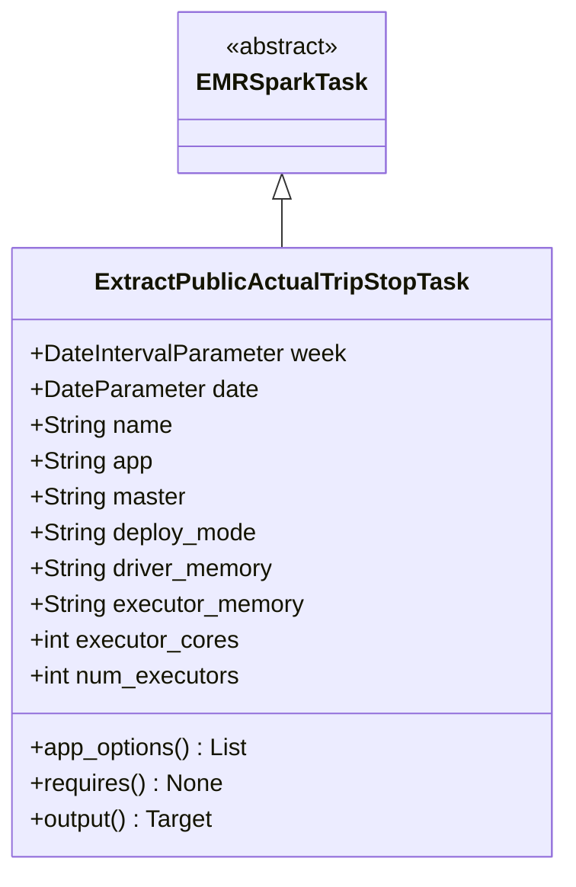
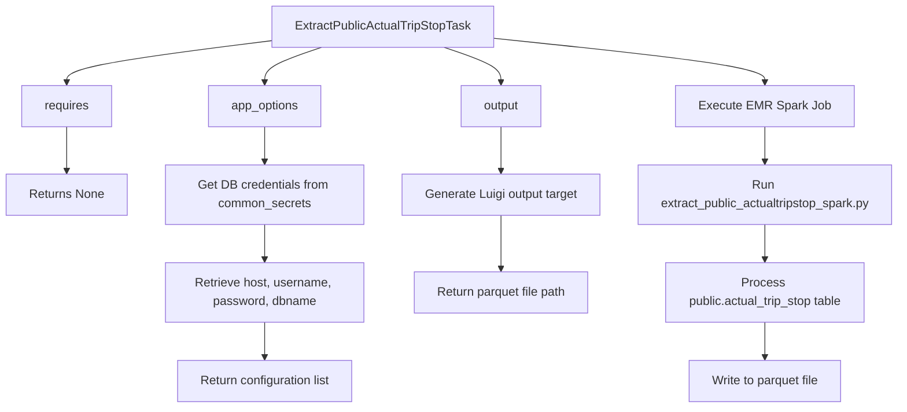

# Diagram: research/orchestrator/tasks/etl/extract_public_actualtripstop_task.py


> Auto-generated by Obscura crawlers

## Diagram 1

```mermaid
classDiagram
      EMRSparkTask <|-- ExtractPublicActualTripStopTask
      class ExtractPublicActualTripStopTask {
          +DateIntervalParameter week...
  └ 34 lines...

✗ read_bash
  Invalid shell ID: 0. Please supply a valid shell ID to read output from.

  <no active shell sessions>

● Output Mermaid diagrams
  $ echo 'classDiagram
      EMRSparkTask <|-- ExtractPublicActualTripStopTask
      class ExtractPublicActualTripStopTask {
          +DateIntervalParameter week
          +DateParameter date...
  └ 31 lines...

● stop_bash
  └ <command with id: 1 stopped>
```

> SVG rendering failed for this diagram.

## Diagram 2



### SVG

<svg id="container" width="370.8515625" xmlns="http://www.w3.org/2000/svg" class="classDiagram" height="582" viewBox="0 0 370.8515625 582" role="graphics-document document" aria-roledescription="class"><style>#container{font-family:"trebuchet ms",verdana,arial,sans-serif;font-size:16px;fill:#333;}@keyframes edge-animation-frame{from{stroke-dashoffset:0;}}@keyframes dash{to{stroke-dashoffset:0;}}#container .edge-animation-slow{stroke-dasharray:9,5!important;stroke-dashoffset:900;animation:dash 50s linear infinite;stroke-linecap:round;}#container .edge-animation-fast{stroke-dasharray:9,5!important;stroke-dashoffset:900;animation:dash 20s linear infinite;stroke-linecap:round;}#container .error-icon{fill:#552222;}#container .error-text{fill:#552222;stroke:#552222;}#container .edge-thickness-normal{stroke-width:1px;}#container .edge-thickness-thick{stroke-width:3.5px;}#container .edge-pattern-solid{stroke-dasharray:0;}#container .edge-thickness-invisible{stroke-width:0;fill:none;}#container .edge-pattern-dashed{stroke-dasharray:3;}#container .edge-pattern-dotted{stroke-dasharray:2;}#container .marker{fill:#333333;stroke:#333333;}#container .marker.cross{stroke:#333333;}#container svg{font-family:"trebuchet ms",verdana,arial,sans-serif;font-size:16px;}#container p{margin:0;}#container g.classGroup text{fill:#9370DB;stroke:none;font-family:"trebuchet ms",verdana,arial,sans-serif;font-size:10px;}#container g.classGroup text .title{font-weight:bolder;}#container .nodeLabel,#container .edgeLabel{color:#131300;}#container .edgeLabel .label rect{fill:#ECECFF;}#container .label text{fill:#131300;}#container .labelBkg{background:#ECECFF;}#container .edgeLabel .label span{background:#ECECFF;}#container .classTitle{font-weight:bolder;}#container .node rect,#container .node circle,#container .node ellipse,#container .node polygon,#container .node path{fill:#ECECFF;stroke:#9370DB;stroke-width:1px;}#container .divider{stroke:#9370DB;stroke-width:1;}#container g.clickable{cursor:pointer;}#container g.classGroup rect{fill:#ECECFF;stroke:#9370DB;}#container g.classGroup line{stroke:#9370DB;stroke-width:1;}#container .classLabel .box{stroke:none;stroke-width:0;fill:#ECECFF;opacity:0.5;}#container .classLabel .label{fill:#9370DB;font-size:10px;}#container .relation{stroke:#333333;stroke-width:1;fill:none;}#container .dashed-line{stroke-dasharray:3;}#container .dotted-line{stroke-dasharray:1 2;}#container #compositionStart,#container .composition{fill:#333333!important;stroke:#333333!important;stroke-width:1;}#container #compositionEnd,#container .composition{fill:#333333!important;stroke:#333333!important;stroke-width:1;}#container #dependencyStart,#container .dependency{fill:#333333!important;stroke:#333333!important;stroke-width:1;}#container #dependencyStart,#container .dependency{fill:#333333!important;stroke:#333333!important;stroke-width:1;}#container #extensionStart,#container .extension{fill:transparent!important;stroke:#333333!important;stroke-width:1;}#container #extensionEnd,#container .extension{fill:transparent!important;stroke:#333333!important;stroke-width:1;}#container #aggregationStart,#container .aggregation{fill:transparent!important;stroke:#333333!important;stroke-width:1;}#container #aggregationEnd,#container .aggregation{fill:transparent!important;stroke:#333333!important;stroke-width:1;}#container #lollipopStart,#container .lollipop{fill:#ECECFF!important;stroke:#333333!important;stroke-width:1;}#container #lollipopEnd,#container .lollipop{fill:#ECECFF!important;stroke:#333333!important;stroke-width:1;}#container .edgeTerminals{font-size:11px;line-height:initial;}#container .classTitleText{text-anchor:middle;font-size:18px;fill:#333;}#container .label-icon{display:inline-block;height:1em;overflow:visible;vertical-align:-0.125em;}#container .node .label-icon path{fill:currentColor;stroke:revert;stroke-width:revert;}#container :root{--mermaid-font-family:"trebuchet ms",verdana,arial,sans-serif;}</style><g><defs><marker id="container_class-aggregationStart" class="marker aggregation class" refX="18" refY="7" markerWidth="190" markerHeight="240" orient="auto"><path d="M 18,7 L9,13 L1,7 L9,1 Z"></path></marker></defs><defs><marker id="container_class-aggregationEnd" class="marker aggregation class" refX="1" refY="7" markerWidth="20" markerHeight="28" orient="auto"><path d="M 18,7 L9,13 L1,7 L9,1 Z"></path></marker></defs><defs><marker id="container_class-extensionStart" class="marker extension class" refX="18" refY="7" markerWidth="190" markerHeight="240" orient="auto"><path d="M 1,7 L18,13 V 1 Z"></path></marker></defs><defs><marker id="container_class-extensionEnd" class="marker extension class" refX="1" refY="7" markerWidth="20" markerHeight="28" orient="auto"><path d="M 1,1 V 13 L18,7 Z"></path></marker></defs><defs><marker id="container_class-compositionStart" class="marker composition class" refX="18" refY="7" markerWidth="190" markerHeight="240" orient="auto"><path d="M 18,7 L9,13 L1,7 L9,1 Z"></path></marker></defs><defs><marker id="container_class-compositionEnd" class="marker composition class" refX="1" refY="7" markerWidth="20" markerHeight="28" orient="auto"><path d="M 18,7 L9,13 L1,7 L9,1 Z"></path></marker></defs><defs><marker id="container_class-dependencyStart" class="marker dependency class" refX="6" refY="7" markerWidth="190" markerHeight="240" orient="auto"><path d="M 5,7 L9,13 L1,7 L9,1 Z"></path></marker></defs><defs><marker id="container_class-dependencyEnd" class="marker dependency class" refX="13" refY="7" markerWidth="20" markerHeight="28" orient="auto"><path d="M 18,7 L9,13 L14,7 L9,1 Z"></path></marker></defs><defs><marker id="container_class-lollipopStart" class="marker lollipop class" refX="13" refY="7" markerWidth="190" markerHeight="240" orient="auto"><circle stroke="black" fill="transparent" cx="7" cy="7" r="6"></circle></marker></defs><defs><marker id="container_class-lollipopEnd" class="marker lollipop class" refX="1" refY="7" markerWidth="190" markerHeight="240" orient="auto"><circle stroke="black" fill="transparent" cx="7" cy="7" r="6"></circle></marker></defs><g class="root"><g class="clusters"></g><g class="edgePaths"><path d="M185.426,133.25L185.426,134.542C185.426,135.833,185.426,138.417,185.426,143.875C185.426,149.333,185.426,157.667,185.426,161.833L185.426,166" id="id_EMRSparkTask_ExtractPublicActualTripStopTask_1" class="edge-thickness-normal edge-pattern-solid relation" style=";;;" data-edge="true" data-et="edge" data-id="id_EMRSparkTask_ExtractPublicActualTripStopTask_1" data-points="W3sieCI6MTg1LjQyNTc4MTI1LCJ5IjoxMTZ9LHsieCI6MTg1LjQyNTc4MTI1LCJ5IjoxNDF9LHsieCI6MTg1LjQyNTc4MTI1LCJ5IjoxNjZ9XQ==" marker-start="url(#container_class-extensionStart)"></path></g><g class="edgeLabels"><g class="edgeLabel"><g class="label" data-id="id_EMRSparkTask_ExtractPublicActualTripStopTask_1" transform="translate(0, 0)"><foreignObject width="0" height="0"><div xmlns="http://www.w3.org/1999/xhtml" class="labelBkg" style="display: table-cell; white-space: nowrap; line-height: 1.5; max-width: 200px; text-align: center;"><span class="edgeLabel"></span></div></foreignObject></g></g></g><g class="nodes"><g class="node default" id="classId-EMRSparkTask-0" transform="translate(185.42578125, 62)"><g class="basic label-container"><path d="M-65.1484375 -54 L65.1484375 -54 L65.1484375 54 L-65.1484375 54" stroke="none" stroke-width="0" fill="#ECECFF" style=""></path><path d="M-65.1484375 -54 C-28.0572200838929 -54, 9.033997332214199 -54, 65.1484375 -54 M-65.1484375 -54 C-18.162485269240754 -54, 28.82346696151849 -54, 65.1484375 -54 M65.1484375 -54 C65.1484375 -31.104901330865047, 65.1484375 -8.209802661730095, 65.1484375 54 M65.1484375 -54 C65.1484375 -21.049947897182292, 65.1484375 11.900104205635415, 65.1484375 54 M65.1484375 54 C33.01865834771795 54, 0.888879195435905 54, -65.1484375 54 M65.1484375 54 C13.23438572394955 54, -38.6796660521009 54, -65.1484375 54 M-65.1484375 54 C-65.1484375 25.95349345994894, -65.1484375 -2.093013080102118, -65.1484375 -54 M-65.1484375 54 C-65.1484375 13.082308277404117, -65.1484375 -27.835383445191766, -65.1484375 -54" stroke="#9370DB" stroke-width="1.3" fill="none" stroke-dasharray="0 0" style=""></path></g><g class="annotation-group text" transform="translate(-38.609375, -30)"><g class="label" style="" transform="translate(0,-12)"><foreignObject width="77.21875" height="24"><div xmlns="http://www.w3.org/1999/xhtml" style="display: table-cell; white-space: nowrap; line-height: 1.5; max-width: 127px; text-align: center;"><span class="nodeLabel markdown-node-label" style=""><p>«abstract»</p></span></div></foreignObject></g></g><g class="label-group text" transform="translate(-53.1484375, -6)"><g class="label" style="font-weight: bolder" transform="translate(0,-12)"><foreignObject width="106.296875" height="24"><div xmlns="http://www.w3.org/1999/xhtml" style="display: table-cell; white-space: nowrap; line-height: 1.5; max-width: 154px; text-align: center;"><span class="nodeLabel markdown-node-label" style=""><p>EMRSparkTask</p></span></div></foreignObject></g></g><g class="members-group text" transform="translate(-53.1484375, 42)"></g><g class="methods-group text" transform="translate(-53.1484375, 72)"></g><g class="divider" style=""><path d="M-65.1484375 18 C-30.9930396113513 18, 3.1623582772974004 18, 65.1484375 18 M-65.1484375 18 C-27.494590079599803 18, 10.159257340800394 18, 65.1484375 18" stroke="#9370DB" stroke-width="1.3" fill="none" stroke-dasharray="0 0" style=""></path></g><g class="divider" style=""><path d="M-65.1484375 36 C-28.301006897653807 36, 8.546423704692387 36, 65.1484375 36 M-65.1484375 36 C-30.212276057202217 36, 4.723885385595565 36, 65.1484375 36" stroke="#9370DB" stroke-width="1.3" fill="none" stroke-dasharray="0 0" style=""></path></g></g><g class="node default" id="classId-ExtractPublicActualTripStopTask-1" transform="translate(185.42578125, 370)"><g class="basic label-container"><path d="M-177.42578125 -204 L177.42578125 -204 L177.42578125 204 L-177.42578125 204" stroke="none" stroke-width="0" fill="#ECECFF" style=""></path><path d="M-177.42578125 -204 C-74.34620946617939 -204, 28.733362317641223 -204, 177.42578125 -204 M-177.42578125 -204 C-85.44733285462759 -204, 6.531115540744821 -204, 177.42578125 -204 M177.42578125 -204 C177.42578125 -88.36413729250329, 177.42578125 27.271725414993426, 177.42578125 204 M177.42578125 -204 C177.42578125 -88.83664213915526, 177.42578125 26.32671572168948, 177.42578125 204 M177.42578125 204 C35.63387661802386 204, -106.15802801395228 204, -177.42578125 204 M177.42578125 204 C59.47528955584146 204, -58.47520213831709 204, -177.42578125 204 M-177.42578125 204 C-177.42578125 116.45381636311107, -177.42578125 28.907632726222147, -177.42578125 -204 M-177.42578125 204 C-177.42578125 82.78741926009909, -177.42578125 -38.42516147980183, -177.42578125 -204" stroke="#9370DB" stroke-width="1.3" fill="none" stroke-dasharray="0 0" style=""></path></g><g class="annotation-group text" transform="translate(0, -180)"></g><g class="label-group text" transform="translate(-118.7265625, -180)"><g class="label" style="font-weight: bolder" transform="translate(0,-12)"><foreignObject width="237.453125" height="24"><div xmlns="http://www.w3.org/1999/xhtml" style="display: table-cell; white-space: nowrap; line-height: 1.5; max-width: 283px; text-align: center;"><span class="nodeLabel markdown-node-label" style=""><p>ExtractPublicActualTripStopTask</p></span></div></foreignObject></g></g><g class="members-group text" transform="translate(-165.42578125, -132)"><g class="label" style="" transform="translate(0,-12)"><foreignObject width="212.125" height="24"><div xmlns="http://www.w3.org/1999/xhtml" style="display: table-cell; white-space: nowrap; line-height: 1.5; max-width: 270px; text-align: center;"><span class="nodeLabel markdown-node-label" style=""><p>+DateIntervalParameter week</p></span></div></foreignObject></g><g class="label" style="" transform="translate(0,12)"><foreignObject width="152.171875" height="24"><div xmlns="http://www.w3.org/1999/xhtml" style="display: table-cell; white-space: nowrap; line-height: 1.5; max-width: 210px; text-align: center;"><span class="nodeLabel markdown-node-label" style=""><p>+DateParameter date</p></span></div></foreignObject></g><g class="label" style="" transform="translate(0,36)"><foreignObject width="94.984375" height="24"><div xmlns="http://www.w3.org/1999/xhtml" style="display: table-cell; white-space: nowrap; line-height: 1.5; max-width: 152px; text-align: center;"><span class="nodeLabel markdown-node-label" style=""><p>+String name</p></span></div></foreignObject></g><g class="label" style="" transform="translate(0,60)"><foreignObject width="82.1875" height="24"><div xmlns="http://www.w3.org/1999/xhtml" style="display: table-cell; white-space: nowrap; line-height: 1.5; max-width: 140px; text-align: center;"><span class="nodeLabel markdown-node-label" style=""><p>+String app</p></span></div></foreignObject></g><g class="label" style="" transform="translate(0,84)"><foreignObject width="104.625" height="24"><div xmlns="http://www.w3.org/1999/xhtml" style="display: table-cell; white-space: nowrap; line-height: 1.5; max-width: 163px; text-align: center;"><span class="nodeLabel markdown-node-label" style=""><p>+String master</p></span></div></foreignObject></g><g class="label" style="" transform="translate(0,108)"><foreignObject width="153.203125" height="24"><div xmlns="http://www.w3.org/1999/xhtml" style="display: table-cell; white-space: nowrap; line-height: 1.5; max-width: 211px; text-align: center;"><span class="nodeLabel markdown-node-label" style=""><p>+String deploy_mode</p></span></div></foreignObject></g><g class="label" style="" transform="translate(0,132)"><foreignObject width="164.015625" height="24"><div xmlns="http://www.w3.org/1999/xhtml" style="display: table-cell; white-space: nowrap; line-height: 1.5; max-width: 221px; text-align: center;"><span class="nodeLabel markdown-node-label" style=""><p>+String driver_memory</p></span></div></foreignObject></g><g class="label" style="" transform="translate(0,156)"><foreignObject width="183.8125" height="24"><div xmlns="http://www.w3.org/1999/xhtml" style="display: table-cell; white-space: nowrap; line-height: 1.5; max-width: 241px; text-align: center;"><span class="nodeLabel markdown-node-label" style=""><p>+String executor_memory</p></span></div></foreignObject></g><g class="label" style="" transform="translate(0,180)"><foreignObject width="139.9375" height="24"><div xmlns="http://www.w3.org/1999/xhtml" style="display: table-cell; white-space: nowrap; line-height: 1.5; max-width: 197px; text-align: center;"><span class="nodeLabel markdown-node-label" style=""><p>+int executor_cores</p></span></div></foreignObject></g><g class="label" style="" transform="translate(0,204)"><foreignObject width="142.296875" height="24"><div xmlns="http://www.w3.org/1999/xhtml" style="display: table-cell; white-space: nowrap; line-height: 1.5; max-width: 200px; text-align: center;"><span class="nodeLabel markdown-node-label" style=""><p>+int num_executors</p></span></div></foreignObject></g></g><g class="methods-group text" transform="translate(-165.42578125, 132)"><g class="label" style="" transform="translate(0,-12)"><foreignObject width="146.890625" height="24"><div xmlns="http://www.w3.org/1999/xhtml" style="display: table-cell; white-space: nowrap; line-height: 1.5; max-width: 204px; text-align: center;"><span class="nodeLabel markdown-node-label" style=""><p>+app_options() : List</p></span></div></foreignObject></g><g class="label" style="" transform="translate(0,12)"><foreignObject width="128.75" height="24"><div xmlns="http://www.w3.org/1999/xhtml" style="display: table-cell; white-space: nowrap; line-height: 1.5; max-width: 186px; text-align: center;"><span class="nodeLabel markdown-node-label" style=""><p>+requires() : None</p></span></div></foreignObject></g><g class="label" style="" transform="translate(0,36)"><foreignObject width="124.375" height="24"><div xmlns="http://www.w3.org/1999/xhtml" style="display: table-cell; white-space: nowrap; line-height: 1.5; max-width: 182px; text-align: center;"><span class="nodeLabel markdown-node-label" style=""><p>+output() : Target</p></span></div></foreignObject></g></g><g class="divider" style=""><path d="M-177.42578125 -156 C-38.490344672275626 -156, 100.44509190544875 -156, 177.42578125 -156 M-177.42578125 -156 C-41.947805856385855 -156, 93.53016953722829 -156, 177.42578125 -156" stroke="#9370DB" stroke-width="1.3" fill="none" stroke-dasharray="0 0" style=""></path></g><g class="divider" style=""><path d="M-177.42578125 108 C-51.57453483023184 108, 74.27671158953632 108, 177.42578125 108 M-177.42578125 108 C-78.92832042223299 108, 19.56914040553403 108, 177.42578125 108" stroke="#9370DB" stroke-width="1.3" fill="none" stroke-dasharray="0 0" style=""></path></g></g></g></g></g></svg>

## Diagram 3



### SVG

<svg id="container" width="1187.84375" xmlns="http://www.w3.org/2000/svg" class="flowchart" height="558" viewBox="0 0 1187.84375 558" role="graphics-document document" aria-roledescription="flowchart-v2"><style>#container{font-family:"trebuchet ms",verdana,arial,sans-serif;font-size:16px;fill:#333;}@keyframes edge-animation-frame{from{stroke-dashoffset:0;}}@keyframes dash{to{stroke-dashoffset:0;}}#container .edge-animation-slow{stroke-dasharray:9,5!important;stroke-dashoffset:900;animation:dash 50s linear infinite;stroke-linecap:round;}#container .edge-animation-fast{stroke-dasharray:9,5!important;stroke-dashoffset:900;animation:dash 20s linear infinite;stroke-linecap:round;}#container .error-icon{fill:#552222;}#container .error-text{fill:#552222;stroke:#552222;}#container .edge-thickness-normal{stroke-width:1px;}#container .edge-thickness-thick{stroke-width:3.5px;}#container .edge-pattern-solid{stroke-dasharray:0;}#container .edge-thickness-invisible{stroke-width:0;fill:none;}#container .edge-pattern-dashed{stroke-dasharray:3;}#container .edge-pattern-dotted{stroke-dasharray:2;}#container .marker{fill:#333333;stroke:#333333;}#container .marker.cross{stroke:#333333;}#container svg{font-family:"trebuchet ms",verdana,arial,sans-serif;font-size:16px;}#container p{margin:0;}#container .label{font-family:"trebuchet ms",verdana,arial,sans-serif;color:#333;}#container .cluster-label text{fill:#333;}#container .cluster-label span{color:#333;}#container .cluster-label span p{background-color:transparent;}#container .label text,#container span{fill:#333;color:#333;}#container .node rect,#container .node circle,#container .node ellipse,#container .node polygon,#container .node path{fill:#ECECFF;stroke:#9370DB;stroke-width:1px;}#container .rough-node .label text,#container .node .label text,#container .image-shape .label,#container .icon-shape .label{text-anchor:middle;}#container .node .katex path{fill:#000;stroke:#000;stroke-width:1px;}#container .rough-node .label,#container .node .label,#container .image-shape .label,#container .icon-shape .label{text-align:center;}#container .node.clickable{cursor:pointer;}#container .root .anchor path{fill:#333333!important;stroke-width:0;stroke:#333333;}#container .arrowheadPath{fill:#333333;}#container .edgePath .path{stroke:#333333;stroke-width:2.0px;}#container .flowchart-link{stroke:#333333;fill:none;}#container .edgeLabel{background-color:rgba(232,232,232, 0.8);text-align:center;}#container .edgeLabel p{background-color:rgba(232,232,232, 0.8);}#container .edgeLabel rect{opacity:0.5;background-color:rgba(232,232,232, 0.8);fill:rgba(232,232,232, 0.8);}#container .labelBkg{background-color:rgba(232, 232, 232, 0.5);}#container .cluster rect{fill:#ffffde;stroke:#aaaa33;stroke-width:1px;}#container .cluster text{fill:#333;}#container .cluster span{color:#333;}#container div.mermaidTooltip{position:absolute;text-align:center;max-width:200px;padding:2px;font-family:"trebuchet ms",verdana,arial,sans-serif;font-size:12px;background:hsl(80, 100%, 96.2745098039%);border:1px solid #aaaa33;border-radius:2px;pointer-events:none;z-index:100;}#container .flowchartTitleText{text-anchor:middle;font-size:18px;fill:#333;}#container rect.text{fill:none;stroke-width:0;}#container .icon-shape,#container .image-shape{background-color:rgba(232,232,232, 0.8);text-align:center;}#container .icon-shape p,#container .image-shape p{background-color:rgba(232,232,232, 0.8);padding:2px;}#container .icon-shape rect,#container .image-shape rect{opacity:0.5;background-color:rgba(232,232,232, 0.8);fill:rgba(232,232,232, 0.8);}#container .label-icon{display:inline-block;height:1em;overflow:visible;vertical-align:-0.125em;}#container .node .label-icon path{fill:currentColor;stroke:revert;stroke-width:revert;}#container :root{--mermaid-font-family:"trebuchet ms",verdana,arial,sans-serif;}</style><g><marker id="container_flowchart-v2-pointEnd" class="marker flowchart-v2" viewBox="0 0 10 10" refX="5" refY="5" markerUnits="userSpaceOnUse" markerWidth="8" markerHeight="8" orient="auto"><path d="M 0 0 L 10 5 L 0 10 z" class="arrowMarkerPath" style="stroke-width: 1; stroke-dasharray: 1, 0;"></path></marker><marker id="container_flowchart-v2-pointStart" class="marker flowchart-v2" viewBox="0 0 10 10" refX="4.5" refY="5" markerUnits="userSpaceOnUse" markerWidth="8" markerHeight="8" orient="auto"><path d="M 0 5 L 10 10 L 10 0 z" class="arrowMarkerPath" style="stroke-width: 1; stroke-dasharray: 1, 0;"></path></marker><marker id="container_flowchart-v2-circleEnd" class="marker flowchart-v2" viewBox="0 0 10 10" refX="11" refY="5" markerUnits="userSpaceOnUse" markerWidth="11" markerHeight="11" orient="auto"><circle cx="5" cy="5" r="5" class="arrowMarkerPath" style="stroke-width: 1; stroke-dasharray: 1, 0;"></circle></marker><marker id="container_flowchart-v2-circleStart" class="marker flowchart-v2" viewBox="0 0 10 10" refX="-1" refY="5" markerUnits="userSpaceOnUse" markerWidth="11" markerHeight="11" orient="auto"><circle cx="5" cy="5" r="5" class="arrowMarkerPath" style="stroke-width: 1; stroke-dasharray: 1, 0;"></circle></marker><marker id="container_flowchart-v2-crossEnd" class="marker cross flowchart-v2" viewBox="0 0 11 11" refX="12" refY="5.2" markerUnits="userSpaceOnUse" markerWidth="11" markerHeight="11" orient="auto"><path d="M 1,1 l 9,9 M 10,1 l -9,9" class="arrowMarkerPath" style="stroke-width: 2; stroke-dasharray: 1, 0;"></path></marker><marker id="container_flowchart-v2-crossStart" class="marker cross flowchart-v2" viewBox="0 0 11 11" refX="-1" refY="5.2" markerUnits="userSpaceOnUse" markerWidth="11" markerHeight="11" orient="auto"><path d="M 1,1 l 9,9 M 10,1 l -9,9" class="arrowMarkerPath" style="stroke-width: 2; stroke-dasharray: 1, 0;"></path></marker><g class="root"><g class="clusters"></g><g class="edgePaths"><path d="M355.75,53.336L311.033,58.947C266.315,64.557,176.88,75.779,132.163,84.889C87.445,94,87.445,101,87.445,104.5L87.445,108" id="L_A_B_0" class="edge-thickness-normal edge-pattern-solid edge-thickness-normal edge-pattern-solid flowchart-link" style=";" data-edge="true" data-et="edge" data-id="L_A_B_0" data-points="W3sieCI6MzU1Ljc1LCJ5Ijo1My4zMzYxMDQzNTYzNDk3OX0seyJ4Ijo4Ny40NDUzMTI1LCJ5Ijo4N30seyJ4Ijo4Ny40NDUzMTI1LCJ5IjoxMTJ9XQ==" marker-end="url(#container_flowchart-v2-pointEnd)"></path><path d="M87.445,166L87.445,170.167C87.445,174.333,87.445,182.667,87.445,192.333C87.445,202,87.445,213,87.445,218.5L87.445,224" id="L_B_C_0" class="edge-thickness-normal edge-pattern-solid edge-thickness-normal edge-pattern-solid flowchart-link" style=";" data-edge="true" data-et="edge" data-id="L_B_C_0" data-points="W3sieCI6ODcuNDQ1MzEyNSwieSI6MTY2fSx7IngiOjg3LjQ0NTMxMjUsInkiOjE5MX0seyJ4Ijo4Ny40NDUzMTI1LCJ5IjoyMjh9XQ==" marker-end="url(#container_flowchart-v2-pointEnd)"></path><path d="M421.41,62L408.99,66.167C396.57,70.333,371.73,78.667,359.31,86.333C346.891,94,346.891,101,346.891,104.5L346.891,108" id="L_A_D_0" class="edge-thickness-normal edge-pattern-solid edge-thickness-normal edge-pattern-solid flowchart-link" style=";" data-edge="true" data-et="edge" data-id="L_A_D_0" data-points="W3sieCI6NDIxLjQwOTg1NTc2OTIzMDgsInkiOjYyfSx7IngiOjM0Ni44OTA2MjUsInkiOjg3fSx7IngiOjM0Ni44OTA2MjUsInkiOjExMn1d" marker-end="url(#container_flowchart-v2-pointEnd)"></path><path d="M346.891,166L346.891,170.167C346.891,174.333,346.891,182.667,346.891,190.333C346.891,198,346.891,205,346.891,208.5L346.891,212" id="L_D_E_0" class="edge-thickness-normal edge-pattern-solid edge-thickness-normal edge-pattern-solid flowchart-link" style=";" data-edge="true" data-et="edge" data-id="L_D_E_0" data-points="W3sieCI6MzQ2Ljg5MDYyNSwieSI6MTY2fSx7IngiOjM0Ni44OTA2MjUsInkiOjE5MX0seyJ4IjozNDYuODkwNjI1LCJ5IjoyMTZ9XQ==" marker-end="url(#container_flowchart-v2-pointEnd)"></path><path d="M346.891,294L346.891,298.167C346.891,302.333,346.891,310.667,346.891,320.333C346.891,330,346.891,341,346.891,346.5L346.891,352" id="L_E_F_0" class="edge-thickness-normal edge-pattern-solid edge-thickness-normal edge-pattern-solid flowchart-link" style=";" data-edge="true" data-et="edge" data-id="L_E_F_0" data-points="W3sieCI6MzQ2Ljg5MDYyNSwieSI6Mjk0fSx7IngiOjM0Ni44OTA2MjUsInkiOjMxOX0seyJ4IjozNDYuODkwNjI1LCJ5IjozNTZ9XQ==" marker-end="url(#container_flowchart-v2-pointEnd)"></path><path d="M346.891,434L346.891,440.167C346.891,446.333,346.891,458.667,346.891,468.333C346.891,478,346.891,485,346.891,488.5L346.891,492" id="L_F_G_0" class="edge-thickness-normal edge-pattern-solid edge-thickness-normal edge-pattern-solid flowchart-link" style=";" data-edge="true" data-et="edge" data-id="L_F_G_0" data-points="W3sieCI6MzQ2Ljg5MDYyNSwieSI6NDM0fSx7IngiOjM0Ni44OTA2MjUsInkiOjQ3MX0seyJ4IjozNDYuODkwNjI1LCJ5Ijo0OTZ9XQ==" marker-end="url(#container_flowchart-v2-pointEnd)"></path><path d="M582.371,62L594.791,66.167C607.211,70.333,632.051,78.667,644.471,86.333C656.891,94,656.891,101,656.891,104.5L656.891,108" id="L_A_H_0" class="edge-thickness-normal edge-pattern-solid edge-thickness-normal edge-pattern-solid flowchart-link" style=";" data-edge="true" data-et="edge" data-id="L_A_H_0" data-points="W3sieCI6NTgyLjM3MTM5NDIzMDc2OTMsInkiOjYyfSx7IngiOjY1Ni44OTA2MjUsInkiOjg3fSx7IngiOjY1Ni44OTA2MjUsInkiOjExMn1d" marker-end="url(#container_flowchart-v2-pointEnd)"></path><path d="M656.891,166L656.891,170.167C656.891,174.333,656.891,182.667,656.891,190.333C656.891,198,656.891,205,656.891,208.5L656.891,212" id="L_H_I_0" class="edge-thickness-normal edge-pattern-solid edge-thickness-normal edge-pattern-solid flowchart-link" style=";" data-edge="true" data-et="edge" data-id="L_H_I_0" data-points="W3sieCI6NjU2Ljg5MDYyNSwieSI6MTY2fSx7IngiOjY1Ni44OTA2MjUsInkiOjE5MX0seyJ4Ijo2NTYuODkwNjI1LCJ5IjoyMTZ9XQ==" marker-end="url(#container_flowchart-v2-pointEnd)"></path><path d="M656.891,294L656.891,298.167C656.891,302.333,656.891,310.667,656.891,322.333C656.891,334,656.891,349,656.891,356.5L656.891,364" id="L_I_J_0" class="edge-thickness-normal edge-pattern-solid edge-thickness-normal edge-pattern-solid flowchart-link" style=";" data-edge="true" data-et="edge" data-id="L_I_J_0" data-points="W3sieCI6NjU2Ljg5MDYyNSwieSI6Mjk0fSx7IngiOjY1Ni44OTA2MjUsInkiOjMxOX0seyJ4Ijo2NTYuODkwNjI1LCJ5IjozNjh9XQ==" marker-end="url(#container_flowchart-v2-pointEnd)"></path><path d="M648.031,50.004L708.087,56.17C768.143,62.336,888.255,74.668,948.311,84.334C1008.367,94,1008.367,101,1008.367,104.5L1008.367,108" id="L_A_K_0" class="edge-thickness-normal edge-pattern-solid edge-thickness-normal edge-pattern-solid flowchart-link" style=";" data-edge="true" data-et="edge" data-id="L_A_K_0" data-points="W3sieCI6NjQ4LjAzMTI1LCJ5Ijo1MC4wMDQyNzI3NzkxNTc0NzV9LHsieCI6MTAwOC4zNjcxODc1LCJ5Ijo4N30seyJ4IjoxMDA4LjM2NzE4NzUsInkiOjExMn1d" marker-end="url(#container_flowchart-v2-pointEnd)"></path><path d="M1008.367,166L1008.367,170.167C1008.367,174.333,1008.367,182.667,1008.367,190.333C1008.367,198,1008.367,205,1008.367,208.5L1008.367,212" id="L_K_L_0" class="edge-thickness-normal edge-pattern-solid edge-thickness-normal edge-pattern-solid flowchart-link" style=";" data-edge="true" data-et="edge" data-id="L_K_L_0" data-points="W3sieCI6MTAwOC4zNjcxODc1LCJ5IjoxNjZ9LHsieCI6MTAwOC4zNjcxODc1LCJ5IjoxOTF9LHsieCI6MTAwOC4zNjcxODc1LCJ5IjoyMTZ9XQ==" marker-end="url(#container_flowchart-v2-pointEnd)"></path><path d="M1008.367,294L1008.367,298.167C1008.367,302.333,1008.367,310.667,1008.367,318.333C1008.367,326,1008.367,333,1008.367,336.5L1008.367,340" id="L_L_M_0" class="edge-thickness-normal edge-pattern-solid edge-thickness-normal edge-pattern-solid flowchart-link" style=";" data-edge="true" data-et="edge" data-id="L_L_M_0" data-points="W3sieCI6MTAwOC4zNjcxODc1LCJ5IjoyOTR9LHsieCI6MTAwOC4zNjcxODc1LCJ5IjozMTl9LHsieCI6MTAwOC4zNjcxODc1LCJ5IjozNDR9XQ==" marker-end="url(#container_flowchart-v2-pointEnd)"></path><path d="M1008.367,446L1008.367,450.167C1008.367,454.333,1008.367,462.667,1008.367,470.333C1008.367,478,1008.367,485,1008.367,488.5L1008.367,492" id="L_M_N_0" class="edge-thickness-normal edge-pattern-solid edge-thickness-normal edge-pattern-solid flowchart-link" style=";" data-edge="true" data-et="edge" data-id="L_M_N_0" data-points="W3sieCI6MTAwOC4zNjcxODc1LCJ5Ijo0NDZ9LHsieCI6MTAwOC4zNjcxODc1LCJ5Ijo0NzF9LHsieCI6MTAwOC4zNjcxODc1LCJ5Ijo0OTZ9XQ==" marker-end="url(#container_flowchart-v2-pointEnd)"></path></g><g class="edgeLabels"><g class="edgeLabel"><g class="label" data-id="L_A_B_0" transform="translate(0, 0)"><foreignObject width="0" height="0"><div xmlns="http://www.w3.org/1999/xhtml" class="labelBkg" style="display: table-cell; white-space: nowrap; line-height: 1.5; max-width: 200px; text-align: center;"><span class="edgeLabel"></span></div></foreignObject></g></g><g class="edgeLabel"><g class="label" data-id="L_B_C_0" transform="translate(0, 0)"><foreignObject width="0" height="0"><div xmlns="http://www.w3.org/1999/xhtml" class="labelBkg" style="display: table-cell; white-space: nowrap; line-height: 1.5; max-width: 200px; text-align: center;"><span class="edgeLabel"></span></div></foreignObject></g></g><g class="edgeLabel"><g class="label" data-id="L_A_D_0" transform="translate(0, 0)"><foreignObject width="0" height="0"><div xmlns="http://www.w3.org/1999/xhtml" class="labelBkg" style="display: table-cell; white-space: nowrap; line-height: 1.5; max-width: 200px; text-align: center;"><span class="edgeLabel"></span></div></foreignObject></g></g><g class="edgeLabel"><g class="label" data-id="L_D_E_0" transform="translate(0, 0)"><foreignObject width="0" height="0"><div xmlns="http://www.w3.org/1999/xhtml" class="labelBkg" style="display: table-cell; white-space: nowrap; line-height: 1.5; max-width: 200px; text-align: center;"><span class="edgeLabel"></span></div></foreignObject></g></g><g class="edgeLabel"><g class="label" data-id="L_E_F_0" transform="translate(0, 0)"><foreignObject width="0" height="0"><div xmlns="http://www.w3.org/1999/xhtml" class="labelBkg" style="display: table-cell; white-space: nowrap; line-height: 1.5; max-width: 200px; text-align: center;"><span class="edgeLabel"></span></div></foreignObject></g></g><g class="edgeLabel"><g class="label" data-id="L_F_G_0" transform="translate(0, 0)"><foreignObject width="0" height="0"><div xmlns="http://www.w3.org/1999/xhtml" class="labelBkg" style="display: table-cell; white-space: nowrap; line-height: 1.5; max-width: 200px; text-align: center;"><span class="edgeLabel"></span></div></foreignObject></g></g><g class="edgeLabel"><g class="label" data-id="L_A_H_0" transform="translate(0, 0)"><foreignObject width="0" height="0"><div xmlns="http://www.w3.org/1999/xhtml" class="labelBkg" style="display: table-cell; white-space: nowrap; line-height: 1.5; max-width: 200px; text-align: center;"><span class="edgeLabel"></span></div></foreignObject></g></g><g class="edgeLabel"><g class="label" data-id="L_H_I_0" transform="translate(0, 0)"><foreignObject width="0" height="0"><div xmlns="http://www.w3.org/1999/xhtml" class="labelBkg" style="display: table-cell; white-space: nowrap; line-height: 1.5; max-width: 200px; text-align: center;"><span class="edgeLabel"></span></div></foreignObject></g></g><g class="edgeLabel"><g class="label" data-id="L_I_J_0" transform="translate(0, 0)"><foreignObject width="0" height="0"><div xmlns="http://www.w3.org/1999/xhtml" class="labelBkg" style="display: table-cell; white-space: nowrap; line-height: 1.5; max-width: 200px; text-align: center;"><span class="edgeLabel"></span></div></foreignObject></g></g><g class="edgeLabel"><g class="label" data-id="L_A_K_0" transform="translate(0, 0)"><foreignObject width="0" height="0"><div xmlns="http://www.w3.org/1999/xhtml" class="labelBkg" style="display: table-cell; white-space: nowrap; line-height: 1.5; max-width: 200px; text-align: center;"><span class="edgeLabel"></span></div></foreignObject></g></g><g class="edgeLabel"><g class="label" data-id="L_K_L_0" transform="translate(0, 0)"><foreignObject width="0" height="0"><div xmlns="http://www.w3.org/1999/xhtml" class="labelBkg" style="display: table-cell; white-space: nowrap; line-height: 1.5; max-width: 200px; text-align: center;"><span class="edgeLabel"></span></div></foreignObject></g></g><g class="edgeLabel"><g class="label" data-id="L_L_M_0" transform="translate(0, 0)"><foreignObject width="0" height="0"><div xmlns="http://www.w3.org/1999/xhtml" class="labelBkg" style="display: table-cell; white-space: nowrap; line-height: 1.5; max-width: 200px; text-align: center;"><span class="edgeLabel"></span></div></foreignObject></g></g><g class="edgeLabel"><g class="label" data-id="L_M_N_0" transform="translate(0, 0)"><foreignObject width="0" height="0"><div xmlns="http://www.w3.org/1999/xhtml" class="labelBkg" style="display: table-cell; white-space: nowrap; line-height: 1.5; max-width: 200px; text-align: center;"><span class="edgeLabel"></span></div></foreignObject></g></g></g><g class="nodes"><g class="node default" id="flowchart-A-0" transform="translate(501.890625, 35)"><rect class="basic label-container" style="" x="-146.140625" y="-27" width="292.28125" height="54"></rect><g class="label" style="" transform="translate(-116.140625, -12)"><rect></rect><foreignObject width="232.28125" height="24"><div xmlns="http://www.w3.org/1999/xhtml" style="display: table; white-space: break-spaces; line-height: 1.5; max-width: 200px; text-align: center; width: 200px;"><span class="nodeLabel"><p>ExtractPublicActualTripStopTask</p></span></div></foreignObject></g></g><g class="node default" id="flowchart-B-1" transform="translate(87.4453125, 139)"><rect class="basic label-container" style="" x="-59.8515625" y="-27" width="119.703125" height="54"></rect><g class="label" style="" transform="translate(-29.8515625, -12)"><rect></rect><foreignObject width="59.703125" height="24"><div xmlns="http://www.w3.org/1999/xhtml" style="display: table-cell; white-space: nowrap; line-height: 1.5; max-width: 200px; text-align: center;"><span class="nodeLabel"><p>requires</p></span></div></foreignObject></g></g><g class="node default" id="flowchart-C-3" transform="translate(87.4453125, 255)"><rect class="basic label-container" style="" x="-79.4453125" y="-27" width="158.890625" height="54"></rect><g class="label" style="" transform="translate(-49.4453125, -12)"><rect></rect><foreignObject width="98.890625" height="24"><div xmlns="http://www.w3.org/1999/xhtml" style="display: table-cell; white-space: nowrap; line-height: 1.5; max-width: 200px; text-align: center;"><span class="nodeLabel"><p>Returns None</p></span></div></foreignObject></g></g><g class="node default" id="flowchart-D-5" transform="translate(346.890625, 139)"><rect class="basic label-container" style="" x="-75.3671875" y="-27" width="150.734375" height="54"></rect><g class="label" style="" transform="translate(-45.3671875, -12)"><rect></rect><foreignObject width="90.734375" height="24"><div xmlns="http://www.w3.org/1999/xhtml" style="display: table-cell; white-space: nowrap; line-height: 1.5; max-width: 200px; text-align: center;"><span class="nodeLabel"><p>app_options</p></span></div></foreignObject></g></g><g class="node default" id="flowchart-E-7" transform="translate(346.890625, 255)"><rect class="basic label-container" style="" x="-130" y="-39" width="260" height="78"></rect><g class="label" style="" transform="translate(-100, -24)"><rect></rect><foreignObject width="200" height="48"><div xmlns="http://www.w3.org/1999/xhtml" style="display: table; white-space: break-spaces; line-height: 1.5; max-width: 200px; text-align: center; width: 200px;"><span class="nodeLabel"><p>Get DB credentials from common_secrets</p></span></div></foreignObject></g></g><g class="node default" id="flowchart-F-9" transform="translate(346.890625, 395)"><rect class="basic label-container" style="" x="-130" y="-39" width="260" height="78"></rect><g class="label" style="" transform="translate(-100, -24)"><rect></rect><foreignObject width="200" height="48"><div xmlns="http://www.w3.org/1999/xhtml" style="display: table; white-space: break-spaces; line-height: 1.5; max-width: 200px; text-align: center; width: 200px;"><span class="nodeLabel"><p>Retrieve host, username, password, dbname</p></span></div></foreignObject></g></g><g class="node default" id="flowchart-G-11" transform="translate(346.890625, 523)"><rect class="basic label-container" style="" x="-117.890625" y="-27" width="235.78125" height="54"></rect><g class="label" style="" transform="translate(-87.890625, -12)"><rect></rect><foreignObject width="175.78125" height="24"><div xmlns="http://www.w3.org/1999/xhtml" style="display: table-cell; white-space: nowrap; line-height: 1.5; max-width: 200px; text-align: center;"><span class="nodeLabel"><p>Return configuration list</p></span></div></foreignObject></g></g><g class="node default" id="flowchart-H-13" transform="translate(656.890625, 139)"><rect class="basic label-container" style="" x="-54.515625" y="-27" width="109.03125" height="54"></rect><g class="label" style="" transform="translate(-24.515625, -12)"><rect></rect><foreignObject width="49.03125" height="24"><div xmlns="http://www.w3.org/1999/xhtml" style="display: table-cell; white-space: nowrap; line-height: 1.5; max-width: 200px; text-align: center;"><span class="nodeLabel"><p>output</p></span></div></foreignObject></g></g><g class="node default" id="flowchart-I-15" transform="translate(656.890625, 255)"><rect class="basic label-container" style="" x="-130" y="-39" width="260" height="78"></rect><g class="label" style="" transform="translate(-100, -24)"><rect></rect><foreignObject width="200" height="48"><div xmlns="http://www.w3.org/1999/xhtml" style="display: table; white-space: break-spaces; line-height: 1.5; max-width: 200px; text-align: center; width: 200px;"><span class="nodeLabel"><p>Generate Luigi output target</p></span></div></foreignObject></g></g><g class="node default" id="flowchart-J-17" transform="translate(656.890625, 395)"><rect class="basic label-container" style="" x="-117.1875" y="-27" width="234.375" height="54"></rect><g class="label" style="" transform="translate(-87.1875, -12)"><rect></rect><foreignObject width="174.375" height="24"><div xmlns="http://www.w3.org/1999/xhtml" style="display: table-cell; white-space: nowrap; line-height: 1.5; max-width: 200px; text-align: center;"><span class="nodeLabel"><p>Return parquet file path</p></span></div></foreignObject></g></g><g class="node default" id="flowchart-K-19" transform="translate(1008.3671875, 139)"><rect class="basic label-container" style="" x="-112.1171875" y="-27" width="224.234375" height="54"></rect><g class="label" style="" transform="translate(-82.1171875, -12)"><rect></rect><foreignObject width="164.234375" height="24"><div xmlns="http://www.w3.org/1999/xhtml" style="display: table-cell; white-space: nowrap; line-height: 1.5; max-width: 200px; text-align: center;"><span class="nodeLabel"><p>Execute EMR Spark Job</p></span></div></foreignObject></g></g><g class="node default" id="flowchart-L-21" transform="translate(1008.3671875, 255)"><rect class="basic label-container" style="" x="-171.4765625" y="-39" width="342.953125" height="78"></rect><g class="label" style="" transform="translate(-141.4765625, -24)"><rect></rect><foreignObject width="282.953125" height="48"><div xmlns="http://www.w3.org/1999/xhtml" style="display: table; white-space: break-spaces; line-height: 1.5; max-width: 200px; text-align: center; width: 200px;"><span class="nodeLabel"><p>Run extract_public_actualtripstop_spark.py</p></span></div></foreignObject></g></g><g class="node default" id="flowchart-M-23" transform="translate(1008.3671875, 395)"><rect class="basic label-container" style="" x="-130" y="-51" width="260" height="102"></rect><g class="label" style="" transform="translate(-100, -36)"><rect></rect><foreignObject width="200" height="72"><div xmlns="http://www.w3.org/1999/xhtml" style="display: table; white-space: break-spaces; line-height: 1.5; max-width: 200px; text-align: center; width: 200px;"><span class="nodeLabel"><p>Process public.actual_trip_stop table</p></span></div></foreignObject></g></g><g class="node default" id="flowchart-N-25" transform="translate(1008.3671875, 523)"><rect class="basic label-container" style="" x="-102.671875" y="-27" width="205.34375" height="54"></rect><g class="label" style="" transform="translate(-72.671875, -12)"><rect></rect><foreignObject width="145.34375" height="24"><div xmlns="http://www.w3.org/1999/xhtml" style="display: table-cell; white-space: nowrap; line-height: 1.5; max-width: 200px; text-align: center;"><span class="nodeLabel"><p>Write to parquet file</p></span></div></foreignObject></g></g></g></g></g></svg>
