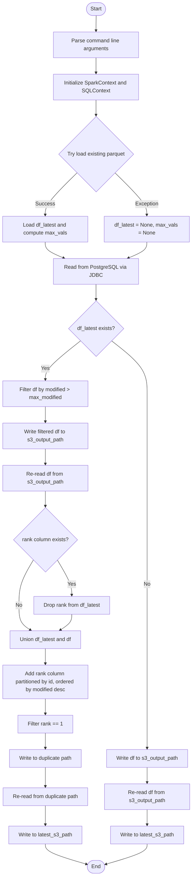
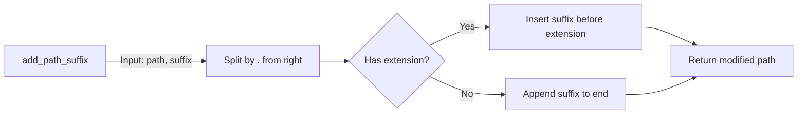
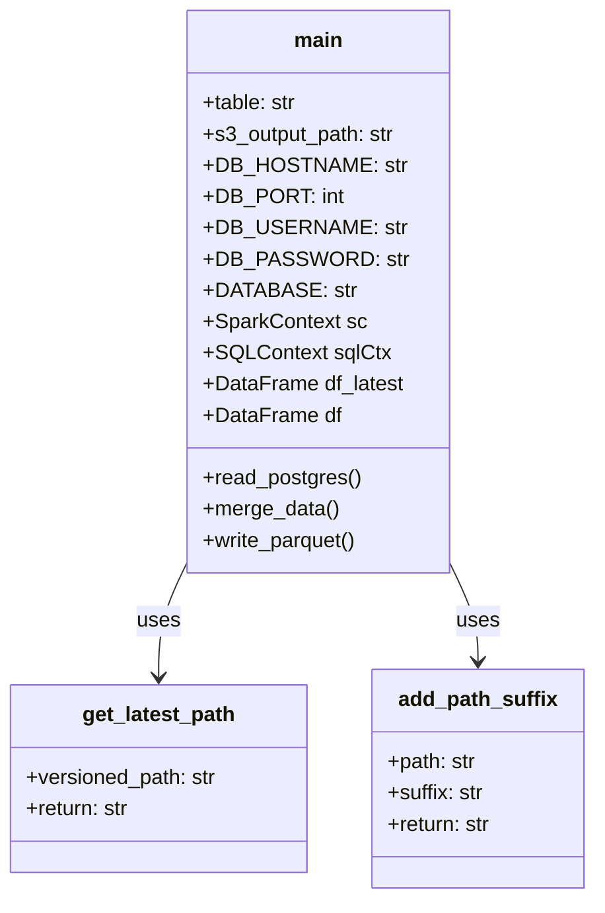
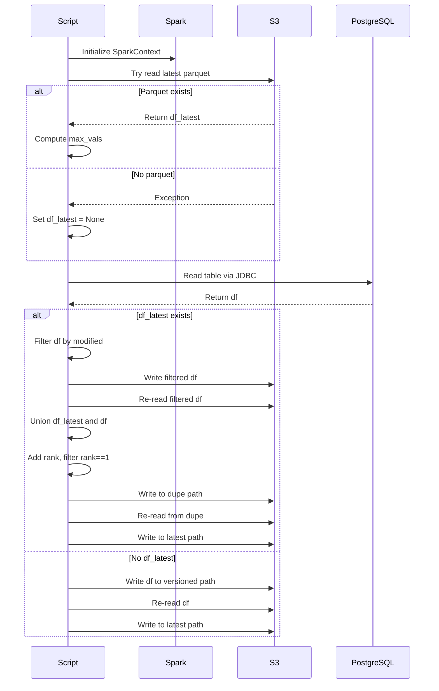

# Diagram: research/orchestrator/tasks/etl/extract_public_entity_spark.py


> Auto-generated by Obscura crawlers

## Diagram 1

```mermaid
flowchart TD
      Start([Start]) --> ParseArgs[Parse command line arguments]
      ParseArgs --> InitSpark[Initialize SparkContext and SQLContext]
      InitSpark --> TryLoadLatest{Try load existing parquet}...
  └ 100 lines...

✗ read_bash
  Invalid shell ID: 0. Please supply a valid shell ID to read output from.

  <no active shell sessions>

● Generate Mermaid diagrams for source code
  $ cat << 'EOFMERMAID'
```

> SVG rendering failed for this diagram.

## Diagram 2

```mermaid
flowchart TD
      Start([Start]) --> ParseArgs[Parse command line arguments]
      ParseArgs --> InitSpark[Initialize SparkContext and SQLContext]
      InitSpark --> TryLoadLatest{Try load existing parquet}...
  └ 100 lines...

● stop_bash
  └ <command with id: 1 stopped>

● Output Mermaid diagrams
  $ echo 'flowchart TD
      Start([Start]) --> ParseArgs[Parse command line arguments]
      ParseArgs --> InitSpark[Initialize SparkContext and SQLContext]
      InitSpark --> TryLoadLatest{Try load existing parquet}
      TryLoadLatest -->|Success| LoadLatest[Load df_latest and compute max_vals]...
  └ 98 lines...

● stop_bash
  └ <command with id: 2 stopped>
```

> SVG rendering failed for this diagram.

## Diagram 3



### SVG

<svg id="container" width="589.5703125" xmlns="http://www.w3.org/2000/svg" class="flowchart" height="2662.734375" viewBox="0 0 589.5703125 2662.734375" role="graphics-document document" aria-roledescription="flowchart-v2"><style>#container{font-family:"trebuchet ms",verdana,arial,sans-serif;font-size:16px;fill:#333;}@keyframes edge-animation-frame{from{stroke-dashoffset:0;}}@keyframes dash{to{stroke-dashoffset:0;}}#container .edge-animation-slow{stroke-dasharray:9,5!important;stroke-dashoffset:900;animation:dash 50s linear infinite;stroke-linecap:round;}#container .edge-animation-fast{stroke-dasharray:9,5!important;stroke-dashoffset:900;animation:dash 20s linear infinite;stroke-linecap:round;}#container .error-icon{fill:#552222;}#container .error-text{fill:#552222;stroke:#552222;}#container .edge-thickness-normal{stroke-width:1px;}#container .edge-thickness-thick{stroke-width:3.5px;}#container .edge-pattern-solid{stroke-dasharray:0;}#container .edge-thickness-invisible{stroke-width:0;fill:none;}#container .edge-pattern-dashed{stroke-dasharray:3;}#container .edge-pattern-dotted{stroke-dasharray:2;}#container .marker{fill:#333333;stroke:#333333;}#container .marker.cross{stroke:#333333;}#container svg{font-family:"trebuchet ms",verdana,arial,sans-serif;font-size:16px;}#container p{margin:0;}#container .label{font-family:"trebuchet ms",verdana,arial,sans-serif;color:#333;}#container .cluster-label text{fill:#333;}#container .cluster-label span{color:#333;}#container .cluster-label span p{background-color:transparent;}#container .label text,#container span{fill:#333;color:#333;}#container .node rect,#container .node circle,#container .node ellipse,#container .node polygon,#container .node path{fill:#ECECFF;stroke:#9370DB;stroke-width:1px;}#container .rough-node .label text,#container .node .label text,#container .image-shape .label,#container .icon-shape .label{text-anchor:middle;}#container .node .katex path{fill:#000;stroke:#000;stroke-width:1px;}#container .rough-node .label,#container .node .label,#container .image-shape .label,#container .icon-shape .label{text-align:center;}#container .node.clickable{cursor:pointer;}#container .root .anchor path{fill:#333333!important;stroke-width:0;stroke:#333333;}#container .arrowheadPath{fill:#333333;}#container .edgePath .path{stroke:#333333;stroke-width:2.0px;}#container .flowchart-link{stroke:#333333;fill:none;}#container .edgeLabel{background-color:rgba(232,232,232, 0.8);text-align:center;}#container .edgeLabel p{background-color:rgba(232,232,232, 0.8);}#container .edgeLabel rect{opacity:0.5;background-color:rgba(232,232,232, 0.8);fill:rgba(232,232,232, 0.8);}#container .labelBkg{background-color:rgba(232, 232, 232, 0.5);}#container .cluster rect{fill:#ffffde;stroke:#aaaa33;stroke-width:1px;}#container .cluster text{fill:#333;}#container .cluster span{color:#333;}#container div.mermaidTooltip{position:absolute;text-align:center;max-width:200px;padding:2px;font-family:"trebuchet ms",verdana,arial,sans-serif;font-size:12px;background:hsl(80, 100%, 96.2745098039%);border:1px solid #aaaa33;border-radius:2px;pointer-events:none;z-index:100;}#container .flowchartTitleText{text-anchor:middle;font-size:18px;fill:#333;}#container rect.text{fill:none;stroke-width:0;}#container .icon-shape,#container .image-shape{background-color:rgba(232,232,232, 0.8);text-align:center;}#container .icon-shape p,#container .image-shape p{background-color:rgba(232,232,232, 0.8);padding:2px;}#container .icon-shape rect,#container .image-shape rect{opacity:0.5;background-color:rgba(232,232,232, 0.8);fill:rgba(232,232,232, 0.8);}#container .label-icon{display:inline-block;height:1em;overflow:visible;vertical-align:-0.125em;}#container .node .label-icon path{fill:currentColor;stroke:revert;stroke-width:revert;}#container :root{--mermaid-font-family:"trebuchet ms",verdana,arial,sans-serif;}</style><g><marker id="container_flowchart-v2-pointEnd" class="marker flowchart-v2" viewBox="0 0 10 10" refX="5" refY="5" markerUnits="userSpaceOnUse" markerWidth="8" markerHeight="8" orient="auto"><path d="M 0 0 L 10 5 L 0 10 z" class="arrowMarkerPath" style="stroke-width: 1; stroke-dasharray: 1, 0;"></path></marker><marker id="container_flowchart-v2-pointStart" class="marker flowchart-v2" viewBox="0 0 10 10" refX="4.5" refY="5" markerUnits="userSpaceOnUse" markerWidth="8" markerHeight="8" orient="auto"><path d="M 0 5 L 10 10 L 10 0 z" class="arrowMarkerPath" style="stroke-width: 1; stroke-dasharray: 1, 0;"></path></marker><marker id="container_flowchart-v2-circleEnd" class="marker flowchart-v2" viewBox="0 0 10 10" refX="11" refY="5" markerUnits="userSpaceOnUse" markerWidth="11" markerHeight="11" orient="auto"><circle cx="5" cy="5" r="5" class="arrowMarkerPath" style="stroke-width: 1; stroke-dasharray: 1, 0;"></circle></marker><marker id="container_flowchart-v2-circleStart" class="marker flowchart-v2" viewBox="0 0 10 10" refX="-1" refY="5" markerUnits="userSpaceOnUse" markerWidth="11" markerHeight="11" orient="auto"><circle cx="5" cy="5" r="5" class="arrowMarkerPath" style="stroke-width: 1; stroke-dasharray: 1, 0;"></circle></marker><marker id="container_flowchart-v2-crossEnd" class="marker cross flowchart-v2" viewBox="0 0 11 11" refX="12" refY="5.2" markerUnits="userSpaceOnUse" markerWidth="11" markerHeight="11" orient="auto"><path d="M 1,1 l 9,9 M 10,1 l -9,9" class="arrowMarkerPath" style="stroke-width: 2; stroke-dasharray: 1, 0;"></path></marker><marker id="container_flowchart-v2-crossStart" class="marker cross flowchart-v2" viewBox="0 0 11 11" refX="-1" refY="5.2" markerUnits="userSpaceOnUse" markerWidth="11" markerHeight="11" orient="auto"><path d="M 1,1 l 9,9 M 10,1 l -9,9" class="arrowMarkerPath" style="stroke-width: 2; stroke-dasharray: 1, 0;"></path></marker><g class="root"><g class="clusters"></g><g class="edgePaths"><path d="M293.5,47.5L293.417,51.583C293.333,55.667,293.167,63.833,293.083,71.417C293,79,293,86,293,89.5L293,93" id="L_Start_ParseArgs_0" class="edge-thickness-normal edge-pattern-solid edge-thickness-normal edge-pattern-solid flowchart-link" style=";" data-edge="true" data-et="edge" data-id="L_Start_ParseArgs_0" data-points="W3sieCI6MjkzLjUsInkiOjQ3LjV9LHsieCI6MjkzLCJ5Ijo3Mn0seyJ4IjoyOTMsInkiOjk3fV0=" marker-end="url(#container_flowchart-v2-pointEnd)"></path><path d="M293,175L293,179.167C293,183.333,293,191.667,293,199.333C293,207,293,214,293,217.5L293,221" id="L_ParseArgs_InitSpark_0" class="edge-thickness-normal edge-pattern-solid edge-thickness-normal edge-pattern-solid flowchart-link" style=";" data-edge="true" data-et="edge" data-id="L_ParseArgs_InitSpark_0" data-points="W3sieCI6MjkzLCJ5IjoxNzV9LHsieCI6MjkzLCJ5IjoyMDB9LHsieCI6MjkzLCJ5IjoyMjV9XQ==" marker-end="url(#container_flowchart-v2-pointEnd)"></path><path d="M293,303L293,307.167C293,311.333,293,319.667,293,327.333C293,335,293,342,293,345.5L293,349" id="L_InitSpark_TryLoadLatest_0" class="edge-thickness-normal edge-pattern-solid edge-thickness-normal edge-pattern-solid flowchart-link" style=";" data-edge="true" data-et="edge" data-id="L_InitSpark_TryLoadLatest_0" data-points="W3sieCI6MjkzLCJ5IjozMDN9LHsieCI6MjkzLCJ5IjozMjh9LHsieCI6MjkzLCJ5IjozNTN9XQ==" marker-end="url(#container_flowchart-v2-pointEnd)"></path><path d="M234.301,528.363L218.251,544.313C202.201,560.263,170.1,592.163,154.05,613.613C138,635.063,138,646.063,138,651.563L138,657.063" id="L_TryLoadLatest_LoadLatest_0" class="edge-thickness-normal edge-pattern-solid edge-thickness-normal edge-pattern-solid flowchart-link" style=";" data-edge="true" data-et="edge" data-id="L_TryLoadLatest_LoadLatest_0" data-points="W3sieCI6MjM0LjMwMDk0MDQzODg3MTQ2LCJ5Ijo1MjguMzYzNDQwNDM4ODcxNX0seyJ4IjoxMzgsInkiOjYyNC4wNjI1fSx7IngiOjEzOCwieSI6NjYxLjA2MjV9XQ==" marker-end="url(#container_flowchart-v2-pointEnd)"></path><path d="M351.699,528.363L367.749,544.313C383.799,560.263,415.9,592.163,431.95,613.613C448,635.063,448,646.063,448,651.563L448,657.063" id="L_TryLoadLatest_SetNone_0" class="edge-thickness-normal edge-pattern-solid edge-thickness-normal edge-pattern-solid flowchart-link" style=";" data-edge="true" data-et="edge" data-id="L_TryLoadLatest_SetNone_0" data-points="W3sieCI6MzUxLjY5OTA1OTU2MTEyODU0LCJ5Ijo1MjguMzYzNDQwNDM4ODcxNX0seyJ4Ijo0NDgsInkiOjYyNC4wNjI1fSx7IngiOjQ0OCwieSI6NjYxLjA2MjV9XQ==" marker-end="url(#container_flowchart-v2-pointEnd)"></path><path d="M138,739.063L138,743.229C138,747.396,138,755.729,147.475,763.808C156.95,771.887,175.9,779.711,185.375,783.624L194.85,787.536" id="L_LoadLatest_ReadDB_0" class="edge-thickness-normal edge-pattern-solid edge-thickness-normal edge-pattern-solid flowchart-link" style=";" data-edge="true" data-et="edge" data-id="L_LoadLatest_ReadDB_0" data-points="W3sieCI6MTM4LCJ5Ijo3MzkuMDYyNX0seyJ4IjoxMzgsInkiOjc2NC4wNjI1fSx7IngiOjE5OC41NDY4NzUsInkiOjc4OS4wNjI1fV0=" marker-end="url(#container_flowchart-v2-pointEnd)"></path><path d="M448,739.063L448,743.229C448,747.396,448,755.729,438.525,763.808C429.05,771.887,410.1,779.711,400.625,783.624L391.15,787.536" id="L_SetNone_ReadDB_0" class="edge-thickness-normal edge-pattern-solid edge-thickness-normal edge-pattern-solid flowchart-link" style=";" data-edge="true" data-et="edge" data-id="L_SetNone_ReadDB_0" data-points="W3sieCI6NDQ4LCJ5Ijo3MzkuMDYyNX0seyJ4Ijo0NDgsInkiOjc2NC4wNjI1fSx7IngiOjM4Ny40NTMxMjUsInkiOjc4OS4wNjI1fV0=" marker-end="url(#container_flowchart-v2-pointEnd)"></path><path d="M293,867.063L293,871.229C293,875.396,293,883.729,293,891.396C293,899.063,293,906.063,293,909.563L293,913.063" id="L_ReadDB_CheckLatest_0" class="edge-thickness-normal edge-pattern-solid edge-thickness-normal edge-pattern-solid flowchart-link" style=";" data-edge="true" data-et="edge" data-id="L_ReadDB_CheckLatest_0" data-points="W3sieCI6MjkzLCJ5Ijo4NjcuMDYyNX0seyJ4IjoyOTMsInkiOjg5Mi4wNjI1fSx7IngiOjI5MywieSI6OTE3LjA2MjV9XQ==" marker-end="url(#container_flowchart-v2-pointEnd)"></path><path d="M245.416,1039.587L227.513,1053.685C209.61,1067.782,173.805,1095.977,155.903,1115.574C138,1135.172,138,1146.172,138,1151.672L138,1157.172" id="L_CheckLatest_FilterData_0" class="edge-thickness-normal edge-pattern-solid edge-thickness-normal edge-pattern-solid flowchart-link" style=";" data-edge="true" data-et="edge" data-id="L_CheckLatest_FilterData_0" data-points="W3sieCI6MjQ1LjQxNTYxNjI3NjExODc4LCJ5IjoxMDM5LjU4NzQ5MTI3NjExODd9LHsieCI6MTM4LCJ5IjoxMTI0LjE3MTg3NX0seyJ4IjoxMzgsInkiOjExNjEuMTcxODc1fV0=" marker-end="url(#container_flowchart-v2-pointEnd)"></path><path d="M341.061,1039.111L359.479,1053.288C377.898,1067.464,414.734,1095.818,433.152,1122.662C451.57,1149.505,451.57,1174.839,451.57,1198.172C451.57,1221.505,451.57,1242.839,451.57,1264.172C451.57,1285.505,451.57,1306.839,451.57,1328.172C451.57,1349.505,451.57,1370.839,451.57,1392.172C451.57,1413.505,451.57,1434.839,451.57,1456.172C451.57,1477.505,451.57,1498.839,451.57,1530.052C451.57,1561.266,451.57,1602.359,451.57,1645.453C451.57,1688.547,451.57,1733.641,451.57,1766.854C451.57,1800.068,451.57,1821.401,451.57,1840.734C451.57,1860.068,451.57,1877.401,451.57,1894.734C451.57,1912.068,451.57,1929.401,451.57,1946.734C451.57,1964.068,451.57,1981.401,451.57,2002.734C451.57,2024.068,451.57,2049.401,451.57,2074.734C451.57,2100.068,451.57,2125.401,451.57,2146.734C451.57,2168.068,451.57,2185.401,451.57,2202.734C451.57,2220.068,451.57,2237.401,451.57,2249.568C451.57,2261.734,451.57,2268.734,451.57,2272.234L451.57,2275.734" id="L_CheckLatest_WriteInitial_0" class="edge-thickness-normal edge-pattern-solid edge-thickness-normal edge-pattern-solid flowchart-link" style=";" data-edge="true" data-et="edge" data-id="L_CheckLatest_WriteInitial_0" data-points="W3sieCI6MzQxLjA2MTEwNzgwMDMyMDE0LCJ5IjoxMDM5LjExMDc2NzE5OTY4fSx7IngiOjQ1MS41NzAzMTI1LCJ5IjoxMTI0LjE3MTg3NX0seyJ4Ijo0NTEuNTcwMzEyNSwieSI6MTIwMC4xNzE4NzV9LHsieCI6NDUxLjU3MDMxMjUsInkiOjEyNjQuMTcxODc1fSx7IngiOjQ1MS41NzAzMTI1LCJ5IjoxMzI4LjE3MTg3NX0seyJ4Ijo0NTEuNTcwMzEyNSwieSI6MTM5Mi4xNzE4NzV9LHsieCI6NDUxLjU3MDMxMjUsInkiOjE0NTYuMTcxODc1fSx7IngiOjQ1MS41NzAzMTI1LCJ5IjoxNTIwLjE3MTg3NX0seyJ4Ijo0NTEuNTcwMzEyNSwieSI6MTY0My40NTMxMjV9LHsieCI6NDUxLjU3MDMxMjUsInkiOjE3NzguNzM0Mzc1fSx7IngiOjQ1MS41NzAzMTI1LCJ5IjoxODQyLjczNDM3NX0seyJ4Ijo0NTEuNTcwMzEyNSwieSI6MTg5NC43MzQzNzV9LHsieCI6NDUxLjU3MDMxMjUsInkiOjE5NDYuNzM0Mzc1fSx7IngiOjQ1MS41NzAzMTI1LCJ5IjoxOTk4LjczNDM3NX0seyJ4Ijo0NTEuNTcwMzEyNSwieSI6MjA3NC43MzQzNzV9LHsieCI6NDUxLjU3MDMxMjUsInkiOjIxNTAuNzM0Mzc1fSx7IngiOjQ1MS41NzAzMTI1LCJ5IjoyMjAyLjczNDM3NX0seyJ4Ijo0NTEuNTcwMzEyNSwieSI6MjI1NC43MzQzNzV9LHsieCI6NDUxLjU3MDMxMjUsInkiOjIyNzkuNzM0Mzc1fV0=" marker-end="url(#container_flowchart-v2-pointEnd)"></path><path d="M138,1239.172L138,1243.339C138,1247.505,138,1255.839,138,1263.505C138,1271.172,138,1278.172,138,1281.672L138,1285.172" id="L_FilterData_WriteFiltered_0" class="edge-thickness-normal edge-pattern-solid edge-thickness-normal edge-pattern-solid flowchart-link" style=";" data-edge="true" data-et="edge" data-id="L_FilterData_WriteFiltered_0" data-points="W3sieCI6MTM4LCJ5IjoxMjM5LjE3MTg3NX0seyJ4IjoxMzgsInkiOjEyNjQuMTcxODc1fSx7IngiOjEzOCwieSI6MTI4OS4xNzE4NzV9XQ==" marker-end="url(#container_flowchart-v2-pointEnd)"></path><path d="M138,1367.172L138,1371.339C138,1375.505,138,1383.839,138,1391.505C138,1399.172,138,1406.172,138,1409.672L138,1413.172" id="L_WriteFiltered_RereadFiltered_0" class="edge-thickness-normal edge-pattern-solid edge-thickness-normal edge-pattern-solid flowchart-link" style=";" data-edge="true" data-et="edge" data-id="L_WriteFiltered_RereadFiltered_0" data-points="W3sieCI6MTM4LCJ5IjoxMzY3LjE3MTg3NX0seyJ4IjoxMzgsInkiOjEzOTIuMTcxODc1fSx7IngiOjEzOCwieSI6MTQxNy4xNzE4NzV9XQ==" marker-end="url(#container_flowchart-v2-pointEnd)"></path><path d="M138,1495.172L138,1499.339C138,1503.505,138,1511.839,138,1519.505C138,1527.172,138,1534.172,138,1537.672L138,1541.172" id="L_RereadFiltered_DropRank_0" class="edge-thickness-normal edge-pattern-solid edge-thickness-normal edge-pattern-solid flowchart-link" style=";" data-edge="true" data-et="edge" data-id="L_RereadFiltered_DropRank_0" data-points="W3sieCI6MTM4LCJ5IjoxNDk1LjE3MTg3NX0seyJ4IjoxMzgsInkiOjE1MjAuMTcxODc1fSx7IngiOjEzOCwieSI6MTU0NS4xNzE4NzV9XQ==" marker-end="url(#container_flowchart-v2-pointEnd)"></path><path d="M175.04,1704.695L182.503,1717.035C189.967,1729.374,204.893,1754.054,212.357,1771.894C219.82,1789.734,219.82,1800.734,219.82,1806.234L219.82,1811.734" id="L_DropRank_DropCol_0" class="edge-thickness-normal edge-pattern-solid edge-thickness-normal edge-pattern-solid flowchart-link" style=";" data-edge="true" data-et="edge" data-id="L_DropRank_DropCol_0" data-points="W3sieCI6MTc1LjAzOTgxOTAzODEwODYyLCJ5IjoxNzA0LjY5NDU1NTk2MTg5MTR9LHsieCI6MjE5LjgyMDMxMjUsInkiOjE3NzguNzM0Mzc1fSx7IngiOjIxOS44MjAzMTI1LCJ5IjoxODE1LjczNDM3NX1d" marker-end="url(#container_flowchart-v2-pointEnd)"></path><path d="M100.96,1704.695L93.497,1717.035C86.033,1729.374,71.107,1754.054,63.643,1777.061C56.18,1800.068,56.18,1821.401,56.18,1840.734C56.18,1860.068,56.18,1877.401,62.173,1889.877C68.167,1902.353,80.154,1909.971,86.147,1913.78L92.14,1917.589" id="L_DropRank_Union_0" class="edge-thickness-normal edge-pattern-solid edge-thickness-normal edge-pattern-solid flowchart-link" style=";" data-edge="true" data-et="edge" data-id="L_DropRank_Union_0" data-points="W3sieCI6MTAwLjk2MDE4MDk2MTg5MTQsInkiOjE3MDQuNjk0NTU1OTYxODkxNH0seyJ4Ijo1Ni4xNzk2ODc1LCJ5IjoxNzc4LjczNDM3NX0seyJ4Ijo1Ni4xNzk2ODc1LCJ5IjoxODQyLjczNDM3NX0seyJ4Ijo1Ni4xNzk2ODc1LCJ5IjoxODk0LjczNDM3NX0seyJ4Ijo5NS41MTYzNzYyMDE5MjMwOCwieSI6MTkxOS43MzQzNzV9XQ==" marker-end="url(#container_flowchart-v2-pointEnd)"></path><path d="M219.82,1869.734L219.82,1873.901C219.82,1878.068,219.82,1886.401,213.827,1894.377C207.833,1902.353,195.846,1909.971,189.853,1913.78L183.86,1917.589" id="L_DropCol_Union_0" class="edge-thickness-normal edge-pattern-solid edge-thickness-normal edge-pattern-solid flowchart-link" style=";" data-edge="true" data-et="edge" data-id="L_DropCol_Union_0" data-points="W3sieCI6MjE5LjgyMDMxMjUsInkiOjE4NjkuNzM0Mzc1fSx7IngiOjIxOS44MjAzMTI1LCJ5IjoxODk0LjczNDM3NX0seyJ4IjoxODAuNDgzNjIzNzk4MDc2OSwieSI6MTkxOS43MzQzNzV9XQ==" marker-end="url(#container_flowchart-v2-pointEnd)"></path><path d="M138,1973.734L138,1977.901C138,1982.068,138,1990.401,138,1998.068C138,2005.734,138,2012.734,138,2016.234L138,2019.734" id="L_Union_AddRank_0" class="edge-thickness-normal edge-pattern-solid edge-thickness-normal edge-pattern-solid flowchart-link" style=";" data-edge="true" data-et="edge" data-id="L_Union_AddRank_0" data-points="W3sieCI6MTM4LCJ5IjoxOTczLjczNDM3NX0seyJ4IjoxMzgsInkiOjE5OTguNzM0Mzc1fSx7IngiOjEzOCwieSI6MjAyMy43MzQzNzV9XQ==" marker-end="url(#container_flowchart-v2-pointEnd)"></path><path d="M138,2125.734L138,2129.901C138,2134.068,138,2142.401,138,2150.068C138,2157.734,138,2164.734,138,2168.234L138,2171.734" id="L_AddRank_FilterRank_0" class="edge-thickness-normal edge-pattern-solid edge-thickness-normal edge-pattern-solid flowchart-link" style=";" data-edge="true" data-et="edge" data-id="L_AddRank_FilterRank_0" data-points="W3sieCI6MTM4LCJ5IjoyMTI1LjczNDM3NX0seyJ4IjoxMzgsInkiOjIxNTAuNzM0Mzc1fSx7IngiOjEzOCwieSI6MjE3NS43MzQzNzV9XQ==" marker-end="url(#container_flowchart-v2-pointEnd)"></path><path d="M138,2229.734L138,2233.901C138,2238.068,138,2246.401,138,2254.068C138,2261.734,138,2268.734,138,2272.234L138,2275.734" id="L_FilterRank_WriteDupe_0" class="edge-thickness-normal edge-pattern-solid edge-thickness-normal edge-pattern-solid flowchart-link" style=";" data-edge="true" data-et="edge" data-id="L_FilterRank_WriteDupe_0" data-points="W3sieCI6MTM4LCJ5IjoyMjI5LjczNDM3NX0seyJ4IjoxMzgsInkiOjIyNTQuNzM0Mzc1fSx7IngiOjEzOCwieSI6MjI3OS43MzQzNzV9XQ==" marker-end="url(#container_flowchart-v2-pointEnd)"></path><path d="M138,2333.734L138,2337.901C138,2342.068,138,2350.401,138,2358.068C138,2365.734,138,2372.734,138,2376.234L138,2379.734" id="L_WriteDupe_RereadDupe_0" class="edge-thickness-normal edge-pattern-solid edge-thickness-normal edge-pattern-solid flowchart-link" style=";" data-edge="true" data-et="edge" data-id="L_WriteDupe_RereadDupe_0" data-points="W3sieCI6MTM4LCJ5IjoyMzMzLjczNDM3NX0seyJ4IjoxMzgsInkiOjIzNTguNzM0Mzc1fSx7IngiOjEzOCwieSI6MjM4My43MzQzNzV9XQ==" marker-end="url(#container_flowchart-v2-pointEnd)"></path><path d="M138,2461.734L138,2465.901C138,2470.068,138,2478.401,138,2486.068C138,2493.734,138,2500.734,138,2504.234L138,2507.734" id="L_RereadDupe_WriteLatest_0" class="edge-thickness-normal edge-pattern-solid edge-thickness-normal edge-pattern-solid flowchart-link" style=";" data-edge="true" data-et="edge" data-id="L_RereadDupe_WriteLatest_0" data-points="W3sieCI6MTM4LCJ5IjoyNDYxLjczNDM3NX0seyJ4IjoxMzgsInkiOjI0ODYuNzM0Mzc1fSx7IngiOjEzOCwieSI6MjUxMS43MzQzNzV9XQ==" marker-end="url(#container_flowchart-v2-pointEnd)"></path><path d="M138,2565.734L138,2569.901C138,2574.068,138,2582.401,159.158,2592.7C180.316,2602.999,222.633,2615.263,243.791,2621.395L264.949,2627.527" id="L_WriteLatest_End_0" class="edge-thickness-normal edge-pattern-solid edge-thickness-normal edge-pattern-solid flowchart-link" style=";" data-edge="true" data-et="edge" data-id="L_WriteLatest_End_0" data-points="W3sieCI6MTM4LCJ5IjoyNTY1LjczNDM3NX0seyJ4IjoxMzgsInkiOjI1OTAuNzM0Mzc1fSx7IngiOjI2OC43OTA2NjQyOTQyMTAzMywieSI6MjYyOC42NDA0MDQ0MjY0MDIzfV0=" marker-end="url(#container_flowchart-v2-pointEnd)"></path><path d="M451.57,2333.734L451.57,2337.901C451.57,2342.068,451.57,2350.401,451.57,2358.068C451.57,2365.734,451.57,2372.734,451.57,2376.234L451.57,2379.734" id="L_WriteInitial_RereadInitial_0" class="edge-thickness-normal edge-pattern-solid edge-thickness-normal edge-pattern-solid flowchart-link" style=";" data-edge="true" data-et="edge" data-id="L_WriteInitial_RereadInitial_0" data-points="W3sieCI6NDUxLjU3MDMxMjUsInkiOjIzMzMuNzM0Mzc1fSx7IngiOjQ1MS41NzAzMTI1LCJ5IjoyMzU4LjczNDM3NX0seyJ4Ijo0NTEuNTcwMzEyNSwieSI6MjM4My43MzQzNzV9XQ==" marker-end="url(#container_flowchart-v2-pointEnd)"></path><path d="M451.57,2461.734L451.57,2465.901C451.57,2470.068,451.57,2478.401,451.57,2486.068C451.57,2493.734,451.57,2500.734,451.57,2504.234L451.57,2507.734" id="L_RereadInitial_WriteLatestInitial_0" class="edge-thickness-normal edge-pattern-solid edge-thickness-normal edge-pattern-solid flowchart-link" style=";" data-edge="true" data-et="edge" data-id="L_RereadInitial_WriteLatestInitial_0" data-points="W3sieCI6NDUxLjU3MDMxMjUsInkiOjI0NjEuNzM0Mzc1fSx7IngiOjQ1MS41NzAzMTI1LCJ5IjoyNDg2LjczNDM3NX0seyJ4Ijo0NTEuNTcwMzEyNSwieSI6MjUxMS43MzQzNzV9XQ==" marker-end="url(#container_flowchart-v2-pointEnd)"></path><path d="M451.57,2565.734L451.57,2569.901C451.57,2574.068,451.57,2582.401,429.994,2592.726C408.418,2603.052,365.266,2615.369,343.69,2621.527L322.114,2627.686" id="L_WriteLatestInitial_End_0" class="edge-thickness-normal edge-pattern-solid edge-thickness-normal edge-pattern-solid flowchart-link" style=";" data-edge="true" data-et="edge" data-id="L_WriteLatestInitial_End_0" data-points="W3sieCI6NDUxLjU3MDMxMjUsInkiOjI1NjUuNzM0Mzc1fSx7IngiOjQ1MS41NzAzMTI1LCJ5IjoyNTkwLjczNDM3NX0seyJ4IjozMTguMjY3NDA0ODAwMjA2MywieSI6MjYyOC43ODM4MzM2NTE5Mn1d" marker-end="url(#container_flowchart-v2-pointEnd)"></path></g><g class="edgeLabels"><g class="edgeLabel"><g class="label" data-id="L_Start_ParseArgs_0" transform="translate(0, 0)"><foreignObject width="0" height="0"><div xmlns="http://www.w3.org/1999/xhtml" class="labelBkg" style="display: table-cell; white-space: nowrap; line-height: 1.5; max-width: 200px; text-align: center;"><span class="edgeLabel"></span></div></foreignObject></g></g><g class="edgeLabel"><g class="label" data-id="L_ParseArgs_InitSpark_0" transform="translate(0, 0)"><foreignObject width="0" height="0"><div xmlns="http://www.w3.org/1999/xhtml" class="labelBkg" style="display: table-cell; white-space: nowrap; line-height: 1.5; max-width: 200px; text-align: center;"><span class="edgeLabel"></span></div></foreignObject></g></g><g class="edgeLabel"><g class="label" data-id="L_InitSpark_TryLoadLatest_0" transform="translate(0, 0)"><foreignObject width="0" height="0"><div xmlns="http://www.w3.org/1999/xhtml" class="labelBkg" style="display: table-cell; white-space: nowrap; line-height: 1.5; max-width: 200px; text-align: center;"><span class="edgeLabel"></span></div></foreignObject></g></g><g class="edgeLabel" transform="translate(138, 624.0625)"><g class="label" data-id="L_TryLoadLatest_LoadLatest_0" transform="translate(-28.1015625, -12)"><foreignObject width="56.203125" height="24"><div xmlns="http://www.w3.org/1999/xhtml" class="labelBkg" style="display: table-cell; white-space: nowrap; line-height: 1.5; max-width: 200px; text-align: center;"><span class="edgeLabel"><p>Success</p></span></div></foreignObject></g></g><g class="edgeLabel" transform="translate(448, 624.0625)"><g class="label" data-id="L_TryLoadLatest_SetNone_0" transform="translate(-35.375, -12)"><foreignObject width="70.75" height="24"><div xmlns="http://www.w3.org/1999/xhtml" class="labelBkg" style="display: table-cell; white-space: nowrap; line-height: 1.5; max-width: 200px; text-align: center;"><span class="edgeLabel"><p>Exception</p></span></div></foreignObject></g></g><g class="edgeLabel"><g class="label" data-id="L_LoadLatest_ReadDB_0" transform="translate(0, 0)"><foreignObject width="0" height="0"><div xmlns="http://www.w3.org/1999/xhtml" class="labelBkg" style="display: table-cell; white-space: nowrap; line-height: 1.5; max-width: 200px; text-align: center;"><span class="edgeLabel"></span></div></foreignObject></g></g><g class="edgeLabel"><g class="label" data-id="L_SetNone_ReadDB_0" transform="translate(0, 0)"><foreignObject width="0" height="0"><div xmlns="http://www.w3.org/1999/xhtml" class="labelBkg" style="display: table-cell; white-space: nowrap; line-height: 1.5; max-width: 200px; text-align: center;"><span class="edgeLabel"></span></div></foreignObject></g></g><g class="edgeLabel"><g class="label" data-id="L_ReadDB_CheckLatest_0" transform="translate(0, 0)"><foreignObject width="0" height="0"><div xmlns="http://www.w3.org/1999/xhtml" class="labelBkg" style="display: table-cell; white-space: nowrap; line-height: 1.5; max-width: 200px; text-align: center;"><span class="edgeLabel"></span></div></foreignObject></g></g><g class="edgeLabel" transform="translate(138, 1124.171875)"><g class="label" data-id="L_CheckLatest_FilterData_0" transform="translate(-12.03125, -12)"><foreignObject width="24.0625" height="24"><div xmlns="http://www.w3.org/1999/xhtml" class="labelBkg" style="display: table-cell; white-space: nowrap; line-height: 1.5; max-width: 200px; text-align: center;"><span class="edgeLabel"><p>Yes</p></span></div></foreignObject></g></g><g class="edgeLabel" transform="translate(451.5703125, 1778.734375)"><g class="label" data-id="L_CheckLatest_WriteInitial_0" transform="translate(-10.140625, -12)"><foreignObject width="20.28125" height="24"><div xmlns="http://www.w3.org/1999/xhtml" class="labelBkg" style="display: table-cell; white-space: nowrap; line-height: 1.5; max-width: 200px; text-align: center;"><span class="edgeLabel"><p>No</p></span></div></foreignObject></g></g><g class="edgeLabel"><g class="label" data-id="L_FilterData_WriteFiltered_0" transform="translate(0, 0)"><foreignObject width="0" height="0"><div xmlns="http://www.w3.org/1999/xhtml" class="labelBkg" style="display: table-cell; white-space: nowrap; line-height: 1.5; max-width: 200px; text-align: center;"><span class="edgeLabel"></span></div></foreignObject></g></g><g class="edgeLabel"><g class="label" data-id="L_WriteFiltered_RereadFiltered_0" transform="translate(0, 0)"><foreignObject width="0" height="0"><div xmlns="http://www.w3.org/1999/xhtml" class="labelBkg" style="display: table-cell; white-space: nowrap; line-height: 1.5; max-width: 200px; text-align: center;"><span class="edgeLabel"></span></div></foreignObject></g></g><g class="edgeLabel"><g class="label" data-id="L_RereadFiltered_DropRank_0" transform="translate(0, 0)"><foreignObject width="0" height="0"><div xmlns="http://www.w3.org/1999/xhtml" class="labelBkg" style="display: table-cell; white-space: nowrap; line-height: 1.5; max-width: 200px; text-align: center;"><span class="edgeLabel"></span></div></foreignObject></g></g><g class="edgeLabel" transform="translate(219.8203125, 1778.734375)"><g class="label" data-id="L_DropRank_DropCol_0" transform="translate(-12.03125, -12)"><foreignObject width="24.0625" height="24"><div xmlns="http://www.w3.org/1999/xhtml" class="labelBkg" style="display: table-cell; white-space: nowrap; line-height: 1.5; max-width: 200px; text-align: center;"><span class="edgeLabel"><p>Yes</p></span></div></foreignObject></g></g><g class="edgeLabel" transform="translate(56.1796875, 1842.734375)"><g class="label" data-id="L_DropRank_Union_0" transform="translate(-10.140625, -12)"><foreignObject width="20.28125" height="24"><div xmlns="http://www.w3.org/1999/xhtml" class="labelBkg" style="display: table-cell; white-space: nowrap; line-height: 1.5; max-width: 200px; text-align: center;"><span class="edgeLabel"><p>No</p></span></div></foreignObject></g></g><g class="edgeLabel"><g class="label" data-id="L_DropCol_Union_0" transform="translate(0, 0)"><foreignObject width="0" height="0"><div xmlns="http://www.w3.org/1999/xhtml" class="labelBkg" style="display: table-cell; white-space: nowrap; line-height: 1.5; max-width: 200px; text-align: center;"><span class="edgeLabel"></span></div></foreignObject></g></g><g class="edgeLabel"><g class="label" data-id="L_Union_AddRank_0" transform="translate(0, 0)"><foreignObject width="0" height="0"><div xmlns="http://www.w3.org/1999/xhtml" class="labelBkg" style="display: table-cell; white-space: nowrap; line-height: 1.5; max-width: 200px; text-align: center;"><span class="edgeLabel"></span></div></foreignObject></g></g><g class="edgeLabel"><g class="label" data-id="L_AddRank_FilterRank_0" transform="translate(0, 0)"><foreignObject width="0" height="0"><div xmlns="http://www.w3.org/1999/xhtml" class="labelBkg" style="display: table-cell; white-space: nowrap; line-height: 1.5; max-width: 200px; text-align: center;"><span class="edgeLabel"></span></div></foreignObject></g></g><g class="edgeLabel"><g class="label" data-id="L_FilterRank_WriteDupe_0" transform="translate(0, 0)"><foreignObject width="0" height="0"><div xmlns="http://www.w3.org/1999/xhtml" class="labelBkg" style="display: table-cell; white-space: nowrap; line-height: 1.5; max-width: 200px; text-align: center;"><span class="edgeLabel"></span></div></foreignObject></g></g><g class="edgeLabel"><g class="label" data-id="L_WriteDupe_RereadDupe_0" transform="translate(0, 0)"><foreignObject width="0" height="0"><div xmlns="http://www.w3.org/1999/xhtml" class="labelBkg" style="display: table-cell; white-space: nowrap; line-height: 1.5; max-width: 200px; text-align: center;"><span class="edgeLabel"></span></div></foreignObject></g></g><g class="edgeLabel"><g class="label" data-id="L_RereadDupe_WriteLatest_0" transform="translate(0, 0)"><foreignObject width="0" height="0"><div xmlns="http://www.w3.org/1999/xhtml" class="labelBkg" style="display: table-cell; white-space: nowrap; line-height: 1.5; max-width: 200px; text-align: center;"><span class="edgeLabel"></span></div></foreignObject></g></g><g class="edgeLabel"><g class="label" data-id="L_WriteLatest_End_0" transform="translate(0, 0)"><foreignObject width="0" height="0"><div xmlns="http://www.w3.org/1999/xhtml" class="labelBkg" style="display: table-cell; white-space: nowrap; line-height: 1.5; max-width: 200px; text-align: center;"><span class="edgeLabel"></span></div></foreignObject></g></g><g class="edgeLabel"><g class="label" data-id="L_WriteInitial_RereadInitial_0" transform="translate(0, 0)"><foreignObject width="0" height="0"><div xmlns="http://www.w3.org/1999/xhtml" class="labelBkg" style="display: table-cell; white-space: nowrap; line-height: 1.5; max-width: 200px; text-align: center;"><span class="edgeLabel"></span></div></foreignObject></g></g><g class="edgeLabel"><g class="label" data-id="L_RereadInitial_WriteLatestInitial_0" transform="translate(0, 0)"><foreignObject width="0" height="0"><div xmlns="http://www.w3.org/1999/xhtml" class="labelBkg" style="display: table-cell; white-space: nowrap; line-height: 1.5; max-width: 200px; text-align: center;"><span class="edgeLabel"></span></div></foreignObject></g></g><g class="edgeLabel"><g class="label" data-id="L_WriteLatestInitial_End_0" transform="translate(0, 0)"><foreignObject width="0" height="0"><div xmlns="http://www.w3.org/1999/xhtml" class="labelBkg" style="display: table-cell; white-space: nowrap; line-height: 1.5; max-width: 200px; text-align: center;"><span class="edgeLabel"></span></div></foreignObject></g></g></g><g class="nodes"><g class="node default" id="flowchart-Start-0" transform="translate(293, 27.5)"><g class="basic label-container outer-path"><path d="M-10.3984375 -19.5 C-3.2711071144518336 -19.5, 3.856223271096333 -19.5, 10.3984375 -19.5 C10.3984375 -19.5, 10.3984375 -19.5, 10.398437499999998 -19.5 C10.87162315611301 -19.484825857008463, 11.34480881222602 -19.469651714016923, 11.6478067896239 -19.45993515863156 C12.019912093923159 -19.424038607447912, 12.392017398222416 -19.388142056264265, 12.892042152847864 -19.3399052695533 C13.266284858846687 -19.27940061114294, 13.64052756484551 -19.218895952732584, 14.126030759676757 -19.140403561325776 C14.512692078551712 -19.05215063849348, 14.899353397426667 -18.96389771566118, 15.34470188623539 -18.862249829261074 C15.717990760639395 -18.751459650771253, 16.091279635043403 -18.64066947228143, 16.543047751460602 -18.50658706670804 C16.89039329243128 -18.378760696803848, 17.237738833401956 -18.250934326899653, 17.716144095147794 -18.074876768247425 C18.09547830624737 -17.90695676554321, 18.474812517346944 -17.739036762839, 18.85917041279238 -17.568892924097174 C19.209681426268656 -17.38603155287962, 19.560192439744934 -17.203170181662067, 19.967429764076783 -16.990714730406097 C20.28498083077893 -16.798213407634048, 20.60253189748108 -16.605712084862, 21.036368073605697 -16.342718045390892 C21.29678444522385 -16.161062857793105, 21.557200816842 -15.979407670195318, 22.061592844578712 -15.627565626425154 C22.40348739451871 -15.35491382104408, 22.745381944458703 -15.082262015663007, 23.03889120850187 -14.848196188198123 C23.330359981604023 -14.58349196030789, 23.621828754706172 -14.318787732417656, 23.964247236767985 -14.007812326905688 C24.2569608439789 -13.705561495226327, 24.549674451189816 -13.403310663546966, 24.833858442968648 -13.10986736009568 C25.010374717313802 -12.902521300189317, 25.186890991658956 -12.695175240282953, 25.644151408126582 -12.158051136245305 C25.893738984025575 -11.82362652243658, 26.143326559924567 -11.489201908627855, 26.391796464640635 -11.156274872382312 C26.531387641712705 -10.94182533892011, 26.67097881878477 -10.727375805457907, 27.073721378604247 -10.108655082055241 C27.301140652532407 -9.704849132497165, 27.528559926460563 -9.301043182939088, 27.6871239742735 -9.019496659696287 C27.886384743188533 -8.605727409546772, 28.08564551210356 -8.191958159397254, 28.22948364880834 -7.893275190886684 C28.396781258976766 -7.480046859291417, 28.564078869145195 -7.0668185276961495, 28.698571729970325 -6.734618561215508 C28.849676075927547 -6.279516346400407, 29.00078042188477 -5.824414131585305, 29.09246063421488 -5.548287939305138 C29.202672146036804 -5.128003678756772, 29.312883657858727 -4.707719418208407, 29.40953178754556 -4.339158212148133 C29.467589953046733 -4.041041802897242, 29.525648118547902 -3.7429253936463502, 29.648482276581777 -3.1121979531509023 C29.694832562471877 -2.7527142886864913, 29.74118284836198 -2.3932306242220807, 29.808330202509367 -1.872449005199798 C29.8324056833904 -1.4974539570993066, 29.856481164271433 -1.1224589089988155, 29.888418715913414 -0.6250057626472757 C29.888418715913414 -0.2944822745189378, 29.888418715913414 0.03604121360940005, 29.888418715913414 0.625005762647271 C29.857154749473253 1.1119672757722656, 29.825890783033095 1.59892878889726, 29.808330202509367 1.8724490051997846 C29.770724158924974 2.1641140530870815, 29.73311811534058 2.4557791009743783, 29.648482276581777 3.1121979531508885 C29.568657153754863 3.522083087821418, 29.488832030927945 3.9319682224919474, 29.40953178754556 4.339158212148129 C29.29885341848713 4.76122280167651, 29.188175049428697 5.183287391204891, 29.092460634214884 5.548287939305125 C28.96521408439523 5.931534273377471, 28.837967534575576 6.3147806074498165, 28.69857172997033 6.734618561215495 C28.525474933272548 7.162170995657913, 28.352378136574767 7.589723430100332, 28.229483648808344 7.893275190886679 C28.033166177066096 8.30093262148044, 27.836848705323852 8.7085900520742, 27.687123974273504 9.019496659696284 C27.494319600963582 9.361840348067908, 27.30151522765366 9.704184036439534, 27.07372137860425 10.108655082055236 C26.88245524209115 10.402491229888389, 26.69118910557805 10.696327377721543, 26.39179646464064 11.156274872382301 C26.098764568187544 11.548910917874501, 25.80573267173445 11.941546963366699, 25.644151408126582 12.158051136245302 C25.340058530549243 12.515255933622562, 25.035965652971903 12.872460730999823, 24.83385844296866 13.10986736009567 C24.61225179764276 13.33869441563861, 24.390645152316857 13.567521471181552, 23.96424723676799 14.007812326905684 C23.776331545211058 14.178472386000946, 23.588415853654126 14.34913244509621, 23.038891208501887 14.848196188198111 C22.81351734586826 15.027925846198066, 22.588143483234635 15.207655504198023, 22.061592844578715 15.627565626425152 C21.794943332248348 15.813568783155471, 21.528293819917977 15.99957193988579, 21.036368073605708 16.34271804539089 C20.65541870926372 16.573651788761957, 20.274469344921734 16.80458553213303, 19.967429764076787 16.990714730406093 C19.631351549198026 17.166046519839973, 19.295273334319262 17.341378309273853, 18.859170412792388 17.56889292409717 C18.499490273473373 17.728112652241453, 18.13981013415436 17.88733238038574, 17.716144095147804 18.07487676824742 C17.302953960315996 18.226934557353264, 16.889763825484184 18.378992346459103, 16.543047751460616 18.506587066708033 C16.073189533077173 18.646038519588124, 15.603331314693728 18.785489972468216, 15.344701886235413 18.86224982926107 C15.01880082672476 18.936634619391214, 14.69289976721411 19.011019409521353, 14.126030759676766 19.140403561325773 C13.774950867969219 19.197163435551825, 13.42387097626167 19.25392330977788, 12.892042152847878 19.3399052695533 C12.640160466486822 19.3642039929045, 12.388278780125768 19.388502716255704, 11.6478067896239 19.45993515863156 C11.321791682383544 19.47038982857085, 10.995776575143191 19.480844498510134, 10.398437500000004 19.5 C10.398437500000004 19.5, 10.398437500000002 19.5, 10.3984375 19.5 C3.4043131337128436 19.5, -3.589811232574313 19.5, -10.398437499999996 19.5 C-10.681392368384053 19.490926188109164, -10.964347236768107 19.481852376218328, -11.647806789623893 19.45993515863156 C-11.901740148490319 19.43543851290126, -12.155673507356743 19.410941867170962, -12.892042152847871 19.3399052695533 C-13.32581466864627 19.269776293155115, -13.75958718444467 19.199647316756927, -14.126030759676759 19.140403561325773 C-14.396566295778394 19.078655590619935, -14.667101831880029 19.016907619914097, -15.344701886235388 18.862249829261074 C-15.721129919823907 18.750527964803073, -16.097557953412426 18.638806100345068, -16.54304775146059 18.506587066708043 C-16.890281003117657 18.37880202030925, -17.23751425477472 18.25101697391046, -17.716144095147797 18.074876768247425 C-18.156866387313162 17.87978208306811, -18.597588679478523 17.684687397888798, -18.85917041279238 17.568892924097174 C-19.12128479743809 17.432148017519783, -19.3833991820838 17.295403110942395, -19.96742976407678 16.990714730406097 C-20.210661400541895 16.843266282993188, -20.45389303700701 16.695817835580282, -21.036368073605686 16.3427180453909 C-21.38972321907584 16.09623279240863, -21.743078364545994 15.849747539426367, -22.061592844578712 15.627565626425156 C-22.287077973579756 15.447747236458108, -22.512563102580796 15.26792884649106, -23.03889120850187 14.848196188198125 C-23.3366225729867 14.577804440513232, -23.634353937471527 14.307412692828338, -23.964247236767974 14.007812326905697 C-24.26986584672661 13.692236020368886, -24.575484456685246 13.376659713832076, -24.833858442968655 13.109867360095677 C-25.08947559742808 12.809604905439505, -25.345092751887506 12.50934245078333, -25.64415140812658 12.158051136245307 C-25.827953957638087 11.91177246465662, -26.01175650714959 11.665493793067933, -26.391796464640635 11.156274872382316 C-26.568673851474298 10.884543707977063, -26.745551238307964 10.61281254357181, -27.073721378604244 10.108655082055249 C-27.237762115436905 9.817384142883027, -27.401802852269565 9.526113203710807, -27.6871239742735 9.019496659696289 C-27.833867877848466 8.71477980410633, -27.980611781423427 8.41006294851637, -28.22948364880834 7.893275190886686 C-28.390848584481905 7.494700679994191, -28.55221352015547 7.096126169101696, -28.698571729970325 6.73461856121551 C-28.845721248417302 6.291427656745072, -28.99287076686428 5.848236752274635, -29.09246063421488 5.5482879393051325 C-29.163745323321137 5.27644852476328, -29.235030012427398 5.004609110221428, -29.409531787545557 4.339158212148136 C-29.499234272572064 3.8785549101639543, -29.58893675759857 3.4179516081797723, -29.648482276581777 3.112197953150904 C-29.71230933517453 2.6171678907838434, -29.776136393767285 2.1221378284167827, -29.808330202509364 1.872449005199809 C-29.82586703463151 1.5992986894212544, -29.843403866753658 1.3261483736426998, -29.888418715913414 0.6250057626472781 C-29.888418715913414 0.2783743222069512, -29.888418715913414 -0.06825711823337577, -29.888418715913414 -0.6250057626472687 C-29.87057864559771 -0.9028792580599285, -29.852738575282007 -1.1807527534725883, -29.808330202509367 -1.8724490051997822 C-29.74789878414547 -2.3411431524968327, -29.687467365781576 -2.8098372997938834, -29.648482276581777 -3.112197953150895 C-29.59950424884168 -3.3636897740864717, -29.55052622110158 -3.6151815950220483, -29.40953178754556 -4.339158212148126 C-29.301757133944108 -4.7501496761608095, -29.193982480342655 -5.161141140173494, -29.092460634214884 -5.548287939305123 C-28.99979244208914 -5.82738976931653, -28.907124249963395 -6.106491599327937, -28.698571729970332 -6.734618561215485 C-28.58098979019958 -7.025048225741395, -28.46340785042883 -7.315477890267306, -28.229483648808344 -7.893275190886676 C-28.107725474668296 -8.146108644696065, -27.985967300528248 -8.398942098505454, -27.687123974273504 -9.019496659696282 C-27.46320406026471 -9.41708914136891, -27.23928414625592 -9.814681623041539, -27.073721378604247 -10.108655082055243 C-26.92564563251924 -10.33613919194711, -26.777569886434232 -10.563623301838977, -26.39179646464064 -11.156274872382308 C-26.147892180397005 -11.483084393131376, -25.903987896153367 -11.809893913880442, -25.644151408126586 -12.158051136245302 C-25.437999043057484 -12.400209434657347, -25.231846677988383 -12.642367733069394, -24.833858442968662 -13.10986736009567 C-24.583959243520688 -13.367908800631545, -24.33406004407271 -13.62595024116742, -23.964247236767996 -14.007812326905677 C-23.624784798222677 -14.31610313190859, -23.285322359677362 -14.624393936911506, -23.038891208501887 -14.848196188198107 C-22.734713405169238 -15.090769891844602, -22.43053560183659 -15.333343595491096, -22.06159284457872 -15.627565626425149 C-21.71492476259898 -15.869386273394818, -21.368256680619236 -16.111206920364488, -21.03636807360571 -16.342718045390885 C-20.694936923797215 -16.549695614876946, -20.353505773988722 -16.756673184363006, -19.96742976407679 -16.99071473040609 C-19.705593170766914 -17.127314713421512, -19.443756577457034 -17.26391469643693, -18.859170412792388 -17.56889292409717 C-18.5379842382982 -17.711072515896397, -18.21679806380401 -17.853252107695628, -17.716144095147804 -18.07487676824742 C-17.395736331277373 -18.192789787168643, -17.075328567406938 -18.31070280608986, -16.54304775146062 -18.506587066708033 C-16.21447811713721 -18.604104809478017, -15.885908482813804 -18.701622552247997, -15.344701886235413 -18.862249829261067 C-14.94218004870397 -18.95412281197715, -14.539658211172528 -19.045995794693237, -14.126030759676768 -19.140403561325773 C-13.635141392558625 -19.219766747297538, -13.144252025440482 -19.2991299332693, -12.89204215284788 -19.3399052695533 C-12.638175788714097 -19.36439545238231, -12.384309424580314 -19.388885635211327, -11.647806789623903 -19.45993515863156 C-11.259791127771027 -19.472378065680513, -10.871775465918152 -19.484820972729466, -10.398437500000005 -19.5 C-10.398437500000004 -19.5, -10.398437500000002 -19.5, -10.3984375 -19.5" stroke="none" stroke-width="0" fill="#ECECFF" style=""></path><path d="M-10.3984375 -19.5 C-4.093737669945758 -19.5, 2.2109621601084832 -19.5, 10.3984375 -19.5 M-10.3984375 -19.5 C-2.9319311031233255 -19.5, 4.534575293753349 -19.5, 10.3984375 -19.5 M10.3984375 -19.5 C10.3984375 -19.5, 10.3984375 -19.5, 10.398437499999998 -19.5 M10.3984375 -19.5 C10.3984375 -19.5, 10.398437499999998 -19.5, 10.398437499999998 -19.5 M10.398437499999998 -19.5 C10.70854404960682 -19.49005548653989, 11.01865059921364 -19.480110973079782, 11.6478067896239 -19.45993515863156 M10.398437499999998 -19.5 C10.700564815557392 -19.49031136504522, 11.002692131114788 -19.480622730090438, 11.6478067896239 -19.45993515863156 M11.6478067896239 -19.45993515863156 C11.965207633656867 -19.429315880938063, 12.282608477689834 -19.398696603244566, 12.892042152847864 -19.3399052695533 M11.6478067896239 -19.45993515863156 C11.997765474692098 -19.426175065169925, 12.347724159760299 -19.392414971708295, 12.892042152847864 -19.3399052695533 M12.892042152847864 -19.3399052695533 C13.202255435815216 -19.28975239170308, 13.512468718782566 -19.239599513852855, 14.126030759676757 -19.140403561325776 M12.892042152847864 -19.3399052695533 C13.383378315355882 -19.26046984916785, 13.874714477863899 -19.181034428782404, 14.126030759676757 -19.140403561325776 M14.126030759676757 -19.140403561325776 C14.53465715778756 -19.04713725249343, 14.943283555898363 -18.95387094366109, 15.34470188623539 -18.862249829261074 M14.126030759676757 -19.140403561325776 C14.453429464340802 -19.06567694346242, 14.780828169004849 -18.990950325599062, 15.34470188623539 -18.862249829261074 M15.34470188623539 -18.862249829261074 C15.784281667827441 -18.731784857485913, 16.22386144941949 -18.60131988571075, 16.543047751460602 -18.50658706670804 M15.34470188623539 -18.862249829261074 C15.727237939406216 -18.74871513665269, 16.109773992577043 -18.63518044404431, 16.543047751460602 -18.50658706670804 M16.543047751460602 -18.50658706670804 C16.814834469669503 -18.406567042038283, 17.086621187878404 -18.306547017368523, 17.716144095147794 -18.074876768247425 M16.543047751460602 -18.50658706670804 C16.822238595469603 -18.403842255300855, 17.101429439478604 -18.301097443893674, 17.716144095147794 -18.074876768247425 M17.716144095147794 -18.074876768247425 C18.015171144346994 -17.94250636388919, 18.314198193546193 -17.810135959530957, 18.85917041279238 -17.568892924097174 M17.716144095147794 -18.074876768247425 C18.003588416356784 -17.947633693981036, 18.29103273756578 -17.82039061971465, 18.85917041279238 -17.568892924097174 M18.85917041279238 -17.568892924097174 C19.22363184803692 -17.37875362677879, 19.588093283281463 -17.188614329460403, 19.967429764076783 -16.990714730406097 M18.85917041279238 -17.568892924097174 C19.212102235118316 -17.384768618453354, 19.56503405744425 -17.200644312809537, 19.967429764076783 -16.990714730406097 M19.967429764076783 -16.990714730406097 C20.318743901542746 -16.777746035723194, 20.67005803900871 -16.564777341040294, 21.036368073605697 -16.342718045390892 M19.967429764076783 -16.990714730406097 C20.332646833760958 -16.76931799650982, 20.697863903445132 -16.54792126261354, 21.036368073605697 -16.342718045390892 M21.036368073605697 -16.342718045390892 C21.32773354433319 -16.139474106019335, 21.61909901506068 -15.936230166647782, 22.061592844578712 -15.627565626425154 M21.036368073605697 -16.342718045390892 C21.36274012112146 -16.115055033462124, 21.68911216863722 -15.887392021533358, 22.061592844578712 -15.627565626425154 M22.061592844578712 -15.627565626425154 C22.258702554788975 -15.470375877842146, 22.45581226499924 -15.31318612925914, 23.03889120850187 -14.848196188198123 M22.061592844578712 -15.627565626425154 C22.32211828634652 -15.419803519488497, 22.582643728114324 -15.212041412551839, 23.03889120850187 -14.848196188198123 M23.03889120850187 -14.848196188198123 C23.36331433918435 -14.553563684677957, 23.687737469866832 -14.25893118115779, 23.964247236767985 -14.007812326905688 M23.03889120850187 -14.848196188198123 C23.309236386373463 -14.60267585059658, 23.579581564245057 -14.357155512995035, 23.964247236767985 -14.007812326905688 M23.964247236767985 -14.007812326905688 C24.252526577716356 -13.710140239202433, 24.540805918664727 -13.41246815149918, 24.833858442968648 -13.10986736009568 M23.964247236767985 -14.007812326905688 C24.20509003046189 -13.75912236885563, 24.445932824155797 -13.51043241080557, 24.833858442968648 -13.10986736009568 M24.833858442968648 -13.10986736009568 C25.065021122596946 -12.838330523075191, 25.296183802225244 -12.5667936860547, 25.644151408126582 -12.158051136245305 M24.833858442968648 -13.10986736009568 C25.03814374169264 -12.869902224051685, 25.24242904041663 -12.629937088007692, 25.644151408126582 -12.158051136245305 M25.644151408126582 -12.158051136245305 C25.934024982727497 -11.769646954305989, 26.22389855732841 -11.381242772366674, 26.391796464640635 -11.156274872382312 M25.644151408126582 -12.158051136245305 C25.854788690624304 -11.875816367149557, 26.065425973122025 -11.59358159805381, 26.391796464640635 -11.156274872382312 M26.391796464640635 -11.156274872382312 C26.530479933013254 -10.94321982323638, 26.66916340138587 -10.730164774090447, 27.073721378604247 -10.108655082055241 M26.391796464640635 -11.156274872382312 C26.55796209805789 -10.900999837733211, 26.72412773147514 -10.645724803084109, 27.073721378604247 -10.108655082055241 M27.073721378604247 -10.108655082055241 C27.280338798744797 -9.741784930313171, 27.486956218885346 -9.374914778571101, 27.6871239742735 -9.019496659696287 M27.073721378604247 -10.108655082055241 C27.297180825394523 -9.711880206556451, 27.520640272184803 -9.31510533105766, 27.6871239742735 -9.019496659696287 M27.6871239742735 -9.019496659696287 C27.838511470774083 -8.705137284039306, 27.989898967274666 -8.390777908382328, 28.22948364880834 -7.893275190886684 M27.6871239742735 -9.019496659696287 C27.79934458311489 -8.786468164300768, 27.911565191956278 -8.553439668905249, 28.22948364880834 -7.893275190886684 M28.22948364880834 -7.893275190886684 C28.36930218088119 -7.54792071345933, 28.509120712954036 -7.202566236031977, 28.698571729970325 -6.734618561215508 M28.22948364880834 -7.893275190886684 C28.331827471828817 -7.640483969342901, 28.434171294849293 -7.387692747799118, 28.698571729970325 -6.734618561215508 M28.698571729970325 -6.734618561215508 C28.816927479501654 -6.3781499010549485, 28.93528322903298 -6.021681240894389, 29.09246063421488 -5.548287939305138 M28.698571729970325 -6.734618561215508 C28.784621966377383 -6.475448959400733, 28.87067220278444 -6.216279357585958, 29.09246063421488 -5.548287939305138 M29.09246063421488 -5.548287939305138 C29.18972539619321 -5.177375247067262, 29.286990158171545 -4.806462554829387, 29.40953178754556 -4.339158212148133 M29.09246063421488 -5.548287939305138 C29.194732189069242 -5.158282175873193, 29.297003743923607 -4.768276412441249, 29.40953178754556 -4.339158212148133 M29.40953178754556 -4.339158212148133 C29.483800720604897 -3.9578029376330055, 29.558069653664234 -3.576447663117878, 29.648482276581777 -3.1121979531509023 M29.40953178754556 -4.339158212148133 C29.47387049657872 -4.008792539253839, 29.538209205611874 -3.678426866359545, 29.648482276581777 -3.1121979531509023 M29.648482276581777 -3.1121979531509023 C29.700528045246966 -2.708541248983205, 29.752573813912154 -2.3048845448155078, 29.808330202509367 -1.872449005199798 M29.648482276581777 -3.1121979531509023 C29.708291194277976 -2.648331798105848, 29.768100111974178 -2.1844656430607934, 29.808330202509367 -1.872449005199798 M29.808330202509367 -1.872449005199798 C29.829688733743108 -1.5397726409381698, 29.85104726497685 -1.2070962766765416, 29.888418715913414 -0.6250057626472757 M29.808330202509367 -1.872449005199798 C29.826447174017478 -1.5902625502047698, 29.844564145525588 -1.3080760952097414, 29.888418715913414 -0.6250057626472757 M29.888418715913414 -0.6250057626472757 C29.888418715913414 -0.27707757653833087, 29.888418715913414 0.07085060957061395, 29.888418715913414 0.625005762647271 M29.888418715913414 -0.6250057626472757 C29.888418715913414 -0.3657447039491611, 29.888418715913414 -0.10648364525104648, 29.888418715913414 0.625005762647271 M29.888418715913414 0.625005762647271 C29.869417876695447 0.9209591706684911, 29.850417037477477 1.216912578689711, 29.808330202509367 1.8724490051997846 M29.888418715913414 0.625005762647271 C29.86857289989974 0.9341203663146385, 29.84872708388606 1.243234969982006, 29.808330202509367 1.8724490051997846 M29.808330202509367 1.8724490051997846 C29.75881930786041 2.2564457270650786, 29.709308413211456 2.6404424489303726, 29.648482276581777 3.1121979531508885 M29.808330202509367 1.8724490051997846 C29.748507359287913 2.3364231638688135, 29.688684516066456 2.800397322537842, 29.648482276581777 3.1121979531508885 M29.648482276581777 3.1121979531508885 C29.573499872565506 3.497216750237748, 29.498517468549235 3.8822355473246066, 29.40953178754556 4.339158212148129 M29.648482276581777 3.1121979531508885 C29.555931408212142 3.5874271015960066, 29.463380539842507 4.062656250041125, 29.40953178754556 4.339158212148129 M29.40953178754556 4.339158212148129 C29.321071252576026 4.676496571025338, 29.232610717606494 5.013834929902549, 29.092460634214884 5.548287939305125 M29.40953178754556 4.339158212148129 C29.320564896805504 4.678427525034328, 29.231598006065443 5.017696837920528, 29.092460634214884 5.548287939305125 M29.092460634214884 5.548287939305125 C28.98043218079258 5.8856997917030345, 28.86840372737028 6.223111644100943, 28.69857172997033 6.734618561215495 M29.092460634214884 5.548287939305125 C28.97166763534953 5.9120972061368295, 28.850874636484175 6.275906472968534, 28.69857172997033 6.734618561215495 M28.69857172997033 6.734618561215495 C28.59131150932695 6.999553379939938, 28.484051288683567 7.264488198664381, 28.229483648808344 7.893275190886679 M28.69857172997033 6.734618561215495 C28.59676852469031 6.986074446488213, 28.494965319410298 7.23753033176093, 28.229483648808344 7.893275190886679 M28.229483648808344 7.893275190886679 C28.073306152819953 8.21758110296966, 27.917128656831565 8.541887015052643, 27.687123974273504 9.019496659696284 M28.229483648808344 7.893275190886679 C28.0640495855899 8.23680256288168, 27.898615522371454 8.58032993487668, 27.687123974273504 9.019496659696284 M27.687123974273504 9.019496659696284 C27.522173015519215 9.312383790060318, 27.357222056764925 9.605270920424353, 27.07372137860425 10.108655082055236 M27.687123974273504 9.019496659696284 C27.53639569482985 9.287129982741838, 27.385667415386195 9.554763305787391, 27.07372137860425 10.108655082055236 M27.07372137860425 10.108655082055236 C26.8980429389851 10.378544341576589, 26.72236449936595 10.648433601097944, 26.39179646464064 11.156274872382301 M27.07372137860425 10.108655082055236 C26.81695530696232 10.503116719441575, 26.56018923532039 10.897578356827912, 26.39179646464064 11.156274872382301 M26.39179646464064 11.156274872382301 C26.22899558485473 11.374413219830165, 26.066194705068813 11.592551567278031, 25.644151408126582 12.158051136245302 M26.39179646464064 11.156274872382301 C26.16041390132677 11.466306427837727, 25.929031338012898 11.776337983293155, 25.644151408126582 12.158051136245302 M25.644151408126582 12.158051136245302 C25.440835711674534 12.396877322288741, 25.237520015222486 12.635703508332181, 24.83385844296866 13.10986736009567 M25.644151408126582 12.158051136245302 C25.464920000239065 12.368586546506, 25.285688592351548 12.579121956766699, 24.83385844296866 13.10986736009567 M24.83385844296866 13.10986736009567 C24.631660175698286 13.318653671838804, 24.429461908427914 13.527439983581939, 23.96424723676799 14.007812326905684 M24.83385844296866 13.10986736009567 C24.505965896240447 13.448443335071287, 24.178073349512236 13.787019310046905, 23.96424723676799 14.007812326905684 M23.96424723676799 14.007812326905684 C23.778235508451598 14.176743256961995, 23.592223780135207 14.345674187018306, 23.038891208501887 14.848196188198111 M23.96424723676799 14.007812326905684 C23.775386930137696 14.17933026041743, 23.5865266235074 14.350848193929176, 23.038891208501887 14.848196188198111 M23.038891208501887 14.848196188198111 C22.776964503345294 15.05707576539814, 22.515037798188704 15.26595534259817, 22.061592844578715 15.627565626425152 M23.038891208501887 14.848196188198111 C22.823284230887985 15.020137015302561, 22.607677253274087 15.192077842407011, 22.061592844578715 15.627565626425152 M22.061592844578715 15.627565626425152 C21.67303559645078 15.898606342347026, 21.284478348322843 16.1696470582689, 21.036368073605708 16.34271804539089 M22.061592844578715 15.627565626425152 C21.8116908963842 15.801886407404668, 21.561788948189683 15.976207188384182, 21.036368073605708 16.34271804539089 M21.036368073605708 16.34271804539089 C20.65683367966008 16.572794025392394, 20.277299285714456 16.802870005393903, 19.967429764076787 16.990714730406093 M21.036368073605708 16.34271804539089 C20.812129006998486 16.47865308534321, 20.587889940391264 16.614588125295537, 19.967429764076787 16.990714730406093 M19.967429764076787 16.990714730406093 C19.552192182206955 17.20734391089522, 19.136954600337123 17.423973091384347, 18.859170412792388 17.56889292409717 M19.967429764076787 16.990714730406093 C19.64917730841791 17.1567468326729, 19.33092485275904 17.32277893493971, 18.859170412792388 17.56889292409717 M18.859170412792388 17.56889292409717 C18.512445287717288 17.722377851732517, 18.165720162642188 17.875862779367864, 17.716144095147804 18.07487676824742 M18.859170412792388 17.56889292409717 C18.544880331826946 17.70801981985657, 18.230590250861503 17.84714671561597, 17.716144095147804 18.07487676824742 M17.716144095147804 18.07487676824742 C17.4062632774919 18.188915773651672, 17.096382459835993 18.30295477905592, 16.543047751460616 18.506587066708033 M17.716144095147804 18.07487676824742 C17.432093736831415 18.17940992584058, 17.14804337851503 18.28394308343374, 16.543047751460616 18.506587066708033 M16.543047751460616 18.506587066708033 C16.20285917804599 18.607553249611232, 15.862670604631369 18.708519432514436, 15.344701886235413 18.86224982926107 M16.543047751460616 18.506587066708033 C16.293894842932986 18.58053434212873, 16.04474193440536 18.654481617549425, 15.344701886235413 18.86224982926107 M15.344701886235413 18.86224982926107 C14.95690551782635 18.950761819742638, 14.569109149417287 19.039273810224202, 14.126030759676766 19.140403561325773 M15.344701886235413 18.86224982926107 C14.873864460751532 18.969715399126425, 14.403027035267652 19.077180968991776, 14.126030759676766 19.140403561325773 M14.126030759676766 19.140403561325773 C13.836491884561854 19.18721396124684, 13.546953009446943 19.234024361167908, 12.892042152847878 19.3399052695533 M14.126030759676766 19.140403561325773 C13.837614442785675 19.187032474738782, 13.549198125894586 19.23366138815179, 12.892042152847878 19.3399052695533 M12.892042152847878 19.3399052695533 C12.565747256412306 19.371382545785412, 12.239452359976735 19.402859822017525, 11.6478067896239 19.45993515863156 M12.892042152847878 19.3399052695533 C12.603657442131256 19.367725395762772, 12.315272731414634 19.39554552197225, 11.6478067896239 19.45993515863156 M11.6478067896239 19.45993515863156 C11.170295351090958 19.47524802104568, 10.692783912558017 19.4905608834598, 10.398437500000004 19.5 M11.6478067896239 19.45993515863156 C11.236177804426534 19.473135298999622, 10.824548819229168 19.48633543936769, 10.398437500000004 19.5 M10.398437500000004 19.5 C10.398437500000004 19.5, 10.398437500000002 19.5, 10.3984375 19.5 M10.398437500000004 19.5 C10.398437500000002 19.5, 10.398437500000002 19.5, 10.3984375 19.5 M10.3984375 19.5 C4.120289603290825 19.5, -2.15785829341835 19.5, -10.398437499999996 19.5 M10.3984375 19.5 C4.618286377296356 19.5, -1.1618647454072875 19.5, -10.398437499999996 19.5 M-10.398437499999996 19.5 C-10.698470547045922 19.490378524160135, -10.998503594091847 19.48075704832027, -11.647806789623893 19.45993515863156 M-10.398437499999996 19.5 C-10.79975346831707 19.487130578010216, -11.201069436634143 19.474261156020432, -11.647806789623893 19.45993515863156 M-11.647806789623893 19.45993515863156 C-11.98958651801667 19.42696407928377, -12.331366246409447 19.393992999935982, -12.892042152847871 19.3399052695533 M-11.647806789623893 19.45993515863156 C-12.075754267423184 19.418651580130405, -12.503701745222477 19.37736800162925, -12.892042152847871 19.3399052695533 M-12.892042152847871 19.3399052695533 C-13.274239307678812 19.278114597543436, -13.656436462509753 19.21632392553357, -14.126030759676759 19.140403561325773 M-12.892042152847871 19.3399052695533 C-13.157309965065886 19.297018826856497, -13.422577777283902 19.254132384159696, -14.126030759676759 19.140403561325773 M-14.126030759676759 19.140403561325773 C-14.420131464076892 19.073276994732897, -14.714232168477025 19.00615042814002, -15.344701886235388 18.862249829261074 M-14.126030759676759 19.140403561325773 C-14.598777321434165 19.032502243564267, -15.07152388319157 18.924600925802757, -15.344701886235388 18.862249829261074 M-15.344701886235388 18.862249829261074 C-15.639184304246525 18.774848993365126, -15.93366672225766 18.687448157469177, -16.54304775146059 18.506587066708043 M-15.344701886235388 18.862249829261074 C-15.655351203666495 18.770050742479064, -15.966000521097602 18.677851655697054, -16.54304775146059 18.506587066708043 M-16.54304775146059 18.506587066708043 C-16.83629607661216 18.398668972294463, -17.12954440176373 18.290750877880885, -17.716144095147797 18.074876768247425 M-16.54304775146059 18.506587066708043 C-16.91121004875194 18.37109993804986, -17.27937234604329 18.23561280939167, -17.716144095147797 18.074876768247425 M-17.716144095147797 18.074876768247425 C-18.125808124222583 17.893530654827668, -18.535472153297373 17.71218454140791, -18.85917041279238 17.568892924097174 M-17.716144095147797 18.074876768247425 C-18.12677152648661 17.893104185223695, -18.537398957825427 17.71133160219997, -18.85917041279238 17.568892924097174 M-18.85917041279238 17.568892924097174 C-19.18034790289494 17.40133483323467, -19.501525392997497 17.233776742372164, -19.96742976407678 16.990714730406097 M-18.85917041279238 17.568892924097174 C-19.087108477081294 17.449977781958946, -19.315046541370208 17.33106263982072, -19.96742976407678 16.990714730406097 M-19.96742976407678 16.990714730406097 C-20.251803063827598 16.818325964934147, -20.536176363578416 16.645937199462193, -21.036368073605686 16.3427180453909 M-19.96742976407678 16.990714730406097 C-20.362778599671536 16.75105194294091, -20.758127435266292 16.511389155475726, -21.036368073605686 16.3427180453909 M-21.036368073605686 16.3427180453909 C-21.43634089376084 16.06371432059499, -21.83631371391599 15.784710595799078, -22.061592844578712 15.627565626425156 M-21.036368073605686 16.3427180453909 C-21.442967557963055 16.059091846511194, -21.849567042320427 15.775465647631487, -22.061592844578712 15.627565626425156 M-22.061592844578712 15.627565626425156 C-22.441006271482753 15.324993515084504, -22.820419698386793 15.022421403743852, -23.03889120850187 14.848196188198125 M-22.061592844578712 15.627565626425156 C-22.40900759596681 15.35051160728795, -22.75642234735491 15.073457588150745, -23.03889120850187 14.848196188198125 M-23.03889120850187 14.848196188198125 C-23.224940413182114 14.679231223099732, -23.41098961786236 14.510266258001339, -23.964247236767974 14.007812326905697 M-23.03889120850187 14.848196188198125 C-23.37840102953129 14.53986235167682, -23.71791085056071 14.231528515155516, -23.964247236767974 14.007812326905697 M-23.964247236767974 14.007812326905697 C-24.154398430149566 13.811465608035892, -24.344549623531154 13.615118889166085, -24.833858442968655 13.109867360095677 M-23.964247236767974 14.007812326905697 C-24.187881046022873 13.776892058172814, -24.41151485527777 13.545971789439932, -24.833858442968655 13.109867360095677 M-24.833858442968655 13.109867360095677 C-25.148040937630896 12.740810724375017, -25.462223432293133 12.371754088654358, -25.64415140812658 12.158051136245307 M-24.833858442968655 13.109867360095677 C-25.103812913955363 12.792763477630135, -25.37376738494207 12.475659595164595, -25.64415140812658 12.158051136245307 M-25.64415140812658 12.158051136245307 C-25.845269617098367 11.888571058468871, -26.04638782607016 11.619090980692436, -26.391796464640635 11.156274872382316 M-25.64415140812658 12.158051136245307 C-25.911911268989584 11.799277316114026, -26.17967112985259 11.440503495982743, -26.391796464640635 11.156274872382316 M-26.391796464640635 11.156274872382316 C-26.622113519760116 10.802446026929845, -26.852430574879598 10.448617181477374, -27.073721378604244 10.108655082055249 M-26.391796464640635 11.156274872382316 C-26.608082110474847 10.824002039552978, -26.82436775630906 10.49172920672364, -27.073721378604244 10.108655082055249 M-27.073721378604244 10.108655082055249 C-27.280533789692083 9.741438704141295, -27.48734620077992 9.37422232622734, -27.6871239742735 9.019496659696289 M-27.073721378604244 10.108655082055249 C-27.313256384796333 9.683336423011639, -27.55279139098842 9.258017763968029, -27.6871239742735 9.019496659696289 M-27.6871239742735 9.019496659696289 C-27.85821780700736 8.664216655202862, -28.02931163974122 8.308936650709436, -28.22948364880834 7.893275190886686 M-27.6871239742735 9.019496659696289 C-27.843350140624956 8.69508968256302, -27.99957630697641 8.370682705429754, -28.22948364880834 7.893275190886686 M-28.22948364880834 7.893275190886686 C-28.380881990719274 7.51931835927887, -28.532280332630208 7.145361527671053, -28.698571729970325 6.73461856121551 M-28.22948364880834 7.893275190886686 C-28.330170518002067 7.644576677329995, -28.430857387195793 7.395878163773302, -28.698571729970325 6.73461856121551 M-28.698571729970325 6.73461856121551 C-28.834333451732167 6.325725885961692, -28.970095173494013 5.916833210707874, -29.09246063421488 5.5482879393051325 M-28.698571729970325 6.73461856121551 C-28.801220877021862 6.425455685216822, -28.9038700240734 6.116292809218135, -29.09246063421488 5.5482879393051325 M-29.09246063421488 5.5482879393051325 C-29.196578035984547 5.151243161590016, -29.300695437754218 4.7541983838749005, -29.409531787545557 4.339158212148136 M-29.09246063421488 5.5482879393051325 C-29.189363612201845 5.178754886224506, -29.286266590188813 4.809221833143879, -29.409531787545557 4.339158212148136 M-29.409531787545557 4.339158212148136 C-29.471466326230512 4.0211374458702895, -29.533400864915464 3.7031166795924433, -29.648482276581777 3.112197953150904 M-29.409531787545557 4.339158212148136 C-29.488134621419338 3.9355492729211035, -29.56673745529312 3.531940333694071, -29.648482276581777 3.112197953150904 M-29.648482276581777 3.112197953150904 C-29.68213503859136 2.851193776494108, -29.71578780060094 2.590189599837312, -29.808330202509364 1.872449005199809 M-29.648482276581777 3.112197953150904 C-29.69330234073177 2.764582386326305, -29.738122404881764 2.416966819501706, -29.808330202509364 1.872449005199809 M-29.808330202509364 1.872449005199809 C-29.824940347890003 1.6137325834283338, -29.841550493270642 1.3550161616568583, -29.888418715913414 0.6250057626472781 M-29.808330202509364 1.872449005199809 C-29.83078279504762 1.5227317530099203, -29.853235387585883 1.1730145008200314, -29.888418715913414 0.6250057626472781 M-29.888418715913414 0.6250057626472781 C-29.888418715913414 0.19519596791675375, -29.888418715913414 -0.23461382681377063, -29.888418715913414 -0.6250057626472687 M-29.888418715913414 0.6250057626472781 C-29.888418715913414 0.2089169223013636, -29.888418715913414 -0.20717191804455093, -29.888418715913414 -0.6250057626472687 M-29.888418715913414 -0.6250057626472687 C-29.86264182457278 -1.02650165200983, -29.836864933232146 -1.4279975413723913, -29.808330202509367 -1.8724490051997822 M-29.888418715913414 -0.6250057626472687 C-29.86920534693945 -0.9242694931690771, -29.849991977965484 -1.2235332236908856, -29.808330202509367 -1.8724490051997822 M-29.808330202509367 -1.8724490051997822 C-29.773891107191975 -2.1395518277128773, -29.739452011874587 -2.4066546502259722, -29.648482276581777 -3.112197953150895 M-29.808330202509367 -1.8724490051997822 C-29.764683393381556 -2.2109650377577403, -29.721036584253746 -2.5494810703156983, -29.648482276581777 -3.112197953150895 M-29.648482276581777 -3.112197953150895 C-29.59270897484001 -3.398582069903369, -29.536935673098245 -3.6849661866558434, -29.40953178754556 -4.339158212148126 M-29.648482276581777 -3.112197953150895 C-29.594412988823493 -3.3898323182416727, -29.540343701065208 -3.66746668333245, -29.40953178754556 -4.339158212148126 M-29.40953178754556 -4.339158212148126 C-29.310921699294838 -4.715201216530732, -29.21231161104411 -5.091244220913339, -29.092460634214884 -5.548287939305123 M-29.40953178754556 -4.339158212148126 C-29.30013488544853 -4.756336012761397, -29.190737983351497 -5.173513813374669, -29.092460634214884 -5.548287939305123 M-29.092460634214884 -5.548287939305123 C-28.940495336487206 -6.005983203678802, -28.78853003875953 -6.463678468052481, -28.698571729970332 -6.734618561215485 M-29.092460634214884 -5.548287939305123 C-28.966035889344813 -5.929059127806166, -28.83961114447474 -6.309830316307209, -28.698571729970332 -6.734618561215485 M-28.698571729970332 -6.734618561215485 C-28.58180008948455 -7.023046770841458, -28.465028448998762 -7.31147498046743, -28.229483648808344 -7.893275190886676 M-28.698571729970332 -6.734618561215485 C-28.54438195349943 -7.115470290155148, -28.390192177028524 -7.496322019094812, -28.229483648808344 -7.893275190886676 M-28.229483648808344 -7.893275190886676 C-28.06812744424804 -8.22833480212585, -27.906771239687735 -8.563394413365025, -27.687123974273504 -9.019496659696282 M-28.229483648808344 -7.893275190886676 C-28.07517346595916 -8.213703587281993, -27.92086328310998 -8.534131983677309, -27.687123974273504 -9.019496659696282 M-27.687123974273504 -9.019496659696282 C-27.44912680370981 -9.44208473585894, -27.21112963314611 -9.864672812021595, -27.073721378604247 -10.108655082055243 M-27.687123974273504 -9.019496659696282 C-27.51573049354777 -9.32382314019671, -27.344337012822034 -9.628149620697139, -27.073721378604247 -10.108655082055243 M-27.073721378604247 -10.108655082055243 C-26.855768163319706 -10.443489749365389, -26.63781494803516 -10.778324416675533, -26.39179646464064 -11.156274872382308 M-27.073721378604247 -10.108655082055243 C-26.821093802101238 -10.496758879566652, -26.568466225598232 -10.88486267707806, -26.39179646464064 -11.156274872382308 M-26.39179646464064 -11.156274872382308 C-26.165759497390052 -11.459143816106756, -25.939722530139463 -11.762012759831205, -25.644151408126586 -12.158051136245302 M-26.39179646464064 -11.156274872382308 C-26.146058589778182 -11.485541237517056, -25.900320714915722 -11.814807602651806, -25.644151408126586 -12.158051136245302 M-25.644151408126586 -12.158051136245302 C-25.432847476661628 -12.406260757678353, -25.22154354519667 -12.654470379111405, -24.833858442968662 -13.10986736009567 M-25.644151408126586 -12.158051136245302 C-25.382784999549703 -12.465066991929666, -25.121418590972823 -12.77208284761403, -24.833858442968662 -13.10986736009567 M-24.833858442968662 -13.10986736009567 C-24.557212643527706 -13.395526861060997, -24.28056684408675 -13.681186362026322, -23.964247236767996 -14.007812326905677 M-24.833858442968662 -13.10986736009567 C-24.61538571313153 -13.335458390597207, -24.396912983294403 -13.561049421098744, -23.964247236767996 -14.007812326905677 M-23.964247236767996 -14.007812326905677 C-23.744741727064472 -14.207161423020887, -23.52523621736095 -14.406510519136098, -23.038891208501887 -14.848196188198107 M-23.964247236767996 -14.007812326905677 C-23.613490534302876 -14.326360283570708, -23.26273383183776 -14.644908240235736, -23.038891208501887 -14.848196188198107 M-23.038891208501887 -14.848196188198107 C-22.689138864541107 -15.127114375206078, -22.339386520580323 -15.406032562214047, -22.06159284457872 -15.627565626425149 M-23.038891208501887 -14.848196188198107 C-22.821594780038154 -15.021484307397126, -22.604298351574418 -15.194772426596144, -22.06159284457872 -15.627565626425149 M-22.06159284457872 -15.627565626425149 C-21.668011670943216 -15.902110815298872, -21.274430497307712 -16.176656004172596, -21.03636807360571 -16.342718045390885 M-22.06159284457872 -15.627565626425149 C-21.738056235627074 -15.853250759155747, -21.41451962667543 -16.078935891886346, -21.03636807360571 -16.342718045390885 M-21.03636807360571 -16.342718045390885 C-20.794336282714546 -16.48943913936579, -20.55230449182338 -16.636160233340693, -19.96742976407679 -16.99071473040609 M-21.03636807360571 -16.342718045390885 C-20.65962393481939 -16.571102556317463, -20.282879796033072 -16.799487067244037, -19.96742976407679 -16.99071473040609 M-19.96742976407679 -16.99071473040609 C-19.55302622739017 -17.206908790057366, -19.138622690703553 -17.42310284970864, -18.859170412792388 -17.56889292409717 M-19.96742976407679 -16.99071473040609 C-19.71093154091651 -17.124529689133855, -19.454433317756227 -17.258344647861623, -18.859170412792388 -17.56889292409717 M-18.859170412792388 -17.56889292409717 C-18.581188133019083 -17.691947433301465, -18.303205853245775 -17.815001942505763, -17.716144095147804 -18.07487676824742 M-18.859170412792388 -17.56889292409717 C-18.460087636719436 -17.74555503069473, -18.06100486064648 -17.922217137292296, -17.716144095147804 -18.07487676824742 M-17.716144095147804 -18.07487676824742 C-17.425804467539923 -18.181724435077218, -17.13546483993204 -18.288572101907015, -16.54304775146062 -18.506587066708033 M-17.716144095147804 -18.07487676824742 C-17.45954275220761 -18.169308434446222, -17.202941409267417 -18.263740100645027, -16.54304775146062 -18.506587066708033 M-16.54304775146062 -18.506587066708033 C-16.212016651781486 -18.6048353594751, -15.88098555210235 -18.703083652242167, -15.344701886235413 -18.862249829261067 M-16.54304775146062 -18.506587066708033 C-16.11549169405076 -18.633483460259736, -15.687935636640901 -18.76037985381144, -15.344701886235413 -18.862249829261067 M-15.344701886235413 -18.862249829261067 C-14.975580984674046 -18.94649926630346, -14.606460083112678 -19.03074870334585, -14.126030759676768 -19.140403561325773 M-15.344701886235413 -18.862249829261067 C-15.088799988659794 -18.92065776746676, -14.832898091084173 -18.97906570567245, -14.126030759676768 -19.140403561325773 M-14.126030759676768 -19.140403561325773 C-13.63399427200303 -19.219952204852913, -13.141957784329293 -19.299500848380053, -12.89204215284788 -19.3399052695533 M-14.126030759676768 -19.140403561325773 C-13.737592960936876 -19.20320317224592, -13.349155162196986 -19.266002783166066, -12.89204215284788 -19.3399052695533 M-12.89204215284788 -19.3399052695533 C-12.606858911080217 -19.367416553903595, -12.321675669312553 -19.394927838253896, -11.647806789623903 -19.45993515863156 M-12.89204215284788 -19.3399052695533 C-12.462076559652065 -19.38138353321962, -12.032110966456251 -19.422861796885936, -11.647806789623903 -19.45993515863156 M-11.647806789623903 -19.45993515863156 C-11.368057740280005 -19.468906166145526, -11.088308690936104 -19.477877173659493, -10.398437500000005 -19.5 M-11.647806789623903 -19.45993515863156 C-11.27313718055278 -19.471950083744318, -10.898467571481657 -19.483965008857073, -10.398437500000005 -19.5 M-10.398437500000005 -19.5 C-10.398437500000004 -19.5, -10.398437500000002 -19.5, -10.3984375 -19.5 M-10.398437500000005 -19.5 C-10.398437500000004 -19.5, -10.398437500000002 -19.5, -10.3984375 -19.5" stroke="#9370DB" stroke-width="1.3" fill="none" stroke-dasharray="0 0" style=""></path></g><g class="label" style="" transform="translate(-17.5234375, -12)"><rect></rect><foreignObject width="35.046875" height="24"><div xmlns="http://www.w3.org/1999/xhtml" style="display: table-cell; white-space: nowrap; line-height: 1.5; max-width: 200px; text-align: center;"><span class="nodeLabel"><p>Start</p></span></div></foreignObject></g></g><g class="node default" id="flowchart-ParseArgs-1" transform="translate(293, 136)"><rect class="basic label-container" style="" x="-130" y="-39" width="260" height="78"></rect><g class="label" style="" transform="translate(-100, -24)"><rect></rect><foreignObject width="200" height="48"><div xmlns="http://www.w3.org/1999/xhtml" style="display: table; white-space: break-spaces; line-height: 1.5; max-width: 200px; text-align: center; width: 200px;"><span class="nodeLabel"><p>Parse command line arguments</p></span></div></foreignObject></g></g><g class="node default" id="flowchart-InitSpark-3" transform="translate(293, 264)"><rect class="basic label-container" style="" x="-130" y="-39" width="260" height="78"></rect><g class="label" style="" transform="translate(-100, -24)"><rect></rect><foreignObject width="200" height="48"><div xmlns="http://www.w3.org/1999/xhtml" style="display: table; white-space: break-spaces; line-height: 1.5; max-width: 200px; text-align: center; width: 200px;"><span class="nodeLabel"><p>Initialize SparkContext and SQLContext</p></span></div></foreignObject></g></g><g class="node default" id="flowchart-TryLoadLatest-5" transform="translate(293, 470.03125)"><polygon points="117.03125,0 234.0625,-117.03125 117.03125,-234.0625 0,-117.03125" class="label-container" transform="translate(-116.53125, 117.03125)"></polygon><g class="label" style="" transform="translate(-90.03125, -12)"><rect></rect><foreignObject width="180.0625" height="24"><div xmlns="http://www.w3.org/1999/xhtml" style="display: table-cell; white-space: nowrap; line-height: 1.5; max-width: 200px; text-align: center;"><span class="nodeLabel"><p>Try load existing parquet</p></span></div></foreignObject></g></g><g class="node default" id="flowchart-LoadLatest-7" transform="translate(138, 700.0625)"><rect class="basic label-container" style="" x="-130" y="-39" width="260" height="78"></rect><g class="label" style="" transform="translate(-100, -24)"><rect></rect><foreignObject width="200" height="48"><div xmlns="http://www.w3.org/1999/xhtml" style="display: table; white-space: break-spaces; line-height: 1.5; max-width: 200px; text-align: center; width: 200px;"><span class="nodeLabel"><p>Load df_latest and compute max_vals</p></span></div></foreignObject></g></g><g class="node default" id="flowchart-SetNone-9" transform="translate(448, 700.0625)"><rect class="basic label-container" style="" x="-130" y="-39" width="260" height="78"></rect><g class="label" style="" transform="translate(-100, -24)"><rect></rect><foreignObject width="200" height="48"><div xmlns="http://www.w3.org/1999/xhtml" style="display: table; white-space: break-spaces; line-height: 1.5; max-width: 200px; text-align: center; width: 200px;"><span class="nodeLabel"><p>df_latest = None, max_vals = None</p></span></div></foreignObject></g></g><g class="node default" id="flowchart-ReadDB-11" transform="translate(293, 828.0625)"><rect class="basic label-container" style="" x="-130" y="-39" width="260" height="78"></rect><g class="label" style="" transform="translate(-100, -24)"><rect></rect><foreignObject width="200" height="48"><div xmlns="http://www.w3.org/1999/xhtml" style="display: table; white-space: break-spaces; line-height: 1.5; max-width: 200px; text-align: center; width: 200px;"><span class="nodeLabel"><p>Read from PostgreSQL via JDBC</p></span></div></foreignObject></g></g><g class="node default" id="flowchart-CheckLatest-15" transform="translate(293, 1002.1171875)"><polygon points="85.0546875,0 170.109375,-85.0546875 85.0546875,-170.109375 0,-85.0546875" class="label-container" transform="translate(-84.5546875, 85.0546875)"></polygon><g class="label" style="" transform="translate(-58.0546875, -12)"><rect></rect><foreignObject width="116.109375" height="24"><div xmlns="http://www.w3.org/1999/xhtml" style="display: table-cell; white-space: nowrap; line-height: 1.5; max-width: 200px; text-align: center;"><span class="nodeLabel"><p>df_latest exists?</p></span></div></foreignObject></g></g><g class="node default" id="flowchart-FilterData-17" transform="translate(138, 1200.171875)"><rect class="basic label-container" style="" x="-130" y="-39" width="260" height="78"></rect><g class="label" style="" transform="translate(-100, -24)"><rect></rect><foreignObject width="200" height="48"><div xmlns="http://www.w3.org/1999/xhtml" style="display: table; white-space: break-spaces; line-height: 1.5; max-width: 200px; text-align: center; width: 200px;"><span class="nodeLabel"><p>Filter df by modified &gt; max_modified</p></span></div></foreignObject></g></g><g class="node default" id="flowchart-WriteInitial-19" transform="translate(451.5703125, 2306.734375)"><rect class="basic label-container" style="" x="-127.1484375" y="-27" width="254.296875" height="54"></rect><g class="label" style="" transform="translate(-97.1484375, -12)"><rect></rect><foreignObject width="194.296875" height="24"><div xmlns="http://www.w3.org/1999/xhtml" style="display: table-cell; white-space: nowrap; line-height: 1.5; max-width: 200px; text-align: center;"><span class="nodeLabel"><p>Write df to s3_output_path</p></span></div></foreignObject></g></g><g class="node default" id="flowchart-WriteFiltered-21" transform="translate(138, 1328.171875)"><rect class="basic label-container" style="" x="-130" y="-39" width="260" height="78"></rect><g class="label" style="" transform="translate(-100, -24)"><rect></rect><foreignObject width="200" height="48"><div xmlns="http://www.w3.org/1999/xhtml" style="display: table; white-space: break-spaces; line-height: 1.5; max-width: 200px; text-align: center; width: 200px;"><span class="nodeLabel"><p>Write filtered df to s3_output_path</p></span></div></foreignObject></g></g><g class="node default" id="flowchart-RereadFiltered-23" transform="translate(138, 1456.171875)"><rect class="basic label-container" style="" x="-130" y="-39" width="260" height="78"></rect><g class="label" style="" transform="translate(-100, -24)"><rect></rect><foreignObject width="200" height="48"><div xmlns="http://www.w3.org/1999/xhtml" style="display: table; white-space: break-spaces; line-height: 1.5; max-width: 200px; text-align: center; width: 200px;"><span class="nodeLabel"><p>Re-read df from s3_output_path</p></span></div></foreignObject></g></g><g class="node default" id="flowchart-DropRank-25" transform="translate(138, 1643.453125)"><polygon points="98.28125,0 196.5625,-98.28125 98.28125,-196.5625 0,-98.28125" class="label-container" transform="translate(-97.78125, 98.28125)"></polygon><g class="label" style="" transform="translate(-71.28125, -12)"><rect></rect><foreignObject width="142.5625" height="24"><div xmlns="http://www.w3.org/1999/xhtml" style="display: table-cell; white-space: nowrap; line-height: 1.5; max-width: 200px; text-align: center;"><span class="nodeLabel"><p>rank column exists?</p></span></div></foreignObject></g></g><g class="node default" id="flowchart-DropCol-27" transform="translate(219.8203125, 1842.734375)"><rect class="basic label-container" style="" x="-118.5" y="-27" width="237" height="54"></rect><g class="label" style="" transform="translate(-88.5, -12)"><rect></rect><foreignObject width="177" height="24"><div xmlns="http://www.w3.org/1999/xhtml" style="display: table-cell; white-space: nowrap; line-height: 1.5; max-width: 200px; text-align: center;"><span class="nodeLabel"><p>Drop rank from df_latest</p></span></div></foreignObject></g></g><g class="node default" id="flowchart-Union-29" transform="translate(138, 1946.734375)"><rect class="basic label-container" style="" x="-110.9609375" y="-27" width="221.921875" height="54"></rect><g class="label" style="" transform="translate(-80.9609375, -12)"><rect></rect><foreignObject width="161.921875" height="24"><div xmlns="http://www.w3.org/1999/xhtml" style="display: table-cell; white-space: nowrap; line-height: 1.5; max-width: 200px; text-align: center;"><span class="nodeLabel"><p>Union df_latest and df</p></span></div></foreignObject></g></g><g class="node default" id="flowchart-AddRank-33" transform="translate(138, 2074.734375)"><rect class="basic label-container" style="" x="-130" y="-51" width="260" height="102"></rect><g class="label" style="" transform="translate(-100, -36)"><rect></rect><foreignObject width="200" height="72"><div xmlns="http://www.w3.org/1999/xhtml" style="display: table; white-space: break-spaces; line-height: 1.5; max-width: 200px; text-align: center; width: 200px;"><span class="nodeLabel"><p>Add rank column partitioned by id, ordered by modified desc</p></span></div></foreignObject></g></g><g class="node default" id="flowchart-FilterRank-35" transform="translate(138, 2202.734375)"><rect class="basic label-container" style="" x="-82.234375" y="-27" width="164.46875" height="54"></rect><g class="label" style="" transform="translate(-52.234375, -12)"><rect></rect><foreignObject width="104.46875" height="24"><div xmlns="http://www.w3.org/1999/xhtml" style="display: table-cell; white-space: nowrap; line-height: 1.5; max-width: 200px; text-align: center;"><span class="nodeLabel"><p>Filter rank == 1</p></span></div></foreignObject></g></g><g class="node default" id="flowchart-WriteDupe-37" transform="translate(138, 2306.734375)"><rect class="basic label-container" style="" x="-113.4609375" y="-27" width="226.921875" height="54"></rect><g class="label" style="" transform="translate(-83.4609375, -12)"><rect></rect><foreignObject width="166.921875" height="24"><div xmlns="http://www.w3.org/1999/xhtml" style="display: table-cell; white-space: nowrap; line-height: 1.5; max-width: 200px; text-align: center;"><span class="nodeLabel"><p>Write to duplicate path</p></span></div></foreignObject></g></g><g class="node default" id="flowchart-RereadDupe-39" transform="translate(138, 2422.734375)"><rect class="basic label-container" style="" x="-130" y="-39" width="260" height="78"></rect><g class="label" style="" transform="translate(-100, -24)"><rect></rect><foreignObject width="200" height="48"><div xmlns="http://www.w3.org/1999/xhtml" style="display: table; white-space: break-spaces; line-height: 1.5; max-width: 200px; text-align: center; width: 200px;"><span class="nodeLabel"><p>Re-read from duplicate path</p></span></div></foreignObject></g></g><g class="node default" id="flowchart-WriteLatest-41" transform="translate(138, 2538.734375)"><rect class="basic label-container" style="" x="-113.6171875" y="-27" width="227.234375" height="54"></rect><g class="label" style="" transform="translate(-83.6171875, -12)"><rect></rect><foreignObject width="167.234375" height="24"><div xmlns="http://www.w3.org/1999/xhtml" style="display: table-cell; white-space: nowrap; line-height: 1.5; max-width: 200px; text-align: center;"><span class="nodeLabel"><p>Write to latest_s3_path</p></span></div></foreignObject></g></g><g class="node default" id="flowchart-End-43" transform="translate(293, 2635.234375)"><g class="basic label-container outer-path"><path d="M-6.5546875 -19.5 C-1.6214452110046222 -19.5, 3.3117970779907555 -19.5, 6.5546875 -19.5 C6.5546875 -19.5, 6.5546875 -19.5, 6.554687499999999 -19.5 C6.971468810251797 -19.48663463459583, 7.388250120503594 -19.473269269191665, 7.8040567896239 -19.45993515863156 C8.272489905452025 -19.414745979320866, 8.74092302128015 -19.369556800010173, 9.048292152847864 -19.3399052695533 C9.486911236234645 -19.268992737693118, 9.925530319621426 -19.198080205832937, 10.282280759676757 -19.140403561325776 C10.6300248592677 -19.061033239836465, 10.977768958858642 -18.981662918347155, 11.50095188623539 -18.862249829261074 C11.92691194347144 -18.73582712018338, 12.35287200070749 -18.60940441110569, 12.699297751460602 -18.50658706670804 C13.158915302129325 -18.337443559403884, 13.61853285279805 -18.16830005209973, 13.872394095147794 -18.074876768247425 C14.221928138246916 -17.920148415926437, 14.571462181346039 -17.765420063605447, 15.015420412792382 -17.568892924097174 C15.448873385901209 -17.34276078566618, 15.882326359010033 -17.116628647235185, 16.123679764076783 -16.990714730406097 C16.367089832110814 -16.84315811672753, 16.610499900144845 -16.695601503048966, 17.192618073605697 -16.342718045390892 C17.408487783832324 -16.19213668038594, 17.624357494058955 -16.041555315380986, 18.217842844578712 -15.627565626425154 C18.501567163306593 -15.401303032460879, 18.785291482034477 -15.175040438496604, 19.19514120850187 -14.848196188198123 C19.554212203321093 -14.522097411201216, 19.91328319814032 -14.195998634204306, 20.120497236767985 -14.007812326905688 C20.310885159340692 -13.811221165710224, 20.5012730819134 -13.61463000451476, 20.990108442968648 -13.10986736009568 C21.30000127420461 -12.745849607124292, 21.60989410544057 -12.381831854152903, 21.800401408126582 -12.158051136245305 C22.07420309092848 -11.791181825137206, 22.34800477373038 -11.424312514029106, 22.548046464640635 -11.156274872382312 C22.71523368082474 -10.899430412269943, 22.882420897008842 -10.642585952157575, 23.229971378604247 -10.108655082055241 C23.454018266739332 -9.71083714496386, 23.678065154874417 -9.313019207872477, 23.8433739742735 -9.019496659696287 C24.007872766087857 -8.677911398783476, 24.172371557902217 -8.336326137870664, 24.38573364880834 -7.893275190886684 C24.57116145306639 -7.435264929366589, 24.756589257324443 -6.977254667846495, 24.854821729970325 -6.734618561215508 C25.002983463422346 -6.288379026424438, 25.151145196874367 -5.842139491633366, 25.24871063421488 -5.548287939305138 C25.3220729645264 -5.268525578392242, 25.395435294837913 -4.988763217479345, 25.56578178754556 -4.339158212148133 C25.63251670762046 -3.996488501993875, 25.69925162769536 -3.6538187918396177, 25.804732276581777 -3.1121979531509023 C25.8367544149939 -2.8638405711129424, 25.868776553406022 -2.615483189074982, 25.964580202509367 -1.872449005199798 C25.983623830963015 -1.5758291202939796, 26.002667459416667 -1.2792092353881612, 26.044668715913414 -0.6250057626472757 C26.044668715913414 -0.31271224612555737, 26.044668715913414 -0.0004187296038390409, 26.044668715913414 0.625005762647271 C26.021052569291957 0.9928463088869073, 25.9974364226705 1.3606868551265436, 25.964580202509367 1.8724490051997846 C25.922776442388162 2.196670713613694, 25.880972682266957 2.520892422027604, 25.804732276581777 3.1121979531508885 C25.7565740907873 3.3594800589693667, 25.70841590499282 3.6067621647878445, 25.56578178754556 4.339158212148129 C25.465042290144225 4.723321576513781, 25.36430279274289 5.107484940879434, 25.248710634214884 5.548287939305125 C25.113787139974658 5.954656006817244, 24.978863645734435 6.361024074329362, 24.85482172997033 6.734618561215495 C24.69396840102048 7.131929393609173, 24.533115072070633 7.529240226002852, 24.385733648808344 7.893275190886679 C24.231913782180513 8.212685435157276, 24.078093915552678 8.532095679427872, 23.843373974273504 9.019496659696284 C23.68736740652901 9.296502118104623, 23.53136083878452 9.573507576512963, 23.22997137860425 10.108655082055236 C23.05292957799126 10.380638830176812, 22.875887777378274 10.652622578298388, 22.54804646464064 11.156274872382301 C22.372761572930347 11.391140658491954, 22.19747668122005 11.626006444601607, 21.800401408126582 12.158051136245302 C21.618813003796383 12.37135520864447, 21.437224599466187 12.58465928104364, 20.99010844296866 13.10986736009567 C20.67148478684353 13.438872444533533, 20.352861130718402 13.767877528971397, 20.12049723676799 14.007812326905684 C19.783780715734444 14.313609362277402, 19.4470641947009 14.619406397649122, 19.195141208501887 14.848196188198111 C18.919886025473343 15.067704871815332, 18.644630842444794 15.287213555432553, 18.217842844578715 15.627565626425152 C17.92292694936849 15.833286188220464, 17.628011054158268 16.039006750015776, 17.192618073605708 16.34271804539089 C16.80936534188254 16.57504810360452, 16.42611261015937 16.80737816181815, 16.123679764076787 16.990714730406093 C15.763099155240445 17.17882940307311, 15.402518546404103 17.366944075740125, 15.015420412792386 17.56889292409717 C14.663052014610408 17.724875961335183, 14.310683616428431 17.880858998573196, 13.872394095147804 18.07487676824742 C13.615397211899827 18.16945399693582, 13.35840032865185 18.264031225624223, 12.699297751460616 18.506587066708033 C12.384146579320154 18.600122280337064, 12.068995407179692 18.693657493966093, 11.500951886235413 18.86224982926107 C11.013732789974195 18.97345440858096, 10.526513693712978 19.08465898790085, 10.282280759676766 19.140403561325773 C9.934257797900095 19.19666921482745, 9.586234836123424 19.252934868329124, 9.048292152847878 19.3399052695533 C8.660073414540962 19.377356264336424, 8.271854676234046 19.41480725911955, 7.804056789623901 19.45993515863156 C7.354169552987549 19.474362166658103, 6.904282316351196 19.488789174684648, 6.5546875000000036 19.5 C6.554687500000003 19.5, 6.554687500000001 19.5, 6.5546875 19.5 C1.7106883807764497 19.5, -3.1333107384471006 19.5, -6.5546874999999964 19.5 C-6.80774425028794 19.49188496256335, -7.060801000575884 19.483769925126698, -7.8040567896238935 19.45993515863156 C-8.070058184787964 19.434274323953563, -8.336059579952034 19.40861348927557, -9.048292152847871 19.3399052695533 C-9.309114129653466 19.29773759504801, -9.569936106459059 19.25556992054272, -10.282280759676759 19.140403561325773 C-10.705152125669946 19.043885931531378, -11.128023491663132 18.947368301736986, -11.500951886235388 18.862249829261074 C-11.922543776782065 18.737123569127814, -12.344135667328743 18.611997308994553, -12.699297751460593 18.506587066708043 C-13.133722577392918 18.34671471498588, -13.568147403325243 18.186842363263715, -13.872394095147797 18.074876768247425 C-14.18676765760067 17.935712917709928, -14.501141220053544 17.796549067172435, -15.01542041279238 17.568892924097174 C-15.414286832198007 17.360804568579393, -15.813153251603632 17.152716213061613, -16.12367976407678 16.990714730406097 C-16.463382335841832 16.784785035088223, -16.803084907606884 16.57885533977035, -17.192618073605686 16.3427180453909 C-17.415801298885324 16.18703508888193, -17.63898452416496 16.031352132372966, -18.217842844578712 15.627565626425156 C-18.5067678294946 15.397155639571487, -18.795692814410483 15.166745652717816, -19.19514120850187 14.848196188198125 C-19.494306885837286 14.576501835532168, -19.7934725631727 14.304807482866211, -20.120497236767974 14.007812326905697 C-20.384491022123324 13.735217069233435, -20.648484807478674 13.462621811561172, -20.990108442968655 13.109867360095677 C-21.307501193134158 12.73703977559217, -21.62489394329966 12.364212191088662, -21.80040140812658 12.158051136245307 C-22.037770596853182 11.839998048129617, -22.275139785579782 11.521944960013927, -22.548046464640635 11.156274872382316 C-22.694762431138578 10.930879749088122, -22.841478397636525 10.705484625793929, -23.229971378604244 10.108655082055249 C-23.469403104090496 9.683519808363155, -23.708834829576748 9.25838453467106, -23.8433739742735 9.019496659696289 C-24.036757020737078 8.61793262598033, -24.230140067200654 8.216368592264374, -24.38573364880834 7.893275190886686 C-24.49894705319028 7.613635893231025, -24.612160457572223 7.333996595575363, -24.854821729970325 6.73461856121551 C-25.000643878714445 6.295425482802429, -25.14646602745857 5.856232404389349, -25.24871063421488 5.5482879393051325 C-25.33255498893548 5.228553076382287, -25.416399343656078 4.908818213459442, -25.565781787545557 4.339158212148136 C-25.62610590285515 4.029406629539663, -25.686430018164746 3.71965504693119, -25.804732276581777 3.112197953150904 C-25.853844825374146 2.731290723087003, -25.902957374166515 2.3503834930231022, -25.964580202509364 1.872449005199809 C-25.98526243597608 1.5503065245573613, -26.005944669442794 1.2281640439149135, -26.044668715913414 0.6250057626472781 C-26.044668715913414 0.26389780581759303, -26.044668715913414 -0.09721015101209207, -26.044668715913414 -0.6250057626472687 C-26.016823111194974 -1.0587235327045608, -25.988977506476534 -1.4924413027618528, -25.964580202509367 -1.8724490051997822 C-25.90821137944718 -2.3096344655869516, -25.851842556384995 -2.746819925974121, -25.804732276581777 -3.112197953150895 C-25.751986928006023 -3.3830341703540245, -25.699241579430268 -3.653870387557154, -25.56578178754556 -4.339158212148126 C-25.484995158739807 -4.647232640930867, -25.404208529934056 -4.955307069713608, -25.248710634214884 -5.548287939305123 C-25.151990948282716 -5.839592223143603, -25.05527126235055 -6.130896506982082, -24.854821729970332 -6.734618561215485 C-24.74505872055858 -7.0057353165859375, -24.635295711146824 -7.27685207195639, -24.385733648808344 -7.893275190886676 C-24.264525091250153 -8.144967354103931, -24.14331653369196 -8.396659517321188, -23.843373974273504 -9.019496659696282 C-23.654507397882586 -9.35484839089304, -23.465640821491668 -9.690200122089799, -23.229971378604247 -10.108655082055243 C-23.032494688634813 -10.412032307764438, -22.835017998665382 -10.715409533473634, -22.54804646464064 -11.156274872382308 C-22.329940988185143 -11.44851634101501, -22.111835511729645 -11.740757809647711, -21.800401408126586 -12.158051136245302 C-21.579350257312104 -12.417710396158798, -21.358299106497622 -12.677369656072294, -20.990108442968662 -13.10986736009567 C-20.76971892816335 -13.337437628447828, -20.549329413358034 -13.565007896799989, -20.120497236767996 -14.007812326905677 C-19.757836982242384 -14.337170774601319, -19.395176727716773 -14.66652922229696, -19.195141208501887 -14.848196188198107 C-18.938610881838066 -15.052772297153817, -18.68208055517424 -15.257348406109527, -18.21784284457872 -15.627565626425149 C-17.8953718987147 -15.85250739871763, -17.57290095285068 -16.077449171010112, -17.19261807360571 -16.342718045390885 C-16.775336085564078 -16.595676838762877, -16.358054097522444 -16.84863563213487, -16.12367976407679 -16.99071473040609 C-15.711239823792534 -17.205884383071997, -15.298799883508277 -17.421054035737907, -15.01542041279239 -17.56889292409717 C-14.585587186736255 -17.7591673427226, -14.15575396068012 -17.949441761348027, -13.872394095147806 -18.07487676824742 C-13.48575299568043 -18.21716426692256, -13.099111896213053 -18.359451765597697, -12.699297751460618 -18.506587066708033 C-12.238287864628846 -18.643412381229425, -11.777277977797075 -18.78023769575082, -11.500951886235413 -18.862249829261067 C-11.030729741407443 -18.96957496533179, -10.560507596579473 -19.07690010140252, -10.282280759676768 -19.140403561325773 C-9.95650483539178 -19.193072486334145, -9.630728911106791 -19.245741411342518, -9.04829215284788 -19.3399052695533 C-8.767920789138069 -19.366952357814487, -8.487549425428258 -19.39399944607567, -7.804056789623903 -19.45993515863156 C-7.332815374919959 -19.475046953585345, -6.861573960216015 -19.49015874853913, -6.554687500000006 -19.5 C-6.554687500000004 -19.5, -6.554687500000003 -19.5, -6.5546875 -19.5" stroke="none" stroke-width="0" fill="#ECECFF" style=""></path><path d="M-6.5546875 -19.5 C-3.4664330543897006 -19.5, -0.37817860877940124 -19.5, 6.5546875 -19.5 M-6.5546875 -19.5 C-1.7637634746147492 -19.5, 3.0271605507705015 -19.5, 6.5546875 -19.5 M6.5546875 -19.5 C6.5546875 -19.5, 6.5546875 -19.5, 6.554687499999999 -19.5 M6.5546875 -19.5 C6.5546875 -19.5, 6.554687499999999 -19.5, 6.554687499999999 -19.5 M6.554687499999999 -19.5 C6.8459022591924565 -19.49066130948784, 7.137117018384915 -19.481322618975682, 7.8040567896239 -19.45993515863156 M6.554687499999999 -19.5 C6.879352576597203 -19.489588622915765, 7.2040176531944065 -19.479177245831526, 7.8040567896239 -19.45993515863156 M7.8040567896239 -19.45993515863156 C8.1005659589628 -19.431331275669883, 8.397075128301699 -19.402727392708208, 9.048292152847864 -19.3399052695533 M7.8040567896239 -19.45993515863156 C8.070770247823797 -19.43420563208888, 8.337483706023693 -19.4084761055462, 9.048292152847864 -19.3399052695533 M9.048292152847864 -19.3399052695533 C9.485678392211465 -19.269192054353937, 9.923064631575066 -19.19847883915458, 10.282280759676757 -19.140403561325776 M9.048292152847864 -19.3399052695533 C9.359306015563032 -19.28962296017804, 9.670319878278201 -19.239340650802777, 10.282280759676757 -19.140403561325776 M10.282280759676757 -19.140403561325776 C10.540817474686666 -19.0813942432345, 10.799354189696576 -19.02238492514322, 11.50095188623539 -18.862249829261074 M10.282280759676757 -19.140403561325776 C10.672932358152563 -19.051239883213594, 11.063583956628369 -18.962076205101408, 11.50095188623539 -18.862249829261074 M11.50095188623539 -18.862249829261074 C11.808053820699385 -18.77110358712311, 12.11515575516338 -18.679957344985144, 12.699297751460602 -18.50658706670804 M11.50095188623539 -18.862249829261074 C11.828218329793259 -18.765118866669717, 12.155484773351127 -18.66798790407836, 12.699297751460602 -18.50658706670804 M12.699297751460602 -18.50658706670804 C13.098639752890449 -18.35962551870486, 13.497981754320296 -18.212663970701684, 13.872394095147794 -18.074876768247425 M12.699297751460602 -18.50658706670804 C12.938142945106144 -18.418689827585712, 13.176988138751685 -18.330792588463385, 13.872394095147794 -18.074876768247425 M13.872394095147794 -18.074876768247425 C14.110845627231244 -17.969321348407462, 14.349297159314695 -17.8637659285675, 15.015420412792382 -17.568892924097174 M13.872394095147794 -18.074876768247425 C14.318517944219257 -17.877390974057274, 14.76464179329072 -17.679905179867124, 15.015420412792382 -17.568892924097174 M15.015420412792382 -17.568892924097174 C15.407061580662958 -17.364573977677235, 15.798702748533536 -17.160255031257297, 16.123679764076783 -16.990714730406097 M15.015420412792382 -17.568892924097174 C15.366460427332829 -17.385755573363284, 15.717500441873273 -17.202618222629393, 16.123679764076783 -16.990714730406097 M16.123679764076783 -16.990714730406097 C16.39764594297973 -16.824634822751154, 16.671612121882678 -16.65855491509621, 17.192618073605697 -16.342718045390892 M16.123679764076783 -16.990714730406097 C16.50206038799494 -16.761338172575545, 16.8804410119131 -16.531961614744993, 17.192618073605697 -16.342718045390892 M17.192618073605697 -16.342718045390892 C17.574454295670872 -16.07636562630187, 17.95629051773605 -15.810013207212851, 18.217842844578712 -15.627565626425154 M17.192618073605697 -16.342718045390892 C17.594480300386877 -16.06239635232376, 17.99634252716806 -15.782074659256624, 18.217842844578712 -15.627565626425154 M18.217842844578712 -15.627565626425154 C18.43290054626168 -15.456062832258775, 18.64795824794465 -15.284560038092394, 19.19514120850187 -14.848196188198123 M18.217842844578712 -15.627565626425154 C18.558593121931228 -15.355826347982223, 18.899343399283744 -15.084087069539294, 19.19514120850187 -14.848196188198123 M19.19514120850187 -14.848196188198123 C19.38753259964839 -14.673471417156119, 19.57992399079491 -14.498746646114112, 20.120497236767985 -14.007812326905688 M19.19514120850187 -14.848196188198123 C19.513026442505275 -14.559501229458625, 19.83091167650868 -14.27080627071913, 20.120497236767985 -14.007812326905688 M20.120497236767985 -14.007812326905688 C20.41325543192678 -13.705515454509404, 20.706013627085568 -13.403218582113123, 20.990108442968648 -13.10986736009568 M20.120497236767985 -14.007812326905688 C20.327120991472064 -13.794456336047975, 20.53374474617614 -13.581100345190265, 20.990108442968648 -13.10986736009568 M20.990108442968648 -13.10986736009568 C21.313802261807503 -12.729638181787493, 21.637496080646358 -12.349409003479305, 21.800401408126582 -12.158051136245305 M20.990108442968648 -13.10986736009568 C21.23280502572866 -12.824782144159, 21.475501608488667 -12.53969692822232, 21.800401408126582 -12.158051136245305 M21.800401408126582 -12.158051136245305 C22.002051133716467 -11.887858874622781, 22.203700859306352 -11.617666613000257, 22.548046464640635 -11.156274872382312 M21.800401408126582 -12.158051136245305 C22.09562233755626 -11.762481985989492, 22.390843266985936 -11.36691283573368, 22.548046464640635 -11.156274872382312 M22.548046464640635 -11.156274872382312 C22.798029080615763 -10.77223444451308, 23.04801169659089 -10.388194016643846, 23.229971378604247 -10.108655082055241 M22.548046464640635 -11.156274872382312 C22.78204098333769 -10.796796455337446, 23.01603550203475 -10.437318038292583, 23.229971378604247 -10.108655082055241 M23.229971378604247 -10.108655082055241 C23.44838687616164 -9.720836249174686, 23.666802373719026 -9.333017416294133, 23.8433739742735 -9.019496659696287 M23.229971378604247 -10.108655082055241 C23.368915805561567 -9.861945182343632, 23.507860232518887 -9.615235282632023, 23.8433739742735 -9.019496659696287 M23.8433739742735 -9.019496659696287 C24.044946084930285 -8.600927858965228, 24.24651819558707 -8.18235905823417, 24.38573364880834 -7.893275190886684 M23.8433739742735 -9.019496659696287 C23.999304335330795 -8.695703928585568, 24.15523469638809 -8.371911197474846, 24.38573364880834 -7.893275190886684 M24.38573364880834 -7.893275190886684 C24.549127599495655 -7.48968897368189, 24.712521550182966 -7.086102756477095, 24.854821729970325 -6.734618561215508 M24.38573364880834 -7.893275190886684 C24.525852192521757 -7.547179678906793, 24.665970736235177 -7.2010841669269015, 24.854821729970325 -6.734618561215508 M24.854821729970325 -6.734618561215508 C24.957343789818093 -6.425838451625971, 25.059865849665865 -6.117058342036435, 25.24871063421488 -5.548287939305138 M24.854821729970325 -6.734618561215508 C25.00513403493005 -6.2819018476902695, 25.155446339889778 -5.829185134165031, 25.24871063421488 -5.548287939305138 M25.24871063421488 -5.548287939305138 C25.35202184391063 -5.15431752137373, 25.45533305360638 -4.760347103442321, 25.56578178754556 -4.339158212148133 M25.24871063421488 -5.548287939305138 C25.34761605160266 -5.171118716926486, 25.44652146899044 -4.793949494547834, 25.56578178754556 -4.339158212148133 M25.56578178754556 -4.339158212148133 C25.636569227183664 -3.9756796705371467, 25.707356666821763 -3.61220112892616, 25.804732276581777 -3.1121979531509023 M25.56578178754556 -4.339158212148133 C25.627252709198874 -4.023518021342252, 25.68872363085219 -3.70787783053637, 25.804732276581777 -3.1121979531509023 M25.804732276581777 -3.1121979531509023 C25.85620193838937 -2.713009420005564, 25.90767160019696 -2.313820886860226, 25.964580202509367 -1.872449005199798 M25.804732276581777 -3.1121979531509023 C25.83959916474659 -2.8417772537904393, 25.87446605291141 -2.571356554429977, 25.964580202509367 -1.872449005199798 M25.964580202509367 -1.872449005199798 C25.984730435566927 -1.558592860352903, 26.00488066862449 -1.2447367155060078, 26.044668715913414 -0.6250057626472757 M25.964580202509367 -1.872449005199798 C25.987545184445665 -1.51475087454218, 26.010510166381962 -1.1570527438845621, 26.044668715913414 -0.6250057626472757 M26.044668715913414 -0.6250057626472757 C26.044668715913414 -0.31410577690787156, 26.044668715913414 -0.00320579116846742, 26.044668715913414 0.625005762647271 M26.044668715913414 -0.6250057626472757 C26.044668715913414 -0.17591899285019397, 26.044668715913414 0.27316777694688776, 26.044668715913414 0.625005762647271 M26.044668715913414 0.625005762647271 C26.020915763704004 0.9949771663467779, 25.997162811494594 1.3649485700462847, 25.964580202509367 1.8724490051997846 M26.044668715913414 0.625005762647271 C26.013023359852294 1.1179077269708952, 25.98137800379117 1.6108096912945196, 25.964580202509367 1.8724490051997846 M25.964580202509367 1.8724490051997846 C25.905133964897203 2.333502285132348, 25.84568772728504 2.7945555650649117, 25.804732276581777 3.1121979531508885 M25.964580202509367 1.8724490051997846 C25.916152679663384 2.2480433092971914, 25.8677251568174 2.6236376133945982, 25.804732276581777 3.1121979531508885 M25.804732276581777 3.1121979531508885 C25.723834944820442 3.5275886540882158, 25.64293761305911 3.9429793550255434, 25.56578178754556 4.339158212148129 M25.804732276581777 3.1121979531508885 C25.718112334227452 3.55697305000905, 25.631492391873127 4.001748146867211, 25.56578178754556 4.339158212148129 M25.56578178754556 4.339158212148129 C25.48811760061629 4.635325416780968, 25.410453413687023 4.931492621413807, 25.248710634214884 5.548287939305125 M25.56578178754556 4.339158212148129 C25.450482517101463 4.77884430137138, 25.33518324665737 5.21853039059463, 25.248710634214884 5.548287939305125 M25.248710634214884 5.548287939305125 C25.115519124209804 5.949439546255205, 24.98232761420472 6.350591153205285, 24.85482172997033 6.734618561215495 M25.248710634214884 5.548287939305125 C25.13417402419934 5.893253959741398, 25.01963741418379 6.238219980177671, 24.85482172997033 6.734618561215495 M24.85482172997033 6.734618561215495 C24.729552261984285 7.044036569061426, 24.60428279399824 7.353454576907358, 24.385733648808344 7.893275190886679 M24.85482172997033 6.734618561215495 C24.70671339777558 7.100449005216327, 24.55860506558083 7.46627944921716, 24.385733648808344 7.893275190886679 M24.385733648808344 7.893275190886679 C24.176589002450445 8.32756852402741, 23.96744435609255 8.761861857168139, 23.843373974273504 9.019496659696284 M24.385733648808344 7.893275190886679 C24.261709474669967 8.150814042177235, 24.13768530053159 8.40835289346779, 23.843373974273504 9.019496659696284 M23.843373974273504 9.019496659696284 C23.69371828070545 9.285225497908607, 23.5440625871374 9.550954336120931, 23.22997137860425 10.108655082055236 M23.843373974273504 9.019496659696284 C23.6451578218567 9.371449509874239, 23.446941669439894 9.723402360052194, 23.22997137860425 10.108655082055236 M23.22997137860425 10.108655082055236 C23.070923554864493 10.352995249640186, 22.911875731124734 10.597335417225136, 22.54804646464064 11.156274872382301 M23.22997137860425 10.108655082055236 C23.047449790988143 10.389057254542449, 22.86492820337203 10.669459427029663, 22.54804646464064 11.156274872382301 M22.54804646464064 11.156274872382301 C22.304847802155123 11.482138924258956, 22.061649139669605 11.808002976135612, 21.800401408126582 12.158051136245302 M22.54804646464064 11.156274872382301 C22.279405637766303 11.516229106711116, 22.010764810891967 11.87618334103993, 21.800401408126582 12.158051136245302 M21.800401408126582 12.158051136245302 C21.548079997266306 12.454442222936791, 21.29575858640603 12.750833309628279, 20.99010844296866 13.10986736009567 M21.800401408126582 12.158051136245302 C21.633987700242393 12.353530146734299, 21.467573992358208 12.549009157223296, 20.99010844296866 13.10986736009567 M20.99010844296866 13.10986736009567 C20.758151689577936 13.349381751975217, 20.52619493618721 13.588896143854763, 20.12049723676799 14.007812326905684 M20.99010844296866 13.10986736009567 C20.77095336345646 13.336162972658666, 20.55179828394426 13.562458585221663, 20.12049723676799 14.007812326905684 M20.12049723676799 14.007812326905684 C19.856664826601843 14.247417941195533, 19.592832416435694 14.487023555485381, 19.195141208501887 14.848196188198111 M20.12049723676799 14.007812326905684 C19.9231268983527 14.187058846121461, 19.72575655993741 14.366305365337238, 19.195141208501887 14.848196188198111 M19.195141208501887 14.848196188198111 C18.928076582310396 15.061173120697651, 18.661011956118905 15.274150053197193, 18.217842844578715 15.627565626425152 M19.195141208501887 14.848196188198111 C18.935367956529188 15.055358443789784, 18.675594704556485 15.262520699381456, 18.217842844578715 15.627565626425152 M18.217842844578715 15.627565626425152 C17.880841982244128 15.862642839457557, 17.54384111990954 16.09772005248996, 17.192618073605708 16.34271804539089 M18.217842844578715 15.627565626425152 C17.95652008513879 15.809853070930513, 17.695197325698864 15.992140515435876, 17.192618073605708 16.34271804539089 M17.192618073605708 16.34271804539089 C16.817490213351732 16.57012275877285, 16.442362353097757 16.797527472154812, 16.123679764076787 16.990714730406093 M17.192618073605708 16.34271804539089 C16.954908371010248 16.486819064041526, 16.717198668414788 16.630920082692164, 16.123679764076787 16.990714730406093 M16.123679764076787 16.990714730406093 C15.859827838281578 17.12836611108823, 15.595975912486372 17.266017491770363, 15.015420412792386 17.56889292409717 M16.123679764076787 16.990714730406093 C15.691448711498913 17.216209393678767, 15.25921765892104 17.44170405695144, 15.015420412792386 17.56889292409717 M15.015420412792386 17.56889292409717 C14.5771926866442 17.762883338899353, 14.138964960496011 17.956873753701533, 13.872394095147804 18.07487676824742 M15.015420412792386 17.56889292409717 C14.566663196831643 17.767544431693153, 14.1179059808709 17.966195939289136, 13.872394095147804 18.07487676824742 M13.872394095147804 18.07487676824742 C13.500398813503844 18.211774470579087, 13.128403531859886 18.34867217291075, 12.699297751460616 18.506587066708033 M13.872394095147804 18.07487676824742 C13.6142507585031 18.169875902383517, 13.356107421858397 18.264875036519612, 12.699297751460616 18.506587066708033 M12.699297751460616 18.506587066708033 C12.236208872379464 18.644029415216192, 11.77311999329831 18.781471763724348, 11.500951886235413 18.86224982926107 M12.699297751460616 18.506587066708033 C12.40314708145605 18.5944830310388, 12.106996411451481 18.682378995369568, 11.500951886235413 18.86224982926107 M11.500951886235413 18.86224982926107 C11.24951105904061 18.919639557263544, 10.99807023184581 18.97702928526602, 10.282280759676766 19.140403561325773 M11.500951886235413 18.86224982926107 C11.223664644887357 18.925538832630412, 10.946377403539302 18.98882783599975, 10.282280759676766 19.140403561325773 M10.282280759676766 19.140403561325773 C9.97246640497346 19.190491943548, 9.662652050270154 19.240580325770225, 9.048292152847878 19.3399052695533 M10.282280759676766 19.140403561325773 C9.916856894917983 19.19948245787558, 9.551433030159199 19.25856135442538, 9.048292152847878 19.3399052695533 M9.048292152847878 19.3399052695533 C8.797181222282246 19.364129639019886, 8.546070291716612 19.388354008486473, 7.804056789623901 19.45993515863156 M9.048292152847878 19.3399052695533 C8.687016050068937 19.3747571406903, 8.325739947289994 19.409609011827303, 7.804056789623901 19.45993515863156 M7.804056789623901 19.45993515863156 C7.487935699216641 19.470072546708543, 7.171814608809381 19.48020993478553, 6.5546875000000036 19.5 M7.804056789623901 19.45993515863156 C7.443289020986707 19.471504278779893, 7.082521252349512 19.483073398928223, 6.5546875000000036 19.5 M6.5546875000000036 19.5 C6.554687500000003 19.5, 6.554687500000001 19.5, 6.5546875 19.5 M6.5546875000000036 19.5 C6.554687500000002 19.5, 6.554687500000001 19.5, 6.5546875 19.5 M6.5546875 19.5 C2.8675931131169206 19.5, -0.8195012737661589 19.5, -6.5546874999999964 19.5 M6.5546875 19.5 C2.5248769327968636 19.5, -1.5049336344062727 19.5, -6.5546874999999964 19.5 M-6.5546874999999964 19.5 C-6.908453661382262 19.48865540776853, -7.262219822764528 19.477310815537063, -7.8040567896238935 19.45993515863156 M-6.5546874999999964 19.5 C-6.983640763343684 19.486244303751445, -7.412594026687371 19.47248860750289, -7.8040567896238935 19.45993515863156 M-7.8040567896238935 19.45993515863156 C-8.095573196795346 19.431812921431504, -8.387089603966798 19.403690684231446, -9.048292152847871 19.3399052695533 M-7.8040567896238935 19.45993515863156 C-8.231168593581 19.418732196580915, -8.658280397538107 19.37752923453027, -9.048292152847871 19.3399052695533 M-9.048292152847871 19.3399052695533 C-9.327727143355087 19.294728387338807, -9.607162133862305 19.249551505124316, -10.282280759676759 19.140403561325773 M-9.048292152847871 19.3399052695533 C-9.533751307003927 19.261419998301314, -10.019210461159982 19.182934727049332, -10.282280759676759 19.140403561325773 M-10.282280759676759 19.140403561325773 C-10.542879257035374 19.080923654867792, -10.803477754393986 19.02144374840981, -11.500951886235388 18.862249829261074 M-10.282280759676759 19.140403561325773 C-10.746609779364244 19.034423492612127, -11.210938799051728 18.928443423898486, -11.500951886235388 18.862249829261074 M-11.500951886235388 18.862249829261074 C-11.843719912400744 18.760518078321283, -12.186487938566097 18.658786327381492, -12.699297751460593 18.506587066708043 M-11.500951886235388 18.862249829261074 C-11.835549785602247 18.762942929069204, -12.170147684969105 18.663636028877338, -12.699297751460593 18.506587066708043 M-12.699297751460593 18.506587066708043 C-13.147586533246782 18.34161265107465, -13.595875315032972 18.176638235441263, -13.872394095147797 18.074876768247425 M-12.699297751460593 18.506587066708043 C-12.982582413577573 18.402335692394285, -13.265867075694553 18.298084318080523, -13.872394095147797 18.074876768247425 M-13.872394095147797 18.074876768247425 C-14.215504196388723 17.922992104427596, -14.55861429762965 17.771107440607764, -15.01542041279238 17.568892924097174 M-13.872394095147797 18.074876768247425 C-14.236824654632823 17.913554170011857, -14.601255214117847 17.752231571776285, -15.01542041279238 17.568892924097174 M-15.01542041279238 17.568892924097174 C-15.237165464121196 17.453208672853414, -15.458910515450013 17.337524421609654, -16.12367976407678 16.990714730406097 M-15.01542041279238 17.568892924097174 C-15.398338529590447 17.369124787834384, -15.781256646388513 17.16935665157159, -16.12367976407678 16.990714730406097 M-16.12367976407678 16.990714730406097 C-16.458661868411543 16.78764661018501, -16.79364397274631 16.58457848996392, -17.192618073605686 16.3427180453909 M-16.12367976407678 16.990714730406097 C-16.375543656542117 16.838033358677087, -16.627407549007458 16.685351986948074, -17.192618073605686 16.3427180453909 M-17.192618073605686 16.3427180453909 C-17.413194922348225 16.18885318432599, -17.633771771090764 16.034988323261082, -18.217842844578712 15.627565626425156 M-17.192618073605686 16.3427180453909 C-17.58148421799498 16.07146185680901, -17.970350362384274 15.800205668227118, -18.217842844578712 15.627565626425156 M-18.217842844578712 15.627565626425156 C-18.521397442898945 15.385488912191882, -18.82495204121918 15.143412197958607, -19.19514120850187 14.848196188198125 M-18.217842844578712 15.627565626425156 C-18.533167284278413 15.37610277690039, -18.84849172397811 15.124639927375625, -19.19514120850187 14.848196188198125 M-19.19514120850187 14.848196188198125 C-19.424128025650095 14.640236419523283, -19.653114842798324 14.432276650848442, -20.120497236767974 14.007812326905697 M-19.19514120850187 14.848196188198125 C-19.495310984897475 14.575589939332707, -19.795480761293085 14.302983690467288, -20.120497236767974 14.007812326905697 M-20.120497236767974 14.007812326905697 C-20.323206744810157 13.79849811709202, -20.525916252852344 13.589183907278342, -20.990108442968655 13.109867360095677 M-20.120497236767974 14.007812326905697 C-20.405859991773642 13.713151853644446, -20.69122274677931 13.418491380383195, -20.990108442968655 13.109867360095677 M-20.990108442968655 13.109867360095677 C-21.215716886667547 12.844854844642843, -21.441325330366436 12.579842329190008, -21.80040140812658 12.158051136245307 M-20.990108442968655 13.109867360095677 C-21.16622777411417 12.902987572258315, -21.342347105259687 12.696107784420954, -21.80040140812658 12.158051136245307 M-21.80040140812658 12.158051136245307 C-22.078367309271496 11.785602151925659, -22.356333210416416 11.41315316760601, -22.548046464640635 11.156274872382316 M-21.80040140812658 12.158051136245307 C-22.05230522550519 11.820522969867833, -22.304209042883805 11.482994803490358, -22.548046464640635 11.156274872382316 M-22.548046464640635 11.156274872382316 C-22.785206846670263 10.791932839105284, -23.022367228699892 10.42759080582825, -23.229971378604244 10.108655082055249 M-22.548046464640635 11.156274872382316 C-22.701126706110863 10.921102513683575, -22.85420694758109 10.685930154984835, -23.229971378604244 10.108655082055249 M-23.229971378604244 10.108655082055249 C-23.425217547383465 9.761975738569278, -23.620463716162686 9.415296395083308, -23.8433739742735 9.019496659696289 M-23.229971378604244 10.108655082055249 C-23.40077342107974 9.805378760057737, -23.571575463555234 9.502102438060225, -23.8433739742735 9.019496659696289 M-23.8433739742735 9.019496659696289 C-23.9932456675776 8.7082848818098, -24.1431173608817 8.397073103923308, -24.38573364880834 7.893275190886686 M-23.8433739742735 9.019496659696289 C-24.011661107553564 8.670044826672418, -24.179948240833625 8.32059299364855, -24.38573364880834 7.893275190886686 M-24.38573364880834 7.893275190886686 C-24.562179028265785 7.457451692287457, -24.738624407723233 7.021628193688228, -24.854821729970325 6.73461856121551 M-24.38573364880834 7.893275190886686 C-24.49438400401247 7.624906712920771, -24.6030343592166 7.356538234954856, -24.854821729970325 6.73461856121551 M-24.854821729970325 6.73461856121551 C-24.987880975567744 6.333865313587833, -25.120940221165164 5.933112065960156, -25.24871063421488 5.5482879393051325 M-24.854821729970325 6.73461856121551 C-24.983504006235936 6.347048047839884, -25.112186282501547 5.959477534464258, -25.24871063421488 5.5482879393051325 M-25.24871063421488 5.5482879393051325 C-25.32359480102462 5.262722156256398, -25.39847896783436 4.977156373207665, -25.565781787545557 4.339158212148136 M-25.24871063421488 5.5482879393051325 C-25.323895111790044 5.261576941152329, -25.399079589365208 4.974865942999526, -25.565781787545557 4.339158212148136 M-25.565781787545557 4.339158212148136 C-25.65260547205496 3.893336942384567, -25.739429156564366 3.447515672620998, -25.804732276581777 3.112197953150904 M-25.565781787545557 4.339158212148136 C-25.6228903887652 4.045917614792411, -25.679998989984846 3.752677017436686, -25.804732276581777 3.112197953150904 M-25.804732276581777 3.112197953150904 C-25.86605632978021 2.63658070634787, -25.927380382978644 2.1609634595448357, -25.964580202509364 1.872449005199809 M-25.804732276581777 3.112197953150904 C-25.86291115003449 2.6609740993696875, -25.921090023487203 2.209750245588471, -25.964580202509364 1.872449005199809 M-25.964580202509364 1.872449005199809 C-25.992097506156334 1.4438447893305115, -26.019614809803308 1.0152405734612142, -26.044668715913414 0.6250057626472781 M-25.964580202509364 1.872449005199809 C-25.985050642586884 1.5536053775505971, -26.005521082664405 1.2347617499013854, -26.044668715913414 0.6250057626472781 M-26.044668715913414 0.6250057626472781 C-26.044668715913414 0.3083820305170689, -26.044668715913414 -0.008241701613140306, -26.044668715913414 -0.6250057626472687 M-26.044668715913414 0.6250057626472781 C-26.044668715913414 0.12968951726379935, -26.044668715913414 -0.36562672811967944, -26.044668715913414 -0.6250057626472687 M-26.044668715913414 -0.6250057626472687 C-26.022275560111254 -0.9737972396959405, -25.999882404309094 -1.3225887167446122, -25.964580202509367 -1.8724490051997822 M-26.044668715913414 -0.6250057626472687 C-26.01816739280177 -1.037785261594116, -25.991666069690126 -1.4505647605409635, -25.964580202509367 -1.8724490051997822 M-25.964580202509367 -1.8724490051997822 C-25.90179116056505 -2.3594284154211467, -25.839002118620733 -2.8464078256425114, -25.804732276581777 -3.112197953150895 M-25.964580202509367 -1.8724490051997822 C-25.910313430039928 -2.2933313762864382, -25.85604665757049 -2.714213747373094, -25.804732276581777 -3.112197953150895 M-25.804732276581777 -3.112197953150895 C-25.710122491301977 -3.597999204777463, -25.61551270602218 -4.083800456404031, -25.56578178754556 -4.339158212148126 M-25.804732276581777 -3.112197953150895 C-25.744776915635843 -3.420056060038246, -25.684821554689908 -3.7279141669255975, -25.56578178754556 -4.339158212148126 M-25.56578178754556 -4.339158212148126 C-25.473228773656597 -4.692102966836709, -25.38067575976763 -5.0450477215252905, -25.248710634214884 -5.548287939305123 M-25.56578178754556 -4.339158212148126 C-25.457917868884415 -4.750490082521145, -25.350053950223266 -5.161821952894163, -25.248710634214884 -5.548287939305123 M-25.248710634214884 -5.548287939305123 C-25.166389273695337 -5.796226761062408, -25.08406791317579 -6.0441655828196925, -24.854821729970332 -6.734618561215485 M-25.248710634214884 -5.548287939305123 C-25.114116582670142 -5.953663777908013, -24.9795225311254 -6.359039616510903, -24.854821729970332 -6.734618561215485 M-24.854821729970332 -6.734618561215485 C-24.744680828048057 -7.006668718392982, -24.634539926125782 -7.278718875570478, -24.385733648808344 -7.893275190886676 M-24.854821729970332 -6.734618561215485 C-24.708355416817174 -7.09639318643731, -24.561889103664015 -7.458167811659136, -24.385733648808344 -7.893275190886676 M-24.385733648808344 -7.893275190886676 C-24.2656336000438 -8.142665511875633, -24.145533551279257 -8.39205583286459, -23.843373974273504 -9.019496659696282 M-24.385733648808344 -7.893275190886676 C-24.247530325399396 -8.180257349022765, -24.109327001990447 -8.467239507158855, -23.843373974273504 -9.019496659696282 M-23.843373974273504 -9.019496659696282 C-23.708426161888845 -9.259110165533023, -23.57347834950419 -9.498723671369763, -23.229971378604247 -10.108655082055243 M-23.843373974273504 -9.019496659696282 C-23.627419086710095 -9.402946430368742, -23.41146419914669 -9.786396201041203, -23.229971378604247 -10.108655082055243 M-23.229971378604247 -10.108655082055243 C-23.031989938693226 -10.412807739219057, -22.834008498782204 -10.71696039638287, -22.54804646464064 -11.156274872382308 M-23.229971378604247 -10.108655082055243 C-23.023003253781322 -10.426613700506525, -22.8160351289584 -10.744572318957808, -22.54804646464064 -11.156274872382308 M-22.54804646464064 -11.156274872382308 C-22.361798710341546 -11.405829895623626, -22.17555095604245 -11.655384918864945, -21.800401408126586 -12.158051136245302 M-22.54804646464064 -11.156274872382308 C-22.27856130068622 -11.517360441477745, -22.009076136731796 -11.878446010573182, -21.800401408126586 -12.158051136245302 M-21.800401408126586 -12.158051136245302 C-21.633227303808898 -12.35442335165287, -21.466053199491213 -12.550795567060435, -20.990108442968662 -13.10986736009567 M-21.800401408126586 -12.158051136245302 C-21.624553767770344 -12.364611780621937, -21.448706127414102 -12.571172424998572, -20.990108442968662 -13.10986736009567 M-20.990108442968662 -13.10986736009567 C-20.690720370089636 -13.419010125561178, -20.39133229721061 -13.728152891026685, -20.120497236767996 -14.007812326905677 M-20.990108442968662 -13.10986736009567 C-20.765617294245615 -13.3416729022183, -20.541126145522565 -13.573478444340926, -20.120497236767996 -14.007812326905677 M-20.120497236767996 -14.007812326905677 C-19.838260213676808 -14.264132523694673, -19.55602319058562 -14.520452720483672, -19.195141208501887 -14.848196188198107 M-20.120497236767996 -14.007812326905677 C-19.83033969622938 -14.27132572807502, -19.54018215569076 -14.534839129244364, -19.195141208501887 -14.848196188198107 M-19.195141208501887 -14.848196188198107 C-18.863810325709 -15.112423750140351, -18.532479442916113 -15.376651312082595, -18.21784284457872 -15.627565626425149 M-19.195141208501887 -14.848196188198107 C-18.98586712024705 -15.015086704563968, -18.776593031992213 -15.181977220929827, -18.21784284457872 -15.627565626425149 M-18.21784284457872 -15.627565626425149 C-17.92847971550736 -15.82941281893736, -17.639116586436003 -16.03126001144957, -17.19261807360571 -16.342718045390885 M-18.21784284457872 -15.627565626425149 C-17.99591355657352 -15.782373890573538, -17.77398426856832 -15.937182154721928, -17.19261807360571 -16.342718045390885 M-17.19261807360571 -16.342718045390885 C-16.948938911901156 -16.490437785233894, -16.705259750196596 -16.638157525076902, -16.12367976407679 -16.99071473040609 M-17.19261807360571 -16.342718045390885 C-16.972772144594636 -16.475989939515483, -16.752926215583557 -16.609261833640083, -16.12367976407679 -16.99071473040609 M-16.12367976407679 -16.99071473040609 C-15.772283639679399 -17.17403786342425, -15.420887515282008 -17.35736099644241, -15.01542041279239 -17.56889292409717 M-16.12367976407679 -16.99071473040609 C-15.819533900036655 -17.149387432861104, -15.51538803599652 -17.308060135316122, -15.01542041279239 -17.56889292409717 M-15.01542041279239 -17.56889292409717 C-14.711003910391883 -17.703649079515174, -14.406587407991376 -17.838405234933177, -13.872394095147806 -18.07487676824742 M-15.01542041279239 -17.56889292409717 C-14.619121660038164 -17.74432262615665, -14.222822907283941 -17.919752328216127, -13.872394095147806 -18.07487676824742 M-13.872394095147806 -18.07487676824742 C-13.436815333067075 -18.235173779139068, -13.001236570986343 -18.395470790030714, -12.699297751460618 -18.506587066708033 M-13.872394095147806 -18.07487676824742 C-13.485880994312822 -18.217117162242634, -13.09936789347784 -18.359357556237843, -12.699297751460618 -18.506587066708033 M-12.699297751460618 -18.506587066708033 C-12.28188136783599 -18.630474058304515, -11.864464984211363 -18.754361049900993, -11.500951886235413 -18.862249829261067 M-12.699297751460618 -18.506587066708033 C-12.420640311429176 -18.589291132206615, -12.141982871397733 -18.671995197705193, -11.500951886235413 -18.862249829261067 M-11.500951886235413 -18.862249829261067 C-11.162557041962753 -18.939486244233574, -10.824162197690093 -19.01672265920608, -10.282280759676768 -19.140403561325773 M-11.500951886235413 -18.862249829261067 C-11.179831272348013 -18.935543513873025, -10.85871065846061 -19.008837198484986, -10.282280759676768 -19.140403561325773 M-10.282280759676768 -19.140403561325773 C-9.943198348122547 -19.195223776002486, -9.604115936568325 -19.250043990679195, -9.04829215284788 -19.3399052695533 M-10.282280759676768 -19.140403561325773 C-9.992785295239132 -19.187206942945192, -9.703289830801497 -19.234010324564615, -9.04829215284788 -19.3399052695533 M-9.04829215284788 -19.3399052695533 C-8.732606145891419 -19.370359118976417, -8.416920138934957 -19.40081296839954, -7.804056789623903 -19.45993515863156 M-9.04829215284788 -19.3399052695533 C-8.743518868613245 -19.369306381739914, -8.43874558437861 -19.398707493926526, -7.804056789623903 -19.45993515863156 M-7.804056789623903 -19.45993515863156 C-7.492220652697655 -19.469935136590564, -7.180384515771406 -19.47993511454957, -6.554687500000006 -19.5 M-7.804056789623903 -19.45993515863156 C-7.402143135126132 -19.47282374725383, -7.000229480628361 -19.485712335876105, -6.554687500000006 -19.5 M-6.554687500000006 -19.5 C-6.5546875000000036 -19.5, -6.554687500000001 -19.5, -6.5546875 -19.5 M-6.554687500000006 -19.5 C-6.554687500000004 -19.5, -6.554687500000002 -19.5, -6.5546875 -19.5" stroke="#9370DB" stroke-width="1.3" fill="none" stroke-dasharray="0 0" style=""></path></g><g class="label" style="" transform="translate(-13.6796875, -12)"><rect></rect><foreignObject width="27.359375" height="24"><div xmlns="http://www.w3.org/1999/xhtml" style="display: table-cell; white-space: nowrap; line-height: 1.5; max-width: 200px; text-align: center;"><span class="nodeLabel"><p>End</p></span></div></foreignObject></g></g><g class="node default" id="flowchart-RereadInitial-45" transform="translate(451.5703125, 2422.734375)"><rect class="basic label-container" style="" x="-130" y="-39" width="260" height="78"></rect><g class="label" style="" transform="translate(-100, -24)"><rect></rect><foreignObject width="200" height="48"><div xmlns="http://www.w3.org/1999/xhtml" style="display: table; white-space: break-spaces; line-height: 1.5; max-width: 200px; text-align: center; width: 200px;"><span class="nodeLabel"><p>Re-read df from s3_output_path</p></span></div></foreignObject></g></g><g class="node default" id="flowchart-WriteLatestInitial-47" transform="translate(451.5703125, 2538.734375)"><rect class="basic label-container" style="" x="-113.6171875" y="-27" width="227.234375" height="54"></rect><g class="label" style="" transform="translate(-83.6171875, -12)"><rect></rect><foreignObject width="167.234375" height="24"><div xmlns="http://www.w3.org/1999/xhtml" style="display: table-cell; white-space: nowrap; line-height: 1.5; max-width: 200px; text-align: center;"><span class="nodeLabel"><p>Write to latest_s3_path</p></span></div></foreignObject></g></g></g></g></g></svg>

## Diagram 4


### SVG

<svg id="container" width="1312.765625" xmlns="http://www.w3.org/2000/svg" class="flowchart" height="94" viewBox="0 0 1312.765625 94" role="graphics-document document" aria-roledescription="flowchart-v2"><style>#container{font-family:"trebuchet ms",verdana,arial,sans-serif;font-size:16px;fill:#333;}@keyframes edge-animation-frame{from{stroke-dashoffset:0;}}@keyframes dash{to{stroke-dashoffset:0;}}#container .edge-animation-slow{stroke-dasharray:9,5!important;stroke-dashoffset:900;animation:dash 50s linear infinite;stroke-linecap:round;}#container .edge-animation-fast{stroke-dasharray:9,5!important;stroke-dashoffset:900;animation:dash 20s linear infinite;stroke-linecap:round;}#container .error-icon{fill:#552222;}#container .error-text{fill:#552222;stroke:#552222;}#container .edge-thickness-normal{stroke-width:1px;}#container .edge-thickness-thick{stroke-width:3.5px;}#container .edge-pattern-solid{stroke-dasharray:0;}#container .edge-thickness-invisible{stroke-width:0;fill:none;}#container .edge-pattern-dashed{stroke-dasharray:3;}#container .edge-pattern-dotted{stroke-dasharray:2;}#container .marker{fill:#333333;stroke:#333333;}#container .marker.cross{stroke:#333333;}#container svg{font-family:"trebuchet ms",verdana,arial,sans-serif;font-size:16px;}#container p{margin:0;}#container .label{font-family:"trebuchet ms",verdana,arial,sans-serif;color:#333;}#container .cluster-label text{fill:#333;}#container .cluster-label span{color:#333;}#container .cluster-label span p{background-color:transparent;}#container .label text,#container span{fill:#333;color:#333;}#container .node rect,#container .node circle,#container .node ellipse,#container .node polygon,#container .node path{fill:#ECECFF;stroke:#9370DB;stroke-width:1px;}#container .rough-node .label text,#container .node .label text,#container .image-shape .label,#container .icon-shape .label{text-anchor:middle;}#container .node .katex path{fill:#000;stroke:#000;stroke-width:1px;}#container .rough-node .label,#container .node .label,#container .image-shape .label,#container .icon-shape .label{text-align:center;}#container .node.clickable{cursor:pointer;}#container .root .anchor path{fill:#333333!important;stroke-width:0;stroke:#333333;}#container .arrowheadPath{fill:#333333;}#container .edgePath .path{stroke:#333333;stroke-width:2.0px;}#container .flowchart-link{stroke:#333333;fill:none;}#container .edgeLabel{background-color:rgba(232,232,232, 0.8);text-align:center;}#container .edgeLabel p{background-color:rgba(232,232,232, 0.8);}#container .edgeLabel rect{opacity:0.5;background-color:rgba(232,232,232, 0.8);fill:rgba(232,232,232, 0.8);}#container .labelBkg{background-color:rgba(232, 232, 232, 0.5);}#container .cluster rect{fill:#ffffde;stroke:#aaaa33;stroke-width:1px;}#container .cluster text{fill:#333;}#container .cluster span{color:#333;}#container div.mermaidTooltip{position:absolute;text-align:center;max-width:200px;padding:2px;font-family:"trebuchet ms",verdana,arial,sans-serif;font-size:12px;background:hsl(80, 100%, 96.2745098039%);border:1px solid #aaaa33;border-radius:2px;pointer-events:none;z-index:100;}#container .flowchartTitleText{text-anchor:middle;font-size:18px;fill:#333;}#container rect.text{fill:none;stroke-width:0;}#container .icon-shape,#container .image-shape{background-color:rgba(232,232,232, 0.8);text-align:center;}#container .icon-shape p,#container .image-shape p{background-color:rgba(232,232,232, 0.8);padding:2px;}#container .icon-shape rect,#container .image-shape rect{opacity:0.5;background-color:rgba(232,232,232, 0.8);fill:rgba(232,232,232, 0.8);}#container .label-icon{display:inline-block;height:1em;overflow:visible;vertical-align:-0.125em;}#container .node .label-icon path{fill:currentColor;stroke:revert;stroke-width:revert;}#container :root{--mermaid-font-family:"trebuchet ms",verdana,arial,sans-serif;}</style><g><marker id="container_flowchart-v2-pointEnd" class="marker flowchart-v2" viewBox="0 0 10 10" refX="5" refY="5" markerUnits="userSpaceOnUse" markerWidth="8" markerHeight="8" orient="auto"><path d="M 0 0 L 10 5 L 0 10 z" class="arrowMarkerPath" style="stroke-width: 1; stroke-dasharray: 1, 0;"></path></marker><marker id="container_flowchart-v2-pointStart" class="marker flowchart-v2" viewBox="0 0 10 10" refX="4.5" refY="5" markerUnits="userSpaceOnUse" markerWidth="8" markerHeight="8" orient="auto"><path d="M 0 5 L 10 10 L 10 0 z" class="arrowMarkerPath" style="stroke-width: 1; stroke-dasharray: 1, 0;"></path></marker><marker id="container_flowchart-v2-circleEnd" class="marker flowchart-v2" viewBox="0 0 10 10" refX="11" refY="5" markerUnits="userSpaceOnUse" markerWidth="11" markerHeight="11" orient="auto"><circle cx="5" cy="5" r="5" class="arrowMarkerPath" style="stroke-width: 1; stroke-dasharray: 1, 0;"></circle></marker><marker id="container_flowchart-v2-circleStart" class="marker flowchart-v2" viewBox="0 0 10 10" refX="-1" refY="5" markerUnits="userSpaceOnUse" markerWidth="11" markerHeight="11" orient="auto"><circle cx="5" cy="5" r="5" class="arrowMarkerPath" style="stroke-width: 1; stroke-dasharray: 1, 0;"></circle></marker><marker id="container_flowchart-v2-crossEnd" class="marker cross flowchart-v2" viewBox="0 0 11 11" refX="12" refY="5.2" markerUnits="userSpaceOnUse" markerWidth="11" markerHeight="11" orient="auto"><path d="M 1,1 l 9,9 M 10,1 l -9,9" class="arrowMarkerPath" style="stroke-width: 2; stroke-dasharray: 1, 0;"></path></marker><marker id="container_flowchart-v2-crossStart" class="marker cross flowchart-v2" viewBox="0 0 11 11" refX="-1" refY="5.2" markerUnits="userSpaceOnUse" markerWidth="11" markerHeight="11" orient="auto"><path d="M 1,1 l 9,9 M 10,1 l -9,9" class="arrowMarkerPath" style="stroke-width: 2; stroke-dasharray: 1, 0;"></path></marker><g class="root"><g class="clusters"></g><g class="edgePaths"><path d="M181.063,47L198.547,47C216.031,47,251,47,285.302,47C319.604,47,353.24,47,370.057,47L386.875,47" id="L_A_B_0" class="edge-thickness-normal edge-pattern-solid edge-thickness-normal edge-pattern-solid flowchart-link" style=";" data-edge="true" data-et="edge" data-id="L_A_B_0" data-points="W3sieCI6MTgxLjA2MjUsInkiOjQ3fSx7IngiOjI4NS45Njg3NSwieSI6NDd9LHsieCI6MzkwLjg3NSwieSI6NDd9XQ==" marker-end="url(#container_flowchart-v2-pointEnd)"></path><path d="M518.188,47L522.354,47C526.521,47,534.854,47,542.521,47C550.188,47,557.188,47,560.688,47L564.188,47" id="L_B_C_0" class="edge-thickness-normal edge-pattern-solid edge-thickness-normal edge-pattern-solid flowchart-link" style=";" data-edge="true" data-et="edge" data-id="L_B_C_0" data-points="W3sieCI6NTE4LjE4NzUsInkiOjQ3fSx7IngiOjU0My4xODc1LCJ5Ijo0N30seyJ4Ijo1NjguMTg3NSwieSI6NDd9XQ==" marker-end="url(#container_flowchart-v2-pointEnd)"></path><path d="M828.188,47L832.354,47C836.521,47,844.854,47,852.521,47C860.188,47,867.188,47,870.688,47L874.188,47" id="L_C_D_0" class="edge-thickness-normal edge-pattern-solid edge-thickness-normal edge-pattern-solid flowchart-link" style=";" data-edge="true" data-et="edge" data-id="L_C_D_0" data-points="W3sieCI6ODI4LjE4NzUsInkiOjQ3fSx7IngiOjg1My4xODc1LCJ5Ijo0N30seyJ4Ijo4NzguMTg3NSwieSI6NDd9XQ==" marker-end="url(#container_flowchart-v2-pointEnd)"></path><path d="M1014.25,47L1018.417,47C1022.583,47,1030.917,47,1038.583,47C1046.25,47,1053.25,47,1056.75,47L1060.25,47" id="L_D_E_0" class="edge-thickness-normal edge-pattern-solid edge-thickness-normal edge-pattern-solid flowchart-link" style=";" data-edge="true" data-et="edge" data-id="L_D_E_0" data-points="W3sieCI6MTAxNC4yNSwieSI6NDd9LHsieCI6MTAzOS4yNSwieSI6NDd9LHsieCI6MTA2NC4yNSwieSI6NDd9XQ==" marker-end="url(#container_flowchart-v2-pointEnd)"></path></g><g class="edgeLabels"><g class="edgeLabel" transform="translate(285.96875, 47)"><g class="label" data-id="L_A_B_0" transform="translate(-79.90625, -12)"><foreignObject width="159.8125" height="24"><div xmlns="http://www.w3.org/1999/xhtml" class="labelBkg" style="display: table-cell; white-space: nowrap; line-height: 1.5; max-width: 200px; text-align: center;"><span class="edgeLabel"><p>Input: versioned_path</p></span></div></foreignObject></g></g><g class="edgeLabel"><g class="label" data-id="L_B_C_0" transform="translate(0, 0)"><foreignObject width="0" height="0"><div xmlns="http://www.w3.org/1999/xhtml" class="labelBkg" style="display: table-cell; white-space: nowrap; line-height: 1.5; max-width: 200px; text-align: center;"><span class="edgeLabel"></span></div></foreignObject></g></g><g class="edgeLabel"><g class="label" data-id="L_C_D_0" transform="translate(0, 0)"><foreignObject width="0" height="0"><div xmlns="http://www.w3.org/1999/xhtml" class="labelBkg" style="display: table-cell; white-space: nowrap; line-height: 1.5; max-width: 200px; text-align: center;"><span class="edgeLabel"></span></div></foreignObject></g></g><g class="edgeLabel"><g class="label" data-id="L_D_E_0" transform="translate(0, 0)"><foreignObject width="0" height="0"><div xmlns="http://www.w3.org/1999/xhtml" class="labelBkg" style="display: table-cell; white-space: nowrap; line-height: 1.5; max-width: 200px; text-align: center;"><span class="edgeLabel"></span></div></foreignObject></g></g></g><g class="nodes"><g class="node default" id="flowchart-A-0" transform="translate(94.53125, 47)"><rect class="basic label-container" style="" x="-86.53125" y="-27" width="173.0625" height="54"></rect><g class="label" style="" transform="translate(-56.53125, -12)"><rect></rect><foreignObject width="113.0625" height="24"><div xmlns="http://www.w3.org/1999/xhtml" style="display: table-cell; white-space: nowrap; line-height: 1.5; max-width: 200px; text-align: center;"><span class="nodeLabel"><p>get_latest_path</p></span></div></foreignObject></g></g><g class="node default" id="flowchart-B-1" transform="translate(454.53125, 47)"><rect class="basic label-container" style="" x="-63.65625" y="-27" width="127.3125" height="54"></rect><g class="label" style="" transform="translate(-33.65625, -12)"><rect></rect><foreignObject width="67.3125" height="24"><div xmlns="http://www.w3.org/1999/xhtml" style="display: table-cell; white-space: nowrap; line-height: 1.5; max-width: 200px; text-align: center;"><span class="nodeLabel"><p>Split by /</p></span></div></foreignObject></g></g><g class="node default" id="flowchart-C-3" transform="translate(698.1875, 47)"><rect class="basic label-container" style="" x="-130" y="-39" width="260" height="78"></rect><g class="label" style="" transform="translate(-100, -24)"><rect></rect><foreignObject width="200" height="48"><div xmlns="http://www.w3.org/1999/xhtml" style="display: table; white-space: break-spaces; line-height: 1.5; max-width: 200px; text-align: center; width: 200px;"><span class="nodeLabel"><p>Remove second-to-last part</p></span></div></foreignObject></g></g><g class="node default" id="flowchart-D-5" transform="translate(946.21875, 47)"><rect class="basic label-container" style="" x="-68.03125" y="-27" width="136.0625" height="54"></rect><g class="label" style="" transform="translate(-38.03125, -12)"><rect></rect><foreignObject width="76.0625" height="24"><div xmlns="http://www.w3.org/1999/xhtml" style="display: table-cell; white-space: nowrap; line-height: 1.5; max-width: 200px; text-align: center;"><span class="nodeLabel"><p>Join with /</p></span></div></foreignObject></g></g><g class="node default" id="flowchart-E-7" transform="translate(1184.5078125, 47)"><rect class="basic label-container" style="" x="-120.2578125" y="-27" width="240.515625" height="54"></rect><g class="label" style="" transform="translate(-90.2578125, -12)"><rect></rect><foreignObject width="180.515625" height="24"><div xmlns="http://www.w3.org/1999/xhtml" style="display: table-cell; white-space: nowrap; line-height: 1.5; max-width: 200px; text-align: center;"><span class="nodeLabel"><p>Return unversioned path</p></span></div></foreignObject></g></g></g></g></g></svg>

## Diagram 5



### SVG

<svg id="container" width="1381.46875" xmlns="http://www.w3.org/2000/svg" class="flowchart" height="198" viewBox="0 0 1381.46875 198" role="graphics-document document" aria-roledescription="flowchart-v2"><style>#container{font-family:"trebuchet ms",verdana,arial,sans-serif;font-size:16px;fill:#333;}@keyframes edge-animation-frame{from{stroke-dashoffset:0;}}@keyframes dash{to{stroke-dashoffset:0;}}#container .edge-animation-slow{stroke-dasharray:9,5!important;stroke-dashoffset:900;animation:dash 50s linear infinite;stroke-linecap:round;}#container .edge-animation-fast{stroke-dasharray:9,5!important;stroke-dashoffset:900;animation:dash 20s linear infinite;stroke-linecap:round;}#container .error-icon{fill:#552222;}#container .error-text{fill:#552222;stroke:#552222;}#container .edge-thickness-normal{stroke-width:1px;}#container .edge-thickness-thick{stroke-width:3.5px;}#container .edge-pattern-solid{stroke-dasharray:0;}#container .edge-thickness-invisible{stroke-width:0;fill:none;}#container .edge-pattern-dashed{stroke-dasharray:3;}#container .edge-pattern-dotted{stroke-dasharray:2;}#container .marker{fill:#333333;stroke:#333333;}#container .marker.cross{stroke:#333333;}#container svg{font-family:"trebuchet ms",verdana,arial,sans-serif;font-size:16px;}#container p{margin:0;}#container .label{font-family:"trebuchet ms",verdana,arial,sans-serif;color:#333;}#container .cluster-label text{fill:#333;}#container .cluster-label span{color:#333;}#container .cluster-label span p{background-color:transparent;}#container .label text,#container span{fill:#333;color:#333;}#container .node rect,#container .node circle,#container .node ellipse,#container .node polygon,#container .node path{fill:#ECECFF;stroke:#9370DB;stroke-width:1px;}#container .rough-node .label text,#container .node .label text,#container .image-shape .label,#container .icon-shape .label{text-anchor:middle;}#container .node .katex path{fill:#000;stroke:#000;stroke-width:1px;}#container .rough-node .label,#container .node .label,#container .image-shape .label,#container .icon-shape .label{text-align:center;}#container .node.clickable{cursor:pointer;}#container .root .anchor path{fill:#333333!important;stroke-width:0;stroke:#333333;}#container .arrowheadPath{fill:#333333;}#container .edgePath .path{stroke:#333333;stroke-width:2.0px;}#container .flowchart-link{stroke:#333333;fill:none;}#container .edgeLabel{background-color:rgba(232,232,232, 0.8);text-align:center;}#container .edgeLabel p{background-color:rgba(232,232,232, 0.8);}#container .edgeLabel rect{opacity:0.5;background-color:rgba(232,232,232, 0.8);fill:rgba(232,232,232, 0.8);}#container .labelBkg{background-color:rgba(232, 232, 232, 0.5);}#container .cluster rect{fill:#ffffde;stroke:#aaaa33;stroke-width:1px;}#container .cluster text{fill:#333;}#container .cluster span{color:#333;}#container div.mermaidTooltip{position:absolute;text-align:center;max-width:200px;padding:2px;font-family:"trebuchet ms",verdana,arial,sans-serif;font-size:12px;background:hsl(80, 100%, 96.2745098039%);border:1px solid #aaaa33;border-radius:2px;pointer-events:none;z-index:100;}#container .flowchartTitleText{text-anchor:middle;font-size:18px;fill:#333;}#container rect.text{fill:none;stroke-width:0;}#container .icon-shape,#container .image-shape{background-color:rgba(232,232,232, 0.8);text-align:center;}#container .icon-shape p,#container .image-shape p{background-color:rgba(232,232,232, 0.8);padding:2px;}#container .icon-shape rect,#container .image-shape rect{opacity:0.5;background-color:rgba(232,232,232, 0.8);fill:rgba(232,232,232, 0.8);}#container .label-icon{display:inline-block;height:1em;overflow:visible;vertical-align:-0.125em;}#container .node .label-icon path{fill:currentColor;stroke:revert;stroke-width:revert;}#container :root{--mermaid-font-family:"trebuchet ms",verdana,arial,sans-serif;}</style><g><marker id="container_flowchart-v2-pointEnd" class="marker flowchart-v2" viewBox="0 0 10 10" refX="5" refY="5" markerUnits="userSpaceOnUse" markerWidth="8" markerHeight="8" orient="auto"><path d="M 0 0 L 10 5 L 0 10 z" class="arrowMarkerPath" style="stroke-width: 1; stroke-dasharray: 1, 0;"></path></marker><marker id="container_flowchart-v2-pointStart" class="marker flowchart-v2" viewBox="0 0 10 10" refX="4.5" refY="5" markerUnits="userSpaceOnUse" markerWidth="8" markerHeight="8" orient="auto"><path d="M 0 5 L 10 10 L 10 0 z" class="arrowMarkerPath" style="stroke-width: 1; stroke-dasharray: 1, 0;"></path></marker><marker id="container_flowchart-v2-circleEnd" class="marker flowchart-v2" viewBox="0 0 10 10" refX="11" refY="5" markerUnits="userSpaceOnUse" markerWidth="11" markerHeight="11" orient="auto"><circle cx="5" cy="5" r="5" class="arrowMarkerPath" style="stroke-width: 1; stroke-dasharray: 1, 0;"></circle></marker><marker id="container_flowchart-v2-circleStart" class="marker flowchart-v2" viewBox="0 0 10 10" refX="-1" refY="5" markerUnits="userSpaceOnUse" markerWidth="11" markerHeight="11" orient="auto"><circle cx="5" cy="5" r="5" class="arrowMarkerPath" style="stroke-width: 1; stroke-dasharray: 1, 0;"></circle></marker><marker id="container_flowchart-v2-crossEnd" class="marker cross flowchart-v2" viewBox="0 0 11 11" refX="12" refY="5.2" markerUnits="userSpaceOnUse" markerWidth="11" markerHeight="11" orient="auto"><path d="M 1,1 l 9,9 M 10,1 l -9,9" class="arrowMarkerPath" style="stroke-width: 2; stroke-dasharray: 1, 0;"></path></marker><marker id="container_flowchart-v2-crossStart" class="marker cross flowchart-v2" viewBox="0 0 11 11" refX="-1" refY="5.2" markerUnits="userSpaceOnUse" markerWidth="11" markerHeight="11" orient="auto"><path d="M 1,1 l 9,9 M 10,1 l -9,9" class="arrowMarkerPath" style="stroke-width: 2; stroke-dasharray: 1, 0;"></path></marker><g class="root"><g class="clusters"></g><g class="edgePaths"><path d="M184.797,105L199.565,105C214.333,105,243.87,105,272.74,105C301.609,105,329.813,105,343.914,105L358.016,105" id="L_F_G_0" class="edge-thickness-normal edge-pattern-solid edge-thickness-normal edge-pattern-solid flowchart-link" style=";" data-edge="true" data-et="edge" data-id="L_F_G_0" data-points="W3sieCI6MTg0Ljc5Njg3NSwieSI6MTA1fSx7IngiOjI3My40MDYyNSwieSI6MTA1fSx7IngiOjM2Mi4wMTU2MjUsInkiOjEwNX1d" marker-end="url(#container_flowchart-v2-pointEnd)"></path><path d="M561.609,105L565.776,105C569.943,105,578.276,105,585.943,105C593.609,105,600.609,105,604.109,105L607.609,105" id="L_G_H_0" class="edge-thickness-normal edge-pattern-solid edge-thickness-normal edge-pattern-solid flowchart-link" style=";" data-edge="true" data-et="edge" data-id="L_G_H_0" data-points="W3sieCI6NTYxLjYwOTM3NSwieSI6MTA1fSx7IngiOjU4Ni42MDkzNzUsInkiOjEwNX0seyJ4Ijo2MTEuNjA5Mzc1LCJ5IjoxMDV9XQ==" marker-end="url(#container_flowchart-v2-pointEnd)"></path><path d="M747.547,78.251L758.178,73.042C768.808,67.834,790.068,57.417,806.203,52.208C822.339,47,833.349,47,838.854,47L844.359,47" id="L_H_I_0" class="edge-thickness-normal edge-pattern-solid edge-thickness-normal edge-pattern-solid flowchart-link" style=";" data-edge="true" data-et="edge" data-id="L_H_I_0" data-points="W3sieCI6NzQ3LjU0NzQwNjUzNzkxNjMsInkiOjc4LjI1MDUzMTUzNzkxNjM3fSx7IngiOjgxMS4zMjgxMjUsInkiOjQ3fSx7IngiOjg0OC4zNTkzNzUsInkiOjQ3fV0=" marker-end="url(#container_flowchart-v2-pointEnd)"></path><path d="M747.547,131.749L758.178,136.958C768.808,142.166,790.068,152.583,810.352,157.792C830.635,163,849.943,163,859.596,163L869.25,163" id="L_H_J_0" class="edge-thickness-normal edge-pattern-solid edge-thickness-normal edge-pattern-solid flowchart-link" style=";" data-edge="true" data-et="edge" data-id="L_H_J_0" data-points="W3sieCI6NzQ3LjU0NzQwNjUzNzkxNjMsInkiOjEzMS43NDk0Njg0NjIwODM2M30seyJ4Ijo4MTEuMzI4MTI1LCJ5IjoxNjN9LHsieCI6ODczLjI1LCJ5IjoxNjN9XQ==" marker-end="url(#container_flowchart-v2-pointEnd)"></path><path d="M1108.359,47L1112.526,47C1116.693,47,1125.026,47,1140.39,51.899C1155.754,56.799,1178.148,66.598,1189.346,71.497L1200.543,76.397" id="L_I_K_0" class="edge-thickness-normal edge-pattern-solid edge-thickness-normal edge-pattern-solid flowchart-link" style=";" data-edge="true" data-et="edge" data-id="L_I_K_0" data-points="W3sieCI6MTEwOC4zNTkzNzUsInkiOjQ3fSx7IngiOjExMzMuMzU5Mzc1LCJ5Ijo0N30seyJ4IjoxMjA0LjIwNzU3MDA0MzEwMzUsInkiOjc4fV0=" marker-end="url(#container_flowchart-v2-pointEnd)"></path><path d="M1083.469,163L1091.784,163C1100.099,163,1116.729,163,1136.242,158.101C1155.754,153.201,1178.148,143.402,1189.346,138.503L1200.543,133.603" id="L_J_K_0" class="edge-thickness-normal edge-pattern-solid edge-thickness-normal edge-pattern-solid flowchart-link" style=";" data-edge="true" data-et="edge" data-id="L_J_K_0" data-points="W3sieCI6MTA4My40Njg3NSwieSI6MTYzfSx7IngiOjExMzMuMzU5Mzc1LCJ5IjoxNjN9LHsieCI6MTIwNC4yMDc1NzAwNDMxMDM1LCJ5IjoxMzJ9XQ==" marker-end="url(#container_flowchart-v2-pointEnd)"></path></g><g class="edgeLabels"><g class="edgeLabel" transform="translate(273.40625, 105)"><g class="label" data-id="L_F_G_0" transform="translate(-63.609375, -12)"><foreignObject width="127.21875" height="24"><div xmlns="http://www.w3.org/1999/xhtml" class="labelBkg" style="display: table-cell; white-space: nowrap; line-height: 1.5; max-width: 200px; text-align: center;"><span class="edgeLabel"><p>Input: path, suffix</p></span></div></foreignObject></g></g><g class="edgeLabel"><g class="label" data-id="L_G_H_0" transform="translate(0, 0)"><foreignObject width="0" height="0"><div xmlns="http://www.w3.org/1999/xhtml" class="labelBkg" style="display: table-cell; white-space: nowrap; line-height: 1.5; max-width: 200px; text-align: center;"><span class="edgeLabel"></span></div></foreignObject></g></g><g class="edgeLabel" transform="translate(811.328125, 47)"><g class="label" data-id="L_H_I_0" transform="translate(-12.03125, -12)"><foreignObject width="24.0625" height="24"><div xmlns="http://www.w3.org/1999/xhtml" class="labelBkg" style="display: table-cell; white-space: nowrap; line-height: 1.5; max-width: 200px; text-align: center;"><span class="edgeLabel"><p>Yes</p></span></div></foreignObject></g></g><g class="edgeLabel" transform="translate(811.328125, 163)"><g class="label" data-id="L_H_J_0" transform="translate(-10.140625, -12)"><foreignObject width="20.28125" height="24"><div xmlns="http://www.w3.org/1999/xhtml" class="labelBkg" style="display: table-cell; white-space: nowrap; line-height: 1.5; max-width: 200px; text-align: center;"><span class="edgeLabel"><p>No</p></span></div></foreignObject></g></g><g class="edgeLabel"><g class="label" data-id="L_I_K_0" transform="translate(0, 0)"><foreignObject width="0" height="0"><div xmlns="http://www.w3.org/1999/xhtml" class="labelBkg" style="display: table-cell; white-space: nowrap; line-height: 1.5; max-width: 200px; text-align: center;"><span class="edgeLabel"></span></div></foreignObject></g></g><g class="edgeLabel"><g class="label" data-id="L_J_K_0" transform="translate(0, 0)"><foreignObject width="0" height="0"><div xmlns="http://www.w3.org/1999/xhtml" class="labelBkg" style="display: table-cell; white-space: nowrap; line-height: 1.5; max-width: 200px; text-align: center;"><span class="edgeLabel"></span></div></foreignObject></g></g></g><g class="nodes"><g class="node default" id="flowchart-F-0" transform="translate(96.3984375, 105)"><rect class="basic label-container" style="" x="-88.3984375" y="-27" width="176.796875" height="54"></rect><g class="label" style="" transform="translate(-58.3984375, -12)"><rect></rect><foreignObject width="116.796875" height="24"><div xmlns="http://www.w3.org/1999/xhtml" style="display: table-cell; white-space: nowrap; line-height: 1.5; max-width: 200px; text-align: center;"><span class="nodeLabel"><p>add_path_suffix</p></span></div></foreignObject></g></g><g class="node default" id="flowchart-G-1" transform="translate(461.8125, 105)"><rect class="basic label-container" style="" x="-99.796875" y="-27" width="199.59375" height="54"></rect><g class="label" style="" transform="translate(-69.796875, -12)"><rect></rect><foreignObject width="139.59375" height="24"><div xmlns="http://www.w3.org/1999/xhtml" style="display: table-cell; white-space: nowrap; line-height: 1.5; max-width: 200px; text-align: center;"><span class="nodeLabel"><p>Split by . from right</p></span></div></foreignObject></g></g><g class="node default" id="flowchart-H-3" transform="translate(692.953125, 105)"><polygon points="81.34375,0 162.6875,-81.34375 81.34375,-162.6875 0,-81.34375" class="label-container" transform="translate(-80.84375, 81.34375)"></polygon><g class="label" style="" transform="translate(-54.34375, -12)"><rect></rect><foreignObject width="108.6875" height="24"><div xmlns="http://www.w3.org/1999/xhtml" style="display: table-cell; white-space: nowrap; line-height: 1.5; max-width: 200px; text-align: center;"><span class="nodeLabel"><p>Has extension?</p></span></div></foreignObject></g></g><g class="node default" id="flowchart-I-5" transform="translate(978.359375, 47)"><rect class="basic label-container" style="" x="-130" y="-39" width="260" height="78"></rect><g class="label" style="" transform="translate(-100, -24)"><rect></rect><foreignObject width="200" height="48"><div xmlns="http://www.w3.org/1999/xhtml" style="display: table; white-space: break-spaces; line-height: 1.5; max-width: 200px; text-align: center; width: 200px;"><span class="nodeLabel"><p>Insert suffix before extension</p></span></div></foreignObject></g></g><g class="node default" id="flowchart-J-7" transform="translate(978.359375, 163)"><rect class="basic label-container" style="" x="-105.109375" y="-27" width="210.21875" height="54"></rect><g class="label" style="" transform="translate(-75.109375, -12)"><rect></rect><foreignObject width="150.21875" height="24"><div xmlns="http://www.w3.org/1999/xhtml" style="display: table-cell; white-space: nowrap; line-height: 1.5; max-width: 200px; text-align: center;"><span class="nodeLabel"><p>Append suffix to end</p></span></div></foreignObject></g></g><g class="node default" id="flowchart-K-9" transform="translate(1265.9140625, 105)"><rect class="basic label-container" style="" x="-107.5546875" y="-27" width="215.109375" height="54"></rect><g class="label" style="" transform="translate(-77.5546875, -12)"><rect></rect><foreignObject width="155.109375" height="24"><div xmlns="http://www.w3.org/1999/xhtml" style="display: table-cell; white-space: nowrap; line-height: 1.5; max-width: 200px; text-align: center;"><span class="nodeLabel"><p>Return modified path</p></span></div></foreignObject></g></g></g></g></g></svg>

## Diagram 6



### SVG

<svg id="container" width="459.921875" xmlns="http://www.w3.org/2000/svg" class="classDiagram" height="690" viewBox="0 0 459.921875 690" role="graphics-document document" aria-roledescription="class"><style>#container{font-family:"trebuchet ms",verdana,arial,sans-serif;font-size:16px;fill:#333;}@keyframes edge-animation-frame{from{stroke-dashoffset:0;}}@keyframes dash{to{stroke-dashoffset:0;}}#container .edge-animation-slow{stroke-dasharray:9,5!important;stroke-dashoffset:900;animation:dash 50s linear infinite;stroke-linecap:round;}#container .edge-animation-fast{stroke-dasharray:9,5!important;stroke-dashoffset:900;animation:dash 20s linear infinite;stroke-linecap:round;}#container .error-icon{fill:#552222;}#container .error-text{fill:#552222;stroke:#552222;}#container .edge-thickness-normal{stroke-width:1px;}#container .edge-thickness-thick{stroke-width:3.5px;}#container .edge-pattern-solid{stroke-dasharray:0;}#container .edge-thickness-invisible{stroke-width:0;fill:none;}#container .edge-pattern-dashed{stroke-dasharray:3;}#container .edge-pattern-dotted{stroke-dasharray:2;}#container .marker{fill:#333333;stroke:#333333;}#container .marker.cross{stroke:#333333;}#container svg{font-family:"trebuchet ms",verdana,arial,sans-serif;font-size:16px;}#container p{margin:0;}#container g.classGroup text{fill:#9370DB;stroke:none;font-family:"trebuchet ms",verdana,arial,sans-serif;font-size:10px;}#container g.classGroup text .title{font-weight:bolder;}#container .nodeLabel,#container .edgeLabel{color:#131300;}#container .edgeLabel .label rect{fill:#ECECFF;}#container .label text{fill:#131300;}#container .labelBkg{background:#ECECFF;}#container .edgeLabel .label span{background:#ECECFF;}#container .classTitle{font-weight:bolder;}#container .node rect,#container .node circle,#container .node ellipse,#container .node polygon,#container .node path{fill:#ECECFF;stroke:#9370DB;stroke-width:1px;}#container .divider{stroke:#9370DB;stroke-width:1;}#container g.clickable{cursor:pointer;}#container g.classGroup rect{fill:#ECECFF;stroke:#9370DB;}#container g.classGroup line{stroke:#9370DB;stroke-width:1;}#container .classLabel .box{stroke:none;stroke-width:0;fill:#ECECFF;opacity:0.5;}#container .classLabel .label{fill:#9370DB;font-size:10px;}#container .relation{stroke:#333333;stroke-width:1;fill:none;}#container .dashed-line{stroke-dasharray:3;}#container .dotted-line{stroke-dasharray:1 2;}#container #compositionStart,#container .composition{fill:#333333!important;stroke:#333333!important;stroke-width:1;}#container #compositionEnd,#container .composition{fill:#333333!important;stroke:#333333!important;stroke-width:1;}#container #dependencyStart,#container .dependency{fill:#333333!important;stroke:#333333!important;stroke-width:1;}#container #dependencyStart,#container .dependency{fill:#333333!important;stroke:#333333!important;stroke-width:1;}#container #extensionStart,#container .extension{fill:transparent!important;stroke:#333333!important;stroke-width:1;}#container #extensionEnd,#container .extension{fill:transparent!important;stroke:#333333!important;stroke-width:1;}#container #aggregationStart,#container .aggregation{fill:transparent!important;stroke:#333333!important;stroke-width:1;}#container #aggregationEnd,#container .aggregation{fill:transparent!important;stroke:#333333!important;stroke-width:1;}#container #lollipopStart,#container .lollipop{fill:#ECECFF!important;stroke:#333333!important;stroke-width:1;}#container #lollipopEnd,#container .lollipop{fill:#ECECFF!important;stroke:#333333!important;stroke-width:1;}#container .edgeTerminals{font-size:11px;line-height:initial;}#container .classTitleText{text-anchor:middle;font-size:18px;fill:#333;}#container .label-icon{display:inline-block;height:1em;overflow:visible;vertical-align:-0.125em;}#container .node .label-icon path{fill:currentColor;stroke:revert;stroke-width:revert;}#container :root{--mermaid-font-family:"trebuchet ms",verdana,arial,sans-serif;}</style><g><defs><marker id="container_class-aggregationStart" class="marker aggregation class" refX="18" refY="7" markerWidth="190" markerHeight="240" orient="auto"><path d="M 18,7 L9,13 L1,7 L9,1 Z"></path></marker></defs><defs><marker id="container_class-aggregationEnd" class="marker aggregation class" refX="1" refY="7" markerWidth="20" markerHeight="28" orient="auto"><path d="M 18,7 L9,13 L1,7 L9,1 Z"></path></marker></defs><defs><marker id="container_class-extensionStart" class="marker extension class" refX="18" refY="7" markerWidth="190" markerHeight="240" orient="auto"><path d="M 1,7 L18,13 V 1 Z"></path></marker></defs><defs><marker id="container_class-extensionEnd" class="marker extension class" refX="1" refY="7" markerWidth="20" markerHeight="28" orient="auto"><path d="M 1,1 V 13 L18,7 Z"></path></marker></defs><defs><marker id="container_class-compositionStart" class="marker composition class" refX="18" refY="7" markerWidth="190" markerHeight="240" orient="auto"><path d="M 18,7 L9,13 L1,7 L9,1 Z"></path></marker></defs><defs><marker id="container_class-compositionEnd" class="marker composition class" refX="1" refY="7" markerWidth="20" markerHeight="28" orient="auto"><path d="M 18,7 L9,13 L1,7 L9,1 Z"></path></marker></defs><defs><marker id="container_class-dependencyStart" class="marker dependency class" refX="6" refY="7" markerWidth="190" markerHeight="240" orient="auto"><path d="M 5,7 L9,13 L1,7 L9,1 Z"></path></marker></defs><defs><marker id="container_class-dependencyEnd" class="marker dependency class" refX="13" refY="7" markerWidth="20" markerHeight="28" orient="auto"><path d="M 18,7 L9,13 L14,7 L9,1 Z"></path></marker></defs><defs><marker id="container_class-lollipopStart" class="marker lollipop class" refX="13" refY="7" markerWidth="190" markerHeight="240" orient="auto"><circle stroke="black" fill="transparent" cx="7" cy="7" r="6"></circle></marker></defs><defs><marker id="container_class-lollipopEnd" class="marker lollipop class" refX="1" refY="7" markerWidth="190" markerHeight="240" orient="auto"><circle stroke="black" fill="transparent" cx="7" cy="7" r="6"></circle></marker></defs><g class="root"><g class="clusters"></g><g class="edgePaths"><path d="M149.063,423.712L144.728,432.594C140.393,441.475,131.724,459.237,127.389,475.285C123.055,491.333,123.055,505.667,123.055,512.833L123.055,520" id="id_main_get_latest_path_1" class="edge-thickness-normal edge-pattern-solid relation" style=";;;" data-edge="true" data-et="edge" data-id="id_main_get_latest_path_1" data-points="W3sieCI6MTQ5LjA2MjUsInkiOjQyMy43MTI0MTAyMzY5NDI4NH0seyJ4IjoxMjMuMDU0Njg3NSwieSI6NDc3fSx7IngiOjEyMy4wNTQ2ODc1LCJ5Ijo1MjZ9XQ==" marker-end="url(#container_class-dependencyEnd)"></path><path d="M344.008,423.712L348.342,432.594C352.677,441.475,361.346,459.237,365.681,473.285C370.016,487.333,370.016,497.667,370.016,502.833L370.016,508" id="id_main_add_path_suffix_2" class="edge-thickness-normal edge-pattern-solid relation" style=";;;" data-edge="true" data-et="edge" data-id="id_main_add_path_suffix_2" data-points="W3sieCI6MzQ0LjAwNzgxMjUsInkiOjQyMy43MTI0MTAyMzY5NDI4NH0seyJ4IjozNzAuMDE1NjI1LCJ5Ijo0Nzd9LHsieCI6MzcwLjAxNTYyNSwieSI6NTE0fV0=" marker-end="url(#container_class-dependencyEnd)"></path></g><g class="edgeLabels"><g class="edgeLabel" transform="translate(123.0546875, 477)"><g class="label" data-id="id_main_get_latest_path_1" transform="translate(-16.4921875, -12)"><foreignObject width="32.984375" height="24"><div xmlns="http://www.w3.org/1999/xhtml" class="labelBkg" style="display: table-cell; white-space: nowrap; line-height: 1.5; max-width: 200px; text-align: center;"><span class="edgeLabel"><p>uses</p></span></div></foreignObject></g></g><g class="edgeLabel" transform="translate(370.015625, 477)"><g class="label" data-id="id_main_add_path_suffix_2" transform="translate(-16.4921875, -12)"><foreignObject width="32.984375" height="24"><div xmlns="http://www.w3.org/1999/xhtml" class="labelBkg" style="display: table-cell; white-space: nowrap; line-height: 1.5; max-width: 200px; text-align: center;"><span class="edgeLabel"><p>uses</p></span></div></foreignObject></g></g></g><g class="nodes"><g class="node default" id="classId-main-0" transform="translate(246.53515625, 224)"><g class="basic label-container"><path d="M-97.47265625 -216 L97.47265625 -216 L97.47265625 216 L-97.47265625 216" stroke="none" stroke-width="0" fill="#ECECFF" style=""></path><path d="M-97.47265625 -216 C-46.49004038281645 -216, 4.492575484367094 -216, 97.47265625 -216 M-97.47265625 -216 C-55.65628297034782 -216, -13.839909690695634 -216, 97.47265625 -216 M97.47265625 -216 C97.47265625 -51.01451482145214, 97.47265625 113.97097035709572, 97.47265625 216 M97.47265625 -216 C97.47265625 -92.84607570671643, 97.47265625 30.307848586567133, 97.47265625 216 M97.47265625 216 C50.333824851084 216, 3.1949934521680063 216, -97.47265625 216 M97.47265625 216 C43.80805666102317 216, -9.856542927953654 216, -97.47265625 216 M-97.47265625 216 C-97.47265625 70.48041517233008, -97.47265625 -75.03916965533983, -97.47265625 -216 M-97.47265625 216 C-97.47265625 71.2357644087212, -97.47265625 -73.52847118255761, -97.47265625 -216" stroke="#9370DB" stroke-width="1.3" fill="none" stroke-dasharray="0 0" style=""></path></g><g class="annotation-group text" transform="translate(0, -192)"></g><g class="label-group text" transform="translate(-18.0234375, -192)"><g class="label" style="font-weight: bolder" transform="translate(0,-12)"><foreignObject width="36.046875" height="24"><div xmlns="http://www.w3.org/1999/xhtml" style="display: table-cell; white-space: nowrap; line-height: 1.5; max-width: 86px; text-align: center;"><span class="nodeLabel markdown-node-label" style=""><p>main</p></span></div></foreignObject></g></g><g class="members-group text" transform="translate(-85.47265625, -144)"><g class="label" style="" transform="translate(0,-12)"><foreignObject width="72.609375" height="24"><div xmlns="http://www.w3.org/1999/xhtml" style="display: table-cell; white-space: nowrap; line-height: 1.5; max-width: 131px; text-align: center;"><span class="nodeLabel markdown-node-label" style=""><p>+table: str</p></span></div></foreignObject></g><g class="label" style="" transform="translate(0,12)"><foreignObject width="149.171875" height="24"><div xmlns="http://www.w3.org/1999/xhtml" style="display: table-cell; white-space: nowrap; line-height: 1.5; max-width: 207px; text-align: center;"><span class="nodeLabel markdown-node-label" style=""><p>+s3_output_path: str</p></span></div></foreignObject></g><g class="label" style="" transform="translate(0,36)"><foreignObject width="143.21875" height="24"><div xmlns="http://www.w3.org/1999/xhtml" style="display: table-cell; white-space: nowrap; line-height: 1.5; max-width: 201px; text-align: center;"><span class="nodeLabel markdown-node-label" style=""><p>+DB_HOSTNAME: str</p></span></div></foreignObject></g><g class="label" style="" transform="translate(0,60)"><foreignObject width="101.125" height="24"><div xmlns="http://www.w3.org/1999/xhtml" style="display: table-cell; white-space: nowrap; line-height: 1.5; max-width: 159px; text-align: center;"><span class="nodeLabel markdown-node-label" style=""><p>+DB_PORT: int</p></span></div></foreignObject></g><g class="label" style="" transform="translate(0,84)"><foreignObject width="141.59375" height="24"><div xmlns="http://www.w3.org/1999/xhtml" style="display: table-cell; white-space: nowrap; line-height: 1.5; max-width: 200px; text-align: center;"><span class="nodeLabel markdown-node-label" style=""><p>+DB_USERNAME: str</p></span></div></foreignObject></g><g class="label" style="" transform="translate(0,108)"><foreignObject width="142.390625" height="24"><div xmlns="http://www.w3.org/1999/xhtml" style="display: table-cell; white-space: nowrap; line-height: 1.5; max-width: 201px; text-align: center;"><span class="nodeLabel markdown-node-label" style=""><p>+DB_PASSWORD: str</p></span></div></foreignObject></g><g class="label" style="" transform="translate(0,132)"><foreignObject width="106.75" height="24"><div xmlns="http://www.w3.org/1999/xhtml" style="display: table-cell; white-space: nowrap; line-height: 1.5; max-width: 165px; text-align: center;"><span class="nodeLabel markdown-node-label" style=""><p>+DATABASE: str</p></span></div></foreignObject></g><g class="label" style="" transform="translate(0,156)"><foreignObject width="122.859375" height="24"><div xmlns="http://www.w3.org/1999/xhtml" style="display: table-cell; white-space: nowrap; line-height: 1.5; max-width: 181px; text-align: center;"><span class="nodeLabel markdown-node-label" style=""><p>+SparkContext sc</p></span></div></foreignObject></g><g class="label" style="" transform="translate(0,180)"><foreignObject width="137.375" height="24"><div xmlns="http://www.w3.org/1999/xhtml" style="display: table-cell; white-space: nowrap; line-height: 1.5; max-width: 195px; text-align: center;"><span class="nodeLabel markdown-node-label" style=""><p>+SQLContext sqlCtx</p></span></div></foreignObject></g><g class="label" style="" transform="translate(0,204)"><foreignObject width="152.921875" height="24"><div xmlns="http://www.w3.org/1999/xhtml" style="display: table-cell; white-space: nowrap; line-height: 1.5; max-width: 210px; text-align: center;"><span class="nodeLabel markdown-node-label" style=""><p>+DataFrame df_latest</p></span></div></foreignObject></g><g class="label" style="" transform="translate(0,228)"><foreignObject width="104.421875" height="24"><div xmlns="http://www.w3.org/1999/xhtml" style="display: table-cell; white-space: nowrap; line-height: 1.5; max-width: 163px; text-align: center;"><span class="nodeLabel markdown-node-label" style=""><p>+DataFrame df</p></span></div></foreignObject></g></g><g class="methods-group text" transform="translate(-85.47265625, 144)"><g class="label" style="" transform="translate(0,-12)"><foreignObject width="121.265625" height="24"><div xmlns="http://www.w3.org/1999/xhtml" style="display: table-cell; white-space: nowrap; line-height: 1.5; max-width: 179px; text-align: center;"><span class="nodeLabel markdown-node-label" style=""><p>+read_postgres()</p></span></div></foreignObject></g><g class="label" style="" transform="translate(0,12)"><foreignObject width="103.828125" height="24"><div xmlns="http://www.w3.org/1999/xhtml" style="display: table-cell; white-space: nowrap; line-height: 1.5; max-width: 161px; text-align: center;"><span class="nodeLabel markdown-node-label" style=""><p>+merge_data()</p></span></div></foreignObject></g><g class="label" style="" transform="translate(0,36)"><foreignObject width="119.890625" height="24"><div xmlns="http://www.w3.org/1999/xhtml" style="display: table-cell; white-space: nowrap; line-height: 1.5; max-width: 177px; text-align: center;"><span class="nodeLabel markdown-node-label" style=""><p>+write_parquet()</p></span></div></foreignObject></g></g><g class="divider" style=""><path d="M-97.47265625 -168 C-24.6347539670421 -168, 48.2031483159158 -168, 97.47265625 -168 M-97.47265625 -168 C-57.407543489948296 -168, -17.34243072989659 -168, 97.47265625 -168" stroke="#9370DB" stroke-width="1.3" fill="none" stroke-dasharray="0 0" style=""></path></g><g class="divider" style=""><path d="M-97.47265625 120 C-49.941798270996216 120, -2.410940291992432 120, 97.47265625 120 M-97.47265625 120 C-46.33834913115759 120, 4.795957987684815 120, 97.47265625 120" stroke="#9370DB" stroke-width="1.3" fill="none" stroke-dasharray="0 0" style=""></path></g></g><g class="node default" id="classId-get_latest_path-1" transform="translate(123.0546875, 598)"><g class="basic label-container"><path d="M-115.0546875 -72 L115.0546875 -72 L115.0546875 72 L-115.0546875 72" stroke="none" stroke-width="0" fill="#ECECFF" style=""></path><path d="M-115.0546875 -72 C-43.18833646016017 -72, 28.678014579679655 -72, 115.0546875 -72 M-115.0546875 -72 C-61.522067284027685 -72, -7.9894470680553695 -72, 115.0546875 -72 M115.0546875 -72 C115.0546875 -23.475438734270746, 115.0546875 25.049122531458508, 115.0546875 72 M115.0546875 -72 C115.0546875 -35.01092830206883, 115.0546875 1.9781433958623467, 115.0546875 72 M115.0546875 72 C55.00331772939926 72, -5.048052041201487 72, -115.0546875 72 M115.0546875 72 C26.866510256768066 72, -61.32166698646387 72, -115.0546875 72 M-115.0546875 72 C-115.0546875 34.17391236783858, -115.0546875 -3.6521752643228353, -115.0546875 -72 M-115.0546875 72 C-115.0546875 37.643224180777246, -115.0546875 3.2864483615544913, -115.0546875 -72" stroke="#9370DB" stroke-width="1.3" fill="none" stroke-dasharray="0 0" style=""></path></g><g class="annotation-group text" transform="translate(0, -48)"></g><g class="label-group text" transform="translate(-57.796875, -48)"><g class="label" style="font-weight: bolder" transform="translate(0,-12)"><foreignObject width="115.59375" height="24"><div xmlns="http://www.w3.org/1999/xhtml" style="display: table-cell; white-space: nowrap; line-height: 1.5; max-width: 163px; text-align: center;"><span class="nodeLabel markdown-node-label" style=""><p>get_latest_path</p></span></div></foreignObject></g></g><g class="members-group text" transform="translate(-103.0546875, 0)"><g class="label" style="" transform="translate(0,-12)"><foreignObject width="148.3125" height="24"><div xmlns="http://www.w3.org/1999/xhtml" style="display: table-cell; white-space: nowrap; line-height: 1.5; max-width: 206px; text-align: center;"><span class="nodeLabel markdown-node-label" style=""><p>+versioned_path: str</p></span></div></foreignObject></g><g class="label" style="" transform="translate(0,12)"><foreignObject width="80.546875" height="24"><div xmlns="http://www.w3.org/1999/xhtml" style="display: table-cell; white-space: nowrap; line-height: 1.5; max-width: 139px; text-align: center;"><span class="nodeLabel markdown-node-label" style=""><p>+return: str</p></span></div></foreignObject></g></g><g class="methods-group text" transform="translate(-103.0546875, 72)"></g><g class="divider" style=""><path d="M-115.0546875 -24 C-53.794741173903866 -24, 7.465205152192269 -24, 115.0546875 -24 M-115.0546875 -24 C-39.49681313819043 -24, 36.061061223619134 -24, 115.0546875 -24" stroke="#9370DB" stroke-width="1.3" fill="none" stroke-dasharray="0 0" style=""></path></g><g class="divider" style=""><path d="M-115.0546875 48 C-59.59663827527437 48, -4.138589050548745 48, 115.0546875 48 M-115.0546875 48 C-29.73248731235529 48, 55.58971287528942 48, 115.0546875 48" stroke="#9370DB" stroke-width="1.3" fill="none" stroke-dasharray="0 0" style=""></path></g></g><g class="node default" id="classId-add_path_suffix-2" transform="translate(370.015625, 598)"><g class="basic label-container"><path d="M-81.90625 -84 L81.90625 -84 L81.90625 84 L-81.90625 84" stroke="none" stroke-width="0" fill="#ECECFF" style=""></path><path d="M-81.90625 -84 C-23.368126018868395 -84, 35.16999796226321 -84, 81.90625 -84 M-81.90625 -84 C-21.13463031976132 -84, 39.63698936047736 -84, 81.90625 -84 M81.90625 -84 C81.90625 -40.979600114759336, 81.90625 2.0407997704813283, 81.90625 84 M81.90625 -84 C81.90625 -36.39424287403834, 81.90625 11.211514251923319, 81.90625 84 M81.90625 84 C20.088802831046287 84, -41.728644337907426 84, -81.90625 84 M81.90625 84 C21.750429560963113 84, -38.405390878073774 84, -81.90625 84 M-81.90625 84 C-81.90625 29.605035259239763, -81.90625 -24.789929481520474, -81.90625 -84 M-81.90625 84 C-81.90625 25.310355022863092, -81.90625 -33.379289954273816, -81.90625 -84" stroke="#9370DB" stroke-width="1.3" fill="none" stroke-dasharray="0 0" style=""></path></g><g class="annotation-group text" transform="translate(0, -60)"></g><g class="label-group text" transform="translate(-59.265625, -60)"><g class="label" style="font-weight: bolder" transform="translate(0,-12)"><foreignObject width="118.53125" height="24"><div xmlns="http://www.w3.org/1999/xhtml" style="display: table-cell; white-space: nowrap; line-height: 1.5; max-width: 167px; text-align: center;"><span class="nodeLabel markdown-node-label" style=""><p>add_path_suffix</p></span></div></foreignObject></g></g><g class="members-group text" transform="translate(-69.90625, -12)"><g class="label" style="" transform="translate(0,-12)"><foreignObject width="68.703125" height="24"><div xmlns="http://www.w3.org/1999/xhtml" style="display: table-cell; white-space: nowrap; line-height: 1.5; max-width: 127px; text-align: center;"><span class="nodeLabel markdown-node-label" style=""><p>+path: str</p></span></div></foreignObject></g><g class="label" style="" transform="translate(0,12)"><foreignObject width="74.65625" height="24"><div xmlns="http://www.w3.org/1999/xhtml" style="display: table-cell; white-space: nowrap; line-height: 1.5; max-width: 133px; text-align: center;"><span class="nodeLabel markdown-node-label" style=""><p>+suffix: str</p></span></div></foreignObject></g><g class="label" style="" transform="translate(0,36)"><foreignObject width="80.546875" height="24"><div xmlns="http://www.w3.org/1999/xhtml" style="display: table-cell; white-space: nowrap; line-height: 1.5; max-width: 139px; text-align: center;"><span class="nodeLabel markdown-node-label" style=""><p>+return: str</p></span></div></foreignObject></g></g><g class="methods-group text" transform="translate(-69.90625, 84)"></g><g class="divider" style=""><path d="M-81.90625 -36 C-47.27573739672678 -36, -12.645224793453565 -36, 81.90625 -36 M-81.90625 -36 C-29.798666053422963 -36, 22.308917893154074 -36, 81.90625 -36" stroke="#9370DB" stroke-width="1.3" fill="none" stroke-dasharray="0 0" style=""></path></g><g class="divider" style=""><path d="M-81.90625 60 C-48.46446837126713 60, -15.022686742534262 60, 81.90625 60 M-81.90625 60 C-35.10416594561253 60, 11.697918108774942 60, 81.90625 60" stroke="#9370DB" stroke-width="1.3" fill="none" stroke-dasharray="0 0" style=""></path></g></g></g></g></g></svg>

## Diagram 7



### SVG

<svg id="container" width="899.5" xmlns="http://www.w3.org/2000/svg" height="1463" viewBox="-66.5 -10 899.5 1463" role="graphics-document document" aria-roledescription="sequence"><g><rect x="633" y="1377" fill="#eaeaea" stroke="#666" width="150" height="65" name="PostgreSQL" rx="3" ry="3" class="actor actor-bottom"></rect><text x="708" y="1409.5" dominant-baseline="central" alignment-baseline="central" class="actor actor-box" style="text-anchor: middle; font-size: 16px; font-weight: 400;"><tspan x="708" dy="0">PostgreSQL</tspan></text></g><g><rect x="433" y="1377" fill="#eaeaea" stroke="#666" width="150" height="65" name="S3" rx="3" ry="3" class="actor actor-bottom"></rect><text x="508" y="1409.5" dominant-baseline="central" alignment-baseline="central" class="actor actor-box" style="text-anchor: middle; font-size: 16px; font-weight: 400;"><tspan x="508" dy="0">S3</tspan></text></g><g><rect x="233" y="1377" fill="#eaeaea" stroke="#666" width="150" height="65" name="Spark" rx="3" ry="3" class="actor actor-bottom"></rect><text x="308" y="1409.5" dominant-baseline="central" alignment-baseline="central" class="actor actor-box" style="text-anchor: middle; font-size: 16px; font-weight: 400;"><tspan x="308" dy="0">Spark</tspan></text></g><g><rect x="0" y="1377" fill="#eaeaea" stroke="#666" width="150" height="65" name="Script" rx="3" ry="3" class="actor actor-bottom"></rect><text x="75" y="1409.5" dominant-baseline="central" alignment-baseline="central" class="actor actor-box" style="text-anchor: middle; font-size: 16px; font-weight: 400;"><tspan x="75" dy="0">Script</tspan></text></g><g><line id="actor3" x1="708" y1="65" x2="708" y2="1377" class="actor-line 200" stroke-width="0.5px" stroke="#999" name="PostgreSQL"></line><g id="root-3"><rect x="633" y="0" fill="#eaeaea" stroke="#666" width="150" height="65" name="PostgreSQL" rx="3" ry="3" class="actor actor-top"></rect><text x="708" y="32.5" dominant-baseline="central" alignment-baseline="central" class="actor actor-box" style="text-anchor: middle; font-size: 16px; font-weight: 400;"><tspan x="708" dy="0">PostgreSQL</tspan></text></g></g><g><line id="actor2" x1="508" y1="65" x2="508" y2="1377" class="actor-line 200" stroke-width="0.5px" stroke="#999" name="S3"></line><g id="root-2"><rect x="433" y="0" fill="#eaeaea" stroke="#666" width="150" height="65" name="S3" rx="3" ry="3" class="actor actor-top"></rect><text x="508" y="32.5" dominant-baseline="central" alignment-baseline="central" class="actor actor-box" style="text-anchor: middle; font-size: 16px; font-weight: 400;"><tspan x="508" dy="0">S3</tspan></text></g></g><g><line id="actor1" x1="308" y1="65" x2="308" y2="1377" class="actor-line 200" stroke-width="0.5px" stroke="#999" name="Spark"></line><g id="root-1"><rect x="233" y="0" fill="#eaeaea" stroke="#666" width="150" height="65" name="Spark" rx="3" ry="3" class="actor actor-top"></rect><text x="308" y="32.5" dominant-baseline="central" alignment-baseline="central" class="actor actor-box" style="text-anchor: middle; font-size: 16px; font-weight: 400;"><tspan x="308" dy="0">Spark</tspan></text></g></g><g><line id="actor0" x1="75" y1="65" x2="75" y2="1377" class="actor-line 200" stroke-width="0.5px" stroke="#999" name="Script"></line><g id="root-0"><rect x="0" y="0" fill="#eaeaea" stroke="#666" width="150" height="65" name="Script" rx="3" ry="3" class="actor actor-top"></rect><text x="75" y="32.5" dominant-baseline="central" alignment-baseline="central" class="actor actor-box" style="text-anchor: middle; font-size: 16px; font-weight: 400;"><tspan x="75" dy="0">Script</tspan></text></g></g><style>#container{font-family:"trebuchet ms",verdana,arial,sans-serif;font-size:16px;fill:#333;}@keyframes edge-animation-frame{from{stroke-dashoffset:0;}}@keyframes dash{to{stroke-dashoffset:0;}}#container .edge-animation-slow{stroke-dasharray:9,5!important;stroke-dashoffset:900;animation:dash 50s linear infinite;stroke-linecap:round;}#container .edge-animation-fast{stroke-dasharray:9,5!important;stroke-dashoffset:900;animation:dash 20s linear infinite;stroke-linecap:round;}#container .error-icon{fill:#552222;}#container .error-text{fill:#552222;stroke:#552222;}#container .edge-thickness-normal{stroke-width:1px;}#container .edge-thickness-thick{stroke-width:3.5px;}#container .edge-pattern-solid{stroke-dasharray:0;}#container .edge-thickness-invisible{stroke-width:0;fill:none;}#container .edge-pattern-dashed{stroke-dasharray:3;}#container .edge-pattern-dotted{stroke-dasharray:2;}#container .marker{fill:#333333;stroke:#333333;}#container .marker.cross{stroke:#333333;}#container svg{font-family:"trebuchet ms",verdana,arial,sans-serif;font-size:16px;}#container p{margin:0;}#container .actor{stroke:hsl(259.6261682243, 59.7765363128%, 87.9019607843%);fill:#ECECFF;}#container text.actor&gt;tspan{fill:black;stroke:none;}#container .actor-line{stroke:hsl(259.6261682243, 59.7765363128%, 87.9019607843%);}#container .innerArc{stroke-width:1.5;stroke-dasharray:none;}#container .messageLine0{stroke-width:1.5;stroke-dasharray:none;stroke:#333;}#container .messageLine1{stroke-width:1.5;stroke-dasharray:2,2;stroke:#333;}#container #arrowhead path{fill:#333;stroke:#333;}#container .sequenceNumber{fill:white;}#container #sequencenumber{fill:#333;}#container #crosshead path{fill:#333;stroke:#333;}#container .messageText{fill:#333;stroke:none;}#container .labelBox{stroke:hsl(259.6261682243, 59.7765363128%, 87.9019607843%);fill:#ECECFF;}#container .labelText,#container .labelText&gt;tspan{fill:black;stroke:none;}#container .loopText,#container .loopText&gt;tspan{fill:black;stroke:none;}#container .loopLine{stroke-width:2px;stroke-dasharray:2,2;stroke:hsl(259.6261682243, 59.7765363128%, 87.9019607843%);fill:hsl(259.6261682243, 59.7765363128%, 87.9019607843%);}#container .note{stroke:#aaaa33;fill:#fff5ad;}#container .noteText,#container .noteText&gt;tspan{fill:black;stroke:none;}#container .activation0{fill:#f4f4f4;stroke:#666;}#container .activation1{fill:#f4f4f4;stroke:#666;}#container .activation2{fill:#f4f4f4;stroke:#666;}#container .actorPopupMenu{position:absolute;}#container .actorPopupMenuPanel{position:absolute;fill:#ECECFF;box-shadow:0px 8px 16px 0px rgba(0,0,0,0.2);filter:drop-shadow(3px 5px 2px rgb(0 0 0 / 0.4));}#container .actor-man line{stroke:hsl(259.6261682243, 59.7765363128%, 87.9019607843%);fill:#ECECFF;}#container .actor-man circle,#container line{stroke:hsl(259.6261682243, 59.7765363128%, 87.9019607843%);fill:#ECECFF;stroke-width:2px;}#container :root{--mermaid-font-family:"trebuchet ms",verdana,arial,sans-serif;}</style><g></g><defs><symbol id="computer" width="24" height="24"><path transform="scale(.5)" d="M2 2v13h20v-13h-20zm18 11h-16v-9h16v9zm-10.228 6l.466-1h3.524l.467 1h-4.457zm14.228 3h-24l2-6h2.104l-1.33 4h18.45l-1.297-4h2.073l2 6zm-5-10h-14v-7h14v7z"></path></symbol></defs><defs><symbol id="database" fill-rule="evenodd" clip-rule="evenodd"><path transform="scale(.5)" d="M12.258.001l.256.004.255.005.253.008.251.01.249.012.247.015.246.016.242.019.241.02.239.023.236.024.233.027.231.028.229.031.225.032.223.034.22.036.217.038.214.04.211.041.208.043.205.045.201.046.198.048.194.05.191.051.187.053.183.054.18.056.175.057.172.059.168.06.163.061.16.063.155.064.15.066.074.033.073.033.071.034.07.034.069.035.068.035.067.035.066.035.064.036.064.036.062.036.06.036.06.037.058.037.058.037.055.038.055.038.053.038.052.038.051.039.05.039.048.039.047.039.045.04.044.04.043.04.041.04.04.041.039.041.037.041.036.041.034.041.033.042.032.042.03.042.029.042.027.042.026.043.024.043.023.043.021.043.02.043.018.044.017.043.015.044.013.044.012.044.011.045.009.044.007.045.006.045.004.045.002.045.001.045v17l-.001.045-.002.045-.004.045-.006.045-.007.045-.009.044-.011.045-.012.044-.013.044-.015.044-.017.043-.018.044-.02.043-.021.043-.023.043-.024.043-.026.043-.027.042-.029.042-.03.042-.032.042-.033.042-.034.041-.036.041-.037.041-.039.041-.04.041-.041.04-.043.04-.044.04-.045.04-.047.039-.048.039-.05.039-.051.039-.052.038-.053.038-.055.038-.055.038-.058.037-.058.037-.06.037-.06.036-.062.036-.064.036-.064.036-.066.035-.067.035-.068.035-.069.035-.07.034-.071.034-.073.033-.074.033-.15.066-.155.064-.16.063-.163.061-.168.06-.172.059-.175.057-.18.056-.183.054-.187.053-.191.051-.194.05-.198.048-.201.046-.205.045-.208.043-.211.041-.214.04-.217.038-.22.036-.223.034-.225.032-.229.031-.231.028-.233.027-.236.024-.239.023-.241.02-.242.019-.246.016-.247.015-.249.012-.251.01-.253.008-.255.005-.256.004-.258.001-.258-.001-.256-.004-.255-.005-.253-.008-.251-.01-.249-.012-.247-.015-.245-.016-.243-.019-.241-.02-.238-.023-.236-.024-.234-.027-.231-.028-.228-.031-.226-.032-.223-.034-.22-.036-.217-.038-.214-.04-.211-.041-.208-.043-.204-.045-.201-.046-.198-.048-.195-.05-.19-.051-.187-.053-.184-.054-.179-.056-.176-.057-.172-.059-.167-.06-.164-.061-.159-.063-.155-.064-.151-.066-.074-.033-.072-.033-.072-.034-.07-.034-.069-.035-.068-.035-.067-.035-.066-.035-.064-.036-.063-.036-.062-.036-.061-.036-.06-.037-.058-.037-.057-.037-.056-.038-.055-.038-.053-.038-.052-.038-.051-.039-.049-.039-.049-.039-.046-.039-.046-.04-.044-.04-.043-.04-.041-.04-.04-.041-.039-.041-.037-.041-.036-.041-.034-.041-.033-.042-.032-.042-.03-.042-.029-.042-.027-.042-.026-.043-.024-.043-.023-.043-.021-.043-.02-.043-.018-.044-.017-.043-.015-.044-.013-.044-.012-.044-.011-.045-.009-.044-.007-.045-.006-.045-.004-.045-.002-.045-.001-.045v-17l.001-.045.002-.045.004-.045.006-.045.007-.045.009-.044.011-.045.012-.044.013-.044.015-.044.017-.043.018-.044.02-.043.021-.043.023-.043.024-.043.026-.043.027-.042.029-.042.03-.042.032-.042.033-.042.034-.041.036-.041.037-.041.039-.041.04-.041.041-.04.043-.04.044-.04.046-.04.046-.039.049-.039.049-.039.051-.039.052-.038.053-.038.055-.038.056-.038.057-.037.058-.037.06-.037.061-.036.062-.036.063-.036.064-.036.066-.035.067-.035.068-.035.069-.035.07-.034.072-.034.072-.033.074-.033.151-.066.155-.064.159-.063.164-.061.167-.06.172-.059.176-.057.179-.056.184-.054.187-.053.19-.051.195-.05.198-.048.201-.046.204-.045.208-.043.211-.041.214-.04.217-.038.22-.036.223-.034.226-.032.228-.031.231-.028.234-.027.236-.024.238-.023.241-.02.243-.019.245-.016.247-.015.249-.012.251-.01.253-.008.255-.005.256-.004.258-.001.258.001zm-9.258 20.499v.01l.001.021.003.021.004.022.005.021.006.022.007.022.009.023.01.022.011.023.012.023.013.023.015.023.016.024.017.023.018.024.019.024.021.024.022.025.023.024.024.025.052.049.056.05.061.051.066.051.07.051.075.051.079.052.084.052.088.052.092.052.097.052.102.051.105.052.11.052.114.051.119.051.123.051.127.05.131.05.135.05.139.048.144.049.147.047.152.047.155.047.16.045.163.045.167.043.171.043.176.041.178.041.183.039.187.039.19.037.194.035.197.035.202.033.204.031.209.03.212.029.216.027.219.025.222.024.226.021.23.02.233.018.236.016.24.015.243.012.246.01.249.008.253.005.256.004.259.001.26-.001.257-.004.254-.005.25-.008.247-.011.244-.012.241-.014.237-.016.233-.018.231-.021.226-.021.224-.024.22-.026.216-.027.212-.028.21-.031.205-.031.202-.034.198-.034.194-.036.191-.037.187-.039.183-.04.179-.04.175-.042.172-.043.168-.044.163-.045.16-.046.155-.046.152-.047.148-.048.143-.049.139-.049.136-.05.131-.05.126-.05.123-.051.118-.052.114-.051.11-.052.106-.052.101-.052.096-.052.092-.052.088-.053.083-.051.079-.052.074-.052.07-.051.065-.051.06-.051.056-.05.051-.05.023-.024.023-.025.021-.024.02-.024.019-.024.018-.024.017-.024.015-.023.014-.024.013-.023.012-.023.01-.023.01-.022.008-.022.006-.022.006-.022.004-.022.004-.021.001-.021.001-.021v-4.127l-.077.055-.08.053-.083.054-.085.053-.087.052-.09.052-.093.051-.095.05-.097.05-.1.049-.102.049-.105.048-.106.047-.109.047-.111.046-.114.045-.115.045-.118.044-.12.043-.122.042-.124.042-.126.041-.128.04-.13.04-.132.038-.134.038-.135.037-.138.037-.139.035-.142.035-.143.034-.144.033-.147.032-.148.031-.15.03-.151.03-.153.029-.154.027-.156.027-.158.026-.159.025-.161.024-.162.023-.163.022-.165.021-.166.02-.167.019-.169.018-.169.017-.171.016-.173.015-.173.014-.175.013-.175.012-.177.011-.178.01-.179.008-.179.008-.181.006-.182.005-.182.004-.184.003-.184.002h-.37l-.184-.002-.184-.003-.182-.004-.182-.005-.181-.006-.179-.008-.179-.008-.178-.01-.176-.011-.176-.012-.175-.013-.173-.014-.172-.015-.171-.016-.17-.017-.169-.018-.167-.019-.166-.02-.165-.021-.163-.022-.162-.023-.161-.024-.159-.025-.157-.026-.156-.027-.155-.027-.153-.029-.151-.03-.15-.03-.148-.031-.146-.032-.145-.033-.143-.034-.141-.035-.14-.035-.137-.037-.136-.037-.134-.038-.132-.038-.13-.04-.128-.04-.126-.041-.124-.042-.122-.042-.12-.044-.117-.043-.116-.045-.113-.045-.112-.046-.109-.047-.106-.047-.105-.048-.102-.049-.1-.049-.097-.05-.095-.05-.093-.052-.09-.051-.087-.052-.085-.053-.083-.054-.08-.054-.077-.054v4.127zm0-5.654v.011l.001.021.003.021.004.021.005.022.006.022.007.022.009.022.01.022.011.023.012.023.013.023.015.024.016.023.017.024.018.024.019.024.021.024.022.024.023.025.024.024.052.05.056.05.061.05.066.051.07.051.075.052.079.051.084.052.088.052.092.052.097.052.102.052.105.052.11.051.114.051.119.052.123.05.127.051.131.05.135.049.139.049.144.048.147.048.152.047.155.046.16.045.163.045.167.044.171.042.176.042.178.04.183.04.187.038.19.037.194.036.197.034.202.033.204.032.209.03.212.028.216.027.219.025.222.024.226.022.23.02.233.018.236.016.24.014.243.012.246.01.249.008.253.006.256.003.259.001.26-.001.257-.003.254-.006.25-.008.247-.01.244-.012.241-.015.237-.016.233-.018.231-.02.226-.022.224-.024.22-.025.216-.027.212-.029.21-.03.205-.032.202-.033.198-.035.194-.036.191-.037.187-.039.183-.039.179-.041.175-.042.172-.043.168-.044.163-.045.16-.045.155-.047.152-.047.148-.048.143-.048.139-.05.136-.049.131-.05.126-.051.123-.051.118-.051.114-.052.11-.052.106-.052.101-.052.096-.052.092-.052.088-.052.083-.052.079-.052.074-.051.07-.052.065-.051.06-.05.056-.051.051-.049.023-.025.023-.024.021-.025.02-.024.019-.024.018-.024.017-.024.015-.023.014-.023.013-.024.012-.022.01-.023.01-.023.008-.022.006-.022.006-.022.004-.021.004-.022.001-.021.001-.021v-4.139l-.077.054-.08.054-.083.054-.085.052-.087.053-.09.051-.093.051-.095.051-.097.05-.1.049-.102.049-.105.048-.106.047-.109.047-.111.046-.114.045-.115.044-.118.044-.12.044-.122.042-.124.042-.126.041-.128.04-.13.039-.132.039-.134.038-.135.037-.138.036-.139.036-.142.035-.143.033-.144.033-.147.033-.148.031-.15.03-.151.03-.153.028-.154.028-.156.027-.158.026-.159.025-.161.024-.162.023-.163.022-.165.021-.166.02-.167.019-.169.018-.169.017-.171.016-.173.015-.173.014-.175.013-.175.012-.177.011-.178.009-.179.009-.179.007-.181.007-.182.005-.182.004-.184.003-.184.002h-.37l-.184-.002-.184-.003-.182-.004-.182-.005-.181-.007-.179-.007-.179-.009-.178-.009-.176-.011-.176-.012-.175-.013-.173-.014-.172-.015-.171-.016-.17-.017-.169-.018-.167-.019-.166-.02-.165-.021-.163-.022-.162-.023-.161-.024-.159-.025-.157-.026-.156-.027-.155-.028-.153-.028-.151-.03-.15-.03-.148-.031-.146-.033-.145-.033-.143-.033-.141-.035-.14-.036-.137-.036-.136-.037-.134-.038-.132-.039-.13-.039-.128-.04-.126-.041-.124-.042-.122-.043-.12-.043-.117-.044-.116-.044-.113-.046-.112-.046-.109-.046-.106-.047-.105-.048-.102-.049-.1-.049-.097-.05-.095-.051-.093-.051-.09-.051-.087-.053-.085-.052-.083-.054-.08-.054-.077-.054v4.139zm0-5.666v.011l.001.02.003.022.004.021.005.022.006.021.007.022.009.023.01.022.011.023.012.023.013.023.015.023.016.024.017.024.018.023.019.024.021.025.022.024.023.024.024.025.052.05.056.05.061.05.066.051.07.051.075.052.079.051.084.052.088.052.092.052.097.052.102.052.105.051.11.052.114.051.119.051.123.051.127.05.131.05.135.05.139.049.144.048.147.048.152.047.155.046.16.045.163.045.167.043.171.043.176.042.178.04.183.04.187.038.19.037.194.036.197.034.202.033.204.032.209.03.212.028.216.027.219.025.222.024.226.021.23.02.233.018.236.017.24.014.243.012.246.01.249.008.253.006.256.003.259.001.26-.001.257-.003.254-.006.25-.008.247-.01.244-.013.241-.014.237-.016.233-.018.231-.02.226-.022.224-.024.22-.025.216-.027.212-.029.21-.03.205-.032.202-.033.198-.035.194-.036.191-.037.187-.039.183-.039.179-.041.175-.042.172-.043.168-.044.163-.045.16-.045.155-.047.152-.047.148-.048.143-.049.139-.049.136-.049.131-.051.126-.05.123-.051.118-.052.114-.051.11-.052.106-.052.101-.052.096-.052.092-.052.088-.052.083-.052.079-.052.074-.052.07-.051.065-.051.06-.051.056-.05.051-.049.023-.025.023-.025.021-.024.02-.024.019-.024.018-.024.017-.024.015-.023.014-.024.013-.023.012-.023.01-.022.01-.023.008-.022.006-.022.006-.022.004-.022.004-.021.001-.021.001-.021v-4.153l-.077.054-.08.054-.083.053-.085.053-.087.053-.09.051-.093.051-.095.051-.097.05-.1.049-.102.048-.105.048-.106.048-.109.046-.111.046-.114.046-.115.044-.118.044-.12.043-.122.043-.124.042-.126.041-.128.04-.13.039-.132.039-.134.038-.135.037-.138.036-.139.036-.142.034-.143.034-.144.033-.147.032-.148.032-.15.03-.151.03-.153.028-.154.028-.156.027-.158.026-.159.024-.161.024-.162.023-.163.023-.165.021-.166.02-.167.019-.169.018-.169.017-.171.016-.173.015-.173.014-.175.013-.175.012-.177.01-.178.01-.179.009-.179.007-.181.006-.182.006-.182.004-.184.003-.184.001-.185.001-.185-.001-.184-.001-.184-.003-.182-.004-.182-.006-.181-.006-.179-.007-.179-.009-.178-.01-.176-.01-.176-.012-.175-.013-.173-.014-.172-.015-.171-.016-.17-.017-.169-.018-.167-.019-.166-.02-.165-.021-.163-.023-.162-.023-.161-.024-.159-.024-.157-.026-.156-.027-.155-.028-.153-.028-.151-.03-.15-.03-.148-.032-.146-.032-.145-.033-.143-.034-.141-.034-.14-.036-.137-.036-.136-.037-.134-.038-.132-.039-.13-.039-.128-.041-.126-.041-.124-.041-.122-.043-.12-.043-.117-.044-.116-.044-.113-.046-.112-.046-.109-.046-.106-.048-.105-.048-.102-.048-.1-.05-.097-.049-.095-.051-.093-.051-.09-.052-.087-.052-.085-.053-.083-.053-.08-.054-.077-.054v4.153zm8.74-8.179l-.257.004-.254.005-.25.008-.247.011-.244.012-.241.014-.237.016-.233.018-.231.021-.226.022-.224.023-.22.026-.216.027-.212.028-.21.031-.205.032-.202.033-.198.034-.194.036-.191.038-.187.038-.183.04-.179.041-.175.042-.172.043-.168.043-.163.045-.16.046-.155.046-.152.048-.148.048-.143.048-.139.049-.136.05-.131.05-.126.051-.123.051-.118.051-.114.052-.11.052-.106.052-.101.052-.096.052-.092.052-.088.052-.083.052-.079.052-.074.051-.07.052-.065.051-.06.05-.056.05-.051.05-.023.025-.023.024-.021.024-.02.025-.019.024-.018.024-.017.023-.015.024-.014.023-.013.023-.012.023-.01.023-.01.022-.008.022-.006.023-.006.021-.004.022-.004.021-.001.021-.001.021.001.021.001.021.004.021.004.022.006.021.006.023.008.022.01.022.01.023.012.023.013.023.014.023.015.024.017.023.018.024.019.024.02.025.021.024.023.024.023.025.051.05.056.05.06.05.065.051.07.052.074.051.079.052.083.052.088.052.092.052.096.052.101.052.106.052.11.052.114.052.118.051.123.051.126.051.131.05.136.05.139.049.143.048.148.048.152.048.155.046.16.046.163.045.168.043.172.043.175.042.179.041.183.04.187.038.191.038.194.036.198.034.202.033.205.032.21.031.212.028.216.027.22.026.224.023.226.022.231.021.233.018.237.016.241.014.244.012.247.011.25.008.254.005.257.004.26.001.26-.001.257-.004.254-.005.25-.008.247-.011.244-.012.241-.014.237-.016.233-.018.231-.021.226-.022.224-.023.22-.026.216-.027.212-.028.21-.031.205-.032.202-.033.198-.034.194-.036.191-.038.187-.038.183-.04.179-.041.175-.042.172-.043.168-.043.163-.045.16-.046.155-.046.152-.048.148-.048.143-.048.139-.049.136-.05.131-.05.126-.051.123-.051.118-.051.114-.052.11-.052.106-.052.101-.052.096-.052.092-.052.088-.052.083-.052.079-.052.074-.051.07-.052.065-.051.06-.05.056-.05.051-.05.023-.025.023-.024.021-.024.02-.025.019-.024.018-.024.017-.023.015-.024.014-.023.013-.023.012-.023.01-.023.01-.022.008-.022.006-.023.006-.021.004-.022.004-.021.001-.021.001-.021-.001-.021-.001-.021-.004-.021-.004-.022-.006-.021-.006-.023-.008-.022-.01-.022-.01-.023-.012-.023-.013-.023-.014-.023-.015-.024-.017-.023-.018-.024-.019-.024-.02-.025-.021-.024-.023-.024-.023-.025-.051-.05-.056-.05-.06-.05-.065-.051-.07-.052-.074-.051-.079-.052-.083-.052-.088-.052-.092-.052-.096-.052-.101-.052-.106-.052-.11-.052-.114-.052-.118-.051-.123-.051-.126-.051-.131-.05-.136-.05-.139-.049-.143-.048-.148-.048-.152-.048-.155-.046-.16-.046-.163-.045-.168-.043-.172-.043-.175-.042-.179-.041-.183-.04-.187-.038-.191-.038-.194-.036-.198-.034-.202-.033-.205-.032-.21-.031-.212-.028-.216-.027-.22-.026-.224-.023-.226-.022-.231-.021-.233-.018-.237-.016-.241-.014-.244-.012-.247-.011-.25-.008-.254-.005-.257-.004-.26-.001-.26.001z"></path></symbol></defs><defs><symbol id="clock" width="24" height="24"><path transform="scale(.5)" d="M12 2c5.514 0 10 4.486 10 10s-4.486 10-10 10-10-4.486-10-10 4.486-10 10-10zm0-2c-6.627 0-12 5.373-12 12s5.373 12 12 12 12-5.373 12-12-5.373-12-12-12zm5.848 12.459c.202.038.202.333.001.372-1.907.361-6.045 1.111-6.547 1.111-.719 0-1.301-.582-1.301-1.301 0-.512.77-5.447 1.125-7.445.034-.192.312-.181.343.014l.985 6.238 5.394 1.011z"></path></symbol></defs><defs><marker id="arrowhead" refX="7.9" refY="5" markerUnits="userSpaceOnUse" markerWidth="12" markerHeight="12" orient="auto-start-reverse"><path d="M -1 0 L 10 5 L 0 10 z"></path></marker></defs><defs><marker id="crosshead" markerWidth="15" markerHeight="8" orient="auto" refX="4" refY="4.5"><path fill="none" stroke="#000000" stroke-width="1pt" d="M 1,2 L 6,7 M 6,2 L 1,7" style="stroke-dasharray: 0, 0;"></path></marker></defs><defs><marker id="filled-head" refX="15.5" refY="7" markerWidth="20" markerHeight="28" orient="auto"><path d="M 18,7 L9,13 L14,7 L9,1 Z"></path></marker></defs><defs><marker id="sequencenumber" refX="15" refY="15" markerWidth="60" markerHeight="40" orient="auto"><circle cx="15" cy="15" r="6"></circle></marker></defs><g><line x1="-9" y1="171" x2="519" y2="171" class="loopLine"></line><line x1="519" y1="171" x2="519" y2="543" class="loopLine"></line><line x1="-9" y1="543" x2="519" y2="543" class="loopLine"></line><line x1="-9" y1="171" x2="-9" y2="543" class="loopLine"></line><line x1="-9" y1="347" x2="519" y2="347" class="loopLine" style="stroke-dasharray: 3, 3;"></line><polygon points="-9,171 41,171 41,184 32.6,191 -9,191" class="labelBox"></polygon><text x="16" y="184" text-anchor="middle" dominant-baseline="middle" alignment-baseline="middle" class="labelText" style="font-size: 16px; font-weight: 400;">alt</text><text x="280" y="189" text-anchor="middle" class="loopText" style="font-size: 16px; font-weight: 400;"><tspan x="280">[Parquet exists]</tspan></text><text x="255" y="365" text-anchor="middle" class="loopText" style="font-size: 16px; font-weight: 400;">[No parquet]</text></g><g><line x1="-16.5" y1="649" x2="519" y2="649" class="loopLine"></line><line x1="519" y1="649" x2="519" y2="1357" class="loopLine"></line><line x1="-16.5" y1="1357" x2="519" y2="1357" class="loopLine"></line><line x1="-16.5" y1="649" x2="-16.5" y2="1357" class="loopLine"></line><line x1="-16.5" y1="1173" x2="519" y2="1173" class="loopLine" style="stroke-dasharray: 3, 3;"></line><polygon points="-16.5,649 33.5,649 33.5,662 25.1,669 -16.5,669" class="labelBox"></polygon><text x="9" y="662" text-anchor="middle" dominant-baseline="middle" alignment-baseline="middle" class="labelText" style="font-size: 16px; font-weight: 400;">alt</text><text x="276.25" y="667" text-anchor="middle" class="loopText" style="font-size: 16px; font-weight: 400;"><tspan x="276.25">[df_latest exists]</tspan></text><text x="251.25" y="1191" text-anchor="middle" class="loopText" style="font-size: 16px; font-weight: 400;">[No df_latest]</text></g><text x="190" y="80" text-anchor="middle" dominant-baseline="middle" alignment-baseline="middle" class="messageText" dy="1em" style="font-size: 16px; font-weight: 400;">Initialize SparkContext</text><line x1="76" y1="113" x2="304" y2="113" class="messageLine0" stroke-width="2" stroke="none" marker-end="url(#arrowhead)" style="fill: none;"></line><text x="290" y="128" text-anchor="middle" dominant-baseline="middle" alignment-baseline="middle" class="messageText" dy="1em" style="font-size: 16px; font-weight: 400;">Try read latest parquet</text><line x1="76" y1="161" x2="504" y2="161" class="messageLine0" stroke-width="2" stroke="none" marker-end="url(#arrowhead)" style="fill: none;"></line><text x="293" y="221" text-anchor="middle" dominant-baseline="middle" alignment-baseline="middle" class="messageText" dy="1em" style="font-size: 16px; font-weight: 400;">Return df_latest</text><line x1="507" y1="254" x2="79" y2="254" class="messageLine1" stroke-width="2" stroke="none" marker-end="url(#arrowhead)" style="stroke-dasharray: 3, 3; fill: none;"></line><text x="76" y="269" text-anchor="middle" dominant-baseline="middle" alignment-baseline="middle" class="messageText" dy="1em" style="font-size: 16px; font-weight: 400;">Compute max_vals</text><path d="M 76,302 C 136,292 136,332 76,322" class="messageLine0" stroke-width="2" stroke="none" marker-end="url(#arrowhead)" style="fill: none;"></path><text x="293" y="392" text-anchor="middle" dominant-baseline="middle" alignment-baseline="middle" class="messageText" dy="1em" style="font-size: 16px; font-weight: 400;">Exception</text><line x1="507" y1="425" x2="79" y2="425" class="messageLine1" stroke-width="2" stroke="none" marker-end="url(#arrowhead)" style="stroke-dasharray: 3, 3; fill: none;"></line><text x="76" y="440" text-anchor="middle" dominant-baseline="middle" alignment-baseline="middle" class="messageText" dy="1em" style="font-size: 16px; font-weight: 400;">Set df_latest = None</text><path d="M 76,473 C 136,463 136,503 76,493" class="messageLine0" stroke-width="2" stroke="none" marker-end="url(#arrowhead)" style="fill: none;"></path><text x="390" y="558" text-anchor="middle" dominant-baseline="middle" alignment-baseline="middle" class="messageText" dy="1em" style="font-size: 16px; font-weight: 400;">Read table via JDBC</text><line x1="76" y1="591" x2="704" y2="591" class="messageLine0" stroke-width="2" stroke="none" marker-end="url(#arrowhead)" style="fill: none;"></line><text x="393" y="606" text-anchor="middle" dominant-baseline="middle" alignment-baseline="middle" class="messageText" dy="1em" style="font-size: 16px; font-weight: 400;">Return df</text><line x1="707" y1="639" x2="79" y2="639" class="messageLine1" stroke-width="2" stroke="none" marker-end="url(#arrowhead)" style="stroke-dasharray: 3, 3; fill: none;"></line><text x="76" y="699" text-anchor="middle" dominant-baseline="middle" alignment-baseline="middle" class="messageText" dy="1em" style="font-size: 16px; font-weight: 400;">Filter df by modified</text><path d="M 76,732 C 136,722 136,762 76,752" class="messageLine0" stroke-width="2" stroke="none" marker-end="url(#arrowhead)" style="fill: none;"></path><text x="290" y="777" text-anchor="middle" dominant-baseline="middle" alignment-baseline="middle" class="messageText" dy="1em" style="font-size: 16px; font-weight: 400;">Write filtered df</text><line x1="76" y1="810" x2="504" y2="810" class="messageLine0" stroke-width="2" stroke="none" marker-end="url(#arrowhead)" style="fill: none;"></line><text x="290" y="825" text-anchor="middle" dominant-baseline="middle" alignment-baseline="middle" class="messageText" dy="1em" style="font-size: 16px; font-weight: 400;">Re-read filtered df</text><line x1="76" y1="858" x2="504" y2="858" class="messageLine0" stroke-width="2" stroke="none" marker-end="url(#arrowhead)" style="fill: none;"></line><text x="76" y="873" text-anchor="middle" dominant-baseline="middle" alignment-baseline="middle" class="messageText" dy="1em" style="font-size: 16px; font-weight: 400;">Union df_latest and df</text><path d="M 76,906 C 136,896 136,936 76,926" class="messageLine0" stroke-width="2" stroke="none" marker-end="url(#arrowhead)" style="fill: none;"></path><text x="76" y="951" text-anchor="middle" dominant-baseline="middle" alignment-baseline="middle" class="messageText" dy="1em" style="font-size: 16px; font-weight: 400;">Add rank, filter rank==1</text><path d="M 76,984 C 136,974 136,1014 76,1004" class="messageLine0" stroke-width="2" stroke="none" marker-end="url(#arrowhead)" style="fill: none;"></path><text x="290" y="1029" text-anchor="middle" dominant-baseline="middle" alignment-baseline="middle" class="messageText" dy="1em" style="font-size: 16px; font-weight: 400;">Write to dupe path</text><line x1="76" y1="1062" x2="504" y2="1062" class="messageLine0" stroke-width="2" stroke="none" marker-end="url(#arrowhead)" style="fill: none;"></line><text x="290" y="1077" text-anchor="middle" dominant-baseline="middle" alignment-baseline="middle" class="messageText" dy="1em" style="font-size: 16px; font-weight: 400;">Re-read from dupe</text><line x1="76" y1="1110" x2="504" y2="1110" class="messageLine0" stroke-width="2" stroke="none" marker-end="url(#arrowhead)" style="fill: none;"></line><text x="290" y="1125" text-anchor="middle" dominant-baseline="middle" alignment-baseline="middle" class="messageText" dy="1em" style="font-size: 16px; font-weight: 400;">Write to latest path</text><line x1="76" y1="1158" x2="504" y2="1158" class="messageLine0" stroke-width="2" stroke="none" marker-end="url(#arrowhead)" style="fill: none;"></line><text x="290" y="1218" text-anchor="middle" dominant-baseline="middle" alignment-baseline="middle" class="messageText" dy="1em" style="font-size: 16px; font-weight: 400;">Write df to versioned path</text><line x1="76" y1="1251" x2="504" y2="1251" class="messageLine0" stroke-width="2" stroke="none" marker-end="url(#arrowhead)" style="fill: none;"></line><text x="290" y="1266" text-anchor="middle" dominant-baseline="middle" alignment-baseline="middle" class="messageText" dy="1em" style="font-size: 16px; font-weight: 400;">Re-read df</text><line x1="76" y1="1299" x2="504" y2="1299" class="messageLine0" stroke-width="2" stroke="none" marker-end="url(#arrowhead)" style="fill: none;"></line><text x="290" y="1314" text-anchor="middle" dominant-baseline="middle" alignment-baseline="middle" class="messageText" dy="1em" style="font-size: 16px; font-weight: 400;">Write to latest path</text><line x1="76" y1="1347" x2="504" y2="1347" class="messageLine0" stroke-width="2" stroke="none" marker-end="url(#arrowhead)" style="fill: none;"></line></svg>
