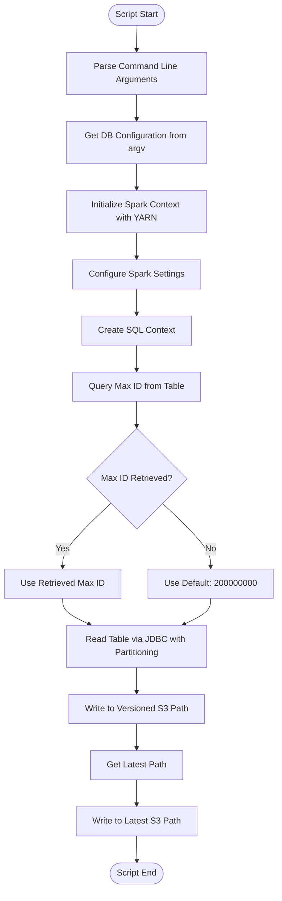
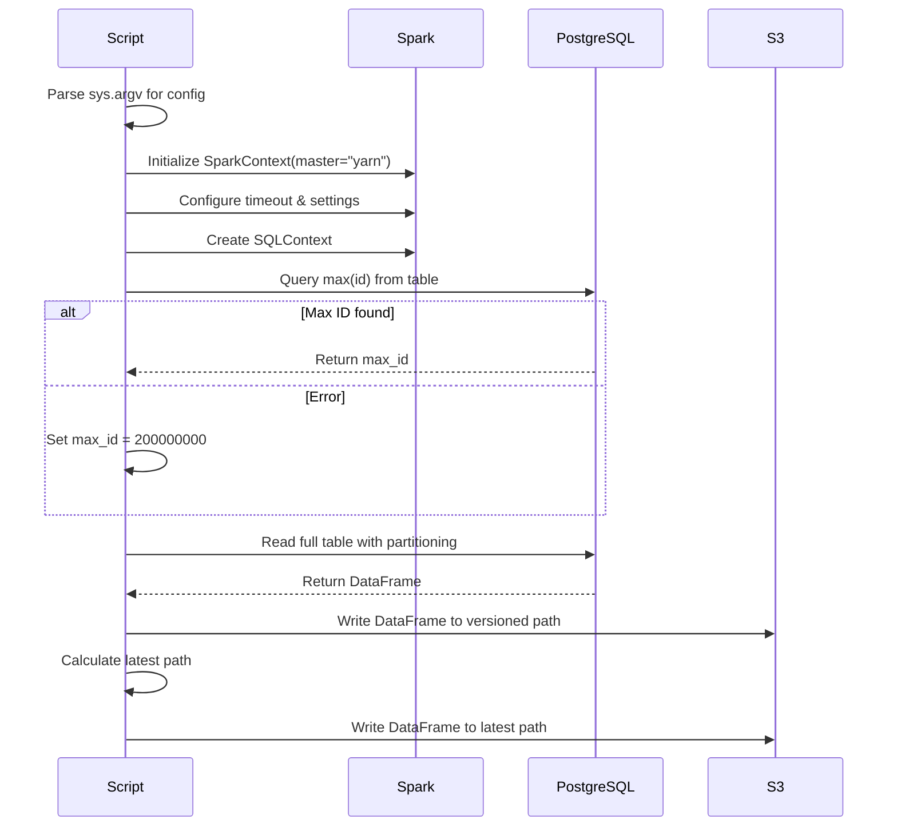

# Diagram: research/orchestrator/tasks/etl/extract_public_entityactualtripleg_spark.py

> Auto-generated by Obscura crawlers

## Diagram 1

### SVG

<svg id="container" width="509.703125" xmlns="http://www.w3.org/2000/svg" class="flowchart" height="1641.140625" viewBox="0 0 509.703125 1641.140625" role="graphics-document document" aria-roledescription="flowchart-v2"><g><marker id="container_flowchart-v2-pointEnd" class="marker flowchart-v2" viewBox="0 0 10 10" refX="5" refY="5" markerUnits="userSpaceOnUse" markerWidth="8" markerHeight="8" orient="auto"><path d="M 0 0 L 10 5 L 0 10 z" class="arrowMarkerPath" style="stroke-width: 1; stroke-dasharray: 1, 0;"></path></marker><marker id="container_flowchart-v2-pointStart" class="marker flowchart-v2" viewBox="0 0 10 10" refX="4.5" refY="5" markerUnits="userSpaceOnUse" markerWidth="8" markerHeight="8" orient="auto"><path d="M 0 5 L 10 10 L 10 0 z" class="arrowMarkerPath" style="stroke-width: 1; stroke-dasharray: 1, 0;"></path></marker><marker id="container_flowchart-v2-circleEnd" class="marker flowchart-v2" viewBox="0 0 10 10" refX="11" refY="5" markerUnits="userSpaceOnUse" markerWidth="11" markerHeight="11" orient="auto"><circle cx="5" cy="5" r="5" class="arrowMarkerPath" style="stroke-width: 1; stroke-dasharray: 1, 0;"></circle></marker><marker id="container_flowchart-v2-circleStart" class="marker flowchart-v2" viewBox="0 0 10 10" refX="-1" refY="5" markerUnits="userSpaceOnUse" markerWidth="11" markerHeight="11" orient="auto"><circle cx="5" cy="5" r="5" class="arrowMarkerPath" style="stroke-width: 1; stroke-dasharray: 1, 0;"></circle></marker><marker id="container_flowchart-v2-crossEnd" class="marker cross flowchart-v2" viewBox="0 0 11 11" refX="12" refY="5.2" markerUnits="userSpaceOnUse" markerWidth="11" markerHeight="11" orient="auto"><path d="M 1,1 l 9,9 M 10,1 l -9,9" class="arrowMarkerPath" style="stroke-width: 2; stroke-dasharray: 1, 0;"></path></marker><marker id="container_flowchart-v2-crossStart" class="marker cross flowchart-v2" viewBox="0 0 11 11" refX="-1" refY="5.2" markerUnits="userSpaceOnUse" markerWidth="11" markerHeight="11" orient="auto"><path d="M 1,1 l 9,9 M 10,1 l -9,9" class="arrowMarkerPath" style="stroke-width: 2; stroke-dasharray: 1, 0;"></path></marker><g class="root"><g class="clusters"></g><g class="edgePaths"><path d="M250.801,47.5L250.717,51.583C250.634,55.667,250.467,63.833,250.384,71.417C250.301,79,250.301,86,250.301,89.5L250.301,93" id="L_Start_ParseArgs_0" class="edge-thickness-normal edge-pattern-solid edge-thickness-normal edge-pattern-solid flowchart-link" style=";" data-edge="true" data-et="edge" data-id="L_Start_ParseArgs_0" data-points="W3sieCI6MjUwLjgwMDc4MTI1LCJ5Ijo0Ny41fSx7IngiOjI1MC4zMDA3ODEyNSwieSI6NzJ9LHsieCI6MjUwLjMwMDc4MTI1LCJ5Ijo5N31d" marker-end="url(#container_flowchart-v2-pointEnd)"></path><path d="M250.301,175L250.301,179.167C250.301,183.333,250.301,191.667,250.301,199.333C250.301,207,250.301,214,250.301,217.5L250.301,221" id="L_ParseArgs_GetDBConfig_0" class="edge-thickness-normal edge-pattern-solid edge-thickness-normal edge-pattern-solid flowchart-link" style=";" data-edge="true" data-et="edge" data-id="L_ParseArgs_GetDBConfig_0" data-points="W3sieCI6MjUwLjMwMDc4MTI1LCJ5IjoxNzV9LHsieCI6MjUwLjMwMDc4MTI1LCJ5IjoyMDB9LHsieCI6MjUwLjMwMDc4MTI1LCJ5IjoyMjV9XQ==" marker-end="url(#container_flowchart-v2-pointEnd)"></path><path d="M250.301,303L250.301,307.167C250.301,311.333,250.301,319.667,250.301,327.333C250.301,335,250.301,342,250.301,345.5L250.301,349" id="L_GetDBConfig_InitSpark_0" class="edge-thickness-normal edge-pattern-solid edge-thickness-normal edge-pattern-solid flowchart-link" style=";" data-edge="true" data-et="edge" data-id="L_GetDBConfig_InitSpark_0" data-points="W3sieCI6MjUwLjMwMDc4MTI1LCJ5IjozMDN9LHsieCI6MjUwLjMwMDc4MTI1LCJ5IjozMjh9LHsieCI6MjUwLjMwMDc4MTI1LCJ5IjozNTN9XQ==" marker-end="url(#container_flowchart-v2-pointEnd)"></path><path d="M250.301,431L250.301,435.167C250.301,439.333,250.301,447.667,250.301,455.333C250.301,463,250.301,470,250.301,473.5L250.301,477" id="L_InitSpark_ConfigSpark_0" class="edge-thickness-normal edge-pattern-solid edge-thickness-normal edge-pattern-solid flowchart-link" style=";" data-edge="true" data-et="edge" data-id="L_InitSpark_ConfigSpark_0" data-points="W3sieCI6MjUwLjMwMDc4MTI1LCJ5Ijo0MzF9LHsieCI6MjUwLjMwMDc4MTI1LCJ5Ijo0NTZ9LHsieCI6MjUwLjMwMDc4MTI1LCJ5Ijo0ODF9XQ==" marker-end="url(#container_flowchart-v2-pointEnd)"></path><path d="M250.301,535L250.301,539.167C250.301,543.333,250.301,551.667,250.301,559.333C250.301,567,250.301,574,250.301,577.5L250.301,581" id="L_ConfigSpark_CreateSQL_0" class="edge-thickness-normal edge-pattern-solid edge-thickness-normal edge-pattern-solid flowchart-link" style=";" data-edge="true" data-et="edge" data-id="L_ConfigSpark_CreateSQL_0" data-points="W3sieCI6MjUwLjMwMDc4MTI1LCJ5Ijo1MzV9LHsieCI6MjUwLjMwMDc4MTI1LCJ5Ijo1NjB9LHsieCI6MjUwLjMwMDc4MTI1LCJ5Ijo1ODV9XQ==" marker-end="url(#container_flowchart-v2-pointEnd)"></path><path d="M250.301,639L250.301,643.167C250.301,647.333,250.301,655.667,250.301,663.333C250.301,671,250.301,678,250.301,681.5L250.301,685" id="L_CreateSQL_QueryMaxID_0" class="edge-thickness-normal edge-pattern-solid edge-thickness-normal edge-pattern-solid flowchart-link" style=";" data-edge="true" data-et="edge" data-id="L_CreateSQL_QueryMaxID_0" data-points="W3sieCI6MjUwLjMwMDc4MTI1LCJ5Ijo2Mzl9LHsieCI6MjUwLjMwMDc4MTI1LCJ5Ijo2NjR9LHsieCI6MjUwLjMwMDc4MTI1LCJ5Ijo2ODl9XQ==" marker-end="url(#container_flowchart-v2-pointEnd)"></path><path d="M250.301,743L250.301,747.167C250.301,751.333,250.301,759.667,250.301,767.333C250.301,775,250.301,782,250.301,785.5L250.301,789" id="L_QueryMaxID_CheckMaxID_0" class="edge-thickness-normal edge-pattern-solid edge-thickness-normal edge-pattern-solid flowchart-link" style=";" data-edge="true" data-et="edge" data-id="L_QueryMaxID_CheckMaxID_0" data-points="W3sieCI6MjUwLjMwMDc4MTI1LCJ5Ijo3NDN9LHsieCI6MjUwLjMwMDc4MTI1LCJ5Ijo3Njh9LHsieCI6MjUwLjMwMDc4MTI1LCJ5Ijo3OTN9XQ==" marker-end="url(#container_flowchart-v2-pointEnd)"></path><path d="M203.242,929.082L188.431,943.092C173.62,957.102,143.997,985.121,129.186,1004.631C114.375,1024.141,114.375,1035.141,114.375,1040.641L114.375,1046.141" id="L_CheckMaxID_UseMaxID_0" class="edge-thickness-normal edge-pattern-solid edge-thickness-normal edge-pattern-solid flowchart-link" style=";" data-edge="true" data-et="edge" data-id="L_CheckMaxID_UseMaxID_0" data-points="W3sieCI6MjAzLjI0MjM2ODgxOTc4MTg2LCJ5Ijo5MjkuMDgyMjEyNTY5NzgxOX0seyJ4IjoxMTQuMzc1LCJ5IjoxMDEzLjE0MDYyNX0seyJ4IjoxMTQuMzc1LCJ5IjoxMDUwLjE0MDYyNX1d" marker-end="url(#container_flowchart-v2-pointEnd)"></path><path d="M297.359,929.082L312.17,943.092C326.982,957.102,356.604,985.121,371.415,1004.631C386.227,1024.141,386.227,1035.141,386.227,1040.641L386.227,1046.141" id="L_CheckMaxID_DefaultMaxID_0" class="edge-thickness-normal edge-pattern-solid edge-thickness-normal edge-pattern-solid flowchart-link" style=";" data-edge="true" data-et="edge" data-id="L_CheckMaxID_DefaultMaxID_0" data-points="W3sieCI6Mjk3LjM1OTE5MzY4MDIxODE0LCJ5Ijo5MjkuMDgyMjEyNTY5NzgxOX0seyJ4IjozODYuMjI2NTYyNSwieSI6MTAxMy4xNDA2MjV9LHsieCI6Mzg2LjIyNjU2MjUsInkiOjEwNTAuMTQwNjI1fV0=" marker-end="url(#container_flowchart-v2-pointEnd)"></path><path d="M114.375,1104.141L114.375,1108.307C114.375,1112.474,114.375,1120.807,122.621,1128.857C130.867,1136.906,147.36,1144.671,155.606,1148.554L163.852,1152.437" id="L_UseMaxID_ReadJDBC_0" class="edge-thickness-normal edge-pattern-solid edge-thickness-normal edge-pattern-solid flowchart-link" style=";" data-edge="true" data-et="edge" data-id="L_UseMaxID_ReadJDBC_0" data-points="W3sieCI6MTE0LjM3NSwieSI6MTEwNC4xNDA2MjV9LHsieCI6MTE0LjM3NSwieSI6MTEyOS4xNDA2MjV9LHsieCI6MTY3LjQ3MTAwODMwMDc4MTI1LCJ5IjoxMTU0LjE0MDYyNX1d" marker-end="url(#container_flowchart-v2-pointEnd)"></path><path d="M386.227,1104.141L386.227,1108.307C386.227,1112.474,386.227,1120.807,377.98,1128.857C369.734,1136.906,353.242,1144.671,344.996,1148.554L336.749,1152.437" id="L_DefaultMaxID_ReadJDBC_0" class="edge-thickness-normal edge-pattern-solid edge-thickness-normal edge-pattern-solid flowchart-link" style=";" data-edge="true" data-et="edge" data-id="L_DefaultMaxID_ReadJDBC_0" data-points="W3sieCI6Mzg2LjIyNjU2MjUsInkiOjExMDQuMTQwNjI1fSx7IngiOjM4Ni4yMjY1NjI1LCJ5IjoxMTI5LjE0MDYyNX0seyJ4IjozMzMuMTMwNTU0MTk5MjE4NzUsInkiOjExNTQuMTQwNjI1fV0=" marker-end="url(#container_flowchart-v2-pointEnd)"></path><path d="M250.301,1232.141L250.301,1236.307C250.301,1240.474,250.301,1248.807,250.301,1256.474C250.301,1264.141,250.301,1271.141,250.301,1274.641L250.301,1278.141" id="L_ReadJDBC_WriteVersioned_0" class="edge-thickness-normal edge-pattern-solid edge-thickness-normal edge-pattern-solid flowchart-link" style=";" data-edge="true" data-et="edge" data-id="L_ReadJDBC_WriteVersioned_0" data-points="W3sieCI6MjUwLjMwMDc4MTI1LCJ5IjoxMjMyLjE0MDYyNX0seyJ4IjoyNTAuMzAwNzgxMjUsInkiOjEyNTcuMTQwNjI1fSx7IngiOjI1MC4zMDA3ODEyNSwieSI6MTI4Mi4xNDA2MjV9XQ==" marker-end="url(#container_flowchart-v2-pointEnd)"></path><path d="M250.301,1336.141L250.301,1340.307C250.301,1344.474,250.301,1352.807,250.301,1360.474C250.301,1368.141,250.301,1375.141,250.301,1378.641L250.301,1382.141" id="L_WriteVersioned_GetLatest_0" class="edge-thickness-normal edge-pattern-solid edge-thickness-normal edge-pattern-solid flowchart-link" style=";" data-edge="true" data-et="edge" data-id="L_WriteVersioned_GetLatest_0" data-points="W3sieCI6MjUwLjMwMDc4MTI1LCJ5IjoxMzM2LjE0MDYyNX0seyJ4IjoyNTAuMzAwNzgxMjUsInkiOjEzNjEuMTQwNjI1fSx7IngiOjI1MC4zMDA3ODEyNSwieSI6MTM4Ni4xNDA2MjV9XQ==" marker-end="url(#container_flowchart-v2-pointEnd)"></path><path d="M250.301,1440.141L250.301,1444.307C250.301,1448.474,250.301,1456.807,250.301,1464.474C250.301,1472.141,250.301,1479.141,250.301,1482.641L250.301,1486.141" id="L_GetLatest_WriteLatest_0" class="edge-thickness-normal edge-pattern-solid edge-thickness-normal edge-pattern-solid flowchart-link" style=";" data-edge="true" data-et="edge" data-id="L_GetLatest_WriteLatest_0" data-points="W3sieCI6MjUwLjMwMDc4MTI1LCJ5IjoxNDQwLjE0MDYyNX0seyJ4IjoyNTAuMzAwNzgxMjUsInkiOjE0NjUuMTQwNjI1fSx7IngiOjI1MC4zMDA3ODEyNSwieSI6MTQ5MC4xNDA2MjV9XQ==" marker-end="url(#container_flowchart-v2-pointEnd)"></path><path d="M250.301,1544.141L250.301,1548.307C250.301,1552.474,250.301,1560.807,250.371,1568.557C250.441,1576.308,250.582,1583.474,250.652,1587.058L250.722,1590.641" id="L_WriteLatest_End_0" class="edge-thickness-normal edge-pattern-solid edge-thickness-normal edge-pattern-solid flowchart-link" style=";" data-edge="true" data-et="edge" data-id="L_WriteLatest_End_0" data-points="W3sieCI6MjUwLjMwMDc4MTI1LCJ5IjoxNTQ0LjE0MDYyNX0seyJ4IjoyNTAuMzAwNzgxMjUsInkiOjE1NjkuMTQwNjI1fSx7IngiOjI1MC44MDA3ODEyNSwieSI6MTU5NC42NDA2MjV9XQ==" marker-end="url(#container_flowchart-v2-pointEnd)"></path></g><g class="edgeLabels"><g class="edgeLabel"><g class="label" data-id="L_Start_ParseArgs_0" transform="translate(0, 0)"><foreignObject width="0" height="0">

</foreignObject></g></g><g class="edgeLabel"><g class="label" data-id="L_ParseArgs_GetDBConfig_0" transform="translate(0, 0)"><foreignObject width="0" height="0">

</foreignObject></g></g><g class="edgeLabel"><g class="label" data-id="L_GetDBConfig_InitSpark_0" transform="translate(0, 0)"><foreignObject width="0" height="0">

</foreignObject></g></g><g class="edgeLabel"><g class="label" data-id="L_InitSpark_ConfigSpark_0" transform="translate(0, 0)"><foreignObject width="0" height="0">

</foreignObject></g></g><g class="edgeLabel"><g class="label" data-id="L_ConfigSpark_CreateSQL_0" transform="translate(0, 0)"><foreignObject width="0" height="0">

</foreignObject></g></g><g class="edgeLabel"><g class="label" data-id="L_CreateSQL_QueryMaxID_0" transform="translate(0, 0)"><foreignObject width="0" height="0">

</foreignObject></g></g><g class="edgeLabel"><g class="label" data-id="L_QueryMaxID_CheckMaxID_0" transform="translate(0, 0)"><foreignObject width="0" height="0">

</foreignObject></g></g><g class="edgeLabel" transform="translate(114.375, 1013.140625)"><g class="label" data-id="L_CheckMaxID_UseMaxID_0" transform="translate(-12.03125, -12)"><foreignObject width="24.0625" height="24">

Yes

</foreignObject></g></g><g class="edgeLabel" transform="translate(386.2265625, 1013.140625)"><g class="label" data-id="L_CheckMaxID_DefaultMaxID_0" transform="translate(-10.140625, -12)"><foreignObject width="20.28125" height="24">

No

</foreignObject></g></g><g class="edgeLabel"><g class="label" data-id="L_UseMaxID_ReadJDBC_0" transform="translate(0, 0)"><foreignObject width="0" height="0">

</foreignObject></g></g><g class="edgeLabel"><g class="label" data-id="L_DefaultMaxID_ReadJDBC_0" transform="translate(0, 0)"><foreignObject width="0" height="0">

</foreignObject></g></g><g class="edgeLabel"><g class="label" data-id="L_ReadJDBC_WriteVersioned_0" transform="translate(0, 0)"><foreignObject width="0" height="0">

</foreignObject></g></g><g class="edgeLabel"><g class="label" data-id="L_WriteVersioned_GetLatest_0" transform="translate(0, 0)"><foreignObject width="0" height="0">

</foreignObject></g></g><g class="edgeLabel"><g class="label" data-id="L_GetLatest_WriteLatest_0" transform="translate(0, 0)"><foreignObject width="0" height="0">

</foreignObject></g></g><g class="edgeLabel"><g class="label" data-id="L_WriteLatest_End_0" transform="translate(0, 0)"><foreignObject width="0" height="0">

</foreignObject></g></g></g><g class="nodes"><g class="node default" id="flowchart-Start-0" transform="translate(250.30078125, 27.5)"><g class="basic label-container outer-path"><path d="M-33.6875 -19.5 C-14.304191541722037 -19.5, 5.079116916555925 -19.5, 33.6875 -19.5 C33.6875 -19.5, 33.6875 -19.5, 33.6875 -19.5 C34.0451374511602 -19.48853126304036, 34.402774902320395 -19.477062526080722, 34.9368692896239 -19.45993515863156 C35.31890726367684 -19.423080414742557, 35.70094523772978 -19.386225670853555, 36.181104652847864 -19.3399052695533 C36.6248804451258 -19.268159040990472, 37.06865623740372 -19.196412812427646, 37.41509325967676 -19.140403561325776 C37.691960237821704 -19.077210480290073, 37.96882721596665 -19.014017399254367, 38.63376438623539 -18.862249829261074 C39.068637196026 -18.733181862009182, 39.50351000581661 -18.60411389475729, 39.832110251460605 -18.50658706670804 C40.19139145022706 -18.37436826440299, 40.55067264899352 -18.242149462097938, 41.0052065951478 -18.074876768247425 C41.40877173749046 -17.896230451066934, 41.81233687983312 -17.717584133886444, 42.14823291279238 -17.568892924097174 C42.42875393819007 -17.422545284829493, 42.70927496358775 -17.276197645561815, 43.25649226407678 -16.990714730406097 C43.563123847104016 -16.804832862807793, 43.86975543013125 -16.618950995209488, 44.3254305736057 -16.342718045390892 C44.6715687346775 -16.1012670483067, 45.01770689574929 -15.859816051222504, 45.35065534457871 -15.627565626425154 C45.71151818142314 -15.339787117005109, 46.07238101826757 -15.052008607585062, 46.327953708501866 -14.848196188198123 C46.68331546571922 -14.525466042650187, 47.03867722293658 -14.202735897102253, 47.25330973676799 -14.007812326905688 C47.54634587985487 -13.705228450453703, 47.839382022941756 -13.402644574001716, 48.12292094296865 -13.10986736009568 C48.31916104491936 -12.879352569966239, 48.51540114687008 -12.648837779836796, 48.93321390812658 -12.158051136245305 C49.184367963569564 -11.82152758255686, 49.435522019012545 -11.485004028868412, 49.680858964640635 -11.156274872382312 C49.916827250773046 -10.793764218525972, 50.152795536905465 -10.431253564669632, 50.36278387860425 -10.108655082055241 C50.54551548124326 -9.784196617988455, 50.728247083882266 -9.459738153921666, 50.976186474273504 -9.019496659696287 C51.109431938653934 -8.7428096019141, 51.24267740303437 -8.466122544131913, 51.51854614880834 -7.893275190886684 C51.69874928927457 -7.448169949944387, 51.87895242974081 -7.003064709002089, 51.987634229970325 -6.734618561215508 C52.129332046398154 -6.307847314615984, 52.27102986282598 -5.881076068016458, 52.38152313421488 -5.548287939305138 C52.49181861089472 -5.127683484362947, 52.602114087574556 -4.707079029420758, 52.69859428754556 -4.339158212148133 C52.781550407533004 -3.91319606879478, 52.86450652752045 -3.4872339254414273, 52.937544776581774 -3.1121979531509023 C52.982486776578625 -2.7636366759770254, 53.02742877657548 -2.415075398803148, 53.09739270250937 -1.872449005199798 C53.12018723495515 -1.5174057629413362, 53.14298176740093 -1.1623625206828745, 53.17748121591342 -0.6250057626472757 C53.17748121591342 -0.27955874103344536, 53.17748121591342 0.06588828058038498, 53.17748121591342 0.625005762647271 C53.15250499769457 1.0140305218462622, 53.127528779475725 1.4030552810452532, 53.09739270250937 1.8724490051997846 C53.048685431574945 2.2502129802285986, 52.999978160640524 2.627976955257412, 52.937544776581774 3.1121979531508885 C52.86385114166769 3.4905991932794658, 52.7901575067536 3.8690004334080434, 52.69859428754556 4.339158212148129 C52.57316256772375 4.8174837222799445, 52.447730847901944 5.295809232411761, 52.38152313421489 5.548287939305125 C52.24179986505235 5.9691121641429685, 52.102076595889805 6.3899363889808125, 51.987634229970325 6.734618561215495 C51.86593828029859 7.0352099097358005, 51.74424233062686 7.335801258256106, 51.51854614880834 7.893275190886679 C51.31813796553416 8.309427071503697, 51.11772978225999 8.725578952120715, 50.976186474273504 9.019496659696284 C50.73228181822717 9.452574074531134, 50.48837716218084 9.885651489365982, 50.36278387860425 10.108655082055236 C50.10297539520926 10.507790680896212, 49.84316691181428 10.90692627973719, 49.68085896464064 11.156274872382301 C49.426688468397145 11.496840181940026, 49.17251797215365 11.83740549149775, 48.93321390812658 12.158051136245302 C48.77082269503618 12.348805095463076, 48.608431481945786 12.539559054680852, 48.12292094296866 13.10986736009567 C47.81368700898429 13.429176785512679, 47.504453074999915 13.748486210929688, 47.25330973676799 14.007812326905684 C46.95800206326267 14.276002942570337, 46.662694389757355 14.544193558234987, 46.32795370850189 14.848196188198111 C46.04410464414855 15.074558263479068, 45.760255579795206 15.300920338760024, 45.35065534457871 15.627565626425152 C45.016733720563295 15.860494896104184, 44.68281209654788 16.093424165783215, 44.32543057360571 16.34271804539089 C43.9867940593034 16.548001490409998, 43.648157545001084 16.75328493542911, 43.25649226407678 16.990714730406093 C42.910072924732944 17.171441477849598, 42.563653585389105 17.352168225293102, 42.14823291279239 17.56889292409717 C41.91107359588742 17.67387631860982, 41.67391427898246 17.77885971312247, 41.005206595147804 18.07487676824742 C40.605717204105844 18.221892556990312, 40.20622781306389 18.3689083457332, 39.83211025146062 18.506587066708033 C39.47800731032615 18.611682960912475, 39.12390436919168 18.71677885511692, 38.63376438623541 18.86224982926107 C38.344862052603325 18.92818990164868, 38.055959718971245 18.994129974036287, 37.415093259676766 19.140403561325773 C36.92173930703732 19.220165202371472, 36.42838535439788 19.299926843417175, 36.18110465284788 19.3399052695533 C35.931703340155984 19.363964714239724, 35.68230202746409 19.388024158926147, 34.9368692896239 19.45993515863156 C34.629688592018695 19.469785845712803, 34.3225078944135 19.479636532794043, 33.68750000000001 19.5 C33.68750000000001 19.5, 33.6875 19.5, 33.6875 19.5 C7.811637165342681 19.5, -18.064225669314638 19.5, -33.68749999999999 19.5 C-33.98702005135154 19.49039497493357, -34.286540102703086 19.480789949867138, -34.93686928962389 19.45993515863156 C-35.40344591666044 19.414925072561836, -35.87002254369699 19.369914986492113, -36.18110465284787 19.3399052695533 C-36.655676585810085 19.263180159792274, -37.13024851877229 19.18645505003125, -37.41509325967676 19.140403561325773 C-37.802323912334415 19.052020691772825, -38.18955456499207 18.963637822219873, -38.633764386235384 18.862249829261074 C-39.082314067168944 18.729122638445318, -39.5308637481025 18.59599544762956, -39.83211025146059 18.506587066708043 C-40.0923763667039 18.41080673042491, -40.35264248194721 18.315026394141775, -41.0052065951478 18.074876768247425 C-41.446960622281914 17.879325364602774, -41.88871464941603 17.683773960958124, -42.14823291279238 17.568892924097174 C-42.46301870271625 17.404669379123813, -42.777804492640115 17.240445834150457, -43.25649226407678 16.990714730406097 C-43.56067110790024 16.806319727727015, -43.8648499517237 16.621924725047933, -44.325430573605686 16.3427180453909 C-44.544400129646775 16.189974362135942, -44.76336968568786 16.037230678880984, -45.35065534457871 15.627565626425156 C-45.555592292922306 15.464133863722369, -45.76052924126591 15.300702101019581, -46.327953708501866 14.848196188198125 C-46.67952086231647 14.528912201060859, -47.03108801613108 14.209628213923594, -47.253309736767974 14.007812326905697 C-47.514873329139995 13.737726443011276, -47.776436921512015 13.467640559116855, -48.122920942968655 13.109867360095677 C-48.38336217609665 12.803938268137554, -48.64380340922464 12.498009176179428, -48.933213908126575 12.158051136245307 C-49.14712601039802 11.871428406994992, -49.36103811266946 11.584805677744676, -49.680858964640635 11.156274872382316 C-49.946534542833625 10.748125840396055, -50.212210121026615 10.339976808409794, -50.36278387860425 10.108655082055249 C-50.60015061356943 9.687186408136274, -50.83751734853462 9.265717734217299, -50.976186474273504 9.019496659696289 C-51.088053952981106 8.787201446579347, -51.199921431688715 8.554906233462408, -51.51854614880834 7.893275190886686 C-51.632152783586776 7.6126646065490995, -51.7457594183652 7.332054022211512, -51.987634229970325 6.73461856121551 C-52.07240625242404 6.479298736172473, -52.15717827487775 6.223978911129437, -52.38152313421488 5.5482879393051325 C-52.49110112109232 5.130419583941522, -52.60067910796977 4.712551228577911, -52.69859428754556 4.339158212148136 C-52.764783326221504 3.9992914876054457, -52.83097236489745 3.659424763062755, -52.937544776581774 3.112197953150904 C-52.994020955276085 2.674179863680763, -53.050497133970396 2.236161774210622, -53.09739270250937 1.872449005199809 C-53.11543038301982 1.591497571495888, -53.133468063530266 1.3105461377919672, -53.17748121591342 0.6250057626472781 C-53.17748121591342 0.20419308037455475, -53.17748121591342 -0.21661960189816865, -53.17748121591342 -0.6250057626472687 C-53.158032607962866 -0.9279335301108613, -53.138584000012315 -1.230861297574454, -53.09739270250937 -1.8724490051997822 C-53.04853657577856 -2.2513674763904254, -52.99968044904776 -2.630285947581069, -52.937544776581774 -3.112197953150895 C-52.86107293496099 -3.504864697544189, -52.7846010933402 -3.8975314419374834, -52.69859428754556 -4.339158212148126 C-52.58922304623907 -4.756238157045622, -52.47985180493257 -5.173318101943117, -52.38152313421489 -5.548287939305123 C-52.290665261190725 -5.821937376617736, -52.19980738816657 -6.095586813930351, -51.98763422997033 -6.734618561215485 C-51.807951391353505 -7.178438646530394, -51.628268552736685 -7.622258731845305, -51.51854614880834 -7.893275190886676 C-51.320347766643025 -8.304838372218983, -51.1221493844777 -8.71640155355129, -50.976186474273504 -9.019496659696282 C-50.8099621616379 -9.314644758817664, -50.643737849002285 -9.609792857939047, -50.36278387860425 -10.108655082055243 C-50.155618182566556 -10.426917222947704, -49.948452486528865 -10.745179363840167, -49.68085896464064 -11.156274872382308 C-49.42700235760084 -11.496419599002975, -49.17314575056105 -11.836564325623641, -48.93321390812659 -12.158051136245302 C-48.76459627257658 -12.356119005577607, -48.595978637026576 -12.554186874909911, -48.12292094296866 -13.10986736009567 C-47.91401460702469 -13.32558030348698, -47.70510827108071 -13.54129324687829, -47.253309736767996 -14.007812326905677 C-46.934754122252926 -14.297116107488572, -46.616198507737856 -14.586419888071466, -46.32795370850189 -14.848196188198107 C-46.035371998745106 -15.081522315802859, -45.742790288988324 -15.314848443407609, -45.35065534457872 -15.627565626425149 C-45.02207797247722 -15.856766977317964, -44.69350060037573 -16.08596832821078, -44.325430573605715 -16.342718045390885 C-44.10806285066005 -16.47448763643508, -43.89069512771437 -16.606257227479272, -43.25649226407679 -16.99071473040609 C-43.00956591396046 -17.119536049097906, -42.762639563844125 -17.24835736778972, -42.14823291279239 -17.56889292409717 C-41.70383659390494 -17.765613991920223, -41.25944027501748 -17.962335059743275, -41.005206595147804 -18.07487676824742 C-40.56819652016305 -18.23570051551866, -40.131186445178294 -18.3965242627899, -39.83211025146062 -18.506587066708033 C-39.583404950930884 -18.580401494424496, -39.334699650401156 -18.654215922140956, -38.63376438623541 -18.862249829261067 C-38.229631852559095 -18.954490442861445, -37.82549931888278 -19.046731056461823, -37.415093259676766 -19.140403561325773 C-37.146722836902484 -19.183791610036206, -36.87835241412821 -19.22717965874664, -36.18110465284788 -19.3399052695533 C-35.75721771061152 -19.380797133072207, -35.33333076837517 -19.42168899659111, -34.9368692896239 -19.45993515863156 C-34.64516419154601 -19.46928957335739, -34.35345909346812 -19.478643988083217, -33.68750000000001 -19.5 C-33.68750000000001 -19.5, -33.68750000000001 -19.5, -33.6875 -19.5" stroke="none" stroke-width="0" fill="#ECECFF" style=""></path><path d="M-33.6875 -19.5 C-13.62599426712314 -19.5, 6.43551146575372 -19.5, 33.6875 -19.5 M-33.6875 -19.5 C-7.510391746699469 -19.5, 18.666716506601063 -19.5, 33.6875 -19.5 M33.6875 -19.5 C33.6875 -19.5, 33.6875 -19.5, 33.6875 -19.5 M33.6875 -19.5 C33.6875 -19.5, 33.6875 -19.5, 33.6875 -19.5 M33.6875 -19.5 C34.03781102021136 -19.48876620742086, 34.38812204042272 -19.477532414841715, 34.9368692896239 -19.45993515863156 M33.6875 -19.5 C34.032508167020374 -19.488936259601317, 34.37751633404074 -19.47787251920263, 34.9368692896239 -19.45993515863156 M34.9368692896239 -19.45993515863156 C35.19260520404365 -19.43526462253492, 35.448341118463404 -19.410594086438284, 36.181104652847864 -19.3399052695533 M34.9368692896239 -19.45993515863156 C35.36428236717862 -19.418703133079287, 35.791695444733335 -19.377471107527015, 36.181104652847864 -19.3399052695533 M36.181104652847864 -19.3399052695533 C36.47339617578136 -19.292649842880024, 36.76568769871486 -19.245394416206754, 37.41509325967676 -19.140403561325776 M36.181104652847864 -19.3399052695533 C36.48562342603372 -19.290673035882968, 36.79014219921957 -19.241440802212637, 37.41509325967676 -19.140403561325776 M37.41509325967676 -19.140403561325776 C37.84123790284803 -19.043138827375614, 38.26738254601929 -18.945874093425452, 38.63376438623539 -18.862249829261074 M37.41509325967676 -19.140403561325776 C37.705762340269835 -19.074060240473422, 37.99643142086291 -19.007716919621068, 38.63376438623539 -18.862249829261074 M38.63376438623539 -18.862249829261074 C38.99995972999653 -18.753564973431352, 39.36615507375768 -18.64488011760163, 39.832110251460605 -18.50658706670804 M38.63376438623539 -18.862249829261074 C39.100365883080094 -18.723764954238803, 39.5669673799248 -18.585280079216535, 39.832110251460605 -18.50658706670804 M39.832110251460605 -18.50658706670804 C40.08808213942119 -18.41238704576035, 40.34405402738178 -18.31818702481266, 41.0052065951478 -18.074876768247425 M39.832110251460605 -18.50658706670804 C40.185851601551796 -18.376406979925285, 40.539592951642994 -18.24622689314253, 41.0052065951478 -18.074876768247425 M41.0052065951478 -18.074876768247425 C41.367012895545635 -17.91471585166387, 41.72881919594348 -17.754554935080318, 42.14823291279238 -17.568892924097174 M41.0052065951478 -18.074876768247425 C41.43459477894103 -17.884799356630072, 41.86398296273426 -17.69472194501272, 42.14823291279238 -17.568892924097174 M42.14823291279238 -17.568892924097174 C42.508012664785596 -17.381196057932243, 42.867792416778805 -17.193499191767316, 43.25649226407678 -16.990714730406097 M42.14823291279238 -17.568892924097174 C42.48043265035956 -17.395584533792466, 42.81263238792673 -17.222276143487758, 43.25649226407678 -16.990714730406097 M43.25649226407678 -16.990714730406097 C43.58138267379744 -16.79376425476546, 43.9062730835181 -16.596813779124822, 44.3254305736057 -16.342718045390892 M43.25649226407678 -16.990714730406097 C43.4886383233505 -16.849986425032697, 43.720784382624224 -16.709258119659296, 44.3254305736057 -16.342718045390892 M44.3254305736057 -16.342718045390892 C44.561405491581844 -16.178112157800296, 44.79738040955798 -16.0135062702097, 45.35065534457871 -15.627565626425154 M44.3254305736057 -16.342718045390892 C44.61703599887038 -16.139306724121656, 44.90864142413506 -15.935895402852422, 45.35065534457871 -15.627565626425154 M45.35065534457871 -15.627565626425154 C45.575927298736644 -15.447917237722667, 45.80119925289457 -15.268268849020181, 46.327953708501866 -14.848196188198123 M45.35065534457871 -15.627565626425154 C45.605862792042636 -15.42404447842807, 45.86107023950656 -15.220523330430986, 46.327953708501866 -14.848196188198123 M46.327953708501866 -14.848196188198123 C46.64729242836683 -14.558181212056288, 46.9666311482318 -14.268166235914455, 47.25330973676799 -14.007812326905688 M46.327953708501866 -14.848196188198123 C46.6332266854596 -14.570955347605471, 46.938499662417335 -14.29371450701282, 47.25330973676799 -14.007812326905688 M47.25330973676799 -14.007812326905688 C47.46788024834244 -13.786250657138442, 47.68245075991689 -13.564688987371195, 48.12292094296865 -13.10986736009568 M47.25330973676799 -14.007812326905688 C47.47162960694917 -13.782379136548926, 47.689949477130355 -13.556945946192165, 48.12292094296865 -13.10986736009568 M48.12292094296865 -13.10986736009568 C48.31294689762374 -12.886652060974676, 48.50297285227884 -12.66343676185367, 48.93321390812658 -12.158051136245305 M48.12292094296865 -13.10986736009568 C48.311955032286804 -12.887817162438177, 48.50098912160497 -12.665766964780673, 48.93321390812658 -12.158051136245305 M48.93321390812658 -12.158051136245305 C49.22154608473035 -11.771712287197925, 49.50987826133411 -11.385373438150545, 49.680858964640635 -11.156274872382312 M48.93321390812658 -12.158051136245305 C49.22433194107637 -11.767979493490984, 49.51544997402616 -11.377907850736662, 49.680858964640635 -11.156274872382312 M49.680858964640635 -11.156274872382312 C49.883458032936424 -10.845028298012659, 50.086057101232214 -10.533781723643004, 50.36278387860425 -10.108655082055241 M49.680858964640635 -11.156274872382312 C49.83376837933805 -10.921364949480017, 49.98667779403547 -10.686455026577722, 50.36278387860425 -10.108655082055241 M50.36278387860425 -10.108655082055241 C50.49443507353248 -9.874895054331098, 50.62608626846072 -9.641135026606957, 50.976186474273504 -9.019496659696287 M50.36278387860425 -10.108655082055241 C50.51881020387539 -9.831614542157665, 50.67483652914654 -9.554574002260088, 50.976186474273504 -9.019496659696287 M50.976186474273504 -9.019496659696287 C51.13557347002154 -8.688526152690107, 51.29496046576958 -8.357555645683926, 51.51854614880834 -7.893275190886684 M50.976186474273504 -9.019496659696287 C51.094676545064935 -8.773449492416507, 51.213166615856366 -8.527402325136725, 51.51854614880834 -7.893275190886684 M51.51854614880834 -7.893275190886684 C51.6862682005221 -7.478998480468419, 51.85399025223587 -7.064721770050153, 51.987634229970325 -6.734618561215508 M51.51854614880834 -7.893275190886684 C51.68780668338648 -7.475198398048852, 51.857067217964634 -7.057121605211021, 51.987634229970325 -6.734618561215508 M51.987634229970325 -6.734618561215508 C52.088072669060054 -6.432113985369316, 52.188511108149775 -6.129609409523124, 52.38152313421488 -5.548287939305138 M51.987634229970325 -6.734618561215508 C52.14019187007698 -6.275139255973275, 52.29274951018365 -5.815659950731041, 52.38152313421488 -5.548287939305138 M52.38152313421488 -5.548287939305138 C52.44844578842199 -5.29308285435161, 52.515368442629104 -5.037877769398083, 52.69859428754556 -4.339158212148133 M52.38152313421488 -5.548287939305138 C52.456102825127445 -5.263883254813025, 52.53068251604001 -4.979478570320912, 52.69859428754556 -4.339158212148133 M52.69859428754556 -4.339158212148133 C52.79193153647541 -3.859891165727887, 52.885268785405266 -3.380624119307641, 52.937544776581774 -3.1121979531509023 M52.69859428754556 -4.339158212148133 C52.774238284288614 -3.9507422762369018, 52.849882281031675 -3.5623263403256704, 52.937544776581774 -3.1121979531509023 M52.937544776581774 -3.1121979531509023 C52.97591614081915 -2.81459722940872, 53.01428750505653 -2.516996505666538, 53.09739270250937 -1.872449005199798 M52.937544776581774 -3.1121979531509023 C52.99082812990071 -2.698942786797478, 53.044111483219645 -2.2856876204440537, 53.09739270250937 -1.872449005199798 M53.09739270250937 -1.872449005199798 C53.128316000989116 -1.3907936705404556, 53.159239299468865 -0.9091383358811129, 53.17748121591342 -0.6250057626472757 M53.09739270250937 -1.872449005199798 C53.119016711909694 -1.5356376042035134, 53.14064072131002 -1.1988262032072288, 53.17748121591342 -0.6250057626472757 M53.17748121591342 -0.6250057626472757 C53.17748121591342 -0.25687903502094356, 53.17748121591342 0.11124769260538858, 53.17748121591342 0.625005762647271 M53.17748121591342 -0.6250057626472757 C53.17748121591342 -0.2347545375333452, 53.17748121591342 0.15549668758058532, 53.17748121591342 0.625005762647271 M53.17748121591342 0.625005762647271 C53.1521586169433 1.019425681640894, 53.126836017973176 1.413845600634517, 53.09739270250937 1.8724490051997846 M53.17748121591342 0.625005762647271 C53.15346542413233 0.9990711048359938, 53.12944963235123 1.3731364470247165, 53.09739270250937 1.8724490051997846 M53.09739270250937 1.8724490051997846 C53.0559034914669 2.194231133073745, 53.01441428042443 2.5160132609477057, 52.937544776581774 3.1121979531508885 M53.09739270250937 1.8724490051997846 C53.051358015595056 2.229484946330047, 53.00532332868074 2.5865208874603094, 52.937544776581774 3.1121979531508885 M52.937544776581774 3.1121979531508885 C52.8565905042148 3.527881032063786, 52.77563623184783 3.9435641109766837, 52.69859428754556 4.339158212148129 M52.937544776581774 3.1121979531508885 C52.86506755191346 3.4843531837558106, 52.79259032724515 3.856508414360732, 52.69859428754556 4.339158212148129 M52.69859428754556 4.339158212148129 C52.6346862803617 4.582867141445723, 52.57077827317784 4.826576070743318, 52.38152313421489 5.548287939305125 M52.69859428754556 4.339158212148129 C52.61681558694401 4.651015840654891, 52.53503688634246 4.962873469161654, 52.38152313421489 5.548287939305125 M52.38152313421489 5.548287939305125 C52.23241466631456 5.997378887412837, 52.083306198414235 6.446469835520547, 51.987634229970325 6.734618561215495 M52.38152313421489 5.548287939305125 C52.230916246265195 6.0018918898606985, 52.08030935831551 6.455495840416273, 51.987634229970325 6.734618561215495 M51.987634229970325 6.734618561215495 C51.80856969495258 7.176911424686596, 51.62950515993484 7.619204288157698, 51.51854614880834 7.893275190886679 M51.987634229970325 6.734618561215495 C51.84223986577853 7.093745451778023, 51.69684550158674 7.452872342340552, 51.51854614880834 7.893275190886679 M51.51854614880834 7.893275190886679 C51.327915265387674 8.289124299157187, 51.13728438196701 8.684973407427695, 50.976186474273504 9.019496659696284 M51.51854614880834 7.893275190886679 C51.32165007378131 8.302134103581418, 51.12475399875429 8.710993016276158, 50.976186474273504 9.019496659696284 M50.976186474273504 9.019496659696284 C50.79073026103033 9.348792945787505, 50.605274047787155 9.678089231878726, 50.36278387860425 10.108655082055236 M50.976186474273504 9.019496659696284 C50.81038528842249 9.313893454365386, 50.64458410257147 9.60829024903449, 50.36278387860425 10.108655082055236 M50.36278387860425 10.108655082055236 C50.13169902859107 10.463663466646219, 49.9006141785779 10.8186718512372, 49.68085896464064 11.156274872382301 M50.36278387860425 10.108655082055236 C50.220911678375806 10.32660887962611, 50.079039478147365 10.544562677196986, 49.68085896464064 11.156274872382301 M49.68085896464064 11.156274872382301 C49.43496228635919 11.485754019631216, 49.18906560807773 11.815233166880128, 48.93321390812658 12.158051136245302 M49.68085896464064 11.156274872382301 C49.483626261530894 11.42054872628047, 49.286393558421146 11.684822580178638, 48.93321390812658 12.158051136245302 M48.93321390812658 12.158051136245302 C48.734776556461135 12.391146940916716, 48.536339204795695 12.62424274558813, 48.12292094296866 13.10986736009567 M48.93321390812658 12.158051136245302 C48.732880898067435 12.393373689131977, 48.53254788800829 12.62869624201865, 48.12292094296866 13.10986736009567 M48.12292094296866 13.10986736009567 C47.93802747104182 13.30078504989649, 47.75313399911498 13.491702739697311, 47.25330973676799 14.007812326905684 M48.12292094296866 13.10986736009567 C47.85052733339801 13.39113612590862, 47.57813372382737 13.672404891721571, 47.25330973676799 14.007812326905684 M47.25330973676799 14.007812326905684 C47.05101822918615 14.19152812175152, 46.84872672160431 14.375243916597357, 46.32795370850189 14.848196188198111 M47.25330973676799 14.007812326905684 C46.921838887172854 14.308845382269903, 46.59036803757771 14.609878437634123, 46.32795370850189 14.848196188198111 M46.32795370850189 14.848196188198111 C45.97103930274395 15.132825928898844, 45.614124896986006 15.417455669599578, 45.35065534457871 15.627565626425152 M46.32795370850189 14.848196188198111 C46.07763857581563 15.047815845349973, 45.82732344312936 15.247435502501835, 45.35065534457871 15.627565626425152 M45.35065534457871 15.627565626425152 C44.95152734135985 15.905980043497843, 44.552399338140994 16.184394460570534, 44.32543057360571 16.34271804539089 M45.35065534457871 15.627565626425152 C45.01470736043979 15.861908397206623, 44.67875937630087 16.096251167988093, 44.32543057360571 16.34271804539089 M44.32543057360571 16.34271804539089 C43.931755990250316 16.58136589130957, 43.538081406894925 16.820013737228255, 43.25649226407678 16.990714730406093 M44.32543057360571 16.34271804539089 C43.99785722867758 16.54129493212097, 43.670283883749455 16.739871818851046, 43.25649226407678 16.990714730406093 M43.25649226407678 16.990714730406093 C43.03403464467491 17.106770727957144, 42.81157702527304 17.222826725508195, 42.14823291279239 17.56889292409717 M43.25649226407678 16.990714730406093 C42.94525212466123 17.15308851178036, 42.634011985245685 17.31546229315463, 42.14823291279239 17.56889292409717 M42.14823291279239 17.56889292409717 C41.73962651816966 17.749770854118612, 41.33102012354693 17.930648784140054, 41.005206595147804 18.07487676824742 M42.14823291279239 17.56889292409717 C41.85067603061176 17.70061252912724, 41.55311914843112 17.83233213415731, 41.005206595147804 18.07487676824742 M41.005206595147804 18.07487676824742 C40.54743921987014 18.24333939390483, 40.08967184459248 18.411802019562238, 39.83211025146062 18.506587066708033 M41.005206595147804 18.07487676824742 C40.5855663935922 18.229308241531385, 40.16592619203659 18.383739714815345, 39.83211025146062 18.506587066708033 M39.83211025146062 18.506587066708033 C39.572608515987355 18.58360581964409, 39.31310678051409 18.66062457258015, 38.63376438623541 18.86224982926107 M39.83211025146062 18.506587066708033 C39.39717338735582 18.63567404494415, 38.96223652325102 18.76476102318027, 38.63376438623541 18.86224982926107 M38.63376438623541 18.86224982926107 C38.32998371217046 18.931585785762238, 38.026203038105514 19.0009217422634, 37.415093259676766 19.140403561325773 M38.63376438623541 18.86224982926107 C38.21397596855488 18.958063796221218, 37.79418755087434 19.053877763181365, 37.415093259676766 19.140403561325773 M37.415093259676766 19.140403561325773 C37.01301432822808 19.205408564793714, 36.610935396779404 19.270413568261652, 36.18110465284788 19.3399052695533 M37.415093259676766 19.140403561325773 C37.10582950913572 19.190402926137047, 36.79656575859466 19.240402290948317, 36.18110465284788 19.3399052695533 M36.18110465284788 19.3399052695533 C35.734161757746264 19.383021313116277, 35.28721886264465 19.426137356679256, 34.9368692896239 19.45993515863156 M36.18110465284788 19.3399052695533 C35.724084083745254 19.38399349420698, 35.26706351464263 19.428081718860657, 34.9368692896239 19.45993515863156 M34.9368692896239 19.45993515863156 C34.483431175305064 19.474476036394016, 34.029993060986236 19.489016914156473, 33.68750000000001 19.5 M34.9368692896239 19.45993515863156 C34.54967646639035 19.47235167884755, 34.16248364315681 19.484768199063538, 33.68750000000001 19.5 M33.68750000000001 19.5 C33.68750000000001 19.5, 33.68750000000001 19.5, 33.6875 19.5 M33.68750000000001 19.5 C33.68750000000001 19.5, 33.68750000000001 19.5, 33.6875 19.5 M33.6875 19.5 C16.45186233884297 19.5, -0.7837753223140567 19.5, -33.68749999999999 19.5 M33.6875 19.5 C10.829103393799226 19.5, -12.029293212401548 19.5, -33.68749999999999 19.5 M-33.68749999999999 19.5 C-33.95399459473049 19.491454037047255, -34.220489189460984 19.482908074094507, -34.93686928962389 19.45993515863156 M-33.68749999999999 19.5 C-34.05046009254044 19.48836057629119, -34.41342018508089 19.47672115258238, -34.93686928962389 19.45993515863156 M-34.93686928962389 19.45993515863156 C-35.38720048168651 19.416492250135775, -35.83753167374913 19.37304934163999, -36.18110465284787 19.3399052695533 M-34.93686928962389 19.45993515863156 C-35.33771210895954 19.42126633393427, -35.738554928295194 19.38259750923698, -36.18110465284787 19.3399052695533 M-36.18110465284787 19.3399052695533 C-36.536232686472985 19.28249092313582, -36.89136072009809 19.225076576718347, -37.41509325967676 19.140403561325773 M-36.18110465284787 19.3399052695533 C-36.5069246913083 19.287229212507153, -36.83274472976872 19.234553155461008, -37.41509325967676 19.140403561325773 M-37.41509325967676 19.140403561325773 C-37.892874163071745 19.031353187937636, -38.37065506646673 18.9223028145495, -38.633764386235384 18.862249829261074 M-37.41509325967676 19.140403561325773 C-37.79659269373962 19.05332880501739, -38.178092127802486 18.966254048709004, -38.633764386235384 18.862249829261074 M-38.633764386235384 18.862249829261074 C-39.11269507054764 18.72010571611566, -39.5916257548599 18.577961602970248, -39.83211025146059 18.506587066708043 M-38.633764386235384 18.862249829261074 C-38.890812648410545 18.785959254321348, -39.147860910585706 18.709668679381622, -39.83211025146059 18.506587066708043 M-39.83211025146059 18.506587066708043 C-40.26659313527291 18.34669334914936, -40.701076019085235 18.186799631590674, -41.0052065951478 18.074876768247425 M-39.83211025146059 18.506587066708043 C-40.15803703602623 18.386642997153718, -40.48396382059187 18.266698927599396, -41.0052065951478 18.074876768247425 M-41.0052065951478 18.074876768247425 C-41.31308567320375 17.938587833300414, -41.6209647512597 17.8022988983534, -42.14823291279238 17.568892924097174 M-41.0052065951478 18.074876768247425 C-41.339115369072196 17.927065259082944, -41.673024142996596 17.779253749918464, -42.14823291279238 17.568892924097174 M-42.14823291279238 17.568892924097174 C-42.46112575096994 17.405656930837367, -42.77401858914751 17.24242093757756, -43.25649226407678 16.990714730406097 M-42.14823291279238 17.568892924097174 C-42.374471283014394 17.450864511264943, -42.60070965323641 17.33283609843271, -43.25649226407678 16.990714730406097 M-43.25649226407678 16.990714730406097 C-43.58789026558025 16.78981931438387, -43.91928826708371 16.588923898361642, -44.325430573605686 16.3427180453909 M-43.25649226407678 16.990714730406097 C-43.605348020423264 16.779236320804877, -43.954203776769745 16.567757911203657, -44.325430573605686 16.3427180453909 M-44.325430573605686 16.3427180453909 C-44.568049877161485 16.17347732205075, -44.810669180717284 16.004236598710605, -45.35065534457871 15.627565626425156 M-44.325430573605686 16.3427180453909 C-44.62555428288662 16.1333647379425, -44.92567799216755 15.924011430494103, -45.35065534457871 15.627565626425156 M-45.35065534457871 15.627565626425156 C-45.65076190477317 15.388238630841041, -45.95086846496762 15.148911635256928, -46.327953708501866 14.848196188198125 M-45.35065534457871 15.627565626425156 C-45.7040335306534 15.34575592681906, -46.05741171672808 15.063946227212963, -46.327953708501866 14.848196188198125 M-46.327953708501866 14.848196188198125 C-46.69075534096507 14.518709344800216, -47.05355697342828 14.189222501402309, -47.253309736767974 14.007812326905697 M-46.327953708501866 14.848196188198125 C-46.66285885091965 14.544044198958794, -46.99776399333742 14.23989220971946, -47.253309736767974 14.007812326905697 M-47.253309736767974 14.007812326905697 C-47.48236841561489 13.771290434928979, -47.711427094461804 13.53476854295226, -48.122920942968655 13.109867360095677 M-47.253309736767974 14.007812326905697 C-47.58179492531977 13.66862440059043, -47.91028011387157 13.329436474275163, -48.122920942968655 13.109867360095677 M-48.122920942968655 13.109867360095677 C-48.326155347021256 12.871136664730292, -48.529389751073865 12.632405969364907, -48.933213908126575 12.158051136245307 M-48.122920942968655 13.109867360095677 C-48.42979325709907 12.74939767838875, -48.73666557122949 12.388927996681824, -48.933213908126575 12.158051136245307 M-48.933213908126575 12.158051136245307 C-49.21670590019989 11.778197693518845, -49.50019789227321 11.398344250792382, -49.680858964640635 11.156274872382316 M-48.933213908126575 12.158051136245307 C-49.17628490500238 11.832358144655087, -49.4193559018782 11.506665153064867, -49.680858964640635 11.156274872382316 M-49.680858964640635 11.156274872382316 C-49.88575479834762 10.841499849573198, -50.090650632054604 10.52672482676408, -50.36278387860425 10.108655082055249 M-49.680858964640635 11.156274872382316 C-49.83206117056868 10.923987680599522, -49.98326337649673 10.69170048881673, -50.36278387860425 10.108655082055249 M-50.36278387860425 10.108655082055249 C-50.49738578674577 9.869655764228806, -50.631987694887286 9.630656446402366, -50.976186474273504 9.019496659696289 M-50.36278387860425 10.108655082055249 C-50.5660328589596 9.747765936243303, -50.769281839314964 9.386876790431359, -50.976186474273504 9.019496659696289 M-50.976186474273504 9.019496659696289 C-51.149163174600176 8.660306840359468, -51.322139874926854 8.301117021022645, -51.51854614880834 7.893275190886686 M-50.976186474273504 9.019496659696289 C-51.11018672871762 8.741242264196943, -51.24418698316174 8.462987868697596, -51.51854614880834 7.893275190886686 M-51.51854614880834 7.893275190886686 C-51.67464337360136 7.507712027713387, -51.830740598394385 7.122148864540087, -51.987634229970325 6.73461856121551 M-51.51854614880834 7.893275190886686 C-51.699360343429085 7.446660634368813, -51.88017453804983 7.000046077850941, -51.987634229970325 6.73461856121551 M-51.987634229970325 6.73461856121551 C-52.12814612958862 6.311419107096113, -52.26865802920692 5.888219652976717, -52.38152313421488 5.5482879393051325 M-51.987634229970325 6.73461856121551 C-52.071740312730185 6.4813044404272855, -52.15584639549004 6.227990319639061, -52.38152313421488 5.5482879393051325 M-52.38152313421488 5.5482879393051325 C-52.48410654284265 5.157092942276907, -52.586689951470426 4.76589794524868, -52.69859428754556 4.339158212148136 M-52.38152313421488 5.5482879393051325 C-52.464849060934675 5.230530067037465, -52.54817498765448 4.912772194769797, -52.69859428754556 4.339158212148136 M-52.69859428754556 4.339158212148136 C-52.78211787575754 3.910282239396206, -52.86564146396953 3.481406266644276, -52.937544776581774 3.112197953150904 M-52.69859428754556 4.339158212148136 C-52.78630199192448 3.8887976871922554, -52.8740096963034 3.438437162236375, -52.937544776581774 3.112197953150904 M-52.937544776581774 3.112197953150904 C-52.99471651979945 2.6687852025923218, -53.05188826301712 2.2253724520337395, -53.09739270250937 1.872449005199809 M-52.937544776581774 3.112197953150904 C-52.97668724722976 2.8086166803602293, -53.01582971787775 2.5050354075695545, -53.09739270250937 1.872449005199809 M-53.09739270250937 1.872449005199809 C-53.124262105028684 1.4539363723700738, -53.15113150754801 1.0354237395403385, -53.17748121591342 0.6250057626472781 M-53.09739270250937 1.872449005199809 C-53.11445151775177 1.6067441881715794, -53.13151033299417 1.3410393711433497, -53.17748121591342 0.6250057626472781 M-53.17748121591342 0.6250057626472781 C-53.17748121591342 0.16397675790733296, -53.17748121591342 -0.2970522468326122, -53.17748121591342 -0.6250057626472687 M-53.17748121591342 0.6250057626472781 C-53.17748121591342 0.35188551016887054, -53.17748121591342 0.07876525769046294, -53.17748121591342 -0.6250057626472687 M-53.17748121591342 -0.6250057626472687 C-53.15614486544252 -0.9573366436235744, -53.134808514971624 -1.28966752459988, -53.09739270250937 -1.8724490051997822 M-53.17748121591342 -0.6250057626472687 C-53.15906779830635 -0.9118096049204343, -53.140654380699296 -1.1986134471935999, -53.09739270250937 -1.8724490051997822 M-53.09739270250937 -1.8724490051997822 C-53.03770631397993 -2.3353648482235414, -52.97801992545049 -2.798280691247301, -52.937544776581774 -3.112197953150895 M-53.09739270250937 -1.8724490051997822 C-53.05158471621325 -2.227726701102421, -53.00577672991713 -2.5830043970050607, -52.937544776581774 -3.112197953150895 M-52.937544776581774 -3.112197953150895 C-52.85089463175528 -3.5571281333203437, -52.76424448692879 -4.002058313489792, -52.69859428754556 -4.339158212148126 M-52.937544776581774 -3.112197953150895 C-52.87638717593436 -3.4262293068118868, -52.81522957528695 -3.7402606604728783, -52.69859428754556 -4.339158212148126 M-52.69859428754556 -4.339158212148126 C-52.58800867367319 -4.760869085951718, -52.47742305980081 -5.182579959755311, -52.38152313421489 -5.548287939305123 M-52.69859428754556 -4.339158212148126 C-52.57585357653082 -4.807221739407995, -52.453112865516076 -5.275285266667864, -52.38152313421489 -5.548287939305123 M-52.38152313421489 -5.548287939305123 C-52.2913595173465 -5.819846387691252, -52.20119590047811 -6.0914048360773805, -51.98763422997033 -6.734618561215485 M-52.38152313421489 -5.548287939305123 C-52.27777157199654 -5.860771114140249, -52.17402000977819 -6.173254288975376, -51.98763422997033 -6.734618561215485 M-51.98763422997033 -6.734618561215485 C-51.836521544844636 -7.10786981504096, -51.68540885971895 -7.481121068866435, -51.51854614880834 -7.893275190886676 M-51.98763422997033 -6.734618561215485 C-51.84536755235075 -7.086020005474949, -51.70310087473116 -7.437421449734413, -51.51854614880834 -7.893275190886676 M-51.51854614880834 -7.893275190886676 C-51.326770893800195 -8.291500611244208, -51.13499563879205 -8.68972603160174, -50.976186474273504 -9.019496659696282 M-51.51854614880834 -7.893275190886676 C-51.33212237579804 -8.280388144372305, -51.145698602787746 -8.667501097857933, -50.976186474273504 -9.019496659696282 M-50.976186474273504 -9.019496659696282 C-50.8127495277228 -9.309695508082488, -50.649312581172104 -9.599894356468692, -50.36278387860425 -10.108655082055243 M-50.976186474273504 -9.019496659696282 C-50.80500518349469 -9.32344637545939, -50.633823892715874 -9.627396091222499, -50.36278387860425 -10.108655082055243 M-50.36278387860425 -10.108655082055243 C-50.19387689452099 -10.368141567483057, -50.02496991043773 -10.627628052910872, -49.68085896464064 -11.156274872382308 M-50.36278387860425 -10.108655082055243 C-50.14515619138156 -10.442989650845849, -49.92752850415888 -10.777324219636455, -49.68085896464064 -11.156274872382308 M-49.68085896464064 -11.156274872382308 C-49.45835861291864 -11.454405073490756, -49.23585826119663 -11.752535274599206, -48.93321390812659 -12.158051136245302 M-49.68085896464064 -11.156274872382308 C-49.444535258579705 -11.472927108971435, -49.208211552518776 -11.789579345560561, -48.93321390812659 -12.158051136245302 M-48.93321390812659 -12.158051136245302 C-48.68834236238861 -12.445691187454802, -48.44347081665064 -12.733331238664302, -48.12292094296866 -13.10986736009567 M-48.93321390812659 -12.158051136245302 C-48.73123260801698 -12.395309864415609, -48.52925130790737 -12.632568592585915, -48.12292094296866 -13.10986736009567 M-48.12292094296866 -13.10986736009567 C-47.89229430392711 -13.348008299705278, -47.661667664885556 -13.586149239314887, -47.253309736767996 -14.007812326905677 M-48.12292094296866 -13.10986736009567 C-47.88889146703486 -13.35152200817463, -47.65486199110106 -13.593176656253588, -47.253309736767996 -14.007812326905677 M-47.253309736767996 -14.007812326905677 C-47.0529983943881 -14.189729788107407, -46.85268705200821 -14.371647249309136, -46.32795370850189 -14.848196188198107 M-47.253309736767996 -14.007812326905677 C-46.98603507469787 -14.250544103297726, -46.718760412627745 -14.493275879689774, -46.32795370850189 -14.848196188198107 M-46.32795370850189 -14.848196188198107 C-46.025260095954785 -15.089586289189102, -45.72256648340769 -15.330976390180096, -45.35065534457872 -15.627565626425149 M-46.32795370850189 -14.848196188198107 C-45.98737798478637 -15.119796264760598, -45.64680226107085 -15.39139634132309, -45.35065534457872 -15.627565626425149 M-45.35065534457872 -15.627565626425149 C-45.13695413935893 -15.776634336210405, -44.92325293413913 -15.92570304599566, -44.325430573605715 -16.342718045390885 M-45.35065534457872 -15.627565626425149 C-44.95921054806041 -15.90062057110419, -44.56776575154211 -16.17367551578323, -44.325430573605715 -16.342718045390885 M-44.325430573605715 -16.342718045390885 C-44.07784754828695 -16.49280433029848, -43.83026452296817 -16.64289061520607, -43.25649226407679 -16.99071473040609 M-44.325430573605715 -16.342718045390885 C-43.9732750498373 -16.556196793394868, -43.62111952606888 -16.769675541398847, -43.25649226407679 -16.99071473040609 M-43.25649226407679 -16.99071473040609 C-42.91951828670231 -17.16651383856022, -42.582544309327844 -17.34231294671435, -42.14823291279239 -17.56889292409717 M-43.25649226407679 -16.99071473040609 C-43.02844490773735 -17.10968689013707, -42.80039755139792 -17.22865904986805, -42.14823291279239 -17.56889292409717 M-42.14823291279239 -17.56889292409717 C-41.847686152217605 -17.70193605960074, -41.54713939164282 -17.834979195104307, -41.005206595147804 -18.07487676824742 M-42.14823291279239 -17.56889292409717 C-41.844202112917394 -17.703478340448587, -41.54017131304241 -17.838063756800004, -41.005206595147804 -18.07487676824742 M-41.005206595147804 -18.07487676824742 C-40.608896109434475 -18.220722690443896, -40.21258562372115 -18.36656861264037, -39.83211025146062 -18.506587066708033 M-41.005206595147804 -18.07487676824742 C-40.7267246776099 -18.177360688159997, -40.448242760072 -18.27984460807257, -39.83211025146062 -18.506587066708033 M-39.83211025146062 -18.506587066708033 C-39.582030136113545 -18.58080953224573, -39.33195002076648 -18.65503199778343, -38.63376438623541 -18.862249829261067 M-39.83211025146062 -18.506587066708033 C-39.556857239996134 -18.58828071567815, -39.281604228531656 -18.66997436464827, -38.63376438623541 -18.862249829261067 M-38.63376438623541 -18.862249829261067 C-38.28219720163807 -18.94249274495513, -37.93063001704073 -19.02273566064919, -37.415093259676766 -19.140403561325773 M-38.63376438623541 -18.862249829261067 C-38.161292240356374 -18.97008851338907, -37.688820094477336 -19.07792719751707, -37.415093259676766 -19.140403561325773 M-37.415093259676766 -19.140403561325773 C-37.103298033043835 -19.19081219555969, -36.791502806410904 -19.24122082979361, -36.18110465284788 -19.3399052695533 M-37.415093259676766 -19.140403561325773 C-36.964267185946845 -19.21328962471801, -36.513441112216924 -19.286175688110244, -36.18110465284788 -19.3399052695533 M-36.18110465284788 -19.3399052695533 C-35.85937070354064 -19.370942556701284, -35.537636754233404 -19.401979843849265, -34.9368692896239 -19.45993515863156 M-36.18110465284788 -19.3399052695533 C-35.854924055105485 -19.371371519527944, -35.52874345736309 -19.40283776950259, -34.9368692896239 -19.45993515863156 M-34.9368692896239 -19.45993515863156 C-34.5168601053033 -19.473404035674438, -34.0968509209827 -19.486872912717317, -33.68750000000001 -19.5 M-34.9368692896239 -19.45993515863156 C-34.605516910126624 -19.470560984503756, -34.27416453062935 -19.481186810375952, -33.68750000000001 -19.5 M-33.68750000000001 -19.5 C-33.68750000000001 -19.5, -33.6875 -19.5, -33.6875 -19.5 M-33.68750000000001 -19.5 C-33.68750000000001 -19.5, -33.6875 -19.5, -33.6875 -19.5" stroke="#9370DB" stroke-width="1.3" fill="none" stroke-dasharray="0 0" style=""></path></g><g class="label" style="" transform="translate(-40.8125, -12)"><rect></rect><foreignObject width="81.625" height="24">

Script Start

</foreignObject></g></g><g class="node default" id="flowchart-ParseArgs-1" transform="translate(250.30078125, 136)"><rect class="basic label-container" style="" x="-130" y="-39" width="260" height="78"></rect><g class="label" style="" transform="translate(-100, -24)"><rect></rect><foreignObject width="200" height="48">

Parse Command Line Arguments

</foreignObject></g></g><g class="node default" id="flowchart-GetDBConfig-3" transform="translate(250.30078125, 264)"><rect class="basic label-container" style="" x="-130" y="-39" width="260" height="78"></rect><g class="label" style="" transform="translate(-100, -24)"><rect></rect><foreignObject width="200" height="48">

Get DB Configuration from argv

</foreignObject></g></g><g class="node default" id="flowchart-InitSpark-5" transform="translate(250.30078125, 392)"><rect class="basic label-container" style="" x="-130" y="-39" width="260" height="78"></rect><g class="label" style="" transform="translate(-100, -24)"><rect></rect><foreignObject width="200" height="48">

Initialize Spark Context with YARN

</foreignObject></g></g><g class="node default" id="flowchart-ConfigSpark-7" transform="translate(250.30078125, 508)"><rect class="basic label-container" style="" x="-118.3125" y="-27" width="236.625" height="54"></rect><g class="label" style="" transform="translate(-88.3125, -12)"><rect></rect><foreignObject width="176.625" height="24">

Configure Spark Settings

</foreignObject></g></g><g class="node default" id="flowchart-CreateSQL-9" transform="translate(250.30078125, 612)"><rect class="basic label-container" style="" x="-98.5859375" y="-27" width="197.171875" height="54"></rect><g class="label" style="" transform="translate(-68.5859375, -12)"><rect></rect><foreignObject width="137.171875" height="24">

Create SQL Context

</foreignObject></g></g><g class="node default" id="flowchart-QueryMaxID-11" transform="translate(250.30078125, 716)"><rect class="basic label-container" style="" x="-118.578125" y="-27" width="237.15625" height="54"></rect><g class="label" style="" transform="translate(-88.578125, -12)"><rect></rect><foreignObject width="177.15625" height="24">

Query Max ID from Table

</foreignObject></g></g><g class="node default" id="flowchart-CheckMaxID-13" transform="translate(250.30078125, 884.5703125)"><polygon points="91.5703125,0 183.140625,-91.5703125 91.5703125,-183.140625 0,-91.5703125" class="label-container" transform="translate(-91.0703125, 91.5703125)"></polygon><g class="label" style="" transform="translate(-64.5703125, -12)"><rect></rect><foreignObject width="129.140625" height="24">

Max ID Retrieved?

</foreignObject></g></g><g class="node default" id="flowchart-UseMaxID-15" transform="translate(114.375, 1077.140625)"><rect class="basic label-container" style="" x="-106.375" y="-27" width="212.75" height="54"></rect><g class="label" style="" transform="translate(-76.375, -12)"><rect></rect><foreignObject width="152.75" height="24">

Use Retrieved Max ID

</foreignObject></g></g><g class="node default" id="flowchart-DefaultMaxID-17" transform="translate(386.2265625, 1077.140625)"><rect class="basic label-container" style="" x="-115.4765625" y="-27" width="230.953125" height="54"></rect><g class="label" style="" transform="translate(-85.4765625, -12)"><rect></rect><foreignObject width="170.953125" height="24">

Use Default: 200000000

</foreignObject></g></g><g class="node default" id="flowchart-ReadJDBC-19" transform="translate(250.30078125, 1193.140625)"><rect class="basic label-container" style="" x="-130" y="-39" width="260" height="78"></rect><g class="label" style="" transform="translate(-100, -24)"><rect></rect><foreignObject width="200" height="48">

Read Table via JDBC with Partitioning

</foreignObject></g></g><g class="node default" id="flowchart-WriteVersioned-23" transform="translate(250.30078125, 1309.140625)"><rect class="basic label-container" style="" x="-125.5234375" y="-27" width="251.046875" height="54"></rect><g class="label" style="" transform="translate(-95.5234375, -12)"><rect></rect><foreignObject width="191.046875" height="24">

Write to Versioned S3 Path

</foreignObject></g></g><g class="node default" id="flowchart-GetLatest-25" transform="translate(250.30078125, 1413.140625)"><rect class="basic label-container" style="" x="-84.6875" y="-27" width="169.375" height="54"></rect><g class="label" style="" transform="translate(-54.6875, -12)"><rect></rect><foreignObject width="109.375" height="24">

Get Latest Path

</foreignObject></g></g><g class="node default" id="flowchart-WriteLatest-27" transform="translate(250.30078125, 1517.140625)"><rect class="basic label-container" style="" x="-111.4609375" y="-27" width="222.921875" height="54"></rect><g class="label" style="" transform="translate(-81.4609375, -12)"><rect></rect><foreignObject width="162.921875" height="24">

Write to Latest S3 Path

</foreignObject></g></g><g class="node default" id="flowchart-End-29" transform="translate(250.30078125, 1613.640625)"><g class="basic label-container outer-path"><path d="M-29.8359375 -19.5 C-10.901964020208855 -19.5, 8.03200945958229 -19.5, 29.8359375 -19.5 C29.8359375 -19.5, 29.8359375 -19.5, 29.8359375 -19.5 C30.240936530271856 -19.487012469381973, 30.645935560543712 -19.474024938763943, 31.0853067896239 -19.45993515863156 C31.457803367295295 -19.42400086177628, 31.830299944966686 -19.388066564920997, 32.329542152847864 -19.3399052695533 C32.80429647186178 -19.26315067302986, 33.27905079087571 -19.186396076506423, 33.56353075967676 -19.140403561325776 C33.82044776713985 -19.08176393091248, 34.07736477460293 -19.023124300499187, 34.78220188623539 -18.862249829261074 C35.0939794819558 -18.769715875405254, 35.40575707767621 -18.677181921549433, 35.980547751460605 -18.50658706670804 C36.443538694244694 -18.336202119922135, 36.90652963702879 -18.16581717313623, 37.1536440951478 -18.074876768247425 C37.58335672183711 -17.884655735384232, 38.013069348526436 -17.694434702521043, 38.29667041279238 -17.568892924097174 C38.526481807715186 -17.44900046656717, 38.75629320263799 -17.329108009037167, 39.40492976407678 -16.990714730406097 C39.640870501032076 -16.847686069122126, 39.87681123798737 -16.704657407838152, 40.4738680736057 -16.342718045390892 C40.80622846939892 -16.11087782093519, 41.13858886519213 -15.879037596479487, 41.49909284457871 -15.627565626425154 C41.74611444805475 -15.430572471173951, 41.99313605153079 -15.233579315922748, 42.476391208501866 -14.848196188198123 C42.70788209347871 -14.63796229137534, 42.939372978455545 -14.427728394552558, 43.40174723676799 -14.007812326905688 C43.73820069112508 -13.660396511939663, 44.07465414548217 -13.312980696973636, 44.27135844296865 -13.10986736009568 C44.55870780538818 -12.77233044835578, 44.84605716780772 -12.434793536615878, 45.08165140812658 -12.158051136245305 C45.30111069710511 -11.863995682166601, 45.520569986083636 -11.5699402280879, 45.829296464640635 -11.156274872382312 C46.06057815190098 -10.800964092921484, 46.29185983916132 -10.445653313460655, 46.51122137860425 -10.108655082055241 C46.658591920886266 -9.846983761347925, 46.80596246316829 -9.585312440640607, 47.124623974273504 -9.019496659696287 C47.261632019906216 -8.7349965214374, 47.39864006553893 -8.450496383178516, 47.66698364880834 -7.893275190886684 C47.82105697033036 -7.512711107922274, 47.97513029185238 -7.132147024957864, 48.136071729970325 -6.734618561215508 C48.288778834881356 -6.274689091796492, 48.441485939792386 -5.814759622377476, 48.52996063421488 -5.548287939305138 C48.604163140281706 -5.2653216241027705, 48.67836564634853 -4.982355308900403, 48.84703178754556 -4.339158212148133 C48.938417317432055 -3.8699128305195716, 49.02980284731854 -3.40066744889101, 49.085982276581774 -3.1121979531509023 C49.11966096823873 -2.8509926712694607, 49.153339659895686 -2.5897873893880194, 49.24583020250937 -1.872449005199798 C49.271112663398384 -1.4786542692182811, 49.2963951242874 -1.0848595332367643, 49.32591871591342 -0.6250057626472757 C49.32591871591342 -0.3424392510249293, 49.32591871591342 -0.059872739402582864, 49.32591871591342 0.625005762647271 C49.299429479254236 1.0375970053410029, 49.272940242595055 1.4501882480347348, 49.24583020250937 1.8724490051997846 C49.19687455935967 2.2521393060835995, 49.14791891620998 2.6318296069674143, 49.085982276581774 3.1121979531508885 C49.014653332145244 3.4784570074547236, 48.94332438770872 3.8447160617585583, 48.84703178754556 4.339158212148129 C48.76381904529716 4.656484462971904, 48.68060630304876 4.97381071379568, 48.52996063421489 5.548287939305125 C48.383987328902165 5.98793627721929, 48.23801402358944 6.427584615133453, 48.136071729970325 6.734618561215495 C47.979881202633656 7.1204121834754766, 47.823690675296994 7.5062058057354575, 47.66698364880834 7.893275190886679 C47.466643924022335 8.309284915988238, 47.26630419923633 8.725294641089798, 47.124623974273504 9.019496659696284 C46.985796654179985 9.26599862431286, 46.84696933408647 9.512500588929436, 46.51122137860425 10.108655082055236 C46.330575201943454 10.386176119696735, 46.14992902528265 10.663697157338234, 45.82929646464064 11.156274872382301 C45.59735573291158 11.467054322663895, 45.36541500118252 11.777833772945487, 45.08165140812658 12.158051136245302 C44.89208784764945 12.380723280853898, 44.702524287172324 12.603395425462493, 44.27135844296866 13.10986736009567 C43.93706002308184 13.45505792503952, 43.60276160319501 13.800248489983371, 43.40174723676799 14.007812326905684 C43.139363440342805 14.246102348524207, 42.87697964391762 14.484392370142732, 42.47639120850189 14.848196188198111 C42.22113496915777 15.051756246421244, 41.965878729813646 15.255316304644376, 41.49909284457871 15.627565626425152 C41.279105916038844 15.781018984693912, 41.05911898749898 15.934472342962673, 40.47386807360571 16.34271804539089 C40.0838211567018 16.57916677858815, 39.69377423979789 16.815615511785406, 39.40492976407678 16.990714730406093 C39.14769457178564 17.124914165457376, 38.89045937949451 17.25911360050866, 38.29667041279239 17.56889292409717 C37.962271762486786 17.71692128700394, 37.627873112181184 17.864949649910713, 37.153644095147804 18.07487676824742 C36.764892372212984 18.217940995868968, 36.37614064927816 18.361005223490515, 35.98054775146062 18.506587066708033 C35.55626660670784 18.632511483373484, 35.131985461955054 18.758435900038936, 34.78220188623541 18.86224982926107 C34.47479599799834 18.93241321724029, 34.16739010976127 19.00257660521951, 33.563530759676766 19.140403561325773 C33.27799595864739 19.18656661360075, 32.99246115761801 19.232729665875727, 32.32954215284788 19.3399052695533 C32.027635392144724 19.36902985166233, 31.725728631441562 19.39815443377136, 31.0853067896239 19.45993515863156 C30.60250102161495 19.47541779988719, 30.119695253605993 19.490900441142816, 29.835937500000004 19.5 C29.835937500000004 19.5, 29.8359375 19.5, 29.8359375 19.5 C6.5706698995759325 19.5, -16.694597700848135 19.5, -29.835937499999996 19.5 C-30.270226858099086 19.486073185578718, -30.70451621619818 19.472146371157436, -31.085306789623893 19.45993515863156 C-31.35898562349973 19.433533690674512, -31.63266445737557 19.40713222271746, -32.32954215284787 19.3399052695533 C-32.72837607354563 19.275424894258133, -33.12720999424339 19.210944518962968, -33.56353075967676 19.140403561325773 C-33.99646616627055 19.041588879938292, -34.42940157286434 18.942774198550815, -34.782201886235384 18.862249829261074 C-35.099614845393965 18.76804332911743, -35.417027804552546 18.673836828973787, -35.98054775146059 18.506587066708043 C-36.26539488907107 18.40176068696931, -36.550242026681545 18.296934307230583, -37.1536440951478 18.074876768247425 C-37.57828247763702 17.88690195276951, -38.00292086012624 17.698927137291594, -38.29667041279238 17.568892924097174 C-38.665246123535255 17.376607211886625, -39.03382183427813 17.18432149967608, -39.40492976407678 16.990714730406097 C-39.75416651143722 16.77900536181327, -40.10340325879765 16.567295993220437, -40.473868073605686 16.3427180453909 C-40.69530090557443 16.188256087482312, -40.91673373754316 16.03379412957372, -41.49909284457871 15.627565626425156 C-41.789219661777544 15.396197210307934, -42.07934647897638 15.164828794190713, -42.476391208501866 14.848196188198125 C-42.7764168641745 14.575720825960088, -43.07644251984713 14.303245463722051, -43.401747236767974 14.007812326905697 C-43.64984052035941 13.75163564276015, -43.89793380395084 13.495458958614602, -44.271358442968655 13.109867360095677 C-44.50593671115002 12.83431837840825, -44.740514979331394 12.558769396720825, -45.081651408126575 12.158051136245307 C-45.3780811696198 11.760862261151216, -45.67451093111302 11.363673386057124, -45.829296464640635 11.156274872382316 C-45.98715471380967 10.913762210783494, -46.145012962978704 10.671249549184672, -46.51122137860425 10.108655082055249 C-46.67369540626607 9.820165993662359, -46.83616943392789 9.53167690526947, -47.124623974273504 9.019496659696289 C-47.25782660725935 8.74289854222141, -47.391029240245196 8.46630042474653, -47.66698364880834 7.893275190886686 C-47.76256946571424 7.657176375103057, -47.858155282620146 7.4210775593194285, -48.136071729970325 6.73461856121551 C-48.2212253269401 6.478149494525734, -48.306378923909875 6.221680427835959, -48.52996063421488 5.5482879393051325 C-48.648263343202636 5.097148437216405, -48.7665660521904 4.646008935127678, -48.84703178754556 4.339158212148136 C-48.937671620388834 3.8737418272333883, -49.0283114532321 3.408325442318641, -49.085982276581774 3.112197953150904 C-49.13980009657207 2.694797568836827, -49.19361791656236 2.2773971845227496, -49.24583020250937 1.872449005199809 C-49.266337340846285 1.5530337725381727, -49.2868444791832 1.233618539876536, -49.32591871591342 0.6250057626472781 C-49.32591871591342 0.13399271260968582, -49.32591871591342 -0.3570203374279065, -49.32591871591342 -0.6250057626472687 C-49.30243830002362 -0.990732193181452, -49.27895788413382 -1.3564586237156353, -49.24583020250937 -1.8724490051997822 C-49.18923980942509 -2.3113529189243613, -49.132649416340804 -2.7502568326489403, -49.085982276581774 -3.112197953150895 C-49.000892696602314 -3.549114962656328, -48.915803116622854 -3.9860319721617605, -48.84703178754556 -4.339158212148126 C-48.72347081227952 -4.810349762502957, -48.59990983701349 -5.2815413128577875, -48.52996063421489 -5.548287939305123 C-48.41464237777128 -5.895608154244263, -48.29932412132768 -6.242928369183403, -48.13607172997033 -6.734618561215485 C-48.018844681279646 -7.024171637912275, -47.901617632588966 -7.313724714609066, -47.66698364880834 -7.893275190886676 C-47.555352484848974 -8.125079691372571, -47.443721320889615 -8.356884191858466, -47.124623974273504 -9.019496659696282 C-46.933328594968984 -9.359160976409102, -46.74203321566446 -9.698825293121924, -46.51122137860425 -10.108655082055243 C-46.34743271304807 -10.360278455764485, -46.1836440474919 -10.611901829473727, -45.82929646464064 -11.156274872382308 C-45.62107232912777 -11.435276244360567, -45.412848193614906 -11.714277616338826, -45.08165140812659 -12.158051136245302 C-44.88332404082696 -12.391017747022333, -44.68499667352734 -12.623984357799365, -44.27135844296866 -13.10986736009567 C-44.04615860495836 -13.342404682091862, -43.82095876694805 -13.574942004088054, -43.401747236767996 -14.007812326905677 C-43.17001165166112 -14.218268453912147, -42.93827606655425 -14.428724580918615, -42.47639120850189 -14.848196188198107 C-42.22966654509008 -15.04495254164999, -41.982941881678286 -15.241708895101869, -41.49909284457872 -15.627565626425149 C-41.22761900881612 -15.816934022340195, -40.95614517305352 -16.006302418255242, -40.473868073605715 -16.342718045390885 C-40.1334636801775 -16.54907318912533, -39.79305928674928 -16.755428332859772, -39.40492976407679 -16.99071473040609 C-39.17621247672996 -17.11003639271452, -38.947495189383126 -17.22935805502295, -38.29667041279239 -17.56889292409717 C-37.97718033158908 -17.710321705709344, -37.657690250385784 -17.851750487321517, -37.153644095147804 -18.07487676824742 C-36.76989345926242 -18.216100549605233, -36.38614282337704 -18.357324330963046, -35.98054775146062 -18.506587066708033 C-35.72255189405885 -18.583158882936985, -35.46455603665709 -18.659730699165937, -34.78220188623541 -18.862249829261067 C-34.371190953656644 -18.95606039252518, -33.96018002107787 -19.0498709557893, -33.563530759676766 -19.140403561325773 C-33.1439472877603 -19.208238563146804, -32.72436381584384 -19.276073564967838, -32.32954215284788 -19.3399052695533 C-32.05849021585458 -19.366053323927392, -31.787438278861288 -19.39220137830149, -31.085306789623903 -19.45993515863156 C-30.64955266217006 -19.47390894535505, -30.213798534716215 -19.48788273207854, -29.835937500000007 -19.5 C-29.835937500000007 -19.5, -29.835937500000004 -19.5, -29.8359375 -19.5" stroke="none" stroke-width="0" fill="#ECECFF" style=""></path><path d="M-29.8359375 -19.5 C-8.453161595081635 -19.5, 12.92961430983673 -19.5, 29.8359375 -19.5 M-29.8359375 -19.5 C-16.513593132906742 -19.5, -3.19124876581348 -19.5, 29.8359375 -19.5 M29.8359375 -19.5 C29.8359375 -19.5, 29.8359375 -19.5, 29.8359375 -19.5 M29.8359375 -19.5 C29.8359375 -19.5, 29.8359375 -19.5, 29.8359375 -19.5 M29.8359375 -19.5 C30.256402541576552 -19.486516504502195, 30.676867583153104 -19.47303300900439, 31.0853067896239 -19.45993515863156 M29.8359375 -19.5 C30.147648202999996 -19.490004044462868, 30.459358905999995 -19.480008088925732, 31.0853067896239 -19.45993515863156 M31.0853067896239 -19.45993515863156 C31.51538992847995 -19.418445555476765, 31.945473067336007 -19.37695595232197, 32.329542152847864 -19.3399052695533 M31.0853067896239 -19.45993515863156 C31.521902314347905 -19.417817313444374, 31.958497839071907 -19.375699468257192, 32.329542152847864 -19.3399052695533 M32.329542152847864 -19.3399052695533 C32.79260322497935 -19.26504114650333, 33.25566429711083 -19.19017702345336, 33.56353075967676 -19.140403561325776 M32.329542152847864 -19.3399052695533 C32.652741972601184 -19.287652829147618, 32.975941792354504 -19.23540038874194, 33.56353075967676 -19.140403561325776 M33.56353075967676 -19.140403561325776 C33.97617221032383 -19.046220842952696, 34.388813660970904 -18.952038124579616, 34.78220188623539 -18.862249829261074 M33.56353075967676 -19.140403561325776 C33.92302145706859 -19.058352155542124, 34.28251215446043 -18.976300749758476, 34.78220188623539 -18.862249829261074 M34.78220188623539 -18.862249829261074 C35.062307791315995 -18.77911586693905, 35.3424136963966 -18.695981904617028, 35.980547751460605 -18.50658706670804 M34.78220188623539 -18.862249829261074 C35.18029619807571 -18.744097527146554, 35.57839050991603 -18.62594522503203, 35.980547751460605 -18.50658706670804 M35.980547751460605 -18.50658706670804 C36.3848598689501 -18.35779647005166, 36.7891719864396 -18.20900587339528, 37.1536440951478 -18.074876768247425 M35.980547751460605 -18.50658706670804 C36.44296734854213 -18.33641238042214, 36.90538694562366 -18.16623769413624, 37.1536440951478 -18.074876768247425 M37.1536440951478 -18.074876768247425 C37.403181942268674 -17.964413765604245, 37.65271978938955 -17.853950762961063, 38.29667041279238 -17.568892924097174 M37.1536440951478 -18.074876768247425 C37.50301511810972 -17.920220580105354, 37.85238614107165 -17.76556439196328, 38.29667041279238 -17.568892924097174 M38.29667041279238 -17.568892924097174 C38.55802637717479 -17.432543684885356, 38.8193823415572 -17.29619444567354, 39.40492976407678 -16.990714730406097 M38.29667041279238 -17.568892924097174 C38.666419169555624 -17.375995234529174, 39.03616792631887 -17.18309754496117, 39.40492976407678 -16.990714730406097 M39.40492976407678 -16.990714730406097 C39.69807918503699 -16.813005828682805, 39.991228605997186 -16.635296926959512, 40.4738680736057 -16.342718045390892 M39.40492976407678 -16.990714730406097 C39.8102887189527 -16.744983749806686, 40.21564767382861 -16.49925276920727, 40.4738680736057 -16.342718045390892 M40.4738680736057 -16.342718045390892 C40.818611874820334 -16.102239693382188, 41.163355676034975 -15.861761341373484, 41.49909284457871 -15.627565626425154 M40.4738680736057 -16.342718045390892 C40.76780548332517 -16.137680032715977, 41.06174289304464 -15.932642020041062, 41.49909284457871 -15.627565626425154 M41.49909284457871 -15.627565626425154 C41.834091083094464 -15.360413445886362, 42.169089321610215 -15.093261265347568, 42.476391208501866 -14.848196188198123 M41.49909284457871 -15.627565626425154 C41.72107930548557 -15.450537331159753, 41.94306576639242 -15.273509035894351, 42.476391208501866 -14.848196188198123 M42.476391208501866 -14.848196188198123 C42.82009518975098 -14.536053326336695, 43.16379917100009 -14.223910464475269, 43.40174723676799 -14.007812326905688 M42.476391208501866 -14.848196188198123 C42.688206244414935 -14.655831376900617, 42.90002128032801 -14.463466565603108, 43.40174723676799 -14.007812326905688 M43.40174723676799 -14.007812326905688 C43.63609439972947 -13.765829640888052, 43.870441562690964 -13.523846954870416, 44.27135844296865 -13.10986736009568 M43.40174723676799 -14.007812326905688 C43.62262198425939 -13.779741015966797, 43.84349673175079 -13.551669705027907, 44.27135844296865 -13.10986736009568 M44.27135844296865 -13.10986736009568 C44.54330201680883 -12.790426964235289, 44.81524559064902 -12.470986568374897, 45.08165140812658 -12.158051136245305 M44.27135844296865 -13.10986736009568 C44.569380336877224 -12.759793885584509, 44.8674022307858 -12.409720411073337, 45.08165140812658 -12.158051136245305 M45.08165140812658 -12.158051136245305 C45.2738325507503 -11.90054591319179, 45.466013693374016 -11.643040690138275, 45.829296464640635 -11.156274872382312 M45.08165140812658 -12.158051136245305 C45.3307496793258 -11.824282146157705, 45.579847950525014 -11.490513156070106, 45.829296464640635 -11.156274872382312 M45.829296464640635 -11.156274872382312 C45.98787889624142 -10.912649672098116, 46.1464613278422 -10.669024471813918, 46.51122137860425 -10.108655082055241 M45.829296464640635 -11.156274872382312 C46.0488744135786 -10.818944177878434, 46.26845236251657 -10.481613483374556, 46.51122137860425 -10.108655082055241 M46.51122137860425 -10.108655082055241 C46.68526242235732 -9.799627585304957, 46.85930346611038 -9.490600088554674, 47.124623974273504 -9.019496659696287 M46.51122137860425 -10.108655082055241 C46.71989325377874 -9.738137037364268, 46.928565128953245 -9.367618992673293, 47.124623974273504 -9.019496659696287 M47.124623974273504 -9.019496659696287 C47.334041468859546 -8.584636751371798, 47.54345896344559 -8.14977684304731, 47.66698364880834 -7.893275190886684 M47.124623974273504 -9.019496659696287 C47.300851167106536 -8.65355712312062, 47.47707835993956 -8.287617586544956, 47.66698364880834 -7.893275190886684 M47.66698364880834 -7.893275190886684 C47.81995086659869 -7.515443205524561, 47.972918084389036 -7.137611220162438, 48.136071729970325 -6.734618561215508 M47.66698364880834 -7.893275190886684 C47.801735262913844 -7.56043609880087, 47.93648687701934 -7.227597006715056, 48.136071729970325 -6.734618561215508 M48.136071729970325 -6.734618561215508 C48.28483624881082 -6.286563532875157, 48.43360076765132 -5.838508504534804, 48.52996063421488 -5.548287939305138 M48.136071729970325 -6.734618561215508 C48.29105470014739 -6.267834548225071, 48.446037670324465 -5.801050535234634, 48.52996063421488 -5.548287939305138 M48.52996063421488 -5.548287939305138 C48.607060825230135 -5.25427149552982, 48.68416101624538 -4.960255051754501, 48.84703178754556 -4.339158212148133 M48.52996063421488 -5.548287939305138 C48.60809251766219 -5.25033720514805, 48.686224401109506 -4.952386470990962, 48.84703178754556 -4.339158212148133 M48.84703178754556 -4.339158212148133 C48.91468779796944 -3.991758897724378, 48.98234380839332 -3.6443595833006226, 49.085982276581774 -3.1121979531509023 M48.84703178754556 -4.339158212148133 C48.9324993796086 -3.900300190486402, 49.01796697167164 -3.46144216882467, 49.085982276581774 -3.1121979531509023 M49.085982276581774 -3.1121979531509023 C49.13481203150413 -2.733484016498839, 49.18364178642649 -2.354770079846776, 49.24583020250937 -1.872449005199798 M49.085982276581774 -3.1121979531509023 C49.133625751845244 -2.7426845672757767, 49.181269227108714 -2.373171181400651, 49.24583020250937 -1.872449005199798 M49.24583020250937 -1.872449005199798 C49.27021603899477 -1.4926199180467814, 49.29460187548017 -1.1127908308937648, 49.32591871591342 -0.6250057626472757 M49.24583020250937 -1.872449005199798 C49.26989035266504 -1.4976927455215443, 49.293950502820714 -1.1229364858432906, 49.32591871591342 -0.6250057626472757 M49.32591871591342 -0.6250057626472757 C49.32591871591342 -0.13930769080400385, 49.32591871591342 0.346390381039268, 49.32591871591342 0.625005762647271 M49.32591871591342 -0.6250057626472757 C49.32591871591342 -0.368723906102805, 49.32591871591342 -0.11244204955833426, 49.32591871591342 0.625005762647271 M49.32591871591342 0.625005762647271 C49.29599322878627 1.0911193800709238, 49.266067741659135 1.5572329974945767, 49.24583020250937 1.8724490051997846 M49.32591871591342 0.625005762647271 C49.30815179940011 0.9017398285389401, 49.2903848828868 1.178473894430609, 49.24583020250937 1.8724490051997846 M49.24583020250937 1.8724490051997846 C49.21231911219741 2.132354404146033, 49.17880802188546 2.3922598030922813, 49.085982276581774 3.1121979531508885 M49.24583020250937 1.8724490051997846 C49.188456041047104 2.317431671691402, 49.13108187958485 2.7624143381830195, 49.085982276581774 3.1121979531508885 M49.085982276581774 3.1121979531508885 C48.993786747431805 3.5856025098040103, 48.90159121828184 4.0590070664571325, 48.84703178754556 4.339158212148129 M49.085982276581774 3.1121979531508885 C49.02960295151759 3.4016938715808993, 48.97322362645341 3.6911897900109105, 48.84703178754556 4.339158212148129 M48.84703178754556 4.339158212148129 C48.749781729650536 4.710014831343578, 48.65253167175551 5.080871450539028, 48.52996063421489 5.548287939305125 M48.84703178754556 4.339158212148129 C48.721381825757184 4.818315973485124, 48.59573186396881 5.29747373482212, 48.52996063421489 5.548287939305125 M48.52996063421489 5.548287939305125 C48.416814714569085 5.889065421924133, 48.30366879492329 6.2298429045431405, 48.136071729970325 6.734618561215495 M48.52996063421489 5.548287939305125 C48.44162413316332 5.814343405962358, 48.35328763211175 6.08039887261959, 48.136071729970325 6.734618561215495 M48.136071729970325 6.734618561215495 C48.005001420238706 7.058364760324639, 47.87393111050709 7.382110959433783, 47.66698364880834 7.893275190886679 M48.136071729970325 6.734618561215495 C48.01164431476842 7.041956682404631, 47.8872168995665 7.349294803593768, 47.66698364880834 7.893275190886679 M47.66698364880834 7.893275190886679 C47.49309206286202 8.254364789788124, 47.31920047691569 8.61545438868957, 47.124623974273504 9.019496659696284 M47.66698364880834 7.893275190886679 C47.47321612115018 8.295637608029768, 47.27944859349203 8.698000025172856, 47.124623974273504 9.019496659696284 M47.124623974273504 9.019496659696284 C46.91965642056434 9.383437306522339, 46.71468886685517 9.747377953348392, 46.51122137860425 10.108655082055236 M47.124623974273504 9.019496659696284 C46.94269568225233 9.342528764417086, 46.76076739023115 9.665560869137888, 46.51122137860425 10.108655082055236 M46.51122137860425 10.108655082055236 C46.280395473901685 10.463265657112565, 46.04956956919912 10.817876232169892, 45.82929646464064 11.156274872382301 M46.51122137860425 10.108655082055236 C46.32816520107234 10.38987852821061, 46.14510902354043 10.671101974365985, 45.82929646464064 11.156274872382301 M45.82929646464064 11.156274872382301 C45.67621389165201 11.36139157407777, 45.52313131866338 11.566508275773238, 45.08165140812658 12.158051136245302 M45.82929646464064 11.156274872382301 C45.673928887093844 11.364453272017514, 45.518561309547046 11.572631671652728, 45.08165140812658 12.158051136245302 M45.08165140812658 12.158051136245302 C44.81769248205001 12.468112310503221, 44.55373355597345 12.77817348476114, 44.27135844296866 13.10986736009567 M45.08165140812658 12.158051136245302 C44.77334999845576 12.520199514891834, 44.46504858878493 12.882347893538366, 44.27135844296866 13.10986736009567 M44.27135844296866 13.10986736009567 C44.0693113551368 13.318497566656484, 43.86726426730493 13.527127773217298, 43.40174723676799 14.007812326905684 M44.27135844296866 13.10986736009567 C44.09139100553984 13.295698514842327, 43.911423568111026 13.481529669588983, 43.40174723676799 14.007812326905684 M43.40174723676799 14.007812326905684 C43.07468409180719 14.30484242154247, 42.74762094684639 14.601872516179256, 42.47639120850189 14.848196188198111 M43.40174723676799 14.007812326905684 C43.062371994350066 14.316023942692782, 42.72299675193215 14.624235558479878, 42.47639120850189 14.848196188198111 M42.47639120850189 14.848196188198111 C42.2262021395662 15.04771531286359, 41.97601307063051 15.247234437529068, 41.49909284457871 15.627565626425152 M42.47639120850189 14.848196188198111 C42.09816424707036 15.149822124897605, 41.71993728563883 15.4514480615971, 41.49909284457871 15.627565626425152 M41.49909284457871 15.627565626425152 C41.26568679715954 15.790379581119824, 41.032280749740366 15.953193535814496, 40.47386807360571 16.34271804539089 M41.49909284457871 15.627565626425152 C41.2780888371992 15.781728454863817, 41.057084829819686 15.935891283302482, 40.47386807360571 16.34271804539089 M40.47386807360571 16.34271804539089 C40.218046604588416 16.497798523282995, 39.962225135571124 16.6528790011751, 39.40492976407678 16.990714730406093 M40.47386807360571 16.34271804539089 C40.158928179817025 16.533636459797837, 39.84398828602835 16.724554874204784, 39.40492976407678 16.990714730406093 M39.40492976407678 16.990714730406093 C39.0935603204208 17.153155969719773, 38.782190876764815 17.315597209033452, 38.29667041279239 17.56889292409717 M39.40492976407678 16.990714730406093 C39.0357914638796 17.183293945174597, 38.66665316368242 17.375873159943104, 38.29667041279239 17.56889292409717 M38.29667041279239 17.56889292409717 C37.86356444334689 17.760616089138587, 37.43045847390139 17.952339254180004, 37.153644095147804 18.07487676824742 M38.29667041279239 17.56889292409717 C37.90688417529542 17.741439728839165, 37.51709793779844 17.91398653358116, 37.153644095147804 18.07487676824742 M37.153644095147804 18.07487676824742 C36.81706817074438 18.198739819701622, 36.48049224634095 18.32260287115582, 35.98054775146062 18.506587066708033 M37.153644095147804 18.07487676824742 C36.918551395131495 18.16139305502652, 36.68345869511518 18.24790934180562, 35.98054775146062 18.506587066708033 M35.98054775146062 18.506587066708033 C35.664530670140564 18.600379277636318, 35.3485135888205 18.694171488564603, 34.78220188623541 18.86224982926107 M35.98054775146062 18.506587066708033 C35.67377693368136 18.597635035152035, 35.36700611590209 18.68868300359604, 34.78220188623541 18.86224982926107 M34.78220188623541 18.86224982926107 C34.499990158794134 18.926662814445915, 34.217778431352855 18.991075799630757, 33.563530759676766 19.140403561325773 M34.78220188623541 18.86224982926107 C34.308930810576385 18.97027086389785, 33.835659734917364 19.078291898534626, 33.563530759676766 19.140403561325773 M33.563530759676766 19.140403561325773 C33.148661978110354 19.20747632857398, 32.73379319654394 19.274549095822184, 32.32954215284788 19.3399052695533 M33.563530759676766 19.140403561325773 C33.213225453569436 19.197038206558982, 32.862920147462106 19.253672851792196, 32.32954215284788 19.3399052695533 M32.32954215284788 19.3399052695533 C31.972332098838603 19.37436489385563, 31.61512204482933 19.40882451815796, 31.0853067896239 19.45993515863156 M32.32954215284788 19.3399052695533 C32.06334160411824 19.365585316336247, 31.797141055388614 19.391265363119196, 31.0853067896239 19.45993515863156 M31.0853067896239 19.45993515863156 C30.75949506744046 19.470383306407935, 30.433683345257023 19.480831454184315, 29.835937500000004 19.5 M31.0853067896239 19.45993515863156 C30.765825426641676 19.47018030410965, 30.446344063659453 19.48042544958774, 29.835937500000004 19.5 M29.835937500000004 19.5 C29.835937500000004 19.5, 29.8359375 19.5, 29.8359375 19.5 M29.835937500000004 19.5 C29.835937500000004 19.5, 29.835937500000004 19.5, 29.8359375 19.5 M29.8359375 19.5 C9.939063242081392 19.5, -9.957811015837216 19.5, -29.835937499999996 19.5 M29.8359375 19.5 C8.597602782834247 19.5, -12.640731934331505 19.5, -29.835937499999996 19.5 M-29.835937499999996 19.5 C-30.23681972247384 19.487144487395174, -30.637701944947686 19.474288974790348, -31.085306789623893 19.45993515863156 M-29.835937499999996 19.5 C-30.117009110432715 19.490986580526123, -30.39808072086543 19.48197316105225, -31.085306789623893 19.45993515863156 M-31.085306789623893 19.45993515863156 C-31.422253450386947 19.427430319505394, -31.759200111149998 19.394925480379232, -32.32954215284787 19.3399052695533 M-31.085306789623893 19.45993515863156 C-31.351995783878756 19.434207992096233, -31.61868477813362 19.408480825560908, -32.32954215284787 19.3399052695533 M-32.32954215284787 19.3399052695533 C-32.6840250384459 19.282595225665645, -33.03850792404393 19.225285181777988, -33.56353075967676 19.140403561325773 M-32.32954215284787 19.3399052695533 C-32.609078039945544 19.29471207516053, -32.88861392704322 19.249518880767756, -33.56353075967676 19.140403561325773 M-33.56353075967676 19.140403561325773 C-33.81672867760475 19.082612788829536, -34.06992659553274 19.0248220163333, -34.782201886235384 18.862249829261074 M-33.56353075967676 19.140403561325773 C-34.0369913869645 19.03233926276668, -34.51045201425224 18.924274964207587, -34.782201886235384 18.862249829261074 M-34.782201886235384 18.862249829261074 C-35.13034419581031 18.758923019215512, -35.47848650538524 18.655596209169946, -35.98054775146059 18.506587066708043 M-34.782201886235384 18.862249829261074 C-35.11470443255811 18.763564818853972, -35.44720697888085 18.664879808446866, -35.98054775146059 18.506587066708043 M-35.98054775146059 18.506587066708043 C-36.262101840478934 18.402972559291825, -36.54365592949727 18.299358051875608, -37.1536440951478 18.074876768247425 M-35.98054775146059 18.506587066708043 C-36.408042638885505 18.349264996416256, -36.83553752631042 18.191942926124465, -37.1536440951478 18.074876768247425 M-37.1536440951478 18.074876768247425 C-37.4431289110864 17.946730427493364, -37.732613727025 17.818584086739307, -38.29667041279238 17.568892924097174 M-37.1536440951478 18.074876768247425 C-37.424010032675085 17.955193787824676, -37.694375970202366 17.835510807401928, -38.29667041279238 17.568892924097174 M-38.29667041279238 17.568892924097174 C-38.60687032061957 17.407061830876255, -38.917070228446754 17.245230737655337, -39.40492976407678 16.990714730406097 M-38.29667041279238 17.568892924097174 C-38.57097007840586 17.425790964243944, -38.84526974401934 17.282689004390715, -39.40492976407678 16.990714730406097 M-39.40492976407678 16.990714730406097 C-39.72893670496668 16.79429981876251, -40.05294364585657 16.59788490711892, -40.473868073605686 16.3427180453909 M-39.40492976407678 16.990714730406097 C-39.78672946331845 16.759265509021716, -40.16852916256013 16.527816287637332, -40.473868073605686 16.3427180453909 M-40.473868073605686 16.3427180453909 C-40.85951894186844 16.073704694247823, -41.24516981013119 15.804691343104748, -41.49909284457871 15.627565626425156 M-40.473868073605686 16.3427180453909 C-40.79091681993783 16.121558564768623, -41.10796556626997 15.900399084146345, -41.49909284457871 15.627565626425156 M-41.49909284457871 15.627565626425156 C-41.78085256416259 15.402869747998041, -42.062612283746475 15.178173869570927, -42.476391208501866 14.848196188198125 M-41.49909284457871 15.627565626425156 C-41.72383325468925 15.448341129955487, -41.94857366479978 15.269116633485817, -42.476391208501866 14.848196188198125 M-42.476391208501866 14.848196188198125 C-42.83956158694214 14.518374459460329, -43.20273196538241 14.188552730722533, -43.401747236767974 14.007812326905697 M-42.476391208501866 14.848196188198125 C-42.81864720787362 14.537368345166215, -43.16090320724536 14.226540502134306, -43.401747236767974 14.007812326905697 M-43.401747236767974 14.007812326905697 C-43.68115467867764 13.719301203356366, -43.960562120587305 13.430790079807036, -44.271358442968655 13.109867360095677 M-43.401747236767974 14.007812326905697 C-43.71654670153686 13.682756034015103, -44.03134616630575 13.35769974112451, -44.271358442968655 13.109867360095677 M-44.271358442968655 13.109867360095677 C-44.51740611206861 12.820845767461872, -44.76345378116858 12.531824174828069, -45.081651408126575 12.158051136245307 M-44.271358442968655 13.109867360095677 C-44.56276317678679 12.767566778353814, -44.854167910604914 12.425266196611952, -45.081651408126575 12.158051136245307 M-45.081651408126575 12.158051136245307 C-45.35859801028402 11.786967919708827, -45.635544612441464 11.415884703172345, -45.829296464640635 11.156274872382316 M-45.081651408126575 12.158051136245307 C-45.28440203911423 11.886383761684325, -45.48715267010187 11.614716387123343, -45.829296464640635 11.156274872382316 M-45.829296464640635 11.156274872382316 C-46.04582868581382 10.823623233617575, -46.26236090698699 10.490971594852834, -46.51122137860425 10.108655082055249 M-45.829296464640635 11.156274872382316 C-46.03986339310713 10.832787525120413, -46.25043032157364 10.50930017785851, -46.51122137860425 10.108655082055249 M-46.51122137860425 10.108655082055249 C-46.65799276186847 9.848047628855461, -46.804764145132694 9.587440175655672, -47.124623974273504 9.019496659696289 M-46.51122137860425 10.108655082055249 C-46.68337041623808 9.802987033756063, -46.855519453871906 9.497318985456875, -47.124623974273504 9.019496659696289 M-47.124623974273504 9.019496659696289 C-47.24767767697932 8.763973013100202, -47.37073137968515 8.508449366504115, -47.66698364880834 7.893275190886686 M-47.124623974273504 9.019496659696289 C-47.32614787573278 8.60102796639536, -47.52767177719206 8.182559273094434, -47.66698364880834 7.893275190886686 M-47.66698364880834 7.893275190886686 C-47.76449050062094 7.652431381742844, -47.86199735243353 7.411587572599004, -48.136071729970325 6.73461856121551 M-47.66698364880834 7.893275190886686 C-47.77816884264677 7.618645612486278, -47.8893540364852 7.344016034085869, -48.136071729970325 6.73461856121551 M-48.136071729970325 6.73461856121551 C-48.28540712025078 6.284844159054019, -48.43474251053123 5.835069756892528, -48.52996063421488 5.5482879393051325 M-48.136071729970325 6.73461856121551 C-48.23490523547203 6.436947789625, -48.33373874097373 6.13927701803449, -48.52996063421488 5.5482879393051325 M-48.52996063421488 5.5482879393051325 C-48.64057311580205 5.1264746072604925, -48.75118559738922 4.7046612752158525, -48.84703178754556 4.339158212148136 M-48.52996063421488 5.5482879393051325 C-48.61546144558455 5.222236289266542, -48.70096225695421 4.896184639227951, -48.84703178754556 4.339158212148136 M-48.84703178754556 4.339158212148136 C-48.907740729745505 4.027430624790897, -48.96844967194545 3.7157030374336575, -49.085982276581774 3.112197953150904 M-48.84703178754556 4.339158212148136 C-48.923551247080646 3.946246959828969, -49.00007070661573 3.553335707509802, -49.085982276581774 3.112197953150904 M-49.085982276581774 3.112197953150904 C-49.14210322995231 2.67693492114476, -49.19822418332285 2.241671889138616, -49.24583020250937 1.872449005199809 M-49.085982276581774 3.112197953150904 C-49.12687496584194 2.7950423304239083, -49.16776765510211 2.4778867076969124, -49.24583020250937 1.872449005199809 M-49.24583020250937 1.872449005199809 C-49.26806282482012 1.526157966860091, -49.29029544713087 1.1798669285203731, -49.32591871591342 0.6250057626472781 M-49.24583020250937 1.872449005199809 C-49.26858416624318 1.5180376533767255, -49.29133812997699 1.1636263015536419, -49.32591871591342 0.6250057626472781 M-49.32591871591342 0.6250057626472781 C-49.32591871591342 0.1946136738413365, -49.32591871591342 -0.23577841496460517, -49.32591871591342 -0.6250057626472687 M-49.32591871591342 0.6250057626472781 C-49.32591871591342 0.22797060301334449, -49.32591871591342 -0.16906455662058917, -49.32591871591342 -0.6250057626472687 M-49.32591871591342 -0.6250057626472687 C-49.297349869589496 -1.0699886045000708, -49.26878102326557 -1.514971446352873, -49.24583020250937 -1.8724490051997822 M-49.32591871591342 -0.6250057626472687 C-49.29502433780357 -1.1062106392012967, -49.264129959693726 -1.5874155157553247, -49.24583020250937 -1.8724490051997822 M-49.24583020250937 -1.8724490051997822 C-49.19175795587576 -2.2918226723172186, -49.13768570924215 -2.7111963394346548, -49.085982276581774 -3.112197953150895 M-49.24583020250937 -1.8724490051997822 C-49.19553525843938 -2.262526659546528, -49.14524031436939 -2.6526043138932733, -49.085982276581774 -3.112197953150895 M-49.085982276581774 -3.112197953150895 C-49.02600286942129 -3.4201795322677797, -48.966023462260814 -3.7281611113846638, -48.84703178754556 -4.339158212148126 M-49.085982276581774 -3.112197953150895 C-48.99576570413386 -3.5754409853916056, -48.905549131685945 -4.038684017632316, -48.84703178754556 -4.339158212148126 M-48.84703178754556 -4.339158212148126 C-48.73396776789167 -4.770320321344503, -48.62090374823778 -5.20148243054088, -48.52996063421489 -5.548287939305123 M-48.84703178754556 -4.339158212148126 C-48.736979339727924 -4.758835892709368, -48.626926891910294 -5.17851357327061, -48.52996063421489 -5.548287939305123 M-48.52996063421489 -5.548287939305123 C-48.391749767934975 -5.96455704762917, -48.25353890165506 -6.380826155953218, -48.13607172997033 -6.734618561215485 M-48.52996063421489 -5.548287939305123 C-48.41941833471372 -5.88122373287904, -48.30887603521255 -6.214159526452959, -48.13607172997033 -6.734618561215485 M-48.13607172997033 -6.734618561215485 C-47.981625784617385 -7.116103032246481, -47.82717983926444 -7.497587503277478, -47.66698364880834 -7.893275190886676 M-48.13607172997033 -6.734618561215485 C-47.97028891846836 -7.144105310817965, -47.80450610696639 -7.553592060420445, -47.66698364880834 -7.893275190886676 M-47.66698364880834 -7.893275190886676 C-47.49071085550756 -8.259309417809321, -47.31443806220678 -8.625343644731966, -47.124623974273504 -9.019496659696282 M-47.66698364880834 -7.893275190886676 C-47.51160846601606 -8.215915082451195, -47.35623328322377 -8.538554974015714, -47.124623974273504 -9.019496659696282 M-47.124623974273504 -9.019496659696282 C-46.927091805791804 -9.37023502713657, -46.72955963731011 -9.720973394576855, -46.51122137860425 -10.108655082055243 M-47.124623974273504 -9.019496659696282 C-46.97185002340631 -9.290762279501022, -46.81907607253912 -9.562027899305763, -46.51122137860425 -10.108655082055243 M-46.51122137860425 -10.108655082055243 C-46.33763858298401 -10.375324869635051, -46.164055787363786 -10.641994657214857, -45.82929646464064 -11.156274872382308 M-46.51122137860425 -10.108655082055243 C-46.355870049260155 -10.347316441600723, -46.20051871991606 -10.585977801146202, -45.82929646464064 -11.156274872382308 M-45.82929646464064 -11.156274872382308 C-45.67468586743475 -11.363438987323038, -45.52007527022886 -11.570603102263767, -45.08165140812659 -12.158051136245302 M-45.82929646464064 -11.156274872382308 C-45.58537631578699 -11.483105650263504, -45.341456166933334 -11.809936428144697, -45.08165140812659 -12.158051136245302 M-45.08165140812659 -12.158051136245302 C-44.813483998740445 -12.47305583446813, -44.5453165893543 -12.788060532690961, -44.27135844296866 -13.10986736009567 M-45.08165140812659 -12.158051136245302 C-44.83351062228286 -12.449531422908048, -44.585369836439135 -12.741011709570797, -44.27135844296866 -13.10986736009567 M-44.27135844296866 -13.10986736009567 C-44.086220829928685 -13.301037145640162, -43.9010832168887 -13.492206931184656, -43.401747236767996 -14.007812326905677 M-44.27135844296866 -13.10986736009567 C-43.94525665761694 -13.446594226925818, -43.61915487226522 -13.783321093755966, -43.401747236767996 -14.007812326905677 M-43.401747236767996 -14.007812326905677 C-43.15814500861169 -14.22904542515547, -42.91454278045539 -14.45027852340526, -42.47639120850189 -14.848196188198107 M-43.401747236767996 -14.007812326905677 C-43.13676702716656 -14.24846034227354, -42.87178681756513 -14.489108357641406, -42.47639120850189 -14.848196188198107 M-42.47639120850189 -14.848196188198107 C-42.17942360024911 -15.085019953139753, -41.88245599199633 -15.3218437180814, -41.49909284457872 -15.627565626425149 M-42.47639120850189 -14.848196188198107 C-42.18386010175613 -15.081481961248166, -41.891328995010376 -15.314767734298226, -41.49909284457872 -15.627565626425149 M-41.49909284457872 -15.627565626425149 C-41.14750135168417 -15.872820631717964, -40.79590985878963 -16.11807563701078, -40.473868073605715 -16.342718045390885 M-41.49909284457872 -15.627565626425149 C-41.24380809531969 -15.805641216409565, -40.98852334606066 -15.983716806393982, -40.473868073605715 -16.342718045390885 M-40.473868073605715 -16.342718045390885 C-40.08354992914273 -16.57933119832837, -39.693231784679746 -16.81594435126585, -39.40492976407679 -16.99071473040609 M-40.473868073605715 -16.342718045390885 C-40.060387649586396 -16.593372308312077, -39.646907225567084 -16.84402657123327, -39.40492976407679 -16.99071473040609 M-39.40492976407679 -16.99071473040609 C-39.057772860127145 -17.17182626483201, -38.7106159561775 -17.35293779925793, -38.29667041279239 -17.56889292409717 M-39.40492976407679 -16.99071473040609 C-39.138841120827 -17.129533005151597, -38.87275247757721 -17.2683512798971, -38.29667041279239 -17.56889292409717 M-38.29667041279239 -17.56889292409717 C-37.91217662045572 -17.739096920361508, -37.52768282811904 -17.909300916625845, -37.153644095147804 -18.07487676824742 M-38.29667041279239 -17.56889292409717 C-37.876260961403375 -17.754995717223807, -37.455851510014355 -17.941098510350447, -37.153644095147804 -18.07487676824742 M-37.153644095147804 -18.07487676824742 C-36.707390858857075 -18.239102084322106, -36.26113762256635 -18.403327400396787, -35.98054775146062 -18.506587066708033 M-37.153644095147804 -18.07487676824742 C-36.85441314506561 -18.18499652393825, -36.555182194983416 -18.295116279629077, -35.98054775146062 -18.506587066708033 M-35.98054775146062 -18.506587066708033 C-35.675309522258 -18.59718017090721, -35.370071293055375 -18.687773275106387, -34.78220188623541 -18.862249829261067 M-35.98054775146062 -18.506587066708033 C-35.52594474077302 -18.641510854020215, -35.07134173008542 -18.776434641332397, -34.78220188623541 -18.862249829261067 M-34.78220188623541 -18.862249829261067 C-34.41276226738528 -18.946572011444793, -34.043322648535145 -19.030894193628523, -33.563530759676766 -19.140403561325773 M-34.78220188623541 -18.862249829261067 C-34.496869476007596 -18.92737508992758, -34.21153706577978 -18.992500350594092, -33.563530759676766 -19.140403561325773 M-33.563530759676766 -19.140403561325773 C-33.20827313675935 -19.197838858735047, -32.85301551384193 -19.255274156144324, -32.32954215284788 -19.3399052695533 M-33.563530759676766 -19.140403561325773 C-33.25481587293176 -19.190314190095002, -32.94610098618675 -19.240224818864235, -32.32954215284788 -19.3399052695533 M-32.32954215284788 -19.3399052695533 C-32.04140084003453 -19.367701915459772, -31.75325952722118 -19.39549856136625, -31.085306789623903 -19.45993515863156 M-32.32954215284788 -19.3399052695533 C-31.89405052360131 -19.3819166232714, -31.45855889435475 -19.423927976989507, -31.085306789623903 -19.45993515863156 M-31.085306789623903 -19.45993515863156 C-30.68792732481393 -19.472678344615808, -30.290547860003954 -19.48542153060006, -29.835937500000007 -19.5 M-31.085306789623903 -19.45993515863156 C-30.637121805145835 -19.47430757874462, -30.188936820667767 -19.48867999885768, -29.835937500000007 -19.5 M-29.835937500000007 -19.5 C-29.835937500000007 -19.5, -29.835937500000004 -19.5, -29.8359375 -19.5 M-29.835937500000007 -19.5 C-29.835937500000004 -19.5, -29.835937500000004 -19.5, -29.8359375 -19.5" stroke="#9370DB" stroke-width="1.3" fill="none" stroke-dasharray="0 0" style=""></path></g><g class="label" style="" transform="translate(-36.9609375, -12)"><rect></rect><foreignObject width="73.921875" height="24">

Script End

</foreignObject></g></g></g></g></g></svg>

## Diagram 2

### SVG

<svg id="container" width="1018" xmlns="http://www.w3.org/2000/svg" height="967" viewBox="-72 -10 1018 967" role="graphics-document document" aria-roledescription="sequence"><g><rect x="746" y="881" fill="#eaeaea" stroke="#666" width="150" height="65" name="S3" rx="3" ry="3" class="actor actor-bottom"></rect><text x="821" y="913.5" dominant-baseline="central" alignment-baseline="central" class="actor actor-box" style="text-anchor: middle; font-size: 16px; font-weight: 400;"><tspan x="821" dy="0">S3</tspan></text></g><g><rect x="546" y="881" fill="#eaeaea" stroke="#666" width="150" height="65" name="PostgreSQL" rx="3" ry="3" class="actor actor-bottom"></rect><text x="621" y="913.5" dominant-baseline="central" alignment-baseline="central" class="actor actor-box" style="text-anchor: middle; font-size: 16px; font-weight: 400;"><tspan x="621" dy="0">PostgreSQL</tspan></text></g><g><rect x="346" y="881" fill="#eaeaea" stroke="#666" width="150" height="65" name="Spark" rx="3" ry="3" class="actor actor-bottom"></rect><text x="421" y="913.5" dominant-baseline="central" alignment-baseline="central" class="actor actor-box" style="text-anchor: middle; font-size: 16px; font-weight: 400;"><tspan x="421" dy="0">Spark</tspan></text></g><g><rect x="0" y="881" fill="#eaeaea" stroke="#666" width="150" height="65" name="Script" rx="3" ry="3" class="actor actor-bottom"></rect><text x="75" y="913.5" dominant-baseline="central" alignment-baseline="central" class="actor actor-box" style="text-anchor: middle; font-size: 16px; font-weight: 400;"><tspan x="75" dy="0">Script</tspan></text></g><g><line id="actor3" x1="821" y1="65" x2="821" y2="881" class="actor-line 200" stroke-width="0.5px" stroke="#999" name="S3"></line><g id="root-3"><rect x="746" y="0" fill="#eaeaea" stroke="#666" width="150" height="65" name="S3" rx="3" ry="3" class="actor actor-top"></rect><text x="821" y="32.5" dominant-baseline="central" alignment-baseline="central" class="actor actor-box" style="text-anchor: middle; font-size: 16px; font-weight: 400;"><tspan x="821" dy="0">S3</tspan></text></g></g><g><line id="actor2" x1="621" y1="65" x2="621" y2="881" class="actor-line 200" stroke-width="0.5px" stroke="#999" name="PostgreSQL"></line><g id="root-2"><rect x="546" y="0" fill="#eaeaea" stroke="#666" width="150" height="65" name="PostgreSQL" rx="3" ry="3" class="actor actor-top"></rect><text x="621" y="32.5" dominant-baseline="central" alignment-baseline="central" class="actor actor-box" style="text-anchor: middle; font-size: 16px; font-weight: 400;"><tspan x="621" dy="0">PostgreSQL</tspan></text></g></g><g><line id="actor1" x1="421" y1="65" x2="421" y2="881" class="actor-line 200" stroke-width="0.5px" stroke="#999" name="Spark"></line><g id="root-1"><rect x="346" y="0" fill="#eaeaea" stroke="#666" width="150" height="65" name="Spark" rx="3" ry="3" class="actor actor-top"></rect><text x="421" y="32.5" dominant-baseline="central" alignment-baseline="central" class="actor actor-box" style="text-anchor: middle; font-size: 16px; font-weight: 400;"><tspan x="421" dy="0">Spark</tspan></text></g></g><g><line id="actor0" x1="75" y1="65" x2="75" y2="881" class="actor-line 200" stroke-width="0.5px" stroke="#999" name="Script"></line><g id="root-0"><rect x="0" y="0" fill="#eaeaea" stroke="#666" width="150" height="65" name="Script" rx="3" ry="3" class="actor actor-top"></rect><text x="75" y="32.5" dominant-baseline="central" alignment-baseline="central" class="actor actor-box" style="text-anchor: middle; font-size: 16px; font-weight: 400;"><tspan x="75" dy="0">Script</tspan></text></g></g><g></g><defs><symbol id="computer" width="24" height="24"><path transform="scale(.5)" d="M2 2v13h20v-13h-20zm18 11h-16v-9h16v9zm-10.228 6l.466-1h3.524l.467 1h-4.457zm14.228 3h-24l2-6h2.104l-1.33 4h18.45l-1.297-4h2.073l2 6zm-5-10h-14v-7h14v7z"></path></symbol></defs><defs><symbol id="database" fill-rule="evenodd" clip-rule="evenodd"><path transform="scale(.5)" d="M12.258.001l.256.004.255.005.253.008.251.01.249.012.247.015.246.016.242.019.241.02.239.023.236.024.233.027.231.028.229.031.225.032.223.034.22.036.217.038.214.04.211.041.208.043.205.045.201.046.198.048.194.05.191.051.187.053.183.054.18.056.175.057.172.059.168.06.163.061.16.063.155.064.15.066.074.033.073.033.071.034.07.034.069.035.068.035.067.035.066.035.064.036.064.036.062.036.06.036.06.037.058.037.058.037.055.038.055.038.053.038.052.038.051.039.05.039.048.039.047.039.045.04.044.04.043.04.041.04.04.041.039.041.037.041.036.041.034.041.033.042.032.042.03.042.029.042.027.042.026.043.024.043.023.043.021.043.02.043.018.044.017.043.015.044.013.044.012.044.011.045.009.044.007.045.006.045.004.045.002.045.001.045v17l-.001.045-.002.045-.004.045-.006.045-.007.045-.009.044-.011.045-.012.044-.013.044-.015.044-.017.043-.018.044-.02.043-.021.043-.023.043-.024.043-.026.043-.027.042-.029.042-.03.042-.032.042-.033.042-.034.041-.036.041-.037.041-.039.041-.04.041-.041.04-.043.04-.044.04-.045.04-.047.039-.048.039-.05.039-.051.039-.052.038-.053.038-.055.038-.055.038-.058.037-.058.037-.06.037-.06.036-.062.036-.064.036-.064.036-.066.035-.067.035-.068.035-.069.035-.07.034-.071.034-.073.033-.074.033-.15.066-.155.064-.16.063-.163.061-.168.06-.172.059-.175.057-.18.056-.183.054-.187.053-.191.051-.194.05-.198.048-.201.046-.205.045-.208.043-.211.041-.214.04-.217.038-.22.036-.223.034-.225.032-.229.031-.231.028-.233.027-.236.024-.239.023-.241.02-.242.019-.246.016-.247.015-.249.012-.251.01-.253.008-.255.005-.256.004-.258.001-.258-.001-.256-.004-.255-.005-.253-.008-.251-.01-.249-.012-.247-.015-.245-.016-.243-.019-.241-.02-.238-.023-.236-.024-.234-.027-.231-.028-.228-.031-.226-.032-.223-.034-.22-.036-.217-.038-.214-.04-.211-.041-.208-.043-.204-.045-.201-.046-.198-.048-.195-.05-.19-.051-.187-.053-.184-.054-.179-.056-.176-.057-.172-.059-.167-.06-.164-.061-.159-.063-.155-.064-.151-.066-.074-.033-.072-.033-.072-.034-.07-.034-.069-.035-.068-.035-.067-.035-.066-.035-.064-.036-.063-.036-.062-.036-.061-.036-.06-.037-.058-.037-.057-.037-.056-.038-.055-.038-.053-.038-.052-.038-.051-.039-.049-.039-.049-.039-.046-.039-.046-.04-.044-.04-.043-.04-.041-.04-.04-.041-.039-.041-.037-.041-.036-.041-.034-.041-.033-.042-.032-.042-.03-.042-.029-.042-.027-.042-.026-.043-.024-.043-.023-.043-.021-.043-.02-.043-.018-.044-.017-.043-.015-.044-.013-.044-.012-.044-.011-.045-.009-.044-.007-.045-.006-.045-.004-.045-.002-.045-.001-.045v-17l.001-.045.002-.045.004-.045.006-.045.007-.045.009-.044.011-.045.012-.044.013-.044.015-.044.017-.043.018-.044.02-.043.021-.043.023-.043.024-.043.026-.043.027-.042.029-.042.03-.042.032-.042.033-.042.034-.041.036-.041.037-.041.039-.041.04-.041.041-.04.043-.04.044-.04.046-.04.046-.039.049-.039.049-.039.051-.039.052-.038.053-.038.055-.038.056-.038.057-.037.058-.037.06-.037.061-.036.062-.036.063-.036.064-.036.066-.035.067-.035.068-.035.069-.035.07-.034.072-.034.072-.033.074-.033.151-.066.155-.064.159-.063.164-.061.167-.06.172-.059.176-.057.179-.056.184-.054.187-.053.19-.051.195-.05.198-.048.201-.046.204-.045.208-.043.211-.041.214-.04.217-.038.22-.036.223-.034.226-.032.228-.031.231-.028.234-.027.236-.024.238-.023.241-.02.243-.019.245-.016.247-.015.249-.012.251-.01.253-.008.255-.005.256-.004.258-.001.258.001zm-9.258 20.499v.01l.001.021.003.021.004.022.005.021.006.022.007.022.009.023.01.022.011.023.012.023.013.023.015.023.016.024.017.023.018.024.019.024.021.024.022.025.023.024.024.025.052.049.056.05.061.051.066.051.07.051.075.051.079.052.084.052.088.052.092.052.097.052.102.051.105.052.11.052.114.051.119.051.123.051.127.05.131.05.135.05.139.048.144.049.147.047.152.047.155.047.16.045.163.045.167.043.171.043.176.041.178.041.183.039.187.039.19.037.194.035.197.035.202.033.204.031.209.03.212.029.216.027.219.025.222.024.226.021.23.02.233.018.236.016.24.015.243.012.246.01.249.008.253.005.256.004.259.001.26-.001.257-.004.254-.005.25-.008.247-.011.244-.012.241-.014.237-.016.233-.018.231-.021.226-.021.224-.024.22-.026.216-.027.212-.028.21-.031.205-.031.202-.034.198-.034.194-.036.191-.037.187-.039.183-.04.179-.04.175-.042.172-.043.168-.044.163-.045.16-.046.155-.046.152-.047.148-.048.143-.049.139-.049.136-.05.131-.05.126-.05.123-.051.118-.052.114-.051.11-.052.106-.052.101-.052.096-.052.092-.052.088-.053.083-.051.079-.052.074-.052.07-.051.065-.051.06-.051.056-.05.051-.05.023-.024.023-.025.021-.024.02-.024.019-.024.018-.024.017-.024.015-.023.014-.024.013-.023.012-.023.01-.023.01-.022.008-.022.006-.022.006-.022.004-.022.004-.021.001-.021.001-.021v-4.127l-.077.055-.08.053-.083.054-.085.053-.087.052-.09.052-.093.051-.095.05-.097.05-.1.049-.102.049-.105.048-.106.047-.109.047-.111.046-.114.045-.115.045-.118.044-.12.043-.122.042-.124.042-.126.041-.128.04-.13.04-.132.038-.134.038-.135.037-.138.037-.139.035-.142.035-.143.034-.144.033-.147.032-.148.031-.15.03-.151.03-.153.029-.154.027-.156.027-.158.026-.159.025-.161.024-.162.023-.163.022-.165.021-.166.02-.167.019-.169.018-.169.017-.171.016-.173.015-.173.014-.175.013-.175.012-.177.011-.178.01-.179.008-.179.008-.181.006-.182.005-.182.004-.184.003-.184.002h-.37l-.184-.002-.184-.003-.182-.004-.182-.005-.181-.006-.179-.008-.179-.008-.178-.01-.176-.011-.176-.012-.175-.013-.173-.014-.172-.015-.171-.016-.17-.017-.169-.018-.167-.019-.166-.02-.165-.021-.163-.022-.162-.023-.161-.024-.159-.025-.157-.026-.156-.027-.155-.027-.153-.029-.151-.03-.15-.03-.148-.031-.146-.032-.145-.033-.143-.034-.141-.035-.14-.035-.137-.037-.136-.037-.134-.038-.132-.038-.13-.04-.128-.04-.126-.041-.124-.042-.122-.042-.12-.044-.117-.043-.116-.045-.113-.045-.112-.046-.109-.047-.106-.047-.105-.048-.102-.049-.1-.049-.097-.05-.095-.05-.093-.052-.09-.051-.087-.052-.085-.053-.083-.054-.08-.054-.077-.054v4.127zm0-5.654v.011l.001.021.003.021.004.021.005.022.006.022.007.022.009.022.01.022.011.023.012.023.013.023.015.024.016.023.017.024.018.024.019.024.021.024.022.024.023.025.024.024.052.05.056.05.061.05.066.051.07.051.075.052.079.051.084.052.088.052.092.052.097.052.102.052.105.052.11.051.114.051.119.052.123.05.127.051.131.05.135.049.139.049.144.048.147.048.152.047.155.046.16.045.163.045.167.044.171.042.176.042.178.04.183.04.187.038.19.037.194.036.197.034.202.033.204.032.209.03.212.028.216.027.219.025.222.024.226.022.23.02.233.018.236.016.24.014.243.012.246.01.249.008.253.006.256.003.259.001.26-.001.257-.003.254-.006.25-.008.247-.01.244-.012.241-.015.237-.016.233-.018.231-.02.226-.022.224-.024.22-.025.216-.027.212-.029.21-.03.205-.032.202-.033.198-.035.194-.036.191-.037.187-.039.183-.039.179-.041.175-.042.172-.043.168-.044.163-.045.16-.045.155-.047.152-.047.148-.048.143-.048.139-.05.136-.049.131-.05.126-.051.123-.051.118-.051.114-.052.11-.052.106-.052.101-.052.096-.052.092-.052.088-.052.083-.052.079-.052.074-.051.07-.052.065-.051.06-.05.056-.051.051-.049.023-.025.023-.024.021-.025.02-.024.019-.024.018-.024.017-.024.015-.023.014-.023.013-.024.012-.022.01-.023.01-.023.008-.022.006-.022.006-.022.004-.021.004-.022.001-.021.001-.021v-4.139l-.077.054-.08.054-.083.054-.085.052-.087.053-.09.051-.093.051-.095.051-.097.05-.1.049-.102.049-.105.048-.106.047-.109.047-.111.046-.114.045-.115.044-.118.044-.12.044-.122.042-.124.042-.126.041-.128.04-.13.039-.132.039-.134.038-.135.037-.138.036-.139.036-.142.035-.143.033-.144.033-.147.033-.148.031-.15.03-.151.03-.153.028-.154.028-.156.027-.158.026-.159.025-.161.024-.162.023-.163.022-.165.021-.166.02-.167.019-.169.018-.169.017-.171.016-.173.015-.173.014-.175.013-.175.012-.177.011-.178.009-.179.009-.179.007-.181.007-.182.005-.182.004-.184.003-.184.002h-.37l-.184-.002-.184-.003-.182-.004-.182-.005-.181-.007-.179-.007-.179-.009-.178-.009-.176-.011-.176-.012-.175-.013-.173-.014-.172-.015-.171-.016-.17-.017-.169-.018-.167-.019-.166-.02-.165-.021-.163-.022-.162-.023-.161-.024-.159-.025-.157-.026-.156-.027-.155-.028-.153-.028-.151-.03-.15-.03-.148-.031-.146-.033-.145-.033-.143-.033-.141-.035-.14-.036-.137-.036-.136-.037-.134-.038-.132-.039-.13-.039-.128-.04-.126-.041-.124-.042-.122-.043-.12-.043-.117-.044-.116-.044-.113-.046-.112-.046-.109-.046-.106-.047-.105-.048-.102-.049-.1-.049-.097-.05-.095-.051-.093-.051-.09-.051-.087-.053-.085-.052-.083-.054-.08-.054-.077-.054v4.139zm0-5.666v.011l.001.02.003.022.004.021.005.022.006.021.007.022.009.023.01.022.011.023.012.023.013.023.015.023.016.024.017.024.018.023.019.024.021.025.022.024.023.024.024.025.052.05.056.05.061.05.066.051.07.051.075.052.079.051.084.052.088.052.092.052.097.052.102.052.105.051.11.052.114.051.119.051.123.051.127.05.131.05.135.05.139.049.144.048.147.048.152.047.155.046.16.045.163.045.167.043.171.043.176.042.178.04.183.04.187.038.19.037.194.036.197.034.202.033.204.032.209.03.212.028.216.027.219.025.222.024.226.021.23.02.233.018.236.017.24.014.243.012.246.01.249.008.253.006.256.003.259.001.26-.001.257-.003.254-.006.25-.008.247-.01.244-.013.241-.014.237-.016.233-.018.231-.02.226-.022.224-.024.22-.025.216-.027.212-.029.21-.03.205-.032.202-.033.198-.035.194-.036.191-.037.187-.039.183-.039.179-.041.175-.042.172-.043.168-.044.163-.045.16-.045.155-.047.152-.047.148-.048.143-.049.139-.049.136-.049.131-.051.126-.05.123-.051.118-.052.114-.051.11-.052.106-.052.101-.052.096-.052.092-.052.088-.052.083-.052.079-.052.074-.052.07-.051.065-.051.06-.051.056-.05.051-.049.023-.025.023-.025.021-.024.02-.024.019-.024.018-.024.017-.024.015-.023.014-.024.013-.023.012-.023.01-.022.01-.023.008-.022.006-.022.006-.022.004-.022.004-.021.001-.021.001-.021v-4.153l-.077.054-.08.054-.083.053-.085.053-.087.053-.09.051-.093.051-.095.051-.097.05-.1.049-.102.048-.105.048-.106.048-.109.046-.111.046-.114.046-.115.044-.118.044-.12.043-.122.043-.124.042-.126.041-.128.04-.13.039-.132.039-.134.038-.135.037-.138.036-.139.036-.142.034-.143.034-.144.033-.147.032-.148.032-.15.03-.151.03-.153.028-.154.028-.156.027-.158.026-.159.024-.161.024-.162.023-.163.023-.165.021-.166.02-.167.019-.169.018-.169.017-.171.016-.173.015-.173.014-.175.013-.175.012-.177.01-.178.01-.179.009-.179.007-.181.006-.182.006-.182.004-.184.003-.184.001-.185.001-.185-.001-.184-.001-.184-.003-.182-.004-.182-.006-.181-.006-.179-.007-.179-.009-.178-.01-.176-.01-.176-.012-.175-.013-.173-.014-.172-.015-.171-.016-.17-.017-.169-.018-.167-.019-.166-.02-.165-.021-.163-.023-.162-.023-.161-.024-.159-.024-.157-.026-.156-.027-.155-.028-.153-.028-.151-.03-.15-.03-.148-.032-.146-.032-.145-.033-.143-.034-.141-.034-.14-.036-.137-.036-.136-.037-.134-.038-.132-.039-.13-.039-.128-.041-.126-.041-.124-.041-.122-.043-.12-.043-.117-.044-.116-.044-.113-.046-.112-.046-.109-.046-.106-.048-.105-.048-.102-.048-.1-.05-.097-.049-.095-.051-.093-.051-.09-.052-.087-.052-.085-.053-.083-.053-.08-.054-.077-.054v4.153zm8.74-8.179l-.257.004-.254.005-.25.008-.247.011-.244.012-.241.014-.237.016-.233.018-.231.021-.226.022-.224.023-.22.026-.216.027-.212.028-.21.031-.205.032-.202.033-.198.034-.194.036-.191.038-.187.038-.183.04-.179.041-.175.042-.172.043-.168.043-.163.045-.16.046-.155.046-.152.048-.148.048-.143.048-.139.049-.136.05-.131.05-.126.051-.123.051-.118.051-.114.052-.11.052-.106.052-.101.052-.096.052-.092.052-.088.052-.083.052-.079.052-.074.051-.07.052-.065.051-.06.05-.056.05-.051.05-.023.025-.023.024-.021.024-.02.025-.019.024-.018.024-.017.023-.015.024-.014.023-.013.023-.012.023-.01.023-.01.022-.008.022-.006.023-.006.021-.004.022-.004.021-.001.021-.001.021.001.021.001.021.004.021.004.022.006.021.006.023.008.022.01.022.01.023.012.023.013.023.014.023.015.024.017.023.018.024.019.024.02.025.021.024.023.024.023.025.051.05.056.05.06.05.065.051.07.052.074.051.079.052.083.052.088.052.092.052.096.052.101.052.106.052.11.052.114.052.118.051.123.051.126.051.131.05.136.05.139.049.143.048.148.048.152.048.155.046.16.046.163.045.168.043.172.043.175.042.179.041.183.04.187.038.191.038.194.036.198.034.202.033.205.032.21.031.212.028.216.027.22.026.224.023.226.022.231.021.233.018.237.016.241.014.244.012.247.011.25.008.254.005.257.004.26.001.26-.001.257-.004.254-.005.25-.008.247-.011.244-.012.241-.014.237-.016.233-.018.231-.021.226-.022.224-.023.22-.026.216-.027.212-.028.21-.031.205-.032.202-.033.198-.034.194-.036.191-.038.187-.038.183-.04.179-.041.175-.042.172-.043.168-.043.163-.045.16-.046.155-.046.152-.048.148-.048.143-.048.139-.049.136-.05.131-.05.126-.051.123-.051.118-.051.114-.052.11-.052.106-.052.101-.052.096-.052.092-.052.088-.052.083-.052.079-.052.074-.051.07-.052.065-.051.06-.05.056-.05.051-.05.023-.025.023-.024.021-.024.02-.025.019-.024.018-.024.017-.023.015-.024.014-.023.013-.023.012-.023.01-.023.01-.022.008-.022.006-.023.006-.021.004-.022.004-.021.001-.021.001-.021-.001-.021-.001-.021-.004-.021-.004-.022-.006-.021-.006-.023-.008-.022-.01-.022-.01-.023-.012-.023-.013-.023-.014-.023-.015-.024-.017-.023-.018-.024-.019-.024-.02-.025-.021-.024-.023-.024-.023-.025-.051-.05-.056-.05-.06-.05-.065-.051-.07-.052-.074-.051-.079-.052-.083-.052-.088-.052-.092-.052-.096-.052-.101-.052-.106-.052-.11-.052-.114-.052-.118-.051-.123-.051-.126-.051-.131-.05-.136-.05-.139-.049-.143-.048-.148-.048-.152-.048-.155-.046-.16-.046-.163-.045-.168-.043-.172-.043-.175-.042-.179-.041-.183-.04-.187-.038-.191-.038-.194-.036-.198-.034-.202-.033-.205-.032-.21-.031-.212-.028-.216-.027-.22-.026-.224-.023-.226-.022-.231-.021-.233-.018-.237-.016-.241-.014-.244-.012-.247-.011-.25-.008-.254-.005-.257-.004-.26-.001-.26.001z"></path></symbol></defs><defs><symbol id="clock" width="24" height="24"><path transform="scale(.5)" d="M12 2c5.514 0 10 4.486 10 10s-4.486 10-10 10-10-4.486-10-10 4.486-10 10-10zm0-2c-6.627 0-12 5.373-12 12s5.373 12 12 12 12-5.373 12-12-5.373-12-12-12zm5.848 12.459c.202.038.202.333.001.372-1.907.361-6.045 1.111-6.547 1.111-.719 0-1.301-.582-1.301-1.301 0-.512.77-5.447 1.125-7.445.034-.192.312-.181.343.014l.985 6.238 5.394 1.011z"></path></symbol></defs><defs><marker id="arrowhead" refX="7.9" refY="5" markerUnits="userSpaceOnUse" markerWidth="12" markerHeight="12" orient="auto-start-reverse"><path d="M -1 0 L 10 5 L 0 10 z"></path></marker></defs><defs><marker id="crosshead" markerWidth="15" markerHeight="8" orient="auto" refX="4" refY="4.5"><path fill="none" stroke="#000000" stroke-width="1pt" d="M 1,2 L 6,7 M 6,2 L 1,7" style="stroke-dasharray: 0, 0;"></path></marker></defs><defs><marker id="filled-head" refX="15.5" refY="7" markerWidth="20" markerHeight="28" orient="auto"><path d="M 18,7 L9,13 L14,7 L9,1 Z"></path></marker></defs><defs><marker id="sequencenumber" refX="15" refY="15" markerWidth="60" markerHeight="40" orient="auto"><circle cx="15" cy="15" r="6"></circle></marker></defs><g><line x1="-22" y1="345" x2="632" y2="345" class="loopLine"></line><line x1="632" y1="345" x2="632" y2="591" class="loopLine"></line><line x1="-22" y1="591" x2="632" y2="591" class="loopLine"></line><line x1="-22" y1="345" x2="-22" y2="591" class="loopLine"></line><line x1="-22" y1="443" x2="632" y2="443" class="loopLine" style="stroke-dasharray: 3, 3;"></line><polygon points="-22,345 28,345 28,358 19.6,365 -22,365" class="labelBox"></polygon><text x="3" y="358" text-anchor="middle" dominant-baseline="middle" alignment-baseline="middle" class="labelText" style="font-size: 16px; font-weight: 400;">alt</text><text x="330" y="363" text-anchor="middle" class="loopText" style="font-size: 16px; font-weight: 400;"><tspan x="330">[Max ID found]</tspan></text><text x="305" y="461" text-anchor="middle" class="loopText" style="font-size: 16px; font-weight: 400;">[Error]</text></g><text x="76" y="80" text-anchor="middle" dominant-baseline="middle" alignment-baseline="middle" class="messageText" dy="1em" style="font-size: 16px; font-weight: 400;">Parse sys.argv for config</text><path d="M 76,113 C 136,103 136,143 76,133" class="messageLine0" stroke-width="2" stroke="none" marker-end="url(#arrowhead)" style="fill: none;"></path><text x="247" y="158" text-anchor="middle" dominant-baseline="middle" alignment-baseline="middle" class="messageText" dy="1em" style="font-size: 16px; font-weight: 400;">Initialize SparkContext(master="yarn")</text><line x1="76" y1="191" x2="417" y2="191" class="messageLine0" stroke-width="2" stroke="none" marker-end="url(#arrowhead)" style="fill: none;"></line><text x="247" y="206" text-anchor="middle" dominant-baseline="middle" alignment-baseline="middle" class="messageText" dy="1em" style="font-size: 16px; font-weight: 400;">Configure timeout &amp; settings</text><line x1="76" y1="239" x2="417" y2="239" class="messageLine0" stroke-width="2" stroke="none" marker-end="url(#arrowhead)" style="fill: none;"></line><text x="247" y="254" text-anchor="middle" dominant-baseline="middle" alignment-baseline="middle" class="messageText" dy="1em" style="font-size: 16px; font-weight: 400;">Create SQLContext</text><line x1="76" y1="287" x2="417" y2="287" class="messageLine0" stroke-width="2" stroke="none" marker-end="url(#arrowhead)" style="fill: none;"></line><text x="347" y="302" text-anchor="middle" dominant-baseline="middle" alignment-baseline="middle" class="messageText" dy="1em" style="font-size: 16px; font-weight: 400;">Query max(id) from table</text><line x1="76" y1="335" x2="617" y2="335" class="messageLine0" stroke-width="2" stroke="none" marker-end="url(#arrowhead)" style="fill: none;"></line><text x="350" y="395" text-anchor="middle" dominant-baseline="middle" alignment-baseline="middle" class="messageText" dy="1em" style="font-size: 16px; font-weight: 400;">Return max_id</text><line x1="620" y1="428" x2="79" y2="428" class="messageLine1" stroke-width="2" stroke="none" marker-end="url(#arrowhead)" style="stroke-dasharray: 3, 3; fill: none;"></line><text x="76" y="488" text-anchor="middle" dominant-baseline="middle" alignment-baseline="middle" class="messageText" dy="1em" style="font-size: 16px; font-weight: 400;">Set max_id = 200000000</text><path d="M 76,521 C 136,511 136,551 76,541" class="messageLine0" stroke-width="2" stroke="none" marker-end="url(#arrowhead)" style="fill: none;"></path><text x="347" y="606" text-anchor="middle" dominant-baseline="middle" alignment-baseline="middle" class="messageText" dy="1em" style="font-size: 16px; font-weight: 400;">Read full table with partitioning</text><line x1="76" y1="639" x2="617" y2="639" class="messageLine0" stroke-width="2" stroke="none" marker-end="url(#arrowhead)" style="fill: none;"></line><text x="350" y="654" text-anchor="middle" dominant-baseline="middle" alignment-baseline="middle" class="messageText" dy="1em" style="font-size: 16px; font-weight: 400;">Return DataFrame</text><line x1="620" y1="687" x2="79" y2="687" class="messageLine1" stroke-width="2" stroke="none" marker-end="url(#arrowhead)" style="stroke-dasharray: 3, 3; fill: none;"></line><text x="447" y="702" text-anchor="middle" dominant-baseline="middle" alignment-baseline="middle" class="messageText" dy="1em" style="font-size: 16px; font-weight: 400;">Write DataFrame to versioned path</text><line x1="76" y1="735" x2="817" y2="735" class="messageLine0" stroke-width="2" stroke="none" marker-end="url(#arrowhead)" style="fill: none;"></line><text x="76" y="750" text-anchor="middle" dominant-baseline="middle" alignment-baseline="middle" class="messageText" dy="1em" style="font-size: 16px; font-weight: 400;">Calculate latest path</text><path d="M 76,783 C 136,773 136,813 76,803" class="messageLine0" stroke-width="2" stroke="none" marker-end="url(#arrowhead)" style="fill: none;"></path><text x="447" y="828" text-anchor="middle" dominant-baseline="middle" alignment-baseline="middle" class="messageText" dy="1em" style="font-size: 16px; font-weight: 400;">Write DataFrame to latest path</text><line x1="76" y1="861" x2="817" y2="861" class="messageLine0" stroke-width="2" stroke="none" marker-end="url(#arrowhead)" style="fill: none;"></line></svg>
