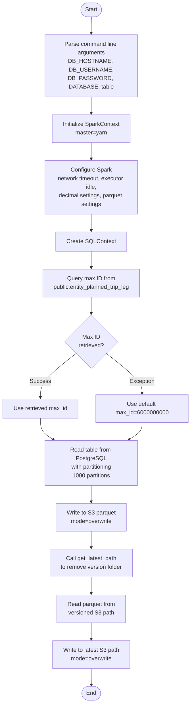
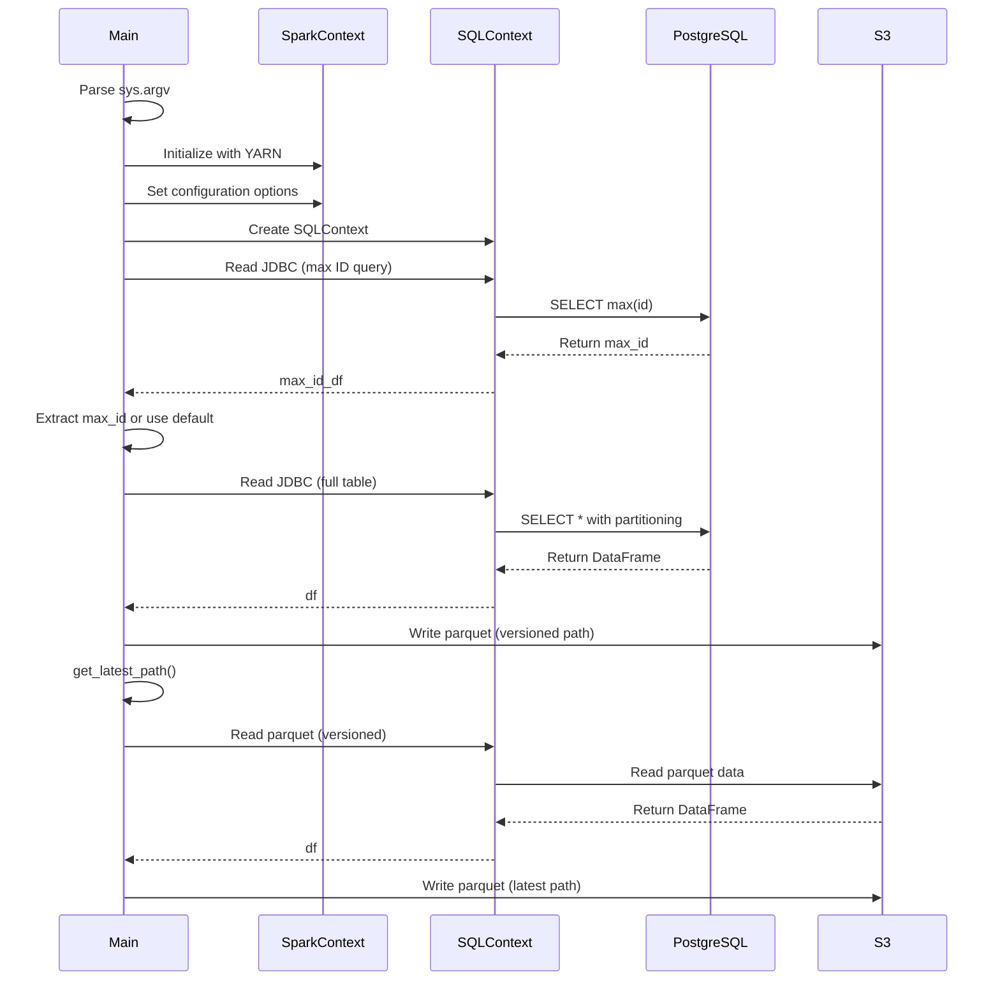

# Diagram: research/orchestrator/tasks/etl/extract_public_entityplannedtripleg_spark.py

> Auto-generated by Obscura crawlers

## Diagram 1

### SVG

<svg id="container" width="539.40625" xmlns="http://www.w3.org/2000/svg" class="flowchart" height="1968.984375" viewBox="0 0 539.40625 1968.984375" role="graphics-document document" aria-roledescription="flowchart-v2"><g><marker id="container_flowchart-v2-pointEnd" class="marker flowchart-v2" viewBox="0 0 10 10" refX="5" refY="5" markerUnits="userSpaceOnUse" markerWidth="8" markerHeight="8" orient="auto"><path d="M 0 0 L 10 5 L 0 10 z" class="arrowMarkerPath" style="stroke-width: 1; stroke-dasharray: 1, 0;"></path></marker><marker id="container_flowchart-v2-pointStart" class="marker flowchart-v2" viewBox="0 0 10 10" refX="4.5" refY="5" markerUnits="userSpaceOnUse" markerWidth="8" markerHeight="8" orient="auto"><path d="M 0 5 L 10 10 L 10 0 z" class="arrowMarkerPath" style="stroke-width: 1; stroke-dasharray: 1, 0;"></path></marker><marker id="container_flowchart-v2-circleEnd" class="marker flowchart-v2" viewBox="0 0 10 10" refX="11" refY="5" markerUnits="userSpaceOnUse" markerWidth="11" markerHeight="11" orient="auto"><circle cx="5" cy="5" r="5" class="arrowMarkerPath" style="stroke-width: 1; stroke-dasharray: 1, 0;"></circle></marker><marker id="container_flowchart-v2-circleStart" class="marker flowchart-v2" viewBox="0 0 10 10" refX="-1" refY="5" markerUnits="userSpaceOnUse" markerWidth="11" markerHeight="11" orient="auto"><circle cx="5" cy="5" r="5" class="arrowMarkerPath" style="stroke-width: 1; stroke-dasharray: 1, 0;"></circle></marker><marker id="container_flowchart-v2-crossEnd" class="marker cross flowchart-v2" viewBox="0 0 11 11" refX="12" refY="5.2" markerUnits="userSpaceOnUse" markerWidth="11" markerHeight="11" orient="auto"><path d="M 1,1 l 9,9 M 10,1 l -9,9" class="arrowMarkerPath" style="stroke-width: 2; stroke-dasharray: 1, 0;"></path></marker><marker id="container_flowchart-v2-crossStart" class="marker cross flowchart-v2" viewBox="0 0 11 11" refX="-1" refY="5.2" markerUnits="userSpaceOnUse" markerWidth="11" markerHeight="11" orient="auto"><path d="M 1,1 l 9,9 M 10,1 l -9,9" class="arrowMarkerPath" style="stroke-width: 2; stroke-dasharray: 1, 0;"></path></marker><g class="root"><g class="clusters"></g><g class="edgePaths"><path d="M258.555,47.5L258.471,51.583C258.388,55.667,258.221,63.833,258.138,71.417C258.055,79,258.055,86,258.055,89.5L258.055,93" id="L_Start_ParseArgs_0" class="edge-thickness-normal edge-pattern-solid edge-thickness-normal edge-pattern-solid flowchart-link" style=";" data-edge="true" data-et="edge" data-id="L_Start_ParseArgs_0" data-points="W3sieCI6MjU4LjU1NDY4NzUsInkiOjQ3LjV9LHsieCI6MjU4LjA1NDY4NzUsInkiOjcyfSx7IngiOjI1OC4wNTQ2ODc1LCJ5Ijo5N31d" marker-end="url(#container_flowchart-v2-pointEnd)"></path><path d="M258.055,271L258.055,275.167C258.055,279.333,258.055,287.667,258.055,295.333C258.055,303,258.055,310,258.055,313.5L258.055,317" id="L_ParseArgs_InitSpark_0" class="edge-thickness-normal edge-pattern-solid edge-thickness-normal edge-pattern-solid flowchart-link" style=";" data-edge="true" data-et="edge" data-id="L_ParseArgs_InitSpark_0" data-points="W3sieCI6MjU4LjA1NDY4NzUsInkiOjI3MX0seyJ4IjoyNTguMDU0Njg3NSwieSI6Mjk2fSx7IngiOjI1OC4wNTQ2ODc1LCJ5IjozMjF9XQ==" marker-end="url(#container_flowchart-v2-pointEnd)"></path><path d="M258.055,399L258.055,403.167C258.055,407.333,258.055,415.667,258.055,423.333C258.055,431,258.055,438,258.055,441.5L258.055,445" id="L_InitSpark_ConfigSpark_0" class="edge-thickness-normal edge-pattern-solid edge-thickness-normal edge-pattern-solid flowchart-link" style=";" data-edge="true" data-et="edge" data-id="L_InitSpark_ConfigSpark_0" data-points="W3sieCI6MjU4LjA1NDY4NzUsInkiOjM5OX0seyJ4IjoyNTguMDU0Njg3NSwieSI6NDI0fSx7IngiOjI1OC4wNTQ2ODc1LCJ5Ijo0NDl9XQ==" marker-end="url(#container_flowchart-v2-pointEnd)"></path><path d="M258.055,599L258.055,603.167C258.055,607.333,258.055,615.667,258.055,623.333C258.055,631,258.055,638,258.055,641.5L258.055,645" id="L_ConfigSpark_CreateSQL_0" class="edge-thickness-normal edge-pattern-solid edge-thickness-normal edge-pattern-solid flowchart-link" style=";" data-edge="true" data-et="edge" data-id="L_ConfigSpark_CreateSQL_0" data-points="W3sieCI6MjU4LjA1NDY4NzUsInkiOjU5OX0seyJ4IjoyNTguMDU0Njg3NSwieSI6NjI0fSx7IngiOjI1OC4wNTQ2ODc1LCJ5Ijo2NDl9XQ==" marker-end="url(#container_flowchart-v2-pointEnd)"></path><path d="M258.055,703L258.055,707.167C258.055,711.333,258.055,719.667,258.055,727.333C258.055,735,258.055,742,258.055,745.5L258.055,749" id="L_CreateSQL_QueryMaxId_0" class="edge-thickness-normal edge-pattern-solid edge-thickness-normal edge-pattern-solid flowchart-link" style=";" data-edge="true" data-et="edge" data-id="L_CreateSQL_QueryMaxId_0" data-points="W3sieCI6MjU4LjA1NDY4NzUsInkiOjcwM30seyJ4IjoyNTguMDU0Njg3NSwieSI6NzI4fSx7IngiOjI1OC4wNTQ2ODc1LCJ5Ijo3NTN9XQ==" marker-end="url(#container_flowchart-v2-pointEnd)"></path><path d="M258.055,831L258.055,835.167C258.055,839.333,258.055,847.667,258.055,855.333C258.055,863,258.055,870,258.055,873.5L258.055,877" id="L_QueryMaxId_CheckMaxId_0" class="edge-thickness-normal edge-pattern-solid edge-thickness-normal edge-pattern-solid flowchart-link" style=";" data-edge="true" data-et="edge" data-id="L_QueryMaxId_CheckMaxId_0" data-points="W3sieCI6MjU4LjA1NDY4NzUsInkiOjgzMX0seyJ4IjoyNTguMDU0Njg3NSwieSI6ODU2fSx7IngiOjI1OC4wNTQ2ODc1LCJ5Ijo4ODF9XQ==" marker-end="url(#container_flowchart-v2-pointEnd)"></path><path d="M215.756,989.685L198.914,1002.902C182.072,1016.118,148.387,1042.551,131.545,1063.268C114.703,1083.984,114.703,1098.984,114.703,1106.484L114.703,1113.984" id="L_CheckMaxId_UseMaxId_0" class="edge-thickness-normal edge-pattern-solid edge-thickness-normal edge-pattern-solid flowchart-link" style=";" data-edge="true" data-et="edge" data-id="L_CheckMaxId_UseMaxId_0" data-points="W3sieCI6MjE1Ljc1NTczMzQxMzEwOTIsInkiOjk4OS42ODU0MjA5MTMxMDkyfSx7IngiOjExNC43MDMxMjUsInkiOjEwNjguOTg0Mzc1fSx7IngiOjExNC43MDMxMjUsInkiOjExMTcuOTg0Mzc1fV0=" marker-end="url(#container_flowchart-v2-pointEnd)"></path><path d="M300.354,989.685L317.196,1002.902C334.038,1016.118,367.722,1042.551,384.564,1061.268C401.406,1079.984,401.406,1090.984,401.406,1096.484L401.406,1101.984" id="L_CheckMaxId_UseDefault_0" class="edge-thickness-normal edge-pattern-solid edge-thickness-normal edge-pattern-solid flowchart-link" style=";" data-edge="true" data-et="edge" data-id="L_CheckMaxId_UseDefault_0" data-points="W3sieCI6MzAwLjM1MzY0MTU4Njg5MDgzLCJ5Ijo5ODkuNjg1NDIwOTEzMTA5Mn0seyJ4Ijo0MDEuNDA2MjUsInkiOjEwNjguOTg0Mzc1fSx7IngiOjQwMS40MDYyNSwieSI6MTEwNS45ODQzNzV9XQ==" marker-end="url(#container_flowchart-v2-pointEnd)"></path><path d="M114.703,1171.984L114.703,1178.151C114.703,1184.318,114.703,1196.651,120.922,1206.636C127.142,1216.62,139.58,1224.256,145.8,1228.074L152.019,1231.892" id="L_UseMaxId_ReadTable_0" class="edge-thickness-normal edge-pattern-solid edge-thickness-normal edge-pattern-solid flowchart-link" style=";" data-edge="true" data-et="edge" data-id="L_UseMaxId_ReadTable_0" data-points="W3sieCI6MTE0LjcwMzEyNSwieSI6MTE3MS45ODQzNzV9LHsieCI6MTE0LjcwMzEyNSwieSI6MTIwOC45ODQzNzV9LHsieCI6MTU1LjQyODAwMDcxMDIyNzI1LCJ5IjoxMjMzLjk4NDM3NX1d" marker-end="url(#container_flowchart-v2-pointEnd)"></path><path d="M401.406,1183.984L401.406,1188.151C401.406,1192.318,401.406,1200.651,395.187,1208.636C388.968,1216.62,376.529,1224.256,370.31,1228.074L364.09,1231.892" id="L_UseDefault_ReadTable_0" class="edge-thickness-normal edge-pattern-solid edge-thickness-normal edge-pattern-solid flowchart-link" style=";" data-edge="true" data-et="edge" data-id="L_UseDefault_ReadTable_0" data-points="W3sieCI6NDAxLjQwNjI1LCJ5IjoxMTgzLjk4NDM3NX0seyJ4Ijo0MDEuNDA2MjUsInkiOjEyMDguOTg0Mzc1fSx7IngiOjM2MC42ODEzNzQyODk3NzI3NSwieSI6MTIzMy45ODQzNzV9XQ==" marker-end="url(#container_flowchart-v2-pointEnd)"></path><path d="M258.055,1359.984L258.055,1364.151C258.055,1368.318,258.055,1376.651,258.055,1384.318C258.055,1391.984,258.055,1398.984,258.055,1402.484L258.055,1405.984" id="L_ReadTable_WriteParquet_0" class="edge-thickness-normal edge-pattern-solid edge-thickness-normal edge-pattern-solid flowchart-link" style=";" data-edge="true" data-et="edge" data-id="L_ReadTable_WriteParquet_0" data-points="W3sieCI6MjU4LjA1NDY4NzUsInkiOjEzNTkuOTg0Mzc1fSx7IngiOjI1OC4wNTQ2ODc1LCJ5IjoxMzg0Ljk4NDM3NX0seyJ4IjoyNTguMDU0Njg3NSwieSI6MTQwOS45ODQzNzV9XQ==" marker-end="url(#container_flowchart-v2-pointEnd)"></path><path d="M258.055,1487.984L258.055,1492.151C258.055,1496.318,258.055,1504.651,258.055,1512.318C258.055,1519.984,258.055,1526.984,258.055,1530.484L258.055,1533.984" id="L_WriteParquet_GetLatestPath_0" class="edge-thickness-normal edge-pattern-solid edge-thickness-normal edge-pattern-solid flowchart-link" style=";" data-edge="true" data-et="edge" data-id="L_WriteParquet_GetLatestPath_0" data-points="W3sieCI6MjU4LjA1NDY4NzUsInkiOjE0ODcuOTg0Mzc1fSx7IngiOjI1OC4wNTQ2ODc1LCJ5IjoxNTEyLjk4NDM3NX0seyJ4IjoyNTguMDU0Njg3NSwieSI6MTUzNy45ODQzNzV9XQ==" marker-end="url(#container_flowchart-v2-pointEnd)"></path><path d="M258.055,1615.984L258.055,1620.151C258.055,1624.318,258.055,1632.651,258.055,1640.318C258.055,1647.984,258.055,1654.984,258.055,1658.484L258.055,1661.984" id="L_GetLatestPath_ReadBack_0" class="edge-thickness-normal edge-pattern-solid edge-thickness-normal edge-pattern-solid flowchart-link" style=";" data-edge="true" data-et="edge" data-id="L_GetLatestPath_ReadBack_0" data-points="W3sieCI6MjU4LjA1NDY4NzUsInkiOjE2MTUuOTg0Mzc1fSx7IngiOjI1OC4wNTQ2ODc1LCJ5IjoxNjQwLjk4NDM3NX0seyJ4IjoyNTguMDU0Njg3NSwieSI6MTY2NS45ODQzNzV9XQ==" marker-end="url(#container_flowchart-v2-pointEnd)"></path><path d="M258.055,1743.984L258.055,1748.151C258.055,1752.318,258.055,1760.651,258.055,1768.318C258.055,1775.984,258.055,1782.984,258.055,1786.484L258.055,1789.984" id="L_ReadBack_WriteLatest_0" class="edge-thickness-normal edge-pattern-solid edge-thickness-normal edge-pattern-solid flowchart-link" style=";" data-edge="true" data-et="edge" data-id="L_ReadBack_WriteLatest_0" data-points="W3sieCI6MjU4LjA1NDY4NzUsInkiOjE3NDMuOTg0Mzc1fSx7IngiOjI1OC4wNTQ2ODc1LCJ5IjoxNzY4Ljk4NDM3NX0seyJ4IjoyNTguMDU0Njg3NSwieSI6MTc5My45ODQzNzV9XQ==" marker-end="url(#container_flowchart-v2-pointEnd)"></path><path d="M258.055,1871.984L258.055,1876.151C258.055,1880.318,258.055,1888.651,258.125,1896.401C258.195,1904.151,258.336,1911.318,258.406,1914.902L258.476,1918.485" id="L_WriteLatest_End_0" class="edge-thickness-normal edge-pattern-solid edge-thickness-normal edge-pattern-solid flowchart-link" style=";" data-edge="true" data-et="edge" data-id="L_WriteLatest_End_0" data-points="W3sieCI6MjU4LjA1NDY4NzUsInkiOjE4NzEuOTg0Mzc1fSx7IngiOjI1OC4wNTQ2ODc1LCJ5IjoxODk2Ljk4NDM3NX0seyJ4IjoyNTguNTU0Njg3NSwieSI6MTkyMi40ODQzNzV9XQ==" marker-end="url(#container_flowchart-v2-pointEnd)"></path></g><g class="edgeLabels"><g class="edgeLabel"><g class="label" data-id="L_Start_ParseArgs_0" transform="translate(0, 0)"><foreignObject width="0" height="0">

</foreignObject></g></g><g class="edgeLabel"><g class="label" data-id="L_ParseArgs_InitSpark_0" transform="translate(0, 0)"><foreignObject width="0" height="0">

</foreignObject></g></g><g class="edgeLabel"><g class="label" data-id="L_InitSpark_ConfigSpark_0" transform="translate(0, 0)"><foreignObject width="0" height="0">

</foreignObject></g></g><g class="edgeLabel"><g class="label" data-id="L_ConfigSpark_CreateSQL_0" transform="translate(0, 0)"><foreignObject width="0" height="0">

</foreignObject></g></g><g class="edgeLabel"><g class="label" data-id="L_CreateSQL_QueryMaxId_0" transform="translate(0, 0)"><foreignObject width="0" height="0">

</foreignObject></g></g><g class="edgeLabel"><g class="label" data-id="L_QueryMaxId_CheckMaxId_0" transform="translate(0, 0)"><foreignObject width="0" height="0">

</foreignObject></g></g><g class="edgeLabel" transform="translate(114.703125, 1068.984375)"><g class="label" data-id="L_CheckMaxId_UseMaxId_0" transform="translate(-28.1015625, -12)"><foreignObject width="56.203125" height="24">

Success

</foreignObject></g></g><g class="edgeLabel" transform="translate(401.40625, 1068.984375)"><g class="label" data-id="L_CheckMaxId_UseDefault_0" transform="translate(-35.375, -12)"><foreignObject width="70.75" height="24">

Exception

</foreignObject></g></g><g class="edgeLabel"><g class="label" data-id="L_UseMaxId_ReadTable_0" transform="translate(0, 0)"><foreignObject width="0" height="0">

</foreignObject></g></g><g class="edgeLabel"><g class="label" data-id="L_UseDefault_ReadTable_0" transform="translate(0, 0)"><foreignObject width="0" height="0">

</foreignObject></g></g><g class="edgeLabel"><g class="label" data-id="L_ReadTable_WriteParquet_0" transform="translate(0, 0)"><foreignObject width="0" height="0">

</foreignObject></g></g><g class="edgeLabel"><g class="label" data-id="L_WriteParquet_GetLatestPath_0" transform="translate(0, 0)"><foreignObject width="0" height="0">

</foreignObject></g></g><g class="edgeLabel"><g class="label" data-id="L_GetLatestPath_ReadBack_0" transform="translate(0, 0)"><foreignObject width="0" height="0">

</foreignObject></g></g><g class="edgeLabel"><g class="label" data-id="L_ReadBack_WriteLatest_0" transform="translate(0, 0)"><foreignObject width="0" height="0">

</foreignObject></g></g><g class="edgeLabel"><g class="label" data-id="L_WriteLatest_End_0" transform="translate(0, 0)"><foreignObject width="0" height="0">

</foreignObject></g></g></g><g class="nodes"><g class="node default" id="flowchart-Start-0" transform="translate(258.0546875, 27.5)"><g class="basic label-container outer-path"><path d="M-10.3984375 -19.5 C-4.5226501598471325 -19.5, 1.353137180305735 -19.5, 10.3984375 -19.5 C10.3984375 -19.5, 10.398437499999998 -19.5, 10.398437499999998 -19.5 C10.88020057706743 -19.48455079581339, 11.361963654134861 -19.46910159162678, 11.6478067896239 -19.45993515863156 C12.130691836989767 -19.41335181886641, 12.613576884355634 -19.36676847910126, 12.892042152847864 -19.3399052695533 C13.294862465179296 -19.274780405373733, 13.697682777510726 -19.209655541194163, 14.126030759676757 -19.140403561325776 C14.477399029242305 -19.06020604668968, 14.828767298807852 -18.980008532053585, 15.34470188623539 -18.862249829261074 C15.692280013207915 -18.75909046565045, 16.03985814018044 -18.655931102039823, 16.543047751460602 -18.50658706670804 C16.972774627296246 -18.34844360404883, 17.402501503131894 -18.190300141389613, 17.716144095147794 -18.074876768247425 C17.99517583323702 -17.951357694977744, 18.274207571326244 -17.827838621708068, 18.85917041279238 -17.568892924097174 C19.154194219805927 -17.414979192949975, 19.449218026819477 -17.261065461802772, 19.967429764076783 -16.990714730406097 C20.340463117493954 -16.76457971937729, 20.713496470911128 -16.53844470834849, 21.036368073605697 -16.342718045390892 C21.409650586536937 -16.082332323509604, 21.78293309946818 -15.821946601628316, 22.061592844578712 -15.627565626425154 C22.348531009528106 -15.398740075623262, 22.6354691744775 -15.16991452482137, 23.03889120850187 -14.848196188198123 C23.358229970627388 -14.558181173676369, 23.67756873275291 -14.268166159154614, 23.964247236767985 -14.007812326905688 C24.1742525770366 -13.790964571319254, 24.384257917305217 -13.574116815732818, 24.833858442968648 -13.10986736009568 C25.067276012526147 -12.835681801057477, 25.30069358208365 -12.561496242019272, 25.644151408126582 -12.158051136245305 C25.834000599337674 -11.903670515639565, 26.023849790548766 -11.649289895033824, 26.391796464640635 -11.156274872382312 C26.599822186562434 -10.836691500782576, 26.80784790848423 -10.517108129182839, 27.073721378604247 -10.108655082055241 C27.227632188743666 -9.835370853493178, 27.381542998883088 -9.562086624931116, 27.6871239742735 -9.019496659696287 C27.827780103441572 -8.72742119791974, 27.968436232609648 -8.435345736143194, 28.22948364880834 -7.893275190886684 C28.3975303766467 -7.4781965241634785, 28.56557710448506 -7.063117857440272, 28.698571729970325 -6.734618561215508 C28.782036218867702 -6.483236818916977, 28.86550070776508 -6.231855076618444, 29.09246063421488 -5.548287939305138 C29.2062304116409 -5.114434469846293, 29.320000189066914 -4.6805810003874475, 29.40953178754556 -4.339158212148133 C29.467776102484986 -4.040085964874499, 29.526020417424412 -3.741013717600865, 29.648482276581777 -3.1121979531509023 C29.708536544109933 -2.6464289132590073, 29.768590811638088 -2.180659873367112, 29.808330202509367 -1.872449005199798 C29.829870895802628 -1.5369353198225917, 29.851411589095886 -1.2014216344453854, 29.888418715913414 -0.6250057626472757 C29.888418715913414 -0.2534895616106421, 29.888418715913414 0.11802663942599145, 29.888418715913414 0.625005762647271 C29.86467150892822 0.9948876798421139, 29.84092430194303 1.3647695970369567, 29.808330202509367 1.8724490051997846 C29.74551992323507 2.359593127958699, 29.68270964396077 2.8467372507176134, 29.648482276581777 3.1121979531508885 C29.569528478463155 3.517609019598875, 29.490574680344533 3.9230200860468614, 29.40953178754556 4.339158212148129 C29.329511999127444 4.644308346182091, 29.249492210709327 4.9494584802160535, 29.092460634214884 5.548287939305125 C28.94225907454895 6.0006711056503255, 28.79205751488302 6.453054271995526, 28.69857172997033 6.734618561215495 C28.58140435310675 7.024024247345666, 28.464236976243168 7.313429933475838, 28.229483648808344 7.893275190886679 C28.021487546237633 8.325183548278414, 27.813491443666923 8.757091905670148, 27.687123974273504 9.019496659696284 C27.564056319882365 9.238015742019083, 27.440988665491226 9.456534824341885, 27.07372137860425 10.108655082055236 C26.825585965636147 10.48985771006222, 26.577450552668044 10.871060338069205, 26.39179646464064 11.156274872382301 C26.204015504973476 11.407884251138947, 26.016234545306315 11.659493629895593, 25.644151408126582 12.158051136245302 C25.364759488309176 12.486240783113432, 25.08536756849177 12.814430429981563, 24.83385844296866 13.10986736009567 C24.61451933477601 13.336352997380267, 24.395180226583363 13.562838634664862, 23.96424723676799 14.007812326905684 C23.748064183747893 14.204144055768394, 23.531881130727797 14.400475784631103, 23.038891208501887 14.848196188198111 C22.78105471900762 15.053813927252644, 22.523218229513358 15.25943166630718, 22.061592844578715 15.627565626425152 C21.758539050539582 15.838962834159549, 21.455485256500452 16.050360041893946, 21.036368073605708 16.34271804539089 C20.676282804493955 16.561003851622356, 20.316197535382205 16.779289657853823, 19.967429764076787 16.990714730406093 C19.720526663774628 17.119523919684745, 19.47362356347247 17.2483331089634, 18.859170412792388 17.56889292409717 C18.626519082652052 17.671880766593794, 18.393867752511717 17.77486860909042, 17.716144095147804 18.07487676824742 C17.26376581842546 18.241356155820192, 16.811387541703116 18.407835543392963, 16.543047751460616 18.506587066708033 C16.205476974765567 18.606776301285958, 15.867906198070514 18.706965535863887, 15.344701886235413 18.86224982926107 C15.050382246664018 18.929426366378102, 14.756062607092623 18.996602903495134, 14.126030759676766 19.140403561325773 C13.820764250294829 19.189756683185507, 13.51549774091289 19.239109805045242, 12.892042152847878 19.3399052695533 C12.47832695130762 19.37981587748056, 12.064611749767362 19.419726485407825, 11.6478067896239 19.45993515863156 C11.15319697138551 19.475796332802858, 10.658587153147119 19.491657506974153, 10.398437500000004 19.5 C10.398437500000002 19.5, 10.3984375 19.5, 10.3984375 19.5 C3.1529809971177603 19.5, -4.0924755057644795 19.5, -10.398437499999996 19.5 C-10.74380975816988 19.48892458390681, -11.089182016339764 19.477849167813623, -11.647806789623893 19.45993515863156 C-12.051953885775148 19.420947574323844, -12.456100981926406 19.381959990016128, -12.892042152847871 19.3399052695533 C-13.338463027725087 19.26773140454874, -13.784883902602303 19.195557539544183, -14.126030759676759 19.140403561325773 C-14.586993722436407 19.035191773140333, -15.047956685196056 18.929979984954894, -15.344701886235388 18.862249829261074 C-15.75761718549985 18.73969873587602, -16.170532484764312 18.617147642490963, -16.54304775146059 18.506587066708043 C-16.867773789198058 18.387084883086068, -17.192499826935528 18.267582699464093, -17.716144095147797 18.074876768247425 C-17.959967402965354 17.96694342263804, -18.203790710782908 17.859010077028653, -18.85917041279238 17.568892924097174 C-19.179150931710076 17.401959292335118, -19.49913145062777 17.235025660573058, -19.96742976407678 16.990714730406097 C-20.21430605848965 16.84105686992687, -20.461182352902526 16.691399009447643, -21.036368073605686 16.3427180453909 C-21.254511672885577 16.19055051381746, -21.472655272165472 16.038382982244023, -22.061592844578712 15.627565626425156 C-22.34504682851472 15.401518617263488, -22.628500812450728 15.175471608101821, -23.03889120850187 14.848196188198125 C-23.308926793389066 14.602957014753628, -23.578962378276266 14.35771784130913, -23.964247236767974 14.007812326905697 C-24.196638925662032 13.76784882841009, -24.42903061455609 13.527885329914483, -24.833858442968655 13.109867360095677 C-25.074733140343923 12.826922234400126, -25.315607837719195 12.543977108704574, -25.64415140812658 12.158051136245307 C-25.91057837091807 11.80106327810034, -26.177005333709563 11.444075419955375, -26.391796464640635 11.156274872382316 C-26.643449426078718 10.769668345331423, -26.895102387516797 10.383061818280533, -27.073721378604244 10.108655082055249 C-27.203204970353756 9.878743853268551, -27.332688562103264 9.648832624481855, -27.6871239742735 9.019496659696289 C-27.86093294057239 8.658578622260526, -28.03474190687128 8.297660584824765, -28.22948364880834 7.893275190886686 C-28.353773970776274 7.586275692635993, -28.478064292744204 7.279276194385298, -28.698571729970325 6.73461856121551 C-28.80486640626358 6.41447593197697, -28.911161082556834 6.094333302738429, -29.09246063421488 5.5482879393051325 C-29.191873650884453 5.169183020870081, -29.291286667554026 4.790078102435029, -29.409531787545557 4.339158212148136 C-29.474029793333173 4.007974584087083, -29.53852779912079 3.6767909560260295, -29.648482276581777 3.112197953150904 C-29.68773969877388 2.807725138883821, -29.72699712096598 2.5032523246167377, -29.808330202509364 1.872449005199809 C-29.840202843738833 1.3760068909178678, -29.872075484968306 0.8795647766359264, -29.888418715913414 0.6250057626472781 C-29.888418715913414 0.2934457845008408, -29.888418715913414 -0.03811419364559654, -29.888418715913414 -0.6250057626472687 C-29.863692094297804 -1.010142853280145, -29.838965472682194 -1.3952799439130215, -29.808330202509367 -1.8724490051997822 C-29.748070877467068 -2.339808430678204, -29.687811552424765 -2.8071678561566253, -29.648482276581777 -3.112197953150895 C-29.555474304342816 -3.5897742333560694, -29.462466332103855 -4.0673505135612436, -29.40953178754556 -4.339158212148126 C-29.30570554641886 -4.73509266814179, -29.20187930529216 -5.1310271241354535, -29.092460634214884 -5.548287939305123 C-28.9647468490298 -5.932941511854295, -28.837033063844718 -6.317595084403468, -28.698571729970332 -6.734618561215485 C-28.60297184484057 -6.970752125784039, -28.507371959710806 -7.2068856903525935, -28.229483648808344 -7.893275190886676 C-28.043730244207943 -8.27899611002557, -27.85797683960754 -8.664717029164462, -27.687123974273504 -9.019496659696282 C-27.554342312952205 -9.25526394497345, -27.421560651630905 -9.491031230250618, -27.073721378604247 -10.108655082055243 C-26.801752731112053 -10.526471958410804, -26.52978408361986 -10.944288834766365, -26.39179646464064 -11.156274872382308 C-26.23591154431214 -11.36514646421411, -26.080026623983635 -11.574018056045912, -25.644151408126586 -12.158051136245302 C-25.417897961420703 -12.42382130893186, -25.19164451471482 -12.689591481618418, -24.833858442968662 -13.10986736009567 C-24.532955512408517 -13.420574340489061, -24.23205258184837 -13.731281320882454, -23.964247236767996 -14.007812326905677 C-23.708147708470715 -14.240395142483063, -23.452048180173435 -14.472977958060449, -23.038891208501887 -14.848196188198107 C-22.693693226939107 -15.123482392390345, -22.348495245376327 -15.398768596582583, -22.06159284457872 -15.627565626425149 C-21.780914285654323 -15.823354838751822, -21.50023572672993 -16.019144051078495, -21.03636807360571 -16.342718045390885 C-20.6470903768088 -16.578700472838843, -20.257812680011888 -16.814682900286805, -19.96742976407679 -16.99071473040609 C-19.65481277323807 -17.15380681428591, -19.34219578239935 -17.316898898165732, -18.859170412792388 -17.56889292409717 C-18.552083632335222 -17.704831132399875, -18.244996851878057 -17.840769340702575, -17.716144095147804 -18.07487676824742 C-17.367571102814328 -18.20315485159956, -17.01899811048085 -18.3314329349517, -16.54304775146062 -18.506587066708033 C-16.277694045122796 -18.58534265387907, -16.012340338784973 -18.66409824105011, -15.344701886235413 -18.862249829261067 C-14.969486167891 -18.947890368461792, -14.594270449546588 -19.033530907662517, -14.126030759676768 -19.140403561325773 C-13.849715070499276 -19.185076139091816, -13.573399381321785 -19.22974871685786, -12.89204215284788 -19.3399052695533 C-12.547328857613458 -19.373159346566172, -12.202615562379036 -19.406413423579043, -11.647806789623903 -19.45993515863156 C-11.167562777323958 -19.475335649367754, -10.687318765024015 -19.49073614010395, -10.398437500000005 -19.5 C-10.398437500000004 -19.5, -10.398437500000002 -19.5, -10.3984375 -19.5" stroke="none" stroke-width="0" fill="#ECECFF" style=""></path><path d="M-10.3984375 -19.5 C-4.694313759873133 -19.5, 1.0098099802537348 -19.5, 10.3984375 -19.5 M-10.3984375 -19.5 C-5.546486392646886 -19.5, -0.6945352852937727 -19.5, 10.3984375 -19.5 M10.3984375 -19.5 C10.3984375 -19.5, 10.398437499999998 -19.5, 10.398437499999998 -19.5 M10.3984375 -19.5 C10.3984375 -19.5, 10.3984375 -19.5, 10.398437499999998 -19.5 M10.398437499999998 -19.5 C10.83381306676853 -19.486038352980867, 11.26918863353706 -19.47207670596173, 11.6478067896239 -19.45993515863156 M10.398437499999998 -19.5 C10.741576042603874 -19.488996214817348, 11.084714585207752 -19.4779924296347, 11.6478067896239 -19.45993515863156 M11.6478067896239 -19.45993515863156 C12.062108099508187 -19.419968009537246, 12.476409409392472 -19.380000860442934, 12.892042152847864 -19.3399052695533 M11.6478067896239 -19.45993515863156 C12.119120496490046 -19.414468092167844, 12.590434203356192 -19.36900102570413, 12.892042152847864 -19.3399052695533 M12.892042152847864 -19.3399052695533 C13.32909753027549 -19.269245545545875, 13.766152907703118 -19.198585821538448, 14.126030759676757 -19.140403561325776 M12.892042152847864 -19.3399052695533 C13.182393061396981 -19.292963586364003, 13.472743969946098 -19.246021903174707, 14.126030759676757 -19.140403561325776 M14.126030759676757 -19.140403561325776 C14.426259050115135 -19.071878413205905, 14.726487340553515 -19.003353265086034, 15.34470188623539 -18.862249829261074 M14.126030759676757 -19.140403561325776 C14.464171514516863 -19.06322514060816, 14.802312269356971 -18.98604671989055, 15.34470188623539 -18.862249829261074 M15.34470188623539 -18.862249829261074 C15.679163249512712 -18.76298345226389, 16.013624612790032 -18.6637170752667, 16.543047751460602 -18.50658706670804 M15.34470188623539 -18.862249829261074 C15.816146141555766 -18.72232764894338, 16.28759039687614 -18.58240546862569, 16.543047751460602 -18.50658706670804 M16.543047751460602 -18.50658706670804 C16.879515651182086 -18.382763769335362, 17.215983550903566 -18.25894047196269, 17.716144095147794 -18.074876768247425 M16.543047751460602 -18.50658706670804 C16.846867283444784 -18.394778670460894, 17.150686815428962 -18.28297027421375, 17.716144095147794 -18.074876768247425 M17.716144095147794 -18.074876768247425 C18.057522021513 -17.923758886861933, 18.39889994787821 -17.772641005476444, 18.85917041279238 -17.568892924097174 M17.716144095147794 -18.074876768247425 C17.971336122391758 -17.961910827789048, 18.226528149635726 -17.848944887330667, 18.85917041279238 -17.568892924097174 M18.85917041279238 -17.568892924097174 C19.231479721004078 -17.374659396478627, 19.603789029215775 -17.180425868860077, 19.967429764076783 -16.990714730406097 M18.85917041279238 -17.568892924097174 C19.171967989774142 -17.4057066285422, 19.4847655667559 -17.242520332987226, 19.967429764076783 -16.990714730406097 M19.967429764076783 -16.990714730406097 C20.23601937512575 -16.827894129780457, 20.50460898617472 -16.665073529154817, 21.036368073605697 -16.342718045390892 M19.967429764076783 -16.990714730406097 C20.35385646925252 -16.75646059083318, 20.740283174428257 -16.52220645126026, 21.036368073605697 -16.342718045390892 M21.036368073605697 -16.342718045390892 C21.321002155106903 -16.14416963174645, 21.605636236608106 -15.945621218102008, 22.061592844578712 -15.627565626425154 M21.036368073605697 -16.342718045390892 C21.42888261527048 -16.06891689280619, 21.821397156935266 -15.79511574022149, 22.061592844578712 -15.627565626425154 M22.061592844578712 -15.627565626425154 C22.40357793835001 -15.35484161474809, 22.74556303212131 -15.082117603071024, 23.03889120850187 -14.848196188198123 M22.061592844578712 -15.627565626425154 C22.38207416790517 -15.371990299438485, 22.70255549123163 -15.116414972451816, 23.03889120850187 -14.848196188198123 M23.03889120850187 -14.848196188198123 C23.299478438946114 -14.611537760268957, 23.56006566939036 -14.37487933233979, 23.964247236767985 -14.007812326905688 M23.03889120850187 -14.848196188198123 C23.316781760728244 -14.595823341247234, 23.594672312954618 -14.343450494296345, 23.964247236767985 -14.007812326905688 M23.964247236767985 -14.007812326905688 C24.159659804070348 -13.80603280749585, 24.355072371372714 -13.604253288086012, 24.833858442968648 -13.10986736009568 M23.964247236767985 -14.007812326905688 C24.26062798662729 -13.701774869363852, 24.557008736486598 -13.395737411822017, 24.833858442968648 -13.10986736009568 M24.833858442968648 -13.10986736009568 C25.066442214790506 -12.836661227322198, 25.299025986612364 -12.563455094548715, 25.644151408126582 -12.158051136245305 M24.833858442968648 -13.10986736009568 C25.151084260186664 -12.73723586453105, 25.46831007740468 -12.364604368966416, 25.644151408126582 -12.158051136245305 M25.644151408126582 -12.158051136245305 C25.859014574314767 -11.870154067990258, 26.073877740502954 -11.582256999735213, 26.391796464640635 -11.156274872382312 M25.644151408126582 -12.158051136245305 C25.926893234322687 -11.779202847452787, 26.209635060518796 -11.400354558660267, 26.391796464640635 -11.156274872382312 M26.391796464640635 -11.156274872382312 C26.56196170935845 -10.894855360729531, 26.732126954076264 -10.63343584907675, 27.073721378604247 -10.108655082055241 M26.391796464640635 -11.156274872382312 C26.601971030827848 -10.833390298945416, 26.812145597015064 -10.510505725508521, 27.073721378604247 -10.108655082055241 M27.073721378604247 -10.108655082055241 C27.311511498663243 -9.686434645029813, 27.549301618722243 -9.264214208004386, 27.6871239742735 -9.019496659696287 M27.073721378604247 -10.108655082055241 C27.31370845964778 -9.682533718335344, 27.553695540691315 -9.256412354615449, 27.6871239742735 -9.019496659696287 M27.6871239742735 -9.019496659696287 C27.884719599967575 -8.609185115073446, 28.08231522566165 -8.198873570450605, 28.22948364880834 -7.893275190886684 M27.6871239742735 -9.019496659696287 C27.879658513923797 -8.619694568533241, 28.072193053574093 -8.219892477370195, 28.22948364880834 -7.893275190886684 M28.22948364880834 -7.893275190886684 C28.352022470735378 -7.590601931599952, 28.474561292662415 -7.28792867231322, 28.698571729970325 -6.734618561215508 M28.22948364880834 -7.893275190886684 C28.392162348615617 -7.491455657184015, 28.554841048422894 -7.0896361234813465, 28.698571729970325 -6.734618561215508 M28.698571729970325 -6.734618561215508 C28.837524787754557 -6.316114090332603, 28.97647784553879 -5.8976096194497, 29.09246063421488 -5.548287939305138 M28.698571729970325 -6.734618561215508 C28.831269135910972 -6.334955116982718, 28.963966541851615 -5.935291672749927, 29.09246063421488 -5.548287939305138 M29.09246063421488 -5.548287939305138 C29.204052954478808 -5.122738057721246, 29.315645274742735 -4.697188176137354, 29.40953178754556 -4.339158212148133 M29.09246063421488 -5.548287939305138 C29.18926624397983 -5.179126193454711, 29.286071853744783 -4.809964447604284, 29.40953178754556 -4.339158212148133 M29.40953178754556 -4.339158212148133 C29.494115012946327 -3.9048412263862176, 29.578698238347094 -3.4705242406243024, 29.648482276581777 -3.1121979531509023 M29.40953178754556 -4.339158212148133 C29.473140833814508 -4.01253920333377, 29.53674988008346 -3.6859201945194062, 29.648482276581777 -3.1121979531509023 M29.648482276581777 -3.1121979531509023 C29.701023182579554 -2.7047010616075733, 29.75356408857733 -2.2972041700642443, 29.808330202509367 -1.872449005199798 M29.648482276581777 -3.1121979531509023 C29.687735266477176 -2.8077595149017758, 29.72698825637258 -2.5033210766526492, 29.808330202509367 -1.872449005199798 M29.808330202509367 -1.872449005199798 C29.83290863017515 -1.4896201549554777, 29.857487057840935 -1.1067913047111575, 29.888418715913414 -0.6250057626472757 M29.808330202509367 -1.872449005199798 C29.82936093790838 -1.5448783256560967, 29.850391673307392 -1.2173076461123955, 29.888418715913414 -0.6250057626472757 M29.888418715913414 -0.6250057626472757 C29.888418715913414 -0.26626650864041346, 29.888418715913414 0.09247274536644878, 29.888418715913414 0.625005762647271 M29.888418715913414 -0.6250057626472757 C29.888418715913414 -0.21814672444665995, 29.888418715913414 0.1887123137539558, 29.888418715913414 0.625005762647271 M29.888418715913414 0.625005762647271 C29.869868812136225 0.9139354871898344, 29.851318908359033 1.2028652117323977, 29.808330202509367 1.8724490051997846 M29.888418715913414 0.625005762647271 C29.866989286272233 0.9587864268329301, 29.845559856631052 1.2925670910185891, 29.808330202509367 1.8724490051997846 M29.808330202509367 1.8724490051997846 C29.75340198584916 2.2984614068131193, 29.69847376918895 2.724473808426454, 29.648482276581777 3.1121979531508885 M29.808330202509367 1.8724490051997846 C29.758568264673766 2.2583927684466216, 29.708806326838165 2.6443365316934586, 29.648482276581777 3.1121979531508885 M29.648482276581777 3.1121979531508885 C29.564691265488996 3.5424470858758563, 29.480900254396214 3.972696218600824, 29.40953178754556 4.339158212148129 M29.648482276581777 3.1121979531508885 C29.58222592296882 3.4524103256681213, 29.515969569355867 3.7926226981853546, 29.40953178754556 4.339158212148129 M29.40953178754556 4.339158212148129 C29.332063259544682 4.634579284487892, 29.254594731543808 4.930000356827657, 29.092460634214884 5.548287939305125 M29.40953178754556 4.339158212148129 C29.300986315974754 4.753089139152574, 29.19244084440395 5.16702006615702, 29.092460634214884 5.548287939305125 M29.092460634214884 5.548287939305125 C28.99814370608651 5.832355499466053, 28.90382677795813 6.116423059626981, 28.69857172997033 6.734618561215495 M29.092460634214884 5.548287939305125 C28.970806255136296 5.914691546096792, 28.849151876057707 6.281095152888458, 28.69857172997033 6.734618561215495 M28.69857172997033 6.734618561215495 C28.54591236612274 7.111690141387053, 28.393253002275152 7.488761721558611, 28.229483648808344 7.893275190886679 M28.69857172997033 6.734618561215495 C28.538545206541556 7.129887167986922, 28.37851868311278 7.525155774758351, 28.229483648808344 7.893275190886679 M28.229483648808344 7.893275190886679 C28.045677661546314 8.27495225625439, 27.86187167428428 8.656629321622098, 27.687123974273504 9.019496659696284 M28.229483648808344 7.893275190886679 C28.028404264424932 8.31082083496843, 27.82732488004152 8.72836647905018, 27.687123974273504 9.019496659696284 M27.687123974273504 9.019496659696284 C27.493635164492073 9.363055634329783, 27.30014635471064 9.706614608963282, 27.07372137860425 10.108655082055236 M27.687123974273504 9.019496659696284 C27.524543857515035 9.308174120022958, 27.36196374075656 9.596851580349634, 27.07372137860425 10.108655082055236 M27.07372137860425 10.108655082055236 C26.819545581526793 10.499137362124435, 26.565369784449334 10.889619642193633, 26.39179646464064 11.156274872382301 M27.07372137860425 10.108655082055236 C26.890964530100337 10.389418678442508, 26.708207681596424 10.670182274829783, 26.39179646464064 11.156274872382301 M26.39179646464064 11.156274872382301 C26.2307093027772 11.37211699393697, 26.069622140913754 11.587959115491639, 25.644151408126582 12.158051136245302 M26.39179646464064 11.156274872382301 C26.168001975507256 11.456139099723657, 25.94420748637387 11.756003327065013, 25.644151408126582 12.158051136245302 M25.644151408126582 12.158051136245302 C25.362974557508522 12.488337464397318, 25.081797706890463 12.818623792549335, 24.83385844296866 13.10986736009567 M25.644151408126582 12.158051136245302 C25.423292523578507 12.417484549262015, 25.20243363903043 12.676917962278731, 24.83385844296866 13.10986736009567 M24.83385844296866 13.10986736009567 C24.547352600524455 13.405708164986436, 24.260846758080252 13.701548969877202, 23.96424723676799 14.007812326905684 M24.83385844296866 13.10986736009567 C24.6521312300246 13.297515627542067, 24.470404017080543 13.485163894988466, 23.96424723676799 14.007812326905684 M23.96424723676799 14.007812326905684 C23.70554787843822 14.242756239330843, 23.446848520108453 14.477700151756002, 23.038891208501887 14.848196188198111 M23.96424723676799 14.007812326905684 C23.688768943165353 14.25799442439936, 23.413290649562718 14.508176521893038, 23.038891208501887 14.848196188198111 M23.038891208501887 14.848196188198111 C22.82086598719599 15.022065500294762, 22.602840765890093 15.19593481239141, 22.061592844578715 15.627565626425152 M23.038891208501887 14.848196188198111 C22.691986934845215 15.124843114928888, 22.34508266118854 15.401490041659665, 22.061592844578715 15.627565626425152 M22.061592844578715 15.627565626425152 C21.67717372835228 15.895719760669383, 21.292754612125844 16.163873894913614, 21.036368073605708 16.34271804539089 M22.061592844578715 15.627565626425152 C21.78829676090985 15.818205143595769, 21.515000677240987 16.008844660766385, 21.036368073605708 16.34271804539089 M21.036368073605708 16.34271804539089 C20.640683345302815 16.58258445298967, 20.244998616999922 16.82245086058845, 19.967429764076787 16.990714730406093 M21.036368073605708 16.34271804539089 C20.80490266313118 16.483033737462282, 20.573437252656657 16.623349429533675, 19.967429764076787 16.990714730406093 M19.967429764076787 16.990714730406093 C19.68624734117661 17.13740742032718, 19.40506491827643 17.284100110248264, 18.859170412792388 17.56889292409717 M19.967429764076787 16.990714730406093 C19.655946621832495 17.153215286200467, 19.3444634795882 17.31571584199484, 18.859170412792388 17.56889292409717 M18.859170412792388 17.56889292409717 C18.605085538492553 17.68136876078971, 18.351000664192714 17.793844597482245, 17.716144095147804 18.07487676824742 M18.859170412792388 17.56889292409717 C18.621205763302697 17.674232815455735, 18.383241113813003 17.7795727068143, 17.716144095147804 18.07487676824742 M17.716144095147804 18.07487676824742 C17.320287098219715 18.220555802378925, 16.924430101291623 18.366234836510426, 16.543047751460616 18.506587066708033 M17.716144095147804 18.07487676824742 C17.30936987363916 18.224573441942287, 16.90259565213051 18.374270115637152, 16.543047751460616 18.506587066708033 M16.543047751460616 18.506587066708033 C16.202140797770227 18.607766461106227, 15.861233844079837 18.708945855504417, 15.344701886235413 18.86224982926107 M16.543047751460616 18.506587066708033 C16.222273004418344 18.601791327849174, 15.901498257376074 18.696995588990312, 15.344701886235413 18.86224982926107 M15.344701886235413 18.86224982926107 C15.073133048846167 18.924233644242886, 14.801564211456919 18.9862174592247, 14.126030759676766 19.140403561325773 M15.344701886235413 18.86224982926107 C15.006021390686922 18.939551442273235, 14.667340895138432 19.0168530552854, 14.126030759676766 19.140403561325773 M14.126030759676766 19.140403561325773 C13.847770533941484 19.185390516682375, 13.569510308206203 19.230377472038974, 12.892042152847878 19.3399052695533 M14.126030759676766 19.140403561325773 C13.74076967020132 19.202689586527793, 13.355508580725875 19.264975611729813, 12.892042152847878 19.3399052695533 M12.892042152847878 19.3399052695533 C12.486984439651739 19.37898069999216, 12.081926726455597 19.418056130431015, 11.6478067896239 19.45993515863156 M12.892042152847878 19.3399052695533 C12.478315347080652 19.37981699692638, 12.064588541313427 19.419728724299464, 11.6478067896239 19.45993515863156 M11.6478067896239 19.45993515863156 C11.221287022608301 19.473612817389387, 10.794767255592703 19.487290476147212, 10.398437500000004 19.5 M11.6478067896239 19.45993515863156 C11.245096902438029 19.472849280886365, 10.842387015252157 19.485763403141174, 10.398437500000004 19.5 M10.398437500000004 19.5 C10.398437500000004 19.5, 10.398437500000002 19.5, 10.3984375 19.5 M10.398437500000004 19.5 C10.398437500000002 19.5, 10.398437500000002 19.5, 10.3984375 19.5 M10.3984375 19.5 C3.564157121388578 19.5, -3.270123257222844 19.5, -10.398437499999996 19.5 M10.3984375 19.5 C5.825262317801261 19.5, 1.2520871356025225 19.5, -10.398437499999996 19.5 M-10.398437499999996 19.5 C-10.721049535670662 19.489654459942276, -11.04366157134133 19.479308919884552, -11.647806789623893 19.45993515863156 M-10.398437499999996 19.5 C-10.862678680061416 19.48511268894607, -11.326919860122837 19.470225377892138, -11.647806789623893 19.45993515863156 M-11.647806789623893 19.45993515863156 C-11.919051799343368 19.433768478763774, -12.190296809062843 19.407601798895985, -12.892042152847871 19.3399052695533 M-11.647806789623893 19.45993515863156 C-11.963559040314871 19.42947491875504, -12.27931129100585 19.399014678878522, -12.892042152847871 19.3399052695533 M-12.892042152847871 19.3399052695533 C-13.332970881660444 19.268619332132243, -13.773899610473016 19.197333394711187, -14.126030759676759 19.140403561325773 M-12.892042152847871 19.3399052695533 C-13.364114925441834 19.263584204659335, -13.836187698035797 19.18726313976537, -14.126030759676759 19.140403561325773 M-14.126030759676759 19.140403561325773 C-14.409502002264604 19.07570310002783, -14.692973244852448 19.011002638729888, -15.344701886235388 18.862249829261074 M-14.126030759676759 19.140403561325773 C-14.406921211807122 19.07629214860852, -14.687811663937484 19.012180735891263, -15.344701886235388 18.862249829261074 M-15.344701886235388 18.862249829261074 C-15.742443775352145 18.744202124361003, -16.140185664468902 18.626154419460928, -16.54304775146059 18.506587066708043 M-15.344701886235388 18.862249829261074 C-15.602008320266496 18.785882630269676, -15.859314754297605 18.709515431278277, -16.54304775146059 18.506587066708043 M-16.54304775146059 18.506587066708043 C-16.891284461038904 18.37843273851837, -17.23952117061722 18.250278410328693, -17.716144095147797 18.074876768247425 M-16.54304775146059 18.506587066708043 C-16.990340512935283 18.341979195756394, -17.437633274409976 18.177371324804746, -17.716144095147797 18.074876768247425 M-17.716144095147797 18.074876768247425 C-18.139867007393974 17.887307204289645, -18.56358991964015 17.699737640331865, -18.85917041279238 17.568892924097174 M-17.716144095147797 18.074876768247425 C-17.982001845981042 17.957189428343522, -18.24785959681429 17.839502088439616, -18.85917041279238 17.568892924097174 M-18.85917041279238 17.568892924097174 C-19.167033427855056 17.40828098633465, -19.474896442917732 17.247669048572124, -19.96742976407678 16.990714730406097 M-18.85917041279238 17.568892924097174 C-19.140479623581424 17.422134089015678, -19.42178883437047 17.275375253934182, -19.96742976407678 16.990714730406097 M-19.96742976407678 16.990714730406097 C-20.194008404612763 16.853361426989295, -20.420587045148743 16.716008123572497, -21.036368073605686 16.3427180453909 M-19.96742976407678 16.990714730406097 C-20.217032208379468 16.83940426184303, -20.46663465268216 16.68809379327996, -21.036368073605686 16.3427180453909 M-21.036368073605686 16.3427180453909 C-21.32316584999063 16.142660331860405, -21.609963626375578 15.942602618329907, -22.061592844578712 15.627565626425156 M-21.036368073605686 16.3427180453909 C-21.401989823966186 16.087676139849894, -21.76761157432669 15.832634234308887, -22.061592844578712 15.627565626425156 M-22.061592844578712 15.627565626425156 C-22.373641391340524 15.378715214343185, -22.685689938102335 15.129864802261213, -23.03889120850187 14.848196188198125 M-22.061592844578712 15.627565626425156 C-22.375376776140325 15.377331291145872, -22.68916070770194 15.127096955866586, -23.03889120850187 14.848196188198125 M-23.03889120850187 14.848196188198125 C-23.27128625988026 14.637141151372385, -23.503681311258653 14.426086114546642, -23.964247236767974 14.007812326905697 M-23.03889120850187 14.848196188198125 C-23.288669414886026 14.621354229929226, -23.538447621270183 14.394512271660325, -23.964247236767974 14.007812326905697 M-23.964247236767974 14.007812326905697 C-24.306948268348794 13.653945375520545, -24.649649299929617 13.30007842413539, -24.833858442968655 13.109867360095677 M-23.964247236767974 14.007812326905697 C-24.1791306276152 13.785927583601447, -24.39401401846243 13.564042840297196, -24.833858442968655 13.109867360095677 M-24.833858442968655 13.109867360095677 C-25.13065931498588 12.7612281673762, -25.427460187003103 12.41258897465672, -25.64415140812658 12.158051136245307 M-24.833858442968655 13.109867360095677 C-25.04421697993996 12.862768252829337, -25.25457551691127 12.615669145562997, -25.64415140812658 12.158051136245307 M-25.64415140812658 12.158051136245307 C-25.87863880741503 11.843859383440321, -26.11312620670348 11.529667630635336, -26.391796464640635 11.156274872382316 M-25.64415140812658 12.158051136245307 C-25.852588050646567 11.878765024237298, -26.06102469316655 11.59947891222929, -26.391796464640635 11.156274872382316 M-26.391796464640635 11.156274872382316 C-26.647517084448936 10.763419329755557, -26.903237704257236 10.370563787128797, -27.073721378604244 10.108655082055249 M-26.391796464640635 11.156274872382316 C-26.62622263896496 10.7961333163782, -26.860648813289288 10.435991760374081, -27.073721378604244 10.108655082055249 M-27.073721378604244 10.108655082055249 C-27.215470852887425 9.856964536774727, -27.35722032717061 9.605273991494204, -27.6871239742735 9.019496659696289 M-27.073721378604244 10.108655082055249 C-27.293150293714973 9.719036823689082, -27.512579208825706 9.329418565322916, -27.6871239742735 9.019496659696289 M-27.6871239742735 9.019496659696289 C-27.865589357958665 8.648909471926551, -28.044054741643833 8.278322284156813, -28.22948364880834 7.893275190886686 M-27.6871239742735 9.019496659696289 C-27.832907070009117 8.71677494214273, -27.978690165744734 8.41405322458917, -28.22948364880834 7.893275190886686 M-28.22948364880834 7.893275190886686 C-28.406656757180208 7.455654187799153, -28.583829865552076 7.018033184711619, -28.698571729970325 6.73461856121551 M-28.22948364880834 7.893275190886686 C-28.358978829731864 7.573419590386578, -28.48847401065539 7.253563989886469, -28.698571729970325 6.73461856121551 M-28.698571729970325 6.73461856121551 C-28.85311641908987 6.269154580939735, -29.007661108209412 5.803690600663961, -29.09246063421488 5.5482879393051325 M-28.698571729970325 6.73461856121551 C-28.846778104942477 6.288244573278461, -28.99498447991463 5.841870585341413, -29.09246063421488 5.5482879393051325 M-29.09246063421488 5.5482879393051325 C-29.20297462333882 5.126850201709673, -29.313488612462766 4.705412464114214, -29.409531787545557 4.339158212148136 M-29.09246063421488 5.5482879393051325 C-29.185624830117323 5.193012482711192, -29.27878902601977 4.837737026117252, -29.409531787545557 4.339158212148136 M-29.409531787545557 4.339158212148136 C-29.494420963727308 3.9032702337885903, -29.579310139909058 3.4673822554290443, -29.648482276581777 3.112197953150904 M-29.409531787545557 4.339158212148136 C-29.484945482570403 3.9519248268856484, -29.56035917759525 3.5646914416231614, -29.648482276581777 3.112197953150904 M-29.648482276581777 3.112197953150904 C-29.693628958288024 2.762049205057947, -29.738775639994266 2.411900456964989, -29.808330202509364 1.872449005199809 M-29.648482276581777 3.112197953150904 C-29.7023968659306 2.6940470448013385, -29.756311455279416 2.275896136451773, -29.808330202509364 1.872449005199809 M-29.808330202509364 1.872449005199809 C-29.824967899892695 1.613303438746843, -29.841605597276022 1.354157872293877, -29.888418715913414 0.6250057626472781 M-29.808330202509364 1.872449005199809 C-29.83328179962001 1.4838077396347962, -29.858233396730657 1.095166474069783, -29.888418715913414 0.6250057626472781 M-29.888418715913414 0.6250057626472781 C-29.888418715913414 0.14800275409596936, -29.888418715913414 -0.3290002544553394, -29.888418715913414 -0.6250057626472687 M-29.888418715913414 0.6250057626472781 C-29.888418715913414 0.2460368988779732, -29.888418715913414 -0.13293196489133174, -29.888418715913414 -0.6250057626472687 M-29.888418715913414 -0.6250057626472687 C-29.865908102129136 -0.9756267425778136, -29.843397488344856 -1.3262477225083584, -29.808330202509367 -1.8724490051997822 M-29.888418715913414 -0.6250057626472687 C-29.870797778764057 -0.899466082112975, -29.8531768416147 -1.1739264015786812, -29.808330202509367 -1.8724490051997822 M-29.808330202509367 -1.8724490051997822 C-29.745046752903765 -2.363262943610243, -29.681763303298162 -2.854076882020704, -29.648482276581777 -3.112197953150895 M-29.808330202509367 -1.8724490051997822 C-29.750669365706514 -2.319655069022608, -29.693008528903658 -2.766861132845434, -29.648482276581777 -3.112197953150895 M-29.648482276581777 -3.112197953150895 C-29.55943253068445 -3.5694495776632182, -29.47038278478712 -4.026701202175541, -29.40953178754556 -4.339158212148126 M-29.648482276581777 -3.112197953150895 C-29.579877476682725 -3.4644691010029423, -29.51127267678367 -3.8167402488549893, -29.40953178754556 -4.339158212148126 M-29.40953178754556 -4.339158212148126 C-29.302551943461232 -4.74711872299939, -29.195572099376903 -5.155079233850653, -29.092460634214884 -5.548287939305123 M-29.40953178754556 -4.339158212148126 C-29.32958235870035 -4.644040034636567, -29.24963292985514 -4.948921857125008, -29.092460634214884 -5.548287939305123 M-29.092460634214884 -5.548287939305123 C-28.971969140314723 -5.911189121219954, -28.851477646414562 -6.274090303134786, -28.698571729970332 -6.734618561215485 M-29.092460634214884 -5.548287939305123 C-28.97445156054627 -5.903712467002487, -28.856442486877658 -6.259136994699851, -28.698571729970332 -6.734618561215485 M-28.698571729970332 -6.734618561215485 C-28.53993615536548 -7.12645149749966, -28.381300580760627 -7.518284433783833, -28.229483648808344 -7.893275190886676 M-28.698571729970332 -6.734618561215485 C-28.572209943426028 -7.0467346170188625, -28.445848156881723 -7.35885067282224, -28.229483648808344 -7.893275190886676 M-28.229483648808344 -7.893275190886676 C-28.055274309892553 -8.25502461062804, -27.881064970976762 -8.6167740303694, -27.687123974273504 -9.019496659696282 M-28.229483648808344 -7.893275190886676 C-28.088606325504237 -8.185809967019491, -27.947729002200134 -8.478344743152306, -27.687123974273504 -9.019496659696282 M-27.687123974273504 -9.019496659696282 C-27.507255368481083 -9.338871582952084, -27.327386762688665 -9.658246506207885, -27.073721378604247 -10.108655082055243 M-27.687123974273504 -9.019496659696282 C-27.542038517181822 -9.277110580258183, -27.39695306009014 -9.534724500820085, -27.073721378604247 -10.108655082055243 M-27.073721378604247 -10.108655082055243 C-26.80266356798184 -10.525072668384867, -26.53160575735943 -10.94149025471449, -26.39179646464064 -11.156274872382308 M-27.073721378604247 -10.108655082055243 C-26.876067735802792 -10.412304154832912, -26.67841409300134 -10.71595322761058, -26.39179646464064 -11.156274872382308 M-26.39179646464064 -11.156274872382308 C-26.12548161261943 -11.5131125123086, -25.85916676059822 -11.869950152234892, -25.644151408126586 -12.158051136245302 M-26.39179646464064 -11.156274872382308 C-26.105330161103037 -11.540113621505565, -25.818863857565436 -11.923952370628824, -25.644151408126586 -12.158051136245302 M-25.644151408126586 -12.158051136245302 C-25.411890044871882 -12.430878549570242, -25.179628681617174 -12.703705962895182, -24.833858442968662 -13.10986736009567 M-25.644151408126586 -12.158051136245302 C-25.36798921587861 -12.482446961333673, -25.091827023630636 -12.806842786422045, -24.833858442968662 -13.10986736009567 M-24.833858442968662 -13.10986736009567 C-24.636511718856244 -13.313644055209114, -24.43916499474383 -13.517420750322557, -23.964247236767996 -14.007812326905677 M-24.833858442968662 -13.10986736009567 C-24.52034819599778 -13.433592429763074, -24.206837949026895 -13.75731749943048, -23.964247236767996 -14.007812326905677 M-23.964247236767996 -14.007812326905677 C-23.768740454715793 -14.185366413539496, -23.57323367266359 -14.362920500173315, -23.038891208501887 -14.848196188198107 M-23.964247236767996 -14.007812326905677 C-23.595930150416468 -14.342308159594047, -23.22761306406494 -14.676803992282416, -23.038891208501887 -14.848196188198107 M-23.038891208501887 -14.848196188198107 C-22.64854739944238 -15.159484988438061, -22.25820359038287 -15.470773788678015, -22.06159284457872 -15.627565626425149 M-23.038891208501887 -14.848196188198107 C-22.722399588046617 -15.100589833315457, -22.405907967591347 -15.352983478432806, -22.06159284457872 -15.627565626425149 M-22.06159284457872 -15.627565626425149 C-21.833076169138103 -15.786968966885079, -21.604559493697487 -15.94637230734501, -21.03636807360571 -16.342718045390885 M-22.06159284457872 -15.627565626425149 C-21.81374742877338 -15.800451859435826, -21.565902012968035 -15.973338092446506, -21.03636807360571 -16.342718045390885 M-21.03636807360571 -16.342718045390885 C-20.737798931455085 -16.523712413949628, -20.439229789304463 -16.704706782508374, -19.96742976407679 -16.99071473040609 M-21.03636807360571 -16.342718045390885 C-20.62855996409631 -16.589933717921948, -20.22075185458691 -16.83714939045301, -19.96742976407679 -16.99071473040609 M-19.96742976407679 -16.99071473040609 C-19.632562544265646 -17.165414744488874, -19.2976953244545 -17.340114758571655, -18.859170412792388 -17.56889292409717 M-19.96742976407679 -16.99071473040609 C-19.692878900974225 -17.13394773982848, -19.418328037871664 -17.277180749250864, -18.859170412792388 -17.56889292409717 M-18.859170412792388 -17.56889292409717 C-18.588185080102072 -17.688850092384886, -18.317199747411756 -17.808807260672605, -17.716144095147804 -18.07487676824742 M-18.859170412792388 -17.56889292409717 C-18.435525064732076 -17.756428152690727, -18.011879716671768 -17.94396338128428, -17.716144095147804 -18.07487676824742 M-17.716144095147804 -18.07487676824742 C-17.438153703781204 -18.17717980198534, -17.1601633124146 -18.279482835723257, -16.54304775146062 -18.506587066708033 M-17.716144095147804 -18.07487676824742 C-17.425981395920875 -18.18165932379752, -17.135818696693942 -18.28844187934762, -16.54304775146062 -18.506587066708033 M-16.54304775146062 -18.506587066708033 C-16.264475541891432 -18.5892658362528, -15.985903332322247 -18.671944605797567, -15.344701886235413 -18.862249829261067 M-16.54304775146062 -18.506587066708033 C-16.10978952680821 -18.635175833566038, -15.676531302155803 -18.763764600424043, -15.344701886235413 -18.862249829261067 M-15.344701886235413 -18.862249829261067 C-14.868164904413144 -18.971016285667577, -14.391627922590875 -19.07978274207409, -14.126030759676768 -19.140403561325773 M-15.344701886235413 -18.862249829261067 C-14.960987480809635 -18.949830138329, -14.577273075383857 -19.03741044739693, -14.126030759676768 -19.140403561325773 M-14.126030759676768 -19.140403561325773 C-13.863550380615726 -19.18283935344662, -13.601070001554685 -19.22527514556747, -12.89204215284788 -19.3399052695533 M-14.126030759676768 -19.140403561325773 C-13.727970579360221 -19.20475884427655, -13.329910399043676 -19.269114127227326, -12.89204215284788 -19.3399052695533 M-12.89204215284788 -19.3399052695533 C-12.59386537028926 -19.368670025156682, -12.29568858773064 -19.397434780760065, -11.647806789623903 -19.45993515863156 M-12.89204215284788 -19.3399052695533 C-12.500783695846856 -19.377649502343047, -12.10952523884583 -19.4153937351328, -11.647806789623903 -19.45993515863156 M-11.647806789623903 -19.45993515863156 C-11.324438443923848 -19.470304952079857, -11.001070098223792 -19.48067474552816, -10.398437500000005 -19.5 M-11.647806789623903 -19.45993515863156 C-11.238154748897488 -19.47307190223833, -10.82850270817107 -19.4862086458451, -10.398437500000005 -19.5 M-10.398437500000005 -19.5 C-10.398437500000004 -19.5, -10.398437500000002 -19.5, -10.3984375 -19.5 M-10.398437500000005 -19.5 C-10.398437500000004 -19.5, -10.398437500000002 -19.5, -10.3984375 -19.5" stroke="#9370DB" stroke-width="1.3" fill="none" stroke-dasharray="0 0" style=""></path></g><g class="label" style="" transform="translate(-17.5234375, -12)"><rect></rect><foreignObject width="35.046875" height="24">

Start

</foreignObject></g></g><g class="node default" id="flowchart-ParseArgs-1" transform="translate(258.0546875, 184)"><rect class="basic label-container" style="" x="-130" y="-87" width="260" height="174"></rect><g class="label" style="" transform="translate(-100, -72)"><rect></rect><foreignObject width="200" height="144">

Parse command line arguments DB_HOSTNAME, DB_USERNAME, DB_PASSWORD, DATABASE, table

</foreignObject></g></g><g class="node default" id="flowchart-InitSpark-3" transform="translate(258.0546875, 360)"><rect class="basic label-container" style="" x="-111.3125" y="-39" width="222.625" height="78"></rect><g class="label" style="" transform="translate(-81.3125, -24)"><rect></rect><foreignObject width="162.625" height="48">

Initialize SparkContext master=yarn

</foreignObject></g></g><g class="node default" id="flowchart-ConfigSpark-5" transform="translate(258.0546875, 524)"><rect class="basic label-container" style="" x="-130" y="-75" width="260" height="150"></rect><g class="label" style="" transform="translate(-100, -60)"><rect></rect><foreignObject width="200" height="120">

Configure Spark network timeout, executor idle, decimal settings, parquet settings

</foreignObject></g></g><g class="node default" id="flowchart-CreateSQL-7" transform="translate(258.0546875, 676)"><rect class="basic label-container" style="" x="-96.109375" y="-27" width="192.21875" height="54"></rect><g class="label" style="" transform="translate(-66.109375, -12)"><rect></rect><foreignObject width="132.21875" height="24">

Create SQLContext

</foreignObject></g></g><g class="node default" id="flowchart-QueryMaxId-9" transform="translate(258.0546875, 792)"><rect class="basic label-container" style="" x="-141.0625" y="-39" width="282.125" height="78"></rect><g class="label" style="" transform="translate(-111.0625, -24)"><rect></rect><foreignObject width="222.125" height="48">

Query max ID from public.entity_planned_trip_leg

</foreignObject></g></g><g class="node default" id="flowchart-CheckMaxId-11" transform="translate(258.0546875, 956.4921875)"><polygon points="75.4921875,0 150.984375,-75.4921875 75.4921875,-150.984375 0,-75.4921875" class="label-container" transform="translate(-74.9921875, 75.4921875)"></polygon><g class="label" style="" transform="translate(-36.4921875, -24)"><rect></rect><foreignObject width="72.984375" height="48">

Max ID retrieved?

</foreignObject></g></g><g class="node default" id="flowchart-UseMaxId-13" transform="translate(114.703125, 1144.984375)"><rect class="basic label-container" style="" x="-106.703125" y="-27" width="213.40625" height="54"></rect><g class="label" style="" transform="translate(-76.703125, -12)"><rect></rect><foreignObject width="153.40625" height="24">

Use retrieved max_id

</foreignObject></g></g><g class="node default" id="flowchart-UseDefault-15" transform="translate(401.40625, 1144.984375)"><rect class="basic label-container" style="" x="-130" y="-39" width="260" height="78"></rect><g class="label" style="" transform="translate(-100, -24)"><rect></rect><foreignObject width="200" height="48">

Use default max_id=6000000000

</foreignObject></g></g><g class="node default" id="flowchart-ReadTable-17" transform="translate(258.0546875, 1296.984375)"><rect class="basic label-container" style="" x="-130" y="-63" width="260" height="126"></rect><g class="label" style="" transform="translate(-100, -48)"><rect></rect><foreignObject width="200" height="96">

Read table from PostgreSQL with partitioning 1000 partitions

</foreignObject></g></g><g class="node default" id="flowchart-WriteParquet-21" transform="translate(258.0546875, 1448.984375)"><rect class="basic label-container" style="" x="-99.7578125" y="-39" width="199.515625" height="78"></rect><g class="label" style="" transform="translate(-69.7578125, -24)"><rect></rect><foreignObject width="139.515625" height="48">

Write to S3 parquet mode=overwrite

</foreignObject></g></g><g class="node default" id="flowchart-GetLatestPath-23" transform="translate(258.0546875, 1576.984375)"><rect class="basic label-container" style="" x="-119.1640625" y="-39" width="238.328125" height="78"></rect><g class="label" style="" transform="translate(-89.1640625, -24)"><rect></rect><foreignObject width="178.328125" height="48">

Call get_latest_path to remove version folder

</foreignObject></g></g><g class="node default" id="flowchart-ReadBack-25" transform="translate(258.0546875, 1704.984375)"><rect class="basic label-container" style="" x="-97.9921875" y="-39" width="195.984375" height="78"></rect><g class="label" style="" transform="translate(-67.9921875, -24)"><rect></rect><foreignObject width="135.984375" height="48">

Read parquet from versioned S3 path

</foreignObject></g></g><g class="node default" id="flowchart-WriteLatest-27" transform="translate(258.0546875, 1832.984375)"><rect class="basic label-container" style="" x="-110.3203125" y="-39" width="220.640625" height="78"></rect><g class="label" style="" transform="translate(-80.3203125, -24)"><rect></rect><foreignObject width="160.640625" height="48">

Write to latest S3 path mode=overwrite

</foreignObject></g></g><g class="node default" id="flowchart-End-29" transform="translate(258.0546875, 1941.484375)"><g class="basic label-container outer-path"><path d="M-6.5546875 -19.5 C-2.741710196898906 -19.5, 1.0712671062021881 -19.5, 6.5546875 -19.5 C6.5546875 -19.5, 6.554687499999999 -19.5, 6.554687499999999 -19.5 C6.893110602902119 -19.48914742979054, 7.231533705804241 -19.478294859581077, 7.8040567896239 -19.45993515863156 C8.053620588207208 -19.43586003912661, 8.303184386790514 -19.411784919621656, 9.048292152847864 -19.3399052695533 C9.378989709642104 -19.28644065316866, 9.709687266436344 -19.232976036784027, 10.282280759676757 -19.140403561325776 C10.720784048390218 -19.040318047178307, 11.15928733710368 -18.94023253303084, 11.50095188623539 -18.862249829261074 C11.827295048621396 -18.765392891675123, 12.153638211007403 -18.668535954089172, 12.699297751460602 -18.50658706670804 C13.11430443002916 -18.353860772715127, 13.529311108597717 -18.201134478722214, 13.872394095147794 -18.074876768247425 C14.223674040737098 -17.91937555668439, 14.5749539863264 -17.763874345121355, 15.015420412792382 -17.568892924097174 C15.3975782776869 -17.3695214107655, 15.779736142581417 -17.170149897433827, 16.123679764076783 -16.990714730406097 C16.345642131524293 -16.856159838863757, 16.567604498971807 -16.72160494732142, 17.192618073605697 -16.342718045390892 C17.601964946795366 -16.057175386994317, 18.01131181998504 -15.771632728597744, 18.217842844578712 -15.627565626425154 C18.485063714161946 -15.41446409397851, 18.75228458374518 -15.201362561531866, 19.19514120850187 -14.848196188198123 C19.436360084983487 -14.629127586879251, 19.677578961465105 -14.41005898556038, 20.120497236767985 -14.007812326905688 C20.33644199759138 -13.784831631960948, 20.55238675841477 -13.56185093701621, 20.990108442968648 -13.10986736009568 C21.226948356301126 -12.83166172132251, 21.463788269633604 -12.55345608254934, 21.800401408126582 -12.158051136245305 C22.047870653135035 -11.82646489284599, 22.295339898143485 -11.494878649446678, 22.548046464640635 -11.156274872382312 C22.743867583783636 -10.855441048045531, 22.939688702926638 -10.55460722370875, 23.229971378604247 -10.108655082055241 C23.379044427786628 -9.843960787948818, 23.52811747696901 -9.579266493842395, 23.8433739742735 -9.019496659696287 C23.97832184325136 -8.739274522341917, 24.113269712229226 -8.459052384987547, 24.38573364880834 -7.893275190886684 C24.521900733097983 -7.556939860079789, 24.658067817387625 -7.220604529272892, 24.854821729970325 -6.734618561215508 C24.966640523481516 -6.397838171065098, 25.078459316992706 -6.0610577809146875, 25.24871063421488 -5.548287939305138 C25.33883373023186 -5.204609514595505, 25.42895682624884 -4.860931089885872, 25.56578178754556 -4.339158212148133 C25.653133086695558 -3.8906277527165156, 25.74048438584555 -3.4420972932848986, 25.804732276581777 -3.1121979531509023 C25.86094631088696 -2.6762130037965677, 25.91716034519214 -2.2402280544422335, 25.964580202509367 -1.872449005199798 C25.98808072049467 -1.506409468302048, 26.011581238479966 -1.1403699314042979, 26.044668715913414 -0.6250057626472757 C26.044668715913414 -0.2964882920609743, 26.044668715913414 0.03202917852532705, 26.044668715913414 0.625005762647271 C26.016026407078975 1.0711328423992386, 25.987384098244537 1.517259922151206, 25.964580202509367 1.8724490051997846 C25.901229578124426 2.363783937933633, 25.837878953739484 2.855118870667482, 25.804732276581777 3.1121979531508885 C25.718434000872584 3.5553213597705704, 25.63213572516339 3.998444766390252, 25.56578178754556 4.339158212148129 C25.447259788574627 4.791133961983594, 25.32873778960369 5.24310971181906, 25.248710634214884 5.548287939305125 C25.158263394567083 5.820700614313695, 25.067816154919278 6.093113289322265, 24.85482172997033 6.734618561215495 C24.725983245587397 7.052852108563977, 24.597144761204465 7.3710856559124585, 24.385733648808344 7.893275190886679 C24.184274977565895 8.311608432246656, 23.982816306323446 8.729941673606632, 23.843373974273504 9.019496659696284 C23.69424518495331 9.284289926061698, 23.545116395633112 9.54908319242711, 23.22997137860425 10.108655082055236 C22.97761543186018 10.496341583314113, 22.72525948511611 10.884028084572991, 22.54804646464064 11.156274872382301 C22.38487517141957 11.374909540087922, 22.221703878198497 11.59354420779354, 21.800401408126582 12.158051136245302 C21.48518262344225 12.528325057192486, 21.169963838757916 12.89859897813967, 20.99010844296866 13.10986736009567 C20.768477886955914 13.33871910538588, 20.54684733094317 13.567570850676091, 20.12049723676799 14.007812326905684 C19.915808274076642 14.193705427048787, 19.7111193113853 14.379598527191888, 19.195141208501887 14.848196188198111 C18.992940130823474 15.009446166849989, 18.790739053145064 15.170696145501866, 18.217842844578715 15.627565626425152 C17.8224701640934 15.903360492924225, 17.42709748360808 16.179155359423298, 17.192618073605708 16.34271804539089 C16.977818538322083 16.472930785982005, 16.76301900303846 16.60314352657312, 16.123679764076787 16.990714730406093 C15.689342511171958 17.217308197040254, 15.255005258267131 17.443901663674414, 15.015420412792386 17.56889292409717 C14.730490306228482 17.695023030121707, 14.445560199664579 17.82115313614624, 13.872394095147804 18.07487676824742 C13.633182044327636 18.1629090142012, 13.39396999350747 18.250941260154978, 12.699297751460616 18.506587066708033 C12.419175876510613 18.58972576880347, 12.139054001560611 18.672864470898904, 11.500951886235413 18.86224982926107 C11.062700621537886 18.96227782057151, 10.624449356840358 19.062305811881952, 10.282280759676766 19.140403561325773 C9.997550571549235 19.186436530026644, 9.712820383421704 19.232469498727518, 9.048292152847878 19.3399052695533 C8.781086743791152 19.36568225400348, 8.513881334734423 19.39145923845366, 7.804056789623901 19.45993515863156 C7.391778176993665 19.473156131286974, 6.9794995643634286 19.486377103942388, 6.5546875000000036 19.5 C6.554687500000003 19.5, 6.554687500000002 19.5, 6.5546875 19.5 C2.082902631169171 19.5, -2.388882237661658 19.5, -6.5546874999999964 19.5 C-6.878652097442444 19.489611085918856, -7.202616694884892 19.479222171837712, -7.8040567896238935 19.45993515863156 C-8.300493729191622 19.41204448412423, -8.79693066875935 19.364153809616905, -9.048292152847871 19.3399052695533 C-9.46779372578897 19.272083508523465, -9.887295298730072 19.204261747493636, -10.282280759676759 19.140403561325773 C-10.664139227712202 19.053246857856063, -11.045997695747646 18.966090154386354, -11.500951886235388 18.862249829261074 C-11.87499603223005 18.751235490127648, -12.24904017822471 18.640221150994222, -12.699297751460593 18.506587066708043 C-12.981514799305396 18.402728584315362, -13.263731847150199 18.298870101922684, -13.872394095147797 18.074876768247425 C-14.19913604343341 17.930237800196906, -14.525877991719023 17.785598832146388, -15.01542041279238 17.568892924097174 C-15.3583797495751 17.38997125777357, -15.701339086357818 17.211049591449964, -16.12367976407678 16.990714730406097 C-16.33762470302601 16.861020051135057, -16.551569641975238 16.731325371864017, -17.192618073605686 16.3427180453909 C-17.48201997197612 16.14084380909395, -17.77142187034655 15.938969572797005, -18.217842844578712 15.627565626425156 C-18.60530563348986 15.318574363086354, -18.99276842240101 15.009583099747552, -19.19514120850187 14.848196188198125 C-19.406481944636315 14.65626212341028, -19.617822680770765 14.464328058622431, -20.120497236767974 14.007812326905697 C-20.363696286613248 13.756689340927124, -20.60689533645852 13.505566354948552, -20.990108442968655 13.109867360095677 C-21.262043263461848 12.79043724641474, -21.53397808395504 12.471007132733805, -21.80040140812658 12.158051136245307 C-21.95349755169047 11.952916251215292, -22.106593695254364 11.74778136618528, -22.548046464640635 11.156274872382316 C-22.779924833171922 10.800047430257957, -23.01180320170321 10.443819988133598, -23.229971378604244 10.108655082055249 C-23.422716665389324 9.766416307791639, -23.615461952174403 9.424177533528027, -23.8433739742735 9.019496659696289 C-24.001516130242273 8.691111089127055, -24.159658286211044 8.362725518557824, -24.38573364880834 7.893275190886686 C-24.542747513477618 7.505447909497016, -24.699761378146892 7.117620628107345, -24.854821729970325 6.73461856121551 C-24.952866551258232 6.439323180817192, -25.050911372546135 6.144027800418875, -25.24871063421488 5.5482879393051325 C-25.35073126548033 5.159239056268685, -25.45275189674578 4.770190173232237, -25.565781787545557 4.339158212148136 C-25.656300235149903 3.8743651147804936, -25.746818682754252 3.409572017412852, -25.804732276581777 3.112197953150904 C-25.861752241839078 2.6699623624810083, -25.918772207096374 2.227726771811113, -25.964580202509364 1.872449005199809 C-25.99091477476157 1.462266785487587, -26.017249347013774 1.0520845657753648, -26.044668715913414 0.6250057626472781 C-26.044668715913414 0.24935557498998673, -26.044668715913414 -0.12629461266730468, -26.044668715913414 -0.6250057626472687 C-26.016829692520126 -1.0586210232529516, -25.98899066912684 -1.4922362838586347, -25.964580202509367 -1.8724490051997822 C-25.930190644011134 -2.1391676299256375, -25.8958010855129 -2.4058862546514925, -25.804732276581777 -3.112197953150895 C-25.710834446143018 -3.594343467140439, -25.616936615704258 -4.076488981129983, -25.56578178754556 -4.339158212148126 C-25.492190640456315 -4.619793150604322, -25.41859949336707 -4.900428089060518, -25.248710634214884 -5.548287939305123 C-25.096841257236118 -6.005694305665978, -24.944971880257352 -6.463100672026833, -24.854821729970332 -6.734618561215485 C-24.716061580294973 -7.077358813658613, -24.577301430619613 -7.42009906610174, -24.385733648808344 -7.893275190886676 C-24.23974999504675 -8.19641337147243, -24.09376634128516 -8.499551552058184, -23.843373974273504 -9.019496659696282 C-23.66762898221817 -9.33154968920072, -23.491883990162833 -9.643602718705159, -23.229971378604247 -10.108655082055243 C-22.99247609421211 -10.473511615294967, -22.754980809819973 -10.838368148534691, -22.54804646464064 -11.156274872382308 C-22.3103541158252 -11.474760965576555, -22.072661767009755 -11.793247058770804, -21.800401408126586 -12.158051136245302 C-21.596250800494204 -12.397858056468955, -21.392100192861818 -12.637664976692607, -20.990108442968662 -13.10986736009567 C-20.660463876983947 -13.450252438797081, -20.33081931099923 -13.790637517498494, -20.120497236767996 -14.007812326905677 C-19.863822957495326 -14.240917116111833, -19.60714867822266 -14.474021905317988, -19.195141208501887 -14.848196188198107 C-18.819534115484373 -15.147732849555053, -18.44392702246686 -15.447269510912001, -18.21784284457872 -15.627565626425149 C-18.000027720547504 -15.779504027884576, -17.782212596516285 -15.931442429344004, -17.19261807360571 -16.342718045390885 C-16.93182086206633 -16.50081484764059, -16.671023650526948 -16.658911649890296, -16.12367976407679 -16.99071473040609 C-15.811211325724617 -17.153729314548833, -15.498742887372444 -17.316743898691577, -15.01542041279239 -17.56889292409717 C-14.763975804829808 -17.680199993202923, -14.512531196867227 -17.791507062308675, -13.872394095147806 -18.07487676824742 C-13.479733757121382 -18.21937940235352, -13.08707341909496 -18.363882036459618, -12.699297751460618 -18.506587066708033 C-12.345059742305658 -18.61172304839197, -11.990821733150698 -18.71685903007591, -11.500951886235413 -18.862249829261067 C-11.108322377148308 -18.95186495256321, -10.715692868061202 -19.041480075865348, -10.282280759676768 -19.140403561325773 C-9.845606467458447 -19.21100167443192, -9.408932175240125 -19.281599787538063, -9.04829215284788 -19.3399052695533 C-8.637077769677811 -19.379574626540062, -8.225863386507742 -19.41924398352683, -7.804056789623903 -19.45993515863156 C-7.339830117944052 -19.47482200442993, -6.8756034462642015 -19.489708850228304, -6.554687500000006 -19.5 C-6.554687500000004 -19.5, -6.554687500000002 -19.5, -6.5546875 -19.5" stroke="none" stroke-width="0" fill="#ECECFF" style=""></path><path d="M-6.5546875 -19.5 C-1.4715947453821006 -19.5, 3.611498009235799 -19.5, 6.5546875 -19.5 M-6.5546875 -19.5 C-2.851160438621752 -19.5, 0.8523666227564961 -19.5, 6.5546875 -19.5 M6.5546875 -19.5 C6.5546875 -19.5, 6.554687499999999 -19.5, 6.554687499999999 -19.5 M6.5546875 -19.5 C6.5546875 -19.5, 6.5546875 -19.5, 6.554687499999999 -19.5 M6.554687499999999 -19.5 C6.963286453577779 -19.486897026848375, 7.371885407155558 -19.473794053696754, 7.8040567896239 -19.45993515863156 M6.554687499999999 -19.5 C6.8220947578170446 -19.49142476971846, 7.08950201563409 -19.48284953943692, 7.8040567896239 -19.45993515863156 M7.8040567896239 -19.45993515863156 C8.243454583173087 -19.41754698194103, 8.682852376722273 -19.375158805250503, 9.048292152847864 -19.3399052695533 M7.8040567896239 -19.45993515863156 C8.142575151369613 -19.427278699401846, 8.481093513115324 -19.39462224017213, 9.048292152847864 -19.3399052695533 M9.048292152847864 -19.3399052695533 C9.390096338876361 -19.284645019487265, 9.731900524904857 -19.229384769421227, 10.282280759676757 -19.140403561325776 M9.048292152847864 -19.3399052695533 C9.363262043815642 -19.288983380209615, 9.678231934783417 -19.23806149086593, 10.282280759676757 -19.140403561325776 M10.282280759676757 -19.140403561325776 C10.56643657112197 -19.075546851653367, 10.850592382567184 -19.01069014198096, 11.50095188623539 -18.862249829261074 M10.282280759676757 -19.140403561325776 C10.53966134845034 -19.081658121503512, 10.797041937223923 -19.022912681681245, 11.50095188623539 -18.862249829261074 M11.50095188623539 -18.862249829261074 C11.873772501019278 -18.75159862776856, 12.246593115803165 -18.640947426276043, 12.699297751460602 -18.50658706670804 M11.50095188623539 -18.862249829261074 C11.8320386794241 -18.76398500695271, 12.163125472612812 -18.66572018464434, 12.699297751460602 -18.50658706670804 M12.699297751460602 -18.50658706670804 C13.098216938432747 -18.35978111833375, 13.497136125404895 -18.212975169959456, 13.872394095147794 -18.074876768247425 M12.699297751460602 -18.50658706670804 C12.990696811951304 -18.399349518784074, 13.282095872442007 -18.29211197086011, 13.872394095147794 -18.074876768247425 M13.872394095147794 -18.074876768247425 C14.213809749102884 -17.92374218597704, 14.555225403057975 -17.77260760370666, 15.015420412792382 -17.568892924097174 M13.872394095147794 -18.074876768247425 C14.299907738701812 -17.885629159987715, 14.727421382255828 -17.696381551728006, 15.015420412792382 -17.568892924097174 M15.015420412792382 -17.568892924097174 C15.373038018873567 -17.38232404806963, 15.73065562495475 -17.195755172042084, 16.123679764076783 -16.990714730406097 M15.015420412792382 -17.568892924097174 C15.356648925064581 -17.390874227812063, 15.697877437336782 -17.212855531526948, 16.123679764076783 -16.990714730406097 M16.123679764076783 -16.990714730406097 C16.49872098279414 -16.763362539632794, 16.873762201511493 -16.53601034885949, 17.192618073605697 -16.342718045390892 M16.123679764076783 -16.990714730406097 C16.478782357246583 -16.775449451612094, 16.833884950416383 -16.56018417281809, 17.192618073605697 -16.342718045390892 M17.192618073605697 -16.342718045390892 C17.51597018125847 -16.117161612779455, 17.839322288911248 -15.891605180168016, 18.217842844578712 -15.627565626425154 M17.192618073605697 -16.342718045390892 C17.509462388450547 -16.121701167324453, 17.826306703295398 -15.900684289258011, 18.217842844578712 -15.627565626425154 M18.217842844578712 -15.627565626425154 C18.45641634264392 -15.437309610425563, 18.694989840709127 -15.247053594425973, 19.19514120850187 -14.848196188198123 M18.217842844578712 -15.627565626425154 C18.537603377441556 -15.372565110652179, 18.857363910304397 -15.117564594879205, 19.19514120850187 -14.848196188198123 M19.19514120850187 -14.848196188198123 C19.413556207332206 -14.649837465204605, 19.63197120616254 -14.451478742211087, 20.120497236767985 -14.007812326905688 M19.19514120850187 -14.848196188198123 C19.52571731626534 -14.547975713691855, 19.85629342402881 -14.247755239185587, 20.120497236767985 -14.007812326905688 M20.120497236767985 -14.007812326905688 C20.442641244522395 -13.675172190384346, 20.764785252276805 -13.342532053863007, 20.990108442968648 -13.10986736009568 M20.120497236767985 -14.007812326905688 C20.351186313879655 -13.769606914862422, 20.581875390991325 -13.531401502819156, 20.990108442968648 -13.10986736009568 M20.990108442968648 -13.10986736009568 C21.233877375248632 -12.823522501394422, 21.477646307528616 -12.537177642693162, 21.800401408126582 -12.158051136245305 M20.990108442968648 -13.10986736009568 C21.274315682589748 -12.776021364586676, 21.558522922210848 -12.442175369077672, 21.800401408126582 -12.158051136245305 M21.800401408126582 -12.158051136245305 C22.04690851223294 -11.827754074001959, 22.293415616339296 -11.49745701175861, 22.548046464640635 -11.156274872382312 M21.800401408126582 -12.158051136245305 C22.009394455300583 -11.87801949269042, 22.218387502474588 -11.597987849135537, 22.548046464640635 -11.156274872382312 M22.548046464640635 -11.156274872382312 C22.6994366195225 -10.923698940535088, 22.850826774404368 -10.691123008687866, 23.229971378604247 -10.108655082055241 M22.548046464640635 -11.156274872382312 C22.732630110521814 -10.872704824659778, 22.917213756402994 -10.589134776937243, 23.229971378604247 -10.108655082055241 M23.229971378604247 -10.108655082055241 C23.377961168492863 -9.845884224516794, 23.525950958381483 -9.583113366978347, 23.8433739742735 -9.019496659696287 M23.229971378604247 -10.108655082055241 C23.39585475238084 -9.814112354401853, 23.561738126157426 -9.519569626748464, 23.8433739742735 -9.019496659696287 M23.8433739742735 -9.019496659696287 C24.05249464610314 -8.585253110176463, 24.261615317932776 -8.151009560656638, 24.38573364880834 -7.893275190886684 M23.8433739742735 -9.019496659696287 C23.96165059834338 -8.773892719100841, 24.07992722241326 -8.528288778505393, 24.38573364880834 -7.893275190886684 M24.38573364880834 -7.893275190886684 C24.537115185077546 -7.519359869538852, 24.68849672134675 -7.14544454819102, 24.854821729970325 -6.734618561215508 M24.38573364880834 -7.893275190886684 C24.512621716609146 -7.579859210204796, 24.639509784409952 -7.266443229522907, 24.854821729970325 -6.734618561215508 M24.854821729970325 -6.734618561215508 C25.008885066612983 -6.270604337907014, 25.16294840325564 -5.80659011459852, 25.24871063421488 -5.548287939305138 M24.854821729970325 -6.734618561215508 C25.012111365130558 -6.260887240812936, 25.169401000290794 -5.787155920410364, 25.24871063421488 -5.548287939305138 M25.24871063421488 -5.548287939305138 C25.351924550473452 -5.154688543416929, 25.455138466732024 -4.761089147528722, 25.56578178754556 -4.339158212148133 M25.24871063421488 -5.548287939305138 C25.3697027154826 -5.086892695131599, 25.49069479675032 -4.625497450958061, 25.56578178754556 -4.339158212148133 M25.56578178754556 -4.339158212148133 C25.649929821664266 -3.9070758416418947, 25.73407785578297 -3.4749934711356567, 25.804732276581777 -3.1121979531509023 M25.56578178754556 -4.339158212148133 C25.62811505861416 -4.019090039352378, 25.69044832968276 -3.6990218665566212, 25.804732276581777 -3.1121979531509023 M25.804732276581777 -3.1121979531509023 C25.866658514596427 -2.631910279828146, 25.928584752611076 -2.151622606505389, 25.964580202509367 -1.872449005199798 M25.804732276581777 -3.1121979531509023 C25.853031444297454 -2.7375991460975837, 25.90133061201313 -2.3630003390442647, 25.964580202509367 -1.872449005199798 M25.964580202509367 -1.872449005199798 C25.989070488475168 -1.4909930330794257, 26.01356077444097 -1.1095370609590534, 26.044668715913414 -0.6250057626472757 M25.964580202509367 -1.872449005199798 C25.99602087857022 -1.3827350970950683, 26.027461554631074 -0.8930211889903386, 26.044668715913414 -0.6250057626472757 M26.044668715913414 -0.6250057626472757 C26.044668715913414 -0.3534929956272632, 26.044668715913414 -0.08198022860725074, 26.044668715913414 0.625005762647271 M26.044668715913414 -0.6250057626472757 C26.044668715913414 -0.3505970781820402, 26.044668715913414 -0.07618839371680475, 26.044668715913414 0.625005762647271 M26.044668715913414 0.625005762647271 C26.020201541728344 1.0061017501272906, 25.99573436754327 1.38719773760731, 25.964580202509367 1.8724490051997846 M26.044668715913414 0.625005762647271 C26.025080340857205 0.9301105155995142, 26.005491965800992 1.2352152685517575, 25.964580202509367 1.8724490051997846 M25.964580202509367 1.8724490051997846 C25.91515085756849 2.255813243633033, 25.865721512627612 2.639177482066281, 25.804732276581777 3.1121979531508885 M25.964580202509367 1.8724490051997846 C25.919259195505408 2.2239497858773856, 25.873938188501448 2.575450566554987, 25.804732276581777 3.1121979531508885 M25.804732276581777 3.1121979531508885 C25.749505211662246 3.3957772592683715, 25.694278146742718 3.679356565385855, 25.56578178754556 4.339158212148129 M25.804732276581777 3.1121979531508885 C25.74652574154058 3.411076208631901, 25.688319206499383 3.709954464112913, 25.56578178754556 4.339158212148129 M25.56578178754556 4.339158212148129 C25.45757333751487 4.75180392995406, 25.349364887484178 5.164449647759991, 25.248710634214884 5.548287939305125 M25.56578178754556 4.339158212148129 C25.463555862581792 4.728989969031115, 25.361329937618024 5.118821725914102, 25.248710634214884 5.548287939305125 M25.248710634214884 5.548287939305125 C25.118513848876237 5.94041991270448, 24.988317063537593 6.332551886103836, 24.85482172997033 6.734618561215495 M25.248710634214884 5.548287939305125 C25.15687228507138 5.824890414471556, 25.06503393592787 6.101492889637986, 24.85482172997033 6.734618561215495 M24.85482172997033 6.734618561215495 C24.70351295892294 7.10835415105863, 24.552204187875546 7.482089740901765, 24.385733648808344 7.893275190886679 M24.85482172997033 6.734618561215495 C24.732853560594766 7.03588229766727, 24.610885391219202 7.337146034119047, 24.385733648808344 7.893275190886679 M24.385733648808344 7.893275190886679 C24.239433049627564 8.19707151541692, 24.093132450446788 8.500867839947158, 23.843373974273504 9.019496659696284 M24.385733648808344 7.893275190886679 C24.199798183497396 8.279374162986493, 24.013862718186452 8.665473135086307, 23.843373974273504 9.019496659696284 M23.843373974273504 9.019496659696284 C23.635329153202942 9.388901306329606, 23.42728433213238 9.75830595296293, 23.22997137860425 10.108655082055236 M23.843373974273504 9.019496659696284 C23.655370843713055 9.353315255387674, 23.467367713152605 9.687133851079064, 23.22997137860425 10.108655082055236 M23.22997137860425 10.108655082055236 C23.061408518640086 10.367612900425854, 22.892845658675924 10.626570718796472, 22.54804646464064 11.156274872382301 M23.22997137860425 10.108655082055236 C23.071538937947906 10.352049855970568, 22.91310649729156 10.595444629885899, 22.54804646464064 11.156274872382301 M22.54804646464064 11.156274872382301 C22.30904177415247 11.47651938386122, 22.0700370836643 11.796763895340138, 21.800401408126582 12.158051136245302 M22.54804646464064 11.156274872382301 C22.299923985996006 11.488736389343295, 22.051801507351367 11.821197906304286, 21.800401408126582 12.158051136245302 M21.800401408126582 12.158051136245302 C21.632070018209596 12.355782765169222, 21.46373862829261 12.553514394093142, 20.99010844296866 13.10986736009567 M21.800401408126582 12.158051136245302 C21.61851960017748 12.371699857230377, 21.436637792228375 12.58534857821545, 20.99010844296866 13.10986736009567 M20.99010844296866 13.10986736009567 C20.77983187897696 13.326995176444068, 20.569555314985266 13.544122992792465, 20.12049723676799 14.007812326905684 M20.99010844296866 13.10986736009567 C20.75765348714743 13.349896186887895, 20.525198531326197 13.58992501368012, 20.12049723676799 14.007812326905684 M20.12049723676799 14.007812326905684 C19.821293261530244 14.27954146071323, 19.522089286292502 14.551270594520776, 19.195141208501887 14.848196188198111 M20.12049723676799 14.007812326905684 C19.9136040319127 14.195707261461028, 19.706710827057414 14.38360219601637, 19.195141208501887 14.848196188198111 M19.195141208501887 14.848196188198111 C18.893705186430886 15.088583394250303, 18.592269164359884 15.328970600302497, 18.217842844578715 15.627565626425152 M19.195141208501887 14.848196188198111 C18.833274877917507 15.136774957171678, 18.471408547333123 15.425353726145246, 18.217842844578715 15.627565626425152 M18.217842844578715 15.627565626425152 C17.97320745986893 15.798212680703577, 17.728572075159146 15.968859734982, 17.192618073605708 16.34271804539089 M18.217842844578715 15.627565626425152 C17.999488815517598 15.779879944704616, 17.78113478645648 15.932194262984082, 17.192618073605708 16.34271804539089 M17.192618073605708 16.34271804539089 C16.93855294204125 16.4967338211977, 16.684487810476796 16.650749597004513, 16.123679764076787 16.990714730406093 M17.192618073605708 16.34271804539089 C16.781999989598315 16.591637140975877, 16.371381905590923 16.840556236560865, 16.123679764076787 16.990714730406093 M16.123679764076787 16.990714730406093 C15.683384716072636 17.22041637492742, 15.243089668068484 17.450118019448748, 15.015420412792386 17.56889292409717 M16.123679764076787 16.990714730406093 C15.7734854575794 17.17341087579562, 15.423291151082013 17.35610702118515, 15.015420412792386 17.56889292409717 M15.015420412792386 17.56889292409717 C14.664555488581923 17.724210418006965, 14.313690564371461 17.879527911916757, 13.872394095147804 18.07487676824742 M15.015420412792386 17.56889292409717 C14.669402998675034 17.72206456908502, 14.32338558455768 17.875236214072874, 13.872394095147804 18.07487676824742 M13.872394095147804 18.07487676824742 C13.472538618365578 18.222027279926788, 13.072683141583353 18.369177791606155, 12.699297751460616 18.506587066708033 M13.872394095147804 18.07487676824742 C13.607731598239816 18.172275013622862, 13.34306910133183 18.269673258998303, 12.699297751460616 18.506587066708033 M12.699297751460616 18.506587066708033 C12.236208338291261 18.644029573730766, 11.773118925121905 18.7814720807535, 11.500951886235413 18.86224982926107 M12.699297751460616 18.506587066708033 C12.357295294958526 18.608091600590328, 12.015292838456435 18.70959613447262, 11.500951886235413 18.86224982926107 M11.500951886235413 18.86224982926107 C11.128086986865814 18.94735380937132, 10.755222087496215 19.032457789481573, 10.282280759676766 19.140403561325773 M11.500951886235413 18.86224982926107 C11.02476136976961 18.970937207210866, 10.548570853303808 19.07962458516066, 10.282280759676766 19.140403561325773 M10.282280759676766 19.140403561325773 C9.860403332764985 19.20860943200056, 9.438525905853206 19.27681530267535, 9.048292152847878 19.3399052695533 M10.282280759676766 19.140403561325773 C9.80554606774229 19.217478329184985, 9.328811375807813 19.2945530970442, 9.048292152847878 19.3399052695533 M9.048292152847878 19.3399052695533 C8.580700227815832 19.385013300199574, 8.113108302783786 19.43012133084585, 7.804056789623901 19.45993515863156 M9.048292152847878 19.3399052695533 C8.739644499295165 19.369680137488416, 8.430996845742452 19.399455005423533, 7.804056789623901 19.45993515863156 M7.804056789623901 19.45993515863156 C7.499134086989174 19.46971343620902, 7.194211384354447 19.47949171378648, 6.5546875000000036 19.5 M7.804056789623901 19.45993515863156 C7.404311111348393 19.472754224476095, 7.0045654330728855 19.485573290320627, 6.5546875000000036 19.5 M6.5546875000000036 19.5 C6.554687500000003 19.5, 6.554687500000002 19.5, 6.5546875 19.5 M6.5546875000000036 19.5 C6.554687500000003 19.5, 6.554687500000002 19.5, 6.5546875 19.5 M6.5546875 19.5 C3.224086345992835 19.5, -0.10651480801432989 19.5, -6.5546874999999964 19.5 M6.5546875 19.5 C2.308701477873525 19.5, -1.9372845442529503 19.5, -6.5546874999999964 19.5 M-6.5546874999999964 19.5 C-6.888205687998283 19.489304720864666, -7.22172387599657 19.478609441729333, -7.8040567896238935 19.45993515863156 M-6.5546874999999964 19.5 C-6.955839378484535 19.487135840051764, -7.356991256969074 19.47427168010353, -7.8040567896238935 19.45993515863156 M-7.8040567896238935 19.45993515863156 C-8.163139933899393 19.425294839563968, -8.52222307817489 19.390654520496373, -9.048292152847871 19.3399052695533 M-7.8040567896238935 19.45993515863156 C-8.273576121340897 19.414641193380433, -8.7430954530579 19.369347228129303, -9.048292152847871 19.3399052695533 M-9.048292152847871 19.3399052695533 C-9.311853217053859 19.297294760639055, -9.575414281259848 19.254684251724807, -10.282280759676759 19.140403561325773 M-9.048292152847871 19.3399052695533 C-9.478088467078013 19.270419134588767, -9.907884781308153 19.200932999624232, -10.282280759676759 19.140403561325773 M-10.282280759676759 19.140403561325773 C-10.68548281188161 19.0483753240493, -11.08868486408646 18.956347086772826, -11.500951886235388 18.862249829261074 M-10.282280759676759 19.140403561325773 C-10.584659850843442 19.071387506974954, -10.887038942010124 19.002371452624136, -11.500951886235388 18.862249829261074 M-11.500951886235388 18.862249829261074 C-11.874330591320277 18.7514329894967, -12.247709296405164 18.64061614973232, -12.699297751460593 18.506587066708043 M-11.500951886235388 18.862249829261074 C-11.802113326017208 18.772866694762488, -12.10327476579903 18.6834835602639, -12.699297751460593 18.506587066708043 M-12.699297751460593 18.506587066708043 C-13.040765134942886 18.38092391309667, -13.38223251842518 18.255260759485292, -13.872394095147797 18.074876768247425 M-12.699297751460593 18.506587066708043 C-13.052586843369863 18.376573415116866, -13.40587593527913 18.24655976352569, -13.872394095147797 18.074876768247425 M-13.872394095147797 18.074876768247425 C-14.132677566173376 17.95965699665924, -14.392961037198955 17.844437225071054, -15.01542041279238 17.568892924097174 M-13.872394095147797 18.074876768247425 C-14.10405662119306 17.97232663999186, -14.335719147238322 17.869776511736294, -15.01542041279238 17.568892924097174 M-15.01542041279238 17.568892924097174 C-15.448399561396092 17.343007979607, -15.881378709999804 17.117123035116823, -16.12367976407678 16.990714730406097 M-15.01542041279238 17.568892924097174 C-15.3088298137939 17.41582142753237, -15.602239214795416 17.262749930967573, -16.12367976407678 16.990714730406097 M-16.12367976407678 16.990714730406097 C-16.50004614881552 16.76255921620309, -16.876412533554262 16.534403702000088, -17.192618073605686 16.3427180453909 M-16.12367976407678 16.990714730406097 C-16.494217038940846 16.766092856864773, -16.86475431380491 16.54147098332345, -17.192618073605686 16.3427180453909 M-17.192618073605686 16.3427180453909 C-17.496553513127775 16.130705839933412, -17.80048895264986 15.918693634475927, -18.217842844578712 15.627565626425156 M-17.192618073605686 16.3427180453909 C-17.52999243333926 16.107380296741404, -17.867366793072836 15.872042548091912, -18.217842844578712 15.627565626425156 M-18.217842844578712 15.627565626425156 C-18.424096420656348 15.463083888141409, -18.630349996733983 15.298602149857661, -19.19514120850187 14.848196188198125 M-18.217842844578712 15.627565626425156 C-18.539540448294943 15.371020348194223, -18.861238052011174 15.11447506996329, -19.19514120850187 14.848196188198125 M-19.19514120850187 14.848196188198125 C-19.54669464244285 14.528924661087077, -19.89824807638383 14.209653133976028, -20.120497236767974 14.007812326905697 M-19.19514120850187 14.848196188198125 C-19.503712505989128 14.567959900169335, -19.812283803476387 14.287723612140546, -20.120497236767974 14.007812326905697 M-20.120497236767974 14.007812326905697 C-20.353993979442635 13.766707769655014, -20.5874907221173 13.525603212404333, -20.990108442968655 13.109867360095677 M-20.120497236767974 14.007812326905697 C-20.30898136051965 13.813186994297743, -20.49746548427132 13.618561661689787, -20.990108442968655 13.109867360095677 M-20.990108442968655 13.109867360095677 C-21.232082785854384 12.825630528211937, -21.474057128740117 12.541393696328196, -21.80040140812658 12.158051136245307 M-20.990108442968655 13.109867360095677 C-21.28803923934656 12.759900893927625, -21.585970035724465 12.409934427759572, -21.80040140812658 12.158051136245307 M-21.80040140812658 12.158051136245307 C-22.054367174749398 11.817760145728037, -22.308332941372218 11.477469155210766, -22.548046464640635 11.156274872382316 M-21.80040140812658 12.158051136245307 C-22.00012371646033 11.890441438154676, -22.199846024794084 11.622831740064047, -22.548046464640635 11.156274872382316 M-22.548046464640635 11.156274872382316 C-22.791609730044744 10.782096290827154, -23.035172995448853 10.407917709271992, -23.229971378604244 10.108655082055249 M-22.548046464640635 11.156274872382316 C-22.78555119749407 10.791403823768775, -23.023055930347503 10.426532775155234, -23.229971378604244 10.108655082055249 M-23.229971378604244 10.108655082055249 C-23.468001268336486 9.686008909695662, -23.70603115806873 9.263362737336076, -23.8433739742735 9.019496659696289 M-23.229971378604244 10.108655082055249 C-23.431295287401593 9.75118409572918, -23.632619196198945 9.393713109403109, -23.8433739742735 9.019496659696289 M-23.8433739742735 9.019496659696289 C-23.983951743633966 8.727583913736874, -24.124529512994428 8.435671167777459, -24.38573364880834 7.893275190886686 M-23.8433739742735 9.019496659696289 C-24.001722121776922 8.690683343297843, -24.160070269280343 8.361870026899398, -24.38573364880834 7.893275190886686 M-24.38573364880834 7.893275190886686 C-24.57000761907609 7.438114921630495, -24.754281589343844 6.982954652374304, -24.854821729970325 6.73461856121551 M-24.38573364880834 7.893275190886686 C-24.56391710618139 7.45315860623247, -24.742100563554434 7.013042021578253, -24.854821729970325 6.73461856121551 M-24.854821729970325 6.73461856121551 C-24.970117205129633 6.3873669598749645, -25.085412680288943 6.04011535853442, -25.24871063421488 5.5482879393051325 M-24.854821729970325 6.73461856121551 C-24.99014762607987 6.327038523387024, -25.125473522189417 5.919458485558539, -25.24871063421488 5.5482879393051325 M-25.24871063421488 5.5482879393051325 C-25.345633244703546 5.178680018986745, -25.44255585519221 4.809072098668357, -25.565781787545557 4.339158212148136 M-25.24871063421488 5.5482879393051325 C-25.320740954503858 5.273605109904967, -25.39277127479284 4.998922280504802, -25.565781787545557 4.339158212148136 M-25.565781787545557 4.339158212148136 C-25.621210771242723 4.054542095783052, -25.676639754939885 3.769925979417969, -25.804732276581777 3.112197953150904 M-25.565781787545557 4.339158212148136 C-25.647545575533076 3.9193184416149323, -25.7293093635206 3.4994786710817287, -25.804732276581777 3.112197953150904 M-25.804732276581777 3.112197953150904 C-25.84927440617756 2.7667379918443755, -25.893816535773343 2.4212780305378465, -25.964580202509364 1.872449005199809 M-25.804732276581777 3.112197953150904 C-25.852397288606177 2.742517532410914, -25.900062300630577 2.3728371116709237, -25.964580202509364 1.872449005199809 M-25.964580202509364 1.872449005199809 C-25.983547023233434 1.577025462680271, -26.002513843957505 1.2816019201607332, -26.044668715913414 0.6250057626472781 M-25.964580202509364 1.872449005199809 C-25.983907108309353 1.5714168469674186, -26.003234014109342 1.270384688735028, -26.044668715913414 0.6250057626472781 M-26.044668715913414 0.6250057626472781 C-26.044668715913414 0.15120674036852505, -26.044668715913414 -0.32259228191022804, -26.044668715913414 -0.6250057626472687 M-26.044668715913414 0.6250057626472781 C-26.044668715913414 0.37283064341869215, -26.044668715913414 0.12065552419010617, -26.044668715913414 -0.6250057626472687 M-26.044668715913414 -0.6250057626472687 C-26.022587816963206 -0.9689335871776115, -26.000506918012995 -1.3128614117079542, -25.964580202509367 -1.8724490051997822 M-26.044668715913414 -0.6250057626472687 C-26.02696693919304 -0.9007252236840579, -26.00926516247267 -1.1764446847208472, -25.964580202509367 -1.8724490051997822 M-25.964580202509367 -1.8724490051997822 C-25.91684432895575 -2.2426790139671984, -25.86910845540213 -2.6129090227346143, -25.804732276581777 -3.112197953150895 M-25.964580202509367 -1.8724490051997822 C-25.903922011786726 -2.3429019541300007, -25.84326382106408 -2.8133549030602194, -25.804732276581777 -3.112197953150895 M-25.804732276581777 -3.112197953150895 C-25.74738895393114 -3.4066437954463833, -25.6900456312805 -3.7010896377418714, -25.56578178754556 -4.339158212148126 M-25.804732276581777 -3.112197953150895 C-25.726971739396692 -3.5114818769009544, -25.649211202211607 -3.910765800651013, -25.56578178754556 -4.339158212148126 M-25.56578178754556 -4.339158212148126 C-25.446447789570765 -4.794230466107911, -25.327113791595966 -5.249302720067696, -25.248710634214884 -5.548287939305123 M-25.56578178754556 -4.339158212148126 C-25.44550574086188 -4.7978229061213815, -25.325229694178198 -5.256487600094637, -25.248710634214884 -5.548287939305123 M-25.248710634214884 -5.548287939305123 C-25.132985990172187 -5.896832128943662, -25.017261346129487 -6.245376318582201, -24.854821729970332 -6.734618561215485 M-25.248710634214884 -5.548287939305123 C-25.11034550208584 -5.965021671787844, -24.971980369956793 -6.3817554042705655, -24.854821729970332 -6.734618561215485 M-24.854821729970332 -6.734618561215485 C-24.751313836505535 -6.990285059262512, -24.64780594304074 -7.24595155730954, -24.385733648808344 -7.893275190886676 M-24.854821729970332 -6.734618561215485 C-24.754068366110072 -6.983481317884099, -24.653315002249816 -7.232344074552713, -24.385733648808344 -7.893275190886676 M-24.385733648808344 -7.893275190886676 C-24.19017317407255 -8.299360700999394, -23.99461269933676 -8.70544621111211, -23.843373974273504 -9.019496659696282 M-24.385733648808344 -7.893275190886676 C-24.239718768254026 -8.19647821457567, -24.09370388769971 -8.499681238264664, -23.843373974273504 -9.019496659696282 M-23.843373974273504 -9.019496659696282 C-23.621143491988143 -9.414089384270442, -23.398913009702785 -9.808682108844604, -23.229971378604247 -10.108655082055243 M-23.843373974273504 -9.019496659696282 C-23.627251526182956 -9.403243951052024, -23.411129078092404 -9.786991242407767, -23.229971378604247 -10.108655082055243 M-23.229971378604247 -10.108655082055243 C-23.07581661562528 -10.345478194340837, -22.921661852646306 -10.582301306626432, -22.54804646464064 -11.156274872382308 M-23.229971378604247 -10.108655082055243 C-23.055814465341367 -10.376206868506332, -22.881657552078487 -10.64375865495742, -22.54804646464064 -11.156274872382308 M-22.54804646464064 -11.156274872382308 C-22.263477107971323 -11.537571885517478, -21.978907751302007 -11.918868898652649, -21.800401408126586 -12.158051136245302 M-22.54804646464064 -11.156274872382308 C-22.27367228508197 -11.523911276988951, -21.9992981055233 -11.891547681595595, -21.800401408126586 -12.158051136245302 M-21.800401408126586 -12.158051136245302 C-21.527881851718117 -12.478168114004735, -21.255362295309652 -12.79828509176417, -20.990108442968662 -13.10986736009567 M-21.800401408126586 -12.158051136245302 C-21.590288111138747 -12.40486217067251, -21.380174814150905 -12.65167320509972, -20.990108442968662 -13.10986736009567 M-20.990108442968662 -13.10986736009567 C-20.79577213798588 -13.310535550297756, -20.601435833003105 -13.511203740499841, -20.120497236767996 -14.007812326905677 M-20.990108442968662 -13.10986736009567 C-20.71202414641208 -13.39701222743569, -20.4339398498555 -13.684157094775708, -20.120497236767996 -14.007812326905677 M-20.120497236767996 -14.007812326905677 C-19.889727132577853 -14.217391629688798, -19.658957028387707 -14.42697093247192, -19.195141208501887 -14.848196188198107 M-20.120497236767996 -14.007812326905677 C-19.80384980107874 -14.29538314996661, -19.48720236538949 -14.582953973027545, -19.195141208501887 -14.848196188198107 M-19.195141208501887 -14.848196188198107 C-18.921794900931665 -15.066182594434625, -18.648448593361444 -15.284169000671142, -18.21784284457872 -15.627565626425149 M-19.195141208501887 -14.848196188198107 C-18.91716943664802 -15.069871279112059, -18.639197664794153 -15.291546370026008, -18.21784284457872 -15.627565626425149 M-18.21784284457872 -15.627565626425149 C-17.994064877186293 -15.783663449286028, -17.770286909793867 -15.939761272146905, -17.19261807360571 -16.342718045390885 M-18.21784284457872 -15.627565626425149 C-17.973910365054763 -15.797722364474213, -17.72997788553081 -15.967879102523277, -17.19261807360571 -16.342718045390885 M-17.19261807360571 -16.342718045390885 C-16.94648706258785 -16.491924110696285, -16.70035605156999 -16.64113017600168, -16.12367976407679 -16.99071473040609 M-17.19261807360571 -16.342718045390885 C-16.821168092769028 -16.567893206656468, -16.44971811193234 -16.793068367922046, -16.12367976407679 -16.99071473040609 M-16.12367976407679 -16.99071473040609 C-15.705079170540442 -17.209098391927526, -15.286478577004093 -17.427482053448966, -15.01542041279239 -17.56889292409717 M-16.12367976407679 -16.99071473040609 C-15.823059524006146 -17.14754811709449, -15.5224392839355 -17.304381503782896, -15.01542041279239 -17.56889292409717 M-15.01542041279239 -17.56889292409717 C-14.638899955036825 -17.735567361663016, -14.262379497281263 -17.902241799228864, -13.872394095147806 -18.07487676824742 M-15.01542041279239 -17.56889292409717 C-14.688341173699655 -17.713681200782624, -14.36126193460692 -17.85846947746808, -13.872394095147806 -18.07487676824742 M-13.872394095147806 -18.07487676824742 C-13.47448391139505 -18.22131139410985, -13.076573727642293 -18.367746019972284, -12.699297751460618 -18.506587066708033 M-13.872394095147806 -18.07487676824742 C-13.45885113773524 -18.227064399324437, -13.045308180322671 -18.379252030401457, -12.699297751460618 -18.506587066708033 M-12.699297751460618 -18.506587066708033 C-12.421569527186103 -18.58901534584751, -12.143841302911587 -18.67144362498699, -11.500951886235413 -18.862249829261067 M-12.699297751460618 -18.506587066708033 C-12.358179753289951 -18.607829098000174, -12.017061755119286 -18.70907112929232, -11.500951886235413 -18.862249829261067 M-11.500951886235413 -18.862249829261067 C-11.24605634389471 -18.920428073451472, -10.991160801554006 -18.978606317641876, -10.282280759676768 -19.140403561325773 M-11.500951886235413 -18.862249829261067 C-11.178214218840768 -18.935912595783794, -10.855476551446126 -19.00957536230652, -10.282280759676768 -19.140403561325773 M-10.282280759676768 -19.140403561325773 C-9.890594578975708 -19.20372834544982, -9.49890839827465 -19.267053129573874, -9.04829215284788 -19.3399052695533 M-10.282280759676768 -19.140403561325773 C-9.820449365464187 -19.21506887958611, -9.358617971251604 -19.28973419784645, -9.04829215284788 -19.3399052695533 M-9.04829215284788 -19.3399052695533 C-8.559270204676327 -19.38708062875847, -8.070248256504776 -19.43425598796364, -7.804056789623903 -19.45993515863156 M-9.04829215284788 -19.3399052695533 C-8.587260114864232 -19.384380475785434, -8.126228076880587 -19.42885568201757, -7.804056789623903 -19.45993515863156 M-7.804056789623903 -19.45993515863156 C-7.481865020245321 -19.470267221567294, -7.159673250866739 -19.480599284503032, -6.554687500000006 -19.5 M-7.804056789623903 -19.45993515863156 C-7.507325883314539 -19.46945074124523, -7.210594977005175 -19.4789663238589, -6.554687500000006 -19.5 M-6.554687500000006 -19.5 C-6.554687500000004 -19.5, -6.5546875000000036 -19.5, -6.5546875 -19.5 M-6.554687500000006 -19.5 C-6.554687500000004 -19.5, -6.5546875000000036 -19.5, -6.5546875 -19.5" stroke="#9370DB" stroke-width="1.3" fill="none" stroke-dasharray="0 0" style=""></path></g><g class="label" style="" transform="translate(-13.6796875, -12)"><rect></rect><foreignObject width="27.359375" height="24">

End

</foreignObject></g></g></g></g></g></svg>

## Diagram 2

### SVG

<svg id="container" width="1191" xmlns="http://www.w3.org/2000/svg" height="1221" viewBox="-80 -10 1191 1221" role="graphics-document document" aria-roledescription="sequence"><g><rect x="911" y="1135" fill="#eaeaea" stroke="#666" width="150" height="65" name="S3" rx="3" ry="3" class="actor actor-bottom"></rect><text x="986" y="1167.5" dominant-baseline="central" alignment-baseline="central" class="actor actor-box" style="text-anchor: middle; font-size: 16px; font-weight: 400;"><tspan x="986" dy="0">S3</tspan></text></g><g><rect x="711" y="1135" fill="#eaeaea" stroke="#666" width="150" height="65" name="PostgreSQL" rx="3" ry="3" class="actor actor-bottom"></rect><text x="786" y="1167.5" dominant-baseline="central" alignment-baseline="central" class="actor actor-box" style="text-anchor: middle; font-size: 16px; font-weight: 400;"><tspan x="786" dy="0">PostgreSQL</tspan></text></g><g><rect x="453" y="1135" fill="#eaeaea" stroke="#666" width="150" height="65" name="SQLContext" rx="3" ry="3" class="actor actor-bottom"></rect><text x="528" y="1167.5" dominant-baseline="central" alignment-baseline="central" class="actor actor-box" style="text-anchor: middle; font-size: 16px; font-weight: 400;"><tspan x="528" dy="0">SQLContext</tspan></text></g><g><rect x="253" y="1135" fill="#eaeaea" stroke="#666" width="150" height="65" name="SparkContext" rx="3" ry="3" class="actor actor-bottom"></rect><text x="328" y="1167.5" dominant-baseline="central" alignment-baseline="central" class="actor actor-box" style="text-anchor: middle; font-size: 16px; font-weight: 400;"><tspan x="328" dy="0">SparkContext</tspan></text></g><g><rect x="0" y="1135" fill="#eaeaea" stroke="#666" width="150" height="65" name="Main" rx="3" ry="3" class="actor actor-bottom"></rect><text x="75" y="1167.5" dominant-baseline="central" alignment-baseline="central" class="actor actor-box" style="text-anchor: middle; font-size: 16px; font-weight: 400;"><tspan x="75" dy="0">Main</tspan></text></g><g><line id="actor4" x1="986" y1="65" x2="986" y2="1135" class="actor-line 200" stroke-width="0.5px" stroke="#999" name="S3"></line><g id="root-4"><rect x="911" y="0" fill="#eaeaea" stroke="#666" width="150" height="65" name="S3" rx="3" ry="3" class="actor actor-top"></rect><text x="986" y="32.5" dominant-baseline="central" alignment-baseline="central" class="actor actor-box" style="text-anchor: middle; font-size: 16px; font-weight: 400;"><tspan x="986" dy="0">S3</tspan></text></g></g><g><line id="actor3" x1="786" y1="65" x2="786" y2="1135" class="actor-line 200" stroke-width="0.5px" stroke="#999" name="PostgreSQL"></line><g id="root-3"><rect x="711" y="0" fill="#eaeaea" stroke="#666" width="150" height="65" name="PostgreSQL" rx="3" ry="3" class="actor actor-top"></rect><text x="786" y="32.5" dominant-baseline="central" alignment-baseline="central" class="actor actor-box" style="text-anchor: middle; font-size: 16px; font-weight: 400;"><tspan x="786" dy="0">PostgreSQL</tspan></text></g></g><g><line id="actor2" x1="528" y1="65" x2="528" y2="1135" class="actor-line 200" stroke-width="0.5px" stroke="#999" name="SQLContext"></line><g id="root-2"><rect x="453" y="0" fill="#eaeaea" stroke="#666" width="150" height="65" name="SQLContext" rx="3" ry="3" class="actor actor-top"></rect><text x="528" y="32.5" dominant-baseline="central" alignment-baseline="central" class="actor actor-box" style="text-anchor: middle; font-size: 16px; font-weight: 400;"><tspan x="528" dy="0">SQLContext</tspan></text></g></g><g><line id="actor1" x1="328" y1="65" x2="328" y2="1135" class="actor-line 200" stroke-width="0.5px" stroke="#999" name="SparkContext"></line><g id="root-1"><rect x="253" y="0" fill="#eaeaea" stroke="#666" width="150" height="65" name="SparkContext" rx="3" ry="3" class="actor actor-top"></rect><text x="328" y="32.5" dominant-baseline="central" alignment-baseline="central" class="actor actor-box" style="text-anchor: middle; font-size: 16px; font-weight: 400;"><tspan x="328" dy="0">SparkContext</tspan></text></g></g><g><line id="actor0" x1="75" y1="65" x2="75" y2="1135" class="actor-line 200" stroke-width="0.5px" stroke="#999" name="Main"></line><g id="root-0"><rect x="0" y="0" fill="#eaeaea" stroke="#666" width="150" height="65" name="Main" rx="3" ry="3" class="actor actor-top"></rect><text x="75" y="32.5" dominant-baseline="central" alignment-baseline="central" class="actor actor-box" style="text-anchor: middle; font-size: 16px; font-weight: 400;"><tspan x="75" dy="0">Main</tspan></text></g></g><g></g><defs><symbol id="computer" width="24" height="24"><path transform="scale(.5)" d="M2 2v13h20v-13h-20zm18 11h-16v-9h16v9zm-10.228 6l.466-1h3.524l.467 1h-4.457zm14.228 3h-24l2-6h2.104l-1.33 4h18.45l-1.297-4h2.073l2 6zm-5-10h-14v-7h14v7z"></path></symbol></defs><defs><symbol id="database" fill-rule="evenodd" clip-rule="evenodd"><path transform="scale(.5)" d="M12.258.001l.256.004.255.005.253.008.251.01.249.012.247.015.246.016.242.019.241.02.239.023.236.024.233.027.231.028.229.031.225.032.223.034.22.036.217.038.214.04.211.041.208.043.205.045.201.046.198.048.194.05.191.051.187.053.183.054.18.056.175.057.172.059.168.06.163.061.16.063.155.064.15.066.074.033.073.033.071.034.07.034.069.035.068.035.067.035.066.035.064.036.064.036.062.036.06.036.06.037.058.037.058.037.055.038.055.038.053.038.052.038.051.039.05.039.048.039.047.039.045.04.044.04.043.04.041.04.04.041.039.041.037.041.036.041.034.041.033.042.032.042.03.042.029.042.027.042.026.043.024.043.023.043.021.043.02.043.018.044.017.043.015.044.013.044.012.044.011.045.009.044.007.045.006.045.004.045.002.045.001.045v17l-.001.045-.002.045-.004.045-.006.045-.007.045-.009.044-.011.045-.012.044-.013.044-.015.044-.017.043-.018.044-.02.043-.021.043-.023.043-.024.043-.026.043-.027.042-.029.042-.03.042-.032.042-.033.042-.034.041-.036.041-.037.041-.039.041-.04.041-.041.04-.043.04-.044.04-.045.04-.047.039-.048.039-.05.039-.051.039-.052.038-.053.038-.055.038-.055.038-.058.037-.058.037-.06.037-.06.036-.062.036-.064.036-.064.036-.066.035-.067.035-.068.035-.069.035-.07.034-.071.034-.073.033-.074.033-.15.066-.155.064-.16.063-.163.061-.168.06-.172.059-.175.057-.18.056-.183.054-.187.053-.191.051-.194.05-.198.048-.201.046-.205.045-.208.043-.211.041-.214.04-.217.038-.22.036-.223.034-.225.032-.229.031-.231.028-.233.027-.236.024-.239.023-.241.02-.242.019-.246.016-.247.015-.249.012-.251.01-.253.008-.255.005-.256.004-.258.001-.258-.001-.256-.004-.255-.005-.253-.008-.251-.01-.249-.012-.247-.015-.245-.016-.243-.019-.241-.02-.238-.023-.236-.024-.234-.027-.231-.028-.228-.031-.226-.032-.223-.034-.22-.036-.217-.038-.214-.04-.211-.041-.208-.043-.204-.045-.201-.046-.198-.048-.195-.05-.19-.051-.187-.053-.184-.054-.179-.056-.176-.057-.172-.059-.167-.06-.164-.061-.159-.063-.155-.064-.151-.066-.074-.033-.072-.033-.072-.034-.07-.034-.069-.035-.068-.035-.067-.035-.066-.035-.064-.036-.063-.036-.062-.036-.061-.036-.06-.037-.058-.037-.057-.037-.056-.038-.055-.038-.053-.038-.052-.038-.051-.039-.049-.039-.049-.039-.046-.039-.046-.04-.044-.04-.043-.04-.041-.04-.04-.041-.039-.041-.037-.041-.036-.041-.034-.041-.033-.042-.032-.042-.03-.042-.029-.042-.027-.042-.026-.043-.024-.043-.023-.043-.021-.043-.02-.043-.018-.044-.017-.043-.015-.044-.013-.044-.012-.044-.011-.045-.009-.044-.007-.045-.006-.045-.004-.045-.002-.045-.001-.045v-17l.001-.045.002-.045.004-.045.006-.045.007-.045.009-.044.011-.045.012-.044.013-.044.015-.044.017-.043.018-.044.02-.043.021-.043.023-.043.024-.043.026-.043.027-.042.029-.042.03-.042.032-.042.033-.042.034-.041.036-.041.037-.041.039-.041.04-.041.041-.04.043-.04.044-.04.046-.04.046-.039.049-.039.049-.039.051-.039.052-.038.053-.038.055-.038.056-.038.057-.037.058-.037.06-.037.061-.036.062-.036.063-.036.064-.036.066-.035.067-.035.068-.035.069-.035.07-.034.072-.034.072-.033.074-.033.151-.066.155-.064.159-.063.164-.061.167-.06.172-.059.176-.057.179-.056.184-.054.187-.053.19-.051.195-.05.198-.048.201-.046.204-.045.208-.043.211-.041.214-.04.217-.038.22-.036.223-.034.226-.032.228-.031.231-.028.234-.027.236-.024.238-.023.241-.02.243-.019.245-.016.247-.015.249-.012.251-.01.253-.008.255-.005.256-.004.258-.001.258.001zm-9.258 20.499v.01l.001.021.003.021.004.022.005.021.006.022.007.022.009.023.01.022.011.023.012.023.013.023.015.023.016.024.017.023.018.024.019.024.021.024.022.025.023.024.024.025.052.049.056.05.061.051.066.051.07.051.075.051.079.052.084.052.088.052.092.052.097.052.102.051.105.052.11.052.114.051.119.051.123.051.127.05.131.05.135.05.139.048.144.049.147.047.152.047.155.047.16.045.163.045.167.043.171.043.176.041.178.041.183.039.187.039.19.037.194.035.197.035.202.033.204.031.209.03.212.029.216.027.219.025.222.024.226.021.23.02.233.018.236.016.24.015.243.012.246.01.249.008.253.005.256.004.259.001.26-.001.257-.004.254-.005.25-.008.247-.011.244-.012.241-.014.237-.016.233-.018.231-.021.226-.021.224-.024.22-.026.216-.027.212-.028.21-.031.205-.031.202-.034.198-.034.194-.036.191-.037.187-.039.183-.04.179-.04.175-.042.172-.043.168-.044.163-.045.16-.046.155-.046.152-.047.148-.048.143-.049.139-.049.136-.05.131-.05.126-.05.123-.051.118-.052.114-.051.11-.052.106-.052.101-.052.096-.052.092-.052.088-.053.083-.051.079-.052.074-.052.07-.051.065-.051.06-.051.056-.05.051-.05.023-.024.023-.025.021-.024.02-.024.019-.024.018-.024.017-.024.015-.023.014-.024.013-.023.012-.023.01-.023.01-.022.008-.022.006-.022.006-.022.004-.022.004-.021.001-.021.001-.021v-4.127l-.077.055-.08.053-.083.054-.085.053-.087.052-.09.052-.093.051-.095.05-.097.05-.1.049-.102.049-.105.048-.106.047-.109.047-.111.046-.114.045-.115.045-.118.044-.12.043-.122.042-.124.042-.126.041-.128.04-.13.04-.132.038-.134.038-.135.037-.138.037-.139.035-.142.035-.143.034-.144.033-.147.032-.148.031-.15.03-.151.03-.153.029-.154.027-.156.027-.158.026-.159.025-.161.024-.162.023-.163.022-.165.021-.166.02-.167.019-.169.018-.169.017-.171.016-.173.015-.173.014-.175.013-.175.012-.177.011-.178.01-.179.008-.179.008-.181.006-.182.005-.182.004-.184.003-.184.002h-.37l-.184-.002-.184-.003-.182-.004-.182-.005-.181-.006-.179-.008-.179-.008-.178-.01-.176-.011-.176-.012-.175-.013-.173-.014-.172-.015-.171-.016-.17-.017-.169-.018-.167-.019-.166-.02-.165-.021-.163-.022-.162-.023-.161-.024-.159-.025-.157-.026-.156-.027-.155-.027-.153-.029-.151-.03-.15-.03-.148-.031-.146-.032-.145-.033-.143-.034-.141-.035-.14-.035-.137-.037-.136-.037-.134-.038-.132-.038-.13-.04-.128-.04-.126-.041-.124-.042-.122-.042-.12-.044-.117-.043-.116-.045-.113-.045-.112-.046-.109-.047-.106-.047-.105-.048-.102-.049-.1-.049-.097-.05-.095-.05-.093-.052-.09-.051-.087-.052-.085-.053-.083-.054-.08-.054-.077-.054v4.127zm0-5.654v.011l.001.021.003.021.004.021.005.022.006.022.007.022.009.022.01.022.011.023.012.023.013.023.015.024.016.023.017.024.018.024.019.024.021.024.022.024.023.025.024.024.052.05.056.05.061.05.066.051.07.051.075.052.079.051.084.052.088.052.092.052.097.052.102.052.105.052.11.051.114.051.119.052.123.05.127.051.131.05.135.049.139.049.144.048.147.048.152.047.155.046.16.045.163.045.167.044.171.042.176.042.178.04.183.04.187.038.19.037.194.036.197.034.202.033.204.032.209.03.212.028.216.027.219.025.222.024.226.022.23.02.233.018.236.016.24.014.243.012.246.01.249.008.253.006.256.003.259.001.26-.001.257-.003.254-.006.25-.008.247-.01.244-.012.241-.015.237-.016.233-.018.231-.02.226-.022.224-.024.22-.025.216-.027.212-.029.21-.03.205-.032.202-.033.198-.035.194-.036.191-.037.187-.039.183-.039.179-.041.175-.042.172-.043.168-.044.163-.045.16-.045.155-.047.152-.047.148-.048.143-.048.139-.05.136-.049.131-.05.126-.051.123-.051.118-.051.114-.052.11-.052.106-.052.101-.052.096-.052.092-.052.088-.052.083-.052.079-.052.074-.051.07-.052.065-.051.06-.05.056-.051.051-.049.023-.025.023-.024.021-.025.02-.024.019-.024.018-.024.017-.024.015-.023.014-.023.013-.024.012-.022.01-.023.01-.023.008-.022.006-.022.006-.022.004-.021.004-.022.001-.021.001-.021v-4.139l-.077.054-.08.054-.083.054-.085.052-.087.053-.09.051-.093.051-.095.051-.097.05-.1.049-.102.049-.105.048-.106.047-.109.047-.111.046-.114.045-.115.044-.118.044-.12.044-.122.042-.124.042-.126.041-.128.04-.13.039-.132.039-.134.038-.135.037-.138.036-.139.036-.142.035-.143.033-.144.033-.147.033-.148.031-.15.03-.151.03-.153.028-.154.028-.156.027-.158.026-.159.025-.161.024-.162.023-.163.022-.165.021-.166.02-.167.019-.169.018-.169.017-.171.016-.173.015-.173.014-.175.013-.175.012-.177.011-.178.009-.179.009-.179.007-.181.007-.182.005-.182.004-.184.003-.184.002h-.37l-.184-.002-.184-.003-.182-.004-.182-.005-.181-.007-.179-.007-.179-.009-.178-.009-.176-.011-.176-.012-.175-.013-.173-.014-.172-.015-.171-.016-.17-.017-.169-.018-.167-.019-.166-.02-.165-.021-.163-.022-.162-.023-.161-.024-.159-.025-.157-.026-.156-.027-.155-.028-.153-.028-.151-.03-.15-.03-.148-.031-.146-.033-.145-.033-.143-.033-.141-.035-.14-.036-.137-.036-.136-.037-.134-.038-.132-.039-.13-.039-.128-.04-.126-.041-.124-.042-.122-.043-.12-.043-.117-.044-.116-.044-.113-.046-.112-.046-.109-.046-.106-.047-.105-.048-.102-.049-.1-.049-.097-.05-.095-.051-.093-.051-.09-.051-.087-.053-.085-.052-.083-.054-.08-.054-.077-.054v4.139zm0-5.666v.011l.001.02.003.022.004.021.005.022.006.021.007.022.009.023.01.022.011.023.012.023.013.023.015.023.016.024.017.024.018.023.019.024.021.025.022.024.023.024.024.025.052.05.056.05.061.05.066.051.07.051.075.052.079.051.084.052.088.052.092.052.097.052.102.052.105.051.11.052.114.051.119.051.123.051.127.05.131.05.135.05.139.049.144.048.147.048.152.047.155.046.16.045.163.045.167.043.171.043.176.042.178.04.183.04.187.038.19.037.194.036.197.034.202.033.204.032.209.03.212.028.216.027.219.025.222.024.226.021.23.02.233.018.236.017.24.014.243.012.246.01.249.008.253.006.256.003.259.001.26-.001.257-.003.254-.006.25-.008.247-.01.244-.013.241-.014.237-.016.233-.018.231-.02.226-.022.224-.024.22-.025.216-.027.212-.029.21-.03.205-.032.202-.033.198-.035.194-.036.191-.037.187-.039.183-.039.179-.041.175-.042.172-.043.168-.044.163-.045.16-.045.155-.047.152-.047.148-.048.143-.049.139-.049.136-.049.131-.051.126-.05.123-.051.118-.052.114-.051.11-.052.106-.052.101-.052.096-.052.092-.052.088-.052.083-.052.079-.052.074-.052.07-.051.065-.051.06-.051.056-.05.051-.049.023-.025.023-.025.021-.024.02-.024.019-.024.018-.024.017-.024.015-.023.014-.024.013-.023.012-.023.01-.022.01-.023.008-.022.006-.022.006-.022.004-.022.004-.021.001-.021.001-.021v-4.153l-.077.054-.08.054-.083.053-.085.053-.087.053-.09.051-.093.051-.095.051-.097.05-.1.049-.102.048-.105.048-.106.048-.109.046-.111.046-.114.046-.115.044-.118.044-.12.043-.122.043-.124.042-.126.041-.128.04-.13.039-.132.039-.134.038-.135.037-.138.036-.139.036-.142.034-.143.034-.144.033-.147.032-.148.032-.15.03-.151.03-.153.028-.154.028-.156.027-.158.026-.159.024-.161.024-.162.023-.163.023-.165.021-.166.02-.167.019-.169.018-.169.017-.171.016-.173.015-.173.014-.175.013-.175.012-.177.01-.178.01-.179.009-.179.007-.181.006-.182.006-.182.004-.184.003-.184.001-.185.001-.185-.001-.184-.001-.184-.003-.182-.004-.182-.006-.181-.006-.179-.007-.179-.009-.178-.01-.176-.01-.176-.012-.175-.013-.173-.014-.172-.015-.171-.016-.17-.017-.169-.018-.167-.019-.166-.02-.165-.021-.163-.023-.162-.023-.161-.024-.159-.024-.157-.026-.156-.027-.155-.028-.153-.028-.151-.03-.15-.03-.148-.032-.146-.032-.145-.033-.143-.034-.141-.034-.14-.036-.137-.036-.136-.037-.134-.038-.132-.039-.13-.039-.128-.041-.126-.041-.124-.041-.122-.043-.12-.043-.117-.044-.116-.044-.113-.046-.112-.046-.109-.046-.106-.048-.105-.048-.102-.048-.1-.05-.097-.049-.095-.051-.093-.051-.09-.052-.087-.052-.085-.053-.083-.053-.08-.054-.077-.054v4.153zm8.74-8.179l-.257.004-.254.005-.25.008-.247.011-.244.012-.241.014-.237.016-.233.018-.231.021-.226.022-.224.023-.22.026-.216.027-.212.028-.21.031-.205.032-.202.033-.198.034-.194.036-.191.038-.187.038-.183.04-.179.041-.175.042-.172.043-.168.043-.163.045-.16.046-.155.046-.152.048-.148.048-.143.048-.139.049-.136.05-.131.05-.126.051-.123.051-.118.051-.114.052-.11.052-.106.052-.101.052-.096.052-.092.052-.088.052-.083.052-.079.052-.074.051-.07.052-.065.051-.06.05-.056.05-.051.05-.023.025-.023.024-.021.024-.02.025-.019.024-.018.024-.017.023-.015.024-.014.023-.013.023-.012.023-.01.023-.01.022-.008.022-.006.023-.006.021-.004.022-.004.021-.001.021-.001.021.001.021.001.021.004.021.004.022.006.021.006.023.008.022.01.022.01.023.012.023.013.023.014.023.015.024.017.023.018.024.019.024.02.025.021.024.023.024.023.025.051.05.056.05.06.05.065.051.07.052.074.051.079.052.083.052.088.052.092.052.096.052.101.052.106.052.11.052.114.052.118.051.123.051.126.051.131.05.136.05.139.049.143.048.148.048.152.048.155.046.16.046.163.045.168.043.172.043.175.042.179.041.183.04.187.038.191.038.194.036.198.034.202.033.205.032.21.031.212.028.216.027.22.026.224.023.226.022.231.021.233.018.237.016.241.014.244.012.247.011.25.008.254.005.257.004.26.001.26-.001.257-.004.254-.005.25-.008.247-.011.244-.012.241-.014.237-.016.233-.018.231-.021.226-.022.224-.023.22-.026.216-.027.212-.028.21-.031.205-.032.202-.033.198-.034.194-.036.191-.038.187-.038.183-.04.179-.041.175-.042.172-.043.168-.043.163-.045.16-.046.155-.046.152-.048.148-.048.143-.048.139-.049.136-.05.131-.05.126-.051.123-.051.118-.051.114-.052.11-.052.106-.052.101-.052.096-.052.092-.052.088-.052.083-.052.079-.052.074-.051.07-.052.065-.051.06-.05.056-.05.051-.05.023-.025.023-.024.021-.024.02-.025.019-.024.018-.024.017-.023.015-.024.014-.023.013-.023.012-.023.01-.023.01-.022.008-.022.006-.023.006-.021.004-.022.004-.021.001-.021.001-.021-.001-.021-.001-.021-.004-.021-.004-.022-.006-.021-.006-.023-.008-.022-.01-.022-.01-.023-.012-.023-.013-.023-.014-.023-.015-.024-.017-.023-.018-.024-.019-.024-.02-.025-.021-.024-.023-.024-.023-.025-.051-.05-.056-.05-.06-.05-.065-.051-.07-.052-.074-.051-.079-.052-.083-.052-.088-.052-.092-.052-.096-.052-.101-.052-.106-.052-.11-.052-.114-.052-.118-.051-.123-.051-.126-.051-.131-.05-.136-.05-.139-.049-.143-.048-.148-.048-.152-.048-.155-.046-.16-.046-.163-.045-.168-.043-.172-.043-.175-.042-.179-.041-.183-.04-.187-.038-.191-.038-.194-.036-.198-.034-.202-.033-.205-.032-.21-.031-.212-.028-.216-.027-.22-.026-.224-.023-.226-.022-.231-.021-.233-.018-.237-.016-.241-.014-.244-.012-.247-.011-.25-.008-.254-.005-.257-.004-.26-.001-.26.001z"></path></symbol></defs><defs><symbol id="clock" width="24" height="24"><path transform="scale(.5)" d="M12 2c5.514 0 10 4.486 10 10s-4.486 10-10 10-10-4.486-10-10 4.486-10 10-10zm0-2c-6.627 0-12 5.373-12 12s5.373 12 12 12 12-5.373 12-12-5.373-12-12-12zm5.848 12.459c.202.038.202.333.001.372-1.907.361-6.045 1.111-6.547 1.111-.719 0-1.301-.582-1.301-1.301 0-.512.77-5.447 1.125-7.445.034-.192.312-.181.343.014l.985 6.238 5.394 1.011z"></path></symbol></defs><defs><marker id="arrowhead" refX="7.9" refY="5" markerUnits="userSpaceOnUse" markerWidth="12" markerHeight="12" orient="auto-start-reverse"><path d="M -1 0 L 10 5 L 0 10 z"></path></marker></defs><defs><marker id="crosshead" markerWidth="15" markerHeight="8" orient="auto" refX="4" refY="4.5"><path fill="none" stroke="#000000" stroke-width="1pt" d="M 1,2 L 6,7 M 6,2 L 1,7" style="stroke-dasharray: 0, 0;"></path></marker></defs><defs><marker id="filled-head" refX="15.5" refY="7" markerWidth="20" markerHeight="28" orient="auto"><path d="M 18,7 L9,13 L14,7 L9,1 Z"></path></marker></defs><defs><marker id="sequencenumber" refX="15" refY="15" markerWidth="60" markerHeight="40" orient="auto"><circle cx="15" cy="15" r="6"></circle></marker></defs><text x="76" y="80" text-anchor="middle" dominant-baseline="middle" alignment-baseline="middle" class="messageText" dy="1em" style="font-size: 16px; font-weight: 400;">Parse sys.argv</text><path d="M 76,113 C 136,103 136,143 76,133" class="messageLine0" stroke-width="2" stroke="none" marker-end="url(#arrowhead)" style="fill: none;"></path><text x="200" y="158" text-anchor="middle" dominant-baseline="middle" alignment-baseline="middle" class="messageText" dy="1em" style="font-size: 16px; font-weight: 400;">Initialize with YARN</text><line x1="76" y1="191" x2="324" y2="191" class="messageLine0" stroke-width="2" stroke="none" marker-end="url(#arrowhead)" style="fill: none;"></line><text x="200" y="206" text-anchor="middle" dominant-baseline="middle" alignment-baseline="middle" class="messageText" dy="1em" style="font-size: 16px; font-weight: 400;">Set configuration options</text><line x1="76" y1="239" x2="324" y2="239" class="messageLine0" stroke-width="2" stroke="none" marker-end="url(#arrowhead)" style="fill: none;"></line><text x="300" y="254" text-anchor="middle" dominant-baseline="middle" alignment-baseline="middle" class="messageText" dy="1em" style="font-size: 16px; font-weight: 400;">Create SQLContext</text><line x1="76" y1="287" x2="524" y2="287" class="messageLine0" stroke-width="2" stroke="none" marker-end="url(#arrowhead)" style="fill: none;"></line><text x="300" y="302" text-anchor="middle" dominant-baseline="middle" alignment-baseline="middle" class="messageText" dy="1em" style="font-size: 16px; font-weight: 400;">Read JDBC (max ID query)</text><line x1="76" y1="335" x2="524" y2="335" class="messageLine0" stroke-width="2" stroke="none" marker-end="url(#arrowhead)" style="fill: none;"></line><text x="656" y="350" text-anchor="middle" dominant-baseline="middle" alignment-baseline="middle" class="messageText" dy="1em" style="font-size: 16px; font-weight: 400;">SELECT max(id)</text><line x1="529" y1="383" x2="782" y2="383" class="messageLine0" stroke-width="2" stroke="none" marker-end="url(#arrowhead)" style="fill: none;"></line><text x="659" y="398" text-anchor="middle" dominant-baseline="middle" alignment-baseline="middle" class="messageText" dy="1em" style="font-size: 16px; font-weight: 400;">Return max_id</text><line x1="785" y1="431" x2="532" y2="431" class="messageLine1" stroke-width="2" stroke="none" marker-end="url(#arrowhead)" style="stroke-dasharray: 3, 3; fill: none;"></line><text x="303" y="446" text-anchor="middle" dominant-baseline="middle" alignment-baseline="middle" class="messageText" dy="1em" style="font-size: 16px; font-weight: 400;">max_id_df</text><line x1="527" y1="479" x2="79" y2="479" class="messageLine1" stroke-width="2" stroke="none" marker-end="url(#arrowhead)" style="stroke-dasharray: 3, 3; fill: none;"></line><text x="76" y="494" text-anchor="middle" dominant-baseline="middle" alignment-baseline="middle" class="messageText" dy="1em" style="font-size: 16px; font-weight: 400;">Extract max_id or use default</text><path d="M 76,527 C 136,517 136,557 76,547" class="messageLine0" stroke-width="2" stroke="none" marker-end="url(#arrowhead)" style="fill: none;"></path><text x="300" y="572" text-anchor="middle" dominant-baseline="middle" alignment-baseline="middle" class="messageText" dy="1em" style="font-size: 16px; font-weight: 400;">Read JDBC (full table)</text><line x1="76" y1="605" x2="524" y2="605" class="messageLine0" stroke-width="2" stroke="none" marker-end="url(#arrowhead)" style="fill: none;"></line><text x="656" y="620" text-anchor="middle" dominant-baseline="middle" alignment-baseline="middle" class="messageText" dy="1em" style="font-size: 16px; font-weight: 400;">SELECT * with partitioning</text><line x1="529" y1="653" x2="782" y2="653" class="messageLine0" stroke-width="2" stroke="none" marker-end="url(#arrowhead)" style="fill: none;"></line><text x="659" y="668" text-anchor="middle" dominant-baseline="middle" alignment-baseline="middle" class="messageText" dy="1em" style="font-size: 16px; font-weight: 400;">Return DataFrame</text><line x1="785" y1="701" x2="532" y2="701" class="messageLine1" stroke-width="2" stroke="none" marker-end="url(#arrowhead)" style="stroke-dasharray: 3, 3; fill: none;"></line><text x="303" y="716" text-anchor="middle" dominant-baseline="middle" alignment-baseline="middle" class="messageText" dy="1em" style="font-size: 16px; font-weight: 400;">df</text><line x1="527" y1="749" x2="79" y2="749" class="messageLine1" stroke-width="2" stroke="none" marker-end="url(#arrowhead)" style="stroke-dasharray: 3, 3; fill: none;"></line><text x="529" y="764" text-anchor="middle" dominant-baseline="middle" alignment-baseline="middle" class="messageText" dy="1em" style="font-size: 16px; font-weight: 400;">Write parquet (versioned path)</text><line x1="76" y1="797" x2="982" y2="797" class="messageLine0" stroke-width="2" stroke="none" marker-end="url(#arrowhead)" style="fill: none;"></line><text x="76" y="812" text-anchor="middle" dominant-baseline="middle" alignment-baseline="middle" class="messageText" dy="1em" style="font-size: 16px; font-weight: 400;">get_latest_path()</text><path d="M 76,845 C 136,835 136,875 76,865" class="messageLine0" stroke-width="2" stroke="none" marker-end="url(#arrowhead)" style="fill: none;"></path><text x="300" y="890" text-anchor="middle" dominant-baseline="middle" alignment-baseline="middle" class="messageText" dy="1em" style="font-size: 16px; font-weight: 400;">Read parquet (versioned)</text><line x1="76" y1="923" x2="524" y2="923" class="messageLine0" stroke-width="2" stroke="none" marker-end="url(#arrowhead)" style="fill: none;"></line><text x="756" y="938" text-anchor="middle" dominant-baseline="middle" alignment-baseline="middle" class="messageText" dy="1em" style="font-size: 16px; font-weight: 400;">Read parquet data</text><line x1="529" y1="971" x2="982" y2="971" class="messageLine0" stroke-width="2" stroke="none" marker-end="url(#arrowhead)" style="fill: none;"></line><text x="759" y="986" text-anchor="middle" dominant-baseline="middle" alignment-baseline="middle" class="messageText" dy="1em" style="font-size: 16px; font-weight: 400;">Return DataFrame</text><line x1="985" y1="1019" x2="532" y2="1019" class="messageLine1" stroke-width="2" stroke="none" marker-end="url(#arrowhead)" style="stroke-dasharray: 3, 3; fill: none;"></line><text x="303" y="1034" text-anchor="middle" dominant-baseline="middle" alignment-baseline="middle" class="messageText" dy="1em" style="font-size: 16px; font-weight: 400;">df</text><line x1="527" y1="1067" x2="79" y2="1067" class="messageLine1" stroke-width="2" stroke="none" marker-end="url(#arrowhead)" style="stroke-dasharray: 3, 3; fill: none;"></line><text x="529" y="1082" text-anchor="middle" dominant-baseline="middle" alignment-baseline="middle" class="messageText" dy="1em" style="font-size: 16px; font-weight: 400;">Write parquet (latest path)</text><line x1="76" y1="1115" x2="982" y2="1115" class="messageLine0" stroke-width="2" stroke="none" marker-end="url(#arrowhead)" style="fill: none;"></line></svg>

## Diagram 3

### SVG

<svg id="container" width="1286.90625" xmlns="http://www.w3.org/2000/svg" class="flowchart" height="118" viewBox="0 0 1286.90625 118" role="graphics-document document" aria-roledescription="flowchart-v2"><g><marker id="container_flowchart-v2-pointEnd" class="marker flowchart-v2" viewBox="0 0 10 10" refX="5" refY="5" markerUnits="userSpaceOnUse" markerWidth="8" markerHeight="8" orient="auto"><path d="M 0 0 L 10 5 L 0 10 z" class="arrowMarkerPath" style="stroke-width: 1; stroke-dasharray: 1, 0;"></path></marker><marker id="container_flowchart-v2-pointStart" class="marker flowchart-v2" viewBox="0 0 10 10" refX="4.5" refY="5" markerUnits="userSpaceOnUse" markerWidth="8" markerHeight="8" orient="auto"><path d="M 0 5 L 10 10 L 10 0 z" class="arrowMarkerPath" style="stroke-width: 1; stroke-dasharray: 1, 0;"></path></marker><marker id="container_flowchart-v2-circleEnd" class="marker flowchart-v2" viewBox="0 0 10 10" refX="11" refY="5" markerUnits="userSpaceOnUse" markerWidth="11" markerHeight="11" orient="auto"><circle cx="5" cy="5" r="5" class="arrowMarkerPath" style="stroke-width: 1; stroke-dasharray: 1, 0;"></circle></marker><marker id="container_flowchart-v2-circleStart" class="marker flowchart-v2" viewBox="0 0 10 10" refX="-1" refY="5" markerUnits="userSpaceOnUse" markerWidth="11" markerHeight="11" orient="auto"><circle cx="5" cy="5" r="5" class="arrowMarkerPath" style="stroke-width: 1; stroke-dasharray: 1, 0;"></circle></marker><marker id="container_flowchart-v2-crossEnd" class="marker cross flowchart-v2" viewBox="0 0 11 11" refX="12" refY="5.2" markerUnits="userSpaceOnUse" markerWidth="11" markerHeight="11" orient="auto"><path d="M 1,1 l 9,9 M 10,1 l -9,9" class="arrowMarkerPath" style="stroke-width: 2; stroke-dasharray: 1, 0;"></path></marker><marker id="container_flowchart-v2-crossStart" class="marker cross flowchart-v2" viewBox="0 0 11 11" refX="-1" refY="5.2" markerUnits="userSpaceOnUse" markerWidth="11" markerHeight="11" orient="auto"><path d="M 1,1 l 9,9 M 10,1 l -9,9" class="arrowMarkerPath" style="stroke-width: 2; stroke-dasharray: 1, 0;"></path></marker><g class="root"><g class="clusters"></g><g class="edgePaths"><path d="M181.063,59L185.229,59C189.396,59,197.729,59,205.396,59C213.063,59,220.063,59,223.563,59L227.063,59" id="L_A_B_0" class="edge-thickness-normal edge-pattern-solid edge-thickness-normal edge-pattern-solid flowchart-link" style=";" data-edge="true" data-et="edge" data-id="L_A_B_0" data-points="W3sieCI6MTgxLjA2MjUsInkiOjU5fSx7IngiOjIwNi4wNjI1LCJ5Ijo1OX0seyJ4IjoyMzEuMDYyNSwieSI6NTl9XQ==" marker-end="url(#container_flowchart-v2-pointEnd)"></path><path d="M401.234,59L405.401,59C409.568,59,417.901,59,425.568,59C433.234,59,440.234,59,443.734,59L447.234,59" id="L_B_C_0" class="edge-thickness-normal edge-pattern-solid edge-thickness-normal edge-pattern-solid flowchart-link" style=";" data-edge="true" data-et="edge" data-id="L_B_C_0" data-points="W3sieCI6NDAxLjIzNDM3NSwieSI6NTl9LHsieCI6NDI2LjIzNDM3NSwieSI6NTl9LHsieCI6NDUxLjIzNDM3NSwieSI6NTl9XQ==" marker-end="url(#container_flowchart-v2-pointEnd)"></path><path d="M711.234,59L715.401,59C719.568,59,727.901,59,735.568,59C743.234,59,750.234,59,753.734,59L757.234,59" id="L_C_D_0" class="edge-thickness-normal edge-pattern-solid edge-thickness-normal edge-pattern-solid flowchart-link" style=";" data-edge="true" data-et="edge" data-id="L_C_D_0" data-points="W3sieCI6NzExLjIzNDM3NSwieSI6NTl9LHsieCI6NzM2LjIzNDM3NSwieSI6NTl9LHsieCI6NzYxLjIzNDM3NSwieSI6NTl9XQ==" marker-end="url(#container_flowchart-v2-pointEnd)"></path><path d="M982.531,59L986.698,59C990.865,59,999.198,59,1006.865,59C1014.531,59,1021.531,59,1025.031,59L1028.531,59" id="L_D_E_0" class="edge-thickness-normal edge-pattern-solid edge-thickness-normal edge-pattern-solid flowchart-link" style=";" data-edge="true" data-et="edge" data-id="L_D_E_0" data-points="W3sieCI6OTgyLjUzMTI1LCJ5Ijo1OX0seyJ4IjoxMDA3LjUzMTI1LCJ5Ijo1OX0seyJ4IjoxMDMyLjUzMTI1LCJ5Ijo1OX1d" marker-end="url(#container_flowchart-v2-pointEnd)"></path></g><g class="edgeLabels"><g class="edgeLabel"><g class="label" data-id="L_A_B_0" transform="translate(0, 0)"><foreignObject width="0" height="0">

</foreignObject></g></g><g class="edgeLabel"><g class="label" data-id="L_B_C_0" transform="translate(0, 0)"><foreignObject width="0" height="0">

</foreignObject></g></g><g class="edgeLabel"><g class="label" data-id="L_C_D_0" transform="translate(0, 0)"><foreignObject width="0" height="0">

</foreignObject></g></g><g class="edgeLabel"><g class="label" data-id="L_D_E_0" transform="translate(0, 0)"><foreignObject width="0" height="0">

</foreignObject></g></g></g><g class="nodes"><g class="node default" id="flowchart-A-0" transform="translate(94.53125, 59)"><rect class="basic label-container" style="" x="-86.53125" y="-27" width="173.0625" height="54"></rect><g class="label" style="" transform="translate(-56.53125, -12)"><rect></rect><foreignObject width="113.0625" height="24">

get_latest_path

</foreignObject></g></g><g class="node default" id="flowchart-B-1" transform="translate(316.1484375, 59)"><rect class="basic label-container" style="" x="-85.0859375" y="-27" width="170.171875" height="54"></rect><g class="label" style="" transform="translate(-55.0859375, -12)"><rect></rect><foreignObject width="110.171875" height="24">

Split path by '/'

</foreignObject></g></g><g class="node default" id="flowchart-C-3" transform="translate(581.234375, 59)"><rect class="basic label-container" style="" x="-130" y="-51" width="260" height="102"></rect><g class="label" style="" transform="translate(-100, -36)"><rect></rect><foreignObject width="200" height="72">

Remove second-to-last element version folder

</foreignObject></g></g><g class="node default" id="flowchart-D-5" transform="translate(871.8828125, 59)"><rect class="basic label-container" style="" x="-110.6484375" y="-27" width="221.296875" height="54"></rect><g class="label" style="" transform="translate(-80.6484375, -12)"><rect></rect><foreignObject width="161.296875" height="24">

Join parts back with '/'

</foreignObject></g></g><g class="node default" id="flowchart-E-7" transform="translate(1155.71875, 59)"><rect class="basic label-container" style="" x="-123.1875" y="-27" width="246.375" height="54"></rect><g class="label" style="" transform="translate(-93.1875, -12)"><rect></rect><foreignObject width="186.375" height="24">

Return deduplicated path

</foreignObject></g></g></g></g></g></svg>
