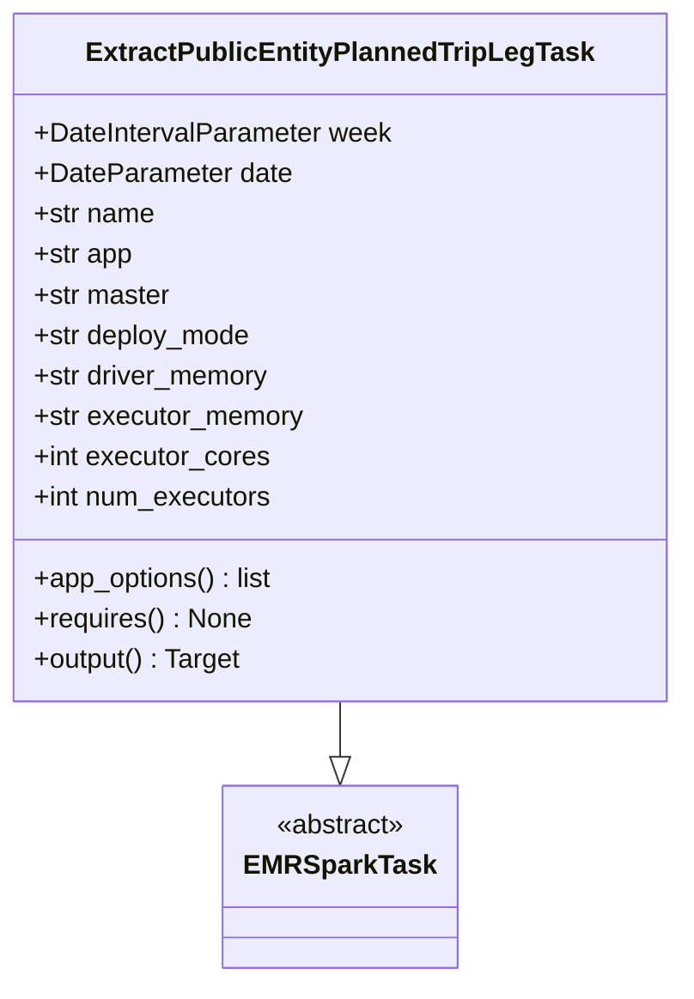
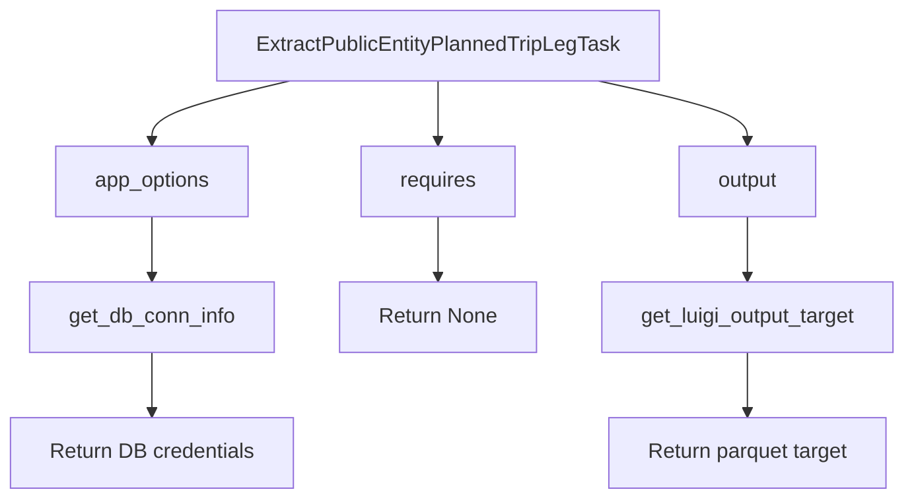

# Diagram: research/orchestrator/tasks/etl/extract_public_entityplannedtripleg_task.py

> Auto-generated by Obscura crawlers

## Diagram 1

### SVG

<svg id="container" width="394.8828125" xmlns="http://www.w3.org/2000/svg" class="classDiagram" height="582" viewBox="0 0 394.8828125 582" role="graphics-document document" aria-roledescription="class"><g><defs><marker id="container_class-aggregationStart" class="marker aggregation class" refX="18" refY="7" markerWidth="190" markerHeight="240" orient="auto"><path d="M 18,7 L9,13 L1,7 L9,1 Z"></path></marker></defs><defs><marker id="container_class-aggregationEnd" class="marker aggregation class" refX="1" refY="7" markerWidth="20" markerHeight="28" orient="auto"><path d="M 18,7 L9,13 L1,7 L9,1 Z"></path></marker></defs><defs><marker id="container_class-extensionStart" class="marker extension class" refX="18" refY="7" markerWidth="190" markerHeight="240" orient="auto"><path d="M 1,7 L18,13 V 1 Z"></path></marker></defs><defs><marker id="container_class-extensionEnd" class="marker extension class" refX="1" refY="7" markerWidth="20" markerHeight="28" orient="auto"><path d="M 1,1 V 13 L18,7 Z"></path></marker></defs><defs><marker id="container_class-compositionStart" class="marker composition class" refX="18" refY="7" markerWidth="190" markerHeight="240" orient="auto"><path d="M 18,7 L9,13 L1,7 L9,1 Z"></path></marker></defs><defs><marker id="container_class-compositionEnd" class="marker composition class" refX="1" refY="7" markerWidth="20" markerHeight="28" orient="auto"><path d="M 18,7 L9,13 L1,7 L9,1 Z"></path></marker></defs><defs><marker id="container_class-dependencyStart" class="marker dependency class" refX="6" refY="7" markerWidth="190" markerHeight="240" orient="auto"><path d="M 5,7 L9,13 L1,7 L9,1 Z"></path></marker></defs><defs><marker id="container_class-dependencyEnd" class="marker dependency class" refX="13" refY="7" markerWidth="20" markerHeight="28" orient="auto"><path d="M 18,7 L9,13 L14,7 L9,1 Z"></path></marker></defs><defs><marker id="container_class-lollipopStart" class="marker lollipop class" refX="13" refY="7" markerWidth="190" markerHeight="240" orient="auto"><circle stroke="black" fill="transparent" cx="7" cy="7" r="6"></circle></marker></defs><defs><marker id="container_class-lollipopEnd" class="marker lollipop class" refX="1" refY="7" markerWidth="190" markerHeight="240" orient="auto"><circle stroke="black" fill="transparent" cx="7" cy="7" r="6"></circle></marker></defs><g class="root"><g class="clusters"></g><g class="edgePaths"><path d="M197.441,416L197.441,420.167C197.441,424.333,197.441,432.667,197.441,438.125C197.441,443.583,197.441,446.167,197.441,447.458L197.441,448.75" id="id_ExtractPublicEntityPlannedTripLegTask_EMRSparkTask_1" class="edge-thickness-normal edge-pattern-solid relation" style=";;;" data-edge="true" data-et="edge" data-id="id_ExtractPublicEntityPlannedTripLegTask_EMRSparkTask_1" data-points="W3sieCI6MTk3LjQ0MTQwNjI1LCJ5Ijo0MTZ9LHsieCI6MTk3LjQ0MTQwNjI1LCJ5Ijo0NDF9LHsieCI6MTk3LjQ0MTQwNjI1LCJ5Ijo0NjZ9XQ==" marker-end="url(#container_class-extensionEnd)"></path></g><g class="edgeLabels"><g class="edgeLabel"><g class="label" data-id="id_ExtractPublicEntityPlannedTripLegTask_EMRSparkTask_1" transform="translate(0, 0)"><foreignObject width="0" height="0">

</foreignObject></g></g></g><g class="nodes"><g class="node default" id="classId-ExtractPublicEntityPlannedTripLegTask-0" transform="translate(197.44140625, 212)"><g class="basic label-container"><path d="M-189.44140625 -204 L189.44140625 -204 L189.44140625 204 L-189.44140625 204" stroke="none" stroke-width="0" fill="#ECECFF" style=""></path><path d="M-189.44140625 -204 C-38.10024269282437 -204, 113.24092086435127 -204, 189.44140625 -204 M-189.44140625 -204 C-93.17872509231464 -204, 3.083956065370728 -204, 189.44140625 -204 M189.44140625 -204 C189.44140625 -41.25526444918958, 189.44140625 121.48947110162084, 189.44140625 204 M189.44140625 -204 C189.44140625 -111.9296593084245, 189.44140625 -19.85931861684901, 189.44140625 204 M189.44140625 204 C78.33958086982906 204, -32.76224451034187 204, -189.44140625 204 M189.44140625 204 C100.96678182173643 204, 12.492157393472866 204, -189.44140625 204 M-189.44140625 204 C-189.44140625 58.87280140194483, -189.44140625 -86.25439719611035, -189.44140625 -204 M-189.44140625 204 C-189.44140625 86.33520947114562, -189.44140625 -31.329581057708765, -189.44140625 -204" stroke="#9370DB" stroke-width="1.3" fill="none" stroke-dasharray="0 0" style=""></path></g><g class="annotation-group text" transform="translate(0, -180)"></g><g class="label-group text" transform="translate(-142.7578125, -180)"><g class="label" style="font-weight: bolder" transform="translate(0,-12)"><foreignObject width="285.515625" height="24">

ExtractPublicEntityPlannedTripLegTask

</foreignObject></g></g><g class="members-group text" transform="translate(-177.44140625, -132)"><g class="label" style="" transform="translate(0,-12)"><foreignObject width="212.125" height="24">

+DateIntervalParameter week

</foreignObject></g><g class="label" style="" transform="translate(0,12)"><foreignObject width="152.171875" height="24">

+DateParameter date

</foreignObject></g><g class="label" style="" transform="translate(0,36)"><foreignObject width="72.171875" height="24">

+str name

</foreignObject></g><g class="label" style="" transform="translate(0,60)"><foreignObject width="59.375" height="24">

+str app

</foreignObject></g><g class="label" style="" transform="translate(0,84)"><foreignObject width="81.8125" height="24">

+str master

</foreignObject></g><g class="label" style="" transform="translate(0,108)"><foreignObject width="130.390625" height="24">

+str deploy_mode

</foreignObject></g><g class="label" style="" transform="translate(0,132)"><foreignObject width="141.1875" height="24">

+str driver_memory

</foreignObject></g><g class="label" style="" transform="translate(0,156)"><foreignObject width="161" height="24">

+str executor_memory

</foreignObject></g><g class="label" style="" transform="translate(0,180)"><foreignObject width="139.9375" height="24">

+int executor_cores

</foreignObject></g><g class="label" style="" transform="translate(0,204)"><foreignObject width="142.296875" height="24">

+int num_executors

</foreignObject></g></g><g class="methods-group text" transform="translate(-177.44140625, 132)"><g class="label" style="" transform="translate(0,-12)"><foreignObject width="143.609375" height="24">

+app_options() : list

</foreignObject></g><g class="label" style="" transform="translate(0,12)"><foreignObject width="128.75" height="24">

+requires() : None

</foreignObject></g><g class="label" style="" transform="translate(0,36)"><foreignObject width="124.375" height="24">

+output() : Target

</foreignObject></g></g><g class="divider" style=""><path d="M-189.44140625 -156 C-46.32457706052983 -156, 96.79225212894033 -156, 189.44140625 -156 M-189.44140625 -156 C-69.45000948469612 -156, 50.54138728060775 -156, 189.44140625 -156" stroke="#9370DB" stroke-width="1.3" fill="none" stroke-dasharray="0 0" style=""></path></g><g class="divider" style=""><path d="M-189.44140625 108 C-103.8275327519801 108, -18.213659253960202 108, 189.44140625 108 M-189.44140625 108 C-109.72314945112203 108, -30.004892652244052 108, 189.44140625 108" stroke="#9370DB" stroke-width="1.3" fill="none" stroke-dasharray="0 0" style=""></path></g></g><g class="node default" id="classId-EMRSparkTask-1" transform="translate(197.44140625, 520)"><g class="basic label-container"><path d="M-65.1484375 -54 L65.1484375 -54 L65.1484375 54 L-65.1484375 54" stroke="none" stroke-width="0" fill="#ECECFF" style=""></path><path d="M-65.1484375 -54 C-29.46498780652069 -54, 6.218461886958622 -54, 65.1484375 -54 M-65.1484375 -54 C-38.371660589501985 -54, -11.594883679003978 -54, 65.1484375 -54 M65.1484375 -54 C65.1484375 -28.696053127623625, 65.1484375 -3.392106255247249, 65.1484375 54 M65.1484375 -54 C65.1484375 -16.093232817430547, 65.1484375 21.813534365138906, 65.1484375 54 M65.1484375 54 C23.000502683106937 54, -19.147432133786126 54, -65.1484375 54 M65.1484375 54 C23.020364029941696 54, -19.107709440116608 54, -65.1484375 54 M-65.1484375 54 C-65.1484375 31.45837805977942, -65.1484375 8.91675611955884, -65.1484375 -54 M-65.1484375 54 C-65.1484375 14.311697752627389, -65.1484375 -25.376604494745223, -65.1484375 -54" stroke="#9370DB" stroke-width="1.3" fill="none" stroke-dasharray="0 0" style=""></path></g><g class="annotation-group text" transform="translate(-38.609375, -30)"><g class="label" style="" transform="translate(0,-12)"><foreignObject width="77.21875" height="24">

«abstract»

</foreignObject></g></g><g class="label-group text" transform="translate(-53.1484375, -6)"><g class="label" style="font-weight: bolder" transform="translate(0,-12)"><foreignObject width="106.296875" height="24">

EMRSparkTask

</foreignObject></g></g><g class="members-group text" transform="translate(-53.1484375, 42)"></g><g class="methods-group text" transform="translate(-53.1484375, 72)"></g><g class="divider" style=""><path d="M-65.1484375 18 C-27.266692280454436 18, 10.615052939091129 18, 65.1484375 18 M-65.1484375 18 C-18.951073347472537 18, 27.246290805054926 18, 65.1484375 18" stroke="#9370DB" stroke-width="1.3" fill="none" stroke-dasharray="0 0" style=""></path></g><g class="divider" style=""><path d="M-65.1484375 36 C-19.078112893928406 36, 26.992211712143188 36, 65.1484375 36 M-65.1484375 36 C-21.751580312861442 36, 21.645276874277116 36, 65.1484375 36" stroke="#9370DB" stroke-width="1.3" fill="none" stroke-dasharray="0 0" style=""></path></g></g></g></g></g></svg>

## Diagram 2

### SVG

<svg id="container" width="701.1484375" xmlns="http://www.w3.org/2000/svg" class="flowchart" height="382" viewBox="0 0 701.1484375 382" role="graphics-document document" aria-roledescription="flowchart-v2"><g><marker id="container_flowchart-v2-pointEnd" class="marker flowchart-v2" viewBox="0 0 10 10" refX="5" refY="5" markerUnits="userSpaceOnUse" markerWidth="8" markerHeight="8" orient="auto"><path d="M 0 0 L 10 5 L 0 10 z" class="arrowMarkerPath" style="stroke-width: 1; stroke-dasharray: 1, 0;"></path></marker><marker id="container_flowchart-v2-pointStart" class="marker flowchart-v2" viewBox="0 0 10 10" refX="4.5" refY="5" markerUnits="userSpaceOnUse" markerWidth="8" markerHeight="8" orient="auto"><path d="M 0 5 L 10 10 L 10 0 z" class="arrowMarkerPath" style="stroke-width: 1; stroke-dasharray: 1, 0;"></path></marker><marker id="container_flowchart-v2-circleEnd" class="marker flowchart-v2" viewBox="0 0 10 10" refX="11" refY="5" markerUnits="userSpaceOnUse" markerWidth="11" markerHeight="11" orient="auto"><circle cx="5" cy="5" r="5" class="arrowMarkerPath" style="stroke-width: 1; stroke-dasharray: 1, 0;"></circle></marker><marker id="container_flowchart-v2-circleStart" class="marker flowchart-v2" viewBox="0 0 10 10" refX="-1" refY="5" markerUnits="userSpaceOnUse" markerWidth="11" markerHeight="11" orient="auto"><circle cx="5" cy="5" r="5" class="arrowMarkerPath" style="stroke-width: 1; stroke-dasharray: 1, 0;"></circle></marker><marker id="container_flowchart-v2-crossEnd" class="marker cross flowchart-v2" viewBox="0 0 11 11" refX="12" refY="5.2" markerUnits="userSpaceOnUse" markerWidth="11" markerHeight="11" orient="auto"><path d="M 1,1 l 9,9 M 10,1 l -9,9" class="arrowMarkerPath" style="stroke-width: 2; stroke-dasharray: 1, 0;"></path></marker><marker id="container_flowchart-v2-crossStart" class="marker cross flowchart-v2" viewBox="0 0 11 11" refX="-1" refY="5.2" markerUnits="userSpaceOnUse" markerWidth="11" markerHeight="11" orient="auto"><path d="M 1,1 l 9,9 M 10,1 l -9,9" class="arrowMarkerPath" style="stroke-width: 2; stroke-dasharray: 1, 0;"></path></marker><g class="root"><g class="clusters"></g><g class="edgePaths"><path d="M223.014,62L205.349,66.167C187.684,70.333,152.354,78.667,134.689,86.333C117.023,94,117.023,101,117.023,104.5L117.023,108" id="L_A_B_0" class="edge-thickness-normal edge-pattern-solid edge-thickness-normal edge-pattern-solid flowchart-link" style=";" data-edge="true" data-et="edge" data-id="L_A_B_0" data-points="W3sieCI6MjIzLjAxNDI3MjgzNjUzODQ1LCJ5Ijo2Mn0seyJ4IjoxMTcuMDIzNDM3NSwieSI6ODd9LHsieCI6MTE3LjAyMzQzNzUsInkiOjExMn1d" marker-end="url(#container_flowchart-v2-pointEnd)"></path><path d="M117.023,166L117.023,170.167C117.023,174.333,117.023,182.667,117.023,190.333C117.023,198,117.023,205,117.023,208.5L117.023,212" id="L_B_C_0" class="edge-thickness-normal edge-pattern-solid edge-thickness-normal edge-pattern-solid flowchart-link" style=";" data-edge="true" data-et="edge" data-id="L_B_C_0" data-points="W3sieCI6MTE3LjAyMzQzNzUsInkiOjE2Nn0seyJ4IjoxMTcuMDIzNDM3NSwieSI6MTkxfSx7IngiOjExNy4wMjM0Mzc1LCJ5IjoyMTZ9XQ==" marker-end="url(#container_flowchart-v2-pointEnd)"></path><path d="M117.023,270L117.023,274.167C117.023,278.333,117.023,286.667,117.023,294.333C117.023,302,117.023,309,117.023,312.5L117.023,316" id="L_C_D_0" class="edge-thickness-normal edge-pattern-solid edge-thickness-normal edge-pattern-solid flowchart-link" style=";" data-edge="true" data-et="edge" data-id="L_C_D_0" data-points="W3sieCI6MTE3LjAyMzQzNzUsInkiOjI3MH0seyJ4IjoxMTcuMDIzNDM3NSwieSI6Mjk1fSx7IngiOjExNy4wMjM0Mzc1LCJ5IjozMjB9XQ==" marker-end="url(#container_flowchart-v2-pointEnd)"></path><path d="M337.484,62L337.484,66.167C337.484,70.333,337.484,78.667,337.484,86.333C337.484,94,337.484,101,337.484,104.5L337.484,108" id="L_A_E_0" class="edge-thickness-normal edge-pattern-solid edge-thickness-normal edge-pattern-solid flowchart-link" style=";" data-edge="true" data-et="edge" data-id="L_A_E_0" data-points="W3sieCI6MzM3LjQ4NDM3NSwieSI6NjJ9LHsieCI6MzM3LjQ4NDM3NSwieSI6ODd9LHsieCI6MzM3LjQ4NDM3NSwieSI6MTEyfV0=" marker-end="url(#container_flowchart-v2-pointEnd)"></path><path d="M337.484,166L337.484,170.167C337.484,174.333,337.484,182.667,337.484,190.333C337.484,198,337.484,205,337.484,208.5L337.484,212" id="L_E_F_0" class="edge-thickness-normal edge-pattern-solid edge-thickness-normal edge-pattern-solid flowchart-link" style=";" data-edge="true" data-et="edge" data-id="L_E_F_0" data-points="W3sieCI6MzM3LjQ4NDM3NSwieSI6MTY2fSx7IngiOjMzNy40ODQzNzUsInkiOjE5MX0seyJ4IjozMzcuNDg0Mzc1LCJ5IjoyMTZ9XQ==" marker-end="url(#container_flowchart-v2-pointEnd)"></path><path d="M462.457,62L481.743,66.167C501.028,70.333,539.6,78.667,558.886,86.333C578.172,94,578.172,101,578.172,104.5L578.172,108" id="L_A_G_0" class="edge-thickness-normal edge-pattern-solid edge-thickness-normal edge-pattern-solid flowchart-link" style=";" data-edge="true" data-et="edge" data-id="L_A_G_0" data-points="W3sieCI6NDYyLjQ1NjczMDc2OTIzMDgsInkiOjYyfSx7IngiOjU3OC4xNzE4NzUsInkiOjg3fSx7IngiOjU3OC4xNzE4NzUsInkiOjExMn1d" marker-end="url(#container_flowchart-v2-pointEnd)"></path><path d="M578.172,166L578.172,170.167C578.172,174.333,578.172,182.667,578.172,190.333C578.172,198,578.172,205,578.172,208.5L578.172,212" id="L_G_H_0" class="edge-thickness-normal edge-pattern-solid edge-thickness-normal edge-pattern-solid flowchart-link" style=";" data-edge="true" data-et="edge" data-id="L_G_H_0" data-points="W3sieCI6NTc4LjE3MTg3NSwieSI6MTY2fSx7IngiOjU3OC4xNzE4NzUsInkiOjE5MX0seyJ4Ijo1NzguMTcxODc1LCJ5IjoyMTZ9XQ==" marker-end="url(#container_flowchart-v2-pointEnd)"></path><path d="M578.172,270L578.172,274.167C578.172,278.333,578.172,286.667,578.172,294.333C578.172,302,578.172,309,578.172,312.5L578.172,316" id="L_H_I_0" class="edge-thickness-normal edge-pattern-solid edge-thickness-normal edge-pattern-solid flowchart-link" style=";" data-edge="true" data-et="edge" data-id="L_H_I_0" data-points="W3sieCI6NTc4LjE3MTg3NSwieSI6MjcwfSx7IngiOjU3OC4xNzE4NzUsInkiOjI5NX0seyJ4Ijo1NzguMTcxODc1LCJ5IjozMjB9XQ==" marker-end="url(#container_flowchart-v2-pointEnd)"></path></g><g class="edgeLabels"><g class="edgeLabel"><g class="label" data-id="L_A_B_0" transform="translate(0, 0)"><foreignObject width="0" height="0">

</foreignObject></g></g><g class="edgeLabel"><g class="label" data-id="L_B_C_0" transform="translate(0, 0)"><foreignObject width="0" height="0">

</foreignObject></g></g><g class="edgeLabel"><g class="label" data-id="L_C_D_0" transform="translate(0, 0)"><foreignObject width="0" height="0">

</foreignObject></g></g><g class="edgeLabel"><g class="label" data-id="L_A_E_0" transform="translate(0, 0)"><foreignObject width="0" height="0">

</foreignObject></g></g><g class="edgeLabel"><g class="label" data-id="L_E_F_0" transform="translate(0, 0)"><foreignObject width="0" height="0">

</foreignObject></g></g><g class="edgeLabel"><g class="label" data-id="L_A_G_0" transform="translate(0, 0)"><foreignObject width="0" height="0">

</foreignObject></g></g><g class="edgeLabel"><g class="label" data-id="L_G_H_0" transform="translate(0, 0)"><foreignObject width="0" height="0">

</foreignObject></g></g><g class="edgeLabel"><g class="label" data-id="L_H_I_0" transform="translate(0, 0)"><foreignObject width="0" height="0">

</foreignObject></g></g></g><g class="nodes"><g class="node default" id="flowchart-A-0" transform="translate(337.484375, 35)"><rect class="basic label-container" style="" x="-169.8828125" y="-27" width="339.765625" height="54"></rect><g class="label" style="" transform="translate(-139.8828125, -12)"><rect></rect><foreignObject width="279.765625" height="24">

ExtractPublicEntityPlannedTripLegTask

</foreignObject></g></g><g class="node default" id="flowchart-B-1" transform="translate(117.0234375, 139)"><rect class="basic label-container" style="" x="-75.3671875" y="-27" width="150.734375" height="54"></rect><g class="label" style="" transform="translate(-45.3671875, -12)"><rect></rect><foreignObject width="90.734375" height="24">

app_options

</foreignObject></g></g><g class="node default" id="flowchart-C-3" transform="translate(117.0234375, 243)"><rect class="basic label-container" style="" x="-94.75" y="-27" width="189.5" height="54"></rect><g class="label" style="" transform="translate(-64.75, -12)"><rect></rect><foreignObject width="129.5" height="24">

get_db_conn_info

</foreignObject></g></g><g class="node default" id="flowchart-D-5" transform="translate(117.0234375, 347)"><rect class="basic label-container" style="" x="-109.0234375" y="-27" width="218.046875" height="54"></rect><g class="label" style="" transform="translate(-79.0234375, -12)"><rect></rect><foreignObject width="158.046875" height="24">

Return DB credentials

</foreignObject></g></g><g class="node default" id="flowchart-E-7" transform="translate(337.484375, 139)"><rect class="basic label-container" style="" x="-59.8515625" y="-27" width="119.703125" height="54"></rect><g class="label" style="" transform="translate(-29.8515625, -12)"><rect></rect><foreignObject width="59.703125" height="24">

requires

</foreignObject></g></g><g class="node default" id="flowchart-F-9" transform="translate(337.484375, 243)"><rect class="basic label-container" style="" x="-75.7109375" y="-27" width="151.421875" height="54"></rect><g class="label" style="" transform="translate(-45.7109375, -12)"><rect></rect><foreignObject width="91.421875" height="24">

Return None

</foreignObject></g></g><g class="node default" id="flowchart-G-11" transform="translate(578.171875, 139)"><rect class="basic label-container" style="" x="-54.515625" y="-27" width="109.03125" height="54"></rect><g class="label" style="" transform="translate(-24.515625, -12)"><rect></rect><foreignObject width="49.03125" height="24">

output

</foreignObject></g></g><g class="node default" id="flowchart-H-13" transform="translate(578.171875, 243)"><rect class="basic label-container" style="" x="-114.9765625" y="-27" width="229.953125" height="54"></rect><g class="label" style="" transform="translate(-84.9765625, -12)"><rect></rect><foreignObject width="169.953125" height="24">

get_luigi_output_target

</foreignObject></g></g><g class="node default" id="flowchart-I-15" transform="translate(578.171875, 347)"><rect class="basic label-container" style="" x="-108.6328125" y="-27" width="217.265625" height="54"></rect><g class="label" style="" transform="translate(-78.6328125, -12)"><rect></rect><foreignObject width="157.265625" height="24">

Return parquet target

</foreignObject></g></g></g></g></g></svg>
