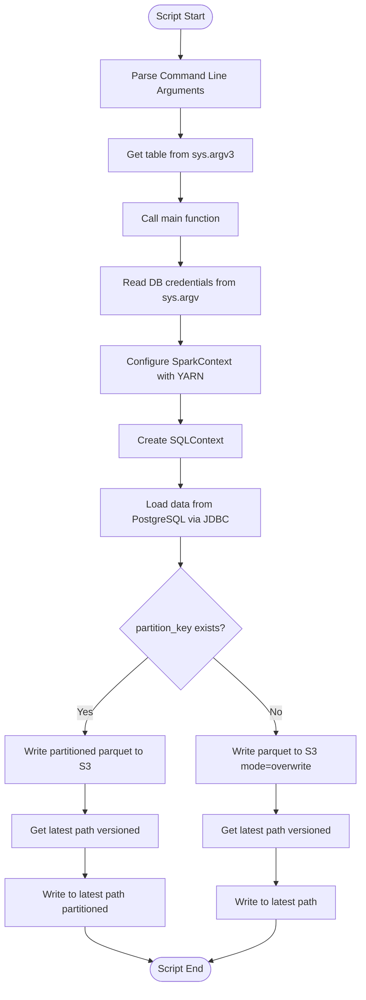
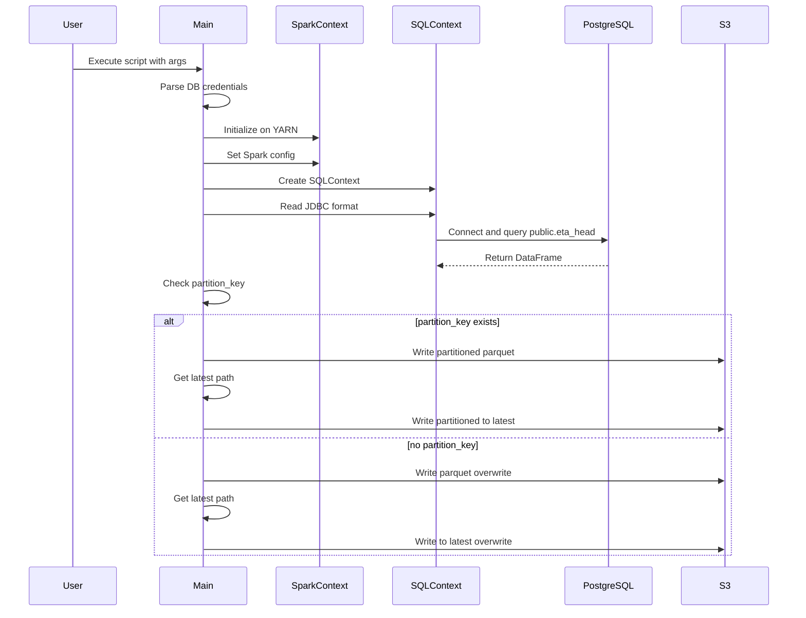

# Diagram: research/orchestrator/tasks/etl/extract_public_eta_head_spark.py

> Auto-generated by Obscura crawlers

## Diagram 1

### SVG

<svg id="container" width="586" xmlns="http://www.w3.org/2000/svg" class="flowchart" height="1605.09375" viewBox="0 0 586 1605.09375" role="graphics-document document" aria-roledescription="flowchart-v2"><g><marker id="container_flowchart-v2-pointEnd" class="marker flowchart-v2" viewBox="0 0 10 10" refX="5" refY="5" markerUnits="userSpaceOnUse" markerWidth="8" markerHeight="8" orient="auto"><path d="M 0 0 L 10 5 L 0 10 z" class="arrowMarkerPath" style="stroke-width: 1; stroke-dasharray: 1, 0;"></path></marker><marker id="container_flowchart-v2-pointStart" class="marker flowchart-v2" viewBox="0 0 10 10" refX="4.5" refY="5" markerUnits="userSpaceOnUse" markerWidth="8" markerHeight="8" orient="auto"><path d="M 0 5 L 10 10 L 10 0 z" class="arrowMarkerPath" style="stroke-width: 1; stroke-dasharray: 1, 0;"></path></marker><marker id="container_flowchart-v2-circleEnd" class="marker flowchart-v2" viewBox="0 0 10 10" refX="11" refY="5" markerUnits="userSpaceOnUse" markerWidth="11" markerHeight="11" orient="auto"><circle cx="5" cy="5" r="5" class="arrowMarkerPath" style="stroke-width: 1; stroke-dasharray: 1, 0;"></circle></marker><marker id="container_flowchart-v2-circleStart" class="marker flowchart-v2" viewBox="0 0 10 10" refX="-1" refY="5" markerUnits="userSpaceOnUse" markerWidth="11" markerHeight="11" orient="auto"><circle cx="5" cy="5" r="5" class="arrowMarkerPath" style="stroke-width: 1; stroke-dasharray: 1, 0;"></circle></marker><marker id="container_flowchart-v2-crossEnd" class="marker cross flowchart-v2" viewBox="0 0 11 11" refX="12" refY="5.2" markerUnits="userSpaceOnUse" markerWidth="11" markerHeight="11" orient="auto"><path d="M 1,1 l 9,9 M 10,1 l -9,9" class="arrowMarkerPath" style="stroke-width: 2; stroke-dasharray: 1, 0;"></path></marker><marker id="container_flowchart-v2-crossStart" class="marker cross flowchart-v2" viewBox="0 0 11 11" refX="-1" refY="5.2" markerUnits="userSpaceOnUse" markerWidth="11" markerHeight="11" orient="auto"><path d="M 1,1 l 9,9 M 10,1 l -9,9" class="arrowMarkerPath" style="stroke-width: 2; stroke-dasharray: 1, 0;"></path></marker><g class="root"><g class="clusters"></g><g class="edgePaths"><path d="M293.5,47.5L293.417,51.583C293.333,55.667,293.167,63.833,293.083,71.417C293,79,293,86,293,89.5L293,93" id="L_Start_ParseArgs_0" class="edge-thickness-normal edge-pattern-solid edge-thickness-normal edge-pattern-solid flowchart-link" style=";" data-edge="true" data-et="edge" data-id="L_Start_ParseArgs_0" data-points="W3sieCI6MjkzLjUsInkiOjQ3LjV9LHsieCI6MjkzLCJ5Ijo3Mn0seyJ4IjoyOTMsInkiOjk3fV0=" marker-end="url(#container_flowchart-v2-pointEnd)"></path><path d="M293,175L293,179.167C293,183.333,293,191.667,293,199.333C293,207,293,214,293,217.5L293,221" id="L_ParseArgs_GetTable_0" class="edge-thickness-normal edge-pattern-solid edge-thickness-normal edge-pattern-solid flowchart-link" style=";" data-edge="true" data-et="edge" data-id="L_ParseArgs_GetTable_0" data-points="W3sieCI6MjkzLCJ5IjoxNzV9LHsieCI6MjkzLCJ5IjoyMDB9LHsieCI6MjkzLCJ5IjoyMjV9XQ==" marker-end="url(#container_flowchart-v2-pointEnd)"></path><path d="M293,279L293,283.167C293,287.333,293,295.667,293,303.333C293,311,293,318,293,321.5L293,325" id="L_GetTable_Main_0" class="edge-thickness-normal edge-pattern-solid edge-thickness-normal edge-pattern-solid flowchart-link" style=";" data-edge="true" data-et="edge" data-id="L_GetTable_Main_0" data-points="W3sieCI6MjkzLCJ5IjoyNzl9LHsieCI6MjkzLCJ5IjozMDR9LHsieCI6MjkzLCJ5IjozMjl9XQ==" marker-end="url(#container_flowchart-v2-pointEnd)"></path><path d="M293,383L293,387.167C293,391.333,293,399.667,293,407.333C293,415,293,422,293,425.5L293,429" id="L_Main_ReadCreds_0" class="edge-thickness-normal edge-pattern-solid edge-thickness-normal edge-pattern-solid flowchart-link" style=";" data-edge="true" data-et="edge" data-id="L_Main_ReadCreds_0" data-points="W3sieCI6MjkzLCJ5IjozODN9LHsieCI6MjkzLCJ5Ijo0MDh9LHsieCI6MjkzLCJ5Ijo0MzN9XQ==" marker-end="url(#container_flowchart-v2-pointEnd)"></path><path d="M293,511L293,515.167C293,519.333,293,527.667,293,535.333C293,543,293,550,293,553.5L293,557" id="L_ReadCreds_ConfigSpark_0" class="edge-thickness-normal edge-pattern-solid edge-thickness-normal edge-pattern-solid flowchart-link" style=";" data-edge="true" data-et="edge" data-id="L_ReadCreds_ConfigSpark_0" data-points="W3sieCI6MjkzLCJ5Ijo1MTF9LHsieCI6MjkzLCJ5Ijo1MzZ9LHsieCI6MjkzLCJ5Ijo1NjF9XQ==" marker-end="url(#container_flowchart-v2-pointEnd)"></path><path d="M293,639L293,643.167C293,647.333,293,655.667,293,663.333C293,671,293,678,293,681.5L293,685" id="L_ConfigSpark_CreateSQL_0" class="edge-thickness-normal edge-pattern-solid edge-thickness-normal edge-pattern-solid flowchart-link" style=";" data-edge="true" data-et="edge" data-id="L_ConfigSpark_CreateSQL_0" data-points="W3sieCI6MjkzLCJ5Ijo2Mzl9LHsieCI6MjkzLCJ5Ijo2NjR9LHsieCI6MjkzLCJ5Ijo2ODl9XQ==" marker-end="url(#container_flowchart-v2-pointEnd)"></path><path d="M293,743L293,747.167C293,751.333,293,759.667,293,767.333C293,775,293,782,293,785.5L293,789" id="L_CreateSQL_LoadData_0" class="edge-thickness-normal edge-pattern-solid edge-thickness-normal edge-pattern-solid flowchart-link" style=";" data-edge="true" data-et="edge" data-id="L_CreateSQL_LoadData_0" data-points="W3sieCI6MjkzLCJ5Ijo3NDN9LHsieCI6MjkzLCJ5Ijo3Njh9LHsieCI6MjkzLCJ5Ijo3OTN9XQ==" marker-end="url(#container_flowchart-v2-pointEnd)"></path><path d="M293,871L293,875.167C293,879.333,293,887.667,293,895.333C293,903,293,910,293,913.5L293,917" id="L_LoadData_CheckPartition_0" class="edge-thickness-normal edge-pattern-solid edge-thickness-normal edge-pattern-solid flowchart-link" style=";" data-edge="true" data-et="edge" data-id="L_LoadData_CheckPartition_0" data-points="W3sieCI6MjkzLCJ5Ijo4NzF9LHsieCI6MjkzLCJ5Ijo4OTZ9LHsieCI6MjkzLCJ5Ijo5MjF9XQ==" marker-end="url(#container_flowchart-v2-pointEnd)"></path><path d="M239.381,1070.474L222.484,1085.578C205.587,1100.681,171.794,1130.887,154.897,1151.491C138,1172.094,138,1183.094,138,1188.594L138,1194.094" id="L_CheckPartition_WritePartitioned_0" class="edge-thickness-normal edge-pattern-solid edge-thickness-normal edge-pattern-solid flowchart-link" style=";" data-edge="true" data-et="edge" data-id="L_CheckPartition_WritePartitioned_0" data-points="W3sieCI6MjM5LjM4MDc0MjAwMjQ0ODUsInkiOjEwNzAuNDc0NDkyMDAyNDQ4NH0seyJ4IjoxMzgsInkiOjExNjEuMDkzNzV9LHsieCI6MTM4LCJ5IjoxMTk4LjA5Mzc1fV0=" marker-end="url(#container_flowchart-v2-pointEnd)"></path><path d="M346.619,1070.474L363.516,1085.578C380.413,1100.681,414.206,1130.887,431.103,1151.491C448,1172.094,448,1183.094,448,1188.594L448,1194.094" id="L_CheckPartition_WriteNormal_0" class="edge-thickness-normal edge-pattern-solid edge-thickness-normal edge-pattern-solid flowchart-link" style=";" data-edge="true" data-et="edge" data-id="L_CheckPartition_WriteNormal_0" data-points="W3sieCI6MzQ2LjYxOTI1Nzk5NzU1MTUsInkiOjEwNzAuNDc0NDkyMDAyNDQ4NH0seyJ4Ijo0NDgsInkiOjExNjEuMDkzNzV9LHsieCI6NDQ4LCJ5IjoxMTk4LjA5Mzc1fV0=" marker-end="url(#container_flowchart-v2-pointEnd)"></path><path d="M138,1276.094L138,1280.26C138,1284.427,138,1292.76,138,1300.427C138,1308.094,138,1315.094,138,1318.594L138,1322.094" id="L_WritePartitioned_GetLatestPath1_0" class="edge-thickness-normal edge-pattern-solid edge-thickness-normal edge-pattern-solid flowchart-link" style=";" data-edge="true" data-et="edge" data-id="L_WritePartitioned_GetLatestPath1_0" data-points="W3sieCI6MTM4LCJ5IjoxMjc2LjA5Mzc1fSx7IngiOjEzOCwieSI6MTMwMS4wOTM3NX0seyJ4IjoxMzgsInkiOjEzMjYuMDkzNzV9XQ==" marker-end="url(#container_flowchart-v2-pointEnd)"></path><path d="M448,1276.094L448,1280.26C448,1284.427,448,1292.76,448,1300.427C448,1308.094,448,1315.094,448,1318.594L448,1322.094" id="L_WriteNormal_GetLatestPath2_0" class="edge-thickness-normal edge-pattern-solid edge-thickness-normal edge-pattern-solid flowchart-link" style=";" data-edge="true" data-et="edge" data-id="L_WriteNormal_GetLatestPath2_0" data-points="W3sieCI6NDQ4LCJ5IjoxMjc2LjA5Mzc1fSx7IngiOjQ0OCwieSI6MTMwMS4wOTM3NX0seyJ4Ijo0NDgsInkiOjEzMjYuMDkzNzV9XQ==" marker-end="url(#container_flowchart-v2-pointEnd)"></path><path d="M138,1380.094L138,1384.26C138,1388.427,138,1396.76,138,1404.427C138,1412.094,138,1419.094,138,1422.594L138,1426.094" id="L_GetLatestPath1_WriteLatest1_0" class="edge-thickness-normal edge-pattern-solid edge-thickness-normal edge-pattern-solid flowchart-link" style=";" data-edge="true" data-et="edge" data-id="L_GetLatestPath1_WriteLatest1_0" data-points="W3sieCI6MTM4LCJ5IjoxMzgwLjA5Mzc1fSx7IngiOjEzOCwieSI6MTQwNS4wOTM3NX0seyJ4IjoxMzgsInkiOjE0MzAuMDkzNzV9XQ==" marker-end="url(#container_flowchart-v2-pointEnd)"></path><path d="M448,1380.094L448,1384.26C448,1388.427,448,1396.76,448,1406.427C448,1416.094,448,1427.094,448,1432.594L448,1438.094" id="L_GetLatestPath2_WriteLatest2_0" class="edge-thickness-normal edge-pattern-solid edge-thickness-normal edge-pattern-solid flowchart-link" style=";" data-edge="true" data-et="edge" data-id="L_GetLatestPath2_WriteLatest2_0" data-points="W3sieCI6NDQ4LCJ5IjoxMzgwLjA5Mzc1fSx7IngiOjQ0OCwieSI6MTQwNS4wOTM3NX0seyJ4Ijo0NDgsInkiOjE0NDIuMDkzNzV9XQ==" marker-end="url(#container_flowchart-v2-pointEnd)"></path><path d="M138,1508.094L138,1512.26C138,1516.427,138,1524.76,155.852,1534.11C173.705,1543.459,209.409,1553.825,227.262,1559.007L245.114,1564.19" id="L_WriteLatest1_End_0" class="edge-thickness-normal edge-pattern-solid edge-thickness-normal edge-pattern-solid flowchart-link" style=";" data-edge="true" data-et="edge" data-id="L_WriteLatest1_End_0" data-points="W3sieCI6MTM4LCJ5IjoxNTA4LjA5Mzc1fSx7IngiOjEzOCwieSI6MTUzMy4wOTM3NX0seyJ4IjoyNDguOTU1MTk5NTk0NjEyNDgsInkiOjE1NjUuMzA1MDgxNDk2NTE4fV0=" marker-end="url(#container_flowchart-v2-pointEnd)"></path><path d="M448,1496.094L448,1502.26C448,1508.427,448,1520.76,430.314,1532.108C412.628,1543.456,377.256,1553.818,359.57,1558.999L341.883,1564.181" id="L_WriteLatest2_End_0" class="edge-thickness-normal edge-pattern-solid edge-thickness-normal edge-pattern-solid flowchart-link" style=";" data-edge="true" data-et="edge" data-id="L_WriteLatest2_End_0" data-points="W3sieCI6NDQ4LCJ5IjoxNDk2LjA5Mzc1fSx7IngiOjQ0OCwieSI6MTUzMy4wOTM3NX0seyJ4IjozMzguMDQ0Nzk4MTcyODMwMDQsInkiOjE1NjUuMzA1MDgyMTM3NDc4fV0=" marker-end="url(#container_flowchart-v2-pointEnd)"></path></g><g class="edgeLabels"><g class="edgeLabel"><g class="label" data-id="L_Start_ParseArgs_0" transform="translate(0, 0)"><foreignObject width="0" height="0">

</foreignObject></g></g><g class="edgeLabel"><g class="label" data-id="L_ParseArgs_GetTable_0" transform="translate(0, 0)"><foreignObject width="0" height="0">

</foreignObject></g></g><g class="edgeLabel"><g class="label" data-id="L_GetTable_Main_0" transform="translate(0, 0)"><foreignObject width="0" height="0">

</foreignObject></g></g><g class="edgeLabel"><g class="label" data-id="L_Main_ReadCreds_0" transform="translate(0, 0)"><foreignObject width="0" height="0">

</foreignObject></g></g><g class="edgeLabel"><g class="label" data-id="L_ReadCreds_ConfigSpark_0" transform="translate(0, 0)"><foreignObject width="0" height="0">

</foreignObject></g></g><g class="edgeLabel"><g class="label" data-id="L_ConfigSpark_CreateSQL_0" transform="translate(0, 0)"><foreignObject width="0" height="0">

</foreignObject></g></g><g class="edgeLabel"><g class="label" data-id="L_CreateSQL_LoadData_0" transform="translate(0, 0)"><foreignObject width="0" height="0">

</foreignObject></g></g><g class="edgeLabel"><g class="label" data-id="L_LoadData_CheckPartition_0" transform="translate(0, 0)"><foreignObject width="0" height="0">

</foreignObject></g></g><g class="edgeLabel" transform="translate(138, 1161.09375)"><g class="label" data-id="L_CheckPartition_WritePartitioned_0" transform="translate(-12.03125, -12)"><foreignObject width="24.0625" height="24">

Yes

</foreignObject></g></g><g class="edgeLabel" transform="translate(448, 1161.09375)"><g class="label" data-id="L_CheckPartition_WriteNormal_0" transform="translate(-10.140625, -12)"><foreignObject width="20.28125" height="24">

No

</foreignObject></g></g><g class="edgeLabel"><g class="label" data-id="L_WritePartitioned_GetLatestPath1_0" transform="translate(0, 0)"><foreignObject width="0" height="0">

</foreignObject></g></g><g class="edgeLabel"><g class="label" data-id="L_WriteNormal_GetLatestPath2_0" transform="translate(0, 0)"><foreignObject width="0" height="0">

</foreignObject></g></g><g class="edgeLabel"><g class="label" data-id="L_GetLatestPath1_WriteLatest1_0" transform="translate(0, 0)"><foreignObject width="0" height="0">

</foreignObject></g></g><g class="edgeLabel"><g class="label" data-id="L_GetLatestPath2_WriteLatest2_0" transform="translate(0, 0)"><foreignObject width="0" height="0">

</foreignObject></g></g><g class="edgeLabel"><g class="label" data-id="L_WriteLatest1_End_0" transform="translate(0, 0)"><foreignObject width="0" height="0">

</foreignObject></g></g><g class="edgeLabel"><g class="label" data-id="L_WriteLatest2_End_0" transform="translate(0, 0)"><foreignObject width="0" height="0">

</foreignObject></g></g></g><g class="nodes"><g class="node default" id="flowchart-Start-0" transform="translate(293, 27.5)"><g class="basic label-container outer-path"><path d="M-33.6875 -19.5 C-11.212962299071659 -19.5, 11.261575401856682 -19.5, 33.6875 -19.5 C33.6875 -19.5, 33.6875 -19.5, 33.6875 -19.5 C34.16064156757231 -19.48482727084215, 34.63378313514462 -19.4696545416843, 34.9368692896239 -19.45993515863156 C35.22968658220504 -19.431687426580574, 35.522503874786175 -19.403439694529588, 36.181104652847864 -19.3399052695533 C36.579304610773335 -19.275527388442704, 36.9775045686988 -19.21114950733211, 37.41509325967676 -19.140403561325776 C37.84760590991873 -19.04168537131686, 38.28011856016069 -18.94296718130794, 38.63376438623539 -18.862249829261074 C38.92993163075274 -18.774348945701917, 39.2260988752701 -18.686448062142755, 39.832110251460605 -18.50658706670804 C40.25289973157582 -18.351732648290326, 40.673689211691034 -18.196878229872613, 41.0052065951478 -18.074876768247425 C41.405782786013155 -17.89755357122184, 41.806358976878506 -17.72023037419626, 42.14823291279238 -17.568892924097174 C42.3986421732998 -17.43825457328524, 42.649051433807216 -17.307616222473307, 43.25649226407678 -16.990714730406097 C43.638667685922506 -16.75903774377115, 44.02084310776822 -16.527360757136204, 44.3254305736057 -16.342718045390892 C44.71236881058039 -16.072806681563662, 45.09930704755507 -15.802895317736434, 45.35065534457871 -15.627565626425154 C45.695723404804816 -15.352383031041565, 46.040791465030914 -15.077200435657979, 46.327953708501866 -14.848196188198123 C46.547170487465394 -14.649109309701585, 46.766387266428914 -14.450022431205046, 47.25330973676799 -14.007812326905688 C47.4467668015106 -13.808052024438542, 47.64022386625321 -13.608291721971396, 48.12292094296865 -13.10986736009568 C48.29785630070892 -12.904378334790115, 48.47279165844919 -12.69888930948455, 48.93321390812658 -12.158051136245305 C49.15915758601588 -11.855307191766153, 49.38510126390518 -11.552563247286999, 49.680858964640635 -11.156274872382312 C49.83113700987736 -10.925407439593286, 49.98141505511408 -10.69454000680426, 50.36278387860425 -10.108655082055241 C50.55465665950793 -9.767965530334855, 50.746529440411614 -9.427275978614471, 50.976186474273504 -9.019496659696287 C51.09982573413502 -8.762757091137487, 51.22346499399653 -8.506017522578688, 51.51854614880834 -7.893275190886684 C51.64632807237532 -7.577651369180824, 51.7741099959423 -7.262027547474964, 51.987634229970325 -6.734618561215508 C52.11233118734134 -6.359051193376073, 52.237028144712355 -5.983483825536638, 52.38152313421488 -5.548287939305138 C52.452879241935435 -5.276176174633947, 52.52423534965599 -5.004064409962756, 52.69859428754556 -4.339158212148133 C52.79332219688382 -3.85275041844688, 52.88805010622208 -3.366342624745627, 52.937544776581774 -3.1121979531509023 C52.980123325247554 -2.781967137784582, 53.022701873913334 -2.4517363224182613, 53.09739270250937 -1.872449005199798 C53.11895383818926 -1.5366169131499656, 53.14051497386916 -1.2007848211001333, 53.17748121591342 -0.6250057626472757 C53.17748121591342 -0.16246002688357658, 53.17748121591342 0.30008570888012254, 53.17748121591342 0.625005762647271 C53.15310498262548 1.0046852722482713, 53.12872874933754 1.3843647818492715, 53.09739270250937 1.8724490051997846 C53.06067024020354 2.1572611711733725, 53.02394777789771 2.44207333714696, 52.937544776581774 3.1121979531508885 C52.88063510949836 3.4044170657618382, 52.82372544241494 3.6966361783727884, 52.69859428754556 4.339158212148129 C52.62795243531994 4.608546211056857, 52.55731058309431 4.877934209965585, 52.38152313421489 5.548287939305125 C52.24323900129063 5.964777715088476, 52.10495486836638 6.381267490871826, 51.987634229970325 6.734618561215495 C51.889083967819516 6.978039614067694, 51.79053370566871 7.221460666919893, 51.51854614880834 7.893275190886679 C51.397626592527814 8.144367236767232, 51.27670703624728 8.395459282647785, 50.976186474273504 9.019496659696284 C50.75496849236814 9.412291587318977, 50.533750510462774 9.80508651494167, 50.36278387860425 10.108655082055236 C50.1513617833108 10.433456195207778, 49.939939688017354 10.75825730836032, 49.68085896464064 11.156274872382301 C49.516630535225815 11.37632600628046, 49.352402105810995 11.59637714017862, 48.93321390812658 12.158051136245302 C48.73396549174841 12.392099663679176, 48.53471707537024 12.62614819111305, 48.12292094296866 13.10986736009567 C47.936546185584554 13.302314598746914, 47.750171428200446 13.494761837398158, 47.25330973676799 14.007812326905684 C47.03016259246004 14.210468659216268, 46.80701544815208 14.413124991526852, 46.32795370850189 14.848196188198111 C46.00663503594909 15.104439278909984, 45.685316363396296 15.360682369621857, 45.35065534457871 15.627565626425152 C44.96006664713878 15.90002339344705, 44.56947794969885 16.172481160468948, 44.32543057360571 16.34271804539089 C44.08061597056085 16.49112609644698, 43.83580136751599 16.63953414750307, 43.25649226407678 16.990714730406093 C42.868889914861214 17.192926627720706, 42.48128756564564 17.395138525035314, 42.14823291279239 17.56889292409717 C41.83646170984473 17.70690478727796, 41.52469050689706 17.84491665045875, 41.005206595147804 18.07487676824742 C40.60517394878958 18.222092479968495, 40.20514130243134 18.36930819168957, 39.83211025146062 18.506587066708033 C39.44889233140217 18.62032413382947, 39.06567441134372 18.734061200950908, 38.63376438623541 18.86224982926107 C38.1564883437364 18.971184971444227, 37.679212301237385 19.08012011362738, 37.415093259676766 19.140403561325773 C37.09007556943225 19.192949900934675, 36.765057879187744 19.245496240543574, 36.18110465284788 19.3399052695533 C35.77231116130134 19.37934108603669, 35.363517669754806 19.41877690252008, 34.9368692896239 19.45993515863156 C34.61521166891215 19.470250092459207, 34.2935540482004 19.480565026286857, 33.68750000000001 19.5 C33.68750000000001 19.5, 33.68750000000001 19.5, 33.6875 19.5 C12.827450967478693 19.5, -8.032598065042613 19.5, -33.68749999999999 19.5 C-34.03386317350022 19.488892807180868, -34.380226347000445 19.477785614361732, -34.93686928962389 19.45993515863156 C-35.226071125524186 19.432036205338353, -35.51527296142448 19.404137252045146, -36.18110465284787 19.3399052695533 C-36.52242567574813 19.28472313355485, -36.8637466986484 19.2295409975564, -37.41509325967676 19.140403561325773 C-37.78274488941478 19.056489475989167, -38.1503965191528 18.97257539065256, -38.633764386235384 18.862249829261074 C-39.037236349886726 18.742501468316913, -39.44070831353806 18.622753107372752, -39.83211025146059 18.506587066708043 C-40.084156591814406 18.41383168356701, -40.33620293216823 18.321076300425975, -41.0052065951478 18.074876768247425 C-41.35822574951307 17.918605660551062, -41.71124490387834 17.762334552854703, -42.14823291279238 17.568892924097174 C-42.512842346971354 17.378676415829492, -42.87745178115033 17.18845990756181, -43.25649226407678 16.990714730406097 C-43.58056934003344 16.794257302472875, -43.9046464159901 16.597799874539653, -44.325430573605686 16.3427180453909 C-44.57000972118135 16.172110219702773, -44.814588868757006 16.00150239401465, -45.35065534457871 15.627565626425156 C-45.54860530036726 15.46970580435334, -45.74655525615581 15.311845982281525, -46.327953708501866 14.848196188198125 C-46.5957971133304 14.604947894681006, -46.863640518158924 14.361699601163885, -47.253309736767974 14.007812326905697 C-47.501443508231254 13.751593835708352, -47.749577279694535 13.495375344511007, -48.122920942968655 13.109867360095677 C-48.433043616209154 12.74557962162737, -48.74316628944966 12.381291883159063, -48.933213908126575 12.158051136245307 C-49.20193860384861 11.797984525301192, -49.470663299570646 11.437917914357078, -49.680858964640635 11.156274872382316 C-49.819898584142045 10.942672679462595, -49.95893820364345 10.729070486542874, -50.36278387860425 10.108655082055249 C-50.6031890251042 9.681791400783759, -50.84359417160416 9.254927719512267, -50.976186474273504 9.019496659696289 C-51.1095951621257 8.74247066488256, -51.243003849977896 8.46544467006883, -51.51854614880834 7.893275190886686 C-51.63632368237413 7.602362405905477, -51.754101215939926 7.311449620924268, -51.987634229970325 6.73461856121551 C-52.13063005569526 6.303937917422788, -52.2736258814202 5.873257273630065, -52.38152313421488 5.5482879393051325 C-52.491564315879586 5.128653221467801, -52.60160549754429 4.70901850363047, -52.69859428754556 4.339158212148136 C-52.748333530250136 4.0837577132528144, -52.79807277295471 3.8283572143574935, -52.937544776581774 3.112197953150904 C-52.99305784481848 2.681649558202287, -53.04857091305518 2.25110116325367, -53.09739270250937 1.872449005199809 C-53.12365230422449 1.4634345121176944, -53.149911905939625 1.0544200190355797, -53.17748121591342 0.6250057626472781 C-53.17748121591342 0.2612944468760079, -53.17748121591342 -0.10241686889526236, -53.17748121591342 -0.6250057626472687 C-53.14857921855027 -1.0751777008506678, -53.11967722118712 -1.5253496390540666, -53.09739270250937 -1.8724490051997822 C-53.062410602542904 -2.143763264542685, -53.02742850257644 -2.4150775238855875, -52.937544776581774 -3.112197953150895 C-52.853137171287024 -3.545613166785736, -52.76872956599228 -3.979028380420576, -52.69859428754556 -4.339158212148126 C-52.6343910798548 -4.583992868919216, -52.57018787216405 -4.828827525690306, -52.38152313421489 -5.548287939305123 C-52.235595019053655 -5.987800171683075, -52.08966690389243 -6.427312404061027, -51.98763422997033 -6.734618561215485 C-51.85738081076164 -7.05634702493949, -51.727127391552955 -7.378075488663496, -51.51854614880834 -7.893275190886676 C-51.308054933032615 -8.330364704235494, -51.0975637172569 -8.767454217584312, -50.976186474273504 -9.019496659696282 C-50.822713302733526 -9.292003816609325, -50.66924013119355 -9.56451097352237, -50.36278387860425 -10.108655082055243 C-50.129758378283015 -10.466644826656976, -49.89673287796178 -10.824634571258711, -49.68085896464064 -11.156274872382308 C-49.51771191012507 -11.374877062430748, -49.354564855609496 -11.593479252479186, -48.93321390812659 -12.158051136245302 C-48.61962668383018 -12.526408533522416, -48.306039459533764 -12.894765930799531, -48.12292094296866 -13.10986736009567 C-47.9397870087304 -13.298968182772299, -47.75665307449214 -13.488069005448928, -47.253309736767996 -14.007812326905677 C-47.0514166143935 -14.191166318846893, -46.84952349201902 -14.374520310788107, -46.32795370850189 -14.848196188198107 C-45.99588534755538 -15.113011869342749, -45.663816986608865 -15.377827550487389, -45.35065534457872 -15.627565626425149 C-44.954201612285665 -15.90411458786732, -44.55774787999262 -16.18066354930949, -44.325430573605715 -16.342718045390885 C-43.97553737451096 -16.5548253588828, -43.625644175416205 -16.76693267237471, -43.25649226407679 -16.99071473040609 C-43.0142793998433 -17.117077026531955, -42.77206653560982 -17.243439322657824, -42.14823291279239 -17.56889292409717 C-41.82966893708155 -17.709911746279772, -41.51110496137071 -17.850930568462374, -41.005206595147804 -18.07487676824742 C-40.61394552190727 -18.218864459977652, -40.222684448666726 -18.362852151707884, -39.83211025146062 -18.506587066708033 C-39.420846478066935 -18.62864799588368, -39.00958270467326 -18.750708925059325, -38.63376438623541 -18.862249829261067 C-38.227993399294945 -18.95486440912708, -37.822222412354485 -19.04747898899309, -37.415093259676766 -19.140403561325773 C-37.07584947072451 -19.195249866248698, -36.73660568177227 -19.25009617117162, -36.18110465284788 -19.3399052695533 C-35.906053907757816 -19.36643908413522, -35.63100316266776 -19.39297289871714, -34.9368692896239 -19.45993515863156 C-34.67740909977589 -19.46825554191136, -34.41794890992789 -19.476575925191167, -33.68750000000001 -19.5 C-33.68750000000001 -19.5, -33.6875 -19.5, -33.6875 -19.5" stroke="none" stroke-width="0" fill="#ECECFF" style=""></path><path d="M-33.6875 -19.5 C-18.82887190014208 -19.5, -3.970243800284159 -19.5, 33.6875 -19.5 M-33.6875 -19.5 C-8.464209178343758 -19.5, 16.759081643312484 -19.5, 33.6875 -19.5 M33.6875 -19.5 C33.6875 -19.5, 33.6875 -19.5, 33.6875 -19.5 M33.6875 -19.5 C33.6875 -19.5, 33.6875 -19.5, 33.6875 -19.5 M33.6875 -19.5 C33.9941731164762 -19.490165590057618, 34.300846232952395 -19.480331180115236, 34.9368692896239 -19.45993515863156 M33.6875 -19.5 C34.051674710347115 -19.48832162586224, 34.41584942069423 -19.47664325172448, 34.9368692896239 -19.45993515863156 M34.9368692896239 -19.45993515863156 C35.29885204925659 -19.425015117157756, 35.660834808889284 -19.390095075683952, 36.181104652847864 -19.3399052695533 M34.9368692896239 -19.45993515863156 C35.40356504866349 -19.41491358004078, 35.870260807703076 -19.369892001449998, 36.181104652847864 -19.3399052695533 M36.181104652847864 -19.3399052695533 C36.5062964124068 -19.287330787767573, 36.83148817196573 -19.234756305981843, 37.41509325967676 -19.140403561325776 M36.181104652847864 -19.3399052695533 C36.47902792853497 -19.291739344769717, 36.77695120422207 -19.243573419986138, 37.41509325967676 -19.140403561325776 M37.41509325967676 -19.140403561325776 C37.71234082466 -19.07255874433999, 38.009588389643234 -19.004713927354203, 38.63376438623539 -18.862249829261074 M37.41509325967676 -19.140403561325776 C37.76267303486297 -19.061070745809527, 38.110252810049175 -18.98173793029328, 38.63376438623539 -18.862249829261074 M38.63376438623539 -18.862249829261074 C38.93267946321725 -18.773533403450116, 39.23159454019911 -18.68481697763916, 39.832110251460605 -18.50658706670804 M38.63376438623539 -18.862249829261074 C39.063934041513434 -18.73457773358115, 39.49410369679148 -18.606905637901225, 39.832110251460605 -18.50658706670804 M39.832110251460605 -18.50658706670804 C40.110961671468964 -18.403967166470693, 40.38981309147732 -18.30134726623335, 41.0052065951478 -18.074876768247425 M39.832110251460605 -18.50658706670804 C40.274764904301406 -18.34368606260787, 40.717419557142215 -18.1807850585077, 41.0052065951478 -18.074876768247425 M41.0052065951478 -18.074876768247425 C41.3672514000446 -17.914610272797162, 41.72929620494141 -17.754343777346904, 42.14823291279238 -17.568892924097174 M41.0052065951478 -18.074876768247425 C41.321175455387255 -17.93500672670264, 41.637144315626706 -17.79513668515785, 42.14823291279238 -17.568892924097174 M42.14823291279238 -17.568892924097174 C42.47797532756252 -17.39686651752169, 42.80771774233265 -17.22484011094621, 43.25649226407678 -16.990714730406097 M42.14823291279238 -17.568892924097174 C42.466523662270795 -17.40284084396924, 42.78481441174921 -17.236788763841307, 43.25649226407678 -16.990714730406097 M43.25649226407678 -16.990714730406097 C43.643752987214135 -16.755955004243617, 44.03101371035148 -16.521195278081137, 44.3254305736057 -16.342718045390892 M43.25649226407678 -16.990714730406097 C43.594924473908584 -16.785555135957633, 43.93335668374039 -16.58039554150917, 44.3254305736057 -16.342718045390892 M44.3254305736057 -16.342718045390892 C44.587624978871546 -16.159822578490314, 44.84981938413738 -15.976927111589731, 45.35065534457871 -15.627565626425154 M44.3254305736057 -16.342718045390892 C44.60884726515836 -16.145018830274598, 44.89226395671101 -15.9473196151583, 45.35065534457871 -15.627565626425154 M45.35065534457871 -15.627565626425154 C45.59635668431825 -15.431625346370117, 45.84205802405779 -15.235685066315078, 46.327953708501866 -14.848196188198123 M45.35065534457871 -15.627565626425154 C45.58409162559726 -15.441406404313184, 45.817527906615815 -15.255247182201215, 46.327953708501866 -14.848196188198123 M46.327953708501866 -14.848196188198123 C46.534215977874155 -14.660874252554805, 46.740478247246436 -14.473552316911489, 47.25330973676799 -14.007812326905688 M46.327953708501866 -14.848196188198123 C46.59836342430704 -14.602617238952885, 46.86877314011221 -14.357038289707647, 47.25330973676799 -14.007812326905688 M47.25330973676799 -14.007812326905688 C47.44157213943107 -13.813415939525347, 47.629834542094144 -13.619019552145007, 48.12292094296865 -13.10986736009568 M47.25330973676799 -14.007812326905688 C47.54541503568533 -13.706189623482482, 47.83752033460267 -13.404566920059276, 48.12292094296865 -13.10986736009568 M48.12292094296865 -13.10986736009568 C48.342044425174095 -12.852472449417812, 48.56116790737954 -12.595077538739943, 48.93321390812658 -12.158051136245305 M48.12292094296865 -13.10986736009568 C48.35128260692933 -12.84162075546068, 48.57964427089001 -12.573374150825677, 48.93321390812658 -12.158051136245305 M48.93321390812658 -12.158051136245305 C49.224683244885455 -11.767508778391246, 49.51615258164433 -11.376966420537187, 49.680858964640635 -11.156274872382312 M48.93321390812658 -12.158051136245305 C49.170724548046685 -11.839808516416792, 49.40823518796679 -11.521565896588278, 49.680858964640635 -11.156274872382312 M49.680858964640635 -11.156274872382312 C49.90809143101436 -10.80718478357138, 50.13532389738808 -10.45809469476045, 50.36278387860425 -10.108655082055241 M49.680858964640635 -11.156274872382312 C49.88874925488078 -10.8368995602141, 50.096639545120915 -10.517524248045888, 50.36278387860425 -10.108655082055241 M50.36278387860425 -10.108655082055241 C50.57188232278148 -9.737379620905127, 50.7809807669587 -9.366104159755015, 50.976186474273504 -9.019496659696287 M50.36278387860425 -10.108655082055241 C50.558566256008056 -9.761023645859304, 50.75434863341187 -9.413392209663366, 50.976186474273504 -9.019496659696287 M50.976186474273504 -9.019496659696287 C51.10609275553446 -8.749743487108763, 51.23599903679542 -8.479990314521238, 51.51854614880834 -7.893275190886684 M50.976186474273504 -9.019496659696287 C51.10555428142286 -8.750861640122999, 51.23492208857222 -8.48222662054971, 51.51854614880834 -7.893275190886684 M51.51854614880834 -7.893275190886684 C51.675686280798494 -7.505136026773227, 51.832826412788656 -7.11699686265977, 51.987634229970325 -6.734618561215508 M51.51854614880834 -7.893275190886684 C51.65296327315878 -7.561262294962796, 51.78738039750922 -7.229249399038907, 51.987634229970325 -6.734618561215508 M51.987634229970325 -6.734618561215508 C52.10767507508446 -6.373074661643061, 52.22771592019859 -6.011530762070613, 52.38152313421488 -5.548287939305138 M51.987634229970325 -6.734618561215508 C52.11429354378565 -6.353140888424852, 52.24095285760097 -5.971663215634195, 52.38152313421488 -5.548287939305138 M52.38152313421488 -5.548287939305138 C52.46715613591822 -5.221732190232581, 52.552789137621566 -4.895176441160025, 52.69859428754556 -4.339158212148133 M52.38152313421488 -5.548287939305138 C52.50697305491009 -5.069893021354734, 52.63242297560531 -4.591498103404331, 52.69859428754556 -4.339158212148133 M52.69859428754556 -4.339158212148133 C52.758286175415265 -4.032652983822151, 52.817978063284976 -3.7261477554961697, 52.937544776581774 -3.1121979531509023 M52.69859428754556 -4.339158212148133 C52.78320232489099 -3.90471382229437, 52.86781036223642 -3.470269432440607, 52.937544776581774 -3.1121979531509023 M52.937544776581774 -3.1121979531509023 C52.98132773736157 -2.7726259552663635, 53.02511069814136 -2.433053957381825, 53.09739270250937 -1.872449005199798 M52.937544776581774 -3.1121979531509023 C52.98515574010826 -2.742936721887632, 53.03276670363475 -2.373675490624362, 53.09739270250937 -1.872449005199798 M53.09739270250937 -1.872449005199798 C53.12797712903456 -1.3960718747651055, 53.158561555559764 -0.919694744330413, 53.17748121591342 -0.6250057626472757 M53.09739270250937 -1.872449005199798 C53.12548897040188 -1.4348269538746152, 53.1535852382944 -0.9972049025494325, 53.17748121591342 -0.6250057626472757 M53.17748121591342 -0.6250057626472757 C53.17748121591342 -0.20274043780387452, 53.17748121591342 0.21952488703952666, 53.17748121591342 0.625005762647271 M53.17748121591342 -0.6250057626472757 C53.17748121591342 -0.27069518435864887, 53.17748121591342 0.08361539392997797, 53.17748121591342 0.625005762647271 M53.17748121591342 0.625005762647271 C53.15617706457118 0.956835116203983, 53.13487291322895 1.288664469760695, 53.09739270250937 1.8724490051997846 M53.17748121591342 0.625005762647271 C53.152113571362904 1.0201273029156699, 53.12674592681238 1.4152488431840686, 53.09739270250937 1.8724490051997846 M53.09739270250937 1.8724490051997846 C53.06032030857412 2.1599751717893323, 53.02324791463887 2.4475013383788795, 52.937544776581774 3.1121979531508885 M53.09739270250937 1.8724490051997846 C53.0555579066984 2.196911420294852, 53.01372311088742 2.5213738353899187, 52.937544776581774 3.1121979531508885 M52.937544776581774 3.1121979531508885 C52.877041508306505 3.4228694483741293, 52.816538240031235 3.7335409435973697, 52.69859428754556 4.339158212148129 M52.937544776581774 3.1121979531508885 C52.87431469251472 3.436871071152191, 52.81108460844768 3.7615441891534935, 52.69859428754556 4.339158212148129 M52.69859428754556 4.339158212148129 C52.59033701356873 4.751990116821131, 52.482079739591896 5.164822021494134, 52.38152313421489 5.548287939305125 M52.69859428754556 4.339158212148129 C52.634466914632185 4.583703678046062, 52.57033954171881 4.828249143943995, 52.38152313421489 5.548287939305125 M52.38152313421489 5.548287939305125 C52.29192053386458 5.818156695324643, 52.202317933514266 6.08802545134416, 51.987634229970325 6.734618561215495 M52.38152313421489 5.548287939305125 C52.23313527668252 5.995208523798209, 52.084747419150155 6.442129108291292, 51.987634229970325 6.734618561215495 M51.987634229970325 6.734618561215495 C51.85630274513267 7.059009867886014, 51.72497126029503 7.383401174556534, 51.51854614880834 7.893275190886679 M51.987634229970325 6.734618561215495 C51.88192523548064 6.995721821349395, 51.776216240990955 7.256825081483296, 51.51854614880834 7.893275190886679 M51.51854614880834 7.893275190886679 C51.3643701134452 8.213425027156944, 51.210194078082054 8.53357486342721, 50.976186474273504 9.019496659696284 M51.51854614880834 7.893275190886679 C51.332467359546264 8.279671778237663, 51.14638857028418 8.666068365588647, 50.976186474273504 9.019496659696284 M50.976186474273504 9.019496659696284 C50.773499743692355 9.379387474100163, 50.5708130131112 9.739278288504043, 50.36278387860425 10.108655082055236 M50.976186474273504 9.019496659696284 C50.82080873998606 9.295385560625329, 50.66543100569863 9.571274461554372, 50.36278387860425 10.108655082055236 M50.36278387860425 10.108655082055236 C50.09415228134892 10.52134535312351, 49.8255206840936 10.934035624191782, 49.68085896464064 11.156274872382301 M50.36278387860425 10.108655082055236 C50.219447196417974 10.328858717181804, 50.07611051423171 10.54906235230837, 49.68085896464064 11.156274872382301 M49.68085896464064 11.156274872382301 C49.396388834284956 11.537438931296911, 49.11191870392926 11.918602990211522, 48.93321390812658 12.158051136245302 M49.68085896464064 11.156274872382301 C49.4280496074297 11.495016379638724, 49.175240250218756 11.833757886895144, 48.93321390812658 12.158051136245302 M48.93321390812658 12.158051136245302 C48.645736607441535 12.495738331551772, 48.35825930675648 12.833425526858242, 48.12292094296866 13.10986736009567 M48.93321390812658 12.158051136245302 C48.732044856434285 12.394355751206387, 48.530875804741996 12.630660366167472, 48.12292094296866 13.10986736009567 M48.12292094296866 13.10986736009567 C47.901941329656715 13.33804695360392, 47.68096171634476 13.56622654711217, 47.25330973676799 14.007812326905684 M48.12292094296866 13.10986736009567 C47.91329264200876 13.326325791640352, 47.703664341048864 13.542784223185034, 47.25330973676799 14.007812326905684 M47.25330973676799 14.007812326905684 C46.90827715168399 14.321161791617032, 46.563244566599984 14.63451125632838, 46.32795370850189 14.848196188198111 M47.25330973676799 14.007812326905684 C47.018036116994544 14.221481603385069, 46.78276249722109 14.435150879864453, 46.32795370850189 14.848196188198111 M46.32795370850189 14.848196188198111 C46.02253307903429 15.091761012614231, 45.71711244956669 15.335325837030352, 45.35065534457871 15.627565626425152 M46.32795370850189 14.848196188198111 C46.08579980593705 15.041307481507591, 45.84364590337221 15.234418774817073, 45.35065534457871 15.627565626425152 M45.35065534457871 15.627565626425152 C45.13998868958741 15.774517565334573, 44.92932203459611 15.921469504243994, 44.32543057360571 16.34271804539089 M45.35065534457871 15.627565626425152 C45.12052942939242 15.788091502868799, 44.890403514206135 15.948617379312445, 44.32543057360571 16.34271804539089 M44.32543057360571 16.34271804539089 C44.019618365421536 16.52810320314415, 43.713806157237364 16.713488360897408, 43.25649226407678 16.990714730406093 M44.32543057360571 16.34271804539089 C43.900638371918554 16.60022957440971, 43.4758461702314 16.85774110342853, 43.25649226407678 16.990714730406093 M43.25649226407678 16.990714730406093 C42.93671939079746 17.157540033571617, 42.61694651751814 17.324365336737138, 42.14823291279239 17.56889292409717 M43.25649226407678 16.990714730406093 C42.822152217982826 17.217309654245238, 42.38781217188886 17.44390457808438, 42.14823291279239 17.56889292409717 M42.14823291279239 17.56889292409717 C41.75804637258866 17.74161693097289, 41.36785983238493 17.914340937848607, 41.005206595147804 18.07487676824742 M42.14823291279239 17.56889292409717 C41.75959972458134 17.740929308124276, 41.3709665363703 17.91296569215138, 41.005206595147804 18.07487676824742 M41.005206595147804 18.07487676824742 C40.55171335257245 18.24176647356073, 40.098220109997094 18.408656178874043, 39.83211025146062 18.506587066708033 M41.005206595147804 18.07487676824742 C40.67326602988601 18.19703396468871, 40.34132546462422 18.31919116113, 39.83211025146062 18.506587066708033 M39.83211025146062 18.506587066708033 C39.556830389097755 18.58828868488385, 39.28155052673488 18.669990303059663, 38.63376438623541 18.86224982926107 M39.83211025146062 18.506587066708033 C39.39723991708204 18.63565429927063, 38.96236958270347 18.764721531833228, 38.63376438623541 18.86224982926107 M38.63376438623541 18.86224982926107 C38.22080546840216 18.956505007447728, 37.80784655056891 19.050760185634385, 37.415093259676766 19.140403561325773 M38.63376438623541 18.86224982926107 C38.3720649203419 18.92198102460265, 38.110365454448385 18.981712219944235, 37.415093259676766 19.140403561325773 M37.415093259676766 19.140403561325773 C37.016010576635566 19.204924154587445, 36.61692789359436 19.269444747849118, 36.18110465284788 19.3399052695533 M37.415093259676766 19.140403561325773 C37.0876486315042 19.193342269437697, 36.760204003331644 19.24628097754962, 36.18110465284788 19.3399052695533 M36.18110465284788 19.3399052695533 C35.73250952361698 19.383180702155627, 35.28391439438608 19.426456134757956, 34.9368692896239 19.45993515863156 M36.18110465284788 19.3399052695533 C35.902141272012784 19.36681653139991, 35.62317789117769 19.39372779324652, 34.9368692896239 19.45993515863156 M34.9368692896239 19.45993515863156 C34.62928330155629 19.469798842589082, 34.32169731348868 19.479662526546605, 33.68750000000001 19.5 M34.9368692896239 19.45993515863156 C34.48833784323397 19.474318689103786, 34.03980639684404 19.488702219576012, 33.68750000000001 19.5 M33.68750000000001 19.5 C33.68750000000001 19.5, 33.6875 19.5, 33.6875 19.5 M33.68750000000001 19.5 C33.68750000000001 19.5, 33.6875 19.5, 33.6875 19.5 M33.6875 19.5 C8.756668137953127 19.5, -16.174163724093745 19.5, -33.68749999999999 19.5 M33.6875 19.5 C15.89215004979226 19.5, -1.9031999004154798 19.5, -33.68749999999999 19.5 M-33.68749999999999 19.5 C-33.99122986836919 19.490259974295725, -34.294959736738384 19.48051994859145, -34.93686928962389 19.45993515863156 M-33.68749999999999 19.5 C-34.110320317002476 19.48644097540355, -34.53314063400496 19.472881950807103, -34.93686928962389 19.45993515863156 M-34.93686928962389 19.45993515863156 C-35.34588168246779 19.42047822500328, -35.7548940753117 19.381021291375, -36.18110465284787 19.3399052695533 M-34.93686928962389 19.45993515863156 C-35.200282784761285 19.434523975556733, -35.46369627989868 19.409112792481906, -36.18110465284787 19.3399052695533 M-36.18110465284787 19.3399052695533 C-36.650869974870325 19.26395725537319, -37.120635296892786 19.18800924119308, -37.41509325967676 19.140403561325773 M-36.18110465284787 19.3399052695533 C-36.58006105184334 19.27540509291679, -36.97901745083881 19.21090491628029, -37.41509325967676 19.140403561325773 M-37.41509325967676 19.140403561325773 C-37.76088255460066 19.06147941124542, -38.106671849524574 18.982555261165068, -38.633764386235384 18.862249829261074 M-37.41509325967676 19.140403561325773 C-37.87266192920765 19.035966498419963, -38.330230598738545 18.931529435514154, -38.633764386235384 18.862249829261074 M-38.633764386235384 18.862249829261074 C-39.01549441508532 18.748954360440223, -39.397224443935265 18.63565889161937, -39.83211025146059 18.506587066708043 M-38.633764386235384 18.862249829261074 C-38.894865572177814 18.784756367821455, -39.15596675812025 18.707262906381832, -39.83211025146059 18.506587066708043 M-39.83211025146059 18.506587066708043 C-40.085492055648814 18.413340220531055, -40.33887385983704 18.320093374354066, -41.0052065951478 18.074876768247425 M-39.83211025146059 18.506587066708043 C-40.16339484629437 18.384671273447985, -40.494679441128156 18.26275548018793, -41.0052065951478 18.074876768247425 M-41.0052065951478 18.074876768247425 C-41.295462152588186 17.94638924309376, -41.585717710028575 17.817901717940092, -42.14823291279238 17.568892924097174 M-41.0052065951478 18.074876768247425 C-41.35133039617994 17.92165802892825, -41.69745419721208 17.768439289609077, -42.14823291279238 17.568892924097174 M-42.14823291279238 17.568892924097174 C-42.51035538136956 17.379973864190973, -42.87247784994674 17.191054804284768, -43.25649226407678 16.990714730406097 M-42.14823291279238 17.568892924097174 C-42.51097834622937 17.379648863822638, -42.873723779666356 17.190404803548102, -43.25649226407678 16.990714730406097 M-43.25649226407678 16.990714730406097 C-43.47410593159237 16.85879604631829, -43.691719599107955 16.72687736223048, -44.325430573605686 16.3427180453909 M-43.25649226407678 16.990714730406097 C-43.55237868635969 16.811346642396575, -43.84826510864259 16.631978554387054, -44.325430573605686 16.3427180453909 M-44.325430573605686 16.3427180453909 C-44.627395207741166 16.132080588456322, -44.929359841876646 15.921443131521745, -45.35065534457871 15.627565626425156 M-44.325430573605686 16.3427180453909 C-44.617311494742104 16.13911455012757, -44.909192415878515 15.935511054864236, -45.35065534457871 15.627565626425156 M-45.35065534457871 15.627565626425156 C-45.73148048223829 15.323867713324164, -46.11230561989787 15.020169800223172, -46.327953708501866 14.848196188198125 M-45.35065534457871 15.627565626425156 C-45.56474285087749 15.45683653725969, -45.778830357176254 15.286107448094224, -46.327953708501866 14.848196188198125 M-46.327953708501866 14.848196188198125 C-46.691200794200576 14.518304795957782, -47.05444787989928 14.188413403717437, -47.253309736767974 14.007812326905697 M-46.327953708501866 14.848196188198125 C-46.5606167353805 14.636897783113309, -46.79327976225913 14.42559937802849, -47.253309736767974 14.007812326905697 M-47.253309736767974 14.007812326905697 C-47.442427976196626 13.812532217799394, -47.631546215625285 13.61725210869309, -48.122920942968655 13.109867360095677 M-47.253309736767974 14.007812326905697 C-47.58894864954339 13.661237592997864, -47.924587562318806 13.314662859090031, -48.122920942968655 13.109867360095677 M-48.122920942968655 13.109867360095677 C-48.300757250599865 12.900970713979492, -48.47859355823107 12.692074067863304, -48.933213908126575 12.158051136245307 M-48.122920942968655 13.109867360095677 C-48.43442099103979 12.743961678776463, -48.74592103911092 12.37805599745725, -48.933213908126575 12.158051136245307 M-48.933213908126575 12.158051136245307 C-49.21007519910427 11.787082228917692, -49.48693649008195 11.416113321590075, -49.680858964640635 11.156274872382316 M-48.933213908126575 12.158051136245307 C-49.14438686916294 11.875098606709098, -49.355559830199304 11.59214607717289, -49.680858964640635 11.156274872382316 M-49.680858964640635 11.156274872382316 C-49.912941392943964 10.799733939650384, -50.14502382124729 10.443193006918454, -50.36278387860425 10.108655082055249 M-49.680858964640635 11.156274872382316 C-49.82087950723867 10.941165718171442, -49.9609000498367 10.726056563960569, -50.36278387860425 10.108655082055249 M-50.36278387860425 10.108655082055249 C-50.501293459482014 9.862717295590832, -50.63980304035977 9.616779509126413, -50.976186474273504 9.019496659696289 M-50.36278387860425 10.108655082055249 C-50.60132604319728 9.68509931380687, -50.83986820779032 9.26154354555849, -50.976186474273504 9.019496659696289 M-50.976186474273504 9.019496659696289 C-51.12756472842807 8.705156475968561, -51.27894298258264 8.390816292240833, -51.51854614880834 7.893275190886686 M-50.976186474273504 9.019496659696289 C-51.11327556113165 8.734828237598782, -51.2503646479898 8.450159815501275, -51.51854614880834 7.893275190886686 M-51.51854614880834 7.893275190886686 C-51.66075120564406 7.5420259511547165, -51.80295626247978 7.190776711422748, -51.987634229970325 6.73461856121551 M-51.51854614880834 7.893275190886686 C-51.68009466880044 7.494247223178036, -51.841643188792546 7.0952192554693845, -51.987634229970325 6.73461856121551 M-51.987634229970325 6.73461856121551 C-52.11794930905847 6.342130305890212, -52.248264388146616 5.949642050564914, -52.38152313421488 5.5482879393051325 M-51.987634229970325 6.73461856121551 C-52.09647843418678 6.406797160084403, -52.20532263840323 6.078975758953295, -52.38152313421488 5.5482879393051325 M-52.38152313421488 5.5482879393051325 C-52.44931412111725 5.289771525446826, -52.51710510801962 5.03125511158852, -52.69859428754556 4.339158212148136 M-52.38152313421488 5.5482879393051325 C-52.446953182642865 5.298774807086873, -52.51238323107084 5.049261674868612, -52.69859428754556 4.339158212148136 M-52.69859428754556 4.339158212148136 C-52.7480045809684 4.085446798291068, -52.79741487439124 3.831735384434001, -52.937544776581774 3.112197953150904 M-52.69859428754556 4.339158212148136 C-52.786179878659375 3.8894247129999195, -52.87376546977319 3.439691213851703, -52.937544776581774 3.112197953150904 M-52.937544776581774 3.112197953150904 C-52.98292236675614 2.760258324577209, -53.02829995693052 2.408318696003514, -53.09739270250937 1.872449005199809 M-52.937544776581774 3.112197953150904 C-52.99688944228853 2.651932444859068, -53.05623410799529 2.1916669365672323, -53.09739270250937 1.872449005199809 M-53.09739270250937 1.872449005199809 C-53.12299118582645 1.473731964812364, -53.14858966914354 1.0750149244249187, -53.17748121591342 0.6250057626472781 M-53.09739270250937 1.872449005199809 C-53.116860331736994 1.5692249659920634, -53.13632796096462 1.2660009267843177, -53.17748121591342 0.6250057626472781 M-53.17748121591342 0.6250057626472781 C-53.17748121591342 0.18407426330627874, -53.17748121591342 -0.25685723603472066, -53.17748121591342 -0.6250057626472687 M-53.17748121591342 0.6250057626472781 C-53.17748121591342 0.2432577980301056, -53.17748121591342 -0.13849016658706692, -53.17748121591342 -0.6250057626472687 M-53.17748121591342 -0.6250057626472687 C-53.14604236578062 -1.114691230448592, -53.11460351564783 -1.6043766982499155, -53.09739270250937 -1.8724490051997822 M-53.17748121591342 -0.6250057626472687 C-53.156293526450376 -0.955021128429188, -53.13510583698734 -1.2850364942111072, -53.09739270250937 -1.8724490051997822 M-53.09739270250937 -1.8724490051997822 C-53.06233660804299 -2.1443371512721248, -53.02728051357662 -2.4162252973444676, -52.937544776581774 -3.112197953150895 M-53.09739270250937 -1.8724490051997822 C-53.055959710563165 -2.193795108864853, -53.014526718616956 -2.5151412125299233, -52.937544776581774 -3.112197953150895 M-52.937544776581774 -3.112197953150895 C-52.85638522742563 -3.528935084990908, -52.775225678269486 -3.9456722168309204, -52.69859428754556 -4.339158212148126 M-52.937544776581774 -3.112197953150895 C-52.86304953671355 -3.4947152652997406, -52.78855429684531 -3.8772325774485865, -52.69859428754556 -4.339158212148126 M-52.69859428754556 -4.339158212148126 C-52.62333129995502 -4.626168603016028, -52.54806831236448 -4.913178993883929, -52.38152313421489 -5.548287939305123 M-52.69859428754556 -4.339158212148126 C-52.62848621906699 -4.606510662286007, -52.55837815058842 -4.873863112423887, -52.38152313421489 -5.548287939305123 M-52.38152313421489 -5.548287939305123 C-52.22510630442443 -6.0193905089965885, -52.06868947463396 -6.490493078688054, -51.98763422997033 -6.734618561215485 M-52.38152313421489 -5.548287939305123 C-52.24266031181858 -5.9665206355766545, -52.10379748942227 -6.384753331848187, -51.98763422997033 -6.734618561215485 M-51.98763422997033 -6.734618561215485 C-51.80497624135488 -7.185787324547622, -51.622318252739426 -7.63695608787976, -51.51854614880834 -7.893275190886676 M-51.98763422997033 -6.734618561215485 C-51.85967491442588 -7.0506805445353375, -51.731715598881436 -7.36674252785519, -51.51854614880834 -7.893275190886676 M-51.51854614880834 -7.893275190886676 C-51.34101940913202 -8.261913264288285, -51.1634926694557 -8.630551337689896, -50.976186474273504 -9.019496659696282 M-51.51854614880834 -7.893275190886676 C-51.31143558514514 -8.323344707789474, -51.10432502148194 -8.753414224692273, -50.976186474273504 -9.019496659696282 M-50.976186474273504 -9.019496659696282 C-50.833389457934025 -9.273047221972895, -50.690592441594546 -9.526597784249507, -50.36278387860425 -10.108655082055243 M-50.976186474273504 -9.019496659696282 C-50.82485492019315 -9.288201157947489, -50.67352336611278 -9.556905656198696, -50.36278387860425 -10.108655082055243 M-50.36278387860425 -10.108655082055243 C-50.16028515978883 -10.41974749267544, -49.957786440973415 -10.730839903295635, -49.68085896464064 -11.156274872382308 M-50.36278387860425 -10.108655082055243 C-50.17828661250322 -10.39209242723925, -49.99378934640219 -10.675529772423255, -49.68085896464064 -11.156274872382308 M-49.68085896464064 -11.156274872382308 C-49.50132465937691 -11.396834485524025, -49.32179035411318 -11.637394098665743, -48.93321390812659 -12.158051136245302 M-49.68085896464064 -11.156274872382308 C-49.51518293666024 -11.3782656564794, -49.349506908679835 -11.600256440576493, -48.93321390812659 -12.158051136245302 M-48.93321390812659 -12.158051136245302 C-48.61989322440345 -12.526095439798466, -48.3065725406803 -12.894139743351632, -48.12292094296866 -13.10986736009567 M-48.93321390812659 -12.158051136245302 C-48.627663518302434 -12.516968010442467, -48.32211312847828 -12.87588488463963, -48.12292094296866 -13.10986736009567 M-48.12292094296866 -13.10986736009567 C-47.850325598701936 -13.391344433545047, -47.57773025443521 -13.672821506994426, -47.253309736767996 -14.007812326905677 M-48.12292094296866 -13.10986736009567 C-47.792164843847196 -13.451400188019344, -47.46140874472573 -13.792933015943017, -47.253309736767996 -14.007812326905677 M-47.253309736767996 -14.007812326905677 C-46.89840709976311 -14.330125511624306, -46.54350446275823 -14.652438696342935, -46.32795370850189 -14.848196188198107 M-47.253309736767996 -14.007812326905677 C-46.884813293128104 -14.342471047137806, -46.51631684948821 -14.677129767369935, -46.32795370850189 -14.848196188198107 M-46.32795370850189 -14.848196188198107 C-45.97897477668739 -15.12649759960078, -45.62999584487289 -15.404799011003453, -45.35065534457872 -15.627565626425149 M-46.32795370850189 -14.848196188198107 C-46.05564455959592 -15.065355487999831, -45.78333541068996 -15.282514787801556, -45.35065534457872 -15.627565626425149 M-45.35065534457872 -15.627565626425149 C-45.136780537351015 -15.776755433456012, -44.92290573012331 -15.925945240486875, -44.325430573605715 -16.342718045390885 M-45.35065534457872 -15.627565626425149 C-44.95746798835388 -15.901836105321273, -44.56428063212905 -16.176106584217397, -44.325430573605715 -16.342718045390885 M-44.325430573605715 -16.342718045390885 C-44.01715800578195 -16.529594687616346, -43.70888543795819 -16.716471329841806, -43.25649226407679 -16.99071473040609 M-44.325430573605715 -16.342718045390885 C-44.07744909356958 -16.493045875889727, -43.82946761353343 -16.64337370638857, -43.25649226407679 -16.99071473040609 M-43.25649226407679 -16.99071473040609 C-42.96663870767757 -17.1419311451195, -42.676785151278345 -17.293147559832914, -42.14823291279239 -17.56889292409717 M-43.25649226407679 -16.99071473040609 C-42.97058895642077 -17.139870302880425, -42.684685648764756 -17.289025875354763, -42.14823291279239 -17.56889292409717 M-42.14823291279239 -17.56889292409717 C-41.7999117195048 -17.723084383784506, -41.45159052621721 -17.87727584347184, -41.005206595147804 -18.07487676824742 M-42.14823291279239 -17.56889292409717 C-41.82509493519852 -17.711936521230445, -41.501956957604655 -17.854980118363716, -41.005206595147804 -18.07487676824742 M-41.005206595147804 -18.07487676824742 C-40.624586360014916 -18.214948533191208, -40.24396612488202 -18.355020298134995, -39.83211025146062 -18.506587066708033 M-41.005206595147804 -18.07487676824742 C-40.547597890473945 -18.243281001655895, -40.08998918580009 -18.41168523506437, -39.83211025146062 -18.506587066708033 M-39.83211025146062 -18.506587066708033 C-39.4235520743422 -18.627844989111146, -39.014993897223775 -18.74910291151426, -38.63376438623541 -18.862249829261067 M-39.83211025146062 -18.506587066708033 C-39.43497046005565 -18.624456072167725, -39.03783066865068 -18.742325077627413, -38.63376438623541 -18.862249829261067 M-38.63376438623541 -18.862249829261067 C-38.38119607303227 -18.919896898587414, -38.12862775982913 -18.977543967913757, -37.415093259676766 -19.140403561325773 M-38.63376438623541 -18.862249829261067 C-38.25209843865961 -18.949362591192177, -37.87043249108381 -19.036475353123286, -37.415093259676766 -19.140403561325773 M-37.415093259676766 -19.140403561325773 C-37.16286433461542 -19.18118197786516, -36.91063540955408 -19.221960394404555, -36.18110465284788 -19.3399052695533 M-37.415093259676766 -19.140403561325773 C-36.94832179304445 -19.2158675521841, -36.48155032641213 -19.29133154304243, -36.18110465284788 -19.3399052695533 M-36.18110465284788 -19.3399052695533 C-35.823702037873154 -19.37438346998038, -35.46629942289843 -19.408861670407457, -34.9368692896239 -19.45993515863156 M-36.18110465284788 -19.3399052695533 C-35.8260467683037 -19.374157276655694, -35.47098888375952 -19.40840928375809, -34.9368692896239 -19.45993515863156 M-34.9368692896239 -19.45993515863156 C-34.65547634044041 -19.468958882813723, -34.374083391256924 -19.47798260699589, -33.68750000000001 -19.5 M-34.9368692896239 -19.45993515863156 C-34.477778889445545 -19.474657294200025, -34.01868848926719 -19.48937942976849, -33.68750000000001 -19.5 M-33.68750000000001 -19.5 C-33.68750000000001 -19.5, -33.68750000000001 -19.5, -33.6875 -19.5 M-33.68750000000001 -19.5 C-33.68750000000001 -19.5, -33.6875 -19.5, -33.6875 -19.5" stroke="#9370DB" stroke-width="1.3" fill="none" stroke-dasharray="0 0" style=""></path></g><g class="label" style="" transform="translate(-40.8125, -12)"><rect></rect><foreignObject width="81.625" height="24">

Script Start

</foreignObject></g></g><g class="node default" id="flowchart-ParseArgs-1" transform="translate(293, 136)"><rect class="basic label-container" style="" x="-130" y="-39" width="260" height="78"></rect><g class="label" style="" transform="translate(-100, -24)"><rect></rect><foreignObject width="200" height="48">

Parse Command Line Arguments

</foreignObject></g></g><g class="node default" id="flowchart-GetTable-3" transform="translate(293, 252)"><rect class="basic label-container" style="" x="-116.75" y="-27" width="233.5" height="54"></rect><g class="label" style="" transform="translate(-86.75, -12)"><rect></rect><foreignObject width="173.5" height="24">

Get table from sys.argv3

</foreignObject></g></g><g class="node default" id="flowchart-Main-5" transform="translate(293, 356)"><rect class="basic label-container" style="" x="-96.109375" y="-27" width="192.21875" height="54"></rect><g class="label" style="" transform="translate(-66.109375, -12)"><rect></rect><foreignObject width="132.21875" height="24">

Call main function

</foreignObject></g></g><g class="node default" id="flowchart-ReadCreds-7" transform="translate(293, 472)"><rect class="basic label-container" style="" x="-130" y="-39" width="260" height="78"></rect><g class="label" style="" transform="translate(-100, -24)"><rect></rect><foreignObject width="200" height="48">

Read DB credentials from sys.argv

</foreignObject></g></g><g class="node default" id="flowchart-ConfigSpark-9" transform="translate(293, 600)"><rect class="basic label-container" style="" x="-130" y="-39" width="260" height="78"></rect><g class="label" style="" transform="translate(-100, -24)"><rect></rect><foreignObject width="200" height="48">

Configure SparkContext with YARN

</foreignObject></g></g><g class="node default" id="flowchart-CreateSQL-11" transform="translate(293, 716)"><rect class="basic label-container" style="" x="-96.109375" y="-27" width="192.21875" height="54"></rect><g class="label" style="" transform="translate(-66.109375, -12)"><rect></rect><foreignObject width="132.21875" height="24">

Create SQLContext

</foreignObject></g></g><g class="node default" id="flowchart-LoadData-13" transform="translate(293, 832)"><rect class="basic label-container" style="" x="-130" y="-39" width="260" height="78"></rect><g class="label" style="" transform="translate(-100, -24)"><rect></rect><foreignObject width="200" height="48">

Load data from PostgreSQL via JDBC

</foreignObject></g></g><g class="node default" id="flowchart-CheckPartition-15" transform="translate(293, 1022.546875)"><polygon points="101.546875,0 203.09375,-101.546875 101.546875,-203.09375 0,-101.546875" class="label-container" transform="translate(-101.046875, 101.546875)"></polygon><g class="label" style="" transform="translate(-74.546875, -12)"><rect></rect><foreignObject width="149.09375" height="24">

partition_key exists?

</foreignObject></g></g><g class="node default" id="flowchart-WritePartitioned-17" transform="translate(138, 1237.09375)"><rect class="basic label-container" style="" x="-130" y="-39" width="260" height="78"></rect><g class="label" style="" transform="translate(-100, -24)"><rect></rect><foreignObject width="200" height="48">

Write partitioned parquet to S3

</foreignObject></g></g><g class="node default" id="flowchart-WriteNormal-19" transform="translate(448, 1237.09375)"><rect class="basic label-container" style="" x="-130" y="-39" width="260" height="78"></rect><g class="label" style="" transform="translate(-100, -24)"><rect></rect><foreignObject width="200" height="48">

Write parquet to S3 mode=overwrite

</foreignObject></g></g><g class="node default" id="flowchart-GetLatestPath1-21" transform="translate(138, 1353.09375)"><rect class="basic label-container" style="" x="-121.3984375" y="-27" width="242.796875" height="54"></rect><g class="label" style="" transform="translate(-91.3984375, -12)"><rect></rect><foreignObject width="182.796875" height="24">

Get latest path versioned

</foreignObject></g></g><g class="node default" id="flowchart-GetLatestPath2-23" transform="translate(448, 1353.09375)"><rect class="basic label-container" style="" x="-121.3984375" y="-27" width="242.796875" height="54"></rect><g class="label" style="" transform="translate(-91.3984375, -12)"><rect></rect><foreignObject width="182.796875" height="24">

Get latest path versioned

</foreignObject></g></g><g class="node default" id="flowchart-WriteLatest1-25" transform="translate(138, 1469.09375)"><rect class="basic label-container" style="" x="-130" y="-39" width="260" height="78"></rect><g class="label" style="" transform="translate(-100, -24)"><rect></rect><foreignObject width="200" height="48">

Write to latest path partitioned

</foreignObject></g></g><g class="node default" id="flowchart-WriteLatest2-27" transform="translate(448, 1469.09375)"><rect class="basic label-container" style="" x="-99.8515625" y="-27" width="199.703125" height="54"></rect><g class="label" style="" transform="translate(-69.8515625, -12)"><rect></rect><foreignObject width="139.703125" height="24">

Write to latest path

</foreignObject></g></g><g class="node default" id="flowchart-End-29" transform="translate(293, 1577.59375)"><g class="basic label-container outer-path"><path d="M-29.8359375 -19.5 C-6.048430391251696 -19.5, 17.73907671749661 -19.5, 29.8359375 -19.5 C29.8359375 -19.5, 29.8359375 -19.5, 29.8359375 -19.5 C30.308113315177277 -19.484858240641735, 30.780289130354554 -19.46971648128347, 31.0853067896239 -19.45993515863156 C31.36997724109585 -19.432473342544366, 31.6546476925678 -19.405011526457177, 32.329542152847864 -19.3399052695533 C32.65364020183742 -19.287507610410575, 32.97773825082698 -19.23510995126785, 33.56353075967676 -19.140403561325776 C33.83728020957804 -19.077922035767916, 34.111029659479314 -19.015440510210055, 34.78220188623539 -18.862249829261074 C35.25134801205682 -18.72300972171554, 35.72049413787826 -18.583769614170006, 35.980547751460605 -18.50658706670804 C36.25896117670332 -18.40412835259323, 36.53737460194605 -18.301669638478415, 37.1536440951478 -18.074876768247425 C37.56646230682362 -17.892134391755693, 37.97928051849944 -17.709392015263962, 38.29667041279238 -17.568892924097174 C38.699730551570006 -17.358616707869228, 39.10279069034764 -17.148340491641278, 39.40492976407678 -16.990714730406097 C39.78576004982304 -16.75985317317954, 40.1665903355693 -16.528991615952982, 40.4738680736057 -16.342718045390892 C40.84639861937733 -16.08285686324801, 41.218929165148964 -15.822995681105134, 41.49909284457871 -15.627565626425154 C41.74916380994054 -15.428140686216963, 41.99923477530236 -15.228715746008772, 42.476391208501866 -14.848196188198123 C42.662502018452905 -14.679175274822784, 42.848612828403944 -14.510154361447444, 43.40174723676799 -14.007812326905688 C43.68847547049525 -13.711741884756504, 43.9752037042225 -13.41567144260732, 44.27135844296865 -13.10986736009568 C44.54985258949354 -12.78273228882169, 44.82834673601843 -12.455597217547698, 45.08165140812658 -12.158051136245305 C45.26415501903106 -11.913512924054302, 45.44665862993553 -11.668974711863298, 45.829296464640635 -11.156274872382312 C46.09702872317417 -10.744966227096977, 46.3647609817077 -10.333657581811641, 46.51122137860425 -10.108655082055241 C46.675734317418716 -9.816545700448689, 46.840247256233184 -9.524436318842136, 47.124623974273504 -9.019496659696287 C47.30673130358009 -8.641346893918527, 47.48883863288666 -8.263197128140765, 47.66698364880834 -7.893275190886684 C47.84788742494543 -7.44643936629151, 48.02879120108251 -6.999603541696335, 48.136071729970325 -6.734618561215508 C48.24860809148439 -6.395676970569375, 48.36114445299846 -6.056735379923242, 48.52996063421488 -5.548287939305138 C48.598625409641215 -5.286439391102595, 48.66729018506756 -5.024590842900052, 48.84703178754556 -4.339158212148133 C48.91295345752084 -4.000664369374923, 48.97887512749613 -3.662170526601713, 49.085982276581774 -3.1121979531509023 C49.12399183434721 -2.8174033289583247, 49.16200139211265 -2.522608704765747, 49.24583020250937 -1.872449005199798 C49.26370098488744 -1.5940971446253673, 49.28157176726552 -1.3157452840509367, 49.32591871591342 -0.6250057626472757 C49.32591871591342 -0.3521123918770177, 49.32591871591342 -0.07921902110675971, 49.32591871591342 0.625005762647271 C49.30605546806935 0.934391881143616, 49.286192220225296 1.2437779996399612, 49.24583020250937 1.8724490051997846 C49.1931521764978 2.281009372492673, 49.14047415048623 2.6895697397855614, 49.085982276581774 3.1121979531508885 C49.01045970125678 3.4999904157428157, 48.934937125931775 3.8877828783347423, 48.84703178754556 4.339158212148129 C48.770876504396234 4.629571312705004, 48.694721221246915 4.919984413261879, 48.52996063421489 5.548287939305125 C48.39308716825815 5.96052901094158, 48.25621370230141 6.372770082578034, 48.136071729970325 6.734618561215495 C47.95389102791694 7.1846084175116145, 47.77171032586356 7.634598273807734, 47.66698364880834 7.893275190886679 C47.52096734714443 8.196481165540163, 47.37495104548051 8.499687140193647, 47.124623974273504 9.019496659696284 C46.99851890870952 9.243408973127703, 46.87241384314554 9.467321286559123, 46.51122137860425 10.108655082055236 C46.34729932727224 10.360483372135254, 46.18337727594024 10.612311662215275, 45.82929646464064 11.156274872382301 C45.640711377430755 11.408961708788674, 45.45212629022086 11.661648545195044, 45.08165140812658 12.158051136245302 C44.89331360887472 12.379283431970904, 44.704975809622866 12.600515727696507, 44.27135844296866 13.10986736009567 C44.04552674100657 13.343057133499077, 43.81969503904448 13.576246906902483, 43.40174723676799 14.007812326905684 C43.08383463788064 14.296532137708741, 42.7659220389933 14.585251948511797, 42.47639120850189 14.848196188198111 C42.13241095853259 15.122511283849741, 41.7884307085633 15.396826379501372, 41.49909284457871 15.627565626425152 C41.111603780302666 15.897861223532885, 40.72411471602661 16.16815682064062, 40.47386807360571 16.34271804539089 C40.16664548324604 16.52895818510726, 39.85942289288638 16.71519832482363, 39.40492976407678 16.990714730406093 C39.10245142201919 17.148517487710915, 38.799973079961596 17.306320245015737, 38.29667041279239 17.56889292409717 C37.90946083381399 17.740299118546854, 37.52225125483558 17.911705312996535, 37.153644095147804 18.07487676824742 C36.84411901474636 18.18878485905363, 36.534593934344926 18.30269294985984, 35.98054775146062 18.506587066708033 C35.71358647121444 18.58581977337674, 35.44662519096827 18.665052480045453, 34.78220188623541 18.86224982926107 C34.39503704291126 18.950617678263093, 34.00787219958711 19.038985527265112, 33.563530759676766 19.140403561325773 C33.185235016696815 19.20156348332347, 32.80693927371686 19.262723405321168, 32.32954215284788 19.3399052695533 C31.959801061156682 19.37557374799003, 31.590059969465486 19.411242226426754, 31.0853067896239 19.45993515863156 C30.71892389957388 19.47168434479443, 30.35254100952386 19.4834335309573, 29.835937500000004 19.5 C29.835937500000004 19.5, 29.8359375 19.5, 29.8359375 19.5 C17.00087466780308 19.5, 4.165811835606167 19.5, -29.835937499999996 19.5 C-30.32912665418112 19.484184383759864, -30.82231580836224 19.468368767519728, -31.085306789623893 19.45993515863156 C-31.52832425088156 19.417197796950482, -31.971341712139232 19.374460435269402, -32.32954215284787 19.3399052695533 C-32.703015810561844 19.279524944905575, -33.076489468275824 19.21914462025785, -33.56353075967676 19.140403561325773 C-33.902141270360005 19.063117921902403, -34.24075178104326 18.985832282479038, -34.782201886235384 18.862249829261074 C-35.02691100343966 18.789621447779215, -35.271620120643924 18.716993066297356, -35.98054775146059 18.506587066708043 C-36.41515979516156 18.346645817116396, -36.84977183886253 18.18670456752475, -37.1536440951478 18.074876768247425 C-37.5766520681108 17.887623686702387, -37.99966004107381 17.700370605157346, -38.29667041279238 17.568892924097174 C-38.53027040028238 17.447023960251574, -38.76387038777238 17.325154996405974, -39.40492976407678 16.990714730406097 C-39.647921670187124 16.843411608943065, -39.890913576297464 16.696108487480032, -40.473868073605686 16.3427180453909 C-40.73603062090325 16.159844801229884, -40.99819316820081 15.976971557068868, -41.49909284457871 15.627565626425156 C-41.87929645908525 15.324363361499286, -42.259500073591795 15.021161096573413, -42.476391208501866 14.848196188198125 C-42.74900759391606 14.60061319999925, -43.02162397933026 14.353030211800377, -43.401747236767974 14.007812326905697 C-43.73952256238228 13.659031571338952, -44.077297887996586 13.310250815772209, -44.271358442968655 13.109867360095677 C-44.551400962213314 12.780913482120138, -44.831443481457974 12.451959604144598, -45.081651408126575 12.158051136245307 C-45.32408379387371 11.833213825388844, -45.56651617962084 11.50837651453238, -45.829296464640635 11.156274872382316 C-46.00638672424989 10.884216678229404, -46.18347698385916 10.612158484076494, -46.51122137860425 10.108655082055249 C-46.70622549081067 9.762405534525174, -46.901229603017086 9.416155986995097, -47.124623974273504 9.019496659696289 C-47.257620419563295 8.743326695383969, -47.390616864853094 8.467156731071649, -47.66698364880834 7.893275190886686 C-47.790862400569324 7.5872922790043305, -47.9147411523303 7.281309367121974, -48.136071729970325 6.73461856121551 C-48.2823469115782 6.2940610199977876, -48.42862209318608 5.853503478780066, -48.52996063421488 5.5482879393051325 C-48.59867184036175 5.28626233064199, -48.667383046508625 5.0242367219788475, -48.84703178754556 4.339158212148136 C-48.90128505096289 4.060579170931443, -48.95553831438021 3.7820001297147505, -49.085982276581774 3.112197953150904 C-49.13818100269362 2.707354941231772, -49.190379728805475 2.30251192931264, -49.24583020250937 1.872449005199809 C-49.27102965491068 1.4799471934174837, -49.296229107311994 1.0874453816351584, -49.32591871591342 0.6250057626472781 C-49.32591871591342 0.23306243808672839, -49.32591871591342 -0.15888088647382137, -49.32591871591342 -0.6250057626472687 C-49.29466452395003 -1.1118150304066434, -49.26341033198665 -1.5986242981660181, -49.24583020250937 -1.8724490051997822 C-49.18901038850509 -2.313132262275571, -49.13219057450081 -2.7538155193513596, -49.085982276581774 -3.112197953150895 C-49.003179661123 -3.537371883192719, -48.92037704566423 -3.962545813234543, -48.84703178754556 -4.339158212148126 C-48.77780348635737 -4.603155728314225, -48.70857518516918 -4.867153244480324, -48.52996063421489 -5.548287939305123 C-48.39147655910667 -5.965379909090102, -48.25299248399846 -6.382471878875082, -48.13607172997033 -6.734618561215485 C-48.029703252807494 -6.997350756302298, -47.923334775644655 -7.260082951389111, -47.66698364880834 -7.893275190886676 C-47.468511671420245 -8.305406498553083, -47.27003969403215 -8.717537806219491, -47.124623974273504 -9.019496659696282 C-46.88588562612609 -9.443400771711199, -46.647147277978675 -9.867304883726115, -46.51122137860425 -10.108655082055243 C-46.28816917087257 -10.451323171035373, -46.065116963140895 -10.7939912600155, -45.82929646464064 -11.156274872382308 C-45.59449223535011 -11.470891148526281, -45.35968800605957 -11.785507424670254, -45.08165140812659 -12.158051136245302 C-44.87974581063775 -12.395220939809654, -44.677840213148905 -12.632390743374007, -44.27135844296866 -13.10986736009567 C-44.065748374993156 -13.3221766361809, -43.86013830701766 -13.534485912266131, -43.401747236767996 -14.007812326905677 C-43.18259380005225 -14.206841679648726, -42.96344036333651 -14.405871032391776, -42.47639120850189 -14.848196188198107 C-42.19744830359625 -15.070645731877908, -41.91850539869061 -15.293095275557711, -41.49909284457872 -15.627565626425149 C-41.13781794784197 -15.879575355050491, -40.776543051105214 -16.131585083675834, -40.473868073605715 -16.342718045390885 C-40.14844127171476 -16.53999368511734, -39.82301446982381 -16.7372693248438, -39.40492976407679 -16.99071473040609 C-38.98521531175755 -17.209679491341102, -38.5655008594383 -17.428644252276115, -38.29667041279239 -17.56889292409717 C-37.840840248766824 -17.7706754159899, -37.38501008474126 -17.972457907882628, -37.153644095147804 -18.07487676824742 C-36.8587242070262 -18.183410013285734, -36.563804318904594 -18.291943258324043, -35.98054775146062 -18.506587066708033 C-35.737111177797495 -18.5788377639466, -35.49367460413436 -18.651088461185164, -34.78220188623541 -18.862249829261067 C-34.35053900272598 -18.96077406555853, -33.91887611921655 -19.059298301855996, -33.563530759676766 -19.140403561325773 C-33.30326656050904 -19.182481058668202, -33.04300236134131 -19.22455855601063, -32.32954215284788 -19.3399052695533 C-31.851283193194206 -19.386042336200536, -31.37302423354053 -19.432179402847776, -31.085306789623903 -19.45993515863156 C-30.734939548380382 -19.471170754109774, -30.384572307136864 -19.48240634958799, -29.835937500000007 -19.5 C-29.835937500000007 -19.5, -29.835937500000004 -19.5, -29.8359375 -19.5" stroke="none" stroke-width="0" fill="#ECECFF" style=""></path><path d="M-29.8359375 -19.5 C-14.104575194205776 -19.5, 1.626787111588449 -19.5, 29.8359375 -19.5 M-29.8359375 -19.5 C-6.565549667130789 -19.5, 16.704838165738423 -19.5, 29.8359375 -19.5 M29.8359375 -19.5 C29.8359375 -19.5, 29.8359375 -19.5, 29.8359375 -19.5 M29.8359375 -19.5 C29.8359375 -19.5, 29.8359375 -19.5, 29.8359375 -19.5 M29.8359375 -19.5 C30.308831315350524 -19.484835215773682, 30.781725130701048 -19.469670431547364, 31.0853067896239 -19.45993515863156 M29.8359375 -19.5 C30.21056851874099 -19.48798631240402, 30.585199537481973 -19.475972624808037, 31.0853067896239 -19.45993515863156 M31.0853067896239 -19.45993515863156 C31.41083860237835 -19.42853149616442, 31.736370415132804 -19.397127833697283, 32.329542152847864 -19.3399052695533 M31.0853067896239 -19.45993515863156 C31.47638102207672 -19.42220869776241, 31.86745525452954 -19.384482236893266, 32.329542152847864 -19.3399052695533 M32.329542152847864 -19.3399052695533 C32.670097676432555 -19.284846893547655, 33.01065320001724 -19.229788517542016, 33.56353075967676 -19.140403561325776 M32.329542152847864 -19.3399052695533 C32.722070117768 -19.276444392284844, 33.11459808268813 -19.21298351501639, 33.56353075967676 -19.140403561325776 M33.56353075967676 -19.140403561325776 C34.04662607017075 -19.03014020919704, 34.529721380664746 -18.9198768570683, 34.78220188623539 -18.862249829261074 M33.56353075967676 -19.140403561325776 C33.87442794550824 -19.06944330745348, 34.185325131339724 -18.99848305358118, 34.78220188623539 -18.862249829261074 M34.78220188623539 -18.862249829261074 C35.13557276359698 -18.75737120774174, 35.48894364095857 -18.652492586222408, 35.980547751460605 -18.50658706670804 M34.78220188623539 -18.862249829261074 C35.09422051350856 -18.769644338505593, 35.40623914078173 -18.677038847750115, 35.980547751460605 -18.50658706670804 M35.980547751460605 -18.50658706670804 C36.445522696727686 -18.335471988668477, 36.910497641994766 -18.164356910628914, 37.1536440951478 -18.074876768247425 M35.980547751460605 -18.50658706670804 C36.24967353939519 -18.4075462889766, 36.518799327329766 -18.308505511245162, 37.1536440951478 -18.074876768247425 M37.1536440951478 -18.074876768247425 C37.55413964951249 -17.897589266608687, 37.95463520387718 -17.72030176496995, 38.29667041279238 -17.568892924097174 M37.1536440951478 -18.074876768247425 C37.47641416322415 -17.931996033743903, 37.79918423130051 -17.789115299240386, 38.29667041279238 -17.568892924097174 M38.29667041279238 -17.568892924097174 C38.70094453137047 -17.35798337538492, 39.105218649948554 -17.147073826672663, 39.40492976407678 -16.990714730406097 M38.29667041279238 -17.568892924097174 C38.53803384130717 -17.44297377804166, 38.779397269821956 -17.317054631986153, 39.40492976407678 -16.990714730406097 M39.40492976407678 -16.990714730406097 C39.8298161383128 -16.73314611343474, 40.25470251254881 -16.475577496463377, 40.4738680736057 -16.342718045390892 M39.40492976407678 -16.990714730406097 C39.7743437236457 -16.766773817198025, 40.143757683214616 -16.542832903989954, 40.4738680736057 -16.342718045390892 M40.4738680736057 -16.342718045390892 C40.731318328544866 -16.163131892387245, 40.988768583484024 -15.9835457393836, 41.49909284457871 -15.627565626425154 M40.4738680736057 -16.342718045390892 C40.824909303182125 -16.097846879968284, 41.17595053275855 -15.852975714545678, 41.49909284457871 -15.627565626425154 M41.49909284457871 -15.627565626425154 C41.79494184541276 -15.391633921132554, 42.090790846246804 -15.155702215839954, 42.476391208501866 -14.848196188198123 M41.49909284457871 -15.627565626425154 C41.84383306245975 -15.3526444765875, 42.1885732803408 -15.077723326749844, 42.476391208501866 -14.848196188198123 M42.476391208501866 -14.848196188198123 C42.80946344432177 -14.545708796234928, 43.142535680141684 -14.243221404271734, 43.40174723676799 -14.007812326905688 M42.476391208501866 -14.848196188198123 C42.83233088663471 -14.524941190165695, 43.18827056476754 -14.201686192133266, 43.40174723676799 -14.007812326905688 M43.40174723676799 -14.007812326905688 C43.62363700750648 -13.778692921129213, 43.84552677824498 -13.549573515352737, 44.27135844296865 -13.10986736009568 M43.40174723676799 -14.007812326905688 C43.7226620387367 -13.67644144627775, 44.04357684070541 -13.345070565649811, 44.27135844296865 -13.10986736009568 M44.27135844296865 -13.10986736009568 C44.53401912205625 -12.80133118062335, 44.796679801143846 -12.49279500115102, 45.08165140812658 -12.158051136245305 M44.27135844296865 -13.10986736009568 C44.55253008601703 -12.779587149051332, 44.8337017290654 -12.449306938006984, 45.08165140812658 -12.158051136245305 M45.08165140812658 -12.158051136245305 C45.251923321064695 -11.929902284998619, 45.4221952340028 -11.701753433751934, 45.829296464640635 -11.156274872382312 M45.08165140812658 -12.158051136245305 C45.354700181031525 -11.792190655807628, 45.62774895393646 -11.42633017536995, 45.829296464640635 -11.156274872382312 M45.829296464640635 -11.156274872382312 C45.97144103085767 -10.937902647512452, 46.1135855970747 -10.719530422642594, 46.51122137860425 -10.108655082055241 M45.829296464640635 -11.156274872382312 C46.07527017285872 -10.77839320337035, 46.32124388107682 -10.400511534358387, 46.51122137860425 -10.108655082055241 M46.51122137860425 -10.108655082055241 C46.67255823922315 -9.822185148897708, 46.83389509984205 -9.535715215740174, 47.124623974273504 -9.019496659696287 M46.51122137860425 -10.108655082055241 C46.74649207598764 -9.69090813510956, 46.98176277337104 -9.273161188163876, 47.124623974273504 -9.019496659696287 M47.124623974273504 -9.019496659696287 C47.30203952139217 -8.651089480019799, 47.47945506851082 -8.282682300343312, 47.66698364880834 -7.893275190886684 M47.124623974273504 -9.019496659696287 C47.29164986646588 -8.672663820777228, 47.45867575865826 -8.325830981858168, 47.66698364880834 -7.893275190886684 M47.66698364880834 -7.893275190886684 C47.844822699781375 -7.454009296699151, 48.0226617507544 -7.014743402511618, 48.136071729970325 -6.734618561215508 M47.66698364880834 -7.893275190886684 C47.8090467791794 -7.542376512266396, 47.95110990955045 -7.191477833646108, 48.136071729970325 -6.734618561215508 M48.136071729970325 -6.734618561215508 C48.22743864794597 -6.459435961614339, 48.3188055659216 -6.18425336201317, 48.52996063421488 -5.548287939305138 M48.136071729970325 -6.734618561215508 C48.27128018070184 -6.327392250153286, 48.40648863143335 -5.920165939091064, 48.52996063421488 -5.548287939305138 M48.52996063421488 -5.548287939305138 C48.64778984434018 -5.09895409359466, 48.76561905446548 -4.649620247884182, 48.84703178754556 -4.339158212148133 M48.52996063421488 -5.548287939305138 C48.652594609749734 -5.080631440689535, 48.77522858528459 -4.612974942073933, 48.84703178754556 -4.339158212148133 M48.84703178754556 -4.339158212148133 C48.91984355372797 -3.965285181573695, 48.99265531991038 -3.5914121509992567, 49.085982276581774 -3.1121979531509023 M48.84703178754556 -4.339158212148133 C48.91430965605262 -3.9937005765468996, 48.981587524559686 -3.6482429409456665, 49.085982276581774 -3.1121979531509023 M49.085982276581774 -3.1121979531509023 C49.14029603242946 -2.6909511882605006, 49.19460978827714 -2.2697044233700994, 49.24583020250937 -1.872449005199798 M49.085982276581774 -3.1121979531509023 C49.12741452735186 -2.7908575979014745, 49.16884677812194 -2.469517242652047, 49.24583020250937 -1.872449005199798 M49.24583020250937 -1.872449005199798 C49.27112827820869 -1.4784110559436292, 49.29642635390802 -1.0843731066874605, 49.32591871591342 -0.6250057626472757 M49.24583020250937 -1.872449005199798 C49.26452946151078 -1.5811929524825457, 49.2832287205122 -1.2899368997652934, 49.32591871591342 -0.6250057626472757 M49.32591871591342 -0.6250057626472757 C49.32591871591342 -0.23921519066446767, 49.32591871591342 0.14657538131834036, 49.32591871591342 0.625005762647271 M49.32591871591342 -0.6250057626472757 C49.32591871591342 -0.1504733356181262, 49.32591871591342 0.3240590914110233, 49.32591871591342 0.625005762647271 M49.32591871591342 0.625005762647271 C49.29539659241784 1.1004124731055278, 49.264874468922265 1.5758191835637845, 49.24583020250937 1.8724490051997846 M49.32591871591342 0.625005762647271 C49.30592719459611 0.9363898440299251, 49.2859356732788 1.247773925412579, 49.24583020250937 1.8724490051997846 M49.24583020250937 1.8724490051997846 C49.21069068464416 2.1449841666796137, 49.175551166778966 2.4175193281594427, 49.085982276581774 3.1121979531508885 M49.24583020250937 1.8724490051997846 C49.193122028179275 2.281243196897662, 49.14041385384919 2.6900373885955395, 49.085982276581774 3.1121979531508885 M49.085982276581774 3.1121979531508885 C49.014635843864575 3.478546806079822, 48.943289411147376 3.8448956590087557, 48.84703178754556 4.339158212148129 M49.085982276581774 3.1121979531508885 C49.00708419461943 3.517322928912005, 48.92818611265709 3.922447904673122, 48.84703178754556 4.339158212148129 M48.84703178754556 4.339158212148129 C48.77556489400656 4.611692451159943, 48.70409800046755 4.884226690171757, 48.52996063421489 5.548287939305125 M48.84703178754556 4.339158212148129 C48.767706867682236 4.641658511224741, 48.688381947818904 4.944158810301353, 48.52996063421489 5.548287939305125 M48.52996063421489 5.548287939305125 C48.419375761644986 5.881351956178967, 48.308790889075084 6.214415973052808, 48.136071729970325 6.734618561215495 M48.52996063421489 5.548287939305125 C48.3962546506119 5.950989058761848, 48.262548667008915 6.353690178218571, 48.136071729970325 6.734618561215495 M48.136071729970325 6.734618561215495 C48.026559584315955 7.005115678255091, 47.917047438661584 7.275612795294688, 47.66698364880834 7.893275190886679 M48.136071729970325 6.734618561215495 C48.000502281250064 7.069477720611525, 47.8649328325298 7.4043368800075555, 47.66698364880834 7.893275190886679 M47.66698364880834 7.893275190886679 C47.497680694969 8.24483639703697, 47.328377741129664 8.59639760318726, 47.124623974273504 9.019496659696284 M47.66698364880834 7.893275190886679 C47.552205130321674 8.13161524039111, 47.437426611835015 8.369955289895541, 47.124623974273504 9.019496659696284 M47.124623974273504 9.019496659696284 C46.9965668597635 9.246875033697753, 46.86850974525349 9.474253407699225, 46.51122137860425 10.108655082055236 M47.124623974273504 9.019496659696284 C46.94617212436325 9.33635598942121, 46.76772027445299 9.653215319146135, 46.51122137860425 10.108655082055236 M46.51122137860425 10.108655082055236 C46.30734018813353 10.421871340383586, 46.10345899766282 10.735087598711935, 45.82929646464064 11.156274872382301 M46.51122137860425 10.108655082055236 C46.26218406187281 10.491243276437771, 46.01314674514138 10.873831470820306, 45.82929646464064 11.156274872382301 M45.82929646464064 11.156274872382301 C45.55115111365765 11.528964303136748, 45.273005762674664 11.901653733891195, 45.08165140812658 12.158051136245302 M45.82929646464064 11.156274872382301 C45.650768471368366 11.395486119132377, 45.47224047809609 11.634697365882452, 45.08165140812658 12.158051136245302 M45.08165140812658 12.158051136245302 C44.75757533019097 12.538729337839708, 44.43349925225535 12.919407539434115, 44.27135844296866 13.10986736009567 M45.08165140812658 12.158051136245302 C44.888967959017094 12.384388079568156, 44.696284509907606 12.610725022891012, 44.27135844296866 13.10986736009567 M44.27135844296866 13.10986736009567 C44.060155542712856 13.327951694690386, 43.84895264245704 13.5460360292851, 43.40174723676799 14.007812326905684 M44.27135844296866 13.10986736009567 C43.95853704392469 13.432881137723069, 43.645715644880724 13.755894915350465, 43.40174723676799 14.007812326905684 M43.40174723676799 14.007812326905684 C43.06272223072612 14.315705867282794, 42.72369722468426 14.623599407659906, 42.47639120850189 14.848196188198111 M43.40174723676799 14.007812326905684 C43.097441351790096 14.284174880150099, 42.7931354668122 14.560537433394511, 42.47639120850189 14.848196188198111 M42.47639120850189 14.848196188198111 C42.094242351041316 15.15294973261473, 41.712093493580745 15.457703277031348, 41.49909284457871 15.627565626425152 M42.47639120850189 14.848196188198111 C42.26069379074978 15.020209138906072, 42.04499637299766 15.192222089614033, 41.49909284457871 15.627565626425152 M41.49909284457871 15.627565626425152 C41.24802708459915 15.802698232125316, 40.99696132461958 15.97783083782548, 40.47386807360571 16.34271804539089 M41.49909284457871 15.627565626425152 C41.165892178148646 15.859991987302394, 40.83269151171857 16.092418348179635, 40.47386807360571 16.34271804539089 M40.47386807360571 16.34271804539089 C40.1627429981289 16.53132389451882, 39.85161792265209 16.71992974364675, 39.40492976407678 16.990714730406093 M40.47386807360571 16.34271804539089 C40.19737762399626 16.510328180782373, 39.920887174386806 16.677938316173858, 39.40492976407678 16.990714730406093 M39.40492976407678 16.990714730406093 C39.12270608770097 17.137950641598465, 38.840482411325155 17.285186552790833, 38.29667041279239 17.56889292409717 M39.40492976407678 16.990714730406093 C39.17176071349048 17.112358874745063, 38.93859166290417 17.234003019084035, 38.29667041279239 17.56889292409717 M38.29667041279239 17.56889292409717 C37.93634780713738 17.72839705303031, 37.57602520148238 17.88790118196345, 37.153644095147804 18.07487676824742 M38.29667041279239 17.56889292409717 C37.99485737784909 17.702496601700986, 37.693044342905786 17.836100279304805, 37.153644095147804 18.07487676824742 M37.153644095147804 18.07487676824742 C36.704118497386986 18.240306343592476, 36.254592899626175 18.40573591893753, 35.98054775146062 18.506587066708033 M37.153644095147804 18.07487676824742 C36.747745964751104 18.22425103231459, 36.34184783435441 18.373625296381764, 35.98054775146062 18.506587066708033 M35.98054775146062 18.506587066708033 C35.731550831098104 18.580488045660122, 35.4825539107356 18.65438902461221, 34.78220188623541 18.86224982926107 M35.98054775146062 18.506587066708033 C35.57306731692233 18.627525120770553, 35.16558688238403 18.74846317483307, 34.78220188623541 18.86224982926107 M34.78220188623541 18.86224982926107 C34.29510326007193 18.973426912067293, 33.80800463390845 19.08460399487351, 33.563530759676766 19.140403561325773 M34.78220188623541 18.86224982926107 C34.31936941516803 18.967888320518068, 33.85653694410065 19.073526811775064, 33.563530759676766 19.140403561325773 M33.563530759676766 19.140403561325773 C33.204296348296964 19.19848179505319, 32.845061936917155 19.256560028780612, 32.32954215284788 19.3399052695533 M33.563530759676766 19.140403561325773 C33.257099150604326 19.189945047467987, 32.950667541531885 19.239486533610197, 32.32954215284788 19.3399052695533 M32.32954215284788 19.3399052695533 C32.05776078116588 19.36612369161454, 31.785979409483883 19.39234211367578, 31.0853067896239 19.45993515863156 M32.32954215284788 19.3399052695533 C32.072980458497 19.364655467646745, 31.816418764146118 19.389405665740195, 31.0853067896239 19.45993515863156 M31.0853067896239 19.45993515863156 C30.620515510236523 19.474840110300168, 30.155724230849145 19.48974506196878, 29.835937500000004 19.5 M31.0853067896239 19.45993515863156 C30.742327358862042 19.470933841407128, 30.399347928100187 19.4819325241827, 29.835937500000004 19.5 M29.835937500000004 19.5 C29.835937500000004 19.5, 29.8359375 19.5, 29.8359375 19.5 M29.835937500000004 19.5 C29.835937500000004 19.5, 29.8359375 19.5, 29.8359375 19.5 M29.8359375 19.5 C11.758045944102893 19.5, -6.319845611794214 19.5, -29.835937499999996 19.5 M29.8359375 19.5 C16.724824375173483 19.5, 3.6137112503469666 19.5, -29.835937499999996 19.5 M-29.835937499999996 19.5 C-30.12675414225557 19.490674076323117, -30.417570784511142 19.481348152646238, -31.085306789623893 19.45993515863156 M-29.835937499999996 19.5 C-30.126898948068693 19.490669432682537, -30.417860396137385 19.48133886536508, -31.085306789623893 19.45993515863156 M-31.085306789623893 19.45993515863156 C-31.57650031945934 19.412550309554984, -32.067693849294784 19.365165460478405, -32.32954215284787 19.3399052695533 M-31.085306789623893 19.45993515863156 C-31.482377245463045 19.421630249303846, -31.879447701302198 19.383325339976135, -32.32954215284787 19.3399052695533 M-32.32954215284787 19.3399052695533 C-32.70114795161792 19.279826925854167, -33.07275375038797 19.219748582155034, -33.56353075967676 19.140403561325773 M-32.32954215284787 19.3399052695533 C-32.61823105148409 19.29323228723764, -32.90691995012031 19.24655930492198, -33.56353075967676 19.140403561325773 M-33.56353075967676 19.140403561325773 C-33.84490381856662 19.076181996764966, -34.126276877456476 19.011960432204162, -34.782201886235384 18.862249829261074 M-33.56353075967676 19.140403561325773 C-33.85562934851097 19.07373396454579, -34.147727937345195 19.00706436776581, -34.782201886235384 18.862249829261074 M-34.782201886235384 18.862249829261074 C-35.15331321994351 18.752105933419646, -35.52442455365165 18.641962037578214, -35.98054775146059 18.506587066708043 M-34.782201886235384 18.862249829261074 C-35.175636313464395 18.745480556438956, -35.5690707406934 18.62871128361684, -35.98054775146059 18.506587066708043 M-35.98054775146059 18.506587066708043 C-36.42831610293105 18.34180417424165, -36.87608445440151 18.177021281775254, -37.1536440951478 18.074876768247425 M-35.98054775146059 18.506587066708043 C-36.2504746089913 18.407251487960224, -36.52040146652201 18.307915909212404, -37.1536440951478 18.074876768247425 M-37.1536440951478 18.074876768247425 C-37.4050970320214 17.96356601217983, -37.656549968895014 17.852255256112233, -38.29667041279238 17.568892924097174 M-37.1536440951478 18.074876768247425 C-37.39846338873603 17.966502529282227, -37.64328268232427 17.858128290317026, -38.29667041279238 17.568892924097174 M-38.29667041279238 17.568892924097174 C-38.66067255621984 17.37899323902557, -39.0246746996473 17.189093553953963, -39.40492976407678 16.990714730406097 M-38.29667041279238 17.568892924097174 C-38.71993998824258 17.348073457701908, -39.143209563692785 17.127253991306638, -39.40492976407678 16.990714730406097 M-39.40492976407678 16.990714730406097 C-39.7779001181164 16.764617909970195, -40.15087047215601 16.538521089534292, -40.473868073605686 16.3427180453909 M-39.40492976407678 16.990714730406097 C-39.7439050189882 16.785225938839083, -40.08288027389962 16.57973714727207, -40.473868073605686 16.3427180453909 M-40.473868073605686 16.3427180453909 C-40.6847914094458 16.195587057032885, -40.895714745285915 16.048456068674867, -41.49909284457871 15.627565626425156 M-40.473868073605686 16.3427180453909 C-40.75183681039669 16.14881908767817, -41.0298055471877 15.954920129965444, -41.49909284457871 15.627565626425156 M-41.49909284457871 15.627565626425156 C-41.88840016315682 15.317103399761951, -42.27770748173492 15.006641173098746, -42.476391208501866 14.848196188198125 M-41.49909284457871 15.627565626425156 C-41.731039942295574 15.44259398836745, -41.962987040012436 15.257622350309745, -42.476391208501866 14.848196188198125 M-42.476391208501866 14.848196188198125 C-42.71437974367401 14.632061297386374, -42.952368278846144 14.41592640657462, -43.401747236767974 14.007812326905697 M-42.476391208501866 14.848196188198125 C-42.84220041281606 14.51597794762114, -43.20800961713026 14.183759707044153, -43.401747236767974 14.007812326905697 M-43.401747236767974 14.007812326905697 C-43.658177725940234 13.743026793500642, -43.914608215112494 13.478241260095587, -44.271358442968655 13.109867360095677 M-43.401747236767974 14.007812326905697 C-43.608766561281314 13.794047877743042, -43.81578588579465 13.580283428580387, -44.271358442968655 13.109867360095677 M-44.271358442968655 13.109867360095677 C-44.53419154227183 12.801128646027147, -44.79702464157499 12.492389931958618, -45.081651408126575 12.158051136245307 M-44.271358442968655 13.109867360095677 C-44.46139993816568 12.886633806169842, -44.65144143336269 12.663400252244006, -45.081651408126575 12.158051136245307 M-45.081651408126575 12.158051136245307 C-45.29378377817875 11.87381308603187, -45.50591614823093 11.589575035818433, -45.829296464640635 11.156274872382316 M-45.081651408126575 12.158051136245307 C-45.33954069487301 11.812502986202428, -45.59742998161945 11.46695483615955, -45.829296464640635 11.156274872382316 M-45.829296464640635 11.156274872382316 C-45.97524661865033 10.932056242719522, -46.12119677266003 10.707837613056729, -46.51122137860425 10.108655082055249 M-45.829296464640635 11.156274872382316 C-46.07871433834206 10.773102040300019, -46.32813221204349 10.389929208217724, -46.51122137860425 10.108655082055249 M-46.51122137860425 10.108655082055249 C-46.71185176396218 9.75241551682273, -46.91248214932011 9.39617595159021, -47.124623974273504 9.019496659696289 M-46.51122137860425 10.108655082055249 C-46.74542176335331 9.692808583572722, -46.97962214810238 9.276962085090197, -47.124623974273504 9.019496659696289 M-47.124623974273504 9.019496659696289 C-47.26960975697088 8.718430579726403, -47.414595539668255 8.417364499756516, -47.66698364880834 7.893275190886686 M-47.124623974273504 9.019496659696289 C-47.25637935700185 8.7459037883473, -47.3881347397302 8.472310916998314, -47.66698364880834 7.893275190886686 M-47.66698364880834 7.893275190886686 C-47.798741068990246 7.567831815680949, -47.93049848917216 7.242388440475213, -48.136071729970325 6.73461856121551 M-47.66698364880834 7.893275190886686 C-47.80057602392964 7.563299441504219, -47.93416839905093 7.233323692121752, -48.136071729970325 6.73461856121551 M-48.136071729970325 6.73461856121551 C-48.2284537936457 6.456378504508231, -48.32083585732108 6.1781384478009524, -48.52996063421488 5.5482879393051325 M-48.136071729970325 6.73461856121551 C-48.290246712361835 6.270268078699811, -48.44442169475334 5.805917596184113, -48.52996063421488 5.5482879393051325 M-48.52996063421488 5.5482879393051325 C-48.61982462364638 5.205597600303449, -48.70968861307787 4.862907261301765, -48.84703178754556 4.339158212148136 M-48.52996063421488 5.5482879393051325 C-48.61917639258213 5.208069586296539, -48.708392150949386 4.867851233287945, -48.84703178754556 4.339158212148136 M-48.84703178754556 4.339158212148136 C-48.92042228554112 3.9623135160281833, -48.993812783536676 3.5854688199082307, -49.085982276581774 3.112197953150904 M-48.84703178754556 4.339158212148136 C-48.901596504451405 4.05897992309364, -48.95616122135724 3.778801634039143, -49.085982276581774 3.112197953150904 M-49.085982276581774 3.112197953150904 C-49.13138369886328 2.7600734874604256, -49.176785121144796 2.4079490217699475, -49.24583020250937 1.872449005199809 M-49.085982276581774 3.112197953150904 C-49.14928241376988 2.621254589145906, -49.21258255095798 2.1303112251409075, -49.24583020250937 1.872449005199809 M-49.24583020250937 1.872449005199809 C-49.271880555896075 1.4666937237350592, -49.29793090928278 1.0609384422703092, -49.32591871591342 0.6250057626472781 M-49.24583020250937 1.872449005199809 C-49.27332143445162 1.444250877176238, -49.30081266639387 1.0160527491526667, -49.32591871591342 0.6250057626472781 M-49.32591871591342 0.6250057626472781 C-49.32591871591342 0.3219785661909418, -49.32591871591342 0.018951369734605428, -49.32591871591342 -0.6250057626472687 M-49.32591871591342 0.6250057626472781 C-49.32591871591342 0.2509097835785199, -49.32591871591342 -0.12318619549023835, -49.32591871591342 -0.6250057626472687 M-49.32591871591342 -0.6250057626472687 C-49.30022702529433 -1.0251745819989255, -49.27453533467525 -1.4253434013505824, -49.24583020250937 -1.8724490051997822 M-49.32591871591342 -0.6250057626472687 C-49.3035346575114 -0.9736555403453764, -49.28115059910939 -1.322305318043484, -49.24583020250937 -1.8724490051997822 M-49.24583020250937 -1.8724490051997822 C-49.19824593121681 -2.241503216767661, -49.15066165992425 -2.61055742833554, -49.085982276581774 -3.112197953150895 M-49.24583020250937 -1.8724490051997822 C-49.18984569042259 -2.306653825552498, -49.1338611783358 -2.740858645905214, -49.085982276581774 -3.112197953150895 M-49.085982276581774 -3.112197953150895 C-49.00332296769423 -3.5366360342373246, -48.92066365880668 -3.961074115323754, -48.84703178754556 -4.339158212148126 M-49.085982276581774 -3.112197953150895 C-48.99793806593255 -3.5642863666841613, -48.90989385528332 -4.016374780217427, -48.84703178754556 -4.339158212148126 M-48.84703178754556 -4.339158212148126 C-48.74048355888492 -4.745472786325559, -48.63393533022428 -5.1517873605029925, -48.52996063421489 -5.548287939305123 M-48.84703178754556 -4.339158212148126 C-48.72639710012654 -4.799190558681101, -48.60576241270753 -5.2592229052140755, -48.52996063421489 -5.548287939305123 M-48.52996063421489 -5.548287939305123 C-48.37790502308477 -6.0062552132574565, -48.225849411954655 -6.46422248720979, -48.13607172997033 -6.734618561215485 M-48.52996063421489 -5.548287939305123 C-48.41041719531177 -5.9083337306209005, -48.29087375640866 -6.268379521936678, -48.13607172997033 -6.734618561215485 M-48.13607172997033 -6.734618561215485 C-48.01128994747378 -7.042831976473615, -47.88650816497722 -7.351045391731747, -47.66698364880834 -7.893275190886676 M-48.13607172997033 -6.734618561215485 C-47.95782669763777 -7.174887237210169, -47.77958166530521 -7.615155913204852, -47.66698364880834 -7.893275190886676 M-47.66698364880834 -7.893275190886676 C-47.4919673381593 -8.256700304698562, -47.316951027510264 -8.620125418510447, -47.124623974273504 -9.019496659696282 M-47.66698364880834 -7.893275190886676 C-47.50633879730668 -8.226857662279063, -47.34569394580502 -8.56044013367145, -47.124623974273504 -9.019496659696282 M-47.124623974273504 -9.019496659696282 C-46.88164169819474 -9.450936295497616, -46.63865942211597 -9.882375931298952, -46.51122137860425 -10.108655082055243 M-47.124623974273504 -9.019496659696282 C-46.91576468820429 -9.390347471408235, -46.70690540213508 -9.761198283120187, -46.51122137860425 -10.108655082055243 M-46.51122137860425 -10.108655082055243 C-46.346114766588244 -10.362303175444962, -46.18100815457224 -10.615951268834682, -45.82929646464064 -11.156274872382308 M-46.51122137860425 -10.108655082055243 C-46.31664987679905 -10.407569158591924, -46.12207837499385 -10.706483235128605, -45.82929646464064 -11.156274872382308 M-45.82929646464064 -11.156274872382308 C-45.60868963287406 -11.451867929253709, -45.38808280110747 -11.747460986125109, -45.08165140812659 -12.158051136245302 M-45.82929646464064 -11.156274872382308 C-45.565784629828485 -11.509356724608594, -45.30227279501632 -11.862438576834878, -45.08165140812659 -12.158051136245302 M-45.08165140812659 -12.158051136245302 C-44.818279077937866 -12.467423261595103, -44.55490674774915 -12.776795386944903, -44.27135844296866 -13.10986736009567 M-45.08165140812659 -12.158051136245302 C-44.79785474377558 -12.491414846679664, -44.51405807942457 -12.824778557114024, -44.27135844296866 -13.10986736009567 M-44.27135844296866 -13.10986736009567 C-43.95588412523836 -13.43562049407538, -43.640409807508064 -13.76137362805509, -43.401747236767996 -14.007812326905677 M-44.27135844296866 -13.10986736009567 C-44.0892689144458 -13.297889748123843, -43.907179385922944 -13.485912136152017, -43.401747236767996 -14.007812326905677 M-43.401747236767996 -14.007812326905677 C-43.113175448828756 -14.269885589520982, -42.824603660889515 -14.531958852136288, -42.47639120850189 -14.848196188198107 M-43.401747236767996 -14.007812326905677 C-43.03948250524206 -14.336811571077973, -42.67721777371613 -14.665810815250271, -42.47639120850189 -14.848196188198107 M-42.47639120850189 -14.848196188198107 C-42.24363173941863 -15.033815670802403, -42.01087227033537 -15.2194351534067, -41.49909284457872 -15.627565626425149 M-42.47639120850189 -14.848196188198107 C-42.17440416755237 -15.08902281714269, -41.872417126602855 -15.329849446087271, -41.49909284457872 -15.627565626425149 M-41.49909284457872 -15.627565626425149 C-41.10118038581069 -15.90513213230901, -40.70326792704266 -16.18269863819287, -40.473868073605715 -16.342718045390885 M-41.49909284457872 -15.627565626425149 C-41.13924568596924 -15.87857942673869, -40.77939852735976 -16.129593227052233, -40.473868073605715 -16.342718045390885 M-40.473868073605715 -16.342718045390885 C-40.15258593699563 -16.537481164667327, -39.83130380038554 -16.732244283943764, -39.40492976407679 -16.99071473040609 M-40.473868073605715 -16.342718045390885 C-40.06215796049068 -16.592299135438402, -39.650447847375645 -16.841880225485916, -39.40492976407679 -16.99071473040609 M-39.40492976407679 -16.99071473040609 C-39.13442026979151 -17.13183936030512, -38.863910775506234 -17.27296399020415, -38.29667041279239 -17.56889292409717 M-39.40492976407679 -16.99071473040609 C-38.97376866140223 -17.21565120149954, -38.542607558727674 -17.440587672592994, -38.29667041279239 -17.56889292409717 M-38.29667041279239 -17.56889292409717 C-38.030816255212066 -17.686578673374594, -37.76496209763175 -17.804264422652015, -37.153644095147804 -18.07487676824742 M-38.29667041279239 -17.56889292409717 C-38.05820950431244 -17.674452494589723, -37.81974859583248 -17.78001206508228, -37.153644095147804 -18.07487676824742 M-37.153644095147804 -18.07487676824742 C-36.781935691423826 -18.211668896852665, -36.41022728769984 -18.348461025457905, -35.98054775146062 -18.506587066708033 M-37.153644095147804 -18.07487676824742 C-36.87575831583122 -18.17714130378391, -36.59787253651463 -18.279405839320397, -35.98054775146062 -18.506587066708033 M-35.98054775146062 -18.506587066708033 C-35.695348570571014 -18.591232686555017, -35.41014938968141 -18.675878306402005, -34.78220188623541 -18.862249829261067 M-35.98054775146062 -18.506587066708033 C-35.724786236342716 -18.582495741875437, -35.46902472122482 -18.658404417042842, -34.78220188623541 -18.862249829261067 M-34.78220188623541 -18.862249829261067 C-34.5024547266345 -18.926100292919156, -34.222707567033574 -18.989950756577247, -33.563530759676766 -19.140403561325773 M-34.78220188623541 -18.862249829261067 C-34.49422278918899 -18.927979178922683, -34.206243692142564 -18.993708528584296, -33.563530759676766 -19.140403561325773 M-33.563530759676766 -19.140403561325773 C-33.21031034233815 -19.197509499135833, -32.85708992499953 -19.254615436945894, -32.32954215284788 -19.3399052695533 M-33.563530759676766 -19.140403561325773 C-33.10061774104191 -19.21524374823458, -32.63770472240705 -19.29008393514339, -32.32954215284788 -19.3399052695533 M-32.32954215284788 -19.3399052695533 C-31.921616174283635 -19.379257398102624, -31.51369019571939 -19.41860952665195, -31.085306789623903 -19.45993515863156 M-32.32954215284788 -19.3399052695533 C-31.855991388277754 -19.38558814228326, -31.382440623707627 -19.43127101501322, -31.085306789623903 -19.45993515863156 M-31.085306789623903 -19.45993515863156 C-30.666012825241058 -19.473381099963124, -30.246718860858216 -19.486827041294692, -29.835937500000007 -19.5 M-31.085306789623903 -19.45993515863156 C-30.808376178161904 -19.46881578432841, -30.531445566699905 -19.47769641002526, -29.835937500000007 -19.5 M-29.835937500000007 -19.5 C-29.835937500000007 -19.5, -29.835937500000004 -19.5, -29.8359375 -19.5 M-29.835937500000007 -19.5 C-29.835937500000004 -19.5, -29.835937500000004 -19.5, -29.8359375 -19.5" stroke="#9370DB" stroke-width="1.3" fill="none" stroke-dasharray="0 0" style=""></path></g><g class="label" style="" transform="translate(-36.9609375, -12)"><rect></rect><foreignObject width="73.921875" height="24">

Script End

</foreignObject></g></g></g></g></g></svg>

## Diagram 2

### SVG

<svg id="container" width="1419" xmlns="http://www.w3.org/2000/svg" height="1111" viewBox="-50 -10 1419 1111" role="graphics-document document" aria-roledescription="sequence"><g><rect x="1169" y="1025" fill="#eaeaea" stroke="#666" width="150" height="65" name="S3" rx="3" ry="3" class="actor actor-bottom"></rect><text x="1244" y="1057.5" dominant-baseline="central" alignment-baseline="central" class="actor actor-box" style="text-anchor: middle; font-size: 16px; font-weight: 400;"><tspan x="1244" dy="0">S3</tspan></text></g><g><rect x="969" y="1025" fill="#eaeaea" stroke="#666" width="150" height="65" name="PostgreSQL" rx="3" ry="3" class="actor actor-bottom"></rect><text x="1044" y="1057.5" dominant-baseline="central" alignment-baseline="central" class="actor actor-box" style="text-anchor: middle; font-size: 16px; font-weight: 400;"><tspan x="1044" dy="0">PostgreSQL</tspan></text></g><g><rect x="641" y="1025" fill="#eaeaea" stroke="#666" width="150" height="65" name="SQLContext" rx="3" ry="3" class="actor actor-bottom"></rect><text x="716" y="1057.5" dominant-baseline="central" alignment-baseline="central" class="actor actor-box" style="text-anchor: middle; font-size: 16px; font-weight: 400;"><tspan x="716" dy="0">SQLContext</tspan></text></g><g><rect x="441" y="1025" fill="#eaeaea" stroke="#666" width="150" height="65" name="SparkContext" rx="3" ry="3" class="actor actor-bottom"></rect><text x="516" y="1057.5" dominant-baseline="central" alignment-baseline="central" class="actor actor-box" style="text-anchor: middle; font-size: 16px; font-weight: 400;"><tspan x="516" dy="0">SparkContext</tspan></text></g><g><rect x="241" y="1025" fill="#eaeaea" stroke="#666" width="150" height="65" name="Main" rx="3" ry="3" class="actor actor-bottom"></rect><text x="316" y="1057.5" dominant-baseline="central" alignment-baseline="central" class="actor actor-box" style="text-anchor: middle; font-size: 16px; font-weight: 400;"><tspan x="316" dy="0">Main</tspan></text></g><g><rect x="0" y="1025" fill="#eaeaea" stroke="#666" width="150" height="65" name="User" rx="3" ry="3" class="actor actor-bottom"></rect><text x="75" y="1057.5" dominant-baseline="central" alignment-baseline="central" class="actor actor-box" style="text-anchor: middle; font-size: 16px; font-weight: 400;"><tspan x="75" dy="0">User</tspan></text></g><g><line id="actor5" x1="1244" y1="65" x2="1244" y2="1025" class="actor-line 200" stroke-width="0.5px" stroke="#999" name="S3"></line><g id="root-5"><rect x="1169" y="0" fill="#eaeaea" stroke="#666" width="150" height="65" name="S3" rx="3" ry="3" class="actor actor-top"></rect><text x="1244" y="32.5" dominant-baseline="central" alignment-baseline="central" class="actor actor-box" style="text-anchor: middle; font-size: 16px; font-weight: 400;"><tspan x="1244" dy="0">S3</tspan></text></g></g><g><line id="actor4" x1="1044" y1="65" x2="1044" y2="1025" class="actor-line 200" stroke-width="0.5px" stroke="#999" name="PostgreSQL"></line><g id="root-4"><rect x="969" y="0" fill="#eaeaea" stroke="#666" width="150" height="65" name="PostgreSQL" rx="3" ry="3" class="actor actor-top"></rect><text x="1044" y="32.5" dominant-baseline="central" alignment-baseline="central" class="actor actor-box" style="text-anchor: middle; font-size: 16px; font-weight: 400;"><tspan x="1044" dy="0">PostgreSQL</tspan></text></g></g><g><line id="actor3" x1="716" y1="65" x2="716" y2="1025" class="actor-line 200" stroke-width="0.5px" stroke="#999" name="SQLContext"></line><g id="root-3"><rect x="641" y="0" fill="#eaeaea" stroke="#666" width="150" height="65" name="SQLContext" rx="3" ry="3" class="actor actor-top"></rect><text x="716" y="32.5" dominant-baseline="central" alignment-baseline="central" class="actor actor-box" style="text-anchor: middle; font-size: 16px; font-weight: 400;"><tspan x="716" dy="0">SQLContext</tspan></text></g></g><g><line id="actor2" x1="516" y1="65" x2="516" y2="1025" class="actor-line 200" stroke-width="0.5px" stroke="#999" name="SparkContext"></line><g id="root-2"><rect x="441" y="0" fill="#eaeaea" stroke="#666" width="150" height="65" name="SparkContext" rx="3" ry="3" class="actor actor-top"></rect><text x="516" y="32.5" dominant-baseline="central" alignment-baseline="central" class="actor actor-box" style="text-anchor: middle; font-size: 16px; font-weight: 400;"><tspan x="516" dy="0">SparkContext</tspan></text></g></g><g><line id="actor1" x1="316" y1="65" x2="316" y2="1025" class="actor-line 200" stroke-width="0.5px" stroke="#999" name="Main"></line><g id="root-1"><rect x="241" y="0" fill="#eaeaea" stroke="#666" width="150" height="65" name="Main" rx="3" ry="3" class="actor actor-top"></rect><text x="316" y="32.5" dominant-baseline="central" alignment-baseline="central" class="actor actor-box" style="text-anchor: middle; font-size: 16px; font-weight: 400;"><tspan x="316" dy="0">Main</tspan></text></g></g><g><line id="actor0" x1="75" y1="65" x2="75" y2="1025" class="actor-line 200" stroke-width="0.5px" stroke="#999" name="User"></line><g id="root-0"><rect x="0" y="0" fill="#eaeaea" stroke="#666" width="150" height="65" name="User" rx="3" ry="3" class="actor actor-top"></rect><text x="75" y="32.5" dominant-baseline="central" alignment-baseline="central" class="actor actor-box" style="text-anchor: middle; font-size: 16px; font-weight: 400;"><tspan x="75" dy="0">User</tspan></text></g></g><g></g><defs><symbol id="computer" width="24" height="24"><path transform="scale(.5)" d="M2 2v13h20v-13h-20zm18 11h-16v-9h16v9zm-10.228 6l.466-1h3.524l.467 1h-4.457zm14.228 3h-24l2-6h2.104l-1.33 4h18.45l-1.297-4h2.073l2 6zm-5-10h-14v-7h14v7z"></path></symbol></defs><defs><symbol id="database" fill-rule="evenodd" clip-rule="evenodd"><path transform="scale(.5)" d="M12.258.001l.256.004.255.005.253.008.251.01.249.012.247.015.246.016.242.019.241.02.239.023.236.024.233.027.231.028.229.031.225.032.223.034.22.036.217.038.214.04.211.041.208.043.205.045.201.046.198.048.194.05.191.051.187.053.183.054.18.056.175.057.172.059.168.06.163.061.16.063.155.064.15.066.074.033.073.033.071.034.07.034.069.035.068.035.067.035.066.035.064.036.064.036.062.036.06.036.06.037.058.037.058.037.055.038.055.038.053.038.052.038.051.039.05.039.048.039.047.039.045.04.044.04.043.04.041.04.04.041.039.041.037.041.036.041.034.041.033.042.032.042.03.042.029.042.027.042.026.043.024.043.023.043.021.043.02.043.018.044.017.043.015.044.013.044.012.044.011.045.009.044.007.045.006.045.004.045.002.045.001.045v17l-.001.045-.002.045-.004.045-.006.045-.007.045-.009.044-.011.045-.012.044-.013.044-.015.044-.017.043-.018.044-.02.043-.021.043-.023.043-.024.043-.026.043-.027.042-.029.042-.03.042-.032.042-.033.042-.034.041-.036.041-.037.041-.039.041-.04.041-.041.04-.043.04-.044.04-.045.04-.047.039-.048.039-.05.039-.051.039-.052.038-.053.038-.055.038-.055.038-.058.037-.058.037-.06.037-.06.036-.062.036-.064.036-.064.036-.066.035-.067.035-.068.035-.069.035-.07.034-.071.034-.073.033-.074.033-.15.066-.155.064-.16.063-.163.061-.168.06-.172.059-.175.057-.18.056-.183.054-.187.053-.191.051-.194.05-.198.048-.201.046-.205.045-.208.043-.211.041-.214.04-.217.038-.22.036-.223.034-.225.032-.229.031-.231.028-.233.027-.236.024-.239.023-.241.02-.242.019-.246.016-.247.015-.249.012-.251.01-.253.008-.255.005-.256.004-.258.001-.258-.001-.256-.004-.255-.005-.253-.008-.251-.01-.249-.012-.247-.015-.245-.016-.243-.019-.241-.02-.238-.023-.236-.024-.234-.027-.231-.028-.228-.031-.226-.032-.223-.034-.22-.036-.217-.038-.214-.04-.211-.041-.208-.043-.204-.045-.201-.046-.198-.048-.195-.05-.19-.051-.187-.053-.184-.054-.179-.056-.176-.057-.172-.059-.167-.06-.164-.061-.159-.063-.155-.064-.151-.066-.074-.033-.072-.033-.072-.034-.07-.034-.069-.035-.068-.035-.067-.035-.066-.035-.064-.036-.063-.036-.062-.036-.061-.036-.06-.037-.058-.037-.057-.037-.056-.038-.055-.038-.053-.038-.052-.038-.051-.039-.049-.039-.049-.039-.046-.039-.046-.04-.044-.04-.043-.04-.041-.04-.04-.041-.039-.041-.037-.041-.036-.041-.034-.041-.033-.042-.032-.042-.03-.042-.029-.042-.027-.042-.026-.043-.024-.043-.023-.043-.021-.043-.02-.043-.018-.044-.017-.043-.015-.044-.013-.044-.012-.044-.011-.045-.009-.044-.007-.045-.006-.045-.004-.045-.002-.045-.001-.045v-17l.001-.045.002-.045.004-.045.006-.045.007-.045.009-.044.011-.045.012-.044.013-.044.015-.044.017-.043.018-.044.02-.043.021-.043.023-.043.024-.043.026-.043.027-.042.029-.042.03-.042.032-.042.033-.042.034-.041.036-.041.037-.041.039-.041.04-.041.041-.04.043-.04.044-.04.046-.04.046-.039.049-.039.049-.039.051-.039.052-.038.053-.038.055-.038.056-.038.057-.037.058-.037.06-.037.061-.036.062-.036.063-.036.064-.036.066-.035.067-.035.068-.035.069-.035.07-.034.072-.034.072-.033.074-.033.151-.066.155-.064.159-.063.164-.061.167-.06.172-.059.176-.057.179-.056.184-.054.187-.053.19-.051.195-.05.198-.048.201-.046.204-.045.208-.043.211-.041.214-.04.217-.038.22-.036.223-.034.226-.032.228-.031.231-.028.234-.027.236-.024.238-.023.241-.02.243-.019.245-.016.247-.015.249-.012.251-.01.253-.008.255-.005.256-.004.258-.001.258.001zm-9.258 20.499v.01l.001.021.003.021.004.022.005.021.006.022.007.022.009.023.01.022.011.023.012.023.013.023.015.023.016.024.017.023.018.024.019.024.021.024.022.025.023.024.024.025.052.049.056.05.061.051.066.051.07.051.075.051.079.052.084.052.088.052.092.052.097.052.102.051.105.052.11.052.114.051.119.051.123.051.127.05.131.05.135.05.139.048.144.049.147.047.152.047.155.047.16.045.163.045.167.043.171.043.176.041.178.041.183.039.187.039.19.037.194.035.197.035.202.033.204.031.209.03.212.029.216.027.219.025.222.024.226.021.23.02.233.018.236.016.24.015.243.012.246.01.249.008.253.005.256.004.259.001.26-.001.257-.004.254-.005.25-.008.247-.011.244-.012.241-.014.237-.016.233-.018.231-.021.226-.021.224-.024.22-.026.216-.027.212-.028.21-.031.205-.031.202-.034.198-.034.194-.036.191-.037.187-.039.183-.04.179-.04.175-.042.172-.043.168-.044.163-.045.16-.046.155-.046.152-.047.148-.048.143-.049.139-.049.136-.05.131-.05.126-.05.123-.051.118-.052.114-.051.11-.052.106-.052.101-.052.096-.052.092-.052.088-.053.083-.051.079-.052.074-.052.07-.051.065-.051.06-.051.056-.05.051-.05.023-.024.023-.025.021-.024.02-.024.019-.024.018-.024.017-.024.015-.023.014-.024.013-.023.012-.023.01-.023.01-.022.008-.022.006-.022.006-.022.004-.022.004-.021.001-.021.001-.021v-4.127l-.077.055-.08.053-.083.054-.085.053-.087.052-.09.052-.093.051-.095.05-.097.05-.1.049-.102.049-.105.048-.106.047-.109.047-.111.046-.114.045-.115.045-.118.044-.12.043-.122.042-.124.042-.126.041-.128.04-.13.04-.132.038-.134.038-.135.037-.138.037-.139.035-.142.035-.143.034-.144.033-.147.032-.148.031-.15.03-.151.03-.153.029-.154.027-.156.027-.158.026-.159.025-.161.024-.162.023-.163.022-.165.021-.166.02-.167.019-.169.018-.169.017-.171.016-.173.015-.173.014-.175.013-.175.012-.177.011-.178.01-.179.008-.179.008-.181.006-.182.005-.182.004-.184.003-.184.002h-.37l-.184-.002-.184-.003-.182-.004-.182-.005-.181-.006-.179-.008-.179-.008-.178-.01-.176-.011-.176-.012-.175-.013-.173-.014-.172-.015-.171-.016-.17-.017-.169-.018-.167-.019-.166-.02-.165-.021-.163-.022-.162-.023-.161-.024-.159-.025-.157-.026-.156-.027-.155-.027-.153-.029-.151-.03-.15-.03-.148-.031-.146-.032-.145-.033-.143-.034-.141-.035-.14-.035-.137-.037-.136-.037-.134-.038-.132-.038-.13-.04-.128-.04-.126-.041-.124-.042-.122-.042-.12-.044-.117-.043-.116-.045-.113-.045-.112-.046-.109-.047-.106-.047-.105-.048-.102-.049-.1-.049-.097-.05-.095-.05-.093-.052-.09-.051-.087-.052-.085-.053-.083-.054-.08-.054-.077-.054v4.127zm0-5.654v.011l.001.021.003.021.004.021.005.022.006.022.007.022.009.022.01.022.011.023.012.023.013.023.015.024.016.023.017.024.018.024.019.024.021.024.022.024.023.025.024.024.052.05.056.05.061.05.066.051.07.051.075.052.079.051.084.052.088.052.092.052.097.052.102.052.105.052.11.051.114.051.119.052.123.05.127.051.131.05.135.049.139.049.144.048.147.048.152.047.155.046.16.045.163.045.167.044.171.042.176.042.178.04.183.04.187.038.19.037.194.036.197.034.202.033.204.032.209.03.212.028.216.027.219.025.222.024.226.022.23.02.233.018.236.016.24.014.243.012.246.01.249.008.253.006.256.003.259.001.26-.001.257-.003.254-.006.25-.008.247-.01.244-.012.241-.015.237-.016.233-.018.231-.02.226-.022.224-.024.22-.025.216-.027.212-.029.21-.03.205-.032.202-.033.198-.035.194-.036.191-.037.187-.039.183-.039.179-.041.175-.042.172-.043.168-.044.163-.045.16-.045.155-.047.152-.047.148-.048.143-.048.139-.05.136-.049.131-.05.126-.051.123-.051.118-.051.114-.052.11-.052.106-.052.101-.052.096-.052.092-.052.088-.052.083-.052.079-.052.074-.051.07-.052.065-.051.06-.05.056-.051.051-.049.023-.025.023-.024.021-.025.02-.024.019-.024.018-.024.017-.024.015-.023.014-.023.013-.024.012-.022.01-.023.01-.023.008-.022.006-.022.006-.022.004-.021.004-.022.001-.021.001-.021v-4.139l-.077.054-.08.054-.083.054-.085.052-.087.053-.09.051-.093.051-.095.051-.097.05-.1.049-.102.049-.105.048-.106.047-.109.047-.111.046-.114.045-.115.044-.118.044-.12.044-.122.042-.124.042-.126.041-.128.04-.13.039-.132.039-.134.038-.135.037-.138.036-.139.036-.142.035-.143.033-.144.033-.147.033-.148.031-.15.03-.151.03-.153.028-.154.028-.156.027-.158.026-.159.025-.161.024-.162.023-.163.022-.165.021-.166.02-.167.019-.169.018-.169.017-.171.016-.173.015-.173.014-.175.013-.175.012-.177.011-.178.009-.179.009-.179.007-.181.007-.182.005-.182.004-.184.003-.184.002h-.37l-.184-.002-.184-.003-.182-.004-.182-.005-.181-.007-.179-.007-.179-.009-.178-.009-.176-.011-.176-.012-.175-.013-.173-.014-.172-.015-.171-.016-.17-.017-.169-.018-.167-.019-.166-.02-.165-.021-.163-.022-.162-.023-.161-.024-.159-.025-.157-.026-.156-.027-.155-.028-.153-.028-.151-.03-.15-.03-.148-.031-.146-.033-.145-.033-.143-.033-.141-.035-.14-.036-.137-.036-.136-.037-.134-.038-.132-.039-.13-.039-.128-.04-.126-.041-.124-.042-.122-.043-.12-.043-.117-.044-.116-.044-.113-.046-.112-.046-.109-.046-.106-.047-.105-.048-.102-.049-.1-.049-.097-.05-.095-.051-.093-.051-.09-.051-.087-.053-.085-.052-.083-.054-.08-.054-.077-.054v4.139zm0-5.666v.011l.001.02.003.022.004.021.005.022.006.021.007.022.009.023.01.022.011.023.012.023.013.023.015.023.016.024.017.024.018.023.019.024.021.025.022.024.023.024.024.025.052.05.056.05.061.05.066.051.07.051.075.052.079.051.084.052.088.052.092.052.097.052.102.052.105.051.11.052.114.051.119.051.123.051.127.05.131.05.135.05.139.049.144.048.147.048.152.047.155.046.16.045.163.045.167.043.171.043.176.042.178.04.183.04.187.038.19.037.194.036.197.034.202.033.204.032.209.03.212.028.216.027.219.025.222.024.226.021.23.02.233.018.236.017.24.014.243.012.246.01.249.008.253.006.256.003.259.001.26-.001.257-.003.254-.006.25-.008.247-.01.244-.013.241-.014.237-.016.233-.018.231-.02.226-.022.224-.024.22-.025.216-.027.212-.029.21-.03.205-.032.202-.033.198-.035.194-.036.191-.037.187-.039.183-.039.179-.041.175-.042.172-.043.168-.044.163-.045.16-.045.155-.047.152-.047.148-.048.143-.049.139-.049.136-.049.131-.051.126-.05.123-.051.118-.052.114-.051.11-.052.106-.052.101-.052.096-.052.092-.052.088-.052.083-.052.079-.052.074-.052.07-.051.065-.051.06-.051.056-.05.051-.049.023-.025.023-.025.021-.024.02-.024.019-.024.018-.024.017-.024.015-.023.014-.024.013-.023.012-.023.01-.022.01-.023.008-.022.006-.022.006-.022.004-.022.004-.021.001-.021.001-.021v-4.153l-.077.054-.08.054-.083.053-.085.053-.087.053-.09.051-.093.051-.095.051-.097.05-.1.049-.102.048-.105.048-.106.048-.109.046-.111.046-.114.046-.115.044-.118.044-.12.043-.122.043-.124.042-.126.041-.128.04-.13.039-.132.039-.134.038-.135.037-.138.036-.139.036-.142.034-.143.034-.144.033-.147.032-.148.032-.15.03-.151.03-.153.028-.154.028-.156.027-.158.026-.159.024-.161.024-.162.023-.163.023-.165.021-.166.02-.167.019-.169.018-.169.017-.171.016-.173.015-.173.014-.175.013-.175.012-.177.01-.178.01-.179.009-.179.007-.181.006-.182.006-.182.004-.184.003-.184.001-.185.001-.185-.001-.184-.001-.184-.003-.182-.004-.182-.006-.181-.006-.179-.007-.179-.009-.178-.01-.176-.01-.176-.012-.175-.013-.173-.014-.172-.015-.171-.016-.17-.017-.169-.018-.167-.019-.166-.02-.165-.021-.163-.023-.162-.023-.161-.024-.159-.024-.157-.026-.156-.027-.155-.028-.153-.028-.151-.03-.15-.03-.148-.032-.146-.032-.145-.033-.143-.034-.141-.034-.14-.036-.137-.036-.136-.037-.134-.038-.132-.039-.13-.039-.128-.041-.126-.041-.124-.041-.122-.043-.12-.043-.117-.044-.116-.044-.113-.046-.112-.046-.109-.046-.106-.048-.105-.048-.102-.048-.1-.05-.097-.049-.095-.051-.093-.051-.09-.052-.087-.052-.085-.053-.083-.053-.08-.054-.077-.054v4.153zm8.74-8.179l-.257.004-.254.005-.25.008-.247.011-.244.012-.241.014-.237.016-.233.018-.231.021-.226.022-.224.023-.22.026-.216.027-.212.028-.21.031-.205.032-.202.033-.198.034-.194.036-.191.038-.187.038-.183.04-.179.041-.175.042-.172.043-.168.043-.163.045-.16.046-.155.046-.152.048-.148.048-.143.048-.139.049-.136.05-.131.05-.126.051-.123.051-.118.051-.114.052-.11.052-.106.052-.101.052-.096.052-.092.052-.088.052-.083.052-.079.052-.074.051-.07.052-.065.051-.06.05-.056.05-.051.05-.023.025-.023.024-.021.024-.02.025-.019.024-.018.024-.017.023-.015.024-.014.023-.013.023-.012.023-.01.023-.01.022-.008.022-.006.023-.006.021-.004.022-.004.021-.001.021-.001.021.001.021.001.021.004.021.004.022.006.021.006.023.008.022.01.022.01.023.012.023.013.023.014.023.015.024.017.023.018.024.019.024.02.025.021.024.023.024.023.025.051.05.056.05.06.05.065.051.07.052.074.051.079.052.083.052.088.052.092.052.096.052.101.052.106.052.11.052.114.052.118.051.123.051.126.051.131.05.136.05.139.049.143.048.148.048.152.048.155.046.16.046.163.045.168.043.172.043.175.042.179.041.183.04.187.038.191.038.194.036.198.034.202.033.205.032.21.031.212.028.216.027.22.026.224.023.226.022.231.021.233.018.237.016.241.014.244.012.247.011.25.008.254.005.257.004.26.001.26-.001.257-.004.254-.005.25-.008.247-.011.244-.012.241-.014.237-.016.233-.018.231-.021.226-.022.224-.023.22-.026.216-.027.212-.028.21-.031.205-.032.202-.033.198-.034.194-.036.191-.038.187-.038.183-.04.179-.041.175-.042.172-.043.168-.043.163-.045.16-.046.155-.046.152-.048.148-.048.143-.048.139-.049.136-.05.131-.05.126-.051.123-.051.118-.051.114-.052.11-.052.106-.052.101-.052.096-.052.092-.052.088-.052.083-.052.079-.052.074-.051.07-.052.065-.051.06-.05.056-.05.051-.05.023-.025.023-.024.021-.024.02-.025.019-.024.018-.024.017-.023.015-.024.014-.023.013-.023.012-.023.01-.023.01-.022.008-.022.006-.023.006-.021.004-.022.004-.021.001-.021.001-.021-.001-.021-.001-.021-.004-.021-.004-.022-.006-.021-.006-.023-.008-.022-.01-.022-.01-.023-.012-.023-.013-.023-.014-.023-.015-.024-.017-.023-.018-.024-.019-.024-.02-.025-.021-.024-.023-.024-.023-.025-.051-.05-.056-.05-.06-.05-.065-.051-.07-.052-.074-.051-.079-.052-.083-.052-.088-.052-.092-.052-.096-.052-.101-.052-.106-.052-.11-.052-.114-.052-.118-.051-.123-.051-.126-.051-.131-.05-.136-.05-.139-.049-.143-.048-.148-.048-.152-.048-.155-.046-.16-.046-.163-.045-.168-.043-.172-.043-.175-.042-.179-.041-.183-.04-.187-.038-.191-.038-.194-.036-.198-.034-.202-.033-.205-.032-.21-.031-.212-.028-.216-.027-.22-.026-.224-.023-.226-.022-.231-.021-.233-.018-.237-.016-.241-.014-.244-.012-.247-.011-.25-.008-.254-.005-.257-.004-.26-.001-.26.001z"></path></symbol></defs><defs><symbol id="clock" width="24" height="24"><path transform="scale(.5)" d="M12 2c5.514 0 10 4.486 10 10s-4.486 10-10 10-10-4.486-10-10 4.486-10 10-10zm0-2c-6.627 0-12 5.373-12 12s5.373 12 12 12 12-5.373 12-12-5.373-12-12-12zm5.848 12.459c.202.038.202.333.001.372-1.907.361-6.045 1.111-6.547 1.111-.719 0-1.301-.582-1.301-1.301 0-.512.77-5.447 1.125-7.445.034-.192.312-.181.343.014l.985 6.238 5.394 1.011z"></path></symbol></defs><defs><marker id="arrowhead" refX="7.9" refY="5" markerUnits="userSpaceOnUse" markerWidth="12" markerHeight="12" orient="auto-start-reverse"><path d="M -1 0 L 10 5 L 0 10 z"></path></marker></defs><defs><marker id="crosshead" markerWidth="15" markerHeight="8" orient="auto" refX="4" refY="4.5"><path fill="none" stroke="#000000" stroke-width="1pt" d="M 1,2 L 6,7 M 6,2 L 1,7" style="stroke-dasharray: 0, 0;"></path></marker></defs><defs><marker id="filled-head" refX="15.5" refY="7" markerWidth="20" markerHeight="28" orient="auto"><path d="M 18,7 L9,13 L14,7 L9,1 Z"></path></marker></defs><defs><marker id="sequencenumber" refX="15" refY="15" markerWidth="60" markerHeight="40" orient="auto"><circle cx="15" cy="15" r="6"></circle></marker></defs><g><line x1="232" y1="567" x2="1255" y2="567" class="loopLine"></line><line x1="1255" y1="567" x2="1255" y2="1005" class="loopLine"></line><line x1="232" y1="1005" x2="1255" y2="1005" class="loopLine"></line><line x1="232" y1="567" x2="232" y2="1005" class="loopLine"></line><line x1="232" y1="791" x2="1255" y2="791" class="loopLine" style="stroke-dasharray: 3, 3;"></line><polygon points="232,567 282,567 282,580 273.6,587 232,587" class="labelBox"></polygon><text x="257" y="580" text-anchor="middle" dominant-baseline="middle" alignment-baseline="middle" class="labelText" style="font-size: 16px; font-weight: 400;">alt</text><text x="768.5" y="585" text-anchor="middle" class="loopText" style="font-size: 16px; font-weight: 400;"><tspan x="768.5">[partition_key exists]</tspan></text><text x="743.5" y="809" text-anchor="middle" class="loopText" style="font-size: 16px; font-weight: 400;">[no partition_key]</text></g><text x="194" y="80" text-anchor="middle" dominant-baseline="middle" alignment-baseline="middle" class="messageText" dy="1em" style="font-size: 16px; font-weight: 400;">Execute script with args</text><line x1="76" y1="113" x2="312" y2="113" class="messageLine0" stroke-width="2" stroke="none" marker-end="url(#arrowhead)" style="fill: none;"></line><text x="317" y="128" text-anchor="middle" dominant-baseline="middle" alignment-baseline="middle" class="messageText" dy="1em" style="font-size: 16px; font-weight: 400;">Parse DB credentials</text><path d="M 317,161 C 377,151 377,191 317,181" class="messageLine0" stroke-width="2" stroke="none" marker-end="url(#arrowhead)" style="fill: none;"></path><text x="415" y="206" text-anchor="middle" dominant-baseline="middle" alignment-baseline="middle" class="messageText" dy="1em" style="font-size: 16px; font-weight: 400;">Initialize on YARN</text><line x1="317" y1="239" x2="512" y2="239" class="messageLine0" stroke-width="2" stroke="none" marker-end="url(#arrowhead)" style="fill: none;"></line><text x="415" y="254" text-anchor="middle" dominant-baseline="middle" alignment-baseline="middle" class="messageText" dy="1em" style="font-size: 16px; font-weight: 400;">Set Spark config</text><line x1="317" y1="287" x2="512" y2="287" class="messageLine0" stroke-width="2" stroke="none" marker-end="url(#arrowhead)" style="fill: none;"></line><text x="515" y="302" text-anchor="middle" dominant-baseline="middle" alignment-baseline="middle" class="messageText" dy="1em" style="font-size: 16px; font-weight: 400;">Create SQLContext</text><line x1="317" y1="335" x2="712" y2="335" class="messageLine0" stroke-width="2" stroke="none" marker-end="url(#arrowhead)" style="fill: none;"></line><text x="515" y="350" text-anchor="middle" dominant-baseline="middle" alignment-baseline="middle" class="messageText" dy="1em" style="font-size: 16px; font-weight: 400;">Read JDBC format</text><line x1="317" y1="383" x2="712" y2="383" class="messageLine0" stroke-width="2" stroke="none" marker-end="url(#arrowhead)" style="fill: none;"></line><text x="879" y="398" text-anchor="middle" dominant-baseline="middle" alignment-baseline="middle" class="messageText" dy="1em" style="font-size: 16px; font-weight: 400;">Connect and query public.eta_head</text><line x1="717" y1="431" x2="1040" y2="431" class="messageLine0" stroke-width="2" stroke="none" marker-end="url(#arrowhead)" style="fill: none;"></line><text x="882" y="446" text-anchor="middle" dominant-baseline="middle" alignment-baseline="middle" class="messageText" dy="1em" style="font-size: 16px; font-weight: 400;">Return DataFrame</text><line x1="1043" y1="479" x2="720" y2="479" class="messageLine1" stroke-width="2" stroke="none" marker-end="url(#arrowhead)" style="stroke-dasharray: 3, 3; fill: none;"></line><text x="317" y="494" text-anchor="middle" dominant-baseline="middle" alignment-baseline="middle" class="messageText" dy="1em" style="font-size: 16px; font-weight: 400;">Check partition_key</text><path d="M 317,527 C 377,517 377,557 317,547" class="messageLine0" stroke-width="2" stroke="none" marker-end="url(#arrowhead)" style="fill: none;"></path><text x="779" y="617" text-anchor="middle" dominant-baseline="middle" alignment-baseline="middle" class="messageText" dy="1em" style="font-size: 16px; font-weight: 400;">Write partitioned parquet</text><line x1="317" y1="650" x2="1240" y2="650" class="messageLine0" stroke-width="2" stroke="none" marker-end="url(#arrowhead)" style="fill: none;"></line><text x="317" y="665" text-anchor="middle" dominant-baseline="middle" alignment-baseline="middle" class="messageText" dy="1em" style="font-size: 16px; font-weight: 400;">Get latest path</text><path d="M 317,698 C 377,688 377,728 317,718" class="messageLine0" stroke-width="2" stroke="none" marker-end="url(#arrowhead)" style="fill: none;"></path><text x="779" y="743" text-anchor="middle" dominant-baseline="middle" alignment-baseline="middle" class="messageText" dy="1em" style="font-size: 16px; font-weight: 400;">Write partitioned to latest</text><line x1="317" y1="776" x2="1240" y2="776" class="messageLine0" stroke-width="2" stroke="none" marker-end="url(#arrowhead)" style="fill: none;"></line><text x="779" y="836" text-anchor="middle" dominant-baseline="middle" alignment-baseline="middle" class="messageText" dy="1em" style="font-size: 16px; font-weight: 400;">Write parquet overwrite</text><line x1="317" y1="869" x2="1240" y2="869" class="messageLine0" stroke-width="2" stroke="none" marker-end="url(#arrowhead)" style="fill: none;"></line><text x="317" y="884" text-anchor="middle" dominant-baseline="middle" alignment-baseline="middle" class="messageText" dy="1em" style="font-size: 16px; font-weight: 400;">Get latest path</text><path d="M 317,917 C 377,907 377,947 317,937" class="messageLine0" stroke-width="2" stroke="none" marker-end="url(#arrowhead)" style="fill: none;"></path><text x="779" y="962" text-anchor="middle" dominant-baseline="middle" alignment-baseline="middle" class="messageText" dy="1em" style="font-size: 16px; font-weight: 400;">Write to latest overwrite</text><line x1="317" y1="995" x2="1240" y2="995" class="messageLine0" stroke-width="2" stroke="none" marker-end="url(#arrowhead)" style="fill: none;"></line></svg>
