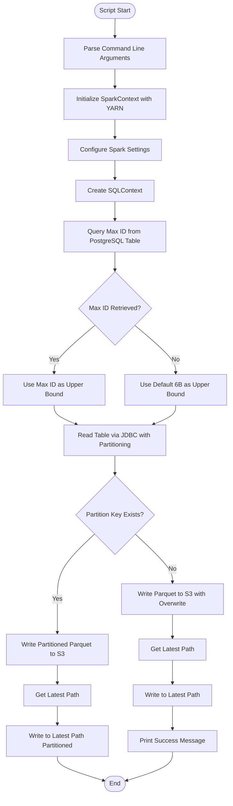
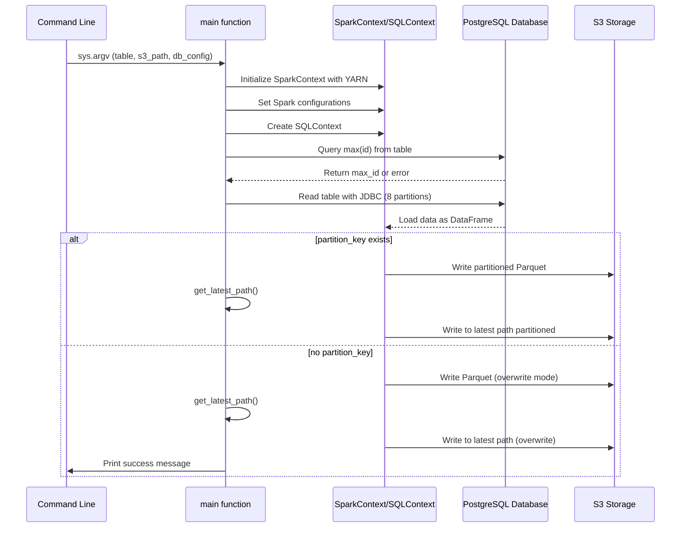
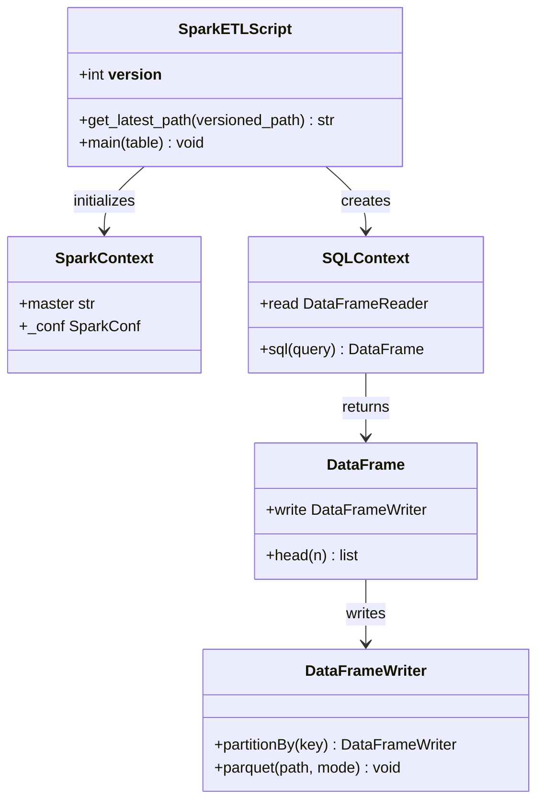

# Diagram: research/orchestrator/tasks/etl/extract_public_eta_summary_spark.py

> Auto-generated by Obscura crawlers

## Diagram 1

### SVG

<svg id="container" width="585.6875" xmlns="http://www.w3.org/2000/svg" class="flowchart" height="2010.359375" viewBox="0 0 585.6875 2010.359375" role="graphics-document document" aria-roledescription="flowchart-v2"><g><marker id="container_flowchart-v2-pointEnd" class="marker flowchart-v2" viewBox="0 0 10 10" refX="5" refY="5" markerUnits="userSpaceOnUse" markerWidth="8" markerHeight="8" orient="auto"><path d="M 0 0 L 10 5 L 0 10 z" class="arrowMarkerPath" style="stroke-width: 1; stroke-dasharray: 1, 0;"></path></marker><marker id="container_flowchart-v2-pointStart" class="marker flowchart-v2" viewBox="0 0 10 10" refX="4.5" refY="5" markerUnits="userSpaceOnUse" markerWidth="8" markerHeight="8" orient="auto"><path d="M 0 5 L 10 10 L 10 0 z" class="arrowMarkerPath" style="stroke-width: 1; stroke-dasharray: 1, 0;"></path></marker><marker id="container_flowchart-v2-circleEnd" class="marker flowchart-v2" viewBox="0 0 10 10" refX="11" refY="5" markerUnits="userSpaceOnUse" markerWidth="11" markerHeight="11" orient="auto"><circle cx="5" cy="5" r="5" class="arrowMarkerPath" style="stroke-width: 1; stroke-dasharray: 1, 0;"></circle></marker><marker id="container_flowchart-v2-circleStart" class="marker flowchart-v2" viewBox="0 0 10 10" refX="-1" refY="5" markerUnits="userSpaceOnUse" markerWidth="11" markerHeight="11" orient="auto"><circle cx="5" cy="5" r="5" class="arrowMarkerPath" style="stroke-width: 1; stroke-dasharray: 1, 0;"></circle></marker><marker id="container_flowchart-v2-crossEnd" class="marker cross flowchart-v2" viewBox="0 0 11 11" refX="12" refY="5.2" markerUnits="userSpaceOnUse" markerWidth="11" markerHeight="11" orient="auto"><path d="M 1,1 l 9,9 M 10,1 l -9,9" class="arrowMarkerPath" style="stroke-width: 2; stroke-dasharray: 1, 0;"></path></marker><marker id="container_flowchart-v2-crossStart" class="marker cross flowchart-v2" viewBox="0 0 11 11" refX="-1" refY="5.2" markerUnits="userSpaceOnUse" markerWidth="11" markerHeight="11" orient="auto"><path d="M 1,1 l 9,9 M 10,1 l -9,9" class="arrowMarkerPath" style="stroke-width: 2; stroke-dasharray: 1, 0;"></path></marker><g class="root"><g class="clusters"></g><g class="edgePaths"><path d="M293.266,47.5L293.182,51.583C293.099,55.667,292.932,63.833,292.849,71.417C292.766,79,292.766,86,292.766,89.5L292.766,93" id="L_Start_ParseArgs_0" class="edge-thickness-normal edge-pattern-solid edge-thickness-normal edge-pattern-solid flowchart-link" style=";" data-edge="true" data-et="edge" data-id="L_Start_ParseArgs_0" data-points="W3sieCI6MjkzLjI2NTYyNSwieSI6NDcuNX0seyJ4IjoyOTIuNzY1NjI1LCJ5Ijo3Mn0seyJ4IjoyOTIuNzY1NjI1LCJ5Ijo5N31d" marker-end="url(#container_flowchart-v2-pointEnd)"></path><path d="M292.766,175L292.766,179.167C292.766,183.333,292.766,191.667,292.766,199.333C292.766,207,292.766,214,292.766,217.5L292.766,221" id="L_ParseArgs_SetupSpark_0" class="edge-thickness-normal edge-pattern-solid edge-thickness-normal edge-pattern-solid flowchart-link" style=";" data-edge="true" data-et="edge" data-id="L_ParseArgs_SetupSpark_0" data-points="W3sieCI6MjkyLjc2NTYyNSwieSI6MTc1fSx7IngiOjI5Mi43NjU2MjUsInkiOjIwMH0seyJ4IjoyOTIuNzY1NjI1LCJ5IjoyMjV9XQ==" marker-end="url(#container_flowchart-v2-pointEnd)"></path><path d="M292.766,303L292.766,307.167C292.766,311.333,292.766,319.667,292.766,327.333C292.766,335,292.766,342,292.766,345.5L292.766,349" id="L_SetupSpark_ConfigSpark_0" class="edge-thickness-normal edge-pattern-solid edge-thickness-normal edge-pattern-solid flowchart-link" style=";" data-edge="true" data-et="edge" data-id="L_SetupSpark_ConfigSpark_0" data-points="W3sieCI6MjkyLjc2NTYyNSwieSI6MzAzfSx7IngiOjI5Mi43NjU2MjUsInkiOjMyOH0seyJ4IjoyOTIuNzY1NjI1LCJ5IjozNTN9XQ==" marker-end="url(#container_flowchart-v2-pointEnd)"></path><path d="M292.766,407L292.766,411.167C292.766,415.333,292.766,423.667,292.766,431.333C292.766,439,292.766,446,292.766,449.5L292.766,453" id="L_ConfigSpark_CreateSQL_0" class="edge-thickness-normal edge-pattern-solid edge-thickness-normal edge-pattern-solid flowchart-link" style=";" data-edge="true" data-et="edge" data-id="L_ConfigSpark_CreateSQL_0" data-points="W3sieCI6MjkyLjc2NTYyNSwieSI6NDA3fSx7IngiOjI5Mi43NjU2MjUsInkiOjQzMn0seyJ4IjoyOTIuNzY1NjI1LCJ5Ijo0NTd9XQ==" marker-end="url(#container_flowchart-v2-pointEnd)"></path><path d="M292.766,511L292.766,515.167C292.766,519.333,292.766,527.667,292.766,535.333C292.766,543,292.766,550,292.766,553.5L292.766,557" id="L_CreateSQL_GetMaxID_0" class="edge-thickness-normal edge-pattern-solid edge-thickness-normal edge-pattern-solid flowchart-link" style=";" data-edge="true" data-et="edge" data-id="L_CreateSQL_GetMaxID_0" data-points="W3sieCI6MjkyLjc2NTYyNSwieSI6NTExfSx7IngiOjI5Mi43NjU2MjUsInkiOjUzNn0seyJ4IjoyOTIuNzY1NjI1LCJ5Ijo1NjF9XQ==" marker-end="url(#container_flowchart-v2-pointEnd)"></path><path d="M292.766,639L292.766,643.167C292.766,647.333,292.766,655.667,292.766,663.333C292.766,671,292.766,678,292.766,681.5L292.766,685" id="L_GetMaxID_CheckMaxID_0" class="edge-thickness-normal edge-pattern-solid edge-thickness-normal edge-pattern-solid flowchart-link" style=";" data-edge="true" data-et="edge" data-id="L_GetMaxID_CheckMaxID_0" data-points="W3sieCI6MjkyLjc2NTYyNSwieSI6NjM5fSx7IngiOjI5Mi43NjU2MjUsInkiOjY2NH0seyJ4IjoyOTIuNzY1NjI1LCJ5Ijo2ODl9XQ==" marker-end="url(#container_flowchart-v2-pointEnd)"></path><path d="M242.725,822.1L225.244,836.606C207.764,851.113,172.804,880.127,155.324,902.134C137.844,924.141,137.844,939.141,137.844,946.641L137.844,954.141" id="L_CheckMaxID_UseMaxID_0" class="edge-thickness-normal edge-pattern-solid edge-thickness-normal edge-pattern-solid flowchart-link" style=";" data-edge="true" data-et="edge" data-id="L_CheckMaxID_UseMaxID_0" data-points="W3sieCI6MjQyLjcyNDU4MjgzOTU4NDQzLCJ5Ijo4MjIuMDk5NTgyODM5NTg0NH0seyJ4IjoxMzcuODQzNzUsInkiOjkwOS4xNDA2MjV9LHsieCI6MTM3Ljg0Mzc1LCJ5Ijo5NTguMTQwNjI1fV0=" marker-end="url(#container_flowchart-v2-pointEnd)"></path><path d="M342.807,822.1L360.287,836.606C377.767,851.113,412.727,880.127,430.207,900.134C447.688,920.141,447.688,931.141,447.688,936.641L447.688,942.141" id="L_CheckMaxID_UseDefault_0" class="edge-thickness-normal edge-pattern-solid edge-thickness-normal edge-pattern-solid flowchart-link" style=";" data-edge="true" data-et="edge" data-id="L_CheckMaxID_UseDefault_0" data-points="W3sieCI6MzQyLjgwNjY2NzE2MDQxNTYsInkiOjgyMi4wOTk1ODI4Mzk1ODQ0fSx7IngiOjQ0Ny42ODc1LCJ5Ijo5MDkuMTQwNjI1fSx7IngiOjQ0Ny42ODc1LCJ5Ijo5NDYuMTQwNjI1fV0=" marker-end="url(#container_flowchart-v2-pointEnd)"></path><path d="M137.844,1012.141L137.844,1018.307C137.844,1024.474,137.844,1036.807,147.314,1046.886C156.784,1056.965,175.723,1064.789,185.193,1068.701L194.663,1072.613" id="L_UseMaxID_ReadJDBC_0" class="edge-thickness-normal edge-pattern-solid edge-thickness-normal edge-pattern-solid flowchart-link" style=";" data-edge="true" data-et="edge" data-id="L_UseMaxID_ReadJDBC_0" data-points="W3sieCI6MTM3Ljg0Mzc1LCJ5IjoxMDEyLjE0MDYyNX0seyJ4IjoxMzcuODQzNzUsInkiOjEwNDkuMTQwNjI1fSx7IngiOjE5OC4zNjAxMDc0MjE4NzUsInkiOjEwNzQuMTQwNjI1fV0=" marker-end="url(#container_flowchart-v2-pointEnd)"></path><path d="M447.688,1024.141L447.688,1028.307C447.688,1032.474,447.688,1040.807,438.218,1048.886C428.748,1056.965,409.808,1064.789,400.338,1068.701L390.868,1072.613" id="L_UseDefault_ReadJDBC_0" class="edge-thickness-normal edge-pattern-solid edge-thickness-normal edge-pattern-solid flowchart-link" style=";" data-edge="true" data-et="edge" data-id="L_UseDefault_ReadJDBC_0" data-points="W3sieCI6NDQ3LjY4NzUsInkiOjEwMjQuMTQwNjI1fSx7IngiOjQ0Ny42ODc1LCJ5IjoxMDQ5LjE0MDYyNX0seyJ4IjozODcuMTcxMTQyNTc4MTI1LCJ5IjoxMDc0LjE0MDYyNX1d" marker-end="url(#container_flowchart-v2-pointEnd)"></path><path d="M292.766,1152.141L292.766,1156.307C292.766,1160.474,292.766,1168.807,292.766,1176.474C292.766,1184.141,292.766,1191.141,292.766,1194.641L292.766,1198.141" id="L_ReadJDBC_CheckPartition_0" class="edge-thickness-normal edge-pattern-solid edge-thickness-normal edge-pattern-solid flowchart-link" style=";" data-edge="true" data-et="edge" data-id="L_ReadJDBC_CheckPartition_0" data-points="W3sieCI6MjkyLjc2NTYyNSwieSI6MTE1Mi4xNDA2MjV9LHsieCI6MjkyLjc2NTYyNSwieSI6MTE3Ny4xNDA2MjV9LHsieCI6MjkyLjc2NTYyNSwieSI6MTIwMi4xNDA2MjV9XQ==" marker-end="url(#container_flowchart-v2-pointEnd)"></path><path d="M241.451,1350.045L225.811,1364.764C210.172,1379.483,178.892,1408.921,163.253,1436.307C147.613,1463.693,147.613,1489.026,147.613,1512.359C147.613,1535.693,147.613,1557.026,147.613,1571.193C147.613,1585.359,147.613,1592.359,147.613,1595.859L147.613,1599.359" id="L_CheckPartition_WritePartitioned_0" class="edge-thickness-normal edge-pattern-solid edge-thickness-normal edge-pattern-solid flowchart-link" style=";" data-edge="true" data-et="edge" data-id="L_CheckPartition_WritePartitioned_0" data-points="W3sieCI6MjQxLjQ1MDg2NzYwNTQ2NzgzLCJ5IjoxMzUwLjA0NDYxNzYwNTQ2OH0seyJ4IjoxNDcuNjEzMjgxMjUsInkiOjE0MzguMzU5Mzc1fSx7IngiOjE0Ny42MTMyODEyNSwieSI6MTUxNC4zNTkzNzV9LHsieCI6MTQ3LjYxMzI4MTI1LCJ5IjoxNTc4LjM1OTM3NX0seyJ4IjoxNDcuNjEzMjgxMjUsInkiOjE2MDMuMzU5Mzc1fV0=" marker-end="url(#container_flowchart-v2-pointEnd)"></path><path d="M344.08,1350.045L359.72,1364.764C375.36,1379.483,406.639,1408.921,422.278,1429.14C437.918,1449.359,437.918,1460.359,437.918,1465.859L437.918,1471.359" id="L_CheckPartition_WriteSimple_0" class="edge-thickness-normal edge-pattern-solid edge-thickness-normal edge-pattern-solid flowchart-link" style=";" data-edge="true" data-et="edge" data-id="L_CheckPartition_WriteSimple_0" data-points="W3sieCI6MzQ0LjA4MDM4MjM5NDUzMjIsInkiOjEzNTAuMDQ0NjE3NjA1NDY4fSx7IngiOjQzNy45MTc5Njg3NSwieSI6MTQzOC4zNTkzNzV9LHsieCI6NDM3LjkxNzk2ODc1LCJ5IjoxNDc1LjM1OTM3NX1d" marker-end="url(#container_flowchart-v2-pointEnd)"></path><path d="M147.613,1681.359L147.613,1685.526C147.613,1689.693,147.613,1698.026,147.613,1705.693C147.613,1713.359,147.613,1720.359,147.613,1723.859L147.613,1727.359" id="L_WritePartitioned_GetLatestPath1_0" class="edge-thickness-normal edge-pattern-solid edge-thickness-normal edge-pattern-solid flowchart-link" style=";" data-edge="true" data-et="edge" data-id="L_WritePartitioned_GetLatestPath1_0" data-points="W3sieCI6MTQ3LjYxMzI4MTI1LCJ5IjoxNjgxLjM1OTM3NX0seyJ4IjoxNDcuNjEzMjgxMjUsInkiOjE3MDYuMzU5Mzc1fSx7IngiOjE0Ny42MTMyODEyNSwieSI6MTczMS4zNTkzNzV9XQ==" marker-end="url(#container_flowchart-v2-pointEnd)"></path><path d="M437.918,1553.359L437.918,1557.526C437.918,1561.693,437.918,1570.026,437.918,1579.693C437.918,1589.359,437.918,1600.359,437.918,1605.859L437.918,1611.359" id="L_WriteSimple_GetLatestPath2_0" class="edge-thickness-normal edge-pattern-solid edge-thickness-normal edge-pattern-solid flowchart-link" style=";" data-edge="true" data-et="edge" data-id="L_WriteSimple_GetLatestPath2_0" data-points="W3sieCI6NDM3LjkxNzk2ODc1LCJ5IjoxNTUzLjM1OTM3NX0seyJ4Ijo0MzcuOTE3OTY4NzUsInkiOjE1NzguMzU5Mzc1fSx7IngiOjQzNy45MTc5Njg3NSwieSI6MTYxNS4zNTkzNzV9XQ==" marker-end="url(#container_flowchart-v2-pointEnd)"></path><path d="M147.613,1785.359L147.613,1789.526C147.613,1793.693,147.613,1802.026,147.613,1809.693C147.613,1817.359,147.613,1824.359,147.613,1827.859L147.613,1831.359" id="L_GetLatestPath1_WriteLatest1_0" class="edge-thickness-normal edge-pattern-solid edge-thickness-normal edge-pattern-solid flowchart-link" style=";" data-edge="true" data-et="edge" data-id="L_GetLatestPath1_WriteLatest1_0" data-points="W3sieCI6MTQ3LjYxMzI4MTI1LCJ5IjoxNzg1LjM1OTM3NX0seyJ4IjoxNDcuNjEzMjgxMjUsInkiOjE4MTAuMzU5Mzc1fSx7IngiOjE0Ny42MTMyODEyNSwieSI6MTgzNS4zNTkzNzV9XQ==" marker-end="url(#container_flowchart-v2-pointEnd)"></path><path d="M437.918,1669.359L437.918,1675.526C437.918,1681.693,437.918,1694.026,437.918,1703.693C437.918,1713.359,437.918,1720.359,437.918,1723.859L437.918,1727.359" id="L_GetLatestPath2_WriteLatest2_0" class="edge-thickness-normal edge-pattern-solid edge-thickness-normal edge-pattern-solid flowchart-link" style=";" data-edge="true" data-et="edge" data-id="L_GetLatestPath2_WriteLatest2_0" data-points="W3sieCI6NDM3LjkxNzk2ODc1LCJ5IjoxNjY5LjM1OTM3NX0seyJ4Ijo0MzcuOTE3OTY4NzUsInkiOjE3MDYuMzU5Mzc1fSx7IngiOjQzNy45MTc5Njg3NSwieSI6MTczMS4zNTkzNzV9XQ==" marker-end="url(#container_flowchart-v2-pointEnd)"></path><path d="M147.613,1913.359L147.613,1917.526C147.613,1921.693,147.613,1930.026,167.162,1940.242C186.712,1950.458,225.81,1962.556,245.359,1968.606L264.908,1974.655" id="L_WriteLatest1_End_0" class="edge-thickness-normal edge-pattern-solid edge-thickness-normal edge-pattern-solid flowchart-link" style=";" data-edge="true" data-et="edge" data-id="L_WriteLatest1_End_0" data-points="W3sieCI6MTQ3LjYxMzI4MTI1LCJ5IjoxOTEzLjM1OTM3NX0seyJ4IjoxNDcuNjEzMjgxMjUsInkiOjE5MzguMzU5Mzc1fSx7IngiOjI2OC43Mjk2MjQxMzM5NTgwNSwieSI6MTk3NS44MzcyNjQwMjEwNzI4fV0=" marker-end="url(#container_flowchart-v2-pointEnd)"></path><path d="M437.918,1785.359L437.918,1789.526C437.918,1793.693,437.918,1802.026,437.918,1811.693C437.918,1821.359,437.918,1832.359,437.918,1837.859L437.918,1843.359" id="L_WriteLatest2_PrintSuccess_0" class="edge-thickness-normal edge-pattern-solid edge-thickness-normal edge-pattern-solid flowchart-link" style=";" data-edge="true" data-et="edge" data-id="L_WriteLatest2_PrintSuccess_0" data-points="W3sieCI6NDM3LjkxNzk2ODc1LCJ5IjoxNzg1LjM1OTM3NX0seyJ4Ijo0MzcuOTE3OTY4NzUsInkiOjE4MTAuMzU5Mzc1fSx7IngiOjQzNy45MTc5Njg3NSwieSI6MTg0Ny4zNTkzNzV9XQ==" marker-end="url(#container_flowchart-v2-pointEnd)"></path><path d="M437.918,1901.359L437.918,1907.526C437.918,1913.693,437.918,1926.026,418.535,1938.24C399.152,1950.455,360.386,1962.55,341.003,1968.598L321.62,1974.646" id="L_PrintSuccess_End_0" class="edge-thickness-normal edge-pattern-solid edge-thickness-normal edge-pattern-solid flowchart-link" style=";" data-edge="true" data-et="edge" data-id="L_PrintSuccess_End_0" data-points="W3sieCI6NDM3LjkxNzk2ODc1LCJ5IjoxOTAxLjM1OTM3NX0seyJ4Ijo0MzcuOTE3OTY4NzUsInkiOjE5MzguMzU5Mzc1fSx7IngiOjMxNy44MDE2MjY3ODgxNTksInkiOjE5NzUuODM3MjYzNzM4Mzc1NH1d" marker-end="url(#container_flowchart-v2-pointEnd)"></path></g><g class="edgeLabels"><g class="edgeLabel"><g class="label" data-id="L_Start_ParseArgs_0" transform="translate(0, 0)"><foreignObject width="0" height="0">

</foreignObject></g></g><g class="edgeLabel"><g class="label" data-id="L_ParseArgs_SetupSpark_0" transform="translate(0, 0)"><foreignObject width="0" height="0">

</foreignObject></g></g><g class="edgeLabel"><g class="label" data-id="L_SetupSpark_ConfigSpark_0" transform="translate(0, 0)"><foreignObject width="0" height="0">

</foreignObject></g></g><g class="edgeLabel"><g class="label" data-id="L_ConfigSpark_CreateSQL_0" transform="translate(0, 0)"><foreignObject width="0" height="0">

</foreignObject></g></g><g class="edgeLabel"><g class="label" data-id="L_CreateSQL_GetMaxID_0" transform="translate(0, 0)"><foreignObject width="0" height="0">

</foreignObject></g></g><g class="edgeLabel"><g class="label" data-id="L_GetMaxID_CheckMaxID_0" transform="translate(0, 0)"><foreignObject width="0" height="0">

</foreignObject></g></g><g class="edgeLabel" transform="translate(137.84375, 909.140625)"><g class="label" data-id="L_CheckMaxID_UseMaxID_0" transform="translate(-12.03125, -12)"><foreignObject width="24.0625" height="24">

Yes

</foreignObject></g></g><g class="edgeLabel" transform="translate(447.6875, 909.140625)"><g class="label" data-id="L_CheckMaxID_UseDefault_0" transform="translate(-10.140625, -12)"><foreignObject width="20.28125" height="24">

No

</foreignObject></g></g><g class="edgeLabel"><g class="label" data-id="L_UseMaxID_ReadJDBC_0" transform="translate(0, 0)"><foreignObject width="0" height="0">

</foreignObject></g></g><g class="edgeLabel"><g class="label" data-id="L_UseDefault_ReadJDBC_0" transform="translate(0, 0)"><foreignObject width="0" height="0">

</foreignObject></g></g><g class="edgeLabel"><g class="label" data-id="L_ReadJDBC_CheckPartition_0" transform="translate(0, 0)"><foreignObject width="0" height="0">

</foreignObject></g></g><g class="edgeLabel" transform="translate(147.61328125, 1514.359375)"><g class="label" data-id="L_CheckPartition_WritePartitioned_0" transform="translate(-12.03125, -12)"><foreignObject width="24.0625" height="24">

Yes

</foreignObject></g></g><g class="edgeLabel" transform="translate(437.91796875, 1438.359375)"><g class="label" data-id="L_CheckPartition_WriteSimple_0" transform="translate(-10.140625, -12)"><foreignObject width="20.28125" height="24">

No

</foreignObject></g></g><g class="edgeLabel"><g class="label" data-id="L_WritePartitioned_GetLatestPath1_0" transform="translate(0, 0)"><foreignObject width="0" height="0">

</foreignObject></g></g><g class="edgeLabel"><g class="label" data-id="L_WriteSimple_GetLatestPath2_0" transform="translate(0, 0)"><foreignObject width="0" height="0">

</foreignObject></g></g><g class="edgeLabel"><g class="label" data-id="L_GetLatestPath1_WriteLatest1_0" transform="translate(0, 0)"><foreignObject width="0" height="0">

</foreignObject></g></g><g class="edgeLabel"><g class="label" data-id="L_GetLatestPath2_WriteLatest2_0" transform="translate(0, 0)"><foreignObject width="0" height="0">

</foreignObject></g></g><g class="edgeLabel"><g class="label" data-id="L_WriteLatest1_End_0" transform="translate(0, 0)"><foreignObject width="0" height="0">

</foreignObject></g></g><g class="edgeLabel"><g class="label" data-id="L_WriteLatest2_PrintSuccess_0" transform="translate(0, 0)"><foreignObject width="0" height="0">

</foreignObject></g></g><g class="edgeLabel"><g class="label" data-id="L_PrintSuccess_End_0" transform="translate(0, 0)"><foreignObject width="0" height="0">

</foreignObject></g></g></g><g class="nodes"><g class="node default" id="flowchart-Start-0" transform="translate(292.765625, 27.5)"><g class="basic label-container outer-path"><path d="M-33.6875 -19.5 C-13.968977683175428 -19.5, 5.749544633649144 -19.5, 33.6875 -19.5 C33.6875 -19.5, 33.6875 -19.5, 33.6875 -19.5 C34.15863041199291 -19.484891764687102, 34.62976082398581 -19.469783529374208, 34.9368692896239 -19.45993515863156 C35.25130885348555 -19.42960155207473, 35.565748417347194 -19.3992679455179, 36.181104652847864 -19.3399052695533 C36.51714832016319 -19.28557633547932, 36.85319198747851 -19.23124740140534, 37.41509325967676 -19.140403561325776 C37.700398780611295 -19.075284437964985, 37.98570430154583 -19.010165314604194, 38.63376438623539 -18.862249829261074 C38.92087792986411 -18.777036036601814, 39.20799147349283 -18.691822243942557, 39.832110251460605 -18.50658706670804 C40.088818008521365 -18.412116239129187, 40.34552576558212 -18.317645411550338, 41.0052065951478 -18.074876768247425 C41.248375260849485 -17.967233213283468, 41.49154392655117 -17.859589658319507, 42.14823291279238 -17.568892924097174 C42.37452154500923 -17.450838289614428, 42.60081017722609 -17.332783655131685, 43.25649226407678 -16.990714730406097 C43.638907533215054 -16.758892346932907, 44.02132280235332 -16.52706996345972, 44.3254305736057 -16.342718045390892 C44.59613487856366 -16.15388644085271, 44.86683918352162 -15.965054836314527, 45.35065534457871 -15.627565626425154 C45.679535921088146 -15.365292118538576, 46.00841649759758 -15.103018610651999, 46.327953708501866 -14.848196188198123 C46.56036490057828 -14.637126492817503, 46.792776092654684 -14.426056797436884, 47.25330973676799 -14.007812326905688 C47.59437104019537 -13.655638529463141, 47.93543234362276 -13.303464732020595, 48.12292094296865 -13.10986736009568 C48.38616205203076 -12.800649374547886, 48.64940316109288 -12.491431389000093, 48.93321390812658 -12.158051136245305 C49.219681701148225 -11.774210391349126, 49.50614949416987 -11.390369646452946, 49.680858964640635 -11.156274872382312 C49.834382947371225 -10.92042080794644, 49.98790693010182 -10.68456674351057, 50.36278387860425 -10.108655082055241 C50.58812186696183 -9.708544665780746, 50.81345985531941 -9.30843424950625, 50.976186474273504 -9.019496659696287 C51.08559758976194 -8.792302137361707, 51.19500870525037 -8.565107615027129, 51.51854614880834 -7.893275190886684 C51.70519093417751 -7.432258962493394, 51.891835719546684 -6.971242734100104, 51.987634229970325 -6.734618561215508 C52.11726019124271 -6.344205818955268, 52.246886152515096 -5.953793076695027, 52.38152313421488 -5.548287939305138 C52.50792034168221 -5.066280606335966, 52.63431754914954 -4.5842732733667955, 52.69859428754556 -4.339158212148133 C52.78536797017983 -3.8935936914455036, 52.872141652814086 -3.448029170742874, 52.937544776581774 -3.1121979531509023 C52.976303959462854 -2.81158938459163, 53.015063142343934 -2.510980816032358, 53.09739270250937 -1.872449005199798 C53.11696166698636 -1.5676465876867782, 53.13653063146336 -1.2628441701737585, 53.17748121591342 -0.6250057626472757 C53.17748121591342 -0.34003129116070796, 53.17748121591342 -0.05505681967414022, 53.17748121591342 0.625005762647271 C53.15555704748099 0.966492382852504, 53.13363287904857 1.3079790030577372, 53.09739270250937 1.8724490051997846 C53.051613189953024 2.2275058643995287, 53.00583367739667 2.5825627235992727, 52.937544776581774 3.1121979531508885 C52.854902602346684 3.5365480514183614, 52.7722604281116 3.9608981496858346, 52.69859428754556 4.339158212148129 C52.60272088886371 4.7047650331158675, 52.506847490181855 5.070371854083607, 52.38152313421489 5.548287939305125 C52.22744140488416 6.012357558459601, 52.073359675553434 6.4764271776140765, 51.987634229970325 6.734618561215495 C51.88253332811142 6.994219820794699, 51.77743242625251 7.253821080373903, 51.51854614880834 7.893275190886679 C51.38141204840856 8.178037084566524, 51.24427794800878 8.46279897824637, 50.976186474273504 9.019496659696284 C50.786498933200974 9.356306096816937, 50.59681139212844 9.693115533937588, 50.36278387860425 10.108655082055236 C50.18487701868129 10.381967793577871, 50.006970158758335 10.655280505100505, 49.68085896464064 11.156274872382301 C49.38578879422517 11.551642019293501, 49.09071862380971 11.9470091662047, 48.93321390812658 12.158051136245302 C48.66086899205784 12.477962971524379, 48.388524075989096 12.797874806803454, 48.12292094296866 13.10986736009567 C47.93783884718507 13.300979819514891, 47.75275675140148 13.492092278934113, 47.25330973676799 14.007812326905684 C46.94169685028707 14.29081090558248, 46.63008396380616 14.573809484259275, 46.32795370850189 14.848196188198111 C46.05109616011162 15.06898271555057, 45.77423861172136 15.289769242903029, 45.35065534457871 15.627565626425152 C45.05322583979801 15.835039573444428, 44.7557963350173 16.042513520463704, 44.32543057360571 16.34271804539089 C44.110002413061764 16.47331186230902, 43.89457425251782 16.603905679227154, 43.25649226407678 16.990714730406093 C42.953207688326515 17.148938099311966, 42.649923112576246 17.30716146821784, 42.14823291279239 17.56889292409717 C41.8094477599162 17.71886306157096, 41.470662607040026 17.868833199044754, 41.005206595147804 18.07487676824742 C40.73767508616601 18.17333083658688, 40.47014357718421 18.271784904926342, 39.83211025146062 18.506587066708033 C39.44986980143791 18.62003402585371, 39.0676293514152 18.733480984999385, 38.63376438623541 18.86224982926107 C38.27463851976789 18.94421796476699, 37.91551265330036 19.026186100272913, 37.415093259676766 19.140403561325773 C36.96742523205785 19.212779056313796, 36.51975720443893 19.28515455130182, 36.18110465284788 19.3399052695533 C35.81167745974336 19.37554346657089, 35.44225026663883 19.41118166358848, 34.9368692896239 19.45993515863156 C34.523259693956454 19.473198813322377, 34.10965009828901 19.48646246801319, 33.68750000000001 19.5 C33.68750000000001 19.5, 33.68750000000001 19.5, 33.6875 19.5 C17.201364710016954 19.5, 0.7152294200339071 19.5, -33.68749999999999 19.5 C-33.96977728107222 19.49094791701541, -34.252054562144444 19.48189583403082, -34.93686928962389 19.45993515863156 C-35.28531331359934 19.426321182703898, -35.633757337574785 19.392707206776237, -36.18110465284787 19.3399052695533 C-36.547780520055966 19.280623958956912, -36.91445638726406 19.22134264836053, -37.41509325967676 19.140403561325773 C-37.80317214861905 19.051827087376115, -38.19125103756134 18.96325061342646, -38.633764386235384 18.862249829261074 C-39.07379857809385 18.73164999090409, -39.513832769952316 18.601050152547106, -39.83211025146059 18.506587066708043 C-40.22911140586697 18.360486972048054, -40.62611256027335 18.214386877388065, -41.0052065951478 18.074876768247425 C-41.25788652261359 17.963022859842052, -41.51056645007938 17.85116895143668, -42.14823291279238 17.568892924097174 C-42.43308809196688 17.42028415958029, -42.71794327114137 17.271675395063404, -43.25649226407678 16.990714730406097 C-43.55661620200566 16.808777835509584, -43.85674013993453 16.62684094061307, -44.325430573605686 16.3427180453909 C-44.58415626754523 16.162242201353454, -44.84288196148477 15.981766357316006, -45.35065534457871 15.627565626425156 C-45.6978720922604 15.350669509974715, -46.04508883994208 15.073773393524275, -46.327953708501866 14.848196188198125 C-46.63172874198953 14.572315740231577, -46.935503775477194 14.29643529226503, -47.253309736767974 14.007812326905697 C-47.539352485057734 13.712449704750135, -47.82539523334749 13.417087082594573, -48.122920942968655 13.109867360095677 C-48.4455644611489 12.73087192470489, -48.76820797932914 12.351876489314101, -48.933213908126575 12.158051136245307 C-49.18336586444218 11.822870304094439, -49.433517820757785 11.48768947194357, -49.680858964640635 11.156274872382316 C-49.88592086353309 10.841244728853571, -50.09098276242555 10.526214585324826, -50.36278387860425 10.108655082055249 C-50.50704350425882 9.852507508834433, -50.651303129913394 9.596359935613618, -50.976186474273504 9.019496659696289 C-51.13348398251773 8.69286501819963, -51.290781490761965 8.366233376702972, -51.51854614880834 7.893275190886686 C-51.698996137810326 7.447560229288577, -51.87944612681232 7.001845267690468, -51.987634229970325 6.73461856121551 C-52.12996147332956 6.305951580984169, -52.272288716688784 5.8772846007528265, -52.38152313421488 5.5482879393051325 C-52.47393463613311 5.195882831092651, -52.56634613805134 4.84347772288017, -52.69859428754556 4.339158212148136 C-52.76487329452798 3.9988295193664927, -52.8311523015104 3.658500826584849, -52.937544776581774 3.112197953150904 C-52.97986099909175 2.7840016876468274, -53.02217722160173 2.4558054221427508, -53.09739270250937 1.872449005199809 C-53.118017948666036 1.551194147910668, -53.138643194822706 1.2299392906215267, -53.17748121591342 0.6250057626472781 C-53.17748121591342 0.36196152264241543, -53.17748121591342 0.09891728263755273, -53.17748121591342 -0.6250057626472687 C-53.14595947635336 -1.1159823001853322, -53.114437736793306 -1.6069588377233956, -53.09739270250937 -1.8724490051997822 C-53.03540701792027 -2.353197734414921, -52.97342133333117 -2.8339464636300598, -52.937544776581774 -3.112197953150895 C-52.87034569045719 -3.457251057868759, -52.8031466043326 -3.8023041625866227, -52.69859428754556 -4.339158212148126 C-52.590219371734996 -4.752438736119457, -52.481844455924424 -5.165719260090787, -52.38152313421489 -5.548287939305123 C-52.22631767758307 -6.015742046048854, -52.07111222095125 -6.483196152792585, -51.98763422997033 -6.734618561215485 C-51.82741379428082 -7.1303661350199725, -51.667193358591305 -7.526113708824461, -51.51854614880834 -7.893275190886676 C-51.40906041783151 -8.12062465387943, -51.299574686854676 -8.347974116872182, -50.976186474273504 -9.019496659696282 C-50.84010473466231 -9.261123568146314, -50.70402299505112 -9.502750476596347, -50.36278387860425 -10.108655082055243 C-50.21672066643194 -10.333047399416186, -50.070657454259624 -10.557439716777127, -49.68085896464064 -11.156274872382308 C-49.50489055133479 -11.392056515159913, -49.32892213802893 -11.627838157937518, -48.93321390812659 -12.158051136245302 C-48.7385064504101 -12.386765595247294, -48.54379899269361 -12.615480054249286, -48.12292094296866 -13.10986736009567 C-47.90536235578758 -13.334514463252331, -47.6878037686065 -13.55916156640899, -47.253309736767996 -14.007812326905677 C-46.982186515925065 -14.2540392625479, -46.711063295082134 -14.500266198190124, -46.32795370850189 -14.848196188198107 C-46.09015334596316 -15.037835649189331, -45.85235298342444 -15.227475110180553, -45.35065534457872 -15.627565626425149 C-44.9653283808541 -15.896353035784026, -44.58000141712949 -16.165140445142903, -44.325430573605715 -16.342718045390885 C-43.99253349529575 -16.544522210582763, -43.65963641698579 -16.746326375774643, -43.25649226407679 -16.99071473040609 C-42.841837559302085 -17.20703982428804, -42.42718285452738 -17.423364918169987, -42.14823291279239 -17.56889292409717 C-41.86845912608792 -17.69274048027673, -41.588685339383446 -17.816588036456285, -41.005206595147804 -18.07487676824742 C-40.58713370625922 -18.228731455981837, -40.16906081737064 -18.382586143716257, -39.83211025146062 -18.506587066708033 C-39.483537161891896 -18.610041729994546, -39.13496407232317 -18.71349639328106, -38.63376438623541 -18.862249829261067 C-38.234031480726166 -18.953486256442567, -37.83429857521692 -19.04472268362407, -37.415093259676766 -19.140403561325773 C-37.012644696157246 -19.205468324040385, -36.61019613263772 -19.270533086755, -36.18110465284788 -19.3399052695533 C-35.77520566055094 -19.379061857175227, -35.369306668254 -19.41821844479715, -34.9368692896239 -19.45993515863156 C-34.615666840132896 -19.470235496004094, -34.29446439064189 -19.48053583337663, -33.68750000000001 -19.5 C-33.68750000000001 -19.5, -33.6875 -19.5, -33.6875 -19.5" stroke="none" stroke-width="0" fill="#ECECFF" style=""></path><path d="M-33.6875 -19.5 C-19.16679632595283 -19.5, -4.646092651905665 -19.5, 33.6875 -19.5 M-33.6875 -19.5 C-16.19330187574626 -19.5, 1.3008962485074775 -19.5, 33.6875 -19.5 M33.6875 -19.5 C33.6875 -19.5, 33.6875 -19.5, 33.6875 -19.5 M33.6875 -19.5 C33.6875 -19.5, 33.6875 -19.5, 33.6875 -19.5 M33.6875 -19.5 C34.07164371274884 -19.487681258822523, 34.45578742549767 -19.475362517645046, 34.9368692896239 -19.45993515863156 M33.6875 -19.5 C34.07651231829055 -19.487525132118964, 34.46552463658109 -19.475050264237932, 34.9368692896239 -19.45993515863156 M34.9368692896239 -19.45993515863156 C35.258604029041535 -19.428897795262575, 35.58033876845917 -19.39786043189359, 36.181104652847864 -19.3399052695533 M34.9368692896239 -19.45993515863156 C35.2040635218647 -19.434159252395368, 35.47125775410549 -19.408383346159177, 36.181104652847864 -19.3399052695533 M36.181104652847864 -19.3399052695533 C36.453432540743464 -19.29587740857265, 36.72576042863906 -19.251849547592006, 37.41509325967676 -19.140403561325776 M36.181104652847864 -19.3399052695533 C36.588132438756915 -19.274100173675148, 36.99516022466597 -19.208295077796993, 37.41509325967676 -19.140403561325776 M37.41509325967676 -19.140403561325776 C37.88891229273147 -19.032257458989186, 38.36273132578618 -18.9241113566526, 38.63376438623539 -18.862249829261074 M37.41509325967676 -19.140403561325776 C37.86190654272115 -19.038421345200053, 38.308719825765536 -18.936439129074333, 38.63376438623539 -18.862249829261074 M38.63376438623539 -18.862249829261074 C38.96464193886214 -18.764047108453173, 39.295519491488875 -18.665844387645272, 39.832110251460605 -18.50658706670804 M38.63376438623539 -18.862249829261074 C39.08694958479363 -18.72774684114664, 39.54013478335187 -18.593243853032206, 39.832110251460605 -18.50658706670804 M39.832110251460605 -18.50658706670804 C40.202683684547516 -18.37021261778879, 40.57325711763442 -18.233838168869546, 41.0052065951478 -18.074876768247425 M39.832110251460605 -18.50658706670804 C40.198899672525066 -18.371605169192076, 40.56568909358953 -18.236623271676113, 41.0052065951478 -18.074876768247425 M41.0052065951478 -18.074876768247425 C41.281771427643655 -17.952449720905776, 41.55833626013951 -17.830022673564127, 42.14823291279238 -17.568892924097174 M41.0052065951478 -18.074876768247425 C41.24643741460166 -17.96809104033321, 41.48766823405552 -17.861305312419, 42.14823291279238 -17.568892924097174 M42.14823291279238 -17.568892924097174 C42.37146379850101 -17.452433514009186, 42.59469468420964 -17.335974103921203, 43.25649226407678 -16.990714730406097 M42.14823291279238 -17.568892924097174 C42.58925733863072 -17.338810763626938, 43.03028176446906 -17.108728603156706, 43.25649226407678 -16.990714730406097 M43.25649226407678 -16.990714730406097 C43.54728053662661 -16.814437170724823, 43.83806880917643 -16.638159611043548, 44.3254305736057 -16.342718045390892 M43.25649226407678 -16.990714730406097 C43.55793569964472 -16.807977948286553, 43.85937913521267 -16.625241166167008, 44.3254305736057 -16.342718045390892 M44.3254305736057 -16.342718045390892 C44.67390148918524 -16.099639819745413, 45.02237240476477 -15.856561594099936, 45.35065534457871 -15.627565626425154 M44.3254305736057 -16.342718045390892 C44.54789729033983 -16.187534894226115, 44.770364007073965 -16.032351743061337, 45.35065534457871 -15.627565626425154 M45.35065534457871 -15.627565626425154 C45.671824138995895 -15.371442059538005, 45.992992933413085 -15.115318492650854, 46.327953708501866 -14.848196188198123 M45.35065534457871 -15.627565626425154 C45.65205128229463 -15.38721038657945, 45.953447220010545 -15.146855146733747, 46.327953708501866 -14.848196188198123 M46.327953708501866 -14.848196188198123 C46.53009014446079 -14.664621225297248, 46.73222658041972 -14.481046262396374, 47.25330973676799 -14.007812326905688 M46.327953708501866 -14.848196188198123 C46.537029419388126 -14.658319159411397, 46.74610513027439 -14.46844213062467, 47.25330973676799 -14.007812326905688 M47.25330973676799 -14.007812326905688 C47.46884246704618 -13.785257087327206, 47.68437519732437 -13.562701847748725, 48.12292094296865 -13.10986736009568 M47.25330973676799 -14.007812326905688 C47.5533169066911 -13.698030292913348, 47.85332407661421 -13.388248258921008, 48.12292094296865 -13.10986736009568 M48.12292094296865 -13.10986736009568 C48.28723006595838 -12.916860514777984, 48.45153918894812 -12.723853669460286, 48.93321390812658 -12.158051136245305 M48.12292094296865 -13.10986736009568 C48.443467459560416 -12.73333518209349, 48.764013976152185 -12.3568030040913, 48.93321390812658 -12.158051136245305 M48.93321390812658 -12.158051136245305 C49.09862736991338 -11.936412166927372, 49.26404083170018 -11.71477319760944, 49.680858964640635 -11.156274872382312 M48.93321390812658 -12.158051136245305 C49.11010220255199 -11.921036936570392, 49.2869904969774 -11.68402273689548, 49.680858964640635 -11.156274872382312 M49.680858964640635 -11.156274872382312 C49.883080967196804 -10.845607572245042, 50.08530296975297 -10.534940272107772, 50.36278387860425 -10.108655082055241 M49.680858964640635 -11.156274872382312 C49.86882156947141 -10.867513836335679, 50.05678417430218 -10.578752800289045, 50.36278387860425 -10.108655082055241 M50.36278387860425 -10.108655082055241 C50.59840213604196 -9.690291007038836, 50.83402039347968 -9.271926932022431, 50.976186474273504 -9.019496659696287 M50.36278387860425 -10.108655082055241 C50.55903534243044 -9.760190735416208, 50.75528680625664 -9.411726388777174, 50.976186474273504 -9.019496659696287 M50.976186474273504 -9.019496659696287 C51.10605471923869 -8.749822470290772, 51.23592296420388 -8.480148280885258, 51.51854614880834 -7.893275190886684 M50.976186474273504 -9.019496659696287 C51.15254970512022 -8.653274637274455, 51.32891293596693 -8.287052614852623, 51.51854614880834 -7.893275190886684 M51.51854614880834 -7.893275190886684 C51.70551631663637 -7.43145526152918, 51.89248648446439 -6.969635332171675, 51.987634229970325 -6.734618561215508 M51.51854614880834 -7.893275190886684 C51.66893426766989 -7.521813629742175, 51.81932238653144 -7.150352068597666, 51.987634229970325 -6.734618561215508 M51.987634229970325 -6.734618561215508 C52.09709247200587 -6.404947776006949, 52.20655071404141 -6.075276990798391, 52.38152313421488 -5.548287939305138 M51.987634229970325 -6.734618561215508 C52.1444211914238 -6.262401213927519, 52.30120815287727 -5.79018386663953, 52.38152313421488 -5.548287939305138 M52.38152313421488 -5.548287939305138 C52.49241571922903 -5.125406451495824, 52.60330830424318 -4.702524963686509, 52.69859428754556 -4.339158212148133 M52.38152313421488 -5.548287939305138 C52.4920292870809 -5.126880084757388, 52.60253543994693 -4.705472230209638, 52.69859428754556 -4.339158212148133 M52.69859428754556 -4.339158212148133 C52.7556435636316 -4.046222236815087, 52.81269283971764 -3.7532862614820406, 52.937544776581774 -3.1121979531509023 M52.69859428754556 -4.339158212148133 C52.761714902037774 -4.01504719727721, 52.82483551652999 -3.6909361824062863, 52.937544776581774 -3.1121979531509023 M52.937544776581774 -3.1121979531509023 C52.998663670335006 -2.6381718824915255, 53.059782564088245 -2.164145811832149, 53.09739270250937 -1.872449005199798 M52.937544776581774 -3.1121979531509023 C52.99113449780977 -2.6965666577940066, 53.04472421903776 -2.2809353624371114, 53.09739270250937 -1.872449005199798 M53.09739270250937 -1.872449005199798 C53.116450443670196 -1.5756093034880552, 53.13550818483103 -1.2787696017763124, 53.17748121591342 -0.6250057626472757 M53.09739270250937 -1.872449005199798 C53.12341153556531 -1.4671846783294922, 53.149430368621246 -1.0619203514591864, 53.17748121591342 -0.6250057626472757 M53.17748121591342 -0.6250057626472757 C53.17748121591342 -0.3747638540742082, 53.17748121591342 -0.12452194550114071, 53.17748121591342 0.625005762647271 M53.17748121591342 -0.6250057626472757 C53.17748121591342 -0.2781794392508851, 53.17748121591342 0.06864688414550546, 53.17748121591342 0.625005762647271 M53.17748121591342 0.625005762647271 C53.151290882704586 1.0329413428312517, 53.125100549495755 1.4408769230152325, 53.09739270250937 1.8724490051997846 M53.17748121591342 0.625005762647271 C53.158963392156 0.9134358149873782, 53.140445568398576 1.2018658673274856, 53.09739270250937 1.8724490051997846 M53.09739270250937 1.8724490051997846 C53.055017895023006 2.2010996442117943, 53.012643087536645 2.5297502832238035, 52.937544776581774 3.1121979531508885 M53.09739270250937 1.8724490051997846 C53.05394643514197 2.209409675465457, 53.01050016777456 2.5463703457311295, 52.937544776581774 3.1121979531508885 M52.937544776581774 3.1121979531508885 C52.86205399424629 3.499827165461133, 52.786563211910796 3.887456377771377, 52.69859428754556 4.339158212148129 M52.937544776581774 3.1121979531508885 C52.843338436376676 3.5959275995870383, 52.74913209617157 4.079657246023189, 52.69859428754556 4.339158212148129 M52.69859428754556 4.339158212148129 C52.5943829215362 4.736561316233564, 52.490171555526835 5.133964420319, 52.38152313421489 5.548287939305125 M52.69859428754556 4.339158212148129 C52.620906519929555 4.635415340159419, 52.54321875231356 4.931672468170709, 52.38152313421489 5.548287939305125 M52.38152313421489 5.548287939305125 C52.25735275757577 5.922269329879336, 52.133182380936645 6.296250720453548, 51.987634229970325 6.734618561215495 M52.38152313421489 5.548287939305125 C52.28641743536369 5.8347311512096525, 52.19131173651248 6.12117436311418, 51.987634229970325 6.734618561215495 M51.987634229970325 6.734618561215495 C51.821217135993585 7.145672000793683, 51.65480004201684 7.55672544037187, 51.51854614880834 7.893275190886679 M51.987634229970325 6.734618561215495 C51.832803863514 7.1170525598041, 51.677973497057685 7.499486558392706, 51.51854614880834 7.893275190886679 M51.51854614880834 7.893275190886679 C51.37794872778635 8.185228743941739, 51.23735130676435 8.4771822969968, 50.976186474273504 9.019496659696284 M51.51854614880834 7.893275190886679 C51.309822972426005 8.326693332605139, 51.10109979604368 8.7601114743236, 50.976186474273504 9.019496659696284 M50.976186474273504 9.019496659696284 C50.7678676981519 9.389387741263677, 50.55954892203031 9.759278822831071, 50.36278387860425 10.108655082055236 M50.976186474273504 9.019496659696284 C50.84771740959116 9.247606492943214, 50.71924834490882 9.475716326190145, 50.36278387860425 10.108655082055236 M50.36278387860425 10.108655082055236 C50.161992278566615 10.417124899807176, 49.96120067852898 10.725594717559115, 49.68085896464064 11.156274872382301 M50.36278387860425 10.108655082055236 C50.17377386182821 10.399025224119283, 49.98476384505218 10.68939536618333, 49.68085896464064 11.156274872382301 M49.68085896464064 11.156274872382301 C49.50186168678632 11.396114917719613, 49.322864408932 11.635954963056925, 48.93321390812658 12.158051136245302 M49.68085896464064 11.156274872382301 C49.53080961264521 11.357327334279008, 49.380760260649765 11.558379796175714, 48.93321390812658 12.158051136245302 M48.93321390812658 12.158051136245302 C48.65057026842577 12.490060438316585, 48.36792662872496 12.82206974038787, 48.12292094296866 13.10986736009567 M48.93321390812658 12.158051136245302 C48.74688248871619 12.37692662404287, 48.5605510693058 12.59580211184044, 48.12292094296866 13.10986736009567 M48.12292094296866 13.10986736009567 C47.79278825184732 13.45075646807647, 47.46265556072598 13.791645576057272, 47.25330973676799 14.007812326905684 M48.12292094296866 13.10986736009567 C47.87602247298952 13.364810301090504, 47.629124003010375 13.61975324208534, 47.25330973676799 14.007812326905684 M47.25330973676799 14.007812326905684 C46.96204443276905 14.272331769539878, 46.670779128770114 14.53685121217407, 46.32795370850189 14.848196188198111 M47.25330973676799 14.007812326905684 C46.94527626670129 14.287560174301255, 46.637242796634595 14.567308021696824, 46.32795370850189 14.848196188198111 M46.32795370850189 14.848196188198111 C46.01622894173579 15.096788394349645, 45.7045041749697 15.34538060050118, 45.35065534457871 15.627565626425152 M46.32795370850189 14.848196188198111 C45.938687496566665 15.15862563340751, 45.549421284631435 15.469055078616908, 45.35065534457871 15.627565626425152 M45.35065534457871 15.627565626425152 C44.99908754682924 15.872804103010512, 44.647519749079756 16.118042579595873, 44.32543057360571 16.34271804539089 M45.35065534457871 15.627565626425152 C44.972968187454136 15.89102383742174, 44.59528103032956 16.154482048418327, 44.32543057360571 16.34271804539089 M44.32543057360571 16.34271804539089 C44.08143985247271 16.490626654390343, 43.83744913133972 16.638535263389798, 43.25649226407678 16.990714730406093 M44.32543057360571 16.34271804539089 C44.068276582541095 16.49860630597885, 43.81112259147648 16.654494566566807, 43.25649226407678 16.990714730406093 M43.25649226407678 16.990714730406093 C42.94350492389089 17.154000025303112, 42.63051758370501 17.31728532020013, 42.14823291279239 17.56889292409717 M43.25649226407678 16.990714730406093 C42.97766536150307 17.136178546881645, 42.69883845892936 17.281642363357197, 42.14823291279239 17.56889292409717 M42.14823291279239 17.56889292409717 C41.73454099272919 17.752022065374355, 41.320849072665986 17.935151206651543, 41.005206595147804 18.07487676824742 M42.14823291279239 17.56889292409717 C41.84722611544195 17.702139704234817, 41.5462193180915 17.835386484372464, 41.005206595147804 18.07487676824742 M41.005206595147804 18.07487676824742 C40.70027342351982 18.18709499417786, 40.395340251891824 18.2993132201083, 39.83211025146062 18.506587066708033 M41.005206595147804 18.07487676824742 C40.545253839157766 18.244143634208424, 40.08530108316773 18.413410500169427, 39.83211025146062 18.506587066708033 M39.83211025146062 18.506587066708033 C39.46320232437609 18.616077003029496, 39.09429439729156 18.725566939350962, 38.63376438623541 18.86224982926107 M39.83211025146062 18.506587066708033 C39.502908958968405 18.604292282306876, 39.17370766647619 18.70199749790572, 38.63376438623541 18.86224982926107 M38.63376438623541 18.86224982926107 C38.286008427944004 18.941622857421375, 37.9382524696526 19.020995885581684, 37.415093259676766 19.140403561325773 M38.63376438623541 18.86224982926107 C38.16261540339387 18.96978651006021, 37.691466420552324 19.077323190859346, 37.415093259676766 19.140403561325773 M37.415093259676766 19.140403561325773 C37.009842107794114 19.20592142479254, 36.60459095591146 19.27143928825931, 36.18110465284788 19.3399052695533 M37.415093259676766 19.140403561325773 C37.10385275999403 19.190722511608357, 36.79261226031128 19.241041461890937, 36.18110465284788 19.3399052695533 M36.18110465284788 19.3399052695533 C35.91557583070823 19.36552051567998, 35.65004700856858 19.391135761806662, 34.9368692896239 19.45993515863156 M36.18110465284788 19.3399052695533 C35.68626244691993 19.387642102024344, 35.19142024099198 19.43537893449539, 34.9368692896239 19.45993515863156 M34.9368692896239 19.45993515863156 C34.652199218372374 19.469063973739917, 34.36752914712084 19.478192788848272, 33.68750000000001 19.5 M34.9368692896239 19.45993515863156 C34.45621987200561 19.47534864992724, 33.97557045438732 19.490762141222923, 33.68750000000001 19.5 M33.68750000000001 19.5 C33.68750000000001 19.5, 33.68750000000001 19.5, 33.6875 19.5 M33.68750000000001 19.5 C33.68750000000001 19.5, 33.6875 19.5, 33.6875 19.5 M33.6875 19.5 C19.21554286770742 19.5, 4.743585735414843 19.5, -33.68749999999999 19.5 M33.6875 19.5 C6.842762653240939 19.5, -20.00197469351812 19.5, -33.68749999999999 19.5 M-33.68749999999999 19.5 C-34.139761997097324 19.485496838027665, -34.59202399419465 19.470993676055325, -34.93686928962389 19.45993515863156 M-33.68749999999999 19.5 C-34.09276505065953 19.487003938625918, -34.498030101319074 19.474007877251832, -34.93686928962389 19.45993515863156 M-34.93686928962389 19.45993515863156 C-35.40203063854933 19.415061602739094, -35.86719198747476 19.37018804684663, -36.18110465284787 19.3399052695533 M-34.93686928962389 19.45993515863156 C-35.402944891337405 19.41497340587218, -35.86902049305092 19.370011653112794, -36.18110465284787 19.3399052695533 M-36.18110465284787 19.3399052695533 C-36.501650279478376 19.28808193850814, -36.82219590610888 19.23625860746298, -37.41509325967676 19.140403561325773 M-36.18110465284787 19.3399052695533 C-36.612790686763425 19.270113619365024, -37.044476720678986 19.20032196917675, -37.41509325967676 19.140403561325773 M-37.41509325967676 19.140403561325773 C-37.6735588433771 19.08141047849173, -37.93202442707745 19.022417395657683, -38.633764386235384 18.862249829261074 M-37.41509325967676 19.140403561325773 C-37.83722657898122 19.044054385871874, -38.25935989828568 18.94770521041798, -38.633764386235384 18.862249829261074 M-38.633764386235384 18.862249829261074 C-39.03829372162468 18.742187645935342, -39.44282305701399 18.622125462609613, -39.83211025146059 18.506587066708043 M-38.633764386235384 18.862249829261074 C-39.061150201556224 18.735403962667775, -39.488536016877056 18.608558096074475, -39.83211025146059 18.506587066708043 M-39.83211025146059 18.506587066708043 C-40.262326214217694 18.348263615540667, -40.6925421769748 18.189940164373287, -41.0052065951478 18.074876768247425 M-39.83211025146059 18.506587066708043 C-40.11616601979096 18.40205191817973, -40.40022178812133 18.297516769651416, -41.0052065951478 18.074876768247425 M-41.0052065951478 18.074876768247425 C-41.35032545965392 17.92210288451794, -41.695444324160036 17.769329000788453, -42.14823291279238 17.568892924097174 M-41.0052065951478 18.074876768247425 C-41.432409657311 17.88576664515636, -41.8596127194742 17.696656522065293, -42.14823291279238 17.568892924097174 M-42.14823291279238 17.568892924097174 C-42.47932284782748 17.39616351706259, -42.81041278286258 17.223434110028002, -43.25649226407678 16.990714730406097 M-42.14823291279238 17.568892924097174 C-42.39945169751681 17.437832245019752, -42.65067048224123 17.30677156594233, -43.25649226407678 16.990714730406097 M-43.25649226407678 16.990714730406097 C-43.6535035849729 16.750044134581376, -44.05051490586902 16.50937353875666, -44.325430573605686 16.3427180453909 M-43.25649226407678 16.990714730406097 C-43.63063114438127 16.763909542481404, -44.00477002468576 16.53710435455671, -44.325430573605686 16.3427180453909 M-44.325430573605686 16.3427180453909 C-44.71035628165046 16.074210534624207, -45.09528198969523 15.805703023857511, -45.35065534457871 15.627565626425156 M-44.325430573605686 16.3427180453909 C-44.61082404715896 16.14363991272449, -44.89621752071223 15.944561780058079, -45.35065534457871 15.627565626425156 M-45.35065534457871 15.627565626425156 C-45.65809070996534 15.382394103727975, -45.96552607535198 15.137222581030796, -46.327953708501866 14.848196188198125 M-45.35065534457871 15.627565626425156 C-45.72235574937481 15.331144444963444, -46.09405615417092 15.034723263501732, -46.327953708501866 14.848196188198125 M-46.327953708501866 14.848196188198125 C-46.55225890378921 14.644488144628411, -46.77656409907655 14.440780101058698, -47.253309736767974 14.007812326905697 M-46.327953708501866 14.848196188198125 C-46.55283354859717 14.643966267418092, -46.77771338869247 14.439736346638057, -47.253309736767974 14.007812326905697 M-47.253309736767974 14.007812326905697 C-47.48984009322683 13.763575314358512, -47.72637044968568 13.519338301811327, -48.122920942968655 13.109867360095677 M-47.253309736767974 14.007812326905697 C-47.445380886136306 13.809483095848263, -47.63745203550464 13.61115386479083, -48.122920942968655 13.109867360095677 M-48.122920942968655 13.109867360095677 C-48.35856711720686 12.833063955188312, -48.59421329144507 12.556260550280944, -48.933213908126575 12.158051136245307 M-48.122920942968655 13.109867360095677 C-48.38362289965574 12.803632007409451, -48.64432485634282 12.497396654723227, -48.933213908126575 12.158051136245307 M-48.933213908126575 12.158051136245307 C-49.16908532203693 11.842004929933298, -49.40495673594729 11.525958723621287, -49.680858964640635 11.156274872382316 M-48.933213908126575 12.158051136245307 C-49.13536365705603 11.887188888900818, -49.3375134059855 11.616326641556329, -49.680858964640635 11.156274872382316 M-49.680858964640635 11.156274872382316 C-49.826633208884296 10.932326487358534, -49.97240745312796 10.708378102334752, -50.36278387860425 10.108655082055249 M-49.680858964640635 11.156274872382316 C-49.92962439162382 10.774104373665716, -50.178389818607 10.391933874949117, -50.36278387860425 10.108655082055249 M-50.36278387860425 10.108655082055249 C-50.57025998548511 9.74026024505429, -50.77773609236598 9.371865408053335, -50.976186474273504 9.019496659696289 M-50.36278387860425 10.108655082055249 C-50.53908716196893 9.795610749797937, -50.71539044533361 9.482566417540628, -50.976186474273504 9.019496659696289 M-50.976186474273504 9.019496659696289 C-51.109221488822335 8.743246605492322, -51.24225650337117 8.466996551288355, -51.51854614880834 7.893275190886686 M-50.976186474273504 9.019496659696289 C-51.18680096704522 8.582151159027578, -51.39741545981695 8.144805658358868, -51.51854614880834 7.893275190886686 M-51.51854614880834 7.893275190886686 C-51.61498418285702 7.655071382283901, -51.711422216905696 7.416867573681117, -51.987634229970325 6.73461856121551 M-51.51854614880834 7.893275190886686 C-51.66804833270067 7.524001906244545, -51.817550516592995 7.154728621602405, -51.987634229970325 6.73461856121551 M-51.987634229970325 6.73461856121551 C-52.08323766732009 6.44667624025716, -52.17884110466986 6.15873391929881, -52.38152313421488 5.5482879393051325 M-51.987634229970325 6.73461856121551 C-52.10600499201205 6.378104685765544, -52.22437575405378 6.021590810315578, -52.38152313421488 5.5482879393051325 M-52.38152313421488 5.5482879393051325 C-52.44740215322613 5.297062687667792, -52.51328117223738 5.045837436030452, -52.69859428754556 4.339158212148136 M-52.38152313421488 5.5482879393051325 C-52.44770871795331 5.2958936234970535, -52.51389430169174 5.0434993076889745, -52.69859428754556 4.339158212148136 M-52.69859428754556 4.339158212148136 C-52.753893355366195 4.0552091863512825, -52.809192423186836 3.771260160554429, -52.937544776581774 3.112197953150904 M-52.69859428754556 4.339158212148136 C-52.74745350613352 4.088276451098488, -52.796312724721474 3.8373946900488396, -52.937544776581774 3.112197953150904 M-52.937544776581774 3.112197953150904 C-52.9845944989567 2.7472895974295177, -53.03164422133164 2.3823812417081314, -53.09739270250937 1.872449005199809 M-52.937544776581774 3.112197953150904 C-52.98477868913428 2.745861054784716, -53.03201260168679 2.3795241564185283, -53.09739270250937 1.872449005199809 M-53.09739270250937 1.872449005199809 C-53.11773122756633 1.5556600604756143, -53.1380697526233 1.2388711157514198, -53.17748121591342 0.6250057626472781 M-53.09739270250937 1.872449005199809 C-53.123609823466325 1.4640961842160898, -53.149826944423275 1.0557433632323705, -53.17748121591342 0.6250057626472781 M-53.17748121591342 0.6250057626472781 C-53.17748121591342 0.21752421476266748, -53.17748121591342 -0.18995733312194318, -53.17748121591342 -0.6250057626472687 M-53.17748121591342 0.6250057626472781 C-53.17748121591342 0.13885035923608824, -53.17748121591342 -0.34730504417510166, -53.17748121591342 -0.6250057626472687 M-53.17748121591342 -0.6250057626472687 C-53.155805391158886 -0.9626242296099459, -53.13412956640435 -1.300242696572623, -53.09739270250937 -1.8724490051997822 M-53.17748121591342 -0.6250057626472687 C-53.15784883081269 -0.9307960075671031, -53.13821644571196 -1.2365862524869375, -53.09739270250937 -1.8724490051997822 M-53.09739270250937 -1.8724490051997822 C-53.03748810418186 -2.3370572403269914, -52.97758350585435 -2.8016654754542007, -52.937544776581774 -3.112197953150895 M-53.09739270250937 -1.8724490051997822 C-53.042223907085116 -2.300327288199374, -52.987055111660865 -2.7282055711989655, -52.937544776581774 -3.112197953150895 M-52.937544776581774 -3.112197953150895 C-52.883799520646846 -3.3881684833128984, -52.83005426471191 -3.664139013474902, -52.69859428754556 -4.339158212148126 M-52.937544776581774 -3.112197953150895 C-52.8678025968101 -3.4703093062635224, -52.79806041703843 -3.8284206593761496, -52.69859428754556 -4.339158212148126 M-52.69859428754556 -4.339158212148126 C-52.612582886046695 -4.667156963640528, -52.52657148454782 -4.995155715132929, -52.38152313421489 -5.548287939305123 M-52.69859428754556 -4.339158212148126 C-52.60143108429121 -4.709683616955662, -52.504267881036846 -5.080209021763198, -52.38152313421489 -5.548287939305123 M-52.38152313421489 -5.548287939305123 C-52.29748099496488 -5.801409472429693, -52.21343885571487 -6.054531005554264, -51.98763422997033 -6.734618561215485 M-52.38152313421489 -5.548287939305123 C-52.22582589918939 -6.017223204216378, -52.07012866416389 -6.486158469127632, -51.98763422997033 -6.734618561215485 M-51.98763422997033 -6.734618561215485 C-51.800085952090825 -7.197866433577146, -51.61253767421132 -7.661114305938807, -51.51854614880834 -7.893275190886676 M-51.98763422997033 -6.734618561215485 C-51.82915807676163 -7.1260577235689695, -51.67068192355292 -7.517496885922453, -51.51854614880834 -7.893275190886676 M-51.51854614880834 -7.893275190886676 C-51.367694859824745 -8.206521120161634, -51.21684357084115 -8.519767049436592, -50.976186474273504 -9.019496659696282 M-51.51854614880834 -7.893275190886676 C-51.34703327653612 -8.249425339947518, -51.17552040426391 -8.605575489008361, -50.976186474273504 -9.019496659696282 M-50.976186474273504 -9.019496659696282 C-50.73106007779361 -9.454743398385563, -50.4859336813137 -9.889990137074845, -50.36278387860425 -10.108655082055243 M-50.976186474273504 -9.019496659696282 C-50.757562552557744 -9.407685570775257, -50.53893863084198 -9.795874481854232, -50.36278387860425 -10.108655082055243 M-50.36278387860425 -10.108655082055243 C-50.21494527433643 -10.33577487843441, -50.06710667006862 -10.56289467481358, -49.68085896464064 -11.156274872382308 M-50.36278387860425 -10.108655082055243 C-50.174710629018435 -10.397586098157896, -49.98663737943262 -10.686517114260552, -49.68085896464064 -11.156274872382308 M-49.68085896464064 -11.156274872382308 C-49.494671502676155 -11.405749109388, -49.30848404071166 -11.65522334639369, -48.93321390812659 -12.158051136245302 M-49.68085896464064 -11.156274872382308 C-49.398415962089594 -11.53472276471384, -49.11597295953855 -11.91317065704537, -48.93321390812659 -12.158051136245302 M-48.93321390812659 -12.158051136245302 C-48.61986836973322 -12.526124635508381, -48.306522831339855 -12.894198134771463, -48.12292094296866 -13.10986736009567 M-48.93321390812659 -12.158051136245302 C-48.68721202403922 -12.447018947198071, -48.44121013995185 -12.735986758150842, -48.12292094296866 -13.10986736009567 M-48.12292094296866 -13.10986736009567 C-47.92627674758691 -13.312918636616022, -47.72963255220516 -13.515969913136374, -47.253309736767996 -14.007812326905677 M-48.12292094296866 -13.10986736009567 C-47.87535097192398 -13.365503681071933, -47.6277810008793 -13.621140002048197, -47.253309736767996 -14.007812326905677 M-47.253309736767996 -14.007812326905677 C-46.962305928579056 -14.27209428596403, -46.671302120390116 -14.536376245022383, -46.32795370850189 -14.848196188198107 M-47.253309736767996 -14.007812326905677 C-46.986050093638376 -14.250530463493336, -46.718790450508756 -14.493248600080994, -46.32795370850189 -14.848196188198107 M-46.32795370850189 -14.848196188198107 C-46.00529455773786 -15.105508274611816, -45.68263540697383 -15.362820361025525, -45.35065534457872 -15.627565626425149 M-46.32795370850189 -14.848196188198107 C-46.12940152638286 -15.00653626974257, -45.93084934426382 -15.164876351287031, -45.35065534457872 -15.627565626425149 M-45.35065534457872 -15.627565626425149 C-45.03542097956792 -15.847459473180963, -44.720186614557115 -16.067353319936778, -44.325430573605715 -16.342718045390885 M-45.35065534457872 -15.627565626425149 C-45.097823294991336 -15.803930319294281, -44.84499124540396 -15.980295012163413, -44.325430573605715 -16.342718045390885 M-44.325430573605715 -16.342718045390885 C-44.06450308918331 -16.500893819827844, -43.803575604760915 -16.659069594264803, -43.25649226407679 -16.99071473040609 M-44.325430573605715 -16.342718045390885 C-43.990450144310216 -16.545785150193325, -43.65546971501472 -16.748852254995768, -43.25649226407679 -16.99071473040609 M-43.25649226407679 -16.99071473040609 C-42.99929617002159 -17.12489376793273, -42.742100075966384 -17.25907280545937, -42.14823291279239 -17.56889292409717 M-43.25649226407679 -16.99071473040609 C-42.8970306152069 -17.178245642375337, -42.53756896633701 -17.365776554344585, -42.14823291279239 -17.56889292409717 M-42.14823291279239 -17.56889292409717 C-41.82949833015207 -17.70998726890658, -41.51076374751175 -17.851081613715987, -41.005206595147804 -18.07487676824742 M-42.14823291279239 -17.56889292409717 C-41.735724812727746 -17.751498023377767, -41.32321671266311 -17.93410312265836, -41.005206595147804 -18.07487676824742 M-41.005206595147804 -18.07487676824742 C-40.62471054054001 -18.21490283361006, -40.24421448593222 -18.3549288989727, -39.83211025146062 -18.506587066708033 M-41.005206595147804 -18.07487676824742 C-40.54548654938534 -18.244057994693527, -40.08576650362287 -18.413239221139634, -39.83211025146062 -18.506587066708033 M-39.83211025146062 -18.506587066708033 C-39.57501281403077 -18.582892236605222, -39.31791537660093 -18.659197406502415, -38.63376438623541 -18.862249829261067 M-39.83211025146062 -18.506587066708033 C-39.362600087734414 -18.64593521879283, -38.89308992400821 -18.785283370877625, -38.63376438623541 -18.862249829261067 M-38.63376438623541 -18.862249829261067 C-38.265373956978564 -18.94633254076673, -37.89698352772172 -19.03041525227239, -37.415093259676766 -19.140403561325773 M-38.63376438623541 -18.862249829261067 C-38.22492892607115 -18.955563855142856, -37.81609346590689 -19.04887788102464, -37.415093259676766 -19.140403561325773 M-37.415093259676766 -19.140403561325773 C-36.92310489580725 -19.21994442456945, -36.431116531937725 -19.29948528781313, -36.18110465284788 -19.3399052695533 M-37.415093259676766 -19.140403561325773 C-37.013384430129186 -19.205348729588525, -36.61167560058161 -19.27029389785128, -36.18110465284788 -19.3399052695533 M-36.18110465284788 -19.3399052695533 C-35.72765519059293 -19.383648993824266, -35.27420572833798 -19.427392718095238, -34.9368692896239 -19.45993515863156 M-36.18110465284788 -19.3399052695533 C-35.733199045852736 -19.383114184774815, -35.28529343885759 -19.42632309999633, -34.9368692896239 -19.45993515863156 M-34.9368692896239 -19.45993515863156 C-34.6629203771116 -19.46872016704662, -34.3889714645993 -19.477505175461676, -33.68750000000001 -19.5 M-34.9368692896239 -19.45993515863156 C-34.439871669908634 -19.475872904948645, -33.942874050193375 -19.491810651265734, -33.68750000000001 -19.5 M-33.68750000000001 -19.5 C-33.68750000000001 -19.5, -33.6875 -19.5, -33.6875 -19.5 M-33.68750000000001 -19.5 C-33.68750000000001 -19.5, -33.68750000000001 -19.5, -33.6875 -19.5" stroke="#9370DB" stroke-width="1.3" fill="none" stroke-dasharray="0 0" style=""></path></g><g class="label" style="" transform="translate(-40.8125, -12)"><rect></rect><foreignObject width="81.625" height="24">

Script Start

</foreignObject></g></g><g class="node default" id="flowchart-ParseArgs-1" transform="translate(292.765625, 136)"><rect class="basic label-container" style="" x="-130" y="-39" width="260" height="78"></rect><g class="label" style="" transform="translate(-100, -24)"><rect></rect><foreignObject width="200" height="48">

Parse Command Line Arguments

</foreignObject></g></g><g class="node default" id="flowchart-SetupSpark-3" transform="translate(292.765625, 264)"><rect class="basic label-container" style="" x="-130" y="-39" width="260" height="78"></rect><g class="label" style="" transform="translate(-100, -24)"><rect></rect><foreignObject width="200" height="48">

Initialize SparkContext with YARN

</foreignObject></g></g><g class="node default" id="flowchart-ConfigSpark-5" transform="translate(292.765625, 380)"><rect class="basic label-container" style="" x="-118.3125" y="-27" width="236.625" height="54"></rect><g class="label" style="" transform="translate(-88.3125, -12)"><rect></rect><foreignObject width="176.625" height="24">

Configure Spark Settings

</foreignObject></g></g><g class="node default" id="flowchart-CreateSQL-7" transform="translate(292.765625, 484)"><rect class="basic label-container" style="" x="-96.109375" y="-27" width="192.21875" height="54"></rect><g class="label" style="" transform="translate(-66.109375, -12)"><rect></rect><foreignObject width="132.21875" height="24">

Create SQLContext

</foreignObject></g></g><g class="node default" id="flowchart-GetMaxID-9" transform="translate(292.765625, 600)"><rect class="basic label-container" style="" x="-130" y="-39" width="260" height="78"></rect><g class="label" style="" transform="translate(-100, -24)"><rect></rect><foreignObject width="200" height="48">

Query Max ID from PostgreSQL Table

</foreignObject></g></g><g class="node default" id="flowchart-CheckMaxID-11" transform="translate(292.765625, 780.5703125)"><polygon points="91.5703125,0 183.140625,-91.5703125 91.5703125,-183.140625 0,-91.5703125" class="label-container" transform="translate(-91.0703125, 91.5703125)"></polygon><g class="label" style="" transform="translate(-64.5703125, -12)"><rect></rect><foreignObject width="129.140625" height="24">

Max ID Retrieved?

</foreignObject></g></g><g class="node default" id="flowchart-UseMaxID-13" transform="translate(137.84375, 985.140625)"><rect class="basic label-container" style="" x="-129.84375" y="-27" width="259.6875" height="54"></rect><g class="label" style="" transform="translate(-99.84375, -12)"><rect></rect><foreignObject width="199.6875" height="24">

Use Max ID as Upper Bound

</foreignObject></g></g><g class="node default" id="flowchart-UseDefault-15" transform="translate(447.6875, 985.140625)"><rect class="basic label-container" style="" x="-130" y="-39" width="260" height="78"></rect><g class="label" style="" transform="translate(-100, -24)"><rect></rect><foreignObject width="200" height="48">

Use Default 6B as Upper Bound

</foreignObject></g></g><g class="node default" id="flowchart-ReadJDBC-17" transform="translate(292.765625, 1113.140625)"><rect class="basic label-container" style="" x="-130" y="-39" width="260" height="78"></rect><g class="label" style="" transform="translate(-100, -24)"><rect></rect><foreignObject width="200" height="48">

Read Table via JDBC with Partitioning

</foreignObject></g></g><g class="node default" id="flowchart-CheckPartition-21" transform="translate(292.765625, 1301.75)"><polygon points="99.609375,0 199.21875,-99.609375 99.609375,-199.21875 0,-99.609375" class="label-container" transform="translate(-99.109375, 99.609375)"></polygon><g class="label" style="" transform="translate(-72.609375, -12)"><rect></rect><foreignObject width="145.21875" height="24">

Partition Key Exists?

</foreignObject></g></g><g class="node default" id="flowchart-WritePartitioned-23" transform="translate(147.61328125, 1642.359375)"><rect class="basic label-container" style="" x="-130" y="-39" width="260" height="78"></rect><g class="label" style="" transform="translate(-100, -24)"><rect></rect><foreignObject width="200" height="48">

Write Partitioned Parquet to S3

</foreignObject></g></g><g class="node default" id="flowchart-WriteSimple-25" transform="translate(437.91796875, 1514.359375)"><rect class="basic label-container" style="" x="-130" y="-39" width="260" height="78"></rect><g class="label" style="" transform="translate(-100, -24)"><rect></rect><foreignObject width="200" height="48">

Write Parquet to S3 with Overwrite

</foreignObject></g></g><g class="node default" id="flowchart-GetLatestPath1-27" transform="translate(147.61328125, 1758.359375)"><rect class="basic label-container" style="" x="-84.6875" y="-27" width="169.375" height="54"></rect><g class="label" style="" transform="translate(-54.6875, -12)"><rect></rect><foreignObject width="109.375" height="24">

Get Latest Path

</foreignObject></g></g><g class="node default" id="flowchart-GetLatestPath2-29" transform="translate(437.91796875, 1642.359375)"><rect class="basic label-container" style="" x="-84.6875" y="-27" width="169.375" height="54"></rect><g class="label" style="" transform="translate(-54.6875, -12)"><rect></rect><foreignObject width="109.375" height="24">

Get Latest Path

</foreignObject></g></g><g class="node default" id="flowchart-WriteLatest1-31" transform="translate(147.61328125, 1874.359375)"><rect class="basic label-container" style="" x="-130" y="-39" width="260" height="78"></rect><g class="label" style="" transform="translate(-100, -24)"><rect></rect><foreignObject width="200" height="48">

Write to Latest Path Partitioned

</foreignObject></g></g><g class="node default" id="flowchart-WriteLatest2-33" transform="translate(437.91796875, 1758.359375)"><rect class="basic label-container" style="" x="-100.984375" y="-27" width="201.96875" height="54"></rect><g class="label" style="" transform="translate(-70.984375, -12)"><rect></rect><foreignObject width="141.96875" height="24">

Write to Latest Path

</foreignObject></g></g><g class="node default" id="flowchart-End-35" transform="translate(292.765625, 1982.859375)"><g class="basic label-container outer-path"><path d="M-6.5546875 -19.5 C-2.187639178451475 -19.5, 2.1794091430970504 -19.5, 6.5546875 -19.5 C6.5546875 -19.5, 6.554687499999999 -19.5, 6.554687499999999 -19.5 C7.0503148083347185 -19.484106196901738, 7.545942116669438 -19.468212393803476, 7.8040567896239 -19.45993515863156 C8.246482609315333 -19.417254871900823, 8.688908429006766 -19.374574585170087, 9.048292152847864 -19.3399052695533 C9.354505199639839 -19.29039911886562, 9.660718246431811 -19.240892968177935, 10.282280759676757 -19.140403561325776 C10.601369260626738 -19.067573693231008, 10.920457761576719 -18.99474382513624, 11.50095188623539 -18.862249829261074 C11.909227394227269 -18.741075801570958, 12.317502902219147 -18.619901773880844, 12.699297751460602 -18.50658706670804 C13.150917240178735 -18.340386920134975, 13.602536728896869 -18.174186773561914, 13.872394095147794 -18.074876768247425 C14.233119887931451 -17.91519416033255, 14.593845680715107 -17.75551155241768, 15.015420412792382 -17.568892924097174 C15.35952985432621 -17.389371248861593, 15.70363929586004 -17.209849573626013, 16.123679764076783 -16.990714730406097 C16.38897677049226 -16.82989012605877, 16.654273776907736 -16.669065521711445, 17.192618073605697 -16.342718045390892 C17.473610718094864 -16.14670974057078, 17.754603362584035 -15.950701435750668, 18.217842844578712 -15.627565626425154 C18.562691210774734 -15.35255823118425, 18.90753957697076 -15.077550835943347, 19.19514120850187 -14.848196188198123 C19.524506101609035 -14.549075706795728, 19.8538709947162 -14.24995522539333, 20.120497236767985 -14.007812326905688 C20.356944129051243 -13.763661497972342, 20.5933910213345 -13.519510669038995, 20.990108442968648 -13.10986736009568 C21.24788181511655 -12.807072089450362, 21.505655187264455 -12.504276818805042, 21.800401408126582 -12.158051136245305 C22.018243411507058 -11.866162697530243, 22.23608541488753 -11.574274258815182, 22.548046464640635 -11.156274872382312 C22.689980745005794 -10.93822570305059, 22.831915025370954 -10.720176533718867, 23.229971378604247 -10.108655082055241 C23.420034297571675 -9.77117912347107, 23.610097216539103 -9.433703164886897, 23.8433739742735 -9.019496659696287 C23.965220175999356 -8.766480414721478, 24.08706637772521 -8.51346416974667, 24.38573364880834 -7.893275190886684 C24.50548658243889 -7.597483129553756, 24.625239516069446 -7.301691068220828, 24.854821729970325 -6.734618561215508 C24.979287711955255 -6.359746854438034, 25.103753693940185 -5.984875147660558, 25.24871063421488 -5.548287939305138 C25.348255105483258 -5.168681727512064, 25.447799576751635 -4.78907551571899, 25.56578178754556 -4.339158212148133 C25.640595658985145 -3.9550047942231905, 25.715409530424733 -3.5708513762982483, 25.804732276581777 -3.1121979531509023 C25.845400936584536 -2.796779857104788, 25.886069596587294 -2.4813617610586736, 25.964580202509367 -1.872449005199798 C25.992008538190472 -1.4452305372125003, 26.019436873871577 -1.0180120692252026, 26.044668715913414 -0.6250057626472757 C26.044668715913414 -0.3036269905468132, 26.044668715913414 0.017751781553649315, 26.044668715913414 0.625005762647271 C26.01424858805059 1.0988238087960114, 25.983828460187766 1.5726418549447516, 25.964580202509367 1.8724490051997846 C25.917507868835113 2.237532729693624, 25.87043553516086 2.602616454187463, 25.804732276581777 3.1121979531508885 C25.73275648572853 3.481778427093543, 25.660780694875278 3.8513589010361975, 25.56578178754556 4.339158212148129 C25.444757875834377 4.800674839598004, 25.323733964123193 5.262191467047881, 25.248710634214884 5.548287939305125 C25.09943221428034 5.997890755861721, 24.9501537943458 6.447493572418316, 24.85482172997033 6.734618561215495 C24.694408920198523 7.130841302722549, 24.533996110426717 7.527064044229602, 24.385733648808344 7.893275190886679 C24.2204247872959 8.236542578860282, 24.055115925783458 8.579809966833885, 23.843373974273504 9.019496659696284 C23.65576548276115 9.35261453379624, 23.468156991248797 9.685732407896198, 23.22997137860425 10.108655082055236 C22.972963173733305 10.503488701103217, 22.71595496886236 10.898322320151198, 22.54804646464064 11.156274872382301 C22.33041411742125 11.447882390941583, 22.112781770201856 11.739489909500863, 21.800401408126582 12.158051136245302 C21.572020133078137 12.426320777179896, 21.343638858029692 12.69459041811449, 20.99010844296866 13.10986736009567 C20.760627005213454 13.34682578535435, 20.53114556745825 13.583784210613029, 20.12049723676799 14.007812326905684 C19.81479353536899 14.285444340039549, 19.50908983397 14.563076353173415, 19.195141208501887 14.848196188198111 C18.8370382405965 15.133773775582467, 18.478935272691114 15.419351362966824, 18.217842844578715 15.627565626425152 C17.89387478473317 15.853551720622127, 17.569906724887623 16.0795378148191, 17.192618073605708 16.34271804539089 C16.796355044934632 16.582935022071332, 16.40009201626356 16.823151998751776, 16.123679764076787 16.990714730406093 C15.71447316274152 17.204197552213365, 15.305266561406254 17.417680374020634, 15.015420412792386 17.56889292409717 C14.672401463753173 17.720737237541236, 14.329382514713963 17.8725815509853, 13.872394095147804 18.07487676824742 C13.502851607124255 18.2108718198534, 13.133309119100703 18.346866871459376, 12.699297751460616 18.506587066708033 C12.402576149507606 18.594652480644214, 12.105854547554596 18.6827178945804, 11.500951886235413 18.86224982926107 C11.106529336757086 18.952274202331825, 10.71210678727876 19.042298575402576, 10.282280759676766 19.140403561325773 C9.85172607399569 19.210012303905234, 9.421171388314615 19.279621046484696, 9.048292152847878 19.3399052695533 C8.709143991047975 19.372622484836796, 8.36999582924807 19.40533970012029, 7.804056789623901 19.45993515863156 C7.405212095361535 19.47272533167245, 7.006367401099169 19.485515504713344, 6.5546875000000036 19.5 C6.554687500000003 19.5, 6.554687500000001 19.5, 6.5546875 19.5 C3.5147819348865372 19.5, 0.47487636977307446 19.5, -6.5546874999999964 19.5 C-6.832021119101573 19.491106450632554, -7.109354738203151 19.482212901265108, -7.8040567896238935 19.45993515863156 C-8.199071716874393 19.42182854367466, -8.594086644124891 19.38372192871776, -9.048292152847871 19.3399052695533 C-9.299195429665021 19.299341173541475, -9.55009870648217 19.25877707752965, -10.282280759676759 19.140403561325773 C-10.715746923031764 19.041467738171058, -11.149213086386768 18.942531915016346, -11.500951886235388 18.862249829261074 C-11.81104489227072 18.77021585278119, -12.121137898306054 18.67818187630131, -12.699297751460593 18.506587066708043 C-12.97196252540623 18.40624390941051, -13.244627299351869 18.305900752112972, -13.872394095147797 18.074876768247425 C-14.31307101588156 17.879802167654983, -14.753747936615325 17.684727567062545, -15.01542041279238 17.568892924097174 C-15.390975768278313 17.37296593569485, -15.766531123764244 17.177038947292523, -16.12367976407678 16.990714730406097 C-16.426851689777607 16.80693012741026, -16.730023615478437 16.623145524414426, -17.192618073605686 16.3427180453909 C-17.506974130318987 16.12343686848207, -17.82133018703229 15.904155691573239, -18.217842844578712 15.627565626425156 C-18.549308501153952 15.363230585977968, -18.880774157729192 15.098895545530779, -19.19514120850187 14.848196188198125 C-19.563997602422234 14.513210570645034, -19.932853996342597 14.178224953091945, -20.120497236767974 14.007812326905697 C-20.38400601767025 13.735717876150842, -20.647514798572523 13.463623425395987, -20.990108442968655 13.109867360095677 C-21.280305473394954 12.76898541547813, -21.570502503821253 12.428103470860584, -21.80040140812658 12.158051136245307 C-21.980056255932404 11.917330007078837, -22.15971110373823 11.676608877912367, -22.548046464640635 11.156274872382316 C-22.71512611273218 10.899595665746196, -22.882205760823723 10.642916459110076, -23.229971378604244 10.108655082055249 C-23.363995351148873 9.87068194740341, -23.498019323693498 9.632708812751572, -23.8433739742735 9.019496659696289 C-23.979615746726832 8.736587704090008, -24.115857519180164 8.453678748483727, -24.38573364880834 7.893275190886686 C-24.5454739085394 7.498713660983152, -24.705214168270455 7.104152131079618, -24.854821729970325 6.73461856121551 C-24.95604142983603 6.429760952389066, -25.057261129701736 6.124903343562623, -25.24871063421488 5.5482879393051325 C-25.318672362939072 5.281493546074755, -25.388634091663263 5.014699152844377, -25.565781787545557 4.339158212148136 C-25.63201684099403 3.9990552114737308, -25.698251894442507 3.6589522107993258, -25.804732276581777 3.112197953150904 C-25.851343966175605 2.7506868931803936, -25.89795565576943 2.389175833209883, -25.964580202509364 1.872449005199809 C-25.990640663548927 1.4665362888830749, -26.01670112458849 1.0606235725663409, -26.044668715913414 0.6250057626472781 C-26.044668715913414 0.18165231274155008, -26.044668715913414 -0.261701137164178, -26.044668715913414 -0.6250057626472687 C-26.028080778923908 -0.8833762708005622, -26.011492841934402 -1.1417467789538558, -25.964580202509367 -1.8724490051997822 C-25.917295542326055 -2.23917949216927, -25.870010882142743 -2.605909979138757, -25.804732276581777 -3.112197953150895 C-25.73558090499464 -3.4672756311032753, -25.666429533407506 -3.822353309055655, -25.56578178754556 -4.339158212148126 C-25.44533315484105 -4.798481051418055, -25.32488452213654 -5.257803890687986, -25.248710634214884 -5.548287939305123 C-25.15541934679099 -5.829266433077808, -25.062128059367094 -6.110244926850493, -24.854821729970332 -6.734618561215485 C-24.702022050417572 -7.112036723891635, -24.549222370864815 -7.489454886567786, -24.385733648808344 -7.893275190886676 C-24.200719918237876 -8.27746016107592, -24.01570618766741 -8.661645131265166, -23.843373974273504 -9.019496659696282 C-23.619028192275334 -9.417845313107858, -23.394682410277166 -9.816193966519432, -23.229971378604247 -10.108655082055243 C-23.08983907068292 -10.323935937815888, -22.949706762761593 -10.539216793576534, -22.54804646464064 -11.156274872382308 C-22.27817003417908 -11.5178847029522, -22.008293603717515 -11.879494533522093, -21.800401408126586 -12.158051136245302 C-21.61407411012088 -12.376921782806411, -21.427746812115174 -12.595792429367519, -20.990108442968662 -13.10986736009567 C-20.733477975948297 -13.374859387047383, -20.476847508927932 -13.639851413999097, -20.120497236767996 -14.007812326905677 C-19.801696864769923 -14.297338389758707, -19.482896492771854 -14.586864452611735, -19.195141208501887 -14.848196188198107 C-18.829271537485763 -15.139967514632627, -18.463401866469642 -15.431738841067146, -18.21784284457872 -15.627565626425149 C-17.97995935017767 -15.793502854308821, -17.742075855776616 -15.959440082192495, -17.19261807360571 -16.342718045390885 C-16.857268462921333 -16.546008950120815, -16.521918852236954 -16.749299854850744, -16.12367976407679 -16.99071473040609 C-15.721096303473471 -17.20074226393583, -15.318512842870152 -17.41076979746557, -15.01542041279239 -17.56889292409717 C-14.720151802720217 -17.699599578944007, -14.424883192648043 -17.83030623379084, -13.872394095147806 -18.07487676824742 C-13.636872811269356 -18.161550777849573, -13.401351527390908 -18.248224787451722, -12.699297751460618 -18.506587066708033 C-12.434011528312803 -18.585322625222503, -12.168725305164989 -18.664058183736973, -11.500951886235413 -18.862249829261067 C-11.021831326436427 -18.971605970481342, -10.542710766637443 -19.080962111701616, -10.282280759676768 -19.140403561325773 C-9.89993527073241 -19.202218214844745, -9.517589781788052 -19.264032868363717, -9.04829215284788 -19.3399052695533 C-8.719590452629399 -19.371614727251742, -8.39088875241092 -19.40332418495019, -7.804056789623903 -19.45993515863156 C-7.408440341290728 -19.4726218081089, -7.012823892957552 -19.485308457586243, -6.554687500000006 -19.5 C-6.5546875000000036 -19.5, -6.554687500000002 -19.5, -6.5546875 -19.5" stroke="none" stroke-width="0" fill="#ECECFF" style=""></path><path d="M-6.5546875 -19.5 C-2.548000928104285 -19.5, 1.45868564379143 -19.5, 6.5546875 -19.5 M-6.5546875 -19.5 C-1.6816967616831064 -19.5, 3.191293976633787 -19.5, 6.5546875 -19.5 M6.5546875 -19.5 C6.5546875 -19.5, 6.554687499999999 -19.5, 6.554687499999999 -19.5 M6.5546875 -19.5 C6.5546875 -19.5, 6.554687499999999 -19.5, 6.554687499999999 -19.5 M6.554687499999999 -19.5 C7.04809978798252 -19.484177228293156, 7.5415120759650405 -19.468354456586315, 7.8040567896239 -19.45993515863156 M6.554687499999999 -19.5 C6.865506706558943 -19.49003263301854, 7.176325913117887 -19.480065266037077, 7.8040567896239 -19.45993515863156 M7.8040567896239 -19.45993515863156 C8.244183627840657 -19.417476651878754, 8.684310466057417 -19.37501814512595, 9.048292152847864 -19.3399052695533 M7.8040567896239 -19.45993515863156 C8.21967863099209 -19.419840619453165, 8.635300472360282 -19.37974608027477, 9.048292152847864 -19.3399052695533 M9.048292152847864 -19.3399052695533 C9.541389523722842 -19.260185110657456, 10.03448689459782 -19.180464951761614, 10.282280759676757 -19.140403561325776 M9.048292152847864 -19.3399052695533 C9.474271901374136 -19.27103616733386, 9.900251649900408 -19.20216706511442, 10.282280759676757 -19.140403561325776 M10.282280759676757 -19.140403561325776 C10.767113928913899 -19.029743554279502, 11.25194709815104 -18.919083547233228, 11.50095188623539 -18.862249829261074 M10.282280759676757 -19.140403561325776 C10.635578810961043 -19.05976558660538, 10.988876862245329 -18.979127611884987, 11.50095188623539 -18.862249829261074 M11.50095188623539 -18.862249829261074 C11.955513593688126 -18.727338300532196, 12.41007530114086 -18.592426771803318, 12.699297751460602 -18.50658706670804 M11.50095188623539 -18.862249829261074 C11.851541785546615 -18.75819658742944, 12.20213168485784 -18.654143345597802, 12.699297751460602 -18.50658706670804 M12.699297751460602 -18.50658706670804 C13.057071767553667 -18.37492292155904, 13.414845783646733 -18.24325877641004, 13.872394095147794 -18.074876768247425 M12.699297751460602 -18.50658706670804 C13.00734315526274 -18.393223510568355, 13.31538855906488 -18.27985995442867, 13.872394095147794 -18.074876768247425 M13.872394095147794 -18.074876768247425 C14.124571285753637 -17.963245406536792, 14.376748476359479 -17.85161404482616, 15.015420412792382 -17.568892924097174 M13.872394095147794 -18.074876768247425 C14.22080422184512 -17.920645940377717, 14.569214348542445 -17.766415112508007, 15.015420412792382 -17.568892924097174 M15.015420412792382 -17.568892924097174 C15.344111126299788 -17.39741518939681, 15.672801839807192 -17.22593745469645, 16.123679764076783 -16.990714730406097 M15.015420412792382 -17.568892924097174 C15.436526291271347 -17.349202257025887, 15.85763216975031 -17.1295115899546, 16.123679764076783 -16.990714730406097 M16.123679764076783 -16.990714730406097 C16.530265672384658 -16.744239963425848, 16.936851580692533 -16.497765196445602, 17.192618073605697 -16.342718045390892 M16.123679764076783 -16.990714730406097 C16.388083863483132 -16.83043141153501, 16.652487962889484 -16.67014809266392, 17.192618073605697 -16.342718045390892 M17.192618073605697 -16.342718045390892 C17.556169441456973 -16.089120349062906, 17.91972080930825 -15.835522652734921, 18.217842844578712 -15.627565626425154 M17.192618073605697 -16.342718045390892 C17.40530750948083 -16.194355102101685, 17.617996945355966 -16.045992158812478, 18.217842844578712 -15.627565626425154 M18.217842844578712 -15.627565626425154 C18.490961327427925 -15.40976090434097, 18.76407981027714 -15.191956182256787, 19.19514120850187 -14.848196188198123 M18.217842844578712 -15.627565626425154 C18.47504100539214 -15.422456937506947, 18.73223916620557 -15.21734824858874, 19.19514120850187 -14.848196188198123 M19.19514120850187 -14.848196188198123 C19.415956019734985 -14.647658019075958, 19.636770830968096 -14.447119849953795, 20.120497236767985 -14.007812326905688 M19.19514120850187 -14.848196188198123 C19.522594313452835 -14.550811942216047, 19.850047418403797 -14.253427696233969, 20.120497236767985 -14.007812326905688 M20.120497236767985 -14.007812326905688 C20.422930244254097 -13.695525416464582, 20.72536325174021 -13.383238506023478, 20.990108442968648 -13.10986736009568 M20.120497236767985 -14.007812326905688 C20.30946278427801 -13.812689884741607, 20.498428331788038 -13.617567442577526, 20.990108442968648 -13.10986736009568 M20.990108442968648 -13.10986736009568 C21.17967758462945 -12.887188659511168, 21.369246726290253 -12.664509958926654, 21.800401408126582 -12.158051136245305 M20.990108442968648 -13.10986736009568 C21.174981837275027 -12.892704551549267, 21.359855231581406 -12.675541743002851, 21.800401408126582 -12.158051136245305 M21.800401408126582 -12.158051136245305 C22.083218962512852 -11.779101378576947, 22.366036516899122 -11.400151620908588, 22.548046464640635 -11.156274872382312 M21.800401408126582 -12.158051136245305 C21.96125048533094 -11.942528026443854, 22.122099562535293 -11.727004916642404, 22.548046464640635 -11.156274872382312 M22.548046464640635 -11.156274872382312 C22.704301327373297 -10.9162254429193, 22.860556190105964 -10.676176013456288, 23.229971378604247 -10.108655082055241 M22.548046464640635 -11.156274872382312 C22.7393151783973 -10.862434765210951, 22.93058389215397 -10.568594658039592, 23.229971378604247 -10.108655082055241 M23.229971378604247 -10.108655082055241 C23.42205711955071 -9.767587398214355, 23.614142860497175 -9.426519714373468, 23.8433739742735 -9.019496659696287 M23.229971378604247 -10.108655082055241 C23.445325931733937 -9.726271265960303, 23.660680484863626 -9.343887449865365, 23.8433739742735 -9.019496659696287 M23.8433739742735 -9.019496659696287 C23.999648884878653 -8.694988464077262, 24.1559237954838 -8.370480268458238, 24.38573364880834 -7.893275190886684 M23.8433739742735 -9.019496659696287 C23.961989116580888 -8.773189778737526, 24.080604258888275 -8.526882897778764, 24.38573364880834 -7.893275190886684 M24.38573364880834 -7.893275190886684 C24.565969039839477 -7.448090290425552, 24.746204430870613 -7.002905389964419, 24.854821729970325 -6.734618561215508 M24.38573364880834 -7.893275190886684 C24.55716570498592 -7.469834697714735, 24.7285977611635 -7.046394204542786, 24.854821729970325 -6.734618561215508 M24.854821729970325 -6.734618561215508 C24.983133559461216 -6.3481637745026696, 25.111445388952102 -5.961708987789831, 25.24871063421488 -5.548287939305138 M24.854821729970325 -6.734618561215508 C24.960383104066644 -6.4166845213583095, 25.065944478162958 -6.098750481501111, 25.24871063421488 -5.548287939305138 M25.24871063421488 -5.548287939305138 C25.314701254028165 -5.296637105441546, 25.380691873841446 -5.044986271577954, 25.56578178754556 -4.339158212148133 M25.24871063421488 -5.548287939305138 C25.37027441345667 -5.084712562981003, 25.491838192698456 -4.621137186656867, 25.56578178754556 -4.339158212148133 M25.56578178754556 -4.339158212148133 C25.615569117060925 -4.0835107976425515, 25.66535644657629 -3.827863383136969, 25.804732276581777 -3.1121979531509023 M25.56578178754556 -4.339158212148133 C25.64565915326454 -3.9290048212683994, 25.725536518983517 -3.5188514303886658, 25.804732276581777 -3.1121979531509023 M25.804732276581777 -3.1121979531509023 C25.849669544955006 -2.7636733735154886, 25.894606813328235 -2.415148793880075, 25.964580202509367 -1.872449005199798 M25.804732276581777 -3.1121979531509023 C25.864605272810053 -2.6478348176648128, 25.924478269038328 -2.1834716821787237, 25.964580202509367 -1.872449005199798 M25.964580202509367 -1.872449005199798 C25.982980678374915 -1.5858467409971053, 26.001381154240462 -1.2992444767944127, 26.044668715913414 -0.6250057626472757 M25.964580202509367 -1.872449005199798 C25.981673861722218 -1.6062014652062966, 25.998767520935065 -1.3399539252127952, 26.044668715913414 -0.6250057626472757 M26.044668715913414 -0.6250057626472757 C26.044668715913414 -0.15189175877085065, 26.044668715913414 0.3212222451055744, 26.044668715913414 0.625005762647271 M26.044668715913414 -0.6250057626472757 C26.044668715913414 -0.33973879615714897, 26.044668715913414 -0.05447182966702224, 26.044668715913414 0.625005762647271 M26.044668715913414 0.625005762647271 C26.021784031812835 0.9814531896983202, 25.998899347712257 1.3379006167493692, 25.964580202509367 1.8724490051997846 M26.044668715913414 0.625005762647271 C26.02277928692539 0.9659512879647802, 26.00088985793737 1.3068968132822893, 25.964580202509367 1.8724490051997846 M25.964580202509367 1.8724490051997846 C25.919981690553172 2.2183462569597174, 25.875383178596977 2.5642435087196507, 25.804732276581777 3.1121979531508885 M25.964580202509367 1.8724490051997846 C25.931808495731374 2.126619891464412, 25.89903678895338 2.380790777729039, 25.804732276581777 3.1121979531508885 M25.804732276581777 3.1121979531508885 C25.726249175575212 3.5151920894103372, 25.647766074568644 3.9181862256697864, 25.56578178754556 4.339158212148129 M25.804732276581777 3.1121979531508885 C25.74250909651169 3.4317008319370292, 25.6802859164416 3.7512037107231695, 25.56578178754556 4.339158212148129 M25.56578178754556 4.339158212148129 C25.489220588705514 4.631119245158703, 25.412659389865468 4.923080278169277, 25.248710634214884 5.548287939305125 M25.56578178754556 4.339158212148129 C25.48677109352373 4.640460231904777, 25.407760399501896 4.941762251661426, 25.248710634214884 5.548287939305125 M25.248710634214884 5.548287939305125 C25.116676354175205 5.945954153978969, 24.984642074135525 6.343620368652812, 24.85482172997033 6.734618561215495 M25.248710634214884 5.548287939305125 C25.161642603655164 5.810522974944248, 25.07457457309544 6.07275801058337, 24.85482172997033 6.734618561215495 M24.85482172997033 6.734618561215495 C24.738226964303465 7.0226098866190885, 24.621632198636604 7.310601212022683, 24.385733648808344 7.893275190886679 M24.85482172997033 6.734618561215495 C24.681393062425503 7.162990723066401, 24.507964394880677 7.591362884917307, 24.385733648808344 7.893275190886679 M24.385733648808344 7.893275190886679 C24.174017106726872 8.33290912052716, 23.962300564645403 8.772543050167643, 23.843373974273504 9.019496659696284 M24.385733648808344 7.893275190886679 C24.18731985708741 8.305285674770248, 23.988906065366475 8.717296158653816, 23.843373974273504 9.019496659696284 M23.843373974273504 9.019496659696284 C23.60361288462046 9.445216752818256, 23.363851794967413 9.870936845940228, 23.22997137860425 10.108655082055236 M23.843373974273504 9.019496659696284 C23.669440926141167 9.328332399286218, 23.495507878008834 9.63716813887615, 23.22997137860425 10.108655082055236 M23.22997137860425 10.108655082055236 C23.082560241009386 10.335118174833875, 22.935149103414524 10.561581267612514, 22.54804646464064 11.156274872382301 M23.22997137860425 10.108655082055236 C23.0588844238872 10.371490587780633, 22.88779746917015 10.634326093506031, 22.54804646464064 11.156274872382301 M22.54804646464064 11.156274872382301 C22.254611048636317 11.549451597311759, 21.961175632631992 11.942628322241216, 21.800401408126582 12.158051136245302 M22.54804646464064 11.156274872382301 C22.394713002717843 11.361727742393104, 22.24137954079504 11.567180612403906, 21.800401408126582 12.158051136245302 M21.800401408126582 12.158051136245302 C21.61434815622641 12.376599872657186, 21.428294904326236 12.595148609069073, 20.99010844296866 13.10986736009567 M21.800401408126582 12.158051136245302 C21.55764177486568 12.443210414888005, 21.31488214160478 12.72836969353071, 20.99010844296866 13.10986736009567 M20.99010844296866 13.10986736009567 C20.798944612175756 13.307259710231737, 20.60778078138285 13.504652060367802, 20.12049723676799 14.007812326905684 M20.99010844296866 13.10986736009567 C20.705224987871578 13.404032916850051, 20.4203415327745 13.698198473604434, 20.12049723676799 14.007812326905684 M20.12049723676799 14.007812326905684 C19.81315724488219 14.286930375765788, 19.505817252996394 14.566048424625892, 19.195141208501887 14.848196188198111 M20.12049723676799 14.007812326905684 C19.897184625502273 14.210618931929291, 19.673872014236558 14.413425536952897, 19.195141208501887 14.848196188198111 M19.195141208501887 14.848196188198111 C18.909395263601695 15.076070975237071, 18.623649318701503 15.303945762276033, 18.217842844578715 15.627565626425152 M19.195141208501887 14.848196188198111 C18.988038370408557 15.013355190339563, 18.780935532315226 15.178514192481014, 18.217842844578715 15.627565626425152 M18.217842844578715 15.627565626425152 C17.85985047466359 15.87728560643802, 17.501858104748468 16.12700558645089, 17.192618073605708 16.34271804539089 M18.217842844578715 15.627565626425152 C17.91071383457793 15.84180552840114, 17.603584824577148 16.05604543037713, 17.192618073605708 16.34271804539089 M17.192618073605708 16.34271804539089 C16.785362246155753 16.589598921291945, 16.378106418705798 16.836479797193, 16.123679764076787 16.990714730406093 M17.192618073605708 16.34271804539089 C16.952279033009166 16.488412984189488, 16.711939992412624 16.634107922988086, 16.123679764076787 16.990714730406093 M16.123679764076787 16.990714730406093 C15.811314446948312 17.153675516272482, 15.498949129819838 17.316636302138875, 15.015420412792386 17.56889292409717 M16.123679764076787 16.990714730406093 C15.718230320901204 17.20223744520803, 15.312780877725622 17.41376016000997, 15.015420412792386 17.56889292409717 M15.015420412792386 17.56889292409717 C14.665418468491321 17.723828402400464, 14.315416524190256 17.878763880703755, 13.872394095147804 18.07487676824742 M15.015420412792386 17.56889292409717 C14.757042082840531 17.68326934624602, 14.498663752888676 17.79764576839487, 13.872394095147804 18.07487676824742 M13.872394095147804 18.07487676824742 C13.584225137565781 18.180925608442248, 13.296056179983758 18.286974448637075, 12.699297751460616 18.506587066708033 M13.872394095147804 18.07487676824742 C13.502644509195019 18.21094803380575, 13.132894923242231 18.34701929936408, 12.699297751460616 18.506587066708033 M12.699297751460616 18.506587066708033 C12.459597386653703 18.577728876769836, 12.21989702184679 18.648870686831636, 11.500951886235413 18.86224982926107 M12.699297751460616 18.506587066708033 C12.350349524504109 18.610153068802106, 12.001401297547602 18.713719070896175, 11.500951886235413 18.86224982926107 M11.500951886235413 18.86224982926107 C11.156265609926294 18.94092222254047, 10.811579333617175 19.019594615819862, 10.282280759676766 19.140403561325773 M11.500951886235413 18.86224982926107 C11.022964648569362 18.97134729710012, 10.54497741090331 19.08044476493917, 10.282280759676766 19.140403561325773 M10.282280759676766 19.140403561325773 C9.988500273436522 19.1878997120394, 9.694719787196277 19.235395862753023, 9.048292152847878 19.3399052695533 M10.282280759676766 19.140403561325773 C9.872332475385798 19.20668082073351, 9.46238419109483 19.272958080141247, 9.048292152847878 19.3399052695533 M9.048292152847878 19.3399052695533 C8.697978553851982 19.37369960113469, 8.347664954856086 19.40749393271608, 7.804056789623901 19.45993515863156 M9.048292152847878 19.3399052695533 C8.623676185787687 19.38086746122018, 8.199060218727496 19.421829652887062, 7.804056789623901 19.45993515863156 M7.804056789623901 19.45993515863156 C7.440145495877177 19.471605085511655, 7.076234202130453 19.483275012391747, 6.5546875000000036 19.5 M7.804056789623901 19.45993515863156 C7.548871230184423 19.468118462834223, 7.293685670744944 19.47630176703689, 6.5546875000000036 19.5 M6.5546875000000036 19.5 C6.554687500000003 19.5, 6.554687500000001 19.5, 6.5546875 19.5 M6.5546875000000036 19.5 C6.554687500000003 19.5, 6.554687500000002 19.5, 6.5546875 19.5 M6.5546875 19.5 C3.5565272803868795 19.5, 0.558367060773759 19.5, -6.5546874999999964 19.5 M6.5546875 19.5 C1.425019580156321 19.5, -3.704648339687358 19.5, -6.5546874999999964 19.5 M-6.5546874999999964 19.5 C-6.910252184485343 19.488597732633227, -7.265816868970689 19.47719546526646, -7.8040567896238935 19.45993515863156 M-6.5546874999999964 19.5 C-7.013688342153844 19.485280736383068, -7.472689184307691 19.470561472766132, -7.8040567896238935 19.45993515863156 M-7.8040567896238935 19.45993515863156 C-8.1576195536542 19.42582738400699, -8.511182317684508 19.391719609382424, -9.048292152847871 19.3399052695533 M-7.8040567896238935 19.45993515863156 C-8.224232706147731 19.419401293299977, -8.644408622671568 19.378867427968395, -9.048292152847871 19.3399052695533 M-9.048292152847871 19.3399052695533 C-9.521903840293287 19.263335404840614, -9.995515527738704 19.18676554012793, -10.282280759676759 19.140403561325773 M-9.048292152847871 19.3399052695533 C-9.437843242949107 19.276925670319553, -9.827394333050345 19.213946071085807, -10.282280759676759 19.140403561325773 M-10.282280759676759 19.140403561325773 C-10.710951320280593 19.042562303204782, -11.139621880884427 18.94472104508379, -11.500951886235388 18.862249829261074 M-10.282280759676759 19.140403561325773 C-10.73232451977497 19.03768400989335, -11.182368279873181 18.93496445846093, -11.500951886235388 18.862249829261074 M-11.500951886235388 18.862249829261074 C-11.89842018494172 18.74428332455871, -12.295888483648053 18.626316819856346, -12.699297751460593 18.506587066708043 M-11.500951886235388 18.862249829261074 C-11.974127456372113 18.721813803793747, -12.44730302650884 18.58137777832642, -12.699297751460593 18.506587066708043 M-12.699297751460593 18.506587066708043 C-12.977420482245426 18.404235330840883, -13.25554321303026 18.301883594973724, -13.872394095147797 18.074876768247425 M-12.699297751460593 18.506587066708043 C-13.00188377304589 18.395232613690133, -13.304469794631187 18.28387816067222, -13.872394095147797 18.074876768247425 M-13.872394095147797 18.074876768247425 C-14.14341358369218 17.95490448017631, -14.414433072236562 17.834932192105196, -15.01542041279238 17.568892924097174 M-13.872394095147797 18.074876768247425 C-14.19395014137744 17.932533445202765, -14.515506187607082 17.790190122158105, -15.01542041279238 17.568892924097174 M-15.01542041279238 17.568892924097174 C-15.433935922035204 17.35055365099717, -15.852451431278025 17.132214377897167, -16.12367976407678 16.990714730406097 M-15.01542041279238 17.568892924097174 C-15.425891827804278 17.354750249804955, -15.836363242816176 17.14060757551274, -16.12367976407678 16.990714730406097 M-16.12367976407678 16.990714730406097 C-16.41344410502519 16.81505788407889, -16.703208445973598 16.639401037751686, -17.192618073605686 16.3427180453909 M-16.12367976407678 16.990714730406097 C-16.401347691384935 16.82239080111403, -16.679015618693093 16.65406687182196, -17.192618073605686 16.3427180453909 M-17.192618073605686 16.3427180453909 C-17.491188584201897 16.134448182108073, -17.78975909479811 15.926178318825249, -18.217842844578712 15.627565626425156 M-17.192618073605686 16.3427180453909 C-17.478219986246543 16.14349451464017, -17.7638218988874 15.944270983889446, -18.217842844578712 15.627565626425156 M-18.217842844578712 15.627565626425156 C-18.56043510454183 15.354357415867485, -18.903027364504954 15.081149205309814, -19.19514120850187 14.848196188198125 M-18.217842844578712 15.627565626425156 C-18.53986331371745 15.370762871611586, -18.861883782856186 15.113960116798015, -19.19514120850187 14.848196188198125 M-19.19514120850187 14.848196188198125 C-19.530185507478194 14.543917820654203, -19.86522980645452 14.23963945311028, -20.120497236767974 14.007812326905697 M-19.19514120850187 14.848196188198125 C-19.41261181447332 14.650695137811782, -19.63008242044477 14.45319408742544, -20.120497236767974 14.007812326905697 M-20.120497236767974 14.007812326905697 C-20.333423968692983 13.787947994583321, -20.546350700617992 13.568083662260946, -20.990108442968655 13.109867360095677 M-20.120497236767974 14.007812326905697 C-20.408573539916695 13.710349892400297, -20.69664984306542 13.412887457894895, -20.990108442968655 13.109867360095677 M-20.990108442968655 13.109867360095677 C-21.241908949078258 12.81408815776465, -21.493709455187858 12.518308955433621, -21.80040140812658 12.158051136245307 M-20.990108442968655 13.109867360095677 C-21.23781340399313 12.818899018064759, -21.485518365017604 12.52793067603384, -21.80040140812658 12.158051136245307 M-21.80040140812658 12.158051136245307 C-22.07597171958463 11.78881202386335, -22.351542031042683 11.419572911481394, -22.548046464640635 11.156274872382316 M-21.80040140812658 12.158051136245307 C-21.975160903912766 11.923889332809406, -22.149920399698953 11.689727529373505, -22.548046464640635 11.156274872382316 M-22.548046464640635 11.156274872382316 C-22.707319880417895 10.911588134847817, -22.866593296195155 10.66690139731332, -23.229971378604244 10.108655082055249 M-22.548046464640635 11.156274872382316 C-22.776311322570244 10.805598752905595, -23.00457618049985 10.454922633428877, -23.229971378604244 10.108655082055249 M-23.229971378604244 10.108655082055249 C-23.416634840461164 9.777215203803143, -23.60329830231808 9.44577532555104, -23.8433739742735 9.019496659696289 M-23.229971378604244 10.108655082055249 C-23.441440417846167 9.733170389318987, -23.652909457088086 9.357685696582726, -23.8433739742735 9.019496659696289 M-23.8433739742735 9.019496659696289 C-23.956347092049075 8.78490556339782, -24.069320209824653 8.55031446709935, -24.38573364880834 7.893275190886686 M-23.8433739742735 9.019496659696289 C-23.959034401537632 8.77932530774562, -24.074694828801764 8.53915395579495, -24.38573364880834 7.893275190886686 M-24.38573364880834 7.893275190886686 C-24.483941655764166 7.650699514983153, -24.582149662719992 7.408123839079621, -24.854821729970325 6.73461856121551 M-24.38573364880834 7.893275190886686 C-24.49249962509001 7.629561165291236, -24.59926560137168 7.365847139695786, -24.854821729970325 6.73461856121551 M-24.854821729970325 6.73461856121551 C-24.94934630657068 6.449925596941281, -25.043870883171028 6.165232632667053, -25.24871063421488 5.5482879393051325 M-24.854821729970325 6.73461856121551 C-24.935134028675197 6.492730713543498, -25.01544632738007 6.250842865871486, -25.24871063421488 5.5482879393051325 M-25.24871063421488 5.5482879393051325 C-25.33089284667931 5.234891545182082, -25.413075059143733 4.921495151059032, -25.565781787545557 4.339158212148136 M-25.24871063421488 5.5482879393051325 C-25.373062972768167 5.074078577757005, -25.49741531132145 4.5998692162088775, -25.565781787545557 4.339158212148136 M-25.565781787545557 4.339158212148136 C-25.64806017493142 3.916676082465073, -25.730338562317282 3.4941939527820094, -25.804732276581777 3.112197953150904 M-25.565781787545557 4.339158212148136 C-25.623135362656196 4.044659725637394, -25.68048893776684 3.7501612391266526, -25.804732276581777 3.112197953150904 M-25.804732276581777 3.112197953150904 C-25.85570267404258 2.716881615688361, -25.90667307150338 2.321565278225818, -25.964580202509364 1.872449005199809 M-25.804732276581777 3.112197953150904 C-25.848874048901852 2.769843083815272, -25.89301582122193 2.4274882144796397, -25.964580202509364 1.872449005199809 M-25.964580202509364 1.872449005199809 C-25.994822163755593 1.401406047918028, -26.025064125001823 0.9303630906362467, -26.044668715913414 0.6250057626472781 M-25.964580202509364 1.872449005199809 C-25.994156813818016 1.4117694102566294, -26.023733425126665 0.9510898153134498, -26.044668715913414 0.6250057626472781 M-26.044668715913414 0.6250057626472781 C-26.044668715913414 0.34009094427543873, -26.044668715913414 0.05517612590359933, -26.044668715913414 -0.6250057626472687 M-26.044668715913414 0.6250057626472781 C-26.044668715913414 0.1411596492353384, -26.044668715913414 -0.3426864641766013, -26.044668715913414 -0.6250057626472687 M-26.044668715913414 -0.6250057626472687 C-26.025732240803634 -0.9199566477296836, -26.006795765693855 -1.2149075328120984, -25.964580202509367 -1.8724490051997822 M-26.044668715913414 -0.6250057626472687 C-26.0221017930331 -0.9765038022004155, -25.99953487015279 -1.3280018417535624, -25.964580202509367 -1.8724490051997822 M-25.964580202509367 -1.8724490051997822 C-25.927004166483087 -2.1638813203920186, -25.889428130456807 -2.455313635584255, -25.804732276581777 -3.112197953150895 M-25.964580202509367 -1.8724490051997822 C-25.931326617004498 -2.1303572477123547, -25.898073031499628 -2.388265490224927, -25.804732276581777 -3.112197953150895 M-25.804732276581777 -3.112197953150895 C-25.72402159506534 -3.5266302445292137, -25.643310913548905 -3.9410625359075326, -25.56578178754556 -4.339158212148126 M-25.804732276581777 -3.112197953150895 C-25.75598226112424 -3.362518979205932, -25.707232245666702 -3.612840005260969, -25.56578178754556 -4.339158212148126 M-25.56578178754556 -4.339158212148126 C-25.44092712124335 -4.815283167113125, -25.316072454941143 -5.291408122078125, -25.248710634214884 -5.548287939305123 M-25.56578178754556 -4.339158212148126 C-25.46013774612539 -4.742024728500418, -25.35449370470522 -5.14489124485271, -25.248710634214884 -5.548287939305123 M-25.248710634214884 -5.548287939305123 C-25.149165260481748 -5.848102744587912, -25.049619886748612 -6.147917549870701, -24.854821729970332 -6.734618561215485 M-25.248710634214884 -5.548287939305123 C-25.14954296168192 -5.846965168751508, -25.050375289148956 -6.145642398197892, -24.854821729970332 -6.734618561215485 M-24.854821729970332 -6.734618561215485 C-24.718264470255477 -7.071917632866191, -24.581707210540618 -7.409216704516896, -24.385733648808344 -7.893275190886676 M-24.854821729970332 -6.734618561215485 C-24.726200858631262 -7.0523146001383665, -24.597579987292193 -7.370010639061247, -24.385733648808344 -7.893275190886676 M-24.385733648808344 -7.893275190886676 C-24.26263301913228 -8.148896282340548, -24.139532389456217 -8.40451737379442, -23.843373974273504 -9.019496659696282 M-24.385733648808344 -7.893275190886676 C-24.181039550166123 -8.318326866469336, -23.9763454515239 -8.743378542051998, -23.843373974273504 -9.019496659696282 M-23.843373974273504 -9.019496659696282 C-23.71322879870925 -9.250582597538683, -23.583083623144997 -9.481668535381083, -23.229971378604247 -10.108655082055243 M-23.843373974273504 -9.019496659696282 C-23.65881403943394 -9.34720151272387, -23.474254104594372 -9.674906365751458, -23.229971378604247 -10.108655082055243 M-23.229971378604247 -10.108655082055243 C-23.026749448178137 -10.42085853991897, -22.823527517752026 -10.733061997782698, -22.54804646464064 -11.156274872382308 M-23.229971378604247 -10.108655082055243 C-23.088712168883262 -10.325667161595664, -22.947452959162277 -10.542679241136085, -22.54804646464064 -11.156274872382308 M-22.54804646464064 -11.156274872382308 C-22.370597656283934 -11.394040109661288, -22.19314884792723 -11.63180534694027, -21.800401408126586 -12.158051136245302 M-22.54804646464064 -11.156274872382308 C-22.28355325165895 -11.510671681950376, -22.019060038677257 -11.865068491518441, -21.800401408126586 -12.158051136245302 M-21.800401408126586 -12.158051136245302 C-21.534981825195707 -12.469828081158026, -21.269562242264826 -12.78160502607075, -20.990108442968662 -13.10986736009567 M-21.800401408126586 -12.158051136245302 C-21.51685912239036 -12.491116039084188, -21.233316836654133 -12.824180941923073, -20.990108442968662 -13.10986736009567 M-20.990108442968662 -13.10986736009567 C-20.71565867642603 -13.393259276795822, -20.4412089098834 -13.676651193495973, -20.120497236767996 -14.007812326905677 M-20.990108442968662 -13.10986736009567 C-20.650578221239034 -13.460460189981138, -20.3110479995094 -13.811053019866605, -20.120497236767996 -14.007812326905677 M-20.120497236767996 -14.007812326905677 C-19.881624891406485 -14.224749870747079, -19.642752546044974 -14.441687414588483, -19.195141208501887 -14.848196188198107 M-20.120497236767996 -14.007812326905677 C-19.879370102212352 -14.226797610634739, -19.63824296765671 -14.445782894363798, -19.195141208501887 -14.848196188198107 M-19.195141208501887 -14.848196188198107 C-18.950989737431435 -15.042900489233286, -18.706838266360982 -15.237604790268465, -18.21784284457872 -15.627565626425149 M-19.195141208501887 -14.848196188198107 C-18.82424986466097 -15.143972165078074, -18.453358520820053 -15.43974814195804, -18.21784284457872 -15.627565626425149 M-18.21784284457872 -15.627565626425149 C-17.892465274811553 -15.854534933726747, -17.567087705044386 -16.081504241028345, -17.19261807360571 -16.342718045390885 M-18.21784284457872 -15.627565626425149 C-17.902944097516666 -15.847225360628583, -17.58804535045461 -16.066885094832017, -17.19261807360571 -16.342718045390885 M-17.19261807360571 -16.342718045390885 C-16.892427102290675 -16.52469557632002, -16.59223613097564 -16.706673107249156, -16.12367976407679 -16.99071473040609 M-17.19261807360571 -16.342718045390885 C-16.82402528031424 -16.566161162775863, -16.455432487022765 -16.789604280160837, -16.12367976407679 -16.99071473040609 M-16.12367976407679 -16.99071473040609 C-15.899782100825906 -17.10752199791078, -15.675884437575023 -17.224329265415466, -15.01542041279239 -17.56889292409717 M-16.12367976407679 -16.99071473040609 C-15.77715681257681 -17.171495532245086, -15.43063386107683 -17.352276334084085, -15.01542041279239 -17.56889292409717 M-15.01542041279239 -17.56889292409717 C-14.65408043778178 -17.728847412264848, -14.292740462771167 -17.888801900432526, -13.872394095147806 -18.07487676824742 M-15.01542041279239 -17.56889292409717 C-14.584825178775665 -17.759504661042588, -14.15422994475894 -17.950116397988005, -13.872394095147806 -18.07487676824742 M-13.872394095147806 -18.07487676824742 C-13.575725962531504 -18.184053383420377, -13.279057829915201 -18.29322999859333, -12.699297751460618 -18.506587066708033 M-13.872394095147806 -18.07487676824742 C-13.584274675511056 -18.180907378020464, -13.296155255874305 -18.286937987793507, -12.699297751460618 -18.506587066708033 M-12.699297751460618 -18.506587066708033 C-12.288337297117884 -18.62855797238151, -11.87737684277515 -18.75052887805499, -11.500951886235413 -18.862249829261067 M-12.699297751460618 -18.506587066708033 C-12.328097759496144 -18.61675727585457, -11.95689776753167 -18.726927485001106, -11.500951886235413 -18.862249829261067 M-11.500951886235413 -18.862249829261067 C-11.074157421526333 -18.95966288073675, -10.647362956817252 -19.057075932212438, -10.282280759676768 -19.140403561325773 M-11.500951886235413 -18.862249829261067 C-11.060864403109067 -18.962696925445442, -10.62077691998272 -19.063144021629817, -10.282280759676768 -19.140403561325773 M-10.282280759676768 -19.140403561325773 C-9.928287451543811 -19.197634454125605, -9.574294143410857 -19.254865346925435, -9.04829215284788 -19.3399052695533 M-10.282280759676768 -19.140403561325773 C-9.903211659966232 -19.2016885136422, -9.524142560255697 -19.262973465958627, -9.04829215284788 -19.3399052695533 M-9.04829215284788 -19.3399052695533 C-8.774371838939505 -19.366330032798665, -8.50045152503113 -19.39275479604403, -7.804056789623903 -19.45993515863156 M-9.04829215284788 -19.3399052695533 C-8.633596167555499 -19.379910492509563, -8.218900182263116 -19.41991571546583, -7.804056789623903 -19.45993515863156 M-7.804056789623903 -19.45993515863156 C-7.494747799056732 -19.469854095925623, -7.18543880848956 -19.479773033219683, -6.554687500000006 -19.5 M-7.804056789623903 -19.45993515863156 C-7.546524619923984 -19.468193714057875, -7.288992450224065 -19.476452269484195, -6.554687500000006 -19.5 M-6.554687500000006 -19.5 C-6.554687500000004 -19.5, -6.554687500000002 -19.5, -6.5546875 -19.5 M-6.554687500000006 -19.5 C-6.554687500000004 -19.5, -6.554687500000003 -19.5, -6.5546875 -19.5" stroke="#9370DB" stroke-width="1.3" fill="none" stroke-dasharray="0 0" style=""></path></g><g class="label" style="" transform="translate(-13.6796875, -12)"><rect></rect><foreignObject width="27.359375" height="24">

End

</foreignObject></g></g><g class="node default" id="flowchart-PrintSuccess-37" transform="translate(437.91796875, 1874.359375)"><rect class="basic label-container" style="" x="-110.3046875" y="-27" width="220.609375" height="54"></rect><g class="label" style="" transform="translate(-80.3046875, -12)"><rect></rect><foreignObject width="160.609375" height="24">

Print Success Message

</foreignObject></g></g></g></g></g></svg>

## Diagram 2

### SVG

<svg id="container" width="1337.5" xmlns="http://www.w3.org/2000/svg" height="1051" viewBox="-50 -10 1337.5 1051" role="graphics-document document" aria-roledescription="sequence"><g><rect x="1087.5" y="965" fill="#eaeaea" stroke="#666" width="150" height="65" name="S3" rx="3" ry="3" class="actor actor-bottom"></rect><text x="1162.5" y="997.5" dominant-baseline="central" alignment-baseline="central" class="actor actor-box" style="text-anchor: middle; font-size: 16px; font-weight: 400;"><tspan x="1162.5" dy="0">S3 Storage</tspan></text></g><g><rect x="864.5" y="965" fill="#eaeaea" stroke="#666" width="173" height="65" name="PG" rx="3" ry="3" class="actor actor-bottom"></rect><text x="951" y="997.5" dominant-baseline="central" alignment-baseline="central" class="actor actor-box" style="text-anchor: middle; font-size: 16px; font-weight: 400;"><tspan x="951" dy="0">PostgreSQL Database</tspan></text></g><g><rect x="603.5" y="965" fill="#eaeaea" stroke="#666" width="207" height="65" name="Spark" rx="3" ry="3" class="actor actor-bottom"></rect><text x="707" y="997.5" dominant-baseline="central" alignment-baseline="central" class="actor actor-box" style="text-anchor: middle; font-size: 16px; font-weight: 400;"><tspan x="707" dy="0">SparkContext/SQLContext</tspan></text></g><g><rect x="322" y="965" fill="#eaeaea" stroke="#666" width="150" height="65" name="Main" rx="3" ry="3" class="actor actor-bottom"></rect><text x="397" y="997.5" dominant-baseline="central" alignment-baseline="central" class="actor actor-box" style="text-anchor: middle; font-size: 16px; font-weight: 400;"><tspan x="397" dy="0">main function</tspan></text></g><g><rect x="0" y="965" fill="#eaeaea" stroke="#666" width="150" height="65" name="CLI" rx="3" ry="3" class="actor actor-bottom"></rect><text x="75" y="997.5" dominant-baseline="central" alignment-baseline="central" class="actor actor-box" style="text-anchor: middle; font-size: 16px; font-weight: 400;"><tspan x="75" dy="0">Command Line</tspan></text></g><g><line id="actor4" x1="1162.5" y1="65" x2="1162.5" y2="965" class="actor-line 200" stroke-width="0.5px" stroke="#999" name="S3"></line><g id="root-4"><rect x="1087.5" y="0" fill="#eaeaea" stroke="#666" width="150" height="65" name="S3" rx="3" ry="3" class="actor actor-top"></rect><text x="1162.5" y="32.5" dominant-baseline="central" alignment-baseline="central" class="actor actor-box" style="text-anchor: middle; font-size: 16px; font-weight: 400;"><tspan x="1162.5" dy="0">S3 Storage</tspan></text></g></g><g><line id="actor3" x1="951" y1="65" x2="951" y2="965" class="actor-line 200" stroke-width="0.5px" stroke="#999" name="PG"></line><g id="root-3"><rect x="864.5" y="0" fill="#eaeaea" stroke="#666" width="173" height="65" name="PG" rx="3" ry="3" class="actor actor-top"></rect><text x="951" y="32.5" dominant-baseline="central" alignment-baseline="central" class="actor actor-box" style="text-anchor: middle; font-size: 16px; font-weight: 400;"><tspan x="951" dy="0">PostgreSQL Database</tspan></text></g></g><g><line id="actor2" x1="707" y1="65" x2="707" y2="965" class="actor-line 200" stroke-width="0.5px" stroke="#999" name="Spark"></line><g id="root-2"><rect x="603.5" y="0" fill="#eaeaea" stroke="#666" width="207" height="65" name="Spark" rx="3" ry="3" class="actor actor-top"></rect><text x="707" y="32.5" dominant-baseline="central" alignment-baseline="central" class="actor actor-box" style="text-anchor: middle; font-size: 16px; font-weight: 400;"><tspan x="707" dy="0">SparkContext/SQLContext</tspan></text></g></g><g><line id="actor1" x1="397" y1="65" x2="397" y2="965" class="actor-line 200" stroke-width="0.5px" stroke="#999" name="Main"></line><g id="root-1"><rect x="322" y="0" fill="#eaeaea" stroke="#666" width="150" height="65" name="Main" rx="3" ry="3" class="actor actor-top"></rect><text x="397" y="32.5" dominant-baseline="central" alignment-baseline="central" class="actor actor-box" style="text-anchor: middle; font-size: 16px; font-weight: 400;"><tspan x="397" dy="0">main function</tspan></text></g></g><g><line id="actor0" x1="75" y1="65" x2="75" y2="965" class="actor-line 200" stroke-width="0.5px" stroke="#999" name="CLI"></line><g id="root-0"><rect x="0" y="0" fill="#eaeaea" stroke="#666" width="150" height="65" name="CLI" rx="3" ry="3" class="actor actor-top"></rect><text x="75" y="32.5" dominant-baseline="central" alignment-baseline="central" class="actor actor-box" style="text-anchor: middle; font-size: 16px; font-weight: 400;"><tspan x="75" dy="0">Command Line</tspan></text></g></g><g></g><defs><symbol id="computer" width="24" height="24"><path transform="scale(.5)" d="M2 2v13h20v-13h-20zm18 11h-16v-9h16v9zm-10.228 6l.466-1h3.524l.467 1h-4.457zm14.228 3h-24l2-6h2.104l-1.33 4h18.45l-1.297-4h2.073l2 6zm-5-10h-14v-7h14v7z"></path></symbol></defs><defs><symbol id="database" fill-rule="evenodd" clip-rule="evenodd"><path transform="scale(.5)" d="M12.258.001l.256.004.255.005.253.008.251.01.249.012.247.015.246.016.242.019.241.02.239.023.236.024.233.027.231.028.229.031.225.032.223.034.22.036.217.038.214.04.211.041.208.043.205.045.201.046.198.048.194.05.191.051.187.053.183.054.18.056.175.057.172.059.168.06.163.061.16.063.155.064.15.066.074.033.073.033.071.034.07.034.069.035.068.035.067.035.066.035.064.036.064.036.062.036.06.036.06.037.058.037.058.037.055.038.055.038.053.038.052.038.051.039.05.039.048.039.047.039.045.04.044.04.043.04.041.04.04.041.039.041.037.041.036.041.034.041.033.042.032.042.03.042.029.042.027.042.026.043.024.043.023.043.021.043.02.043.018.044.017.043.015.044.013.044.012.044.011.045.009.044.007.045.006.045.004.045.002.045.001.045v17l-.001.045-.002.045-.004.045-.006.045-.007.045-.009.044-.011.045-.012.044-.013.044-.015.044-.017.043-.018.044-.02.043-.021.043-.023.043-.024.043-.026.043-.027.042-.029.042-.03.042-.032.042-.033.042-.034.041-.036.041-.037.041-.039.041-.04.041-.041.04-.043.04-.044.04-.045.04-.047.039-.048.039-.05.039-.051.039-.052.038-.053.038-.055.038-.055.038-.058.037-.058.037-.06.037-.06.036-.062.036-.064.036-.064.036-.066.035-.067.035-.068.035-.069.035-.07.034-.071.034-.073.033-.074.033-.15.066-.155.064-.16.063-.163.061-.168.06-.172.059-.175.057-.18.056-.183.054-.187.053-.191.051-.194.05-.198.048-.201.046-.205.045-.208.043-.211.041-.214.04-.217.038-.22.036-.223.034-.225.032-.229.031-.231.028-.233.027-.236.024-.239.023-.241.02-.242.019-.246.016-.247.015-.249.012-.251.01-.253.008-.255.005-.256.004-.258.001-.258-.001-.256-.004-.255-.005-.253-.008-.251-.01-.249-.012-.247-.015-.245-.016-.243-.019-.241-.02-.238-.023-.236-.024-.234-.027-.231-.028-.228-.031-.226-.032-.223-.034-.22-.036-.217-.038-.214-.04-.211-.041-.208-.043-.204-.045-.201-.046-.198-.048-.195-.05-.19-.051-.187-.053-.184-.054-.179-.056-.176-.057-.172-.059-.167-.06-.164-.061-.159-.063-.155-.064-.151-.066-.074-.033-.072-.033-.072-.034-.07-.034-.069-.035-.068-.035-.067-.035-.066-.035-.064-.036-.063-.036-.062-.036-.061-.036-.06-.037-.058-.037-.057-.037-.056-.038-.055-.038-.053-.038-.052-.038-.051-.039-.049-.039-.049-.039-.046-.039-.046-.04-.044-.04-.043-.04-.041-.04-.04-.041-.039-.041-.037-.041-.036-.041-.034-.041-.033-.042-.032-.042-.03-.042-.029-.042-.027-.042-.026-.043-.024-.043-.023-.043-.021-.043-.02-.043-.018-.044-.017-.043-.015-.044-.013-.044-.012-.044-.011-.045-.009-.044-.007-.045-.006-.045-.004-.045-.002-.045-.001-.045v-17l.001-.045.002-.045.004-.045.006-.045.007-.045.009-.044.011-.045.012-.044.013-.044.015-.044.017-.043.018-.044.02-.043.021-.043.023-.043.024-.043.026-.043.027-.042.029-.042.03-.042.032-.042.033-.042.034-.041.036-.041.037-.041.039-.041.04-.041.041-.04.043-.04.044-.04.046-.04.046-.039.049-.039.049-.039.051-.039.052-.038.053-.038.055-.038.056-.038.057-.037.058-.037.06-.037.061-.036.062-.036.063-.036.064-.036.066-.035.067-.035.068-.035.069-.035.07-.034.072-.034.072-.033.074-.033.151-.066.155-.064.159-.063.164-.061.167-.06.172-.059.176-.057.179-.056.184-.054.187-.053.19-.051.195-.05.198-.048.201-.046.204-.045.208-.043.211-.041.214-.04.217-.038.22-.036.223-.034.226-.032.228-.031.231-.028.234-.027.236-.024.238-.023.241-.02.243-.019.245-.016.247-.015.249-.012.251-.01.253-.008.255-.005.256-.004.258-.001.258.001zm-9.258 20.499v.01l.001.021.003.021.004.022.005.021.006.022.007.022.009.023.01.022.011.023.012.023.013.023.015.023.016.024.017.023.018.024.019.024.021.024.022.025.023.024.024.025.052.049.056.05.061.051.066.051.07.051.075.051.079.052.084.052.088.052.092.052.097.052.102.051.105.052.11.052.114.051.119.051.123.051.127.05.131.05.135.05.139.048.144.049.147.047.152.047.155.047.16.045.163.045.167.043.171.043.176.041.178.041.183.039.187.039.19.037.194.035.197.035.202.033.204.031.209.03.212.029.216.027.219.025.222.024.226.021.23.02.233.018.236.016.24.015.243.012.246.01.249.008.253.005.256.004.259.001.26-.001.257-.004.254-.005.25-.008.247-.011.244-.012.241-.014.237-.016.233-.018.231-.021.226-.021.224-.024.22-.026.216-.027.212-.028.21-.031.205-.031.202-.034.198-.034.194-.036.191-.037.187-.039.183-.04.179-.04.175-.042.172-.043.168-.044.163-.045.16-.046.155-.046.152-.047.148-.048.143-.049.139-.049.136-.05.131-.05.126-.05.123-.051.118-.052.114-.051.11-.052.106-.052.101-.052.096-.052.092-.052.088-.053.083-.051.079-.052.074-.052.07-.051.065-.051.06-.051.056-.05.051-.05.023-.024.023-.025.021-.024.02-.024.019-.024.018-.024.017-.024.015-.023.014-.024.013-.023.012-.023.01-.023.01-.022.008-.022.006-.022.006-.022.004-.022.004-.021.001-.021.001-.021v-4.127l-.077.055-.08.053-.083.054-.085.053-.087.052-.09.052-.093.051-.095.05-.097.05-.1.049-.102.049-.105.048-.106.047-.109.047-.111.046-.114.045-.115.045-.118.044-.12.043-.122.042-.124.042-.126.041-.128.04-.13.04-.132.038-.134.038-.135.037-.138.037-.139.035-.142.035-.143.034-.144.033-.147.032-.148.031-.15.03-.151.03-.153.029-.154.027-.156.027-.158.026-.159.025-.161.024-.162.023-.163.022-.165.021-.166.02-.167.019-.169.018-.169.017-.171.016-.173.015-.173.014-.175.013-.175.012-.177.011-.178.01-.179.008-.179.008-.181.006-.182.005-.182.004-.184.003-.184.002h-.37l-.184-.002-.184-.003-.182-.004-.182-.005-.181-.006-.179-.008-.179-.008-.178-.01-.176-.011-.176-.012-.175-.013-.173-.014-.172-.015-.171-.016-.17-.017-.169-.018-.167-.019-.166-.02-.165-.021-.163-.022-.162-.023-.161-.024-.159-.025-.157-.026-.156-.027-.155-.027-.153-.029-.151-.03-.15-.03-.148-.031-.146-.032-.145-.033-.143-.034-.141-.035-.14-.035-.137-.037-.136-.037-.134-.038-.132-.038-.13-.04-.128-.04-.126-.041-.124-.042-.122-.042-.12-.044-.117-.043-.116-.045-.113-.045-.112-.046-.109-.047-.106-.047-.105-.048-.102-.049-.1-.049-.097-.05-.095-.05-.093-.052-.09-.051-.087-.052-.085-.053-.083-.054-.08-.054-.077-.054v4.127zm0-5.654v.011l.001.021.003.021.004.021.005.022.006.022.007.022.009.022.01.022.011.023.012.023.013.023.015.024.016.023.017.024.018.024.019.024.021.024.022.024.023.025.024.024.052.05.056.05.061.05.066.051.07.051.075.052.079.051.084.052.088.052.092.052.097.052.102.052.105.052.11.051.114.051.119.052.123.05.127.051.131.05.135.049.139.049.144.048.147.048.152.047.155.046.16.045.163.045.167.044.171.042.176.042.178.04.183.04.187.038.19.037.194.036.197.034.202.033.204.032.209.03.212.028.216.027.219.025.222.024.226.022.23.02.233.018.236.016.24.014.243.012.246.01.249.008.253.006.256.003.259.001.26-.001.257-.003.254-.006.25-.008.247-.01.244-.012.241-.015.237-.016.233-.018.231-.02.226-.022.224-.024.22-.025.216-.027.212-.029.21-.03.205-.032.202-.033.198-.035.194-.036.191-.037.187-.039.183-.039.179-.041.175-.042.172-.043.168-.044.163-.045.16-.045.155-.047.152-.047.148-.048.143-.048.139-.05.136-.049.131-.05.126-.051.123-.051.118-.051.114-.052.11-.052.106-.052.101-.052.096-.052.092-.052.088-.052.083-.052.079-.052.074-.051.07-.052.065-.051.06-.05.056-.051.051-.049.023-.025.023-.024.021-.025.02-.024.019-.024.018-.024.017-.024.015-.023.014-.023.013-.024.012-.022.01-.023.01-.023.008-.022.006-.022.006-.022.004-.021.004-.022.001-.021.001-.021v-4.139l-.077.054-.08.054-.083.054-.085.052-.087.053-.09.051-.093.051-.095.051-.097.05-.1.049-.102.049-.105.048-.106.047-.109.047-.111.046-.114.045-.115.044-.118.044-.12.044-.122.042-.124.042-.126.041-.128.04-.13.039-.132.039-.134.038-.135.037-.138.036-.139.036-.142.035-.143.033-.144.033-.147.033-.148.031-.15.03-.151.03-.153.028-.154.028-.156.027-.158.026-.159.025-.161.024-.162.023-.163.022-.165.021-.166.02-.167.019-.169.018-.169.017-.171.016-.173.015-.173.014-.175.013-.175.012-.177.011-.178.009-.179.009-.179.007-.181.007-.182.005-.182.004-.184.003-.184.002h-.37l-.184-.002-.184-.003-.182-.004-.182-.005-.181-.007-.179-.007-.179-.009-.178-.009-.176-.011-.176-.012-.175-.013-.173-.014-.172-.015-.171-.016-.17-.017-.169-.018-.167-.019-.166-.02-.165-.021-.163-.022-.162-.023-.161-.024-.159-.025-.157-.026-.156-.027-.155-.028-.153-.028-.151-.03-.15-.03-.148-.031-.146-.033-.145-.033-.143-.033-.141-.035-.14-.036-.137-.036-.136-.037-.134-.038-.132-.039-.13-.039-.128-.04-.126-.041-.124-.042-.122-.043-.12-.043-.117-.044-.116-.044-.113-.046-.112-.046-.109-.046-.106-.047-.105-.048-.102-.049-.1-.049-.097-.05-.095-.051-.093-.051-.09-.051-.087-.053-.085-.052-.083-.054-.08-.054-.077-.054v4.139zm0-5.666v.011l.001.02.003.022.004.021.005.022.006.021.007.022.009.023.01.022.011.023.012.023.013.023.015.023.016.024.017.024.018.023.019.024.021.025.022.024.023.024.024.025.052.05.056.05.061.05.066.051.07.051.075.052.079.051.084.052.088.052.092.052.097.052.102.052.105.051.11.052.114.051.119.051.123.051.127.05.131.05.135.05.139.049.144.048.147.048.152.047.155.046.16.045.163.045.167.043.171.043.176.042.178.04.183.04.187.038.19.037.194.036.197.034.202.033.204.032.209.03.212.028.216.027.219.025.222.024.226.021.23.02.233.018.236.017.24.014.243.012.246.01.249.008.253.006.256.003.259.001.26-.001.257-.003.254-.006.25-.008.247-.01.244-.013.241-.014.237-.016.233-.018.231-.02.226-.022.224-.024.22-.025.216-.027.212-.029.21-.03.205-.032.202-.033.198-.035.194-.036.191-.037.187-.039.183-.039.179-.041.175-.042.172-.043.168-.044.163-.045.16-.045.155-.047.152-.047.148-.048.143-.049.139-.049.136-.049.131-.051.126-.05.123-.051.118-.052.114-.051.11-.052.106-.052.101-.052.096-.052.092-.052.088-.052.083-.052.079-.052.074-.052.07-.051.065-.051.06-.051.056-.05.051-.049.023-.025.023-.025.021-.024.02-.024.019-.024.018-.024.017-.024.015-.023.014-.024.013-.023.012-.023.01-.022.01-.023.008-.022.006-.022.006-.022.004-.022.004-.021.001-.021.001-.021v-4.153l-.077.054-.08.054-.083.053-.085.053-.087.053-.09.051-.093.051-.095.051-.097.05-.1.049-.102.048-.105.048-.106.048-.109.046-.111.046-.114.046-.115.044-.118.044-.12.043-.122.043-.124.042-.126.041-.128.04-.13.039-.132.039-.134.038-.135.037-.138.036-.139.036-.142.034-.143.034-.144.033-.147.032-.148.032-.15.03-.151.03-.153.028-.154.028-.156.027-.158.026-.159.024-.161.024-.162.023-.163.023-.165.021-.166.02-.167.019-.169.018-.169.017-.171.016-.173.015-.173.014-.175.013-.175.012-.177.01-.178.01-.179.009-.179.007-.181.006-.182.006-.182.004-.184.003-.184.001-.185.001-.185-.001-.184-.001-.184-.003-.182-.004-.182-.006-.181-.006-.179-.007-.179-.009-.178-.01-.176-.01-.176-.012-.175-.013-.173-.014-.172-.015-.171-.016-.17-.017-.169-.018-.167-.019-.166-.02-.165-.021-.163-.023-.162-.023-.161-.024-.159-.024-.157-.026-.156-.027-.155-.028-.153-.028-.151-.03-.15-.03-.148-.032-.146-.032-.145-.033-.143-.034-.141-.034-.14-.036-.137-.036-.136-.037-.134-.038-.132-.039-.13-.039-.128-.041-.126-.041-.124-.041-.122-.043-.12-.043-.117-.044-.116-.044-.113-.046-.112-.046-.109-.046-.106-.048-.105-.048-.102-.048-.1-.05-.097-.049-.095-.051-.093-.051-.09-.052-.087-.052-.085-.053-.083-.053-.08-.054-.077-.054v4.153zm8.74-8.179l-.257.004-.254.005-.25.008-.247.011-.244.012-.241.014-.237.016-.233.018-.231.021-.226.022-.224.023-.22.026-.216.027-.212.028-.21.031-.205.032-.202.033-.198.034-.194.036-.191.038-.187.038-.183.04-.179.041-.175.042-.172.043-.168.043-.163.045-.16.046-.155.046-.152.048-.148.048-.143.048-.139.049-.136.05-.131.05-.126.051-.123.051-.118.051-.114.052-.11.052-.106.052-.101.052-.096.052-.092.052-.088.052-.083.052-.079.052-.074.051-.07.052-.065.051-.06.05-.056.05-.051.05-.023.025-.023.024-.021.024-.02.025-.019.024-.018.024-.017.023-.015.024-.014.023-.013.023-.012.023-.01.023-.01.022-.008.022-.006.023-.006.021-.004.022-.004.021-.001.021-.001.021.001.021.001.021.004.021.004.022.006.021.006.023.008.022.01.022.01.023.012.023.013.023.014.023.015.024.017.023.018.024.019.024.02.025.021.024.023.024.023.025.051.05.056.05.06.05.065.051.07.052.074.051.079.052.083.052.088.052.092.052.096.052.101.052.106.052.11.052.114.052.118.051.123.051.126.051.131.05.136.05.139.049.143.048.148.048.152.048.155.046.16.046.163.045.168.043.172.043.175.042.179.041.183.04.187.038.191.038.194.036.198.034.202.033.205.032.21.031.212.028.216.027.22.026.224.023.226.022.231.021.233.018.237.016.241.014.244.012.247.011.25.008.254.005.257.004.26.001.26-.001.257-.004.254-.005.25-.008.247-.011.244-.012.241-.014.237-.016.233-.018.231-.021.226-.022.224-.023.22-.026.216-.027.212-.028.21-.031.205-.032.202-.033.198-.034.194-.036.191-.038.187-.038.183-.04.179-.041.175-.042.172-.043.168-.043.163-.045.16-.046.155-.046.152-.048.148-.048.143-.048.139-.049.136-.05.131-.05.126-.051.123-.051.118-.051.114-.052.11-.052.106-.052.101-.052.096-.052.092-.052.088-.052.083-.052.079-.052.074-.051.07-.052.065-.051.06-.05.056-.05.051-.05.023-.025.023-.024.021-.024.02-.025.019-.024.018-.024.017-.023.015-.024.014-.023.013-.023.012-.023.01-.023.01-.022.008-.022.006-.023.006-.021.004-.022.004-.021.001-.021.001-.021-.001-.021-.001-.021-.004-.021-.004-.022-.006-.021-.006-.023-.008-.022-.01-.022-.01-.023-.012-.023-.013-.023-.014-.023-.015-.024-.017-.023-.018-.024-.019-.024-.02-.025-.021-.024-.023-.024-.023-.025-.051-.05-.056-.05-.06-.05-.065-.051-.07-.052-.074-.051-.079-.052-.083-.052-.088-.052-.092-.052-.096-.052-.101-.052-.106-.052-.11-.052-.114-.052-.118-.051-.123-.051-.126-.051-.131-.05-.136-.05-.139-.049-.143-.048-.148-.048-.152-.048-.155-.046-.16-.046-.163-.045-.168-.043-.172-.043-.175-.042-.179-.041-.183-.04-.187-.038-.191-.038-.194-.036-.198-.034-.202-.033-.205-.032-.21-.031-.212-.028-.216-.027-.22-.026-.224-.023-.226-.022-.231-.021-.233-.018-.237-.016-.241-.014-.244-.012-.247-.011-.25-.008-.254-.005-.257-.004-.26-.001-.26.001z"></path></symbol></defs><defs><symbol id="clock" width="24" height="24"><path transform="scale(.5)" d="M12 2c5.514 0 10 4.486 10 10s-4.486 10-10 10-10-4.486-10-10 4.486-10 10-10zm0-2c-6.627 0-12 5.373-12 12s5.373 12 12 12 12-5.373 12-12-5.373-12-12-12zm5.848 12.459c.202.038.202.333.001.372-1.907.361-6.045 1.111-6.547 1.111-.719 0-1.301-.582-1.301-1.301 0-.512.77-5.447 1.125-7.445.034-.192.312-.181.343.014l.985 6.238 5.394 1.011z"></path></symbol></defs><defs><marker id="arrowhead" refX="7.9" refY="5" markerUnits="userSpaceOnUse" markerWidth="12" markerHeight="12" orient="auto-start-reverse"><path d="M -1 0 L 10 5 L 0 10 z"></path></marker></defs><defs><marker id="crosshead" markerWidth="15" markerHeight="8" orient="auto" refX="4" refY="4.5"><path fill="none" stroke="#000000" stroke-width="1pt" d="M 1,2 L 6,7 M 6,2 L 1,7" style="stroke-dasharray: 0, 0;"></path></marker></defs><defs><marker id="filled-head" refX="15.5" refY="7" markerWidth="20" markerHeight="28" orient="auto"><path d="M 18,7 L9,13 L14,7 L9,1 Z"></path></marker></defs><defs><marker id="sequencenumber" refX="15" refY="15" markerWidth="60" markerHeight="40" orient="auto"><circle cx="15" cy="15" r="6"></circle></marker></defs><g><line x1="64" y1="459" x2="1173.5" y2="459" class="loopLine"></line><line x1="1173.5" y1="459" x2="1173.5" y2="945" class="loopLine"></line><line x1="64" y1="945" x2="1173.5" y2="945" class="loopLine"></line><line x1="64" y1="459" x2="64" y2="945" class="loopLine"></line><line x1="64" y1="683" x2="1173.5" y2="683" class="loopLine" style="stroke-dasharray: 3, 3;"></line><polygon points="64,459 114,459 114,472 105.6,479 64,479" class="labelBox"></polygon><text x="89" y="472" text-anchor="middle" dominant-baseline="middle" alignment-baseline="middle" class="labelText" style="font-size: 16px; font-weight: 400;">alt</text><text x="643.75" y="477" text-anchor="middle" class="loopText" style="font-size: 16px; font-weight: 400;"><tspan x="643.75">[partition_key exists]</tspan></text><text x="618.75" y="701" text-anchor="middle" class="loopText" style="font-size: 16px; font-weight: 400;">[no partition_key]</text></g><text x="235" y="80" text-anchor="middle" dominant-baseline="middle" alignment-baseline="middle" class="messageText" dy="1em" style="font-size: 16px; font-weight: 400;">sys.argv (table, s3_path, db_config)</text><line x1="76" y1="113" x2="393" y2="113" class="messageLine0" stroke-width="2" stroke="none" marker-end="url(#arrowhead)" style="fill: none;"></line><text x="551" y="128" text-anchor="middle" dominant-baseline="middle" alignment-baseline="middle" class="messageText" dy="1em" style="font-size: 16px; font-weight: 400;">Initialize SparkContext with YARN</text><line x1="398" y1="161" x2="703" y2="161" class="messageLine0" stroke-width="2" stroke="none" marker-end="url(#arrowhead)" style="fill: none;"></line><text x="551" y="176" text-anchor="middle" dominant-baseline="middle" alignment-baseline="middle" class="messageText" dy="1em" style="font-size: 16px; font-weight: 400;">Set Spark configurations</text><line x1="398" y1="209" x2="703" y2="209" class="messageLine0" stroke-width="2" stroke="none" marker-end="url(#arrowhead)" style="fill: none;"></line><text x="551" y="224" text-anchor="middle" dominant-baseline="middle" alignment-baseline="middle" class="messageText" dy="1em" style="font-size: 16px; font-weight: 400;">Create SQLContext</text><line x1="398" y1="257" x2="703" y2="257" class="messageLine0" stroke-width="2" stroke="none" marker-end="url(#arrowhead)" style="fill: none;"></line><text x="673" y="272" text-anchor="middle" dominant-baseline="middle" alignment-baseline="middle" class="messageText" dy="1em" style="font-size: 16px; font-weight: 400;">Query max(id) from table</text><line x1="398" y1="305" x2="947" y2="305" class="messageLine0" stroke-width="2" stroke="none" marker-end="url(#arrowhead)" style="fill: none;"></line><text x="676" y="320" text-anchor="middle" dominant-baseline="middle" alignment-baseline="middle" class="messageText" dy="1em" style="font-size: 16px; font-weight: 400;">Return max_id or error</text><line x1="950" y1="353" x2="401" y2="353" class="messageLine1" stroke-width="2" stroke="none" marker-end="url(#arrowhead)" style="stroke-dasharray: 3, 3; fill: none;"></line><text x="673" y="368" text-anchor="middle" dominant-baseline="middle" alignment-baseline="middle" class="messageText" dy="1em" style="font-size: 16px; font-weight: 400;">Read table with JDBC (8 partitions)</text><line x1="398" y1="401" x2="947" y2="401" class="messageLine0" stroke-width="2" stroke="none" marker-end="url(#arrowhead)" style="fill: none;"></line><text x="831" y="416" text-anchor="middle" dominant-baseline="middle" alignment-baseline="middle" class="messageText" dy="1em" style="font-size: 16px; font-weight: 400;">Load data as DataFrame</text><line x1="950" y1="449" x2="711" y2="449" class="messageLine1" stroke-width="2" stroke="none" marker-end="url(#arrowhead)" style="stroke-dasharray: 3, 3; fill: none;"></line><text x="933" y="509" text-anchor="middle" dominant-baseline="middle" alignment-baseline="middle" class="messageText" dy="1em" style="font-size: 16px; font-weight: 400;">Write partitioned Parquet</text><line x1="708" y1="542" x2="1158.5" y2="542" class="messageLine0" stroke-width="2" stroke="none" marker-end="url(#arrowhead)" style="fill: none;"></line><text x="398" y="557" text-anchor="middle" dominant-baseline="middle" alignment-baseline="middle" class="messageText" dy="1em" style="font-size: 16px; font-weight: 400;">get_latest_path()</text><path d="M 398,590 C 458,580 458,620 398,610" class="messageLine0" stroke-width="2" stroke="none" marker-end="url(#arrowhead)" style="fill: none;"></path><text x="933" y="635" text-anchor="middle" dominant-baseline="middle" alignment-baseline="middle" class="messageText" dy="1em" style="font-size: 16px; font-weight: 400;">Write to latest path partitioned</text><line x1="708" y1="668" x2="1158.5" y2="668" class="messageLine0" stroke-width="2" stroke="none" marker-end="url(#arrowhead)" style="fill: none;"></line><text x="933" y="728" text-anchor="middle" dominant-baseline="middle" alignment-baseline="middle" class="messageText" dy="1em" style="font-size: 16px; font-weight: 400;">Write Parquet (overwrite mode)</text><line x1="708" y1="761" x2="1158.5" y2="761" class="messageLine0" stroke-width="2" stroke="none" marker-end="url(#arrowhead)" style="fill: none;"></line><text x="398" y="776" text-anchor="middle" dominant-baseline="middle" alignment-baseline="middle" class="messageText" dy="1em" style="font-size: 16px; font-weight: 400;">get_latest_path()</text><path d="M 398,809 C 458,799 458,839 398,829" class="messageLine0" stroke-width="2" stroke="none" marker-end="url(#arrowhead)" style="fill: none;"></path><text x="933" y="854" text-anchor="middle" dominant-baseline="middle" alignment-baseline="middle" class="messageText" dy="1em" style="font-size: 16px; font-weight: 400;">Write to latest path (overwrite)</text><line x1="708" y1="887" x2="1158.5" y2="887" class="messageLine0" stroke-width="2" stroke="none" marker-end="url(#arrowhead)" style="fill: none;"></line><text x="238" y="902" text-anchor="middle" dominant-baseline="middle" alignment-baseline="middle" class="messageText" dy="1em" style="font-size: 16px; font-weight: 400;">Print success message</text><line x1="396" y1="935" x2="79" y2="935" class="messageLine0" stroke-width="2" stroke="none" marker-end="url(#arrowhead)" style="fill: none;"></line></svg>

## Diagram 3

### SVG

<svg id="container" width="555.11328125" xmlns="http://www.w3.org/2000/svg" class="classDiagram" height="844" viewBox="0 0 555.11328125 844" role="graphics-document document" aria-roledescription="class"><g><defs><marker id="container_class-aggregationStart" class="marker aggregation class" refX="18" refY="7" markerWidth="190" markerHeight="240" orient="auto"><path d="M 18,7 L9,13 L1,7 L9,1 Z"></path></marker></defs><defs><marker id="container_class-aggregationEnd" class="marker aggregation class" refX="1" refY="7" markerWidth="20" markerHeight="28" orient="auto"><path d="M 18,7 L9,13 L1,7 L9,1 Z"></path></marker></defs><defs><marker id="container_class-extensionStart" class="marker extension class" refX="18" refY="7" markerWidth="190" markerHeight="240" orient="auto"><path d="M 1,7 L18,13 V 1 Z"></path></marker></defs><defs><marker id="container_class-extensionEnd" class="marker extension class" refX="1" refY="7" markerWidth="20" markerHeight="28" orient="auto"><path d="M 1,1 V 13 L18,7 Z"></path></marker></defs><defs><marker id="container_class-compositionStart" class="marker composition class" refX="18" refY="7" markerWidth="190" markerHeight="240" orient="auto"><path d="M 18,7 L9,13 L1,7 L9,1 Z"></path></marker></defs><defs><marker id="container_class-compositionEnd" class="marker composition class" refX="1" refY="7" markerWidth="20" markerHeight="28" orient="auto"><path d="M 18,7 L9,13 L1,7 L9,1 Z"></path></marker></defs><defs><marker id="container_class-dependencyStart" class="marker dependency class" refX="6" refY="7" markerWidth="190" markerHeight="240" orient="auto"><path d="M 5,7 L9,13 L1,7 L9,1 Z"></path></marker></defs><defs><marker id="container_class-dependencyEnd" class="marker dependency class" refX="13" refY="7" markerWidth="20" markerHeight="28" orient="auto"><path d="M 18,7 L9,13 L14,7 L9,1 Z"></path></marker></defs><defs><marker id="container_class-lollipopStart" class="marker lollipop class" refX="13" refY="7" markerWidth="190" markerHeight="240" orient="auto"><circle stroke="black" fill="transparent" cx="7" cy="7" r="6"></circle></marker></defs><defs><marker id="container_class-lollipopEnd" class="marker lollipop class" refX="1" refY="7" markerWidth="190" markerHeight="240" orient="auto"><circle stroke="black" fill="transparent" cx="7" cy="7" r="6"></circle></marker></defs><g class="root"><g class="clusters"></g><g class="edgePaths"><path d="M147.88,176L141.039,182.167C134.199,188.333,120.517,200.667,113.677,212C106.836,223.333,106.836,233.667,106.836,238.833L106.836,244" id="id_SparkETLScript_SparkContext_1" class="edge-thickness-normal edge-pattern-solid relation" style=";;;" data-edge="true" data-et="edge" data-id="id_SparkETLScript_SparkContext_1" data-points="W3sieCI6MTQ3Ljg3OTgyNjMxNzE0ODc0LCJ5IjoxNzZ9LHsieCI6MTA2LjgzNTkzNzUsInkiOjIxM30seyJ4IjoxMDYuODM1OTM3NSwieSI6MjUwfV0=" marker-end="url(#container_class-dependencyEnd)"></path><path d="M334.241,176L341.082,182.167C347.923,188.333,361.604,200.667,368.445,212C375.285,223.333,375.285,233.667,375.285,238.833L375.285,244" id="id_SparkETLScript_SQLContext_2" class="edge-thickness-normal edge-pattern-solid relation" style=";;;" data-edge="true" data-et="edge" data-id="id_SparkETLScript_SQLContext_2" data-points="W3sieCI6MzM0LjI0MTI2NzQzMjg1MTI2LCJ5IjoxNzZ9LHsieCI6Mzc1LjI4NTE1NjI1LCJ5IjoyMTN9LHsieCI6Mzc1LjI4NTE1NjI1LCJ5IjoyNTB9XQ==" marker-end="url(#container_class-dependencyEnd)"></path><path d="M375.285,394L375.285,400.167C375.285,406.333,375.285,418.667,375.285,430C375.285,441.333,375.285,451.667,375.285,456.833L375.285,462" id="id_SQLContext_DataFrame_3" class="edge-thickness-normal edge-pattern-solid relation" style=";;;" data-edge="true" data-et="edge" data-id="id_SQLContext_DataFrame_3" data-points="W3sieCI6Mzc1LjI4NTE1NjI1LCJ5IjozOTR9LHsieCI6Mzc1LjI4NTE1NjI1LCJ5Ijo0MzF9LHsieCI6Mzc1LjI4NTE1NjI1LCJ5Ijo0Njh9XQ==" marker-end="url(#container_class-dependencyEnd)"></path><path d="M375.285,612L375.285,618.167C375.285,624.333,375.285,636.667,375.285,648C375.285,659.333,375.285,669.667,375.285,674.833L375.285,680" id="id_DataFrame_DataFrameWriter_4" class="edge-thickness-normal edge-pattern-solid relation" style=";;;" data-edge="true" data-et="edge" data-id="id_DataFrame_DataFrameWriter_4" data-points="W3sieCI6Mzc1LjI4NTE1NjI1LCJ5Ijo2MTJ9LHsieCI6Mzc1LjI4NTE1NjI1LCJ5Ijo2NDl9LHsieCI6Mzc1LjI4NTE1NjI1LCJ5Ijo2ODZ9XQ==" marker-end="url(#container_class-dependencyEnd)"></path></g><g class="edgeLabels"><g class="edgeLabel" transform="translate(106.8359375, 213)"><g class="label" data-id="id_SparkETLScript_SparkContext_1" transform="translate(-34.7578125, -12)"><foreignObject width="69.515625" height="24">

initializes

</foreignObject></g></g><g class="edgeLabel" transform="translate(375.28515625, 213)"><g class="label" data-id="id_SparkETLScript_SQLContext_2" transform="translate(-26.171875, -12)"><foreignObject width="52.34375" height="24">

creates

</foreignObject></g></g><g class="edgeLabel" transform="translate(375.28515625, 431)"><g class="label" data-id="id_SQLContext_DataFrame_3" transform="translate(-26.265625, -12)"><foreignObject width="52.53125" height="24">

returns

</foreignObject></g></g><g class="edgeLabel" transform="translate(375.28515625, 649)"><g class="label" data-id="id_DataFrame_DataFrameWriter_4" transform="translate(-21.9453125, -12)"><foreignObject width="43.890625" height="24">

writes

</foreignObject></g></g></g><g class="nodes"><g class="node default" id="classId-SparkETLScript-0" transform="translate(241.060546875, 92)"><g class="basic label-container"><path d="M-177.84765625 -84 L177.84765625 -84 L177.84765625 84 L-177.84765625 84" stroke="none" stroke-width="0" fill="#ECECFF" style=""></path><path d="M-177.84765625 -84 C-54.07360656451587 -84, 69.70044312096826 -84, 177.84765625 -84 M-177.84765625 -84 C-41.61486584009515 -84, 94.6179245698097 -84, 177.84765625 -84 M177.84765625 -84 C177.84765625 -25.165504824624648, 177.84765625 33.668990350750704, 177.84765625 84 M177.84765625 -84 C177.84765625 -25.841695046535918, 177.84765625 32.316609906928164, 177.84765625 84 M177.84765625 84 C72.56568770613872 84, -32.716280837722564 84, -177.84765625 84 M177.84765625 84 C90.14905652300092 84, 2.450456796001845 84, -177.84765625 84 M-177.84765625 84 C-177.84765625 39.85511061047658, -177.84765625 -4.289778779046841, -177.84765625 -84 M-177.84765625 84 C-177.84765625 44.19084349956866, -177.84765625 4.381686999137315, -177.84765625 -84" stroke="#9370DB" stroke-width="1.3" fill="none" stroke-dasharray="0 0" style=""></path></g><g class="annotation-group text" transform="translate(0, -60)"></g><g class="label-group text" transform="translate(-55.5546875, -60)"><g class="label" style="font-weight: bolder" transform="translate(0,-12)"><foreignObject width="111.109375" height="24">

SparkETLScript

</foreignObject></g></g><g class="members-group text" transform="translate(-165.84765625, -12)"><g class="label" style="" transform="translate(0,-12)"><foreignObject width="85.84375" height="24">

+int <strong>version</strong>

</foreignObject></g></g><g class="methods-group text" transform="translate(-165.84765625, 36)"><g class="label" style="" transform="translate(0,-12)"><foreignObject width="276.140625" height="24">

+get_latest_path(versioned_path) : str

</foreignObject></g><g class="label" style="" transform="translate(0,12)"><foreignObject width="135.421875" height="24">

+main(table) : void

</foreignObject></g></g><g class="divider" style=""><path d="M-177.84765625 -36 C-55.07105797551965 -36, 67.7055402989607 -36, 177.84765625 -36 M-177.84765625 -36 C-90.67525936598034 -36, -3.502862481960676 -36, 177.84765625 -36" stroke="#9370DB" stroke-width="1.3" fill="none" stroke-dasharray="0 0" style=""></path></g><g class="divider" style=""><path d="M-177.84765625 12 C-84.94441383455343 12, 7.95882858089314 12, 177.84765625 12 M-177.84765625 12 C-102.89550828679144 12, -27.94336032358288 12, 177.84765625 12" stroke="#9370DB" stroke-width="1.3" fill="none" stroke-dasharray="0 0" style=""></path></g></g><g class="node default" id="classId-SparkContext-1" transform="translate(106.8359375, 322)"><g class="basic label-container"><path d="M-98.8359375 -72 L98.8359375 -72 L98.8359375 72 L-98.8359375 72" stroke="none" stroke-width="0" fill="#ECECFF" style=""></path><path d="M-98.8359375 -72 C-26.817940987070727 -72, 45.200055525858545 -72, 98.8359375 -72 M-98.8359375 -72 C-30.504367415278494 -72, 37.82720266944301 -72, 98.8359375 -72 M98.8359375 -72 C98.8359375 -28.381169945097746, 98.8359375 15.237660109804509, 98.8359375 72 M98.8359375 -72 C98.8359375 -16.05128856371516, 98.8359375 39.89742287256968, 98.8359375 72 M98.8359375 72 C40.16652089892792 72, -18.50289570214416 72, -98.8359375 72 M98.8359375 72 C50.175052527374184 72, 1.5141675547483686 72, -98.8359375 72 M-98.8359375 72 C-98.8359375 38.50061502517162, -98.8359375 5.0012300503432385, -98.8359375 -72 M-98.8359375 72 C-98.8359375 18.3427259197221, -98.8359375 -35.3145481605558, -98.8359375 -72" stroke="#9370DB" stroke-width="1.3" fill="none" stroke-dasharray="0 0" style=""></path></g><g class="annotation-group text" transform="translate(0, -48)"></g><g class="label-group text" transform="translate(-49.453125, -48)"><g class="label" style="font-weight: bolder" transform="translate(0,-12)"><foreignObject width="98.90625" height="24">

SparkContext

</foreignObject></g></g><g class="members-group text" transform="translate(-86.8359375, 0)"><g class="label" style="" transform="translate(0,-12)"><foreignObject width="81.8125" height="24">

+master str

</foreignObject></g><g class="label" style="" transform="translate(0,12)"><foreignObject width="124.21875" height="24">

+_conf SparkConf

</foreignObject></g></g><g class="methods-group text" transform="translate(-86.8359375, 72)"></g><g class="divider" style=""><path d="M-98.8359375 -24 C-22.369065104895128 -24, 54.097807290209744 -24, 98.8359375 -24 M-98.8359375 -24 C-21.58582861823797 -24, 55.66428026352406 -24, 98.8359375 -24" stroke="#9370DB" stroke-width="1.3" fill="none" stroke-dasharray="0 0" style=""></path></g><g class="divider" style=""><path d="M-98.8359375 48 C-52.743774059929265 48, -6.6516106198585305 48, 98.8359375 48 M-98.8359375 48 C-27.682305159605264 48, 43.47132718078947 48, 98.8359375 48" stroke="#9370DB" stroke-width="1.3" fill="none" stroke-dasharray="0 0" style=""></path></g></g><g class="node default" id="classId-SQLContext-2" transform="translate(375.28515625, 322)"><g class="basic label-container"><path d="M-119.61328125 -72 L119.61328125 -72 L119.61328125 72 L-119.61328125 72" stroke="none" stroke-width="0" fill="#ECECFF" style=""></path><path d="M-119.61328125 -72 C-43.961380727499005 -72, 31.69051979500199 -72, 119.61328125 -72 M-119.61328125 -72 C-64.11968729626936 -72, -8.626093342538724 -72, 119.61328125 -72 M119.61328125 -72 C119.61328125 -33.6646536366333, 119.61328125 4.670692726733407, 119.61328125 72 M119.61328125 -72 C119.61328125 -40.28361979673202, 119.61328125 -8.567239593464038, 119.61328125 72 M119.61328125 72 C56.50253294024318 72, -6.608215369513644 72, -119.61328125 72 M119.61328125 72 C64.88277381636505 72, 10.152266382730076 72, -119.61328125 72 M-119.61328125 72 C-119.61328125 25.60142380031376, -119.61328125 -20.79715239937248, -119.61328125 -72 M-119.61328125 72 C-119.61328125 26.063264151595604, -119.61328125 -19.873471696808792, -119.61328125 -72" stroke="#9370DB" stroke-width="1.3" fill="none" stroke-dasharray="0 0" style=""></path></g><g class="annotation-group text" transform="translate(0, -48)"></g><g class="label-group text" transform="translate(-42.0390625, -48)"><g class="label" style="font-weight: bolder" transform="translate(0,-12)"><foreignObject width="84.078125" height="24">

SQLContext

</foreignObject></g></g><g class="members-group text" transform="translate(-107.61328125, 0)"><g class="label" style="" transform="translate(0,-12)"><foreignObject width="173.1875" height="24">

+read DataFrameReader

</foreignObject></g></g><g class="methods-group text" transform="translate(-107.61328125, 48)"><g class="label" style="" transform="translate(0,-12)"><foreignObject width="171.3125" height="24">

+sql(query) : DataFrame

</foreignObject></g></g><g class="divider" style=""><path d="M-119.61328125 -24 C-60.800203531793606 -24, -1.9871258135872125 -24, 119.61328125 -24 M-119.61328125 -24 C-62.641182995341964 -24, -5.669084740683928 -24, 119.61328125 -24" stroke="#9370DB" stroke-width="1.3" fill="none" stroke-dasharray="0 0" style=""></path></g><g class="divider" style=""><path d="M-119.61328125 24 C-62.154590813042105 24, -4.695900376084211 24, 119.61328125 24 M-119.61328125 24 C-69.60809719600215 24, -19.60291314200431 24, 119.61328125 24" stroke="#9370DB" stroke-width="1.3" fill="none" stroke-dasharray="0 0" style=""></path></g></g><g class="node default" id="classId-DataFrame-3" transform="translate(375.28515625, 540)"><g class="basic label-container"><path d="M-116.58203125 -72 L116.58203125 -72 L116.58203125 72 L-116.58203125 72" stroke="none" stroke-width="0" fill="#ECECFF" style=""></path><path d="M-116.58203125 -72 C-41.3420361212641 -72, 33.8979590074718 -72, 116.58203125 -72 M-116.58203125 -72 C-46.32402467619832 -72, 23.93398189760336 -72, 116.58203125 -72 M116.58203125 -72 C116.58203125 -42.445329451802294, 116.58203125 -12.890658903604589, 116.58203125 72 M116.58203125 -72 C116.58203125 -15.47541652497054, 116.58203125 41.04916695005892, 116.58203125 72 M116.58203125 72 C66.34578556248235 72, 16.10953987496471 72, -116.58203125 72 M116.58203125 72 C52.186173747388295 72, -12.20968375522341 72, -116.58203125 72 M-116.58203125 72 C-116.58203125 33.06367961755814, -116.58203125 -5.872640764883727, -116.58203125 -72 M-116.58203125 72 C-116.58203125 23.301878919206302, -116.58203125 -25.396242161587395, -116.58203125 -72" stroke="#9370DB" stroke-width="1.3" fill="none" stroke-dasharray="0 0" style=""></path></g><g class="annotation-group text" transform="translate(0, -48)"></g><g class="label-group text" transform="translate(-38.9921875, -48)"><g class="label" style="font-weight: bolder" transform="translate(0,-12)"><foreignObject width="77.984375" height="24">

DataFrame

</foreignObject></g></g><g class="members-group text" transform="translate(-104.58203125, 0)"><g class="label" style="" transform="translate(0,-12)"><foreignObject width="170.171875" height="24">

+write DataFrameWriter

</foreignObject></g></g><g class="methods-group text" transform="translate(-104.58203125, 48)"><g class="label" style="" transform="translate(0,-12)"><foreignObject width="98.71875" height="24">

+head(n) : list

</foreignObject></g></g><g class="divider" style=""><path d="M-116.58203125 -24 C-23.68961622644936 -24, 69.20279879710128 -24, 116.58203125 -24 M-116.58203125 -24 C-37.303411967000386 -24, 41.97520731599923 -24, 116.58203125 -24" stroke="#9370DB" stroke-width="1.3" fill="none" stroke-dasharray="0 0" style=""></path></g><g class="divider" style=""><path d="M-116.58203125 24 C-56.170187064950944 24, 4.241657120098111 24, 116.58203125 24 M-116.58203125 24 C-54.52505206105896 24, 7.531927127882085 24, 116.58203125 24" stroke="#9370DB" stroke-width="1.3" fill="none" stroke-dasharray="0 0" style=""></path></g></g><g class="node default" id="classId-DataFrameWriter-4" transform="translate(375.28515625, 761)"><g class="basic label-container"><path d="M-171.828125 -75 L171.828125 -75 L171.828125 75 L-171.828125 75" stroke="none" stroke-width="0" fill="#ECECFF" style=""></path><path d="M-171.828125 -75 C-80.57289004498631 -75, 10.682344910027382 -75, 171.828125 -75 M-171.828125 -75 C-63.096535250341276 -75, 45.63505449931745 -75, 171.828125 -75 M171.828125 -75 C171.828125 -21.012471974917815, 171.828125 32.97505605016437, 171.828125 75 M171.828125 -75 C171.828125 -17.482139336047446, 171.828125 40.03572132790511, 171.828125 75 M171.828125 75 C63.80275813999263 75, -44.22260872001473 75, -171.828125 75 M171.828125 75 C102.01552618181294 75, 32.20292736362589 75, -171.828125 75 M-171.828125 75 C-171.828125 38.55570911809093, -171.828125 2.111418236181862, -171.828125 -75 M-171.828125 75 C-171.828125 42.887293530929114, -171.828125 10.774587061858227, -171.828125 -75" stroke="#9370DB" stroke-width="1.3" fill="none" stroke-dasharray="0 0" style=""></path></g><g class="annotation-group text" transform="translate(0, -51)"></g><g class="label-group text" transform="translate(-61.765625, -51)"><g class="label" style="font-weight: bolder" transform="translate(0,-12)"><foreignObject width="123.53125" height="24">

DataFrameWriter

</foreignObject></g></g><g class="members-group text" transform="translate(-159.828125, -3)"></g><g class="methods-group text" transform="translate(-159.828125, 27)"><g class="label" style="" transform="translate(0,-12)"><foreignObject width="257.890625" height="24">

+partitionBy(key) : DataFrameWriter

</foreignObject></g><g class="label" style="" transform="translate(0,12)"><foreignObject width="201.65625" height="24">

+parquet(path, mode) : void

</foreignObject></g></g><g class="divider" style=""><path d="M-171.828125 -27 C-95.05798788437457 -27, -18.287850768749138 -27, 171.828125 -27 M-171.828125 -27 C-41.198892367330046 -27, 89.43034026533991 -27, 171.828125 -27" stroke="#9370DB" stroke-width="1.3" fill="none" stroke-dasharray="0 0" style=""></path></g><g class="divider" style=""><path d="M-171.828125 -3 C-99.96659394773326 -3, -28.105062895466517 -3, 171.828125 -3 M-171.828125 -3 C-70.48294390389917 -3, 30.86223719220166 -3, 171.828125 -3" stroke="#9370DB" stroke-width="1.3" fill="none" stroke-dasharray="0 0" style=""></path></g></g></g></g></g></svg>
