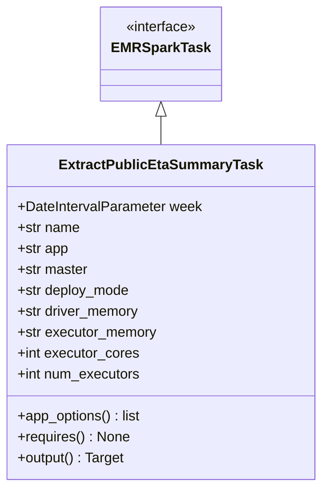
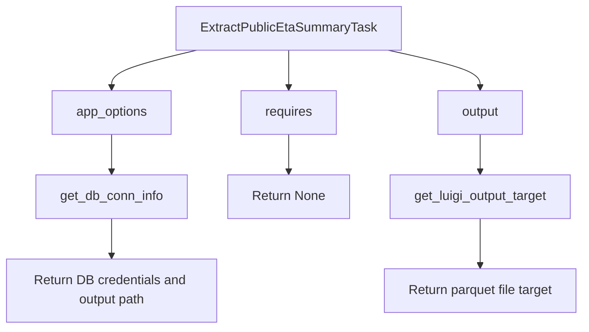

# Diagram: research/orchestrator/tasks/etl/extract_public_eta_summary_task.py

> Auto-generated by Obscura crawlers

## Diagram 1

### SVG

<svg id="container" width="362.515625" xmlns="http://www.w3.org/2000/svg" class="classDiagram" height="558" viewBox="0 0 362.515625 558" role="graphics-document document" aria-roledescription="class"><g><defs><marker id="container_class-aggregationStart" class="marker aggregation class" refX="18" refY="7" markerWidth="190" markerHeight="240" orient="auto"><path d="M 18,7 L9,13 L1,7 L9,1 Z"></path></marker></defs><defs><marker id="container_class-aggregationEnd" class="marker aggregation class" refX="1" refY="7" markerWidth="20" markerHeight="28" orient="auto"><path d="M 18,7 L9,13 L1,7 L9,1 Z"></path></marker></defs><defs><marker id="container_class-extensionStart" class="marker extension class" refX="18" refY="7" markerWidth="190" markerHeight="240" orient="auto"><path d="M 1,7 L18,13 V 1 Z"></path></marker></defs><defs><marker id="container_class-extensionEnd" class="marker extension class" refX="1" refY="7" markerWidth="20" markerHeight="28" orient="auto"><path d="M 1,1 V 13 L18,7 Z"></path></marker></defs><defs><marker id="container_class-compositionStart" class="marker composition class" refX="18" refY="7" markerWidth="190" markerHeight="240" orient="auto"><path d="M 18,7 L9,13 L1,7 L9,1 Z"></path></marker></defs><defs><marker id="container_class-compositionEnd" class="marker composition class" refX="1" refY="7" markerWidth="20" markerHeight="28" orient="auto"><path d="M 18,7 L9,13 L1,7 L9,1 Z"></path></marker></defs><defs><marker id="container_class-dependencyStart" class="marker dependency class" refX="6" refY="7" markerWidth="190" markerHeight="240" orient="auto"><path d="M 5,7 L9,13 L1,7 L9,1 Z"></path></marker></defs><defs><marker id="container_class-dependencyEnd" class="marker dependency class" refX="13" refY="7" markerWidth="20" markerHeight="28" orient="auto"><path d="M 18,7 L9,13 L14,7 L9,1 Z"></path></marker></defs><defs><marker id="container_class-lollipopStart" class="marker lollipop class" refX="13" refY="7" markerWidth="190" markerHeight="240" orient="auto"><circle stroke="black" fill="transparent" cx="7" cy="7" r="6"></circle></marker></defs><defs><marker id="container_class-lollipopEnd" class="marker lollipop class" refX="1" refY="7" markerWidth="190" markerHeight="240" orient="auto"><circle stroke="black" fill="transparent" cx="7" cy="7" r="6"></circle></marker></defs><g class="root"><g class="clusters"></g><g class="edgePaths"><path d="M181.258,133.25L181.258,134.542C181.258,135.833,181.258,138.417,181.258,143.875C181.258,149.333,181.258,157.667,181.258,161.833L181.258,166" id="id_EMRSparkTask_ExtractPublicEtaSummaryTask_1" class="edge-thickness-normal edge-pattern-solid relation" style=";;;" data-edge="true" data-et="edge" data-id="id_EMRSparkTask_ExtractPublicEtaSummaryTask_1" data-points="W3sieCI6MTgxLjI1NzgxMjUsInkiOjExNn0seyJ4IjoxODEuMjU3ODEyNSwieSI6MTQxfSx7IngiOjE4MS4yNTc4MTI1LCJ5IjoxNjZ9XQ==" marker-start="url(#container_class-extensionStart)"></path></g><g class="edgeLabels"><g class="edgeLabel"><g class="label" data-id="id_EMRSparkTask_ExtractPublicEtaSummaryTask_1" transform="translate(0, 0)"><foreignObject width="0" height="0">

</foreignObject></g></g></g><g class="nodes"><g class="node default" id="classId-EMRSparkTask-0" transform="translate(181.2578125, 62)"><g class="basic label-container"><path d="M-65.1484375 -54 L65.1484375 -54 L65.1484375 54 L-65.1484375 54" stroke="none" stroke-width="0" fill="#ECECFF" style=""></path><path d="M-65.1484375 -54 C-33.16247591894831 -54, -1.17651433789662 -54, 65.1484375 -54 M-65.1484375 -54 C-30.654106369827844 -54, 3.840224760344313 -54, 65.1484375 -54 M65.1484375 -54 C65.1484375 -18.298666535021248, 65.1484375 17.402666929957505, 65.1484375 54 M65.1484375 -54 C65.1484375 -21.11202038993636, 65.1484375 11.775959220127277, 65.1484375 54 M65.1484375 54 C34.570313265390304 54, 3.992189030780608 54, -65.1484375 54 M65.1484375 54 C20.109760865945205 54, -24.92891576810959 54, -65.1484375 54 M-65.1484375 54 C-65.1484375 26.54343579211525, -65.1484375 -0.9131284157694992, -65.1484375 -54 M-65.1484375 54 C-65.1484375 26.865489801572664, -65.1484375 -0.26902039685467116, -65.1484375 -54" stroke="#9370DB" stroke-width="1.3" fill="none" stroke-dasharray="0 0" style=""></path></g><g class="annotation-group text" transform="translate(-41.015625, -30)"><g class="label" style="" transform="translate(0,-12)"><foreignObject width="82.03125" height="24">

«interface»

</foreignObject></g></g><g class="label-group text" transform="translate(-53.1484375, -6)"><g class="label" style="font-weight: bolder" transform="translate(0,-12)"><foreignObject width="106.296875" height="24">

EMRSparkTask

</foreignObject></g></g><g class="members-group text" transform="translate(-53.1484375, 42)"></g><g class="methods-group text" transform="translate(-53.1484375, 72)"></g><g class="divider" style=""><path d="M-65.1484375 18 C-23.26629718134243 18, 18.61584313731514 18, 65.1484375 18 M-65.1484375 18 C-27.61454738324008 18, 9.91934273351984 18, 65.1484375 18" stroke="#9370DB" stroke-width="1.3" fill="none" stroke-dasharray="0 0" style=""></path></g><g class="divider" style=""><path d="M-65.1484375 36 C-31.663445822311168 36, 1.8215458553776642 36, 65.1484375 36 M-65.1484375 36 C-34.01585271698939 36, -2.883267933978786 36, 65.1484375 36" stroke="#9370DB" stroke-width="1.3" fill="none" stroke-dasharray="0 0" style=""></path></g></g><g class="node default" id="classId-ExtractPublicEtaSummaryTask-1" transform="translate(181.2578125, 358)"><g class="basic label-container"><path d="M-173.2578125 -192 L173.2578125 -192 L173.2578125 192 L-173.2578125 192" stroke="none" stroke-width="0" fill="#ECECFF" style=""></path><path d="M-173.2578125 -192 C-60.622161704926825 -192, 52.01348909014635 -192, 173.2578125 -192 M-173.2578125 -192 C-47.34651503979656 -192, 78.56478242040689 -192, 173.2578125 -192 M173.2578125 -192 C173.2578125 -69.50143909056266, 173.2578125 52.99712181887469, 173.2578125 192 M173.2578125 -192 C173.2578125 -42.99510772173309, 173.2578125 106.00978455653382, 173.2578125 192 M173.2578125 192 C99.3850478274301 192, 25.5122831548602 192, -173.2578125 192 M173.2578125 192 C58.91171981157092 192, -55.43437287685816 192, -173.2578125 192 M-173.2578125 192 C-173.2578125 51.497016542461495, -173.2578125 -89.00596691507701, -173.2578125 -192 M-173.2578125 192 C-173.2578125 91.8099015148864, -173.2578125 -8.380196970227189, -173.2578125 -192" stroke="#9370DB" stroke-width="1.3" fill="none" stroke-dasharray="0 0" style=""></path></g><g class="annotation-group text" transform="translate(0, -168)"></g><g class="label-group text" transform="translate(-110.390625, -168)"><g class="label" style="font-weight: bolder" transform="translate(0,-12)"><foreignObject width="220.78125" height="24">

ExtractPublicEtaSummaryTask

</foreignObject></g></g><g class="members-group text" transform="translate(-161.2578125, -120)"><g class="label" style="" transform="translate(0,-12)"><foreignObject width="212.125" height="24">

+DateIntervalParameter week

</foreignObject></g><g class="label" style="" transform="translate(0,12)"><foreignObject width="72.171875" height="24">

+str name

</foreignObject></g><g class="label" style="" transform="translate(0,36)"><foreignObject width="59.375" height="24">

+str app

</foreignObject></g><g class="label" style="" transform="translate(0,60)"><foreignObject width="81.8125" height="24">

+str master

</foreignObject></g><g class="label" style="" transform="translate(0,84)"><foreignObject width="130.390625" height="24">

+str deploy_mode

</foreignObject></g><g class="label" style="" transform="translate(0,108)"><foreignObject width="141.1875" height="24">

+str driver_memory

</foreignObject></g><g class="label" style="" transform="translate(0,132)"><foreignObject width="161" height="24">

+str executor_memory

</foreignObject></g><g class="label" style="" transform="translate(0,156)"><foreignObject width="139.9375" height="24">

+int executor_cores

</foreignObject></g><g class="label" style="" transform="translate(0,180)"><foreignObject width="142.296875" height="24">

+int num_executors

</foreignObject></g></g><g class="methods-group text" transform="translate(-161.2578125, 120)"><g class="label" style="" transform="translate(0,-12)"><foreignObject width="143.609375" height="24">

+app_options() : list

</foreignObject></g><g class="label" style="" transform="translate(0,12)"><foreignObject width="128.75" height="24">

+requires() : None

</foreignObject></g><g class="label" style="" transform="translate(0,36)"><foreignObject width="124.375" height="24">

+output() : Target

</foreignObject></g></g><g class="divider" style=""><path d="M-173.2578125 -144 C-53.49409505416466 -144, 66.26962239167068 -144, 173.2578125 -144 M-173.2578125 -144 C-46.15320605951945 -144, 80.9514003809611 -144, 173.2578125 -144" stroke="#9370DB" stroke-width="1.3" fill="none" stroke-dasharray="0 0" style=""></path></g><g class="divider" style=""><path d="M-173.2578125 96 C-41.94076026805817 96, 89.37629196388366 96, 173.2578125 96 M-173.2578125 96 C-74.41092549580007 96, 24.435961508399856 96, 173.2578125 96" stroke="#9370DB" stroke-width="1.3" fill="none" stroke-dasharray="0 0" style=""></path></g></g></g></g></g></svg>

## Diagram 2

### SVG

<svg id="container" width="729.171875" xmlns="http://www.w3.org/2000/svg" class="flowchart" height="406" viewBox="0 0 729.171875 406" role="graphics-document document" aria-roledescription="flowchart-v2"><g><marker id="container_flowchart-v2-pointEnd" class="marker flowchart-v2" viewBox="0 0 10 10" refX="5" refY="5" markerUnits="userSpaceOnUse" markerWidth="8" markerHeight="8" orient="auto"><path d="M 0 0 L 10 5 L 0 10 z" class="arrowMarkerPath" style="stroke-width: 1; stroke-dasharray: 1, 0;"></path></marker><marker id="container_flowchart-v2-pointStart" class="marker flowchart-v2" viewBox="0 0 10 10" refX="4.5" refY="5" markerUnits="userSpaceOnUse" markerWidth="8" markerHeight="8" orient="auto"><path d="M 0 5 L 10 10 L 10 0 z" class="arrowMarkerPath" style="stroke-width: 1; stroke-dasharray: 1, 0;"></path></marker><marker id="container_flowchart-v2-circleEnd" class="marker flowchart-v2" viewBox="0 0 10 10" refX="11" refY="5" markerUnits="userSpaceOnUse" markerWidth="11" markerHeight="11" orient="auto"><circle cx="5" cy="5" r="5" class="arrowMarkerPath" style="stroke-width: 1; stroke-dasharray: 1, 0;"></circle></marker><marker id="container_flowchart-v2-circleStart" class="marker flowchart-v2" viewBox="0 0 10 10" refX="-1" refY="5" markerUnits="userSpaceOnUse" markerWidth="11" markerHeight="11" orient="auto"><circle cx="5" cy="5" r="5" class="arrowMarkerPath" style="stroke-width: 1; stroke-dasharray: 1, 0;"></circle></marker><marker id="container_flowchart-v2-crossEnd" class="marker cross flowchart-v2" viewBox="0 0 11 11" refX="12" refY="5.2" markerUnits="userSpaceOnUse" markerWidth="11" markerHeight="11" orient="auto"><path d="M 1,1 l 9,9 M 10,1 l -9,9" class="arrowMarkerPath" style="stroke-width: 2; stroke-dasharray: 1, 0;"></path></marker><marker id="container_flowchart-v2-crossStart" class="marker cross flowchart-v2" viewBox="0 0 11 11" refX="-1" refY="5.2" markerUnits="userSpaceOnUse" markerWidth="11" markerHeight="11" orient="auto"><path d="M 1,1 l 9,9 M 10,1 l -9,9" class="arrowMarkerPath" style="stroke-width: 2; stroke-dasharray: 1, 0;"></path></marker><g class="root"><g class="clusters"></g><g class="edgePaths"><path d="M243.991,62L226.326,66.167C208.661,70.333,173.33,78.667,155.665,86.333C138,94,138,101,138,104.5L138,108" id="L_A_B_0" class="edge-thickness-normal edge-pattern-solid edge-thickness-normal edge-pattern-solid flowchart-link" style=";" data-edge="true" data-et="edge" data-id="L_A_B_0" data-points="W3sieCI6MjQzLjk5MDgzNTMzNjUzODQ1LCJ5Ijo2Mn0seyJ4IjoxMzgsInkiOjg3fSx7IngiOjEzOCwieSI6MTEyfV0=" marker-end="url(#container_flowchart-v2-pointEnd)"></path><path d="M138,166L138,170.167C138,174.333,138,182.667,138,190.333C138,198,138,205,138,208.5L138,212" id="L_B_C_0" class="edge-thickness-normal edge-pattern-solid edge-thickness-normal edge-pattern-solid flowchart-link" style=";" data-edge="true" data-et="edge" data-id="L_B_C_0" data-points="W3sieCI6MTM4LCJ5IjoxNjZ9LHsieCI6MTM4LCJ5IjoxOTF9LHsieCI6MTM4LCJ5IjoyMTZ9XQ==" marker-end="url(#container_flowchart-v2-pointEnd)"></path><path d="M138,270L138,274.167C138,278.333,138,286.667,138,294.333C138,302,138,309,138,312.5L138,316" id="L_C_D_0" class="edge-thickness-normal edge-pattern-solid edge-thickness-normal edge-pattern-solid flowchart-link" style=";" data-edge="true" data-et="edge" data-id="L_C_D_0" data-points="W3sieCI6MTM4LCJ5IjoyNzB9LHsieCI6MTM4LCJ5IjoyOTV9LHsieCI6MTM4LCJ5IjozMjB9XQ==" marker-end="url(#container_flowchart-v2-pointEnd)"></path><path d="M358.461,62L358.461,66.167C358.461,70.333,358.461,78.667,358.461,86.333C358.461,94,358.461,101,358.461,104.5L358.461,108" id="L_A_E_0" class="edge-thickness-normal edge-pattern-solid edge-thickness-normal edge-pattern-solid flowchart-link" style=";" data-edge="true" data-et="edge" data-id="L_A_E_0" data-points="W3sieCI6MzU4LjQ2MDkzNzUsInkiOjYyfSx7IngiOjM1OC40NjA5Mzc1LCJ5Ijo4N30seyJ4IjozNTguNDYwOTM3NSwieSI6MTEyfV0=" marker-end="url(#container_flowchart-v2-pointEnd)"></path><path d="M358.461,166L358.461,170.167C358.461,174.333,358.461,182.667,358.461,190.333C358.461,198,358.461,205,358.461,208.5L358.461,212" id="L_E_F_0" class="edge-thickness-normal edge-pattern-solid edge-thickness-normal edge-pattern-solid flowchart-link" style=";" data-edge="true" data-et="edge" data-id="L_E_F_0" data-points="W3sieCI6MzU4LjQ2MDkzNzUsInkiOjE2Nn0seyJ4IjozNTguNDYwOTM3NSwieSI6MTkxfSx7IngiOjM1OC40NjA5Mzc1LCJ5IjoyMTZ9XQ==" marker-end="url(#container_flowchart-v2-pointEnd)"></path><path d="M483.433,62L502.719,66.167C522.005,70.333,560.577,78.667,579.863,86.333C599.148,94,599.148,101,599.148,104.5L599.148,108" id="L_A_G_0" class="edge-thickness-normal edge-pattern-solid edge-thickness-normal edge-pattern-solid flowchart-link" style=";" data-edge="true" data-et="edge" data-id="L_A_G_0" data-points="W3sieCI6NDgzLjQzMzI5MzI2OTIzMDgsInkiOjYyfSx7IngiOjU5OS4xNDg0Mzc1LCJ5Ijo4N30seyJ4Ijo1OTkuMTQ4NDM3NSwieSI6MTEyfV0=" marker-end="url(#container_flowchart-v2-pointEnd)"></path><path d="M599.148,166L599.148,170.167C599.148,174.333,599.148,182.667,599.148,190.333C599.148,198,599.148,205,599.148,208.5L599.148,212" id="L_G_H_0" class="edge-thickness-normal edge-pattern-solid edge-thickness-normal edge-pattern-solid flowchart-link" style=";" data-edge="true" data-et="edge" data-id="L_G_H_0" data-points="W3sieCI6NTk5LjE0ODQzNzUsInkiOjE2Nn0seyJ4Ijo1OTkuMTQ4NDM3NSwieSI6MTkxfSx7IngiOjU5OS4xNDg0Mzc1LCJ5IjoyMTZ9XQ==" marker-end="url(#container_flowchart-v2-pointEnd)"></path><path d="M599.148,270L599.148,274.167C599.148,278.333,599.148,286.667,599.148,296.333C599.148,306,599.148,317,599.148,322.5L599.148,328" id="L_H_I_0" class="edge-thickness-normal edge-pattern-solid edge-thickness-normal edge-pattern-solid flowchart-link" style=";" data-edge="true" data-et="edge" data-id="L_H_I_0" data-points="W3sieCI6NTk5LjE0ODQzNzUsInkiOjI3MH0seyJ4Ijo1OTkuMTQ4NDM3NSwieSI6Mjk1fSx7IngiOjU5OS4xNDg0Mzc1LCJ5IjozMzJ9XQ==" marker-end="url(#container_flowchart-v2-pointEnd)"></path></g><g class="edgeLabels"><g class="edgeLabel"><g class="label" data-id="L_A_B_0" transform="translate(0, 0)"><foreignObject width="0" height="0">

</foreignObject></g></g><g class="edgeLabel"><g class="label" data-id="L_B_C_0" transform="translate(0, 0)"><foreignObject width="0" height="0">

</foreignObject></g></g><g class="edgeLabel"><g class="label" data-id="L_C_D_0" transform="translate(0, 0)"><foreignObject width="0" height="0">

</foreignObject></g></g><g class="edgeLabel"><g class="label" data-id="L_A_E_0" transform="translate(0, 0)"><foreignObject width="0" height="0">

</foreignObject></g></g><g class="edgeLabel"><g class="label" data-id="L_E_F_0" transform="translate(0, 0)"><foreignObject width="0" height="0">

</foreignObject></g></g><g class="edgeLabel"><g class="label" data-id="L_A_G_0" transform="translate(0, 0)"><foreignObject width="0" height="0">

</foreignObject></g></g><g class="edgeLabel"><g class="label" data-id="L_G_H_0" transform="translate(0, 0)"><foreignObject width="0" height="0">

</foreignObject></g></g><g class="edgeLabel"><g class="label" data-id="L_H_I_0" transform="translate(0, 0)"><foreignObject width="0" height="0">

</foreignObject></g></g></g><g class="nodes"><g class="node default" id="flowchart-A-0" transform="translate(358.4609375, 35)"><rect class="basic label-container" style="" x="-138.484375" y="-27" width="276.96875" height="54"></rect><g class="label" style="" transform="translate(-108.484375, -12)"><rect></rect><foreignObject width="216.96875" height="24">

ExtractPublicEtaSummaryTask

</foreignObject></g></g><g class="node default" id="flowchart-B-1" transform="translate(138, 139)"><rect class="basic label-container" style="" x="-75.3671875" y="-27" width="150.734375" height="54"></rect><g class="label" style="" transform="translate(-45.3671875, -12)"><rect></rect><foreignObject width="90.734375" height="24">

app_options

</foreignObject></g></g><g class="node default" id="flowchart-C-3" transform="translate(138, 243)"><rect class="basic label-container" style="" x="-94.75" y="-27" width="189.5" height="54"></rect><g class="label" style="" transform="translate(-64.75, -12)"><rect></rect><foreignObject width="129.5" height="24">

get_db_conn_info

</foreignObject></g></g><g class="node default" id="flowchart-D-5" transform="translate(138, 359)"><rect class="basic label-container" style="" x="-130" y="-39" width="260" height="78"></rect><g class="label" style="" transform="translate(-100, -24)"><rect></rect><foreignObject width="200" height="48">

Return DB credentials and output path

</foreignObject></g></g><g class="node default" id="flowchart-E-7" transform="translate(358.4609375, 139)"><rect class="basic label-container" style="" x="-59.8515625" y="-27" width="119.703125" height="54"></rect><g class="label" style="" transform="translate(-29.8515625, -12)"><rect></rect><foreignObject width="59.703125" height="24">

requires

</foreignObject></g></g><g class="node default" id="flowchart-F-9" transform="translate(358.4609375, 243)"><rect class="basic label-container" style="" x="-75.7109375" y="-27" width="151.421875" height="54"></rect><g class="label" style="" transform="translate(-45.7109375, -12)"><rect></rect><foreignObject width="91.421875" height="24">

Return None

</foreignObject></g></g><g class="node default" id="flowchart-G-11" transform="translate(599.1484375, 139)"><rect class="basic label-container" style="" x="-54.515625" y="-27" width="109.03125" height="54"></rect><g class="label" style="" transform="translate(-24.515625, -12)"><rect></rect><foreignObject width="49.03125" height="24">

output

</foreignObject></g></g><g class="node default" id="flowchart-H-13" transform="translate(599.1484375, 243)"><rect class="basic label-container" style="" x="-114.9765625" y="-27" width="229.953125" height="54"></rect><g class="label" style="" transform="translate(-84.9765625, -12)"><rect></rect><foreignObject width="169.953125" height="24">

get_luigi_output_target

</foreignObject></g></g><g class="node default" id="flowchart-I-15" transform="translate(599.1484375, 359)"><rect class="basic label-container" style="" x="-122.0234375" y="-27" width="244.046875" height="54"></rect><g class="label" style="" transform="translate(-92.0234375, -12)"><rect></rect><foreignObject width="184.046875" height="24">

Return parquet file target

</foreignObject></g></g></g></g></g></svg>
