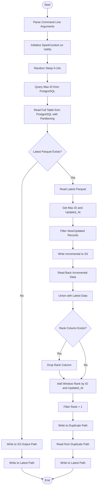
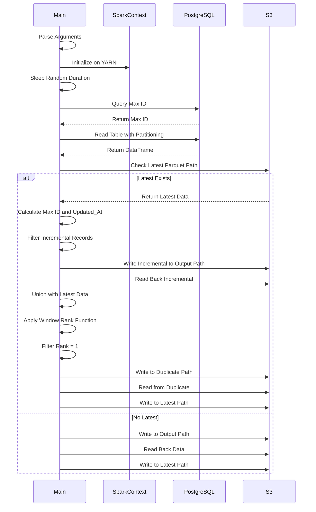
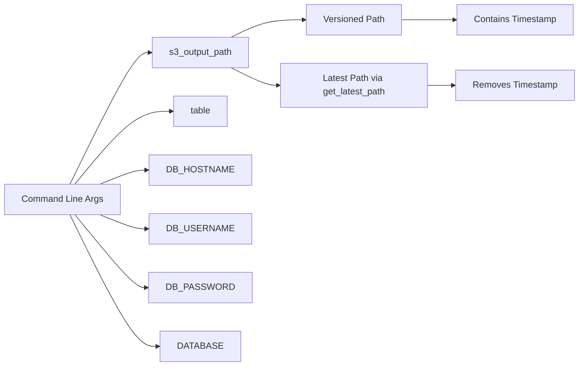

# Diagram: research/orchestrator/tasks/etl/extract_public_event_spark.py


> Auto-generated by Obscura crawlers

## Diagram 1

```mermaid
flowchart TD
      Start([Start]) --> ParseArgs[Parse Command Line Arguments]
      ParseArgs --> InitSpark[Initialize SparkContext on YARN]
      InitSpark --> Sleep[Random Sleep 0-10s]...
  └ 68 lines...

✗ read_bash
  Invalid shell ID: 0. Please supply a valid shell ID to read output from.

  <no active shell sessions>
```

> SVG rendering failed for this diagram.

## Diagram 2



### SVG

<svg id="container" width="547.734375" xmlns="http://www.w3.org/2000/svg" class="flowchart" height="2664.875" viewBox="0 0 547.734375 2664.875" role="graphics-document document" aria-roledescription="flowchart-v2"><style>#container{font-family:"trebuchet ms",verdana,arial,sans-serif;font-size:16px;fill:#333;}@keyframes edge-animation-frame{from{stroke-dashoffset:0;}}@keyframes dash{to{stroke-dashoffset:0;}}#container .edge-animation-slow{stroke-dasharray:9,5!important;stroke-dashoffset:900;animation:dash 50s linear infinite;stroke-linecap:round;}#container .edge-animation-fast{stroke-dasharray:9,5!important;stroke-dashoffset:900;animation:dash 20s linear infinite;stroke-linecap:round;}#container .error-icon{fill:#552222;}#container .error-text{fill:#552222;stroke:#552222;}#container .edge-thickness-normal{stroke-width:1px;}#container .edge-thickness-thick{stroke-width:3.5px;}#container .edge-pattern-solid{stroke-dasharray:0;}#container .edge-thickness-invisible{stroke-width:0;fill:none;}#container .edge-pattern-dashed{stroke-dasharray:3;}#container .edge-pattern-dotted{stroke-dasharray:2;}#container .marker{fill:#333333;stroke:#333333;}#container .marker.cross{stroke:#333333;}#container svg{font-family:"trebuchet ms",verdana,arial,sans-serif;font-size:16px;}#container p{margin:0;}#container .label{font-family:"trebuchet ms",verdana,arial,sans-serif;color:#333;}#container .cluster-label text{fill:#333;}#container .cluster-label span{color:#333;}#container .cluster-label span p{background-color:transparent;}#container .label text,#container span{fill:#333;color:#333;}#container .node rect,#container .node circle,#container .node ellipse,#container .node polygon,#container .node path{fill:#ECECFF;stroke:#9370DB;stroke-width:1px;}#container .rough-node .label text,#container .node .label text,#container .image-shape .label,#container .icon-shape .label{text-anchor:middle;}#container .node .katex path{fill:#000;stroke:#000;stroke-width:1px;}#container .rough-node .label,#container .node .label,#container .image-shape .label,#container .icon-shape .label{text-align:center;}#container .node.clickable{cursor:pointer;}#container .root .anchor path{fill:#333333!important;stroke-width:0;stroke:#333333;}#container .arrowheadPath{fill:#333333;}#container .edgePath .path{stroke:#333333;stroke-width:2.0px;}#container .flowchart-link{stroke:#333333;fill:none;}#container .edgeLabel{background-color:rgba(232,232,232, 0.8);text-align:center;}#container .edgeLabel p{background-color:rgba(232,232,232, 0.8);}#container .edgeLabel rect{opacity:0.5;background-color:rgba(232,232,232, 0.8);fill:rgba(232,232,232, 0.8);}#container .labelBkg{background-color:rgba(232, 232, 232, 0.5);}#container .cluster rect{fill:#ffffde;stroke:#aaaa33;stroke-width:1px;}#container .cluster text{fill:#333;}#container .cluster span{color:#333;}#container div.mermaidTooltip{position:absolute;text-align:center;max-width:200px;padding:2px;font-family:"trebuchet ms",verdana,arial,sans-serif;font-size:12px;background:hsl(80, 100%, 96.2745098039%);border:1px solid #aaaa33;border-radius:2px;pointer-events:none;z-index:100;}#container .flowchartTitleText{text-anchor:middle;font-size:18px;fill:#333;}#container rect.text{fill:none;stroke-width:0;}#container .icon-shape,#container .image-shape{background-color:rgba(232,232,232, 0.8);text-align:center;}#container .icon-shape p,#container .image-shape p{background-color:rgba(232,232,232, 0.8);padding:2px;}#container .icon-shape rect,#container .image-shape rect{opacity:0.5;background-color:rgba(232,232,232, 0.8);fill:rgba(232,232,232, 0.8);}#container .label-icon{display:inline-block;height:1em;overflow:visible;vertical-align:-0.125em;}#container .node .label-icon path{fill:currentColor;stroke:revert;stroke-width:revert;}#container :root{--mermaid-font-family:"trebuchet ms",verdana,arial,sans-serif;}</style><g><marker id="container_flowchart-v2-pointEnd" class="marker flowchart-v2" viewBox="0 0 10 10" refX="5" refY="5" markerUnits="userSpaceOnUse" markerWidth="8" markerHeight="8" orient="auto"><path d="M 0 0 L 10 5 L 0 10 z" class="arrowMarkerPath" style="stroke-width: 1; stroke-dasharray: 1, 0;"></path></marker><marker id="container_flowchart-v2-pointStart" class="marker flowchart-v2" viewBox="0 0 10 10" refX="4.5" refY="5" markerUnits="userSpaceOnUse" markerWidth="8" markerHeight="8" orient="auto"><path d="M 0 5 L 10 10 L 10 0 z" class="arrowMarkerPath" style="stroke-width: 1; stroke-dasharray: 1, 0;"></path></marker><marker id="container_flowchart-v2-circleEnd" class="marker flowchart-v2" viewBox="0 0 10 10" refX="11" refY="5" markerUnits="userSpaceOnUse" markerWidth="11" markerHeight="11" orient="auto"><circle cx="5" cy="5" r="5" class="arrowMarkerPath" style="stroke-width: 1; stroke-dasharray: 1, 0;"></circle></marker><marker id="container_flowchart-v2-circleStart" class="marker flowchart-v2" viewBox="0 0 10 10" refX="-1" refY="5" markerUnits="userSpaceOnUse" markerWidth="11" markerHeight="11" orient="auto"><circle cx="5" cy="5" r="5" class="arrowMarkerPath" style="stroke-width: 1; stroke-dasharray: 1, 0;"></circle></marker><marker id="container_flowchart-v2-crossEnd" class="marker cross flowchart-v2" viewBox="0 0 11 11" refX="12" refY="5.2" markerUnits="userSpaceOnUse" markerWidth="11" markerHeight="11" orient="auto"><path d="M 1,1 l 9,9 M 10,1 l -9,9" class="arrowMarkerPath" style="stroke-width: 2; stroke-dasharray: 1, 0;"></path></marker><marker id="container_flowchart-v2-crossStart" class="marker cross flowchart-v2" viewBox="0 0 11 11" refX="-1" refY="5.2" markerUnits="userSpaceOnUse" markerWidth="11" markerHeight="11" orient="auto"><path d="M 1,1 l 9,9 M 10,1 l -9,9" class="arrowMarkerPath" style="stroke-width: 2; stroke-dasharray: 1, 0;"></path></marker><g class="root"><g class="clusters"></g><g class="edgePaths"><path d="M266.781,47.5L266.698,51.583C266.615,55.667,266.448,63.833,266.365,71.417C266.281,79,266.281,86,266.281,89.5L266.281,93" id="L_Start_ParseArgs_0" class="edge-thickness-normal edge-pattern-solid edge-thickness-normal edge-pattern-solid flowchart-link" style=";" data-edge="true" data-et="edge" data-id="L_Start_ParseArgs_0" data-points="W3sieCI6MjY2Ljc4MTI1LCJ5Ijo0Ny41fSx7IngiOjI2Ni4yODEyNSwieSI6NzJ9LHsieCI6MjY2LjI4MTI1LCJ5Ijo5N31d" marker-end="url(#container_flowchart-v2-pointEnd)"></path><path d="M266.281,175L266.281,179.167C266.281,183.333,266.281,191.667,266.281,199.333C266.281,207,266.281,214,266.281,217.5L266.281,221" id="L_ParseArgs_InitSpark_0" class="edge-thickness-normal edge-pattern-solid edge-thickness-normal edge-pattern-solid flowchart-link" style=";" data-edge="true" data-et="edge" data-id="L_ParseArgs_InitSpark_0" data-points="W3sieCI6MjY2LjI4MTI1LCJ5IjoxNzV9LHsieCI6MjY2LjI4MTI1LCJ5IjoyMDB9LHsieCI6MjY2LjI4MTI1LCJ5IjoyMjV9XQ==" marker-end="url(#container_flowchart-v2-pointEnd)"></path><path d="M266.281,303L266.281,307.167C266.281,311.333,266.281,319.667,266.281,327.333C266.281,335,266.281,342,266.281,345.5L266.281,349" id="L_InitSpark_Sleep_0" class="edge-thickness-normal edge-pattern-solid edge-thickness-normal edge-pattern-solid flowchart-link" style=";" data-edge="true" data-et="edge" data-id="L_InitSpark_Sleep_0" data-points="W3sieCI6MjY2LjI4MTI1LCJ5IjozMDN9LHsieCI6MjY2LjI4MTI1LCJ5IjozMjh9LHsieCI6MjY2LjI4MTI1LCJ5IjozNTN9XQ==" marker-end="url(#container_flowchart-v2-pointEnd)"></path><path d="M266.281,407L266.281,411.167C266.281,415.333,266.281,423.667,266.281,431.333C266.281,439,266.281,446,266.281,449.5L266.281,453" id="L_Sleep_QueryMaxID_0" class="edge-thickness-normal edge-pattern-solid edge-thickness-normal edge-pattern-solid flowchart-link" style=";" data-edge="true" data-et="edge" data-id="L_Sleep_QueryMaxID_0" data-points="W3sieCI6MjY2LjI4MTI1LCJ5Ijo0MDd9LHsieCI6MjY2LjI4MTI1LCJ5Ijo0MzJ9LHsieCI6MjY2LjI4MTI1LCJ5Ijo0NTd9XQ==" marker-end="url(#container_flowchart-v2-pointEnd)"></path><path d="M266.281,535L266.281,539.167C266.281,543.333,266.281,551.667,266.281,559.333C266.281,567,266.281,574,266.281,577.5L266.281,581" id="L_QueryMaxID_ReadDB_0" class="edge-thickness-normal edge-pattern-solid edge-thickness-normal edge-pattern-solid flowchart-link" style=";" data-edge="true" data-et="edge" data-id="L_QueryMaxID_ReadDB_0" data-points="W3sieCI6MjY2LjI4MTI1LCJ5Ijo1MzV9LHsieCI6MjY2LjI4MTI1LCJ5Ijo1NjB9LHsieCI6MjY2LjI4MTI1LCJ5Ijo1ODV9XQ==" marker-end="url(#container_flowchart-v2-pointEnd)"></path><path d="M266.281,687L266.281,691.167C266.281,695.333,266.281,703.667,266.281,711.333C266.281,719,266.281,726,266.281,729.5L266.281,733" id="L_ReadDB_CheckLatest_0" class="edge-thickness-normal edge-pattern-solid edge-thickness-normal edge-pattern-solid flowchart-link" style=";" data-edge="true" data-et="edge" data-id="L_ReadDB_CheckLatest_0" data-points="W3sieCI6MjY2LjI4MTI1LCJ5Ijo2ODd9LHsieCI6MjY2LjI4MTI1LCJ5Ijo3MTJ9LHsieCI6MjY2LjI4MTI1LCJ5Ijo3Mzd9XQ==" marker-end="url(#container_flowchart-v2-pointEnd)"></path><path d="M213.338,895.166L198.253,910.157C183.168,925.147,152.998,955.128,137.913,980.786C122.828,1006.443,122.828,1027.776,122.828,1047.109C122.828,1066.443,122.828,1083.776,122.828,1101.109C122.828,1118.443,122.828,1135.776,122.828,1153.109C122.828,1170.443,122.828,1187.776,122.828,1207.109C122.828,1226.443,122.828,1247.776,122.828,1269.109C122.828,1290.443,122.828,1311.776,122.828,1331.109C122.828,1350.443,122.828,1367.776,122.828,1385.109C122.828,1402.443,122.828,1419.776,122.828,1439.109C122.828,1458.443,122.828,1479.776,122.828,1501.109C122.828,1522.443,122.828,1543.776,122.828,1563.109C122.828,1582.443,122.828,1599.776,122.828,1617.109C122.828,1634.443,122.828,1651.776,122.828,1681.423C122.828,1711.07,122.828,1753.031,122.828,1796.992C122.828,1840.953,122.828,1886.914,122.828,1920.561C122.828,1954.208,122.828,1975.542,122.828,1994.875C122.828,2014.208,122.828,2031.542,122.828,2050.875C122.828,2070.208,122.828,2091.542,122.828,2112.875C122.828,2134.208,122.828,2155.542,122.828,2174.875C122.828,2194.208,122.828,2211.542,122.828,2228.875C122.828,2246.208,122.828,2263.542,122.828,2280.875C122.828,2298.208,122.828,2315.542,122.828,2332.875C122.828,2350.208,122.828,2367.542,122.828,2379.708C122.828,2391.875,122.828,2398.875,122.828,2402.375L122.828,2405.875" id="L_CheckLatest_WriteNew_0" class="edge-thickness-normal edge-pattern-solid edge-thickness-normal edge-pattern-solid flowchart-link" style=";" data-edge="true" data-et="edge" data-id="L_CheckLatest_WriteNew_0" data-points="W3sieCI6MjEzLjMzODExNjU2NjI4MTUsInkiOjg5NS4xNjYyNDE1NjYyODE1fSx7IngiOjEyMi44MjgxMjUsInkiOjk4NS4xMDkzNzV9LHsieCI6MTIyLjgyODEyNSwieSI6MTA0OS4xMDkzNzV9LHsieCI6MTIyLjgyODEyNSwieSI6MTEwMS4xMDkzNzV9LHsieCI6MTIyLjgyODEyNSwieSI6MTE1My4xMDkzNzV9LHsieCI6MTIyLjgyODEyNSwieSI6MTIwNS4xMDkzNzV9LHsieCI6MTIyLjgyODEyNSwieSI6MTI2OS4xMDkzNzV9LHsieCI6MTIyLjgyODEyNSwieSI6MTMzMy4xMDkzNzV9LHsieCI6MTIyLjgyODEyNSwieSI6MTM4NS4xMDkzNzV9LHsieCI6MTIyLjgyODEyNSwieSI6MTQzNy4xMDkzNzV9LHsieCI6MTIyLjgyODEyNSwieSI6MTUwMS4xMDkzNzV9LHsieCI6MTIyLjgyODEyNSwieSI6MTU2NS4xMDkzNzV9LHsieCI6MTIyLjgyODEyNSwieSI6MTYxNy4xMDkzNzV9LHsieCI6MTIyLjgyODEyNSwieSI6MTY2OS4xMDkzNzV9LHsieCI6MTIyLjgyODEyNSwieSI6MTc5NC45OTIxODc1fSx7IngiOjEyMi44MjgxMjUsInkiOjE5MzIuODc1fSx7IngiOjEyMi44MjgxMjUsInkiOjE5OTYuODc1fSx7IngiOjEyMi44MjgxMjUsInkiOjIwNDguODc1fSx7IngiOjEyMi44MjgxMjUsInkiOjIxMTIuODc1fSx7IngiOjEyMi44MjgxMjUsInkiOjIxNzYuODc1fSx7IngiOjEyMi44MjgxMjUsInkiOjIyMjguODc1fSx7IngiOjEyMi44MjgxMjUsInkiOjIyODAuODc1fSx7IngiOjEyMi44MjgxMjUsInkiOjIzMzIuODc1fSx7IngiOjEyMi44MjgxMjUsInkiOjIzODQuODc1fSx7IngiOjEyMi44MjgxMjUsInkiOjI0MDkuODc1fV0=" marker-end="url(#container_flowchart-v2-pointEnd)"></path><path d="M122.828,2463.875L122.828,2468.042C122.828,2472.208,122.828,2480.542,122.828,2488.208C122.828,2495.875,122.828,2502.875,122.828,2506.375L122.828,2509.875" id="L_WriteNew_WriteLatest1_0" class="edge-thickness-normal edge-pattern-solid edge-thickness-normal edge-pattern-solid flowchart-link" style=";" data-edge="true" data-et="edge" data-id="L_WriteNew_WriteLatest1_0" data-points="W3sieCI6MTIyLjgyODEyNSwieSI6MjQ2My44NzV9LHsieCI6MTIyLjgyODEyNSwieSI6MjQ4OC44NzV9LHsieCI6MTIyLjgyODEyNSwieSI6MjUxMy44NzV9XQ==" marker-end="url(#container_flowchart-v2-pointEnd)"></path><path d="M122.828,2567.875L122.828,2572.042C122.828,2576.208,122.828,2584.542,142.1,2594.742C161.372,2604.943,199.916,2617.011,219.188,2623.045L238.46,2629.079" id="L_WriteLatest1_End_0" class="edge-thickness-normal edge-pattern-solid edge-thickness-normal edge-pattern-solid flowchart-link" style=";" data-edge="true" data-et="edge" data-id="L_WriteLatest1_End_0" data-points="W3sieCI6MTIyLjgyODEyNSwieSI6MjU2Ny44NzV9LHsieCI6MTIyLjgyODEyNSwieSI6MjU5Mi44NzV9LHsieCI6MjQyLjI3NzI5Njk5NDQ0MSwieSI6MjYzMC4yNzM3MzAxODYyNzJ9XQ==" marker-end="url(#container_flowchart-v2-pointEnd)"></path><path d="M319.224,895.166L334.309,910.157C349.394,925.147,379.564,955.128,394.649,975.619C409.734,996.109,409.734,1007.109,409.734,1012.609L409.734,1018.109" id="L_CheckLatest_ReadLatest_0" class="edge-thickness-normal edge-pattern-solid edge-thickness-normal edge-pattern-solid flowchart-link" style=";" data-edge="true" data-et="edge" data-id="L_CheckLatest_ReadLatest_0" data-points="W3sieCI6MzE5LjIyNDM4MzQzMzcxODQ2LCJ5Ijo4OTUuMTY2MjQxNTY2MjgxNX0seyJ4Ijo0MDkuNzM0Mzc1LCJ5Ijo5ODUuMTA5Mzc1fSx7IngiOjQwOS43MzQzNzUsInkiOjEwMjIuMTA5Mzc1fV0=" marker-end="url(#container_flowchart-v2-pointEnd)"></path><path d="M409.734,1076.109L409.734,1080.276C409.734,1084.443,409.734,1092.776,409.734,1100.443C409.734,1108.109,409.734,1115.109,409.734,1118.609L409.734,1122.109" id="L_ReadLatest_GetMaxVals_0" class="edge-thickness-normal edge-pattern-solid edge-thickness-normal edge-pattern-solid flowchart-link" style=";" data-edge="true" data-et="edge" data-id="L_ReadLatest_GetMaxVals_0" data-points="W3sieCI6NDA5LjczNDM3NSwieSI6MTA3Ni4xMDkzNzV9LHsieCI6NDA5LjczNDM3NSwieSI6MTEwMS4xMDkzNzV9LHsieCI6NDA5LjczNDM3NSwieSI6MTEyNi4xMDkzNzV9XQ==" marker-end="url(#container_flowchart-v2-pointEnd)"></path><path d="M409.734,1180.109L409.734,1184.276C409.734,1188.443,409.734,1196.776,409.734,1204.443C409.734,1212.109,409.734,1219.109,409.734,1222.609L409.734,1226.109" id="L_GetMaxVals_FilterIncremental_0" class="edge-thickness-normal edge-pattern-solid edge-thickness-normal edge-pattern-solid flowchart-link" style=";" data-edge="true" data-et="edge" data-id="L_GetMaxVals_FilterIncremental_0" data-points="W3sieCI6NDA5LjczNDM3NSwieSI6MTE4MC4xMDkzNzV9LHsieCI6NDA5LjczNDM3NSwieSI6MTIwNS4xMDkzNzV9LHsieCI6NDA5LjczNDM3NSwieSI6MTIzMC4xMDkzNzV9XQ==" marker-end="url(#container_flowchart-v2-pointEnd)"></path><path d="M409.734,1308.109L409.734,1312.276C409.734,1316.443,409.734,1324.776,409.734,1332.443C409.734,1340.109,409.734,1347.109,409.734,1350.609L409.734,1354.109" id="L_FilterIncremental_WriteIncremental_0" class="edge-thickness-normal edge-pattern-solid edge-thickness-normal edge-pattern-solid flowchart-link" style=";" data-edge="true" data-et="edge" data-id="L_FilterIncremental_WriteIncremental_0" data-points="W3sieCI6NDA5LjczNDM3NSwieSI6MTMwOC4xMDkzNzV9LHsieCI6NDA5LjczNDM3NSwieSI6MTMzMy4xMDkzNzV9LHsieCI6NDA5LjczNDM3NSwieSI6MTM1OC4xMDkzNzV9XQ==" marker-end="url(#container_flowchart-v2-pointEnd)"></path><path d="M409.734,1412.109L409.734,1416.276C409.734,1420.443,409.734,1428.776,409.734,1436.443C409.734,1444.109,409.734,1451.109,409.734,1454.609L409.734,1458.109" id="L_WriteIncremental_ReadBack_0" class="edge-thickness-normal edge-pattern-solid edge-thickness-normal edge-pattern-solid flowchart-link" style=";" data-edge="true" data-et="edge" data-id="L_WriteIncremental_ReadBack_0" data-points="W3sieCI6NDA5LjczNDM3NSwieSI6MTQxMi4xMDkzNzV9LHsieCI6NDA5LjczNDM3NSwieSI6MTQzNy4xMDkzNzV9LHsieCI6NDA5LjczNDM3NSwieSI6MTQ2Mi4xMDkzNzV9XQ==" marker-end="url(#container_flowchart-v2-pointEnd)"></path><path d="M409.734,1540.109L409.734,1544.276C409.734,1548.443,409.734,1556.776,409.734,1564.443C409.734,1572.109,409.734,1579.109,409.734,1582.609L409.734,1586.109" id="L_ReadBack_Union_0" class="edge-thickness-normal edge-pattern-solid edge-thickness-normal edge-pattern-solid flowchart-link" style=";" data-edge="true" data-et="edge" data-id="L_ReadBack_Union_0" data-points="W3sieCI6NDA5LjczNDM3NSwieSI6MTU0MC4xMDkzNzV9LHsieCI6NDA5LjczNDM3NSwieSI6MTU2NS4xMDkzNzV9LHsieCI6NDA5LjczNDM3NSwieSI6MTU5MC4xMDkzNzV9XQ==" marker-end="url(#container_flowchart-v2-pointEnd)"></path><path d="M409.734,1644.109L409.734,1648.276C409.734,1652.443,409.734,1660.776,409.734,1668.443C409.734,1676.109,409.734,1683.109,409.734,1686.609L409.734,1690.109" id="L_Union_DropRank_0" class="edge-thickness-normal edge-pattern-solid edge-thickness-normal edge-pattern-solid flowchart-link" style=";" data-edge="true" data-et="edge" data-id="L_Union_DropRank_0" data-points="W3sieCI6NDA5LjczNDM3NSwieSI6MTY0NC4xMDkzNzV9LHsieCI6NDA5LjczNDM3NSwieSI6MTY2OS4xMDkzNzV9LHsieCI6NDA5LjczNDM3NSwieSI6MTY5NC4xMDkzNzV9XQ==" marker-end="url(#container_flowchart-v2-pointEnd)"></path><path d="M373.464,1859.604L366.608,1871.816C359.753,1884.028,346.043,1908.451,339.187,1926.163C332.332,1943.875,332.332,1954.875,332.332,1960.375L332.332,1965.875" id="L_DropRank_RemoveRank_0" class="edge-thickness-normal edge-pattern-solid edge-thickness-normal edge-pattern-solid flowchart-link" style=";" data-edge="true" data-et="edge" data-id="L_DropRank_RemoveRank_0" data-points="W3sieCI6MzczLjQ2MzU2OTAyNTIyOTk2LCJ5IjoxODU5LjYwNDE5NDAyNTIzfSx7IngiOjMzMi4zMzIwMzEyNSwieSI6MTkzMi44NzV9LHsieCI6MzMyLjMzMjAzMTI1LCJ5IjoxOTY5Ljg3NX1d" marker-end="url(#container_flowchart-v2-pointEnd)"></path><path d="M332.332,2023.875L332.332,2028.042C332.332,2032.208,332.332,2040.542,336.857,2048.45C341.383,2056.359,350.434,2063.842,354.959,2067.584L359.485,2071.326" id="L_RemoveRank_AddWindow_0" class="edge-thickness-normal edge-pattern-solid edge-thickness-normal edge-pattern-solid flowchart-link" style=";" data-edge="true" data-et="edge" data-id="L_RemoveRank_AddWindow_0" data-points="W3sieCI6MzMyLjMzMjAzMTI1LCJ5IjoyMDIzLjg3NX0seyJ4IjozMzIuMzMyMDMxMjUsInkiOjIwNDguODc1fSx7IngiOjM2Mi41NjczMjE3NzczNDM3NSwieSI6MjA3My44NzV9XQ==" marker-end="url(#container_flowchart-v2-pointEnd)"></path><path d="M444.063,1861.546L450.195,1873.434C456.327,1885.322,468.591,1909.099,474.723,1931.653C480.855,1954.208,480.855,1975.542,480.855,1994.875C480.855,2014.208,480.855,2031.542,476.721,2043.929C472.586,2056.316,464.317,2063.758,460.182,2067.479L456.047,2071.199" id="L_DropRank_AddWindow_0" class="edge-thickness-normal edge-pattern-solid edge-thickness-normal edge-pattern-solid flowchart-link" style=";" data-edge="true" data-et="edge" data-id="L_DropRank_AddWindow_0" data-points="W3sieCI6NDQ0LjA2MzM3OTE1MjY0OTMsInkiOjE4NjEuNTQ1OTk1ODQ3MzUwN30seyJ4Ijo0ODAuODU1NDY4NzUsInkiOjE5MzIuODc1fSx7IngiOjQ4MC44NTU0Njg3NSwieSI6MTk5Ni44NzV9LHsieCI6NDgwLjg1NTQ2ODc1LCJ5IjoyMDQ4Ljg3NX0seyJ4Ijo0NTMuMDczNzkxNTAzOTA2MjUsInkiOjIwNzMuODc1fV0=" marker-end="url(#container_flowchart-v2-pointEnd)"></path><path d="M409.734,2151.875L409.734,2156.042C409.734,2160.208,409.734,2168.542,409.734,2176.208C409.734,2183.875,409.734,2190.875,409.734,2194.375L409.734,2197.875" id="L_AddWindow_FilterRank_0" class="edge-thickness-normal edge-pattern-solid edge-thickness-normal edge-pattern-solid flowchart-link" style=";" data-edge="true" data-et="edge" data-id="L_AddWindow_FilterRank_0" data-points="W3sieCI6NDA5LjczNDM3NSwieSI6MjE1MS44NzV9LHsieCI6NDA5LjczNDM3NSwieSI6MjE3Ni44NzV9LHsieCI6NDA5LjczNDM3NSwieSI6MjIwMS44NzV9XQ==" marker-end="url(#container_flowchart-v2-pointEnd)"></path><path d="M409.734,2255.875L409.734,2260.042C409.734,2264.208,409.734,2272.542,409.734,2280.208C409.734,2287.875,409.734,2294.875,409.734,2298.375L409.734,2301.875" id="L_FilterRank_WriteDupe_0" class="edge-thickness-normal edge-pattern-solid edge-thickness-normal edge-pattern-solid flowchart-link" style=";" data-edge="true" data-et="edge" data-id="L_FilterRank_WriteDupe_0" data-points="W3sieCI6NDA5LjczNDM3NSwieSI6MjI1NS44NzV9LHsieCI6NDA5LjczNDM3NSwieSI6MjI4MC44NzV9LHsieCI6NDA5LjczNDM3NSwieSI6MjMwNS44NzV9XQ==" marker-end="url(#container_flowchart-v2-pointEnd)"></path><path d="M409.734,2359.875L409.734,2364.042C409.734,2368.208,409.734,2376.542,409.734,2384.208C409.734,2391.875,409.734,2398.875,409.734,2402.375L409.734,2405.875" id="L_WriteDupe_ReadDupe_0" class="edge-thickness-normal edge-pattern-solid edge-thickness-normal edge-pattern-solid flowchart-link" style=";" data-edge="true" data-et="edge" data-id="L_WriteDupe_ReadDupe_0" data-points="W3sieCI6NDA5LjczNDM3NSwieSI6MjM1OS44NzV9LHsieCI6NDA5LjczNDM3NSwieSI6MjM4NC44NzV9LHsieCI6NDA5LjczNDM3NSwieSI6MjQwOS44NzV9XQ==" marker-end="url(#container_flowchart-v2-pointEnd)"></path><path d="M409.734,2463.875L409.734,2468.042C409.734,2472.208,409.734,2480.542,409.734,2488.208C409.734,2495.875,409.734,2502.875,409.734,2506.375L409.734,2509.875" id="L_ReadDupe_WriteFinal_0" class="edge-thickness-normal edge-pattern-solid edge-thickness-normal edge-pattern-solid flowchart-link" style=";" data-edge="true" data-et="edge" data-id="L_ReadDupe_WriteFinal_0" data-points="W3sieCI6NDA5LjczNDM3NSwieSI6MjQ2My44NzV9LHsieCI6NDA5LjczNDM3NSwieSI6MjQ4OC44NzV9LHsieCI6NDA5LjczNDM3NSwieSI6MjUxMy44NzV9XQ==" marker-end="url(#container_flowchart-v2-pointEnd)"></path><path d="M409.734,2567.875L409.734,2572.042C409.734,2576.208,409.734,2584.542,390.629,2594.741C371.523,2604.94,333.311,2617.005,314.205,2623.037L295.1,2629.069" id="L_WriteFinal_End_0" class="edge-thickness-normal edge-pattern-solid edge-thickness-normal edge-pattern-solid flowchart-link" style=";" data-edge="true" data-et="edge" data-id="L_WriteFinal_End_0" data-points="W3sieCI6NDA5LjczNDM3NSwieSI6MjU2Ny44NzV9LHsieCI6NDA5LjczNDM3NSwieSI6MjU5Mi44NzV9LHsieCI6MjkxLjI4NTIwMzkyNjUxNDcsInkiOjI2MzAuMjczNzI5OTAwNTg2N31d" marker-end="url(#container_flowchart-v2-pointEnd)"></path></g><g class="edgeLabels"><g class="edgeLabel"><g class="label" data-id="L_Start_ParseArgs_0" transform="translate(0, 0)"><foreignObject width="0" height="0"><div xmlns="http://www.w3.org/1999/xhtml" class="labelBkg" style="display: table-cell; white-space: nowrap; line-height: 1.5; max-width: 200px; text-align: center;"><span class="edgeLabel"></span></div></foreignObject></g></g><g class="edgeLabel"><g class="label" data-id="L_ParseArgs_InitSpark_0" transform="translate(0, 0)"><foreignObject width="0" height="0"><div xmlns="http://www.w3.org/1999/xhtml" class="labelBkg" style="display: table-cell; white-space: nowrap; line-height: 1.5; max-width: 200px; text-align: center;"><span class="edgeLabel"></span></div></foreignObject></g></g><g class="edgeLabel"><g class="label" data-id="L_InitSpark_Sleep_0" transform="translate(0, 0)"><foreignObject width="0" height="0"><div xmlns="http://www.w3.org/1999/xhtml" class="labelBkg" style="display: table-cell; white-space: nowrap; line-height: 1.5; max-width: 200px; text-align: center;"><span class="edgeLabel"></span></div></foreignObject></g></g><g class="edgeLabel"><g class="label" data-id="L_Sleep_QueryMaxID_0" transform="translate(0, 0)"><foreignObject width="0" height="0"><div xmlns="http://www.w3.org/1999/xhtml" class="labelBkg" style="display: table-cell; white-space: nowrap; line-height: 1.5; max-width: 200px; text-align: center;"><span class="edgeLabel"></span></div></foreignObject></g></g><g class="edgeLabel"><g class="label" data-id="L_QueryMaxID_ReadDB_0" transform="translate(0, 0)"><foreignObject width="0" height="0"><div xmlns="http://www.w3.org/1999/xhtml" class="labelBkg" style="display: table-cell; white-space: nowrap; line-height: 1.5; max-width: 200px; text-align: center;"><span class="edgeLabel"></span></div></foreignObject></g></g><g class="edgeLabel"><g class="label" data-id="L_ReadDB_CheckLatest_0" transform="translate(0, 0)"><foreignObject width="0" height="0"><div xmlns="http://www.w3.org/1999/xhtml" class="labelBkg" style="display: table-cell; white-space: nowrap; line-height: 1.5; max-width: 200px; text-align: center;"><span class="edgeLabel"></span></div></foreignObject></g></g><g class="edgeLabel" transform="translate(122.828125, 1617.109375)"><g class="label" data-id="L_CheckLatest_WriteNew_0" transform="translate(-10.140625, -12)"><foreignObject width="20.28125" height="24"><div xmlns="http://www.w3.org/1999/xhtml" class="labelBkg" style="display: table-cell; white-space: nowrap; line-height: 1.5; max-width: 200px; text-align: center;"><span class="edgeLabel"><p>No</p></span></div></foreignObject></g></g><g class="edgeLabel"><g class="label" data-id="L_WriteNew_WriteLatest1_0" transform="translate(0, 0)"><foreignObject width="0" height="0"><div xmlns="http://www.w3.org/1999/xhtml" class="labelBkg" style="display: table-cell; white-space: nowrap; line-height: 1.5; max-width: 200px; text-align: center;"><span class="edgeLabel"></span></div></foreignObject></g></g><g class="edgeLabel"><g class="label" data-id="L_WriteLatest1_End_0" transform="translate(0, 0)"><foreignObject width="0" height="0"><div xmlns="http://www.w3.org/1999/xhtml" class="labelBkg" style="display: table-cell; white-space: nowrap; line-height: 1.5; max-width: 200px; text-align: center;"><span class="edgeLabel"></span></div></foreignObject></g></g><g class="edgeLabel" transform="translate(409.734375, 985.109375)"><g class="label" data-id="L_CheckLatest_ReadLatest_0" transform="translate(-12.03125, -12)"><foreignObject width="24.0625" height="24"><div xmlns="http://www.w3.org/1999/xhtml" class="labelBkg" style="display: table-cell; white-space: nowrap; line-height: 1.5; max-width: 200px; text-align: center;"><span class="edgeLabel"><p>Yes</p></span></div></foreignObject></g></g><g class="edgeLabel"><g class="label" data-id="L_ReadLatest_GetMaxVals_0" transform="translate(0, 0)"><foreignObject width="0" height="0"><div xmlns="http://www.w3.org/1999/xhtml" class="labelBkg" style="display: table-cell; white-space: nowrap; line-height: 1.5; max-width: 200px; text-align: center;"><span class="edgeLabel"></span></div></foreignObject></g></g><g class="edgeLabel"><g class="label" data-id="L_GetMaxVals_FilterIncremental_0" transform="translate(0, 0)"><foreignObject width="0" height="0"><div xmlns="http://www.w3.org/1999/xhtml" class="labelBkg" style="display: table-cell; white-space: nowrap; line-height: 1.5; max-width: 200px; text-align: center;"><span class="edgeLabel"></span></div></foreignObject></g></g><g class="edgeLabel"><g class="label" data-id="L_FilterIncremental_WriteIncremental_0" transform="translate(0, 0)"><foreignObject width="0" height="0"><div xmlns="http://www.w3.org/1999/xhtml" class="labelBkg" style="display: table-cell; white-space: nowrap; line-height: 1.5; max-width: 200px; text-align: center;"><span class="edgeLabel"></span></div></foreignObject></g></g><g class="edgeLabel"><g class="label" data-id="L_WriteIncremental_ReadBack_0" transform="translate(0, 0)"><foreignObject width="0" height="0"><div xmlns="http://www.w3.org/1999/xhtml" class="labelBkg" style="display: table-cell; white-space: nowrap; line-height: 1.5; max-width: 200px; text-align: center;"><span class="edgeLabel"></span></div></foreignObject></g></g><g class="edgeLabel"><g class="label" data-id="L_ReadBack_Union_0" transform="translate(0, 0)"><foreignObject width="0" height="0"><div xmlns="http://www.w3.org/1999/xhtml" class="labelBkg" style="display: table-cell; white-space: nowrap; line-height: 1.5; max-width: 200px; text-align: center;"><span class="edgeLabel"></span></div></foreignObject></g></g><g class="edgeLabel"><g class="label" data-id="L_Union_DropRank_0" transform="translate(0, 0)"><foreignObject width="0" height="0"><div xmlns="http://www.w3.org/1999/xhtml" class="labelBkg" style="display: table-cell; white-space: nowrap; line-height: 1.5; max-width: 200px; text-align: center;"><span class="edgeLabel"></span></div></foreignObject></g></g><g class="edgeLabel" transform="translate(332.33203125, 1932.875)"><g class="label" data-id="L_DropRank_RemoveRank_0" transform="translate(-12.03125, -12)"><foreignObject width="24.0625" height="24"><div xmlns="http://www.w3.org/1999/xhtml" class="labelBkg" style="display: table-cell; white-space: nowrap; line-height: 1.5; max-width: 200px; text-align: center;"><span class="edgeLabel"><p>Yes</p></span></div></foreignObject></g></g><g class="edgeLabel"><g class="label" data-id="L_RemoveRank_AddWindow_0" transform="translate(0, 0)"><foreignObject width="0" height="0"><div xmlns="http://www.w3.org/1999/xhtml" class="labelBkg" style="display: table-cell; white-space: nowrap; line-height: 1.5; max-width: 200px; text-align: center;"><span class="edgeLabel"></span></div></foreignObject></g></g><g class="edgeLabel" transform="translate(480.85546875, 1996.875)"><g class="label" data-id="L_DropRank_AddWindow_0" transform="translate(-10.140625, -12)"><foreignObject width="20.28125" height="24"><div xmlns="http://www.w3.org/1999/xhtml" class="labelBkg" style="display: table-cell; white-space: nowrap; line-height: 1.5; max-width: 200px; text-align: center;"><span class="edgeLabel"><p>No</p></span></div></foreignObject></g></g><g class="edgeLabel"><g class="label" data-id="L_AddWindow_FilterRank_0" transform="translate(0, 0)"><foreignObject width="0" height="0"><div xmlns="http://www.w3.org/1999/xhtml" class="labelBkg" style="display: table-cell; white-space: nowrap; line-height: 1.5; max-width: 200px; text-align: center;"><span class="edgeLabel"></span></div></foreignObject></g></g><g class="edgeLabel"><g class="label" data-id="L_FilterRank_WriteDupe_0" transform="translate(0, 0)"><foreignObject width="0" height="0"><div xmlns="http://www.w3.org/1999/xhtml" class="labelBkg" style="display: table-cell; white-space: nowrap; line-height: 1.5; max-width: 200px; text-align: center;"><span class="edgeLabel"></span></div></foreignObject></g></g><g class="edgeLabel"><g class="label" data-id="L_WriteDupe_ReadDupe_0" transform="translate(0, 0)"><foreignObject width="0" height="0"><div xmlns="http://www.w3.org/1999/xhtml" class="labelBkg" style="display: table-cell; white-space: nowrap; line-height: 1.5; max-width: 200px; text-align: center;"><span class="edgeLabel"></span></div></foreignObject></g></g><g class="edgeLabel"><g class="label" data-id="L_ReadDupe_WriteFinal_0" transform="translate(0, 0)"><foreignObject width="0" height="0"><div xmlns="http://www.w3.org/1999/xhtml" class="labelBkg" style="display: table-cell; white-space: nowrap; line-height: 1.5; max-width: 200px; text-align: center;"><span class="edgeLabel"></span></div></foreignObject></g></g><g class="edgeLabel"><g class="label" data-id="L_WriteFinal_End_0" transform="translate(0, 0)"><foreignObject width="0" height="0"><div xmlns="http://www.w3.org/1999/xhtml" class="labelBkg" style="display: table-cell; white-space: nowrap; line-height: 1.5; max-width: 200px; text-align: center;"><span class="edgeLabel"></span></div></foreignObject></g></g></g><g class="nodes"><g class="node default" id="flowchart-Start-0" transform="translate(266.28125, 27.5)"><g class="basic label-container outer-path"><path d="M-10.3984375 -19.5 C-5.4383869174103685 -19.5, -0.478336334820737 -19.5, 10.3984375 -19.5 C10.3984375 -19.5, 10.398437499999998 -19.5, 10.398437499999998 -19.5 C10.69420908452502 -19.490515180968746, 10.989980669050041 -19.481030361937496, 11.6478067896239 -19.45993515863156 C12.017160096335331 -19.424304089345448, 12.386513403046765 -19.38867302005934, 12.892042152847864 -19.3399052695533 C13.26412564588776 -19.279749695949192, 13.636209138927653 -19.21959412234509, 14.126030759676757 -19.140403561325776 C14.548765967000348 -19.0439170088592, 14.971501174323938 -18.94743045639262, 15.34470188623539 -18.862249829261074 C15.624529149124108 -18.77919856647898, 15.904356412012827 -18.696147303696886, 16.543047751460602 -18.50658706670804 C16.92596716906791 -18.365669181360257, 17.308886586675218 -18.224751296012474, 17.716144095147794 -18.074876768247425 C18.13381904223628 -17.889984459058443, 18.55149398932477 -17.70509214986946, 18.85917041279238 -17.568892924097174 C19.182654433595495 -17.400131517645594, 19.50613845439861 -17.231370111194014, 19.967429764076783 -16.990714730406097 C20.238635894441526 -16.826307980394862, 20.509842024806265 -16.661901230383624, 21.036368073605697 -16.342718045390892 C21.440670286520906 -16.06069432362196, 21.844972499436114 -15.778670601853024, 22.061592844578712 -15.627565626425154 C22.44902225417845 -15.31860098219894, 22.83645166377819 -15.00963633797273, 23.03889120850187 -14.848196188198123 C23.36837192167199 -14.548970522078982, 23.697852634842114 -14.24974485595984, 23.964247236767985 -14.007812326905688 C24.158161812629036 -13.807579606646389, 24.35207638849009 -13.60734688638709, 24.833858442968648 -13.10986736009568 C25.097887099159905 -12.79972427687729, 25.361915755351166 -12.4895811936589, 25.644151408126582 -12.158051136245305 C25.83785312488686 -11.898508482375952, 26.03155484164714 -11.638965828506599, 26.391796464640635 -11.156274872382312 C26.663936013967394 -10.738195444915293, 26.936075563294153 -10.320116017448274, 27.073721378604247 -10.108655082055241 C27.292194244996484 -9.72073438499919, 27.510667111388724 -9.332813687943137, 27.6871239742735 -9.019496659696287 C27.845748439807238 -8.69010956299563, 28.004372905340976 -8.360722466294973, 28.22948364880834 -7.893275190886684 C28.341436621731642 -7.616749183302647, 28.453389594654944 -7.34022317571861, 28.698571729970325 -6.734618561215508 C28.839921912271816 -6.308894333216546, 28.981272094573303 -5.8831701052175855, 29.09246063421488 -5.548287939305138 C29.188318736244675 -5.182739451101318, 29.284176838274465 -4.817190962897499, 29.40953178754556 -4.339158212148133 C29.473785928836264 -4.009226776737944, 29.538040070126968 -3.679295341327756, 29.648482276581777 -3.1121979531509023 C29.699279928095084 -2.7182213991445825, 29.75007757960839 -2.3242448451382627, 29.808330202509367 -1.872449005199798 C29.828996902646413 -1.5505484687052042, 29.84966360278346 -1.2286479322106105, 29.888418715913414 -0.6250057626472757 C29.888418715913414 -0.2560466208110921, 29.888418715913414 0.11291252102509153, 29.888418715913414 0.625005762647271 C29.86437681475677 0.9994777794353171, 29.840334913600127 1.3739497962233633, 29.808330202509367 1.8724490051997846 C29.77033402696804 2.1671398395047783, 29.732337851426717 2.4618306738097715, 29.648482276581777 3.1121979531508885 C29.586774055238283 3.4290566277125296, 29.52506583389479 3.7459153022741702, 29.40953178754556 4.339158212148129 C29.3298459644426 4.643034791693912, 29.25016014133964 4.946911371239695, 29.092460634214884 5.548287939305125 C29.00672040004294 5.8065238637798835, 28.920980165870997 6.064759788254642, 28.69857172997033 6.734618561215495 C28.5432737291784 7.118207625654153, 28.38797572838647 7.501796690092811, 28.229483648808344 7.893275190886679 C28.049237699641743 8.267559760976614, 27.868991750475143 8.64184433106655, 27.687123974273504 9.019496659696284 C27.536752369847456 9.286496670130814, 27.386380765421407 9.553496680565345, 27.07372137860425 10.108655082055236 C26.891005484090147 10.389355762116477, 26.708289589576044 10.670056442177717, 26.39179646464064 11.156274872382301 C26.189668273215037 11.427108234635556, 25.987540081789433 11.69794159688881, 25.644151408126582 12.158051136245302 C25.452910987481868 12.382693016222788, 25.261670566837154 12.607334896200273, 24.83385844296866 13.10986736009567 C24.629970553571212 13.320398345405565, 24.426082664173766 13.53092933071546, 23.96424723676799 14.007812326905684 C23.713967215910646 14.23511001980185, 23.463687195053303 14.462407712698013, 23.038891208501887 14.848196188198111 C22.658601311459602 15.151467261150163, 22.278311414417317 15.454738334102217, 22.061592844578715 15.627565626425152 C21.701562861884923 15.878706956905585, 21.34153287919113 16.129848287386018, 21.036368073605708 16.34271804539089 C20.753707105823107 16.514068785160926, 20.471046138040506 16.685419524930964, 19.967429764076787 16.990714730406093 C19.582920352707948 17.191313044027183, 19.19841094133911 17.391911357648276, 18.859170412792388 17.56889292409717 C18.479106815834793 17.737135804284268, 18.0990432188772 17.905378684471362, 17.716144095147804 18.07487676824742 C17.341602912130284 18.21271138581861, 16.967061729112768 18.3505460033898, 16.543047751460616 18.506587066708033 C16.274545400747854 18.586277155001984, 16.006043050035093 18.66596724329593, 15.344701886235413 18.86224982926107 C14.974242451814622 18.94680477769388, 14.603783017393829 19.03135972612669, 14.126030759676766 19.140403561325773 C13.701000069600774 19.20911922713503, 13.275969379524781 19.277834892944288, 12.892042152847878 19.3399052695533 C12.478173066800213 19.379830722533917, 12.064303980752548 19.419756175514536, 11.6478067896239 19.45993515863156 C11.325078253908815 19.470284434618954, 11.00234971819373 19.48063371060635, 10.398437500000004 19.5 C10.398437500000004 19.5, 10.398437500000002 19.5, 10.3984375 19.5 C2.0985415593244543 19.5, -6.201354381351091 19.5, -10.398437499999996 19.5 C-10.780061673342745 19.48776205554729, -11.161685846685494 19.47552411109458, -11.647806789623893 19.45993515863156 C-11.976686783116193 19.428208501195417, -12.305566776608494 19.396481843759275, -12.892042152847871 19.3399052695533 C-13.300424341939193 19.27388120427219, -13.708806531030516 19.20785713899108, -14.126030759676759 19.140403561325773 C-14.44529736272052 19.067533042590323, -14.76456396576428 18.994662523854874, -15.344701886235388 18.862249829261074 C-15.639770296897625 18.774675073822216, -15.934838707559862 18.687100318383358, -16.54304775146059 18.506587066708043 C-16.804245280196497 18.410463961649743, -17.065442808932403 18.314340856591443, -17.716144095147797 18.074876768247425 C-17.959703001542056 17.967060465304943, -18.20326190793632 17.859244162362458, -18.85917041279238 17.568892924097174 C-19.083369303430747 17.45192850645738, -19.307568194069113 17.33496408881759, -19.96742976407678 16.990714730406097 C-20.205455531895645 16.846422111159626, -20.443481299714506 16.702129491913155, -21.036368073605686 16.3427180453909 C-21.385927511150598 16.098880513943733, -21.73548694869551 15.855042982496569, -22.061592844578712 15.627565626425156 C-22.39866618313799 15.358758608822383, -22.73573952169727 15.08995159121961, -23.03889120850187 14.848196188198125 C-23.33240619154369 14.581633646580432, -23.62592117458551 14.31507110496274, -23.964247236767974 14.007812326905697 C-24.18712364297973 13.777674138998805, -24.41000004919149 13.547535951091911, -24.833858442968655 13.109867360095677 C-25.004405903625273 12.909532608382989, -25.174953364281887 12.709197856670302, -25.64415140812658 12.158051136245307 C-25.79486796072539 11.956104686323304, -25.945584513324203 11.7541582364013, -26.391796464640635 11.156274872382316 C-26.60607509012626 10.827085361768829, -26.820353715611887 10.497895851155343, -27.073721378604244 10.108655082055249 C-27.227262013752497 9.836028136674283, -27.38080264890075 9.563401191293316, -27.6871239742735 9.019496659696289 C-27.81550315266904 8.752914548883568, -27.943882331064586 8.486332438070848, -28.22948364880834 7.893275190886686 C-28.39477718293187 7.484996965868497, -28.560070717055396 7.076718740850307, -28.698571729970325 6.73461856121551 C-28.81813625320046 6.37450926726607, -28.937700776430596 6.014399973316632, -29.09246063421488 5.5482879393051325 C-29.21664667073107 5.074712759500216, -29.340832707247255 4.6011375796953, -29.409531787545557 4.339158212148136 C-29.484606076126358 3.9536676072422368, -29.55968036470716 3.5681770023363377, -29.648482276581777 3.112197953150904 C-29.68950034293349 2.7940699304604077, -29.730518409285196 2.4759419077699114, -29.808330202509364 1.872449005199809 C-29.83587653236227 1.4433926827435402, -29.863422862215177 1.0143363602872713, -29.888418715913414 0.6250057626472781 C-29.888418715913414 0.15413996009692038, -29.888418715913414 -0.3167258424534374, -29.888418715913414 -0.6250057626472687 C-29.861905504896463 -1.0379704253150124, -29.835392293879515 -1.450935087982756, -29.808330202509367 -1.8724490051997822 C-29.763291977785144 -2.2217565823574392, -29.718253753060917 -2.571064159515096, -29.648482276581777 -3.112197953150895 C-29.590216268812878 -3.411381588519088, -29.53195026104398 -3.710565223887281, -29.40953178754556 -4.339158212148126 C-29.30798838672374 -4.726387208670034, -29.206444985901918 -5.113616205191942, -29.092460634214884 -5.548287939305123 C-28.978882497169245 -5.890367191867965, -28.865304360123606 -6.232446444430807, -28.698571729970332 -6.734618561215485 C-28.561422413661997 -7.0733800240987135, -28.424273097353666 -7.412141486981942, -28.229483648808344 -7.893275190886676 C-28.10698222745023 -8.147652013447319, -27.984480806092122 -8.402028836007961, -27.687123974273504 -9.019496659696282 C-27.525661750267616 -9.30618918824183, -27.36419952626173 -9.59288171678738, -27.073721378604247 -10.108655082055243 C-26.87739504276575 -10.410265054905981, -26.681068706927256 -10.711875027756719, -26.39179646464064 -11.156274872382308 C-26.09780751926676 -11.55019327623941, -25.803818573892876 -11.944111680096514, -25.644151408126586 -12.158051136245302 C-25.46747664162177 -12.365583370060866, -25.290801875116948 -12.573115603876431, -24.833858442968662 -13.10986736009567 C-24.632307231480095 -13.317985533619824, -24.430756019991527 -13.526103707143976, -23.964247236767996 -14.007812326905677 C-23.778939065216544 -14.176104305323163, -23.59363089366509 -14.344396283740648, -23.038891208501887 -14.848196188198107 C-22.82825046648213 -15.016176574573308, -22.617609724462373 -15.184156960948508, -22.06159284457872 -15.627565626425149 C-21.796147627836266 -15.812728718686454, -21.53070241109381 -15.997891810947758, -21.03636807360571 -16.342718045390885 C-20.752882713151436 -16.51456853684316, -20.469397352697165 -16.686419028295436, -19.96742976407679 -16.99071473040609 C-19.59460859893821 -17.185215293455535, -19.221787433799626 -17.37971585650498, -18.859170412792388 -17.56889292409717 C-18.408324624992268 -17.76846898049116, -17.95747883719215 -17.968045036885155, -17.716144095147804 -18.07487676824742 C-17.375149729351808 -18.20036584697771, -17.03415536355581 -18.325854925708, -16.54304775146062 -18.506587066708033 C-16.0803833701687 -18.64390342650058, -15.617718988876785 -18.781219786293125, -15.344701886235413 -18.862249829261067 C-14.908228894653254 -18.961871941337243, -14.471755903071095 -19.06149405341342, -14.126030759676768 -19.140403561325773 C-13.677261113856087 -19.21295715740148, -13.228491468035404 -19.285510753477187, -12.89204215284788 -19.3399052695533 C-12.497568308215818 -19.377959686920747, -12.103094463583757 -19.41601410428819, -11.647806789623903 -19.45993515863156 C-11.328338361822212 -19.470179889303587, -11.00886993402052 -19.480424619975615, -10.398437500000005 -19.5 C-10.398437500000004 -19.5, -10.398437500000002 -19.5, -10.3984375 -19.5" stroke="none" stroke-width="0" fill="#ECECFF" style=""></path><path d="M-10.3984375 -19.5 C-2.6354119391323323 -19.5, 5.127613621735335 -19.5, 10.3984375 -19.5 M-10.3984375 -19.5 C-3.079631505475053 -19.5, 4.239174489049894 -19.5, 10.3984375 -19.5 M10.3984375 -19.5 C10.3984375 -19.5, 10.398437499999998 -19.5, 10.398437499999998 -19.5 M10.3984375 -19.5 C10.3984375 -19.5, 10.3984375 -19.5, 10.398437499999998 -19.5 M10.398437499999998 -19.5 C10.86532217767384 -19.485027917122896, 11.332206855347682 -19.47005583424579, 11.6478067896239 -19.45993515863156 M10.398437499999998 -19.5 C10.754855786638275 -19.48857035927362, 11.111274073276551 -19.47714071854724, 11.6478067896239 -19.45993515863156 M11.6478067896239 -19.45993515863156 C12.073552987588442 -19.418863934948636, 12.499299185552987 -19.377792711265712, 12.892042152847864 -19.3399052695533 M11.6478067896239 -19.45993515863156 C12.089034731614257 -19.417370429721988, 12.530262673604614 -19.374805700812413, 12.892042152847864 -19.3399052695533 M12.892042152847864 -19.3399052695533 C13.280535572407295 -19.277096666290397, 13.669028991966725 -19.214288063027492, 14.126030759676757 -19.140403561325776 M12.892042152847864 -19.3399052695533 C13.235970200248685 -19.284301650051376, 13.579898247649504 -19.228698030549456, 14.126030759676757 -19.140403561325776 M14.126030759676757 -19.140403561325776 C14.480947715644064 -19.059396082175823, 14.835864671611368 -18.978388603025866, 15.34470188623539 -18.862249829261074 M14.126030759676757 -19.140403561325776 C14.46104888263459 -19.063937860958212, 14.796067005592421 -18.987472160590652, 15.34470188623539 -18.862249829261074 M15.34470188623539 -18.862249829261074 C15.741892664560687 -18.744365691151067, 16.139083442885987 -18.62648155304106, 16.543047751460602 -18.50658706670804 M15.34470188623539 -18.862249829261074 C15.656073053339018 -18.769836501285326, 15.967444220442648 -18.677423173309577, 16.543047751460602 -18.50658706670804 M16.543047751460602 -18.50658706670804 C16.914239378519316 -18.369985116692646, 17.285431005578033 -18.233383166677253, 17.716144095147794 -18.074876768247425 M16.543047751460602 -18.50658706670804 C16.921554464695255 -18.367293097359987, 17.300061177929905 -18.22799912801193, 17.716144095147794 -18.074876768247425 M17.716144095147794 -18.074876768247425 C18.095689501443463 -17.906863275694782, 18.475234907739132 -17.738849783142143, 18.85917041279238 -17.568892924097174 M17.716144095147794 -18.074876768247425 C17.953653502095058 -17.9697383992581, 18.191162909042323 -17.86460003026878, 18.85917041279238 -17.568892924097174 M18.85917041279238 -17.568892924097174 C19.12402114501431 -17.430720466741985, 19.38887187723624 -17.292548009386792, 19.967429764076783 -16.990714730406097 M18.85917041279238 -17.568892924097174 C19.182705036358982 -17.400105118216295, 19.506239659925583 -17.231317312335417, 19.967429764076783 -16.990714730406097 M19.967429764076783 -16.990714730406097 C20.342960437702402 -16.76306582919105, 20.71849111132802 -16.535416927976, 21.036368073605697 -16.342718045390892 M19.967429764076783 -16.990714730406097 C20.24593819479836 -16.821881283005467, 20.524446625519932 -16.653047835604838, 21.036368073605697 -16.342718045390892 M21.036368073605697 -16.342718045390892 C21.274847635350625 -16.17636502673147, 21.513327197095553 -16.01001200807205, 22.061592844578712 -15.627565626425154 M21.036368073605697 -16.342718045390892 C21.31146122109414 -16.150824974293375, 21.58655436858259 -15.958931903195857, 22.061592844578712 -15.627565626425154 M22.061592844578712 -15.627565626425154 C22.257373568101535 -15.471435709359561, 22.453154291624354 -15.315305792293968, 23.03889120850187 -14.848196188198123 M22.061592844578712 -15.627565626425154 C22.358503607394475 -15.390787194206807, 22.65541437021024 -15.15400876198846, 23.03889120850187 -14.848196188198123 M23.03889120850187 -14.848196188198123 C23.316109001509304 -14.596434323369643, 23.593326794516738 -14.344672458541162, 23.964247236767985 -14.007812326905688 M23.03889120850187 -14.848196188198123 C23.359234674405723 -14.557268728287891, 23.679578140309577 -14.266341268377658, 23.964247236767985 -14.007812326905688 M23.964247236767985 -14.007812326905688 C24.208487649521885 -13.755614048226471, 24.45272806227579 -13.503415769547255, 24.833858442968648 -13.10986736009568 M23.964247236767985 -14.007812326905688 C24.236107684405617 -13.727094094561982, 24.50796813204325 -13.446375862218279, 24.833858442968648 -13.10986736009568 M24.833858442968648 -13.10986736009568 C25.01739763912498 -12.894271776614339, 25.200936835281308 -12.678676193132997, 25.644151408126582 -12.158051136245305 M24.833858442968648 -13.10986736009568 C25.130722976206307 -12.761153387284256, 25.427587509443967 -12.41243941447283, 25.644151408126582 -12.158051136245305 M25.644151408126582 -12.158051136245305 C25.82435617129611 -11.916593170589792, 26.004560934465637 -11.67513520493428, 26.391796464640635 -11.156274872382312 M25.644151408126582 -12.158051136245305 C25.8688293867265 -11.857003113506341, 26.09350736532642 -11.555955090767378, 26.391796464640635 -11.156274872382312 M26.391796464640635 -11.156274872382312 C26.555096697914497 -10.905401861821135, 26.718396931188355 -10.654528851259956, 27.073721378604247 -10.108655082055241 M26.391796464640635 -11.156274872382312 C26.57871954163013 -10.869110830252191, 26.765642618619623 -10.581946788122073, 27.073721378604247 -10.108655082055241 M27.073721378604247 -10.108655082055241 C27.27625830909513 -9.749030252880537, 27.478795239586013 -9.389405423705833, 27.6871239742735 -9.019496659696287 M27.073721378604247 -10.108655082055241 C27.24292915306769 -9.808209544350275, 27.41213692753113 -9.507764006645306, 27.6871239742735 -9.019496659696287 M27.6871239742735 -9.019496659696287 C27.896395080741048 -8.584940729432057, 28.105666187208595 -8.150384799167826, 28.22948364880834 -7.893275190886684 M27.6871239742735 -9.019496659696287 C27.84329912129182 -8.695195625299917, 27.999474268310138 -8.370894590903548, 28.22948364880834 -7.893275190886684 M28.22948364880834 -7.893275190886684 C28.413744412789377 -7.438147541414007, 28.59800517677041 -6.983019891941329, 28.698571729970325 -6.734618561215508 M28.22948364880834 -7.893275190886684 C28.33091219830538 -7.642744712641395, 28.43234074780242 -7.392214234396107, 28.698571729970325 -6.734618561215508 M28.698571729970325 -6.734618561215508 C28.79264913033412 -6.451272420517931, 28.886726530697917 -6.167926279820355, 29.09246063421488 -5.548287939305138 M28.698571729970325 -6.734618561215508 C28.855599789312954 -6.261675065499117, 29.012627848655583 -5.788731569782725, 29.09246063421488 -5.548287939305138 M29.09246063421488 -5.548287939305138 C29.16872457997637 -5.2574604611134035, 29.24498852573786 -4.96663298292167, 29.40953178754556 -4.339158212148133 M29.09246063421488 -5.548287939305138 C29.210622621406415 -5.097685070414624, 29.32878460859795 -4.64708220152411, 29.40953178754556 -4.339158212148133 M29.40953178754556 -4.339158212148133 C29.460998614523284 -4.074886933135266, 29.512465441501003 -3.8106156541223988, 29.648482276581777 -3.1121979531509023 M29.40953178754556 -4.339158212148133 C29.469821768340978 -4.029581903055615, 29.530111749136395 -3.720005593963096, 29.648482276581777 -3.1121979531509023 M29.648482276581777 -3.1121979531509023 C29.68797584541818 -2.8058936321430417, 29.727469414254582 -2.4995893111351815, 29.808330202509367 -1.872449005199798 M29.648482276581777 -3.1121979531509023 C29.69669441522629 -2.7382741263876977, 29.7449065538708 -2.3643502996244936, 29.808330202509367 -1.872449005199798 M29.808330202509367 -1.872449005199798 C29.826186638550382 -1.5943206004052435, 29.844043074591397 -1.3161921956106892, 29.888418715913414 -0.6250057626472757 M29.808330202509367 -1.872449005199798 C29.83859128538659 -1.4011082130806063, 29.86885236826381 -0.9297674209614147, 29.888418715913414 -0.6250057626472757 M29.888418715913414 -0.6250057626472757 C29.888418715913414 -0.15713127581069003, 29.888418715913414 0.31074321102589564, 29.888418715913414 0.625005762647271 M29.888418715913414 -0.6250057626472757 C29.888418715913414 -0.33420920072434657, 29.888418715913414 -0.043412638801417436, 29.888418715913414 0.625005762647271 M29.888418715913414 0.625005762647271 C29.865116035096786 0.9879638259516312, 29.841813354280163 1.3509218892559915, 29.808330202509367 1.8724490051997846 M29.888418715913414 0.625005762647271 C29.86738731931371 0.952586740925458, 29.846355922714004 1.2801677192036451, 29.808330202509367 1.8724490051997846 M29.808330202509367 1.8724490051997846 C29.75457137721401 2.289391838309788, 29.700812551918652 2.7063346714197913, 29.648482276581777 3.1121979531508885 M29.808330202509367 1.8724490051997846 C29.765185643711774 2.207069683377121, 29.72204108491418 2.541690361554457, 29.648482276581777 3.1121979531508885 M29.648482276581777 3.1121979531508885 C29.55918456139084 3.570722847577567, 29.469886846199902 4.029247742004246, 29.40953178754556 4.339158212148129 M29.648482276581777 3.1121979531508885 C29.590278052630712 3.4110643416725206, 29.532073828679646 3.709930730194152, 29.40953178754556 4.339158212148129 M29.40953178754556 4.339158212148129 C29.315847913159914 4.696415428028594, 29.22216403877427 5.053672643909059, 29.092460634214884 5.548287939305125 M29.40953178754556 4.339158212148129 C29.296646963319137 4.769636971515779, 29.183762139092714 5.20011573088343, 29.092460634214884 5.548287939305125 M29.092460634214884 5.548287939305125 C28.93507578272189 6.022306036131314, 28.777690931228893 6.496324132957502, 28.69857172997033 6.734618561215495 M29.092460634214884 5.548287939305125 C28.999889517333198 5.8270973941482715, 28.907318400451512 6.105906848991417, 28.69857172997033 6.734618561215495 M28.69857172997033 6.734618561215495 C28.542156844741093 7.120966351807791, 28.385741959511854 7.507314142400086, 28.229483648808344 7.893275190886679 M28.69857172997033 6.734618561215495 C28.527974314759277 7.15599747506344, 28.357376899548225 7.577376388911386, 28.229483648808344 7.893275190886679 M28.229483648808344 7.893275190886679 C28.080375296605837 8.202901874642826, 27.931266944403333 8.512528558398975, 27.687123974273504 9.019496659696284 M28.229483648808344 7.893275190886679 C28.077904227792928 8.208033101905238, 27.92632480677751 8.522791012923799, 27.687123974273504 9.019496659696284 M27.687123974273504 9.019496659696284 C27.467445053178597 9.409558829003208, 27.24776613208369 9.79962099831013, 27.07372137860425 10.108655082055236 M27.687123974273504 9.019496659696284 C27.544561333933387 9.272631063652884, 27.40199869359327 9.525765467609485, 27.07372137860425 10.108655082055236 M27.07372137860425 10.108655082055236 C26.87309689422665 10.416868165276531, 26.672472409849043 10.725081248497828, 26.39179646464064 11.156274872382301 M27.07372137860425 10.108655082055236 C26.858385628658425 10.439468619717253, 26.6430498787126 10.77028215737927, 26.39179646464064 11.156274872382301 M26.39179646464064 11.156274872382301 C26.11066817908176 11.532961163717514, 25.829539893522877 11.909647455052728, 25.644151408126582 12.158051136245302 M26.39179646464064 11.156274872382301 C26.13496846784856 11.500400990571853, 25.878140471056476 11.844527108761403, 25.644151408126582 12.158051136245302 M25.644151408126582 12.158051136245302 C25.40027207184639 12.44452568176737, 25.1563927355662 12.731000227289439, 24.83385844296866 13.10986736009567 M25.644151408126582 12.158051136245302 C25.38676872154939 12.460387485388626, 25.1293860349722 12.76272383453195, 24.83385844296866 13.10986736009567 M24.83385844296866 13.10986736009567 C24.644736724393134 13.305151061706763, 24.455615005817606 13.500434763317855, 23.96424723676799 14.007812326905684 M24.83385844296866 13.10986736009567 C24.539874797489933 13.413429610558628, 24.245891152011204 13.716991861021585, 23.96424723676799 14.007812326905684 M23.96424723676799 14.007812326905684 C23.66554771703363 14.279083327572216, 23.366848197299273 14.550354328238749, 23.038891208501887 14.848196188198111 M23.96424723676799 14.007812326905684 C23.764914748033473 14.188840819125728, 23.565582259298957 14.369869311345774, 23.038891208501887 14.848196188198111 M23.038891208501887 14.848196188198111 C22.828959433152892 15.015611192519774, 22.619027657803894 15.183026196841439, 22.061592844578715 15.627565626425152 M23.038891208501887 14.848196188198111 C22.717812749159847 15.104247715266748, 22.39673428981781 15.360299242335385, 22.061592844578715 15.627565626425152 M22.061592844578715 15.627565626425152 C21.74501833738976 15.848394298350627, 21.428443830200802 16.0692229702761, 21.036368073605708 16.34271804539089 M22.061592844578715 15.627565626425152 C21.78692819881046 15.819159793272206, 21.512263553042207 16.01075396011926, 21.036368073605708 16.34271804539089 M21.036368073605708 16.34271804539089 C20.726515200370823 16.530552678043477, 20.416662327135935 16.718387310696063, 19.967429764076787 16.990714730406093 M21.036368073605708 16.34271804539089 C20.796376772762684 16.488202182307358, 20.556385471919665 16.633686319223827, 19.967429764076787 16.990714730406093 M19.967429764076787 16.990714730406093 C19.598890276931677 17.18298154478889, 19.230350789786563 17.375248359171685, 18.859170412792388 17.56889292409717 M19.967429764076787 16.990714730406093 C19.635943416936495 17.163650945382045, 19.3044570697962 17.336587160357997, 18.859170412792388 17.56889292409717 M18.859170412792388 17.56889292409717 C18.50568830044875 17.725368969557394, 18.152206188105115 17.881845015017614, 17.716144095147804 18.07487676824742 M18.859170412792388 17.56889292409717 C18.495489831637727 17.729883529173204, 18.13180925048307 17.890874134249238, 17.716144095147804 18.07487676824742 M17.716144095147804 18.07487676824742 C17.317450240408924 18.22159979227692, 16.918756385670047 18.36832281630642, 16.543047751460616 18.506587066708033 M17.716144095147804 18.07487676824742 C17.24984703044508 18.246478398460837, 16.78354996574235 18.418080028674257, 16.543047751460616 18.506587066708033 M16.543047751460616 18.506587066708033 C16.082283895429743 18.643339360579162, 15.621520039398872 18.780091654450292, 15.344701886235413 18.86224982926107 M16.543047751460616 18.506587066708033 C16.15025379873883 18.62316625005833, 15.757459846017044 18.739745433408626, 15.344701886235413 18.86224982926107 M15.344701886235413 18.86224982926107 C15.051482656770403 18.929175204952166, 14.758263427305396 18.99610058064326, 14.126030759676766 19.140403561325773 M15.344701886235413 18.86224982926107 C15.063978780656177 18.92632304622007, 14.78325567507694 18.990396263179065, 14.126030759676766 19.140403561325773 M14.126030759676766 19.140403561325773 C13.676891704585552 19.213016880627528, 13.22775264949434 19.285630199929283, 12.892042152847878 19.3399052695533 M14.126030759676766 19.140403561325773 C13.702755051947545 19.208835495199295, 13.279479344218325 19.27726742907282, 12.892042152847878 19.3399052695533 M12.892042152847878 19.3399052695533 C12.406038303122639 19.386789476431147, 11.920034453397397 19.433673683308996, 11.6478067896239 19.45993515863156 M12.892042152847878 19.3399052695533 C12.58448440784758 19.369574995321173, 12.276926662847282 19.399244721089044, 11.6478067896239 19.45993515863156 M11.6478067896239 19.45993515863156 C11.211511004368438 19.473926315266475, 10.775215219112976 19.487917471901387, 10.398437500000004 19.5 M11.6478067896239 19.45993515863156 C11.355155055266959 19.46931993014034, 11.062503320910018 19.478704701649125, 10.398437500000004 19.5 M10.398437500000004 19.5 C10.398437500000004 19.5, 10.398437500000002 19.5, 10.3984375 19.5 M10.398437500000004 19.5 C10.398437500000004 19.5, 10.398437500000002 19.5, 10.3984375 19.5 M10.3984375 19.5 C2.211366087458437 19.5, -5.975705325083126 19.5, -10.398437499999996 19.5 M10.3984375 19.5 C3.604712538918122 19.5, -3.1890124221637564 19.5, -10.398437499999996 19.5 M-10.398437499999996 19.5 C-10.791105016922861 19.48740791701324, -11.183772533845724 19.47481583402648, -11.647806789623893 19.45993515863156 M-10.398437499999996 19.5 C-10.73200518766055 19.489303133506844, -11.065572875321102 19.478606267013685, -11.647806789623893 19.45993515863156 M-11.647806789623893 19.45993515863156 C-12.131879447224893 19.41323725153534, -12.615952104825896 19.366539344439115, -12.892042152847871 19.3399052695533 M-11.647806789623893 19.45993515863156 C-12.01954707020885 19.424073820846626, -12.391287350793807 19.388212483061693, -12.892042152847871 19.3399052695533 M-12.892042152847871 19.3399052695533 C-13.165616227932299 19.295675934692287, -13.439190303016726 19.251446599831276, -14.126030759676759 19.140403561325773 M-12.892042152847871 19.3399052695533 C-13.326563123992152 19.26965528869915, -13.76108409513643 19.199405307845, -14.126030759676759 19.140403561325773 M-14.126030759676759 19.140403561325773 C-14.441784230810862 19.068334892023376, -14.757537701944965 18.99626622272098, -15.344701886235388 18.862249829261074 M-14.126030759676759 19.140403561325773 C-14.371001786449868 19.084490523050157, -14.615972813222978 19.02857748477454, -15.344701886235388 18.862249829261074 M-15.344701886235388 18.862249829261074 C-15.710672475737548 18.75363167931566, -16.076643065239708 18.645013529370242, -16.54304775146059 18.506587066708043 M-15.344701886235388 18.862249829261074 C-15.661147052481608 18.76833056497377, -15.977592218727828 18.674411300686465, -16.54304775146059 18.506587066708043 M-16.54304775146059 18.506587066708043 C-16.961134370144038 18.3527273262822, -17.379220988827484 18.198867585856352, -17.716144095147797 18.074876768247425 M-16.54304775146059 18.506587066708043 C-17.00930945021634 18.334998451490033, -17.475571148972083 18.163409836272024, -17.716144095147797 18.074876768247425 M-17.716144095147797 18.074876768247425 C-18.04883627766225 17.927603808011227, -18.381528460176703 17.780330847775026, -18.85917041279238 17.568892924097174 M-17.716144095147797 18.074876768247425 C-18.15388158842339 17.8811033649957, -18.59161908169898 17.687329961743973, -18.85917041279238 17.568892924097174 M-18.85917041279238 17.568892924097174 C-19.11533551681767 17.43525175340876, -19.371500620842955 17.30161058272035, -19.96742976407678 16.990714730406097 M-18.85917041279238 17.568892924097174 C-19.186092174237405 17.398338050554685, -19.513013935682434 17.2277831770122, -19.96742976407678 16.990714730406097 M-19.96742976407678 16.990714730406097 C-20.26886598736029 16.80798232041576, -20.5703022106438 16.62524991042542, -21.036368073605686 16.3427180453909 M-19.96742976407678 16.990714730406097 C-20.359074174421092 16.75329758729735, -20.750718584765405 16.515880444188603, -21.036368073605686 16.3427180453909 M-21.036368073605686 16.3427180453909 C-21.39104679825286 16.095309520871563, -21.74572552290003 15.847900996352228, -22.061592844578712 15.627565626425156 M-21.036368073605686 16.3427180453909 C-21.311119991962848 16.151063000963795, -21.585871910320012 15.95940795653669, -22.061592844578712 15.627565626425156 M-22.061592844578712 15.627565626425156 C-22.431882231152677 15.332269694446827, -22.802171617726646 15.036973762468499, -23.03889120850187 14.848196188198125 M-22.061592844578712 15.627565626425156 C-22.410262234122715 15.349511066745942, -22.758931623666715 15.071456507066726, -23.03889120850187 14.848196188198125 M-23.03889120850187 14.848196188198125 C-23.307082072257185 14.604632341676956, -23.575272936012503 14.361068495155786, -23.964247236767974 14.007812326905697 M-23.03889120850187 14.848196188198125 C-23.35982090983656 14.556736324780546, -23.68075061117125 14.265276461362966, -23.964247236767974 14.007812326905697 M-23.964247236767974 14.007812326905697 C-24.174143684923706 13.791077011366024, -24.384040133079438 13.574341695826352, -24.833858442968655 13.109867360095677 M-23.964247236767974 14.007812326905697 C-24.216054759544722 13.747800385856607, -24.46786228232147 13.487788444807515, -24.833858442968655 13.109867360095677 M-24.833858442968655 13.109867360095677 C-25.09254141000239 12.806003627540042, -25.35122437703613 12.502139894984404, -25.64415140812658 12.158051136245307 M-24.833858442968655 13.109867360095677 C-25.089672885580576 12.809373159549569, -25.345487328192498 12.508878959003459, -25.64415140812658 12.158051136245307 M-25.64415140812658 12.158051136245307 C-25.877071784761796 11.845959051036953, -26.109992161397013 11.533866965828599, -26.391796464640635 11.156274872382316 M-25.64415140812658 12.158051136245307 C-25.9050586792247 11.808459162115199, -26.16596595032282 11.458867187985092, -26.391796464640635 11.156274872382316 M-26.391796464640635 11.156274872382316 C-26.598296336616272 10.83903561604796, -26.804796208591913 10.521796359713605, -27.073721378604244 10.108655082055249 M-26.391796464640635 11.156274872382316 C-26.54423129843425 10.92209403319108, -26.696666132227865 10.687913193999846, -27.073721378604244 10.108655082055249 M-27.073721378604244 10.108655082055249 C-27.229159769846977 9.832658478559896, -27.384598161089706 9.556661875064545, -27.6871239742735 9.019496659696289 M-27.073721378604244 10.108655082055249 C-27.272606154887445 9.755515022497002, -27.471490931170642 9.402374962938756, -27.6871239742735 9.019496659696289 M-27.6871239742735 9.019496659696289 C-27.88379787220986 8.61109910248415, -28.080471770146225 8.202701545272012, -28.22948364880834 7.893275190886686 M-27.6871239742735 9.019496659696289 C-27.87217050574604 8.635243577732062, -28.05721703721858 8.250990495767837, -28.22948364880834 7.893275190886686 M-28.22948364880834 7.893275190886686 C-28.350297299719387 7.594863137363366, -28.47111095063043 7.296451083840047, -28.698571729970325 6.73461856121551 M-28.22948364880834 7.893275190886686 C-28.33659194106954 7.628715638203571, -28.443700233330738 7.364156085520456, -28.698571729970325 6.73461856121551 M-28.698571729970325 6.73461856121551 C-28.809255354880527 6.401257118026724, -28.91993897979073 6.067895674837938, -29.09246063421488 5.5482879393051325 M-28.698571729970325 6.73461856121551 C-28.822438048385788 6.3615529455658475, -28.946304366801254 5.988487329916185, -29.09246063421488 5.5482879393051325 M-29.09246063421488 5.5482879393051325 C-29.175472785267957 5.231726629645903, -29.258484936321032 4.915165319986672, -29.409531787545557 4.339158212148136 M-29.09246063421488 5.5482879393051325 C-29.158449740475696 5.296642877273081, -29.224438846736508 5.04499781524103, -29.409531787545557 4.339158212148136 M-29.409531787545557 4.339158212148136 C-29.470635216868793 4.025405016787694, -29.531738646192025 3.7116518214272523, -29.648482276581777 3.112197953150904 M-29.409531787545557 4.339158212148136 C-29.501478702281414 3.8670302379668224, -29.593425617017274 3.394902263785509, -29.648482276581777 3.112197953150904 M-29.648482276581777 3.112197953150904 C-29.708163680761153 2.649320767761933, -29.76784508494053 2.1864435823729624, -29.808330202509364 1.872449005199809 M-29.648482276581777 3.112197953150904 C-29.688169436792087 2.8043921756759733, -29.727856597002393 2.4965863982010426, -29.808330202509364 1.872449005199809 M-29.808330202509364 1.872449005199809 C-29.84020538328601 1.3759673354207536, -29.872080564062653 0.8794856656416981, -29.888418715913414 0.6250057626472781 M-29.808330202509364 1.872449005199809 C-29.827639822645256 1.5716860851384329, -29.846949442781153 1.2709231650770567, -29.888418715913414 0.6250057626472781 M-29.888418715913414 0.6250057626472781 C-29.888418715913414 0.270447724837712, -29.888418715913414 -0.08411031297185412, -29.888418715913414 -0.6250057626472687 M-29.888418715913414 0.6250057626472781 C-29.888418715913414 0.19417480393680592, -29.888418715913414 -0.2366561547736663, -29.888418715913414 -0.6250057626472687 M-29.888418715913414 -0.6250057626472687 C-29.864865110090292 -0.9918721854707873, -29.841311504267175 -1.3587386082943058, -29.808330202509367 -1.8724490051997822 M-29.888418715913414 -0.6250057626472687 C-29.86011721116772 -1.0658245436249463, -29.831815706422024 -1.5066433246026238, -29.808330202509367 -1.8724490051997822 M-29.808330202509367 -1.8724490051997822 C-29.75292617551947 -2.3021516977708227, -29.697522148529572 -2.731854390341863, -29.648482276581777 -3.112197953150895 M-29.808330202509367 -1.8724490051997822 C-29.767760211054593 -2.1871018474720345, -29.72719021959982 -2.501754689744287, -29.648482276581777 -3.112197953150895 M-29.648482276581777 -3.112197953150895 C-29.554033438182156 -3.597172776563889, -29.459584599782534 -4.082147599976882, -29.40953178754556 -4.339158212148126 M-29.648482276581777 -3.112197953150895 C-29.55796780376977 -3.576970640799953, -29.46745333095776 -4.0417433284490105, -29.40953178754556 -4.339158212148126 M-29.40953178754556 -4.339158212148126 C-29.30224190345301 -4.74830103992294, -29.194952019360453 -5.157443867697753, -29.092460634214884 -5.548287939305123 M-29.40953178754556 -4.339158212148126 C-29.321668120836545 -4.674220453663632, -29.233804454127533 -5.009282695179139, -29.092460634214884 -5.548287939305123 M-29.092460634214884 -5.548287939305123 C-29.01190205075165 -5.79091755742917, -28.931343467288418 -6.033547175553217, -28.698571729970332 -6.734618561215485 M-29.092460634214884 -5.548287939305123 C-28.966952144369085 -5.926299513658469, -28.841443654523285 -6.304311088011815, -28.698571729970332 -6.734618561215485 M-28.698571729970332 -6.734618561215485 C-28.590421315383896 -7.001752176190007, -28.482270900797456 -7.26888579116453, -28.229483648808344 -7.893275190886676 M-28.698571729970332 -6.734618561215485 C-28.583978140400678 -7.017666942968863, -28.469384550831027 -7.300715324722242, -28.229483648808344 -7.893275190886676 M-28.229483648808344 -7.893275190886676 C-28.077041170017132 -8.209825259843152, -27.92459869122592 -8.526375328799626, -27.687123974273504 -9.019496659696282 M-28.229483648808344 -7.893275190886676 C-28.09706577458527 -8.16824373999951, -27.964647900362202 -8.443212289112344, -27.687123974273504 -9.019496659696282 M-27.687123974273504 -9.019496659696282 C-27.515653692964648 -9.323959507408947, -27.34418341165579 -9.62842235512161, -27.073721378604247 -10.108655082055243 M-27.687123974273504 -9.019496659696282 C-27.529417368470778 -9.29952070782454, -27.371710762668048 -9.579544755952796, -27.073721378604247 -10.108655082055243 M-27.073721378604247 -10.108655082055243 C-26.88826199573586 -10.393570496958441, -26.70280261286747 -10.67848591186164, -26.39179646464064 -11.156274872382308 M-27.073721378604247 -10.108655082055243 C-26.90322281795634 -10.370586656484507, -26.73272425730843 -10.632518230913771, -26.39179646464064 -11.156274872382308 M-26.39179646464064 -11.156274872382308 C-26.213225610791213 -11.395543548401092, -26.03465475694178 -11.634812224419875, -25.644151408126586 -12.158051136245302 M-26.39179646464064 -11.156274872382308 C-26.181960940441588 -11.437435358399526, -25.97212541624253 -11.718595844416743, -25.644151408126586 -12.158051136245302 M-25.644151408126586 -12.158051136245302 C-25.440242616838237 -12.397574005231512, -25.236333825549888 -12.637096874217724, -24.833858442968662 -13.10986736009567 M-25.644151408126586 -12.158051136245302 C-25.446019179552625 -12.390788525971463, -25.24788695097866 -12.623525915697625, -24.833858442968662 -13.10986736009567 M-24.833858442968662 -13.10986736009567 C-24.64361700589355 -13.306307262988183, -24.453375568818437 -13.502747165880695, -23.964247236767996 -14.007812326905677 M-24.833858442968662 -13.10986736009567 C-24.560266570421813 -13.392373430810768, -24.286674697874968 -13.674879501525865, -23.964247236767996 -14.007812326905677 M-23.964247236767996 -14.007812326905677 C-23.651862178832687 -14.291512171266815, -23.339477120897374 -14.575212015627953, -23.038891208501887 -14.848196188198107 M-23.964247236767996 -14.007812326905677 C-23.667098679039995 -14.27767478491424, -23.369950121311994 -14.547537242922804, -23.038891208501887 -14.848196188198107 M-23.038891208501887 -14.848196188198107 C-22.68352346530933 -15.131592506661367, -22.328155722116776 -15.414988825124627, -22.06159284457872 -15.627565626425149 M-23.038891208501887 -14.848196188198107 C-22.790912306062417 -15.045952763897851, -22.542933403622946 -15.243709339597597, -22.06159284457872 -15.627565626425149 M-22.06159284457872 -15.627565626425149 C-21.833021413815025 -15.78700716182814, -21.604449983051328 -15.94644869723113, -21.03636807360571 -16.342718045390885 M-22.06159284457872 -15.627565626425149 C-21.76729179472199 -15.832857298718087, -21.472990744865267 -16.038148971011026, -21.03636807360571 -16.342718045390885 M-21.03636807360571 -16.342718045390885 C-20.648627909987425 -16.577768411190412, -20.260887746369143 -16.81281877698994, -19.96742976407679 -16.99071473040609 M-21.03636807360571 -16.342718045390885 C-20.624744693479883 -16.592246557390645, -20.21312131335405 -16.841775069390405, -19.96742976407679 -16.99071473040609 M-19.96742976407679 -16.99071473040609 C-19.646249486998006 -17.158274275232305, -19.32506920991922 -17.325833820058524, -18.859170412792388 -17.56889292409717 M-19.96742976407679 -16.99071473040609 C-19.67744396599565 -17.142000135520252, -19.38745816791451 -17.293285540634415, -18.859170412792388 -17.56889292409717 M-18.859170412792388 -17.56889292409717 C-18.51385703664672 -17.721752912359502, -18.168543660501054 -17.87461290062183, -17.716144095147804 -18.07487676824742 M-18.859170412792388 -17.56889292409717 C-18.618283705485386 -17.675526323771695, -18.37739699817838 -17.782159723446217, -17.716144095147804 -18.07487676824742 M-17.716144095147804 -18.07487676824742 C-17.35415858830434 -18.20809078092316, -16.992173081460873 -18.3413047935989, -16.54304775146062 -18.506587066708033 M-17.716144095147804 -18.07487676824742 C-17.369205130797233 -18.20255351419706, -17.022266166446666 -18.3302302601467, -16.54304775146062 -18.506587066708033 M-16.54304775146062 -18.506587066708033 C-16.115597566961892 -18.63345203773545, -15.688147382463168 -18.76031700876287, -15.344701886235413 -18.862249829261067 M-16.54304775146062 -18.506587066708033 C-16.121503408698477 -18.631699214908426, -15.699959065936334 -18.756811363108824, -15.344701886235413 -18.862249829261067 M-15.344701886235413 -18.862249829261067 C-15.021469669179524 -18.936025473516736, -14.698237452123637 -19.0098011177724, -14.126030759676768 -19.140403561325773 M-15.344701886235413 -18.862249829261067 C-14.95003146966134 -18.952330776378943, -14.55536105308727 -19.042411723496816, -14.126030759676768 -19.140403561325773 M-14.126030759676768 -19.140403561325773 C-13.64747324310964 -19.217773029335376, -13.168915726542513 -19.295142497344983, -12.89204215284788 -19.3399052695533 M-14.126030759676768 -19.140403561325773 C-13.716939350208166 -19.206542287857395, -13.307847940739567 -19.272681014389015, -12.89204215284788 -19.3399052695533 M-12.89204215284788 -19.3399052695533 C-12.435730346466164 -19.383925120719706, -11.979418540084447 -19.42794497188611, -11.647806789623903 -19.45993515863156 M-12.89204215284788 -19.3399052695533 C-12.402612729923622 -19.387119937357802, -11.913183306999361 -19.434334605162306, -11.647806789623903 -19.45993515863156 M-11.647806789623903 -19.45993515863156 C-11.371862783870338 -19.468784145803653, -11.095918778116774 -19.477633132975743, -10.398437500000005 -19.5 M-11.647806789623903 -19.45993515863156 C-11.16041890531319 -19.475564739438436, -10.673031021002478 -19.491194320245317, -10.398437500000005 -19.5 M-10.398437500000005 -19.5 C-10.398437500000004 -19.5, -10.398437500000002 -19.5, -10.3984375 -19.5 M-10.398437500000005 -19.5 C-10.398437500000004 -19.5, -10.398437500000002 -19.5, -10.3984375 -19.5" stroke="#9370DB" stroke-width="1.3" fill="none" stroke-dasharray="0 0" style=""></path></g><g class="label" style="" transform="translate(-17.5234375, -12)"><rect></rect><foreignObject width="35.046875" height="24"><div xmlns="http://www.w3.org/1999/xhtml" style="display: table-cell; white-space: nowrap; line-height: 1.5; max-width: 200px; text-align: center;"><span class="nodeLabel"><p>Start</p></span></div></foreignObject></g></g><g class="node default" id="flowchart-ParseArgs-1" transform="translate(266.28125, 136)"><rect class="basic label-container" style="" x="-130" y="-39" width="260" height="78"></rect><g class="label" style="" transform="translate(-100, -24)"><rect></rect><foreignObject width="200" height="48"><div xmlns="http://www.w3.org/1999/xhtml" style="display: table; white-space: break-spaces; line-height: 1.5; max-width: 200px; text-align: center; width: 200px;"><span class="nodeLabel"><p>Parse Command Line Arguments</p></span></div></foreignObject></g></g><g class="node default" id="flowchart-InitSpark-3" transform="translate(266.28125, 264)"><rect class="basic label-container" style="" x="-130" y="-39" width="260" height="78"></rect><g class="label" style="" transform="translate(-100, -24)"><rect></rect><foreignObject width="200" height="48"><div xmlns="http://www.w3.org/1999/xhtml" style="display: table; white-space: break-spaces; line-height: 1.5; max-width: 200px; text-align: center; width: 200px;"><span class="nodeLabel"><p>Initialize SparkContext on YARN</p></span></div></foreignObject></g></g><g class="node default" id="flowchart-Sleep-5" transform="translate(266.28125, 380)"><rect class="basic label-container" style="" x="-103.28125" y="-27" width="206.5625" height="54"></rect><g class="label" style="" transform="translate(-73.28125, -12)"><rect></rect><foreignObject width="146.5625" height="24"><div xmlns="http://www.w3.org/1999/xhtml" style="display: table-cell; white-space: nowrap; line-height: 1.5; max-width: 200px; text-align: center;"><span class="nodeLabel"><p>Random Sleep 0-10s</p></span></div></foreignObject></g></g><g class="node default" id="flowchart-QueryMaxID-7" transform="translate(266.28125, 496)"><rect class="basic label-container" style="" x="-130" y="-39" width="260" height="78"></rect><g class="label" style="" transform="translate(-100, -24)"><rect></rect><foreignObject width="200" height="48"><div xmlns="http://www.w3.org/1999/xhtml" style="display: table; white-space: break-spaces; line-height: 1.5; max-width: 200px; text-align: center; width: 200px;"><span class="nodeLabel"><p>Query Max ID from PostgreSQL</p></span></div></foreignObject></g></g><g class="node default" id="flowchart-ReadDB-9" transform="translate(266.28125, 636)"><rect class="basic label-container" style="" x="-130" y="-51" width="260" height="102"></rect><g class="label" style="" transform="translate(-100, -36)"><rect></rect><foreignObject width="200" height="72"><div xmlns="http://www.w3.org/1999/xhtml" style="display: table; white-space: break-spaces; line-height: 1.5; max-width: 200px; text-align: center; width: 200px;"><span class="nodeLabel"><p>Read Full Table from PostgreSQL with Partitioning</p></span></div></foreignObject></g></g><g class="node default" id="flowchart-CheckLatest-11" transform="translate(266.28125, 842.5546875)"><polygon points="105.5546875,0 211.109375,-105.5546875 105.5546875,-211.109375 0,-105.5546875" class="label-container" transform="translate(-105.0546875, 105.5546875)"></polygon><g class="label" style="" transform="translate(-78.5546875, -12)"><rect></rect><foreignObject width="157.109375" height="24"><div xmlns="http://www.w3.org/1999/xhtml" style="display: table-cell; white-space: nowrap; line-height: 1.5; max-width: 200px; text-align: center;"><span class="nodeLabel"><p>Latest Parquet Exists?</p></span></div></foreignObject></g></g><g class="node default" id="flowchart-WriteNew-13" transform="translate(122.828125, 2436.875)"><rect class="basic label-container" style="" x="-114.828125" y="-27" width="229.65625" height="54"></rect><g class="label" style="" transform="translate(-84.828125, -12)"><rect></rect><foreignObject width="169.65625" height="24"><div xmlns="http://www.w3.org/1999/xhtml" style="display: table-cell; white-space: nowrap; line-height: 1.5; max-width: 200px; text-align: center;"><span class="nodeLabel"><p>Write to S3 Output Path</p></span></div></foreignObject></g></g><g class="node default" id="flowchart-WriteLatest1-15" transform="translate(122.828125, 2540.875)"><rect class="basic label-container" style="" x="-100.984375" y="-27" width="201.96875" height="54"></rect><g class="label" style="" transform="translate(-70.984375, -12)"><rect></rect><foreignObject width="141.96875" height="24"><div xmlns="http://www.w3.org/1999/xhtml" style="display: table-cell; white-space: nowrap; line-height: 1.5; max-width: 200px; text-align: center;"><span class="nodeLabel"><p>Write to Latest Path</p></span></div></foreignObject></g></g><g class="node default" id="flowchart-End-17" transform="translate(266.28125, 2637.375)"><g class="basic label-container outer-path"><path d="M-6.5546875 -19.5 C-2.5826712660201934 -19.5, 1.3893449679596133 -19.5, 6.5546875 -19.5 C6.5546875 -19.5, 6.554687499999999 -19.5, 6.554687499999999 -19.5 C7.036165842928631 -19.48455992668302, 7.517644185857264 -19.469119853366042, 7.8040567896239 -19.45993515863156 C8.1521147343366 -19.426358427306045, 8.500172679049298 -19.392781695980535, 9.048292152847864 -19.3399052695533 C9.463866207490291 -19.272718479223638, 9.879440262132718 -19.205531688893977, 10.282280759676757 -19.140403561325776 C10.677365031841477 -19.050228154369997, 11.072449304006195 -18.960052747414217, 11.50095188623539 -18.862249829261074 C11.943545008646492 -18.730890513748168, 12.386138131057594 -18.599531198235262, 12.699297751460602 -18.50658706670804 C13.124205941100668 -18.350216925112246, 13.549114130740735 -18.193846783516456, 13.872394095147794 -18.074876768247425 C14.174541616162287 -17.941125023582067, 14.47668913717678 -17.80737327891671, 15.015420412792382 -17.568892924097174 C15.401865135519763 -17.36728495977996, 15.788309858247144 -17.165676995462743, 16.123679764076783 -16.990714730406097 C16.397008359145534 -16.825021329818306, 16.67033695421428 -16.65932792923051, 17.192618073605697 -16.342718045390892 C17.588398176311458 -16.066638978787864, 17.98417827901722 -15.790559912184834, 18.217842844578712 -15.627565626425154 C18.56343195636042 -15.351967506291734, 18.90902106814213 -15.076369386158314, 19.19514120850187 -14.848196188198123 C19.49232928287002 -14.57829784222253, 19.78951735723817 -14.308399496246935, 20.120497236767985 -14.007812326905688 C20.438497182321615 -13.679451274840485, 20.756497127875246 -13.351090222775284, 20.990108442968648 -13.10986736009568 C21.314169003602256 -12.729207386007177, 21.63822956423586 -12.348547411918675, 21.800401408126582 -12.158051136245305 C22.091589056841393 -11.76788621470798, 22.382776705556207 -11.377721293170655, 22.548046464640635 -11.156274872382312 C22.707736115584268 -10.910948685857473, 22.8674257665279 -10.665622499332635, 23.229971378604247 -10.108655082055241 C23.468807570175017 -9.684577239134436, 23.707643761745786 -9.260499396213628, 23.8433739742735 -9.019496659696287 C24.024419729052624 -8.64355127613885, 24.20546548383175 -8.267605892581413, 24.38573364880834 -7.893275190886684 C24.49394639544711 -7.6259876145377925, 24.60215914208588 -7.3587000381889, 24.854821729970325 -6.734618561215508 C25.006261530808587 -6.278506009746188, 25.15770133164685 -5.822393458276868, 25.24871063421488 -5.548287939305138 C25.36612101777041 -5.100551260825779, 25.48353140132594 -4.652814582346419, 25.56578178754556 -4.339158212148133 C25.659982153004265 -3.855459244771971, 25.754182518462972 -3.3717602773958086, 25.804732276581777 -3.1121979531509023 C25.85007192240479 -2.76055261347338, 25.8954115682278 -2.4089072737958586, 25.964580202509367 -1.872449005199798 C25.98957658735572 -1.4831101344991624, 26.01457297220207 -1.0937712637985268, 26.044668715913414 -0.6250057626472757 C26.044668715913414 -0.29287008410305176, 26.044668715913414 0.03926559444117217, 26.044668715913414 0.625005762647271 C26.01968377478497 1.014166388204266, 25.99469883365653 1.403327013761261, 25.964580202509367 1.8724490051997846 C25.913518543567072 2.268473148691177, 25.862456884624777 2.664497292182569, 25.804732276581777 3.1121979531508885 C25.72227373988148 3.535605111489022, 25.63981520318118 3.9590122698271553, 25.56578178754556 4.339158212148129 C25.497655452896737 4.598953452304299, 25.429529118247917 4.858748692460469, 25.248710634214884 5.548287939305125 C25.156643779721463 5.825578636178116, 25.064576925228042 6.102869333051106, 24.85482172997033 6.734618561215495 C24.732955341592007 7.035630896636283, 24.611088953213685 7.336643232057071, 24.385733648808344 7.893275190886679 C24.20986756814545 8.25846487031449, 24.03400148748256 8.623654549742303, 23.843373974273504 9.019496659696284 C23.717325321741065 9.243308806077758, 23.591276669208625 9.467120952459235, 23.22997137860425 10.108655082055236 C23.011252328192334 10.44466627777655, 22.792533277780418 10.780677473497862, 22.54804646464064 11.156274872382301 C22.340847561866852 11.43390252589082, 22.13364865909306 11.711530179399338, 21.800401408126582 12.158051136245302 C21.62687743170061 12.36188227274922, 21.453353455274637 12.565713409253139, 20.99010844296866 13.10986736009567 C20.792132208232246 13.314294076612175, 20.594155973495834 13.51872079312868, 20.12049723676799 14.007812326905684 C19.795542328691973 14.302927776584603, 19.470587420615956 14.59804322626352, 19.195141208501887 14.848196188198111 C18.836186899650492 15.134452697331774, 18.477232590799098 15.420709206465439, 18.217842844578715 15.627565626425152 C17.987004526999158 15.788588443938941, 17.756166209419597 15.94961126145273, 17.192618073605708 16.34271804539089 C16.82833541341932 16.56354833475841, 16.46405275323293 16.78437862412593, 16.123679764076787 16.990714730406093 C15.873408947060982 17.12128085533713, 15.623138130045177 17.251846980268166, 15.015420412792386 17.56889292409717 C14.682262054934487 17.716372246329314, 14.349103697076586 17.863851568561454, 13.872394095147804 18.07487676824742 C13.497012786195079 18.213020559928804, 13.121631477242351 18.35116435161019, 12.699297751460616 18.506587066708033 C12.25841323086648 18.6374392781703, 11.817528710272343 18.768291489632567, 11.500951886235413 18.86224982926107 C11.097700230183063 18.95428938829204, 10.694448574130714 19.04632894732301, 10.282280759676766 19.140403561325773 C9.933360123154282 19.196814343918778, 9.584439486631798 19.253225126511786, 9.048292152847878 19.3399052695533 C8.719883504070301 19.371586456931684, 8.391474855292724 19.403267644310073, 7.804056789623901 19.45993515863156 C7.311402390529052 19.475733626316917, 6.818747991434204 19.49153209400227, 6.5546875000000036 19.5 C6.554687500000003 19.5, 6.554687500000002 19.5, 6.5546875 19.5 C1.3596970271475826 19.5, -3.835293445704835 19.5, -6.5546874999999964 19.5 C-6.914003153228599 19.48847744636645, -7.273318806457201 19.4769548927329, -7.8040567896238935 19.45993515863156 C-8.121333038915232 19.429327900442942, -8.438609288206571 19.39872064225432, -9.048292152847871 19.3399052695533 C-9.403632535465292 19.282456592197537, -9.758972918082712 19.225007914841775, -10.282280759676759 19.140403561325773 C-10.627919823937669 19.061513700413904, -10.973558888198577 18.982623839502033, -11.500951886235388 18.862249829261074 C-11.859843225129797 18.755732763736294, -12.218734564024208 18.649215698211513, -12.699297751460593 18.506587066708043 C-12.967737005161933 18.407798939920692, -13.236176258863273 18.309010813133337, -13.872394095147797 18.074876768247425 C-14.166551209556328 17.944662139559536, -14.46070832396486 17.81444751087165, -15.01542041279238 17.568892924097174 C-15.268244221906746 17.43699490482359, -15.521068031021112 17.305096885550004, -16.12367976407678 16.990714730406097 C-16.550418365174725 16.73202328262614, -16.97715696627267 16.473331834846185, -17.192618073605686 16.3427180453909 C-17.553708765037573 16.090836810412117, -17.91479945646946 15.838955575433332, -18.217842844578712 15.627565626425156 C-18.50269264315154 15.40040549223481, -18.78754244172437 15.173245358044467, -19.19514120850187 14.848196188198125 C-19.496417209129415 14.574585295754348, -19.797693209756964 14.30097440331057, -20.120497236767974 14.007812326905697 C-20.323491550187214 13.798204032157253, -20.526485863606457 13.588595737408808, -20.990108442968655 13.109867360095677 C-21.19447749756347 12.86980383963997, -21.398846552158282 12.629740319184261, -21.80040140812658 12.158051136245307 C-21.965103951269167 11.937364733144594, -22.129806494411756 11.716678330043882, -22.548046464640635 11.156274872382316 C-22.697084577585905 10.927312308561401, -22.846122690531175 10.698349744740485, -23.229971378604244 10.108655082055249 C-23.371010607042074 9.85822565019334, -23.512049835479903 9.607796218331432, -23.8433739742735 9.019496659696289 C-24.00777416035755 8.67811615569229, -24.172174346441597 8.336735651688292, -24.38573364880834 7.893275190886686 C-24.56872493125355 7.441283185351262, -24.751716213698753 6.9892911798158375, -24.854821729970325 6.73461856121551 C-24.98407225097151 6.345336585233834, -25.113322771972697 5.956054609252158, -25.24871063421488 5.5482879393051325 C-25.36773872018449 5.094382260404226, -25.4867668061541 4.640476581503319, -25.565781787545557 4.339158212148136 C-25.640114753820598 3.9574741406037997, -25.714447720095635 3.5757900690594635, -25.804732276581777 3.112197953150904 C-25.837604329106853 2.857248805087415, -25.870476381631924 2.602299657023926, -25.964580202509364 1.872449005199809 C-25.991176710227624 1.458186929173266, -26.017773217945887 1.0439248531467231, -26.044668715913414 0.6250057626472781 C-26.044668715913414 0.3742861839993372, -26.044668715913414 0.1235666053513963, -26.044668715913414 -0.6250057626472687 C-26.016391169411612 -1.0654513746375494, -25.98811362290981 -1.50589698662783, -25.964580202509367 -1.8724490051997822 C-25.929063248185894 -2.147911489316713, -25.89354629386242 -2.423373973433644, -25.804732276581777 -3.112197953150895 C-25.71615895349728 -3.5670032472113253, -25.62758563041278 -4.0218085412717555, -25.56578178754556 -4.339158212148126 C-25.473151212015726 -4.6923987429887735, -25.38052063648589 -5.045639273829421, -25.248710634214884 -5.548287939305123 C-25.135183593304163 -5.890213298450658, -25.02165655239344 -6.2321386575961935, -24.854821729970332 -6.734618561215485 C-24.75443860805924 -6.98256681311152, -24.654055486148145 -7.230515065007554, -24.385733648808344 -7.893275190886676 C-24.17689365418986 -8.326935908172011, -23.968053659571375 -8.760596625457346, -23.843373974273504 -9.019496659696282 C-23.642401165976 -9.376344231532096, -23.441428357678493 -9.733191803367912, -23.229971378604247 -10.108655082055243 C-23.026637854682214 -10.421029977495762, -22.823304330760177 -10.73340487293628, -22.54804646464064 -11.156274872382308 C-22.385167768585177 -11.374517486542164, -22.222289072529712 -11.59276010070202, -21.800401408126586 -12.158051136245302 C-21.618167066345364 -12.372113963529324, -21.435932724564143 -12.586176790813346, -20.990108442968662 -13.10986736009567 C-20.692542721741663 -13.417128397862605, -20.394977000514668 -13.724389435629538, -20.120497236767996 -14.007812326905677 C-19.911822668701735 -14.197325048396937, -19.703148100635477 -14.386837769888198, -19.195141208501887 -14.848196188198107 C-18.930456507862843 -15.059275193402051, -18.665771807223802 -15.270354198605995, -18.21784284457872 -15.627565626425149 C-17.999802087379663 -15.779661419814957, -17.78176133018061 -15.931757213204765, -17.19261807360571 -16.342718045390885 C-16.830742747292295 -16.562088994817547, -16.468867420978878 -16.781459944244208, -16.12367976407679 -16.99071473040609 C-15.849508022063267 -17.133749952599164, -15.575336280049743 -17.276785174792238, -15.01542041279239 -17.56889292409717 C-14.60641614419049 -17.749946981126676, -14.19741187558859 -17.931001038156186, -13.872394095147806 -18.07487676824742 C-13.622954931250778 -18.16667268635188, -13.37351576735375 -18.258468604456343, -12.699297751460618 -18.506587066708033 C-12.40229039779379 -18.594737290252933, -12.105283044126962 -18.682887513797837, -11.500951886235413 -18.862249829261067 C-11.234200299280042 -18.923134138266846, -10.967448712324673 -18.98401844727263, -10.282280759676768 -19.140403561325773 C-9.805887218945958 -19.217423174504045, -9.329493678215151 -19.294442787682318, -9.04829215284788 -19.3399052695533 C-8.748011896314646 -19.368872944761215, -8.44773163978141 -19.39784061996913, -7.804056789623903 -19.45993515863156 C-7.530142987429066 -19.468719041127077, -7.256229185234229 -19.47750292362259, -6.554687500000006 -19.5 C-6.5546875000000036 -19.5, -6.554687500000002 -19.5, -6.5546875 -19.5" stroke="none" stroke-width="0" fill="#ECECFF" style=""></path><path d="M-6.5546875 -19.5 C-3.075209014228183 -19.5, 0.4042694715436337 -19.5, 6.5546875 -19.5 M-6.5546875 -19.5 C-3.8135422305874367 -19.5, -1.0723969611748734 -19.5, 6.5546875 -19.5 M6.5546875 -19.5 C6.5546875 -19.5, 6.554687499999999 -19.5, 6.554687499999999 -19.5 M6.5546875 -19.5 C6.5546875 -19.5, 6.5546875 -19.5, 6.554687499999999 -19.5 M6.554687499999999 -19.5 C7.033573028345934 -19.48464307320008, 7.51245855669187 -19.46928614640016, 7.8040567896239 -19.45993515863156 M6.554687499999999 -19.5 C7.021843382061801 -19.48501922012604, 7.488999264123603 -19.470038440252083, 7.8040567896239 -19.45993515863156 M7.8040567896239 -19.45993515863156 C8.087594266565443 -19.432582639234713, 8.371131743506988 -19.40523011983787, 9.048292152847864 -19.3399052695533 M7.8040567896239 -19.45993515863156 C8.056502253572761 -19.435582048334503, 8.308947717521622 -19.411228938037446, 9.048292152847864 -19.3399052695533 M9.048292152847864 -19.3399052695533 C9.422837469081738 -19.279351687466914, 9.797382785315612 -19.218798105380532, 10.282280759676757 -19.140403561325776 M9.048292152847864 -19.3399052695533 C9.36780460159554 -19.288248974695822, 9.687317050343214 -19.236592679838346, 10.282280759676757 -19.140403561325776 M10.282280759676757 -19.140403561325776 C10.62112081569655 -19.063065529677264, 10.959960871716342 -18.985727498028755, 11.50095188623539 -18.862249829261074 M10.282280759676757 -19.140403561325776 C10.656859385704765 -19.054908434288855, 11.031438011732773 -18.969413307251934, 11.50095188623539 -18.862249829261074 M11.50095188623539 -18.862249829261074 C11.865235398550672 -18.754132394969076, 12.229518910865954 -18.646014960677075, 12.699297751460602 -18.50658706670804 M11.50095188623539 -18.862249829261074 C11.747401531872837 -18.789104868076468, 11.993851177510287 -18.71595990689186, 12.699297751460602 -18.50658706670804 M12.699297751460602 -18.50658706670804 C13.07526339031113 -18.368228236222777, 13.45122902916166 -18.229869405737514, 13.872394095147794 -18.074876768247425 M12.699297751460602 -18.50658706670804 C13.16118476711249 -18.336608375311375, 13.623071782764375 -18.166629683914714, 13.872394095147794 -18.074876768247425 M13.872394095147794 -18.074876768247425 C14.31813809841815 -17.8775591205257, 14.763882101688507 -17.68024147280397, 15.015420412792382 -17.568892924097174 M13.872394095147794 -18.074876768247425 C14.303827099406996 -17.883894175267233, 14.7352601036662 -17.692911582287042, 15.015420412792382 -17.568892924097174 M15.015420412792382 -17.568892924097174 C15.270617758052168 -17.435756632536844, 15.525815103311952 -17.302620340976517, 16.123679764076783 -16.990714730406097 M15.015420412792382 -17.568892924097174 C15.305754824037146 -17.417425647718847, 15.596089235281909 -17.26595837134052, 16.123679764076783 -16.990714730406097 M16.123679764076783 -16.990714730406097 C16.352955789270624 -16.85172625655811, 16.582231814464464 -16.712737782710125, 17.192618073605697 -16.342718045390892 M16.123679764076783 -16.990714730406097 C16.40867689890506 -16.817947792444127, 16.693674033733338 -16.64518085448216, 17.192618073605697 -16.342718045390892 M17.192618073605697 -16.342718045390892 C17.435253744554043 -16.173465904866234, 17.67788941550239 -16.00421376434158, 18.217842844578712 -15.627565626425154 M17.192618073605697 -16.342718045390892 C17.46224134638976 -16.15464052210009, 17.731864619173827 -15.966562998809291, 18.217842844578712 -15.627565626425154 M18.217842844578712 -15.627565626425154 C18.514545635876654 -15.390953045957914, 18.8112484271746 -15.154340465490673, 19.19514120850187 -14.848196188198123 M18.217842844578712 -15.627565626425154 C18.579374995076776 -15.33925335717752, 18.940907145574837 -15.050941087929885, 19.19514120850187 -14.848196188198123 M19.19514120850187 -14.848196188198123 C19.52315349804529 -14.550304105564392, 19.85116578758871 -14.252412022930661, 20.120497236767985 -14.007812326905688 M19.19514120850187 -14.848196188198123 C19.52110524054296 -14.552164278834084, 19.84706927258405 -14.256132369470043, 20.120497236767985 -14.007812326905688 M20.120497236767985 -14.007812326905688 C20.418818171276556 -13.699771469421364, 20.71713910578513 -13.391730611937039, 20.990108442968648 -13.10986736009568 M20.120497236767985 -14.007812326905688 C20.45995666212773 -13.657292600084615, 20.799416087487476 -13.306772873263542, 20.990108442968648 -13.10986736009568 M20.990108442968648 -13.10986736009568 C21.296375985724914 -12.7501080772573, 21.60264352848118 -12.390348794418918, 21.800401408126582 -12.158051136245305 M20.990108442968648 -13.10986736009568 C21.17732978075566 -12.889946523535144, 21.364551118542675 -12.670025686974608, 21.800401408126582 -12.158051136245305 M21.800401408126582 -12.158051136245305 C22.079425086873556 -11.784184826304426, 22.358448765620526 -11.410318516363544, 22.548046464640635 -11.156274872382312 M21.800401408126582 -12.158051136245305 C22.01295843734388 -11.873244081437848, 22.22551546656118 -11.588437026630391, 22.548046464640635 -11.156274872382312 M22.548046464640635 -11.156274872382312 C22.768423505250293 -10.817716558484557, 22.988800545859952 -10.479158244586802, 23.229971378604247 -10.108655082055241 M22.548046464640635 -11.156274872382312 C22.77145190092634 -10.813064129488046, 22.994857337212046 -10.469853386593782, 23.229971378604247 -10.108655082055241 M23.229971378604247 -10.108655082055241 C23.411802338258315 -9.785795800808211, 23.59363329791238 -9.462936519561183, 23.8433739742735 -9.019496659696287 M23.229971378604247 -10.108655082055241 C23.43975055826607 -9.73617090612028, 23.649529737927896 -9.36368673018532, 23.8433739742735 -9.019496659696287 M23.8433739742735 -9.019496659696287 C24.00278236246237 -8.688481730828995, 24.162190750651234 -8.357466801961703, 24.38573364880834 -7.893275190886684 M23.8433739742735 -9.019496659696287 C23.96093765284162 -8.775373165689837, 24.078501331409736 -8.531249671683387, 24.38573364880834 -7.893275190886684 M24.38573364880834 -7.893275190886684 C24.54167719089642 -7.5080916269658475, 24.6976207329845 -7.122908063045012, 24.854821729970325 -6.734618561215508 M24.38573364880834 -7.893275190886684 C24.498837780233387 -7.6139057995472035, 24.61194191165843 -7.334536408207723, 24.854821729970325 -6.734618561215508 M24.854821729970325 -6.734618561215508 C24.97487546649179 -6.3730358347781495, 25.09492920301325 -6.01145310834079, 25.24871063421488 -5.548287939305138 M24.854821729970325 -6.734618561215508 C24.989181220581845 -6.329949182771278, 25.12354071119336 -5.925279804327049, 25.24871063421488 -5.548287939305138 M25.24871063421488 -5.548287939305138 C25.362077793451135 -5.115969827499689, 25.475444952687386 -4.68365171569424, 25.56578178754556 -4.339158212148133 M25.24871063421488 -5.548287939305138 C25.349917512752455 -5.162342248102744, 25.45112439129003 -4.77639655690035, 25.56578178754556 -4.339158212148133 M25.56578178754556 -4.339158212148133 C25.634983830530537 -3.9838203472772413, 25.704185873515513 -3.628482482406349, 25.804732276581777 -3.1121979531509023 M25.56578178754556 -4.339158212148133 C25.62265524287707 -4.047125039229881, 25.679528698208575 -3.755091866311629, 25.804732276581777 -3.1121979531509023 M25.804732276581777 -3.1121979531509023 C25.84720654083403 -2.7827759471025884, 25.889680805086286 -2.4533539410542744, 25.964580202509367 -1.872449005199798 M25.804732276581777 -3.1121979531509023 C25.866529621428597 -2.632909949784995, 25.928326966275417 -2.153621946419087, 25.964580202509367 -1.872449005199798 M25.964580202509367 -1.872449005199798 C25.985228483803372 -1.5508353570529905, 26.005876765097376 -1.229221708906183, 26.044668715913414 -0.6250057626472757 M25.964580202509367 -1.872449005199798 C25.986292662015643 -1.5342599224077018, 26.008005121521915 -1.1960708396156057, 26.044668715913414 -0.6250057626472757 M26.044668715913414 -0.6250057626472757 C26.044668715913414 -0.13161195389796765, 26.044668715913414 0.3617818548513404, 26.044668715913414 0.625005762647271 M26.044668715913414 -0.6250057626472757 C26.044668715913414 -0.3722527981835751, 26.044668715913414 -0.1194998337198745, 26.044668715913414 0.625005762647271 M26.044668715913414 0.625005762647271 C26.02201840286308 0.9778026714098792, 25.99936808981274 1.3305995801724873, 25.964580202509367 1.8724490051997846 M26.044668715913414 0.625005762647271 C26.013731784560765 1.1068734403063065, 25.982794853208116 1.5887411179653421, 25.964580202509367 1.8724490051997846 M25.964580202509367 1.8724490051997846 C25.9117434196741 2.282240659067216, 25.858906636838828 2.6920323129346477, 25.804732276581777 3.1121979531508885 M25.964580202509367 1.8724490051997846 C25.927960060348713 2.156467596332805, 25.891339918188063 2.440486187465826, 25.804732276581777 3.1121979531508885 M25.804732276581777 3.1121979531508885 C25.754825034059294 3.368461095604405, 25.704917791536808 3.6247242380579214, 25.56578178754556 4.339158212148129 M25.804732276581777 3.1121979531508885 C25.715096202866253 3.5724602470892224, 25.625460129150728 4.032722541027556, 25.56578178754556 4.339158212148129 M25.56578178754556 4.339158212148129 C25.44148954155627 4.813138414705467, 25.317197295566977 5.287118617262804, 25.248710634214884 5.548287939305125 M25.56578178754556 4.339158212148129 C25.49625416150184 4.604297183716575, 25.42672653545812 4.869436155285022, 25.248710634214884 5.548287939305125 M25.248710634214884 5.548287939305125 C25.14504115083763 5.860523905748352, 25.041371667460382 6.172759872191577, 24.85482172997033 6.734618561215495 M25.248710634214884 5.548287939305125 C25.091343531923666 6.022252578363506, 24.93397642963245 6.496217217421886, 24.85482172997033 6.734618561215495 M24.85482172997033 6.734618561215495 C24.680223101272386 7.1658805497342595, 24.505624472574443 7.597142538253023, 24.385733648808344 7.893275190886679 M24.85482172997033 6.734618561215495 C24.72564716151299 7.053682242725512, 24.596472593055648 7.372745924235529, 24.385733648808344 7.893275190886679 M24.385733648808344 7.893275190886679 C24.186538153199464 8.306908899619346, 23.987342657590588 8.720542608352012, 23.843373974273504 9.019496659696284 M24.385733648808344 7.893275190886679 C24.275685835430938 8.121791830010864, 24.165638022053532 8.350308469135047, 23.843373974273504 9.019496659696284 M23.843373974273504 9.019496659696284 C23.70881688735801 9.258416392897276, 23.57425980044252 9.497336126098268, 23.22997137860425 10.108655082055236 M23.843373974273504 9.019496659696284 C23.66536396932825 9.335571448944197, 23.487353964382997 9.65164623819211, 23.22997137860425 10.108655082055236 M23.22997137860425 10.108655082055236 C23.056931501264113 10.374490801362844, 22.88389162392398 10.640326520670452, 22.54804646464064 11.156274872382301 M23.22997137860425 10.108655082055236 C23.028504752406047 10.418161921259717, 22.827038126207842 10.727668760464198, 22.54804646464064 11.156274872382301 M22.54804646464064 11.156274872382301 C22.26752367324818 11.532149856696165, 21.987000881855717 11.908024841010029, 21.800401408126582 12.158051136245302 M22.54804646464064 11.156274872382301 C22.36948225880861 11.395534640663419, 22.190918052976578 11.634794408944536, 21.800401408126582 12.158051136245302 M21.800401408126582 12.158051136245302 C21.497617922213276 12.513717847667493, 21.194834436299967 12.869384559089685, 20.99010844296866 13.10986736009567 M21.800401408126582 12.158051136245302 C21.486828238439976 12.52639202417801, 21.17325506875337 12.894732912110717, 20.99010844296866 13.10986736009567 M20.99010844296866 13.10986736009567 C20.81301097436647 13.292735036400009, 20.635913505764282 13.475602712704347, 20.12049723676799 14.007812326905684 M20.99010844296866 13.10986736009567 C20.74568108176366 13.3622586783994, 20.50125372055866 13.614649996703127, 20.12049723676799 14.007812326905684 M20.12049723676799 14.007812326905684 C19.753130027680722 14.34144550619503, 19.385762818593452 14.675078685484374, 19.195141208501887 14.848196188198111 M20.12049723676799 14.007812326905684 C19.759199127560994 14.335933710263348, 19.397901018354002 14.664055093621013, 19.195141208501887 14.848196188198111 M19.195141208501887 14.848196188198111 C18.89646467302936 15.086382777121042, 18.597788137556837 15.324569366043972, 18.217842844578715 15.627565626425152 M19.195141208501887 14.848196188198111 C18.97506413531421 15.02370179756841, 18.754987062126528 15.19920740693871, 18.217842844578715 15.627565626425152 M18.217842844578715 15.627565626425152 C17.90087537601079 15.848668411197572, 17.583907907442864 16.06977119596999, 17.192618073605708 16.34271804539089 M18.217842844578715 15.627565626425152 C17.814807713141164 15.908705487006348, 17.41177258170361 16.189845347587543, 17.192618073605708 16.34271804539089 M17.192618073605708 16.34271804539089 C16.968784367901797 16.47840735318146, 16.744950662197887 16.61409666097203, 16.123679764076787 16.990714730406093 M17.192618073605708 16.34271804539089 C16.811160367871384 16.573959948301336, 16.429702662137064 16.805201851211788, 16.123679764076787 16.990714730406093 M16.123679764076787 16.990714730406093 C15.877888767494834 17.11894373588625, 15.632097770912882 17.24717274136641, 15.015420412792386 17.56889292409717 M16.123679764076787 16.990714730406093 C15.718830752483383 17.201924200436203, 15.313981740889979 17.413133670466316, 15.015420412792386 17.56889292409717 M15.015420412792386 17.56889292409717 C14.705674897422023 17.706008075477378, 14.39592938205166 17.843123226857582, 13.872394095147804 18.07487676824742 M15.015420412792386 17.56889292409717 C14.664187372314021 17.724373372158983, 14.312954331835657 17.879853820220795, 13.872394095147804 18.07487676824742 M13.872394095147804 18.07487676824742 C13.497368582903082 18.21288962345131, 13.12234307065836 18.3509024786552, 12.699297751460616 18.506587066708033 M13.872394095147804 18.07487676824742 C13.599368448512719 18.175352730030543, 13.326342801877633 18.275828691813665, 12.699297751460616 18.506587066708033 M12.699297751460616 18.506587066708033 C12.340918027279239 18.612952287671508, 11.982538303097861 18.71931750863498, 11.500951886235413 18.86224982926107 M12.699297751460616 18.506587066708033 C12.336166476546653 18.61436252298754, 11.97303520163269 18.722137979267046, 11.500951886235413 18.86224982926107 M11.500951886235413 18.86224982926107 C11.181332184434408 18.935200940483675, 10.861712482633402 19.00815205170628, 10.282280759676766 19.140403561325773 M11.500951886235413 18.86224982926107 C11.02668758498648 18.970497561157345, 10.552423283737546 19.078745293053615, 10.282280759676766 19.140403561325773 M10.282280759676766 19.140403561325773 C9.80681974490677 19.21727241093855, 9.331358730136774 19.29414126055132, 9.048292152847878 19.3399052695533 M10.282280759676766 19.140403561325773 C10.028980143953564 19.181355240500288, 9.775679528230363 19.222306919674804, 9.048292152847878 19.3399052695533 M9.048292152847878 19.3399052695533 C8.75816693173247 19.367893300707674, 8.468041710617062 19.39588133186205, 7.804056789623901 19.45993515863156 M9.048292152847878 19.3399052695533 C8.668570603686543 19.376536550718914, 8.28884905452521 19.413167831884532, 7.804056789623901 19.45993515863156 M7.804056789623901 19.45993515863156 C7.544558413665458 19.4682567664656, 7.285060037707015 19.47657837429964, 6.5546875000000036 19.5 M7.804056789623901 19.45993515863156 C7.386256435899364 19.473333202776452, 6.968456082174828 19.48673124692134, 6.5546875000000036 19.5 M6.5546875000000036 19.5 C6.554687500000003 19.5, 6.554687500000002 19.5, 6.5546875 19.5 M6.5546875000000036 19.5 C6.554687500000003 19.5, 6.554687500000001 19.5, 6.5546875 19.5 M6.5546875 19.5 C2.238184865160945 19.5, -2.07831776967811 19.5, -6.5546874999999964 19.5 M6.5546875 19.5 C1.8321504686306769 19.5, -2.8903865627386462 19.5, -6.5546874999999964 19.5 M-6.5546874999999964 19.5 C-6.93122345814795 19.487925224704977, -7.3077594162959025 19.475850449409954, -7.8040567896238935 19.45993515863156 M-6.5546874999999964 19.5 C-6.867188167528454 19.489978711838013, -7.179688835056911 19.479957423676023, -7.8040567896238935 19.45993515863156 M-7.8040567896238935 19.45993515863156 C-8.201055526158832 19.42163716797887, -8.598054262693772 19.383339177326178, -9.048292152847871 19.3399052695533 M-7.8040567896238935 19.45993515863156 C-8.114917873937067 19.42994676369302, -8.42577895825024 19.39995836875448, -9.048292152847871 19.3399052695533 M-9.048292152847871 19.3399052695533 C-9.36901270740651 19.288053657517306, -9.689733261965149 19.23620204548131, -10.282280759676759 19.140403561325773 M-9.048292152847871 19.3399052695533 C-9.408297229546838 19.281702440633676, -9.768302306245802 19.223499611714054, -10.282280759676759 19.140403561325773 M-10.282280759676759 19.140403561325773 C-10.592422853653527 19.06961565224188, -10.902564947630298 18.998827743157985, -11.500951886235388 18.862249829261074 M-10.282280759676759 19.140403561325773 C-10.53287997219721 19.08320592638067, -10.783479184717658 19.026008291435566, -11.500951886235388 18.862249829261074 M-11.500951886235388 18.862249829261074 C-11.804457354621919 18.772170999376666, -12.10796282300845 18.682092169492257, -12.699297751460593 18.506587066708043 M-11.500951886235388 18.862249829261074 C-11.765855109759773 18.78362794302443, -12.030758333284158 18.70500605678779, -12.699297751460593 18.506587066708043 M-12.699297751460593 18.506587066708043 C-13.063538571315279 18.37254307799629, -13.427779391169967 18.238499089284534, -13.872394095147797 18.074876768247425 M-12.699297751460593 18.506587066708043 C-13.157816196676567 18.33784804037052, -13.616334641892541 18.169109014032998, -13.872394095147797 18.074876768247425 M-13.872394095147797 18.074876768247425 C-14.286934402594438 17.891372071042106, -14.70147471004108 17.70786737383679, -15.01542041279238 17.568892924097174 M-13.872394095147797 18.074876768247425 C-14.227359070124828 17.917744303486955, -14.58232404510186 17.760611838726486, -15.01542041279238 17.568892924097174 M-15.01542041279238 17.568892924097174 C-15.2399007758199 17.45178166249225, -15.464381138847418 17.33467040088733, -16.12367976407678 16.990714730406097 M-15.01542041279238 17.568892924097174 C-15.430539623749002 17.35232549763765, -15.845658834705624 17.135758071178124, -16.12367976407678 16.990714730406097 M-16.12367976407678 16.990714730406097 C-16.466848347598667 16.782683918392685, -16.810016931120554 16.57465310637927, -17.192618073605686 16.3427180453909 M-16.12367976407678 16.990714730406097 C-16.47836699596913 16.77570124605942, -16.833054227861478 16.56068776171274, -17.192618073605686 16.3427180453909 M-17.192618073605686 16.3427180453909 C-17.52352510783492 16.111891623047224, -17.85443214206416 15.881065200703548, -18.217842844578712 15.627565626425156 M-17.192618073605686 16.3427180453909 C-17.57525951721403 16.075803938610846, -17.957900960822368 15.808889831830793, -18.217842844578712 15.627565626425156 M-18.217842844578712 15.627565626425156 C-18.60754911780548 15.316785244046274, -18.997255391032247 15.00600486166739, -19.19514120850187 14.848196188198125 M-18.217842844578712 15.627565626425156 C-18.437761208726073 15.452186583291086, -18.657679572873434 15.276807540157014, -19.19514120850187 14.848196188198125 M-19.19514120850187 14.848196188198125 C-19.51625250087149 14.556571408607255, -19.837363793241117 14.264946629016384, -20.120497236767974 14.007812326905697 M-19.19514120850187 14.848196188198125 C-19.476370357283837 14.592791316189869, -19.757599506065805 14.337386444181613, -20.120497236767974 14.007812326905697 M-20.120497236767974 14.007812326905697 C-20.343421701727472 13.777624514396065, -20.56634616668697 13.547436701886431, -20.990108442968655 13.109867360095677 M-20.120497236767974 14.007812326905697 C-20.35326365557633 13.767461889007679, -20.586030074384688 13.527111451109663, -20.990108442968655 13.109867360095677 M-20.990108442968655 13.109867360095677 C-21.196789179350656 12.867088406674318, -21.403469915732657 12.624309453252957, -21.80040140812658 12.158051136245307 M-20.990108442968655 13.109867360095677 C-21.155279679611475 12.91584782702541, -21.32045091625429 12.72182829395514, -21.80040140812658 12.158051136245307 M-21.80040140812658 12.158051136245307 C-21.957718897760813 11.947260032053574, -22.115036387395048 11.736468927861841, -22.548046464640635 11.156274872382316 M-21.80040140812658 12.158051136245307 C-21.979598351378566 11.917943557465016, -22.15879529463055 11.677835978684726, -22.548046464640635 11.156274872382316 M-22.548046464640635 11.156274872382316 C-22.81888187961524 10.740198945489311, -23.089717294589846 10.324123018596305, -23.229971378604244 10.108655082055249 M-22.548046464640635 11.156274872382316 C-22.743663055926763 10.855755257757108, -22.939279647212896 10.555235643131901, -23.229971378604244 10.108655082055249 M-23.229971378604244 10.108655082055249 C-23.448039315183316 9.72145337888606, -23.66610725176239 9.334251675716875, -23.8433739742735 9.019496659696289 M-23.229971378604244 10.108655082055249 C-23.425944906924784 9.76068423805053, -23.62191843524532 9.41271339404581, -23.8433739742735 9.019496659696289 M-23.8433739742735 9.019496659696289 C-23.973015255866084 8.750293764590232, -24.102656537458664 8.481090869484175, -24.38573364880834 7.893275190886686 M-23.8433739742735 9.019496659696289 C-23.97770165401095 8.740562358569559, -24.1120293337484 8.461628057442828, -24.38573364880834 7.893275190886686 M-24.38573364880834 7.893275190886686 C-24.557369992927143 7.469330102550277, -24.729006337045945 7.045385014213869, -24.854821729970325 6.73461856121551 M-24.38573364880834 7.893275190886686 C-24.54413174938889 7.5020288200337895, -24.70252984996944 7.110782449180893, -24.854821729970325 6.73461856121551 M-24.854821729970325 6.73461856121551 C-24.94923792025211 6.450252039263791, -25.043654110533893 6.165885517312073, -25.24871063421488 5.5482879393051325 M-24.854821729970325 6.73461856121551 C-24.96611516464139 6.399420468186992, -25.077408599312456 6.064222375158475, -25.24871063421488 5.5482879393051325 M-25.24871063421488 5.5482879393051325 C-25.351827596340225 5.155058271547104, -25.45494455846557 4.761828603789077, -25.565781787545557 4.339158212148136 M-25.24871063421488 5.5482879393051325 C-25.33598444502528 5.215475073976207, -25.42325825583568 4.882662208647282, -25.565781787545557 4.339158212148136 M-25.565781787545557 4.339158212148136 C-25.625082519138203 4.034661488633958, -25.68438325073085 3.7301647651197793, -25.804732276581777 3.112197953150904 M-25.565781787545557 4.339158212148136 C-25.619095815204545 4.065401948042978, -25.67240984286353 3.79164568393782, -25.804732276581777 3.112197953150904 M-25.804732276581777 3.112197953150904 C-25.85522127595047 2.72061524422795, -25.905710275319162 2.3290325353049957, -25.964580202509364 1.872449005199809 M-25.804732276581777 3.112197953150904 C-25.838549966426577 2.8499146287728276, -25.87236765627138 2.587631304394751, -25.964580202509364 1.872449005199809 M-25.964580202509364 1.872449005199809 C-25.996030814553574 1.382580336134144, -26.02748142659778 0.8927116670684787, -26.044668715913414 0.6250057626472781 M-25.964580202509364 1.872449005199809 C-25.98389450504331 1.5716131530092072, -26.003208807577256 1.2707773008186054, -26.044668715913414 0.6250057626472781 M-26.044668715913414 0.6250057626472781 C-26.044668715913414 0.19730476506749078, -26.044668715913414 -0.23039623251229657, -26.044668715913414 -0.6250057626472687 M-26.044668715913414 0.6250057626472781 C-26.044668715913414 0.1397178079240331, -26.044668715913414 -0.34557014679921194, -26.044668715913414 -0.6250057626472687 M-26.044668715913414 -0.6250057626472687 C-26.025102545175216 -0.9297646654234489, -26.00553637443702 -1.2345235681996292, -25.964580202509367 -1.8724490051997822 M-26.044668715913414 -0.6250057626472687 C-26.026227830243307 -0.912237442174163, -26.0077869445732 -1.1994691217010574, -25.964580202509367 -1.8724490051997822 M-25.964580202509367 -1.8724490051997822 C-25.909669927326245 -2.29832225625978, -25.854759652143127 -2.724195507319777, -25.804732276581777 -3.112197953150895 M-25.964580202509367 -1.8724490051997822 C-25.91968529440725 -2.22064504693742, -25.87479038630514 -2.568841088675058, -25.804732276581777 -3.112197953150895 M-25.804732276581777 -3.112197953150895 C-25.713517534866092 -3.5805663736184488, -25.622302793150407 -4.048934794086002, -25.56578178754556 -4.339158212148126 M-25.804732276581777 -3.112197953150895 C-25.72936648752195 -3.4991853514079536, -25.65400069846212 -3.886172749665012, -25.56578178754556 -4.339158212148126 M-25.56578178754556 -4.339158212148126 C-25.490355548128196 -4.626791152985481, -25.414929308710835 -4.914424093822837, -25.248710634214884 -5.548287939305123 M-25.56578178754556 -4.339158212148126 C-25.50015090047696 -4.5894372291470855, -25.43452001340836 -4.839716246146045, -25.248710634214884 -5.548287939305123 M-25.248710634214884 -5.548287939305123 C-25.1231187157174 -5.926550787464796, -24.997526797219912 -6.304813635624471, -24.854821729970332 -6.734618561215485 M-25.248710634214884 -5.548287939305123 C-25.110824109092405 -5.9635801837397375, -24.972937583969923 -6.378872428174351, -24.854821729970332 -6.734618561215485 M-24.854821729970332 -6.734618561215485 C-24.699102853139777 -7.119247197606632, -24.54338397630922 -7.50387583399778, -24.385733648808344 -7.893275190886676 M-24.854821729970332 -6.734618561215485 C-24.75264860301292 -6.986988160183321, -24.650475476055508 -7.239357759151156, -24.385733648808344 -7.893275190886676 M-24.385733648808344 -7.893275190886676 C-24.207512112573966 -8.263356024207358, -24.029290576339584 -8.63343685752804, -23.843373974273504 -9.019496659696282 M-24.385733648808344 -7.893275190886676 C-24.230561769331768 -8.215492918766127, -24.075389889855195 -8.53771064664558, -23.843373974273504 -9.019496659696282 M-23.843373974273504 -9.019496659696282 C-23.717519883254013 -9.242963342410025, -23.591665792234522 -9.46643002512377, -23.229971378604247 -10.108655082055243 M-23.843373974273504 -9.019496659696282 C-23.6941386993574 -9.28447900202007, -23.544903424441294 -9.54946134434386, -23.229971378604247 -10.108655082055243 M-23.229971378604247 -10.108655082055243 C-23.065443233378975 -10.361414495114316, -22.900915088153706 -10.614173908173388, -22.54804646464064 -11.156274872382308 M-23.229971378604247 -10.108655082055243 C-23.001774456685702 -10.459226833575595, -22.77357753476716 -10.809798585095947, -22.54804646464064 -11.156274872382308 M-22.54804646464064 -11.156274872382308 C-22.272432248579225 -11.525572812932984, -21.996818032517808 -11.894870753483659, -21.800401408126586 -12.158051136245302 M-22.54804646464064 -11.156274872382308 C-22.307502558072603 -11.478581793182776, -22.066958651504567 -11.800888713983245, -21.800401408126586 -12.158051136245302 M-21.800401408126586 -12.158051136245302 C-21.54240385800405 -12.461109739095713, -21.284406307881518 -12.764168341946123, -20.990108442968662 -13.10986736009567 M-21.800401408126586 -12.158051136245302 C-21.516528803359048 -12.49150405061405, -21.232656198591513 -12.824956964982798, -20.990108442968662 -13.10986736009567 M-20.990108442968662 -13.10986736009567 C-20.7283654465413 -13.380138493406577, -20.466622450113938 -13.650409626717485, -20.120497236767996 -14.007812326905677 M-20.990108442968662 -13.10986736009567 C-20.75665604506447 -13.350926127730068, -20.52320364716028 -13.591984895364467, -20.120497236767996 -14.007812326905677 M-20.120497236767996 -14.007812326905677 C-19.918721927577103 -14.191059324030714, -19.716946618386213 -14.374306321155752, -19.195141208501887 -14.848196188198107 M-20.120497236767996 -14.007812326905677 C-19.89558728690969 -14.21206959257581, -19.670677337051384 -14.416326858245943, -19.195141208501887 -14.848196188198107 M-19.195141208501887 -14.848196188198107 C-18.977334957504578 -15.021890877300706, -18.759528706507265 -15.195585566403302, -18.21784284457872 -15.627565626425149 M-19.195141208501887 -14.848196188198107 C-18.838678391240837 -15.132465799089848, -18.482215573979786 -15.416735409981587, -18.21784284457872 -15.627565626425149 M-18.21784284457872 -15.627565626425149 C-17.811094595791438 -15.911295596931257, -17.404346347004154 -16.195025567437362, -17.19261807360571 -16.342718045390885 M-18.21784284457872 -15.627565626425149 C-17.94645346136722 -15.81687511189644, -17.675064078155724 -16.00618459736773, -17.19261807360571 -16.342718045390885 M-17.19261807360571 -16.342718045390885 C-16.97612381805652 -16.473958135366267, -16.75962956250733 -16.605198225341653, -16.12367976407679 -16.99071473040609 M-17.19261807360571 -16.342718045390885 C-16.955350475513896 -16.48655105769332, -16.718082877422084 -16.630384069995753, -16.12367976407679 -16.99071473040609 M-16.12367976407679 -16.99071473040609 C-15.788904700623068 -17.165366666576237, -15.454129637169345 -17.34001860274638, -15.01542041279239 -17.56889292409717 M-16.12367976407679 -16.99071473040609 C-15.770055543668535 -17.175200259685955, -15.416431323260282 -17.359685788965816, -15.01542041279239 -17.56889292409717 M-15.01542041279239 -17.56889292409717 C-14.714196715879288 -17.70223571923711, -14.412973018966184 -17.83557851437705, -13.872394095147806 -18.07487676824742 M-15.01542041279239 -17.56889292409717 C-14.601402675703198 -17.752166294906743, -14.187384938614006 -17.935439665716316, -13.872394095147806 -18.07487676824742 M-13.872394095147806 -18.07487676824742 C-13.489530886632979 -18.21577396812958, -13.106667678118153 -18.356671168011736, -12.699297751460618 -18.506587066708033 M-13.872394095147806 -18.07487676824742 C-13.526255188461445 -18.20225908558098, -13.180116281775083 -18.32964140291454, -12.699297751460618 -18.506587066708033 M-12.699297751460618 -18.506587066708033 C-12.41420259728491 -18.59120181197238, -12.129107443109204 -18.67581655723673, -11.500951886235413 -18.862249829261067 M-12.699297751460618 -18.506587066708033 C-12.267059714312749 -18.634873047269764, -11.834821677164882 -18.763159027831495, -11.500951886235413 -18.862249829261067 M-11.500951886235413 -18.862249829261067 C-11.173312671747798 -18.93703134192218, -10.845673457260183 -19.011812854583294, -10.282280759676768 -19.140403561325773 M-11.500951886235413 -18.862249829261067 C-11.136216272581224 -18.945498352955322, -10.771480658927036 -19.028746876649578, -10.282280759676768 -19.140403561325773 M-10.282280759676768 -19.140403561325773 C-9.913126462633056 -19.20008556523747, -9.543972165589343 -19.25976756914917, -9.04829215284788 -19.3399052695533 M-10.282280759676768 -19.140403561325773 C-9.91071224614981 -19.200475877035952, -9.539143732622852 -19.260548192746132, -9.04829215284788 -19.3399052695533 M-9.04829215284788 -19.3399052695533 C-8.57502562957653 -19.385560721867016, -8.10175910630518 -19.431216174180737, -7.804056789623903 -19.45993515863156 M-9.04829215284788 -19.3399052695533 C-8.780610312274161 -19.365728214778933, -8.512928471700445 -19.391551160004564, -7.804056789623903 -19.45993515863156 M-7.804056789623903 -19.45993515863156 C-7.335891174670822 -19.474948318674016, -6.867725559717742 -19.489961478716474, -6.554687500000006 -19.5 M-7.804056789623903 -19.45993515863156 C-7.336248530380989 -19.47493685897194, -6.868440271138076 -19.489938559312325, -6.554687500000006 -19.5 M-6.554687500000006 -19.5 C-6.554687500000004 -19.5, -6.554687500000003 -19.5, -6.5546875 -19.5 M-6.554687500000006 -19.5 C-6.5546875000000036 -19.5, -6.554687500000002 -19.5, -6.5546875 -19.5" stroke="#9370DB" stroke-width="1.3" fill="none" stroke-dasharray="0 0" style=""></path></g><g class="label" style="" transform="translate(-13.6796875, -12)"><rect></rect><foreignObject width="27.359375" height="24"><div xmlns="http://www.w3.org/1999/xhtml" style="display: table-cell; white-space: nowrap; line-height: 1.5; max-width: 200px; text-align: center;"><span class="nodeLabel"><p>End</p></span></div></foreignObject></g></g><g class="node default" id="flowchart-ReadLatest-19" transform="translate(409.734375, 1049.109375)"><rect class="basic label-container" style="" x="-102.484375" y="-27" width="204.96875" height="54"></rect><g class="label" style="" transform="translate(-72.484375, -12)"><rect></rect><foreignObject width="144.96875" height="24"><div xmlns="http://www.w3.org/1999/xhtml" style="display: table-cell; white-space: nowrap; line-height: 1.5; max-width: 200px; text-align: center;"><span class="nodeLabel"><p>Read Latest Parquet</p></span></div></foreignObject></g></g><g class="node default" id="flowchart-GetMaxVals-21" transform="translate(409.734375, 1153.109375)"><rect class="basic label-container" style="" x="-129.296875" y="-27" width="258.59375" height="54"></rect><g class="label" style="" transform="translate(-99.296875, -12)"><rect></rect><foreignObject width="198.59375" height="24"><div xmlns="http://www.w3.org/1999/xhtml" style="display: table-cell; white-space: nowrap; line-height: 1.5; max-width: 200px; text-align: center;"><span class="nodeLabel"><p>Get Max ID and Updated_At</p></span></div></foreignObject></g></g><g class="node default" id="flowchart-FilterIncremental-23" transform="translate(409.734375, 1269.109375)"><rect class="basic label-container" style="" x="-130" y="-39" width="260" height="78"></rect><g class="label" style="" transform="translate(-100, -24)"><rect></rect><foreignObject width="200" height="48"><div xmlns="http://www.w3.org/1999/xhtml" style="display: table; white-space: break-spaces; line-height: 1.5; max-width: 200px; text-align: center; width: 200px;"><span class="nodeLabel"><p>Filter New/Updated Records</p></span></div></foreignObject></g></g><g class="node default" id="flowchart-WriteIncremental-25" transform="translate(409.734375, 1385.109375)"><rect class="basic label-container" style="" x="-114.625" y="-27" width="229.25" height="54"></rect><g class="label" style="" transform="translate(-84.625, -12)"><rect></rect><foreignObject width="169.25" height="24"><div xmlns="http://www.w3.org/1999/xhtml" style="display: table-cell; white-space: nowrap; line-height: 1.5; max-width: 200px; text-align: center;"><span class="nodeLabel"><p>Write Incremental to S3</p></span></div></foreignObject></g></g><g class="node default" id="flowchart-ReadBack-27" transform="translate(409.734375, 1501.109375)"><rect class="basic label-container" style="" x="-130" y="-39" width="260" height="78"></rect><g class="label" style="" transform="translate(-100, -24)"><rect></rect><foreignObject width="200" height="48"><div xmlns="http://www.w3.org/1999/xhtml" style="display: table; white-space: break-spaces; line-height: 1.5; max-width: 200px; text-align: center; width: 200px;"><span class="nodeLabel"><p>Read Back Incremental Data</p></span></div></foreignObject></g></g><g class="node default" id="flowchart-Union-29" transform="translate(409.734375, 1617.109375)"><rect class="basic label-container" style="" x="-112.1484375" y="-27" width="224.296875" height="54"></rect><g class="label" style="" transform="translate(-82.1484375, -12)"><rect></rect><foreignObject width="164.296875" height="24"><div xmlns="http://www.w3.org/1999/xhtml" style="display: table-cell; white-space: nowrap; line-height: 1.5; max-width: 200px; text-align: center;"><span class="nodeLabel"><p>Union with Latest Data</p></span></div></foreignObject></g></g><g class="node default" id="flowchart-DropRank-31" transform="translate(409.734375, 1794.9921875)"><polygon points="100.8828125,0 201.765625,-100.8828125 100.8828125,-201.765625 0,-100.8828125" class="label-container" transform="translate(-100.3828125, 100.8828125)"></polygon><g class="label" style="" transform="translate(-73.8828125, -12)"><rect></rect><foreignObject width="147.765625" height="24"><div xmlns="http://www.w3.org/1999/xhtml" style="display: table-cell; white-space: nowrap; line-height: 1.5; max-width: 200px; text-align: center;"><span class="nodeLabel"><p>Rank Column Exists?</p></span></div></foreignObject></g></g><g class="node default" id="flowchart-RemoveRank-33" transform="translate(332.33203125, 1996.875)"><rect class="basic label-container" style="" x="-97.1015625" y="-27" width="194.203125" height="54"></rect><g class="label" style="" transform="translate(-67.1015625, -12)"><rect></rect><foreignObject width="134.203125" height="24"><div xmlns="http://www.w3.org/1999/xhtml" style="display: table-cell; white-space: nowrap; line-height: 1.5; max-width: 200px; text-align: center;"><span class="nodeLabel"><p>Drop Rank Column</p></span></div></foreignObject></g></g><g class="node default" id="flowchart-AddWindow-35" transform="translate(409.734375, 2112.875)"><rect class="basic label-container" style="" x="-130" y="-39" width="260" height="78"></rect><g class="label" style="" transform="translate(-100, -24)"><rect></rect><foreignObject width="200" height="48"><div xmlns="http://www.w3.org/1999/xhtml" style="display: table; white-space: break-spaces; line-height: 1.5; max-width: 200px; text-align: center; width: 200px;"><span class="nodeLabel"><p>Add Window Rank by ID and Updated_At</p></span></div></foreignObject></g></g><g class="node default" id="flowchart-FilterRank-39" transform="translate(409.734375, 2228.875)"><rect class="basic label-container" style="" x="-80.1875" y="-27" width="160.375" height="54"></rect><g class="label" style="" transform="translate(-50.1875, -12)"><rect></rect><foreignObject width="100.375" height="24"><div xmlns="http://www.w3.org/1999/xhtml" style="display: table-cell; white-space: nowrap; line-height: 1.5; max-width: 200px; text-align: center;"><span class="nodeLabel"><p>Filter Rank = 1</p></span></div></foreignObject></g></g><g class="node default" id="flowchart-WriteDupe-41" transform="translate(409.734375, 2332.875)"><rect class="basic label-container" style="" x="-113.3671875" y="-27" width="226.734375" height="54"></rect><g class="label" style="" transform="translate(-83.3671875, -12)"><rect></rect><foreignObject width="166.734375" height="24"><div xmlns="http://www.w3.org/1999/xhtml" style="display: table-cell; white-space: nowrap; line-height: 1.5; max-width: 200px; text-align: center;"><span class="nodeLabel"><p>Write to Duplicate Path</p></span></div></foreignObject></g></g><g class="node default" id="flowchart-ReadDupe-43" transform="translate(409.734375, 2436.875)"><rect class="basic label-container" style="" x="-122.078125" y="-27" width="244.15625" height="54"></rect><g class="label" style="" transform="translate(-92.078125, -12)"><rect></rect><foreignObject width="184.15625" height="24"><div xmlns="http://www.w3.org/1999/xhtml" style="display: table-cell; white-space: nowrap; line-height: 1.5; max-width: 200px; text-align: center;"><span class="nodeLabel"><p>Read from Duplicate Path</p></span></div></foreignObject></g></g><g class="node default" id="flowchart-WriteFinal-45" transform="translate(409.734375, 2540.875)"><rect class="basic label-container" style="" x="-100.984375" y="-27" width="201.96875" height="54"></rect><g class="label" style="" transform="translate(-70.984375, -12)"><rect></rect><foreignObject width="141.96875" height="24"><div xmlns="http://www.w3.org/1999/xhtml" style="display: table-cell; white-space: nowrap; line-height: 1.5; max-width: 200px; text-align: center;"><span class="nodeLabel"><p>Write to Latest Path</p></span></div></foreignObject></g></g></g></g></g></svg>

## Diagram 3



### SVG

<svg id="container" width="904.5" xmlns="http://www.w3.org/2000/svg" height="1537" viewBox="-104.5 -10 904.5 1537" role="graphics-document document" aria-roledescription="sequence"><g><rect x="600" y="1451" fill="#eaeaea" stroke="#666" width="150" height="65" name="S3" rx="3" ry="3" class="actor actor-bottom"></rect><text x="675" y="1483.5" dominant-baseline="central" alignment-baseline="central" class="actor actor-box" style="text-anchor: middle; font-size: 16px; font-weight: 400;"><tspan x="675" dy="0">S3</tspan></text></g><g><rect x="400" y="1451" fill="#eaeaea" stroke="#666" width="150" height="65" name="PostgreSQL" rx="3" ry="3" class="actor actor-bottom"></rect><text x="475" y="1483.5" dominant-baseline="central" alignment-baseline="central" class="actor actor-box" style="text-anchor: middle; font-size: 16px; font-weight: 400;"><tspan x="475" dy="0">PostgreSQL</tspan></text></g><g><rect x="200" y="1451" fill="#eaeaea" stroke="#666" width="150" height="65" name="SparkContext" rx="3" ry="3" class="actor actor-bottom"></rect><text x="275" y="1483.5" dominant-baseline="central" alignment-baseline="central" class="actor actor-box" style="text-anchor: middle; font-size: 16px; font-weight: 400;"><tspan x="275" dy="0">SparkContext</tspan></text></g><g><rect x="0" y="1451" fill="#eaeaea" stroke="#666" width="150" height="65" name="Main" rx="3" ry="3" class="actor actor-bottom"></rect><text x="75" y="1483.5" dominant-baseline="central" alignment-baseline="central" class="actor actor-box" style="text-anchor: middle; font-size: 16px; font-weight: 400;"><tspan x="75" dy="0">Main</tspan></text></g><g><line id="actor3" x1="675" y1="65" x2="675" y2="1451" class="actor-line 200" stroke-width="0.5px" stroke="#999" name="S3"></line><g id="root-3"><rect x="600" y="0" fill="#eaeaea" stroke="#666" width="150" height="65" name="S3" rx="3" ry="3" class="actor actor-top"></rect><text x="675" y="32.5" dominant-baseline="central" alignment-baseline="central" class="actor actor-box" style="text-anchor: middle; font-size: 16px; font-weight: 400;"><tspan x="675" dy="0">S3</tspan></text></g></g><g><line id="actor2" x1="475" y1="65" x2="475" y2="1451" class="actor-line 200" stroke-width="0.5px" stroke="#999" name="PostgreSQL"></line><g id="root-2"><rect x="400" y="0" fill="#eaeaea" stroke="#666" width="150" height="65" name="PostgreSQL" rx="3" ry="3" class="actor actor-top"></rect><text x="475" y="32.5" dominant-baseline="central" alignment-baseline="central" class="actor actor-box" style="text-anchor: middle; font-size: 16px; font-weight: 400;"><tspan x="475" dy="0">PostgreSQL</tspan></text></g></g><g><line id="actor1" x1="275" y1="65" x2="275" y2="1451" class="actor-line 200" stroke-width="0.5px" stroke="#999" name="SparkContext"></line><g id="root-1"><rect x="200" y="0" fill="#eaeaea" stroke="#666" width="150" height="65" name="SparkContext" rx="3" ry="3" class="actor actor-top"></rect><text x="275" y="32.5" dominant-baseline="central" alignment-baseline="central" class="actor actor-box" style="text-anchor: middle; font-size: 16px; font-weight: 400;"><tspan x="275" dy="0">SparkContext</tspan></text></g></g><g><line id="actor0" x1="75" y1="65" x2="75" y2="1451" class="actor-line 200" stroke-width="0.5px" stroke="#999" name="Main"></line><g id="root-0"><rect x="0" y="0" fill="#eaeaea" stroke="#666" width="150" height="65" name="Main" rx="3" ry="3" class="actor actor-top"></rect><text x="75" y="32.5" dominant-baseline="central" alignment-baseline="central" class="actor actor-box" style="text-anchor: middle; font-size: 16px; font-weight: 400;"><tspan x="75" dy="0">Main</tspan></text></g></g><style>#container{font-family:"trebuchet ms",verdana,arial,sans-serif;font-size:16px;fill:#333;}@keyframes edge-animation-frame{from{stroke-dashoffset:0;}}@keyframes dash{to{stroke-dashoffset:0;}}#container .edge-animation-slow{stroke-dasharray:9,5!important;stroke-dashoffset:900;animation:dash 50s linear infinite;stroke-linecap:round;}#container .edge-animation-fast{stroke-dasharray:9,5!important;stroke-dashoffset:900;animation:dash 20s linear infinite;stroke-linecap:round;}#container .error-icon{fill:#552222;}#container .error-text{fill:#552222;stroke:#552222;}#container .edge-thickness-normal{stroke-width:1px;}#container .edge-thickness-thick{stroke-width:3.5px;}#container .edge-pattern-solid{stroke-dasharray:0;}#container .edge-thickness-invisible{stroke-width:0;fill:none;}#container .edge-pattern-dashed{stroke-dasharray:3;}#container .edge-pattern-dotted{stroke-dasharray:2;}#container .marker{fill:#333333;stroke:#333333;}#container .marker.cross{stroke:#333333;}#container svg{font-family:"trebuchet ms",verdana,arial,sans-serif;font-size:16px;}#container p{margin:0;}#container .actor{stroke:hsl(259.6261682243, 59.7765363128%, 87.9019607843%);fill:#ECECFF;}#container text.actor&gt;tspan{fill:black;stroke:none;}#container .actor-line{stroke:hsl(259.6261682243, 59.7765363128%, 87.9019607843%);}#container .innerArc{stroke-width:1.5;stroke-dasharray:none;}#container .messageLine0{stroke-width:1.5;stroke-dasharray:none;stroke:#333;}#container .messageLine1{stroke-width:1.5;stroke-dasharray:2,2;stroke:#333;}#container #arrowhead path{fill:#333;stroke:#333;}#container .sequenceNumber{fill:white;}#container #sequencenumber{fill:#333;}#container #crosshead path{fill:#333;stroke:#333;}#container .messageText{fill:#333;stroke:none;}#container .labelBox{stroke:hsl(259.6261682243, 59.7765363128%, 87.9019607843%);fill:#ECECFF;}#container .labelText,#container .labelText&gt;tspan{fill:black;stroke:none;}#container .loopText,#container .loopText&gt;tspan{fill:black;stroke:none;}#container .loopLine{stroke-width:2px;stroke-dasharray:2,2;stroke:hsl(259.6261682243, 59.7765363128%, 87.9019607843%);fill:hsl(259.6261682243, 59.7765363128%, 87.9019607843%);}#container .note{stroke:#aaaa33;fill:#fff5ad;}#container .noteText,#container .noteText&gt;tspan{fill:black;stroke:none;}#container .activation0{fill:#f4f4f4;stroke:#666;}#container .activation1{fill:#f4f4f4;stroke:#666;}#container .activation2{fill:#f4f4f4;stroke:#666;}#container .actorPopupMenu{position:absolute;}#container .actorPopupMenuPanel{position:absolute;fill:#ECECFF;box-shadow:0px 8px 16px 0px rgba(0,0,0,0.2);filter:drop-shadow(3px 5px 2px rgb(0 0 0 / 0.4));}#container .actor-man line{stroke:hsl(259.6261682243, 59.7765363128%, 87.9019607843%);fill:#ECECFF;}#container .actor-man circle,#container line{stroke:hsl(259.6261682243, 59.7765363128%, 87.9019607843%);fill:#ECECFF;stroke-width:2px;}#container :root{--mermaid-font-family:"trebuchet ms",verdana,arial,sans-serif;}</style><g></g><defs><symbol id="computer" width="24" height="24"><path transform="scale(.5)" d="M2 2v13h20v-13h-20zm18 11h-16v-9h16v9zm-10.228 6l.466-1h3.524l.467 1h-4.457zm14.228 3h-24l2-6h2.104l-1.33 4h18.45l-1.297-4h2.073l2 6zm-5-10h-14v-7h14v7z"></path></symbol></defs><defs><symbol id="database" fill-rule="evenodd" clip-rule="evenodd"><path transform="scale(.5)" d="M12.258.001l.256.004.255.005.253.008.251.01.249.012.247.015.246.016.242.019.241.02.239.023.236.024.233.027.231.028.229.031.225.032.223.034.22.036.217.038.214.04.211.041.208.043.205.045.201.046.198.048.194.05.191.051.187.053.183.054.18.056.175.057.172.059.168.06.163.061.16.063.155.064.15.066.074.033.073.033.071.034.07.034.069.035.068.035.067.035.066.035.064.036.064.036.062.036.06.036.06.037.058.037.058.037.055.038.055.038.053.038.052.038.051.039.05.039.048.039.047.039.045.04.044.04.043.04.041.04.04.041.039.041.037.041.036.041.034.041.033.042.032.042.03.042.029.042.027.042.026.043.024.043.023.043.021.043.02.043.018.044.017.043.015.044.013.044.012.044.011.045.009.044.007.045.006.045.004.045.002.045.001.045v17l-.001.045-.002.045-.004.045-.006.045-.007.045-.009.044-.011.045-.012.044-.013.044-.015.044-.017.043-.018.044-.02.043-.021.043-.023.043-.024.043-.026.043-.027.042-.029.042-.03.042-.032.042-.033.042-.034.041-.036.041-.037.041-.039.041-.04.041-.041.04-.043.04-.044.04-.045.04-.047.039-.048.039-.05.039-.051.039-.052.038-.053.038-.055.038-.055.038-.058.037-.058.037-.06.037-.06.036-.062.036-.064.036-.064.036-.066.035-.067.035-.068.035-.069.035-.07.034-.071.034-.073.033-.074.033-.15.066-.155.064-.16.063-.163.061-.168.06-.172.059-.175.057-.18.056-.183.054-.187.053-.191.051-.194.05-.198.048-.201.046-.205.045-.208.043-.211.041-.214.04-.217.038-.22.036-.223.034-.225.032-.229.031-.231.028-.233.027-.236.024-.239.023-.241.02-.242.019-.246.016-.247.015-.249.012-.251.01-.253.008-.255.005-.256.004-.258.001-.258-.001-.256-.004-.255-.005-.253-.008-.251-.01-.249-.012-.247-.015-.245-.016-.243-.019-.241-.02-.238-.023-.236-.024-.234-.027-.231-.028-.228-.031-.226-.032-.223-.034-.22-.036-.217-.038-.214-.04-.211-.041-.208-.043-.204-.045-.201-.046-.198-.048-.195-.05-.19-.051-.187-.053-.184-.054-.179-.056-.176-.057-.172-.059-.167-.06-.164-.061-.159-.063-.155-.064-.151-.066-.074-.033-.072-.033-.072-.034-.07-.034-.069-.035-.068-.035-.067-.035-.066-.035-.064-.036-.063-.036-.062-.036-.061-.036-.06-.037-.058-.037-.057-.037-.056-.038-.055-.038-.053-.038-.052-.038-.051-.039-.049-.039-.049-.039-.046-.039-.046-.04-.044-.04-.043-.04-.041-.04-.04-.041-.039-.041-.037-.041-.036-.041-.034-.041-.033-.042-.032-.042-.03-.042-.029-.042-.027-.042-.026-.043-.024-.043-.023-.043-.021-.043-.02-.043-.018-.044-.017-.043-.015-.044-.013-.044-.012-.044-.011-.045-.009-.044-.007-.045-.006-.045-.004-.045-.002-.045-.001-.045v-17l.001-.045.002-.045.004-.045.006-.045.007-.045.009-.044.011-.045.012-.044.013-.044.015-.044.017-.043.018-.044.02-.043.021-.043.023-.043.024-.043.026-.043.027-.042.029-.042.03-.042.032-.042.033-.042.034-.041.036-.041.037-.041.039-.041.04-.041.041-.04.043-.04.044-.04.046-.04.046-.039.049-.039.049-.039.051-.039.052-.038.053-.038.055-.038.056-.038.057-.037.058-.037.06-.037.061-.036.062-.036.063-.036.064-.036.066-.035.067-.035.068-.035.069-.035.07-.034.072-.034.072-.033.074-.033.151-.066.155-.064.159-.063.164-.061.167-.06.172-.059.176-.057.179-.056.184-.054.187-.053.19-.051.195-.05.198-.048.201-.046.204-.045.208-.043.211-.041.214-.04.217-.038.22-.036.223-.034.226-.032.228-.031.231-.028.234-.027.236-.024.238-.023.241-.02.243-.019.245-.016.247-.015.249-.012.251-.01.253-.008.255-.005.256-.004.258-.001.258.001zm-9.258 20.499v.01l.001.021.003.021.004.022.005.021.006.022.007.022.009.023.01.022.011.023.012.023.013.023.015.023.016.024.017.023.018.024.019.024.021.024.022.025.023.024.024.025.052.049.056.05.061.051.066.051.07.051.075.051.079.052.084.052.088.052.092.052.097.052.102.051.105.052.11.052.114.051.119.051.123.051.127.05.131.05.135.05.139.048.144.049.147.047.152.047.155.047.16.045.163.045.167.043.171.043.176.041.178.041.183.039.187.039.19.037.194.035.197.035.202.033.204.031.209.03.212.029.216.027.219.025.222.024.226.021.23.02.233.018.236.016.24.015.243.012.246.01.249.008.253.005.256.004.259.001.26-.001.257-.004.254-.005.25-.008.247-.011.244-.012.241-.014.237-.016.233-.018.231-.021.226-.021.224-.024.22-.026.216-.027.212-.028.21-.031.205-.031.202-.034.198-.034.194-.036.191-.037.187-.039.183-.04.179-.04.175-.042.172-.043.168-.044.163-.045.16-.046.155-.046.152-.047.148-.048.143-.049.139-.049.136-.05.131-.05.126-.05.123-.051.118-.052.114-.051.11-.052.106-.052.101-.052.096-.052.092-.052.088-.053.083-.051.079-.052.074-.052.07-.051.065-.051.06-.051.056-.05.051-.05.023-.024.023-.025.021-.024.02-.024.019-.024.018-.024.017-.024.015-.023.014-.024.013-.023.012-.023.01-.023.01-.022.008-.022.006-.022.006-.022.004-.022.004-.021.001-.021.001-.021v-4.127l-.077.055-.08.053-.083.054-.085.053-.087.052-.09.052-.093.051-.095.05-.097.05-.1.049-.102.049-.105.048-.106.047-.109.047-.111.046-.114.045-.115.045-.118.044-.12.043-.122.042-.124.042-.126.041-.128.04-.13.04-.132.038-.134.038-.135.037-.138.037-.139.035-.142.035-.143.034-.144.033-.147.032-.148.031-.15.03-.151.03-.153.029-.154.027-.156.027-.158.026-.159.025-.161.024-.162.023-.163.022-.165.021-.166.02-.167.019-.169.018-.169.017-.171.016-.173.015-.173.014-.175.013-.175.012-.177.011-.178.01-.179.008-.179.008-.181.006-.182.005-.182.004-.184.003-.184.002h-.37l-.184-.002-.184-.003-.182-.004-.182-.005-.181-.006-.179-.008-.179-.008-.178-.01-.176-.011-.176-.012-.175-.013-.173-.014-.172-.015-.171-.016-.17-.017-.169-.018-.167-.019-.166-.02-.165-.021-.163-.022-.162-.023-.161-.024-.159-.025-.157-.026-.156-.027-.155-.027-.153-.029-.151-.03-.15-.03-.148-.031-.146-.032-.145-.033-.143-.034-.141-.035-.14-.035-.137-.037-.136-.037-.134-.038-.132-.038-.13-.04-.128-.04-.126-.041-.124-.042-.122-.042-.12-.044-.117-.043-.116-.045-.113-.045-.112-.046-.109-.047-.106-.047-.105-.048-.102-.049-.1-.049-.097-.05-.095-.05-.093-.052-.09-.051-.087-.052-.085-.053-.083-.054-.08-.054-.077-.054v4.127zm0-5.654v.011l.001.021.003.021.004.021.005.022.006.022.007.022.009.022.01.022.011.023.012.023.013.023.015.024.016.023.017.024.018.024.019.024.021.024.022.024.023.025.024.024.052.05.056.05.061.05.066.051.07.051.075.052.079.051.084.052.088.052.092.052.097.052.102.052.105.052.11.051.114.051.119.052.123.05.127.051.131.05.135.049.139.049.144.048.147.048.152.047.155.046.16.045.163.045.167.044.171.042.176.042.178.04.183.04.187.038.19.037.194.036.197.034.202.033.204.032.209.03.212.028.216.027.219.025.222.024.226.022.23.02.233.018.236.016.24.014.243.012.246.01.249.008.253.006.256.003.259.001.26-.001.257-.003.254-.006.25-.008.247-.01.244-.012.241-.015.237-.016.233-.018.231-.02.226-.022.224-.024.22-.025.216-.027.212-.029.21-.03.205-.032.202-.033.198-.035.194-.036.191-.037.187-.039.183-.039.179-.041.175-.042.172-.043.168-.044.163-.045.16-.045.155-.047.152-.047.148-.048.143-.048.139-.05.136-.049.131-.05.126-.051.123-.051.118-.051.114-.052.11-.052.106-.052.101-.052.096-.052.092-.052.088-.052.083-.052.079-.052.074-.051.07-.052.065-.051.06-.05.056-.051.051-.049.023-.025.023-.024.021-.025.02-.024.019-.024.018-.024.017-.024.015-.023.014-.023.013-.024.012-.022.01-.023.01-.023.008-.022.006-.022.006-.022.004-.021.004-.022.001-.021.001-.021v-4.139l-.077.054-.08.054-.083.054-.085.052-.087.053-.09.051-.093.051-.095.051-.097.05-.1.049-.102.049-.105.048-.106.047-.109.047-.111.046-.114.045-.115.044-.118.044-.12.044-.122.042-.124.042-.126.041-.128.04-.13.039-.132.039-.134.038-.135.037-.138.036-.139.036-.142.035-.143.033-.144.033-.147.033-.148.031-.15.03-.151.03-.153.028-.154.028-.156.027-.158.026-.159.025-.161.024-.162.023-.163.022-.165.021-.166.02-.167.019-.169.018-.169.017-.171.016-.173.015-.173.014-.175.013-.175.012-.177.011-.178.009-.179.009-.179.007-.181.007-.182.005-.182.004-.184.003-.184.002h-.37l-.184-.002-.184-.003-.182-.004-.182-.005-.181-.007-.179-.007-.179-.009-.178-.009-.176-.011-.176-.012-.175-.013-.173-.014-.172-.015-.171-.016-.17-.017-.169-.018-.167-.019-.166-.02-.165-.021-.163-.022-.162-.023-.161-.024-.159-.025-.157-.026-.156-.027-.155-.028-.153-.028-.151-.03-.15-.03-.148-.031-.146-.033-.145-.033-.143-.033-.141-.035-.14-.036-.137-.036-.136-.037-.134-.038-.132-.039-.13-.039-.128-.04-.126-.041-.124-.042-.122-.043-.12-.043-.117-.044-.116-.044-.113-.046-.112-.046-.109-.046-.106-.047-.105-.048-.102-.049-.1-.049-.097-.05-.095-.051-.093-.051-.09-.051-.087-.053-.085-.052-.083-.054-.08-.054-.077-.054v4.139zm0-5.666v.011l.001.02.003.022.004.021.005.022.006.021.007.022.009.023.01.022.011.023.012.023.013.023.015.023.016.024.017.024.018.023.019.024.021.025.022.024.023.024.024.025.052.05.056.05.061.05.066.051.07.051.075.052.079.051.084.052.088.052.092.052.097.052.102.052.105.051.11.052.114.051.119.051.123.051.127.05.131.05.135.05.139.049.144.048.147.048.152.047.155.046.16.045.163.045.167.043.171.043.176.042.178.04.183.04.187.038.19.037.194.036.197.034.202.033.204.032.209.03.212.028.216.027.219.025.222.024.226.021.23.02.233.018.236.017.24.014.243.012.246.01.249.008.253.006.256.003.259.001.26-.001.257-.003.254-.006.25-.008.247-.01.244-.013.241-.014.237-.016.233-.018.231-.02.226-.022.224-.024.22-.025.216-.027.212-.029.21-.03.205-.032.202-.033.198-.035.194-.036.191-.037.187-.039.183-.039.179-.041.175-.042.172-.043.168-.044.163-.045.16-.045.155-.047.152-.047.148-.048.143-.049.139-.049.136-.049.131-.051.126-.05.123-.051.118-.052.114-.051.11-.052.106-.052.101-.052.096-.052.092-.052.088-.052.083-.052.079-.052.074-.052.07-.051.065-.051.06-.051.056-.05.051-.049.023-.025.023-.025.021-.024.02-.024.019-.024.018-.024.017-.024.015-.023.014-.024.013-.023.012-.023.01-.022.01-.023.008-.022.006-.022.006-.022.004-.022.004-.021.001-.021.001-.021v-4.153l-.077.054-.08.054-.083.053-.085.053-.087.053-.09.051-.093.051-.095.051-.097.05-.1.049-.102.048-.105.048-.106.048-.109.046-.111.046-.114.046-.115.044-.118.044-.12.043-.122.043-.124.042-.126.041-.128.04-.13.039-.132.039-.134.038-.135.037-.138.036-.139.036-.142.034-.143.034-.144.033-.147.032-.148.032-.15.03-.151.03-.153.028-.154.028-.156.027-.158.026-.159.024-.161.024-.162.023-.163.023-.165.021-.166.02-.167.019-.169.018-.169.017-.171.016-.173.015-.173.014-.175.013-.175.012-.177.01-.178.01-.179.009-.179.007-.181.006-.182.006-.182.004-.184.003-.184.001-.185.001-.185-.001-.184-.001-.184-.003-.182-.004-.182-.006-.181-.006-.179-.007-.179-.009-.178-.01-.176-.01-.176-.012-.175-.013-.173-.014-.172-.015-.171-.016-.17-.017-.169-.018-.167-.019-.166-.02-.165-.021-.163-.023-.162-.023-.161-.024-.159-.024-.157-.026-.156-.027-.155-.028-.153-.028-.151-.03-.15-.03-.148-.032-.146-.032-.145-.033-.143-.034-.141-.034-.14-.036-.137-.036-.136-.037-.134-.038-.132-.039-.13-.039-.128-.041-.126-.041-.124-.041-.122-.043-.12-.043-.117-.044-.116-.044-.113-.046-.112-.046-.109-.046-.106-.048-.105-.048-.102-.048-.1-.05-.097-.049-.095-.051-.093-.051-.09-.052-.087-.052-.085-.053-.083-.053-.08-.054-.077-.054v4.153zm8.74-8.179l-.257.004-.254.005-.25.008-.247.011-.244.012-.241.014-.237.016-.233.018-.231.021-.226.022-.224.023-.22.026-.216.027-.212.028-.21.031-.205.032-.202.033-.198.034-.194.036-.191.038-.187.038-.183.04-.179.041-.175.042-.172.043-.168.043-.163.045-.16.046-.155.046-.152.048-.148.048-.143.048-.139.049-.136.05-.131.05-.126.051-.123.051-.118.051-.114.052-.11.052-.106.052-.101.052-.096.052-.092.052-.088.052-.083.052-.079.052-.074.051-.07.052-.065.051-.06.05-.056.05-.051.05-.023.025-.023.024-.021.024-.02.025-.019.024-.018.024-.017.023-.015.024-.014.023-.013.023-.012.023-.01.023-.01.022-.008.022-.006.023-.006.021-.004.022-.004.021-.001.021-.001.021.001.021.001.021.004.021.004.022.006.021.006.023.008.022.01.022.01.023.012.023.013.023.014.023.015.024.017.023.018.024.019.024.02.025.021.024.023.024.023.025.051.05.056.05.06.05.065.051.07.052.074.051.079.052.083.052.088.052.092.052.096.052.101.052.106.052.11.052.114.052.118.051.123.051.126.051.131.05.136.05.139.049.143.048.148.048.152.048.155.046.16.046.163.045.168.043.172.043.175.042.179.041.183.04.187.038.191.038.194.036.198.034.202.033.205.032.21.031.212.028.216.027.22.026.224.023.226.022.231.021.233.018.237.016.241.014.244.012.247.011.25.008.254.005.257.004.26.001.26-.001.257-.004.254-.005.25-.008.247-.011.244-.012.241-.014.237-.016.233-.018.231-.021.226-.022.224-.023.22-.026.216-.027.212-.028.21-.031.205-.032.202-.033.198-.034.194-.036.191-.038.187-.038.183-.04.179-.041.175-.042.172-.043.168-.043.163-.045.16-.046.155-.046.152-.048.148-.048.143-.048.139-.049.136-.05.131-.05.126-.051.123-.051.118-.051.114-.052.11-.052.106-.052.101-.052.096-.052.092-.052.088-.052.083-.052.079-.052.074-.051.07-.052.065-.051.06-.05.056-.05.051-.05.023-.025.023-.024.021-.024.02-.025.019-.024.018-.024.017-.023.015-.024.014-.023.013-.023.012-.023.01-.023.01-.022.008-.022.006-.023.006-.021.004-.022.004-.021.001-.021.001-.021-.001-.021-.001-.021-.004-.021-.004-.022-.006-.021-.006-.023-.008-.022-.01-.022-.01-.023-.012-.023-.013-.023-.014-.023-.015-.024-.017-.023-.018-.024-.019-.024-.02-.025-.021-.024-.023-.024-.023-.025-.051-.05-.056-.05-.06-.05-.065-.051-.07-.052-.074-.051-.079-.052-.083-.052-.088-.052-.092-.052-.096-.052-.101-.052-.106-.052-.11-.052-.114-.052-.118-.051-.123-.051-.126-.051-.131-.05-.136-.05-.139-.049-.143-.048-.148-.048-.152-.048-.155-.046-.16-.046-.163-.045-.168-.043-.172-.043-.175-.042-.179-.041-.183-.04-.187-.038-.191-.038-.194-.036-.198-.034-.202-.033-.205-.032-.21-.031-.212-.028-.216-.027-.22-.026-.224-.023-.226-.022-.231-.021-.233-.018-.237-.016-.241-.014-.244-.012-.247-.011-.25-.008-.254-.005-.257-.004-.26-.001-.26.001z"></path></symbol></defs><defs><symbol id="clock" width="24" height="24"><path transform="scale(.5)" d="M12 2c5.514 0 10 4.486 10 10s-4.486 10-10 10-10-4.486-10-10 4.486-10 10-10zm0-2c-6.627 0-12 5.373-12 12s5.373 12 12 12 12-5.373 12-12-5.373-12-12-12zm5.848 12.459c.202.038.202.333.001.372-1.907.361-6.045 1.111-6.547 1.111-.719 0-1.301-.582-1.301-1.301 0-.512.77-5.447 1.125-7.445.034-.192.312-.181.343.014l.985 6.238 5.394 1.011z"></path></symbol></defs><defs><marker id="arrowhead" refX="7.9" refY="5" markerUnits="userSpaceOnUse" markerWidth="12" markerHeight="12" orient="auto-start-reverse"><path d="M -1 0 L 10 5 L 0 10 z"></path></marker></defs><defs><marker id="crosshead" markerWidth="15" markerHeight="8" orient="auto" refX="4" refY="4.5"><path fill="none" stroke="#000000" stroke-width="1pt" d="M 1,2 L 6,7 M 6,2 L 1,7" style="stroke-dasharray: 0, 0;"></path></marker></defs><defs><marker id="filled-head" refX="15.5" refY="7" markerWidth="20" markerHeight="28" orient="auto"><path d="M 18,7 L9,13 L14,7 L9,1 Z"></path></marker></defs><defs><marker id="sequencenumber" refX="15" refY="15" markerWidth="60" markerHeight="40" orient="auto"><circle cx="15" cy="15" r="6"></circle></marker></defs><g><line x1="-54.5" y1="519" x2="686" y2="519" class="loopLine"></line><line x1="686" y1="519" x2="686" y2="1431" class="loopLine"></line><line x1="-54.5" y1="1431" x2="686" y2="1431" class="loopLine"></line><line x1="-54.5" y1="519" x2="-54.5" y2="1431" class="loopLine"></line><line x1="-54.5" y1="1247" x2="686" y2="1247" class="loopLine" style="stroke-dasharray: 3, 3;"></line><polygon points="-54.5,519 -4.5,519 -4.5,532 -12.9,539 -54.5,539" class="labelBox"></polygon><text x="-29" y="532" text-anchor="middle" dominant-baseline="middle" alignment-baseline="middle" class="labelText" style="font-size: 16px; font-weight: 400;">alt</text><text x="340.75" y="537" text-anchor="middle" class="loopText" style="font-size: 16px; font-weight: 400;"><tspan x="340.75">[Latest Exists]</tspan></text><text x="315.75" y="1265" text-anchor="middle" class="loopText" style="font-size: 16px; font-weight: 400;">[No Latest]</text></g><text x="76" y="80" text-anchor="middle" dominant-baseline="middle" alignment-baseline="middle" class="messageText" dy="1em" style="font-size: 16px; font-weight: 400;">Parse Arguments</text><path d="M 76,113 C 136,103 136,143 76,133" class="messageLine0" stroke-width="2" stroke="none" marker-end="url(#arrowhead)" style="fill: none;"></path><text x="174" y="158" text-anchor="middle" dominant-baseline="middle" alignment-baseline="middle" class="messageText" dy="1em" style="font-size: 16px; font-weight: 400;">Initialize on YARN</text><line x1="76" y1="191" x2="271" y2="191" class="messageLine0" stroke-width="2" stroke="none" marker-end="url(#arrowhead)" style="fill: none;"></line><text x="76" y="206" text-anchor="middle" dominant-baseline="middle" alignment-baseline="middle" class="messageText" dy="1em" style="font-size: 16px; font-weight: 400;">Sleep Random Duration</text><path d="M 76,239 C 136,229 136,269 76,259" class="messageLine0" stroke-width="2" stroke="none" marker-end="url(#arrowhead)" style="fill: none;"></path><text x="274" y="284" text-anchor="middle" dominant-baseline="middle" alignment-baseline="middle" class="messageText" dy="1em" style="font-size: 16px; font-weight: 400;">Query Max ID</text><line x1="76" y1="317" x2="471" y2="317" class="messageLine0" stroke-width="2" stroke="none" marker-end="url(#arrowhead)" style="fill: none;"></line><text x="277" y="332" text-anchor="middle" dominant-baseline="middle" alignment-baseline="middle" class="messageText" dy="1em" style="font-size: 16px; font-weight: 400;">Return Max ID</text><line x1="474" y1="365" x2="79" y2="365" class="messageLine1" stroke-width="2" stroke="none" marker-end="url(#arrowhead)" style="stroke-dasharray: 3, 3; fill: none;"></line><text x="274" y="380" text-anchor="middle" dominant-baseline="middle" alignment-baseline="middle" class="messageText" dy="1em" style="font-size: 16px; font-weight: 400;">Read Table with Partitioning</text><line x1="76" y1="413" x2="471" y2="413" class="messageLine0" stroke-width="2" stroke="none" marker-end="url(#arrowhead)" style="fill: none;"></line><text x="277" y="428" text-anchor="middle" dominant-baseline="middle" alignment-baseline="middle" class="messageText" dy="1em" style="font-size: 16px; font-weight: 400;">Return DataFrame</text><line x1="474" y1="461" x2="79" y2="461" class="messageLine1" stroke-width="2" stroke="none" marker-end="url(#arrowhead)" style="stroke-dasharray: 3, 3; fill: none;"></line><text x="374" y="476" text-anchor="middle" dominant-baseline="middle" alignment-baseline="middle" class="messageText" dy="1em" style="font-size: 16px; font-weight: 400;">Check Latest Parquet Path</text><line x1="76" y1="509" x2="671" y2="509" class="messageLine0" stroke-width="2" stroke="none" marker-end="url(#arrowhead)" style="fill: none;"></line><text x="377" y="569" text-anchor="middle" dominant-baseline="middle" alignment-baseline="middle" class="messageText" dy="1em" style="font-size: 16px; font-weight: 400;">Return Latest Data</text><line x1="674" y1="602" x2="79" y2="602" class="messageLine1" stroke-width="2" stroke="none" marker-end="url(#arrowhead)" style="stroke-dasharray: 3, 3; fill: none;"></line><text x="76" y="617" text-anchor="middle" dominant-baseline="middle" alignment-baseline="middle" class="messageText" dy="1em" style="font-size: 16px; font-weight: 400;">Calculate Max ID and Updated_At</text><path d="M 76,650 C 136,640 136,680 76,670" class="messageLine0" stroke-width="2" stroke="none" marker-end="url(#arrowhead)" style="fill: none;"></path><text x="76" y="695" text-anchor="middle" dominant-baseline="middle" alignment-baseline="middle" class="messageText" dy="1em" style="font-size: 16px; font-weight: 400;">Filter Incremental Records</text><path d="M 76,728 C 136,718 136,758 76,748" class="messageLine0" stroke-width="2" stroke="none" marker-end="url(#arrowhead)" style="fill: none;"></path><text x="374" y="773" text-anchor="middle" dominant-baseline="middle" alignment-baseline="middle" class="messageText" dy="1em" style="font-size: 16px; font-weight: 400;">Write Incremental to Output Path</text><line x1="76" y1="806" x2="671" y2="806" class="messageLine0" stroke-width="2" stroke="none" marker-end="url(#arrowhead)" style="fill: none;"></line><text x="374" y="821" text-anchor="middle" dominant-baseline="middle" alignment-baseline="middle" class="messageText" dy="1em" style="font-size: 16px; font-weight: 400;">Read Back Incremental</text><line x1="76" y1="854" x2="671" y2="854" class="messageLine0" stroke-width="2" stroke="none" marker-end="url(#arrowhead)" style="fill: none;"></line><text x="76" y="869" text-anchor="middle" dominant-baseline="middle" alignment-baseline="middle" class="messageText" dy="1em" style="font-size: 16px; font-weight: 400;">Union with Latest Data</text><path d="M 76,902 C 136,892 136,932 76,922" class="messageLine0" stroke-width="2" stroke="none" marker-end="url(#arrowhead)" style="fill: none;"></path><text x="76" y="947" text-anchor="middle" dominant-baseline="middle" alignment-baseline="middle" class="messageText" dy="1em" style="font-size: 16px; font-weight: 400;">Apply Window Rank Function</text><path d="M 76,980 C 136,970 136,1010 76,1000" class="messageLine0" stroke-width="2" stroke="none" marker-end="url(#arrowhead)" style="fill: none;"></path><text x="76" y="1025" text-anchor="middle" dominant-baseline="middle" alignment-baseline="middle" class="messageText" dy="1em" style="font-size: 16px; font-weight: 400;">Filter Rank = 1</text><path d="M 76,1058 C 136,1048 136,1088 76,1078" class="messageLine0" stroke-width="2" stroke="none" marker-end="url(#arrowhead)" style="fill: none;"></path><text x="374" y="1103" text-anchor="middle" dominant-baseline="middle" alignment-baseline="middle" class="messageText" dy="1em" style="font-size: 16px; font-weight: 400;">Write to Duplicate Path</text><line x1="76" y1="1136" x2="671" y2="1136" class="messageLine0" stroke-width="2" stroke="none" marker-end="url(#arrowhead)" style="fill: none;"></line><text x="374" y="1151" text-anchor="middle" dominant-baseline="middle" alignment-baseline="middle" class="messageText" dy="1em" style="font-size: 16px; font-weight: 400;">Read from Duplicate</text><line x1="76" y1="1184" x2="671" y2="1184" class="messageLine0" stroke-width="2" stroke="none" marker-end="url(#arrowhead)" style="fill: none;"></line><text x="374" y="1199" text-anchor="middle" dominant-baseline="middle" alignment-baseline="middle" class="messageText" dy="1em" style="font-size: 16px; font-weight: 400;">Write to Latest Path</text><line x1="76" y1="1232" x2="671" y2="1232" class="messageLine0" stroke-width="2" stroke="none" marker-end="url(#arrowhead)" style="fill: none;"></line><text x="374" y="1292" text-anchor="middle" dominant-baseline="middle" alignment-baseline="middle" class="messageText" dy="1em" style="font-size: 16px; font-weight: 400;">Write to Output Path</text><line x1="76" y1="1325" x2="671" y2="1325" class="messageLine0" stroke-width="2" stroke="none" marker-end="url(#arrowhead)" style="fill: none;"></line><text x="374" y="1340" text-anchor="middle" dominant-baseline="middle" alignment-baseline="middle" class="messageText" dy="1em" style="font-size: 16px; font-weight: 400;">Read Back Data</text><line x1="76" y1="1373" x2="671" y2="1373" class="messageLine0" stroke-width="2" stroke="none" marker-end="url(#arrowhead)" style="fill: none;"></line><text x="374" y="1388" text-anchor="middle" dominant-baseline="middle" alignment-baseline="middle" class="messageText" dy="1em" style="font-size: 16px; font-weight: 400;">Write to Latest Path</text><line x1="76" y1="1421" x2="671" y2="1421" class="messageLine0" stroke-width="2" stroke="none" marker-end="url(#arrowhead)" style="fill: none;"></line></svg>

## Diagram 4



### SVG

<svg id="container" width="1012.265625" xmlns="http://www.w3.org/2000/svg" class="flowchart" height="648" viewBox="0 0 1012.265625 648" role="graphics-document document" aria-roledescription="flowchart-v2"><style>#container{font-family:"trebuchet ms",verdana,arial,sans-serif;font-size:16px;fill:#333;}@keyframes edge-animation-frame{from{stroke-dashoffset:0;}}@keyframes dash{to{stroke-dashoffset:0;}}#container .edge-animation-slow{stroke-dasharray:9,5!important;stroke-dashoffset:900;animation:dash 50s linear infinite;stroke-linecap:round;}#container .edge-animation-fast{stroke-dasharray:9,5!important;stroke-dashoffset:900;animation:dash 20s linear infinite;stroke-linecap:round;}#container .error-icon{fill:#552222;}#container .error-text{fill:#552222;stroke:#552222;}#container .edge-thickness-normal{stroke-width:1px;}#container .edge-thickness-thick{stroke-width:3.5px;}#container .edge-pattern-solid{stroke-dasharray:0;}#container .edge-thickness-invisible{stroke-width:0;fill:none;}#container .edge-pattern-dashed{stroke-dasharray:3;}#container .edge-pattern-dotted{stroke-dasharray:2;}#container .marker{fill:#333333;stroke:#333333;}#container .marker.cross{stroke:#333333;}#container svg{font-family:"trebuchet ms",verdana,arial,sans-serif;font-size:16px;}#container p{margin:0;}#container .label{font-family:"trebuchet ms",verdana,arial,sans-serif;color:#333;}#container .cluster-label text{fill:#333;}#container .cluster-label span{color:#333;}#container .cluster-label span p{background-color:transparent;}#container .label text,#container span{fill:#333;color:#333;}#container .node rect,#container .node circle,#container .node ellipse,#container .node polygon,#container .node path{fill:#ECECFF;stroke:#9370DB;stroke-width:1px;}#container .rough-node .label text,#container .node .label text,#container .image-shape .label,#container .icon-shape .label{text-anchor:middle;}#container .node .katex path{fill:#000;stroke:#000;stroke-width:1px;}#container .rough-node .label,#container .node .label,#container .image-shape .label,#container .icon-shape .label{text-align:center;}#container .node.clickable{cursor:pointer;}#container .root .anchor path{fill:#333333!important;stroke-width:0;stroke:#333333;}#container .arrowheadPath{fill:#333333;}#container .edgePath .path{stroke:#333333;stroke-width:2.0px;}#container .flowchart-link{stroke:#333333;fill:none;}#container .edgeLabel{background-color:rgba(232,232,232, 0.8);text-align:center;}#container .edgeLabel p{background-color:rgba(232,232,232, 0.8);}#container .edgeLabel rect{opacity:0.5;background-color:rgba(232,232,232, 0.8);fill:rgba(232,232,232, 0.8);}#container .labelBkg{background-color:rgba(232, 232, 232, 0.5);}#container .cluster rect{fill:#ffffde;stroke:#aaaa33;stroke-width:1px;}#container .cluster text{fill:#333;}#container .cluster span{color:#333;}#container div.mermaidTooltip{position:absolute;text-align:center;max-width:200px;padding:2px;font-family:"trebuchet ms",verdana,arial,sans-serif;font-size:12px;background:hsl(80, 100%, 96.2745098039%);border:1px solid #aaaa33;border-radius:2px;pointer-events:none;z-index:100;}#container .flowchartTitleText{text-anchor:middle;font-size:18px;fill:#333;}#container rect.text{fill:none;stroke-width:0;}#container .icon-shape,#container .image-shape{background-color:rgba(232,232,232, 0.8);text-align:center;}#container .icon-shape p,#container .image-shape p{background-color:rgba(232,232,232, 0.8);padding:2px;}#container .icon-shape rect,#container .image-shape rect{opacity:0.5;background-color:rgba(232,232,232, 0.8);fill:rgba(232,232,232, 0.8);}#container .label-icon{display:inline-block;height:1em;overflow:visible;vertical-align:-0.125em;}#container .node .label-icon path{fill:currentColor;stroke:revert;stroke-width:revert;}#container :root{--mermaid-font-family:"trebuchet ms",verdana,arial,sans-serif;}</style><g><marker id="container_flowchart-v2-pointEnd" class="marker flowchart-v2" viewBox="0 0 10 10" refX="5" refY="5" markerUnits="userSpaceOnUse" markerWidth="8" markerHeight="8" orient="auto"><path d="M 0 0 L 10 5 L 0 10 z" class="arrowMarkerPath" style="stroke-width: 1; stroke-dasharray: 1, 0;"></path></marker><marker id="container_flowchart-v2-pointStart" class="marker flowchart-v2" viewBox="0 0 10 10" refX="4.5" refY="5" markerUnits="userSpaceOnUse" markerWidth="8" markerHeight="8" orient="auto"><path d="M 0 5 L 10 10 L 10 0 z" class="arrowMarkerPath" style="stroke-width: 1; stroke-dasharray: 1, 0;"></path></marker><marker id="container_flowchart-v2-circleEnd" class="marker flowchart-v2" viewBox="0 0 10 10" refX="11" refY="5" markerUnits="userSpaceOnUse" markerWidth="11" markerHeight="11" orient="auto"><circle cx="5" cy="5" r="5" class="arrowMarkerPath" style="stroke-width: 1; stroke-dasharray: 1, 0;"></circle></marker><marker id="container_flowchart-v2-circleStart" class="marker flowchart-v2" viewBox="0 0 10 10" refX="-1" refY="5" markerUnits="userSpaceOnUse" markerWidth="11" markerHeight="11" orient="auto"><circle cx="5" cy="5" r="5" class="arrowMarkerPath" style="stroke-width: 1; stroke-dasharray: 1, 0;"></circle></marker><marker id="container_flowchart-v2-crossEnd" class="marker cross flowchart-v2" viewBox="0 0 11 11" refX="12" refY="5.2" markerUnits="userSpaceOnUse" markerWidth="11" markerHeight="11" orient="auto"><path d="M 1,1 l 9,9 M 10,1 l -9,9" class="arrowMarkerPath" style="stroke-width: 2; stroke-dasharray: 1, 0;"></path></marker><marker id="container_flowchart-v2-crossStart" class="marker cross flowchart-v2" viewBox="0 0 11 11" refX="-1" refY="5.2" markerUnits="userSpaceOnUse" markerWidth="11" markerHeight="11" orient="auto"><path d="M 1,1 l 9,9 M 10,1 l -9,9" class="arrowMarkerPath" style="stroke-width: 2; stroke-dasharray: 1, 0;"></path></marker><g class="root"><g class="clusters"></g><g class="edgePaths"><path d="M122.585,326L141.472,287.167C160.359,248.333,198.132,170.667,220.519,131.833C242.906,93,249.906,93,253.406,93L256.906,93" id="L_A_B_0" class="edge-thickness-normal edge-pattern-solid edge-thickness-normal edge-pattern-solid flowchart-link" style=";" data-edge="true" data-et="edge" data-id="L_A_B_0" data-points="W3sieCI6MTIyLjU4NDc5NTY3MzA3NjkzLCJ5IjozMjZ9LHsieCI6MjM1LjkwNjI1LCJ5Ijo5M30seyJ4IjoyNjAuOTA2MjUsInkiOjkzfV0=" marker-end="url(#container_flowchart-v2-pointEnd)"></path><path d="M131.339,326L148.767,304.5C166.195,283,201.051,240,228.352,218.5C255.654,197,275.401,197,285.275,197L295.148,197" id="L_A_C_0" class="edge-thickness-normal edge-pattern-solid edge-thickness-normal edge-pattern-solid flowchart-link" style=";" data-edge="true" data-et="edge" data-id="L_A_C_0" data-points="W3sieCI6MTMxLjMzOTI0Mjc4ODQ2MTU1LCJ5IjozMjZ9LHsieCI6MjM1LjkwNjI1LCJ5IjoxOTd9LHsieCI6Mjk5LjE0ODQzNzUsInkiOjE5N31d" marker-end="url(#container_flowchart-v2-pointEnd)"></path><path d="M175.111,326L185.244,321.833C195.376,317.667,215.641,309.333,229.77,305.167C243.898,301,251.891,301,255.887,301L259.883,301" id="L_A_D_0" class="edge-thickness-normal edge-pattern-solid edge-thickness-normal edge-pattern-solid flowchart-link" style=";" data-edge="true" data-et="edge" data-id="L_A_D_0" data-points="W3sieCI6MTc1LjExMTQ3ODM2NTM4NDYsInkiOjMyNn0seyJ4IjoyMzUuOTA2MjUsInkiOjMwMX0seyJ4IjoyNjMuODgyODEyNSwieSI6MzAxfV0=" marker-end="url(#container_flowchart-v2-pointEnd)"></path><path d="M175.111,380L185.244,384.167C195.376,388.333,215.641,396.667,229.905,400.833C244.169,405,252.432,405,256.564,405L260.695,405" id="L_A_E_0" class="edge-thickness-normal edge-pattern-solid edge-thickness-normal edge-pattern-solid flowchart-link" style=";" data-edge="true" data-et="edge" data-id="L_A_E_0" data-points="W3sieCI6MTc1LjExMTQ3ODM2NTM4NDYsInkiOjM4MH0seyJ4IjoyMzUuOTA2MjUsInkiOjQwNX0seyJ4IjoyNjQuNjk1MzEyNSwieSI6NDA1fV0=" marker-end="url(#container_flowchart-v2-pointEnd)"></path><path d="M131.339,380L148.767,401.5C166.195,423,201.051,466,222.544,487.5C244.036,509,252.167,509,256.232,509L260.297,509" id="L_A_F_0" class="edge-thickness-normal edge-pattern-solid edge-thickness-normal edge-pattern-solid flowchart-link" style=";" data-edge="true" data-et="edge" data-id="L_A_F_0" data-points="W3sieCI6MTMxLjMzOTI0Mjc4ODQ2MTU1LCJ5IjozODB9LHsieCI6MjM1LjkwNjI1LCJ5Ijo1MDl9LHsieCI6MjY0LjI5Njg3NSwieSI6NTA5fV0=" marker-end="url(#container_flowchart-v2-pointEnd)"></path><path d="M122.585,380L141.472,418.833C160.359,457.667,198.132,535.333,224.056,574.167C249.979,613,264.052,613,271.089,613L278.125,613" id="L_A_G_0" class="edge-thickness-normal edge-pattern-solid edge-thickness-normal edge-pattern-solid flowchart-link" style=";" data-edge="true" data-et="edge" data-id="L_A_G_0" data-points="W3sieCI6MTIyLjU4NDc5NTY3MzA3NjkzLCJ5IjozODB9LHsieCI6MjM1LjkwNjI1LCJ5Ijo2MTN9LHsieCI6MjgyLjEyNSwieSI6NjEzfV0=" marker-end="url(#container_flowchart-v2-pointEnd)"></path><path d="M399.815,66L409.778,60.833C419.741,55.667,439.668,45.333,460.743,40.167C481.818,35,504.042,35,515.154,35L526.266,35" id="L_B_H_0" class="edge-thickness-normal edge-pattern-solid edge-thickness-normal edge-pattern-solid flowchart-link" style=";" data-edge="true" data-et="edge" data-id="L_B_H_0" data-points="W3sieCI6Mzk5LjgxNTE5Mzk2NTUxNzIsInkiOjY2fSx7IngiOjQ1OS41OTM3NSwieSI6MzV9LHsieCI6NTMwLjI2NTYyNSwieSI6MzV9XQ==" marker-end="url(#container_flowchart-v2-pointEnd)"></path><path d="M399.815,120L409.778,125.167C419.741,130.333,439.668,140.667,453.131,145.833C466.594,151,473.594,151,477.094,151L480.594,151" id="L_B_I_0" class="edge-thickness-normal edge-pattern-solid edge-thickness-normal edge-pattern-solid flowchart-link" style=";" data-edge="true" data-et="edge" data-id="L_B_I_0" data-points="W3sieCI6Mzk5LjgxNTE5Mzk2NTUxNzIsInkiOjEyMH0seyJ4Ijo0NTkuNTkzNzUsInkiOjE1MX0seyJ4Ijo0ODQuNTkzNzUsInkiOjE1MX1d" marker-end="url(#container_flowchart-v2-pointEnd)"></path><path d="M698.922,35L710.701,35C722.479,35,746.036,35,761.487,35C776.938,35,784.281,35,787.953,35L791.625,35" id="L_H_J_0" class="edge-thickness-normal edge-pattern-solid edge-thickness-normal edge-pattern-solid flowchart-link" style=";" data-edge="true" data-et="edge" data-id="L_H_J_0" data-points="W3sieCI6Njk4LjkyMTg3NSwieSI6MzV9LHsieCI6NzY5LjU5Mzc1LCJ5IjozNX0seyJ4Ijo3OTUuNjI1LCJ5IjozNX1d" marker-end="url(#container_flowchart-v2-pointEnd)"></path><path d="M744.594,151L748.76,151C752.927,151,761.26,151,768.927,151C776.594,151,783.594,151,787.094,151L790.594,151" id="L_I_K_0" class="edge-thickness-normal edge-pattern-solid edge-thickness-normal edge-pattern-solid flowchart-link" style=";" data-edge="true" data-et="edge" data-id="L_I_K_0" data-points="W3sieCI6NzQ0LjU5Mzc1LCJ5IjoxNTF9LHsieCI6NzY5LjU5Mzc1LCJ5IjoxNTF9LHsieCI6Nzk0LjU5Mzc1LCJ5IjoxNTF9XQ==" marker-end="url(#container_flowchart-v2-pointEnd)"></path></g><g class="edgeLabels"><g class="edgeLabel"><g class="label" data-id="L_A_B_0" transform="translate(0, 0)"><foreignObject width="0" height="0"><div xmlns="http://www.w3.org/1999/xhtml" class="labelBkg" style="display: table-cell; white-space: nowrap; line-height: 1.5; max-width: 200px; text-align: center;"><span class="edgeLabel"></span></div></foreignObject></g></g><g class="edgeLabel"><g class="label" data-id="L_A_C_0" transform="translate(0, 0)"><foreignObject width="0" height="0"><div xmlns="http://www.w3.org/1999/xhtml" class="labelBkg" style="display: table-cell; white-space: nowrap; line-height: 1.5; max-width: 200px; text-align: center;"><span class="edgeLabel"></span></div></foreignObject></g></g><g class="edgeLabel"><g class="label" data-id="L_A_D_0" transform="translate(0, 0)"><foreignObject width="0" height="0"><div xmlns="http://www.w3.org/1999/xhtml" class="labelBkg" style="display: table-cell; white-space: nowrap; line-height: 1.5; max-width: 200px; text-align: center;"><span class="edgeLabel"></span></div></foreignObject></g></g><g class="edgeLabel"><g class="label" data-id="L_A_E_0" transform="translate(0, 0)"><foreignObject width="0" height="0"><div xmlns="http://www.w3.org/1999/xhtml" class="labelBkg" style="display: table-cell; white-space: nowrap; line-height: 1.5; max-width: 200px; text-align: center;"><span class="edgeLabel"></span></div></foreignObject></g></g><g class="edgeLabel"><g class="label" data-id="L_A_F_0" transform="translate(0, 0)"><foreignObject width="0" height="0"><div xmlns="http://www.w3.org/1999/xhtml" class="labelBkg" style="display: table-cell; white-space: nowrap; line-height: 1.5; max-width: 200px; text-align: center;"><span class="edgeLabel"></span></div></foreignObject></g></g><g class="edgeLabel"><g class="label" data-id="L_A_G_0" transform="translate(0, 0)"><foreignObject width="0" height="0"><div xmlns="http://www.w3.org/1999/xhtml" class="labelBkg" style="display: table-cell; white-space: nowrap; line-height: 1.5; max-width: 200px; text-align: center;"><span class="edgeLabel"></span></div></foreignObject></g></g><g class="edgeLabel"><g class="label" data-id="L_B_H_0" transform="translate(0, 0)"><foreignObject width="0" height="0"><div xmlns="http://www.w3.org/1999/xhtml" class="labelBkg" style="display: table-cell; white-space: nowrap; line-height: 1.5; max-width: 200px; text-align: center;"><span class="edgeLabel"></span></div></foreignObject></g></g><g class="edgeLabel"><g class="label" data-id="L_B_I_0" transform="translate(0, 0)"><foreignObject width="0" height="0"><div xmlns="http://www.w3.org/1999/xhtml" class="labelBkg" style="display: table-cell; white-space: nowrap; line-height: 1.5; max-width: 200px; text-align: center;"><span class="edgeLabel"></span></div></foreignObject></g></g><g class="edgeLabel"><g class="label" data-id="L_H_J_0" transform="translate(0, 0)"><foreignObject width="0" height="0"><div xmlns="http://www.w3.org/1999/xhtml" class="labelBkg" style="display: table-cell; white-space: nowrap; line-height: 1.5; max-width: 200px; text-align: center;"><span class="edgeLabel"></span></div></foreignObject></g></g><g class="edgeLabel"><g class="label" data-id="L_I_K_0" transform="translate(0, 0)"><foreignObject width="0" height="0"><div xmlns="http://www.w3.org/1999/xhtml" class="labelBkg" style="display: table-cell; white-space: nowrap; line-height: 1.5; max-width: 200px; text-align: center;"><span class="edgeLabel"></span></div></foreignObject></g></g></g><g class="nodes"><g class="node default" id="flowchart-A-0" transform="translate(109.453125, 353)"><rect class="basic label-container" style="" x="-101.453125" y="-27" width="202.90625" height="54"></rect><g class="label" style="" transform="translate(-71.453125, -12)"><rect></rect><foreignObject width="142.90625" height="24"><div xmlns="http://www.w3.org/1999/xhtml" style="display: table-cell; white-space: nowrap; line-height: 1.5; max-width: 200px; text-align: center;"><span class="nodeLabel"><p>Command Line Args</p></span></div></foreignObject></g></g><g class="node default" id="flowchart-B-1" transform="translate(347.75, 93)"><rect class="basic label-container" style="" x="-86.84375" y="-27" width="173.6875" height="54"></rect><g class="label" style="" transform="translate(-56.84375, -12)"><rect></rect><foreignObject width="113.6875" height="24"><div xmlns="http://www.w3.org/1999/xhtml" style="display: table-cell; white-space: nowrap; line-height: 1.5; max-width: 200px; text-align: center;"><span class="nodeLabel"><p>s3_output_path</p></span></div></foreignObject></g></g><g class="node default" id="flowchart-C-3" transform="translate(347.75, 197)"><rect class="basic label-container" style="" x="-48.6015625" y="-27" width="97.203125" height="54"></rect><g class="label" style="" transform="translate(-18.6015625, -12)"><rect></rect><foreignObject width="37.203125" height="24"><div xmlns="http://www.w3.org/1999/xhtml" style="display: table-cell; white-space: nowrap; line-height: 1.5; max-width: 200px; text-align: center;"><span class="nodeLabel"><p>table</p></span></div></foreignObject></g></g><g class="node default" id="flowchart-D-5" transform="translate(347.75, 301)"><rect class="basic label-container" style="" x="-83.8671875" y="-27" width="167.734375" height="54"></rect><g class="label" style="" transform="translate(-53.8671875, -12)"><rect></rect><foreignObject width="107.734375" height="24"><div xmlns="http://www.w3.org/1999/xhtml" style="display: table-cell; white-space: nowrap; line-height: 1.5; max-width: 200px; text-align: center;"><span class="nodeLabel"><p>DB_HOSTNAME</p></span></div></foreignObject></g></g><g class="node default" id="flowchart-E-7" transform="translate(347.75, 405)"><rect class="basic label-container" style="" x="-83.0546875" y="-27" width="166.109375" height="54"></rect><g class="label" style="" transform="translate(-53.0546875, -12)"><rect></rect><foreignObject width="106.109375" height="24"><div xmlns="http://www.w3.org/1999/xhtml" style="display: table-cell; white-space: nowrap; line-height: 1.5; max-width: 200px; text-align: center;"><span class="nodeLabel"><p>DB_USERNAME</p></span></div></foreignObject></g></g><g class="node default" id="flowchart-F-9" transform="translate(347.75, 509)"><rect class="basic label-container" style="" x="-83.453125" y="-27" width="166.90625" height="54"></rect><g class="label" style="" transform="translate(-53.453125, -12)"><rect></rect><foreignObject width="106.90625" height="24"><div xmlns="http://www.w3.org/1999/xhtml" style="display: table-cell; white-space: nowrap; line-height: 1.5; max-width: 200px; text-align: center;"><span class="nodeLabel"><p>DB_PASSWORD</p></span></div></foreignObject></g></g><g class="node default" id="flowchart-G-11" transform="translate(347.75, 613)"><rect class="basic label-container" style="" x="-65.625" y="-27" width="131.25" height="54"></rect><g class="label" style="" transform="translate(-35.625, -12)"><rect></rect><foreignObject width="71.25" height="24"><div xmlns="http://www.w3.org/1999/xhtml" style="display: table-cell; white-space: nowrap; line-height: 1.5; max-width: 200px; text-align: center;"><span class="nodeLabel"><p>DATABASE</p></span></div></foreignObject></g></g><g class="node default" id="flowchart-H-13" transform="translate(614.59375, 35)"><rect class="basic label-container" style="" x="-84.328125" y="-27" width="168.65625" height="54"></rect><g class="label" style="" transform="translate(-54.328125, -12)"><rect></rect><foreignObject width="108.65625" height="24"><div xmlns="http://www.w3.org/1999/xhtml" style="display: table-cell; white-space: nowrap; line-height: 1.5; max-width: 200px; text-align: center;"><span class="nodeLabel"><p>Versioned Path</p></span></div></foreignObject></g></g><g class="node default" id="flowchart-I-15" transform="translate(614.59375, 151)"><rect class="basic label-container" style="" x="-130" y="-39" width="260" height="78"></rect><g class="label" style="" transform="translate(-100, -24)"><rect></rect><foreignObject width="200" height="48"><div xmlns="http://www.w3.org/1999/xhtml" style="display: table; white-space: break-spaces; line-height: 1.5; max-width: 200px; text-align: center; width: 200px;"><span class="nodeLabel"><p>Latest Path via get_latest_path</p></span></div></foreignObject></g></g><g class="node default" id="flowchart-J-17" transform="translate(899.4296875, 35)"><rect class="basic label-container" style="" x="-103.8046875" y="-27" width="207.609375" height="54"></rect><g class="label" style="" transform="translate(-73.8046875, -12)"><rect></rect><foreignObject width="147.609375" height="24"><div xmlns="http://www.w3.org/1999/xhtml" style="display: table-cell; white-space: nowrap; line-height: 1.5; max-width: 200px; text-align: center;"><span class="nodeLabel"><p>Contains Timestamp</p></span></div></foreignObject></g></g><g class="node default" id="flowchart-K-19" transform="translate(899.4296875, 151)"><rect class="basic label-container" style="" x="-104.8359375" y="-27" width="209.671875" height="54"></rect><g class="label" style="" transform="translate(-74.8359375, -12)"><rect></rect><foreignObject width="149.671875" height="24"><div xmlns="http://www.w3.org/1999/xhtml" style="display: table-cell; white-space: nowrap; line-height: 1.5; max-width: 200px; text-align: center;"><span class="nodeLabel"><p>Removes Timestamp</p></span></div></foreignObject></g></g></g></g></g></svg>
