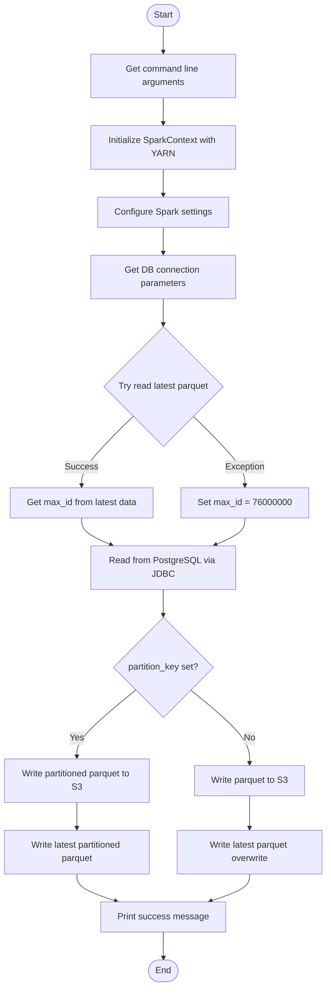
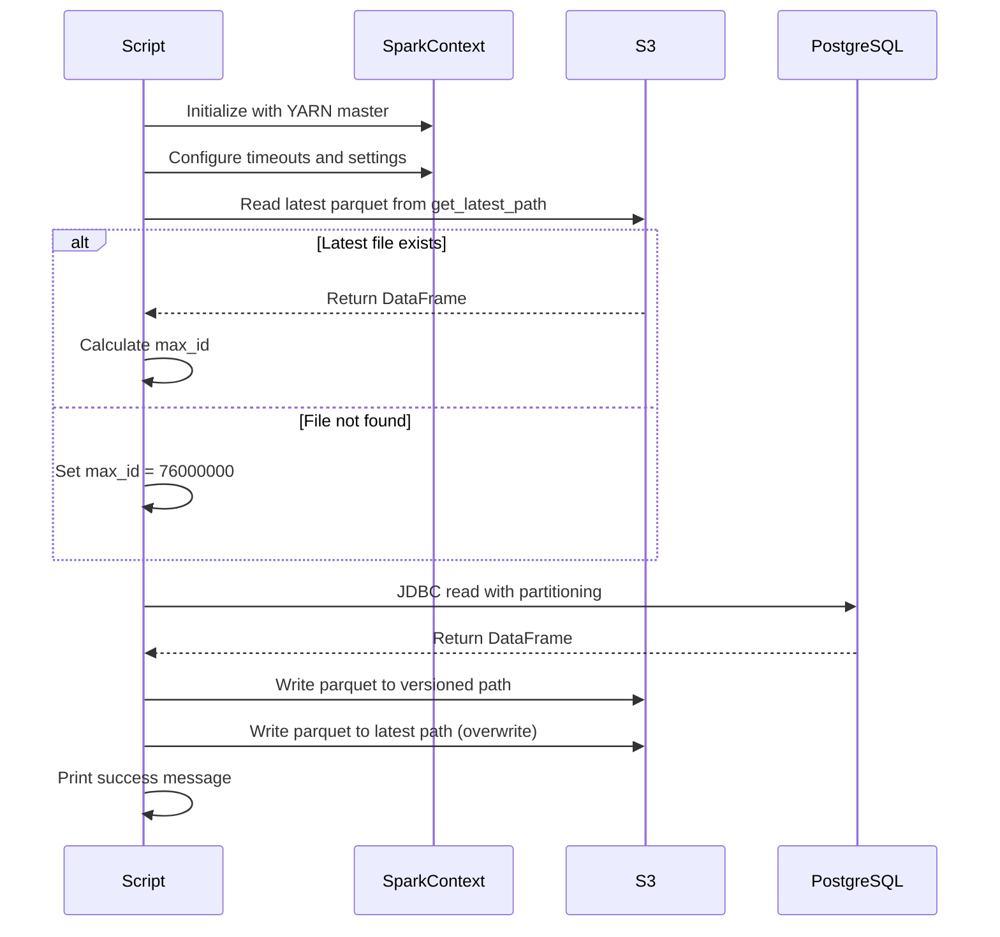

# Diagram: research/orchestrator/tasks/etl/extract_public_exception_spark.py

> Auto-generated by Obscura crawlers

## Diagram 1

### SVG

<svg id="container" width="586" xmlns="http://www.w3.org/2000/svg" class="flowchart" height="1798.53125" viewBox="0 0 586 1798.53125" role="graphics-document document" aria-roledescription="flowchart-v2"><g><marker id="container_flowchart-v2-pointEnd" class="marker flowchart-v2" viewBox="0 0 10 10" refX="5" refY="5" markerUnits="userSpaceOnUse" markerWidth="8" markerHeight="8" orient="auto"><path d="M 0 0 L 10 5 L 0 10 z" class="arrowMarkerPath" style="stroke-width: 1; stroke-dasharray: 1, 0;"></path></marker><marker id="container_flowchart-v2-pointStart" class="marker flowchart-v2" viewBox="0 0 10 10" refX="4.5" refY="5" markerUnits="userSpaceOnUse" markerWidth="8" markerHeight="8" orient="auto"><path d="M 0 5 L 10 10 L 10 0 z" class="arrowMarkerPath" style="stroke-width: 1; stroke-dasharray: 1, 0;"></path></marker><marker id="container_flowchart-v2-circleEnd" class="marker flowchart-v2" viewBox="0 0 10 10" refX="11" refY="5" markerUnits="userSpaceOnUse" markerWidth="11" markerHeight="11" orient="auto"><circle cx="5" cy="5" r="5" class="arrowMarkerPath" style="stroke-width: 1; stroke-dasharray: 1, 0;"></circle></marker><marker id="container_flowchart-v2-circleStart" class="marker flowchart-v2" viewBox="0 0 10 10" refX="-1" refY="5" markerUnits="userSpaceOnUse" markerWidth="11" markerHeight="11" orient="auto"><circle cx="5" cy="5" r="5" class="arrowMarkerPath" style="stroke-width: 1; stroke-dasharray: 1, 0;"></circle></marker><marker id="container_flowchart-v2-crossEnd" class="marker cross flowchart-v2" viewBox="0 0 11 11" refX="12" refY="5.2" markerUnits="userSpaceOnUse" markerWidth="11" markerHeight="11" orient="auto"><path d="M 1,1 l 9,9 M 10,1 l -9,9" class="arrowMarkerPath" style="stroke-width: 2; stroke-dasharray: 1, 0;"></path></marker><marker id="container_flowchart-v2-crossStart" class="marker cross flowchart-v2" viewBox="0 0 11 11" refX="-1" refY="5.2" markerUnits="userSpaceOnUse" markerWidth="11" markerHeight="11" orient="auto"><path d="M 1,1 l 9,9 M 10,1 l -9,9" class="arrowMarkerPath" style="stroke-width: 2; stroke-dasharray: 1, 0;"></path></marker><g class="root"><g class="clusters"></g><g class="edgePaths"><path d="M293.5,47.5L293.417,51.583C293.333,55.667,293.167,63.833,293.083,71.417C293,79,293,86,293,89.5L293,93" id="L_Start_GetArgs_0" class="edge-thickness-normal edge-pattern-solid edge-thickness-normal edge-pattern-solid flowchart-link" style=";" data-edge="true" data-et="edge" data-id="L_Start_GetArgs_0" data-points="W3sieCI6MjkzLjUsInkiOjQ3LjV9LHsieCI6MjkzLCJ5Ijo3Mn0seyJ4IjoyOTMsInkiOjk3fV0=" marker-end="url(#container_flowchart-v2-pointEnd)"></path><path d="M293,175L293,179.167C293,183.333,293,191.667,293,199.333C293,207,293,214,293,217.5L293,221" id="L_GetArgs_InitSpark_0" class="edge-thickness-normal edge-pattern-solid edge-thickness-normal edge-pattern-solid flowchart-link" style=";" data-edge="true" data-et="edge" data-id="L_GetArgs_InitSpark_0" data-points="W3sieCI6MjkzLCJ5IjoxNzV9LHsieCI6MjkzLCJ5IjoyMDB9LHsieCI6MjkzLCJ5IjoyMjV9XQ==" marker-end="url(#container_flowchart-v2-pointEnd)"></path><path d="M293,303L293,307.167C293,311.333,293,319.667,293,327.333C293,335,293,342,293,345.5L293,349" id="L_InitSpark_ConfigSpark_0" class="edge-thickness-normal edge-pattern-solid edge-thickness-normal edge-pattern-solid flowchart-link" style=";" data-edge="true" data-et="edge" data-id="L_InitSpark_ConfigSpark_0" data-points="W3sieCI6MjkzLCJ5IjozMDN9LHsieCI6MjkzLCJ5IjozMjh9LHsieCI6MjkzLCJ5IjozNTN9XQ==" marker-end="url(#container_flowchart-v2-pointEnd)"></path><path d="M293,407L293,411.167C293,415.333,293,423.667,293,431.333C293,439,293,446,293,449.5L293,453" id="L_ConfigSpark_GetDBParams_0" class="edge-thickness-normal edge-pattern-solid edge-thickness-normal edge-pattern-solid flowchart-link" style=";" data-edge="true" data-et="edge" data-id="L_ConfigSpark_GetDBParams_0" data-points="W3sieCI6MjkzLCJ5Ijo0MDd9LHsieCI6MjkzLCJ5Ijo0MzJ9LHsieCI6MjkzLCJ5Ijo0NTd9XQ==" marker-end="url(#container_flowchart-v2-pointEnd)"></path><path d="M293,535L293,539.167C293,543.333,293,551.667,293,559.333C293,567,293,574,293,577.5L293,581" id="L_GetDBParams_TryReadLatest_0" class="edge-thickness-normal edge-pattern-solid edge-thickness-normal edge-pattern-solid flowchart-link" style=";" data-edge="true" data-et="edge" data-id="L_GetDBParams_TryReadLatest_0" data-points="W3sieCI6MjkzLCJ5Ijo1MzV9LHsieCI6MjkzLCJ5Ijo1NjB9LHsieCI6MjkzLCJ5Ijo1ODV9XQ==" marker-end="url(#container_flowchart-v2-pointEnd)"></path><path d="M238.275,749.306L223.006,764.594C207.737,779.881,177.198,810.456,161.929,831.244C146.66,852.031,146.66,863.031,146.66,868.531L146.66,874.031" id="L_TryReadLatest_GetMaxID_0" class="edge-thickness-normal edge-pattern-solid edge-thickness-normal edge-pattern-solid flowchart-link" style=";" data-edge="true" data-et="edge" data-id="L_TryReadLatest_GetMaxID_0" data-points="W3sieCI6MjM4LjI3NTA1NDg5NjIyNjU1LCJ5Ijo3NDkuMzA2MzA0ODk2MjI2NX0seyJ4IjoxNDYuNjYwMTU2MjUsInkiOjg0MS4wMzEyNX0seyJ4IjoxNDYuNjYwMTU2MjUsInkiOjg3OC4wMzEyNX1d" marker-end="url(#container_flowchart-v2-pointEnd)"></path><path d="M347.725,749.306L362.994,764.594C378.263,779.881,408.802,810.456,424.071,833.244C439.34,856.031,439.34,871.031,439.34,878.531L439.34,886.031" id="L_TryReadLatest_DefaultMaxID_0" class="edge-thickness-normal edge-pattern-solid edge-thickness-normal edge-pattern-solid flowchart-link" style=";" data-edge="true" data-et="edge" data-id="L_TryReadLatest_DefaultMaxID_0" data-points="W3sieCI6MzQ3LjcyNDk0NTEwMzc3MzQ1LCJ5Ijo3NDkuMzA2MzA0ODk2MjI2NX0seyJ4Ijo0MzkuMzM5ODQzNzUsInkiOjg0MS4wMzEyNX0seyJ4Ijo0MzkuMzM5ODQzNzUsInkiOjg5MC4wMzEyNX1d" marker-end="url(#container_flowchart-v2-pointEnd)"></path><path d="M146.66,956.031L146.66,960.198C146.66,964.365,146.66,972.698,155.577,980.764C164.493,988.83,182.326,996.629,191.243,1000.529L200.159,1004.428" id="L_GetMaxID_ReadJDBC_0" class="edge-thickness-normal edge-pattern-solid edge-thickness-normal edge-pattern-solid flowchart-link" style=";" data-edge="true" data-et="edge" data-id="L_GetMaxID_ReadJDBC_0" data-points="W3sieCI6MTQ2LjY2MDE1NjI1LCJ5Ijo5NTYuMDMxMjV9LHsieCI6MTQ2LjY2MDE1NjI1LCJ5Ijo5ODEuMDMxMjV9LHsieCI6MjAzLjgyNDE1NzcxNDg0Mzc1LCJ5IjoxMDA2LjAzMTI1fV0=" marker-end="url(#container_flowchart-v2-pointEnd)"></path><path d="M439.34,944.031L439.34,950.198C439.34,956.365,439.34,968.698,430.423,978.764C421.507,988.83,403.674,996.629,394.757,1000.529L385.841,1004.428" id="L_DefaultMaxID_ReadJDBC_0" class="edge-thickness-normal edge-pattern-solid edge-thickness-normal edge-pattern-solid flowchart-link" style=";" data-edge="true" data-et="edge" data-id="L_DefaultMaxID_ReadJDBC_0" data-points="W3sieCI6NDM5LjMzOTg0Mzc1LCJ5Ijo5NDQuMDMxMjV9LHsieCI6NDM5LjMzOTg0Mzc1LCJ5Ijo5ODEuMDMxMjV9LHsieCI6MzgyLjE3NTg0MjI4NTE1NjI1LCJ5IjoxMDA2LjAzMTI1fV0=" marker-end="url(#container_flowchart-v2-pointEnd)"></path><path d="M293,1084.031L293,1088.198C293,1092.365,293,1100.698,293,1108.365C293,1116.031,293,1123.031,293,1126.531L293,1130.031" id="L_ReadJDBC_CheckPartition_0" class="edge-thickness-normal edge-pattern-solid edge-thickness-normal edge-pattern-solid flowchart-link" style=";" data-edge="true" data-et="edge" data-id="L_ReadJDBC_CheckPartition_0" data-points="W3sieCI6MjkzLCJ5IjoxMDg0LjAzMTI1fSx7IngiOjI5MywieSI6MTEwOS4wMzEyNX0seyJ4IjoyOTMsInkiOjExMzQuMDMxMjV9XQ==" marker-end="url(#container_flowchart-v2-pointEnd)"></path><path d="M242.881,1267.412L225.401,1281.932C207.921,1296.452,172.96,1325.492,155.48,1345.511C138,1365.531,138,1376.531,138,1382.031L138,1387.531" id="L_CheckPartition_WritePartitioned_0" class="edge-thickness-normal edge-pattern-solid edge-thickness-normal edge-pattern-solid flowchart-link" style=";" data-edge="true" data-et="edge" data-id="L_CheckPartition_WritePartitioned_0" data-points="W3sieCI6MjQyLjg4MTA1NzI2ODcyMjQ2LCJ5IjoxMjY3LjQxMjMwNzI2ODcyMjV9LHsieCI6MTM4LCJ5IjoxMzU0LjUzMTI1fSx7IngiOjEzOCwieSI6MTM5MS41MzEyNX1d" marker-end="url(#container_flowchart-v2-pointEnd)"></path><path d="M343.119,1267.412L360.599,1281.932C378.079,1296.452,413.04,1325.492,430.52,1347.511C448,1369.531,448,1384.531,448,1392.031L448,1399.531" id="L_CheckPartition_WriteSimple_0" class="edge-thickness-normal edge-pattern-solid edge-thickness-normal edge-pattern-solid flowchart-link" style=";" data-edge="true" data-et="edge" data-id="L_CheckPartition_WriteSimple_0" data-points="W3sieCI6MzQzLjExODk0MjczMTI3NzUsInkiOjEyNjcuNDEyMzA3MjY4NzIyNX0seyJ4Ijo0NDgsInkiOjEzNTQuNTMxMjV9LHsieCI6NDQ4LCJ5IjoxNDAzLjUzMTI1fV0=" marker-end="url(#container_flowchart-v2-pointEnd)"></path><path d="M138,1469.531L138,1473.698C138,1477.865,138,1486.198,138,1493.865C138,1501.531,138,1508.531,138,1512.031L138,1515.531" id="L_WritePartitioned_WriteLatestPartitioned_0" class="edge-thickness-normal edge-pattern-solid edge-thickness-normal edge-pattern-solid flowchart-link" style=";" data-edge="true" data-et="edge" data-id="L_WritePartitioned_WriteLatestPartitioned_0" data-points="W3sieCI6MTM4LCJ5IjoxNDY5LjUzMTI1fSx7IngiOjEzOCwieSI6MTQ5NC41MzEyNX0seyJ4IjoxMzgsInkiOjE1MTkuNTMxMjV9XQ==" marker-end="url(#container_flowchart-v2-pointEnd)"></path><path d="M448,1457.531L448,1463.698C448,1469.865,448,1482.198,448,1491.865C448,1501.531,448,1508.531,448,1512.031L448,1515.531" id="L_WriteSimple_WriteLatestSimple_0" class="edge-thickness-normal edge-pattern-solid edge-thickness-normal edge-pattern-solid flowchart-link" style=";" data-edge="true" data-et="edge" data-id="L_WriteSimple_WriteLatestSimple_0" data-points="W3sieCI6NDQ4LCJ5IjoxNDU3LjUzMTI1fSx7IngiOjQ0OCwieSI6MTQ5NC41MzEyNX0seyJ4Ijo0NDgsInkiOjE1MTkuNTMxMjV9XQ==" marker-end="url(#container_flowchart-v2-pointEnd)"></path><path d="M138,1597.531L138,1601.698C138,1605.865,138,1614.198,149.788,1622.319C161.576,1630.441,185.151,1638.35,196.939,1642.304L208.727,1646.259" id="L_WriteLatestPartitioned_Success_0" class="edge-thickness-normal edge-pattern-solid edge-thickness-normal edge-pattern-solid flowchart-link" style=";" data-edge="true" data-et="edge" data-id="L_WriteLatestPartitioned_Success_0" data-points="W3sieCI6MTM4LCJ5IjoxNTk3LjUzMTI1fSx7IngiOjEzOCwieSI6MTYyMi41MzEyNX0seyJ4IjoyMTIuNTE5MjMwNzY5MjMwNzcsInkiOjE2NDcuNTMxMjV9XQ==" marker-end="url(#container_flowchart-v2-pointEnd)"></path><path d="M448,1597.531L448,1601.698C448,1605.865,448,1614.198,436.212,1622.319C424.424,1630.441,400.849,1638.35,389.061,1642.304L377.273,1646.259" id="L_WriteLatestSimple_Success_0" class="edge-thickness-normal edge-pattern-solid edge-thickness-normal edge-pattern-solid flowchart-link" style=";" data-edge="true" data-et="edge" data-id="L_WriteLatestSimple_Success_0" data-points="W3sieCI6NDQ4LCJ5IjoxNTk3LjUzMTI1fSx7IngiOjQ0OCwieSI6MTYyMi41MzEyNX0seyJ4IjozNzMuNDgwNzY5MjMwNzY5MiwieSI6MTY0Ny41MzEyNX1d" marker-end="url(#container_flowchart-v2-pointEnd)"></path><path d="M293,1701.531L293,1705.698C293,1709.865,293,1718.198,293.07,1725.948C293.141,1733.698,293.281,1740.865,293.351,1744.449L293.422,1748.032" id="L_Success_End_0" class="edge-thickness-normal edge-pattern-solid edge-thickness-normal edge-pattern-solid flowchart-link" style=";" data-edge="true" data-et="edge" data-id="L_Success_End_0" data-points="W3sieCI6MjkzLCJ5IjoxNzAxLjUzMTI1fSx7IngiOjI5MywieSI6MTcyNi41MzEyNX0seyJ4IjoyOTMuNSwieSI6MTc1Mi4wMzEyNTAwMDAwMDQzfV0=" marker-end="url(#container_flowchart-v2-pointEnd)"></path></g><g class="edgeLabels"><g class="edgeLabel"><g class="label" data-id="L_Start_GetArgs_0" transform="translate(0, 0)"><foreignObject width="0" height="0">

</foreignObject></g></g><g class="edgeLabel"><g class="label" data-id="L_GetArgs_InitSpark_0" transform="translate(0, 0)"><foreignObject width="0" height="0">

</foreignObject></g></g><g class="edgeLabel"><g class="label" data-id="L_InitSpark_ConfigSpark_0" transform="translate(0, 0)"><foreignObject width="0" height="0">

</foreignObject></g></g><g class="edgeLabel"><g class="label" data-id="L_ConfigSpark_GetDBParams_0" transform="translate(0, 0)"><foreignObject width="0" height="0">

</foreignObject></g></g><g class="edgeLabel"><g class="label" data-id="L_GetDBParams_TryReadLatest_0" transform="translate(0, 0)"><foreignObject width="0" height="0">

</foreignObject></g></g><g class="edgeLabel" transform="translate(146.66015625, 841.03125)"><g class="label" data-id="L_TryReadLatest_GetMaxID_0" transform="translate(-28.1015625, -12)"><foreignObject width="56.203125" height="24">

Success

</foreignObject></g></g><g class="edgeLabel" transform="translate(439.33984375, 841.03125)"><g class="label" data-id="L_TryReadLatest_DefaultMaxID_0" transform="translate(-35.375, -12)"><foreignObject width="70.75" height="24">

Exception

</foreignObject></g></g><g class="edgeLabel"><g class="label" data-id="L_GetMaxID_ReadJDBC_0" transform="translate(0, 0)"><foreignObject width="0" height="0">

</foreignObject></g></g><g class="edgeLabel"><g class="label" data-id="L_DefaultMaxID_ReadJDBC_0" transform="translate(0, 0)"><foreignObject width="0" height="0">

</foreignObject></g></g><g class="edgeLabel"><g class="label" data-id="L_ReadJDBC_CheckPartition_0" transform="translate(0, 0)"><foreignObject width="0" height="0">

</foreignObject></g></g><g class="edgeLabel" transform="translate(138, 1354.53125)"><g class="label" data-id="L_CheckPartition_WritePartitioned_0" transform="translate(-12.03125, -12)"><foreignObject width="24.0625" height="24">

Yes

</foreignObject></g></g><g class="edgeLabel" transform="translate(448, 1354.53125)"><g class="label" data-id="L_CheckPartition_WriteSimple_0" transform="translate(-10.140625, -12)"><foreignObject width="20.28125" height="24">

No

</foreignObject></g></g><g class="edgeLabel"><g class="label" data-id="L_WritePartitioned_WriteLatestPartitioned_0" transform="translate(0, 0)"><foreignObject width="0" height="0">

</foreignObject></g></g><g class="edgeLabel"><g class="label" data-id="L_WriteSimple_WriteLatestSimple_0" transform="translate(0, 0)"><foreignObject width="0" height="0">

</foreignObject></g></g><g class="edgeLabel"><g class="label" data-id="L_WriteLatestPartitioned_Success_0" transform="translate(0, 0)"><foreignObject width="0" height="0">

</foreignObject></g></g><g class="edgeLabel"><g class="label" data-id="L_WriteLatestSimple_Success_0" transform="translate(0, 0)"><foreignObject width="0" height="0">

</foreignObject></g></g><g class="edgeLabel"><g class="label" data-id="L_Success_End_0" transform="translate(0, 0)"><foreignObject width="0" height="0">

</foreignObject></g></g></g><g class="nodes"><g class="node default" id="flowchart-Start-0" transform="translate(293, 27.5)"><g class="basic label-container outer-path"><path d="M-10.3984375 -19.5 C-5.675631109348266 -19.5, -0.9528247186965313 -19.5, 10.3984375 -19.5 C10.3984375 -19.5, 10.398437499999998 -19.5, 10.398437499999998 -19.5 C10.768738933427313 -19.488125153778, 11.139040366854628 -19.476250307556004, 11.6478067896239 -19.45993515863156 C12.005663085283743 -19.425413192174418, 12.363519380943586 -19.390891225717276, 12.892042152847864 -19.3399052695533 C13.191170646256516 -19.2915444945151, 13.49029913966517 -19.243183719476903, 14.126030759676757 -19.140403561325776 C14.419161706557574 -19.073498335558423, 14.71229265343839 -19.006593109791073, 15.34470188623539 -18.862249829261074 C15.804044078934357 -18.725919477604393, 16.263386271633326 -18.58958912594771, 16.543047751460602 -18.50658706670804 C16.80896599300666 -18.408726695697812, 17.074884234552712 -18.310866324687584, 17.716144095147794 -18.074876768247425 C18.155369155500757 -17.880444863177654, 18.594594215853725 -17.686012958107888, 18.85917041279238 -17.568892924097174 C19.17028203227281 -17.40658619149074, 19.481393651753237 -17.244279458884304, 19.967429764076783 -16.990714730406097 C20.281935523875703 -16.800059490574995, 20.596441283674622 -16.609404250743893, 21.036368073605697 -16.342718045390892 C21.42574019616345 -16.071108908342126, 21.8151123187212 -15.799499771293357, 22.061592844578712 -15.627565626425154 C22.319718253846567 -15.421717481539659, 22.577843663114425 -15.215869336654164, 23.03889120850187 -14.848196188198123 C23.28234879274481 -14.62709445172338, 23.52580637698775 -14.405992715248637, 23.964247236767985 -14.007812326905688 C24.303173222404826 -13.657843420394729, 24.642099208041667 -13.307874513883771, 24.833858442968648 -13.10986736009568 C25.069316796652135 -12.833284579899185, 25.304775150335622 -12.55670179970269, 25.644151408126582 -12.158051136245305 C25.902207211557105 -11.81227986901573, 26.160263014987624 -11.466508601786156, 26.391796464640635 -11.156274872382312 C26.560693538711433 -10.89680361139485, 26.729590612782232 -10.637332350407386, 27.073721378604247 -10.108655082055241 C27.26021844567357 -9.777510654597812, 27.446715512742895 -9.446366227140382, 27.6871239742735 -9.019496659696287 C27.871328405092616 -8.63699221775697, 28.055532835911727 -8.254487775817653, 28.22948364880834 -7.893275190886684 C28.406956049231844 -7.454914930645194, 28.584428449655345 -7.016554670403703, 28.698571729970325 -6.734618561215508 C28.80650268820034 -6.4095477114895765, 28.914433646430354 -6.084476861763644, 29.09246063421488 -5.548287939305138 C29.159019644012147 -5.294469588090833, 29.225578653809418 -5.040651236876528, 29.40953178754556 -4.339158212148133 C29.496061557547613 -3.89484613126096, 29.582591327549665 -3.450534050373787, 29.648482276581777 -3.1121979531509023 C29.695428708387034 -2.7480906986908624, 29.742375140192294 -2.383983444230823, 29.808330202509367 -1.872449005199798 C29.825820826330343 -1.6000184210106332, 29.843311450151322 -1.3275878368214684, 29.888418715913414 -0.6250057626472757 C29.888418715913414 -0.32292027513327926, 29.888418715913414 -0.020834787619282813, 29.888418715913414 0.625005762647271 C29.865678982878936 0.9791954598413954, 29.84293924984446 1.3333851570355197, 29.808330202509367 1.8724490051997846 C29.759993229457795 2.2473410229728232, 29.71165625640622 2.622233040745862, 29.648482276581777 3.1121979531508885 C29.581395543467547 3.456674148906408, 29.514308810353313 3.8011503446619277, 29.40953178754556 4.339158212148129 C29.28728404348546 4.80534184275672, 29.16503629942536 5.271525473365311, 29.092460634214884 5.548287939305125 C28.958764952432624 5.950958031319202, 28.825069270650364 6.353628123333279, 28.69857172997033 6.734618561215495 C28.584184597947537 7.017156988836539, 28.469797465924746 7.299695416457582, 28.229483648808344 7.893275190886679 C28.11287273268313 8.135420253294587, 27.996261816557915 8.377565315702496, 27.687123974273504 9.019496659696284 C27.489913914211876 9.369663091019726, 27.292703854150247 9.719829522343169, 27.07372137860425 10.108655082055236 C26.876980706144334 10.41090158722144, 26.680240033684417 10.713148092387645, 26.39179646464064 11.156274872382301 C26.189214037123595 11.427716869616328, 25.98663160960655 11.699158866850354, 25.644151408126582 12.158051136245302 C25.393290548318063 12.452726576563688, 25.142429688509544 12.747402016882074, 24.83385844296866 13.10986736009567 C24.51472500612099 13.439398834983333, 24.19559156927332 13.768930309870996, 23.96424723676799 14.007812326905684 C23.631305131903765 14.310181537378005, 23.298363027039542 14.612550747850326, 23.038891208501887 14.848196188198111 C22.75331130156004 15.075938564383748, 22.46773139461819 15.303680940569386, 22.061592844578715 15.627565626425152 C21.792673125862386 15.815152380854666, 21.523753407146057 16.00273913528418, 21.036368073605708 16.34271804539089 C20.72638983313222 16.530628676400255, 20.416411592658733 16.718539307409625, 19.967429764076787 16.990714730406093 C19.525852379200547 17.22108536925221, 19.08427499432431 17.451456008098333, 18.859170412792388 17.56889292409717 C18.486347322093746 17.733930646945417, 18.1135242313951 17.89896836979366, 17.716144095147804 18.07487676824742 C17.416311510752124 18.18521793092706, 17.116478926356443 18.295559093606695, 16.543047751460616 18.506587066708033 C16.215821692179695 18.603706043457976, 15.888595632898772 18.70082502020792, 15.344701886235413 18.86224982926107 C14.859920417019016 18.97289803611498, 14.37513894780262 19.083546242968893, 14.126030759676766 19.140403561325773 C13.725887195636993 19.205095669600038, 13.32574363159722 19.269787777874306, 12.892042152847878 19.3399052695533 C12.558404936998718 19.37209085050881, 12.224767721149558 19.404276431464318, 11.6478067896239 19.45993515863156 C11.354229994260347 19.469349595046303, 11.060653198896793 19.478764031461044, 10.398437500000004 19.5 C10.398437500000004 19.5, 10.398437500000002 19.5, 10.3984375 19.5 C4.237906835436269 19.5, -1.9226238291274615 19.5, -10.398437499999996 19.5 C-10.871831129814682 19.484819187696644, -11.345224759629366 19.46963837539329, -11.647806789623893 19.45993515863156 C-12.124562901995386 19.413943069854195, -12.601319014366878 19.36795098107683, -12.892042152847871 19.3399052695533 C-13.233888188336302 19.284638253591126, -13.575734223824732 19.229371237628957, -14.126030759676759 19.140403561325773 C-14.587793443925113 19.035009241929206, -15.049556128173467 18.929614922532643, -15.344701886235388 18.862249829261074 C-15.58692249192448 18.790360024934458, -15.829143097613569 18.71847022060784, -16.54304775146059 18.506587066708043 C-16.82715289253034 18.40203374855524, -17.111258033600087 18.29748043040244, -17.716144095147797 18.074876768247425 C-18.035421045775287 17.933542333218867, -18.35469799640278 17.792207898190313, -18.85917041279238 17.568892924097174 C-19.1506212198346 17.416843224746398, -19.442072026876822 17.264793525395625, -19.96742976407678 16.990714730406097 C-20.20840910672192 16.844631636742804, -20.449388449367063 16.69854854307951, -21.036368073605686 16.3427180453909 C-21.42173244073016 16.07390454503945, -21.807096807854634 15.805091044688004, -22.061592844578712 15.627565626425156 C-22.429330061610447 15.334304981740672, -22.797067278642185 15.04104433705619, -23.03889120850187 14.848196188198125 C-23.231016292423593 14.673713270331575, -23.42314137634532 14.499230352465027, -23.964247236767974 14.007812326905697 C-24.276198774611796 13.685696752384384, -24.588150312455614 13.363581177863072, -24.833858442968655 13.109867360095677 C-25.02631481016485 12.883797160109504, -25.21877117736104 12.65772696012333, -25.64415140812658 12.158051136245307 C-25.913575177121835 11.797047830801956, -26.182998946117095 11.436044525358605, -26.391796464640635 11.156274872382316 C-26.544638761181808 10.921468060991765, -26.697481057722978 10.686661249601217, -27.073721378604244 10.108655082055249 C-27.232675292422453 9.82641631224187, -27.391629206240665 9.544177542428491, -27.6871239742735 9.019496659696289 C-27.81341068894732 8.757259594573272, -27.939697403621143 8.495022529450257, -28.22948364880834 7.893275190886686 C-28.351285448898597 7.5924223897861465, -28.473087248988858 7.291569588685607, -28.698571729970325 6.73461856121551 C-28.814741135662167 6.3847348203528975, -28.930910541354006 6.034851079490284, -29.09246063421488 5.5482879393051325 C-29.209682193316407 5.101271330305926, -29.326903752417934 4.654254721306721, -29.409531787545557 4.339158212148136 C-29.45909191905363 4.084677411391694, -29.5086520505617 3.8301966106352516, -29.648482276581777 3.112197953150904 C-29.705666694918648 2.668686896870791, -29.762851113255515 2.2251758405906785, -29.808330202509364 1.872449005199809 C-29.83548322980187 1.4495186875899038, -29.862636257094373 1.0265883699799985, -29.888418715913414 0.6250057626472781 C-29.888418715913414 0.2911354732730828, -29.888418715913414 -0.042734816101112516, -29.888418715913414 -0.6250057626472687 C-29.86466536126499 -0.9949834346592743, -29.840912006616563 -1.36496110667128, -29.808330202509367 -1.8724490051997822 C-29.76225188502673 -2.229823336402153, -29.71617356754409 -2.5871976676045234, -29.648482276581777 -3.112197953150895 C-29.55686915172949 -3.5826119868266044, -29.4652560268772 -4.053026020502314, -29.40953178754556 -4.339158212148126 C-29.308227893571466 -4.725473865256724, -29.206923999597375 -5.111789518365323, -29.092460634214884 -5.548287939305123 C-28.939701861384123 -6.008373024266207, -28.786943088553357 -6.46845810922729, -28.698571729970332 -6.734618561215485 C-28.547516924014037 -7.107726852373536, -28.396462118057737 -7.480835143531587, -28.229483648808344 -7.893275190886676 C-28.02345021800841 -8.32110801835195, -27.817416787208472 -8.748940845817222, -27.687123974273504 -9.019496659696282 C-27.456575594922356 -9.428858652789163, -27.226027215571204 -9.838220645882043, -27.073721378604247 -10.108655082055243 C-26.927573555350474 -10.333177384758566, -26.781425732096704 -10.557699687461888, -26.39179646464064 -11.156274872382308 C-26.185638331616897 -11.432507989241838, -25.97948019859315 -11.708741106101368, -25.644151408126586 -12.158051136245302 C-25.457892622014167 -12.376841304838116, -25.271633835901753 -12.595631473430931, -24.833858442968662 -13.10986736009567 C-24.582215702316937 -13.369709150071811, -24.33057296166521 -13.629550940047952, -23.964247236767996 -14.007812326905677 C-23.684246444952624 -14.262101637617413, -23.404245653137256 -14.51639094832915, -23.038891208501887 -14.848196188198107 C-22.695472200252265 -15.122063708513569, -22.352053192002646 -15.39593122882903, -22.06159284457872 -15.627565626425149 C-21.816714953220966 -15.798381842843252, -21.571837061863214 -15.969198059261355, -21.03636807360571 -16.342718045390885 C-20.62401800615697 -16.592687079516285, -20.21166793870823 -16.84265611364168, -19.96742976407679 -16.99071473040609 C-19.530105713874697 -17.218866407277098, -19.092781663672607 -17.44701808414811, -18.859170412792388 -17.56889292409717 C-18.47156513809392 -17.74047428130423, -18.083959863395453 -17.912055638511287, -17.716144095147804 -18.07487676824742 C-17.28626616345652 -18.233075820857852, -16.856388231765234 -18.391274873468287, -16.54304775146062 -18.506587066708033 C-16.29889376275443 -18.57905068896559, -16.054739774048244 -18.651514311223146, -15.344701886235413 -18.862249829261067 C-14.91255163481459 -18.960885304103932, -14.480401383393767 -19.059520778946798, -14.126030759676768 -19.140403561325773 C-13.728369272849944 -19.204694386605045, -13.33070778602312 -19.268985211884317, -12.89204215284788 -19.3399052695533 C-12.583006500559067 -19.36971756725985, -12.273970848270256 -19.399529864966404, -11.647806789623903 -19.45993515863156 C-11.172615904937611 -19.475173605400503, -10.697425020251321 -19.490412052169443, -10.398437500000005 -19.5 C-10.398437500000004 -19.5, -10.398437500000002 -19.5, -10.3984375 -19.5" stroke="none" stroke-width="0" fill="#ECECFF" style=""></path><path d="M-10.3984375 -19.5 C-2.952544116287222 -19.5, 4.493349267425556 -19.5, 10.3984375 -19.5 M-10.3984375 -19.5 C-3.2686649426198082 -19.5, 3.8611076147603836 -19.5, 10.3984375 -19.5 M10.3984375 -19.5 C10.3984375 -19.5, 10.398437499999998 -19.5, 10.398437499999998 -19.5 M10.3984375 -19.5 C10.3984375 -19.5, 10.398437499999998 -19.5, 10.398437499999998 -19.5 M10.398437499999998 -19.5 C10.76664883049351 -19.48819217931095, 11.134860160987023 -19.4763843586219, 11.6478067896239 -19.45993515863156 M10.398437499999998 -19.5 C10.73457827595042 -19.4892206195736, 11.070719051900843 -19.478441239147198, 11.6478067896239 -19.45993515863156 M11.6478067896239 -19.45993515863156 C12.101521758456158 -19.416165821260396, 12.555236727288415 -19.372396483889233, 12.892042152847864 -19.3399052695533 M11.6478067896239 -19.45993515863156 C11.993692819873106 -19.42656794928223, 12.339578850122312 -19.3932007399329, 12.892042152847864 -19.3399052695533 M12.892042152847864 -19.3399052695533 C13.25192550997339 -19.281722119310363, 13.611808867098917 -19.223538969067423, 14.126030759676757 -19.140403561325776 M12.892042152847864 -19.3399052695533 C13.147979141374524 -19.298527362069297, 13.403916129901184 -19.2571494545853, 14.126030759676757 -19.140403561325776 M14.126030759676757 -19.140403561325776 C14.475507894455532 -19.060637685863952, 14.824985029234306 -18.98087181040213, 15.34470188623539 -18.862249829261074 M14.126030759676757 -19.140403561325776 C14.583994053406954 -19.035876428021638, 15.04195734713715 -18.931349294717503, 15.34470188623539 -18.862249829261074 M15.34470188623539 -18.862249829261074 C15.773769035144337 -18.734904951684324, 16.202836184053282 -18.60756007410757, 16.543047751460602 -18.50658706670804 M15.34470188623539 -18.862249829261074 C15.65281934499662 -18.770802184842285, 15.960936803757853 -18.679354540423496, 16.543047751460602 -18.50658706670804 M16.543047751460602 -18.50658706670804 C16.86678356805237 -18.387449293621184, 17.190519384644137 -18.268311520534333, 17.716144095147794 -18.074876768247425 M16.543047751460602 -18.50658706670804 C16.827266124285522 -18.40199207822263, 17.11148449711044 -18.297397089737224, 17.716144095147794 -18.074876768247425 M17.716144095147794 -18.074876768247425 C17.949800892971975 -17.971443835033302, 18.18345769079616 -17.868010901819176, 18.85917041279238 -17.568892924097174 M17.716144095147794 -18.074876768247425 C18.072272947985326 -17.91722908928332, 18.428401800822858 -17.75958141031922, 18.85917041279238 -17.568892924097174 M18.85917041279238 -17.568892924097174 C19.24565060087572 -17.367266457526473, 19.632130788959056 -17.16563999095577, 19.967429764076783 -16.990714730406097 M18.85917041279238 -17.568892924097174 C19.2873066099161 -17.34553454429205, 19.715442807039825 -17.12217616448693, 19.967429764076783 -16.990714730406097 M19.967429764076783 -16.990714730406097 C20.304915536500623 -16.786128871876226, 20.64240130892446 -16.58154301334635, 21.036368073605697 -16.342718045390892 M19.967429764076783 -16.990714730406097 C20.293306937765564 -16.793166072649115, 20.61918411145435 -16.595617414892132, 21.036368073605697 -16.342718045390892 M21.036368073605697 -16.342718045390892 C21.384257809127263 -16.100045225794975, 21.73214754464883 -15.85737240619906, 22.061592844578712 -15.627565626425154 M21.036368073605697 -16.342718045390892 C21.254150078466065 -16.190802746431345, 21.47193208332643 -16.038887447471797, 22.061592844578712 -15.627565626425154 M22.061592844578712 -15.627565626425154 C22.398685614807285 -15.358743112583216, 22.735778385035857 -15.08992059874128, 23.03889120850187 -14.848196188198123 M22.061592844578712 -15.627565626425154 C22.422708577920634 -15.339585438778217, 22.783824311262556 -15.051605251131278, 23.03889120850187 -14.848196188198123 M23.03889120850187 -14.848196188198123 C23.281345688079313 -14.628005444839891, 23.523800167656752 -14.407814701481657, 23.964247236767985 -14.007812326905688 M23.03889120850187 -14.848196188198123 C23.36876273005425 -14.548615600246436, 23.69863425160663 -14.249035012294748, 23.964247236767985 -14.007812326905688 M23.964247236767985 -14.007812326905688 C24.21742057500777 -13.746390069255476, 24.47059391324755 -13.484967811605266, 24.833858442968648 -13.10986736009568 M23.964247236767985 -14.007812326905688 C24.291849240526037 -13.66953636140078, 24.61945124428409 -13.331260395895873, 24.833858442968648 -13.10986736009568 M24.833858442968648 -13.10986736009568 C25.01264078650587 -12.899859446373325, 25.19142313004309 -12.68985153265097, 25.644151408126582 -12.158051136245305 M24.833858442968648 -13.10986736009568 C25.101958325316094 -12.794941982974903, 25.370058207663536 -12.480016605854127, 25.644151408126582 -12.158051136245305 M25.644151408126582 -12.158051136245305 C25.870206100386778 -11.855158442622763, 26.096260792646977 -11.552265749000222, 26.391796464640635 -11.156274872382312 M25.644151408126582 -12.158051136245305 C25.938776895036373 -11.763279824720213, 26.23340238194616 -11.36850851319512, 26.391796464640635 -11.156274872382312 M26.391796464640635 -11.156274872382312 C26.653194009487436 -10.754698048428597, 26.914591554334237 -10.353121224474885, 27.073721378604247 -10.108655082055241 M26.391796464640635 -11.156274872382312 C26.55902580490306 -10.899365698373739, 26.72625514516549 -10.642456524365166, 27.073721378604247 -10.108655082055241 M27.073721378604247 -10.108655082055241 C27.20388622581442 -9.877534215213545, 27.33405107302459 -9.646413348371848, 27.6871239742735 -9.019496659696287 M27.073721378604247 -10.108655082055241 C27.24038119379189 -9.81273370405331, 27.407041008979533 -9.516812326051378, 27.6871239742735 -9.019496659696287 M27.6871239742735 -9.019496659696287 C27.799390194696397 -8.78637345087584, 27.91165641511929 -8.553250242055395, 28.22948364880834 -7.893275190886684 M27.6871239742735 -9.019496659696287 C27.807518783753288 -8.769494261775263, 27.92791359323307 -8.519491863854238, 28.22948364880834 -7.893275190886684 M28.22948364880834 -7.893275190886684 C28.385700104794193 -7.50741752436192, 28.541916560780045 -7.121559857837156, 28.698571729970325 -6.734618561215508 M28.22948364880834 -7.893275190886684 C28.388441908354675 -7.500645216558363, 28.54740016790101 -7.10801524223004, 28.698571729970325 -6.734618561215508 M28.698571729970325 -6.734618561215508 C28.845969987345946 -6.290678494723165, 28.993368244721566 -5.846738428230823, 29.09246063421488 -5.548287939305138 M28.698571729970325 -6.734618561215508 C28.815043264051088 -6.383824857783091, 28.931514798131847 -6.033031154350676, 29.09246063421488 -5.548287939305138 M29.09246063421488 -5.548287939305138 C29.162587997724636 -5.28086190885084, 29.23271536123439 -5.0134358783965425, 29.40953178754556 -4.339158212148133 M29.09246063421488 -5.548287939305138 C29.17911304395558 -5.217844745571904, 29.265765453696282 -4.887401551838671, 29.40953178754556 -4.339158212148133 M29.40953178754556 -4.339158212148133 C29.496832863072285 -3.8908856404072516, 29.58413393859901 -3.44261306866637, 29.648482276581777 -3.1121979531509023 M29.40953178754556 -4.339158212148133 C29.489626564375385 -3.92788846116407, 29.569721341205206 -3.5166187101800066, 29.648482276581777 -3.1121979531509023 M29.648482276581777 -3.1121979531509023 C29.70462407460201 -2.6767732541579794, 29.760765872622237 -2.2413485551650565, 29.808330202509367 -1.872449005199798 M29.648482276581777 -3.1121979531509023 C29.710303071529356 -2.6327280754342595, 29.77212386647693 -2.1532581977176166, 29.808330202509367 -1.872449005199798 M29.808330202509367 -1.872449005199798 C29.835844448465505 -1.443892415333332, 29.863358694421645 -1.0153358254668658, 29.888418715913414 -0.6250057626472757 M29.808330202509367 -1.872449005199798 C29.838166226774828 -1.4077288440599005, 29.86800225104029 -0.9430086829200032, 29.888418715913414 -0.6250057626472757 M29.888418715913414 -0.6250057626472757 C29.888418715913414 -0.22399089535894096, 29.888418715913414 0.1770239719293938, 29.888418715913414 0.625005762647271 M29.888418715913414 -0.6250057626472757 C29.888418715913414 -0.19639234057454058, 29.888418715913414 0.23222108149819454, 29.888418715913414 0.625005762647271 M29.888418715913414 0.625005762647271 C29.861794751622813 1.039695496950558, 29.835170787332213 1.4543852312538452, 29.808330202509367 1.8724490051997846 M29.888418715913414 0.625005762647271 C29.86561473073811 0.9801962387981733, 29.842810745562804 1.3353867149490757, 29.808330202509367 1.8724490051997846 M29.808330202509367 1.8724490051997846 C29.772957008399334 2.1467965134899316, 29.737583814289305 2.421144021780078, 29.648482276581777 3.1121979531508885 M29.808330202509367 1.8724490051997846 C29.76764078102926 2.18802812316438, 29.726951359549158 2.5036072411289756, 29.648482276581777 3.1121979531508885 M29.648482276581777 3.1121979531508885 C29.571744740193616 3.5062289840200496, 29.49500720380545 3.90026001488921, 29.40953178754556 4.339158212148129 M29.648482276581777 3.1121979531508885 C29.564442211277154 3.54372592661605, 29.480402145972526 3.975253900081211, 29.40953178754556 4.339158212148129 M29.40953178754556 4.339158212148129 C29.28308114948052 4.821369299143342, 29.15663051141548 5.303580386138555, 29.092460634214884 5.548287939305125 M29.40953178754556 4.339158212148129 C29.331138607247187 4.63810538444509, 29.252745426948813 4.937052556742052, 29.092460634214884 5.548287939305125 M29.092460634214884 5.548287939305125 C28.954240840440555 5.964583935819964, 28.816021046666222 6.380879932334802, 28.69857172997033 6.734618561215495 M29.092460634214884 5.548287939305125 C28.953882432183185 5.96566340438656, 28.815304230151483 6.3830388694679945, 28.69857172997033 6.734618561215495 M28.69857172997033 6.734618561215495 C28.575524307046418 7.03854807479764, 28.452476884122508 7.342477588379785, 28.229483648808344 7.893275190886679 M28.69857172997033 6.734618561215495 C28.5388101083181 7.129232855477334, 28.379048486665866 7.523847149739174, 28.229483648808344 7.893275190886679 M28.229483648808344 7.893275190886679 C28.084950359629683 8.193401658383141, 27.940417070451026 8.493528125879603, 27.687123974273504 9.019496659696284 M28.229483648808344 7.893275190886679 C28.09782973876969 8.166657352024357, 27.966175828731032 8.440039513162036, 27.687123974273504 9.019496659696284 M27.687123974273504 9.019496659696284 C27.492054582865595 9.365862117058835, 27.29698519145769 9.712227574421387, 27.07372137860425 10.108655082055236 M27.687123974273504 9.019496659696284 C27.48689364647255 9.375025882226172, 27.286663318671593 9.730555104756059, 27.07372137860425 10.108655082055236 M27.07372137860425 10.108655082055236 C26.84827255386242 10.455005018344739, 26.622823729120586 10.801354954634244, 26.39179646464064 11.156274872382301 M27.07372137860425 10.108655082055236 C26.865822615212068 10.428043411260346, 26.657923851819884 10.747431740465457, 26.39179646464064 11.156274872382301 M26.39179646464064 11.156274872382301 C26.113985053631005 11.528516853995015, 25.836173642621368 11.900758835607729, 25.644151408126582 12.158051136245302 M26.39179646464064 11.156274872382301 C26.211930733302005 11.397278566270858, 26.032065001963364 11.638282260159416, 25.644151408126582 12.158051136245302 M25.644151408126582 12.158051136245302 C25.432028587628576 12.40722267133268, 25.219905767130566 12.656394206420059, 24.83385844296866 13.10986736009567 M25.644151408126582 12.158051136245302 C25.38257499152252 12.465313679308187, 25.120998574918456 12.772576222371072, 24.83385844296866 13.10986736009567 M24.83385844296866 13.10986736009567 C24.545892507924695 13.40721583047152, 24.25792657288073 13.70456430084737, 23.96424723676799 14.007812326905684 M24.83385844296866 13.10986736009567 C24.645211593714897 13.304660720144543, 24.456564744461136 13.499454080193416, 23.96424723676799 14.007812326905684 M23.96424723676799 14.007812326905684 C23.76146496869998 14.191973817440248, 23.55868270063197 14.376135307974812, 23.038891208501887 14.848196188198111 M23.96424723676799 14.007812326905684 C23.72211761115075 14.227708046492426, 23.479987985533512 14.447603766079169, 23.038891208501887 14.848196188198111 M23.038891208501887 14.848196188198111 C22.830534678806632 15.014354976029963, 22.622178149111377 15.180513763861814, 22.061592844578715 15.627565626425152 M23.038891208501887 14.848196188198111 C22.791341573713012 15.045610434369797, 22.543791938924137 15.243024680541485, 22.061592844578715 15.627565626425152 M22.061592844578715 15.627565626425152 C21.73463830130135 15.855634962181382, 21.407683758023982 16.08370429793761, 21.036368073605708 16.34271804539089 M22.061592844578715 15.627565626425152 C21.825596046569196 15.792186776579863, 21.589599248559676 15.956807926734575, 21.036368073605708 16.34271804539089 M21.036368073605708 16.34271804539089 C20.681686717084336 16.557727968053154, 20.327005360562964 16.77273789071542, 19.967429764076787 16.990714730406093 M21.036368073605708 16.34271804539089 C20.678291379644985 16.559786241562104, 20.32021468568426 16.776854437733324, 19.967429764076787 16.990714730406093 M19.967429764076787 16.990714730406093 C19.65001146646505 17.156311652954013, 19.332593168853315 17.321908575501933, 18.859170412792388 17.56889292409717 M19.967429764076787 16.990714730406093 C19.674640534406144 17.143462683984815, 19.3818513047355 17.29621063756354, 18.859170412792388 17.56889292409717 M18.859170412792388 17.56889292409717 C18.537826009715086 17.71114255899646, 18.216481606637785 17.853392193895747, 17.716144095147804 18.07487676824742 M18.859170412792388 17.56889292409717 C18.490857799865935 17.731933992234236, 18.122545186939483 17.8949750603713, 17.716144095147804 18.07487676824742 M17.716144095147804 18.07487676824742 C17.344700850773922 18.21157131576072, 16.97325760640004 18.348265863274023, 16.543047751460616 18.506587066708033 M17.716144095147804 18.07487676824742 C17.30434248543127 18.226423567275457, 16.892540875714737 18.37797036630349, 16.543047751460616 18.506587066708033 M16.543047751460616 18.506587066708033 C16.11088835465192 18.63484970722989, 15.678728957843223 18.76311234775175, 15.344701886235413 18.86224982926107 M16.543047751460616 18.506587066708033 C16.194995154469293 18.609887250529695, 15.846942557477972 18.713187434351358, 15.344701886235413 18.86224982926107 M15.344701886235413 18.86224982926107 C14.93299786786477 18.95621858483437, 14.521293849494127 19.05018734040767, 14.126030759676766 19.140403561325773 M15.344701886235413 18.86224982926107 C15.067797930149395 18.92545135027052, 14.790893974063376 18.98865287127997, 14.126030759676766 19.140403561325773 M14.126030759676766 19.140403561325773 C13.770289502160153 19.197917049026405, 13.414548244643543 19.255430536727037, 12.892042152847878 19.3399052695533 M14.126030759676766 19.140403561325773 C13.848954513071162 19.185199100118584, 13.571878266465559 19.229994638911393, 12.892042152847878 19.3399052695533 M12.892042152847878 19.3399052695533 C12.492507324448297 19.378447913938075, 12.092972496048716 19.416990558322848, 11.6478067896239 19.45993515863156 M12.892042152847878 19.3399052695533 C12.577808763135739 19.370218986737886, 12.263575373423597 19.400532703922472, 11.6478067896239 19.45993515863156 M11.6478067896239 19.45993515863156 C11.175682798932717 19.475075256079425, 10.703558808241535 19.490215353527294, 10.398437500000004 19.5 M11.6478067896239 19.45993515863156 C11.208472822714988 19.47402374383864, 10.769138855806075 19.488112329045716, 10.398437500000004 19.5 M10.398437500000004 19.5 C10.398437500000002 19.5, 10.398437500000002 19.5, 10.3984375 19.5 M10.398437500000004 19.5 C10.398437500000002 19.5, 10.3984375 19.5, 10.3984375 19.5 M10.3984375 19.5 C3.477470347847283 19.5, -3.4434968043054344 19.5, -10.398437499999996 19.5 M10.3984375 19.5 C3.1645553079299127 19.5, -4.069326884140175 19.5, -10.398437499999996 19.5 M-10.398437499999996 19.5 C-10.786084458682858 19.487568916544074, -11.173731417365719 19.475137833088144, -11.647806789623893 19.45993515863156 M-10.398437499999996 19.5 C-10.677639466815611 19.491046536357885, -10.956841433631226 19.482093072715767, -11.647806789623893 19.45993515863156 M-11.647806789623893 19.45993515863156 C-11.925567379340931 19.43313992859754, -12.203327969057971 19.40634469856352, -12.892042152847871 19.3399052695533 M-11.647806789623893 19.45993515863156 C-12.051073592263037 19.42103249518025, -12.454340394902182 19.38212983172894, -12.892042152847871 19.3399052695533 M-12.892042152847871 19.3399052695533 C-13.356567885331211 19.26480435157625, -13.82109361781455 19.189703433599202, -14.126030759676759 19.140403561325773 M-12.892042152847871 19.3399052695533 C-13.371189934708134 19.262440372028674, -13.850337716568397 19.184975474504053, -14.126030759676759 19.140403561325773 M-14.126030759676759 19.140403561325773 C-14.435286529634636 19.069817949915386, -14.744542299592515 18.999232338505, -15.344701886235388 18.862249829261074 M-14.126030759676759 19.140403561325773 C-14.465511982547605 19.062919187527513, -14.80499320541845 18.985434813729256, -15.344701886235388 18.862249829261074 M-15.344701886235388 18.862249829261074 C-15.751298571965595 18.741574067205907, -16.1578952576958 18.62089830515074, -16.54304775146059 18.506587066708043 M-15.344701886235388 18.862249829261074 C-15.81379320293754 18.723025988774445, -16.28288451963969 18.583802148287816, -16.54304775146059 18.506587066708043 M-16.54304775146059 18.506587066708043 C-17.0042567354518 18.336857897230164, -17.465465719443014 18.16712872775229, -17.716144095147797 18.074876768247425 M-16.54304775146059 18.506587066708043 C-16.958124953630076 18.353834819378076, -17.37320215579956 18.20108257204811, -17.716144095147797 18.074876768247425 M-17.716144095147797 18.074876768247425 C-18.044176567296574 17.929666523564713, -18.37220903944535 17.784456278882, -18.85917041279238 17.568892924097174 M-17.716144095147797 18.074876768247425 C-18.167018573035747 17.87528801160261, -18.617893050923698 17.675699254957795, -18.85917041279238 17.568892924097174 M-18.85917041279238 17.568892924097174 C-19.14293482553711 17.42085321172803, -19.42669923828184 17.272813499358882, -19.96742976407678 16.990714730406097 M-18.85917041279238 17.568892924097174 C-19.132339618031143 17.42638072469734, -19.4055088232699 17.283868525297503, -19.96742976407678 16.990714730406097 M-19.96742976407678 16.990714730406097 C-20.185062080301513 16.858784741361212, -20.402694396526247 16.726854752316328, -21.036368073605686 16.3427180453909 M-19.96742976407678 16.990714730406097 C-20.309307685131763 16.783466325564895, -20.651185606186747 16.576217920723693, -21.036368073605686 16.3427180453909 M-21.036368073605686 16.3427180453909 C-21.282051759659435 16.171339741475162, -21.52773544571318 15.999961437559424, -22.061592844578712 15.627565626425156 M-21.036368073605686 16.3427180453909 C-21.356280819480546 16.119560762668165, -21.6761935653554 15.89640347994543, -22.061592844578712 15.627565626425156 M-22.061592844578712 15.627565626425156 C-22.369975940268695 15.38163831403122, -22.678359035958675 15.135711001637283, -23.03889120850187 14.848196188198125 M-22.061592844578712 15.627565626425156 C-22.38691012718235 15.368133750605217, -22.71222740978599 15.108701874785277, -23.03889120850187 14.848196188198125 M-23.03889120850187 14.848196188198125 C-23.22759918322841 14.676816598490888, -23.41630715795495 14.50543700878365, -23.964247236767974 14.007812326905697 M-23.03889120850187 14.848196188198125 C-23.237397009099627 14.667918472270916, -23.43590280969738 14.487640756343707, -23.964247236767974 14.007812326905697 M-23.964247236767974 14.007812326905697 C-24.22351618005584 13.740095856584862, -24.4827851233437 13.472379386264029, -24.833858442968655 13.109867360095677 M-23.964247236767974 14.007812326905697 C-24.275285671595455 13.686639606215905, -24.58632410642294 13.365466885526114, -24.833858442968655 13.109867360095677 M-24.833858442968655 13.109867360095677 C-25.125814740673384 12.766918880027744, -25.41777103837811 12.42397039995981, -25.64415140812658 12.158051136245307 M-24.833858442968655 13.109867360095677 C-25.02646839354949 12.883616752326764, -25.21907834413032 12.65736614455785, -25.64415140812658 12.158051136245307 M-25.64415140812658 12.158051136245307 C-25.90706109061035 11.80577611328186, -26.169970773094118 11.453501090318413, -26.391796464640635 11.156274872382316 M-25.64415140812658 12.158051136245307 C-25.92467852066315 11.782170361992003, -26.20520563319972 11.406289587738698, -26.391796464640635 11.156274872382316 M-26.391796464640635 11.156274872382316 C-26.65090579218414 10.758213364678845, -26.910015119727642 10.360151856975376, -27.073721378604244 10.108655082055249 M-26.391796464640635 11.156274872382316 C-26.59064173005958 10.850795147268705, -26.789486995478526 10.545315422155095, -27.073721378604244 10.108655082055249 M-27.073721378604244 10.108655082055249 C-27.248422489615116 9.798455569049672, -27.42312360062599 9.488256056044095, -27.6871239742735 9.019496659696289 M-27.073721378604244 10.108655082055249 C-27.261957938868814 9.77442200828687, -27.45019449913339 9.440188934518488, -27.6871239742735 9.019496659696289 M-27.6871239742735 9.019496659696289 C-27.835012760853278 8.71240243005026, -27.98290154743306 8.40530820040423, -28.22948364880834 7.893275190886686 M-27.6871239742735 9.019496659696289 C-27.84276570378375 8.696303278168728, -27.998407433294002 8.373109896641168, -28.22948364880834 7.893275190886686 M-28.22948364880834 7.893275190886686 C-28.341447010413244 7.616723523058237, -28.453410372018148 7.340171855229788, -28.698571729970325 6.73461856121551 M-28.22948364880834 7.893275190886686 C-28.35284830546823 7.58856210384338, -28.47621296212812 7.283849016800073, -28.698571729970325 6.73461856121551 M-28.698571729970325 6.73461856121551 C-28.797937585185423 6.435344437106667, -28.897303440400517 6.136070312997824, -29.09246063421488 5.5482879393051325 M-28.698571729970325 6.73461856121551 C-28.826186960861314 6.350261818497658, -28.9538021917523 5.965905075779805, -29.09246063421488 5.5482879393051325 M-29.09246063421488 5.5482879393051325 C-29.17703461337035 5.225770702190901, -29.261608592525818 4.903253465076669, -29.409531787545557 4.339158212148136 M-29.09246063421488 5.5482879393051325 C-29.198586929236075 5.143582380962097, -29.304713224257274 4.738876822619062, -29.409531787545557 4.339158212148136 M-29.409531787545557 4.339158212148136 C-29.457990719253058 4.090331839628959, -29.506449650960562 3.8415054671097817, -29.648482276581777 3.112197953150904 M-29.409531787545557 4.339158212148136 C-29.460586007853344 4.077005581180944, -29.511640228161127 3.814852950213752, -29.648482276581777 3.112197953150904 M-29.648482276581777 3.112197953150904 C-29.710831293539798 2.6286312898305053, -29.773180310497814 2.1450646265101065, -29.808330202509364 1.872449005199809 M-29.648482276581777 3.112197953150904 C-29.705331628270788 2.6712856076251805, -29.7621809799598 2.2303732620994565, -29.808330202509364 1.872449005199809 M-29.808330202509364 1.872449005199809 C-29.834640610820184 1.462643158379472, -29.860951019131 1.0528373115591347, -29.888418715913414 0.6250057626472781 M-29.808330202509364 1.872449005199809 C-29.824521363884244 1.6202585975157893, -29.84071252525913 1.3680681898317695, -29.888418715913414 0.6250057626472781 M-29.888418715913414 0.6250057626472781 C-29.888418715913414 0.21876013112177373, -29.888418715913414 -0.1874855004037307, -29.888418715913414 -0.6250057626472687 M-29.888418715913414 0.6250057626472781 C-29.888418715913414 0.2741791494545714, -29.888418715913414 -0.07664746373813536, -29.888418715913414 -0.6250057626472687 M-29.888418715913414 -0.6250057626472687 C-29.871438278399204 -0.8894897832935618, -29.854457840884994 -1.1539738039398548, -29.808330202509367 -1.8724490051997822 M-29.888418715913414 -0.6250057626472687 C-29.858930908364822 -1.0843021673464137, -29.829443100816235 -1.5435985720455587, -29.808330202509367 -1.8724490051997822 M-29.808330202509367 -1.8724490051997822 C-29.76611943819437 -2.1998273577686938, -29.72390867387937 -2.527205710337605, -29.648482276581777 -3.112197953150895 M-29.808330202509367 -1.8724490051997822 C-29.756058881942284 -2.2778550453783306, -29.703787561375197 -2.683261085556879, -29.648482276581777 -3.112197953150895 M-29.648482276581777 -3.112197953150895 C-29.56781680069295 -3.5263981231856687, -29.487151324804117 -3.940598293220442, -29.40953178754556 -4.339158212148126 M-29.648482276581777 -3.112197953150895 C-29.594127597767216 -3.391297740998236, -29.539772918952654 -3.670397528845577, -29.40953178754556 -4.339158212148126 M-29.40953178754556 -4.339158212148126 C-29.34306444099844 -4.592627011662524, -29.276597094451315 -4.84609581117692, -29.092460634214884 -5.548287939305123 M-29.40953178754556 -4.339158212148126 C-29.302660833215256 -4.746703479174175, -29.195789878884952 -5.154248746200224, -29.092460634214884 -5.548287939305123 M-29.092460634214884 -5.548287939305123 C-28.94735539968509 -5.985321786329411, -28.8022501651553 -6.422355633353701, -28.698571729970332 -6.734618561215485 M-29.092460634214884 -5.548287939305123 C-28.944420765580514 -5.99416043668195, -28.796380896946143 -6.4400329340587765, -28.698571729970332 -6.734618561215485 M-28.698571729970332 -6.734618561215485 C-28.60335405042253 -6.9698080706071535, -28.50813637087473 -7.204997579998822, -28.229483648808344 -7.893275190886676 M-28.698571729970332 -6.734618561215485 C-28.51433677699517 -7.189682457004635, -28.33010182402001 -7.644746352793786, -28.229483648808344 -7.893275190886676 M-28.229483648808344 -7.893275190886676 C-28.115366411191708 -8.130242076515351, -28.001249173575072 -8.367208962144028, -27.687123974273504 -9.019496659696282 M-28.229483648808344 -7.893275190886676 C-28.106793638280273 -8.148043622893901, -27.9841036277522 -8.402812054901126, -27.687123974273504 -9.019496659696282 M-27.687123974273504 -9.019496659696282 C-27.4673504465263 -9.40972681269432, -27.247576918779096 -9.799956965692358, -27.073721378604247 -10.108655082055243 M-27.687123974273504 -9.019496659696282 C-27.51018642239256 -9.333667199930865, -27.333248870511614 -9.64783774016545, -27.073721378604247 -10.108655082055243 M-27.073721378604247 -10.108655082055243 C-26.847741826527514 -10.455820358051401, -26.62176227445078 -10.802985634047557, -26.39179646464064 -11.156274872382308 M-27.073721378604247 -10.108655082055243 C-26.886439860871906 -10.396369785421195, -26.699158343139562 -10.684084488787146, -26.39179646464064 -11.156274872382308 M-26.39179646464064 -11.156274872382308 C-26.187627090817465 -11.42984323309277, -25.983457716994284 -11.703411593803231, -25.644151408126586 -12.158051136245302 M-26.39179646464064 -11.156274872382308 C-26.164998514110035 -11.460163464374975, -25.93820056357943 -11.764052056367643, -25.644151408126586 -12.158051136245302 M-25.644151408126586 -12.158051136245302 C-25.331493741658534 -12.525316622003885, -25.018836075190485 -12.892582107762468, -24.833858442968662 -13.10986736009567 M-25.644151408126586 -12.158051136245302 C-25.407677421182985 -12.435826937060298, -25.17120343423938 -12.713602737875295, -24.833858442968662 -13.10986736009567 M-24.833858442968662 -13.10986736009567 C-24.60370855183444 -13.347516018349229, -24.373558660700215 -13.585164676602785, -23.964247236767996 -14.007812326905677 M-24.833858442968662 -13.10986736009567 C-24.577824553573755 -13.374243371669165, -24.321790664178845 -13.63861938324266, -23.964247236767996 -14.007812326905677 M-23.964247236767996 -14.007812326905677 C-23.738969644835205 -14.212403475380581, -23.513692052902414 -14.416994623855485, -23.038891208501887 -14.848196188198107 M-23.964247236767996 -14.007812326905677 C-23.668619520380513 -14.27629359704804, -23.372991803993028 -14.544774867190402, -23.038891208501887 -14.848196188198107 M-23.038891208501887 -14.848196188198107 C-22.782265429135983 -15.052848418143624, -22.525639649770078 -15.257500648089142, -22.06159284457872 -15.627565626425149 M-23.038891208501887 -14.848196188198107 C-22.79785328741312 -15.04041751597794, -22.556815366324347 -15.23263884375777, -22.06159284457872 -15.627565626425149 M-22.06159284457872 -15.627565626425149 C-21.762930471828117 -15.83589956877023, -21.46426809907751 -16.044233511115312, -21.03636807360571 -16.342718045390885 M-22.06159284457872 -15.627565626425149 C-21.819599221694073 -15.796369902014382, -21.577605598809427 -15.965174177603616, -21.03636807360571 -16.342718045390885 M-21.03636807360571 -16.342718045390885 C-20.78920109712703 -16.492552119046643, -20.54203412064835 -16.642386192702396, -19.96742976407679 -16.99071473040609 M-21.03636807360571 -16.342718045390885 C-20.767428226845404 -16.505750960962953, -20.498488380085092 -16.66878387653502, -19.96742976407679 -16.99071473040609 M-19.96742976407679 -16.99071473040609 C-19.66223606372104 -17.149934088395792, -19.357042363365288 -17.30915344638549, -18.859170412792388 -17.56889292409717 M-19.96742976407679 -16.99071473040609 C-19.561578810006093 -17.20244691318483, -19.1557278559354 -17.41417909596357, -18.859170412792388 -17.56889292409717 M-18.859170412792388 -17.56889292409717 C-18.448495028605944 -17.75068673442407, -18.037819644419503 -17.932480544750977, -17.716144095147804 -18.07487676824742 M-18.859170412792388 -17.56889292409717 C-18.594197263702736 -17.686188677049962, -18.329224114613087 -17.803484430002754, -17.716144095147804 -18.07487676824742 M-17.716144095147804 -18.07487676824742 C-17.263012967280286 -18.241633212000895, -16.80988183941277 -18.40838965575437, -16.54304775146062 -18.506587066708033 M-17.716144095147804 -18.07487676824742 C-17.37839532425668 -18.19917143805077, -17.04064655336555 -18.323466107854117, -16.54304775146062 -18.506587066708033 M-16.54304775146062 -18.506587066708033 C-16.299388321326692 -18.578903906577334, -16.055728891192768 -18.651220746446636, -15.344701886235413 -18.862249829261067 M-16.54304775146062 -18.506587066708033 C-16.08711408305627 -18.641905786245783, -15.63118041465192 -18.77722450578353, -15.344701886235413 -18.862249829261067 M-15.344701886235413 -18.862249829261067 C-15.000630925723542 -18.940781780725054, -14.65655996521167 -19.01931373218904, -14.126030759676768 -19.140403561325773 M-15.344701886235413 -18.862249829261067 C-15.029089158895344 -18.934286374710915, -14.713476431555275 -19.006322920160766, -14.126030759676768 -19.140403561325773 M-14.126030759676768 -19.140403561325773 C-13.642963854651962 -19.218502072290384, -13.159896949627154 -19.296600583255, -12.89204215284788 -19.3399052695533 M-14.126030759676768 -19.140403561325773 C-13.651490447756041 -19.217123558842033, -13.176950135835316 -19.293843556358297, -12.89204215284788 -19.3399052695533 M-12.89204215284788 -19.3399052695533 C-12.533378343208494 -19.37450513591287, -12.174714533569107 -19.40910500227244, -11.647806789623903 -19.45993515863156 M-12.89204215284788 -19.3399052695533 C-12.495979857047239 -19.378112922894587, -12.099917561246599 -19.416320576235872, -11.647806789623903 -19.45993515863156 M-11.647806789623903 -19.45993515863156 C-11.190413935494183 -19.474602857202317, -10.733021081364463 -19.489270555773075, -10.398437500000005 -19.5 M-11.647806789623903 -19.45993515863156 C-11.175786691302454 -19.475071924453342, -10.703766592981006 -19.490208690275125, -10.398437500000005 -19.5 M-10.398437500000005 -19.5 C-10.398437500000004 -19.5, -10.398437500000002 -19.5, -10.3984375 -19.5 M-10.398437500000005 -19.5 C-10.398437500000004 -19.5, -10.398437500000002 -19.5, -10.3984375 -19.5" stroke="#9370DB" stroke-width="1.3" fill="none" stroke-dasharray="0 0" style=""></path></g><g class="label" style="" transform="translate(-17.5234375, -12)"><rect></rect><foreignObject width="35.046875" height="24">

Start

</foreignObject></g></g><g class="node default" id="flowchart-GetArgs-1" transform="translate(293, 136)"><rect class="basic label-container" style="" x="-130" y="-39" width="260" height="78"></rect><g class="label" style="" transform="translate(-100, -24)"><rect></rect><foreignObject width="200" height="48">

Get command line arguments

</foreignObject></g></g><g class="node default" id="flowchart-InitSpark-3" transform="translate(293, 264)"><rect class="basic label-container" style="" x="-130" y="-39" width="260" height="78"></rect><g class="label" style="" transform="translate(-100, -24)"><rect></rect><foreignObject width="200" height="48">

Initialize SparkContext with YARN

</foreignObject></g></g><g class="node default" id="flowchart-ConfigSpark-5" transform="translate(293, 380)"><rect class="basic label-container" style="" x="-117.6953125" y="-27" width="235.390625" height="54"></rect><g class="label" style="" transform="translate(-87.6953125, -12)"><rect></rect><foreignObject width="175.390625" height="24">

Configure Spark settings

</foreignObject></g></g><g class="node default" id="flowchart-GetDBParams-7" transform="translate(293, 496)"><rect class="basic label-container" style="" x="-130" y="-39" width="260" height="78"></rect><g class="label" style="" transform="translate(-100, -24)"><rect></rect><foreignObject width="200" height="48">

Get DB connection parameters

</foreignObject></g></g><g class="node default" id="flowchart-TryReadLatest-9" transform="translate(293, 694.515625)"><polygon points="109.515625,0 219.03125,-109.515625 109.515625,-219.03125 0,-109.515625" class="label-container" transform="translate(-109.015625, 109.515625)"></polygon><g class="label" style="" transform="translate(-82.515625, -12)"><rect></rect><foreignObject width="165.03125" height="24">

Try read latest parquet

</foreignObject></g></g><g class="node default" id="flowchart-GetMaxID-11" transform="translate(146.66015625, 917.03125)"><rect class="basic label-container" style="" x="-130" y="-39" width="260" height="78"></rect><g class="label" style="" transform="translate(-100, -24)"><rect></rect><foreignObject width="200" height="48">

Get max_id from latest data

</foreignObject></g></g><g class="node default" id="flowchart-DefaultMaxID-13" transform="translate(439.33984375, 917.03125)"><rect class="basic label-container" style="" x="-112.6796875" y="-27" width="225.359375" height="54"></rect><g class="label" style="" transform="translate(-82.6796875, -12)"><rect></rect><foreignObject width="165.359375" height="24">

Set max_id = 76000000

</foreignObject></g></g><g class="node default" id="flowchart-ReadJDBC-15" transform="translate(293, 1045.03125)"><rect class="basic label-container" style="" x="-130" y="-39" width="260" height="78"></rect><g class="label" style="" transform="translate(-100, -24)"><rect></rect><foreignObject width="200" height="48">

Read from PostgreSQL via JDBC

</foreignObject></g></g><g class="node default" id="flowchart-CheckPartition-19" transform="translate(293, 1225.78125)"><polygon points="91.75,0 183.5,-91.75 91.75,-183.5 0,-91.75" class="label-container" transform="translate(-91.25, 91.75)"></polygon><g class="label" style="" transform="translate(-64.75, -12)"><rect></rect><foreignObject width="129.5" height="24">

partition_key set?

</foreignObject></g></g><g class="node default" id="flowchart-WritePartitioned-21" transform="translate(138, 1430.53125)"><rect class="basic label-container" style="" x="-130" y="-39" width="260" height="78"></rect><g class="label" style="" transform="translate(-100, -24)"><rect></rect><foreignObject width="200" height="48">

Write partitioned parquet to S3

</foreignObject></g></g><g class="node default" id="flowchart-WriteSimple-23" transform="translate(448, 1430.53125)"><rect class="basic label-container" style="" x="-99.7578125" y="-27" width="199.515625" height="54"></rect><g class="label" style="" transform="translate(-69.7578125, -12)"><rect></rect><foreignObject width="139.515625" height="24">

Write parquet to S3

</foreignObject></g></g><g class="node default" id="flowchart-WriteLatestPartitioned-25" transform="translate(138, 1558.53125)"><rect class="basic label-container" style="" x="-130" y="-39" width="260" height="78"></rect><g class="label" style="" transform="translate(-100, -24)"><rect></rect><foreignObject width="200" height="48">

Write latest partitioned parquet

</foreignObject></g></g><g class="node default" id="flowchart-WriteLatestSimple-27" transform="translate(448, 1558.53125)"><rect class="basic label-container" style="" x="-130" y="-39" width="260" height="78"></rect><g class="label" style="" transform="translate(-100, -24)"><rect></rect><foreignObject width="200" height="48">

Write latest parquet overwrite

</foreignObject></g></g><g class="node default" id="flowchart-Success-29" transform="translate(293, 1674.53125)"><rect class="basic label-container" style="" x="-110.3125" y="-27" width="220.625" height="54"></rect><g class="label" style="" transform="translate(-80.3125, -12)"><rect></rect><foreignObject width="160.625" height="24">

Print success message

</foreignObject></g></g><g class="node default" id="flowchart-End-33" transform="translate(293, 1771.03125)"><g class="basic label-container outer-path"><path d="M-6.5546875 -19.5 C-1.7535952628124756 -19.5, 3.047496974375049 -19.5, 6.5546875 -19.5 C6.5546875 -19.5, 6.554687499999999 -19.5, 6.554687499999999 -19.5 C6.8878754116636705 -19.489315312183873, 7.221063323327343 -19.478630624367746, 7.8040567896239 -19.45993515863156 C8.18402548278167 -19.42328003578184, 8.563994175939442 -19.38662491293212, 9.048292152847864 -19.3399052695533 C9.44585229843314 -19.27563082834005, 9.843412444018416 -19.2113563871268, 10.282280759676757 -19.140403561325776 C10.583645963937528 -19.071618920045, 10.885011168198298 -19.002834278764226, 11.50095188623539 -18.862249829261074 C11.87030558408539 -18.75262759051632, 12.239659281935392 -18.64300535177156, 12.699297751460602 -18.50658706670804 C12.946512919700945 -18.415609599563627, 13.19372808794129 -18.324632132419218, 13.872394095147794 -18.074876768247425 C14.110311380244028 -17.96955784370083, 14.348228665340262 -17.864238919154232, 15.015420412792382 -17.568892924097174 C15.352067815898788 -17.393264189529514, 15.688715219005193 -17.217635454961858, 16.123679764076783 -16.990714730406097 C16.47315945470379 -16.778858088177376, 16.8226391453308 -16.567001445948655, 17.192618073605697 -16.342718045390892 C17.575911709235697 -16.075348997689467, 17.959205344865698 -15.807979949988042, 18.217842844578712 -15.627565626425154 C18.46856485261972 -15.427621497005289, 18.71928686066073 -15.227677367585423, 19.19514120850187 -14.848196188198123 C19.543066462100953 -14.532219678477196, 19.890991715700036 -14.216243168756268, 20.120497236767985 -14.007812326905688 C20.38713644311696 -13.7324854548644, 20.65377564946594 -13.457158582823114, 20.990108442968648 -13.10986736009568 C21.170400448892536 -12.898086111031725, 21.35069245481642 -12.686304861967768, 21.800401408126582 -12.158051136245305 C22.05411713279433 -11.818095179168537, 22.30783285746208 -11.478139222091768, 22.548046464640635 -11.156274872382312 C22.68962352821545 -10.938774483966696, 22.831200591790267 -10.72127409555108, 23.229971378604247 -10.108655082055241 C23.372584597079673 -9.855430871497807, 23.5151978155551 -9.602206660940372, 23.8433739742735 -9.019496659696287 C23.984982463566315 -8.725443601743477, 24.126590952859125 -8.431390543790668, 24.38573364880834 -7.893275190886684 C24.482580557584544 -7.654061453801855, 24.57942746636075 -7.414847716717027, 24.854821729970325 -6.734618561215508 C24.945112428667688 -6.462677362608247, 25.035403127365054 -6.1907361640009855, 25.24871063421488 -5.548287939305138 C25.34921761740251 -5.165011252408657, 25.449724600590134 -4.781734565512176, 25.56578178754556 -4.339158212148133 C25.643960007512327 -3.9377295755914234, 25.722138227479096 -3.5363009390347138, 25.804732276581777 -3.1121979531509023 C25.858317206615027 -2.6966038173543017, 25.91190213664828 -2.2810096815577015, 25.964580202509367 -1.872449005199798 C25.984677220173165 -1.5594217330654498, 26.004774237836966 -1.2463944609311017, 26.044668715913414 -0.6250057626472757 C26.044668715913414 -0.37266786651514017, 26.044668715913414 -0.12032997038300464, 26.044668715913414 0.625005762647271 C26.024645032435142 0.9368907956477317, 26.004621348956874 1.2487758286481923, 25.964580202509367 1.8724490051997846 C25.924259108623172 2.1851714470805383, 25.883938014736973 2.4978938889612916, 25.804732276581777 3.1121979531508885 C25.730613995150204 3.492779663397688, 25.656495713718634 3.873361373644488, 25.56578178754556 4.339158212148129 C25.479651613049192 4.667609896556538, 25.393521438552824 4.9960615809649465, 25.248710634214884 5.548287939305125 C25.13897764829774 5.87878620931058, 25.02924466238059 6.209284479316036, 24.85482172997033 6.734618561215495 C24.718845877957406 7.070481544601674, 24.58287002594448 7.406344527987853, 24.385733648808344 7.893275190886679 C24.201911523599616 8.274985767046003, 24.018089398390888 8.656696343205327, 23.843373974273504 9.019496659696284 C23.627382977552966 9.403010545833675, 23.41139198083243 9.786524431971067, 23.22997137860425 10.108655082055236 C23.067602210681365 10.35809772621126, 22.905233042758482 10.607540370367285, 22.54804646464064 11.156274872382301 C22.311050677967277 11.47382763576428, 22.074054891293915 11.79138039914626, 21.800401408126582 12.158051136245302 C21.491235051811305 12.521215530437262, 21.182068695496028 12.884379924629222, 20.99010844296866 13.10986736009567 C20.69686168826921 13.412668710329166, 20.40361493356976 13.71547006056266, 20.12049723676799 14.007812326905684 C19.870281242324545 14.235051872706793, 19.6200652478811 14.4622914185079, 19.195141208501887 14.848196188198111 C18.942729966122425 15.04948743705048, 18.69031872374296 15.25077868590285, 18.217842844578715 15.627565626425152 C18.00265236359255 15.77767319051532, 17.78746188260638 15.927780754605488, 17.192618073605708 16.34271804539089 C16.918447318605132 16.508921968278436, 16.64427656360456 16.67512589116598, 16.123679764076787 16.990714730406093 C15.882670090708856 17.11644932262808, 15.641660417340928 17.242183914850063, 15.015420412792386 17.56889292409717 C14.67579463611102 17.719235180793298, 14.336168859429653 17.869577437489426, 13.872394095147804 18.07487676824742 C13.489774062761315 18.215684477066457, 13.107154030374826 18.35649218588549, 12.699297751460616 18.506587066708033 C12.225605755916023 18.647176364525645, 11.751913760371428 18.787765662343258, 11.500951886235413 18.86224982926107 C11.098434026843181 18.95412190399284, 10.695916167450948 19.045993978724606, 10.282280759676766 19.140403561325773 C10.017667070131386 19.18318425054166, 9.753053380586005 19.225964939757546, 9.048292152847878 19.3399052695533 C8.732133802003641 19.370404685423196, 8.415975451159404 19.40090410129309, 7.804056789623901 19.45993515863156 C7.4017239892296915 19.472837188446913, 6.999391188835482 19.485739218262268, 6.5546875000000036 19.5 C6.554687500000003 19.5, 6.554687500000002 19.5, 6.5546875 19.5 C3.3237662509611274 19.5, 0.09284500192225487 19.5, -6.5546874999999964 19.5 C-7.005813597190839 19.48553326412677, -7.456939694381682 19.471066528253537, -7.8040567896238935 19.45993515863156 C-8.202380831850249 19.42150931733273, -8.600704874076603 19.383083476033903, -9.048292152847871 19.3399052695533 C-9.383283927770512 19.28574639728382, -9.71827570269315 19.23158752501434, -10.282280759676759 19.140403561325773 C-10.738658144425765 19.03623840139757, -11.195035529174772 18.932073241469368, -11.500951886235388 18.862249829261074 C-11.860097937415945 18.75565716646678, -12.219243988596505 18.64906450367248, -12.699297751460593 18.506587066708043 C-13.145156757934856 18.342506830850038, -13.59101576440912 18.178426594992033, -13.872394095147797 18.074876768247425 C-14.119027876529682 17.965699309360847, -14.365661657911568 17.856521850474266, -15.01542041279238 17.568892924097174 C-15.289841257366712 17.425727745257685, -15.564262101941043 17.282562566418196, -16.12367976407678 16.990714730406097 C-16.45832339500392 16.787851794753802, -16.792967025931063 16.584988859101504, -17.192618073605686 16.3427180453909 C-17.440168943006174 16.17003727520154, -17.68771981240666 15.997356505012181, -18.217842844578712 15.627565626425156 C-18.579380945366598 15.33924861197973, -18.940919046154487 15.050931597534305, -19.19514120850187 14.848196188198125 C-19.514768618671372 14.557919031160035, -19.83439602884087 14.267641874121944, -20.120497236767974 14.007812326905697 C-20.45339284449282 13.664070280692107, -20.78628845221767 13.320328234478517, -20.990108442968655 13.109867360095677 C-21.161869903217926 12.908106575382924, -21.333631363467195 12.706345790670172, -21.80040140812658 12.158051136245307 C-21.989649490621712 11.904475946556822, -22.178897573116846 11.650900756868337, -22.548046464640635 11.156274872382316 C-22.73710317548999 10.865832995682535, -22.926159886339345 10.575391118982756, -23.229971378604244 10.108655082055249 C-23.39831621200237 9.809741783594003, -23.5666610454005 9.510828485132759, -23.8433739742735 9.019496659696289 C-24.05126804385953 8.5878001759804, -24.25916211344556 8.156103692264512, -24.38573364880834 7.893275190886686 C-24.489739790829095 7.636378009273466, -24.593745932849846 7.379480827660245, -24.854821729970325 6.73461856121551 C-24.94626857279349 6.459195240707887, -25.037715415616653 6.183771920200263, -25.24871063421488 5.5482879393051325 C-25.339900741552842 5.200540537982961, -25.431090848890804 4.852793136660788, -25.565781787545557 4.339158212148136 C-25.640094608101233 3.9575775846149375, -25.714407428656905 3.5759969570817387, -25.804732276581777 3.112197953150904 C-25.84756783476125 2.7799738227486417, -25.89040339294072 2.4477496923463793, -25.964580202509364 1.872449005199809 C-25.98536668123876 1.5486828204458716, -26.00615315996815 1.224916635691934, -26.044668715913414 0.6250057626472781 C-26.044668715913414 0.3593345241202492, -26.044668715913414 0.09366328559322024, -26.044668715913414 -0.6250057626472687 C-26.02514598442809 -0.9290880639963931, -26.00562325294277 -1.2331703653455175, -25.964580202509367 -1.8724490051997822 C-25.92629139875812 -2.1694094061149514, -25.888002595006874 -2.466369807030121, -25.804732276581777 -3.112197953150895 C-25.742995829493143 -3.429201560948315, -25.681259382404512 -3.7462051687457345, -25.56578178754556 -4.339158212148126 C-25.473044086733488 -4.6928072581183375, -25.380306385921415 -5.04645630408855, -25.248710634214884 -5.548287939305123 C-25.11594162386398 -5.948167044613005, -24.983172613513073 -6.3480461499208864, -24.854821729970332 -6.734618561215485 C-24.728539703321747 -7.046537608534383, -24.60225767667316 -7.3584566558532805, -24.385733648808344 -7.893275190886676 C-24.223543865436643 -8.230065746363447, -24.06135408206494 -8.566856301840218, -23.843373974273504 -9.019496659696282 C-23.691136429588582 -9.289809836007384, -23.53889888490366 -9.560123012318487, -23.229971378604247 -10.108655082055243 C-23.0696907031285 -10.35488924097372, -22.909410027652754 -10.601123399892195, -22.54804646464064 -11.156274872382308 C-22.309783963408837 -11.475524917872526, -22.07152146217703 -11.794774963362745, -21.800401408126586 -12.158051136245302 C-21.48276335900303 -12.531166862862845, -21.16512530987947 -12.904282589480387, -20.990108442968662 -13.10986736009567 C-20.751050006539476 -13.35671482277145, -20.511991570110286 -13.60356228544723, -20.120497236767996 -14.007812326905677 C-19.920515629507932 -14.189430331395888, -19.720534022247868 -14.3710483358861, -19.195141208501887 -14.848196188198107 C-18.912675635048508 -15.073454966302585, -18.630210061595132 -15.298713744407063, -18.21784284457872 -15.627565626425149 C-17.971666901364593 -15.7992873076265, -17.725490958150466 -15.97100898882785, -17.19261807360571 -16.342718045390885 C-16.787872025418388 -16.588077478353835, -16.38312597723106 -16.833436911316788, -16.12367976407679 -16.99071473040609 C-15.893042836269203 -17.111037867913307, -15.662405908461615 -17.23136100542052, -15.01542041279239 -17.56889292409717 C-14.676174312840537 -17.719067109167852, -14.336928212888685 -17.869241294238535, -13.872394095147806 -18.07487676824742 C-13.420597001142998 -18.241142275207746, -12.96879990713819 -18.407407782168068, -12.699297751460618 -18.506587066708033 C-12.291283408445242 -18.627683582004007, -11.883269065429866 -18.748780097299978, -11.500951886235413 -18.862249829261067 C-11.139866204894737 -18.9446652797228, -10.778780523554062 -19.02708073018453, -10.282280759676768 -19.140403561325773 C-9.84299002512215 -19.211424680538038, -9.40369929056753 -19.282445799750302, -9.04829215284788 -19.3399052695533 C-8.60905550911972 -19.382277900314403, -8.169818865391562 -19.424650531075507, -7.804056789623903 -19.45993515863156 C-7.381081339310107 -19.473499158051354, -6.958105888996311 -19.487063157471148, -6.554687500000006 -19.5 C-6.554687500000004 -19.5, -6.5546875000000036 -19.5, -6.5546875 -19.5" stroke="none" stroke-width="0" fill="#ECECFF" style=""></path><path d="M-6.5546875 -19.5 C-2.3757628008921783 -19.5, 1.8031618982156434 -19.5, 6.5546875 -19.5 M-6.5546875 -19.5 C-2.4244344842574277 -19.5, 1.7058185314851446 -19.5, 6.5546875 -19.5 M6.5546875 -19.5 C6.5546875 -19.5, 6.554687499999999 -19.5, 6.554687499999999 -19.5 M6.5546875 -19.5 C6.5546875 -19.5, 6.554687499999999 -19.5, 6.554687499999999 -19.5 M6.554687499999999 -19.5 C6.825114249715254 -19.49132794049037, 7.095540999430509 -19.482655880980737, 7.8040567896239 -19.45993515863156 M6.554687499999999 -19.5 C6.823463057238565 -19.491380891019244, 7.0922386144771306 -19.48276178203849, 7.8040567896239 -19.45993515863156 M7.8040567896239 -19.45993515863156 C8.294420356802474 -19.412630375054313, 8.78478392398105 -19.36532559147707, 9.048292152847864 -19.3399052695533 M7.8040567896239 -19.45993515863156 C8.282151420502846 -19.413813944583584, 8.760246051381792 -19.36769273053561, 9.048292152847864 -19.3399052695533 M9.048292152847864 -19.3399052695533 C9.460294534617729 -19.273295919594936, 9.872296916387596 -19.206686569636577, 10.282280759676757 -19.140403561325776 M9.048292152847864 -19.3399052695533 C9.412197863080978 -19.281071816453743, 9.776103573314094 -19.222238363354183, 10.282280759676757 -19.140403561325776 M10.282280759676757 -19.140403561325776 C10.696106347286376 -19.04595057141821, 11.109931934895995 -18.951497581510644, 11.50095188623539 -18.862249829261074 M10.282280759676757 -19.140403561325776 C10.645749214967354 -19.05744425825903, 11.009217670257952 -18.97448495519228, 11.50095188623539 -18.862249829261074 M11.50095188623539 -18.862249829261074 C11.916627602254904 -18.73887945867284, 12.332303318274416 -18.615509088084607, 12.699297751460602 -18.50658706670804 M11.50095188623539 -18.862249829261074 C11.762988417968678 -18.784478762100456, 12.025024949701969 -18.70670769493984, 12.699297751460602 -18.50658706670804 M12.699297751460602 -18.50658706670804 C13.105406015572058 -18.357135471491382, 13.511514279683514 -18.207683876274725, 13.872394095147794 -18.074876768247425 M12.699297751460602 -18.50658706670804 C12.950820678744945 -18.414024304414948, 13.202343606029288 -18.32146154212186, 13.872394095147794 -18.074876768247425 M13.872394095147794 -18.074876768247425 C14.106727571977979 -17.971144289310313, 14.341061048808163 -17.867411810373202, 15.015420412792382 -17.568892924097174 M13.872394095147794 -18.074876768247425 C14.248723431973477 -17.908286934247833, 14.625052768799163 -17.741697100248246, 15.015420412792382 -17.568892924097174 M15.015420412792382 -17.568892924097174 C15.247107426211894 -17.44802195759883, 15.478794439631407 -17.327150991100485, 16.123679764076783 -16.990714730406097 M15.015420412792382 -17.568892924097174 C15.427164163819262 -17.354086472920912, 15.838907914846141 -17.139280021744646, 16.123679764076783 -16.990714730406097 M16.123679764076783 -16.990714730406097 C16.512724513004105 -16.754873517325635, 16.901769261931427 -16.519032304245172, 17.192618073605697 -16.342718045390892 M16.123679764076783 -16.990714730406097 C16.419666813942598 -16.811285641364464, 16.715653863808413 -16.631856552322827, 17.192618073605697 -16.342718045390892 M17.192618073605697 -16.342718045390892 C17.457895348475827 -16.157672102109636, 17.723172623345956 -15.972626158828378, 18.217842844578712 -15.627565626425154 M17.192618073605697 -16.342718045390892 C17.445159906841184 -16.16655579488558, 17.69770174007667 -15.990393544380266, 18.217842844578712 -15.627565626425154 M18.217842844578712 -15.627565626425154 C18.452942225568318 -15.440080126343217, 18.688041606557924 -15.252594626261281, 19.19514120850187 -14.848196188198123 M18.217842844578712 -15.627565626425154 C18.501554499630274 -15.401313131405749, 18.785266154681835 -15.175060636386345, 19.19514120850187 -14.848196188198123 M19.19514120850187 -14.848196188198123 C19.459481558945996 -14.608129275987178, 19.72382190939012 -14.368062363776234, 20.120497236767985 -14.007812326905688 M19.19514120850187 -14.848196188198123 C19.509226839818655 -14.562951928086637, 19.82331247113544 -14.277707667975148, 20.120497236767985 -14.007812326905688 M20.120497236767985 -14.007812326905688 C20.44750967381911 -13.67014513743001, 20.774522110870233 -13.332477947954334, 20.990108442968648 -13.10986736009568 M20.120497236767985 -14.007812326905688 C20.29672633523832 -13.825841314057003, 20.472955433708652 -13.64387030120832, 20.990108442968648 -13.10986736009568 M20.990108442968648 -13.10986736009568 C21.180748413524324 -12.88593080295936, 21.371388384079996 -12.661994245823038, 21.800401408126582 -12.158051136245305 M20.990108442968648 -13.10986736009568 C21.188308647917488 -12.877050121451624, 21.386508852866328 -12.644232882807568, 21.800401408126582 -12.158051136245305 M21.800401408126582 -12.158051136245305 C22.077224146436105 -11.787133885980808, 22.354046884745628 -11.41621663571631, 22.548046464640635 -11.156274872382312 M21.800401408126582 -12.158051136245305 C22.069057430059413 -11.79807654192241, 22.337713451992244 -11.438101947599511, 22.548046464640635 -11.156274872382312 M22.548046464640635 -11.156274872382312 C22.771095680460984 -10.813611379781426, 22.99414489628133 -10.470947887180538, 23.229971378604247 -10.108655082055241 M22.548046464640635 -11.156274872382312 C22.717678625444247 -10.895674320774821, 22.88731078624786 -10.63507376916733, 23.229971378604247 -10.108655082055241 M23.229971378604247 -10.108655082055241 C23.434507170538218 -9.745481071981663, 23.639042962472192 -9.382307061908087, 23.8433739742735 -9.019496659696287 M23.229971378604247 -10.108655082055241 C23.450831218546828 -9.716496071753276, 23.671691058489404 -9.324337061451313, 23.8433739742735 -9.019496659696287 M23.8433739742735 -9.019496659696287 C23.952674197467246 -8.792532407584341, 24.061974420660995 -8.565568155472393, 24.38573364880834 -7.893275190886684 M23.8433739742735 -9.019496659696287 C24.019575814591732 -8.653609768160056, 24.195777654909964 -8.287722876623825, 24.38573364880834 -7.893275190886684 M24.38573364880834 -7.893275190886684 C24.482534167672473 -7.654176037781568, 24.5793346865366 -7.41507688467645, 24.854821729970325 -6.734618561215508 M24.38573364880834 -7.893275190886684 C24.531115838408564 -7.534178371800711, 24.67649802800879 -7.175081552714738, 24.854821729970325 -6.734618561215508 M24.854821729970325 -6.734618561215508 C25.007904973639768 -6.273556221785731, 25.16098821730921 -5.812493882355954, 25.24871063421488 -5.548287939305138 M24.854821729970325 -6.734618561215508 C24.992100230494078 -6.321157589996698, 25.12937873101783 -5.907696618777887, 25.24871063421488 -5.548287939305138 M25.24871063421488 -5.548287939305138 C25.36885832340838 -5.090112728072446, 25.489006012601873 -4.631937516839754, 25.56578178754556 -4.339158212148133 M25.24871063421488 -5.548287939305138 C25.33879861707111 -5.204743416295583, 25.428886599927342 -4.861198893286027, 25.56578178754556 -4.339158212148133 M25.56578178754556 -4.339158212148133 C25.654610957672368 -3.883039197598728, 25.743440127799175 -3.426920183049323, 25.804732276581777 -3.1121979531509023 M25.56578178754556 -4.339158212148133 C25.646219921923905 -3.926125392721054, 25.72665805630225 -3.5130925732939753, 25.804732276581777 -3.1121979531509023 M25.804732276581777 -3.1121979531509023 C25.868041918039726 -2.621180875905831, 25.93135155949767 -2.1301637986607593, 25.964580202509367 -1.872449005199798 M25.804732276581777 -3.1121979531509023 C25.86233726423274 -2.6654250443214886, 25.919942251883704 -2.2186521354920754, 25.964580202509367 -1.872449005199798 M25.964580202509367 -1.872449005199798 C25.985558075130747 -1.545701706087777, 26.00653594775213 -1.2189544069757559, 26.044668715913414 -0.6250057626472757 M25.964580202509367 -1.872449005199798 C25.992115847521063 -1.4435591077700054, 26.01965149253276 -1.014669210340213, 26.044668715913414 -0.6250057626472757 M26.044668715913414 -0.6250057626472757 C26.044668715913414 -0.2684752897588829, 26.044668715913414 0.08805518312950988, 26.044668715913414 0.625005762647271 M26.044668715913414 -0.6250057626472757 C26.044668715913414 -0.29111840100004505, 26.044668715913414 0.042768960647185605, 26.044668715913414 0.625005762647271 M26.044668715913414 0.625005762647271 C26.020102700561285 1.007641281087359, 25.995536685209157 1.3902767995274468, 25.964580202509367 1.8724490051997846 M26.044668715913414 0.625005762647271 C26.01458575321952 1.09357218913508, 25.984502790525628 1.5621386156228891, 25.964580202509367 1.8724490051997846 M25.964580202509367 1.8724490051997846 C25.92021079536058 2.216569365315323, 25.875841388211793 2.560689725430861, 25.804732276581777 3.1121979531508885 M25.964580202509367 1.8724490051997846 C25.930381052070846 2.1376908626148494, 25.89618190163232 2.4029327200299138, 25.804732276581777 3.1121979531508885 M25.804732276581777 3.1121979531508885 C25.750019714677553 3.393135395025039, 25.695307152773324 3.6740728368991897, 25.56578178754556 4.339158212148129 M25.804732276581777 3.1121979531508885 C25.75693251502016 3.3576396262866024, 25.709132753458547 3.603081299422316, 25.56578178754556 4.339158212148129 M25.56578178754556 4.339158212148129 C25.464976859245255 4.723571092889491, 25.364171930944945 5.107983973630855, 25.248710634214884 5.548287939305125 M25.56578178754556 4.339158212148129 C25.486266691129916 4.642383736841767, 25.40675159471427 4.945609261535405, 25.248710634214884 5.548287939305125 M25.248710634214884 5.548287939305125 C25.168360963064092 5.790288346829756, 25.0880112919133 6.032288754354386, 24.85482172997033 6.734618561215495 M25.248710634214884 5.548287939305125 C25.140875338284886 5.873070669425132, 25.033040042354887 6.197853399545139, 24.85482172997033 6.734618561215495 M24.85482172997033 6.734618561215495 C24.701922306503175 7.1122830932886165, 24.54902288303602 7.489947625361738, 24.385733648808344 7.893275190886679 M24.85482172997033 6.734618561215495 C24.711055540974787 7.089723827564655, 24.567289351979248 7.444829093913817, 24.385733648808344 7.893275190886679 M24.385733648808344 7.893275190886679 C24.27151926902345 8.13044379430625, 24.157304889238556 8.367612397725823, 23.843373974273504 9.019496659696284 M24.385733648808344 7.893275190886679 C24.267588433262805 8.13860625886964, 24.14944321771727 8.3839373268526, 23.843373974273504 9.019496659696284 M23.843373974273504 9.019496659696284 C23.645224275520885 9.371331514664314, 23.447074576768262 9.723166369632345, 23.22997137860425 10.108655082055236 M23.843373974273504 9.019496659696284 C23.670932693117965 9.325683615961129, 23.498491411962423 9.631870572225976, 23.22997137860425 10.108655082055236 M23.22997137860425 10.108655082055236 C23.050494723610175 10.384379420356112, 22.8710180686161 10.660103758656987, 22.54804646464064 11.156274872382301 M23.22997137860425 10.108655082055236 C23.002618250398378 10.45793053984259, 22.7752651221925 10.807205997629943, 22.54804646464064 11.156274872382301 M22.54804646464064 11.156274872382301 C22.29033475612156 11.50158508377824, 22.032623047602474 11.846895295174178, 21.800401408126582 12.158051136245302 M22.54804646464064 11.156274872382301 C22.257271860842277 11.545886351360753, 21.966497257043912 11.935497830339205, 21.800401408126582 12.158051136245302 M21.800401408126582 12.158051136245302 C21.49837321503206 12.512830637745168, 21.196345021937542 12.867610139245034, 20.99010844296866 13.10986736009567 M21.800401408126582 12.158051136245302 C21.633605028939368 12.353979654221448, 21.466808649752153 12.549908172197593, 20.99010844296866 13.10986736009567 M20.99010844296866 13.10986736009567 C20.74727765781963 13.360610082540276, 20.504446872670602 13.611352804984882, 20.12049723676799 14.007812326905684 M20.99010844296866 13.10986736009567 C20.73728972078319 13.370923447555283, 20.484470998597722 13.631979535014896, 20.12049723676799 14.007812326905684 M20.12049723676799 14.007812326905684 C19.783043995265423 14.314278432314813, 19.445590753762858 14.620744537723942, 19.195141208501887 14.848196188198111 M20.12049723676799 14.007812326905684 C19.91390535123576 14.195433611224297, 19.707313465703532 14.383054895542912, 19.195141208501887 14.848196188198111 M19.195141208501887 14.848196188198111 C18.929399876832612 15.060117828530531, 18.663658545163337 15.272039468862951, 18.217842844578715 15.627565626425152 M19.195141208501887 14.848196188198111 C18.9253796268954 15.063323870872114, 18.655618045288907 15.27845155354612, 18.217842844578715 15.627565626425152 M18.217842844578715 15.627565626425152 C17.989792886601588 15.786643404986426, 17.761742928624464 15.945721183547699, 17.192618073605708 16.34271804539089 M18.217842844578715 15.627565626425152 C17.87939241517391 15.863653994694994, 17.540941985769106 16.099742362964836, 17.192618073605708 16.34271804539089 M17.192618073605708 16.34271804539089 C16.932325861251297 16.500508714166962, 16.672033648896885 16.65829938294303, 16.123679764076787 16.990714730406093 M17.192618073605708 16.34271804539089 C16.788223575694534 16.587864366510498, 16.383829077783364 16.833010687630104, 16.123679764076787 16.990714730406093 M16.123679764076787 16.990714730406093 C15.844358383029762 17.136436515984443, 15.565037001982736 17.28215830156279, 15.015420412792386 17.56889292409717 M16.123679764076787 16.990714730406093 C15.728367692698736 17.196948784834554, 15.333055621320687 17.403182839263017, 15.015420412792386 17.56889292409717 M15.015420412792386 17.56889292409717 C14.770043753781266 17.67751389220142, 14.524667094770146 17.786134860305673, 13.872394095147804 18.07487676824742 M15.015420412792386 17.56889292409717 C14.741608404448508 17.690101377846364, 14.46779639610463 17.811309831595562, 13.872394095147804 18.07487676824742 M13.872394095147804 18.07487676824742 C13.603972560884076 18.173658374117934, 13.33555102662035 18.272439979988448, 12.699297751460616 18.506587066708033 M13.872394095147804 18.07487676824742 C13.428921645921603 18.238078728977044, 12.985449196695404 18.401280689706667, 12.699297751460616 18.506587066708033 M12.699297751460616 18.506587066708033 C12.237541244749282 18.643633974090594, 11.775784738037949 18.780680881473156, 11.500951886235413 18.86224982926107 M12.699297751460616 18.506587066708033 C12.283237903327812 18.63007144569114, 11.867178055195009 18.75355582467425, 11.500951886235413 18.86224982926107 M11.500951886235413 18.86224982926107 C11.170860406431894 18.937591055478013, 10.840768926628373 19.01293228169495, 10.282280759676766 19.140403561325773 M11.500951886235413 18.86224982926107 C11.16636043979878 18.938618143496992, 10.831768993362147 19.014986457732917, 10.282280759676766 19.140403561325773 M10.282280759676766 19.140403561325773 C9.992037705752544 19.18732780741574, 9.701794651828322 19.23425205350571, 9.048292152847878 19.3399052695533 M10.282280759676766 19.140403561325773 C9.84040713649324 19.21184226194096, 9.398533513309713 19.283280962556145, 9.048292152847878 19.3399052695533 M9.048292152847878 19.3399052695533 C8.732047011312616 19.370413058016776, 8.415801869777354 19.400920846480254, 7.804056789623901 19.45993515863156 M9.048292152847878 19.3399052695533 C8.576428737225054 19.385425365759648, 8.10456532160223 19.430945461965997, 7.804056789623901 19.45993515863156 M7.804056789623901 19.45993515863156 C7.336443078026908 19.4749306202076, 6.868829366429915 19.489926081783643, 6.5546875000000036 19.5 M7.804056789623901 19.45993515863156 C7.501353337194731 19.469642269174436, 7.198649884765561 19.479349379717313, 6.5546875000000036 19.5 M6.5546875000000036 19.5 C6.554687500000003 19.5, 6.554687500000001 19.5, 6.5546875 19.5 M6.5546875000000036 19.5 C6.554687500000003 19.5, 6.554687500000002 19.5, 6.5546875 19.5 M6.5546875 19.5 C2.27899046292624 19.5, -1.9967065741475203 19.5, -6.5546874999999964 19.5 M6.5546875 19.5 C1.5365711361288428 19.5, -3.4815452277423145 19.5, -6.5546874999999964 19.5 M-6.5546874999999964 19.5 C-6.859225949394877 19.49023404467604, -7.163764398789757 19.480468089352076, -7.8040567896238935 19.45993515863156 M-6.5546874999999964 19.5 C-6.809564356850835 19.4918265952885, -7.064441213701673 19.483653190576998, -7.8040567896238935 19.45993515863156 M-7.8040567896238935 19.45993515863156 C-8.2264568949594 19.419186728480295, -8.648857000294907 19.37843829832903, -9.048292152847871 19.3399052695533 M-7.8040567896238935 19.45993515863156 C-8.172467473611347 19.424395023025962, -8.5408781575988 19.388854887420365, -9.048292152847871 19.3399052695533 M-9.048292152847871 19.3399052695533 C-9.407521036838737 19.281827929451257, -9.766749920829602 19.223750589349216, -10.282280759676759 19.140403561325773 M-9.048292152847871 19.3399052695533 C-9.385648517075554 19.285364108822645, -9.723004881303236 19.23082294809199, -10.282280759676759 19.140403561325773 M-10.282280759676759 19.140403561325773 C-10.661204247256904 19.05391674799245, -11.040127734837048 18.967429934659123, -11.500951886235388 18.862249829261074 M-10.282280759676759 19.140403561325773 C-10.628883309373638 19.061293791150472, -10.975485859070519 18.982184020975172, -11.500951886235388 18.862249829261074 M-11.500951886235388 18.862249829261074 C-11.88025957509309 18.749673298234796, -12.259567263950794 18.63709676720852, -12.699297751460593 18.506587066708043 M-11.500951886235388 18.862249829261074 C-11.749196306274774 18.788572188454935, -11.99744072631416 18.7148945476488, -12.699297751460593 18.506587066708043 M-12.699297751460593 18.506587066708043 C-13.054830160654724 18.37574785361904, -13.410362569848857 18.244908640530035, -13.872394095147797 18.074876768247425 M-12.699297751460593 18.506587066708043 C-12.977798026586118 18.404096391033526, -13.256298301711645 18.301605715359013, -13.872394095147797 18.074876768247425 M-13.872394095147797 18.074876768247425 C-14.153629591404338 17.950382156609237, -14.43486508766088 17.825887544971053, -15.01542041279238 17.568892924097174 M-13.872394095147797 18.074876768247425 C-14.299066839563148 17.886001401092013, -14.7257395839785 17.697126033936605, -15.01542041279238 17.568892924097174 M-15.01542041279238 17.568892924097174 C-15.43619417015295 17.34937552440062, -15.85696792751352 17.129858124704064, -16.12367976407678 16.990714730406097 M-15.01542041279238 17.568892924097174 C-15.27300089273547 17.434513352699035, -15.53058137267856 17.300133781300897, -16.12367976407678 16.990714730406097 M-16.12367976407678 16.990714730406097 C-16.500800657655788 16.762101828510136, -16.87792155123479 16.533488926614176, -17.192618073605686 16.3427180453909 M-16.12367976407678 16.990714730406097 C-16.337986443254938 16.86080076208246, -16.552293122433095 16.73088679375882, -17.192618073605686 16.3427180453909 M-17.192618073605686 16.3427180453909 C-17.431867219326335 16.175828198264767, -17.671116365046984 16.00893835113864, -18.217842844578712 15.627565626425156 M-17.192618073605686 16.3427180453909 C-17.445327624057153 16.166438802616078, -17.698037174508624 15.99015955984126, -18.217842844578712 15.627565626425156 M-18.217842844578712 15.627565626425156 C-18.415979454576696 15.469556952588391, -18.61411606457468 15.311548278751626, -19.19514120850187 14.848196188198125 M-18.217842844578712 15.627565626425156 C-18.484709156963294 15.414746843909272, -18.751575469347877 15.201928061393389, -19.19514120850187 14.848196188198125 M-19.19514120850187 14.848196188198125 C-19.44145530544941 14.624500242464247, -19.687769402396953 14.400804296730367, -20.120497236767974 14.007812326905697 M-19.19514120850187 14.848196188198125 C-19.537367185720722 14.537395610491133, -19.87959316293957 14.226595032784143, -20.120497236767974 14.007812326905697 M-20.120497236767974 14.007812326905697 C-20.37978224664181 13.740079266515753, -20.63906725651565 13.472346206125811, -20.990108442968655 13.109867360095677 M-20.120497236767974 14.007812326905697 C-20.35227285167662 13.768484975380645, -20.584048466585266 13.529157623855593, -20.990108442968655 13.109867360095677 M-20.990108442968655 13.109867360095677 C-21.16856932384279 12.900237054709125, -21.347030204716926 12.690606749322574, -21.80040140812658 12.158051136245307 M-20.990108442968655 13.109867360095677 C-21.209653421346573 12.851977336029806, -21.429198399724495 12.594087311963936, -21.80040140812658 12.158051136245307 M-21.80040140812658 12.158051136245307 C-21.96922900835771 11.931837532446377, -22.138056608588847 11.705623928647446, -22.548046464640635 11.156274872382316 M-21.80040140812658 12.158051136245307 C-22.08009264648379 11.783290357242638, -22.359783884841004 11.408529578239968, -22.548046464640635 11.156274872382316 M-22.548046464640635 11.156274872382316 C-22.764041236117237 10.824448900676966, -22.980036007593842 10.492622928971617, -23.229971378604244 10.108655082055249 M-22.548046464640635 11.156274872382316 C-22.798211058707842 10.771954877295688, -23.04837565277505 10.38763488220906, -23.229971378604244 10.108655082055249 M-23.229971378604244 10.108655082055249 C-23.418009851836857 9.774773731870598, -23.606048325069473 9.440892381685947, -23.8433739742735 9.019496659696289 M-23.229971378604244 10.108655082055249 C-23.367137547607484 9.865102659409247, -23.50430371661073 9.621550236763246, -23.8433739742735 9.019496659696289 M-23.8433739742735 9.019496659696289 C-24.051986053578045 8.586309213436962, -24.260598132882585 8.153121767177636, -24.38573364880834 7.893275190886686 M-23.8433739742735 9.019496659696289 C-23.97038972803818 8.755745729302163, -24.097405481802866 8.491994798908037, -24.38573364880834 7.893275190886686 M-24.38573364880834 7.893275190886686 C-24.51235484341935 7.580518392143241, -24.638976038030354 7.267761593399796, -24.854821729970325 6.73461856121551 M-24.38573364880834 7.893275190886686 C-24.497678006016386 7.616770464285904, -24.60962236322443 7.3402657376851215, -24.854821729970325 6.73461856121551 M-24.854821729970325 6.73461856121551 C-24.938903310413615 6.481378237500878, -25.0229848908569 6.228137913786245, -25.24871063421488 5.5482879393051325 M-24.854821729970325 6.73461856121551 C-25.00426477576502 6.284519917797701, -25.153707821559713 5.834421274379894, -25.24871063421488 5.5482879393051325 M-25.24871063421488 5.5482879393051325 C-25.364183739428544 5.107938942765058, -25.479656844642207 4.667589946224983, -25.565781787545557 4.339158212148136 M-25.24871063421488 5.5482879393051325 C-25.32336926254342 5.263582232234219, -25.398027890871955 4.978876525163305, -25.565781787545557 4.339158212148136 M-25.565781787545557 4.339158212148136 C-25.625177647943087 4.034173022326372, -25.684573508340613 3.729187832504608, -25.804732276581777 3.112197953150904 M-25.565781787545557 4.339158212148136 C-25.660437154970865 3.853122905838184, -25.75509252239617 3.367087599528232, -25.804732276581777 3.112197953150904 M-25.804732276581777 3.112197953150904 C-25.84075758721765 2.832792757861321, -25.87678289785352 2.553387562571737, -25.964580202509364 1.872449005199809 M-25.804732276581777 3.112197953150904 C-25.851660872843308 2.748229027645976, -25.89858946910484 2.384260102141048, -25.964580202509364 1.872449005199809 M-25.964580202509364 1.872449005199809 C-25.98824384013576 1.503868748224202, -26.011907477762154 1.1352884912485948, -26.044668715913414 0.6250057626472781 M-25.964580202509364 1.872449005199809 C-25.994481723610285 1.406708677979551, -26.024383244711206 0.9409683507592929, -26.044668715913414 0.6250057626472781 M-26.044668715913414 0.6250057626472781 C-26.044668715913414 0.22472891637565662, -26.044668715913414 -0.1755479298959649, -26.044668715913414 -0.6250057626472687 M-26.044668715913414 0.6250057626472781 C-26.044668715913414 0.32259591962685114, -26.044668715913414 0.02018607660642413, -26.044668715913414 -0.6250057626472687 M-26.044668715913414 -0.6250057626472687 C-26.019456352429756 -1.017708674958772, -25.994243988946096 -1.4104115872702754, -25.964580202509367 -1.8724490051997822 M-26.044668715913414 -0.6250057626472687 C-26.019827426807407 -1.0119288920010223, -25.994986137701396 -1.398852021354776, -25.964580202509367 -1.8724490051997822 M-25.964580202509367 -1.8724490051997822 C-25.917779671942593 -2.2354246784655922, -25.870979141375823 -2.5984003517314025, -25.804732276581777 -3.112197953150895 M-25.964580202509367 -1.8724490051997822 C-25.902759823519133 -2.3519156568334134, -25.8409394445289 -2.831382308467045, -25.804732276581777 -3.112197953150895 M-25.804732276581777 -3.112197953150895 C-25.75244033130178 -3.3807060402571234, -25.700148386021787 -3.649214127363352, -25.56578178754556 -4.339158212148126 M-25.804732276581777 -3.112197953150895 C-25.745459413731965 -3.416551576560685, -25.68618655088215 -3.7209051999704754, -25.56578178754556 -4.339158212148126 M-25.56578178754556 -4.339158212148126 C-25.476228199578003 -4.680664855838971, -25.38667461161044 -5.022171499529818, -25.248710634214884 -5.548287939305123 M-25.56578178754556 -4.339158212148126 C-25.447937549362813 -4.788549366354849, -25.330093311180065 -5.237940520561572, -25.248710634214884 -5.548287939305123 M-25.248710634214884 -5.548287939305123 C-25.13531236394408 -5.889825461800041, -25.021914093673278 -6.231362984294958, -24.854821729970332 -6.734618561215485 M-25.248710634214884 -5.548287939305123 C-25.124150484386814 -5.92344326462253, -24.999590334558746 -6.298598589939937, -24.854821729970332 -6.734618561215485 M-24.854821729970332 -6.734618561215485 C-24.71164943890407 -7.088256888197085, -24.568477147837815 -7.441895215178684, -24.385733648808344 -7.893275190886676 M-24.854821729970332 -6.734618561215485 C-24.73582531807871 -7.028541999226905, -24.616828906187088 -7.322465437238326, -24.385733648808344 -7.893275190886676 M-24.385733648808344 -7.893275190886676 C-24.1842723114747 -8.311613968442067, -23.982810974141053 -8.72995274599746, -23.843373974273504 -9.019496659696282 M-24.385733648808344 -7.893275190886676 C-24.27252617320874 -8.128352936221198, -24.159318697609134 -8.36343068155572, -23.843373974273504 -9.019496659696282 M-23.843373974273504 -9.019496659696282 C-23.606149854152253 -9.440712106518536, -23.368925734031 -9.86192755334079, -23.229971378604247 -10.108655082055243 M-23.843373974273504 -9.019496659696282 C-23.598779906222806 -9.45379819535542, -23.354185838172107 -9.888099731014558, -23.229971378604247 -10.108655082055243 M-23.229971378604247 -10.108655082055243 C-23.046417014188975 -10.390643877045372, -22.862862649773703 -10.672632672035501, -22.54804646464064 -11.156274872382308 M-23.229971378604247 -10.108655082055243 C-22.989757820876342 -10.4776876130973, -22.749544263148437 -10.846720144139356, -22.54804646464064 -11.156274872382308 M-22.54804646464064 -11.156274872382308 C-22.32868055892645 -11.450205201394194, -22.109314653212255 -11.74413553040608, -21.800401408126586 -12.158051136245302 M-22.54804646464064 -11.156274872382308 C-22.36449383546408 -11.402218673490378, -22.18094120628752 -11.648162474598445, -21.800401408126586 -12.158051136245302 M-21.800401408126586 -12.158051136245302 C-21.566052365223296 -12.433330856877808, -21.331703322320006 -12.708610577510314, -20.990108442968662 -13.10986736009567 M-21.800401408126586 -12.158051136245302 C-21.54679949153421 -12.455946377832557, -21.293197574941832 -12.753841619419811, -20.990108442968662 -13.10986736009567 M-20.990108442968662 -13.10986736009567 C-20.667688856692035 -13.442792054066617, -20.345269270415407 -13.775716748037562, -20.120497236767996 -14.007812326905677 M-20.990108442968662 -13.10986736009567 C-20.684521533391255 -13.425410933386214, -20.378934623813848 -13.740954506676756, -20.120497236767996 -14.007812326905677 M-20.120497236767996 -14.007812326905677 C-19.880264267337004 -14.225985553526844, -19.64003129790601 -14.44415878014801, -19.195141208501887 -14.848196188198107 M-20.120497236767996 -14.007812326905677 C-19.839099543396937 -14.2633702666503, -19.557701850025875 -14.518928206394925, -19.195141208501887 -14.848196188198107 M-19.195141208501887 -14.848196188198107 C-18.999165532590332 -15.004481574605817, -18.803189856678774 -15.160766961013525, -18.21784284457872 -15.627565626425149 M-19.195141208501887 -14.848196188198107 C-18.821889639365935 -15.145854381942632, -18.448638070229983 -15.443512575687155, -18.21784284457872 -15.627565626425149 M-18.21784284457872 -15.627565626425149 C-17.870700884268114 -15.869716830404567, -17.52355892395751 -16.111868034383985, -17.19261807360571 -16.342718045390885 M-18.21784284457872 -15.627565626425149 C-17.9962764284438 -15.782120766865303, -17.774710012308876 -15.936675907305457, -17.19261807360571 -16.342718045390885 M-17.19261807360571 -16.342718045390885 C-16.791442502609637 -16.585913034098045, -16.390266931613564 -16.829108022805208, -16.12367976407679 -16.99071473040609 M-17.19261807360571 -16.342718045390885 C-16.79508193208274 -16.583706790563788, -16.39754579055977 -16.824695535736694, -16.12367976407679 -16.99071473040609 M-16.12367976407679 -16.99071473040609 C-15.853424783129732 -17.131706580859593, -15.583169802182674 -17.2726984313131, -15.01542041279239 -17.56889292409717 M-16.12367976407679 -16.99071473040609 C-15.812469342759947 -17.1530730078673, -15.501258921443103 -17.315431285328508, -15.01542041279239 -17.56889292409717 M-15.01542041279239 -17.56889292409717 C-14.558462021265017 -17.77117484883727, -14.101503629737644 -17.97345677357737, -13.872394095147806 -18.07487676824742 M-15.01542041279239 -17.56889292409717 C-14.567055652309824 -17.76737070329474, -14.118690891827258 -17.965848482492312, -13.872394095147806 -18.07487676824742 M-13.872394095147806 -18.07487676824742 C-13.457459171853468 -18.22757665563612, -13.042524248559129 -18.38027654302482, -12.699297751460618 -18.506587066708033 M-13.872394095147806 -18.07487676824742 C-13.419780092197648 -18.241442905251056, -12.967166089247488 -18.408009042254694, -12.699297751460618 -18.506587066708033 M-12.699297751460618 -18.506587066708033 C-12.426472102665615 -18.587560287179336, -12.153646453870612 -18.66853350765064, -11.500951886235413 -18.862249829261067 M-12.699297751460618 -18.506587066708033 C-12.231651081058423 -18.64538214375594, -11.76400441065623 -18.784177220803844, -11.500951886235413 -18.862249829261067 M-11.500951886235413 -18.862249829261067 C-11.220918452328695 -18.926165633161343, -10.940885018421978 -18.990081437061615, -10.282280759676768 -19.140403561325773 M-11.500951886235413 -18.862249829261067 C-11.180115679065242 -18.935478599895745, -10.859279471895071 -19.008707370530423, -10.282280759676768 -19.140403561325773 M-10.282280759676768 -19.140403561325773 C-9.895339000922215 -19.202961304103052, -9.508397242167664 -19.265519046880335, -9.04829215284788 -19.3399052695533 M-10.282280759676768 -19.140403561325773 C-9.801860065841279 -19.21807425338697, -9.32143937200579 -19.29574494544817, -9.04829215284788 -19.3399052695533 M-9.04829215284788 -19.3399052695533 C-8.709516628389329 -19.372586536960636, -8.37074110393078 -19.405267804367973, -7.804056789623903 -19.45993515863156 M-9.04829215284788 -19.3399052695533 C-8.740111150698835 -19.369635120188736, -8.43193014854979 -19.399364970824173, -7.804056789623903 -19.45993515863156 M-7.804056789623903 -19.45993515863156 C-7.485229196368456 -19.470159338987, -7.166401603113009 -19.480383519342436, -6.554687500000006 -19.5 M-7.804056789623903 -19.45993515863156 C-7.45929731731004 -19.47099092387506, -7.1145378449961765 -19.48204668911856, -6.554687500000006 -19.5 M-6.554687500000006 -19.5 C-6.554687500000004 -19.5, -6.554687500000002 -19.5, -6.5546875 -19.5 M-6.554687500000006 -19.5 C-6.554687500000004 -19.5, -6.554687500000003 -19.5, -6.5546875 -19.5" stroke="#9370DB" stroke-width="1.3" fill="none" stroke-dasharray="0 0" style=""></path></g><g class="label" style="" transform="translate(-13.6796875, -12)"><rect></rect><foreignObject width="27.359375" height="24">

End

</foreignObject></g></g></g></g></g></svg>

## Diagram 2

### SVG

<svg id="container" width="967.5" xmlns="http://www.w3.org/2000/svg" height="919" viewBox="-66.5 -10 967.5 919" role="graphics-document document" aria-roledescription="sequence"><g><rect x="701" y="833" fill="#eaeaea" stroke="#666" width="150" height="65" name="PostgreSQL" rx="3" ry="3" class="actor actor-bottom"></rect><text x="776" y="865.5" dominant-baseline="central" alignment-baseline="central" class="actor actor-box" style="text-anchor: middle; font-size: 16px; font-weight: 400;"><tspan x="776" dy="0">PostgreSQL</tspan></text></g><g><rect x="501" y="833" fill="#eaeaea" stroke="#666" width="150" height="65" name="S3" rx="3" ry="3" class="actor actor-bottom"></rect><text x="576" y="865.5" dominant-baseline="central" alignment-baseline="central" class="actor actor-box" style="text-anchor: middle; font-size: 16px; font-weight: 400;"><tspan x="576" dy="0">S3</tspan></text></g><g><rect x="301" y="833" fill="#eaeaea" stroke="#666" width="150" height="65" name="SparkContext" rx="3" ry="3" class="actor actor-bottom"></rect><text x="376" y="865.5" dominant-baseline="central" alignment-baseline="central" class="actor actor-box" style="text-anchor: middle; font-size: 16px; font-weight: 400;"><tspan x="376" dy="0">SparkContext</tspan></text></g><g><rect x="0" y="833" fill="#eaeaea" stroke="#666" width="150" height="65" name="Script" rx="3" ry="3" class="actor actor-bottom"></rect><text x="75" y="865.5" dominant-baseline="central" alignment-baseline="central" class="actor actor-box" style="text-anchor: middle; font-size: 16px; font-weight: 400;"><tspan x="75" dy="0">Script</tspan></text></g><g><line id="actor3" x1="776" y1="65" x2="776" y2="833" class="actor-line 200" stroke-width="0.5px" stroke="#999" name="PostgreSQL"></line><g id="root-3"><rect x="701" y="0" fill="#eaeaea" stroke="#666" width="150" height="65" name="PostgreSQL" rx="3" ry="3" class="actor actor-top"></rect><text x="776" y="32.5" dominant-baseline="central" alignment-baseline="central" class="actor actor-box" style="text-anchor: middle; font-size: 16px; font-weight: 400;"><tspan x="776" dy="0">PostgreSQL</tspan></text></g></g><g><line id="actor2" x1="576" y1="65" x2="576" y2="833" class="actor-line 200" stroke-width="0.5px" stroke="#999" name="S3"></line><g id="root-2"><rect x="501" y="0" fill="#eaeaea" stroke="#666" width="150" height="65" name="S3" rx="3" ry="3" class="actor actor-top"></rect><text x="576" y="32.5" dominant-baseline="central" alignment-baseline="central" class="actor actor-box" style="text-anchor: middle; font-size: 16px; font-weight: 400;"><tspan x="576" dy="0">S3</tspan></text></g></g><g><line id="actor1" x1="376" y1="65" x2="376" y2="833" class="actor-line 200" stroke-width="0.5px" stroke="#999" name="SparkContext"></line><g id="root-1"><rect x="301" y="0" fill="#eaeaea" stroke="#666" width="150" height="65" name="SparkContext" rx="3" ry="3" class="actor actor-top"></rect><text x="376" y="32.5" dominant-baseline="central" alignment-baseline="central" class="actor actor-box" style="text-anchor: middle; font-size: 16px; font-weight: 400;"><tspan x="376" dy="0">SparkContext</tspan></text></g></g><g><line id="actor0" x1="75" y1="65" x2="75" y2="833" class="actor-line 200" stroke-width="0.5px" stroke="#999" name="Script"></line><g id="root-0"><rect x="0" y="0" fill="#eaeaea" stroke="#666" width="150" height="65" name="Script" rx="3" ry="3" class="actor actor-top"></rect><text x="75" y="32.5" dominant-baseline="central" alignment-baseline="central" class="actor actor-box" style="text-anchor: middle; font-size: 16px; font-weight: 400;"><tspan x="75" dy="0">Script</tspan></text></g></g><g></g><defs><symbol id="computer" width="24" height="24"><path transform="scale(.5)" d="M2 2v13h20v-13h-20zm18 11h-16v-9h16v9zm-10.228 6l.466-1h3.524l.467 1h-4.457zm14.228 3h-24l2-6h2.104l-1.33 4h18.45l-1.297-4h2.073l2 6zm-5-10h-14v-7h14v7z"></path></symbol></defs><defs><symbol id="database" fill-rule="evenodd" clip-rule="evenodd"><path transform="scale(.5)" d="M12.258.001l.256.004.255.005.253.008.251.01.249.012.247.015.246.016.242.019.241.02.239.023.236.024.233.027.231.028.229.031.225.032.223.034.22.036.217.038.214.04.211.041.208.043.205.045.201.046.198.048.194.05.191.051.187.053.183.054.18.056.175.057.172.059.168.06.163.061.16.063.155.064.15.066.074.033.073.033.071.034.07.034.069.035.068.035.067.035.066.035.064.036.064.036.062.036.06.036.06.037.058.037.058.037.055.038.055.038.053.038.052.038.051.039.05.039.048.039.047.039.045.04.044.04.043.04.041.04.04.041.039.041.037.041.036.041.034.041.033.042.032.042.03.042.029.042.027.042.026.043.024.043.023.043.021.043.02.043.018.044.017.043.015.044.013.044.012.044.011.045.009.044.007.045.006.045.004.045.002.045.001.045v17l-.001.045-.002.045-.004.045-.006.045-.007.045-.009.044-.011.045-.012.044-.013.044-.015.044-.017.043-.018.044-.02.043-.021.043-.023.043-.024.043-.026.043-.027.042-.029.042-.03.042-.032.042-.033.042-.034.041-.036.041-.037.041-.039.041-.04.041-.041.04-.043.04-.044.04-.045.04-.047.039-.048.039-.05.039-.051.039-.052.038-.053.038-.055.038-.055.038-.058.037-.058.037-.06.037-.06.036-.062.036-.064.036-.064.036-.066.035-.067.035-.068.035-.069.035-.07.034-.071.034-.073.033-.074.033-.15.066-.155.064-.16.063-.163.061-.168.06-.172.059-.175.057-.18.056-.183.054-.187.053-.191.051-.194.05-.198.048-.201.046-.205.045-.208.043-.211.041-.214.04-.217.038-.22.036-.223.034-.225.032-.229.031-.231.028-.233.027-.236.024-.239.023-.241.02-.242.019-.246.016-.247.015-.249.012-.251.01-.253.008-.255.005-.256.004-.258.001-.258-.001-.256-.004-.255-.005-.253-.008-.251-.01-.249-.012-.247-.015-.245-.016-.243-.019-.241-.02-.238-.023-.236-.024-.234-.027-.231-.028-.228-.031-.226-.032-.223-.034-.22-.036-.217-.038-.214-.04-.211-.041-.208-.043-.204-.045-.201-.046-.198-.048-.195-.05-.19-.051-.187-.053-.184-.054-.179-.056-.176-.057-.172-.059-.167-.06-.164-.061-.159-.063-.155-.064-.151-.066-.074-.033-.072-.033-.072-.034-.07-.034-.069-.035-.068-.035-.067-.035-.066-.035-.064-.036-.063-.036-.062-.036-.061-.036-.06-.037-.058-.037-.057-.037-.056-.038-.055-.038-.053-.038-.052-.038-.051-.039-.049-.039-.049-.039-.046-.039-.046-.04-.044-.04-.043-.04-.041-.04-.04-.041-.039-.041-.037-.041-.036-.041-.034-.041-.033-.042-.032-.042-.03-.042-.029-.042-.027-.042-.026-.043-.024-.043-.023-.043-.021-.043-.02-.043-.018-.044-.017-.043-.015-.044-.013-.044-.012-.044-.011-.045-.009-.044-.007-.045-.006-.045-.004-.045-.002-.045-.001-.045v-17l.001-.045.002-.045.004-.045.006-.045.007-.045.009-.044.011-.045.012-.044.013-.044.015-.044.017-.043.018-.044.02-.043.021-.043.023-.043.024-.043.026-.043.027-.042.029-.042.03-.042.032-.042.033-.042.034-.041.036-.041.037-.041.039-.041.04-.041.041-.04.043-.04.044-.04.046-.04.046-.039.049-.039.049-.039.051-.039.052-.038.053-.038.055-.038.056-.038.057-.037.058-.037.06-.037.061-.036.062-.036.063-.036.064-.036.066-.035.067-.035.068-.035.069-.035.07-.034.072-.034.072-.033.074-.033.151-.066.155-.064.159-.063.164-.061.167-.06.172-.059.176-.057.179-.056.184-.054.187-.053.19-.051.195-.05.198-.048.201-.046.204-.045.208-.043.211-.041.214-.04.217-.038.22-.036.223-.034.226-.032.228-.031.231-.028.234-.027.236-.024.238-.023.241-.02.243-.019.245-.016.247-.015.249-.012.251-.01.253-.008.255-.005.256-.004.258-.001.258.001zm-9.258 20.499v.01l.001.021.003.021.004.022.005.021.006.022.007.022.009.023.01.022.011.023.012.023.013.023.015.023.016.024.017.023.018.024.019.024.021.024.022.025.023.024.024.025.052.049.056.05.061.051.066.051.07.051.075.051.079.052.084.052.088.052.092.052.097.052.102.051.105.052.11.052.114.051.119.051.123.051.127.05.131.05.135.05.139.048.144.049.147.047.152.047.155.047.16.045.163.045.167.043.171.043.176.041.178.041.183.039.187.039.19.037.194.035.197.035.202.033.204.031.209.03.212.029.216.027.219.025.222.024.226.021.23.02.233.018.236.016.24.015.243.012.246.01.249.008.253.005.256.004.259.001.26-.001.257-.004.254-.005.25-.008.247-.011.244-.012.241-.014.237-.016.233-.018.231-.021.226-.021.224-.024.22-.026.216-.027.212-.028.21-.031.205-.031.202-.034.198-.034.194-.036.191-.037.187-.039.183-.04.179-.04.175-.042.172-.043.168-.044.163-.045.16-.046.155-.046.152-.047.148-.048.143-.049.139-.049.136-.05.131-.05.126-.05.123-.051.118-.052.114-.051.11-.052.106-.052.101-.052.096-.052.092-.052.088-.053.083-.051.079-.052.074-.052.07-.051.065-.051.06-.051.056-.05.051-.05.023-.024.023-.025.021-.024.02-.024.019-.024.018-.024.017-.024.015-.023.014-.024.013-.023.012-.023.01-.023.01-.022.008-.022.006-.022.006-.022.004-.022.004-.021.001-.021.001-.021v-4.127l-.077.055-.08.053-.083.054-.085.053-.087.052-.09.052-.093.051-.095.05-.097.05-.1.049-.102.049-.105.048-.106.047-.109.047-.111.046-.114.045-.115.045-.118.044-.12.043-.122.042-.124.042-.126.041-.128.04-.13.04-.132.038-.134.038-.135.037-.138.037-.139.035-.142.035-.143.034-.144.033-.147.032-.148.031-.15.03-.151.03-.153.029-.154.027-.156.027-.158.026-.159.025-.161.024-.162.023-.163.022-.165.021-.166.02-.167.019-.169.018-.169.017-.171.016-.173.015-.173.014-.175.013-.175.012-.177.011-.178.01-.179.008-.179.008-.181.006-.182.005-.182.004-.184.003-.184.002h-.37l-.184-.002-.184-.003-.182-.004-.182-.005-.181-.006-.179-.008-.179-.008-.178-.01-.176-.011-.176-.012-.175-.013-.173-.014-.172-.015-.171-.016-.17-.017-.169-.018-.167-.019-.166-.02-.165-.021-.163-.022-.162-.023-.161-.024-.159-.025-.157-.026-.156-.027-.155-.027-.153-.029-.151-.03-.15-.03-.148-.031-.146-.032-.145-.033-.143-.034-.141-.035-.14-.035-.137-.037-.136-.037-.134-.038-.132-.038-.13-.04-.128-.04-.126-.041-.124-.042-.122-.042-.12-.044-.117-.043-.116-.045-.113-.045-.112-.046-.109-.047-.106-.047-.105-.048-.102-.049-.1-.049-.097-.05-.095-.05-.093-.052-.09-.051-.087-.052-.085-.053-.083-.054-.08-.054-.077-.054v4.127zm0-5.654v.011l.001.021.003.021.004.021.005.022.006.022.007.022.009.022.01.022.011.023.012.023.013.023.015.024.016.023.017.024.018.024.019.024.021.024.022.024.023.025.024.024.052.05.056.05.061.05.066.051.07.051.075.052.079.051.084.052.088.052.092.052.097.052.102.052.105.052.11.051.114.051.119.052.123.05.127.051.131.05.135.049.139.049.144.048.147.048.152.047.155.046.16.045.163.045.167.044.171.042.176.042.178.04.183.04.187.038.19.037.194.036.197.034.202.033.204.032.209.03.212.028.216.027.219.025.222.024.226.022.23.02.233.018.236.016.24.014.243.012.246.01.249.008.253.006.256.003.259.001.26-.001.257-.003.254-.006.25-.008.247-.01.244-.012.241-.015.237-.016.233-.018.231-.02.226-.022.224-.024.22-.025.216-.027.212-.029.21-.03.205-.032.202-.033.198-.035.194-.036.191-.037.187-.039.183-.039.179-.041.175-.042.172-.043.168-.044.163-.045.16-.045.155-.047.152-.047.148-.048.143-.048.139-.05.136-.049.131-.05.126-.051.123-.051.118-.051.114-.052.11-.052.106-.052.101-.052.096-.052.092-.052.088-.052.083-.052.079-.052.074-.051.07-.052.065-.051.06-.05.056-.051.051-.049.023-.025.023-.024.021-.025.02-.024.019-.024.018-.024.017-.024.015-.023.014-.023.013-.024.012-.022.01-.023.01-.023.008-.022.006-.022.006-.022.004-.021.004-.022.001-.021.001-.021v-4.139l-.077.054-.08.054-.083.054-.085.052-.087.053-.09.051-.093.051-.095.051-.097.05-.1.049-.102.049-.105.048-.106.047-.109.047-.111.046-.114.045-.115.044-.118.044-.12.044-.122.042-.124.042-.126.041-.128.04-.13.039-.132.039-.134.038-.135.037-.138.036-.139.036-.142.035-.143.033-.144.033-.147.033-.148.031-.15.03-.151.03-.153.028-.154.028-.156.027-.158.026-.159.025-.161.024-.162.023-.163.022-.165.021-.166.02-.167.019-.169.018-.169.017-.171.016-.173.015-.173.014-.175.013-.175.012-.177.011-.178.009-.179.009-.179.007-.181.007-.182.005-.182.004-.184.003-.184.002h-.37l-.184-.002-.184-.003-.182-.004-.182-.005-.181-.007-.179-.007-.179-.009-.178-.009-.176-.011-.176-.012-.175-.013-.173-.014-.172-.015-.171-.016-.17-.017-.169-.018-.167-.019-.166-.02-.165-.021-.163-.022-.162-.023-.161-.024-.159-.025-.157-.026-.156-.027-.155-.028-.153-.028-.151-.03-.15-.03-.148-.031-.146-.033-.145-.033-.143-.033-.141-.035-.14-.036-.137-.036-.136-.037-.134-.038-.132-.039-.13-.039-.128-.04-.126-.041-.124-.042-.122-.043-.12-.043-.117-.044-.116-.044-.113-.046-.112-.046-.109-.046-.106-.047-.105-.048-.102-.049-.1-.049-.097-.05-.095-.051-.093-.051-.09-.051-.087-.053-.085-.052-.083-.054-.08-.054-.077-.054v4.139zm0-5.666v.011l.001.02.003.022.004.021.005.022.006.021.007.022.009.023.01.022.011.023.012.023.013.023.015.023.016.024.017.024.018.023.019.024.021.025.022.024.023.024.024.025.052.05.056.05.061.05.066.051.07.051.075.052.079.051.084.052.088.052.092.052.097.052.102.052.105.051.11.052.114.051.119.051.123.051.127.05.131.05.135.05.139.049.144.048.147.048.152.047.155.046.16.045.163.045.167.043.171.043.176.042.178.04.183.04.187.038.19.037.194.036.197.034.202.033.204.032.209.03.212.028.216.027.219.025.222.024.226.021.23.02.233.018.236.017.24.014.243.012.246.01.249.008.253.006.256.003.259.001.26-.001.257-.003.254-.006.25-.008.247-.01.244-.013.241-.014.237-.016.233-.018.231-.02.226-.022.224-.024.22-.025.216-.027.212-.029.21-.03.205-.032.202-.033.198-.035.194-.036.191-.037.187-.039.183-.039.179-.041.175-.042.172-.043.168-.044.163-.045.16-.045.155-.047.152-.047.148-.048.143-.049.139-.049.136-.049.131-.051.126-.05.123-.051.118-.052.114-.051.11-.052.106-.052.101-.052.096-.052.092-.052.088-.052.083-.052.079-.052.074-.052.07-.051.065-.051.06-.051.056-.05.051-.049.023-.025.023-.025.021-.024.02-.024.019-.024.018-.024.017-.024.015-.023.014-.024.013-.023.012-.023.01-.022.01-.023.008-.022.006-.022.006-.022.004-.022.004-.021.001-.021.001-.021v-4.153l-.077.054-.08.054-.083.053-.085.053-.087.053-.09.051-.093.051-.095.051-.097.05-.1.049-.102.048-.105.048-.106.048-.109.046-.111.046-.114.046-.115.044-.118.044-.12.043-.122.043-.124.042-.126.041-.128.04-.13.039-.132.039-.134.038-.135.037-.138.036-.139.036-.142.034-.143.034-.144.033-.147.032-.148.032-.15.03-.151.03-.153.028-.154.028-.156.027-.158.026-.159.024-.161.024-.162.023-.163.023-.165.021-.166.02-.167.019-.169.018-.169.017-.171.016-.173.015-.173.014-.175.013-.175.012-.177.01-.178.01-.179.009-.179.007-.181.006-.182.006-.182.004-.184.003-.184.001-.185.001-.185-.001-.184-.001-.184-.003-.182-.004-.182-.006-.181-.006-.179-.007-.179-.009-.178-.01-.176-.01-.176-.012-.175-.013-.173-.014-.172-.015-.171-.016-.17-.017-.169-.018-.167-.019-.166-.02-.165-.021-.163-.023-.162-.023-.161-.024-.159-.024-.157-.026-.156-.027-.155-.028-.153-.028-.151-.03-.15-.03-.148-.032-.146-.032-.145-.033-.143-.034-.141-.034-.14-.036-.137-.036-.136-.037-.134-.038-.132-.039-.13-.039-.128-.041-.126-.041-.124-.041-.122-.043-.12-.043-.117-.044-.116-.044-.113-.046-.112-.046-.109-.046-.106-.048-.105-.048-.102-.048-.1-.05-.097-.049-.095-.051-.093-.051-.09-.052-.087-.052-.085-.053-.083-.053-.08-.054-.077-.054v4.153zm8.74-8.179l-.257.004-.254.005-.25.008-.247.011-.244.012-.241.014-.237.016-.233.018-.231.021-.226.022-.224.023-.22.026-.216.027-.212.028-.21.031-.205.032-.202.033-.198.034-.194.036-.191.038-.187.038-.183.04-.179.041-.175.042-.172.043-.168.043-.163.045-.16.046-.155.046-.152.048-.148.048-.143.048-.139.049-.136.05-.131.05-.126.051-.123.051-.118.051-.114.052-.11.052-.106.052-.101.052-.096.052-.092.052-.088.052-.083.052-.079.052-.074.051-.07.052-.065.051-.06.05-.056.05-.051.05-.023.025-.023.024-.021.024-.02.025-.019.024-.018.024-.017.023-.015.024-.014.023-.013.023-.012.023-.01.023-.01.022-.008.022-.006.023-.006.021-.004.022-.004.021-.001.021-.001.021.001.021.001.021.004.021.004.022.006.021.006.023.008.022.01.022.01.023.012.023.013.023.014.023.015.024.017.023.018.024.019.024.02.025.021.024.023.024.023.025.051.05.056.05.06.05.065.051.07.052.074.051.079.052.083.052.088.052.092.052.096.052.101.052.106.052.11.052.114.052.118.051.123.051.126.051.131.05.136.05.139.049.143.048.148.048.152.048.155.046.16.046.163.045.168.043.172.043.175.042.179.041.183.04.187.038.191.038.194.036.198.034.202.033.205.032.21.031.212.028.216.027.22.026.224.023.226.022.231.021.233.018.237.016.241.014.244.012.247.011.25.008.254.005.257.004.26.001.26-.001.257-.004.254-.005.25-.008.247-.011.244-.012.241-.014.237-.016.233-.018.231-.021.226-.022.224-.023.22-.026.216-.027.212-.028.21-.031.205-.032.202-.033.198-.034.194-.036.191-.038.187-.038.183-.04.179-.041.175-.042.172-.043.168-.043.163-.045.16-.046.155-.046.152-.048.148-.048.143-.048.139-.049.136-.05.131-.05.126-.051.123-.051.118-.051.114-.052.11-.052.106-.052.101-.052.096-.052.092-.052.088-.052.083-.052.079-.052.074-.051.07-.052.065-.051.06-.05.056-.05.051-.05.023-.025.023-.024.021-.024.02-.025.019-.024.018-.024.017-.023.015-.024.014-.023.013-.023.012-.023.01-.023.01-.022.008-.022.006-.023.006-.021.004-.022.004-.021.001-.021.001-.021-.001-.021-.001-.021-.004-.021-.004-.022-.006-.021-.006-.023-.008-.022-.01-.022-.01-.023-.012-.023-.013-.023-.014-.023-.015-.024-.017-.023-.018-.024-.019-.024-.02-.025-.021-.024-.023-.024-.023-.025-.051-.05-.056-.05-.06-.05-.065-.051-.07-.052-.074-.051-.079-.052-.083-.052-.088-.052-.092-.052-.096-.052-.101-.052-.106-.052-.11-.052-.114-.052-.118-.051-.123-.051-.126-.051-.131-.05-.136-.05-.139-.049-.143-.048-.148-.048-.152-.048-.155-.046-.16-.046-.163-.045-.168-.043-.172-.043-.175-.042-.179-.041-.183-.04-.187-.038-.191-.038-.194-.036-.198-.034-.202-.033-.205-.032-.21-.031-.212-.028-.216-.027-.22-.026-.224-.023-.226-.022-.231-.021-.233-.018-.237-.016-.241-.014-.244-.012-.247-.011-.25-.008-.254-.005-.257-.004-.26-.001-.26.001z"></path></symbol></defs><defs><symbol id="clock" width="24" height="24"><path transform="scale(.5)" d="M12 2c5.514 0 10 4.486 10 10s-4.486 10-10 10-10-4.486-10-10 4.486-10 10-10zm0-2c-6.627 0-12 5.373-12 12s5.373 12 12 12 12-5.373 12-12-5.373-12-12-12zm5.848 12.459c.202.038.202.333.001.372-1.907.361-6.045 1.111-6.547 1.111-.719 0-1.301-.582-1.301-1.301 0-.512.77-5.447 1.125-7.445.034-.192.312-.181.343.014l.985 6.238 5.394 1.011z"></path></symbol></defs><defs><marker id="arrowhead" refX="7.9" refY="5" markerUnits="userSpaceOnUse" markerWidth="12" markerHeight="12" orient="auto-start-reverse"><path d="M -1 0 L 10 5 L 0 10 z"></path></marker></defs><defs><marker id="crosshead" markerWidth="15" markerHeight="8" orient="auto" refX="4" refY="4.5"><path fill="none" stroke="#000000" stroke-width="1pt" d="M 1,2 L 6,7 M 6,2 L 1,7" style="stroke-dasharray: 0, 0;"></path></marker></defs><defs><marker id="filled-head" refX="15.5" refY="7" markerWidth="20" markerHeight="28" orient="auto"><path d="M 18,7 L9,13 L14,7 L9,1 Z"></path></marker></defs><defs><marker id="sequencenumber" refX="15" refY="15" markerWidth="60" markerHeight="40" orient="auto"><circle cx="15" cy="15" r="6"></circle></marker></defs><g><line x1="-16.5" y1="219" x2="587" y2="219" class="loopLine"></line><line x1="587" y1="219" x2="587" y2="543" class="loopLine"></line><line x1="-16.5" y1="543" x2="587" y2="543" class="loopLine"></line><line x1="-16.5" y1="219" x2="-16.5" y2="543" class="loopLine"></line><line x1="-16.5" y1="395" x2="587" y2="395" class="loopLine" style="stroke-dasharray: 3, 3;"></line><polygon points="-16.5,219 33.5,219 33.5,232 25.1,239 -16.5,239" class="labelBox"></polygon><text x="9" y="232" text-anchor="middle" dominant-baseline="middle" alignment-baseline="middle" class="labelText" style="font-size: 16px; font-weight: 400;">alt</text><text x="310.25" y="237" text-anchor="middle" class="loopText" style="font-size: 16px; font-weight: 400;"><tspan x="310.25">[Latest file exists]</tspan></text><text x="285.25" y="413" text-anchor="middle" class="loopText" style="font-size: 16px; font-weight: 400;">[File not found]</text></g><text x="224" y="80" text-anchor="middle" dominant-baseline="middle" alignment-baseline="middle" class="messageText" dy="1em" style="font-size: 16px; font-weight: 400;">Initialize with YARN master</text><line x1="76" y1="113" x2="372" y2="113" class="messageLine0" stroke-width="2" stroke="none" marker-end="url(#arrowhead)" style="fill: none;"></line><text x="224" y="128" text-anchor="middle" dominant-baseline="middle" alignment-baseline="middle" class="messageText" dy="1em" style="font-size: 16px; font-weight: 400;">Configure timeouts and settings</text><line x1="76" y1="161" x2="372" y2="161" class="messageLine0" stroke-width="2" stroke="none" marker-end="url(#arrowhead)" style="fill: none;"></line><text x="324" y="176" text-anchor="middle" dominant-baseline="middle" alignment-baseline="middle" class="messageText" dy="1em" style="font-size: 16px; font-weight: 400;">Read latest parquet from get_latest_path</text><line x1="76" y1="209" x2="572" y2="209" class="messageLine0" stroke-width="2" stroke="none" marker-end="url(#arrowhead)" style="fill: none;"></line><text x="327" y="269" text-anchor="middle" dominant-baseline="middle" alignment-baseline="middle" class="messageText" dy="1em" style="font-size: 16px; font-weight: 400;">Return DataFrame</text><line x1="575" y1="302" x2="79" y2="302" class="messageLine1" stroke-width="2" stroke="none" marker-end="url(#arrowhead)" style="stroke-dasharray: 3, 3; fill: none;"></line><text x="76" y="317" text-anchor="middle" dominant-baseline="middle" alignment-baseline="middle" class="messageText" dy="1em" style="font-size: 16px; font-weight: 400;">Calculate max_id</text><path d="M 76,350 C 136,340 136,380 76,370" class="messageLine0" stroke-width="2" stroke="none" marker-end="url(#arrowhead)" style="fill: none;"></path><text x="76" y="440" text-anchor="middle" dominant-baseline="middle" alignment-baseline="middle" class="messageText" dy="1em" style="font-size: 16px; font-weight: 400;">Set max_id = 76000000</text><path d="M 76,473 C 136,463 136,503 76,493" class="messageLine0" stroke-width="2" stroke="none" marker-end="url(#arrowhead)" style="fill: none;"></path><text x="424" y="558" text-anchor="middle" dominant-baseline="middle" alignment-baseline="middle" class="messageText" dy="1em" style="font-size: 16px; font-weight: 400;">JDBC read with partitioning</text><line x1="76" y1="591" x2="772" y2="591" class="messageLine0" stroke-width="2" stroke="none" marker-end="url(#arrowhead)" style="fill: none;"></line><text x="427" y="606" text-anchor="middle" dominant-baseline="middle" alignment-baseline="middle" class="messageText" dy="1em" style="font-size: 16px; font-weight: 400;">Return DataFrame</text><line x1="775" y1="639" x2="79" y2="639" class="messageLine1" stroke-width="2" stroke="none" marker-end="url(#arrowhead)" style="stroke-dasharray: 3, 3; fill: none;"></line><text x="324" y="654" text-anchor="middle" dominant-baseline="middle" alignment-baseline="middle" class="messageText" dy="1em" style="font-size: 16px; font-weight: 400;">Write parquet to versioned path</text><line x1="76" y1="687" x2="572" y2="687" class="messageLine0" stroke-width="2" stroke="none" marker-end="url(#arrowhead)" style="fill: none;"></line><text x="324" y="702" text-anchor="middle" dominant-baseline="middle" alignment-baseline="middle" class="messageText" dy="1em" style="font-size: 16px; font-weight: 400;">Write parquet to latest path (overwrite)</text><line x1="76" y1="735" x2="572" y2="735" class="messageLine0" stroke-width="2" stroke="none" marker-end="url(#arrowhead)" style="fill: none;"></line><text x="76" y="750" text-anchor="middle" dominant-baseline="middle" alignment-baseline="middle" class="messageText" dy="1em" style="font-size: 16px; font-weight: 400;">Print success message</text><path d="M 76,783 C 136,773 136,813 76,803" class="messageLine0" stroke-width="2" stroke="none" marker-end="url(#arrowhead)" style="fill: none;"></path></svg>
