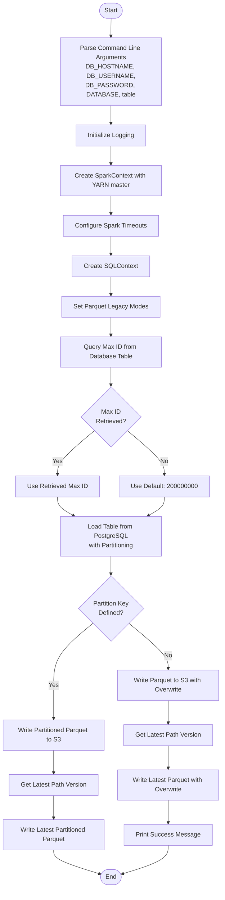
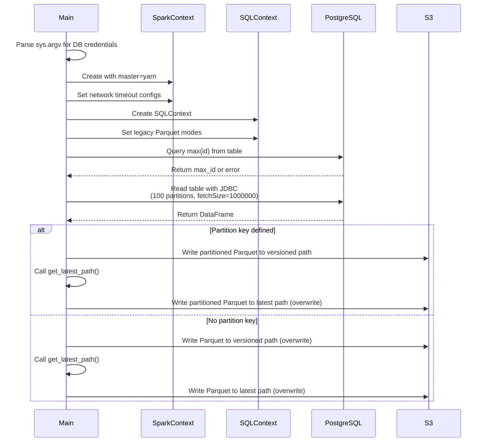
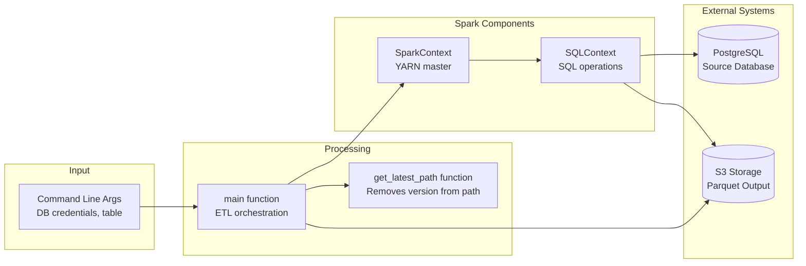

# Diagram: research/orchestrator/tasks/etl/extract_public_hold_spark.py

> Auto-generated by Obscura crawlers

## Diagram 1

### SVG

<svg id="container" width="569.734375" xmlns="http://www.w3.org/2000/svg" class="flowchart" height="2281.296875" viewBox="0 0 569.734375 2281.296875" role="graphics-document document" aria-roledescription="flowchart-v2"><g><marker id="container_flowchart-v2-pointEnd" class="marker flowchart-v2" viewBox="0 0 10 10" refX="5" refY="5" markerUnits="userSpaceOnUse" markerWidth="8" markerHeight="8" orient="auto"><path d="M 0 0 L 10 5 L 0 10 z" class="arrowMarkerPath" style="stroke-width: 1; stroke-dasharray: 1, 0;"></path></marker><marker id="container_flowchart-v2-pointStart" class="marker flowchart-v2" viewBox="0 0 10 10" refX="4.5" refY="5" markerUnits="userSpaceOnUse" markerWidth="8" markerHeight="8" orient="auto"><path d="M 0 5 L 10 10 L 10 0 z" class="arrowMarkerPath" style="stroke-width: 1; stroke-dasharray: 1, 0;"></path></marker><marker id="container_flowchart-v2-circleEnd" class="marker flowchart-v2" viewBox="0 0 10 10" refX="11" refY="5" markerUnits="userSpaceOnUse" markerWidth="11" markerHeight="11" orient="auto"><circle cx="5" cy="5" r="5" class="arrowMarkerPath" style="stroke-width: 1; stroke-dasharray: 1, 0;"></circle></marker><marker id="container_flowchart-v2-circleStart" class="marker flowchart-v2" viewBox="0 0 10 10" refX="-1" refY="5" markerUnits="userSpaceOnUse" markerWidth="11" markerHeight="11" orient="auto"><circle cx="5" cy="5" r="5" class="arrowMarkerPath" style="stroke-width: 1; stroke-dasharray: 1, 0;"></circle></marker><marker id="container_flowchart-v2-crossEnd" class="marker cross flowchart-v2" viewBox="0 0 11 11" refX="12" refY="5.2" markerUnits="userSpaceOnUse" markerWidth="11" markerHeight="11" orient="auto"><path d="M 1,1 l 9,9 M 10,1 l -9,9" class="arrowMarkerPath" style="stroke-width: 2; stroke-dasharray: 1, 0;"></path></marker><marker id="container_flowchart-v2-crossStart" class="marker cross flowchart-v2" viewBox="0 0 11 11" refX="-1" refY="5.2" markerUnits="userSpaceOnUse" markerWidth="11" markerHeight="11" orient="auto"><path d="M 1,1 l 9,9 M 10,1 l -9,9" class="arrowMarkerPath" style="stroke-width: 2; stroke-dasharray: 1, 0;"></path></marker><g class="root"><g class="clusters"></g><g class="edgePaths"><path d="M285.367,47.5L285.284,51.583C285.201,55.667,285.034,63.833,284.951,71.417C284.867,79,284.867,86,284.867,89.5L284.867,93" id="L_Start_ParseArgs_0" class="edge-thickness-normal edge-pattern-solid edge-thickness-normal edge-pattern-solid flowchart-link" style=";" data-edge="true" data-et="edge" data-id="L_Start_ParseArgs_0" data-points="W3sieCI6Mjg1LjM2NzE4NzUsInkiOjQ3LjV9LHsieCI6Mjg0Ljg2NzE4NzUsInkiOjcyfSx7IngiOjI4NC44NjcxODc1LCJ5Ijo5N31d" marker-end="url(#container_flowchart-v2-pointEnd)"></path><path d="M284.867,271L284.867,275.167C284.867,279.333,284.867,287.667,284.867,295.333C284.867,303,284.867,310,284.867,313.5L284.867,317" id="L_ParseArgs_InitLogging_0" class="edge-thickness-normal edge-pattern-solid edge-thickness-normal edge-pattern-solid flowchart-link" style=";" data-edge="true" data-et="edge" data-id="L_ParseArgs_InitLogging_0" data-points="W3sieCI6Mjg0Ljg2NzE4NzUsInkiOjI3MX0seyJ4IjoyODQuODY3MTg3NSwieSI6Mjk2fSx7IngiOjI4NC44NjcxODc1LCJ5IjozMjF9XQ==" marker-end="url(#container_flowchart-v2-pointEnd)"></path><path d="M284.867,375L284.867,379.167C284.867,383.333,284.867,391.667,284.867,399.333C284.867,407,284.867,414,284.867,417.5L284.867,421" id="L_InitLogging_CreateSpark_0" class="edge-thickness-normal edge-pattern-solid edge-thickness-normal edge-pattern-solid flowchart-link" style=";" data-edge="true" data-et="edge" data-id="L_InitLogging_CreateSpark_0" data-points="W3sieCI6Mjg0Ljg2NzE4NzUsInkiOjM3NX0seyJ4IjoyODQuODY3MTg3NSwieSI6NDAwfSx7IngiOjI4NC44NjcxODc1LCJ5Ijo0MjV9XQ==" marker-end="url(#container_flowchart-v2-pointEnd)"></path><path d="M284.867,503L284.867,507.167C284.867,511.333,284.867,519.667,284.867,527.333C284.867,535,284.867,542,284.867,545.5L284.867,549" id="L_CreateSpark_ConfigSpark_0" class="edge-thickness-normal edge-pattern-solid edge-thickness-normal edge-pattern-solid flowchart-link" style=";" data-edge="true" data-et="edge" data-id="L_CreateSpark_ConfigSpark_0" data-points="W3sieCI6Mjg0Ljg2NzE4NzUsInkiOjUwM30seyJ4IjoyODQuODY3MTg3NSwieSI6NTI4fSx7IngiOjI4NC44NjcxODc1LCJ5Ijo1NTN9XQ==" marker-end="url(#container_flowchart-v2-pointEnd)"></path><path d="M284.867,607L284.867,611.167C284.867,615.333,284.867,623.667,284.867,631.333C284.867,639,284.867,646,284.867,649.5L284.867,653" id="L_ConfigSpark_CreateSQL_0" class="edge-thickness-normal edge-pattern-solid edge-thickness-normal edge-pattern-solid flowchart-link" style=";" data-edge="true" data-et="edge" data-id="L_ConfigSpark_CreateSQL_0" data-points="W3sieCI6Mjg0Ljg2NzE4NzUsInkiOjYwN30seyJ4IjoyODQuODY3MTg3NSwieSI6NjMyfSx7IngiOjI4NC44NjcxODc1LCJ5Ijo2NTd9XQ==" marker-end="url(#container_flowchart-v2-pointEnd)"></path><path d="M284.867,711L284.867,715.167C284.867,719.333,284.867,727.667,284.867,735.333C284.867,743,284.867,750,284.867,753.5L284.867,757" id="L_CreateSQL_SetLegacy_0" class="edge-thickness-normal edge-pattern-solid edge-thickness-normal edge-pattern-solid flowchart-link" style=";" data-edge="true" data-et="edge" data-id="L_CreateSQL_SetLegacy_0" data-points="W3sieCI6Mjg0Ljg2NzE4NzUsInkiOjcxMX0seyJ4IjoyODQuODY3MTg3NSwieSI6NzM2fSx7IngiOjI4NC44NjcxODc1LCJ5Ijo3NjF9XQ==" marker-end="url(#container_flowchart-v2-pointEnd)"></path><path d="M284.867,815L284.867,819.167C284.867,823.333,284.867,831.667,284.867,839.333C284.867,847,284.867,854,284.867,857.5L284.867,861" id="L_SetLegacy_QueryMaxID_0" class="edge-thickness-normal edge-pattern-solid edge-thickness-normal edge-pattern-solid flowchart-link" style=";" data-edge="true" data-et="edge" data-id="L_SetLegacy_QueryMaxID_0" data-points="W3sieCI6Mjg0Ljg2NzE4NzUsInkiOjgxNX0seyJ4IjoyODQuODY3MTg3NSwieSI6ODQwfSx7IngiOjI4NC44NjcxODc1LCJ5Ijo4NjV9XQ==" marker-end="url(#container_flowchart-v2-pointEnd)"></path><path d="M284.867,943L284.867,947.167C284.867,951.333,284.867,959.667,284.867,967.333C284.867,975,284.867,982,284.867,985.5L284.867,989" id="L_QueryMaxID_CheckMaxID_0" class="edge-thickness-normal edge-pattern-solid edge-thickness-normal edge-pattern-solid flowchart-link" style=";" data-edge="true" data-et="edge" data-id="L_QueryMaxID_CheckMaxID_0" data-points="W3sieCI6Mjg0Ljg2NzE4NzUsInkiOjk0M30seyJ4IjoyODQuODY3MTg3NSwieSI6OTY4fSx7IngiOjI4NC44NjcxODc1LCJ5Ijo5OTN9XQ==" marker-end="url(#container_flowchart-v2-pointEnd)"></path><path d="M242.852,1105.719L227.2,1118.888C211.548,1132.057,180.245,1158.396,164.593,1177.065C148.941,1195.734,148.941,1206.734,148.941,1212.234L148.941,1217.734" id="L_CheckMaxID_UseMaxID_0" class="edge-thickness-normal edge-pattern-solid edge-thickness-normal edge-pattern-solid flowchart-link" style=";" data-edge="true" data-et="edge" data-id="L_CheckMaxID_UseMaxID_0" data-points="W3sieCI6MjQyLjg1MTY0Mjg1MDE3NTU4LCJ5IjoxMTA1LjcxODgzMDM1MDE3NTV9LHsieCI6MTQ4Ljk0MTQwNjI1LCJ5IjoxMTg0LjczNDM3NX0seyJ4IjoxNDguOTQxNDA2MjUsInkiOjEyMjEuNzM0Mzc1fV0=" marker-end="url(#container_flowchart-v2-pointEnd)"></path><path d="M326.883,1105.719L342.534,1118.888C358.186,1132.057,389.49,1158.396,405.141,1177.065C420.793,1195.734,420.793,1206.734,420.793,1212.234L420.793,1217.734" id="L_CheckMaxID_DefaultMaxID_0" class="edge-thickness-normal edge-pattern-solid edge-thickness-normal edge-pattern-solid flowchart-link" style=";" data-edge="true" data-et="edge" data-id="L_CheckMaxID_DefaultMaxID_0" data-points="W3sieCI6MzI2Ljg4MjczMjE0OTgyNDQ1LCJ5IjoxMTA1LjcxODgzMDM1MDE3NTV9LHsieCI6NDIwLjc5Mjk2ODc1LCJ5IjoxMTg0LjczNDM3NX0seyJ4Ijo0MjAuNzkyOTY4NzUsInkiOjEyMjEuNzM0Mzc1fV0=" marker-end="url(#container_flowchart-v2-pointEnd)"></path><path d="M148.941,1275.734L148.941,1279.901C148.941,1284.068,148.941,1292.401,155.812,1300.409C162.682,1308.417,176.422,1316.1,183.292,1319.941L190.163,1323.782" id="L_UseMaxID_LoadData_0" class="edge-thickness-normal edge-pattern-solid edge-thickness-normal edge-pattern-solid flowchart-link" style=";" data-edge="true" data-et="edge" data-id="L_UseMaxID_LoadData_0" data-points="W3sieCI6MTQ4Ljk0MTQwNjI1LCJ5IjoxMjc1LjczNDM3NX0seyJ4IjoxNDguOTQxNDA2MjUsInkiOjEzMDAuNzM0Mzc1fSx7IngiOjE5My42NTM4MzQyOTI3NjMxOCwieSI6MTMyNS43MzQzNzV9XQ==" marker-end="url(#container_flowchart-v2-pointEnd)"></path><path d="M420.793,1275.734L420.793,1279.901C420.793,1284.068,420.793,1292.401,413.923,1300.409C407.053,1308.417,393.312,1316.1,386.442,1319.941L379.572,1323.782" id="L_DefaultMaxID_LoadData_0" class="edge-thickness-normal edge-pattern-solid edge-thickness-normal edge-pattern-solid flowchart-link" style=";" data-edge="true" data-et="edge" data-id="L_DefaultMaxID_LoadData_0" data-points="W3sieCI6NDIwLjc5Mjk2ODc1LCJ5IjoxMjc1LjczNDM3NX0seyJ4Ijo0MjAuNzkyOTY4NzUsInkiOjEzMDAuNzM0Mzc1fSx7IngiOjM3Ni4wODA1NDA3MDcyMzY4LCJ5IjoxMzI1LjczNDM3NX1d" marker-end="url(#container_flowchart-v2-pointEnd)"></path><path d="M284.867,1427.734L284.867,1431.901C284.867,1436.068,284.867,1444.401,284.867,1452.068C284.867,1459.734,284.867,1466.734,284.867,1470.234L284.867,1473.734" id="L_LoadData_CheckPartKey_0" class="edge-thickness-normal edge-pattern-solid edge-thickness-normal edge-pattern-solid flowchart-link" style=";" data-edge="true" data-et="edge" data-id="L_LoadData_CheckPartKey_0" data-points="W3sieCI6Mjg0Ljg2NzE4NzUsInkiOjE0MjcuNzM0Mzc1fSx7IngiOjI4NC44NjcxODc1LCJ5IjoxNDUyLjczNDM3NX0seyJ4IjoyODQuODY3MTg3NSwieSI6MTQ3Ny43MzQzNzV9XQ==" marker-end="url(#container_flowchart-v2-pointEnd)"></path><path d="M238.331,1601.761L221.61,1615.684C204.888,1629.606,171.444,1657.452,154.722,1684.041C138,1710.63,138,1735.964,138,1759.297C138,1782.63,138,1803.964,138,1818.13C138,1832.297,138,1839.297,138,1842.797L138,1846.297" id="L_CheckPartKey_WritePartitioned_0" class="edge-thickness-normal edge-pattern-solid edge-thickness-normal edge-pattern-solid flowchart-link" style=";" data-edge="true" data-et="edge" data-id="L_CheckPartKey_WritePartitioned_0" data-points="W3sieCI6MjM4LjMzMTQ2Mzc1NDY4MDU2LCJ5IjoxNjAxLjc2MTE1MTI1NDY4MDV9LHsieCI6MTM4LCJ5IjoxNjg1LjI5Njg3NX0seyJ4IjoxMzgsInkiOjE3NjEuMjk2ODc1fSx7IngiOjEzOCwieSI6MTgyNS4yOTY4NzV9LHsieCI6MTM4LCJ5IjoxODUwLjI5Njg3NX1d" marker-end="url(#container_flowchart-v2-pointEnd)"></path><path d="M331.403,1601.761L348.125,1615.684C364.847,1629.606,398.291,1657.452,415.012,1676.874C431.734,1696.297,431.734,1707.297,431.734,1712.797L431.734,1718.297" id="L_CheckPartKey_WriteSimple_0" class="edge-thickness-normal edge-pattern-solid edge-thickness-normal edge-pattern-solid flowchart-link" style=";" data-edge="true" data-et="edge" data-id="L_CheckPartKey_WriteSimple_0" data-points="W3sieCI6MzMxLjQwMjkxMTI0NTMxOTQ0LCJ5IjoxNjAxLjc2MTE1MTI1NDY4MDV9LHsieCI6NDMxLjczNDM3NSwieSI6MTY4NS4yOTY4NzV9LHsieCI6NDMxLjczNDM3NSwieSI6MTcyMi4yOTY4NzV9XQ==" marker-end="url(#container_flowchart-v2-pointEnd)"></path><path d="M138,1928.297L138,1932.464C138,1936.63,138,1944.964,138,1954.63C138,1964.297,138,1975.297,138,1980.797L138,1986.297" id="L_WritePartitioned_GetLatestPath1_0" class="edge-thickness-normal edge-pattern-solid edge-thickness-normal edge-pattern-solid flowchart-link" style=";" data-edge="true" data-et="edge" data-id="L_WritePartitioned_GetLatestPath1_0" data-points="W3sieCI6MTM4LCJ5IjoxOTI4LjI5Njg3NX0seyJ4IjoxMzgsInkiOjE5NTMuMjk2ODc1fSx7IngiOjEzOCwieSI6MTk5MC4yOTY4NzV9XQ==" marker-end="url(#container_flowchart-v2-pointEnd)"></path><path d="M431.734,1800.297L431.734,1804.464C431.734,1808.63,431.734,1816.964,431.734,1826.63C431.734,1836.297,431.734,1847.297,431.734,1852.797L431.734,1858.297" id="L_WriteSimple_GetLatestPath2_0" class="edge-thickness-normal edge-pattern-solid edge-thickness-normal edge-pattern-solid flowchart-link" style=";" data-edge="true" data-et="edge" data-id="L_WriteSimple_GetLatestPath2_0" data-points="W3sieCI6NDMxLjczNDM3NSwieSI6MTgwMC4yOTY4NzV9LHsieCI6NDMxLjczNDM3NSwieSI6MTgyNS4yOTY4NzV9LHsieCI6NDMxLjczNDM3NSwieSI6MTg2Mi4yOTY4NzV9XQ==" marker-end="url(#container_flowchart-v2-pointEnd)"></path><path d="M138,2044.297L138,2050.464C138,2056.63,138,2068.964,138,2078.63C138,2088.297,138,2095.297,138,2098.797L138,2102.297" id="L_GetLatestPath1_WriteLatestPart_0" class="edge-thickness-normal edge-pattern-solid edge-thickness-normal edge-pattern-solid flowchart-link" style=";" data-edge="true" data-et="edge" data-id="L_GetLatestPath1_WriteLatestPart_0" data-points="W3sieCI6MTM4LCJ5IjoyMDQ0LjI5Njg3NX0seyJ4IjoxMzgsInkiOjIwODEuMjk2ODc1fSx7IngiOjEzOCwieSI6MjEwNi4yOTY4NzV9XQ==" marker-end="url(#container_flowchart-v2-pointEnd)"></path><path d="M431.734,1916.297L431.734,1922.464C431.734,1928.63,431.734,1940.964,431.734,1950.63C431.734,1960.297,431.734,1967.297,431.734,1970.797L431.734,1974.297" id="L_GetLatestPath2_WriteLatestSimple_0" class="edge-thickness-normal edge-pattern-solid edge-thickness-normal edge-pattern-solid flowchart-link" style=";" data-edge="true" data-et="edge" data-id="L_GetLatestPath2_WriteLatestSimple_0" data-points="W3sieCI6NDMxLjczNDM3NSwieSI6MTkxNi4yOTY4NzV9LHsieCI6NDMxLjczNDM3NSwieSI6MTk1My4yOTY4NzV9LHsieCI6NDMxLjczNDM3NSwieSI6MTk3OC4yOTY4NzV9XQ==" marker-end="url(#container_flowchart-v2-pointEnd)"></path><path d="M138,2184.297L138,2188.464C138,2192.63,138,2200.964,157.829,2211.195C177.658,2221.426,217.316,2233.554,237.145,2239.619L256.974,2245.683" id="L_WriteLatestPart_End_0" class="edge-thickness-normal edge-pattern-solid edge-thickness-normal edge-pattern-solid flowchart-link" style=";" data-edge="true" data-et="edge" data-id="L_WriteLatestPart_End_0" data-points="W3sieCI6MTM4LCJ5IjoyMTg0LjI5Njg3NX0seyJ4IjoxMzgsInkiOjIyMDkuMjk2ODc1fSx7IngiOjI2MC43OTk1MTM3NjM1Njk2LCJ5IjoyMjQ2Ljg1Mjk5NjYyMzM0NjR9XQ==" marker-end="url(#container_flowchart-v2-pointEnd)"></path><path d="M431.734,2056.297L431.734,2060.464C431.734,2064.63,431.734,2072.964,431.734,2082.63C431.734,2092.297,431.734,2103.297,431.734,2108.797L431.734,2114.297" id="L_WriteLatestSimple_PrintSuccess_0" class="edge-thickness-normal edge-pattern-solid edge-thickness-normal edge-pattern-solid flowchart-link" style=";" data-edge="true" data-et="edge" data-id="L_WriteLatestSimple_PrintSuccess_0" data-points="W3sieCI6NDMxLjczNDM3NSwieSI6MjA1Ni4yOTY4NzV9LHsieCI6NDMxLjczNDM3NSwieSI6MjA4MS4yOTY4NzV9LHsieCI6NDMxLjczNDM3NSwieSI6MjExOC4yOTY4NzV9XQ==" marker-end="url(#container_flowchart-v2-pointEnd)"></path><path d="M431.734,2172.297L431.734,2178.464C431.734,2184.63,431.734,2196.964,412.072,2209.193C392.409,2221.423,353.083,2233.549,333.42,2239.611L313.757,2245.674" id="L_PrintSuccess_End_0" class="edge-thickness-normal edge-pattern-solid edge-thickness-normal edge-pattern-solid flowchart-link" style=";" data-edge="true" data-et="edge" data-id="L_PrintSuccess_End_0" data-points="W3sieCI6NDMxLjczNDM3NSwieSI6MjE3Mi4yOTY4NzV9LHsieCI6NDMxLjczNDM3NSwieSI6MjIwOS4yOTY4NzV9LHsieCI6MzA5LjkzNDg2MjE1OTgwNTMsInkiOjIyNDYuODUyOTk2MzQzNTY5fV0=" marker-end="url(#container_flowchart-v2-pointEnd)"></path></g><g class="edgeLabels"><g class="edgeLabel"><g class="label" data-id="L_Start_ParseArgs_0" transform="translate(0, 0)"><foreignObject width="0" height="0">

</foreignObject></g></g><g class="edgeLabel"><g class="label" data-id="L_ParseArgs_InitLogging_0" transform="translate(0, 0)"><foreignObject width="0" height="0">

</foreignObject></g></g><g class="edgeLabel"><g class="label" data-id="L_InitLogging_CreateSpark_0" transform="translate(0, 0)"><foreignObject width="0" height="0">

</foreignObject></g></g><g class="edgeLabel"><g class="label" data-id="L_CreateSpark_ConfigSpark_0" transform="translate(0, 0)"><foreignObject width="0" height="0">

</foreignObject></g></g><g class="edgeLabel"><g class="label" data-id="L_ConfigSpark_CreateSQL_0" transform="translate(0, 0)"><foreignObject width="0" height="0">

</foreignObject></g></g><g class="edgeLabel"><g class="label" data-id="L_CreateSQL_SetLegacy_0" transform="translate(0, 0)"><foreignObject width="0" height="0">

</foreignObject></g></g><g class="edgeLabel"><g class="label" data-id="L_SetLegacy_QueryMaxID_0" transform="translate(0, 0)"><foreignObject width="0" height="0">

</foreignObject></g></g><g class="edgeLabel"><g class="label" data-id="L_QueryMaxID_CheckMaxID_0" transform="translate(0, 0)"><foreignObject width="0" height="0">

</foreignObject></g></g><g class="edgeLabel" transform="translate(148.94140625, 1184.734375)"><g class="label" data-id="L_CheckMaxID_UseMaxID_0" transform="translate(-12.03125, -12)"><foreignObject width="24.0625" height="24">

Yes

</foreignObject></g></g><g class="edgeLabel" transform="translate(420.79296875, 1184.734375)"><g class="label" data-id="L_CheckMaxID_DefaultMaxID_0" transform="translate(-10.140625, -12)"><foreignObject width="20.28125" height="24">

No

</foreignObject></g></g><g class="edgeLabel"><g class="label" data-id="L_UseMaxID_LoadData_0" transform="translate(0, 0)"><foreignObject width="0" height="0">

</foreignObject></g></g><g class="edgeLabel"><g class="label" data-id="L_DefaultMaxID_LoadData_0" transform="translate(0, 0)"><foreignObject width="0" height="0">

</foreignObject></g></g><g class="edgeLabel"><g class="label" data-id="L_LoadData_CheckPartKey_0" transform="translate(0, 0)"><foreignObject width="0" height="0">

</foreignObject></g></g><g class="edgeLabel" transform="translate(138, 1761.296875)"><g class="label" data-id="L_CheckPartKey_WritePartitioned_0" transform="translate(-12.03125, -12)"><foreignObject width="24.0625" height="24">

Yes

</foreignObject></g></g><g class="edgeLabel" transform="translate(431.734375, 1685.296875)"><g class="label" data-id="L_CheckPartKey_WriteSimple_0" transform="translate(-10.140625, -12)"><foreignObject width="20.28125" height="24">

No

</foreignObject></g></g><g class="edgeLabel"><g class="label" data-id="L_WritePartitioned_GetLatestPath1_0" transform="translate(0, 0)"><foreignObject width="0" height="0">

</foreignObject></g></g><g class="edgeLabel"><g class="label" data-id="L_WriteSimple_GetLatestPath2_0" transform="translate(0, 0)"><foreignObject width="0" height="0">

</foreignObject></g></g><g class="edgeLabel"><g class="label" data-id="L_GetLatestPath1_WriteLatestPart_0" transform="translate(0, 0)"><foreignObject width="0" height="0">

</foreignObject></g></g><g class="edgeLabel"><g class="label" data-id="L_GetLatestPath2_WriteLatestSimple_0" transform="translate(0, 0)"><foreignObject width="0" height="0">

</foreignObject></g></g><g class="edgeLabel"><g class="label" data-id="L_WriteLatestPart_End_0" transform="translate(0, 0)"><foreignObject width="0" height="0">

</foreignObject></g></g><g class="edgeLabel"><g class="label" data-id="L_WriteLatestSimple_PrintSuccess_0" transform="translate(0, 0)"><foreignObject width="0" height="0">

</foreignObject></g></g><g class="edgeLabel"><g class="label" data-id="L_PrintSuccess_End_0" transform="translate(0, 0)"><foreignObject width="0" height="0">

</foreignObject></g></g></g><g class="nodes"><g class="node default" id="flowchart-Start-0" transform="translate(284.8671875, 27.5)"><g class="basic label-container outer-path"><path d="M-10.3984375 -19.5 C-2.6780603541522634 -19.5, 5.042316791695473 -19.5, 10.3984375 -19.5 C10.3984375 -19.5, 10.398437499999998 -19.5, 10.398437499999998 -19.5 C10.863719571172963 -19.485079309594095, 11.329001642345926 -19.47015861918819, 11.6478067896239 -19.45993515863156 C11.972355970587078 -19.428626289471538, 12.296905151550254 -19.397317420311516, 12.892042152847864 -19.3399052695533 C13.359248043010824 -19.264371044467545, 13.826453933173784 -19.188836819381788, 14.126030759676757 -19.140403561325776 C14.393078537133437 -19.079451648770895, 14.660126314590116 -19.018499736216015, 15.34470188623539 -18.862249829261074 C15.68661288228721 -18.760772440360338, 16.02852387833903 -18.659295051459598, 16.543047751460602 -18.50658706670804 C16.786348516825715 -18.417050136006058, 17.02964928219083 -18.327513205304072, 17.716144095147794 -18.074876768247425 C18.15511053231483 -17.880559347990282, 18.59407696948186 -17.686241927733143, 18.85917041279238 -17.568892924097174 C19.258345555977606 -17.360643507581326, 19.65752069916283 -17.152394091065474, 19.967429764076783 -16.990714730406097 C20.365988682958402 -16.74910597158787, 20.76454760184002 -16.507497212769646, 21.036368073605697 -16.342718045390892 C21.2701865705795 -16.179616383741568, 21.5040050675533 -16.016514722092243, 22.061592844578712 -15.627565626425154 C22.365175659803608 -15.385466409961294, 22.668758475028508 -15.143367193497435, 23.03889120850187 -14.848196188198123 C23.381293557576196 -14.537235434238534, 23.723695906650523 -14.226274680278943, 23.964247236767985 -14.007812326905688 C24.20919802280273 -13.754880529491269, 24.454148808837473 -13.501948732076851, 24.833858442968648 -13.10986736009568 C25.003216037166695 -12.91093029323055, 25.17257363136474 -12.711993226365419, 25.644151408126582 -12.158051136245305 C25.857818566353878 -11.871756609699283, 26.071485724581176 -11.585462083153262, 26.391796464640635 -11.156274872382312 C26.593069324830456 -10.847065709800168, 26.794342185020277 -10.537856547218023, 27.073721378604247 -10.108655082055241 C27.24903876466964 -9.79736131028575, 27.424356150735033 -9.486067538516258, 27.6871239742735 -9.019496659696287 C27.86285368924278 -8.654590146549024, 28.038583404212055 -8.289683633401761, 28.22948364880834 -7.893275190886684 C28.334439586727406 -7.63403199504158, 28.439395524646468 -7.374788799196477, 28.698571729970325 -6.734618561215508 C28.81460075438812 -6.385157626383601, 28.93062977880592 -6.035696691551696, 29.09246063421488 -5.548287939305138 C29.162325848716428 -5.281861596635236, 29.232191063217975 -5.015435253965333, 29.40953178754556 -4.339158212148133 C29.46099969774852 -4.07488137100261, 29.51246760795148 -3.8106045298570876, 29.648482276581777 -3.1121979531509023 C29.688929757563994 -2.798495277911382, 29.729377238546206 -2.4847926026718614, 29.808330202509367 -1.872449005199798 C29.83405121134358 -1.4718235309822598, 29.859772220177796 -1.0711980567647217, 29.888418715913414 -0.6250057626472757 C29.888418715913414 -0.30161214750991544, 29.888418715913414 0.021781467627444817, 29.888418715913414 0.625005762647271 C29.871665850454004 0.8859451648472056, 29.85491298499459 1.1468845670471404, 29.808330202509367 1.8724490051997846 C29.76983425192336 2.1710159960595803, 29.731338301337352 2.469582986919376, 29.648482276581777 3.1121979531508885 C29.58320823042588 3.4473663844868874, 29.517934184269983 3.782534815822886, 29.40953178754556 4.339158212148129 C29.338983745509875 4.608188472145035, 29.268435703474186 4.877218732141942, 29.092460634214884 5.548287939305125 C28.9908315860811 5.854378439894233, 28.889202537947316 6.160468940483339, 28.69857172997033 6.734618561215495 C28.54309904194354 7.1186391065015995, 28.38762635391675 7.502659651787704, 28.229483648808344 7.893275190886679 C28.03113302100904 8.305154513535486, 27.83278239320974 8.717033836184294, 27.687123974273504 9.019496659696284 C27.525525678246908 9.306430797893386, 27.36392738222031 9.593364936090486, 27.07372137860425 10.108655082055236 C26.908266951406404 10.36283751296572, 26.742812524208556 10.617019943876207, 26.39179646464064 11.156274872382301 C26.16720014008944 11.45721348613482, 25.942603815538238 11.75815209988734, 25.644151408126582 12.158051136245302 C25.437106402039444 12.401257981589849, 25.230061395952305 12.644464826934394, 24.83385844296866 13.10986736009567 C24.573598528639298 13.378607089377088, 24.313338614309938 13.647346818658505, 23.96424723676799 14.007812326905684 C23.643146015650903 14.299427960051473, 23.322044794533817 14.59104359319726, 23.038891208501887 14.848196188198111 C22.830812023224592 15.014133801237085, 22.622732837947297 15.18007141427606, 22.061592844578715 15.627565626425152 C21.652508767707246 15.91292496948642, 21.243424690835777 16.19828431254769, 21.036368073605708 16.34271804539089 C20.790312849241833 16.49187816838127, 20.544257624877954 16.64103829137165, 19.967429764076787 16.990714730406093 C19.641482310345374 17.160761308238463, 19.31553485661396 17.330807886070833, 18.859170412792388 17.56889292409717 C18.534244603499857 17.7127279412893, 18.209318794207324 17.856562958481433, 17.716144095147804 18.07487676824742 C17.267838577058395 18.239857342995105, 16.81953305896899 18.404837917742785, 16.543047751460616 18.506587066708033 C16.27559917791255 18.58596439947089, 16.008150604364484 18.665341732233745, 15.344701886235413 18.86224982926107 C14.954550856194725 18.95129925589445, 14.564399826154036 19.040348682527835, 14.126030759676766 19.140403561325773 C13.823101205252149 19.189378862431365, 13.52017165082753 19.238354163536957, 12.892042152847878 19.3399052695533 C12.598045388578306 19.368266783819543, 12.304048624308736 19.39662829808579, 11.6478067896239 19.45993515863156 C11.39355329408864 19.46808857335897, 11.139299798553381 19.476241988086375, 10.398437500000004 19.5 C10.398437500000002 19.5, 10.398437500000002 19.5, 10.3984375 19.5 C3.709972166642152 19.5, -2.9784931667156958 19.5, -10.398437499999996 19.5 C-10.861039835452235 19.48516524350287, -11.323642170904474 19.47033048700574, -11.647806789623893 19.45993515863156 C-12.005892451368414 19.42539106550408, -12.363978113112934 19.390846972376604, -12.892042152847871 19.3399052695533 C-13.198825693396596 19.29030688585927, -13.50560923394532 19.24070850216524, -14.126030759676759 19.140403561325773 C-14.37627955991933 19.083285905696442, -14.626528360161902 19.026168250067112, -15.344701886235388 18.862249829261074 C-15.76443600485849 18.737674946083086, -16.184170123481593 18.613100062905097, -16.54304775146059 18.506587066708043 C-16.965102103844412 18.351267163603133, -17.38715645622823 18.195947260498222, -17.716144095147797 18.074876768247425 C-17.99849908894998 17.949886588254497, -18.280854082752164 17.82489640826157, -18.85917041279238 17.568892924097174 C-19.207481284132587 17.38717936562275, -19.555792155472798 17.20546580714832, -19.96742976407678 16.990714730406097 C-20.211154227290443 16.842967528522045, -20.45487869050411 16.695220326637994, -21.036368073605686 16.3427180453909 C-21.277903458267165 16.174233416949335, -21.519438842928643 16.00574878850777, -22.061592844578712 15.627565626425156 C-22.291768674850225 15.44400652701971, -22.52194450512174 15.260447427614265, -23.03889120850187 14.848196188198125 C-23.408585763566855 14.512449374870016, -23.778280318631843 14.176702561541909, -23.964247236767974 14.007812326905697 C-24.247610077288304 13.71521692954659, -24.530972917808633 13.422621532187483, -24.833858442968655 13.109867360095677 C-25.094883286993714 12.80325272556946, -25.35590813101877 12.496638091043241, -25.64415140812658 12.158051136245307 C-25.81428275395863 11.930090632114815, -25.98441409979068 11.702130127984324, -26.391796464640635 11.156274872382316 C-26.533105491919112 10.9391862596957, -26.674414519197587 10.722097647009084, -27.073721378604244 10.108655082055249 C-27.278439470046802 9.745157380744347, -27.483157561489364 9.381659679433445, -27.6871239742735 9.019496659696289 C-27.824150308932 8.734958543884028, -27.961176643590505 8.450420428071768, -28.22948364880834 7.893275190886686 C-28.325507131735762 7.6560953315682125, -28.42153061466318 7.418915472249739, -28.698571729970325 6.73461856121551 C-28.78176538715626 6.48405252088067, -28.864959044342193 6.233486480545832, -29.09246063421488 5.5482879393051325 C-29.16153173713954 5.284889888248028, -29.230602840064204 5.021491837190923, -29.409531787545557 4.339158212148136 C-29.478378899575905 3.9856428427145927, -29.54722601160625 3.6321274732810496, -29.648482276581777 3.112197953150904 C-29.694864351761577 2.7524677372331046, -29.741246426941373 2.392737521315305, -29.808330202509364 1.872449005199809 C-29.83551350300326 1.4490471580421762, -29.86269680349715 1.0256453108845434, -29.888418715913414 0.6250057626472781 C-29.888418715913414 0.13047000112549206, -29.888418715913414 -0.364065760396294, -29.888418715913414 -0.6250057626472687 C-29.862671935462707 -1.026032650594146, -29.836925155012 -1.4270595385410232, -29.808330202509367 -1.8724490051997822 C-29.749096270874198 -2.3318556818993357, -29.689862339239028 -2.791262358598889, -29.648482276581777 -3.112197953150895 C-29.596448431632023 -3.379380749610854, -29.544414586682272 -3.646563546070813, -29.40953178754556 -4.339158212148126 C-29.331073957038438 -4.6383519237106245, -29.252616126531315 -4.937545635273122, -29.092460634214884 -5.548287939305123 C-28.95876086982628 -5.9509703274790375, -28.825061105437676 -6.353652715652951, -28.698571729970332 -6.734618561215485 C-28.518182949152212 -7.18018233741606, -28.337794168334092 -7.625746113616635, -28.229483648808344 -7.893275190886676 C-28.07302863236348 -8.218157380135512, -27.916573615918615 -8.54303956938435, -27.687123974273504 -9.019496659696282 C-27.47188839179273 -9.401669231356983, -27.256652809311962 -9.783841803017683, -27.073721378604247 -10.108655082055243 C-26.855026781389565 -10.444628711099005, -26.636332184174883 -10.780602340142769, -26.39179646464064 -11.156274872382308 C-26.145851304094947 -11.485818981448478, -25.899906143549252 -11.815363090514646, -25.644151408126586 -12.158051136245302 C-25.40243167421276 -12.441988889942982, -25.160711940298935 -12.725926643640662, -24.833858442968662 -13.10986736009567 C-24.64167189176298 -13.30831575302484, -24.449485340557292 -13.506764145954007, -23.964247236767996 -14.007812326905677 C-23.612562314454287 -14.327203268277843, -23.260877392140582 -14.64659420965001, -23.038891208501887 -14.848196188198107 C-22.68028131016219 -15.134178039113841, -22.321671411822493 -15.420159890029575, -22.06159284457872 -15.627565626425149 C-21.817872250604776 -15.797574562286902, -21.574151656630832 -15.967583498148658, -21.03636807360571 -16.342718045390885 C-20.64931627235195 -16.577351121879772, -20.26226447109819 -16.81198419836866, -19.96742976407679 -16.99071473040609 C-19.730958013852 -17.114081891030978, -19.494486263627213 -17.237449051655865, -18.859170412792388 -17.56889292409717 C-18.516995304589376 -17.7203636942347, -18.174820196386364 -17.871834464372228, -17.716144095147804 -18.07487676824742 C-17.370887515409752 -18.20193438110786, -17.0256309356717 -18.3289919939683, -16.54304775146062 -18.506587066708033 C-16.129119230125664 -18.6294388790851, -15.715190708790708 -18.75229069146217, -15.344701886235413 -18.862249829261067 C-14.941258093341533 -18.954333242272305, -14.537814300447655 -19.046416655283547, -14.126030759676768 -19.140403561325773 C-13.716433641713474 -19.206624046884986, -13.30683652375018 -19.272844532444203, -12.89204215284788 -19.3399052695533 C-12.637038580877514 -19.364505157454616, -12.382035008907147 -19.38910504535593, -11.647806789623903 -19.45993515863156 C-11.190602931112974 -19.47459679648068, -10.733399072602044 -19.489258434329802, -10.398437500000005 -19.5 C-10.398437500000004 -19.5, -10.398437500000002 -19.5, -10.3984375 -19.5" stroke="none" stroke-width="0" fill="#ECECFF" style=""></path><path d="M-10.3984375 -19.5 C-2.257855512801674 -19.5, 5.882726474396652 -19.5, 10.3984375 -19.5 M-10.3984375 -19.5 C-4.362951036145961 -19.5, 1.6725354277080786 -19.5, 10.3984375 -19.5 M10.3984375 -19.5 C10.3984375 -19.5, 10.398437499999998 -19.5, 10.398437499999998 -19.5 M10.3984375 -19.5 C10.3984375 -19.5, 10.398437499999998 -19.5, 10.398437499999998 -19.5 M10.398437499999998 -19.5 C10.791013991070734 -19.487410836035146, 11.183590482141472 -19.47482167207029, 11.6478067896239 -19.45993515863156 M10.398437499999998 -19.5 C10.708008251463855 -19.49007266854347, 11.017579002927715 -19.480145337086935, 11.6478067896239 -19.45993515863156 M11.6478067896239 -19.45993515863156 C11.981140618464694 -19.42777884505587, 12.314474447305491 -19.39562253148018, 12.892042152847864 -19.3399052695533 M11.6478067896239 -19.45993515863156 C12.023157164587877 -19.423725559383655, 12.398507539551854 -19.38751596013575, 12.892042152847864 -19.3399052695533 M12.892042152847864 -19.3399052695533 C13.289880026529358 -19.275585927415264, 13.687717900210854 -19.21126658527723, 14.126030759676757 -19.140403561325776 M12.892042152847864 -19.3399052695533 C13.176954769642451 -19.293842807200292, 13.46186738643704 -19.24778034484729, 14.126030759676757 -19.140403561325776 M14.126030759676757 -19.140403561325776 C14.467490778404553 -19.06246754028602, 14.808950797132349 -18.98453151924626, 15.34470188623539 -18.862249829261074 M14.126030759676757 -19.140403561325776 C14.438594439068318 -19.06906294117328, 14.751158118459879 -18.997722321020778, 15.34470188623539 -18.862249829261074 M15.34470188623539 -18.862249829261074 C15.632041533162676 -18.77696893032964, 15.919381180089962 -18.691688031398208, 16.543047751460602 -18.50658706670804 M15.34470188623539 -18.862249829261074 C15.671923576789453 -18.765132149126334, 15.999145267343517 -18.66801446899159, 16.543047751460602 -18.50658706670804 M16.543047751460602 -18.50658706670804 C16.819229963382398 -18.404949459720438, 17.095412175304197 -18.303311852732836, 17.716144095147794 -18.074876768247425 M16.543047751460602 -18.50658706670804 C16.893518895086007 -18.377610446134153, 17.243990038711413 -18.248633825560265, 17.716144095147794 -18.074876768247425 M17.716144095147794 -18.074876768247425 C17.961941148769434 -17.96606970391966, 18.207738202391074 -17.857262639591895, 18.85917041279238 -17.568892924097174 M17.716144095147794 -18.074876768247425 C17.973061378736478 -17.96114710798315, 18.22997866232516 -17.84741744771888, 18.85917041279238 -17.568892924097174 M18.85917041279238 -17.568892924097174 C19.190515606267812 -17.396030348897767, 19.52186079974324 -17.223167773698364, 19.967429764076783 -16.990714730406097 M18.85917041279238 -17.568892924097174 C19.093857799224164 -17.44645666492016, 19.328545185655948 -17.32402040574314, 19.967429764076783 -16.990714730406097 M19.967429764076783 -16.990714730406097 C20.317773478799527 -16.778334311692973, 20.66811719352227 -16.56595389297985, 21.036368073605697 -16.342718045390892 M19.967429764076783 -16.990714730406097 C20.243741254873665 -16.82321308089847, 20.520052745670544 -16.65571143139084, 21.036368073605697 -16.342718045390892 M21.036368073605697 -16.342718045390892 C21.368311904870183 -16.111168398317645, 21.700255736134668 -15.879618751244399, 22.061592844578712 -15.627565626425154 M21.036368073605697 -16.342718045390892 C21.26074923132028 -16.186199463072967, 21.48513038903486 -16.02968088075504, 22.061592844578712 -15.627565626425154 M22.061592844578712 -15.627565626425154 C22.26455230583528 -15.465710857051132, 22.467511767091846 -15.30385608767711, 23.03889120850187 -14.848196188198123 M22.061592844578712 -15.627565626425154 C22.27834161830475 -15.454714247305745, 22.495090392030786 -15.281862868186337, 23.03889120850187 -14.848196188198123 M23.03889120850187 -14.848196188198123 C23.388366747717022 -14.53081175009899, 23.737842286932175 -14.213427311999858, 23.964247236767985 -14.007812326905688 M23.03889120850187 -14.848196188198123 C23.378520973916586 -14.539753421359647, 23.718150739331307 -14.231310654521169, 23.964247236767985 -14.007812326905688 M23.964247236767985 -14.007812326905688 C24.181697020131246 -13.783277572623886, 24.39914680349451 -13.558742818342084, 24.833858442968648 -13.10986736009568 M23.964247236767985 -14.007812326905688 C24.214246088316024 -13.749667987394908, 24.464244939864063 -13.491523647884128, 24.833858442968648 -13.10986736009568 M24.833858442968648 -13.10986736009568 C25.128714956280458 -12.763512121748729, 25.423571469592268 -12.417156883401779, 25.644151408126582 -12.158051136245305 M24.833858442968648 -13.10986736009568 C25.140509549334425 -12.749657521616182, 25.447160655700202 -12.389447683136684, 25.644151408126582 -12.158051136245305 M25.644151408126582 -12.158051136245305 C25.808545062846825 -11.93777861549022, 25.972938717567068 -11.717506094735135, 26.391796464640635 -11.156274872382312 M25.644151408126582 -12.158051136245305 C25.847142517957415 -11.886061541942526, 26.050133627788252 -11.614071947639747, 26.391796464640635 -11.156274872382312 M26.391796464640635 -11.156274872382312 C26.615067839684297 -10.813270083556308, 26.838339214727963 -10.470265294730304, 27.073721378604247 -10.108655082055241 M26.391796464640635 -11.156274872382312 C26.537503843072777 -10.93242921120101, 26.68321122150492 -10.708583550019707, 27.073721378604247 -10.108655082055241 M27.073721378604247 -10.108655082055241 C27.230865691560417 -9.829629441814376, 27.388010004516584 -9.55060380157351, 27.6871239742735 -9.019496659696287 M27.073721378604247 -10.108655082055241 C27.284628454975653 -9.73416821130049, 27.495535531347063 -9.359681340545738, 27.6871239742735 -9.019496659696287 M27.6871239742735 -9.019496659696287 C27.883936302090614 -8.61081164987484, 28.080748629907728 -8.202126640053395, 28.22948364880834 -7.893275190886684 M27.6871239742735 -9.019496659696287 C27.853446581870408 -8.674124206287603, 28.019769189467315 -8.32875175287892, 28.22948364880834 -7.893275190886684 M28.22948364880834 -7.893275190886684 C28.35803139728394 -7.575759766850308, 28.486579145759542 -7.258244342813932, 28.698571729970325 -6.734618561215508 M28.22948364880834 -7.893275190886684 C28.37009574406311 -7.545960597057479, 28.510707839317885 -7.198646003228274, 28.698571729970325 -6.734618561215508 M28.698571729970325 -6.734618561215508 C28.789188348645315 -6.4616957435639355, 28.879804967320304 -6.188772925912364, 29.09246063421488 -5.548287939305138 M28.698571729970325 -6.734618561215508 C28.824011262899894 -6.356814674107051, 28.949450795829467 -5.979010786998595, 29.09246063421488 -5.548287939305138 M29.09246063421488 -5.548287939305138 C29.188498384955377 -5.182054372707165, 29.284536135695873 -4.815820806109191, 29.40953178754556 -4.339158212148133 M29.09246063421488 -5.548287939305138 C29.185593141879608 -5.193133323695379, 29.278725649544338 -4.837978708085621, 29.40953178754556 -4.339158212148133 M29.40953178754556 -4.339158212148133 C29.486620615671832 -3.9433233724493184, 29.563709443798107 -3.5474885327505037, 29.648482276581777 -3.1121979531509023 M29.40953178754556 -4.339158212148133 C29.476202104553032 -3.996820225091266, 29.5428724215605 -3.654482238034399, 29.648482276581777 -3.1121979531509023 M29.648482276581777 -3.1121979531509023 C29.70518623386554 -2.6724132579209163, 29.761890191149305 -2.232628562690931, 29.808330202509367 -1.872449005199798 M29.648482276581777 -3.1121979531509023 C29.6861236050952 -2.8202592423218387, 29.723764933608628 -2.528320531492775, 29.808330202509367 -1.872449005199798 M29.808330202509367 -1.872449005199798 C29.83373846297078 -1.476694839334618, 29.859146723432186 -1.080940673469438, 29.888418715913414 -0.6250057626472757 M29.808330202509367 -1.872449005199798 C29.828484204518045 -1.5585341558970323, 29.848638206526722 -1.2446193065942666, 29.888418715913414 -0.6250057626472757 M29.888418715913414 -0.6250057626472757 C29.888418715913414 -0.18664052940923864, 29.888418715913414 0.2517247038287984, 29.888418715913414 0.625005762647271 M29.888418715913414 -0.6250057626472757 C29.888418715913414 -0.2291858199596956, 29.888418715913414 0.16663412272788447, 29.888418715913414 0.625005762647271 M29.888418715913414 0.625005762647271 C29.870288028072483 0.9074058605976005, 29.85215734023155 1.1898059585479301, 29.808330202509367 1.8724490051997846 M29.888418715913414 0.625005762647271 C29.863940095485162 1.0062800346040948, 29.839461475056908 1.3875543065609186, 29.808330202509367 1.8724490051997846 M29.808330202509367 1.8724490051997846 C29.771889211611104 2.1550781345191425, 29.735448220712836 2.4377072638385004, 29.648482276581777 3.1121979531508885 M29.808330202509367 1.8724490051997846 C29.771535971488873 2.1578177951519923, 29.73474174046838 2.4431865851042, 29.648482276581777 3.1121979531508885 M29.648482276581777 3.1121979531508885 C29.576363424889042 3.482513014268394, 29.504244573196303 3.8528280753858994, 29.40953178754556 4.339158212148129 M29.648482276581777 3.1121979531508885 C29.59390017114631 3.3924655286299483, 29.53931806571084 3.6727331041090086, 29.40953178754556 4.339158212148129 M29.40953178754556 4.339158212148129 C29.294496253248074 4.777838561140386, 29.17946071895059 5.216518910132642, 29.092460634214884 5.548287939305125 M29.40953178754556 4.339158212148129 C29.333869460039875 4.627691459187481, 29.25820713253419 4.916224706226833, 29.092460634214884 5.548287939305125 M29.092460634214884 5.548287939305125 C29.00924976922115 5.798905806815372, 28.92603890422741 6.049523674325618, 28.69857172997033 6.734618561215495 M29.092460634214884 5.548287939305125 C28.989777814257987 5.857552232729706, 28.887094994301094 6.166816526154285, 28.69857172997033 6.734618561215495 M28.69857172997033 6.734618561215495 C28.542486868839028 7.120151185905305, 28.38640200770773 7.505683810595116, 28.229483648808344 7.893275190886679 M28.69857172997033 6.734618561215495 C28.592179261883423 6.99741001434859, 28.485786793796517 7.260201467481685, 28.229483648808344 7.893275190886679 M28.229483648808344 7.893275190886679 C28.043990985881944 8.27845467436053, 27.858498322955544 8.66363415783438, 27.687123974273504 9.019496659696284 M28.229483648808344 7.893275190886679 C28.032535260324302 8.302242733594237, 27.835586871840256 8.711210276301795, 27.687123974273504 9.019496659696284 M27.687123974273504 9.019496659696284 C27.560327217196296 9.244637141450797, 27.433530460119087 9.46977762320531, 27.07372137860425 10.108655082055236 M27.687123974273504 9.019496659696284 C27.48724537369222 9.3744013549314, 27.28736677311094 9.729306050166516, 27.07372137860425 10.108655082055236 M27.07372137860425 10.108655082055236 C26.895079147003976 10.383097521949175, 26.716436915403705 10.657539961843113, 26.39179646464064 11.156274872382301 M27.07372137860425 10.108655082055236 C26.86934046871286 10.422639043607196, 26.66495955882147 10.736623005159156, 26.39179646464064 11.156274872382301 M26.39179646464064 11.156274872382301 C26.21396413067441 11.394553999038145, 26.036131796708176 11.63283312569399, 25.644151408126582 12.158051136245302 M26.39179646464064 11.156274872382301 C26.173402410462792 11.448903008872982, 25.955008356284946 11.741531145363663, 25.644151408126582 12.158051136245302 M25.644151408126582 12.158051136245302 C25.394565840200695 12.451228546152185, 25.144980272274807 12.744405956059067, 24.83385844296866 13.10986736009567 M25.644151408126582 12.158051136245302 C25.368589931608668 12.481741326455449, 25.093028455090757 12.805431516665594, 24.83385844296866 13.10986736009567 M24.83385844296866 13.10986736009567 C24.495941744909505 13.458794094318616, 24.15802504685035 13.807720828541562, 23.96424723676799 14.007812326905684 M24.83385844296866 13.10986736009567 C24.547204217003138 13.40586138315471, 24.260549991037617 13.701855406213749, 23.96424723676799 14.007812326905684 M23.96424723676799 14.007812326905684 C23.68971826437389 14.257132275995431, 23.415189291979793 14.506452225085177, 23.038891208501887 14.848196188198111 M23.96424723676799 14.007812326905684 C23.614489000637253 14.3254535028638, 23.26473076450652 14.643094678821916, 23.038891208501887 14.848196188198111 M23.038891208501887 14.848196188198111 C22.668502564537427 15.143571275304007, 22.298113920572966 15.438946362409904, 22.061592844578715 15.627565626425152 M23.038891208501887 14.848196188198111 C22.651068254251335 15.157474673810684, 22.263245300000786 15.466753159423256, 22.061592844578715 15.627565626425152 M22.061592844578715 15.627565626425152 C21.76338368438937 15.835583427306755, 21.46517452420003 16.043601228188358, 21.036368073605708 16.34271804539089 M22.061592844578715 15.627565626425152 C21.67068173315343 15.900248295486158, 21.279770621728144 16.172930964547163, 21.036368073605708 16.34271804539089 M21.036368073605708 16.34271804539089 C20.769144773192117 16.50471038048003, 20.501921472778527 16.66670271556917, 19.967429764076787 16.990714730406093 M21.036368073605708 16.34271804539089 C20.77041912352768 16.503937861817697, 20.50447017344965 16.66515767824451, 19.967429764076787 16.990714730406093 M19.967429764076787 16.990714730406093 C19.56944959438062 17.198340730018117, 19.171469424684453 17.405966729630144, 18.859170412792388 17.56889292409717 M19.967429764076787 16.990714730406093 C19.5637204667372 17.20132961224001, 19.160011169397617 17.411944494073925, 18.859170412792388 17.56889292409717 M18.859170412792388 17.56889292409717 C18.508137674079663 17.724284704509074, 18.157104935366934 17.87967648492098, 17.716144095147804 18.07487676824742 M18.859170412792388 17.56889292409717 C18.508771333536195 17.72400420226451, 18.158372254280003 17.879115480431846, 17.716144095147804 18.07487676824742 M17.716144095147804 18.07487676824742 C17.303701762855134 18.226659359106247, 16.891259430562467 18.378441949965076, 16.543047751460616 18.506587066708033 M17.716144095147804 18.07487676824742 C17.42221730150847 18.18304454533619, 17.128290507869135 18.29121232242496, 16.543047751460616 18.506587066708033 M16.543047751460616 18.506587066708033 C16.166178473037302 18.618439890316864, 15.78930919461399 18.730292713925692, 15.344701886235413 18.86224982926107 M16.543047751460616 18.506587066708033 C16.224659001604245 18.601083176408753, 15.906270251747875 18.69557928610947, 15.344701886235413 18.86224982926107 M15.344701886235413 18.86224982926107 C14.995110686120661 18.942041739391485, 14.64551948600591 19.021833649521895, 14.126030759676766 19.140403561325773 M15.344701886235413 18.86224982926107 C14.919187400750971 18.959370733831378, 14.493672915266528 19.05649163840168, 14.126030759676766 19.140403561325773 M14.126030759676766 19.140403561325773 C13.682674107905012 19.212082026502046, 13.239317456133257 19.28376049167832, 12.892042152847878 19.3399052695533 M14.126030759676766 19.140403561325773 C13.720749986057166 19.20592621380525, 13.315469212437566 19.271448866284725, 12.892042152847878 19.3399052695533 M12.892042152847878 19.3399052695533 C12.482342423860912 19.379428509672657, 12.072642694873945 19.418951749792015, 11.6478067896239 19.45993515863156 M12.892042152847878 19.3399052695533 C12.412950851301098 19.386122631221927, 11.933859549754317 19.432339992890554, 11.6478067896239 19.45993515863156 M11.6478067896239 19.45993515863156 C11.159875679063738 19.475582159646933, 10.671944568503577 19.491229160662304, 10.398437500000004 19.5 M11.6478067896239 19.45993515863156 C11.336865355242507 19.469906445221383, 11.025923920861114 19.47987773181121, 10.398437500000004 19.5 M10.398437500000004 19.5 C10.398437500000002 19.5, 10.398437500000002 19.5, 10.3984375 19.5 M10.398437500000004 19.5 C10.398437500000002 19.5, 10.398437500000002 19.5, 10.3984375 19.5 M10.3984375 19.5 C2.8884902507247334 19.5, -4.621456998550533 19.5, -10.398437499999996 19.5 M10.3984375 19.5 C4.088920014259167 19.5, -2.220597471481666 19.5, -10.398437499999996 19.5 M-10.398437499999996 19.5 C-10.858040735909455 19.48526141878781, -11.317643971818914 19.470522837575626, -11.647806789623893 19.45993515863156 M-10.398437499999996 19.5 C-10.74929657999614 19.488748632210292, -11.100155659992282 19.477497264420588, -11.647806789623893 19.45993515863156 M-11.647806789623893 19.45993515863156 C-12.05852682730774 19.420313490559312, -12.469246864991588 19.380691822487066, -12.892042152847871 19.3399052695533 M-11.647806789623893 19.45993515863156 C-11.95524818277847 19.430276657186308, -12.262689575933047 19.400618155741057, -12.892042152847871 19.3399052695533 M-12.892042152847871 19.3399052695533 C-13.36041202464904 19.264182860943087, -13.82878189645021 19.18846045233288, -14.126030759676759 19.140403561325773 M-12.892042152847871 19.3399052695533 C-13.14140635012684 19.299589999985468, -13.390770547405806 19.259274730417633, -14.126030759676759 19.140403561325773 M-14.126030759676759 19.140403561325773 C-14.44951135806017 19.06657122565294, -14.772991956443578 18.992738889980107, -15.344701886235388 18.862249829261074 M-14.126030759676759 19.140403561325773 C-14.422337560255162 19.072773467676328, -14.718644360833563 19.005143374026886, -15.344701886235388 18.862249829261074 M-15.344701886235388 18.862249829261074 C-15.711217390469626 18.753469951483495, -16.077732894703864 18.644690073705913, -16.54304775146059 18.506587066708043 M-15.344701886235388 18.862249829261074 C-15.810869275142936 18.723893795195874, -16.277036664050485 18.58553776113067, -16.54304775146059 18.506587066708043 M-16.54304775146059 18.506587066708043 C-16.906823577333512 18.372714200079937, -17.270599403206432 18.23884133345183, -17.716144095147797 18.074876768247425 M-16.54304775146059 18.506587066708043 C-16.88867043224083 18.379394725279877, -17.234293113021067 18.252202383851714, -17.716144095147797 18.074876768247425 M-17.716144095147797 18.074876768247425 C-18.04146948434084 17.930864868886452, -18.366794873533888 17.786852969525484, -18.85917041279238 17.568892924097174 M-17.716144095147797 18.074876768247425 C-18.17034677490766 17.873814715361515, -18.624549454667523 17.672752662475606, -18.85917041279238 17.568892924097174 M-18.85917041279238 17.568892924097174 C-19.216849238720364 17.38229210971477, -19.574528064648348 17.19569129533236, -19.96742976407678 16.990714730406097 M-18.85917041279238 17.568892924097174 C-19.26482069618019 17.35726543108516, -19.670470979568 17.145637938073147, -19.96742976407678 16.990714730406097 M-19.96742976407678 16.990714730406097 C-20.275937696252935 16.803695408927062, -20.58444562842909 16.616676087448027, -21.036368073605686 16.3427180453909 M-19.96742976407678 16.990714730406097 C-20.20508400021991 16.846647335844818, -20.44273823636304 16.70257994128354, -21.036368073605686 16.3427180453909 M-21.036368073605686 16.3427180453909 C-21.25145778708011 16.192680772354773, -21.46654750055453 16.042643499318643, -22.061592844578712 15.627565626425156 M-21.036368073605686 16.3427180453909 C-21.322712911411077 16.142976282206106, -21.609057749216465 15.943234519021313, -22.061592844578712 15.627565626425156 M-22.061592844578712 15.627565626425156 C-22.398334025316533 15.359023495845902, -22.735075206054358 15.090481365266648, -23.03889120850187 14.848196188198125 M-22.061592844578712 15.627565626425156 C-22.41442267020206 15.346193229686515, -22.76725249582541 15.064820832947873, -23.03889120850187 14.848196188198125 M-23.03889120850187 14.848196188198125 C-23.2469748051828 14.659220171282778, -23.455058401863727 14.470244154367428, -23.964247236767974 14.007812326905697 M-23.03889120850187 14.848196188198125 C-23.303532924019997 14.607855584200655, -23.56817463953812 14.367514980203186, -23.964247236767974 14.007812326905697 M-23.964247236767974 14.007812326905697 C-24.138277926625154 13.828111351442798, -24.312308616482333 13.6484103759799, -24.833858442968655 13.109867360095677 M-23.964247236767974 14.007812326905697 C-24.211912145552343 13.752077974918672, -24.459577054336712 13.496343622931645, -24.833858442968655 13.109867360095677 M-24.833858442968655 13.109867360095677 C-25.086904054233965 12.812625586400266, -25.339949665499276 12.515383812704854, -25.64415140812658 12.158051136245307 M-24.833858442968655 13.109867360095677 C-25.101419068038016 12.795575425258342, -25.36897969310738 12.481283490421008, -25.64415140812658 12.158051136245307 M-25.64415140812658 12.158051136245307 C-25.814862699429842 11.92931355801751, -25.985573990733105 11.700575979789713, -26.391796464640635 11.156274872382316 M-25.64415140812658 12.158051136245307 C-25.820519979063636 11.921733318697003, -25.996888550000694 11.685415501148698, -26.391796464640635 11.156274872382316 M-26.391796464640635 11.156274872382316 C-26.612057827251608 10.817894270954437, -26.83231918986258 10.479513669526558, -27.073721378604244 10.108655082055249 M-26.391796464640635 11.156274872382316 C-26.606911005858322 10.825801170729578, -26.822025547076013 10.495327469076841, -27.073721378604244 10.108655082055249 M-27.073721378604244 10.108655082055249 C-27.31416607065025 9.68172118366233, -27.55461076269625 9.25478728526941, -27.6871239742735 9.019496659696289 M-27.073721378604244 10.108655082055249 C-27.29988537050761 9.707078012843278, -27.52604936241098 9.305500943631307, -27.6871239742735 9.019496659696289 M-27.6871239742735 9.019496659696289 C-27.819564232866338 8.744481628960687, -27.952004491459178 8.469466598225084, -28.22948364880834 7.893275190886686 M-27.6871239742735 9.019496659696289 C-27.850594837211528 8.68004591508933, -28.014065700149555 8.340595170482372, -28.22948364880834 7.893275190886686 M-28.22948364880834 7.893275190886686 C-28.345889932835895 7.605749418776228, -28.46229621686345 7.3182236466657695, -28.698571729970325 6.73461856121551 M-28.22948364880834 7.893275190886686 C-28.355021909303712 7.583193260345968, -28.480560169799084 7.273111329805251, -28.698571729970325 6.73461856121551 M-28.698571729970325 6.73461856121551 C-28.835820933522363 6.321245827807667, -28.973070137074398 5.907873094399824, -29.09246063421488 5.5482879393051325 M-28.698571729970325 6.73461856121551 C-28.837478342809675 6.316253975106586, -28.976384955649028 5.897889388997662, -29.09246063421488 5.5482879393051325 M-29.09246063421488 5.5482879393051325 C-29.179049978392534 5.218085241896584, -29.265639322570188 4.8878825444880345, -29.409531787545557 4.339158212148136 M-29.09246063421488 5.5482879393051325 C-29.21909127859918 5.065390410199361, -29.345721922983476 4.582492881093591, -29.409531787545557 4.339158212148136 M-29.409531787545557 4.339158212148136 C-29.484566601775466 3.953870299691168, -29.55960141600537 3.5685823872342004, -29.648482276581777 3.112197953150904 M-29.409531787545557 4.339158212148136 C-29.48735787458666 3.9395377037414043, -29.56518396162776 3.539917195334673, -29.648482276581777 3.112197953150904 M-29.648482276581777 3.112197953150904 C-29.704129293427542 2.6806106792415267, -29.75977631027331 2.24902340533215, -29.808330202509364 1.872449005199809 M-29.648482276581777 3.112197953150904 C-29.69533605892564 2.7488092696177184, -29.742189841269507 2.3854205860845332, -29.808330202509364 1.872449005199809 M-29.808330202509364 1.872449005199809 C-29.82456204051611 1.6196250261409193, -29.840793878522856 1.3668010470820295, -29.888418715913414 0.6250057626472781 M-29.808330202509364 1.872449005199809 C-29.83699681862071 1.4259433199894997, -29.865663434732063 0.9794376347791903, -29.888418715913414 0.6250057626472781 M-29.888418715913414 0.6250057626472781 C-29.888418715913414 0.2921250453962589, -29.888418715913414 -0.04075567185476037, -29.888418715913414 -0.6250057626472687 M-29.888418715913414 0.6250057626472781 C-29.888418715913414 0.2748822321002918, -29.888418715913414 -0.07524129844669458, -29.888418715913414 -0.6250057626472687 M-29.888418715913414 -0.6250057626472687 C-29.859312163129562 -1.0783638166423244, -29.830205610345708 -1.5317218706373799, -29.808330202509367 -1.8724490051997822 M-29.888418715913414 -0.6250057626472687 C-29.857394217302005 -1.1082373710445212, -29.826369718690596 -1.5914689794417738, -29.808330202509367 -1.8724490051997822 M-29.808330202509367 -1.8724490051997822 C-29.758374397351083 -2.2598963651179163, -29.7084185921928 -2.6473437250360505, -29.648482276581777 -3.112197953150895 M-29.808330202509367 -1.8724490051997822 C-29.761728927713147 -2.233879290056683, -29.71512765291693 -2.5953095749135837, -29.648482276581777 -3.112197953150895 M-29.648482276581777 -3.112197953150895 C-29.563807865095026 -3.546983160192163, -29.479133453608274 -3.9817683672334305, -29.40953178754556 -4.339158212148126 M-29.648482276581777 -3.112197953150895 C-29.556973356180038 -3.582076918996646, -29.4654644357783 -4.051955884842397, -29.40953178754556 -4.339158212148126 M-29.40953178754556 -4.339158212148126 C-29.34059592181976 -4.602040545153812, -29.271660056093953 -4.864922878159497, -29.092460634214884 -5.548287939305123 M-29.40953178754556 -4.339158212148126 C-29.306175426271032 -4.733300812618239, -29.202819064996504 -5.127443413088352, -29.092460634214884 -5.548287939305123 M-29.092460634214884 -5.548287939305123 C-28.964909454615594 -5.9324517697375745, -28.8373582750163 -6.316615600170026, -28.698571729970332 -6.734618561215485 M-29.092460634214884 -5.548287939305123 C-28.940153737157953 -6.00701204643205, -28.78784684010102 -6.465736153558977, -28.698571729970332 -6.734618561215485 M-28.698571729970332 -6.734618561215485 C-28.57623250371016 -7.0367988153461445, -28.453893277449986 -7.338979069476804, -28.229483648808344 -7.893275190886676 M-28.698571729970332 -6.734618561215485 C-28.586678156481778 -7.010997851047294, -28.47478458299322 -7.287377140879102, -28.229483648808344 -7.893275190886676 M-28.229483648808344 -7.893275190886676 C-28.03033210212493 -8.306817638735263, -27.831180555441513 -8.720360086583849, -27.687123974273504 -9.019496659696282 M-28.229483648808344 -7.893275190886676 C-28.096667307860304 -8.169071164679728, -27.963850966912265 -8.444867138472782, -27.687123974273504 -9.019496659696282 M-27.687123974273504 -9.019496659696282 C-27.5463222618474 -9.269504357828264, -27.4055205494213 -9.519512055960247, -27.073721378604247 -10.108655082055243 M-27.687123974273504 -9.019496659696282 C-27.469116262803915 -9.40659142708513, -27.251108551334323 -9.793686194473977, -27.073721378604247 -10.108655082055243 M-27.073721378604247 -10.108655082055243 C-26.897258508769628 -10.379749437036565, -26.720795638935005 -10.65084379201789, -26.39179646464064 -11.156274872382308 M-27.073721378604247 -10.108655082055243 C-26.84954830376105 -10.453045123913633, -26.62537522891785 -10.797435165772024, -26.39179646464064 -11.156274872382308 M-26.39179646464064 -11.156274872382308 C-26.180385764663193 -11.439545950441111, -25.96897506468574 -11.722817028499913, -25.644151408126586 -12.158051136245302 M-26.39179646464064 -11.156274872382308 C-26.130476404914774 -11.506419945667782, -25.869156345188905 -11.856565018953253, -25.644151408126586 -12.158051136245302 M-25.644151408126586 -12.158051136245302 C-25.46000404098219 -12.374361111975134, -25.2758566738378 -12.590671087704964, -24.833858442968662 -13.10986736009567 M-25.644151408126586 -12.158051136245302 C-25.365372133385087 -12.485521135346778, -25.086592858643588 -12.812991134448254, -24.833858442968662 -13.10986736009567 M-24.833858442968662 -13.10986736009567 C-24.644417948303936 -13.305480224190864, -24.45497745363921 -13.501093088286058, -23.964247236767996 -14.007812326905677 M-24.833858442968662 -13.10986736009567 C-24.57058964855773 -13.38171400509496, -24.307320854146795 -13.653560650094247, -23.964247236767996 -14.007812326905677 M-23.964247236767996 -14.007812326905677 C-23.730843394222006 -14.21978352117868, -23.497439551676017 -14.431754715451683, -23.038891208501887 -14.848196188198107 M-23.964247236767996 -14.007812326905677 C-23.776035617218962 -14.17874113997354, -23.58782399766993 -14.349669953041404, -23.038891208501887 -14.848196188198107 M-23.038891208501887 -14.848196188198107 C-22.716862692993388 -15.10500535977744, -22.394834177484892 -15.361814531356773, -22.06159284457872 -15.627565626425149 M-23.038891208501887 -14.848196188198107 C-22.6624757932402 -15.148377465034423, -22.28606037797851 -15.448558741870741, -22.06159284457872 -15.627565626425149 M-22.06159284457872 -15.627565626425149 C-21.676875084599363 -15.895928081623337, -21.292157324620007 -16.164290536821525, -21.03636807360571 -16.342718045390885 M-22.06159284457872 -15.627565626425149 C-21.765126766409534 -15.834367528746293, -21.46866068824035 -16.041169431067438, -21.03636807360571 -16.342718045390885 M-21.03636807360571 -16.342718045390885 C-20.70981132198043 -16.540678667286617, -20.383254570355145 -16.73863928918235, -19.96742976407679 -16.99071473040609 M-21.03636807360571 -16.342718045390885 C-20.645473849586555 -16.579680421140736, -20.2545796255674 -16.81664279689059, -19.96742976407679 -16.99071473040609 M-19.96742976407679 -16.99071473040609 C-19.696506392588454 -17.132055279776853, -19.42558302110012 -17.273395829147617, -18.859170412792388 -17.56889292409717 M-19.96742976407679 -16.99071473040609 C-19.525580493969674 -17.221227211603008, -19.083731223862557 -17.451739692799926, -18.859170412792388 -17.56889292409717 M-18.859170412792388 -17.56889292409717 C-18.561086044856538 -17.700846031423765, -18.263001676920688 -17.83279913875036, -17.716144095147804 -18.07487676824742 M-18.859170412792388 -17.56889292409717 C-18.589986361376354 -17.688052718597874, -18.320802309960325 -17.807212513098573, -17.716144095147804 -18.07487676824742 M-17.716144095147804 -18.07487676824742 C-17.317278414745736 -18.22166302570931, -16.91841273434367 -18.368449283171206, -16.54304775146062 -18.506587066708033 M-17.716144095147804 -18.07487676824742 C-17.444765431445195 -18.17474662508685, -17.173386767742585 -18.274616481926277, -16.54304775146062 -18.506587066708033 M-16.54304775146062 -18.506587066708033 C-16.26796980486195 -18.58822875734491, -15.99289185826328 -18.66987044798179, -15.344701886235413 -18.862249829261067 M-16.54304775146062 -18.506587066708033 C-16.072761624011452 -18.64616552075269, -15.602475496562288 -18.78574397479734, -15.344701886235413 -18.862249829261067 M-15.344701886235413 -18.862249829261067 C-14.987207404218914 -18.943845611911822, -14.629712922202414 -19.025441394562574, -14.126030759676768 -19.140403561325773 M-15.344701886235413 -18.862249829261067 C-14.994958205340605 -18.942076542134497, -14.645214524445798 -19.02190325500793, -14.126030759676768 -19.140403561325773 M-14.126030759676768 -19.140403561325773 C-13.865065384769327 -19.1825944193241, -13.604100009861886 -19.224785277322425, -12.89204215284788 -19.3399052695533 M-14.126030759676768 -19.140403561325773 C-13.803448665388737 -19.19255613266876, -13.480866571100705 -19.244708704011742, -12.89204215284788 -19.3399052695533 M-12.89204215284788 -19.3399052695533 C-12.39845217262535 -19.387521301316564, -11.90486219240282 -19.43513733307983, -11.647806789623903 -19.45993515863156 M-12.89204215284788 -19.3399052695533 C-12.533547720172361 -19.374488796320872, -12.175053287496842 -19.409072323088445, -11.647806789623903 -19.45993515863156 M-11.647806789623903 -19.45993515863156 C-11.317748132182912 -19.47051949735549, -10.98768947474192 -19.481103836079416, -10.398437500000005 -19.5 M-11.647806789623903 -19.45993515863156 C-11.159419742139372 -19.47559678065667, -10.67103269465484 -19.49125840268178, -10.398437500000005 -19.5 M-10.398437500000005 -19.5 C-10.398437500000004 -19.5, -10.398437500000004 -19.5, -10.3984375 -19.5 M-10.398437500000005 -19.5 C-10.398437500000004 -19.5, -10.398437500000002 -19.5, -10.3984375 -19.5" stroke="#9370DB" stroke-width="1.3" fill="none" stroke-dasharray="0 0" style=""></path></g><g class="label" style="" transform="translate(-17.5234375, -12)"><rect></rect><foreignObject width="35.046875" height="24">

Start

</foreignObject></g></g><g class="node default" id="flowchart-ParseArgs-1" transform="translate(284.8671875, 184)"><rect class="basic label-container" style="" x="-130" y="-87" width="260" height="174"></rect><g class="label" style="" transform="translate(-100, -72)"><rect></rect><foreignObject width="200" height="144">

Parse Command Line Arguments DB_HOSTNAME, DB_USERNAME, DB_PASSWORD, DATABASE, table

</foreignObject></g></g><g class="node default" id="flowchart-InitLogging-3" transform="translate(284.8671875, 348)"><rect class="basic label-container" style="" x="-91.125" y="-27" width="182.25" height="54"></rect><g class="label" style="" transform="translate(-61.125, -12)"><rect></rect><foreignObject width="122.25" height="24">

Initialize Logging

</foreignObject></g></g><g class="node default" id="flowchart-CreateSpark-5" transform="translate(284.8671875, 464)"><rect class="basic label-container" style="" x="-130" y="-39" width="260" height="78"></rect><g class="label" style="" transform="translate(-100, -24)"><rect></rect><foreignObject width="200" height="48">

Create SparkContext with YARN master

</foreignObject></g></g><g class="node default" id="flowchart-ConfigSpark-7" transform="translate(284.8671875, 580)"><rect class="basic label-container" style="" x="-122.59375" y="-27" width="245.1875" height="54"></rect><g class="label" style="" transform="translate(-92.59375, -12)"><rect></rect><foreignObject width="185.1875" height="24">

Configure Spark Timeouts

</foreignObject></g></g><g class="node default" id="flowchart-CreateSQL-9" transform="translate(284.8671875, 684)"><rect class="basic label-container" style="" x="-96.109375" y="-27" width="192.21875" height="54"></rect><g class="label" style="" transform="translate(-66.109375, -12)"><rect></rect><foreignObject width="132.21875" height="24">

Create SQLContext

</foreignObject></g></g><g class="node default" id="flowchart-SetLegacy-11" transform="translate(284.8671875, 788)"><rect class="basic label-container" style="" x="-124.109375" y="-27" width="248.21875" height="54"></rect><g class="label" style="" transform="translate(-94.109375, -12)"><rect></rect><foreignObject width="188.21875" height="24">

Set Parquet Legacy Modes

</foreignObject></g></g><g class="node default" id="flowchart-QueryMaxID-13" transform="translate(284.8671875, 904)"><rect class="basic label-container" style="" x="-130" y="-39" width="260" height="78"></rect><g class="label" style="" transform="translate(-100, -24)"><rect></rect><foreignObject width="200" height="48">

Query Max ID from Database Table

</foreignObject></g></g><g class="node default" id="flowchart-CheckMaxID-15" transform="translate(284.8671875, 1070.3671875)"><polygon points="77.3671875,0 154.734375,-77.3671875 77.3671875,-154.734375 0,-77.3671875" class="label-container" transform="translate(-76.8671875, 77.3671875)"></polygon><g class="label" style="" transform="translate(-38.3671875, -24)"><rect></rect><foreignObject width="76.734375" height="48">

Max ID Retrieved?

</foreignObject></g></g><g class="node default" id="flowchart-UseMaxID-17" transform="translate(148.94140625, 1248.734375)"><rect class="basic label-container" style="" x="-106.375" y="-27" width="212.75" height="54"></rect><g class="label" style="" transform="translate(-76.375, -12)"><rect></rect><foreignObject width="152.75" height="24">

Use Retrieved Max ID

</foreignObject></g></g><g class="node default" id="flowchart-DefaultMaxID-19" transform="translate(420.79296875, 1248.734375)"><rect class="basic label-container" style="" x="-115.4765625" y="-27" width="230.953125" height="54"></rect><g class="label" style="" transform="translate(-85.4765625, -12)"><rect></rect><foreignObject width="170.953125" height="24">

Use Default: 200000000

</foreignObject></g></g><g class="node default" id="flowchart-LoadData-21" transform="translate(284.8671875, 1376.734375)"><rect class="basic label-container" style="" x="-130" y="-51" width="260" height="102"></rect><g class="label" style="" transform="translate(-100, -36)"><rect></rect><foreignObject width="200" height="72">

Load Table from PostgreSQL with Partitioning

</foreignObject></g></g><g class="node default" id="flowchart-CheckPartKey-25" transform="translate(284.8671875, 1563.015625)"><polygon points="85.28125,0 170.5625,-85.28125 85.28125,-170.5625 0,-85.28125" class="label-container" transform="translate(-84.78125, 85.28125)"></polygon><g class="label" style="" transform="translate(-46.28125, -24)"><rect></rect><foreignObject width="92.5625" height="48">

Partition Key Defined?

</foreignObject></g></g><g class="node default" id="flowchart-WritePartitioned-27" transform="translate(138, 1889.296875)"><rect class="basic label-container" style="" x="-130" y="-39" width="260" height="78"></rect><g class="label" style="" transform="translate(-100, -24)"><rect></rect><foreignObject width="200" height="48">

Write Partitioned Parquet to S3

</foreignObject></g></g><g class="node default" id="flowchart-WriteSimple-29" transform="translate(431.734375, 1761.296875)"><rect class="basic label-container" style="" x="-130" y="-39" width="260" height="78"></rect><g class="label" style="" transform="translate(-100, -24)"><rect></rect><foreignObject width="200" height="48">

Write Parquet to S3 with Overwrite

</foreignObject></g></g><g class="node default" id="flowchart-GetLatestPath1-31" transform="translate(138, 2017.296875)"><rect class="basic label-container" style="" x="-113.734375" y="-27" width="227.46875" height="54"></rect><g class="label" style="" transform="translate(-83.734375, -12)"><rect></rect><foreignObject width="167.46875" height="24">

Get Latest Path Version

</foreignObject></g></g><g class="node default" id="flowchart-GetLatestPath2-33" transform="translate(431.734375, 1889.296875)"><rect class="basic label-container" style="" x="-113.734375" y="-27" width="227.46875" height="54"></rect><g class="label" style="" transform="translate(-83.734375, -12)"><rect></rect><foreignObject width="167.46875" height="24">

Get Latest Path Version

</foreignObject></g></g><g class="node default" id="flowchart-WriteLatestPart-35" transform="translate(138, 2145.296875)"><rect class="basic label-container" style="" x="-130" y="-39" width="260" height="78"></rect><g class="label" style="" transform="translate(-100, -24)"><rect></rect><foreignObject width="200" height="48">

Write Latest Partitioned Parquet

</foreignObject></g></g><g class="node default" id="flowchart-WriteLatestSimple-37" transform="translate(431.734375, 2017.296875)"><rect class="basic label-container" style="" x="-130" y="-39" width="260" height="78"></rect><g class="label" style="" transform="translate(-100, -24)"><rect></rect><foreignObject width="200" height="48">

Write Latest Parquet with Overwrite

</foreignObject></g></g><g class="node default" id="flowchart-End-39" transform="translate(284.8671875, 2253.796875)"><g class="basic label-container outer-path"><path d="M-6.5546875 -19.5 C-2.9661123784759718 -19.5, 0.6224627430480565 -19.5, 6.5546875 -19.5 C6.5546875 -19.5, 6.554687499999999 -19.5, 6.554687499999999 -19.5 C7.045870638056241 -19.484248712792517, 7.537053776112483 -19.46849742558503, 7.8040567896239 -19.45993515863156 C8.260801301226435 -19.415873564912904, 8.71754581282897 -19.37181197119425, 9.048292152847864 -19.3399052695533 C9.296800995455587 -19.29972828709534, 9.54530983806331 -19.25955130463738, 10.282280759676757 -19.140403561325776 C10.62293328532594 -19.062651845311827, 10.963585810975124 -18.984900129297877, 11.50095188623539 -18.862249829261074 C11.78512424917717 -18.777908963591127, 12.069296612118947 -18.69356809792118, 12.699297751460602 -18.50658706670804 C12.99263179646265 -18.398637426597098, 13.285965841464698 -18.290687786486156, 13.872394095147794 -18.074876768247425 C14.217253924207245 -17.922217551826165, 14.562113753266697 -17.769558335404906, 15.015420412792382 -17.568892924097174 C15.264130591887945 -17.43914098296949, 15.512840770983507 -17.30938904184181, 16.123679764076783 -16.990714730406097 C16.43685979096761 -16.800863157654753, 16.750039817858436 -16.611011584903405, 17.192618073605697 -16.342718045390892 C17.5741201926065 -16.07659868213649, 17.955622311607303 -15.810479318882088, 18.217842844578712 -15.627565626425154 C18.431756591712617 -15.456975105569745, 18.64567033884652 -15.286384584714337, 19.19514120850187 -14.848196188198123 C19.398765108917413 -14.663270349433901, 19.602389009332956 -14.47834451066968, 20.120497236767985 -14.007812326905688 C20.297844718504503 -13.824686491513694, 20.475192200241022 -13.6415606561217, 20.990108442968648 -13.10986736009568 C21.163912808327435 -12.905706862796697, 21.337717173686222 -12.701546365497713, 21.800401408126582 -12.158051136245305 C22.013637353128203 -11.872334396137354, 22.226873298129828 -11.586617656029404, 22.548046464640635 -11.156274872382312 C22.68688997752428 -10.94297395188947, 22.825733490407927 -10.729673031396631, 23.229971378604247 -10.108655082055241 C23.44463430997623 -9.727499310425406, 23.659297241348213 -9.346343538795571, 23.8433739742735 -9.019496659696287 C23.95385289985631 -8.790084806853258, 24.064331825439123 -8.560672954010231, 24.38573364880834 -7.893275190886684 C24.568274448658755 -7.442395886069888, 24.750815248509166 -6.991516581253093, 24.854821729970325 -6.734618561215508 C24.989968500157797 -6.327578022124474, 25.12511527034527 -5.92053748303344, 25.24871063421488 -5.548287939305138 C25.34951937859583 -5.163860506194399, 25.450328122976774 -4.779433073083659, 25.56578178754556 -4.339158212148133 C25.637428465092004 -3.971267665477808, 25.709075142638447 -3.6033771188074835, 25.804732276581777 -3.1121979531509023 C25.865863610150605 -2.6380754017382975, 25.926994943719432 -2.163952850325693, 25.964580202509367 -1.872449005199798 C25.996233611153304 -1.3794216153989014, 26.027887019797237 -0.8863942255980051, 26.044668715913414 -0.6250057626472757 C26.044668715913414 -0.36380658644560243, 26.044668715913414 -0.10260741024392916, 26.044668715913414 0.625005762647271 C26.01812762540099 1.0384046709609238, 25.99158653488857 1.4518035792745767, 25.964580202509367 1.8724490051997846 C25.93176523067011 2.126955446735927, 25.898950258830855 2.3814618882720695, 25.804732276581777 3.1121979531508885 C25.728275017218557 3.504789820733542, 25.651817757855337 3.8973816883161954, 25.56578178754556 4.339158212148129 C25.465395842504886 4.721973328132013, 25.365009897464212 5.104788444115898, 25.248710634214884 5.548287939305125 C25.152660132400253 5.837576747201592, 25.056609630585626 6.126865555098057, 24.85482172997033 6.734618561215495 C24.75365152803865 6.984510915979539, 24.652481326106965 7.2344032707435835, 24.385733648808344 7.893275190886679 C24.267943923589232 8.137868075600542, 24.15015419837012 8.382460960314404, 23.843373974273504 9.019496659696284 C23.628474658611907 9.401072155568832, 23.41357534295031 9.782647651441382, 23.22997137860425 10.108655082055236 C23.054901457954976 10.377609493028636, 22.8798315373057 10.646563904002038, 22.54804646464064 11.156274872382301 C22.250783061438984 11.554580751419376, 21.95351965823733 11.952886630456451, 21.800401408126582 12.158051136245302 C21.59547554479802 12.398768715922987, 21.390549681469455 12.63948629560067, 20.99010844296866 13.10986736009567 C20.732263824552806 13.376113098046908, 20.474419206136957 13.642358835998143, 20.12049723676799 14.007812326905684 C19.83588648158126 14.266288284378344, 19.55127572639453 14.524764241851003, 19.195141208501887 14.848196188198111 C18.824194564012906 15.144016265873294, 18.45324791952393 15.439836343548476, 18.217842844578715 15.627565626425152 C17.90719768521028 15.84425824198836, 17.59655252584185 16.060950857551568, 17.192618073605708 16.34271804539089 C16.90703125849377 16.515842451006158, 16.62144444338183 16.68896685662143, 16.123679764076787 16.990714730406093 C15.834309043370682 17.141679250047677, 15.544938322664578 17.292643769689256, 15.015420412792386 17.56889292409717 C14.573063098885237 17.764711384900377, 14.130705784978087 17.960529845703583, 13.872394095147804 18.07487676824742 C13.407366169402373 18.246011343592762, 12.94233824365694 18.417145918938104, 12.699297751460616 18.506587066708033 C12.255675066504269 18.638251950980088, 11.812052381547922 18.76991683525214, 11.500951886235413 18.86224982926107 C11.188122261145155 18.933651149783838, 10.875292636054898 19.005052470306605, 10.282280759676766 19.140403561325773 C9.867568017683668 19.20745110130587, 9.45285527569057 19.274498641285966, 9.048292152847878 19.3399052695533 C8.725065009158358 19.371086603367512, 8.401837865468838 19.402267937181726, 7.804056789623901 19.45993515863156 C7.414301367789907 19.47243385639687, 7.024545945955913 19.484932554162178, 6.5546875000000036 19.5 C6.554687500000003 19.5, 6.554687500000002 19.5, 6.5546875 19.5 C3.5794648592154386 19.5, 0.6042422184308771 19.5, -6.5546874999999964 19.5 C-6.834736896848184 19.491019360926163, -7.114786293696372 19.482038721852323, -7.8040567896238935 19.45993515863156 C-8.088973641770146 19.43244957256766, -8.373890493916395 19.40496398650376, -9.048292152847871 19.3399052695533 C-9.49722814174508 19.26732478041899, -9.946164130642288 19.194744291284678, -10.282280759676759 19.140403561325773 C-10.532611999461187 19.08326708940898, -10.782943239245613 19.02613061749219, -11.500951886235388 18.862249829261074 C-11.969453678212703 18.723200956618296, -12.43795547019002 18.58415208397552, -12.699297751460593 18.506587066708043 C-13.158661713444104 18.337536882384196, -13.618025675427615 18.16848669806035, -13.872394095147797 18.074876768247425 C-14.302484724168934 17.884488404964976, -14.732575353190072 17.694100041682532, -15.01542041279238 17.568892924097174 C-15.399542909068506 17.36849646383212, -15.783665405344633 17.168100003567066, -16.12367976407678 16.990714730406097 C-16.43138540718074 16.8041817612774, -16.739091050284706 16.617648792148703, -17.192618073605686 16.3427180453909 C-17.400569800966444 16.197659922469224, -17.6085215283272 16.052601799547553, -18.217842844578712 15.627565626425156 C-18.427411904848118 15.460439877727211, -18.636980965117527 15.293314129029266, -19.19514120850187 14.848196188198125 C-19.44563457931164 14.620704736520095, -19.696127950121415 14.393213284842064, -20.120497236767974 14.007812326905697 C-20.466079902227662 13.650969851954073, -20.81166256768735 13.294127377002452, -20.990108442968655 13.109867360095677 C-21.16133575104637 12.908734020917752, -21.332563059124087 12.707600681739827, -21.80040140812658 12.158051136245307 C-21.97423542761405 11.925129386737058, -22.148069447101527 11.69220763722881, -22.548046464640635 11.156274872382316 C-22.748262385087088 10.848689453074044, -22.94847830553354 10.541104033765773, -23.229971378604244 10.108655082055249 C-23.36332988256019 9.871863554268613, -23.49668838651614 9.635072026481977, -23.8433739742735 9.019496659696289 C-24.020189433833288 8.652335574675623, -24.19700489339307 8.285174489654956, -24.38573364880834 7.893275190886686 C-24.519762602068944 7.562221085059468, -24.653791555329548 7.23116697923225, -24.854821729970325 6.73461856121551 C-24.98361863184302 6.346702813774463, -25.112415533715712 5.958787066333417, -25.24871063421488 5.5482879393051325 C-25.35709222483988 5.134981961373487, -25.465473815464886 4.721675983441842, -25.565781787545557 4.339158212148136 C-25.647439858464097 3.9198612764208356, -25.72909792938264 3.500564340693536, -25.804732276581777 3.112197953150904 C-25.85992718005198 2.6841171813025277, -25.915122083522178 2.2560364094541514, -25.964580202509364 1.872449005199809 C-25.989179265190593 1.489298747933642, -26.013778327871822 1.1061484906674748, -26.044668715913414 0.6250057626472781 C-26.044668715913414 0.1583583849252011, -26.044668715913414 -0.30828899279687594, -26.044668715913414 -0.6250057626472687 C-26.014745671355968 -1.091081335076305, -25.984822626798525 -1.557156907505341, -25.964580202509367 -1.8724490051997822 C-25.917262371458467 -2.2394367588679605, -25.869944540407566 -2.6064245125361385, -25.804732276581777 -3.112197953150895 C-25.737647368969174 -3.456664775341367, -25.67056246135657 -3.8011315975318394, -25.56578178754556 -4.339158212148126 C-25.445859483229906 -4.796473933159178, -25.325937178914256 -5.25378965417023, -25.248710634214884 -5.548287939305123 C-25.102488095972593 -5.988686927093285, -24.9562655577303 -6.429085914881448, -24.854821729970332 -6.734618561215485 C-24.707737222592915 -7.097920138123207, -24.560652715215493 -7.46122171503093, -24.385733648808344 -7.893275190886676 C-24.237718704788605 -8.200631389156118, -24.08970376076887 -8.507987587425559, -23.843373974273504 -9.019496659696282 C-23.660133635079482 -9.344858437031657, -23.47689329588546 -9.670220214367033, -23.229971378604247 -10.108655082055243 C-23.062854114816414 -10.365392076502095, -22.895736851028577 -10.622129070948949, -22.54804646464064 -11.156274872382308 C-22.329659454167544 -11.448893570950315, -22.11127244369445 -11.741512269518322, -21.800401408126586 -12.158051136245302 C-21.53698394978186 -12.467476271695011, -21.273566491437137 -12.776901407144722, -20.990108442968662 -13.10986736009567 C-20.67120630208592 -13.43916000290979, -20.35230416120318 -13.768452645723913, -20.120497236767996 -14.007812326905677 C-19.79366076164837 -14.304636565990066, -19.46682428652874 -14.601460805074456, -19.195141208501887 -14.848196188198107 C-18.920667126219435 -15.067081964756284, -18.646193043936982 -15.285967741314462, -18.21784284457872 -15.627565626425149 C-17.857909619641422 -15.878639462883227, -17.49797639470412 -16.129713299341304, -17.19261807360571 -16.342718045390885 C-16.907989621343926 -16.515261485814428, -16.623361169082145 -16.687804926237966, -16.12367976407679 -16.99071473040609 C-15.820013499998524 -17.1491372258682, -15.516347235920257 -17.307559721330303, -15.01542041279239 -17.56889292409717 C-14.752594877771115 -17.685237992008602, -14.489769342749838 -17.80158305992003, -13.872394095147806 -18.07487676824742 C-13.463941025839041 -18.225191273451827, -13.055487956530278 -18.375505778656237, -12.699297751460618 -18.506587066708033 C-12.28135376194497 -18.630630648963507, -11.863409772429321 -18.754674231218985, -11.500951886235413 -18.862249829261067 C-11.047677434548278 -18.96570676496643, -10.594402982861144 -19.06916370067179, -10.282280759676768 -19.140403561325773 C-9.79911864792354 -19.218517464575896, -9.315956536170312 -19.296631367826024, -9.04829215284788 -19.3399052695533 C-8.74309894662749 -19.369346891108847, -8.4379057404071 -19.3987885126644, -7.804056789623903 -19.45993515863156 C-7.546300068765207 -19.468200914976475, -7.288543347906512 -19.476466671321393, -6.554687500000006 -19.5 C-6.554687500000004 -19.5, -6.5546875000000036 -19.5, -6.5546875 -19.5" stroke="none" stroke-width="0" fill="#ECECFF" style=""></path><path d="M-6.5546875 -19.5 C-1.7902063696311288 -19.5, 2.9742747607377424 -19.5, 6.5546875 -19.5 M-6.5546875 -19.5 C-1.9541156274885463 -19.5, 2.6464562450229074 -19.5, 6.5546875 -19.5 M6.5546875 -19.5 C6.5546875 -19.5, 6.554687499999999 -19.5, 6.554687499999999 -19.5 M6.5546875 -19.5 C6.5546875 -19.5, 6.554687499999999 -19.5, 6.554687499999999 -19.5 M6.554687499999999 -19.5 C6.8988591046505725 -19.488963086528244, 7.243030709301146 -19.47792617305649, 7.8040567896239 -19.45993515863156 M6.554687499999999 -19.5 C6.84412460115261 -19.49071831552118, 7.133561702305222 -19.481436631042353, 7.8040567896239 -19.45993515863156 M7.8040567896239 -19.45993515863156 C8.087217267601295 -19.432619007871377, 8.37037774557869 -19.4053028571112, 9.048292152847864 -19.3399052695533 M7.8040567896239 -19.45993515863156 C8.119121209738402 -19.429541272943517, 8.434185629852907 -19.39914738725547, 9.048292152847864 -19.3399052695533 M9.048292152847864 -19.3399052695533 C9.532746515851434 -19.26158244514258, 10.017200878855002 -19.18325962073186, 10.282280759676757 -19.140403561325776 M9.048292152847864 -19.3399052695533 C9.430588829691171 -19.278098507596283, 9.812885506534476 -19.216291745639264, 10.282280759676757 -19.140403561325776 M10.282280759676757 -19.140403561325776 C10.764850294144917 -19.030260214143926, 11.247419828613078 -18.920116866962076, 11.50095188623539 -18.862249829261074 M10.282280759676757 -19.140403561325776 C10.705690384252033 -19.043763077522485, 11.12910000882731 -18.947122593719197, 11.50095188623539 -18.862249829261074 M11.50095188623539 -18.862249829261074 C11.776014521878682 -18.780612682835383, 12.051077157521977 -18.69897553640969, 12.699297751460602 -18.50658706670804 M11.50095188623539 -18.862249829261074 C11.816366073798415 -18.768636554035226, 12.131780261361442 -18.675023278809373, 12.699297751460602 -18.50658706670804 M12.699297751460602 -18.50658706670804 C13.069243622821153 -18.37044356630521, 13.439189494181704 -18.234300065902378, 13.872394095147794 -18.074876768247425 M12.699297751460602 -18.50658706670804 C13.008710204148024 -18.39272042394171, 13.318122656835447 -18.27885378117538, 13.872394095147794 -18.074876768247425 M13.872394095147794 -18.074876768247425 C14.253817668607324 -17.906031866805193, 14.635241242066854 -17.73718696536296, 15.015420412792382 -17.568892924097174 M13.872394095147794 -18.074876768247425 C14.28562658606206 -17.89195100262599, 14.698859076976325 -17.709025237004557, 15.015420412792382 -17.568892924097174 M15.015420412792382 -17.568892924097174 C15.395745005689008 -17.370477827592534, 15.776069598585634 -17.17206273108789, 16.123679764076783 -16.990714730406097 M15.015420412792382 -17.568892924097174 C15.395583645678235 -17.370562009006797, 15.775746878564087 -17.17223109391642, 16.123679764076783 -16.990714730406097 M16.123679764076783 -16.990714730406097 C16.432011041022076 -16.803802498366153, 16.740342317967364 -16.61689026632621, 17.192618073605697 -16.342718045390892 M16.123679764076783 -16.990714730406097 C16.339354604844235 -16.85997137448682, 16.55502944561169 -16.72922801856754, 17.192618073605697 -16.342718045390892 M17.192618073605697 -16.342718045390892 C17.597199503398446 -16.06049955401529, 18.0017809331912 -15.778281062639687, 18.217842844578712 -15.627565626425154 M17.192618073605697 -16.342718045390892 C17.565588598017296 -16.08254995319514, 17.938559122428895 -15.82238186099939, 18.217842844578712 -15.627565626425154 M18.217842844578712 -15.627565626425154 C18.556461938856582 -15.35752590977109, 18.895081033134456 -15.087486193117025, 19.19514120850187 -14.848196188198123 M18.217842844578712 -15.627565626425154 C18.59208485693227 -15.329117580571392, 18.966326869285826 -15.03066953471763, 19.19514120850187 -14.848196188198123 M19.19514120850187 -14.848196188198123 C19.404813983508294 -14.657776921574914, 19.61448675851472 -14.467357654951707, 20.120497236767985 -14.007812326905688 M19.19514120850187 -14.848196188198123 C19.528662730327387 -14.545300766572089, 19.862184252152908 -14.242405344946054, 20.120497236767985 -14.007812326905688 M20.120497236767985 -14.007812326905688 C20.36760693911438 -13.752651271149162, 20.61471664146078 -13.497490215392638, 20.990108442968648 -13.10986736009568 M20.120497236767985 -14.007812326905688 C20.360086872755407 -13.760416357073737, 20.599676508742824 -13.513020387241786, 20.990108442968648 -13.10986736009568 M20.990108442968648 -13.10986736009568 C21.311077002194484 -12.73283942680061, 21.63204556142032 -12.35581149350554, 21.800401408126582 -12.158051136245305 M20.990108442968648 -13.10986736009568 C21.200045378120493 -12.863263490316308, 21.409982313272337 -12.616659620536934, 21.800401408126582 -12.158051136245305 M21.800401408126582 -12.158051136245305 C22.04643190950024 -11.828392678244375, 22.292462410873895 -11.498734220243447, 22.548046464640635 -11.156274872382312 M21.800401408126582 -12.158051136245305 C22.010512384809864 -11.876521568993457, 22.22062336149315 -11.59499200174161, 22.548046464640635 -11.156274872382312 M22.548046464640635 -11.156274872382312 C22.75013333997438 -10.84581516394543, 22.952220215308124 -10.535355455508546, 23.229971378604247 -10.108655082055241 M22.548046464640635 -11.156274872382312 C22.749834402586032 -10.84627441204986, 22.951622340531426 -10.536273951717408, 23.229971378604247 -10.108655082055241 M23.229971378604247 -10.108655082055241 C23.392569979593286 -9.81994480110546, 23.555168580582325 -9.531234520155682, 23.8433739742735 -9.019496659696287 M23.229971378604247 -10.108655082055241 C23.441529448121464 -9.733012307049897, 23.653087517638685 -9.357369532044553, 23.8433739742735 -9.019496659696287 M23.8433739742735 -9.019496659696287 C23.954198107968338 -8.789367974822362, 24.06502224166318 -8.559239289948437, 24.38573364880834 -7.893275190886684 M23.8433739742735 -9.019496659696287 C23.964313921653385 -8.768362271261624, 24.08525386903327 -8.517227882826962, 24.38573364880834 -7.893275190886684 M24.38573364880834 -7.893275190886684 C24.516898452172544 -7.569295590678145, 24.648063255536748 -7.245315990469606, 24.854821729970325 -6.734618561215508 M24.38573364880834 -7.893275190886684 C24.530143168984335 -7.536580884083845, 24.674552689160326 -7.179886577281007, 24.854821729970325 -6.734618561215508 M24.854821729970325 -6.734618561215508 C25.010834981387568 -6.2647315052826995, 25.166848232804806 -5.79484444934989, 25.24871063421488 -5.548287939305138 M24.854821729970325 -6.734618561215508 C24.96638956349957 -6.398594022545687, 25.077957397028808 -6.062569483875867, 25.24871063421488 -5.548287939305138 M25.24871063421488 -5.548287939305138 C25.358982719633218 -5.127772685380875, 25.46925480505156 -4.707257431456613, 25.56578178754556 -4.339158212148133 M25.24871063421488 -5.548287939305138 C25.37088551737521 -5.082382158885489, 25.49306040053554 -4.616476378465839, 25.56578178754556 -4.339158212148133 M25.56578178754556 -4.339158212148133 C25.6352527014243 -3.9824397520636636, 25.704723615303035 -3.6257212919791937, 25.804732276581777 -3.1121979531509023 M25.56578178754556 -4.339158212148133 C25.61952259454919 -4.063210526308083, 25.673263401552816 -3.7872628404680326, 25.804732276581777 -3.1121979531509023 M25.804732276581777 -3.1121979531509023 C25.867673177794806 -2.6240407524294325, 25.93061407900783 -2.1358835517079626, 25.964580202509367 -1.872449005199798 M25.804732276581777 -3.1121979531509023 C25.846804945460846 -2.78589064151303, 25.888877614339915 -2.4595833298751577, 25.964580202509367 -1.872449005199798 M25.964580202509367 -1.872449005199798 C25.99144872356885 -1.4539501018184895, 26.018317244628335 -1.0354511984371813, 26.044668715913414 -0.6250057626472757 M25.964580202509367 -1.872449005199798 C25.99661411902402 -1.37349489817203, 26.028648035538676 -0.8745407911442623, 26.044668715913414 -0.6250057626472757 M26.044668715913414 -0.6250057626472757 C26.044668715913414 -0.22911622963108547, 26.044668715913414 0.16677330338510477, 26.044668715913414 0.625005762647271 M26.044668715913414 -0.6250057626472757 C26.044668715913414 -0.14113064273487486, 26.044668715913414 0.342744477177526, 26.044668715913414 0.625005762647271 M26.044668715913414 0.625005762647271 C26.018195260446895 1.0373512005269663, 25.991721804980372 1.4496966384066614, 25.964580202509367 1.8724490051997846 M26.044668715913414 0.625005762647271 C26.02286809085584 0.9645680950667744, 26.001067465798272 1.3041304274862777, 25.964580202509367 1.8724490051997846 M25.964580202509367 1.8724490051997846 C25.91056812815169 2.29135598802745, 25.856556053794012 2.710262970855115, 25.804732276581777 3.1121979531508885 M25.964580202509367 1.8724490051997846 C25.921110065165234 2.2095948062913218, 25.877639927821104 2.546740607382859, 25.804732276581777 3.1121979531508885 M25.804732276581777 3.1121979531508885 C25.742805988510426 3.430176354271666, 25.68087970043907 3.7481547553924437, 25.56578178754556 4.339158212148129 M25.804732276581777 3.1121979531508885 C25.744215295148646 3.422939862541468, 25.683698313715514 3.733681771932048, 25.56578178754556 4.339158212148129 M25.56578178754556 4.339158212148129 C25.474146599781992 4.688602898032217, 25.382511412018424 5.038047583916305, 25.248710634214884 5.548287939305125 M25.56578178754556 4.339158212148129 C25.486513376071976 4.641443020243759, 25.40724496459839 4.943727828339389, 25.248710634214884 5.548287939305125 M25.248710634214884 5.548287939305125 C25.107958829502714 5.9722099493435845, 24.96720702479054 6.396131959382043, 24.85482172997033 6.734618561215495 M25.248710634214884 5.548287939305125 C25.10923212433533 5.968374988179726, 24.969753614455772 6.388462037054326, 24.85482172997033 6.734618561215495 M24.85482172997033 6.734618561215495 C24.74303223218725 7.010740782042604, 24.631242734404175 7.286863002869715, 24.385733648808344 7.893275190886679 M24.85482172997033 6.734618561215495 C24.697424882640473 7.123391817181271, 24.540028035310613 7.512165073147047, 24.385733648808344 7.893275190886679 M24.385733648808344 7.893275190886679 C24.195937542688814 8.287390866229998, 24.006141436569283 8.681506541573318, 23.843373974273504 9.019496659696284 M24.385733648808344 7.893275190886679 C24.21790565427316 8.241773612482815, 24.050077659737976 8.590272034078952, 23.843373974273504 9.019496659696284 M23.843373974273504 9.019496659696284 C23.623050974605043 9.41070245573058, 23.40272797493658 9.801908251764877, 23.22997137860425 10.108655082055236 M23.843373974273504 9.019496659696284 C23.713499302753032 9.250102290217447, 23.583624631232556 9.480707920738611, 23.22997137860425 10.108655082055236 M23.22997137860425 10.108655082055236 C23.014562239397776 10.439581365329383, 22.7991531001913 10.770507648603532, 22.54804646464064 11.156274872382301 M23.22997137860425 10.108655082055236 C23.029711152749183 10.416308566368807, 22.829450926894115 10.723962050682378, 22.54804646464064 11.156274872382301 M22.54804646464064 11.156274872382301 C22.315759556726622 11.467518167214442, 22.0834726488126 11.77876146204658, 21.800401408126582 12.158051136245302 M22.54804646464064 11.156274872382301 C22.38404706825162 11.376019122891222, 22.2200476718626 11.595763373400143, 21.800401408126582 12.158051136245302 M21.800401408126582 12.158051136245302 C21.621677186594027 12.367990776553741, 21.44295296506147 12.577930416862182, 20.99010844296866 13.10986736009567 M21.800401408126582 12.158051136245302 C21.516244252254758 12.491838300532564, 21.232087096382934 12.825625464819826, 20.99010844296866 13.10986736009567 M20.99010844296866 13.10986736009567 C20.723912995994198 13.384736014149444, 20.45771754901974 13.659604668203219, 20.12049723676799 14.007812326905684 M20.99010844296866 13.10986736009567 C20.702564024140255 13.40678058037183, 20.415019605311848 13.70369380064799, 20.12049723676799 14.007812326905684 M20.12049723676799 14.007812326905684 C19.896244392729322 14.21147282645649, 19.671991548690656 14.415133326007295, 19.195141208501887 14.848196188198111 M20.12049723676799 14.007812326905684 C19.86467669301446 14.240141776101964, 19.608856149260927 14.472471225298243, 19.195141208501887 14.848196188198111 M19.195141208501887 14.848196188198111 C18.902714342227288 15.081398832246379, 18.610287475952685 15.314601476294646, 18.217842844578715 15.627565626425152 M19.195141208501887 14.848196188198111 C18.98552510856229 15.015359449781254, 18.775909008622694 15.182522711364397, 18.217842844578715 15.627565626425152 M18.217842844578715 15.627565626425152 C17.88217126124588 15.861715591969494, 17.546499677913044 16.095865557513836, 17.192618073605708 16.34271804539089 M18.217842844578715 15.627565626425152 C17.888711693164318 15.857153269793926, 17.55958054174992 16.0867409131627, 17.192618073605708 16.34271804539089 M17.192618073605708 16.34271804539089 C16.772806464759686 16.597210309760204, 16.352994855913668 16.851702574129515, 16.123679764076787 16.990714730406093 M17.192618073605708 16.34271804539089 C16.96789782364131 16.47894478152208, 16.743177573676913 16.615171517653273, 16.123679764076787 16.990714730406093 M16.123679764076787 16.990714730406093 C15.851883273119958 17.13251078564431, 15.580086782163129 17.274306840882524, 15.015420412792386 17.56889292409717 M16.123679764076787 16.990714730406093 C15.760439201936231 17.180217099008136, 15.397198639795675 17.369719467610178, 15.015420412792386 17.56889292409717 M15.015420412792386 17.56889292409717 C14.704432257518327 17.70655815530114, 14.393444102244269 17.84422338650511, 13.872394095147804 18.07487676824742 M15.015420412792386 17.56889292409717 C14.599246015681114 17.753120984323473, 14.183071618569842 17.937349044549773, 13.872394095147804 18.07487676824742 M13.872394095147804 18.07487676824742 C13.566595261283156 18.187413565883045, 13.260796427418509 18.299950363518665, 12.699297751460616 18.506587066708033 M13.872394095147804 18.07487676824742 C13.572292690297816 18.185316859339192, 13.272191285447828 18.295756950430963, 12.699297751460616 18.506587066708033 M12.699297751460616 18.506587066708033 C12.29229978110401 18.627381927933932, 11.885301810747404 18.748176789159835, 11.500951886235413 18.86224982926107 M12.699297751460616 18.506587066708033 C12.4245918450421 18.588118337772322, 12.149885938623585 18.66964960883661, 11.500951886235413 18.86224982926107 M11.500951886235413 18.86224982926107 C11.206013212134346 18.929567656969922, 10.911074538033281 18.996885484678774, 10.282280759676766 19.140403561325773 M11.500951886235413 18.86224982926107 C11.104180006751088 18.95281042157488, 10.707408127266763 19.043371013888695, 10.282280759676766 19.140403561325773 M10.282280759676766 19.140403561325773 C9.989612479283668 19.187719899223318, 9.69694419889057 19.235036237120863, 9.048292152847878 19.3399052695533 M10.282280759676766 19.140403561325773 C9.879241779041298 19.205563778100938, 9.47620279840583 19.270723994876107, 9.048292152847878 19.3399052695533 M9.048292152847878 19.3399052695533 C8.638139085349819 19.379472242693602, 8.227986017851759 19.41903921583391, 7.804056789623901 19.45993515863156 M9.048292152847878 19.3399052695533 C8.591350145654108 19.383985915434117, 8.134408138460337 19.42806656131493, 7.804056789623901 19.45993515863156 M7.804056789623901 19.45993515863156 C7.534873891990024 19.46856733022595, 7.265690994356147 19.477199501820344, 6.5546875000000036 19.5 M7.804056789623901 19.45993515863156 C7.506014932813771 19.469492780876177, 7.207973076003641 19.479050403120798, 6.5546875000000036 19.5 M6.5546875000000036 19.5 C6.554687500000003 19.5, 6.554687500000002 19.5, 6.5546875 19.5 M6.5546875000000036 19.5 C6.554687500000003 19.5, 6.554687500000002 19.5, 6.5546875 19.5 M6.5546875 19.5 C1.9234688119976413 19.5, -2.7077498760047174 19.5, -6.5546874999999964 19.5 M6.5546875 19.5 C1.4515543860947417 19.5, -3.6515787278105165 19.5, -6.5546874999999964 19.5 M-6.5546874999999964 19.5 C-6.865603265131165 19.49002953657307, -7.176519030262334 19.480059073146133, -7.8040567896238935 19.45993515863156 M-6.5546874999999964 19.5 C-6.823837678159428 19.491368877655468, -7.09298785631886 19.482737755310936, -7.8040567896238935 19.45993515863156 M-7.8040567896238935 19.45993515863156 C-8.171393218640722 19.424498655110998, -8.538729647657549 19.389062151590437, -9.048292152847871 19.3399052695533 M-7.8040567896238935 19.45993515863156 C-8.059642213751795 19.435279140152385, -8.315227637879696 19.41062312167321, -9.048292152847871 19.3399052695533 M-9.048292152847871 19.3399052695533 C-9.33024271656484 19.29432168897082, -9.612193280281808 19.248738108388334, -10.282280759676759 19.140403561325773 M-9.048292152847871 19.3399052695533 C-9.339739935687625 19.29278625223508, -9.631187718527377 19.24566723491686, -10.282280759676759 19.140403561325773 M-10.282280759676759 19.140403561325773 C-10.61156712256889 19.065246097789977, -10.940853485461018 18.99008863425418, -11.500951886235388 18.862249829261074 M-10.282280759676759 19.140403561325773 C-10.740523623202135 19.03581261804025, -11.19876648672751 18.931221674754728, -11.500951886235388 18.862249829261074 M-11.500951886235388 18.862249829261074 C-11.771573109034465 18.781930870854094, -12.04219433183354 18.701611912447117, -12.699297751460593 18.506587066708043 M-11.500951886235388 18.862249829261074 C-11.85413831893937 18.75742594994795, -12.207324751643354 18.652602070634824, -12.699297751460593 18.506587066708043 M-12.699297751460593 18.506587066708043 C-13.007990493047679 18.392985284279572, -13.316683234634763 18.279383501851104, -13.872394095147797 18.074876768247425 M-12.699297751460593 18.506587066708043 C-12.986185507819638 18.401009720406567, -13.27307326417868 18.29543237410509, -13.872394095147797 18.074876768247425 M-13.872394095147797 18.074876768247425 C-14.17061657756842 17.94286252173544, -14.468839059989044 17.810848275223456, -15.01542041279238 17.568892924097174 M-13.872394095147797 18.074876768247425 C-14.205369543470283 17.92747841464079, -14.53834499179277 17.78008006103416, -15.01542041279238 17.568892924097174 M-15.01542041279238 17.568892924097174 C-15.433852780083066 17.350597026100345, -15.852285147373752 17.132301128103517, -16.12367976407678 16.990714730406097 M-15.01542041279238 17.568892924097174 C-15.413574612613889 17.361176133080228, -15.8117288124354 17.153459342063286, -16.12367976407678 16.990714730406097 M-16.12367976407678 16.990714730406097 C-16.50090334877616 16.762039576549487, -16.878126933475542 16.533364422692877, -17.192618073605686 16.3427180453909 M-16.12367976407678 16.990714730406097 C-16.443172213080395 16.79703653027407, -16.762664662084006 16.603358330142047, -17.192618073605686 16.3427180453909 M-17.192618073605686 16.3427180453909 C-17.571922732273492 16.078131535338272, -17.9512273909413 15.813545025285643, -18.217842844578712 15.627565626425156 M-17.192618073605686 16.3427180453909 C-17.44463247386349 16.166923709298615, -17.696646874121292 15.991129373206329, -18.217842844578712 15.627565626425156 M-18.217842844578712 15.627565626425156 C-18.416583315742756 15.469075389377881, -18.6153237869068 15.310585152330606, -19.19514120850187 14.848196188198125 M-18.217842844578712 15.627565626425156 C-18.482675570763547 15.416368574787569, -18.747508296948386 15.20517152314998, -19.19514120850187 14.848196188198125 M-19.19514120850187 14.848196188198125 C-19.456162418024967 14.611143631952002, -19.717183627548064 14.374091075705877, -20.120497236767974 14.007812326905697 M-19.19514120850187 14.848196188198125 C-19.39226428092205 14.669174229416807, -19.589387353342232 14.49015227063549, -20.120497236767974 14.007812326905697 M-20.120497236767974 14.007812326905697 C-20.29752174334731 13.825019989880248, -20.474546249926643 13.6422276528548, -20.990108442968655 13.109867360095677 M-20.120497236767974 14.007812326905697 C-20.30091565910766 13.821515493212024, -20.48133408144734 13.635218659518351, -20.990108442968655 13.109867360095677 M-20.990108442968655 13.109867360095677 C-21.243069309883417 12.81272513193651, -21.496030176798175 12.515582903777343, -21.80040140812658 12.158051136245307 M-20.990108442968655 13.109867360095677 C-21.173835550337277 12.894051045411924, -21.3575626577059 12.678234730728173, -21.80040140812658 12.158051136245307 M-21.80040140812658 12.158051136245307 C-22.00749266435276 11.880567719303784, -22.214583920578946 11.60308430236226, -22.548046464640635 11.156274872382316 M-21.80040140812658 12.158051136245307 C-22.009389073782096 11.87802670343493, -22.21837673943761 11.598002270624555, -22.548046464640635 11.156274872382316 M-22.548046464640635 11.156274872382316 C-22.813535907707788 10.74841179393362, -23.079025350774938 10.340548715484925, -23.229971378604244 10.108655082055249 M-22.548046464640635 11.156274872382316 C-22.756828584760946 10.835529470028307, -22.965610704881257 10.514784067674297, -23.229971378604244 10.108655082055249 M-23.229971378604244 10.108655082055249 C-23.399525088748167 9.807595300519798, -23.569078798892093 9.506535518984348, -23.8433739742735 9.019496659696289 M-23.229971378604244 10.108655082055249 C-23.46534391258187 9.690727313924437, -23.70071644655949 9.272799545793626, -23.8433739742735 9.019496659696289 M-23.8433739742735 9.019496659696289 C-23.95962071596948 8.778107813282775, -24.075867457665456 8.53671896686926, -24.38573364880834 7.893275190886686 M-23.8433739742735 9.019496659696289 C-24.017070233674293 8.658812660545967, -24.19076649307508 8.298128661395646, -24.38573364880834 7.893275190886686 M-24.38573364880834 7.893275190886686 C-24.56668209473669 7.446329031043452, -24.747630540665043 6.999382871200218, -24.854821729970325 6.73461856121551 M-24.38573364880834 7.893275190886686 C-24.497886369573834 7.616255802270574, -24.610039090339328 7.339236413654461, -24.854821729970325 6.73461856121551 M-24.854821729970325 6.73461856121551 C-24.943333866569407 6.46803410827288, -25.031846003168493 6.20144965533025, -25.24871063421488 5.5482879393051325 M-24.854821729970325 6.73461856121551 C-24.946694230106118 6.457913228701535, -25.038566730241907 6.18120789618756, -25.24871063421488 5.5482879393051325 M-25.24871063421488 5.5482879393051325 C-25.365035723472886 5.104689958351767, -25.481360812730887 4.661091977398402, -25.565781787545557 4.339158212148136 M-25.24871063421488 5.5482879393051325 C-25.346032250062265 5.177158438623934, -25.44335386590965 4.806028937942736, -25.565781787545557 4.339158212148136 M-25.565781787545557 4.339158212148136 C-25.642433734226774 3.945566666334757, -25.71908568090799 3.5519751205213783, -25.804732276581777 3.112197953150904 M-25.565781787545557 4.339158212148136 C-25.64636311741909 3.9253901141176493, -25.726944447292624 3.5116220160871627, -25.804732276581777 3.112197953150904 M-25.804732276581777 3.112197953150904 C-25.84769424887511 2.7789933798448216, -25.89065622116844 2.445788806538739, -25.964580202509364 1.872449005199809 M-25.804732276581777 3.112197953150904 C-25.867841451778645 2.6227356526402095, -25.930950626975516 2.133273352129515, -25.964580202509364 1.872449005199809 M-25.964580202509364 1.872449005199809 C-25.99265718457619 1.4351273461770127, -26.020734166643013 0.9978056871542162, -26.044668715913414 0.6250057626472781 M-25.964580202509364 1.872449005199809 C-25.981495060402988 1.6089864400790581, -25.998409918296613 1.3455238749583072, -26.044668715913414 0.6250057626472781 M-26.044668715913414 0.6250057626472781 C-26.044668715913414 0.32527987287254545, -26.044668715913414 0.02555398309781276, -26.044668715913414 -0.6250057626472687 M-26.044668715913414 0.6250057626472781 C-26.044668715913414 0.24824945510315216, -26.044668715913414 -0.12850685244097382, -26.044668715913414 -0.6250057626472687 M-26.044668715913414 -0.6250057626472687 C-26.01398360471918 -1.1029511380734571, -25.98329849352494 -1.5808965134996458, -25.964580202509367 -1.8724490051997822 M-26.044668715913414 -0.6250057626472687 C-26.02066440519054 -0.9988922780868839, -25.996660094467668 -1.372778793526499, -25.964580202509367 -1.8724490051997822 M-25.964580202509367 -1.8724490051997822 C-25.924441050400816 -2.183760342581603, -25.88430189829226 -2.495071679963424, -25.804732276581777 -3.112197953150895 M-25.964580202509367 -1.8724490051997822 C-25.930274222921803 -2.138519408399012, -25.89596824333424 -2.404589811598242, -25.804732276581777 -3.112197953150895 M-25.804732276581777 -3.112197953150895 C-25.75513809634337 -3.3668535869414074, -25.705543916104965 -3.621509220731919, -25.56578178754556 -4.339158212148126 M-25.804732276581777 -3.112197953150895 C-25.727199108684147 -3.510314383664386, -25.64966594078652 -3.908430814177877, -25.56578178754556 -4.339158212148126 M-25.56578178754556 -4.339158212148126 C-25.474667664859382 -4.686615851061098, -25.3835535421732 -5.03407348997407, -25.248710634214884 -5.548287939305123 M-25.56578178754556 -4.339158212148126 C-25.451280538210746 -4.775801101017154, -25.336779288875928 -5.212443989886181, -25.248710634214884 -5.548287939305123 M-25.248710634214884 -5.548287939305123 C-25.113720731241774 -5.954856019339903, -24.97873082826866 -6.361424099374683, -24.854821729970332 -6.734618561215485 M-25.248710634214884 -5.548287939305123 C-25.141672350101434 -5.870670196820274, -25.034634065987984 -6.193052454335426, -24.854821729970332 -6.734618561215485 M-24.854821729970332 -6.734618561215485 C-24.678278665431304 -7.170683343854839, -24.501735600892275 -7.606748126494193, -24.385733648808344 -7.893275190886676 M-24.854821729970332 -6.734618561215485 C-24.728131057388826 -7.047546971889334, -24.601440384807315 -7.360475382563182, -24.385733648808344 -7.893275190886676 M-24.385733648808344 -7.893275190886676 C-24.226303987804492 -8.224334293209452, -24.066874326800637 -8.555393395532228, -23.843373974273504 -9.019496659696282 M-24.385733648808344 -7.893275190886676 C-24.211904434259903 -8.254235274245879, -24.03807521971146 -8.615195357605083, -23.843373974273504 -9.019496659696282 M-23.843373974273504 -9.019496659696282 C-23.666695542423508 -9.33320710607717, -23.49001711057351 -9.646917552458056, -23.229971378604247 -10.108655082055243 M-23.843373974273504 -9.019496659696282 C-23.674963733765804 -9.318526095103762, -23.506553493258103 -9.61755553051124, -23.229971378604247 -10.108655082055243 M-23.229971378604247 -10.108655082055243 C-23.01101908843229 -10.445024596681629, -22.792066798260333 -10.781394111308012, -22.54804646464064 -11.156274872382308 M-23.229971378604247 -10.108655082055243 C-23.048591105803418 -10.387303888500249, -22.867210833002588 -10.665952694945254, -22.54804646464064 -11.156274872382308 M-22.54804646464064 -11.156274872382308 C-22.273117529690627 -11.524654598674097, -21.998188594740615 -11.893034324965885, -21.800401408126586 -12.158051136245302 M-22.54804646464064 -11.156274872382308 C-22.37682929340807 -11.385690283628772, -22.205612122175495 -11.615105694875236, -21.800401408126586 -12.158051136245302 M-21.800401408126586 -12.158051136245302 C-21.476958000800714 -12.537986166941522, -21.153514593474846 -12.917921197637742, -20.990108442968662 -13.10986736009567 M-21.800401408126586 -12.158051136245302 C-21.632388888030125 -12.355408202533827, -21.464376367933664 -12.552765268822354, -20.990108442968662 -13.10986736009567 M-20.990108442968662 -13.10986736009567 C-20.70953393185529 -13.399583578415994, -20.428959420741915 -13.689299796736316, -20.120497236767996 -14.007812326905677 M-20.990108442968662 -13.10986736009567 C-20.71500992260717 -13.393929168377475, -20.439911402245677 -13.677990976659279, -20.120497236767996 -14.007812326905677 M-20.120497236767996 -14.007812326905677 C-19.801177266993236 -14.29781027471169, -19.481857297218475 -14.587808222517705, -19.195141208501887 -14.848196188198107 M-20.120497236767996 -14.007812326905677 C-19.856774389903546 -14.24731843870381, -19.593051543039095 -14.486824550501943, -19.195141208501887 -14.848196188198107 M-19.195141208501887 -14.848196188198107 C-18.939163566846613 -15.052331545567066, -18.68318592519134 -15.256466902936024, -18.21784284457872 -15.627565626425149 M-19.195141208501887 -14.848196188198107 C-18.91768813279644 -15.06945763273678, -18.640235057090987 -15.290719077275451, -18.21784284457872 -15.627565626425149 M-18.21784284457872 -15.627565626425149 C-17.903790755576935 -15.846634768616976, -17.58973866657515 -16.065703910808804, -17.19261807360571 -16.342718045390885 M-18.21784284457872 -15.627565626425149 C-17.816018304629985 -15.907861030789405, -17.414193764681247 -16.188156435153665, -17.19261807360571 -16.342718045390885 M-17.19261807360571 -16.342718045390885 C-16.91794127047655 -16.50922873762785, -16.64326446734739 -16.675739429864812, -16.12367976407679 -16.99071473040609 M-17.19261807360571 -16.342718045390885 C-16.82770574062894 -16.563930046104304, -16.46279340765217 -16.78514204681772, -16.12367976407679 -16.99071473040609 M-16.12367976407679 -16.99071473040609 C-15.794528939726279 -17.162432504638588, -15.465378115375767 -17.334150278871086, -15.01542041279239 -17.56889292409717 M-16.12367976407679 -16.99071473040609 C-15.866034071656218 -17.125128323111962, -15.608388379235645 -17.25954191581783, -15.01542041279239 -17.56889292409717 M-15.01542041279239 -17.56889292409717 C-14.601329605551607 -17.752198640895305, -14.187238798310826 -17.935504357693436, -13.872394095147806 -18.07487676824742 M-15.01542041279239 -17.56889292409717 C-14.563608609948428 -17.768896606695254, -14.111796807104469 -17.968900289293334, -13.872394095147806 -18.07487676824742 M-13.872394095147806 -18.07487676824742 C-13.51870334975511 -18.205038232033342, -13.165012604362413 -18.335199695819263, -12.699297751460618 -18.506587066708033 M-13.872394095147806 -18.07487676824742 C-13.511223845739863 -18.20779075865073, -13.150053596331919 -18.34070474905404, -12.699297751460618 -18.506587066708033 M-12.699297751460618 -18.506587066708033 C-12.322023668367782 -18.618560034217914, -11.944749585274947 -18.730533001727792, -11.500951886235413 -18.862249829261067 M-12.699297751460618 -18.506587066708033 C-12.403514788437345 -18.594373897536883, -12.107731825414072 -18.682160728365737, -11.500951886235413 -18.862249829261067 M-11.500951886235413 -18.862249829261067 C-11.198040133345604 -18.93138746017425, -10.895128380455795 -19.00052509108743, -10.282280759676768 -19.140403561325773 M-11.500951886235413 -18.862249829261067 C-11.070163973360845 -18.96057435922084, -10.639376060486278 -19.058898889180615, -10.282280759676768 -19.140403561325773 M-10.282280759676768 -19.140403561325773 C-9.894663334887934 -19.203070540547607, -9.507045910099102 -19.26573751976944, -9.04829215284788 -19.3399052695533 M-10.282280759676768 -19.140403561325773 C-10.002673188633084 -19.185608345023017, -9.7230656175894 -19.23081312872026, -9.04829215284788 -19.3399052695533 M-9.04829215284788 -19.3399052695533 C-8.614785968906988 -19.381725089750613, -8.181279784966097 -19.423544909947925, -7.804056789623903 -19.45993515863156 M-9.04829215284788 -19.3399052695533 C-8.69771712785535 -19.373724820586173, -8.347142102862822 -19.40754437161905, -7.804056789623903 -19.45993515863156 M-7.804056789623903 -19.45993515863156 C-7.410239041923908 -19.472564127280553, -7.016421294223912 -19.48519309592955, -6.554687500000006 -19.5 M-7.804056789623903 -19.45993515863156 C-7.542710073225598 -19.46831603914593, -7.281363356827291 -19.4766969196603, -6.554687500000006 -19.5 M-6.554687500000006 -19.5 C-6.554687500000004 -19.5, -6.5546875000000036 -19.5, -6.5546875 -19.5 M-6.554687500000006 -19.5 C-6.554687500000004 -19.5, -6.554687500000003 -19.5, -6.5546875 -19.5" stroke="#9370DB" stroke-width="1.3" fill="none" stroke-dasharray="0 0" style=""></path></g><g class="label" style="" transform="translate(-13.6796875, -12)"><rect></rect><foreignObject width="27.359375" height="24">

End

</foreignObject></g></g><g class="node default" id="flowchart-PrintSuccess-41" transform="translate(431.734375, 2145.296875)"><rect class="basic label-container" style="" x="-110.3046875" y="-27" width="220.609375" height="54"></rect><g class="label" style="" transform="translate(-80.3046875, -12)"><rect></rect><foreignObject width="160.609375" height="24">

Print Success Message

</foreignObject></g></g></g></g></g></svg>

## Diagram 2

### SVG

<svg id="container" width="1164.5" xmlns="http://www.w3.org/2000/svg" height="1100" viewBox="-91.5 -10 1164.5 1100" role="graphics-document document" aria-roledescription="sequence"><g><rect x="873" y="1014" fill="#eaeaea" stroke="#666" width="150" height="65" name="S3" rx="3" ry="3" class="actor actor-bottom"></rect><text x="948" y="1046.5" dominant-baseline="central" alignment-baseline="central" class="actor actor-box" style="text-anchor: middle; font-size: 16px; font-weight: 400;"><tspan x="948" dy="0">S3</tspan></text></g><g><rect x="673" y="1014" fill="#eaeaea" stroke="#666" width="150" height="65" name="PostgreSQL" rx="3" ry="3" class="actor actor-bottom"></rect><text x="748" y="1046.5" dominant-baseline="central" alignment-baseline="central" class="actor actor-box" style="text-anchor: middle; font-size: 16px; font-weight: 400;"><tspan x="748" dy="0">PostgreSQL</tspan></text></g><g><rect x="473" y="1014" fill="#eaeaea" stroke="#666" width="150" height="65" name="SQLContext" rx="3" ry="3" class="actor actor-bottom"></rect><text x="548" y="1046.5" dominant-baseline="central" alignment-baseline="central" class="actor actor-box" style="text-anchor: middle; font-size: 16px; font-weight: 400;"><tspan x="548" dy="0">SQLContext</tspan></text></g><g><rect x="273" y="1014" fill="#eaeaea" stroke="#666" width="150" height="65" name="SparkContext" rx="3" ry="3" class="actor actor-bottom"></rect><text x="348" y="1046.5" dominant-baseline="central" alignment-baseline="central" class="actor actor-box" style="text-anchor: middle; font-size: 16px; font-weight: 400;"><tspan x="348" dy="0">SparkContext</tspan></text></g><g><rect x="0" y="1014" fill="#eaeaea" stroke="#666" width="150" height="65" name="Main" rx="3" ry="3" class="actor actor-bottom"></rect><text x="75" y="1046.5" dominant-baseline="central" alignment-baseline="central" class="actor actor-box" style="text-anchor: middle; font-size: 16px; font-weight: 400;"><tspan x="75" dy="0">Main</tspan></text></g><g><line id="actor4" x1="948" y1="65" x2="948" y2="1014" class="actor-line 200" stroke-width="0.5px" stroke="#999" name="S3"></line><g id="root-4"><rect x="873" y="0" fill="#eaeaea" stroke="#666" width="150" height="65" name="S3" rx="3" ry="3" class="actor actor-top"></rect><text x="948" y="32.5" dominant-baseline="central" alignment-baseline="central" class="actor actor-box" style="text-anchor: middle; font-size: 16px; font-weight: 400;"><tspan x="948" dy="0">S3</tspan></text></g></g><g><line id="actor3" x1="748" y1="65" x2="748" y2="1014" class="actor-line 200" stroke-width="0.5px" stroke="#999" name="PostgreSQL"></line><g id="root-3"><rect x="673" y="0" fill="#eaeaea" stroke="#666" width="150" height="65" name="PostgreSQL" rx="3" ry="3" class="actor actor-top"></rect><text x="748" y="32.5" dominant-baseline="central" alignment-baseline="central" class="actor actor-box" style="text-anchor: middle; font-size: 16px; font-weight: 400;"><tspan x="748" dy="0">PostgreSQL</tspan></text></g></g><g><line id="actor2" x1="548" y1="65" x2="548" y2="1014" class="actor-line 200" stroke-width="0.5px" stroke="#999" name="SQLContext"></line><g id="root-2"><rect x="473" y="0" fill="#eaeaea" stroke="#666" width="150" height="65" name="SQLContext" rx="3" ry="3" class="actor actor-top"></rect><text x="548" y="32.5" dominant-baseline="central" alignment-baseline="central" class="actor actor-box" style="text-anchor: middle; font-size: 16px; font-weight: 400;"><tspan x="548" dy="0">SQLContext</tspan></text></g></g><g><line id="actor1" x1="348" y1="65" x2="348" y2="1014" class="actor-line 200" stroke-width="0.5px" stroke="#999" name="SparkContext"></line><g id="root-1"><rect x="273" y="0" fill="#eaeaea" stroke="#666" width="150" height="65" name="SparkContext" rx="3" ry="3" class="actor actor-top"></rect><text x="348" y="32.5" dominant-baseline="central" alignment-baseline="central" class="actor actor-box" style="text-anchor: middle; font-size: 16px; font-weight: 400;"><tspan x="348" dy="0">SparkContext</tspan></text></g></g><g><line id="actor0" x1="75" y1="65" x2="75" y2="1014" class="actor-line 200" stroke-width="0.5px" stroke="#999" name="Main"></line><g id="root-0"><rect x="0" y="0" fill="#eaeaea" stroke="#666" width="150" height="65" name="Main" rx="3" ry="3" class="actor actor-top"></rect><text x="75" y="32.5" dominant-baseline="central" alignment-baseline="central" class="actor actor-box" style="text-anchor: middle; font-size: 16px; font-weight: 400;"><tspan x="75" dy="0">Main</tspan></text></g></g><g></g><defs><symbol id="computer" width="24" height="24"><path transform="scale(.5)" d="M2 2v13h20v-13h-20zm18 11h-16v-9h16v9zm-10.228 6l.466-1h3.524l.467 1h-4.457zm14.228 3h-24l2-6h2.104l-1.33 4h18.45l-1.297-4h2.073l2 6zm-5-10h-14v-7h14v7z"></path></symbol></defs><defs><symbol id="database" fill-rule="evenodd" clip-rule="evenodd"><path transform="scale(.5)" d="M12.258.001l.256.004.255.005.253.008.251.01.249.012.247.015.246.016.242.019.241.02.239.023.236.024.233.027.231.028.229.031.225.032.223.034.22.036.217.038.214.04.211.041.208.043.205.045.201.046.198.048.194.05.191.051.187.053.183.054.18.056.175.057.172.059.168.06.163.061.16.063.155.064.15.066.074.033.073.033.071.034.07.034.069.035.068.035.067.035.066.035.064.036.064.036.062.036.06.036.06.037.058.037.058.037.055.038.055.038.053.038.052.038.051.039.05.039.048.039.047.039.045.04.044.04.043.04.041.04.04.041.039.041.037.041.036.041.034.041.033.042.032.042.03.042.029.042.027.042.026.043.024.043.023.043.021.043.02.043.018.044.017.043.015.044.013.044.012.044.011.045.009.044.007.045.006.045.004.045.002.045.001.045v17l-.001.045-.002.045-.004.045-.006.045-.007.045-.009.044-.011.045-.012.044-.013.044-.015.044-.017.043-.018.044-.02.043-.021.043-.023.043-.024.043-.026.043-.027.042-.029.042-.03.042-.032.042-.033.042-.034.041-.036.041-.037.041-.039.041-.04.041-.041.04-.043.04-.044.04-.045.04-.047.039-.048.039-.05.039-.051.039-.052.038-.053.038-.055.038-.055.038-.058.037-.058.037-.06.037-.06.036-.062.036-.064.036-.064.036-.066.035-.067.035-.068.035-.069.035-.07.034-.071.034-.073.033-.074.033-.15.066-.155.064-.16.063-.163.061-.168.06-.172.059-.175.057-.18.056-.183.054-.187.053-.191.051-.194.05-.198.048-.201.046-.205.045-.208.043-.211.041-.214.04-.217.038-.22.036-.223.034-.225.032-.229.031-.231.028-.233.027-.236.024-.239.023-.241.02-.242.019-.246.016-.247.015-.249.012-.251.01-.253.008-.255.005-.256.004-.258.001-.258-.001-.256-.004-.255-.005-.253-.008-.251-.01-.249-.012-.247-.015-.245-.016-.243-.019-.241-.02-.238-.023-.236-.024-.234-.027-.231-.028-.228-.031-.226-.032-.223-.034-.22-.036-.217-.038-.214-.04-.211-.041-.208-.043-.204-.045-.201-.046-.198-.048-.195-.05-.19-.051-.187-.053-.184-.054-.179-.056-.176-.057-.172-.059-.167-.06-.164-.061-.159-.063-.155-.064-.151-.066-.074-.033-.072-.033-.072-.034-.07-.034-.069-.035-.068-.035-.067-.035-.066-.035-.064-.036-.063-.036-.062-.036-.061-.036-.06-.037-.058-.037-.057-.037-.056-.038-.055-.038-.053-.038-.052-.038-.051-.039-.049-.039-.049-.039-.046-.039-.046-.04-.044-.04-.043-.04-.041-.04-.04-.041-.039-.041-.037-.041-.036-.041-.034-.041-.033-.042-.032-.042-.03-.042-.029-.042-.027-.042-.026-.043-.024-.043-.023-.043-.021-.043-.02-.043-.018-.044-.017-.043-.015-.044-.013-.044-.012-.044-.011-.045-.009-.044-.007-.045-.006-.045-.004-.045-.002-.045-.001-.045v-17l.001-.045.002-.045.004-.045.006-.045.007-.045.009-.044.011-.045.012-.044.013-.044.015-.044.017-.043.018-.044.02-.043.021-.043.023-.043.024-.043.026-.043.027-.042.029-.042.03-.042.032-.042.033-.042.034-.041.036-.041.037-.041.039-.041.04-.041.041-.04.043-.04.044-.04.046-.04.046-.039.049-.039.049-.039.051-.039.052-.038.053-.038.055-.038.056-.038.057-.037.058-.037.06-.037.061-.036.062-.036.063-.036.064-.036.066-.035.067-.035.068-.035.069-.035.07-.034.072-.034.072-.033.074-.033.151-.066.155-.064.159-.063.164-.061.167-.06.172-.059.176-.057.179-.056.184-.054.187-.053.19-.051.195-.05.198-.048.201-.046.204-.045.208-.043.211-.041.214-.04.217-.038.22-.036.223-.034.226-.032.228-.031.231-.028.234-.027.236-.024.238-.023.241-.02.243-.019.245-.016.247-.015.249-.012.251-.01.253-.008.255-.005.256-.004.258-.001.258.001zm-9.258 20.499v.01l.001.021.003.021.004.022.005.021.006.022.007.022.009.023.01.022.011.023.012.023.013.023.015.023.016.024.017.023.018.024.019.024.021.024.022.025.023.024.024.025.052.049.056.05.061.051.066.051.07.051.075.051.079.052.084.052.088.052.092.052.097.052.102.051.105.052.11.052.114.051.119.051.123.051.127.05.131.05.135.05.139.048.144.049.147.047.152.047.155.047.16.045.163.045.167.043.171.043.176.041.178.041.183.039.187.039.19.037.194.035.197.035.202.033.204.031.209.03.212.029.216.027.219.025.222.024.226.021.23.02.233.018.236.016.24.015.243.012.246.01.249.008.253.005.256.004.259.001.26-.001.257-.004.254-.005.25-.008.247-.011.244-.012.241-.014.237-.016.233-.018.231-.021.226-.021.224-.024.22-.026.216-.027.212-.028.21-.031.205-.031.202-.034.198-.034.194-.036.191-.037.187-.039.183-.04.179-.04.175-.042.172-.043.168-.044.163-.045.16-.046.155-.046.152-.047.148-.048.143-.049.139-.049.136-.05.131-.05.126-.05.123-.051.118-.052.114-.051.11-.052.106-.052.101-.052.096-.052.092-.052.088-.053.083-.051.079-.052.074-.052.07-.051.065-.051.06-.051.056-.05.051-.05.023-.024.023-.025.021-.024.02-.024.019-.024.018-.024.017-.024.015-.023.014-.024.013-.023.012-.023.01-.023.01-.022.008-.022.006-.022.006-.022.004-.022.004-.021.001-.021.001-.021v-4.127l-.077.055-.08.053-.083.054-.085.053-.087.052-.09.052-.093.051-.095.05-.097.05-.1.049-.102.049-.105.048-.106.047-.109.047-.111.046-.114.045-.115.045-.118.044-.12.043-.122.042-.124.042-.126.041-.128.04-.13.04-.132.038-.134.038-.135.037-.138.037-.139.035-.142.035-.143.034-.144.033-.147.032-.148.031-.15.03-.151.03-.153.029-.154.027-.156.027-.158.026-.159.025-.161.024-.162.023-.163.022-.165.021-.166.02-.167.019-.169.018-.169.017-.171.016-.173.015-.173.014-.175.013-.175.012-.177.011-.178.01-.179.008-.179.008-.181.006-.182.005-.182.004-.184.003-.184.002h-.37l-.184-.002-.184-.003-.182-.004-.182-.005-.181-.006-.179-.008-.179-.008-.178-.01-.176-.011-.176-.012-.175-.013-.173-.014-.172-.015-.171-.016-.17-.017-.169-.018-.167-.019-.166-.02-.165-.021-.163-.022-.162-.023-.161-.024-.159-.025-.157-.026-.156-.027-.155-.027-.153-.029-.151-.03-.15-.03-.148-.031-.146-.032-.145-.033-.143-.034-.141-.035-.14-.035-.137-.037-.136-.037-.134-.038-.132-.038-.13-.04-.128-.04-.126-.041-.124-.042-.122-.042-.12-.044-.117-.043-.116-.045-.113-.045-.112-.046-.109-.047-.106-.047-.105-.048-.102-.049-.1-.049-.097-.05-.095-.05-.093-.052-.09-.051-.087-.052-.085-.053-.083-.054-.08-.054-.077-.054v4.127zm0-5.654v.011l.001.021.003.021.004.021.005.022.006.022.007.022.009.022.01.022.011.023.012.023.013.023.015.024.016.023.017.024.018.024.019.024.021.024.022.024.023.025.024.024.052.05.056.05.061.05.066.051.07.051.075.052.079.051.084.052.088.052.092.052.097.052.102.052.105.052.11.051.114.051.119.052.123.05.127.051.131.05.135.049.139.049.144.048.147.048.152.047.155.046.16.045.163.045.167.044.171.042.176.042.178.04.183.04.187.038.19.037.194.036.197.034.202.033.204.032.209.03.212.028.216.027.219.025.222.024.226.022.23.02.233.018.236.016.24.014.243.012.246.01.249.008.253.006.256.003.259.001.26-.001.257-.003.254-.006.25-.008.247-.01.244-.012.241-.015.237-.016.233-.018.231-.02.226-.022.224-.024.22-.025.216-.027.212-.029.21-.03.205-.032.202-.033.198-.035.194-.036.191-.037.187-.039.183-.039.179-.041.175-.042.172-.043.168-.044.163-.045.16-.045.155-.047.152-.047.148-.048.143-.048.139-.05.136-.049.131-.05.126-.051.123-.051.118-.051.114-.052.11-.052.106-.052.101-.052.096-.052.092-.052.088-.052.083-.052.079-.052.074-.051.07-.052.065-.051.06-.05.056-.051.051-.049.023-.025.023-.024.021-.025.02-.024.019-.024.018-.024.017-.024.015-.023.014-.023.013-.024.012-.022.01-.023.01-.023.008-.022.006-.022.006-.022.004-.021.004-.022.001-.021.001-.021v-4.139l-.077.054-.08.054-.083.054-.085.052-.087.053-.09.051-.093.051-.095.051-.097.05-.1.049-.102.049-.105.048-.106.047-.109.047-.111.046-.114.045-.115.044-.118.044-.12.044-.122.042-.124.042-.126.041-.128.04-.13.039-.132.039-.134.038-.135.037-.138.036-.139.036-.142.035-.143.033-.144.033-.147.033-.148.031-.15.03-.151.03-.153.028-.154.028-.156.027-.158.026-.159.025-.161.024-.162.023-.163.022-.165.021-.166.02-.167.019-.169.018-.169.017-.171.016-.173.015-.173.014-.175.013-.175.012-.177.011-.178.009-.179.009-.179.007-.181.007-.182.005-.182.004-.184.003-.184.002h-.37l-.184-.002-.184-.003-.182-.004-.182-.005-.181-.007-.179-.007-.179-.009-.178-.009-.176-.011-.176-.012-.175-.013-.173-.014-.172-.015-.171-.016-.17-.017-.169-.018-.167-.019-.166-.02-.165-.021-.163-.022-.162-.023-.161-.024-.159-.025-.157-.026-.156-.027-.155-.028-.153-.028-.151-.03-.15-.03-.148-.031-.146-.033-.145-.033-.143-.033-.141-.035-.14-.036-.137-.036-.136-.037-.134-.038-.132-.039-.13-.039-.128-.04-.126-.041-.124-.042-.122-.043-.12-.043-.117-.044-.116-.044-.113-.046-.112-.046-.109-.046-.106-.047-.105-.048-.102-.049-.1-.049-.097-.05-.095-.051-.093-.051-.09-.051-.087-.053-.085-.052-.083-.054-.08-.054-.077-.054v4.139zm0-5.666v.011l.001.02.003.022.004.021.005.022.006.021.007.022.009.023.01.022.011.023.012.023.013.023.015.023.016.024.017.024.018.023.019.024.021.025.022.024.023.024.024.025.052.05.056.05.061.05.066.051.07.051.075.052.079.051.084.052.088.052.092.052.097.052.102.052.105.051.11.052.114.051.119.051.123.051.127.05.131.05.135.05.139.049.144.048.147.048.152.047.155.046.16.045.163.045.167.043.171.043.176.042.178.04.183.04.187.038.19.037.194.036.197.034.202.033.204.032.209.03.212.028.216.027.219.025.222.024.226.021.23.02.233.018.236.017.24.014.243.012.246.01.249.008.253.006.256.003.259.001.26-.001.257-.003.254-.006.25-.008.247-.01.244-.013.241-.014.237-.016.233-.018.231-.02.226-.022.224-.024.22-.025.216-.027.212-.029.21-.03.205-.032.202-.033.198-.035.194-.036.191-.037.187-.039.183-.039.179-.041.175-.042.172-.043.168-.044.163-.045.16-.045.155-.047.152-.047.148-.048.143-.049.139-.049.136-.049.131-.051.126-.05.123-.051.118-.052.114-.051.11-.052.106-.052.101-.052.096-.052.092-.052.088-.052.083-.052.079-.052.074-.052.07-.051.065-.051.06-.051.056-.05.051-.049.023-.025.023-.025.021-.024.02-.024.019-.024.018-.024.017-.024.015-.023.014-.024.013-.023.012-.023.01-.022.01-.023.008-.022.006-.022.006-.022.004-.022.004-.021.001-.021.001-.021v-4.153l-.077.054-.08.054-.083.053-.085.053-.087.053-.09.051-.093.051-.095.051-.097.05-.1.049-.102.048-.105.048-.106.048-.109.046-.111.046-.114.046-.115.044-.118.044-.12.043-.122.043-.124.042-.126.041-.128.04-.13.039-.132.039-.134.038-.135.037-.138.036-.139.036-.142.034-.143.034-.144.033-.147.032-.148.032-.15.03-.151.03-.153.028-.154.028-.156.027-.158.026-.159.024-.161.024-.162.023-.163.023-.165.021-.166.02-.167.019-.169.018-.169.017-.171.016-.173.015-.173.014-.175.013-.175.012-.177.01-.178.01-.179.009-.179.007-.181.006-.182.006-.182.004-.184.003-.184.001-.185.001-.185-.001-.184-.001-.184-.003-.182-.004-.182-.006-.181-.006-.179-.007-.179-.009-.178-.01-.176-.01-.176-.012-.175-.013-.173-.014-.172-.015-.171-.016-.17-.017-.169-.018-.167-.019-.166-.02-.165-.021-.163-.023-.162-.023-.161-.024-.159-.024-.157-.026-.156-.027-.155-.028-.153-.028-.151-.03-.15-.03-.148-.032-.146-.032-.145-.033-.143-.034-.141-.034-.14-.036-.137-.036-.136-.037-.134-.038-.132-.039-.13-.039-.128-.041-.126-.041-.124-.041-.122-.043-.12-.043-.117-.044-.116-.044-.113-.046-.112-.046-.109-.046-.106-.048-.105-.048-.102-.048-.1-.05-.097-.049-.095-.051-.093-.051-.09-.052-.087-.052-.085-.053-.083-.053-.08-.054-.077-.054v4.153zm8.74-8.179l-.257.004-.254.005-.25.008-.247.011-.244.012-.241.014-.237.016-.233.018-.231.021-.226.022-.224.023-.22.026-.216.027-.212.028-.21.031-.205.032-.202.033-.198.034-.194.036-.191.038-.187.038-.183.04-.179.041-.175.042-.172.043-.168.043-.163.045-.16.046-.155.046-.152.048-.148.048-.143.048-.139.049-.136.05-.131.05-.126.051-.123.051-.118.051-.114.052-.11.052-.106.052-.101.052-.096.052-.092.052-.088.052-.083.052-.079.052-.074.051-.07.052-.065.051-.06.05-.056.05-.051.05-.023.025-.023.024-.021.024-.02.025-.019.024-.018.024-.017.023-.015.024-.014.023-.013.023-.012.023-.01.023-.01.022-.008.022-.006.023-.006.021-.004.022-.004.021-.001.021-.001.021.001.021.001.021.004.021.004.022.006.021.006.023.008.022.01.022.01.023.012.023.013.023.014.023.015.024.017.023.018.024.019.024.02.025.021.024.023.024.023.025.051.05.056.05.06.05.065.051.07.052.074.051.079.052.083.052.088.052.092.052.096.052.101.052.106.052.11.052.114.052.118.051.123.051.126.051.131.05.136.05.139.049.143.048.148.048.152.048.155.046.16.046.163.045.168.043.172.043.175.042.179.041.183.04.187.038.191.038.194.036.198.034.202.033.205.032.21.031.212.028.216.027.22.026.224.023.226.022.231.021.233.018.237.016.241.014.244.012.247.011.25.008.254.005.257.004.26.001.26-.001.257-.004.254-.005.25-.008.247-.011.244-.012.241-.014.237-.016.233-.018.231-.021.226-.022.224-.023.22-.026.216-.027.212-.028.21-.031.205-.032.202-.033.198-.034.194-.036.191-.038.187-.038.183-.04.179-.041.175-.042.172-.043.168-.043.163-.045.16-.046.155-.046.152-.048.148-.048.143-.048.139-.049.136-.05.131-.05.126-.051.123-.051.118-.051.114-.052.11-.052.106-.052.101-.052.096-.052.092-.052.088-.052.083-.052.079-.052.074-.051.07-.052.065-.051.06-.05.056-.05.051-.05.023-.025.023-.024.021-.024.02-.025.019-.024.018-.024.017-.023.015-.024.014-.023.013-.023.012-.023.01-.023.01-.022.008-.022.006-.023.006-.021.004-.022.004-.021.001-.021.001-.021-.001-.021-.001-.021-.004-.021-.004-.022-.006-.021-.006-.023-.008-.022-.01-.022-.01-.023-.012-.023-.013-.023-.014-.023-.015-.024-.017-.023-.018-.024-.019-.024-.02-.025-.021-.024-.023-.024-.023-.025-.051-.05-.056-.05-.06-.05-.065-.051-.07-.052-.074-.051-.079-.052-.083-.052-.088-.052-.092-.052-.096-.052-.101-.052-.106-.052-.11-.052-.114-.052-.118-.051-.123-.051-.126-.051-.131-.05-.136-.05-.139-.049-.143-.048-.148-.048-.152-.048-.155-.046-.16-.046-.163-.045-.168-.043-.172-.043-.175-.042-.179-.041-.183-.04-.187-.038-.191-.038-.194-.036-.198-.034-.202-.033-.205-.032-.21-.031-.212-.028-.216-.027-.22-.026-.224-.023-.226-.022-.231-.021-.233-.018-.237-.016-.241-.014-.244-.012-.247-.011-.25-.008-.254-.005-.257-.004-.26-.001-.26.001z"></path></symbol></defs><defs><symbol id="clock" width="24" height="24"><path transform="scale(.5)" d="M12 2c5.514 0 10 4.486 10 10s-4.486 10-10 10-10-4.486-10-10 4.486-10 10-10zm0-2c-6.627 0-12 5.373-12 12s5.373 12 12 12 12-5.373 12-12-5.373-12-12-12zm5.848 12.459c.202.038.202.333.001.372-1.907.361-6.045 1.111-6.547 1.111-.719 0-1.301-.582-1.301-1.301 0-.512.77-5.447 1.125-7.445.034-.192.312-.181.343.014l.985 6.238 5.394 1.011z"></path></symbol></defs><defs><marker id="arrowhead" refX="7.9" refY="5" markerUnits="userSpaceOnUse" markerWidth="12" markerHeight="12" orient="auto-start-reverse"><path d="M -1 0 L 10 5 L 0 10 z"></path></marker></defs><defs><marker id="crosshead" markerWidth="15" markerHeight="8" orient="auto" refX="4" refY="4.5"><path fill="none" stroke="#000000" stroke-width="1pt" d="M 1,2 L 6,7 M 6,2 L 1,7" style="stroke-dasharray: 0, 0;"></path></marker></defs><defs><marker id="filled-head" refX="15.5" refY="7" markerWidth="20" markerHeight="28" orient="auto"><path d="M 18,7 L9,13 L14,7 L9,1 Z"></path></marker></defs><defs><marker id="sequencenumber" refX="15" refY="15" markerWidth="60" markerHeight="40" orient="auto"><circle cx="15" cy="15" r="6"></circle></marker></defs><g><line x1="-11" y1="556" x2="959" y2="556" class="loopLine"></line><line x1="959" y1="556" x2="959" y2="994" class="loopLine"></line><line x1="-11" y1="994" x2="959" y2="994" class="loopLine"></line><line x1="-11" y1="556" x2="-11" y2="994" class="loopLine"></line><line x1="-11" y1="780" x2="959" y2="780" class="loopLine" style="stroke-dasharray: 3, 3;"></line><polygon points="-11,556 39,556 39,569 30.6,576 -11,576" class="labelBox"></polygon><text x="14" y="569" text-anchor="middle" dominant-baseline="middle" alignment-baseline="middle" class="labelText" style="font-size: 16px; font-weight: 400;">alt</text><text x="499" y="574" text-anchor="middle" class="loopText" style="font-size: 16px; font-weight: 400;"><tspan x="499">[Partition key defined]</tspan></text><text x="474" y="798" text-anchor="middle" class="loopText" style="font-size: 16px; font-weight: 400;">[No partition key]</text></g><text x="76" y="80" text-anchor="middle" dominant-baseline="middle" alignment-baseline="middle" class="messageText" dy="1em" style="font-size: 16px; font-weight: 400;">Parse sys.argv for DB credentials</text><path d="M 76,113 C 136,103 136,143 76,133" class="messageLine0" stroke-width="2" stroke="none" marker-end="url(#arrowhead)" style="fill: none;"></path><text x="210" y="158" text-anchor="middle" dominant-baseline="middle" alignment-baseline="middle" class="messageText" dy="1em" style="font-size: 16px; font-weight: 400;">Create with master=yarn</text><line x1="76" y1="191" x2="344" y2="191" class="messageLine0" stroke-width="2" stroke="none" marker-end="url(#arrowhead)" style="fill: none;"></line><text x="210" y="206" text-anchor="middle" dominant-baseline="middle" alignment-baseline="middle" class="messageText" dy="1em" style="font-size: 16px; font-weight: 400;">Set network timeout configs</text><line x1="76" y1="239" x2="344" y2="239" class="messageLine0" stroke-width="2" stroke="none" marker-end="url(#arrowhead)" style="fill: none;"></line><text x="310" y="254" text-anchor="middle" dominant-baseline="middle" alignment-baseline="middle" class="messageText" dy="1em" style="font-size: 16px; font-weight: 400;">Create SQLContext</text><line x1="76" y1="287" x2="544" y2="287" class="messageLine0" stroke-width="2" stroke="none" marker-end="url(#arrowhead)" style="fill: none;"></line><text x="310" y="302" text-anchor="middle" dominant-baseline="middle" alignment-baseline="middle" class="messageText" dy="1em" style="font-size: 16px; font-weight: 400;">Set legacy Parquet modes</text><line x1="76" y1="335" x2="544" y2="335" class="messageLine0" stroke-width="2" stroke="none" marker-end="url(#arrowhead)" style="fill: none;"></line><text x="410" y="350" text-anchor="middle" dominant-baseline="middle" alignment-baseline="middle" class="messageText" dy="1em" style="font-size: 16px; font-weight: 400;">Query max(id) from table</text><line x1="76" y1="383" x2="744" y2="383" class="messageLine0" stroke-width="2" stroke="none" marker-end="url(#arrowhead)" style="fill: none;"></line><text x="413" y="398" text-anchor="middle" dominant-baseline="middle" alignment-baseline="middle" class="messageText" dy="1em" style="font-size: 16px; font-weight: 400;">Return max_id or error</text><line x1="747" y1="431" x2="79" y2="431" class="messageLine1" stroke-width="2" stroke="none" marker-end="url(#arrowhead)" style="stroke-dasharray: 3, 3; fill: none;"></line><text x="410" y="446" text-anchor="middle" dominant-baseline="middle" alignment-baseline="middle" class="messageText" dy="1em" style="font-size: 16px; font-weight: 400;">Read table with JDBC</text><text x="410" y="465" text-anchor="middle" dominant-baseline="middle" alignment-baseline="middle" class="messageText" dy="1em" style="font-size: 16px; font-weight: 400;">(100 partitions, fetchSize=1000000)</text><line x1="76" y1="498" x2="744" y2="498" class="messageLine0" stroke-width="2" stroke="none" marker-end="url(#arrowhead)" style="fill: none;"></line><text x="413" y="513" text-anchor="middle" dominant-baseline="middle" alignment-baseline="middle" class="messageText" dy="1em" style="font-size: 16px; font-weight: 400;">Return DataFrame</text><line x1="747" y1="546" x2="79" y2="546" class="messageLine1" stroke-width="2" stroke="none" marker-end="url(#arrowhead)" style="stroke-dasharray: 3, 3; fill: none;"></line><text x="510" y="606" text-anchor="middle" dominant-baseline="middle" alignment-baseline="middle" class="messageText" dy="1em" style="font-size: 16px; font-weight: 400;">Write partitioned Parquet to versioned path</text><line x1="76" y1="639" x2="944" y2="639" class="messageLine0" stroke-width="2" stroke="none" marker-end="url(#arrowhead)" style="fill: none;"></line><text x="76" y="654" text-anchor="middle" dominant-baseline="middle" alignment-baseline="middle" class="messageText" dy="1em" style="font-size: 16px; font-weight: 400;">Call get_latest_path()</text><path d="M 76,687 C 136,677 136,717 76,707" class="messageLine0" stroke-width="2" stroke="none" marker-end="url(#arrowhead)" style="fill: none;"></path><text x="510" y="732" text-anchor="middle" dominant-baseline="middle" alignment-baseline="middle" class="messageText" dy="1em" style="font-size: 16px; font-weight: 400;">Write partitioned Parquet to latest path (overwrite)</text><line x1="76" y1="765" x2="944" y2="765" class="messageLine0" stroke-width="2" stroke="none" marker-end="url(#arrowhead)" style="fill: none;"></line><text x="510" y="825" text-anchor="middle" dominant-baseline="middle" alignment-baseline="middle" class="messageText" dy="1em" style="font-size: 16px; font-weight: 400;">Write Parquet to versioned path (overwrite)</text><line x1="76" y1="858" x2="944" y2="858" class="messageLine0" stroke-width="2" stroke="none" marker-end="url(#arrowhead)" style="fill: none;"></line><text x="76" y="873" text-anchor="middle" dominant-baseline="middle" alignment-baseline="middle" class="messageText" dy="1em" style="font-size: 16px; font-weight: 400;">Call get_latest_path()</text><path d="M 76,906 C 136,896 136,936 76,926" class="messageLine0" stroke-width="2" stroke="none" marker-end="url(#arrowhead)" style="fill: none;"></path><text x="510" y="951" text-anchor="middle" dominant-baseline="middle" alignment-baseline="middle" class="messageText" dy="1em" style="font-size: 16px; font-weight: 400;">Write Parquet to latest path (overwrite)</text><line x1="76" y1="984" x2="944" y2="984" class="messageLine0" stroke-width="2" stroke="none" marker-end="url(#arrowhead)" style="fill: none;"></line></svg>

## Diagram 3

### SVG

<svg id="container" width="1377.0625" xmlns="http://www.w3.org/2000/svg" class="flowchart" height="455.36346435546875" viewBox="0 0 1377.0625 455.36346435546875" role="graphics-document document" aria-roledescription="flowchart-v2"><g><marker id="container_flowchart-v2-pointEnd" class="marker flowchart-v2" viewBox="0 0 10 10" refX="5" refY="5" markerUnits="userSpaceOnUse" markerWidth="8" markerHeight="8" orient="auto"><path d="M 0 0 L 10 5 L 0 10 z" class="arrowMarkerPath" style="stroke-width: 1; stroke-dasharray: 1, 0;"></path></marker><marker id="container_flowchart-v2-pointStart" class="marker flowchart-v2" viewBox="0 0 10 10" refX="4.5" refY="5" markerUnits="userSpaceOnUse" markerWidth="8" markerHeight="8" orient="auto"><path d="M 0 5 L 10 10 L 10 0 z" class="arrowMarkerPath" style="stroke-width: 1; stroke-dasharray: 1, 0;"></path></marker><marker id="container_flowchart-v2-circleEnd" class="marker flowchart-v2" viewBox="0 0 10 10" refX="11" refY="5" markerUnits="userSpaceOnUse" markerWidth="11" markerHeight="11" orient="auto"><circle cx="5" cy="5" r="5" class="arrowMarkerPath" style="stroke-width: 1; stroke-dasharray: 1, 0;"></circle></marker><marker id="container_flowchart-v2-circleStart" class="marker flowchart-v2" viewBox="0 0 10 10" refX="-1" refY="5" markerUnits="userSpaceOnUse" markerWidth="11" markerHeight="11" orient="auto"><circle cx="5" cy="5" r="5" class="arrowMarkerPath" style="stroke-width: 1; stroke-dasharray: 1, 0;"></circle></marker><marker id="container_flowchart-v2-crossEnd" class="marker cross flowchart-v2" viewBox="0 0 11 11" refX="12" refY="5.2" markerUnits="userSpaceOnUse" markerWidth="11" markerHeight="11" orient="auto"><path d="M 1,1 l 9,9 M 10,1 l -9,9" class="arrowMarkerPath" style="stroke-width: 2; stroke-dasharray: 1, 0;"></path></marker><marker id="container_flowchart-v2-crossStart" class="marker cross flowchart-v2" viewBox="0 0 11 11" refX="-1" refY="5.2" markerUnits="userSpaceOnUse" markerWidth="11" markerHeight="11" orient="auto"><path d="M 1,1 l 9,9 M 10,1 l -9,9" class="arrowMarkerPath" style="stroke-width: 2; stroke-dasharray: 1, 0;"></path></marker><g class="root"><g class="clusters"><g class="cluster" id="subGraph3" data-look="classic"><rect style="" x="1183.40625" y="8" width="185.65625" height="439.3634605407715"></rect><g class="cluster-label" transform="translate(1214.8125, 8)"><foreignObject width="122.84375" height="24">

External Systems

</foreignObject></g></g><g class="cluster" id="subGraph2" data-look="classic"><rect style="" x="579.6875" y="30.01654815673828" width="553.71875" height="196.67759323120117"></rect><g class="cluster-label" transform="translate(788.2265625, 30.01654815673828)"><foreignObject width="136.640625" height="24">

Spark Components

</foreignObject></g></g><g class="cluster" id="Processing" data-look="classic"><rect style="" x="318.28125" y="246.69414138793945" width="569.765625" height="195"></rect><g class="cluster-label" transform="translate(564.6328125, 246.69414138793945)"><foreignObject width="77.0625" height="24">

Processing

</foreignObject></g></g><g class="cluster" id="Input" data-look="classic"><rect style="" x="8" y="283.69414138793945" width="260.28125" height="148"></rect><g class="cluster-label" transform="translate(118.7890625, 283.69414138793945)"><foreignObject width="38.703125" height="24">

Input

</foreignObject></g></g></g><g class="edgePaths"><path d="M243.281,357.694L247.448,357.694C251.615,357.694,259.948,357.694,268.281,357.694C276.615,357.694,284.948,357.694,293.281,357.694C301.615,357.694,309.948,357.694,317.615,357.694C325.281,357.694,332.281,357.694,335.781,357.694L339.281,357.694" id="L_Args_Main_0" class="edge-thickness-normal edge-pattern-solid edge-thickness-normal edge-pattern-solid flowchart-link" style=";" data-edge="true" data-et="edge" data-id="L_Args_Main_0" data-points="W3sieCI6MjQzLjI4MTI1LCJ5IjozNTcuNjk0MTQxMzg3OTM5NDV9LHsieCI6MjY4LjI4MTI1LCJ5IjozNTcuNjk0MTQxMzg3OTM5NDV9LHsieCI6MjkzLjI4MTI1LCJ5IjozNTcuNjk0MTQxMzg3OTM5NDV9LHsieCI6MzE4LjI4MTI1LCJ5IjozNTcuNjk0MTQxMzg3OTM5NDV9LHsieCI6MzQzLjI4MTI1LCJ5IjozNTcuNjk0MTQxMzg3OTM5NDV9XQ==" marker-end="url(#container_flowchart-v2-pointEnd)"></path><path d="M498.781,318.694L508.098,312.861C517.416,307.027,536.052,295.361,549.536,289.527C563.021,283.694,571.354,283.694,595.206,260.754C619.057,237.813,658.427,191.933,678.112,168.992L697.797,146.052" id="L_Main_SC_0" class="edge-thickness-normal edge-pattern-solid edge-thickness-normal edge-pattern-solid flowchart-link" style=";" data-edge="true" data-et="edge" data-id="L_Main_SC_0" data-points="W3sieCI6NDk4Ljc4MDYxNjU1NDA1NDA2LCJ5IjozMTguNjk0MTQxMzg3OTM5NDV9LHsieCI6NTU0LjY4NzUsInkiOjI4My42OTQxNDEzODc5Mzk0NX0seyJ4Ijo1NzkuNjg3NSwieSI6MjgzLjY5NDE0MTM4NzkzOTQ1fSx7IngiOjcwMC40MDE2NDY3ODEzOTM0LCJ5IjoxNDMuMDE2NTQ4MTU2NzM4Mjh9XQ==" marker-end="url(#container_flowchart-v2-pointEnd)"></path><path d="M811.945,104.017L824.629,104.017C837.313,104.017,862.68,104.017,879.53,104.017C896.38,104.017,904.714,104.017,912.38,104.017C920.047,104.017,927.047,104.017,930.547,104.017L934.047,104.017" id="L_SC_SQL_0" class="edge-thickness-normal edge-pattern-solid edge-thickness-normal edge-pattern-solid flowchart-link" style=";" data-edge="true" data-et="edge" data-id="L_SC_SQL_0" data-points="W3sieCI6ODExLjk0NTMxMjUsInkiOjEwNC4wMTY1NDgxNTY3MzgyOH0seyJ4Ijo4ODguMDQ2ODc1LCJ5IjoxMDQuMDE2NTQ4MTU2NzM4Mjh9LHsieCI6OTEzLjA0Njg3NSwieSI6MTA0LjAxNjU0ODE1NjczODI4fSx7IngiOjkzOC4wNDY4NzUsInkiOjEwNC4wMTY1NDgxNTY3MzgyOH1d" marker-end="url(#container_flowchart-v2-pointEnd)"></path><path d="M529.688,328.52L533.854,327.215C538.021,325.911,546.354,323.303,554.688,321.998C563.021,320.694,571.354,320.694,579.021,320.694C586.688,320.694,593.688,320.694,597.188,320.694L600.688,320.694" id="L_Main_Helper_0" class="edge-thickness-normal edge-pattern-solid edge-thickness-normal edge-pattern-solid flowchart-link" style=";" data-edge="true" data-et="edge" data-id="L_Main_Helper_0" data-points="W3sieCI6NTI5LjY4NzUsInkiOjMyOC41MTk2NTM2MTUzMDIzM30seyJ4Ijo1NTQuNjg3NSwieSI6MzIwLjY5NDE0MTM4NzkzOTQ1fSx7IngiOjU3OS42ODc1LCJ5IjozMjAuNjk0MTQxMzg3OTM5NDV9LHsieCI6NjA0LjY4NzUsInkiOjMyMC42OTQxNDEzODc5Mzk0NX1d" marker-end="url(#container_flowchart-v2-pointEnd)"></path><path d="M1108.406,96.286L1112.573,95.907C1116.74,95.529,1125.073,94.773,1133.406,94.395C1141.74,94.017,1150.073,94.017,1158.406,94.017C1166.74,94.017,1175.073,94.017,1182.74,94.017C1190.406,94.017,1197.406,94.017,1200.906,94.017L1204.406,94.017" id="L_SQL_PG_0" class="edge-thickness-normal edge-pattern-solid edge-thickness-normal edge-pattern-solid flowchart-link" style=";" data-edge="true" data-et="edge" data-id="L_SQL_PG_0" data-points="W3sieCI6MTEwOC40MDYyNSwieSI6OTYuMjg1NTY4OTMyNDU5NzV9LHsieCI6MTEzMy40MDYyNSwieSI6OTQuMDE2NTQ4MTU2NzM4Mjh9LHsieCI6MTE1OC40MDYyNSwieSI6OTQuMDE2NTQ4MTU2NzM4Mjh9LHsieCI6MTE4My40MDYyNSwieSI6OTQuMDE2NTQ4MTU2NzM4Mjh9LHsieCI6MTIwOC40MDYyNSwieSI6OTQuMDE2NTQ4MTU2NzM4Mjh9XQ==" marker-end="url(#container_flowchart-v2-pointEnd)"></path><path d="M1080.007,143.017L1088.907,149.129C1097.807,155.242,1115.607,167.468,1128.673,173.581C1141.74,179.694,1150.073,179.694,1158.406,179.694C1166.74,179.694,1175.073,179.694,1187.878,191.373C1200.683,203.052,1217.96,226.409,1226.599,238.088L1235.237,249.767" id="L_SQL_S3_0" class="edge-thickness-normal edge-pattern-solid edge-thickness-normal edge-pattern-solid flowchart-link" style=";" data-edge="true" data-et="edge" data-id="L_SQL_S3_0" data-points="W3sieCI6MTA4MC4wMDcwMTI2ODM4NzgsInkiOjE0My4wMTY1NDgxNTY3MzgyOH0seyJ4IjoxMTMzLjQwNjI1LCJ5IjoxNzkuNjk0MTQxMzg3OTM5NDV9LHsieCI6MTE1OC40MDYyNSwieSI6MTc5LjY5NDE0MTM4NzkzOTQ1fSx7IngiOjExODMuNDA2MjUsInkiOjE3OS42OTQxNDEzODc5Mzk0NX0seyJ4IjoxMjM3LjYxNTg1MDk1ODk0MjUsInkiOjI1Mi45ODI5MzMzOTY5NDMxNH1d" marker-end="url(#container_flowchart-v2-pointEnd)"></path><path d="M529.688,386.869L533.854,388.173C538.021,389.477,546.354,392.086,554.688,393.39C563.021,394.694,571.354,394.694,601.217,394.694C631.081,394.694,682.474,394.694,733.867,394.694C785.26,394.694,836.654,394.694,866.517,394.694C896.38,394.694,904.714,394.694,927.243,394.694C949.773,394.694,986.5,394.694,1023.227,394.694C1059.953,394.694,1096.68,394.694,1119.21,394.694C1141.74,394.694,1150.073,394.694,1158.406,394.694C1166.74,394.694,1175.073,394.694,1185.983,387.111C1196.893,379.528,1210.379,364.363,1217.122,356.78L1223.865,349.197" id="L_Main_S3_0" class="edge-thickness-normal edge-pattern-solid edge-thickness-normal edge-pattern-solid flowchart-link" style=";" data-edge="true" data-et="edge" data-id="L_Main_S3_0" data-points="W3sieCI6NTI5LjY4NzUsInkiOjM4Ni44Njg2MjkxNjA1NzY2fSx7IngiOjU1NC42ODc1LCJ5IjozOTQuNjk0MTQxMzg3OTM5NDV9LHsieCI6NTc5LjY4NzUsInkiOjM5NC42OTQxNDEzODc5Mzk0NX0seyJ4Ijo3MzMuODY3MTg3NSwieSI6Mzk0LjY5NDE0MTM4NzkzOTQ1fSx7IngiOjg4OC4wNDY4NzUsInkiOjM5NC42OTQxNDEzODc5Mzk0NX0seyJ4Ijo5MTMuMDQ2ODc1LCJ5IjozOTQuNjk0MTQxMzg3OTM5NDV9LHsieCI6MTAyMy4yMjY1NjI1LCJ5IjozOTQuNjk0MTQxMzg3OTM5NDV9LHsieCI6MTEzMy40MDYyNSwieSI6Mzk0LjY5NDE0MTM4NzkzOTQ1fSx7IngiOjExNTguNDA2MjUsInkiOjM5NC42OTQxNDEzODc5Mzk0NX0seyJ4IjoxMTgzLjQwNjI1LCJ5IjozOTQuNjk0MTQxMzg3OTM5NDV9LHsieCI6MTIyNi41MjMyOTYxODExOTE5LCJ5IjozNDYuMjA3NzM5OTIyMjk2NX1d" marker-end="url(#container_flowchart-v2-pointEnd)"></path></g><g class="edgeLabels"><g class="edgeLabel"><g class="label" data-id="L_Args_Main_0" transform="translate(0, 0)"><foreignObject width="0" height="0">

</foreignObject></g></g><g class="edgeLabel"><g class="label" data-id="L_Main_SC_0" transform="translate(0, 0)"><foreignObject width="0" height="0">

</foreignObject></g></g><g class="edgeLabel"><g class="label" data-id="L_SC_SQL_0" transform="translate(0, 0)"><foreignObject width="0" height="0">

</foreignObject></g></g><g class="edgeLabel"><g class="label" data-id="L_Main_Helper_0" transform="translate(0, 0)"><foreignObject width="0" height="0">

</foreignObject></g></g><g class="edgeLabel"><g class="label" data-id="L_SQL_PG_0" transform="translate(0, 0)"><foreignObject width="0" height="0">

</foreignObject></g></g><g class="edgeLabel"><g class="label" data-id="L_SQL_S3_0" transform="translate(0, 0)"><foreignObject width="0" height="0">

</foreignObject></g></g><g class="edgeLabel"><g class="label" data-id="L_Main_S3_0" transform="translate(0, 0)"><foreignObject width="0" height="0">

</foreignObject></g></g></g><g class="nodes"><g class="node default" id="flowchart-Args-0" transform="translate(138.140625, 357.69414138793945)"><rect class="basic label-container" style="" x="-105.140625" y="-39" width="210.28125" height="78"></rect><g class="label" style="" transform="translate(-75.140625, -24)"><rect></rect><foreignObject width="150.28125" height="48">

Command Line Args DB credentials, table

</foreignObject></g></g><g class="node default" id="flowchart-Helper-1" transform="translate(733.8671875, 320.69414138793945)"><rect class="basic label-container" style="" x="-129.1796875" y="-39" width="258.359375" height="78"></rect><g class="label" style="" transform="translate(-99.1796875, -24)"><rect></rect><foreignObject width="198.359375" height="48">

get_latest_path function Removes version from path

</foreignObject></g></g><g class="node default" id="flowchart-Main-2" transform="translate(436.484375, 357.69414138793945)"><rect class="basic label-container" style="" x="-93.203125" y="-39" width="186.40625" height="78"></rect><g class="label" style="" transform="translate(-63.203125, -24)"><rect></rect><foreignObject width="126.40625" height="48">

main function ETL orchestration

</foreignObject></g></g><g class="node default" id="flowchart-SC-3" transform="translate(733.8671875, 104.01654815673828)"><rect class="basic label-container" style="" x="-78.078125" y="-39" width="156.15625" height="78"></rect><g class="label" style="" transform="translate(-48.078125, -24)"><rect></rect><foreignObject width="96.15625" height="48">

SparkContext YARN master

</foreignObject></g></g><g class="node default" id="flowchart-SQL-4" transform="translate(1023.2265625, 104.01654815673828)"><rect class="basic label-container" style="" x="-85.1796875" y="-39" width="170.359375" height="78"></rect><g class="label" style="" transform="translate(-55.1796875, -24)"><rect></rect><foreignObject width="110.359375" height="48">

SQLContext SQL operations

</foreignObject></g></g><g class="node default" id="flowchart-PG-5" transform="translate(1276.234375, 94.01654815673828)"><path d="M0,13.011029852535668 a67.828125,13.011029852535668 0,0,0 135.65625,0 a67.828125,13.011029852535668 0,0,0 -135.65625,0 l0,76.01102985253567 a67.828125,13.011029852535668 0,0,0 135.65625,0 l0,-76.01102985253567" class="basic label-container" style="" transform="translate(-67.828125, -51.01654477880351)"></path><g class="label" style="" transform="translate(-60.328125, -14)"><rect></rect><foreignObject width="120.65625" height="48">

PostgreSQL Source Database

</foreignObject></g></g><g class="node default" id="flowchart-S3-6" transform="translate(1276.234375, 300.69414138793945)"><path d="M0,12.55909430206519 a63.09375,12.55909430206519 0,0,0 126.1875,0 a63.09375,12.55909430206519 0,0,0 -126.1875,0 l0,75.55909430206519 a63.09375,12.55909430206519 0,0,0 126.1875,0 l0,-75.55909430206519" class="basic label-container" style="" transform="translate(-63.09375, -50.338641453097786)"></path><g class="label" style="" transform="translate(-55.59375, -14)"><rect></rect><foreignObject width="111.1875" height="48">

S3 Storage Parquet Output

</foreignObject></g></g></g></g></g></svg>
