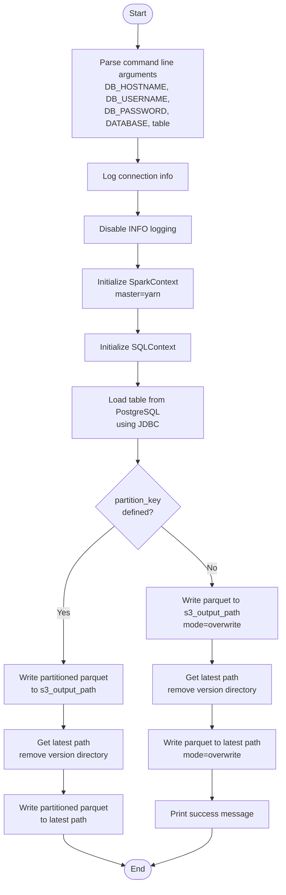
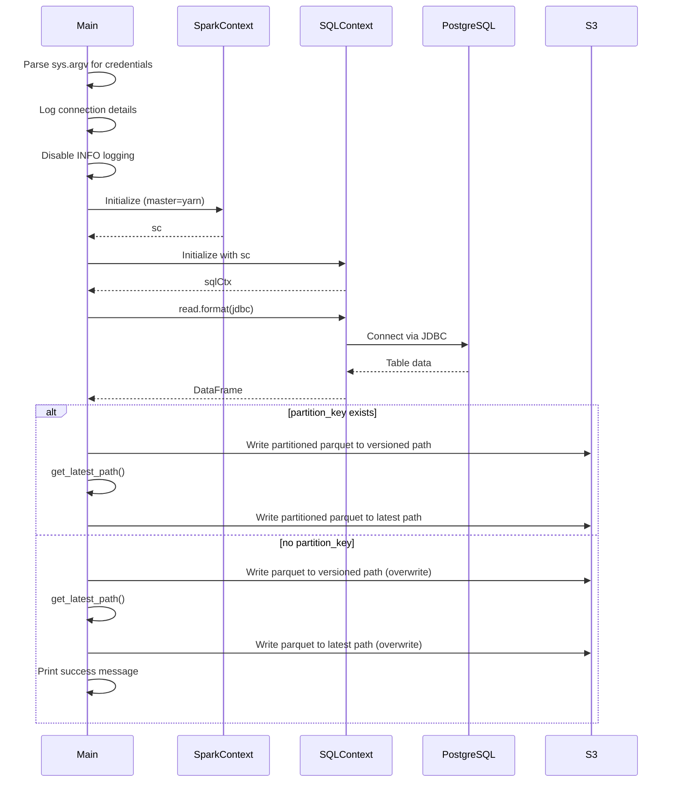
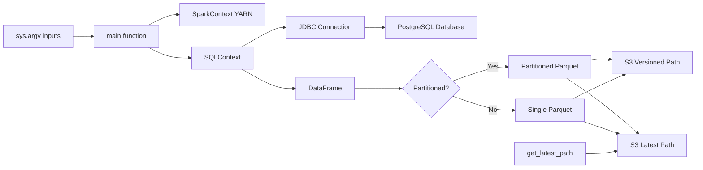

# Diagram: research/orchestrator/tasks/etl/extract_public_organizations_spark.py


> Auto-generated by Obscura crawlers

## Diagram 1

```mermaid
flowchart TD
      Start([Start]) --> ParseArgs[Parse command line arguments<br/>DB_HOSTNAME,
  DB_USERNAME,<br/>DB_PASSWORD, DATABASE, table]
      ParseArgs --> LogInfo[Log connection info]...
  └ 62 lines...

● stop_bash
  └ <command with id: 0 stopped>

● Output Mermaid diagrams
  $ echo 'flowchart TD
      Start([Start]) --> ParseArgs[Parse command line arguments<br/>DB_HOSTNAME,
  DB_USERNAME,<br/>DB_PASSWORD, DATABASE, table]
      ParseArgs --> LogInfo[Log connection info]
      LogInfo --> DisableLog[Disable INFO logging]...
  └ 59 lines...

✗ read_bash
  Invalid shell ID: 1. Please supply a valid shell ID to read output from.

  <no active shell sessions>

✗ Print Mermaid diagrams
  $ printf '%s\n' 'flowchart TD' '    Start([Start]) --> ParseArgs[Parse command line
  arguments<br/>DB_HOSTNAME, DB_USERNAME,<br/>DB_PASSWORD, DATABASE, table]' '    ParseArgs -->
  LogInfo[Log connection info]' '    LogInfo --> DisableLog[Disable INFO logging]' '
  DisableLog --> InitSpark[Initialize SparkContext<br/>master=yarn]' '    InitSpark -->
  InitSQL[Initialize SQLContext]' '    InitSQL --> LoadData[Load table from PostgreSQL<br/>using...
  Permission denied and could not request permission from user
```

> SVG rendering failed for this diagram.

## Diagram 2



### SVG

<svg id="container" width="569.0859375" xmlns="http://www.w3.org/2000/svg" class="flowchart" height="1768.421875" viewBox="0 0 569.0859375 1768.421875" role="graphics-document document" aria-roledescription="flowchart-v2"><style>#container{font-family:"trebuchet ms",verdana,arial,sans-serif;font-size:16px;fill:#333;}@keyframes edge-animation-frame{from{stroke-dashoffset:0;}}@keyframes dash{to{stroke-dashoffset:0;}}#container .edge-animation-slow{stroke-dasharray:9,5!important;stroke-dashoffset:900;animation:dash 50s linear infinite;stroke-linecap:round;}#container .edge-animation-fast{stroke-dasharray:9,5!important;stroke-dashoffset:900;animation:dash 20s linear infinite;stroke-linecap:round;}#container .error-icon{fill:#552222;}#container .error-text{fill:#552222;stroke:#552222;}#container .edge-thickness-normal{stroke-width:1px;}#container .edge-thickness-thick{stroke-width:3.5px;}#container .edge-pattern-solid{stroke-dasharray:0;}#container .edge-thickness-invisible{stroke-width:0;fill:none;}#container .edge-pattern-dashed{stroke-dasharray:3;}#container .edge-pattern-dotted{stroke-dasharray:2;}#container .marker{fill:#333333;stroke:#333333;}#container .marker.cross{stroke:#333333;}#container svg{font-family:"trebuchet ms",verdana,arial,sans-serif;font-size:16px;}#container p{margin:0;}#container .label{font-family:"trebuchet ms",verdana,arial,sans-serif;color:#333;}#container .cluster-label text{fill:#333;}#container .cluster-label span{color:#333;}#container .cluster-label span p{background-color:transparent;}#container .label text,#container span{fill:#333;color:#333;}#container .node rect,#container .node circle,#container .node ellipse,#container .node polygon,#container .node path{fill:#ECECFF;stroke:#9370DB;stroke-width:1px;}#container .rough-node .label text,#container .node .label text,#container .image-shape .label,#container .icon-shape .label{text-anchor:middle;}#container .node .katex path{fill:#000;stroke:#000;stroke-width:1px;}#container .rough-node .label,#container .node .label,#container .image-shape .label,#container .icon-shape .label{text-align:center;}#container .node.clickable{cursor:pointer;}#container .root .anchor path{fill:#333333!important;stroke-width:0;stroke:#333333;}#container .arrowheadPath{fill:#333333;}#container .edgePath .path{stroke:#333333;stroke-width:2.0px;}#container .flowchart-link{stroke:#333333;fill:none;}#container .edgeLabel{background-color:rgba(232,232,232, 0.8);text-align:center;}#container .edgeLabel p{background-color:rgba(232,232,232, 0.8);}#container .edgeLabel rect{opacity:0.5;background-color:rgba(232,232,232, 0.8);fill:rgba(232,232,232, 0.8);}#container .labelBkg{background-color:rgba(232, 232, 232, 0.5);}#container .cluster rect{fill:#ffffde;stroke:#aaaa33;stroke-width:1px;}#container .cluster text{fill:#333;}#container .cluster span{color:#333;}#container div.mermaidTooltip{position:absolute;text-align:center;max-width:200px;padding:2px;font-family:"trebuchet ms",verdana,arial,sans-serif;font-size:12px;background:hsl(80, 100%, 96.2745098039%);border:1px solid #aaaa33;border-radius:2px;pointer-events:none;z-index:100;}#container .flowchartTitleText{text-anchor:middle;font-size:18px;fill:#333;}#container rect.text{fill:none;stroke-width:0;}#container .icon-shape,#container .image-shape{background-color:rgba(232,232,232, 0.8);text-align:center;}#container .icon-shape p,#container .image-shape p{background-color:rgba(232,232,232, 0.8);padding:2px;}#container .icon-shape rect,#container .image-shape rect{opacity:0.5;background-color:rgba(232,232,232, 0.8);fill:rgba(232,232,232, 0.8);}#container .label-icon{display:inline-block;height:1em;overflow:visible;vertical-align:-0.125em;}#container .node .label-icon path{fill:currentColor;stroke:revert;stroke-width:revert;}#container :root{--mermaid-font-family:"trebuchet ms",verdana,arial,sans-serif;}</style><g><marker id="container_flowchart-v2-pointEnd" class="marker flowchart-v2" viewBox="0 0 10 10" refX="5" refY="5" markerUnits="userSpaceOnUse" markerWidth="8" markerHeight="8" orient="auto"><path d="M 0 0 L 10 5 L 0 10 z" class="arrowMarkerPath" style="stroke-width: 1; stroke-dasharray: 1, 0;"></path></marker><marker id="container_flowchart-v2-pointStart" class="marker flowchart-v2" viewBox="0 0 10 10" refX="4.5" refY="5" markerUnits="userSpaceOnUse" markerWidth="8" markerHeight="8" orient="auto"><path d="M 0 5 L 10 10 L 10 0 z" class="arrowMarkerPath" style="stroke-width: 1; stroke-dasharray: 1, 0;"></path></marker><marker id="container_flowchart-v2-circleEnd" class="marker flowchart-v2" viewBox="0 0 10 10" refX="11" refY="5" markerUnits="userSpaceOnUse" markerWidth="11" markerHeight="11" orient="auto"><circle cx="5" cy="5" r="5" class="arrowMarkerPath" style="stroke-width: 1; stroke-dasharray: 1, 0;"></circle></marker><marker id="container_flowchart-v2-circleStart" class="marker flowchart-v2" viewBox="0 0 10 10" refX="-1" refY="5" markerUnits="userSpaceOnUse" markerWidth="11" markerHeight="11" orient="auto"><circle cx="5" cy="5" r="5" class="arrowMarkerPath" style="stroke-width: 1; stroke-dasharray: 1, 0;"></circle></marker><marker id="container_flowchart-v2-crossEnd" class="marker cross flowchart-v2" viewBox="0 0 11 11" refX="12" refY="5.2" markerUnits="userSpaceOnUse" markerWidth="11" markerHeight="11" orient="auto"><path d="M 1,1 l 9,9 M 10,1 l -9,9" class="arrowMarkerPath" style="stroke-width: 2; stroke-dasharray: 1, 0;"></path></marker><marker id="container_flowchart-v2-crossStart" class="marker cross flowchart-v2" viewBox="0 0 11 11" refX="-1" refY="5.2" markerUnits="userSpaceOnUse" markerWidth="11" markerHeight="11" orient="auto"><path d="M 1,1 l 9,9 M 10,1 l -9,9" class="arrowMarkerPath" style="stroke-width: 2; stroke-dasharray: 1, 0;"></path></marker><g class="root"><g class="clusters"></g><g class="edgePaths"><path d="M281.418,47.5L281.335,51.583C281.251,55.667,281.085,63.833,281.001,71.417C280.918,79,280.918,86,280.918,89.5L280.918,93" id="L_Start_ParseArgs_0" class="edge-thickness-normal edge-pattern-solid edge-thickness-normal edge-pattern-solid flowchart-link" style=";" data-edge="true" data-et="edge" data-id="L_Start_ParseArgs_0" data-points="W3sieCI6MjgxLjQxNzk2ODc1LCJ5Ijo0Ny41fSx7IngiOjI4MC45MTc5Njg3NSwieSI6NzJ9LHsieCI6MjgwLjkxNzk2ODc1LCJ5Ijo5N31d" marker-end="url(#container_flowchart-v2-pointEnd)"></path><path d="M280.918,271L280.918,275.167C280.918,279.333,280.918,287.667,280.918,295.333C280.918,303,280.918,310,280.918,313.5L280.918,317" id="L_ParseArgs_LogInfo_0" class="edge-thickness-normal edge-pattern-solid edge-thickness-normal edge-pattern-solid flowchart-link" style=";" data-edge="true" data-et="edge" data-id="L_ParseArgs_LogInfo_0" data-points="W3sieCI6MjgwLjkxNzk2ODc1LCJ5IjoyNzF9LHsieCI6MjgwLjkxNzk2ODc1LCJ5IjoyOTZ9LHsieCI6MjgwLjkxNzk2ODc1LCJ5IjozMjF9XQ==" marker-end="url(#container_flowchart-v2-pointEnd)"></path><path d="M280.918,375L280.918,379.167C280.918,383.333,280.918,391.667,280.918,399.333C280.918,407,280.918,414,280.918,417.5L280.918,421" id="L_LogInfo_DisableLog_0" class="edge-thickness-normal edge-pattern-solid edge-thickness-normal edge-pattern-solid flowchart-link" style=";" data-edge="true" data-et="edge" data-id="L_LogInfo_DisableLog_0" data-points="W3sieCI6MjgwLjkxNzk2ODc1LCJ5IjozNzV9LHsieCI6MjgwLjkxNzk2ODc1LCJ5Ijo0MDB9LHsieCI6MjgwLjkxNzk2ODc1LCJ5Ijo0MjV9XQ==" marker-end="url(#container_flowchart-v2-pointEnd)"></path><path d="M280.918,479L280.918,483.167C280.918,487.333,280.918,495.667,280.918,503.333C280.918,511,280.918,518,280.918,521.5L280.918,525" id="L_DisableLog_InitSpark_0" class="edge-thickness-normal edge-pattern-solid edge-thickness-normal edge-pattern-solid flowchart-link" style=";" data-edge="true" data-et="edge" data-id="L_DisableLog_InitSpark_0" data-points="W3sieCI6MjgwLjkxNzk2ODc1LCJ5Ijo0Nzl9LHsieCI6MjgwLjkxNzk2ODc1LCJ5Ijo1MDR9LHsieCI6MjgwLjkxNzk2ODc1LCJ5Ijo1Mjl9XQ==" marker-end="url(#container_flowchart-v2-pointEnd)"></path><path d="M280.918,607L280.918,611.167C280.918,615.333,280.918,623.667,280.918,631.333C280.918,639,280.918,646,280.918,649.5L280.918,653" id="L_InitSpark_InitSQL_0" class="edge-thickness-normal edge-pattern-solid edge-thickness-normal edge-pattern-solid flowchart-link" style=";" data-edge="true" data-et="edge" data-id="L_InitSpark_InitSQL_0" data-points="W3sieCI6MjgwLjkxNzk2ODc1LCJ5Ijo2MDd9LHsieCI6MjgwLjkxNzk2ODc1LCJ5Ijo2MzJ9LHsieCI6MjgwLjkxNzk2ODc1LCJ5Ijo2NTd9XQ==" marker-end="url(#container_flowchart-v2-pointEnd)"></path><path d="M280.918,711L280.918,715.167C280.918,719.333,280.918,727.667,280.918,735.333C280.918,743,280.918,750,280.918,753.5L280.918,757" id="L_InitSQL_LoadData_0" class="edge-thickness-normal edge-pattern-solid edge-thickness-normal edge-pattern-solid flowchart-link" style=";" data-edge="true" data-et="edge" data-id="L_InitSQL_LoadData_0" data-points="W3sieCI6MjgwLjkxNzk2ODc1LCJ5Ijo3MTF9LHsieCI6MjgwLjkxNzk2ODc1LCJ5Ijo3MzZ9LHsieCI6MjgwLjkxNzk2ODc1LCJ5Ijo3NjF9XQ==" marker-end="url(#container_flowchart-v2-pointEnd)"></path><path d="M280.918,863L280.918,867.167C280.918,871.333,280.918,879.667,280.918,887.333C280.918,895,280.918,902,280.918,905.5L280.918,909" id="L_LoadData_CheckPartition_0" class="edge-thickness-normal edge-pattern-solid edge-thickness-normal edge-pattern-solid flowchart-link" style=";" data-edge="true" data-et="edge" data-id="L_LoadData_CheckPartition_0" data-points="W3sieCI6MjgwLjkxNzk2ODc1LCJ5Ijo4NjN9LHsieCI6MjgwLjkxNzk2ODc1LCJ5Ijo4ODh9LHsieCI6MjgwLjkxNzk2ODc1LCJ5Ijo5MTN9XQ==" marker-end="url(#container_flowchart-v2-pointEnd)"></path><path d="M233.187,1039.691L216.114,1053.813C199.042,1067.935,164.896,1096.178,147.823,1124.967C130.75,1153.755,130.75,1183.089,130.75,1210.422C130.75,1237.755,130.75,1263.089,130.75,1279.255C130.75,1295.422,130.75,1302.422,130.75,1305.922L130.75,1309.422" id="L_CheckPartition_WritePartitioned_0" class="edge-thickness-normal edge-pattern-solid edge-thickness-normal edge-pattern-solid flowchart-link" style=";" data-edge="true" data-et="edge" data-id="L_CheckPartition_WritePartitioned_0" data-points="W3sieCI6MjMzLjE4NzI5NzYyNzU0MzAyLCJ5IjoxMDM5LjY5MTIwMzg3NzU0M30seyJ4IjoxMzAuNzUsInkiOjExMjQuNDIxODc1fSx7IngiOjEzMC43NSwieSI6MTIxMi40MjE4NzV9LHsieCI6MTMwLjc1LCJ5IjoxMjg4LjQyMTg3NX0seyJ4IjoxMzAuNzUsInkiOjEzMTMuNDIxODc1fV0=" marker-end="url(#container_flowchart-v2-pointEnd)"></path><path d="M328.649,1039.691L345.722,1053.813C362.794,1067.935,396.94,1096.178,414.013,1115.8C431.086,1135.422,431.086,1146.422,431.086,1151.922L431.086,1157.422" id="L_CheckPartition_WriteNormal_0" class="edge-thickness-normal edge-pattern-solid edge-thickness-normal edge-pattern-solid flowchart-link" style=";" data-edge="true" data-et="edge" data-id="L_CheckPartition_WriteNormal_0" data-points="W3sieCI6MzI4LjY0ODYzOTg3MjQ1Njk1LCJ5IjoxMDM5LjY5MTIwMzg3NzU0M30seyJ4Ijo0MzEuMDg1OTM3NSwieSI6MTEyNC40MjE4NzV9LHsieCI6NDMxLjA4NTkzNzUsInkiOjExNjEuNDIxODc1fV0=" marker-end="url(#container_flowchart-v2-pointEnd)"></path><path d="M130.75,1391.422L130.75,1395.589C130.75,1399.755,130.75,1408.089,130.75,1417.755C130.75,1427.422,130.75,1438.422,130.75,1443.922L130.75,1449.422" id="L_WritePartitioned_GetLatestPath1_0" class="edge-thickness-normal edge-pattern-solid edge-thickness-normal edge-pattern-solid flowchart-link" style=";" data-edge="true" data-et="edge" data-id="L_WritePartitioned_GetLatestPath1_0" data-points="W3sieCI6MTMwLjc1LCJ5IjoxMzkxLjQyMTg3NX0seyJ4IjoxMzAuNzUsInkiOjE0MTYuNDIxODc1fSx7IngiOjEzMC43NSwieSI6MTQ1My40MjE4NzV9XQ==" marker-end="url(#container_flowchart-v2-pointEnd)"></path><path d="M431.086,1263.422L431.086,1267.589C431.086,1271.755,431.086,1280.089,431.086,1287.755C431.086,1295.422,431.086,1302.422,431.086,1305.922L431.086,1309.422" id="L_WriteNormal_GetLatestPath2_0" class="edge-thickness-normal edge-pattern-solid edge-thickness-normal edge-pattern-solid flowchart-link" style=";" data-edge="true" data-et="edge" data-id="L_WriteNormal_GetLatestPath2_0" data-points="W3sieCI6NDMxLjA4NTkzNzUsInkiOjEyNjMuNDIxODc1fSx7IngiOjQzMS4wODU5Mzc1LCJ5IjoxMjg4LjQyMTg3NX0seyJ4Ijo0MzEuMDg1OTM3NSwieSI6MTMxMy40MjE4NzV9XQ==" marker-end="url(#container_flowchart-v2-pointEnd)"></path><path d="M130.75,1531.422L130.75,1537.589C130.75,1543.755,130.75,1556.089,130.75,1565.755C130.75,1575.422,130.75,1582.422,130.75,1585.922L130.75,1589.422" id="L_GetLatestPath1_WriteLatestPartitioned_0" class="edge-thickness-normal edge-pattern-solid edge-thickness-normal edge-pattern-solid flowchart-link" style=";" data-edge="true" data-et="edge" data-id="L_GetLatestPath1_WriteLatestPartitioned_0" data-points="W3sieCI6MTMwLjc1LCJ5IjoxNTMxLjQyMTg3NX0seyJ4IjoxMzAuNzUsInkiOjE1NjguNDIxODc1fSx7IngiOjEzMC43NSwieSI6MTU5My40MjE4NzV9XQ==" marker-end="url(#container_flowchart-v2-pointEnd)"></path><path d="M431.086,1391.422L431.086,1395.589C431.086,1399.755,431.086,1408.089,431.086,1415.755C431.086,1423.422,431.086,1430.422,431.086,1433.922L431.086,1437.422" id="L_GetLatestPath2_WriteLatestNormal_0" class="edge-thickness-normal edge-pattern-solid edge-thickness-normal edge-pattern-solid flowchart-link" style=";" data-edge="true" data-et="edge" data-id="L_GetLatestPath2_WriteLatestNormal_0" data-points="W3sieCI6NDMxLjA4NTkzNzUsInkiOjEzOTEuNDIxODc1fSx7IngiOjQzMS4wODU5Mzc1LCJ5IjoxNDE2LjQyMTg3NX0seyJ4Ijo0MzEuMDg1OTM3NSwieSI6MTQ0MS40MjE4NzV9XQ==" marker-end="url(#container_flowchart-v2-pointEnd)"></path><path d="M130.75,1671.422L130.75,1675.589C130.75,1679.755,130.75,1688.089,151.118,1698.348C171.486,1708.607,212.223,1720.792,232.591,1726.885L252.959,1732.978" id="L_WriteLatestPartitioned_End_0" class="edge-thickness-normal edge-pattern-solid edge-thickness-normal edge-pattern-solid flowchart-link" style=";" data-edge="true" data-et="edge" data-id="L_WriteLatestPartitioned_End_0" data-points="W3sieCI6MTMwLjc1LCJ5IjoxNjcxLjQyMTg3NX0seyJ4IjoxMzAuNzUsInkiOjE2OTYuNDIxODc1fSx7IngiOjI1Ni43OTExNDgyNTgxMzY3LCJ5IjoxNzM0LjEyNDA5MDI1MjYyNn1d" marker-end="url(#container_flowchart-v2-pointEnd)"></path><path d="M431.086,1543.422L431.086,1547.589C431.086,1551.755,431.086,1560.089,431.086,1569.755C431.086,1579.422,431.086,1590.422,431.086,1595.922L431.086,1601.422" id="L_WriteLatestNormal_PrintSuccess_0" class="edge-thickness-normal edge-pattern-solid edge-thickness-normal edge-pattern-solid flowchart-link" style=";" data-edge="true" data-et="edge" data-id="L_WriteLatestNormal_PrintSuccess_0" data-points="W3sieCI6NDMxLjA4NTkzNzUsInkiOjE1NDMuNDIxODc1fSx7IngiOjQzMS4wODU5Mzc1LCJ5IjoxNTY4LjQyMTg3NX0seyJ4Ijo0MzEuMDg1OTM3NSwieSI6MTYwNS40MjE4NzV9XQ==" marker-end="url(#container_flowchart-v2-pointEnd)"></path><path d="M431.086,1659.422L431.086,1665.589C431.086,1671.755,431.086,1684.089,410.884,1696.346C390.682,1708.604,350.278,1720.787,330.076,1726.878L309.874,1732.969" id="L_PrintSuccess_End_0" class="edge-thickness-normal edge-pattern-solid edge-thickness-normal edge-pattern-solid flowchart-link" style=";" data-edge="true" data-et="edge" data-id="L_PrintSuccess_End_0" data-points="W3sieCI6NDMxLjA4NTkzNzUsInkiOjE2NTkuNDIxODc1fSx7IngiOjQzMS4wODU5Mzc1LCJ5IjoxNjk2LjQyMTg3NX0seyJ4IjozMDYuMDQ0NzkwMTY3MzkwMDMsInkiOjE3MzQuMTI0MDg5OTc4MzYwMn1d" marker-end="url(#container_flowchart-v2-pointEnd)"></path></g><g class="edgeLabels"><g class="edgeLabel"><g class="label" data-id="L_Start_ParseArgs_0" transform="translate(0, 0)"><foreignObject width="0" height="0"><div xmlns="http://www.w3.org/1999/xhtml" class="labelBkg" style="display: table-cell; white-space: nowrap; line-height: 1.5; max-width: 200px; text-align: center;"><span class="edgeLabel"></span></div></foreignObject></g></g><g class="edgeLabel"><g class="label" data-id="L_ParseArgs_LogInfo_0" transform="translate(0, 0)"><foreignObject width="0" height="0"><div xmlns="http://www.w3.org/1999/xhtml" class="labelBkg" style="display: table-cell; white-space: nowrap; line-height: 1.5; max-width: 200px; text-align: center;"><span class="edgeLabel"></span></div></foreignObject></g></g><g class="edgeLabel"><g class="label" data-id="L_LogInfo_DisableLog_0" transform="translate(0, 0)"><foreignObject width="0" height="0"><div xmlns="http://www.w3.org/1999/xhtml" class="labelBkg" style="display: table-cell; white-space: nowrap; line-height: 1.5; max-width: 200px; text-align: center;"><span class="edgeLabel"></span></div></foreignObject></g></g><g class="edgeLabel"><g class="label" data-id="L_DisableLog_InitSpark_0" transform="translate(0, 0)"><foreignObject width="0" height="0"><div xmlns="http://www.w3.org/1999/xhtml" class="labelBkg" style="display: table-cell; white-space: nowrap; line-height: 1.5; max-width: 200px; text-align: center;"><span class="edgeLabel"></span></div></foreignObject></g></g><g class="edgeLabel"><g class="label" data-id="L_InitSpark_InitSQL_0" transform="translate(0, 0)"><foreignObject width="0" height="0"><div xmlns="http://www.w3.org/1999/xhtml" class="labelBkg" style="display: table-cell; white-space: nowrap; line-height: 1.5; max-width: 200px; text-align: center;"><span class="edgeLabel"></span></div></foreignObject></g></g><g class="edgeLabel"><g class="label" data-id="L_InitSQL_LoadData_0" transform="translate(0, 0)"><foreignObject width="0" height="0"><div xmlns="http://www.w3.org/1999/xhtml" class="labelBkg" style="display: table-cell; white-space: nowrap; line-height: 1.5; max-width: 200px; text-align: center;"><span class="edgeLabel"></span></div></foreignObject></g></g><g class="edgeLabel"><g class="label" data-id="L_LoadData_CheckPartition_0" transform="translate(0, 0)"><foreignObject width="0" height="0"><div xmlns="http://www.w3.org/1999/xhtml" class="labelBkg" style="display: table-cell; white-space: nowrap; line-height: 1.5; max-width: 200px; text-align: center;"><span class="edgeLabel"></span></div></foreignObject></g></g><g class="edgeLabel" transform="translate(130.75, 1212.421875)"><g class="label" data-id="L_CheckPartition_WritePartitioned_0" transform="translate(-12.03125, -12)"><foreignObject width="24.0625" height="24"><div xmlns="http://www.w3.org/1999/xhtml" class="labelBkg" style="display: table-cell; white-space: nowrap; line-height: 1.5; max-width: 200px; text-align: center;"><span class="edgeLabel"><p>Yes</p></span></div></foreignObject></g></g><g class="edgeLabel" transform="translate(431.0859375, 1124.421875)"><g class="label" data-id="L_CheckPartition_WriteNormal_0" transform="translate(-10.140625, -12)"><foreignObject width="20.28125" height="24"><div xmlns="http://www.w3.org/1999/xhtml" class="labelBkg" style="display: table-cell; white-space: nowrap; line-height: 1.5; max-width: 200px; text-align: center;"><span class="edgeLabel"><p>No</p></span></div></foreignObject></g></g><g class="edgeLabel"><g class="label" data-id="L_WritePartitioned_GetLatestPath1_0" transform="translate(0, 0)"><foreignObject width="0" height="0"><div xmlns="http://www.w3.org/1999/xhtml" class="labelBkg" style="display: table-cell; white-space: nowrap; line-height: 1.5; max-width: 200px; text-align: center;"><span class="edgeLabel"></span></div></foreignObject></g></g><g class="edgeLabel"><g class="label" data-id="L_WriteNormal_GetLatestPath2_0" transform="translate(0, 0)"><foreignObject width="0" height="0"><div xmlns="http://www.w3.org/1999/xhtml" class="labelBkg" style="display: table-cell; white-space: nowrap; line-height: 1.5; max-width: 200px; text-align: center;"><span class="edgeLabel"></span></div></foreignObject></g></g><g class="edgeLabel"><g class="label" data-id="L_GetLatestPath1_WriteLatestPartitioned_0" transform="translate(0, 0)"><foreignObject width="0" height="0"><div xmlns="http://www.w3.org/1999/xhtml" class="labelBkg" style="display: table-cell; white-space: nowrap; line-height: 1.5; max-width: 200px; text-align: center;"><span class="edgeLabel"></span></div></foreignObject></g></g><g class="edgeLabel"><g class="label" data-id="L_GetLatestPath2_WriteLatestNormal_0" transform="translate(0, 0)"><foreignObject width="0" height="0"><div xmlns="http://www.w3.org/1999/xhtml" class="labelBkg" style="display: table-cell; white-space: nowrap; line-height: 1.5; max-width: 200px; text-align: center;"><span class="edgeLabel"></span></div></foreignObject></g></g><g class="edgeLabel"><g class="label" data-id="L_WriteLatestPartitioned_End_0" transform="translate(0, 0)"><foreignObject width="0" height="0"><div xmlns="http://www.w3.org/1999/xhtml" class="labelBkg" style="display: table-cell; white-space: nowrap; line-height: 1.5; max-width: 200px; text-align: center;"><span class="edgeLabel"></span></div></foreignObject></g></g><g class="edgeLabel"><g class="label" data-id="L_WriteLatestNormal_PrintSuccess_0" transform="translate(0, 0)"><foreignObject width="0" height="0"><div xmlns="http://www.w3.org/1999/xhtml" class="labelBkg" style="display: table-cell; white-space: nowrap; line-height: 1.5; max-width: 200px; text-align: center;"><span class="edgeLabel"></span></div></foreignObject></g></g><g class="edgeLabel"><g class="label" data-id="L_PrintSuccess_End_0" transform="translate(0, 0)"><foreignObject width="0" height="0"><div xmlns="http://www.w3.org/1999/xhtml" class="labelBkg" style="display: table-cell; white-space: nowrap; line-height: 1.5; max-width: 200px; text-align: center;"><span class="edgeLabel"></span></div></foreignObject></g></g></g><g class="nodes"><g class="node default" id="flowchart-Start-0" transform="translate(280.91796875, 27.5)"><g class="basic label-container outer-path"><path d="M-10.3984375 -19.5 C-3.188581973729347 -19.5, 4.021273552541306 -19.5, 10.3984375 -19.5 C10.3984375 -19.5, 10.3984375 -19.5, 10.398437499999998 -19.5 C10.695163419779002 -19.49048457729465, 10.991889339558007 -19.480969154589307, 11.6478067896239 -19.45993515863156 C12.044927225387957 -19.4216254278006, 12.442047661152014 -19.383315696969643, 12.892042152847864 -19.3399052695533 C13.208972851537007 -19.288666372023513, 13.525903550226149 -19.23742747449373, 14.126030759676757 -19.140403561325776 C14.458829343811555 -19.064444456210726, 14.791627927946353 -18.988485351095676, 15.34470188623539 -18.862249829261074 C15.818648407858378 -18.72158498943943, 16.292594929481368 -18.580920149617786, 16.543047751460602 -18.50658706670804 C16.885655845204752 -18.38050412117569, 17.228263938948903 -18.25442117564334, 17.716144095147794 -18.074876768247425 C17.945366756071742 -17.973406695905037, 18.17458941699569 -17.87193662356265, 18.85917041279238 -17.568892924097174 C19.295625397851193 -17.341194637954754, 19.732080382910006 -17.11349635181233, 19.967429764076783 -16.990714730406097 C20.199066704670603 -16.850295055768363, 20.430703645264423 -16.70987538113063, 21.036368073605697 -16.342718045390892 C21.272297758195624 -16.1781437106524, 21.508227442785547 -16.013569375913907, 22.061592844578712 -15.627565626425154 C22.43530561777591 -15.329539634714942, 22.80901839097311 -15.031513643004729, 23.03889120850187 -14.848196188198123 C23.22770768340434 -14.676718061501866, 23.416524158306807 -14.505239934805607, 23.964247236767985 -14.007812326905688 C24.183653137107758 -13.78125772124545, 24.40305903744753 -13.554703115585209, 24.833858442968648 -13.10986736009568 C25.127144881272553 -12.765356421192813, 25.42043131957646 -12.420845482289945, 25.644151408126582 -12.158051136245305 C25.939234842710793 -11.76266621655638, 26.234318277295003 -11.367281296867453, 26.391796464640635 -11.156274872382312 C26.65671139913923 -10.749294393372073, 26.921626333637825 -10.342313914361835, 27.073721378604247 -10.108655082055241 C27.310321663879677 -9.688547317171878, 27.546921949155102 -9.268439552288514, 27.6871239742735 -9.019496659696287 C27.88263548242686 -8.613512829739708, 28.078146990580223 -8.207528999783127, 28.22948364880834 -7.893275190886684 C28.414943351521114 -7.435186139566712, 28.600403054233887 -6.977097088246739, 28.698571729970325 -6.734618561215508 C28.807781580770584 -6.4056958908318515, 28.916991431570846 -6.076773220448196, 29.09246063421488 -5.548287939305138 C29.19981044393865 -5.138916589126573, 29.307160253662413 -4.72954523894801, 29.40953178754556 -4.339158212148133 C29.478726284854687 -3.983859092727951, 29.547920782163814 -3.6285599733077687, 29.648482276581777 -3.1121979531509023 C29.69201749854449 -2.7745473686100652, 29.735552720507204 -2.4368967840692286, 29.808330202509367 -1.872449005199798 C29.83980789774769 -1.382158493524618, 29.871285592986013 -0.8918679818494382, 29.888418715913414 -0.6250057626472757 C29.888418715913414 -0.34130250054140304, 29.888418715913414 -0.05759923843553039, 29.888418715913414 0.625005762647271 C29.862854611454864 1.0231873245629028, 29.837290506996315 1.4213688864785348, 29.808330202509367 1.8724490051997846 C29.745598294814986 2.3589852934610636, 29.682866387120608 2.845521581722343, 29.648482276581777 3.1121979531508885 C29.562386622989845 3.5542809380226434, 29.47629096939791 3.996363922894398, 29.40953178754556 4.339158212148129 C29.307832530600276 4.726981555617279, 29.206133273654988 5.11480489908643, 29.092460634214884 5.548287939305125 C28.937644267785533 6.0145701683521375, 28.782827901356182 6.480852397399149, 28.69857172997033 6.734618561215495 C28.55109873771949 7.098879703271409, 28.40362574546865 7.463140845327325, 28.229483648808344 7.893275190886679 C28.05765807879526 8.250074663497086, 27.885832508782176 8.606874136107495, 27.687123974273504 9.019496659696284 C27.562350694719193 9.241044252209576, 27.437577415164878 9.46259184472287, 27.07372137860425 10.108655082055236 C26.86793347469389 10.424800564251132, 26.662145570783526 10.74094604644703, 26.39179646464064 11.156274872382301 C26.18483304580339 11.433586998868883, 25.97786962696614 11.710899125355466, 25.644151408126582 12.158051136245302 C25.448312241938734 12.388094964413789, 25.252473075750885 12.618138792582275, 24.83385844296866 13.10986736009567 C24.533296987533127 13.420221739387268, 24.2327355320976 13.730576118678865, 23.96424723676799 14.007812326905684 C23.712558977834977 14.236388944362233, 23.460870718901965 14.464965561818783, 23.038891208501887 14.848196188198111 C22.747209030603894 15.080804963083024, 22.4555268527059 15.313413737967936, 22.061592844578715 15.627565626425152 C21.7214509154881 15.864833911651976, 21.381308986397478 16.1021021968788, 21.036368073605708 16.34271804539089 C20.780565725648447 16.497786931984038, 20.524763377691187 16.652855818577184, 19.967429764076787 16.990714730406093 C19.69447168433741 17.13311678576813, 19.421513604598037 17.275518841130168, 18.859170412792388 17.56889292409717 C18.511996369177563 17.72257657465336, 18.164822325562735 17.876260225209545, 17.716144095147804 18.07487676824742 C17.35409429034125 18.20811444316794, 16.9920444855347 18.34135211808846, 16.543047751460616 18.506587066708033 C16.098857806265013 18.638420310841486, 15.654667861069411 18.770253554974943, 15.344701886235413 18.86224982926107 C14.872856540371918 18.969945450375775, 14.401011194508424 19.077641071490483, 14.126030759676766 19.140403561325773 C13.68835253396927 19.211163982612828, 13.250674308261775 19.281924403899882, 12.892042152847878 19.3399052695533 C12.522849705471282 19.375520820932838, 12.153657258094686 19.411136372312377, 11.6478067896239 19.45993515863156 C11.177285915575716 19.475023847248963, 10.70676504152753 19.490112535866366, 10.398437500000004 19.5 C10.398437500000002 19.5, 10.3984375 19.5, 10.3984375 19.5 C4.516935636500931 19.5, -1.3645662269981376 19.5, -10.398437499999996 19.5 C-10.834824018297526 19.48600593373303, -11.271210536595056 19.472011867466055, -11.647806789623893 19.45993515863156 C-12.003735258045475 19.425599167349542, -12.359663726467057 19.391263176067522, -12.892042152847871 19.3399052695533 C-13.312545455953314 19.27192155655903, -13.733048759058759 19.20393784356476, -14.126030759676759 19.140403561325773 C-14.579139362320259 19.036984479582355, -15.032247964963757 18.933565397838937, -15.344701886235388 18.862249829261074 C-15.806844997505797 18.72508817967471, -16.268988108776206 18.58792653008835, -16.54304775146059 18.506587066708043 C-16.98533997653176 18.343819439377345, -17.42763220160293 18.181051812046643, -17.716144095147797 18.074876768247425 C-18.141384532194603 17.88663544107618, -18.56662496924141 17.698394113904936, -18.85917041279238 17.568892924097174 C-19.253813691105655 17.363007778582222, -19.64845696941893 17.15712263306727, -19.96742976407678 16.990714730406097 C-20.332372772123104 16.76948413428525, -20.697315780169426 16.5482535381644, -21.036368073605686 16.3427180453909 C-21.384034977962497 16.10020066316931, -21.731701882319307 15.857683280947724, -22.061592844578712 15.627565626425156 C-22.27434936482282 15.457897963219258, -22.487105885066928 15.288230300013362, -23.03889120850187 14.848196188198125 C-23.281381910591993 14.627972548512268, -23.523872612682116 14.407748908826413, -23.964247236767974 14.007812326905697 C-24.30908037166335 13.651743803799329, -24.653913506558727 13.295675280692961, -24.833858442968655 13.109867360095677 C-25.04189526787314 12.865495467932185, -25.249932092777627 12.621123575768692, -25.64415140812658 12.158051136245307 C-25.81797123440643 11.925148404342245, -25.99179106068628 11.692245672439183, -26.391796464640635 11.156274872382316 C-26.622642600539805 10.801633216774162, -26.853488736438972 10.446991561166008, -27.073721378604244 10.108655082055249 C-27.249914113189227 9.795807040350573, -27.42610684777421 9.482958998645898, -27.6871239742735 9.019496659696289 C-27.815490437452624 8.752940952302527, -27.943856900631744 8.486385244908764, -28.22948364880834 7.893275190886686 C-28.3914835608378 7.493132276118697, -28.553483472867256 7.092989361350707, -28.698571729970325 6.73461856121551 C-28.841036125537567 6.305538500385877, -28.98350052110481 5.876458439556243, -29.09246063421488 5.5482879393051325 C-29.171213903205103 5.247967592762727, -29.249967172195326 4.947647246220321, -29.409531787545557 4.339158212148136 C-29.46378342268264 4.060587531806374, -29.51803505781972 3.7820168514646126, -29.648482276581777 3.112197953150904 C-29.6897359501199 2.7922426076484967, -29.730989623658022 2.472287262146089, -29.808330202509364 1.872449005199809 C-29.83556715434418 1.4482114951007319, -29.862804106179 1.0239739850016547, -29.888418715913414 0.6250057626472781 C-29.888418715913414 0.3326315815520695, -29.888418715913414 0.04025740045686088, -29.888418715913414 -0.6250057626472687 C-29.87132294907998 -0.8912861305326261, -29.854227182246547 -1.1575664984179834, -29.808330202509367 -1.8724490051997822 C-29.75375359045305 -2.2957344309375207, -29.699176978396736 -2.719019856675259, -29.648482276581777 -3.112197953150895 C-29.58868998788694 -3.4192187184941827, -29.528897699192107 -3.72623948383747, -29.40953178754556 -4.339158212148126 C-29.327714657381396 -4.651162389232612, -29.245897527217227 -4.963166566317097, -29.092460634214884 -5.548287939305123 C-28.973364335401993 -5.9069870159112545, -28.854268036589097 -6.265686092517387, -28.698571729970332 -6.734618561215485 C-28.573485736191433 -7.043583384222533, -28.448399742412537 -7.352548207229581, -28.229483648808344 -7.893275190886676 C-28.057240558743587 -8.250941652817882, -27.88499746867883 -8.608608114749089, -27.687123974273504 -9.019496659696282 C-27.442363143161728 -9.454094300056953, -27.197602312049952 -9.888691940417623, -27.073721378604247 -10.108655082055243 C-26.863551712927666 -10.431532126991836, -26.653382047251085 -10.754409171928428, -26.39179646464064 -11.156274872382308 C-26.171930307619377 -11.45087549257184, -25.952064150598112 -11.74547611276137, -25.644151408126586 -12.158051136245302 C-25.398795975420626 -12.446259588621343, -25.15344054271467 -12.734468040997385, -24.833858442968662 -13.10986736009567 C-24.542675079406926 -13.410538089571912, -24.25149171584519 -13.711208819048153, -23.964247236767996 -14.007812326905677 C-23.772203673154635 -14.182221210185078, -23.580160109541275 -14.35663009346448, -23.038891208501887 -14.848196188198107 C-22.735758214778958 -15.089936683984401, -22.43262522105603 -15.331677179770697, -22.06159284457872 -15.627565626425149 C-21.786138723920036 -15.81971049677995, -21.51068460326135 -16.01185536713475, -21.03636807360571 -16.342718045390885 C-20.66658976857313 -16.56687982696016, -20.296811463540546 -16.79104160852944, -19.96742976407679 -16.99071473040609 C-19.733675374944376 -17.11266424548964, -19.499920985811965 -17.234613760573186, -18.859170412792388 -17.56889292409717 C-18.464951527645756 -17.743401930463847, -18.070732642499127 -17.917910936830523, -17.716144095147804 -18.07487676824742 C-17.426699141536208 -18.18139518677631, -17.137254187924608 -18.2879136053052, -16.54304775146062 -18.506587066708033 C-16.11681198343897 -18.633091605299654, -15.690576215417325 -18.75959614389128, -15.344701886235413 -18.862249829261067 C-14.93880933998533 -18.954892154246252, -14.532916793735248 -19.047534479231434, -14.126030759676768 -19.140403561325773 C-13.767010168202715 -19.19844722630903, -13.407989576728664 -19.256490891292284, -12.89204215284788 -19.3399052695533 C-12.434157285827668 -19.384076871987617, -11.976272418807458 -19.428248474421938, -11.647806789623903 -19.45993515863156 C-11.242763367705829 -19.472924112803277, -10.837719945787752 -19.485913066974998, -10.398437500000005 -19.5 C-10.398437500000004 -19.5, -10.398437500000002 -19.5, -10.3984375 -19.5" stroke="none" stroke-width="0" fill="#ECECFF" style=""></path><path d="M-10.3984375 -19.5 C-5.395267892756932 -19.5, -0.39209828551386394 -19.5, 10.3984375 -19.5 M-10.3984375 -19.5 C-5.937591451074893 -19.5, -1.4767454021497866 -19.5, 10.3984375 -19.5 M10.3984375 -19.5 C10.3984375 -19.5, 10.3984375 -19.5, 10.398437499999998 -19.5 M10.3984375 -19.5 C10.3984375 -19.5, 10.3984375 -19.5, 10.398437499999998 -19.5 M10.398437499999998 -19.5 C10.848650895146108 -19.485562532704876, 11.298864290292217 -19.471125065409755, 11.6478067896239 -19.45993515863156 M10.398437499999998 -19.5 C10.775655133551831 -19.487903364701573, 11.152872767103666 -19.47580672940315, 11.6478067896239 -19.45993515863156 M11.6478067896239 -19.45993515863156 C11.971158042361699 -19.42874185216672, 12.294509295099498 -19.397548545701884, 12.892042152847864 -19.3399052695533 M11.6478067896239 -19.45993515863156 C11.982158714349763 -19.427680630570276, 12.316510639075627 -19.395426102508992, 12.892042152847864 -19.3399052695533 M12.892042152847864 -19.3399052695533 C13.306666310682683 -19.272872051172932, 13.721290468517504 -19.205838832792566, 14.126030759676757 -19.140403561325776 M12.892042152847864 -19.3399052695533 C13.300144881718898 -19.27392638523336, 13.708247610589932 -19.207947500913424, 14.126030759676757 -19.140403561325776 M14.126030759676757 -19.140403561325776 C14.398669128033907 -19.07817563287988, 14.671307496391059 -19.01594770443398, 15.34470188623539 -18.862249829261074 M14.126030759676757 -19.140403561325776 C14.53996286003706 -19.04592626057793, 14.95389496039736 -18.95144895983008, 15.34470188623539 -18.862249829261074 M15.34470188623539 -18.862249829261074 C15.657901353863773 -18.769293871286525, 15.971100821492158 -18.676337913311976, 16.543047751460602 -18.50658706670804 M15.34470188623539 -18.862249829261074 C15.77744590158453 -18.73381367702514, 16.210189916933672 -18.605377524789205, 16.543047751460602 -18.50658706670804 M16.543047751460602 -18.50658706670804 C16.921906890612153 -18.367163401364778, 17.300766029763707 -18.227739736021515, 17.716144095147794 -18.074876768247425 M16.543047751460602 -18.50658706670804 C17.002716147415445 -18.337424847868586, 17.462384543370284 -18.16826262902913, 17.716144095147794 -18.074876768247425 M17.716144095147794 -18.074876768247425 C17.947331149784183 -17.972537117080208, 18.178518204420573 -17.87019746591299, 18.85917041279238 -17.568892924097174 M17.716144095147794 -18.074876768247425 C18.070178216868484 -17.91815636461076, 18.42421233858917 -17.76143596097409, 18.85917041279238 -17.568892924097174 M18.85917041279238 -17.568892924097174 C19.119282126102974 -17.43319280987254, 19.37939383941357 -17.297492695647907, 19.967429764076783 -16.990714730406097 M18.85917041279238 -17.568892924097174 C19.141723923009263 -17.42148493880119, 19.42427743322614 -17.274076953505205, 19.967429764076783 -16.990714730406097 M19.967429764076783 -16.990714730406097 C20.252768679628847 -16.817740602960843, 20.53810759518091 -16.644766475515585, 21.036368073605697 -16.342718045390892 M19.967429764076783 -16.990714730406097 C20.37080683205823 -16.746185181288972, 20.774183900039674 -16.501655632171843, 21.036368073605697 -16.342718045390892 M21.036368073605697 -16.342718045390892 C21.436611465965278 -16.063525581138055, 21.83685485832486 -15.784333116885216, 22.061592844578712 -15.627565626425154 M21.036368073605697 -16.342718045390892 C21.40951937200123 -16.08242385308953, 21.782670670396765 -15.822129660788164, 22.061592844578712 -15.627565626425154 M22.061592844578712 -15.627565626425154 C22.435232504644617 -15.329597940491526, 22.808872164710525 -15.031630254557898, 23.03889120850187 -14.848196188198123 M22.061592844578712 -15.627565626425154 C22.263113534794513 -15.466858238668838, 22.464634225010315 -15.306150850912521, 23.03889120850187 -14.848196188198123 M23.03889120850187 -14.848196188198123 C23.272367648147988 -14.636159063159598, 23.50584408779411 -14.424121938121072, 23.964247236767985 -14.007812326905688 M23.03889120850187 -14.848196188198123 C23.25781251139174 -14.649377653253806, 23.476733814281616 -14.450559118309487, 23.964247236767985 -14.007812326905688 M23.964247236767985 -14.007812326905688 C24.246058986974866 -13.716818557642096, 24.52787073718175 -13.425824788378506, 24.833858442968648 -13.10986736009568 M23.964247236767985 -14.007812326905688 C24.23067620747845 -13.732702540421831, 24.497105178188917 -13.457592753937973, 24.833858442968648 -13.10986736009568 M24.833858442968648 -13.10986736009568 C25.026773987592264 -12.883257784175322, 25.21968953221588 -12.656648208254966, 25.644151408126582 -12.158051136245305 M24.833858442968648 -13.10986736009568 C24.998381588780134 -12.916609111393308, 25.162904734591624 -12.723350862690937, 25.644151408126582 -12.158051136245305 M25.644151408126582 -12.158051136245305 C25.855570462089528 -11.874768864607, 26.066989516052477 -11.591486592968696, 26.391796464640635 -11.156274872382312 M25.644151408126582 -12.158051136245305 C25.794602518966766 -11.956460354097624, 25.945053629806946 -11.754869571949945, 26.391796464640635 -11.156274872382312 M26.391796464640635 -11.156274872382312 C26.643901809355274 -10.768973363136713, 26.89600715406991 -10.381671853891111, 27.073721378604247 -10.108655082055241 M26.391796464640635 -11.156274872382312 C26.663818962187328 -10.73837526788228, 26.93584145973402 -10.320475663382245, 27.073721378604247 -10.108655082055241 M27.073721378604247 -10.108655082055241 C27.203303133508435 -9.878569554647319, 27.33288488841262 -9.648484027239398, 27.6871239742735 -9.019496659696287 M27.073721378604247 -10.108655082055241 C27.284179233574207 -9.73496584938736, 27.494637088544167 -9.361276616719476, 27.6871239742735 -9.019496659696287 M27.6871239742735 -9.019496659696287 C27.89535068671212 -8.587109435979576, 28.103577399150744 -8.154722212262865, 28.22948364880834 -7.893275190886684 M27.6871239742735 -9.019496659696287 C27.859026015709173 -8.662538392540647, 28.03092805714485 -8.305580125385006, 28.22948364880834 -7.893275190886684 M28.22948364880834 -7.893275190886684 C28.38475192542487 -7.50975954573595, 28.540020202041397 -7.126243900585214, 28.698571729970325 -6.734618561215508 M28.22948364880834 -7.893275190886684 C28.4089093305219 -7.450090288094625, 28.58833501223546 -7.0069053853025665, 28.698571729970325 -6.734618561215508 M28.698571729970325 -6.734618561215508 C28.822193037930845 -6.362290878019027, 28.945814345891364 -5.989963194822547, 29.09246063421488 -5.548287939305138 M28.698571729970325 -6.734618561215508 C28.846515533644663 -6.289035396192423, 28.994459337319004 -5.843452231169339, 29.09246063421488 -5.548287939305138 M29.09246063421488 -5.548287939305138 C29.203979615598822 -5.1230177306559055, 29.31549859698276 -4.697747522006673, 29.40953178754556 -4.339158212148133 M29.09246063421488 -5.548287939305138 C29.188600027085684 -5.181666767212323, 29.284739419956487 -4.815045595119507, 29.40953178754556 -4.339158212148133 M29.40953178754556 -4.339158212148133 C29.503014397440506 -3.859144767894193, 29.59649700733545 -3.3791313236402525, 29.648482276581777 -3.1121979531509023 M29.40953178754556 -4.339158212148133 C29.47623000884163 -3.9966769424668795, 29.5429282301377 -3.654195672785626, 29.648482276581777 -3.1121979531509023 M29.648482276581777 -3.1121979531509023 C29.68291726020563 -2.8451270201209518, 29.71735224382948 -2.5780560870910008, 29.808330202509367 -1.872449005199798 M29.648482276581777 -3.1121979531509023 C29.70715933988453 -2.6571102372715023, 29.76583640318728 -2.2020225213921027, 29.808330202509367 -1.872449005199798 M29.808330202509367 -1.872449005199798 C29.8262237930516 -1.5937418890582065, 29.84411738359383 -1.315034772916615, 29.888418715913414 -0.6250057626472757 M29.808330202509367 -1.872449005199798 C29.826018676755613 -1.5969367409350699, 29.843707151001862 -1.3214244766703418, 29.888418715913414 -0.6250057626472757 M29.888418715913414 -0.6250057626472757 C29.888418715913414 -0.18105017515267652, 29.888418715913414 0.26290541234192266, 29.888418715913414 0.625005762647271 M29.888418715913414 -0.6250057626472757 C29.888418715913414 -0.23318817474468384, 29.888418715913414 0.15862941315790802, 29.888418715913414 0.625005762647271 M29.888418715913414 0.625005762647271 C29.866049108467532 0.9734304550389997, 29.843679501021654 1.3218551474307283, 29.808330202509367 1.8724490051997846 M29.888418715913414 0.625005762647271 C29.87208771153014 0.8793743380662897, 29.85575670714686 1.1337429134853085, 29.808330202509367 1.8724490051997846 M29.808330202509367 1.8724490051997846 C29.763972760822952 2.216476563552015, 29.719615319136533 2.560504121904245, 29.648482276581777 3.1121979531508885 M29.808330202509367 1.8724490051997846 C29.770094303307904 2.168999088874012, 29.73185840410644 2.465549172548239, 29.648482276581777 3.1121979531508885 M29.648482276581777 3.1121979531508885 C29.564487912928534 3.54349125829525, 29.48049354927529 3.974784563439612, 29.40953178754556 4.339158212148129 M29.648482276581777 3.1121979531508885 C29.578877842970282 3.4696020088436708, 29.509273409358784 3.8270060645364525, 29.40953178754556 4.339158212148129 M29.40953178754556 4.339158212148129 C29.297455631041757 4.766553171010624, 29.185379474537953 5.19394812987312, 29.092460634214884 5.548287939305125 M29.40953178754556 4.339158212148129 C29.31898128165857 4.684466535932725, 29.22843077577158 5.029774859717322, 29.092460634214884 5.548287939305125 M29.092460634214884 5.548287939305125 C28.95533587206308 5.961285875042508, 28.818211109911278 6.3742838107798905, 28.69857172997033 6.734618561215495 M29.092460634214884 5.548287939305125 C28.949240495804677 5.979644177166503, 28.806020357394466 6.411000415027881, 28.69857172997033 6.734618561215495 M28.69857172997033 6.734618561215495 C28.591751704462688 6.99846608944407, 28.484931678955043 7.262313617672644, 28.229483648808344 7.893275190886679 M28.69857172997033 6.734618561215495 C28.5233316984142 7.167464827194657, 28.348091666858075 7.6003110931738185, 28.229483648808344 7.893275190886679 M28.229483648808344 7.893275190886679 C28.02542313787311 8.317011208039183, 27.82136262693787 8.740747225191686, 27.687123974273504 9.019496659696284 M28.229483648808344 7.893275190886679 C28.097546726442555 8.167245033177139, 27.96560980407677 8.4412148754676, 27.687123974273504 9.019496659696284 M27.687123974273504 9.019496659696284 C27.5383671760494 9.2836294182024, 27.3896103778253 9.547762176708517, 27.07372137860425 10.108655082055236 M27.687123974273504 9.019496659696284 C27.498620295706843 9.354204029058687, 27.310116617140178 9.68891139842109, 27.07372137860425 10.108655082055236 M27.07372137860425 10.108655082055236 C26.83648120384597 10.473119698390827, 26.59924102908769 10.837584314726415, 26.39179646464064 11.156274872382301 M27.07372137860425 10.108655082055236 C26.935794265197238 10.320548166864253, 26.797867151790225 10.532441251673268, 26.39179646464064 11.156274872382301 M26.39179646464064 11.156274872382301 C26.146215192499046 11.485331404137893, 25.900633920357453 11.814387935893485, 25.644151408126582 12.158051136245302 M26.39179646464064 11.156274872382301 C26.103178765257095 11.542996295942931, 25.814561065873548 11.92971771950356, 25.644151408126582 12.158051136245302 M25.644151408126582 12.158051136245302 C25.452515669592245 12.383157379110166, 25.260879931057904 12.60826362197503, 24.83385844296866 13.10986736009567 M25.644151408126582 12.158051136245302 C25.355055846570806 12.497639232852176, 25.06596028501503 12.83722732945905, 24.83385844296866 13.10986736009567 M24.83385844296866 13.10986736009567 C24.635151071708375 13.315049035100495, 24.436443700448095 13.52023071010532, 23.96424723676799 14.007812326905684 M24.83385844296866 13.10986736009567 C24.529550601054865 13.424090191010123, 24.225242759141075 13.738313021924576, 23.96424723676799 14.007812326905684 M23.96424723676799 14.007812326905684 C23.73397911457231 14.216935742923148, 23.503710992376632 14.426059158940614, 23.038891208501887 14.848196188198111 M23.96424723676799 14.007812326905684 C23.729628147010516 14.220887176542476, 23.495009057253046 14.433962026179268, 23.038891208501887 14.848196188198111 M23.038891208501887 14.848196188198111 C22.762224428255486 15.06883058303239, 22.485557648009088 15.289464977866672, 22.061592844578715 15.627565626425152 M23.038891208501887 14.848196188198111 C22.7424834516551 15.084573486541748, 22.446075694808318 15.320950784885385, 22.061592844578715 15.627565626425152 M22.061592844578715 15.627565626425152 C21.83341693546617 15.786731263046159, 21.60524102635362 15.945896899667165, 21.036368073605708 16.34271804539089 M22.061592844578715 15.627565626425152 C21.78975116943318 15.817190611170226, 21.517909494287647 16.0068155959153, 21.036368073605708 16.34271804539089 M21.036368073605708 16.34271804539089 C20.669803563087044 16.564931605839476, 20.303239052568383 16.787145166288063, 19.967429764076787 16.990714730406093 M21.036368073605708 16.34271804539089 C20.78455294521772 16.495369856049642, 20.53273781682973 16.64802166670839, 19.967429764076787 16.990714730406093 M19.967429764076787 16.990714730406093 C19.624473023854815 17.16963504210562, 19.281516283632843 17.348555353805146, 18.859170412792388 17.56889292409717 M19.967429764076787 16.990714730406093 C19.651835878551417 17.155359858337146, 19.33624199302605 17.320004986268202, 18.859170412792388 17.56889292409717 M18.859170412792388 17.56889292409717 C18.45864379593123 17.746194176181657, 18.05811717907007 17.923495428266143, 17.716144095147804 18.07487676824742 M18.859170412792388 17.56889292409717 C18.535814824349814 17.712032851097973, 18.212459235907236 17.855172778098773, 17.716144095147804 18.07487676824742 M17.716144095147804 18.07487676824742 C17.46243197686744 18.168245173063706, 17.208719858587074 18.26161357787999, 16.543047751460616 18.506587066708033 M17.716144095147804 18.07487676824742 C17.26031794908742 18.242625003608346, 16.80449180302703 18.41037323896927, 16.543047751460616 18.506587066708033 M16.543047751460616 18.506587066708033 C16.289334956604517 18.581887692455687, 16.035622161748417 18.657188318203342, 15.344701886235413 18.86224982926107 M16.543047751460616 18.506587066708033 C16.22123236971838 18.60210018276572, 15.899416987976144 18.697613298823406, 15.344701886235413 18.86224982926107 M15.344701886235413 18.86224982926107 C14.999044177223976 18.94114394571558, 14.65338646821254 19.020038062170087, 14.126030759676766 19.140403561325773 M15.344701886235413 18.86224982926107 C14.926664050090675 18.957664237409286, 14.508626213945938 19.0530786455575, 14.126030759676766 19.140403561325773 M14.126030759676766 19.140403561325773 C13.828062599562585 19.18857674267544, 13.530094439448407 19.23674992402511, 12.892042152847878 19.3399052695533 M14.126030759676766 19.140403561325773 C13.672271533214564 19.213763834104824, 13.21851230675236 19.287124106883876, 12.892042152847878 19.3399052695533 M12.892042152847878 19.3399052695533 C12.629158951427243 19.36526529583104, 12.366275750006608 19.390625322108786, 11.6478067896239 19.45993515863156 M12.892042152847878 19.3399052695533 C12.60137120504821 19.367945946304573, 12.310700257248541 19.395986623055848, 11.6478067896239 19.45993515863156 M11.6478067896239 19.45993515863156 C11.238637768742565 19.47305641273204, 10.829468747861231 19.486177666832518, 10.398437500000004 19.5 M11.6478067896239 19.45993515863156 C11.229330019826298 19.47335489412335, 10.810853250028696 19.48677462961514, 10.398437500000004 19.5 M10.398437500000004 19.5 C10.398437500000002 19.5, 10.398437500000002 19.5, 10.3984375 19.5 M10.398437500000004 19.5 C10.398437500000002 19.5, 10.398437500000002 19.5, 10.3984375 19.5 M10.3984375 19.5 C3.960968330889026 19.5, -2.4765008382219484 19.5, -10.398437499999996 19.5 M10.3984375 19.5 C5.232467766180319 19.5, 0.0664980323606379 19.5, -10.398437499999996 19.5 M-10.398437499999996 19.5 C-10.69583401685113 19.490463072551787, -10.993230533702265 19.480926145103577, -11.647806789623893 19.45993515863156 M-10.398437499999996 19.5 C-10.82271037528369 19.486394394686705, -11.246983250567382 19.47278878937341, -11.647806789623893 19.45993515863156 M-11.647806789623893 19.45993515863156 C-12.020158613737918 19.424014825977867, -12.392510437851943 19.38809449332417, -12.892042152847871 19.3399052695533 M-11.647806789623893 19.45993515863156 C-11.963196785635882 19.429509865028248, -12.27858678164787 19.399084571424936, -12.892042152847871 19.3399052695533 M-12.892042152847871 19.3399052695533 C-13.252367232663078 19.281650705011504, -13.612692312478282 19.22339614046971, -14.126030759676759 19.140403561325773 M-12.892042152847871 19.3399052695533 C-13.336007442238719 19.268128404566827, -13.779972731629567 19.196351539580355, -14.126030759676759 19.140403561325773 M-14.126030759676759 19.140403561325773 C-14.485982660672256 19.05824688882922, -14.845934561667754 18.976090216332672, -15.344701886235388 18.862249829261074 M-14.126030759676759 19.140403561325773 C-14.536446143293098 19.046728928226013, -14.946861526909437 18.953054295126254, -15.344701886235388 18.862249829261074 M-15.344701886235388 18.862249829261074 C-15.715872454552963 18.75208835289849, -16.08704302287054 18.641926876535905, -16.54304775146059 18.506587066708043 M-15.344701886235388 18.862249829261074 C-15.79283486832068 18.729246312476185, -16.240967850405973 18.596242795691296, -16.54304775146059 18.506587066708043 M-16.54304775146059 18.506587066708043 C-16.895103510591667 18.377027292980046, -17.247159269722744 18.247467519252048, -17.716144095147797 18.074876768247425 M-16.54304775146059 18.506587066708043 C-16.99492420164569 18.340292355939813, -17.44680065183079 18.17399764517158, -17.716144095147797 18.074876768247425 M-17.716144095147797 18.074876768247425 C-17.98503318732756 17.955847543450965, -18.25392227950732 17.836818318654505, -18.85917041279238 17.568892924097174 M-17.716144095147797 18.074876768247425 C-18.163731682727757 17.87674302043982, -18.61131927030772 17.678609272632215, -18.85917041279238 17.568892924097174 M-18.85917041279238 17.568892924097174 C-19.145627689633635 17.419448346253734, -19.43208496647489 17.270003768410294, -19.96742976407678 16.990714730406097 M-18.85917041279238 17.568892924097174 C-19.21204425499776 17.384798866645113, -19.564918097203137 17.20070480919305, -19.96742976407678 16.990714730406097 M-19.96742976407678 16.990714730406097 C-20.37706479016397 16.742391570309422, -20.786699816251165 16.49406841021275, -21.036368073605686 16.3427180453909 M-19.96742976407678 16.990714730406097 C-20.279497706627968 16.801537309716775, -20.591565649179156 16.612359889027452, -21.036368073605686 16.3427180453909 M-21.036368073605686 16.3427180453909 C-21.41344169386403 16.079687811152617, -21.790515314122374 15.816657576914334, -22.061592844578712 15.627565626425156 M-21.036368073605686 16.3427180453909 C-21.412477425710126 16.080360442874284, -21.788586777814565 15.818002840357671, -22.061592844578712 15.627565626425156 M-22.061592844578712 15.627565626425156 C-22.28836491508569 15.446720934854076, -22.51513698559267 15.265876243282996, -23.03889120850187 14.848196188198125 M-22.061592844578712 15.627565626425156 C-22.336004492864742 15.40872963931769, -22.61041614115077 15.189893652210225, -23.03889120850187 14.848196188198125 M-23.03889120850187 14.848196188198125 C-23.338158828973697 14.576409253472947, -23.63742644944552 14.304622318747768, -23.964247236767974 14.007812326905697 M-23.03889120850187 14.848196188198125 C-23.39478494753255 14.524982910842791, -23.75067868656323 14.201769633487459, -23.964247236767974 14.007812326905697 M-23.964247236767974 14.007812326905697 C-24.209679906144032 13.754382945378016, -24.45511257552009 13.500953563850336, -24.833858442968655 13.109867360095677 M-23.964247236767974 14.007812326905697 C-24.158997737725148 13.806716445353926, -24.35374823868232 13.605620563802157, -24.833858442968655 13.109867360095677 M-24.833858442968655 13.109867360095677 C-25.078061869717487 12.82301211946787, -25.322265296466323 12.536156878840064, -25.64415140812658 12.158051136245307 M-24.833858442968655 13.109867360095677 C-25.118152839439247 12.77591898519189, -25.402447235909843 12.441970610288102, -25.64415140812658 12.158051136245307 M-25.64415140812658 12.158051136245307 C-25.927420518138973 11.77849633517551, -26.210689628151364 11.398941534105711, -26.391796464640635 11.156274872382316 M-25.64415140812658 12.158051136245307 C-25.89775941381988 11.818239512780899, -26.151367419513182 11.478427889316492, -26.391796464640635 11.156274872382316 M-26.391796464640635 11.156274872382316 C-26.621079582884832 10.80403443162121, -26.850362701129026 10.451793990860104, -27.073721378604244 10.108655082055249 M-26.391796464640635 11.156274872382316 C-26.648490048169023 10.761924596204159, -26.905183631697412 10.367574320026003, -27.073721378604244 10.108655082055249 M-27.073721378604244 10.108655082055249 C-27.257641417640233 9.782086428823389, -27.441561456676222 9.45551777559153, -27.6871239742735 9.019496659696289 M-27.073721378604244 10.108655082055249 C-27.25315180786464 9.79005818560224, -27.432582237125036 9.471461289149232, -27.6871239742735 9.019496659696289 M-27.6871239742735 9.019496659696289 C-27.870512681838214 8.638686084548416, -28.053901389402927 8.257875509400543, -28.22948364880834 7.893275190886686 M-27.6871239742735 9.019496659696289 C-27.867241368730276 8.645479036211935, -28.047358763187052 8.27146141272758, -28.22948364880834 7.893275190886686 M-28.22948364880834 7.893275190886686 C-28.342744924041174 7.613517651303802, -28.456006199274004 7.333760111720919, -28.698571729970325 6.73461856121551 M-28.22948364880834 7.893275190886686 C-28.407000865659484 7.454804233202459, -28.584518082510623 7.0163332755182335, -28.698571729970325 6.73461856121551 M-28.698571729970325 6.73461856121551 C-28.7900882763223 6.458985304784857, -28.881604822674277 6.183352048354205, -29.09246063421488 5.5482879393051325 M-28.698571729970325 6.73461856121551 C-28.828247627098218 6.344055420114673, -28.957923524226114 5.953492279013837, -29.09246063421488 5.5482879393051325 M-29.09246063421488 5.5482879393051325 C-29.190981380474636 5.172585634655152, -29.289502126734394 4.796883330005171, -29.409531787545557 4.339158212148136 M-29.09246063421488 5.5482879393051325 C-29.181192705976702 5.209914092954135, -29.269924777738527 4.871540246603139, -29.409531787545557 4.339158212148136 M-29.409531787545557 4.339158212148136 C-29.495085941370306 3.89985571413488, -29.58064009519505 3.4605532161216246, -29.648482276581777 3.112197953150904 M-29.409531787545557 4.339158212148136 C-29.495134890030897 3.8996043731080365, -29.580737992516237 3.4600505340679373, -29.648482276581777 3.112197953150904 M-29.648482276581777 3.112197953150904 C-29.68611795456626 2.8203030667084907, -29.723753632550743 2.5284081802660774, -29.808330202509364 1.872449005199809 M-29.648482276581777 3.112197953150904 C-29.706320191567972 2.663618505906125, -29.76415810655417 2.215039058661346, -29.808330202509364 1.872449005199809 M-29.808330202509364 1.872449005199809 C-29.831509730326797 1.5114091492651784, -29.854689258144234 1.1503692933305476, -29.888418715913414 0.6250057626472781 M-29.808330202509364 1.872449005199809 C-29.834635706012122 1.4627195547240972, -29.86094120951488 1.0529901042483856, -29.888418715913414 0.6250057626472781 M-29.888418715913414 0.6250057626472781 C-29.888418715913414 0.15803885139353152, -29.888418715913414 -0.3089280598602151, -29.888418715913414 -0.6250057626472687 M-29.888418715913414 0.6250057626472781 C-29.888418715913414 0.3582477392904893, -29.888418715913414 0.09148971593370048, -29.888418715913414 -0.6250057626472687 M-29.888418715913414 -0.6250057626472687 C-29.860676123284147 -1.057119036265828, -29.83293353065488 -1.4892323098843874, -29.808330202509367 -1.8724490051997822 M-29.888418715913414 -0.6250057626472687 C-29.86359298447618 -1.0116865687519092, -29.83876725303895 -1.3983673748565497, -29.808330202509367 -1.8724490051997822 M-29.808330202509367 -1.8724490051997822 C-29.771398168076487 -2.158886571206099, -29.734466133643608 -2.445324137212416, -29.648482276581777 -3.112197953150895 M-29.808330202509367 -1.8724490051997822 C-29.76269058672685 -2.2264208526474505, -29.717050970944335 -2.5803927000951186, -29.648482276581777 -3.112197953150895 M-29.648482276581777 -3.112197953150895 C-29.556408058294753 -3.58497960416183, -29.464333840007733 -4.057761255172765, -29.40953178754556 -4.339158212148126 M-29.648482276581777 -3.112197953150895 C-29.560642439320926 -3.563236952529188, -29.472802602060074 -4.01427595190748, -29.40953178754556 -4.339158212148126 M-29.40953178754556 -4.339158212148126 C-29.313853491010388 -4.704021024072762, -29.21817519447522 -5.068883835997397, -29.092460634214884 -5.548287939305123 M-29.40953178754556 -4.339158212148126 C-29.339634330903063 -4.605707508075312, -29.269736874260563 -4.872256804002498, -29.092460634214884 -5.548287939305123 M-29.092460634214884 -5.548287939305123 C-28.94525023337917 -5.991662211830142, -28.79803983254346 -6.435036484355161, -28.698571729970332 -6.734618561215485 M-29.092460634214884 -5.548287939305123 C-28.96816748919088 -5.92263908869413, -28.84387434416687 -6.296990238083137, -28.698571729970332 -6.734618561215485 M-28.698571729970332 -6.734618561215485 C-28.574061862761535 -7.04216034045573, -28.449551995552742 -7.3497021196959755, -28.229483648808344 -7.893275190886676 M-28.698571729970332 -6.734618561215485 C-28.54151927827909 -7.122541153295441, -28.38446682658785 -7.5104637453753975, -28.229483648808344 -7.893275190886676 M-28.229483648808344 -7.893275190886676 C-28.020265607419002 -8.3277209303806, -27.811047566029664 -8.762166669874523, -27.687123974273504 -9.019496659696282 M-28.229483648808344 -7.893275190886676 C-28.094188003860197 -8.174219492484559, -27.95889235891205 -8.455163794082443, -27.687123974273504 -9.019496659696282 M-27.687123974273504 -9.019496659696282 C-27.46164992659909 -9.419848663065316, -27.23617587892468 -9.820200666434351, -27.073721378604247 -10.108655082055243 M-27.687123974273504 -9.019496659696282 C-27.467132587413975 -9.410113643608883, -27.247141200554445 -9.800730627521482, -27.073721378604247 -10.108655082055243 M-27.073721378604247 -10.108655082055243 C-26.832381251389837 -10.479418326354837, -26.591041124175426 -10.85018157065443, -26.39179646464064 -11.156274872382308 M-27.073721378604247 -10.108655082055243 C-26.913052353373203 -10.355485850484365, -26.75238332814216 -10.60231661891349, -26.39179646464064 -11.156274872382308 M-26.39179646464064 -11.156274872382308 C-26.115704318009993 -11.526213196355386, -25.839612171379343 -11.896151520328463, -25.644151408126586 -12.158051136245302 M-26.39179646464064 -11.156274872382308 C-26.15884343560023 -11.468410708838931, -25.925890406559812 -11.780546545295554, -25.644151408126586 -12.158051136245302 M-25.644151408126586 -12.158051136245302 C-25.33415881853595 -12.522186071056504, -25.02416622894531 -12.886321005867707, -24.833858442968662 -13.10986736009567 M-25.644151408126586 -12.158051136245302 C-25.341630361429246 -12.513409571631202, -25.039109314731906 -12.868768007017104, -24.833858442968662 -13.10986736009567 M-24.833858442968662 -13.10986736009567 C-24.61420130923156 -13.336681384865296, -24.394544175494463 -13.563495409634921, -23.964247236767996 -14.007812326905677 M-24.833858442968662 -13.10986736009567 C-24.49740511046912 -13.457283049233766, -24.160951777969583 -13.804698738371863, -23.964247236767996 -14.007812326905677 M-23.964247236767996 -14.007812326905677 C-23.711522636143616 -14.237330122466227, -23.458798035519237 -14.466847918026776, -23.038891208501887 -14.848196188198107 M-23.964247236767996 -14.007812326905677 C-23.65781664928699 -14.286104478746871, -23.351386061805982 -14.564396630588066, -23.038891208501887 -14.848196188198107 M-23.038891208501887 -14.848196188198107 C-22.67338010427976 -15.139681567156277, -22.307869000057636 -15.431166946114447, -22.06159284457872 -15.627565626425149 M-23.038891208501887 -14.848196188198107 C-22.810661477676966 -15.030203325082777, -22.582431746852045 -15.212210461967446, -22.06159284457872 -15.627565626425149 M-22.06159284457872 -15.627565626425149 C-21.80632637592773 -15.80562846464875, -21.55105990727674 -15.983691302872353, -21.03636807360571 -16.342718045390885 M-22.06159284457872 -15.627565626425149 C-21.672802024994372 -15.89876927168387, -21.284011205410025 -16.16997291694259, -21.03636807360571 -16.342718045390885 M-21.03636807360571 -16.342718045390885 C-20.62856343611863 -16.589931613161614, -20.220758798631547 -16.837145180932342, -19.96742976407679 -16.99071473040609 M-21.03636807360571 -16.342718045390885 C-20.79107342921822 -16.49141710032992, -20.545778784830727 -16.640116155268952, -19.96742976407679 -16.99071473040609 M-19.96742976407679 -16.99071473040609 C-19.529486868371116 -17.219189258579927, -19.091543972665445 -17.447663786753765, -18.859170412792388 -17.56889292409717 M-19.96742976407679 -16.99071473040609 C-19.681320664112715 -17.139977664595722, -19.395211564148642 -17.289240598785355, -18.859170412792388 -17.56889292409717 M-18.859170412792388 -17.56889292409717 C-18.44775622932491 -17.751013778950085, -18.036342045857435 -17.933134633803, -17.716144095147804 -18.07487676824742 M-18.859170412792388 -17.56889292409717 C-18.529876476503663 -17.71466158153463, -18.200582540214942 -17.860430238972093, -17.716144095147804 -18.07487676824742 M-17.716144095147804 -18.07487676824742 C-17.351643441285287 -18.209016378275937, -16.98714278742277 -18.34315598830445, -16.54304775146062 -18.506587066708033 M-17.716144095147804 -18.07487676824742 C-17.39166638095092 -18.194287566510983, -17.067188666754035 -18.31369836477455, -16.54304775146062 -18.506587066708033 M-16.54304775146062 -18.506587066708033 C-16.108824641772173 -18.635462206379948, -15.674601532083727 -18.764337346051864, -15.344701886235413 -18.862249829261067 M-16.54304775146062 -18.506587066708033 C-16.272948710384153 -18.586751044320728, -16.00284966930769 -18.666915021933427, -15.344701886235413 -18.862249829261067 M-15.344701886235413 -18.862249829261067 C-15.039139812824013 -18.931992378538343, -14.733577739412613 -19.00173492781562, -14.126030759676768 -19.140403561325773 M-15.344701886235413 -18.862249829261067 C-15.057098892777717 -18.92789333573286, -14.76949589932002 -18.99353684220465, -14.126030759676768 -19.140403561325773 M-14.126030759676768 -19.140403561325773 C-13.783750801530744 -19.195740730538102, -13.441470843384721 -19.251077899750435, -12.89204215284788 -19.3399052695533 M-14.126030759676768 -19.140403561325773 C-13.811423099093822 -19.191266888069975, -13.496815438510877 -19.242130214814182, -12.89204215284788 -19.3399052695533 M-12.89204215284788 -19.3399052695533 C-12.40750819255641 -19.38664767796527, -11.922974232264938 -19.433390086377248, -11.647806789623903 -19.45993515863156 M-12.89204215284788 -19.3399052695533 C-12.589494875024515 -19.36909164157858, -12.28694759720115 -19.398278013603864, -11.647806789623903 -19.45993515863156 M-11.647806789623903 -19.45993515863156 C-11.175827810664005 -19.47507060583545, -10.703848831704109 -19.490206053039344, -10.398437500000005 -19.5 M-11.647806789623903 -19.45993515863156 C-11.289065216525968 -19.4714393026327, -10.93032364342803 -19.482943446633836, -10.398437500000005 -19.5 M-10.398437500000005 -19.5 C-10.398437500000004 -19.5, -10.398437500000002 -19.5, -10.3984375 -19.5 M-10.398437500000005 -19.5 C-10.398437500000004 -19.5, -10.398437500000002 -19.5, -10.3984375 -19.5" stroke="#9370DB" stroke-width="1.3" fill="none" stroke-dasharray="0 0" style=""></path></g><g class="label" style="" transform="translate(-17.5234375, -12)"><rect></rect><foreignObject width="35.046875" height="24"><div xmlns="http://www.w3.org/1999/xhtml" style="display: table-cell; white-space: nowrap; line-height: 1.5; max-width: 200px; text-align: center;"><span class="nodeLabel"><p>Start</p></span></div></foreignObject></g></g><g class="node default" id="flowchart-ParseArgs-1" transform="translate(280.91796875, 184)"><rect class="basic label-container" style="" x="-130" y="-87" width="260" height="174"></rect><g class="label" style="" transform="translate(-100, -72)"><rect></rect><foreignObject width="200" height="144"><div xmlns="http://www.w3.org/1999/xhtml" style="display: table; white-space: break-spaces; line-height: 1.5; max-width: 200px; text-align: center; width: 200px;"><span class="nodeLabel"><p>Parse command line arguments<br/>DB_HOSTNAME, DB_USERNAME,<br/>DB_PASSWORD, DATABASE, table</p></span></div></foreignObject></g></g><g class="node default" id="flowchart-LogInfo-3" transform="translate(280.91796875, 348)"><rect class="basic label-container" style="" x="-101.4765625" y="-27" width="202.953125" height="54"></rect><g class="label" style="" transform="translate(-71.4765625, -12)"><rect></rect><foreignObject width="142.953125" height="24"><div xmlns="http://www.w3.org/1999/xhtml" style="display: table-cell; white-space: nowrap; line-height: 1.5; max-width: 200px; text-align: center;"><span class="nodeLabel"><p>Log connection info</p></span></div></foreignObject></g></g><g class="node default" id="flowchart-DisableLog-5" transform="translate(280.91796875, 452)"><rect class="basic label-container" style="" x="-104.625" y="-27" width="209.25" height="54"></rect><g class="label" style="" transform="translate(-74.625, -12)"><rect></rect><foreignObject width="149.25" height="24"><div xmlns="http://www.w3.org/1999/xhtml" style="display: table-cell; white-space: nowrap; line-height: 1.5; max-width: 200px; text-align: center;"><span class="nodeLabel"><p>Disable INFO logging</p></span></div></foreignObject></g></g><g class="node default" id="flowchart-InitSpark-7" transform="translate(280.91796875, 568)"><rect class="basic label-container" style="" x="-111.3125" y="-39" width="222.625" height="78"></rect><g class="label" style="" transform="translate(-81.3125, -24)"><rect></rect><foreignObject width="162.625" height="48"><div xmlns="http://www.w3.org/1999/xhtml" style="display: table-cell; white-space: nowrap; line-height: 1.5; max-width: 200px; text-align: center;"><span class="nodeLabel"><p>Initialize SparkContext<br/>master=yarn</p></span></div></foreignObject></g></g><g class="node default" id="flowchart-InitSQL-9" transform="translate(280.91796875, 684)"><rect class="basic label-container" style="" x="-104.2578125" y="-27" width="208.515625" height="54"></rect><g class="label" style="" transform="translate(-74.2578125, -12)"><rect></rect><foreignObject width="148.515625" height="24"><div xmlns="http://www.w3.org/1999/xhtml" style="display: table-cell; white-space: nowrap; line-height: 1.5; max-width: 200px; text-align: center;"><span class="nodeLabel"><p>Initialize SQLContext</p></span></div></foreignObject></g></g><g class="node default" id="flowchart-LoadData-11" transform="translate(280.91796875, 812)"><rect class="basic label-container" style="" x="-130" y="-51" width="260" height="102"></rect><g class="label" style="" transform="translate(-100, -36)"><rect></rect><foreignObject width="200" height="72"><div xmlns="http://www.w3.org/1999/xhtml" style="display: table; white-space: break-spaces; line-height: 1.5; max-width: 200px; text-align: center; width: 200px;"><span class="nodeLabel"><p>Load table from PostgreSQL<br/>using JDBC</p></span></div></foreignObject></g></g><g class="node default" id="flowchart-CheckPartition-13" transform="translate(280.91796875, 1000.2109375)"><polygon points="87.2109375,0 174.421875,-87.2109375 87.2109375,-174.421875 0,-87.2109375" class="label-container" transform="translate(-86.7109375, 87.2109375)"></polygon><g class="label" style="" transform="translate(-48.2109375, -24)"><rect></rect><foreignObject width="96.421875" height="48"><div xmlns="http://www.w3.org/1999/xhtml" style="display: table-cell; white-space: nowrap; line-height: 1.5; max-width: 200px; text-align: center;"><span class="nodeLabel"><p>partition_key<br/>defined?</p></span></div></foreignObject></g></g><g class="node default" id="flowchart-WritePartitioned-15" transform="translate(130.75, 1352.421875)"><rect class="basic label-container" style="" x="-122.75" y="-39" width="245.5" height="78"></rect><g class="label" style="" transform="translate(-92.75, -24)"><rect></rect><foreignObject width="185.5" height="48"><div xmlns="http://www.w3.org/1999/xhtml" style="display: table-cell; white-space: nowrap; line-height: 1.5; max-width: 200px; text-align: center;"><span class="nodeLabel"><p>Write partitioned parquet<br/>to s3_output_path</p></span></div></foreignObject></g></g><g class="node default" id="flowchart-WriteNormal-17" transform="translate(431.0859375, 1212.421875)"><rect class="basic label-container" style="" x="-130" y="-51" width="260" height="102"></rect><g class="label" style="" transform="translate(-100, -36)"><rect></rect><foreignObject width="200" height="72"><div xmlns="http://www.w3.org/1999/xhtml" style="display: table; white-space: break-spaces; line-height: 1.5; max-width: 200px; text-align: center; width: 200px;"><span class="nodeLabel"><p>Write parquet to s3_output_path<br/>mode=overwrite</p></span></div></foreignObject></g></g><g class="node default" id="flowchart-GetLatestPath1-19" transform="translate(130.75, 1492.421875)"><rect class="basic label-container" style="" x="-120.3359375" y="-39" width="240.671875" height="78"></rect><g class="label" style="" transform="translate(-90.3359375, -24)"><rect></rect><foreignObject width="180.671875" height="48"><div xmlns="http://www.w3.org/1999/xhtml" style="display: table-cell; white-space: nowrap; line-height: 1.5; max-width: 200px; text-align: center;"><span class="nodeLabel"><p>Get latest path<br/>remove version directory</p></span></div></foreignObject></g></g><g class="node default" id="flowchart-GetLatestPath2-21" transform="translate(431.0859375, 1352.421875)"><rect class="basic label-container" style="" x="-120.3359375" y="-39" width="240.671875" height="78"></rect><g class="label" style="" transform="translate(-90.3359375, -24)"><rect></rect><foreignObject width="180.671875" height="48"><div xmlns="http://www.w3.org/1999/xhtml" style="display: table-cell; white-space: nowrap; line-height: 1.5; max-width: 200px; text-align: center;"><span class="nodeLabel"><p>Get latest path<br/>remove version directory</p></span></div></foreignObject></g></g><g class="node default" id="flowchart-WriteLatestPartitioned-23" transform="translate(130.75, 1632.421875)"><rect class="basic label-container" style="" x="-122.75" y="-39" width="245.5" height="78"></rect><g class="label" style="" transform="translate(-92.75, -24)"><rect></rect><foreignObject width="185.5" height="48"><div xmlns="http://www.w3.org/1999/xhtml" style="display: table-cell; white-space: nowrap; line-height: 1.5; max-width: 200px; text-align: center;"><span class="nodeLabel"><p>Write partitioned parquet<br/>to latest path</p></span></div></foreignObject></g></g><g class="node default" id="flowchart-WriteLatestNormal-25" transform="translate(431.0859375, 1492.421875)"><rect class="basic label-container" style="" x="-130" y="-51" width="260" height="102"></rect><g class="label" style="" transform="translate(-100, -36)"><rect></rect><foreignObject width="200" height="72"><div xmlns="http://www.w3.org/1999/xhtml" style="display: table; white-space: break-spaces; line-height: 1.5; max-width: 200px; text-align: center; width: 200px;"><span class="nodeLabel"><p>Write parquet to latest path<br/>mode=overwrite</p></span></div></foreignObject></g></g><g class="node default" id="flowchart-End-27" transform="translate(280.91796875, 1740.921875)"><g class="basic label-container outer-path"><path d="M-6.5546875 -19.5 C-3.328384333027366 -19.5, -0.10208116605473183 -19.5, 6.5546875 -19.5 C6.5546875 -19.5, 6.5546875 -19.5, 6.554687499999999 -19.5 C6.903300000172301 -19.48882067565254, 7.251912500344602 -19.477641351305085, 7.8040567896239 -19.45993515863156 C8.208929699494048 -19.4208775559473, 8.613802609364196 -19.38181995326304, 9.048292152847864 -19.3399052695533 C9.392760057219233 -19.28421437016303, 9.737227961590602 -19.228523470772767, 10.282280759676757 -19.140403561325776 C10.557307535580193 -19.077630494443255, 10.83233431148363 -19.01485742756073, 11.50095188623539 -18.862249829261074 C11.887779976722511 -18.74744128250658, 12.274608067209634 -18.632632735752082, 12.699297751460602 -18.50658706670804 C13.131019926399176 -18.34770931553461, 13.562742101337749 -18.188831564361173, 13.872394095147794 -18.074876768247425 C14.155848792635663 -17.949399782054396, 14.439303490123532 -17.823922795861368, 15.015420412792382 -17.568892924097174 C15.341393753448902 -17.398832841072558, 15.667367094105423 -17.228772758047942, 16.123679764076783 -16.990714730406097 C16.388497328529123 -16.83018076659434, 16.653314892981466 -16.66964680278258, 17.192618073605697 -16.342718045390892 C17.487723040786275 -16.136865595173855, 17.782828007966856 -15.931013144956818, 18.217842844578712 -15.627565626425154 C18.422309475101475 -15.464508929668801, 18.626776105624238 -15.301452232912446, 19.19514120850187 -14.848196188198123 C19.564807371014222 -14.512475160235093, 19.934473533526575 -14.176754132272062, 20.120497236767985 -14.007812326905688 C20.317276379013975 -13.804621706668666, 20.514055521259966 -13.601431086431646, 20.990108442968648 -13.10986736009568 C21.24405263309143 -12.811570064543698, 21.497996823214212 -12.513272768991715, 21.800401408126582 -12.158051136245305 C21.991012731205764 -11.902649328367966, 22.181624054284946 -11.647247520490627, 22.548046464640635 -11.156274872382312 C22.799748963143543 -10.769592243097286, 23.051451461646447 -10.38290961381226, 23.229971378604247 -10.108655082055241 C23.463266811452563 -9.69441541730881, 23.696562244300882 -9.28017575256238, 23.8433739742735 -9.019496659696287 C24.03536116542544 -8.620831149401463, 24.227348356577377 -8.22216563910664, 24.38573364880834 -7.893275190886684 C24.531301691086416 -7.533719312093201, 24.67686973336449 -7.174163433299717, 24.854821729970325 -6.734618561215508 C24.99143302418754 -6.323167109087106, 25.12804431840475 -5.9117156569587035, 25.24871063421488 -5.548287939305138 C25.336445132459644 -5.2137182731257905, 25.424179630704405 -4.879148606946443, 25.56578178754556 -4.339158212148133 C25.658520565407994 -3.862964188172187, 25.751259343270426 -3.386770164196241, 25.804732276581777 -3.1121979531509023 C25.84794652164586 -2.7770368020517915, 25.89116076670994 -2.4418756509526807, 25.964580202509367 -1.872449005199798 C25.988110375444407 -1.5059475685228252, 26.011640548379443 -1.1394461318458524, 26.044668715913414 -0.6250057626472757 C26.044668715913414 -0.2786638085013704, 26.044668715913414 0.06767814564453489, 26.044668715913414 0.625005762647271 C26.014653207287342 1.0925215375808424, 25.98463769866127 1.5600373125144138, 25.964580202509367 1.8724490051997846 C25.918174651488037 2.2323612951086633, 25.87176910046671 2.5922735850175416, 25.804732276581777 3.1121979531508885 C25.74974919807464 3.3945244406072823, 25.694766119567504 3.6768509280636756, 25.56578178754556 4.339158212148129 C25.474046597511027 4.688984250032663, 25.382311407476493 5.038810287917196, 25.248710634214884 5.548287939305125 C25.10369541606325 5.985050671340562, 24.958680197911615 6.4218134033759995, 24.85482172997033 6.734618561215495 C24.708917206825486 7.0950055542553105, 24.563012683680643 7.455392547295126, 24.385733648808344 7.893275190886679 C24.245056854254578 8.185393564778783, 24.104380059700812 8.477511938670888, 23.843373974273504 9.019496659696284 C23.679374628164208 9.310694105447903, 23.515375282054915 9.601891551199522, 23.22997137860425 10.108655082055236 C23.032348265217845 10.412257253453093, 22.83472515183144 10.715859424850949, 22.54804646464064 11.156274872382301 C22.320149820781623 11.461635613342018, 22.092253176922608 11.766996354301737, 21.800401408126582 12.158051136245302 C21.583863670011247 12.41240868478192, 21.367325931895916 12.666766233318537, 20.99010844296866 13.10986736009567 C20.777042743796475 13.32987518751018, 20.563977044624288 13.549883014924688, 20.12049723676799 14.007812326905684 C19.91148244371618 14.19763403172696, 19.70246765066437 14.387455736548237, 19.195141208501887 14.848196188198111 C18.97081891931283 15.027087244359567, 18.746496630123772 15.205978300521025, 18.217842844578715 15.627565626425152 C17.90203662019068 15.84785837752713, 17.586230395802644 16.068151128629108, 17.192618073605708 16.34271804539089 C16.90942079016378 16.514393902865354, 16.626223506721846 16.68606976033982, 16.123679764076787 16.990714730406093 C15.726541821561758 17.19790134063719, 15.329403879046728 17.40508795086829, 15.015420412792386 17.56889292409717 C14.651668242553754 17.729915219537062, 14.287916072315122 17.890937514976958, 13.872394095147804 18.07487676824742 C13.480989224058264 18.218917378915336, 13.089584352968725 18.362957989583254, 12.699297751460616 18.506587066708033 C12.430894070570387 18.586247870316583, 12.162490389680158 18.665908673925134, 11.500951886235413 18.86224982926107 C11.147192063815401 18.942993200229857, 10.79343224139539 19.02373657119864, 10.282280759676766 19.140403561325773 C9.876385391512704 19.206025576684947, 9.470490023348642 19.271647592044122, 9.048292152847878 19.3399052695533 C8.626009774863292 19.38064234268861, 8.203727396878705 19.421379415823917, 7.804056789623901 19.45993515863156 C7.377729099074401 19.473606657870974, 6.951401408524902 19.487278157110385, 6.5546875000000036 19.5 C6.554687500000003 19.5, 6.554687500000002 19.5, 6.5546875 19.5 C2.8012840159448933 19.5, -0.9521194681102134 19.5, -6.5546874999999964 19.5 C-6.956245031979856 19.487122831533725, -7.357802563959716 19.474245663067453, -7.8040567896238935 19.45993515863156 C-8.112040482235868 19.430224342209865, -8.42002417484784 19.40051352578817, -9.048292152847871 19.3399052695533 C-9.500045380246688 19.26686931114606, -9.951798607645504 19.19383335273882, -10.282280759676759 19.140403561325773 C-10.70536167521077 19.043838103216125, -11.128442590744783 18.947272645106477, -11.500951886235388 18.862249829261074 C-11.76357036743544 18.78430604255344, -12.026188848635492 18.7063622558458, -12.699297751460593 18.506587066708043 C-13.09216315984227 18.362008964815562, -13.485028568223948 18.21743086292308, -13.872394095147797 18.074876768247425 C-14.12586369978179 17.96267329318463, -14.379333304415786 17.850469818121834, -15.01542041279238 17.568892924097174 C-15.39324918345323 17.371779896454285, -15.771077954114082 17.1746668688114, -16.12367976407678 16.990714730406097 C-16.47865524232256 16.775526509426044, -16.833630720568337 16.560338288445994, -17.192618073605686 16.3427180453909 C-17.495869678749504 16.131182853192982, -17.79912128389332 15.919647660995064, -18.217842844578712 15.627565626425156 C-18.58068629987716 15.3382076264945, -18.94352975517561 15.048849626563845, -19.19514120850187 14.848196188198125 C-19.534991267973144 14.539553356126143, -19.874841327444422 14.23091052405416, -20.120497236767974 14.007812326905697 C-20.410194387185694 13.70867623452102, -20.699891537603417 13.409540142136342, -20.990108442968655 13.109867360095677 C-21.15633200222771 12.914611709001521, -21.32255556148677 12.719356057907367, -21.80040140812658 12.158051136245307 C-21.972857900970777 11.92697514694379, -22.14531439381497 11.695899157642273, -22.548046464640635 11.156274872382316 C-22.76119916122315 10.828815090918253, -22.974351857805665 10.501355309454189, -23.229971378604244 10.108655082055249 C-23.43490911278601 9.744767382819646, -23.639846846967778 9.380879683584043, -23.8433739742735 9.019496659696289 C-24.030998012248855 8.629891330329162, -24.218622050224212 8.240286000962037, -24.38573364880834 7.893275190886686 C-24.534735092691996 7.525238743747113, -24.683736536575655 7.15720229660754, -24.854821729970325 6.73461856121551 C-24.935579659357725 6.491388544929333, -25.016337588745124 6.248158528643157, -25.24871063421488 5.5482879393051325 C-25.34740091113728 5.171939140763433, -25.446091188059683 4.795590342221733, -25.565781787545557 4.339158212148136 C-25.62818700535303 4.018720608054217, -25.690592223160504 3.6982830039602974, -25.804732276581777 3.112197953150904 C-25.842117751183686 2.822243594735484, -25.879503225785594 2.532289236320063, -25.964580202509364 1.872449005199809 C-25.981359923694924 1.6110913033875587, -25.99813964488048 1.3497336015753083, -26.044668715913414 0.6250057626472781 C-26.044668715913414 0.2853674938716339, -26.044668715913414 -0.05427077490401033, -26.044668715913414 -0.6250057626472687 C-26.02190359317301 -0.9795909250053592, -25.999138470432612 -1.3341760873634496, -25.964580202509367 -1.8724490051997822 C-25.923500080001162 -2.1910583231856906, -25.882419957492957 -2.5096676411715992, -25.804732276581777 -3.112197953150895 C-25.728212597937503 -3.5051103305494338, -25.65169291929323 -3.8980227079479723, -25.56578178754556 -4.339158212148126 C-25.494906339216428 -4.609437014240724, -25.424030890887295 -4.879715816333322, -25.248710634214884 -5.548287939305123 C-25.164804437438924 -5.801000035357357, -25.08089824066296 -6.0537121314095925, -24.854821729970332 -6.734618561215485 C-24.698858686982728 -7.119850292735172, -24.542895643995124 -7.5050820242548575, -24.385733648808344 -7.893275190886676 C-24.21723566134506 -8.24316486713356, -24.04873767388178 -8.593054543380443, -23.843373974273504 -9.019496659696282 C-23.64888710758578 -9.364827785431128, -23.454400240898053 -9.710158911165973, -23.229971378604247 -10.108655082055243 C-23.08750015544914 -10.327529139701658, -22.945028932294026 -10.546403197348075, -22.54804646464064 -11.156274872382308 C-22.27067085237422 -11.527932923381194, -21.9932952401078 -11.89959097438008, -21.800401408126586 -12.158051136245302 C-21.630509686927763 -12.357615619078233, -21.46061796572894 -12.557180101911166, -20.990108442968662 -13.10986736009567 C-20.80438280687517 -13.301644327720501, -20.618657170781685 -13.493421295345334, -20.120497236767996 -14.007812326905677 C-19.912698056541796 -14.196530044322088, -19.704898876315593 -14.385247761738501, -19.195141208501887 -14.848196188198107 C-18.901169663310466 -15.08263067257691, -18.607198118119044 -15.31706515695571, -18.21784284457872 -15.627565626425149 C-17.862190084202066 -15.875653596104044, -17.506537323825412 -16.12374156578294, -17.19261807360571 -16.342718045390885 C-16.7839566855287 -16.590450980404057, -16.375295297451686 -16.838183915417225, -16.12367976407679 -16.99071473040609 C-15.82761742062962 -17.1451702653455, -15.531555077182452 -17.299625800284904, -15.01542041279239 -17.56889292409717 C-14.596392909361073 -17.754383969856963, -14.177365405929757 -17.939875015616757, -13.872394095147806 -18.07487676824742 C-13.411859961244787 -18.244357586654598, -12.951325827341767 -18.413838405061774, -12.699297751460618 -18.506587066708033 C-12.365655081993813 -18.60561045967967, -12.03201241252701 -18.70463385265131, -11.500951886235413 -18.862249829261067 C-11.152916763837942 -18.94168657480687, -10.804881641440469 -19.021123320352668, -10.282280759676768 -19.140403561325773 C-9.910272910349235 -19.20054690544109, -9.538265061021704 -19.260690249556408, -9.04829215284788 -19.3399052695533 C-8.589819148858389 -19.384133608853706, -8.131346144868898 -19.428361948154112, -7.804056789623903 -19.45993515863156 C-7.47098190420584 -19.470616221915982, -7.137907018787777 -19.4812972852004, -6.554687500000006 -19.5 C-6.5546875000000036 -19.5, -6.554687500000002 -19.5, -6.5546875 -19.5" stroke="none" stroke-width="0" fill="#ECECFF" style=""></path><path d="M-6.5546875 -19.5 C-2.0047842267215827 -19.5, 2.5451190465568345 -19.5, 6.5546875 -19.5 M-6.5546875 -19.5 C-2.6960050250009933 -19.5, 1.1626774499980135 -19.5, 6.5546875 -19.5 M6.5546875 -19.5 C6.5546875 -19.5, 6.5546875 -19.5, 6.554687499999999 -19.5 M6.5546875 -19.5 C6.5546875 -19.5, 6.554687499999999 -19.5, 6.554687499999999 -19.5 M6.554687499999999 -19.5 C6.816514987015044 -19.491603702107714, 7.078342474030089 -19.483207404215428, 7.8040567896239 -19.45993515863156 M6.554687499999999 -19.5 C7.0357675523618655 -19.48457269908627, 7.516847604723732 -19.469145398172543, 7.8040567896239 -19.45993515863156 M7.8040567896239 -19.45993515863156 C8.075798523469656 -19.43372056038471, 8.347540257315412 -19.407505962137858, 9.048292152847864 -19.3399052695533 M7.8040567896239 -19.45993515863156 C8.184929531673069 -19.423192823272565, 8.565802273722236 -19.38645048791357, 9.048292152847864 -19.3399052695533 M9.048292152847864 -19.3399052695533 C9.317199781639683 -19.296430369540044, 9.586107410431502 -19.252955469526793, 10.282280759676757 -19.140403561325776 M9.048292152847864 -19.3399052695533 C9.46115825471484 -19.273156280027887, 9.874024356581817 -19.206407290502472, 10.282280759676757 -19.140403561325776 M10.282280759676757 -19.140403561325776 C10.582502591659479 -19.071879887306263, 10.8827244236422 -19.00335621328675, 11.50095188623539 -18.862249829261074 M10.282280759676757 -19.140403561325776 C10.61260425542957 -19.065009378982452, 10.942927751182383 -18.989615196639132, 11.50095188623539 -18.862249829261074 M11.50095188623539 -18.862249829261074 C11.830484929815494 -18.764446151680744, 12.160017973395599 -18.666642474100414, 12.699297751460602 -18.50658706670804 M11.50095188623539 -18.862249829261074 C11.891109995300322 -18.74645295047231, 12.281268104365253 -18.630656071683543, 12.699297751460602 -18.50658706670804 M12.699297751460602 -18.50658706670804 C13.146449981842913 -18.342030912497442, 13.593602212225225 -18.177474758286845, 13.872394095147794 -18.074876768247425 M12.699297751460602 -18.50658706670804 C13.140526017064156 -18.344210986296556, 13.581754282667708 -18.181834905885072, 13.872394095147794 -18.074876768247425 M13.872394095147794 -18.074876768247425 C14.302634229162154 -17.88442222353939, 14.732874363176512 -17.69396767883135, 15.015420412792382 -17.568892924097174 M13.872394095147794 -18.074876768247425 C14.24868551089223 -17.908303720785614, 14.624976926636666 -17.741730673323804, 15.015420412792382 -17.568892924097174 M15.015420412792382 -17.568892924097174 C15.42794236351792 -17.35368048663658, 15.840464314243455 -17.13846804917599, 16.123679764076783 -16.990714730406097 M15.015420412792382 -17.568892924097174 C15.28060612508154 -17.430545707855476, 15.5457918373707 -17.292198491613778, 16.123679764076783 -16.990714730406097 M16.123679764076783 -16.990714730406097 C16.419052845146293 -16.811657832856863, 16.714425926215803 -16.63260093530763, 17.192618073605697 -16.342718045390892 M16.123679764076783 -16.990714730406097 C16.44369410499829 -16.796720156326465, 16.7637084459198 -16.602725582246833, 17.192618073605697 -16.342718045390892 M17.192618073605697 -16.342718045390892 C17.601980646437735 -16.05716443560343, 18.01134321926977 -15.771610825815968, 18.217842844578712 -15.627565626425154 M17.192618073605697 -16.342718045390892 C17.445766181269498 -16.166132884089585, 17.698914288933302 -15.989547722788275, 18.217842844578712 -15.627565626425154 M18.217842844578712 -15.627565626425154 C18.59040796200957 -15.330454859648194, 18.96297307944043 -15.033344092871236, 19.19514120850187 -14.848196188198123 M18.217842844578712 -15.627565626425154 C18.59146895358471 -15.329608747101194, 18.965095062590706 -15.031651867777235, 19.19514120850187 -14.848196188198123 M19.19514120850187 -14.848196188198123 C19.51269571081822 -14.559801591226126, 19.830250213134576 -14.27140699425413, 20.120497236767985 -14.007812326905688 M19.19514120850187 -14.848196188198123 C19.558245397212087 -14.518434571221878, 19.921349585922307 -14.188672954245632, 20.120497236767985 -14.007812326905688 M20.120497236767985 -14.007812326905688 C20.370053955241325 -13.750124526094332, 20.619610673714668 -13.492436725282978, 20.990108442968648 -13.10986736009568 M20.120497236767985 -14.007812326905688 C20.406607395810205 -13.71238009761368, 20.69271755485243 -13.416947868321673, 20.990108442968648 -13.10986736009568 M20.990108442968648 -13.10986736009568 C21.221575079721042 -12.837973477741574, 21.453041716473436 -12.56607959538747, 21.800401408126582 -12.158051136245305 M20.990108442968648 -13.10986736009568 C21.15886933563332 -12.911631212804929, 21.327630228297995 -12.713395065514177, 21.800401408126582 -12.158051136245305 M21.800401408126582 -12.158051136245305 C22.054462206145836 -11.817632812314352, 22.308523004165085 -11.4772144883834, 22.548046464640635 -11.156274872382312 M21.800401408126582 -12.158051136245305 C21.97353389171003 -11.926069380937212, 22.14666637529348 -11.694087625629118, 22.548046464640635 -11.156274872382312 M22.548046464640635 -11.156274872382312 C22.811486774004408 -10.751559813571452, 23.07492708336818 -10.346844754760594, 23.229971378604247 -10.108655082055241 M22.548046464640635 -11.156274872382312 C22.75404674828826 -10.839803117878033, 22.96004703193589 -10.523331363373753, 23.229971378604247 -10.108655082055241 M23.229971378604247 -10.108655082055241 C23.460300115170256 -9.699683086968621, 23.690628851736268 -9.290711091882, 23.8433739742735 -9.019496659696287 M23.229971378604247 -10.108655082055241 C23.363450564676146 -9.871649270951345, 23.496929750748045 -9.634643459847448, 23.8433739742735 -9.019496659696287 M23.8433739742735 -9.019496659696287 C23.96995896375788 -8.756640220547089, 24.09654395324226 -8.493783781397891, 24.38573364880834 -7.893275190886684 M23.8433739742735 -9.019496659696287 C23.974909617175552 -8.746360082798283, 24.1064452600776 -8.473223505900277, 24.38573364880834 -7.893275190886684 M24.38573364880834 -7.893275190886684 C24.48919204017733 -7.63773096397336, 24.592650431546318 -7.382186737060036, 24.854821729970325 -6.734618561215508 M24.38573364880834 -7.893275190886684 C24.543533884518375 -7.503505557822888, 24.701334120228413 -7.113735924759092, 24.854821729970325 -6.734618561215508 M24.854821729970325 -6.734618561215508 C24.94150694738261 -6.473536497783475, 25.028192164794895 -6.212454434351443, 25.24871063421488 -5.548287939305138 M24.854821729970325 -6.734618561215508 C24.936887279654783 -6.487450200935588, 25.018952829339245 -6.240281840655669, 25.24871063421488 -5.548287939305138 M25.24871063421488 -5.548287939305138 C25.354521030647916 -5.144787039190075, 25.460331427080952 -4.741286139075013, 25.56578178754556 -4.339158212148133 M25.24871063421488 -5.548287939305138 C25.328462797594902 -5.244158375530858, 25.408214960974927 -4.940028811756577, 25.56578178754556 -4.339158212148133 M25.56578178754556 -4.339158212148133 C25.615576466716426 -4.083473058714908, 25.665371145887292 -3.8277879052816832, 25.804732276581777 -3.1121979531509023 M25.56578178754556 -4.339158212148133 C25.65583018834802 -3.8767787057637566, 25.74587858915048 -3.4143991993793796, 25.804732276581777 -3.1121979531509023 M25.804732276581777 -3.1121979531509023 C25.84783730869747 -2.7778838361129417, 25.89094234081317 -2.443569719074981, 25.964580202509367 -1.872449005199798 M25.804732276581777 -3.1121979531509023 C25.851794576396003 -2.7471920492940285, 25.898856876210232 -2.3821861454371547, 25.964580202509367 -1.872449005199798 M25.964580202509367 -1.872449005199798 C25.981258252452093 -1.6126749150622328, 25.99793630239482 -1.3529008249246675, 26.044668715913414 -0.6250057626472757 M25.964580202509367 -1.872449005199798 C25.985421157617317 -1.5478343068772695, 26.00626211272527 -1.223219608554741, 26.044668715913414 -0.6250057626472757 M26.044668715913414 -0.6250057626472757 C26.044668715913414 -0.16385952728091974, 26.044668715913414 0.2972867080854362, 26.044668715913414 0.625005762647271 M26.044668715913414 -0.6250057626472757 C26.044668715913414 -0.3743851048036722, 26.044668715913414 -0.12376444696006872, 26.044668715913414 0.625005762647271 M26.044668715913414 0.625005762647271 C26.02159933672948 0.9843299647047855, 25.998529957545543 1.3436541667622999, 25.964580202509367 1.8724490051997846 M26.044668715913414 0.625005762647271 C26.018884997745875 1.0266079853494239, 25.993101279578333 1.4282102080515768, 25.964580202509367 1.8724490051997846 M25.964580202509367 1.8724490051997846 C25.925063938751617 2.178929343536011, 25.885547674993862 2.4854096818722367, 25.804732276581777 3.1121979531508885 M25.964580202509367 1.8724490051997846 C25.927892595903867 2.156990837244682, 25.891204989298366 2.4415326692895793, 25.804732276581777 3.1121979531508885 M25.804732276581777 3.1121979531508885 C25.723022923785756 3.5317582104806253, 25.641313570989738 3.951318467810362, 25.56578178754556 4.339158212148129 M25.804732276581777 3.1121979531508885 C25.718469878261075 3.555137136963354, 25.632207479940373 3.9980763207758203, 25.56578178754556 4.339158212148129 M25.56578178754556 4.339158212148129 C25.452401826394937 4.771525143201467, 25.33902186524431 5.203892074254805, 25.248710634214884 5.548287939305125 M25.56578178754556 4.339158212148129 C25.47442086685942 4.687556998797887, 25.383059946173276 5.035955785447646, 25.248710634214884 5.548287939305125 M25.248710634214884 5.548287939305125 C25.16813355493799 5.790973263873004, 25.087556475661103 6.033658588440883, 24.85482172997033 6.734618561215495 M25.248710634214884 5.548287939305125 C25.11263262315018 5.958133227545296, 24.97655461208548 6.367978515785466, 24.85482172997033 6.734618561215495 M24.85482172997033 6.734618561215495 C24.70701934784352 7.099693302633372, 24.55921696571671 7.464768044051249, 24.385733648808344 7.893275190886679 M24.85482172997033 6.734618561215495 C24.669118532806472 7.1933090485372935, 24.483415335642615 7.651999535859093, 24.385733648808344 7.893275190886679 M24.385733648808344 7.893275190886679 C24.275549345667912 8.122075253924198, 24.16536504252748 8.350875316961716, 23.843373974273504 9.019496659696284 M24.385733648808344 7.893275190886679 C24.200753563151714 8.27739029669245, 24.015773477495088 8.661505402498223, 23.843373974273504 9.019496659696284 M23.843373974273504 9.019496659696284 C23.634353419217753 9.390633820824094, 23.425332864161998 9.761770981951903, 23.22997137860425 10.108655082055236 M23.843373974273504 9.019496659696284 C23.67969714518676 9.31012144381597, 23.51602031610002 9.600746227935657, 23.22997137860425 10.108655082055236 M23.22997137860425 10.108655082055236 C23.038670690277545 10.402544310752548, 22.847370001950843 10.696433539449858, 22.54804646464064 11.156274872382301 M23.22997137860425 10.108655082055236 C23.08158841606676 10.336611158917282, 22.933205453529272 10.56456723577933, 22.54804646464064 11.156274872382301 M22.54804646464064 11.156274872382301 C22.330638181081927 11.447582166048893, 22.113229897523215 11.738889459715482, 21.800401408126582 12.158051136245302 M22.54804646464064 11.156274872382301 C22.336147225500177 11.440200548412708, 22.124247986359716 11.724126224443115, 21.800401408126582 12.158051136245302 M21.800401408126582 12.158051136245302 C21.476626559185238 12.53837549712262, 21.15285171024389 12.91869985799994, 20.99010844296866 13.10986736009567 M21.800401408126582 12.158051136245302 C21.60383536640162 12.388948793780076, 21.40726932467665 12.61984645131485, 20.99010844296866 13.10986736009567 M20.99010844296866 13.10986736009567 C20.795241328189437 13.31108365499288, 20.600374213410213 13.512299949890089, 20.12049723676799 14.007812326905684 M20.99010844296866 13.10986736009567 C20.691537792591383 13.418166069716486, 20.392967142214104 13.726464779337304, 20.12049723676799 14.007812326905684 M20.12049723676799 14.007812326905684 C19.80602059797608 14.29341168966059, 19.49154395918417 14.579011052415495, 19.195141208501887 14.848196188198111 M20.12049723676799 14.007812326905684 C19.81123623807479 14.288674983321215, 19.50197523938159 14.569537639736748, 19.195141208501887 14.848196188198111 M19.195141208501887 14.848196188198111 C18.864734501837752 15.111686744271035, 18.534327795173617 15.375177300343957, 18.217842844578715 15.627565626425152 M19.195141208501887 14.848196188198111 C18.844894913197574 15.127508288257948, 18.49464861789326 15.406820388317787, 18.217842844578715 15.627565626425152 M18.217842844578715 15.627565626425152 C17.991725572301842 15.785295247106545, 17.76560830002497 15.943024867787939, 17.192618073605708 16.34271804539089 M18.217842844578715 15.627565626425152 C17.99760479759072 15.781194154052585, 17.777366750602724 15.934822681680016, 17.192618073605708 16.34271804539089 M17.192618073605708 16.34271804539089 C16.842675044042902 16.554855566405372, 16.492732014480097 16.766993087419852, 16.123679764076787 16.990714730406093 M17.192618073605708 16.34271804539089 C16.88601902300816 16.528580191639136, 16.579419972410612 16.714442337887384, 16.123679764076787 16.990714730406093 M16.123679764076787 16.990714730406093 C15.788358642171747 17.16565154492052, 15.453037520266708 17.340588359434953, 15.015420412792386 17.56889292409717 M16.123679764076787 16.990714730406093 C15.77451990150422 17.172871207062634, 15.425360038931652 17.35502768371918, 15.015420412792386 17.56889292409717 M15.015420412792386 17.56889292409717 C14.77038575225218 17.67736249962337, 14.525351091711974 17.785832075149575, 13.872394095147804 18.07487676824742 M15.015420412792386 17.56889292409717 C14.683229730100548 17.71594388523836, 14.35103904740871 17.862994846379554, 13.872394095147804 18.07487676824742 M13.872394095147804 18.07487676824742 C13.461625355157132 18.226043461668596, 13.050856615166458 18.37721015508977, 12.699297751460616 18.506587066708033 M13.872394095147804 18.07487676824742 C13.537840819638273 18.197995466211506, 13.20328754412874 18.32111416417559, 12.699297751460616 18.506587066708033 M12.699297751460616 18.506587066708033 C12.234056439211928 18.644668246081963, 11.768815126963242 18.782749425455894, 11.500951886235413 18.86224982926107 M12.699297751460616 18.506587066708033 C12.261397936949217 18.636553433071985, 11.82349812243782 18.766519799435937, 11.500951886235413 18.86224982926107 M11.500951886235413 18.86224982926107 C11.071824001608848 18.96019546860593, 10.642696116982282 19.058141107950796, 10.282280759676766 19.140403561325773 M11.500951886235413 18.86224982926107 C11.155253126245578 18.941153315333516, 10.809554366255743 19.020056801405964, 10.282280759676766 19.140403561325773 M10.282280759676766 19.140403561325773 C10.024549309142799 19.182071583510854, 9.766817858608832 19.223739605695936, 9.048292152847878 19.3399052695533 M10.282280759676766 19.140403561325773 C10.031902144431555 19.18088283412346, 9.781523529186344 19.22136210692114, 9.048292152847878 19.3399052695533 M9.048292152847878 19.3399052695533 C8.696867269715153 19.373806805378855, 8.345442386582425 19.407708341204412, 7.804056789623901 19.45993515863156 M9.048292152847878 19.3399052695533 C8.761687933961621 19.367553633857252, 8.475083715075364 19.395201998161205, 7.804056789623901 19.45993515863156 M7.804056789623901 19.45993515863156 C7.49978735640091 19.469692487130498, 7.1955179231779205 19.479449815629433, 6.5546875000000036 19.5 M7.804056789623901 19.45993515863156 C7.511240591420007 19.469325204175803, 7.218424393216113 19.47871524972005, 6.5546875000000036 19.5 M6.5546875000000036 19.5 C6.554687500000003 19.5, 6.554687500000002 19.5, 6.5546875 19.5 M6.5546875000000036 19.5 C6.554687500000003 19.5, 6.554687500000002 19.5, 6.5546875 19.5 M6.5546875 19.5 C3.046542748725875 19.5, -0.4616020025482497 19.5, -6.5546874999999964 19.5 M6.5546875 19.5 C1.8715718002534105 19.5, -2.811543899493179 19.5, -6.5546874999999964 19.5 M-6.5546874999999964 19.5 C-7.024380778917251 19.48493785074763, -7.4940740578345055 19.46987570149526, -7.8040567896238935 19.45993515863156 M-6.5546874999999964 19.5 C-6.930488265751453 19.487948800894166, -7.306289031502911 19.475897601788333, -7.8040567896238935 19.45993515863156 M-7.8040567896238935 19.45993515863156 C-8.053265936931064 19.435894251908685, -8.302475084238235 19.411853345185815, -9.048292152847871 19.3399052695533 M-7.8040567896238935 19.45993515863156 C-8.28700023369033 19.41334618540694, -8.769943677756768 19.366757212182318, -9.048292152847871 19.3399052695533 M-9.048292152847871 19.3399052695533 C-9.506494622029754 19.26582664774919, -9.964697091211635 19.19174802594508, -10.282280759676759 19.140403561325773 M-9.048292152847871 19.3399052695533 C-9.339840835624342 19.2927699395158, -9.63138951840081 19.245634609478305, -10.282280759676759 19.140403561325773 M-10.282280759676759 19.140403561325773 C-10.683297872931437 19.048874022106617, -11.084314986186115 18.95734448288746, -11.500951886235388 18.862249829261074 M-10.282280759676759 19.140403561325773 C-10.65874348484305 19.054478400955436, -11.035206210009342 18.968553240585095, -11.500951886235388 18.862249829261074 M-11.500951886235388 18.862249829261074 C-11.838517269943521 18.762062195293357, -12.176082653651653 18.661874561325643, -12.699297751460593 18.506587066708043 M-11.500951886235388 18.862249829261074 C-11.861835977202528 18.755141325381278, -12.22272006816967 18.64803282150148, -12.699297751460593 18.506587066708043 M-12.699297751460593 18.506587066708043 C-12.971509887178183 18.406410484462572, -13.243722022895772 18.3062339022171, -13.872394095147797 18.074876768247425 M-12.699297751460593 18.506587066708043 C-13.144522325107314 18.342740307995207, -13.589746898754036 18.17889354928237, -13.872394095147797 18.074876768247425 M-13.872394095147797 18.074876768247425 C-14.212942794827761 17.924125960917355, -14.553491494507725 17.773375153587285, -15.01542041279238 17.568892924097174 M-13.872394095147797 18.074876768247425 C-14.105913033644851 17.97150486126797, -14.339431972141906 17.868132954288512, -15.01542041279238 17.568892924097174 M-15.01542041279238 17.568892924097174 C-15.455599805137119 17.33925161705928, -15.89577919748186 17.109610310021388, -16.12367976407678 16.990714730406097 M-15.01542041279238 17.568892924097174 C-15.320775564957517 17.409589336801933, -15.626130717122651 17.25028574950669, -16.12367976407678 16.990714730406097 M-16.12367976407678 16.990714730406097 C-16.483347765582256 16.77268187424969, -16.843015767087728 16.554649018093283, -17.192618073605686 16.3427180453909 M-16.12367976407678 16.990714730406097 C-16.387563399235276 16.830746920020648, -16.65144703439377 16.670779109635195, -17.192618073605686 16.3427180453909 M-17.192618073605686 16.3427180453909 C-17.398408431061004 16.199167600551068, -17.604198788516317 16.055617155711232, -18.217842844578712 15.627565626425156 M-17.192618073605686 16.3427180453909 C-17.407274208768612 16.19298321781557, -17.62193034393154 16.043248390240237, -18.217842844578712 15.627565626425156 M-18.217842844578712 15.627565626425156 C-18.536215404086345 15.373671982467439, -18.85458796359398 15.119778338509722, -19.19514120850187 14.848196188198125 M-18.217842844578712 15.627565626425156 C-18.4325580368224 15.456335974422045, -18.647273229066087 15.285106322418933, -19.19514120850187 14.848196188198125 M-19.19514120850187 14.848196188198125 C-19.407100890761146 14.655700012916126, -19.619060573020423 14.463203837634126, -20.120497236767974 14.007812326905697 M-19.19514120850187 14.848196188198125 C-19.436403976036644 14.629087726186068, -19.67766674357142 14.40997926417401, -20.120497236767974 14.007812326905697 M-20.120497236767974 14.007812326905697 C-20.41967287347279 13.698888919231397, -20.718848510177605 13.389965511557097, -20.990108442968655 13.109867360095677 M-20.120497236767974 14.007812326905697 C-20.35286090298702 13.767877764122744, -20.585224569206066 13.527943201339793, -20.990108442968655 13.109867360095677 M-20.990108442968655 13.109867360095677 C-21.172827041005036 12.89523569785938, -21.35554563904142 12.680604035623084, -21.80040140812658 12.158051136245307 M-20.990108442968655 13.109867360095677 C-21.229194532510025 12.829023234936493, -21.468280622051395 12.548179109777308, -21.80040140812658 12.158051136245307 M-21.80040140812658 12.158051136245307 C-22.067974153986032 11.799528033172257, -22.335546899845486 11.441004930099206, -22.548046464640635 11.156274872382316 M-21.80040140812658 12.158051136245307 C-22.035427174394655 11.843138020733862, -22.270452940662736 11.528224905222416, -22.548046464640635 11.156274872382316 M-22.548046464640635 11.156274872382316 C-22.80984102270973 10.754088129506178, -23.07163558077883 10.351901386630042, -23.229971378604244 10.108655082055249 M-22.548046464640635 11.156274872382316 C-22.796128069916257 10.775154907440367, -23.044209675191883 10.39403494249842, -23.229971378604244 10.108655082055249 M-23.229971378604244 10.108655082055249 C-23.404151913273626 9.799379905058059, -23.57833244794301 9.490104728060869, -23.8433739742735 9.019496659696289 M-23.229971378604244 10.108655082055249 C-23.444144904248756 9.728368299852242, -23.658318429893267 9.348081517649238, -23.8433739742735 9.019496659696289 M-23.8433739742735 9.019496659696289 C-24.03738542905266 8.616627722667237, -24.23139688383182 8.213758785638188, -24.38573364880834 7.893275190886686 M-23.8433739742735 9.019496659696289 C-24.020522415911266 8.651644130266027, -24.197670857549028 8.283791600835762, -24.38573364880834 7.893275190886686 M-24.38573364880834 7.893275190886686 C-24.538662275282608 7.515538526821396, -24.691590901756875 7.137801862756104, -24.854821729970325 6.73461856121551 M-24.38573364880834 7.893275190886686 C-24.562334541218288 7.457067572288142, -24.73893543362823 7.020859953689597, -24.854821729970325 6.73461856121551 M-24.854821729970325 6.73461856121551 C-24.939783923424372 6.478725971419105, -25.024746116878415 6.2228333816227, -25.24871063421488 5.5482879393051325 M-24.854821729970325 6.73461856121551 C-24.990093696278578 6.327200951355974, -25.12536566258683 5.919783341496438, -25.24871063421488 5.5482879393051325 M-25.24871063421488 5.5482879393051325 C-25.339635308660174 5.201552748642047, -25.430559983105468 4.854817557978962, -25.565781787545557 4.339158212148136 M-25.24871063421488 5.5482879393051325 C-25.37072623670553 5.082989565111658, -25.492741839196178 4.617691190918183, -25.565781787545557 4.339158212148136 M-25.565781787545557 4.339158212148136 C-25.615736712904216 4.082650228408633, -25.665691638262878 3.8261422446691298, -25.804732276581777 3.112197953150904 M-25.565781787545557 4.339158212148136 C-25.649585732511795 3.9088426667165432, -25.733389677478037 3.4785271212849507, -25.804732276581777 3.112197953150904 M-25.804732276581777 3.112197953150904 C-25.866880268458523 2.630190400663961, -25.929028260335272 2.1481828481770178, -25.964580202509364 1.872449005199809 M-25.804732276581777 3.112197953150904 C-25.84061962395292 2.833862773698626, -25.876506971324062 2.555527594246348, -25.964580202509364 1.872449005199809 M-25.964580202509364 1.872449005199809 C-25.982133870090284 1.599036463561513, -25.999687537671207 1.325623921923217, -26.044668715913414 0.6250057626472781 M-25.964580202509364 1.872449005199809 C-25.994881372008827 1.4004838315818813, -26.02518254150829 0.9285186579639534, -26.044668715913414 0.6250057626472781 M-26.044668715913414 0.6250057626472781 C-26.044668715913414 0.3749411707848395, -26.044668715913414 0.1248765789224009, -26.044668715913414 -0.6250057626472687 M-26.044668715913414 0.6250057626472781 C-26.044668715913414 0.1854979131193893, -26.044668715913414 -0.25400993640849956, -26.044668715913414 -0.6250057626472687 M-26.044668715913414 -0.6250057626472687 C-26.019800150350385 -1.012353744836259, -25.99493158478736 -1.3997017270252492, -25.964580202509367 -1.8724490051997822 M-26.044668715913414 -0.6250057626472687 C-26.018028259039014 -1.0399523822557788, -25.991387802164617 -1.4548990018642889, -25.964580202509367 -1.8724490051997822 M-25.964580202509367 -1.8724490051997822 C-25.907927432594864 -2.3118367013018783, -25.85127466268036 -2.7512243974039743, -25.804732276581777 -3.112197953150895 M-25.964580202509367 -1.8724490051997822 C-25.902367592466664 -2.354957723421589, -25.840154982423957 -2.8374664416433966, -25.804732276581777 -3.112197953150895 M-25.804732276581777 -3.112197953150895 C-25.743941552643477 -3.4243454724500197, -25.683150828705173 -3.736492991749144, -25.56578178754556 -4.339158212148126 M-25.804732276581777 -3.112197953150895 C-25.746387489335472 -3.4117861044855298, -25.688042702089163 -3.7113742558201643, -25.56578178754556 -4.339158212148126 M-25.56578178754556 -4.339158212148126 C-25.487349017056847 -4.638256358999353, -25.408916246568133 -4.93735450585058, -25.248710634214884 -5.548287939305123 M-25.56578178754556 -4.339158212148126 C-25.45113974844891 -4.776337993397695, -25.336497709352262 -5.213517774647263, -25.248710634214884 -5.548287939305123 M-25.248710634214884 -5.548287939305123 C-25.114050452673414 -5.953862950921771, -24.979390271131948 -6.359437962538419, -24.854821729970332 -6.734618561215485 M-25.248710634214884 -5.548287939305123 C-25.127666806156515 -5.912852663701983, -25.006622978098147 -6.277417388098844, -24.854821729970332 -6.734618561215485 M-24.854821729970332 -6.734618561215485 C-24.738772771594213 -7.021261732058477, -24.622723813218094 -7.307904902901468, -24.385733648808344 -7.893275190886676 M-24.854821729970332 -6.734618561215485 C-24.747521898649644 -6.999651219078695, -24.640222067328956 -7.2646838769419055, -24.385733648808344 -7.893275190886676 M-24.385733648808344 -7.893275190886676 C-24.23956927761072 -8.196788635095086, -24.093404906413095 -8.500302079303495, -23.843373974273504 -9.019496659696282 M-24.385733648808344 -7.893275190886676 C-24.171429695321514 -8.338281935672125, -23.95712574183468 -8.783288680457575, -23.843373974273504 -9.019496659696282 M-23.843373974273504 -9.019496659696282 C-23.693773326844973 -9.28512775791386, -23.544172679416445 -9.550758856131438, -23.229971378604247 -10.108655082055243 M-23.843373974273504 -9.019496659696282 C-23.684047847486433 -9.302396331326523, -23.52472172069936 -9.585296002956765, -23.229971378604247 -10.108655082055243 M-23.229971378604247 -10.108655082055243 C-23.025637805352265 -10.422566321817408, -22.821304232100278 -10.736477561579575, -22.54804646464064 -11.156274872382308 M-23.229971378604247 -10.108655082055243 C-23.039971155283467 -10.400546447279707, -22.849970931962687 -10.69243781250417, -22.54804646464064 -11.156274872382308 M-22.54804646464064 -11.156274872382308 C-22.310114560972014 -11.475081947255926, -22.072182657303387 -11.793889022129544, -21.800401408126586 -12.158051136245302 M-22.54804646464064 -11.156274872382308 C-22.310426437632668 -11.4746640609432, -22.072806410624693 -11.79305324950409, -21.800401408126586 -12.158051136245302 M-21.800401408126586 -12.158051136245302 C-21.575480096874255 -12.422256506827463, -21.350558785621924 -12.686461877409624, -20.990108442968662 -13.10986736009567 M-21.800401408126586 -12.158051136245302 C-21.616098072468148 -12.37454432146659, -21.43179473680971 -12.59103750668788, -20.990108442968662 -13.10986736009567 M-20.990108442968662 -13.10986736009567 C-20.73864029071909 -13.369528873212616, -20.487172138469514 -13.629190386329562, -20.120497236767996 -14.007812326905677 M-20.990108442968662 -13.10986736009567 C-20.782822168540896 -13.32390745696197, -20.575535894113127 -13.537947553828273, -20.120497236767996 -14.007812326905677 M-20.120497236767996 -14.007812326905677 C-19.80715595327874 -14.292380590014565, -19.493814669789487 -14.576948853123454, -19.195141208501887 -14.848196188198107 M-20.120497236767996 -14.007812326905677 C-19.85670044809058 -14.24738559070195, -19.592903659413167 -14.486958854498225, -19.195141208501887 -14.848196188198107 M-19.195141208501887 -14.848196188198107 C-18.931227493647274 -15.05866035275576, -18.667313778792664 -15.269124517313413, -18.21784284457872 -15.627565626425149 M-19.195141208501887 -14.848196188198107 C-18.813487871952322 -15.152554567874567, -18.43183453540276 -15.456912947551025, -18.21784284457872 -15.627565626425149 M-18.21784284457872 -15.627565626425149 C-17.85913212327105 -15.877786697272528, -17.500421401963376 -16.128007768119907, -17.19261807360571 -16.342718045390885 M-18.21784284457872 -15.627565626425149 C-17.941219742083195 -15.820525927904919, -17.66459663958767 -16.01348622938469, -17.19261807360571 -16.342718045390885 M-17.19261807360571 -16.342718045390885 C-16.88819194205568 -16.52726295534304, -16.58376581050565 -16.711807865295192, -16.12367976407679 -16.99071473040609 M-17.19261807360571 -16.342718045390885 C-16.817002651585213 -16.570418321580945, -16.441387229564715 -16.798118597771, -16.12367976407679 -16.99071473040609 M-16.12367976407679 -16.99071473040609 C-15.757718451056997 -17.18163651299911, -15.391757138037205 -17.37255829559213, -15.01542041279239 -17.56889292409717 M-16.12367976407679 -16.99071473040609 C-15.890576730519859 -17.112324433703122, -15.657473696962926 -17.233934137000155, -15.01542041279239 -17.56889292409717 M-15.01542041279239 -17.56889292409717 C-14.725061140170286 -17.69742636088518, -14.434701867548185 -17.82595979767319, -13.872394095147806 -18.07487676824742 M-15.01542041279239 -17.56889292409717 C-14.718975367391025 -17.700120351966525, -14.422530321989662 -17.831347779835877, -13.872394095147806 -18.07487676824742 M-13.872394095147806 -18.07487676824742 C-13.556870178578906 -18.190992486215887, -13.241346262010007 -18.307108204184352, -12.699297751460618 -18.506587066708033 M-13.872394095147806 -18.07487676824742 C-13.48706826457727 -18.21668023581031, -13.10174243400673 -18.3584837033732, -12.699297751460618 -18.506587066708033 M-12.699297751460618 -18.506587066708033 C-12.352736122543519 -18.609444739031517, -12.006174493626418 -18.712302411355, -11.500951886235413 -18.862249829261067 M-12.699297751460618 -18.506587066708033 C-12.342529126148133 -18.61247412198405, -11.985760500835648 -18.718361177260064, -11.500951886235413 -18.862249829261067 M-11.500951886235413 -18.862249829261067 C-11.023236646229174 -18.971285215409218, -10.545521406222935 -19.080320601557364, -10.282280759676768 -19.140403561325773 M-11.500951886235413 -18.862249829261067 C-11.241613149470748 -18.92144220358419, -10.982274412706081 -18.980634577907306, -10.282280759676768 -19.140403561325773 M-10.282280759676768 -19.140403561325773 C-9.789345933598375 -19.22009744123946, -9.296411107519981 -19.299791321153144, -9.04829215284788 -19.3399052695533 M-10.282280759676768 -19.140403561325773 C-9.887795565210084 -19.204180868288773, -9.493310370743401 -19.267958175251774, -9.04829215284788 -19.3399052695533 M-9.04829215284788 -19.3399052695533 C-8.780674015742857 -19.36572206938192, -8.513055878637836 -19.391538869210542, -7.804056789623903 -19.45993515863156 M-9.04829215284788 -19.3399052695533 C-8.742118354416908 -19.36944148766007, -8.435944555985936 -19.39897770576684, -7.804056789623903 -19.45993515863156 M-7.804056789623903 -19.45993515863156 C-7.4366876197121945 -19.471715972869916, -7.069318449800487 -19.483496787108276, -6.554687500000006 -19.5 M-7.804056789623903 -19.45993515863156 C-7.533209592451103 -19.468620701072805, -7.262362395278302 -19.477306243514047, -6.554687500000006 -19.5 M-6.554687500000006 -19.5 C-6.554687500000004 -19.5, -6.554687500000003 -19.5, -6.5546875 -19.5 M-6.554687500000006 -19.5 C-6.554687500000005 -19.5, -6.5546875000000036 -19.5, -6.5546875 -19.5" stroke="#9370DB" stroke-width="1.3" fill="none" stroke-dasharray="0 0" style=""></path></g><g class="label" style="" transform="translate(-13.6796875, -12)"><rect></rect><foreignObject width="27.359375" height="24"><div xmlns="http://www.w3.org/1999/xhtml" style="display: table-cell; white-space: nowrap; line-height: 1.5; max-width: 200px; text-align: center;"><span class="nodeLabel"><p>End</p></span></div></foreignObject></g></g><g class="node default" id="flowchart-PrintSuccess-29" transform="translate(431.0859375, 1632.421875)"><rect class="basic label-container" style="" x="-110.3125" y="-27" width="220.625" height="54"></rect><g class="label" style="" transform="translate(-80.3125, -12)"><rect></rect><foreignObject width="160.625" height="24"><div xmlns="http://www.w3.org/1999/xhtml" style="display: table-cell; white-space: nowrap; line-height: 1.5; max-width: 200px; text-align: center;"><span class="nodeLabel"><p>Print success message</p></span></div></foreignObject></g></g></g></g></g></svg>

## Diagram 3



### SVG

<svg id="container" width="1116.5" xmlns="http://www.w3.org/2000/svg" height="1345" viewBox="-79.5 -10 1116.5 1345" role="graphics-document document" aria-roledescription="sequence"><g><rect x="837" y="1259" fill="#eaeaea" stroke="#666" width="150" height="65" name="S3" rx="3" ry="3" class="actor actor-bottom"></rect><text x="912" y="1291.5" dominant-baseline="central" alignment-baseline="central" class="actor actor-box" style="text-anchor: middle; font-size: 16px; font-weight: 400;"><tspan x="912" dy="0">S3</tspan></text></g><g><rect x="637" y="1259" fill="#eaeaea" stroke="#666" width="150" height="65" name="PostgreSQL" rx="3" ry="3" class="actor actor-bottom"></rect><text x="712" y="1291.5" dominant-baseline="central" alignment-baseline="central" class="actor actor-box" style="text-anchor: middle; font-size: 16px; font-weight: 400;"><tspan x="712" dy="0">PostgreSQL</tspan></text></g><g><rect x="437" y="1259" fill="#eaeaea" stroke="#666" width="150" height="65" name="SQLContext" rx="3" ry="3" class="actor actor-bottom"></rect><text x="512" y="1291.5" dominant-baseline="central" alignment-baseline="central" class="actor actor-box" style="text-anchor: middle; font-size: 16px; font-weight: 400;"><tspan x="512" dy="0">SQLContext</tspan></text></g><g><rect x="237" y="1259" fill="#eaeaea" stroke="#666" width="150" height="65" name="SparkContext" rx="3" ry="3" class="actor actor-bottom"></rect><text x="312" y="1291.5" dominant-baseline="central" alignment-baseline="central" class="actor actor-box" style="text-anchor: middle; font-size: 16px; font-weight: 400;"><tspan x="312" dy="0">SparkContext</tspan></text></g><g><rect x="0" y="1259" fill="#eaeaea" stroke="#666" width="150" height="65" name="Main" rx="3" ry="3" class="actor actor-bottom"></rect><text x="75" y="1291.5" dominant-baseline="central" alignment-baseline="central" class="actor actor-box" style="text-anchor: middle; font-size: 16px; font-weight: 400;"><tspan x="75" dy="0">Main</tspan></text></g><g><line id="actor4" x1="912" y1="65" x2="912" y2="1259" class="actor-line 200" stroke-width="0.5px" stroke="#999" name="S3"></line><g id="root-4"><rect x="837" y="0" fill="#eaeaea" stroke="#666" width="150" height="65" name="S3" rx="3" ry="3" class="actor actor-top"></rect><text x="912" y="32.5" dominant-baseline="central" alignment-baseline="central" class="actor actor-box" style="text-anchor: middle; font-size: 16px; font-weight: 400;"><tspan x="912" dy="0">S3</tspan></text></g></g><g><line id="actor3" x1="712" y1="65" x2="712" y2="1259" class="actor-line 200" stroke-width="0.5px" stroke="#999" name="PostgreSQL"></line><g id="root-3"><rect x="637" y="0" fill="#eaeaea" stroke="#666" width="150" height="65" name="PostgreSQL" rx="3" ry="3" class="actor actor-top"></rect><text x="712" y="32.5" dominant-baseline="central" alignment-baseline="central" class="actor actor-box" style="text-anchor: middle; font-size: 16px; font-weight: 400;"><tspan x="712" dy="0">PostgreSQL</tspan></text></g></g><g><line id="actor2" x1="512" y1="65" x2="512" y2="1259" class="actor-line 200" stroke-width="0.5px" stroke="#999" name="SQLContext"></line><g id="root-2"><rect x="437" y="0" fill="#eaeaea" stroke="#666" width="150" height="65" name="SQLContext" rx="3" ry="3" class="actor actor-top"></rect><text x="512" y="32.5" dominant-baseline="central" alignment-baseline="central" class="actor actor-box" style="text-anchor: middle; font-size: 16px; font-weight: 400;"><tspan x="512" dy="0">SQLContext</tspan></text></g></g><g><line id="actor1" x1="312" y1="65" x2="312" y2="1259" class="actor-line 200" stroke-width="0.5px" stroke="#999" name="SparkContext"></line><g id="root-1"><rect x="237" y="0" fill="#eaeaea" stroke="#666" width="150" height="65" name="SparkContext" rx="3" ry="3" class="actor actor-top"></rect><text x="312" y="32.5" dominant-baseline="central" alignment-baseline="central" class="actor actor-box" style="text-anchor: middle; font-size: 16px; font-weight: 400;"><tspan x="312" dy="0">SparkContext</tspan></text></g></g><g><line id="actor0" x1="75" y1="65" x2="75" y2="1259" class="actor-line 200" stroke-width="0.5px" stroke="#999" name="Main"></line><g id="root-0"><rect x="0" y="0" fill="#eaeaea" stroke="#666" width="150" height="65" name="Main" rx="3" ry="3" class="actor actor-top"></rect><text x="75" y="32.5" dominant-baseline="central" alignment-baseline="central" class="actor actor-box" style="text-anchor: middle; font-size: 16px; font-weight: 400;"><tspan x="75" dy="0">Main</tspan></text></g></g><style>#container{font-family:"trebuchet ms",verdana,arial,sans-serif;font-size:16px;fill:#333;}@keyframes edge-animation-frame{from{stroke-dashoffset:0;}}@keyframes dash{to{stroke-dashoffset:0;}}#container .edge-animation-slow{stroke-dasharray:9,5!important;stroke-dashoffset:900;animation:dash 50s linear infinite;stroke-linecap:round;}#container .edge-animation-fast{stroke-dasharray:9,5!important;stroke-dashoffset:900;animation:dash 20s linear infinite;stroke-linecap:round;}#container .error-icon{fill:#552222;}#container .error-text{fill:#552222;stroke:#552222;}#container .edge-thickness-normal{stroke-width:1px;}#container .edge-thickness-thick{stroke-width:3.5px;}#container .edge-pattern-solid{stroke-dasharray:0;}#container .edge-thickness-invisible{stroke-width:0;fill:none;}#container .edge-pattern-dashed{stroke-dasharray:3;}#container .edge-pattern-dotted{stroke-dasharray:2;}#container .marker{fill:#333333;stroke:#333333;}#container .marker.cross{stroke:#333333;}#container svg{font-family:"trebuchet ms",verdana,arial,sans-serif;font-size:16px;}#container p{margin:0;}#container .actor{stroke:hsl(259.6261682243, 59.7765363128%, 87.9019607843%);fill:#ECECFF;}#container text.actor&gt;tspan{fill:black;stroke:none;}#container .actor-line{stroke:hsl(259.6261682243, 59.7765363128%, 87.9019607843%);}#container .innerArc{stroke-width:1.5;stroke-dasharray:none;}#container .messageLine0{stroke-width:1.5;stroke-dasharray:none;stroke:#333;}#container .messageLine1{stroke-width:1.5;stroke-dasharray:2,2;stroke:#333;}#container #arrowhead path{fill:#333;stroke:#333;}#container .sequenceNumber{fill:white;}#container #sequencenumber{fill:#333;}#container #crosshead path{fill:#333;stroke:#333;}#container .messageText{fill:#333;stroke:none;}#container .labelBox{stroke:hsl(259.6261682243, 59.7765363128%, 87.9019607843%);fill:#ECECFF;}#container .labelText,#container .labelText&gt;tspan{fill:black;stroke:none;}#container .loopText,#container .loopText&gt;tspan{fill:black;stroke:none;}#container .loopLine{stroke-width:2px;stroke-dasharray:2,2;stroke:hsl(259.6261682243, 59.7765363128%, 87.9019607843%);fill:hsl(259.6261682243, 59.7765363128%, 87.9019607843%);}#container .note{stroke:#aaaa33;fill:#fff5ad;}#container .noteText,#container .noteText&gt;tspan{fill:black;stroke:none;}#container .activation0{fill:#f4f4f4;stroke:#666;}#container .activation1{fill:#f4f4f4;stroke:#666;}#container .activation2{fill:#f4f4f4;stroke:#666;}#container .actorPopupMenu{position:absolute;}#container .actorPopupMenuPanel{position:absolute;fill:#ECECFF;box-shadow:0px 8px 16px 0px rgba(0,0,0,0.2);filter:drop-shadow(3px 5px 2px rgb(0 0 0 / 0.4));}#container .actor-man line{stroke:hsl(259.6261682243, 59.7765363128%, 87.9019607843%);fill:#ECECFF;}#container .actor-man circle,#container line{stroke:hsl(259.6261682243, 59.7765363128%, 87.9019607843%);fill:#ECECFF;stroke-width:2px;}#container :root{--mermaid-font-family:"trebuchet ms",verdana,arial,sans-serif;}</style><g></g><defs><symbol id="computer" width="24" height="24"><path transform="scale(.5)" d="M2 2v13h20v-13h-20zm18 11h-16v-9h16v9zm-10.228 6l.466-1h3.524l.467 1h-4.457zm14.228 3h-24l2-6h2.104l-1.33 4h18.45l-1.297-4h2.073l2 6zm-5-10h-14v-7h14v7z"></path></symbol></defs><defs><symbol id="database" fill-rule="evenodd" clip-rule="evenodd"><path transform="scale(.5)" d="M12.258.001l.256.004.255.005.253.008.251.01.249.012.247.015.246.016.242.019.241.02.239.023.236.024.233.027.231.028.229.031.225.032.223.034.22.036.217.038.214.04.211.041.208.043.205.045.201.046.198.048.194.05.191.051.187.053.183.054.18.056.175.057.172.059.168.06.163.061.16.063.155.064.15.066.074.033.073.033.071.034.07.034.069.035.068.035.067.035.066.035.064.036.064.036.062.036.06.036.06.037.058.037.058.037.055.038.055.038.053.038.052.038.051.039.05.039.048.039.047.039.045.04.044.04.043.04.041.04.04.041.039.041.037.041.036.041.034.041.033.042.032.042.03.042.029.042.027.042.026.043.024.043.023.043.021.043.02.043.018.044.017.043.015.044.013.044.012.044.011.045.009.044.007.045.006.045.004.045.002.045.001.045v17l-.001.045-.002.045-.004.045-.006.045-.007.045-.009.044-.011.045-.012.044-.013.044-.015.044-.017.043-.018.044-.02.043-.021.043-.023.043-.024.043-.026.043-.027.042-.029.042-.03.042-.032.042-.033.042-.034.041-.036.041-.037.041-.039.041-.04.041-.041.04-.043.04-.044.04-.045.04-.047.039-.048.039-.05.039-.051.039-.052.038-.053.038-.055.038-.055.038-.058.037-.058.037-.06.037-.06.036-.062.036-.064.036-.064.036-.066.035-.067.035-.068.035-.069.035-.07.034-.071.034-.073.033-.074.033-.15.066-.155.064-.16.063-.163.061-.168.06-.172.059-.175.057-.18.056-.183.054-.187.053-.191.051-.194.05-.198.048-.201.046-.205.045-.208.043-.211.041-.214.04-.217.038-.22.036-.223.034-.225.032-.229.031-.231.028-.233.027-.236.024-.239.023-.241.02-.242.019-.246.016-.247.015-.249.012-.251.01-.253.008-.255.005-.256.004-.258.001-.258-.001-.256-.004-.255-.005-.253-.008-.251-.01-.249-.012-.247-.015-.245-.016-.243-.019-.241-.02-.238-.023-.236-.024-.234-.027-.231-.028-.228-.031-.226-.032-.223-.034-.22-.036-.217-.038-.214-.04-.211-.041-.208-.043-.204-.045-.201-.046-.198-.048-.195-.05-.19-.051-.187-.053-.184-.054-.179-.056-.176-.057-.172-.059-.167-.06-.164-.061-.159-.063-.155-.064-.151-.066-.074-.033-.072-.033-.072-.034-.07-.034-.069-.035-.068-.035-.067-.035-.066-.035-.064-.036-.063-.036-.062-.036-.061-.036-.06-.037-.058-.037-.057-.037-.056-.038-.055-.038-.053-.038-.052-.038-.051-.039-.049-.039-.049-.039-.046-.039-.046-.04-.044-.04-.043-.04-.041-.04-.04-.041-.039-.041-.037-.041-.036-.041-.034-.041-.033-.042-.032-.042-.03-.042-.029-.042-.027-.042-.026-.043-.024-.043-.023-.043-.021-.043-.02-.043-.018-.044-.017-.043-.015-.044-.013-.044-.012-.044-.011-.045-.009-.044-.007-.045-.006-.045-.004-.045-.002-.045-.001-.045v-17l.001-.045.002-.045.004-.045.006-.045.007-.045.009-.044.011-.045.012-.044.013-.044.015-.044.017-.043.018-.044.02-.043.021-.043.023-.043.024-.043.026-.043.027-.042.029-.042.03-.042.032-.042.033-.042.034-.041.036-.041.037-.041.039-.041.04-.041.041-.04.043-.04.044-.04.046-.04.046-.039.049-.039.049-.039.051-.039.052-.038.053-.038.055-.038.056-.038.057-.037.058-.037.06-.037.061-.036.062-.036.063-.036.064-.036.066-.035.067-.035.068-.035.069-.035.07-.034.072-.034.072-.033.074-.033.151-.066.155-.064.159-.063.164-.061.167-.06.172-.059.176-.057.179-.056.184-.054.187-.053.19-.051.195-.05.198-.048.201-.046.204-.045.208-.043.211-.041.214-.04.217-.038.22-.036.223-.034.226-.032.228-.031.231-.028.234-.027.236-.024.238-.023.241-.02.243-.019.245-.016.247-.015.249-.012.251-.01.253-.008.255-.005.256-.004.258-.001.258.001zm-9.258 20.499v.01l.001.021.003.021.004.022.005.021.006.022.007.022.009.023.01.022.011.023.012.023.013.023.015.023.016.024.017.023.018.024.019.024.021.024.022.025.023.024.024.025.052.049.056.05.061.051.066.051.07.051.075.051.079.052.084.052.088.052.092.052.097.052.102.051.105.052.11.052.114.051.119.051.123.051.127.05.131.05.135.05.139.048.144.049.147.047.152.047.155.047.16.045.163.045.167.043.171.043.176.041.178.041.183.039.187.039.19.037.194.035.197.035.202.033.204.031.209.03.212.029.216.027.219.025.222.024.226.021.23.02.233.018.236.016.24.015.243.012.246.01.249.008.253.005.256.004.259.001.26-.001.257-.004.254-.005.25-.008.247-.011.244-.012.241-.014.237-.016.233-.018.231-.021.226-.021.224-.024.22-.026.216-.027.212-.028.21-.031.205-.031.202-.034.198-.034.194-.036.191-.037.187-.039.183-.04.179-.04.175-.042.172-.043.168-.044.163-.045.16-.046.155-.046.152-.047.148-.048.143-.049.139-.049.136-.05.131-.05.126-.05.123-.051.118-.052.114-.051.11-.052.106-.052.101-.052.096-.052.092-.052.088-.053.083-.051.079-.052.074-.052.07-.051.065-.051.06-.051.056-.05.051-.05.023-.024.023-.025.021-.024.02-.024.019-.024.018-.024.017-.024.015-.023.014-.024.013-.023.012-.023.01-.023.01-.022.008-.022.006-.022.006-.022.004-.022.004-.021.001-.021.001-.021v-4.127l-.077.055-.08.053-.083.054-.085.053-.087.052-.09.052-.093.051-.095.05-.097.05-.1.049-.102.049-.105.048-.106.047-.109.047-.111.046-.114.045-.115.045-.118.044-.12.043-.122.042-.124.042-.126.041-.128.04-.13.04-.132.038-.134.038-.135.037-.138.037-.139.035-.142.035-.143.034-.144.033-.147.032-.148.031-.15.03-.151.03-.153.029-.154.027-.156.027-.158.026-.159.025-.161.024-.162.023-.163.022-.165.021-.166.02-.167.019-.169.018-.169.017-.171.016-.173.015-.173.014-.175.013-.175.012-.177.011-.178.01-.179.008-.179.008-.181.006-.182.005-.182.004-.184.003-.184.002h-.37l-.184-.002-.184-.003-.182-.004-.182-.005-.181-.006-.179-.008-.179-.008-.178-.01-.176-.011-.176-.012-.175-.013-.173-.014-.172-.015-.171-.016-.17-.017-.169-.018-.167-.019-.166-.02-.165-.021-.163-.022-.162-.023-.161-.024-.159-.025-.157-.026-.156-.027-.155-.027-.153-.029-.151-.03-.15-.03-.148-.031-.146-.032-.145-.033-.143-.034-.141-.035-.14-.035-.137-.037-.136-.037-.134-.038-.132-.038-.13-.04-.128-.04-.126-.041-.124-.042-.122-.042-.12-.044-.117-.043-.116-.045-.113-.045-.112-.046-.109-.047-.106-.047-.105-.048-.102-.049-.1-.049-.097-.05-.095-.05-.093-.052-.09-.051-.087-.052-.085-.053-.083-.054-.08-.054-.077-.054v4.127zm0-5.654v.011l.001.021.003.021.004.021.005.022.006.022.007.022.009.022.01.022.011.023.012.023.013.023.015.024.016.023.017.024.018.024.019.024.021.024.022.024.023.025.024.024.052.05.056.05.061.05.066.051.07.051.075.052.079.051.084.052.088.052.092.052.097.052.102.052.105.052.11.051.114.051.119.052.123.05.127.051.131.05.135.049.139.049.144.048.147.048.152.047.155.046.16.045.163.045.167.044.171.042.176.042.178.04.183.04.187.038.19.037.194.036.197.034.202.033.204.032.209.03.212.028.216.027.219.025.222.024.226.022.23.02.233.018.236.016.24.014.243.012.246.01.249.008.253.006.256.003.259.001.26-.001.257-.003.254-.006.25-.008.247-.01.244-.012.241-.015.237-.016.233-.018.231-.02.226-.022.224-.024.22-.025.216-.027.212-.029.21-.03.205-.032.202-.033.198-.035.194-.036.191-.037.187-.039.183-.039.179-.041.175-.042.172-.043.168-.044.163-.045.16-.045.155-.047.152-.047.148-.048.143-.048.139-.05.136-.049.131-.05.126-.051.123-.051.118-.051.114-.052.11-.052.106-.052.101-.052.096-.052.092-.052.088-.052.083-.052.079-.052.074-.051.07-.052.065-.051.06-.05.056-.051.051-.049.023-.025.023-.024.021-.025.02-.024.019-.024.018-.024.017-.024.015-.023.014-.023.013-.024.012-.022.01-.023.01-.023.008-.022.006-.022.006-.022.004-.021.004-.022.001-.021.001-.021v-4.139l-.077.054-.08.054-.083.054-.085.052-.087.053-.09.051-.093.051-.095.051-.097.05-.1.049-.102.049-.105.048-.106.047-.109.047-.111.046-.114.045-.115.044-.118.044-.12.044-.122.042-.124.042-.126.041-.128.04-.13.039-.132.039-.134.038-.135.037-.138.036-.139.036-.142.035-.143.033-.144.033-.147.033-.148.031-.15.03-.151.03-.153.028-.154.028-.156.027-.158.026-.159.025-.161.024-.162.023-.163.022-.165.021-.166.02-.167.019-.169.018-.169.017-.171.016-.173.015-.173.014-.175.013-.175.012-.177.011-.178.009-.179.009-.179.007-.181.007-.182.005-.182.004-.184.003-.184.002h-.37l-.184-.002-.184-.003-.182-.004-.182-.005-.181-.007-.179-.007-.179-.009-.178-.009-.176-.011-.176-.012-.175-.013-.173-.014-.172-.015-.171-.016-.17-.017-.169-.018-.167-.019-.166-.02-.165-.021-.163-.022-.162-.023-.161-.024-.159-.025-.157-.026-.156-.027-.155-.028-.153-.028-.151-.03-.15-.03-.148-.031-.146-.033-.145-.033-.143-.033-.141-.035-.14-.036-.137-.036-.136-.037-.134-.038-.132-.039-.13-.039-.128-.04-.126-.041-.124-.042-.122-.043-.12-.043-.117-.044-.116-.044-.113-.046-.112-.046-.109-.046-.106-.047-.105-.048-.102-.049-.1-.049-.097-.05-.095-.051-.093-.051-.09-.051-.087-.053-.085-.052-.083-.054-.08-.054-.077-.054v4.139zm0-5.666v.011l.001.02.003.022.004.021.005.022.006.021.007.022.009.023.01.022.011.023.012.023.013.023.015.023.016.024.017.024.018.023.019.024.021.025.022.024.023.024.024.025.052.05.056.05.061.05.066.051.07.051.075.052.079.051.084.052.088.052.092.052.097.052.102.052.105.051.11.052.114.051.119.051.123.051.127.05.131.05.135.05.139.049.144.048.147.048.152.047.155.046.16.045.163.045.167.043.171.043.176.042.178.04.183.04.187.038.19.037.194.036.197.034.202.033.204.032.209.03.212.028.216.027.219.025.222.024.226.021.23.02.233.018.236.017.24.014.243.012.246.01.249.008.253.006.256.003.259.001.26-.001.257-.003.254-.006.25-.008.247-.01.244-.013.241-.014.237-.016.233-.018.231-.02.226-.022.224-.024.22-.025.216-.027.212-.029.21-.03.205-.032.202-.033.198-.035.194-.036.191-.037.187-.039.183-.039.179-.041.175-.042.172-.043.168-.044.163-.045.16-.045.155-.047.152-.047.148-.048.143-.049.139-.049.136-.049.131-.051.126-.05.123-.051.118-.052.114-.051.11-.052.106-.052.101-.052.096-.052.092-.052.088-.052.083-.052.079-.052.074-.052.07-.051.065-.051.06-.051.056-.05.051-.049.023-.025.023-.025.021-.024.02-.024.019-.024.018-.024.017-.024.015-.023.014-.024.013-.023.012-.023.01-.022.01-.023.008-.022.006-.022.006-.022.004-.022.004-.021.001-.021.001-.021v-4.153l-.077.054-.08.054-.083.053-.085.053-.087.053-.09.051-.093.051-.095.051-.097.05-.1.049-.102.048-.105.048-.106.048-.109.046-.111.046-.114.046-.115.044-.118.044-.12.043-.122.043-.124.042-.126.041-.128.04-.13.039-.132.039-.134.038-.135.037-.138.036-.139.036-.142.034-.143.034-.144.033-.147.032-.148.032-.15.03-.151.03-.153.028-.154.028-.156.027-.158.026-.159.024-.161.024-.162.023-.163.023-.165.021-.166.02-.167.019-.169.018-.169.017-.171.016-.173.015-.173.014-.175.013-.175.012-.177.01-.178.01-.179.009-.179.007-.181.006-.182.006-.182.004-.184.003-.184.001-.185.001-.185-.001-.184-.001-.184-.003-.182-.004-.182-.006-.181-.006-.179-.007-.179-.009-.178-.01-.176-.01-.176-.012-.175-.013-.173-.014-.172-.015-.171-.016-.17-.017-.169-.018-.167-.019-.166-.02-.165-.021-.163-.023-.162-.023-.161-.024-.159-.024-.157-.026-.156-.027-.155-.028-.153-.028-.151-.03-.15-.03-.148-.032-.146-.032-.145-.033-.143-.034-.141-.034-.14-.036-.137-.036-.136-.037-.134-.038-.132-.039-.13-.039-.128-.041-.126-.041-.124-.041-.122-.043-.12-.043-.117-.044-.116-.044-.113-.046-.112-.046-.109-.046-.106-.048-.105-.048-.102-.048-.1-.05-.097-.049-.095-.051-.093-.051-.09-.052-.087-.052-.085-.053-.083-.053-.08-.054-.077-.054v4.153zm8.74-8.179l-.257.004-.254.005-.25.008-.247.011-.244.012-.241.014-.237.016-.233.018-.231.021-.226.022-.224.023-.22.026-.216.027-.212.028-.21.031-.205.032-.202.033-.198.034-.194.036-.191.038-.187.038-.183.04-.179.041-.175.042-.172.043-.168.043-.163.045-.16.046-.155.046-.152.048-.148.048-.143.048-.139.049-.136.05-.131.05-.126.051-.123.051-.118.051-.114.052-.11.052-.106.052-.101.052-.096.052-.092.052-.088.052-.083.052-.079.052-.074.051-.07.052-.065.051-.06.05-.056.05-.051.05-.023.025-.023.024-.021.024-.02.025-.019.024-.018.024-.017.023-.015.024-.014.023-.013.023-.012.023-.01.023-.01.022-.008.022-.006.023-.006.021-.004.022-.004.021-.001.021-.001.021.001.021.001.021.004.021.004.022.006.021.006.023.008.022.01.022.01.023.012.023.013.023.014.023.015.024.017.023.018.024.019.024.02.025.021.024.023.024.023.025.051.05.056.05.06.05.065.051.07.052.074.051.079.052.083.052.088.052.092.052.096.052.101.052.106.052.11.052.114.052.118.051.123.051.126.051.131.05.136.05.139.049.143.048.148.048.152.048.155.046.16.046.163.045.168.043.172.043.175.042.179.041.183.04.187.038.191.038.194.036.198.034.202.033.205.032.21.031.212.028.216.027.22.026.224.023.226.022.231.021.233.018.237.016.241.014.244.012.247.011.25.008.254.005.257.004.26.001.26-.001.257-.004.254-.005.25-.008.247-.011.244-.012.241-.014.237-.016.233-.018.231-.021.226-.022.224-.023.22-.026.216-.027.212-.028.21-.031.205-.032.202-.033.198-.034.194-.036.191-.038.187-.038.183-.04.179-.041.175-.042.172-.043.168-.043.163-.045.16-.046.155-.046.152-.048.148-.048.143-.048.139-.049.136-.05.131-.05.126-.051.123-.051.118-.051.114-.052.11-.052.106-.052.101-.052.096-.052.092-.052.088-.052.083-.052.079-.052.074-.051.07-.052.065-.051.06-.05.056-.05.051-.05.023-.025.023-.024.021-.024.02-.025.019-.024.018-.024.017-.023.015-.024.014-.023.013-.023.012-.023.01-.023.01-.022.008-.022.006-.023.006-.021.004-.022.004-.021.001-.021.001-.021-.001-.021-.001-.021-.004-.021-.004-.022-.006-.021-.006-.023-.008-.022-.01-.022-.01-.023-.012-.023-.013-.023-.014-.023-.015-.024-.017-.023-.018-.024-.019-.024-.02-.025-.021-.024-.023-.024-.023-.025-.051-.05-.056-.05-.06-.05-.065-.051-.07-.052-.074-.051-.079-.052-.083-.052-.088-.052-.092-.052-.096-.052-.101-.052-.106-.052-.11-.052-.114-.052-.118-.051-.123-.051-.126-.051-.131-.05-.136-.05-.139-.049-.143-.048-.148-.048-.152-.048-.155-.046-.16-.046-.163-.045-.168-.043-.172-.043-.175-.042-.179-.041-.183-.04-.187-.038-.191-.038-.194-.036-.198-.034-.202-.033-.205-.032-.21-.031-.212-.028-.216-.027-.22-.026-.224-.023-.226-.022-.231-.021-.233-.018-.237-.016-.241-.014-.244-.012-.247-.011-.25-.008-.254-.005-.257-.004-.26-.001-.26.001z"></path></symbol></defs><defs><symbol id="clock" width="24" height="24"><path transform="scale(.5)" d="M12 2c5.514 0 10 4.486 10 10s-4.486 10-10 10-10-4.486-10-10 4.486-10 10-10zm0-2c-6.627 0-12 5.373-12 12s5.373 12 12 12 12-5.373 12-12-5.373-12-12-12zm5.848 12.459c.202.038.202.333.001.372-1.907.361-6.045 1.111-6.547 1.111-.719 0-1.301-.582-1.301-1.301 0-.512.77-5.447 1.125-7.445.034-.192.312-.181.343.014l.985 6.238 5.394 1.011z"></path></symbol></defs><defs><marker id="arrowhead" refX="7.9" refY="5" markerUnits="userSpaceOnUse" markerWidth="12" markerHeight="12" orient="auto-start-reverse"><path d="M -1 0 L 10 5 L 0 10 z"></path></marker></defs><defs><marker id="crosshead" markerWidth="15" markerHeight="8" orient="auto" refX="4" refY="4.5"><path fill="none" stroke="#000000" stroke-width="1pt" d="M 1,2 L 6,7 M 6,2 L 1,7" style="stroke-dasharray: 0, 0;"></path></marker></defs><defs><marker id="filled-head" refX="15.5" refY="7" markerWidth="20" markerHeight="28" orient="auto"><path d="M 18,7 L9,13 L14,7 L9,1 Z"></path></marker></defs><defs><marker id="sequencenumber" refX="15" refY="15" markerWidth="60" markerHeight="40" orient="auto"><circle cx="15" cy="15" r="6"></circle></marker></defs><g><line x1="-14.5" y1="693" x2="923" y2="693" class="loopLine"></line><line x1="923" y1="693" x2="923" y2="1239" class="loopLine"></line><line x1="-14.5" y1="1239" x2="923" y2="1239" class="loopLine"></line><line x1="-14.5" y1="693" x2="-14.5" y2="1239" class="loopLine"></line><line x1="-14.5" y1="917" x2="923" y2="917" class="loopLine" style="stroke-dasharray: 3, 3;"></line><polygon points="-14.5,693 35.5,693 35.5,706 27.1,713 -14.5,713" class="labelBox"></polygon><text x="11" y="706" text-anchor="middle" dominant-baseline="middle" alignment-baseline="middle" class="labelText" style="font-size: 16px; font-weight: 400;">alt</text><text x="479.25" y="711" text-anchor="middle" class="loopText" style="font-size: 16px; font-weight: 400;"><tspan x="479.25">[partition_key exists]</tspan></text><text x="454.25" y="935" text-anchor="middle" class="loopText" style="font-size: 16px; font-weight: 400;">[no partition_key]</text></g><text x="76" y="80" text-anchor="middle" dominant-baseline="middle" alignment-baseline="middle" class="messageText" dy="1em" style="font-size: 16px; font-weight: 400;">Parse sys.argv for credentials</text><path d="M 76,113 C 136,103 136,143 76,133" class="messageLine0" stroke-width="2" stroke="none" marker-end="url(#arrowhead)" style="fill: none;"></path><text x="76" y="158" text-anchor="middle" dominant-baseline="middle" alignment-baseline="middle" class="messageText" dy="1em" style="font-size: 16px; font-weight: 400;">Log connection details</text><path d="M 76,191 C 136,181 136,221 76,211" class="messageLine0" stroke-width="2" stroke="none" marker-end="url(#arrowhead)" style="fill: none;"></path><text x="76" y="236" text-anchor="middle" dominant-baseline="middle" alignment-baseline="middle" class="messageText" dy="1em" style="font-size: 16px; font-weight: 400;">Disable INFO logging</text><path d="M 76,269 C 136,259 136,299 76,289" class="messageLine0" stroke-width="2" stroke="none" marker-end="url(#arrowhead)" style="fill: none;"></path><text x="192" y="314" text-anchor="middle" dominant-baseline="middle" alignment-baseline="middle" class="messageText" dy="1em" style="font-size: 16px; font-weight: 400;">Initialize (master=yarn)</text><line x1="76" y1="347" x2="308" y2="347" class="messageLine0" stroke-width="2" stroke="none" marker-end="url(#arrowhead)" style="fill: none;"></line><text x="195" y="362" text-anchor="middle" dominant-baseline="middle" alignment-baseline="middle" class="messageText" dy="1em" style="font-size: 16px; font-weight: 400;">sc</text><line x1="311" y1="395" x2="79" y2="395" class="messageLine1" stroke-width="2" stroke="none" marker-end="url(#arrowhead)" style="stroke-dasharray: 3, 3; fill: none;"></line><text x="292" y="410" text-anchor="middle" dominant-baseline="middle" alignment-baseline="middle" class="messageText" dy="1em" style="font-size: 16px; font-weight: 400;">Initialize with sc</text><line x1="76" y1="443" x2="508" y2="443" class="messageLine0" stroke-width="2" stroke="none" marker-end="url(#arrowhead)" style="fill: none;"></line><text x="295" y="458" text-anchor="middle" dominant-baseline="middle" alignment-baseline="middle" class="messageText" dy="1em" style="font-size: 16px; font-weight: 400;">sqlCtx</text><line x1="511" y1="491" x2="79" y2="491" class="messageLine1" stroke-width="2" stroke="none" marker-end="url(#arrowhead)" style="stroke-dasharray: 3, 3; fill: none;"></line><text x="292" y="506" text-anchor="middle" dominant-baseline="middle" alignment-baseline="middle" class="messageText" dy="1em" style="font-size: 16px; font-weight: 400;">read.format(jdbc)</text><line x1="76" y1="539" x2="508" y2="539" class="messageLine0" stroke-width="2" stroke="none" marker-end="url(#arrowhead)" style="fill: none;"></line><text x="611" y="554" text-anchor="middle" dominant-baseline="middle" alignment-baseline="middle" class="messageText" dy="1em" style="font-size: 16px; font-weight: 400;">Connect via JDBC</text><line x1="513" y1="587" x2="708" y2="587" class="messageLine0" stroke-width="2" stroke="none" marker-end="url(#arrowhead)" style="fill: none;"></line><text x="614" y="602" text-anchor="middle" dominant-baseline="middle" alignment-baseline="middle" class="messageText" dy="1em" style="font-size: 16px; font-weight: 400;">Table data</text><line x1="711" y1="635" x2="516" y2="635" class="messageLine1" stroke-width="2" stroke="none" marker-end="url(#arrowhead)" style="stroke-dasharray: 3, 3; fill: none;"></line><text x="295" y="650" text-anchor="middle" dominant-baseline="middle" alignment-baseline="middle" class="messageText" dy="1em" style="font-size: 16px; font-weight: 400;">DataFrame</text><line x1="511" y1="683" x2="79" y2="683" class="messageLine1" stroke-width="2" stroke="none" marker-end="url(#arrowhead)" style="stroke-dasharray: 3, 3; fill: none;"></line><text x="492" y="743" text-anchor="middle" dominant-baseline="middle" alignment-baseline="middle" class="messageText" dy="1em" style="font-size: 16px; font-weight: 400;">Write partitioned parquet to versioned path</text><line x1="76" y1="776" x2="908" y2="776" class="messageLine0" stroke-width="2" stroke="none" marker-end="url(#arrowhead)" style="fill: none;"></line><text x="76" y="791" text-anchor="middle" dominant-baseline="middle" alignment-baseline="middle" class="messageText" dy="1em" style="font-size: 16px; font-weight: 400;">get_latest_path()</text><path d="M 76,824 C 136,814 136,854 76,844" class="messageLine0" stroke-width="2" stroke="none" marker-end="url(#arrowhead)" style="fill: none;"></path><text x="492" y="869" text-anchor="middle" dominant-baseline="middle" alignment-baseline="middle" class="messageText" dy="1em" style="font-size: 16px; font-weight: 400;">Write partitioned parquet to latest path</text><line x1="76" y1="902" x2="908" y2="902" class="messageLine0" stroke-width="2" stroke="none" marker-end="url(#arrowhead)" style="fill: none;"></line><text x="492" y="962" text-anchor="middle" dominant-baseline="middle" alignment-baseline="middle" class="messageText" dy="1em" style="font-size: 16px; font-weight: 400;">Write parquet to versioned path (overwrite)</text><line x1="76" y1="995" x2="908" y2="995" class="messageLine0" stroke-width="2" stroke="none" marker-end="url(#arrowhead)" style="fill: none;"></line><text x="76" y="1010" text-anchor="middle" dominant-baseline="middle" alignment-baseline="middle" class="messageText" dy="1em" style="font-size: 16px; font-weight: 400;">get_latest_path()</text><path d="M 76,1043 C 136,1033 136,1073 76,1063" class="messageLine0" stroke-width="2" stroke="none" marker-end="url(#arrowhead)" style="fill: none;"></path><text x="492" y="1088" text-anchor="middle" dominant-baseline="middle" alignment-baseline="middle" class="messageText" dy="1em" style="font-size: 16px; font-weight: 400;">Write parquet to latest path (overwrite)</text><line x1="76" y1="1121" x2="908" y2="1121" class="messageLine0" stroke-width="2" stroke="none" marker-end="url(#arrowhead)" style="fill: none;"></line><text x="76" y="1136" text-anchor="middle" dominant-baseline="middle" alignment-baseline="middle" class="messageText" dy="1em" style="font-size: 16px; font-weight: 400;">Print success message</text><path d="M 76,1169 C 136,1159 136,1199 76,1189" class="messageLine0" stroke-width="2" stroke="none" marker-end="url(#arrowhead)" style="fill: none;"></path></svg>

## Diagram 4



### SVG

<svg id="container" width="1651.140625" xmlns="http://www.w3.org/2000/svg" class="flowchart" height="404.05859375" viewBox="0 0 1651.140625 404.05859375" role="graphics-document document" aria-roledescription="flowchart-v2"><style>#container{font-family:"trebuchet ms",verdana,arial,sans-serif;font-size:16px;fill:#333;}@keyframes edge-animation-frame{from{stroke-dashoffset:0;}}@keyframes dash{to{stroke-dashoffset:0;}}#container .edge-animation-slow{stroke-dasharray:9,5!important;stroke-dashoffset:900;animation:dash 50s linear infinite;stroke-linecap:round;}#container .edge-animation-fast{stroke-dasharray:9,5!important;stroke-dashoffset:900;animation:dash 20s linear infinite;stroke-linecap:round;}#container .error-icon{fill:#552222;}#container .error-text{fill:#552222;stroke:#552222;}#container .edge-thickness-normal{stroke-width:1px;}#container .edge-thickness-thick{stroke-width:3.5px;}#container .edge-pattern-solid{stroke-dasharray:0;}#container .edge-thickness-invisible{stroke-width:0;fill:none;}#container .edge-pattern-dashed{stroke-dasharray:3;}#container .edge-pattern-dotted{stroke-dasharray:2;}#container .marker{fill:#333333;stroke:#333333;}#container .marker.cross{stroke:#333333;}#container svg{font-family:"trebuchet ms",verdana,arial,sans-serif;font-size:16px;}#container p{margin:0;}#container .label{font-family:"trebuchet ms",verdana,arial,sans-serif;color:#333;}#container .cluster-label text{fill:#333;}#container .cluster-label span{color:#333;}#container .cluster-label span p{background-color:transparent;}#container .label text,#container span{fill:#333;color:#333;}#container .node rect,#container .node circle,#container .node ellipse,#container .node polygon,#container .node path{fill:#ECECFF;stroke:#9370DB;stroke-width:1px;}#container .rough-node .label text,#container .node .label text,#container .image-shape .label,#container .icon-shape .label{text-anchor:middle;}#container .node .katex path{fill:#000;stroke:#000;stroke-width:1px;}#container .rough-node .label,#container .node .label,#container .image-shape .label,#container .icon-shape .label{text-align:center;}#container .node.clickable{cursor:pointer;}#container .root .anchor path{fill:#333333!important;stroke-width:0;stroke:#333333;}#container .arrowheadPath{fill:#333333;}#container .edgePath .path{stroke:#333333;stroke-width:2.0px;}#container .flowchart-link{stroke:#333333;fill:none;}#container .edgeLabel{background-color:rgba(232,232,232, 0.8);text-align:center;}#container .edgeLabel p{background-color:rgba(232,232,232, 0.8);}#container .edgeLabel rect{opacity:0.5;background-color:rgba(232,232,232, 0.8);fill:rgba(232,232,232, 0.8);}#container .labelBkg{background-color:rgba(232, 232, 232, 0.5);}#container .cluster rect{fill:#ffffde;stroke:#aaaa33;stroke-width:1px;}#container .cluster text{fill:#333;}#container .cluster span{color:#333;}#container div.mermaidTooltip{position:absolute;text-align:center;max-width:200px;padding:2px;font-family:"trebuchet ms",verdana,arial,sans-serif;font-size:12px;background:hsl(80, 100%, 96.2745098039%);border:1px solid #aaaa33;border-radius:2px;pointer-events:none;z-index:100;}#container .flowchartTitleText{text-anchor:middle;font-size:18px;fill:#333;}#container rect.text{fill:none;stroke-width:0;}#container .icon-shape,#container .image-shape{background-color:rgba(232,232,232, 0.8);text-align:center;}#container .icon-shape p,#container .image-shape p{background-color:rgba(232,232,232, 0.8);padding:2px;}#container .icon-shape rect,#container .image-shape rect{opacity:0.5;background-color:rgba(232,232,232, 0.8);fill:rgba(232,232,232, 0.8);}#container .label-icon{display:inline-block;height:1em;overflow:visible;vertical-align:-0.125em;}#container .node .label-icon path{fill:currentColor;stroke:revert;stroke-width:revert;}#container :root{--mermaid-font-family:"trebuchet ms",verdana,arial,sans-serif;}</style><g><marker id="container_flowchart-v2-pointEnd" class="marker flowchart-v2" viewBox="0 0 10 10" refX="5" refY="5" markerUnits="userSpaceOnUse" markerWidth="8" markerHeight="8" orient="auto"><path d="M 0 0 L 10 5 L 0 10 z" class="arrowMarkerPath" style="stroke-width: 1; stroke-dasharray: 1, 0;"></path></marker><marker id="container_flowchart-v2-pointStart" class="marker flowchart-v2" viewBox="0 0 10 10" refX="4.5" refY="5" markerUnits="userSpaceOnUse" markerWidth="8" markerHeight="8" orient="auto"><path d="M 0 5 L 10 10 L 10 0 z" class="arrowMarkerPath" style="stroke-width: 1; stroke-dasharray: 1, 0;"></path></marker><marker id="container_flowchart-v2-circleEnd" class="marker flowchart-v2" viewBox="0 0 10 10" refX="11" refY="5" markerUnits="userSpaceOnUse" markerWidth="11" markerHeight="11" orient="auto"><circle cx="5" cy="5" r="5" class="arrowMarkerPath" style="stroke-width: 1; stroke-dasharray: 1, 0;"></circle></marker><marker id="container_flowchart-v2-circleStart" class="marker flowchart-v2" viewBox="0 0 10 10" refX="-1" refY="5" markerUnits="userSpaceOnUse" markerWidth="11" markerHeight="11" orient="auto"><circle cx="5" cy="5" r="5" class="arrowMarkerPath" style="stroke-width: 1; stroke-dasharray: 1, 0;"></circle></marker><marker id="container_flowchart-v2-crossEnd" class="marker cross flowchart-v2" viewBox="0 0 11 11" refX="12" refY="5.2" markerUnits="userSpaceOnUse" markerWidth="11" markerHeight="11" orient="auto"><path d="M 1,1 l 9,9 M 10,1 l -9,9" class="arrowMarkerPath" style="stroke-width: 2; stroke-dasharray: 1, 0;"></path></marker><marker id="container_flowchart-v2-crossStart" class="marker cross flowchart-v2" viewBox="0 0 11 11" refX="-1" refY="5.2" markerUnits="userSpaceOnUse" markerWidth="11" markerHeight="11" orient="auto"><path d="M 1,1 l 9,9 M 10,1 l -9,9" class="arrowMarkerPath" style="stroke-width: 2; stroke-dasharray: 1, 0;"></path></marker><g class="root"><g class="clusters"></g><g class="edgePaths"><path d="M175.297,87L179.464,87C183.63,87,191.964,87,199.63,87C207.297,87,214.297,87,217.797,87L221.297,87" id="L_A_B_0" class="edge-thickness-normal edge-pattern-solid edge-thickness-normal edge-pattern-solid flowchart-link" style=";" data-edge="true" data-et="edge" data-id="L_A_B_0" data-points="W3sieCI6MTc1LjI5Njg3NSwieSI6ODd9LHsieCI6MjAwLjI5Njg3NSwieSI6ODd9LHsieCI6MjI1LjI5Njg3NSwieSI6ODd9XQ==" marker-end="url(#container_flowchart-v2-pointEnd)"></path><path d="M360.766,60L369.229,55.833C377.693,51.667,394.62,43.333,406.583,39.167C418.547,35,425.547,35,429.047,35L432.547,35" id="L_B_C_0" class="edge-thickness-normal edge-pattern-solid edge-thickness-normal edge-pattern-solid flowchart-link" style=";" data-edge="true" data-et="edge" data-id="L_B_C_0" data-points="W3sieCI6MzYwLjc2NTYyNSwieSI6NjB9LHsieCI6NDExLjU0Njg3NSwieSI6MzV9LHsieCI6NDM2LjU0Njg3NSwieSI6MzV9XQ==" marker-end="url(#container_flowchart-v2-pointEnd)"></path><path d="M360.766,114L369.229,118.167C377.693,122.333,394.62,130.667,411.262,134.833C427.904,139,444.26,139,452.439,139L460.617,139" id="L_B_D_0" class="edge-thickness-normal edge-pattern-solid edge-thickness-normal edge-pattern-solid flowchart-link" style=";" data-edge="true" data-et="edge" data-id="L_B_D_0" data-points="W3sieCI6MzYwLjc2NTYyNSwieSI6MTE0fSx7IngiOjQxMS41NDY4NzUsInkiOjEzOX0seyJ4Ijo0NjQuNjE3MTg3NSwieSI6MTM5fV0=" marker-end="url(#container_flowchart-v2-pointEnd)"></path><path d="M580.882,112L594.024,104.157C607.166,96.314,633.45,80.628,650.092,72.785C666.734,64.941,673.734,64.941,677.234,64.941L680.734,64.941" id="L_D_E_0" class="edge-thickness-normal edge-pattern-solid edge-thickness-normal edge-pattern-solid flowchart-link" style=";" data-edge="true" data-et="edge" data-id="L_D_E_0" data-points="W3sieCI6NTgwLjg4MjI1MTY2ODA3MzIsInkiOjExMn0seyJ4Ijo2NTkuNzM0Mzc1LCJ5Ijo2NC45NDE0MDYyNX0seyJ4Ijo2ODQuNzM0Mzc1LCJ5Ijo2NC45NDE0MDYyNX1d" marker-end="url(#container_flowchart-v2-pointEnd)"></path><path d="M864.969,64.941L869.135,64.941C873.302,64.941,881.635,64.941,889.302,64.941C896.969,64.941,903.969,64.941,907.469,64.941L910.969,64.941" id="L_E_F_0" class="edge-thickness-normal edge-pattern-solid edge-thickness-normal edge-pattern-solid flowchart-link" style=";" data-edge="true" data-et="edge" data-id="L_E_F_0" data-points="W3sieCI6ODY0Ljk2ODc1LCJ5Ijo2NC45NDE0MDYyNX0seyJ4Ijo4ODkuOTY4NzUsInkiOjY0Ljk0MTQwNjI1fSx7IngiOjkxNC45Njg3NSwieSI6NjQuOTQxNDA2MjV9XQ==" marker-end="url(#container_flowchart-v2-pointEnd)"></path><path d="M580.882,166L594.024,173.843C607.166,181.686,633.45,197.372,653.673,205.215C673.896,213.059,688.057,213.059,695.138,213.059L702.219,213.059" id="L_D_G_0" class="edge-thickness-normal edge-pattern-solid edge-thickness-normal edge-pattern-solid flowchart-link" style=";" data-edge="true" data-et="edge" data-id="L_D_G_0" data-points="W3sieCI6NTgwLjg4MjI1MTY2ODA3MzIsInkiOjE2Nn0seyJ4Ijo2NTkuNzM0Mzc1LCJ5IjoyMTMuMDU4NTkzNzV9LHsieCI6NzA2LjIxODc1LCJ5IjoyMTMuMDU4NTkzNzV9XQ==" marker-end="url(#container_flowchart-v2-pointEnd)"></path><path d="M843.484,213.059L851.232,213.059C858.979,213.059,874.474,213.059,891.634,213.059C908.794,213.059,927.62,213.059,937.033,213.059L946.445,213.059" id="L_G_H_0" class="edge-thickness-normal edge-pattern-solid edge-thickness-normal edge-pattern-solid flowchart-link" style=";" data-edge="true" data-et="edge" data-id="L_G_H_0" data-points="W3sieCI6ODQzLjQ4NDM3NSwieSI6MjEzLjA1ODU5Mzc1fSx7IngiOjg4OS45Njg3NSwieSI6MjEzLjA1ODU5Mzc1fSx7IngiOjk1MC40NDUzMTI1LCJ5IjoyMTMuMDU4NTkzNzV9XQ==" marker-end="url(#container_flowchart-v2-pointEnd)"></path><path d="M1073.776,194.155L1089.011,188.639C1104.246,183.123,1134.717,172.091,1155.457,166.575C1176.198,161.059,1187.208,161.059,1192.714,161.059L1198.219,161.059" id="L_H_I_0" class="edge-thickness-normal edge-pattern-solid edge-thickness-normal edge-pattern-solid flowchart-link" style=";" data-edge="true" data-et="edge" data-id="L_H_I_0" data-points="W3sieCI6MTA3My43NzU2OTM4ODk3NzY0LCJ5IjoxOTQuMTU0NjAwMTM5Nzc2MzZ9LHsieCI6MTE2NS4xODc1LCJ5IjoxNjEuMDU4NTkzNzV9LHsieCI6MTIwMi4yMTg3NSwieSI6MTYxLjA1ODU5Mzc1fV0=" marker-end="url(#container_flowchart-v2-pointEnd)"></path><path d="M1073.776,231.963L1089.011,237.479C1104.246,242.995,1134.717,254.027,1158.508,259.543C1182.299,265.059,1199.411,265.059,1207.967,265.059L1216.523,265.059" id="L_H_J_0" class="edge-thickness-normal edge-pattern-solid edge-thickness-normal edge-pattern-solid flowchart-link" style=";" data-edge="true" data-et="edge" data-id="L_H_J_0" data-points="W3sieCI6MTA3My43NzU2OTM4ODk3NzY0LCJ5IjoyMzEuOTYyNTg3MzYwMjIzNjR9LHsieCI6MTE2NS4xODc1LCJ5IjoyNjUuMDU4NTkzNzV9LHsieCI6MTIyMC41MjM0Mzc1LCJ5IjoyNjUuMDU4NTkzNzV9XQ==" marker-end="url(#container_flowchart-v2-pointEnd)"></path><path d="M1403.531,145.038L1407.698,144.375C1411.865,143.711,1420.198,142.385,1427.867,142.014C1435.536,141.643,1442.54,142.228,1446.043,142.52L1449.545,142.813" id="L_I_K_0" class="edge-thickness-normal edge-pattern-solid edge-thickness-normal edge-pattern-solid flowchart-link" style=";" data-edge="true" data-et="edge" data-id="L_I_K_0" data-points="W3sieCI6MTQwMy41MzEyNSwieSI6MTQ1LjAzNzcwMzQyNDIxMDR9LHsieCI6MTQyOC41MzEyNSwieSI6MTQxLjA1ODU5Mzc1fSx7IngiOjE0NTMuNTMxMjUsInkiOjE0My4xNDUzMjM0NTMyOTMxMn1d" marker-end="url(#container_flowchart-v2-pointEnd)"></path><path d="M1343.265,188.059L1357.476,197.559C1371.687,207.059,1400.109,226.059,1428.6,247.955C1457.092,269.851,1485.652,294.644,1499.932,307.04L1514.212,319.436" id="L_I_L_0" class="edge-thickness-normal edge-pattern-solid edge-thickness-normal edge-pattern-solid flowchart-link" style=";" data-edge="true" data-et="edge" data-id="L_I_L_0" data-points="W3sieCI6MTM0My4yNjQ1MDg5Mjg1NzEzLCJ5IjoxODguMDU4NTkzNzV9LHsieCI6MTQyOC41MzEyNSwieSI6MjQ1LjA1ODU5Mzc1fSx7IngiOjE1MTcuMjMyNzk3NDc1OTYxNCwieSI6MzIyLjA1ODU5Mzc1fV0=" marker-end="url(#container_flowchart-v2-pointEnd)"></path><path d="M1357.596,238.059L1369.419,232.225C1381.241,226.392,1404.886,214.725,1425.697,204.991C1446.508,195.256,1464.484,187.454,1473.472,183.552L1482.46,179.651" id="L_J_K_0" class="edge-thickness-normal edge-pattern-solid edge-thickness-normal edge-pattern-solid flowchart-link" style=";" data-edge="true" data-et="edge" data-id="L_J_K_0" data-points="W3sieCI6MTM1Ny41OTYyNzAxNjEyOTAyLCJ5IjoyMzguMDU4NTkzNzV9LHsieCI6MTQyOC41MzEyNSwieSI6MjAzLjA1ODU5Mzc1fSx7IngiOjE0ODYuMTI5NjU3NDUxOTIzLCJ5IjoxNzguMDU4NTkzNzV9XQ==" marker-end="url(#container_flowchart-v2-pointEnd)"></path><path d="M1383.654,292.059L1391.134,294.559C1398.613,297.059,1413.572,302.059,1427.554,306.838C1441.535,311.617,1454.54,316.176,1461.042,318.456L1467.544,320.735" id="L_J_L_0" class="edge-thickness-normal edge-pattern-solid edge-thickness-normal edge-pattern-solid flowchart-link" style=";" data-edge="true" data-et="edge" data-id="L_J_L_0" data-points="W3sieCI6MTM4My42NTQwMTc4NTcxNDMsInkiOjI5Mi4wNTg1OTM3NX0seyJ4IjoxNDI4LjUzMTI1LCJ5IjozMDcuMDU4NTkzNzV9LHsieCI6MTQ3MS4zMTg2MzgzOTI4NTcsInkiOjMyMi4wNTg1OTM3NX1d" marker-end="url(#container_flowchart-v2-pointEnd)"></path><path d="M1389.406,369.059L1395.927,369.059C1402.448,369.059,1415.49,369.059,1427.863,368.082C1440.237,367.104,1451.943,365.15,1457.795,364.173L1463.648,363.196" id="L_M_L_0" class="edge-thickness-normal edge-pattern-solid edge-thickness-normal edge-pattern-solid flowchart-link" style=";" data-edge="true" data-et="edge" data-id="L_M_L_0" data-points="W3sieCI6MTM4OS40MDYyNSwieSI6MzY5LjA1ODU5Mzc1fSx7IngiOjE0MjguNTMxMjUsInkiOjM2OS4wNTg1OTM3NX0seyJ4IjoxNDY3LjU5Mzc1LCJ5IjozNjIuNTM3NTYzNDI3MjA5fV0=" marker-end="url(#container_flowchart-v2-pointEnd)"></path></g><g class="edgeLabels"><g class="edgeLabel"><g class="label" data-id="L_A_B_0" transform="translate(0, 0)"><foreignObject width="0" height="0"><div xmlns="http://www.w3.org/1999/xhtml" class="labelBkg" style="display: table-cell; white-space: nowrap; line-height: 1.5; max-width: 200px; text-align: center;"><span class="edgeLabel"></span></div></foreignObject></g></g><g class="edgeLabel"><g class="label" data-id="L_B_C_0" transform="translate(0, 0)"><foreignObject width="0" height="0"><div xmlns="http://www.w3.org/1999/xhtml" class="labelBkg" style="display: table-cell; white-space: nowrap; line-height: 1.5; max-width: 200px; text-align: center;"><span class="edgeLabel"></span></div></foreignObject></g></g><g class="edgeLabel"><g class="label" data-id="L_B_D_0" transform="translate(0, 0)"><foreignObject width="0" height="0"><div xmlns="http://www.w3.org/1999/xhtml" class="labelBkg" style="display: table-cell; white-space: nowrap; line-height: 1.5; max-width: 200px; text-align: center;"><span class="edgeLabel"></span></div></foreignObject></g></g><g class="edgeLabel"><g class="label" data-id="L_D_E_0" transform="translate(0, 0)"><foreignObject width="0" height="0"><div xmlns="http://www.w3.org/1999/xhtml" class="labelBkg" style="display: table-cell; white-space: nowrap; line-height: 1.5; max-width: 200px; text-align: center;"><span class="edgeLabel"></span></div></foreignObject></g></g><g class="edgeLabel"><g class="label" data-id="L_E_F_0" transform="translate(0, 0)"><foreignObject width="0" height="0"><div xmlns="http://www.w3.org/1999/xhtml" class="labelBkg" style="display: table-cell; white-space: nowrap; line-height: 1.5; max-width: 200px; text-align: center;"><span class="edgeLabel"></span></div></foreignObject></g></g><g class="edgeLabel"><g class="label" data-id="L_D_G_0" transform="translate(0, 0)"><foreignObject width="0" height="0"><div xmlns="http://www.w3.org/1999/xhtml" class="labelBkg" style="display: table-cell; white-space: nowrap; line-height: 1.5; max-width: 200px; text-align: center;"><span class="edgeLabel"></span></div></foreignObject></g></g><g class="edgeLabel"><g class="label" data-id="L_G_H_0" transform="translate(0, 0)"><foreignObject width="0" height="0"><div xmlns="http://www.w3.org/1999/xhtml" class="labelBkg" style="display: table-cell; white-space: nowrap; line-height: 1.5; max-width: 200px; text-align: center;"><span class="edgeLabel"></span></div></foreignObject></g></g><g class="edgeLabel" transform="translate(1165.1875, 161.05859375)"><g class="label" data-id="L_H_I_0" transform="translate(-12.03125, -12)"><foreignObject width="24.0625" height="24"><div xmlns="http://www.w3.org/1999/xhtml" class="labelBkg" style="display: table-cell; white-space: nowrap; line-height: 1.5; max-width: 200px; text-align: center;"><span class="edgeLabel"><p>Yes</p></span></div></foreignObject></g></g><g class="edgeLabel" transform="translate(1165.1875, 265.05859375)"><g class="label" data-id="L_H_J_0" transform="translate(-10.140625, -12)"><foreignObject width="20.28125" height="24"><div xmlns="http://www.w3.org/1999/xhtml" class="labelBkg" style="display: table-cell; white-space: nowrap; line-height: 1.5; max-width: 200px; text-align: center;"><span class="edgeLabel"><p>No</p></span></div></foreignObject></g></g><g class="edgeLabel"><g class="label" data-id="L_I_K_0" transform="translate(0, 0)"><foreignObject width="0" height="0"><div xmlns="http://www.w3.org/1999/xhtml" class="labelBkg" style="display: table-cell; white-space: nowrap; line-height: 1.5; max-width: 200px; text-align: center;"><span class="edgeLabel"></span></div></foreignObject></g></g><g class="edgeLabel"><g class="label" data-id="L_I_L_0" transform="translate(0, 0)"><foreignObject width="0" height="0"><div xmlns="http://www.w3.org/1999/xhtml" class="labelBkg" style="display: table-cell; white-space: nowrap; line-height: 1.5; max-width: 200px; text-align: center;"><span class="edgeLabel"></span></div></foreignObject></g></g><g class="edgeLabel"><g class="label" data-id="L_J_K_0" transform="translate(0, 0)"><foreignObject width="0" height="0"><div xmlns="http://www.w3.org/1999/xhtml" class="labelBkg" style="display: table-cell; white-space: nowrap; line-height: 1.5; max-width: 200px; text-align: center;"><span class="edgeLabel"></span></div></foreignObject></g></g><g class="edgeLabel"><g class="label" data-id="L_J_L_0" transform="translate(0, 0)"><foreignObject width="0" height="0"><div xmlns="http://www.w3.org/1999/xhtml" class="labelBkg" style="display: table-cell; white-space: nowrap; line-height: 1.5; max-width: 200px; text-align: center;"><span class="edgeLabel"></span></div></foreignObject></g></g><g class="edgeLabel"><g class="label" data-id="L_M_L_0" transform="translate(0, 0)"><foreignObject width="0" height="0"><div xmlns="http://www.w3.org/1999/xhtml" class="labelBkg" style="display: table-cell; white-space: nowrap; line-height: 1.5; max-width: 200px; text-align: center;"><span class="edgeLabel"></span></div></foreignObject></g></g></g><g class="nodes"><g class="node default" id="flowchart-A-0" transform="translate(91.6484375, 87)"><rect class="basic label-container" style="" x="-83.6484375" y="-27" width="167.296875" height="54"></rect><g class="label" style="" transform="translate(-53.6484375, -12)"><rect></rect><foreignObject width="107.296875" height="24"><div xmlns="http://www.w3.org/1999/xhtml" style="display: table-cell; white-space: nowrap; line-height: 1.5; max-width: 200px; text-align: center;"><span class="nodeLabel"><p>sys.argv inputs</p></span></div></foreignObject></g></g><g class="node default" id="flowchart-B-1" transform="translate(305.921875, 87)"><rect class="basic label-container" style="" x="-80.625" y="-27" width="161.25" height="54"></rect><g class="label" style="" transform="translate(-50.625, -12)"><rect></rect><foreignObject width="101.25" height="24"><div xmlns="http://www.w3.org/1999/xhtml" style="display: table-cell; white-space: nowrap; line-height: 1.5; max-width: 200px; text-align: center;"><span class="nodeLabel"><p>main function</p></span></div></foreignObject></g></g><g class="node default" id="flowchart-C-3" transform="translate(535.640625, 35)"><rect class="basic label-container" style="" x="-99.09375" y="-27" width="198.1875" height="54"></rect><g class="label" style="" transform="translate(-69.09375, -12)"><rect></rect><foreignObject width="138.1875" height="24"><div xmlns="http://www.w3.org/1999/xhtml" style="display: table-cell; white-space: nowrap; line-height: 1.5; max-width: 200px; text-align: center;"><span class="nodeLabel"><p>SparkContext YARN</p></span></div></foreignObject></g></g><g class="node default" id="flowchart-D-5" transform="translate(535.640625, 139)"><rect class="basic label-container" style="" x="-71.0234375" y="-27" width="142.046875" height="54"></rect><g class="label" style="" transform="translate(-41.0234375, -12)"><rect></rect><foreignObject width="82.046875" height="24"><div xmlns="http://www.w3.org/1999/xhtml" style="display: table-cell; white-space: nowrap; line-height: 1.5; max-width: 200px; text-align: center;"><span class="nodeLabel"><p>SQLContext</p></span></div></foreignObject></g></g><g class="node default" id="flowchart-E-7" transform="translate(774.8515625, 64.94140625)"><rect class="basic label-container" style="" x="-90.1171875" y="-27" width="180.234375" height="54"></rect><g class="label" style="" transform="translate(-60.1171875, -12)"><rect></rect><foreignObject width="120.234375" height="24"><div xmlns="http://www.w3.org/1999/xhtml" style="display: table-cell; white-space: nowrap; line-height: 1.5; max-width: 200px; text-align: center;"><span class="nodeLabel"><p>JDBC Connection</p></span></div></foreignObject></g></g><g class="node default" id="flowchart-F-9" transform="translate(1021.5625, 64.94140625)"><rect class="basic label-container" style="" x="-106.59375" y="-27" width="213.1875" height="54"></rect><g class="label" style="" transform="translate(-76.59375, -12)"><rect></rect><foreignObject width="153.1875" height="24"><div xmlns="http://www.w3.org/1999/xhtml" style="display: table-cell; white-space: nowrap; line-height: 1.5; max-width: 200px; text-align: center;"><span class="nodeLabel"><p>PostgreSQL Database</p></span></div></foreignObject></g></g><g class="node default" id="flowchart-G-11" transform="translate(774.8515625, 213.05859375)"><rect class="basic label-container" style="" x="-68.6328125" y="-27" width="137.265625" height="54"></rect><g class="label" style="" transform="translate(-38.6328125, -12)"><rect></rect><foreignObject width="77.265625" height="24"><div xmlns="http://www.w3.org/1999/xhtml" style="display: table-cell; white-space: nowrap; line-height: 1.5; max-width: 200px; text-align: center;"><span class="nodeLabel"><p>DataFrame</p></span></div></foreignObject></g></g><g class="node default" id="flowchart-H-13" transform="translate(1021.5625, 213.05859375)"><polygon points="71.1171875,0 142.234375,-71.1171875 71.1171875,-142.234375 0,-71.1171875" class="label-container" transform="translate(-70.6171875, 71.1171875)"></polygon><g class="label" style="" transform="translate(-44.1171875, -12)"><rect></rect><foreignObject width="88.234375" height="24"><div xmlns="http://www.w3.org/1999/xhtml" style="display: table-cell; white-space: nowrap; line-height: 1.5; max-width: 200px; text-align: center;"><span class="nodeLabel"><p>Partitioned?</p></span></div></foreignObject></g></g><g class="node default" id="flowchart-I-15" transform="translate(1302.875, 161.05859375)"><rect class="basic label-container" style="" x="-100.65625" y="-27" width="201.3125" height="54"></rect><g class="label" style="" transform="translate(-70.65625, -12)"><rect></rect><foreignObject width="141.3125" height="24"><div xmlns="http://www.w3.org/1999/xhtml" style="display: table-cell; white-space: nowrap; line-height: 1.5; max-width: 200px; text-align: center;"><span class="nodeLabel"><p>Partitioned Parquet</p></span></div></foreignObject></g></g><g class="node default" id="flowchart-J-17" transform="translate(1302.875, 265.05859375)"><rect class="basic label-container" style="" x="-82.3515625" y="-27" width="164.703125" height="54"></rect><g class="label" style="" transform="translate(-52.3515625, -12)"><rect></rect><foreignObject width="104.703125" height="24"><div xmlns="http://www.w3.org/1999/xhtml" style="display: table-cell; white-space: nowrap; line-height: 1.5; max-width: 200px; text-align: center;"><span class="nodeLabel"><p>Single Parquet</p></span></div></foreignObject></g></g><g class="node default" id="flowchart-K-19" transform="translate(1548.3359375, 151.05859375)"><rect class="basic label-container" style="" x="-94.8046875" y="-27" width="189.609375" height="54"></rect><g class="label" style="" transform="translate(-64.8046875, -12)"><rect></rect><foreignObject width="129.609375" height="24"><div xmlns="http://www.w3.org/1999/xhtml" style="display: table-cell; white-space: nowrap; line-height: 1.5; max-width: 200px; text-align: center;"><span class="nodeLabel"><p>S3 Versioned Path</p></span></div></foreignObject></g></g><g class="node default" id="flowchart-L-21" transform="translate(1548.3359375, 349.05859375)"><rect class="basic label-container" style="" x="-80.7421875" y="-27" width="161.484375" height="54"></rect><g class="label" style="" transform="translate(-50.7421875, -12)"><rect></rect><foreignObject width="101.484375" height="24"><div xmlns="http://www.w3.org/1999/xhtml" style="display: table-cell; white-space: nowrap; line-height: 1.5; max-width: 200px; text-align: center;"><span class="nodeLabel"><p>S3 Latest Path</p></span></div></foreignObject></g></g><g class="node default" id="flowchart-M-26" transform="translate(1302.875, 369.05859375)"><rect class="basic label-container" style="" x="-86.53125" y="-27" width="173.0625" height="54"></rect><g class="label" style="" transform="translate(-56.53125, -12)"><rect></rect><foreignObject width="113.0625" height="24"><div xmlns="http://www.w3.org/1999/xhtml" style="display: table-cell; white-space: nowrap; line-height: 1.5; max-width: 200px; text-align: center;"><span class="nodeLabel"><p>get_latest_path</p></span></div></foreignObject></g></g></g></g></g></svg>
