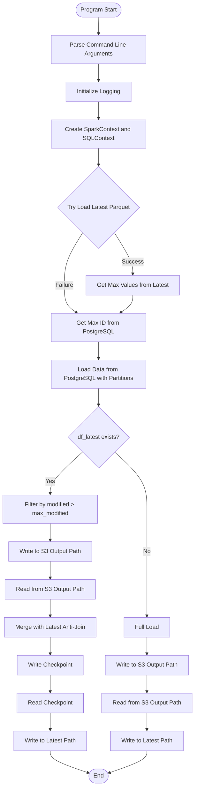
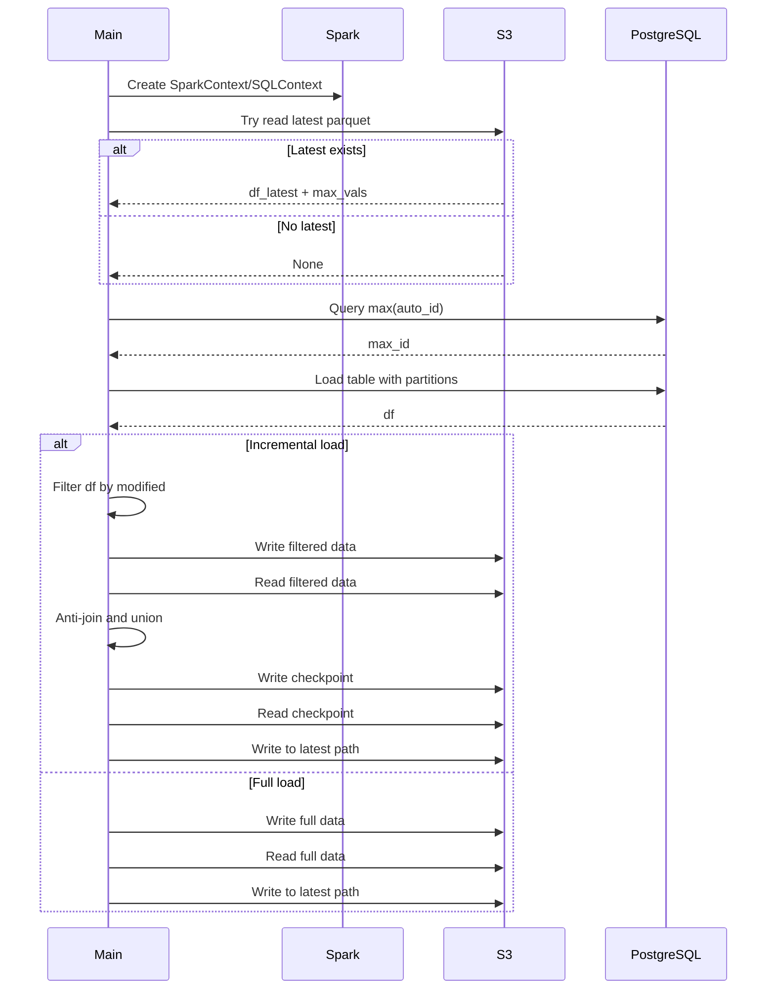
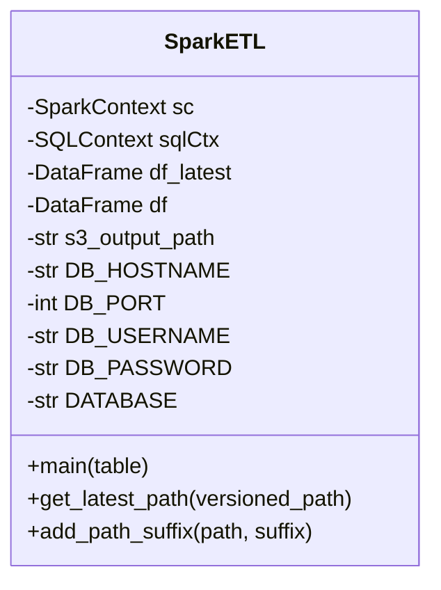

# Diagram: research/orchestrator/tasks/etl/extract_public_package_container_event_spark.py

> Auto-generated by Obscura crawlers

## Diagram 1

### SVG

<svg id="container" width="533.9609375" xmlns="http://www.w3.org/2000/svg" class="flowchart" height="2157.90625" viewBox="0 0 533.9609375 2157.90625" role="graphics-document document" aria-roledescription="flowchart-v2"><g><marker id="container_flowchart-v2-pointEnd" class="marker flowchart-v2" viewBox="0 0 10 10" refX="5" refY="5" markerUnits="userSpaceOnUse" markerWidth="8" markerHeight="8" orient="auto"><path d="M 0 0 L 10 5 L 0 10 z" class="arrowMarkerPath" style="stroke-width: 1; stroke-dasharray: 1, 0;"></path></marker><marker id="container_flowchart-v2-pointStart" class="marker flowchart-v2" viewBox="0 0 10 10" refX="4.5" refY="5" markerUnits="userSpaceOnUse" markerWidth="8" markerHeight="8" orient="auto"><path d="M 0 5 L 10 10 L 10 0 z" class="arrowMarkerPath" style="stroke-width: 1; stroke-dasharray: 1, 0;"></path></marker><marker id="container_flowchart-v2-circleEnd" class="marker flowchart-v2" viewBox="0 0 10 10" refX="11" refY="5" markerUnits="userSpaceOnUse" markerWidth="11" markerHeight="11" orient="auto"><circle cx="5" cy="5" r="5" class="arrowMarkerPath" style="stroke-width: 1; stroke-dasharray: 1, 0;"></circle></marker><marker id="container_flowchart-v2-circleStart" class="marker flowchart-v2" viewBox="0 0 10 10" refX="-1" refY="5" markerUnits="userSpaceOnUse" markerWidth="11" markerHeight="11" orient="auto"><circle cx="5" cy="5" r="5" class="arrowMarkerPath" style="stroke-width: 1; stroke-dasharray: 1, 0;"></circle></marker><marker id="container_flowchart-v2-crossEnd" class="marker cross flowchart-v2" viewBox="0 0 11 11" refX="12" refY="5.2" markerUnits="userSpaceOnUse" markerWidth="11" markerHeight="11" orient="auto"><path d="M 1,1 l 9,9 M 10,1 l -9,9" class="arrowMarkerPath" style="stroke-width: 2; stroke-dasharray: 1, 0;"></path></marker><marker id="container_flowchart-v2-crossStart" class="marker cross flowchart-v2" viewBox="0 0 11 11" refX="-1" refY="5.2" markerUnits="userSpaceOnUse" markerWidth="11" markerHeight="11" orient="auto"><path d="M 1,1 l 9,9 M 10,1 l -9,9" class="arrowMarkerPath" style="stroke-width: 2; stroke-dasharray: 1, 0;"></path></marker><g class="root"><g class="clusters"></g><g class="edgePaths"><path d="M270.711,47.5L270.628,51.583C270.544,55.667,270.378,63.833,270.294,71.417C270.211,79,270.211,86,270.211,89.5L270.211,93" id="L_Start_ParseArgs_0" class="edge-thickness-normal edge-pattern-solid edge-thickness-normal edge-pattern-solid flowchart-link" style=";" data-edge="true" data-et="edge" data-id="L_Start_ParseArgs_0" data-points="W3sieCI6MjcwLjcxMDkzNzUsInkiOjQ3LjV9LHsieCI6MjcwLjIxMDkzNzUsInkiOjcyfSx7IngiOjI3MC4yMTA5Mzc1LCJ5Ijo5N31d" marker-end="url(#container_flowchart-v2-pointEnd)"></path><path d="M270.211,175L270.211,179.167C270.211,183.333,270.211,191.667,270.211,199.333C270.211,207,270.211,214,270.211,217.5L270.211,221" id="L_ParseArgs_InitLogging_0" class="edge-thickness-normal edge-pattern-solid edge-thickness-normal edge-pattern-solid flowchart-link" style=";" data-edge="true" data-et="edge" data-id="L_ParseArgs_InitLogging_0" data-points="W3sieCI6MjcwLjIxMDkzNzUsInkiOjE3NX0seyJ4IjoyNzAuMjEwOTM3NSwieSI6MjAwfSx7IngiOjI3MC4yMTA5Mzc1LCJ5IjoyMjV9XQ==" marker-end="url(#container_flowchart-v2-pointEnd)"></path><path d="M270.211,279L270.211,283.167C270.211,287.333,270.211,295.667,270.211,303.333C270.211,311,270.211,318,270.211,321.5L270.211,325" id="L_InitLogging_CreateSpark_0" class="edge-thickness-normal edge-pattern-solid edge-thickness-normal edge-pattern-solid flowchart-link" style=";" data-edge="true" data-et="edge" data-id="L_InitLogging_CreateSpark_0" data-points="W3sieCI6MjcwLjIxMDkzNzUsInkiOjI3OX0seyJ4IjoyNzAuMjEwOTM3NSwieSI6MzA0fSx7IngiOjI3MC4yMTA5Mzc1LCJ5IjozMjl9XQ==" marker-end="url(#container_flowchart-v2-pointEnd)"></path><path d="M270.211,407L270.211,411.167C270.211,415.333,270.211,423.667,270.211,431.333C270.211,439,270.211,446,270.211,449.5L270.211,453" id="L_CreateSpark_TryLoadLatest_0" class="edge-thickness-normal edge-pattern-solid edge-thickness-normal edge-pattern-solid flowchart-link" style=";" data-edge="true" data-et="edge" data-id="L_CreateSpark_TryLoadLatest_0" data-points="W3sieCI6MjcwLjIxMDkzNzUsInkiOjQwN30seyJ4IjoyNzAuMjEwOTM3NSwieSI6NDMyfSx7IngiOjI3MC4yMTA5Mzc1LCJ5Ijo0NTd9XQ==" marker-end="url(#container_flowchart-v2-pointEnd)"></path><path d="M313.382,637.626L321.776,650.987C330.169,664.349,346.956,691.073,355.349,709.935C363.742,728.797,363.742,739.797,363.742,745.297L363.742,750.797" id="L_TryLoadLatest_GetMaxVals_0" class="edge-thickness-normal edge-pattern-solid edge-thickness-normal edge-pattern-solid flowchart-link" style=";" data-edge="true" data-et="edge" data-id="L_TryLoadLatest_GetMaxVals_0" data-points="W3sieCI6MzEzLjM4MjIyMDg1Mzc0MzA0LCJ5Ijo2MzcuNjI1NTkxNjQ2MjU3fSx7IngiOjM2My43NDIxODc1LCJ5Ijo3MTcuNzk2ODc1fSx7IngiOjM2My43NDIxODc1LCJ5Ijo3NTQuNzk2ODc1fV0=" marker-end="url(#container_flowchart-v2-pointEnd)"></path><path d="M227.04,637.626L218.646,650.987C210.253,664.349,193.466,691.073,185.073,715.102C176.68,739.13,176.68,760.464,176.68,779.797C176.68,799.13,176.68,816.464,182.219,828.92C187.758,841.377,198.836,848.958,204.375,852.748L209.914,856.538" id="L_TryLoadLatest_GetMaxID_0" class="edge-thickness-normal edge-pattern-solid edge-thickness-normal edge-pattern-solid flowchart-link" style=";" data-edge="true" data-et="edge" data-id="L_TryLoadLatest_GetMaxID_0" data-points="W3sieCI6MjI3LjAzOTY1NDE0NjI1Njk2LCJ5Ijo2MzcuNjI1NTkxNjQ2MjU3fSx7IngiOjE3Ni42Nzk2ODc1LCJ5Ijo3MTcuNzk2ODc1fSx7IngiOjE3Ni42Nzk2ODc1LCJ5Ijo3ODEuNzk2ODc1fSx7IngiOjE3Ni42Nzk2ODc1LCJ5Ijo4MzMuNzk2ODc1fSx7IngiOjIxMy4yMTUzMzIwMzEyNSwieSI6ODU4Ljc5Njg3NX1d" marker-end="url(#container_flowchart-v2-pointEnd)"></path><path d="M363.742,808.797L363.742,812.964C363.742,817.13,363.742,825.464,358.203,833.42C352.664,841.377,341.586,848.958,336.047,852.748L330.508,856.538" id="L_GetMaxVals_GetMaxID_0" class="edge-thickness-normal edge-pattern-solid edge-thickness-normal edge-pattern-solid flowchart-link" style=";" data-edge="true" data-et="edge" data-id="L_GetMaxVals_GetMaxID_0" data-points="W3sieCI6MzYzLjc0MjE4NzUsInkiOjgwOC43OTY4NzV9LHsieCI6MzYzLjc0MjE4NzUsInkiOjgzMy43OTY4NzV9LHsieCI6MzI3LjIwNjU0Mjk2ODc1LCJ5Ijo4NTguNzk2ODc1fV0=" marker-end="url(#container_flowchart-v2-pointEnd)"></path><path d="M270.211,936.797L270.211,940.964C270.211,945.13,270.211,953.464,270.211,961.13C270.211,968.797,270.211,975.797,270.211,979.297L270.211,982.797" id="L_GetMaxID_LoadDBData_0" class="edge-thickness-normal edge-pattern-solid edge-thickness-normal edge-pattern-solid flowchart-link" style=";" data-edge="true" data-et="edge" data-id="L_GetMaxID_LoadDBData_0" data-points="W3sieCI6MjcwLjIxMDkzNzUsInkiOjkzNi43OTY4NzV9LHsieCI6MjcwLjIxMDkzNzUsInkiOjk2MS43OTY4NzV9LHsieCI6MjcwLjIxMDkzNzUsInkiOjk4Ni43OTY4NzV9XQ==" marker-end="url(#container_flowchart-v2-pointEnd)"></path><path d="M270.211,1064.797L270.211,1068.964C270.211,1073.13,270.211,1081.464,270.211,1089.13C270.211,1096.797,270.211,1103.797,270.211,1107.297L270.211,1110.797" id="L_LoadDBData_CheckLatest_0" class="edge-thickness-normal edge-pattern-solid edge-thickness-normal edge-pattern-solid flowchart-link" style=";" data-edge="true" data-et="edge" data-id="L_LoadDBData_CheckLatest_0" data-points="W3sieCI6MjcwLjIxMDkzNzUsInkiOjEwNjQuNzk2ODc1fSx7IngiOjI3MC4yMTA5Mzc1LCJ5IjoxMDg5Ljc5Njg3NX0seyJ4IjoyNzAuMjEwOTM3NSwieSI6MTExNC43OTY4NzV9XQ==" marker-end="url(#container_flowchart-v2-pointEnd)"></path><path d="M225.985,1240.68L211.321,1254.218C196.657,1267.756,167.328,1294.831,152.664,1313.869C138,1332.906,138,1343.906,138,1349.406L138,1354.906" id="L_CheckLatest_FilterData_0" class="edge-thickness-normal edge-pattern-solid edge-thickness-normal edge-pattern-solid flowchart-link" style=";" data-edge="true" data-et="edge" data-id="L_CheckLatest_FilterData_0" data-points="W3sieCI6MjI1Ljk4NDkwNDI5ODkxNTM4LCJ5IjoxMjQwLjY4MDIxNjc5ODkxNTR9LHsieCI6MTM4LCJ5IjoxMzIxLjkwNjI1fSx7IngiOjEzOCwieSI6MTM1OC45MDYyNX1d" marker-end="url(#container_flowchart-v2-pointEnd)"></path><path d="M314.437,1240.68L329.101,1254.218C343.765,1267.756,373.094,1294.831,387.758,1321.035C402.422,1347.24,402.422,1372.573,402.422,1395.906C402.422,1419.24,402.422,1440.573,402.422,1459.906C402.422,1479.24,402.422,1496.573,402.422,1513.906C402.422,1531.24,402.422,1548.573,402.422,1565.906C402.422,1583.24,402.422,1600.573,402.422,1617.906C402.422,1635.24,402.422,1652.573,402.422,1664.74C402.422,1676.906,402.422,1683.906,402.422,1687.406L402.422,1690.906" id="L_CheckLatest_FullLoad_0" class="edge-thickness-normal edge-pattern-solid edge-thickness-normal edge-pattern-solid flowchart-link" style=";" data-edge="true" data-et="edge" data-id="L_CheckLatest_FullLoad_0" data-points="W3sieCI6MzE0LjQzNjk3MDcwMTA4NDY1LCJ5IjoxMjQwLjY4MDIxNjc5ODkxNTR9LHsieCI6NDAyLjQyMTg3NSwieSI6MTMyMS45MDYyNX0seyJ4Ijo0MDIuNDIxODc1LCJ5IjoxMzk3LjkwNjI1fSx7IngiOjQwMi40MjE4NzUsInkiOjE0NjEuOTA2MjV9LHsieCI6NDAyLjQyMTg3NSwieSI6MTUxMy45MDYyNX0seyJ4Ijo0MDIuNDIxODc1LCJ5IjoxNTY1LjkwNjI1fSx7IngiOjQwMi40MjE4NzUsInkiOjE2MTcuOTA2MjV9LHsieCI6NDAyLjQyMTg3NSwieSI6MTY2OS45MDYyNX0seyJ4Ijo0MDIuNDIxODc1LCJ5IjoxNjk0LjkwNjI1fV0=" marker-end="url(#container_flowchart-v2-pointEnd)"></path><path d="M138,1436.906L138,1441.073C138,1445.24,138,1453.573,138,1461.24C138,1468.906,138,1475.906,138,1479.406L138,1482.906" id="L_FilterData_WriteTemp_0" class="edge-thickness-normal edge-pattern-solid edge-thickness-normal edge-pattern-solid flowchart-link" style=";" data-edge="true" data-et="edge" data-id="L_FilterData_WriteTemp_0" data-points="W3sieCI6MTM4LCJ5IjoxNDM2LjkwNjI1fSx7IngiOjEzOCwieSI6MTQ2MS45MDYyNX0seyJ4IjoxMzgsInkiOjE0ODYuOTA2MjV9XQ==" marker-end="url(#container_flowchart-v2-pointEnd)"></path><path d="M138,1540.906L138,1545.073C138,1549.24,138,1557.573,138,1565.24C138,1572.906,138,1579.906,138,1583.406L138,1586.906" id="L_WriteTemp_ReadTemp_0" class="edge-thickness-normal edge-pattern-solid edge-thickness-normal edge-pattern-solid flowchart-link" style=";" data-edge="true" data-et="edge" data-id="L_WriteTemp_ReadTemp_0" data-points="W3sieCI6MTM4LCJ5IjoxNTQwLjkwNjI1fSx7IngiOjEzOCwieSI6MTU2NS45MDYyNX0seyJ4IjoxMzgsInkiOjE1OTAuOTA2MjV9XQ==" marker-end="url(#container_flowchart-v2-pointEnd)"></path><path d="M138,1644.906L138,1649.073C138,1653.24,138,1661.573,138,1669.24C138,1676.906,138,1683.906,138,1687.406L138,1690.906" id="L_ReadTemp_MergeData_0" class="edge-thickness-normal edge-pattern-solid edge-thickness-normal edge-pattern-solid flowchart-link" style=";" data-edge="true" data-et="edge" data-id="L_ReadTemp_MergeData_0" data-points="W3sieCI6MTM4LCJ5IjoxNjQ0LjkwNjI1fSx7IngiOjEzOCwieSI6MTY2OS45MDYyNX0seyJ4IjoxMzgsInkiOjE2OTQuOTA2MjV9XQ==" marker-end="url(#container_flowchart-v2-pointEnd)"></path><path d="M138,1748.906L138,1753.073C138,1757.24,138,1765.573,138,1773.24C138,1780.906,138,1787.906,138,1791.406L138,1794.906" id="L_MergeData_WriteCheckpoint_0" class="edge-thickness-normal edge-pattern-solid edge-thickness-normal edge-pattern-solid flowchart-link" style=";" data-edge="true" data-et="edge" data-id="L_MergeData_WriteCheckpoint_0" data-points="W3sieCI6MTM4LCJ5IjoxNzQ4LjkwNjI1fSx7IngiOjEzOCwieSI6MTc3My45MDYyNX0seyJ4IjoxMzgsInkiOjE3OTguOTA2MjV9XQ==" marker-end="url(#container_flowchart-v2-pointEnd)"></path><path d="M138,1852.906L138,1857.073C138,1861.24,138,1869.573,138,1877.24C138,1884.906,138,1891.906,138,1895.406L138,1898.906" id="L_WriteCheckpoint_ReadCheckpoint_0" class="edge-thickness-normal edge-pattern-solid edge-thickness-normal edge-pattern-solid flowchart-link" style=";" data-edge="true" data-et="edge" data-id="L_WriteCheckpoint_ReadCheckpoint_0" data-points="W3sieCI6MTM4LCJ5IjoxODUyLjkwNjI1fSx7IngiOjEzOCwieSI6MTg3Ny45MDYyNX0seyJ4IjoxMzgsInkiOjE5MDIuOTA2MjV9XQ==" marker-end="url(#container_flowchart-v2-pointEnd)"></path><path d="M138,1956.906L138,1961.073C138,1965.24,138,1973.573,138,1981.24C138,1988.906,138,1995.906,138,1999.406L138,2002.906" id="L_ReadCheckpoint_WriteLatest_0" class="edge-thickness-normal edge-pattern-solid edge-thickness-normal edge-pattern-solid flowchart-link" style=";" data-edge="true" data-et="edge" data-id="L_ReadCheckpoint_WriteLatest_0" data-points="W3sieCI6MTM4LCJ5IjoxOTU2LjkwNjI1fSx7IngiOjEzOCwieSI6MTk4MS45MDYyNX0seyJ4IjoxMzgsInkiOjIwMDYuOTA2MjV9XQ==" marker-end="url(#container_flowchart-v2-pointEnd)"></path><path d="M402.422,1748.906L402.422,1753.073C402.422,1757.24,402.422,1765.573,402.422,1773.24C402.422,1780.906,402.422,1787.906,402.422,1791.406L402.422,1794.906" id="L_FullLoad_WriteS3_0" class="edge-thickness-normal edge-pattern-solid edge-thickness-normal edge-pattern-solid flowchart-link" style=";" data-edge="true" data-et="edge" data-id="L_FullLoad_WriteS3_0" data-points="W3sieCI6NDAyLjQyMTg3NSwieSI6MTc0OC45MDYyNX0seyJ4Ijo0MDIuNDIxODc1LCJ5IjoxNzczLjkwNjI1fSx7IngiOjQwMi40MjE4NzUsInkiOjE3OTguOTA2MjV9XQ==" marker-end="url(#container_flowchart-v2-pointEnd)"></path><path d="M402.422,1852.906L402.422,1857.073C402.422,1861.24,402.422,1869.573,402.422,1877.24C402.422,1884.906,402.422,1891.906,402.422,1895.406L402.422,1898.906" id="L_WriteS3_ReadS3_0" class="edge-thickness-normal edge-pattern-solid edge-thickness-normal edge-pattern-solid flowchart-link" style=";" data-edge="true" data-et="edge" data-id="L_WriteS3_ReadS3_0" data-points="W3sieCI6NDAyLjQyMTg3NSwieSI6MTg1Mi45MDYyNX0seyJ4Ijo0MDIuNDIxODc1LCJ5IjoxODc3LjkwNjI1fSx7IngiOjQwMi40MjE4NzUsInkiOjE5MDIuOTA2MjV9XQ==" marker-end="url(#container_flowchart-v2-pointEnd)"></path><path d="M402.422,1956.906L402.422,1961.073C402.422,1965.24,402.422,1973.573,402.422,1981.24C402.422,1988.906,402.422,1995.906,402.422,1999.406L402.422,2002.906" id="L_ReadS3_WriteLatestFull_0" class="edge-thickness-normal edge-pattern-solid edge-thickness-normal edge-pattern-solid flowchart-link" style=";" data-edge="true" data-et="edge" data-id="L_ReadS3_WriteLatestFull_0" data-points="W3sieCI6NDAyLjQyMTg3NSwieSI6MTk1Ni45MDYyNX0seyJ4Ijo0MDIuNDIxODc1LCJ5IjoxOTgxLjkwNjI1fSx7IngiOjQwMi40MjE4NzUsInkiOjIwMDYuOTA2MjV9XQ==" marker-end="url(#container_flowchart-v2-pointEnd)"></path><path d="M138,2060.906L138,2065.073C138,2069.24,138,2077.573,155.445,2087.665C172.889,2097.756,207.779,2109.606,225.223,2115.531L242.668,2121.456" id="L_WriteLatest_End_0" class="edge-thickness-normal edge-pattern-solid edge-thickness-normal edge-pattern-solid flowchart-link" style=";" data-edge="true" data-et="edge" data-id="L_WriteLatest_End_0" data-points="W3sieCI6MTM4LCJ5IjoyMDYwLjkwNjI1fSx7IngiOjEzOCwieSI6MjA4NS45MDYyNX0seyJ4IjoyNDYuNDU1NTU3ODEyNjYzODQsInkiOjIxMjIuNzQyMjkzMDk1MjUxfV0=" marker-end="url(#container_flowchart-v2-pointEnd)"></path><path d="M402.422,2060.906L402.422,2065.073C402.422,2069.24,402.422,2077.573,385.143,2087.663C367.865,2097.753,333.307,2109.599,316.029,2115.522L298.75,2121.445" id="L_WriteLatestFull_End_0" class="edge-thickness-normal edge-pattern-solid edge-thickness-normal edge-pattern-solid flowchart-link" style=";" data-edge="true" data-et="edge" data-id="L_WriteLatestFull_End_0" data-points="W3sieCI6NDAyLjQyMTg3NSwieSI6MjA2MC45MDYyNX0seyJ4Ijo0MDIuNDIxODc1LCJ5IjoyMDg1LjkwNjI1fSx7IngiOjI5NC45NjYzMTgwNzkyOTMyLCJ5IjoyMTIyLjc0MjI5Mjc5NTAzM31d" marker-end="url(#container_flowchart-v2-pointEnd)"></path></g><g class="edgeLabels"><g class="edgeLabel"><g class="label" data-id="L_Start_ParseArgs_0" transform="translate(0, 0)"><foreignObject width="0" height="0">

</foreignObject></g></g><g class="edgeLabel"><g class="label" data-id="L_ParseArgs_InitLogging_0" transform="translate(0, 0)"><foreignObject width="0" height="0">

</foreignObject></g></g><g class="edgeLabel"><g class="label" data-id="L_InitLogging_CreateSpark_0" transform="translate(0, 0)"><foreignObject width="0" height="0">

</foreignObject></g></g><g class="edgeLabel"><g class="label" data-id="L_CreateSpark_TryLoadLatest_0" transform="translate(0, 0)"><foreignObject width="0" height="0">

</foreignObject></g></g><g class="edgeLabel" transform="translate(363.7421875, 717.796875)"><g class="label" data-id="L_TryLoadLatest_GetMaxVals_0" transform="translate(-28.1015625, -12)"><foreignObject width="56.203125" height="24">

Success

</foreignObject></g></g><g class="edgeLabel" transform="translate(176.6796875, 781.796875)"><g class="label" data-id="L_TryLoadLatest_GetMaxID_0" transform="translate(-24.265625, -12)"><foreignObject width="48.53125" height="24">

Failure

</foreignObject></g></g><g class="edgeLabel"><g class="label" data-id="L_GetMaxVals_GetMaxID_0" transform="translate(0, 0)"><foreignObject width="0" height="0">

</foreignObject></g></g><g class="edgeLabel"><g class="label" data-id="L_GetMaxID_LoadDBData_0" transform="translate(0, 0)"><foreignObject width="0" height="0">

</foreignObject></g></g><g class="edgeLabel"><g class="label" data-id="L_LoadDBData_CheckLatest_0" transform="translate(0, 0)"><foreignObject width="0" height="0">

</foreignObject></g></g><g class="edgeLabel" transform="translate(138, 1321.90625)"><g class="label" data-id="L_CheckLatest_FilterData_0" transform="translate(-12.03125, -12)"><foreignObject width="24.0625" height="24">

Yes

</foreignObject></g></g><g class="edgeLabel" transform="translate(402.421875, 1513.90625)"><g class="label" data-id="L_CheckLatest_FullLoad_0" transform="translate(-10.140625, -12)"><foreignObject width="20.28125" height="24">

No

</foreignObject></g></g><g class="edgeLabel"><g class="label" data-id="L_FilterData_WriteTemp_0" transform="translate(0, 0)"><foreignObject width="0" height="0">

</foreignObject></g></g><g class="edgeLabel"><g class="label" data-id="L_WriteTemp_ReadTemp_0" transform="translate(0, 0)"><foreignObject width="0" height="0">

</foreignObject></g></g><g class="edgeLabel"><g class="label" data-id="L_ReadTemp_MergeData_0" transform="translate(0, 0)"><foreignObject width="0" height="0">

</foreignObject></g></g><g class="edgeLabel"><g class="label" data-id="L_MergeData_WriteCheckpoint_0" transform="translate(0, 0)"><foreignObject width="0" height="0">

</foreignObject></g></g><g class="edgeLabel"><g class="label" data-id="L_WriteCheckpoint_ReadCheckpoint_0" transform="translate(0, 0)"><foreignObject width="0" height="0">

</foreignObject></g></g><g class="edgeLabel"><g class="label" data-id="L_ReadCheckpoint_WriteLatest_0" transform="translate(0, 0)"><foreignObject width="0" height="0">

</foreignObject></g></g><g class="edgeLabel"><g class="label" data-id="L_FullLoad_WriteS3_0" transform="translate(0, 0)"><foreignObject width="0" height="0">

</foreignObject></g></g><g class="edgeLabel"><g class="label" data-id="L_WriteS3_ReadS3_0" transform="translate(0, 0)"><foreignObject width="0" height="0">

</foreignObject></g></g><g class="edgeLabel"><g class="label" data-id="L_ReadS3_WriteLatestFull_0" transform="translate(0, 0)"><foreignObject width="0" height="0">

</foreignObject></g></g><g class="edgeLabel"><g class="label" data-id="L_WriteLatest_End_0" transform="translate(0, 0)"><foreignObject width="0" height="0">

</foreignObject></g></g><g class="edgeLabel"><g class="label" data-id="L_WriteLatestFull_End_0" transform="translate(0, 0)"><foreignObject width="0" height="0">

</foreignObject></g></g></g><g class="nodes"><g class="node default" id="flowchart-Start-0" transform="translate(270.2109375, 27.5)"><g class="basic label-container outer-path"><path d="M-42.703125 -19.5 C-13.463741820943529 -19.5, 15.775641358112942 -19.5, 42.703125 -19.5 C42.703125 -19.5, 42.703125 -19.5, 42.703125 -19.5 C43.01020587288485 -19.490152514103244, 43.3172867457697 -19.480305028206484, 43.9524942896239 -19.45993515863156 C44.41762200578143 -19.415064847251763, 44.882749721938964 -19.370194535871967, 45.196729652847864 -19.3399052695533 C45.571784563204965 -19.279269300241033, 45.94683947356207 -19.218633330928768, 46.43071825967676 -19.140403561325776 C46.7218378230192 -19.073957420725552, 47.01295738636165 -19.007511280125332, 47.64938938623539 -18.862249829261074 C47.95281284282703 -18.772195340046903, 48.25623629941867 -18.682140850832727, 48.847735251460605 -18.50658706670804 C49.08459499655173 -18.419420491007024, 49.32145474164286 -18.33225391530601, 50.0208315951478 -18.074876768247425 C50.47216264334471 -17.87508590147051, 50.92349369154163 -17.675295034693594, 51.16385791279238 -17.568892924097174 C51.55436330564087 -17.36516651077876, 51.94486869848935 -17.16144009746035, 52.27211726407678 -16.990714730406097 C52.61136558851436 -16.78506040248759, 52.95061391295194 -16.57940607456909, 53.3410555736057 -16.342718045390892 C53.619369678547066 -16.14857817380722, 53.89768378348843 -15.954438302223544, 54.36628034457871 -15.627565626425154 C54.61148578094292 -15.432020816115395, 54.85669121730714 -15.236476005805638, 55.343578708501866 -14.848196188198123 C55.6347408175586 -14.583770464480052, 55.92590292661534 -14.319344740761979, 56.26893473676799 -14.007812326905688 C56.46197419248311 -13.808483240045758, 56.655013648198235 -13.60915415318583, 57.13854594296865 -13.10986736009568 C57.437920759025 -12.758204666246282, 57.73729557508135 -12.406541972396884, 57.94883890812658 -12.158051136245305 C58.13994928826239 -11.901980637377116, 58.331059668398204 -11.645910138508926, 58.696483964640635 -11.156274872382312 C58.950553282932205 -10.765956172321797, 59.204622601223775 -10.375637472261284, 59.37840887860425 -10.108655082055241 C59.57836275804819 -9.753616721576662, 59.77831663749213 -9.398578361098084, 59.991811474273504 -9.019496659696287 C60.121516950892236 -8.750160462244871, 60.251222427510974 -8.480824264793455, 60.53417114880834 -7.893275190886684 C60.69618081322608 -7.493108187531105, 60.85819047764381 -7.092941184175524, 61.003259229970325 -6.734618561215508 C61.138606590667685 -6.326973875468458, 61.27395395136504 -5.919329189721408, 61.39714813421488 -5.548287939305138 C61.50673925886029 -5.130369483938322, 61.6163303835057 -4.712451028571506, 61.71421928754556 -4.339158212148133 C61.77252514564595 -4.039769953750117, 61.83083100374633 -3.740381695352101, 61.953169776581774 -3.1121979531509023 C61.99214726004903 -2.809896288353566, 62.03112474351629 -2.50759462355623, 62.11301770250937 -1.872449005199798 C62.14496447151463 -1.3748522909750265, 62.17691124051989 -0.8772555767502552, 62.19310621591342 -0.6250057626472757 C62.19310621591342 -0.21337456945209926, 62.19310621591342 0.19825662374307718, 62.19310621591342 0.625005762647271 C62.173735912545695 0.9267138730269947, 62.15436560917797 1.2284219834067183, 62.11301770250937 1.8724490051997846 C62.079013595684415 2.136178142863735, 62.045009488859456 2.3999072805276853, 61.953169776581774 3.1121979531508885 C61.857719083137034 3.6023170904784174, 61.7622683896923 4.092436227805947, 61.71421928754556 4.339158212148129 C61.64679333196595 4.596282603367184, 61.579367376386344 4.853406994586241, 61.39714813421489 5.548287939305125 C61.31705955294193 5.789501985716744, 61.23697097166897 6.030716032128362, 61.003259229970325 6.734618561215495 C60.88790871301393 7.019536568248327, 60.77255819605753 7.30445457528116, 60.53417114880834 7.893275190886679 C60.400599226721965 8.170640145080334, 60.26702730463559 8.448005099273988, 59.991811474273504 9.019496659696284 C59.8663995056924 9.242178309250919, 59.740987537111295 9.464859958805556, 59.37840887860425 10.108655082055236 C59.10970916093213 10.521450004376597, 58.841009443260006 10.934244926697957, 58.69648396464064 11.156274872382301 C58.4375950125388 11.503162482930042, 58.17870606043695 11.850050093477783, 57.94883890812658 12.158051136245302 C57.67621308662707 12.478292939027334, 57.403587265127555 12.798534741809364, 57.13854594296866 13.10986736009567 C56.95634376650744 13.298006066368774, 56.774141590046206 13.486144772641879, 56.26893473676799 14.007812326905684 C56.00856590139528 14.244272414209298, 55.74819706602257 14.480732501512913, 55.34357870850189 14.848196188198111 C54.98958137828213 15.130499638783784, 54.63558404806237 15.412803089369456, 54.36628034457871 15.627565626425152 C54.08967271774605 15.820515132752444, 53.81306509091338 16.013464639079736, 53.34105557360571 16.34271804539089 C53.03332540301553 16.529265883225868, 52.725595232425356 16.715813721060847, 52.27211726407678 16.990714730406093 C52.03508631541799 17.114373624495816, 51.7980553667592 17.238032518585538, 51.16385791279239 17.56889292409717 C50.744150605072115 17.754684899050005, 50.32444329735185 17.940476874002844, 50.020831595147804 18.07487676824742 C49.702413032388606 18.192057742771734, 49.3839944696294 18.309238717296047, 48.84773525146062 18.506587066708033 C48.60134157478971 18.57971541659716, 48.354947898118795 18.652843766486285, 47.64938938623541 18.86224982926107 C47.176942486125746 18.970082751206956, 46.70449558601608 19.07791567315284, 46.430718259676766 19.140403561325773 C46.01784137522727 19.20715429409551, 45.604964490777775 19.273905026865243, 45.19672965284788 19.3399052695533 C44.73933356271323 19.384029720269307, 44.28193747257858 19.428154170985316, 43.9524942896239 19.45993515863156 C43.52813484485271 19.47354354005982, 43.10377540008152 19.48715192148808, 42.70312500000001 19.5 C42.70312500000001 19.5, 42.703125 19.5, 42.703125 19.5 C22.939504312646218 19.5, 3.1758836252924354 19.5, -42.70312499999999 19.5 C-43.152978021235775 19.485574089194756, -43.60283104247156 19.471148178389512, -43.95249428962389 19.45993515863156 C-44.338764974839094 19.422672090187316, -44.72503566005429 19.385409021743072, -45.19672965284787 19.3399052695533 C-45.66958678167393 19.263457396026503, -46.14244391049999 19.187009522499707, -46.43071825967676 19.140403561325773 C-46.80422311381037 19.05515351571673, -47.177727967943994 18.96990347010769, -47.649389386235384 18.862249829261074 C-48.035715808500846 18.74759017500146, -48.4220422307663 18.632930520741844, -48.84773525146059 18.506587066708043 C-49.207969556520545 18.37401751247657, -49.56820386158049 18.241447958245097, -50.0208315951478 18.074876768247425 C-50.33087131397936 17.93763138172218, -50.640911032810926 17.800385995196937, -51.16385791279238 17.568892924097174 C-51.470500980630305 17.408917432020388, -51.77714404846823 17.2489419399436, -52.27211726407678 16.990714730406097 C-52.50911101868407 16.84704772363327, -52.74610477329134 16.703380716860444, -53.341055573605686 16.3427180453909 C-53.60974616678284 16.15529111901883, -53.878436759959996 15.967864192646763, -54.36628034457871 15.627565626425156 C-54.59916567057283 15.44184577628364, -54.83205099656695 15.256125926142126, -55.343578708501866 14.848196188198125 C-55.64073421146582 14.578327422710032, -55.937889714429765 14.30845865722194, -56.268934736767974 14.007812326905697 C-56.484117547500496 13.785618407987052, -56.69930035823302 13.563424489068407, -57.138545942968655 13.109867360095677 C-57.3874309875123 12.817512824814479, -57.63631603205595 12.52515828953328, -57.948838908126575 12.158051136245307 C-58.20242355577439 11.818270810433892, -58.4560082034222 11.47849048462248, -58.696483964640635 11.156274872382316 C-58.94596601475984 10.773003448088534, -59.195448064879045 10.389732023794753, -59.37840887860425 10.108655082055249 C-59.51540530734598 9.865404050431627, -59.652401736087704 9.622153018808005, -59.991811474273504 9.019496659696289 C-60.16775678647101 8.654142454291572, -60.34370209866851 8.288788248886853, -60.53417114880834 7.893275190886686 C-60.63119978537634 7.6536125826426655, -60.72822842194433 7.413949974398645, -61.003259229970325 6.73461856121551 C-61.13678437600545 6.332462095700625, -61.27030952204057 5.930305630185741, -61.39714813421488 5.5482879393051325 C-61.46089838754208 5.30518059383395, -61.52464864086928 5.062073248362768, -61.71421928754556 4.339158212148136 C-61.77771260932296 4.013133424139495, -61.84120593110036 3.6871086361308545, -61.953169776581774 3.112197953150904 C-62.0062989464145 2.700138603469544, -62.059428116247226 2.288079253788184, -62.11301770250937 1.872449005199809 C-62.13781862914298 1.4861545539336858, -62.16261955577659 1.0998601026675625, -62.19310621591342 0.6250057626472781 C-62.19310621591342 0.20286660848661364, -62.19310621591342 -0.21927254567405086, -62.19310621591342 -0.6250057626472687 C-62.17453546985464 -0.914260122549096, -62.15596472379587 -1.2035144824509234, -62.11301770250937 -1.8724490051997822 C-62.068604612485196 -2.2169081610706165, -62.02419152246103 -2.5613673169414506, -61.953169776581774 -3.112197953150895 C-61.90381658919219 -3.365616139596558, -61.85446340180261 -3.619034326042221, -61.71421928754556 -4.339158212148126 C-61.60888580453424 -4.740840434690616, -61.50355232152292 -5.1425226572331075, -61.39714813421489 -5.548287939305123 C-61.25614795215628 -5.9729580223374805, -61.11514777009768 -6.397628105369839, -61.00325922997033 -6.734618561215485 C-60.898723964289175 -6.992822688499819, -60.79418869860801 -7.251026815784153, -60.53417114880834 -7.893275190886676 C-60.33861869781637 -8.299344039523666, -60.143066246824404 -8.705412888160655, -59.991811474273504 -9.019496659696282 C-59.81283437827866 -9.337288617031335, -59.63385728228381 -9.65508057436639, -59.37840887860425 -10.108655082055243 C-59.20957321060976 -10.368032006819652, -59.040737542615275 -10.627408931584062, -58.69648396464064 -11.156274872382308 C-58.54097902823543 -11.36463732037415, -58.38547409183022 -11.572999768365992, -57.94883890812659 -12.158051136245302 C-57.67146689863663 -12.48386808150666, -57.394094889146665 -12.809685026768017, -57.13854594296866 -13.10986736009567 C-56.88855347054483 -13.368005112636972, -56.638560998120994 -13.626142865178274, -56.268934736767996 -14.007812326905677 C-55.973898607455496 -14.275756333319073, -55.678862478143 -14.54370033973247, -55.34357870850189 -14.848196188198107 C-54.9915508654851 -15.128929025149665, -54.639523022468325 -15.409661862101224, -54.36628034457872 -15.627565626425149 C-54.123229597594126 -15.797107306024342, -53.88017885060953 -15.966648985623538, -53.341055573605715 -16.342718045390885 C-53.08056622023995 -16.500628222206565, -52.82007686687419 -16.658538399022248, -52.27211726407679 -16.99071473040609 C-51.95332378681144 -17.157029083298454, -51.63453030954609 -17.32334343619082, -51.16385791279239 -17.56889292409717 C-50.87908113185317 -17.694955157415897, -50.59430435091396 -17.821017390734628, -50.020831595147804 -18.07487676824742 C-49.74880269439196 -18.174985918333164, -49.47677379363613 -18.275095068418906, -48.84773525146062 -18.506587066708033 C-48.59608810224739 -18.581274619671678, -48.344440953034166 -18.65596217263532, -47.64938938623541 -18.862249829261067 C-47.32386577277868 -18.93654846979247, -46.99834215932194 -19.01084711032387, -46.430718259676766 -19.140403561325773 C-46.097936146121796 -19.194205192681505, -45.765154032566834 -19.24800682403724, -45.19672965284788 -19.3399052695533 C-44.778172080418415 -19.380283015176442, -44.359614507988944 -19.42066076079958, -43.9524942896239 -19.45993515863156 C-43.49331892598049 -19.474660018812976, -43.03414356233708 -19.489384878994397, -42.70312500000001 -19.5 C-42.70312500000001 -19.5, -42.703125 -19.5, -42.703125 -19.5" stroke="none" stroke-width="0" fill="#ECECFF" style=""></path><path d="M-42.703125 -19.5 C-19.31854816408125 -19.5, 4.0660286718375005 -19.5, 42.703125 -19.5 M-42.703125 -19.5 C-15.11960170187717 -19.5, 12.463921596245662 -19.5, 42.703125 -19.5 M42.703125 -19.5 C42.703125 -19.5, 42.703125 -19.5, 42.703125 -19.5 M42.703125 -19.5 C42.703125 -19.5, 42.703125 -19.5, 42.703125 -19.5 M42.703125 -19.5 C42.96395386979547 -19.491635725818256, 43.224782739590935 -19.48327145163651, 43.9524942896239 -19.45993515863156 M42.703125 -19.5 C43.19905182755763 -19.48409659190324, 43.69497865511527 -19.468193183806477, 43.9524942896239 -19.45993515863156 M43.9524942896239 -19.45993515863156 C44.31287414520594 -19.425169747383748, 44.67325400078797 -19.390404336135937, 45.196729652847864 -19.3399052695533 M43.9524942896239 -19.45993515863156 C44.339534415178164 -19.422597863203194, 44.72657454073243 -19.385260567774825, 45.196729652847864 -19.3399052695533 M45.196729652847864 -19.3399052695533 C45.62712562383613 -19.27032218673452, 46.057521594824394 -19.200739103915744, 46.43071825967676 -19.140403561325776 M45.196729652847864 -19.3399052695533 C45.55156813007329 -19.282537736368983, 45.90640660729872 -19.225170203184664, 46.43071825967676 -19.140403561325776 M46.43071825967676 -19.140403561325776 C46.74525208516668 -19.06861326818273, 47.05978591065661 -18.996822975039684, 47.64938938623539 -18.862249829261074 M46.43071825967676 -19.140403561325776 C46.7672732858969 -19.063587072817825, 47.10382831211704 -18.98677058430987, 47.64938938623539 -18.862249829261074 M47.64938938623539 -18.862249829261074 C48.1175505621499 -18.723302049677805, 48.58571173806442 -18.58435427009454, 48.847735251460605 -18.50658706670804 M47.64938938623539 -18.862249829261074 C47.896477504741185 -18.788915372680556, 48.143565623246985 -18.715580916100038, 48.847735251460605 -18.50658706670804 M48.847735251460605 -18.50658706670804 C49.30403944411727 -18.338662905780666, 49.76034363677394 -18.170738744853296, 50.0208315951478 -18.074876768247425 M48.847735251460605 -18.50658706670804 C49.26901102136517 -18.35155368915263, 49.69028679126974 -18.196520311597222, 50.0208315951478 -18.074876768247425 M50.0208315951478 -18.074876768247425 C50.33494281175054 -17.93582905043557, 50.649054028353284 -17.796781332623716, 51.16385791279238 -17.568892924097174 M50.0208315951478 -18.074876768247425 C50.3816405008456 -17.91515736871092, 50.74244940654339 -17.75543796917441, 51.16385791279238 -17.568892924097174 M51.16385791279238 -17.568892924097174 C51.49255357200597 -17.397412609225064, 51.821249231219554 -17.225932294352955, 52.27211726407678 -16.990714730406097 M51.16385791279238 -17.568892924097174 C51.41834150994402 -17.436128994467687, 51.67282510709566 -17.3033650648382, 52.27211726407678 -16.990714730406097 M52.27211726407678 -16.990714730406097 C52.61001160646011 -16.78588119436576, 52.947905948843434 -16.581047658325424, 53.3410555736057 -16.342718045390892 M52.27211726407678 -16.990714730406097 C52.699625224701904 -16.73155689235951, 53.12713318532702 -16.472399054312923, 53.3410555736057 -16.342718045390892 M53.3410555736057 -16.342718045390892 C53.640048488706746 -16.13415353101109, 53.93904140380779 -15.925589016631289, 54.36628034457871 -15.627565626425154 M53.3410555736057 -16.342718045390892 C53.748850286702215 -16.058258106683372, 54.156644999798736 -15.773798167975855, 54.36628034457871 -15.627565626425154 M54.36628034457871 -15.627565626425154 C54.700743216061454 -15.360840386848468, 55.0352060875442 -15.094115147271781, 55.343578708501866 -14.848196188198123 M54.36628034457871 -15.627565626425154 C54.638172757174736 -15.410738662740789, 54.91006516977076 -15.193911699056425, 55.343578708501866 -14.848196188198123 M55.343578708501866 -14.848196188198123 C55.55964346271989 -14.651971895177443, 55.775708216937915 -14.455747602156762, 56.26893473676799 -14.007812326905688 M55.343578708501866 -14.848196188198123 C55.5987660480387 -14.616441798317785, 55.85395338757554 -14.384687408437445, 56.26893473676799 -14.007812326905688 M56.26893473676799 -14.007812326905688 C56.52940137337185 -13.738859139903637, 56.789868009975706 -13.469905952901586, 57.13854594296865 -13.10986736009568 M56.26893473676799 -14.007812326905688 C56.46519647274423 -13.805155971122023, 56.661458208720475 -13.602499615338358, 57.13854594296865 -13.10986736009568 M57.13854594296865 -13.10986736009568 C57.45546045002628 -12.737601547159482, 57.77237495708392 -12.365335734223283, 57.94883890812658 -12.158051136245305 M57.13854594296865 -13.10986736009568 C57.44700260004012 -12.747536619018527, 57.75545925711159 -12.385205877941372, 57.94883890812658 -12.158051136245305 M57.94883890812658 -12.158051136245305 C58.18710470336687 -11.838796677083812, 58.42537049860715 -11.519542217922318, 58.696483964640635 -11.156274872382312 M57.94883890812658 -12.158051136245305 C58.14307935323764 -11.897786635465069, 58.3373197983487 -11.637522134684835, 58.696483964640635 -11.156274872382312 M58.696483964640635 -11.156274872382312 C58.83409349177655 -10.944869685369552, 58.97170301891247 -10.733464498356792, 59.37840887860425 -10.108655082055241 M58.696483964640635 -11.156274872382312 C58.930444035012485 -10.796849377215631, 59.16440410538434 -10.43742388204895, 59.37840887860425 -10.108655082055241 M59.37840887860425 -10.108655082055241 C59.54438580115119 -9.813946249087248, 59.71036272369814 -9.519237416119255, 59.991811474273504 -9.019496659696287 M59.37840887860425 -10.108655082055241 C59.56423699969867 -9.77869843591437, 59.750065120793096 -9.448741789773498, 59.991811474273504 -9.019496659696287 M59.991811474273504 -9.019496659696287 C60.10768763393709 -8.778877334802212, 60.22356379360068 -8.538258009908136, 60.53417114880834 -7.893275190886684 M59.991811474273504 -9.019496659696287 C60.198741656721616 -8.589801708246167, 60.40567183916972 -8.160106756796047, 60.53417114880834 -7.893275190886684 M60.53417114880834 -7.893275190886684 C60.71926220381004 -7.436096706540377, 60.904353258811746 -6.97891822219407, 61.003259229970325 -6.734618561215508 M60.53417114880834 -7.893275190886684 C60.70423524952126 -7.473213574160062, 60.87429935023418 -7.05315195743344, 61.003259229970325 -6.734618561215508 M61.003259229970325 -6.734618561215508 C61.09056700698181 -6.471661447462098, 61.17787478399329 -6.208704333708688, 61.39714813421488 -5.548287939305138 M61.003259229970325 -6.734618561215508 C61.15721411649534 -6.2709309723821685, 61.31116900302036 -5.807243383548828, 61.39714813421488 -5.548287939305138 M61.39714813421488 -5.548287939305138 C61.469195369491885 -5.273540605724637, 61.54124260476888 -4.9987932721441375, 61.71421928754556 -4.339158212148133 M61.39714813421488 -5.548287939305138 C61.461984300223875 -5.301039538140736, 61.52682046623287 -5.053791136976335, 61.71421928754556 -4.339158212148133 M61.71421928754556 -4.339158212148133 C61.80795532655195 -3.857843462969169, 61.90169136555834 -3.376528713790205, 61.953169776581774 -3.1121979531509023 M61.71421928754556 -4.339158212148133 C61.769150359658695 -4.057098766533398, 61.82408143177182 -3.7750393209186646, 61.953169776581774 -3.1121979531509023 M61.953169776581774 -3.1121979531509023 C61.99194801380367 -2.811441602886949, 62.03072625102557 -2.510685252622996, 62.11301770250937 -1.872449005199798 M61.953169776581774 -3.1121979531509023 C61.986485712701494 -2.8538061315820675, 62.019801648821215 -2.5954143100132323, 62.11301770250937 -1.872449005199798 M62.11301770250937 -1.872449005199798 C62.137516477628 -1.4908608076718124, 62.16201525274663 -1.1092726101438268, 62.19310621591342 -0.6250057626472757 M62.11301770250937 -1.872449005199798 C62.13753313744784 -1.490601317530182, 62.16204857238631 -1.1087536298605662, 62.19310621591342 -0.6250057626472757 M62.19310621591342 -0.6250057626472757 C62.19310621591342 -0.23249204526782646, 62.19310621591342 0.16002167211162277, 62.19310621591342 0.625005762647271 M62.19310621591342 -0.6250057626472757 C62.19310621591342 -0.21394419007444632, 62.19310621591342 0.19711738249838306, 62.19310621591342 0.625005762647271 M62.19310621591342 0.625005762647271 C62.17557123336178 0.8981272698722242, 62.158036250810135 1.1712487770971776, 62.11301770250937 1.8724490051997846 M62.19310621591342 0.625005762647271 C62.16647182521096 1.03985789673121, 62.13983743450851 1.4547100308151488, 62.11301770250937 1.8724490051997846 M62.11301770250937 1.8724490051997846 C62.078347700776774 2.141342692271573, 62.043677699044174 2.4102363793433614, 61.953169776581774 3.1121979531508885 M62.11301770250937 1.8724490051997846 C62.06638774914615 2.2341017153590714, 62.01975779578294 2.5957544255183578, 61.953169776581774 3.1121979531508885 M61.953169776581774 3.1121979531508885 C61.86118139372991 3.5845388573436363, 61.76919301087804 4.056879761536384, 61.71421928754556 4.339158212148129 M61.953169776581774 3.1121979531508885 C61.878177905124375 3.497265363546996, 61.803186033666975 3.882332773943104, 61.71421928754556 4.339158212148129 M61.71421928754556 4.339158212148129 C61.630577553373705 4.65812039510232, 61.54693581920185 4.977082578056512, 61.39714813421489 5.548287939305125 M61.71421928754556 4.339158212148129 C61.64865347709474 4.589189063799116, 61.58308766664392 4.839219915450104, 61.39714813421489 5.548287939305125 M61.39714813421489 5.548287939305125 C61.31027110299236 5.809947715372235, 61.223394071769825 6.071607491439346, 61.003259229970325 6.734618561215495 M61.39714813421489 5.548287939305125 C61.265249323444365 5.94554614212436, 61.13335051267384 6.342804344943594, 61.003259229970325 6.734618561215495 M61.003259229970325 6.734618561215495 C60.85972407100473 7.089153178924036, 60.71618891203913 7.443687796632577, 60.53417114880834 7.893275190886679 M61.003259229970325 6.734618561215495 C60.89077093043268 7.0124668358867925, 60.77828263089504 7.29031511055809, 60.53417114880834 7.893275190886679 M60.53417114880834 7.893275190886679 C60.353806292773044 8.267806673633668, 60.17344143673774 8.642338156380658, 59.991811474273504 9.019496659696284 M60.53417114880834 7.893275190886679 C60.42238967370574 8.125391815677656, 60.310608198603134 8.357508440468633, 59.991811474273504 9.019496659696284 M59.991811474273504 9.019496659696284 C59.77897338287638 9.39741224316567, 59.566135291479256 9.775327826635056, 59.37840887860425 10.108655082055236 M59.991811474273504 9.019496659696284 C59.75268541953157 9.44408918402931, 59.51355936478964 9.868681708362338, 59.37840887860425 10.108655082055236 M59.37840887860425 10.108655082055236 C59.224556043335376 10.345014352299177, 59.070703208066504 10.581373622543119, 58.69648396464064 11.156274872382301 M59.37840887860425 10.108655082055236 C59.21693323913079 10.356725026566965, 59.05545759965732 10.604794971078693, 58.69648396464064 11.156274872382301 M58.69648396464064 11.156274872382301 C58.43309437966626 11.509192920963152, 58.16970479469188 11.862110969544002, 57.94883890812658 12.158051136245302 M58.69648396464064 11.156274872382301 C58.49744544249479 11.422968359275352, 58.29840692034893 11.689661846168402, 57.94883890812658 12.158051136245302 M57.94883890812658 12.158051136245302 C57.68197721432209 12.471522066648607, 57.415115520517595 12.784992997051912, 57.13854594296866 13.10986736009567 M57.94883890812658 12.158051136245302 C57.70762278515902 12.441397319869234, 57.466406662191446 12.724743503493166, 57.13854594296866 13.10986736009567 M57.13854594296866 13.10986736009567 C56.84757672496764 13.4103169666988, 56.556607506966614 13.71076657330193, 56.26893473676799 14.007812326905684 M57.13854594296866 13.10986736009567 C56.87103017470655 13.386099354279338, 56.60351440644444 13.662331348463006, 56.26893473676799 14.007812326905684 M56.26893473676799 14.007812326905684 C55.90799630287324 14.335607062661255, 55.54705786897849 14.663401798416825, 55.34357870850189 14.848196188198111 M56.26893473676799 14.007812326905684 C55.898881555374615 14.343884835176503, 55.52882837398124 14.67995734344732, 55.34357870850189 14.848196188198111 M55.34357870850189 14.848196188198111 C54.98282943119355 15.135884136910066, 54.622080153885214 15.423572085622022, 54.36628034457871 15.627565626425152 M55.34357870850189 14.848196188198111 C55.09237716359615 15.048522735506586, 54.84117561869041 15.248849282815062, 54.36628034457871 15.627565626425152 M54.36628034457871 15.627565626425152 C54.147182438812806 15.780398840891975, 53.9280845330469 15.933232055358795, 53.34105557360571 16.34271804539089 M54.36628034457871 15.627565626425152 C54.14042368744204 15.78511345326659, 53.91456703030536 15.942661280108027, 53.34105557360571 16.34271804539089 M53.34105557360571 16.34271804539089 C53.01035266704376 16.543192090774735, 52.679649760481816 16.74366613615858, 52.27211726407678 16.990714730406093 M53.34105557360571 16.34271804539089 C53.016792035817986 16.53928850758187, 52.69252849803026 16.73585896977285, 52.27211726407678 16.990714730406093 M52.27211726407678 16.990714730406093 C51.841082247656004 17.21558542238171, 51.410047231235225 17.440456114357325, 51.16385791279239 17.56889292409717 M52.27211726407678 16.990714730406093 C51.9627568538039 17.152107858290655, 51.653396443531015 17.31350098617522, 51.16385791279239 17.56889292409717 M51.16385791279239 17.56889292409717 C50.79239957347295 17.733326511993752, 50.42094123415351 17.897760099890334, 50.020831595147804 18.07487676824742 M51.16385791279239 17.56889292409717 C50.823124284623454 17.7197255937836, 50.48239065645451 17.870558263470027, 50.020831595147804 18.07487676824742 M50.020831595147804 18.07487676824742 C49.75264775774919 18.173570899474328, 49.48446392035057 18.272265030701238, 48.84773525146062 18.506587066708033 M50.020831595147804 18.07487676824742 C49.57900276118471 18.23747386336681, 49.13717392722161 18.400070958486197, 48.84773525146062 18.506587066708033 M48.84773525146062 18.506587066708033 C48.55790284634948 18.592607803183682, 48.268070441238336 18.67862853965933, 47.64938938623541 18.86224982926107 M48.84773525146062 18.506587066708033 C48.52296359261074 18.602977590293452, 48.198191933760874 18.69936811387887, 47.64938938623541 18.86224982926107 M47.64938938623541 18.86224982926107 C47.19382965855922 18.966228364298114, 46.73826993088302 19.07020689933516, 46.430718259676766 19.140403561325773 M47.64938938623541 18.86224982926107 C47.2797609164333 18.94661511544222, 46.91013244663118 19.03098040162337, 46.430718259676766 19.140403561325773 M46.430718259676766 19.140403561325773 C46.02093525334603 19.20665409987465, 45.611152247015305 19.272904638423526, 45.19672965284788 19.3399052695533 M46.430718259676766 19.140403561325773 C46.01823895871852 19.20709001587995, 45.60575965776027 19.273776470434125, 45.19672965284788 19.3399052695533 M45.19672965284788 19.3399052695533 C44.883858834299446 19.370087541136456, 44.57098801575101 19.40026981271961, 43.9524942896239 19.45993515863156 M45.19672965284788 19.3399052695533 C44.886906290994155 19.36979355665422, 44.57708292914043 19.39968184375514, 43.9524942896239 19.45993515863156 M43.9524942896239 19.45993515863156 C43.601506862872675 19.47119064225189, 43.25051943612146 19.48244612587222, 42.70312500000001 19.5 M43.9524942896239 19.45993515863156 C43.63956651225539 19.4699701433748, 43.326638734886885 19.480005128118037, 42.70312500000001 19.5 M42.70312500000001 19.5 C42.70312500000001 19.5, 42.703125 19.5, 42.703125 19.5 M42.70312500000001 19.5 C42.70312500000001 19.5, 42.703125 19.5, 42.703125 19.5 M42.703125 19.5 C16.877817006291597 19.5, -8.947490987416806 19.5, -42.70312499999999 19.5 M42.703125 19.5 C12.17591534933706 19.5, -18.35129430132588 19.5, -42.70312499999999 19.5 M-42.70312499999999 19.5 C-43.08197289107616 19.487851085515874, -43.460820782152325 19.475702171031745, -43.95249428962389 19.45993515863156 M-42.70312499999999 19.5 C-42.986575894732646 19.49091028150962, -43.270026789465305 19.48182056301924, -43.95249428962389 19.45993515863156 M-43.95249428962389 19.45993515863156 C-44.229063070897816 19.433254900924688, -44.50563185217174 19.406574643217816, -45.19672965284787 19.3399052695533 M-43.95249428962389 19.45993515863156 C-44.21716558848431 19.434402636744302, -44.48183688734474 19.408870114857045, -45.19672965284787 19.3399052695533 M-45.19672965284787 19.3399052695533 C-45.65018853987443 19.266593553325034, -46.10364742690098 19.19328183709677, -46.43071825967676 19.140403561325773 M-45.19672965284787 19.3399052695533 C-45.58774134886406 19.276689530882393, -45.97875304488024 19.213473792211484, -46.43071825967676 19.140403561325773 M-46.43071825967676 19.140403561325773 C-46.73270133017406 19.071477896108465, -47.03468440067136 19.002552230891155, -47.649389386235384 18.862249829261074 M-46.43071825967676 19.140403561325773 C-46.728923009740434 19.072340273091594, -47.02712775980411 19.004276984857412, -47.649389386235384 18.862249829261074 M-47.649389386235384 18.862249829261074 C-48.06258879829516 18.739614412689708, -48.475788210354935 18.61697899611834, -48.84773525146059 18.506587066708043 M-47.649389386235384 18.862249829261074 C-47.890319650478816 18.790742991502388, -48.13124991472225 18.719236153743704, -48.84773525146059 18.506587066708043 M-48.84773525146059 18.506587066708043 C-49.19770933117521 18.377793370248135, -49.54768341088983 18.248999673788223, -50.0208315951478 18.074876768247425 M-48.84773525146059 18.506587066708043 C-49.27323278438678 18.35000004133513, -49.698730317312965 18.193413015962214, -50.0208315951478 18.074876768247425 M-50.0208315951478 18.074876768247425 C-50.329828171195906 17.938093150088687, -50.63882474724401 17.801309531929945, -51.16385791279238 17.568892924097174 M-50.0208315951478 18.074876768247425 C-50.427115790965516 17.895026806751382, -50.833399986783235 17.71517684525534, -51.16385791279238 17.568892924097174 M-51.16385791279238 17.568892924097174 C-51.552687389417414 17.36604083519906, -51.941516866042456 17.163188746300946, -52.27211726407678 16.990714730406097 M-51.16385791279238 17.568892924097174 C-51.56226913095988 17.36104204677375, -51.96068034912739 17.15319116945033, -52.27211726407678 16.990714730406097 M-52.27211726407678 16.990714730406097 C-52.678869532909246 16.744139114698203, -53.08562180174171 16.497563498990306, -53.341055573605686 16.3427180453909 M-52.27211726407678 16.990714730406097 C-52.571522383588885 16.809213587458075, -52.87092750310099 16.627712444510056, -53.341055573605686 16.3427180453909 M-53.341055573605686 16.3427180453909 C-53.75107070608973 16.05670923823905, -54.16108583857377 15.770700431087203, -54.36628034457871 15.627565626425156 M-53.341055573605686 16.3427180453909 C-53.69209353926549 16.097849156735233, -54.0431315049253 15.852980268079568, -54.36628034457871 15.627565626425156 M-54.36628034457871 15.627565626425156 C-54.73194891213151 15.335954674651054, -55.097617479684295 15.044343722876953, -55.343578708501866 14.848196188198125 M-54.36628034457871 15.627565626425156 C-54.673949109375755 15.38220797390919, -54.981617874172805 15.136850321393226, -55.343578708501866 14.848196188198125 M-55.343578708501866 14.848196188198125 C-55.54589628658503 14.66445671681278, -55.74821386466819 14.480717245427433, -56.268934736767974 14.007812326905697 M-55.343578708501866 14.848196188198125 C-55.659488313476785 14.561295443470017, -55.97539791845171 14.27439469874191, -56.268934736767974 14.007812326905697 M-56.268934736767974 14.007812326905697 C-56.475463104676265 13.794554830746039, -56.681991472584556 13.581297334586383, -57.138545942968655 13.109867360095677 M-56.268934736767974 14.007812326905697 C-56.547028801543625 13.720657373077508, -56.82512286631927 13.433502419249319, -57.138545942968655 13.109867360095677 M-57.138545942968655 13.109867360095677 C-57.364026322712185 12.845005275851854, -57.589506702455715 12.58014319160803, -57.948838908126575 12.158051136245307 M-57.138545942968655 13.109867360095677 C-57.30116354194583 12.918847475133568, -57.46378114092301 12.727827590171458, -57.948838908126575 12.158051136245307 M-57.948838908126575 12.158051136245307 C-58.10506689421609 11.948719867547688, -58.2612948803056 11.739388598850068, -58.696483964640635 11.156274872382316 M-57.948838908126575 12.158051136245307 C-58.208214182205865 11.810511898552633, -58.46758945628516 11.462972660859961, -58.696483964640635 11.156274872382316 M-58.696483964640635 11.156274872382316 C-58.871621824119984 10.887216089121793, -59.04675968359933 10.618157305861272, -59.37840887860425 10.108655082055249 M-58.696483964640635 11.156274872382316 C-58.94090150650306 10.78078389278184, -59.18531904836548 10.405292913181361, -59.37840887860425 10.108655082055249 M-59.37840887860425 10.108655082055249 C-59.57783928333126 9.754546203944143, -59.77726968805827 9.400437325833037, -59.991811474273504 9.019496659696289 M-59.37840887860425 10.108655082055249 C-59.51848007360804 9.85994449157949, -59.65855126861183 9.611233901103732, -59.991811474273504 9.019496659696289 M-59.991811474273504 9.019496659696289 C-60.156530743081355 8.67745357358903, -60.32125001188921 8.335410487481774, -60.53417114880834 7.893275190886686 M-59.991811474273504 9.019496659696289 C-60.150142019431605 8.69071989494453, -60.3084725645897 8.361943130192774, -60.53417114880834 7.893275190886686 M-60.53417114880834 7.893275190886686 C-60.650284075495755 7.606474017078054, -60.76639700218317 7.319672843269422, -61.003259229970325 6.73461856121551 M-60.53417114880834 7.893275190886686 C-60.64266066291078 7.625303993551609, -60.75115017701321 7.357332796216531, -61.003259229970325 6.73461856121551 M-61.003259229970325 6.73461856121551 C-61.08295173559484 6.494597431550919, -61.162644241219354 6.2545763018863285, -61.39714813421488 5.5482879393051325 M-61.003259229970325 6.73461856121551 C-61.13927311918421 6.324966397773567, -61.275287008398095 5.915314234331625, -61.39714813421488 5.5482879393051325 M-61.39714813421488 5.5482879393051325 C-61.51703283205991 5.091115628065331, -61.636917529904935 4.633943316825528, -61.71421928754556 4.339158212148136 M-61.39714813421488 5.5482879393051325 C-61.5011284753611 5.1517658331496845, -61.60510881650732 4.755243726994236, -61.71421928754556 4.339158212148136 M-61.71421928754556 4.339158212148136 C-61.763665761178295 4.085261020559929, -61.81311223481104 3.831363828971721, -61.953169776581774 3.112197953150904 M-61.71421928754556 4.339158212148136 C-61.77338324901342 4.035363774318339, -61.83254721048129 3.7315693364885414, -61.953169776581774 3.112197953150904 M-61.953169776581774 3.112197953150904 C-62.01518955691383 2.6311847840863374, -62.0772093372459 2.1501716150217707, -62.11301770250937 1.872449005199809 M-61.953169776581774 3.112197953150904 C-61.98809547583341 2.8413211266146328, -62.02302117508504 2.5704443000783614, -62.11301770250937 1.872449005199809 M-62.11301770250937 1.872449005199809 C-62.14275244487409 1.4093063914171737, -62.172487187238815 0.9461637776345382, -62.19310621591342 0.6250057626472781 M-62.11301770250937 1.872449005199809 C-62.133728717966406 1.5498582218257022, -62.15443973342344 1.2272674384515954, -62.19310621591342 0.6250057626472781 M-62.19310621591342 0.6250057626472781 C-62.19310621591342 0.25297027712656167, -62.19310621591342 -0.1190652083941548, -62.19310621591342 -0.6250057626472687 M-62.19310621591342 0.6250057626472781 C-62.19310621591342 0.33958746882098423, -62.19310621591342 0.05416917499469032, -62.19310621591342 -0.6250057626472687 M-62.19310621591342 -0.6250057626472687 C-62.169960665740554 -0.9855163893414792, -62.146815115567684 -1.3460270160356897, -62.11301770250937 -1.8724490051997822 M-62.19310621591342 -0.6250057626472687 C-62.17089052915803 -0.9710330160420388, -62.14867484240264 -1.317060269436809, -62.11301770250937 -1.8724490051997822 M-62.11301770250937 -1.8724490051997822 C-62.05221324187712 -2.3440363946646077, -61.99140878124488 -2.815623784129433, -61.953169776581774 -3.112197953150895 M-62.11301770250937 -1.8724490051997822 C-62.06865137342756 -2.2165454924356696, -62.024285044345746 -2.560641979671557, -61.953169776581774 -3.112197953150895 M-61.953169776581774 -3.112197953150895 C-61.86438099212928 -3.5681095957982296, -61.77559220767678 -4.024021238445564, -61.71421928754556 -4.339158212148126 M-61.953169776581774 -3.112197953150895 C-61.86901844181419 -3.544297271791536, -61.78486710704661 -3.9763965904321776, -61.71421928754556 -4.339158212148126 M-61.71421928754556 -4.339158212148126 C-61.59892495673325 -4.778825464414529, -61.483630625920945 -5.218492716680933, -61.39714813421489 -5.548287939305123 M-61.71421928754556 -4.339158212148126 C-61.61507028283372 -4.717256338564839, -61.51592127812188 -5.095354464981552, -61.39714813421489 -5.548287939305123 M-61.39714813421489 -5.548287939305123 C-61.26234217541076 -5.954302008810442, -61.127536216606636 -6.360316078315762, -61.00325922997033 -6.734618561215485 M-61.39714813421489 -5.548287939305123 C-61.29318813390373 -5.861398896465666, -61.189228133592586 -6.174509853626208, -61.00325922997033 -6.734618561215485 M-61.00325922997033 -6.734618561215485 C-60.821283946094574 -7.184101030641381, -60.63930866221881 -7.633583500067276, -60.53417114880834 -7.893275190886676 M-61.00325922997033 -6.734618561215485 C-60.878613299339655 -7.0424964197383915, -60.75396736870897 -7.350374278261297, -60.53417114880834 -7.893275190886676 M-60.53417114880834 -7.893275190886676 C-60.3664959271177 -8.241456376402317, -60.198820705427046 -8.589637561917955, -59.991811474273504 -9.019496659696282 M-60.53417114880834 -7.893275190886676 C-60.324306476277954 -8.329063673780677, -60.11444180374757 -8.764852156674678, -59.991811474273504 -9.019496659696282 M-59.991811474273504 -9.019496659696282 C-59.80290079165094 -9.35492670597356, -59.613990109028386 -9.690356752250839, -59.37840887860425 -10.108655082055243 M-59.991811474273504 -9.019496659696282 C-59.844283378293326 -9.28144773294872, -59.69675528231315 -9.543398806201159, -59.37840887860425 -10.108655082055243 M-59.37840887860425 -10.108655082055243 C-59.11519669718642 -10.513019675080207, -58.851984515768585 -10.91738426810517, -58.69648396464064 -11.156274872382308 M-59.37840887860425 -10.108655082055243 C-59.201554061314596 -10.380351573580125, -59.02469924402494 -10.652048065105006, -58.69648396464064 -11.156274872382308 M-58.69648396464064 -11.156274872382308 C-58.534401407543555 -11.373450732867685, -58.372318850446476 -11.590626593353063, -57.94883890812659 -12.158051136245302 M-58.69648396464064 -11.156274872382308 C-58.516228706946734 -11.397800496100345, -58.335973449252826 -11.63932611981838, -57.94883890812659 -12.158051136245302 M-57.94883890812659 -12.158051136245302 C-57.76343032592857 -12.375842606942294, -57.578021743730545 -12.593634077639287, -57.13854594296866 -13.10986736009567 M-57.94883890812659 -12.158051136245302 C-57.78404132442271 -12.351631755312036, -57.61924374071883 -12.545212374378773, -57.13854594296866 -13.10986736009567 M-57.13854594296866 -13.10986736009567 C-56.92310411898482 -13.332328731461693, -56.70766229500097 -13.554790102827717, -56.268934736767996 -14.007812326905677 M-57.13854594296866 -13.10986736009567 C-56.84744178529928 -13.410456302985128, -56.55633762762991 -13.711045245874587, -56.268934736767996 -14.007812326905677 M-56.268934736767996 -14.007812326905677 C-55.92869139817403 -14.316812324671291, -55.58844805958007 -14.625812322436905, -55.34357870850189 -14.848196188198107 M-56.268934736767996 -14.007812326905677 C-56.017541374875414 -14.236121126672659, -55.766148012982825 -14.46442992643964, -55.34357870850189 -14.848196188198107 M-55.34357870850189 -14.848196188198107 C-55.10235574551964 -15.04056508196382, -54.86113278253738 -15.23293397572953, -54.36628034457872 -15.627565626425149 M-55.34357870850189 -14.848196188198107 C-54.95643693385562 -15.156931451203215, -54.569295159209354 -15.465666714208325, -54.36628034457872 -15.627565626425149 M-54.36628034457872 -15.627565626425149 C-54.10362377746423 -15.810783477424684, -53.84096721034974 -15.994001328424218, -53.341055573605715 -16.342718045390885 M-54.36628034457872 -15.627565626425149 C-54.11556351555355 -15.802454832996503, -53.86484668652839 -15.977344039567857, -53.341055573605715 -16.342718045390885 M-53.341055573605715 -16.342718045390885 C-52.96469760369458 -16.570868458475942, -52.58833963378345 -16.799018871560996, -52.27211726407679 -16.99071473040609 M-53.341055573605715 -16.342718045390885 C-53.075700266027404 -16.503577992245734, -52.81034495844909 -16.664437939100583, -52.27211726407679 -16.99071473040609 M-52.27211726407679 -16.99071473040609 C-51.84400113658061 -17.21406263989938, -51.41588500908442 -17.437410549392677, -51.16385791279239 -17.56889292409717 M-52.27211726407679 -16.99071473040609 C-51.92308481116992 -17.172804737521645, -51.57405235826306 -17.354894744637203, -51.16385791279239 -17.56889292409717 M-51.16385791279239 -17.56889292409717 C-50.90276522873412 -17.684470910290475, -50.641672544675856 -17.800048896483776, -50.020831595147804 -18.07487676824742 M-51.16385791279239 -17.56889292409717 C-50.801341215063914 -17.729368312505805, -50.43882451733544 -17.889843700914444, -50.020831595147804 -18.07487676824742 M-50.020831595147804 -18.07487676824742 C-49.58237880791933 -18.236231446960634, -49.143926020690856 -18.397586125673847, -48.84773525146062 -18.506587066708033 M-50.020831595147804 -18.07487676824742 C-49.773786782810845 -18.165791542844634, -49.52674197047388 -18.256706317441846, -48.84773525146062 -18.506587066708033 M-48.84773525146062 -18.506587066708033 C-48.511050027291695 -18.606513473944563, -48.17436480312278 -18.706439881181094, -47.64938938623541 -18.862249829261067 M-48.84773525146062 -18.506587066708033 C-48.552422311044694 -18.594234397294223, -48.25710937062877 -18.681881727880413, -47.64938938623541 -18.862249829261067 M-47.64938938623541 -18.862249829261067 C-47.33267401347845 -18.934538046331888, -47.015958640721486 -19.006826263402708, -46.430718259676766 -19.140403561325773 M-47.64938938623541 -18.862249829261067 C-47.18169906109812 -18.96899709400906, -46.71400873596084 -19.075744358757056, -46.430718259676766 -19.140403561325773 M-46.430718259676766 -19.140403561325773 C-46.03130995407509 -19.20497679871778, -45.631901648473416 -19.26955003610979, -45.19672965284788 -19.3399052695533 M-46.430718259676766 -19.140403561325773 C-46.12719659632535 -19.189474590010775, -45.82367493297393 -19.23854561869578, -45.19672965284788 -19.3399052695533 M-45.19672965284788 -19.3399052695533 C-44.827389702134894 -19.375535050402302, -44.45804975142191 -19.411164831251305, -43.9524942896239 -19.45993515863156 M-45.19672965284788 -19.3399052695533 C-44.77682925114966 -19.38041255630101, -44.356928849451435 -19.42091984304872, -43.9524942896239 -19.45993515863156 M-43.9524942896239 -19.45993515863156 C-43.54084643353501 -19.473135904152386, -43.129198577446125 -19.486336649673213, -42.70312500000001 -19.5 M-43.9524942896239 -19.45993515863156 C-43.687043192946064 -19.4684476586328, -43.42159209626822 -19.476960158634046, -42.70312500000001 -19.5 M-42.70312500000001 -19.5 C-42.70312500000001 -19.5, -42.703125 -19.5, -42.703125 -19.5 M-42.70312500000001 -19.5 C-42.70312500000001 -19.5, -42.703125 -19.5, -42.703125 -19.5" stroke="#9370DB" stroke-width="1.3" fill="none" stroke-dasharray="0 0" style=""></path></g><g class="label" style="" transform="translate(-49.828125, -12)"><rect></rect><foreignObject width="99.65625" height="24">

Program Start

</foreignObject></g></g><g class="node default" id="flowchart-ParseArgs-1" transform="translate(270.2109375, 136)"><rect class="basic label-container" style="" x="-130" y="-39" width="260" height="78"></rect><g class="label" style="" transform="translate(-100, -24)"><rect></rect><foreignObject width="200" height="48">

Parse Command Line Arguments

</foreignObject></g></g><g class="node default" id="flowchart-InitLogging-3" transform="translate(270.2109375, 252)"><rect class="basic label-container" style="" x="-91.125" y="-27" width="182.25" height="54"></rect><g class="label" style="" transform="translate(-61.125, -12)"><rect></rect><foreignObject width="122.25" height="24">

Initialize Logging

</foreignObject></g></g><g class="node default" id="flowchart-CreateSpark-5" transform="translate(270.2109375, 368)"><rect class="basic label-container" style="" x="-130" y="-39" width="260" height="78"></rect><g class="label" style="" transform="translate(-100, -24)"><rect></rect><foreignObject width="200" height="48">

Create SparkContext and SQLContext

</foreignObject></g></g><g class="node default" id="flowchart-TryLoadLatest-7" transform="translate(270.2109375, 568.8984375)"><polygon points="111.8984375,0 223.796875,-111.8984375 111.8984375,-223.796875 0,-111.8984375" class="label-container" transform="translate(-111.3984375, 111.8984375)"></polygon><g class="label" style="" transform="translate(-84.8984375, -12)"><rect></rect><foreignObject width="169.796875" height="24">

Try Load Latest Parquet

</foreignObject></g></g><g class="node default" id="flowchart-GetMaxVals-9" transform="translate(363.7421875, 781.796875)"><rect class="basic label-container" style="" x="-127.796875" y="-27" width="255.59375" height="54"></rect><g class="label" style="" transform="translate(-97.796875, -12)"><rect></rect><foreignObject width="195.59375" height="24">

Get Max Values from Latest

</foreignObject></g></g><g class="node default" id="flowchart-GetMaxID-11" transform="translate(270.2109375, 897.796875)"><rect class="basic label-container" style="" x="-130" y="-39" width="260" height="78"></rect><g class="label" style="" transform="translate(-100, -24)"><rect></rect><foreignObject width="200" height="48">

Get Max ID from PostgreSQL

</foreignObject></g></g><g class="node default" id="flowchart-LoadDBData-15" transform="translate(270.2109375, 1025.796875)"><rect class="basic label-container" style="" x="-130" y="-39" width="260" height="78"></rect><g class="label" style="" transform="translate(-100, -24)"><rect></rect><foreignObject width="200" height="48">

Load Data from PostgreSQL with Partitions

</foreignObject></g></g><g class="node default" id="flowchart-CheckLatest-17" transform="translate(270.2109375, 1199.8515625)"><polygon points="85.0546875,0 170.109375,-85.0546875 85.0546875,-170.109375 0,-85.0546875" class="label-container" transform="translate(-84.5546875, 85.0546875)"></polygon><g class="label" style="" transform="translate(-58.0546875, -12)"><rect></rect><foreignObject width="116.109375" height="24">

df_latest exists?

</foreignObject></g></g><g class="node default" id="flowchart-FilterData-19" transform="translate(138, 1397.90625)"><rect class="basic label-container" style="" x="-130" y="-39" width="260" height="78"></rect><g class="label" style="" transform="translate(-100, -24)"><rect></rect><foreignObject width="200" height="48">

Filter by modified &gt; max_modified

</foreignObject></g></g><g class="node default" id="flowchart-FullLoad-21" transform="translate(402.421875, 1721.90625)"><rect class="basic label-container" style="" x="-62.609375" y="-27" width="125.21875" height="54"></rect><g class="label" style="" transform="translate(-32.609375, -12)"><rect></rect><foreignObject width="65.21875" height="24">

Full Load

</foreignObject></g></g><g class="node default" id="flowchart-WriteTemp-23" transform="translate(138, 1513.90625)"><rect class="basic label-container" style="" x="-114.828125" y="-27" width="229.65625" height="54"></rect><g class="label" style="" transform="translate(-84.828125, -12)"><rect></rect><foreignObject width="169.65625" height="24">

Write to S3 Output Path

</foreignObject></g></g><g class="node default" id="flowchart-ReadTemp-25" transform="translate(138, 1617.90625)"><rect class="basic label-container" style="" x="-123.5390625" y="-27" width="247.078125" height="54"></rect><g class="label" style="" transform="translate(-93.5390625, -12)"><rect></rect><foreignObject width="187.078125" height="24">

Read from S3 Output Path

</foreignObject></g></g><g class="node default" id="flowchart-MergeData-27" transform="translate(138, 1721.90625)"><rect class="basic label-container" style="" x="-127.5078125" y="-27" width="255.015625" height="54"></rect><g class="label" style="" transform="translate(-97.5078125, -12)"><rect></rect><foreignObject width="195.015625" height="24">

Merge with Latest Anti-Join

</foreignObject></g></g><g class="node default" id="flowchart-WriteCheckpoint-29" transform="translate(138, 1825.90625)"><rect class="basic label-container" style="" x="-91.7890625" y="-27" width="183.578125" height="54"></rect><g class="label" style="" transform="translate(-61.7890625, -12)"><rect></rect><foreignObject width="123.578125" height="24">

Write Checkpoint

</foreignObject></g></g><g class="node default" id="flowchart-ReadCheckpoint-31" transform="translate(138, 1929.90625)"><rect class="basic label-container" style="" x="-90.8828125" y="-27" width="181.765625" height="54"></rect><g class="label" style="" transform="translate(-60.8828125, -12)"><rect></rect><foreignObject width="121.765625" height="24">

Read Checkpoint

</foreignObject></g></g><g class="node default" id="flowchart-WriteLatest-33" transform="translate(138, 2033.90625)"><rect class="basic label-container" style="" x="-100.984375" y="-27" width="201.96875" height="54"></rect><g class="label" style="" transform="translate(-70.984375, -12)"><rect></rect><foreignObject width="141.96875" height="24">

Write to Latest Path

</foreignObject></g></g><g class="node default" id="flowchart-WriteS3-35" transform="translate(402.421875, 1825.90625)"><rect class="basic label-container" style="" x="-114.828125" y="-27" width="229.65625" height="54"></rect><g class="label" style="" transform="translate(-84.828125, -12)"><rect></rect><foreignObject width="169.65625" height="24">

Write to S3 Output Path

</foreignObject></g></g><g class="node default" id="flowchart-ReadS3-37" transform="translate(402.421875, 1929.90625)"><rect class="basic label-container" style="" x="-123.5390625" y="-27" width="247.078125" height="54"></rect><g class="label" style="" transform="translate(-93.5390625, -12)"><rect></rect><foreignObject width="187.078125" height="24">

Read from S3 Output Path

</foreignObject></g></g><g class="node default" id="flowchart-WriteLatestFull-39" transform="translate(402.421875, 2033.90625)"><rect class="basic label-container" style="" x="-100.984375" y="-27" width="201.96875" height="54"></rect><g class="label" style="" transform="translate(-70.984375, -12)"><rect></rect><foreignObject width="141.96875" height="24">

Write to Latest Path

</foreignObject></g></g><g class="node default" id="flowchart-End-41" transform="translate(270.2109375, 2130.40625)"><g class="basic label-container outer-path"><path d="M-6.5546875 -19.5 C-2.620036439889433 -19.5, 1.3146146202211337 -19.5, 6.5546875 -19.5 C6.5546875 -19.5, 6.554687499999999 -19.5, 6.554687499999999 -19.5 C7.039793642627949 -19.484443590207746, 7.524899785255898 -19.468887180415496, 7.8040567896239 -19.45993515863156 C8.225840108123025 -19.419246229164603, 8.647623426622149 -19.37855729969765, 9.048292152847864 -19.3399052695533 C9.404693638070347 -19.282285041357326, 9.76109512329283 -19.224664813161354, 10.282280759676757 -19.140403561325776 C10.694719594989115 -19.046267088580656, 11.107158430301471 -18.952130615835536, 11.50095188623539 -18.862249829261074 C11.815726784438326 -18.768826291761602, 12.130501682641261 -18.675402754262127, 12.699297751460602 -18.50658706670804 C13.103287630642594 -18.35791505672756, 13.507277509824585 -18.209243046747083, 13.872394095147794 -18.074876768247425 C14.307293679260912 -17.882359623198344, 14.742193263374032 -17.68984247814926, 15.015420412792382 -17.568892924097174 C15.240918085200438 -17.451250932840043, 15.466415757608493 -17.333608941582913, 16.123679764076783 -16.990714730406097 C16.41300832832852 -16.81532205447332, 16.702336892580256 -16.639929378540543, 17.192618073605697 -16.342718045390892 C17.405076580314727 -16.194516188291196, 17.617535087023754 -16.046314331191503, 18.217842844578712 -15.627565626425154 C18.600536074589368 -15.322377959386202, 18.983229304600023 -15.017190292347252, 19.19514120850187 -14.848196188198123 C19.418902957284494 -14.64498168836519, 19.642664706067116 -14.441767188532255, 20.120497236767985 -14.007812326905688 C20.368246337350815 -13.751991039974476, 20.615995437933645 -13.496169753043262, 20.990108442968648 -13.10986736009568 C21.265888883458036 -12.78591996234524, 21.54166932394742 -12.461972564594799, 21.800401408126582 -12.158051136245305 C22.002197055918735 -11.887663352165527, 22.203992703710888 -11.61727556808575, 22.548046464640635 -11.156274872382312 C22.688680544954096 -10.9402231594826, 22.829314625267557 -10.724171446582886, 23.229971378604247 -10.108655082055241 C23.419487787770297 -9.772149506963535, 23.609004196936343 -9.435643931871828, 23.8433739742735 -9.019496659696287 C24.03190639509234 -8.628005053918393, 24.220438815911173 -8.2365134481405, 24.38573364880834 -7.893275190886684 C24.52219804246394 -7.556205500197789, 24.65866243611954 -7.219135809508894, 24.854821729970325 -6.734618561215508 C24.9428643402631 -6.469448246698621, 25.030906950555877 -6.204277932181736, 25.24871063421488 -5.548287939305138 C25.329085054576815 -5.241785439970943, 25.40945947493875 -4.935282940636748, 25.56578178754556 -4.339158212148133 C25.617942098315645 -4.071326040429341, 25.67010240908573 -3.803493868710548, 25.804732276581777 -3.1121979531509023 C25.85435407483082 -2.727341084863731, 25.90397587307986 -2.34248421657656, 25.964580202509367 -1.872449005199798 C25.982961122513757 -1.5861513393198636, 26.001342042518143 -1.2998536734399293, 26.044668715913414 -0.6250057626472757 C26.044668715913414 -0.27411393342780954, 26.044668715913414 0.07677789579165661, 26.044668715913414 0.625005762647271 C26.0191018289421 1.0232306644451885, 25.99353494197079 1.421455566243106, 25.964580202509367 1.8724490051997846 C25.9155364862427 2.252822383786854, 25.866492769976034 2.633195762373923, 25.804732276581777 3.1121979531508885 C25.751357316440444 3.386267092674821, 25.69798235629911 3.6603362321987536, 25.56578178754556 4.339158212148129 C25.47525532911421 4.684374832562149, 25.384728870682853 5.029591452976169, 25.248710634214884 5.548287939305125 C25.09239057802678 6.019099042325072, 24.936070521838676 6.48991014534502, 24.85482172997033 6.734618561215495 C24.72661013451498 7.051303680792767, 24.598398539059637 7.36798880037004, 24.385733648808344 7.893275190886679 C24.18755166573942 8.304804319144436, 23.989369682670496 8.716333447402192, 23.843373974273504 9.019496659696284 C23.617825131677247 9.419981469022861, 23.392276289080986 9.82046627834944, 23.22997137860425 10.108655082055236 C23.068419129598492 10.35684271938111, 22.906866880592734 10.605030356706985, 22.54804646464064 11.156274872382301 C22.324464050731564 11.455854938243535, 22.100881636822486 11.755435004104767, 21.800401408126582 12.158051136245302 C21.625843994230443 12.363096207205936, 21.4512865803343 12.568141278166573, 20.99010844296866 13.10986736009567 C20.735977386259734 13.372278540695419, 20.48184632955081 13.634689721295167, 20.12049723676799 14.007812326905684 C19.820127222259984 14.280600426726773, 19.51975720775198 14.553388526547863, 19.195141208501887 14.848196188198111 C18.887370455241378 15.09363517379966, 18.579599701980868 15.339074159401209, 18.217842844578715 15.627565626425152 C17.987662010848933 15.788129811667355, 17.75748117711915 15.948693996909556, 17.192618073605708 16.34271804539089 C16.785556056877915 16.589481432093212, 16.37849404015012 16.83624481879554, 16.123679764076787 16.990714730406093 C15.729130710252475 17.196550719065506, 15.334581656428163 17.40238670772492, 15.015420412792386 17.56889292409717 C14.603467755720608 17.75125214524146, 14.19151509864883 17.933611366385744, 13.872394095147804 18.07487676824742 C13.492234632215062 18.21477896476222, 13.11207516928232 18.354681161277025, 12.699297751460616 18.506587066708033 C12.350533549581499 18.610098451125104, 12.00176934770238 18.713609835542172, 11.500951886235413 18.86224982926107 C11.111258977579173 18.951194692677973, 10.721566068922934 19.040139556094875, 10.282280759676766 19.140403561325773 C9.860969986815713 19.208517819768108, 9.43965921395466 19.27663207821044, 9.048292152847878 19.3399052695533 C8.655192159677892 19.377827153122496, 8.262092166507907 19.415749036691693, 7.804056789623901 19.45993515863156 C7.342504280462011 19.474736249242923, 6.880951771300122 19.489537339854284, 6.5546875000000036 19.5 C6.554687500000003 19.5, 6.554687500000001 19.5, 6.5546875 19.5 C2.427558017098251 19.5, -1.6995714658034977 19.5, -6.5546874999999964 19.5 C-6.971529976618685 19.486632673109497, -7.388372453237373 19.473265346218998, -7.8040567896238935 19.45993515863156 C-8.271311975412265 19.414859612815132, -8.738567161200637 19.369784066998708, -9.048292152847871 19.3399052695533 C-9.329649526551721 19.294417591331882, -9.611006900255571 19.248929913110462, -10.282280759676759 19.140403561325773 C-10.605292924193764 19.066678142626127, -10.92830508871077 18.992952723926486, -11.500951886235388 18.862249829261074 C-11.748810435043472 18.788686713010907, -11.996668983851555 18.71512359676074, -12.699297751460593 18.506587066708043 C-13.049182295318735 18.377826320270977, -13.399066839176879 18.249065573833914, -13.872394095147797 18.074876768247425 C-14.194639759747048 17.932228171607342, -14.516885424346299 17.78957957496726, -15.01542041279238 17.568892924097174 C-15.278819636574896 17.43147771776509, -15.542218860357412 17.294062511433008, -16.12367976407678 16.990714730406097 C-16.448871590072834 16.793581534447995, -16.77406341606889 16.596448338489896, -17.192618073605686 16.3427180453909 C-17.49423654042494 16.13232205979078, -17.79585500724419 15.92192607419066, -18.217842844578712 15.627565626425156 C-18.517349300705234 15.388717197865777, -18.81685575683176 15.1498687693064, -19.19514120850187 14.848196188198125 C-19.484737733809446 14.585192286217962, -19.774334259117023 14.3221883842378, -20.120497236767974 14.007812326905697 C-20.371094949225704 13.749049614338265, -20.621692661683436 13.490286901770833, -20.990108442968655 13.109867360095677 C-21.163475025695153 12.906221107187118, -21.336841608421647 12.70257485427856, -21.80040140812658 12.158051136245307 C-21.978166898643117 11.919861573722487, -22.15593238915966 11.68167201119967, -22.548046464640635 11.156274872382316 C-22.782702267933363 10.795780544618724, -23.017358071226088 10.435286216855133, -23.229971378604244 10.108655082055249 C-23.437681789252792 9.739844214988937, -23.64539219990134 9.371033347922625, -23.8433739742735 9.019496659696289 C-23.99555443460224 8.703490677683433, -24.14773489493098 8.387484695670578, -24.38573364880834 7.893275190886686 C-24.48748963155754 7.641935946178069, -24.589245614306744 7.390596701469453, -24.854821729970325 6.73461856121551 C-25.01196433279248 6.261330078788806, -25.169106935614636 5.788041596362102, -25.24871063421488 5.5482879393051325 C-25.3516367724706 5.155785965665575, -25.45456291072632 4.763283992026018, -25.565781787545557 4.339158212148136 C-25.654347885594447 3.884390017118546, -25.742913983643337 3.429621822088956, -25.804732276581777 3.112197953150904 C-25.86799151893999 2.6215717613709404, -25.9312507612982 2.1309455695909767, -25.964580202509364 1.872449005199809 C-25.993563163498894 1.4210159931628323, -26.022546124488425 0.9695829811258556, -26.044668715913414 0.6250057626472781 C-26.044668715913414 0.3412880969099542, -26.044668715913414 0.057570431172630276, -26.044668715913414 -0.6250057626472687 C-26.014001011815477 -1.1026800084978334, -25.98333330771754 -1.5803542543483982, -25.964580202509367 -1.8724490051997822 C-25.924581731846555 -2.1826692450691474, -25.88458326118374 -2.4928894849385124, -25.804732276581777 -3.112197953150895 C-25.72912834441437 -3.5004081659338038, -25.653524412246966 -3.888618378716712, -25.56578178754556 -4.339158212148126 C-25.44949911378284 -4.782594444434985, -25.33321644002012 -5.226030676721844, -25.248710634214884 -5.548287939305123 C-25.144771792085084 -5.8613351713945345, -25.040832949955284 -6.174382403483946, -24.854821729970332 -6.734618561215485 C-24.753857374602823 -6.984002470986248, -24.652893019235314 -7.23338638075701, -24.385733648808344 -7.893275190886676 C-24.259361328059835 -8.155690018855454, -24.13298900731133 -8.418104846824233, -23.843373974273504 -9.019496659696282 C-23.707765788055024 -9.260282726145077, -23.57215760183654 -9.501068792593873, -23.229971378604247 -10.108655082055243 C-23.040957408959244 -10.39903129678752, -22.85194343931424 -10.689407511519798, -22.54804646464064 -11.156274872382308 C-22.31421069567854 -11.46959349991473, -22.08037492671644 -11.78291212744715, -21.800401408126586 -12.158051136245302 C-21.480487807330835 -12.533839855339561, -21.160574206535085 -12.90962857443382, -20.990108442968662 -13.10986736009567 C-20.73776842864981 -13.37042914238035, -20.48542841433096 -13.630990924665031, -20.120497236767996 -14.007812326905677 C-19.93105082125744 -14.179862548994885, -19.741604405746884 -14.351912771084093, -19.195141208501887 -14.848196188198107 C-18.993794499431935 -15.008764830620443, -18.792447790361983 -15.169333473042776, -18.21784284457872 -15.627565626425149 C-18.004685313985075 -15.776255092326496, -17.79152778339143 -15.924944558227844, -17.19261807360571 -16.342718045390885 C-16.89776177457422 -16.521461666631723, -16.60290547554273 -16.700205287872556, -16.12367976407679 -16.99071473040609 C-15.736809391406322 -17.192544756025974, -15.349939018735853 -17.39437478164586, -15.01542041279239 -17.56889292409717 C-14.68231223230286 -17.716350034296795, -14.34920405181333 -17.86380714449642, -13.872394095147806 -18.07487676824742 C-13.601828099687545 -18.17444755566144, -13.331262104227282 -18.27401834307546, -12.699297751460618 -18.506587066708033 C-12.337784764344319 -18.613882223663758, -11.97627177722802 -18.721177380619483, -11.500951886235413 -18.862249829261067 C-11.121786496519642 -18.94879185517829, -10.74262110680387 -19.035333881095514, -10.282280759676768 -19.140403561325773 C-9.897488326649382 -19.202613817787753, -9.512695893621997 -19.264824074249738, -9.04829215284788 -19.3399052695533 C-8.599347880212687 -19.383214383599935, -8.150403607577493 -19.426523497646567, -7.804056789623903 -19.45993515863156 C-7.426806528124373 -19.47203284024476, -7.049556266624843 -19.484130521857963, -6.554687500000006 -19.5 C-6.554687500000004 -19.5, -6.5546875000000036 -19.5, -6.5546875 -19.5" stroke="none" stroke-width="0" fill="#ECECFF" style=""></path><path d="M-6.5546875 -19.5 C-1.838900096933619 -19.5, 2.876887306132762 -19.5, 6.5546875 -19.5 M-6.5546875 -19.5 C-3.17668705873946 -19.5, 0.20131338252108044 -19.5, 6.5546875 -19.5 M6.5546875 -19.5 C6.5546875 -19.5, 6.554687499999999 -19.5, 6.554687499999999 -19.5 M6.5546875 -19.5 C6.5546875 -19.5, 6.554687499999999 -19.5, 6.554687499999999 -19.5 M6.554687499999999 -19.5 C7.0271995659879325 -19.48484745773271, 7.499711631975866 -19.469694915465418, 7.8040567896239 -19.45993515863156 M6.554687499999999 -19.5 C7.033671783391518 -19.484639906317984, 7.512656066783036 -19.469279812635968, 7.8040567896239 -19.45993515863156 M7.8040567896239 -19.45993515863156 C8.053775045026995 -19.435845138862963, 8.30349330043009 -19.41175511909437, 9.048292152847864 -19.3399052695533 M7.8040567896239 -19.45993515863156 C8.200593943723279 -19.421681696281293, 8.597131097822658 -19.383428233931028, 9.048292152847864 -19.3399052695533 M9.048292152847864 -19.3399052695533 C9.462010239466592 -19.273018537740462, 9.875728326085317 -19.20613180592763, 10.282280759676757 -19.140403561325776 M9.048292152847864 -19.3399052695533 C9.449675490078523 -19.275012724364117, 9.851058827309181 -19.210120179174933, 10.282280759676757 -19.140403561325776 M10.282280759676757 -19.140403561325776 C10.750755471897914 -19.033477265344494, 11.219230184119072 -18.92655096936321, 11.50095188623539 -18.862249829261074 M10.282280759676757 -19.140403561325776 C10.69608269855911 -19.045955969085888, 11.10988463744146 -18.951508376845997, 11.50095188623539 -18.862249829261074 M11.50095188623539 -18.862249829261074 C11.826551220367689 -18.76561365599639, 12.152150554499988 -18.668977482731705, 12.699297751460602 -18.50658706670804 M11.50095188623539 -18.862249829261074 C11.811691322960373 -18.77002399554569, 12.122430759685354 -18.677798161830303, 12.699297751460602 -18.50658706670804 M12.699297751460602 -18.50658706670804 C12.957018951304674 -18.411743282816765, 13.214740151148744 -18.31689949892549, 13.872394095147794 -18.074876768247425 M12.699297751460602 -18.50658706670804 C13.145514541769657 -18.342375163091514, 13.591731332078712 -18.17816325947499, 13.872394095147794 -18.074876768247425 M13.872394095147794 -18.074876768247425 C14.197330768882345 -17.931036941689094, 14.522267442616897 -17.787197115130763, 15.015420412792382 -17.568892924097174 M13.872394095147794 -18.074876768247425 C14.321245004746558 -17.876183785257215, 14.770095914345324 -17.677490802267002, 15.015420412792382 -17.568892924097174 M15.015420412792382 -17.568892924097174 C15.270078879786832 -17.436037764982704, 15.524737346781283 -17.30318260586823, 16.123679764076783 -16.990714730406097 M15.015420412792382 -17.568892924097174 C15.25080242414414 -17.446094279544337, 15.486184435495899 -17.3232956349915, 16.123679764076783 -16.990714730406097 M16.123679764076783 -16.990714730406097 C16.42256943231948 -16.809526057046718, 16.72145910056218 -16.628337383687338, 17.192618073605697 -16.342718045390892 M16.123679764076783 -16.990714730406097 C16.40494220500618 -16.820211785833127, 16.686204645935575 -16.649708841260157, 17.192618073605697 -16.342718045390892 M17.192618073605697 -16.342718045390892 C17.569941080435694 -16.079513849875994, 17.947264087265687 -15.816309654361097, 18.217842844578712 -15.627565626425154 M17.192618073605697 -16.342718045390892 C17.43707565181596 -16.172195021229417, 17.68153323002622 -16.00167199706794, 18.217842844578712 -15.627565626425154 M18.217842844578712 -15.627565626425154 C18.57634467932153 -15.34166995335224, 18.934846514064347 -15.055774280279325, 19.19514120850187 -14.848196188198123 M18.217842844578712 -15.627565626425154 C18.599202084193003 -15.323441781228327, 18.980561323807294 -15.019317936031502, 19.19514120850187 -14.848196188198123 M19.19514120850187 -14.848196188198123 C19.563096836499437 -14.514028622423158, 19.931052464497004 -14.17986105664819, 20.120497236767985 -14.007812326905688 M19.19514120850187 -14.848196188198123 C19.41423838049998 -14.649217933582944, 19.633335552498092 -14.450239678967765, 20.120497236767985 -14.007812326905688 M20.120497236767985 -14.007812326905688 C20.342819198748504 -13.778246648188265, 20.56514116072902 -13.548680969470842, 20.990108442968648 -13.10986736009568 M20.120497236767985 -14.007812326905688 C20.422070042651733 -13.69641364524289, 20.723642848535476 -13.385014963580094, 20.990108442968648 -13.10986736009568 M20.990108442968648 -13.10986736009568 C21.285974546663976 -12.762326199436929, 21.581840650359304 -12.414785038778176, 21.800401408126582 -12.158051136245305 M20.990108442968648 -13.10986736009568 C21.309802760828557 -12.734336223215417, 21.629497078688466 -12.358805086335153, 21.800401408126582 -12.158051136245305 M21.800401408126582 -12.158051136245305 C21.990652529965704 -11.903131965214637, 22.18090365180483 -11.648212794183967, 22.548046464640635 -11.156274872382312 M21.800401408126582 -12.158051136245305 C21.97454369704661 -11.924716333781358, 22.148685985966633 -11.69138153131741, 22.548046464640635 -11.156274872382312 M22.548046464640635 -11.156274872382312 C22.7165999207479 -10.897331500861178, 22.88515337685517 -10.638388129340044, 23.229971378604247 -10.108655082055241 M22.548046464640635 -11.156274872382312 C22.734007927216712 -10.870588128220826, 22.91996938979279 -10.58490138405934, 23.229971378604247 -10.108655082055241 M23.229971378604247 -10.108655082055241 C23.431634541882687 -9.750581715044753, 23.63329770516113 -9.392508348034266, 23.8433739742735 -9.019496659696287 M23.229971378604247 -10.108655082055241 C23.385707635905746 -9.832129587210337, 23.541443893207248 -9.555604092365432, 23.8433739742735 -9.019496659696287 M23.8433739742735 -9.019496659696287 C23.954936820535398 -8.787834022370944, 24.0664996667973 -8.556171385045602, 24.38573364880834 -7.893275190886684 M23.8433739742735 -9.019496659696287 C23.96606314376923 -8.76472997411072, 24.088752313264955 -8.509963288525151, 24.38573364880834 -7.893275190886684 M24.38573364880834 -7.893275190886684 C24.5719652572769 -7.4332795174261355, 24.75819686574546 -6.973283843965586, 24.854821729970325 -6.734618561215508 M24.38573364880834 -7.893275190886684 C24.534194947560643 -7.52657291266455, 24.68265624631295 -7.159870634442415, 24.854821729970325 -6.734618561215508 M24.854821729970325 -6.734618561215508 C24.985835672134176 -6.3400254416549, 25.116849614298022 -5.945432322094293, 25.24871063421488 -5.548287939305138 M24.854821729970325 -6.734618561215508 C24.958896182071648 -6.421162893498389, 25.062970634172967 -6.107707225781269, 25.24871063421488 -5.548287939305138 M25.24871063421488 -5.548287939305138 C25.323905877355557 -5.261535887385203, 25.399101120496237 -4.974783835465268, 25.56578178754556 -4.339158212148133 M25.24871063421488 -5.548287939305138 C25.358231478333813 -5.130637494045549, 25.467752322452746 -4.71298704878596, 25.56578178754556 -4.339158212148133 M25.56578178754556 -4.339158212148133 C25.655634564288906 -3.8777831939621508, 25.74548734103225 -3.4164081757761684, 25.804732276581777 -3.1121979531509023 M25.56578178754556 -4.339158212148133 C25.621413428424034 -4.053501493988638, 25.67704506930251 -3.767844775829143, 25.804732276581777 -3.1121979531509023 M25.804732276581777 -3.1121979531509023 C25.85060830135091 -2.7563925642872813, 25.89648432612004 -2.4005871754236603, 25.964580202509367 -1.872449005199798 M25.804732276581777 -3.1121979531509023 C25.846061145595318 -2.7916594063901816, 25.887390014608858 -2.471120859629461, 25.964580202509367 -1.872449005199798 M25.964580202509367 -1.872449005199798 C25.995667650459893 -1.388236910034031, 26.026755098410415 -0.904024814868264, 26.044668715913414 -0.6250057626472757 M25.964580202509367 -1.872449005199798 C25.98639288121465 -1.5326989274876959, 26.00820555991993 -1.192948849775594, 26.044668715913414 -0.6250057626472757 M26.044668715913414 -0.6250057626472757 C26.044668715913414 -0.27711317329289686, 26.044668715913414 0.07077941606148197, 26.044668715913414 0.625005762647271 M26.044668715913414 -0.6250057626472757 C26.044668715913414 -0.3067738016266184, 26.044668715913414 0.011458159394038936, 26.044668715913414 0.625005762647271 M26.044668715913414 0.625005762647271 C26.025579252140542 0.922339569647578, 26.00648978836767 1.219673376647885, 25.964580202509367 1.8724490051997846 M26.044668715913414 0.625005762647271 C26.024123398963486 0.9450156580237348, 26.00357808201356 1.2650255534001986, 25.964580202509367 1.8724490051997846 M25.964580202509367 1.8724490051997846 C25.92678976694869 2.1655441608428108, 25.888999331388014 2.4586393164858373, 25.804732276581777 3.1121979531508885 M25.964580202509367 1.8724490051997846 C25.91385079567823 2.2658962669276437, 25.86312138884709 2.6593435286555027, 25.804732276581777 3.1121979531508885 M25.804732276581777 3.1121979531508885 C25.710396920022035 3.596590071300507, 25.61606156346229 4.0809821894501255, 25.56578178754556 4.339158212148129 M25.804732276581777 3.1121979531508885 C25.720294176328885 3.5457697519506794, 25.635856076075996 3.9793415507504704, 25.56578178754556 4.339158212148129 M25.56578178754556 4.339158212148129 C25.482525556126394 4.656650306028356, 25.39926932470723 4.974142399908583, 25.248710634214884 5.548287939305125 M25.56578178754556 4.339158212148129 C25.477526797201858 4.675712740283438, 25.389271806858154 5.012267268418747, 25.248710634214884 5.548287939305125 M25.248710634214884 5.548287939305125 C25.130332008909484 5.904825497652428, 25.011953383604087 6.26136305599973, 24.85482172997033 6.734618561215495 M25.248710634214884 5.548287939305125 C25.093373164091457 6.016139649652097, 24.93803569396803 6.483991359999069, 24.85482172997033 6.734618561215495 M24.85482172997033 6.734618561215495 C24.726638987810606 7.05123241259474, 24.59845624565088 7.367846263973986, 24.385733648808344 7.893275190886679 M24.85482172997033 6.734618561215495 C24.74147397687284 7.01458970279602, 24.62812622377535 7.294560844376545, 24.385733648808344 7.893275190886679 M24.385733648808344 7.893275190886679 C24.26081644300588 8.152668441535528, 24.135899237203414 8.412061692184377, 23.843373974273504 9.019496659696284 M24.385733648808344 7.893275190886679 C24.24604633370328 8.183338889532084, 24.10635901859822 8.473402588177489, 23.843373974273504 9.019496659696284 M23.843373974273504 9.019496659696284 C23.63742763507883 9.385175239264635, 23.431481295884158 9.750853818832987, 23.22997137860425 10.108655082055236 M23.843373974273504 9.019496659696284 C23.70251285713725 9.269609836906518, 23.561651740000997 9.519723014116755, 23.22997137860425 10.108655082055236 M23.22997137860425 10.108655082055236 C22.96068966041867 10.522344113454292, 22.691407942233088 10.936033144853349, 22.54804646464064 11.156274872382301 M23.22997137860425 10.108655082055236 C23.007050863775234 10.451120855372384, 22.784130348946213 10.793586628689532, 22.54804646464064 11.156274872382301 M22.54804646464064 11.156274872382301 C22.262968105225525 11.538253902825739, 21.97788974581041 11.920232933269174, 21.800401408126582 12.158051136245302 M22.54804646464064 11.156274872382301 C22.350409379753795 11.421090561021842, 22.15277229486695 11.685906249661384, 21.800401408126582 12.158051136245302 M21.800401408126582 12.158051136245302 C21.537205534379723 12.467215985817838, 21.274009660632863 12.776380835390373, 20.99010844296866 13.10986736009567 M21.800401408126582 12.158051136245302 C21.555103048602003 12.446192547214938, 21.309804689077424 12.734333958184573, 20.99010844296866 13.10986736009567 M20.99010844296866 13.10986736009567 C20.760409799049725 13.34705006855136, 20.53071115513079 13.584232777007047, 20.12049723676799 14.007812326905684 M20.99010844296866 13.10986736009567 C20.782893172597184 13.323834139444308, 20.575677902225706 13.537800918792948, 20.12049723676799 14.007812326905684 M20.12049723676799 14.007812326905684 C19.829506748618748 14.27208218905641, 19.53851626046951 14.536352051207137, 19.195141208501887 14.848196188198111 M20.12049723676799 14.007812326905684 C19.815946783689977 14.284396990427709, 19.51139633061197 14.560981653949732, 19.195141208501887 14.848196188198111 M19.195141208501887 14.848196188198111 C18.99948211044629 15.004229112190181, 18.803823012390698 15.160262036182251, 18.217842844578715 15.627565626425152 M19.195141208501887 14.848196188198111 C18.990306360091527 15.011546528921135, 18.785471511681166 15.17489686964416, 18.217842844578715 15.627565626425152 M18.217842844578715 15.627565626425152 C17.841780972885584 15.889890108662236, 17.465719101192448 16.15221459089932, 17.192618073605708 16.34271804539089 M18.217842844578715 15.627565626425152 C17.823561723792924 15.902599068130694, 17.42928060300713 16.177632509836236, 17.192618073605708 16.34271804539089 M17.192618073605708 16.34271804539089 C16.942297412380697 16.49446390127298, 16.691976751155686 16.64620975715507, 16.123679764076787 16.990714730406093 M17.192618073605708 16.34271804539089 C16.95133533488147 16.488985059540283, 16.710052596157237 16.635252073689674, 16.123679764076787 16.990714730406093 M16.123679764076787 16.990714730406093 C15.891148453304968 17.11202616629234, 15.65861714253315 17.233337602178583, 15.015420412792386 17.56889292409717 M16.123679764076787 16.990714730406093 C15.713184969721043 17.20486960168702, 15.302690175365298 17.419024472967948, 15.015420412792386 17.56889292409717 M15.015420412792386 17.56889292409717 C14.627446549846406 17.740637444387623, 14.239472686900426 17.912381964678072, 13.872394095147804 18.07487676824742 M15.015420412792386 17.56889292409717 C14.754737391376018 17.684289564791115, 14.49405436995965 17.799686205485063, 13.872394095147804 18.07487676824742 M13.872394095147804 18.07487676824742 C13.511212498135563 18.20779493467401, 13.150030901123325 18.340713101100594, 12.699297751460616 18.506587066708033 M13.872394095147804 18.07487676824742 C13.467600625542708 18.22384450693191, 13.062807155937614 18.372812245616398, 12.699297751460616 18.506587066708033 M12.699297751460616 18.506587066708033 C12.379535597178123 18.60149079563328, 12.059773442895628 18.696394524558524, 11.500951886235413 18.86224982926107 M12.699297751460616 18.506587066708033 C12.360152531874554 18.607243587671594, 12.021007312288491 18.70790010863515, 11.500951886235413 18.86224982926107 M11.500951886235413 18.86224982926107 C11.087925575266725 18.95652038949111, 10.67489926429804 19.050790949721147, 10.282280759676766 19.140403561325773 M11.500951886235413 18.86224982926107 C11.160787855322072 18.93989004953929, 10.82062382440873 19.01753026981751, 10.282280759676766 19.140403561325773 M10.282280759676766 19.140403561325773 C9.982722065929504 19.188833887818465, 9.683163372182243 19.237264214311157, 9.048292152847878 19.3399052695533 M10.282280759676766 19.140403561325773 C9.96410978116163 19.19184297767931, 9.645938802646494 19.24328239403285, 9.048292152847878 19.3399052695533 M9.048292152847878 19.3399052695533 C8.796266106625923 19.364217919126663, 8.544240060403968 19.38853056870003, 7.804056789623901 19.45993515863156 M9.048292152847878 19.3399052695533 C8.664357259985625 19.376943006918456, 8.280422367123371 19.413980744283613, 7.804056789623901 19.45993515863156 M7.804056789623901 19.45993515863156 C7.342255845345362 19.474744216073564, 6.880454901066824 19.48955327351557, 6.5546875000000036 19.5 M7.804056789623901 19.45993515863156 C7.484776074842307 19.470173869712394, 7.165495360060713 19.480412580793228, 6.5546875000000036 19.5 M6.5546875000000036 19.5 C6.554687500000003 19.5, 6.554687500000002 19.5, 6.5546875 19.5 M6.5546875000000036 19.5 C6.554687500000003 19.5, 6.554687500000001 19.5, 6.5546875 19.5 M6.5546875 19.5 C1.3979426797957935 19.5, -3.758802140408413 19.5, -6.5546874999999964 19.5 M6.5546875 19.5 C1.6293581582079506 19.5, -3.295971183584099 19.5, -6.5546874999999964 19.5 M-6.5546874999999964 19.5 C-6.871930374658721 19.48982663848549, -7.189173249317445 19.479653276970982, -7.8040567896238935 19.45993515863156 M-6.5546874999999964 19.5 C-6.941235107675221 19.48760417059113, -7.327782715350446 19.47520834118226, -7.8040567896238935 19.45993515863156 M-7.8040567896238935 19.45993515863156 C-8.057745347109917 19.43546212859601, -8.311433904595939 19.410989098560464, -9.048292152847871 19.3399052695533 M-7.8040567896238935 19.45993515863156 C-8.113933935337142 19.430041683066396, -8.42381108105039 19.400148207501232, -9.048292152847871 19.3399052695533 M-9.048292152847871 19.3399052695533 C-9.427612244532083 19.27857973880104, -9.806932336216295 19.217254208048782, -10.282280759676759 19.140403561325773 M-9.048292152847871 19.3399052695533 C-9.406712507736943 19.2819586461662, -9.765132862626015 19.2240120227791, -10.282280759676759 19.140403561325773 M-10.282280759676759 19.140403561325773 C-10.745801744664446 19.03460792125944, -11.209322729652131 18.928812281193107, -11.500951886235388 18.862249829261074 M-10.282280759676759 19.140403561325773 C-10.614358708100145 19.064608936609268, -10.946436656523531 18.98881431189276, -11.500951886235388 18.862249829261074 M-11.500951886235388 18.862249829261074 C-11.931742858133166 18.73439333006977, -12.362533830030944 18.606536830878465, -12.699297751460593 18.506587066708043 M-11.500951886235388 18.862249829261074 C-11.795390527653232 18.774861986028228, -12.089829169071079 18.687474142795377, -12.699297751460593 18.506587066708043 M-12.699297751460593 18.506587066708043 C-12.981324972552734 18.40279844231508, -13.263352193644874 18.299009817922123, -13.872394095147797 18.074876768247425 M-12.699297751460593 18.506587066708043 C-13.011688469646327 18.39162439470755, -13.324079187832062 18.276661722707058, -13.872394095147797 18.074876768247425 M-13.872394095147797 18.074876768247425 C-14.292842286658423 17.888756826018135, -14.713290478169048 17.702636883788845, -15.01542041279238 17.568892924097174 M-13.872394095147797 18.074876768247425 C-14.154558993700599 17.949970737782422, -14.436723892253399 17.825064707317424, -15.01542041279238 17.568892924097174 M-15.01542041279238 17.568892924097174 C-15.408247328431763 17.363955373825757, -15.801074244071144 17.15901782355434, -16.12367976407678 16.990714730406097 M-15.01542041279238 17.568892924097174 C-15.288769265312236 17.426287002825863, -15.562118117832092 17.283681081554548, -16.12367976407678 16.990714730406097 M-16.12367976407678 16.990714730406097 C-16.484848025776543 16.771772407703406, -16.846016287476306 16.55283008500071, -17.192618073605686 16.3427180453909 M-16.12367976407678 16.990714730406097 C-16.37964912959471 16.835544596786168, -16.63561849511264 16.680374463166235, -17.192618073605686 16.3427180453909 M-17.192618073605686 16.3427180453909 C-17.402352505985046 16.196416384620303, -17.61208693836441 16.050114723849706, -18.217842844578712 15.627565626425156 M-17.192618073605686 16.3427180453909 C-17.441870360203506 16.168850440217845, -17.691122646801325 15.994982835044791, -18.217842844578712 15.627565626425156 M-18.217842844578712 15.627565626425156 C-18.565540013055028 15.350286387175533, -18.913237181531343 15.073007147925908, -19.19514120850187 14.848196188198125 M-18.217842844578712 15.627565626425156 C-18.527591624328842 15.38054921733563, -18.83734040407897 15.133532808246107, -19.19514120850187 14.848196188198125 M-19.19514120850187 14.848196188198125 C-19.439661679253025 14.626129166319057, -19.68418215000418 14.404062144439987, -20.120497236767974 14.007812326905697 M-19.19514120850187 14.848196188198125 C-19.554109458270005 14.522190721538133, -19.913077708038138 14.196185254878138, -20.120497236767974 14.007812326905697 M-20.120497236767974 14.007812326905697 C-20.422635545360063 13.695829717267904, -20.724773853952147 13.383847107630112, -20.990108442968655 13.109867360095677 M-20.120497236767974 14.007812326905697 C-20.34910451167818 13.771756546554585, -20.577711786588385 13.535700766203473, -20.990108442968655 13.109867360095677 M-20.990108442968655 13.109867360095677 C-21.257714771303487 12.795521739602133, -21.52532109963832 12.481176119108587, -21.80040140812658 12.158051136245307 M-20.990108442968655 13.109867360095677 C-21.164623896541357 12.904871578118561, -21.33913935011406 12.699875796141445, -21.80040140812658 12.158051136245307 M-21.80040140812658 12.158051136245307 C-22.085552593017752 11.775974526298493, -22.370703777908926 11.393897916351678, -22.548046464640635 11.156274872382316 M-21.80040140812658 12.158051136245307 C-22.00073214490346 11.889626199469856, -22.20106288168034 11.621201262694406, -22.548046464640635 11.156274872382316 M-22.548046464640635 11.156274872382316 C-22.708658319129086 10.90953193356631, -22.869270173617537 10.662788994750304, -23.229971378604244 10.108655082055249 M-22.548046464640635 11.156274872382316 C-22.7784760916151 10.802273086330816, -23.008905718589563 10.448271300279316, -23.229971378604244 10.108655082055249 M-23.229971378604244 10.108655082055249 C-23.369888000344847 9.86021895206052, -23.50980462208545 9.611782822065795, -23.8433739742735 9.019496659696289 M-23.229971378604244 10.108655082055249 C-23.380513954077177 9.841351495214274, -23.531056529550114 9.5740479083733, -23.8433739742735 9.019496659696289 M-23.8433739742735 9.019496659696289 C-24.023549836156164 8.645357627351077, -24.203725698038827 8.271218595005864, -24.38573364880834 7.893275190886686 M-23.8433739742735 9.019496659696289 C-23.977288226678827 8.741420849270643, -24.111202479084152 8.463345038844997, -24.38573364880834 7.893275190886686 M-24.38573364880834 7.893275190886686 C-24.51562670497109 7.572436830853293, -24.645519761133844 7.251598470819902, -24.854821729970325 6.73461856121551 M-24.38573364880834 7.893275190886686 C-24.48671173589897 7.6438573634943285, -24.5876898229896 7.394439536101971, -24.854821729970325 6.73461856121551 M-24.854821729970325 6.73461856121551 C-24.991159312837844 6.323991484062403, -25.127496895705363 5.913364406909295, -25.24871063421488 5.5482879393051325 M-24.854821729970325 6.73461856121551 C-24.951828884790277 6.442448466888964, -25.048836039610233 6.150278372562418, -25.24871063421488 5.5482879393051325 M-25.24871063421488 5.5482879393051325 C-25.359969677078112 5.124008988893422, -25.471228719941347 4.699730038481711, -25.565781787545557 4.339158212148136 M-25.24871063421488 5.5482879393051325 C-25.364356866905855 5.107278732660147, -25.48000309959683 4.666269526015161, -25.565781787545557 4.339158212148136 M-25.565781787545557 4.339158212148136 C-25.650974017374455 3.9017141173609025, -25.736166247203354 3.464270022573669, -25.804732276581777 3.112197953150904 M-25.565781787545557 4.339158212148136 C-25.615393997139513 4.084410001427389, -25.66500620673347 3.8296617907066426, -25.804732276581777 3.112197953150904 M-25.804732276581777 3.112197953150904 C-25.8633554965227 2.6575278357532746, -25.92197871646362 2.2028577183556455, -25.964580202509364 1.872449005199809 M-25.804732276581777 3.112197953150904 C-25.83761088765142 2.857197938310886, -25.87048949872106 2.6021979234708676, -25.964580202509364 1.872449005199809 M-25.964580202509364 1.872449005199809 C-25.984010296874594 1.5698096017714953, -26.00344039123982 1.2671701983431816, -26.044668715913414 0.6250057626472781 M-25.964580202509364 1.872449005199809 C-25.986807171618427 1.5262460200396317, -26.009034140727486 1.1800430348794544, -26.044668715913414 0.6250057626472781 M-26.044668715913414 0.6250057626472781 C-26.044668715913414 0.24087878877028657, -26.044668715913414 -0.143248185106705, -26.044668715913414 -0.6250057626472687 M-26.044668715913414 0.6250057626472781 C-26.044668715913414 0.19875054384161173, -26.044668715913414 -0.2275046749640547, -26.044668715913414 -0.6250057626472687 M-26.044668715913414 -0.6250057626472687 C-26.014268285562043 -1.0985170041555845, -25.983867855210672 -1.5720282456639, -25.964580202509367 -1.8724490051997822 M-26.044668715913414 -0.6250057626472687 C-26.01383810785457 -1.105217369182641, -25.983007499795733 -1.5854289757180133, -25.964580202509367 -1.8724490051997822 M-25.964580202509367 -1.8724490051997822 C-25.928177349377375 -2.1547823455350836, -25.891774496245382 -2.437115685870385, -25.804732276581777 -3.112197953150895 M-25.964580202509367 -1.8724490051997822 C-25.919082619622788 -2.2253192735541236, -25.873585036736213 -2.578189541908465, -25.804732276581777 -3.112197953150895 M-25.804732276581777 -3.112197953150895 C-25.74284917167128 -3.4299546178674314, -25.68096606676079 -3.747711282583968, -25.56578178754556 -4.339158212148126 M-25.804732276581777 -3.112197953150895 C-25.716875679366456 -3.563323011353163, -25.62901908215114 -4.0144480695554305, -25.56578178754556 -4.339158212148126 M-25.56578178754556 -4.339158212148126 C-25.46541054391785 -4.721917265272743, -25.365039300290142 -5.10467631839736, -25.248710634214884 -5.548287939305123 M-25.56578178754556 -4.339158212148126 C-25.4706272715775 -4.702023621762445, -25.375472755609433 -5.064889031376763, -25.248710634214884 -5.548287939305123 M-25.248710634214884 -5.548287939305123 C-25.142602265490737 -5.867869439829587, -25.03649389676659 -6.187450940354052, -24.854821729970332 -6.734618561215485 M-25.248710634214884 -5.548287939305123 C-25.1266911130055 -5.915791296017254, -25.00467159179611 -6.283294652729385, -24.854821729970332 -6.734618561215485 M-24.854821729970332 -6.734618561215485 C-24.71237153584205 -7.086473294799487, -24.56992134171377 -7.438328028383489, -24.385733648808344 -7.893275190886676 M-24.854821729970332 -6.734618561215485 C-24.702345730791972 -7.111237227108932, -24.549869731613615 -7.4878558930023775, -24.385733648808344 -7.893275190886676 M-24.385733648808344 -7.893275190886676 C-24.25224943815516 -8.170458010412577, -24.11876522750198 -8.447640829938479, -23.843373974273504 -9.019496659696282 M-24.385733648808344 -7.893275190886676 C-24.22900110719766 -8.218733667080425, -24.072268565586977 -8.544192143274174, -23.843373974273504 -9.019496659696282 M-23.843373974273504 -9.019496659696282 C-23.66070131412483 -9.343850465402909, -23.478028653976153 -9.668204271109536, -23.229971378604247 -10.108655082055243 M-23.843373974273504 -9.019496659696282 C-23.68946898002346 -9.292770561557836, -23.53556398577342 -9.56604446341939, -23.229971378604247 -10.108655082055243 M-23.229971378604247 -10.108655082055243 C-23.064188009597153 -10.363342855917978, -22.89840464059006 -10.618030629780712, -22.54804646464064 -11.156274872382308 M-23.229971378604247 -10.108655082055243 C-22.97621388605345 -10.498494734041, -22.72245639350265 -10.888334386026758, -22.54804646464064 -11.156274872382308 M-22.54804646464064 -11.156274872382308 C-22.308479772354474 -11.477272415071123, -22.068913080068306 -11.798269957759938, -21.800401408126586 -12.158051136245302 M-22.54804646464064 -11.156274872382308 C-22.27520076870959 -11.521863248175672, -22.00235507277853 -11.887451623969033, -21.800401408126586 -12.158051136245302 M-21.800401408126586 -12.158051136245302 C-21.577239114971732 -12.420190264079201, -21.35407682181688 -12.6823293919131, -20.990108442968662 -13.10986736009567 M-21.800401408126586 -12.158051136245302 C-21.60535939151426 -12.387158587163283, -21.410317374901936 -12.616266038081264, -20.990108442968662 -13.10986736009567 M-20.990108442968662 -13.10986736009567 C-20.67365992536396 -13.436626435428998, -20.35721140775926 -13.763385510762324, -20.120497236767996 -14.007812326905677 M-20.990108442968662 -13.10986736009567 C-20.704259035062396 -13.405030342431736, -20.41840962715613 -13.700193324767802, -20.120497236767996 -14.007812326905677 M-20.120497236767996 -14.007812326905677 C-19.852627540067086 -14.251084498005648, -19.584757843366177 -14.49435666910562, -19.195141208501887 -14.848196188198107 M-20.120497236767996 -14.007812326905677 C-19.790340040870998 -14.307652356738616, -19.460182844974003 -14.607492386571554, -19.195141208501887 -14.848196188198107 M-19.195141208501887 -14.848196188198107 C-18.97593702864366 -15.023005688366839, -18.75673284878543 -15.197815188535568, -18.21784284457872 -15.627565626425149 M-19.195141208501887 -14.848196188198107 C-18.94612630032471 -15.0467789509044, -18.697111392147537 -15.245361713610695, -18.21784284457872 -15.627565626425149 M-18.21784284457872 -15.627565626425149 C-17.92857608630687 -15.829345594839449, -17.63930932803502 -16.03112556325375, -17.19261807360571 -16.342718045390885 M-18.21784284457872 -15.627565626425149 C-17.939506978391965 -15.821720677711578, -17.66117111220521 -16.015875728998008, -17.19261807360571 -16.342718045390885 M-17.19261807360571 -16.342718045390885 C-16.82429259093642 -16.565999117505804, -16.455967108267124 -16.789280189620726, -16.12367976407679 -16.99071473040609 M-17.19261807360571 -16.342718045390885 C-16.861806170780703 -16.543258164949936, -16.53099426795569 -16.743798284508983, -16.12367976407679 -16.99071473040609 M-16.12367976407679 -16.99071473040609 C-15.780242815601675 -17.169885566443693, -15.436805867126559 -17.3490564024813, -15.01542041279239 -17.56889292409717 M-16.12367976407679 -16.99071473040609 C-15.740703434728708 -17.19051323611894, -15.357727105380626 -17.390311741831788, -15.01542041279239 -17.56889292409717 M-15.01542041279239 -17.56889292409717 C-14.710321702539465 -17.703951072694462, -14.40522299228654 -17.839009221291754, -13.872394095147806 -18.07487676824742 M-15.01542041279239 -17.56889292409717 C-14.651652438478383 -17.729922215532422, -14.287884464164375 -17.89095150696767, -13.872394095147806 -18.07487676824742 M-13.872394095147806 -18.07487676824742 C-13.523656964117114 -18.203215256157417, -13.17491983308642 -18.33155374406741, -12.699297751460618 -18.506587066708033 M-13.872394095147806 -18.07487676824742 C-13.543966901989448 -18.195741011277388, -13.21553970883109 -18.31660525430736, -12.699297751460618 -18.506587066708033 M-12.699297751460618 -18.506587066708033 C-12.379734653280124 -18.601431716827072, -12.060171555099632 -18.69627636694611, -11.500951886235413 -18.862249829261067 M-12.699297751460618 -18.506587066708033 C-12.228302548130971 -18.646375970752, -11.757307344801323 -18.786164874795965, -11.500951886235413 -18.862249829261067 M-11.500951886235413 -18.862249829261067 C-11.217316861976036 -18.92698767265676, -10.933681837716659 -18.99172551605246, -10.282280759676768 -19.140403561325773 M-11.500951886235413 -18.862249829261067 C-11.249863013075474 -18.9195592260518, -10.998774139915536 -18.97686862284253, -10.282280759676768 -19.140403561325773 M-10.282280759676768 -19.140403561325773 C-10.028096122396507 -19.181498162249945, -9.773911485116244 -19.222592763174113, -9.04829215284788 -19.3399052695533 M-10.282280759676768 -19.140403561325773 C-10.029807272563144 -19.18122151676117, -9.77733378544952 -19.222039472196567, -9.04829215284788 -19.3399052695533 M-9.04829215284788 -19.3399052695533 C-8.759759885564641 -19.367739630367293, -8.471227618281402 -19.395573991181287, -7.804056789623903 -19.45993515863156 M-9.04829215284788 -19.3399052695533 C-8.669336755951125 -19.376462640931383, -8.29038135905437 -19.41302001230947, -7.804056789623903 -19.45993515863156 M-7.804056789623903 -19.45993515863156 C-7.527587975006181 -19.46880097540245, -7.25111916038846 -19.477666792173334, -6.554687500000006 -19.5 M-7.804056789623903 -19.45993515863156 C-7.331650671334738 -19.475084303362365, -6.859244553045572 -19.49023344809317, -6.554687500000006 -19.5 M-6.554687500000006 -19.5 C-6.554687500000005 -19.5, -6.5546875000000036 -19.5, -6.5546875 -19.5 M-6.554687500000006 -19.5 C-6.554687500000004 -19.5, -6.5546875000000036 -19.5, -6.5546875 -19.5" stroke="#9370DB" stroke-width="1.3" fill="none" stroke-dasharray="0 0" style=""></path></g><g class="label" style="" transform="translate(-13.6796875, -12)"><rect></rect><foreignObject width="27.359375" height="24">

End

</foreignObject></g></g></g></g></g></svg>

## Diagram 2

### SVG

<svg id="container" width="966" xmlns="http://www.w3.org/2000/svg" height="1295" viewBox="-59 -10 966 1295" role="graphics-document document" aria-roledescription="sequence"><g><rect x="707" y="1209" fill="#eaeaea" stroke="#666" width="150" height="65" name="PostgreSQL" rx="3" ry="3" class="actor actor-bottom"></rect><text x="782" y="1241.5" dominant-baseline="central" alignment-baseline="central" class="actor actor-box" style="text-anchor: middle; font-size: 16px; font-weight: 400;"><tspan x="782" dy="0">PostgreSQL</tspan></text></g><g><rect x="507" y="1209" fill="#eaeaea" stroke="#666" width="150" height="65" name="S3" rx="3" ry="3" class="actor actor-bottom"></rect><text x="582" y="1241.5" dominant-baseline="central" alignment-baseline="central" class="actor actor-box" style="text-anchor: middle; font-size: 16px; font-weight: 400;"><tspan x="582" dy="0">S3</tspan></text></g><g><rect x="307" y="1209" fill="#eaeaea" stroke="#666" width="150" height="65" name="Spark" rx="3" ry="3" class="actor actor-bottom"></rect><text x="382" y="1241.5" dominant-baseline="central" alignment-baseline="central" class="actor actor-box" style="text-anchor: middle; font-size: 16px; font-weight: 400;"><tspan x="382" dy="0">Spark</tspan></text></g><g><rect x="0" y="1209" fill="#eaeaea" stroke="#666" width="150" height="65" name="Main" rx="3" ry="3" class="actor actor-bottom"></rect><text x="75" y="1241.5" dominant-baseline="central" alignment-baseline="central" class="actor actor-box" style="text-anchor: middle; font-size: 16px; font-weight: 400;"><tspan x="75" dy="0">Main</tspan></text></g><g><line id="actor3" x1="782" y1="65" x2="782" y2="1209" class="actor-line 200" stroke-width="0.5px" stroke="#999" name="PostgreSQL"></line><g id="root-3"><rect x="707" y="0" fill="#eaeaea" stroke="#666" width="150" height="65" name="PostgreSQL" rx="3" ry="3" class="actor actor-top"></rect><text x="782" y="32.5" dominant-baseline="central" alignment-baseline="central" class="actor actor-box" style="text-anchor: middle; font-size: 16px; font-weight: 400;"><tspan x="782" dy="0">PostgreSQL</tspan></text></g></g><g><line id="actor2" x1="582" y1="65" x2="582" y2="1209" class="actor-line 200" stroke-width="0.5px" stroke="#999" name="S3"></line><g id="root-2"><rect x="507" y="0" fill="#eaeaea" stroke="#666" width="150" height="65" name="S3" rx="3" ry="3" class="actor actor-top"></rect><text x="582" y="32.5" dominant-baseline="central" alignment-baseline="central" class="actor actor-box" style="text-anchor: middle; font-size: 16px; font-weight: 400;"><tspan x="582" dy="0">S3</tspan></text></g></g><g><line id="actor1" x1="382" y1="65" x2="382" y2="1209" class="actor-line 200" stroke-width="0.5px" stroke="#999" name="Spark"></line><g id="root-1"><rect x="307" y="0" fill="#eaeaea" stroke="#666" width="150" height="65" name="Spark" rx="3" ry="3" class="actor actor-top"></rect><text x="382" y="32.5" dominant-baseline="central" alignment-baseline="central" class="actor actor-box" style="text-anchor: middle; font-size: 16px; font-weight: 400;"><tspan x="382" dy="0">Spark</tspan></text></g></g><g><line id="actor0" x1="75" y1="65" x2="75" y2="1209" class="actor-line 200" stroke-width="0.5px" stroke="#999" name="Main"></line><g id="root-0"><rect x="0" y="0" fill="#eaeaea" stroke="#666" width="150" height="65" name="Main" rx="3" ry="3" class="actor actor-top"></rect><text x="75" y="32.5" dominant-baseline="central" alignment-baseline="central" class="actor actor-box" style="text-anchor: middle; font-size: 16px; font-weight: 400;"><tspan x="75" dy="0">Main</tspan></text></g></g><g></g><defs><symbol id="computer" width="24" height="24"><path transform="scale(.5)" d="M2 2v13h20v-13h-20zm18 11h-16v-9h16v9zm-10.228 6l.466-1h3.524l.467 1h-4.457zm14.228 3h-24l2-6h2.104l-1.33 4h18.45l-1.297-4h2.073l2 6zm-5-10h-14v-7h14v7z"></path></symbol></defs><defs><symbol id="database" fill-rule="evenodd" clip-rule="evenodd"><path transform="scale(.5)" d="M12.258.001l.256.004.255.005.253.008.251.01.249.012.247.015.246.016.242.019.241.02.239.023.236.024.233.027.231.028.229.031.225.032.223.034.22.036.217.038.214.04.211.041.208.043.205.045.201.046.198.048.194.05.191.051.187.053.183.054.18.056.175.057.172.059.168.06.163.061.16.063.155.064.15.066.074.033.073.033.071.034.07.034.069.035.068.035.067.035.066.035.064.036.064.036.062.036.06.036.06.037.058.037.058.037.055.038.055.038.053.038.052.038.051.039.05.039.048.039.047.039.045.04.044.04.043.04.041.04.04.041.039.041.037.041.036.041.034.041.033.042.032.042.03.042.029.042.027.042.026.043.024.043.023.043.021.043.02.043.018.044.017.043.015.044.013.044.012.044.011.045.009.044.007.045.006.045.004.045.002.045.001.045v17l-.001.045-.002.045-.004.045-.006.045-.007.045-.009.044-.011.045-.012.044-.013.044-.015.044-.017.043-.018.044-.02.043-.021.043-.023.043-.024.043-.026.043-.027.042-.029.042-.03.042-.032.042-.033.042-.034.041-.036.041-.037.041-.039.041-.04.041-.041.04-.043.04-.044.04-.045.04-.047.039-.048.039-.05.039-.051.039-.052.038-.053.038-.055.038-.055.038-.058.037-.058.037-.06.037-.06.036-.062.036-.064.036-.064.036-.066.035-.067.035-.068.035-.069.035-.07.034-.071.034-.073.033-.074.033-.15.066-.155.064-.16.063-.163.061-.168.06-.172.059-.175.057-.18.056-.183.054-.187.053-.191.051-.194.05-.198.048-.201.046-.205.045-.208.043-.211.041-.214.04-.217.038-.22.036-.223.034-.225.032-.229.031-.231.028-.233.027-.236.024-.239.023-.241.02-.242.019-.246.016-.247.015-.249.012-.251.01-.253.008-.255.005-.256.004-.258.001-.258-.001-.256-.004-.255-.005-.253-.008-.251-.01-.249-.012-.247-.015-.245-.016-.243-.019-.241-.02-.238-.023-.236-.024-.234-.027-.231-.028-.228-.031-.226-.032-.223-.034-.22-.036-.217-.038-.214-.04-.211-.041-.208-.043-.204-.045-.201-.046-.198-.048-.195-.05-.19-.051-.187-.053-.184-.054-.179-.056-.176-.057-.172-.059-.167-.06-.164-.061-.159-.063-.155-.064-.151-.066-.074-.033-.072-.033-.072-.034-.07-.034-.069-.035-.068-.035-.067-.035-.066-.035-.064-.036-.063-.036-.062-.036-.061-.036-.06-.037-.058-.037-.057-.037-.056-.038-.055-.038-.053-.038-.052-.038-.051-.039-.049-.039-.049-.039-.046-.039-.046-.04-.044-.04-.043-.04-.041-.04-.04-.041-.039-.041-.037-.041-.036-.041-.034-.041-.033-.042-.032-.042-.03-.042-.029-.042-.027-.042-.026-.043-.024-.043-.023-.043-.021-.043-.02-.043-.018-.044-.017-.043-.015-.044-.013-.044-.012-.044-.011-.045-.009-.044-.007-.045-.006-.045-.004-.045-.002-.045-.001-.045v-17l.001-.045.002-.045.004-.045.006-.045.007-.045.009-.044.011-.045.012-.044.013-.044.015-.044.017-.043.018-.044.02-.043.021-.043.023-.043.024-.043.026-.043.027-.042.029-.042.03-.042.032-.042.033-.042.034-.041.036-.041.037-.041.039-.041.04-.041.041-.04.043-.04.044-.04.046-.04.046-.039.049-.039.049-.039.051-.039.052-.038.053-.038.055-.038.056-.038.057-.037.058-.037.06-.037.061-.036.062-.036.063-.036.064-.036.066-.035.067-.035.068-.035.069-.035.07-.034.072-.034.072-.033.074-.033.151-.066.155-.064.159-.063.164-.061.167-.06.172-.059.176-.057.179-.056.184-.054.187-.053.19-.051.195-.05.198-.048.201-.046.204-.045.208-.043.211-.041.214-.04.217-.038.22-.036.223-.034.226-.032.228-.031.231-.028.234-.027.236-.024.238-.023.241-.02.243-.019.245-.016.247-.015.249-.012.251-.01.253-.008.255-.005.256-.004.258-.001.258.001zm-9.258 20.499v.01l.001.021.003.021.004.022.005.021.006.022.007.022.009.023.01.022.011.023.012.023.013.023.015.023.016.024.017.023.018.024.019.024.021.024.022.025.023.024.024.025.052.049.056.05.061.051.066.051.07.051.075.051.079.052.084.052.088.052.092.052.097.052.102.051.105.052.11.052.114.051.119.051.123.051.127.05.131.05.135.05.139.048.144.049.147.047.152.047.155.047.16.045.163.045.167.043.171.043.176.041.178.041.183.039.187.039.19.037.194.035.197.035.202.033.204.031.209.03.212.029.216.027.219.025.222.024.226.021.23.02.233.018.236.016.24.015.243.012.246.01.249.008.253.005.256.004.259.001.26-.001.257-.004.254-.005.25-.008.247-.011.244-.012.241-.014.237-.016.233-.018.231-.021.226-.021.224-.024.22-.026.216-.027.212-.028.21-.031.205-.031.202-.034.198-.034.194-.036.191-.037.187-.039.183-.04.179-.04.175-.042.172-.043.168-.044.163-.045.16-.046.155-.046.152-.047.148-.048.143-.049.139-.049.136-.05.131-.05.126-.05.123-.051.118-.052.114-.051.11-.052.106-.052.101-.052.096-.052.092-.052.088-.053.083-.051.079-.052.074-.052.07-.051.065-.051.06-.051.056-.05.051-.05.023-.024.023-.025.021-.024.02-.024.019-.024.018-.024.017-.024.015-.023.014-.024.013-.023.012-.023.01-.023.01-.022.008-.022.006-.022.006-.022.004-.022.004-.021.001-.021.001-.021v-4.127l-.077.055-.08.053-.083.054-.085.053-.087.052-.09.052-.093.051-.095.05-.097.05-.1.049-.102.049-.105.048-.106.047-.109.047-.111.046-.114.045-.115.045-.118.044-.12.043-.122.042-.124.042-.126.041-.128.04-.13.04-.132.038-.134.038-.135.037-.138.037-.139.035-.142.035-.143.034-.144.033-.147.032-.148.031-.15.03-.151.03-.153.029-.154.027-.156.027-.158.026-.159.025-.161.024-.162.023-.163.022-.165.021-.166.02-.167.019-.169.018-.169.017-.171.016-.173.015-.173.014-.175.013-.175.012-.177.011-.178.01-.179.008-.179.008-.181.006-.182.005-.182.004-.184.003-.184.002h-.37l-.184-.002-.184-.003-.182-.004-.182-.005-.181-.006-.179-.008-.179-.008-.178-.01-.176-.011-.176-.012-.175-.013-.173-.014-.172-.015-.171-.016-.17-.017-.169-.018-.167-.019-.166-.02-.165-.021-.163-.022-.162-.023-.161-.024-.159-.025-.157-.026-.156-.027-.155-.027-.153-.029-.151-.03-.15-.03-.148-.031-.146-.032-.145-.033-.143-.034-.141-.035-.14-.035-.137-.037-.136-.037-.134-.038-.132-.038-.13-.04-.128-.04-.126-.041-.124-.042-.122-.042-.12-.044-.117-.043-.116-.045-.113-.045-.112-.046-.109-.047-.106-.047-.105-.048-.102-.049-.1-.049-.097-.05-.095-.05-.093-.052-.09-.051-.087-.052-.085-.053-.083-.054-.08-.054-.077-.054v4.127zm0-5.654v.011l.001.021.003.021.004.021.005.022.006.022.007.022.009.022.01.022.011.023.012.023.013.023.015.024.016.023.017.024.018.024.019.024.021.024.022.024.023.025.024.024.052.05.056.05.061.05.066.051.07.051.075.052.079.051.084.052.088.052.092.052.097.052.102.052.105.052.11.051.114.051.119.052.123.05.127.051.131.05.135.049.139.049.144.048.147.048.152.047.155.046.16.045.163.045.167.044.171.042.176.042.178.04.183.04.187.038.19.037.194.036.197.034.202.033.204.032.209.03.212.028.216.027.219.025.222.024.226.022.23.02.233.018.236.016.24.014.243.012.246.01.249.008.253.006.256.003.259.001.26-.001.257-.003.254-.006.25-.008.247-.01.244-.012.241-.015.237-.016.233-.018.231-.02.226-.022.224-.024.22-.025.216-.027.212-.029.21-.03.205-.032.202-.033.198-.035.194-.036.191-.037.187-.039.183-.039.179-.041.175-.042.172-.043.168-.044.163-.045.16-.045.155-.047.152-.047.148-.048.143-.048.139-.05.136-.049.131-.05.126-.051.123-.051.118-.051.114-.052.11-.052.106-.052.101-.052.096-.052.092-.052.088-.052.083-.052.079-.052.074-.051.07-.052.065-.051.06-.05.056-.051.051-.049.023-.025.023-.024.021-.025.02-.024.019-.024.018-.024.017-.024.015-.023.014-.023.013-.024.012-.022.01-.023.01-.023.008-.022.006-.022.006-.022.004-.021.004-.022.001-.021.001-.021v-4.139l-.077.054-.08.054-.083.054-.085.052-.087.053-.09.051-.093.051-.095.051-.097.05-.1.049-.102.049-.105.048-.106.047-.109.047-.111.046-.114.045-.115.044-.118.044-.12.044-.122.042-.124.042-.126.041-.128.04-.13.039-.132.039-.134.038-.135.037-.138.036-.139.036-.142.035-.143.033-.144.033-.147.033-.148.031-.15.03-.151.03-.153.028-.154.028-.156.027-.158.026-.159.025-.161.024-.162.023-.163.022-.165.021-.166.02-.167.019-.169.018-.169.017-.171.016-.173.015-.173.014-.175.013-.175.012-.177.011-.178.009-.179.009-.179.007-.181.007-.182.005-.182.004-.184.003-.184.002h-.37l-.184-.002-.184-.003-.182-.004-.182-.005-.181-.007-.179-.007-.179-.009-.178-.009-.176-.011-.176-.012-.175-.013-.173-.014-.172-.015-.171-.016-.17-.017-.169-.018-.167-.019-.166-.02-.165-.021-.163-.022-.162-.023-.161-.024-.159-.025-.157-.026-.156-.027-.155-.028-.153-.028-.151-.03-.15-.03-.148-.031-.146-.033-.145-.033-.143-.033-.141-.035-.14-.036-.137-.036-.136-.037-.134-.038-.132-.039-.13-.039-.128-.04-.126-.041-.124-.042-.122-.043-.12-.043-.117-.044-.116-.044-.113-.046-.112-.046-.109-.046-.106-.047-.105-.048-.102-.049-.1-.049-.097-.05-.095-.051-.093-.051-.09-.051-.087-.053-.085-.052-.083-.054-.08-.054-.077-.054v4.139zm0-5.666v.011l.001.02.003.022.004.021.005.022.006.021.007.022.009.023.01.022.011.023.012.023.013.023.015.023.016.024.017.024.018.023.019.024.021.025.022.024.023.024.024.025.052.05.056.05.061.05.066.051.07.051.075.052.079.051.084.052.088.052.092.052.097.052.102.052.105.051.11.052.114.051.119.051.123.051.127.05.131.05.135.05.139.049.144.048.147.048.152.047.155.046.16.045.163.045.167.043.171.043.176.042.178.04.183.04.187.038.19.037.194.036.197.034.202.033.204.032.209.03.212.028.216.027.219.025.222.024.226.021.23.02.233.018.236.017.24.014.243.012.246.01.249.008.253.006.256.003.259.001.26-.001.257-.003.254-.006.25-.008.247-.01.244-.013.241-.014.237-.016.233-.018.231-.02.226-.022.224-.024.22-.025.216-.027.212-.029.21-.03.205-.032.202-.033.198-.035.194-.036.191-.037.187-.039.183-.039.179-.041.175-.042.172-.043.168-.044.163-.045.16-.045.155-.047.152-.047.148-.048.143-.049.139-.049.136-.049.131-.051.126-.05.123-.051.118-.052.114-.051.11-.052.106-.052.101-.052.096-.052.092-.052.088-.052.083-.052.079-.052.074-.052.07-.051.065-.051.06-.051.056-.05.051-.049.023-.025.023-.025.021-.024.02-.024.019-.024.018-.024.017-.024.015-.023.014-.024.013-.023.012-.023.01-.022.01-.023.008-.022.006-.022.006-.022.004-.022.004-.021.001-.021.001-.021v-4.153l-.077.054-.08.054-.083.053-.085.053-.087.053-.09.051-.093.051-.095.051-.097.05-.1.049-.102.048-.105.048-.106.048-.109.046-.111.046-.114.046-.115.044-.118.044-.12.043-.122.043-.124.042-.126.041-.128.04-.13.039-.132.039-.134.038-.135.037-.138.036-.139.036-.142.034-.143.034-.144.033-.147.032-.148.032-.15.03-.151.03-.153.028-.154.028-.156.027-.158.026-.159.024-.161.024-.162.023-.163.023-.165.021-.166.02-.167.019-.169.018-.169.017-.171.016-.173.015-.173.014-.175.013-.175.012-.177.01-.178.01-.179.009-.179.007-.181.006-.182.006-.182.004-.184.003-.184.001-.185.001-.185-.001-.184-.001-.184-.003-.182-.004-.182-.006-.181-.006-.179-.007-.179-.009-.178-.01-.176-.01-.176-.012-.175-.013-.173-.014-.172-.015-.171-.016-.17-.017-.169-.018-.167-.019-.166-.02-.165-.021-.163-.023-.162-.023-.161-.024-.159-.024-.157-.026-.156-.027-.155-.028-.153-.028-.151-.03-.15-.03-.148-.032-.146-.032-.145-.033-.143-.034-.141-.034-.14-.036-.137-.036-.136-.037-.134-.038-.132-.039-.13-.039-.128-.041-.126-.041-.124-.041-.122-.043-.12-.043-.117-.044-.116-.044-.113-.046-.112-.046-.109-.046-.106-.048-.105-.048-.102-.048-.1-.05-.097-.049-.095-.051-.093-.051-.09-.052-.087-.052-.085-.053-.083-.053-.08-.054-.077-.054v4.153zm8.74-8.179l-.257.004-.254.005-.25.008-.247.011-.244.012-.241.014-.237.016-.233.018-.231.021-.226.022-.224.023-.22.026-.216.027-.212.028-.21.031-.205.032-.202.033-.198.034-.194.036-.191.038-.187.038-.183.04-.179.041-.175.042-.172.043-.168.043-.163.045-.16.046-.155.046-.152.048-.148.048-.143.048-.139.049-.136.05-.131.05-.126.051-.123.051-.118.051-.114.052-.11.052-.106.052-.101.052-.096.052-.092.052-.088.052-.083.052-.079.052-.074.051-.07.052-.065.051-.06.05-.056.05-.051.05-.023.025-.023.024-.021.024-.02.025-.019.024-.018.024-.017.023-.015.024-.014.023-.013.023-.012.023-.01.023-.01.022-.008.022-.006.023-.006.021-.004.022-.004.021-.001.021-.001.021.001.021.001.021.004.021.004.022.006.021.006.023.008.022.01.022.01.023.012.023.013.023.014.023.015.024.017.023.018.024.019.024.02.025.021.024.023.024.023.025.051.05.056.05.06.05.065.051.07.052.074.051.079.052.083.052.088.052.092.052.096.052.101.052.106.052.11.052.114.052.118.051.123.051.126.051.131.05.136.05.139.049.143.048.148.048.152.048.155.046.16.046.163.045.168.043.172.043.175.042.179.041.183.04.187.038.191.038.194.036.198.034.202.033.205.032.21.031.212.028.216.027.22.026.224.023.226.022.231.021.233.018.237.016.241.014.244.012.247.011.25.008.254.005.257.004.26.001.26-.001.257-.004.254-.005.25-.008.247-.011.244-.012.241-.014.237-.016.233-.018.231-.021.226-.022.224-.023.22-.026.216-.027.212-.028.21-.031.205-.032.202-.033.198-.034.194-.036.191-.038.187-.038.183-.04.179-.041.175-.042.172-.043.168-.043.163-.045.16-.046.155-.046.152-.048.148-.048.143-.048.139-.049.136-.05.131-.05.126-.051.123-.051.118-.051.114-.052.11-.052.106-.052.101-.052.096-.052.092-.052.088-.052.083-.052.079-.052.074-.051.07-.052.065-.051.06-.05.056-.05.051-.05.023-.025.023-.024.021-.024.02-.025.019-.024.018-.024.017-.023.015-.024.014-.023.013-.023.012-.023.01-.023.01-.022.008-.022.006-.023.006-.021.004-.022.004-.021.001-.021.001-.021-.001-.021-.001-.021-.004-.021-.004-.022-.006-.021-.006-.023-.008-.022-.01-.022-.01-.023-.012-.023-.013-.023-.014-.023-.015-.024-.017-.023-.018-.024-.019-.024-.02-.025-.021-.024-.023-.024-.023-.025-.051-.05-.056-.05-.06-.05-.065-.051-.07-.052-.074-.051-.079-.052-.083-.052-.088-.052-.092-.052-.096-.052-.101-.052-.106-.052-.11-.052-.114-.052-.118-.051-.123-.051-.126-.051-.131-.05-.136-.05-.139-.049-.143-.048-.148-.048-.152-.048-.155-.046-.16-.046-.163-.045-.168-.043-.172-.043-.175-.042-.179-.041-.183-.04-.187-.038-.191-.038-.194-.036-.198-.034-.202-.033-.205-.032-.21-.031-.212-.028-.216-.027-.22-.026-.224-.023-.226-.022-.231-.021-.233-.018-.237-.016-.241-.014-.244-.012-.247-.011-.25-.008-.254-.005-.257-.004-.26-.001-.26.001z"></path></symbol></defs><defs><symbol id="clock" width="24" height="24"><path transform="scale(.5)" d="M12 2c5.514 0 10 4.486 10 10s-4.486 10-10 10-10-4.486-10-10 4.486-10 10-10zm0-2c-6.627 0-12 5.373-12 12s5.373 12 12 12 12-5.373 12-12-5.373-12-12-12zm5.848 12.459c.202.038.202.333.001.372-1.907.361-6.045 1.111-6.547 1.111-.719 0-1.301-.582-1.301-1.301 0-.512.77-5.447 1.125-7.445.034-.192.312-.181.343.014l.985 6.238 5.394 1.011z"></path></symbol></defs><defs><marker id="arrowhead" refX="7.9" refY="5" markerUnits="userSpaceOnUse" markerWidth="12" markerHeight="12" orient="auto-start-reverse"><path d="M -1 0 L 10 5 L 0 10 z"></path></marker></defs><defs><marker id="crosshead" markerWidth="15" markerHeight="8" orient="auto" refX="4" refY="4.5"><path fill="none" stroke="#000000" stroke-width="1pt" d="M 1,2 L 6,7 M 6,2 L 1,7" style="stroke-dasharray: 0, 0;"></path></marker></defs><defs><marker id="filled-head" refX="15.5" refY="7" markerWidth="20" markerHeight="28" orient="auto"><path d="M 18,7 L9,13 L14,7 L9,1 Z"></path></marker></defs><defs><marker id="sequencenumber" refX="15" refY="15" markerWidth="60" markerHeight="40" orient="auto"><circle cx="15" cy="15" r="6"></circle></marker></defs><g><line x1="64" y1="171" x2="593" y2="171" class="loopLine"></line><line x1="593" y1="171" x2="593" y2="357" class="loopLine"></line><line x1="64" y1="357" x2="593" y2="357" class="loopLine"></line><line x1="64" y1="171" x2="64" y2="357" class="loopLine"></line><line x1="64" y1="269" x2="593" y2="269" class="loopLine" style="stroke-dasharray: 3, 3;"></line><polygon points="64,171 114,171 114,184 105.6,191 64,191" class="labelBox"></polygon><text x="89" y="184" text-anchor="middle" dominant-baseline="middle" alignment-baseline="middle" class="labelText" style="font-size: 16px; font-weight: 400;">alt</text><text x="353.5" y="189" text-anchor="middle" class="loopText" style="font-size: 16px; font-weight: 400;"><tspan x="353.5">[Latest exists]</tspan></text><text x="328.5" y="287" text-anchor="middle" class="loopText" style="font-size: 16px; font-weight: 400;">[No latest]</text></g><g><line x1="-9" y1="559" x2="593" y2="559" class="loopLine"></line><line x1="593" y1="559" x2="593" y2="1189" class="loopLine"></line><line x1="-9" y1="1189" x2="593" y2="1189" class="loopLine"></line><line x1="-9" y1="559" x2="-9" y2="1189" class="loopLine"></line><line x1="-9" y1="1005" x2="593" y2="1005" class="loopLine" style="stroke-dasharray: 3, 3;"></line><polygon points="-9,559 41,559 41,572 32.6,579 -9,579" class="labelBox"></polygon><text x="16" y="572" text-anchor="middle" dominant-baseline="middle" alignment-baseline="middle" class="labelText" style="font-size: 16px; font-weight: 400;">alt</text><text x="317" y="577" text-anchor="middle" class="loopText" style="font-size: 16px; font-weight: 400;"><tspan x="317">[Incremental load]</tspan></text><text x="292" y="1023" text-anchor="middle" class="loopText" style="font-size: 16px; font-weight: 400;">[Full load]</text></g><text x="227" y="80" text-anchor="middle" dominant-baseline="middle" alignment-baseline="middle" class="messageText" dy="1em" style="font-size: 16px; font-weight: 400;">Create SparkContext/SQLContext</text><line x1="76" y1="113" x2="378" y2="113" class="messageLine0" stroke-width="2" stroke="none" marker-end="url(#arrowhead)" style="fill: none;"></line><text x="327" y="128" text-anchor="middle" dominant-baseline="middle" alignment-baseline="middle" class="messageText" dy="1em" style="font-size: 16px; font-weight: 400;">Try read latest parquet</text><line x1="76" y1="161" x2="578" y2="161" class="messageLine0" stroke-width="2" stroke="none" marker-end="url(#arrowhead)" style="fill: none;"></line><text x="330" y="221" text-anchor="middle" dominant-baseline="middle" alignment-baseline="middle" class="messageText" dy="1em" style="font-size: 16px; font-weight: 400;">df_latest + max_vals</text><line x1="581" y1="254" x2="79" y2="254" class="messageLine1" stroke-width="2" stroke="none" marker-end="url(#arrowhead)" style="stroke-dasharray: 3, 3; fill: none;"></line><text x="330" y="314" text-anchor="middle" dominant-baseline="middle" alignment-baseline="middle" class="messageText" dy="1em" style="font-size: 16px; font-weight: 400;">None</text><line x1="581" y1="347" x2="79" y2="347" class="messageLine1" stroke-width="2" stroke="none" marker-end="url(#arrowhead)" style="stroke-dasharray: 3, 3; fill: none;"></line><text x="427" y="372" text-anchor="middle" dominant-baseline="middle" alignment-baseline="middle" class="messageText" dy="1em" style="font-size: 16px; font-weight: 400;">Query max(auto_id)</text><line x1="76" y1="405" x2="778" y2="405" class="messageLine0" stroke-width="2" stroke="none" marker-end="url(#arrowhead)" style="fill: none;"></line><text x="430" y="420" text-anchor="middle" dominant-baseline="middle" alignment-baseline="middle" class="messageText" dy="1em" style="font-size: 16px; font-weight: 400;">max_id</text><line x1="781" y1="453" x2="79" y2="453" class="messageLine1" stroke-width="2" stroke="none" marker-end="url(#arrowhead)" style="stroke-dasharray: 3, 3; fill: none;"></line><text x="427" y="468" text-anchor="middle" dominant-baseline="middle" alignment-baseline="middle" class="messageText" dy="1em" style="font-size: 16px; font-weight: 400;">Load table with partitions</text><line x1="76" y1="501" x2="778" y2="501" class="messageLine0" stroke-width="2" stroke="none" marker-end="url(#arrowhead)" style="fill: none;"></line><text x="430" y="516" text-anchor="middle" dominant-baseline="middle" alignment-baseline="middle" class="messageText" dy="1em" style="font-size: 16px; font-weight: 400;">df</text><line x1="781" y1="549" x2="79" y2="549" class="messageLine1" stroke-width="2" stroke="none" marker-end="url(#arrowhead)" style="stroke-dasharray: 3, 3; fill: none;"></line><text x="76" y="609" text-anchor="middle" dominant-baseline="middle" alignment-baseline="middle" class="messageText" dy="1em" style="font-size: 16px; font-weight: 400;">Filter df by modified</text><path d="M 76,642 C 136,632 136,672 76,662" class="messageLine0" stroke-width="2" stroke="none" marker-end="url(#arrowhead)" style="fill: none;"></path><text x="327" y="687" text-anchor="middle" dominant-baseline="middle" alignment-baseline="middle" class="messageText" dy="1em" style="font-size: 16px; font-weight: 400;">Write filtered data</text><line x1="76" y1="720" x2="578" y2="720" class="messageLine0" stroke-width="2" stroke="none" marker-end="url(#arrowhead)" style="fill: none;"></line><text x="327" y="735" text-anchor="middle" dominant-baseline="middle" alignment-baseline="middle" class="messageText" dy="1em" style="font-size: 16px; font-weight: 400;">Read filtered data</text><line x1="76" y1="768" x2="578" y2="768" class="messageLine0" stroke-width="2" stroke="none" marker-end="url(#arrowhead)" style="fill: none;"></line><text x="76" y="783" text-anchor="middle" dominant-baseline="middle" alignment-baseline="middle" class="messageText" dy="1em" style="font-size: 16px; font-weight: 400;">Anti-join and union</text><path d="M 76,816 C 136,806 136,846 76,836" class="messageLine0" stroke-width="2" stroke="none" marker-end="url(#arrowhead)" style="fill: none;"></path><text x="327" y="861" text-anchor="middle" dominant-baseline="middle" alignment-baseline="middle" class="messageText" dy="1em" style="font-size: 16px; font-weight: 400;">Write checkpoint</text><line x1="76" y1="894" x2="578" y2="894" class="messageLine0" stroke-width="2" stroke="none" marker-end="url(#arrowhead)" style="fill: none;"></line><text x="327" y="909" text-anchor="middle" dominant-baseline="middle" alignment-baseline="middle" class="messageText" dy="1em" style="font-size: 16px; font-weight: 400;">Read checkpoint</text><line x1="76" y1="942" x2="578" y2="942" class="messageLine0" stroke-width="2" stroke="none" marker-end="url(#arrowhead)" style="fill: none;"></line><text x="327" y="957" text-anchor="middle" dominant-baseline="middle" alignment-baseline="middle" class="messageText" dy="1em" style="font-size: 16px; font-weight: 400;">Write to latest path</text><line x1="76" y1="990" x2="578" y2="990" class="messageLine0" stroke-width="2" stroke="none" marker-end="url(#arrowhead)" style="fill: none;"></line><text x="327" y="1050" text-anchor="middle" dominant-baseline="middle" alignment-baseline="middle" class="messageText" dy="1em" style="font-size: 16px; font-weight: 400;">Write full data</text><line x1="76" y1="1083" x2="578" y2="1083" class="messageLine0" stroke-width="2" stroke="none" marker-end="url(#arrowhead)" style="fill: none;"></line><text x="327" y="1098" text-anchor="middle" dominant-baseline="middle" alignment-baseline="middle" class="messageText" dy="1em" style="font-size: 16px; font-weight: 400;">Read full data</text><line x1="76" y1="1131" x2="578" y2="1131" class="messageLine0" stroke-width="2" stroke="none" marker-end="url(#arrowhead)" style="fill: none;"></line><text x="327" y="1146" text-anchor="middle" dominant-baseline="middle" alignment-baseline="middle" class="messageText" dy="1em" style="font-size: 16px; font-weight: 400;">Write to latest path</text><line x1="76" y1="1179" x2="578" y2="1179" class="messageLine0" stroke-width="2" stroke="none" marker-end="url(#arrowhead)" style="fill: none;"></line></svg>

## Diagram 3

### SVG

<svg id="container" width="318.3046875" xmlns="http://www.w3.org/2000/svg" class="classDiagram" height="424" viewBox="0 0 318.3046875 424" role="graphics-document document" aria-roledescription="class"><g><defs><marker id="container_class-aggregationStart" class="marker aggregation class" refX="18" refY="7" markerWidth="190" markerHeight="240" orient="auto"><path d="M 18,7 L9,13 L1,7 L9,1 Z"></path></marker></defs><defs><marker id="container_class-aggregationEnd" class="marker aggregation class" refX="1" refY="7" markerWidth="20" markerHeight="28" orient="auto"><path d="M 18,7 L9,13 L1,7 L9,1 Z"></path></marker></defs><defs><marker id="container_class-extensionStart" class="marker extension class" refX="18" refY="7" markerWidth="190" markerHeight="240" orient="auto"><path d="M 1,7 L18,13 V 1 Z"></path></marker></defs><defs><marker id="container_class-extensionEnd" class="marker extension class" refX="1" refY="7" markerWidth="20" markerHeight="28" orient="auto"><path d="M 1,1 V 13 L18,7 Z"></path></marker></defs><defs><marker id="container_class-compositionStart" class="marker composition class" refX="18" refY="7" markerWidth="190" markerHeight="240" orient="auto"><path d="M 18,7 L9,13 L1,7 L9,1 Z"></path></marker></defs><defs><marker id="container_class-compositionEnd" class="marker composition class" refX="1" refY="7" markerWidth="20" markerHeight="28" orient="auto"><path d="M 18,7 L9,13 L1,7 L9,1 Z"></path></marker></defs><defs><marker id="container_class-dependencyStart" class="marker dependency class" refX="6" refY="7" markerWidth="190" markerHeight="240" orient="auto"><path d="M 5,7 L9,13 L1,7 L9,1 Z"></path></marker></defs><defs><marker id="container_class-dependencyEnd" class="marker dependency class" refX="13" refY="7" markerWidth="20" markerHeight="28" orient="auto"><path d="M 18,7 L9,13 L14,7 L9,1 Z"></path></marker></defs><defs><marker id="container_class-lollipopStart" class="marker lollipop class" refX="13" refY="7" markerWidth="190" markerHeight="240" orient="auto"><circle stroke="black" fill="transparent" cx="7" cy="7" r="6"></circle></marker></defs><defs><marker id="container_class-lollipopEnd" class="marker lollipop class" refX="1" refY="7" markerWidth="190" markerHeight="240" orient="auto"><circle stroke="black" fill="transparent" cx="7" cy="7" r="6"></circle></marker></defs><g class="root"><g class="clusters"></g><g class="edgePaths"></g><g class="edgeLabels"></g><g class="nodes"><g class="node default" id="classId-SparkETL-0" transform="translate(159.15234375, 212)"><g class="basic label-container"><path d="M-151.15234375 -204 L151.15234375 -204 L151.15234375 204 L-151.15234375 204" stroke="none" stroke-width="0" fill="#ECECFF" style=""></path><path d="M-151.15234375 -204 C-88.43987446747124 -204, -25.72740518494247 -204, 151.15234375 -204 M-151.15234375 -204 C-48.48210970280108 -204, 54.188124344397835 -204, 151.15234375 -204 M151.15234375 -204 C151.15234375 -121.8580112733587, 151.15234375 -39.7160225467174, 151.15234375 204 M151.15234375 -204 C151.15234375 -74.12034007391728, 151.15234375 55.75931985216545, 151.15234375 204 M151.15234375 204 C63.35158251038486 204, -24.449178729230283 204, -151.15234375 204 M151.15234375 204 C86.1888854529778 204, 21.2254271559556 204, -151.15234375 204 M-151.15234375 204 C-151.15234375 61.40906494062929, -151.15234375 -81.18187011874141, -151.15234375 -204 M-151.15234375 204 C-151.15234375 45.204913616674304, -151.15234375 -113.59017276665139, -151.15234375 -204" stroke="#9370DB" stroke-width="1.3" fill="none" stroke-dasharray="0 0" style=""></path></g><g class="annotation-group text" transform="translate(0, -180)"></g><g class="label-group text" transform="translate(-33.9140625, -180)"><g class="label" style="font-weight: bolder" transform="translate(0,-12)"><foreignObject width="67.828125" height="24">

SparkETL

</foreignObject></g></g><g class="members-group text" transform="translate(-139.15234375, -132)"><g class="label" style="" transform="translate(0,-12)"><foreignObject width="121.3125" height="24">

-SparkContext sc

</foreignObject></g><g class="label" style="" transform="translate(0,12)"><foreignObject width="135.828125" height="24">

-SQLContext sqlCtx

</foreignObject></g><g class="label" style="" transform="translate(0,36)"><foreignObject width="151.390625" height="24">

-DataFrame df_latest

</foreignObject></g><g class="label" style="" transform="translate(0,60)"><foreignObject width="102.890625" height="24">

-DataFrame df

</foreignObject></g><g class="label" style="" transform="translate(0,84)"><foreignObject width="143.796875" height="24">

-str s3_output_path

</foreignObject></g><g class="label" style="" transform="translate(0,108)"><foreignObject width="137.84375" height="24">

-str DB_HOSTNAME

</foreignObject></g><g class="label" style="" transform="translate(0,132)"><foreignObject width="96.390625" height="24">

-int DB_PORT

</foreignObject></g><g class="label" style="" transform="translate(0,156)"><foreignObject width="136.21875" height="24">

-str DB_USERNAME

</foreignObject></g><g class="label" style="" transform="translate(0,180)"><foreignObject width="137.015625" height="24">

-str DB_PASSWORD

</foreignObject></g><g class="label" style="" transform="translate(0,204)"><foreignObject width="101.375" height="24">

-str DATABASE

</foreignObject></g></g><g class="methods-group text" transform="translate(-139.15234375, 132)"><g class="label" style="" transform="translate(0,-12)"><foreignObject width="91.859375" height="24">

+main(table)

</foreignObject></g><g class="label" style="" transform="translate(0,12)"><foreignObject width="244.390625" height="24">

+get_latest_path(versioned_path)

</foreignObject></g><g class="label" style="" transform="translate(0,36)"><foreignObject width="215.28125" height="24">

+add_path_suffix(path, suffix)

</foreignObject></g></g><g class="divider" style=""><path d="M-151.15234375 -156 C-30.322766925571884 -156, 90.50680989885623 -156, 151.15234375 -156 M-151.15234375 -156 C-41.089570936203415 -156, 68.97320187759317 -156, 151.15234375 -156" stroke="#9370DB" stroke-width="1.3" fill="none" stroke-dasharray="0 0" style=""></path></g><g class="divider" style=""><path d="M-151.15234375 108 C-70.02258734853517 108, 11.107169052929663 108, 151.15234375 108 M-151.15234375 108 C-49.86840166894345 108, 51.4155404121131 108, 151.15234375 108" stroke="#9370DB" stroke-width="1.3" fill="none" stroke-dasharray="0 0" style=""></path></g></g></g></g></g></svg>
