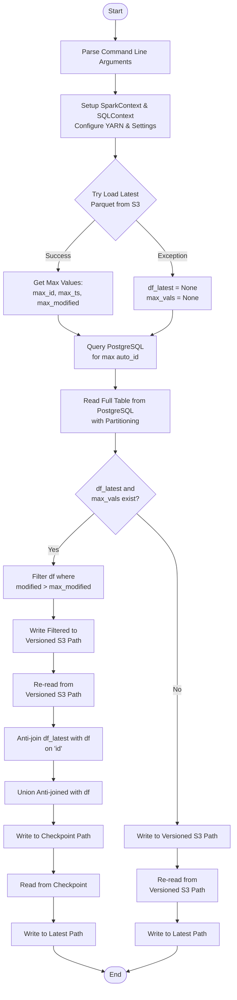
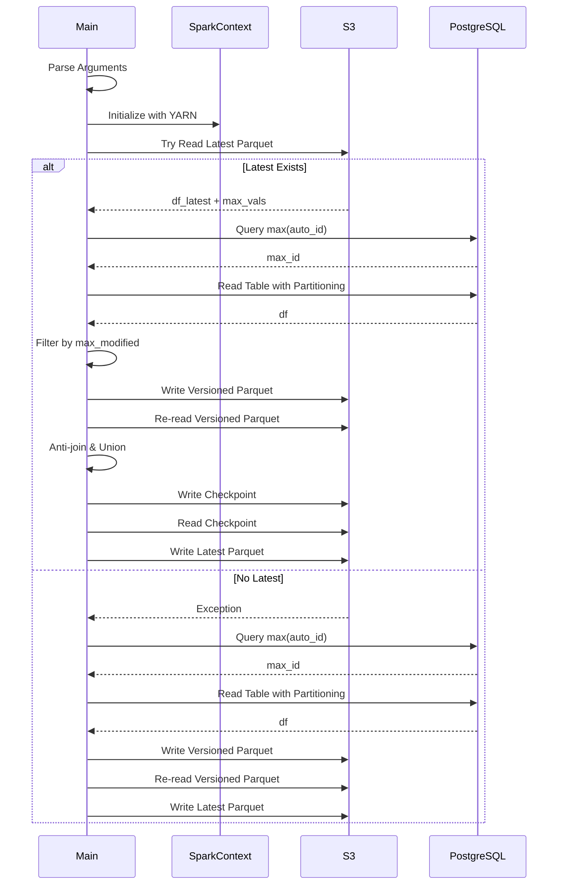

# Diagram: research/orchestrator/tasks/etl/extract_public_package_container_exception_spark.py

> Auto-generated by Obscura crawlers

## Diagram 1

### SVG

<svg id="container" width="559.171875" xmlns="http://www.w3.org/2000/svg" class="flowchart" height="2339.046875" viewBox="0 0 559.171875 2339.046875" role="graphics-document document" aria-roledescription="flowchart-v2"><g><marker id="container_flowchart-v2-pointEnd" class="marker flowchart-v2" viewBox="0 0 10 10" refX="5" refY="5" markerUnits="userSpaceOnUse" markerWidth="8" markerHeight="8" orient="auto"><path d="M 0 0 L 10 5 L 0 10 z" class="arrowMarkerPath" style="stroke-width: 1; stroke-dasharray: 1, 0;"></path></marker><marker id="container_flowchart-v2-pointStart" class="marker flowchart-v2" viewBox="0 0 10 10" refX="4.5" refY="5" markerUnits="userSpaceOnUse" markerWidth="8" markerHeight="8" orient="auto"><path d="M 0 5 L 10 10 L 10 0 z" class="arrowMarkerPath" style="stroke-width: 1; stroke-dasharray: 1, 0;"></path></marker><marker id="container_flowchart-v2-circleEnd" class="marker flowchart-v2" viewBox="0 0 10 10" refX="11" refY="5" markerUnits="userSpaceOnUse" markerWidth="11" markerHeight="11" orient="auto"><circle cx="5" cy="5" r="5" class="arrowMarkerPath" style="stroke-width: 1; stroke-dasharray: 1, 0;"></circle></marker><marker id="container_flowchart-v2-circleStart" class="marker flowchart-v2" viewBox="0 0 10 10" refX="-1" refY="5" markerUnits="userSpaceOnUse" markerWidth="11" markerHeight="11" orient="auto"><circle cx="5" cy="5" r="5" class="arrowMarkerPath" style="stroke-width: 1; stroke-dasharray: 1, 0;"></circle></marker><marker id="container_flowchart-v2-crossEnd" class="marker cross flowchart-v2" viewBox="0 0 11 11" refX="12" refY="5.2" markerUnits="userSpaceOnUse" markerWidth="11" markerHeight="11" orient="auto"><path d="M 1,1 l 9,9 M 10,1 l -9,9" class="arrowMarkerPath" style="stroke-width: 2; stroke-dasharray: 1, 0;"></path></marker><marker id="container_flowchart-v2-crossStart" class="marker cross flowchart-v2" viewBox="0 0 11 11" refX="-1" refY="5.2" markerUnits="userSpaceOnUse" markerWidth="11" markerHeight="11" orient="auto"><path d="M 1,1 l 9,9 M 10,1 l -9,9" class="arrowMarkerPath" style="stroke-width: 2; stroke-dasharray: 1, 0;"></path></marker><g class="root"><g class="clusters"></g><g class="edgePaths"><path d="M278.586,47.5L278.503,51.583C278.419,55.667,278.253,63.833,278.169,71.417C278.086,79,278.086,86,278.086,89.5L278.086,93" id="L_Start_ParseArgs_0" class="edge-thickness-normal edge-pattern-solid edge-thickness-normal edge-pattern-solid flowchart-link" style=";" data-edge="true" data-et="edge" data-id="L_Start_ParseArgs_0" data-points="W3sieCI6Mjc4LjU4NTkzNzUsInkiOjQ3LjV9LHsieCI6Mjc4LjA4NTkzNzUsInkiOjcyfSx7IngiOjI3OC4wODU5Mzc1LCJ5Ijo5N31d" marker-end="url(#container_flowchart-v2-pointEnd)"></path><path d="M278.086,175L278.086,179.167C278.086,183.333,278.086,191.667,278.086,199.333C278.086,207,278.086,214,278.086,217.5L278.086,221" id="L_ParseArgs_SetupSpark_0" class="edge-thickness-normal edge-pattern-solid edge-thickness-normal edge-pattern-solid flowchart-link" style=";" data-edge="true" data-et="edge" data-id="L_ParseArgs_SetupSpark_0" data-points="W3sieCI6Mjc4LjA4NTkzNzUsInkiOjE3NX0seyJ4IjoyNzguMDg1OTM3NSwieSI6MjAwfSx7IngiOjI3OC4wODU5Mzc1LCJ5IjoyMjV9XQ==" marker-end="url(#container_flowchart-v2-pointEnd)"></path><path d="M278.086,327L278.086,331.167C278.086,335.333,278.086,343.667,278.086,351.333C278.086,359,278.086,366,278.086,369.5L278.086,373" id="L_SetupSpark_TryLoadLatest_0" class="edge-thickness-normal edge-pattern-solid edge-thickness-normal edge-pattern-solid flowchart-link" style=";" data-edge="true" data-et="edge" data-id="L_SetupSpark_TryLoadLatest_0" data-points="W3sieCI6Mjc4LjA4NTkzNzUsInkiOjMyN30seyJ4IjoyNzguMDg1OTM3NSwieSI6MzUyfSx7IngiOjI3OC4wODU5Mzc1LCJ5IjozNzd9XQ==" marker-end="url(#container_flowchart-v2-pointEnd)"></path><path d="M229.433,521.847L214.992,536.122C200.552,550.398,171.67,578.949,157.23,598.724C142.789,618.5,142.789,629.5,142.789,635L142.789,640.5" id="L_TryLoadLatest_GetMaxVals_0" class="edge-thickness-normal edge-pattern-solid edge-thickness-normal edge-pattern-solid flowchart-link" style=";" data-edge="true" data-et="edge" data-id="L_TryLoadLatest_GetMaxVals_0" data-points="W3sieCI6MjI5LjQzMjgwNzIzNjkxODUsInkiOjUyMS44NDY4Njk3MzY5MTg1fSx7IngiOjE0Mi43ODkwNjI1LCJ5Ijo2MDcuNX0seyJ4IjoxNDIuNzg5MDYyNSwieSI6NjQ0LjV9XQ==" marker-end="url(#container_flowchart-v2-pointEnd)"></path><path d="M326.739,521.847L341.18,536.122C355.62,550.398,384.502,578.949,398.942,600.724C413.383,622.5,413.383,637.5,413.383,645L413.383,652.5" id="L_TryLoadLatest_SetNull_0" class="edge-thickness-normal edge-pattern-solid edge-thickness-normal edge-pattern-solid flowchart-link" style=";" data-edge="true" data-et="edge" data-id="L_TryLoadLatest_SetNull_0" data-points="W3sieCI6MzI2LjczOTA2Nzc2MzA4MTUsInkiOjUyMS44NDY4Njk3MzY5MTg1fSx7IngiOjQxMy4zODI4MTI1LCJ5Ijo2MDcuNX0seyJ4Ijo0MTMuMzgyODEyNSwieSI6NjU2LjV9XQ==" marker-end="url(#container_flowchart-v2-pointEnd)"></path><path d="M142.789,746.5L142.789,750.667C142.789,754.833,142.789,763.167,150.995,771.215C159.201,779.263,175.612,787.026,183.818,790.908L192.024,794.79" id="L_GetMaxVals_GetMaxId_0" class="edge-thickness-normal edge-pattern-solid edge-thickness-normal edge-pattern-solid flowchart-link" style=";" data-edge="true" data-et="edge" data-id="L_GetMaxVals_GetMaxId_0" data-points="W3sieCI6MTQyLjc4OTA2MjUsInkiOjc0Ni41fSx7IngiOjE0Mi43ODkwNjI1LCJ5Ijo3NzEuNX0seyJ4IjoxOTUuNjM5NDA0Mjk2ODc1LCJ5Ijo3OTYuNX1d" marker-end="url(#container_flowchart-v2-pointEnd)"></path><path d="M413.383,734.5L413.383,740.667C413.383,746.833,413.383,759.167,405.177,769.215C396.971,779.263,380.56,787.026,372.354,790.908L364.148,794.79" id="L_SetNull_GetMaxId_0" class="edge-thickness-normal edge-pattern-solid edge-thickness-normal edge-pattern-solid flowchart-link" style=";" data-edge="true" data-et="edge" data-id="L_SetNull_GetMaxId_0" data-points="W3sieCI6NDEzLjM4MjgxMjUsInkiOjczNC41fSx7IngiOjQxMy4zODI4MTI1LCJ5Ijo3NzEuNX0seyJ4IjozNjAuNTMyNDcwNzAzMTI1LCJ5Ijo3OTYuNX1d" marker-end="url(#container_flowchart-v2-pointEnd)"></path><path d="M278.086,874.5L278.086,878.667C278.086,882.833,278.086,891.167,278.086,898.833C278.086,906.5,278.086,913.5,278.086,917L278.086,920.5" id="L_GetMaxId_ReadDB_0" class="edge-thickness-normal edge-pattern-solid edge-thickness-normal edge-pattern-solid flowchart-link" style=";" data-edge="true" data-et="edge" data-id="L_GetMaxId_ReadDB_0" data-points="W3sieCI6Mjc4LjA4NTkzNzUsInkiOjg3NC41fSx7IngiOjI3OC4wODU5Mzc1LCJ5Ijo4OTkuNX0seyJ4IjoyNzguMDg1OTM3NSwieSI6OTI0LjV9XQ==" marker-end="url(#container_flowchart-v2-pointEnd)"></path><path d="M278.086,1026.5L278.086,1030.667C278.086,1034.833,278.086,1043.167,278.086,1050.833C278.086,1058.5,278.086,1065.5,278.086,1069L278.086,1072.5" id="L_ReadDB_HasLatest_0" class="edge-thickness-normal edge-pattern-solid edge-thickness-normal edge-pattern-solid flowchart-link" style=";" data-edge="true" data-et="edge" data-id="L_ReadDB_HasLatest_0" data-points="W3sieCI6Mjc4LjA4NTkzNzUsInkiOjEwMjYuNX0seyJ4IjoyNzguMDg1OTM3NSwieSI6MTA1MS41fSx7IngiOjI3OC4wODU5Mzc1LCJ5IjoxMDc2LjV9XQ==" marker-end="url(#container_flowchart-v2-pointEnd)"></path><path d="M228.021,1215.982L211.771,1230.493C195.522,1245.003,163.023,1274.025,146.773,1294.036C130.523,1314.047,130.523,1325.047,130.523,1330.547L130.523,1336.047" id="L_HasLatest_FilterModified_0" class="edge-thickness-normal edge-pattern-solid edge-thickness-normal edge-pattern-solid flowchart-link" style=";" data-edge="true" data-et="edge" data-id="L_HasLatest_FilterModified_0" data-points="W3sieCI6MjI4LjAyMDc1MjU2MDgzMDY2LCJ5IjoxMjE1Ljk4MTY5MDA2MDgzMDd9LHsieCI6MTMwLjUyMzQzNzUsInkiOjEzMDMuMDQ2ODc1fSx7IngiOjEzMC41MjM0Mzc1LCJ5IjoxMzQwLjA0Njg3NX1d" marker-end="url(#container_flowchart-v2-pointEnd)"></path><path d="M328.151,1215.982L344.401,1230.493C360.65,1245.003,393.149,1274.025,409.399,1301.203C425.648,1328.38,425.648,1353.714,425.648,1377.047C425.648,1400.38,425.648,1421.714,425.648,1443.047C425.648,1464.38,425.648,1485.714,425.648,1507.047C425.648,1528.38,425.648,1549.714,425.648,1571.047C425.648,1592.38,425.648,1613.714,425.648,1635.047C425.648,1656.38,425.648,1677.714,425.648,1699.047C425.648,1720.38,425.648,1741.714,425.648,1763.047C425.648,1784.38,425.648,1805.714,425.648,1825.047C425.648,1844.38,425.648,1861.714,425.648,1879.047C425.648,1896.38,425.648,1913.714,425.648,1925.88C425.648,1938.047,425.648,1945.047,425.648,1948.547L425.648,1952.047" id="L_HasLatest_WriteVersioned_0" class="edge-thickness-normal edge-pattern-solid edge-thickness-normal edge-pattern-solid flowchart-link" style=";" data-edge="true" data-et="edge" data-id="L_HasLatest_WriteVersioned_0" data-points="W3sieCI6MzI4LjE1MTEyMjQzOTE2OTM0LCJ5IjoxMjE1Ljk4MTY5MDA2MDgzMDd9LHsieCI6NDI1LjY0ODQzNzUsInkiOjEzMDMuMDQ2ODc1fSx7IngiOjQyNS42NDg0Mzc1LCJ5IjoxMzc5LjA0Njg3NX0seyJ4Ijo0MjUuNjQ4NDM3NSwieSI6MTQ0My4wNDY4NzV9LHsieCI6NDI1LjY0ODQzNzUsInkiOjE1MDcuMDQ2ODc1fSx7IngiOjQyNS42NDg0Mzc1LCJ5IjoxNTcxLjA0Njg3NX0seyJ4Ijo0MjUuNjQ4NDM3NSwieSI6MTYzNS4wNDY4NzV9LHsieCI6NDI1LjY0ODQzNzUsInkiOjE2OTkuMDQ2ODc1fSx7IngiOjQyNS42NDg0Mzc1LCJ5IjoxNzYzLjA0Njg3NX0seyJ4Ijo0MjUuNjQ4NDM3NSwieSI6MTgyNy4wNDY4NzV9LHsieCI6NDI1LjY0ODQzNzUsInkiOjE4NzkuMDQ2ODc1fSx7IngiOjQyNS42NDg0Mzc1LCJ5IjoxOTMxLjA0Njg3NX0seyJ4Ijo0MjUuNjQ4NDM3NSwieSI6MTk1Ni4wNDY4NzV9XQ==" marker-end="url(#container_flowchart-v2-pointEnd)"></path><path d="M130.523,1418.047L130.523,1422.214C130.523,1426.38,130.523,1434.714,130.523,1442.38C130.523,1450.047,130.523,1457.047,130.523,1460.547L130.523,1464.047" id="L_FilterModified_WriteTemp_0" class="edge-thickness-normal edge-pattern-solid edge-thickness-normal edge-pattern-solid flowchart-link" style=";" data-edge="true" data-et="edge" data-id="L_FilterModified_WriteTemp_0" data-points="W3sieCI6MTMwLjUyMzQzNzUsInkiOjE0MTguMDQ2ODc1fSx7IngiOjEzMC41MjM0Mzc1LCJ5IjoxNDQzLjA0Njg3NX0seyJ4IjoxMzAuNTIzNDM3NSwieSI6MTQ2OC4wNDY4NzV9XQ==" marker-end="url(#container_flowchart-v2-pointEnd)"></path><path d="M130.523,1546.047L130.523,1550.214C130.523,1554.38,130.523,1562.714,130.523,1570.38C130.523,1578.047,130.523,1585.047,130.523,1588.547L130.523,1592.047" id="L_WriteTemp_RereadTemp_0" class="edge-thickness-normal edge-pattern-solid edge-thickness-normal edge-pattern-solid flowchart-link" style=";" data-edge="true" data-et="edge" data-id="L_WriteTemp_RereadTemp_0" data-points="W3sieCI6MTMwLjUyMzQzNzUsInkiOjE1NDYuMDQ2ODc1fSx7IngiOjEzMC41MjM0Mzc1LCJ5IjoxNTcxLjA0Njg3NX0seyJ4IjoxMzAuNTIzNDM3NSwieSI6MTU5Ni4wNDY4NzV9XQ==" marker-end="url(#container_flowchart-v2-pointEnd)"></path><path d="M130.523,1674.047L130.523,1678.214C130.523,1682.38,130.523,1690.714,130.523,1698.38C130.523,1706.047,130.523,1713.047,130.523,1716.547L130.523,1720.047" id="L_RereadTemp_AntiJoin_0" class="edge-thickness-normal edge-pattern-solid edge-thickness-normal edge-pattern-solid flowchart-link" style=";" data-edge="true" data-et="edge" data-id="L_RereadTemp_AntiJoin_0" data-points="W3sieCI6MTMwLjUyMzQzNzUsInkiOjE2NzQuMDQ2ODc1fSx7IngiOjEzMC41MjM0Mzc1LCJ5IjoxNjk5LjA0Njg3NX0seyJ4IjoxMzAuNTIzNDM3NSwieSI6MTcyNC4wNDY4NzV9XQ==" marker-end="url(#container_flowchart-v2-pointEnd)"></path><path d="M130.523,1802.047L130.523,1806.214C130.523,1810.38,130.523,1818.714,130.523,1826.38C130.523,1834.047,130.523,1841.047,130.523,1844.547L130.523,1848.047" id="L_AntiJoin_Union_0" class="edge-thickness-normal edge-pattern-solid edge-thickness-normal edge-pattern-solid flowchart-link" style=";" data-edge="true" data-et="edge" data-id="L_AntiJoin_Union_0" data-points="W3sieCI6MTMwLjUyMzQzNzUsInkiOjE4MDIuMDQ2ODc1fSx7IngiOjEzMC41MjM0Mzc1LCJ5IjoxODI3LjA0Njg3NX0seyJ4IjoxMzAuNTIzNDM3NSwieSI6MTg1Mi4wNDY4NzV9XQ==" marker-end="url(#container_flowchart-v2-pointEnd)"></path><path d="M130.523,1906.047L130.523,1910.214C130.523,1914.38,130.523,1922.714,130.523,1930.38C130.523,1938.047,130.523,1945.047,130.523,1948.547L130.523,1952.047" id="L_Union_WriteCheckpoint_0" class="edge-thickness-normal edge-pattern-solid edge-thickness-normal edge-pattern-solid flowchart-link" style=";" data-edge="true" data-et="edge" data-id="L_Union_WriteCheckpoint_0" data-points="W3sieCI6MTMwLjUyMzQzNzUsInkiOjE5MDYuMDQ2ODc1fSx7IngiOjEzMC41MjM0Mzc1LCJ5IjoxOTMxLjA0Njg3NX0seyJ4IjoxMzAuNTIzNDM3NSwieSI6MTk1Ni4wNDY4NzV9XQ==" marker-end="url(#container_flowchart-v2-pointEnd)"></path><path d="M130.523,2010.047L130.523,2014.214C130.523,2018.38,130.523,2026.714,130.523,2036.38C130.523,2046.047,130.523,2057.047,130.523,2062.547L130.523,2068.047" id="L_WriteCheckpoint_ReadCheckpoint_0" class="edge-thickness-normal edge-pattern-solid edge-thickness-normal edge-pattern-solid flowchart-link" style=";" data-edge="true" data-et="edge" data-id="L_WriteCheckpoint_ReadCheckpoint_0" data-points="W3sieCI6MTMwLjUyMzQzNzUsInkiOjIwMTAuMDQ2ODc1fSx7IngiOjEzMC41MjM0Mzc1LCJ5IjoyMDM1LjA0Njg3NX0seyJ4IjoxMzAuNTIzNDM3NSwieSI6MjA3Mi4wNDY4NzV9XQ==" marker-end="url(#container_flowchart-v2-pointEnd)"></path><path d="M130.523,2126.047L130.523,2132.214C130.523,2138.38,130.523,2150.714,130.523,2160.38C130.523,2170.047,130.523,2177.047,130.523,2180.547L130.523,2184.047" id="L_ReadCheckpoint_WriteLatest_0" class="edge-thickness-normal edge-pattern-solid edge-thickness-normal edge-pattern-solid flowchart-link" style=";" data-edge="true" data-et="edge" data-id="L_ReadCheckpoint_WriteLatest_0" data-points="W3sieCI6MTMwLjUyMzQzNzUsInkiOjIxMjYuMDQ2ODc1fSx7IngiOjEzMC41MjM0Mzc1LCJ5IjoyMTYzLjA0Njg3NX0seyJ4IjoxMzAuNTIzNDM3NSwieSI6MjE4OC4wNDY4NzV9XQ==" marker-end="url(#container_flowchart-v2-pointEnd)"></path><path d="M425.648,2010.047L425.648,2014.214C425.648,2018.38,425.648,2026.714,425.648,2034.38C425.648,2042.047,425.648,2049.047,425.648,2052.547L425.648,2056.047" id="L_WriteVersioned_RereadVersioned_0" class="edge-thickness-normal edge-pattern-solid edge-thickness-normal edge-pattern-solid flowchart-link" style=";" data-edge="true" data-et="edge" data-id="L_WriteVersioned_RereadVersioned_0" data-points="W3sieCI6NDI1LjY0ODQzNzUsInkiOjIwMTAuMDQ2ODc1fSx7IngiOjQyNS42NDg0Mzc1LCJ5IjoyMDM1LjA0Njg3NX0seyJ4Ijo0MjUuNjQ4NDM3NSwieSI6MjA2MC4wNDY4NzV9XQ==" marker-end="url(#container_flowchart-v2-pointEnd)"></path><path d="M425.648,2138.047L425.648,2142.214C425.648,2146.38,425.648,2154.714,425.648,2162.38C425.648,2170.047,425.648,2177.047,425.648,2180.547L425.648,2184.047" id="L_RereadVersioned_WriteLatestNew_0" class="edge-thickness-normal edge-pattern-solid edge-thickness-normal edge-pattern-solid flowchart-link" style=";" data-edge="true" data-et="edge" data-id="L_RereadVersioned_WriteLatestNew_0" data-points="W3sieCI6NDI1LjY0ODQzNzUsInkiOjIxMzguMDQ2ODc1fSx7IngiOjQyNS42NDg0Mzc1LCJ5IjoyMTYzLjA0Njg3NX0seyJ4Ijo0MjUuNjQ4NDM3NSwieSI6MjE4OC4wNDY4NzV9XQ==" marker-end="url(#container_flowchart-v2-pointEnd)"></path><path d="M130.523,2242.047L130.523,2246.214C130.523,2250.38,130.523,2258.714,150.466,2268.951C170.409,2279.188,210.294,2291.329,230.236,2297.399L250.179,2303.469" id="L_WriteLatest_End_0" class="edge-thickness-normal edge-pattern-solid edge-thickness-normal edge-pattern-solid flowchart-link" style=";" data-edge="true" data-et="edge" data-id="L_WriteLatest_End_0" data-points="W3sieCI6MTMwLjUyMzQzNzUsInkiOjIyNDIuMDQ2ODc1fSx7IngiOjEzMC41MjM0Mzc1LCJ5IjoyMjY3LjA0Njg3NX0seyJ4IjoyNTQuMDA1NjA4MzkyODcwODQsInkiOjIzMDQuNjM0MjU1NjMzNTEyNn1d" marker-end="url(#container_flowchart-v2-pointEnd)"></path><path d="M425.648,2242.047L425.648,2246.214C425.648,2250.38,425.648,2258.714,405.872,2268.949C386.096,2279.185,346.543,2291.323,326.767,2297.392L306.99,2303.461" id="L_WriteLatestNew_End_0" class="edge-thickness-normal edge-pattern-solid edge-thickness-normal edge-pattern-solid flowchart-link" style=";" data-edge="true" data-et="edge" data-id="L_WriteLatestNew_End_0" data-points="W3sieCI6NDI1LjY0ODQzNzUsInkiOjIyNDIuMDQ2ODc1fSx7IngiOjQyNS42NDg0Mzc1LCJ5IjoyMjY3LjA0Njg3NX0seyJ4IjozMDMuMTY2MjY3NTMwODY3ODYsInkiOjIzMDQuNjM0MjU1MzU0OTQzNH1d" marker-end="url(#container_flowchart-v2-pointEnd)"></path></g><g class="edgeLabels"><g class="edgeLabel"><g class="label" data-id="L_Start_ParseArgs_0" transform="translate(0, 0)"><foreignObject width="0" height="0">

</foreignObject></g></g><g class="edgeLabel"><g class="label" data-id="L_ParseArgs_SetupSpark_0" transform="translate(0, 0)"><foreignObject width="0" height="0">

</foreignObject></g></g><g class="edgeLabel"><g class="label" data-id="L_SetupSpark_TryLoadLatest_0" transform="translate(0, 0)"><foreignObject width="0" height="0">

</foreignObject></g></g><g class="edgeLabel" transform="translate(142.7890625, 607.5)"><g class="label" data-id="L_TryLoadLatest_GetMaxVals_0" transform="translate(-28.1015625, -12)"><foreignObject width="56.203125" height="24">

Success

</foreignObject></g></g><g class="edgeLabel" transform="translate(413.3828125, 607.5)"><g class="label" data-id="L_TryLoadLatest_SetNull_0" transform="translate(-35.375, -12)"><foreignObject width="70.75" height="24">

Exception

</foreignObject></g></g><g class="edgeLabel"><g class="label" data-id="L_GetMaxVals_GetMaxId_0" transform="translate(0, 0)"><foreignObject width="0" height="0">

</foreignObject></g></g><g class="edgeLabel"><g class="label" data-id="L_SetNull_GetMaxId_0" transform="translate(0, 0)"><foreignObject width="0" height="0">

</foreignObject></g></g><g class="edgeLabel"><g class="label" data-id="L_GetMaxId_ReadDB_0" transform="translate(0, 0)"><foreignObject width="0" height="0">

</foreignObject></g></g><g class="edgeLabel"><g class="label" data-id="L_ReadDB_HasLatest_0" transform="translate(0, 0)"><foreignObject width="0" height="0">

</foreignObject></g></g><g class="edgeLabel" transform="translate(130.5234375, 1303.046875)"><g class="label" data-id="L_HasLatest_FilterModified_0" transform="translate(-12.03125, -12)"><foreignObject width="24.0625" height="24">

Yes

</foreignObject></g></g><g class="edgeLabel" transform="translate(425.6484375, 1635.046875)"><g class="label" data-id="L_HasLatest_WriteVersioned_0" transform="translate(-10.140625, -12)"><foreignObject width="20.28125" height="24">

No

</foreignObject></g></g><g class="edgeLabel"><g class="label" data-id="L_FilterModified_WriteTemp_0" transform="translate(0, 0)"><foreignObject width="0" height="0">

</foreignObject></g></g><g class="edgeLabel"><g class="label" data-id="L_WriteTemp_RereadTemp_0" transform="translate(0, 0)"><foreignObject width="0" height="0">

</foreignObject></g></g><g class="edgeLabel"><g class="label" data-id="L_RereadTemp_AntiJoin_0" transform="translate(0, 0)"><foreignObject width="0" height="0">

</foreignObject></g></g><g class="edgeLabel"><g class="label" data-id="L_AntiJoin_Union_0" transform="translate(0, 0)"><foreignObject width="0" height="0">

</foreignObject></g></g><g class="edgeLabel"><g class="label" data-id="L_Union_WriteCheckpoint_0" transform="translate(0, 0)"><foreignObject width="0" height="0">

</foreignObject></g></g><g class="edgeLabel"><g class="label" data-id="L_WriteCheckpoint_ReadCheckpoint_0" transform="translate(0, 0)"><foreignObject width="0" height="0">

</foreignObject></g></g><g class="edgeLabel"><g class="label" data-id="L_ReadCheckpoint_WriteLatest_0" transform="translate(0, 0)"><foreignObject width="0" height="0">

</foreignObject></g></g><g class="edgeLabel"><g class="label" data-id="L_WriteVersioned_RereadVersioned_0" transform="translate(0, 0)"><foreignObject width="0" height="0">

</foreignObject></g></g><g class="edgeLabel"><g class="label" data-id="L_RereadVersioned_WriteLatestNew_0" transform="translate(0, 0)"><foreignObject width="0" height="0">

</foreignObject></g></g><g class="edgeLabel"><g class="label" data-id="L_WriteLatest_End_0" transform="translate(0, 0)"><foreignObject width="0" height="0">

</foreignObject></g></g><g class="edgeLabel"><g class="label" data-id="L_WriteLatestNew_End_0" transform="translate(0, 0)"><foreignObject width="0" height="0">

</foreignObject></g></g></g><g class="nodes"><g class="node default" id="flowchart-Start-0" transform="translate(278.0859375, 27.5)"><g class="basic label-container outer-path"><path d="M-10.3984375 -19.5 C-2.84683214606523 -19.5, 4.70477320786954 -19.5, 10.3984375 -19.5 C10.3984375 -19.5, 10.398437499999998 -19.5, 10.398437499999998 -19.5 C10.744550563035276 -19.488900827736668, 11.090663626070553 -19.477801655473336, 11.6478067896239 -19.45993515863156 C11.931177320431072 -19.432598744327514, 12.214547851238242 -19.405262330023472, 12.892042152847864 -19.3399052695533 C13.306266803030548 -19.2729366404719, 13.720491453213231 -19.205968011390507, 14.126030759676757 -19.140403561325776 C14.505872961915122 -19.053707057366886, 14.885715164153488 -18.967010553407995, 15.34470188623539 -18.862249829261074 C15.823523008054037 -18.720138233688658, 16.302344129872687 -18.578026638116242, 16.543047751460602 -18.50658706670804 C16.888163809014692 -18.37958116731027, 17.233279866568783 -18.2525752679125, 17.716144095147794 -18.074876768247425 C18.15707719572312 -17.87968876443843, 18.598010296298444 -17.684500760629437, 18.85917041279238 -17.568892924097174 C19.295311444613294 -17.341358427157868, 19.731452476434203 -17.113823930218565, 19.967429764076783 -16.990714730406097 C20.261498462712442 -16.812448557153665, 20.555567161348105 -16.634182383901233, 21.036368073605697 -16.342718045390892 C21.296229483305865 -16.161449975203176, 21.55609089300603 -15.980181905015462, 22.061592844578712 -15.627565626425154 C22.291812687259675 -15.443971428294391, 22.522032529940642 -15.260377230163629, 23.03889120850187 -14.848196188198123 C23.365975900988783 -14.551146524668239, 23.693060593475693 -14.254096861138354, 23.964247236767985 -14.007812326905688 C24.140194280278344 -13.826132558960321, 24.316141323788703 -13.644452791014952, 24.833858442968648 -13.10986736009568 C25.131128202435885 -12.760677385496969, 25.428397961903123 -12.411487410898255, 25.644151408126582 -12.158051136245305 C25.798916026688524 -11.950680646719103, 25.95368064525047 -11.743310157192901, 26.391796464640635 -11.156274872382312 C26.63441005357798 -10.783555248903937, 26.87702364251533 -10.410835625425563, 27.073721378604247 -10.108655082055241 C27.20255246878861 -9.87990243587041, 27.331383558972977 -9.651149789685576, 27.6871239742735 -9.019496659696287 C27.90033867307264 -8.576751775576149, 28.11355337187178 -8.134006891456009, 28.22948364880834 -7.893275190886684 C28.39600448870121 -7.481965496889878, 28.562525328594077 -7.0706558028930715, 28.698571729970325 -6.734618561215508 C28.84308330799315 -6.299372713003891, 28.987594886015973 -5.864126864792272, 29.09246063421488 -5.548287939305138 C29.202094231110305 -5.130207518841417, 29.311727828005733 -4.712127098377698, 29.40953178754556 -4.339158212148133 C29.49466672631943 -3.9020082948199994, 29.5798016650933 -3.4648583774918658, 29.648482276581777 -3.1121979531509023 C29.71054552206043 -2.630847676992527, 29.77260876753908 -2.149497400834152, 29.808330202509367 -1.872449005199798 C29.83411348920708 -1.4708535029884717, 29.859896775904794 -1.0692580007771453, 29.888418715913414 -0.6250057626472757 C29.888418715913414 -0.2702022203697625, 29.888418715913414 0.08460132190775072, 29.888418715913414 0.625005762647271 C29.856961636183158 1.114975171143768, 29.825504556452902 1.604944579640265, 29.808330202509367 1.8724490051997846 C29.760480568014987 2.2435613213591163, 29.712630933520607 2.614673637518448, 29.648482276581777 3.1121979531508885 C29.579953807603864 3.464077157855419, 29.511425338625955 3.815956362559949, 29.40953178754556 4.339158212148129 C29.31727096739671 4.6909887054680866, 29.22501014724786 5.042819198788044, 29.092460634214884 5.548287939305125 C28.939852264934533 6.007920032735921, 28.787243895654182 6.467552126166717, 28.69857172997033 6.734618561215495 C28.537381940251276 7.132760458214136, 28.376192150532223 7.5309023552127785, 28.229483648808344 7.893275190886679 C28.070586137676873 8.22322927261327, 27.911688626545402 8.553183354339861, 27.687123974273504 9.019496659696284 C27.522715055182708 9.311421343750318, 27.35830613609191 9.603346027804355, 27.07372137860425 10.108655082055236 C26.917895115476707 10.348046067429674, 26.762068852349163 10.587437052804113, 26.39179646464064 11.156274872382301 C26.18782103164853 11.429583370047506, 25.98384559865642 11.702891867712713, 25.644151408126582 12.158051136245302 C25.36792276862968 12.482525014053218, 25.09169412913278 12.806998891861134, 24.83385844296866 13.10986736009567 C24.55054575314278 13.402410972745306, 24.267233063316908 13.694954585394942, 23.96424723676799 14.007812326905684 C23.714053522074046 14.235031638827785, 23.463859807380103 14.462250950749887, 23.038891208501887 14.848196188198111 C22.7077766141343 15.112251265876854, 22.376662019766712 15.376306343555598, 22.061592844578715 15.627565626425152 C21.831924751054732 15.787772146295953, 21.602256657530752 15.947978666166755, 21.036368073605708 16.34271804539089 C20.627971570999982 16.590290405274725, 20.21957506839426 16.837862765158558, 19.967429764076787 16.990714730406093 C19.7311183240218 17.11399825731808, 19.494806883966813 17.237281784230063, 18.859170412792388 17.56889292409717 C18.49634577677653 17.729504627650964, 18.133521140760674 17.890116331204762, 17.716144095147804 18.07487676824742 C17.392117664512416 18.194121489988735, 17.068091233877027 18.313366211730045, 16.543047751460616 18.506587066708033 C16.127457139141363 18.629932178964747, 15.711866526822108 18.753277291221465, 15.344701886235413 18.86224982926107 C15.0948240222787 18.91928282110374, 14.844946158321987 18.97631581294641, 14.126030759676766 19.140403561325773 C13.757585779478456 19.19997088839074, 13.389140799280147 19.259538215455706, 12.892042152847878 19.3399052695533 C12.408186544955077 19.38658223812521, 11.924330937062274 19.433259206697123, 11.6478067896239 19.45993515863156 C11.264282965675314 19.47223402118175, 10.880759141726728 19.484532883731948, 10.398437500000004 19.5 C10.398437500000002 19.5, 10.398437500000002 19.5, 10.3984375 19.5 C4.194430039068694 19.5, -2.0095774218626126 19.5, -10.398437499999996 19.5 C-10.696547986741342 19.490440176927066, -10.994658473482685 19.480880353854133, -11.647806789623893 19.45993515863156 C-11.95430154384386 19.43036797830583, -12.260796298063827 19.400800797980104, -12.892042152847871 19.3399052695533 C-13.169249529818945 19.295088530619932, -13.44645690679002 19.25027179168656, -14.126030759676759 19.140403561325773 C-14.54780593016278 19.044136131002546, -14.969581100648801 18.94786870067932, -15.344701886235388 18.862249829261074 C-15.600113618212525 18.7864449678938, -15.855525350189662 18.710640106526526, -16.54304775146059 18.506587066708043 C-16.92274846203961 18.366853695300073, -17.302449172618626 18.227120323892102, -17.716144095147797 18.074876768247425 C-18.12113407282261 17.895599718731628, -18.52612405049742 17.716322669215835, -18.85917041279238 17.568892924097174 C-19.12947577403583 17.427874790275315, -19.399781135279277 17.286856656453455, -19.96742976407678 16.990714730406097 C-20.35520167000305 16.75564512223293, -20.74297357592932 16.52057551405976, -21.036368073605686 16.3427180453909 C-21.260737422774664 16.186207700203205, -21.48510677194364 16.029697355015507, -22.061592844578712 15.627565626425156 C-22.425878016751767 15.337057895652698, -22.790163188924826 15.04655016488024, -23.03889120850187 14.848196188198125 C-23.31273888210443 14.599494976644676, -23.586586555706987 14.350793765091227, -23.964247236767974 14.007812326905697 C-24.22790422332703 13.735564841642303, -24.491561209886086 13.463317356378909, -24.833858442968655 13.109867360095677 C-25.108465758679486 12.787297981462817, -25.383073074390314 12.464728602829958, -25.64415140812658 12.158051136245307 C-25.933282970001915 11.770641183759517, -26.222414531877252 11.383231231273728, -26.391796464640635 11.156274872382316 C-26.661823925187253 10.741440180456843, -26.93185138573387 10.32660548853137, -27.073721378604244 10.108655082055249 C-27.291959990501628 9.72115032757565, -27.51019860239901 9.333645573096053, -27.6871239742735 9.019496659696289 C-27.80975462961976 8.764851479994093, -27.93238528496602 8.510206300291896, -28.22948364880834 7.893275190886686 C-28.40744580452795 7.453705225595037, -28.58540796024756 7.014135260303387, -28.698571729970325 6.73461856121551 C-28.79727140164862 6.437350875777581, -28.895971073326916 6.14008319033965, -29.09246063421488 5.5482879393051325 C-29.206849199800896 5.112074762407727, -29.32123776538691 4.675861585510321, -29.409531787545557 4.339158212148136 C-29.457736937387367 4.091634955872482, -29.505942087229172 3.844111699596828, -29.648482276581777 3.112197953150904 C-29.689056124586894 2.7975152002357455, -29.72962997259201 2.4828324473205865, -29.808330202509364 1.872449005199809 C-29.834988030041757 1.457231823571702, -29.86164585757415 1.0420146419435947, -29.888418715913414 0.6250057626472781 C-29.888418715913414 0.26033718241774306, -29.888418715913414 -0.10433139781179201, -29.888418715913414 -0.6250057626472687 C-29.869099630974247 -0.9259161046594917, -29.849780546035078 -1.2268264466717147, -29.808330202509367 -1.8724490051997822 C-29.768890717621616 -2.1783338617819954, -29.72945123273386 -2.484218718364209, -29.648482276581777 -3.112197953150895 C-29.57766585183352 -3.475825327176539, -29.506849427085257 -3.839452701202183, -29.40953178754556 -4.339158212148126 C-29.30176230017032 -4.750129975101208, -29.193992812795077 -5.161101738054291, -29.092460634214884 -5.548287939305123 C-28.972715223101222 -5.908942038739168, -28.852969811987563 -6.269596138173212, -28.698571729970332 -6.734618561215485 C-28.581149262373795 -7.024654326387904, -28.463726794777255 -7.3146900915603235, -28.229483648808344 -7.893275190886676 C-28.039142859156687 -8.288521913238815, -27.848802069505034 -8.683768635590953, -27.687123974273504 -9.019496659696282 C-27.533157786896346 -9.292879216151501, -27.37919159951919 -9.56626177260672, -27.073721378604247 -10.108655082055243 C-26.814609605581467 -10.506720346671587, -26.555497832558686 -10.904785611287931, -26.39179646464064 -11.156274872382308 C-26.106081987586137 -11.539106242511014, -25.820367510531632 -11.92193761263972, -25.644151408126586 -12.158051136245302 C-25.424309555272796 -12.416289885963167, -25.204467702419006 -12.67452863568103, -24.833858442968662 -13.10986736009567 C-24.566906604530878 -13.385517050436222, -24.29995476609309 -13.661166740776773, -23.964247236767996 -14.007812326905677 C-23.71394372308866 -14.235131355361187, -23.46364020940933 -14.462450383816696, -23.038891208501887 -14.848196188198107 C-22.73626798968222 -15.08953015206473, -22.43364477086255 -15.330864115931355, -22.06159284457872 -15.627565626425149 C-21.82754598128327 -15.790826586534639, -21.593499117987818 -15.954087546644127, -21.03636807360571 -16.342718045390885 C-20.69896427342084 -16.54725421186777, -20.36156047323597 -16.75179037834466, -19.96742976407679 -16.99071473040609 C-19.66124948711605 -17.150448784778682, -19.355069210155307 -17.310182839151274, -18.859170412792388 -17.56889292409717 C-18.515423527885442 -17.72105947315643, -18.1716766429785 -17.87322602221569, -17.716144095147804 -18.07487676824742 C-17.44954216164902 -18.17298874421623, -17.182940228150237 -18.271100720185043, -16.54304775146062 -18.506587066708033 C-16.119772092710743 -18.632213060405725, -15.696496433960865 -18.757839054103417, -15.344701886235413 -18.862249829261067 C-14.949555473659743 -18.952439419360143, -14.554409061084073 -19.04262900945922, -14.126030759676768 -19.140403561325773 C-13.63289595032517 -19.220129772984176, -13.139761140973572 -19.29985598464258, -12.89204215284788 -19.3399052695533 C-12.502036589845627 -19.377528637165813, -12.112031026843376 -19.415152004778324, -11.647806789623903 -19.45993515863156 C-11.361439507362633 -19.469118399993576, -11.07507222510136 -19.478301641355596, -10.398437500000005 -19.5 C-10.398437500000004 -19.5, -10.398437500000002 -19.5, -10.3984375 -19.5" stroke="none" stroke-width="0" fill="#ECECFF" style=""></path><path d="M-10.3984375 -19.5 C-4.931545692645693 -19.5, 0.5353461147086147 -19.5, 10.3984375 -19.5 M-10.3984375 -19.5 C-4.013873136653532 -19.5, 2.3706912266929354 -19.5, 10.3984375 -19.5 M10.3984375 -19.5 C10.3984375 -19.5, 10.398437499999998 -19.5, 10.398437499999998 -19.5 M10.3984375 -19.5 C10.3984375 -19.5, 10.3984375 -19.5, 10.398437499999998 -19.5 M10.398437499999998 -19.5 C10.805948675483796 -19.48693190977462, 11.213459850967595 -19.473863819549237, 11.6478067896239 -19.45993515863156 M10.398437499999998 -19.5 C10.69610377394164 -19.490454421966945, 10.993770047883284 -19.48090884393389, 11.6478067896239 -19.45993515863156 M11.6478067896239 -19.45993515863156 C11.914298159315509 -19.434227056700173, 12.180789529007118 -19.408518954768788, 12.892042152847864 -19.3399052695533 M11.6478067896239 -19.45993515863156 C11.935847421786322 -19.432148225266392, 12.223888053948745 -19.40436129190123, 12.892042152847864 -19.3399052695533 M12.892042152847864 -19.3399052695533 C13.373421648550712 -19.26207956584181, 13.85480114425356 -19.184253862130316, 14.126030759676757 -19.140403561325776 M12.892042152847864 -19.3399052695533 C13.25975631924572 -19.280456094796044, 13.62747048564358 -19.22100692003879, 14.126030759676757 -19.140403561325776 M14.126030759676757 -19.140403561325776 C14.41544423550802 -19.07434682406672, 14.70485771133928 -19.008290086807662, 15.34470188623539 -18.862249829261074 M14.126030759676757 -19.140403561325776 C14.604951299650653 -19.031093073325327, 15.08387183962455 -18.921782585324877, 15.34470188623539 -18.862249829261074 M15.34470188623539 -18.862249829261074 C15.67007213935559 -18.76568164603831, 15.995442392475791 -18.669113462815545, 16.543047751460602 -18.50658706670804 M15.34470188623539 -18.862249829261074 C15.738846492301823 -18.745269779087813, 16.132991098368258 -18.628289728914552, 16.543047751460602 -18.50658706670804 M16.543047751460602 -18.50658706670804 C16.922632092655515 -18.366896520309126, 17.302216433850433 -18.22720597391021, 17.716144095147794 -18.074876768247425 M16.543047751460602 -18.50658706670804 C16.93179458364097 -18.36352463892934, 17.320541415821335 -18.220462211150643, 17.716144095147794 -18.074876768247425 M17.716144095147794 -18.074876768247425 C18.04883038137027 -17.927606418124775, 18.38151666759275 -17.78033606800213, 18.85917041279238 -17.568892924097174 M17.716144095147794 -18.074876768247425 C18.14791326216695 -17.883745365985316, 18.5796824291861 -17.692613963723208, 18.85917041279238 -17.568892924097174 M18.85917041279238 -17.568892924097174 C19.126976898649012 -17.42917845196401, 19.394783384505644 -17.289463979830845, 19.967429764076783 -16.990714730406097 M18.85917041279238 -17.568892924097174 C19.160739668769327 -17.411564436418328, 19.462308924746274 -17.254235948739485, 19.967429764076783 -16.990714730406097 M19.967429764076783 -16.990714730406097 C20.284401854930344 -16.7985643861959, 20.601373945783905 -16.606414041985705, 21.036368073605697 -16.342718045390892 M19.967429764076783 -16.990714730406097 C20.203792140711265 -16.84743046867077, 20.440154517345746 -16.704146206935444, 21.036368073605697 -16.342718045390892 M21.036368073605697 -16.342718045390892 C21.272588018643688 -16.177941237529, 21.508807963681676 -16.01316442966711, 22.061592844578712 -15.627565626425154 M21.036368073605697 -16.342718045390892 C21.246139955463022 -16.19639026148563, 21.455911837320347 -16.05006247758037, 22.061592844578712 -15.627565626425154 M22.061592844578712 -15.627565626425154 C22.31419091491532 -15.426125387248664, 22.566788985251925 -15.224685148072174, 23.03889120850187 -14.848196188198123 M22.061592844578712 -15.627565626425154 C22.28420919629988 -15.450035009997437, 22.506825548021048 -15.27250439356972, 23.03889120850187 -14.848196188198123 M23.03889120850187 -14.848196188198123 C23.320393627702604 -14.592543139225883, 23.601896046903338 -14.336890090253641, 23.964247236767985 -14.007812326905688 M23.03889120850187 -14.848196188198123 C23.29129234260989 -14.618972156369276, 23.54369347671791 -14.38974812454043, 23.964247236767985 -14.007812326905688 M23.964247236767985 -14.007812326905688 C24.24439195408254 -13.718539905969369, 24.524536671397097 -13.42926748503305, 24.833858442968648 -13.10986736009568 M23.964247236767985 -14.007812326905688 C24.254829113253532 -13.707762682218616, 24.545410989739082 -13.407713037531543, 24.833858442968648 -13.10986736009568 M24.833858442968648 -13.10986736009568 C25.03731330670484 -12.870877700241447, 25.24076817044103 -12.631888040387214, 25.644151408126582 -12.158051136245305 M24.833858442968648 -13.10986736009568 C25.07549723361462 -12.826024686966226, 25.31713602426059 -12.54218201383677, 25.644151408126582 -12.158051136245305 M25.644151408126582 -12.158051136245305 C25.831820116727293 -11.906592163691421, 26.019488825328004 -11.655133191137539, 26.391796464640635 -11.156274872382312 M25.644151408126582 -12.158051136245305 C25.829698467806153 -11.909434979959558, 26.015245527485725 -11.660818823673809, 26.391796464640635 -11.156274872382312 M26.391796464640635 -11.156274872382312 C26.600664710948 -10.835397157076871, 26.809532957255364 -10.51451944177143, 27.073721378604247 -10.108655082055241 M26.391796464640635 -11.156274872382312 C26.55276151958103 -10.908989322824521, 26.713726574521424 -10.661703773266732, 27.073721378604247 -10.108655082055241 M27.073721378604247 -10.108655082055241 C27.262876288348732 -9.772791385792306, 27.45203119809322 -9.43692768952937, 27.6871239742735 -9.019496659696287 M27.073721378604247 -10.108655082055241 C27.222906663960174 -9.843761501257545, 27.3720919493161 -9.578867920459848, 27.6871239742735 -9.019496659696287 M27.6871239742735 -9.019496659696287 C27.80994229659177 -8.764461785511283, 27.932760618910038 -8.50942691132628, 28.22948364880834 -7.893275190886684 M27.6871239742735 -9.019496659696287 C27.860271400667983 -8.65995232402671, 28.033418827062466 -8.300407988357133, 28.22948364880834 -7.893275190886684 M28.22948364880834 -7.893275190886684 C28.353870677973127 -7.586036823990058, 28.47825770713791 -7.278798457093433, 28.698571729970325 -6.734618561215508 M28.22948364880834 -7.893275190886684 C28.349906710030428 -7.595827901446627, 28.470329771252516 -7.298380612006569, 28.698571729970325 -6.734618561215508 M28.698571729970325 -6.734618561215508 C28.848358913348644 -6.283483430226709, 28.99814609672696 -5.8323482992379105, 29.09246063421488 -5.548287939305138 M28.698571729970325 -6.734618561215508 C28.816015592822563 -6.380896358442959, 28.933459455674797 -6.02717415567041, 29.09246063421488 -5.548287939305138 M29.09246063421488 -5.548287939305138 C29.194116099108154 -5.160631593909902, 29.29577156400143 -4.772975248514667, 29.40953178754556 -4.339158212148133 M29.09246063421488 -5.548287939305138 C29.164935695202878 -5.2719091208677735, 29.237410756190876 -4.995530302430408, 29.40953178754556 -4.339158212148133 M29.40953178754556 -4.339158212148133 C29.499825620406074 -3.8755184640177336, 29.590119453266585 -3.4118787158873336, 29.648482276581777 -3.1121979531509023 M29.40953178754556 -4.339158212148133 C29.48378560255452 -3.957880565626499, 29.558039417563474 -3.576602919104865, 29.648482276581777 -3.1121979531509023 M29.648482276581777 -3.1121979531509023 C29.696266132289217 -2.7415958042735906, 29.744049987996657 -2.3709936553962794, 29.808330202509367 -1.872449005199798 M29.648482276581777 -3.1121979531509023 C29.687105776787547 -2.8126417126277548, 29.725729276993317 -2.5130854721046076, 29.808330202509367 -1.872449005199798 M29.808330202509367 -1.872449005199798 C29.828468926642373 -1.5587721211426933, 29.848607650775378 -1.2450952370855886, 29.888418715913414 -0.6250057626472757 M29.808330202509367 -1.872449005199798 C29.83586003769439 -1.4436496005100898, 29.86338987287941 -1.0148501958203817, 29.888418715913414 -0.6250057626472757 M29.888418715913414 -0.6250057626472757 C29.888418715913414 -0.21594887462478624, 29.888418715913414 0.19310801339770323, 29.888418715913414 0.625005762647271 M29.888418715913414 -0.6250057626472757 C29.888418715913414 -0.20167953158634355, 29.888418715913414 0.2216466994745886, 29.888418715913414 0.625005762647271 M29.888418715913414 0.625005762647271 C29.870863116771776 0.8984483899028758, 29.853307517630135 1.1718910171584804, 29.808330202509367 1.8724490051997846 M29.888418715913414 0.625005762647271 C29.85661130965964 1.1204317895260238, 29.824803903405865 1.6158578164047765, 29.808330202509367 1.8724490051997846 M29.808330202509367 1.8724490051997846 C29.745705822075205 2.3581513332644612, 29.683081441641047 2.8438536613291383, 29.648482276581777 3.1121979531508885 M29.808330202509367 1.8724490051997846 C29.747163134803966 2.346848703519149, 29.685996067098564 2.8212484018385133, 29.648482276581777 3.1121979531508885 M29.648482276581777 3.1121979531508885 C29.59558118425129 3.3838338816181084, 29.542680091920808 3.655469810085328, 29.40953178754556 4.339158212148129 M29.648482276581777 3.1121979531508885 C29.587885571557212 3.423349226333886, 29.52728886653265 3.7345004995168836, 29.40953178754556 4.339158212148129 M29.40953178754556 4.339158212148129 C29.299713902324736 4.757941403867665, 29.18989601710391 5.176724595587203, 29.092460634214884 5.548287939305125 M29.40953178754556 4.339158212148129 C29.300118539224933 4.756398347996472, 29.190705290904305 5.173638483844817, 29.092460634214884 5.548287939305125 M29.092460634214884 5.548287939305125 C28.986856507623393 5.866350742866104, 28.881252381031903 6.184413546427083, 28.69857172997033 6.734618561215495 M29.092460634214884 5.548287939305125 C28.958451807357655 5.951901174392116, 28.82444298050043 6.355514409479107, 28.69857172997033 6.734618561215495 M28.69857172997033 6.734618561215495 C28.577589974700302 7.033445835755575, 28.456608219430276 7.332273110295657, 28.229483648808344 7.893275190886679 M28.69857172997033 6.734618561215495 C28.59863009435933 6.981476333414741, 28.49868845874833 7.228334105613987, 28.229483648808344 7.893275190886679 M28.229483648808344 7.893275190886679 C28.0665781949636 8.231551851413618, 27.903672741118854 8.569828511940559, 27.687123974273504 9.019496659696284 M28.229483648808344 7.893275190886679 C28.09091563977523 8.181014626524373, 27.952347630742114 8.468754062162066, 27.687123974273504 9.019496659696284 M27.687123974273504 9.019496659696284 C27.509493399841453 9.334897731646501, 27.3318628254094 9.65029880359672, 27.07372137860425 10.108655082055236 M27.687123974273504 9.019496659696284 C27.505170985703685 9.342572615639996, 27.32321799713387 9.66564857158371, 27.07372137860425 10.108655082055236 M27.07372137860425 10.108655082055236 C26.92875538007127 10.331361784623049, 26.78378938153829 10.554068487190861, 26.39179646464064 11.156274872382301 M27.07372137860425 10.108655082055236 C26.848804134971896 10.454188367011065, 26.623886891339545 10.799721651966896, 26.39179646464064 11.156274872382301 M26.39179646464064 11.156274872382301 C26.139760137175408 11.49398059020393, 25.887723809710177 11.831686308025558, 25.644151408126582 12.158051136245302 M26.39179646464064 11.156274872382301 C26.174125394918395 11.447934275567714, 25.956454325196148 11.739593678753128, 25.644151408126582 12.158051136245302 M25.644151408126582 12.158051136245302 C25.364836884491503 12.486149869153703, 25.085522360856423 12.814248602062104, 24.83385844296866 13.10986736009567 M25.644151408126582 12.158051136245302 C25.36871296373511 12.481596805919004, 25.093274519343638 12.805142475592707, 24.83385844296866 13.10986736009567 M24.83385844296866 13.10986736009567 C24.620004002522233 13.330689627632696, 24.406149562075807 13.551511895169721, 23.96424723676799 14.007812326905684 M24.83385844296866 13.10986736009567 C24.5232678655027 13.430577631289916, 24.212677288036744 13.751287902484162, 23.96424723676799 14.007812326905684 M23.96424723676799 14.007812326905684 C23.766289532469248 14.187592276275963, 23.568331828170503 14.36737222564624, 23.038891208501887 14.848196188198111 M23.96424723676799 14.007812326905684 C23.681163999168213 14.264901033321772, 23.398080761568437 14.52198973973786, 23.038891208501887 14.848196188198111 M23.038891208501887 14.848196188198111 C22.791152428443805 15.045761272688624, 22.54341364838572 15.243326357179136, 22.061592844578715 15.627565626425152 M23.038891208501887 14.848196188198111 C22.67449607989429 15.138791606301053, 22.31010095128669 15.429387024403994, 22.061592844578715 15.627565626425152 M22.061592844578715 15.627565626425152 C21.81961733136312 15.79635726949321, 21.577641818147526 15.96514891256127, 21.036368073605708 16.34271804539089 M22.061592844578715 15.627565626425152 C21.779005265923438 15.824686488275958, 21.496417687268156 16.021807350126764, 21.036368073605708 16.34271804539089 M21.036368073605708 16.34271804539089 C20.757639340600683 16.511685041330384, 20.478910607595658 16.68065203726988, 19.967429764076787 16.990714730406093 M21.036368073605708 16.34271804539089 C20.816422115232662 16.47605057790255, 20.59647615685962 16.60938311041421, 19.967429764076787 16.990714730406093 M19.967429764076787 16.990714730406093 C19.577991387862152 17.193884481830082, 19.188553011647517 17.397054233254075, 18.859170412792388 17.56889292409717 M19.967429764076787 16.990714730406093 C19.675622261900894 17.14295051737963, 19.383814759725002 17.295186304353166, 18.859170412792388 17.56889292409717 M18.859170412792388 17.56889292409717 C18.60950809267505 17.679411027243525, 18.359845772557716 17.789929130389876, 17.716144095147804 18.07487676824742 M18.859170412792388 17.56889292409717 C18.429704153728327 17.759004897320896, 18.000237894664263 17.94911687054462, 17.716144095147804 18.07487676824742 M17.716144095147804 18.07487676824742 C17.287285340286044 18.23270075436342, 16.858426585424287 18.39052474047942, 16.543047751460616 18.506587066708033 M17.716144095147804 18.07487676824742 C17.287664906558952 18.232561070466318, 16.8591857179701 18.390245372685214, 16.543047751460616 18.506587066708033 M16.543047751460616 18.506587066708033 C16.147221396070808 18.624066251252792, 15.751395040681002 18.741545435797548, 15.344701886235413 18.86224982926107 M16.543047751460616 18.506587066708033 C16.261569550732947 18.59012831917478, 15.98009135000528 18.673669571641526, 15.344701886235413 18.86224982926107 M15.344701886235413 18.86224982926107 C14.950901198734934 18.95213226639341, 14.557100511234454 19.042014703525748, 14.126030759676766 19.140403561325773 M15.344701886235413 18.86224982926107 C14.996658406637852 18.941688482283254, 14.648614927040292 19.021127135305438, 14.126030759676766 19.140403561325773 M14.126030759676766 19.140403561325773 C13.867935417206805 19.182130414737042, 13.609840074736844 19.22385726814831, 12.892042152847878 19.3399052695533 M14.126030759676766 19.140403561325773 C13.777113154083208 19.196813853901695, 13.42819554848965 19.253224146477617, 12.892042152847878 19.3399052695533 M12.892042152847878 19.3399052695533 C12.410589282038304 19.386350448968507, 11.929136411228729 19.43279562838371, 11.6478067896239 19.45993515863156 M12.892042152847878 19.3399052695533 C12.400912506596283 19.387283955857374, 11.909782860344688 19.434662642161445, 11.6478067896239 19.45993515863156 M11.6478067896239 19.45993515863156 C11.357737287098084 19.469237122991526, 11.067667784572269 19.478539087351493, 10.398437500000004 19.5 M11.6478067896239 19.45993515863156 C11.180238499504474 19.474929163629223, 10.712670209385047 19.489923168626888, 10.398437500000004 19.5 M10.398437500000004 19.5 C10.398437500000002 19.5, 10.398437500000002 19.5, 10.3984375 19.5 M10.398437500000004 19.5 C10.398437500000002 19.5, 10.398437500000002 19.5, 10.3984375 19.5 M10.3984375 19.5 C4.152338380376908 19.5, -2.093760739246184 19.5, -10.398437499999996 19.5 M10.3984375 19.5 C2.7632082942878364 19.5, -4.872020911424327 19.5, -10.398437499999996 19.5 M-10.398437499999996 19.5 C-10.87586643484702 19.484689783318505, -11.353295369694045 19.469379566637006, -11.647806789623893 19.45993515863156 M-10.398437499999996 19.5 C-10.69503589817174 19.49048866666439, -10.991634296343483 19.480977333328784, -11.647806789623893 19.45993515863156 M-11.647806789623893 19.45993515863156 C-12.095102059453668 19.416785121902347, -12.542397329283443 19.373635085173138, -12.892042152847871 19.3399052695533 M-11.647806789623893 19.45993515863156 C-12.075782159050192 19.41864888945869, -12.503757528476491 19.377362620285822, -12.892042152847871 19.3399052695533 M-12.892042152847871 19.3399052695533 C-13.272307668012804 19.278426890064544, -13.652573183177738 19.216948510575794, -14.126030759676759 19.140403561325773 M-12.892042152847871 19.3399052695533 C-13.275314664568612 19.27794074218101, -13.658587176289352 19.21597621480872, -14.126030759676759 19.140403561325773 M-14.126030759676759 19.140403561325773 C-14.472452883019935 19.061334972288314, -14.818875006363113 18.982266383250852, -15.344701886235388 18.862249829261074 M-14.126030759676759 19.140403561325773 C-14.610454271899027 19.029837055819883, -15.094877784121296 18.919270550313993, -15.344701886235388 18.862249829261074 M-15.344701886235388 18.862249829261074 C-15.672778984788199 18.764878268522434, -16.00085608334101 18.66750670778379, -16.54304775146059 18.506587066708043 M-15.344701886235388 18.862249829261074 C-15.678028263568429 18.763320310134485, -16.01135464090147 18.6643907910079, -16.54304775146059 18.506587066708043 M-16.54304775146059 18.506587066708043 C-16.933560237127743 18.362874862124684, -17.3240727227949 18.21916265754133, -17.716144095147797 18.074876768247425 M-16.54304775146059 18.506587066708043 C-16.874865906736215 18.38447491827321, -17.206684062011835 18.26236276983838, -17.716144095147797 18.074876768247425 M-17.716144095147797 18.074876768247425 C-18.006283978846238 17.94644044842798, -18.29642386254468 17.818004128608532, -18.85917041279238 17.568892924097174 M-17.716144095147797 18.074876768247425 C-18.111354101025025 17.899929022133865, -18.50656410690225 17.724981276020305, -18.85917041279238 17.568892924097174 M-18.85917041279238 17.568892924097174 C-19.240371590786363 17.37002051370872, -19.621572768780347 17.17114810332027, -19.96742976407678 16.990714730406097 M-18.85917041279238 17.568892924097174 C-19.16806006601138 17.40774538986609, -19.476949719230376 17.246597855635002, -19.96742976407678 16.990714730406097 M-19.96742976407678 16.990714730406097 C-20.376287102361136 16.742863009225704, -20.785144440645492 16.495011288045312, -21.036368073605686 16.3427180453909 M-19.96742976407678 16.990714730406097 C-20.344572400380493 16.762088647942647, -20.721715036684206 16.533462565479194, -21.036368073605686 16.3427180453909 M-21.036368073605686 16.3427180453909 C-21.36506623628805 16.113432436217813, -21.693764398970412 15.884146827044727, -22.061592844578712 15.627565626425156 M-21.036368073605686 16.3427180453909 C-21.302402160027412 16.157144183133095, -21.56843624644914 15.971570320875289, -22.061592844578712 15.627565626425156 M-22.061592844578712 15.627565626425156 C-22.404170586696246 15.354368993463003, -22.74674832881378 15.081172360500853, -23.03889120850187 14.848196188198125 M-22.061592844578712 15.627565626425156 C-22.295450722350335 15.44107019212177, -22.52930860012196 15.254574757818386, -23.03889120850187 14.848196188198125 M-23.03889120850187 14.848196188198125 C-23.33173619429469 14.582242120354817, -23.624581180087514 14.316288052511508, -23.964247236767974 14.007812326905697 M-23.03889120850187 14.848196188198125 C-23.358386717538647 14.558038820278862, -23.677882226575424 14.2678814523596, -23.964247236767974 14.007812326905697 M-23.964247236767974 14.007812326905697 C-24.246270082172757 13.716600584519037, -24.52829292757754 13.42538884213238, -24.833858442968655 13.109867360095677 M-23.964247236767974 14.007812326905697 C-24.149648933351767 13.816369853420557, -24.335050629935555 13.62492737993542, -24.833858442968655 13.109867360095677 M-24.833858442968655 13.109867360095677 C-25.003744941246367 12.910309012403072, -25.173631439524083 12.710750664710469, -25.64415140812658 12.158051136245307 M-24.833858442968655 13.109867360095677 C-25.052461078521354 12.853084265533136, -25.271063714074053 12.596301170970596, -25.64415140812658 12.158051136245307 M-25.64415140812658 12.158051136245307 C-25.842324988711777 11.892516592245741, -26.04049856929697 11.626982048246175, -26.391796464640635 11.156274872382316 M-25.64415140812658 12.158051136245307 C-25.878640026450583 11.843857750043737, -26.113128644774584 11.52966436384217, -26.391796464640635 11.156274872382316 M-26.391796464640635 11.156274872382316 C-26.654309351931918 10.752984582922497, -26.916822239223197 10.34969429346268, -27.073721378604244 10.108655082055249 M-26.391796464640635 11.156274872382316 C-26.53935996982046 10.929577702076749, -26.686923475000288 10.702880531771184, -27.073721378604244 10.108655082055249 M-27.073721378604244 10.108655082055249 C-27.295167244238627 9.715455523795947, -27.516613109873013 9.322255965536648, -27.6871239742735 9.019496659696289 M-27.073721378604244 10.108655082055249 C-27.271135301558303 9.758126671522943, -27.46854922451236 9.407598260990637, -27.6871239742735 9.019496659696289 M-27.6871239742735 9.019496659696289 C-27.842701734397547 8.696436111967907, -27.998279494521594 8.373375564239527, -28.22948364880834 7.893275190886686 M-27.6871239742735 9.019496659696289 C-27.843381105311014 8.695025383729885, -27.999638236348527 8.37055410776348, -28.22948364880834 7.893275190886686 M-28.22948364880834 7.893275190886686 C-28.406600788600578 7.455792431272915, -28.58371792839282 7.018309671659143, -28.698571729970325 6.73461856121551 M-28.22948364880834 7.893275190886686 C-28.359135560183812 7.573032463140092, -28.488787471559284 7.252789735393497, -28.698571729970325 6.73461856121551 M-28.698571729970325 6.73461856121551 C-28.82687632963009 6.348185549602099, -28.955180929289853 5.961752537988689, -29.09246063421488 5.5482879393051325 M-28.698571729970325 6.73461856121551 C-28.80945656518357 6.40065110465247, -28.92034140039681 6.066683648089429, -29.09246063421488 5.5482879393051325 M-29.09246063421488 5.5482879393051325 C-29.213110409442002 5.088198056420764, -29.333760184669124 4.628108173536396, -29.409531787545557 4.339158212148136 M-29.09246063421488 5.5482879393051325 C-29.205149178347025 5.118557681005303, -29.317837722479165 4.688827422705472, -29.409531787545557 4.339158212148136 M-29.409531787545557 4.339158212148136 C-29.48523885136013 3.9504184401539137, -29.560945915174702 3.5616786681596913, -29.648482276581777 3.112197953150904 M-29.409531787545557 4.339158212148136 C-29.491856791783018 3.9164367147845955, -29.574181796020476 3.4937152174210553, -29.648482276581777 3.112197953150904 M-29.648482276581777 3.112197953150904 C-29.70757769932104 2.6538655240963487, -29.766673122060297 2.1955330950417933, -29.808330202509364 1.872449005199809 M-29.648482276581777 3.112197953150904 C-29.695331968163334 2.7488409967623713, -29.74218165974489 2.385484040373839, -29.808330202509364 1.872449005199809 M-29.808330202509364 1.872449005199809 C-29.838738165573947 1.398820435602917, -29.86914612863853 0.9251918660060248, -29.888418715913414 0.6250057626472781 M-29.808330202509364 1.872449005199809 C-29.828384443116516 1.5600880202517335, -29.84843868372367 1.2477270353036578, -29.888418715913414 0.6250057626472781 M-29.888418715913414 0.6250057626472781 C-29.888418715913414 0.27326263632641073, -29.888418715913414 -0.07848048999445667, -29.888418715913414 -0.6250057626472687 M-29.888418715913414 0.6250057626472781 C-29.888418715913414 0.3139212569104654, -29.888418715913414 0.002836751173652674, -29.888418715913414 -0.6250057626472687 M-29.888418715913414 -0.6250057626472687 C-29.869469378299087 -0.920156991620408, -29.850520040684764 -1.2153082205935473, -29.808330202509367 -1.8724490051997822 M-29.888418715913414 -0.6250057626472687 C-29.870163518123032 -0.9093452035629275, -29.851908320332647 -1.1936846444785862, -29.808330202509367 -1.8724490051997822 M-29.808330202509367 -1.8724490051997822 C-29.749480555594765 -2.3288752454922013, -29.690630908680166 -2.7853014857846206, -29.648482276581777 -3.112197953150895 M-29.808330202509367 -1.8724490051997822 C-29.746108185794824 -2.3550306797108016, -29.683886169080285 -2.837612354221821, -29.648482276581777 -3.112197953150895 M-29.648482276581777 -3.112197953150895 C-29.58048700989891 -3.461339276762712, -29.512491743216046 -3.810480600374529, -29.40953178754556 -4.339158212148126 M-29.648482276581777 -3.112197953150895 C-29.570733849392496 -3.511419694631954, -29.492985422203212 -3.9106414361130124, -29.40953178754556 -4.339158212148126 M-29.40953178754556 -4.339158212148126 C-29.316159687533332 -4.695226497218884, -29.222787587521104 -5.051294782289642, -29.092460634214884 -5.548287939305123 M-29.40953178754556 -4.339158212148126 C-29.295011017955257 -4.775875540211462, -29.180490248364954 -5.212592868274798, -29.092460634214884 -5.548287939305123 M-29.092460634214884 -5.548287939305123 C-28.946151849669047 -5.988946687218087, -28.799843065123206 -6.429605435131052, -28.698571729970332 -6.734618561215485 M-29.092460634214884 -5.548287939305123 C-28.99015757260945 -5.856408461081375, -28.88785451100402 -6.164528982857627, -28.698571729970332 -6.734618561215485 M-28.698571729970332 -6.734618561215485 C-28.554280346740203 -7.091021067478023, -28.40998896351007 -7.44742357374056, -28.229483648808344 -7.893275190886676 M-28.698571729970332 -6.734618561215485 C-28.512378980625375 -7.194518251889449, -28.326186231280417 -7.654417942563414, -28.229483648808344 -7.893275190886676 M-28.229483648808344 -7.893275190886676 C-28.013153811798656 -8.342488726154299, -27.79682397478897 -8.791702261421921, -27.687123974273504 -9.019496659696282 M-28.229483648808344 -7.893275190886676 C-28.084992314748586 -8.193314537681045, -27.940500980688828 -8.493353884475415, -27.687123974273504 -9.019496659696282 M-27.687123974273504 -9.019496659696282 C-27.546019516391947 -9.270041913040723, -27.404915058510394 -9.520587166385164, -27.073721378604247 -10.108655082055243 M-27.687123974273504 -9.019496659696282 C-27.49472273067033 -9.36112455045227, -27.302321487067154 -9.702752441208261, -27.073721378604247 -10.108655082055243 M-27.073721378604247 -10.108655082055243 C-26.870257742214232 -10.421229865186671, -26.666794105824216 -10.733804648318097, -26.39179646464064 -11.156274872382308 M-27.073721378604247 -10.108655082055243 C-26.83927189600455 -10.468832445829479, -26.60482241340485 -10.829009809603717, -26.39179646464064 -11.156274872382308 M-26.39179646464064 -11.156274872382308 C-26.213806867465294 -11.394764717411395, -26.035817270289947 -11.63325456244048, -25.644151408126586 -12.158051136245302 M-26.39179646464064 -11.156274872382308 C-26.20921321768832 -11.400919789622435, -26.026629970735996 -11.645564706862562, -25.644151408126586 -12.158051136245302 M-25.644151408126586 -12.158051136245302 C-25.436886639780568 -12.401516126843955, -25.22962187143455 -12.644981117442608, -24.833858442968662 -13.10986736009567 M-25.644151408126586 -12.158051136245302 C-25.478512134944605 -12.352620451666501, -25.312872861762624 -12.547189767087701, -24.833858442968662 -13.10986736009567 M-24.833858442968662 -13.10986736009567 C-24.57110191961441 -13.381185043170701, -24.308345396260155 -13.652502726245732, -23.964247236767996 -14.007812326905677 M-24.833858442968662 -13.10986736009567 C-24.610472994394602 -13.3405311760348, -24.38708754582054 -13.571194991973929, -23.964247236767996 -14.007812326905677 M-23.964247236767996 -14.007812326905677 C-23.705837116046236 -14.242493561388049, -23.44742699532448 -14.47717479587042, -23.038891208501887 -14.848196188198107 M-23.964247236767996 -14.007812326905677 C-23.628835995830176 -14.312423941430279, -23.293424754892353 -14.617035555954878, -23.038891208501887 -14.848196188198107 M-23.038891208501887 -14.848196188198107 C-22.75356532533477 -15.075735987183254, -22.468239442167654 -15.3032757861684, -22.06159284457872 -15.627565626425149 M-23.038891208501887 -14.848196188198107 C-22.668114791589076 -15.143880513911242, -22.29733837467627 -15.439564839624378, -22.06159284457872 -15.627565626425149 M-22.06159284457872 -15.627565626425149 C-21.77537309911435 -15.827220130608008, -21.48915335364998 -16.026874634790868, -21.03636807360571 -16.342718045390885 M-22.06159284457872 -15.627565626425149 C-21.85100190514276 -15.774464749440837, -21.640410965706796 -15.921363872456526, -21.03636807360571 -16.342718045390885 M-21.03636807360571 -16.342718045390885 C-20.71074095252024 -16.54011511979027, -20.385113831434765 -16.73751219418965, -19.96742976407679 -16.99071473040609 M-21.03636807360571 -16.342718045390885 C-20.62354452292367 -16.592974107834806, -20.21072097224163 -16.843230170278726, -19.96742976407679 -16.99071473040609 M-19.96742976407679 -16.99071473040609 C-19.597011074787897 -17.18396192334361, -19.226592385499007 -17.377209116281133, -18.859170412792388 -17.56889292409717 M-19.96742976407679 -16.99071473040609 C-19.64983552029266 -17.156403443959448, -19.332241276508526 -17.32209215751281, -18.859170412792388 -17.56889292409717 M-18.859170412792388 -17.56889292409717 C-18.489370635465033 -17.73259231579935, -18.11957085813768 -17.89629170750153, -17.716144095147804 -18.07487676824742 M-18.859170412792388 -17.56889292409717 C-18.609132277139512 -17.679577389632936, -18.359094141486633 -17.7902618551687, -17.716144095147804 -18.07487676824742 M-17.716144095147804 -18.07487676824742 C-17.43727640081579 -18.17750265758631, -17.158408706483772 -18.2801285469252, -16.54304775146062 -18.506587066708033 M-17.716144095147804 -18.07487676824742 C-17.295609247463165 -18.229637479576887, -16.87507439977853 -18.38439819090635, -16.54304775146062 -18.506587066708033 M-16.54304775146062 -18.506587066708033 C-16.206836373561153 -18.60637283885906, -15.870624995661684 -18.706158611010085, -15.344701886235413 -18.862249829261067 M-16.54304775146062 -18.506587066708033 C-16.18553629694343 -18.612694589792817, -15.828024842426238 -18.718802112877597, -15.344701886235413 -18.862249829261067 M-15.344701886235413 -18.862249829261067 C-15.04522894032726 -18.930602574920997, -14.745755994419106 -18.99895532058093, -14.126030759676768 -19.140403561325773 M-15.344701886235413 -18.862249829261067 C-15.079282167965735 -18.922830147930593, -14.813862449696057 -18.98341046660012, -14.126030759676768 -19.140403561325773 M-14.126030759676768 -19.140403561325773 C-13.763599093058057 -19.198998702485135, -13.401167426439345 -19.257593843644496, -12.89204215284788 -19.3399052695533 M-14.126030759676768 -19.140403561325773 C-13.83440160417568 -19.18755190156931, -13.542772448674592 -19.23470024181285, -12.89204215284788 -19.3399052695533 M-12.89204215284788 -19.3399052695533 C-12.421724605341524 -19.38527623772163, -11.951407057835166 -19.43064720588996, -11.647806789623903 -19.45993515863156 M-12.89204215284788 -19.3399052695533 C-12.471565027845259 -19.380468192104573, -12.051087902842635 -19.421031114655847, -11.647806789623903 -19.45993515863156 M-11.647806789623903 -19.45993515863156 C-11.330119213021383 -19.470122780871847, -11.012431636418862 -19.480310403112135, -10.398437500000005 -19.5 M-11.647806789623903 -19.45993515863156 C-11.192484673660564 -19.47453645265977, -10.737162557697227 -19.48913774668798, -10.398437500000005 -19.5 M-10.398437500000005 -19.5 C-10.398437500000004 -19.5, -10.398437500000002 -19.5, -10.3984375 -19.5 M-10.398437500000005 -19.5 C-10.398437500000004 -19.5, -10.398437500000002 -19.5, -10.3984375 -19.5" stroke="#9370DB" stroke-width="1.3" fill="none" stroke-dasharray="0 0" style=""></path></g><g class="label" style="" transform="translate(-17.5234375, -12)"><rect></rect><foreignObject width="35.046875" height="24">

Start

</foreignObject></g></g><g class="node default" id="flowchart-ParseArgs-1" transform="translate(278.0859375, 136)"><rect class="basic label-container" style="" x="-130" y="-39" width="260" height="78"></rect><g class="label" style="" transform="translate(-100, -24)"><rect></rect><foreignObject width="200" height="48">

Parse Command Line Arguments

</foreignObject></g></g><g class="node default" id="flowchart-SetupSpark-3" transform="translate(278.0859375, 276)"><rect class="basic label-container" style="" x="-130" y="-51" width="260" height="102"></rect><g class="label" style="" transform="translate(-100, -36)"><rect></rect><foreignObject width="200" height="72">

Setup SparkContext &amp; SQLContext Configure YARN &amp; Settings

</foreignObject></g></g><g class="node default" id="flowchart-TryLoadLatest-5" transform="translate(278.0859375, 473.75)"><polygon points="96.75,0 193.5,-96.75 96.75,-193.5 0,-96.75" class="label-container" transform="translate(-96.25, 96.75)"></polygon><g class="label" style="" transform="translate(-57.75, -24)"><rect></rect><foreignObject width="115.5" height="48">

Try Load Latest Parquet from S3

</foreignObject></g></g><g class="node default" id="flowchart-GetMaxVals-7" transform="translate(142.7890625, 695.5)"><rect class="basic label-container" style="" x="-130" y="-51" width="260" height="102"></rect><g class="label" style="" transform="translate(-100, -36)"><rect></rect><foreignObject width="200" height="72">

Get Max Values: max_id, max_ts, max_modified

</foreignObject></g></g><g class="node default" id="flowchart-SetNull-9" transform="translate(413.3828125, 695.5)"><rect class="basic label-container" style="" x="-90.59375" y="-39" width="181.1875" height="78"></rect><g class="label" style="" transform="translate(-60.59375, -24)"><rect></rect><foreignObject width="121.1875" height="48">

df_latest = None max_vals = None

</foreignObject></g></g><g class="node default" id="flowchart-GetMaxId-11" transform="translate(278.0859375, 835.5)"><rect class="basic label-container" style="" x="-94.515625" y="-39" width="189.03125" height="78"></rect><g class="label" style="" transform="translate(-64.515625, -24)"><rect></rect><foreignObject width="129.03125" height="48">

Query PostgreSQL for max auto_id

</foreignObject></g></g><g class="node default" id="flowchart-ReadDB-15" transform="translate(278.0859375, 975.5)"><rect class="basic label-container" style="" x="-130" y="-51" width="260" height="102"></rect><g class="label" style="" transform="translate(-100, -36)"><rect></rect><foreignObject width="200" height="72">

Read Full Table from PostgreSQL with Partitioning

</foreignObject></g></g><g class="node default" id="flowchart-HasLatest-17" transform="translate(278.0859375, 1171.2734375)"><polygon points="94.7734375,0 189.546875,-94.7734375 94.7734375,-189.546875 0,-94.7734375" class="label-container" transform="translate(-94.2734375, 94.7734375)"></polygon><g class="label" style="" transform="translate(-55.7734375, -24)"><rect></rect><foreignObject width="111.546875" height="48">

df_latest and max_vals exist?

</foreignObject></g></g><g class="node default" id="flowchart-FilterModified-19" transform="translate(130.5234375, 1379.046875)"><rect class="basic label-container" style="" x="-122.1171875" y="-39" width="244.234375" height="78"></rect><g class="label" style="" transform="translate(-92.1171875, -24)"><rect></rect><foreignObject width="184.234375" height="48">

Filter df where modified &gt; max_modified

</foreignObject></g></g><g class="node default" id="flowchart-WriteVersioned-21" transform="translate(425.6484375, 1983.046875)"><rect class="basic label-container" style="" x="-125.5234375" y="-27" width="251.046875" height="54"></rect><g class="label" style="" transform="translate(-95.5234375, -12)"><rect></rect><foreignObject width="191.046875" height="24">

Write to Versioned S3 Path

</foreignObject></g></g><g class="node default" id="flowchart-WriteTemp-23" transform="translate(130.5234375, 1507.046875)"><rect class="basic label-container" style="" x="-94.8046875" y="-39" width="189.609375" height="78"></rect><g class="label" style="" transform="translate(-64.8046875, -24)"><rect></rect><foreignObject width="129.609375" height="48">

Write Filtered to Versioned S3 Path

</foreignObject></g></g><g class="node default" id="flowchart-RereadTemp-25" transform="translate(130.5234375, 1635.046875)"><rect class="basic label-container" style="" x="-94.8046875" y="-39" width="189.609375" height="78"></rect><g class="label" style="" transform="translate(-64.8046875, -24)"><rect></rect><foreignObject width="129.609375" height="48">

Re-read from Versioned S3 Path

</foreignObject></g></g><g class="node default" id="flowchart-AntiJoin-27" transform="translate(130.5234375, 1763.046875)"><rect class="basic label-container" style="" x="-122.5234375" y="-39" width="245.046875" height="78"></rect><g class="label" style="" transform="translate(-92.5234375, -24)"><rect></rect><foreignObject width="185.046875" height="48">

Anti-join df_latest with df on 'id'

</foreignObject></g></g><g class="node default" id="flowchart-Union-29" transform="translate(130.5234375, 1879.046875)"><rect class="basic label-container" style="" x="-121.5546875" y="-27" width="243.109375" height="54"></rect><g class="label" style="" transform="translate(-91.5546875, -12)"><rect></rect><foreignObject width="183.109375" height="24">

Union Anti-joined with df

</foreignObject></g></g><g class="node default" id="flowchart-WriteCheckpoint-31" transform="translate(130.5234375, 1983.046875)"><rect class="basic label-container" style="" x="-119.6015625" y="-27" width="239.203125" height="54"></rect><g class="label" style="" transform="translate(-89.6015625, -12)"><rect></rect><foreignObject width="179.203125" height="24">

Write to Checkpoint Path

</foreignObject></g></g><g class="node default" id="flowchart-ReadCheckpoint-33" transform="translate(130.5234375, 2099.046875)"><rect class="basic label-container" style="" x="-110.0625" y="-27" width="220.125" height="54"></rect><g class="label" style="" transform="translate(-80.0625, -12)"><rect></rect><foreignObject width="160.125" height="24">

Read from Checkpoint

</foreignObject></g></g><g class="node default" id="flowchart-WriteLatest-35" transform="translate(130.5234375, 2215.046875)"><rect class="basic label-container" style="" x="-100.984375" y="-27" width="201.96875" height="54"></rect><g class="label" style="" transform="translate(-70.984375, -12)"><rect></rect><foreignObject width="141.96875" height="24">

Write to Latest Path

</foreignObject></g></g><g class="node default" id="flowchart-RereadVersioned-37" transform="translate(425.6484375, 2099.046875)"><rect class="basic label-container" style="" x="-94.8046875" y="-39" width="189.609375" height="78"></rect><g class="label" style="" transform="translate(-64.8046875, -24)"><rect></rect><foreignObject width="129.609375" height="48">

Re-read from Versioned S3 Path

</foreignObject></g></g><g class="node default" id="flowchart-WriteLatestNew-39" transform="translate(425.6484375, 2215.046875)"><rect class="basic label-container" style="" x="-100.984375" y="-27" width="201.96875" height="54"></rect><g class="label" style="" transform="translate(-70.984375, -12)"><rect></rect><foreignObject width="141.96875" height="24">

Write to Latest Path

</foreignObject></g></g><g class="node default" id="flowchart-End-41" transform="translate(278.0859375, 2311.546875)"><g class="basic label-container outer-path"><path d="M-6.5546875 -19.5 C-2.59652288475379 -19.5, 1.36164173049242 -19.5, 6.5546875 -19.5 C6.5546875 -19.5, 6.5546875 -19.5, 6.554687499999999 -19.5 C6.922192474721505 -19.48821483076572, 7.289697449443009 -19.47642966153144, 7.8040567896239 -19.45993515863156 C8.074130271101046 -19.433881494684343, 8.344203752578192 -19.407827830737123, 9.048292152847864 -19.3399052695533 C9.383624855879948 -19.285691278671024, 9.718957558912031 -19.23147728778875, 10.282280759676757 -19.140403561325776 C10.60415694725112 -19.066937421950346, 10.926033134825484 -18.99347128257492, 11.50095188623539 -18.862249829261074 C11.757190846913069 -18.786199450757692, 12.013429807590748 -18.710149072254307, 12.699297751460602 -18.50658706670804 C13.048159595217435 -18.37820268336199, 13.397021438974265 -18.249818300015946, 13.872394095147794 -18.074876768247425 C14.297964454969001 -17.886489394050766, 14.72353481479021 -17.698102019854108, 15.015420412792382 -17.568892924097174 C15.406008992348614 -17.365123112326614, 15.796597571904847 -17.16135330055605, 16.123679764076783 -16.990714730406097 C16.379838786838132 -16.835429625450658, 16.63599780959948 -16.680144520495215, 17.192618073605697 -16.342718045390892 C17.57360453330626 -16.076958383741808, 17.95459099300682 -15.81119872209272, 18.217842844578712 -15.627565626425154 C18.59083637265187 -15.330113213561447, 18.963829900725035 -15.032660800697737, 19.19514120850187 -14.848196188198123 C19.390187726673094 -14.671060101043095, 19.585234244844315 -14.493924013888067, 20.120497236767985 -14.007812326905688 C20.457066368227746 -13.66027706583389, 20.793635499687507 -13.312741804762094, 20.990108442968648 -13.10986736009568 C21.300721428879964 -12.745003672464657, 21.611334414791283 -12.380139984833635, 21.800401408126582 -12.158051136245305 C21.98437329823615 -11.911545563682463, 22.168345188345718 -11.665039991119619, 22.548046464640635 -11.156274872382312 C22.768931191290612 -10.816936616393837, 22.989815917940593 -10.477598360405363, 23.229971378604247 -10.108655082055241 C23.467584894937065 -9.686748222828715, 23.70519841126988 -9.264841363602187, 23.8433739742735 -9.019496659696287 C23.95544255397206 -8.786783856068757, 24.06751113367062 -8.554071052441227, 24.38573364880834 -7.893275190886684 C24.542927002015322 -7.505004569338707, 24.700120355222303 -7.11673394779073, 24.854821729970325 -6.734618561215508 C24.971094308521213 -6.3844240801398096, 25.0873668870721 -6.034229599064111, 25.24871063421488 -5.548287939305138 C25.339271794587326 -5.2029389853498245, 25.429832954959767 -4.85759003139451, 25.56578178754556 -4.339158212148133 C25.629279175002846 -4.013112547732563, 25.692776562460132 -3.6870668833169926, 25.804732276581777 -3.1121979531509023 C25.866719656195333 -2.6314360776607972, 25.928707035808888 -2.150674202170692, 25.964580202509367 -1.872449005199798 C25.988079380187344 -1.5064303446705087, 26.011578557865317 -1.1404116841412195, 26.044668715913414 -0.6250057626472757 C26.044668715913414 -0.3226148824084624, 26.044668715913414 -0.020224002169649147, 26.044668715913414 0.625005762647271 C26.024096029013894 0.9454419670812559, 26.003523342114377 1.2658781715152407, 25.964580202509367 1.8724490051997846 C25.912893992666 2.2733170421483777, 25.86120778282263 2.6741850790969712, 25.804732276581777 3.1121979531508885 C25.725780402492592 3.5175991401143496, 25.64682852840341 3.923000327077811, 25.56578178754556 4.339158212148129 C25.471095396358752 4.700238459084963, 25.376409005171944 5.0613187060217975, 25.248710634214884 5.548287939305125 C25.12008614131878 5.935684418378329, 24.991461648422675 6.323080897451532, 24.85482172997033 6.734618561215495 C24.757241137225893 6.975644511886665, 24.65966054448146 7.216670462557834, 24.385733648808344 7.893275190886679 C24.219051511969163 8.23939421445964, 24.052369375129977 8.585513238032602, 23.843373974273504 9.019496659696284 C23.675309923312106 9.317911400508807, 23.507245872350712 9.61632614132133, 23.22997137860425 10.108655082055236 C23.021236059657774 10.429328585238363, 22.812500740711293 10.75000208842149, 22.54804646464064 11.156274872382301 C22.26687693126134 11.533016432039126, 21.985707397882035 11.909757991695951, 21.800401408126582 12.158051136245302 C21.636426503155455 12.3506653900608, 21.472451598184325 12.5432796438763, 20.99010844296866 13.10986736009567 C20.711069888471584 13.397997577105283, 20.43203133397451 13.686127794114896, 20.12049723676799 14.007812326905684 C19.84854664085852 14.254790662692193, 19.576596044949053 14.501768998478703, 19.195141208501887 14.848196188198111 C18.95821218589095 15.037140778784252, 18.72128316328001 15.226085369370393, 18.217842844578715 15.627565626425152 C17.993688981440943 15.78392565788572, 17.769535118303175 15.940285689346284, 17.192618073605708 16.34271804539089 C16.8860627284766 16.52855369712733, 16.579507383347487 16.71438934886377, 16.123679764076787 16.990714730406093 C15.852850968926566 17.132005939361843, 15.582022173776343 17.27329714831759, 15.015420412792386 17.56889292409717 C14.676208600080383 17.719051931223866, 14.336996787368381 17.869210938350562, 13.872394095147804 18.07487676824742 C13.627915111795454 18.164847294060035, 13.383436128443103 18.254817819872645, 12.699297751460616 18.506587066708033 C12.403042064950057 18.594514199386534, 12.106786378439498 18.68244133206504, 11.500951886235413 18.86224982926107 C11.201131421413479 18.9306818938453, 10.901310956591546 18.999113958429525, 10.282280759676766 19.140403561325773 C9.972815523795035 19.190435500724384, 9.663350287913305 19.240467440122995, 9.048292152847878 19.3399052695533 C8.687658785869386 19.374695136740634, 8.327025418890894 19.40948500392797, 7.804056789623901 19.45993515863156 C7.46757648805099 19.470725426983826, 7.1310961864780795 19.481515695336093, 6.5546875000000036 19.5 C6.554687500000003 19.5, 6.554687500000001 19.5, 6.5546875 19.5 C1.8244164855106835 19.5, -2.905854528978633 19.5, -6.5546874999999964 19.5 C-6.940177447489176 19.487638087694688, -7.325667394978355 19.47527617538937, -7.8040567896238935 19.45993515863156 C-8.215246212377874 19.420268209546116, -8.626435635131854 19.380601260460672, -9.048292152847871 19.3399052695533 C-9.400367772587021 19.282984413741083, -9.752443392326171 19.226063557928864, -10.282280759676759 19.140403561325773 C-10.555236915332145 19.07810310000281, -10.828193070987531 19.015802638679844, -11.500951886235388 18.862249829261074 C-11.790788376570212 18.776227880312483, -12.080624866905039 18.69020593136389, -12.699297751460593 18.506587066708043 C-13.148376345440678 18.341321992886357, -13.597454939420762 18.176056919064667, -13.872394095147797 18.074876768247425 C-14.112690218450775 17.96850480259243, -14.352986341753752 17.862132836937437, -15.01542041279238 17.568892924097174 C-15.304056735999259 17.418311539160534, -15.59269305920614 17.267730154223894, -16.12367976407678 16.990714730406097 C-16.368876018118563 16.842075320272837, -16.61407227216035 16.693435910139577, -17.192618073605686 16.3427180453909 C-17.595005024600244 16.06203032742746, -17.9973919755948 15.781342609464021, -18.217842844578712 15.627565626425156 C-18.511444885460097 15.393425811900688, -18.805046926341483 15.15928599737622, -19.19514120850187 14.848196188198125 C-19.48876431525755 14.5815354514843, -19.782387422013237 14.314874714770472, -20.120497236767974 14.007812326905697 C-20.31152814153774 13.810557233801953, -20.502559046307503 13.613302140698208, -20.990108442968655 13.109867360095677 C-21.1928209029404 12.871749769947126, -21.39553336291215 12.633632179798576, -21.80040140812658 12.158051136245307 C-22.07141868139531 11.794912680246725, -22.342435954664044 11.431774224248143, -22.548046464640635 11.156274872382316 C-22.745634071512765 10.852727248525222, -22.943221678384894 10.549179624668126, -23.229971378604244 10.108655082055249 C-23.4740932385701 9.675191999667007, -23.718215098535953 9.241728917278765, -23.8433739742735 9.019496659696289 C-23.978651775353814 8.738589411271764, -24.113929576434124 8.45768216284724, -24.38573364880834 7.893275190886686 C-24.557819489939625 7.468219836239012, -24.72990533107091 7.0431644815913375, -24.854821729970325 6.73461856121551 C-24.986587922972934 6.337759781983449, -25.118354115975546 5.940901002751388, -25.24871063421488 5.5482879393051325 C-25.333075204462734 5.2265692691140355, -25.417439774710584 4.904850598922938, -25.565781787545557 4.339158212148136 C-25.637420362082867 3.9713092727171397, -25.709058936620178 3.6034603332861437, -25.804732276581777 3.112197953150904 C-25.850987210277598 2.7534538214759117, -25.89724214397342 2.3947096898009193, -25.964580202509364 1.872449005199809 C-25.986962105460545 1.523832800388265, -26.009344008411727 1.175216595576721, -26.044668715913414 0.6250057626472781 C-26.044668715913414 0.20828690175245285, -26.044668715913414 -0.20843195914237245, -26.044668715913414 -0.6250057626472687 C-26.013463104311647 -1.1110583520610873, -25.982257492709884 -1.5971109414749056, -25.964580202509367 -1.8724490051997822 C-25.901085822979983 -2.3648988744462636, -25.8375914434506 -2.8573487436927447, -25.804732276581777 -3.112197953150895 C-25.741496272357598 -3.436901469907831, -25.678260268133418 -3.761604986664767, -25.56578178754556 -4.339158212148126 C-25.49553527595303 -4.607038605881148, -25.425288764360502 -4.87491899961417, -25.248710634214884 -5.548287939305123 C-25.16659352855742 -5.795611577961407, -25.084476422899954 -6.042935216617692, -24.854821729970332 -6.734618561215485 C-24.719481108502777 -7.068912512873257, -24.58414048703522 -7.40320646453103, -24.385733648808344 -7.893275190886676 C-24.268589960070774 -8.136526567023655, -24.1514462713332 -8.379777943160633, -23.843373974273504 -9.019496659696282 C-23.59886968426473 -9.45363878535097, -23.354365394255954 -9.88778091100566, -23.229971378604247 -10.108655082055243 C-23.02424318844113 -10.424708827899988, -22.818514998278008 -10.740762573744734, -22.54804646464064 -11.156274872382308 C-22.332330503521383 -11.445314608153772, -22.11661454240213 -11.734354343925236, -21.800401408126586 -12.158051136245302 C-21.514434673974964 -12.493963934147935, -21.228467939823343 -12.829876732050566, -20.990108442968662 -13.10986736009567 C-20.813680492943025 -13.292043703501221, -20.637252542917388 -13.474220046906773, -20.120497236767996 -14.007812326905677 C-19.8309309872699 -14.270788733196726, -19.5413647377718 -14.533765139487773, -19.195141208501887 -14.848196188198107 C-18.931517201559792 -15.058429318404981, -18.667893194617694 -15.268662448611853, -18.21784284457872 -15.627565626425149 C-17.813043573307358 -15.909936074586026, -17.408244302036 -16.192306522746904, -17.19261807360571 -16.342718045390885 C-16.92102567641363 -16.50735895262281, -16.64943327922155 -16.671999859854733, -16.12367976407679 -16.99071473040609 C-15.777121107858513 -17.171514159373753, -15.430562451640235 -17.352313588341417, -15.01542041279239 -17.56889292409717 C-14.676945472208697 -17.7187257397912, -14.338470531625005 -17.868558555485226, -13.872394095147806 -18.07487676824742 C-13.474932513474805 -18.22114630439767, -13.077470931801802 -18.36741584054792, -12.699297751460618 -18.506587066708033 C-12.44467061616903 -18.582159063897468, -12.190043480877442 -18.657731061086906, -11.500951886235413 -18.862249829261067 C-11.1739874650237 -18.936877324760392, -10.847023043811989 -19.01150482025972, -10.282280759676768 -19.140403561325773 C-9.934402841537176 -19.196645765297035, -9.586524923397585 -19.252887969268297, -9.04829215284788 -19.3399052695533 C-8.770080456751696 -19.36674401727718, -8.49186876065551 -19.39358276500106, -7.804056789623903 -19.45993515863156 C-7.313586605334366 -19.475663582799424, -6.823116421044827 -19.491392006967292, -6.554687500000006 -19.5 C-6.554687500000004 -19.5, -6.5546875000000036 -19.5, -6.5546875 -19.5" stroke="none" stroke-width="0" fill="#ECECFF" style=""></path><path d="M-6.5546875 -19.5 C-3.329964825687879 -19.5, -0.10524215137575776 -19.5, 6.5546875 -19.5 M-6.5546875 -19.5 C-1.9306356908184936 -19.5, 2.6934161183630128 -19.5, 6.5546875 -19.5 M6.5546875 -19.5 C6.5546875 -19.5, 6.5546875 -19.5, 6.554687499999999 -19.5 M6.5546875 -19.5 C6.5546875 -19.5, 6.554687499999999 -19.5, 6.554687499999999 -19.5 M6.554687499999999 -19.5 C6.853132118962679 -19.490429461957078, 7.151576737925359 -19.480858923914155, 7.8040567896239 -19.45993515863156 M6.554687499999999 -19.5 C6.892734372342658 -19.48915949477229, 7.230781244685317 -19.478318989544583, 7.8040567896239 -19.45993515863156 M7.8040567896239 -19.45993515863156 C8.231886729885115 -19.41866291883534, 8.65971667014633 -19.377390679039124, 9.048292152847864 -19.3399052695533 M7.8040567896239 -19.45993515863156 C8.115401478376384 -19.429900110954378, 8.426746167128867 -19.399865063277197, 9.048292152847864 -19.3399052695533 M9.048292152847864 -19.3399052695533 C9.508541833523788 -19.265495670471196, 9.968791514199712 -19.191086071389098, 10.282280759676757 -19.140403561325776 M9.048292152847864 -19.3399052695533 C9.4457203760436 -19.275652156528917, 9.843148599239335 -19.21139904350453, 10.282280759676757 -19.140403561325776 M10.282280759676757 -19.140403561325776 C10.607409850670797 -19.066194967971985, 10.932538941664834 -18.991986374618193, 11.50095188623539 -18.862249829261074 M10.282280759676757 -19.140403561325776 C10.730033812249305 -19.038206848937822, 11.177786864821854 -18.936010136549868, 11.50095188623539 -18.862249829261074 M11.50095188623539 -18.862249829261074 C11.937695084324364 -18.732626740580095, 12.374438282413337 -18.60300365189912, 12.699297751460602 -18.50658706670804 M11.50095188623539 -18.862249829261074 C11.840934540114976 -18.76134476219498, 12.180917193994562 -18.660439695128886, 12.699297751460602 -18.50658706670804 M12.699297751460602 -18.50658706670804 C13.137148187205439 -18.34545405890888, 13.574998622950275 -18.18432105110972, 13.872394095147794 -18.074876768247425 M12.699297751460602 -18.50658706670804 C13.13919599426487 -18.34470044698129, 13.579094237069139 -18.182813827254538, 13.872394095147794 -18.074876768247425 M13.872394095147794 -18.074876768247425 C14.261483209886986 -17.902638559070887, 14.650572324626177 -17.730400349894353, 15.015420412792382 -17.568892924097174 M13.872394095147794 -18.074876768247425 C14.167004459321861 -17.94446149933351, 14.461614823495928 -17.814046230419596, 15.015420412792382 -17.568892924097174 M15.015420412792382 -17.568892924097174 C15.283975617813878 -17.42878784565528, 15.552530822835376 -17.28868276721338, 16.123679764076783 -16.990714730406097 M15.015420412792382 -17.568892924097174 C15.443856272547107 -17.3453782104894, 15.872292132301832 -17.121863496881627, 16.123679764076783 -16.990714730406097 M16.123679764076783 -16.990714730406097 C16.419018228325946 -16.811678817776787, 16.714356692575112 -16.632642905147478, 17.192618073605697 -16.342718045390892 M16.123679764076783 -16.990714730406097 C16.45376961806858 -16.79061232109297, 16.783859472060378 -16.590509911779844, 17.192618073605697 -16.342718045390892 M17.192618073605697 -16.342718045390892 C17.51058286188367 -16.12091957356202, 17.828547650161646 -15.899121101733146, 18.217842844578712 -15.627565626425154 M17.192618073605697 -16.342718045390892 C17.41844326995316 -16.185192164234095, 17.64426846630062 -16.0276662830773, 18.217842844578712 -15.627565626425154 M18.217842844578712 -15.627565626425154 C18.599258445038746 -15.323396834953673, 18.98067404549878 -15.019228043482192, 19.19514120850187 -14.848196188198123 M18.217842844578712 -15.627565626425154 C18.572596143914723 -15.34465931058645, 18.927349443250733 -15.06175299474775, 19.19514120850187 -14.848196188198123 M19.19514120850187 -14.848196188198123 C19.40159906692066 -14.66069662375777, 19.608056925339454 -14.473197059317418, 20.120497236767985 -14.007812326905688 M19.19514120850187 -14.848196188198123 C19.532477414563374 -14.54183637127998, 19.869813620624882 -14.235476554361835, 20.120497236767985 -14.007812326905688 M20.120497236767985 -14.007812326905688 C20.381967581233827 -13.73782272913019, 20.643437925699672 -13.467833131354693, 20.990108442968648 -13.10986736009568 M20.120497236767985 -14.007812326905688 C20.407023772359523 -13.711950154641361, 20.69355030795106 -13.416087982377034, 20.990108442968648 -13.10986736009568 M20.990108442968648 -13.10986736009568 C21.308038681875125 -12.736408410733052, 21.625968920781602 -12.362949461370425, 21.800401408126582 -12.158051136245305 M20.990108442968648 -13.10986736009568 C21.19405151981754 -12.870304217339157, 21.397994596666425 -12.630741074582636, 21.800401408126582 -12.158051136245305 M21.800401408126582 -12.158051136245305 C21.959197064125416 -11.945279423788735, 22.11799272012425 -11.732507711332167, 22.548046464640635 -11.156274872382312 M21.800401408126582 -12.158051136245305 C21.981301085012927 -11.915662049517199, 22.16220076189927 -11.67327296278909, 22.548046464640635 -11.156274872382312 M22.548046464640635 -11.156274872382312 C22.750288701384143 -10.845576487099649, 22.952530938127655 -10.534878101816988, 23.229971378604247 -10.108655082055241 M22.548046464640635 -11.156274872382312 C22.698431070894383 -10.925243733255492, 22.848815677148135 -10.694212594128672, 23.229971378604247 -10.108655082055241 M23.229971378604247 -10.108655082055241 C23.43883629889962 -9.737794266204213, 23.647701219194996 -9.366933450353184, 23.8433739742735 -9.019496659696287 M23.229971378604247 -10.108655082055241 C23.429936488082838 -9.75359678151298, 23.629901597561428 -9.39853848097072, 23.8433739742735 -9.019496659696287 M23.8433739742735 -9.019496659696287 C24.012735445285923 -8.667813941384026, 24.182096916298345 -8.316131223071764, 24.38573364880834 -7.893275190886684 M23.8433739742735 -9.019496659696287 C23.999511509501154 -8.695273726987999, 24.155649044728808 -8.37105079427971, 24.38573364880834 -7.893275190886684 M24.38573364880834 -7.893275190886684 C24.522615380280953 -7.555174667721086, 24.65949711175357 -7.217074144555486, 24.854821729970325 -6.734618561215508 M24.38573364880834 -7.893275190886684 C24.49735083905529 -7.617578573005151, 24.60896802930224 -7.3418819551236165, 24.854821729970325 -6.734618561215508 M24.854821729970325 -6.734618561215508 C25.012258293941127 -6.260444714645436, 25.169694857911928 -5.786270868075364, 25.24871063421488 -5.548287939305138 M24.854821729970325 -6.734618561215508 C24.996252216312765 -6.308652470239915, 25.137682702655205 -5.882686379264321, 25.24871063421488 -5.548287939305138 M25.24871063421488 -5.548287939305138 C25.364845531960164 -5.105415241019294, 25.48098042970545 -4.6625425427334495, 25.56578178754556 -4.339158212148133 M25.24871063421488 -5.548287939305138 C25.319347246395832 -5.278919922957798, 25.389983858576784 -5.009551906610458, 25.56578178754556 -4.339158212148133 M25.56578178754556 -4.339158212148133 C25.661295623477518 -3.848714851493901, 25.756809459409478 -3.3582714908396687, 25.804732276581777 -3.1121979531509023 M25.56578178754556 -4.339158212148133 C25.636461221054294 -3.976234259184356, 25.707140654563023 -3.613310306220579, 25.804732276581777 -3.1121979531509023 M25.804732276581777 -3.1121979531509023 C25.83876930678283 -2.8482134682834093, 25.872806336983878 -2.5842289834159162, 25.964580202509367 -1.872449005199798 M25.804732276581777 -3.1121979531509023 C25.838370969568526 -2.8513028930569426, 25.87200966255528 -2.5904078329629825, 25.964580202509367 -1.872449005199798 M25.964580202509367 -1.872449005199798 C25.99292957298547 -1.430884676834477, 26.021278943461578 -0.9893203484691558, 26.044668715913414 -0.6250057626472757 M25.964580202509367 -1.872449005199798 C25.993524062797988 -1.4216250181410077, 26.02246792308661 -0.9708010310822175, 26.044668715913414 -0.6250057626472757 M26.044668715913414 -0.6250057626472757 C26.044668715913414 -0.21764189052328548, 26.044668715913414 0.18972198160070475, 26.044668715913414 0.625005762647271 M26.044668715913414 -0.6250057626472757 C26.044668715913414 -0.2374763830628216, 26.044668715913414 0.1500529965216325, 26.044668715913414 0.625005762647271 M26.044668715913414 0.625005762647271 C26.01858254821109 1.0313188809865437, 25.99249638050877 1.4376319993258164, 25.964580202509367 1.8724490051997846 M26.044668715913414 0.625005762647271 C26.014002027383306 1.1026641902091514, 25.9833353388532 1.580322617771032, 25.964580202509367 1.8724490051997846 M25.964580202509367 1.8724490051997846 C25.91390384338056 2.265484839423827, 25.863227484251748 2.65852067364787, 25.804732276581777 3.1121979531508885 M25.964580202509367 1.8724490051997846 C25.93130017450312 2.130562330531354, 25.89802014649688 2.388675655862923, 25.804732276581777 3.1121979531508885 M25.804732276581777 3.1121979531508885 C25.72156676559157 3.5392352750486182, 25.63840125460137 3.9662725969463475, 25.56578178754556 4.339158212148129 M25.804732276581777 3.1121979531508885 C25.737772463721427 3.4560224402273247, 25.67081265086108 3.7998469273037614, 25.56578178754556 4.339158212148129 M25.56578178754556 4.339158212148129 C25.474999881601814 4.685348964638554, 25.384217975658068 5.03153971712898, 25.248710634214884 5.548287939305125 M25.56578178754556 4.339158212148129 C25.459901492786823 4.742925664873218, 25.354021198028086 5.146693117598307, 25.248710634214884 5.548287939305125 M25.248710634214884 5.548287939305125 C25.168499120892942 5.789872237461715, 25.088287607571004 6.031456535618306, 24.85482172997033 6.734618561215495 M25.248710634214884 5.548287939305125 C25.152307837973336 5.838637801884972, 25.05590504173179 6.12898766446482, 24.85482172997033 6.734618561215495 M24.85482172997033 6.734618561215495 C24.72254962253773 7.061333223881242, 24.59027751510513 7.388047886546988, 24.385733648808344 7.893275190886679 M24.85482172997033 6.734618561215495 C24.73519567443153 7.030097231208777, 24.615569618892728 7.32557590120206, 24.385733648808344 7.893275190886679 M24.385733648808344 7.893275190886679 C24.196616861793277 8.285980245574477, 24.007500074778214 8.678685300262273, 23.843373974273504 9.019496659696284 M24.385733648808344 7.893275190886679 C24.18555929040963 8.308941529146752, 23.985384932010913 8.724607867406824, 23.843373974273504 9.019496659696284 M23.843373974273504 9.019496659696284 C23.704367436945148 9.266316842661025, 23.565360899616795 9.513137025625765, 23.22997137860425 10.108655082055236 M23.843373974273504 9.019496659696284 C23.612564960286896 9.429321435976538, 23.381755946300288 9.839146212256793, 23.22997137860425 10.108655082055236 M23.22997137860425 10.108655082055236 C23.023129048178692 10.426420446531637, 22.816286717753133 10.74418581100804, 22.54804646464064 11.156274872382301 M23.22997137860425 10.108655082055236 C22.963130257899866 10.518594700330985, 22.696289137195485 10.928534318606735, 22.54804646464064 11.156274872382301 M22.54804646464064 11.156274872382301 C22.378806524514722 11.383040974075307, 22.209566584388806 11.609807075768313, 21.800401408126582 12.158051136245302 M22.54804646464064 11.156274872382301 C22.37151840078909 11.392806395905929, 22.194990336937533 11.629337919429556, 21.800401408126582 12.158051136245302 M21.800401408126582 12.158051136245302 C21.50545849064549 12.504507869846028, 21.2105155731644 12.850964603446757, 20.99010844296866 13.10986736009567 M21.800401408126582 12.158051136245302 C21.6241290967895 12.365110623320495, 21.44785678545242 12.572170110395689, 20.99010844296866 13.10986736009567 M20.99010844296866 13.10986736009567 C20.73792829524732 13.37026406699313, 20.485748147525978 13.630660773890591, 20.12049723676799 14.007812326905684 M20.99010844296866 13.10986736009567 C20.71463857650048 13.394312613720711, 20.439168710032302 13.678757867345752, 20.12049723676799 14.007812326905684 M20.12049723676799 14.007812326905684 C19.791328311518274 14.30675483548497, 19.46215938626856 14.605697344064255, 19.195141208501887 14.848196188198111 M20.12049723676799 14.007812326905684 C19.86483672299273 14.239996441109858, 19.609176209217473 14.472180555314031, 19.195141208501887 14.848196188198111 M19.195141208501887 14.848196188198111 C18.863600407081627 15.112591154659516, 18.532059605661363 15.37698612112092, 18.217842844578715 15.627565626425152 M19.195141208501887 14.848196188198111 C18.80913218373902 15.156028113314946, 18.423123158976157 15.46386003843178, 18.217842844578715 15.627565626425152 M18.217842844578715 15.627565626425152 C17.860673932390423 15.876711197974693, 17.503505020202134 16.125856769524233, 17.192618073605708 16.34271804539089 M18.217842844578715 15.627565626425152 C17.842157612017537 15.889627381508229, 17.466472379456363 16.151689136591305, 17.192618073605708 16.34271804539089 M17.192618073605708 16.34271804539089 C16.93174010172344 16.500863805035053, 16.670862129841176 16.659009564679216, 16.123679764076787 16.990714730406093 M17.192618073605708 16.34271804539089 C16.967333458238564 16.479286903145805, 16.74204884287142 16.61585576090072, 16.123679764076787 16.990714730406093 M16.123679764076787 16.990714730406093 C15.870333100486397 17.122885522524918, 15.616986436896006 17.25505631464374, 15.015420412792386 17.56889292409717 M16.123679764076787 16.990714730406093 C15.73219469718227 17.19495223904681, 15.340709630287753 17.399189747687526, 15.015420412792386 17.56889292409717 M15.015420412792386 17.56889292409717 C14.614997957711342 17.74614806685145, 14.214575502630298 17.923403209605727, 13.872394095147804 18.07487676824742 M15.015420412792386 17.56889292409717 C14.583018860267167 17.760304264663766, 14.150617307741948 17.95171560523036, 13.872394095147804 18.07487676824742 M13.872394095147804 18.07487676824742 C13.412965388128882 18.243950779342796, 12.95353668110996 18.413024790438172, 12.699297751460616 18.506587066708033 M13.872394095147804 18.07487676824742 C13.505698957493127 18.209823968597036, 13.139003819838452 18.34477116894665, 12.699297751460616 18.506587066708033 M12.699297751460616 18.506587066708033 C12.336864532230706 18.614155343724683, 11.974431313000796 18.72172362074133, 11.500951886235413 18.86224982926107 M12.699297751460616 18.506587066708033 C12.248717882045222 18.640316806808524, 11.798138012629828 18.774046546909016, 11.500951886235413 18.86224982926107 M11.500951886235413 18.86224982926107 C11.165589987719137 18.9387939941565, 10.83022808920286 19.015338159051932, 10.282280759676766 19.140403561325773 M11.500951886235413 18.86224982926107 C11.211330832909624 18.928353944728684, 10.921709779583836 18.994458060196294, 10.282280759676766 19.140403561325773 M10.282280759676766 19.140403561325773 C9.969016929860759 19.191049627933143, 9.655753100044752 19.24169569454051, 9.048292152847878 19.3399052695533 M10.282280759676766 19.140403561325773 C9.978048515071562 19.189589471277248, 9.673816270466357 19.238775381228724, 9.048292152847878 19.3399052695533 M9.048292152847878 19.3399052695533 C8.655596654811987 19.37778813196339, 8.262901156776095 19.415670994373475, 7.804056789623901 19.45993515863156 M9.048292152847878 19.3399052695533 C8.622367109569076 19.380993746228597, 8.196442066290272 19.422082222903892, 7.804056789623901 19.45993515863156 M7.804056789623901 19.45993515863156 C7.364190199104643 19.474040824041133, 6.924323608585386 19.488146489450706, 6.5546875000000036 19.5 M7.804056789623901 19.45993515863156 C7.479200985010292 19.47035265199205, 7.154345180396683 19.480770145352547, 6.5546875000000036 19.5 M6.5546875000000036 19.5 C6.554687500000003 19.5, 6.554687500000002 19.5, 6.5546875 19.5 M6.5546875000000036 19.5 C6.554687500000003 19.5, 6.554687500000002 19.5, 6.5546875 19.5 M6.5546875 19.5 C1.593469112302106 19.5, -3.367749275395788 19.5, -6.5546874999999964 19.5 M6.5546875 19.5 C3.5499943570887598 19.5, 0.5453012141775195 19.5, -6.5546874999999964 19.5 M-6.5546874999999964 19.5 C-6.818353242492945 19.491544752832485, -7.082018984985894 19.48308950566497, -7.8040567896238935 19.45993515863156 M-6.5546874999999964 19.5 C-6.885117649562289 19.489403748246808, -7.215547799124582 19.478807496493612, -7.8040567896238935 19.45993515863156 M-7.8040567896238935 19.45993515863156 C-8.300866904077486 19.4120084843918, -8.797677018531079 19.364081810152044, -9.048292152847871 19.3399052695533 M-7.8040567896238935 19.45993515863156 C-8.159846523804662 19.4256125508749, -8.51563625798543 19.39128994311824, -9.048292152847871 19.3399052695533 M-9.048292152847871 19.3399052695533 C-9.491730985716991 19.268213517974527, -9.935169818586113 19.196521766395758, -10.282280759676759 19.140403561325773 M-9.048292152847871 19.3399052695533 C-9.506873205505967 19.265765441308716, -9.96545425816406 19.19162561306413, -10.282280759676759 19.140403561325773 M-10.282280759676759 19.140403561325773 C-10.699604546116415 19.04515213036313, -11.116928332556071 18.949900699400494, -11.500951886235388 18.862249829261074 M-10.282280759676759 19.140403561325773 C-10.645085830069204 19.05759567153304, -11.007890900461652 18.974787781740304, -11.500951886235388 18.862249829261074 M-11.500951886235388 18.862249829261074 C-11.742288197915814 18.790622478754475, -11.98362450959624 18.718995128247876, -12.699297751460593 18.506587066708043 M-11.500951886235388 18.862249829261074 C-11.944589598929632 18.730580484835297, -12.388227311623876 18.59891114040952, -12.699297751460593 18.506587066708043 M-12.699297751460593 18.506587066708043 C-13.084093732181925 18.36497858878754, -13.468889712903257 18.223370110867037, -13.872394095147797 18.074876768247425 M-12.699297751460593 18.506587066708043 C-13.11360797432194 18.35411707485335, -13.527918197183288 18.201647082998658, -13.872394095147797 18.074876768247425 M-13.872394095147797 18.074876768247425 C-14.215308981007471 17.923078520486015, -14.558223866867145 17.77128027272461, -15.01542041279238 17.568892924097174 M-13.872394095147797 18.074876768247425 C-14.134921736458686 17.95866356904488, -14.397449377769576 17.842450369842332, -15.01542041279238 17.568892924097174 M-15.01542041279238 17.568892924097174 C-15.251046779539248 17.445966799491224, -15.486673146286115 17.323040674885274, -16.12367976407678 16.990714730406097 M-15.01542041279238 17.568892924097174 C-15.377599210430123 17.379944477356155, -15.739778008067868 17.190996030615135, -16.12367976407678 16.990714730406097 M-16.12367976407678 16.990714730406097 C-16.5488529256574 16.732972261261086, -16.97402608723802 16.475229792116078, -17.192618073605686 16.3427180453909 M-16.12367976407678 16.990714730406097 C-16.46150205229027 16.785924874026954, -16.79932434050376 16.58113501764781, -17.192618073605686 16.3427180453909 M-17.192618073605686 16.3427180453909 C-17.565436065551552 16.08265635324022, -17.938254057497417 15.822594661089541, -18.217842844578712 15.627565626425156 M-17.192618073605686 16.3427180453909 C-17.563595816556642 16.083940031275976, -17.934573559507594 15.825162017161052, -18.217842844578712 15.627565626425156 M-18.217842844578712 15.627565626425156 C-18.436637250681475 15.453082909921873, -18.655431656784234 15.278600193418592, -19.19514120850187 14.848196188198125 M-18.217842844578712 15.627565626425156 C-18.58864864517031 15.33185786801012, -18.95945444576191 15.036150109595084, -19.19514120850187 14.848196188198125 M-19.19514120850187 14.848196188198125 C-19.444353463921132 14.6218682116213, -19.6935657193404 14.395540235044471, -20.120497236767974 14.007812326905697 M-19.19514120850187 14.848196188198125 C-19.54670723139536 14.528913228133492, -19.898273254288853 14.209630268068858, -20.120497236767974 14.007812326905697 M-20.120497236767974 14.007812326905697 C-20.33313545117308 13.788245912610348, -20.54577366557819 13.568679498315, -20.990108442968655 13.109867360095677 M-20.120497236767974 14.007812326905697 C-20.33235670664268 13.789050030274101, -20.544216176517388 13.570287733642505, -20.990108442968655 13.109867360095677 M-20.990108442968655 13.109867360095677 C-21.261787000576362 12.790738267381803, -21.53346555818407 12.47160917466793, -21.80040140812658 12.158051136245307 M-20.990108442968655 13.109867360095677 C-21.278665100530663 12.770912290784386, -21.567221758092675 12.431957221473093, -21.80040140812658 12.158051136245307 M-21.80040140812658 12.158051136245307 C-21.990704223463332 11.903062700637191, -22.181007038800086 11.648074265029074, -22.548046464640635 11.156274872382316 M-21.80040140812658 12.158051136245307 C-22.0856717945554 11.77581480709753, -22.37094218098422 11.393578477949754, -22.548046464640635 11.156274872382316 M-22.548046464640635 11.156274872382316 C-22.75454980557631 10.839030286793795, -22.961053146511986 10.521785701205276, -23.229971378604244 10.108655082055249 M-22.548046464640635 11.156274872382316 C-22.78084687489581 10.798630926567194, -23.013647285150988 10.44098698075207, -23.229971378604244 10.108655082055249 M-23.229971378604244 10.108655082055249 C-23.43839757542322 9.738573264162133, -23.646823772242197 9.368491446269017, -23.8433739742735 9.019496659696289 M-23.229971378604244 10.108655082055249 C-23.458316878233422 9.703204524974488, -23.6866623778626 9.297753967893728, -23.8433739742735 9.019496659696289 M-23.8433739742735 9.019496659696289 C-23.996737008085077 8.701035038543301, -24.150100041896657 8.382573417390313, -24.38573364880834 7.893275190886686 M-23.8433739742735 9.019496659696289 C-24.00424715392558 8.68544006001412, -24.16512033357766 8.351383460331949, -24.38573364880834 7.893275190886686 M-24.38573364880834 7.893275190886686 C-24.551601586363436 7.48357817828719, -24.71746952391853 7.073881165687695, -24.854821729970325 6.73461856121551 M-24.38573364880834 7.893275190886686 C-24.482773972808058 7.653583714460352, -24.579814296807776 7.413892238034018, -24.854821729970325 6.73461856121551 M-24.854821729970325 6.73461856121551 C-24.96048405405423 6.41638047607989, -25.066146378138136 6.098142390944271, -25.24871063421488 5.5482879393051325 M-24.854821729970325 6.73461856121551 C-25.011352117045497 6.263173975075381, -25.167882504120673 5.791729388935254, -25.24871063421488 5.5482879393051325 M-25.24871063421488 5.5482879393051325 C-25.35266792150764 5.151853747484532, -25.456625208800393 4.755419555663931, -25.565781787545557 4.339158212148136 M-25.24871063421488 5.5482879393051325 C-25.367529078519528 5.095181714932005, -25.486347522824172 4.642075490558877, -25.565781787545557 4.339158212148136 M-25.565781787545557 4.339158212148136 C-25.651140515998524 3.9008591821157994, -25.736499244451494 3.462560152083463, -25.804732276581777 3.112197953150904 M-25.565781787545557 4.339158212148136 C-25.623321193862523 4.043705521668342, -25.680860600179493 3.748252831188549, -25.804732276581777 3.112197953150904 M-25.804732276581777 3.112197953150904 C-25.859428039136056 2.687988419679907, -25.91412380169033 2.26377888620891, -25.964580202509364 1.872449005199809 M-25.804732276581777 3.112197953150904 C-25.86442588295351 2.6492261299676314, -25.92411948932524 2.1862543067843587, -25.964580202509364 1.872449005199809 M-25.964580202509364 1.872449005199809 C-25.987041181443637 1.5226011281226626, -26.009502160377906 1.172753251045516, -26.044668715913414 0.6250057626472781 M-25.964580202509364 1.872449005199809 C-25.991791338254917 1.4486136015294069, -26.019002474000466 1.0247781978590047, -26.044668715913414 0.6250057626472781 M-26.044668715913414 0.6250057626472781 C-26.044668715913414 0.2357118981839259, -26.044668715913414 -0.15358196627942633, -26.044668715913414 -0.6250057626472687 M-26.044668715913414 0.6250057626472781 C-26.044668715913414 0.21732141794428955, -26.044668715913414 -0.19036292675869904, -26.044668715913414 -0.6250057626472687 M-26.044668715913414 -0.6250057626472687 C-26.01690279260962 -1.0574824303537524, -25.989136869305828 -1.4899590980602364, -25.964580202509367 -1.8724490051997822 M-26.044668715913414 -0.6250057626472687 C-26.021275466368724 -0.9893745069970068, -25.99788221682403 -1.353743251346745, -25.964580202509367 -1.8724490051997822 M-25.964580202509367 -1.8724490051997822 C-25.925620725891186 -2.1746110124315585, -25.886661249273004 -2.4767730196633346, -25.804732276581777 -3.112197953150895 M-25.964580202509367 -1.8724490051997822 C-25.90520652965832 -2.3329394871746607, -25.84583285680727 -2.793429969149539, -25.804732276581777 -3.112197953150895 M-25.804732276581777 -3.112197953150895 C-25.740233908068504 -3.4433834437315447, -25.67573553955523 -3.7745689343121938, -25.56578178754556 -4.339158212148126 M-25.804732276581777 -3.112197953150895 C-25.72973443289366 -3.4972960296895055, -25.65473658920554 -3.8823941062281153, -25.56578178754556 -4.339158212148126 M-25.56578178754556 -4.339158212148126 C-25.445056534277978 -4.799535925513166, -25.324331281010394 -5.259913638878206, -25.248710634214884 -5.548287939305123 M-25.56578178754556 -4.339158212148126 C-25.5011185634374 -4.585747110891142, -25.436455339329243 -4.832336009634159, -25.248710634214884 -5.548287939305123 M-25.248710634214884 -5.548287939305123 C-25.13863892351946 -5.879806394374287, -25.028567212824036 -6.211324849443452, -24.854821729970332 -6.734618561215485 M-25.248710634214884 -5.548287939305123 C-25.09163690644469 -6.021368981049068, -24.934563178674495 -6.494450022793012, -24.854821729970332 -6.734618561215485 M-24.854821729970332 -6.734618561215485 C-24.676043685459558 -7.176203787595449, -24.497265640948783 -7.617789013975414, -24.385733648808344 -7.893275190886676 M-24.854821729970332 -6.734618561215485 C-24.707141019180405 -7.099392772078907, -24.55946030839048 -7.46416698294233, -24.385733648808344 -7.893275190886676 M-24.385733648808344 -7.893275190886676 C-24.19764269943584 -8.283850071760286, -24.009551750063338 -8.674424952633895, -23.843373974273504 -9.019496659696282 M-24.385733648808344 -7.893275190886676 C-24.24450536820478 -8.186538737361097, -24.103277087601217 -8.479802283835518, -23.843373974273504 -9.019496659696282 M-23.843373974273504 -9.019496659696282 C-23.62660416001245 -9.404393415240687, -23.4098343457514 -9.78929017078509, -23.229971378604247 -10.108655082055243 M-23.843373974273504 -9.019496659696282 C-23.69298171209985 -9.286533350053512, -23.542589449926194 -9.553570040410744, -23.229971378604247 -10.108655082055243 M-23.229971378604247 -10.108655082055243 C-23.068959043736672 -10.356013266277625, -22.907946708869094 -10.603371450500006, -22.54804646464064 -11.156274872382308 M-23.229971378604247 -10.108655082055243 C-23.092712227529894 -10.319521997348296, -22.955453076455537 -10.53038891264135, -22.54804646464064 -11.156274872382308 M-22.54804646464064 -11.156274872382308 C-22.264165505647597 -11.536649495345591, -21.980284546654552 -11.917024118308872, -21.800401408126586 -12.158051136245302 M-22.54804646464064 -11.156274872382308 C-22.288347366921958 -11.504248004250831, -22.028648269203273 -11.852221136119354, -21.800401408126586 -12.158051136245302 M-21.800401408126586 -12.158051136245302 C-21.58645494385653 -12.4093648270756, -21.37250847958647 -12.660678517905895, -20.990108442968662 -13.10986736009567 M-21.800401408126586 -12.158051136245302 C-21.523631884550067 -12.48316036727031, -21.24686236097355 -12.808269598295318, -20.990108442968662 -13.10986736009567 M-20.990108442968662 -13.10986736009567 C-20.720152460080755 -13.38861907622582, -20.450196477192844 -13.667370792355971, -20.120497236767996 -14.007812326905677 M-20.990108442968662 -13.10986736009567 C-20.67438763167829 -13.435875018913652, -20.35866682038792 -13.761882677731634, -20.120497236767996 -14.007812326905677 M-20.120497236767996 -14.007812326905677 C-19.823490944337525 -14.277545583335158, -19.526484651907055 -14.547278839764637, -19.195141208501887 -14.848196188198107 M-20.120497236767996 -14.007812326905677 C-19.843029349501865 -14.259801320722776, -19.565561462235735 -14.511790314539873, -19.195141208501887 -14.848196188198107 M-19.195141208501887 -14.848196188198107 C-18.883062115815783 -15.097070959841844, -18.570983023129674 -15.34594573148558, -18.21784284457872 -15.627565626425149 M-19.195141208501887 -14.848196188198107 C-18.944511748871246 -15.048066512723521, -18.69388228924061 -15.247936837248934, -18.21784284457872 -15.627565626425149 M-18.21784284457872 -15.627565626425149 C-17.960374664749075 -15.807164283056439, -17.70290648491943 -15.986762939687729, -17.19261807360571 -16.342718045390885 M-18.21784284457872 -15.627565626425149 C-17.981423537931448 -15.792481500315452, -17.745004231284174 -15.957397374205755, -17.19261807360571 -16.342718045390885 M-17.19261807360571 -16.342718045390885 C-16.793872103798478 -16.58444019557945, -16.39512613399124 -16.826162345768015, -16.12367976407679 -16.99071473040609 M-17.19261807360571 -16.342718045390885 C-16.78468906372481 -16.59000700843764, -16.376760053843906 -16.837295971484398, -16.12367976407679 -16.99071473040609 M-16.12367976407679 -16.99071473040609 C-15.873827484005172 -17.12106250488143, -15.623975203933554 -17.251410279356772, -15.01542041279239 -17.56889292409717 M-16.12367976407679 -16.99071473040609 C-15.88802946816983 -17.113653338839534, -15.652379172262869 -17.236591947272977, -15.01542041279239 -17.56889292409717 M-15.01542041279239 -17.56889292409717 C-14.74104034658689 -17.690352840210867, -14.466660280381392 -17.811812756324564, -13.872394095147806 -18.07487676824742 M-15.01542041279239 -17.56889292409717 C-14.680594088346878 -17.71711060565918, -14.345767763901366 -17.865328287221185, -13.872394095147806 -18.07487676824742 M-13.872394095147806 -18.07487676824742 C-13.49866926775516 -18.212410959402348, -13.124944440362512 -18.349945150557275, -12.699297751460618 -18.506587066708033 M-13.872394095147806 -18.07487676824742 C-13.554849201900831 -18.19173622431512, -13.237304308653854 -18.308595680382826, -12.699297751460618 -18.506587066708033 M-12.699297751460618 -18.506587066708033 C-12.35354213286932 -18.60920551939765, -12.007786514278022 -18.711823972087274, -11.500951886235413 -18.862249829261067 M-12.699297751460618 -18.506587066708033 C-12.306117678459108 -18.623280848530563, -11.912937605457596 -18.739974630353093, -11.500951886235413 -18.862249829261067 M-11.500951886235413 -18.862249829261067 C-11.016364244125594 -18.972853796342743, -10.531776602015777 -19.08345776342442, -10.282280759676768 -19.140403561325773 M-11.500951886235413 -18.862249829261067 C-11.205545899380986 -18.929674318056374, -10.91013991252656 -18.997098806851678, -10.282280759676768 -19.140403561325773 M-10.282280759676768 -19.140403561325773 C-9.984362684226742 -19.18856864537535, -9.686444608776714 -19.236733729424934, -9.04829215284788 -19.3399052695533 M-10.282280759676768 -19.140403561325773 C-9.870211297764984 -19.207023756281266, -9.4581418358532 -19.27364395123676, -9.04829215284788 -19.3399052695533 M-9.04829215284788 -19.3399052695533 C-8.723325718729884 -19.371254390623346, -8.398359284611889 -19.40260351169339, -7.804056789623903 -19.45993515863156 M-9.04829215284788 -19.3399052695533 C-8.656647115245507 -19.37768679530873, -8.265002077643134 -19.41546832106416, -7.804056789623903 -19.45993515863156 M-7.804056789623903 -19.45993515863156 C-7.426820629737488 -19.472032388033476, -7.049584469851073 -19.48412961743539, -6.554687500000006 -19.5 M-7.804056789623903 -19.45993515863156 C-7.3433314342610245 -19.474709724030543, -6.882606078898147 -19.48948428942953, -6.554687500000006 -19.5 M-6.554687500000006 -19.5 C-6.5546875000000036 -19.5, -6.554687500000002 -19.5, -6.5546875 -19.5 M-6.554687500000006 -19.5 C-6.554687500000004 -19.5, -6.554687500000002 -19.5, -6.5546875 -19.5" stroke="#9370DB" stroke-width="1.3" fill="none" stroke-dasharray="0 0" style=""></path></g><g class="label" style="" transform="translate(-13.6796875, -12)"><rect></rect><foreignObject width="27.359375" height="24">

End

</foreignObject></g></g></g></g></g></svg>

## Diagram 2

### SVG

<svg id="container" width="877" xmlns="http://www.w3.org/2000/svg" height="1465" viewBox="-67 -10 877 1465" role="graphics-document document" aria-roledescription="sequence"><g><rect x="610" y="1379" fill="#eaeaea" stroke="#666" width="150" height="65" name="PostgreSQL" rx="3" ry="3" class="actor actor-bottom"></rect><text x="685" y="1411.5" dominant-baseline="central" alignment-baseline="central" class="actor actor-box" style="text-anchor: middle; font-size: 16px; font-weight: 400;"><tspan x="685" dy="0">PostgreSQL</tspan></text></g><g><rect x="410" y="1379" fill="#eaeaea" stroke="#666" width="150" height="65" name="S3" rx="3" ry="3" class="actor actor-bottom"></rect><text x="485" y="1411.5" dominant-baseline="central" alignment-baseline="central" class="actor actor-box" style="text-anchor: middle; font-size: 16px; font-weight: 400;"><tspan x="485" dy="0">S3</tspan></text></g><g><rect x="210" y="1379" fill="#eaeaea" stroke="#666" width="150" height="65" name="SparkContext" rx="3" ry="3" class="actor actor-bottom"></rect><text x="285" y="1411.5" dominant-baseline="central" alignment-baseline="central" class="actor actor-box" style="text-anchor: middle; font-size: 16px; font-weight: 400;"><tspan x="285" dy="0">SparkContext</tspan></text></g><g><rect x="0" y="1379" fill="#eaeaea" stroke="#666" width="150" height="65" name="Main" rx="3" ry="3" class="actor actor-bottom"></rect><text x="75" y="1411.5" dominant-baseline="central" alignment-baseline="central" class="actor actor-box" style="text-anchor: middle; font-size: 16px; font-weight: 400;"><tspan x="75" dy="0">Main</tspan></text></g><g><line id="actor3" x1="685" y1="65" x2="685" y2="1379" class="actor-line 200" stroke-width="0.5px" stroke="#999" name="PostgreSQL"></line><g id="root-3"><rect x="610" y="0" fill="#eaeaea" stroke="#666" width="150" height="65" name="PostgreSQL" rx="3" ry="3" class="actor actor-top"></rect><text x="685" y="32.5" dominant-baseline="central" alignment-baseline="central" class="actor actor-box" style="text-anchor: middle; font-size: 16px; font-weight: 400;"><tspan x="685" dy="0">PostgreSQL</tspan></text></g></g><g><line id="actor2" x1="485" y1="65" x2="485" y2="1379" class="actor-line 200" stroke-width="0.5px" stroke="#999" name="S3"></line><g id="root-2"><rect x="410" y="0" fill="#eaeaea" stroke="#666" width="150" height="65" name="S3" rx="3" ry="3" class="actor actor-top"></rect><text x="485" y="32.5" dominant-baseline="central" alignment-baseline="central" class="actor actor-box" style="text-anchor: middle; font-size: 16px; font-weight: 400;"><tspan x="485" dy="0">S3</tspan></text></g></g><g><line id="actor1" x1="285" y1="65" x2="285" y2="1379" class="actor-line 200" stroke-width="0.5px" stroke="#999" name="SparkContext"></line><g id="root-1"><rect x="210" y="0" fill="#eaeaea" stroke="#666" width="150" height="65" name="SparkContext" rx="3" ry="3" class="actor actor-top"></rect><text x="285" y="32.5" dominant-baseline="central" alignment-baseline="central" class="actor actor-box" style="text-anchor: middle; font-size: 16px; font-weight: 400;"><tspan x="285" dy="0">SparkContext</tspan></text></g></g><g><line id="actor0" x1="75" y1="65" x2="75" y2="1379" class="actor-line 200" stroke-width="0.5px" stroke="#999" name="Main"></line><g id="root-0"><rect x="0" y="0" fill="#eaeaea" stroke="#666" width="150" height="65" name="Main" rx="3" ry="3" class="actor actor-top"></rect><text x="75" y="32.5" dominant-baseline="central" alignment-baseline="central" class="actor actor-box" style="text-anchor: middle; font-size: 16px; font-weight: 400;"><tspan x="75" dy="0">Main</tspan></text></g></g><g></g><defs><symbol id="computer" width="24" height="24"><path transform="scale(.5)" d="M2 2v13h20v-13h-20zm18 11h-16v-9h16v9zm-10.228 6l.466-1h3.524l.467 1h-4.457zm14.228 3h-24l2-6h2.104l-1.33 4h18.45l-1.297-4h2.073l2 6zm-5-10h-14v-7h14v7z"></path></symbol></defs><defs><symbol id="database" fill-rule="evenodd" clip-rule="evenodd"><path transform="scale(.5)" d="M12.258.001l.256.004.255.005.253.008.251.01.249.012.247.015.246.016.242.019.241.02.239.023.236.024.233.027.231.028.229.031.225.032.223.034.22.036.217.038.214.04.211.041.208.043.205.045.201.046.198.048.194.05.191.051.187.053.183.054.18.056.175.057.172.059.168.06.163.061.16.063.155.064.15.066.074.033.073.033.071.034.07.034.069.035.068.035.067.035.066.035.064.036.064.036.062.036.06.036.06.037.058.037.058.037.055.038.055.038.053.038.052.038.051.039.05.039.048.039.047.039.045.04.044.04.043.04.041.04.04.041.039.041.037.041.036.041.034.041.033.042.032.042.03.042.029.042.027.042.026.043.024.043.023.043.021.043.02.043.018.044.017.043.015.044.013.044.012.044.011.045.009.044.007.045.006.045.004.045.002.045.001.045v17l-.001.045-.002.045-.004.045-.006.045-.007.045-.009.044-.011.045-.012.044-.013.044-.015.044-.017.043-.018.044-.02.043-.021.043-.023.043-.024.043-.026.043-.027.042-.029.042-.03.042-.032.042-.033.042-.034.041-.036.041-.037.041-.039.041-.04.041-.041.04-.043.04-.044.04-.045.04-.047.039-.048.039-.05.039-.051.039-.052.038-.053.038-.055.038-.055.038-.058.037-.058.037-.06.037-.06.036-.062.036-.064.036-.064.036-.066.035-.067.035-.068.035-.069.035-.07.034-.071.034-.073.033-.074.033-.15.066-.155.064-.16.063-.163.061-.168.06-.172.059-.175.057-.18.056-.183.054-.187.053-.191.051-.194.05-.198.048-.201.046-.205.045-.208.043-.211.041-.214.04-.217.038-.22.036-.223.034-.225.032-.229.031-.231.028-.233.027-.236.024-.239.023-.241.02-.242.019-.246.016-.247.015-.249.012-.251.01-.253.008-.255.005-.256.004-.258.001-.258-.001-.256-.004-.255-.005-.253-.008-.251-.01-.249-.012-.247-.015-.245-.016-.243-.019-.241-.02-.238-.023-.236-.024-.234-.027-.231-.028-.228-.031-.226-.032-.223-.034-.22-.036-.217-.038-.214-.04-.211-.041-.208-.043-.204-.045-.201-.046-.198-.048-.195-.05-.19-.051-.187-.053-.184-.054-.179-.056-.176-.057-.172-.059-.167-.06-.164-.061-.159-.063-.155-.064-.151-.066-.074-.033-.072-.033-.072-.034-.07-.034-.069-.035-.068-.035-.067-.035-.066-.035-.064-.036-.063-.036-.062-.036-.061-.036-.06-.037-.058-.037-.057-.037-.056-.038-.055-.038-.053-.038-.052-.038-.051-.039-.049-.039-.049-.039-.046-.039-.046-.04-.044-.04-.043-.04-.041-.04-.04-.041-.039-.041-.037-.041-.036-.041-.034-.041-.033-.042-.032-.042-.03-.042-.029-.042-.027-.042-.026-.043-.024-.043-.023-.043-.021-.043-.02-.043-.018-.044-.017-.043-.015-.044-.013-.044-.012-.044-.011-.045-.009-.044-.007-.045-.006-.045-.004-.045-.002-.045-.001-.045v-17l.001-.045.002-.045.004-.045.006-.045.007-.045.009-.044.011-.045.012-.044.013-.044.015-.044.017-.043.018-.044.02-.043.021-.043.023-.043.024-.043.026-.043.027-.042.029-.042.03-.042.032-.042.033-.042.034-.041.036-.041.037-.041.039-.041.04-.041.041-.04.043-.04.044-.04.046-.04.046-.039.049-.039.049-.039.051-.039.052-.038.053-.038.055-.038.056-.038.057-.037.058-.037.06-.037.061-.036.062-.036.063-.036.064-.036.066-.035.067-.035.068-.035.069-.035.07-.034.072-.034.072-.033.074-.033.151-.066.155-.064.159-.063.164-.061.167-.06.172-.059.176-.057.179-.056.184-.054.187-.053.19-.051.195-.05.198-.048.201-.046.204-.045.208-.043.211-.041.214-.04.217-.038.22-.036.223-.034.226-.032.228-.031.231-.028.234-.027.236-.024.238-.023.241-.02.243-.019.245-.016.247-.015.249-.012.251-.01.253-.008.255-.005.256-.004.258-.001.258.001zm-9.258 20.499v.01l.001.021.003.021.004.022.005.021.006.022.007.022.009.023.01.022.011.023.012.023.013.023.015.023.016.024.017.023.018.024.019.024.021.024.022.025.023.024.024.025.052.049.056.05.061.051.066.051.07.051.075.051.079.052.084.052.088.052.092.052.097.052.102.051.105.052.11.052.114.051.119.051.123.051.127.05.131.05.135.05.139.048.144.049.147.047.152.047.155.047.16.045.163.045.167.043.171.043.176.041.178.041.183.039.187.039.19.037.194.035.197.035.202.033.204.031.209.03.212.029.216.027.219.025.222.024.226.021.23.02.233.018.236.016.24.015.243.012.246.01.249.008.253.005.256.004.259.001.26-.001.257-.004.254-.005.25-.008.247-.011.244-.012.241-.014.237-.016.233-.018.231-.021.226-.021.224-.024.22-.026.216-.027.212-.028.21-.031.205-.031.202-.034.198-.034.194-.036.191-.037.187-.039.183-.04.179-.04.175-.042.172-.043.168-.044.163-.045.16-.046.155-.046.152-.047.148-.048.143-.049.139-.049.136-.05.131-.05.126-.05.123-.051.118-.052.114-.051.11-.052.106-.052.101-.052.096-.052.092-.052.088-.053.083-.051.079-.052.074-.052.07-.051.065-.051.06-.051.056-.05.051-.05.023-.024.023-.025.021-.024.02-.024.019-.024.018-.024.017-.024.015-.023.014-.024.013-.023.012-.023.01-.023.01-.022.008-.022.006-.022.006-.022.004-.022.004-.021.001-.021.001-.021v-4.127l-.077.055-.08.053-.083.054-.085.053-.087.052-.09.052-.093.051-.095.05-.097.05-.1.049-.102.049-.105.048-.106.047-.109.047-.111.046-.114.045-.115.045-.118.044-.12.043-.122.042-.124.042-.126.041-.128.04-.13.04-.132.038-.134.038-.135.037-.138.037-.139.035-.142.035-.143.034-.144.033-.147.032-.148.031-.15.03-.151.03-.153.029-.154.027-.156.027-.158.026-.159.025-.161.024-.162.023-.163.022-.165.021-.166.02-.167.019-.169.018-.169.017-.171.016-.173.015-.173.014-.175.013-.175.012-.177.011-.178.01-.179.008-.179.008-.181.006-.182.005-.182.004-.184.003-.184.002h-.37l-.184-.002-.184-.003-.182-.004-.182-.005-.181-.006-.179-.008-.179-.008-.178-.01-.176-.011-.176-.012-.175-.013-.173-.014-.172-.015-.171-.016-.17-.017-.169-.018-.167-.019-.166-.02-.165-.021-.163-.022-.162-.023-.161-.024-.159-.025-.157-.026-.156-.027-.155-.027-.153-.029-.151-.03-.15-.03-.148-.031-.146-.032-.145-.033-.143-.034-.141-.035-.14-.035-.137-.037-.136-.037-.134-.038-.132-.038-.13-.04-.128-.04-.126-.041-.124-.042-.122-.042-.12-.044-.117-.043-.116-.045-.113-.045-.112-.046-.109-.047-.106-.047-.105-.048-.102-.049-.1-.049-.097-.05-.095-.05-.093-.052-.09-.051-.087-.052-.085-.053-.083-.054-.08-.054-.077-.054v4.127zm0-5.654v.011l.001.021.003.021.004.021.005.022.006.022.007.022.009.022.01.022.011.023.012.023.013.023.015.024.016.023.017.024.018.024.019.024.021.024.022.024.023.025.024.024.052.05.056.05.061.05.066.051.07.051.075.052.079.051.084.052.088.052.092.052.097.052.102.052.105.052.11.051.114.051.119.052.123.05.127.051.131.05.135.049.139.049.144.048.147.048.152.047.155.046.16.045.163.045.167.044.171.042.176.042.178.04.183.04.187.038.19.037.194.036.197.034.202.033.204.032.209.03.212.028.216.027.219.025.222.024.226.022.23.02.233.018.236.016.24.014.243.012.246.01.249.008.253.006.256.003.259.001.26-.001.257-.003.254-.006.25-.008.247-.01.244-.012.241-.015.237-.016.233-.018.231-.02.226-.022.224-.024.22-.025.216-.027.212-.029.21-.03.205-.032.202-.033.198-.035.194-.036.191-.037.187-.039.183-.039.179-.041.175-.042.172-.043.168-.044.163-.045.16-.045.155-.047.152-.047.148-.048.143-.048.139-.05.136-.049.131-.05.126-.051.123-.051.118-.051.114-.052.11-.052.106-.052.101-.052.096-.052.092-.052.088-.052.083-.052.079-.052.074-.051.07-.052.065-.051.06-.05.056-.051.051-.049.023-.025.023-.024.021-.025.02-.024.019-.024.018-.024.017-.024.015-.023.014-.023.013-.024.012-.022.01-.023.01-.023.008-.022.006-.022.006-.022.004-.021.004-.022.001-.021.001-.021v-4.139l-.077.054-.08.054-.083.054-.085.052-.087.053-.09.051-.093.051-.095.051-.097.05-.1.049-.102.049-.105.048-.106.047-.109.047-.111.046-.114.045-.115.044-.118.044-.12.044-.122.042-.124.042-.126.041-.128.04-.13.039-.132.039-.134.038-.135.037-.138.036-.139.036-.142.035-.143.033-.144.033-.147.033-.148.031-.15.03-.151.03-.153.028-.154.028-.156.027-.158.026-.159.025-.161.024-.162.023-.163.022-.165.021-.166.02-.167.019-.169.018-.169.017-.171.016-.173.015-.173.014-.175.013-.175.012-.177.011-.178.009-.179.009-.179.007-.181.007-.182.005-.182.004-.184.003-.184.002h-.37l-.184-.002-.184-.003-.182-.004-.182-.005-.181-.007-.179-.007-.179-.009-.178-.009-.176-.011-.176-.012-.175-.013-.173-.014-.172-.015-.171-.016-.17-.017-.169-.018-.167-.019-.166-.02-.165-.021-.163-.022-.162-.023-.161-.024-.159-.025-.157-.026-.156-.027-.155-.028-.153-.028-.151-.03-.15-.03-.148-.031-.146-.033-.145-.033-.143-.033-.141-.035-.14-.036-.137-.036-.136-.037-.134-.038-.132-.039-.13-.039-.128-.04-.126-.041-.124-.042-.122-.043-.12-.043-.117-.044-.116-.044-.113-.046-.112-.046-.109-.046-.106-.047-.105-.048-.102-.049-.1-.049-.097-.05-.095-.051-.093-.051-.09-.051-.087-.053-.085-.052-.083-.054-.08-.054-.077-.054v4.139zm0-5.666v.011l.001.02.003.022.004.021.005.022.006.021.007.022.009.023.01.022.011.023.012.023.013.023.015.023.016.024.017.024.018.023.019.024.021.025.022.024.023.024.024.025.052.05.056.05.061.05.066.051.07.051.075.052.079.051.084.052.088.052.092.052.097.052.102.052.105.051.11.052.114.051.119.051.123.051.127.05.131.05.135.05.139.049.144.048.147.048.152.047.155.046.16.045.163.045.167.043.171.043.176.042.178.04.183.04.187.038.19.037.194.036.197.034.202.033.204.032.209.03.212.028.216.027.219.025.222.024.226.021.23.02.233.018.236.017.24.014.243.012.246.01.249.008.253.006.256.003.259.001.26-.001.257-.003.254-.006.25-.008.247-.01.244-.013.241-.014.237-.016.233-.018.231-.02.226-.022.224-.024.22-.025.216-.027.212-.029.21-.03.205-.032.202-.033.198-.035.194-.036.191-.037.187-.039.183-.039.179-.041.175-.042.172-.043.168-.044.163-.045.16-.045.155-.047.152-.047.148-.048.143-.049.139-.049.136-.049.131-.051.126-.05.123-.051.118-.052.114-.051.11-.052.106-.052.101-.052.096-.052.092-.052.088-.052.083-.052.079-.052.074-.052.07-.051.065-.051.06-.051.056-.05.051-.049.023-.025.023-.025.021-.024.02-.024.019-.024.018-.024.017-.024.015-.023.014-.024.013-.023.012-.023.01-.022.01-.023.008-.022.006-.022.006-.022.004-.022.004-.021.001-.021.001-.021v-4.153l-.077.054-.08.054-.083.053-.085.053-.087.053-.09.051-.093.051-.095.051-.097.05-.1.049-.102.048-.105.048-.106.048-.109.046-.111.046-.114.046-.115.044-.118.044-.12.043-.122.043-.124.042-.126.041-.128.04-.13.039-.132.039-.134.038-.135.037-.138.036-.139.036-.142.034-.143.034-.144.033-.147.032-.148.032-.15.03-.151.03-.153.028-.154.028-.156.027-.158.026-.159.024-.161.024-.162.023-.163.023-.165.021-.166.02-.167.019-.169.018-.169.017-.171.016-.173.015-.173.014-.175.013-.175.012-.177.01-.178.01-.179.009-.179.007-.181.006-.182.006-.182.004-.184.003-.184.001-.185.001-.185-.001-.184-.001-.184-.003-.182-.004-.182-.006-.181-.006-.179-.007-.179-.009-.178-.01-.176-.01-.176-.012-.175-.013-.173-.014-.172-.015-.171-.016-.17-.017-.169-.018-.167-.019-.166-.02-.165-.021-.163-.023-.162-.023-.161-.024-.159-.024-.157-.026-.156-.027-.155-.028-.153-.028-.151-.03-.15-.03-.148-.032-.146-.032-.145-.033-.143-.034-.141-.034-.14-.036-.137-.036-.136-.037-.134-.038-.132-.039-.13-.039-.128-.041-.126-.041-.124-.041-.122-.043-.12-.043-.117-.044-.116-.044-.113-.046-.112-.046-.109-.046-.106-.048-.105-.048-.102-.048-.1-.05-.097-.049-.095-.051-.093-.051-.09-.052-.087-.052-.085-.053-.083-.053-.08-.054-.077-.054v4.153zm8.74-8.179l-.257.004-.254.005-.25.008-.247.011-.244.012-.241.014-.237.016-.233.018-.231.021-.226.022-.224.023-.22.026-.216.027-.212.028-.21.031-.205.032-.202.033-.198.034-.194.036-.191.038-.187.038-.183.04-.179.041-.175.042-.172.043-.168.043-.163.045-.16.046-.155.046-.152.048-.148.048-.143.048-.139.049-.136.05-.131.05-.126.051-.123.051-.118.051-.114.052-.11.052-.106.052-.101.052-.096.052-.092.052-.088.052-.083.052-.079.052-.074.051-.07.052-.065.051-.06.05-.056.05-.051.05-.023.025-.023.024-.021.024-.02.025-.019.024-.018.024-.017.023-.015.024-.014.023-.013.023-.012.023-.01.023-.01.022-.008.022-.006.023-.006.021-.004.022-.004.021-.001.021-.001.021.001.021.001.021.004.021.004.022.006.021.006.023.008.022.01.022.01.023.012.023.013.023.014.023.015.024.017.023.018.024.019.024.02.025.021.024.023.024.023.025.051.05.056.05.06.05.065.051.07.052.074.051.079.052.083.052.088.052.092.052.096.052.101.052.106.052.11.052.114.052.118.051.123.051.126.051.131.05.136.05.139.049.143.048.148.048.152.048.155.046.16.046.163.045.168.043.172.043.175.042.179.041.183.04.187.038.191.038.194.036.198.034.202.033.205.032.21.031.212.028.216.027.22.026.224.023.226.022.231.021.233.018.237.016.241.014.244.012.247.011.25.008.254.005.257.004.26.001.26-.001.257-.004.254-.005.25-.008.247-.011.244-.012.241-.014.237-.016.233-.018.231-.021.226-.022.224-.023.22-.026.216-.027.212-.028.21-.031.205-.032.202-.033.198-.034.194-.036.191-.038.187-.038.183-.04.179-.041.175-.042.172-.043.168-.043.163-.045.16-.046.155-.046.152-.048.148-.048.143-.048.139-.049.136-.05.131-.05.126-.051.123-.051.118-.051.114-.052.11-.052.106-.052.101-.052.096-.052.092-.052.088-.052.083-.052.079-.052.074-.051.07-.052.065-.051.06-.05.056-.05.051-.05.023-.025.023-.024.021-.024.02-.025.019-.024.018-.024.017-.023.015-.024.014-.023.013-.023.012-.023.01-.023.01-.022.008-.022.006-.023.006-.021.004-.022.004-.021.001-.021.001-.021-.001-.021-.001-.021-.004-.021-.004-.022-.006-.021-.006-.023-.008-.022-.01-.022-.01-.023-.012-.023-.013-.023-.014-.023-.015-.024-.017-.023-.018-.024-.019-.024-.02-.025-.021-.024-.023-.024-.023-.025-.051-.05-.056-.05-.06-.05-.065-.051-.07-.052-.074-.051-.079-.052-.083-.052-.088-.052-.092-.052-.096-.052-.101-.052-.106-.052-.11-.052-.114-.052-.118-.051-.123-.051-.126-.051-.131-.05-.136-.05-.139-.049-.143-.048-.148-.048-.152-.048-.155-.046-.16-.046-.163-.045-.168-.043-.172-.043-.175-.042-.179-.041-.183-.04-.187-.038-.191-.038-.194-.036-.198-.034-.202-.033-.205-.032-.21-.031-.212-.028-.216-.027-.22-.026-.224-.023-.226-.022-.231-.021-.233-.018-.237-.016-.241-.014-.244-.012-.247-.011-.25-.008-.254-.005-.257-.004-.26-.001-.26.001z"></path></symbol></defs><defs><symbol id="clock" width="24" height="24"><path transform="scale(.5)" d="M12 2c5.514 0 10 4.486 10 10s-4.486 10-10 10-10-4.486-10-10 4.486-10 10-10zm0-2c-6.627 0-12 5.373-12 12s5.373 12 12 12 12-5.373 12-12-5.373-12-12-12zm5.848 12.459c.202.038.202.333.001.372-1.907.361-6.045 1.111-6.547 1.111-.719 0-1.301-.582-1.301-1.301 0-.512.77-5.447 1.125-7.445.034-.192.312-.181.343.014l.985 6.238 5.394 1.011z"></path></symbol></defs><defs><marker id="arrowhead" refX="7.9" refY="5" markerUnits="userSpaceOnUse" markerWidth="12" markerHeight="12" orient="auto-start-reverse"><path d="M -1 0 L 10 5 L 0 10 z"></path></marker></defs><defs><marker id="crosshead" markerWidth="15" markerHeight="8" orient="auto" refX="4" refY="4.5"><path fill="none" stroke="#000000" stroke-width="1pt" d="M 1,2 L 6,7 M 6,2 L 1,7" style="stroke-dasharray: 0, 0;"></path></marker></defs><defs><marker id="filled-head" refX="15.5" refY="7" markerWidth="20" markerHeight="28" orient="auto"><path d="M 18,7 L9,13 L14,7 L9,1 Z"></path></marker></defs><defs><marker id="sequencenumber" refX="15" refY="15" markerWidth="60" markerHeight="40" orient="auto"><circle cx="15" cy="15" r="6"></circle></marker></defs><g><line x1="-17" y1="249" x2="696" y2="249" class="loopLine"></line><line x1="696" y1="249" x2="696" y2="1359" class="loopLine"></line><line x1="-17" y1="1359" x2="696" y2="1359" class="loopLine"></line><line x1="-17" y1="249" x2="-17" y2="1359" class="loopLine"></line><line x1="-17" y1="935" x2="696" y2="935" class="loopLine" style="stroke-dasharray: 3, 3;"></line><polygon points="-17,249 33,249 33,262 24.6,269 -17,269" class="labelBox"></polygon><text x="8" y="262" text-anchor="middle" dominant-baseline="middle" alignment-baseline="middle" class="labelText" style="font-size: 16px; font-weight: 400;">alt</text><text x="364.5" y="267" text-anchor="middle" class="loopText" style="font-size: 16px; font-weight: 400;"><tspan x="364.5">[Latest Exists]</tspan></text><text x="339.5" y="953" text-anchor="middle" class="loopText" style="font-size: 16px; font-weight: 400;">[No Latest]</text></g><text x="76" y="80" text-anchor="middle" dominant-baseline="middle" alignment-baseline="middle" class="messageText" dy="1em" style="font-size: 16px; font-weight: 400;">Parse Arguments</text><path d="M 76,113 C 136,103 136,143 76,133" class="messageLine0" stroke-width="2" stroke="none" marker-end="url(#arrowhead)" style="fill: none;"></path><text x="179" y="158" text-anchor="middle" dominant-baseline="middle" alignment-baseline="middle" class="messageText" dy="1em" style="font-size: 16px; font-weight: 400;">Initialize with YARN</text><line x1="76" y1="191" x2="281" y2="191" class="messageLine0" stroke-width="2" stroke="none" marker-end="url(#arrowhead)" style="fill: none;"></line><text x="279" y="206" text-anchor="middle" dominant-baseline="middle" alignment-baseline="middle" class="messageText" dy="1em" style="font-size: 16px; font-weight: 400;">Try Read Latest Parquet</text><line x1="76" y1="239" x2="481" y2="239" class="messageLine0" stroke-width="2" stroke="none" marker-end="url(#arrowhead)" style="fill: none;"></line><text x="282" y="299" text-anchor="middle" dominant-baseline="middle" alignment-baseline="middle" class="messageText" dy="1em" style="font-size: 16px; font-weight: 400;">df_latest + max_vals</text><line x1="484" y1="332" x2="79" y2="332" class="messageLine1" stroke-width="2" stroke="none" marker-end="url(#arrowhead)" style="stroke-dasharray: 3, 3; fill: none;"></line><text x="379" y="347" text-anchor="middle" dominant-baseline="middle" alignment-baseline="middle" class="messageText" dy="1em" style="font-size: 16px; font-weight: 400;">Query max(auto_id)</text><line x1="76" y1="380" x2="681" y2="380" class="messageLine0" stroke-width="2" stroke="none" marker-end="url(#arrowhead)" style="fill: none;"></line><text x="382" y="395" text-anchor="middle" dominant-baseline="middle" alignment-baseline="middle" class="messageText" dy="1em" style="font-size: 16px; font-weight: 400;">max_id</text><line x1="684" y1="428" x2="79" y2="428" class="messageLine1" stroke-width="2" stroke="none" marker-end="url(#arrowhead)" style="stroke-dasharray: 3, 3; fill: none;"></line><text x="379" y="443" text-anchor="middle" dominant-baseline="middle" alignment-baseline="middle" class="messageText" dy="1em" style="font-size: 16px; font-weight: 400;">Read Table with Partitioning</text><line x1="76" y1="476" x2="681" y2="476" class="messageLine0" stroke-width="2" stroke="none" marker-end="url(#arrowhead)" style="fill: none;"></line><text x="382" y="491" text-anchor="middle" dominant-baseline="middle" alignment-baseline="middle" class="messageText" dy="1em" style="font-size: 16px; font-weight: 400;">df</text><line x1="684" y1="524" x2="79" y2="524" class="messageLine1" stroke-width="2" stroke="none" marker-end="url(#arrowhead)" style="stroke-dasharray: 3, 3; fill: none;"></line><text x="76" y="539" text-anchor="middle" dominant-baseline="middle" alignment-baseline="middle" class="messageText" dy="1em" style="font-size: 16px; font-weight: 400;">Filter by max_modified</text><path d="M 76,572 C 136,562 136,602 76,592" class="messageLine0" stroke-width="2" stroke="none" marker-end="url(#arrowhead)" style="fill: none;"></path><text x="279" y="617" text-anchor="middle" dominant-baseline="middle" alignment-baseline="middle" class="messageText" dy="1em" style="font-size: 16px; font-weight: 400;">Write Versioned Parquet</text><line x1="76" y1="650" x2="481" y2="650" class="messageLine0" stroke-width="2" stroke="none" marker-end="url(#arrowhead)" style="fill: none;"></line><text x="279" y="665" text-anchor="middle" dominant-baseline="middle" alignment-baseline="middle" class="messageText" dy="1em" style="font-size: 16px; font-weight: 400;">Re-read Versioned Parquet</text><line x1="76" y1="698" x2="481" y2="698" class="messageLine0" stroke-width="2" stroke="none" marker-end="url(#arrowhead)" style="fill: none;"></line><text x="76" y="713" text-anchor="middle" dominant-baseline="middle" alignment-baseline="middle" class="messageText" dy="1em" style="font-size: 16px; font-weight: 400;">Anti-join &amp; Union</text><path d="M 76,746 C 136,736 136,776 76,766" class="messageLine0" stroke-width="2" stroke="none" marker-end="url(#arrowhead)" style="fill: none;"></path><text x="279" y="791" text-anchor="middle" dominant-baseline="middle" alignment-baseline="middle" class="messageText" dy="1em" style="font-size: 16px; font-weight: 400;">Write Checkpoint</text><line x1="76" y1="824" x2="481" y2="824" class="messageLine0" stroke-width="2" stroke="none" marker-end="url(#arrowhead)" style="fill: none;"></line><text x="279" y="839" text-anchor="middle" dominant-baseline="middle" alignment-baseline="middle" class="messageText" dy="1em" style="font-size: 16px; font-weight: 400;">Read Checkpoint</text><line x1="76" y1="872" x2="481" y2="872" class="messageLine0" stroke-width="2" stroke="none" marker-end="url(#arrowhead)" style="fill: none;"></line><text x="279" y="887" text-anchor="middle" dominant-baseline="middle" alignment-baseline="middle" class="messageText" dy="1em" style="font-size: 16px; font-weight: 400;">Write Latest Parquet</text><line x1="76" y1="920" x2="481" y2="920" class="messageLine0" stroke-width="2" stroke="none" marker-end="url(#arrowhead)" style="fill: none;"></line><text x="282" y="980" text-anchor="middle" dominant-baseline="middle" alignment-baseline="middle" class="messageText" dy="1em" style="font-size: 16px; font-weight: 400;">Exception</text><line x1="484" y1="1013" x2="79" y2="1013" class="messageLine1" stroke-width="2" stroke="none" marker-end="url(#arrowhead)" style="stroke-dasharray: 3, 3; fill: none;"></line><text x="379" y="1028" text-anchor="middle" dominant-baseline="middle" alignment-baseline="middle" class="messageText" dy="1em" style="font-size: 16px; font-weight: 400;">Query max(auto_id)</text><line x1="76" y1="1061" x2="681" y2="1061" class="messageLine0" stroke-width="2" stroke="none" marker-end="url(#arrowhead)" style="fill: none;"></line><text x="382" y="1076" text-anchor="middle" dominant-baseline="middle" alignment-baseline="middle" class="messageText" dy="1em" style="font-size: 16px; font-weight: 400;">max_id</text><line x1="684" y1="1109" x2="79" y2="1109" class="messageLine1" stroke-width="2" stroke="none" marker-end="url(#arrowhead)" style="stroke-dasharray: 3, 3; fill: none;"></line><text x="379" y="1124" text-anchor="middle" dominant-baseline="middle" alignment-baseline="middle" class="messageText" dy="1em" style="font-size: 16px; font-weight: 400;">Read Table with Partitioning</text><line x1="76" y1="1157" x2="681" y2="1157" class="messageLine0" stroke-width="2" stroke="none" marker-end="url(#arrowhead)" style="fill: none;"></line><text x="382" y="1172" text-anchor="middle" dominant-baseline="middle" alignment-baseline="middle" class="messageText" dy="1em" style="font-size: 16px; font-weight: 400;">df</text><line x1="684" y1="1205" x2="79" y2="1205" class="messageLine1" stroke-width="2" stroke="none" marker-end="url(#arrowhead)" style="stroke-dasharray: 3, 3; fill: none;"></line><text x="279" y="1220" text-anchor="middle" dominant-baseline="middle" alignment-baseline="middle" class="messageText" dy="1em" style="font-size: 16px; font-weight: 400;">Write Versioned Parquet</text><line x1="76" y1="1253" x2="481" y2="1253" class="messageLine0" stroke-width="2" stroke="none" marker-end="url(#arrowhead)" style="fill: none;"></line><text x="279" y="1268" text-anchor="middle" dominant-baseline="middle" alignment-baseline="middle" class="messageText" dy="1em" style="font-size: 16px; font-weight: 400;">Re-read Versioned Parquet</text><line x1="76" y1="1301" x2="481" y2="1301" class="messageLine0" stroke-width="2" stroke="none" marker-end="url(#arrowhead)" style="fill: none;"></line><text x="279" y="1316" text-anchor="middle" dominant-baseline="middle" alignment-baseline="middle" class="messageText" dy="1em" style="font-size: 16px; font-weight: 400;">Write Latest Parquet</text><line x1="76" y1="1349" x2="481" y2="1349" class="messageLine0" stroke-width="2" stroke="none" marker-end="url(#arrowhead)" style="fill: none;"></line></svg>
