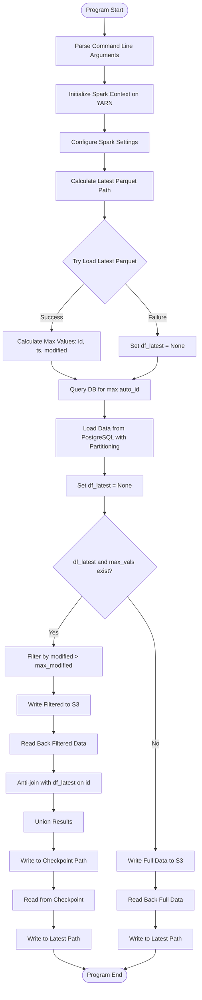
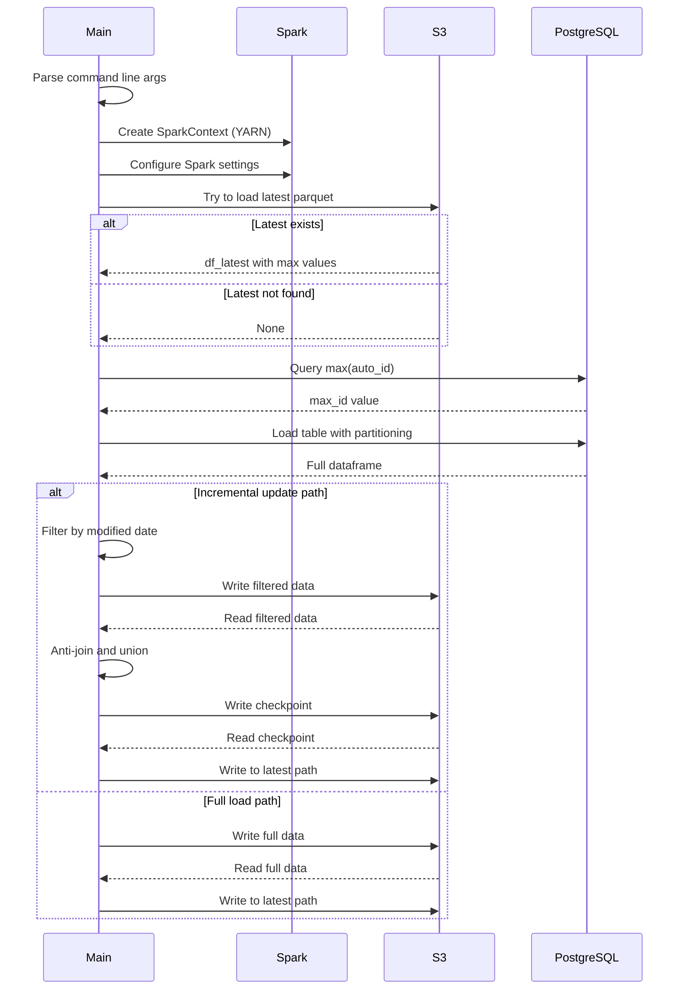
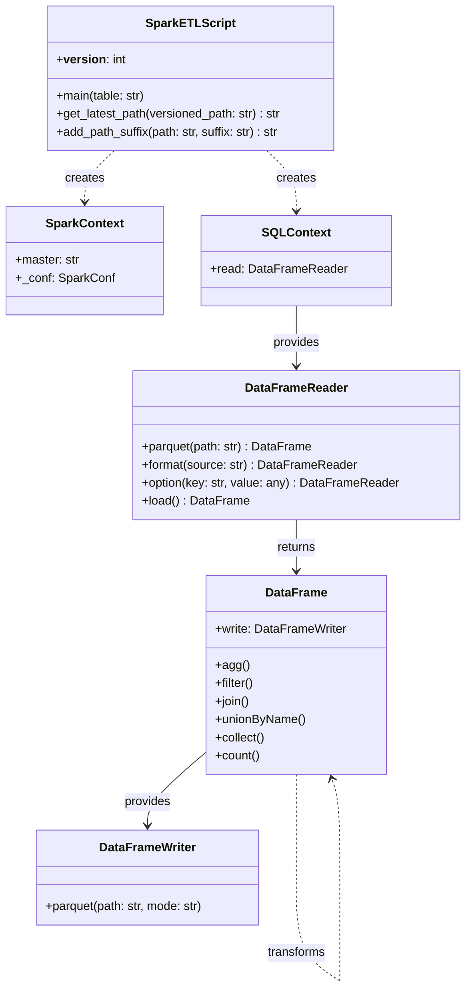

# Diagram: research/orchestrator/tasks/etl/extract_public_package_container_exception_type_spark.py

> Auto-generated by Obscura crawlers

## Diagram 1

### SVG

<svg id="container" width="531.734375" xmlns="http://www.w3.org/2000/svg" class="flowchart" height="2649.796875" viewBox="0 0 531.734375 2649.796875" role="graphics-document document" aria-roledescription="flowchart-v2"><g><marker id="container_flowchart-v2-pointEnd" class="marker flowchart-v2" viewBox="0 0 10 10" refX="5" refY="5" markerUnits="userSpaceOnUse" markerWidth="8" markerHeight="8" orient="auto"><path d="M 0 0 L 10 5 L 0 10 z" class="arrowMarkerPath" style="stroke-width: 1; stroke-dasharray: 1, 0;"></path></marker><marker id="container_flowchart-v2-pointStart" class="marker flowchart-v2" viewBox="0 0 10 10" refX="4.5" refY="5" markerUnits="userSpaceOnUse" markerWidth="8" markerHeight="8" orient="auto"><path d="M 0 5 L 10 10 L 10 0 z" class="arrowMarkerPath" style="stroke-width: 1; stroke-dasharray: 1, 0;"></path></marker><marker id="container_flowchart-v2-circleEnd" class="marker flowchart-v2" viewBox="0 0 10 10" refX="11" refY="5" markerUnits="userSpaceOnUse" markerWidth="11" markerHeight="11" orient="auto"><circle cx="5" cy="5" r="5" class="arrowMarkerPath" style="stroke-width: 1; stroke-dasharray: 1, 0;"></circle></marker><marker id="container_flowchart-v2-circleStart" class="marker flowchart-v2" viewBox="0 0 10 10" refX="-1" refY="5" markerUnits="userSpaceOnUse" markerWidth="11" markerHeight="11" orient="auto"><circle cx="5" cy="5" r="5" class="arrowMarkerPath" style="stroke-width: 1; stroke-dasharray: 1, 0;"></circle></marker><marker id="container_flowchart-v2-crossEnd" class="marker cross flowchart-v2" viewBox="0 0 11 11" refX="12" refY="5.2" markerUnits="userSpaceOnUse" markerWidth="11" markerHeight="11" orient="auto"><path d="M 1,1 l 9,9 M 10,1 l -9,9" class="arrowMarkerPath" style="stroke-width: 2; stroke-dasharray: 1, 0;"></path></marker><marker id="container_flowchart-v2-crossStart" class="marker cross flowchart-v2" viewBox="0 0 11 11" refX="-1" refY="5.2" markerUnits="userSpaceOnUse" markerWidth="11" markerHeight="11" orient="auto"><path d="M 1,1 l 9,9 M 10,1 l -9,9" class="arrowMarkerPath" style="stroke-width: 2; stroke-dasharray: 1, 0;"></path></marker><g class="root"><g class="clusters"></g><g class="edgePaths"><path d="M279.934,47.5L279.85,51.583C279.767,55.667,279.6,63.833,279.517,71.417C279.434,79,279.434,86,279.434,89.5L279.434,93" id="L_Start_ParseArgs_0" class="edge-thickness-normal edge-pattern-solid edge-thickness-normal edge-pattern-solid flowchart-link" style=";" data-edge="true" data-et="edge" data-id="L_Start_ParseArgs_0" data-points="W3sieCI6Mjc5LjkzMzU5Mzc1LCJ5Ijo0Ny41fSx7IngiOjI3OS40MzM1OTM3NSwieSI6NzJ9LHsieCI6Mjc5LjQzMzU5Mzc1LCJ5Ijo5N31d" marker-end="url(#container_flowchart-v2-pointEnd)"></path><path d="M279.434,175L279.434,179.167C279.434,183.333,279.434,191.667,279.434,199.333C279.434,207,279.434,214,279.434,217.5L279.434,221" id="L_ParseArgs_InitSpark_0" class="edge-thickness-normal edge-pattern-solid edge-thickness-normal edge-pattern-solid flowchart-link" style=";" data-edge="true" data-et="edge" data-id="L_ParseArgs_InitSpark_0" data-points="W3sieCI6Mjc5LjQzMzU5Mzc1LCJ5IjoxNzV9LHsieCI6Mjc5LjQzMzU5Mzc1LCJ5IjoyMDB9LHsieCI6Mjc5LjQzMzU5Mzc1LCJ5IjoyMjV9XQ==" marker-end="url(#container_flowchart-v2-pointEnd)"></path><path d="M279.434,303L279.434,307.167C279.434,311.333,279.434,319.667,279.434,327.333C279.434,335,279.434,342,279.434,345.5L279.434,349" id="L_InitSpark_ConfigSpark_0" class="edge-thickness-normal edge-pattern-solid edge-thickness-normal edge-pattern-solid flowchart-link" style=";" data-edge="true" data-et="edge" data-id="L_InitSpark_ConfigSpark_0" data-points="W3sieCI6Mjc5LjQzMzU5Mzc1LCJ5IjozMDN9LHsieCI6Mjc5LjQzMzU5Mzc1LCJ5IjozMjh9LHsieCI6Mjc5LjQzMzU5Mzc1LCJ5IjozNTN9XQ==" marker-end="url(#container_flowchart-v2-pointEnd)"></path><path d="M279.434,407L279.434,411.167C279.434,415.333,279.434,423.667,279.434,431.333C279.434,439,279.434,446,279.434,449.5L279.434,453" id="L_ConfigSpark_GetLatestPath_0" class="edge-thickness-normal edge-pattern-solid edge-thickness-normal edge-pattern-solid flowchart-link" style=";" data-edge="true" data-et="edge" data-id="L_ConfigSpark_GetLatestPath_0" data-points="W3sieCI6Mjc5LjQzMzU5Mzc1LCJ5Ijo0MDd9LHsieCI6Mjc5LjQzMzU5Mzc1LCJ5Ijo0MzJ9LHsieCI6Mjc5LjQzMzU5Mzc1LCJ5Ijo0NTd9XQ==" marker-end="url(#container_flowchart-v2-pointEnd)"></path><path d="M279.434,535L279.434,539.167C279.434,543.333,279.434,551.667,279.434,559.333C279.434,567,279.434,574,279.434,577.5L279.434,581" id="L_GetLatestPath_TryLoadLatest_0" class="edge-thickness-normal edge-pattern-solid edge-thickness-normal edge-pattern-solid flowchart-link" style=";" data-edge="true" data-et="edge" data-id="L_GetLatestPath_TryLoadLatest_0" data-points="W3sieCI6Mjc5LjQzMzU5Mzc1LCJ5Ijo1MzV9LHsieCI6Mjc5LjQzMzU5Mzc1LCJ5Ijo1NjB9LHsieCI6Mjc5LjQzMzU5Mzc1LCJ5Ijo1ODV9XQ==" marker-end="url(#container_flowchart-v2-pointEnd)"></path><path d="M224.923,754.286L210.436,769.538C195.949,784.79,166.974,815.293,152.487,836.045C138,856.797,138,867.797,138,873.297L138,878.797" id="L_TryLoadLatest_CalcMaxVals_0" class="edge-thickness-normal edge-pattern-solid edge-thickness-normal edge-pattern-solid flowchart-link" style=";" data-edge="true" data-et="edge" data-id="L_TryLoadLatest_CalcMaxVals_0" data-points="W3sieCI6MjI0LjkyMjkwNzg4OTc1NzgyLCJ5Ijo3NTQuMjg2MTg5MTM5NzU3OH0seyJ4IjoxMzgsInkiOjg0NS43OTY4NzV9LHsieCI6MTM4LCJ5Ijo4ODIuNzk2ODc1fV0=" marker-end="url(#container_flowchart-v2-pointEnd)"></path><path d="M333.944,754.286L348.431,769.538C362.919,784.79,391.893,815.293,406.38,838.045C420.867,860.797,420.867,875.797,420.867,883.297L420.867,890.797" id="L_TryLoadLatest_SetNullLatest_0" class="edge-thickness-normal edge-pattern-solid edge-thickness-normal edge-pattern-solid flowchart-link" style=";" data-edge="true" data-et="edge" data-id="L_TryLoadLatest_SetNullLatest_0" data-points="W3sieCI6MzMzLjk0NDI3OTYxMDI0MjIsInkiOjc1NC4yODYxODkxMzk3NTc4fSx7IngiOjQyMC44NjcxODc1LCJ5Ijo4NDUuNzk2ODc1fSx7IngiOjQyMC44NjcxODc1LCJ5Ijo4OTQuNzk2ODc1fV0=" marker-end="url(#container_flowchart-v2-pointEnd)"></path><path d="M138,960.797L138,964.964C138,969.13,138,977.464,148.707,985.567C159.414,993.67,180.828,1001.543,191.536,1005.48L202.243,1009.417" id="L_CalcMaxVals_GetDBMaxId_0" class="edge-thickness-normal edge-pattern-solid edge-thickness-normal edge-pattern-solid flowchart-link" style=";" data-edge="true" data-et="edge" data-id="L_CalcMaxVals_GetDBMaxId_0" data-points="W3sieCI6MTM4LCJ5Ijo5NjAuNzk2ODc1fSx7IngiOjEzOCwieSI6OTg1Ljc5Njg3NX0seyJ4IjoyMDUuOTk2OTIwMDcyMTE1NCwieSI6MTAxMC43OTY4NzV9XQ==" marker-end="url(#container_flowchart-v2-pointEnd)"></path><path d="M420.867,948.797L420.867,954.964C420.867,961.13,420.867,973.464,410.16,983.567C399.453,993.67,378.039,1001.543,367.332,1005.48L356.625,1009.417" id="L_SetNullLatest_GetDBMaxId_0" class="edge-thickness-normal edge-pattern-solid edge-thickness-normal edge-pattern-solid flowchart-link" style=";" data-edge="true" data-et="edge" data-id="L_SetNullLatest_GetDBMaxId_0" data-points="W3sieCI6NDIwLjg2NzE4NzUsInkiOjk0OC43OTY4NzV9LHsieCI6NDIwLjg2NzE4NzUsInkiOjk4NS43OTY4NzV9LHsieCI6MzUyLjg3MDI2NzQyNzg4NDY0LCJ5IjoxMDEwLjc5Njg3NX1d" marker-end="url(#container_flowchart-v2-pointEnd)"></path><path d="M279.434,1064.797L279.434,1068.964C279.434,1073.13,279.434,1081.464,279.434,1089.13C279.434,1096.797,279.434,1103.797,279.434,1107.297L279.434,1110.797" id="L_GetDBMaxId_LoadFromDB_0" class="edge-thickness-normal edge-pattern-solid edge-thickness-normal edge-pattern-solid flowchart-link" style=";" data-edge="true" data-et="edge" data-id="L_GetDBMaxId_LoadFromDB_0" data-points="W3sieCI6Mjc5LjQzMzU5Mzc1LCJ5IjoxMDY0Ljc5Njg3NX0seyJ4IjoyNzkuNDMzNTkzNzUsInkiOjEwODkuNzk2ODc1fSx7IngiOjI3OS40MzM1OTM3NSwieSI6MTExNC43OTY4NzV9XQ==" marker-end="url(#container_flowchart-v2-pointEnd)"></path><path d="M279.434,1216.797L279.434,1220.964C279.434,1225.13,279.434,1233.464,279.434,1241.13C279.434,1248.797,279.434,1255.797,279.434,1259.297L279.434,1262.797" id="L_LoadFromDB_ResetLatest_0" class="edge-thickness-normal edge-pattern-solid edge-thickness-normal edge-pattern-solid flowchart-link" style=";" data-edge="true" data-et="edge" data-id="L_LoadFromDB_ResetLatest_0" data-points="W3sieCI6Mjc5LjQzMzU5Mzc1LCJ5IjoxMjE2Ljc5Njg3NX0seyJ4IjoyNzkuNDMzNTkzNzUsInkiOjEyNDEuNzk2ODc1fSx7IngiOjI3OS40MzM1OTM3NSwieSI6MTI2Ni43OTY4NzV9XQ==" marker-end="url(#container_flowchart-v2-pointEnd)"></path><path d="M279.434,1320.797L279.434,1324.964C279.434,1329.13,279.434,1337.464,279.434,1345.13C279.434,1352.797,279.434,1359.797,279.434,1363.297L279.434,1366.797" id="L_ResetLatest_CheckLatest_0" class="edge-thickness-normal edge-pattern-solid edge-thickness-normal edge-pattern-solid flowchart-link" style=";" data-edge="true" data-et="edge" data-id="L_ResetLatest_CheckLatest_0" data-points="W3sieCI6Mjc5LjQzMzU5Mzc1LCJ5IjoxMzIwLjc5Njg3NX0seyJ4IjoyNzkuNDMzNTkzNzUsInkiOjEzNDUuNzk2ODc1fSx7IngiOjI3OS40MzM1OTM3NSwieSI6MTM3MC43OTY4NzV9XQ==" marker-end="url(#container_flowchart-v2-pointEnd)"></path><path d="M218.781,1588.144L206.181,1604.42C193.582,1620.695,168.383,1653.246,155.783,1675.021C143.184,1696.797,143.184,1707.797,143.184,1713.297L143.184,1718.797" id="L_CheckLatest_FilterModified_0" class="edge-thickness-normal edge-pattern-solid edge-thickness-normal edge-pattern-solid flowchart-link" style=";" data-edge="true" data-et="edge" data-id="L_CheckLatest_FilterModified_0" data-points="W3sieCI6MjE4Ljc4MTA3MTczMjM4NTksInkiOjE1ODguMTQ0MzUyOTgyMzg2fSx7IngiOjE0My4xODM1OTM3NSwieSI6MTY4NS43OTY4NzV9LHsieCI6MTQzLjE4MzU5Mzc1LCJ5IjoxNzIyLjc5Njg3NX1d" marker-end="url(#container_flowchart-v2-pointEnd)"></path><path d="M143.184,1800.797L143.184,1804.964C143.184,1809.13,143.184,1817.464,143.184,1825.13C143.184,1832.797,143.184,1839.797,143.184,1843.297L143.184,1846.797" id="L_FilterModified_WriteFiltered_0" class="edge-thickness-normal edge-pattern-solid edge-thickness-normal edge-pattern-solid flowchart-link" style=";" data-edge="true" data-et="edge" data-id="L_FilterModified_WriteFiltered_0" data-points="W3sieCI6MTQzLjE4MzU5Mzc1LCJ5IjoxODAwLjc5Njg3NX0seyJ4IjoxNDMuMTgzNTkzNzUsInkiOjE4MjUuNzk2ODc1fSx7IngiOjE0My4xODM1OTM3NSwieSI6MTg1MC43OTY4NzV9XQ==" marker-end="url(#container_flowchart-v2-pointEnd)"></path><path d="M143.184,1904.797L143.184,1908.964C143.184,1913.13,143.184,1921.464,143.184,1929.13C143.184,1936.797,143.184,1943.797,143.184,1947.297L143.184,1950.797" id="L_WriteFiltered_ReadFiltered_0" class="edge-thickness-normal edge-pattern-solid edge-thickness-normal edge-pattern-solid flowchart-link" style=";" data-edge="true" data-et="edge" data-id="L_WriteFiltered_ReadFiltered_0" data-points="W3sieCI6MTQzLjE4MzU5Mzc1LCJ5IjoxOTA0Ljc5Njg3NX0seyJ4IjoxNDMuMTgzNTkzNzUsInkiOjE5MjkuNzk2ODc1fSx7IngiOjE0My4xODM1OTM3NSwieSI6MTk1NC43OTY4NzV9XQ==" marker-end="url(#container_flowchart-v2-pointEnd)"></path><path d="M143.184,2008.797L143.184,2012.964C143.184,2017.13,143.184,2025.464,143.184,2033.13C143.184,2040.797,143.184,2047.797,143.184,2051.297L143.184,2054.797" id="L_ReadFiltered_AntiJoin_0" class="edge-thickness-normal edge-pattern-solid edge-thickness-normal edge-pattern-solid flowchart-link" style=";" data-edge="true" data-et="edge" data-id="L_ReadFiltered_AntiJoin_0" data-points="W3sieCI6MTQzLjE4MzU5Mzc1LCJ5IjoyMDA4Ljc5Njg3NX0seyJ4IjoxNDMuMTgzNTkzNzUsInkiOjIwMzMuNzk2ODc1fSx7IngiOjE0My4xODM1OTM3NSwieSI6MjA1OC43OTY4NzV9XQ==" marker-end="url(#container_flowchart-v2-pointEnd)"></path><path d="M143.184,2136.797L143.184,2140.964C143.184,2145.13,143.184,2153.464,143.184,2161.13C143.184,2168.797,143.184,2175.797,143.184,2179.297L143.184,2182.797" id="L_AntiJoin_Union_0" class="edge-thickness-normal edge-pattern-solid edge-thickness-normal edge-pattern-solid flowchart-link" style=";" data-edge="true" data-et="edge" data-id="L_AntiJoin_Union_0" data-points="W3sieCI6MTQzLjE4MzU5Mzc1LCJ5IjoyMTM2Ljc5Njg3NX0seyJ4IjoxNDMuMTgzNTkzNzUsInkiOjIxNjEuNzk2ODc1fSx7IngiOjE0My4xODM1OTM3NSwieSI6MjE4Ni43OTY4NzV9XQ==" marker-end="url(#container_flowchart-v2-pointEnd)"></path><path d="M143.184,2240.797L143.184,2244.964C143.184,2249.13,143.184,2257.464,143.184,2265.13C143.184,2272.797,143.184,2279.797,143.184,2283.297L143.184,2286.797" id="L_Union_WriteCheckpoint_0" class="edge-thickness-normal edge-pattern-solid edge-thickness-normal edge-pattern-solid flowchart-link" style=";" data-edge="true" data-et="edge" data-id="L_Union_WriteCheckpoint_0" data-points="W3sieCI6MTQzLjE4MzU5Mzc1LCJ5IjoyMjQwLjc5Njg3NX0seyJ4IjoxNDMuMTgzNTkzNzUsInkiOjIyNjUuNzk2ODc1fSx7IngiOjE0My4xODM1OTM3NSwieSI6MjI5MC43OTY4NzV9XQ==" marker-end="url(#container_flowchart-v2-pointEnd)"></path><path d="M143.184,2344.797L143.184,2348.964C143.184,2353.13,143.184,2361.464,143.184,2369.13C143.184,2376.797,143.184,2383.797,143.184,2387.297L143.184,2390.797" id="L_WriteCheckpoint_ReadCheckpoint_0" class="edge-thickness-normal edge-pattern-solid edge-thickness-normal edge-pattern-solid flowchart-link" style=";" data-edge="true" data-et="edge" data-id="L_WriteCheckpoint_ReadCheckpoint_0" data-points="W3sieCI6MTQzLjE4MzU5Mzc1LCJ5IjoyMzQ0Ljc5Njg3NX0seyJ4IjoxNDMuMTgzNTkzNzUsInkiOjIzNjkuNzk2ODc1fSx7IngiOjE0My4xODM1OTM3NSwieSI6MjM5NC43OTY4NzV9XQ==" marker-end="url(#container_flowchart-v2-pointEnd)"></path><path d="M143.184,2448.797L143.184,2452.964C143.184,2457.13,143.184,2465.464,143.184,2473.13C143.184,2480.797,143.184,2487.797,143.184,2491.297L143.184,2494.797" id="L_ReadCheckpoint_WriteLatest_0" class="edge-thickness-normal edge-pattern-solid edge-thickness-normal edge-pattern-solid flowchart-link" style=";" data-edge="true" data-et="edge" data-id="L_ReadCheckpoint_WriteLatest_0" data-points="W3sieCI6MTQzLjE4MzU5Mzc1LCJ5IjoyNDQ4Ljc5Njg3NX0seyJ4IjoxNDMuMTgzNTkzNzUsInkiOjI0NzMuNzk2ODc1fSx7IngiOjE0My4xODM1OTM3NSwieSI6MjQ5OC43OTY4NzV9XQ==" marker-end="url(#container_flowchart-v2-pointEnd)"></path><path d="M340.086,1588.144L352.686,1604.42C365.285,1620.695,390.484,1653.246,403.084,1682.188C415.684,1711.13,415.684,1736.464,415.684,1759.797C415.684,1783.13,415.684,1804.464,415.684,1823.797C415.684,1843.13,415.684,1860.464,415.684,1877.797C415.684,1895.13,415.684,1912.464,415.684,1929.797C415.684,1947.13,415.684,1964.464,415.684,1981.797C415.684,1999.13,415.684,2016.464,415.684,2035.797C415.684,2055.13,415.684,2076.464,415.684,2097.797C415.684,2119.13,415.684,2140.464,415.684,2159.797C415.684,2179.13,415.684,2196.464,415.684,2213.797C415.684,2231.13,415.684,2248.464,415.684,2260.63C415.684,2272.797,415.684,2279.797,415.684,2283.297L415.684,2286.797" id="L_CheckLatest_WriteFull_0" class="edge-thickness-normal edge-pattern-solid edge-thickness-normal edge-pattern-solid flowchart-link" style=";" data-edge="true" data-et="edge" data-id="L_CheckLatest_WriteFull_0" data-points="W3sieCI6MzQwLjA4NjExNTc2NzYxNDEsInkiOjE1ODguMTQ0MzUyOTgyMzg2fSx7IngiOjQxNS42ODM1OTM3NSwieSI6MTY4NS43OTY4NzV9LHsieCI6NDE1LjY4MzU5Mzc1LCJ5IjoxNzYxLjc5Njg3NX0seyJ4Ijo0MTUuNjgzNTkzNzUsInkiOjE4MjUuNzk2ODc1fSx7IngiOjQxNS42ODM1OTM3NSwieSI6MTg3Ny43OTY4NzV9LHsieCI6NDE1LjY4MzU5Mzc1LCJ5IjoxOTI5Ljc5Njg3NX0seyJ4Ijo0MTUuNjgzNTkzNzUsInkiOjE5ODEuNzk2ODc1fSx7IngiOjQxNS42ODM1OTM3NSwieSI6MjAzMy43OTY4NzV9LHsieCI6NDE1LjY4MzU5Mzc1LCJ5IjoyMDk3Ljc5Njg3NX0seyJ4Ijo0MTUuNjgzNTkzNzUsInkiOjIxNjEuNzk2ODc1fSx7IngiOjQxNS42ODM1OTM3NSwieSI6MjIxMy43OTY4NzV9LHsieCI6NDE1LjY4MzU5Mzc1LCJ5IjoyMjY1Ljc5Njg3NX0seyJ4Ijo0MTUuNjgzNTkzNzUsInkiOjIyOTAuNzk2ODc1fV0=" marker-end="url(#container_flowchart-v2-pointEnd)"></path><path d="M415.684,2344.797L415.684,2348.964C415.684,2353.13,415.684,2361.464,415.684,2369.13C415.684,2376.797,415.684,2383.797,415.684,2387.297L415.684,2390.797" id="L_WriteFull_ReadFull_0" class="edge-thickness-normal edge-pattern-solid edge-thickness-normal edge-pattern-solid flowchart-link" style=";" data-edge="true" data-et="edge" data-id="L_WriteFull_ReadFull_0" data-points="W3sieCI6NDE1LjY4MzU5Mzc1LCJ5IjoyMzQ0Ljc5Njg3NX0seyJ4Ijo0MTUuNjgzNTkzNzUsInkiOjIzNjkuNzk2ODc1fSx7IngiOjQxNS42ODM1OTM3NSwieSI6MjM5NC43OTY4NzV9XQ==" marker-end="url(#container_flowchart-v2-pointEnd)"></path><path d="M415.684,2448.797L415.684,2452.964C415.684,2457.13,415.684,2465.464,415.684,2473.13C415.684,2480.797,415.684,2487.797,415.684,2491.297L415.684,2494.797" id="L_ReadFull_WriteLatestFull_0" class="edge-thickness-normal edge-pattern-solid edge-thickness-normal edge-pattern-solid flowchart-link" style=";" data-edge="true" data-et="edge" data-id="L_ReadFull_WriteLatestFull_0" data-points="W3sieCI6NDE1LjY4MzU5Mzc1LCJ5IjoyNDQ4Ljc5Njg3NX0seyJ4Ijo0MTUuNjgzNTkzNzUsInkiOjI0NzMuNzk2ODc1fSx7IngiOjQxNS42ODM1OTM3NSwieSI6MjQ5OC43OTY4NzV9XQ==" marker-end="url(#container_flowchart-v2-pointEnd)"></path><path d="M143.184,2552.797L143.184,2556.964C143.184,2561.13,143.184,2569.464,157.065,2578.218C170.946,2586.972,198.709,2596.146,212.59,2600.734L226.471,2605.321" id="L_WriteLatest_End_0" class="edge-thickness-normal edge-pattern-solid edge-thickness-normal edge-pattern-solid flowchart-link" style=";" data-edge="true" data-et="edge" data-id="L_WriteLatest_End_0" data-points="W3sieCI6MTQzLjE4MzU5Mzc1LCJ5IjoyNTUyLjc5Njg3NX0seyJ4IjoxNDMuMTgzNTkzNzUsInkiOjI1NzcuNzk2ODc1fSx7IngiOjIzMC4yNjkxNDk3MjE3NjExNSwieSI6MjYwNi41NzYxOTQxOTgxMTY0fV0=" marker-end="url(#container_flowchart-v2-pointEnd)"></path><path d="M415.684,2552.797L415.684,2556.964C415.684,2561.13,415.684,2569.464,401.968,2578.215C388.253,2586.967,360.822,2596.138,347.107,2600.723L333.392,2605.308" id="L_WriteLatestFull_End_0" class="edge-thickness-normal edge-pattern-solid edge-thickness-normal edge-pattern-solid flowchart-link" style=";" data-edge="true" data-et="edge" data-id="L_WriteLatestFull_End_0" data-points="W3sieCI6NDE1LjY4MzU5Mzc1LCJ5IjoyNTUyLjc5Njg3NX0seyJ4Ijo0MTUuNjgzNTkzNzUsInkiOjI1NzcuNzk2ODc1fSx7IngiOjMyOS41OTgwMzU4ODYwMzYwMywieSI6MjYwNi41NzYxOTQ4MTYxMjAzfV0=" marker-end="url(#container_flowchart-v2-pointEnd)"></path></g><g class="edgeLabels"><g class="edgeLabel"><g class="label" data-id="L_Start_ParseArgs_0" transform="translate(0, 0)"><foreignObject width="0" height="0">

</foreignObject></g></g><g class="edgeLabel"><g class="label" data-id="L_ParseArgs_InitSpark_0" transform="translate(0, 0)"><foreignObject width="0" height="0">

</foreignObject></g></g><g class="edgeLabel"><g class="label" data-id="L_InitSpark_ConfigSpark_0" transform="translate(0, 0)"><foreignObject width="0" height="0">

</foreignObject></g></g><g class="edgeLabel"><g class="label" data-id="L_ConfigSpark_GetLatestPath_0" transform="translate(0, 0)"><foreignObject width="0" height="0">

</foreignObject></g></g><g class="edgeLabel"><g class="label" data-id="L_GetLatestPath_TryLoadLatest_0" transform="translate(0, 0)"><foreignObject width="0" height="0">

</foreignObject></g></g><g class="edgeLabel" transform="translate(138, 845.796875)"><g class="label" data-id="L_TryLoadLatest_CalcMaxVals_0" transform="translate(-28.1015625, -12)"><foreignObject width="56.203125" height="24">

Success

</foreignObject></g></g><g class="edgeLabel" transform="translate(420.8671875, 845.796875)"><g class="label" data-id="L_TryLoadLatest_SetNullLatest_0" transform="translate(-24.265625, -12)"><foreignObject width="48.53125" height="24">

Failure

</foreignObject></g></g><g class="edgeLabel"><g class="label" data-id="L_CalcMaxVals_GetDBMaxId_0" transform="translate(0, 0)"><foreignObject width="0" height="0">

</foreignObject></g></g><g class="edgeLabel"><g class="label" data-id="L_SetNullLatest_GetDBMaxId_0" transform="translate(0, 0)"><foreignObject width="0" height="0">

</foreignObject></g></g><g class="edgeLabel"><g class="label" data-id="L_GetDBMaxId_LoadFromDB_0" transform="translate(0, 0)"><foreignObject width="0" height="0">

</foreignObject></g></g><g class="edgeLabel"><g class="label" data-id="L_LoadFromDB_ResetLatest_0" transform="translate(0, 0)"><foreignObject width="0" height="0">

</foreignObject></g></g><g class="edgeLabel"><g class="label" data-id="L_ResetLatest_CheckLatest_0" transform="translate(0, 0)"><foreignObject width="0" height="0">

</foreignObject></g></g><g class="edgeLabel" transform="translate(143.18359375, 1685.796875)"><g class="label" data-id="L_CheckLatest_FilterModified_0" transform="translate(-12.03125, -12)"><foreignObject width="24.0625" height="24">

Yes

</foreignObject></g></g><g class="edgeLabel"><g class="label" data-id="L_FilterModified_WriteFiltered_0" transform="translate(0, 0)"><foreignObject width="0" height="0">

</foreignObject></g></g><g class="edgeLabel"><g class="label" data-id="L_WriteFiltered_ReadFiltered_0" transform="translate(0, 0)"><foreignObject width="0" height="0">

</foreignObject></g></g><g class="edgeLabel"><g class="label" data-id="L_ReadFiltered_AntiJoin_0" transform="translate(0, 0)"><foreignObject width="0" height="0">

</foreignObject></g></g><g class="edgeLabel"><g class="label" data-id="L_AntiJoin_Union_0" transform="translate(0, 0)"><foreignObject width="0" height="0">

</foreignObject></g></g><g class="edgeLabel"><g class="label" data-id="L_Union_WriteCheckpoint_0" transform="translate(0, 0)"><foreignObject width="0" height="0">

</foreignObject></g></g><g class="edgeLabel"><g class="label" data-id="L_WriteCheckpoint_ReadCheckpoint_0" transform="translate(0, 0)"><foreignObject width="0" height="0">

</foreignObject></g></g><g class="edgeLabel"><g class="label" data-id="L_ReadCheckpoint_WriteLatest_0" transform="translate(0, 0)"><foreignObject width="0" height="0">

</foreignObject></g></g><g class="edgeLabel" transform="translate(415.68359375, 1981.796875)"><g class="label" data-id="L_CheckLatest_WriteFull_0" transform="translate(-10.140625, -12)"><foreignObject width="20.28125" height="24">

No

</foreignObject></g></g><g class="edgeLabel"><g class="label" data-id="L_WriteFull_ReadFull_0" transform="translate(0, 0)"><foreignObject width="0" height="0">

</foreignObject></g></g><g class="edgeLabel"><g class="label" data-id="L_ReadFull_WriteLatestFull_0" transform="translate(0, 0)"><foreignObject width="0" height="0">

</foreignObject></g></g><g class="edgeLabel"><g class="label" data-id="L_WriteLatest_End_0" transform="translate(0, 0)"><foreignObject width="0" height="0">

</foreignObject></g></g><g class="edgeLabel"><g class="label" data-id="L_WriteLatestFull_End_0" transform="translate(0, 0)"><foreignObject width="0" height="0">

</foreignObject></g></g></g><g class="nodes"><g class="node default" id="flowchart-Start-0" transform="translate(279.43359375, 27.5)"><g class="basic label-container outer-path"><path d="M-42.703125 -19.5 C-21.05879772450801 -19.5, 0.5855295509839777 -19.5, 42.703125 -19.5 C42.703125 -19.5, 42.703125 -19.5, 42.703125 -19.5 C43.10126567332023 -19.48723240354043, 43.49940634664045 -19.474464807080857, 43.9524942896239 -19.45993515863156 C44.24216258131251 -19.431991206909448, 44.531830873001134 -19.404047255187336, 45.196729652847864 -19.3399052695533 C45.50696597417165 -19.289748667040275, 45.81720229549544 -19.239592064527248, 46.43071825967676 -19.140403561325776 C46.85515080755411 -19.043529601953985, 47.27958335543147 -18.946655642582193, 47.64938938623539 -18.862249829261074 C48.04551946173404 -18.744680502182273, 48.441649537232685 -18.627111175103472, 48.847735251460605 -18.50658706670804 C49.234290660891496 -18.364331102758438, 49.62084607032239 -18.222075138808833, 50.0208315951478 -18.074876768247425 C50.375155900977425 -17.918027908713736, 50.72948020680706 -17.761179049180047, 51.16385791279238 -17.568892924097174 C51.58923573457166 -17.346973586942422, 52.01461355635094 -17.125054249787674, 52.27211726407678 -16.990714730406097 C52.59593354455443 -16.79441539822486, 52.91974982503207 -16.598116066043623, 53.3410555736057 -16.342718045390892 C53.704562100920256 -16.089151627880206, 54.06806862823481 -15.83558521036952, 54.36628034457871 -15.627565626425154 C54.66623067625075 -15.388363218930253, 54.966181007922785 -15.149160811435353, 55.343578708501866 -14.848196188198123 C55.64948925117598 -14.570376327290923, 55.955399793850084 -14.292556466383724, 56.26893473676799 -14.007812326905688 C56.55090473806513 -13.716655150398749, 56.83287473936227 -13.425497973891808, 57.13854594296865 -13.10986736009568 C57.35802058898177 -12.852059952427528, 57.57749523499489 -12.594252544759373, 57.94883890812658 -12.158051136245305 C58.18445284564199 -11.842349924845935, 58.4200667831574 -11.526648713446564, 58.696483964640635 -11.156274872382312 C58.8454368393927 -10.927443257315826, 58.99438971414476 -10.698611642249338, 59.37840887860425 -10.108655082055241 C59.523372285891256 -9.851257873280423, 59.668335693178264 -9.593860664505604, 59.991811474273504 -9.019496659696287 C60.16290215375862 -8.66422320299134, 60.33399283324374 -8.308949746286395, 60.53417114880834 -7.893275190886684 C60.67378393137229 -7.548428918724205, 60.81339671393624 -7.203582646561724, 61.003259229970325 -6.734618561215508 C61.127012627387856 -6.361893045620111, 61.25076602480538 -5.989167530024713, 61.39714813421488 -5.548287939305138 C61.492431257722 -5.184932093405557, 61.58771438122911 -4.821576247505976, 61.71421928754556 -4.339158212148133 C61.794252500222726 -3.9282045800763643, 61.8742857128999 -3.5172509480045955, 61.953169776581774 -3.1121979531509023 C61.988787935882364 -2.835950543216633, 62.024406095182954 -2.5597031332823637, 62.11301770250937 -1.872449005199798 C62.14234792645135 -1.415607092372734, 62.17167815039334 -0.95876517954567, 62.19310621591342 -0.6250057626472757 C62.19310621591342 -0.2035914505817507, 62.19310621591342 0.21782286148377428, 62.19310621591342 0.625005762647271 C62.17134190758545 0.9640024326888598, 62.149577599257476 1.3029991027304484, 62.11301770250937 1.8724490051997846 C62.07721304889547 2.1501428282005737, 62.04140839528158 2.4278366512013623, 61.953169776581774 3.1121979531508885 C61.8685039049315 3.5469393099367372, 61.78383803328123 3.981680666722586, 61.71421928754556 4.339158212148129 C61.61278053605388 4.7259881354189, 61.511341784562205 5.112818058689672, 61.39714813421489 5.548287939305125 C61.311757707145134 5.805470300522273, 61.22636728007538 6.0626526617394205, 61.003259229970325 6.734618561215495 C60.86738554875828 7.070229180748168, 60.73151186754623 7.405839800280842, 60.53417114880834 7.893275190886679 C60.37071058398115 8.232704551246135, 60.20725001915397 8.572133911605592, 59.991811474273504 9.019496659696284 C59.794548875767795 9.369756378347276, 59.59728627726209 9.720016096998268, 59.37840887860425 10.108655082055236 C59.22487967301199 10.344517170209166, 59.07135046741973 10.580379258363095, 58.69648396464064 11.156274872382301 C58.4699341997242 11.459830918262165, 58.24338443480776 11.763386964142029, 57.94883890812658 12.158051136245302 C57.66370897194511 12.492980983637041, 57.37857903576364 12.827910831028781, 57.13854594296866 13.10986736009567 C56.9170759516411 13.338553309165825, 56.695605960313536 13.567239258235979, 56.26893473676799 14.007812326905684 C56.025253995187164 14.229116728970274, 55.781573253606346 14.450421131034862, 55.34357870850189 14.848196188198111 C55.098596384918665 15.043563072002309, 54.85361406133544 15.238929955806505, 54.36628034457871 15.627565626425152 C54.087802853531144 15.821819469083644, 53.80932536248358 16.016073311742137, 53.34105557360571 16.34271804539089 C52.95883884627793 16.574420071651797, 52.57662211895015 16.806122097912706, 52.27211726407678 16.990714730406093 C51.948276871733235 17.15966205566205, 51.62443647938969 17.328609380918007, 51.16385791279239 17.56889292409717 C50.83262879752826 17.715518227862, 50.50139968226413 17.862143531626828, 50.020831595147804 18.07487676824742 C49.77640036861578 18.164829719108695, 49.53196914208375 18.25478266996997, 48.84773525146062 18.506587066708033 C48.41336532371061 18.63550578120996, 47.97899539596059 18.76442449571189, 47.64938938623541 18.86224982926107 C47.1679754718578 18.97212941369838, 46.68656155748018 19.082008998135688, 46.430718259676766 19.140403561325773 C46.06966466753855 19.198775906090255, 45.708611075400334 19.257148250854737, 45.19672965284788 19.3399052695533 C44.719834484708215 19.38591077287338, 44.24293931656856 19.43191627619346, 43.9524942896239 19.45993515863156 C43.544324454096966 19.47302437080252, 43.13615461857003 19.48611358297348, 42.70312500000001 19.5 C42.70312500000001 19.5, 42.703125 19.5, 42.703125 19.5 C13.730946393005524 19.5, -15.241232213988951 19.5, -42.70312499999999 19.5 C-43.12869627361789 19.486352757579308, -43.55426754723579 19.472705515158616, -43.95249428962389 19.45993515863156 C-44.427357562299775 19.414125669823157, -44.90222083497565 19.368316181014755, -45.19672965284787 19.3399052695533 C-45.618756819549034 19.271675190110614, -46.0407839862502 19.203445110667925, -46.43071825967676 19.140403561325773 C-46.90405313548973 19.032367964720187, -47.37738801130271 18.924332368114605, -47.649389386235384 18.862249829261074 C-48.1119884729675 18.724952848551144, -48.57458755969961 18.58765586784121, -48.84773525146059 18.506587066708043 C-49.133884750778236 18.401281405822175, -49.42003425009588 18.295975744936307, -50.0208315951478 18.074876768247425 C-50.336084751163206 17.93532354773201, -50.65133790717861 17.7957703272166, -51.16385791279238 17.568892924097174 C-51.60589418460138 17.338282884232164, -52.047930456410384 17.107672844367155, -52.27211726407678 16.990714730406097 C-52.54537120305221 16.825066586780803, -52.81862514202764 16.65941844315551, -53.341055573605686 16.3427180453909 C-53.75079768894814 16.0568996831783, -54.16053980429059 15.771081320965704, -54.36628034457871 15.627565626425156 C-54.63665629535328 15.411948000688657, -54.907032246127855 15.196330374952156, -55.343578708501866 14.848196188198125 C-55.64525618296526 14.574220687839045, -55.94693365742866 14.300245187479966, -56.268934736767974 14.007812326905697 C-56.555517270144676 13.711892332330688, -56.84209980352137 13.41597233775568, -57.138545942968655 13.109867360095677 C-57.36904051294477 12.839115322689151, -57.59953508292089 12.568363285282626, -57.948838908126575 12.158051136245307 C-58.14675956507898 11.892855486871868, -58.34468022203138 11.627659837498431, -58.696483964640635 11.156274872382316 C-58.92764990020388 10.801141918611906, -59.15881583576713 10.446008964841496, -59.37840887860425 10.108655082055249 C-59.56527956943656 9.77684724777312, -59.75215026026888 9.445039413490989, -59.991811474273504 9.019496659696289 C-60.12119991957103 8.750818784566732, -60.25058836486857 8.482140909437176, -60.53417114880834 7.893275190886686 C-60.66021911110579 7.58193428704043, -60.78626707340323 7.270593383194174, -61.003259229970325 6.73461856121551 C-61.155645465712084 6.275655498610781, -61.30803170145384 5.816692436006052, -61.39714813421488 5.5482879393051325 C-61.4639877535307 5.293399502379647, -61.530827372846524 5.038511065454162, -61.71421928754556 4.339158212148136 C-61.79795158372019 3.9092105681184757, -61.881683879894815 3.479262924088816, -61.953169776581774 3.112197953150904 C-62.006341778665714 2.699806404987306, -62.059513780749654 2.2874148568237085, -62.11301770250937 1.872449005199809 C-62.13137469642675 1.5865240074377853, -62.14973169034413 1.3005990096757616, -62.19310621591342 0.6250057626472781 C-62.19310621591342 0.31732747331289013, -62.19310621591342 0.009649183978502118, -62.19310621591342 -0.6250057626472687 C-62.170581201007984 -0.9758510516642138, -62.148056186102544 -1.326696340681159, -62.11301770250937 -1.8724490051997822 C-62.07133977461817 -2.195694783686168, -62.02966184672697 -2.5189405621725545, -61.953169776581774 -3.112197953150895 C-61.86970925057522 -3.540750114806157, -61.78624872456866 -3.969302276461419, -61.71421928754556 -4.339158212148126 C-61.59948366464079 -4.776694869017523, -61.48474804173603 -5.2142315258869205, -61.39714813421489 -5.548287939305123 C-61.30574384423667 -5.823583097423631, -61.21433955425846 -6.0988782555421395, -61.00325922997033 -6.734618561215485 C-60.89220316826269 -7.008929180756253, -60.78114710655504 -7.283239800297022, -60.53417114880834 -7.893275190886676 C-60.36097481649826 -8.252921080736407, -60.187778484188186 -8.612566970586137, -59.991811474273504 -9.019496659696282 C-59.847012565622705 -9.276601784485223, -59.70221365697191 -9.533706909274164, -59.37840887860425 -10.108655082055243 C-59.171601810085015 -10.426366274774377, -58.96479474156579 -10.74407746749351, -58.69648396464064 -11.156274872382308 C-58.483834729318374 -11.441205474970278, -58.2711854939961 -11.726136077558248, -57.94883890812659 -12.158051136245302 C-57.76458854704797 -12.374482094510793, -57.58033818596935 -12.590913052776283, -57.13854594296866 -13.10986736009567 C-56.933825691586925 -13.321257827492534, -56.72910544020519 -13.532648294889398, -56.268934736767996 -14.007812326905677 C-55.98497589887863 -14.265696230337658, -55.70101706098926 -14.523580133769638, -55.34357870850189 -14.848196188198107 C-54.99625642376297 -15.12517646764323, -54.64893413902406 -15.402156747088354, -54.36628034457872 -15.627565626425149 C-54.039710877047035 -15.855366350010849, -53.71314140951536 -16.08316707359655, -53.341055573605715 -16.342718045390885 C-53.10387925210404 -16.486495725287973, -52.86670293060237 -16.630273405185058, -52.27211726407679 -16.99071473040609 C-52.017991041915764 -17.123292217731883, -51.76386481975474 -17.25586970505768, -51.16385791279239 -17.56889292409717 C-50.902109881906064 -17.68476101289108, -50.64036185101975 -17.80062910168499, -50.020831595147804 -18.07487676824742 C-49.63268301175838 -18.2177190349409, -49.244534428368965 -18.36056130163438, -48.84773525146062 -18.506587066708033 C-48.45932575083618 -18.621864967690293, -48.07091625021174 -18.737142868672557, -47.64938938623541 -18.862249829261067 C-47.19248462162792 -18.966535360200496, -46.735579857020426 -19.070820891139924, -46.430718259676766 -19.140403561325773 C-46.1355820650801 -19.18811889245279, -45.84044587048343 -19.235834223579808, -45.19672965284788 -19.3399052695533 C-44.80880003368765 -19.377328373360058, -44.42087041452743 -19.41475147716682, -43.9524942896239 -19.45993515863156 C-43.520494051539195 -19.473788565429484, -43.08849381345449 -19.487641972227404, -42.70312500000001 -19.5 C-42.70312500000001 -19.5, -42.703125 -19.5, -42.703125 -19.5" stroke="none" stroke-width="0" fill="#ECECFF" style=""></path><path d="M-42.703125 -19.5 C-13.377487824707224 -19.5, 15.948149350585552 -19.5, 42.703125 -19.5 M-42.703125 -19.5 C-11.96238823503107 -19.5, 18.77834852993786 -19.5, 42.703125 -19.5 M42.703125 -19.5 C42.703125 -19.5, 42.703125 -19.5, 42.703125 -19.5 M42.703125 -19.5 C42.703125 -19.5, 42.703125 -19.5, 42.703125 -19.5 M42.703125 -19.5 C43.1189378744605 -19.486665690446713, 43.53475074892099 -19.473331380893427, 43.9524942896239 -19.45993515863156 M42.703125 -19.5 C43.12757299916492 -19.48638877880469, 43.55202099832984 -19.472777557609387, 43.9524942896239 -19.45993515863156 M43.9524942896239 -19.45993515863156 C44.42429351005786 -19.414421255257874, 44.89609273049182 -19.36890735188419, 45.196729652847864 -19.3399052695533 M43.9524942896239 -19.45993515863156 C44.20586939767398 -19.43549236668612, 44.45924450572406 -19.411049574740677, 45.196729652847864 -19.3399052695533 M45.196729652847864 -19.3399052695533 C45.52999227795165 -19.286025952816775, 45.863254903055434 -19.232146636080255, 46.43071825967676 -19.140403561325776 M45.196729652847864 -19.3399052695533 C45.667872841574706 -19.26373449256994, 46.13901603030155 -19.187563715586585, 46.43071825967676 -19.140403561325776 M46.43071825967676 -19.140403561325776 C46.80095475780114 -19.055899496647825, 47.171191255925514 -18.971395431969874, 47.64938938623539 -18.862249829261074 M46.43071825967676 -19.140403561325776 C46.79741119482711 -19.056708291772736, 47.164104129977474 -18.973013022219696, 47.64938938623539 -18.862249829261074 M47.64938938623539 -18.862249829261074 C47.93964438324362 -18.776103669728602, 48.22989938025185 -18.68995751019613, 48.847735251460605 -18.50658706670804 M47.64938938623539 -18.862249829261074 C47.92830379001984 -18.77946949826943, 48.20721819380429 -18.69668916727779, 48.847735251460605 -18.50658706670804 M48.847735251460605 -18.50658706670804 C49.15580817361817 -18.393213383559182, 49.46388109577574 -18.27983970041032, 50.0208315951478 -18.074876768247425 M48.847735251460605 -18.50658706670804 C49.30782673869205 -18.33726914636778, 49.767918225923495 -18.167951226027526, 50.0208315951478 -18.074876768247425 M50.0208315951478 -18.074876768247425 C50.4127962130808 -17.901365659105757, 50.80476083101381 -17.727854549964093, 51.16385791279238 -17.568892924097174 M50.0208315951478 -18.074876768247425 C50.45631162452058 -17.882102677300185, 50.89179165389336 -17.68932858635295, 51.16385791279238 -17.568892924097174 M51.16385791279238 -17.568892924097174 C51.472751029738475 -17.40774358284188, 51.78164414668457 -17.24659424158659, 52.27211726407678 -16.990714730406097 M51.16385791279238 -17.568892924097174 C51.55284023719535 -17.365961094611215, 51.941822561598315 -17.16302926512526, 52.27211726407678 -16.990714730406097 M52.27211726407678 -16.990714730406097 C52.652661373846215 -16.76002665473845, 53.033205483615646 -16.529338579070803, 53.3410555736057 -16.342718045390892 M52.27211726407678 -16.990714730406097 C52.523182155782685 -16.838517717632904, 52.77424704748859 -16.68632070485971, 53.3410555736057 -16.342718045390892 M53.3410555736057 -16.342718045390892 C53.55033749360088 -16.196732037670557, 53.75961941359605 -16.050746029950226, 54.36628034457871 -15.627565626425154 M53.3410555736057 -16.342718045390892 C53.67043109307568 -16.11295994144507, 53.999806612545655 -15.883201837499245, 54.36628034457871 -15.627565626425154 M54.36628034457871 -15.627565626425154 C54.6373480757092 -15.411396324263862, 54.90841580683968 -15.19522702210257, 55.343578708501866 -14.848196188198123 M54.36628034457871 -15.627565626425154 C54.68193086503504 -15.37584273617435, 54.997581385491365 -15.124119845923547, 55.343578708501866 -14.848196188198123 M55.343578708501866 -14.848196188198123 C55.583296713007606 -14.63049063909685, 55.82301471751334 -14.412785089995577, 56.26893473676799 -14.007812326905688 M55.343578708501866 -14.848196188198123 C55.64356433041936 -14.575757183557272, 55.943549952336845 -14.30331817891642, 56.26893473676799 -14.007812326905688 M56.26893473676799 -14.007812326905688 C56.55516680263482 -13.712254218808534, 56.84139886850165 -13.416696110711378, 57.13854594296865 -13.10986736009568 M56.26893473676799 -14.007812326905688 C56.48387096171882 -13.7858730280517, 56.698807186669654 -13.563933729197712, 57.13854594296865 -13.10986736009568 M57.13854594296865 -13.10986736009568 C57.36459552888599 -12.844336653891345, 57.590645114803344 -12.57880594768701, 57.94883890812658 -12.158051136245305 M57.13854594296865 -13.10986736009568 C57.31796402069433 -12.899112676821256, 57.49738209842002 -12.688357993546829, 57.94883890812658 -12.158051136245305 M57.94883890812658 -12.158051136245305 C58.1592279776639 -11.876148949903829, 58.369617047201224 -11.594246763562351, 58.696483964640635 -11.156274872382312 M57.94883890812658 -12.158051136245305 C58.204698789588754 -11.815222204400714, 58.460558671050926 -11.472393272556122, 58.696483964640635 -11.156274872382312 M58.696483964640635 -11.156274872382312 C58.95973226958232 -10.751854783924188, 59.222980574524 -10.347434695466063, 59.37840887860425 -10.108655082055241 M58.696483964640635 -11.156274872382312 C58.96219227814768 -10.74807555016299, 59.22790059165474 -10.33987622794367, 59.37840887860425 -10.108655082055241 M59.37840887860425 -10.108655082055241 C59.50644702160126 -9.881310393896165, 59.63448516459827 -9.65396570573709, 59.991811474273504 -9.019496659696287 M59.37840887860425 -10.108655082055241 C59.505162483929055 -9.883591220606702, 59.63191608925387 -9.658527359158162, 59.991811474273504 -9.019496659696287 M59.991811474273504 -9.019496659696287 C60.147999124562 -8.69516966199187, 60.30418677485049 -8.370842664287451, 60.53417114880834 -7.893275190886684 M59.991811474273504 -9.019496659696287 C60.11869492571854 -8.756020457899714, 60.24557837716358 -8.492544256103141, 60.53417114880834 -7.893275190886684 M60.53417114880834 -7.893275190886684 C60.63234049521788 -7.650795007279916, 60.73050984162743 -7.408314823673148, 61.003259229970325 -6.734618561215508 M60.53417114880834 -7.893275190886684 C60.714199020408834 -7.44860286743136, 60.89422689200932 -7.003930543976035, 61.003259229970325 -6.734618561215508 M61.003259229970325 -6.734618561215508 C61.100665799463144 -6.44124549353238, 61.19807236895596 -6.147872425849251, 61.39714813421488 -5.548287939305138 M61.003259229970325 -6.734618561215508 C61.11324149958295 -6.4033694884372405, 61.22322376919557 -6.072120415658973, 61.39714813421488 -5.548287939305138 M61.39714813421488 -5.548287939305138 C61.499720330319676 -5.157135700486546, 61.60229252642448 -4.765983461667955, 61.71421928754556 -4.339158212148133 M61.39714813421488 -5.548287939305138 C61.46522999977437 -5.288662279059623, 61.53331186533386 -5.029036618814107, 61.71421928754556 -4.339158212148133 M61.71421928754556 -4.339158212148133 C61.79318556033214 -3.9336830909167095, 61.87215183311872 -3.528207969685286, 61.953169776581774 -3.1121979531509023 M61.71421928754556 -4.339158212148133 C61.786424129730186 -3.968401608028862, 61.85862897191482 -3.5976450039095904, 61.953169776581774 -3.1121979531509023 M61.953169776581774 -3.1121979531509023 C62.013021481862 -2.6479999460535444, 62.07287318714222 -2.1838019389561865, 62.11301770250937 -1.872449005199798 M61.953169776581774 -3.1121979531509023 C62.01507095427479 -2.632104642734019, 62.07697213196781 -2.152011332317135, 62.11301770250937 -1.872449005199798 M62.11301770250937 -1.872449005199798 C62.141495176133645 -1.428889366898669, 62.16997264975792 -0.98532972859754, 62.19310621591342 -0.6250057626472757 M62.11301770250937 -1.872449005199798 C62.129218946154964 -1.6201015580111708, 62.145420189800554 -1.3677541108225437, 62.19310621591342 -0.6250057626472757 M62.19310621591342 -0.6250057626472757 C62.19310621591342 -0.18397682734903797, 62.19310621591342 0.25705210794919975, 62.19310621591342 0.625005762647271 M62.19310621591342 -0.6250057626472757 C62.19310621591342 -0.27250632827500837, 62.19310621591342 0.07999310609725896, 62.19310621591342 0.625005762647271 M62.19310621591342 0.625005762647271 C62.17373871321083 0.9266702504068327, 62.154371210508245 1.2283347381663943, 62.11301770250937 1.8724490051997846 M62.19310621591342 0.625005762647271 C62.16247759099284 1.1020713187662459, 62.13184896607227 1.5791368748852208, 62.11301770250937 1.8724490051997846 M62.11301770250937 1.8724490051997846 C62.06578837156239 2.2387503695382494, 62.01855904061541 2.6050517338767136, 61.953169776581774 3.1121979531508885 M62.11301770250937 1.8724490051997846 C62.06534428492073 2.2421946178361445, 62.017670867332086 2.611940230472504, 61.953169776581774 3.1121979531508885 M61.953169776581774 3.1121979531508885 C61.872348294319096 3.5271991829434177, 61.79152681205642 3.9422004127359465, 61.71421928754556 4.339158212148129 M61.953169776581774 3.1121979531508885 C61.860801798077524 3.586488000791042, 61.768433819573275 4.060778048431196, 61.71421928754556 4.339158212148129 M61.71421928754556 4.339158212148129 C61.6297801846967 4.661161107449518, 61.54534108184784 4.983164002750907, 61.39714813421489 5.548287939305125 M61.71421928754556 4.339158212148129 C61.619809287674634 4.699184459208751, 61.52539928780371 5.059210706269373, 61.39714813421489 5.548287939305125 M61.39714813421489 5.548287939305125 C61.27023937014399 5.9305169165210625, 61.14333060607309 6.3127458937370005, 61.003259229970325 6.734618561215495 M61.39714813421489 5.548287939305125 C61.25253336863351 5.983844572002409, 61.10791860305212 6.419401204699693, 61.003259229970325 6.734618561215495 M61.003259229970325 6.734618561215495 C60.85731581711428 7.095101612593869, 60.71137240425823 7.4555846639722425, 60.53417114880834 7.893275190886679 M61.003259229970325 6.734618561215495 C60.85069811774673 7.111447457976217, 60.698137005523144 7.488276354736938, 60.53417114880834 7.893275190886679 M60.53417114880834 7.893275190886679 C60.405233410529405 8.16101716324854, 60.27629567225046 8.4287591356104, 59.991811474273504 9.019496659696284 M60.53417114880834 7.893275190886679 C60.40257820092437 8.166530762805785, 60.27098525304039 8.43978633472489, 59.991811474273504 9.019496659696284 M59.991811474273504 9.019496659696284 C59.84000239476734 9.2890490526957, 59.68819331526117 9.558601445695118, 59.37840887860425 10.108655082055236 M59.991811474273504 9.019496659696284 C59.7524138185151 9.444571439136643, 59.5130161627567 9.869646218577003, 59.37840887860425 10.108655082055236 M59.37840887860425 10.108655082055236 C59.15117376477613 10.45774923806706, 58.92393865094801 10.80684339407888, 58.69648396464064 11.156274872382301 M59.37840887860425 10.108655082055236 C59.23675898909951 10.32626735065571, 59.09510909959478 10.543879619256183, 58.69648396464064 11.156274872382301 M58.69648396464064 11.156274872382301 C58.48386946780374 11.44115892856461, 58.27125497096685 11.72604298474692, 57.94883890812658 12.158051136245302 M58.69648396464064 11.156274872382301 C58.43431504895244 11.507557335324929, 58.17214613326424 11.858839798267557, 57.94883890812658 12.158051136245302 M57.94883890812658 12.158051136245302 C57.761310695853815 12.378332445038463, 57.57378248358104 12.598613753831623, 57.13854594296866 13.10986736009567 M57.94883890812658 12.158051136245302 C57.75204014268136 12.389222164304243, 57.55524137723614 12.620393192363183, 57.13854594296866 13.10986736009567 M57.13854594296866 13.10986736009567 C56.956684671913365 13.297654053548294, 56.774823400858075 13.485440747000919, 56.26893473676799 14.007812326905684 M57.13854594296866 13.10986736009567 C56.796608094482885 13.462946262276692, 56.45467024599711 13.816025164457715, 56.26893473676799 14.007812326905684 M56.26893473676799 14.007812326905684 C55.98014699849661 14.27008170989891, 55.69135926022522 14.532351092892135, 55.34357870850189 14.848196188198111 M56.26893473676799 14.007812326905684 C56.08281994579042 14.176836855743987, 55.89670515481286 14.345861384582289, 55.34357870850189 14.848196188198111 M55.34357870850189 14.848196188198111 C55.0488295769809 15.083250776982297, 54.75408044545992 15.31830536576648, 54.36628034457871 15.627565626425152 M55.34357870850189 14.848196188198111 C55.03240342465929 15.096350196340508, 54.7212281408167 15.344504204482904, 54.36628034457871 15.627565626425152 M54.36628034457871 15.627565626425152 C54.09847843376289 15.814372646452396, 53.83067652294707 16.00117966647964, 53.34105557360571 16.34271804539089 M54.36628034457871 15.627565626425152 C54.08203221699579 15.825844815323874, 53.79778408941288 16.024124004222596, 53.34105557360571 16.34271804539089 M53.34105557360571 16.34271804539089 C52.968858804824016 16.568345913897346, 52.596662036042325 16.793973782403803, 52.27211726407678 16.990714730406093 M53.34105557360571 16.34271804539089 C53.118975402711875 16.477344350074677, 52.89689523181804 16.611970654758466, 52.27211726407678 16.990714730406093 M52.27211726407678 16.990714730406093 C51.94866068415797 17.159461820965912, 51.62520410423916 17.328208911525728, 51.16385791279239 17.56889292409717 M52.27211726407678 16.990714730406093 C51.850995964286874 17.210413442765425, 51.429874664496964 17.430112155124753, 51.16385791279239 17.56889292409717 M51.16385791279239 17.56889292409717 C50.81787871851923 17.722047650293746, 50.47189952424608 17.87520237649032, 50.020831595147804 18.07487676824742 M51.16385791279239 17.56889292409717 C50.90528711002279 17.68335454825293, 50.64671630725319 17.79781617240869, 50.020831595147804 18.07487676824742 M50.020831595147804 18.07487676824742 C49.67405979074087 18.202491997792595, 49.327287986333936 18.330107227337766, 48.84773525146062 18.506587066708033 M50.020831595147804 18.07487676824742 C49.622160264951724 18.221591503036954, 49.22348893475565 18.368306237826488, 48.84773525146062 18.506587066708033 M48.84773525146062 18.506587066708033 C48.41033005836192 18.63640663203302, 47.97292486526322 18.766226197358, 47.64938938623541 18.86224982926107 M48.84773525146062 18.506587066708033 C48.3913745868668 18.642032516473467, 47.93501392227299 18.7774779662389, 47.64938938623541 18.86224982926107 M47.64938938623541 18.86224982926107 C47.23808015060076 18.95612847825108, 46.826770914966104 19.05000712724109, 46.430718259676766 19.140403561325773 M47.64938938623541 18.86224982926107 C47.30359784889285 18.941174491158847, 46.95780631155029 19.020099153056623, 46.430718259676766 19.140403561325773 M46.430718259676766 19.140403561325773 C46.10435494000304 19.193167451865275, 45.777991620329324 19.24593134240478, 45.19672965284788 19.3399052695533 M46.430718259676766 19.140403561325773 C46.10288109519988 19.193405731663216, 45.775043930723 19.246407902000655, 45.19672965284788 19.3399052695533 M45.19672965284788 19.3399052695533 C44.88197118978225 19.370269639932804, 44.567212726716626 19.40063401031231, 43.9524942896239 19.45993515863156 M45.19672965284788 19.3399052695533 C44.78685144022628 19.379445727774232, 44.37697322760467 19.418986185995166, 43.9524942896239 19.45993515863156 M43.9524942896239 19.45993515863156 C43.59349501411313 19.47144756664749, 43.23449573860236 19.482959974663423, 42.70312500000001 19.5 M43.9524942896239 19.45993515863156 C43.635826469258404 19.47009007927416, 43.31915864889291 19.48024499991676, 42.70312500000001 19.5 M42.70312500000001 19.5 C42.70312500000001 19.5, 42.703125 19.5, 42.703125 19.5 M42.70312500000001 19.5 C42.70312500000001 19.5, 42.703125 19.5, 42.703125 19.5 M42.703125 19.5 C15.467973656663673 19.5, -11.767177686672653 19.5, -42.70312499999999 19.5 M42.703125 19.5 C10.635599110832501 19.5, -21.431926778334997 19.5, -42.70312499999999 19.5 M-42.70312499999999 19.5 C-43.109115749475315 19.486980666877383, -43.51510649895063 19.47396133375476, -43.95249428962389 19.45993515863156 M-42.70312499999999 19.5 C-43.00313601504292 19.49037923068359, -43.30314703008585 19.480758461367177, -43.95249428962389 19.45993515863156 M-43.95249428962389 19.45993515863156 C-44.42443470866194 19.414407633998355, -44.89637512769999 19.368880109365147, -45.19672965284787 19.3399052695533 M-43.95249428962389 19.45993515863156 C-44.43273098499462 19.413607302198272, -44.91296768036534 19.367279445764986, -45.19672965284787 19.3399052695533 M-45.19672965284787 19.3399052695533 C-45.52760224067937 19.28641235550794, -45.858474828510865 19.232919441462588, -46.43071825967676 19.140403561325773 M-45.19672965284787 19.3399052695533 C-45.462986246159126 19.296858968397455, -45.72924283947038 19.25381266724161, -46.43071825967676 19.140403561325773 M-46.43071825967676 19.140403561325773 C-46.73472210169197 19.071016668196265, -47.038725943707185 19.00162977506676, -47.649389386235384 18.862249829261074 M-46.43071825967676 19.140403561325773 C-46.70936787854501 19.076803604177794, -46.98801749741326 19.013203647029812, -47.649389386235384 18.862249829261074 M-47.649389386235384 18.862249829261074 C-47.96074934396449 18.76983982816885, -48.27210930169359 18.67742982707662, -48.84773525146059 18.506587066708043 M-47.649389386235384 18.862249829261074 C-47.908280006208 18.785412452197797, -48.16717062618062 18.708575075134522, -48.84773525146059 18.506587066708043 M-48.84773525146059 18.506587066708043 C-49.16701668562699 18.389088547529585, -49.486298119793396 18.271590028351124, -50.0208315951478 18.074876768247425 M-48.84773525146059 18.506587066708043 C-49.31671526517909 18.33399808645591, -49.78569527889759 18.16140910620378, -50.0208315951478 18.074876768247425 M-50.0208315951478 18.074876768247425 C-50.415206591745715 17.900298655972147, -50.809581588343626 17.725720543696866, -51.16385791279238 17.568892924097174 M-50.0208315951478 18.074876768247425 C-50.3422216938586 17.932606905246697, -50.6636117925694 17.790337042245973, -51.16385791279238 17.568892924097174 M-51.16385791279238 17.568892924097174 C-51.46804112185963 17.410200738765436, -51.772224330926875 17.2515085534337, -52.27211726407678 16.990714730406097 M-51.16385791279238 17.568892924097174 C-51.43261547209516 17.428682277556348, -51.70137303139793 17.288471631015526, -52.27211726407678 16.990714730406097 M-52.27211726407678 16.990714730406097 C-52.48890074597006 16.859299309721244, -52.70568422786334 16.727883889036395, -53.341055573605686 16.3427180453909 M-52.27211726407678 16.990714730406097 C-52.620948021045564 16.77925147557455, -52.969778778014344 16.567788220743005, -53.341055573605686 16.3427180453909 M-53.341055573605686 16.3427180453909 C-53.559926047930865 16.19004347725178, -53.77879652225605 16.03736890911266, -54.36628034457871 15.627565626425156 M-53.341055573605686 16.3427180453909 C-53.69624689172619 16.094951957854384, -54.05143820984669 15.847185870317867, -54.36628034457871 15.627565626425156 M-54.36628034457871 15.627565626425156 C-54.7176492093806 15.347358307063828, -55.069018074182495 15.0671509877025, -55.343578708501866 14.848196188198125 M-54.36628034457871 15.627565626425156 C-54.63436990436967 15.41377133665467, -54.90245946416063 15.19997704688418, -55.343578708501866 14.848196188198125 M-55.343578708501866 14.848196188198125 C-55.644212649743025 14.575168397101107, -55.944846590984184 14.30214060600409, -56.268934736767974 14.007812326905697 M-55.343578708501866 14.848196188198125 C-55.704851227095084 14.520098045558807, -56.066123745688294 14.191999902919488, -56.268934736767974 14.007812326905697 M-56.268934736767974 14.007812326905697 C-56.45448655583103 13.816214839635434, -56.64003837489408 13.624617352365169, -57.138545942968655 13.109867360095677 M-56.268934736767974 14.007812326905697 C-56.44776215418839 13.823158336415105, -56.6265895716088 13.638504345924511, -57.138545942968655 13.109867360095677 M-57.138545942968655 13.109867360095677 C-57.39459860952677 12.809093328147043, -57.650651276084886 12.508319296198406, -57.948838908126575 12.158051136245307 M-57.138545942968655 13.109867360095677 C-57.30527379867959 12.914019333693863, -57.472001654390525 12.71817130729205, -57.948838908126575 12.158051136245307 M-57.948838908126575 12.158051136245307 C-58.19039423336059 11.834389006574563, -58.43194955859461 11.51072687690382, -58.696483964640635 11.156274872382316 M-57.948838908126575 12.158051136245307 C-58.114434588775524 11.93616801025258, -58.280030269424465 11.714284884259852, -58.696483964640635 11.156274872382316 M-58.696483964640635 11.156274872382316 C-58.91078152412242 10.827056274066235, -59.12507908360421 10.497837675750157, -59.37840887860425 10.108655082055249 M-58.696483964640635 11.156274872382316 C-58.96566935998752 10.742733818729796, -59.23485475533441 10.329192765077277, -59.37840887860425 10.108655082055249 M-59.37840887860425 10.108655082055249 C-59.564372759978326 9.778457379790638, -59.7503366413524 9.448259677526027, -59.991811474273504 9.019496659696289 M-59.37840887860425 10.108655082055249 C-59.585886230387516 9.740258034604011, -59.793363582170784 9.371860987152775, -59.991811474273504 9.019496659696289 M-59.991811474273504 9.019496659696289 C-60.117012768717004 8.759513492905803, -60.2422140631605 8.49953032611532, -60.53417114880834 7.893275190886686 M-59.991811474273504 9.019496659696289 C-60.183829051164174 8.620768052764834, -60.375846628054845 8.22203944583338, -60.53417114880834 7.893275190886686 M-60.53417114880834 7.893275190886686 C-60.672214452363555 7.552305562219603, -60.81025775591876 7.21133593355252, -61.003259229970325 6.73461856121551 M-60.53417114880834 7.893275190886686 C-60.63086006337582 7.654451702552013, -60.72754897794331 7.415628214217341, -61.003259229970325 6.73461856121551 M-61.003259229970325 6.73461856121551 C-61.09061706563083 6.4715106787869985, -61.177974901291336 6.208402796358487, -61.39714813421488 5.5482879393051325 M-61.003259229970325 6.73461856121551 C-61.1109887210876 6.410154498333707, -61.218718212204884 6.085690435451905, -61.39714813421488 5.5482879393051325 M-61.39714813421488 5.5482879393051325 C-61.46766948839779 5.279359451657454, -61.538190842580704 5.010430964009775, -61.71421928754556 4.339158212148136 M-61.39714813421488 5.5482879393051325 C-61.48081077848154 5.229246017096974, -61.5644734227482 4.910204094888816, -61.71421928754556 4.339158212148136 M-61.71421928754556 4.339158212148136 C-61.79109276159347 3.9444291701266083, -61.86796623564138 3.5497001281050804, -61.953169776581774 3.112197953150904 M-61.71421928754556 4.339158212148136 C-61.809669333081246 3.8490424016966647, -61.905119378616924 3.3589265912451935, -61.953169776581774 3.112197953150904 M-61.953169776581774 3.112197953150904 C-61.99994786034427 2.749396372866462, -62.04672594410676 2.3865947925820197, -62.11301770250937 1.872449005199809 M-61.953169776581774 3.112197953150904 C-62.01229178660019 2.653659318409524, -62.0714137966186 2.1951206836681436, -62.11301770250937 1.872449005199809 M-62.11301770250937 1.872449005199809 C-62.13153187715635 1.5840757907002518, -62.150046051803336 1.2957025762006948, -62.19310621591342 0.6250057626472781 M-62.11301770250937 1.872449005199809 C-62.13045346032686 1.600873003301904, -62.147889218144364 1.3292970014039993, -62.19310621591342 0.6250057626472781 M-62.19310621591342 0.6250057626472781 C-62.19310621591342 0.18713894279808235, -62.19310621591342 -0.25072787705111343, -62.19310621591342 -0.6250057626472687 M-62.19310621591342 0.6250057626472781 C-62.19310621591342 0.2683494872662947, -62.19310621591342 -0.08830678811468873, -62.19310621591342 -0.6250057626472687 M-62.19310621591342 -0.6250057626472687 C-62.167038221149724 -1.031035822798475, -62.140970226386024 -1.4370658829496814, -62.11301770250937 -1.8724490051997822 M-62.19310621591342 -0.6250057626472687 C-62.17584247354532 -0.8939024850723861, -62.15857873117722 -1.1627992074975035, -62.11301770250937 -1.8724490051997822 M-62.11301770250937 -1.8724490051997822 C-62.08083272839166 -2.122069308814661, -62.048647754273965 -2.3716896124295404, -61.953169776581774 -3.112197953150895 M-62.11301770250937 -1.8724490051997822 C-62.06951325130441 -2.209860937819847, -62.02600880009945 -2.5472728704399117, -61.953169776581774 -3.112197953150895 M-61.953169776581774 -3.112197953150895 C-61.888085972583355 -3.4463895312159445, -61.823002168584935 -3.780581109280994, -61.71421928754556 -4.339158212148126 M-61.953169776581774 -3.112197953150895 C-61.862593503667306 -3.5772879712646484, -61.77201723075283 -4.0423779893784015, -61.71421928754556 -4.339158212148126 M-61.71421928754556 -4.339158212148126 C-61.64998984848523 -4.584092900500169, -61.585760409424886 -4.829027588852211, -61.39714813421489 -5.548287939305123 M-61.71421928754556 -4.339158212148126 C-61.588649514960025 -4.818010177300489, -61.46307974237448 -5.296862142452852, -61.39714813421489 -5.548287939305123 M-61.39714813421489 -5.548287939305123 C-61.24566147145577 -6.004541631413622, -61.09417480869665 -6.460795323522122, -61.00325922997033 -6.734618561215485 M-61.39714813421489 -5.548287939305123 C-61.26516773424887 -5.94579187578171, -61.13318733428286 -6.343295812258298, -61.00325922997033 -6.734618561215485 M-61.00325922997033 -6.734618561215485 C-60.851277073314755 -7.110017426529858, -60.699294916659184 -7.48541629184423, -60.53417114880834 -7.893275190886676 M-61.00325922997033 -6.734618561215485 C-60.832894116931946 -7.155423684205688, -60.66252900389355 -7.576228807195892, -60.53417114880834 -7.893275190886676 M-60.53417114880834 -7.893275190886676 C-60.338210496007484 -8.300191679313944, -60.14224984320663 -8.707108167741211, -59.991811474273504 -9.019496659696282 M-60.53417114880834 -7.893275190886676 C-60.376483789964524 -8.220716365494848, -60.2187964311207 -8.54815754010302, -59.991811474273504 -9.019496659696282 M-59.991811474273504 -9.019496659696282 C-59.808257413492775 -9.345415481476605, -59.624703352712054 -9.671334303256929, -59.37840887860425 -10.108655082055243 M-59.991811474273504 -9.019496659696282 C-59.789700870270124 -9.378364503022185, -59.587590266266744 -9.737232346348089, -59.37840887860425 -10.108655082055243 M-59.37840887860425 -10.108655082055243 C-59.167030305636146 -10.43338933322867, -58.95565173266805 -10.758123584402094, -58.69648396464064 -11.156274872382308 M-59.37840887860425 -10.108655082055243 C-59.23607202500137 -10.327322711986156, -59.093735171398485 -10.545990341917069, -58.69648396464064 -11.156274872382308 M-58.69648396464064 -11.156274872382308 C-58.45164400144816 -11.484338117680725, -58.206804038255676 -11.812401362979143, -57.94883890812659 -12.158051136245302 M-58.69648396464064 -11.156274872382308 C-58.539584484389565 -11.366505882082054, -58.38268500413848 -11.576736891781799, -57.94883890812659 -12.158051136245302 M-57.94883890812659 -12.158051136245302 C-57.70650013287936 -12.442716051117646, -57.46416135763213 -12.727380965989989, -57.13854594296866 -13.10986736009567 M-57.94883890812659 -12.158051136245302 C-57.75144094419834 -12.38992601693776, -57.554042980270104 -12.621800897630218, -57.13854594296866 -13.10986736009567 M-57.13854594296866 -13.10986736009567 C-56.86372683152574 -13.39364065572915, -56.58890772008282 -13.67741395136263, -56.268934736767996 -14.007812326905677 M-57.13854594296866 -13.10986736009567 C-56.95132254121862 -13.303190893729736, -56.764099139468584 -13.496514427363802, -56.268934736767996 -14.007812326905677 M-56.268934736767996 -14.007812326905677 C-55.920399538173704 -14.324342772532992, -55.57186433957941 -14.640873218160307, -55.34357870850189 -14.848196188198107 M-56.268934736767996 -14.007812326905677 C-56.00433748632953 -14.248112548894278, -55.73974023589107 -14.488412770882878, -55.34357870850189 -14.848196188198107 M-55.34357870850189 -14.848196188198107 C-55.09110572576862 -15.049536673339658, -54.83863274303535 -15.250877158481206, -54.36628034457872 -15.627565626425149 M-55.34357870850189 -14.848196188198107 C-55.09995018048341 -15.042483456065437, -54.85632165246493 -15.236770723932766, -54.36628034457872 -15.627565626425149 M-54.36628034457872 -15.627565626425149 C-54.15619833646323 -15.774109740982961, -53.946116328347735 -15.920653855540774, -53.341055573605715 -16.342718045390885 M-54.36628034457872 -15.627565626425149 C-54.05027812961237 -15.847995092070262, -53.73427591464603 -16.068424557715375, -53.341055573605715 -16.342718045390885 M-53.341055573605715 -16.342718045390885 C-53.015319641315884 -16.540181081781796, -52.689583709026046 -16.737644118172707, -52.27211726407679 -16.99071473040609 M-53.341055573605715 -16.342718045390885 C-53.11105221205603 -16.482147434812088, -52.88104885050634 -16.62157682423329, -52.27211726407679 -16.99071473040609 M-52.27211726407679 -16.99071473040609 C-51.902356232916254 -17.183618823519296, -51.532595201755726 -17.376522916632503, -51.16385791279239 -17.56889292409717 M-52.27211726407679 -16.99071473040609 C-52.02593896504691 -17.119145791325252, -51.77976066601704 -17.24757685224441, -51.16385791279239 -17.56889292409717 M-51.16385791279239 -17.56889292409717 C-50.73379183710227 -17.759270418348326, -50.30372576141214 -17.94964791259948, -50.020831595147804 -18.07487676824742 M-51.16385791279239 -17.56889292409717 C-50.88914951163606 -17.69049818435389, -50.61444111047973 -17.812103444610607, -50.020831595147804 -18.07487676824742 M-50.020831595147804 -18.07487676824742 C-49.58905387001871 -18.233774962404464, -49.157276144889614 -18.39267315656151, -48.84773525146062 -18.506587066708033 M-50.020831595147804 -18.07487676824742 C-49.57819944302638 -18.237769491874868, -49.13556729090495 -18.40066221550231, -48.84773525146062 -18.506587066708033 M-48.84773525146062 -18.506587066708033 C-48.548296386484274 -18.595458950046336, -48.24885752150792 -18.68433083338464, -47.64938938623541 -18.862249829261067 M-48.84773525146062 -18.506587066708033 C-48.54738912248996 -18.595728221237522, -48.24704299351931 -18.68486937576701, -47.64938938623541 -18.862249829261067 M-47.64938938623541 -18.862249829261067 C-47.402621933654736 -18.918572890004487, -47.15585448107406 -18.974895950747907, -46.430718259676766 -19.140403561325773 M-47.64938938623541 -18.862249829261067 C-47.23649012673252 -18.95649139082313, -46.82359086722962 -19.05073295238519, -46.430718259676766 -19.140403561325773 M-46.430718259676766 -19.140403561325773 C-46.03848040229246 -19.203817536257656, -45.64624254490814 -19.267231511189536, -45.19672965284788 -19.3399052695533 M-46.430718259676766 -19.140403561325773 C-46.08657963348125 -19.19604122557416, -45.74244100728574 -19.251678889822543, -45.19672965284788 -19.3399052695533 M-45.19672965284788 -19.3399052695533 C-44.91158955644995 -19.36741239172167, -44.62644946005201 -19.394919513890038, -43.9524942896239 -19.45993515863156 M-45.19672965284788 -19.3399052695533 C-44.888474997118514 -19.369642225461046, -44.58022034138915 -19.399379181368797, -43.9524942896239 -19.45993515863156 M-43.9524942896239 -19.45993515863156 C-43.69839306602294 -19.468083690294414, -43.44429184242198 -19.476232221957268, -42.70312500000001 -19.5 M-43.9524942896239 -19.45993515863156 C-43.57298882664476 -19.472105160166727, -43.193483363665614 -19.4842751617019, -42.70312500000001 -19.5 M-42.70312500000001 -19.5 C-42.70312500000001 -19.5, -42.70312500000001 -19.5, -42.703125 -19.5 M-42.70312500000001 -19.5 C-42.70312500000001 -19.5, -42.703125 -19.5, -42.703125 -19.5" stroke="#9370DB" stroke-width="1.3" fill="none" stroke-dasharray="0 0" style=""></path></g><g class="label" style="" transform="translate(-49.828125, -12)"><rect></rect><foreignObject width="99.65625" height="24">

Program Start

</foreignObject></g></g><g class="node default" id="flowchart-ParseArgs-1" transform="translate(279.43359375, 136)"><rect class="basic label-container" style="" x="-130" y="-39" width="260" height="78"></rect><g class="label" style="" transform="translate(-100, -24)"><rect></rect><foreignObject width="200" height="48">

Parse Command Line Arguments

</foreignObject></g></g><g class="node default" id="flowchart-InitSpark-3" transform="translate(279.43359375, 264)"><rect class="basic label-container" style="" x="-130" y="-39" width="260" height="78"></rect><g class="label" style="" transform="translate(-100, -24)"><rect></rect><foreignObject width="200" height="48">

Initialize Spark Context on YARN

</foreignObject></g></g><g class="node default" id="flowchart-ConfigSpark-5" transform="translate(279.43359375, 380)"><rect class="basic label-container" style="" x="-118.3125" y="-27" width="236.625" height="54"></rect><g class="label" style="" transform="translate(-88.3125, -12)"><rect></rect><foreignObject width="176.625" height="24">

Configure Spark Settings

</foreignObject></g></g><g class="node default" id="flowchart-GetLatestPath-7" transform="translate(279.43359375, 496)"><rect class="basic label-container" style="" x="-130" y="-39" width="260" height="78"></rect><g class="label" style="" transform="translate(-100, -24)"><rect></rect><foreignObject width="200" height="48">

Calculate Latest Parquet Path

</foreignObject></g></g><g class="node default" id="flowchart-TryLoadLatest-9" transform="translate(279.43359375, 696.8984375)"><polygon points="111.8984375,0 223.796875,-111.8984375 111.8984375,-223.796875 0,-111.8984375" class="label-container" transform="translate(-111.3984375, 111.8984375)"></polygon><g class="label" style="" transform="translate(-84.8984375, -12)"><rect></rect><foreignObject width="169.796875" height="24">

Try Load Latest Parquet

</foreignObject></g></g><g class="node default" id="flowchart-CalcMaxVals-11" transform="translate(138, 921.796875)"><rect class="basic label-container" style="" x="-130" y="-39" width="260" height="78"></rect><g class="label" style="" transform="translate(-100, -24)"><rect></rect><foreignObject width="200" height="48">

Calculate Max Values: id, ts, modified

</foreignObject></g></g><g class="node default" id="flowchart-SetNullLatest-13" transform="translate(420.8671875, 921.796875)"><rect class="basic label-container" style="" x="-102.8671875" y="-27" width="205.734375" height="54"></rect><g class="label" style="" transform="translate(-72.8671875, -12)"><rect></rect><foreignObject width="145.734375" height="24">

Set df_latest = None

</foreignObject></g></g><g class="node default" id="flowchart-GetDBMaxId-15" transform="translate(279.43359375, 1037.796875)"><rect class="basic label-container" style="" x="-123.0078125" y="-27" width="246.015625" height="54"></rect><g class="label" style="" transform="translate(-93.0078125, -12)"><rect></rect><foreignObject width="186.015625" height="24">

Query DB for max auto_id

</foreignObject></g></g><g class="node default" id="flowchart-LoadFromDB-19" transform="translate(279.43359375, 1165.796875)"><rect class="basic label-container" style="" x="-130" y="-51" width="260" height="102"></rect><g class="label" style="" transform="translate(-100, -36)"><rect></rect><foreignObject width="200" height="72">

Load Data from PostgreSQL with Partitioning

</foreignObject></g></g><g class="node default" id="flowchart-ResetLatest-21" transform="translate(279.43359375, 1293.796875)"><rect class="basic label-container" style="" x="-102.8671875" y="-27" width="205.734375" height="54"></rect><g class="label" style="" transform="translate(-72.8671875, -12)"><rect></rect><foreignObject width="145.734375" height="24">

Set df_latest = None

</foreignObject></g></g><g class="node default" id="flowchart-CheckLatest-23" transform="translate(279.43359375, 1509.796875)"><polygon points="139,0 278,-139 139,-278 0,-139" class="label-container" transform="translate(-138.5, 139)"></polygon><g class="label" style="" transform="translate(-100, -24)"><rect></rect><foreignObject width="200" height="48">

df_latest and max_vals exist?

</foreignObject></g></g><g class="node default" id="flowchart-FilterModified-25" transform="translate(143.18359375, 1761.796875)"><rect class="basic label-container" style="" x="-130" y="-39" width="260" height="78"></rect><g class="label" style="" transform="translate(-100, -24)"><rect></rect><foreignObject width="200" height="48">

Filter by modified &gt; max_modified

</foreignObject></g></g><g class="node default" id="flowchart-WriteFiltered-27" transform="translate(143.18359375, 1877.796875)"><rect class="basic label-container" style="" x="-98.5625" y="-27" width="197.125" height="54"></rect><g class="label" style="" transform="translate(-68.5625, -12)"><rect></rect><foreignObject width="137.125" height="24">

Write Filtered to S3

</foreignObject></g></g><g class="node default" id="flowchart-ReadFiltered-29" transform="translate(143.18359375, 1981.796875)"><rect class="basic label-container" style="" x="-115.609375" y="-27" width="231.21875" height="54"></rect><g class="label" style="" transform="translate(-85.609375, -12)"><rect></rect><foreignObject width="171.21875" height="24">

Read Back Filtered Data

</foreignObject></g></g><g class="node default" id="flowchart-AntiJoin-31" transform="translate(143.18359375, 2097.796875)"><rect class="basic label-container" style="" x="-130" y="-39" width="260" height="78"></rect><g class="label" style="" transform="translate(-100, -24)"><rect></rect><foreignObject width="200" height="48">

Anti-join with df_latest on id

</foreignObject></g></g><g class="node default" id="flowchart-Union-33" transform="translate(143.18359375, 2213.796875)"><rect class="basic label-container" style="" x="-80.1640625" y="-27" width="160.328125" height="54"></rect><g class="label" style="" transform="translate(-50.1640625, -12)"><rect></rect><foreignObject width="100.328125" height="24">

Union Results

</foreignObject></g></g><g class="node default" id="flowchart-WriteCheckpoint-35" transform="translate(143.18359375, 2317.796875)"><rect class="basic label-container" style="" x="-119.6015625" y="-27" width="239.203125" height="54"></rect><g class="label" style="" transform="translate(-89.6015625, -12)"><rect></rect><foreignObject width="179.203125" height="24">

Write to Checkpoint Path

</foreignObject></g></g><g class="node default" id="flowchart-ReadCheckpoint-37" transform="translate(143.18359375, 2421.796875)"><rect class="basic label-container" style="" x="-110.0625" y="-27" width="220.125" height="54"></rect><g class="label" style="" transform="translate(-80.0625, -12)"><rect></rect><foreignObject width="160.125" height="24">

Read from Checkpoint

</foreignObject></g></g><g class="node default" id="flowchart-WriteLatest-39" transform="translate(143.18359375, 2525.796875)"><rect class="basic label-container" style="" x="-100.984375" y="-27" width="201.96875" height="54"></rect><g class="label" style="" transform="translate(-70.984375, -12)"><rect></rect><foreignObject width="141.96875" height="24">

Write to Latest Path

</foreignObject></g></g><g class="node default" id="flowchart-WriteFull-41" transform="translate(415.68359375, 2317.796875)"><rect class="basic label-container" style="" x="-102.8984375" y="-27" width="205.796875" height="54"></rect><g class="label" style="" transform="translate(-72.8984375, -12)"><rect></rect><foreignObject width="145.796875" height="24">

Write Full Data to S3

</foreignObject></g></g><g class="node default" id="flowchart-ReadFull-43" transform="translate(415.68359375, 2421.796875)"><rect class="basic label-container" style="" x="-101.21875" y="-27" width="202.4375" height="54"></rect><g class="label" style="" transform="translate(-71.21875, -12)"><rect></rect><foreignObject width="142.4375" height="24">

Read Back Full Data

</foreignObject></g></g><g class="node default" id="flowchart-WriteLatestFull-45" transform="translate(415.68359375, 2525.796875)"><rect class="basic label-container" style="" x="-100.984375" y="-27" width="201.96875" height="54"></rect><g class="label" style="" transform="translate(-70.984375, -12)"><rect></rect><foreignObject width="141.96875" height="24">

Write to Latest Path

</foreignObject></g></g><g class="node default" id="flowchart-End-47" transform="translate(279.43359375, 2622.296875)"><g class="basic label-container outer-path"><path d="M-38.8515625 -19.5 C-22.245831540757504 -19.5, -5.640100581515007 -19.5, 38.8515625 -19.5 C38.8515625 -19.5, 38.8515625 -19.5, 38.8515625 -19.5 C39.30335433875555 -19.485511915090576, 39.75514617751109 -19.471023830181153, 40.1009317896239 -19.45993515863156 C40.52627031232163 -19.418903262891323, 40.95160883501936 -19.377871367151087, 41.345167152847864 -19.3399052695533 C41.59343355617581 -19.29976748279795, 41.841699959503764 -19.259629696042598, 42.57915575967676 -19.140403561325776 C42.90509296922573 -19.06601052018529, 43.23103017877469 -18.991617479044802, 43.79782688623539 -18.862249829261074 C44.23354151659172 -18.73293201408408, 44.66925614694806 -18.60361419890709, 44.996172751460605 -18.50658706670804 C45.40430982579654 -18.35638885057466, 45.81244690013247 -18.206190634441278, 46.1692690951478 -18.074876768247425 C46.44972694253751 -17.950726398694453, 46.730184789927215 -17.826576029141478, 47.31229541279238 -17.568892924097174 C47.54342986894013 -17.44831022637358, 47.77456432508789 -17.32772752864998, 48.42055476407678 -16.990714730406097 C48.66047952843605 -16.845270928297094, 48.900404292795315 -16.699827126188087, 49.4894930736057 -16.342718045390892 C49.84755987310124 -16.09294614652473, 50.20562667259677 -15.843174247658574, 50.51471784457871 -15.627565626425154 C50.76957136923958 -15.424326722445228, 51.02442489390044 -15.221087818465303, 51.492016208501866 -14.848196188198123 C51.833851354150916 -14.537750553381992, 52.175686499799966 -14.22730491856586, 52.41737223676799 -14.007812326905688 C52.666489469025095 -13.750578331695086, 52.915606701282194 -13.493344336484485, 53.28698344296865 -13.10986736009568 C53.52066479404898 -12.83537194827116, 53.75434614512932 -12.560876536446639, 54.09727640812658 -12.158051136245305 C54.34620375640765 -11.824511167296627, 54.59513110468872 -11.490971198347951, 54.844921464640635 -11.156274872382312 C54.99608946831675 -10.924040224443075, 55.147257471992866 -10.691805576503839, 55.52684637860425 -10.108655082055241 C55.7215726882569 -9.762898801089948, 55.91629899790954 -9.417142520124655, 56.140248974273504 -9.019496659696287 C56.2647960534149 -8.760871984978593, 56.38934313255629 -8.5022473102609, 56.68260864880834 -7.893275190886684 C56.790183789731316 -7.627562512983077, 56.89775893065429 -7.36184983507947, 57.151696729970325 -6.734618561215508 C57.263089743434556 -6.399120552727698, 57.37448275689879 -6.063622544239888, 57.54558563421488 -5.548287939305138 C57.643081386273344 -5.176494381779994, 57.7405771383318 -4.8047008242548515, 57.86265678754556 -4.339158212148133 C57.93703223626458 -3.957256002232641, 58.01140768498359 -3.5753537923171486, 58.101607276581774 -3.1121979531509023 C58.14247332301454 -2.7952489669319744, 58.18333936944732 -2.4782999807130466, 58.26145520250937 -1.872449005199798 C58.28780303090382 -1.4620603103719394, 58.314150859298266 -1.051671615544081, 58.34154371591342 -0.6250057626472757 C58.34154371591342 -0.1922811735039714, 58.34154371591342 0.2404434156393329, 58.34154371591342 0.625005762647271 C58.31372056899654 1.0583737343176562, 58.28589742207966 1.4917417059880413, 58.26145520250937 1.8724490051997846 C58.21363668761864 2.2433199638584704, 58.1658181727279 2.614190922517156, 58.101607276581774 3.1121979531508885 C58.016199612869435 3.550748255397643, 57.9307919491571 3.989298557644397, 57.86265678754556 4.339158212148129 C57.787009560966204 4.6276338728106, 57.711362334386855 4.9161095334730724, 57.54558563421489 5.548287939305125 C57.44255801636955 5.858590709033589, 57.339530398524225 6.168893478762051, 57.151696729970325 6.734618561215495 C57.032519182607004 7.028989407344033, 56.91334163524368 7.323360253472571, 56.68260864880834 7.893275190886679 C56.51654197601901 8.238116190191294, 56.35047530322969 8.582957189495907, 56.140248974273504 9.019496659696284 C55.97947089592997 9.304974418341061, 55.81869281758644 9.59045217698584, 55.52684637860425 10.108655082055236 C55.38876604178674 10.320783559169026, 55.25068570496922 10.532912036282818, 54.84492146464064 11.156274872382301 C54.54977009106603 11.551750824128996, 54.25461871749142 11.94722677587569, 54.09727640812658 12.158051136245302 C53.78545752810095 12.524331335720326, 53.47363864807531 12.890611535195353, 53.28698344296866 13.10986736009567 C53.00779558046536 13.398151749880125, 52.72860771796206 13.686436139664579, 52.41737223676799 14.007812326905684 C52.152614772323766 14.24825805101529, 51.887857307879536 14.488703775124895, 51.49201620850189 14.848196188198111 C51.252464194493726 15.039232544622802, 51.01291218048557 15.230268901047493, 50.51471784457871 15.627565626425152 C50.2712118639661 15.797424857296503, 50.02770588335349 15.967284088167855, 49.48949307360571 16.34271804539089 C49.173829242659934 16.53407531475679, 48.85816541171417 16.725432584122697, 48.42055476407678 16.990714730406093 C48.16875373727068 17.122079164804582, 47.91695271046458 17.253443599203074, 47.31229541279239 17.56889292409717 C47.016412829442565 17.69987136670115, 46.72053024609275 17.83084980930513, 46.169269095147804 18.07487676824742 C45.90627988349768 18.17165922918029, 45.64329067184755 18.26844169011316, 44.99617275146062 18.506587066708033 C44.60035396028361 18.624064006234136, 44.204535169106606 18.741540945760242, 43.79782688623541 18.86224982926107 C43.35650233582403 18.962979277980633, 42.91517778541265 19.0637087267002, 42.579155759676766 19.140403561325773 C42.180384516058744 19.204873803476755, 41.781613272440715 19.269344045627737, 41.34516715284788 19.3399052695533 C40.85284015535248 19.387399462891835, 40.360513157857085 19.434893656230376, 40.1009317896239 19.45993515863156 C39.615691886930705 19.475495857848756, 39.13045198423751 19.491056557065953, 38.85156250000001 19.5 C38.85156250000001 19.5, 38.8515625 19.5, 38.8515625 19.5 C17.743803435175657 19.5, -3.363955629648686 19.5, -38.85156249999999 19.5 C-39.34719448568363 19.484106046908263, -39.84282647136727 19.468212093816526, -40.10093178962389 19.45993515863156 C-40.423909612354755 19.428777876510374, -40.74688743508561 19.397620594389192, -41.34516715284787 19.3399052695533 C-41.71600678708916 19.279950793393482, -42.08684642133045 19.219996317233665, -42.57915575967676 19.140403561325773 C-43.01943144135479 19.039913510050088, -43.459707123032814 18.939423458774403, -43.797826886235384 18.862249829261074 C-44.11241223110676 18.768882550195425, -44.42699757597813 18.675515271129772, -44.99617275146059 18.506587066708043 C-45.37924207518669 18.36561401452283, -45.76231139891278 18.224640962337617, -46.1692690951478 18.074876768247425 C-46.59081977553302 17.888268786897523, -47.012370455918244 17.70166080554762, -47.31229541279238 17.568892924097174 C-47.741799443713546 17.344820946276062, -48.17130347463472 17.12074896845495, -48.42055476407678 16.990714730406097 C-48.649621211742165 16.851853303687474, -48.878687659407554 16.71299187696885, -49.489493073605686 16.3427180453909 C-49.869738114115286 16.07747556567391, -50.249983154624886 15.812233085956922, -50.51471784457871 15.627565626425156 C-50.81864185064815 15.385194319342247, -51.12256585671758 15.142823012259338, -51.492016208501866 14.848196188198125 C-51.69463730614232 14.664181068381534, -51.89725840378277 14.480165948564943, -52.417372236767974 14.007812326905697 C-52.734027326105846 13.680839949298015, -53.050682415443724 13.353867571690333, -53.286983442968655 13.109867360095677 C-53.53121009594857 12.822984836615227, -53.77543674892849 12.536102313134778, -54.097276408126575 12.158051136245307 C-54.28473785688455 11.906869872998941, -54.47219930564251 11.655688609752573, -54.844921464640635 11.156274872382316 C-55.105308603741484 10.756250302986313, -55.36569574284234 10.356225733590312, -55.52684637860425 10.108655082055249 C-55.654787219189686 9.88148316418085, -55.78272805977513 9.654311246306452, -56.140248974273504 9.019496659696289 C-56.31779858296363 8.650811098298188, -56.49534819165376 8.28212553690009, -56.68260864880834 7.893275190886686 C-56.834127101702975 7.519021682826942, -56.98564555459761 7.144768174767198, -57.151696729970325 6.73461856121551 C-57.26401760891474 6.396325969736679, -57.37633848785915 6.05803337825785, -57.54558563421488 5.5482879393051325 C-57.65766463188364 5.120882145849282, -57.76974362955241 4.693476352393432, -57.86265678754556 4.339158212148136 C-57.91280124615324 4.08167701523275, -57.96294570476093 3.8241958183173645, -58.101607276581774 3.112197953150904 C-58.16182611551347 2.6451525299514773, -58.22204495444516 2.178107106752051, -58.26145520250937 1.872449005199809 C-58.280403369806166 1.5773160048668382, -58.299351537102964 1.2821830045338676, -58.34154371591342 0.6250057626472781 C-58.34154371591342 0.15273275826577726, -58.34154371591342 -0.3195402461157236, -58.34154371591342 -0.6250057626472687 C-58.3170785700435 -1.0060701574815023, -58.29261342417359 -1.387134552315736, -58.26145520250937 -1.8724490051997822 C-58.21873008250087 -2.203816598956451, -58.17600496249237 -2.53518419271312, -58.101607276581774 -3.112197953150895 C-58.048621675100726 -3.3842678182452293, -57.995636073619686 -3.6563376833395633, -57.86265678754556 -4.339158212148126 C-57.759158382503024 -4.733842487067814, -57.65565997746049 -5.128526761987501, -57.54558563421489 -5.548287939305123 C-57.39016877426057 -6.016378759173681, -57.23475191430625 -6.48446957904224, -57.15169672997033 -6.734618561215485 C-57.01546442117155 -7.071114997820985, -56.87923211237277 -7.407611434426483, -56.68260864880834 -7.893275190886676 C-56.52399783944593 -8.222633930255373, -56.365387030083525 -8.551992669624068, -56.140248974273504 -9.019496659696282 C-55.91487700149797 -9.419667418746155, -55.68950502872244 -9.819838177796028, -55.52684637860425 -10.108655082055243 C-55.35558883610646 -10.371752656421085, -55.18433129360867 -10.634850230786927, -54.84492146464064 -11.156274872382308 C-54.69346340380419 -11.359214875789963, -54.542005342967734 -11.562154879197617, -54.09727640812659 -12.158051136245302 C-53.827798477185276 -12.474595247657625, -53.55832054624396 -12.791139359069948, -53.28698344296866 -13.10986736009567 C-53.10207611209815 -13.300799360393667, -52.917168781227645 -13.491731360691661, -52.417372236767996 -14.007812326905677 C-52.1645981489822 -14.237375065396867, -51.911824061196405 -14.466937803888058, -51.49201620850189 -14.848196188198107 C-51.21905148752487 -15.06587828928099, -50.94608676654785 -15.283560390363872, -50.51471784457872 -15.627565626425149 C-50.24852489667837 -15.813250303573444, -49.98233194877802 -15.998934980721737, -49.489493073605715 -16.342718045390885 C-49.159105104292145 -16.54300117396399, -48.828717134978575 -16.743284302537095, -48.42055476407679 -16.99071473040609 C-48.06531888608255 -17.176041060416246, -47.71008300808831 -17.361367390426402, -47.31229541279239 -17.56889292409717 C-46.9371701559413 -17.734949747609768, -46.562044899090225 -17.901006571122366, -46.169269095147804 -18.07487676824742 C-45.904400419282496 -18.172350889385054, -45.63953174341719 -18.269825010522688, -44.99617275146062 -18.506587066708033 C-44.5753525891471 -18.631484281952577, -44.15453242683358 -18.756381497197122, -43.79782688623541 -18.862249829261067 C-43.34502274418547 -18.965599419860798, -42.89221860213553 -19.06894901046053, -42.579155759676766 -19.140403561325773 C-42.30676872834676 -19.184440984158233, -42.03438169701675 -19.228478406990693, -41.34516715284788 -19.3399052695533 C-40.86266699215394 -19.3864514797641, -40.380166831459995 -19.4329976899749, -40.1009317896239 -19.45993515863156 C-39.604851056798815 -19.47584350217069, -39.10877032397373 -19.49175184570982, -38.85156250000001 -19.5 C-38.85156250000001 -19.5, -38.8515625 -19.5, -38.8515625 -19.5" stroke="none" stroke-width="0" fill="#ECECFF" style=""></path><path d="M-38.8515625 -19.5 C-17.769228358017298 -19.5, 3.313105783965405 -19.5, 38.8515625 -19.5 M-38.8515625 -19.5 C-21.43356407341452 -19.5, -4.015565646829039 -19.5, 38.8515625 -19.5 M38.8515625 -19.5 C38.8515625 -19.5, 38.8515625 -19.5, 38.8515625 -19.5 M38.8515625 -19.5 C38.8515625 -19.5, 38.8515625 -19.5, 38.8515625 -19.5 M38.8515625 -19.5 C39.22557107968546 -19.488006272813024, 39.59957965937091 -19.47601254562605, 40.1009317896239 -19.45993515863156 M38.8515625 -19.5 C39.15065433842929 -19.49040870688852, 39.44974617685858 -19.48081741377704, 40.1009317896239 -19.45993515863156 M40.1009317896239 -19.45993515863156 C40.461133160094754 -19.425186965627763, 40.8213345305656 -19.39043877262397, 41.345167152847864 -19.3399052695533 M40.1009317896239 -19.45993515863156 C40.3955198192997 -19.431516605702676, 40.69010784897551 -19.40309805277379, 41.345167152847864 -19.3399052695533 M41.345167152847864 -19.3399052695533 C41.822324127029994 -19.262762230375134, 42.29948110121212 -19.18561919119697, 42.57915575967676 -19.140403561325776 M41.345167152847864 -19.3399052695533 C41.70743222218089 -19.281337062551106, 42.069697291513926 -19.222768855548914, 42.57915575967676 -19.140403561325776 M42.57915575967676 -19.140403561325776 C42.88914049946529 -19.069651567308515, 43.19912523925383 -18.99889957329125, 43.79782688623539 -18.862249829261074 M42.57915575967676 -19.140403561325776 C42.98991612598099 -19.046650188178727, 43.40067649228522 -18.95289681503168, 43.79782688623539 -18.862249829261074 M43.79782688623539 -18.862249829261074 C44.082504426276465 -18.777759029679785, 44.36718196631753 -18.693268230098496, 44.996172751460605 -18.50658706670804 M43.79782688623539 -18.862249829261074 C44.189655152912295 -18.745957256459914, 44.5814834195892 -18.629664683658753, 44.996172751460605 -18.50658706670804 M44.996172751460605 -18.50658706670804 C45.427284428638295 -18.34793398435399, 45.85839610581599 -18.18928090199994, 46.1692690951478 -18.074876768247425 M44.996172751460605 -18.50658706670804 C45.244680475351345 -18.41513392713603, 45.493188199242084 -18.32368078756402, 46.1692690951478 -18.074876768247425 M46.1692690951478 -18.074876768247425 C46.554352024067406 -17.904411978693936, 46.939434952987014 -17.73394718914045, 47.31229541279238 -17.568892924097174 M46.1692690951478 -18.074876768247425 C46.46806716682861 -17.9426077254442, 46.766865238509425 -17.81033868264098, 47.31229541279238 -17.568892924097174 M47.31229541279238 -17.568892924097174 C47.744659712126186 -17.34332874607728, 48.17702401146 -17.117764568057382, 48.42055476407678 -16.990714730406097 M47.31229541279238 -17.568892924097174 C47.625718154191546 -17.405380480666075, 47.93914089559072 -17.241868037234976, 48.42055476407678 -16.990714730406097 M48.42055476407678 -16.990714730406097 C48.76948481285712 -16.779191284294882, 49.118414861637454 -16.56766783818367, 49.4894930736057 -16.342718045390892 M48.42055476407678 -16.990714730406097 C48.70686289945892 -16.817153056204084, 48.993171034841055 -16.64359138200207, 49.4894930736057 -16.342718045390892 M49.4894930736057 -16.342718045390892 C49.851684245496095 -16.09006916288328, 50.21387541738649 -15.837420280375675, 50.51471784457871 -15.627565626425154 M49.4894930736057 -16.342718045390892 C49.79495966778819 -16.129637772724926, 50.100426261970675 -15.916557500058962, 50.51471784457871 -15.627565626425154 M50.51471784457871 -15.627565626425154 C50.745353082832615 -15.443640161379113, 50.97598832108652 -15.259714696333072, 51.492016208501866 -14.848196188198123 M50.51471784457871 -15.627565626425154 C50.79799364595751 -15.401660713111223, 51.08126944733631 -15.17575579979729, 51.492016208501866 -14.848196188198123 M51.492016208501866 -14.848196188198123 C51.837705835642446 -14.534250015275378, 52.18339546278302 -14.220303842352633, 52.41737223676799 -14.007812326905688 M51.492016208501866 -14.848196188198123 C51.7720117225198 -14.59391167064238, 52.05200723653773 -14.339627153086635, 52.41737223676799 -14.007812326905688 M52.41737223676799 -14.007812326905688 C52.63999525313617 -13.777935784815977, 52.86261826950435 -13.548059242726266, 53.28698344296865 -13.10986736009568 M52.41737223676799 -14.007812326905688 C52.64264768580433 -13.77519693031733, 52.867923134840666 -13.542581533728974, 53.28698344296865 -13.10986736009568 M53.28698344296865 -13.10986736009568 C53.54074736819037 -12.81178181395385, 53.794511293412086 -12.51369626781202, 54.09727640812658 -12.158051136245305 M53.28698344296865 -13.10986736009568 C53.49976229132833 -12.859925217352941, 53.71254113968801 -12.609983074610202, 54.09727640812658 -12.158051136245305 M54.09727640812658 -12.158051136245305 C54.31749531784629 -11.862977859576299, 54.53771422756599 -11.567904582907293, 54.844921464640635 -11.156274872382312 M54.09727640812658 -12.158051136245305 C54.35659057858114 -11.810593771843111, 54.61590474903571 -11.463136407440917, 54.844921464640635 -11.156274872382312 M54.844921464640635 -11.156274872382312 C55.01845470988123 -10.889681207491765, 55.19198795512183 -10.623087542601219, 55.52684637860425 -10.108655082055241 M54.844921464640635 -11.156274872382312 C55.11338082887674 -10.743849197482602, 55.38184019311285 -10.331423522582892, 55.52684637860425 -10.108655082055241 M55.52684637860425 -10.108655082055241 C55.69662677397163 -9.80719279795117, 55.86640716933902 -9.5057305138471, 56.140248974273504 -9.019496659696287 M55.52684637860425 -10.108655082055241 C55.665915116625975 -9.861724455460912, 55.80498385464771 -9.614793828866583, 56.140248974273504 -9.019496659696287 M56.140248974273504 -9.019496659696287 C56.277024238504445 -8.735479896998902, 56.41379950273539 -8.451463134301516, 56.68260864880834 -7.893275190886684 M56.140248974273504 -9.019496659696287 C56.29469819829583 -8.698779541329921, 56.44914742231816 -8.378062422963557, 56.68260864880834 -7.893275190886684 M56.68260864880834 -7.893275190886684 C56.846990891919816 -7.487247872286884, 57.011373135031285 -7.081220553687083, 57.151696729970325 -6.734618561215508 M56.68260864880834 -7.893275190886684 C56.77830532924431 -7.656902540040388, 56.87400200968028 -7.420529889194092, 57.151696729970325 -6.734618561215508 M57.151696729970325 -6.734618561215508 C57.25788207685335 -6.414805214741321, 57.364067423736365 -6.094991868267134, 57.54558563421488 -5.548287939305138 M57.151696729970325 -6.734618561215508 C57.23125300650506 -6.495007731864187, 57.31080928303979 -6.255396902512866, 57.54558563421488 -5.548287939305138 M57.54558563421488 -5.548287939305138 C57.662058276256595 -5.104127275637697, 57.778530918298316 -4.6599666119702565, 57.86265678754556 -4.339158212148133 M57.54558563421488 -5.548287939305138 C57.617606273090864 -5.2736420293286885, 57.68962691196684 -4.99899611935224, 57.86265678754556 -4.339158212148133 M57.86265678754556 -4.339158212148133 C57.951695876020246 -3.8819613112486238, 58.04073496449493 -3.424764410349114, 58.101607276581774 -3.1121979531509023 M57.86265678754556 -4.339158212148133 C57.952098414698575 -3.879894360211972, 58.0415400418516 -3.420630508275811, 58.101607276581774 -3.1121979531509023 M58.101607276581774 -3.1121979531509023 C58.1586590513559 -2.669715654150045, 58.215710826130014 -2.2272333551491874, 58.26145520250937 -1.872449005199798 M58.101607276581774 -3.1121979531509023 C58.14455638771391 -2.779093128471322, 58.18750549884605 -2.445988303791742, 58.26145520250937 -1.872449005199798 M58.26145520250937 -1.872449005199798 C58.28138310655947 -1.5620558141048244, 58.301311010609574 -1.251662623009851, 58.34154371591342 -0.6250057626472757 M58.26145520250937 -1.872449005199798 C58.285873524707924 -1.4921139268423376, 58.31029184690648 -1.1117788484848772, 58.34154371591342 -0.6250057626472757 M58.34154371591342 -0.6250057626472757 C58.34154371591342 -0.3143355648729751, 58.34154371591342 -0.003665367098674488, 58.34154371591342 0.625005762647271 M58.34154371591342 -0.6250057626472757 C58.34154371591342 -0.154035767049781, 58.34154371591342 0.3169342285477137, 58.34154371591342 0.625005762647271 M58.34154371591342 0.625005762647271 C58.322258148599666 0.92539404058864, 58.30297258128592 1.2257823185300092, 58.26145520250937 1.8724490051997846 M58.34154371591342 0.625005762647271 C58.316478433586035 1.015417767228008, 58.29141315125865 1.4058297718087451, 58.26145520250937 1.8724490051997846 M58.26145520250937 1.8724490051997846 C58.22920417187329 2.122581630126847, 58.196953141237216 2.3727142550539098, 58.101607276581774 3.1121979531508885 M58.26145520250937 1.8724490051997846 C58.21428929233529 2.238258490547484, 58.16712338216121 2.604067975895184, 58.101607276581774 3.1121979531508885 M58.101607276581774 3.1121979531508885 C58.03894566922437 3.4339520633957714, 57.97628406186696 3.7557061736406547, 57.86265678754556 4.339158212148129 M58.101607276581774 3.1121979531508885 C58.014043787339 3.561817963862553, 57.92648029809622 4.011437974574217, 57.86265678754556 4.339158212148129 M57.86265678754556 4.339158212148129 C57.73705292836109 4.818140164275447, 57.611449069176615 5.297122116402765, 57.54558563421489 5.548287939305125 M57.86265678754556 4.339158212148129 C57.751746716547856 4.762106381591212, 57.64083664555015 5.1850545510342965, 57.54558563421489 5.548287939305125 M57.54558563421489 5.548287939305125 C57.44017276662071 5.865774701239174, 57.33475989902653 6.183261463173223, 57.151696729970325 6.734618561215495 M57.54558563421489 5.548287939305125 C57.44856692498352 5.840492833677914, 57.35154821575214 6.132697728050703, 57.151696729970325 6.734618561215495 M57.151696729970325 6.734618561215495 C56.964182858116494 7.1977814500285415, 56.77666898626266 7.660944338841588, 56.68260864880834 7.893275190886679 M57.151696729970325 6.734618561215495 C57.0215420655972 7.056103098586352, 56.89138740122409 7.377587635957209, 56.68260864880834 7.893275190886679 M56.68260864880834 7.893275190886679 C56.47657841821847 8.32110137304727, 56.27054818762861 8.74892755520786, 56.140248974273504 9.019496659696284 M56.68260864880834 7.893275190886679 C56.557684152807326 8.152683579788807, 56.432759656806304 8.412091968690936, 56.140248974273504 9.019496659696284 M56.140248974273504 9.019496659696284 C55.93185565896582 9.389520093136483, 55.723462343658134 9.75954352657668, 55.52684637860425 10.108655082055236 M56.140248974273504 9.019496659696284 C55.90136361761564 9.443661800207728, 55.662478260957776 9.867826940719173, 55.52684637860425 10.108655082055236 M55.52684637860425 10.108655082055236 C55.2790426310033 10.489348182993652, 55.031238883402345 10.87004128393207, 54.84492146464064 11.156274872382301 M55.52684637860425 10.108655082055236 C55.315768769671145 10.43292697165075, 55.10469116073804 10.757198861246263, 54.84492146464064 11.156274872382301 M54.84492146464064 11.156274872382301 C54.65884217024492 11.405604174700112, 54.4727628758492 11.654933477017924, 54.09727640812658 12.158051136245302 M54.84492146464064 11.156274872382301 C54.57069952230233 11.523707292982763, 54.29647757996402 11.891139713583225, 54.09727640812658 12.158051136245302 M54.09727640812658 12.158051136245302 C53.82235946145849 12.48098422501906, 53.5474425147904 12.803917313792821, 53.28698344296866 13.10986736009567 M54.09727640812658 12.158051136245302 C53.801366533446334 12.505643712793583, 53.505456658766086 12.853236289341863, 53.28698344296866 13.10986736009567 M53.28698344296866 13.10986736009567 C52.973739255972184 13.43331770099557, 52.66049506897571 13.75676804189547, 52.41737223676799 14.007812326905684 M53.28698344296866 13.10986736009567 C52.977796236509775 13.42912853550621, 52.66860903005089 13.74838971091675, 52.41737223676799 14.007812326905684 M52.41737223676799 14.007812326905684 C52.18337796696923 14.220319731587804, 51.949383697170475 14.432827136269921, 51.49201620850189 14.848196188198111 M52.41737223676799 14.007812326905684 C52.17530580015417 14.22765065991141, 51.93323936354035 14.447488992917135, 51.49201620850189 14.848196188198111 M51.49201620850189 14.848196188198111 C51.231744960349594 15.055755582490772, 50.9714737121973 15.263314976783434, 50.51471784457871 15.627565626425152 M51.49201620850189 14.848196188198111 C51.23549990597005 15.052761113281758, 50.978983603438216 15.257326038365406, 50.51471784457871 15.627565626425152 M50.51471784457871 15.627565626425152 C50.19143357942356 15.853074735047105, 49.86814931426841 16.07858384366906, 49.48949307360571 16.34271804539089 M50.51471784457871 15.627565626425152 C50.12773176446001 15.897510363558556, 49.7407456843413 16.16745510069196, 49.48949307360571 16.34271804539089 M49.48949307360571 16.34271804539089 C49.117741588459964 16.568075980340456, 48.74599010331422 16.793433915290027, 48.42055476407678 16.990714730406093 M49.48949307360571 16.34271804539089 C49.219932295881534 16.506127372962244, 48.95037151815737 16.6695367005336, 48.42055476407678 16.990714730406093 M48.42055476407678 16.990714730406093 C48.11193515255483 17.1517213840568, 47.80331554103288 17.312728037707508, 47.31229541279239 17.56889292409717 M48.42055476407678 16.990714730406093 C48.08273396137252 17.166955626792358, 47.74491315866825 17.343196523178626, 47.31229541279239 17.56889292409717 M47.31229541279239 17.56889292409717 C47.03949413976674 17.68965395530338, 46.76669286674109 17.810414986509596, 46.169269095147804 18.07487676824742 M47.31229541279239 17.56889292409717 C47.03850909420231 17.690090005754417, 46.76472277561224 17.81128708741166, 46.169269095147804 18.07487676824742 M46.169269095147804 18.07487676824742 C45.88262646569867 18.180363905580123, 45.59598383624953 18.285851042912824, 44.99617275146062 18.506587066708033 M46.169269095147804 18.07487676824742 C45.87707914852904 18.182405369577385, 45.58488920191028 18.289933970907345, 44.99617275146062 18.506587066708033 M44.99617275146062 18.506587066708033 C44.67830357128135 18.60092897085587, 44.360434391102075 18.6952708750037, 43.79782688623541 18.86224982926107 M44.99617275146062 18.506587066708033 C44.68434817853997 18.5991349631503, 44.37252360561932 18.691682859592564, 43.79782688623541 18.86224982926107 M43.79782688623541 18.86224982926107 C43.39073691274536 18.955165459199833, 42.98364693925531 19.0480810891386, 42.579155759676766 19.140403561325773 M43.79782688623541 18.86224982926107 C43.34775664491076 18.964975424860622, 42.89768640358611 19.067701020460174, 42.579155759676766 19.140403561325773 M42.579155759676766 19.140403561325773 C42.29943773718243 19.185626201956996, 42.0197197146881 19.230848842588216, 41.34516715284788 19.3399052695533 M42.579155759676766 19.140403561325773 C42.322202492155995 19.18194577291618, 42.065249224635224 19.223487984506587, 41.34516715284788 19.3399052695533 M41.34516715284788 19.3399052695533 C40.903276212987116 19.382533957070056, 40.46138527312635 19.425162644586816, 40.1009317896239 19.45993515863156 M41.34516715284788 19.3399052695533 C40.903915632604885 19.382472273028547, 40.462664112361885 19.425039276503792, 40.1009317896239 19.45993515863156 M40.1009317896239 19.45993515863156 C39.736227524328434 19.471630514565796, 39.37152325903296 19.483325870500035, 38.85156250000001 19.5 M40.1009317896239 19.45993515863156 C39.68826542301638 19.473168565802307, 39.275599056408865 19.486401972973056, 38.85156250000001 19.5 M38.85156250000001 19.5 C38.85156250000001 19.5, 38.85156250000001 19.5, 38.8515625 19.5 M38.85156250000001 19.5 C38.85156250000001 19.5, 38.8515625 19.5, 38.8515625 19.5 M38.8515625 19.5 C17.048152166512683 19.5, -4.7552581669746345 19.5, -38.85156249999999 19.5 M38.8515625 19.5 C11.848059079433312 19.5, -15.155444341133375 19.5, -38.85156249999999 19.5 M-38.85156249999999 19.5 C-39.227896818434985 19.487931690898105, -39.604231136869984 19.475863381796206, -40.10093178962389 19.45993515863156 M-38.85156249999999 19.5 C-39.33154165526235 19.484608002713486, -39.81152081052471 19.469216005426972, -40.10093178962389 19.45993515863156 M-40.10093178962389 19.45993515863156 C-40.41335730179783 19.42979584521879, -40.72578281397176 19.399656531806023, -41.34516715284787 19.3399052695533 M-40.10093178962389 19.45993515863156 C-40.55264778632356 19.41635865969791, -41.00436378302323 19.372782160764263, -41.34516715284787 19.3399052695533 M-41.34516715284787 19.3399052695533 C-41.64506584796243 19.291419974276295, -41.94496454307698 19.242934678999287, -42.57915575967676 19.140403561325773 M-41.34516715284787 19.3399052695533 C-41.61317479715222 19.296575872052493, -41.88118244145657 19.25324647455169, -42.57915575967676 19.140403561325773 M-42.57915575967676 19.140403561325773 C-43.01367986513807 19.04122626978901, -43.44820397059938 18.94204897825225, -43.797826886235384 18.862249829261074 M-42.57915575967676 19.140403561325773 C-42.89779039192163 19.067677285801174, -43.216425024166504 18.994951010276576, -43.797826886235384 18.862249829261074 M-43.797826886235384 18.862249829261074 C-44.04114417756256 18.790034534393694, -44.28446146888973 18.717819239526317, -44.99617275146059 18.506587066708043 M-43.797826886235384 18.862249829261074 C-44.13207477685775 18.763046809827337, -44.466322667480114 18.663843790393603, -44.99617275146059 18.506587066708043 M-44.99617275146059 18.506587066708043 C-45.39781503964941 18.358778991913944, -45.79945732783823 18.210970917119848, -46.1692690951478 18.074876768247425 M-44.99617275146059 18.506587066708043 C-45.43114546482134 18.346513087347603, -45.86611817818209 18.186439107987162, -46.1692690951478 18.074876768247425 M-46.1692690951478 18.074876768247425 C-46.539063090177436 17.911179936196916, -46.908857085207075 17.74748310414641, -47.31229541279238 17.568892924097174 M-46.1692690951478 18.074876768247425 C-46.61700220154381 17.876678603576618, -47.06473530793982 17.67848043890581, -47.31229541279238 17.568892924097174 M-47.31229541279238 17.568892924097174 C-47.551242941185315 17.444234151587775, -47.79019046957825 17.31957537907838, -48.42055476407678 16.990714730406097 M-47.31229541279238 17.568892924097174 C-47.642824612700686 17.39645605221907, -47.97335381260899 17.224019180340964, -48.42055476407678 16.990714730406097 M-48.42055476407678 16.990714730406097 C-48.74375024539895 16.79479173032113, -49.06694572672112 16.598868730236163, -49.489493073605686 16.3427180453909 M-48.42055476407678 16.990714730406097 C-48.67413004430443 16.836995905358346, -48.92770532453207 16.683277080310596, -49.489493073605686 16.3427180453909 M-49.489493073605686 16.3427180453909 C-49.814437672337924 16.116050759940258, -50.13938227107016 15.889383474489613, -50.51471784457871 15.627565626425156 M-49.489493073605686 16.3427180453909 C-49.79404284594706 16.130277307952717, -50.09859261828844 15.917836570514533, -50.51471784457871 15.627565626425156 M-50.51471784457871 15.627565626425156 C-50.722636349717014 15.461756151521149, -50.930554854855316 15.295946676617142, -51.492016208501866 14.848196188198125 M-50.51471784457871 15.627565626425156 C-50.87494539855503 15.340293738186844, -51.23517295253134 15.053021849948532, -51.492016208501866 14.848196188198125 M-51.492016208501866 14.848196188198125 C-51.69138469992059 14.667134999292863, -51.890753191339314 14.486073810387602, -52.417372236767974 14.007812326905697 M-51.492016208501866 14.848196188198125 C-51.768466950147136 14.597130939121698, -52.0449176917924 14.346065690045268, -52.417372236767974 14.007812326905697 M-52.417372236767974 14.007812326905697 C-52.64925267241319 13.768376739364191, -52.88113310805841 13.528941151822684, -53.286983442968655 13.109867360095677 M-52.417372236767974 14.007812326905697 C-52.71385358116909 13.701670997240482, -53.0103349255702 13.39552966757527, -53.286983442968655 13.109867360095677 M-53.286983442968655 13.109867360095677 C-53.53458663768406 12.81901855856206, -53.78218983239946 12.528169757028442, -54.097276408126575 12.158051136245307 M-53.286983442968655 13.109867360095677 C-53.593297834441174 12.750053046089413, -53.8996122259137 12.39023873208315, -54.097276408126575 12.158051136245307 M-54.097276408126575 12.158051136245307 C-54.25596488651037 11.94542303202881, -54.414653364894164 11.732794927812312, -54.844921464640635 11.156274872382316 M-54.097276408126575 12.158051136245307 C-54.271274136686884 11.924910031493662, -54.44527186524719 11.691768926742016, -54.844921464640635 11.156274872382316 M-54.844921464640635 11.156274872382316 C-55.04399240772933 10.850448445765034, -55.24306335081802 10.544622019147752, -55.52684637860425 10.108655082055249 M-54.844921464640635 11.156274872382316 C-55.0483942249128 10.843686072517812, -55.251866985184954 10.53109727265331, -55.52684637860425 10.108655082055249 M-55.52684637860425 10.108655082055249 C-55.71968060284187 9.766258390338763, -55.912514827079484 9.423861698622279, -56.140248974273504 9.019496659696289 M-55.52684637860425 10.108655082055249 C-55.65158108181295 9.887175985749865, -55.77631578502165 9.66569688944448, -56.140248974273504 9.019496659696289 M-56.140248974273504 9.019496659696289 C-56.25403302711649 8.783221639379109, -56.36781707995948 8.546946619061929, -56.68260864880834 7.893275190886686 M-56.140248974273504 9.019496659696289 C-56.28077360188211 8.727694263721663, -56.42129822949071 8.435891867747037, -56.68260864880834 7.893275190886686 M-56.68260864880834 7.893275190886686 C-56.79198585874281 7.623111367684055, -56.90136306867728 7.352947544481424, -57.151696729970325 6.73461856121551 M-56.68260864880834 7.893275190886686 C-56.783649822553556 7.643701538237799, -56.88469099629878 7.3941278855889125, -57.151696729970325 6.73461856121551 M-57.151696729970325 6.73461856121551 C-57.255272721195546 6.422664178238241, -57.35884871242077 6.1107097952609735, -57.54558563421488 5.5482879393051325 M-57.151696729970325 6.73461856121551 C-57.23261804482483 6.490896453934335, -57.313539359679346 6.24717434665316, -57.54558563421488 5.5482879393051325 M-57.54558563421488 5.5482879393051325 C-57.65444768741558 5.133149749338553, -57.763309740616286 4.718011559371974, -57.86265678754556 4.339158212148136 M-57.54558563421488 5.5482879393051325 C-57.6590142829339 5.115735341452181, -57.772442931652925 4.68318274359923, -57.86265678754556 4.339158212148136 M-57.86265678754556 4.339158212148136 C-57.925975248894915 4.014031295480748, -57.98929371024427 3.688904378813362, -58.101607276581774 3.112197953150904 M-57.86265678754556 4.339158212148136 C-57.92798259762119 4.003723984024649, -57.99330840769681 3.668289755901162, -58.101607276581774 3.112197953150904 M-58.101607276581774 3.112197953150904 C-58.14086932794781 2.807689235924917, -58.18013137931385 2.5031805186989295, -58.26145520250937 1.872449005199809 M-58.101607276581774 3.112197953150904 C-58.15358871337298 2.7090401942940154, -58.2055701501642 2.3058824354371272, -58.26145520250937 1.872449005199809 M-58.26145520250937 1.872449005199809 C-58.28309556653079 1.5353828677787194, -58.30473593055221 1.1983167303576296, -58.34154371591342 0.6250057626472781 M-58.26145520250937 1.872449005199809 C-58.288862230513004 1.445562421488306, -58.31626925851665 1.018675837776803, -58.34154371591342 0.6250057626472781 M-58.34154371591342 0.6250057626472781 C-58.34154371591342 0.34682132108231883, -58.34154371591342 0.06863687951735953, -58.34154371591342 -0.6250057626472687 M-58.34154371591342 0.6250057626472781 C-58.34154371591342 0.14772070978163687, -58.34154371591342 -0.3295643430840044, -58.34154371591342 -0.6250057626472687 M-58.34154371591342 -0.6250057626472687 C-58.32373590519647 -0.9023767887697418, -58.30592809447953 -1.179747814892215, -58.26145520250937 -1.8724490051997822 M-58.34154371591342 -0.6250057626472687 C-58.32259608367219 -0.9201304290578837, -58.30364845143096 -1.2152550954684986, -58.26145520250937 -1.8724490051997822 M-58.26145520250937 -1.8724490051997822 C-58.22026093194077 -2.1919436330009696, -58.179066661372175 -2.511438260802157, -58.101607276581774 -3.112197953150895 M-58.26145520250937 -1.8724490051997822 C-58.21821023017617 -2.207848470930359, -58.17496525784297 -2.5432479366609355, -58.101607276581774 -3.112197953150895 M-58.101607276581774 -3.112197953150895 C-58.00979804223332 -3.5836189676416725, -57.91798880788486 -4.05503998213245, -57.86265678754556 -4.339158212148126 M-58.101607276581774 -3.112197953150895 C-58.01866380428119 -3.5380951533053335, -57.935720331980605 -3.963992353459772, -57.86265678754556 -4.339158212148126 M-57.86265678754556 -4.339158212148126 C-57.755107244769036 -4.7492912310217195, -57.64755770199251 -5.159424249895313, -57.54558563421489 -5.548287939305123 M-57.86265678754556 -4.339158212148126 C-57.74230651247408 -4.798105971134848, -57.6219562374026 -5.25705373012157, -57.54558563421489 -5.548287939305123 M-57.54558563421489 -5.548287939305123 C-57.454434488268795 -5.822820667931911, -57.363283342322696 -6.097353396558699, -57.15169672997033 -6.734618561215485 M-57.54558563421489 -5.548287939305123 C-57.41813571437367 -5.932146791479801, -57.29068579453245 -6.31600564365448, -57.15169672997033 -6.734618561215485 M-57.15169672997033 -6.734618561215485 C-56.9935856865295 -7.125155895383402, -56.83547464308867 -7.515693229551319, -56.68260864880834 -7.893275190886676 M-57.15169672997033 -6.734618561215485 C-57.040167489199874 -7.0100979421896925, -56.92863824842942 -7.285577323163899, -56.68260864880834 -7.893275190886676 M-56.68260864880834 -7.893275190886676 C-56.49071541080677 -8.291745605454492, -56.298822172805195 -8.690216020022309, -56.140248974273504 -9.019496659696282 M-56.68260864880834 -7.893275190886676 C-56.5475934423979 -8.173637155860598, -56.41257823598745 -8.45399912083452, -56.140248974273504 -9.019496659696282 M-56.140248974273504 -9.019496659696282 C-55.925779280096194 -9.40030931911959, -55.71130958591888 -9.781121978542897, -55.52684637860425 -10.108655082055243 M-56.140248974273504 -9.019496659696282 C-56.00189474780859 -9.26515859866934, -55.86354052134368 -9.510820537642399, -55.52684637860425 -10.108655082055243 M-55.52684637860425 -10.108655082055243 C-55.36577952445487 -10.356097022534946, -55.2047126703055 -10.603538963014648, -54.84492146464064 -11.156274872382308 M-55.52684637860425 -10.108655082055243 C-55.30786403830045 -10.445070761753719, -55.088881697996655 -10.781486441452195, -54.84492146464064 -11.156274872382308 M-54.84492146464064 -11.156274872382308 C-54.56572522347342 -11.530372400245557, -54.28652898230621 -11.904469928108806, -54.09727640812659 -12.158051136245302 M-54.84492146464064 -11.156274872382308 C-54.578503632223075 -11.51325049665801, -54.31208579980551 -11.870226120933712, -54.09727640812659 -12.158051136245302 M-54.09727640812659 -12.158051136245302 C-53.82834896075885 -12.473948618328695, -53.55942151339112 -12.789846100412086, -53.28698344296866 -13.10986736009567 M-54.09727640812659 -12.158051136245302 C-53.931869091456576 -12.352347982348846, -53.76646177478656 -12.546644828452388, -53.28698344296866 -13.10986736009567 M-53.28698344296866 -13.10986736009567 C-53.081681384233256 -13.321858591352468, -52.87637932549786 -13.533849822609264, -52.417372236767996 -14.007812326905677 M-53.28698344296866 -13.10986736009567 C-52.981770737520485 -13.42502453690005, -52.676558032072315 -13.74018171370443, -52.417372236767996 -14.007812326905677 M-52.417372236767996 -14.007812326905677 C-52.160889261474956 -14.24074337889916, -51.90440628618192 -14.473674430892641, -51.49201620850189 -14.848196188198107 M-52.417372236767996 -14.007812326905677 C-52.110729204318545 -14.286297415646228, -51.80408617186909 -14.564782504386779, -51.49201620850189 -14.848196188198107 M-51.49201620850189 -14.848196188198107 C-51.1620787222948 -15.111312553443016, -50.832141236087715 -15.374428918687924, -50.51471784457872 -15.627565626425149 M-51.49201620850189 -14.848196188198107 C-51.13626788869313 -15.131896006385219, -50.78051956888438 -15.415595824572328, -50.51471784457872 -15.627565626425149 M-50.51471784457872 -15.627565626425149 C-50.24462447258534 -15.815971070574097, -49.974531100591975 -16.004376514723045, -49.489493073605715 -16.342718045390885 M-50.51471784457872 -15.627565626425149 C-50.285920041095345 -15.787165069637872, -50.057122237611964 -15.946764512850597, -49.489493073605715 -16.342718045390885 M-49.489493073605715 -16.342718045390885 C-49.15825368985109 -16.543517306401625, -48.82701430609646 -16.744316567412366, -48.42055476407679 -16.99071473040609 M-49.489493073605715 -16.342718045390885 C-49.13459922385172 -16.557856782699513, -48.77970537409773 -16.77299552000814, -48.42055476407679 -16.99071473040609 M-48.42055476407679 -16.99071473040609 C-48.16398847679371 -17.12456519814312, -47.90742218951063 -17.258415665880154, -47.31229541279239 -17.56889292409717 M-48.42055476407679 -16.99071473040609 C-48.08213217928811 -17.167269576120333, -47.743709594499435 -17.343824421834576, -47.31229541279239 -17.56889292409717 M-47.31229541279239 -17.56889292409717 C-46.87276366096035 -17.763460592387045, -46.43323190912832 -17.958028260676915, -46.169269095147804 -18.07487676824742 M-47.31229541279239 -17.56889292409717 C-46.928788226998584 -17.738660178911623, -46.54528104120479 -17.90842743372607, -46.169269095147804 -18.07487676824742 M-46.169269095147804 -18.07487676824742 C-45.78269315932706 -18.217140286098232, -45.396117223506316 -18.359403803949043, -44.99617275146062 -18.506587066708033 M-46.169269095147804 -18.07487676824742 C-45.71128285479962 -18.24341993827395, -45.253296614451436 -18.411963108300476, -44.99617275146062 -18.506587066708033 M-44.99617275146062 -18.506587066708033 C-44.574746938049245 -18.631664036019295, -44.15332112463787 -18.756741005330554, -43.79782688623541 -18.862249829261067 M-44.99617275146062 -18.506587066708033 C-44.55763136466731 -18.636743848357572, -44.119089977874005 -18.766900630007115, -43.79782688623541 -18.862249829261067 M-43.79782688623541 -18.862249829261067 C-43.38034204795444 -18.957538019255527, -42.96285720967347 -19.052826209249986, -42.579155759676766 -19.140403561325773 M-43.79782688623541 -18.862249829261067 C-43.378005747065615 -18.958071264687614, -42.958184607895824 -19.053892700114158, -42.579155759676766 -19.140403561325773 M-42.579155759676766 -19.140403561325773 C-42.15392081958749 -19.209152248693194, -41.72868587949822 -19.277900936060615, -41.34516715284788 -19.3399052695533 M-42.579155759676766 -19.140403561325773 C-42.19417127593159 -19.20264486705843, -41.80918679218641 -19.26488617279109, -41.34516715284788 -19.3399052695533 M-41.34516715284788 -19.3399052695533 C-40.97498484565992 -19.37561631151836, -40.60480253847196 -19.411327353483422, -40.1009317896239 -19.45993515863156 M-41.34516715284788 -19.3399052695533 C-40.96477261472378 -19.376601473154764, -40.58437807659968 -19.413297676756233, -40.1009317896239 -19.45993515863156 M-40.1009317896239 -19.45993515863156 C-39.65769824524956 -19.474148795697886, -39.21446470087522 -19.488362432764216, -38.85156250000001 -19.5 M-40.1009317896239 -19.45993515863156 C-39.635760227942946 -19.47485230521315, -39.17058866626199 -19.48976945179474, -38.85156250000001 -19.5 M-38.85156250000001 -19.5 C-38.85156250000001 -19.5, -38.8515625 -19.5, -38.8515625 -19.5 M-38.85156250000001 -19.5 C-38.85156250000001 -19.5, -38.8515625 -19.5, -38.8515625 -19.5" stroke="#9370DB" stroke-width="1.3" fill="none" stroke-dasharray="0 0" style=""></path></g><g class="label" style="" transform="translate(-45.9765625, -12)"><rect></rect><foreignObject width="91.953125" height="24">

Program End

</foreignObject></g></g></g></g></g></svg>

## Diagram 2

### SVG

<svg id="container" width="935" xmlns="http://www.w3.org/2000/svg" height="1421" viewBox="-66 -10 935 1421" role="graphics-document document" aria-roledescription="sequence"><g><rect x="669" y="1335" fill="#eaeaea" stroke="#666" width="150" height="65" name="PostgreSQL" rx="3" ry="3" class="actor actor-bottom"></rect><text x="744" y="1367.5" dominant-baseline="central" alignment-baseline="central" class="actor actor-box" style="text-anchor: middle; font-size: 16px; font-weight: 400;"><tspan x="744" dy="0">PostgreSQL</tspan></text></g><g><rect x="469" y="1335" fill="#eaeaea" stroke="#666" width="150" height="65" name="S3" rx="3" ry="3" class="actor actor-bottom"></rect><text x="544" y="1367.5" dominant-baseline="central" alignment-baseline="central" class="actor actor-box" style="text-anchor: middle; font-size: 16px; font-weight: 400;"><tspan x="544" dy="0">S3</tspan></text></g><g><rect x="269" y="1335" fill="#eaeaea" stroke="#666" width="150" height="65" name="Spark" rx="3" ry="3" class="actor actor-bottom"></rect><text x="344" y="1367.5" dominant-baseline="central" alignment-baseline="central" class="actor actor-box" style="text-anchor: middle; font-size: 16px; font-weight: 400;"><tspan x="344" dy="0">Spark</tspan></text></g><g><rect x="0" y="1335" fill="#eaeaea" stroke="#666" width="150" height="65" name="Main" rx="3" ry="3" class="actor actor-bottom"></rect><text x="75" y="1367.5" dominant-baseline="central" alignment-baseline="central" class="actor actor-box" style="text-anchor: middle; font-size: 16px; font-weight: 400;"><tspan x="75" dy="0">Main</tspan></text></g><g><line id="actor3" x1="744" y1="65" x2="744" y2="1335" class="actor-line 200" stroke-width="0.5px" stroke="#999" name="PostgreSQL"></line><g id="root-3"><rect x="669" y="0" fill="#eaeaea" stroke="#666" width="150" height="65" name="PostgreSQL" rx="3" ry="3" class="actor actor-top"></rect><text x="744" y="32.5" dominant-baseline="central" alignment-baseline="central" class="actor actor-box" style="text-anchor: middle; font-size: 16px; font-weight: 400;"><tspan x="744" dy="0">PostgreSQL</tspan></text></g></g><g><line id="actor2" x1="544" y1="65" x2="544" y2="1335" class="actor-line 200" stroke-width="0.5px" stroke="#999" name="S3"></line><g id="root-2"><rect x="469" y="0" fill="#eaeaea" stroke="#666" width="150" height="65" name="S3" rx="3" ry="3" class="actor actor-top"></rect><text x="544" y="32.5" dominant-baseline="central" alignment-baseline="central" class="actor actor-box" style="text-anchor: middle; font-size: 16px; font-weight: 400;"><tspan x="544" dy="0">S3</tspan></text></g></g><g><line id="actor1" x1="344" y1="65" x2="344" y2="1335" class="actor-line 200" stroke-width="0.5px" stroke="#999" name="Spark"></line><g id="root-1"><rect x="269" y="0" fill="#eaeaea" stroke="#666" width="150" height="65" name="Spark" rx="3" ry="3" class="actor actor-top"></rect><text x="344" y="32.5" dominant-baseline="central" alignment-baseline="central" class="actor actor-box" style="text-anchor: middle; font-size: 16px; font-weight: 400;"><tspan x="344" dy="0">Spark</tspan></text></g></g><g><line id="actor0" x1="75" y1="65" x2="75" y2="1335" class="actor-line 200" stroke-width="0.5px" stroke="#999" name="Main"></line><g id="root-0"><rect x="0" y="0" fill="#eaeaea" stroke="#666" width="150" height="65" name="Main" rx="3" ry="3" class="actor actor-top"></rect><text x="75" y="32.5" dominant-baseline="central" alignment-baseline="central" class="actor actor-box" style="text-anchor: middle; font-size: 16px; font-weight: 400;"><tspan x="75" dy="0">Main</tspan></text></g></g><g></g><defs><symbol id="computer" width="24" height="24"><path transform="scale(.5)" d="M2 2v13h20v-13h-20zm18 11h-16v-9h16v9zm-10.228 6l.466-1h3.524l.467 1h-4.457zm14.228 3h-24l2-6h2.104l-1.33 4h18.45l-1.297-4h2.073l2 6zm-5-10h-14v-7h14v7z"></path></symbol></defs><defs><symbol id="database" fill-rule="evenodd" clip-rule="evenodd"><path transform="scale(.5)" d="M12.258.001l.256.004.255.005.253.008.251.01.249.012.247.015.246.016.242.019.241.02.239.023.236.024.233.027.231.028.229.031.225.032.223.034.22.036.217.038.214.04.211.041.208.043.205.045.201.046.198.048.194.05.191.051.187.053.183.054.18.056.175.057.172.059.168.06.163.061.16.063.155.064.15.066.074.033.073.033.071.034.07.034.069.035.068.035.067.035.066.035.064.036.064.036.062.036.06.036.06.037.058.037.058.037.055.038.055.038.053.038.052.038.051.039.05.039.048.039.047.039.045.04.044.04.043.04.041.04.04.041.039.041.037.041.036.041.034.041.033.042.032.042.03.042.029.042.027.042.026.043.024.043.023.043.021.043.02.043.018.044.017.043.015.044.013.044.012.044.011.045.009.044.007.045.006.045.004.045.002.045.001.045v17l-.001.045-.002.045-.004.045-.006.045-.007.045-.009.044-.011.045-.012.044-.013.044-.015.044-.017.043-.018.044-.02.043-.021.043-.023.043-.024.043-.026.043-.027.042-.029.042-.03.042-.032.042-.033.042-.034.041-.036.041-.037.041-.039.041-.04.041-.041.04-.043.04-.044.04-.045.04-.047.039-.048.039-.05.039-.051.039-.052.038-.053.038-.055.038-.055.038-.058.037-.058.037-.06.037-.06.036-.062.036-.064.036-.064.036-.066.035-.067.035-.068.035-.069.035-.07.034-.071.034-.073.033-.074.033-.15.066-.155.064-.16.063-.163.061-.168.06-.172.059-.175.057-.18.056-.183.054-.187.053-.191.051-.194.05-.198.048-.201.046-.205.045-.208.043-.211.041-.214.04-.217.038-.22.036-.223.034-.225.032-.229.031-.231.028-.233.027-.236.024-.239.023-.241.02-.242.019-.246.016-.247.015-.249.012-.251.01-.253.008-.255.005-.256.004-.258.001-.258-.001-.256-.004-.255-.005-.253-.008-.251-.01-.249-.012-.247-.015-.245-.016-.243-.019-.241-.02-.238-.023-.236-.024-.234-.027-.231-.028-.228-.031-.226-.032-.223-.034-.22-.036-.217-.038-.214-.04-.211-.041-.208-.043-.204-.045-.201-.046-.198-.048-.195-.05-.19-.051-.187-.053-.184-.054-.179-.056-.176-.057-.172-.059-.167-.06-.164-.061-.159-.063-.155-.064-.151-.066-.074-.033-.072-.033-.072-.034-.07-.034-.069-.035-.068-.035-.067-.035-.066-.035-.064-.036-.063-.036-.062-.036-.061-.036-.06-.037-.058-.037-.057-.037-.056-.038-.055-.038-.053-.038-.052-.038-.051-.039-.049-.039-.049-.039-.046-.039-.046-.04-.044-.04-.043-.04-.041-.04-.04-.041-.039-.041-.037-.041-.036-.041-.034-.041-.033-.042-.032-.042-.03-.042-.029-.042-.027-.042-.026-.043-.024-.043-.023-.043-.021-.043-.02-.043-.018-.044-.017-.043-.015-.044-.013-.044-.012-.044-.011-.045-.009-.044-.007-.045-.006-.045-.004-.045-.002-.045-.001-.045v-17l.001-.045.002-.045.004-.045.006-.045.007-.045.009-.044.011-.045.012-.044.013-.044.015-.044.017-.043.018-.044.02-.043.021-.043.023-.043.024-.043.026-.043.027-.042.029-.042.03-.042.032-.042.033-.042.034-.041.036-.041.037-.041.039-.041.04-.041.041-.04.043-.04.044-.04.046-.04.046-.039.049-.039.049-.039.051-.039.052-.038.053-.038.055-.038.056-.038.057-.037.058-.037.06-.037.061-.036.062-.036.063-.036.064-.036.066-.035.067-.035.068-.035.069-.035.07-.034.072-.034.072-.033.074-.033.151-.066.155-.064.159-.063.164-.061.167-.06.172-.059.176-.057.179-.056.184-.054.187-.053.19-.051.195-.05.198-.048.201-.046.204-.045.208-.043.211-.041.214-.04.217-.038.22-.036.223-.034.226-.032.228-.031.231-.028.234-.027.236-.024.238-.023.241-.02.243-.019.245-.016.247-.015.249-.012.251-.01.253-.008.255-.005.256-.004.258-.001.258.001zm-9.258 20.499v.01l.001.021.003.021.004.022.005.021.006.022.007.022.009.023.01.022.011.023.012.023.013.023.015.023.016.024.017.023.018.024.019.024.021.024.022.025.023.024.024.025.052.049.056.05.061.051.066.051.07.051.075.051.079.052.084.052.088.052.092.052.097.052.102.051.105.052.11.052.114.051.119.051.123.051.127.05.131.05.135.05.139.048.144.049.147.047.152.047.155.047.16.045.163.045.167.043.171.043.176.041.178.041.183.039.187.039.19.037.194.035.197.035.202.033.204.031.209.03.212.029.216.027.219.025.222.024.226.021.23.02.233.018.236.016.24.015.243.012.246.01.249.008.253.005.256.004.259.001.26-.001.257-.004.254-.005.25-.008.247-.011.244-.012.241-.014.237-.016.233-.018.231-.021.226-.021.224-.024.22-.026.216-.027.212-.028.21-.031.205-.031.202-.034.198-.034.194-.036.191-.037.187-.039.183-.04.179-.04.175-.042.172-.043.168-.044.163-.045.16-.046.155-.046.152-.047.148-.048.143-.049.139-.049.136-.05.131-.05.126-.05.123-.051.118-.052.114-.051.11-.052.106-.052.101-.052.096-.052.092-.052.088-.053.083-.051.079-.052.074-.052.07-.051.065-.051.06-.051.056-.05.051-.05.023-.024.023-.025.021-.024.02-.024.019-.024.018-.024.017-.024.015-.023.014-.024.013-.023.012-.023.01-.023.01-.022.008-.022.006-.022.006-.022.004-.022.004-.021.001-.021.001-.021v-4.127l-.077.055-.08.053-.083.054-.085.053-.087.052-.09.052-.093.051-.095.05-.097.05-.1.049-.102.049-.105.048-.106.047-.109.047-.111.046-.114.045-.115.045-.118.044-.12.043-.122.042-.124.042-.126.041-.128.04-.13.04-.132.038-.134.038-.135.037-.138.037-.139.035-.142.035-.143.034-.144.033-.147.032-.148.031-.15.03-.151.03-.153.029-.154.027-.156.027-.158.026-.159.025-.161.024-.162.023-.163.022-.165.021-.166.02-.167.019-.169.018-.169.017-.171.016-.173.015-.173.014-.175.013-.175.012-.177.011-.178.01-.179.008-.179.008-.181.006-.182.005-.182.004-.184.003-.184.002h-.37l-.184-.002-.184-.003-.182-.004-.182-.005-.181-.006-.179-.008-.179-.008-.178-.01-.176-.011-.176-.012-.175-.013-.173-.014-.172-.015-.171-.016-.17-.017-.169-.018-.167-.019-.166-.02-.165-.021-.163-.022-.162-.023-.161-.024-.159-.025-.157-.026-.156-.027-.155-.027-.153-.029-.151-.03-.15-.03-.148-.031-.146-.032-.145-.033-.143-.034-.141-.035-.14-.035-.137-.037-.136-.037-.134-.038-.132-.038-.13-.04-.128-.04-.126-.041-.124-.042-.122-.042-.12-.044-.117-.043-.116-.045-.113-.045-.112-.046-.109-.047-.106-.047-.105-.048-.102-.049-.1-.049-.097-.05-.095-.05-.093-.052-.09-.051-.087-.052-.085-.053-.083-.054-.08-.054-.077-.054v4.127zm0-5.654v.011l.001.021.003.021.004.021.005.022.006.022.007.022.009.022.01.022.011.023.012.023.013.023.015.024.016.023.017.024.018.024.019.024.021.024.022.024.023.025.024.024.052.05.056.05.061.05.066.051.07.051.075.052.079.051.084.052.088.052.092.052.097.052.102.052.105.052.11.051.114.051.119.052.123.05.127.051.131.05.135.049.139.049.144.048.147.048.152.047.155.046.16.045.163.045.167.044.171.042.176.042.178.04.183.04.187.038.19.037.194.036.197.034.202.033.204.032.209.03.212.028.216.027.219.025.222.024.226.022.23.02.233.018.236.016.24.014.243.012.246.01.249.008.253.006.256.003.259.001.26-.001.257-.003.254-.006.25-.008.247-.01.244-.012.241-.015.237-.016.233-.018.231-.02.226-.022.224-.024.22-.025.216-.027.212-.029.21-.03.205-.032.202-.033.198-.035.194-.036.191-.037.187-.039.183-.039.179-.041.175-.042.172-.043.168-.044.163-.045.16-.045.155-.047.152-.047.148-.048.143-.048.139-.05.136-.049.131-.05.126-.051.123-.051.118-.051.114-.052.11-.052.106-.052.101-.052.096-.052.092-.052.088-.052.083-.052.079-.052.074-.051.07-.052.065-.051.06-.05.056-.051.051-.049.023-.025.023-.024.021-.025.02-.024.019-.024.018-.024.017-.024.015-.023.014-.023.013-.024.012-.022.01-.023.01-.023.008-.022.006-.022.006-.022.004-.021.004-.022.001-.021.001-.021v-4.139l-.077.054-.08.054-.083.054-.085.052-.087.053-.09.051-.093.051-.095.051-.097.05-.1.049-.102.049-.105.048-.106.047-.109.047-.111.046-.114.045-.115.044-.118.044-.12.044-.122.042-.124.042-.126.041-.128.04-.13.039-.132.039-.134.038-.135.037-.138.036-.139.036-.142.035-.143.033-.144.033-.147.033-.148.031-.15.03-.151.03-.153.028-.154.028-.156.027-.158.026-.159.025-.161.024-.162.023-.163.022-.165.021-.166.02-.167.019-.169.018-.169.017-.171.016-.173.015-.173.014-.175.013-.175.012-.177.011-.178.009-.179.009-.179.007-.181.007-.182.005-.182.004-.184.003-.184.002h-.37l-.184-.002-.184-.003-.182-.004-.182-.005-.181-.007-.179-.007-.179-.009-.178-.009-.176-.011-.176-.012-.175-.013-.173-.014-.172-.015-.171-.016-.17-.017-.169-.018-.167-.019-.166-.02-.165-.021-.163-.022-.162-.023-.161-.024-.159-.025-.157-.026-.156-.027-.155-.028-.153-.028-.151-.03-.15-.03-.148-.031-.146-.033-.145-.033-.143-.033-.141-.035-.14-.036-.137-.036-.136-.037-.134-.038-.132-.039-.13-.039-.128-.04-.126-.041-.124-.042-.122-.043-.12-.043-.117-.044-.116-.044-.113-.046-.112-.046-.109-.046-.106-.047-.105-.048-.102-.049-.1-.049-.097-.05-.095-.051-.093-.051-.09-.051-.087-.053-.085-.052-.083-.054-.08-.054-.077-.054v4.139zm0-5.666v.011l.001.02.003.022.004.021.005.022.006.021.007.022.009.023.01.022.011.023.012.023.013.023.015.023.016.024.017.024.018.023.019.024.021.025.022.024.023.024.024.025.052.05.056.05.061.05.066.051.07.051.075.052.079.051.084.052.088.052.092.052.097.052.102.052.105.051.11.052.114.051.119.051.123.051.127.05.131.05.135.05.139.049.144.048.147.048.152.047.155.046.16.045.163.045.167.043.171.043.176.042.178.04.183.04.187.038.19.037.194.036.197.034.202.033.204.032.209.03.212.028.216.027.219.025.222.024.226.021.23.02.233.018.236.017.24.014.243.012.246.01.249.008.253.006.256.003.259.001.26-.001.257-.003.254-.006.25-.008.247-.01.244-.013.241-.014.237-.016.233-.018.231-.02.226-.022.224-.024.22-.025.216-.027.212-.029.21-.03.205-.032.202-.033.198-.035.194-.036.191-.037.187-.039.183-.039.179-.041.175-.042.172-.043.168-.044.163-.045.16-.045.155-.047.152-.047.148-.048.143-.049.139-.049.136-.049.131-.051.126-.05.123-.051.118-.052.114-.051.11-.052.106-.052.101-.052.096-.052.092-.052.088-.052.083-.052.079-.052.074-.052.07-.051.065-.051.06-.051.056-.05.051-.049.023-.025.023-.025.021-.024.02-.024.019-.024.018-.024.017-.024.015-.023.014-.024.013-.023.012-.023.01-.022.01-.023.008-.022.006-.022.006-.022.004-.022.004-.021.001-.021.001-.021v-4.153l-.077.054-.08.054-.083.053-.085.053-.087.053-.09.051-.093.051-.095.051-.097.05-.1.049-.102.048-.105.048-.106.048-.109.046-.111.046-.114.046-.115.044-.118.044-.12.043-.122.043-.124.042-.126.041-.128.04-.13.039-.132.039-.134.038-.135.037-.138.036-.139.036-.142.034-.143.034-.144.033-.147.032-.148.032-.15.03-.151.03-.153.028-.154.028-.156.027-.158.026-.159.024-.161.024-.162.023-.163.023-.165.021-.166.02-.167.019-.169.018-.169.017-.171.016-.173.015-.173.014-.175.013-.175.012-.177.01-.178.01-.179.009-.179.007-.181.006-.182.006-.182.004-.184.003-.184.001-.185.001-.185-.001-.184-.001-.184-.003-.182-.004-.182-.006-.181-.006-.179-.007-.179-.009-.178-.01-.176-.01-.176-.012-.175-.013-.173-.014-.172-.015-.171-.016-.17-.017-.169-.018-.167-.019-.166-.02-.165-.021-.163-.023-.162-.023-.161-.024-.159-.024-.157-.026-.156-.027-.155-.028-.153-.028-.151-.03-.15-.03-.148-.032-.146-.032-.145-.033-.143-.034-.141-.034-.14-.036-.137-.036-.136-.037-.134-.038-.132-.039-.13-.039-.128-.041-.126-.041-.124-.041-.122-.043-.12-.043-.117-.044-.116-.044-.113-.046-.112-.046-.109-.046-.106-.048-.105-.048-.102-.048-.1-.05-.097-.049-.095-.051-.093-.051-.09-.052-.087-.052-.085-.053-.083-.053-.08-.054-.077-.054v4.153zm8.74-8.179l-.257.004-.254.005-.25.008-.247.011-.244.012-.241.014-.237.016-.233.018-.231.021-.226.022-.224.023-.22.026-.216.027-.212.028-.21.031-.205.032-.202.033-.198.034-.194.036-.191.038-.187.038-.183.04-.179.041-.175.042-.172.043-.168.043-.163.045-.16.046-.155.046-.152.048-.148.048-.143.048-.139.049-.136.05-.131.05-.126.051-.123.051-.118.051-.114.052-.11.052-.106.052-.101.052-.096.052-.092.052-.088.052-.083.052-.079.052-.074.051-.07.052-.065.051-.06.05-.056.05-.051.05-.023.025-.023.024-.021.024-.02.025-.019.024-.018.024-.017.023-.015.024-.014.023-.013.023-.012.023-.01.023-.01.022-.008.022-.006.023-.006.021-.004.022-.004.021-.001.021-.001.021.001.021.001.021.004.021.004.022.006.021.006.023.008.022.01.022.01.023.012.023.013.023.014.023.015.024.017.023.018.024.019.024.02.025.021.024.023.024.023.025.051.05.056.05.06.05.065.051.07.052.074.051.079.052.083.052.088.052.092.052.096.052.101.052.106.052.11.052.114.052.118.051.123.051.126.051.131.05.136.05.139.049.143.048.148.048.152.048.155.046.16.046.163.045.168.043.172.043.175.042.179.041.183.04.187.038.191.038.194.036.198.034.202.033.205.032.21.031.212.028.216.027.22.026.224.023.226.022.231.021.233.018.237.016.241.014.244.012.247.011.25.008.254.005.257.004.26.001.26-.001.257-.004.254-.005.25-.008.247-.011.244-.012.241-.014.237-.016.233-.018.231-.021.226-.022.224-.023.22-.026.216-.027.212-.028.21-.031.205-.032.202-.033.198-.034.194-.036.191-.038.187-.038.183-.04.179-.041.175-.042.172-.043.168-.043.163-.045.16-.046.155-.046.152-.048.148-.048.143-.048.139-.049.136-.05.131-.05.126-.051.123-.051.118-.051.114-.052.11-.052.106-.052.101-.052.096-.052.092-.052.088-.052.083-.052.079-.052.074-.051.07-.052.065-.051.06-.05.056-.05.051-.05.023-.025.023-.024.021-.024.02-.025.019-.024.018-.024.017-.023.015-.024.014-.023.013-.023.012-.023.01-.023.01-.022.008-.022.006-.023.006-.021.004-.022.004-.021.001-.021.001-.021-.001-.021-.001-.021-.004-.021-.004-.022-.006-.021-.006-.023-.008-.022-.01-.022-.01-.023-.012-.023-.013-.023-.014-.023-.015-.024-.017-.023-.018-.024-.019-.024-.02-.025-.021-.024-.023-.024-.023-.025-.051-.05-.056-.05-.06-.05-.065-.051-.07-.052-.074-.051-.079-.052-.083-.052-.088-.052-.092-.052-.096-.052-.101-.052-.106-.052-.11-.052-.114-.052-.118-.051-.123-.051-.126-.051-.131-.05-.136-.05-.139-.049-.143-.048-.148-.048-.152-.048-.155-.046-.16-.046-.163-.045-.168-.043-.172-.043-.175-.042-.179-.041-.183-.04-.187-.038-.191-.038-.194-.036-.198-.034-.202-.033-.205-.032-.21-.031-.212-.028-.216-.027-.22-.026-.224-.023-.226-.022-.231-.021-.233-.018-.237-.016-.241-.014-.244-.012-.247-.011-.25-.008-.254-.005-.257-.004-.26-.001-.26.001z"></path></symbol></defs><defs><symbol id="clock" width="24" height="24"><path transform="scale(.5)" d="M12 2c5.514 0 10 4.486 10 10s-4.486 10-10 10-10-4.486-10-10 4.486-10 10-10zm0-2c-6.627 0-12 5.373-12 12s5.373 12 12 12 12-5.373 12-12-5.373-12-12-12zm5.848 12.459c.202.038.202.333.001.372-1.907.361-6.045 1.111-6.547 1.111-.719 0-1.301-.582-1.301-1.301 0-.512.77-5.447 1.125-7.445.034-.192.312-.181.343.014l.985 6.238 5.394 1.011z"></path></symbol></defs><defs><marker id="arrowhead" refX="7.9" refY="5" markerUnits="userSpaceOnUse" markerWidth="12" markerHeight="12" orient="auto-start-reverse"><path d="M -1 0 L 10 5 L 0 10 z"></path></marker></defs><defs><marker id="crosshead" markerWidth="15" markerHeight="8" orient="auto" refX="4" refY="4.5"><path fill="none" stroke="#000000" stroke-width="1pt" d="M 1,2 L 6,7 M 6,2 L 1,7" style="stroke-dasharray: 0, 0;"></path></marker></defs><defs><marker id="filled-head" refX="15.5" refY="7" markerWidth="20" markerHeight="28" orient="auto"><path d="M 18,7 L9,13 L14,7 L9,1 Z"></path></marker></defs><defs><marker id="sequencenumber" refX="15" refY="15" markerWidth="60" markerHeight="40" orient="auto"><circle cx="15" cy="15" r="6"></circle></marker></defs><g><line x1="64" y1="297" x2="555" y2="297" class="loopLine"></line><line x1="555" y1="297" x2="555" y2="483" class="loopLine"></line><line x1="64" y1="483" x2="555" y2="483" class="loopLine"></line><line x1="64" y1="297" x2="64" y2="483" class="loopLine"></line><line x1="64" y1="395" x2="555" y2="395" class="loopLine" style="stroke-dasharray: 3, 3;"></line><polygon points="64,297 114,297 114,310 105.6,317 64,317" class="labelBox"></polygon><text x="89" y="310" text-anchor="middle" dominant-baseline="middle" alignment-baseline="middle" class="labelText" style="font-size: 16px; font-weight: 400;">alt</text><text x="334.5" y="315" text-anchor="middle" class="loopText" style="font-size: 16px; font-weight: 400;"><tspan x="334.5">[Latest exists]</tspan></text><text x="309.5" y="413" text-anchor="middle" class="loopText" style="font-size: 16px; font-weight: 400;">[Latest not found]</text></g><g><line x1="-16" y1="685" x2="555" y2="685" class="loopLine"></line><line x1="555" y1="685" x2="555" y2="1315" class="loopLine"></line><line x1="-16" y1="1315" x2="555" y2="1315" class="loopLine"></line><line x1="-16" y1="685" x2="-16" y2="1315" class="loopLine"></line><line x1="-16" y1="1131" x2="555" y2="1131" class="loopLine" style="stroke-dasharray: 3, 3;"></line><polygon points="-16,685 34,685 34,698 25.6,705 -16,705" class="labelBox"></polygon><text x="9" y="698" text-anchor="middle" dominant-baseline="middle" alignment-baseline="middle" class="labelText" style="font-size: 16px; font-weight: 400;">alt</text><text x="294.5" y="703" text-anchor="middle" class="loopText" style="font-size: 16px; font-weight: 400;"><tspan x="294.5">[Incremental update path]</tspan></text><text x="269.5" y="1149" text-anchor="middle" class="loopText" style="font-size: 16px; font-weight: 400;">[Full load path]</text></g><text x="76" y="80" text-anchor="middle" dominant-baseline="middle" alignment-baseline="middle" class="messageText" dy="1em" style="font-size: 16px; font-weight: 400;">Parse command line args</text><path d="M 76,113 C 136,103 136,143 76,133" class="messageLine0" stroke-width="2" stroke="none" marker-end="url(#arrowhead)" style="fill: none;"></path><text x="208" y="158" text-anchor="middle" dominant-baseline="middle" alignment-baseline="middle" class="messageText" dy="1em" style="font-size: 16px; font-weight: 400;">Create SparkContext (YARN)</text><line x1="76" y1="191" x2="340" y2="191" class="messageLine0" stroke-width="2" stroke="none" marker-end="url(#arrowhead)" style="fill: none;"></line><text x="208" y="206" text-anchor="middle" dominant-baseline="middle" alignment-baseline="middle" class="messageText" dy="1em" style="font-size: 16px; font-weight: 400;">Configure Spark settings</text><line x1="76" y1="239" x2="340" y2="239" class="messageLine0" stroke-width="2" stroke="none" marker-end="url(#arrowhead)" style="fill: none;"></line><text x="308" y="254" text-anchor="middle" dominant-baseline="middle" alignment-baseline="middle" class="messageText" dy="1em" style="font-size: 16px; font-weight: 400;">Try to load latest parquet</text><line x1="76" y1="287" x2="540" y2="287" class="messageLine0" stroke-width="2" stroke="none" marker-end="url(#arrowhead)" style="fill: none;"></line><text x="311" y="347" text-anchor="middle" dominant-baseline="middle" alignment-baseline="middle" class="messageText" dy="1em" style="font-size: 16px; font-weight: 400;">df_latest with max values</text><line x1="543" y1="380" x2="79" y2="380" class="messageLine1" stroke-width="2" stroke="none" marker-end="url(#arrowhead)" style="stroke-dasharray: 3, 3; fill: none;"></line><text x="311" y="440" text-anchor="middle" dominant-baseline="middle" alignment-baseline="middle" class="messageText" dy="1em" style="font-size: 16px; font-weight: 400;">None</text><line x1="543" y1="473" x2="79" y2="473" class="messageLine1" stroke-width="2" stroke="none" marker-end="url(#arrowhead)" style="stroke-dasharray: 3, 3; fill: none;"></line><text x="408" y="498" text-anchor="middle" dominant-baseline="middle" alignment-baseline="middle" class="messageText" dy="1em" style="font-size: 16px; font-weight: 400;">Query max(auto_id)</text><line x1="76" y1="531" x2="740" y2="531" class="messageLine0" stroke-width="2" stroke="none" marker-end="url(#arrowhead)" style="fill: none;"></line><text x="411" y="546" text-anchor="middle" dominant-baseline="middle" alignment-baseline="middle" class="messageText" dy="1em" style="font-size: 16px; font-weight: 400;">max_id value</text><line x1="743" y1="579" x2="79" y2="579" class="messageLine1" stroke-width="2" stroke="none" marker-end="url(#arrowhead)" style="stroke-dasharray: 3, 3; fill: none;"></line><text x="408" y="594" text-anchor="middle" dominant-baseline="middle" alignment-baseline="middle" class="messageText" dy="1em" style="font-size: 16px; font-weight: 400;">Load table with partitioning</text><line x1="76" y1="627" x2="740" y2="627" class="messageLine0" stroke-width="2" stroke="none" marker-end="url(#arrowhead)" style="fill: none;"></line><text x="411" y="642" text-anchor="middle" dominant-baseline="middle" alignment-baseline="middle" class="messageText" dy="1em" style="font-size: 16px; font-weight: 400;">Full dataframe</text><line x1="743" y1="675" x2="79" y2="675" class="messageLine1" stroke-width="2" stroke="none" marker-end="url(#arrowhead)" style="stroke-dasharray: 3, 3; fill: none;"></line><text x="76" y="735" text-anchor="middle" dominant-baseline="middle" alignment-baseline="middle" class="messageText" dy="1em" style="font-size: 16px; font-weight: 400;">Filter by modified date</text><path d="M 76,768 C 136,758 136,798 76,788" class="messageLine0" stroke-width="2" stroke="none" marker-end="url(#arrowhead)" style="fill: none;"></path><text x="308" y="813" text-anchor="middle" dominant-baseline="middle" alignment-baseline="middle" class="messageText" dy="1em" style="font-size: 16px; font-weight: 400;">Write filtered data</text><line x1="76" y1="846" x2="540" y2="846" class="messageLine0" stroke-width="2" stroke="none" marker-end="url(#arrowhead)" style="fill: none;"></line><text x="311" y="861" text-anchor="middle" dominant-baseline="middle" alignment-baseline="middle" class="messageText" dy="1em" style="font-size: 16px; font-weight: 400;">Read filtered data</text><line x1="543" y1="894" x2="79" y2="894" class="messageLine1" stroke-width="2" stroke="none" marker-end="url(#arrowhead)" style="stroke-dasharray: 3, 3; fill: none;"></line><text x="76" y="909" text-anchor="middle" dominant-baseline="middle" alignment-baseline="middle" class="messageText" dy="1em" style="font-size: 16px; font-weight: 400;">Anti-join and union</text><path d="M 76,942 C 136,932 136,972 76,962" class="messageLine0" stroke-width="2" stroke="none" marker-end="url(#arrowhead)" style="fill: none;"></path><text x="308" y="987" text-anchor="middle" dominant-baseline="middle" alignment-baseline="middle" class="messageText" dy="1em" style="font-size: 16px; font-weight: 400;">Write checkpoint</text><line x1="76" y1="1020" x2="540" y2="1020" class="messageLine0" stroke-width="2" stroke="none" marker-end="url(#arrowhead)" style="fill: none;"></line><text x="311" y="1035" text-anchor="middle" dominant-baseline="middle" alignment-baseline="middle" class="messageText" dy="1em" style="font-size: 16px; font-weight: 400;">Read checkpoint</text><line x1="543" y1="1068" x2="79" y2="1068" class="messageLine1" stroke-width="2" stroke="none" marker-end="url(#arrowhead)" style="stroke-dasharray: 3, 3; fill: none;"></line><text x="308" y="1083" text-anchor="middle" dominant-baseline="middle" alignment-baseline="middle" class="messageText" dy="1em" style="font-size: 16px; font-weight: 400;">Write to latest path</text><line x1="76" y1="1116" x2="540" y2="1116" class="messageLine0" stroke-width="2" stroke="none" marker-end="url(#arrowhead)" style="fill: none;"></line><text x="308" y="1176" text-anchor="middle" dominant-baseline="middle" alignment-baseline="middle" class="messageText" dy="1em" style="font-size: 16px; font-weight: 400;">Write full data</text><line x1="76" y1="1209" x2="540" y2="1209" class="messageLine0" stroke-width="2" stroke="none" marker-end="url(#arrowhead)" style="fill: none;"></line><text x="311" y="1224" text-anchor="middle" dominant-baseline="middle" alignment-baseline="middle" class="messageText" dy="1em" style="font-size: 16px; font-weight: 400;">Read full data</text><line x1="543" y1="1257" x2="79" y2="1257" class="messageLine1" stroke-width="2" stroke="none" marker-end="url(#arrowhead)" style="stroke-dasharray: 3, 3; fill: none;"></line><text x="308" y="1272" text-anchor="middle" dominant-baseline="middle" alignment-baseline="middle" class="messageText" dy="1em" style="font-size: 16px; font-weight: 400;">Write to latest path</text><line x1="76" y1="1305" x2="540" y2="1305" class="messageLine0" stroke-width="2" stroke="none" marker-end="url(#arrowhead)" style="fill: none;"></line></svg>

## Diagram 3

### SVG

<svg id="container" width="602.98046875" xmlns="http://www.w3.org/2000/svg" class="classDiagram" height="1310.1500244140625" viewBox="0 0 602.98046875 1310.1500244140625" role="graphics-document document" aria-roledescription="class"><g><defs><marker id="container_class-aggregationStart" class="marker aggregation class" refX="18" refY="7" markerWidth="190" markerHeight="240" orient="auto"><path d="M 18,7 L9,13 L1,7 L9,1 Z"></path></marker></defs><defs><marker id="container_class-aggregationEnd" class="marker aggregation class" refX="1" refY="7" markerWidth="20" markerHeight="28" orient="auto"><path d="M 18,7 L9,13 L1,7 L9,1 Z"></path></marker></defs><defs><marker id="container_class-extensionStart" class="marker extension class" refX="18" refY="7" markerWidth="190" markerHeight="240" orient="auto"><path d="M 1,7 L18,13 V 1 Z"></path></marker></defs><defs><marker id="container_class-extensionEnd" class="marker extension class" refX="1" refY="7" markerWidth="20" markerHeight="28" orient="auto"><path d="M 1,1 V 13 L18,7 Z"></path></marker></defs><defs><marker id="container_class-compositionStart" class="marker composition class" refX="18" refY="7" markerWidth="190" markerHeight="240" orient="auto"><path d="M 18,7 L9,13 L1,7 L9,1 Z"></path></marker></defs><defs><marker id="container_class-compositionEnd" class="marker composition class" refX="1" refY="7" markerWidth="20" markerHeight="28" orient="auto"><path d="M 18,7 L9,13 L1,7 L9,1 Z"></path></marker></defs><defs><marker id="container_class-dependencyStart" class="marker dependency class" refX="6" refY="7" markerWidth="190" markerHeight="240" orient="auto"><path d="M 5,7 L9,13 L1,7 L9,1 Z"></path></marker></defs><defs><marker id="container_class-dependencyEnd" class="marker dependency class" refX="13" refY="7" markerWidth="20" markerHeight="28" orient="auto"><path d="M 18,7 L9,13 L14,7 L9,1 Z"></path></marker></defs><defs><marker id="container_class-lollipopStart" class="marker lollipop class" refX="13" refY="7" markerWidth="190" markerHeight="240" orient="auto"><circle stroke="black" fill="transparent" cx="7" cy="7" r="6"></circle></marker></defs><defs><marker id="container_class-lollipopEnd" class="marker lollipop class" refX="1" refY="7" markerWidth="190" markerHeight="240" orient="auto"><circle stroke="black" fill="transparent" cx="7" cy="7" r="6"></circle></marker></defs><g class="root"><g class="clusters"></g><g class="edgePaths"><path d="M146.687,200L140.373,206.167C134.059,212.333,121.432,224.667,115.118,236C108.805,247.333,108.805,257.667,108.805,262.833L108.805,268" id="id_SparkETLScript_SparkContext_1" class="edge-thickness-normal edge-pattern-dashed relation" style=";;;" data-edge="true" data-et="edge" data-id="id_SparkETLScript_SparkContext_1" data-points="W3sieCI6MTQ2LjY4NjU0NTQ2NTIyNTU1LCJ5IjoyMDB9LHsieCI6MTA4LjgwNDY4NzUsInkiOjIzN30seyJ4IjoxMDguODA0Njg3NSwieSI6Mjc0fV0=" marker-end="url(#container_class-dependencyEnd)"></path><path d="M343.263,200L349.576,206.167C355.89,212.333,368.517,224.667,374.831,238C381.145,251.333,381.145,265.667,381.145,272.833L381.145,280" id="id_SparkETLScript_SQLContext_2" class="edge-thickness-normal edge-pattern-dashed relation" style=";;;" data-edge="true" data-et="edge" data-id="id_SparkETLScript_SQLContext_2" data-points="W3sieCI6MzQzLjI2MjY3MzI4NDc3NDQ1LCJ5IjoyMDB9LHsieCI6MzgxLjE0NDUzMTI1LCJ5IjoyMzd9LHsieCI6MzgxLjE0NDUzMTI1LCJ5IjoyODZ9XQ==" marker-end="url(#container_class-dependencyEnd)"></path><path d="M381.145,406L381.145,414.167C381.145,422.333,381.145,438.667,381.145,452C381.145,465.333,381.145,475.667,381.145,480.833L381.145,486" id="id_SQLContext_DataFrameReader_3" class="edge-thickness-normal edge-pattern-solid relation" style=";;;" data-edge="true" data-et="edge" data-id="id_SQLContext_DataFrameReader_3" data-points="W3sieCI6MzgxLjE0NDUzMTI1LCJ5Ijo0MDZ9LHsieCI6MzgxLjE0NDUzMTI1LCJ5Ijo0NTV9LHsieCI6MzgxLjE0NDUzMTI1LCJ5Ijo0OTJ9XQ==" marker-end="url(#container_class-dependencyEnd)"></path><path d="M381.145,690L381.145,696.167C381.145,702.333,381.145,714.667,381.145,726C381.145,737.333,381.145,747.667,381.145,752.833L381.145,758" id="id_DataFrameReader_DataFrame_4" class="edge-thickness-normal edge-pattern-solid relation" style=";;;" data-edge="true" data-et="edge" data-id="id_DataFrameReader_DataFrame_4" data-points="W3sieCI6MzgxLjE0NDUzMTI1LCJ5Ijo2OTB9LHsieCI6MzgxLjE0NDUzMTI1LCJ5Ijo3Mjd9LHsieCI6MzgxLjE0NDUzMTI1LCJ5Ijo3NjR9XQ==" marker-end="url(#container_class-dependencyEnd)"></path><path d="M262.641,996.716L249.25,1008.097C235.86,1019.478,209.079,1042.239,195.688,1058.786C182.298,1075.333,182.298,1085.667,182.298,1090.833L182.298,1096" id="id_DataFrame_DataFrameWriter_5" class="edge-thickness-normal edge-pattern-solid relation" style=";;;" data-edge="true" data-et="edge" data-id="id_DataFrame_DataFrameWriter_5" data-points="W3sieCI6MjYyLjY0MDYyNSwieSI6OTk2LjcxNjQ5NDMxODQyOTV9LHsieCI6MTgyLjI5NzY1NjI0OTI1NDk0LCJ5IjoxMDY1fSx7IngiOjE4Mi4yOTc2NTYyNDkyNTQ5NCwieSI6MTEwMn1d" marker-end="url(#container_class-dependencyEnd)"></path><path d="M381.145,1028L381.145,1034.167C381.145,1040.333,381.145,1052.667,381.145,1075.492C381.145,1098.317,381.145,1131.633,381.145,1148.292L381.145,1164.95" id="DataFrame-cyclic-special-1" class="edge-thickness-normal edge-pattern-dashed relation" style=";;;" data-edge="true" data-et="edge" data-id="DataFrame-cyclic-special-1" data-points="W3sieCI6MzgxLjE0NDUzMTI1LCJ5IjoxMDI4fSx7IngiOjM4MS4xNDQ1MzEyNSwieSI6MTA2NX0seyJ4IjozODEuMTQ0NTMxMjUsInkiOjExNjQuOTQ5OTk5OTk5MjU1fV0="></path><path d="M381.145,1165.05L381.145,1181.708C381.145,1198.367,381.145,1231.683,391.041,1254.511C400.938,1277.34,420.731,1289.679,430.628,1295.849L440.524,1302.019" id="DataFrame-cyclic-special-mid" class="edge-thickness-normal edge-pattern-dashed relation" style=";;;" data-edge="true" data-et="edge" data-id="DataFrame-cyclic-special-mid" data-points="W3sieCI6MzgxLjE0NDUzMTI1LCJ5IjoxMTY1LjA1MDAwMDAwMDc0NX0seyJ4IjozODEuMTQ0NTMxMjUsInkiOjEyNjV9LHsieCI6NDQwLjUyNDIxODc0OTI1NDk0LCJ5IjoxMzAyLjAxODgyODcxMDY3ODJ9XQ=="></path><path d="M440.574,1302L440.574,1295.833C440.574,1289.667,440.574,1277.333,440.574,1254.5C440.574,1231.667,440.574,1198.333,440.574,1165C440.574,1131.667,440.574,1098.333,438.737,1076.443C436.901,1054.553,433.227,1044.107,431.39,1038.884L429.553,1033.66" id="DataFrame-cyclic-special-2" class="edge-thickness-normal edge-pattern-dashed relation" style=";;;" data-edge="true" data-et="edge" data-id="DataFrame-cyclic-special-2" data-points="W3sieCI6NDQwLjU3NDIxODc1LCJ5IjoxMzAyfSx7IngiOjQ0MC41NzQyMTg3NSwieSI6MTI2NX0seyJ4Ijo0NDAuNTc0MjE4NzUsInkiOjExNjV9LHsieCI6NDQwLjU3NDIxODc1LCJ5IjoxMDY1fSx7IngiOjQyNy41NjI5ODUzOTIwMTE4NSwieSI6MTAyOH1d" marker-end="url(#container_class-dependencyEnd)"></path></g><g class="edgeLabels"><g class="edgeLabel" transform="translate(108.8046875, 237)"><g class="label" data-id="id_SparkETLScript_SparkContext_1" transform="translate(-26.171875, -12)"><foreignObject width="52.34375" height="24">

creates

</foreignObject></g></g><g class="edgeLabel" transform="translate(381.14453125, 237)"><g class="label" data-id="id_SparkETLScript_SQLContext_2" transform="translate(-26.171875, -12)"><foreignObject width="52.34375" height="24">

creates

</foreignObject></g></g><g class="edgeLabel" transform="translate(381.14453125, 455)"><g class="label" data-id="id_SQLContext_DataFrameReader_3" transform="translate(-31.3125, -12)"><foreignObject width="62.625" height="24">

provides

</foreignObject></g></g><g class="edgeLabel" transform="translate(381.14453125, 727)"><g class="label" data-id="id_DataFrameReader_DataFrame_4" transform="translate(-26.265625, -12)"><foreignObject width="52.53125" height="24">

returns

</foreignObject></g></g><g class="edgeLabel" transform="translate(182.29765624925494, 1065)"><g class="label" data-id="id_DataFrame_DataFrameWriter_5" transform="translate(-31.3125, -12)"><foreignObject width="62.625" height="24">

provides

</foreignObject></g></g><g class="edgeLabel"><g class="label" data-id="DataFrame-cyclic-special-1" transform="translate(0, 0)"><foreignObject width="0" height="0">

</foreignObject></g></g><g class="edgeLabel" transform="translate(381.14453125, 1265)"><g class="label" data-id="DataFrame-cyclic-special-mid" transform="translate(-39.4296875, -12)"><foreignObject width="78.859375" height="24">

transforms

</foreignObject></g></g><g class="edgeLabel"><g class="label" data-id="DataFrame-cyclic-special-2" transform="translate(0, 0)"><foreignObject width="0" height="0">

</foreignObject></g></g></g><g class="nodes"><g class="node default" id="classId-SparkETLScript-0" transform="translate(244.974609375, 104)"><g class="basic label-container"><path d="M-191.59765625 -96 L191.59765625 -96 L191.59765625 96 L-191.59765625 96" stroke="none" stroke-width="0" fill="#ECECFF" style=""></path><path d="M-191.59765625 -96 C-74.0851283248742 -96, 43.42739960025159 -96, 191.59765625 -96 M-191.59765625 -96 C-38.57729130683907 -96, 114.44307363632186 -96, 191.59765625 -96 M191.59765625 -96 C191.59765625 -29.589064213799034, 191.59765625 36.82187157240193, 191.59765625 96 M191.59765625 -96 C191.59765625 -51.27452021881436, 191.59765625 -6.549040437628719, 191.59765625 96 M191.59765625 96 C104.2226766355827 96, 16.847697021165402 96, -191.59765625 96 M191.59765625 96 C54.05532295502903 96, -83.48701033994195 96, -191.59765625 96 M-191.59765625 96 C-191.59765625 21.39014822143031, -191.59765625 -53.21970355713938, -191.59765625 -96 M-191.59765625 96 C-191.59765625 31.08797296362154, -191.59765625 -33.82405407275692, -191.59765625 -96" stroke="#9370DB" stroke-width="1.3" fill="none" stroke-dasharray="0 0" style=""></path></g><g class="annotation-group text" transform="translate(0, -72)"></g><g class="label-group text" transform="translate(-55.5546875, -72)"><g class="label" style="font-weight: bolder" transform="translate(0,-12)"><foreignObject width="111.109375" height="24">

SparkETLScript

</foreignObject></g></g><g class="members-group text" transform="translate(-179.59765625, -24)"><g class="label" style="" transform="translate(0,-12)"><foreignObject width="89.6875" height="24">

+<strong>version</strong>: int

</foreignObject></g></g><g class="methods-group text" transform="translate(-179.59765625, 24)"><g class="label" style="" transform="translate(0,-12)"><foreignObject width="119.375" height="24">

+main(table: str)

</foreignObject></g><g class="label" style="" transform="translate(0,12)"><foreignObject width="303.640625" height="24">

+get_latest_path(versioned_path: str) : str

</foreignObject></g><g class="label" style="" transform="translate(0,36)"><foreignObject width="300.828125" height="24">

+add_path_suffix(path: str, suffix: str) : str

</foreignObject></g></g><g class="divider" style=""><path d="M-191.59765625 -48 C-46.64522060649952 -48, 98.30721503700096 -48, 191.59765625 -48 M-191.59765625 -48 C-61.7498034469416 -48, 68.0980493561168 -48, 191.59765625 -48" stroke="#9370DB" stroke-width="1.3" fill="none" stroke-dasharray="0 0" style=""></path></g><g class="divider" style=""><path d="M-191.59765625 0 C-48.62857064520324 0, 94.34051495959352 0, 191.59765625 0 M-191.59765625 0 C-58.95762063763149 0, 73.68241497473701 0, 191.59765625 0" stroke="#9370DB" stroke-width="1.3" fill="none" stroke-dasharray="0 0" style=""></path></g></g><g class="node default" id="classId-SparkContext-1" transform="translate(108.8046875, 346)"><g class="basic label-container"><path d="M-100.8046875 -72 L100.8046875 -72 L100.8046875 72 L-100.8046875 72" stroke="none" stroke-width="0" fill="#ECECFF" style=""></path><path d="M-100.8046875 -72 C-37.71172856360163 -72, 25.381230372796736 -72, 100.8046875 -72 M-100.8046875 -72 C-39.972764397975055 -72, 20.85915870404989 -72, 100.8046875 -72 M100.8046875 -72 C100.8046875 -35.59077403843665, 100.8046875 0.8184519231267018, 100.8046875 72 M100.8046875 -72 C100.8046875 -36.89316613389794, 100.8046875 -1.7863322677958848, 100.8046875 72 M100.8046875 72 C30.7590041477703 72, -39.2866792044594 72, -100.8046875 72 M100.8046875 72 C55.639508228237965 72, 10.47432895647593 72, -100.8046875 72 M-100.8046875 72 C-100.8046875 16.42934705597274, -100.8046875 -39.14130588805452, -100.8046875 -72 M-100.8046875 72 C-100.8046875 34.86616384156534, -100.8046875 -2.267672316869323, -100.8046875 -72" stroke="#9370DB" stroke-width="1.3" fill="none" stroke-dasharray="0 0" style=""></path></g><g class="annotation-group text" transform="translate(0, -48)"></g><g class="label-group text" transform="translate(-49.453125, -48)"><g class="label" style="font-weight: bolder" transform="translate(0,-12)"><foreignObject width="98.90625" height="24">

SparkContext

</foreignObject></g></g><g class="members-group text" transform="translate(-88.8046875, 0)"><g class="label" style="" transform="translate(0,-12)"><foreignObject width="85.8125" height="24">

+master: str

</foreignObject></g><g class="label" style="" transform="translate(0,12)"><foreignObject width="128.15625" height="24">

+_conf: SparkConf

</foreignObject></g></g><g class="methods-group text" transform="translate(-88.8046875, 72)"></g><g class="divider" style=""><path d="M-100.8046875 -24 C-23.54151779998047 -24, 53.72165190003906 -24, 100.8046875 -24 M-100.8046875 -24 C-27.23051276979902 -24, 46.34366196040196 -24, 100.8046875 -24" stroke="#9370DB" stroke-width="1.3" fill="none" stroke-dasharray="0 0" style=""></path></g><g class="divider" style=""><path d="M-100.8046875 48 C-51.15693641482519 48, -1.5091853296503785 48, 100.8046875 48 M-100.8046875 48 C-45.89085751033336 48, 9.022972479333276 48, 100.8046875 48" stroke="#9370DB" stroke-width="1.3" fill="none" stroke-dasharray="0 0" style=""></path></g></g><g class="node default" id="classId-SQLContext-2" transform="translate(381.14453125, 346)"><g class="basic label-container"><path d="M-121.53515625 -60 L121.53515625 -60 L121.53515625 60 L-121.53515625 60" stroke="none" stroke-width="0" fill="#ECECFF" style=""></path><path d="M-121.53515625 -60 C-41.807228317712585 -60, 37.92069961457483 -60, 121.53515625 -60 M-121.53515625 -60 C-64.41320260303739 -60, -7.2912489560747815 -60, 121.53515625 -60 M121.53515625 -60 C121.53515625 -28.14072691481897, 121.53515625 3.7185461703620604, 121.53515625 60 M121.53515625 -60 C121.53515625 -21.14520168492414, 121.53515625 17.709596630151722, 121.53515625 60 M121.53515625 60 C60.63336759771745 60, -0.2684210545650956 60, -121.53515625 60 M121.53515625 60 C41.35183103539771 60, -38.83149417920458 60, -121.53515625 60 M-121.53515625 60 C-121.53515625 31.01634334999645, -121.53515625 2.032686699992901, -121.53515625 -60 M-121.53515625 60 C-121.53515625 16.882973619586046, -121.53515625 -26.234052760827907, -121.53515625 -60" stroke="#9370DB" stroke-width="1.3" fill="none" stroke-dasharray="0 0" style=""></path></g><g class="annotation-group text" transform="translate(0, -36)"></g><g class="label-group text" transform="translate(-42.0390625, -36)"><g class="label" style="font-weight: bolder" transform="translate(0,-12)"><foreignObject width="84.078125" height="24">

SQLContext

</foreignObject></g></g><g class="members-group text" transform="translate(-109.53515625, 12)"><g class="label" style="" transform="translate(0,-12)"><foreignObject width="177.03125" height="24">

+read: DataFrameReader

</foreignObject></g></g><g class="methods-group text" transform="translate(-109.53515625, 60)"></g><g class="divider" style=""><path d="M-121.53515625 -12 C-40.62908169053449 -12, 40.27699286893102 -12, 121.53515625 -12 M-121.53515625 -12 C-65.29351599732814 -12, -9.051875744656272 -12, 121.53515625 -12" stroke="#9370DB" stroke-width="1.3" fill="none" stroke-dasharray="0 0" style=""></path></g><g class="divider" style=""><path d="M-121.53515625 36 C-36.825614569561864 36, 47.88392711087627 36, 121.53515625 36 M-121.53515625 36 C-30.32512207924374 36, 60.88491209151252 36, 121.53515625 36" stroke="#9370DB" stroke-width="1.3" fill="none" stroke-dasharray="0 0" style=""></path></g></g><g class="node default" id="classId-DataFrame-3" transform="translate(381.14453125, 896)"><g class="basic label-container"><path d="M-118.50390625 -132 L118.50390625 -132 L118.50390625 132 L-118.50390625 132" stroke="none" stroke-width="0" fill="#ECECFF" style=""></path><path d="M-118.50390625 -132 C-60.97020235096223 -132, -3.4364984519244643 -132, 118.50390625 -132 M-118.50390625 -132 C-51.420549847516696 -132, 15.662806554966608 -132, 118.50390625 -132 M118.50390625 -132 C118.50390625 -41.55519114297353, 118.50390625 48.889617714052946, 118.50390625 132 M118.50390625 -132 C118.50390625 -31.099410182843087, 118.50390625 69.80117963431383, 118.50390625 132 M118.50390625 132 C56.52895201248873 132, -5.446002225022539 132, -118.50390625 132 M118.50390625 132 C45.16063919030644 132, -28.18262786938712 132, -118.50390625 132 M-118.50390625 132 C-118.50390625 50.96433552457265, -118.50390625 -30.071328950854706, -118.50390625 -132 M-118.50390625 132 C-118.50390625 28.463876513812252, -118.50390625 -75.0722469723755, -118.50390625 -132" stroke="#9370DB" stroke-width="1.3" fill="none" stroke-dasharray="0 0" style=""></path></g><g class="annotation-group text" transform="translate(0, -108)"></g><g class="label-group text" transform="translate(-38.9921875, -108)"><g class="label" style="font-weight: bolder" transform="translate(0,-12)"><foreignObject width="77.984375" height="24">

DataFrame

</foreignObject></g></g><g class="members-group text" transform="translate(-106.50390625, -60)"><g class="label" style="" transform="translate(0,-12)"><foreignObject width="174.015625" height="24">

+write: DataFrameWriter

</foreignObject></g></g><g class="methods-group text" transform="translate(-106.50390625, -12)"><g class="label" style="" transform="translate(0,-12)"><foreignObject width="43.296875" height="24">

+agg()

</foreignObject></g><g class="label" style="" transform="translate(0,12)"><foreignObject width="52.4375" height="24">

+filter()

</foreignObject></g><g class="label" style="" transform="translate(0,36)"><foreignObject width="45.90625" height="24">

+join()

</foreignObject></g><g class="label" style="" transform="translate(0,60)"><foreignObject width="119.9375" height="24">

+unionByName()

</foreignObject></g><g class="label" style="" transform="translate(0,84)"><foreignObject width="66.46875" height="24">

+collect()

</foreignObject></g><g class="label" style="" transform="translate(0,108)"><foreignObject width="59.5" height="24">

+count()

</foreignObject></g></g><g class="divider" style=""><path d="M-118.50390625 -84 C-24.071806266417497 -84, 70.360293717165 -84, 118.50390625 -84 M-118.50390625 -84 C-40.65645448337874 -84, 37.190997283242524 -84, 118.50390625 -84" stroke="#9370DB" stroke-width="1.3" fill="none" stroke-dasharray="0 0" style=""></path></g><g class="divider" style=""><path d="M-118.50390625 -36 C-46.043146969327566 -36, 26.417612311344868 -36, 118.50390625 -36 M-118.50390625 -36 C-66.80675366879142 -36, -15.109601087582831 -36, 118.50390625 -36" stroke="#9370DB" stroke-width="1.3" fill="none" stroke-dasharray="0 0" style=""></path></g></g><g class="node default" id="classId-DataFrameReader-4" transform="translate(381.14453125, 591)"><g class="basic label-container"><path d="M-213.8359375 -99 L213.8359375 -99 L213.8359375 99 L-213.8359375 99" stroke="none" stroke-width="0" fill="#ECECFF" style=""></path><path d="M-213.8359375 -99 C-89.62487148505684 -99, 34.58619452988631 -99, 213.8359375 -99 M-213.8359375 -99 C-45.496281901030954 -99, 122.84337369793809 -99, 213.8359375 -99 M213.8359375 -99 C213.8359375 -56.268701867858404, 213.8359375 -13.537403735716808, 213.8359375 99 M213.8359375 -99 C213.8359375 -50.01254401836884, 213.8359375 -1.0250880367376851, 213.8359375 99 M213.8359375 99 C60.43025849519765 99, -92.9754205096047 99, -213.8359375 99 M213.8359375 99 C47.08549031618122 99, -119.66495686763756 99, -213.8359375 99 M-213.8359375 99 C-213.8359375 53.78019669610262, -213.8359375 8.560393392205242, -213.8359375 -99 M-213.8359375 99 C-213.8359375 26.310553294476392, -213.8359375 -46.378893411047216, -213.8359375 -99" stroke="#9370DB" stroke-width="1.3" fill="none" stroke-dasharray="0 0" style=""></path></g><g class="annotation-group text" transform="translate(0, -75)"></g><g class="label-group text" transform="translate(-64.953125, -75)"><g class="label" style="font-weight: bolder" transform="translate(0,-12)"><foreignObject width="129.90625" height="24">

DataFrameReader

</foreignObject></g></g><g class="members-group text" transform="translate(-201.8359375, -27)"></g><g class="methods-group text" transform="translate(-201.8359375, 3)"><g class="label" style="" transform="translate(0,-12)"><foreignObject width="225.765625" height="24">

+parquet(path: str) : DataFrame

</foreignObject></g><g class="label" style="" transform="translate(0,12)"><foreignObject width="283.15625" height="24">

+format(source: str) : DataFrameReader

</foreignObject></g><g class="label" style="" transform="translate(0,36)"><foreignObject width="338.71875" height="24">

+option(key: str, value: any) : DataFrameReader

</foreignObject></g><g class="label" style="" transform="translate(0,60)"><foreignObject width="140.015625" height="24">

+load() : DataFrame

</foreignObject></g></g><g class="divider" style=""><path d="M-213.8359375 -51 C-99.4019873515506 -51, 15.031962796898796 -51, 213.8359375 -51 M-213.8359375 -51 C-68.05693805623648 -51, 77.72206138752705 -51, 213.8359375 -51" stroke="#9370DB" stroke-width="1.3" fill="none" stroke-dasharray="0 0" style=""></path></g><g class="divider" style=""><path d="M-213.8359375 -27 C-125.83131869097922 -27, -37.82669988195843 -27, 213.8359375 -27 M-213.8359375 -27 C-81.22584292439598 -27, 51.38425165120805 -27, 213.8359375 -27" stroke="#9370DB" stroke-width="1.3" fill="none" stroke-dasharray="0 0" style=""></path></g></g><g class="node default" id="classId-DataFrameWriter-5" transform="translate(182.29765624925494, 1165)"><g class="basic label-container"><path d="M-148.796875 -63 L148.796875 -63 L148.796875 63 L-148.796875 63" stroke="none" stroke-width="0" fill="#ECECFF" style=""></path><path d="M-148.796875 -63 C-86.04616417904852 -63, -23.295453358097035 -63, 148.796875 -63 M-148.796875 -63 C-81.67891772545605 -63, -14.560960450912091 -63, 148.796875 -63 M148.796875 -63 C148.796875 -26.685067875194306, 148.796875 9.629864249611387, 148.796875 63 M148.796875 -63 C148.796875 -13.540156604223405, 148.796875 35.91968679155319, 148.796875 63 M148.796875 63 C32.53957157556553 63, -83.71773184886894 63, -148.796875 63 M148.796875 63 C54.74584073609674 63, -39.30519352780652 63, -148.796875 63 M-148.796875 63 C-148.796875 23.280486825971508, -148.796875 -16.439026348056984, -148.796875 -63 M-148.796875 63 C-148.796875 27.382072887117424, -148.796875 -8.235854225765152, -148.796875 -63" stroke="#9370DB" stroke-width="1.3" fill="none" stroke-dasharray="0 0" style=""></path></g><g class="annotation-group text" transform="translate(0, -39)"></g><g class="label-group text" transform="translate(-61.765625, -39)"><g class="label" style="font-weight: bolder" transform="translate(0,-12)"><foreignObject width="123.53125" height="24">

DataFrameWriter

</foreignObject></g></g><g class="members-group text" transform="translate(-136.796875, 9)"></g><g class="methods-group text" transform="translate(-136.796875, 39)"><g class="label" style="" transform="translate(0,-12)"><foreignObject width="211.828125" height="24">

+parquet(path: str, mode: str)

</foreignObject></g></g><g class="divider" style=""><path d="M-148.796875 -15 C-85.240740597725 -15, -21.68460619545 -15, 148.796875 -15 M-148.796875 -15 C-72.08580237487115 -15, 4.6252702502576994 -15, 148.796875 -15" stroke="#9370DB" stroke-width="1.3" fill="none" stroke-dasharray="0 0" style=""></path></g><g class="divider" style=""><path d="M-148.796875 9 C-30.979318731221454 9, 86.83823753755709 9, 148.796875 9 M-148.796875 9 C-83.48458037920216 9, -18.172285758404314 9, 148.796875 9" stroke="#9370DB" stroke-width="1.3" fill="none" stroke-dasharray="0 0" style=""></path></g></g><g class="label edgeLabel" id="DataFrame---DataFrame---1" transform="translate(381.14453125, 1165)"><rect width="0.1" height="0.1"></rect><g class="label" style="" transform="translate(0, 0)"><rect></rect><foreignObject width="0" height="0">

</foreignObject></g></g><g class="label edgeLabel" id="DataFrame---DataFrame---2" transform="translate(440.57421875, 1302.050000000745)"><rect width="0.1" height="0.1"></rect><g class="label" style="" transform="translate(0, 0)"><rect></rect><foreignObject width="0" height="0">

</foreignObject></g></g></g></g></g></svg>
