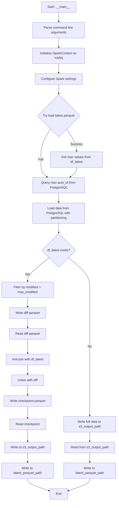
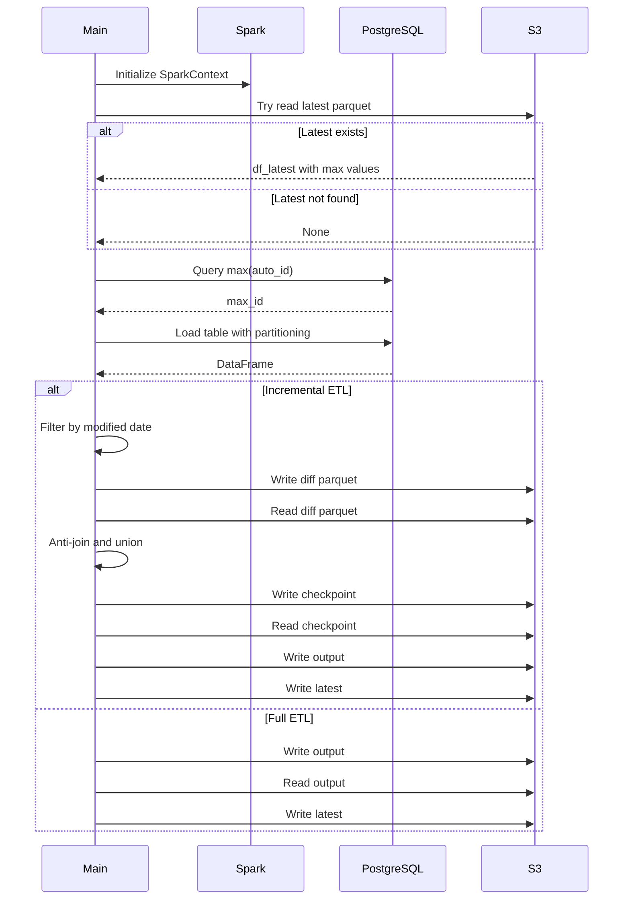

# Diagram: research/orchestrator/tasks/etl/extract_public_package_container_spark.py

> Auto-generated by Obscura crawlers

## Diagram 1

### SVG

<svg id="container" width="586" xmlns="http://www.w3.org/2000/svg" class="flowchart" height="2510.671875" viewBox="0 0 586 2510.671875" role="graphics-document document" aria-roledescription="flowchart-v2"><g><marker id="container_flowchart-v2-pointEnd" class="marker flowchart-v2" viewBox="0 0 10 10" refX="5" refY="5" markerUnits="userSpaceOnUse" markerWidth="8" markerHeight="8" orient="auto"><path d="M 0 0 L 10 5 L 0 10 z" class="arrowMarkerPath" style="stroke-width: 1; stroke-dasharray: 1, 0;"></path></marker><marker id="container_flowchart-v2-pointStart" class="marker flowchart-v2" viewBox="0 0 10 10" refX="4.5" refY="5" markerUnits="userSpaceOnUse" markerWidth="8" markerHeight="8" orient="auto"><path d="M 0 5 L 10 10 L 10 0 z" class="arrowMarkerPath" style="stroke-width: 1; stroke-dasharray: 1, 0;"></path></marker><marker id="container_flowchart-v2-circleEnd" class="marker flowchart-v2" viewBox="0 0 10 10" refX="11" refY="5" markerUnits="userSpaceOnUse" markerWidth="11" markerHeight="11" orient="auto"><circle cx="5" cy="5" r="5" class="arrowMarkerPath" style="stroke-width: 1; stroke-dasharray: 1, 0;"></circle></marker><marker id="container_flowchart-v2-circleStart" class="marker flowchart-v2" viewBox="0 0 10 10" refX="-1" refY="5" markerUnits="userSpaceOnUse" markerWidth="11" markerHeight="11" orient="auto"><circle cx="5" cy="5" r="5" class="arrowMarkerPath" style="stroke-width: 1; stroke-dasharray: 1, 0;"></circle></marker><marker id="container_flowchart-v2-crossEnd" class="marker cross flowchart-v2" viewBox="0 0 11 11" refX="12" refY="5.2" markerUnits="userSpaceOnUse" markerWidth="11" markerHeight="11" orient="auto"><path d="M 1,1 l 9,9 M 10,1 l -9,9" class="arrowMarkerPath" style="stroke-width: 2; stroke-dasharray: 1, 0;"></path></marker><marker id="container_flowchart-v2-crossStart" class="marker cross flowchart-v2" viewBox="0 0 11 11" refX="-1" refY="5.2" markerUnits="userSpaceOnUse" markerWidth="11" markerHeight="11" orient="auto"><path d="M 1,1 l 9,9 M 10,1 l -9,9" class="arrowMarkerPath" style="stroke-width: 2; stroke-dasharray: 1, 0;"></path></marker><g class="root"><g class="clusters"></g><g class="edgePaths"><path d="M293,62L293,66.167C293,70.333,293,78.667,293,86.333C293,94,293,101,293,104.5L293,108" id="L_Start_ParseArgs_0" class="edge-thickness-normal edge-pattern-solid edge-thickness-normal edge-pattern-solid flowchart-link" style=";" data-edge="true" data-et="edge" data-id="L_Start_ParseArgs_0" data-points="W3sieCI6MjkzLCJ5Ijo2Mn0seyJ4IjoyOTMsInkiOjg3fSx7IngiOjI5MywieSI6MTEyfV0=" marker-end="url(#container_flowchart-v2-pointEnd)"></path><path d="M293,190L293,194.167C293,198.333,293,206.667,293,214.333C293,222,293,229,293,232.5L293,236" id="L_ParseArgs_InitSpark_0" class="edge-thickness-normal edge-pattern-solid edge-thickness-normal edge-pattern-solid flowchart-link" style=";" data-edge="true" data-et="edge" data-id="L_ParseArgs_InitSpark_0" data-points="W3sieCI6MjkzLCJ5IjoxOTB9LHsieCI6MjkzLCJ5IjoyMTV9LHsieCI6MjkzLCJ5IjoyNDB9XQ==" marker-end="url(#container_flowchart-v2-pointEnd)"></path><path d="M293,318L293,322.167C293,326.333,293,334.667,293,342.333C293,350,293,357,293,360.5L293,364" id="L_InitSpark_ConfigSpark_0" class="edge-thickness-normal edge-pattern-solid edge-thickness-normal edge-pattern-solid flowchart-link" style=";" data-edge="true" data-et="edge" data-id="L_InitSpark_ConfigSpark_0" data-points="W3sieCI6MjkzLCJ5IjozMTh9LHsieCI6MjkzLCJ5IjozNDN9LHsieCI6MjkzLCJ5IjozNjh9XQ==" marker-end="url(#container_flowchart-v2-pointEnd)"></path><path d="M293,422L293,426.167C293,430.333,293,438.667,293,446.333C293,454,293,461,293,464.5L293,468" id="L_ConfigSpark_LoadLatest_0" class="edge-thickness-normal edge-pattern-solid edge-thickness-normal edge-pattern-solid flowchart-link" style=";" data-edge="true" data-et="edge" data-id="L_ConfigSpark_LoadLatest_0" data-points="W3sieCI6MjkzLCJ5Ijo0MjJ9LHsieCI6MjkzLCJ5Ijo0NDd9LHsieCI6MjkzLCJ5Ijo0NzJ9XQ==" marker-end="url(#container_flowchart-v2-pointEnd)"></path><path d="M334.252,649.31L342.161,662.352C350.069,675.394,365.886,701.478,373.795,720.02C381.703,738.563,381.703,749.563,381.703,755.063L381.703,760.563" id="L_LoadLatest_GetMaxVals_0" class="edge-thickness-normal edge-pattern-solid edge-thickness-normal edge-pattern-solid flowchart-link" style=";" data-edge="true" data-et="edge" data-id="L_LoadLatest_GetMaxVals_0" data-points="W3sieCI6MzM0LjI1MjA1NTA3MzQ3NTYsInkiOjY0OS4zMTA0NDQ5MjY1MjQ0fSx7IngiOjM4MS43MDMxMjUsInkiOjcyNy41NjI1fSx7IngiOjM4MS43MDMxMjUsInkiOjc2NC41NjI1fV0=" marker-end="url(#container_flowchart-v2-pointEnd)"></path><path d="M251.748,649.31L243.839,662.352C235.931,675.394,220.114,701.478,212.205,727.187C204.297,752.896,204.297,778.229,204.297,801.563C204.297,824.896,204.297,846.229,209.531,860.672C214.765,875.116,225.234,882.669,230.468,886.445L235.703,890.222" id="L_LoadLatest_QueryMaxId_0" class="edge-thickness-normal edge-pattern-solid edge-thickness-normal edge-pattern-solid flowchart-link" style=";" data-edge="true" data-et="edge" data-id="L_LoadLatest_QueryMaxId_0" data-points="W3sieCI6MjUxLjc0Nzk0NDkyNjUyNDM4LCJ5Ijo2NDkuMzEwNDQ0OTI2NTI0NH0seyJ4IjoyMDQuMjk2ODc1LCJ5Ijo3MjcuNTYyNX0seyJ4IjoyMDQuMjk2ODc1LCJ5Ijo4MDMuNTYyNX0seyJ4IjoyMDQuMjk2ODc1LCJ5Ijo4NjcuNTYyNX0seyJ4IjoyMzguOTQ2NTMzMjAzMTI1LCJ5Ijo4OTIuNTYyNX1d" marker-end="url(#container_flowchart-v2-pointEnd)"></path><path d="M381.703,842.563L381.703,846.729C381.703,850.896,381.703,859.229,376.469,867.172C371.235,875.116,360.766,882.669,355.532,886.445L350.297,890.222" id="L_GetMaxVals_QueryMaxId_0" class="edge-thickness-normal edge-pattern-solid edge-thickness-normal edge-pattern-solid flowchart-link" style=";" data-edge="true" data-et="edge" data-id="L_GetMaxVals_QueryMaxId_0" data-points="W3sieCI6MzgxLjcwMzEyNSwieSI6ODQyLjU2MjV9LHsieCI6MzgxLjcwMzEyNSwieSI6ODY3LjU2MjV9LHsieCI6MzQ3LjA1MzQ2Njc5Njg3NSwieSI6ODkyLjU2MjV9XQ==" marker-end="url(#container_flowchart-v2-pointEnd)"></path><path d="M293,970.563L293,974.729C293,978.896,293,987.229,293,994.896C293,1002.563,293,1009.563,293,1013.063L293,1016.563" id="L_QueryMaxId_LoadFromDB_0" class="edge-thickness-normal edge-pattern-solid edge-thickness-normal edge-pattern-solid flowchart-link" style=";" data-edge="true" data-et="edge" data-id="L_QueryMaxId_LoadFromDB_0" data-points="W3sieCI6MjkzLCJ5Ijo5NzAuNTYyNX0seyJ4IjoyOTMsInkiOjk5NS41NjI1fSx7IngiOjI5MywieSI6MTAyMC41NjI1fV0=" marker-end="url(#container_flowchart-v2-pointEnd)"></path><path d="M293,1122.563L293,1126.729C293,1130.896,293,1139.229,293,1146.896C293,1154.563,293,1161.563,293,1165.063L293,1168.563" id="L_LoadFromDB_CheckLatest_0" class="edge-thickness-normal edge-pattern-solid edge-thickness-normal edge-pattern-solid flowchart-link" style=";" data-edge="true" data-et="edge" data-id="L_LoadFromDB_CheckLatest_0" data-points="W3sieCI6MjkzLCJ5IjoxMTIyLjU2MjV9LHsieCI6MjkzLCJ5IjoxMTQ3LjU2MjV9LHsieCI6MjkzLCJ5IjoxMTcyLjU2MjV9XQ==" marker-end="url(#container_flowchart-v2-pointEnd)"></path><path d="M245.416,1295.087L227.513,1309.185C209.61,1323.282,173.805,1351.477,155.903,1371.074C138,1390.672,138,1401.672,138,1407.172L138,1412.672" id="L_CheckLatest_FilterModified_0" class="edge-thickness-normal edge-pattern-solid edge-thickness-normal edge-pattern-solid flowchart-link" style=";" data-edge="true" data-et="edge" data-id="L_CheckLatest_FilterModified_0" data-points="W3sieCI6MjQ1LjQxNTYxNjI3NjExODc4LCJ5IjoxMjk1LjA4NzQ5MTI3NjExODd9LHsieCI6MTM4LCJ5IjoxMzc5LjY3MTg3NX0seyJ4IjoxMzgsInkiOjE0MTYuNjcxODc1fV0=" marker-end="url(#container_flowchart-v2-pointEnd)"></path><path d="M138,1494.672L138,1498.839C138,1503.005,138,1511.339,138,1519.005C138,1526.672,138,1533.672,138,1537.172L138,1540.672" id="L_FilterModified_WriteDiff_0" class="edge-thickness-normal edge-pattern-solid edge-thickness-normal edge-pattern-solid flowchart-link" style=";" data-edge="true" data-et="edge" data-id="L_FilterModified_WriteDiff_0" data-points="W3sieCI6MTM4LCJ5IjoxNDk0LjY3MTg3NX0seyJ4IjoxMzgsInkiOjE1MTkuNjcxODc1fSx7IngiOjEzOCwieSI6MTU0NC42NzE4NzV9XQ==" marker-end="url(#container_flowchart-v2-pointEnd)"></path><path d="M138,1598.672L138,1602.839C138,1607.005,138,1615.339,138,1623.005C138,1630.672,138,1637.672,138,1641.172L138,1644.672" id="L_WriteDiff_ReadDiff_0" class="edge-thickness-normal edge-pattern-solid edge-thickness-normal edge-pattern-solid flowchart-link" style=";" data-edge="true" data-et="edge" data-id="L_WriteDiff_ReadDiff_0" data-points="W3sieCI6MTM4LCJ5IjoxNTk4LjY3MTg3NX0seyJ4IjoxMzgsInkiOjE2MjMuNjcxODc1fSx7IngiOjEzOCwieSI6MTY0OC42NzE4NzV9XQ==" marker-end="url(#container_flowchart-v2-pointEnd)"></path><path d="M138,1702.672L138,1708.839C138,1715.005,138,1727.339,138,1739.005C138,1750.672,138,1761.672,138,1767.172L138,1772.672" id="L_ReadDiff_AntiJoin_0" class="edge-thickness-normal edge-pattern-solid edge-thickness-normal edge-pattern-solid flowchart-link" style=";" data-edge="true" data-et="edge" data-id="L_ReadDiff_AntiJoin_0" data-points="W3sieCI6MTM4LCJ5IjoxNzAyLjY3MTg3NX0seyJ4IjoxMzgsInkiOjE3MzkuNjcxODc1fSx7IngiOjEzOCwieSI6MTc3Ni42NzE4NzV9XQ==" marker-end="url(#container_flowchart-v2-pointEnd)"></path><path d="M138,1830.672L138,1834.839C138,1839.005,138,1847.339,138,1855.005C138,1862.672,138,1869.672,138,1873.172L138,1876.672" id="L_AntiJoin_Union_0" class="edge-thickness-normal edge-pattern-solid edge-thickness-normal edge-pattern-solid flowchart-link" style=";" data-edge="true" data-et="edge" data-id="L_AntiJoin_Union_0" data-points="W3sieCI6MTM4LCJ5IjoxODMwLjY3MTg3NX0seyJ4IjoxMzgsInkiOjE4NTUuNjcxODc1fSx7IngiOjEzOCwieSI6MTg4MC42NzE4NzV9XQ==" marker-end="url(#container_flowchart-v2-pointEnd)"></path><path d="M138,1934.672L138,1938.839C138,1943.005,138,1951.339,138,1959.005C138,1966.672,138,1973.672,138,1977.172L138,1980.672" id="L_Union_WriteCheckpoint_0" class="edge-thickness-normal edge-pattern-solid edge-thickness-normal edge-pattern-solid flowchart-link" style=";" data-edge="true" data-et="edge" data-id="L_Union_WriteCheckpoint_0" data-points="W3sieCI6MTM4LCJ5IjoxOTM0LjY3MTg3NX0seyJ4IjoxMzgsInkiOjE5NTkuNjcxODc1fSx7IngiOjEzOCwieSI6MTk4NC42NzE4NzV9XQ==" marker-end="url(#container_flowchart-v2-pointEnd)"></path><path d="M138,2038.672L138,2042.839C138,2047.005,138,2055.339,138,2065.005C138,2074.672,138,2085.672,138,2091.172L138,2096.672" id="L_WriteCheckpoint_ReadCheckpoint_0" class="edge-thickness-normal edge-pattern-solid edge-thickness-normal edge-pattern-solid flowchart-link" style=";" data-edge="true" data-et="edge" data-id="L_WriteCheckpoint_ReadCheckpoint_0" data-points="W3sieCI6MTM4LCJ5IjoyMDM4LjY3MTg3NX0seyJ4IjoxMzgsInkiOjIwNjMuNjcxODc1fSx7IngiOjEzOCwieSI6MjEwMC42NzE4NzV9XQ==" marker-end="url(#container_flowchart-v2-pointEnd)"></path><path d="M138,2154.672L138,2160.839C138,2167.005,138,2179.339,138,2189.005C138,2198.672,138,2205.672,138,2209.172L138,2212.672" id="L_ReadCheckpoint_WriteOutput_0" class="edge-thickness-normal edge-pattern-solid edge-thickness-normal edge-pattern-solid flowchart-link" style=";" data-edge="true" data-et="edge" data-id="L_ReadCheckpoint_WriteOutput_0" data-points="W3sieCI6MTM4LCJ5IjoyMTU0LjY3MTg3NX0seyJ4IjoxMzgsInkiOjIxOTEuNjcxODc1fSx7IngiOjEzOCwieSI6MjIxNi42NzE4NzV9XQ==" marker-end="url(#container_flowchart-v2-pointEnd)"></path><path d="M138,2270.672L138,2274.839C138,2279.005,138,2287.339,138,2295.005C138,2302.672,138,2309.672,138,2313.172L138,2316.672" id="L_WriteOutput_WriteLatest_0" class="edge-thickness-normal edge-pattern-solid edge-thickness-normal edge-pattern-solid flowchart-link" style=";" data-edge="true" data-et="edge" data-id="L_WriteOutput_WriteLatest_0" data-points="W3sieCI6MTM4LCJ5IjoyMjcwLjY3MTg3NX0seyJ4IjoxMzgsInkiOjIyOTUuNjcxODc1fSx7IngiOjEzOCwieSI6MjMyMC42NzE4NzV9XQ==" marker-end="url(#container_flowchart-v2-pointEnd)"></path><path d="M138,2398.672L138,2402.839C138,2407.005,138,2415.339,155.921,2425.518C173.843,2435.697,209.685,2447.721,227.607,2453.733L245.528,2459.746" id="L_WriteLatest_End_0" class="edge-thickness-normal edge-pattern-solid edge-thickness-normal edge-pattern-solid flowchart-link" style=";" data-edge="true" data-et="edge" data-id="L_WriteLatest_End_0" data-points="W3sieCI6MTM4LCJ5IjoyMzk4LjY3MTg3NX0seyJ4IjoxMzgsInkiOjI0MjMuNjcxODc1fSx7IngiOjI0OS4zMjAzMTI1LCJ5IjoyNDYxLjAxODA0NDM1NDgzOX1d" marker-end="url(#container_flowchart-v2-pointEnd)"></path><path d="M340.584,1295.087L358.487,1309.185C376.39,1323.282,412.195,1351.477,430.097,1378.241C448,1405.005,448,1430.339,448,1453.672C448,1477.005,448,1498.339,448,1517.672C448,1537.005,448,1554.339,448,1571.672C448,1589.005,448,1606.339,448,1623.672C448,1641.005,448,1658.339,448,1677.672C448,1697.005,448,1718.339,448,1739.672C448,1761.005,448,1782.339,448,1801.672C448,1821.005,448,1838.339,448,1855.672C448,1873.005,448,1890.339,448,1907.672C448,1925.005,448,1942.339,448,1959.672C448,1977.005,448,1994.339,448,2011.672C448,2029.005,448,2046.339,448,2058.505C448,2070.672,448,2077.672,448,2081.172L448,2084.672" id="L_CheckLatest_WriteOutputFull_0" class="edge-thickness-normal edge-pattern-solid edge-thickness-normal edge-pattern-solid flowchart-link" style=";" data-edge="true" data-et="edge" data-id="L_CheckLatest_WriteOutputFull_0" data-points="W3sieCI6MzQwLjU4NDM4MzcyMzg4MTIsInkiOjEyOTUuMDg3NDkxMjc2MTE4N30seyJ4Ijo0NDgsInkiOjEzNzkuNjcxODc1fSx7IngiOjQ0OCwieSI6MTQ1NS42NzE4NzV9LHsieCI6NDQ4LCJ5IjoxNTE5LjY3MTg3NX0seyJ4Ijo0NDgsInkiOjE1NzEuNjcxODc1fSx7IngiOjQ0OCwieSI6MTYyMy42NzE4NzV9LHsieCI6NDQ4LCJ5IjoxNjc1LjY3MTg3NX0seyJ4Ijo0NDgsInkiOjE3MzkuNjcxODc1fSx7IngiOjQ0OCwieSI6MTgwMy42NzE4NzV9LHsieCI6NDQ4LCJ5IjoxODU1LjY3MTg3NX0seyJ4Ijo0NDgsInkiOjE5MDcuNjcxODc1fSx7IngiOjQ0OCwieSI6MTk1OS42NzE4NzV9LHsieCI6NDQ4LCJ5IjoyMDExLjY3MTg3NX0seyJ4Ijo0NDgsInkiOjIwNjMuNjcxODc1fSx7IngiOjQ0OCwieSI6MjA4OC42NzE4NzV9XQ==" marker-end="url(#container_flowchart-v2-pointEnd)"></path><path d="M448,2166.672L448,2170.839C448,2175.005,448,2183.339,448,2191.005C448,2198.672,448,2205.672,448,2209.172L448,2212.672" id="L_WriteOutputFull_ReadFull_0" class="edge-thickness-normal edge-pattern-solid edge-thickness-normal edge-pattern-solid flowchart-link" style=";" data-edge="true" data-et="edge" data-id="L_WriteOutputFull_ReadFull_0" data-points="W3sieCI6NDQ4LCJ5IjoyMTY2LjY3MTg3NX0seyJ4Ijo0NDgsInkiOjIxOTEuNjcxODc1fSx7IngiOjQ0OCwieSI6MjIxNi42NzE4NzV9XQ==" marker-end="url(#container_flowchart-v2-pointEnd)"></path><path d="M448,2270.672L448,2274.839C448,2279.005,448,2287.339,448,2295.005C448,2302.672,448,2309.672,448,2313.172L448,2316.672" id="L_ReadFull_WriteLatestFull_0" class="edge-thickness-normal edge-pattern-solid edge-thickness-normal edge-pattern-solid flowchart-link" style=";" data-edge="true" data-et="edge" data-id="L_ReadFull_WriteLatestFull_0" data-points="W3sieCI6NDQ4LCJ5IjoyMjcwLjY3MTg3NX0seyJ4Ijo0NDgsInkiOjIyOTUuNjcxODc1fSx7IngiOjQ0OCwieSI6MjMyMC42NzE4NzV9XQ==" marker-end="url(#container_flowchart-v2-pointEnd)"></path><path d="M448,2398.672L448,2402.839C448,2407.005,448,2415.339,430.079,2425.518C412.157,2435.697,376.315,2447.721,358.393,2453.733L340.472,2459.746" id="L_WriteLatestFull_End_0" class="edge-thickness-normal edge-pattern-solid edge-thickness-normal edge-pattern-solid flowchart-link" style=";" data-edge="true" data-et="edge" data-id="L_WriteLatestFull_End_0" data-points="W3sieCI6NDQ4LCJ5IjoyMzk4LjY3MTg3NX0seyJ4Ijo0NDgsInkiOjI0MjMuNjcxODc1fSx7IngiOjMzNi42Nzk2ODc1LCJ5IjoyNDYxLjAxODA0NDM1NDgzOX1d" marker-end="url(#container_flowchart-v2-pointEnd)"></path></g><g class="edgeLabels"><g class="edgeLabel"><g class="label" data-id="L_Start_ParseArgs_0" transform="translate(0, 0)"><foreignObject width="0" height="0">

</foreignObject></g></g><g class="edgeLabel"><g class="label" data-id="L_ParseArgs_InitSpark_0" transform="translate(0, 0)"><foreignObject width="0" height="0">

</foreignObject></g></g><g class="edgeLabel"><g class="label" data-id="L_InitSpark_ConfigSpark_0" transform="translate(0, 0)"><foreignObject width="0" height="0">

</foreignObject></g></g><g class="edgeLabel"><g class="label" data-id="L_ConfigSpark_LoadLatest_0" transform="translate(0, 0)"><foreignObject width="0" height="0">

</foreignObject></g></g><g class="edgeLabel" transform="translate(381.703125, 727.5625)"><g class="label" data-id="L_LoadLatest_GetMaxVals_0" transform="translate(-28.1015625, -12)"><foreignObject width="56.203125" height="24">

Success

</foreignObject></g></g><g class="edgeLabel" transform="translate(204.296875, 803.5625)"><g class="label" data-id="L_LoadLatest_QueryMaxId_0" transform="translate(-12.40625, -12)"><foreignObject width="24.8125" height="24">

Fail

</foreignObject></g></g><g class="edgeLabel"><g class="label" data-id="L_GetMaxVals_QueryMaxId_0" transform="translate(0, 0)"><foreignObject width="0" height="0">

</foreignObject></g></g><g class="edgeLabel"><g class="label" data-id="L_QueryMaxId_LoadFromDB_0" transform="translate(0, 0)"><foreignObject width="0" height="0">

</foreignObject></g></g><g class="edgeLabel"><g class="label" data-id="L_LoadFromDB_CheckLatest_0" transform="translate(0, 0)"><foreignObject width="0" height="0">

</foreignObject></g></g><g class="edgeLabel" transform="translate(138, 1379.671875)"><g class="label" data-id="L_CheckLatest_FilterModified_0" transform="translate(-12.03125, -12)"><foreignObject width="24.0625" height="24">

Yes

</foreignObject></g></g><g class="edgeLabel"><g class="label" data-id="L_FilterModified_WriteDiff_0" transform="translate(0, 0)"><foreignObject width="0" height="0">

</foreignObject></g></g><g class="edgeLabel"><g class="label" data-id="L_WriteDiff_ReadDiff_0" transform="translate(0, 0)"><foreignObject width="0" height="0">

</foreignObject></g></g><g class="edgeLabel"><g class="label" data-id="L_ReadDiff_AntiJoin_0" transform="translate(0, 0)"><foreignObject width="0" height="0">

</foreignObject></g></g><g class="edgeLabel"><g class="label" data-id="L_AntiJoin_Union_0" transform="translate(0, 0)"><foreignObject width="0" height="0">

</foreignObject></g></g><g class="edgeLabel"><g class="label" data-id="L_Union_WriteCheckpoint_0" transform="translate(0, 0)"><foreignObject width="0" height="0">

</foreignObject></g></g><g class="edgeLabel"><g class="label" data-id="L_WriteCheckpoint_ReadCheckpoint_0" transform="translate(0, 0)"><foreignObject width="0" height="0">

</foreignObject></g></g><g class="edgeLabel"><g class="label" data-id="L_ReadCheckpoint_WriteOutput_0" transform="translate(0, 0)"><foreignObject width="0" height="0">

</foreignObject></g></g><g class="edgeLabel"><g class="label" data-id="L_WriteOutput_WriteLatest_0" transform="translate(0, 0)"><foreignObject width="0" height="0">

</foreignObject></g></g><g class="edgeLabel"><g class="label" data-id="L_WriteLatest_End_0" transform="translate(0, 0)"><foreignObject width="0" height="0">

</foreignObject></g></g><g class="edgeLabel" transform="translate(448, 1739.671875)"><g class="label" data-id="L_CheckLatest_WriteOutputFull_0" transform="translate(-10.140625, -12)"><foreignObject width="20.28125" height="24">

No

</foreignObject></g></g><g class="edgeLabel"><g class="label" data-id="L_WriteOutputFull_ReadFull_0" transform="translate(0, 0)"><foreignObject width="0" height="0">

</foreignObject></g></g><g class="edgeLabel"><g class="label" data-id="L_ReadFull_WriteLatestFull_0" transform="translate(0, 0)"><foreignObject width="0" height="0">

</foreignObject></g></g><g class="edgeLabel"><g class="label" data-id="L_WriteLatestFull_End_0" transform="translate(0, 0)"><foreignObject width="0" height="0">

</foreignObject></g></g></g><g class="nodes"><g class="node default" id="flowchart-Start-0" transform="translate(293, 35)"><rect class="basic label-container" style="" x="-69.6171875" y="-27" width="139.234375" height="54"></rect><g class="label" style="" transform="translate(-39.6171875, -12)"><rect></rect><foreignObject width="79.234375" height="24">

Start: <strong>main</strong>

</foreignObject></g></g><g class="node default" id="flowchart-ParseArgs-1" transform="translate(293, 151)"><rect class="basic label-container" style="" x="-130" y="-39" width="260" height="78"></rect><g class="label" style="" transform="translate(-100, -24)"><rect></rect><foreignObject width="200" height="48">

Parse command line arguments

</foreignObject></g></g><g class="node default" id="flowchart-InitSpark-3" transform="translate(293, 279)"><rect class="basic label-container" style="" x="-130" y="-39" width="260" height="78"></rect><g class="label" style="" transform="translate(-100, -24)"><rect></rect><foreignObject width="200" height="48">

Initialize SparkContext on YARN

</foreignObject></g></g><g class="node default" id="flowchart-ConfigSpark-5" transform="translate(293, 395)"><rect class="basic label-container" style="" x="-117.6953125" y="-27" width="235.390625" height="54"></rect><g class="label" style="" transform="translate(-87.6953125, -12)"><rect></rect><foreignObject width="175.390625" height="24">

Configure Spark settings

</foreignObject></g></g><g class="node default" id="flowchart-LoadLatest-7" transform="translate(293, 581.28125)"><polygon points="109.28125,0 218.5625,-109.28125 109.28125,-218.5625 0,-109.28125" class="label-container" transform="translate(-108.78125, 109.28125)"></polygon><g class="label" style="" transform="translate(-82.28125, -12)"><rect></rect><foreignObject width="164.5625" height="24">

Try load latest parquet

</foreignObject></g></g><g class="node default" id="flowchart-GetMaxVals-9" transform="translate(381.703125, 803.5625)"><rect class="basic label-container" style="" x="-130" y="-39" width="260" height="78"></rect><g class="label" style="" transform="translate(-100, -24)"><rect></rect><foreignObject width="200" height="48">

Get max values from df_latest

</foreignObject></g></g><g class="node default" id="flowchart-QueryMaxId-11" transform="translate(293, 931.5625)"><rect class="basic label-container" style="" x="-130" y="-39" width="260" height="78"></rect><g class="label" style="" transform="translate(-100, -24)"><rect></rect><foreignObject width="200" height="48">

Query max auto_id from PostgreSQL

</foreignObject></g></g><g class="node default" id="flowchart-LoadFromDB-15" transform="translate(293, 1071.5625)"><rect class="basic label-container" style="" x="-130" y="-51" width="260" height="102"></rect><g class="label" style="" transform="translate(-100, -36)"><rect></rect><foreignObject width="200" height="72">

Load data from PostgreSQL with partitioning

</foreignObject></g></g><g class="node default" id="flowchart-CheckLatest-17" transform="translate(293, 1257.6171875)"><polygon points="85.0546875,0 170.109375,-85.0546875 85.0546875,-170.109375 0,-85.0546875" class="label-container" transform="translate(-84.5546875, 85.0546875)"></polygon><g class="label" style="" transform="translate(-58.0546875, -12)"><rect></rect><foreignObject width="116.109375" height="24">

df_latest exists?

</foreignObject></g></g><g class="node default" id="flowchart-FilterModified-19" transform="translate(138, 1455.671875)"><rect class="basic label-container" style="" x="-130" y="-39" width="260" height="78"></rect><g class="label" style="" transform="translate(-100, -24)"><rect></rect><foreignObject width="200" height="48">

Filter by modified &gt; max_modified

</foreignObject></g></g><g class="node default" id="flowchart-WriteDiff-21" transform="translate(138, 1571.671875)"><rect class="basic label-container" style="" x="-94.2421875" y="-27" width="188.484375" height="54"></rect><g class="label" style="" transform="translate(-64.2421875, -12)"><rect></rect><foreignObject width="128.484375" height="24">

Write diff parquet

</foreignObject></g></g><g class="node default" id="flowchart-ReadDiff-23" transform="translate(138, 1675.671875)"><rect class="basic label-container" style="" x="-93.34375" y="-27" width="186.6875" height="54"></rect><g class="label" style="" transform="translate(-63.34375, -12)"><rect></rect><foreignObject width="126.6875" height="24">

Read diff parquet

</foreignObject></g></g><g class="node default" id="flowchart-AntiJoin-25" transform="translate(138, 1803.671875)"><rect class="basic label-container" style="" x="-112.9375" y="-27" width="225.875" height="54"></rect><g class="label" style="" transform="translate(-82.9375, -12)"><rect></rect><foreignObject width="165.875" height="24">

Anti-join with df_latest

</foreignObject></g></g><g class="node default" id="flowchart-Union-27" transform="translate(138, 1907.671875)"><rect class="basic label-container" style="" x="-83.8125" y="-27" width="167.625" height="54"></rect><g class="label" style="" transform="translate(-53.8125, -12)"><rect></rect><foreignObject width="107.625" height="24">

Union with diff

</foreignObject></g></g><g class="node default" id="flowchart-WriteCheckpoint-29" transform="translate(138, 2011.671875)"><rect class="basic label-container" style="" x="-121.890625" y="-27" width="243.78125" height="54"></rect><g class="label" style="" transform="translate(-91.890625, -12)"><rect></rect><foreignObject width="183.78125" height="24">

Write checkpoint parquet

</foreignObject></g></g><g class="node default" id="flowchart-ReadCheckpoint-31" transform="translate(138, 2127.671875)"><rect class="basic label-container" style="" x="-90.3046875" y="-27" width="180.609375" height="54"></rect><g class="label" style="" transform="translate(-60.3046875, -12)"><rect></rect><foreignObject width="120.609375" height="24">

Read checkpoint

</foreignObject></g></g><g class="node default" id="flowchart-WriteOutput-33" transform="translate(138, 2243.671875)"><rect class="basic label-container" style="" x="-117.5625" y="-27" width="235.125" height="54"></rect><g class="label" style="" transform="translate(-87.5625, -12)"><rect></rect><foreignObject width="175.125" height="24">

Write to s3_output_path

</foreignObject></g></g><g class="node default" id="flowchart-WriteLatest-35" transform="translate(138, 2359.671875)"><rect class="basic label-container" style="" x="-130" y="-39" width="260" height="78"></rect><g class="label" style="" transform="translate(-100, -24)"><rect></rect><foreignObject width="200" height="48">

Write to latest_parquet_path

</foreignObject></g></g><g class="node default" id="flowchart-End-37" transform="translate(293, 2475.671875)"><rect class="basic label-container" style="" x="-43.6796875" y="-27" width="87.359375" height="54"></rect><g class="label" style="" transform="translate(-13.6796875, -12)"><rect></rect><foreignObject width="27.359375" height="24">

End

</foreignObject></g></g><g class="node default" id="flowchart-WriteOutputFull-39" transform="translate(448, 2127.671875)"><rect class="basic label-container" style="" x="-130" y="-39" width="260" height="78"></rect><g class="label" style="" transform="translate(-100, -24)"><rect></rect><foreignObject width="200" height="48">

Write full data to s3_output_path

</foreignObject></g></g><g class="node default" id="flowchart-ReadFull-41" transform="translate(448, 2243.671875)"><rect class="basic label-container" style="" x="-126.2734375" y="-27" width="252.546875" height="54"></rect><g class="label" style="" transform="translate(-96.2734375, -12)"><rect></rect><foreignObject width="192.546875" height="24">

Read from s3_output_path

</foreignObject></g></g><g class="node default" id="flowchart-WriteLatestFull-43" transform="translate(448, 2359.671875)"><rect class="basic label-container" style="" x="-130" y="-39" width="260" height="78"></rect><g class="label" style="" transform="translate(-100, -24)"><rect></rect><foreignObject width="200" height="48">

Write to latest_parquet_path

</foreignObject></g></g></g></g></g></svg>

## Diagram 2

### SVG

<svg id="container" width="899" xmlns="http://www.w3.org/2000/svg" height="1343" viewBox="-66 -10 899 1343" role="graphics-document document" aria-roledescription="sequence"><g><rect x="633" y="1257" fill="#eaeaea" stroke="#666" width="150" height="65" name="S3" rx="3" ry="3" class="actor actor-bottom"></rect><text x="708" y="1289.5" dominant-baseline="central" alignment-baseline="central" class="actor actor-box" style="text-anchor: middle; font-size: 16px; font-weight: 400;"><tspan x="708" dy="0">S3</tspan></text></g><g><rect x="433" y="1257" fill="#eaeaea" stroke="#666" width="150" height="65" name="PostgreSQL" rx="3" ry="3" class="actor actor-bottom"></rect><text x="508" y="1289.5" dominant-baseline="central" alignment-baseline="central" class="actor actor-box" style="text-anchor: middle; font-size: 16px; font-weight: 400;"><tspan x="508" dy="0">PostgreSQL</tspan></text></g><g><rect x="233" y="1257" fill="#eaeaea" stroke="#666" width="150" height="65" name="Spark" rx="3" ry="3" class="actor actor-bottom"></rect><text x="308" y="1289.5" dominant-baseline="central" alignment-baseline="central" class="actor actor-box" style="text-anchor: middle; font-size: 16px; font-weight: 400;"><tspan x="308" dy="0">Spark</tspan></text></g><g><rect x="0" y="1257" fill="#eaeaea" stroke="#666" width="150" height="65" name="Main" rx="3" ry="3" class="actor actor-bottom"></rect><text x="75" y="1289.5" dominant-baseline="central" alignment-baseline="central" class="actor actor-box" style="text-anchor: middle; font-size: 16px; font-weight: 400;"><tspan x="75" dy="0">Main</tspan></text></g><g><line id="actor3" x1="708" y1="65" x2="708" y2="1257" class="actor-line 200" stroke-width="0.5px" stroke="#999" name="S3"></line><g id="root-3"><rect x="633" y="0" fill="#eaeaea" stroke="#666" width="150" height="65" name="S3" rx="3" ry="3" class="actor actor-top"></rect><text x="708" y="32.5" dominant-baseline="central" alignment-baseline="central" class="actor actor-box" style="text-anchor: middle; font-size: 16px; font-weight: 400;"><tspan x="708" dy="0">S3</tspan></text></g></g><g><line id="actor2" x1="508" y1="65" x2="508" y2="1257" class="actor-line 200" stroke-width="0.5px" stroke="#999" name="PostgreSQL"></line><g id="root-2"><rect x="433" y="0" fill="#eaeaea" stroke="#666" width="150" height="65" name="PostgreSQL" rx="3" ry="3" class="actor actor-top"></rect><text x="508" y="32.5" dominant-baseline="central" alignment-baseline="central" class="actor actor-box" style="text-anchor: middle; font-size: 16px; font-weight: 400;"><tspan x="508" dy="0">PostgreSQL</tspan></text></g></g><g><line id="actor1" x1="308" y1="65" x2="308" y2="1257" class="actor-line 200" stroke-width="0.5px" stroke="#999" name="Spark"></line><g id="root-1"><rect x="233" y="0" fill="#eaeaea" stroke="#666" width="150" height="65" name="Spark" rx="3" ry="3" class="actor actor-top"></rect><text x="308" y="32.5" dominant-baseline="central" alignment-baseline="central" class="actor actor-box" style="text-anchor: middle; font-size: 16px; font-weight: 400;"><tspan x="308" dy="0">Spark</tspan></text></g></g><g><line id="actor0" x1="75" y1="65" x2="75" y2="1257" class="actor-line 200" stroke-width="0.5px" stroke="#999" name="Main"></line><g id="root-0"><rect x="0" y="0" fill="#eaeaea" stroke="#666" width="150" height="65" name="Main" rx="3" ry="3" class="actor actor-top"></rect><text x="75" y="32.5" dominant-baseline="central" alignment-baseline="central" class="actor actor-box" style="text-anchor: middle; font-size: 16px; font-weight: 400;"><tspan x="75" dy="0">Main</tspan></text></g></g><g></g><defs><symbol id="computer" width="24" height="24"><path transform="scale(.5)" d="M2 2v13h20v-13h-20zm18 11h-16v-9h16v9zm-10.228 6l.466-1h3.524l.467 1h-4.457zm14.228 3h-24l2-6h2.104l-1.33 4h18.45l-1.297-4h2.073l2 6zm-5-10h-14v-7h14v7z"></path></symbol></defs><defs><symbol id="database" fill-rule="evenodd" clip-rule="evenodd"><path transform="scale(.5)" d="M12.258.001l.256.004.255.005.253.008.251.01.249.012.247.015.246.016.242.019.241.02.239.023.236.024.233.027.231.028.229.031.225.032.223.034.22.036.217.038.214.04.211.041.208.043.205.045.201.046.198.048.194.05.191.051.187.053.183.054.18.056.175.057.172.059.168.06.163.061.16.063.155.064.15.066.074.033.073.033.071.034.07.034.069.035.068.035.067.035.066.035.064.036.064.036.062.036.06.036.06.037.058.037.058.037.055.038.055.038.053.038.052.038.051.039.05.039.048.039.047.039.045.04.044.04.043.04.041.04.04.041.039.041.037.041.036.041.034.041.033.042.032.042.03.042.029.042.027.042.026.043.024.043.023.043.021.043.02.043.018.044.017.043.015.044.013.044.012.044.011.045.009.044.007.045.006.045.004.045.002.045.001.045v17l-.001.045-.002.045-.004.045-.006.045-.007.045-.009.044-.011.045-.012.044-.013.044-.015.044-.017.043-.018.044-.02.043-.021.043-.023.043-.024.043-.026.043-.027.042-.029.042-.03.042-.032.042-.033.042-.034.041-.036.041-.037.041-.039.041-.04.041-.041.04-.043.04-.044.04-.045.04-.047.039-.048.039-.05.039-.051.039-.052.038-.053.038-.055.038-.055.038-.058.037-.058.037-.06.037-.06.036-.062.036-.064.036-.064.036-.066.035-.067.035-.068.035-.069.035-.07.034-.071.034-.073.033-.074.033-.15.066-.155.064-.16.063-.163.061-.168.06-.172.059-.175.057-.18.056-.183.054-.187.053-.191.051-.194.05-.198.048-.201.046-.205.045-.208.043-.211.041-.214.04-.217.038-.22.036-.223.034-.225.032-.229.031-.231.028-.233.027-.236.024-.239.023-.241.02-.242.019-.246.016-.247.015-.249.012-.251.01-.253.008-.255.005-.256.004-.258.001-.258-.001-.256-.004-.255-.005-.253-.008-.251-.01-.249-.012-.247-.015-.245-.016-.243-.019-.241-.02-.238-.023-.236-.024-.234-.027-.231-.028-.228-.031-.226-.032-.223-.034-.22-.036-.217-.038-.214-.04-.211-.041-.208-.043-.204-.045-.201-.046-.198-.048-.195-.05-.19-.051-.187-.053-.184-.054-.179-.056-.176-.057-.172-.059-.167-.06-.164-.061-.159-.063-.155-.064-.151-.066-.074-.033-.072-.033-.072-.034-.07-.034-.069-.035-.068-.035-.067-.035-.066-.035-.064-.036-.063-.036-.062-.036-.061-.036-.06-.037-.058-.037-.057-.037-.056-.038-.055-.038-.053-.038-.052-.038-.051-.039-.049-.039-.049-.039-.046-.039-.046-.04-.044-.04-.043-.04-.041-.04-.04-.041-.039-.041-.037-.041-.036-.041-.034-.041-.033-.042-.032-.042-.03-.042-.029-.042-.027-.042-.026-.043-.024-.043-.023-.043-.021-.043-.02-.043-.018-.044-.017-.043-.015-.044-.013-.044-.012-.044-.011-.045-.009-.044-.007-.045-.006-.045-.004-.045-.002-.045-.001-.045v-17l.001-.045.002-.045.004-.045.006-.045.007-.045.009-.044.011-.045.012-.044.013-.044.015-.044.017-.043.018-.044.02-.043.021-.043.023-.043.024-.043.026-.043.027-.042.029-.042.03-.042.032-.042.033-.042.034-.041.036-.041.037-.041.039-.041.04-.041.041-.04.043-.04.044-.04.046-.04.046-.039.049-.039.049-.039.051-.039.052-.038.053-.038.055-.038.056-.038.057-.037.058-.037.06-.037.061-.036.062-.036.063-.036.064-.036.066-.035.067-.035.068-.035.069-.035.07-.034.072-.034.072-.033.074-.033.151-.066.155-.064.159-.063.164-.061.167-.06.172-.059.176-.057.179-.056.184-.054.187-.053.19-.051.195-.05.198-.048.201-.046.204-.045.208-.043.211-.041.214-.04.217-.038.22-.036.223-.034.226-.032.228-.031.231-.028.234-.027.236-.024.238-.023.241-.02.243-.019.245-.016.247-.015.249-.012.251-.01.253-.008.255-.005.256-.004.258-.001.258.001zm-9.258 20.499v.01l.001.021.003.021.004.022.005.021.006.022.007.022.009.023.01.022.011.023.012.023.013.023.015.023.016.024.017.023.018.024.019.024.021.024.022.025.023.024.024.025.052.049.056.05.061.051.066.051.07.051.075.051.079.052.084.052.088.052.092.052.097.052.102.051.105.052.11.052.114.051.119.051.123.051.127.05.131.05.135.05.139.048.144.049.147.047.152.047.155.047.16.045.163.045.167.043.171.043.176.041.178.041.183.039.187.039.19.037.194.035.197.035.202.033.204.031.209.03.212.029.216.027.219.025.222.024.226.021.23.02.233.018.236.016.24.015.243.012.246.01.249.008.253.005.256.004.259.001.26-.001.257-.004.254-.005.25-.008.247-.011.244-.012.241-.014.237-.016.233-.018.231-.021.226-.021.224-.024.22-.026.216-.027.212-.028.21-.031.205-.031.202-.034.198-.034.194-.036.191-.037.187-.039.183-.04.179-.04.175-.042.172-.043.168-.044.163-.045.16-.046.155-.046.152-.047.148-.048.143-.049.139-.049.136-.05.131-.05.126-.05.123-.051.118-.052.114-.051.11-.052.106-.052.101-.052.096-.052.092-.052.088-.053.083-.051.079-.052.074-.052.07-.051.065-.051.06-.051.056-.05.051-.05.023-.024.023-.025.021-.024.02-.024.019-.024.018-.024.017-.024.015-.023.014-.024.013-.023.012-.023.01-.023.01-.022.008-.022.006-.022.006-.022.004-.022.004-.021.001-.021.001-.021v-4.127l-.077.055-.08.053-.083.054-.085.053-.087.052-.09.052-.093.051-.095.05-.097.05-.1.049-.102.049-.105.048-.106.047-.109.047-.111.046-.114.045-.115.045-.118.044-.12.043-.122.042-.124.042-.126.041-.128.04-.13.04-.132.038-.134.038-.135.037-.138.037-.139.035-.142.035-.143.034-.144.033-.147.032-.148.031-.15.03-.151.03-.153.029-.154.027-.156.027-.158.026-.159.025-.161.024-.162.023-.163.022-.165.021-.166.02-.167.019-.169.018-.169.017-.171.016-.173.015-.173.014-.175.013-.175.012-.177.011-.178.01-.179.008-.179.008-.181.006-.182.005-.182.004-.184.003-.184.002h-.37l-.184-.002-.184-.003-.182-.004-.182-.005-.181-.006-.179-.008-.179-.008-.178-.01-.176-.011-.176-.012-.175-.013-.173-.014-.172-.015-.171-.016-.17-.017-.169-.018-.167-.019-.166-.02-.165-.021-.163-.022-.162-.023-.161-.024-.159-.025-.157-.026-.156-.027-.155-.027-.153-.029-.151-.03-.15-.03-.148-.031-.146-.032-.145-.033-.143-.034-.141-.035-.14-.035-.137-.037-.136-.037-.134-.038-.132-.038-.13-.04-.128-.04-.126-.041-.124-.042-.122-.042-.12-.044-.117-.043-.116-.045-.113-.045-.112-.046-.109-.047-.106-.047-.105-.048-.102-.049-.1-.049-.097-.05-.095-.05-.093-.052-.09-.051-.087-.052-.085-.053-.083-.054-.08-.054-.077-.054v4.127zm0-5.654v.011l.001.021.003.021.004.021.005.022.006.022.007.022.009.022.01.022.011.023.012.023.013.023.015.024.016.023.017.024.018.024.019.024.021.024.022.024.023.025.024.024.052.05.056.05.061.05.066.051.07.051.075.052.079.051.084.052.088.052.092.052.097.052.102.052.105.052.11.051.114.051.119.052.123.05.127.051.131.05.135.049.139.049.144.048.147.048.152.047.155.046.16.045.163.045.167.044.171.042.176.042.178.04.183.04.187.038.19.037.194.036.197.034.202.033.204.032.209.03.212.028.216.027.219.025.222.024.226.022.23.02.233.018.236.016.24.014.243.012.246.01.249.008.253.006.256.003.259.001.26-.001.257-.003.254-.006.25-.008.247-.01.244-.012.241-.015.237-.016.233-.018.231-.02.226-.022.224-.024.22-.025.216-.027.212-.029.21-.03.205-.032.202-.033.198-.035.194-.036.191-.037.187-.039.183-.039.179-.041.175-.042.172-.043.168-.044.163-.045.16-.045.155-.047.152-.047.148-.048.143-.048.139-.05.136-.049.131-.05.126-.051.123-.051.118-.051.114-.052.11-.052.106-.052.101-.052.096-.052.092-.052.088-.052.083-.052.079-.052.074-.051.07-.052.065-.051.06-.05.056-.051.051-.049.023-.025.023-.024.021-.025.02-.024.019-.024.018-.024.017-.024.015-.023.014-.023.013-.024.012-.022.01-.023.01-.023.008-.022.006-.022.006-.022.004-.021.004-.022.001-.021.001-.021v-4.139l-.077.054-.08.054-.083.054-.085.052-.087.053-.09.051-.093.051-.095.051-.097.05-.1.049-.102.049-.105.048-.106.047-.109.047-.111.046-.114.045-.115.044-.118.044-.12.044-.122.042-.124.042-.126.041-.128.04-.13.039-.132.039-.134.038-.135.037-.138.036-.139.036-.142.035-.143.033-.144.033-.147.033-.148.031-.15.03-.151.03-.153.028-.154.028-.156.027-.158.026-.159.025-.161.024-.162.023-.163.022-.165.021-.166.02-.167.019-.169.018-.169.017-.171.016-.173.015-.173.014-.175.013-.175.012-.177.011-.178.009-.179.009-.179.007-.181.007-.182.005-.182.004-.184.003-.184.002h-.37l-.184-.002-.184-.003-.182-.004-.182-.005-.181-.007-.179-.007-.179-.009-.178-.009-.176-.011-.176-.012-.175-.013-.173-.014-.172-.015-.171-.016-.17-.017-.169-.018-.167-.019-.166-.02-.165-.021-.163-.022-.162-.023-.161-.024-.159-.025-.157-.026-.156-.027-.155-.028-.153-.028-.151-.03-.15-.03-.148-.031-.146-.033-.145-.033-.143-.033-.141-.035-.14-.036-.137-.036-.136-.037-.134-.038-.132-.039-.13-.039-.128-.04-.126-.041-.124-.042-.122-.043-.12-.043-.117-.044-.116-.044-.113-.046-.112-.046-.109-.046-.106-.047-.105-.048-.102-.049-.1-.049-.097-.05-.095-.051-.093-.051-.09-.051-.087-.053-.085-.052-.083-.054-.08-.054-.077-.054v4.139zm0-5.666v.011l.001.02.003.022.004.021.005.022.006.021.007.022.009.023.01.022.011.023.012.023.013.023.015.023.016.024.017.024.018.023.019.024.021.025.022.024.023.024.024.025.052.05.056.05.061.05.066.051.07.051.075.052.079.051.084.052.088.052.092.052.097.052.102.052.105.051.11.052.114.051.119.051.123.051.127.05.131.05.135.05.139.049.144.048.147.048.152.047.155.046.16.045.163.045.167.043.171.043.176.042.178.04.183.04.187.038.19.037.194.036.197.034.202.033.204.032.209.03.212.028.216.027.219.025.222.024.226.021.23.02.233.018.236.017.24.014.243.012.246.01.249.008.253.006.256.003.259.001.26-.001.257-.003.254-.006.25-.008.247-.01.244-.013.241-.014.237-.016.233-.018.231-.02.226-.022.224-.024.22-.025.216-.027.212-.029.21-.03.205-.032.202-.033.198-.035.194-.036.191-.037.187-.039.183-.039.179-.041.175-.042.172-.043.168-.044.163-.045.16-.045.155-.047.152-.047.148-.048.143-.049.139-.049.136-.049.131-.051.126-.05.123-.051.118-.052.114-.051.11-.052.106-.052.101-.052.096-.052.092-.052.088-.052.083-.052.079-.052.074-.052.07-.051.065-.051.06-.051.056-.05.051-.049.023-.025.023-.025.021-.024.02-.024.019-.024.018-.024.017-.024.015-.023.014-.024.013-.023.012-.023.01-.022.01-.023.008-.022.006-.022.006-.022.004-.022.004-.021.001-.021.001-.021v-4.153l-.077.054-.08.054-.083.053-.085.053-.087.053-.09.051-.093.051-.095.051-.097.05-.1.049-.102.048-.105.048-.106.048-.109.046-.111.046-.114.046-.115.044-.118.044-.12.043-.122.043-.124.042-.126.041-.128.04-.13.039-.132.039-.134.038-.135.037-.138.036-.139.036-.142.034-.143.034-.144.033-.147.032-.148.032-.15.03-.151.03-.153.028-.154.028-.156.027-.158.026-.159.024-.161.024-.162.023-.163.023-.165.021-.166.02-.167.019-.169.018-.169.017-.171.016-.173.015-.173.014-.175.013-.175.012-.177.01-.178.01-.179.009-.179.007-.181.006-.182.006-.182.004-.184.003-.184.001-.185.001-.185-.001-.184-.001-.184-.003-.182-.004-.182-.006-.181-.006-.179-.007-.179-.009-.178-.01-.176-.01-.176-.012-.175-.013-.173-.014-.172-.015-.171-.016-.17-.017-.169-.018-.167-.019-.166-.02-.165-.021-.163-.023-.162-.023-.161-.024-.159-.024-.157-.026-.156-.027-.155-.028-.153-.028-.151-.03-.15-.03-.148-.032-.146-.032-.145-.033-.143-.034-.141-.034-.14-.036-.137-.036-.136-.037-.134-.038-.132-.039-.13-.039-.128-.041-.126-.041-.124-.041-.122-.043-.12-.043-.117-.044-.116-.044-.113-.046-.112-.046-.109-.046-.106-.048-.105-.048-.102-.048-.1-.05-.097-.049-.095-.051-.093-.051-.09-.052-.087-.052-.085-.053-.083-.053-.08-.054-.077-.054v4.153zm8.74-8.179l-.257.004-.254.005-.25.008-.247.011-.244.012-.241.014-.237.016-.233.018-.231.021-.226.022-.224.023-.22.026-.216.027-.212.028-.21.031-.205.032-.202.033-.198.034-.194.036-.191.038-.187.038-.183.04-.179.041-.175.042-.172.043-.168.043-.163.045-.16.046-.155.046-.152.048-.148.048-.143.048-.139.049-.136.05-.131.05-.126.051-.123.051-.118.051-.114.052-.11.052-.106.052-.101.052-.096.052-.092.052-.088.052-.083.052-.079.052-.074.051-.07.052-.065.051-.06.05-.056.05-.051.05-.023.025-.023.024-.021.024-.02.025-.019.024-.018.024-.017.023-.015.024-.014.023-.013.023-.012.023-.01.023-.01.022-.008.022-.006.023-.006.021-.004.022-.004.021-.001.021-.001.021.001.021.001.021.004.021.004.022.006.021.006.023.008.022.01.022.01.023.012.023.013.023.014.023.015.024.017.023.018.024.019.024.02.025.021.024.023.024.023.025.051.05.056.05.06.05.065.051.07.052.074.051.079.052.083.052.088.052.092.052.096.052.101.052.106.052.11.052.114.052.118.051.123.051.126.051.131.05.136.05.139.049.143.048.148.048.152.048.155.046.16.046.163.045.168.043.172.043.175.042.179.041.183.04.187.038.191.038.194.036.198.034.202.033.205.032.21.031.212.028.216.027.22.026.224.023.226.022.231.021.233.018.237.016.241.014.244.012.247.011.25.008.254.005.257.004.26.001.26-.001.257-.004.254-.005.25-.008.247-.011.244-.012.241-.014.237-.016.233-.018.231-.021.226-.022.224-.023.22-.026.216-.027.212-.028.21-.031.205-.032.202-.033.198-.034.194-.036.191-.038.187-.038.183-.04.179-.041.175-.042.172-.043.168-.043.163-.045.16-.046.155-.046.152-.048.148-.048.143-.048.139-.049.136-.05.131-.05.126-.051.123-.051.118-.051.114-.052.11-.052.106-.052.101-.052.096-.052.092-.052.088-.052.083-.052.079-.052.074-.051.07-.052.065-.051.06-.05.056-.05.051-.05.023-.025.023-.024.021-.024.02-.025.019-.024.018-.024.017-.023.015-.024.014-.023.013-.023.012-.023.01-.023.01-.022.008-.022.006-.023.006-.021.004-.022.004-.021.001-.021.001-.021-.001-.021-.001-.021-.004-.021-.004-.022-.006-.021-.006-.023-.008-.022-.01-.022-.01-.023-.012-.023-.013-.023-.014-.023-.015-.024-.017-.023-.018-.024-.019-.024-.02-.025-.021-.024-.023-.024-.023-.025-.051-.05-.056-.05-.06-.05-.065-.051-.07-.052-.074-.051-.079-.052-.083-.052-.088-.052-.092-.052-.096-.052-.101-.052-.106-.052-.11-.052-.114-.052-.118-.051-.123-.051-.126-.051-.131-.05-.136-.05-.139-.049-.143-.048-.148-.048-.152-.048-.155-.046-.16-.046-.163-.045-.168-.043-.172-.043-.175-.042-.179-.041-.183-.04-.187-.038-.191-.038-.194-.036-.198-.034-.202-.033-.205-.032-.21-.031-.212-.028-.216-.027-.22-.026-.224-.023-.226-.022-.231-.021-.233-.018-.237-.016-.241-.014-.244-.012-.247-.011-.25-.008-.254-.005-.257-.004-.26-.001-.26.001z"></path></symbol></defs><defs><symbol id="clock" width="24" height="24"><path transform="scale(.5)" d="M12 2c5.514 0 10 4.486 10 10s-4.486 10-10 10-10-4.486-10-10 4.486-10 10-10zm0-2c-6.627 0-12 5.373-12 12s5.373 12 12 12 12-5.373 12-12-5.373-12-12-12zm5.848 12.459c.202.038.202.333.001.372-1.907.361-6.045 1.111-6.547 1.111-.719 0-1.301-.582-1.301-1.301 0-.512.77-5.447 1.125-7.445.034-.192.312-.181.343.014l.985 6.238 5.394 1.011z"></path></symbol></defs><defs><marker id="arrowhead" refX="7.9" refY="5" markerUnits="userSpaceOnUse" markerWidth="12" markerHeight="12" orient="auto-start-reverse"><path d="M -1 0 L 10 5 L 0 10 z"></path></marker></defs><defs><marker id="crosshead" markerWidth="15" markerHeight="8" orient="auto" refX="4" refY="4.5"><path fill="none" stroke="#000000" stroke-width="1pt" d="M 1,2 L 6,7 M 6,2 L 1,7" style="stroke-dasharray: 0, 0;"></path></marker></defs><defs><marker id="filled-head" refX="15.5" refY="7" markerWidth="20" markerHeight="28" orient="auto"><path d="M 18,7 L9,13 L14,7 L9,1 Z"></path></marker></defs><defs><marker id="sequencenumber" refX="15" refY="15" markerWidth="60" markerHeight="40" orient="auto"><circle cx="15" cy="15" r="6"></circle></marker></defs><g><line x1="64" y1="171" x2="719" y2="171" class="loopLine"></line><line x1="719" y1="171" x2="719" y2="357" class="loopLine"></line><line x1="64" y1="357" x2="719" y2="357" class="loopLine"></line><line x1="64" y1="171" x2="64" y2="357" class="loopLine"></line><line x1="64" y1="269" x2="719" y2="269" class="loopLine" style="stroke-dasharray: 3, 3;"></line><polygon points="64,171 114,171 114,184 105.6,191 64,191" class="labelBox"></polygon><text x="89" y="184" text-anchor="middle" dominant-baseline="middle" alignment-baseline="middle" class="labelText" style="font-size: 16px; font-weight: 400;">alt</text><text x="416.5" y="189" text-anchor="middle" class="loopText" style="font-size: 16px; font-weight: 400;"><tspan x="416.5">[Latest exists]</tspan></text><text x="391.5" y="287" text-anchor="middle" class="loopText" style="font-size: 16px; font-weight: 400;">[Latest not found]</text></g><g><line x1="-16" y1="559" x2="719" y2="559" class="loopLine"></line><line x1="719" y1="559" x2="719" y2="1237" class="loopLine"></line><line x1="-16" y1="1237" x2="719" y2="1237" class="loopLine"></line><line x1="-16" y1="559" x2="-16" y2="1237" class="loopLine"></line><line x1="-16" y1="1053" x2="719" y2="1053" class="loopLine" style="stroke-dasharray: 3, 3;"></line><polygon points="-16,559 34,559 34,572 25.6,579 -16,579" class="labelBox"></polygon><text x="9" y="572" text-anchor="middle" dominant-baseline="middle" alignment-baseline="middle" class="labelText" style="font-size: 16px; font-weight: 400;">alt</text><text x="376.5" y="577" text-anchor="middle" class="loopText" style="font-size: 16px; font-weight: 400;"><tspan x="376.5">[Incremental ETL]</tspan></text><text x="351.5" y="1071" text-anchor="middle" class="loopText" style="font-size: 16px; font-weight: 400;">[Full ETL]</text></g><text x="190" y="80" text-anchor="middle" dominant-baseline="middle" alignment-baseline="middle" class="messageText" dy="1em" style="font-size: 16px; font-weight: 400;">Initialize SparkContext</text><line x1="76" y1="113" x2="304" y2="113" class="messageLine0" stroke-width="2" stroke="none" marker-end="url(#arrowhead)" style="fill: none;"></line><text x="390" y="128" text-anchor="middle" dominant-baseline="middle" alignment-baseline="middle" class="messageText" dy="1em" style="font-size: 16px; font-weight: 400;">Try read latest parquet</text><line x1="76" y1="161" x2="704" y2="161" class="messageLine0" stroke-width="2" stroke="none" marker-end="url(#arrowhead)" style="fill: none;"></line><text x="393" y="221" text-anchor="middle" dominant-baseline="middle" alignment-baseline="middle" class="messageText" dy="1em" style="font-size: 16px; font-weight: 400;">df_latest with max values</text><line x1="707" y1="254" x2="79" y2="254" class="messageLine1" stroke-width="2" stroke="none" marker-end="url(#arrowhead)" style="stroke-dasharray: 3, 3; fill: none;"></line><text x="393" y="314" text-anchor="middle" dominant-baseline="middle" alignment-baseline="middle" class="messageText" dy="1em" style="font-size: 16px; font-weight: 400;">None</text><line x1="707" y1="347" x2="79" y2="347" class="messageLine1" stroke-width="2" stroke="none" marker-end="url(#arrowhead)" style="stroke-dasharray: 3, 3; fill: none;"></line><text x="290" y="372" text-anchor="middle" dominant-baseline="middle" alignment-baseline="middle" class="messageText" dy="1em" style="font-size: 16px; font-weight: 400;">Query max(auto_id)</text><line x1="76" y1="405" x2="504" y2="405" class="messageLine0" stroke-width="2" stroke="none" marker-end="url(#arrowhead)" style="fill: none;"></line><text x="293" y="420" text-anchor="middle" dominant-baseline="middle" alignment-baseline="middle" class="messageText" dy="1em" style="font-size: 16px; font-weight: 400;">max_id</text><line x1="507" y1="453" x2="79" y2="453" class="messageLine1" stroke-width="2" stroke="none" marker-end="url(#arrowhead)" style="stroke-dasharray: 3, 3; fill: none;"></line><text x="290" y="468" text-anchor="middle" dominant-baseline="middle" alignment-baseline="middle" class="messageText" dy="1em" style="font-size: 16px; font-weight: 400;">Load table with partitioning</text><line x1="76" y1="501" x2="504" y2="501" class="messageLine0" stroke-width="2" stroke="none" marker-end="url(#arrowhead)" style="fill: none;"></line><text x="293" y="516" text-anchor="middle" dominant-baseline="middle" alignment-baseline="middle" class="messageText" dy="1em" style="font-size: 16px; font-weight: 400;">DataFrame</text><line x1="507" y1="549" x2="79" y2="549" class="messageLine1" stroke-width="2" stroke="none" marker-end="url(#arrowhead)" style="stroke-dasharray: 3, 3; fill: none;"></line><text x="76" y="609" text-anchor="middle" dominant-baseline="middle" alignment-baseline="middle" class="messageText" dy="1em" style="font-size: 16px; font-weight: 400;">Filter by modified date</text><path d="M 76,642 C 136,632 136,672 76,662" class="messageLine0" stroke-width="2" stroke="none" marker-end="url(#arrowhead)" style="fill: none;"></path><text x="390" y="687" text-anchor="middle" dominant-baseline="middle" alignment-baseline="middle" class="messageText" dy="1em" style="font-size: 16px; font-weight: 400;">Write diff parquet</text><line x1="76" y1="720" x2="704" y2="720" class="messageLine0" stroke-width="2" stroke="none" marker-end="url(#arrowhead)" style="fill: none;"></line><text x="390" y="735" text-anchor="middle" dominant-baseline="middle" alignment-baseline="middle" class="messageText" dy="1em" style="font-size: 16px; font-weight: 400;">Read diff parquet</text><line x1="76" y1="768" x2="704" y2="768" class="messageLine0" stroke-width="2" stroke="none" marker-end="url(#arrowhead)" style="fill: none;"></line><text x="76" y="783" text-anchor="middle" dominant-baseline="middle" alignment-baseline="middle" class="messageText" dy="1em" style="font-size: 16px; font-weight: 400;">Anti-join and union</text><path d="M 76,816 C 136,806 136,846 76,836" class="messageLine0" stroke-width="2" stroke="none" marker-end="url(#arrowhead)" style="fill: none;"></path><text x="390" y="861" text-anchor="middle" dominant-baseline="middle" alignment-baseline="middle" class="messageText" dy="1em" style="font-size: 16px; font-weight: 400;">Write checkpoint</text><line x1="76" y1="894" x2="704" y2="894" class="messageLine0" stroke-width="2" stroke="none" marker-end="url(#arrowhead)" style="fill: none;"></line><text x="390" y="909" text-anchor="middle" dominant-baseline="middle" alignment-baseline="middle" class="messageText" dy="1em" style="font-size: 16px; font-weight: 400;">Read checkpoint</text><line x1="76" y1="942" x2="704" y2="942" class="messageLine0" stroke-width="2" stroke="none" marker-end="url(#arrowhead)" style="fill: none;"></line><text x="390" y="957" text-anchor="middle" dominant-baseline="middle" alignment-baseline="middle" class="messageText" dy="1em" style="font-size: 16px; font-weight: 400;">Write output</text><line x1="76" y1="990" x2="704" y2="990" class="messageLine0" stroke-width="2" stroke="none" marker-end="url(#arrowhead)" style="fill: none;"></line><text x="390" y="1005" text-anchor="middle" dominant-baseline="middle" alignment-baseline="middle" class="messageText" dy="1em" style="font-size: 16px; font-weight: 400;">Write latest</text><line x1="76" y1="1038" x2="704" y2="1038" class="messageLine0" stroke-width="2" stroke="none" marker-end="url(#arrowhead)" style="fill: none;"></line><text x="390" y="1098" text-anchor="middle" dominant-baseline="middle" alignment-baseline="middle" class="messageText" dy="1em" style="font-size: 16px; font-weight: 400;">Write output</text><line x1="76" y1="1131" x2="704" y2="1131" class="messageLine0" stroke-width="2" stroke="none" marker-end="url(#arrowhead)" style="fill: none;"></line><text x="390" y="1146" text-anchor="middle" dominant-baseline="middle" alignment-baseline="middle" class="messageText" dy="1em" style="font-size: 16px; font-weight: 400;">Read output</text><line x1="76" y1="1179" x2="704" y2="1179" class="messageLine0" stroke-width="2" stroke="none" marker-end="url(#arrowhead)" style="fill: none;"></line><text x="390" y="1194" text-anchor="middle" dominant-baseline="middle" alignment-baseline="middle" class="messageText" dy="1em" style="font-size: 16px; font-weight: 400;">Write latest</text><line x1="76" y1="1227" x2="704" y2="1227" class="messageLine0" stroke-width="2" stroke="none" marker-end="url(#arrowhead)" style="fill: none;"></line></svg>
