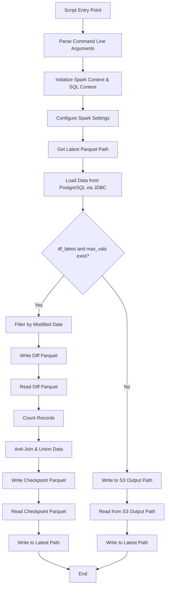
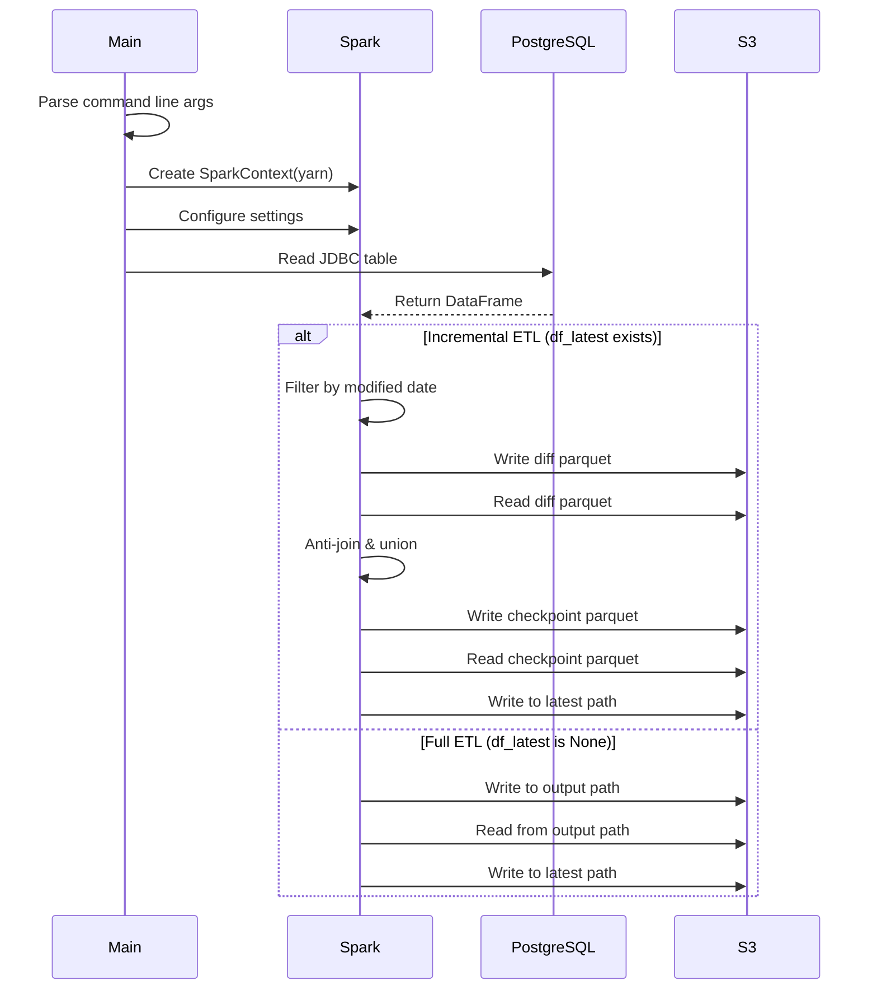
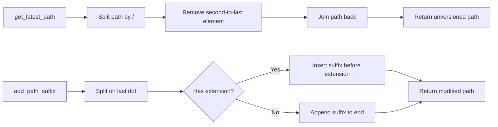

# Diagram: research/orchestrator/tasks/etl/extract_public_package_container_to_trip_leg_spark.py

> Auto-generated by Obscura crawlers

## Diagram 1

### SVG

<svg id="container" width="556.1875" xmlns="http://www.w3.org/2000/svg" class="flowchart" height="1950" viewBox="0 0 556.1875 1950" role="graphics-document document" aria-roledescription="flowchart-v2"><g><marker id="container_flowchart-v2-pointEnd" class="marker flowchart-v2" viewBox="0 0 10 10" refX="5" refY="5" markerUnits="userSpaceOnUse" markerWidth="8" markerHeight="8" orient="auto"><path d="M 0 0 L 10 5 L 0 10 z" class="arrowMarkerPath" style="stroke-width: 1; stroke-dasharray: 1, 0;"></path></marker><marker id="container_flowchart-v2-pointStart" class="marker flowchart-v2" viewBox="0 0 10 10" refX="4.5" refY="5" markerUnits="userSpaceOnUse" markerWidth="8" markerHeight="8" orient="auto"><path d="M 0 5 L 10 10 L 10 0 z" class="arrowMarkerPath" style="stroke-width: 1; stroke-dasharray: 1, 0;"></path></marker><marker id="container_flowchart-v2-circleEnd" class="marker flowchart-v2" viewBox="0 0 10 10" refX="11" refY="5" markerUnits="userSpaceOnUse" markerWidth="11" markerHeight="11" orient="auto"><circle cx="5" cy="5" r="5" class="arrowMarkerPath" style="stroke-width: 1; stroke-dasharray: 1, 0;"></circle></marker><marker id="container_flowchart-v2-circleStart" class="marker flowchart-v2" viewBox="0 0 10 10" refX="-1" refY="5" markerUnits="userSpaceOnUse" markerWidth="11" markerHeight="11" orient="auto"><circle cx="5" cy="5" r="5" class="arrowMarkerPath" style="stroke-width: 1; stroke-dasharray: 1, 0;"></circle></marker><marker id="container_flowchart-v2-crossEnd" class="marker cross flowchart-v2" viewBox="0 0 11 11" refX="12" refY="5.2" markerUnits="userSpaceOnUse" markerWidth="11" markerHeight="11" orient="auto"><path d="M 1,1 l 9,9 M 10,1 l -9,9" class="arrowMarkerPath" style="stroke-width: 2; stroke-dasharray: 1, 0;"></path></marker><marker id="container_flowchart-v2-crossStart" class="marker cross flowchart-v2" viewBox="0 0 11 11" refX="-1" refY="5.2" markerUnits="userSpaceOnUse" markerWidth="11" markerHeight="11" orient="auto"><path d="M 1,1 l 9,9 M 10,1 l -9,9" class="arrowMarkerPath" style="stroke-width: 2; stroke-dasharray: 1, 0;"></path></marker><g class="root"><g class="clusters"></g><g class="edgePaths"><path d="M277.328,62L277.328,66.167C277.328,70.333,277.328,78.667,277.328,86.333C277.328,94,277.328,101,277.328,104.5L277.328,108" id="L_Start_ParseArgs_0" class="edge-thickness-normal edge-pattern-solid edge-thickness-normal edge-pattern-solid flowchart-link" style=";" data-edge="true" data-et="edge" data-id="L_Start_ParseArgs_0" data-points="W3sieCI6Mjc3LjMyODEyNSwieSI6NjJ9LHsieCI6Mjc3LjMyODEyNSwieSI6ODd9LHsieCI6Mjc3LjMyODEyNSwieSI6MTEyfV0=" marker-end="url(#container_flowchart-v2-pointEnd)"></path><path d="M277.328,190L277.328,194.167C277.328,198.333,277.328,206.667,277.328,214.333C277.328,222,277.328,229,277.328,232.5L277.328,236" id="L_ParseArgs_InitSpark_0" class="edge-thickness-normal edge-pattern-solid edge-thickness-normal edge-pattern-solid flowchart-link" style=";" data-edge="true" data-et="edge" data-id="L_ParseArgs_InitSpark_0" data-points="W3sieCI6Mjc3LjMyODEyNSwieSI6MTkwfSx7IngiOjI3Ny4zMjgxMjUsInkiOjIxNX0seyJ4IjoyNzcuMzI4MTI1LCJ5IjoyNDB9XQ==" marker-end="url(#container_flowchart-v2-pointEnd)"></path><path d="M277.328,318L277.328,322.167C277.328,326.333,277.328,334.667,277.328,342.333C277.328,350,277.328,357,277.328,360.5L277.328,364" id="L_InitSpark_ConfigureSpark_0" class="edge-thickness-normal edge-pattern-solid edge-thickness-normal edge-pattern-solid flowchart-link" style=";" data-edge="true" data-et="edge" data-id="L_InitSpark_ConfigureSpark_0" data-points="W3sieCI6Mjc3LjMyODEyNSwieSI6MzE4fSx7IngiOjI3Ny4zMjgxMjUsInkiOjM0M30seyJ4IjoyNzcuMzI4MTI1LCJ5IjozNjh9XQ==" marker-end="url(#container_flowchart-v2-pointEnd)"></path><path d="M277.328,422L277.328,426.167C277.328,430.333,277.328,438.667,277.328,446.333C277.328,454,277.328,461,277.328,464.5L277.328,468" id="L_ConfigureSpark_GetLatestPath_0" class="edge-thickness-normal edge-pattern-solid edge-thickness-normal edge-pattern-solid flowchart-link" style=";" data-edge="true" data-et="edge" data-id="L_ConfigureSpark_GetLatestPath_0" data-points="W3sieCI6Mjc3LjMyODEyNSwieSI6NDIyfSx7IngiOjI3Ny4zMjgxMjUsInkiOjQ0N30seyJ4IjoyNzcuMzI4MTI1LCJ5Ijo0NzJ9XQ==" marker-end="url(#container_flowchart-v2-pointEnd)"></path><path d="M277.328,526L277.328,530.167C277.328,534.333,277.328,542.667,277.328,550.333C277.328,558,277.328,565,277.328,568.5L277.328,572" id="L_GetLatestPath_LoadFromDB_0" class="edge-thickness-normal edge-pattern-solid edge-thickness-normal edge-pattern-solid flowchart-link" style=";" data-edge="true" data-et="edge" data-id="L_GetLatestPath_LoadFromDB_0" data-points="W3sieCI6Mjc3LjMyODEyNSwieSI6NTI2fSx7IngiOjI3Ny4zMjgxMjUsInkiOjU1MX0seyJ4IjoyNzcuMzI4MTI1LCJ5Ijo1NzZ9XQ==" marker-end="url(#container_flowchart-v2-pointEnd)"></path><path d="M277.328,654L277.328,658.167C277.328,662.333,277.328,670.667,277.328,678.333C277.328,686,277.328,693,277.328,696.5L277.328,700" id="L_LoadFromDB_CheckLatest_0" class="edge-thickness-normal edge-pattern-solid edge-thickness-normal edge-pattern-solid flowchart-link" style=";" data-edge="true" data-et="edge" data-id="L_LoadFromDB_CheckLatest_0" data-points="W3sieCI6Mjc3LjMyODEyNSwieSI6NjU0fSx7IngiOjI3Ny4zMjgxMjUsInkiOjY3OX0seyJ4IjoyNzcuMzI4MTI1LCJ5Ijo3MDR9XQ==" marker-end="url(#container_flowchart-v2-pointEnd)"></path><path d="M213.993,918.665L199.995,935.387C185.998,952.11,158.003,985.555,144.005,1007.777C130.008,1030,130.008,1041,130.008,1046.5L130.008,1052" id="L_CheckLatest_FilterModified_0" class="edge-thickness-normal edge-pattern-solid edge-thickness-normal edge-pattern-solid flowchart-link" style=";" data-edge="true" data-et="edge" data-id="L_CheckLatest_FilterModified_0" data-points="W3sieCI6MjEzLjk5MzAyNzc0MjUzOTU3LCJ5Ijo5MTguNjY0OTAyNzQyNTM5NX0seyJ4IjoxMzAuMDA3ODEyNSwieSI6MTAxOX0seyJ4IjoxMzAuMDA3ODEyNSwieSI6MTA1Nn1d" marker-end="url(#container_flowchart-v2-pointEnd)"></path><path d="M130.008,1110L130.008,1114.167C130.008,1118.333,130.008,1126.667,130.008,1134.333C130.008,1142,130.008,1149,130.008,1152.5L130.008,1156" id="L_FilterModified_WriteDiff_0" class="edge-thickness-normal edge-pattern-solid edge-thickness-normal edge-pattern-solid flowchart-link" style=";" data-edge="true" data-et="edge" data-id="L_FilterModified_WriteDiff_0" data-points="W3sieCI6MTMwLjAwNzgxMjUsInkiOjExMTB9LHsieCI6MTMwLjAwNzgxMjUsInkiOjExMzV9LHsieCI6MTMwLjAwNzgxMjUsInkiOjExNjB9XQ==" marker-end="url(#container_flowchart-v2-pointEnd)"></path><path d="M130.008,1214L130.008,1218.167C130.008,1222.333,130.008,1230.667,130.008,1238.333C130.008,1246,130.008,1253,130.008,1256.5L130.008,1260" id="L_WriteDiff_ReadDiff_0" class="edge-thickness-normal edge-pattern-solid edge-thickness-normal edge-pattern-solid flowchart-link" style=";" data-edge="true" data-et="edge" data-id="L_WriteDiff_ReadDiff_0" data-points="W3sieCI6MTMwLjAwNzgxMjUsInkiOjEyMTR9LHsieCI6MTMwLjAwNzgxMjUsInkiOjEyMzl9LHsieCI6MTMwLjAwNzgxMjUsInkiOjEyNjR9XQ==" marker-end="url(#container_flowchart-v2-pointEnd)"></path><path d="M130.008,1318L130.008,1322.167C130.008,1326.333,130.008,1334.667,130.008,1342.333C130.008,1350,130.008,1357,130.008,1360.5L130.008,1364" id="L_ReadDiff_CountRecords_0" class="edge-thickness-normal edge-pattern-solid edge-thickness-normal edge-pattern-solid flowchart-link" style=";" data-edge="true" data-et="edge" data-id="L_ReadDiff_CountRecords_0" data-points="W3sieCI6MTMwLjAwNzgxMjUsInkiOjEzMTh9LHsieCI6MTMwLjAwNzgxMjUsInkiOjEzNDN9LHsieCI6MTMwLjAwNzgxMjUsInkiOjEzNjh9XQ==" marker-end="url(#container_flowchart-v2-pointEnd)"></path><path d="M130.008,1422L130.008,1426.167C130.008,1430.333,130.008,1438.667,130.008,1446.333C130.008,1454,130.008,1461,130.008,1464.5L130.008,1468" id="L_CountRecords_MergeData_0" class="edge-thickness-normal edge-pattern-solid edge-thickness-normal edge-pattern-solid flowchart-link" style=";" data-edge="true" data-et="edge" data-id="L_CountRecords_MergeData_0" data-points="W3sieCI6MTMwLjAwNzgxMjUsInkiOjE0MjJ9LHsieCI6MTMwLjAwNzgxMjUsInkiOjE0NDd9LHsieCI6MTMwLjAwNzgxMjUsInkiOjE0NzJ9XQ==" marker-end="url(#container_flowchart-v2-pointEnd)"></path><path d="M130.008,1526L130.008,1530.167C130.008,1534.333,130.008,1542.667,130.008,1550.333C130.008,1558,130.008,1565,130.008,1568.5L130.008,1572" id="L_MergeData_WriteCheckpoint_0" class="edge-thickness-normal edge-pattern-solid edge-thickness-normal edge-pattern-solid flowchart-link" style=";" data-edge="true" data-et="edge" data-id="L_MergeData_WriteCheckpoint_0" data-points="W3sieCI6MTMwLjAwNzgxMjUsInkiOjE1MjZ9LHsieCI6MTMwLjAwNzgxMjUsInkiOjE1NTF9LHsieCI6MTMwLjAwNzgxMjUsInkiOjE1NzZ9XQ==" marker-end="url(#container_flowchart-v2-pointEnd)"></path><path d="M130.008,1630L130.008,1634.167C130.008,1638.333,130.008,1646.667,130.008,1654.333C130.008,1662,130.008,1669,130.008,1672.5L130.008,1676" id="L_WriteCheckpoint_ReadCheckpoint_0" class="edge-thickness-normal edge-pattern-solid edge-thickness-normal edge-pattern-solid flowchart-link" style=";" data-edge="true" data-et="edge" data-id="L_WriteCheckpoint_ReadCheckpoint_0" data-points="W3sieCI6MTMwLjAwNzgxMjUsInkiOjE2MzB9LHsieCI6MTMwLjAwNzgxMjUsInkiOjE2NTV9LHsieCI6MTMwLjAwNzgxMjUsInkiOjE2ODB9XQ==" marker-end="url(#container_flowchart-v2-pointEnd)"></path><path d="M130.008,1734L130.008,1738.167C130.008,1742.333,130.008,1750.667,130.008,1758.333C130.008,1766,130.008,1773,130.008,1776.5L130.008,1780" id="L_ReadCheckpoint_WriteLatest1_0" class="edge-thickness-normal edge-pattern-solid edge-thickness-normal edge-pattern-solid flowchart-link" style=";" data-edge="true" data-et="edge" data-id="L_ReadCheckpoint_WriteLatest1_0" data-points="W3sieCI6MTMwLjAwNzgxMjUsInkiOjE3MzR9LHsieCI6MTMwLjAwNzgxMjUsInkiOjE3NTl9LHsieCI6MTMwLjAwNzgxMjUsInkiOjE3ODR9XQ==" marker-end="url(#container_flowchart-v2-pointEnd)"></path><path d="M340.663,918.665L354.661,935.387C368.658,952.11,396.653,985.555,410.651,1012.944C424.648,1040.333,424.648,1061.667,424.648,1081C424.648,1100.333,424.648,1117.667,424.648,1135C424.648,1152.333,424.648,1169.667,424.648,1187C424.648,1204.333,424.648,1221.667,424.648,1239C424.648,1256.333,424.648,1273.667,424.648,1291C424.648,1308.333,424.648,1325.667,424.648,1343C424.648,1360.333,424.648,1377.667,424.648,1395C424.648,1412.333,424.648,1429.667,424.648,1447C424.648,1464.333,424.648,1481.667,424.648,1499C424.648,1516.333,424.648,1533.667,424.648,1545.833C424.648,1558,424.648,1565,424.648,1568.5L424.648,1572" id="L_CheckLatest_WriteOutput_0" class="edge-thickness-normal edge-pattern-solid edge-thickness-normal edge-pattern-solid flowchart-link" style=";" data-edge="true" data-et="edge" data-id="L_CheckLatest_WriteOutput_0" data-points="W3sieCI6MzQwLjY2MzIyMjI1NzQ2MDQsInkiOjkxOC42NjQ5MDI3NDI1Mzk1fSx7IngiOjQyNC42NDg0Mzc1LCJ5IjoxMDE5fSx7IngiOjQyNC42NDg0Mzc1LCJ5IjoxMDgzfSx7IngiOjQyNC42NDg0Mzc1LCJ5IjoxMTM1fSx7IngiOjQyNC42NDg0Mzc1LCJ5IjoxMTg3fSx7IngiOjQyNC42NDg0Mzc1LCJ5IjoxMjM5fSx7IngiOjQyNC42NDg0Mzc1LCJ5IjoxMjkxfSx7IngiOjQyNC42NDg0Mzc1LCJ5IjoxMzQzfSx7IngiOjQyNC42NDg0Mzc1LCJ5IjoxMzk1fSx7IngiOjQyNC42NDg0Mzc1LCJ5IjoxNDQ3fSx7IngiOjQyNC42NDg0Mzc1LCJ5IjoxNDk5fSx7IngiOjQyNC42NDg0Mzc1LCJ5IjoxNTUxfSx7IngiOjQyNC42NDg0Mzc1LCJ5IjoxNTc2fV0=" marker-end="url(#container_flowchart-v2-pointEnd)"></path><path d="M424.648,1630L424.648,1634.167C424.648,1638.333,424.648,1646.667,424.648,1654.333C424.648,1662,424.648,1669,424.648,1672.5L424.648,1676" id="L_WriteOutput_ReadOutput_0" class="edge-thickness-normal edge-pattern-solid edge-thickness-normal edge-pattern-solid flowchart-link" style=";" data-edge="true" data-et="edge" data-id="L_WriteOutput_ReadOutput_0" data-points="W3sieCI6NDI0LjY0ODQzNzUsInkiOjE2MzB9LHsieCI6NDI0LjY0ODQzNzUsInkiOjE2NTV9LHsieCI6NDI0LjY0ODQzNzUsInkiOjE2ODB9XQ==" marker-end="url(#container_flowchart-v2-pointEnd)"></path><path d="M424.648,1734L424.648,1738.167C424.648,1742.333,424.648,1750.667,424.648,1758.333C424.648,1766,424.648,1773,424.648,1776.5L424.648,1780" id="L_ReadOutput_WriteLatest2_0" class="edge-thickness-normal edge-pattern-solid edge-thickness-normal edge-pattern-solid flowchart-link" style=";" data-edge="true" data-et="edge" data-id="L_ReadOutput_WriteLatest2_0" data-points="W3sieCI6NDI0LjY0ODQzNzUsInkiOjE3MzR9LHsieCI6NDI0LjY0ODQzNzUsInkiOjE3NTl9LHsieCI6NDI0LjY0ODQzNzUsInkiOjE3ODR9XQ==" marker-end="url(#container_flowchart-v2-pointEnd)"></path><path d="M130.008,1838L130.008,1842.167C130.008,1846.333,130.008,1854.667,146.653,1864.708C163.297,1874.75,196.587,1886.501,213.232,1892.376L229.877,1898.251" id="L_WriteLatest1_End_0" class="edge-thickness-normal edge-pattern-solid edge-thickness-normal edge-pattern-solid flowchart-link" style=";" data-edge="true" data-et="edge" data-id="L_WriteLatest1_End_0" data-points="W3sieCI6MTMwLjAwNzgxMjUsInkiOjE4Mzh9LHsieCI6MTMwLjAwNzgxMjUsInkiOjE4NjN9LHsieCI6MjMzLjY0ODQzNzUsInkiOjE4OTkuNTgyMjc3MTM4NDYzM31d" marker-end="url(#container_flowchart-v2-pointEnd)"></path><path d="M424.648,1838L424.648,1842.167C424.648,1846.333,424.648,1854.667,408.004,1864.708C391.359,1874.75,358.069,1886.501,341.425,1892.376L324.78,1898.251" id="L_WriteLatest2_End_0" class="edge-thickness-normal edge-pattern-solid edge-thickness-normal edge-pattern-solid flowchart-link" style=";" data-edge="true" data-et="edge" data-id="L_WriteLatest2_End_0" data-points="W3sieCI6NDI0LjY0ODQzNzUsInkiOjE4Mzh9LHsieCI6NDI0LjY0ODQzNzUsInkiOjE4NjN9LHsieCI6MzIxLjAwNzgxMjUsInkiOjE4OTkuNTgyMjc3MTM4NDYzM31d" marker-end="url(#container_flowchart-v2-pointEnd)"></path></g><g class="edgeLabels"><g class="edgeLabel"><g class="label" data-id="L_Start_ParseArgs_0" transform="translate(0, 0)"><foreignObject width="0" height="0">

</foreignObject></g></g><g class="edgeLabel"><g class="label" data-id="L_ParseArgs_InitSpark_0" transform="translate(0, 0)"><foreignObject width="0" height="0">

</foreignObject></g></g><g class="edgeLabel"><g class="label" data-id="L_InitSpark_ConfigureSpark_0" transform="translate(0, 0)"><foreignObject width="0" height="0">

</foreignObject></g></g><g class="edgeLabel"><g class="label" data-id="L_ConfigureSpark_GetLatestPath_0" transform="translate(0, 0)"><foreignObject width="0" height="0">

</foreignObject></g></g><g class="edgeLabel"><g class="label" data-id="L_GetLatestPath_LoadFromDB_0" transform="translate(0, 0)"><foreignObject width="0" height="0">

</foreignObject></g></g><g class="edgeLabel"><g class="label" data-id="L_LoadFromDB_CheckLatest_0" transform="translate(0, 0)"><foreignObject width="0" height="0">

</foreignObject></g></g><g class="edgeLabel" transform="translate(130.0078125, 1019)"><g class="label" data-id="L_CheckLatest_FilterModified_0" transform="translate(-12.03125, -12)"><foreignObject width="24.0625" height="24">

Yes

</foreignObject></g></g><g class="edgeLabel"><g class="label" data-id="L_FilterModified_WriteDiff_0" transform="translate(0, 0)"><foreignObject width="0" height="0">

</foreignObject></g></g><g class="edgeLabel"><g class="label" data-id="L_WriteDiff_ReadDiff_0" transform="translate(0, 0)"><foreignObject width="0" height="0">

</foreignObject></g></g><g class="edgeLabel"><g class="label" data-id="L_ReadDiff_CountRecords_0" transform="translate(0, 0)"><foreignObject width="0" height="0">

</foreignObject></g></g><g class="edgeLabel"><g class="label" data-id="L_CountRecords_MergeData_0" transform="translate(0, 0)"><foreignObject width="0" height="0">

</foreignObject></g></g><g class="edgeLabel"><g class="label" data-id="L_MergeData_WriteCheckpoint_0" transform="translate(0, 0)"><foreignObject width="0" height="0">

</foreignObject></g></g><g class="edgeLabel"><g class="label" data-id="L_WriteCheckpoint_ReadCheckpoint_0" transform="translate(0, 0)"><foreignObject width="0" height="0">

</foreignObject></g></g><g class="edgeLabel"><g class="label" data-id="L_ReadCheckpoint_WriteLatest1_0" transform="translate(0, 0)"><foreignObject width="0" height="0">

</foreignObject></g></g><g class="edgeLabel" transform="translate(424.6484375, 1291)"><g class="label" data-id="L_CheckLatest_WriteOutput_0" transform="translate(-10.140625, -12)"><foreignObject width="20.28125" height="24">

No

</foreignObject></g></g><g class="edgeLabel"><g class="label" data-id="L_WriteOutput_ReadOutput_0" transform="translate(0, 0)"><foreignObject width="0" height="0">

</foreignObject></g></g><g class="edgeLabel"><g class="label" data-id="L_ReadOutput_WriteLatest2_0" transform="translate(0, 0)"><foreignObject width="0" height="0">

</foreignObject></g></g><g class="edgeLabel"><g class="label" data-id="L_WriteLatest1_End_0" transform="translate(0, 0)"><foreignObject width="0" height="0">

</foreignObject></g></g><g class="edgeLabel"><g class="label" data-id="L_WriteLatest2_End_0" transform="translate(0, 0)"><foreignObject width="0" height="0">

</foreignObject></g></g></g><g class="nodes"><g class="node default" id="flowchart-Start-0" transform="translate(277.328125, 35)"><rect class="basic label-container" style="" x="-93.125" y="-27" width="186.25" height="54"></rect><g class="label" style="" transform="translate(-63.125, -12)"><rect></rect><foreignObject width="126.25" height="24">

Script Entry Point

</foreignObject></g></g><g class="node default" id="flowchart-ParseArgs-1" transform="translate(277.328125, 151)"><rect class="basic label-container" style="" x="-130" y="-39" width="260" height="78"></rect><g class="label" style="" transform="translate(-100, -24)"><rect></rect><foreignObject width="200" height="48">

Parse Command Line Arguments

</foreignObject></g></g><g class="node default" id="flowchart-InitSpark-3" transform="translate(277.328125, 279)"><rect class="basic label-container" style="" x="-130" y="-39" width="260" height="78"></rect><g class="label" style="" transform="translate(-100, -24)"><rect></rect><foreignObject width="200" height="48">

Initialize Spark Context &amp; SQL Context

</foreignObject></g></g><g class="node default" id="flowchart-ConfigureSpark-5" transform="translate(277.328125, 395)"><rect class="basic label-container" style="" x="-118.3125" y="-27" width="236.625" height="54"></rect><g class="label" style="" transform="translate(-88.3125, -12)"><rect></rect><foreignObject width="176.625" height="24">

Configure Spark Settings

</foreignObject></g></g><g class="node default" id="flowchart-GetLatestPath-7" transform="translate(277.328125, 499)"><rect class="basic label-container" style="" x="-114.8984375" y="-27" width="229.796875" height="54"></rect><g class="label" style="" transform="translate(-84.8984375, -12)"><rect></rect><foreignObject width="169.796875" height="24">

Get Latest Parquet Path

</foreignObject></g></g><g class="node default" id="flowchart-LoadFromDB-9" transform="translate(277.328125, 615)"><rect class="basic label-container" style="" x="-130" y="-39" width="260" height="78"></rect><g class="label" style="" transform="translate(-100, -24)"><rect></rect><foreignObject width="200" height="48">

Load Data from PostgreSQL via JDBC

</foreignObject></g></g><g class="node default" id="flowchart-CheckLatest-11" transform="translate(277.328125, 843)"><polygon points="139,0 278,-139 139,-278 0,-139" class="label-container" transform="translate(-138.5, 139)"></polygon><g class="label" style="" transform="translate(-100, -24)"><rect></rect><foreignObject width="200" height="48">

df_latest and max_vals exist?

</foreignObject></g></g><g class="node default" id="flowchart-FilterModified-13" transform="translate(130.0078125, 1083)"><rect class="basic label-container" style="" x="-111.71875" y="-27" width="223.4375" height="54"></rect><g class="label" style="" transform="translate(-81.71875, -12)"><rect></rect><foreignObject width="163.4375" height="24">

Filter by Modified Date

</foreignObject></g></g><g class="node default" id="flowchart-WriteDiff-15" transform="translate(130.0078125, 1187)"><rect class="basic label-container" style="" x="-94.1484375" y="-27" width="188.296875" height="54"></rect><g class="label" style="" transform="translate(-64.1484375, -12)"><rect></rect><foreignObject width="128.296875" height="24">

Write Diff Parquet

</foreignObject></g></g><g class="node default" id="flowchart-ReadDiff-17" transform="translate(130.0078125, 1291)"><rect class="basic label-container" style="" x="-93.2421875" y="-27" width="186.484375" height="54"></rect><g class="label" style="" transform="translate(-63.2421875, -12)"><rect></rect><foreignObject width="126.484375" height="24">

Read Diff Parquet

</foreignObject></g></g><g class="node default" id="flowchart-CountRecords-19" transform="translate(130.0078125, 1395)"><rect class="basic label-container" style="" x="-82.1328125" y="-27" width="164.265625" height="54"></rect><g class="label" style="" transform="translate(-52.1328125, -12)"><rect></rect><foreignObject width="104.265625" height="24">

Count Records

</foreignObject></g></g><g class="node default" id="flowchart-MergeData-21" transform="translate(130.0078125, 1499)"><rect class="basic label-container" style="" x="-112.03125" y="-27" width="224.0625" height="54"></rect><g class="label" style="" transform="translate(-82.03125, -12)"><rect></rect><foreignObject width="164.0625" height="24">

Anti-Join &amp; Union Data

</foreignObject></g></g><g class="node default" id="flowchart-WriteCheckpoint-23" transform="translate(130.0078125, 1603)"><rect class="basic label-container" style="" x="-122.0078125" y="-27" width="244.015625" height="54"></rect><g class="label" style="" transform="translate(-92.0078125, -12)"><rect></rect><foreignObject width="184.015625" height="24">

Write Checkpoint Parquet

</foreignObject></g></g><g class="node default" id="flowchart-ReadCheckpoint-25" transform="translate(130.0078125, 1707)"><rect class="basic label-container" style="" x="-121.1015625" y="-27" width="242.203125" height="54"></rect><g class="label" style="" transform="translate(-91.1015625, -12)"><rect></rect><foreignObject width="182.203125" height="24">

Read Checkpoint Parquet

</foreignObject></g></g><g class="node default" id="flowchart-WriteLatest1-27" transform="translate(130.0078125, 1811)"><rect class="basic label-container" style="" x="-100.984375" y="-27" width="201.96875" height="54"></rect><g class="label" style="" transform="translate(-70.984375, -12)"><rect></rect><foreignObject width="141.96875" height="24">

Write to Latest Path

</foreignObject></g></g><g class="node default" id="flowchart-WriteOutput-29" transform="translate(424.6484375, 1603)"><rect class="basic label-container" style="" x="-114.828125" y="-27" width="229.65625" height="54"></rect><g class="label" style="" transform="translate(-84.828125, -12)"><rect></rect><foreignObject width="169.65625" height="24">

Write to S3 Output Path

</foreignObject></g></g><g class="node default" id="flowchart-ReadOutput-31" transform="translate(424.6484375, 1707)"><rect class="basic label-container" style="" x="-123.5390625" y="-27" width="247.078125" height="54"></rect><g class="label" style="" transform="translate(-93.5390625, -12)"><rect></rect><foreignObject width="187.078125" height="24">

Read from S3 Output Path

</foreignObject></g></g><g class="node default" id="flowchart-WriteLatest2-33" transform="translate(424.6484375, 1811)"><rect class="basic label-container" style="" x="-100.984375" y="-27" width="201.96875" height="54"></rect><g class="label" style="" transform="translate(-70.984375, -12)"><rect></rect><foreignObject width="141.96875" height="24">

Write to Latest Path

</foreignObject></g></g><g class="node default" id="flowchart-End-35" transform="translate(277.328125, 1915)"><rect class="basic label-container" style="" x="-43.6796875" y="-27" width="87.359375" height="54"></rect><g class="label" style="" transform="translate(-13.6796875, -12)"><rect></rect><foreignObject width="27.359375" height="24">

End

</foreignObject></g></g></g></g></g></svg>

## Diagram 2

### SVG

<svg id="container" width="923.5" xmlns="http://www.w3.org/2000/svg" height="1081" viewBox="-64.5 -10 923.5 1081" role="graphics-document document" aria-roledescription="sequence"><g><rect x="659" y="995" fill="#eaeaea" stroke="#666" width="150" height="65" name="S3" rx="3" ry="3" class="actor actor-bottom"></rect><text x="734" y="1027.5" dominant-baseline="central" alignment-baseline="central" class="actor actor-box" style="text-anchor: middle; font-size: 16px; font-weight: 400;"><tspan x="734" dy="0">S3</tspan></text></g><g><rect x="459" y="995" fill="#eaeaea" stroke="#666" width="150" height="65" name="PostgreSQL" rx="3" ry="3" class="actor actor-bottom"></rect><text x="534" y="1027.5" dominant-baseline="central" alignment-baseline="central" class="actor actor-box" style="text-anchor: middle; font-size: 16px; font-weight: 400;"><tspan x="534" dy="0">PostgreSQL</tspan></text></g><g><rect x="259" y="995" fill="#eaeaea" stroke="#666" width="150" height="65" name="Spark" rx="3" ry="3" class="actor actor-bottom"></rect><text x="334" y="1027.5" dominant-baseline="central" alignment-baseline="central" class="actor actor-box" style="text-anchor: middle; font-size: 16px; font-weight: 400;"><tspan x="334" dy="0">Spark</tspan></text></g><g><rect x="0" y="995" fill="#eaeaea" stroke="#666" width="150" height="65" name="Main" rx="3" ry="3" class="actor actor-bottom"></rect><text x="75" y="1027.5" dominant-baseline="central" alignment-baseline="central" class="actor actor-box" style="text-anchor: middle; font-size: 16px; font-weight: 400;"><tspan x="75" dy="0">Main</tspan></text></g><g><line id="actor3" x1="734" y1="65" x2="734" y2="995" class="actor-line 200" stroke-width="0.5px" stroke="#999" name="S3"></line><g id="root-3"><rect x="659" y="0" fill="#eaeaea" stroke="#666" width="150" height="65" name="S3" rx="3" ry="3" class="actor actor-top"></rect><text x="734" y="32.5" dominant-baseline="central" alignment-baseline="central" class="actor actor-box" style="text-anchor: middle; font-size: 16px; font-weight: 400;"><tspan x="734" dy="0">S3</tspan></text></g></g><g><line id="actor2" x1="534" y1="65" x2="534" y2="995" class="actor-line 200" stroke-width="0.5px" stroke="#999" name="PostgreSQL"></line><g id="root-2"><rect x="459" y="0" fill="#eaeaea" stroke="#666" width="150" height="65" name="PostgreSQL" rx="3" ry="3" class="actor actor-top"></rect><text x="534" y="32.5" dominant-baseline="central" alignment-baseline="central" class="actor actor-box" style="text-anchor: middle; font-size: 16px; font-weight: 400;"><tspan x="534" dy="0">PostgreSQL</tspan></text></g></g><g><line id="actor1" x1="334" y1="65" x2="334" y2="995" class="actor-line 200" stroke-width="0.5px" stroke="#999" name="Spark"></line><g id="root-1"><rect x="259" y="0" fill="#eaeaea" stroke="#666" width="150" height="65" name="Spark" rx="3" ry="3" class="actor actor-top"></rect><text x="334" y="32.5" dominant-baseline="central" alignment-baseline="central" class="actor actor-box" style="text-anchor: middle; font-size: 16px; font-weight: 400;"><tspan x="334" dy="0">Spark</tspan></text></g></g><g><line id="actor0" x1="75" y1="65" x2="75" y2="995" class="actor-line 200" stroke-width="0.5px" stroke="#999" name="Main"></line><g id="root-0"><rect x="0" y="0" fill="#eaeaea" stroke="#666" width="150" height="65" name="Main" rx="3" ry="3" class="actor actor-top"></rect><text x="75" y="32.5" dominant-baseline="central" alignment-baseline="central" class="actor actor-box" style="text-anchor: middle; font-size: 16px; font-weight: 400;"><tspan x="75" dy="0">Main</tspan></text></g></g><g></g><defs><symbol id="computer" width="24" height="24"><path transform="scale(.5)" d="M2 2v13h20v-13h-20zm18 11h-16v-9h16v9zm-10.228 6l.466-1h3.524l.467 1h-4.457zm14.228 3h-24l2-6h2.104l-1.33 4h18.45l-1.297-4h2.073l2 6zm-5-10h-14v-7h14v7z"></path></symbol></defs><defs><symbol id="database" fill-rule="evenodd" clip-rule="evenodd"><path transform="scale(.5)" d="M12.258.001l.256.004.255.005.253.008.251.01.249.012.247.015.246.016.242.019.241.02.239.023.236.024.233.027.231.028.229.031.225.032.223.034.22.036.217.038.214.04.211.041.208.043.205.045.201.046.198.048.194.05.191.051.187.053.183.054.18.056.175.057.172.059.168.06.163.061.16.063.155.064.15.066.074.033.073.033.071.034.07.034.069.035.068.035.067.035.066.035.064.036.064.036.062.036.06.036.06.037.058.037.058.037.055.038.055.038.053.038.052.038.051.039.05.039.048.039.047.039.045.04.044.04.043.04.041.04.04.041.039.041.037.041.036.041.034.041.033.042.032.042.03.042.029.042.027.042.026.043.024.043.023.043.021.043.02.043.018.044.017.043.015.044.013.044.012.044.011.045.009.044.007.045.006.045.004.045.002.045.001.045v17l-.001.045-.002.045-.004.045-.006.045-.007.045-.009.044-.011.045-.012.044-.013.044-.015.044-.017.043-.018.044-.02.043-.021.043-.023.043-.024.043-.026.043-.027.042-.029.042-.03.042-.032.042-.033.042-.034.041-.036.041-.037.041-.039.041-.04.041-.041.04-.043.04-.044.04-.045.04-.047.039-.048.039-.05.039-.051.039-.052.038-.053.038-.055.038-.055.038-.058.037-.058.037-.06.037-.06.036-.062.036-.064.036-.064.036-.066.035-.067.035-.068.035-.069.035-.07.034-.071.034-.073.033-.074.033-.15.066-.155.064-.16.063-.163.061-.168.06-.172.059-.175.057-.18.056-.183.054-.187.053-.191.051-.194.05-.198.048-.201.046-.205.045-.208.043-.211.041-.214.04-.217.038-.22.036-.223.034-.225.032-.229.031-.231.028-.233.027-.236.024-.239.023-.241.02-.242.019-.246.016-.247.015-.249.012-.251.01-.253.008-.255.005-.256.004-.258.001-.258-.001-.256-.004-.255-.005-.253-.008-.251-.01-.249-.012-.247-.015-.245-.016-.243-.019-.241-.02-.238-.023-.236-.024-.234-.027-.231-.028-.228-.031-.226-.032-.223-.034-.22-.036-.217-.038-.214-.04-.211-.041-.208-.043-.204-.045-.201-.046-.198-.048-.195-.05-.19-.051-.187-.053-.184-.054-.179-.056-.176-.057-.172-.059-.167-.06-.164-.061-.159-.063-.155-.064-.151-.066-.074-.033-.072-.033-.072-.034-.07-.034-.069-.035-.068-.035-.067-.035-.066-.035-.064-.036-.063-.036-.062-.036-.061-.036-.06-.037-.058-.037-.057-.037-.056-.038-.055-.038-.053-.038-.052-.038-.051-.039-.049-.039-.049-.039-.046-.039-.046-.04-.044-.04-.043-.04-.041-.04-.04-.041-.039-.041-.037-.041-.036-.041-.034-.041-.033-.042-.032-.042-.03-.042-.029-.042-.027-.042-.026-.043-.024-.043-.023-.043-.021-.043-.02-.043-.018-.044-.017-.043-.015-.044-.013-.044-.012-.044-.011-.045-.009-.044-.007-.045-.006-.045-.004-.045-.002-.045-.001-.045v-17l.001-.045.002-.045.004-.045.006-.045.007-.045.009-.044.011-.045.012-.044.013-.044.015-.044.017-.043.018-.044.02-.043.021-.043.023-.043.024-.043.026-.043.027-.042.029-.042.03-.042.032-.042.033-.042.034-.041.036-.041.037-.041.039-.041.04-.041.041-.04.043-.04.044-.04.046-.04.046-.039.049-.039.049-.039.051-.039.052-.038.053-.038.055-.038.056-.038.057-.037.058-.037.06-.037.061-.036.062-.036.063-.036.064-.036.066-.035.067-.035.068-.035.069-.035.07-.034.072-.034.072-.033.074-.033.151-.066.155-.064.159-.063.164-.061.167-.06.172-.059.176-.057.179-.056.184-.054.187-.053.19-.051.195-.05.198-.048.201-.046.204-.045.208-.043.211-.041.214-.04.217-.038.22-.036.223-.034.226-.032.228-.031.231-.028.234-.027.236-.024.238-.023.241-.02.243-.019.245-.016.247-.015.249-.012.251-.01.253-.008.255-.005.256-.004.258-.001.258.001zm-9.258 20.499v.01l.001.021.003.021.004.022.005.021.006.022.007.022.009.023.01.022.011.023.012.023.013.023.015.023.016.024.017.023.018.024.019.024.021.024.022.025.023.024.024.025.052.049.056.05.061.051.066.051.07.051.075.051.079.052.084.052.088.052.092.052.097.052.102.051.105.052.11.052.114.051.119.051.123.051.127.05.131.05.135.05.139.048.144.049.147.047.152.047.155.047.16.045.163.045.167.043.171.043.176.041.178.041.183.039.187.039.19.037.194.035.197.035.202.033.204.031.209.03.212.029.216.027.219.025.222.024.226.021.23.02.233.018.236.016.24.015.243.012.246.01.249.008.253.005.256.004.259.001.26-.001.257-.004.254-.005.25-.008.247-.011.244-.012.241-.014.237-.016.233-.018.231-.021.226-.021.224-.024.22-.026.216-.027.212-.028.21-.031.205-.031.202-.034.198-.034.194-.036.191-.037.187-.039.183-.04.179-.04.175-.042.172-.043.168-.044.163-.045.16-.046.155-.046.152-.047.148-.048.143-.049.139-.049.136-.05.131-.05.126-.05.123-.051.118-.052.114-.051.11-.052.106-.052.101-.052.096-.052.092-.052.088-.053.083-.051.079-.052.074-.052.07-.051.065-.051.06-.051.056-.05.051-.05.023-.024.023-.025.021-.024.02-.024.019-.024.018-.024.017-.024.015-.023.014-.024.013-.023.012-.023.01-.023.01-.022.008-.022.006-.022.006-.022.004-.022.004-.021.001-.021.001-.021v-4.127l-.077.055-.08.053-.083.054-.085.053-.087.052-.09.052-.093.051-.095.05-.097.05-.1.049-.102.049-.105.048-.106.047-.109.047-.111.046-.114.045-.115.045-.118.044-.12.043-.122.042-.124.042-.126.041-.128.04-.13.04-.132.038-.134.038-.135.037-.138.037-.139.035-.142.035-.143.034-.144.033-.147.032-.148.031-.15.03-.151.03-.153.029-.154.027-.156.027-.158.026-.159.025-.161.024-.162.023-.163.022-.165.021-.166.02-.167.019-.169.018-.169.017-.171.016-.173.015-.173.014-.175.013-.175.012-.177.011-.178.01-.179.008-.179.008-.181.006-.182.005-.182.004-.184.003-.184.002h-.37l-.184-.002-.184-.003-.182-.004-.182-.005-.181-.006-.179-.008-.179-.008-.178-.01-.176-.011-.176-.012-.175-.013-.173-.014-.172-.015-.171-.016-.17-.017-.169-.018-.167-.019-.166-.02-.165-.021-.163-.022-.162-.023-.161-.024-.159-.025-.157-.026-.156-.027-.155-.027-.153-.029-.151-.03-.15-.03-.148-.031-.146-.032-.145-.033-.143-.034-.141-.035-.14-.035-.137-.037-.136-.037-.134-.038-.132-.038-.13-.04-.128-.04-.126-.041-.124-.042-.122-.042-.12-.044-.117-.043-.116-.045-.113-.045-.112-.046-.109-.047-.106-.047-.105-.048-.102-.049-.1-.049-.097-.05-.095-.05-.093-.052-.09-.051-.087-.052-.085-.053-.083-.054-.08-.054-.077-.054v4.127zm0-5.654v.011l.001.021.003.021.004.021.005.022.006.022.007.022.009.022.01.022.011.023.012.023.013.023.015.024.016.023.017.024.018.024.019.024.021.024.022.024.023.025.024.024.052.05.056.05.061.05.066.051.07.051.075.052.079.051.084.052.088.052.092.052.097.052.102.052.105.052.11.051.114.051.119.052.123.05.127.051.131.05.135.049.139.049.144.048.147.048.152.047.155.046.16.045.163.045.167.044.171.042.176.042.178.04.183.04.187.038.19.037.194.036.197.034.202.033.204.032.209.03.212.028.216.027.219.025.222.024.226.022.23.02.233.018.236.016.24.014.243.012.246.01.249.008.253.006.256.003.259.001.26-.001.257-.003.254-.006.25-.008.247-.01.244-.012.241-.015.237-.016.233-.018.231-.02.226-.022.224-.024.22-.025.216-.027.212-.029.21-.03.205-.032.202-.033.198-.035.194-.036.191-.037.187-.039.183-.039.179-.041.175-.042.172-.043.168-.044.163-.045.16-.045.155-.047.152-.047.148-.048.143-.048.139-.05.136-.049.131-.05.126-.051.123-.051.118-.051.114-.052.11-.052.106-.052.101-.052.096-.052.092-.052.088-.052.083-.052.079-.052.074-.051.07-.052.065-.051.06-.05.056-.051.051-.049.023-.025.023-.024.021-.025.02-.024.019-.024.018-.024.017-.024.015-.023.014-.023.013-.024.012-.022.01-.023.01-.023.008-.022.006-.022.006-.022.004-.021.004-.022.001-.021.001-.021v-4.139l-.077.054-.08.054-.083.054-.085.052-.087.053-.09.051-.093.051-.095.051-.097.05-.1.049-.102.049-.105.048-.106.047-.109.047-.111.046-.114.045-.115.044-.118.044-.12.044-.122.042-.124.042-.126.041-.128.04-.13.039-.132.039-.134.038-.135.037-.138.036-.139.036-.142.035-.143.033-.144.033-.147.033-.148.031-.15.03-.151.03-.153.028-.154.028-.156.027-.158.026-.159.025-.161.024-.162.023-.163.022-.165.021-.166.02-.167.019-.169.018-.169.017-.171.016-.173.015-.173.014-.175.013-.175.012-.177.011-.178.009-.179.009-.179.007-.181.007-.182.005-.182.004-.184.003-.184.002h-.37l-.184-.002-.184-.003-.182-.004-.182-.005-.181-.007-.179-.007-.179-.009-.178-.009-.176-.011-.176-.012-.175-.013-.173-.014-.172-.015-.171-.016-.17-.017-.169-.018-.167-.019-.166-.02-.165-.021-.163-.022-.162-.023-.161-.024-.159-.025-.157-.026-.156-.027-.155-.028-.153-.028-.151-.03-.15-.03-.148-.031-.146-.033-.145-.033-.143-.033-.141-.035-.14-.036-.137-.036-.136-.037-.134-.038-.132-.039-.13-.039-.128-.04-.126-.041-.124-.042-.122-.043-.12-.043-.117-.044-.116-.044-.113-.046-.112-.046-.109-.046-.106-.047-.105-.048-.102-.049-.1-.049-.097-.05-.095-.051-.093-.051-.09-.051-.087-.053-.085-.052-.083-.054-.08-.054-.077-.054v4.139zm0-5.666v.011l.001.02.003.022.004.021.005.022.006.021.007.022.009.023.01.022.011.023.012.023.013.023.015.023.016.024.017.024.018.023.019.024.021.025.022.024.023.024.024.025.052.05.056.05.061.05.066.051.07.051.075.052.079.051.084.052.088.052.092.052.097.052.102.052.105.051.11.052.114.051.119.051.123.051.127.05.131.05.135.05.139.049.144.048.147.048.152.047.155.046.16.045.163.045.167.043.171.043.176.042.178.04.183.04.187.038.19.037.194.036.197.034.202.033.204.032.209.03.212.028.216.027.219.025.222.024.226.021.23.02.233.018.236.017.24.014.243.012.246.01.249.008.253.006.256.003.259.001.26-.001.257-.003.254-.006.25-.008.247-.01.244-.013.241-.014.237-.016.233-.018.231-.02.226-.022.224-.024.22-.025.216-.027.212-.029.21-.03.205-.032.202-.033.198-.035.194-.036.191-.037.187-.039.183-.039.179-.041.175-.042.172-.043.168-.044.163-.045.16-.045.155-.047.152-.047.148-.048.143-.049.139-.049.136-.049.131-.051.126-.05.123-.051.118-.052.114-.051.11-.052.106-.052.101-.052.096-.052.092-.052.088-.052.083-.052.079-.052.074-.052.07-.051.065-.051.06-.051.056-.05.051-.049.023-.025.023-.025.021-.024.02-.024.019-.024.018-.024.017-.024.015-.023.014-.024.013-.023.012-.023.01-.022.01-.023.008-.022.006-.022.006-.022.004-.022.004-.021.001-.021.001-.021v-4.153l-.077.054-.08.054-.083.053-.085.053-.087.053-.09.051-.093.051-.095.051-.097.05-.1.049-.102.048-.105.048-.106.048-.109.046-.111.046-.114.046-.115.044-.118.044-.12.043-.122.043-.124.042-.126.041-.128.04-.13.039-.132.039-.134.038-.135.037-.138.036-.139.036-.142.034-.143.034-.144.033-.147.032-.148.032-.15.03-.151.03-.153.028-.154.028-.156.027-.158.026-.159.024-.161.024-.162.023-.163.023-.165.021-.166.02-.167.019-.169.018-.169.017-.171.016-.173.015-.173.014-.175.013-.175.012-.177.01-.178.01-.179.009-.179.007-.181.006-.182.006-.182.004-.184.003-.184.001-.185.001-.185-.001-.184-.001-.184-.003-.182-.004-.182-.006-.181-.006-.179-.007-.179-.009-.178-.01-.176-.01-.176-.012-.175-.013-.173-.014-.172-.015-.171-.016-.17-.017-.169-.018-.167-.019-.166-.02-.165-.021-.163-.023-.162-.023-.161-.024-.159-.024-.157-.026-.156-.027-.155-.028-.153-.028-.151-.03-.15-.03-.148-.032-.146-.032-.145-.033-.143-.034-.141-.034-.14-.036-.137-.036-.136-.037-.134-.038-.132-.039-.13-.039-.128-.041-.126-.041-.124-.041-.122-.043-.12-.043-.117-.044-.116-.044-.113-.046-.112-.046-.109-.046-.106-.048-.105-.048-.102-.048-.1-.05-.097-.049-.095-.051-.093-.051-.09-.052-.087-.052-.085-.053-.083-.053-.08-.054-.077-.054v4.153zm8.74-8.179l-.257.004-.254.005-.25.008-.247.011-.244.012-.241.014-.237.016-.233.018-.231.021-.226.022-.224.023-.22.026-.216.027-.212.028-.21.031-.205.032-.202.033-.198.034-.194.036-.191.038-.187.038-.183.04-.179.041-.175.042-.172.043-.168.043-.163.045-.16.046-.155.046-.152.048-.148.048-.143.048-.139.049-.136.05-.131.05-.126.051-.123.051-.118.051-.114.052-.11.052-.106.052-.101.052-.096.052-.092.052-.088.052-.083.052-.079.052-.074.051-.07.052-.065.051-.06.05-.056.05-.051.05-.023.025-.023.024-.021.024-.02.025-.019.024-.018.024-.017.023-.015.024-.014.023-.013.023-.012.023-.01.023-.01.022-.008.022-.006.023-.006.021-.004.022-.004.021-.001.021-.001.021.001.021.001.021.004.021.004.022.006.021.006.023.008.022.01.022.01.023.012.023.013.023.014.023.015.024.017.023.018.024.019.024.02.025.021.024.023.024.023.025.051.05.056.05.06.05.065.051.07.052.074.051.079.052.083.052.088.052.092.052.096.052.101.052.106.052.11.052.114.052.118.051.123.051.126.051.131.05.136.05.139.049.143.048.148.048.152.048.155.046.16.046.163.045.168.043.172.043.175.042.179.041.183.04.187.038.191.038.194.036.198.034.202.033.205.032.21.031.212.028.216.027.22.026.224.023.226.022.231.021.233.018.237.016.241.014.244.012.247.011.25.008.254.005.257.004.26.001.26-.001.257-.004.254-.005.25-.008.247-.011.244-.012.241-.014.237-.016.233-.018.231-.021.226-.022.224-.023.22-.026.216-.027.212-.028.21-.031.205-.032.202-.033.198-.034.194-.036.191-.038.187-.038.183-.04.179-.041.175-.042.172-.043.168-.043.163-.045.16-.046.155-.046.152-.048.148-.048.143-.048.139-.049.136-.05.131-.05.126-.051.123-.051.118-.051.114-.052.11-.052.106-.052.101-.052.096-.052.092-.052.088-.052.083-.052.079-.052.074-.051.07-.052.065-.051.06-.05.056-.05.051-.05.023-.025.023-.024.021-.024.02-.025.019-.024.018-.024.017-.023.015-.024.014-.023.013-.023.012-.023.01-.023.01-.022.008-.022.006-.023.006-.021.004-.022.004-.021.001-.021.001-.021-.001-.021-.001-.021-.004-.021-.004-.022-.006-.021-.006-.023-.008-.022-.01-.022-.01-.023-.012-.023-.013-.023-.014-.023-.015-.024-.017-.023-.018-.024-.019-.024-.02-.025-.021-.024-.023-.024-.023-.025-.051-.05-.056-.05-.06-.05-.065-.051-.07-.052-.074-.051-.079-.052-.083-.052-.088-.052-.092-.052-.096-.052-.101-.052-.106-.052-.11-.052-.114-.052-.118-.051-.123-.051-.126-.051-.131-.05-.136-.05-.139-.049-.143-.048-.148-.048-.152-.048-.155-.046-.16-.046-.163-.045-.168-.043-.172-.043-.175-.042-.179-.041-.183-.04-.187-.038-.191-.038-.194-.036-.198-.034-.202-.033-.205-.032-.21-.031-.212-.028-.216-.027-.22-.026-.224-.023-.226-.022-.231-.021-.233-.018-.237-.016-.241-.014-.244-.012-.247-.011-.25-.008-.254-.005-.257-.004-.26-.001-.26.001z"></path></symbol></defs><defs><symbol id="clock" width="24" height="24"><path transform="scale(.5)" d="M12 2c5.514 0 10 4.486 10 10s-4.486 10-10 10-10-4.486-10-10 4.486-10 10-10zm0-2c-6.627 0-12 5.373-12 12s5.373 12 12 12 12-5.373 12-12-5.373-12-12-12zm5.848 12.459c.202.038.202.333.001.372-1.907.361-6.045 1.111-6.547 1.111-.719 0-1.301-.582-1.301-1.301 0-.512.77-5.447 1.125-7.445.034-.192.312-.181.343.014l.985 6.238 5.394 1.011z"></path></symbol></defs><defs><marker id="arrowhead" refX="7.9" refY="5" markerUnits="userSpaceOnUse" markerWidth="12" markerHeight="12" orient="auto-start-reverse"><path d="M -1 0 L 10 5 L 0 10 z"></path></marker></defs><defs><marker id="crosshead" markerWidth="15" markerHeight="8" orient="auto" refX="4" refY="4.5"><path fill="none" stroke="#000000" stroke-width="1pt" d="M 1,2 L 6,7 M 6,2 L 1,7" style="stroke-dasharray: 0, 0;"></path></marker></defs><defs><marker id="filled-head" refX="15.5" refY="7" markerWidth="20" markerHeight="28" orient="auto"><path d="M 18,7 L9,13 L14,7 L9,1 Z"></path></marker></defs><defs><marker id="sequencenumber" refX="15" refY="15" markerWidth="60" markerHeight="40" orient="auto"><circle cx="15" cy="15" r="6"></circle></marker></defs><g><line x1="243" y1="345" x2="745" y2="345" class="loopLine"></line><line x1="745" y1="345" x2="745" y2="975" class="loopLine"></line><line x1="243" y1="975" x2="745" y2="975" class="loopLine"></line><line x1="243" y1="345" x2="243" y2="975" class="loopLine"></line><line x1="243" y1="791" x2="745" y2="791" class="loopLine" style="stroke-dasharray: 3, 3;"></line><polygon points="243,345 293,345 293,358 284.6,365 243,365" class="labelBox"></polygon><text x="268" y="358" text-anchor="middle" dominant-baseline="middle" alignment-baseline="middle" class="labelText" style="font-size: 16px; font-weight: 400;">alt</text><text x="519" y="363" text-anchor="middle" class="loopText" style="font-size: 16px; font-weight: 400;"><tspan x="519">[Incremental ETL (df_latest exists)]</tspan></text><text x="494" y="809" text-anchor="middle" class="loopText" style="font-size: 16px; font-weight: 400;">[Full ETL (df_latest is None)]</text></g><text x="76" y="80" text-anchor="middle" dominant-baseline="middle" alignment-baseline="middle" class="messageText" dy="1em" style="font-size: 16px; font-weight: 400;">Parse command line args</text><path d="M 76,113 C 136,103 136,143 76,133" class="messageLine0" stroke-width="2" stroke="none" marker-end="url(#arrowhead)" style="fill: none;"></path><text x="203" y="158" text-anchor="middle" dominant-baseline="middle" alignment-baseline="middle" class="messageText" dy="1em" style="font-size: 16px; font-weight: 400;">Create SparkContext(yarn)</text><line x1="76" y1="191" x2="330" y2="191" class="messageLine0" stroke-width="2" stroke="none" marker-end="url(#arrowhead)" style="fill: none;"></line><text x="203" y="206" text-anchor="middle" dominant-baseline="middle" alignment-baseline="middle" class="messageText" dy="1em" style="font-size: 16px; font-weight: 400;">Configure settings</text><line x1="76" y1="239" x2="330" y2="239" class="messageLine0" stroke-width="2" stroke="none" marker-end="url(#arrowhead)" style="fill: none;"></line><text x="303" y="254" text-anchor="middle" dominant-baseline="middle" alignment-baseline="middle" class="messageText" dy="1em" style="font-size: 16px; font-weight: 400;">Read JDBC table</text><line x1="76" y1="287" x2="530" y2="287" class="messageLine0" stroke-width="2" stroke="none" marker-end="url(#arrowhead)" style="fill: none;"></line><text x="436" y="302" text-anchor="middle" dominant-baseline="middle" alignment-baseline="middle" class="messageText" dy="1em" style="font-size: 16px; font-weight: 400;">Return DataFrame</text><line x1="533" y1="335" x2="338" y2="335" class="messageLine1" stroke-width="2" stroke="none" marker-end="url(#arrowhead)" style="stroke-dasharray: 3, 3; fill: none;"></line><text x="335" y="395" text-anchor="middle" dominant-baseline="middle" alignment-baseline="middle" class="messageText" dy="1em" style="font-size: 16px; font-weight: 400;">Filter by modified date</text><path d="M 335,428 C 395,418 395,458 335,448" class="messageLine0" stroke-width="2" stroke="none" marker-end="url(#arrowhead)" style="fill: none;"></path><text x="533" y="473" text-anchor="middle" dominant-baseline="middle" alignment-baseline="middle" class="messageText" dy="1em" style="font-size: 16px; font-weight: 400;">Write diff parquet</text><line x1="335" y1="506" x2="730" y2="506" class="messageLine0" stroke-width="2" stroke="none" marker-end="url(#arrowhead)" style="fill: none;"></line><text x="533" y="521" text-anchor="middle" dominant-baseline="middle" alignment-baseline="middle" class="messageText" dy="1em" style="font-size: 16px; font-weight: 400;">Read diff parquet</text><line x1="335" y1="554" x2="730" y2="554" class="messageLine0" stroke-width="2" stroke="none" marker-end="url(#arrowhead)" style="fill: none;"></line><text x="335" y="569" text-anchor="middle" dominant-baseline="middle" alignment-baseline="middle" class="messageText" dy="1em" style="font-size: 16px; font-weight: 400;">Anti-join &amp; union</text><path d="M 335,602 C 395,592 395,632 335,622" class="messageLine0" stroke-width="2" stroke="none" marker-end="url(#arrowhead)" style="fill: none;"></path><text x="533" y="647" text-anchor="middle" dominant-baseline="middle" alignment-baseline="middle" class="messageText" dy="1em" style="font-size: 16px; font-weight: 400;">Write checkpoint parquet</text><line x1="335" y1="680" x2="730" y2="680" class="messageLine0" stroke-width="2" stroke="none" marker-end="url(#arrowhead)" style="fill: none;"></line><text x="533" y="695" text-anchor="middle" dominant-baseline="middle" alignment-baseline="middle" class="messageText" dy="1em" style="font-size: 16px; font-weight: 400;">Read checkpoint parquet</text><line x1="335" y1="728" x2="730" y2="728" class="messageLine0" stroke-width="2" stroke="none" marker-end="url(#arrowhead)" style="fill: none;"></line><text x="533" y="743" text-anchor="middle" dominant-baseline="middle" alignment-baseline="middle" class="messageText" dy="1em" style="font-size: 16px; font-weight: 400;">Write to latest path</text><line x1="335" y1="776" x2="730" y2="776" class="messageLine0" stroke-width="2" stroke="none" marker-end="url(#arrowhead)" style="fill: none;"></line><text x="533" y="836" text-anchor="middle" dominant-baseline="middle" alignment-baseline="middle" class="messageText" dy="1em" style="font-size: 16px; font-weight: 400;">Write to output path</text><line x1="335" y1="869" x2="730" y2="869" class="messageLine0" stroke-width="2" stroke="none" marker-end="url(#arrowhead)" style="fill: none;"></line><text x="533" y="884" text-anchor="middle" dominant-baseline="middle" alignment-baseline="middle" class="messageText" dy="1em" style="font-size: 16px; font-weight: 400;">Read from output path</text><line x1="335" y1="917" x2="730" y2="917" class="messageLine0" stroke-width="2" stroke="none" marker-end="url(#arrowhead)" style="fill: none;"></line><text x="533" y="932" text-anchor="middle" dominant-baseline="middle" alignment-baseline="middle" class="messageText" dy="1em" style="font-size: 16px; font-weight: 400;">Write to latest path</text><line x1="335" y1="965" x2="730" y2="965" class="messageLine0" stroke-width="2" stroke="none" marker-end="url(#arrowhead)" style="fill: none;"></line></svg>

## Diagram 3

### SVG

<svg id="container" width="1353.109375" xmlns="http://www.w3.org/2000/svg" class="flowchart" height="341.171875" viewBox="0 0 1353.109375 341.171875" role="graphics-document document" aria-roledescription="flowchart-v2"><g><marker id="container_flowchart-v2-pointEnd" class="marker flowchart-v2" viewBox="0 0 10 10" refX="5" refY="5" markerUnits="userSpaceOnUse" markerWidth="8" markerHeight="8" orient="auto"><path d="M 0 0 L 10 5 L 0 10 z" class="arrowMarkerPath" style="stroke-width: 1; stroke-dasharray: 1, 0;"></path></marker><marker id="container_flowchart-v2-pointStart" class="marker flowchart-v2" viewBox="0 0 10 10" refX="4.5" refY="5" markerUnits="userSpaceOnUse" markerWidth="8" markerHeight="8" orient="auto"><path d="M 0 5 L 10 10 L 10 0 z" class="arrowMarkerPath" style="stroke-width: 1; stroke-dasharray: 1, 0;"></path></marker><marker id="container_flowchart-v2-circleEnd" class="marker flowchart-v2" viewBox="0 0 10 10" refX="11" refY="5" markerUnits="userSpaceOnUse" markerWidth="11" markerHeight="11" orient="auto"><circle cx="5" cy="5" r="5" class="arrowMarkerPath" style="stroke-width: 1; stroke-dasharray: 1, 0;"></circle></marker><marker id="container_flowchart-v2-circleStart" class="marker flowchart-v2" viewBox="0 0 10 10" refX="-1" refY="5" markerUnits="userSpaceOnUse" markerWidth="11" markerHeight="11" orient="auto"><circle cx="5" cy="5" r="5" class="arrowMarkerPath" style="stroke-width: 1; stroke-dasharray: 1, 0;"></circle></marker><marker id="container_flowchart-v2-crossEnd" class="marker cross flowchart-v2" viewBox="0 0 11 11" refX="12" refY="5.2" markerUnits="userSpaceOnUse" markerWidth="11" markerHeight="11" orient="auto"><path d="M 1,1 l 9,9 M 10,1 l -9,9" class="arrowMarkerPath" style="stroke-width: 2; stroke-dasharray: 1, 0;"></path></marker><marker id="container_flowchart-v2-crossStart" class="marker cross flowchart-v2" viewBox="0 0 11 11" refX="-1" refY="5.2" markerUnits="userSpaceOnUse" markerWidth="11" markerHeight="11" orient="auto"><path d="M 1,1 l 9,9 M 10,1 l -9,9" class="arrowMarkerPath" style="stroke-width: 2; stroke-dasharray: 1, 0;"></path></marker><g class="root"><g class="clusters"></g><g class="edgePaths"><path d="M182.93,47L187.408,47C191.885,47,200.841,47,209.733,47C218.625,47,227.453,47,231.867,47L236.281,47" id="L_A_B_0" class="edge-thickness-normal edge-pattern-solid edge-thickness-normal edge-pattern-solid flowchart-link" style=";" data-edge="true" data-et="edge" data-id="L_A_B_0" data-points="W3sieCI6MTgyLjkyOTY4NzUsInkiOjQ3fSx7IngiOjIwOS43OTY4NzUsInkiOjQ3fSx7IngiOjI0MC4yODEyNSwieSI6NDd9XQ==" marker-end="url(#container_flowchart-v2-pointEnd)"></path><path d="M405.047,47L410.128,47C415.208,47,425.37,47,433.951,47C442.531,47,449.531,47,453.031,47L456.531,47" id="L_B_C_0" class="edge-thickness-normal edge-pattern-solid edge-thickness-normal edge-pattern-solid flowchart-link" style=";" data-edge="true" data-et="edge" data-id="L_B_C_0" data-points="W3sieCI6NDA1LjA0Njg3NSwieSI6NDd9LHsieCI6NDM1LjUzMTI1LCJ5Ijo0N30seyJ4Ijo0NjAuNTMxMjUsInkiOjQ3fV0=" marker-end="url(#container_flowchart-v2-pointEnd)"></path><path d="M720.531,47L726.703,47C732.875,47,745.219,47,764.922,47C784.625,47,811.688,47,825.219,47L838.75,47" id="L_C_D_0" class="edge-thickness-normal edge-pattern-solid edge-thickness-normal edge-pattern-solid flowchart-link" style=";" data-edge="true" data-et="edge" data-id="L_C_D_0" data-points="W3sieCI6NzIwLjUzMTI1LCJ5Ijo0N30seyJ4Ijo3NTcuNTYyNSwieSI6NDd9LHsieCI6ODQyLjc1LCJ5Ijo0N31d" marker-end="url(#container_flowchart-v2-pointEnd)"></path><path d="M1006.438,47L1018.63,47C1030.823,47,1055.208,47,1070.901,47C1086.594,47,1093.594,47,1097.094,47L1100.594,47" id="L_D_E_0" class="edge-thickness-normal edge-pattern-solid edge-thickness-normal edge-pattern-solid flowchart-link" style=";" data-edge="true" data-et="edge" data-id="L_D_E_0" data-points="W3sieCI6MTAwNi40Mzc1LCJ5Ijo0N30seyJ4IjoxMDc5LjU5Mzc1LCJ5Ijo0N30seyJ4IjoxMTA0LjU5Mzc1LCJ5Ijo0N31d" marker-end="url(#container_flowchart-v2-pointEnd)"></path><path d="M184.797,248.172L188.964,248.172C193.13,248.172,201.464,248.172,209.13,248.172C216.797,248.172,223.797,248.172,227.297,248.172L230.797,248.172" id="L_F_G_0" class="edge-thickness-normal edge-pattern-solid edge-thickness-normal edge-pattern-solid flowchart-link" style=";" data-edge="true" data-et="edge" data-id="L_F_G_0" data-points="W3sieCI6MTg0Ljc5Njg3NSwieSI6MjQ4LjE3MTg3NX0seyJ4IjoyMDkuNzk2ODc1LCJ5IjoyNDguMTcxODc1fSx7IngiOjIzNC43OTY4NzUsInkiOjI0OC4xNzE4NzV9XQ==" marker-end="url(#container_flowchart-v2-pointEnd)"></path><path d="M410.531,248.172L414.698,248.172C418.865,248.172,427.198,248.172,442.974,248.172C458.75,248.172,481.969,248.172,493.578,248.172L505.188,248.172" id="L_G_H_0" class="edge-thickness-normal edge-pattern-solid edge-thickness-normal edge-pattern-solid flowchart-link" style=";" data-edge="true" data-et="edge" data-id="L_G_H_0" data-points="W3sieCI6NDEwLjUzMTI1LCJ5IjoyNDguMTcxODc1fSx7IngiOjQzNS41MzEyNSwieSI6MjQ4LjE3MTg3NX0seyJ4Ijo1MDkuMTg3NSwieSI6MjQ4LjE3MTg3NX1d" marker-end="url(#container_flowchart-v2-pointEnd)"></path><path d="M650.909,227.206L668.685,221.034C686.46,214.861,722.011,202.517,745.292,196.344C768.573,190.172,779.583,190.172,785.089,190.172L790.594,190.172" id="L_H_I_0" class="edge-thickness-normal edge-pattern-solid edge-thickness-normal edge-pattern-solid flowchart-link" style=";" data-edge="true" data-et="edge" data-id="L_H_I_0" data-points="W3sieCI6NjUwLjkwOTMwMDc5MTU1NjcsInkiOjIyNy4yMDYxNzU3OTE1NTY3Mn0seyJ4Ijo3NTcuNTYyNSwieSI6MTkwLjE3MTg3NX0seyJ4Ijo3OTQuNTkzNzUsInkiOjE5MC4xNzE4NzV9XQ==" marker-end="url(#container_flowchart-v2-pointEnd)"></path><path d="M650.909,269.138L668.685,275.31C686.46,281.482,722.011,293.827,749.441,299.999C776.87,306.172,796.177,306.172,805.831,306.172L815.484,306.172" id="L_H_J_0" class="edge-thickness-normal edge-pattern-solid edge-thickness-normal edge-pattern-solid flowchart-link" style=";" data-edge="true" data-et="edge" data-id="L_H_J_0" data-points="W3sieCI6NjUwLjkwOTMwMDc5MTU1NjcsInkiOjI2OS4xMzc1NzQyMDg0NDMyNX0seyJ4Ijo3NTcuNTYyNSwieSI6MzA2LjE3MTg3NX0seyJ4Ijo4MTkuNDg0Mzc1LCJ5IjozMDYuMTcxODc1fV0=" marker-end="url(#container_flowchart-v2-pointEnd)"></path><path d="M1054.594,190.172L1058.76,190.172C1062.927,190.172,1071.26,190.172,1087.748,195.091C1104.235,200.011,1128.876,209.85,1141.196,214.769L1153.517,219.689" id="L_I_K_0" class="edge-thickness-normal edge-pattern-solid edge-thickness-normal edge-pattern-solid flowchart-link" style=";" data-edge="true" data-et="edge" data-id="L_I_K_0" data-points="W3sieCI6MTA1NC41OTM3NSwieSI6MTkwLjE3MTg3NX0seyJ4IjoxMDc5LjU5Mzc1LCJ5IjoxOTAuMTcxODc1fSx7IngiOjExNTcuMjMxNTQ2MzM2MjA3LCJ5IjoyMjEuMTcxODc1fV0=" marker-end="url(#container_flowchart-v2-pointEnd)"></path><path d="M1029.703,306.172L1038.018,306.172C1046.333,306.172,1062.964,306.172,1083.599,301.252C1104.235,296.333,1128.876,286.494,1141.196,281.575L1153.517,276.655" id="L_J_K_0" class="edge-thickness-normal edge-pattern-solid edge-thickness-normal edge-pattern-solid flowchart-link" style=";" data-edge="true" data-et="edge" data-id="L_J_K_0" data-points="W3sieCI6MTAyOS43MDMxMjUsInkiOjMwNi4xNzE4NzV9LHsieCI6MTA3OS41OTM3NSwieSI6MzA2LjE3MTg3NX0seyJ4IjoxMTU3LjIzMTU0NjMzNjIwNywieSI6Mjc1LjE3MTg3NX1d" marker-end="url(#container_flowchart-v2-pointEnd)"></path></g><g class="edgeLabels"><g class="edgeLabel"><g class="label" data-id="L_A_B_0" transform="translate(0, 0)"><foreignObject width="0" height="0">

</foreignObject></g></g><g class="edgeLabel"><g class="label" data-id="L_B_C_0" transform="translate(0, 0)"><foreignObject width="0" height="0">

</foreignObject></g></g><g class="edgeLabel"><g class="label" data-id="L_C_D_0" transform="translate(0, 0)"><foreignObject width="0" height="0">

</foreignObject></g></g><g class="edgeLabel"><g class="label" data-id="L_D_E_0" transform="translate(0, 0)"><foreignObject width="0" height="0">

</foreignObject></g></g><g class="edgeLabel"><g class="label" data-id="L_F_G_0" transform="translate(0, 0)"><foreignObject width="0" height="0">

</foreignObject></g></g><g class="edgeLabel"><g class="label" data-id="L_G_H_0" transform="translate(0, 0)"><foreignObject width="0" height="0">

</foreignObject></g></g><g class="edgeLabel" transform="translate(757.5625, 190.171875)"><g class="label" data-id="L_H_I_0" transform="translate(-12.03125, -12)"><foreignObject width="24.0625" height="24">

Yes

</foreignObject></g></g><g class="edgeLabel" transform="translate(757.5625, 306.171875)"><g class="label" data-id="L_H_J_0" transform="translate(-10.140625, -12)"><foreignObject width="20.28125" height="24">

No

</foreignObject></g></g><g class="edgeLabel"><g class="label" data-id="L_I_K_0" transform="translate(0, 0)"><foreignObject width="0" height="0">

</foreignObject></g></g><g class="edgeLabel"><g class="label" data-id="L_J_K_0" transform="translate(0, 0)"><foreignObject width="0" height="0">

</foreignObject></g></g></g><g class="nodes"><g class="node default" id="flowchart-A-0" transform="translate(96.3984375, 47)"><rect class="basic label-container" style="" x="-86.53125" y="-27" width="173.0625" height="54"></rect><g class="label" style="" transform="translate(-56.53125, -12)"><rect></rect><foreignObject width="113.0625" height="24">

get_latest_path

</foreignObject></g></g><g class="node default" id="flowchart-B-1" transform="translate(322.6640625, 47)"><rect class="basic label-container" style="" x="-82.3828125" y="-27" width="164.765625" height="54"></rect><g class="label" style="" transform="translate(-52.3828125, -12)"><rect></rect><foreignObject width="104.765625" height="24">

Split path by /

</foreignObject></g></g><g class="node default" id="flowchart-C-3" transform="translate(590.53125, 47)"><rect class="basic label-container" style="" x="-130" y="-39" width="260" height="78"></rect><g class="label" style="" transform="translate(-100, -24)"><rect></rect><foreignObject width="200" height="48">

Remove second-to-last element

</foreignObject></g></g><g class="node default" id="flowchart-D-5" transform="translate(924.59375, 47)"><rect class="basic label-container" style="" x="-81.84375" y="-27" width="163.6875" height="54"></rect><g class="label" style="" transform="translate(-51.84375, -12)"><rect></rect><foreignObject width="103.6875" height="24">

Join path back

</foreignObject></g></g><g class="node default" id="flowchart-E-7" transform="translate(1224.8515625, 47)"><rect class="basic label-container" style="" x="-120.2578125" y="-27" width="240.515625" height="54"></rect><g class="label" style="" transform="translate(-90.2578125, -12)"><rect></rect><foreignObject width="180.515625" height="24">

Return unversioned path

</foreignObject></g></g><g class="node default" id="flowchart-F-8" transform="translate(96.3984375, 248.171875)"><rect class="basic label-container" style="" x="-88.3984375" y="-27" width="176.796875" height="54"></rect><g class="label" style="" transform="translate(-58.3984375, -12)"><rect></rect><foreignObject width="116.796875" height="24">

add_path_suffix

</foreignObject></g></g><g class="node default" id="flowchart-G-9" transform="translate(322.6640625, 248.171875)"><rect class="basic label-container" style="" x="-87.8671875" y="-27" width="175.734375" height="54"></rect><g class="label" style="" transform="translate(-57.8671875, -12)"><rect></rect><foreignObject width="115.734375" height="24">

Split on last dot

</foreignObject></g></g><g class="node default" id="flowchart-H-11" transform="translate(590.53125, 248.171875)"><polygon points="81.34375,0 162.6875,-81.34375 81.34375,-162.6875 0,-81.34375" class="label-container" transform="translate(-80.84375, 81.34375)"></polygon><g class="label" style="" transform="translate(-54.34375, -12)"><rect></rect><foreignObject width="108.6875" height="24">

Has extension?

</foreignObject></g></g><g class="node default" id="flowchart-I-13" transform="translate(924.59375, 190.171875)"><rect class="basic label-container" style="" x="-130" y="-39" width="260" height="78"></rect><g class="label" style="" transform="translate(-100, -24)"><rect></rect><foreignObject width="200" height="48">

Insert suffix before extension

</foreignObject></g></g><g class="node default" id="flowchart-J-15" transform="translate(924.59375, 306.171875)"><rect class="basic label-container" style="" x="-105.109375" y="-27" width="210.21875" height="54"></rect><g class="label" style="" transform="translate(-75.109375, -12)"><rect></rect><foreignObject width="150.21875" height="24">

Append suffix to end

</foreignObject></g></g><g class="node default" id="flowchart-K-17" transform="translate(1224.8515625, 248.171875)"><rect class="basic label-container" style="" x="-107.5546875" y="-27" width="215.109375" height="54"></rect><g class="label" style="" transform="translate(-77.5546875, -12)"><rect></rect><foreignObject width="155.109375" height="24">

Return modified path

</foreignObject></g></g></g></g></g></svg>
