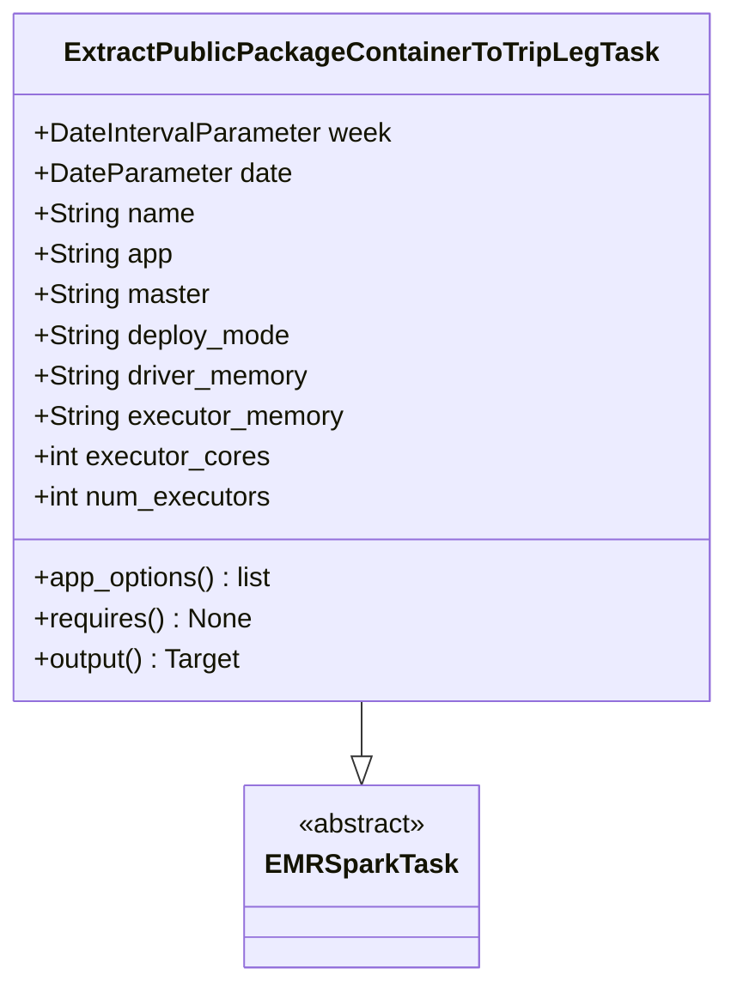
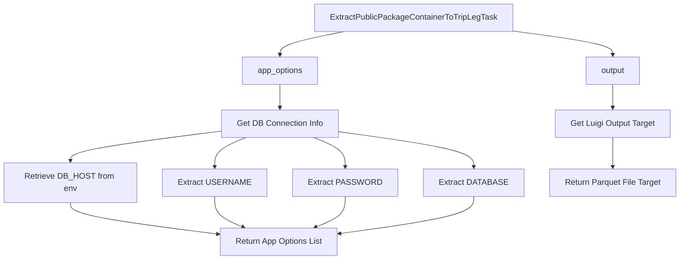

# Diagram: research/orchestrator/tasks/etl/extract_public_package_container_to_trip_leg_task.py

> Auto-generated by Obscura crawlers

## Diagram 1

### SVG

<svg id="container" width="417.7109375" xmlns="http://www.w3.org/2000/svg" class="classDiagram" height="582" viewBox="0 0 417.7109375 582" role="graphics-document document" aria-roledescription="class"><g><defs><marker id="container_class-aggregationStart" class="marker aggregation class" refX="18" refY="7" markerWidth="190" markerHeight="240" orient="auto"><path d="M 18,7 L9,13 L1,7 L9,1 Z"></path></marker></defs><defs><marker id="container_class-aggregationEnd" class="marker aggregation class" refX="1" refY="7" markerWidth="20" markerHeight="28" orient="auto"><path d="M 18,7 L9,13 L1,7 L9,1 Z"></path></marker></defs><defs><marker id="container_class-extensionStart" class="marker extension class" refX="18" refY="7" markerWidth="190" markerHeight="240" orient="auto"><path d="M 1,7 L18,13 V 1 Z"></path></marker></defs><defs><marker id="container_class-extensionEnd" class="marker extension class" refX="1" refY="7" markerWidth="20" markerHeight="28" orient="auto"><path d="M 1,1 V 13 L18,7 Z"></path></marker></defs><defs><marker id="container_class-compositionStart" class="marker composition class" refX="18" refY="7" markerWidth="190" markerHeight="240" orient="auto"><path d="M 18,7 L9,13 L1,7 L9,1 Z"></path></marker></defs><defs><marker id="container_class-compositionEnd" class="marker composition class" refX="1" refY="7" markerWidth="20" markerHeight="28" orient="auto"><path d="M 18,7 L9,13 L1,7 L9,1 Z"></path></marker></defs><defs><marker id="container_class-dependencyStart" class="marker dependency class" refX="6" refY="7" markerWidth="190" markerHeight="240" orient="auto"><path d="M 5,7 L9,13 L1,7 L9,1 Z"></path></marker></defs><defs><marker id="container_class-dependencyEnd" class="marker dependency class" refX="13" refY="7" markerWidth="20" markerHeight="28" orient="auto"><path d="M 18,7 L9,13 L14,7 L9,1 Z"></path></marker></defs><defs><marker id="container_class-lollipopStart" class="marker lollipop class" refX="13" refY="7" markerWidth="190" markerHeight="240" orient="auto"><circle stroke="black" fill="transparent" cx="7" cy="7" r="6"></circle></marker></defs><defs><marker id="container_class-lollipopEnd" class="marker lollipop class" refX="1" refY="7" markerWidth="190" markerHeight="240" orient="auto"><circle stroke="black" fill="transparent" cx="7" cy="7" r="6"></circle></marker></defs><g class="root"><g class="clusters"></g><g class="edgePaths"><path d="M208.855,416L208.855,420.167C208.855,424.333,208.855,432.667,208.855,438.125C208.855,443.583,208.855,446.167,208.855,447.458L208.855,448.75" id="id_ExtractPublicPackageContainerToTripLegTask_EMRSparkTask_1" class="edge-thickness-normal edge-pattern-solid relation" style=";;;" data-edge="true" data-et="edge" data-id="id_ExtractPublicPackageContainerToTripLegTask_EMRSparkTask_1" data-points="W3sieCI6MjA4Ljg1NTQ2ODc1LCJ5Ijo0MTZ9LHsieCI6MjA4Ljg1NTQ2ODc1LCJ5Ijo0NDF9LHsieCI6MjA4Ljg1NTQ2ODc1LCJ5Ijo0NjZ9XQ==" marker-end="url(#container_class-extensionEnd)"></path></g><g class="edgeLabels"><g class="edgeLabel"><g class="label" data-id="id_ExtractPublicPackageContainerToTripLegTask_EMRSparkTask_1" transform="translate(0, 0)"><foreignObject width="0" height="0">

</foreignObject></g></g></g><g class="nodes"><g class="node default" id="classId-ExtractPublicPackageContainerToTripLegTask-0" transform="translate(208.85546875, 212)"><g class="basic label-container"><path d="M-200.85546875 -204 L200.85546875 -204 L200.85546875 204 L-200.85546875 204" stroke="none" stroke-width="0" fill="#ECECFF" style=""></path><path d="M-200.85546875 -204 C-97.34482811899346 -204, 6.165812512013076 -204, 200.85546875 -204 M-200.85546875 -204 C-69.50440119969085 -204, 61.84666635061831 -204, 200.85546875 -204 M200.85546875 -204 C200.85546875 -80.99334958057517, 200.85546875 42.01330083884966, 200.85546875 204 M200.85546875 -204 C200.85546875 -116.24407807817346, 200.85546875 -28.488156156346918, 200.85546875 204 M200.85546875 204 C40.24674936864335 204, -120.3619700127133 204, -200.85546875 204 M200.85546875 204 C70.5812996491004 204, -59.6928694517992 204, -200.85546875 204 M-200.85546875 204 C-200.85546875 50.533234439569924, -200.85546875 -102.93353112086015, -200.85546875 -204 M-200.85546875 204 C-200.85546875 99.12747319394533, -200.85546875 -5.745053612109331, -200.85546875 -204" stroke="#9370DB" stroke-width="1.3" fill="none" stroke-dasharray="0 0" style=""></path></g><g class="annotation-group text" transform="translate(0, -180)"></g><g class="label-group text" transform="translate(-165.5859375, -180)"><g class="label" style="font-weight: bolder" transform="translate(0,-12)"><foreignObject width="331.171875" height="24">

ExtractPublicPackageContainerToTripLegTask

</foreignObject></g></g><g class="members-group text" transform="translate(-188.85546875, -132)"><g class="label" style="" transform="translate(0,-12)"><foreignObject width="212.125" height="24">

+DateIntervalParameter week

</foreignObject></g><g class="label" style="" transform="translate(0,12)"><foreignObject width="152.171875" height="24">

+DateParameter date

</foreignObject></g><g class="label" style="" transform="translate(0,36)"><foreignObject width="94.984375" height="24">

+String name

</foreignObject></g><g class="label" style="" transform="translate(0,60)"><foreignObject width="82.1875" height="24">

+String app

</foreignObject></g><g class="label" style="" transform="translate(0,84)"><foreignObject width="104.625" height="24">

+String master

</foreignObject></g><g class="label" style="" transform="translate(0,108)"><foreignObject width="153.203125" height="24">

+String deploy_mode

</foreignObject></g><g class="label" style="" transform="translate(0,132)"><foreignObject width="164.015625" height="24">

+String driver_memory

</foreignObject></g><g class="label" style="" transform="translate(0,156)"><foreignObject width="183.8125" height="24">

+String executor_memory

</foreignObject></g><g class="label" style="" transform="translate(0,180)"><foreignObject width="139.9375" height="24">

+int executor_cores

</foreignObject></g><g class="label" style="" transform="translate(0,204)"><foreignObject width="142.296875" height="24">

+int num_executors

</foreignObject></g></g><g class="methods-group text" transform="translate(-188.85546875, 132)"><g class="label" style="" transform="translate(0,-12)"><foreignObject width="143.609375" height="24">

+app_options() : list

</foreignObject></g><g class="label" style="" transform="translate(0,12)"><foreignObject width="128.75" height="24">

+requires() : None

</foreignObject></g><g class="label" style="" transform="translate(0,36)"><foreignObject width="124.375" height="24">

+output() : Target

</foreignObject></g></g><g class="divider" style=""><path d="M-200.85546875 -156 C-100.63074686563206 -156, -0.40602498126412456 -156, 200.85546875 -156 M-200.85546875 -156 C-92.88378201895793 -156, 15.08790471208414 -156, 200.85546875 -156" stroke="#9370DB" stroke-width="1.3" fill="none" stroke-dasharray="0 0" style=""></path></g><g class="divider" style=""><path d="M-200.85546875 108 C-83.7851955284254 108, 33.28507769314919 108, 200.85546875 108 M-200.85546875 108 C-79.79159254053643 108, 41.272283668927145 108, 200.85546875 108" stroke="#9370DB" stroke-width="1.3" fill="none" stroke-dasharray="0 0" style=""></path></g></g><g class="node default" id="classId-EMRSparkTask-1" transform="translate(208.85546875, 520)"><g class="basic label-container"><path d="M-65.1484375 -54 L65.1484375 -54 L65.1484375 54 L-65.1484375 54" stroke="none" stroke-width="0" fill="#ECECFF" style=""></path><path d="M-65.1484375 -54 C-17.53789855526317 -54, 30.072640389473662 -54, 65.1484375 -54 M-65.1484375 -54 C-37.76038338152406 -54, -10.372329263048115 -54, 65.1484375 -54 M65.1484375 -54 C65.1484375 -28.280040594242987, 65.1484375 -2.5600811884859738, 65.1484375 54 M65.1484375 -54 C65.1484375 -16.192879769768517, 65.1484375 21.614240460462966, 65.1484375 54 M65.1484375 54 C27.500536368783578 54, -10.147364762432844 54, -65.1484375 54 M65.1484375 54 C31.312854448639925 54, -2.52272860272015 54, -65.1484375 54 M-65.1484375 54 C-65.1484375 13.727292428058334, -65.1484375 -26.545415143883332, -65.1484375 -54 M-65.1484375 54 C-65.1484375 10.84708383929, -65.1484375 -32.30583232142, -65.1484375 -54" stroke="#9370DB" stroke-width="1.3" fill="none" stroke-dasharray="0 0" style=""></path></g><g class="annotation-group text" transform="translate(-38.609375, -30)"><g class="label" style="" transform="translate(0,-12)"><foreignObject width="77.21875" height="24">

«abstract»

</foreignObject></g></g><g class="label-group text" transform="translate(-53.1484375, -6)"><g class="label" style="font-weight: bolder" transform="translate(0,-12)"><foreignObject width="106.296875" height="24">

EMRSparkTask

</foreignObject></g></g><g class="members-group text" transform="translate(-53.1484375, 42)"></g><g class="methods-group text" transform="translate(-53.1484375, 72)"></g><g class="divider" style=""><path d="M-65.1484375 18 C-14.850924771505902 18, 35.446587956988196 18, 65.1484375 18 M-65.1484375 18 C-17.234791374039943 18, 30.678854751920113 18, 65.1484375 18" stroke="#9370DB" stroke-width="1.3" fill="none" stroke-dasharray="0 0" style=""></path></g><g class="divider" style=""><path d="M-65.1484375 36 C-15.105408238568828 36, 34.937621022862345 36, 65.1484375 36 M-65.1484375 36 C-33.727003715715576 36, -2.305569931431151 36, 65.1484375 36" stroke="#9370DB" stroke-width="1.3" fill="none" stroke-dasharray="0 0" style=""></path></g></g></g></g></g></svg>

## Diagram 2

### SVG

<svg id="container" width="1293.578125" xmlns="http://www.w3.org/2000/svg" class="flowchart" height="486" viewBox="0 0 1293.578125 486" role="graphics-document document" aria-roledescription="flowchart-v2"><g><marker id="container_flowchart-v2-pointEnd" class="marker flowchart-v2" viewBox="0 0 10 10" refX="5" refY="5" markerUnits="userSpaceOnUse" markerWidth="8" markerHeight="8" orient="auto"><path d="M 0 0 L 10 5 L 0 10 z" class="arrowMarkerPath" style="stroke-width: 1; stroke-dasharray: 1, 0;"></path></marker><marker id="container_flowchart-v2-pointStart" class="marker flowchart-v2" viewBox="0 0 10 10" refX="4.5" refY="5" markerUnits="userSpaceOnUse" markerWidth="8" markerHeight="8" orient="auto"><path d="M 0 5 L 10 10 L 10 0 z" class="arrowMarkerPath" style="stroke-width: 1; stroke-dasharray: 1, 0;"></path></marker><marker id="container_flowchart-v2-circleEnd" class="marker flowchart-v2" viewBox="0 0 10 10" refX="11" refY="5" markerUnits="userSpaceOnUse" markerWidth="11" markerHeight="11" orient="auto"><circle cx="5" cy="5" r="5" class="arrowMarkerPath" style="stroke-width: 1; stroke-dasharray: 1, 0;"></circle></marker><marker id="container_flowchart-v2-circleStart" class="marker flowchart-v2" viewBox="0 0 10 10" refX="-1" refY="5" markerUnits="userSpaceOnUse" markerWidth="11" markerHeight="11" orient="auto"><circle cx="5" cy="5" r="5" class="arrowMarkerPath" style="stroke-width: 1; stroke-dasharray: 1, 0;"></circle></marker><marker id="container_flowchart-v2-crossEnd" class="marker cross flowchart-v2" viewBox="0 0 11 11" refX="12" refY="5.2" markerUnits="userSpaceOnUse" markerWidth="11" markerHeight="11" orient="auto"><path d="M 1,1 l 9,9 M 10,1 l -9,9" class="arrowMarkerPath" style="stroke-width: 2; stroke-dasharray: 1, 0;"></path></marker><marker id="container_flowchart-v2-crossStart" class="marker cross flowchart-v2" viewBox="0 0 11 11" refX="-1" refY="5.2" markerUnits="userSpaceOnUse" markerWidth="11" markerHeight="11" orient="auto"><path d="M 1,1 l 9,9 M 10,1 l -9,9" class="arrowMarkerPath" style="stroke-width: 2; stroke-dasharray: 1, 0;"></path></marker><g class="root"><g class="clusters"></g><g class="edgePaths"><path d="M656.367,62L636.111,66.167C615.855,70.333,575.344,78.667,555.088,86.333C534.832,94,534.832,101,534.832,104.5L534.832,108" id="L_A_B_0" class="edge-thickness-normal edge-pattern-solid edge-thickness-normal edge-pattern-solid flowchart-link" style=";" data-edge="true" data-et="edge" data-id="L_A_B_0" data-points="W3sieCI6NjU2LjM2NzExMjM3OTgwNzYsInkiOjYyfSx7IngiOjUzNC44MzIwMzEyNSwieSI6ODd9LHsieCI6NTM0LjgzMjAzMTI1LCJ5IjoxMTJ9XQ==" marker-end="url(#container_flowchart-v2-pointEnd)"></path><path d="M534.832,166L534.832,170.167C534.832,174.333,534.832,182.667,534.832,190.333C534.832,198,534.832,205,534.832,208.5L534.832,212" id="L_B_C_0" class="edge-thickness-normal edge-pattern-solid edge-thickness-normal edge-pattern-solid flowchart-link" style=";" data-edge="true" data-et="edge" data-id="L_B_C_0" data-points="W3sieCI6NTM0LjgzMjAzMTI1LCJ5IjoxNjZ9LHsieCI6NTM0LjgzMjAzMTI1LCJ5IjoxOTF9LHsieCI6NTM0LjgzMjAzMTI1LCJ5IjoyMTZ9XQ==" marker-end="url(#container_flowchart-v2-pointEnd)"></path><path d="M420.777,257.929L373.575,264.108C326.372,270.286,231.967,282.643,184.765,292.322C137.563,302,137.563,309,137.563,312.5L137.563,316" id="L_C_D_0" class="edge-thickness-normal edge-pattern-solid edge-thickness-normal edge-pattern-solid flowchart-link" style=";" data-edge="true" data-et="edge" data-id="L_C_D_0" data-points="W3sieCI6NDIwLjc3NzM0Mzc1LCJ5IjoyNTcuOTI5MDE3NDEzNzkxNH0seyJ4IjoxMzcuNTYyNSwieSI6Mjk1fSx7IngiOjEzNy41NjI1LCJ5IjozMjB9XQ==" marker-end="url(#container_flowchart-v2-pointEnd)"></path><path d="M471.8,270L462.073,274.167C452.346,278.333,432.892,286.667,423.165,294.333C413.438,302,413.438,309,413.438,312.5L413.438,316" id="L_C_E_0" class="edge-thickness-normal edge-pattern-solid edge-thickness-normal edge-pattern-solid flowchart-link" style=";" data-edge="true" data-et="edge" data-id="L_C_E_0" data-points="W3sieCI6NDcxLjgwMDI1NTQwODY1Mzg3LCJ5IjoyNzB9LHsieCI6NDEzLjQzNzUsInkiOjI5NX0seyJ4Ijo0MTMuNDM3NSwieSI6MzIwfV0=" marker-end="url(#container_flowchart-v2-pointEnd)"></path><path d="M597.864,270L607.591,274.167C617.318,278.333,636.772,286.667,646.499,294.333C656.227,302,656.227,309,656.227,312.5L656.227,316" id="L_C_F_0" class="edge-thickness-normal edge-pattern-solid edge-thickness-normal edge-pattern-solid flowchart-link" style=";" data-edge="true" data-et="edge" data-id="L_C_F_0" data-points="W3sieCI6NTk3Ljg2MzgwNzA5MTM0NjIsInkiOjI3MH0seyJ4Ijo2NTYuMjI2NTYyNSwieSI6Mjk1fSx7IngiOjY1Ni4yMjY1NjI1LCJ5IjozMjB9XQ==" marker-end="url(#container_flowchart-v2-pointEnd)"></path><path d="M648.887,259.45L689.968,265.375C731.049,271.3,813.212,283.15,854.294,292.575C895.375,302,895.375,309,895.375,312.5L895.375,316" id="L_C_G_0" class="edge-thickness-normal edge-pattern-solid edge-thickness-normal edge-pattern-solid flowchart-link" style=";" data-edge="true" data-et="edge" data-id="L_C_G_0" data-points="W3sieCI6NjQ4Ljg4NjcxODc1LCJ5IjoyNTkuNDQ5NzU1Njg1MzI3MDN9LHsieCI6ODk1LjM3NSwieSI6Mjk1fSx7IngiOjg5NS4zNzUsInkiOjMyMH1d" marker-end="url(#container_flowchart-v2-pointEnd)"></path><path d="M137.563,374L137.563,378.167C137.563,382.333,137.563,390.667,182.808,400.84C228.053,411.014,318.544,423.027,363.789,429.034L409.035,435.041" id="L_D_H_0" class="edge-thickness-normal edge-pattern-solid edge-thickness-normal edge-pattern-solid flowchart-link" style=";" data-edge="true" data-et="edge" data-id="L_D_H_0" data-points="W3sieCI6MTM3LjU2MjUsInkiOjM3NH0seyJ4IjoxMzcuNTYyNSwieSI6Mzk5fSx7IngiOjQxMywieSI6NDM1LjU2NzUwNzcyOTEzMTM2fV0=" marker-end="url(#container_flowchart-v2-pointEnd)"></path><path d="M413.438,374L413.438,378.167C413.438,382.333,413.438,390.667,422.109,398.727C430.78,406.787,448.122,414.574,456.793,418.468L465.464,422.361" id="L_E_H_0" class="edge-thickness-normal edge-pattern-solid edge-thickness-normal edge-pattern-solid flowchart-link" style=";" data-edge="true" data-et="edge" data-id="L_E_H_0" data-points="W3sieCI6NDEzLjQzNzUsInkiOjM3NH0seyJ4Ijo0MTMuNDM3NSwieSI6Mzk5fSx7IngiOjQ2OS4xMTI4MzA1Mjg4NDYxMywieSI6NDI0fV0=" marker-end="url(#container_flowchart-v2-pointEnd)"></path><path d="M656.227,374L656.227,378.167C656.227,382.333,656.227,390.667,646.668,398.747C637.11,406.828,617.994,414.656,608.436,418.57L598.878,422.484" id="L_F_H_0" class="edge-thickness-normal edge-pattern-solid edge-thickness-normal edge-pattern-solid flowchart-link" style=";" data-edge="true" data-et="edge" data-id="L_F_H_0" data-points="W3sieCI6NjU2LjIyNjU2MjUsInkiOjM3NH0seyJ4Ijo2NTYuMjI2NTYyNSwieSI6Mzk5fSx7IngiOjU5NS4xNzYzODIyMTE1Mzg1LCJ5Ijo0MjR9XQ==" marker-end="url(#container_flowchart-v2-pointEnd)"></path><path d="M895.375,374L895.375,378.167C895.375,382.333,895.375,390.667,854.387,400.655C813.398,410.643,731.421,422.286,690.433,428.107L649.445,433.928" id="L_G_H_0" class="edge-thickness-normal edge-pattern-solid edge-thickness-normal edge-pattern-solid flowchart-link" style=";" data-edge="true" data-et="edge" data-id="L_G_H_0" data-points="W3sieCI6ODk1LjM3NSwieSI6Mzc0fSx7IngiOjg5NS4zNzUsInkiOjM5OX0seyJ4Ijo2NDUuNDg0Mzc1LCJ5Ijo0MzQuNDkwNzA3MzUwOTAxNX1d" marker-end="url(#container_flowchart-v2-pointEnd)"></path><path d="M979.594,61.677L1009.964,65.898C1040.333,70.118,1101.073,78.559,1131.443,86.28C1161.813,94,1161.813,101,1161.813,104.5L1161.813,108" id="L_A_I_0" class="edge-thickness-normal edge-pattern-solid edge-thickness-normal edge-pattern-solid flowchart-link" style=";" data-edge="true" data-et="edge" data-id="L_A_I_0" data-points="W3sieCI6OTc5LjU5Mzc1LCJ5Ijo2MS42Nzc0Njc4NDcwMDE4MzZ9LHsieCI6MTE2MS44MTI1LCJ5Ijo4N30seyJ4IjoxMTYxLjgxMjUsInkiOjExMn1d" marker-end="url(#container_flowchart-v2-pointEnd)"></path><path d="M1161.813,166L1161.813,170.167C1161.813,174.333,1161.813,182.667,1161.813,190.333C1161.813,198,1161.813,205,1161.813,208.5L1161.813,212" id="L_I_J_0" class="edge-thickness-normal edge-pattern-solid edge-thickness-normal edge-pattern-solid flowchart-link" style=";" data-edge="true" data-et="edge" data-id="L_I_J_0" data-points="W3sieCI6MTE2MS44MTI1LCJ5IjoxNjZ9LHsieCI6MTE2MS44MTI1LCJ5IjoxOTF9LHsieCI6MTE2MS44MTI1LCJ5IjoyMTZ9XQ==" marker-end="url(#container_flowchart-v2-pointEnd)"></path><path d="M1161.813,270L1161.813,274.167C1161.813,278.333,1161.813,286.667,1161.813,294.333C1161.813,302,1161.813,309,1161.813,312.5L1161.813,316" id="L_J_K_0" class="edge-thickness-normal edge-pattern-solid edge-thickness-normal edge-pattern-solid flowchart-link" style=";" data-edge="true" data-et="edge" data-id="L_J_K_0" data-points="W3sieCI6MTE2MS44MTI1LCJ5IjoyNzB9LHsieCI6MTE2MS44MTI1LCJ5IjoyOTV9LHsieCI6MTE2MS44MTI1LCJ5IjozMjB9XQ==" marker-end="url(#container_flowchart-v2-pointEnd)"></path></g><g class="edgeLabels"><g class="edgeLabel"><g class="label" data-id="L_A_B_0" transform="translate(0, 0)"><foreignObject width="0" height="0">

</foreignObject></g></g><g class="edgeLabel"><g class="label" data-id="L_B_C_0" transform="translate(0, 0)"><foreignObject width="0" height="0">

</foreignObject></g></g><g class="edgeLabel"><g class="label" data-id="L_C_D_0" transform="translate(0, 0)"><foreignObject width="0" height="0">

</foreignObject></g></g><g class="edgeLabel"><g class="label" data-id="L_C_E_0" transform="translate(0, 0)"><foreignObject width="0" height="0">

</foreignObject></g></g><g class="edgeLabel"><g class="label" data-id="L_C_F_0" transform="translate(0, 0)"><foreignObject width="0" height="0">

</foreignObject></g></g><g class="edgeLabel"><g class="label" data-id="L_C_G_0" transform="translate(0, 0)"><foreignObject width="0" height="0">

</foreignObject></g></g><g class="edgeLabel"><g class="label" data-id="L_D_H_0" transform="translate(0, 0)"><foreignObject width="0" height="0">

</foreignObject></g></g><g class="edgeLabel"><g class="label" data-id="L_E_H_0" transform="translate(0, 0)"><foreignObject width="0" height="0">

</foreignObject></g></g><g class="edgeLabel"><g class="label" data-id="L_F_H_0" transform="translate(0, 0)"><foreignObject width="0" height="0">

</foreignObject></g></g><g class="edgeLabel"><g class="label" data-id="L_G_H_0" transform="translate(0, 0)"><foreignObject width="0" height="0">

</foreignObject></g></g><g class="edgeLabel"><g class="label" data-id="L_A_I_0" transform="translate(0, 0)"><foreignObject width="0" height="0">

</foreignObject></g></g><g class="edgeLabel"><g class="label" data-id="L_I_J_0" transform="translate(0, 0)"><foreignObject width="0" height="0">

</foreignObject></g></g><g class="edgeLabel"><g class="label" data-id="L_J_K_0" transform="translate(0, 0)"><foreignObject width="0" height="0">

</foreignObject></g></g></g><g class="nodes"><g class="node default" id="flowchart-A-0" transform="translate(787.625, 35)"><rect class="basic label-container" style="" x="-191.96875" y="-27" width="383.9375" height="54"></rect><g class="label" style="" transform="translate(-161.96875, -12)"><rect></rect><foreignObject width="323.9375" height="24">

ExtractPublicPackageContainerToTripLegTask

</foreignObject></g></g><g class="node default" id="flowchart-B-1" transform="translate(534.83203125, 139)"><rect class="basic label-container" style="" x="-75.3671875" y="-27" width="150.734375" height="54"></rect><g class="label" style="" transform="translate(-45.3671875, -12)"><rect></rect><foreignObject width="90.734375" height="24">

app_options

</foreignObject></g></g><g class="node default" id="flowchart-C-3" transform="translate(534.83203125, 243)"><rect class="basic label-container" style="" x="-114.0546875" y="-27" width="228.109375" height="54"></rect><g class="label" style="" transform="translate(-84.0546875, -12)"><rect></rect><foreignObject width="168.109375" height="24">

Get DB Connection Info

</foreignObject></g></g><g class="node default" id="flowchart-D-5" transform="translate(137.5625, 347)"><rect class="basic label-container" style="" x="-129.5625" y="-27" width="259.125" height="54"></rect><g class="label" style="" transform="translate(-99.5625, -12)"><rect></rect><foreignObject width="199.125" height="24">

Retrieve DB_HOST from env

</foreignObject></g></g><g class="node default" id="flowchart-E-7" transform="translate(413.4375, 347)"><rect class="basic label-container" style="" x="-96.3125" y="-27" width="192.625" height="54"></rect><g class="label" style="" transform="translate(-66.3125, -12)"><rect></rect><foreignObject width="132.625" height="24">

Extract USERNAME

</foreignObject></g></g><g class="node default" id="flowchart-F-9" transform="translate(656.2265625, 347)"><rect class="basic label-container" style="" x="-96.4765625" y="-27" width="192.953125" height="54"></rect><g class="label" style="" transform="translate(-66.4765625, -12)"><rect></rect><foreignObject width="132.953125" height="24">

Extract PASSWORD

</foreignObject></g></g><g class="node default" id="flowchart-G-11" transform="translate(895.375, 347)"><rect class="basic label-container" style="" x="-92.671875" y="-27" width="185.34375" height="54"></rect><g class="label" style="" transform="translate(-62.671875, -12)"><rect></rect><foreignObject width="125.34375" height="24">

Extract DATABASE

</foreignObject></g></g><g class="node default" id="flowchart-H-13" transform="translate(529.2421875, 451)"><rect class="basic label-container" style="" x="-116.2421875" y="-27" width="232.484375" height="54"></rect><g class="label" style="" transform="translate(-86.2421875, -12)"><rect></rect><foreignObject width="172.484375" height="24">

Return App Options List

</foreignObject></g></g><g class="node default" id="flowchart-I-21" transform="translate(1161.8125, 139)"><rect class="basic label-container" style="" x="-54.515625" y="-27" width="109.03125" height="54"></rect><g class="label" style="" transform="translate(-24.515625, -12)"><rect></rect><foreignObject width="49.03125" height="24">

output

</foreignObject></g></g><g class="node default" id="flowchart-J-23" transform="translate(1161.8125, 243)"><rect class="basic label-container" style="" x="-113.5625" y="-27" width="227.125" height="54"></rect><g class="label" style="" transform="translate(-83.5625, -12)"><rect></rect><foreignObject width="167.125" height="24">

Get Luigi Output Target

</foreignObject></g></g><g class="node default" id="flowchart-K-25" transform="translate(1161.8125, 347)"><rect class="basic label-container" style="" x="-123.765625" y="-27" width="247.53125" height="54"></rect><g class="label" style="" transform="translate(-93.765625, -12)"><rect></rect><foreignObject width="187.53125" height="24">

Return Parquet File Target

</foreignObject></g></g></g></g></g></svg>
