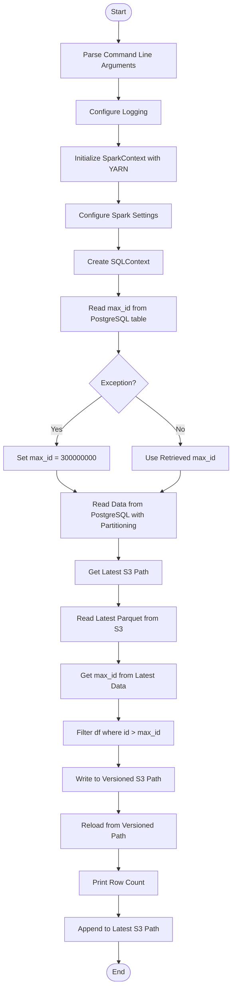
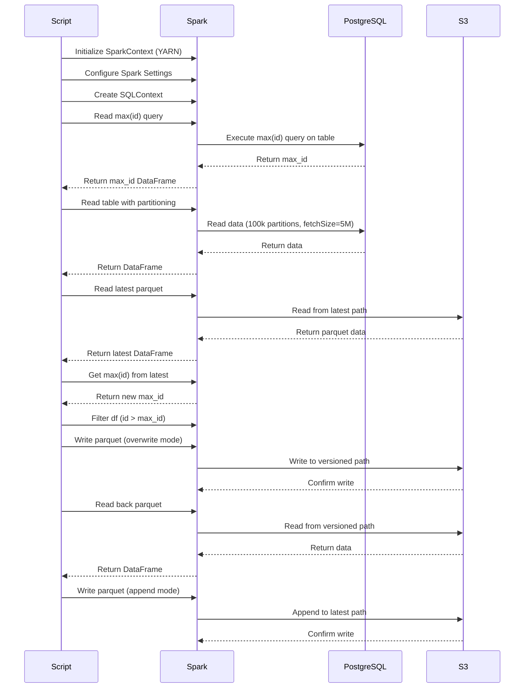
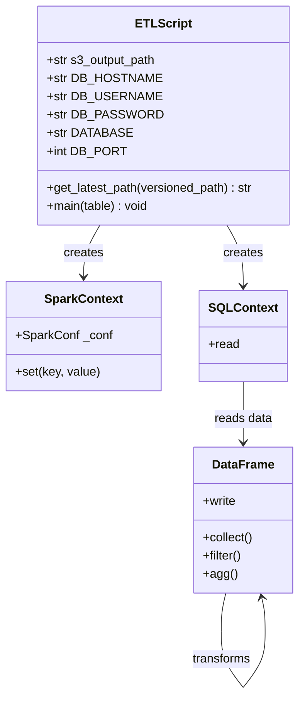

# Diagram: research/orchestrator/tasks/etl/extract_public_plannedtripleg_spark.py

> Auto-generated by Obscura crawlers

## Diagram 1

### SVG

<svg id="container" width="519.0625" xmlns="http://www.w3.org/2000/svg" class="flowchart" height="2205.609375" viewBox="0 0 519.0625 2205.609375" role="graphics-document document" aria-roledescription="flowchart-v2"><g><marker id="container_flowchart-v2-pointEnd" class="marker flowchart-v2" viewBox="0 0 10 10" refX="5" refY="5" markerUnits="userSpaceOnUse" markerWidth="8" markerHeight="8" orient="auto"><path d="M 0 0 L 10 5 L 0 10 z" class="arrowMarkerPath" style="stroke-width: 1; stroke-dasharray: 1, 0;"></path></marker><marker id="container_flowchart-v2-pointStart" class="marker flowchart-v2" viewBox="0 0 10 10" refX="4.5" refY="5" markerUnits="userSpaceOnUse" markerWidth="8" markerHeight="8" orient="auto"><path d="M 0 5 L 10 10 L 10 0 z" class="arrowMarkerPath" style="stroke-width: 1; stroke-dasharray: 1, 0;"></path></marker><marker id="container_flowchart-v2-circleEnd" class="marker flowchart-v2" viewBox="0 0 10 10" refX="11" refY="5" markerUnits="userSpaceOnUse" markerWidth="11" markerHeight="11" orient="auto"><circle cx="5" cy="5" r="5" class="arrowMarkerPath" style="stroke-width: 1; stroke-dasharray: 1, 0;"></circle></marker><marker id="container_flowchart-v2-circleStart" class="marker flowchart-v2" viewBox="0 0 10 10" refX="-1" refY="5" markerUnits="userSpaceOnUse" markerWidth="11" markerHeight="11" orient="auto"><circle cx="5" cy="5" r="5" class="arrowMarkerPath" style="stroke-width: 1; stroke-dasharray: 1, 0;"></circle></marker><marker id="container_flowchart-v2-crossEnd" class="marker cross flowchart-v2" viewBox="0 0 11 11" refX="12" refY="5.2" markerUnits="userSpaceOnUse" markerWidth="11" markerHeight="11" orient="auto"><path d="M 1,1 l 9,9 M 10,1 l -9,9" class="arrowMarkerPath" style="stroke-width: 2; stroke-dasharray: 1, 0;"></path></marker><marker id="container_flowchart-v2-crossStart" class="marker cross flowchart-v2" viewBox="0 0 11 11" refX="-1" refY="5.2" markerUnits="userSpaceOnUse" markerWidth="11" markerHeight="11" orient="auto"><path d="M 1,1 l 9,9 M 10,1 l -9,9" class="arrowMarkerPath" style="stroke-width: 2; stroke-dasharray: 1, 0;"></path></marker><g class="root"><g class="clusters"></g><g class="edgePaths"><path d="M264.727,47.5L264.643,51.583C264.56,55.667,264.393,63.833,264.31,71.417C264.227,79,264.227,86,264.227,89.5L264.227,93" id="L_Start_ParseArgs_0" class="edge-thickness-normal edge-pattern-solid edge-thickness-normal edge-pattern-solid flowchart-link" style=";" data-edge="true" data-et="edge" data-id="L_Start_ParseArgs_0" data-points="W3sieCI6MjY0LjcyNjU2MjUsInkiOjQ3LjV9LHsieCI6MjY0LjIyNjU2MjUsInkiOjcyfSx7IngiOjI2NC4yMjY1NjI1LCJ5Ijo5N31d" marker-end="url(#container_flowchart-v2-pointEnd)"></path><path d="M264.227,175L264.227,179.167C264.227,183.333,264.227,191.667,264.227,199.333C264.227,207,264.227,214,264.227,217.5L264.227,221" id="L_ParseArgs_SetupLogging_0" class="edge-thickness-normal edge-pattern-solid edge-thickness-normal edge-pattern-solid flowchart-link" style=";" data-edge="true" data-et="edge" data-id="L_ParseArgs_SetupLogging_0" data-points="W3sieCI6MjY0LjIyNjU2MjUsInkiOjE3NX0seyJ4IjoyNjQuMjI2NTYyNSwieSI6MjAwfSx7IngiOjI2NC4yMjY1NjI1LCJ5IjoyMjV9XQ==" marker-end="url(#container_flowchart-v2-pointEnd)"></path><path d="M264.227,279L264.227,283.167C264.227,287.333,264.227,295.667,264.227,303.333C264.227,311,264.227,318,264.227,321.5L264.227,325" id="L_SetupLogging_InitSpark_0" class="edge-thickness-normal edge-pattern-solid edge-thickness-normal edge-pattern-solid flowchart-link" style=";" data-edge="true" data-et="edge" data-id="L_SetupLogging_InitSpark_0" data-points="W3sieCI6MjY0LjIyNjU2MjUsInkiOjI3OX0seyJ4IjoyNjQuMjI2NTYyNSwieSI6MzA0fSx7IngiOjI2NC4yMjY1NjI1LCJ5IjozMjl9XQ==" marker-end="url(#container_flowchart-v2-pointEnd)"></path><path d="M264.227,407L264.227,411.167C264.227,415.333,264.227,423.667,264.227,431.333C264.227,439,264.227,446,264.227,449.5L264.227,453" id="L_InitSpark_ConfigSpark_0" class="edge-thickness-normal edge-pattern-solid edge-thickness-normal edge-pattern-solid flowchart-link" style=";" data-edge="true" data-et="edge" data-id="L_InitSpark_ConfigSpark_0" data-points="W3sieCI6MjY0LjIyNjU2MjUsInkiOjQwN30seyJ4IjoyNjQuMjI2NTYyNSwieSI6NDMyfSx7IngiOjI2NC4yMjY1NjI1LCJ5Ijo0NTd9XQ==" marker-end="url(#container_flowchart-v2-pointEnd)"></path><path d="M264.227,511L264.227,515.167C264.227,519.333,264.227,527.667,264.227,535.333C264.227,543,264.227,550,264.227,553.5L264.227,557" id="L_ConfigSpark_CreateSQL_0" class="edge-thickness-normal edge-pattern-solid edge-thickness-normal edge-pattern-solid flowchart-link" style=";" data-edge="true" data-et="edge" data-id="L_ConfigSpark_CreateSQL_0" data-points="W3sieCI6MjY0LjIyNjU2MjUsInkiOjUxMX0seyJ4IjoyNjQuMjI2NTYyNSwieSI6NTM2fSx7IngiOjI2NC4yMjY1NjI1LCJ5Ijo1NjF9XQ==" marker-end="url(#container_flowchart-v2-pointEnd)"></path><path d="M264.227,615L264.227,619.167C264.227,623.333,264.227,631.667,264.227,639.333C264.227,647,264.227,654,264.227,657.5L264.227,661" id="L_CreateSQL_ReadMaxID_0" class="edge-thickness-normal edge-pattern-solid edge-thickness-normal edge-pattern-solid flowchart-link" style=";" data-edge="true" data-et="edge" data-id="L_CreateSQL_ReadMaxID_0" data-points="W3sieCI6MjY0LjIyNjU2MjUsInkiOjYxNX0seyJ4IjoyNjQuMjI2NTYyNSwieSI6NjQwfSx7IngiOjI2NC4yMjY1NjI1LCJ5Ijo2NjV9XQ==" marker-end="url(#container_flowchart-v2-pointEnd)"></path><path d="M264.227,743L264.227,747.167C264.227,751.333,264.227,759.667,264.227,767.333C264.227,775,264.227,782,264.227,785.5L264.227,789" id="L_ReadMaxID_Exception_0" class="edge-thickness-normal edge-pattern-solid edge-thickness-normal edge-pattern-solid flowchart-link" style=";" data-edge="true" data-et="edge" data-id="L_ReadMaxID_Exception_0" data-points="W3sieCI6MjY0LjIyNjU2MjUsInkiOjc0M30seyJ4IjoyNjQuMjI2NTYyNSwieSI6NzY4fSx7IngiOjI2NC4yMjY1NjI1LCJ5Ijo3OTN9XQ==" marker-end="url(#container_flowchart-v2-pointEnd)"></path><path d="M226.484,886.867L209.73,899.324C192.977,911.781,159.469,936.695,142.715,954.652C125.961,972.609,125.961,983.609,125.961,989.109L125.961,994.609" id="L_Exception_DefaultMaxID_0" class="edge-thickness-normal edge-pattern-solid edge-thickness-normal edge-pattern-solid flowchart-link" style=";" data-edge="true" data-et="edge" data-id="L_Exception_DefaultMaxID_0" data-points="W3sieCI6MjI2LjQ4NDM1Mjk3Mjk4ODMsInkiOjg4Ni44NjcxNjU0NzI5ODgzfSx7IngiOjEyNS45NjA5Mzc1LCJ5Ijo5NjEuNjA5Mzc1fSx7IngiOjEyNS45NjA5Mzc1LCJ5Ijo5OTguNjA5Mzc1fV0=" marker-end="url(#container_flowchart-v2-pointEnd)"></path><path d="M301.969,886.867L318.723,899.324C335.477,911.781,368.984,936.695,385.738,954.652C402.492,972.609,402.492,983.609,402.492,989.109L402.492,994.609" id="L_Exception_UseMaxID_0" class="edge-thickness-normal edge-pattern-solid edge-thickness-normal edge-pattern-solid flowchart-link" style=";" data-edge="true" data-et="edge" data-id="L_Exception_UseMaxID_0" data-points="W3sieCI6MzAxLjk2ODc3MjAyNzAxMTcsInkiOjg4Ni44NjcxNjU0NzI5ODgzfSx7IngiOjQwMi40OTIxODc1LCJ5Ijo5NjEuNjA5Mzc1fSx7IngiOjQwMi40OTIxODc1LCJ5Ijo5OTguNjA5Mzc1fV0=" marker-end="url(#container_flowchart-v2-pointEnd)"></path><path d="M125.961,1052.609L125.961,1056.776C125.961,1060.943,125.961,1069.276,132.957,1077.288C139.953,1085.3,153.945,1092.992,160.942,1096.837L167.938,1100.683" id="L_DefaultMaxID_ReadDBData_0" class="edge-thickness-normal edge-pattern-solid edge-thickness-normal edge-pattern-solid flowchart-link" style=";" data-edge="true" data-et="edge" data-id="L_DefaultMaxID_ReadDBData_0" data-points="W3sieCI6MTI1Ljk2MDkzNzUsInkiOjEwNTIuNjA5Mzc1fSx7IngiOjEyNS45NjA5Mzc1LCJ5IjoxMDc3LjYwOTM3NX0seyJ4IjoxNzEuNDQzMDUwOTg2ODQyMSwieSI6MTEwMi42MDkzNzV9XQ==" marker-end="url(#container_flowchart-v2-pointEnd)"></path><path d="M402.492,1052.609L402.492,1056.776C402.492,1060.943,402.492,1069.276,395.496,1077.288C388.5,1085.3,374.508,1092.992,367.512,1096.837L360.515,1100.683" id="L_UseMaxID_ReadDBData_0" class="edge-thickness-normal edge-pattern-solid edge-thickness-normal edge-pattern-solid flowchart-link" style=";" data-edge="true" data-et="edge" data-id="L_UseMaxID_ReadDBData_0" data-points="W3sieCI6NDAyLjQ5MjE4NzUsInkiOjEwNTIuNjA5Mzc1fSx7IngiOjQwMi40OTIxODc1LCJ5IjoxMDc3LjYwOTM3NX0seyJ4IjozNTcuMDEwMDc0MDEzMTU3OSwieSI6MTEwMi42MDkzNzV9XQ==" marker-end="url(#container_flowchart-v2-pointEnd)"></path><path d="M264.227,1204.609L264.227,1208.776C264.227,1212.943,264.227,1221.276,264.227,1228.943C264.227,1236.609,264.227,1243.609,264.227,1247.109L264.227,1250.609" id="L_ReadDBData_GetLatestPath_0" class="edge-thickness-normal edge-pattern-solid edge-thickness-normal edge-pattern-solid flowchart-link" style=";" data-edge="true" data-et="edge" data-id="L_ReadDBData_GetLatestPath_0" data-points="W3sieCI6MjY0LjIyNjU2MjUsInkiOjEyMDQuNjA5Mzc1fSx7IngiOjI2NC4yMjY1NjI1LCJ5IjoxMjI5LjYwOTM3NX0seyJ4IjoyNjQuMjI2NTYyNSwieSI6MTI1NC42MDkzNzV9XQ==" marker-end="url(#container_flowchart-v2-pointEnd)"></path><path d="M264.227,1308.609L264.227,1312.776C264.227,1316.943,264.227,1325.276,264.227,1332.943C264.227,1340.609,264.227,1347.609,264.227,1351.109L264.227,1354.609" id="L_GetLatestPath_ReadLatest_0" class="edge-thickness-normal edge-pattern-solid edge-thickness-normal edge-pattern-solid flowchart-link" style=";" data-edge="true" data-et="edge" data-id="L_GetLatestPath_ReadLatest_0" data-points="W3sieCI6MjY0LjIyNjU2MjUsInkiOjEzMDguNjA5Mzc1fSx7IngiOjI2NC4yMjY1NjI1LCJ5IjoxMzMzLjYwOTM3NX0seyJ4IjoyNjQuMjI2NTYyNSwieSI6MTM1OC42MDkzNzV9XQ==" marker-end="url(#container_flowchart-v2-pointEnd)"></path><path d="M264.227,1436.609L264.227,1440.776C264.227,1444.943,264.227,1453.276,264.227,1460.943C264.227,1468.609,264.227,1475.609,264.227,1479.109L264.227,1482.609" id="L_ReadLatest_GetMaxFromLatest_0" class="edge-thickness-normal edge-pattern-solid edge-thickness-normal edge-pattern-solid flowchart-link" style=";" data-edge="true" data-et="edge" data-id="L_ReadLatest_GetMaxFromLatest_0" data-points="W3sieCI6MjY0LjIyNjU2MjUsInkiOjE0MzYuNjA5Mzc1fSx7IngiOjI2NC4yMjY1NjI1LCJ5IjoxNDYxLjYwOTM3NX0seyJ4IjoyNjQuMjI2NTYyNSwieSI6MTQ4Ni42MDkzNzV9XQ==" marker-end="url(#container_flowchart-v2-pointEnd)"></path><path d="M264.227,1564.609L264.227,1568.776C264.227,1572.943,264.227,1581.276,264.227,1588.943C264.227,1596.609,264.227,1603.609,264.227,1607.109L264.227,1610.609" id="L_GetMaxFromLatest_FilterNew_0" class="edge-thickness-normal edge-pattern-solid edge-thickness-normal edge-pattern-solid flowchart-link" style=";" data-edge="true" data-et="edge" data-id="L_GetMaxFromLatest_FilterNew_0" data-points="W3sieCI6MjY0LjIyNjU2MjUsInkiOjE1NjQuNjA5Mzc1fSx7IngiOjI2NC4yMjY1NjI1LCJ5IjoxNTg5LjYwOTM3NX0seyJ4IjoyNjQuMjI2NTYyNSwieSI6MTYxNC42MDkzNzV9XQ==" marker-end="url(#container_flowchart-v2-pointEnd)"></path><path d="M264.227,1668.609L264.227,1672.776C264.227,1676.943,264.227,1685.276,264.227,1692.943C264.227,1700.609,264.227,1707.609,264.227,1711.109L264.227,1714.609" id="L_FilterNew_WriteVersioned_0" class="edge-thickness-normal edge-pattern-solid edge-thickness-normal edge-pattern-solid flowchart-link" style=";" data-edge="true" data-et="edge" data-id="L_FilterNew_WriteVersioned_0" data-points="W3sieCI6MjY0LjIyNjU2MjUsInkiOjE2NjguNjA5Mzc1fSx7IngiOjI2NC4yMjY1NjI1LCJ5IjoxNjkzLjYwOTM3NX0seyJ4IjoyNjQuMjI2NTYyNSwieSI6MTcxOC42MDkzNzV9XQ==" marker-end="url(#container_flowchart-v2-pointEnd)"></path><path d="M264.227,1772.609L264.227,1776.776C264.227,1780.943,264.227,1789.276,264.227,1796.943C264.227,1804.609,264.227,1811.609,264.227,1815.109L264.227,1818.609" id="L_WriteVersioned_ReloadData_0" class="edge-thickness-normal edge-pattern-solid edge-thickness-normal edge-pattern-solid flowchart-link" style=";" data-edge="true" data-et="edge" data-id="L_WriteVersioned_ReloadData_0" data-points="W3sieCI6MjY0LjIyNjU2MjUsInkiOjE3NzIuNjA5Mzc1fSx7IngiOjI2NC4yMjY1NjI1LCJ5IjoxNzk3LjYwOTM3NX0seyJ4IjoyNjQuMjI2NTYyNSwieSI6MTgyMi42MDkzNzV9XQ==" marker-end="url(#container_flowchart-v2-pointEnd)"></path><path d="M264.227,1900.609L264.227,1904.776C264.227,1908.943,264.227,1917.276,264.227,1924.943C264.227,1932.609,264.227,1939.609,264.227,1943.109L264.227,1946.609" id="L_ReloadData_PrintCount_0" class="edge-thickness-normal edge-pattern-solid edge-thickness-normal edge-pattern-solid flowchart-link" style=";" data-edge="true" data-et="edge" data-id="L_ReloadData_PrintCount_0" data-points="W3sieCI6MjY0LjIyNjU2MjUsInkiOjE5MDAuNjA5Mzc1fSx7IngiOjI2NC4yMjY1NjI1LCJ5IjoxOTI1LjYwOTM3NX0seyJ4IjoyNjQuMjI2NTYyNSwieSI6MTk1MC42MDkzNzV9XQ==" marker-end="url(#container_flowchart-v2-pointEnd)"></path><path d="M264.227,2004.609L264.227,2008.776C264.227,2012.943,264.227,2021.276,264.227,2028.943C264.227,2036.609,264.227,2043.609,264.227,2047.109L264.227,2050.609" id="L_PrintCount_AppendLatest_0" class="edge-thickness-normal edge-pattern-solid edge-thickness-normal edge-pattern-solid flowchart-link" style=";" data-edge="true" data-et="edge" data-id="L_PrintCount_AppendLatest_0" data-points="W3sieCI6MjY0LjIyNjU2MjUsInkiOjIwMDQuNjA5Mzc1fSx7IngiOjI2NC4yMjY1NjI1LCJ5IjoyMDI5LjYwOTM3NX0seyJ4IjoyNjQuMjI2NTYyNSwieSI6MjA1NC42MDkzNzV9XQ==" marker-end="url(#container_flowchart-v2-pointEnd)"></path><path d="M264.227,2108.609L264.227,2112.776C264.227,2116.943,264.227,2125.276,264.297,2133.026C264.367,2140.776,264.508,2147.943,264.578,2151.527L264.648,2155.11" id="L_AppendLatest_End_0" class="edge-thickness-normal edge-pattern-solid edge-thickness-normal edge-pattern-solid flowchart-link" style=";" data-edge="true" data-et="edge" data-id="L_AppendLatest_End_0" data-points="W3sieCI6MjY0LjIyNjU2MjUsInkiOjIxMDguNjA5Mzc1fSx7IngiOjI2NC4yMjY1NjI1LCJ5IjoyMTMzLjYwOTM3NX0seyJ4IjoyNjQuNzI2NTYyNSwieSI6MjE1OS4xMDkzNzV9XQ==" marker-end="url(#container_flowchart-v2-pointEnd)"></path></g><g class="edgeLabels"><g class="edgeLabel"><g class="label" data-id="L_Start_ParseArgs_0" transform="translate(0, 0)"><foreignObject width="0" height="0">

</foreignObject></g></g><g class="edgeLabel"><g class="label" data-id="L_ParseArgs_SetupLogging_0" transform="translate(0, 0)"><foreignObject width="0" height="0">

</foreignObject></g></g><g class="edgeLabel"><g class="label" data-id="L_SetupLogging_InitSpark_0" transform="translate(0, 0)"><foreignObject width="0" height="0">

</foreignObject></g></g><g class="edgeLabel"><g class="label" data-id="L_InitSpark_ConfigSpark_0" transform="translate(0, 0)"><foreignObject width="0" height="0">

</foreignObject></g></g><g class="edgeLabel"><g class="label" data-id="L_ConfigSpark_CreateSQL_0" transform="translate(0, 0)"><foreignObject width="0" height="0">

</foreignObject></g></g><g class="edgeLabel"><g class="label" data-id="L_CreateSQL_ReadMaxID_0" transform="translate(0, 0)"><foreignObject width="0" height="0">

</foreignObject></g></g><g class="edgeLabel"><g class="label" data-id="L_ReadMaxID_Exception_0" transform="translate(0, 0)"><foreignObject width="0" height="0">

</foreignObject></g></g><g class="edgeLabel" transform="translate(125.9609375, 961.609375)"><g class="label" data-id="L_Exception_DefaultMaxID_0" transform="translate(-12.03125, -12)"><foreignObject width="24.0625" height="24">

Yes

</foreignObject></g></g><g class="edgeLabel" transform="translate(402.4921875, 961.609375)"><g class="label" data-id="L_Exception_UseMaxID_0" transform="translate(-10.140625, -12)"><foreignObject width="20.28125" height="24">

No

</foreignObject></g></g><g class="edgeLabel"><g class="label" data-id="L_DefaultMaxID_ReadDBData_0" transform="translate(0, 0)"><foreignObject width="0" height="0">

</foreignObject></g></g><g class="edgeLabel"><g class="label" data-id="L_UseMaxID_ReadDBData_0" transform="translate(0, 0)"><foreignObject width="0" height="0">

</foreignObject></g></g><g class="edgeLabel"><g class="label" data-id="L_ReadDBData_GetLatestPath_0" transform="translate(0, 0)"><foreignObject width="0" height="0">

</foreignObject></g></g><g class="edgeLabel"><g class="label" data-id="L_GetLatestPath_ReadLatest_0" transform="translate(0, 0)"><foreignObject width="0" height="0">

</foreignObject></g></g><g class="edgeLabel"><g class="label" data-id="L_ReadLatest_GetMaxFromLatest_0" transform="translate(0, 0)"><foreignObject width="0" height="0">

</foreignObject></g></g><g class="edgeLabel"><g class="label" data-id="L_GetMaxFromLatest_FilterNew_0" transform="translate(0, 0)"><foreignObject width="0" height="0">

</foreignObject></g></g><g class="edgeLabel"><g class="label" data-id="L_FilterNew_WriteVersioned_0" transform="translate(0, 0)"><foreignObject width="0" height="0">

</foreignObject></g></g><g class="edgeLabel"><g class="label" data-id="L_WriteVersioned_ReloadData_0" transform="translate(0, 0)"><foreignObject width="0" height="0">

</foreignObject></g></g><g class="edgeLabel"><g class="label" data-id="L_ReloadData_PrintCount_0" transform="translate(0, 0)"><foreignObject width="0" height="0">

</foreignObject></g></g><g class="edgeLabel"><g class="label" data-id="L_PrintCount_AppendLatest_0" transform="translate(0, 0)"><foreignObject width="0" height="0">

</foreignObject></g></g><g class="edgeLabel"><g class="label" data-id="L_AppendLatest_End_0" transform="translate(0, 0)"><foreignObject width="0" height="0">

</foreignObject></g></g></g><g class="nodes"><g class="node default" id="flowchart-Start-0" transform="translate(264.2265625, 27.5)"><g class="basic label-container outer-path"><path d="M-10.3984375 -19.5 C-5.597165630392741 -19.5, -0.7958937607854821 -19.5, 10.3984375 -19.5 C10.3984375 -19.5, 10.3984375 -19.5, 10.398437499999998 -19.5 C10.80430550694506 -19.486984602991424, 11.21017351389012 -19.473969205982847, 11.6478067896239 -19.45993515863156 C11.967943257258813 -19.429051978619253, 12.288079724893725 -19.398168798606942, 12.892042152847864 -19.3399052695533 C13.247775295365512 -19.28239309382277, 13.603508437883159 -19.22488091809224, 14.126030759676757 -19.140403561325776 C14.387744422643552 -19.080669125594863, 14.649458085610348 -19.020934689863946, 15.34470188623539 -18.862249829261074 C15.643772522809792 -18.773487234179598, 15.942843159384195 -18.68472463909812, 16.543047751460602 -18.50658706670804 C16.819742464009508 -18.40476085475216, 17.096437176558418 -18.302934642796274, 17.716144095147794 -18.074876768247425 C18.01434292782344 -17.942872990776, 18.312541760499084 -17.81086921330457, 18.85917041279238 -17.568892924097174 C19.238505104622558 -17.370994258344837, 19.617839796452735 -17.1730955925925, 19.967429764076783 -16.990714730406097 C20.304681294941943 -16.78627087048565, 20.641932825807107 -16.581827010565206, 21.036368073605697 -16.342718045390892 C21.261597293160204 -16.18560789184544, 21.48682651271471 -16.02849773829999, 22.061592844578712 -15.627565626425154 C22.268466007912767 -15.462589783792323, 22.47533917124682 -15.297613941159492, 23.03889120850187 -14.848196188198123 C23.37222304824947 -14.54547303081654, 23.70555488799707 -14.242749873434958, 23.964247236767985 -14.007812326905688 C24.202372685277947 -13.76192825085624, 24.440498133787912 -13.51604417480679, 24.833858442968648 -13.10986736009568 C25.023496939189357 -12.887107191698714, 25.213135435410067 -12.66434702330175, 25.644151408126582 -12.158051136245305 C25.906159586359347 -11.806984046849477, 26.16816776459211 -11.45591695745365, 26.391796464640635 -11.156274872382312 C26.636594314022872 -10.780199638304532, 26.881392163405106 -10.404124404226751, 27.073721378604247 -10.108655082055241 C27.26995897645211 -9.760215355864823, 27.466196574299968 -9.411775629674406, 27.6871239742735 -9.019496659696287 C27.847506214079218 -8.686459507109518, 28.007888453884938 -8.353422354522749, 28.22948364880834 -7.893275190886684 C28.398072906563133 -7.476856464780784, 28.56666216431793 -7.060437738674885, 28.698571729970325 -6.734618561215508 C28.78004647639227 -6.489229606230571, 28.86152122281421 -6.243840651245635, 29.09246063421488 -5.548287939305138 C29.174662898175736 -5.234815080135827, 29.256865162136595 -4.921342220966516, 29.40953178754556 -4.339158212148133 C29.500939516739038 -3.869798841770028, 29.59234724593252 -3.4004394713919233, 29.648482276581777 -3.1121979531509023 C29.706270206863216 -2.6640061774056303, 29.764058137144655 -2.2158144016603583, 29.808330202509367 -1.872449005199798 C29.83571469478303 -1.445913433673197, 29.86309918705669 -1.0193778621465956, 29.888418715913414 -0.6250057626472757 C29.888418715913414 -0.21800444557845938, 29.888418715913414 0.18899687149035693, 29.888418715913414 0.625005762647271 C29.865910940014537 0.9755825402219722, 29.843403164115664 1.3261593177966733, 29.808330202509367 1.8724490051997846 C29.76938913571744 2.1744682294545545, 29.730448068925515 2.476487453709325, 29.648482276581777 3.1121979531508885 C29.561296893820426 3.5598764669932637, 29.47411151105907 4.007554980835639, 29.40953178754556 4.339158212148129 C29.34449224328396 4.5871821827344155, 29.279452699022354 4.835206153320703, 29.092460634214884 5.548287939305125 C28.965580623768933 5.930430315183992, 28.838700613322985 6.31257269106286, 28.69857172997033 6.734618561215495 C28.589260849405203 7.0046185495934585, 28.479949968840078 7.274618537971422, 28.229483648808344 7.893275190886679 C28.058035584971854 8.249290763844048, 27.886587521135368 8.605306336801416, 27.687123974273504 9.019496659696284 C27.468354104892647 9.407944715633443, 27.24958423551179 9.796392771570604, 27.07372137860425 10.108655082055236 C26.840399034906262 10.467100857797274, 26.60707669120827 10.825546633539311, 26.39179646464064 11.156274872382301 C26.236336307317288 11.364577320483907, 26.080876149993937 11.572879768585514, 25.644151408126582 12.158051136245302 C25.445316855459538 12.391613515814571, 25.246482302792494 12.62517589538384, 24.83385844296866 13.10986736009567 C24.50382588222129 13.450653075244489, 24.173793321473916 13.791438790393308, 23.96424723676799 14.007812326905684 C23.70535987307911 14.242926980823636, 23.446472509390237 14.478041634741588, 23.038891208501887 14.848196188198111 C22.825890556903733 15.01805853966225, 22.61288990530558 15.187920891126392, 22.061592844578715 15.627565626425152 C21.778563599630342 15.824994575562593, 21.495534354681972 16.022423524700034, 21.036368073605708 16.34271804539089 C20.62380164421973 16.592818239394123, 20.21123521483375 16.842918433397358, 19.967429764076787 16.990714730406093 C19.616776663990066 17.173650228117307, 19.266123563903346 17.356585725828516, 18.859170412792388 17.56889292409717 C18.582987091960185 17.691151087542462, 18.306803771127985 17.81340925098775, 17.716144095147804 18.07487676824742 C17.45258417767238 18.171869254199546, 17.18902426019696 18.26886174015167, 16.543047751460616 18.506587066708033 C16.129195892696522 18.62941612603648, 15.71534403393243 18.752245185364927, 15.344701886235413 18.86224982926107 C14.959822572365688 18.95009602107959, 14.574943258495962 19.037942212898116, 14.126030759676766 19.140403561325773 C13.659742823989852 19.215789378650687, 13.193454888302938 19.291175195975597, 12.892042152847878 19.3399052695533 C12.49487992094291 19.378219032407703, 12.097717689037943 19.416532795262107, 11.6478067896239 19.45993515863156 C11.375076582626958 19.468681085532808, 11.102346375630018 19.477427012434056, 10.398437500000004 19.5 C10.398437500000002 19.5, 10.398437500000002 19.5, 10.3984375 19.5 C2.686435685900853 19.5, -5.025566128198294 19.5, -10.398437499999996 19.5 C-10.895334403146428 19.484065483467244, -11.39223130629286 19.468130966934485, -11.647806789623893 19.45993515863156 C-11.898662103253141 19.4357354482234, -12.14951741688239 19.411535737815242, -12.892042152847871 19.3399052695533 C-13.206075577613476 19.289134780802776, -13.52010900237908 19.238364292052253, -14.126030759676759 19.140403561325773 C-14.408263404806204 19.075985801815108, -14.690496049935648 19.01156804230444, -15.344701886235388 18.862249829261074 C-15.75619406974127 18.740121109163077, -16.16768625324715 18.61799238906508, -16.54304775146059 18.506587066708043 C-16.886636223024123 18.38014333307565, -17.230224694587655 18.253699599443255, -17.716144095147797 18.074876768247425 C-18.130149102087657 17.891609032697335, -18.544154109027517 17.708341297147243, -18.85917041279238 17.568892924097174 C-19.2319768296684 17.37440005520686, -19.60478324654442 17.179907186316548, -19.96742976407678 16.990714730406097 C-20.219132396524643 16.83813111544735, -20.470835028972502 16.685547500488603, -21.036368073605686 16.3427180453909 C-21.376765886663257 16.10527126658577, -21.717163699720828 15.867824487780641, -22.061592844578712 15.627565626425156 C-22.287244532437455 15.44761441020141, -22.512896220296195 15.267663193977665, -23.03889120850187 14.848196188198125 C-23.292548995598807 14.617830897373958, -23.546206782695748 14.38746560654979, -23.964247236767974 14.007812326905697 C-24.245922210507082 13.71695979057464, -24.527597184246194 13.426107254243584, -24.833858442968655 13.109867360095677 C-25.03973547240756 12.8680324865819, -25.245612501846466 12.62619761306812, -25.64415140812658 12.158051136245307 C-25.878562458816976 11.843961683606212, -26.112973509507373 11.529872230967117, -26.391796464640635 11.156274872382316 C-26.584928465779893 10.859572255428574, -26.778060466919154 10.562869638474835, -27.073721378604244 10.108655082055249 C-27.30970716967337 9.689638413859463, -27.545692960742493 9.270621745663677, -27.6871239742735 9.019496659696289 C-27.85117766665093 8.67883565728786, -28.01523135902836 8.338174654879435, -28.22948364880834 7.893275190886686 C-28.363784539210474 7.5615493950623405, -28.49808542961261 7.229823599237996, -28.698571729970325 6.73461856121551 C-28.809504106173453 6.400507918765566, -28.92043648237658 6.066397276315623, -29.09246063421488 5.5482879393051325 C-29.17014498222604 5.252043851729171, -29.247829330237202 4.955799764153211, -29.409531787545557 4.339158212148136 C-29.478699877783033 3.9839946874597607, -29.547867968020505 3.6288311627713856, -29.648482276581777 3.112197953150904 C-29.698740858252908 2.7224023183891233, -29.748999439924038 2.3326066836273425, -29.808330202509364 1.872449005199809 C-29.8387944098307 1.397944385904448, -29.869258617152035 0.923439766609087, -29.888418715913414 0.6250057626472781 C-29.888418715913414 0.13242086927265556, -29.888418715913414 -0.360164024101967, -29.888418715913414 -0.6250057626472687 C-29.871761484304965 -0.8844555904242106, -29.855104252696517 -1.1439054182011525, -29.808330202509367 -1.8724490051997822 C-29.766777046364364 -2.1947270786616375, -29.72522389021936 -2.517005152123493, -29.648482276581777 -3.112197953150895 C-29.557861917942073 -3.5775143421461886, -29.467241559302373 -4.042830731141482, -29.40953178754556 -4.339158212148126 C-29.316742551658116 -4.693003783696168, -29.223953315770675 -5.046849355244212, -29.092460634214884 -5.548287939305123 C-28.97467574277925 -5.903037265835335, -28.856890851343618 -6.257786592365549, -28.698571729970332 -6.734618561215485 C-28.572768934810398 -7.045353897492109, -28.44696613965046 -7.356089233768731, -28.229483648808344 -7.893275190886676 C-28.04431316731716 -8.277785657716722, -27.859142685825976 -8.662296124546765, -27.687123974273504 -9.019496659696282 C-27.49018964747137 -9.369173498696469, -27.29325532066924 -9.718850337696654, -27.073721378604247 -10.108655082055243 C-26.87863291860708 -10.408363345197495, -26.683544458609916 -10.708071608339745, -26.39179646464064 -11.156274872382308 C-26.188891983157376 -11.428148392591348, -25.98598750167411 -11.70002191280039, -25.644151408126586 -12.158051136245302 C-25.322935787853176 -12.535369281505025, -25.00172016757977 -12.912687426764748, -24.833858442968662 -13.10986736009567 C-24.54882133039843 -13.404191580806595, -24.263784217828196 -13.69851580151752, -23.964247236767996 -14.007812326905677 C-23.754861684067386 -14.197970745830231, -23.545476131366776 -14.388129164754785, -23.038891208501887 -14.848196188198107 C-22.73229520717613 -15.092698340393156, -22.42569920585037 -15.337200492588202, -22.06159284457872 -15.627565626425149 C-21.747138035631938 -15.846915688617141, -21.432683226685157 -16.06626575080913, -21.03636807360571 -16.342718045390885 C-20.792951052572135 -16.490278874018635, -20.54953403153856 -16.637839702646385, -19.96742976407679 -16.99071473040609 C-19.597984348956967 -17.18345416683302, -19.228538933837147 -17.37619360325995, -18.859170412792388 -17.56889292409717 C-18.52737092379669 -17.71577071539343, -18.19557143480099 -17.862648506689688, -17.716144095147804 -18.07487676824742 C-17.289599407968332 -18.231849156065334, -16.863054720788856 -18.388821543883243, -16.54304775146062 -18.506587066708033 C-16.108335693680136 -18.635607323607125, -15.67362363589965 -18.764627580506218, -15.344701886235413 -18.862249829261067 C-14.895792647963933 -18.964710433489987, -14.446883409692452 -19.067171037718907, -14.126030759676768 -19.140403561325773 C-13.834476916101417 -19.18753972572121, -13.542923072526065 -19.234675890116648, -12.89204215284788 -19.3399052695533 C-12.48450129013311 -19.379220246439797, -12.076960427418339 -19.41853522332629, -11.647806789623903 -19.45993515863156 C-11.22524715549457 -19.473485823635656, -10.802687521365236 -19.48703648863975, -10.398437500000005 -19.5 C-10.398437500000004 -19.5, -10.398437500000004 -19.5, -10.3984375 -19.5" stroke="none" stroke-width="0" fill="#ECECFF" style=""></path><path d="M-10.3984375 -19.5 C-3.2366351843352312 -19.5, 3.9251671313295375 -19.5, 10.3984375 -19.5 M-10.3984375 -19.5 C-6.119607936111083 -19.5, -1.8407783722221662 -19.5, 10.3984375 -19.5 M10.3984375 -19.5 C10.3984375 -19.5, 10.398437499999998 -19.5, 10.398437499999998 -19.5 M10.3984375 -19.5 C10.3984375 -19.5, 10.398437499999998 -19.5, 10.398437499999998 -19.5 M10.398437499999998 -19.5 C10.793550097804355 -19.48732950802843, 11.188662695608711 -19.47465901605686, 11.6478067896239 -19.45993515863156 M10.398437499999998 -19.5 C10.664563313006644 -19.49146586315935, 10.93068912601329 -19.482931726318697, 11.6478067896239 -19.45993515863156 M11.6478067896239 -19.45993515863156 C12.099006373402045 -19.41640847743137, 12.550205957180188 -19.372881796231187, 12.892042152847864 -19.3399052695533 M11.6478067896239 -19.45993515863156 C12.105320622942816 -19.415799349372172, 12.562834456261733 -19.37166354011278, 12.892042152847864 -19.3399052695533 M12.892042152847864 -19.3399052695533 C13.138884814493629 -19.299997662311842, 13.385727476139394 -19.26009005507039, 14.126030759676757 -19.140403561325776 M12.892042152847864 -19.3399052695533 C13.256419933428925 -19.280995495780846, 13.620797714009987 -19.22208572200839, 14.126030759676757 -19.140403561325776 M14.126030759676757 -19.140403561325776 C14.380323121600567 -19.082362989129408, 14.634615483524374 -19.02432241693304, 15.34470188623539 -18.862249829261074 M14.126030759676757 -19.140403561325776 C14.505017625367943 -19.053902282352187, 14.884004491059128 -18.967401003378598, 15.34470188623539 -18.862249829261074 M15.34470188623539 -18.862249829261074 C15.70512203172095 -18.75527902196491, 16.06554217720651 -18.648308214668745, 16.543047751460602 -18.50658706670804 M15.34470188623539 -18.862249829261074 C15.699274784227864 -18.75701445432803, 16.05384768222034 -18.651779079394984, 16.543047751460602 -18.50658706670804 M16.543047751460602 -18.50658706670804 C16.94253415221455 -18.35957237841878, 17.342020552968492 -18.21255769012952, 17.716144095147794 -18.074876768247425 M16.543047751460602 -18.50658706670804 C16.84594936991193 -18.395116471126084, 17.14885098836326 -18.283645875544128, 17.716144095147794 -18.074876768247425 M17.716144095147794 -18.074876768247425 C18.1534005877275 -17.88131628973539, 18.590657080307203 -17.687755811223354, 18.85917041279238 -17.568892924097174 M17.716144095147794 -18.074876768247425 C18.006849536140674 -17.946190092990392, 18.297554977133554 -17.817503417733356, 18.85917041279238 -17.568892924097174 M18.85917041279238 -17.568892924097174 C19.196663576094764 -17.39282295697701, 19.534156739397147 -17.216752989856847, 19.967429764076783 -16.990714730406097 M18.85917041279238 -17.568892924097174 C19.287062046056846 -17.345662133100774, 19.714953679321308 -17.122431342104377, 19.967429764076783 -16.990714730406097 M19.967429764076783 -16.990714730406097 C20.23252240683047 -16.830014012511523, 20.49761504958415 -16.669313294616952, 21.036368073605697 -16.342718045390892 M19.967429764076783 -16.990714730406097 C20.345239107146043 -16.761684486383366, 20.723048450215305 -16.532654242360636, 21.036368073605697 -16.342718045390892 M21.036368073605697 -16.342718045390892 C21.33641814592529 -16.13341610389903, 21.636468218244882 -15.92411416240717, 22.061592844578712 -15.627565626425154 M21.036368073605697 -16.342718045390892 C21.270281371305767 -16.17955025485878, 21.504194669005837 -16.016382464326668, 22.061592844578712 -15.627565626425154 M22.061592844578712 -15.627565626425154 C22.402916782040737 -15.355368869310626, 22.744240719502766 -15.083172112196097, 23.03889120850187 -14.848196188198123 M22.061592844578712 -15.627565626425154 C22.35209640674306 -15.395896766223542, 22.642599968907405 -15.16422790602193, 23.03889120850187 -14.848196188198123 M23.03889120850187 -14.848196188198123 C23.276040570450604 -14.63282341230456, 23.51318993239934 -14.417450636410999, 23.964247236767985 -14.007812326905688 M23.03889120850187 -14.848196188198123 C23.318603222908436 -14.59416913748843, 23.598315237315006 -14.340142086778735, 23.964247236767985 -14.007812326905688 M23.964247236767985 -14.007812326905688 C24.14165222883887 -13.824627107371777, 24.319057220909748 -13.641441887837866, 24.833858442968648 -13.10986736009568 M23.964247236767985 -14.007812326905688 C24.143030657538336 -13.823203766568474, 24.321814078308687 -13.63859520623126, 24.833858442968648 -13.10986736009568 M24.833858442968648 -13.10986736009568 C25.01364317779738 -12.898681980524636, 25.193427912626113 -12.68749660095359, 25.644151408126582 -12.158051136245305 M24.833858442968648 -13.10986736009568 C25.108494128944375 -12.78726465613536, 25.383129814920103 -12.46466195217504, 25.644151408126582 -12.158051136245305 M25.644151408126582 -12.158051136245305 C25.863293192383512 -11.864421109568264, 26.082434976640446 -11.570791082891223, 26.391796464640635 -11.156274872382312 M25.644151408126582 -12.158051136245305 C25.83401334244472 -11.903653441037042, 26.023875276762862 -11.649255745828778, 26.391796464640635 -11.156274872382312 M26.391796464640635 -11.156274872382312 C26.609234927926398 -10.822231002372561, 26.82667339121216 -10.488187132362809, 27.073721378604247 -10.108655082055241 M26.391796464640635 -11.156274872382312 C26.595343805668254 -10.843571496449687, 26.79889114669587 -10.530868120517065, 27.073721378604247 -10.108655082055241 M27.073721378604247 -10.108655082055241 C27.219618888942104 -9.849599278725448, 27.36551639927996 -9.590543475395656, 27.6871239742735 -9.019496659696287 M27.073721378604247 -10.108655082055241 C27.299135652353584 -9.708409213342948, 27.524549926102917 -9.308163344630655, 27.6871239742735 -9.019496659696287 M27.6871239742735 -9.019496659696287 C27.8599472531431 -8.660625423297773, 28.0327705320127 -8.30175418689926, 28.22948364880834 -7.893275190886684 M27.6871239742735 -9.019496659696287 C27.80804586559895 -8.768399765044997, 27.9289677569244 -8.517302870393708, 28.22948364880834 -7.893275190886684 M28.22948364880834 -7.893275190886684 C28.39797777143552 -7.477091450385301, 28.5664718940627 -7.060907709883917, 28.698571729970325 -6.734618561215508 M28.22948364880834 -7.893275190886684 C28.365720310950568 -7.556768001438707, 28.501956973092796 -7.2202608119907286, 28.698571729970325 -6.734618561215508 M28.698571729970325 -6.734618561215508 C28.79657018927337 -6.439462815728807, 28.89456864857642 -6.144307070242105, 29.09246063421488 -5.548287939305138 M28.698571729970325 -6.734618561215508 C28.84422085638813 -6.29594659848193, 28.989869982805935 -5.857274635748352, 29.09246063421488 -5.548287939305138 M29.09246063421488 -5.548287939305138 C29.19453777246032 -5.15902357066372, 29.296614910705756 -4.769759202022303, 29.40953178754556 -4.339158212148133 M29.09246063421488 -5.548287939305138 C29.188592846180818 -5.181694151114808, 29.28472505814675 -4.815100362924478, 29.40953178754556 -4.339158212148133 M29.40953178754556 -4.339158212148133 C29.485828333326147 -3.947391574845485, 29.562124879106733 -3.555624937542837, 29.648482276581777 -3.1121979531509023 M29.40953178754556 -4.339158212148133 C29.474152273642847 -4.007345673583136, 29.538772759740137 -3.6755331350181377, 29.648482276581777 -3.1121979531509023 M29.648482276581777 -3.1121979531509023 C29.686144415013136 -2.8200978447077234, 29.723806553444497 -2.527997736264544, 29.808330202509367 -1.872449005199798 M29.648482276581777 -3.1121979531509023 C29.689372169179347 -2.7950640207867563, 29.730262061776916 -2.4779300884226103, 29.808330202509367 -1.872449005199798 M29.808330202509367 -1.872449005199798 C29.8285750418235 -1.5571192915420262, 29.84881988113763 -1.2417895778842543, 29.888418715913414 -0.6250057626472757 M29.808330202509367 -1.872449005199798 C29.830054453657436 -1.534076258068687, 29.851778704805508 -1.1957035109375764, 29.888418715913414 -0.6250057626472757 M29.888418715913414 -0.6250057626472757 C29.888418715913414 -0.16105205932292438, 29.888418715913414 0.30290164400142694, 29.888418715913414 0.625005762647271 M29.888418715913414 -0.6250057626472757 C29.888418715913414 -0.2636846906762192, 29.888418715913414 0.09763638129483732, 29.888418715913414 0.625005762647271 M29.888418715913414 0.625005762647271 C29.870643594792995 0.901867621917319, 29.852868473672576 1.178729481187367, 29.808330202509367 1.8724490051997846 M29.888418715913414 0.625005762647271 C29.86768506618056 0.9479490931373181, 29.846951416447705 1.270892423627365, 29.808330202509367 1.8724490051997846 M29.808330202509367 1.8724490051997846 C29.768896627974275 2.1782880222538976, 29.729463053439183 2.4841270393080106, 29.648482276581777 3.1121979531508885 M29.808330202509367 1.8724490051997846 C29.757511020987046 2.266592541704432, 29.706691839464725 2.66073607820908, 29.648482276581777 3.1121979531508885 M29.648482276581777 3.1121979531508885 C29.554012879556097 3.5972783407636313, 29.459543482530417 4.082358728376374, 29.40953178754556 4.339158212148129 M29.648482276581777 3.1121979531508885 C29.55803480316557 3.5766266130628486, 29.46758732974936 4.041055272974809, 29.40953178754556 4.339158212148129 M29.40953178754556 4.339158212148129 C29.33871339556859 4.609219433641554, 29.26789500359162 4.87928065513498, 29.092460634214884 5.548287939305125 M29.40953178754556 4.339158212148129 C29.34134548089413 4.599182151542278, 29.273159174242696 4.859206090936428, 29.092460634214884 5.548287939305125 M29.092460634214884 5.548287939305125 C28.9737534232389 5.9058151453392185, 28.855046212262913 6.263342351373311, 28.69857172997033 6.734618561215495 M29.092460634214884 5.548287939305125 C28.973281541740644 5.907236377227859, 28.854102449266403 6.266184815150592, 28.69857172997033 6.734618561215495 M28.69857172997033 6.734618561215495 C28.568557595893243 7.055755986038182, 28.438543461816153 7.376893410860869, 28.229483648808344 7.893275190886679 M28.69857172997033 6.734618561215495 C28.576464136630317 7.036226677555037, 28.454356543290306 7.337834793894579, 28.229483648808344 7.893275190886679 M28.229483648808344 7.893275190886679 C28.066986963531885 8.230703034735326, 27.904490278255427 8.568130878583974, 27.687123974273504 9.019496659696284 M28.229483648808344 7.893275190886679 C28.043023395699926 8.2804638960766, 27.856563142591508 8.667652601266523, 27.687123974273504 9.019496659696284 M27.687123974273504 9.019496659696284 C27.55582669080641 9.252628281783755, 27.42452940733931 9.485759903871227, 27.07372137860425 10.108655082055236 M27.687123974273504 9.019496659696284 C27.55102529269608 9.26115365032292, 27.41492661111866 9.502810640949555, 27.07372137860425 10.108655082055236 M27.07372137860425 10.108655082055236 C26.847045979889906 10.456889365347752, 26.620370581175557 10.805123648640269, 26.39179646464064 11.156274872382301 M27.07372137860425 10.108655082055236 C26.829587018575573 10.483711018314112, 26.585452658546895 10.85876695457299, 26.39179646464064 11.156274872382301 M26.39179646464064 11.156274872382301 C26.17814392303557 11.442549813986144, 25.9644913814305 11.728824755589986, 25.644151408126582 12.158051136245302 M26.39179646464064 11.156274872382301 C26.09494865464449 11.554023894385319, 25.798100844648342 11.951772916388334, 25.644151408126582 12.158051136245302 M25.644151408126582 12.158051136245302 C25.34574402465981 12.508577428726513, 25.047336641193034 12.859103721207724, 24.83385844296866 13.10986736009567 M25.644151408126582 12.158051136245302 C25.445059613706732 12.391915686614885, 25.245967819286886 12.625780236984468, 24.83385844296866 13.10986736009567 M24.83385844296866 13.10986736009567 C24.60511164636248 13.34606720805282, 24.3763648497563 13.582267056009972, 23.96424723676799 14.007812326905684 M24.83385844296866 13.10986736009567 C24.579487618805498 13.372526120277191, 24.325116794642337 13.635184880458713, 23.96424723676799 14.007812326905684 M23.96424723676799 14.007812326905684 C23.636635612389934 14.305340536037253, 23.30902398801188 14.602868745168822, 23.038891208501887 14.848196188198111 M23.96424723676799 14.007812326905684 C23.693223908514053 14.253948542741597, 23.422200580260117 14.50008475857751, 23.038891208501887 14.848196188198111 M23.038891208501887 14.848196188198111 C22.669216022295668 15.14300231172772, 22.299540836089445 15.43780843525733, 22.061592844578715 15.627565626425152 M23.038891208501887 14.848196188198111 C22.704964345377693 15.114493975372634, 22.3710374822535 15.380791762547156, 22.061592844578715 15.627565626425152 M22.061592844578715 15.627565626425152 C21.753548139560415 15.842444277605564, 21.44550343454211 16.057322928785975, 21.036368073605708 16.34271804539089 M22.061592844578715 15.627565626425152 C21.681928344234446 15.892403146453987, 21.302263843890177 16.15724066648282, 21.036368073605708 16.34271804539089 M21.036368073605708 16.34271804539089 C20.66464858405445 16.568056584423054, 20.292929094503194 16.793395123455216, 19.967429764076787 16.990714730406093 M21.036368073605708 16.34271804539089 C20.78749271963407 16.49358774752242, 20.53861736566243 16.644457449653945, 19.967429764076787 16.990714730406093 M19.967429764076787 16.990714730406093 C19.70193089775762 17.129225318904663, 19.43643203143845 17.26773590740323, 18.859170412792388 17.56889292409717 M19.967429764076787 16.990714730406093 C19.689309339294653 17.1358099778703, 19.411188914512515 17.280905225334504, 18.859170412792388 17.56889292409717 M18.859170412792388 17.56889292409717 C18.583144833206088 17.691081260172126, 18.307119253619792 17.813269596247082, 17.716144095147804 18.07487676824742 M18.859170412792388 17.56889292409717 C18.427602437469318 17.759935264763563, 17.99603446214625 17.95097760542995, 17.716144095147804 18.07487676824742 M17.716144095147804 18.07487676824742 C17.35612671386223 18.207366492524702, 16.996109332576662 18.339856216801984, 16.543047751460616 18.506587066708033 M17.716144095147804 18.07487676824742 C17.437489351811568 18.177424289651366, 17.15883460847533 18.27997181105531, 16.543047751460616 18.506587066708033 M16.543047751460616 18.506587066708033 C16.094614731046168 18.639679633294083, 15.646181710631723 18.772772199880137, 15.344701886235413 18.86224982926107 M16.543047751460616 18.506587066708033 C16.2998386563329 18.57877024951135, 16.056629561205177 18.650953432314665, 15.344701886235413 18.86224982926107 M15.344701886235413 18.86224982926107 C15.06418943413528 18.926274965938106, 14.783676982035146 18.99030010261514, 14.126030759676766 19.140403561325773 M15.344701886235413 18.86224982926107 C15.031742748567645 18.933680710184507, 14.718783610899877 19.005111591107944, 14.126030759676766 19.140403561325773 M14.126030759676766 19.140403561325773 C13.832469458269697 19.187864275935375, 13.53890815686263 19.235324990544974, 12.892042152847878 19.3399052695533 M14.126030759676766 19.140403561325773 C13.70553117892236 19.208386672519193, 13.285031598167954 19.276369783712614, 12.892042152847878 19.3399052695533 M12.892042152847878 19.3399052695533 C12.541123769104637 19.373757943991905, 12.190205385361395 19.407610618430514, 11.6478067896239 19.45993515863156 M12.892042152847878 19.3399052695533 C12.403495304903375 19.38703479641096, 11.914948456958872 19.434164323268615, 11.6478067896239 19.45993515863156 M11.6478067896239 19.45993515863156 C11.187403341827364 19.47469940108145, 10.726999894030829 19.489463643531334, 10.398437500000004 19.5 M11.6478067896239 19.45993515863156 C11.264829841014445 19.472216483954057, 10.881852892404991 19.48449780927655, 10.398437500000004 19.5 M10.398437500000004 19.5 C10.398437500000002 19.5, 10.398437500000002 19.5, 10.3984375 19.5 M10.398437500000004 19.5 C10.398437500000002 19.5, 10.398437500000002 19.5, 10.3984375 19.5 M10.3984375 19.5 C2.3026872917567154 19.5, -5.793062916486569 19.5, -10.398437499999996 19.5 M10.3984375 19.5 C6.0143352285947556 19.5, 1.6302329571895111 19.5, -10.398437499999996 19.5 M-10.398437499999996 19.5 C-10.755750214089973 19.48854167672614, -11.11306292817995 19.477083353452283, -11.647806789623893 19.45993515863156 M-10.398437499999996 19.5 C-10.7251842183021 19.489521868717958, -11.051930936604206 19.479043737435912, -11.647806789623893 19.45993515863156 M-11.647806789623893 19.45993515863156 C-12.095070429418048 19.416788173213842, -12.542334069212203 19.373641187796128, -12.892042152847871 19.3399052695533 M-11.647806789623893 19.45993515863156 C-12.077549896092853 19.4184783579922, -12.507293002561813 19.37702155735284, -12.892042152847871 19.3399052695533 M-12.892042152847871 19.3399052695533 C-13.185909323695931 19.292395104344532, -13.47977649454399 19.244884939135762, -14.126030759676759 19.140403561325773 M-12.892042152847871 19.3399052695533 C-13.257874805296803 19.280760283379948, -13.623707457745732 19.221615297206593, -14.126030759676759 19.140403561325773 M-14.126030759676759 19.140403561325773 C-14.573675897938674 19.038231479675016, -15.021321036200588 18.936059398024256, -15.344701886235388 18.862249829261074 M-14.126030759676759 19.140403561325773 C-14.445417549815279 19.06750561067024, -14.764804339953798 18.994607660014708, -15.344701886235388 18.862249829261074 M-15.344701886235388 18.862249829261074 C-15.770903157341627 18.735755529172867, -16.197104428447865 18.609261229084662, -16.54304775146059 18.506587066708043 M-15.344701886235388 18.862249829261074 C-15.636460533502023 18.77565739422473, -15.928219180768656 18.689064959188382, -16.54304775146059 18.506587066708043 M-16.54304775146059 18.506587066708043 C-16.966323645055205 18.35081762514576, -17.389599538649815 18.19504818358347, -17.716144095147797 18.074876768247425 M-16.54304775146059 18.506587066708043 C-16.992595386268615 18.34114938152591, -17.442143021076642 18.17571169634377, -17.716144095147797 18.074876768247425 M-17.716144095147797 18.074876768247425 C-18.029827985984493 17.93601821487603, -18.343511876821186 17.797159661504637, -18.85917041279238 17.568892924097174 M-17.716144095147797 18.074876768247425 C-18.113244978946636 17.89909198656887, -18.51034586274547 17.72330720489031, -18.85917041279238 17.568892924097174 M-18.85917041279238 17.568892924097174 C-19.139115705700682 17.42284564410043, -19.41906099860898 17.27679836410369, -19.96742976407678 16.990714730406097 M-18.85917041279238 17.568892924097174 C-19.18025583522715 17.40138286487798, -19.501341257661924 17.23387280565879, -19.96742976407678 16.990714730406097 M-19.96742976407678 16.990714730406097 C-20.35770520769191 16.75412746297352, -20.747980651307042 16.517540195540946, -21.036368073605686 16.3427180453909 M-19.96742976407678 16.990714730406097 C-20.31918607949697 16.77747798484882, -20.67094239491716 16.56424123929154, -21.036368073605686 16.3427180453909 M-21.036368073605686 16.3427180453909 C-21.37872501546519 16.103904663142863, -21.72108195732469 15.865091280894825, -22.061592844578712 15.627565626425156 M-21.036368073605686 16.3427180453909 C-21.254888198872305 16.19028786558867, -21.47340832413892 16.037857685786438, -22.061592844578712 15.627565626425156 M-22.061592844578712 15.627565626425156 C-22.358150433175812 15.391068841247833, -22.65470802177291 15.15457205607051, -23.03889120850187 14.848196188198125 M-22.061592844578712 15.627565626425156 C-22.448677091929667 15.318876239907194, -22.835761339280626 15.01018685338923, -23.03889120850187 14.848196188198125 M-23.03889120850187 14.848196188198125 C-23.321043789059832 14.591952679883574, -23.603196369617798 14.335709171569025, -23.964247236767974 14.007812326905697 M-23.03889120850187 14.848196188198125 C-23.27827355548921 14.630795474374047, -23.51765590247655 14.413394760549966, -23.964247236767974 14.007812326905697 M-23.964247236767974 14.007812326905697 C-24.18543317003731 13.779419691102262, -24.406619103306646 13.551027055298828, -24.833858442968655 13.109867360095677 M-23.964247236767974 14.007812326905697 C-24.210248727239826 13.753795590895528, -24.45625021771168 13.499778854885358, -24.833858442968655 13.109867360095677 M-24.833858442968655 13.109867360095677 C-25.117404878770852 12.776797582353154, -25.40095131457305 12.443727804610633, -25.64415140812658 12.158051136245307 M-24.833858442968655 13.109867360095677 C-25.093023623572115 12.805437192042312, -25.35218880417558 12.501007023988945, -25.64415140812658 12.158051136245307 M-25.64415140812658 12.158051136245307 C-25.91751200492238 11.79177284020162, -26.190872601718176 11.425494544157935, -26.391796464640635 11.156274872382316 M-25.64415140812658 12.158051136245307 C-25.918566226864385 11.790360278840927, -26.192981045602192 11.422669421436547, -26.391796464640635 11.156274872382316 M-26.391796464640635 11.156274872382316 C-26.589634791991557 10.85234207454192, -26.78747311934248 10.548409276701523, -27.073721378604244 10.108655082055249 M-26.391796464640635 11.156274872382316 C-26.548705158127365 10.915220983302916, -26.705613851614096 10.674167094223519, -27.073721378604244 10.108655082055249 M-27.073721378604244 10.108655082055249 C-27.30241798487003 9.70258109958779, -27.531114591135815 9.296507117120333, -27.6871239742735 9.019496659696289 M-27.073721378604244 10.108655082055249 C-27.212871880754573 9.861579274971074, -27.352022382904902 9.614503467886902, -27.6871239742735 9.019496659696289 M-27.6871239742735 9.019496659696289 C-27.84377633653017 8.694204677646717, -28.000428698786838 8.368912695597146, -28.22948364880834 7.893275190886686 M-27.6871239742735 9.019496659696289 C-27.80228311573559 8.78036623843936, -27.91744225719768 8.54123581718243, -28.22948364880834 7.893275190886686 M-28.22948364880834 7.893275190886686 C-28.37748996840788 7.527696719968301, -28.52549628800742 7.162118249049915, -28.698571729970325 6.73461856121551 M-28.22948364880834 7.893275190886686 C-28.40364447887977 7.463094573439671, -28.577805308951202 7.032913955992655, -28.698571729970325 6.73461856121551 M-28.698571729970325 6.73461856121551 C-28.810332042999537 6.398014304959224, -28.922092356028745 6.061410048702937, -29.09246063421488 5.5482879393051325 M-28.698571729970325 6.73461856121551 C-28.78700759437379 6.468263827973756, -28.875443458777255 6.201909094732002, -29.09246063421488 5.5482879393051325 M-29.09246063421488 5.5482879393051325 C-29.20259889332363 5.128283023100027, -29.312737152432376 4.708278106894923, -29.409531787545557 4.339158212148136 M-29.09246063421488 5.5482879393051325 C-29.186293091695372 5.190464111687703, -29.28012554917586 4.832640284070274, -29.409531787545557 4.339158212148136 M-29.409531787545557 4.339158212148136 C-29.483485672582265 3.9594206426437903, -29.55743955761897 3.579683073139445, -29.648482276581777 3.112197953150904 M-29.409531787545557 4.339158212148136 C-29.47646069927703 3.995492395837527, -29.543389611008504 3.651826579526918, -29.648482276581777 3.112197953150904 M-29.648482276581777 3.112197953150904 C-29.684512740088234 2.832752793214593, -29.720543203594694 2.553307633278281, -29.808330202509364 1.872449005199809 M-29.648482276581777 3.112197953150904 C-29.70554715720732 2.669614007754455, -29.762612037832863 2.2270300623580064, -29.808330202509364 1.872449005199809 M-29.808330202509364 1.872449005199809 C-29.827413837840222 1.57520598088851, -29.84649747317108 1.2779629565772108, -29.888418715913414 0.6250057626472781 M-29.808330202509364 1.872449005199809 C-29.832074400557662 1.5026139546258865, -29.855818598605957 1.132778904051964, -29.888418715913414 0.6250057626472781 M-29.888418715913414 0.6250057626472781 C-29.888418715913414 0.2754478023735787, -29.888418715913414 -0.07411015790012077, -29.888418715913414 -0.6250057626472687 M-29.888418715913414 0.6250057626472781 C-29.888418715913414 0.26321540390681336, -29.888418715913414 -0.09857495483365142, -29.888418715913414 -0.6250057626472687 M-29.888418715913414 -0.6250057626472687 C-29.86438158810605 -0.9994034306673529, -29.84034446029868 -1.3738010986874372, -29.808330202509367 -1.8724490051997822 M-29.888418715913414 -0.6250057626472687 C-29.861802161323908 -1.0395800848750028, -29.835185606734402 -1.4541544071027368, -29.808330202509367 -1.8724490051997822 M-29.808330202509367 -1.8724490051997822 C-29.745748321034018 -2.357821719732291, -29.68316643955867 -2.8431944342648, -29.648482276581777 -3.112197953150895 M-29.808330202509367 -1.8724490051997822 C-29.771626084363774 -2.15711889748906, -29.73492196621818 -2.4417887897783377, -29.648482276581777 -3.112197953150895 M-29.648482276581777 -3.112197953150895 C-29.55522078564404 -3.5910759982930975, -29.461959294706297 -4.0699540434353, -29.40953178754556 -4.339158212148126 M-29.648482276581777 -3.112197953150895 C-29.568175408215716 -3.5245567493479752, -29.487868539849657 -3.9369155455450557, -29.40953178754556 -4.339158212148126 M-29.40953178754556 -4.339158212148126 C-29.291568242618627 -4.789004334678296, -29.173604697691697 -5.238850457208466, -29.092460634214884 -5.548287939305123 M-29.40953178754556 -4.339158212148126 C-29.31827118205331 -4.687174453486705, -29.227010576561053 -5.035190694825284, -29.092460634214884 -5.548287939305123 M-29.092460634214884 -5.548287939305123 C-28.96735953522588 -5.925072517306716, -28.84225843623688 -6.30185709530831, -28.698571729970332 -6.734618561215485 M-29.092460634214884 -5.548287939305123 C-28.953498805497418 -5.966818826841475, -28.81453697677995 -6.385349714377829, -28.698571729970332 -6.734618561215485 M-28.698571729970332 -6.734618561215485 C-28.5638112190256 -7.067479628666213, -28.429050708080865 -7.40034069611694, -28.229483648808344 -7.893275190886676 M-28.698571729970332 -6.734618561215485 C-28.591451836051125 -6.999206770218185, -28.48433194213192 -7.263794979220885, -28.229483648808344 -7.893275190886676 M-28.229483648808344 -7.893275190886676 C-28.047784938363204 -8.270576450855609, -27.866086227918068 -8.64787771082454, -27.687123974273504 -9.019496659696282 M-28.229483648808344 -7.893275190886676 C-28.035017458989284 -8.297088394955853, -27.840551269170223 -8.70090159902503, -27.687123974273504 -9.019496659696282 M-27.687123974273504 -9.019496659696282 C-27.453210861573968 -9.434833077565424, -27.21929774887443 -9.850169495434566, -27.073721378604247 -10.108655082055243 M-27.687123974273504 -9.019496659696282 C-27.519012264971824 -9.31799602271791, -27.350900555670144 -9.616495385739539, -27.073721378604247 -10.108655082055243 M-27.073721378604247 -10.108655082055243 C-26.822085818804393 -10.495234875516825, -26.570450259004538 -10.881814668978407, -26.39179646464064 -11.156274872382308 M-27.073721378604247 -10.108655082055243 C-26.93334398505375 -10.324312455157001, -26.792966591503248 -10.539969828258759, -26.39179646464064 -11.156274872382308 M-26.39179646464064 -11.156274872382308 C-26.190695280833904 -11.425732137988602, -25.989594097027165 -11.695189403594895, -25.644151408126586 -12.158051136245302 M-26.39179646464064 -11.156274872382308 C-26.13717470898719 -11.497444828438798, -25.882552953333736 -11.838614784495288, -25.644151408126586 -12.158051136245302 M-25.644151408126586 -12.158051136245302 C-25.38428574092884 -12.463304135711128, -25.124420073731095 -12.768557135176955, -24.833858442968662 -13.10986736009567 M-25.644151408126586 -12.158051136245302 C-25.337285003220437 -12.518513876641158, -25.030418598314284 -12.878976617037015, -24.833858442968662 -13.10986736009567 M-24.833858442968662 -13.10986736009567 C-24.57640072755501 -13.375713588931804, -24.318943012141364 -13.64155981776794, -23.964247236767996 -14.007812326905677 M-24.833858442968662 -13.10986736009567 C-24.567525889054586 -13.384877588321288, -24.301193335140507 -13.659887816546908, -23.964247236767996 -14.007812326905677 M-23.964247236767996 -14.007812326905677 C-23.771470228986875 -14.18288730477237, -23.578693221205754 -14.357962282639061, -23.038891208501887 -14.848196188198107 M-23.964247236767996 -14.007812326905677 C-23.727576271878128 -14.222750635248069, -23.490905306988264 -14.437688943590459, -23.038891208501887 -14.848196188198107 M-23.038891208501887 -14.848196188198107 C-22.683553692852108 -15.131568401000393, -22.32821617720233 -15.41494061380268, -22.06159284457872 -15.627565626425149 M-23.038891208501887 -14.848196188198107 C-22.700997371014797 -15.11765753186142, -22.363103533527703 -15.387118875524733, -22.06159284457872 -15.627565626425149 M-22.06159284457872 -15.627565626425149 C-21.72243264304268 -15.864149101008199, -21.383272441506637 -16.10073257559125, -21.03636807360571 -16.342718045390885 M-22.06159284457872 -15.627565626425149 C-21.74500773160251 -15.848401696488693, -21.4284226186263 -16.069237766552238, -21.03636807360571 -16.342718045390885 M-21.03636807360571 -16.342718045390885 C-20.77041576955672 -16.503939895014604, -20.50446346550773 -16.66516174463832, -19.96742976407679 -16.99071473040609 M-21.03636807360571 -16.342718045390885 C-20.76285537794518 -16.50852304883931, -20.489342682284647 -16.674328052287738, -19.96742976407679 -16.99071473040609 M-19.96742976407679 -16.99071473040609 C-19.6026493022914 -17.181020463666492, -19.23786884050601 -17.371326196926894, -18.859170412792388 -17.56889292409717 M-19.96742976407679 -16.99071473040609 C-19.527046117680506 -17.220462596651846, -19.086662471284217 -17.4502104628976, -18.859170412792388 -17.56889292409717 M-18.859170412792388 -17.56889292409717 C-18.592247250317033 -17.68705189013072, -18.325324087841683 -17.805210856164273, -17.716144095147804 -18.07487676824742 M-18.859170412792388 -17.56889292409717 C-18.534316078902528 -17.71269630124878, -18.209461745012664 -17.856499678400393, -17.716144095147804 -18.07487676824742 M-17.716144095147804 -18.07487676824742 C-17.380807316626598 -18.198283802562425, -17.045470538105388 -18.32169083687743, -16.54304775146062 -18.506587066708033 M-17.716144095147804 -18.07487676824742 C-17.252508814939183 -18.245498837161744, -16.788873534730563 -18.416120906076063, -16.54304775146062 -18.506587066708033 M-16.54304775146062 -18.506587066708033 C-16.147552212555958 -18.623968066656488, -15.752056673651293 -18.741349066604947, -15.344701886235413 -18.862249829261067 M-16.54304775146062 -18.506587066708033 C-16.170692905985554 -18.617100030314564, -15.798338060510492 -18.727612993921095, -15.344701886235413 -18.862249829261067 M-15.344701886235413 -18.862249829261067 C-14.937155435178694 -18.955269647225627, -14.529608984121976 -19.04828946519019, -14.126030759676768 -19.140403561325773 M-15.344701886235413 -18.862249829261067 C-14.89133758452704 -18.965727272647452, -14.43797328281867 -19.069204716033834, -14.126030759676768 -19.140403561325773 M-14.126030759676768 -19.140403561325773 C-13.702643206935715 -19.208853577433437, -13.279255654194662 -19.277303593541102, -12.89204215284788 -19.3399052695533 M-14.126030759676768 -19.140403561325773 C-13.704261457108906 -19.208591951295155, -13.282492154541043 -19.276780341264534, -12.89204215284788 -19.3399052695533 M-12.89204215284788 -19.3399052695533 C-12.618625974040299 -19.3662813994918, -12.34520979523272 -19.392657529430306, -11.647806789623903 -19.45993515863156 M-12.89204215284788 -19.3399052695533 C-12.59928717424673 -19.368146990249578, -12.306532195645577 -19.396388710945857, -11.647806789623903 -19.45993515863156 M-11.647806789623903 -19.45993515863156 C-11.163122391003961 -19.47547804391435, -10.678437992384021 -19.49102092919714, -10.398437500000005 -19.5 M-11.647806789623903 -19.45993515863156 C-11.2019958076468 -19.47423144910513, -10.756184825669697 -19.4885277395787, -10.398437500000005 -19.5 M-10.398437500000005 -19.5 C-10.398437500000004 -19.5, -10.398437500000002 -19.5, -10.3984375 -19.5 M-10.398437500000005 -19.5 C-10.398437500000004 -19.5, -10.398437500000002 -19.5, -10.3984375 -19.5" stroke="#9370DB" stroke-width="1.3" fill="none" stroke-dasharray="0 0" style=""></path></g><g class="label" style="" transform="translate(-17.5234375, -12)"><rect></rect><foreignObject width="35.046875" height="24">

Start

</foreignObject></g></g><g class="node default" id="flowchart-ParseArgs-1" transform="translate(264.2265625, 136)"><rect class="basic label-container" style="" x="-130" y="-39" width="260" height="78"></rect><g class="label" style="" transform="translate(-100, -24)"><rect></rect><foreignObject width="200" height="48">

Parse Command Line Arguments

</foreignObject></g></g><g class="node default" id="flowchart-SetupLogging-3" transform="translate(264.2265625, 252)"><rect class="basic label-container" style="" x="-94.2265625" y="-27" width="188.453125" height="54"></rect><g class="label" style="" transform="translate(-64.2265625, -12)"><rect></rect><foreignObject width="128.453125" height="24">

Configure Logging

</foreignObject></g></g><g class="node default" id="flowchart-InitSpark-5" transform="translate(264.2265625, 368)"><rect class="basic label-container" style="" x="-130" y="-39" width="260" height="78"></rect><g class="label" style="" transform="translate(-100, -24)"><rect></rect><foreignObject width="200" height="48">

Initialize SparkContext with YARN

</foreignObject></g></g><g class="node default" id="flowchart-ConfigSpark-7" transform="translate(264.2265625, 484)"><rect class="basic label-container" style="" x="-118.3125" y="-27" width="236.625" height="54"></rect><g class="label" style="" transform="translate(-88.3125, -12)"><rect></rect><foreignObject width="176.625" height="24">

Configure Spark Settings

</foreignObject></g></g><g class="node default" id="flowchart-CreateSQL-9" transform="translate(264.2265625, 588)"><rect class="basic label-container" style="" x="-96.109375" y="-27" width="192.21875" height="54"></rect><g class="label" style="" transform="translate(-66.109375, -12)"><rect></rect><foreignObject width="132.21875" height="24">

Create SQLContext

</foreignObject></g></g><g class="node default" id="flowchart-ReadMaxID-11" transform="translate(264.2265625, 704)"><rect class="basic label-container" style="" x="-130" y="-39" width="260" height="78"></rect><g class="label" style="" transform="translate(-100, -24)"><rect></rect><foreignObject width="200" height="48">

Read max_id from PostgreSQL table

</foreignObject></g></g><g class="node default" id="flowchart-Exception-13" transform="translate(264.2265625, 858.8046875)"><polygon points="65.8046875,0 131.609375,-65.8046875 65.8046875,-131.609375 0,-65.8046875" class="label-container" transform="translate(-65.3046875, 65.8046875)"></polygon><g class="label" style="" transform="translate(-38.8046875, -12)"><rect></rect><foreignObject width="77.609375" height="24">

Exception?

</foreignObject></g></g><g class="node default" id="flowchart-DefaultMaxID-15" transform="translate(125.9609375, 1025.609375)"><rect class="basic label-container" style="" x="-117.9609375" y="-27" width="235.921875" height="54"></rect><g class="label" style="" transform="translate(-87.9609375, -12)"><rect></rect><foreignObject width="175.921875" height="24">

Set max_id = 300000000

</foreignObject></g></g><g class="node default" id="flowchart-UseMaxID-17" transform="translate(402.4921875, 1025.609375)"><rect class="basic label-container" style="" x="-108.5703125" y="-27" width="217.140625" height="54"></rect><g class="label" style="" transform="translate(-78.5703125, -12)"><rect></rect><foreignObject width="157.140625" height="24">

Use Retrieved max_id

</foreignObject></g></g><g class="node default" id="flowchart-ReadDBData-19" transform="translate(264.2265625, 1153.609375)"><rect class="basic label-container" style="" x="-130" y="-51" width="260" height="102"></rect><g class="label" style="" transform="translate(-100, -36)"><rect></rect><foreignObject width="200" height="72">

Read Data from PostgreSQL with Partitioning

</foreignObject></g></g><g class="node default" id="flowchart-GetLatestPath-23" transform="translate(264.2265625, 1281.609375)"><rect class="basic label-container" style="" x="-95.15625" y="-27" width="190.3125" height="54"></rect><g class="label" style="" transform="translate(-65.15625, -12)"><rect></rect><foreignObject width="130.3125" height="24">

Get Latest S3 Path

</foreignObject></g></g><g class="node default" id="flowchart-ReadLatest-25" transform="translate(264.2265625, 1397.609375)"><rect class="basic label-container" style="" x="-130" y="-39" width="260" height="78"></rect><g class="label" style="" transform="translate(-100, -24)"><rect></rect><foreignObject width="200" height="48">

Read Latest Parquet from S3

</foreignObject></g></g><g class="node default" id="flowchart-GetMaxFromLatest-27" transform="translate(264.2265625, 1525.609375)"><rect class="basic label-container" style="" x="-130" y="-39" width="260" height="78"></rect><g class="label" style="" transform="translate(-100, -24)"><rect></rect><foreignObject width="200" height="48">

Get max_id from Latest Data

</foreignObject></g></g><g class="node default" id="flowchart-FilterNew-29" transform="translate(264.2265625, 1641.609375)"><rect class="basic label-container" style="" x="-125.8515625" y="-27" width="251.703125" height="54"></rect><g class="label" style="" transform="translate(-95.8515625, -12)"><rect></rect><foreignObject width="191.703125" height="24">

Filter df where id &gt; max_id

</foreignObject></g></g><g class="node default" id="flowchart-WriteVersioned-31" transform="translate(264.2265625, 1745.609375)"><rect class="basic label-container" style="" x="-125.5234375" y="-27" width="251.046875" height="54"></rect><g class="label" style="" transform="translate(-95.5234375, -12)"><rect></rect><foreignObject width="191.046875" height="24">

Write to Versioned S3 Path

</foreignObject></g></g><g class="node default" id="flowchart-ReloadData-33" transform="translate(264.2265625, 1861.609375)"><rect class="basic label-container" style="" x="-130" y="-39" width="260" height="78"></rect><g class="label" style="" transform="translate(-100, -24)"><rect></rect><foreignObject width="200" height="48">

Reload from Versioned Path

</foreignObject></g></g><g class="node default" id="flowchart-PrintCount-35" transform="translate(264.2265625, 1977.609375)"><rect class="basic label-container" style="" x="-88.0078125" y="-27" width="176.015625" height="54"></rect><g class="label" style="" transform="translate(-58.0078125, -12)"><rect></rect><foreignObject width="116.015625" height="24">

Print Row Count

</foreignObject></g></g><g class="node default" id="flowchart-AppendLatest-37" transform="translate(264.2265625, 2081.609375)"><rect class="basic label-container" style="" x="-120.34375" y="-27" width="240.6875" height="54"></rect><g class="label" style="" transform="translate(-90.34375, -12)"><rect></rect><foreignObject width="180.6875" height="24">

Append to Latest S3 Path

</foreignObject></g></g><g class="node default" id="flowchart-End-39" transform="translate(264.2265625, 2178.109375)"><g class="basic label-container outer-path"><path d="M-6.5546875 -19.5 C-2.046241089684912 -19.5, 2.4622053206301757 -19.5, 6.5546875 -19.5 C6.5546875 -19.5, 6.5546875 -19.5, 6.554687499999999 -19.5 C6.924676526524192 -19.488135172059323, 7.294665553048384 -19.476270344118642, 7.8040567896239 -19.45993515863156 C8.235804019561861 -19.418285022611457, 8.667551249499823 -19.376634886591354, 9.048292152847864 -19.3399052695533 C9.379906844095403 -19.286292377982736, 9.711521535342943 -19.232679486412174, 10.282280759676757 -19.140403561325776 C10.533413655051731 -19.083084116751735, 10.784546550426708 -19.02576467217769, 11.50095188623539 -18.862249829261074 C11.793582608590407 -18.775398566916113, 12.086213330945425 -18.68854730457115, 12.699297751460602 -18.50658706670804 C13.015176442051875 -18.390340788619845, 13.331055132643149 -18.274094510531647, 13.872394095147794 -18.074876768247425 C14.32884839416368 -17.872817990308786, 14.785302693179569 -17.67075921237015, 15.015420412792382 -17.568892924097174 C15.449967643816091 -17.34218991201289, 15.8845148748398 -17.11548689992861, 16.123679764076783 -16.990714730406097 C16.431618330049936 -16.80404056206529, 16.739556896023092 -16.61736639372448, 17.192618073605697 -16.342718045390892 C17.505167982494385 -16.124696759017635, 17.817717891383072 -15.906675472644375, 18.217842844578712 -15.627565626425154 C18.549373071692013 -15.363179092692155, 18.88090329880532 -15.098792558959158, 19.19514120850187 -14.848196188198123 C19.433914493221554 -14.631348608610626, 19.672687777941242 -14.414501029023127, 20.120497236767985 -14.007812326905688 C20.338323161063464 -13.782889176229627, 20.55614908535894 -13.557966025553569, 20.990108442968648 -13.10986736009568 C21.192599107468553 -12.87201030352888, 21.395089771968454 -12.634153246962079, 21.800401408126582 -12.158051136245305 C21.96530425978623 -11.937096337980217, 22.130207111445873 -11.716141539715128, 22.548046464640635 -11.156274872382312 C22.773783018652228 -10.809482906668329, 22.99951957266382 -10.462690940954346, 23.229971378604247 -10.108655082055241 C23.381791702599376 -9.839082723327044, 23.533612026594504 -9.569510364598846, 23.8433739742735 -9.019496659696287 C24.003244584782127 -8.687521916292043, 24.163115195290754 -8.355547172887798, 24.38573364880834 -7.893275190886684 C24.48278104541081 -7.653566244994815, 24.57982844201328 -7.413857299102947, 24.854821729970325 -6.734618561215508 C24.967831261407202 -6.394251858151255, 25.080840792844082 -6.053885155087, 25.24871063421488 -5.548287939305138 C25.369274797291286 -5.088524532655992, 25.489838960367692 -4.628761126006847, 25.56578178754556 -4.339158212148133 C25.627598772630925 -4.021741058759211, 25.68941575771629 -3.7043239053702894, 25.804732276581777 -3.1121979531509023 C25.863608371571573 -2.6555665868100347, 25.92248446656137 -2.198935220469167, 25.964580202509367 -1.872449005199798 C25.986140688994997 -1.5366270248746712, 26.007701175480623 -1.2008050445495444, 26.044668715913414 -0.6250057626472757 C26.044668715913414 -0.2880079943275333, 26.044668715913414 0.04898977399220905, 26.044668715913414 0.625005762647271 C26.017332403221243 1.050790898302287, 25.989996090529072 1.4765760339573029, 25.964580202509367 1.8724490051997846 C25.927147241857448 2.162771656041901, 25.889714281205528 2.453094306884017, 25.804732276581777 3.1121979531508885 C25.710758892770684 3.5947314177391556, 25.61678550895959 4.077264882327422, 25.56578178754556 4.339158212148129 C25.481053811405562 4.662262706507093, 25.39632583526556 4.985367200866056, 25.248710634214884 5.548287939305125 C25.160052561747083 5.815311927832605, 25.071394489279285 6.082335916360083, 24.85482172997033 6.734618561215495 C24.76036396962653 6.967931055481244, 24.665906209282728 7.201243549746992, 24.385733648808344 7.893275190886679 C24.197358936358416 8.284439311862114, 24.00898422390849 8.675603432837548, 23.843373974273504 9.019496659696284 C23.64981455861388 9.363181002216136, 23.456255142954255 9.706865344735986, 23.22997137860425 10.108655082055236 C23.077322043000905 10.343165453628016, 22.924672707397562 10.577675825200796, 22.54804646464064 11.156274872382301 C22.25722277427328 11.545952122891327, 21.96639908390592 11.935629373400355, 21.800401408126582 12.158051136245302 C21.63642031514676 12.350672658847921, 21.472439222166937 12.54329418145054, 20.99010844296866 13.10986736009567 C20.700479586653184 13.40893293321273, 20.410850730337707 13.70799850632979, 20.12049723676799 14.007812326905684 C19.777893894798417 14.318955617294757, 19.435290552828846 14.630098907683829, 19.195141208501887 14.848196188198111 C18.95793184018513 15.037364347024331, 18.72072247186837 15.22653250585055, 18.217842844578715 15.627565626425152 C17.969207719888455 15.801002726168003, 17.720572595198195 15.974439825910853, 17.192618073605708 16.34271804539089 C16.837588101164513 16.557939301072444, 16.482558128723323 16.773160556753997, 16.123679764076787 16.990714730406093 C15.734777346413587 17.1936048725971, 15.345874928750385 17.3964950147881, 15.015420412792386 17.56889292409717 C14.69631973892536 17.710149326632934, 14.377219065058336 17.851405729168693, 13.872394095147804 18.07487676824742 C13.468105452060346 18.223658726106855, 13.06381680897289 18.372440683966285, 12.699297751460616 18.506587066708033 C12.339841594427464 18.613271767291604, 11.980385437394311 18.71995646787517, 11.500951886235413 18.86224982926107 C11.04581889900173 18.966130963576852, 10.590685911768048 19.070012097892636, 10.282280759676766 19.140403561325773 C9.829550938194101 19.213597407890887, 9.376821116711438 19.286791254456006, 9.048292152847878 19.3399052695533 C8.761749836629697 19.367547662181313, 8.475207520411518 19.395190054809326, 7.804056789623901 19.45993515863156 C7.383054490718549 19.47343588292619, 6.962052191813197 19.486936607220823, 6.5546875000000036 19.5 C6.554687500000003 19.5, 6.554687500000002 19.5, 6.5546875 19.5 C2.169974438788552 19.5, -2.214738622422896 19.5, -6.5546874999999964 19.5 C-6.9138063442023086 19.488483757648858, -7.272925188404621 19.476967515297716, -7.8040567896238935 19.45993515863156 C-8.29404823675736 19.412666273027526, -8.784039683890827 19.365397387423492, -9.048292152847871 19.3399052695533 C-9.332717958863203 19.293921510991808, -9.617143764878534 19.247937752430317, -10.282280759676759 19.140403561325773 C-10.606436894314207 19.06641703891124, -10.930593028951655 18.992430516496707, -11.500951886235388 18.862249829261074 C-11.78986088302525 18.776503155528115, -12.07876987981511 18.690756481795155, -12.699297751460593 18.506587066708043 C-13.083714679034427 18.365118083849747, -13.468131606608262 18.22364910099145, -13.872394095147797 18.074876768247425 C-14.159412325507903 17.9478223117603, -14.446430555868009 17.820767855273182, -15.01542041279238 17.568892924097174 C-15.349401631498086 17.394655136223587, -15.683382850203792 17.22041734835, -16.12367976407678 16.990714730406097 C-16.38063263379583 16.834948390759738, -16.637585503514877 16.679182051113376, -17.192618073605686 16.3427180453909 C-17.50373403667096 16.12569701754954, -17.814849999736232 15.908675989708184, -18.217842844578712 15.627565626425156 C-18.553831720819915 15.359623438662293, -18.889820597061117 15.091681250899429, -19.19514120850187 14.848196188198125 C-19.560600717975817 14.516295531222633, -19.926060227449764 14.184394874247142, -20.120497236767974 14.007812326905697 C-20.462868165433342 13.654286233882702, -20.80523909409871 13.300760140859708, -20.990108442968655 13.109867360095677 C-21.27093140299823 12.779996731965841, -21.5517543630278 12.450126103836006, -21.80040140812658 12.158051136245307 C-21.989488341040893 11.90469187231409, -22.178575273955207 11.651332608382877, -22.548046464640635 11.156274872382316 C-22.698126913668023 10.925711000432836, -22.848207362695412 10.695147128483358, -23.229971378604244 10.108655082055249 C-23.38369909915407 9.83569594759934, -23.537426819703896 9.562736813143431, -23.8433739742735 9.019496659696289 C-24.05224255424088 8.585776584322348, -24.261111134208257 8.152056508948407, -24.38573364880834 7.893275190886686 C-24.561056511433108 7.46022433056656, -24.736379374057872 7.027173470246433, -24.854821729970325 6.73461856121551 C-25.00666395135972 6.2772939831631875, -25.158506172749114 5.819969405110865, -25.24871063421488 5.5482879393051325 C-25.340404438195606 5.198619724380593, -25.432098242176334 4.848951509456052, -25.565781787545557 4.339158212148136 C-25.61454930930148 4.088747294950852, -25.6633168310574 3.838336377753568, -25.804732276581777 3.112197953150904 C-25.84653884453024 2.7879544677832335, -25.888345412478706 2.463710982415563, -25.964580202509364 1.872449005199809 C-25.988705248006053 1.4966819482026534, -26.01283029350274 1.1209148912054976, -26.044668715913414 0.6250057626472781 C-26.044668715913414 0.14543160381458836, -26.044668715913414 -0.3341425550181014, -26.044668715913414 -0.6250057626472687 C-26.02452905097611 -0.9386973004907389, -26.004389386038802 -1.252388838334209, -25.964580202509367 -1.8724490051997822 C-25.914203692952324 -2.263159265357217, -25.86382718339528 -2.6538695255146516, -25.804732276581777 -3.112197953150895 C-25.723045459034893 -3.531642496739148, -25.641358641488008 -3.951087040327401, -25.56578178754556 -4.339158212148126 C-25.445836348730744 -4.79656215503105, -25.325890909915923 -5.253966097913974, -25.248710634214884 -5.548287939305123 C-25.092521830186207 -6.018703731733068, -24.93633302615753 -6.489119524161014, -24.854821729970332 -6.734618561215485 C-24.682225851704963 -7.160933717445248, -24.50962997343959 -7.587248873675012, -24.385733648808344 -7.893275190886676 C-24.2290834396867 -8.2185627019053, -24.072433230565057 -8.543850212923925, -23.843373974273504 -9.019496659696282 C-23.611289921449558 -9.431585396543916, -23.37920586862561 -9.843674133391549, -23.229971378604247 -10.108655082055243 C-23.008598855303603 -10.448742724690883, -22.78722633200296 -10.788830367326524, -22.54804646464064 -11.156274872382308 C-22.282637099455307 -11.511899242440071, -22.017227734269973 -11.867523612497836, -21.800401408126586 -12.158051136245302 C-21.478701006758463 -12.535938732963704, -21.157000605390337 -12.913826329682106, -20.990108442968662 -13.10986736009567 C-20.763949215564942 -13.343395330407898, -20.537789988161226 -13.576923300720123, -20.120497236767996 -14.007812326905677 C-19.83090605325467 -14.270811377609638, -19.541314869741342 -14.533810428313599, -19.195141208501887 -14.848196188198107 C-18.862670144620648 -15.113333014216819, -18.530199080739408 -15.37846984023553, -18.21784284457872 -15.627565626425149 C-17.975852069469866 -15.796367915529268, -17.733861294361013 -15.965170204633388, -17.19261807360571 -16.342718045390885 C-16.973114708374066 -16.475782275339263, -16.753611343142424 -16.60884650528764, -16.12367976407679 -16.99071473040609 C-15.696633130433773 -17.21350468564123, -15.269586496790755 -17.43629464087637, -15.01542041279239 -17.56889292409717 C-14.765183907174665 -17.679665202131936, -14.51494740155694 -17.790437480166705, -13.872394095147806 -18.07487676824742 C-13.520079639227985 -18.204531744785044, -13.167765183308164 -18.334186721322666, -12.699297751460618 -18.506587066708033 C-12.281174570432592 -18.630683832063788, -11.863051389404566 -18.75478059741954, -11.500951886235413 -18.862249829261067 C-11.105622252649528 -18.952481238360097, -10.710292619063642 -19.042712647459123, -10.282280759676768 -19.140403561325773 C-9.793634160743233 -19.219404153930377, -9.304987561809698 -19.29840474653498, -9.04829215284788 -19.3399052695533 C-8.758041667690364 -19.367905384779164, -8.467791182532846 -19.39590550000503, -7.804056789623903 -19.45993515863156 C-7.491765864739532 -19.469949720755192, -7.179474939855162 -19.47996428287882, -6.554687500000006 -19.5 C-6.554687500000004 -19.5, -6.554687500000002 -19.5, -6.5546875 -19.5" stroke="none" stroke-width="0" fill="#ECECFF" style=""></path><path d="M-6.5546875 -19.5 C-1.4729464423281557 -19.5, 3.6087946153436885 -19.5, 6.5546875 -19.5 M-6.5546875 -19.5 C-2.148277938140227 -19.5, 2.258131623719546 -19.5, 6.5546875 -19.5 M6.5546875 -19.5 C6.5546875 -19.5, 6.554687499999999 -19.5, 6.554687499999999 -19.5 M6.5546875 -19.5 C6.5546875 -19.5, 6.554687499999999 -19.5, 6.554687499999999 -19.5 M6.554687499999999 -19.5 C6.884005345964966 -19.489439417658204, 7.213323191929933 -19.47887883531641, 7.8040567896239 -19.45993515863156 M6.554687499999999 -19.5 C6.837014171428155 -19.490946333162828, 7.119340842856311 -19.481892666325656, 7.8040567896239 -19.45993515863156 M7.8040567896239 -19.45993515863156 C8.282723312330928 -19.41375877486673, 8.761389835037956 -19.3675823911019, 9.048292152847864 -19.3399052695533 M7.8040567896239 -19.45993515863156 C8.21126080840371 -19.420652676674354, 8.61846482718352 -19.38137019471715, 9.048292152847864 -19.3399052695533 M9.048292152847864 -19.3399052695533 C9.472645629003846 -19.27129909043876, 9.896999105159829 -19.202692911324217, 10.282280759676757 -19.140403561325776 M9.048292152847864 -19.3399052695533 C9.415574127601642 -19.280525968189362, 9.78285610235542 -19.221146666825426, 10.282280759676757 -19.140403561325776 M10.282280759676757 -19.140403561325776 C10.732445370111868 -19.037656426592577, 11.18260998054698 -18.93490929185938, 11.50095188623539 -18.862249829261074 M10.282280759676757 -19.140403561325776 C10.760319864297287 -19.03129425519283, 11.238358968917819 -18.922184949059883, 11.50095188623539 -18.862249829261074 M11.50095188623539 -18.862249829261074 C11.966665863861113 -18.724028365284312, 12.432379841486837 -18.585806901307553, 12.699297751460602 -18.50658706670804 M11.50095188623539 -18.862249829261074 C11.950578643620856 -18.72880296780808, 12.400205401006323 -18.595356106355084, 12.699297751460602 -18.50658706670804 M12.699297751460602 -18.50658706670804 C12.972807355159576 -18.405933004251757, 13.246316958858552 -18.30527894179547, 13.872394095147794 -18.074876768247425 M12.699297751460602 -18.50658706670804 C13.150602823402362 -18.34050262841512, 13.601907895344123 -18.174418190122196, 13.872394095147794 -18.074876768247425 M13.872394095147794 -18.074876768247425 C14.186822309700155 -17.935688724846685, 14.501250524252516 -17.796500681445945, 15.015420412792382 -17.568892924097174 M13.872394095147794 -18.074876768247425 C14.141536121276996 -17.95573557709457, 14.410678147406196 -17.83659438594171, 15.015420412792382 -17.568892924097174 M15.015420412792382 -17.568892924097174 C15.458149002601285 -17.337921702375066, 15.900877592410188 -17.10695048065296, 16.123679764076783 -16.990714730406097 M15.015420412792382 -17.568892924097174 C15.316744421700724 -17.41169238165693, 15.618068430609068 -17.254491839216687, 16.123679764076783 -16.990714730406097 M16.123679764076783 -16.990714730406097 C16.445737525127043 -16.795481423035948, 16.767795286177304 -16.600248115665796, 17.192618073605697 -16.342718045390892 M16.123679764076783 -16.990714730406097 C16.441552635079535 -16.79801832797589, 16.759425506082287 -16.60532192554568, 17.192618073605697 -16.342718045390892 M17.192618073605697 -16.342718045390892 C17.526106553230317 -16.110090918488364, 17.85959503285494 -15.877463791585837, 18.217842844578712 -15.627565626425154 M17.192618073605697 -16.342718045390892 C17.412454392813416 -16.18936974567247, 17.63229071202113 -16.03602144595404, 18.217842844578712 -15.627565626425154 M18.217842844578712 -15.627565626425154 C18.493584496195417 -15.407668997054348, 18.769326147812123 -15.187772367683543, 19.19514120850187 -14.848196188198123 M18.217842844578712 -15.627565626425154 C18.4313200458713 -15.457323239261221, 18.64479724716389 -15.28708085209729, 19.19514120850187 -14.848196188198123 M19.19514120850187 -14.848196188198123 C19.461597274872794 -14.606207838761236, 19.72805334124372 -14.36421948932435, 20.120497236767985 -14.007812326905688 M19.19514120850187 -14.848196188198123 C19.473073653861164 -14.595785295012346, 19.75100609922046 -14.34337440182657, 20.120497236767985 -14.007812326905688 M20.120497236767985 -14.007812326905688 C20.297037654991453 -13.825519850852064, 20.473578073214924 -13.643227374798439, 20.990108442968648 -13.10986736009568 M20.120497236767985 -14.007812326905688 C20.38788705203662 -13.731710389528716, 20.655276867305254 -13.455608452151743, 20.990108442968648 -13.10986736009568 M20.990108442968648 -13.10986736009568 C21.164468653660823 -12.905053935239604, 21.338828864352998 -12.700240510383527, 21.800401408126582 -12.158051136245305 M20.990108442968648 -13.10986736009568 C21.260023759752123 -12.792809470385198, 21.529939076535598 -12.475751580674714, 21.800401408126582 -12.158051136245305 M21.800401408126582 -12.158051136245305 C22.027175928578266 -11.854193938423869, 22.25395044902995 -11.55033674060243, 22.548046464640635 -11.156274872382312 M21.800401408126582 -12.158051136245305 C22.000477766592038 -11.889967043232819, 22.200554125057497 -11.621882950220334, 22.548046464640635 -11.156274872382312 M22.548046464640635 -11.156274872382312 C22.76708732771337 -10.819769285995184, 22.9861281907861 -10.483263699608056, 23.229971378604247 -10.108655082055241 M22.548046464640635 -11.156274872382312 C22.70965559525277 -10.907999849634196, 22.8712647258649 -10.659724826886078, 23.229971378604247 -10.108655082055241 M23.229971378604247 -10.108655082055241 C23.470364108128933 -9.681813448380698, 23.71075683765362 -9.254971814706154, 23.8433739742735 -9.019496659696287 M23.229971378604247 -10.108655082055241 C23.453756546414773 -9.711301855902171, 23.6775417142253 -9.313948629749099, 23.8433739742735 -9.019496659696287 M23.8433739742735 -9.019496659696287 C23.99732843314623 -8.699806931749347, 24.151282892018962 -8.380117203802406, 24.38573364880834 -7.893275190886684 M23.8433739742735 -9.019496659696287 C24.045933728733047 -8.5988769954766, 24.248493483192593 -8.178257331256912, 24.38573364880834 -7.893275190886684 M24.38573364880834 -7.893275190886684 C24.503079058242545 -7.60342976086505, 24.62042446767675 -7.313584330843416, 24.854821729970325 -6.734618561215508 M24.38573364880834 -7.893275190886684 C24.56123429222555 -7.459785208572071, 24.736734935642755 -7.0262952262574565, 24.854821729970325 -6.734618561215508 M24.854821729970325 -6.734618561215508 C24.99817723960556 -6.302854606792824, 25.141532749240795 -5.87109065237014, 25.24871063421488 -5.548287939305138 M24.854821729970325 -6.734618561215508 C24.956580779382357 -6.428136517489208, 25.058339828794388 -6.1216544737629075, 25.24871063421488 -5.548287939305138 M25.24871063421488 -5.548287939305138 C25.33421591099322 -5.222219260727956, 25.41972118777156 -4.896150582150774, 25.56578178754556 -4.339158212148133 M25.24871063421488 -5.548287939305138 C25.354424425231475 -5.1451554375120185, 25.46013821624807 -4.742022935718898, 25.56578178754556 -4.339158212148133 M25.56578178754556 -4.339158212148133 C25.647573776820767 -3.919173633963008, 25.72936576609597 -3.499189055777883, 25.804732276581777 -3.1121979531509023 M25.56578178754556 -4.339158212148133 C25.62206851965404 -4.050137738976142, 25.678355251762518 -3.7611172658041516, 25.804732276581777 -3.1121979531509023 M25.804732276581777 -3.1121979531509023 C25.86054663215851 -2.679312833088929, 25.916360987735242 -2.2464277130269554, 25.964580202509367 -1.872449005199798 M25.804732276581777 -3.1121979531509023 C25.853850614756453 -2.7312458217810884, 25.902968952931126 -2.350293690411274, 25.964580202509367 -1.872449005199798 M25.964580202509367 -1.872449005199798 C25.990159209881746 -1.474035318371878, 26.01573821725412 -1.0756216315439577, 26.044668715913414 -0.6250057626472757 M25.964580202509367 -1.872449005199798 C25.98818353049391 -1.504808119577109, 26.01178685847845 -1.13716723395442, 26.044668715913414 -0.6250057626472757 M26.044668715913414 -0.6250057626472757 C26.044668715913414 -0.29520115705944955, 26.044668715913414 0.0346034485283766, 26.044668715913414 0.625005762647271 M26.044668715913414 -0.6250057626472757 C26.044668715913414 -0.28732422775674465, 26.044668715913414 0.05035730713378639, 26.044668715913414 0.625005762647271 M26.044668715913414 0.625005762647271 C26.02715743961299 0.8977580258742166, 26.009646163312564 1.1705102891011623, 25.964580202509367 1.8724490051997846 M26.044668715913414 0.625005762647271 C26.022115872446676 0.9762845039692986, 25.99956302897994 1.327563245291326, 25.964580202509367 1.8724490051997846 M25.964580202509367 1.8724490051997846 C25.92615207639829 2.170489962825493, 25.88772395028721 2.468530920451202, 25.804732276581777 3.1121979531508885 M25.964580202509367 1.8724490051997846 C25.916642450398225 2.244244744193931, 25.868704698287083 2.616040483188078, 25.804732276581777 3.1121979531508885 M25.804732276581777 3.1121979531508885 C25.711947257161047 3.5886294177555538, 25.619162237740312 4.065060882360219, 25.56578178754556 4.339158212148129 M25.804732276581777 3.1121979531508885 C25.71508540167533 3.572515708921767, 25.625438526768885 4.032833464692645, 25.56578178754556 4.339158212148129 M25.56578178754556 4.339158212148129 C25.489970848467536 4.62825817952147, 25.414159909389515 4.917358146894812, 25.248710634214884 5.548287939305125 M25.56578178754556 4.339158212148129 C25.491375985340287 4.622899783635501, 25.416970183135014 4.906641355122873, 25.248710634214884 5.548287939305125 M25.248710634214884 5.548287939305125 C25.10746891366493 5.9736854977894955, 24.966227193114975 6.399083056273866, 24.85482172997033 6.734618561215495 M25.248710634214884 5.548287939305125 C25.12416169477277 5.923409500726163, 24.99961275533066 6.298531062147201, 24.85482172997033 6.734618561215495 M24.85482172997033 6.734618561215495 C24.748113821701732 6.998189157695984, 24.64140591343314 7.261759754176474, 24.385733648808344 7.893275190886679 M24.85482172997033 6.734618561215495 C24.693376608345286 7.133391132958436, 24.531931486720243 7.532163704701377, 24.385733648808344 7.893275190886679 M24.385733648808344 7.893275190886679 C24.19841887390031 8.282238328877346, 24.011104098992273 8.671201466868013, 23.843373974273504 9.019496659696284 M24.385733648808344 7.893275190886679 C24.26696405476052 8.139902794189192, 24.1481944607127 8.386530397491706, 23.843373974273504 9.019496659696284 M23.843373974273504 9.019496659696284 C23.718606670468347 9.241033641661842, 23.59383936666319 9.4625706236274, 23.22997137860425 10.108655082055236 M23.843373974273504 9.019496659696284 C23.603324617493772 9.445728600291899, 23.36327526071404 9.871960540887514, 23.22997137860425 10.108655082055236 M23.22997137860425 10.108655082055236 C23.01316493271982 10.441728003616104, 22.79635848683539 10.774800925176974, 22.54804646464064 11.156274872382301 M23.22997137860425 10.108655082055236 C23.090293543975456 10.323237744795382, 22.950615709346664 10.537820407535527, 22.54804646464064 11.156274872382301 M22.54804646464064 11.156274872382301 C22.360761916930645 11.407219104340404, 22.17347736922065 11.658163336298506, 21.800401408126582 12.158051136245302 M22.54804646464064 11.156274872382301 C22.39688490338718 11.358817593360415, 22.245723342133715 11.561360314338529, 21.800401408126582 12.158051136245302 M21.800401408126582 12.158051136245302 C21.485091438787595 12.528432167876396, 21.16978146944861 12.898813199507488, 20.99010844296866 13.10986736009567 M21.800401408126582 12.158051136245302 C21.563941669626303 12.435810200028014, 21.32748193112602 12.713569263810726, 20.99010844296866 13.10986736009567 M20.99010844296866 13.10986736009567 C20.804362429206428 13.301665369336515, 20.618616415444198 13.493463378577362, 20.12049723676799 14.007812326905684 M20.99010844296866 13.10986736009567 C20.80744327842161 13.298484139579415, 20.624778113874562 13.48710091906316, 20.12049723676799 14.007812326905684 M20.12049723676799 14.007812326905684 C19.909243841860665 14.19966707070198, 19.69799044695334 14.391521814498274, 19.195141208501887 14.848196188198111 M20.12049723676799 14.007812326905684 C19.766881803592828 14.328956507163706, 19.413266370417666 14.65010068742173, 19.195141208501887 14.848196188198111 M19.195141208501887 14.848196188198111 C18.917654314676174 15.069484601787755, 18.64016742085046 15.290773015377399, 18.217842844578715 15.627565626425152 M19.195141208501887 14.848196188198111 C18.960505350844063 15.035312040757827, 18.725869493186238 15.22242789331754, 18.217842844578715 15.627565626425152 M18.217842844578715 15.627565626425152 C17.891576353955642 15.855155006435066, 17.56530986333257 16.08274438644498, 17.192618073605708 16.34271804539089 M18.217842844578715 15.627565626425152 C17.860926904065316 15.876534735885254, 17.50401096355192 16.125503845345357, 17.192618073605708 16.34271804539089 M17.192618073605708 16.34271804539089 C16.970747955723297 16.477217014704745, 16.748877837840887 16.6117159840186, 16.123679764076787 16.990714730406093 M17.192618073605708 16.34271804539089 C16.83445412850535 16.5598391337157, 16.47629018340499 16.776960222040504, 16.123679764076787 16.990714730406093 M16.123679764076787 16.990714730406093 C15.713007159104688 17.204962365371678, 15.302334554132587 17.419210000337266, 15.015420412792386 17.56889292409717 M16.123679764076787 16.990714730406093 C15.745383820473673 17.18807148187372, 15.36708787687056 17.385428233341347, 15.015420412792386 17.56889292409717 M15.015420412792386 17.56889292409717 C14.761332418232696 17.681370142036187, 14.507244423673008 17.7938473599752, 13.872394095147804 18.07487676824742 M15.015420412792386 17.56889292409717 C14.690765283768915 17.712608119163633, 14.366110154745442 17.856323314230096, 13.872394095147804 18.07487676824742 M13.872394095147804 18.07487676824742 C13.538664151759637 18.197692472380044, 13.20493420837147 18.320508176512668, 12.699297751460616 18.506587066708033 M13.872394095147804 18.07487676824742 C13.421832331202134 18.240687662326717, 12.971270567256466 18.40649855640601, 12.699297751460616 18.506587066708033 M12.699297751460616 18.506587066708033 C12.416505990560335 18.590518176938993, 12.133714229660054 18.674449287169953, 11.500951886235413 18.86224982926107 M12.699297751460616 18.506587066708033 C12.248875770230423 18.640269946423928, 11.798453789000233 18.773952826139826, 11.500951886235413 18.86224982926107 M11.500951886235413 18.86224982926107 C11.15793541251971 18.940541100995, 10.814918938804006 19.01883237272893, 10.282280759676766 19.140403561325773 M11.500951886235413 18.86224982926107 C11.079576642520136 18.95842597890864, 10.65820139880486 19.054602128556212, 10.282280759676766 19.140403561325773 M10.282280759676766 19.140403561325773 C9.935568125040502 19.196457371297125, 9.588855490404239 19.252511181268478, 9.048292152847878 19.3399052695533 M10.282280759676766 19.140403561325773 C9.891561184322272 19.203572072193527, 9.50084160896778 19.26674058306128, 9.048292152847878 19.3399052695533 M9.048292152847878 19.3399052695533 C8.644601890038013 19.378848783697993, 8.240911627228147 19.417792297842688, 7.804056789623901 19.45993515863156 M9.048292152847878 19.3399052695533 C8.592251761240664 19.38389893766283, 8.13621136963345 19.427892605772364, 7.804056789623901 19.45993515863156 M7.804056789623901 19.45993515863156 C7.344108212734044 19.474684814256822, 6.8841596358441866 19.489434469882084, 6.5546875000000036 19.5 M7.804056789623901 19.45993515863156 C7.427980921978171 19.471995179719688, 7.051905054332441 19.484055200807816, 6.5546875000000036 19.5 M6.5546875000000036 19.5 C6.554687500000003 19.5, 6.554687500000002 19.5, 6.5546875 19.5 M6.5546875000000036 19.5 C6.554687500000003 19.5, 6.554687500000002 19.5, 6.5546875 19.5 M6.5546875 19.5 C3.9094027729571788 19.5, 1.2641180459143575 19.5, -6.5546874999999964 19.5 M6.5546875 19.5 C2.433345341439222 19.5, -1.6879968171215562 19.5, -6.5546874999999964 19.5 M-6.5546874999999964 19.5 C-6.998193683788801 19.48577761991831, -7.441699867577605 19.471555239836622, -7.8040567896238935 19.45993515863156 M-6.5546874999999964 19.5 C-7.038772554878887 19.484476334504432, -7.522857609757777 19.468952669008864, -7.8040567896238935 19.45993515863156 M-7.8040567896238935 19.45993515863156 C-8.153348026196431 19.42623945312358, -8.50263926276897 19.392543747615598, -9.048292152847871 19.3399052695533 M-7.8040567896238935 19.45993515863156 C-8.294809170218079 19.41259286669173, -8.785561550812265 19.365250574751894, -9.048292152847871 19.3399052695533 M-9.048292152847871 19.3399052695533 C-9.30255152143853 19.298798586650413, -9.55681089002919 19.257691903747528, -10.282280759676759 19.140403561325773 M-9.048292152847871 19.3399052695533 C-9.319745923614636 19.29601872905116, -9.5911996943814 19.252132188549023, -10.282280759676759 19.140403561325773 M-10.282280759676759 19.140403561325773 C-10.528685386188378 19.084163313264952, -10.775090012699996 19.027923065204135, -11.500951886235388 18.862249829261074 M-10.282280759676759 19.140403561325773 C-10.55702580004903 19.077694798739746, -10.8317708404213 19.014986036153715, -11.500951886235388 18.862249829261074 M-11.500951886235388 18.862249829261074 C-11.766497617369064 18.783437250138586, -12.03204334850274 18.7046246710161, -12.699297751460593 18.506587066708043 M-11.500951886235388 18.862249829261074 C-11.965554450920663 18.724358226811113, -12.430157015605939 18.58646662436115, -12.699297751460593 18.506587066708043 M-12.699297751460593 18.506587066708043 C-13.056657603817667 18.37507533764238, -13.41401745617474 18.24356360857671, -13.872394095147797 18.074876768247425 M-12.699297751460593 18.506587066708043 C-12.970346158140051 18.406838747505997, -13.24139456481951 18.30709042830395, -13.872394095147797 18.074876768247425 M-13.872394095147797 18.074876768247425 C-14.175808148578728 17.94056436725166, -14.479222202009659 17.806251966255896, -15.01542041279238 17.568892924097174 M-13.872394095147797 18.074876768247425 C-14.143759495774619 17.954751355158532, -14.415124896401439 17.83462594206964, -15.01542041279238 17.568892924097174 M-15.01542041279238 17.568892924097174 C-15.440876687452992 17.346932658124484, -15.866332962113603 17.124972392151793, -16.12367976407678 16.990714730406097 M-15.01542041279238 17.568892924097174 C-15.24090694784727 17.451256743190058, -15.46639348290216 17.33362056228294, -16.12367976407678 16.990714730406097 M-16.12367976407678 16.990714730406097 C-16.363297756672207 16.845456895143123, -16.602915749267638 16.700199059880145, -17.192618073605686 16.3427180453909 M-16.12367976407678 16.990714730406097 C-16.41359698620143 16.814965206611422, -16.703514208326084 16.63921568281675, -17.192618073605686 16.3427180453909 M-17.192618073605686 16.3427180453909 C-17.530511514335952 16.10701820830877, -17.868404955066215 15.87131837122664, -18.217842844578712 15.627565626425156 M-17.192618073605686 16.3427180453909 C-17.43191014816152 16.175798252967702, -17.671202222717355 16.00887846054451, -18.217842844578712 15.627565626425156 M-18.217842844578712 15.627565626425156 C-18.601600832246948 15.321528843488675, -18.985358819915184 15.015492060552194, -19.19514120850187 14.848196188198125 M-18.217842844578712 15.627565626425156 C-18.55659430113673 15.357420354374982, -18.895345757694752 15.087275082324807, -19.19514120850187 14.848196188198125 M-19.19514120850187 14.848196188198125 C-19.417417954018244 14.646330329040564, -19.63969469953462 14.444464469883005, -20.120497236767974 14.007812326905697 M-19.19514120850187 14.848196188198125 C-19.50223594048476 14.569300877892621, -19.80933067246765 14.290405567587115, -20.120497236767974 14.007812326905697 M-20.120497236767974 14.007812326905697 C-20.407257288774467 13.711709029770876, -20.69401734078096 13.415605732636056, -20.990108442968655 13.109867360095677 M-20.120497236767974 14.007812326905697 C-20.340695544541614 13.78043949551213, -20.560893852315253 13.553066664118564, -20.990108442968655 13.109867360095677 M-20.990108442968655 13.109867360095677 C-21.243104088252547 12.812684279285184, -21.496099733536436 12.515501198474691, -21.80040140812658 12.158051136245307 M-20.990108442968655 13.109867360095677 C-21.26988718293412 12.781223332270947, -21.549665922899585 12.452579304446216, -21.80040140812658 12.158051136245307 M-21.80040140812658 12.158051136245307 C-22.038243101626136 11.839364934779926, -22.276084795125698 11.520678733314544, -22.548046464640635 11.156274872382316 M-21.80040140812658 12.158051136245307 C-22.004010420477197 11.885233608858098, -22.207619432827812 11.61241608147089, -22.548046464640635 11.156274872382316 M-22.548046464640635 11.156274872382316 C-22.706714113950166 10.912518754813322, -22.865381763259695 10.66876263724433, -23.229971378604244 10.108655082055249 M-22.548046464640635 11.156274872382316 C-22.753690740051585 10.84035004213117, -22.959335015462532 10.524425211880024, -23.229971378604244 10.108655082055249 M-23.229971378604244 10.108655082055249 C-23.35788818141222 9.881525845688827, -23.4858049842202 9.654396609322408, -23.8433739742735 9.019496659696289 M-23.229971378604244 10.108655082055249 C-23.417967895840437 9.774848228990747, -23.60596441307663 9.441041375926245, -23.8433739742735 9.019496659696289 M-23.8433739742735 9.019496659696289 C-24.048323391905253 8.593914808768915, -24.253272809537005 8.168332957841542, -24.38573364880834 7.893275190886686 M-23.8433739742735 9.019496659696289 C-23.95307539754687 8.791699307034705, -24.062776820820233 8.56390195437312, -24.38573364880834 7.893275190886686 M-24.38573364880834 7.893275190886686 C-24.549361075744503 7.489112282833274, -24.71298850268067 7.084949374779862, -24.854821729970325 6.73461856121551 M-24.38573364880834 7.893275190886686 C-24.522422036366756 7.555652230927213, -24.659110423925167 7.218029270967739, -24.854821729970325 6.73461856121551 M-24.854821729970325 6.73461856121551 C-24.97477387950399 6.373341798599706, -25.094726029037655 6.012065035983902, -25.24871063421488 5.5482879393051325 M-24.854821729970325 6.73461856121551 C-24.968669543418564 6.391727086295132, -25.082517356866806 6.048835611374755, -25.24871063421488 5.5482879393051325 M-25.24871063421488 5.5482879393051325 C-25.346582557341296 5.175059878464305, -25.444454480467712 4.801831817623477, -25.565781787545557 4.339158212148136 M-25.24871063421488 5.5482879393051325 C-25.32648324862875 5.251707253680744, -25.404255863042618 4.955126568056354, -25.565781787545557 4.339158212148136 M-25.565781787545557 4.339158212148136 C-25.616962568711894 4.076355717920921, -25.668143349878235 3.813553223693707, -25.804732276581777 3.112197953150904 M-25.565781787545557 4.339158212148136 C-25.619446002181537 4.063603811928162, -25.673110216817516 3.7880494117081884, -25.804732276581777 3.112197953150904 M-25.804732276581777 3.112197953150904 C-25.836841574712086 2.8631645775503185, -25.868950872842397 2.614131201949733, -25.964580202509364 1.872449005199809 M-25.804732276581777 3.112197953150904 C-25.849086410860917 2.768196046396401, -25.893440545140052 2.4241941396418984, -25.964580202509364 1.872449005199809 M-25.964580202509364 1.872449005199809 C-25.986999211099516 1.5232548501101733, -26.009418219689667 1.1740606950205374, -26.044668715913414 0.6250057626472781 M-25.964580202509364 1.872449005199809 C-25.986411332494843 1.532411533904999, -26.008242462480325 1.1923740626101893, -26.044668715913414 0.6250057626472781 M-26.044668715913414 0.6250057626472781 C-26.044668715913414 0.3301389872723833, -26.044668715913414 0.035272211897488415, -26.044668715913414 -0.6250057626472687 M-26.044668715913414 0.6250057626472781 C-26.044668715913414 0.2606649693495985, -26.044668715913414 -0.10367582394808117, -26.044668715913414 -0.6250057626472687 M-26.044668715913414 -0.6250057626472687 C-26.026461729472384 -0.9085942728812373, -26.008254743031355 -1.1921827831152059, -25.964580202509367 -1.8724490051997822 M-26.044668715913414 -0.6250057626472687 C-26.013078164725155 -1.1170540968383533, -25.9814876135369 -1.6091024310294377, -25.964580202509367 -1.8724490051997822 M-25.964580202509367 -1.8724490051997822 C-25.924226230282585 -2.185426444997567, -25.8838722580558 -2.498403884795352, -25.804732276581777 -3.112197953150895 M-25.964580202509367 -1.8724490051997822 C-25.904604085303962 -2.3376119266209554, -25.844627968098557 -2.8027748480421284, -25.804732276581777 -3.112197953150895 M-25.804732276581777 -3.112197953150895 C-25.71902858835021 -3.5522682787390756, -25.63332490011864 -3.992338604327256, -25.56578178754556 -4.339158212148126 M-25.804732276581777 -3.112197953150895 C-25.7211518008733 -3.5413660311741335, -25.63757132516482 -3.970534109197372, -25.56578178754556 -4.339158212148126 M-25.56578178754556 -4.339158212148126 C-25.477903689527917 -4.67427548649801, -25.390025591510273 -5.009392760847894, -25.248710634214884 -5.548287939305123 M-25.56578178754556 -4.339158212148126 C-25.492351049883062 -4.619181439938248, -25.418920312220564 -4.89920466772837, -25.248710634214884 -5.548287939305123 M-25.248710634214884 -5.548287939305123 C-25.106353406040185 -5.977045229023221, -24.963996177865486 -6.405802518741319, -24.854821729970332 -6.734618561215485 M-25.248710634214884 -5.548287939305123 C-25.143550103064065 -5.8650147040761365, -25.038389571913243 -6.18174146884715, -24.854821729970332 -6.734618561215485 M-24.854821729970332 -6.734618561215485 C-24.741716328789806 -7.013991088875557, -24.628610927609277 -7.293363616535628, -24.385733648808344 -7.893275190886676 M-24.854821729970332 -6.734618561215485 C-24.746417246683333 -7.0023797307924776, -24.638012763396336 -7.27014090036947, -24.385733648808344 -7.893275190886676 M-24.385733648808344 -7.893275190886676 C-24.22491343948019 -8.227221796557833, -24.064093230152032 -8.56116840222899, -23.843373974273504 -9.019496659696282 M-24.385733648808344 -7.893275190886676 C-24.18773643199633 -8.304420648058592, -23.98973921518432 -8.715566105230508, -23.843373974273504 -9.019496659696282 M-23.843373974273504 -9.019496659696282 C-23.65038890856473 -9.36216118571916, -23.457403842855957 -9.704825711742037, -23.229971378604247 -10.108655082055243 M-23.843373974273504 -9.019496659696282 C-23.611638143225292 -9.430967093519824, -23.379902312177077 -9.842437527343364, -23.229971378604247 -10.108655082055243 M-23.229971378604247 -10.108655082055243 C-23.00394985225929 -10.455884841799064, -22.77792832591433 -10.803114601542884, -22.54804646464064 -11.156274872382308 M-23.229971378604247 -10.108655082055243 C-22.99784918461431 -10.465257105560395, -22.76572699062437 -10.821859129065547, -22.54804646464064 -11.156274872382308 M-22.54804646464064 -11.156274872382308 C-22.272213525633717 -11.525865881753894, -21.996380586626792 -11.895456891125479, -21.800401408126586 -12.158051136245302 M-22.54804646464064 -11.156274872382308 C-22.348921302986014 -11.423084448324095, -22.149796141331386 -11.689894024265882, -21.800401408126586 -12.158051136245302 M-21.800401408126586 -12.158051136245302 C-21.562919451258573 -12.437010955888624, -21.325437494390563 -12.715970775531947, -20.990108442968662 -13.10986736009567 M-21.800401408126586 -12.158051136245302 C-21.580713315431435 -12.416109270531628, -21.36102522273628 -12.674167404817954, -20.990108442968662 -13.10986736009567 M-20.990108442968662 -13.10986736009567 C-20.6881564997911 -13.421657532142083, -20.386204556613535 -13.733447704188494, -20.120497236767996 -14.007812326905677 M-20.990108442968662 -13.10986736009567 C-20.77672236351881 -13.33020600645058, -20.56333628406896 -13.550544652805488, -20.120497236767996 -14.007812326905677 M-20.120497236767996 -14.007812326905677 C-19.869770098277492 -14.235516080206192, -19.61904295978699 -14.463219833506708, -19.195141208501887 -14.848196188198107 M-20.120497236767996 -14.007812326905677 C-19.760147411823958 -14.335072503585948, -19.39979758687992 -14.662332680266221, -19.195141208501887 -14.848196188198107 M-19.195141208501887 -14.848196188198107 C-18.95461128953202 -15.040012397806617, -18.714081370562155 -15.231828607415128, -18.21784284457872 -15.627565626425149 M-19.195141208501887 -14.848196188198107 C-18.90882585621032 -15.076525062479122, -18.622510503918758 -15.304853936760138, -18.21784284457872 -15.627565626425149 M-18.21784284457872 -15.627565626425149 C-18.01207972219491 -15.771097073258089, -17.806316599811094 -15.91462852009103, -17.19261807360571 -16.342718045390885 M-18.21784284457872 -15.627565626425149 C-17.96387671464839 -15.804721404647976, -17.70991058471806 -15.981877182870802, -17.19261807360571 -16.342718045390885 M-17.19261807360571 -16.342718045390885 C-16.897561960248797 -16.521582795250033, -16.602505846891887 -16.700447545109178, -16.12367976407679 -16.99071473040609 M-17.19261807360571 -16.342718045390885 C-16.90374780761255 -16.517832898226054, -16.61487754161939 -16.69294775106122, -16.12367976407679 -16.99071473040609 M-16.12367976407679 -16.99071473040609 C-15.80317075163728 -17.157924076899963, -15.482661739197772 -17.325133423393837, -15.01542041279239 -17.56889292409717 M-16.12367976407679 -16.99071473040609 C-15.8930942493181 -17.111011045758627, -15.66250873455941 -17.231307361111167, -15.01542041279239 -17.56889292409717 M-15.01542041279239 -17.56889292409717 C-14.78313077708811 -17.671720655196236, -14.55084114138383 -17.774548386295304, -13.872394095147806 -18.07487676824742 M-15.01542041279239 -17.56889292409717 C-14.723989207933721 -17.697900873488567, -14.432558003075055 -17.826908822879965, -13.872394095147806 -18.07487676824742 M-13.872394095147806 -18.07487676824742 C-13.604980977380738 -18.173287267525463, -13.337567859613669 -18.27169776680351, -12.699297751460618 -18.506587066708033 M-13.872394095147806 -18.07487676824742 C-13.549552994412705 -18.193685277628358, -13.226711893677605 -18.312493787009295, -12.699297751460618 -18.506587066708033 M-12.699297751460618 -18.506587066708033 C-12.300862012598675 -18.624840702570385, -11.902426273736731 -18.74309433843274, -11.500951886235413 -18.862249829261067 M-12.699297751460618 -18.506587066708033 C-12.423408825899397 -18.58846945164408, -12.147519900338176 -18.670351836580128, -11.500951886235413 -18.862249829261067 M-11.500951886235413 -18.862249829261067 C-11.03626396397178 -18.968311815145658, -10.57157604170815 -19.07437380103025, -10.282280759676768 -19.140403561325773 M-11.500951886235413 -18.862249829261067 C-11.144380828968815 -18.943634846238567, -10.787809771702218 -19.025019863216063, -10.282280759676768 -19.140403561325773 M-10.282280759676768 -19.140403561325773 C-9.938746219580786 -19.195943561618343, -9.595211679484803 -19.251483561910916, -9.04829215284788 -19.3399052695533 M-10.282280759676768 -19.140403561325773 C-9.902117165575808 -19.201865463007312, -9.52195357147485 -19.263327364688852, -9.04829215284788 -19.3399052695533 M-9.04829215284788 -19.3399052695533 C-8.662306090914406 -19.377140880731865, -8.276320028980932 -19.41437649191043, -7.804056789623903 -19.45993515863156 M-9.04829215284788 -19.3399052695533 C-8.58789110687195 -19.38431960474533, -8.127490060896019 -19.428733939937356, -7.804056789623903 -19.45993515863156 M-7.804056789623903 -19.45993515863156 C-7.373864063509318 -19.47373060203871, -6.943671337394734 -19.48752604544586, -6.554687500000006 -19.5 M-7.804056789623903 -19.45993515863156 C-7.5008196282601025 -19.469659384181167, -7.197582466896301 -19.479383609730775, -6.554687500000006 -19.5 M-6.554687500000006 -19.5 C-6.554687500000004 -19.5, -6.554687500000003 -19.5, -6.5546875 -19.5 M-6.554687500000006 -19.5 C-6.5546875000000036 -19.5, -6.554687500000001 -19.5, -6.5546875 -19.5" stroke="#9370DB" stroke-width="1.3" fill="none" stroke-dasharray="0 0" style=""></path></g><g class="label" style="" transform="translate(-13.6796875, -12)"><rect></rect><foreignObject width="27.359375" height="24">

End

</foreignObject></g></g></g></g></g></svg>

## Diagram 2

### SVG

<svg id="container" width="1116" xmlns="http://www.w3.org/2000/svg" height="1515" viewBox="-50 -10 1116 1515" role="graphics-document document" aria-roledescription="sequence"><g><rect x="866" y="1429" fill="#eaeaea" stroke="#666" width="150" height="65" name="S3" rx="3" ry="3" class="actor actor-bottom"></rect><text x="941" y="1461.5" dominant-baseline="central" alignment-baseline="central" class="actor actor-box" style="text-anchor: middle; font-size: 16px; font-weight: 400;"><tspan x="941" dy="0">S3</tspan></text></g><g><rect x="666" y="1429" fill="#eaeaea" stroke="#666" width="150" height="65" name="PostgreSQL" rx="3" ry="3" class="actor actor-bottom"></rect><text x="741" y="1461.5" dominant-baseline="central" alignment-baseline="central" class="actor actor-box" style="text-anchor: middle; font-size: 16px; font-weight: 400;"><tspan x="741" dy="0">PostgreSQL</tspan></text></g><g><rect x="298" y="1429" fill="#eaeaea" stroke="#666" width="150" height="65" name="Spark" rx="3" ry="3" class="actor actor-bottom"></rect><text x="373" y="1461.5" dominant-baseline="central" alignment-baseline="central" class="actor actor-box" style="text-anchor: middle; font-size: 16px; font-weight: 400;"><tspan x="373" dy="0">Spark</tspan></text></g><g><rect x="0" y="1429" fill="#eaeaea" stroke="#666" width="150" height="65" name="Script" rx="3" ry="3" class="actor actor-bottom"></rect><text x="75" y="1461.5" dominant-baseline="central" alignment-baseline="central" class="actor actor-box" style="text-anchor: middle; font-size: 16px; font-weight: 400;"><tspan x="75" dy="0">Script</tspan></text></g><g><line id="actor3" x1="941" y1="65" x2="941" y2="1429" class="actor-line 200" stroke-width="0.5px" stroke="#999" name="S3"></line><g id="root-3"><rect x="866" y="0" fill="#eaeaea" stroke="#666" width="150" height="65" name="S3" rx="3" ry="3" class="actor actor-top"></rect><text x="941" y="32.5" dominant-baseline="central" alignment-baseline="central" class="actor actor-box" style="text-anchor: middle; font-size: 16px; font-weight: 400;"><tspan x="941" dy="0">S3</tspan></text></g></g><g><line id="actor2" x1="741" y1="65" x2="741" y2="1429" class="actor-line 200" stroke-width="0.5px" stroke="#999" name="PostgreSQL"></line><g id="root-2"><rect x="666" y="0" fill="#eaeaea" stroke="#666" width="150" height="65" name="PostgreSQL" rx="3" ry="3" class="actor actor-top"></rect><text x="741" y="32.5" dominant-baseline="central" alignment-baseline="central" class="actor actor-box" style="text-anchor: middle; font-size: 16px; font-weight: 400;"><tspan x="741" dy="0">PostgreSQL</tspan></text></g></g><g><line id="actor1" x1="373" y1="65" x2="373" y2="1429" class="actor-line 200" stroke-width="0.5px" stroke="#999" name="Spark"></line><g id="root-1"><rect x="298" y="0" fill="#eaeaea" stroke="#666" width="150" height="65" name="Spark" rx="3" ry="3" class="actor actor-top"></rect><text x="373" y="32.5" dominant-baseline="central" alignment-baseline="central" class="actor actor-box" style="text-anchor: middle; font-size: 16px; font-weight: 400;"><tspan x="373" dy="0">Spark</tspan></text></g></g><g><line id="actor0" x1="75" y1="65" x2="75" y2="1429" class="actor-line 200" stroke-width="0.5px" stroke="#999" name="Script"></line><g id="root-0"><rect x="0" y="0" fill="#eaeaea" stroke="#666" width="150" height="65" name="Script" rx="3" ry="3" class="actor actor-top"></rect><text x="75" y="32.5" dominant-baseline="central" alignment-baseline="central" class="actor actor-box" style="text-anchor: middle; font-size: 16px; font-weight: 400;"><tspan x="75" dy="0">Script</tspan></text></g></g><g></g><defs><symbol id="computer" width="24" height="24"><path transform="scale(.5)" d="M2 2v13h20v-13h-20zm18 11h-16v-9h16v9zm-10.228 6l.466-1h3.524l.467 1h-4.457zm14.228 3h-24l2-6h2.104l-1.33 4h18.45l-1.297-4h2.073l2 6zm-5-10h-14v-7h14v7z"></path></symbol></defs><defs><symbol id="database" fill-rule="evenodd" clip-rule="evenodd"><path transform="scale(.5)" d="M12.258.001l.256.004.255.005.253.008.251.01.249.012.247.015.246.016.242.019.241.02.239.023.236.024.233.027.231.028.229.031.225.032.223.034.22.036.217.038.214.04.211.041.208.043.205.045.201.046.198.048.194.05.191.051.187.053.183.054.18.056.175.057.172.059.168.06.163.061.16.063.155.064.15.066.074.033.073.033.071.034.07.034.069.035.068.035.067.035.066.035.064.036.064.036.062.036.06.036.06.037.058.037.058.037.055.038.055.038.053.038.052.038.051.039.05.039.048.039.047.039.045.04.044.04.043.04.041.04.04.041.039.041.037.041.036.041.034.041.033.042.032.042.03.042.029.042.027.042.026.043.024.043.023.043.021.043.02.043.018.044.017.043.015.044.013.044.012.044.011.045.009.044.007.045.006.045.004.045.002.045.001.045v17l-.001.045-.002.045-.004.045-.006.045-.007.045-.009.044-.011.045-.012.044-.013.044-.015.044-.017.043-.018.044-.02.043-.021.043-.023.043-.024.043-.026.043-.027.042-.029.042-.03.042-.032.042-.033.042-.034.041-.036.041-.037.041-.039.041-.04.041-.041.04-.043.04-.044.04-.045.04-.047.039-.048.039-.05.039-.051.039-.052.038-.053.038-.055.038-.055.038-.058.037-.058.037-.06.037-.06.036-.062.036-.064.036-.064.036-.066.035-.067.035-.068.035-.069.035-.07.034-.071.034-.073.033-.074.033-.15.066-.155.064-.16.063-.163.061-.168.06-.172.059-.175.057-.18.056-.183.054-.187.053-.191.051-.194.05-.198.048-.201.046-.205.045-.208.043-.211.041-.214.04-.217.038-.22.036-.223.034-.225.032-.229.031-.231.028-.233.027-.236.024-.239.023-.241.02-.242.019-.246.016-.247.015-.249.012-.251.01-.253.008-.255.005-.256.004-.258.001-.258-.001-.256-.004-.255-.005-.253-.008-.251-.01-.249-.012-.247-.015-.245-.016-.243-.019-.241-.02-.238-.023-.236-.024-.234-.027-.231-.028-.228-.031-.226-.032-.223-.034-.22-.036-.217-.038-.214-.04-.211-.041-.208-.043-.204-.045-.201-.046-.198-.048-.195-.05-.19-.051-.187-.053-.184-.054-.179-.056-.176-.057-.172-.059-.167-.06-.164-.061-.159-.063-.155-.064-.151-.066-.074-.033-.072-.033-.072-.034-.07-.034-.069-.035-.068-.035-.067-.035-.066-.035-.064-.036-.063-.036-.062-.036-.061-.036-.06-.037-.058-.037-.057-.037-.056-.038-.055-.038-.053-.038-.052-.038-.051-.039-.049-.039-.049-.039-.046-.039-.046-.04-.044-.04-.043-.04-.041-.04-.04-.041-.039-.041-.037-.041-.036-.041-.034-.041-.033-.042-.032-.042-.03-.042-.029-.042-.027-.042-.026-.043-.024-.043-.023-.043-.021-.043-.02-.043-.018-.044-.017-.043-.015-.044-.013-.044-.012-.044-.011-.045-.009-.044-.007-.045-.006-.045-.004-.045-.002-.045-.001-.045v-17l.001-.045.002-.045.004-.045.006-.045.007-.045.009-.044.011-.045.012-.044.013-.044.015-.044.017-.043.018-.044.02-.043.021-.043.023-.043.024-.043.026-.043.027-.042.029-.042.03-.042.032-.042.033-.042.034-.041.036-.041.037-.041.039-.041.04-.041.041-.04.043-.04.044-.04.046-.04.046-.039.049-.039.049-.039.051-.039.052-.038.053-.038.055-.038.056-.038.057-.037.058-.037.06-.037.061-.036.062-.036.063-.036.064-.036.066-.035.067-.035.068-.035.069-.035.07-.034.072-.034.072-.033.074-.033.151-.066.155-.064.159-.063.164-.061.167-.06.172-.059.176-.057.179-.056.184-.054.187-.053.19-.051.195-.05.198-.048.201-.046.204-.045.208-.043.211-.041.214-.04.217-.038.22-.036.223-.034.226-.032.228-.031.231-.028.234-.027.236-.024.238-.023.241-.02.243-.019.245-.016.247-.015.249-.012.251-.01.253-.008.255-.005.256-.004.258-.001.258.001zm-9.258 20.499v.01l.001.021.003.021.004.022.005.021.006.022.007.022.009.023.01.022.011.023.012.023.013.023.015.023.016.024.017.023.018.024.019.024.021.024.022.025.023.024.024.025.052.049.056.05.061.051.066.051.07.051.075.051.079.052.084.052.088.052.092.052.097.052.102.051.105.052.11.052.114.051.119.051.123.051.127.05.131.05.135.05.139.048.144.049.147.047.152.047.155.047.16.045.163.045.167.043.171.043.176.041.178.041.183.039.187.039.19.037.194.035.197.035.202.033.204.031.209.03.212.029.216.027.219.025.222.024.226.021.23.02.233.018.236.016.24.015.243.012.246.01.249.008.253.005.256.004.259.001.26-.001.257-.004.254-.005.25-.008.247-.011.244-.012.241-.014.237-.016.233-.018.231-.021.226-.021.224-.024.22-.026.216-.027.212-.028.21-.031.205-.031.202-.034.198-.034.194-.036.191-.037.187-.039.183-.04.179-.04.175-.042.172-.043.168-.044.163-.045.16-.046.155-.046.152-.047.148-.048.143-.049.139-.049.136-.05.131-.05.126-.05.123-.051.118-.052.114-.051.11-.052.106-.052.101-.052.096-.052.092-.052.088-.053.083-.051.079-.052.074-.052.07-.051.065-.051.06-.051.056-.05.051-.05.023-.024.023-.025.021-.024.02-.024.019-.024.018-.024.017-.024.015-.023.014-.024.013-.023.012-.023.01-.023.01-.022.008-.022.006-.022.006-.022.004-.022.004-.021.001-.021.001-.021v-4.127l-.077.055-.08.053-.083.054-.085.053-.087.052-.09.052-.093.051-.095.05-.097.05-.1.049-.102.049-.105.048-.106.047-.109.047-.111.046-.114.045-.115.045-.118.044-.12.043-.122.042-.124.042-.126.041-.128.04-.13.04-.132.038-.134.038-.135.037-.138.037-.139.035-.142.035-.143.034-.144.033-.147.032-.148.031-.15.03-.151.03-.153.029-.154.027-.156.027-.158.026-.159.025-.161.024-.162.023-.163.022-.165.021-.166.02-.167.019-.169.018-.169.017-.171.016-.173.015-.173.014-.175.013-.175.012-.177.011-.178.01-.179.008-.179.008-.181.006-.182.005-.182.004-.184.003-.184.002h-.37l-.184-.002-.184-.003-.182-.004-.182-.005-.181-.006-.179-.008-.179-.008-.178-.01-.176-.011-.176-.012-.175-.013-.173-.014-.172-.015-.171-.016-.17-.017-.169-.018-.167-.019-.166-.02-.165-.021-.163-.022-.162-.023-.161-.024-.159-.025-.157-.026-.156-.027-.155-.027-.153-.029-.151-.03-.15-.03-.148-.031-.146-.032-.145-.033-.143-.034-.141-.035-.14-.035-.137-.037-.136-.037-.134-.038-.132-.038-.13-.04-.128-.04-.126-.041-.124-.042-.122-.042-.12-.044-.117-.043-.116-.045-.113-.045-.112-.046-.109-.047-.106-.047-.105-.048-.102-.049-.1-.049-.097-.05-.095-.05-.093-.052-.09-.051-.087-.052-.085-.053-.083-.054-.08-.054-.077-.054v4.127zm0-5.654v.011l.001.021.003.021.004.021.005.022.006.022.007.022.009.022.01.022.011.023.012.023.013.023.015.024.016.023.017.024.018.024.019.024.021.024.022.024.023.025.024.024.052.05.056.05.061.05.066.051.07.051.075.052.079.051.084.052.088.052.092.052.097.052.102.052.105.052.11.051.114.051.119.052.123.05.127.051.131.05.135.049.139.049.144.048.147.048.152.047.155.046.16.045.163.045.167.044.171.042.176.042.178.04.183.04.187.038.19.037.194.036.197.034.202.033.204.032.209.03.212.028.216.027.219.025.222.024.226.022.23.02.233.018.236.016.24.014.243.012.246.01.249.008.253.006.256.003.259.001.26-.001.257-.003.254-.006.25-.008.247-.01.244-.012.241-.015.237-.016.233-.018.231-.02.226-.022.224-.024.22-.025.216-.027.212-.029.21-.03.205-.032.202-.033.198-.035.194-.036.191-.037.187-.039.183-.039.179-.041.175-.042.172-.043.168-.044.163-.045.16-.045.155-.047.152-.047.148-.048.143-.048.139-.05.136-.049.131-.05.126-.051.123-.051.118-.051.114-.052.11-.052.106-.052.101-.052.096-.052.092-.052.088-.052.083-.052.079-.052.074-.051.07-.052.065-.051.06-.05.056-.051.051-.049.023-.025.023-.024.021-.025.02-.024.019-.024.018-.024.017-.024.015-.023.014-.023.013-.024.012-.022.01-.023.01-.023.008-.022.006-.022.006-.022.004-.021.004-.022.001-.021.001-.021v-4.139l-.077.054-.08.054-.083.054-.085.052-.087.053-.09.051-.093.051-.095.051-.097.05-.1.049-.102.049-.105.048-.106.047-.109.047-.111.046-.114.045-.115.044-.118.044-.12.044-.122.042-.124.042-.126.041-.128.04-.13.039-.132.039-.134.038-.135.037-.138.036-.139.036-.142.035-.143.033-.144.033-.147.033-.148.031-.15.03-.151.03-.153.028-.154.028-.156.027-.158.026-.159.025-.161.024-.162.023-.163.022-.165.021-.166.02-.167.019-.169.018-.169.017-.171.016-.173.015-.173.014-.175.013-.175.012-.177.011-.178.009-.179.009-.179.007-.181.007-.182.005-.182.004-.184.003-.184.002h-.37l-.184-.002-.184-.003-.182-.004-.182-.005-.181-.007-.179-.007-.179-.009-.178-.009-.176-.011-.176-.012-.175-.013-.173-.014-.172-.015-.171-.016-.17-.017-.169-.018-.167-.019-.166-.02-.165-.021-.163-.022-.162-.023-.161-.024-.159-.025-.157-.026-.156-.027-.155-.028-.153-.028-.151-.03-.15-.03-.148-.031-.146-.033-.145-.033-.143-.033-.141-.035-.14-.036-.137-.036-.136-.037-.134-.038-.132-.039-.13-.039-.128-.04-.126-.041-.124-.042-.122-.043-.12-.043-.117-.044-.116-.044-.113-.046-.112-.046-.109-.046-.106-.047-.105-.048-.102-.049-.1-.049-.097-.05-.095-.051-.093-.051-.09-.051-.087-.053-.085-.052-.083-.054-.08-.054-.077-.054v4.139zm0-5.666v.011l.001.02.003.022.004.021.005.022.006.021.007.022.009.023.01.022.011.023.012.023.013.023.015.023.016.024.017.024.018.023.019.024.021.025.022.024.023.024.024.025.052.05.056.05.061.05.066.051.07.051.075.052.079.051.084.052.088.052.092.052.097.052.102.052.105.051.11.052.114.051.119.051.123.051.127.05.131.05.135.05.139.049.144.048.147.048.152.047.155.046.16.045.163.045.167.043.171.043.176.042.178.04.183.04.187.038.19.037.194.036.197.034.202.033.204.032.209.03.212.028.216.027.219.025.222.024.226.021.23.02.233.018.236.017.24.014.243.012.246.01.249.008.253.006.256.003.259.001.26-.001.257-.003.254-.006.25-.008.247-.01.244-.013.241-.014.237-.016.233-.018.231-.02.226-.022.224-.024.22-.025.216-.027.212-.029.21-.03.205-.032.202-.033.198-.035.194-.036.191-.037.187-.039.183-.039.179-.041.175-.042.172-.043.168-.044.163-.045.16-.045.155-.047.152-.047.148-.048.143-.049.139-.049.136-.049.131-.051.126-.05.123-.051.118-.052.114-.051.11-.052.106-.052.101-.052.096-.052.092-.052.088-.052.083-.052.079-.052.074-.052.07-.051.065-.051.06-.051.056-.05.051-.049.023-.025.023-.025.021-.024.02-.024.019-.024.018-.024.017-.024.015-.023.014-.024.013-.023.012-.023.01-.022.01-.023.008-.022.006-.022.006-.022.004-.022.004-.021.001-.021.001-.021v-4.153l-.077.054-.08.054-.083.053-.085.053-.087.053-.09.051-.093.051-.095.051-.097.05-.1.049-.102.048-.105.048-.106.048-.109.046-.111.046-.114.046-.115.044-.118.044-.12.043-.122.043-.124.042-.126.041-.128.04-.13.039-.132.039-.134.038-.135.037-.138.036-.139.036-.142.034-.143.034-.144.033-.147.032-.148.032-.15.03-.151.03-.153.028-.154.028-.156.027-.158.026-.159.024-.161.024-.162.023-.163.023-.165.021-.166.02-.167.019-.169.018-.169.017-.171.016-.173.015-.173.014-.175.013-.175.012-.177.01-.178.01-.179.009-.179.007-.181.006-.182.006-.182.004-.184.003-.184.001-.185.001-.185-.001-.184-.001-.184-.003-.182-.004-.182-.006-.181-.006-.179-.007-.179-.009-.178-.01-.176-.01-.176-.012-.175-.013-.173-.014-.172-.015-.171-.016-.17-.017-.169-.018-.167-.019-.166-.02-.165-.021-.163-.023-.162-.023-.161-.024-.159-.024-.157-.026-.156-.027-.155-.028-.153-.028-.151-.03-.15-.03-.148-.032-.146-.032-.145-.033-.143-.034-.141-.034-.14-.036-.137-.036-.136-.037-.134-.038-.132-.039-.13-.039-.128-.041-.126-.041-.124-.041-.122-.043-.12-.043-.117-.044-.116-.044-.113-.046-.112-.046-.109-.046-.106-.048-.105-.048-.102-.048-.1-.05-.097-.049-.095-.051-.093-.051-.09-.052-.087-.052-.085-.053-.083-.053-.08-.054-.077-.054v4.153zm8.74-8.179l-.257.004-.254.005-.25.008-.247.011-.244.012-.241.014-.237.016-.233.018-.231.021-.226.022-.224.023-.22.026-.216.027-.212.028-.21.031-.205.032-.202.033-.198.034-.194.036-.191.038-.187.038-.183.04-.179.041-.175.042-.172.043-.168.043-.163.045-.16.046-.155.046-.152.048-.148.048-.143.048-.139.049-.136.05-.131.05-.126.051-.123.051-.118.051-.114.052-.11.052-.106.052-.101.052-.096.052-.092.052-.088.052-.083.052-.079.052-.074.051-.07.052-.065.051-.06.05-.056.05-.051.05-.023.025-.023.024-.021.024-.02.025-.019.024-.018.024-.017.023-.015.024-.014.023-.013.023-.012.023-.01.023-.01.022-.008.022-.006.023-.006.021-.004.022-.004.021-.001.021-.001.021.001.021.001.021.004.021.004.022.006.021.006.023.008.022.01.022.01.023.012.023.013.023.014.023.015.024.017.023.018.024.019.024.02.025.021.024.023.024.023.025.051.05.056.05.06.05.065.051.07.052.074.051.079.052.083.052.088.052.092.052.096.052.101.052.106.052.11.052.114.052.118.051.123.051.126.051.131.05.136.05.139.049.143.048.148.048.152.048.155.046.16.046.163.045.168.043.172.043.175.042.179.041.183.04.187.038.191.038.194.036.198.034.202.033.205.032.21.031.212.028.216.027.22.026.224.023.226.022.231.021.233.018.237.016.241.014.244.012.247.011.25.008.254.005.257.004.26.001.26-.001.257-.004.254-.005.25-.008.247-.011.244-.012.241-.014.237-.016.233-.018.231-.021.226-.022.224-.023.22-.026.216-.027.212-.028.21-.031.205-.032.202-.033.198-.034.194-.036.191-.038.187-.038.183-.04.179-.041.175-.042.172-.043.168-.043.163-.045.16-.046.155-.046.152-.048.148-.048.143-.048.139-.049.136-.05.131-.05.126-.051.123-.051.118-.051.114-.052.11-.052.106-.052.101-.052.096-.052.092-.052.088-.052.083-.052.079-.052.074-.051.07-.052.065-.051.06-.05.056-.05.051-.05.023-.025.023-.024.021-.024.02-.025.019-.024.018-.024.017-.023.015-.024.014-.023.013-.023.012-.023.01-.023.01-.022.008-.022.006-.023.006-.021.004-.022.004-.021.001-.021.001-.021-.001-.021-.001-.021-.004-.021-.004-.022-.006-.021-.006-.023-.008-.022-.01-.022-.01-.023-.012-.023-.013-.023-.014-.023-.015-.024-.017-.023-.018-.024-.019-.024-.02-.025-.021-.024-.023-.024-.023-.025-.051-.05-.056-.05-.06-.05-.065-.051-.07-.052-.074-.051-.079-.052-.083-.052-.088-.052-.092-.052-.096-.052-.101-.052-.106-.052-.11-.052-.114-.052-.118-.051-.123-.051-.126-.051-.131-.05-.136-.05-.139-.049-.143-.048-.148-.048-.152-.048-.155-.046-.16-.046-.163-.045-.168-.043-.172-.043-.175-.042-.179-.041-.183-.04-.187-.038-.191-.038-.194-.036-.198-.034-.202-.033-.205-.032-.21-.031-.212-.028-.216-.027-.22-.026-.224-.023-.226-.022-.231-.021-.233-.018-.237-.016-.241-.014-.244-.012-.247-.011-.25-.008-.254-.005-.257-.004-.26-.001-.26.001z"></path></symbol></defs><defs><symbol id="clock" width="24" height="24"><path transform="scale(.5)" d="M12 2c5.514 0 10 4.486 10 10s-4.486 10-10 10-10-4.486-10-10 4.486-10 10-10zm0-2c-6.627 0-12 5.373-12 12s5.373 12 12 12 12-5.373 12-12-5.373-12-12-12zm5.848 12.459c.202.038.202.333.001.372-1.907.361-6.045 1.111-6.547 1.111-.719 0-1.301-.582-1.301-1.301 0-.512.77-5.447 1.125-7.445.034-.192.312-.181.343.014l.985 6.238 5.394 1.011z"></path></symbol></defs><defs><marker id="arrowhead" refX="7.9" refY="5" markerUnits="userSpaceOnUse" markerWidth="12" markerHeight="12" orient="auto-start-reverse"><path d="M -1 0 L 10 5 L 0 10 z"></path></marker></defs><defs><marker id="crosshead" markerWidth="15" markerHeight="8" orient="auto" refX="4" refY="4.5"><path fill="none" stroke="#000000" stroke-width="1pt" d="M 1,2 L 6,7 M 6,2 L 1,7" style="stroke-dasharray: 0, 0;"></path></marker></defs><defs><marker id="filled-head" refX="15.5" refY="7" markerWidth="20" markerHeight="28" orient="auto"><path d="M 18,7 L9,13 L14,7 L9,1 Z"></path></marker></defs><defs><marker id="sequencenumber" refX="15" refY="15" markerWidth="60" markerHeight="40" orient="auto"><circle cx="15" cy="15" r="6"></circle></marker></defs><text x="223" y="80" text-anchor="middle" dominant-baseline="middle" alignment-baseline="middle" class="messageText" dy="1em" style="font-size: 16px; font-weight: 400;">Initialize SparkContext (YARN)</text><line x1="76" y1="113" x2="369" y2="113" class="messageLine0" stroke-width="2" stroke="none" marker-end="url(#arrowhead)" style="fill: none;"></line><text x="223" y="128" text-anchor="middle" dominant-baseline="middle" alignment-baseline="middle" class="messageText" dy="1em" style="font-size: 16px; font-weight: 400;">Configure Spark Settings</text><line x1="76" y1="161" x2="369" y2="161" class="messageLine0" stroke-width="2" stroke="none" marker-end="url(#arrowhead)" style="fill: none;"></line><text x="223" y="176" text-anchor="middle" dominant-baseline="middle" alignment-baseline="middle" class="messageText" dy="1em" style="font-size: 16px; font-weight: 400;">Create SQLContext</text><line x1="76" y1="209" x2="369" y2="209" class="messageLine0" stroke-width="2" stroke="none" marker-end="url(#arrowhead)" style="fill: none;"></line><text x="223" y="224" text-anchor="middle" dominant-baseline="middle" alignment-baseline="middle" class="messageText" dy="1em" style="font-size: 16px; font-weight: 400;">Read max(id) query</text><line x1="76" y1="257" x2="369" y2="257" class="messageLine0" stroke-width="2" stroke="none" marker-end="url(#arrowhead)" style="fill: none;"></line><text x="556" y="272" text-anchor="middle" dominant-baseline="middle" alignment-baseline="middle" class="messageText" dy="1em" style="font-size: 16px; font-weight: 400;">Execute max(id) query on table</text><line x1="374" y1="305" x2="737" y2="305" class="messageLine0" stroke-width="2" stroke="none" marker-end="url(#arrowhead)" style="fill: none;"></line><text x="559" y="320" text-anchor="middle" dominant-baseline="middle" alignment-baseline="middle" class="messageText" dy="1em" style="font-size: 16px; font-weight: 400;">Return max_id</text><line x1="740" y1="353" x2="377" y2="353" class="messageLine1" stroke-width="2" stroke="none" marker-end="url(#arrowhead)" style="stroke-dasharray: 3, 3; fill: none;"></line><text x="226" y="368" text-anchor="middle" dominant-baseline="middle" alignment-baseline="middle" class="messageText" dy="1em" style="font-size: 16px; font-weight: 400;">Return max_id DataFrame</text><line x1="372" y1="401" x2="79" y2="401" class="messageLine1" stroke-width="2" stroke="none" marker-end="url(#arrowhead)" style="stroke-dasharray: 3, 3; fill: none;"></line><text x="223" y="416" text-anchor="middle" dominant-baseline="middle" alignment-baseline="middle" class="messageText" dy="1em" style="font-size: 16px; font-weight: 400;">Read table with partitioning</text><line x1="76" y1="449" x2="369" y2="449" class="messageLine0" stroke-width="2" stroke="none" marker-end="url(#arrowhead)" style="fill: none;"></line><text x="556" y="464" text-anchor="middle" dominant-baseline="middle" alignment-baseline="middle" class="messageText" dy="1em" style="font-size: 16px; font-weight: 400;">Read data (100k partitions, fetchSize=5M)</text><line x1="374" y1="497" x2="737" y2="497" class="messageLine0" stroke-width="2" stroke="none" marker-end="url(#arrowhead)" style="fill: none;"></line><text x="559" y="512" text-anchor="middle" dominant-baseline="middle" alignment-baseline="middle" class="messageText" dy="1em" style="font-size: 16px; font-weight: 400;">Return data</text><line x1="740" y1="545" x2="377" y2="545" class="messageLine1" stroke-width="2" stroke="none" marker-end="url(#arrowhead)" style="stroke-dasharray: 3, 3; fill: none;"></line><text x="226" y="560" text-anchor="middle" dominant-baseline="middle" alignment-baseline="middle" class="messageText" dy="1em" style="font-size: 16px; font-weight: 400;">Return DataFrame</text><line x1="372" y1="593" x2="79" y2="593" class="messageLine1" stroke-width="2" stroke="none" marker-end="url(#arrowhead)" style="stroke-dasharray: 3, 3; fill: none;"></line><text x="223" y="608" text-anchor="middle" dominant-baseline="middle" alignment-baseline="middle" class="messageText" dy="1em" style="font-size: 16px; font-weight: 400;">Read latest parquet</text><line x1="76" y1="641" x2="369" y2="641" class="messageLine0" stroke-width="2" stroke="none" marker-end="url(#arrowhead)" style="fill: none;"></line><text x="656" y="656" text-anchor="middle" dominant-baseline="middle" alignment-baseline="middle" class="messageText" dy="1em" style="font-size: 16px; font-weight: 400;">Read from latest path</text><line x1="374" y1="689" x2="937" y2="689" class="messageLine0" stroke-width="2" stroke="none" marker-end="url(#arrowhead)" style="fill: none;"></line><text x="659" y="704" text-anchor="middle" dominant-baseline="middle" alignment-baseline="middle" class="messageText" dy="1em" style="font-size: 16px; font-weight: 400;">Return parquet data</text><line x1="940" y1="737" x2="377" y2="737" class="messageLine1" stroke-width="2" stroke="none" marker-end="url(#arrowhead)" style="stroke-dasharray: 3, 3; fill: none;"></line><text x="226" y="752" text-anchor="middle" dominant-baseline="middle" alignment-baseline="middle" class="messageText" dy="1em" style="font-size: 16px; font-weight: 400;">Return latest DataFrame</text><line x1="372" y1="785" x2="79" y2="785" class="messageLine1" stroke-width="2" stroke="none" marker-end="url(#arrowhead)" style="stroke-dasharray: 3, 3; fill: none;"></line><text x="223" y="800" text-anchor="middle" dominant-baseline="middle" alignment-baseline="middle" class="messageText" dy="1em" style="font-size: 16px; font-weight: 400;">Get max(id) from latest</text><line x1="76" y1="833" x2="369" y2="833" class="messageLine0" stroke-width="2" stroke="none" marker-end="url(#arrowhead)" style="fill: none;"></line><text x="226" y="848" text-anchor="middle" dominant-baseline="middle" alignment-baseline="middle" class="messageText" dy="1em" style="font-size: 16px; font-weight: 400;">Return new max_id</text><line x1="372" y1="881" x2="79" y2="881" class="messageLine1" stroke-width="2" stroke="none" marker-end="url(#arrowhead)" style="stroke-dasharray: 3, 3; fill: none;"></line><text x="223" y="896" text-anchor="middle" dominant-baseline="middle" alignment-baseline="middle" class="messageText" dy="1em" style="font-size: 16px; font-weight: 400;">Filter df (id &gt; max_id)</text><line x1="76" y1="929" x2="369" y2="929" class="messageLine0" stroke-width="2" stroke="none" marker-end="url(#arrowhead)" style="fill: none;"></line><text x="223" y="944" text-anchor="middle" dominant-baseline="middle" alignment-baseline="middle" class="messageText" dy="1em" style="font-size: 16px; font-weight: 400;">Write parquet (overwrite mode)</text><line x1="76" y1="977" x2="369" y2="977" class="messageLine0" stroke-width="2" stroke="none" marker-end="url(#arrowhead)" style="fill: none;"></line><text x="656" y="992" text-anchor="middle" dominant-baseline="middle" alignment-baseline="middle" class="messageText" dy="1em" style="font-size: 16px; font-weight: 400;">Write to versioned path</text><line x1="374" y1="1025" x2="937" y2="1025" class="messageLine0" stroke-width="2" stroke="none" marker-end="url(#arrowhead)" style="fill: none;"></line><text x="659" y="1040" text-anchor="middle" dominant-baseline="middle" alignment-baseline="middle" class="messageText" dy="1em" style="font-size: 16px; font-weight: 400;">Confirm write</text><line x1="940" y1="1073" x2="377" y2="1073" class="messageLine1" stroke-width="2" stroke="none" marker-end="url(#arrowhead)" style="stroke-dasharray: 3, 3; fill: none;"></line><text x="223" y="1088" text-anchor="middle" dominant-baseline="middle" alignment-baseline="middle" class="messageText" dy="1em" style="font-size: 16px; font-weight: 400;">Read back parquet</text><line x1="76" y1="1121" x2="369" y2="1121" class="messageLine0" stroke-width="2" stroke="none" marker-end="url(#arrowhead)" style="fill: none;"></line><text x="656" y="1136" text-anchor="middle" dominant-baseline="middle" alignment-baseline="middle" class="messageText" dy="1em" style="font-size: 16px; font-weight: 400;">Read from versioned path</text><line x1="374" y1="1169" x2="937" y2="1169" class="messageLine0" stroke-width="2" stroke="none" marker-end="url(#arrowhead)" style="fill: none;"></line><text x="659" y="1184" text-anchor="middle" dominant-baseline="middle" alignment-baseline="middle" class="messageText" dy="1em" style="font-size: 16px; font-weight: 400;">Return data</text><line x1="940" y1="1217" x2="377" y2="1217" class="messageLine1" stroke-width="2" stroke="none" marker-end="url(#arrowhead)" style="stroke-dasharray: 3, 3; fill: none;"></line><text x="226" y="1232" text-anchor="middle" dominant-baseline="middle" alignment-baseline="middle" class="messageText" dy="1em" style="font-size: 16px; font-weight: 400;">Return DataFrame</text><line x1="372" y1="1265" x2="79" y2="1265" class="messageLine1" stroke-width="2" stroke="none" marker-end="url(#arrowhead)" style="stroke-dasharray: 3, 3; fill: none;"></line><text x="223" y="1280" text-anchor="middle" dominant-baseline="middle" alignment-baseline="middle" class="messageText" dy="1em" style="font-size: 16px; font-weight: 400;">Write parquet (append mode)</text><line x1="76" y1="1313" x2="369" y2="1313" class="messageLine0" stroke-width="2" stroke="none" marker-end="url(#arrowhead)" style="fill: none;"></line><text x="656" y="1328" text-anchor="middle" dominant-baseline="middle" alignment-baseline="middle" class="messageText" dy="1em" style="font-size: 16px; font-weight: 400;">Append to latest path</text><line x1="374" y1="1361" x2="937" y2="1361" class="messageLine0" stroke-width="2" stroke="none" marker-end="url(#arrowhead)" style="fill: none;"></line><text x="659" y="1376" text-anchor="middle" dominant-baseline="middle" alignment-baseline="middle" class="messageText" dy="1em" style="font-size: 16px; font-weight: 400;">Confirm write</text><line x1="940" y1="1409" x2="377" y2="1409" class="messageLine1" stroke-width="2" stroke="none" marker-end="url(#arrowhead)" style="stroke-dasharray: 3, 3; fill: none;"></line></svg>

## Diagram 3

### SVG

<svg id="container" width="383.9609375" xmlns="http://www.w3.org/2000/svg" class="classDiagram" height="912.25" viewBox="0 0 383.9609375 912.25" role="graphics-document document" aria-roledescription="class"><g><defs><marker id="container_class-aggregationStart" class="marker aggregation class" refX="18" refY="7" markerWidth="190" markerHeight="240" orient="auto"><path d="M 18,7 L9,13 L1,7 L9,1 Z"></path></marker></defs><defs><marker id="container_class-aggregationEnd" class="marker aggregation class" refX="1" refY="7" markerWidth="20" markerHeight="28" orient="auto"><path d="M 18,7 L9,13 L1,7 L9,1 Z"></path></marker></defs><defs><marker id="container_class-extensionStart" class="marker extension class" refX="18" refY="7" markerWidth="190" markerHeight="240" orient="auto"><path d="M 1,7 L18,13 V 1 Z"></path></marker></defs><defs><marker id="container_class-extensionEnd" class="marker extension class" refX="1" refY="7" markerWidth="20" markerHeight="28" orient="auto"><path d="M 1,1 V 13 L18,7 Z"></path></marker></defs><defs><marker id="container_class-compositionStart" class="marker composition class" refX="18" refY="7" markerWidth="190" markerHeight="240" orient="auto"><path d="M 18,7 L9,13 L1,7 L9,1 Z"></path></marker></defs><defs><marker id="container_class-compositionEnd" class="marker composition class" refX="1" refY="7" markerWidth="20" markerHeight="28" orient="auto"><path d="M 18,7 L9,13 L1,7 L9,1 Z"></path></marker></defs><defs><marker id="container_class-dependencyStart" class="marker dependency class" refX="6" refY="7" markerWidth="190" markerHeight="240" orient="auto"><path d="M 5,7 L9,13 L1,7 L9,1 Z"></path></marker></defs><defs><marker id="container_class-dependencyEnd" class="marker dependency class" refX="13" refY="7" markerWidth="20" markerHeight="28" orient="auto"><path d="M 18,7 L9,13 L14,7 L9,1 Z"></path></marker></defs><defs><marker id="container_class-lollipopStart" class="marker lollipop class" refX="13" refY="7" markerWidth="190" markerHeight="240" orient="auto"><circle stroke="black" fill="transparent" cx="7" cy="7" r="6"></circle></marker></defs><defs><marker id="container_class-lollipopEnd" class="marker lollipop class" refX="1" refY="7" markerWidth="190" markerHeight="240" orient="auto"><circle stroke="black" fill="transparent" cx="7" cy="7" r="6"></circle></marker></defs><g class="root"><g class="clusters"></g><g class="edgePaths"><path d="M127.925,296L124.463,302.167C121.002,308.333,114.079,320.667,110.618,332C107.156,343.333,107.156,353.667,107.156,358.833L107.156,364" id="id_ETLScript_SparkContext_1" class="edge-thickness-normal edge-pattern-solid relation" style=";;;" data-edge="true" data-et="edge" data-id="id_ETLScript_SparkContext_1" data-points="W3sieCI6MTI3LjkyNDgzMTY2NDM2NDY1LCJ5IjoyOTZ9LHsieCI6MTA3LjE1NjI1LCJ5IjozMzN9LHsieCI6MTA3LjE1NjI1LCJ5IjozNzB9XQ==" marker-end="url(#container_class-dependencyEnd)"></path><path d="M289.583,296L293.044,302.167C296.506,308.333,303.429,320.667,306.89,334C310.352,347.333,310.352,361.667,310.352,368.833L310.352,376" id="id_ETLScript_SQLContext_2" class="edge-thickness-normal edge-pattern-solid relation" style=";;;" data-edge="true" data-et="edge" data-id="id_ETLScript_SQLContext_2" data-points="W3sieCI6Mjg5LjU4Mjk4MDgzNTYzNTM0LCJ5IjoyOTZ9LHsieCI6MzEwLjM1MTU2MjUsInkiOjMzM30seyJ4IjozMTAuMzUxNTYyNSwieSI6MzgyfV0=" marker-end="url(#container_class-dependencyEnd)"></path><path d="M310.352,502L310.352,510.167C310.352,518.333,310.352,534.667,310.352,548C310.352,561.333,310.352,571.667,310.352,576.833L310.352,582" id="id_SQLContext_DataFrame_3" class="edge-thickness-normal edge-pattern-solid relation" style=";;;" data-edge="true" data-et="edge" data-id="id_SQLContext_DataFrame_3" data-points="W3sieCI6MzEwLjM1MTU2MjUsInkiOjUwMn0seyJ4IjozMTAuMzUxNTYyNSwieSI6NTUxfSx7IngiOjMxMC4zNTE1NjI1LCJ5Ijo1ODh9XQ==" marker-end="url(#container_class-dependencyEnd)"></path><path d="M286.776,780L285.753,784.167C284.73,788.333,282.683,796.667,281.66,805C280.637,813.333,280.637,821.667,280.637,825.833L280.637,830" id="DataFrame-cyclic-special-1" class="edge-thickness-normal edge-pattern-solid relation" style=";;;" data-edge="true" data-et="edge" data-id="DataFrame-cyclic-special-1" data-points="W3sieCI6Mjg2Ljc3NjE0OTI3Njg1OTUsInkiOjc4MH0seyJ4IjoyODAuNjM2NzE4NzUsInkiOjgwNX0seyJ4IjoyODAuNjM2NzE4NzUsInkiOjgzMH1d"></path><path d="M280.637,830.1L280.637,836.267C280.637,842.433,280.637,854.767,285.583,867.1C290.528,879.433,300.42,891.767,305.366,897.933L310.311,904.1" id="DataFrame-cyclic-special-mid" class="edge-thickness-normal edge-pattern-solid relation" style=";;;" data-edge="true" data-et="edge" data-id="DataFrame-cyclic-special-mid" data-points="W3sieCI6MjgwLjYzNjcxODc1LCJ5Ijo4MzAuMTAwMDAwMDAxNDkwMX0seyJ4IjoyODAuNjM2NzE4NzUsInkiOjg2Ny4xMDAwMDAwMDE0OTAxfSx7IngiOjMxMC4zMTE0NjE0OTU2OTIxLCJ5Ijo5MDQuMTAwMDAwMDAxNDkwMX1d"></path><path d="M310.392,904.1L315.337,897.933C320.283,891.767,330.175,879.433,335.121,867.092C340.066,854.75,340.066,842.4,340.066,832.05C340.066,821.7,340.066,813.35,339.282,805.979C338.497,798.609,336.927,792.218,336.143,789.022L335.358,785.827" id="DataFrame-cyclic-special-2" class="edge-thickness-normal edge-pattern-solid relation" style=";;;" data-edge="true" data-et="edge" data-id="DataFrame-cyclic-special-2" data-points="W3sieCI6MzEwLjM5MTY2MzUwNDMwNzksInkiOjkwNC4xMDAwMDAwMDE0OTAxfSx7IngiOjM0MC4wNjY0MDYyNSwieSI6ODY3LjEwMDAwMDAwMTQ5MDF9LHsieCI6MzQwLjA2NjQwNjI1LCJ5Ijo4MzAuMDUwMDAwMDAwNzQ1MX0seyJ4IjozNDAuMDY2NDA2MjUsInkiOjgwNX0seyJ4IjozMzMuOTI2OTc1NzIzMTQwNSwieSI6NzgwfV0=" marker-end="url(#container_class-dependencyEnd)"></path></g><g class="edgeLabels"><g class="edgeLabel" transform="translate(107.15625, 333)"><g class="label" data-id="id_ETLScript_SparkContext_1" transform="translate(-26.171875, -12)"><foreignObject width="52.34375" height="24">

creates

</foreignObject></g></g><g class="edgeLabel" transform="translate(310.3515625, 333)"><g class="label" data-id="id_ETLScript_SQLContext_2" transform="translate(-26.171875, -12)"><foreignObject width="52.34375" height="24">

creates

</foreignObject></g></g><g class="edgeLabel" transform="translate(310.3515625, 551)"><g class="label" data-id="id_SQLContext_DataFrame_3" transform="translate(-38.4453125, -12)"><foreignObject width="76.890625" height="24">

reads data

</foreignObject></g></g><g class="edgeLabel"><g class="label" data-id="DataFrame-cyclic-special-1" transform="translate(0, 0)"><foreignObject width="0" height="0">

</foreignObject></g></g><g class="edgeLabel" transform="translate(280.63671875, 867.1000000014901)"><g class="label" data-id="DataFrame-cyclic-special-mid" transform="translate(-39.4296875, -12)"><foreignObject width="78.859375" height="24">

transforms

</foreignObject></g></g><g class="edgeLabel"><g class="label" data-id="DataFrame-cyclic-special-2" transform="translate(0, 0)"><foreignObject width="0" height="0">

</foreignObject></g></g></g><g class="nodes"><g class="node default" id="classId-ETLScript-0" transform="translate(208.75390625, 152)"><g class="basic label-container"><path d="M-167.20703125 -144 L167.20703125 -144 L167.20703125 144 L-167.20703125 144" stroke="none" stroke-width="0" fill="#ECECFF" style=""></path><path d="M-167.20703125 -144 C-35.75431677905408 -144, 95.69839769189184 -144, 167.20703125 -144 M-167.20703125 -144 C-38.55748175576588 -144, 90.09206773846824 -144, 167.20703125 -144 M167.20703125 -144 C167.20703125 -44.71131199423162, 167.20703125 54.57737601153676, 167.20703125 144 M167.20703125 -144 C167.20703125 -42.77960129208299, 167.20703125 58.44079741583403, 167.20703125 144 M167.20703125 144 C74.62705919830884 144, -17.952912853382315 144, -167.20703125 144 M167.20703125 144 C50.38474969404899 144, -66.43753186190202 144, -167.20703125 144 M-167.20703125 144 C-167.20703125 37.04337551957336, -167.20703125 -69.91324896085328, -167.20703125 -144 M-167.20703125 144 C-167.20703125 68.36696244182474, -167.20703125 -7.266075116350521, -167.20703125 -144" stroke="#9370DB" stroke-width="1.3" fill="none" stroke-dasharray="0 0" style=""></path></g><g class="annotation-group text" transform="translate(0, -120)"></g><g class="label-group text" transform="translate(-34.2734375, -120)"><g class="label" style="font-weight: bolder" transform="translate(0,-12)"><foreignObject width="68.546875" height="24">

ETLScript

</foreignObject></g></g><g class="members-group text" transform="translate(-155.20703125, -72)"><g class="label" style="" transform="translate(0,-12)"><foreignObject width="145.34375" height="24">

+str s3_output_path

</foreignObject></g><g class="label" style="" transform="translate(0,12)"><foreignObject width="139.390625" height="24">

+str DB_HOSTNAME

</foreignObject></g><g class="label" style="" transform="translate(0,36)"><foreignObject width="137.75" height="24">

+str DB_USERNAME

</foreignObject></g><g class="label" style="" transform="translate(0,60)"><foreignObject width="138.546875" height="24">

+str DB_PASSWORD

</foreignObject></g><g class="label" style="" transform="translate(0,84)"><foreignObject width="102.90625" height="24">

+str DATABASE

</foreignObject></g><g class="label" style="" transform="translate(0,108)"><foreignObject width="97.921875" height="24">

+int DB_PORT

</foreignObject></g></g><g class="methods-group text" transform="translate(-155.20703125, 96)"><g class="label" style="" transform="translate(0,-12)"><foreignObject width="276.140625" height="24">

+get_latest_path(versioned_path) : str

</foreignObject></g><g class="label" style="" transform="translate(0,12)"><foreignObject width="135.421875" height="24">

+main(table) : void

</foreignObject></g></g><g class="divider" style=""><path d="M-167.20703125 -96 C-35.5124322247419 -96, 96.1821668005162 -96, 167.20703125 -96 M-167.20703125 -96 C-96.51081488118874 -96, -25.814598512377472 -96, 167.20703125 -96" stroke="#9370DB" stroke-width="1.3" fill="none" stroke-dasharray="0 0" style=""></path></g><g class="divider" style=""><path d="M-167.20703125 72 C-61.31404041358657 72, 44.578950422826864 72, 167.20703125 72 M-167.20703125 72 C-75.67389365802748 72, 15.859243933945038 72, 167.20703125 72" stroke="#9370DB" stroke-width="1.3" fill="none" stroke-dasharray="0 0" style=""></path></g></g><g class="node default" id="classId-SparkContext-1" transform="translate(107.15625, 442)"><g class="basic label-container"><path d="M-99.15625 -72 L99.15625 -72 L99.15625 72 L-99.15625 72" stroke="none" stroke-width="0" fill="#ECECFF" style=""></path><path d="M-99.15625 -72 C-37.54302931679871 -72, 24.070191366402582 -72, 99.15625 -72 M-99.15625 -72 C-24.891273089675238 -72, 49.373703820649524 -72, 99.15625 -72 M99.15625 -72 C99.15625 -15.183766283630831, 99.15625 41.63246743273834, 99.15625 72 M99.15625 -72 C99.15625 -26.95676901333256, 99.15625 18.086461973334877, 99.15625 72 M99.15625 72 C36.89564277672076 72, -25.364964446558474 72, -99.15625 72 M99.15625 72 C47.12409585800228 72, -4.9080582839954445 72, -99.15625 72 M-99.15625 72 C-99.15625 25.76387385036311, -99.15625 -20.472252299273777, -99.15625 -72 M-99.15625 72 C-99.15625 20.449786911565326, -99.15625 -31.100426176869348, -99.15625 -72" stroke="#9370DB" stroke-width="1.3" fill="none" stroke-dasharray="0 0" style=""></path></g><g class="annotation-group text" transform="translate(0, -48)"></g><g class="label-group text" transform="translate(-49.453125, -48)"><g class="label" style="font-weight: bolder" transform="translate(0,-12)"><foreignObject width="98.90625" height="24">

SparkContext

</foreignObject></g></g><g class="members-group text" transform="translate(-87.15625, 0)"><g class="label" style="" transform="translate(0,-12)"><foreignObject width="124.859375" height="24">

+SparkConf _conf

</foreignObject></g></g><g class="methods-group text" transform="translate(-87.15625, 48)"><g class="label" style="" transform="translate(0,-12)"><foreignObject width="111.21875" height="24">

+set(key, value)

</foreignObject></g></g><g class="divider" style=""><path d="M-99.15625 -24 C-49.17977188035185 -24, 0.7967062392962987 -24, 99.15625 -24 M-99.15625 -24 C-21.141701352015318 -24, 56.872847295969365 -24, 99.15625 -24" stroke="#9370DB" stroke-width="1.3" fill="none" stroke-dasharray="0 0" style=""></path></g><g class="divider" style=""><path d="M-99.15625 24 C-40.312084102390514 24, 18.53208179521897 24, 99.15625 24 M-99.15625 24 C-45.99433039509447 24, 7.167589209811055 24, 99.15625 24" stroke="#9370DB" stroke-width="1.3" fill="none" stroke-dasharray="0 0" style=""></path></g></g><g class="node default" id="classId-SQLContext-2" transform="translate(310.3515625, 442)"><g class="basic label-container"><path d="M-54.0390625 -60 L54.0390625 -60 L54.0390625 60 L-54.0390625 60" stroke="none" stroke-width="0" fill="#ECECFF" style=""></path><path d="M-54.0390625 -60 C-31.362524467557147 -60, -8.685986435114295 -60, 54.0390625 -60 M-54.0390625 -60 C-11.977631288882897 -60, 30.083799922234206 -60, 54.0390625 -60 M54.0390625 -60 C54.0390625 -17.16871473898889, 54.0390625 25.66257052202222, 54.0390625 60 M54.0390625 -60 C54.0390625 -32.4619339831703, 54.0390625 -4.923867966340602, 54.0390625 60 M54.0390625 60 C14.507320732989484 60, -25.02442103402103 60, -54.0390625 60 M54.0390625 60 C28.573953716148047 60, 3.108844932296094 60, -54.0390625 60 M-54.0390625 60 C-54.0390625 33.738410912589984, -54.0390625 7.476821825179975, -54.0390625 -60 M-54.0390625 60 C-54.0390625 28.833570820648937, -54.0390625 -2.3328583587021257, -54.0390625 -60" stroke="#9370DB" stroke-width="1.3" fill="none" stroke-dasharray="0 0" style=""></path></g><g class="annotation-group text" transform="translate(0, -36)"></g><g class="label-group text" transform="translate(-42.0390625, -36)"><g class="label" style="font-weight: bolder" transform="translate(0,-12)"><foreignObject width="84.078125" height="24">

SQLContext

</foreignObject></g></g><g class="members-group text" transform="translate(-42.0390625, 12)"><g class="label" style="" transform="translate(0,-12)"><foreignObject width="40.515625" height="24">

+read

</foreignObject></g></g><g class="methods-group text" transform="translate(-42.0390625, 60)"></g><g class="divider" style=""><path d="M-54.0390625 -12 C-27.742185701203645 -12, -1.445308902407291 -12, 54.0390625 -12 M-54.0390625 -12 C-20.906766256680434 -12, 12.225529986639131 -12, 54.0390625 -12" stroke="#9370DB" stroke-width="1.3" fill="none" stroke-dasharray="0 0" style=""></path></g><g class="divider" style=""><path d="M-54.0390625 36 C-22.312016582455776 36, 9.415029335088448 36, 54.0390625 36 M-54.0390625 36 C-30.95503652762023 36, -7.87101055524046 36, 54.0390625 36" stroke="#9370DB" stroke-width="1.3" fill="none" stroke-dasharray="0 0" style=""></path></g></g><g class="node default" id="classId-DataFrame-3" transform="translate(310.3515625, 684)"><g class="basic label-container"><path d="M-64.73046875 -96 L64.73046875 -96 L64.73046875 96 L-64.73046875 96" stroke="none" stroke-width="0" fill="#ECECFF" style=""></path><path d="M-64.73046875 -96 C-27.324971998242816 -96, 10.080524753514368 -96, 64.73046875 -96 M-64.73046875 -96 C-35.99651940314053 -96, -7.262570056281064 -96, 64.73046875 -96 M64.73046875 -96 C64.73046875 -44.25165111752425, 64.73046875 7.496697764951506, 64.73046875 96 M64.73046875 -96 C64.73046875 -43.3124878830232, 64.73046875 9.375024233953596, 64.73046875 96 M64.73046875 96 C16.123432333390184 96, -32.48360408321963 96, -64.73046875 96 M64.73046875 96 C29.195782030392813 96, -6.338904689214374 96, -64.73046875 96 M-64.73046875 96 C-64.73046875 38.93563554658843, -64.73046875 -18.12872890682314, -64.73046875 -96 M-64.73046875 96 C-64.73046875 31.972872680771076, -64.73046875 -32.05425463845785, -64.73046875 -96" stroke="#9370DB" stroke-width="1.3" fill="none" stroke-dasharray="0 0" style=""></path></g><g class="annotation-group text" transform="translate(0, -72)"></g><g class="label-group text" transform="translate(-38.9921875, -72)"><g class="label" style="font-weight: bolder" transform="translate(0,-12)"><foreignObject width="77.984375" height="24">

DataFrame

</foreignObject></g></g><g class="members-group text" transform="translate(-52.73046875, -24)"><g class="label" style="" transform="translate(0,-12)"><foreignObject width="44.40625" height="24">

+write

</foreignObject></g></g><g class="methods-group text" transform="translate(-52.73046875, 24)"><g class="label" style="" transform="translate(0,-12)"><foreignObject width="66.46875" height="24">

+collect()

</foreignObject></g><g class="label" style="" transform="translate(0,12)"><foreignObject width="52.4375" height="24">

+filter()

</foreignObject></g><g class="label" style="" transform="translate(0,36)"><foreignObject width="43.296875" height="24">

+agg()

</foreignObject></g></g><g class="divider" style=""><path d="M-64.73046875 -48 C-36.91699077057314 -48, -9.103512791146287 -48, 64.73046875 -48 M-64.73046875 -48 C-30.084312416440127 -48, 4.561843917119745 -48, 64.73046875 -48" stroke="#9370DB" stroke-width="1.3" fill="none" stroke-dasharray="0 0" style=""></path></g><g class="divider" style=""><path d="M-64.73046875 0 C-26.1029113897635 0, 12.524645970473003 0, 64.73046875 0 M-64.73046875 0 C-25.961276286889515 0, 12.80791617622097 0, 64.73046875 0" stroke="#9370DB" stroke-width="1.3" fill="none" stroke-dasharray="0 0" style=""></path></g></g><g class="label edgeLabel" id="DataFrame---DataFrame---1" transform="translate(280.63671875, 830.0500000007451)"><rect width="0.1" height="0.1"></rect><g class="label" style="" transform="translate(0, 0)"><rect></rect><foreignObject width="0" height="0">

</foreignObject></g></g><g class="label edgeLabel" id="DataFrame---DataFrame---2" transform="translate(310.3515625, 904.1500000022352)"><rect width="0.1" height="0.1"></rect><g class="label" style="" transform="translate(0, 0)"><rect></rect><foreignObject width="0" height="0">

</foreignObject></g></g></g></g></g></svg>
