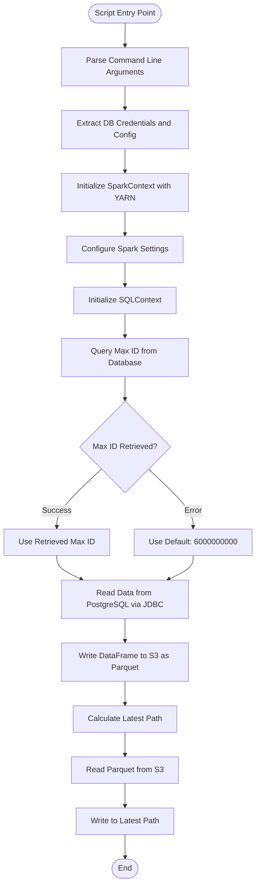
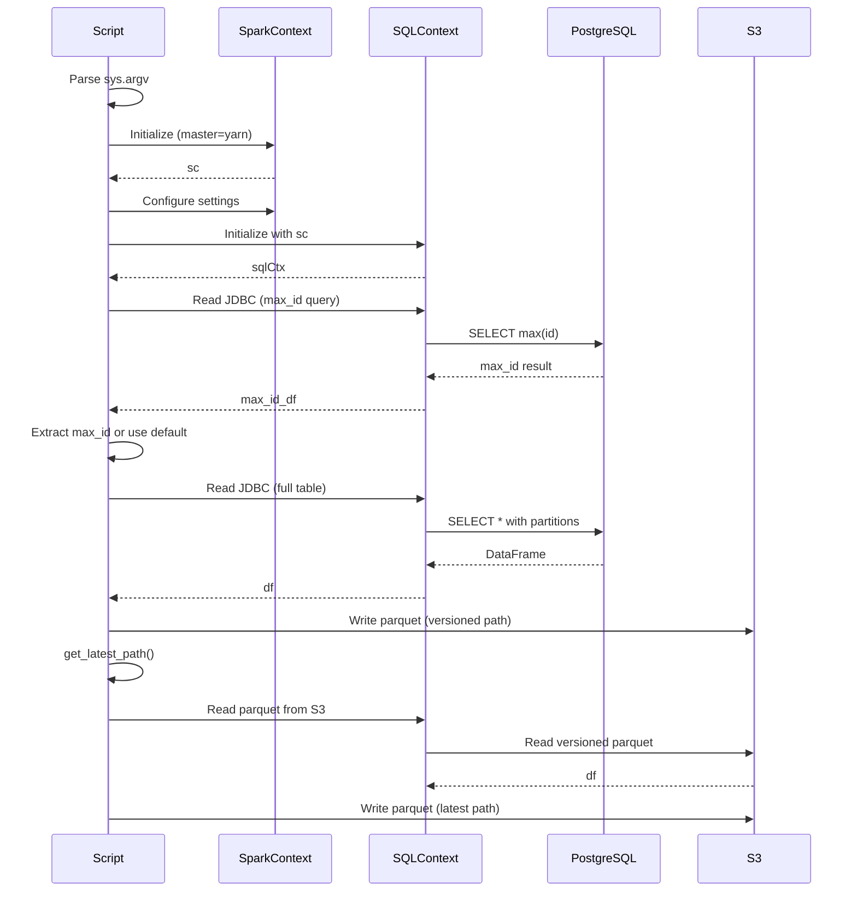

# Diagram: research/orchestrator/tasks/etl/extract_public_plannedtripstop_spark.py

> Auto-generated by Obscura crawlers

## Diagram 1

### SVG

<svg id="container" width="519.234375" xmlns="http://www.w3.org/2000/svg" class="flowchart" height="1793.140625" viewBox="0 0 519.234375 1793.140625" role="graphics-document document" aria-roledescription="flowchart-v2"><g><marker id="container_flowchart-v2-pointEnd" class="marker flowchart-v2" viewBox="0 0 10 10" refX="5" refY="5" markerUnits="userSpaceOnUse" markerWidth="8" markerHeight="8" orient="auto"><path d="M 0 0 L 10 5 L 0 10 z" class="arrowMarkerPath" style="stroke-width: 1; stroke-dasharray: 1, 0;"></path></marker><marker id="container_flowchart-v2-pointStart" class="marker flowchart-v2" viewBox="0 0 10 10" refX="4.5" refY="5" markerUnits="userSpaceOnUse" markerWidth="8" markerHeight="8" orient="auto"><path d="M 0 5 L 10 10 L 10 0 z" class="arrowMarkerPath" style="stroke-width: 1; stroke-dasharray: 1, 0;"></path></marker><marker id="container_flowchart-v2-circleEnd" class="marker flowchart-v2" viewBox="0 0 10 10" refX="11" refY="5" markerUnits="userSpaceOnUse" markerWidth="11" markerHeight="11" orient="auto"><circle cx="5" cy="5" r="5" class="arrowMarkerPath" style="stroke-width: 1; stroke-dasharray: 1, 0;"></circle></marker><marker id="container_flowchart-v2-circleStart" class="marker flowchart-v2" viewBox="0 0 10 10" refX="-1" refY="5" markerUnits="userSpaceOnUse" markerWidth="11" markerHeight="11" orient="auto"><circle cx="5" cy="5" r="5" class="arrowMarkerPath" style="stroke-width: 1; stroke-dasharray: 1, 0;"></circle></marker><marker id="container_flowchart-v2-crossEnd" class="marker cross flowchart-v2" viewBox="0 0 11 11" refX="12" refY="5.2" markerUnits="userSpaceOnUse" markerWidth="11" markerHeight="11" orient="auto"><path d="M 1,1 l 9,9 M 10,1 l -9,9" class="arrowMarkerPath" style="stroke-width: 2; stroke-dasharray: 1, 0;"></path></marker><marker id="container_flowchart-v2-crossStart" class="marker cross flowchart-v2" viewBox="0 0 11 11" refX="-1" refY="5.2" markerUnits="userSpaceOnUse" markerWidth="11" markerHeight="11" orient="auto"><path d="M 1,1 l 9,9 M 10,1 l -9,9" class="arrowMarkerPath" style="stroke-width: 2; stroke-dasharray: 1, 0;"></path></marker><g class="root"><g class="clusters"></g><g class="edgePaths"><path d="M253.184,47.5L253.1,51.583C253.017,55.667,252.85,63.833,252.767,71.417C252.684,79,252.684,86,252.684,89.5L252.684,93" id="L_Start_ParseArgs_0" class="edge-thickness-normal edge-pattern-solid edge-thickness-normal edge-pattern-solid flowchart-link" style=";" data-edge="true" data-et="edge" data-id="L_Start_ParseArgs_0" data-points="W3sieCI6MjUzLjE4MzU5Mzc1LCJ5Ijo0Ny41fSx7IngiOjI1Mi42ODM1OTM3NSwieSI6NzJ9LHsieCI6MjUyLjY4MzU5Mzc1LCJ5Ijo5N31d" marker-end="url(#container_flowchart-v2-pointEnd)"></path><path d="M252.684,175L252.684,179.167C252.684,183.333,252.684,191.667,252.684,199.333C252.684,207,252.684,214,252.684,217.5L252.684,221" id="L_ParseArgs_GetCredentials_0" class="edge-thickness-normal edge-pattern-solid edge-thickness-normal edge-pattern-solid flowchart-link" style=";" data-edge="true" data-et="edge" data-id="L_ParseArgs_GetCredentials_0" data-points="W3sieCI6MjUyLjY4MzU5Mzc1LCJ5IjoxNzV9LHsieCI6MjUyLjY4MzU5Mzc1LCJ5IjoyMDB9LHsieCI6MjUyLjY4MzU5Mzc1LCJ5IjoyMjV9XQ==" marker-end="url(#container_flowchart-v2-pointEnd)"></path><path d="M252.684,303L252.684,307.167C252.684,311.333,252.684,319.667,252.684,327.333C252.684,335,252.684,342,252.684,345.5L252.684,349" id="L_GetCredentials_InitSpark_0" class="edge-thickness-normal edge-pattern-solid edge-thickness-normal edge-pattern-solid flowchart-link" style=";" data-edge="true" data-et="edge" data-id="L_GetCredentials_InitSpark_0" data-points="W3sieCI6MjUyLjY4MzU5Mzc1LCJ5IjozMDN9LHsieCI6MjUyLjY4MzU5Mzc1LCJ5IjozMjh9LHsieCI6MjUyLjY4MzU5Mzc1LCJ5IjozNTN9XQ==" marker-end="url(#container_flowchart-v2-pointEnd)"></path><path d="M252.684,431L252.684,435.167C252.684,439.333,252.684,447.667,252.684,455.333C252.684,463,252.684,470,252.684,473.5L252.684,477" id="L_InitSpark_ConfigSpark_0" class="edge-thickness-normal edge-pattern-solid edge-thickness-normal edge-pattern-solid flowchart-link" style=";" data-edge="true" data-et="edge" data-id="L_InitSpark_ConfigSpark_0" data-points="W3sieCI6MjUyLjY4MzU5Mzc1LCJ5Ijo0MzF9LHsieCI6MjUyLjY4MzU5Mzc1LCJ5Ijo0NTZ9LHsieCI6MjUyLjY4MzU5Mzc1LCJ5Ijo0ODF9XQ==" marker-end="url(#container_flowchart-v2-pointEnd)"></path><path d="M252.684,535L252.684,539.167C252.684,543.333,252.684,551.667,252.684,559.333C252.684,567,252.684,574,252.684,577.5L252.684,581" id="L_ConfigSpark_InitSQL_0" class="edge-thickness-normal edge-pattern-solid edge-thickness-normal edge-pattern-solid flowchart-link" style=";" data-edge="true" data-et="edge" data-id="L_ConfigSpark_InitSQL_0" data-points="W3sieCI6MjUyLjY4MzU5Mzc1LCJ5Ijo1MzV9LHsieCI6MjUyLjY4MzU5Mzc1LCJ5Ijo1NjB9LHsieCI6MjUyLjY4MzU5Mzc1LCJ5Ijo1ODV9XQ==" marker-end="url(#container_flowchart-v2-pointEnd)"></path><path d="M252.684,639L252.684,643.167C252.684,647.333,252.684,655.667,252.684,663.333C252.684,671,252.684,678,252.684,681.5L252.684,685" id="L_InitSQL_QueryMaxID_0" class="edge-thickness-normal edge-pattern-solid edge-thickness-normal edge-pattern-solid flowchart-link" style=";" data-edge="true" data-et="edge" data-id="L_InitSQL_QueryMaxID_0" data-points="W3sieCI6MjUyLjY4MzU5Mzc1LCJ5Ijo2Mzl9LHsieCI6MjUyLjY4MzU5Mzc1LCJ5Ijo2NjR9LHsieCI6MjUyLjY4MzU5Mzc1LCJ5Ijo2ODl9XQ==" marker-end="url(#container_flowchart-v2-pointEnd)"></path><path d="M252.684,767L252.684,771.167C252.684,775.333,252.684,783.667,252.684,791.333C252.684,799,252.684,806,252.684,809.5L252.684,813" id="L_QueryMaxID_CheckMaxID_0" class="edge-thickness-normal edge-pattern-solid edge-thickness-normal edge-pattern-solid flowchart-link" style=";" data-edge="true" data-et="edge" data-id="L_QueryMaxID_CheckMaxID_0" data-points="W3sieCI6MjUyLjY4MzU5Mzc1LCJ5Ijo3Njd9LHsieCI6MjUyLjY4MzU5Mzc1LCJ5Ijo3OTJ9LHsieCI6MjUyLjY4MzU5Mzc1LCJ5Ijo4MTd9XQ==" marker-end="url(#container_flowchart-v2-pointEnd)"></path><path d="M205.228,952.685L190.086,966.761C174.944,980.837,144.659,1008.989,129.517,1028.565C114.375,1048.141,114.375,1059.141,114.375,1064.641L114.375,1070.141" id="L_CheckMaxID_UseMaxID_0" class="edge-thickness-normal edge-pattern-solid edge-thickness-normal edge-pattern-solid flowchart-link" style=";" data-edge="true" data-et="edge" data-id="L_CheckMaxID_UseMaxID_0" data-points="W3sieCI6MjA1LjIyNzc1OTQ1NzY1MjEzLCJ5Ijo5NTIuNjg0NzkwNzA3NjUyMn0seyJ4IjoxMTQuMzc1LCJ5IjoxMDM3LjE0MDYyNX0seyJ4IjoxMTQuMzc1LCJ5IjoxMDc0LjE0MDYyNX1d" marker-end="url(#container_flowchart-v2-pointEnd)"></path><path d="M300.139,952.685L315.282,966.761C330.424,980.837,360.708,1008.989,375.85,1028.565C390.992,1048.141,390.992,1059.141,390.992,1064.641L390.992,1070.141" id="L_CheckMaxID_UseDefault_0" class="edge-thickness-normal edge-pattern-solid edge-thickness-normal edge-pattern-solid flowchart-link" style=";" data-edge="true" data-et="edge" data-id="L_CheckMaxID_UseDefault_0" data-points="W3sieCI6MzAwLjEzOTQyODA0MjM0NzksInkiOjk1Mi42ODQ3OTA3MDc2NTIyfSx7IngiOjM5MC45OTIxODc1LCJ5IjoxMDM3LjE0MDYyNX0seyJ4IjozOTAuOTkyMTg3NSwieSI6MTA3NC4xNDA2MjV9XQ==" marker-end="url(#container_flowchart-v2-pointEnd)"></path><path d="M114.375,1128.141L114.375,1132.307C114.375,1136.474,114.375,1144.807,122.774,1152.861C131.174,1160.914,147.973,1168.687,156.372,1172.574L164.772,1176.461" id="L_UseMaxID_ReadJDBC_0" class="edge-thickness-normal edge-pattern-solid edge-thickness-normal edge-pattern-solid flowchart-link" style=";" data-edge="true" data-et="edge" data-id="L_UseMaxID_ReadJDBC_0" data-points="W3sieCI6MTE0LjM3NSwieSI6MTEyOC4xNDA2MjV9LHsieCI6MTE0LjM3NSwieSI6MTE1My4xNDA2MjV9LHsieCI6MTY4LjQwMTc5NDQzMzU5Mzc1LCJ5IjoxMTc4LjE0MDYyNX1d" marker-end="url(#container_flowchart-v2-pointEnd)"></path><path d="M390.992,1128.141L390.992,1132.307C390.992,1136.474,390.992,1144.807,382.593,1152.861C374.193,1160.914,357.394,1168.687,348.995,1172.574L340.596,1176.461" id="L_UseDefault_ReadJDBC_0" class="edge-thickness-normal edge-pattern-solid edge-thickness-normal edge-pattern-solid flowchart-link" style=";" data-edge="true" data-et="edge" data-id="L_UseDefault_ReadJDBC_0" data-points="W3sieCI6MzkwLjk5MjE4NzUsInkiOjExMjguMTQwNjI1fSx7IngiOjM5MC45OTIxODc1LCJ5IjoxMTUzLjE0MDYyNX0seyJ4IjozMzYuOTY1MzkzMDY2NDA2MjUsInkiOjExNzguMTQwNjI1fV0=" marker-end="url(#container_flowchart-v2-pointEnd)"></path><path d="M252.684,1256.141L252.684,1260.307C252.684,1264.474,252.684,1272.807,252.684,1280.474C252.684,1288.141,252.684,1295.141,252.684,1298.641L252.684,1302.141" id="L_ReadJDBC_WriteS3_0" class="edge-thickness-normal edge-pattern-solid edge-thickness-normal edge-pattern-solid flowchart-link" style=";" data-edge="true" data-et="edge" data-id="L_ReadJDBC_WriteS3_0" data-points="W3sieCI6MjUyLjY4MzU5Mzc1LCJ5IjoxMjU2LjE0MDYyNX0seyJ4IjoyNTIuNjgzNTkzNzUsInkiOjEyODEuMTQwNjI1fSx7IngiOjI1Mi42ODM1OTM3NSwieSI6MTMwNi4xNDA2MjV9XQ==" marker-end="url(#container_flowchart-v2-pointEnd)"></path><path d="M252.684,1384.141L252.684,1388.307C252.684,1392.474,252.684,1400.807,252.684,1408.474C252.684,1416.141,252.684,1423.141,252.684,1426.641L252.684,1430.141" id="L_WriteS3_GetLatestPath_0" class="edge-thickness-normal edge-pattern-solid edge-thickness-normal edge-pattern-solid flowchart-link" style=";" data-edge="true" data-et="edge" data-id="L_WriteS3_GetLatestPath_0" data-points="W3sieCI6MjUyLjY4MzU5Mzc1LCJ5IjoxMzg0LjE0MDYyNX0seyJ4IjoyNTIuNjgzNTkzNzUsInkiOjE0MDkuMTQwNjI1fSx7IngiOjI1Mi42ODM1OTM3NSwieSI6MTQzNC4xNDA2MjV9XQ==" marker-end="url(#container_flowchart-v2-pointEnd)"></path><path d="M252.684,1488.141L252.684,1492.307C252.684,1496.474,252.684,1504.807,252.684,1512.474C252.684,1520.141,252.684,1527.141,252.684,1530.641L252.684,1534.141" id="L_GetLatestPath_ReadParquet_0" class="edge-thickness-normal edge-pattern-solid edge-thickness-normal edge-pattern-solid flowchart-link" style=";" data-edge="true" data-et="edge" data-id="L_GetLatestPath_ReadParquet_0" data-points="W3sieCI6MjUyLjY4MzU5Mzc1LCJ5IjoxNDg4LjE0MDYyNX0seyJ4IjoyNTIuNjgzNTkzNzUsInkiOjE1MTMuMTQwNjI1fSx7IngiOjI1Mi42ODM1OTM3NSwieSI6MTUzOC4xNDA2MjV9XQ==" marker-end="url(#container_flowchart-v2-pointEnd)"></path><path d="M252.684,1592.141L252.684,1596.307C252.684,1600.474,252.684,1608.807,252.684,1616.474C252.684,1624.141,252.684,1631.141,252.684,1634.641L252.684,1638.141" id="L_ReadParquet_WriteLatest_0" class="edge-thickness-normal edge-pattern-solid edge-thickness-normal edge-pattern-solid flowchart-link" style=";" data-edge="true" data-et="edge" data-id="L_ReadParquet_WriteLatest_0" data-points="W3sieCI6MjUyLjY4MzU5Mzc1LCJ5IjoxNTkyLjE0MDYyNX0seyJ4IjoyNTIuNjgzNTkzNzUsInkiOjE2MTcuMTQwNjI1fSx7IngiOjI1Mi42ODM1OTM3NSwieSI6MTY0Mi4xNDA2MjV9XQ==" marker-end="url(#container_flowchart-v2-pointEnd)"></path><path d="M252.684,1696.141L252.684,1700.307C252.684,1704.474,252.684,1712.807,252.754,1720.557C252.824,1728.308,252.965,1735.474,253.035,1739.058L253.105,1742.641" id="L_WriteLatest_End_0" class="edge-thickness-normal edge-pattern-solid edge-thickness-normal edge-pattern-solid flowchart-link" style=";" data-edge="true" data-et="edge" data-id="L_WriteLatest_End_0" data-points="W3sieCI6MjUyLjY4MzU5Mzc1LCJ5IjoxNjk2LjE0MDYyNX0seyJ4IjoyNTIuNjgzNTkzNzUsInkiOjE3MjEuMTQwNjI1fSx7IngiOjI1My4xODM1OTM3NSwieSI6MTc0Ni42NDA2MjV9XQ==" marker-end="url(#container_flowchart-v2-pointEnd)"></path></g><g class="edgeLabels"><g class="edgeLabel"><g class="label" data-id="L_Start_ParseArgs_0" transform="translate(0, 0)"><foreignObject width="0" height="0">

</foreignObject></g></g><g class="edgeLabel"><g class="label" data-id="L_ParseArgs_GetCredentials_0" transform="translate(0, 0)"><foreignObject width="0" height="0">

</foreignObject></g></g><g class="edgeLabel"><g class="label" data-id="L_GetCredentials_InitSpark_0" transform="translate(0, 0)"><foreignObject width="0" height="0">

</foreignObject></g></g><g class="edgeLabel"><g class="label" data-id="L_InitSpark_ConfigSpark_0" transform="translate(0, 0)"><foreignObject width="0" height="0">

</foreignObject></g></g><g class="edgeLabel"><g class="label" data-id="L_ConfigSpark_InitSQL_0" transform="translate(0, 0)"><foreignObject width="0" height="0">

</foreignObject></g></g><g class="edgeLabel"><g class="label" data-id="L_InitSQL_QueryMaxID_0" transform="translate(0, 0)"><foreignObject width="0" height="0">

</foreignObject></g></g><g class="edgeLabel"><g class="label" data-id="L_QueryMaxID_CheckMaxID_0" transform="translate(0, 0)"><foreignObject width="0" height="0">

</foreignObject></g></g><g class="edgeLabel" transform="translate(114.375, 1037.140625)"><g class="label" data-id="L_CheckMaxID_UseMaxID_0" transform="translate(-28.1015625, -12)"><foreignObject width="56.203125" height="24">

Success

</foreignObject></g></g><g class="edgeLabel" transform="translate(390.9921875, 1037.140625)"><g class="label" data-id="L_CheckMaxID_UseDefault_0" transform="translate(-17.8984375, -12)"><foreignObject width="35.796875" height="24">

Error

</foreignObject></g></g><g class="edgeLabel"><g class="label" data-id="L_UseMaxID_ReadJDBC_0" transform="translate(0, 0)"><foreignObject width="0" height="0">

</foreignObject></g></g><g class="edgeLabel"><g class="label" data-id="L_UseDefault_ReadJDBC_0" transform="translate(0, 0)"><foreignObject width="0" height="0">

</foreignObject></g></g><g class="edgeLabel"><g class="label" data-id="L_ReadJDBC_WriteS3_0" transform="translate(0, 0)"><foreignObject width="0" height="0">

</foreignObject></g></g><g class="edgeLabel"><g class="label" data-id="L_WriteS3_GetLatestPath_0" transform="translate(0, 0)"><foreignObject width="0" height="0">

</foreignObject></g></g><g class="edgeLabel"><g class="label" data-id="L_GetLatestPath_ReadParquet_0" transform="translate(0, 0)"><foreignObject width="0" height="0">

</foreignObject></g></g><g class="edgeLabel"><g class="label" data-id="L_ReadParquet_WriteLatest_0" transform="translate(0, 0)"><foreignObject width="0" height="0">

</foreignObject></g></g><g class="edgeLabel"><g class="label" data-id="L_WriteLatest_End_0" transform="translate(0, 0)"><foreignObject width="0" height="0">

</foreignObject></g></g></g><g class="nodes"><g class="node default" id="flowchart-Start-0" transform="translate(252.68359375, 27.5)"><g class="basic label-container outer-path"><path d="M-56 -19.5 C-28.330823227617522 -19.5, -0.6616464552350436 -19.5, 56 -19.5 C56 -19.5, 56 -19.5, 56 -19.5 C56.34878987914478 -19.48881498745414, 56.697579758289564 -19.477629974908282, 57.2493692896239 -19.45993515863156 C57.50191994252397 -19.435571900882888, 57.75447059542404 -19.411208643134216, 58.493604652847864 -19.3399052695533 C58.92109823408535 -19.270791422601057, 59.34859181532284 -19.20167757564882, 59.72759325967676 -19.140403561325776 C60.1656764581109 -19.040413930043215, 60.60375965654505 -18.940424298760657, 60.94626438623539 -18.862249829261074 C61.269695959186755 -18.766257036136082, 61.59312753213812 -18.670264243011086, 62.144610251460605 -18.50658706670804 C62.57910152602159 -18.346690261276283, 63.01359280058257 -18.186793455844526, 63.3177065951478 -18.074876768247425 C63.760695644250184 -17.878778657013044, 64.20368469335257 -17.682680545778663, 64.46073291279238 -17.568892924097174 C64.79092888421465 -17.396629897306788, 65.12112485563692 -17.224366870516405, 65.56899226407678 -16.990714730406097 C65.96563329576945 -16.75026860607257, 66.36227432746212 -16.509822481739043, 66.6379305736057 -16.342718045390892 C66.89348947473611 -16.16445121892884, 67.14904837586654 -15.986184392466784, 67.66315534457871 -15.627565626425154 C68.0370933456761 -15.329360021458113, 68.41103134677347 -15.031154416491072, 68.64045370850187 -14.848196188198123 C68.85227267407619 -14.655827808086238, 69.06409163965051 -14.463459427974353, 69.56580973676799 -14.007812326905688 C69.87307836407629 -13.690532241986396, 70.1803469913846 -13.373252157067107, 70.43542094296865 -13.10986736009568 C70.61839760260582 -12.894932564018966, 70.801374262243 -12.67999776794225, 71.24571390812658 -12.158051136245305 C71.42733434839468 -11.914696292248536, 71.60895478866279 -11.671341448251766, 71.99335896464063 -11.156274872382312 C72.19551251655349 -10.845712730814734, 72.39766606846636 -10.535150589247154, 72.67528387860425 -10.108655082055241 C72.91429344350708 -9.684269397227407, 73.1533030084099 -9.259883712399573, 73.2886864742735 -9.019496659696287 C73.4829384831084 -8.616128207023454, 73.6771904919433 -8.212759754350621, 73.83104614880834 -7.893275190886684 C74.01323572457338 -7.443263416351222, 74.19542530033841 -6.9932516418157595, 74.30013422997033 -6.734618561215508 C74.41134109060326 -6.399681215396155, 74.52254795123619 -6.064743869576803, 74.69402313421489 -5.548287939305138 C74.79363105085534 -5.168439782810922, 74.8932389674958 -4.788591626316705, 75.01109428754556 -4.339158212148133 C75.10397679217711 -3.8622261815894694, 75.19685929680864 -3.385294151030805, 75.25004477658177 -3.1121979531509023 C75.31115708692829 -2.638222942093953, 75.37226939727482 -2.1642479310370035, 75.40989270250937 -1.872449005199798 C75.43677671809833 -1.4537087620150118, 75.46366073368728 -1.0349685188302258, 75.48998121591342 -0.6250057626472757 C75.48998121591342 -0.19325832869996346, 75.48998121591342 0.2384891052473488, 75.48998121591342 0.625005762647271 C75.46604622735138 0.9978125294758492, 75.44211123878937 1.3706192963044272, 75.40989270250937 1.8724490051997846 C75.34960883280644 2.339998794219104, 75.28932496310352 2.807548583238423, 75.25004477658177 3.1121979531508885 C75.18907706119046 3.425254286154104, 75.12810934579913 3.7383106191573203, 75.01109428754556 4.339158212148129 C74.91024920465782 4.723724219734509, 74.80940412177007 5.1082902273208886, 74.69402313421489 5.548287939305125 C74.60257482330596 5.823715681453144, 74.51112651239704 6.099143423601161, 74.30013422997033 6.734618561215495 C74.1740182620613 7.046127440237165, 74.04790229415227 7.357636319258835, 73.83104614880834 7.893275190886679 C73.6146457159976 8.34263531984572, 73.39824528318684 8.791995448804759, 73.2886864742735 9.019496659696284 C73.0803363691429 9.38944336909158, 72.87198626401229 9.759390078486877, 72.67528387860425 10.108655082055236 C72.43860666219187 10.472254843196033, 72.2019294457795 10.835854604336829, 71.99335896464065 11.156274872382301 C71.80208841032282 11.412559990062224, 71.610817856005 11.668845107742147, 71.24571390812659 12.158051136245302 C71.05117091030637 12.38657241129511, 70.85662791248613 12.615093686344917, 70.43542094296866 13.10986736009567 C70.13439125293299 13.420705230054699, 69.8333615628973 13.73154310001373, 69.56580973676799 14.007812326905684 C69.25227741406394 14.292554086774825, 68.9387450913599 14.577295846643967, 68.6404537085019 14.848196188198111 C68.25847961711094 15.152810361324937, 67.87650552571996 15.457424534451762, 67.66315534457871 15.627565626425152 C67.38904944653642 15.818770035046374, 67.11494354849413 16.009974443667595, 66.6379305736057 16.34271804539089 C66.37471242169514 16.502282435920627, 66.11149426978459 16.66184682645037, 65.56899226407678 16.990714730406093 C65.28101796660205 17.14095073694232, 64.99304366912733 17.29118674347854, 64.46073291279238 17.56889292409717 C64.17349728969006 17.696043613902543, 63.88626166658774 17.82319430370792, 63.317706595147804 18.07487676824742 C62.88865003597025 18.232773548180116, 62.4595934767927 18.39067032811281, 62.14461025146062 18.506587066708033 C61.757593422739376 18.62145162997971, 61.37057659401813 18.736316193251387, 60.94626438623541 18.86224982926107 C60.678735358712665 18.92331158400308, 60.41120633118991 18.98437333874509, 59.727593259676766 19.140403561325773 C59.417703478836714 19.19050413786085, 59.10781369799666 19.24060471439593, 58.49360465284788 19.3399052695533 C58.046137462839496 19.383071891215376, 57.59867027283111 19.426238512877454, 57.2493692896239 19.45993515863156 C56.904318818885194 19.47100025562815, 56.559268348146496 19.482065352624744, 56.00000000000001 19.5 C56.00000000000001 19.5, 56 19.5, 56 19.5 C20.6734847064155 19.5, -14.653030587168999 19.5, -55.99999999999999 19.5 C-56.36922686737675 19.488159613019725, -56.73845373475351 19.476319226039454, -57.24936928962389 19.45993515863156 C-57.596877597470595 19.426411450113473, -57.944385905317304 19.39288774159539, -58.49360465284787 19.3399052695533 C-58.881114414823024 19.27725569642024, -59.26862417679817 19.214606123287187, -59.72759325967676 19.140403561325773 C-60.136310103479325 19.0471166088545, -60.54502694728188 18.953829656383228, -60.946264386235384 18.862249829261074 C-61.38528287606657 18.731951445934257, -61.82430136589776 18.60165306260744, -62.14461025146059 18.506587066708043 C-62.55685561842257 18.35487696091164, -62.96910098538454 18.20316685511523, -63.3177065951478 18.074876768247425 C-63.75395899780706 17.8817607705579, -64.19021140046632 17.688644772868376, -64.46073291279238 17.568892924097174 C-64.83276449454168 17.37480428619617, -65.20479607629098 17.180715648295163, -65.56899226407678 16.990714730406097 C-65.78390253172073 16.860434863207416, -65.99881279936469 16.730154996008736, -66.63793057360569 16.3427180453909 C-66.97960406671118 16.104381407407637, -67.32127755981668 15.866044769424375, -67.66315534457871 15.627565626425156 C-67.87204791886145 15.460979357299525, -68.0809404931442 15.294393088173894, -68.64045370850187 14.848196188198125 C-68.87689073175322 14.633470339462068, -69.11332775500459 14.418744490726011, -69.56580973676797 14.007812326905697 C-69.86645978389693 13.69736646941712, -70.16710983102588 13.386920611928547, -70.43542094296865 13.109867360095677 C-70.66554136378262 12.839554819584693, -70.8956617845966 12.569242279073709, -71.24571390812658 12.158051136245307 C-71.41309268361573 11.933778825609973, -71.5804714591049 11.70950651497464, -71.99335896464063 11.156274872382316 C-72.26310938240404 10.741865792568259, -72.53285980016746 10.327456712754202, -72.67528387860425 10.108655082055249 C-72.86639686810578 9.769314616906598, -73.05750985760731 9.429974151757946, -73.2886864742735 9.019496659696289 C-73.4370495294743 8.711417601111012, -73.58541258467507 8.403338542525736, -73.83104614880834 7.893275190886686 C-73.95434434564876 7.588726260882365, -74.0776425424892 7.284177330878044, -74.30013422997033 6.73461856121551 C-74.44254392992954 6.305703234842686, -74.58495362988876 5.876787908469863, -74.69402313421489 5.5482879393051325 C-74.78185358593696 5.213352360930316, -74.86968403765903 4.878416782555499, -75.01109428754556 4.339158212148136 C-75.05898556098812 4.0932466448448, -75.10687683443068 3.8473350775414654, -75.25004477658177 3.112197953150904 C-75.29919316477843 2.7310127597446865, -75.34834155297509 2.349827566338469, -75.40989270250937 1.872449005199809 C-75.43628857074218 1.4613120511124769, -75.46268443897499 1.0501750970251447, -75.48998121591342 0.6250057626472781 C-75.48998121591342 0.14795160055641626, -75.48998121591342 -0.3291025615344456, -75.48998121591342 -0.6250057626472687 C-75.46615113009418 -0.9961785845810915, -75.44232104427492 -1.3673514065149144, -75.40989270250937 -1.8724490051997822 C-75.37406532246156 -2.1503190899341953, -75.33823794241374 -2.4281891746686086, -75.25004477658177 -3.112197953150895 C-75.17521389472601 -3.4964387159677726, -75.10038301287024 -3.88067947878465, -75.01109428754556 -4.339158212148126 C-74.93646021958034 -4.623770259909194, -74.86182615161512 -4.908382307670262, -74.69402313421489 -5.548287939305123 C-74.61106553885314 -5.798142999036867, -74.52810794349138 -6.047998058768611, -74.30013422997033 -6.734618561215485 C-74.19176017749908 -7.002304566089234, -74.08338612502783 -7.269990570962983, -73.83104614880834 -7.893275190886676 C-73.71251664517955 -8.139404241296976, -73.59398714155074 -8.385533291707278, -73.2886864742735 -9.019496659696282 C-73.1517127270061 -9.26270741806548, -73.01473897973871 -9.50591817643468, -72.67528387860425 -10.108655082055243 C-72.53384097650513 -10.325949362416786, -72.39239807440602 -10.543243642778329, -71.99335896464063 -11.156274872382308 C-71.71934868878213 -11.523423679183049, -71.44533841292362 -11.89057248598379, -71.24571390812659 -12.158051136245302 C-70.95241945328088 -12.502571491834326, -70.65912499843517 -12.84709184742335, -70.43542094296866 -13.10986736009567 C-70.18738454381516 -13.365985306388753, -69.93934814466165 -13.622103252681836, -69.56580973676799 -14.007812326905677 C-69.24392398399227 -14.300140450946264, -68.92203823121656 -14.59246857498685, -68.6404537085019 -14.848196188198107 C-68.28780792750479 -15.129421814244953, -67.93516214650766 -15.410647440291799, -67.66315534457871 -15.627565626425149 C-67.29573536432737 -15.883861899293892, -66.92831538407603 -16.140158172162636, -66.63793057360571 -16.342718045390885 C-66.39766133725374 -16.488370668446212, -66.15739210090176 -16.634023291501542, -65.56899226407678 -16.99071473040609 C-65.33024472299012 -17.115269169665904, -65.09149718190346 -17.23982360892572, -64.4607329127924 -17.56889292409717 C-64.22404145367699 -17.673669211844892, -63.98734999456157 -17.778445499592614, -63.317706595147804 -18.07487676824742 C-62.95386450122082 -18.208774022131998, -62.59002240729383 -18.342671276016578, -62.14461025146062 -18.506587066708033 C-61.86895322981019 -18.588400623780647, -61.593296208159764 -18.67021418085326, -60.94626438623541 -18.862249829261067 C-60.698062544793764 -18.91890027990174, -60.449860703352115 -18.97555073054242, -59.727593259676766 -19.140403561325773 C-59.30212191714341 -19.209190468407026, -58.876650574610046 -19.27797737548828, -58.49360465284788 -19.3399052695533 C-58.022759316080915 -19.38532715291684, -57.551913979313944 -19.430749036280385, -57.2493692896239 -19.45993515863156 C-56.78541477267093 -19.47481327695756, -56.321460255717966 -19.489691395283554, -56.00000000000001 -19.5 C-56.00000000000001 -19.5, -56 -19.5, -56 -19.5" stroke="none" stroke-width="0" fill="#ECECFF" style=""></path><path d="M-56 -19.5 C-21.130278835475373 -19.5, 13.739442329049254 -19.5, 56 -19.5 M-56 -19.5 C-32.171323995993916 -19.5, -8.342647991987832 -19.5, 56 -19.5 M56 -19.5 C56 -19.5, 56 -19.5, 56 -19.5 M56 -19.5 C56 -19.5, 56 -19.5, 56 -19.5 M56 -19.5 C56.34078728918849 -19.489071614937945, 56.68157457837698 -19.478143229875887, 57.2493692896239 -19.45993515863156 M56 -19.5 C56.4705071704475 -19.4849117508304, 56.94101434089499 -19.469823501660798, 57.2493692896239 -19.45993515863156 M57.2493692896239 -19.45993515863156 C57.6350568807642 -19.422728340571446, 58.020744471904514 -19.385521522511333, 58.493604652847864 -19.3399052695533 M57.2493692896239 -19.45993515863156 C57.637016559897404 -19.422539292682327, 58.02466383017091 -19.38514342673309, 58.493604652847864 -19.3399052695533 M58.493604652847864 -19.3399052695533 C58.83556729389619 -19.284619401708493, 59.177529934944516 -19.22933353386369, 59.72759325967676 -19.140403561325776 M58.493604652847864 -19.3399052695533 C58.804253517092405 -19.289681970300165, 59.11490238133694 -19.239458671047032, 59.72759325967676 -19.140403561325776 M59.72759325967676 -19.140403561325776 C60.020960025257054 -19.073444511479128, 60.31432679083734 -19.006485461632483, 60.94626438623539 -18.862249829261074 M59.72759325967676 -19.140403561325776 C60.09291689992583 -19.05702082439847, 60.458240540174906 -18.973638087471162, 60.94626438623539 -18.862249829261074 M60.94626438623539 -18.862249829261074 C61.35752041610815 -18.740191198321792, 61.76877644598092 -18.61813256738251, 62.144610251460605 -18.50658706670804 M60.94626438623539 -18.862249829261074 C61.29950435421833 -18.75741006095817, 61.65274432220126 -18.652570292655263, 62.144610251460605 -18.50658706670804 M62.144610251460605 -18.50658706670804 C62.54335945048829 -18.35984367546866, 62.94210864951598 -18.213100284229284, 63.3177065951478 -18.074876768247425 M62.144610251460605 -18.50658706670804 C62.57735721859971 -18.347332182531737, 63.01010418573881 -18.188077298355434, 63.3177065951478 -18.074876768247425 M63.3177065951478 -18.074876768247425 C63.75865867783374 -17.87968036162114, 64.19961076051969 -17.68448395499486, 64.46073291279238 -17.568892924097174 M63.3177065951478 -18.074876768247425 C63.6979075961077 -17.906573063384453, 64.0781085970676 -17.73826935852148, 64.46073291279238 -17.568892924097174 M64.46073291279238 -17.568892924097174 C64.84168298039505 -17.37015151783903, 65.2226330479977 -17.171410111580887, 65.56899226407678 -16.990714730406097 M64.46073291279238 -17.568892924097174 C64.85948801558101 -17.360862642387183, 65.25824311836962 -17.152832360677195, 65.56899226407678 -16.990714730406097 M65.56899226407678 -16.990714730406097 C65.94394056298746 -16.76341886816566, 66.31888886189815 -16.536123005925223, 66.6379305736057 -16.342718045390892 M65.56899226407678 -16.990714730406097 C65.87859921055329 -16.80302917999967, 66.18820615702978 -16.615343629593237, 66.6379305736057 -16.342718045390892 M66.6379305736057 -16.342718045390892 C66.87876449175491 -16.174722729622292, 67.11959840990411 -16.006727413853696, 67.66315534457871 -15.627565626425154 M66.6379305736057 -16.342718045390892 C66.98036953198859 -16.103847451966576, 67.32280849037147 -15.864976858542262, 67.66315534457871 -15.627565626425154 M67.66315534457871 -15.627565626425154 C68.01473023024113 -15.34719401091, 68.36630511590354 -15.066822395394846, 68.64045370850187 -14.848196188198123 M67.66315534457871 -15.627565626425154 C67.91883390567807 -15.423668777840671, 68.17451246677743 -15.21977192925619, 68.64045370850187 -14.848196188198123 M68.64045370850187 -14.848196188198123 C68.90200530387291 -14.610661949558137, 69.16355689924396 -14.373127710918151, 69.56580973676799 -14.007812326905688 M68.64045370850187 -14.848196188198123 C68.86138061234979 -14.647556219528994, 69.08230751619773 -14.446916250859864, 69.56580973676799 -14.007812326905688 M69.56580973676799 -14.007812326905688 C69.7667446295051 -13.800330553093119, 69.96767952224222 -13.592848779280548, 70.43542094296865 -13.10986736009568 M69.56580973676799 -14.007812326905688 C69.7599342962168 -13.807362781352058, 69.95405885566561 -13.606913235798428, 70.43542094296865 -13.10986736009568 M70.43542094296865 -13.10986736009568 C70.60918510763642 -12.905754084815845, 70.7829492723042 -12.701640809536007, 71.24571390812658 -12.158051136245305 M70.43542094296865 -13.10986736009568 C70.74084880881585 -12.751094409533653, 71.04627667466305 -12.392321458971624, 71.24571390812658 -12.158051136245305 M71.24571390812658 -12.158051136245305 C71.47086383096945 -11.856370751215785, 71.69601375381232 -11.554690366186266, 71.99335896464063 -11.156274872382312 M71.24571390812658 -12.158051136245305 C71.44601135956178 -11.889670798795342, 71.64630881099698 -11.62129046134538, 71.99335896464063 -11.156274872382312 M71.99335896464063 -11.156274872382312 C72.22454833973745 -10.801105909193932, 72.45573771483429 -10.445936946005553, 72.67528387860425 -10.108655082055241 M71.99335896464063 -11.156274872382312 C72.25699206518536 -10.75126363454582, 72.5206251657301 -10.34625239670933, 72.67528387860425 -10.108655082055241 M72.67528387860425 -10.108655082055241 C72.83023878557994 -9.833516953834115, 72.98519369255563 -9.558378825612987, 73.2886864742735 -9.019496659696287 M72.67528387860425 -10.108655082055241 C72.90941836879577 -9.69292558603218, 73.14355285898729 -9.277196090009118, 73.2886864742735 -9.019496659696287 M73.2886864742735 -9.019496659696287 C73.4947054483734 -8.591693851877976, 73.70072442247329 -8.163891044059664, 73.83104614880834 -7.893275190886684 M73.2886864742735 -9.019496659696287 C73.45930698734041 -8.665199513618711, 73.6299275004073 -8.310902367541134, 73.83104614880834 -7.893275190886684 M73.83104614880834 -7.893275190886684 C73.96879430244 -7.553034588237097, 74.10654245607167 -7.212793985587508, 74.30013422997033 -6.734618561215508 M73.83104614880834 -7.893275190886684 C74.01283382323328 -7.444256120431493, 74.19462149765822 -6.9952370499763035, 74.30013422997033 -6.734618561215508 M74.30013422997033 -6.734618561215508 C74.37904495277913 -6.4969520368316935, 74.45795567558791 -6.259285512447878, 74.69402313421489 -5.548287939305138 M74.30013422997033 -6.734618561215508 C74.422373161358 -6.366454376004666, 74.54461209274567 -5.998290190793824, 74.69402313421489 -5.548287939305138 M74.69402313421489 -5.548287939305138 C74.75984631746235 -5.297275613634475, 74.82566950070982 -5.046263287963812, 75.01109428754556 -4.339158212148133 M74.69402313421489 -5.548287939305138 C74.78664850766806 -5.195067246237393, 74.87927388112124 -4.841846553169648, 75.01109428754556 -4.339158212148133 M75.01109428754556 -4.339158212148133 C75.06221897651756 -4.076643739483756, 75.11334366548955 -3.8141292668193776, 75.25004477658177 -3.1121979531509023 M75.01109428754556 -4.339158212148133 C75.07377527288703 -4.017304600050641, 75.13645625822849 -3.6954509879531496, 75.25004477658177 -3.1121979531509023 M75.25004477658177 -3.1121979531509023 C75.28823485116986 -2.816003276128961, 75.32642492575795 -2.519808599107019, 75.40989270250937 -1.872449005199798 M75.25004477658177 -3.1121979531509023 C75.30548332873181 -2.6822274902555567, 75.36092188088186 -2.2522570273602107, 75.40989270250937 -1.872449005199798 M75.40989270250937 -1.872449005199798 C75.43115263124044 -1.5413084545077371, 75.45241255997152 -1.210167903815676, 75.48998121591342 -0.6250057626472757 M75.40989270250937 -1.872449005199798 C75.43548486388886 -1.4738304340933324, 75.46107702526835 -1.0752118629868668, 75.48998121591342 -0.6250057626472757 M75.48998121591342 -0.6250057626472757 C75.48998121591342 -0.30737337477526905, 75.48998121591342 0.010259013096737601, 75.48998121591342 0.625005762647271 M75.48998121591342 -0.6250057626472757 C75.48998121591342 -0.24477273683738898, 75.48998121591342 0.13546028897249773, 75.48998121591342 0.625005762647271 M75.48998121591342 0.625005762647271 C75.46395411940694 1.0303987994299062, 75.43792702290045 1.4357918362125415, 75.40989270250937 1.8724490051997846 M75.48998121591342 0.625005762647271 C75.46338381173527 1.0392818017601886, 75.43678640755712 1.453557840873106, 75.40989270250937 1.8724490051997846 M75.40989270250937 1.8724490051997846 C75.35661542199477 2.2856570720818885, 75.3033381414802 2.6988651389639924, 75.25004477658177 3.1121979531508885 M75.40989270250937 1.8724490051997846 C75.36098436555201 2.251772408597504, 75.31207602859466 2.6310958119952237, 75.25004477658177 3.1121979531508885 M75.25004477658177 3.1121979531508885 C75.17802018476488 3.48202900972779, 75.10599559294798 3.851860066304692, 75.01109428754556 4.339158212148129 M75.25004477658177 3.1121979531508885 C75.18225944787984 3.460261289601001, 75.11447411917791 3.808324626051114, 75.01109428754556 4.339158212148129 M75.01109428754556 4.339158212148129 C74.9373505820005 4.620374922115575, 74.86360687645545 4.901591632083022, 74.69402313421489 5.548287939305125 M75.01109428754556 4.339158212148129 C74.88891902132079 4.805065453358535, 74.76674375509602 5.270972694568941, 74.69402313421489 5.548287939305125 M74.69402313421489 5.548287939305125 C74.61259327077245 5.793541713906912, 74.53116340733001 6.038795488508698, 74.30013422997033 6.734618561215495 M74.69402313421489 5.548287939305125 C74.5872550195229 5.869856489568463, 74.48048690483093 6.191425039831801, 74.30013422997033 6.734618561215495 M74.30013422997033 6.734618561215495 C74.17893149947996 7.0339916488220755, 74.05772876898959 7.333364736428656, 73.83104614880834 7.893275190886679 M74.30013422997033 6.734618561215495 C74.16053920028791 7.079420983417353, 74.0209441706055 7.424223405619211, 73.83104614880834 7.893275190886679 M73.83104614880834 7.893275190886679 C73.62221410728665 8.326919393396365, 73.41338206576495 8.76056359590605, 73.2886864742735 9.019496659696284 M73.83104614880834 7.893275190886679 C73.66255890275437 8.24314256236731, 73.49407165670038 8.593009933847943, 73.2886864742735 9.019496659696284 M73.2886864742735 9.019496659696284 C73.06170132911707 9.422531769659843, 72.83471618396065 9.825566879623404, 72.67528387860425 10.108655082055236 M73.2886864742735 9.019496659696284 C73.09125885022756 9.370049397904616, 72.89383122618162 9.720602136112948, 72.67528387860425 10.108655082055236 M72.67528387860425 10.108655082055236 C72.46377290351647 10.43359273843944, 72.2522619284287 10.758530394823644, 71.99335896464065 11.156274872382301 M72.67528387860425 10.108655082055236 C72.43215400457174 10.482167858081729, 72.18902413053925 10.855680634108223, 71.99335896464065 11.156274872382301 M71.99335896464065 11.156274872382301 C71.72444278993582 11.51659804771926, 71.45552661523101 11.876921223056216, 71.24571390812659 12.158051136245302 M71.99335896464065 11.156274872382301 C71.78421283191354 11.436511636631973, 71.57506669918642 11.716748400881645, 71.24571390812659 12.158051136245302 M71.24571390812659 12.158051136245302 C71.07604236870868 12.357356981029673, 70.90637082929076 12.556662825814044, 70.43542094296866 13.10986736009567 M71.24571390812659 12.158051136245302 C70.9591290116202 12.494690062824265, 70.67254411511384 12.831328989403229, 70.43542094296866 13.10986736009567 M70.43542094296866 13.10986736009567 C70.25548470517842 13.295666298653956, 70.07554846738819 13.481465237212241, 69.56580973676799 14.007812326905684 M70.43542094296866 13.10986736009567 C70.2054468746793 13.347334466826592, 69.97547280638993 13.584801573557513, 69.56580973676799 14.007812326905684 M69.56580973676799 14.007812326905684 C69.26110948375879 14.284533034761726, 68.9564092307496 14.561253742617767, 68.6404537085019 14.848196188198111 M69.56580973676799 14.007812326905684 C69.3052097542352 14.244482335944276, 69.0446097717024 14.481152344982869, 68.6404537085019 14.848196188198111 M68.6404537085019 14.848196188198111 C68.37882751486679 15.056836115456704, 68.11720132123168 15.2654760427153, 67.66315534457871 15.627565626425152 M68.6404537085019 14.848196188198111 C68.28528352960426 15.131434954393574, 67.93011335070662 15.414673720589038, 67.66315534457871 15.627565626425152 M67.66315534457871 15.627565626425152 C67.4502695802333 15.776065519956303, 67.2373838158879 15.924565413487453, 66.6379305736057 16.34271804539089 M67.66315534457871 15.627565626425152 C67.38399629684614 15.822294893522988, 67.10483724911356 16.017024160620824, 66.6379305736057 16.34271804539089 M66.6379305736057 16.34271804539089 C66.38574308859849 16.495595580820424, 66.13355560359128 16.64847311624996, 65.56899226407678 16.990714730406093 M66.6379305736057 16.34271804539089 C66.34676279655686 16.519225662929685, 66.055595019508 16.695733280468485, 65.56899226407678 16.990714730406093 M65.56899226407678 16.990714730406093 C65.16642444321737 17.200734104691456, 64.76385662235793 17.410753478976822, 64.46073291279238 17.56889292409717 M65.56899226407678 16.990714730406093 C65.1486250342959 17.21002004492472, 64.72825780451501 17.429325359443347, 64.46073291279238 17.56889292409717 M64.46073291279238 17.56889292409717 C64.2139161870885 17.678151367008248, 63.96709946138462 17.78740980991932, 63.317706595147804 18.07487676824742 M64.46073291279238 17.56889292409717 C64.10502780618238 17.72635302317633, 63.74932269957239 17.883813122255486, 63.317706595147804 18.07487676824742 M63.317706595147804 18.07487676824742 C63.01626973331273 18.18580831985453, 62.71483287147767 18.296739871461643, 62.14461025146062 18.506587066708033 M63.317706595147804 18.07487676824742 C62.94825491868603 18.21083840035921, 62.57880324222426 18.346800032471002, 62.14461025146062 18.506587066708033 M62.14461025146062 18.506587066708033 C61.78883277994497 18.612179952739822, 61.43305530842931 18.717772838771612, 60.94626438623541 18.86224982926107 M62.14461025146062 18.506587066708033 C61.814337313178314 18.604610341152192, 61.484064374896 18.702633615596355, 60.94626438623541 18.86224982926107 M60.94626438623541 18.86224982926107 C60.59059469547012 18.943429115216613, 60.23492500470481 19.024608401172156, 59.727593259676766 19.140403561325773 M60.94626438623541 18.86224982926107 C60.696841470187294 18.919178982212415, 60.447418554139176 18.97610813516376, 59.727593259676766 19.140403561325773 M59.727593259676766 19.140403561325773 C59.305522014860145 19.208640766976334, 58.883450770043524 19.2768779726269, 58.49360465284788 19.3399052695533 M59.727593259676766 19.140403561325773 C59.371522626382436 19.197970299947798, 59.01545199308811 19.255537038569823, 58.49360465284788 19.3399052695533 M58.49360465284788 19.3399052695533 C58.06351313327859 19.381395681185417, 57.6334216137093 19.42288609281754, 57.2493692896239 19.45993515863156 M58.49360465284788 19.3399052695533 C58.167018651138264 19.371410628361094, 57.84043264942865 19.402915987168885, 57.2493692896239 19.45993515863156 M57.2493692896239 19.45993515863156 C56.93580016784206 19.469990710041834, 56.62223104606023 19.480046261452106, 56.00000000000001 19.5 M57.2493692896239 19.45993515863156 C56.79569841359288 19.474483500609082, 56.342027537561854 19.489031842586606, 56.00000000000001 19.5 M56.00000000000001 19.5 C56.00000000000001 19.5, 56.00000000000001 19.5, 56 19.5 M56.00000000000001 19.5 C56.00000000000001 19.5, 56 19.5, 56 19.5 M56 19.5 C20.406077691063686 19.5, -15.187844617872628 19.5, -55.99999999999999 19.5 M56 19.5 C14.04984218415784 19.5, -27.90031563168432 19.5, -55.99999999999999 19.5 M-55.99999999999999 19.5 C-56.28457851357083 19.490874120968257, -56.569157027141664 19.481748241936515, -57.24936928962389 19.45993515863156 M-55.99999999999999 19.5 C-56.267428658169 19.491424083450823, -56.53485731633802 19.48284816690165, -57.24936928962389 19.45993515863156 M-57.24936928962389 19.45993515863156 C-57.508905887749286 19.43489797514883, -57.76844248587469 19.409860791666098, -58.49360465284787 19.3399052695533 M-57.24936928962389 19.45993515863156 C-57.553451388252164 19.430600724289118, -57.85753348688043 19.40126628994668, -58.49360465284787 19.3399052695533 M-58.49360465284787 19.3399052695533 C-58.84881631992051 19.282477401928613, -59.20402798699315 19.225049534303928, -59.72759325967676 19.140403561325773 M-58.49360465284787 19.3399052695533 C-58.80400615168161 19.289721962421435, -59.11440765051536 19.239538655289568, -59.72759325967676 19.140403561325773 M-59.72759325967676 19.140403561325773 C-59.97817297610961 19.08321037623544, -60.228752692542464 19.026017191145108, -60.946264386235384 18.862249829261074 M-59.72759325967676 19.140403561325773 C-60.20454662573261 19.03154206793511, -60.681499991788456 18.922680574544444, -60.946264386235384 18.862249829261074 M-60.946264386235384 18.862249829261074 C-61.18921534211564 18.790143260831407, -61.432166297995884 18.71803669240174, -62.14461025146059 18.506587066708043 M-60.946264386235384 18.862249829261074 C-61.283526351745905 18.762152248221735, -61.62078831725643 18.662054667182396, -62.14461025146059 18.506587066708043 M-62.14461025146059 18.506587066708043 C-62.47456038824394 18.385162366346144, -62.80451052502728 18.26373766598424, -63.3177065951478 18.074876768247425 M-62.14461025146059 18.506587066708043 C-62.59830107092875 18.339624651271798, -63.05199189039691 18.172662235835556, -63.3177065951478 18.074876768247425 M-63.3177065951478 18.074876768247425 C-63.5593796072765 17.967895294753237, -63.8010526194052 17.860913821259054, -64.46073291279238 17.568892924097174 M-63.3177065951478 18.074876768247425 C-63.77209948522136 17.873730514898032, -64.22649237529492 17.672584261548636, -64.46073291279238 17.568892924097174 M-64.46073291279238 17.568892924097174 C-64.79420352330139 17.394921520192742, -65.1276741338104 17.22095011628831, -65.56899226407678 16.990714730406097 M-64.46073291279238 17.568892924097174 C-64.68326810919645 17.45279645467377, -64.90580330560051 17.336699985250366, -65.56899226407678 16.990714730406097 M-65.56899226407678 16.990714730406097 C-65.86047063982579 16.814018826109983, -66.15194901557479 16.63732292181387, -66.63793057360569 16.3427180453909 M-65.56899226407678 16.990714730406097 C-65.85517052716696 16.817231785550685, -66.14134879025713 16.643748840695274, -66.63793057360569 16.3427180453909 M-66.63793057360569 16.3427180453909 C-66.91182916997735 16.15165824144117, -67.185727766349 15.960598437491434, -67.66315534457871 15.627565626425156 M-66.63793057360569 16.3427180453909 C-66.84543629543307 16.19797103662204, -67.05294201726045 16.05322402785318, -67.66315534457871 15.627565626425156 M-67.66315534457871 15.627565626425156 C-68.02187367287864 15.341497305501575, -68.38059200117858 15.055428984577993, -68.64045370850187 14.848196188198125 M-67.66315534457871 15.627565626425156 C-67.97675190730068 15.377480712809389, -68.29034847002266 15.127395799193621, -68.64045370850187 14.848196188198125 M-68.64045370850187 14.848196188198125 C-68.91355596992813 14.600171940260665, -69.18665823135439 14.352147692323207, -69.56580973676797 14.007812326905697 M-68.64045370850187 14.848196188198125 C-68.84980342367994 14.658070315963325, -69.05915313885802 14.467944443728525, -69.56580973676797 14.007812326905697 M-69.56580973676797 14.007812326905697 C-69.80358855425615 13.762286175845176, -70.04136737174433 13.516760024784658, -70.43542094296865 13.109867360095677 M-69.56580973676797 14.007812326905697 C-69.89961105354033 13.663135061740466, -70.23341237031266 13.318457796575235, -70.43542094296865 13.109867360095677 M-70.43542094296865 13.109867360095677 C-70.64408335723172 12.86476061507455, -70.85274577149478 12.619653870053423, -71.24571390812658 12.158051136245307 M-70.43542094296865 13.109867360095677 C-70.74988582343991 12.740479017935538, -71.06435070391116 12.371090675775399, -71.24571390812658 12.158051136245307 M-71.24571390812658 12.158051136245307 C-71.44428261588504 11.891987157830384, -71.64285132364351 11.625923179415462, -71.99335896464063 11.156274872382316 M-71.24571390812658 12.158051136245307 C-71.4239937799754 11.91917234959832, -71.60227365182423 11.680293562951334, -71.99335896464063 11.156274872382316 M-71.99335896464063 11.156274872382316 C-72.21622201623 10.813897378032314, -72.43908506781936 10.471519883682312, -72.67528387860425 10.108655082055249 M-71.99335896464063 11.156274872382316 C-72.25931248808526 10.747698841850807, -72.52526601152987 10.3391228113193, -72.67528387860425 10.108655082055249 M-72.67528387860425 10.108655082055249 C-72.8680461078687 9.766386224703913, -73.06080833713314 9.424117367352578, -73.2886864742735 9.019496659696289 M-72.67528387860425 10.108655082055249 C-72.8111629293428 9.867388068223063, -72.94704198008135 9.626121054390877, -73.2886864742735 9.019496659696289 M-73.2886864742735 9.019496659696289 C-73.42016021602939 8.746488621852764, -73.55163395778527 8.47348058400924, -73.83104614880834 7.893275190886686 M-73.2886864742735 9.019496659696289 C-73.4614503896201 8.660748692923482, -73.63421430496668 8.302000726150675, -73.83104614880834 7.893275190886686 M-73.83104614880834 7.893275190886686 C-73.96788433671583 7.555282221168816, -74.10472252462331 7.2172892514509455, -74.30013422997033 6.73461856121551 M-73.83104614880834 7.893275190886686 C-73.93007161372954 7.648680378004214, -74.02909707865074 7.404085565121742, -74.30013422997033 6.73461856121551 M-74.30013422997033 6.73461856121551 C-74.41511666025174 6.38830980117025, -74.53009909053316 6.042001041124989, -74.69402313421489 5.5482879393051325 M-74.30013422997033 6.73461856121551 C-74.40096805767953 6.430923137844062, -74.50180188538874 6.127227714472616, -74.69402313421489 5.5482879393051325 M-74.69402313421489 5.5482879393051325 C-74.77535706491518 5.238126411196343, -74.85669099561548 4.9279648830875535, -75.01109428754556 4.339158212148136 M-74.69402313421489 5.5482879393051325 C-74.8181596758051 5.0749015051041715, -74.94229621739532 4.60151507090321, -75.01109428754556 4.339158212148136 M-75.01109428754556 4.339158212148136 C-75.08447634300383 3.9623568666728053, -75.15785839846211 3.585555521197475, -75.25004477658177 3.112197953150904 M-75.01109428754556 4.339158212148136 C-75.0967529188727 3.8993192442414304, -75.18241155019983 3.4594802763347245, -75.25004477658177 3.112197953150904 M-75.25004477658177 3.112197953150904 C-75.28834601524582 2.81514110950765, -75.32664725390985 2.5180842658643963, -75.40989270250937 1.872449005199809 M-75.25004477658177 3.112197953150904 C-75.29924340487312 2.7306231074912364, -75.34844203316447 2.3490482618315687, -75.40989270250937 1.872449005199809 M-75.40989270250937 1.872449005199809 C-75.43062619154252 1.5495081777373367, -75.45135968057568 1.2265673502748644, -75.48998121591342 0.6250057626472781 M-75.40989270250937 1.872449005199809 C-75.43634988951925 1.4603569616638443, -75.46280707652915 1.0482649181278796, -75.48998121591342 0.6250057626472781 M-75.48998121591342 0.6250057626472781 C-75.48998121591342 0.15410014828886748, -75.48998121591342 -0.3168054660695432, -75.48998121591342 -0.6250057626472687 M-75.48998121591342 0.6250057626472781 C-75.48998121591342 0.3354327546439803, -75.48998121591342 0.045859746640682486, -75.48998121591342 -0.6250057626472687 M-75.48998121591342 -0.6250057626472687 C-75.46371154180397 -1.0341771414011423, -75.43744186769453 -1.4433485201550158, -75.40989270250937 -1.8724490051997822 M-75.48998121591342 -0.6250057626472687 C-75.46981074575852 -0.9391771166202081, -75.44964027560363 -1.2533484705931475, -75.40989270250937 -1.8724490051997822 M-75.40989270250937 -1.8724490051997822 C-75.37130876049252 -2.171698440221255, -75.33272481847568 -2.4709478752427283, -75.25004477658177 -3.112197953150895 M-75.40989270250937 -1.8724490051997822 C-75.37524080884513 -2.1412022496691856, -75.3405889151809 -2.409955494138589, -75.25004477658177 -3.112197953150895 M-75.25004477658177 -3.112197953150895 C-75.19248556424569 -3.4077523433528567, -75.1349263519096 -3.703306733554818, -75.01109428754556 -4.339158212148126 M-75.25004477658177 -3.112197953150895 C-75.18962318026696 -3.4224500801185673, -75.12920158395214 -3.73270220708624, -75.01109428754556 -4.339158212148126 M-75.01109428754556 -4.339158212148126 C-74.93098844898181 -4.644636492681778, -74.85088261041805 -4.9501147732154305, -74.69402313421489 -5.548287939305123 M-75.01109428754556 -4.339158212148126 C-74.91867222001822 -4.691603611607308, -74.82625015249089 -5.04404901106649, -74.69402313421489 -5.548287939305123 M-74.69402313421489 -5.548287939305123 C-74.54166017822686 -6.007180887000716, -74.38929722223884 -6.46607383469631, -74.30013422997033 -6.734618561215485 M-74.69402313421489 -5.548287939305123 C-74.61118407077565 -5.797785999771742, -74.52834500733641 -6.047284060238361, -74.30013422997033 -6.734618561215485 M-74.30013422997033 -6.734618561215485 C-74.18045254812175 -7.030234629269383, -74.06077086627317 -7.325850697323282, -73.83104614880834 -7.893275190886676 M-74.30013422997033 -6.734618561215485 C-74.12905973376503 -7.157175874342943, -73.95798523755974 -7.579733187470401, -73.83104614880834 -7.893275190886676 M-73.83104614880834 -7.893275190886676 C-73.71126547231023 -8.142002328530916, -73.59148479581212 -8.390729466175154, -73.2886864742735 -9.019496659696282 M-73.83104614880834 -7.893275190886676 C-73.66748605134042 -8.232911232904275, -73.5039259538725 -8.572547274921872, -73.2886864742735 -9.019496659696282 M-73.2886864742735 -9.019496659696282 C-73.15586411056545 -9.255336216182707, -73.02304174685739 -9.491175772669132, -72.67528387860425 -10.108655082055243 M-73.2886864742735 -9.019496659696282 C-73.15984705925295 -9.248264087470737, -73.03100764423242 -9.477031515245192, -72.67528387860425 -10.108655082055243 M-72.67528387860425 -10.108655082055243 C-72.50614136361527 -10.368503406203146, -72.3369988486263 -10.628351730351048, -71.99335896464063 -11.156274872382308 M-72.67528387860425 -10.108655082055243 C-72.46395630921522 -10.43331097803484, -72.25262873982618 -10.757966874014436, -71.99335896464063 -11.156274872382308 M-71.99335896464063 -11.156274872382308 C-71.70433632868077 -11.543538874064728, -71.4153136927209 -11.930802875747148, -71.24571390812659 -12.158051136245302 M-71.99335896464063 -11.156274872382308 C-71.73383562397836 -11.504012505807031, -71.47431228331611 -11.851750139231754, -71.24571390812659 -12.158051136245302 M-71.24571390812659 -12.158051136245302 C-70.98689822932575 -12.46207075959409, -70.7280825505249 -12.76609038294288, -70.43542094296866 -13.10986736009567 M-71.24571390812659 -12.158051136245302 C-71.0810359331844 -12.35149125605463, -70.9163579582422 -12.544931375863957, -70.43542094296866 -13.10986736009567 M-70.43542094296866 -13.10986736009567 C-70.0979341328572 -13.458350199718154, -69.76044732274576 -13.806833039340637, -69.56580973676799 -14.007812326905677 M-70.43542094296866 -13.10986736009567 C-70.14514758936889 -13.40959842957297, -69.85487423576913 -13.709329499050268, -69.56580973676799 -14.007812326905677 M-69.56580973676799 -14.007812326905677 C-69.379322019733 -14.177175537322253, -69.192834302698 -14.346538747738826, -68.6404537085019 -14.848196188198107 M-69.56580973676799 -14.007812326905677 C-69.37390919927135 -14.182091317650142, -69.1820086617747 -14.356370308394608, -68.6404537085019 -14.848196188198107 M-68.6404537085019 -14.848196188198107 C-68.4275696900293 -15.01796552784835, -68.21468567155671 -15.187734867498591, -67.66315534457871 -15.627565626425149 M-68.6404537085019 -14.848196188198107 C-68.37386620207701 -15.06079263038047, -68.10727869565211 -15.273389072562836, -67.66315534457871 -15.627565626425149 M-67.66315534457871 -15.627565626425149 C-67.34191906736669 -15.851646147313941, -67.02068279015468 -16.075726668202734, -66.63793057360571 -16.342718045390885 M-67.66315534457871 -15.627565626425149 C-67.36174315271292 -15.837817723547236, -67.06033096084714 -16.048069820669323, -66.63793057360571 -16.342718045390885 M-66.63793057360571 -16.342718045390885 C-66.39547171234868 -16.48969803193132, -66.15301285109166 -16.636678018471752, -65.56899226407678 -16.99071473040609 M-66.63793057360571 -16.342718045390885 C-66.39759304728321 -16.488412066227667, -66.15725552096069 -16.63410608706445, -65.56899226407678 -16.99071473040609 M-65.56899226407678 -16.99071473040609 C-65.22669170020555 -17.16929271532374, -64.88439113633432 -17.34787070024139, -64.4607329127924 -17.56889292409717 M-65.56899226407678 -16.99071473040609 C-65.14960931290747 -17.20950654740352, -64.73022636173816 -17.428298364400955, -64.4607329127924 -17.56889292409717 M-64.4607329127924 -17.56889292409717 C-64.22830687421153 -17.671781036703454, -63.99588083563066 -17.774669149309737, -63.317706595147804 -18.07487676824742 M-64.4607329127924 -17.56889292409717 C-64.16178760102746 -17.701227145717912, -63.86284228926252 -17.833561367338653, -63.317706595147804 -18.07487676824742 M-63.317706595147804 -18.07487676824742 C-62.96480108901188 -18.20474925672818, -62.611895582875945 -18.334621745208942, -62.14461025146062 -18.506587066708033 M-63.317706595147804 -18.07487676824742 C-63.027019118211136 -18.181852446845696, -62.736331641274475 -18.288828125443967, -62.14461025146062 -18.506587066708033 M-62.14461025146062 -18.506587066708033 C-61.74425506866799 -18.625410383453644, -61.343899885875366 -18.74423370019926, -60.94626438623541 -18.862249829261067 M-62.14461025146062 -18.506587066708033 C-61.679789400659374 -18.644543455331405, -61.214968549858135 -18.78249984395478, -60.94626438623541 -18.862249829261067 M-60.94626438623541 -18.862249829261067 C-60.56100602952284 -18.950182535134985, -60.17574767281025 -19.038115241008907, -59.727593259676766 -19.140403561325773 M-60.94626438623541 -18.862249829261067 C-60.583683748729534 -18.945006493712004, -60.221103111223655 -19.027763158162944, -59.727593259676766 -19.140403561325773 M-59.727593259676766 -19.140403561325773 C-59.29110184401902 -19.210972108367834, -58.854610428361276 -19.281540655409895, -58.49360465284788 -19.3399052695533 M-59.727593259676766 -19.140403561325773 C-59.37383470449495 -19.197596501089, -59.02007614931314 -19.254789440852228, -58.49360465284788 -19.3399052695533 M-58.49360465284788 -19.3399052695533 C-58.20327010200138 -19.367913494495077, -57.91293555115489 -19.395921719436853, -57.2493692896239 -19.45993515863156 M-58.49360465284788 -19.3399052695533 C-58.206442135345114 -19.367607492253335, -57.919279617842356 -19.39530971495337, -57.2493692896239 -19.45993515863156 M-57.2493692896239 -19.45993515863156 C-56.7792359890211 -19.475011418522936, -56.30910268841831 -19.49008767841431, -56.00000000000001 -19.5 M-57.2493692896239 -19.45993515863156 C-56.82872732358016 -19.473424327752664, -56.40808535753642 -19.48691349687377, -56.00000000000001 -19.5 M-56.00000000000001 -19.5 C-56.00000000000001 -19.5, -56 -19.5, -56 -19.5 M-56.00000000000001 -19.5 C-56.00000000000001 -19.5, -56 -19.5, -56 -19.5" stroke="#9370DB" stroke-width="1.3" fill="none" stroke-dasharray="0 0" style=""></path></g><g class="label" style="" transform="translate(-63.125, -12)"><rect></rect><foreignObject width="126.25" height="24">

Script Entry Point

</foreignObject></g></g><g class="node default" id="flowchart-ParseArgs-1" transform="translate(252.68359375, 136)"><rect class="basic label-container" style="" x="-130" y="-39" width="260" height="78"></rect><g class="label" style="" transform="translate(-100, -24)"><rect></rect><foreignObject width="200" height="48">

Parse Command Line Arguments

</foreignObject></g></g><g class="node default" id="flowchart-GetCredentials-3" transform="translate(252.68359375, 264)"><rect class="basic label-container" style="" x="-130" y="-39" width="260" height="78"></rect><g class="label" style="" transform="translate(-100, -24)"><rect></rect><foreignObject width="200" height="48">

Extract DB Credentials and Config

</foreignObject></g></g><g class="node default" id="flowchart-InitSpark-5" transform="translate(252.68359375, 392)"><rect class="basic label-container" style="" x="-130" y="-39" width="260" height="78"></rect><g class="label" style="" transform="translate(-100, -24)"><rect></rect><foreignObject width="200" height="48">

Initialize SparkContext with YARN

</foreignObject></g></g><g class="node default" id="flowchart-ConfigSpark-7" transform="translate(252.68359375, 508)"><rect class="basic label-container" style="" x="-118.3125" y="-27" width="236.625" height="54"></rect><g class="label" style="" transform="translate(-88.3125, -12)"><rect></rect><foreignObject width="176.625" height="24">

Configure Spark Settings

</foreignObject></g></g><g class="node default" id="flowchart-InitSQL-9" transform="translate(252.68359375, 612)"><rect class="basic label-container" style="" x="-104.2578125" y="-27" width="208.515625" height="54"></rect><g class="label" style="" transform="translate(-74.2578125, -12)"><rect></rect><foreignObject width="148.515625" height="24">

Initialize SQLContext

</foreignObject></g></g><g class="node default" id="flowchart-QueryMaxID-11" transform="translate(252.68359375, 728)"><rect class="basic label-container" style="" x="-130" y="-39" width="260" height="78"></rect><g class="label" style="" transform="translate(-100, -24)"><rect></rect><foreignObject width="200" height="48">

Query Max ID from Database

</foreignObject></g></g><g class="node default" id="flowchart-CheckMaxID-13" transform="translate(252.68359375, 908.5703125)"><polygon points="91.5703125,0 183.140625,-91.5703125 91.5703125,-183.140625 0,-91.5703125" class="label-container" transform="translate(-91.0703125, 91.5703125)"></polygon><g class="label" style="" transform="translate(-64.5703125, -12)"><rect></rect><foreignObject width="129.140625" height="24">

Max ID Retrieved?

</foreignObject></g></g><g class="node default" id="flowchart-UseMaxID-15" transform="translate(114.375, 1101.140625)"><rect class="basic label-container" style="" x="-106.375" y="-27" width="212.75" height="54"></rect><g class="label" style="" transform="translate(-76.375, -12)"><rect></rect><foreignObject width="152.75" height="24">

Use Retrieved Max ID

</foreignObject></g></g><g class="node default" id="flowchart-UseDefault-17" transform="translate(390.9921875, 1101.140625)"><rect class="basic label-container" style="" x="-120.2421875" y="-27" width="240.484375" height="54"></rect><g class="label" style="" transform="translate(-90.2421875, -12)"><rect></rect><foreignObject width="180.484375" height="24">

Use Default: 6000000000

</foreignObject></g></g><g class="node default" id="flowchart-ReadJDBC-19" transform="translate(252.68359375, 1217.140625)"><rect class="basic label-container" style="" x="-130" y="-39" width="260" height="78"></rect><g class="label" style="" transform="translate(-100, -24)"><rect></rect><foreignObject width="200" height="48">

Read Data from PostgreSQL via JDBC

</foreignObject></g></g><g class="node default" id="flowchart-WriteS3-23" transform="translate(252.68359375, 1345.140625)"><rect class="basic label-container" style="" x="-130" y="-39" width="260" height="78"></rect><g class="label" style="" transform="translate(-100, -24)"><rect></rect><foreignObject width="200" height="48">

Write DataFrame to S3 as Parquet

</foreignObject></g></g><g class="node default" id="flowchart-GetLatestPath-25" transform="translate(252.68359375, 1461.140625)"><rect class="basic label-container" style="" x="-105.546875" y="-27" width="211.09375" height="54"></rect><g class="label" style="" transform="translate(-75.546875, -12)"><rect></rect><foreignObject width="151.09375" height="24">

Calculate Latest Path

</foreignObject></g></g><g class="node default" id="flowchart-ReadParquet-27" transform="translate(252.68359375, 1565.140625)"><rect class="basic label-container" style="" x="-108.0078125" y="-27" width="216.015625" height="54"></rect><g class="label" style="" transform="translate(-78.0078125, -12)"><rect></rect><foreignObject width="156.015625" height="24">

Read Parquet from S3

</foreignObject></g></g><g class="node default" id="flowchart-WriteLatest-29" transform="translate(252.68359375, 1669.140625)"><rect class="basic label-container" style="" x="-100.984375" y="-27" width="201.96875" height="54"></rect><g class="label" style="" transform="translate(-70.984375, -12)"><rect></rect><foreignObject width="141.96875" height="24">

Write to Latest Path

</foreignObject></g></g><g class="node default" id="flowchart-End-31" transform="translate(252.68359375, 1765.640625)"><g class="basic label-container outer-path"><path d="M-6.5546875 -19.5 C-3.2641400776814007 -19.5, 0.026407344637198626 -19.5, 6.5546875 -19.5 C6.5546875 -19.5, 6.554687499999999 -19.5, 6.554687499999999 -19.5 C7.052919657313803 -19.48402266446501, 7.551151814627606 -19.46804532893002, 7.8040567896239 -19.45993515863156 C8.268652949246542 -19.415116125871393, 8.733249108869185 -19.370297093111226, 9.048292152847864 -19.3399052695533 C9.501868732339895 -19.266574525719935, 9.955445311831927 -19.193243781886576, 10.282280759676757 -19.140403561325776 C10.758196131014671 -19.031778983455933, 11.234111502352585 -18.923154405586086, 11.50095188623539 -18.862249829261074 C11.787278534318343 -18.777269583069298, 12.073605182401295 -18.692289336877526, 12.699297751460602 -18.50658706670804 C12.972989711646258 -18.405865895378973, 13.246681671831913 -18.305144724049903, 13.872394095147794 -18.074876768247425 C14.108522568626817 -17.970349697540556, 14.344651042105841 -17.865822626833687, 15.015420412792382 -17.568892924097174 C15.301820144316011 -17.41947836760908, 15.58821987583964 -17.270063811120988, 16.123679764076783 -16.990714730406097 C16.47223014701225 -16.779421439961204, 16.82078052994772 -16.568128149516316, 17.192618073605697 -16.342718045390892 C17.482840610531028 -16.140271367162917, 17.773063147456362 -15.93782468893494, 18.217842844578712 -15.627565626425154 C18.4756455259351 -15.421974848460904, 18.733448207291488 -15.216384070496654, 19.19514120850187 -14.848196188198123 C19.459551258856685 -14.60806597637245, 19.7239613092115 -14.367935764546775, 20.120497236767985 -14.007812326905688 C20.359341082194266 -13.761186447058657, 20.598184927620544 -13.514560567211628, 20.990108442968648 -13.10986736009568 C21.18093500654527 -12.885711620179512, 21.37176157012189 -12.661555880263343, 21.800401408126582 -12.158051136245305 C21.963728018324474 -11.939208357940414, 22.12705462852237 -11.720365579635523, 22.548046464640635 -11.156274872382312 C22.728705045843967 -10.878734778032392, 22.909363627047302 -10.601194683682472, 23.229971378604247 -10.108655082055241 C23.43481991537943 -9.744925761847249, 23.63966845215461 -9.381196441639254, 23.8433739742735 -9.019496659696287 C24.034525081063023 -8.62256729646936, 24.225676187852546 -8.22563793324243, 24.38573364880834 -7.893275190886684 C24.51194559459457 -7.581529244652727, 24.6381575403808 -7.269783298418769, 24.854821729970325 -6.734618561215508 C25.000602695224007 -6.295549520913935, 25.14638366047769 -5.856480480612364, 25.24871063421488 -5.548287939305138 C25.37545686324017 -5.064949635868568, 25.50220309226546 -4.581611332431997, 25.56578178754556 -4.339158212148133 C25.633008024618082 -3.993965693050966, 25.700234261690607 -3.648773173953799, 25.804732276581777 -3.1121979531509023 C25.846408228281184 -2.788967501617826, 25.88808417998059 -2.465737050084749, 25.964580202509367 -1.872449005199798 C25.98114094798548 -1.6145020268161843, 25.997701693461593 -1.3565550484325706, 26.044668715913414 -0.6250057626472757 C26.044668715913414 -0.1638277375860499, 26.044668715913414 0.2973502874751759, 26.044668715913414 0.625005762647271 C26.026963014590546 0.9007863525358175, 26.00925731326768 1.1765669424243639, 25.964580202509367 1.8724490051997846 C25.916267139786026 2.247155579188691, 25.86795407706268 2.6218621531775974, 25.804732276581777 3.1121979531508885 C25.7249906468856 3.521654368241351, 25.645249017189425 3.931110783331813, 25.56578178754556 4.339158212148129 C25.45551760145673 4.759643342505386, 25.3452534153679 5.180128472862645, 25.248710634214884 5.548287939305125 C25.125827644296308 5.918391926194283, 25.00294465437773 6.288495913083439, 24.85482172997033 6.734618561215495 C24.729519085963997 7.044118514472956, 24.60421644195766 7.353618467730418, 24.385733648808344 7.893275190886679 C24.247639908532594 8.180029797301973, 24.10954616825685 8.466784403717268, 23.843373974273504 9.019496659696284 C23.60805853045071 9.437323058476192, 23.372743086627914 9.8551494572561, 23.22997137860425 10.108655082055236 C23.01111306397028 10.444880225019304, 22.792254749336312 10.781105367983374, 22.54804646464064 11.156274872382301 C22.368666011473575 11.396628337730705, 22.189285558306505 11.636981803079108, 21.800401408126582 12.158051136245302 C21.570367084913745 12.428262541614897, 21.340332761700907 12.69847394698449, 20.99010844296866 13.10986736009567 C20.729764248117764 13.378694115935133, 20.469420053266866 13.647520871774596, 20.12049723676799 14.007812326905684 C19.82719266866488 14.274183775243314, 19.53388810056177 14.540555223580945, 19.195141208501887 14.848196188198111 C18.936808723558908 15.054209470424002, 18.67847623861593 15.260222752649893, 18.217842844578715 15.627565626425152 C17.989733414569372 15.786684890101599, 17.761623984560025 15.945804153778045, 17.192618073605708 16.34271804539089 C16.881919463091627 16.531065368952227, 16.57122085257755 16.719412692513565, 16.123679764076787 16.990714730406093 C15.802336532195188 17.158359288648562, 15.480993300313587 17.326003846891027, 15.015420412792386 17.56889292409717 C14.657458871990372 17.727351879658393, 14.299497331188357 17.885810835219615, 13.872394095147804 18.07487676824742 C13.607206437943022 18.17246827746661, 13.342018780738242 18.270059786685803, 12.699297751460616 18.506587066708033 C12.34864392221888 18.61065928260747, 11.997990092977144 18.71473149850691, 11.500951886235413 18.86224982926107 C11.216568174656354 18.92715855565184, 10.932184463077295 18.992067282042612, 10.282280759676766 19.140403561325773 C9.799762646510198 19.21841334787869, 9.31724453334363 19.296423134431606, 9.048292152847878 19.3399052695533 C8.779891666163985 19.365797541704882, 8.511491179480094 19.391689813856463, 7.804056789623901 19.45993515863156 C7.429391705587095 19.471949938635273, 7.054726621550289 19.483964718638987, 6.5546875000000036 19.5 C6.554687500000003 19.5, 6.554687500000002 19.5, 6.5546875 19.5 C1.3946429956761213 19.5, -3.7654015086477575 19.5, -6.5546874999999964 19.5 C-6.9852232227050886 19.486193557359794, -7.415758945410181 19.472387114719588, -7.8040567896238935 19.45993515863156 C-8.131108062213832 19.42838491570151, -8.45815933480377 19.396834672771462, -9.048292152847871 19.3399052695533 C-9.385332438277938 19.285415209991417, -9.722372723708006 19.23092515042953, -10.282280759676759 19.140403561325773 C-10.543378737712608 19.080809651662626, -10.804476715748457 19.021215741999484, -11.500951886235388 18.862249829261074 C-11.840435618591576 18.761492839484234, -12.179919350947763 18.660735849707393, -12.699297751460593 18.506587066708043 C-13.153851683358502 18.33930701791913, -13.608405615256409 18.17202696913021, -13.872394095147797 18.074876768247425 C-14.158453961123518 17.9482465512444, -14.444513827099241 17.821616334241376, -15.01542041279238 17.568892924097174 C-15.349236572068525 17.394741247622264, -15.683052731344672 17.220589571147354, -16.12367976407678 16.990714730406097 C-16.45435786679081 16.790255721260618, -16.78503596950484 16.58979671211514, -17.192618073605686 16.3427180453909 C-17.515857845447208 16.117239973378453, -17.839097617288733 15.891761901366007, -18.217842844578712 15.627565626425156 C-18.552249012986007 15.36088560604221, -18.8866551813933 15.094205585659264, -19.19514120850187 14.848196188198125 C-19.38693652243383 14.674012758711042, -19.578731836365794 14.499829329223958, -20.120497236767974 14.007812326905697 C-20.446908160000575 13.67076624983285, -20.773319083233176 13.333720172760003, -20.990108442968655 13.109867360095677 C-21.30177298740881 12.743768451981301, -21.61343753184897 12.377669543866926, -21.80040140812658 12.158051136245307 C-22.001769854595466 11.888235763019864, -22.203138301064353 11.618420389794423, -22.548046464640635 11.156274872382316 C-22.726001638395154 10.88288793784032, -22.903956812149673 10.609501003298323, -23.229971378604244 10.108655082055249 C-23.446360041693648 9.724435099011849, -23.662748704783052 9.34021511596845, -23.8433739742735 9.019496659696289 C-23.95554786776169 8.786565169731235, -24.06772176124988 8.553633679766179, -24.38573364880834 7.893275190886686 C-24.482123608447836 7.655190127004038, -24.578513568087335 7.417105063121388, -24.854821729970325 6.73461856121551 C-25.0068561792995 6.276715023235929, -25.158890628628676 5.818811485256347, -25.24871063421488 5.5482879393051325 C-25.36428616680959 5.107548342768824, -25.479861699404296 4.666808746232515, -25.565781787545557 4.339158212148136 C-25.641001796669237 3.952919363052606, -25.716221805792916 3.5666805139570763, -25.804732276581777 3.112197953150904 C-25.866117960444214 2.6361027110882196, -25.927503644306647 2.160007469025535, -25.964580202509364 1.872449005199809 C-25.980865437605306 1.6187933233753091, -25.997150672701252 1.3651376415508092, -26.044668715913414 0.6250057626472781 C-26.044668715913414 0.35750130058472673, -26.044668715913414 0.08999683852217533, -26.044668715913414 -0.6250057626472687 C-26.016587556952032 -1.0623924801743065, -25.988506397990655 -1.4997791977013444, -25.964580202509367 -1.8724490051997822 C-25.913924288851334 -2.2653262683899063, -25.8632683751933 -2.65820353158003, -25.804732276581777 -3.112197953150895 C-25.75634445802859 -3.3606591746524477, -25.707956639475398 -3.6091203961540006, -25.56578178754556 -4.339158212148126 C-25.453142485196434 -4.7687006901878, -25.340503182847304 -5.198243168227474, -25.248710634214884 -5.548287939305123 C-25.11919263646014 -5.938375512651876, -24.9896746387054 -6.328463085998631, -24.854821729970332 -6.734618561215485 C-24.67382924557063 -7.181673496934382, -24.49283676117093 -7.628728432653278, -24.385733648808344 -7.893275190886676 C-24.215929281174088 -8.245877593510645, -24.04612491353983 -8.598479996134614, -23.843373974273504 -9.019496659696282 C-23.637393129074162 -9.385236508170033, -23.431412283874824 -9.750976356643784, -23.229971378604247 -10.108655082055243 C-23.09280543249307 -10.319378809495822, -22.955639486381887 -10.530102536936402, -22.54804646464064 -11.156274872382308 C-22.372738538234668 -11.391171522885665, -22.197430611828693 -11.626068173389022, -21.800401408126586 -12.158051136245302 C-21.526539568048698 -12.479744836780943, -21.252677727970806 -12.801438537316585, -20.990108442968662 -13.10986736009567 C-20.695725028694568 -13.413842404661473, -20.401341614420474 -13.717817449227274, -20.120497236767996 -14.007812326905677 C-19.85460651416041 -14.249287246094879, -19.588715791552822 -14.49076216528408, -19.195141208501887 -14.848196188198107 C-18.82626770762739 -15.14236298900941, -18.457394206752895 -15.43652978982071, -18.21784284457872 -15.627565626425149 C-17.838879809699876 -15.891913834511254, -17.45991677482103 -16.156262042597362, -17.19261807360571 -16.342718045390885 C-16.80362934087637 -16.57852530112294, -16.414640608147028 -16.814332556855, -16.12367976407679 -16.99071473040609 C-15.831535103750431 -17.143126412570766, -15.539390443424073 -17.29553809473544, -15.01542041279239 -17.56889292409717 C-14.779455815063466 -17.673347451870672, -14.543491217334543 -17.77780197964417, -13.872394095147806 -18.07487676824742 C-13.410571389300586 -18.24483179304149, -12.948748683453367 -18.414786817835562, -12.699297751460618 -18.506587066708033 C-12.436863395366766 -18.584476206050642, -12.174429039272914 -18.66236534539325, -11.500951886235413 -18.862249829261067 C-11.099465860400688 -18.95388639471668, -10.697979834565965 -19.045522960172292, -10.282280759676768 -19.140403561325773 C-9.987055385190946 -19.188133310365668, -9.691830010705123 -19.235863059405563, -9.04829215284788 -19.3399052695533 C-8.574603148795335 -19.38560147807987, -8.100914144742788 -19.431297686606445, -7.804056789623903 -19.45993515863156 C-7.317064017966542 -19.475552068944683, -6.83007124630918 -19.49116897925781, -6.554687500000006 -19.5 C-6.554687500000004 -19.5, -6.5546875000000036 -19.5, -6.5546875 -19.5" stroke="none" stroke-width="0" fill="#ECECFF" style=""></path><path d="M-6.5546875 -19.5 C-2.3471227191528055 -19.5, 1.860442061694389 -19.5, 6.5546875 -19.5 M-6.5546875 -19.5 C-2.657109725827958 -19.5, 1.2404680483440842 -19.5, 6.5546875 -19.5 M6.5546875 -19.5 C6.5546875 -19.5, 6.5546875 -19.5, 6.554687499999999 -19.5 M6.5546875 -19.5 C6.5546875 -19.5, 6.5546875 -19.5, 6.554687499999999 -19.5 M6.554687499999999 -19.5 C6.93665744766338 -19.487750967237837, 7.318627395326762 -19.475501934475673, 7.8040567896239 -19.45993515863156 M6.554687499999999 -19.5 C6.899978328800713 -19.488927195188186, 7.245269157601426 -19.477854390376375, 7.8040567896239 -19.45993515863156 M7.8040567896239 -19.45993515863156 C8.195887606697768 -19.422135710953945, 8.587718423771637 -19.38433626327633, 9.048292152847864 -19.3399052695533 M7.8040567896239 -19.45993515863156 C8.239923819465298 -19.417887590469558, 8.675790849306695 -19.375840022307553, 9.048292152847864 -19.3399052695533 M9.048292152847864 -19.3399052695533 C9.43505836421151 -19.27737590791679, 9.821824575575159 -19.21484654628028, 10.282280759676757 -19.140403561325776 M9.048292152847864 -19.3399052695533 C9.374460351500243 -19.287172924667342, 9.700628550152624 -19.234440579781385, 10.282280759676757 -19.140403561325776 M10.282280759676757 -19.140403561325776 C10.681817193181642 -19.04921197759717, 11.081353626686527 -18.958020393868566, 11.50095188623539 -18.862249829261074 M10.282280759676757 -19.140403561325776 C10.715242074651112 -19.0415829665195, 11.148203389625467 -18.942762371713226, 11.50095188623539 -18.862249829261074 M11.50095188623539 -18.862249829261074 C11.949971941857973 -18.728983033706662, 12.398991997480554 -18.595716238152246, 12.699297751460602 -18.50658706670804 M11.50095188623539 -18.862249829261074 C11.745123767597992 -18.789780896557012, 11.989295648960594 -18.717311963852953, 12.699297751460602 -18.50658706670804 M12.699297751460602 -18.50658706670804 C13.004302339765113 -18.394342558780473, 13.309306928069622 -18.282098050852905, 13.872394095147794 -18.074876768247425 M12.699297751460602 -18.50658706670804 C13.159082494126892 -18.337382031203273, 13.618867236793184 -18.16817699569851, 13.872394095147794 -18.074876768247425 M13.872394095147794 -18.074876768247425 C14.302058837032366 -17.884676932566844, 14.731723578916938 -17.69447709688626, 15.015420412792382 -17.568892924097174 M13.872394095147794 -18.074876768247425 C14.19957683075498 -17.930042676725137, 14.526759566362164 -17.785208585202852, 15.015420412792382 -17.568892924097174 M15.015420412792382 -17.568892924097174 C15.297723499515307 -17.42161558457758, 15.580026586238231 -17.27433824505799, 16.123679764076783 -16.990714730406097 M15.015420412792382 -17.568892924097174 C15.395823937768407 -17.370436648777268, 15.776227462744432 -17.171980373457362, 16.123679764076783 -16.990714730406097 M16.123679764076783 -16.990714730406097 C16.404175141942535 -16.820676783970068, 16.68467051980829 -16.650638837534043, 17.192618073605697 -16.342718045390892 M16.123679764076783 -16.990714730406097 C16.474952592835063 -16.77777107730455, 16.826225421593342 -16.564827424203003, 17.192618073605697 -16.342718045390892 M17.192618073605697 -16.342718045390892 C17.489454900724247 -16.135657524652135, 17.786291727842798 -15.928597003913378, 18.217842844578712 -15.627565626425154 M17.192618073605697 -16.342718045390892 C17.458639376405436 -16.15715310043439, 17.724660679205176 -15.971588155477887, 18.217842844578712 -15.627565626425154 M18.217842844578712 -15.627565626425154 C18.510723561464527 -15.394001048591916, 18.80360427835034 -15.160436470758679, 19.19514120850187 -14.848196188198123 M18.217842844578712 -15.627565626425154 C18.596031678697585 -15.32597009524289, 18.974220512816455 -15.02437456406063, 19.19514120850187 -14.848196188198123 M19.19514120850187 -14.848196188198123 C19.40234146949299 -14.660022393384478, 19.60954173048411 -14.471848598570833, 20.120497236767985 -14.007812326905688 M19.19514120850187 -14.848196188198123 C19.455919752201932 -14.611364014631896, 19.716698295901995 -14.374531841065666, 20.120497236767985 -14.007812326905688 M20.120497236767985 -14.007812326905688 C20.371788160085654 -13.748333817211702, 20.62307908340332 -13.488855307517714, 20.990108442968648 -13.10986736009568 M20.120497236767985 -14.007812326905688 C20.328088925891578 -13.793456864290933, 20.535680615015174 -13.579101401676176, 20.990108442968648 -13.10986736009568 M20.990108442968648 -13.10986736009568 C21.296548077026827 -12.749905929021802, 21.602987711085007 -12.389944497947923, 21.800401408126582 -12.158051136245305 M20.990108442968648 -13.10986736009568 C21.274232141742726 -12.776119496419195, 21.558355840516807 -12.44237163274271, 21.800401408126582 -12.158051136245305 M21.800401408126582 -12.158051136245305 C22.096774705118747 -11.760937918438604, 22.393148002110912 -11.3638247006319, 22.548046464640635 -11.156274872382312 M21.800401408126582 -12.158051136245305 C21.968155021438406 -11.933276577076027, 22.13590863475023 -11.708502017906747, 22.548046464640635 -11.156274872382312 M22.548046464640635 -11.156274872382312 C22.716661393074663 -10.89723706285964, 22.88527632150869 -10.63819925333697, 23.229971378604247 -10.108655082055241 M22.548046464640635 -11.156274872382312 C22.68670896387521 -10.943252037463418, 22.825371463109782 -10.730229202544523, 23.229971378604247 -10.108655082055241 M23.229971378604247 -10.108655082055241 C23.396919326850348 -9.81222209463138, 23.56386727509645 -9.515789107207517, 23.8433739742735 -9.019496659696287 M23.229971378604247 -10.108655082055241 C23.408896158355713 -9.790956017507906, 23.58782093810718 -9.473256952960572, 23.8433739742735 -9.019496659696287 M23.8433739742735 -9.019496659696287 C24.01637148672919 -8.660263623528257, 24.189368999184882 -8.301030587360229, 24.38573364880834 -7.893275190886684 M23.8433739742735 -9.019496659696287 C24.045711105745262 -8.599339276874106, 24.24804823721702 -8.179181894051926, 24.38573364880834 -7.893275190886684 M24.38573364880834 -7.893275190886684 C24.488520082169956 -7.639390713243, 24.591306515531567 -7.3855062355993155, 24.854821729970325 -6.734618561215508 M24.38573364880834 -7.893275190886684 C24.53749832160807 -7.518413514901013, 24.6892629944078 -7.143551838915342, 24.854821729970325 -6.734618561215508 M24.854821729970325 -6.734618561215508 C24.978642447702352 -6.36169028755888, 25.102463165434376 -5.988762013902253, 25.24871063421488 -5.548287939305138 M24.854821729970325 -6.734618561215508 C25.010824815558845 -6.264762123139102, 25.166827901147364 -5.794905685062696, 25.24871063421488 -5.548287939305138 M25.24871063421488 -5.548287939305138 C25.36424712976242 -5.107697207948457, 25.479783625309956 -4.667106476591776, 25.56578178754556 -4.339158212148133 M25.24871063421488 -5.548287939305138 C25.332484714667125 -5.22882106262459, 25.41625879511937 -4.909354185944042, 25.56578178754556 -4.339158212148133 M25.56578178754556 -4.339158212148133 C25.65850087286174 -3.8630653052351804, 25.751219958177916 -3.3869723983222273, 25.804732276581777 -3.1121979531509023 M25.56578178754556 -4.339158212148133 C25.625044118787876 -4.0348586663169845, 25.684306450030192 -3.730559120485837, 25.804732276581777 -3.1121979531509023 M25.804732276581777 -3.1121979531509023 C25.851239580299268 -2.7514964894239307, 25.897746884016758 -2.390795025696959, 25.964580202509367 -1.872449005199798 M25.804732276581777 -3.1121979531509023 C25.843136890811397 -2.8143393490348325, 25.88154150504102 -2.5164807449187623, 25.964580202509367 -1.872449005199798 M25.964580202509367 -1.872449005199798 C25.98231333539043 -1.596241146650039, 26.00004646827149 -1.32003328810028, 26.044668715913414 -0.6250057626472757 M25.964580202509367 -1.872449005199798 C25.984233002103203 -1.5663407880715154, 26.003885801697034 -1.2602325709432327, 26.044668715913414 -0.6250057626472757 M26.044668715913414 -0.6250057626472757 C26.044668715913414 -0.316439785300905, 26.044668715913414 -0.007873807954534295, 26.044668715913414 0.625005762647271 M26.044668715913414 -0.6250057626472757 C26.044668715913414 -0.30041422194813716, 26.044668715913414 0.024177318751001375, 26.044668715913414 0.625005762647271 M26.044668715913414 0.625005762647271 C26.0152833673259 1.082706286324258, 25.985898018738386 1.540406810001245, 25.964580202509367 1.8724490051997846 M26.044668715913414 0.625005762647271 C26.02249510767102 0.9703776092369807, 26.000321499428626 1.3157494558266905, 25.964580202509367 1.8724490051997846 M25.964580202509367 1.8724490051997846 C25.909000426369115 2.3035147734753627, 25.853420650228866 2.7345805417509403, 25.804732276581777 3.1121979531508885 M25.964580202509367 1.8724490051997846 C25.917161369415428 2.2402201107686537, 25.86974253632149 2.6079912163375227, 25.804732276581777 3.1121979531508885 M25.804732276581777 3.1121979531508885 C25.74845767423973 3.4011561425358776, 25.692183071897688 3.6901143319208667, 25.56578178754556 4.339158212148129 M25.804732276581777 3.1121979531508885 C25.71824029430574 3.5563160020514135, 25.631748312029703 4.000434050951938, 25.56578178754556 4.339158212148129 M25.56578178754556 4.339158212148129 C25.472561456229165 4.694647737404707, 25.37934112491277 5.050137262661284, 25.248710634214884 5.548287939305125 M25.56578178754556 4.339158212148129 C25.445288857294287 4.798649977162544, 25.324795927043013 5.258141742176958, 25.248710634214884 5.548287939305125 M25.248710634214884 5.548287939305125 C25.115699696234685 5.948895692086502, 24.982688758254486 6.349503444867879, 24.85482172997033 6.734618561215495 M25.248710634214884 5.548287939305125 C25.145445287188032 5.859306711451335, 25.042179940161176 6.170325483597545, 24.85482172997033 6.734618561215495 M24.85482172997033 6.734618561215495 C24.727998241161448 7.047875030538787, 24.601174752352563 7.361131499862079, 24.385733648808344 7.893275190886679 M24.85482172997033 6.734618561215495 C24.729123600115496 7.045095372164948, 24.603425470260664 7.3555721831144, 24.385733648808344 7.893275190886679 M24.385733648808344 7.893275190886679 C24.19842689088665 8.282221681433667, 24.01112013296496 8.671168171980653, 23.843373974273504 9.019496659696284 M24.385733648808344 7.893275190886679 C24.197995879358853 8.28311668609331, 24.010258109909362 8.672958181299942, 23.843373974273504 9.019496659696284 M23.843373974273504 9.019496659696284 C23.6144600513247 9.425956509940146, 23.38554612837589 9.832416360184009, 23.22997137860425 10.108655082055236 M23.843373974273504 9.019496659696284 C23.712741359997867 9.251448094329263, 23.582108745722234 9.483399528962243, 23.22997137860425 10.108655082055236 M23.22997137860425 10.108655082055236 C23.0089802574015 10.448156788647708, 22.78798913619875 10.787658495240178, 22.54804646464064 11.156274872382301 M23.22997137860425 10.108655082055236 C23.077571669459825 10.342781960353026, 22.9251719603154 10.576908838650818, 22.54804646464064 11.156274872382301 M22.54804646464064 11.156274872382301 C22.304702914040366 11.482333061133152, 22.061359363440086 11.808391249884005, 21.800401408126582 12.158051136245302 M22.54804646464064 11.156274872382301 C22.31935632816427 11.462698821160604, 22.090666191687905 11.769122769938908, 21.800401408126582 12.158051136245302 M21.800401408126582 12.158051136245302 C21.563473872167403 12.436359701541665, 21.326546336208224 12.71466826683803, 20.99010844296866 13.10986736009567 M21.800401408126582 12.158051136245302 C21.59452561586756 12.399884556497188, 21.388649823608542 12.641717976749074, 20.99010844296866 13.10986736009567 M20.99010844296866 13.10986736009567 C20.80542148544054 13.300571806824662, 20.62073452791242 13.491276253553654, 20.12049723676799 14.007812326905684 M20.99010844296866 13.10986736009567 C20.678358143713503 13.431775139252194, 20.366607844458347 13.753682918408717, 20.12049723676799 14.007812326905684 M20.12049723676799 14.007812326905684 C19.772843099908503 14.323542615577066, 19.42518896304902 14.639272904248449, 19.195141208501887 14.848196188198111 M20.12049723676799 14.007812326905684 C19.773913982713996 14.322570068147124, 19.427330728660003 14.637327809388566, 19.195141208501887 14.848196188198111 M19.195141208501887 14.848196188198111 C18.95207305588173 15.042036571597494, 18.70900490326157 15.235876954996879, 18.217842844578715 15.627565626425152 M19.195141208501887 14.848196188198111 C18.887530267156382 15.093507728050218, 18.579919325810874 15.338819267902327, 18.217842844578715 15.627565626425152 M18.217842844578715 15.627565626425152 C17.873508658376995 15.867758248732795, 17.529174472175274 16.107950871040437, 17.192618073605708 16.34271804539089 M18.217842844578715 15.627565626425152 C17.869490786378233 15.870560942308256, 17.52113872817775 16.11355625819136, 17.192618073605708 16.34271804539089 M17.192618073605708 16.34271804539089 C16.879593906957272 16.532475134747358, 16.566569740308832 16.72223222410383, 16.123679764076787 16.990714730406093 M17.192618073605708 16.34271804539089 C16.78727245095334 16.58844094391804, 16.381926828300966 16.834163842445193, 16.123679764076787 16.990714730406093 M16.123679764076787 16.990714730406093 C15.861773813723484 17.12735089694664, 15.599867863370184 17.263987063487193, 15.015420412792386 17.56889292409717 M16.123679764076787 16.990714730406093 C15.829014603043248 17.144441356175246, 15.534349442009708 17.298167981944403, 15.015420412792386 17.56889292409717 M15.015420412792386 17.56889292409717 C14.76591474383372 17.67934168242247, 14.516409074875053 17.789790440747772, 13.872394095147804 18.07487676824742 M15.015420412792386 17.56889292409717 C14.690251439290876 17.712835582871406, 14.365082465789365 17.856778241645642, 13.872394095147804 18.07487676824742 M13.872394095147804 18.07487676824742 C13.414191468835668 18.243499570308934, 12.95598884252353 18.412122372370447, 12.699297751460616 18.506587066708033 M13.872394095147804 18.07487676824742 C13.473087284977728 18.221825365541697, 13.073780474807654 18.368773962835977, 12.699297751460616 18.506587066708033 M12.699297751460616 18.506587066708033 C12.403846118070495 18.594275560640952, 12.108394484680376 18.681964054573868, 11.500951886235413 18.86224982926107 M12.699297751460616 18.506587066708033 C12.230682815321286 18.645669519944192, 11.762067879181954 18.784751973180352, 11.500951886235413 18.86224982926107 M11.500951886235413 18.86224982926107 C11.116424174694616 18.950015770142436, 10.731896463153818 19.0377817110238, 10.282280759676766 19.140403561325773 M11.500951886235413 18.86224982926107 C11.091557661585412 18.955691389490447, 10.682163436935411 19.049132949719827, 10.282280759676766 19.140403561325773 M10.282280759676766 19.140403561325773 C9.863284041184848 19.208143701403465, 9.44428732269293 19.275883841481157, 9.048292152847878 19.3399052695533 M10.282280759676766 19.140403561325773 C9.901612516057568 19.201947050827805, 9.52094427243837 19.26349054032984, 9.048292152847878 19.3399052695533 M9.048292152847878 19.3399052695533 C8.660651940041495 19.377300454677165, 8.273011727235113 19.414695639801035, 7.804056789623901 19.45993515863156 M9.048292152847878 19.3399052695533 C8.621338969518412 19.381092929662763, 8.194385786188946 19.422280589772228, 7.804056789623901 19.45993515863156 M7.804056789623901 19.45993515863156 C7.54728312938397 19.468169390135845, 7.290509469144039 19.476403621640127, 6.5546875000000036 19.5 M7.804056789623901 19.45993515863156 C7.436608692457753 19.471718503913344, 7.0691605952916055 19.48350184919513, 6.5546875000000036 19.5 M6.5546875000000036 19.5 C6.554687500000003 19.5, 6.554687500000002 19.5, 6.5546875 19.5 M6.5546875000000036 19.5 C6.554687500000003 19.5, 6.554687500000002 19.5, 6.5546875 19.5 M6.5546875 19.5 C1.616411045457343 19.5, -3.321865409085314 19.5, -6.5546874999999964 19.5 M6.5546875 19.5 C2.028981203772892 19.5, -2.4967250924542164 19.5, -6.5546874999999964 19.5 M-6.5546874999999964 19.5 C-7.0059903262162715 19.485527596770904, -7.4572931524325465 19.47105519354181, -7.8040567896238935 19.45993515863156 M-6.5546874999999964 19.5 C-6.983741241816732 19.486241081602383, -7.412794983633468 19.472482163204766, -7.8040567896238935 19.45993515863156 M-7.8040567896238935 19.45993515863156 C-8.19872920998562 19.421861584902295, -8.593401630347348 19.383788011173028, -9.048292152847871 19.3399052695533 M-7.8040567896238935 19.45993515863156 C-8.248417929117268 19.417068173927092, -8.692779068610642 19.374201189222624, -9.048292152847871 19.3399052695533 M-9.048292152847871 19.3399052695533 C-9.41041017415463 19.28136083613562, -9.77252819546139 19.22281640271794, -10.282280759676759 19.140403561325773 M-9.048292152847871 19.3399052695533 C-9.29949594220756 19.299292589004107, -9.550699731567247 19.258679908454912, -10.282280759676759 19.140403561325773 M-10.282280759676759 19.140403561325773 C-10.752355911064994 19.033111975548447, -11.222431062453229 18.925820389771122, -11.500951886235388 18.862249829261074 M-10.282280759676759 19.140403561325773 C-10.68300430940929 19.048941026064867, -11.08372785914182 18.95747849080396, -11.500951886235388 18.862249829261074 M-11.500951886235388 18.862249829261074 C-11.901040593785304 18.743505600968742, -12.30112930133522 18.62476137267641, -12.699297751460593 18.506587066708043 M-11.500951886235388 18.862249829261074 C-11.910984336703864 18.740554350266287, -12.321016787172338 18.618858871271495, -12.699297751460593 18.506587066708043 M-12.699297751460593 18.506587066708043 C-12.979475745372396 18.403478975011517, -13.2596537392842 18.300370883314987, -13.872394095147797 18.074876768247425 M-12.699297751460593 18.506587066708043 C-13.15820713660678 18.33770417086239, -13.617116521752967 18.168821275016743, -13.872394095147797 18.074876768247425 M-13.872394095147797 18.074876768247425 C-14.291930249762629 17.88916055769729, -14.711466404377461 17.703444347147155, -15.01542041279238 17.568892924097174 M-13.872394095147797 18.074876768247425 C-14.227185336380954 17.917821210261742, -14.58197657761411 17.760765652276056, -15.01542041279238 17.568892924097174 M-15.01542041279238 17.568892924097174 C-15.381746976380498 17.377780590516615, -15.748073539968614 17.18666825693606, -16.12367976407678 16.990714730406097 M-15.01542041279238 17.568892924097174 C-15.425159922735611 17.35513208421047, -15.834899432678842 17.14137124432377, -16.12367976407678 16.990714730406097 M-16.12367976407678 16.990714730406097 C-16.373678611015904 16.8391639602353, -16.623677457955033 16.687613190064503, -17.192618073605686 16.3427180453909 M-16.12367976407678 16.990714730406097 C-16.44842210414595 16.793854015458344, -16.773164444215126 16.596993300510594, -17.192618073605686 16.3427180453909 M-17.192618073605686 16.3427180453909 C-17.59514411091859 16.06193330683273, -17.997670148231492 15.781148568274565, -18.217842844578712 15.627565626425156 M-17.192618073605686 16.3427180453909 C-17.431729741001398 16.175924097192905, -17.67084140839711 16.00913014899491, -18.217842844578712 15.627565626425156 M-18.217842844578712 15.627565626425156 C-18.478714491971097 15.419527429715815, -18.739586139363478 15.211489233006477, -19.19514120850187 14.848196188198125 M-18.217842844578712 15.627565626425156 C-18.560882011704503 15.354001019297954, -18.90392117883029 15.080436412170753, -19.19514120850187 14.848196188198125 M-19.19514120850187 14.848196188198125 C-19.52945638229994 14.544579992849497, -19.863771556098012 14.24096379750087, -20.120497236767974 14.007812326905697 M-19.19514120850187 14.848196188198125 C-19.520947039654715 14.55230795269502, -19.846752870807563 14.256419717191918, -20.120497236767974 14.007812326905697 M-20.120497236767974 14.007812326905697 C-20.32054947086294 13.801241970608771, -20.520601704957905 13.594671614311848, -20.990108442968655 13.109867360095677 M-20.120497236767974 14.007812326905697 C-20.379710254871924 13.740153603928798, -20.63892327297587 13.4724948809519, -20.990108442968655 13.109867360095677 M-20.990108442968655 13.109867360095677 C-21.30694266237896 12.737695857598524, -21.62377688178927 12.365524355101371, -21.80040140812658 12.158051136245307 M-20.990108442968655 13.109867360095677 C-21.208527289771 12.853300154257182, -21.42694613657334 12.596732948418687, -21.80040140812658 12.158051136245307 M-21.80040140812658 12.158051136245307 C-22.041704825382226 11.83472654031629, -22.283008242637873 11.51140194438727, -22.548046464640635 11.156274872382316 M-21.80040140812658 12.158051136245307 C-22.037691407634743 11.84010415446804, -22.274981407142903 11.522157172690772, -22.548046464640635 11.156274872382316 M-22.548046464640635 11.156274872382316 C-22.788822920179825 10.7863775791429, -23.029599375719012 10.416480285903486, -23.229971378604244 10.108655082055249 M-22.548046464640635 11.156274872382316 C-22.78516412618995 10.7919984692351, -23.022281787739264 10.427722066087885, -23.229971378604244 10.108655082055249 M-23.229971378604244 10.108655082055249 C-23.46592990812395 9.689686819500988, -23.701888437643653 9.270718556946727, -23.8433739742735 9.019496659696289 M-23.229971378604244 10.108655082055249 C-23.439953868930722 9.735809907447756, -23.6499363592572 9.362964732840265, -23.8433739742735 9.019496659696289 M-23.8433739742735 9.019496659696289 C-23.952643762551194 8.792595606338729, -24.061913550828887 8.565694552981169, -24.38573364880834 7.893275190886686 M-23.8433739742735 9.019496659696289 C-24.029698834828576 8.63258910004032, -24.21602369538365 8.24568154038435, -24.38573364880834 7.893275190886686 M-24.38573364880834 7.893275190886686 C-24.56967153436093 7.438945057374707, -24.753609419913513 6.984614923862729, -24.854821729970325 6.73461856121551 M-24.38573364880834 7.893275190886686 C-24.501211064581344 7.60804374132342, -24.616688480354345 7.322812291760154, -24.854821729970325 6.73461856121551 M-24.854821729970325 6.73461856121551 C-24.947557253416797 6.455313939993863, -25.040292776863264 6.176009318772215, -25.24871063421488 5.5482879393051325 M-24.854821729970325 6.73461856121551 C-24.933703407128718 6.4970395177029, -25.012585084287114 6.25946047419029, -25.24871063421488 5.5482879393051325 M-25.24871063421488 5.5482879393051325 C-25.359534931889925 5.125666860715742, -25.47035922956497 4.7030457821263525, -25.565781787545557 4.339158212148136 M-25.24871063421488 5.5482879393051325 C-25.343502957802293 5.186803726213409, -25.438295281389703 4.825319513121684, -25.565781787545557 4.339158212148136 M-25.565781787545557 4.339158212148136 C-25.619741091216074 4.062088592102908, -25.67370039488659 3.785018972057681, -25.804732276581777 3.112197953150904 M-25.565781787545557 4.339158212148136 C-25.61564098288794 4.083141781809678, -25.66550017823032 3.827125351471219, -25.804732276581777 3.112197953150904 M-25.804732276581777 3.112197953150904 C-25.863956668841904 2.6528652619604074, -25.923181061102035 2.1935325707699107, -25.964580202509364 1.872449005199809 M-25.804732276581777 3.112197953150904 C-25.854273587470864 2.7279653289335046, -25.903814898359954 2.3437327047161047, -25.964580202509364 1.872449005199809 M-25.964580202509364 1.872449005199809 C-25.981233506826385 1.6130603481569326, -25.997886811143402 1.3536716911140558, -26.044668715913414 0.6250057626472781 M-25.964580202509364 1.872449005199809 C-25.98678077252901 1.5266572071662736, -26.00898134254865 1.1808654091327382, -26.044668715913414 0.6250057626472781 M-26.044668715913414 0.6250057626472781 C-26.044668715913414 0.2845818227505015, -26.044668715913414 -0.05584211714627518, -26.044668715913414 -0.6250057626472687 M-26.044668715913414 0.6250057626472781 C-26.044668715913414 0.25270306304056295, -26.044668715913414 -0.11959963656615225, -26.044668715913414 -0.6250057626472687 M-26.044668715913414 -0.6250057626472687 C-26.02061341904443 -0.999686428467834, -25.996558122175447 -1.3743670942883992, -25.964580202509367 -1.8724490051997822 M-26.044668715913414 -0.6250057626472687 C-26.02537340767647 -0.9255457633301467, -26.006078099439527 -1.2260857640130247, -25.964580202509367 -1.8724490051997822 M-25.964580202509367 -1.8724490051997822 C-25.932196204447166 -2.1236128992264756, -25.899812206384965 -2.3747767932531687, -25.804732276581777 -3.112197953150895 M-25.964580202509367 -1.8724490051997822 C-25.906922468680335 -2.3196310029703815, -25.849264734851307 -2.7668130007409806, -25.804732276581777 -3.112197953150895 M-25.804732276581777 -3.112197953150895 C-25.73036611410424 -3.494052480179058, -25.655999951626697 -3.87590700720722, -25.56578178754556 -4.339158212148126 M-25.804732276581777 -3.112197953150895 C-25.71200819112967 -3.588316534705071, -25.61928410567756 -4.064435116259247, -25.56578178754556 -4.339158212148126 M-25.56578178754556 -4.339158212148126 C-25.495696439948112 -4.606424017718993, -25.425611092350664 -4.873689823289859, -25.248710634214884 -5.548287939305123 M-25.56578178754556 -4.339158212148126 C-25.45087069031365 -4.777364028677984, -25.335959593081736 -5.215569845207842, -25.248710634214884 -5.548287939305123 M-25.248710634214884 -5.548287939305123 C-25.117908451309773 -5.942243273717661, -24.987106268404666 -6.336198608130201, -24.854821729970332 -6.734618561215485 M-25.248710634214884 -5.548287939305123 C-25.0917842066357 -6.020925336342843, -24.934857779056514 -6.493562733380564, -24.854821729970332 -6.734618561215485 M-24.854821729970332 -6.734618561215485 C-24.73207594327921 -7.0378030274709005, -24.609330156588086 -7.340987493726316, -24.385733648808344 -7.893275190886676 M-24.854821729970332 -6.734618561215485 C-24.737556627833236 -7.0242656306606275, -24.620291525696143 -7.31391270010577, -24.385733648808344 -7.893275190886676 M-24.385733648808344 -7.893275190886676 C-24.223725170599742 -8.229689262312961, -24.06171669239114 -8.566103333739246, -23.843373974273504 -9.019496659696282 M-24.385733648808344 -7.893275190886676 C-24.250467422210246 -8.174158404651228, -24.11520119561215 -8.455041618415779, -23.843373974273504 -9.019496659696282 M-23.843373974273504 -9.019496659696282 C-23.704570022097577 -9.265957132208914, -23.565766069921654 -9.512417604721547, -23.229971378604247 -10.108655082055243 M-23.843373974273504 -9.019496659696282 C-23.71903949589094 -9.240265116295701, -23.594705017508375 -9.46103357289512, -23.229971378604247 -10.108655082055243 M-23.229971378604247 -10.108655082055243 C-23.01236127033474 -10.44296264485316, -22.794751162065232 -10.777270207651076, -22.54804646464064 -11.156274872382308 M-23.229971378604247 -10.108655082055243 C-23.039459907122975 -10.401331861743575, -22.848948435641706 -10.694008641431905, -22.54804646464064 -11.156274872382308 M-22.54804646464064 -11.156274872382308 C-22.37588218521502 -11.38695932232413, -22.203717905789393 -11.617643772265948, -21.800401408126586 -12.158051136245302 M-22.54804646464064 -11.156274872382308 C-22.33799944176334 -11.43771874736045, -22.127952418886043 -11.719162622338589, -21.800401408126586 -12.158051136245302 M-21.800401408126586 -12.158051136245302 C-21.499511567524507 -12.511493464133453, -21.19862172692243 -12.864935792021603, -20.990108442968662 -13.10986736009567 M-21.800401408126586 -12.158051136245302 C-21.530721173991545 -12.474832884500357, -21.2610409398565 -12.791614632755412, -20.990108442968662 -13.10986736009567 M-20.990108442968662 -13.10986736009567 C-20.730493842796765 -13.377940749528229, -20.470879242624868 -13.646014138960787, -20.120497236767996 -14.007812326905677 M-20.990108442968662 -13.10986736009567 C-20.771754091349635 -13.335336155367985, -20.553399739730608 -13.560804950640298, -20.120497236767996 -14.007812326905677 M-20.120497236767996 -14.007812326905677 C-19.76793722084603 -14.327998005139158, -19.41537720492406 -14.648183683372638, -19.195141208501887 -14.848196188198107 M-20.120497236767996 -14.007812326905677 C-19.76033487518083 -14.334902254325247, -19.400172513593667 -14.661992181744816, -19.195141208501887 -14.848196188198107 M-19.195141208501887 -14.848196188198107 C-18.984344018351475 -15.016301337794246, -18.773546828201063 -15.184406487390385, -18.21784284457872 -15.627565626425149 M-19.195141208501887 -14.848196188198107 C-18.944468392931316 -15.048101087931865, -18.693795577360746 -15.248005987665623, -18.21784284457872 -15.627565626425149 M-18.21784284457872 -15.627565626425149 C-17.97093910043084 -15.799794990051891, -17.724035356282958 -15.972024353678634, -17.19261807360571 -16.342718045390885 M-18.21784284457872 -15.627565626425149 C-17.898767108505098 -15.850139047344113, -17.579691372431476 -16.072712468263077, -17.19261807360571 -16.342718045390885 M-17.19261807360571 -16.342718045390885 C-16.894653196574193 -16.52334610488337, -16.596688319542675 -16.703974164375857, -16.12367976407679 -16.99071473040609 M-17.19261807360571 -16.342718045390885 C-16.91754216456191 -16.509470677978708, -16.642466255518112 -16.676223310566535, -16.12367976407679 -16.99071473040609 M-16.12367976407679 -16.99071473040609 C-15.707749735300952 -17.207705160002547, -15.291819706525116 -17.424695589599004, -15.01542041279239 -17.56889292409717 M-16.12367976407679 -16.99071473040609 C-15.843437301961941 -17.136917043387545, -15.563194839847093 -17.283119356368996, -15.01542041279239 -17.56889292409717 M-15.01542041279239 -17.56889292409717 C-14.694222385995328 -17.711077762559295, -14.373024359198268 -17.85326260102142, -13.872394095147806 -18.07487676824742 M-15.01542041279239 -17.56889292409717 C-14.693291745755367 -17.711489729387065, -14.371163078718345 -17.854086534676956, -13.872394095147806 -18.07487676824742 M-13.872394095147806 -18.07487676824742 C-13.63611766154766 -18.161828679927684, -13.399841227947515 -18.248780591607947, -12.699297751460618 -18.506587066708033 M-13.872394095147806 -18.07487676824742 C-13.561545704655828 -18.189271849399493, -13.250697314163851 -18.30366693055156, -12.699297751460618 -18.506587066708033 M-12.699297751460618 -18.506587066708033 C-12.34601481827912 -18.611439586856342, -11.992731885097621 -18.716292107004655, -11.500951886235413 -18.862249829261067 M-12.699297751460618 -18.506587066708033 C-12.313406687753513 -18.621117508832775, -11.927515624046407 -18.735647950957514, -11.500951886235413 -18.862249829261067 M-11.500951886235413 -18.862249829261067 C-11.066348662061785 -18.96144517912762, -10.631745437888155 -19.06064052899417, -10.282280759676768 -19.140403561325773 M-11.500951886235413 -18.862249829261067 C-11.064799779760444 -18.9617987014055, -10.628647673285474 -19.061347573549927, -10.282280759676768 -19.140403561325773 M-10.282280759676768 -19.140403561325773 C-10.026997876135358 -19.18167571818842, -9.771714992593948 -19.222947875051066, -9.04829215284788 -19.3399052695533 M-10.282280759676768 -19.140403561325773 C-9.7980796303961 -19.218685444872033, -9.313878501115433 -19.296967328418294, -9.04829215284788 -19.3399052695533 M-9.04829215284788 -19.3399052695533 C-8.745456232282512 -19.36911948659676, -8.442620311717143 -19.39833370364022, -7.804056789623903 -19.45993515863156 M-9.04829215284788 -19.3399052695533 C-8.755431324881267 -19.36815720141056, -8.462570496914655 -19.396409133267824, -7.804056789623903 -19.45993515863156 M-7.804056789623903 -19.45993515863156 C-7.491755883393974 -19.469950040837514, -7.1794549771640455 -19.47996492304347, -6.554687500000006 -19.5 M-7.804056789623903 -19.45993515863156 C-7.4964666416396435 -19.469798975989512, -7.188876493655383 -19.479662793347465, -6.554687500000006 -19.5 M-6.554687500000006 -19.5 C-6.554687500000004 -19.5, -6.554687500000002 -19.5, -6.5546875 -19.5 M-6.554687500000006 -19.5 C-6.554687500000004 -19.5, -6.5546875000000036 -19.5, -6.5546875 -19.5" stroke="#9370DB" stroke-width="1.3" fill="none" stroke-dasharray="0 0" style=""></path></g><g class="label" style="" transform="translate(-13.6796875, -12)"><rect></rect><foreignObject width="27.359375" height="24">

End

</foreignObject></g></g></g></g></g></svg>

## Diagram 2

### SVG

<svg id="container" width="1160" xmlns="http://www.w3.org/2000/svg" height="1269" viewBox="-80 -10 1160 1269" role="graphics-document document" aria-roledescription="sequence"><g><rect x="880" y="1183" fill="#eaeaea" stroke="#666" width="150" height="65" name="S3" rx="3" ry="3" class="actor actor-bottom"></rect><text x="955" y="1215.5" dominant-baseline="central" alignment-baseline="central" class="actor actor-box" style="text-anchor: middle; font-size: 16px; font-weight: 400;"><tspan x="955" dy="0">S3</tspan></text></g><g><rect x="680" y="1183" fill="#eaeaea" stroke="#666" width="150" height="65" name="PostgreSQL" rx="3" ry="3" class="actor actor-bottom"></rect><text x="755" y="1215.5" dominant-baseline="central" alignment-baseline="central" class="actor actor-box" style="text-anchor: middle; font-size: 16px; font-weight: 400;"><tspan x="755" dy="0">PostgreSQL</tspan></text></g><g><rect x="437" y="1183" fill="#eaeaea" stroke="#666" width="150" height="65" name="SQLContext" rx="3" ry="3" class="actor actor-bottom"></rect><text x="512" y="1215.5" dominant-baseline="central" alignment-baseline="central" class="actor actor-box" style="text-anchor: middle; font-size: 16px; font-weight: 400;"><tspan x="512" dy="0">SQLContext</tspan></text></g><g><rect x="237" y="1183" fill="#eaeaea" stroke="#666" width="150" height="65" name="SparkContext" rx="3" ry="3" class="actor actor-bottom"></rect><text x="312" y="1215.5" dominant-baseline="central" alignment-baseline="central" class="actor actor-box" style="text-anchor: middle; font-size: 16px; font-weight: 400;"><tspan x="312" dy="0">SparkContext</tspan></text></g><g><rect x="0" y="1183" fill="#eaeaea" stroke="#666" width="150" height="65" name="Script" rx="3" ry="3" class="actor actor-bottom"></rect><text x="75" y="1215.5" dominant-baseline="central" alignment-baseline="central" class="actor actor-box" style="text-anchor: middle; font-size: 16px; font-weight: 400;"><tspan x="75" dy="0">Script</tspan></text></g><g><line id="actor4" x1="955" y1="65" x2="955" y2="1183" class="actor-line 200" stroke-width="0.5px" stroke="#999" name="S3"></line><g id="root-4"><rect x="880" y="0" fill="#eaeaea" stroke="#666" width="150" height="65" name="S3" rx="3" ry="3" class="actor actor-top"></rect><text x="955" y="32.5" dominant-baseline="central" alignment-baseline="central" class="actor actor-box" style="text-anchor: middle; font-size: 16px; font-weight: 400;"><tspan x="955" dy="0">S3</tspan></text></g></g><g><line id="actor3" x1="755" y1="65" x2="755" y2="1183" class="actor-line 200" stroke-width="0.5px" stroke="#999" name="PostgreSQL"></line><g id="root-3"><rect x="680" y="0" fill="#eaeaea" stroke="#666" width="150" height="65" name="PostgreSQL" rx="3" ry="3" class="actor actor-top"></rect><text x="755" y="32.5" dominant-baseline="central" alignment-baseline="central" class="actor actor-box" style="text-anchor: middle; font-size: 16px; font-weight: 400;"><tspan x="755" dy="0">PostgreSQL</tspan></text></g></g><g><line id="actor2" x1="512" y1="65" x2="512" y2="1183" class="actor-line 200" stroke-width="0.5px" stroke="#999" name="SQLContext"></line><g id="root-2"><rect x="437" y="0" fill="#eaeaea" stroke="#666" width="150" height="65" name="SQLContext" rx="3" ry="3" class="actor actor-top"></rect><text x="512" y="32.5" dominant-baseline="central" alignment-baseline="central" class="actor actor-box" style="text-anchor: middle; font-size: 16px; font-weight: 400;"><tspan x="512" dy="0">SQLContext</tspan></text></g></g><g><line id="actor1" x1="312" y1="65" x2="312" y2="1183" class="actor-line 200" stroke-width="0.5px" stroke="#999" name="SparkContext"></line><g id="root-1"><rect x="237" y="0" fill="#eaeaea" stroke="#666" width="150" height="65" name="SparkContext" rx="3" ry="3" class="actor actor-top"></rect><text x="312" y="32.5" dominant-baseline="central" alignment-baseline="central" class="actor actor-box" style="text-anchor: middle; font-size: 16px; font-weight: 400;"><tspan x="312" dy="0">SparkContext</tspan></text></g></g><g><line id="actor0" x1="75" y1="65" x2="75" y2="1183" class="actor-line 200" stroke-width="0.5px" stroke="#999" name="Script"></line><g id="root-0"><rect x="0" y="0" fill="#eaeaea" stroke="#666" width="150" height="65" name="Script" rx="3" ry="3" class="actor actor-top"></rect><text x="75" y="32.5" dominant-baseline="central" alignment-baseline="central" class="actor actor-box" style="text-anchor: middle; font-size: 16px; font-weight: 400;"><tspan x="75" dy="0">Script</tspan></text></g></g><g></g><defs><symbol id="computer" width="24" height="24"><path transform="scale(.5)" d="M2 2v13h20v-13h-20zm18 11h-16v-9h16v9zm-10.228 6l.466-1h3.524l.467 1h-4.457zm14.228 3h-24l2-6h2.104l-1.33 4h18.45l-1.297-4h2.073l2 6zm-5-10h-14v-7h14v7z"></path></symbol></defs><defs><symbol id="database" fill-rule="evenodd" clip-rule="evenodd"><path transform="scale(.5)" d="M12.258.001l.256.004.255.005.253.008.251.01.249.012.247.015.246.016.242.019.241.02.239.023.236.024.233.027.231.028.229.031.225.032.223.034.22.036.217.038.214.04.211.041.208.043.205.045.201.046.198.048.194.05.191.051.187.053.183.054.18.056.175.057.172.059.168.06.163.061.16.063.155.064.15.066.074.033.073.033.071.034.07.034.069.035.068.035.067.035.066.035.064.036.064.036.062.036.06.036.06.037.058.037.058.037.055.038.055.038.053.038.052.038.051.039.05.039.048.039.047.039.045.04.044.04.043.04.041.04.04.041.039.041.037.041.036.041.034.041.033.042.032.042.03.042.029.042.027.042.026.043.024.043.023.043.021.043.02.043.018.044.017.043.015.044.013.044.012.044.011.045.009.044.007.045.006.045.004.045.002.045.001.045v17l-.001.045-.002.045-.004.045-.006.045-.007.045-.009.044-.011.045-.012.044-.013.044-.015.044-.017.043-.018.044-.02.043-.021.043-.023.043-.024.043-.026.043-.027.042-.029.042-.03.042-.032.042-.033.042-.034.041-.036.041-.037.041-.039.041-.04.041-.041.04-.043.04-.044.04-.045.04-.047.039-.048.039-.05.039-.051.039-.052.038-.053.038-.055.038-.055.038-.058.037-.058.037-.06.037-.06.036-.062.036-.064.036-.064.036-.066.035-.067.035-.068.035-.069.035-.07.034-.071.034-.073.033-.074.033-.15.066-.155.064-.16.063-.163.061-.168.06-.172.059-.175.057-.18.056-.183.054-.187.053-.191.051-.194.05-.198.048-.201.046-.205.045-.208.043-.211.041-.214.04-.217.038-.22.036-.223.034-.225.032-.229.031-.231.028-.233.027-.236.024-.239.023-.241.02-.242.019-.246.016-.247.015-.249.012-.251.01-.253.008-.255.005-.256.004-.258.001-.258-.001-.256-.004-.255-.005-.253-.008-.251-.01-.249-.012-.247-.015-.245-.016-.243-.019-.241-.02-.238-.023-.236-.024-.234-.027-.231-.028-.228-.031-.226-.032-.223-.034-.22-.036-.217-.038-.214-.04-.211-.041-.208-.043-.204-.045-.201-.046-.198-.048-.195-.05-.19-.051-.187-.053-.184-.054-.179-.056-.176-.057-.172-.059-.167-.06-.164-.061-.159-.063-.155-.064-.151-.066-.074-.033-.072-.033-.072-.034-.07-.034-.069-.035-.068-.035-.067-.035-.066-.035-.064-.036-.063-.036-.062-.036-.061-.036-.06-.037-.058-.037-.057-.037-.056-.038-.055-.038-.053-.038-.052-.038-.051-.039-.049-.039-.049-.039-.046-.039-.046-.04-.044-.04-.043-.04-.041-.04-.04-.041-.039-.041-.037-.041-.036-.041-.034-.041-.033-.042-.032-.042-.03-.042-.029-.042-.027-.042-.026-.043-.024-.043-.023-.043-.021-.043-.02-.043-.018-.044-.017-.043-.015-.044-.013-.044-.012-.044-.011-.045-.009-.044-.007-.045-.006-.045-.004-.045-.002-.045-.001-.045v-17l.001-.045.002-.045.004-.045.006-.045.007-.045.009-.044.011-.045.012-.044.013-.044.015-.044.017-.043.018-.044.02-.043.021-.043.023-.043.024-.043.026-.043.027-.042.029-.042.03-.042.032-.042.033-.042.034-.041.036-.041.037-.041.039-.041.04-.041.041-.04.043-.04.044-.04.046-.04.046-.039.049-.039.049-.039.051-.039.052-.038.053-.038.055-.038.056-.038.057-.037.058-.037.06-.037.061-.036.062-.036.063-.036.064-.036.066-.035.067-.035.068-.035.069-.035.07-.034.072-.034.072-.033.074-.033.151-.066.155-.064.159-.063.164-.061.167-.06.172-.059.176-.057.179-.056.184-.054.187-.053.19-.051.195-.05.198-.048.201-.046.204-.045.208-.043.211-.041.214-.04.217-.038.22-.036.223-.034.226-.032.228-.031.231-.028.234-.027.236-.024.238-.023.241-.02.243-.019.245-.016.247-.015.249-.012.251-.01.253-.008.255-.005.256-.004.258-.001.258.001zm-9.258 20.499v.01l.001.021.003.021.004.022.005.021.006.022.007.022.009.023.01.022.011.023.012.023.013.023.015.023.016.024.017.023.018.024.019.024.021.024.022.025.023.024.024.025.052.049.056.05.061.051.066.051.07.051.075.051.079.052.084.052.088.052.092.052.097.052.102.051.105.052.11.052.114.051.119.051.123.051.127.05.131.05.135.05.139.048.144.049.147.047.152.047.155.047.16.045.163.045.167.043.171.043.176.041.178.041.183.039.187.039.19.037.194.035.197.035.202.033.204.031.209.03.212.029.216.027.219.025.222.024.226.021.23.02.233.018.236.016.24.015.243.012.246.01.249.008.253.005.256.004.259.001.26-.001.257-.004.254-.005.25-.008.247-.011.244-.012.241-.014.237-.016.233-.018.231-.021.226-.021.224-.024.22-.026.216-.027.212-.028.21-.031.205-.031.202-.034.198-.034.194-.036.191-.037.187-.039.183-.04.179-.04.175-.042.172-.043.168-.044.163-.045.16-.046.155-.046.152-.047.148-.048.143-.049.139-.049.136-.05.131-.05.126-.05.123-.051.118-.052.114-.051.11-.052.106-.052.101-.052.096-.052.092-.052.088-.053.083-.051.079-.052.074-.052.07-.051.065-.051.06-.051.056-.05.051-.05.023-.024.023-.025.021-.024.02-.024.019-.024.018-.024.017-.024.015-.023.014-.024.013-.023.012-.023.01-.023.01-.022.008-.022.006-.022.006-.022.004-.022.004-.021.001-.021.001-.021v-4.127l-.077.055-.08.053-.083.054-.085.053-.087.052-.09.052-.093.051-.095.05-.097.05-.1.049-.102.049-.105.048-.106.047-.109.047-.111.046-.114.045-.115.045-.118.044-.12.043-.122.042-.124.042-.126.041-.128.04-.13.04-.132.038-.134.038-.135.037-.138.037-.139.035-.142.035-.143.034-.144.033-.147.032-.148.031-.15.03-.151.03-.153.029-.154.027-.156.027-.158.026-.159.025-.161.024-.162.023-.163.022-.165.021-.166.02-.167.019-.169.018-.169.017-.171.016-.173.015-.173.014-.175.013-.175.012-.177.011-.178.01-.179.008-.179.008-.181.006-.182.005-.182.004-.184.003-.184.002h-.37l-.184-.002-.184-.003-.182-.004-.182-.005-.181-.006-.179-.008-.179-.008-.178-.01-.176-.011-.176-.012-.175-.013-.173-.014-.172-.015-.171-.016-.17-.017-.169-.018-.167-.019-.166-.02-.165-.021-.163-.022-.162-.023-.161-.024-.159-.025-.157-.026-.156-.027-.155-.027-.153-.029-.151-.03-.15-.03-.148-.031-.146-.032-.145-.033-.143-.034-.141-.035-.14-.035-.137-.037-.136-.037-.134-.038-.132-.038-.13-.04-.128-.04-.126-.041-.124-.042-.122-.042-.12-.044-.117-.043-.116-.045-.113-.045-.112-.046-.109-.047-.106-.047-.105-.048-.102-.049-.1-.049-.097-.05-.095-.05-.093-.052-.09-.051-.087-.052-.085-.053-.083-.054-.08-.054-.077-.054v4.127zm0-5.654v.011l.001.021.003.021.004.021.005.022.006.022.007.022.009.022.01.022.011.023.012.023.013.023.015.024.016.023.017.024.018.024.019.024.021.024.022.024.023.025.024.024.052.05.056.05.061.05.066.051.07.051.075.052.079.051.084.052.088.052.092.052.097.052.102.052.105.052.11.051.114.051.119.052.123.05.127.051.131.05.135.049.139.049.144.048.147.048.152.047.155.046.16.045.163.045.167.044.171.042.176.042.178.04.183.04.187.038.19.037.194.036.197.034.202.033.204.032.209.03.212.028.216.027.219.025.222.024.226.022.23.02.233.018.236.016.24.014.243.012.246.01.249.008.253.006.256.003.259.001.26-.001.257-.003.254-.006.25-.008.247-.01.244-.012.241-.015.237-.016.233-.018.231-.02.226-.022.224-.024.22-.025.216-.027.212-.029.21-.03.205-.032.202-.033.198-.035.194-.036.191-.037.187-.039.183-.039.179-.041.175-.042.172-.043.168-.044.163-.045.16-.045.155-.047.152-.047.148-.048.143-.048.139-.05.136-.049.131-.05.126-.051.123-.051.118-.051.114-.052.11-.052.106-.052.101-.052.096-.052.092-.052.088-.052.083-.052.079-.052.074-.051.07-.052.065-.051.06-.05.056-.051.051-.049.023-.025.023-.024.021-.025.02-.024.019-.024.018-.024.017-.024.015-.023.014-.023.013-.024.012-.022.01-.023.01-.023.008-.022.006-.022.006-.022.004-.021.004-.022.001-.021.001-.021v-4.139l-.077.054-.08.054-.083.054-.085.052-.087.053-.09.051-.093.051-.095.051-.097.05-.1.049-.102.049-.105.048-.106.047-.109.047-.111.046-.114.045-.115.044-.118.044-.12.044-.122.042-.124.042-.126.041-.128.04-.13.039-.132.039-.134.038-.135.037-.138.036-.139.036-.142.035-.143.033-.144.033-.147.033-.148.031-.15.03-.151.03-.153.028-.154.028-.156.027-.158.026-.159.025-.161.024-.162.023-.163.022-.165.021-.166.02-.167.019-.169.018-.169.017-.171.016-.173.015-.173.014-.175.013-.175.012-.177.011-.178.009-.179.009-.179.007-.181.007-.182.005-.182.004-.184.003-.184.002h-.37l-.184-.002-.184-.003-.182-.004-.182-.005-.181-.007-.179-.007-.179-.009-.178-.009-.176-.011-.176-.012-.175-.013-.173-.014-.172-.015-.171-.016-.17-.017-.169-.018-.167-.019-.166-.02-.165-.021-.163-.022-.162-.023-.161-.024-.159-.025-.157-.026-.156-.027-.155-.028-.153-.028-.151-.03-.15-.03-.148-.031-.146-.033-.145-.033-.143-.033-.141-.035-.14-.036-.137-.036-.136-.037-.134-.038-.132-.039-.13-.039-.128-.04-.126-.041-.124-.042-.122-.043-.12-.043-.117-.044-.116-.044-.113-.046-.112-.046-.109-.046-.106-.047-.105-.048-.102-.049-.1-.049-.097-.05-.095-.051-.093-.051-.09-.051-.087-.053-.085-.052-.083-.054-.08-.054-.077-.054v4.139zm0-5.666v.011l.001.02.003.022.004.021.005.022.006.021.007.022.009.023.01.022.011.023.012.023.013.023.015.023.016.024.017.024.018.023.019.024.021.025.022.024.023.024.024.025.052.05.056.05.061.05.066.051.07.051.075.052.079.051.084.052.088.052.092.052.097.052.102.052.105.051.11.052.114.051.119.051.123.051.127.05.131.05.135.05.139.049.144.048.147.048.152.047.155.046.16.045.163.045.167.043.171.043.176.042.178.04.183.04.187.038.19.037.194.036.197.034.202.033.204.032.209.03.212.028.216.027.219.025.222.024.226.021.23.02.233.018.236.017.24.014.243.012.246.01.249.008.253.006.256.003.259.001.26-.001.257-.003.254-.006.25-.008.247-.01.244-.013.241-.014.237-.016.233-.018.231-.02.226-.022.224-.024.22-.025.216-.027.212-.029.21-.03.205-.032.202-.033.198-.035.194-.036.191-.037.187-.039.183-.039.179-.041.175-.042.172-.043.168-.044.163-.045.16-.045.155-.047.152-.047.148-.048.143-.049.139-.049.136-.049.131-.051.126-.05.123-.051.118-.052.114-.051.11-.052.106-.052.101-.052.096-.052.092-.052.088-.052.083-.052.079-.052.074-.052.07-.051.065-.051.06-.051.056-.05.051-.049.023-.025.023-.025.021-.024.02-.024.019-.024.018-.024.017-.024.015-.023.014-.024.013-.023.012-.023.01-.022.01-.023.008-.022.006-.022.006-.022.004-.022.004-.021.001-.021.001-.021v-4.153l-.077.054-.08.054-.083.053-.085.053-.087.053-.09.051-.093.051-.095.051-.097.05-.1.049-.102.048-.105.048-.106.048-.109.046-.111.046-.114.046-.115.044-.118.044-.12.043-.122.043-.124.042-.126.041-.128.04-.13.039-.132.039-.134.038-.135.037-.138.036-.139.036-.142.034-.143.034-.144.033-.147.032-.148.032-.15.03-.151.03-.153.028-.154.028-.156.027-.158.026-.159.024-.161.024-.162.023-.163.023-.165.021-.166.02-.167.019-.169.018-.169.017-.171.016-.173.015-.173.014-.175.013-.175.012-.177.01-.178.01-.179.009-.179.007-.181.006-.182.006-.182.004-.184.003-.184.001-.185.001-.185-.001-.184-.001-.184-.003-.182-.004-.182-.006-.181-.006-.179-.007-.179-.009-.178-.01-.176-.01-.176-.012-.175-.013-.173-.014-.172-.015-.171-.016-.17-.017-.169-.018-.167-.019-.166-.02-.165-.021-.163-.023-.162-.023-.161-.024-.159-.024-.157-.026-.156-.027-.155-.028-.153-.028-.151-.03-.15-.03-.148-.032-.146-.032-.145-.033-.143-.034-.141-.034-.14-.036-.137-.036-.136-.037-.134-.038-.132-.039-.13-.039-.128-.041-.126-.041-.124-.041-.122-.043-.12-.043-.117-.044-.116-.044-.113-.046-.112-.046-.109-.046-.106-.048-.105-.048-.102-.048-.1-.05-.097-.049-.095-.051-.093-.051-.09-.052-.087-.052-.085-.053-.083-.053-.08-.054-.077-.054v4.153zm8.74-8.179l-.257.004-.254.005-.25.008-.247.011-.244.012-.241.014-.237.016-.233.018-.231.021-.226.022-.224.023-.22.026-.216.027-.212.028-.21.031-.205.032-.202.033-.198.034-.194.036-.191.038-.187.038-.183.04-.179.041-.175.042-.172.043-.168.043-.163.045-.16.046-.155.046-.152.048-.148.048-.143.048-.139.049-.136.05-.131.05-.126.051-.123.051-.118.051-.114.052-.11.052-.106.052-.101.052-.096.052-.092.052-.088.052-.083.052-.079.052-.074.051-.07.052-.065.051-.06.05-.056.05-.051.05-.023.025-.023.024-.021.024-.02.025-.019.024-.018.024-.017.023-.015.024-.014.023-.013.023-.012.023-.01.023-.01.022-.008.022-.006.023-.006.021-.004.022-.004.021-.001.021-.001.021.001.021.001.021.004.021.004.022.006.021.006.023.008.022.01.022.01.023.012.023.013.023.014.023.015.024.017.023.018.024.019.024.02.025.021.024.023.024.023.025.051.05.056.05.06.05.065.051.07.052.074.051.079.052.083.052.088.052.092.052.096.052.101.052.106.052.11.052.114.052.118.051.123.051.126.051.131.05.136.05.139.049.143.048.148.048.152.048.155.046.16.046.163.045.168.043.172.043.175.042.179.041.183.04.187.038.191.038.194.036.198.034.202.033.205.032.21.031.212.028.216.027.22.026.224.023.226.022.231.021.233.018.237.016.241.014.244.012.247.011.25.008.254.005.257.004.26.001.26-.001.257-.004.254-.005.25-.008.247-.011.244-.012.241-.014.237-.016.233-.018.231-.021.226-.022.224-.023.22-.026.216-.027.212-.028.21-.031.205-.032.202-.033.198-.034.194-.036.191-.038.187-.038.183-.04.179-.041.175-.042.172-.043.168-.043.163-.045.16-.046.155-.046.152-.048.148-.048.143-.048.139-.049.136-.05.131-.05.126-.051.123-.051.118-.051.114-.052.11-.052.106-.052.101-.052.096-.052.092-.052.088-.052.083-.052.079-.052.074-.051.07-.052.065-.051.06-.05.056-.05.051-.05.023-.025.023-.024.021-.024.02-.025.019-.024.018-.024.017-.023.015-.024.014-.023.013-.023.012-.023.01-.023.01-.022.008-.022.006-.023.006-.021.004-.022.004-.021.001-.021.001-.021-.001-.021-.001-.021-.004-.021-.004-.022-.006-.021-.006-.023-.008-.022-.01-.022-.01-.023-.012-.023-.013-.023-.014-.023-.015-.024-.017-.023-.018-.024-.019-.024-.02-.025-.021-.024-.023-.024-.023-.025-.051-.05-.056-.05-.06-.05-.065-.051-.07-.052-.074-.051-.079-.052-.083-.052-.088-.052-.092-.052-.096-.052-.101-.052-.106-.052-.11-.052-.114-.052-.118-.051-.123-.051-.126-.051-.131-.05-.136-.05-.139-.049-.143-.048-.148-.048-.152-.048-.155-.046-.16-.046-.163-.045-.168-.043-.172-.043-.175-.042-.179-.041-.183-.04-.187-.038-.191-.038-.194-.036-.198-.034-.202-.033-.205-.032-.21-.031-.212-.028-.216-.027-.22-.026-.224-.023-.226-.022-.231-.021-.233-.018-.237-.016-.241-.014-.244-.012-.247-.011-.25-.008-.254-.005-.257-.004-.26-.001-.26.001z"></path></symbol></defs><defs><symbol id="clock" width="24" height="24"><path transform="scale(.5)" d="M12 2c5.514 0 10 4.486 10 10s-4.486 10-10 10-10-4.486-10-10 4.486-10 10-10zm0-2c-6.627 0-12 5.373-12 12s5.373 12 12 12 12-5.373 12-12-5.373-12-12-12zm5.848 12.459c.202.038.202.333.001.372-1.907.361-6.045 1.111-6.547 1.111-.719 0-1.301-.582-1.301-1.301 0-.512.77-5.447 1.125-7.445.034-.192.312-.181.343.014l.985 6.238 5.394 1.011z"></path></symbol></defs><defs><marker id="arrowhead" refX="7.9" refY="5" markerUnits="userSpaceOnUse" markerWidth="12" markerHeight="12" orient="auto-start-reverse"><path d="M -1 0 L 10 5 L 0 10 z"></path></marker></defs><defs><marker id="crosshead" markerWidth="15" markerHeight="8" orient="auto" refX="4" refY="4.5"><path fill="none" stroke="#000000" stroke-width="1pt" d="M 1,2 L 6,7 M 6,2 L 1,7" style="stroke-dasharray: 0, 0;"></path></marker></defs><defs><marker id="filled-head" refX="15.5" refY="7" markerWidth="20" markerHeight="28" orient="auto"><path d="M 18,7 L9,13 L14,7 L9,1 Z"></path></marker></defs><defs><marker id="sequencenumber" refX="15" refY="15" markerWidth="60" markerHeight="40" orient="auto"><circle cx="15" cy="15" r="6"></circle></marker></defs><text x="76" y="80" text-anchor="middle" dominant-baseline="middle" alignment-baseline="middle" class="messageText" dy="1em" style="font-size: 16px; font-weight: 400;">Parse sys.argv</text><path d="M 76,113 C 136,103 136,143 76,133" class="messageLine0" stroke-width="2" stroke="none" marker-end="url(#arrowhead)" style="fill: none;"></path><text x="192" y="158" text-anchor="middle" dominant-baseline="middle" alignment-baseline="middle" class="messageText" dy="1em" style="font-size: 16px; font-weight: 400;">Initialize (master=yarn)</text><line x1="76" y1="191" x2="308" y2="191" class="messageLine0" stroke-width="2" stroke="none" marker-end="url(#arrowhead)" style="fill: none;"></line><text x="195" y="206" text-anchor="middle" dominant-baseline="middle" alignment-baseline="middle" class="messageText" dy="1em" style="font-size: 16px; font-weight: 400;">sc</text><line x1="311" y1="239" x2="79" y2="239" class="messageLine1" stroke-width="2" stroke="none" marker-end="url(#arrowhead)" style="stroke-dasharray: 3, 3; fill: none;"></line><text x="192" y="254" text-anchor="middle" dominant-baseline="middle" alignment-baseline="middle" class="messageText" dy="1em" style="font-size: 16px; font-weight: 400;">Configure settings</text><line x1="76" y1="287" x2="308" y2="287" class="messageLine0" stroke-width="2" stroke="none" marker-end="url(#arrowhead)" style="fill: none;"></line><text x="292" y="302" text-anchor="middle" dominant-baseline="middle" alignment-baseline="middle" class="messageText" dy="1em" style="font-size: 16px; font-weight: 400;">Initialize with sc</text><line x1="76" y1="335" x2="508" y2="335" class="messageLine0" stroke-width="2" stroke="none" marker-end="url(#arrowhead)" style="fill: none;"></line><text x="295" y="350" text-anchor="middle" dominant-baseline="middle" alignment-baseline="middle" class="messageText" dy="1em" style="font-size: 16px; font-weight: 400;">sqlCtx</text><line x1="511" y1="383" x2="79" y2="383" class="messageLine1" stroke-width="2" stroke="none" marker-end="url(#arrowhead)" style="stroke-dasharray: 3, 3; fill: none;"></line><text x="292" y="398" text-anchor="middle" dominant-baseline="middle" alignment-baseline="middle" class="messageText" dy="1em" style="font-size: 16px; font-weight: 400;">Read JDBC (max_id query)</text><line x1="76" y1="431" x2="508" y2="431" class="messageLine0" stroke-width="2" stroke="none" marker-end="url(#arrowhead)" style="fill: none;"></line><text x="632" y="446" text-anchor="middle" dominant-baseline="middle" alignment-baseline="middle" class="messageText" dy="1em" style="font-size: 16px; font-weight: 400;">SELECT max(id)</text><line x1="513" y1="479" x2="751" y2="479" class="messageLine0" stroke-width="2" stroke="none" marker-end="url(#arrowhead)" style="fill: none;"></line><text x="635" y="494" text-anchor="middle" dominant-baseline="middle" alignment-baseline="middle" class="messageText" dy="1em" style="font-size: 16px; font-weight: 400;">max_id result</text><line x1="754" y1="527" x2="516" y2="527" class="messageLine1" stroke-width="2" stroke="none" marker-end="url(#arrowhead)" style="stroke-dasharray: 3, 3; fill: none;"></line><text x="295" y="542" text-anchor="middle" dominant-baseline="middle" alignment-baseline="middle" class="messageText" dy="1em" style="font-size: 16px; font-weight: 400;">max_id_df</text><line x1="511" y1="575" x2="79" y2="575" class="messageLine1" stroke-width="2" stroke="none" marker-end="url(#arrowhead)" style="stroke-dasharray: 3, 3; fill: none;"></line><text x="76" y="590" text-anchor="middle" dominant-baseline="middle" alignment-baseline="middle" class="messageText" dy="1em" style="font-size: 16px; font-weight: 400;">Extract max_id or use default</text><path d="M 76,623 C 136,613 136,653 76,643" class="messageLine0" stroke-width="2" stroke="none" marker-end="url(#arrowhead)" style="fill: none;"></path><text x="292" y="668" text-anchor="middle" dominant-baseline="middle" alignment-baseline="middle" class="messageText" dy="1em" style="font-size: 16px; font-weight: 400;">Read JDBC (full table)</text><line x1="76" y1="701" x2="508" y2="701" class="messageLine0" stroke-width="2" stroke="none" marker-end="url(#arrowhead)" style="fill: none;"></line><text x="632" y="716" text-anchor="middle" dominant-baseline="middle" alignment-baseline="middle" class="messageText" dy="1em" style="font-size: 16px; font-weight: 400;">SELECT * with partitions</text><line x1="513" y1="749" x2="751" y2="749" class="messageLine0" stroke-width="2" stroke="none" marker-end="url(#arrowhead)" style="fill: none;"></line><text x="635" y="764" text-anchor="middle" dominant-baseline="middle" alignment-baseline="middle" class="messageText" dy="1em" style="font-size: 16px; font-weight: 400;">DataFrame</text><line x1="754" y1="797" x2="516" y2="797" class="messageLine1" stroke-width="2" stroke="none" marker-end="url(#arrowhead)" style="stroke-dasharray: 3, 3; fill: none;"></line><text x="295" y="812" text-anchor="middle" dominant-baseline="middle" alignment-baseline="middle" class="messageText" dy="1em" style="font-size: 16px; font-weight: 400;">df</text><line x1="511" y1="845" x2="79" y2="845" class="messageLine1" stroke-width="2" stroke="none" marker-end="url(#arrowhead)" style="stroke-dasharray: 3, 3; fill: none;"></line><text x="514" y="860" text-anchor="middle" dominant-baseline="middle" alignment-baseline="middle" class="messageText" dy="1em" style="font-size: 16px; font-weight: 400;">Write parquet (versioned path)</text><line x1="76" y1="893" x2="951" y2="893" class="messageLine0" stroke-width="2" stroke="none" marker-end="url(#arrowhead)" style="fill: none;"></line><text x="76" y="908" text-anchor="middle" dominant-baseline="middle" alignment-baseline="middle" class="messageText" dy="1em" style="font-size: 16px; font-weight: 400;">get_latest_path()</text><path d="M 76,941 C 136,931 136,971 76,961" class="messageLine0" stroke-width="2" stroke="none" marker-end="url(#arrowhead)" style="fill: none;"></path><text x="292" y="986" text-anchor="middle" dominant-baseline="middle" alignment-baseline="middle" class="messageText" dy="1em" style="font-size: 16px; font-weight: 400;">Read parquet from S3</text><line x1="76" y1="1019" x2="508" y2="1019" class="messageLine0" stroke-width="2" stroke="none" marker-end="url(#arrowhead)" style="fill: none;"></line><text x="732" y="1034" text-anchor="middle" dominant-baseline="middle" alignment-baseline="middle" class="messageText" dy="1em" style="font-size: 16px; font-weight: 400;">Read versioned parquet</text><line x1="513" y1="1067" x2="951" y2="1067" class="messageLine0" stroke-width="2" stroke="none" marker-end="url(#arrowhead)" style="fill: none;"></line><text x="735" y="1082" text-anchor="middle" dominant-baseline="middle" alignment-baseline="middle" class="messageText" dy="1em" style="font-size: 16px; font-weight: 400;">df</text><line x1="954" y1="1115" x2="516" y2="1115" class="messageLine1" stroke-width="2" stroke="none" marker-end="url(#arrowhead)" style="stroke-dasharray: 3, 3; fill: none;"></line><text x="514" y="1130" text-anchor="middle" dominant-baseline="middle" alignment-baseline="middle" class="messageText" dy="1em" style="font-size: 16px; font-weight: 400;">Write parquet (latest path)</text><line x1="76" y1="1163" x2="951" y2="1163" class="messageLine0" stroke-width="2" stroke="none" marker-end="url(#arrowhead)" style="fill: none;"></line></svg>
