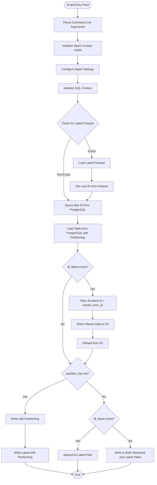
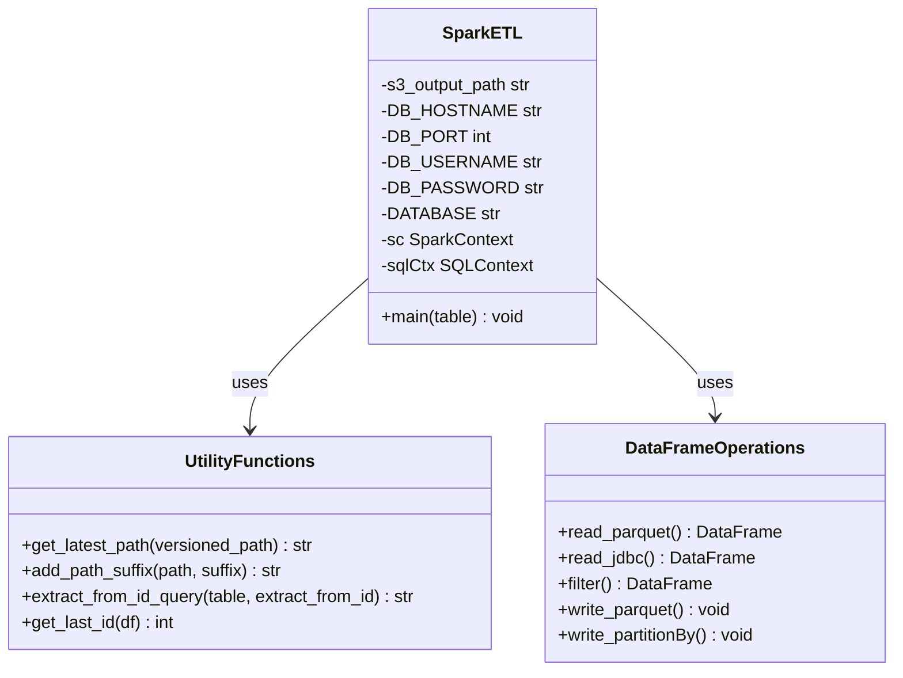
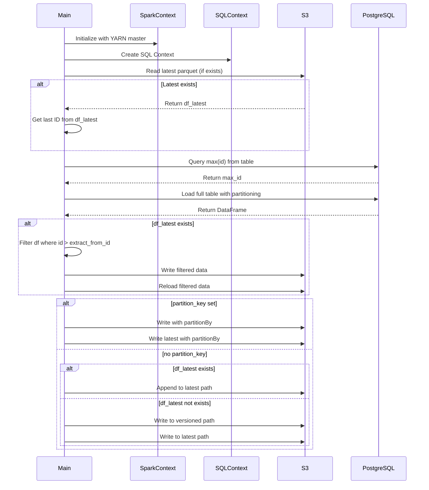

# Diagram: research/orchestrator/tasks/etl/extract_public_positionupdate_spark.py

> Auto-generated by Obscura crawlers

## Diagram 1

### SVG

<svg id="container" width="855.734375" xmlns="http://www.w3.org/2000/svg" class="flowchart" height="2634.109375" viewBox="0 0 855.734375 2634.109375" role="graphics-document document" aria-roledescription="flowchart-v2"><g><marker id="container_flowchart-v2-pointEnd" class="marker flowchart-v2" viewBox="0 0 10 10" refX="5" refY="5" markerUnits="userSpaceOnUse" markerWidth="8" markerHeight="8" orient="auto"><path d="M 0 0 L 10 5 L 0 10 z" class="arrowMarkerPath" style="stroke-width: 1; stroke-dasharray: 1, 0;"></path></marker><marker id="container_flowchart-v2-pointStart" class="marker flowchart-v2" viewBox="0 0 10 10" refX="4.5" refY="5" markerUnits="userSpaceOnUse" markerWidth="8" markerHeight="8" orient="auto"><path d="M 0 5 L 10 10 L 10 0 z" class="arrowMarkerPath" style="stroke-width: 1; stroke-dasharray: 1, 0;"></path></marker><marker id="container_flowchart-v2-circleEnd" class="marker flowchart-v2" viewBox="0 0 10 10" refX="11" refY="5" markerUnits="userSpaceOnUse" markerWidth="11" markerHeight="11" orient="auto"><circle cx="5" cy="5" r="5" class="arrowMarkerPath" style="stroke-width: 1; stroke-dasharray: 1, 0;"></circle></marker><marker id="container_flowchart-v2-circleStart" class="marker flowchart-v2" viewBox="0 0 10 10" refX="-1" refY="5" markerUnits="userSpaceOnUse" markerWidth="11" markerHeight="11" orient="auto"><circle cx="5" cy="5" r="5" class="arrowMarkerPath" style="stroke-width: 1; stroke-dasharray: 1, 0;"></circle></marker><marker id="container_flowchart-v2-crossEnd" class="marker cross flowchart-v2" viewBox="0 0 11 11" refX="12" refY="5.2" markerUnits="userSpaceOnUse" markerWidth="11" markerHeight="11" orient="auto"><path d="M 1,1 l 9,9 M 10,1 l -9,9" class="arrowMarkerPath" style="stroke-width: 2; stroke-dasharray: 1, 0;"></path></marker><marker id="container_flowchart-v2-crossStart" class="marker cross flowchart-v2" viewBox="0 0 11 11" refX="-1" refY="5.2" markerUnits="userSpaceOnUse" markerWidth="11" markerHeight="11" orient="auto"><path d="M 1,1 l 9,9 M 10,1 l -9,9" class="arrowMarkerPath" style="stroke-width: 2; stroke-dasharray: 1, 0;"></path></marker><g class="root"><g class="clusters"></g><g class="edgePaths"><path d="M428.367,47.5L428.284,51.583C428.201,55.667,428.034,63.833,427.951,71.417C427.867,79,427.867,86,427.867,89.5L427.867,93" id="L_Start_ParseArgs_0" class="edge-thickness-normal edge-pattern-solid edge-thickness-normal edge-pattern-solid flowchart-link" style=";" data-edge="true" data-et="edge" data-id="L_Start_ParseArgs_0" data-points="W3sieCI6NDI4LjM2NzE4NzUsInkiOjQ3LjV9LHsieCI6NDI3Ljg2NzE4NzUsInkiOjcyfSx7IngiOjQyNy44NjcxODc1LCJ5Ijo5N31d" marker-end="url(#container_flowchart-v2-pointEnd)"></path><path d="M427.867,175L427.867,179.167C427.867,183.333,427.867,191.667,427.867,199.333C427.867,207,427.867,214,427.867,217.5L427.867,221" id="L_ParseArgs_InitSpark_0" class="edge-thickness-normal edge-pattern-solid edge-thickness-normal edge-pattern-solid flowchart-link" style=";" data-edge="true" data-et="edge" data-id="L_ParseArgs_InitSpark_0" data-points="W3sieCI6NDI3Ljg2NzE4NzUsInkiOjE3NX0seyJ4Ijo0MjcuODY3MTg3NSwieSI6MjAwfSx7IngiOjQyNy44NjcxODc1LCJ5IjoyMjV9XQ==" marker-end="url(#container_flowchart-v2-pointEnd)"></path><path d="M427.867,303L427.867,307.167C427.867,311.333,427.867,319.667,427.867,327.333C427.867,335,427.867,342,427.867,345.5L427.867,349" id="L_InitSpark_ConfigSpark_0" class="edge-thickness-normal edge-pattern-solid edge-thickness-normal edge-pattern-solid flowchart-link" style=";" data-edge="true" data-et="edge" data-id="L_InitSpark_ConfigSpark_0" data-points="W3sieCI6NDI3Ljg2NzE4NzUsInkiOjMwM30seyJ4Ijo0MjcuODY3MTg3NSwieSI6MzI4fSx7IngiOjQyNy44NjcxODc1LCJ5IjozNTN9XQ==" marker-end="url(#container_flowchart-v2-pointEnd)"></path><path d="M427.867,407L427.867,411.167C427.867,415.333,427.867,423.667,427.867,431.333C427.867,439,427.867,446,427.867,449.5L427.867,453" id="L_ConfigSpark_InitSQL_0" class="edge-thickness-normal edge-pattern-solid edge-thickness-normal edge-pattern-solid flowchart-link" style=";" data-edge="true" data-et="edge" data-id="L_ConfigSpark_InitSQL_0" data-points="W3sieCI6NDI3Ljg2NzE4NzUsInkiOjQwN30seyJ4Ijo0MjcuODY3MTg3NSwieSI6NDMyfSx7IngiOjQyNy44NjcxODc1LCJ5Ijo0NTd9XQ==" marker-end="url(#container_flowchart-v2-pointEnd)"></path><path d="M427.867,511L427.867,515.167C427.867,519.333,427.867,527.667,427.867,535.333C427.867,543,427.867,550,427.867,553.5L427.867,557" id="L_InitSQL_CheckLatest_0" class="edge-thickness-normal edge-pattern-solid edge-thickness-normal edge-pattern-solid flowchart-link" style=";" data-edge="true" data-et="edge" data-id="L_InitSQL_CheckLatest_0" data-points="W3sieCI6NDI3Ljg2NzE4NzUsInkiOjUxMX0seyJ4Ijo0MjcuODY3MTg3NSwieSI6NTM2fSx7IngiOjQyNy44NjcxODc1LCJ5Ijo1NjF9XQ==" marker-end="url(#container_flowchart-v2-pointEnd)"></path><path d="M466.441,752.817L472.782,765.412C479.124,778.008,491.806,803.199,498.147,821.295C504.488,839.391,504.488,850.391,504.488,855.891L504.488,861.391" id="L_CheckLatest_LoadLatest_0" class="edge-thickness-normal edge-pattern-solid edge-thickness-normal edge-pattern-solid flowchart-link" style=";" data-edge="true" data-et="edge" data-id="L_CheckLatest_LoadLatest_0" data-points="W3sieCI6NDY2LjQ0MTMwNDU1NDI2MTkzLCJ5Ijo3NTIuODE2NTA3OTQ1NzM4MX0seyJ4Ijo1MDQuNDg4MjgxMjUsInkiOjgyOC4zOTA2MjV9LHsieCI6NTA0LjQ4ODI4MTI1LCJ5Ijo4NjUuMzkwNjI1fV0=" marker-end="url(#container_flowchart-v2-pointEnd)"></path><path d="M389.293,752.817L382.952,765.412C376.611,778.008,363.928,803.199,357.587,826.462C351.246,849.724,351.246,871.057,351.246,892.391C351.246,913.724,351.246,935.057,351.246,956.391C351.246,977.724,351.246,999.057,351.246,1018.391C351.246,1037.724,351.246,1055.057,355.723,1067.463C360.199,1079.869,369.153,1087.348,373.63,1091.087L378.106,1094.826" id="L_CheckLatest_GetMaxID_0" class="edge-thickness-normal edge-pattern-solid edge-thickness-normal edge-pattern-solid flowchart-link" style=";" data-edge="true" data-et="edge" data-id="L_CheckLatest_GetMaxID_0" data-points="W3sieCI6Mzg5LjI5MzA3MDQ0NTczODA3LCJ5Ijo3NTIuODE2NTA3OTQ1NzM4MX0seyJ4IjozNTEuMjQ2MDkzNzUsInkiOjgyOC4zOTA2MjV9LHsieCI6MzUxLjI0NjA5Mzc1LCJ5Ijo4OTIuMzkwNjI1fSx7IngiOjM1MS4yNDYwOTM3NSwieSI6OTU2LjM5MDYyNX0seyJ4IjozNTEuMjQ2MDkzNzUsInkiOjEwMjAuMzkwNjI1fSx7IngiOjM1MS4yNDYwOTM3NSwieSI6MTA3Mi4zOTA2MjV9LHsieCI6MzgxLjE3NjIwODQ5NjA5Mzc1LCJ5IjoxMDk3LjM5MDYyNX1d" marker-end="url(#container_flowchart-v2-pointEnd)"></path><path d="M504.488,919.391L504.488,925.557C504.488,931.724,504.488,944.057,504.488,955.724C504.488,967.391,504.488,978.391,504.488,983.891L504.488,989.391" id="L_LoadLatest_GetLastID_0" class="edge-thickness-normal edge-pattern-solid edge-thickness-normal edge-pattern-solid flowchart-link" style=";" data-edge="true" data-et="edge" data-id="L_LoadLatest_GetLastID_0" data-points="W3sieCI6NTA0LjQ4ODI4MTI1LCJ5Ijo5MTkuMzkwNjI1fSx7IngiOjUwNC40ODgyODEyNSwieSI6OTU2LjM5MDYyNX0seyJ4Ijo1MDQuNDg4MjgxMjUsInkiOjk5My4zOTA2MjV9XQ==" marker-end="url(#container_flowchart-v2-pointEnd)"></path><path d="M504.488,1047.391L504.488,1051.557C504.488,1055.724,504.488,1064.057,500.012,1071.963C495.535,1079.869,486.582,1087.348,482.105,1091.087L477.628,1094.826" id="L_GetLastID_GetMaxID_0" class="edge-thickness-normal edge-pattern-solid edge-thickness-normal edge-pattern-solid flowchart-link" style=";" data-edge="true" data-et="edge" data-id="L_GetLastID_GetMaxID_0" data-points="W3sieCI6NTA0LjQ4ODI4MTI1LCJ5IjoxMDQ3LjM5MDYyNX0seyJ4Ijo1MDQuNDg4MjgxMjUsInkiOjEwNzIuMzkwNjI1fSx7IngiOjQ3NC41NTgxNjY1MDM5MDYyNSwieSI6MTA5Ny4zOTA2MjV9XQ==" marker-end="url(#container_flowchart-v2-pointEnd)"></path><path d="M427.867,1175.391L427.867,1179.557C427.867,1183.724,427.867,1192.057,427.867,1199.724C427.867,1207.391,427.867,1214.391,427.867,1217.891L427.867,1221.391" id="L_GetMaxID_LoadTable_0" class="edge-thickness-normal edge-pattern-solid edge-thickness-normal edge-pattern-solid flowchart-link" style=";" data-edge="true" data-et="edge" data-id="L_GetMaxID_LoadTable_0" data-points="W3sieCI6NDI3Ljg2NzE4NzUsInkiOjExNzUuMzkwNjI1fSx7IngiOjQyNy44NjcxODc1LCJ5IjoxMjAwLjM5MDYyNX0seyJ4Ijo0MjcuODY3MTg3NSwieSI6MTIyNS4zOTA2MjV9XQ==" marker-end="url(#container_flowchart-v2-pointEnd)"></path><path d="M427.867,1327.391L427.867,1331.557C427.867,1335.724,427.867,1344.057,427.867,1351.724C427.867,1359.391,427.867,1366.391,427.867,1369.891L427.867,1373.391" id="L_LoadTable_CheckDF_0" class="edge-thickness-normal edge-pattern-solid edge-thickness-normal edge-pattern-solid flowchart-link" style=";" data-edge="true" data-et="edge" data-id="L_LoadTable_CheckDF_0" data-points="W3sieCI6NDI3Ljg2NzE4NzUsInkiOjEzMjcuMzkwNjI1fSx7IngiOjQyNy44NjcxODc1LCJ5IjoxMzUyLjM5MDYyNX0seyJ4Ijo0MjcuODY3MTg3NSwieSI6MTM3Ny4zOTA2MjV9XQ==" marker-end="url(#container_flowchart-v2-pointEnd)"></path><path d="M462.171,1513.196L470.204,1525.08C478.236,1536.964,494.302,1560.732,502.334,1578.116C510.367,1595.5,510.367,1606.5,510.367,1612L510.367,1617.5" id="L_CheckDF_FilterDF_0" class="edge-thickness-normal edge-pattern-solid edge-thickness-normal edge-pattern-solid flowchart-link" style=";" data-edge="true" data-et="edge" data-id="L_CheckDF_FilterDF_0" data-points="W3sieCI6NDYyLjE3MTAyOTY4NzY3OTA0LCJ5IjoxNTEzLjE5NjE1NzgxMjMyMX0seyJ4Ijo1MTAuMzY3MTg3NSwieSI6MTU4NC41fSx7IngiOjUxMC4zNjcxODc1LCJ5IjoxNjIxLjV9XQ==" marker-end="url(#container_flowchart-v2-pointEnd)"></path><path d="M393.563,1513.196L385.531,1525.08C377.498,1536.964,361.433,1560.732,353.4,1585.283C345.367,1609.833,345.367,1635.167,345.367,1658.5C345.367,1681.833,345.367,1703.167,345.367,1722.5C345.367,1741.833,345.367,1759.167,345.367,1776.5C345.367,1793.833,345.367,1811.167,345.367,1828.5C345.367,1845.833,345.367,1863.167,345.367,1880.5C345.367,1897.833,345.367,1915.167,352.401,1933.787C359.435,1952.408,373.502,1972.315,380.536,1982.269L387.569,1992.223" id="L_CheckDF_CheckPartition_0" class="edge-thickness-normal edge-pattern-solid edge-thickness-normal edge-pattern-solid flowchart-link" style=";" data-edge="true" data-et="edge" data-id="L_CheckDF_CheckPartition_0" data-points="W3sieCI6MzkzLjU2MzM0NTMxMjMyMDk2LCJ5IjoxNTEzLjE5NjE1NzgxMjMyMX0seyJ4IjozNDUuMzY3MTg3NSwieSI6MTU4NC41fSx7IngiOjM0NS4zNjcxODc1LCJ5IjoxNjYwLjV9LHsieCI6MzQ1LjM2NzE4NzUsInkiOjE3MjQuNX0seyJ4IjozNDUuMzY3MTg3NSwieSI6MTc3Ni41fSx7IngiOjM0NS4zNjcxODc1LCJ5IjoxODI4LjV9LHsieCI6MzQ1LjM2NzE4NzUsInkiOjE4ODAuNX0seyJ4IjozNDUuMzY3MTg3NSwieSI6MTkzMi41fSx7IngiOjM4OS44Nzc4NTI0OTM3MjY1LCJ5IjoxOTk1LjQ4OTMzNTAwNjI3MzR9XQ==" marker-end="url(#container_flowchart-v2-pointEnd)"></path><path d="M510.367,1699.5L510.367,1703.667C510.367,1707.833,510.367,1716.167,510.367,1723.833C510.367,1731.5,510.367,1738.5,510.367,1742L510.367,1745.5" id="L_FilterDF_WriteTemp_0" class="edge-thickness-normal edge-pattern-solid edge-thickness-normal edge-pattern-solid flowchart-link" style=";" data-edge="true" data-et="edge" data-id="L_FilterDF_WriteTemp_0" data-points="W3sieCI6NTEwLjM2NzE4NzUsInkiOjE2OTkuNX0seyJ4Ijo1MTAuMzY3MTg3NSwieSI6MTcyNC41fSx7IngiOjUxMC4zNjcxODc1LCJ5IjoxNzQ5LjV9XQ==" marker-end="url(#container_flowchart-v2-pointEnd)"></path><path d="M510.367,1803.5L510.367,1807.667C510.367,1811.833,510.367,1820.167,510.367,1827.833C510.367,1835.5,510.367,1842.5,510.367,1846L510.367,1849.5" id="L_WriteTemp_ReloadDF_0" class="edge-thickness-normal edge-pattern-solid edge-thickness-normal edge-pattern-solid flowchart-link" style=";" data-edge="true" data-et="edge" data-id="L_WriteTemp_ReloadDF_0" data-points="W3sieCI6NTEwLjM2NzE4NzUsInkiOjE4MDMuNX0seyJ4Ijo1MTAuMzY3MTg3NSwieSI6MTgyOC41fSx7IngiOjUxMC4zNjcxODc1LCJ5IjoxODUzLjV9XQ==" marker-end="url(#container_flowchart-v2-pointEnd)"></path><path d="M510.367,1907.5L510.367,1911.667C510.367,1915.833,510.367,1924.167,503.333,1938.287C496.3,1952.408,482.232,1972.315,475.199,1982.269L468.165,1992.223" id="L_ReloadDF_CheckPartition_0" class="edge-thickness-normal edge-pattern-solid edge-thickness-normal edge-pattern-solid flowchart-link" style=";" data-edge="true" data-et="edge" data-id="L_ReloadDF_CheckPartition_0" data-points="W3sieCI6NTEwLjM2NzE4NzUsInkiOjE5MDcuNX0seyJ4Ijo1MTAuMzY3MTg3NSwieSI6MTkzMi41fSx7IngiOjQ2NS44NTY1MjI1MDYyNzM1LCJ5IjoxOTk1LjQ4OTMzNTAwNjI3MzR9XQ==" marker-end="url(#container_flowchart-v2-pointEnd)"></path><path d="M364.336,2077.469L326.613,2094.224C288.891,2110.979,213.445,2144.49,175.723,2176.421C138,2208.352,138,2238.703,138,2253.879L138,2269.055" id="L_CheckPartition_WritePartitioned_0" class="edge-thickness-normal edge-pattern-solid edge-thickness-normal edge-pattern-solid flowchart-link" style=";" data-edge="true" data-et="edge" data-id="L_CheckPartition_WritePartitioned_0" data-points="W3sieCI6MzY0LjMzNTgzODkzNzk1NjA1LCJ5IjoyMDc3LjQ2ODY1MTQzNzk1Nn0seyJ4IjoxMzgsInkiOjIxNzh9LHsieCI6MTM4LCJ5IjoyMjczLjA1NDY4NzV9XQ==" marker-end="url(#container_flowchart-v2-pointEnd)"></path><path d="M476.455,2092.412L492.513,2106.677C508.57,2120.942,540.685,2149.471,556.743,2169.235C572.801,2189,572.801,2200,572.801,2205.5L572.801,2211" id="L_CheckPartition_CheckLatestWrite_0" class="edge-thickness-normal edge-pattern-solid edge-thickness-normal edge-pattern-solid flowchart-link" style=";" data-edge="true" data-et="edge" data-id="L_CheckPartition_CheckLatestWrite_0" data-points="W3sieCI6NDc2LjQ1NDg5MDcwOTk2ODIsInkiOjIwOTIuNDEyMjk2NzkwMDMxNn0seyJ4Ijo1NzIuODAwNzgxMjUsInkiOjIxNzh9LHsieCI6NTcyLjgwMDc4MTI1LCJ5IjoyMjE1fV0=" marker-end="url(#container_flowchart-v2-pointEnd)"></path><path d="M138,2327.055L138,2342.897C138,2358.74,138,2390.424,138,2411.767C138,2433.109,138,2444.109,138,2449.609L138,2455.109" id="L_WritePartitioned_WriteLatestPartitioned_0" class="edge-thickness-normal edge-pattern-solid edge-thickness-normal edge-pattern-solid flowchart-link" style=";" data-edge="true" data-et="edge" data-id="L_WritePartitioned_WriteLatestPartitioned_0" data-points="W3sieCI6MTM4LCJ5IjoyMzI3LjA1NDY4NzV9LHsieCI6MTM4LCJ5IjoyNDIyLjEwOTM3NX0seyJ4IjoxMzgsInkiOjI0NTkuMTA5Mzc1fV0=" marker-end="url(#container_flowchart-v2-pointEnd)"></path><path d="M138,2537.109L138,2541.276C138,2545.443,138,2553.776,181.462,2564.684C224.923,2575.593,311.847,2589.076,355.309,2595.818L398.77,2602.559" id="L_WriteLatestPartitioned_End_0" class="edge-thickness-normal edge-pattern-solid edge-thickness-normal edge-pattern-solid flowchart-link" style=";" data-edge="true" data-et="edge" data-id="L_WriteLatestPartitioned_End_0" data-points="W3sieCI6MTM4LCJ5IjoyNTM3LjEwOTM3NX0seyJ4IjoxMzgsInkiOjI1NjIuMTA5Mzc1fSx7IngiOjQwMi43MjMwNTY4MzI3NDA0NCwieSI6MjYwMy4xNzI1MjQzODczNjE2fV0=" marker-end="url(#container_flowchart-v2-pointEnd)"></path><path d="M526.629,2338.938L510.169,2352.8C493.709,2366.662,460.788,2394.386,444.328,2415.747C427.867,2437.109,427.867,2452.109,427.867,2459.609L427.867,2467.109" id="L_CheckLatestWrite_AppendLatest_0" class="edge-thickness-normal edge-pattern-solid edge-thickness-normal edge-pattern-solid flowchart-link" style=";" data-edge="true" data-et="edge" data-id="L_CheckLatestWrite_AppendLatest_0" data-points="W3sieCI6NTI2LjYyOTE2MTAzMTUyNTcsInkiOjIzMzguOTM3NzU0NzgxNTI1N30seyJ4Ijo0MjcuODY3MTg3NSwieSI6MjQyMi4xMDkzNzV9LHsieCI6NDI3Ljg2NzE4NzUsInkiOjI0NzEuMTA5Mzc1fV0=" marker-end="url(#container_flowchart-v2-pointEnd)"></path><path d="M618.972,2338.938L635.433,2352.8C651.893,2366.662,684.814,2394.386,701.274,2413.747C717.734,2433.109,717.734,2444.109,717.734,2449.609L717.734,2455.109" id="L_CheckLatestWrite_WriteNew_0" class="edge-thickness-normal edge-pattern-solid edge-thickness-normal edge-pattern-solid flowchart-link" style=";" data-edge="true" data-et="edge" data-id="L_CheckLatestWrite_WriteNew_0" data-points="W3sieCI6NjE4Ljk3MjQwMTQ2ODQ3NDMsInkiOjIzMzguOTM3NzU0NzgxNTI1N30seyJ4Ijo3MTcuNzM0Mzc1LCJ5IjoyNDIyLjEwOTM3NX0seyJ4Ijo3MTcuNzM0Mzc1LCJ5IjoyNDU5LjEwOTM3NX1d" marker-end="url(#container_flowchart-v2-pointEnd)"></path><path d="M427.867,2525.109L427.867,2531.276C427.867,2537.443,427.867,2549.776,427.937,2559.526C428.008,2569.276,428.148,2576.443,428.219,2580.027L428.289,2583.61" id="L_AppendLatest_End_0" class="edge-thickness-normal edge-pattern-solid edge-thickness-normal edge-pattern-solid flowchart-link" style=";" data-edge="true" data-et="edge" data-id="L_AppendLatest_End_0" data-points="W3sieCI6NDI3Ljg2NzE4NzUsInkiOjI1MjUuMTA5Mzc1fSx7IngiOjQyNy44NjcxODc1LCJ5IjoyNTYyLjEwOTM3NX0seyJ4Ijo0MjguMzY3MTg3NSwieSI6MjU4Ny42MDkzNzV9XQ==" marker-end="url(#container_flowchart-v2-pointEnd)"></path><path d="M717.734,2537.109L717.734,2541.276C717.734,2545.443,717.734,2553.776,674.439,2564.684C631.144,2575.592,544.554,2589.075,501.259,2595.816L457.964,2602.557" id="L_WriteNew_End_0" class="edge-thickness-normal edge-pattern-solid edge-thickness-normal edge-pattern-solid flowchart-link" style=";" data-edge="true" data-et="edge" data-id="L_WriteNew_End_0" data-points="W3sieCI6NzE3LjczNDM3NSwieSI6MjUzNy4xMDkzNzV9LHsieCI6NzE3LjczNDM3NSwieSI6MjU2Mi4xMDkzNzV9LHsieCI6NDU0LjAxMTMxOTE3MzYwODU3LCJ5IjoyNjAzLjE3MjUyNDIzMjg2ODV9XQ==" marker-end="url(#container_flowchart-v2-pointEnd)"></path></g><g class="edgeLabels"><g class="edgeLabel"><g class="label" data-id="L_Start_ParseArgs_0" transform="translate(0, 0)"><foreignObject width="0" height="0">

</foreignObject></g></g><g class="edgeLabel"><g class="label" data-id="L_ParseArgs_InitSpark_0" transform="translate(0, 0)"><foreignObject width="0" height="0">

</foreignObject></g></g><g class="edgeLabel"><g class="label" data-id="L_InitSpark_ConfigSpark_0" transform="translate(0, 0)"><foreignObject width="0" height="0">

</foreignObject></g></g><g class="edgeLabel"><g class="label" data-id="L_ConfigSpark_InitSQL_0" transform="translate(0, 0)"><foreignObject width="0" height="0">

</foreignObject></g></g><g class="edgeLabel"><g class="label" data-id="L_InitSQL_CheckLatest_0" transform="translate(0, 0)"><foreignObject width="0" height="0">

</foreignObject></g></g><g class="edgeLabel" transform="translate(504.48828125, 828.390625)"><g class="label" data-id="L_CheckLatest_LoadLatest_0" transform="translate(-20.78125, -12)"><foreignObject width="41.5625" height="24">

Exists

</foreignObject></g></g><g class="edgeLabel" transform="translate(351.24609375, 956.390625)"><g class="label" data-id="L_CheckLatest_GetMaxID_0" transform="translate(-35.921875, -12)"><foreignObject width="71.84375" height="24">

Not Exists

</foreignObject></g></g><g class="edgeLabel"><g class="label" data-id="L_LoadLatest_GetLastID_0" transform="translate(0, 0)"><foreignObject width="0" height="0">

</foreignObject></g></g><g class="edgeLabel"><g class="label" data-id="L_GetLastID_GetMaxID_0" transform="translate(0, 0)"><foreignObject width="0" height="0">

</foreignObject></g></g><g class="edgeLabel"><g class="label" data-id="L_GetMaxID_LoadTable_0" transform="translate(0, 0)"><foreignObject width="0" height="0">

</foreignObject></g></g><g class="edgeLabel"><g class="label" data-id="L_LoadTable_CheckDF_0" transform="translate(0, 0)"><foreignObject width="0" height="0">

</foreignObject></g></g><g class="edgeLabel" transform="translate(510.3671875, 1584.5)"><g class="label" data-id="L_CheckDF_FilterDF_0" transform="translate(-12.03125, -12)"><foreignObject width="24.0625" height="24">

Yes

</foreignObject></g></g><g class="edgeLabel" transform="translate(345.3671875, 1776.5)"><g class="label" data-id="L_CheckDF_CheckPartition_0" transform="translate(-10.140625, -12)"><foreignObject width="20.28125" height="24">

No

</foreignObject></g></g><g class="edgeLabel"><g class="label" data-id="L_FilterDF_WriteTemp_0" transform="translate(0, 0)"><foreignObject width="0" height="0">

</foreignObject></g></g><g class="edgeLabel"><g class="label" data-id="L_WriteTemp_ReloadDF_0" transform="translate(0, 0)"><foreignObject width="0" height="0">

</foreignObject></g></g><g class="edgeLabel"><g class="label" data-id="L_ReloadDF_CheckPartition_0" transform="translate(0, 0)"><foreignObject width="0" height="0">

</foreignObject></g></g><g class="edgeLabel" transform="translate(138, 2178)"><g class="label" data-id="L_CheckPartition_WritePartitioned_0" transform="translate(-12.03125, -12)"><foreignObject width="24.0625" height="24">

Yes

</foreignObject></g></g><g class="edgeLabel" transform="translate(572.80078125, 2178)"><g class="label" data-id="L_CheckPartition_CheckLatestWrite_0" transform="translate(-10.140625, -12)"><foreignObject width="20.28125" height="24">

No

</foreignObject></g></g><g class="edgeLabel"><g class="label" data-id="L_WritePartitioned_WriteLatestPartitioned_0" transform="translate(0, 0)"><foreignObject width="0" height="0">

</foreignObject></g></g><g class="edgeLabel"><g class="label" data-id="L_WriteLatestPartitioned_End_0" transform="translate(0, 0)"><foreignObject width="0" height="0">

</foreignObject></g></g><g class="edgeLabel" transform="translate(427.8671875, 2422.109375)"><g class="label" data-id="L_CheckLatestWrite_AppendLatest_0" transform="translate(-12.03125, -12)"><foreignObject width="24.0625" height="24">

Yes

</foreignObject></g></g><g class="edgeLabel" transform="translate(717.734375, 2422.109375)"><g class="label" data-id="L_CheckLatestWrite_WriteNew_0" transform="translate(-10.140625, -12)"><foreignObject width="20.28125" height="24">

No

</foreignObject></g></g><g class="edgeLabel"><g class="label" data-id="L_AppendLatest_End_0" transform="translate(0, 0)"><foreignObject width="0" height="0">

</foreignObject></g></g><g class="edgeLabel"><g class="label" data-id="L_WriteNew_End_0" transform="translate(0, 0)"><foreignObject width="0" height="0">

</foreignObject></g></g></g><g class="nodes"><g class="node default" id="flowchart-Start-0" transform="translate(427.8671875, 27.5)"><g class="basic label-container outer-path"><path d="M-56 -19.5 C-29.988021852096956 -19.5, -3.9760437041939127 -19.5, 56 -19.5 C56 -19.5, 56 -19.5, 56 -19.5 C56.27820552199335 -19.491078490403872, 56.5564110439867 -19.482156980807744, 57.2493692896239 -19.45993515863156 C57.670457328641874 -19.419313301939955, 58.091545367659855 -19.37869144524835, 58.493604652847864 -19.3399052695533 C58.75252533547703 -19.298044981545697, 59.01144601810619 -19.2561846935381, 59.72759325967676 -19.140403561325776 C59.98717958762197 -19.08115467593138, 60.246765915567174 -19.021905790536984, 60.94626438623539 -18.862249829261074 C61.24315016105069 -18.774135689681128, 61.540035935865994 -18.686021550101177, 62.144610251460605 -18.50658706670804 C62.49993346020618 -18.375824841317932, 62.85525666895175 -18.245062615927825, 63.3177065951478 -18.074876768247425 C63.603910368122264 -17.948182847884905, 63.89011414109673 -17.82148892752239, 64.46073291279238 -17.568892924097174 C64.73622518547933 -17.425168781897618, 65.01171745816627 -17.28144463969806, 65.56899226407678 -16.990714730406097 C65.8437880533097 -16.8241319080938, 66.1185838425426 -16.6575490857815, 66.6379305736057 -16.342718045390892 C66.85611226834042 -16.19052394007729, 67.07429396307514 -16.038329834763694, 67.66315534457871 -15.627565626425154 C68.00961847192323 -15.351270502138917, 68.35608159926777 -15.07497537785268, 68.64045370850187 -14.848196188198123 C68.97502687899585 -14.544345687076497, 69.30960004948982 -14.24049518595487, 69.56580973676799 -14.007812326905688 C69.82635757033516 -13.73877529737262, 70.08690540390234 -13.469738267839553, 70.43542094296865 -13.10986736009568 C70.67899686537358 -12.823749221776232, 70.9225727877785 -12.537631083456786, 71.24571390812658 -12.158051136245305 C71.50187950259807 -11.814812576819257, 71.75804509706956 -11.471574017393207, 71.99335896464063 -11.156274872382312 C72.16430242731084 -10.893659808973872, 72.33524588998105 -10.631044745565434, 72.67528387860425 -10.108655082055241 C72.91494836261437 -9.683106522034665, 73.15461284662449 -9.257557962014088, 73.2886864742735 -9.019496659696287 C73.45012600293494 -8.684264024178281, 73.61156553159636 -8.349031388660277, 73.83104614880834 -7.893275190886684 C73.99156102598907 -7.496800340906261, 74.15207590316979 -7.1003254909258375, 74.30013422997033 -6.734618561215508 C74.4202274897384 -6.372916797056538, 74.54032074950648 -6.011215032897569, 74.69402313421489 -5.548287939305138 C74.79173547721574 -5.175668426645549, 74.88944782021659 -4.803048913985961, 75.01109428754556 -4.339158212148133 C75.0745314108133 -4.01342199160904, 75.13796853408104 -3.6876857710699475, 75.25004477658177 -3.1121979531509023 C75.28471168464047 -2.8433282600029415, 75.31937859269917 -2.5744585668549806, 75.40989270250937 -1.872449005199798 C75.43499500649793 -1.4814603583627899, 75.4600973104865 -1.0904717115257818, 75.48998121591342 -0.6250057626472757 C75.48998121591342 -0.3047778624035627, 75.48998121591342 0.01545003784015031, 75.48998121591342 0.625005762647271 C75.46672883298754 0.9871803957034428, 75.44347645006167 1.3493550287596148, 75.40989270250937 1.8724490051997846 C75.36440755311335 2.2252228418565254, 75.31892240371735 2.5779966785132657, 75.25004477658177 3.1121979531508885 C75.20084347697485 3.3648362279340525, 75.15164217736795 3.6174745027172164, 75.01109428754556 4.339158212148129 C74.94721565127084 4.582755137439758, 74.8833370149961 4.826352062731386, 74.69402313421489 5.548287939305125 C74.58157151578938 5.886974297270491, 74.46911989736387 6.225660655235856, 74.30013422997033 6.734618561215495 C74.17757384841667 7.0373450731968115, 74.055013466863 7.340071585178128, 73.83104614880834 7.893275190886679 C73.69437961558359 8.177066171323261, 73.55771308235882 8.460857151759843, 73.2886864742735 9.019496659696284 C73.05485330301028 9.434691133450315, 72.82102013174703 9.849885607204348, 72.67528387860425 10.108655082055236 C72.51286670803879 10.358171471160786, 72.35044953747331 10.607687860266333, 71.99335896464065 11.156274872382301 C71.75112234647038 11.480849872520555, 71.50888572830011 11.805424872658808, 71.24571390812659 12.158051136245302 C70.99227232804286 12.455758037446094, 70.73883074795913 12.753464938646886, 70.43542094296866 13.10986736009567 C70.15708903378226 13.397267907805361, 69.87875712459584 13.684668455515054, 69.56580973676799 14.007812326905684 C69.24539704729133 14.298802653833182, 68.92498435781468 14.58979298076068, 68.6404537085019 14.848196188198111 C68.37125709420195 15.06287332447955, 68.10206047990202 15.27755046076099, 67.66315534457871 15.627565626425152 C67.3082582483215 15.8751264775265, 66.95336115206429 16.122687328627848, 66.6379305736057 16.34271804539089 C66.25673030499338 16.573803888405113, 65.87553003638106 16.804889731419337, 65.56899226407678 16.990714730406093 C65.34619696799854 17.10694689366292, 65.12340167192028 17.223179056919744, 64.46073291279238 17.56889292409717 C64.04585413132 17.752547453713213, 63.6309753498476 17.936201983329255, 63.317706595147804 18.07487676824742 C63.01770513302645 18.185280079491193, 62.71770367090511 18.295683390734965, 62.14461025146062 18.506587066708033 C61.81381112979074 18.60476650961963, 61.483012008120866 18.702945952531227, 60.94626438623541 18.86224982926107 C60.65452374642006 18.928837726513333, 60.36278310660471 18.99542562376559, 59.727593259676766 19.140403561325773 C59.29823742706825 19.209818482637708, 58.868881594459744 19.27923340394964, 58.49360465284788 19.3399052695533 C58.16539626955399 19.37156713756133, 57.8371878862601 19.403229005569358, 57.2493692896239 19.45993515863156 C56.80427678725921 19.474208408862395, 56.359184284894525 19.48848165909323, 56.00000000000001 19.5 C56.00000000000001 19.5, 56 19.5, 56 19.5 C22.6029004003624 19.5, -10.794199199275198 19.5, -55.99999999999999 19.5 C-56.34514651187554 19.48893182315108, -56.69029302375109 19.477863646302165, -57.24936928962389 19.45993515863156 C-57.635958932436374 19.422641320731508, -58.022548575248855 19.385347482831456, -58.49360465284787 19.3399052695533 C-58.94431517663014 19.267037887380496, -59.39502570041241 19.19417050520769, -59.72759325967676 19.140403561325773 C-60.01343587646234 19.07516184934186, -60.29927849324792 19.00992013735795, -60.946264386235384 18.862249829261074 C-61.306920584045244 18.75520896287412, -61.667576781855104 18.648168096487172, -62.14461025146059 18.506587066708043 C-62.51890252149289 18.368844051416342, -62.89319479152518 18.23110103612464, -63.3177065951478 18.074876768247425 C-63.6102128484113 17.945392926817384, -63.9027191016748 17.815909085387347, -64.46073291279238 17.568892924097174 C-64.85355097055405 17.36395999497488, -65.24636902831574 17.159027065852587, -65.56899226407678 16.990714730406097 C-65.82138015352896 16.837715708624312, -66.07376804298116 16.684716686842524, -66.63793057360569 16.3427180453909 C-66.86441768650668 16.184730439900257, -67.0909047994077 16.026742834409614, -67.66315534457871 15.627565626425156 C-67.94416953577272 15.403464287049623, -68.22518372696672 15.17936294767409, -68.64045370850187 14.848196188198125 C-68.97531755916684 14.544081699036179, -69.3101814098318 14.239967209874232, -69.56580973676797 14.007812326905697 C-69.88220589095603 13.681107321099168, -70.19860204514409 13.354402315292639, -70.43542094296865 13.109867360095677 C-70.68062832936276 12.821832811341595, -70.92583571575689 12.533798262587515, -71.24571390812658 12.158051136245307 C-71.4158338643396 11.93010589316669, -71.58595382055263 11.702160650088071, -71.99335896464063 11.156274872382316 C-72.15232912734739 10.91205401299898, -72.31129929005412 10.667833153615645, -72.67528387860425 10.108655082055249 C-72.83653171660805 9.822343217565335, -72.99777955461185 9.536031353075423, -73.2886864742735 9.019496659696289 C-73.48040358043224 8.621391986668751, -73.67212068659097 8.223287313641213, -73.83104614880834 7.893275190886686 C-73.97867460647426 7.528630046249801, -74.12630306414019 7.163984901612916, -74.30013422997033 6.73461856121551 C-74.43267709438149 6.33542057144669, -74.56521995879264 5.93622258167787, -74.69402313421489 5.5482879393051325 C-74.76329091024074 5.2841398884745105, -74.8325586862666 5.019991837643889, -75.01109428754556 4.339158212148136 C-75.06834100700742 4.045208406809959, -75.12558772646926 3.7512586014717817, -75.25004477658177 3.112197953150904 C-75.30110031382263 2.7162212883670502, -75.35215585106349 2.3202446235831964, -75.40989270250937 1.872449005199809 C-75.43118550317497 1.5407964475937592, -75.45247830384056 1.2091438899877096, -75.48998121591342 0.6250057626472781 C-75.48998121591342 0.37008672231687606, -75.48998121591342 0.11516768198647398, -75.48998121591342 -0.6250057626472687 C-75.46694019799817 -0.9838882150520654, -75.44389918008294 -1.342770667456862, -75.40989270250937 -1.8724490051997822 C-75.36642283021466 -2.2095927506203537, -75.32295295791994 -2.5467364960409253, -75.25004477658177 -3.112197953150895 C-75.16213707976824 -3.563585396990047, -75.07422938295473 -4.0149728408291985, -75.01109428754556 -4.339158212148126 C-74.89196672916579 -4.793443222460598, -74.77283917078601 -5.2477282327730705, -74.69402313421489 -5.548287939305123 C-74.55804774439348 -5.957824148710953, -74.42207235457207 -6.367360358116784, -74.30013422997033 -6.734618561215485 C-74.15809885835495 -7.085448675172558, -74.01606348673958 -7.4362787891296325, -73.83104614880834 -7.893275190886676 C-73.61880679551584 -8.333994749193247, -73.40656744222332 -8.774714307499819, -73.2886864742735 -9.019496659696282 C-73.11412692600507 -9.329444813717874, -72.93956737773664 -9.639392967739466, -72.67528387860425 -10.108655082055243 C-72.44079462914833 -10.468893538399536, -72.2063053796924 -10.82913199474383, -71.99335896464063 -11.156274872382308 C-71.72234546643585 -11.51940827013912, -71.45133196823107 -11.88254166789593, -71.24571390812659 -12.158051136245302 C-71.07091802081673 -12.363376331647205, -70.89612213350688 -12.568701527049106, -70.43542094296866 -13.10986736009567 C-70.1380598824222 -13.416917068906995, -69.84069882187573 -13.72396677771832, -69.56580973676799 -14.007812326905677 C-69.29708258174978 -14.251863218962324, -69.02835542673157 -14.49591411101897, -68.6404537085019 -14.848196188198107 C-68.39130982061322 -15.046881808792026, -68.14216593272454 -15.245567429385947, -67.66315534457871 -15.627565626425149 C-67.39660499784983 -15.813499609524682, -67.13005465112094 -15.999433592624214, -66.63793057360571 -16.342718045390885 C-66.21604899567461 -16.598465137184064, -65.7941674177435 -16.854212228977243, -65.56899226407678 -16.99071473040609 C-65.15045058777109 -17.209067654846038, -64.73190891146538 -17.427420579285986, -64.4607329127924 -17.56889292409717 C-64.14811416483586 -17.70727997031186, -63.835495416879326 -17.845667016526548, -63.317706595147804 -18.07487676824742 C-63.01580700013032 -18.185978609943117, -62.71390740511285 -18.297080451638813, -62.14461025146062 -18.506587066708033 C-61.88156750810969 -18.584656772195054, -61.61852476475875 -18.662726477682074, -60.94626438623541 -18.862249829261067 C-60.59063008827237 -18.943421037040455, -60.234995790309334 -19.02459224481984, -59.727593259676766 -19.140403561325773 C-59.428477577721026 -19.18876226510762, -59.129361895765285 -19.237120968889467, -58.49360465284788 -19.3399052695533 C-58.04389619422932 -19.38328810370268, -57.59418773561075 -19.426670937852062, -57.2493692896239 -19.45993515863156 C-56.78009634292042 -19.47498382864796, -56.310823396216946 -19.490032498664362, -56.00000000000001 -19.5 C-56.00000000000001 -19.5, -56 -19.5, -56 -19.5" stroke="none" stroke-width="0" fill="#ECECFF" style=""></path><path d="M-56 -19.5 C-31.668662016234062 -19.5, -7.337324032468125 -19.5, 56 -19.5 M-56 -19.5 C-22.915175803383526 -19.5, 10.169648393232947 -19.5, 56 -19.5 M56 -19.5 C56 -19.5, 56 -19.5, 56 -19.5 M56 -19.5 C56 -19.5, 56 -19.5, 56 -19.5 M56 -19.5 C56.30351847215487 -19.49026675336086, 56.60703694430974 -19.48053350672172, 57.2493692896239 -19.45993515863156 M56 -19.5 C56.367839005740805 -19.488204119041082, 56.73567801148161 -19.476408238082165, 57.2493692896239 -19.45993515863156 M57.2493692896239 -19.45993515863156 C57.69217889102696 -19.417217848940666, 58.134988492430026 -19.374500539249773, 58.493604652847864 -19.3399052695533 M57.2493692896239 -19.45993515863156 C57.5097997238355 -19.43481174785659, 57.77023015804709 -19.40968833708162, 58.493604652847864 -19.3399052695533 M58.493604652847864 -19.3399052695533 C58.89345615436098 -19.275260379683367, 59.293307655874095 -19.21061548981343, 59.72759325967676 -19.140403561325776 M58.493604652847864 -19.3399052695533 C58.865457905884774 -19.27978691936734, 59.23731115892169 -19.219668569181376, 59.72759325967676 -19.140403561325776 M59.72759325967676 -19.140403561325776 C59.99359640396711 -19.079690079474243, 60.259599548257455 -19.018976597622707, 60.94626438623539 -18.862249829261074 M59.72759325967676 -19.140403561325776 C60.18481353317896 -19.03604601754002, 60.64203380668116 -18.93168847375426, 60.94626438623539 -18.862249829261074 M60.94626438623539 -18.862249829261074 C61.321178316000214 -18.75097734287025, 61.696092245765044 -18.639704856479426, 62.144610251460605 -18.50658706670804 M60.94626438623539 -18.862249829261074 C61.42315054831617 -18.720712519582047, 61.900036710396954 -18.579175209903017, 62.144610251460605 -18.50658706670804 M62.144610251460605 -18.50658706670804 C62.41714593985379 -18.40629141408706, 62.68968162824697 -18.305995761466082, 63.3177065951478 -18.074876768247425 M62.144610251460605 -18.50658706670804 C62.3966375741235 -18.41383868225306, 62.6486648967864 -18.321090297798083, 63.3177065951478 -18.074876768247425 M63.3177065951478 -18.074876768247425 C63.66081687802442 -17.922992024022857, 64.00392716090104 -17.771107279798294, 64.46073291279238 -17.568892924097174 M63.3177065951478 -18.074876768247425 C63.771030624675575 -17.874203667755026, 64.22435465420335 -17.67353056726263, 64.46073291279238 -17.568892924097174 M64.46073291279238 -17.568892924097174 C64.83415364757415 -17.37407956594892, 65.20757438235593 -17.179266207800666, 65.56899226407678 -16.990714730406097 M64.46073291279238 -17.568892924097174 C64.7553097078295 -17.41521239881175, 65.04988650286663 -17.261531873526327, 65.56899226407678 -16.990714730406097 M65.56899226407678 -16.990714730406097 C65.86030808062873 -16.814117370450546, 66.15162389718067 -16.637520010495, 66.6379305736057 -16.342718045390892 M65.56899226407678 -16.990714730406097 C65.9451997615611 -16.76265553459045, 66.32140725904542 -16.5345963387748, 66.6379305736057 -16.342718045390892 M66.6379305736057 -16.342718045390892 C66.93877854008255 -16.132859527475212, 67.23962650655939 -15.923001009559528, 67.66315534457871 -15.627565626425154 M66.6379305736057 -16.342718045390892 C66.94793112920509 -16.126475077512524, 67.25793168480448 -15.910232109634153, 67.66315534457871 -15.627565626425154 M67.66315534457871 -15.627565626425154 C67.88427542499291 -15.451228246547293, 68.1053955054071 -15.27489086666943, 68.64045370850187 -14.848196188198123 M67.66315534457871 -15.627565626425154 C67.97623419415166 -15.377893575268809, 68.2893130437246 -15.128221524112464, 68.64045370850187 -14.848196188198123 M68.64045370850187 -14.848196188198123 C68.9760068086076 -14.543455740930618, 69.31155990871332 -14.238715293663114, 69.56580973676799 -14.007812326905688 M68.64045370850187 -14.848196188198123 C68.99984521284992 -14.521806332927358, 69.35923671719796 -14.195416477656591, 69.56580973676799 -14.007812326905688 M69.56580973676799 -14.007812326905688 C69.91192797856465 -13.6504168254145, 70.25804622036131 -13.293021323923309, 70.43542094296865 -13.10986736009568 M69.56580973676799 -14.007812326905688 C69.80376708985683 -13.762101823179437, 70.04172444294568 -13.516391319453184, 70.43542094296865 -13.10986736009568 M70.43542094296865 -13.10986736009568 C70.74024322415852 -12.751805763730896, 71.04506550534839 -12.393744167366114, 71.24571390812658 -12.158051136245305 M70.43542094296865 -13.10986736009568 C70.73600409682265 -12.756785283912782, 71.03658725067666 -12.403703207729881, 71.24571390812658 -12.158051136245305 M71.24571390812658 -12.158051136245305 C71.47196630390162 -11.85489353792403, 71.69821869967667 -11.551735939602752, 71.99335896464063 -11.156274872382312 M71.24571390812658 -12.158051136245305 C71.45564514973006 -11.876762397626178, 71.66557639133356 -11.595473659007054, 71.99335896464063 -11.156274872382312 M71.99335896464063 -11.156274872382312 C72.2145060350784 -10.816533585886635, 72.43565310551615 -10.476792299390956, 72.67528387860425 -10.108655082055241 M71.99335896464063 -11.156274872382312 C72.16790969689265 -10.88811807420871, 72.34246042914467 -10.61996127603511, 72.67528387860425 -10.108655082055241 M72.67528387860425 -10.108655082055241 C72.84829555685434 -9.801455327990057, 73.02130723510443 -9.494255573924873, 73.2886864742735 -9.019496659696287 M72.67528387860425 -10.108655082055241 C72.85617589803799 -9.787462984247401, 73.03706791747173 -9.466270886439563, 73.2886864742735 -9.019496659696287 M73.2886864742735 -9.019496659696287 C73.42262720502964 -8.741365866408628, 73.55656793578578 -8.46323507312097, 73.83104614880834 -7.893275190886684 M73.2886864742735 -9.019496659696287 C73.40379577731605 -8.780469728983899, 73.5189050803586 -8.541442798271511, 73.83104614880834 -7.893275190886684 M73.83104614880834 -7.893275190886684 C74.00475245805643 -7.464217248660874, 74.17845876730453 -7.035159306435063, 74.30013422997033 -6.734618561215508 M73.83104614880834 -7.893275190886684 C74.00089848801437 -7.473736629176222, 74.17075082722039 -7.05419806746576, 74.30013422997033 -6.734618561215508 M74.30013422997033 -6.734618561215508 C74.38346088407923 -6.483651955338897, 74.46678753818811 -6.232685349462285, 74.69402313421489 -5.548287939305138 M74.30013422997033 -6.734618561215508 C74.39761832336 -6.441012003906804, 74.49510241674967 -6.147405446598101, 74.69402313421489 -5.548287939305138 M74.69402313421489 -5.548287939305138 C74.76332763512512 -5.283999840573722, 74.83263213603536 -5.019711741842306, 75.01109428754556 -4.339158212148133 M74.69402313421489 -5.548287939305138 C74.80375558056684 -5.129830563022026, 74.9134880269188 -4.711373186738912, 75.01109428754556 -4.339158212148133 M75.01109428754556 -4.339158212148133 C75.07896802279687 -3.9906409267516985, 75.14684175804817 -3.642123641355264, 75.25004477658177 -3.1121979531509023 M75.01109428754556 -4.339158212148133 C75.08897967696059 -3.939233198584807, 75.16686506637564 -3.539308185021481, 75.25004477658177 -3.1121979531509023 M75.25004477658177 -3.1121979531509023 C75.30473685769873 -2.6880169721808405, 75.35942893881568 -2.2638359912107786, 75.40989270250937 -1.872449005199798 M75.25004477658177 -3.1121979531509023 C75.30827540288243 -2.660572714500771, 75.3665060291831 -2.20894747585064, 75.40989270250937 -1.872449005199798 M75.40989270250937 -1.872449005199798 C75.42735207064901 -1.6005052534764903, 75.44481143878866 -1.3285615017531827, 75.48998121591342 -0.6250057626472757 M75.40989270250937 -1.872449005199798 C75.43582171306423 -1.4685837362871146, 75.4617507236191 -1.064718467374431, 75.48998121591342 -0.6250057626472757 M75.48998121591342 -0.6250057626472757 C75.48998121591342 -0.2926144282712574, 75.48998121591342 0.03977690610476092, 75.48998121591342 0.625005762647271 M75.48998121591342 -0.6250057626472757 C75.48998121591342 -0.2022244433510852, 75.48998121591342 0.2205568759451053, 75.48998121591342 0.625005762647271 M75.48998121591342 0.625005762647271 C75.47236985194763 0.8993169720515657, 75.45475848798183 1.1736281814558605, 75.40989270250937 1.8724490051997846 M75.48998121591342 0.625005762647271 C75.46917259416328 0.949116842822799, 75.44836397241315 1.2732279229983268, 75.40989270250937 1.8724490051997846 M75.40989270250937 1.8724490051997846 C75.35883448101086 2.268446488555986, 75.30777625951234 2.6644439719121866, 75.25004477658177 3.1121979531508885 M75.40989270250937 1.8724490051997846 C75.37407853426713 2.150216621779119, 75.33826436602489 2.4279842383584542, 75.25004477658177 3.1121979531508885 M75.25004477658177 3.1121979531508885 C75.18054131960281 3.469083515177047, 75.11103786262385 3.825969077203206, 75.01109428754556 4.339158212148129 M75.25004477658177 3.1121979531508885 C75.16143232969722 3.5672041396558196, 75.07281988281265 4.02221032616075, 75.01109428754556 4.339158212148129 M75.01109428754556 4.339158212148129 C74.93471226393176 4.630435972366005, 74.85833024031795 4.921713732583882, 74.69402313421489 5.548287939305125 M75.01109428754556 4.339158212148129 C74.9139064973933 4.7097773774534, 74.81671870724104 5.080396542758672, 74.69402313421489 5.548287939305125 M74.69402313421489 5.548287939305125 C74.60236481574059 5.824348190779902, 74.51070649726628 6.100408442254678, 74.30013422997033 6.734618561215495 M74.69402313421489 5.548287939305125 C74.60905135244859 5.804209407570323, 74.5240795706823 6.060130875835521, 74.30013422997033 6.734618561215495 M74.30013422997033 6.734618561215495 C74.1813217639268 7.028087649425775, 74.06250929788327 7.321556737636054, 73.83104614880834 7.893275190886679 M74.30013422997033 6.734618561215495 C74.19344008513266 6.998155161755465, 74.08674594029502 7.261691762295435, 73.83104614880834 7.893275190886679 M73.83104614880834 7.893275190886679 C73.66093152459823 8.246521847928861, 73.4908169003881 8.599768504971042, 73.2886864742735 9.019496659696284 M73.83104614880834 7.893275190886679 C73.70610686016884 8.152714297019124, 73.58116757152935 8.412153403151567, 73.2886864742735 9.019496659696284 M73.2886864742735 9.019496659696284 C73.09170089294108 9.369264506305088, 72.89471531160865 9.719032352913894, 72.67528387860425 10.108655082055236 M73.2886864742735 9.019496659696284 C73.13292105478844 9.296073934951105, 72.97715563530336 9.572651210205924, 72.67528387860425 10.108655082055236 M72.67528387860425 10.108655082055236 C72.53710747923466 10.320931137045426, 72.39893107986506 10.533207192035615, 71.99335896464065 11.156274872382301 M72.67528387860425 10.108655082055236 C72.51602566604971 10.353318463356983, 72.3567674534952 10.597981844658731, 71.99335896464065 11.156274872382301 M71.99335896464065 11.156274872382301 C71.80400192654758 11.409996052645962, 71.6146448884545 11.663717232909624, 71.24571390812659 12.158051136245302 M71.99335896464065 11.156274872382301 C71.83145468712956 11.373211854464047, 71.66955040961847 11.590148836545794, 71.24571390812659 12.158051136245302 M71.24571390812659 12.158051136245302 C71.03982081369979 12.39990488060798, 70.83392771927299 12.641758624970658, 70.43542094296866 13.10986736009567 M71.24571390812659 12.158051136245302 C71.03003967821869 12.411394358906458, 70.8143654483108 12.664737581567614, 70.43542094296866 13.10986736009567 M70.43542094296866 13.10986736009567 C70.24483965259658 13.30665818941978, 70.0542583622245 13.503449018743888, 69.56580973676799 14.007812326905684 M70.43542094296866 13.10986736009567 C70.1624097581553 13.391773823050583, 69.88939857334196 13.673680286005498, 69.56580973676799 14.007812326905684 M69.56580973676799 14.007812326905684 C69.29379445836156 14.254849405624533, 69.02177917995512 14.50188648434338, 68.6404537085019 14.848196188198111 M69.56580973676799 14.007812326905684 C69.27740617869796 14.269732807604898, 68.98900262062791 14.53165328830411, 68.6404537085019 14.848196188198111 M68.6404537085019 14.848196188198111 C68.43075046184806 15.015428946966782, 68.22104721519423 15.182661705735455, 67.66315534457871 15.627565626425152 M68.6404537085019 14.848196188198111 C68.31907633124149 15.104486094352106, 67.99769895398107 15.360776000506101, 67.66315534457871 15.627565626425152 M67.66315534457871 15.627565626425152 C67.37397443163786 15.829285712852727, 67.08479351869703 16.0310057992803, 66.6379305736057 16.34271804539089 M67.66315534457871 15.627565626425152 C67.33951565097247 15.85332266654833, 67.01587595736625 16.079079706671507, 66.6379305736057 16.34271804539089 M66.6379305736057 16.34271804539089 C66.4149106652012 16.47791402447615, 66.19189075679671 16.613110003561413, 65.56899226407678 16.990714730406093 M66.6379305736057 16.34271804539089 C66.42315059212052 16.472918932354478, 66.20837061063534 16.603119819318067, 65.56899226407678 16.990714730406093 M65.56899226407678 16.990714730406093 C65.3326252423126 17.11402725426016, 65.09625822054842 17.237339778114233, 64.46073291279238 17.56889292409717 M65.56899226407678 16.990714730406093 C65.26375424867227 17.14995720752835, 64.95851623326774 17.309199684650604, 64.46073291279238 17.56889292409717 M64.46073291279238 17.56889292409717 C64.04081046944637 17.75478013320975, 63.62088802610037 17.940667342322328, 63.317706595147804 18.07487676824742 M64.46073291279238 17.56889292409717 C64.1390156360688 17.711307619098758, 63.81729835934524 17.85372231410035, 63.317706595147804 18.07487676824742 M63.317706595147804 18.07487676824742 C63.05535270733956 18.17142542413361, 62.79299881953131 18.267974080019798, 62.14461025146062 18.506587066708033 M63.317706595147804 18.07487676824742 C63.06588283594902 18.167550239465886, 62.81405907675023 18.26022371068435, 62.14461025146062 18.506587066708033 M62.14461025146062 18.506587066708033 C61.89312779347571 18.581225740179594, 61.6416453354908 18.655864413651155, 60.94626438623541 18.86224982926107 M62.14461025146062 18.506587066708033 C61.80589968357336 18.607114585328922, 61.4671891156861 18.70764210394981, 60.94626438623541 18.86224982926107 M60.94626438623541 18.86224982926107 C60.701329406248504 18.918154640092965, 60.4563944262616 18.974059450924855, 59.727593259676766 19.140403561325773 M60.94626438623541 18.86224982926107 C60.50852325360982 18.962161386255016, 60.07078212098423 19.06207294324896, 59.727593259676766 19.140403561325773 M59.727593259676766 19.140403561325773 C59.47803515731556 19.180750179963542, 59.228477054954354 19.221096798601316, 58.49360465284788 19.3399052695533 M59.727593259676766 19.140403561325773 C59.3856368681806 19.195688418791452, 59.04368047668443 19.25097327625713, 58.49360465284788 19.3399052695533 M58.49360465284788 19.3399052695533 C58.179976476181665 19.37016060256322, 57.866348299515444 19.400415935573143, 57.2493692896239 19.45993515863156 M58.49360465284788 19.3399052695533 C58.05569545034459 19.382149843655924, 57.61778624784129 19.424394417758545, 57.2493692896239 19.45993515863156 M57.2493692896239 19.45993515863156 C56.962582677698705 19.469131847079723, 56.67579606577351 19.47832853552789, 56.00000000000001 19.5 M57.2493692896239 19.45993515863156 C56.927888182392394 19.47024443201546, 56.60640707516089 19.48055370539936, 56.00000000000001 19.5 M56.00000000000001 19.5 C56.00000000000001 19.5, 56 19.5, 56 19.5 M56.00000000000001 19.5 C56.00000000000001 19.5, 56 19.5, 56 19.5 M56 19.5 C12.080346772701354 19.5, -31.839306454597292 19.5, -55.99999999999999 19.5 M56 19.5 C27.688099310118517 19.5, -0.6238013797629662 19.5, -55.99999999999999 19.5 M-55.99999999999999 19.5 C-56.490017391465415 19.484286096016696, -56.98003478293083 19.468572192033392, -57.24936928962389 19.45993515863156 M-55.99999999999999 19.5 C-56.25327046885544 19.491878109024867, -56.50654093771088 19.483756218049734, -57.24936928962389 19.45993515863156 M-57.24936928962389 19.45993515863156 C-57.71414933381083 19.41509838674863, -58.17892937799776 19.3702616148657, -58.49360465284787 19.3399052695533 M-57.24936928962389 19.45993515863156 C-57.61524065775142 19.424639987772995, -57.98111202587895 19.38934481691443, -58.49360465284787 19.3399052695533 M-58.49360465284787 19.3399052695533 C-58.8896895953545 19.27586932773343, -59.28577453786112 19.211833385913565, -59.72759325967676 19.140403561325773 M-58.49360465284787 19.3399052695533 C-58.78109892138118 19.293425425768184, -59.068593189914495 19.24694558198307, -59.72759325967676 19.140403561325773 M-59.72759325967676 19.140403561325773 C-60.02393879416643 19.072764626913845, -60.3202843286561 19.005125692501917, -60.946264386235384 18.862249829261074 M-59.72759325967676 19.140403561325773 C-60.050761431899645 19.066642534885307, -60.37392960412254 18.99288150844484, -60.946264386235384 18.862249829261074 M-60.946264386235384 18.862249829261074 C-61.37142710805545 18.73606376514955, -61.796589829875515 18.609877701038023, -62.14461025146059 18.506587066708043 M-60.946264386235384 18.862249829261074 C-61.27858522706446 18.763618748090696, -61.610906067893545 18.664987666920315, -62.14461025146059 18.506587066708043 M-62.14461025146059 18.506587066708043 C-62.47328735053336 18.385630855991465, -62.80196444960614 18.264674645274887, -63.3177065951478 18.074876768247425 M-62.14461025146059 18.506587066708043 C-62.54057373131706 18.360868845874577, -62.93653721117353 18.215150625041115, -63.3177065951478 18.074876768247425 M-63.3177065951478 18.074876768247425 C-63.700374044610435 17.905481239796888, -64.08304149407307 17.736085711346348, -64.46073291279238 17.568892924097174 M-63.3177065951478 18.074876768247425 C-63.64899858248184 17.92822363288228, -63.98029056981588 17.781570497517134, -64.46073291279238 17.568892924097174 M-64.46073291279238 17.568892924097174 C-64.80803664921535 17.387704787263967, -65.15534038563834 17.20651665043076, -65.56899226407678 16.990714730406097 M-64.46073291279238 17.568892924097174 C-64.88437397025508 17.347879655773934, -65.30801502771777 17.126866387450693, -65.56899226407678 16.990714730406097 M-65.56899226407678 16.990714730406097 C-65.936866015774 16.76770750026111, -66.30473976747123 16.544700270116124, -66.63793057360569 16.3427180453909 M-65.56899226407678 16.990714730406097 C-65.8642142593454 16.81174942195724, -66.15943625461402 16.632784113508386, -66.63793057360569 16.3427180453909 M-66.63793057360569 16.3427180453909 C-66.96089546409844 16.11743171870793, -67.2838603545912 15.892145392024961, -67.66315534457871 15.627565626425156 M-66.63793057360569 16.3427180453909 C-67.02046064030425 16.075881630321682, -67.4029907070028 15.809045215252462, -67.66315534457871 15.627565626425156 M-67.66315534457871 15.627565626425156 C-68.04145479780213 15.325881879450709, -68.41975425102557 15.024198132476263, -68.64045370850187 14.848196188198125 M-67.66315534457871 15.627565626425156 C-67.95150856171449 15.397611609160737, -68.23986177885028 15.167657591896319, -68.64045370850187 14.848196188198125 M-68.64045370850187 14.848196188198125 C-68.96824738280468 14.550502646141675, -69.29604105710747 14.252809104085227, -69.56580973676797 14.007812326905697 M-68.64045370850187 14.848196188198125 C-68.97937665347789 14.540395336980634, -69.3182995984539 14.232594485763142, -69.56580973676797 14.007812326905697 M-69.56580973676797 14.007812326905697 C-69.81856712340566 13.74681957343492, -70.07132451004333 13.48582681996414, -70.43542094296865 13.109867360095677 M-69.56580973676797 14.007812326905697 C-69.79445799036326 13.771714232697827, -70.02310624395854 13.535616138489958, -70.43542094296865 13.109867360095677 M-70.43542094296865 13.109867360095677 C-70.72595555423204 12.768588873817977, -71.01649016549545 12.42731038754028, -71.24571390812658 12.158051136245307 M-70.43542094296865 13.109867360095677 C-70.66939857029811 12.835023925330336, -70.90337619762757 12.560180490564997, -71.24571390812658 12.158051136245307 M-71.24571390812658 12.158051136245307 C-71.50736988622911 11.807455962937894, -71.76902586433165 11.45686078963048, -71.99335896464063 11.156274872382316 M-71.24571390812658 12.158051136245307 C-71.40752650200939 11.941237001872906, -71.56933909589219 11.724422867500504, -71.99335896464063 11.156274872382316 M-71.99335896464063 11.156274872382316 C-72.22867214047974 10.794770643858234, -72.46398531631885 10.433266415334153, -72.67528387860425 10.108655082055249 M-71.99335896464063 11.156274872382316 C-72.23808809600119 10.780305207639197, -72.48281722736176 10.404335542896078, -72.67528387860425 10.108655082055249 M-72.67528387860425 10.108655082055249 C-72.80103755733708 9.8853666915243, -72.92679123606993 9.662078300993354, -73.2886864742735 9.019496659696289 M-72.67528387860425 10.108655082055249 C-72.90381374874127 9.702877156468261, -73.13234361887831 9.297099230881274, -73.2886864742735 9.019496659696289 M-73.2886864742735 9.019496659696289 C-73.50219602119778 8.576139517135566, -73.71570556812205 8.132782374574845, -73.83104614880834 7.893275190886686 M-73.2886864742735 9.019496659696289 C-73.43441288432511 8.71689265117845, -73.58013929437672 8.41428864266061, -73.83104614880834 7.893275190886686 M-73.83104614880834 7.893275190886686 C-73.93090276410379 7.646627420510606, -74.03075937939924 7.399979650134528, -74.30013422997033 6.73461856121551 M-73.83104614880834 7.893275190886686 C-73.98264224338072 7.518829906381811, -74.1342383379531 7.1443846218769345, -74.30013422997033 6.73461856121551 M-74.30013422997033 6.73461856121551 C-74.4416594382117 6.3083671829722, -74.58318464645309 5.8821158047288895, -74.69402313421489 5.5482879393051325 M-74.30013422997033 6.73461856121551 C-74.45478151033306 6.2688455924609485, -74.60942879069579 5.803072623706387, -74.69402313421489 5.5482879393051325 M-74.69402313421489 5.5482879393051325 C-74.77885627326808 5.224782413180277, -74.86368941232126 4.901276887055421, -75.01109428754556 4.339158212148136 M-74.69402313421489 5.5482879393051325 C-74.78507721140879 5.2010592798781, -74.87613128860269 4.853830620451067, -75.01109428754556 4.339158212148136 M-75.01109428754556 4.339158212148136 C-75.07898085522191 3.990575034961215, -75.14686742289827 3.6419918577742947, -75.25004477658177 3.112197953150904 M-75.01109428754556 4.339158212148136 C-75.09579735618487 3.904225856685156, -75.18050042482419 3.469293501222176, -75.25004477658177 3.112197953150904 M-75.25004477658177 3.112197953150904 C-75.30916315903764 2.6536874530682852, -75.3682815414935 2.195176952985667, -75.40989270250937 1.872449005199809 M-75.25004477658177 3.112197953150904 C-75.2975452549216 2.743793623177603, -75.34504573326143 2.3753892932043024, -75.40989270250937 1.872449005199809 M-75.40989270250937 1.872449005199809 C-75.43666761747784 1.4554080922434085, -75.46344253244632 1.038367179287008, -75.48998121591342 0.6250057626472781 M-75.40989270250937 1.872449005199809 C-75.44005328021238 1.4026736622953113, -75.47021385791538 0.9328983193908135, -75.48998121591342 0.6250057626472781 M-75.48998121591342 0.6250057626472781 C-75.48998121591342 0.13651705555041393, -75.48998121591342 -0.35197165154645027, -75.48998121591342 -0.6250057626472687 M-75.48998121591342 0.6250057626472781 C-75.48998121591342 0.17717307211298394, -75.48998121591342 -0.27065961842131026, -75.48998121591342 -0.6250057626472687 M-75.48998121591342 -0.6250057626472687 C-75.47235819973157 -0.899498464722138, -75.45473518354973 -1.1739911667970073, -75.40989270250937 -1.8724490051997822 M-75.48998121591342 -0.6250057626472687 C-75.47163030023731 -0.9108360868952794, -75.45327938456118 -1.19666641114329, -75.40989270250937 -1.8724490051997822 M-75.40989270250937 -1.8724490051997822 C-75.34896312389677 -2.3450067850129654, -75.28803354528415 -2.8175645648261494, -75.25004477658177 -3.112197953150895 M-75.40989270250937 -1.8724490051997822 C-75.36604470889179 -2.2125253849320243, -75.3221967152742 -2.552601764664267, -75.25004477658177 -3.112197953150895 M-75.25004477658177 -3.112197953150895 C-75.19361816596847 -3.4019366728818303, -75.13719155535517 -3.691675392612765, -75.01109428754556 -4.339158212148126 M-75.25004477658177 -3.112197953150895 C-75.17664199390077 -3.489105728534227, -75.10323921121977 -3.8660135039175594, -75.01109428754556 -4.339158212148126 M-75.01109428754556 -4.339158212148126 C-74.9418486565015 -4.6032218145654396, -74.87260302545745 -4.867285416982753, -74.69402313421489 -5.548287939305123 M-75.01109428754556 -4.339158212148126 C-74.90429620685889 -4.746425580387375, -74.79749812617221 -5.153692948626624, -74.69402313421489 -5.548287939305123 M-74.69402313421489 -5.548287939305123 C-74.58496921705388 -5.876740962411994, -74.47591529989288 -6.205193985518866, -74.30013422997033 -6.734618561215485 M-74.69402313421489 -5.548287939305123 C-74.57186195793302 -5.916217938525882, -74.44970078165116 -6.284147937746642, -74.30013422997033 -6.734618561215485 M-74.30013422997033 -6.734618561215485 C-74.16738612894409 -7.0625089372602305, -74.03463802791785 -7.390399313304975, -73.83104614880834 -7.893275190886676 M-74.30013422997033 -6.734618561215485 C-74.20587255098519 -6.967446730734348, -74.11161087200006 -7.200274900253211, -73.83104614880834 -7.893275190886676 M-73.83104614880834 -7.893275190886676 C-73.71240339638977 -8.139639404832074, -73.5937606439712 -8.386003618777472, -73.2886864742735 -9.019496659696282 M-73.83104614880834 -7.893275190886676 C-73.63580044395665 -8.298707074600065, -73.44055473910495 -8.704138958313456, -73.2886864742735 -9.019496659696282 M-73.2886864742735 -9.019496659696282 C-73.12282223111956 -9.314005418991982, -72.95695798796561 -9.608514178287681, -72.67528387860425 -10.108655082055243 M-73.2886864742735 -9.019496659696282 C-73.04902031745695 -9.44504818995407, -72.8093541606404 -9.870599720211857, -72.67528387860425 -10.108655082055243 M-72.67528387860425 -10.108655082055243 C-72.50407643706826 -10.37167568788976, -72.33286899553228 -10.634696293724277, -71.99335896464063 -11.156274872382308 M-72.67528387860425 -10.108655082055243 C-72.45277479029414 -10.450488793755847, -72.23026570198404 -10.792322505456449, -71.99335896464063 -11.156274872382308 M-71.99335896464063 -11.156274872382308 C-71.72134508038413 -11.52074869631139, -71.44933119612762 -11.885222520240472, -71.24571390812659 -12.158051136245302 M-71.99335896464063 -11.156274872382308 C-71.7081311810563 -11.538454117599668, -71.42290339747198 -11.92063336281703, -71.24571390812659 -12.158051136245302 M-71.24571390812659 -12.158051136245302 C-70.9687852711898 -12.483347270877095, -70.691856634253 -12.808643405508887, -70.43542094296866 -13.10986736009567 M-71.24571390812659 -12.158051136245302 C-70.99251817780282 -12.45546924832879, -70.73932244747905 -12.752887360412275, -70.43542094296866 -13.10986736009567 M-70.43542094296866 -13.10986736009567 C-70.13966566114182 -13.415258970542098, -69.84391037931499 -13.720650580988526, -69.56580973676799 -14.007812326905677 M-70.43542094296866 -13.10986736009567 C-70.1905830628851 -13.362682572845737, -69.94574518280155 -13.615497785595803, -69.56580973676799 -14.007812326905677 M-69.56580973676799 -14.007812326905677 C-69.35874933476055 -14.195859105490822, -69.15168893275309 -14.383905884075967, -68.6404537085019 -14.848196188198107 M-69.56580973676799 -14.007812326905677 C-69.21898203559361 -14.322792068554136, -68.87215433441924 -14.637771810202597, -68.6404537085019 -14.848196188198107 M-68.6404537085019 -14.848196188198107 C-68.2804576756398 -15.135283444508865, -67.9204616427777 -15.422370700819622, -67.66315534457871 -15.627565626425149 M-68.6404537085019 -14.848196188198107 C-68.36647070047536 -15.066690346105226, -68.09248769244881 -15.285184504012344, -67.66315534457871 -15.627565626425149 M-67.66315534457871 -15.627565626425149 C-67.30312179482223 -15.878709445134099, -66.94308824506575 -16.12985326384305, -66.63793057360571 -16.342718045390885 M-67.66315534457871 -15.627565626425149 C-67.25744753436796 -15.910569832020132, -66.85173972415721 -16.193574037615114, -66.63793057360571 -16.342718045390885 M-66.63793057360571 -16.342718045390885 C-66.40989738261628 -16.480953105840452, -66.18186419162684 -16.619188166290023, -65.56899226407678 -16.99071473040609 M-66.63793057360571 -16.342718045390885 C-66.28674795267169 -16.555607013979248, -65.93556533173766 -16.76849598256761, -65.56899226407678 -16.99071473040609 M-65.56899226407678 -16.99071473040609 C-65.3017856921439 -17.130116227829504, -65.03457912021099 -17.269517725252918, -64.4607329127924 -17.56889292409717 M-65.56899226407678 -16.99071473040609 C-65.31418134369036 -17.123649424357506, -65.05937042330393 -17.25658411830892, -64.4607329127924 -17.56889292409717 M-64.4607329127924 -17.56889292409717 C-64.01818121435213 -17.764797433166972, -63.57562951591187 -17.960701942236774, -63.317706595147804 -18.07487676824742 M-64.4607329127924 -17.56889292409717 C-64.16009122867668 -17.701978079436504, -63.85944954456096 -17.835063234775838, -63.317706595147804 -18.07487676824742 M-63.317706595147804 -18.07487676824742 C-63.074076079187265 -18.1645350502167, -62.83044556322673 -18.25419333218598, -62.14461025146062 -18.506587066708033 M-63.317706595147804 -18.07487676824742 C-62.89051244764749 -18.232088163466948, -62.46331830014718 -18.389299558686474, -62.14461025146062 -18.506587066708033 M-62.14461025146062 -18.506587066708033 C-61.901815484112916 -18.578647279201093, -61.659020716765205 -18.65070749169415, -60.94626438623541 -18.862249829261067 M-62.14461025146062 -18.506587066708033 C-61.87355254847856 -18.58703557014219, -61.60249484549649 -18.66748407357635, -60.94626438623541 -18.862249829261067 M-60.94626438623541 -18.862249829261067 C-60.65473747424479 -18.928788944532037, -60.363210562254174 -18.995328059803008, -59.727593259676766 -19.140403561325773 M-60.94626438623541 -18.862249829261067 C-60.57583452817352 -18.946798027082963, -60.20540467011164 -19.03134622490486, -59.727593259676766 -19.140403561325773 M-59.727593259676766 -19.140403561325773 C-59.280260719235045 -19.21272481734873, -58.832928178793324 -19.28504607337168, -58.49360465284788 -19.3399052695533 M-59.727593259676766 -19.140403561325773 C-59.29135140943186 -19.210931760567295, -58.855109559186964 -19.281459959808814, -58.49360465284788 -19.3399052695533 M-58.49360465284788 -19.3399052695533 C-58.098105766808544 -19.37805857143251, -57.70260688076921 -19.416211873311724, -57.2493692896239 -19.45993515863156 M-58.49360465284788 -19.3399052695533 C-58.06848547433318 -19.380916005423998, -57.643366295818474 -19.421926741294694, -57.2493692896239 -19.45993515863156 M-57.2493692896239 -19.45993515863156 C-56.90279209705923 -19.471049214625527, -56.55621490449456 -19.482163270619495, -56.00000000000001 -19.5 M-57.2493692896239 -19.45993515863156 C-56.88965755443334 -19.471470413842702, -56.529945819242776 -19.483005669053846, -56.00000000000001 -19.5 M-56.00000000000001 -19.5 C-56.00000000000001 -19.5, -56 -19.5, -56 -19.5 M-56.00000000000001 -19.5 C-56.00000000000001 -19.5, -56 -19.5, -56 -19.5" stroke="#9370DB" stroke-width="1.3" fill="none" stroke-dasharray="0 0" style=""></path></g><g class="label" style="" transform="translate(-63.125, -12)"><rect></rect><foreignObject width="126.25" height="24">

Script Entry Point

</foreignObject></g></g><g class="node default" id="flowchart-ParseArgs-1" transform="translate(427.8671875, 136)"><rect class="basic label-container" style="" x="-130" y="-39" width="260" height="78"></rect><g class="label" style="" transform="translate(-100, -24)"><rect></rect><foreignObject width="200" height="48">

Parse Command Line Arguments

</foreignObject></g></g><g class="node default" id="flowchart-InitSpark-3" transform="translate(427.8671875, 264)"><rect class="basic label-container" style="" x="-130" y="-39" width="260" height="78"></rect><g class="label" style="" transform="translate(-100, -24)"><rect></rect><foreignObject width="200" height="48">

Initialize Spark Context YARN

</foreignObject></g></g><g class="node default" id="flowchart-ConfigSpark-5" transform="translate(427.8671875, 380)"><rect class="basic label-container" style="" x="-118.3125" y="-27" width="236.625" height="54"></rect><g class="label" style="" transform="translate(-88.3125, -12)"><rect></rect><foreignObject width="176.625" height="24">

Configure Spark Settings

</foreignObject></g></g><g class="node default" id="flowchart-InitSQL-7" transform="translate(427.8671875, 484)"><rect class="basic label-container" style="" x="-106.7421875" y="-27" width="213.484375" height="54"></rect><g class="label" style="" transform="translate(-76.7421875, -12)"><rect></rect><foreignObject width="153.484375" height="24">

Initialize SQL Context

</foreignObject></g></g><g class="node default" id="flowchart-CheckLatest-9" transform="translate(427.8671875, 676.1953125)"><polygon points="115.1953125,0 230.390625,-115.1953125 115.1953125,-230.390625 0,-115.1953125" class="label-container" transform="translate(-114.6953125, 115.1953125)"></polygon><g class="label" style="" transform="translate(-88.1953125, -12)"><rect></rect><foreignObject width="176.390625" height="24">

Check for Latest Parquet

</foreignObject></g></g><g class="node default" id="flowchart-LoadLatest-11" transform="translate(504.48828125, 892.390625)"><rect class="basic label-container" style="" x="-101.859375" y="-27" width="203.71875" height="54"></rect><g class="label" style="" transform="translate(-71.859375, -12)"><rect></rect><foreignObject width="143.71875" height="24">

Load Latest Parquet

</foreignObject></g></g><g class="node default" id="flowchart-GetMaxID-13" transform="translate(427.8671875, 1136.390625)"><rect class="basic label-container" style="" x="-130" y="-39" width="260" height="78"></rect><g class="label" style="" transform="translate(-100, -24)"><rect></rect><foreignObject width="200" height="48">

Query Max ID from PostgreSQL

</foreignObject></g></g><g class="node default" id="flowchart-GetLastID-15" transform="translate(504.48828125, 1020.390625)"><rect class="basic label-container" style="" x="-118.2421875" y="-27" width="236.484375" height="54"></rect><g class="label" style="" transform="translate(-88.2421875, -12)"><rect></rect><foreignObject width="176.484375" height="24">

Get Last ID from Parquet

</foreignObject></g></g><g class="node default" id="flowchart-LoadTable-19" transform="translate(427.8671875, 1276.390625)"><rect class="basic label-container" style="" x="-130" y="-51" width="260" height="102"></rect><g class="label" style="" transform="translate(-100, -36)"><rect></rect><foreignObject width="200" height="72">

Load Table from PostgreSQL with Partitioning

</foreignObject></g></g><g class="node default" id="flowchart-CheckDF-21" transform="translate(427.8671875, 1462.4453125)"><polygon points="85.0546875,0 170.109375,-85.0546875 85.0546875,-170.109375 0,-85.0546875" class="label-container" transform="translate(-84.5546875, 85.0546875)"></polygon><g class="label" style="" transform="translate(-58.0546875, -12)"><rect></rect><foreignObject width="116.109375" height="24">

df_latest exists?

</foreignObject></g></g><g class="node default" id="flowchart-FilterDF-23" transform="translate(510.3671875, 1660.5)"><rect class="basic label-container" style="" x="-130" y="-39" width="260" height="78"></rect><g class="label" style="" transform="translate(-100, -24)"><rect></rect><foreignObject width="200" height="48">

Filter df where id &gt; extract_from_id

</foreignObject></g></g><g class="node default" id="flowchart-CheckPartition-25" transform="translate(427.8671875, 2049.25)"><polygon points="91.75,0 183.5,-91.75 91.75,-183.5 0,-91.75" class="label-container" transform="translate(-91.25, 91.75)"></polygon><g class="label" style="" transform="translate(-64.75, -12)"><rect></rect><foreignObject width="129.5" height="24">

partition_key set?

</foreignObject></g></g><g class="node default" id="flowchart-WriteTemp-27" transform="translate(510.3671875, 1776.5)"><rect class="basic label-container" style="" x="-117.2890625" y="-27" width="234.578125" height="54"></rect><g class="label" style="" transform="translate(-87.2890625, -12)"><rect></rect><foreignObject width="174.578125" height="24">

Write Filtered Data to S3

</foreignObject></g></g><g class="node default" id="flowchart-ReloadDF-29" transform="translate(510.3671875, 1880.5)"><rect class="basic label-container" style="" x="-84.765625" y="-27" width="169.53125" height="54"></rect><g class="label" style="" transform="translate(-54.765625, -12)"><rect></rect><foreignObject width="109.53125" height="24">

Reload from S3

</foreignObject></g></g><g class="node default" id="flowchart-WritePartitioned-33" transform="translate(138, 2300.0546875)"><rect class="basic label-container" style="" x="-111.25" y="-27" width="222.5" height="54"></rect><g class="label" style="" transform="translate(-81.25, -12)"><rect></rect><foreignObject width="162.5" height="24">

Write with Partitioning

</foreignObject></g></g><g class="node default" id="flowchart-CheckLatestWrite-35" transform="translate(572.80078125, 2300.0546875)"><polygon points="85.0546875,0 170.109375,-85.0546875 85.0546875,-170.109375 0,-85.0546875" class="label-container" transform="translate(-84.5546875, 85.0546875)"></polygon><g class="label" style="" transform="translate(-58.0546875, -12)"><rect></rect><foreignObject width="116.109375" height="24">

df_latest exists?

</foreignObject></g></g><g class="node default" id="flowchart-WriteLatestPartitioned-37" transform="translate(138, 2498.109375)"><rect class="basic label-container" style="" x="-130" y="-39" width="260" height="78"></rect><g class="label" style="" transform="translate(-100, -24)"><rect></rect><foreignObject width="200" height="48">

Write Latest with Partitioning

</foreignObject></g></g><g class="node default" id="flowchart-End-39" transform="translate(427.8671875, 2606.609375)"><g class="basic label-container outer-path"><path d="M-6.5546875 -19.5 C-3.2089609629397042 -19.5, 0.13676557412059154 -19.5, 6.5546875 -19.5 C6.5546875 -19.5, 6.554687499999999 -19.5, 6.554687499999999 -19.5 C6.923301097940718 -19.488179279376883, 7.291914695881436 -19.476358558753766, 7.8040567896239 -19.45993515863156 C8.257656361015968 -19.416176953512664, 8.711255932408038 -19.37241874839377, 9.048292152847864 -19.3399052695533 C9.386315455563008 -19.28525628338018, 9.72433875827815 -19.230607297207058, 10.282280759676757 -19.140403561325776 C10.543318346295372 -19.080823435609524, 10.804355932913985 -19.021243309893272, 11.50095188623539 -18.862249829261074 C11.747534656595905 -18.789065357357448, 11.99411742695642 -18.71588088545382, 12.699297751460602 -18.50658706670804 C12.99066407214853 -18.39936156733414, 13.282030392836457 -18.29213606796024, 13.872394095147794 -18.074876768247425 C14.235246026877013 -17.91425298169102, 14.598097958606232 -17.75362919513462, 15.015420412792382 -17.568892924097174 C15.324556285103759 -17.407616937523304, 15.633692157415135 -17.24634095094944, 16.123679764076783 -16.990714730406097 C16.488181273049644 -16.76975177361812, 16.852682782022505 -16.548788816830136, 17.192618073605697 -16.342718045390892 C17.400149419135488 -16.197953162636463, 17.60768076466528 -16.053188279882036, 18.217842844578712 -15.627565626425154 C18.51536937977918 -15.390296132116397, 18.81289591497965 -15.15302663780764, 19.19514120850187 -14.848196188198123 C19.55019857322699 -14.525742483857847, 19.905255937952113 -14.203288779517573, 20.120497236767985 -14.007812326905688 C20.311710165415487 -13.810369279203739, 20.50292309406299 -13.612926231501792, 20.990108442968648 -13.10986736009568 C21.225123594598337 -12.833805190250487, 21.46013874622803 -12.557743020405292, 21.800401408126582 -12.158051136245305 C22.064821614960188 -11.803752148264675, 22.329241821793794 -11.449453160284044, 22.548046464640635 -11.156274872382312 C22.781556295791816 -10.797541065564745, 23.015066126942994 -10.438807258747177, 23.229971378604247 -10.108655082055241 C23.451784143271585 -9.71480405741038, 23.67359690793892 -9.320953032765516, 23.8433739742735 -9.019496659696287 C24.05695350510251 -8.575994194059973, 24.270533035931514 -8.132491728423659, 24.38573364880834 -7.893275190886684 C24.487428998308193 -7.642085711476222, 24.589124347808045 -7.390896232065759, 24.854821729970325 -6.734618561215508 C24.989608741380383 -6.328661558242269, 25.124395752790438 -5.92270455526903, 25.24871063421488 -5.548287939305138 C25.372188721229623 -5.077412477776485, 25.49566680824437 -4.606537016247833, 25.56578178754556 -4.339158212148133 C25.658463481674833 -3.863257301077315, 25.751145175804105 -3.387356390006497, 25.804732276581777 -3.1121979531509023 C25.86862322991579 -2.6166723357880888, 25.9325141832498 -2.1211467184252752, 25.964580202509367 -1.872449005199798 C25.987175753529172 -1.5205050592658118, 26.009771304548977 -1.1685611133318254, 26.044668715913414 -0.6250057626472757 C26.044668715913414 -0.2196486669116709, 26.044668715913414 0.1857084288239339, 26.044668715913414 0.625005762647271 C26.024403610909175 0.9406511307866128, 26.00413850590494 1.2562964989259546, 25.964580202509367 1.8724490051997846 C25.901603749603712 2.3608819378287973, 25.838627296698057 2.84931487045781, 25.804732276581777 3.1121979531508885 C25.7091895153253 3.6027898392331603, 25.613646754068824 4.0933817253154325, 25.56578178754556 4.339158212148129 C25.46115506043906 4.738145268115578, 25.356528333332562 5.137132324083028, 25.248710634214884 5.548287939305125 C25.09472285584287 6.012074593141015, 24.94073507747086 6.475861246976904, 24.85482172997033 6.734618561215495 C24.68620048158532 7.151116304796527, 24.51757923320031 7.56761404837756, 24.385733648808344 7.893275190886679 C24.213279015373065 8.251380927153074, 24.04082438193779 8.609486663419467, 23.843373974273504 9.019496659696284 C23.65551662179814 9.353056411635974, 23.467659269322773 9.686616163575664, 23.22997137860425 10.108655082055236 C23.048334598973288 10.387697951873053, 22.866697819342324 10.666740821690869, 22.54804646464064 11.156274872382301 C22.26580888196161 11.534447520799468, 21.98357129928258 11.912620169216636, 21.800401408126582 12.158051136245302 C21.501142419181896 12.509577772978593, 21.20188343023721 12.861104409711883, 20.99010844296866 13.10986736009567 C20.687952130889578 13.4218685598119, 20.385795818810497 13.733869759528128, 20.12049723676799 14.007812326905684 C19.81533826183509 14.28494963387571, 19.510179286902193 14.562086940845736, 19.195141208501887 14.848196188198111 C18.99582350380718 15.007146753625262, 18.796505799112474 15.166097319052414, 18.217842844578715 15.627565626425152 C17.823549637611972 15.902607498927324, 17.429256430645225 16.177649371429496, 17.192618073605708 16.34271804539089 C16.77700202403557 16.59466693707132, 16.36138597446543 16.846615828751748, 16.123679764076787 16.990714730406093 C15.740365134991174 17.19068972687532, 15.357050505905564 17.390664723344546, 15.015420412792386 17.56889292409717 C14.776428505302041 17.6746875521001, 14.537436597811697 17.78048218010303, 13.872394095147804 18.07487676824742 C13.49479141435924 18.21383804529853, 13.117188733570675 18.35279932234964, 12.699297751460616 18.506587066708033 C12.381819716898933 18.60081288088973, 12.06434168233725 18.695038695071432, 11.500951886235413 18.86224982926107 C11.19913968149672 18.93113649548398, 10.897327476758026 19.000023161706892, 10.282280759676766 19.140403561325773 C9.938553620412057 19.195974699558313, 9.594826481147349 19.251545837790857, 9.048292152847878 19.3399052695533 C8.72922156518587 19.370685625406526, 8.410150977523864 19.401465981259758, 7.804056789623901 19.45993515863156 C7.547109384858929 19.468174961784587, 7.290161980093957 19.47641476493762, 6.5546875000000036 19.5 C6.554687500000003 19.5, 6.554687500000002 19.5, 6.5546875 19.5 C2.1487324129533087 19.5, -2.2572226740933825 19.5, -6.5546874999999964 19.5 C-6.883754292517786 19.48944746845361, -7.212821085035575 19.47889493690722, -7.8040567896238935 19.45993515863156 C-8.239675817343937 19.417911514935938, -8.675294845063979 19.375887871240316, -9.048292152847871 19.3399052695533 C-9.52224281920699 19.263280601358666, -9.996193485566112 19.186655933164037, -10.282280759676759 19.140403561325773 C-10.623004904927992 19.06263549860502, -10.963729050179225 18.98486743588426, -11.500951886235388 18.862249829261074 C-11.916790245636532 18.738831186970906, -12.332628605037677 18.615412544680737, -12.699297751460593 18.506587066708043 C-12.990648438891762 18.399367320517143, -13.28199912632293 18.29214757432624, -13.872394095147797 18.074876768247425 C-14.172235930931285 17.94214568203811, -14.472077766714774 17.809414595828798, -15.01542041279238 17.568892924097174 C-15.298404785862143 17.42126015792682, -15.581389158931907 17.273627391756467, -16.12367976407678 16.990714730406097 C-16.44464765947231 16.796142106000605, -16.76561555486784 16.601569481595117, -17.192618073605686 16.3427180453909 C-17.485739047892274 16.138249542731042, -17.77886002217886 15.933781040071187, -18.217842844578712 15.627565626425156 C-18.43426623816103 15.454973729311636, -18.650689631743344 15.282381832198116, -19.19514120850187 14.848196188198125 C-19.48342644018466 14.586383168393063, -19.771711671867457 14.324570148588, -20.120497236767974 14.007812326905697 C-20.41771825929521 13.700907218846558, -20.714939281822446 13.394002110787419, -20.990108442968655 13.109867360095677 C-21.25525861260291 12.798406883371221, -21.520408782237162 12.486946406646766, -21.80040140812658 12.158051136245307 C-22.054232350569187 11.817940797846784, -22.308063293011795 11.47783045944826, -22.548046464640635 11.156274872382316 C-22.753109132804603 10.841243547045945, -22.95817180096857 10.526212221709574, -23.229971378604244 10.108655082055249 C-23.4143845782445 9.781210772232583, -23.59879777788476 9.453766462409918, -23.8433739742735 9.019496659696289 C-23.967204855712346 8.762359184832114, -24.09103573715119 8.50522170996794, -24.38573364880834 7.893275190886686 C-24.548880304152725 7.490299797960057, -24.71202695949711 7.087324405033428, -24.854821729970325 6.73461856121551 C-24.948391731473468 6.452800625043185, -25.041961732976613 6.170982688870859, -25.24871063421488 5.5482879393051325 C-25.368507448901898 5.091450764635618, -25.488304263588915 4.634613589966103, -25.565781787545557 4.339158212148136 C-25.632897137075673 3.994535077145139, -25.70001248660579 3.6499119421421424, -25.804732276581777 3.112197953150904 C-25.861502540974413 2.6718989930783286, -25.918272805367046 2.231600033005753, -25.964580202509364 1.872449005199809 C-25.9938396881083 1.416708899164742, -26.02309917370723 0.9609687931296749, -26.044668715913414 0.6250057626472781 C-26.044668715913414 0.21837305713524452, -26.044668715913414 -0.1882596483767891, -26.044668715913414 -0.6250057626472687 C-26.025246071543723 -0.9275291263815681, -26.005823427174033 -1.2300524901158676, -25.964580202509367 -1.8724490051997822 C-25.908806614604515 -2.3050179392491423, -25.853033026699663 -2.7375868732985027, -25.804732276581777 -3.112197953150895 C-25.736284626659753 -3.4636621690845506, -25.667836976737732 -3.815126385018206, -25.56578178754556 -4.339158212148126 C-25.442270256776194 -4.810161209207779, -25.318758726006823 -5.281164206267432, -25.248710634214884 -5.548287939305123 C-25.142069732867554 -5.869473343243066, -25.035428831520225 -6.1906587471810095, -24.854821729970332 -6.734618561215485 C-24.709870704229484 -7.092650397232813, -24.56491967848864 -7.450682233250141, -24.385733648808344 -7.893275190886676 C-24.19040525502951 -8.298878779926529, -23.99507686125068 -8.704482368966382, -23.843373974273504 -9.019496659696282 C-23.66728789922392 -9.33215531659541, -23.491201824174333 -9.64481397349454, -23.229971378604247 -10.108655082055243 C-22.983705532236538 -10.4869855537151, -22.73743968586883 -10.865316025374955, -22.54804646464064 -11.156274872382308 C-22.39232467366709 -11.364927885739865, -22.23660288269354 -11.57358089909742, -21.800401408126586 -12.158051136245302 C-21.636663361411447 -12.3503871628757, -21.472925314696308 -12.542723189506097, -20.990108442968662 -13.10986736009567 C-20.646671519034488 -13.464494180753546, -20.303234595100317 -13.81912100141142, -20.120497236767996 -14.007812326905677 C-19.751563674972832 -14.34286802628091, -19.38263011317767 -14.677923725656141, -19.195141208501887 -14.848196188198107 C-18.99052992996501 -15.011368237896475, -18.78591865142813 -15.17454028759484, -18.21784284457872 -15.627565626425149 C-17.812673790679753 -15.910194018939412, -17.407504736780783 -16.192822411453676, -17.19261807360571 -16.342718045390885 C-16.844388004647634 -16.553817159620305, -16.496157935689556 -16.764916273849728, -16.12367976407679 -16.99071473040609 C-15.898966195311115 -17.107947655295234, -15.674252626545439 -17.225180580184375, -15.01542041279239 -17.56889292409717 C-14.644876477689392 -17.73292173237197, -14.274332542586393 -17.896950540646774, -13.872394095147806 -18.07487676824742 C-13.592051249645849 -18.178045526852998, -13.311708404143893 -18.28121428545857, -12.699297751460618 -18.506587066708033 C-12.424504101707948 -18.588144379533322, -12.149710451955277 -18.669701692358615, -11.500951886235413 -18.862249829261067 C-11.190282114269621 -18.933158177402536, -10.87961234230383 -19.004066525544005, -10.282280759676768 -19.140403561325773 C-9.989951660075292 -19.187665063103314, -9.697622560473818 -19.234926564880855, -9.04829215284788 -19.3399052695533 C-8.662525974911004 -19.377119668787163, -8.276759796974128 -19.414334068021024, -7.804056789623903 -19.45993515863156 C-7.316716930125697 -19.475563199376175, -6.829377070627491 -19.49119124012079, -6.554687500000006 -19.5 C-6.554687500000004 -19.5, -6.5546875000000036 -19.5, -6.5546875 -19.5" stroke="none" stroke-width="0" fill="#ECECFF" style=""></path><path d="M-6.5546875 -19.5 C-3.544132711361119 -19.5, -0.5335779227222384 -19.5, 6.5546875 -19.5 M-6.5546875 -19.5 C-2.268916280426404 -19.5, 2.0168549391471924 -19.5, 6.5546875 -19.5 M6.5546875 -19.5 C6.5546875 -19.5, 6.5546875 -19.5, 6.554687499999999 -19.5 M6.5546875 -19.5 C6.5546875 -19.5, 6.554687499999999 -19.5, 6.554687499999999 -19.5 M6.554687499999999 -19.5 C6.882034832722083 -19.489502608182534, 7.209382165444167 -19.479005216365067, 7.8040567896239 -19.45993515863156 M6.554687499999999 -19.5 C6.938277986071103 -19.487698999725286, 7.3218684721422065 -19.475397999450575, 7.8040567896239 -19.45993515863156 M7.8040567896239 -19.45993515863156 C8.16153484094048 -19.425449680951306, 8.519012892257061 -19.390964203271054, 9.048292152847864 -19.3399052695533 M7.8040567896239 -19.45993515863156 C8.261785098829824 -19.415778659141296, 8.719513408035748 -19.371622159651032, 9.048292152847864 -19.3399052695533 M9.048292152847864 -19.3399052695533 C9.458600081627017 -19.273569865613798, 9.868908010406168 -19.207234461674297, 10.282280759676757 -19.140403561325776 M9.048292152847864 -19.3399052695533 C9.413942580414036 -19.28078974408582, 9.779593007980205 -19.221674218618336, 10.282280759676757 -19.140403561325776 M10.282280759676757 -19.140403561325776 C10.5926806266952 -19.069556817227244, 10.903080493713645 -18.998710073128716, 11.50095188623539 -18.862249829261074 M10.282280759676757 -19.140403561325776 C10.656171256858341 -19.05506549520759, 11.030061754039926 -18.969727429089403, 11.50095188623539 -18.862249829261074 M11.50095188623539 -18.862249829261074 C11.76340705246674 -18.78435451357889, 12.025862218698089 -18.706459197896706, 12.699297751460602 -18.50658706670804 M11.50095188623539 -18.862249829261074 C11.7691187751709 -18.78265930426174, 12.03728566410641 -18.703068779262406, 12.699297751460602 -18.50658706670804 M12.699297751460602 -18.50658706670804 C12.980910419611416 -18.40295100162957, 13.26252308776223 -18.299314936551106, 13.872394095147794 -18.074876768247425 M12.699297751460602 -18.50658706670804 C12.999557753669675 -18.396088610322067, 13.299817755878749 -18.28559015393609, 13.872394095147794 -18.074876768247425 M13.872394095147794 -18.074876768247425 C14.218744050043934 -17.921557917321277, 14.565094004940073 -17.76823906639513, 15.015420412792382 -17.568892924097174 M13.872394095147794 -18.074876768247425 C14.203380232698564 -17.928359023508623, 14.534366370249334 -17.78184127876982, 15.015420412792382 -17.568892924097174 M15.015420412792382 -17.568892924097174 C15.254853675897188 -17.443980744099722, 15.494286939001991 -17.31906856410227, 16.123679764076783 -16.990714730406097 M15.015420412792382 -17.568892924097174 C15.402215972328298 -17.367101928441667, 15.789011531864213 -17.16531093278616, 16.123679764076783 -16.990714730406097 M16.123679764076783 -16.990714730406097 C16.48334070264556 -16.772686155843424, 16.843001641214332 -16.55465758128075, 17.192618073605697 -16.342718045390892 M16.123679764076783 -16.990714730406097 C16.481260887211217 -16.773946952182072, 16.83884201034565 -16.557179173958048, 17.192618073605697 -16.342718045390892 M17.192618073605697 -16.342718045390892 C17.40529374217742 -16.194364705576568, 17.617969410749144 -16.046011365762244, 18.217842844578712 -15.627565626425154 M17.192618073605697 -16.342718045390892 C17.402615412998536 -16.196232992068754, 17.612612752391374 -16.049747938746616, 18.217842844578712 -15.627565626425154 M18.217842844578712 -15.627565626425154 C18.570429459533127 -15.346387183722882, 18.923016074487542 -15.065208741020609, 19.19514120850187 -14.848196188198123 M18.217842844578712 -15.627565626425154 C18.45648970126922 -15.43725110887404, 18.695136557959728 -15.246936591322926, 19.19514120850187 -14.848196188198123 M19.19514120850187 -14.848196188198123 C19.42989238996497 -14.635001376369237, 19.66464357142807 -14.421806564540349, 20.120497236767985 -14.007812326905688 M19.19514120850187 -14.848196188198123 C19.549242951883308 -14.526610353877825, 19.90334469526475 -14.205024519557524, 20.120497236767985 -14.007812326905688 M20.120497236767985 -14.007812326905688 C20.439686461038427 -13.67822324692378, 20.75887568530887 -13.348634166941872, 20.990108442968648 -13.10986736009568 M20.120497236767985 -14.007812326905688 C20.32034905703693 -13.801448914338412, 20.520200877305868 -13.595085501771134, 20.990108442968648 -13.10986736009568 M20.990108442968648 -13.10986736009568 C21.274823396037583 -12.775424975481135, 21.559538349106518 -12.44098259086659, 21.800401408126582 -12.158051136245305 M20.990108442968648 -13.10986736009568 C21.200777679951106 -12.862403286916914, 21.411446916933564 -12.614939213738147, 21.800401408126582 -12.158051136245305 M21.800401408126582 -12.158051136245305 C22.041674173908472 -11.834767610498714, 22.282946939690362 -11.511484084752125, 22.548046464640635 -11.156274872382312 M21.800401408126582 -12.158051136245305 C22.03938522057186 -11.837834599441836, 22.278369033017135 -11.517618062638366, 22.548046464640635 -11.156274872382312 M22.548046464640635 -11.156274872382312 C22.796180222507846 -10.775074787054752, 23.044313980375062 -10.393874701727192, 23.229971378604247 -10.108655082055241 M22.548046464640635 -11.156274872382312 C22.741780171577528 -10.858647873742775, 22.93551387851442 -10.561020875103237, 23.229971378604247 -10.108655082055241 M23.229971378604247 -10.108655082055241 C23.415529313303615 -9.779178179218134, 23.60108724800298 -9.449701276381028, 23.8433739742735 -9.019496659696287 M23.229971378604247 -10.108655082055241 C23.464818247277837 -9.691660685901127, 23.699665115951426 -9.274666289747014, 23.8433739742735 -9.019496659696287 M23.8433739742735 -9.019496659696287 C24.00082353226943 -8.692549283636888, 24.158273090265354 -8.365601907577489, 24.38573364880834 -7.893275190886684 M23.8433739742735 -9.019496659696287 C23.95524740379744 -8.787189089581902, 24.067120833321376 -8.554881519467518, 24.38573364880834 -7.893275190886684 M24.38573364880834 -7.893275190886684 C24.492169483336884 -7.6303766218043085, 24.59860531786543 -7.367478052721933, 24.854821729970325 -6.734618561215508 M24.38573364880834 -7.893275190886684 C24.573143147313253 -7.430370106263392, 24.760552645818166 -6.967465021640099, 24.854821729970325 -6.734618561215508 M24.854821729970325 -6.734618561215508 C24.95362705729342 -6.437032657809381, 25.052432384616516 -6.139446754403252, 25.24871063421488 -5.548287939305138 M24.854821729970325 -6.734618561215508 C24.9860998023202 -6.339229923618018, 25.117377874670076 -5.943841286020528, 25.24871063421488 -5.548287939305138 M25.24871063421488 -5.548287939305138 C25.321892356097077 -5.269214316609434, 25.39507407797927 -4.9901406939137285, 25.56578178754556 -4.339158212148133 M25.24871063421488 -5.548287939305138 C25.3373461216358 -5.210282410905918, 25.425981609056723 -4.872276882506696, 25.56578178754556 -4.339158212148133 M25.56578178754556 -4.339158212148133 C25.613657034430076 -4.093328937833158, 25.661532281314592 -3.8474996635181835, 25.804732276581777 -3.1121979531509023 M25.56578178754556 -4.339158212148133 C25.647582099613167 -3.9191308981830453, 25.729382411680778 -3.4991035842179574, 25.804732276581777 -3.1121979531509023 M25.804732276581777 -3.1121979531509023 C25.837348777603438 -2.859230812083549, 25.869965278625095 -2.6062636710161957, 25.964580202509367 -1.872449005199798 M25.804732276581777 -3.1121979531509023 C25.847465188924158 -2.7807699235914183, 25.890198101266535 -2.4493418940319343, 25.964580202509367 -1.872449005199798 M25.964580202509367 -1.872449005199798 C25.99414604497437 -1.411937143688865, 26.023711887439372 -0.9514252821779322, 26.044668715913414 -0.6250057626472757 M25.964580202509367 -1.872449005199798 C25.992584357338522 -1.4362616891887798, 26.020588512167677 -1.0000743731777617, 26.044668715913414 -0.6250057626472757 M26.044668715913414 -0.6250057626472757 C26.044668715913414 -0.27624947785702425, 26.044668715913414 0.0725068069332272, 26.044668715913414 0.625005762647271 M26.044668715913414 -0.6250057626472757 C26.044668715913414 -0.2216405371884036, 26.044668715913414 0.1817246882704685, 26.044668715913414 0.625005762647271 M26.044668715913414 0.625005762647271 C26.025019873898174 0.9310523372944344, 26.005371031882934 1.2370989119415978, 25.964580202509367 1.8724490051997846 M26.044668715913414 0.625005762647271 C26.022698056697944 0.9672165143251553, 26.00072739748247 1.3094272660030395, 25.964580202509367 1.8724490051997846 M25.964580202509367 1.8724490051997846 C25.912389043215672 2.27723333037157, 25.860197883921973 2.6820176555433557, 25.804732276581777 3.1121979531508885 M25.964580202509367 1.8724490051997846 C25.929312567810786 2.1459778155397737, 25.89404493311221 2.419506625879763, 25.804732276581777 3.1121979531508885 M25.804732276581777 3.1121979531508885 C25.756488020472013 3.3599220118474, 25.708243764362244 3.607646070543912, 25.56578178754556 4.339158212148129 M25.804732276581777 3.1121979531508885 C25.727622563854982 3.508140030859436, 25.650512851128184 3.9040821085679838, 25.56578178754556 4.339158212148129 M25.56578178754556 4.339158212148129 C25.445655690191497 4.7972510843391065, 25.32552959283743 5.255343956530084, 25.248710634214884 5.548287939305125 M25.56578178754556 4.339158212148129 C25.440286776869 4.817725077739532, 25.314791766192442 5.296291943330936, 25.248710634214884 5.548287939305125 M25.248710634214884 5.548287939305125 C25.127538061831334 5.913240421096806, 25.006365489447784 6.278192902888488, 24.85482172997033 6.734618561215495 M25.248710634214884 5.548287939305125 C25.092684035975964 6.0182151937383095, 24.93665743773704 6.4881424481714935, 24.85482172997033 6.734618561215495 M24.85482172997033 6.734618561215495 C24.698299574394905 7.121231311636805, 24.541777418819482 7.507844062058115, 24.385733648808344 7.893275190886679 M24.85482172997033 6.734618561215495 C24.681412415443972 7.162942920736613, 24.508003100917616 7.591267280257732, 24.385733648808344 7.893275190886679 M24.385733648808344 7.893275190886679 C24.26664154579284 8.14057249096117, 24.147549442777336 8.387869791035659, 23.843373974273504 9.019496659696284 M24.385733648808344 7.893275190886679 C24.181968723640317 8.316397417869046, 23.97820379847229 8.739519644851415, 23.843373974273504 9.019496659696284 M23.843373974273504 9.019496659696284 C23.66978041334113 9.327729605385882, 23.49618685240875 9.63596255107548, 23.22997137860425 10.108655082055236 M23.843373974273504 9.019496659696284 C23.650636475755242 9.361721605103511, 23.45789897723698 9.70394655051074, 23.22997137860425 10.108655082055236 M23.22997137860425 10.108655082055236 C23.00980144353031 10.446895226234501, 22.78963150845637 10.785135370413766, 22.54804646464064 11.156274872382301 M23.22997137860425 10.108655082055236 C22.980188852522623 10.492388118116397, 22.730406326440992 10.876121154177557, 22.54804646464064 11.156274872382301 M22.54804646464064 11.156274872382301 C22.256911423520652 11.546369304535217, 21.96577638240066 11.93646373668813, 21.800401408126582 12.158051136245302 M22.54804646464064 11.156274872382301 C22.3925900692478 11.364572279839741, 22.23713367385496 11.572869687297183, 21.800401408126582 12.158051136245302 M21.800401408126582 12.158051136245302 C21.48459280999637 12.529017885627349, 21.168784211866164 12.899984635009394, 20.99010844296866 13.10986736009567 M21.800401408126582 12.158051136245302 C21.622573579509787 12.366937822428685, 21.444745750892995 12.57582450861207, 20.99010844296866 13.10986736009567 M20.99010844296866 13.10986736009567 C20.722506707433986 13.386188122546304, 20.454904971899314 13.662508884996937, 20.12049723676799 14.007812326905684 M20.99010844296866 13.10986736009567 C20.700992440777448 13.408403369223318, 20.41187643858624 13.706939378350969, 20.12049723676799 14.007812326905684 M20.12049723676799 14.007812326905684 C19.75808629079382 14.33694435917125, 19.39567534481965 14.666076391436814, 19.195141208501887 14.848196188198111 M20.12049723676799 14.007812326905684 C19.783940568102143 14.313464188586522, 19.447383899436293 14.619116050267362, 19.195141208501887 14.848196188198111 M19.195141208501887 14.848196188198111 C18.878835513610046 15.100441562626312, 18.562529818718204 15.352686937054514, 18.217842844578715 15.627565626425152 M19.195141208501887 14.848196188198111 C18.844835115830193 15.12755597506716, 18.4945290231585 15.406915761936208, 18.217842844578715 15.627565626425152 M18.217842844578715 15.627565626425152 C17.926169946751582 15.831024013633115, 17.634497048924445 16.03448240084108, 17.192618073605708 16.34271804539089 M18.217842844578715 15.627565626425152 C18.00993345391417 15.772594217100279, 17.80202406324962 15.917622807775404, 17.192618073605708 16.34271804539089 M17.192618073605708 16.34271804539089 C16.93872747003765 16.496628021300644, 16.684836866469592 16.6505379972104, 16.123679764076787 16.990714730406093 M17.192618073605708 16.34271804539089 C16.8391776429633 16.556975711492836, 16.485737212320895 16.77123337759478, 16.123679764076787 16.990714730406093 M16.123679764076787 16.990714730406093 C15.698711835125449 17.212420226735055, 15.273743906174111 17.434125723064017, 15.015420412792386 17.56889292409717 M16.123679764076787 16.990714730406093 C15.726868893418567 17.19773070745899, 15.33005802276035 17.404746684511892, 15.015420412792386 17.56889292409717 M15.015420412792386 17.56889292409717 C14.679054594134708 17.71779209407943, 14.342688775477031 17.866691264061693, 13.872394095147804 18.07487676824742 M15.015420412792386 17.56889292409717 C14.680370859711601 17.71720942235417, 14.345321306630817 17.865525920611173, 13.872394095147804 18.07487676824742 M13.872394095147804 18.07487676824742 C13.618523327649633 18.168303557442396, 13.364652560151463 18.26173034663737, 12.699297751460616 18.506587066708033 M13.872394095147804 18.07487676824742 C13.613596334451604 18.170116736483898, 13.354798573755405 18.265356704720375, 12.699297751460616 18.506587066708033 M12.699297751460616 18.506587066708033 C12.284716640803074 18.629632564170535, 11.870135530145532 18.752678061633038, 11.500951886235413 18.86224982926107 M12.699297751460616 18.506587066708033 C12.416789292920647 18.590434094285538, 12.134280834380679 18.67428112186304, 11.500951886235413 18.86224982926107 M11.500951886235413 18.86224982926107 C11.101132334066364 18.95350603297725, 10.701312781897313 19.044762236693426, 10.282280759676766 19.140403561325773 M11.500951886235413 18.86224982926107 C11.0262384413812 18.970600075254314, 10.551524996526988 19.078950321247554, 10.282280759676766 19.140403561325773 M10.282280759676766 19.140403561325773 C9.849894619786475 19.21030839921864, 9.417508479896185 19.280213237111507, 9.048292152847878 19.3399052695533 M10.282280759676766 19.140403561325773 C9.82394819264171 19.214503216341857, 9.365615625606655 19.288602871357945, 9.048292152847878 19.3399052695533 M9.048292152847878 19.3399052695533 C8.762893827995091 19.367437302710144, 8.477495503142304 19.39496933586699, 7.804056789623901 19.45993515863156 M9.048292152847878 19.3399052695533 C8.669008994478647 19.376494259686442, 8.289725836109415 19.413083249819586, 7.804056789623901 19.45993515863156 M7.804056789623901 19.45993515863156 C7.503638593495728 19.469568985452845, 7.203220397367554 19.479202812274128, 6.5546875000000036 19.5 M7.804056789623901 19.45993515863156 C7.319065962226621 19.475487870488813, 6.834075134829341 19.491040582346063, 6.5546875000000036 19.5 M6.5546875000000036 19.5 C6.554687500000003 19.5, 6.554687500000001 19.5, 6.5546875 19.5 M6.5546875000000036 19.5 C6.554687500000003 19.5, 6.554687500000001 19.5, 6.5546875 19.5 M6.5546875 19.5 C3.547598332693062 19.5, 0.5405091653861236 19.5, -6.5546874999999964 19.5 M6.5546875 19.5 C3.49941652499896 19.5, 0.4441455499979199 19.5, -6.5546874999999964 19.5 M-6.5546874999999964 19.5 C-7.014868820726767 19.485242880732894, -7.475050141453538 19.470485761465792, -7.8040567896238935 19.45993515863156 M-6.5546874999999964 19.5 C-7.0304178906225205 19.48474425232577, -7.506148281245045 19.469488504651533, -7.8040567896238935 19.45993515863156 M-7.8040567896238935 19.45993515863156 C-8.07633033316343 19.433669257343144, -8.348603876702967 19.40740335605473, -9.048292152847871 19.3399052695533 M-7.8040567896238935 19.45993515863156 C-8.092755503810059 19.43208474088502, -8.381454217996225 19.404234323138486, -9.048292152847871 19.3399052695533 M-9.048292152847871 19.3399052695533 C-9.374256868163442 19.287205822275197, -9.700221583479012 19.234506374997096, -10.282280759676759 19.140403561325773 M-9.048292152847871 19.3399052695533 C-9.46193926799379 19.273030011857795, -9.87558638313971 19.206154754162288, -10.282280759676759 19.140403561325773 M-10.282280759676759 19.140403561325773 C-10.667669726195683 19.052441044615865, -11.053058692714608 18.964478527905957, -11.500951886235388 18.862249829261074 M-10.282280759676759 19.140403561325773 C-10.614280942511918 19.064626686097313, -10.946281125347078 18.98884981086885, -11.500951886235388 18.862249829261074 M-11.500951886235388 18.862249829261074 C-11.93466526842721 18.733525974034542, -12.368378650619032 18.60480211880801, -12.699297751460593 18.506587066708043 M-11.500951886235388 18.862249829261074 C-11.779695428938735 18.779520208941435, -12.058438971642081 18.696790588621795, -12.699297751460593 18.506587066708043 M-12.699297751460593 18.506587066708043 C-13.093642633344416 18.36146450489067, -13.48798751522824 18.216341943073292, -13.872394095147797 18.074876768247425 M-12.699297751460593 18.506587066708043 C-13.081520812683134 18.365925446946903, -13.463743873905678 18.22526382718576, -13.872394095147797 18.074876768247425 M-13.872394095147797 18.074876768247425 C-14.326060609899244 17.87405205970597, -14.77972712465069 17.67322735116452, -15.01542041279238 17.568892924097174 M-13.872394095147797 18.074876768247425 C-14.166676621467577 17.944606623426637, -14.460959147787358 17.814336478605853, -15.01542041279238 17.568892924097174 M-15.01542041279238 17.568892924097174 C-15.35189628765903 17.393353675702325, -15.688372162525681 17.217814427307477, -16.12367976407678 16.990714730406097 M-15.01542041279238 17.568892924097174 C-15.26684057135527 17.437727188417213, -15.51826072991816 17.30656145273725, -16.12367976407678 16.990714730406097 M-16.12367976407678 16.990714730406097 C-16.452175895874984 16.79157844485248, -16.780672027673184 16.59244215929886, -17.192618073605686 16.3427180453909 M-16.12367976407678 16.990714730406097 C-16.488474810765073 16.769573829330003, -16.853269857453366 16.54843292825391, -17.192618073605686 16.3427180453909 M-17.192618073605686 16.3427180453909 C-17.500763356393392 16.127769235512496, -17.808908639181094 15.912820425634093, -18.217842844578712 15.627565626425156 M-17.192618073605686 16.3427180453909 C-17.54761048644956 16.09509070556489, -17.902602899293434 15.847463365738877, -18.217842844578712 15.627565626425156 M-18.217842844578712 15.627565626425156 C-18.43821132665376 15.451827626221895, -18.65857980872881 15.276089626018635, -19.19514120850187 14.848196188198125 M-18.217842844578712 15.627565626425156 C-18.42667523384093 15.461027353251808, -18.635507623103145 15.294489080078458, -19.19514120850187 14.848196188198125 M-19.19514120850187 14.848196188198125 C-19.548196045901474 14.527561126190914, -19.901250883301078 14.206926064183703, -20.120497236767974 14.007812326905697 M-19.19514120850187 14.848196188198125 C-19.455589933711757 14.611663547058155, -19.716038658921644 14.375130905918184, -20.120497236767974 14.007812326905697 M-20.120497236767974 14.007812326905697 C-20.332044675596563 13.789372227947444, -20.543592114425152 13.57093212898919, -20.990108442968655 13.109867360095677 M-20.120497236767974 14.007812326905697 C-20.377392087073385 13.742547302505903, -20.634286937378796 13.47728227810611, -20.990108442968655 13.109867360095677 M-20.990108442968655 13.109867360095677 C-21.183866361112678 12.88226828430584, -21.377624279256697 12.654669208516, -21.80040140812658 12.158051136245307 M-20.990108442968655 13.109867360095677 C-21.281398238978355 12.767701790843745, -21.572688034988055 12.42553622159181, -21.80040140812658 12.158051136245307 M-21.80040140812658 12.158051136245307 C-22.00284243446293 11.886798603711501, -22.20528346079928 11.615546071177693, -22.548046464640635 11.156274872382316 M-21.80040140812658 12.158051136245307 C-22.02875858207003 11.852073326927606, -22.257115756013476 11.546095517609903, -22.548046464640635 11.156274872382316 M-22.548046464640635 11.156274872382316 C-22.73598701549711 10.867547717162525, -22.923927566353584 10.578820561942734, -23.229971378604244 10.108655082055249 M-22.548046464640635 11.156274872382316 C-22.805865753764625 10.760195210115036, -23.06368504288862 10.364115547847756, -23.229971378604244 10.108655082055249 M-23.229971378604244 10.108655082055249 C-23.358530732957508 9.88038493035477, -23.487090087310772 9.652114778654292, -23.8433739742735 9.019496659696289 M-23.229971378604244 10.108655082055249 C-23.45632915827825 9.706733923033365, -23.68268693795226 9.304812764011482, -23.8433739742735 9.019496659696289 M-23.8433739742735 9.019496659696289 C-23.98932485986033 8.716426522926557, -24.13527574544716 8.413356386156828, -24.38573364880834 7.893275190886686 M-23.8433739742735 9.019496659696289 C-24.010802688635895 8.671827351922182, -24.178231402998286 8.324158044148076, -24.38573364880834 7.893275190886686 M-24.38573364880834 7.893275190886686 C-24.523510424485604 7.552963891231103, -24.661287200162867 7.2126525915755195, -24.854821729970325 6.73461856121551 M-24.38573364880834 7.893275190886686 C-24.50048315066284 7.609841702775374, -24.615232652517346 7.326408214664062, -24.854821729970325 6.73461856121551 M-24.854821729970325 6.73461856121551 C-24.998877957369483 6.300744156532102, -25.14293418476864 5.866869751848694, -25.24871063421488 5.5482879393051325 M-24.854821729970325 6.73461856121551 C-24.99366236354987 6.316452694124753, -25.132502997129414 5.8982868270339965, -25.24871063421488 5.5482879393051325 M-25.24871063421488 5.5482879393051325 C-25.359908466198224 5.124242412507412, -25.471106298181564 4.700196885709691, -25.565781787545557 4.339158212148136 M-25.24871063421488 5.5482879393051325 C-25.319173347114415 5.27958307628626, -25.38963606001395 5.010878213267388, -25.565781787545557 4.339158212148136 M-25.565781787545557 4.339158212148136 C-25.614716513107194 4.087888738747045, -25.66365123866883 3.836619265345954, -25.804732276581777 3.112197953150904 M-25.565781787545557 4.339158212148136 C-25.628214879393596 4.018577480747095, -25.690647971241635 3.6979967493460544, -25.804732276581777 3.112197953150904 M-25.804732276581777 3.112197953150904 C-25.84176421236826 2.8249855719737997, -25.87879614815474 2.5377731907966954, -25.964580202509364 1.872449005199809 M-25.804732276581777 3.112197953150904 C-25.848376659231114 2.77370073988083, -25.89202104188045 2.4352035266107563, -25.964580202509364 1.872449005199809 M-25.964580202509364 1.872449005199809 C-25.980801414521064 1.6197905345909058, -25.997022626532765 1.3671320639820024, -26.044668715913414 0.6250057626472781 M-25.964580202509364 1.872449005199809 C-25.987228696961974 1.5196804225647123, -26.009877191414585 1.1669118399296152, -26.044668715913414 0.6250057626472781 M-26.044668715913414 0.6250057626472781 C-26.044668715913414 0.18330301221791018, -26.044668715913414 -0.2583997382114578, -26.044668715913414 -0.6250057626472687 M-26.044668715913414 0.6250057626472781 C-26.044668715913414 0.24072642545251516, -26.044668715913414 -0.14355291174224782, -26.044668715913414 -0.6250057626472687 M-26.044668715913414 -0.6250057626472687 C-26.012763855703344 -1.1219497135587415, -25.980858995493275 -1.6188936644702143, -25.964580202509367 -1.8724490051997822 M-26.044668715913414 -0.6250057626472687 C-26.014070568825385 -1.1015966019231116, -25.983472421737357 -1.5781874411989545, -25.964580202509367 -1.8724490051997822 M-25.964580202509367 -1.8724490051997822 C-25.90721772320323 -2.317341067195394, -25.8498552438971 -2.7622331291910056, -25.804732276581777 -3.112197953150895 M-25.964580202509367 -1.8724490051997822 C-25.904132597778105 -2.341268690765761, -25.843684993046843 -2.8100883763317395, -25.804732276581777 -3.112197953150895 M-25.804732276581777 -3.112197953150895 C-25.750802907164086 -3.3891138671344816, -25.69687353774639 -3.666029781118068, -25.56578178754556 -4.339158212148126 M-25.804732276581777 -3.112197953150895 C-25.71814355156605 -3.5568127555731457, -25.63155482655032 -4.001427557995396, -25.56578178754556 -4.339158212148126 M-25.56578178754556 -4.339158212148126 C-25.464512926311606 -4.7253402702352885, -25.36324406507765 -5.111522328322451, -25.248710634214884 -5.548287939305123 M-25.56578178754556 -4.339158212148126 C-25.463865600057762 -4.727808805794177, -25.36194941256996 -5.116459399440227, -25.248710634214884 -5.548287939305123 M-25.248710634214884 -5.548287939305123 C-25.129283110920937 -5.907984611274738, -25.009855587626987 -6.267681283244354, -24.854821729970332 -6.734618561215485 M-25.248710634214884 -5.548287939305123 C-25.132907793179196 -5.897067645827542, -25.017104952143512 -6.245847352349962, -24.854821729970332 -6.734618561215485 M-24.854821729970332 -6.734618561215485 C-24.7498409300692 -6.993923166636966, -24.644860130168073 -7.253227772058446, -24.385733648808344 -7.893275190886676 M-24.854821729970332 -6.734618561215485 C-24.684271364976087 -7.155881260118263, -24.51372099998184 -7.577143959021042, -24.385733648808344 -7.893275190886676 M-24.385733648808344 -7.893275190886676 C-24.20384549985859 -8.270969823963776, -24.02195735090884 -8.648664457040876, -23.843373974273504 -9.019496659696282 M-24.385733648808344 -7.893275190886676 C-24.270965621966397 -8.131593454266367, -24.15619759512445 -8.36991171764606, -23.843373974273504 -9.019496659696282 M-23.843373974273504 -9.019496659696282 C-23.69534272731671 -9.282341128457258, -23.54731148035992 -9.545185597218234, -23.229971378604247 -10.108655082055243 M-23.843373974273504 -9.019496659696282 C-23.621442665930857 -9.413558170640506, -23.399511357588214 -9.807619681584729, -23.229971378604247 -10.108655082055243 M-23.229971378604247 -10.108655082055243 C-22.96787744317316 -10.511301748953482, -22.70578350774207 -10.913948415851719, -22.54804646464064 -11.156274872382308 M-23.229971378604247 -10.108655082055243 C-22.9673824171769 -10.512062241816826, -22.704793455749552 -10.91546940157841, -22.54804646464064 -11.156274872382308 M-22.54804646464064 -11.156274872382308 C-22.35042045467593 -11.421075721635136, -22.15279444471122 -11.685876570887963, -21.800401408126586 -12.158051136245302 M-22.54804646464064 -11.156274872382308 C-22.308383580450275 -11.477401303459489, -22.068720696259906 -11.798527734536668, -21.800401408126586 -12.158051136245302 M-21.800401408126586 -12.158051136245302 C-21.627583115000157 -12.361053336991057, -21.454764821873727 -12.564055537736815, -20.990108442968662 -13.10986736009567 M-21.800401408126586 -12.158051136245302 C-21.495612472737157 -12.516073562735453, -21.19082353734773 -12.874095989225605, -20.990108442968662 -13.10986736009567 M-20.990108442968662 -13.10986736009567 C-20.75762997771556 -13.349920462306462, -20.525151512462454 -13.589973564517257, -20.120497236767996 -14.007812326905677 M-20.990108442968662 -13.10986736009567 C-20.75521189287608 -13.352417333431683, -20.520315342783498 -13.594967306767694, -20.120497236767996 -14.007812326905677 M-20.120497236767996 -14.007812326905677 C-19.894360618125503 -14.21318362070973, -19.668223999483015 -14.418554914513782, -19.195141208501887 -14.848196188198107 M-20.120497236767996 -14.007812326905677 C-19.849185549609054 -14.254210422669557, -19.57787386245011 -14.500608518433436, -19.195141208501887 -14.848196188198107 M-19.195141208501887 -14.848196188198107 C-18.81588830191952 -15.15064028885385, -18.436635395337156 -15.453084389509593, -18.21784284457872 -15.627565626425149 M-19.195141208501887 -14.848196188198107 C-18.83199364758793 -15.137796704264543, -18.46884608667397 -15.427397220330977, -18.21784284457872 -15.627565626425149 M-18.21784284457872 -15.627565626425149 C-17.82388824863624 -15.902371298535027, -17.429933652693762 -16.177176970644904, -17.19261807360571 -16.342718045390885 M-18.21784284457872 -15.627565626425149 C-17.86658290881427 -15.872589351816885, -17.51532297304982 -16.11761307720862, -17.19261807360571 -16.342718045390885 M-17.19261807360571 -16.342718045390885 C-16.898019529060093 -16.521305414347655, -16.60342098451447 -16.69989278330442, -16.12367976407679 -16.99071473040609 M-17.19261807360571 -16.342718045390885 C-16.776057485033068 -16.59523952216536, -16.359496896460424 -16.84776099893984, -16.12367976407679 -16.99071473040609 M-16.12367976407679 -16.99071473040609 C-15.776903532935812 -17.17162766807156, -15.430127301794833 -17.352540605737033, -15.01542041279239 -17.56889292409717 M-16.12367976407679 -16.99071473040609 C-15.826475716912814 -17.145765891443258, -15.529271669748837 -17.30081705248043, -15.01542041279239 -17.56889292409717 M-15.01542041279239 -17.56889292409717 C-14.725862952212085 -17.697071422479187, -14.436305491631781 -17.8252499208612, -13.872394095147806 -18.07487676824742 M-15.01542041279239 -17.56889292409717 C-14.699283625389333 -17.7088373020159, -14.383146837986276 -17.848781679934632, -13.872394095147806 -18.07487676824742 M-13.872394095147806 -18.07487676824742 C-13.453161433300869 -18.229158263151337, -13.033928771453931 -18.383439758055253, -12.699297751460618 -18.506587066708033 M-13.872394095147806 -18.07487676824742 C-13.61127300780774 -18.170971742165435, -13.350151920467676 -18.267066716083452, -12.699297751460618 -18.506587066708033 M-12.699297751460618 -18.506587066708033 C-12.25898386708873 -18.637269916334866, -11.818669982716841 -18.7679527659617, -11.500951886235413 -18.862249829261067 M-12.699297751460618 -18.506587066708033 C-12.289670374305107 -18.62816232206981, -11.880042997149598 -18.749737577431585, -11.500951886235413 -18.862249829261067 M-11.500951886235413 -18.862249829261067 C-11.039825956266563 -18.967498813648547, -10.578700026297714 -19.072747798036026, -10.282280759676768 -19.140403561325773 M-11.500951886235413 -18.862249829261067 C-11.241746579207513 -18.921411749117482, -10.982541272179613 -18.980573668973896, -10.282280759676768 -19.140403561325773 M-10.282280759676768 -19.140403561325773 C-9.998990394183148 -19.186203750669186, -9.715700028689525 -19.2320039400126, -9.04829215284788 -19.3399052695533 M-10.282280759676768 -19.140403561325773 C-9.912983899620789 -19.2001086137197, -9.54368703956481 -19.25981366611363, -9.04829215284788 -19.3399052695533 M-9.04829215284788 -19.3399052695533 C-8.723791422606856 -19.371209464730423, -8.399290692365833 -19.402513659907548, -7.804056789623903 -19.45993515863156 M-9.04829215284788 -19.3399052695533 C-8.78220429985577 -19.365574444713985, -8.51611644686366 -19.39124361987467, -7.804056789623903 -19.45993515863156 M-7.804056789623903 -19.45993515863156 C-7.4363036242238705 -19.471728286857825, -7.068550458823838 -19.48352141508409, -6.554687500000006 -19.5 M-7.804056789623903 -19.45993515863156 C-7.497903035640363 -19.46975291362968, -7.191749281656823 -19.4795706686278, -6.554687500000006 -19.5 M-6.554687500000006 -19.5 C-6.554687500000004 -19.5, -6.554687500000003 -19.5, -6.5546875 -19.5 M-6.554687500000006 -19.5 C-6.554687500000005 -19.5, -6.5546875000000036 -19.5, -6.5546875 -19.5" stroke="#9370DB" stroke-width="1.3" fill="none" stroke-dasharray="0 0" style=""></path></g><g class="label" style="" transform="translate(-13.6796875, -12)"><rect></rect><foreignObject width="27.359375" height="24">

End

</foreignObject></g></g><g class="node default" id="flowchart-AppendLatest-41" transform="translate(427.8671875, 2498.109375)"><rect class="basic label-container" style="" x="-109.8671875" y="-27" width="219.734375" height="54"></rect><g class="label" style="" transform="translate(-79.8671875, -12)"><rect></rect><foreignObject width="159.734375" height="24">

Append to Latest Path

</foreignObject></g></g><g class="node default" id="flowchart-WriteNew-43" transform="translate(717.734375, 2498.109375)"><rect class="basic label-container" style="" x="-130" y="-39" width="260" height="78"></rect><g class="label" style="" transform="translate(-100, -24)"><rect></rect><foreignObject width="200" height="48">

Write to Both Versioned and Latest Paths

</foreignObject></g></g></g></g></g></svg>

## Diagram 2

### SVG

<svg id="container" width="830.546875" xmlns="http://www.w3.org/2000/svg" class="classDiagram" height="624" viewBox="0 0 830.546875 624" role="graphics-document document" aria-roledescription="class"><g><defs><marker id="container_class-aggregationStart" class="marker aggregation class" refX="18" refY="7" markerWidth="190" markerHeight="240" orient="auto"><path d="M 18,7 L9,13 L1,7 L9,1 Z"></path></marker></defs><defs><marker id="container_class-aggregationEnd" class="marker aggregation class" refX="1" refY="7" markerWidth="20" markerHeight="28" orient="auto"><path d="M 18,7 L9,13 L1,7 L9,1 Z"></path></marker></defs><defs><marker id="container_class-extensionStart" class="marker extension class" refX="18" refY="7" markerWidth="190" markerHeight="240" orient="auto"><path d="M 1,7 L18,13 V 1 Z"></path></marker></defs><defs><marker id="container_class-extensionEnd" class="marker extension class" refX="1" refY="7" markerWidth="20" markerHeight="28" orient="auto"><path d="M 1,1 V 13 L18,7 Z"></path></marker></defs><defs><marker id="container_class-compositionStart" class="marker composition class" refX="18" refY="7" markerWidth="190" markerHeight="240" orient="auto"><path d="M 18,7 L9,13 L1,7 L9,1 Z"></path></marker></defs><defs><marker id="container_class-compositionEnd" class="marker composition class" refX="1" refY="7" markerWidth="20" markerHeight="28" orient="auto"><path d="M 18,7 L9,13 L1,7 L9,1 Z"></path></marker></defs><defs><marker id="container_class-dependencyStart" class="marker dependency class" refX="6" refY="7" markerWidth="190" markerHeight="240" orient="auto"><path d="M 5,7 L9,13 L1,7 L9,1 Z"></path></marker></defs><defs><marker id="container_class-dependencyEnd" class="marker dependency class" refX="13" refY="7" markerWidth="20" markerHeight="28" orient="auto"><path d="M 18,7 L9,13 L14,7 L9,1 Z"></path></marker></defs><defs><marker id="container_class-lollipopStart" class="marker lollipop class" refX="13" refY="7" markerWidth="190" markerHeight="240" orient="auto"><circle stroke="black" fill="transparent" cx="7" cy="7" r="6"></circle></marker></defs><defs><marker id="container_class-lollipopEnd" class="marker lollipop class" refX="1" refY="7" markerWidth="190" markerHeight="240" orient="auto"><circle stroke="black" fill="transparent" cx="7" cy="7" r="6"></circle></marker></defs><g class="root"><g class="clusters"></g><g class="edgePaths"><path d="M350.84,254.059L331.626,271.216C312.413,288.373,273.986,322.686,254.772,347.01C235.559,371.333,235.559,385.667,235.559,392.833L235.559,400" id="id_SparkETL_UtilityFunctions_1" class="edge-thickness-normal edge-pattern-solid relation" style=";;;" data-edge="true" data-et="edge" data-id="id_SparkETL_UtilityFunctions_1" data-points="W3sieCI6MzUwLjgzOTg0Mzc1LCJ5IjoyNTQuMDU5MjI1Mzg5MDIyNDN9LHsieCI6MjM1LjU1ODU5Mzc1LCJ5IjozNTd9LHsieCI6MjM1LjU1ODU5Mzc1LCJ5Ijo0MDZ9XQ==" marker-end="url(#container_class-dependencyEnd)"></path><path d="M552.551,254.059L571.764,271.216C590.978,288.373,629.405,322.686,648.618,345.01C667.832,367.333,667.832,377.667,667.832,382.833L667.832,388" id="id_SparkETL_DataFrameOperations_2" class="edge-thickness-normal edge-pattern-solid relation" style=";;;" data-edge="true" data-et="edge" data-id="id_SparkETL_DataFrameOperations_2" data-points="W3sieCI6NTUyLjU1MDc4MTI1LCJ5IjoyNTQuMDU5MjI1Mzg5MDIyNDN9LHsieCI6NjY3LjgzMjAzMTI1LCJ5IjozNTd9LHsieCI6NjY3LjgzMjAzMTI1LCJ5IjozOTR9XQ==" marker-end="url(#container_class-dependencyEnd)"></path></g><g class="edgeLabels"><g class="edgeLabel" transform="translate(235.55859375, 357)"><g class="label" data-id="id_SparkETL_UtilityFunctions_1" transform="translate(-16.4921875, -12)"><foreignObject width="32.984375" height="24">

uses

</foreignObject></g></g><g class="edgeLabel" transform="translate(667.83203125, 357)"><g class="label" data-id="id_SparkETL_DataFrameOperations_2" transform="translate(-16.4921875, -12)"><foreignObject width="32.984375" height="24">

uses

</foreignObject></g></g></g><g class="nodes"><g class="node default" id="classId-UtilityFunctions-0" transform="translate(235.55859375, 505)"><g class="basic label-container"><path d="M-227.55859375 -99 L227.55859375 -99 L227.55859375 99 L-227.55859375 99" stroke="none" stroke-width="0" fill="#ECECFF" style=""></path><path d="M-227.55859375 -99 C-123.36737740954761 -99, -19.17616106909523 -99, 227.55859375 -99 M-227.55859375 -99 C-126.3744252540126 -99, -25.190256758025214 -99, 227.55859375 -99 M227.55859375 -99 C227.55859375 -38.492710812344875, 227.55859375 22.01457837531025, 227.55859375 99 M227.55859375 -99 C227.55859375 -41.390134465877246, 227.55859375 16.21973106824551, 227.55859375 99 M227.55859375 99 C121.1494192098758 99, 14.740244669751604 99, -227.55859375 99 M227.55859375 99 C80.44511978075317 99, -66.66835418849365 99, -227.55859375 99 M-227.55859375 99 C-227.55859375 29.923041606727082, -227.55859375 -39.153916786545835, -227.55859375 -99 M-227.55859375 99 C-227.55859375 22.308359883853555, -227.55859375 -54.38328023229289, -227.55859375 -99" stroke="#9370DB" stroke-width="1.3" fill="none" stroke-dasharray="0 0" style=""></path></g><g class="annotation-group text" transform="translate(0, -75)"></g><g class="label-group text" transform="translate(-57.5078125, -75)"><g class="label" style="font-weight: bolder" transform="translate(0,-12)"><foreignObject width="115.015625" height="24">

UtilityFunctions

</foreignObject></g></g><g class="members-group text" transform="translate(-215.55859375, -27)"></g><g class="methods-group text" transform="translate(-215.55859375, 3)"><g class="label" style="" transform="translate(0,-12)"><foreignObject width="276.140625" height="24">

+get_latest_path(versioned_path) : str

</foreignObject></g><g class="label" style="" transform="translate(0,12)"><foreignObject width="247.03125" height="24">

+add_path_suffix(path, suffix) : str

</foreignObject></g><g class="label" style="" transform="translate(0,36)"><foreignObject width="373.609375" height="24">

+extract_from_id_query(table, extract_from_id) : str

</foreignObject></g><g class="label" style="" transform="translate(0,60)"><foreignObject width="146.078125" height="24">

+get_last_id(df) : int

</foreignObject></g></g><g class="divider" style=""><path d="M-227.55859375 -51 C-107.48267541126951 -51, 12.593242927460977 -51, 227.55859375 -51 M-227.55859375 -51 C-128.96014239045599 -51, -30.361691030911942 -51, 227.55859375 -51" stroke="#9370DB" stroke-width="1.3" fill="none" stroke-dasharray="0 0" style=""></path></g><g class="divider" style=""><path d="M-227.55859375 -27 C-70.73644386398786 -27, 86.08570602202428 -27, 227.55859375 -27 M-227.55859375 -27 C-109.1970206592676 -27, 9.164552431464813 -27, 227.55859375 -27" stroke="#9370DB" stroke-width="1.3" fill="none" stroke-dasharray="0 0" style=""></path></g></g><g class="node default" id="classId-SparkETL-1" transform="translate(451.6953125, 164)"><g class="basic label-container"><path d="M-100.85546875 -156 L100.85546875 -156 L100.85546875 156 L-100.85546875 156" stroke="none" stroke-width="0" fill="#ECECFF" style=""></path><path d="M-100.85546875 -156 C-29.56306690474571 -156, 41.72933494050858 -156, 100.85546875 -156 M-100.85546875 -156 C-49.553009335327815 -156, 1.7494500793443706 -156, 100.85546875 -156 M100.85546875 -156 C100.85546875 -53.000092606931204, 100.85546875 49.99981478613759, 100.85546875 156 M100.85546875 -156 C100.85546875 -33.98261063214443, 100.85546875 88.03477873571114, 100.85546875 156 M100.85546875 156 C49.01056966054429 156, -2.834329428911417 156, -100.85546875 156 M100.85546875 156 C20.852449510873427 156, -59.150569728253146 156, -100.85546875 156 M-100.85546875 156 C-100.85546875 63.599842030744455, -100.85546875 -28.80031593851109, -100.85546875 -156 M-100.85546875 156 C-100.85546875 46.42000162722195, -100.85546875 -63.1599967455561, -100.85546875 -156" stroke="#9370DB" stroke-width="1.3" fill="none" stroke-dasharray="0 0" style=""></path></g><g class="annotation-group text" transform="translate(0, -132)"></g><g class="label-group text" transform="translate(-33.9140625, -132)"><g class="label" style="font-weight: bolder" transform="translate(0,-12)"><foreignObject width="67.828125" height="24">

SparkETL

</foreignObject></g></g><g class="members-group text" transform="translate(-88.85546875, -84)"><g class="label" style="" transform="translate(0,-12)"><foreignObject width="143.796875" height="24">

-s3_output_path str

</foreignObject></g><g class="label" style="" transform="translate(0,12)"><foreignObject width="137.84375" height="24">

-DB_HOSTNAME str

</foreignObject></g><g class="label" style="" transform="translate(0,36)"><foreignObject width="96.390625" height="24">

-DB_PORT int

</foreignObject></g><g class="label" style="" transform="translate(0,60)"><foreignObject width="136.21875" height="24">

-DB_USERNAME str

</foreignObject></g><g class="label" style="" transform="translate(0,84)"><foreignObject width="137.015625" height="24">

-DB_PASSWORD str

</foreignObject></g><g class="label" style="" transform="translate(0,108)"><foreignObject width="101.375" height="24">

-DATABASE str

</foreignObject></g><g class="label" style="" transform="translate(0,132)"><foreignObject width="121.953125" height="24">

-sc SparkContext

</foreignObject></g><g class="label" style="" transform="translate(0,156)"><foreignObject width="136.46875" height="24">

-sqlCtx SQLContext

</foreignObject></g></g><g class="methods-group text" transform="translate(-88.85546875, 132)"><g class="label" style="" transform="translate(0,-12)"><foreignObject width="135.421875" height="24">

+main(table) : void

</foreignObject></g></g><g class="divider" style=""><path d="M-100.85546875 -108 C-40.430060366481925 -108, 19.99534801703615 -108, 100.85546875 -108 M-100.85546875 -108 C-54.63619377461918 -108, -8.41691879923836 -108, 100.85546875 -108" stroke="#9370DB" stroke-width="1.3" fill="none" stroke-dasharray="0 0" style=""></path></g><g class="divider" style=""><path d="M-100.85546875 108 C-44.12273159630514 108, 12.610005557389727 108, 100.85546875 108 M-100.85546875 108 C-55.67834338726765 108, -10.501218024535305 108, 100.85546875 108" stroke="#9370DB" stroke-width="1.3" fill="none" stroke-dasharray="0 0" style=""></path></g></g><g class="node default" id="classId-DataFrameOperations-2" transform="translate(667.83203125, 505)"><g class="basic label-container"><path d="M-154.71484375 -111 L154.71484375 -111 L154.71484375 111 L-154.71484375 111" stroke="none" stroke-width="0" fill="#ECECFF" style=""></path><path d="M-154.71484375 -111 C-47.095268255948184 -111, 60.52430723810363 -111, 154.71484375 -111 M-154.71484375 -111 C-36.116830208303 -111, 82.481183333394 -111, 154.71484375 -111 M154.71484375 -111 C154.71484375 -40.23007412664789, 154.71484375 30.539851746704215, 154.71484375 111 M154.71484375 -111 C154.71484375 -58.98892347793583, 154.71484375 -6.977846955871655, 154.71484375 111 M154.71484375 111 C61.84882997010051 111, -31.01718380979898 111, -154.71484375 111 M154.71484375 111 C78.24754905047415 111, 1.7802543509482973 111, -154.71484375 111 M-154.71484375 111 C-154.71484375 31.40313921244355, -154.71484375 -48.1937215751129, -154.71484375 -111 M-154.71484375 111 C-154.71484375 61.377594774056895, -154.71484375 11.75518954811379, -154.71484375 -111" stroke="#9370DB" stroke-width="1.3" fill="none" stroke-dasharray="0 0" style=""></path></g><g class="annotation-group text" transform="translate(0, -87)"></g><g class="label-group text" transform="translate(-79.5234375, -87)"><g class="label" style="font-weight: bolder" transform="translate(0,-12)"><foreignObject width="159.046875" height="24">

DataFrameOperations

</foreignObject></g></g><g class="members-group text" transform="translate(-142.71484375, -39)"></g><g class="methods-group text" transform="translate(-142.71484375, -9)"><g class="label" style="" transform="translate(0,-12)"><foreignObject width="205.90625" height="24">

+read_parquet() : DataFrame

</foreignObject></g><g class="label" style="" transform="translate(0,12)"><foreignObject width="180.5625" height="24">

+read_jdbc() : DataFrame

</foreignObject></g><g class="label" style="" transform="translate(0,36)"><foreignObject width="142.03125" height="24">

+filter() : DataFrame

</foreignObject></g><g class="label" style="" transform="translate(0,60)"><foreignObject width="163.453125" height="24">

+write_parquet() : void

</foreignObject></g><g class="label" style="" transform="translate(0,84)"><foreignObject width="187.453125" height="24">

+write_partitionBy() : void

</foreignObject></g></g><g class="divider" style=""><path d="M-154.71484375 -63 C-42.58114075197362 -63, 69.55256224605276 -63, 154.71484375 -63 M-154.71484375 -63 C-78.38487514733181 -63, -2.0549065446636234 -63, 154.71484375 -63" stroke="#9370DB" stroke-width="1.3" fill="none" stroke-dasharray="0 0" style=""></path></g><g class="divider" style=""><path d="M-154.71484375 -39 C-75.13577033677727 -39, 4.44330307644546 -39, 154.71484375 -39 M-154.71484375 -39 C-40.71523068993682 -39, 73.28438237012637 -39, 154.71484375 -39" stroke="#9370DB" stroke-width="1.3" fill="none" stroke-dasharray="0 0" style=""></path></g></g></g></g></g></svg>

## Diagram 3

### SVG

<svg id="container" width="1176" xmlns="http://www.w3.org/2000/svg" height="1387" viewBox="-111 -10 1176 1387" role="graphics-document document" aria-roledescription="sequence"><g><rect x="865" y="1301" fill="#eaeaea" stroke="#666" width="150" height="65" name="PostgreSQL" rx="3" ry="3" class="actor actor-bottom"></rect><text x="940" y="1333.5" dominant-baseline="central" alignment-baseline="central" class="actor actor-box" style="text-anchor: middle; font-size: 16px; font-weight: 400;"><tspan x="940" dy="0">PostgreSQL</tspan></text></g><g><rect x="665" y="1301" fill="#eaeaea" stroke="#666" width="150" height="65" name="S3" rx="3" ry="3" class="actor actor-bottom"></rect><text x="740" y="1333.5" dominant-baseline="central" alignment-baseline="central" class="actor actor-box" style="text-anchor: middle; font-size: 16px; font-weight: 400;"><tspan x="740" dy="0">S3</tspan></text></g><g><rect x="465" y="1301" fill="#eaeaea" stroke="#666" width="150" height="65" name="SQLContext" rx="3" ry="3" class="actor actor-bottom"></rect><text x="540" y="1333.5" dominant-baseline="central" alignment-baseline="central" class="actor actor-box" style="text-anchor: middle; font-size: 16px; font-weight: 400;"><tspan x="540" dy="0">SQLContext</tspan></text></g><g><rect x="265" y="1301" fill="#eaeaea" stroke="#666" width="150" height="65" name="SparkContext" rx="3" ry="3" class="actor actor-bottom"></rect><text x="340" y="1333.5" dominant-baseline="central" alignment-baseline="central" class="actor actor-box" style="text-anchor: middle; font-size: 16px; font-weight: 400;"><tspan x="340" dy="0">SparkContext</tspan></text></g><g><rect x="0" y="1301" fill="#eaeaea" stroke="#666" width="150" height="65" name="Main" rx="3" ry="3" class="actor actor-bottom"></rect><text x="75" y="1333.5" dominant-baseline="central" alignment-baseline="central" class="actor actor-box" style="text-anchor: middle; font-size: 16px; font-weight: 400;"><tspan x="75" dy="0">Main</tspan></text></g><g><line id="actor4" x1="940" y1="65" x2="940" y2="1301" class="actor-line 200" stroke-width="0.5px" stroke="#999" name="PostgreSQL"></line><g id="root-4"><rect x="865" y="0" fill="#eaeaea" stroke="#666" width="150" height="65" name="PostgreSQL" rx="3" ry="3" class="actor actor-top"></rect><text x="940" y="32.5" dominant-baseline="central" alignment-baseline="central" class="actor actor-box" style="text-anchor: middle; font-size: 16px; font-weight: 400;"><tspan x="940" dy="0">PostgreSQL</tspan></text></g></g><g><line id="actor3" x1="740" y1="65" x2="740" y2="1301" class="actor-line 200" stroke-width="0.5px" stroke="#999" name="S3"></line><g id="root-3"><rect x="665" y="0" fill="#eaeaea" stroke="#666" width="150" height="65" name="S3" rx="3" ry="3" class="actor actor-top"></rect><text x="740" y="32.5" dominant-baseline="central" alignment-baseline="central" class="actor actor-box" style="text-anchor: middle; font-size: 16px; font-weight: 400;"><tspan x="740" dy="0">S3</tspan></text></g></g><g><line id="actor2" x1="540" y1="65" x2="540" y2="1301" class="actor-line 200" stroke-width="0.5px" stroke="#999" name="SQLContext"></line><g id="root-2"><rect x="465" y="0" fill="#eaeaea" stroke="#666" width="150" height="65" name="SQLContext" rx="3" ry="3" class="actor actor-top"></rect><text x="540" y="32.5" dominant-baseline="central" alignment-baseline="central" class="actor actor-box" style="text-anchor: middle; font-size: 16px; font-weight: 400;"><tspan x="540" dy="0">SQLContext</tspan></text></g></g><g><line id="actor1" x1="340" y1="65" x2="340" y2="1301" class="actor-line 200" stroke-width="0.5px" stroke="#999" name="SparkContext"></line><g id="root-1"><rect x="265" y="0" fill="#eaeaea" stroke="#666" width="150" height="65" name="SparkContext" rx="3" ry="3" class="actor actor-top"></rect><text x="340" y="32.5" dominant-baseline="central" alignment-baseline="central" class="actor actor-box" style="text-anchor: middle; font-size: 16px; font-weight: 400;"><tspan x="340" dy="0">SparkContext</tspan></text></g></g><g><line id="actor0" x1="75" y1="65" x2="75" y2="1301" class="actor-line 200" stroke-width="0.5px" stroke="#999" name="Main"></line><g id="root-0"><rect x="0" y="0" fill="#eaeaea" stroke="#666" width="150" height="65" name="Main" rx="3" ry="3" class="actor actor-top"></rect><text x="75" y="32.5" dominant-baseline="central" alignment-baseline="central" class="actor actor-box" style="text-anchor: middle; font-size: 16px; font-weight: 400;"><tspan x="75" dy="0">Main</tspan></text></g></g><g></g><defs><symbol id="computer" width="24" height="24"><path transform="scale(.5)" d="M2 2v13h20v-13h-20zm18 11h-16v-9h16v9zm-10.228 6l.466-1h3.524l.467 1h-4.457zm14.228 3h-24l2-6h2.104l-1.33 4h18.45l-1.297-4h2.073l2 6zm-5-10h-14v-7h14v7z"></path></symbol></defs><defs><symbol id="database" fill-rule="evenodd" clip-rule="evenodd"><path transform="scale(.5)" d="M12.258.001l.256.004.255.005.253.008.251.01.249.012.247.015.246.016.242.019.241.02.239.023.236.024.233.027.231.028.229.031.225.032.223.034.22.036.217.038.214.04.211.041.208.043.205.045.201.046.198.048.194.05.191.051.187.053.183.054.18.056.175.057.172.059.168.06.163.061.16.063.155.064.15.066.074.033.073.033.071.034.07.034.069.035.068.035.067.035.066.035.064.036.064.036.062.036.06.036.06.037.058.037.058.037.055.038.055.038.053.038.052.038.051.039.05.039.048.039.047.039.045.04.044.04.043.04.041.04.04.041.039.041.037.041.036.041.034.041.033.042.032.042.03.042.029.042.027.042.026.043.024.043.023.043.021.043.02.043.018.044.017.043.015.044.013.044.012.044.011.045.009.044.007.045.006.045.004.045.002.045.001.045v17l-.001.045-.002.045-.004.045-.006.045-.007.045-.009.044-.011.045-.012.044-.013.044-.015.044-.017.043-.018.044-.02.043-.021.043-.023.043-.024.043-.026.043-.027.042-.029.042-.03.042-.032.042-.033.042-.034.041-.036.041-.037.041-.039.041-.04.041-.041.04-.043.04-.044.04-.045.04-.047.039-.048.039-.05.039-.051.039-.052.038-.053.038-.055.038-.055.038-.058.037-.058.037-.06.037-.06.036-.062.036-.064.036-.064.036-.066.035-.067.035-.068.035-.069.035-.07.034-.071.034-.073.033-.074.033-.15.066-.155.064-.16.063-.163.061-.168.06-.172.059-.175.057-.18.056-.183.054-.187.053-.191.051-.194.05-.198.048-.201.046-.205.045-.208.043-.211.041-.214.04-.217.038-.22.036-.223.034-.225.032-.229.031-.231.028-.233.027-.236.024-.239.023-.241.02-.242.019-.246.016-.247.015-.249.012-.251.01-.253.008-.255.005-.256.004-.258.001-.258-.001-.256-.004-.255-.005-.253-.008-.251-.01-.249-.012-.247-.015-.245-.016-.243-.019-.241-.02-.238-.023-.236-.024-.234-.027-.231-.028-.228-.031-.226-.032-.223-.034-.22-.036-.217-.038-.214-.04-.211-.041-.208-.043-.204-.045-.201-.046-.198-.048-.195-.05-.19-.051-.187-.053-.184-.054-.179-.056-.176-.057-.172-.059-.167-.06-.164-.061-.159-.063-.155-.064-.151-.066-.074-.033-.072-.033-.072-.034-.07-.034-.069-.035-.068-.035-.067-.035-.066-.035-.064-.036-.063-.036-.062-.036-.061-.036-.06-.037-.058-.037-.057-.037-.056-.038-.055-.038-.053-.038-.052-.038-.051-.039-.049-.039-.049-.039-.046-.039-.046-.04-.044-.04-.043-.04-.041-.04-.04-.041-.039-.041-.037-.041-.036-.041-.034-.041-.033-.042-.032-.042-.03-.042-.029-.042-.027-.042-.026-.043-.024-.043-.023-.043-.021-.043-.02-.043-.018-.044-.017-.043-.015-.044-.013-.044-.012-.044-.011-.045-.009-.044-.007-.045-.006-.045-.004-.045-.002-.045-.001-.045v-17l.001-.045.002-.045.004-.045.006-.045.007-.045.009-.044.011-.045.012-.044.013-.044.015-.044.017-.043.018-.044.02-.043.021-.043.023-.043.024-.043.026-.043.027-.042.029-.042.03-.042.032-.042.033-.042.034-.041.036-.041.037-.041.039-.041.04-.041.041-.04.043-.04.044-.04.046-.04.046-.039.049-.039.049-.039.051-.039.052-.038.053-.038.055-.038.056-.038.057-.037.058-.037.06-.037.061-.036.062-.036.063-.036.064-.036.066-.035.067-.035.068-.035.069-.035.07-.034.072-.034.072-.033.074-.033.151-.066.155-.064.159-.063.164-.061.167-.06.172-.059.176-.057.179-.056.184-.054.187-.053.19-.051.195-.05.198-.048.201-.046.204-.045.208-.043.211-.041.214-.04.217-.038.22-.036.223-.034.226-.032.228-.031.231-.028.234-.027.236-.024.238-.023.241-.02.243-.019.245-.016.247-.015.249-.012.251-.01.253-.008.255-.005.256-.004.258-.001.258.001zm-9.258 20.499v.01l.001.021.003.021.004.022.005.021.006.022.007.022.009.023.01.022.011.023.012.023.013.023.015.023.016.024.017.023.018.024.019.024.021.024.022.025.023.024.024.025.052.049.056.05.061.051.066.051.07.051.075.051.079.052.084.052.088.052.092.052.097.052.102.051.105.052.11.052.114.051.119.051.123.051.127.05.131.05.135.05.139.048.144.049.147.047.152.047.155.047.16.045.163.045.167.043.171.043.176.041.178.041.183.039.187.039.19.037.194.035.197.035.202.033.204.031.209.03.212.029.216.027.219.025.222.024.226.021.23.02.233.018.236.016.24.015.243.012.246.01.249.008.253.005.256.004.259.001.26-.001.257-.004.254-.005.25-.008.247-.011.244-.012.241-.014.237-.016.233-.018.231-.021.226-.021.224-.024.22-.026.216-.027.212-.028.21-.031.205-.031.202-.034.198-.034.194-.036.191-.037.187-.039.183-.04.179-.04.175-.042.172-.043.168-.044.163-.045.16-.046.155-.046.152-.047.148-.048.143-.049.139-.049.136-.05.131-.05.126-.05.123-.051.118-.052.114-.051.11-.052.106-.052.101-.052.096-.052.092-.052.088-.053.083-.051.079-.052.074-.052.07-.051.065-.051.06-.051.056-.05.051-.05.023-.024.023-.025.021-.024.02-.024.019-.024.018-.024.017-.024.015-.023.014-.024.013-.023.012-.023.01-.023.01-.022.008-.022.006-.022.006-.022.004-.022.004-.021.001-.021.001-.021v-4.127l-.077.055-.08.053-.083.054-.085.053-.087.052-.09.052-.093.051-.095.05-.097.05-.1.049-.102.049-.105.048-.106.047-.109.047-.111.046-.114.045-.115.045-.118.044-.12.043-.122.042-.124.042-.126.041-.128.04-.13.04-.132.038-.134.038-.135.037-.138.037-.139.035-.142.035-.143.034-.144.033-.147.032-.148.031-.15.03-.151.03-.153.029-.154.027-.156.027-.158.026-.159.025-.161.024-.162.023-.163.022-.165.021-.166.02-.167.019-.169.018-.169.017-.171.016-.173.015-.173.014-.175.013-.175.012-.177.011-.178.01-.179.008-.179.008-.181.006-.182.005-.182.004-.184.003-.184.002h-.37l-.184-.002-.184-.003-.182-.004-.182-.005-.181-.006-.179-.008-.179-.008-.178-.01-.176-.011-.176-.012-.175-.013-.173-.014-.172-.015-.171-.016-.17-.017-.169-.018-.167-.019-.166-.02-.165-.021-.163-.022-.162-.023-.161-.024-.159-.025-.157-.026-.156-.027-.155-.027-.153-.029-.151-.03-.15-.03-.148-.031-.146-.032-.145-.033-.143-.034-.141-.035-.14-.035-.137-.037-.136-.037-.134-.038-.132-.038-.13-.04-.128-.04-.126-.041-.124-.042-.122-.042-.12-.044-.117-.043-.116-.045-.113-.045-.112-.046-.109-.047-.106-.047-.105-.048-.102-.049-.1-.049-.097-.05-.095-.05-.093-.052-.09-.051-.087-.052-.085-.053-.083-.054-.08-.054-.077-.054v4.127zm0-5.654v.011l.001.021.003.021.004.021.005.022.006.022.007.022.009.022.01.022.011.023.012.023.013.023.015.024.016.023.017.024.018.024.019.024.021.024.022.024.023.025.024.024.052.05.056.05.061.05.066.051.07.051.075.052.079.051.084.052.088.052.092.052.097.052.102.052.105.052.11.051.114.051.119.052.123.05.127.051.131.05.135.049.139.049.144.048.147.048.152.047.155.046.16.045.163.045.167.044.171.042.176.042.178.04.183.04.187.038.19.037.194.036.197.034.202.033.204.032.209.03.212.028.216.027.219.025.222.024.226.022.23.02.233.018.236.016.24.014.243.012.246.01.249.008.253.006.256.003.259.001.26-.001.257-.003.254-.006.25-.008.247-.01.244-.012.241-.015.237-.016.233-.018.231-.02.226-.022.224-.024.22-.025.216-.027.212-.029.21-.03.205-.032.202-.033.198-.035.194-.036.191-.037.187-.039.183-.039.179-.041.175-.042.172-.043.168-.044.163-.045.16-.045.155-.047.152-.047.148-.048.143-.048.139-.05.136-.049.131-.05.126-.051.123-.051.118-.051.114-.052.11-.052.106-.052.101-.052.096-.052.092-.052.088-.052.083-.052.079-.052.074-.051.07-.052.065-.051.06-.05.056-.051.051-.049.023-.025.023-.024.021-.025.02-.024.019-.024.018-.024.017-.024.015-.023.014-.023.013-.024.012-.022.01-.023.01-.023.008-.022.006-.022.006-.022.004-.021.004-.022.001-.021.001-.021v-4.139l-.077.054-.08.054-.083.054-.085.052-.087.053-.09.051-.093.051-.095.051-.097.05-.1.049-.102.049-.105.048-.106.047-.109.047-.111.046-.114.045-.115.044-.118.044-.12.044-.122.042-.124.042-.126.041-.128.04-.13.039-.132.039-.134.038-.135.037-.138.036-.139.036-.142.035-.143.033-.144.033-.147.033-.148.031-.15.03-.151.03-.153.028-.154.028-.156.027-.158.026-.159.025-.161.024-.162.023-.163.022-.165.021-.166.02-.167.019-.169.018-.169.017-.171.016-.173.015-.173.014-.175.013-.175.012-.177.011-.178.009-.179.009-.179.007-.181.007-.182.005-.182.004-.184.003-.184.002h-.37l-.184-.002-.184-.003-.182-.004-.182-.005-.181-.007-.179-.007-.179-.009-.178-.009-.176-.011-.176-.012-.175-.013-.173-.014-.172-.015-.171-.016-.17-.017-.169-.018-.167-.019-.166-.02-.165-.021-.163-.022-.162-.023-.161-.024-.159-.025-.157-.026-.156-.027-.155-.028-.153-.028-.151-.03-.15-.03-.148-.031-.146-.033-.145-.033-.143-.033-.141-.035-.14-.036-.137-.036-.136-.037-.134-.038-.132-.039-.13-.039-.128-.04-.126-.041-.124-.042-.122-.043-.12-.043-.117-.044-.116-.044-.113-.046-.112-.046-.109-.046-.106-.047-.105-.048-.102-.049-.1-.049-.097-.05-.095-.051-.093-.051-.09-.051-.087-.053-.085-.052-.083-.054-.08-.054-.077-.054v4.139zm0-5.666v.011l.001.02.003.022.004.021.005.022.006.021.007.022.009.023.01.022.011.023.012.023.013.023.015.023.016.024.017.024.018.023.019.024.021.025.022.024.023.024.024.025.052.05.056.05.061.05.066.051.07.051.075.052.079.051.084.052.088.052.092.052.097.052.102.052.105.051.11.052.114.051.119.051.123.051.127.05.131.05.135.05.139.049.144.048.147.048.152.047.155.046.16.045.163.045.167.043.171.043.176.042.178.04.183.04.187.038.19.037.194.036.197.034.202.033.204.032.209.03.212.028.216.027.219.025.222.024.226.021.23.02.233.018.236.017.24.014.243.012.246.01.249.008.253.006.256.003.259.001.26-.001.257-.003.254-.006.25-.008.247-.01.244-.013.241-.014.237-.016.233-.018.231-.02.226-.022.224-.024.22-.025.216-.027.212-.029.21-.03.205-.032.202-.033.198-.035.194-.036.191-.037.187-.039.183-.039.179-.041.175-.042.172-.043.168-.044.163-.045.16-.045.155-.047.152-.047.148-.048.143-.049.139-.049.136-.049.131-.051.126-.05.123-.051.118-.052.114-.051.11-.052.106-.052.101-.052.096-.052.092-.052.088-.052.083-.052.079-.052.074-.052.07-.051.065-.051.06-.051.056-.05.051-.049.023-.025.023-.025.021-.024.02-.024.019-.024.018-.024.017-.024.015-.023.014-.024.013-.023.012-.023.01-.022.01-.023.008-.022.006-.022.006-.022.004-.022.004-.021.001-.021.001-.021v-4.153l-.077.054-.08.054-.083.053-.085.053-.087.053-.09.051-.093.051-.095.051-.097.05-.1.049-.102.048-.105.048-.106.048-.109.046-.111.046-.114.046-.115.044-.118.044-.12.043-.122.043-.124.042-.126.041-.128.04-.13.039-.132.039-.134.038-.135.037-.138.036-.139.036-.142.034-.143.034-.144.033-.147.032-.148.032-.15.03-.151.03-.153.028-.154.028-.156.027-.158.026-.159.024-.161.024-.162.023-.163.023-.165.021-.166.02-.167.019-.169.018-.169.017-.171.016-.173.015-.173.014-.175.013-.175.012-.177.01-.178.01-.179.009-.179.007-.181.006-.182.006-.182.004-.184.003-.184.001-.185.001-.185-.001-.184-.001-.184-.003-.182-.004-.182-.006-.181-.006-.179-.007-.179-.009-.178-.01-.176-.01-.176-.012-.175-.013-.173-.014-.172-.015-.171-.016-.17-.017-.169-.018-.167-.019-.166-.02-.165-.021-.163-.023-.162-.023-.161-.024-.159-.024-.157-.026-.156-.027-.155-.028-.153-.028-.151-.03-.15-.03-.148-.032-.146-.032-.145-.033-.143-.034-.141-.034-.14-.036-.137-.036-.136-.037-.134-.038-.132-.039-.13-.039-.128-.041-.126-.041-.124-.041-.122-.043-.12-.043-.117-.044-.116-.044-.113-.046-.112-.046-.109-.046-.106-.048-.105-.048-.102-.048-.1-.05-.097-.049-.095-.051-.093-.051-.09-.052-.087-.052-.085-.053-.083-.053-.08-.054-.077-.054v4.153zm8.74-8.179l-.257.004-.254.005-.25.008-.247.011-.244.012-.241.014-.237.016-.233.018-.231.021-.226.022-.224.023-.22.026-.216.027-.212.028-.21.031-.205.032-.202.033-.198.034-.194.036-.191.038-.187.038-.183.04-.179.041-.175.042-.172.043-.168.043-.163.045-.16.046-.155.046-.152.048-.148.048-.143.048-.139.049-.136.05-.131.05-.126.051-.123.051-.118.051-.114.052-.11.052-.106.052-.101.052-.096.052-.092.052-.088.052-.083.052-.079.052-.074.051-.07.052-.065.051-.06.05-.056.05-.051.05-.023.025-.023.024-.021.024-.02.025-.019.024-.018.024-.017.023-.015.024-.014.023-.013.023-.012.023-.01.023-.01.022-.008.022-.006.023-.006.021-.004.022-.004.021-.001.021-.001.021.001.021.001.021.004.021.004.022.006.021.006.023.008.022.01.022.01.023.012.023.013.023.014.023.015.024.017.023.018.024.019.024.02.025.021.024.023.024.023.025.051.05.056.05.06.05.065.051.07.052.074.051.079.052.083.052.088.052.092.052.096.052.101.052.106.052.11.052.114.052.118.051.123.051.126.051.131.05.136.05.139.049.143.048.148.048.152.048.155.046.16.046.163.045.168.043.172.043.175.042.179.041.183.04.187.038.191.038.194.036.198.034.202.033.205.032.21.031.212.028.216.027.22.026.224.023.226.022.231.021.233.018.237.016.241.014.244.012.247.011.25.008.254.005.257.004.26.001.26-.001.257-.004.254-.005.25-.008.247-.011.244-.012.241-.014.237-.016.233-.018.231-.021.226-.022.224-.023.22-.026.216-.027.212-.028.21-.031.205-.032.202-.033.198-.034.194-.036.191-.038.187-.038.183-.04.179-.041.175-.042.172-.043.168-.043.163-.045.16-.046.155-.046.152-.048.148-.048.143-.048.139-.049.136-.05.131-.05.126-.051.123-.051.118-.051.114-.052.11-.052.106-.052.101-.052.096-.052.092-.052.088-.052.083-.052.079-.052.074-.051.07-.052.065-.051.06-.05.056-.05.051-.05.023-.025.023-.024.021-.024.02-.025.019-.024.018-.024.017-.023.015-.024.014-.023.013-.023.012-.023.01-.023.01-.022.008-.022.006-.023.006-.021.004-.022.004-.021.001-.021.001-.021-.001-.021-.001-.021-.004-.021-.004-.022-.006-.021-.006-.023-.008-.022-.01-.022-.01-.023-.012-.023-.013-.023-.014-.023-.015-.024-.017-.023-.018-.024-.019-.024-.02-.025-.021-.024-.023-.024-.023-.025-.051-.05-.056-.05-.06-.05-.065-.051-.07-.052-.074-.051-.079-.052-.083-.052-.088-.052-.092-.052-.096-.052-.101-.052-.106-.052-.11-.052-.114-.052-.118-.051-.123-.051-.126-.051-.131-.05-.136-.05-.139-.049-.143-.048-.148-.048-.152-.048-.155-.046-.16-.046-.163-.045-.168-.043-.172-.043-.175-.042-.179-.041-.183-.04-.187-.038-.191-.038-.194-.036-.198-.034-.202-.033-.205-.032-.21-.031-.212-.028-.216-.027-.22-.026-.224-.023-.226-.022-.231-.021-.233-.018-.237-.016-.241-.014-.244-.012-.247-.011-.25-.008-.254-.005-.257-.004-.26-.001-.26.001z"></path></symbol></defs><defs><symbol id="clock" width="24" height="24"><path transform="scale(.5)" d="M12 2c5.514 0 10 4.486 10 10s-4.486 10-10 10-10-4.486-10-10 4.486-10 10-10zm0-2c-6.627 0-12 5.373-12 12s5.373 12 12 12 12-5.373 12-12-5.373-12-12-12zm5.848 12.459c.202.038.202.333.001.372-1.907.361-6.045 1.111-6.547 1.111-.719 0-1.301-.582-1.301-1.301 0-.512.77-5.447 1.125-7.445.034-.192.312-.181.343.014l.985 6.238 5.394 1.011z"></path></symbol></defs><defs><marker id="arrowhead" refX="7.9" refY="5" markerUnits="userSpaceOnUse" markerWidth="12" markerHeight="12" orient="auto-start-reverse"><path d="M -1 0 L 10 5 L 0 10 z"></path></marker></defs><defs><marker id="crosshead" markerWidth="15" markerHeight="8" orient="auto" refX="4" refY="4.5"><path fill="none" stroke="#000000" stroke-width="1pt" d="M 1,2 L 6,7 M 6,2 L 1,7" style="stroke-dasharray: 0, 0;"></path></marker></defs><defs><marker id="filled-head" refX="15.5" refY="7" markerWidth="20" markerHeight="28" orient="auto"><path d="M 18,7 L9,13 L14,7 L9,1 Z"></path></marker></defs><defs><marker id="sequencenumber" refX="15" refY="15" markerWidth="60" markerHeight="40" orient="auto"><circle cx="15" cy="15" r="6"></circle></marker></defs><g><line x1="-24.5" y1="219" x2="751" y2="219" class="loopLine"></line><line x1="751" y1="219" x2="751" y2="420" class="loopLine"></line><line x1="-24.5" y1="420" x2="751" y2="420" class="loopLine"></line><line x1="-24.5" y1="219" x2="-24.5" y2="420" class="loopLine"></line><polygon points="-24.5,219 25.5,219 25.5,232 17.1,239 -24.5,239" class="labelBox"></polygon><text x="1" y="232" text-anchor="middle" dominant-baseline="middle" alignment-baseline="middle" class="labelText" style="font-size: 16px; font-weight: 400;">alt</text><text x="388.25" y="237" text-anchor="middle" class="loopText" style="font-size: 16px; font-weight: 400;"><tspan x="388.25">[Latest exists]</tspan></text></g><g><line x1="-61" y1="622" x2="751" y2="622" class="loopLine"></line><line x1="751" y1="622" x2="751" y2="841" class="loopLine"></line><line x1="-61" y1="841" x2="751" y2="841" class="loopLine"></line><line x1="-61" y1="622" x2="-61" y2="841" class="loopLine"></line><polygon points="-61,622 -11,622 -11,635 -19.4,642 -61,642" class="labelBox"></polygon><text x="-36" y="635" text-anchor="middle" dominant-baseline="middle" alignment-baseline="middle" class="labelText" style="font-size: 16px; font-weight: 400;">alt</text><text x="370" y="640" text-anchor="middle" class="loopText" style="font-size: 16px; font-weight: 400;"><tspan x="370">[df_latest exists]</tspan></text></g><g><line x1="64" y1="1037" x2="751" y2="1037" class="loopLine"></line><line x1="751" y1="1037" x2="751" y2="1271" class="loopLine"></line><line x1="64" y1="1271" x2="751" y2="1271" class="loopLine"></line><line x1="64" y1="1037" x2="64" y2="1271" class="loopLine"></line><line x1="64" y1="1135" x2="751" y2="1135" class="loopLine" style="stroke-dasharray: 3, 3;"></line><polygon points="64,1037 114,1037 114,1050 105.6,1057 64,1057" class="labelBox"></polygon><text x="89" y="1050" text-anchor="middle" dominant-baseline="middle" alignment-baseline="middle" class="labelText" style="font-size: 16px; font-weight: 400;">alt</text><text x="432.5" y="1055" text-anchor="middle" class="loopText" style="font-size: 16px; font-weight: 400;"><tspan x="432.5">[df_latest exists]</tspan></text><text x="407.5" y="1153" text-anchor="middle" class="loopText" style="font-size: 16px; font-weight: 400;">[df_latest not exists]</text></g><g><line x1="54" y1="851" x2="761" y2="851" class="loopLine"></line><line x1="761" y1="851" x2="761" y2="1281" class="loopLine"></line><line x1="54" y1="1281" x2="761" y2="1281" class="loopLine"></line><line x1="54" y1="851" x2="54" y2="1281" class="loopLine"></line><line x1="54" y1="997" x2="761" y2="997" class="loopLine" style="stroke-dasharray: 3, 3;"></line><polygon points="54,851 104,851 104,864 95.6,871 54,871" class="labelBox"></polygon><text x="79" y="864" text-anchor="middle" dominant-baseline="middle" alignment-baseline="middle" class="labelText" style="font-size: 16px; font-weight: 400;">alt</text><text x="432.5" y="869" text-anchor="middle" class="loopText" style="font-size: 16px; font-weight: 400;"><tspan x="432.5">[partition_key set]</tspan></text><text x="407.5" y="1015" text-anchor="middle" class="loopText" style="font-size: 16px; font-weight: 400;">[no partition_key]</text></g><text x="206" y="80" text-anchor="middle" dominant-baseline="middle" alignment-baseline="middle" class="messageText" dy="1em" style="font-size: 16px; font-weight: 400;">Initialize with YARN master</text><line x1="76" y1="113" x2="336" y2="113" class="messageLine0" stroke-width="2" stroke="none" marker-end="url(#arrowhead)" style="fill: none;"></line><text x="306" y="128" text-anchor="middle" dominant-baseline="middle" alignment-baseline="middle" class="messageText" dy="1em" style="font-size: 16px; font-weight: 400;">Create SQL Context</text><line x1="76" y1="161" x2="536" y2="161" class="messageLine0" stroke-width="2" stroke="none" marker-end="url(#arrowhead)" style="fill: none;"></line><text x="406" y="176" text-anchor="middle" dominant-baseline="middle" alignment-baseline="middle" class="messageText" dy="1em" style="font-size: 16px; font-weight: 400;">Read latest parquet (if exists)</text><line x1="76" y1="209" x2="736" y2="209" class="messageLine0" stroke-width="2" stroke="none" marker-end="url(#arrowhead)" style="fill: none;"></line><text x="409" y="269" text-anchor="middle" dominant-baseline="middle" alignment-baseline="middle" class="messageText" dy="1em" style="font-size: 16px; font-weight: 400;">Return df_latest</text><line x1="739" y1="302" x2="79" y2="302" class="messageLine1" stroke-width="2" stroke="none" marker-end="url(#arrowhead)" style="stroke-dasharray: 3, 3; fill: none;"></line><text x="76" y="317" text-anchor="middle" dominant-baseline="middle" alignment-baseline="middle" class="messageText" dy="1em" style="font-size: 16px; font-weight: 400;">Get last ID from df_latest</text><path d="M 76,350 C 136,340 136,380 76,370" class="messageLine0" stroke-width="2" stroke="none" marker-end="url(#arrowhead)" style="fill: none;"></path><text x="506" y="435" text-anchor="middle" dominant-baseline="middle" alignment-baseline="middle" class="messageText" dy="1em" style="font-size: 16px; font-weight: 400;">Query max(id) from table</text><line x1="76" y1="468" x2="936" y2="468" class="messageLine0" stroke-width="2" stroke="none" marker-end="url(#arrowhead)" style="fill: none;"></line><text x="509" y="483" text-anchor="middle" dominant-baseline="middle" alignment-baseline="middle" class="messageText" dy="1em" style="font-size: 16px; font-weight: 400;">Return max_id</text><line x1="939" y1="516" x2="79" y2="516" class="messageLine1" stroke-width="2" stroke="none" marker-end="url(#arrowhead)" style="stroke-dasharray: 3, 3; fill: none;"></line><text x="506" y="531" text-anchor="middle" dominant-baseline="middle" alignment-baseline="middle" class="messageText" dy="1em" style="font-size: 16px; font-weight: 400;">Load full table with partitioning</text><line x1="76" y1="564" x2="936" y2="564" class="messageLine0" stroke-width="2" stroke="none" marker-end="url(#arrowhead)" style="fill: none;"></line><text x="509" y="579" text-anchor="middle" dominant-baseline="middle" alignment-baseline="middle" class="messageText" dy="1em" style="font-size: 16px; font-weight: 400;">Return DataFrame</text><line x1="939" y1="612" x2="79" y2="612" class="messageLine1" stroke-width="2" stroke="none" marker-end="url(#arrowhead)" style="stroke-dasharray: 3, 3; fill: none;"></line><text x="76" y="672" text-anchor="middle" dominant-baseline="middle" alignment-baseline="middle" class="messageText" dy="1em" style="font-size: 16px; font-weight: 400;">Filter df where id &gt; extract_from_id</text><path d="M 76,705 C 136,695 136,735 76,725" class="messageLine0" stroke-width="2" stroke="none" marker-end="url(#arrowhead)" style="fill: none;"></path><text x="406" y="750" text-anchor="middle" dominant-baseline="middle" alignment-baseline="middle" class="messageText" dy="1em" style="font-size: 16px; font-weight: 400;">Write filtered data</text><line x1="76" y1="783" x2="736" y2="783" class="messageLine0" stroke-width="2" stroke="none" marker-end="url(#arrowhead)" style="fill: none;"></line><text x="406" y="798" text-anchor="middle" dominant-baseline="middle" alignment-baseline="middle" class="messageText" dy="1em" style="font-size: 16px; font-weight: 400;">Reload filtered data</text><line x1="76" y1="831" x2="736" y2="831" class="messageLine0" stroke-width="2" stroke="none" marker-end="url(#arrowhead)" style="fill: none;"></line><text x="406" y="901" text-anchor="middle" dominant-baseline="middle" alignment-baseline="middle" class="messageText" dy="1em" style="font-size: 16px; font-weight: 400;">Write with partitionBy</text><line x1="76" y1="934" x2="736" y2="934" class="messageLine0" stroke-width="2" stroke="none" marker-end="url(#arrowhead)" style="fill: none;"></line><text x="406" y="949" text-anchor="middle" dominant-baseline="middle" alignment-baseline="middle" class="messageText" dy="1em" style="font-size: 16px; font-weight: 400;">Write latest with partitionBy</text><line x1="76" y1="982" x2="736" y2="982" class="messageLine0" stroke-width="2" stroke="none" marker-end="url(#arrowhead)" style="fill: none;"></line><text x="406" y="1087" text-anchor="middle" dominant-baseline="middle" alignment-baseline="middle" class="messageText" dy="1em" style="font-size: 16px; font-weight: 400;">Append to latest path</text><line x1="76" y1="1120" x2="736" y2="1120" class="messageLine0" stroke-width="2" stroke="none" marker-end="url(#arrowhead)" style="fill: none;"></line><text x="406" y="1180" text-anchor="middle" dominant-baseline="middle" alignment-baseline="middle" class="messageText" dy="1em" style="font-size: 16px; font-weight: 400;">Write to versioned path</text><line x1="76" y1="1213" x2="736" y2="1213" class="messageLine0" stroke-width="2" stroke="none" marker-end="url(#arrowhead)" style="fill: none;"></line><text x="406" y="1228" text-anchor="middle" dominant-baseline="middle" alignment-baseline="middle" class="messageText" dy="1em" style="font-size: 16px; font-weight: 400;">Write to latest path</text><line x1="76" y1="1261" x2="736" y2="1261" class="messageLine0" stroke-width="2" stroke="none" marker-end="url(#arrowhead)" style="fill: none;"></line></svg>
