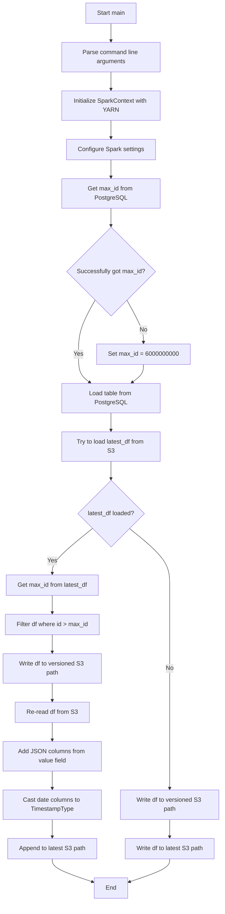
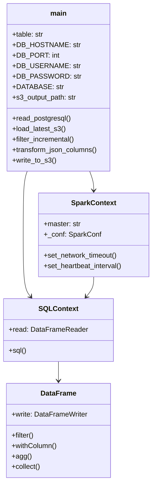
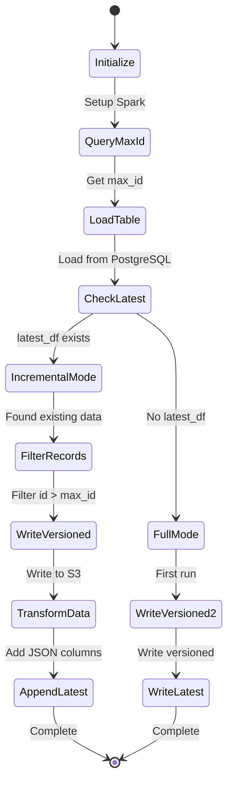

# Diagram: research/orchestrator/tasks/etl/extract_public_progress_update_reference_spark.py


> Auto-generated by Obscura crawlers

## Diagram 1

```mermaid
flowchart TD
      A[Start main] --> B[Parse command line arguments]
      B --> C[Initialize SparkContext with YARN]
      C --> D[Configure Spark settings]...
  └ 98 lines...

✗ read_bash
  Invalid shell ID: 0. Please supply a valid shell ID to read output from.

  <no active shell sessions>
```

> SVG rendering failed for this diagram.

## Diagram 2



### SVG

<svg id="container" width="586" xmlns="http://www.w3.org/2000/svg" class="flowchart" height="2383.234375" viewBox="0 0 586 2383.234375" role="graphics-document document" aria-roledescription="flowchart-v2"><style>#container{font-family:"trebuchet ms",verdana,arial,sans-serif;font-size:16px;fill:#333;}@keyframes edge-animation-frame{from{stroke-dashoffset:0;}}@keyframes dash{to{stroke-dashoffset:0;}}#container .edge-animation-slow{stroke-dasharray:9,5!important;stroke-dashoffset:900;animation:dash 50s linear infinite;stroke-linecap:round;}#container .edge-animation-fast{stroke-dasharray:9,5!important;stroke-dashoffset:900;animation:dash 20s linear infinite;stroke-linecap:round;}#container .error-icon{fill:#552222;}#container .error-text{fill:#552222;stroke:#552222;}#container .edge-thickness-normal{stroke-width:1px;}#container .edge-thickness-thick{stroke-width:3.5px;}#container .edge-pattern-solid{stroke-dasharray:0;}#container .edge-thickness-invisible{stroke-width:0;fill:none;}#container .edge-pattern-dashed{stroke-dasharray:3;}#container .edge-pattern-dotted{stroke-dasharray:2;}#container .marker{fill:#333333;stroke:#333333;}#container .marker.cross{stroke:#333333;}#container svg{font-family:"trebuchet ms",verdana,arial,sans-serif;font-size:16px;}#container p{margin:0;}#container .label{font-family:"trebuchet ms",verdana,arial,sans-serif;color:#333;}#container .cluster-label text{fill:#333;}#container .cluster-label span{color:#333;}#container .cluster-label span p{background-color:transparent;}#container .label text,#container span{fill:#333;color:#333;}#container .node rect,#container .node circle,#container .node ellipse,#container .node polygon,#container .node path{fill:#ECECFF;stroke:#9370DB;stroke-width:1px;}#container .rough-node .label text,#container .node .label text,#container .image-shape .label,#container .icon-shape .label{text-anchor:middle;}#container .node .katex path{fill:#000;stroke:#000;stroke-width:1px;}#container .rough-node .label,#container .node .label,#container .image-shape .label,#container .icon-shape .label{text-align:center;}#container .node.clickable{cursor:pointer;}#container .root .anchor path{fill:#333333!important;stroke-width:0;stroke:#333333;}#container .arrowheadPath{fill:#333333;}#container .edgePath .path{stroke:#333333;stroke-width:2.0px;}#container .flowchart-link{stroke:#333333;fill:none;}#container .edgeLabel{background-color:rgba(232,232,232, 0.8);text-align:center;}#container .edgeLabel p{background-color:rgba(232,232,232, 0.8);}#container .edgeLabel rect{opacity:0.5;background-color:rgba(232,232,232, 0.8);fill:rgba(232,232,232, 0.8);}#container .labelBkg{background-color:rgba(232, 232, 232, 0.5);}#container .cluster rect{fill:#ffffde;stroke:#aaaa33;stroke-width:1px;}#container .cluster text{fill:#333;}#container .cluster span{color:#333;}#container div.mermaidTooltip{position:absolute;text-align:center;max-width:200px;padding:2px;font-family:"trebuchet ms",verdana,arial,sans-serif;font-size:12px;background:hsl(80, 100%, 96.2745098039%);border:1px solid #aaaa33;border-radius:2px;pointer-events:none;z-index:100;}#container .flowchartTitleText{text-anchor:middle;font-size:18px;fill:#333;}#container rect.text{fill:none;stroke-width:0;}#container .icon-shape,#container .image-shape{background-color:rgba(232,232,232, 0.8);text-align:center;}#container .icon-shape p,#container .image-shape p{background-color:rgba(232,232,232, 0.8);padding:2px;}#container .icon-shape rect,#container .image-shape rect{opacity:0.5;background-color:rgba(232,232,232, 0.8);fill:rgba(232,232,232, 0.8);}#container .label-icon{display:inline-block;height:1em;overflow:visible;vertical-align:-0.125em;}#container .node .label-icon path{fill:currentColor;stroke:revert;stroke-width:revert;}#container :root{--mermaid-font-family:"trebuchet ms",verdana,arial,sans-serif;}</style><g><marker id="container_flowchart-v2-pointEnd" class="marker flowchart-v2" viewBox="0 0 10 10" refX="5" refY="5" markerUnits="userSpaceOnUse" markerWidth="8" markerHeight="8" orient="auto"><path d="M 0 0 L 10 5 L 0 10 z" class="arrowMarkerPath" style="stroke-width: 1; stroke-dasharray: 1, 0;"></path></marker><marker id="container_flowchart-v2-pointStart" class="marker flowchart-v2" viewBox="0 0 10 10" refX="4.5" refY="5" markerUnits="userSpaceOnUse" markerWidth="8" markerHeight="8" orient="auto"><path d="M 0 5 L 10 10 L 10 0 z" class="arrowMarkerPath" style="stroke-width: 1; stroke-dasharray: 1, 0;"></path></marker><marker id="container_flowchart-v2-circleEnd" class="marker flowchart-v2" viewBox="0 0 10 10" refX="11" refY="5" markerUnits="userSpaceOnUse" markerWidth="11" markerHeight="11" orient="auto"><circle cx="5" cy="5" r="5" class="arrowMarkerPath" style="stroke-width: 1; stroke-dasharray: 1, 0;"></circle></marker><marker id="container_flowchart-v2-circleStart" class="marker flowchart-v2" viewBox="0 0 10 10" refX="-1" refY="5" markerUnits="userSpaceOnUse" markerWidth="11" markerHeight="11" orient="auto"><circle cx="5" cy="5" r="5" class="arrowMarkerPath" style="stroke-width: 1; stroke-dasharray: 1, 0;"></circle></marker><marker id="container_flowchart-v2-crossEnd" class="marker cross flowchart-v2" viewBox="0 0 11 11" refX="12" refY="5.2" markerUnits="userSpaceOnUse" markerWidth="11" markerHeight="11" orient="auto"><path d="M 1,1 l 9,9 M 10,1 l -9,9" class="arrowMarkerPath" style="stroke-width: 2; stroke-dasharray: 1, 0;"></path></marker><marker id="container_flowchart-v2-crossStart" class="marker cross flowchart-v2" viewBox="0 0 11 11" refX="-1" refY="5.2" markerUnits="userSpaceOnUse" markerWidth="11" markerHeight="11" orient="auto"><path d="M 1,1 l 9,9 M 10,1 l -9,9" class="arrowMarkerPath" style="stroke-width: 2; stroke-dasharray: 1, 0;"></path></marker><g class="root"><g class="clusters"></g><g class="edgePaths"><path d="M293,62L293,66.167C293,70.333,293,78.667,293,86.333C293,94,293,101,293,104.5L293,108" id="L_A_B_0" class="edge-thickness-normal edge-pattern-solid edge-thickness-normal edge-pattern-solid flowchart-link" style=";" data-edge="true" data-et="edge" data-id="L_A_B_0" data-points="W3sieCI6MjkzLCJ5Ijo2Mn0seyJ4IjoyOTMsInkiOjg3fSx7IngiOjI5MywieSI6MTEyfV0=" marker-end="url(#container_flowchart-v2-pointEnd)"></path><path d="M293,190L293,194.167C293,198.333,293,206.667,293,214.333C293,222,293,229,293,232.5L293,236" id="L_B_C_0" class="edge-thickness-normal edge-pattern-solid edge-thickness-normal edge-pattern-solid flowchart-link" style=";" data-edge="true" data-et="edge" data-id="L_B_C_0" data-points="W3sieCI6MjkzLCJ5IjoxOTB9LHsieCI6MjkzLCJ5IjoyMTV9LHsieCI6MjkzLCJ5IjoyNDB9XQ==" marker-end="url(#container_flowchart-v2-pointEnd)"></path><path d="M293,318L293,322.167C293,326.333,293,334.667,293,342.333C293,350,293,357,293,360.5L293,364" id="L_C_D_0" class="edge-thickness-normal edge-pattern-solid edge-thickness-normal edge-pattern-solid flowchart-link" style=";" data-edge="true" data-et="edge" data-id="L_C_D_0" data-points="W3sieCI6MjkzLCJ5IjozMTh9LHsieCI6MjkzLCJ5IjozNDN9LHsieCI6MjkzLCJ5IjozNjh9XQ==" marker-end="url(#container_flowchart-v2-pointEnd)"></path><path d="M293,422L293,426.167C293,430.333,293,438.667,293,446.333C293,454,293,461,293,464.5L293,468" id="L_D_E_0" class="edge-thickness-normal edge-pattern-solid edge-thickness-normal edge-pattern-solid flowchart-link" style=";" data-edge="true" data-et="edge" data-id="L_D_E_0" data-points="W3sieCI6MjkzLCJ5Ijo0MjJ9LHsieCI6MjkzLCJ5Ijo0NDd9LHsieCI6MjkzLCJ5Ijo0NzJ9XQ==" marker-end="url(#container_flowchart-v2-pointEnd)"></path><path d="M293,550L293,554.167C293,558.333,293,566.667,293,574.333C293,582,293,589,293,592.5L293,596" id="L_E_F_0" class="edge-thickness-normal edge-pattern-solid edge-thickness-normal edge-pattern-solid flowchart-link" style=";" data-edge="true" data-et="edge" data-id="L_E_F_0" data-points="W3sieCI6MjkzLCJ5Ijo1NTB9LHsieCI6MjkzLCJ5Ijo1NzV9LHsieCI6MjkzLCJ5Ijo2MDB9XQ==" marker-end="url(#container_flowchart-v2-pointEnd)"></path><path d="M334.528,792.019L341.751,805.107C348.974,818.195,363.421,844.371,370.644,862.959C377.867,881.547,377.867,892.547,377.867,898.047L377.867,903.547" id="L_F_G_0" class="edge-thickness-normal edge-pattern-solid edge-thickness-normal edge-pattern-solid flowchart-link" style=";" data-edge="true" data-et="edge" data-id="L_F_G_0" data-points="W3sieCI6MzM0LjUyNzg1NDc2MjA4MDE1LCJ5Ijo3OTIuMDE5MDIwMjM3OTE5OX0seyJ4IjozNzcuODY3MTg3NSwieSI6ODcwLjU0Njg3NX0seyJ4IjozNzcuODY3MTg3NSwieSI6OTA3LjU0Njg3NX1d" marker-end="url(#container_flowchart-v2-pointEnd)"></path><path d="M251.472,792.019L244.249,805.107C237.026,818.195,222.579,844.371,215.356,868.126C208.133,891.88,208.133,913.214,208.133,932.547C208.133,951.88,208.133,969.214,213.126,981.645C218.119,994.077,228.105,1001.608,233.097,1005.373L238.09,1009.138" id="L_F_H_0" class="edge-thickness-normal edge-pattern-solid edge-thickness-normal edge-pattern-solid flowchart-link" style=";" data-edge="true" data-et="edge" data-id="L_F_H_0" data-points="W3sieCI6MjUxLjQ3MjE0NTIzNzkxOTg1LCJ5Ijo3OTIuMDE5MDIwMjM3OTE5OX0seyJ4IjoyMDguMTMyODEyNSwieSI6ODcwLjU0Njg3NX0seyJ4IjoyMDguMTMyODEyNSwieSI6OTM0LjU0Njg3NX0seyJ4IjoyMDguMTMyODEyNSwieSI6OTg2LjU0Njg3NX0seyJ4IjoyNDEuMjg0MDU3NjE3MTg3NSwieSI6MTAxMS41NDY4NzV9XQ==" marker-end="url(#container_flowchart-v2-pointEnd)"></path><path d="M377.867,961.547L377.867,965.714C377.867,969.88,377.867,978.214,372.874,986.145C367.881,994.077,357.895,1001.608,352.903,1005.373L347.91,1009.138" id="L_G_H_0" class="edge-thickness-normal edge-pattern-solid edge-thickness-normal edge-pattern-solid flowchart-link" style=";" data-edge="true" data-et="edge" data-id="L_G_H_0" data-points="W3sieCI6Mzc3Ljg2NzE4NzUsInkiOjk2MS41NDY4NzV9LHsieCI6Mzc3Ljg2NzE4NzUsInkiOjk4Ni41NDY4NzV9LHsieCI6MzQ0LjcxNTk0MjM4MjgxMjUsInkiOjEwMTEuNTQ2ODc1fV0=" marker-end="url(#container_flowchart-v2-pointEnd)"></path><path d="M293,1089.547L293,1093.714C293,1097.88,293,1106.214,293,1113.88C293,1121.547,293,1128.547,293,1132.047L293,1135.547" id="L_H_I_0" class="edge-thickness-normal edge-pattern-solid edge-thickness-normal edge-pattern-solid flowchart-link" style=";" data-edge="true" data-et="edge" data-id="L_H_I_0" data-points="W3sieCI6MjkzLCJ5IjoxMDg5LjU0Njg3NX0seyJ4IjoyOTMsInkiOjExMTQuNTQ2ODc1fSx7IngiOjI5MywieSI6MTEzOS41NDY4NzV9XQ==" marker-end="url(#container_flowchart-v2-pointEnd)"></path><path d="M293,1217.547L293,1221.714C293,1225.88,293,1234.214,293,1241.88C293,1249.547,293,1256.547,293,1260.047L293,1263.547" id="L_I_J_0" class="edge-thickness-normal edge-pattern-solid edge-thickness-normal edge-pattern-solid flowchart-link" style=";" data-edge="true" data-et="edge" data-id="L_I_J_0" data-points="W3sieCI6MjkzLCJ5IjoxMjE3LjU0Njg3NX0seyJ4IjoyOTMsInkiOjEyNDIuNTQ2ODc1fSx7IngiOjI5MywieSI6MTI2Ny41NDY4NzV9XQ==" marker-end="url(#container_flowchart-v2-pointEnd)"></path><path d="M243.59,1397.825L225.992,1412.226C208.394,1426.628,173.197,1455.431,155.598,1475.333C138,1495.234,138,1506.234,138,1511.734L138,1517.234" id="L_J_K_0" class="edge-thickness-normal edge-pattern-solid edge-thickness-normal edge-pattern-solid flowchart-link" style=";" data-edge="true" data-et="edge" data-id="L_J_K_0" data-points="W3sieCI6MjQzLjU5MDQyMDIyMzk3MTYyLCJ5IjoxMzk3LjgyNDc5NTIyMzk3MTd9LHsieCI6MTM4LCJ5IjoxNDg0LjIzNDM3NX0seyJ4IjoxMzgsInkiOjE1MjEuMjM0Mzc1fV0=" marker-end="url(#container_flowchart-v2-pointEnd)"></path><path d="M138,1575.234L138,1579.401C138,1583.568,138,1591.901,138,1599.568C138,1607.234,138,1614.234,138,1617.734L138,1621.234" id="L_K_L_0" class="edge-thickness-normal edge-pattern-solid edge-thickness-normal edge-pattern-solid flowchart-link" style=";" data-edge="true" data-et="edge" data-id="L_K_L_0" data-points="W3sieCI6MTM4LCJ5IjoxNTc1LjIzNDM3NX0seyJ4IjoxMzgsInkiOjE2MDAuMjM0Mzc1fSx7IngiOjEzOCwieSI6MTYyNS4yMzQzNzV9XQ==" marker-end="url(#container_flowchart-v2-pointEnd)"></path><path d="M138,1679.234L138,1683.401C138,1687.568,138,1695.901,138,1703.568C138,1711.234,138,1718.234,138,1721.734L138,1725.234" id="L_L_M_0" class="edge-thickness-normal edge-pattern-solid edge-thickness-normal edge-pattern-solid flowchart-link" style=";" data-edge="true" data-et="edge" data-id="L_L_M_0" data-points="W3sieCI6MTM4LCJ5IjoxNjc5LjIzNDM3NX0seyJ4IjoxMzgsInkiOjE3MDQuMjM0Mzc1fSx7IngiOjEzOCwieSI6MTcyOS4yMzQzNzV9XQ==" marker-end="url(#container_flowchart-v2-pointEnd)"></path><path d="M138,1807.234L138,1811.401C138,1815.568,138,1823.901,138,1831.568C138,1839.234,138,1846.234,138,1849.734L138,1853.234" id="L_M_N_0" class="edge-thickness-normal edge-pattern-solid edge-thickness-normal edge-pattern-solid flowchart-link" style=";" data-edge="true" data-et="edge" data-id="L_M_N_0" data-points="W3sieCI6MTM4LCJ5IjoxODA3LjIzNDM3NX0seyJ4IjoxMzgsInkiOjE4MzIuMjM0Mzc1fSx7IngiOjEzOCwieSI6MTg1Ny4yMzQzNzV9XQ==" marker-end="url(#container_flowchart-v2-pointEnd)"></path><path d="M138,1911.234L138,1915.401C138,1919.568,138,1927.901,138,1935.568C138,1943.234,138,1950.234,138,1953.734L138,1957.234" id="L_N_O_0" class="edge-thickness-normal edge-pattern-solid edge-thickness-normal edge-pattern-solid flowchart-link" style=";" data-edge="true" data-et="edge" data-id="L_N_O_0" data-points="W3sieCI6MTM4LCJ5IjoxOTExLjIzNDM3NX0seyJ4IjoxMzgsInkiOjE5MzYuMjM0Mzc1fSx7IngiOjEzOCwieSI6MTk2MS4yMzQzNzV9XQ==" marker-end="url(#container_flowchart-v2-pointEnd)"></path><path d="M138,2039.234L138,2043.401C138,2047.568,138,2055.901,138,2063.568C138,2071.234,138,2078.234,138,2081.734L138,2085.234" id="L_O_P_0" class="edge-thickness-normal edge-pattern-solid edge-thickness-normal edge-pattern-solid flowchart-link" style=";" data-edge="true" data-et="edge" data-id="L_O_P_0" data-points="W3sieCI6MTM4LCJ5IjoyMDM5LjIzNDM3NX0seyJ4IjoxMzgsInkiOjIwNjQuMjM0Mzc1fSx7IngiOjEzOCwieSI6MjA4OS4yMzQzNzV9XQ==" marker-end="url(#container_flowchart-v2-pointEnd)"></path><path d="M138,2167.234L138,2171.401C138,2175.568,138,2183.901,138,2191.568C138,2199.234,138,2206.234,138,2209.734L138,2213.234" id="L_P_Q_0" class="edge-thickness-normal edge-pattern-solid edge-thickness-normal edge-pattern-solid flowchart-link" style=";" data-edge="true" data-et="edge" data-id="L_P_Q_0" data-points="W3sieCI6MTM4LCJ5IjoyMTY3LjIzNDM3NX0seyJ4IjoxMzgsInkiOjIxOTIuMjM0Mzc1fSx7IngiOjEzOCwieSI6MjIxNy4yMzQzNzV9XQ==" marker-end="url(#container_flowchart-v2-pointEnd)"></path><path d="M138,2271.234L138,2275.401C138,2279.568,138,2287.901,155.921,2298.08C173.843,2308.259,209.685,2320.284,227.607,2326.296L245.528,2332.308" id="L_Q_R_0" class="edge-thickness-normal edge-pattern-solid edge-thickness-normal edge-pattern-solid flowchart-link" style=";" data-edge="true" data-et="edge" data-id="L_Q_R_0" data-points="W3sieCI6MTM4LCJ5IjoyMjcxLjIzNDM3NX0seyJ4IjoxMzgsInkiOjIyOTYuMjM0Mzc1fSx7IngiOjI0OS4zMjAzMTI1LCJ5IjoyMzMzLjU4MDU0NDM1NDgzOX1d" marker-end="url(#container_flowchart-v2-pointEnd)"></path><path d="M342.41,1397.825L360.008,1412.226C377.606,1426.628,412.803,1455.431,430.402,1480.499C448,1505.568,448,1526.901,448,1546.234C448,1565.568,448,1582.901,448,1600.234C448,1617.568,448,1634.901,448,1652.234C448,1669.568,448,1686.901,448,1706.234C448,1725.568,448,1746.901,448,1768.234C448,1789.568,448,1810.901,448,1830.234C448,1849.568,448,1866.901,448,1884.234C448,1901.568,448,1918.901,448,1938.234C448,1957.568,448,1978.901,448,2000.234C448,2021.568,448,2042.901,448,2057.068C448,2071.234,448,2078.234,448,2081.734L448,2085.234" id="L_J_S_0" class="edge-thickness-normal edge-pattern-solid edge-thickness-normal edge-pattern-solid flowchart-link" style=";" data-edge="true" data-et="edge" data-id="L_J_S_0" data-points="W3sieCI6MzQyLjQwOTU3OTc3NjAyODQsInkiOjEzOTcuODI0Nzk1MjIzOTcxN30seyJ4Ijo0NDgsInkiOjE0ODQuMjM0Mzc1fSx7IngiOjQ0OCwieSI6MTU0OC4yMzQzNzV9LHsieCI6NDQ4LCJ5IjoxNjAwLjIzNDM3NX0seyJ4Ijo0NDgsInkiOjE2NTIuMjM0Mzc1fSx7IngiOjQ0OCwieSI6MTcwNC4yMzQzNzV9LHsieCI6NDQ4LCJ5IjoxNzY4LjIzNDM3NX0seyJ4Ijo0NDgsInkiOjE4MzIuMjM0Mzc1fSx7IngiOjQ0OCwieSI6MTg4NC4yMzQzNzV9LHsieCI6NDQ4LCJ5IjoxOTM2LjIzNDM3NX0seyJ4Ijo0NDgsInkiOjIwMDAuMjM0Mzc1fSx7IngiOjQ0OCwieSI6MjA2NC4yMzQzNzV9LHsieCI6NDQ4LCJ5IjoyMDg5LjIzNDM3NX1d" marker-end="url(#container_flowchart-v2-pointEnd)"></path><path d="M448,2167.234L448,2171.401C448,2175.568,448,2183.901,448,2191.568C448,2199.234,448,2206.234,448,2209.734L448,2213.234" id="L_S_T_0" class="edge-thickness-normal edge-pattern-solid edge-thickness-normal edge-pattern-solid flowchart-link" style=";" data-edge="true" data-et="edge" data-id="L_S_T_0" data-points="W3sieCI6NDQ4LCJ5IjoyMTY3LjIzNDM3NX0seyJ4Ijo0NDgsInkiOjIxOTIuMjM0Mzc1fSx7IngiOjQ0OCwieSI6MjIxNy4yMzQzNzV9XQ==" marker-end="url(#container_flowchart-v2-pointEnd)"></path><path d="M448,2271.234L448,2275.401C448,2279.568,448,2287.901,430.079,2298.08C412.157,2308.259,376.315,2320.284,358.393,2326.296L340.472,2332.308" id="L_T_R_0" class="edge-thickness-normal edge-pattern-solid edge-thickness-normal edge-pattern-solid flowchart-link" style=";" data-edge="true" data-et="edge" data-id="L_T_R_0" data-points="W3sieCI6NDQ4LCJ5IjoyMjcxLjIzNDM3NX0seyJ4Ijo0NDgsInkiOjIyOTYuMjM0Mzc1fSx7IngiOjMzNi42Nzk2ODc1LCJ5IjoyMzMzLjU4MDU0NDM1NDgzOX1d" marker-end="url(#container_flowchart-v2-pointEnd)"></path></g><g class="edgeLabels"><g class="edgeLabel"><g class="label" data-id="L_A_B_0" transform="translate(0, 0)"><foreignObject width="0" height="0"><div xmlns="http://www.w3.org/1999/xhtml" class="labelBkg" style="display: table-cell; white-space: nowrap; line-height: 1.5; max-width: 200px; text-align: center;"><span class="edgeLabel"></span></div></foreignObject></g></g><g class="edgeLabel"><g class="label" data-id="L_B_C_0" transform="translate(0, 0)"><foreignObject width="0" height="0"><div xmlns="http://www.w3.org/1999/xhtml" class="labelBkg" style="display: table-cell; white-space: nowrap; line-height: 1.5; max-width: 200px; text-align: center;"><span class="edgeLabel"></span></div></foreignObject></g></g><g class="edgeLabel"><g class="label" data-id="L_C_D_0" transform="translate(0, 0)"><foreignObject width="0" height="0"><div xmlns="http://www.w3.org/1999/xhtml" class="labelBkg" style="display: table-cell; white-space: nowrap; line-height: 1.5; max-width: 200px; text-align: center;"><span class="edgeLabel"></span></div></foreignObject></g></g><g class="edgeLabel"><g class="label" data-id="L_D_E_0" transform="translate(0, 0)"><foreignObject width="0" height="0"><div xmlns="http://www.w3.org/1999/xhtml" class="labelBkg" style="display: table-cell; white-space: nowrap; line-height: 1.5; max-width: 200px; text-align: center;"><span class="edgeLabel"></span></div></foreignObject></g></g><g class="edgeLabel"><g class="label" data-id="L_E_F_0" transform="translate(0, 0)"><foreignObject width="0" height="0"><div xmlns="http://www.w3.org/1999/xhtml" class="labelBkg" style="display: table-cell; white-space: nowrap; line-height: 1.5; max-width: 200px; text-align: center;"><span class="edgeLabel"></span></div></foreignObject></g></g><g class="edgeLabel" transform="translate(377.8671875, 870.546875)"><g class="label" data-id="L_F_G_0" transform="translate(-10.140625, -12)"><foreignObject width="20.28125" height="24"><div xmlns="http://www.w3.org/1999/xhtml" class="labelBkg" style="display: table-cell; white-space: nowrap; line-height: 1.5; max-width: 200px; text-align: center;"><span class="edgeLabel"><p>No</p></span></div></foreignObject></g></g><g class="edgeLabel" transform="translate(208.1328125, 934.546875)"><g class="label" data-id="L_F_H_0" transform="translate(-12.03125, -12)"><foreignObject width="24.0625" height="24"><div xmlns="http://www.w3.org/1999/xhtml" class="labelBkg" style="display: table-cell; white-space: nowrap; line-height: 1.5; max-width: 200px; text-align: center;"><span class="edgeLabel"><p>Yes</p></span></div></foreignObject></g></g><g class="edgeLabel"><g class="label" data-id="L_G_H_0" transform="translate(0, 0)"><foreignObject width="0" height="0"><div xmlns="http://www.w3.org/1999/xhtml" class="labelBkg" style="display: table-cell; white-space: nowrap; line-height: 1.5; max-width: 200px; text-align: center;"><span class="edgeLabel"></span></div></foreignObject></g></g><g class="edgeLabel"><g class="label" data-id="L_H_I_0" transform="translate(0, 0)"><foreignObject width="0" height="0"><div xmlns="http://www.w3.org/1999/xhtml" class="labelBkg" style="display: table-cell; white-space: nowrap; line-height: 1.5; max-width: 200px; text-align: center;"><span class="edgeLabel"></span></div></foreignObject></g></g><g class="edgeLabel"><g class="label" data-id="L_I_J_0" transform="translate(0, 0)"><foreignObject width="0" height="0"><div xmlns="http://www.w3.org/1999/xhtml" class="labelBkg" style="display: table-cell; white-space: nowrap; line-height: 1.5; max-width: 200px; text-align: center;"><span class="edgeLabel"></span></div></foreignObject></g></g><g class="edgeLabel" transform="translate(138, 1484.234375)"><g class="label" data-id="L_J_K_0" transform="translate(-12.03125, -12)"><foreignObject width="24.0625" height="24"><div xmlns="http://www.w3.org/1999/xhtml" class="labelBkg" style="display: table-cell; white-space: nowrap; line-height: 1.5; max-width: 200px; text-align: center;"><span class="edgeLabel"><p>Yes</p></span></div></foreignObject></g></g><g class="edgeLabel"><g class="label" data-id="L_K_L_0" transform="translate(0, 0)"><foreignObject width="0" height="0"><div xmlns="http://www.w3.org/1999/xhtml" class="labelBkg" style="display: table-cell; white-space: nowrap; line-height: 1.5; max-width: 200px; text-align: center;"><span class="edgeLabel"></span></div></foreignObject></g></g><g class="edgeLabel"><g class="label" data-id="L_L_M_0" transform="translate(0, 0)"><foreignObject width="0" height="0"><div xmlns="http://www.w3.org/1999/xhtml" class="labelBkg" style="display: table-cell; white-space: nowrap; line-height: 1.5; max-width: 200px; text-align: center;"><span class="edgeLabel"></span></div></foreignObject></g></g><g class="edgeLabel"><g class="label" data-id="L_M_N_0" transform="translate(0, 0)"><foreignObject width="0" height="0"><div xmlns="http://www.w3.org/1999/xhtml" class="labelBkg" style="display: table-cell; white-space: nowrap; line-height: 1.5; max-width: 200px; text-align: center;"><span class="edgeLabel"></span></div></foreignObject></g></g><g class="edgeLabel"><g class="label" data-id="L_N_O_0" transform="translate(0, 0)"><foreignObject width="0" height="0"><div xmlns="http://www.w3.org/1999/xhtml" class="labelBkg" style="display: table-cell; white-space: nowrap; line-height: 1.5; max-width: 200px; text-align: center;"><span class="edgeLabel"></span></div></foreignObject></g></g><g class="edgeLabel"><g class="label" data-id="L_O_P_0" transform="translate(0, 0)"><foreignObject width="0" height="0"><div xmlns="http://www.w3.org/1999/xhtml" class="labelBkg" style="display: table-cell; white-space: nowrap; line-height: 1.5; max-width: 200px; text-align: center;"><span class="edgeLabel"></span></div></foreignObject></g></g><g class="edgeLabel"><g class="label" data-id="L_P_Q_0" transform="translate(0, 0)"><foreignObject width="0" height="0"><div xmlns="http://www.w3.org/1999/xhtml" class="labelBkg" style="display: table-cell; white-space: nowrap; line-height: 1.5; max-width: 200px; text-align: center;"><span class="edgeLabel"></span></div></foreignObject></g></g><g class="edgeLabel"><g class="label" data-id="L_Q_R_0" transform="translate(0, 0)"><foreignObject width="0" height="0"><div xmlns="http://www.w3.org/1999/xhtml" class="labelBkg" style="display: table-cell; white-space: nowrap; line-height: 1.5; max-width: 200px; text-align: center;"><span class="edgeLabel"></span></div></foreignObject></g></g><g class="edgeLabel" transform="translate(448, 1768.234375)"><g class="label" data-id="L_J_S_0" transform="translate(-10.140625, -12)"><foreignObject width="20.28125" height="24"><div xmlns="http://www.w3.org/1999/xhtml" class="labelBkg" style="display: table-cell; white-space: nowrap; line-height: 1.5; max-width: 200px; text-align: center;"><span class="edgeLabel"><p>No</p></span></div></foreignObject></g></g><g class="edgeLabel"><g class="label" data-id="L_S_T_0" transform="translate(0, 0)"><foreignObject width="0" height="0"><div xmlns="http://www.w3.org/1999/xhtml" class="labelBkg" style="display: table-cell; white-space: nowrap; line-height: 1.5; max-width: 200px; text-align: center;"><span class="edgeLabel"></span></div></foreignObject></g></g><g class="edgeLabel"><g class="label" data-id="L_T_R_0" transform="translate(0, 0)"><foreignObject width="0" height="0"><div xmlns="http://www.w3.org/1999/xhtml" class="labelBkg" style="display: table-cell; white-space: nowrap; line-height: 1.5; max-width: 200px; text-align: center;"><span class="edgeLabel"></span></div></foreignObject></g></g></g><g class="nodes"><g class="node default" id="flowchart-A-0" transform="translate(293, 35)"><rect class="basic label-container" style="" x="-67.796875" y="-27" width="135.59375" height="54"></rect><g class="label" style="" transform="translate(-37.796875, -12)"><rect></rect><foreignObject width="75.59375" height="24"><div xmlns="http://www.w3.org/1999/xhtml" style="display: table-cell; white-space: nowrap; line-height: 1.5; max-width: 200px; text-align: center;"><span class="nodeLabel"><p>Start main</p></span></div></foreignObject></g></g><g class="node default" id="flowchart-B-1" transform="translate(293, 151)"><rect class="basic label-container" style="" x="-130" y="-39" width="260" height="78"></rect><g class="label" style="" transform="translate(-100, -24)"><rect></rect><foreignObject width="200" height="48"><div xmlns="http://www.w3.org/1999/xhtml" style="display: table; white-space: break-spaces; line-height: 1.5; max-width: 200px; text-align: center; width: 200px;"><span class="nodeLabel"><p>Parse command line arguments</p></span></div></foreignObject></g></g><g class="node default" id="flowchart-C-3" transform="translate(293, 279)"><rect class="basic label-container" style="" x="-130" y="-39" width="260" height="78"></rect><g class="label" style="" transform="translate(-100, -24)"><rect></rect><foreignObject width="200" height="48"><div xmlns="http://www.w3.org/1999/xhtml" style="display: table; white-space: break-spaces; line-height: 1.5; max-width: 200px; text-align: center; width: 200px;"><span class="nodeLabel"><p>Initialize SparkContext with YARN</p></span></div></foreignObject></g></g><g class="node default" id="flowchart-D-5" transform="translate(293, 395)"><rect class="basic label-container" style="" x="-117.6953125" y="-27" width="235.390625" height="54"></rect><g class="label" style="" transform="translate(-87.6953125, -12)"><rect></rect><foreignObject width="175.390625" height="24"><div xmlns="http://www.w3.org/1999/xhtml" style="display: table-cell; white-space: nowrap; line-height: 1.5; max-width: 200px; text-align: center;"><span class="nodeLabel"><p>Configure Spark settings</p></span></div></foreignObject></g></g><g class="node default" id="flowchart-E-7" transform="translate(293, 511)"><rect class="basic label-container" style="" x="-130" y="-39" width="260" height="78"></rect><g class="label" style="" transform="translate(-100, -24)"><rect></rect><foreignObject width="200" height="48"><div xmlns="http://www.w3.org/1999/xhtml" style="display: table; white-space: break-spaces; line-height: 1.5; max-width: 200px; text-align: center; width: 200px;"><span class="nodeLabel"><p>Get max_id from PostgreSQL</p></span></div></foreignObject></g></g><g class="node default" id="flowchart-F-9" transform="translate(293, 716.7734375)"><polygon points="116.7734375,0 233.546875,-116.7734375 116.7734375,-233.546875 0,-116.7734375" class="label-container" transform="translate(-116.2734375, 116.7734375)"></polygon><g class="label" style="" transform="translate(-89.7734375, -12)"><rect></rect><foreignObject width="179.546875" height="24"><div xmlns="http://www.w3.org/1999/xhtml" style="display: table-cell; white-space: nowrap; line-height: 1.5; max-width: 200px; text-align: center;"><span class="nodeLabel"><p>Successfully got max_id?</p></span></div></foreignObject></g></g><g class="node default" id="flowchart-G-11" transform="translate(377.8671875, 934.546875)"><rect class="basic label-container" style="" x="-122.703125" y="-27" width="245.40625" height="54"></rect><g class="label" style="" transform="translate(-92.703125, -12)"><rect></rect><foreignObject width="185.40625" height="24"><div xmlns="http://www.w3.org/1999/xhtml" style="display: table-cell; white-space: nowrap; line-height: 1.5; max-width: 200px; text-align: center;"><span class="nodeLabel"><p>Set max_id = 6000000000</p></span></div></foreignObject></g></g><g class="node default" id="flowchart-H-13" transform="translate(293, 1050.546875)"><rect class="basic label-container" style="" x="-130" y="-39" width="260" height="78"></rect><g class="label" style="" transform="translate(-100, -24)"><rect></rect><foreignObject width="200" height="48"><div xmlns="http://www.w3.org/1999/xhtml" style="display: table; white-space: break-spaces; line-height: 1.5; max-width: 200px; text-align: center; width: 200px;"><span class="nodeLabel"><p>Load table from PostgreSQL</p></span></div></foreignObject></g></g><g class="node default" id="flowchart-I-17" transform="translate(293, 1178.546875)"><rect class="basic label-container" style="" x="-130" y="-39" width="260" height="78"></rect><g class="label" style="" transform="translate(-100, -24)"><rect></rect><foreignObject width="200" height="48"><div xmlns="http://www.w3.org/1999/xhtml" style="display: table; white-space: break-spaces; line-height: 1.5; max-width: 200px; text-align: center; width: 200px;"><span class="nodeLabel"><p>Try to load latest_df from S3</p></span></div></foreignObject></g></g><g class="node default" id="flowchart-J-19" transform="translate(293, 1357.390625)"><polygon points="89.84375,0 179.6875,-89.84375 89.84375,-179.6875 0,-89.84375" class="label-container" transform="translate(-89.34375, 89.84375)"></polygon><g class="label" style="" transform="translate(-62.84375, -12)"><rect></rect><foreignObject width="125.6875" height="24"><div xmlns="http://www.w3.org/1999/xhtml" style="display: table-cell; white-space: nowrap; line-height: 1.5; max-width: 200px; text-align: center;"><span class="nodeLabel"><p>latest_df loaded?</p></span></div></foreignObject></g></g><g class="node default" id="flowchart-K-21" transform="translate(138, 1548.234375)"><rect class="basic label-container" style="" x="-123.875" y="-27" width="247.75" height="54"></rect><g class="label" style="" transform="translate(-93.875, -12)"><rect></rect><foreignObject width="187.75" height="24"><div xmlns="http://www.w3.org/1999/xhtml" style="display: table-cell; white-space: nowrap; line-height: 1.5; max-width: 200px; text-align: center;"><span class="nodeLabel"><p>Get max_id from latest_df</p></span></div></foreignObject></g></g><g class="node default" id="flowchart-L-23" transform="translate(138, 1652.234375)"><rect class="basic label-container" style="" x="-125.8515625" y="-27" width="251.703125" height="54"></rect><g class="label" style="" transform="translate(-95.8515625, -12)"><rect></rect><foreignObject width="191.703125" height="24"><div xmlns="http://www.w3.org/1999/xhtml" style="display: table-cell; white-space: nowrap; line-height: 1.5; max-width: 200px; text-align: center;"><span class="nodeLabel"><p>Filter df where id &gt; max_id</p></span></div></foreignObject></g></g><g class="node default" id="flowchart-M-25" transform="translate(138, 1768.234375)"><rect class="basic label-container" style="" x="-130" y="-39" width="260" height="78"></rect><g class="label" style="" transform="translate(-100, -24)"><rect></rect><foreignObject width="200" height="48"><div xmlns="http://www.w3.org/1999/xhtml" style="display: table; white-space: break-spaces; line-height: 1.5; max-width: 200px; text-align: center; width: 200px;"><span class="nodeLabel"><p>Write df to versioned S3 path</p></span></div></foreignObject></g></g><g class="node default" id="flowchart-N-27" transform="translate(138, 1884.234375)"><rect class="basic label-container" style="" x="-97.8046875" y="-27" width="195.609375" height="54"></rect><g class="label" style="" transform="translate(-67.8046875, -12)"><rect></rect><foreignObject width="135.609375" height="24"><div xmlns="http://www.w3.org/1999/xhtml" style="display: table-cell; white-space: nowrap; line-height: 1.5; max-width: 200px; text-align: center;"><span class="nodeLabel"><p>Re-read df from S3</p></span></div></foreignObject></g></g><g class="node default" id="flowchart-O-29" transform="translate(138, 2000.234375)"><rect class="basic label-container" style="" x="-130" y="-39" width="260" height="78"></rect><g class="label" style="" transform="translate(-100, -24)"><rect></rect><foreignObject width="200" height="48"><div xmlns="http://www.w3.org/1999/xhtml" style="display: table; white-space: break-spaces; line-height: 1.5; max-width: 200px; text-align: center; width: 200px;"><span class="nodeLabel"><p>Add JSON columns from value field</p></span></div></foreignObject></g></g><g class="node default" id="flowchart-P-31" transform="translate(138, 2128.234375)"><rect class="basic label-container" style="" x="-130" y="-39" width="260" height="78"></rect><g class="label" style="" transform="translate(-100, -24)"><rect></rect><foreignObject width="200" height="48"><div xmlns="http://www.w3.org/1999/xhtml" style="display: table; white-space: break-spaces; line-height: 1.5; max-width: 200px; text-align: center; width: 200px;"><span class="nodeLabel"><p>Cast date columns to TimestampType</p></span></div></foreignObject></g></g><g class="node default" id="flowchart-Q-33" transform="translate(138, 2244.234375)"><rect class="basic label-container" style="" x="-119.203125" y="-27" width="238.40625" height="54"></rect><g class="label" style="" transform="translate(-89.203125, -12)"><rect></rect><foreignObject width="178.40625" height="24"><div xmlns="http://www.w3.org/1999/xhtml" style="display: table-cell; white-space: nowrap; line-height: 1.5; max-width: 200px; text-align: center;"><span class="nodeLabel"><p>Append to latest S3 path</p></span></div></foreignObject></g></g><g class="node default" id="flowchart-R-35" transform="translate(293, 2348.234375)"><rect class="basic label-container" style="" x="-43.6796875" y="-27" width="87.359375" height="54"></rect><g class="label" style="" transform="translate(-13.6796875, -12)"><rect></rect><foreignObject width="27.359375" height="24"><div xmlns="http://www.w3.org/1999/xhtml" style="display: table-cell; white-space: nowrap; line-height: 1.5; max-width: 200px; text-align: center;"><span class="nodeLabel"><p>End</p></span></div></foreignObject></g></g><g class="node default" id="flowchart-S-37" transform="translate(448, 2128.234375)"><rect class="basic label-container" style="" x="-130" y="-39" width="260" height="78"></rect><g class="label" style="" transform="translate(-100, -24)"><rect></rect><foreignObject width="200" height="48"><div xmlns="http://www.w3.org/1999/xhtml" style="display: table; white-space: break-spaces; line-height: 1.5; max-width: 200px; text-align: center; width: 200px;"><span class="nodeLabel"><p>Write df to versioned S3 path</p></span></div></foreignObject></g></g><g class="node default" id="flowchart-T-39" transform="translate(448, 2244.234375)"><rect class="basic label-container" style="" x="-119.90625" y="-27" width="239.8125" height="54"></rect><g class="label" style="" transform="translate(-89.90625, -12)"><rect></rect><foreignObject width="179.8125" height="24"><div xmlns="http://www.w3.org/1999/xhtml" style="display: table-cell; white-space: nowrap; line-height: 1.5; max-width: 200px; text-align: center;"><span class="nodeLabel"><p>Write df to latest S3 path</p></span></div></foreignObject></g></g></g></g></g></svg>

## Diagram 3

```mermaid
sequenceDiagram
    participant Script
    participant PostgreSQL
    participant S3
    participant Spark
    
    Script->>Spark: Initialize SparkContext
    Script->>PostgreSQL: Query max(id) from table
    PostgreSQL-->>Script: Return max_id
    Script->>PostgreSQL: Load table with partitioning
    PostgreSQL-->>Spark: Return DataFrame
    Script->>S3: Try read latest parquet
    alt Latest data exists
        S3-->>Spark: Return latest_df
        Script->>Spark: Filter new records (id > max_id)
        Script->>S3: Write to versioned path
        Script->>S3: Read back from versioned path
        Script->>Spark: Transform and add JSON columns
        Script->>S3: Append to latest path
    else No latest data
        Script->>S3: Write to versioned path
        Script->>S3: Write to latest path
    end
```



### SVG

<svg id="container" width="922" xmlns="http://www.w3.org/2000/svg" height="943" viewBox="-50 -10 922 943" role="graphics-document document" aria-roledescription="sequence"><g><rect x="672" y="857" fill="#eaeaea" stroke="#666" width="150" height="65" name="Spark" rx="3" ry="3" class="actor actor-bottom"></rect><text x="747" y="889.5" dominant-baseline="central" alignment-baseline="central" class="actor actor-box" style="text-anchor: middle; font-size: 16px; font-weight: 400;"><tspan x="747" dy="0">Spark</tspan></text></g><g><rect x="472" y="857" fill="#eaeaea" stroke="#666" width="150" height="65" name="S3" rx="3" ry="3" class="actor actor-bottom"></rect><text x="547" y="889.5" dominant-baseline="central" alignment-baseline="central" class="actor actor-box" style="text-anchor: middle; font-size: 16px; font-weight: 400;"><tspan x="547" dy="0">S3</tspan></text></g><g><rect x="272" y="857" fill="#eaeaea" stroke="#666" width="150" height="65" name="PostgreSQL" rx="3" ry="3" class="actor actor-bottom"></rect><text x="347" y="889.5" dominant-baseline="central" alignment-baseline="central" class="actor actor-box" style="text-anchor: middle; font-size: 16px; font-weight: 400;"><tspan x="347" dy="0">PostgreSQL</tspan></text></g><g><rect x="0" y="857" fill="#eaeaea" stroke="#666" width="150" height="65" name="Script" rx="3" ry="3" class="actor actor-bottom"></rect><text x="75" y="889.5" dominant-baseline="central" alignment-baseline="central" class="actor actor-box" style="text-anchor: middle; font-size: 16px; font-weight: 400;"><tspan x="75" dy="0">Script</tspan></text></g><g><line id="actor3" x1="747" y1="65" x2="747" y2="857" class="actor-line 200" stroke-width="0.5px" stroke="#999" name="Spark"></line><g id="root-3"><rect x="672" y="0" fill="#eaeaea" stroke="#666" width="150" height="65" name="Spark" rx="3" ry="3" class="actor actor-top"></rect><text x="747" y="32.5" dominant-baseline="central" alignment-baseline="central" class="actor actor-box" style="text-anchor: middle; font-size: 16px; font-weight: 400;"><tspan x="747" dy="0">Spark</tspan></text></g></g><g><line id="actor2" x1="547" y1="65" x2="547" y2="857" class="actor-line 200" stroke-width="0.5px" stroke="#999" name="S3"></line><g id="root-2"><rect x="472" y="0" fill="#eaeaea" stroke="#666" width="150" height="65" name="S3" rx="3" ry="3" class="actor actor-top"></rect><text x="547" y="32.5" dominant-baseline="central" alignment-baseline="central" class="actor actor-box" style="text-anchor: middle; font-size: 16px; font-weight: 400;"><tspan x="547" dy="0">S3</tspan></text></g></g><g><line id="actor1" x1="347" y1="65" x2="347" y2="857" class="actor-line 200" stroke-width="0.5px" stroke="#999" name="PostgreSQL"></line><g id="root-1"><rect x="272" y="0" fill="#eaeaea" stroke="#666" width="150" height="65" name="PostgreSQL" rx="3" ry="3" class="actor actor-top"></rect><text x="347" y="32.5" dominant-baseline="central" alignment-baseline="central" class="actor actor-box" style="text-anchor: middle; font-size: 16px; font-weight: 400;"><tspan x="347" dy="0">PostgreSQL</tspan></text></g></g><g><line id="actor0" x1="75" y1="65" x2="75" y2="857" class="actor-line 200" stroke-width="0.5px" stroke="#999" name="Script"></line><g id="root-0"><rect x="0" y="0" fill="#eaeaea" stroke="#666" width="150" height="65" name="Script" rx="3" ry="3" class="actor actor-top"></rect><text x="75" y="32.5" dominant-baseline="central" alignment-baseline="central" class="actor actor-box" style="text-anchor: middle; font-size: 16px; font-weight: 400;"><tspan x="75" dy="0">Script</tspan></text></g></g><style>#container{font-family:"trebuchet ms",verdana,arial,sans-serif;font-size:16px;fill:#333;}@keyframes edge-animation-frame{from{stroke-dashoffset:0;}}@keyframes dash{to{stroke-dashoffset:0;}}#container .edge-animation-slow{stroke-dasharray:9,5!important;stroke-dashoffset:900;animation:dash 50s linear infinite;stroke-linecap:round;}#container .edge-animation-fast{stroke-dasharray:9,5!important;stroke-dashoffset:900;animation:dash 20s linear infinite;stroke-linecap:round;}#container .error-icon{fill:#552222;}#container .error-text{fill:#552222;stroke:#552222;}#container .edge-thickness-normal{stroke-width:1px;}#container .edge-thickness-thick{stroke-width:3.5px;}#container .edge-pattern-solid{stroke-dasharray:0;}#container .edge-thickness-invisible{stroke-width:0;fill:none;}#container .edge-pattern-dashed{stroke-dasharray:3;}#container .edge-pattern-dotted{stroke-dasharray:2;}#container .marker{fill:#333333;stroke:#333333;}#container .marker.cross{stroke:#333333;}#container svg{font-family:"trebuchet ms",verdana,arial,sans-serif;font-size:16px;}#container p{margin:0;}#container .actor{stroke:hsl(259.6261682243, 59.7765363128%, 87.9019607843%);fill:#ECECFF;}#container text.actor&gt;tspan{fill:black;stroke:none;}#container .actor-line{stroke:hsl(259.6261682243, 59.7765363128%, 87.9019607843%);}#container .innerArc{stroke-width:1.5;stroke-dasharray:none;}#container .messageLine0{stroke-width:1.5;stroke-dasharray:none;stroke:#333;}#container .messageLine1{stroke-width:1.5;stroke-dasharray:2,2;stroke:#333;}#container #arrowhead path{fill:#333;stroke:#333;}#container .sequenceNumber{fill:white;}#container #sequencenumber{fill:#333;}#container #crosshead path{fill:#333;stroke:#333;}#container .messageText{fill:#333;stroke:none;}#container .labelBox{stroke:hsl(259.6261682243, 59.7765363128%, 87.9019607843%);fill:#ECECFF;}#container .labelText,#container .labelText&gt;tspan{fill:black;stroke:none;}#container .loopText,#container .loopText&gt;tspan{fill:black;stroke:none;}#container .loopLine{stroke-width:2px;stroke-dasharray:2,2;stroke:hsl(259.6261682243, 59.7765363128%, 87.9019607843%);fill:hsl(259.6261682243, 59.7765363128%, 87.9019607843%);}#container .note{stroke:#aaaa33;fill:#fff5ad;}#container .noteText,#container .noteText&gt;tspan{fill:black;stroke:none;}#container .activation0{fill:#f4f4f4;stroke:#666;}#container .activation1{fill:#f4f4f4;stroke:#666;}#container .activation2{fill:#f4f4f4;stroke:#666;}#container .actorPopupMenu{position:absolute;}#container .actorPopupMenuPanel{position:absolute;fill:#ECECFF;box-shadow:0px 8px 16px 0px rgba(0,0,0,0.2);filter:drop-shadow(3px 5px 2px rgb(0 0 0 / 0.4));}#container .actor-man line{stroke:hsl(259.6261682243, 59.7765363128%, 87.9019607843%);fill:#ECECFF;}#container .actor-man circle,#container line{stroke:hsl(259.6261682243, 59.7765363128%, 87.9019607843%);fill:#ECECFF;stroke-width:2px;}#container :root{--mermaid-font-family:"trebuchet ms",verdana,arial,sans-serif;}</style><g></g><defs><symbol id="computer" width="24" height="24"><path transform="scale(.5)" d="M2 2v13h20v-13h-20zm18 11h-16v-9h16v9zm-10.228 6l.466-1h3.524l.467 1h-4.457zm14.228 3h-24l2-6h2.104l-1.33 4h18.45l-1.297-4h2.073l2 6zm-5-10h-14v-7h14v7z"></path></symbol></defs><defs><symbol id="database" fill-rule="evenodd" clip-rule="evenodd"><path transform="scale(.5)" d="M12.258.001l.256.004.255.005.253.008.251.01.249.012.247.015.246.016.242.019.241.02.239.023.236.024.233.027.231.028.229.031.225.032.223.034.22.036.217.038.214.04.211.041.208.043.205.045.201.046.198.048.194.05.191.051.187.053.183.054.18.056.175.057.172.059.168.06.163.061.16.063.155.064.15.066.074.033.073.033.071.034.07.034.069.035.068.035.067.035.066.035.064.036.064.036.062.036.06.036.06.037.058.037.058.037.055.038.055.038.053.038.052.038.051.039.05.039.048.039.047.039.045.04.044.04.043.04.041.04.04.041.039.041.037.041.036.041.034.041.033.042.032.042.03.042.029.042.027.042.026.043.024.043.023.043.021.043.02.043.018.044.017.043.015.044.013.044.012.044.011.045.009.044.007.045.006.045.004.045.002.045.001.045v17l-.001.045-.002.045-.004.045-.006.045-.007.045-.009.044-.011.045-.012.044-.013.044-.015.044-.017.043-.018.044-.02.043-.021.043-.023.043-.024.043-.026.043-.027.042-.029.042-.03.042-.032.042-.033.042-.034.041-.036.041-.037.041-.039.041-.04.041-.041.04-.043.04-.044.04-.045.04-.047.039-.048.039-.05.039-.051.039-.052.038-.053.038-.055.038-.055.038-.058.037-.058.037-.06.037-.06.036-.062.036-.064.036-.064.036-.066.035-.067.035-.068.035-.069.035-.07.034-.071.034-.073.033-.074.033-.15.066-.155.064-.16.063-.163.061-.168.06-.172.059-.175.057-.18.056-.183.054-.187.053-.191.051-.194.05-.198.048-.201.046-.205.045-.208.043-.211.041-.214.04-.217.038-.22.036-.223.034-.225.032-.229.031-.231.028-.233.027-.236.024-.239.023-.241.02-.242.019-.246.016-.247.015-.249.012-.251.01-.253.008-.255.005-.256.004-.258.001-.258-.001-.256-.004-.255-.005-.253-.008-.251-.01-.249-.012-.247-.015-.245-.016-.243-.019-.241-.02-.238-.023-.236-.024-.234-.027-.231-.028-.228-.031-.226-.032-.223-.034-.22-.036-.217-.038-.214-.04-.211-.041-.208-.043-.204-.045-.201-.046-.198-.048-.195-.05-.19-.051-.187-.053-.184-.054-.179-.056-.176-.057-.172-.059-.167-.06-.164-.061-.159-.063-.155-.064-.151-.066-.074-.033-.072-.033-.072-.034-.07-.034-.069-.035-.068-.035-.067-.035-.066-.035-.064-.036-.063-.036-.062-.036-.061-.036-.06-.037-.058-.037-.057-.037-.056-.038-.055-.038-.053-.038-.052-.038-.051-.039-.049-.039-.049-.039-.046-.039-.046-.04-.044-.04-.043-.04-.041-.04-.04-.041-.039-.041-.037-.041-.036-.041-.034-.041-.033-.042-.032-.042-.03-.042-.029-.042-.027-.042-.026-.043-.024-.043-.023-.043-.021-.043-.02-.043-.018-.044-.017-.043-.015-.044-.013-.044-.012-.044-.011-.045-.009-.044-.007-.045-.006-.045-.004-.045-.002-.045-.001-.045v-17l.001-.045.002-.045.004-.045.006-.045.007-.045.009-.044.011-.045.012-.044.013-.044.015-.044.017-.043.018-.044.02-.043.021-.043.023-.043.024-.043.026-.043.027-.042.029-.042.03-.042.032-.042.033-.042.034-.041.036-.041.037-.041.039-.041.04-.041.041-.04.043-.04.044-.04.046-.04.046-.039.049-.039.049-.039.051-.039.052-.038.053-.038.055-.038.056-.038.057-.037.058-.037.06-.037.061-.036.062-.036.063-.036.064-.036.066-.035.067-.035.068-.035.069-.035.07-.034.072-.034.072-.033.074-.033.151-.066.155-.064.159-.063.164-.061.167-.06.172-.059.176-.057.179-.056.184-.054.187-.053.19-.051.195-.05.198-.048.201-.046.204-.045.208-.043.211-.041.214-.04.217-.038.22-.036.223-.034.226-.032.228-.031.231-.028.234-.027.236-.024.238-.023.241-.02.243-.019.245-.016.247-.015.249-.012.251-.01.253-.008.255-.005.256-.004.258-.001.258.001zm-9.258 20.499v.01l.001.021.003.021.004.022.005.021.006.022.007.022.009.023.01.022.011.023.012.023.013.023.015.023.016.024.017.023.018.024.019.024.021.024.022.025.023.024.024.025.052.049.056.05.061.051.066.051.07.051.075.051.079.052.084.052.088.052.092.052.097.052.102.051.105.052.11.052.114.051.119.051.123.051.127.05.131.05.135.05.139.048.144.049.147.047.152.047.155.047.16.045.163.045.167.043.171.043.176.041.178.041.183.039.187.039.19.037.194.035.197.035.202.033.204.031.209.03.212.029.216.027.219.025.222.024.226.021.23.02.233.018.236.016.24.015.243.012.246.01.249.008.253.005.256.004.259.001.26-.001.257-.004.254-.005.25-.008.247-.011.244-.012.241-.014.237-.016.233-.018.231-.021.226-.021.224-.024.22-.026.216-.027.212-.028.21-.031.205-.031.202-.034.198-.034.194-.036.191-.037.187-.039.183-.04.179-.04.175-.042.172-.043.168-.044.163-.045.16-.046.155-.046.152-.047.148-.048.143-.049.139-.049.136-.05.131-.05.126-.05.123-.051.118-.052.114-.051.11-.052.106-.052.101-.052.096-.052.092-.052.088-.053.083-.051.079-.052.074-.052.07-.051.065-.051.06-.051.056-.05.051-.05.023-.024.023-.025.021-.024.02-.024.019-.024.018-.024.017-.024.015-.023.014-.024.013-.023.012-.023.01-.023.01-.022.008-.022.006-.022.006-.022.004-.022.004-.021.001-.021.001-.021v-4.127l-.077.055-.08.053-.083.054-.085.053-.087.052-.09.052-.093.051-.095.05-.097.05-.1.049-.102.049-.105.048-.106.047-.109.047-.111.046-.114.045-.115.045-.118.044-.12.043-.122.042-.124.042-.126.041-.128.04-.13.04-.132.038-.134.038-.135.037-.138.037-.139.035-.142.035-.143.034-.144.033-.147.032-.148.031-.15.03-.151.03-.153.029-.154.027-.156.027-.158.026-.159.025-.161.024-.162.023-.163.022-.165.021-.166.02-.167.019-.169.018-.169.017-.171.016-.173.015-.173.014-.175.013-.175.012-.177.011-.178.01-.179.008-.179.008-.181.006-.182.005-.182.004-.184.003-.184.002h-.37l-.184-.002-.184-.003-.182-.004-.182-.005-.181-.006-.179-.008-.179-.008-.178-.01-.176-.011-.176-.012-.175-.013-.173-.014-.172-.015-.171-.016-.17-.017-.169-.018-.167-.019-.166-.02-.165-.021-.163-.022-.162-.023-.161-.024-.159-.025-.157-.026-.156-.027-.155-.027-.153-.029-.151-.03-.15-.03-.148-.031-.146-.032-.145-.033-.143-.034-.141-.035-.14-.035-.137-.037-.136-.037-.134-.038-.132-.038-.13-.04-.128-.04-.126-.041-.124-.042-.122-.042-.12-.044-.117-.043-.116-.045-.113-.045-.112-.046-.109-.047-.106-.047-.105-.048-.102-.049-.1-.049-.097-.05-.095-.05-.093-.052-.09-.051-.087-.052-.085-.053-.083-.054-.08-.054-.077-.054v4.127zm0-5.654v.011l.001.021.003.021.004.021.005.022.006.022.007.022.009.022.01.022.011.023.012.023.013.023.015.024.016.023.017.024.018.024.019.024.021.024.022.024.023.025.024.024.052.05.056.05.061.05.066.051.07.051.075.052.079.051.084.052.088.052.092.052.097.052.102.052.105.052.11.051.114.051.119.052.123.05.127.051.131.05.135.049.139.049.144.048.147.048.152.047.155.046.16.045.163.045.167.044.171.042.176.042.178.04.183.04.187.038.19.037.194.036.197.034.202.033.204.032.209.03.212.028.216.027.219.025.222.024.226.022.23.02.233.018.236.016.24.014.243.012.246.01.249.008.253.006.256.003.259.001.26-.001.257-.003.254-.006.25-.008.247-.01.244-.012.241-.015.237-.016.233-.018.231-.02.226-.022.224-.024.22-.025.216-.027.212-.029.21-.03.205-.032.202-.033.198-.035.194-.036.191-.037.187-.039.183-.039.179-.041.175-.042.172-.043.168-.044.163-.045.16-.045.155-.047.152-.047.148-.048.143-.048.139-.05.136-.049.131-.05.126-.051.123-.051.118-.051.114-.052.11-.052.106-.052.101-.052.096-.052.092-.052.088-.052.083-.052.079-.052.074-.051.07-.052.065-.051.06-.05.056-.051.051-.049.023-.025.023-.024.021-.025.02-.024.019-.024.018-.024.017-.024.015-.023.014-.023.013-.024.012-.022.01-.023.01-.023.008-.022.006-.022.006-.022.004-.021.004-.022.001-.021.001-.021v-4.139l-.077.054-.08.054-.083.054-.085.052-.087.053-.09.051-.093.051-.095.051-.097.05-.1.049-.102.049-.105.048-.106.047-.109.047-.111.046-.114.045-.115.044-.118.044-.12.044-.122.042-.124.042-.126.041-.128.04-.13.039-.132.039-.134.038-.135.037-.138.036-.139.036-.142.035-.143.033-.144.033-.147.033-.148.031-.15.03-.151.03-.153.028-.154.028-.156.027-.158.026-.159.025-.161.024-.162.023-.163.022-.165.021-.166.02-.167.019-.169.018-.169.017-.171.016-.173.015-.173.014-.175.013-.175.012-.177.011-.178.009-.179.009-.179.007-.181.007-.182.005-.182.004-.184.003-.184.002h-.37l-.184-.002-.184-.003-.182-.004-.182-.005-.181-.007-.179-.007-.179-.009-.178-.009-.176-.011-.176-.012-.175-.013-.173-.014-.172-.015-.171-.016-.17-.017-.169-.018-.167-.019-.166-.02-.165-.021-.163-.022-.162-.023-.161-.024-.159-.025-.157-.026-.156-.027-.155-.028-.153-.028-.151-.03-.15-.03-.148-.031-.146-.033-.145-.033-.143-.033-.141-.035-.14-.036-.137-.036-.136-.037-.134-.038-.132-.039-.13-.039-.128-.04-.126-.041-.124-.042-.122-.043-.12-.043-.117-.044-.116-.044-.113-.046-.112-.046-.109-.046-.106-.047-.105-.048-.102-.049-.1-.049-.097-.05-.095-.051-.093-.051-.09-.051-.087-.053-.085-.052-.083-.054-.08-.054-.077-.054v4.139zm0-5.666v.011l.001.02.003.022.004.021.005.022.006.021.007.022.009.023.01.022.011.023.012.023.013.023.015.023.016.024.017.024.018.023.019.024.021.025.022.024.023.024.024.025.052.05.056.05.061.05.066.051.07.051.075.052.079.051.084.052.088.052.092.052.097.052.102.052.105.051.11.052.114.051.119.051.123.051.127.05.131.05.135.05.139.049.144.048.147.048.152.047.155.046.16.045.163.045.167.043.171.043.176.042.178.04.183.04.187.038.19.037.194.036.197.034.202.033.204.032.209.03.212.028.216.027.219.025.222.024.226.021.23.02.233.018.236.017.24.014.243.012.246.01.249.008.253.006.256.003.259.001.26-.001.257-.003.254-.006.25-.008.247-.01.244-.013.241-.014.237-.016.233-.018.231-.02.226-.022.224-.024.22-.025.216-.027.212-.029.21-.03.205-.032.202-.033.198-.035.194-.036.191-.037.187-.039.183-.039.179-.041.175-.042.172-.043.168-.044.163-.045.16-.045.155-.047.152-.047.148-.048.143-.049.139-.049.136-.049.131-.051.126-.05.123-.051.118-.052.114-.051.11-.052.106-.052.101-.052.096-.052.092-.052.088-.052.083-.052.079-.052.074-.052.07-.051.065-.051.06-.051.056-.05.051-.049.023-.025.023-.025.021-.024.02-.024.019-.024.018-.024.017-.024.015-.023.014-.024.013-.023.012-.023.01-.022.01-.023.008-.022.006-.022.006-.022.004-.022.004-.021.001-.021.001-.021v-4.153l-.077.054-.08.054-.083.053-.085.053-.087.053-.09.051-.093.051-.095.051-.097.05-.1.049-.102.048-.105.048-.106.048-.109.046-.111.046-.114.046-.115.044-.118.044-.12.043-.122.043-.124.042-.126.041-.128.04-.13.039-.132.039-.134.038-.135.037-.138.036-.139.036-.142.034-.143.034-.144.033-.147.032-.148.032-.15.03-.151.03-.153.028-.154.028-.156.027-.158.026-.159.024-.161.024-.162.023-.163.023-.165.021-.166.02-.167.019-.169.018-.169.017-.171.016-.173.015-.173.014-.175.013-.175.012-.177.01-.178.01-.179.009-.179.007-.181.006-.182.006-.182.004-.184.003-.184.001-.185.001-.185-.001-.184-.001-.184-.003-.182-.004-.182-.006-.181-.006-.179-.007-.179-.009-.178-.01-.176-.01-.176-.012-.175-.013-.173-.014-.172-.015-.171-.016-.17-.017-.169-.018-.167-.019-.166-.02-.165-.021-.163-.023-.162-.023-.161-.024-.159-.024-.157-.026-.156-.027-.155-.028-.153-.028-.151-.03-.15-.03-.148-.032-.146-.032-.145-.033-.143-.034-.141-.034-.14-.036-.137-.036-.136-.037-.134-.038-.132-.039-.13-.039-.128-.041-.126-.041-.124-.041-.122-.043-.12-.043-.117-.044-.116-.044-.113-.046-.112-.046-.109-.046-.106-.048-.105-.048-.102-.048-.1-.05-.097-.049-.095-.051-.093-.051-.09-.052-.087-.052-.085-.053-.083-.053-.08-.054-.077-.054v4.153zm8.74-8.179l-.257.004-.254.005-.25.008-.247.011-.244.012-.241.014-.237.016-.233.018-.231.021-.226.022-.224.023-.22.026-.216.027-.212.028-.21.031-.205.032-.202.033-.198.034-.194.036-.191.038-.187.038-.183.04-.179.041-.175.042-.172.043-.168.043-.163.045-.16.046-.155.046-.152.048-.148.048-.143.048-.139.049-.136.05-.131.05-.126.051-.123.051-.118.051-.114.052-.11.052-.106.052-.101.052-.096.052-.092.052-.088.052-.083.052-.079.052-.074.051-.07.052-.065.051-.06.05-.056.05-.051.05-.023.025-.023.024-.021.024-.02.025-.019.024-.018.024-.017.023-.015.024-.014.023-.013.023-.012.023-.01.023-.01.022-.008.022-.006.023-.006.021-.004.022-.004.021-.001.021-.001.021.001.021.001.021.004.021.004.022.006.021.006.023.008.022.01.022.01.023.012.023.013.023.014.023.015.024.017.023.018.024.019.024.02.025.021.024.023.024.023.025.051.05.056.05.06.05.065.051.07.052.074.051.079.052.083.052.088.052.092.052.096.052.101.052.106.052.11.052.114.052.118.051.123.051.126.051.131.05.136.05.139.049.143.048.148.048.152.048.155.046.16.046.163.045.168.043.172.043.175.042.179.041.183.04.187.038.191.038.194.036.198.034.202.033.205.032.21.031.212.028.216.027.22.026.224.023.226.022.231.021.233.018.237.016.241.014.244.012.247.011.25.008.254.005.257.004.26.001.26-.001.257-.004.254-.005.25-.008.247-.011.244-.012.241-.014.237-.016.233-.018.231-.021.226-.022.224-.023.22-.026.216-.027.212-.028.21-.031.205-.032.202-.033.198-.034.194-.036.191-.038.187-.038.183-.04.179-.041.175-.042.172-.043.168-.043.163-.045.16-.046.155-.046.152-.048.148-.048.143-.048.139-.049.136-.05.131-.05.126-.051.123-.051.118-.051.114-.052.11-.052.106-.052.101-.052.096-.052.092-.052.088-.052.083-.052.079-.052.074-.051.07-.052.065-.051.06-.05.056-.05.051-.05.023-.025.023-.024.021-.024.02-.025.019-.024.018-.024.017-.023.015-.024.014-.023.013-.023.012-.023.01-.023.01-.022.008-.022.006-.023.006-.021.004-.022.004-.021.001-.021.001-.021-.001-.021-.001-.021-.004-.021-.004-.022-.006-.021-.006-.023-.008-.022-.01-.022-.01-.023-.012-.023-.013-.023-.014-.023-.015-.024-.017-.023-.018-.024-.019-.024-.02-.025-.021-.024-.023-.024-.023-.025-.051-.05-.056-.05-.06-.05-.065-.051-.07-.052-.074-.051-.079-.052-.083-.052-.088-.052-.092-.052-.096-.052-.101-.052-.106-.052-.11-.052-.114-.052-.118-.051-.123-.051-.126-.051-.131-.05-.136-.05-.139-.049-.143-.048-.148-.048-.152-.048-.155-.046-.16-.046-.163-.045-.168-.043-.172-.043-.175-.042-.179-.041-.183-.04-.187-.038-.191-.038-.194-.036-.198-.034-.202-.033-.205-.032-.21-.031-.212-.028-.216-.027-.22-.026-.224-.023-.226-.022-.231-.021-.233-.018-.237-.016-.241-.014-.244-.012-.247-.011-.25-.008-.254-.005-.257-.004-.26-.001-.26.001z"></path></symbol></defs><defs><symbol id="clock" width="24" height="24"><path transform="scale(.5)" d="M12 2c5.514 0 10 4.486 10 10s-4.486 10-10 10-10-4.486-10-10 4.486-10 10-10zm0-2c-6.627 0-12 5.373-12 12s5.373 12 12 12 12-5.373 12-12-5.373-12-12-12zm5.848 12.459c.202.038.202.333.001.372-1.907.361-6.045 1.111-6.547 1.111-.719 0-1.301-.582-1.301-1.301 0-.512.77-5.447 1.125-7.445.034-.192.312-.181.343.014l.985 6.238 5.394 1.011z"></path></symbol></defs><defs><marker id="arrowhead" refX="7.9" refY="5" markerUnits="userSpaceOnUse" markerWidth="12" markerHeight="12" orient="auto-start-reverse"><path d="M -1 0 L 10 5 L 0 10 z"></path></marker></defs><defs><marker id="crosshead" markerWidth="15" markerHeight="8" orient="auto" refX="4" refY="4.5"><path fill="none" stroke="#000000" stroke-width="1pt" d="M 1,2 L 6,7 M 6,2 L 1,7" style="stroke-dasharray: 0, 0;"></path></marker></defs><defs><marker id="filled-head" refX="15.5" refY="7" markerWidth="20" markerHeight="28" orient="auto"><path d="M 18,7 L9,13 L14,7 L9,1 Z"></path></marker></defs><defs><marker id="sequencenumber" refX="15" refY="15" markerWidth="60" markerHeight="40" orient="auto"><circle cx="15" cy="15" r="6"></circle></marker></defs><g><line x1="64" y1="363" x2="758" y2="363" class="loopLine"></line><line x1="758" y1="363" x2="758" y2="837" class="loopLine"></line><line x1="64" y1="837" x2="758" y2="837" class="loopLine"></line><line x1="64" y1="363" x2="64" y2="837" class="loopLine"></line><line x1="64" y1="701" x2="758" y2="701" class="loopLine" style="stroke-dasharray: 3, 3;"></line><polygon points="64,363 114,363 114,376 105.6,383 64,383" class="labelBox"></polygon><text x="89" y="376" text-anchor="middle" dominant-baseline="middle" alignment-baseline="middle" class="labelText" style="font-size: 16px; font-weight: 400;">alt</text><text x="436" y="381" text-anchor="middle" class="loopText" style="font-size: 16px; font-weight: 400;"><tspan x="436">[Latest data exists]</tspan></text><text x="411" y="719" text-anchor="middle" class="loopText" style="font-size: 16px; font-weight: 400;">[No latest data]</text></g><text x="410" y="80" text-anchor="middle" dominant-baseline="middle" alignment-baseline="middle" class="messageText" dy="1em" style="font-size: 16px; font-weight: 400;">Initialize SparkContext</text><line x1="76" y1="113" x2="743" y2="113" class="messageLine0" stroke-width="2" stroke="none" marker-end="url(#arrowhead)" style="fill: none;"></line><text x="210" y="128" text-anchor="middle" dominant-baseline="middle" alignment-baseline="middle" class="messageText" dy="1em" style="font-size: 16px; font-weight: 400;">Query max(id) from table</text><line x1="76" y1="161" x2="343" y2="161" class="messageLine0" stroke-width="2" stroke="none" marker-end="url(#arrowhead)" style="fill: none;"></line><text x="213" y="176" text-anchor="middle" dominant-baseline="middle" alignment-baseline="middle" class="messageText" dy="1em" style="font-size: 16px; font-weight: 400;">Return max_id</text><line x1="346" y1="209" x2="79" y2="209" class="messageLine1" stroke-width="2" stroke="none" marker-end="url(#arrowhead)" style="stroke-dasharray: 3, 3; fill: none;"></line><text x="210" y="224" text-anchor="middle" dominant-baseline="middle" alignment-baseline="middle" class="messageText" dy="1em" style="font-size: 16px; font-weight: 400;">Load table with partitioning</text><line x1="76" y1="257" x2="343" y2="257" class="messageLine0" stroke-width="2" stroke="none" marker-end="url(#arrowhead)" style="fill: none;"></line><text x="546" y="272" text-anchor="middle" dominant-baseline="middle" alignment-baseline="middle" class="messageText" dy="1em" style="font-size: 16px; font-weight: 400;">Return DataFrame</text><line x1="348" y1="305" x2="743" y2="305" class="messageLine1" stroke-width="2" stroke="none" marker-end="url(#arrowhead)" style="stroke-dasharray: 3, 3; fill: none;"></line><text x="310" y="320" text-anchor="middle" dominant-baseline="middle" alignment-baseline="middle" class="messageText" dy="1em" style="font-size: 16px; font-weight: 400;">Try read latest parquet</text><line x1="76" y1="353" x2="543" y2="353" class="messageLine0" stroke-width="2" stroke="none" marker-end="url(#arrowhead)" style="fill: none;"></line><text x="646" y="413" text-anchor="middle" dominant-baseline="middle" alignment-baseline="middle" class="messageText" dy="1em" style="font-size: 16px; font-weight: 400;">Return latest_df</text><line x1="548" y1="446" x2="743" y2="446" class="messageLine1" stroke-width="2" stroke="none" marker-end="url(#arrowhead)" style="stroke-dasharray: 3, 3; fill: none;"></line><text x="410" y="461" text-anchor="middle" dominant-baseline="middle" alignment-baseline="middle" class="messageText" dy="1em" style="font-size: 16px; font-weight: 400;">Filter new records (id &gt; max_id)</text><line x1="76" y1="494" x2="743" y2="494" class="messageLine0" stroke-width="2" stroke="none" marker-end="url(#arrowhead)" style="fill: none;"></line><text x="310" y="509" text-anchor="middle" dominant-baseline="middle" alignment-baseline="middle" class="messageText" dy="1em" style="font-size: 16px; font-weight: 400;">Write to versioned path</text><line x1="76" y1="542" x2="543" y2="542" class="messageLine0" stroke-width="2" stroke="none" marker-end="url(#arrowhead)" style="fill: none;"></line><text x="310" y="557" text-anchor="middle" dominant-baseline="middle" alignment-baseline="middle" class="messageText" dy="1em" style="font-size: 16px; font-weight: 400;">Read back from versioned path</text><line x1="76" y1="590" x2="543" y2="590" class="messageLine0" stroke-width="2" stroke="none" marker-end="url(#arrowhead)" style="fill: none;"></line><text x="410" y="605" text-anchor="middle" dominant-baseline="middle" alignment-baseline="middle" class="messageText" dy="1em" style="font-size: 16px; font-weight: 400;">Transform and add JSON columns</text><line x1="76" y1="638" x2="743" y2="638" class="messageLine0" stroke-width="2" stroke="none" marker-end="url(#arrowhead)" style="fill: none;"></line><text x="310" y="653" text-anchor="middle" dominant-baseline="middle" alignment-baseline="middle" class="messageText" dy="1em" style="font-size: 16px; font-weight: 400;">Append to latest path</text><line x1="76" y1="686" x2="543" y2="686" class="messageLine0" stroke-width="2" stroke="none" marker-end="url(#arrowhead)" style="fill: none;"></line><text x="310" y="746" text-anchor="middle" dominant-baseline="middle" alignment-baseline="middle" class="messageText" dy="1em" style="font-size: 16px; font-weight: 400;">Write to versioned path</text><line x1="76" y1="779" x2="543" y2="779" class="messageLine0" stroke-width="2" stroke="none" marker-end="url(#arrowhead)" style="fill: none;"></line><text x="310" y="794" text-anchor="middle" dominant-baseline="middle" alignment-baseline="middle" class="messageText" dy="1em" style="font-size: 16px; font-weight: 400;">Write to latest path</text><line x1="76" y1="827" x2="543" y2="827" class="messageLine0" stroke-width="2" stroke="none" marker-end="url(#arrowhead)" style="fill: none;"></line></svg>

## Diagram 4



### SVG

<svg id="container" width="347.57421875" xmlns="http://www.w3.org/2000/svg" class="classDiagram" height="1102" viewBox="0 0 347.57421875 1102" role="graphics-document document" aria-roledescription="class"><style>#container{font-family:"trebuchet ms",verdana,arial,sans-serif;font-size:16px;fill:#333;}@keyframes edge-animation-frame{from{stroke-dashoffset:0;}}@keyframes dash{to{stroke-dashoffset:0;}}#container .edge-animation-slow{stroke-dasharray:9,5!important;stroke-dashoffset:900;animation:dash 50s linear infinite;stroke-linecap:round;}#container .edge-animation-fast{stroke-dasharray:9,5!important;stroke-dashoffset:900;animation:dash 20s linear infinite;stroke-linecap:round;}#container .error-icon{fill:#552222;}#container .error-text{fill:#552222;stroke:#552222;}#container .edge-thickness-normal{stroke-width:1px;}#container .edge-thickness-thick{stroke-width:3.5px;}#container .edge-pattern-solid{stroke-dasharray:0;}#container .edge-thickness-invisible{stroke-width:0;fill:none;}#container .edge-pattern-dashed{stroke-dasharray:3;}#container .edge-pattern-dotted{stroke-dasharray:2;}#container .marker{fill:#333333;stroke:#333333;}#container .marker.cross{stroke:#333333;}#container svg{font-family:"trebuchet ms",verdana,arial,sans-serif;font-size:16px;}#container p{margin:0;}#container g.classGroup text{fill:#9370DB;stroke:none;font-family:"trebuchet ms",verdana,arial,sans-serif;font-size:10px;}#container g.classGroup text .title{font-weight:bolder;}#container .nodeLabel,#container .edgeLabel{color:#131300;}#container .edgeLabel .label rect{fill:#ECECFF;}#container .label text{fill:#131300;}#container .labelBkg{background:#ECECFF;}#container .edgeLabel .label span{background:#ECECFF;}#container .classTitle{font-weight:bolder;}#container .node rect,#container .node circle,#container .node ellipse,#container .node polygon,#container .node path{fill:#ECECFF;stroke:#9370DB;stroke-width:1px;}#container .divider{stroke:#9370DB;stroke-width:1;}#container g.clickable{cursor:pointer;}#container g.classGroup rect{fill:#ECECFF;stroke:#9370DB;}#container g.classGroup line{stroke:#9370DB;stroke-width:1;}#container .classLabel .box{stroke:none;stroke-width:0;fill:#ECECFF;opacity:0.5;}#container .classLabel .label{fill:#9370DB;font-size:10px;}#container .relation{stroke:#333333;stroke-width:1;fill:none;}#container .dashed-line{stroke-dasharray:3;}#container .dotted-line{stroke-dasharray:1 2;}#container #compositionStart,#container .composition{fill:#333333!important;stroke:#333333!important;stroke-width:1;}#container #compositionEnd,#container .composition{fill:#333333!important;stroke:#333333!important;stroke-width:1;}#container #dependencyStart,#container .dependency{fill:#333333!important;stroke:#333333!important;stroke-width:1;}#container #dependencyStart,#container .dependency{fill:#333333!important;stroke:#333333!important;stroke-width:1;}#container #extensionStart,#container .extension{fill:transparent!important;stroke:#333333!important;stroke-width:1;}#container #extensionEnd,#container .extension{fill:transparent!important;stroke:#333333!important;stroke-width:1;}#container #aggregationStart,#container .aggregation{fill:transparent!important;stroke:#333333!important;stroke-width:1;}#container #aggregationEnd,#container .aggregation{fill:transparent!important;stroke:#333333!important;stroke-width:1;}#container #lollipopStart,#container .lollipop{fill:#ECECFF!important;stroke:#333333!important;stroke-width:1;}#container #lollipopEnd,#container .lollipop{fill:#ECECFF!important;stroke:#333333!important;stroke-width:1;}#container .edgeTerminals{font-size:11px;line-height:initial;}#container .classTitleText{text-anchor:middle;font-size:18px;fill:#333;}#container .label-icon{display:inline-block;height:1em;overflow:visible;vertical-align:-0.125em;}#container .node .label-icon path{fill:currentColor;stroke:revert;stroke-width:revert;}#container :root{--mermaid-font-family:"trebuchet ms",verdana,arial,sans-serif;}</style><g><defs><marker id="container_class-aggregationStart" class="marker aggregation class" refX="18" refY="7" markerWidth="190" markerHeight="240" orient="auto"><path d="M 18,7 L9,13 L1,7 L9,1 Z"></path></marker></defs><defs><marker id="container_class-aggregationEnd" class="marker aggregation class" refX="1" refY="7" markerWidth="20" markerHeight="28" orient="auto"><path d="M 18,7 L9,13 L1,7 L9,1 Z"></path></marker></defs><defs><marker id="container_class-extensionStart" class="marker extension class" refX="18" refY="7" markerWidth="190" markerHeight="240" orient="auto"><path d="M 1,7 L18,13 V 1 Z"></path></marker></defs><defs><marker id="container_class-extensionEnd" class="marker extension class" refX="1" refY="7" markerWidth="20" markerHeight="28" orient="auto"><path d="M 1,1 V 13 L18,7 Z"></path></marker></defs><defs><marker id="container_class-compositionStart" class="marker composition class" refX="18" refY="7" markerWidth="190" markerHeight="240" orient="auto"><path d="M 18,7 L9,13 L1,7 L9,1 Z"></path></marker></defs><defs><marker id="container_class-compositionEnd" class="marker composition class" refX="1" refY="7" markerWidth="20" markerHeight="28" orient="auto"><path d="M 18,7 L9,13 L1,7 L9,1 Z"></path></marker></defs><defs><marker id="container_class-dependencyStart" class="marker dependency class" refX="6" refY="7" markerWidth="190" markerHeight="240" orient="auto"><path d="M 5,7 L9,13 L1,7 L9,1 Z"></path></marker></defs><defs><marker id="container_class-dependencyEnd" class="marker dependency class" refX="13" refY="7" markerWidth="20" markerHeight="28" orient="auto"><path d="M 18,7 L9,13 L14,7 L9,1 Z"></path></marker></defs><defs><marker id="container_class-lollipopStart" class="marker lollipop class" refX="13" refY="7" markerWidth="190" markerHeight="240" orient="auto"><circle stroke="black" fill="transparent" cx="7" cy="7" r="6"></circle></marker></defs><defs><marker id="container_class-lollipopEnd" class="marker lollipop class" refX="1" refY="7" markerWidth="190" markerHeight="240" orient="auto"><circle stroke="black" fill="transparent" cx="7" cy="7" r="6"></circle></marker></defs><g class="root"><g class="clusters"></g><g class="edgePaths"><path d="M201.805,392L203.373,396.167C204.941,400.333,208.078,408.667,209.646,416C211.215,423.333,211.215,429.667,211.215,432.833L211.215,436" id="id_main_SparkContext_1" class="edge-thickness-normal edge-pattern-solid relation" style=";;;" data-edge="true" data-et="edge" data-id="id_main_SparkContext_1" data-points="W3sieCI6MjAxLjgwNDc0MTUwMzQ1NjIzLCJ5IjozOTJ9LHsieCI6MjExLjIxNDg0Mzc1LCJ5Ijo0MTd9LHsieCI6MjExLjIxNDg0Mzc1LCJ5Ijo0NDJ9XQ==" marker-end="url(#container_class-dependencyEnd)"></path><path d="M57.266,392L55.697,396.167C54.129,400.333,50.992,408.667,49.424,433C47.855,457.333,47.855,497.667,47.855,538C47.855,578.333,47.855,618.667,50.72,642.235C53.584,665.803,59.313,672.607,62.178,676.009L65.042,679.41" id="id_main_SQLContext_2" class="edge-thickness-normal edge-pattern-solid relation" style=";;;" data-edge="true" data-et="edge" data-id="id_main_SQLContext_2" data-points="W3sieCI6NTcuMjY1NTcwOTk2NTQzNzcsInkiOjM5Mn0seyJ4Ijo0Ny44NTU0Njg3NSwieSI6NDE3fSx7IngiOjQ3Ljg1NTQ2ODc1LCJ5Ijo1Mzh9LHsieCI6NDcuODU1NDY4NzUsInkiOjY1OX0seyJ4Ijo2OC45MDY5MzQ2MDA1MTU0NiwieSI6Njg0fV0=" marker-end="url(#container_class-dependencyEnd)"></path><path d="M129.535,828L129.535,832.167C129.535,836.333,129.535,844.667,129.535,852C129.535,859.333,129.535,865.667,129.535,868.833L129.535,872" id="id_SQLContext_DataFrame_3" class="edge-thickness-normal edge-pattern-solid relation" style=";;;" data-edge="true" data-et="edge" data-id="id_SQLContext_DataFrame_3" data-points="W3sieCI6MTI5LjUzNTE1NjI1LCJ5Ijo4Mjh9LHsieCI6MTI5LjUzNTE1NjI1LCJ5Ijo4NTN9LHsieCI6MTI5LjUzNTE1NjI1LCJ5Ijo4Nzh9XQ==" marker-end="url(#container_class-dependencyEnd)"></path><path d="M211.215,634L211.215,638.167C211.215,642.333,211.215,650.667,208.35,658.235C205.486,665.803,199.757,672.607,196.893,676.009L194.028,679.41" id="id_SparkContext_SQLContext_4" class="edge-thickness-normal edge-pattern-solid relation" style=";;;" data-edge="true" data-et="edge" data-id="id_SparkContext_SQLContext_4" data-points="W3sieCI6MjExLjIxNDg0Mzc1LCJ5Ijo2MzR9LHsieCI6MjExLjIxNDg0Mzc1LCJ5Ijo2NTl9LHsieCI6MTkwLjE2MzM3Nzg5OTQ4NDU0LCJ5Ijo2ODR9XQ==" marker-end="url(#container_class-dependencyEnd)"></path></g><g class="edgeLabels"><g class="edgeLabel"><g class="label" data-id="id_main_SparkContext_1" transform="translate(0, 0)"><foreignObject width="0" height="0"><div xmlns="http://www.w3.org/1999/xhtml" class="labelBkg" style="display: table-cell; white-space: nowrap; line-height: 1.5; max-width: 200px; text-align: center;"><span class="edgeLabel"></span></div></foreignObject></g></g><g class="edgeLabel"><g class="label" data-id="id_main_SQLContext_2" transform="translate(0, 0)"><foreignObject width="0" height="0"><div xmlns="http://www.w3.org/1999/xhtml" class="labelBkg" style="display: table-cell; white-space: nowrap; line-height: 1.5; max-width: 200px; text-align: center;"><span class="edgeLabel"></span></div></foreignObject></g></g><g class="edgeLabel"><g class="label" data-id="id_SQLContext_DataFrame_3" transform="translate(0, 0)"><foreignObject width="0" height="0"><div xmlns="http://www.w3.org/1999/xhtml" class="labelBkg" style="display: table-cell; white-space: nowrap; line-height: 1.5; max-width: 200px; text-align: center;"><span class="edgeLabel"></span></div></foreignObject></g></g><g class="edgeLabel"><g class="label" data-id="id_SparkContext_SQLContext_4" transform="translate(0, 0)"><foreignObject width="0" height="0"><div xmlns="http://www.w3.org/1999/xhtml" class="labelBkg" style="display: table-cell; white-space: nowrap; line-height: 1.5; max-width: 200px; text-align: center;"><span class="edgeLabel"></span></div></foreignObject></g></g></g><g class="nodes"><g class="node default" id="classId-main-0" transform="translate(129.53515625, 200)"><g class="basic label-container"><path d="M-120.23828125 -192 L120.23828125 -192 L120.23828125 192 L-120.23828125 192" stroke="none" stroke-width="0" fill="#ECECFF" style=""></path><path d="M-120.23828125 -192 C-65.38801151420506 -192, -10.537741778410137 -192, 120.23828125 -192 M-120.23828125 -192 C-54.466590147596875 -192, 11.30510095480625 -192, 120.23828125 -192 M120.23828125 -192 C120.23828125 -45.513052795135735, 120.23828125 100.97389440972853, 120.23828125 192 M120.23828125 -192 C120.23828125 -70.11874325751654, 120.23828125 51.76251348496692, 120.23828125 192 M120.23828125 192 C25.20155062216709 192, -69.83518000566582 192, -120.23828125 192 M120.23828125 192 C32.93433380791305 192, -54.3696136341739 192, -120.23828125 192 M-120.23828125 192 C-120.23828125 88.92233716350725, -120.23828125 -14.155325672985498, -120.23828125 -192 M-120.23828125 192 C-120.23828125 90.30066983215286, -120.23828125 -11.398660335694274, -120.23828125 -192" stroke="#9370DB" stroke-width="1.3" fill="none" stroke-dasharray="0 0" style=""></path></g><g class="annotation-group text" transform="translate(0, -168)"></g><g class="label-group text" transform="translate(-18.0234375, -168)"><g class="label" style="font-weight: bolder" transform="translate(0,-12)"><foreignObject width="36.046875" height="24"><div xmlns="http://www.w3.org/1999/xhtml" style="display: table-cell; white-space: nowrap; line-height: 1.5; max-width: 86px; text-align: center;"><span class="nodeLabel markdown-node-label" style=""><p>main</p></span></div></foreignObject></g></g><g class="members-group text" transform="translate(-108.23828125, -120)"><g class="label" style="" transform="translate(0,-12)"><foreignObject width="72.609375" height="24"><div xmlns="http://www.w3.org/1999/xhtml" style="display: table-cell; white-space: nowrap; line-height: 1.5; max-width: 131px; text-align: center;"><span class="nodeLabel markdown-node-label" style=""><p>+table: str</p></span></div></foreignObject></g><g class="label" style="" transform="translate(0,12)"><foreignObject width="143.21875" height="24"><div xmlns="http://www.w3.org/1999/xhtml" style="display: table-cell; white-space: nowrap; line-height: 1.5; max-width: 201px; text-align: center;"><span class="nodeLabel markdown-node-label" style=""><p>+DB_HOSTNAME: str</p></span></div></foreignObject></g><g class="label" style="" transform="translate(0,36)"><foreignObject width="101.125" height="24"><div xmlns="http://www.w3.org/1999/xhtml" style="display: table-cell; white-space: nowrap; line-height: 1.5; max-width: 159px; text-align: center;"><span class="nodeLabel markdown-node-label" style=""><p>+DB_PORT: int</p></span></div></foreignObject></g><g class="label" style="" transform="translate(0,60)"><foreignObject width="141.59375" height="24"><div xmlns="http://www.w3.org/1999/xhtml" style="display: table-cell; white-space: nowrap; line-height: 1.5; max-width: 200px; text-align: center;"><span class="nodeLabel markdown-node-label" style=""><p>+DB_USERNAME: str</p></span></div></foreignObject></g><g class="label" style="" transform="translate(0,84)"><foreignObject width="142.390625" height="24"><div xmlns="http://www.w3.org/1999/xhtml" style="display: table-cell; white-space: nowrap; line-height: 1.5; max-width: 201px; text-align: center;"><span class="nodeLabel markdown-node-label" style=""><p>+DB_PASSWORD: str</p></span></div></foreignObject></g><g class="label" style="" transform="translate(0,108)"><foreignObject width="106.75" height="24"><div xmlns="http://www.w3.org/1999/xhtml" style="display: table-cell; white-space: nowrap; line-height: 1.5; max-width: 165px; text-align: center;"><span class="nodeLabel markdown-node-label" style=""><p>+DATABASE: str</p></span></div></foreignObject></g><g class="label" style="" transform="translate(0,132)"><foreignObject width="149.171875" height="24"><div xmlns="http://www.w3.org/1999/xhtml" style="display: table-cell; white-space: nowrap; line-height: 1.5; max-width: 207px; text-align: center;"><span class="nodeLabel markdown-node-label" style=""><p>+s3_output_path: str</p></span></div></foreignObject></g></g><g class="methods-group text" transform="translate(-108.23828125, 72)"><g class="label" style="" transform="translate(0,-12)"><foreignObject width="135.53125" height="24"><div xmlns="http://www.w3.org/1999/xhtml" style="display: table-cell; white-space: nowrap; line-height: 1.5; max-width: 193px; text-align: center;"><span class="nodeLabel markdown-node-label" style=""><p>+read_postgresql()</p></span></div></foreignObject></g><g class="label" style="" transform="translate(0,12)"><foreignObject width="123.171875" height="24"><div xmlns="http://www.w3.org/1999/xhtml" style="display: table-cell; white-space: nowrap; line-height: 1.5; max-width: 181px; text-align: center;"><span class="nodeLabel markdown-node-label" style=""><p>+load_latest_s3()</p></span></div></foreignObject></g><g class="label" style="" transform="translate(0,36)"><foreignObject width="146.140625" height="24"><div xmlns="http://www.w3.org/1999/xhtml" style="display: table-cell; white-space: nowrap; line-height: 1.5; max-width: 204px; text-align: center;"><span class="nodeLabel markdown-node-label" style=""><p>+filter_incremental()</p></span></div></foreignObject></g><g class="label" style="" transform="translate(0,60)"><foreignObject width="198.453125" height="24"><div xmlns="http://www.w3.org/1999/xhtml" style="display: table-cell; white-space: nowrap; line-height: 1.5; max-width: 256px; text-align: center;"><span class="nodeLabel markdown-node-label" style=""><p>+transform_json_columns()</p></span></div></foreignObject></g><g class="label" style="" transform="translate(0,84)"><foreignObject width="100.796875" height="24"><div xmlns="http://www.w3.org/1999/xhtml" style="display: table-cell; white-space: nowrap; line-height: 1.5; max-width: 158px; text-align: center;"><span class="nodeLabel markdown-node-label" style=""><p>+write_to_s3()</p></span></div></foreignObject></g></g><g class="divider" style=""><path d="M-120.23828125 -144 C-26.551178629676897 -144, 67.1359239906462 -144, 120.23828125 -144 M-120.23828125 -144 C-61.03462672056417 -144, -1.830972191128339 -144, 120.23828125 -144" stroke="#9370DB" stroke-width="1.3" fill="none" stroke-dasharray="0 0" style=""></path></g><g class="divider" style=""><path d="M-120.23828125 48 C-55.52576850278709 48, 9.186744244425824 48, 120.23828125 48 M-120.23828125 48 C-61.16586634657528 48, -2.093451443150556 48, 120.23828125 48" stroke="#9370DB" stroke-width="1.3" fill="none" stroke-dasharray="0 0" style=""></path></g></g><g class="node default" id="classId-SparkContext-1" transform="translate(211.21484375, 538)"><g class="basic label-container"><path d="M-128.359375 -96 L128.359375 -96 L128.359375 96 L-128.359375 96" stroke="none" stroke-width="0" fill="#ECECFF" style=""></path><path d="M-128.359375 -96 C-45.66877983973893 -96, 37.02181532052214 -96, 128.359375 -96 M-128.359375 -96 C-74.24168881833776 -96, -20.124002636675513 -96, 128.359375 -96 M128.359375 -96 C128.359375 -23.133051648186864, 128.359375 49.73389670362627, 128.359375 96 M128.359375 -96 C128.359375 -25.356966830067478, 128.359375 45.286066339865044, 128.359375 96 M128.359375 96 C47.922306275110515 96, -32.51476244977897 96, -128.359375 96 M128.359375 96 C47.17711198081449 96, -34.005151038371025 96, -128.359375 96 M-128.359375 96 C-128.359375 55.659997652298365, -128.359375 15.31999530459673, -128.359375 -96 M-128.359375 96 C-128.359375 30.858905393938187, -128.359375 -34.282189212123626, -128.359375 -96" stroke="#9370DB" stroke-width="1.3" fill="none" stroke-dasharray="0 0" style=""></path></g><g class="annotation-group text" transform="translate(0, -72)"></g><g class="label-group text" transform="translate(-49.453125, -72)"><g class="label" style="font-weight: bolder" transform="translate(0,-12)"><foreignObject width="98.90625" height="24"><div xmlns="http://www.w3.org/1999/xhtml" style="display: table-cell; white-space: nowrap; line-height: 1.5; max-width: 146px; text-align: center;"><span class="nodeLabel markdown-node-label" style=""><p>SparkContext</p></span></div></foreignObject></g></g><g class="members-group text" transform="translate(-116.359375, -24)"><g class="label" style="" transform="translate(0,-12)"><foreignObject width="85.8125" height="24"><div xmlns="http://www.w3.org/1999/xhtml" style="display: table-cell; white-space: nowrap; line-height: 1.5; max-width: 144px; text-align: center;"><span class="nodeLabel markdown-node-label" style=""><p>+master: str</p></span></div></foreignObject></g><g class="label" style="" transform="translate(0,12)"><foreignObject width="128.15625" height="24"><div xmlns="http://www.w3.org/1999/xhtml" style="display: table-cell; white-space: nowrap; line-height: 1.5; max-width: 187px; text-align: center;"><span class="nodeLabel markdown-node-label" style=""><p>+_conf: SparkConf</p></span></div></foreignObject></g></g><g class="methods-group text" transform="translate(-116.359375, 48)"><g class="label" style="" transform="translate(0,-12)"><foreignObject width="172.859375" height="24"><div xmlns="http://www.w3.org/1999/xhtml" style="display: table-cell; white-space: nowrap; line-height: 1.5; max-width: 230px; text-align: center;"><span class="nodeLabel markdown-node-label" style=""><p>+set_network_timeout()</p></span></div></foreignObject></g><g class="label" style="" transform="translate(0,12)"><foreignObject width="183.265625" height="24"><div xmlns="http://www.w3.org/1999/xhtml" style="display: table-cell; white-space: nowrap; line-height: 1.5; max-width: 241px; text-align: center;"><span class="nodeLabel markdown-node-label" style=""><p>+set_heartbeat_interval()</p></span></div></foreignObject></g></g><g class="divider" style=""><path d="M-128.359375 -48 C-31.361131023907163 -48, 65.63711295218567 -48, 128.359375 -48 M-128.359375 -48 C-58.07438525653032 -48, 12.21060448693936 -48, 128.359375 -48" stroke="#9370DB" stroke-width="1.3" fill="none" stroke-dasharray="0 0" style=""></path></g><g class="divider" style=""><path d="M-128.359375 24 C-37.02967264475619 24, 54.30002971048762 24, 128.359375 24 M-128.359375 24 C-67.66452593119968 24, -6.969676862399339 24, 128.359375 24" stroke="#9370DB" stroke-width="1.3" fill="none" stroke-dasharray="0 0" style=""></path></g></g><g class="node default" id="classId-SQLContext-2" transform="translate(129.53515625, 756)"><g class="basic label-container"><path d="M-121.53515625 -72 L121.53515625 -72 L121.53515625 72 L-121.53515625 72" stroke="none" stroke-width="0" fill="#ECECFF" style=""></path><path d="M-121.53515625 -72 C-56.64145310078253 -72, 8.252250048434945 -72, 121.53515625 -72 M-121.53515625 -72 C-59.48135023136978 -72, 2.572455787260438 -72, 121.53515625 -72 M121.53515625 -72 C121.53515625 -24.436624115121155, 121.53515625 23.12675176975769, 121.53515625 72 M121.53515625 -72 C121.53515625 -28.277958286342347, 121.53515625 15.444083427315306, 121.53515625 72 M121.53515625 72 C51.24922954078504 72, -19.036697168429924 72, -121.53515625 72 M121.53515625 72 C46.444233199022875 72, -28.64668985195425 72, -121.53515625 72 M-121.53515625 72 C-121.53515625 26.877735702785863, -121.53515625 -18.244528594428274, -121.53515625 -72 M-121.53515625 72 C-121.53515625 32.88538860719297, -121.53515625 -6.229222785614056, -121.53515625 -72" stroke="#9370DB" stroke-width="1.3" fill="none" stroke-dasharray="0 0" style=""></path></g><g class="annotation-group text" transform="translate(0, -48)"></g><g class="label-group text" transform="translate(-42.0390625, -48)"><g class="label" style="font-weight: bolder" transform="translate(0,-12)"><foreignObject width="84.078125" height="24"><div xmlns="http://www.w3.org/1999/xhtml" style="display: table-cell; white-space: nowrap; line-height: 1.5; max-width: 132px; text-align: center;"><span class="nodeLabel markdown-node-label" style=""><p>SQLContext</p></span></div></foreignObject></g></g><g class="members-group text" transform="translate(-109.53515625, 0)"><g class="label" style="" transform="translate(0,-12)"><foreignObject width="177.03125" height="24"><div xmlns="http://www.w3.org/1999/xhtml" style="display: table-cell; white-space: nowrap; line-height: 1.5; max-width: 235px; text-align: center;"><span class="nodeLabel markdown-node-label" style=""><p>+read: DataFrameReader</p></span></div></foreignObject></g></g><g class="methods-group text" transform="translate(-109.53515625, 48)"><g class="label" style="" transform="translate(0,-12)"><foreignObject width="40.09375" height="24"><div xmlns="http://www.w3.org/1999/xhtml" style="display: table-cell; white-space: nowrap; line-height: 1.5; max-width: 97px; text-align: center;"><span class="nodeLabel markdown-node-label" style=""><p>+sql()</p></span></div></foreignObject></g></g><g class="divider" style=""><path d="M-121.53515625 -24 C-41.51208290099734 -24, 38.510990448005316 -24, 121.53515625 -24 M-121.53515625 -24 C-29.006969090962983 -24, 63.521218068074035 -24, 121.53515625 -24" stroke="#9370DB" stroke-width="1.3" fill="none" stroke-dasharray="0 0" style=""></path></g><g class="divider" style=""><path d="M-121.53515625 24 C-29.854283085872552 24, 61.826590078254895 24, 121.53515625 24 M-121.53515625 24 C-42.30733637448269 24, 36.920483501034624 24, 121.53515625 24" stroke="#9370DB" stroke-width="1.3" fill="none" stroke-dasharray="0 0" style=""></path></g></g><g class="node default" id="classId-DataFrame-3" transform="translate(129.53515625, 986)"><g class="basic label-container"><path d="M-118.50390625 -108 L118.50390625 -108 L118.50390625 108 L-118.50390625 108" stroke="none" stroke-width="0" fill="#ECECFF" style=""></path><path d="M-118.50390625 -108 C-61.57094622615355 -108, -4.637986202307104 -108, 118.50390625 -108 M-118.50390625 -108 C-48.76670807708419 -108, 20.97049009583162 -108, 118.50390625 -108 M118.50390625 -108 C118.50390625 -31.903251813406087, 118.50390625 44.19349637318783, 118.50390625 108 M118.50390625 -108 C118.50390625 -45.4782416896857, 118.50390625 17.043516620628594, 118.50390625 108 M118.50390625 108 C43.11498394648041 108, -32.273938357039185 108, -118.50390625 108 M118.50390625 108 C47.28249582450904 108, -23.938914600981917 108, -118.50390625 108 M-118.50390625 108 C-118.50390625 57.602362085239285, -118.50390625 7.2047241704785705, -118.50390625 -108 M-118.50390625 108 C-118.50390625 34.04745363493734, -118.50390625 -39.90509273012532, -118.50390625 -108" stroke="#9370DB" stroke-width="1.3" fill="none" stroke-dasharray="0 0" style=""></path></g><g class="annotation-group text" transform="translate(0, -84)"></g><g class="label-group text" transform="translate(-38.9921875, -84)"><g class="label" style="font-weight: bolder" transform="translate(0,-12)"><foreignObject width="77.984375" height="24"><div xmlns="http://www.w3.org/1999/xhtml" style="display: table-cell; white-space: nowrap; line-height: 1.5; max-width: 127px; text-align: center;"><span class="nodeLabel markdown-node-label" style=""><p>DataFrame</p></span></div></foreignObject></g></g><g class="members-group text" transform="translate(-106.50390625, -36)"><g class="label" style="" transform="translate(0,-12)"><foreignObject width="174.015625" height="24"><div xmlns="http://www.w3.org/1999/xhtml" style="display: table-cell; white-space: nowrap; line-height: 1.5; max-width: 232px; text-align: center;"><span class="nodeLabel markdown-node-label" style=""><p>+write: DataFrameWriter</p></span></div></foreignObject></g></g><g class="methods-group text" transform="translate(-106.50390625, 12)"><g class="label" style="" transform="translate(0,-12)"><foreignObject width="52.4375" height="24"><div xmlns="http://www.w3.org/1999/xhtml" style="display: table-cell; white-space: nowrap; line-height: 1.5; max-width: 110px; text-align: center;"><span class="nodeLabel markdown-node-label" style=""><p>+filter()</p></span></div></foreignObject></g><g class="label" style="" transform="translate(0,12)"><foreignObject width="104.5625" height="24"><div xmlns="http://www.w3.org/1999/xhtml" style="display: table-cell; white-space: nowrap; line-height: 1.5; max-width: 162px; text-align: center;"><span class="nodeLabel markdown-node-label" style=""><p>+withColumn()</p></span></div></foreignObject></g><g class="label" style="" transform="translate(0,36)"><foreignObject width="43.296875" height="24"><div xmlns="http://www.w3.org/1999/xhtml" style="display: table-cell; white-space: nowrap; line-height: 1.5; max-width: 101px; text-align: center;"><span class="nodeLabel markdown-node-label" style=""><p>+agg()</p></span></div></foreignObject></g><g class="label" style="" transform="translate(0,60)"><foreignObject width="66.46875" height="24"><div xmlns="http://www.w3.org/1999/xhtml" style="display: table-cell; white-space: nowrap; line-height: 1.5; max-width: 124px; text-align: center;"><span class="nodeLabel markdown-node-label" style=""><p>+collect()</p></span></div></foreignObject></g></g><g class="divider" style=""><path d="M-118.50390625 -60 C-40.59278719232577 -60, 37.318331865348455 -60, 118.50390625 -60 M-118.50390625 -60 C-50.033257221703096 -60, 18.43739180659381 -60, 118.50390625 -60" stroke="#9370DB" stroke-width="1.3" fill="none" stroke-dasharray="0 0" style=""></path></g><g class="divider" style=""><path d="M-118.50390625 -12 C-26.44256709656871 -12, 65.61877205686258 -12, 118.50390625 -12 M-118.50390625 -12 C-31.526508554289066 -12, 55.45088914142187 -12, 118.50390625 -12" stroke="#9370DB" stroke-width="1.3" fill="none" stroke-dasharray="0 0" style=""></path></g></g></g></g></g></svg>

## Diagram 5



### SVG

<svg id="container" width="332.9375" xmlns="http://www.w3.org/2000/svg" class="statediagram" height="1120" viewBox="0 0 332.9375 1120" role="graphics-document document" aria-roledescription="stateDiagram"><style>#container{font-family:"trebuchet ms",verdana,arial,sans-serif;font-size:16px;fill:#333;}@keyframes edge-animation-frame{from{stroke-dashoffset:0;}}@keyframes dash{to{stroke-dashoffset:0;}}#container .edge-animation-slow{stroke-dasharray:9,5!important;stroke-dashoffset:900;animation:dash 50s linear infinite;stroke-linecap:round;}#container .edge-animation-fast{stroke-dasharray:9,5!important;stroke-dashoffset:900;animation:dash 20s linear infinite;stroke-linecap:round;}#container .error-icon{fill:#552222;}#container .error-text{fill:#552222;stroke:#552222;}#container .edge-thickness-normal{stroke-width:1px;}#container .edge-thickness-thick{stroke-width:3.5px;}#container .edge-pattern-solid{stroke-dasharray:0;}#container .edge-thickness-invisible{stroke-width:0;fill:none;}#container .edge-pattern-dashed{stroke-dasharray:3;}#container .edge-pattern-dotted{stroke-dasharray:2;}#container .marker{fill:#333333;stroke:#333333;}#container .marker.cross{stroke:#333333;}#container svg{font-family:"trebuchet ms",verdana,arial,sans-serif;font-size:16px;}#container p{margin:0;}#container defs #statediagram-barbEnd{fill:#333333;stroke:#333333;}#container g.stateGroup text{fill:#9370DB;stroke:none;font-size:10px;}#container g.stateGroup text{fill:#333;stroke:none;font-size:10px;}#container g.stateGroup .state-title{font-weight:bolder;fill:#131300;}#container g.stateGroup rect{fill:#ECECFF;stroke:#9370DB;}#container g.stateGroup line{stroke:#333333;stroke-width:1;}#container .transition{stroke:#333333;stroke-width:1;fill:none;}#container .stateGroup .composit{fill:white;border-bottom:1px;}#container .stateGroup .alt-composit{fill:#e0e0e0;border-bottom:1px;}#container .state-note{stroke:#aaaa33;fill:#fff5ad;}#container .state-note text{fill:black;stroke:none;font-size:10px;}#container .stateLabel .box{stroke:none;stroke-width:0;fill:#ECECFF;opacity:0.5;}#container .edgeLabel .label rect{fill:#ECECFF;opacity:0.5;}#container .edgeLabel{background-color:rgba(232,232,232, 0.8);text-align:center;}#container .edgeLabel p{background-color:rgba(232,232,232, 0.8);}#container .edgeLabel rect{opacity:0.5;background-color:rgba(232,232,232, 0.8);fill:rgba(232,232,232, 0.8);}#container .edgeLabel .label text{fill:#333;}#container .label div .edgeLabel{color:#333;}#container .stateLabel text{fill:#131300;font-size:10px;font-weight:bold;}#container .node circle.state-start{fill:#333333;stroke:#333333;}#container .node .fork-join{fill:#333333;stroke:#333333;}#container .node circle.state-end{fill:#9370DB;stroke:white;stroke-width:1.5;}#container .end-state-inner{fill:white;stroke-width:1.5;}#container .node rect{fill:#ECECFF;stroke:#9370DB;stroke-width:1px;}#container .node polygon{fill:#ECECFF;stroke:#9370DB;stroke-width:1px;}#container #statediagram-barbEnd{fill:#333333;}#container .statediagram-cluster rect{fill:#ECECFF;stroke:#9370DB;stroke-width:1px;}#container .cluster-label,#container .nodeLabel{color:#131300;}#container .statediagram-cluster rect.outer{rx:5px;ry:5px;}#container .statediagram-state .divider{stroke:#9370DB;}#container .statediagram-state .title-state{rx:5px;ry:5px;}#container .statediagram-cluster.statediagram-cluster .inner{fill:white;}#container .statediagram-cluster.statediagram-cluster-alt .inner{fill:#f0f0f0;}#container .statediagram-cluster .inner{rx:0;ry:0;}#container .statediagram-state rect.basic{rx:5px;ry:5px;}#container .statediagram-state rect.divider{stroke-dasharray:10,10;fill:#f0f0f0;}#container .note-edge{stroke-dasharray:5;}#container .statediagram-note rect{fill:#fff5ad;stroke:#aaaa33;stroke-width:1px;rx:0;ry:0;}#container .statediagram-note rect{fill:#fff5ad;stroke:#aaaa33;stroke-width:1px;rx:0;ry:0;}#container .statediagram-note text{fill:black;}#container .statediagram-note .nodeLabel{color:black;}#container .statediagram .edgeLabel{color:red;}#container #dependencyStart,#container #dependencyEnd{fill:#333333;stroke:#333333;stroke-width:1;}#container .statediagramTitleText{text-anchor:middle;font-size:18px;fill:#333;}#container :root{--mermaid-font-family:"trebuchet ms",verdana,arial,sans-serif;}</style><g><defs><marker id="container_stateDiagram-barbEnd" refX="19" refY="7" markerWidth="20" markerHeight="14" markerUnits="userSpaceOnUse" orient="auto"><path d="M 19,7 L9,13 L14,7 L9,1 Z"></path></marker></defs><g class="root"><g class="clusters"></g><g class="edgePaths"><path d="M168.668,22L168.668,26.167C168.668,30.333,168.668,38.667,168.751,47.083C168.835,55.5,169.001,64,169.085,68.25L169.168,72.5" id="edge0" class="edge-thickness-normal edge-pattern-solid transition" style="fill:none;;;fill:none" data-edge="true" data-et="edge" data-id="edge0" data-points="W3sieCI6MTY4LjY2Nzk2ODc1LCJ5IjoyMn0seyJ4IjoxNjguNjY3OTY4NzUsInkiOjQ3fSx7IngiOjE2OS4xNjc5Njg3NSwieSI6NzIuNX1d" marker-end="url(#container_stateDiagram-barbEnd)"></path><path d="M169.168,112.5L169.085,118.583C169.001,124.667,168.835,136.833,168.835,149.167C168.835,161.5,169.001,174,169.085,180.25L169.168,186.5" id="edge1" class="edge-thickness-normal edge-pattern-solid transition" style="fill:none;;;fill:none" data-edge="true" data-et="edge" data-id="edge1" data-points="W3sieCI6MTY5LjE2Nzk2ODc1LCJ5IjoxMTIuNX0seyJ4IjoxNjguNjY3OTY4NzUsInkiOjE0OX0seyJ4IjoxNjkuMTY3OTY4NzUsInkiOjE4Ni41fV0=" marker-end="url(#container_stateDiagram-barbEnd)"></path><path d="M169.168,226.5L169.085,232.583C169.001,238.667,168.835,250.833,168.835,263.167C168.835,275.5,169.001,288,169.085,294.25L169.168,300.5" id="edge2" class="edge-thickness-normal edge-pattern-solid transition" style="fill:none;;;fill:none" data-edge="true" data-et="edge" data-id="edge2" data-points="W3sieCI6MTY5LjE2Nzk2ODc1LCJ5IjoyMjYuNX0seyJ4IjoxNjguNjY3OTY4NzUsInkiOjI2M30seyJ4IjoxNjkuMTY3OTY4NzUsInkiOjMwMC41fV0=" marker-end="url(#container_stateDiagram-barbEnd)"></path><path d="M169.168,340.5L169.085,346.583C169.001,352.667,168.835,364.833,168.835,377.167C168.835,389.5,169.001,402,169.085,408.25L169.168,414.5" id="edge3" class="edge-thickness-normal edge-pattern-solid transition" style="fill:none;;;fill:none" data-edge="true" data-et="edge" data-id="edge3" data-points="W3sieCI6MTY5LjE2Nzk2ODc1LCJ5IjozNDAuNX0seyJ4IjoxNjguNjY3OTY4NzUsInkiOjM3N30seyJ4IjoxNjkuMTY3OTY4NzUsInkiOjQxNC41fV0=" marker-end="url(#container_stateDiagram-barbEnd)"></path><path d="M137.873,454.5L128.14,460.583C118.407,466.667,98.942,478.833,89.293,491.167C79.643,503.5,79.81,516,79.893,522.25L79.977,528.5" id="edge4" class="edge-thickness-normal edge-pattern-solid transition" style="fill:none;;;fill:none" data-edge="true" data-et="edge" data-id="edge4" data-points="W3sieCI6MTM3Ljg3MjczODQ4Njg0MjEsInkiOjQ1NC41fSx7IngiOjc5LjQ3NjU2MjUsInkiOjQ5MX0seyJ4Ijo3OS45NzY1NjI1LCJ5Ijo1MjguNX1d" marker-end="url(#container_stateDiagram-barbEnd)"></path><path d="M200.463,454.5L210.029,460.583C219.595,466.667,238.727,478.833,248.293,494.417C257.859,510,257.859,529,257.859,548C257.859,567,257.859,586,257.859,605C257.859,624,257.859,643,257.859,662C257.859,681,257.859,700,257.943,715.75C258.026,731.5,258.193,744,258.276,750.25L258.359,756.5" id="edge5" class="edge-thickness-normal edge-pattern-solid transition" style="fill:none;;;fill:none" data-edge="true" data-et="edge" data-id="edge5" data-points="W3sieCI6MjAwLjQ2MzE5OTAxMzE1NzksInkiOjQ1NC41fSx7IngiOjI1Ny44NTkzNzUsInkiOjQ5MX0seyJ4IjoyNTcuODU5Mzc1LCJ5Ijo1NDh9LHsieCI6MjU3Ljg1OTM3NSwieSI6NjA1fSx7IngiOjI1Ny44NTkzNzUsInkiOjY2Mn0seyJ4IjoyNTcuODU5Mzc1LCJ5Ijo3MTl9LHsieCI6MjU4LjM1OTM3NSwieSI6NzU2LjV9XQ==" marker-end="url(#container_stateDiagram-barbEnd)"></path><path d="M79.977,568.5L79.893,574.583C79.81,580.667,79.643,592.833,79.643,605.167C79.643,617.5,79.81,630,79.893,636.25L79.977,642.5" id="edge6" class="edge-thickness-normal edge-pattern-solid transition" style="fill:none;;;fill:none" data-edge="true" data-et="edge" data-id="edge6" data-points="W3sieCI6NzkuOTc2NTYyNSwieSI6NTY4LjV9LHsieCI6NzkuNDc2NTYyNSwieSI6NjA1fSx7IngiOjc5Ljk3NjU2MjUsInkiOjY0Mi41fV0=" marker-end="url(#container_stateDiagram-barbEnd)"></path><path d="M79.977,682.5L79.893,688.583C79.81,694.667,79.643,706.833,79.643,719.167C79.643,731.5,79.81,744,79.893,750.25L79.977,756.5" id="edge7" class="edge-thickness-normal edge-pattern-solid transition" style="fill:none;;;fill:none" data-edge="true" data-et="edge" data-id="edge7" data-points="W3sieCI6NzkuOTc2NTYyNSwieSI6NjgyLjV9LHsieCI6NzkuNDc2NTYyNSwieSI6NzE5fSx7IngiOjc5Ljk3NjU2MjUsInkiOjc1Ni41fV0=" marker-end="url(#container_stateDiagram-barbEnd)"></path><path d="M79.977,796.5L79.893,802.583C79.81,808.667,79.643,820.833,79.643,833.167C79.643,845.5,79.81,858,79.893,864.25L79.977,870.5" id="edge8" class="edge-thickness-normal edge-pattern-solid transition" style="fill:none;;;fill:none" data-edge="true" data-et="edge" data-id="edge8" data-points="W3sieCI6NzkuOTc2NTYyNSwieSI6Nzk2LjV9LHsieCI6NzkuNDc2NTYyNSwieSI6ODMzfSx7IngiOjc5Ljk3NjU2MjUsInkiOjg3MC41fV0=" marker-end="url(#container_stateDiagram-barbEnd)"></path><path d="M79.977,910.5L79.893,916.583C79.81,922.667,79.643,934.833,79.643,947.167C79.643,959.5,79.81,972,79.893,978.25L79.977,984.5" id="edge9" class="edge-thickness-normal edge-pattern-solid transition" style="fill:none;;;fill:none" data-edge="true" data-et="edge" data-id="edge9" data-points="W3sieCI6NzkuOTc2NTYyNSwieSI6OTEwLjV9LHsieCI6NzkuNDc2NTYyNSwieSI6OTQ3fSx7IngiOjc5Ljk3NjU2MjUsInkiOjk4NC41fV0=" marker-end="url(#container_stateDiagram-barbEnd)"></path><path d="M79.977,1024.5L79.893,1030.583C79.81,1036.667,79.643,1048.833,93.379,1061.734C107.114,1074.634,134.752,1088.269,148.571,1095.086L162.39,1101.903" id="edge10" class="edge-thickness-normal edge-pattern-solid transition" style="fill:none;;;fill:none" data-edge="true" data-et="edge" data-id="edge10" data-points="W3sieCI6NzkuOTc2NTYyNSwieSI6MTAyNC41fSx7IngiOjc5LjQ3NjU2MjUsInkiOjEwNjF9LHsieCI6MTYyLjM5MDI5NzAxMjUyMTA3LCJ5IjoxMTAxLjkwMzA5MjI1ODk2ODl9XQ==" marker-end="url(#container_stateDiagram-barbEnd)"></path><path d="M258.359,796.5L258.276,802.583C258.193,808.667,258.026,820.833,258.026,833.167C258.026,845.5,258.193,858,258.276,864.25L258.359,870.5" id="edge11" class="edge-thickness-normal edge-pattern-solid transition" style="fill:none;;;fill:none" data-edge="true" data-et="edge" data-id="edge11" data-points="W3sieCI6MjU4LjM1OTM3NSwieSI6Nzk2LjV9LHsieCI6MjU3Ljg1OTM3NSwieSI6ODMzfSx7IngiOjI1OC4zNTkzNzUsInkiOjg3MC41fV0=" marker-end="url(#container_stateDiagram-barbEnd)"></path><path d="M258.359,910.5L258.276,916.583C258.193,922.667,258.026,934.833,258.026,947.167C258.026,959.5,258.193,972,258.276,978.25L258.359,984.5" id="edge12" class="edge-thickness-normal edge-pattern-solid transition" style="fill:none;;;fill:none" data-edge="true" data-et="edge" data-id="edge12" data-points="W3sieCI6MjU4LjM1OTM3NSwieSI6OTEwLjV9LHsieCI6MjU3Ljg1OTM3NSwieSI6OTQ3fSx7IngiOjI1OC4zNTkzNzUsInkiOjk4NC41fV0=" marker-end="url(#container_stateDiagram-barbEnd)"></path><path d="M258.359,1024.5L258.276,1030.583C258.193,1036.667,258.026,1048.833,244.124,1061.734C230.221,1074.634,202.584,1088.269,188.765,1095.086L174.946,1101.903" id="edge13" class="edge-thickness-normal edge-pattern-solid transition" style="fill:none;;;fill:none" data-edge="true" data-et="edge" data-id="edge13" data-points="W3sieCI6MjU4LjM1OTM3NSwieSI6MTAyNC41fSx7IngiOjI1Ny44NTkzNzUsInkiOjEwNjF9LHsieCI6MTc0Ljk0NTY0MDQ4NzQ3ODkzLCJ5IjoxMTAxLjkwMzA5MjI1ODk2ODl9XQ==" marker-end="url(#container_stateDiagram-barbEnd)"></path></g><g class="edgeLabels"><g class="edgeLabel"><g class="label" data-id="edge0" transform="translate(0, 0)"><foreignObject width="0" height="0"><div xmlns="http://www.w3.org/1999/xhtml" class="labelBkg" style="display: table-cell; white-space: nowrap; line-height: 1.5; max-width: 200px; text-align: center;"><span class="edgeLabel"></span></div></foreignObject></g></g><g class="edgeLabel" transform="translate(168.66796875, 149)"><g class="label" data-id="edge1" transform="translate(-43.7109375, -12)"><foreignObject width="87.421875" height="24"><div xmlns="http://www.w3.org/1999/xhtml" class="labelBkg" style="display: table-cell; white-space: nowrap; line-height: 1.5; max-width: 200px; text-align: center;"><span class="edgeLabel"><p>Setup Spark</p></span></div></foreignObject></g></g><g class="edgeLabel" transform="translate(168.66796875, 263)"><g class="label" data-id="edge2" transform="translate(-40.7109375, -12)"><foreignObject width="81.421875" height="24"><div xmlns="http://www.w3.org/1999/xhtml" class="labelBkg" style="display: table-cell; white-space: nowrap; line-height: 1.5; max-width: 200px; text-align: center;"><span class="edgeLabel"><p>Get max_id</p></span></div></foreignObject></g></g><g class="edgeLabel" transform="translate(168.66796875, 377)"><g class="label" data-id="edge3" transform="translate(-79.6328125, -12)"><foreignObject width="159.265625" height="24"><div xmlns="http://www.w3.org/1999/xhtml" class="labelBkg" style="display: table-cell; white-space: nowrap; line-height: 1.5; max-width: 200px; text-align: center;"><span class="edgeLabel"><p>Load from PostgreSQL</p></span></div></foreignObject></g></g><g class="edgeLabel" transform="translate(79.4765625, 491)"><g class="label" data-id="edge4" transform="translate(-54.78125, -12)"><foreignObject width="109.5625" height="24"><div xmlns="http://www.w3.org/1999/xhtml" class="labelBkg" style="display: table-cell; white-space: nowrap; line-height: 1.5; max-width: 200px; text-align: center;"><span class="edgeLabel"><p>latest_df exists</p></span></div></foreignObject></g></g><g class="edgeLabel" transform="translate(257.859375, 605)"><g class="label" data-id="edge5" transform="translate(-44.1328125, -12)"><foreignObject width="88.265625" height="24"><div xmlns="http://www.w3.org/1999/xhtml" class="labelBkg" style="display: table-cell; white-space: nowrap; line-height: 1.5; max-width: 200px; text-align: center;"><span class="edgeLabel"><p>No latest_df</p></span></div></foreignObject></g></g><g class="edgeLabel" transform="translate(79.4765625, 605)"><g class="label" data-id="edge6" transform="translate(-71.1640625, -12)"><foreignObject width="142.328125" height="24"><div xmlns="http://www.w3.org/1999/xhtml" class="labelBkg" style="display: table-cell; white-space: nowrap; line-height: 1.5; max-width: 200px; text-align: center;"><span class="edgeLabel"><p>Found existing data</p></span></div></foreignObject></g></g><g class="edgeLabel" transform="translate(79.4765625, 719)"><g class="label" data-id="edge7" transform="translate(-62.15625, -12)"><foreignObject width="124.3125" height="24"><div xmlns="http://www.w3.org/1999/xhtml" class="labelBkg" style="display: table-cell; white-space: nowrap; line-height: 1.5; max-width: 200px; text-align: center;"><span class="edgeLabel"><p>Filter id &gt; max_id</p></span></div></foreignObject></g></g><g class="edgeLabel" transform="translate(79.4765625, 833)"><g class="label" data-id="edge8" transform="translate(-39.078125, -12)"><foreignObject width="78.15625" height="24"><div xmlns="http://www.w3.org/1999/xhtml" class="labelBkg" style="display: table-cell; white-space: nowrap; line-height: 1.5; max-width: 200px; text-align: center;"><span class="edgeLabel"><p>Write to S3</p></span></div></foreignObject></g></g><g class="edgeLabel" transform="translate(79.4765625, 947)"><g class="label" data-id="edge9" transform="translate(-66.8125, -12)"><foreignObject width="133.625" height="24"><div xmlns="http://www.w3.org/1999/xhtml" class="labelBkg" style="display: table-cell; white-space: nowrap; line-height: 1.5; max-width: 200px; text-align: center;"><span class="edgeLabel"><p>Add JSON columns</p></span></div></foreignObject></g></g><g class="edgeLabel" transform="translate(104.56511, 1073.37671)"><g class="label" data-id="edge10" transform="translate(-34.3984375, -12)"><foreignObject width="68.796875" height="24"><div xmlns="http://www.w3.org/1999/xhtml" class="labelBkg" style="display: table-cell; white-space: nowrap; line-height: 1.5; max-width: 200px; text-align: center;"><span class="edgeLabel"><p>Complete</p></span></div></foreignObject></g></g><g class="edgeLabel" transform="translate(257.859375, 833)"><g class="label" data-id="edge11" transform="translate(-30.0546875, -12)"><foreignObject width="60.109375" height="24"><div xmlns="http://www.w3.org/1999/xhtml" class="labelBkg" style="display: table-cell; white-space: nowrap; line-height: 1.5; max-width: 200px; text-align: center;"><span class="edgeLabel"><p>First run</p></span></div></foreignObject></g></g><g class="edgeLabel" transform="translate(257.859375, 947)"><g class="label" data-id="edge12" transform="translate(-56.890625, -12)"><foreignObject width="113.78125" height="24"><div xmlns="http://www.w3.org/1999/xhtml" class="labelBkg" style="display: table-cell; white-space: nowrap; line-height: 1.5; max-width: 200px; text-align: center;"><span class="edgeLabel"><p>Write versioned</p></span></div></foreignObject></g></g><g class="edgeLabel" transform="translate(257.859375, 1061)"><g class="label" data-id="edge13" transform="translate(-34.3984375, -12)"><foreignObject width="68.796875" height="24"><div xmlns="http://www.w3.org/1999/xhtml" class="labelBkg" style="display: table-cell; white-space: nowrap; line-height: 1.5; max-width: 200px; text-align: center;"><span class="edgeLabel"><p>Complete</p></span></div></foreignObject></g></g></g><g class="nodes"><g class="node default" id="state-root_start-0" transform="translate(168.66796875, 15)"><circle class="state-start" r="7" width="14" height="14"></circle></g><g class="node  statediagram-state" id="state-Initialize-1" transform="translate(168.66796875, 92)"><g class="basic label-container outer-path"><path d="M-34.125 -20 C-10.213791346870423 -20, 13.697417306259155 -20, 34.125 -20 C34.125 -20, 34.125 -20, 34.125 -20 C34.23209445779991 -19.995570540460566, 34.33918891559982 -19.991141080921135, 34.53789672736166 -19.982922465033347 C34.627208807275466 -19.97178972588205, 34.71652088718927 -19.960656986730754, 34.94797295140367 -19.931806517013612 C35.08501581687245 -19.903071649858813, 35.22205868234123 -19.874336782704013, 35.352427435703994 -19.847001329696653 C35.468967877391655 -19.812305736955313, 35.58550831907932 -19.77761014421397, 35.74849734602342 -19.729086208503173 C35.891461736975316 -19.673301330046975, 36.03442612792722 -19.617516451590774, 36.133477123264846 -19.578866633275286 C36.26208115849755 -19.51599595144001, 36.390685193730256 -19.453125269604737, 36.504736965185366 -19.397368756032446 C36.591678342134365 -19.345562940133373, 36.678619719083365 -19.293757124234304, 36.859740790612136 -19.185832391312644 C36.98892523277355 -19.09359647245242, 37.11810967493497 -19.001360553592193, 37.19606356344834 -18.94570254698197 C37.27003676711871 -18.883050439374642, 37.34400997078908 -18.82039833176731, 37.511407858128706 -18.678619553365657 C37.594884824822074 -18.59514258667229, 37.67836179151544 -18.51166561997892, 37.80361955336566 -18.386407858128706 C37.88572718081816 -18.289463565583883, 37.96783480827065 -18.192519273039064, 38.07070254698197 -18.07106356344834 C38.13598298486848 -17.979632621396348, 38.201263422754984 -17.88820167934436, 38.310832391312644 -17.734740790612136 C38.366336068021866 -17.64159360250042, 38.42183974473109 -17.54844641438871, 38.52236875603245 -17.37973696518537 C38.5864158598463 -17.248726520332717, 38.650462963660146 -17.117716075480065, 38.70386663327529 -17.008477123264846 C38.761223461915435 -16.861484169252964, 38.81858029055558 -16.71449121524108, 38.854086208503176 -16.623497346023417 C38.88682282807726 -16.51353697921352, 38.919559447651345 -16.403576612403622, 38.97200132969665 -16.227427435703994 C39.00180352025892 -16.085294271492806, 39.03160571082119 -15.943161107281616, 39.05680651701361 -15.82297295140367 C39.074399668256895 -15.681832401138207, 39.091992819500184 -15.540691850872742, 39.10792246503335 -15.412896727361662 C39.11457072878556 -15.252156529711074, 39.12121899253777 -15.091416332060486, 39.125 -15 C39.125 -15, 39.125 -15, 39.125 -15 C39.125 -7.057795746412014, 39.125 0.8844085071759729, 39.125 15 C39.125 15, 39.125 15, 39.125 15 C39.120383086113975 15.11162668603939, 39.11576617222796 15.22325337207878, 39.10792246503335 15.412896727361662 C39.09522679727288 15.514747357127842, 39.08253112951241 15.61659798689402, 39.05680651701361 15.822972951403669 C39.03568178235215 15.923721430757281, 39.014557047690694 16.02446991011089, 38.97200132969665 16.227427435703994 C38.93213388721392 16.361339814447092, 38.8922664447312 16.495252193190186, 38.854086208503176 16.623497346023417 C38.814739699391154 16.724333806852137, 38.77539319027913 16.825170267680857, 38.70386663327529 17.008477123264846 C38.66081745555181 17.09653562377857, 38.617768277828326 17.184594124292296, 38.52236875603245 17.379736965185366 C38.46990349180515 17.46778503922403, 38.41743822757784 17.555833113262693, 38.310832391312644 17.734740790612133 C38.254037635921954 17.814286794853267, 38.19724288053126 17.893832799094405, 38.07070254698197 18.07106356344834 C38.01032535889244 18.142350774719564, 37.94994817080291 18.213637985990786, 37.80361955336566 18.386407858128706 C37.70600435197234 18.48402305952202, 37.60838915057903 18.581638260915334, 37.511407858128706 18.678619553365657 C37.385784071653674 18.785017473122462, 37.26016028517865 18.891415392879264, 37.19606356344834 18.94570254698197 C37.101234932217835 19.013408888314267, 37.00640630098733 19.081115229646564, 36.859740790612136 19.185832391312644 C36.72089351011355 19.268567412358102, 36.58204622961496 19.35130243340356, 36.504736965185366 19.397368756032446 C36.40056904077032 19.448293351217107, 36.29640111635527 19.499217946401767, 36.133477123264846 19.578866633275286 C35.9896002228361 19.63500757403425, 35.84572332240736 19.691148514793216, 35.74849734602342 19.729086208503173 C35.62972138393554 19.764447344503555, 35.51094542184766 19.799808480503938, 35.352427435703994 19.847001329696653 C35.2531670111209 19.867814052083677, 35.15390658653781 19.8886267744707, 34.94797295140367 19.931806517013612 C34.83507538579883 19.945879183890344, 34.722177820194 19.959951850767077, 34.53789672736166 19.982922465033347 C34.410787506281935 19.988179741305416, 34.28367828520221 19.993437017577484, 34.125 20 C34.125 20, 34.125 20, 34.125 20 C19.770361873969488 20, 5.415723747938976 20, -34.125 20 C-34.125 20, -34.125 20, -34.125 20 C-34.21871176263991 19.99612405282673, -34.312423525279826 19.99224810565346, -34.53789672736166 19.982922465033347 C-34.639350061238844 19.970276320153793, -34.74080339511603 19.957630175274243, -34.94797295140367 19.931806517013612 C-35.05537579540741 19.90928650881079, -35.162778639411144 19.88676650060797, -35.352427435703994 19.847001329696653 C-35.458992618129265 19.815275500308232, -35.56555780055454 19.78354967091981, -35.74849734602342 19.729086208503173 C-35.851366592093484 19.688946504128605, -35.95423583816354 19.648806799754038, -36.133477123264846 19.578866633275286 C-36.222639371160575 19.535277866336312, -36.311801619056304 19.491689099397334, -36.504736965185366 19.397368756032446 C-36.600416955399275 19.34035585685609, -36.696096945613185 19.283342957679736, -36.859740790612136 19.185832391312644 C-36.97940746250019 19.10039202981193, -37.099074134388246 19.014951668311213, -37.19606356344834 18.94570254698197 C-37.280168526263765 18.87446927710626, -37.36427348907919 18.80323600723055, -37.511407858128706 18.67861955336566 C-37.57700693282815 18.613020478666222, -37.64260600752758 18.54742140396678, -37.80361955336566 18.386407858128706 C-37.90518650353021 18.266487986672992, -38.006753453694756 18.146568115217274, -38.07070254698197 18.07106356344834 C-38.13447933893925 17.9817386085538, -38.19825613089653 17.89241365365926, -38.310832391312644 17.734740790612133 C-38.36631050475294 17.641636503201063, -38.42178861819323 17.548532215789994, -38.52236875603244 17.37973696518537 C-38.585218897873105 17.251174945183195, -38.64806903971377 17.12261292518102, -38.70386663327528 17.00847712326485 C-38.745334222990415 16.90220479872225, -38.78680181270555 16.795932474179644, -38.854086208503176 16.623497346023417 C-38.877970186741685 16.54327247729368, -38.90185416498019 16.463047608563944, -38.97200132969665 16.227427435703994 C-39.003082861259934 16.079192814480823, -39.03416439282321 15.93095819325765, -39.05680651701361 15.82297295140367 C-39.075991486950684 15.669062081412244, -39.095176456887756 15.515151211420818, -39.10792246503335 15.412896727361664 C-39.114695370956824 15.249142959854105, -39.1214682768803 15.085389192346547, -39.125 15 C-39.125 15, -39.125 15, -39.125 15 C-39.125 4.946303713751201, -39.125 -5.107392572497599, -39.125 -15 C-39.125 -15, -39.125 -15, -39.125 -15 C-39.11957240709055 -15.131227097712806, -39.1141448141811 -15.262454195425612, -39.10792246503335 -15.41289672736166 C-39.08818450401594 -15.57124395240344, -39.068446542998544 -15.72959117744522, -39.05680651701361 -15.822972951403669 C-39.03014946927395 -15.95010624168482, -39.00349242153429 -16.07723953196597, -38.97200132969665 -16.227427435703994 C-38.94504587166655 -16.31796922319098, -38.91809041363645 -16.408511010677962, -38.854086208503176 -16.623497346023417 C-38.80709405870187 -16.74392790465839, -38.760101908900566 -16.86435846329336, -38.70386663327529 -17.008477123264846 C-38.64904059627229 -17.12062557447581, -38.59421455926929 -17.232774025686776, -38.52236875603245 -17.379736965185366 C-38.47425463234194 -17.46048288322085, -38.42614050865142 -17.541228801256327, -38.310832391312644 -17.734740790612133 C-38.22516714526536 -17.854722432904975, -38.139501899218075 -17.97470407519782, -38.07070254698197 -18.07106356344834 C-37.965034325396886 -18.195825796920033, -37.8593661038118 -18.320588030391725, -37.80361955336566 -18.386407858128706 C-37.71152834134472 -18.478499070149642, -37.619437129323785 -18.570590282170578, -37.511407858128706 -18.678619553365657 C-37.41437843500561 -18.760799282740013, -37.31734901188251 -18.84297901211437, -37.19606356344834 -18.945702546981966 C-37.0911566800363 -19.020604622064518, -36.986249796624264 -19.09550669714707, -36.859740790612136 -19.185832391312644 C-36.735327736142274 -19.259966480528735, -36.610914681672405 -19.334100569744827, -36.504736965185366 -19.397368756032446 C-36.42335791190728 -19.437152550976705, -36.3419788586292 -19.476936345920965, -36.133477123264846 -19.578866633275286 C-36.05461755367387 -19.609637732815877, -35.9757579840829 -19.640408832356467, -35.74849734602342 -19.729086208503173 C-35.61509918012341 -19.768800563189703, -35.4817010142234 -19.80851491787623, -35.352427435703994 -19.847001329696653 C-35.21308909299286 -19.876217507814925, -35.07375075028172 -19.9054336859332, -34.94797295140367 -19.931806517013612 C-34.86004893923593 -19.9427662337008, -34.772124927068184 -19.95372595038799, -34.53789672736166 -19.982922465033347 C-34.45320289218224 -19.986425427967877, -34.368509057002825 -19.989928390902406, -34.125 -20 C-34.125 -20, -34.125 -20, -34.125 -20" stroke="none" stroke-width="0" fill="#ECECFF" style=""></path><path d="M-34.125 -20 C-17.042441831892845 -20, 0.04011633621431088 -20, 34.125 -20 M-34.125 -20 C-16.141167984959374 -20, 1.8426640300812522 -20, 34.125 -20 M34.125 -20 C34.125 -20, 34.125 -20, 34.125 -20 M34.125 -20 C34.125 -20, 34.125 -20, 34.125 -20 M34.125 -20 C34.20875290765102 -19.996535954115917, 34.292505815302036 -19.99307190823183, 34.53789672736166 -19.982922465033347 M34.125 -20 C34.27486063085216 -19.993801718459103, 34.42472126170432 -19.987603436918207, 34.53789672736166 -19.982922465033347 M34.53789672736166 -19.982922465033347 C34.63144204363307 -19.971262053520366, 34.72498735990448 -19.959601642007385, 34.94797295140367 -19.931806517013612 M34.53789672736166 -19.982922465033347 C34.67350134201035 -19.96601936744506, 34.80910595665903 -19.949116269856773, 34.94797295140367 -19.931806517013612 M34.94797295140367 -19.931806517013612 C35.08749436823601 -19.902551952288825, 35.22701578506835 -19.873297387564037, 35.352427435703994 -19.847001329696653 M34.94797295140367 -19.931806517013612 C35.03111003227973 -19.91437450428942, 35.11424711315579 -19.89694249156523, 35.352427435703994 -19.847001329696653 M35.352427435703994 -19.847001329696653 C35.49509344552642 -19.804527818328836, 35.63775945534885 -19.762054306961023, 35.74849734602342 -19.729086208503173 M35.352427435703994 -19.847001329696653 C35.44146847072157 -19.820492665034845, 35.53050950573913 -19.793984000373037, 35.74849734602342 -19.729086208503173 M35.74849734602342 -19.729086208503173 C35.88543221705072 -19.675654056022324, 36.02236708807802 -19.622221903541476, 36.133477123264846 -19.578866633275286 M35.74849734602342 -19.729086208503173 C35.88969017059331 -19.67399259739431, 36.03088299516321 -19.61889898628545, 36.133477123264846 -19.578866633275286 M36.133477123264846 -19.578866633275286 C36.22210012360543 -19.53554148840236, 36.310723123946005 -19.49221634352943, 36.504736965185366 -19.397368756032446 M36.133477123264846 -19.578866633275286 C36.22563668337007 -19.533812569684123, 36.3177962434753 -19.48875850609296, 36.504736965185366 -19.397368756032446 M36.504736965185366 -19.397368756032446 C36.590425792568624 -19.346309297673184, 36.676114619951875 -19.295249839313925, 36.859740790612136 -19.185832391312644 M36.504736965185366 -19.397368756032446 C36.606339707089106 -19.336826662881634, 36.707942448992846 -19.276284569730826, 36.859740790612136 -19.185832391312644 M36.859740790612136 -19.185832391312644 C36.960172707161476 -19.114125381158534, 37.060604623710816 -19.04241837100442, 37.19606356344834 -18.94570254698197 M36.859740790612136 -19.185832391312644 C36.928427543306896 -19.13679099250078, 36.997114296001655 -19.08774959368892, 37.19606356344834 -18.94570254698197 M37.19606356344834 -18.94570254698197 C37.32015619605624 -18.840601448399415, 37.44424882866414 -18.73550034981686, 37.511407858128706 -18.678619553365657 M37.19606356344834 -18.94570254698197 C37.30074630406144 -18.8570407883437, 37.405429044674534 -18.76837902970543, 37.511407858128706 -18.678619553365657 M37.511407858128706 -18.678619553365657 C37.57324325025345 -18.61678416124091, 37.6350786423782 -18.554948769116166, 37.80361955336566 -18.386407858128706 M37.511407858128706 -18.678619553365657 C37.591066683807064 -18.5989607276873, 37.67072550948542 -18.51930190200894, 37.80361955336566 -18.386407858128706 M37.80361955336566 -18.386407858128706 C37.88977067817178 -18.284689417279814, 37.97592180297789 -18.182970976430923, 38.07070254698197 -18.07106356344834 M37.80361955336566 -18.386407858128706 C37.90517497646212 -18.26650159665656, 38.006730399558585 -18.146595335184415, 38.07070254698197 -18.07106356344834 M38.07070254698197 -18.07106356344834 C38.154718457328315 -17.953391959534212, 38.23873436767466 -17.835720355620087, 38.310832391312644 -17.734740790612136 M38.07070254698197 -18.07106356344834 C38.15510548658241 -17.95284989133662, 38.239508426182844 -17.834636219224894, 38.310832391312644 -17.734740790612136 M38.310832391312644 -17.734740790612136 C38.370037860144876 -17.63538119374344, 38.429243328977115 -17.53602159687475, 38.52236875603245 -17.37973696518537 M38.310832391312644 -17.734740790612136 C38.363318926067286 -17.646657020022747, 38.41580546082193 -17.558573249433355, 38.52236875603245 -17.37973696518537 M38.52236875603245 -17.37973696518537 C38.58770000661298 -17.24609975613667, 38.653031257193504 -17.11246254708797, 38.70386663327529 -17.008477123264846 M38.52236875603245 -17.37973696518537 C38.57615436853626 -17.26971673630387, 38.629939981040074 -17.159696507422375, 38.70386663327529 -17.008477123264846 M38.70386663327529 -17.008477123264846 C38.74764187230869 -16.896290800369155, 38.79141711134209 -16.78410447747346, 38.854086208503176 -16.623497346023417 M38.70386663327529 -17.008477123264846 C38.74426014714539 -16.904957419204177, 38.7846536610155 -16.801437715143503, 38.854086208503176 -16.623497346023417 M38.854086208503176 -16.623497346023417 C38.892776156243976 -16.493540102398836, 38.93146610398478 -16.363582858774254, 38.97200132969665 -16.227427435703994 M38.854086208503176 -16.623497346023417 C38.889187230313105 -16.50559509209987, 38.924288252123034 -16.387692838176324, 38.97200132969665 -16.227427435703994 M38.97200132969665 -16.227427435703994 C39.00141098656623 -16.08716635051617, 39.0308206434358 -15.946905265328347, 39.05680651701361 -15.82297295140367 M38.97200132969665 -16.227427435703994 C38.995310702197976 -16.11625994073518, 39.0186200746993 -16.005092445766365, 39.05680651701361 -15.82297295140367 M39.05680651701361 -15.82297295140367 C39.06748132470987 -15.737334613428112, 39.07815613240612 -15.651696275452556, 39.10792246503335 -15.412896727361662 M39.05680651701361 -15.82297295140367 C39.06886520429218 -15.726232479248287, 39.08092389157075 -15.629492007092903, 39.10792246503335 -15.412896727361662 M39.10792246503335 -15.412896727361662 C39.11345411666498 -15.279153721707365, 39.11898576829662 -15.145410716053068, 39.125 -15 M39.10792246503335 -15.412896727361662 C39.11336130950896 -15.281397591860237, 39.11880015398457 -15.149898456358814, 39.125 -15 M39.125 -15 C39.125 -15, 39.125 -15, 39.125 -15 M39.125 -15 C39.125 -15, 39.125 -15, 39.125 -15 M39.125 -15 C39.125 -8.84738375371251, 39.125 -2.694767507425018, 39.125 15 M39.125 -15 C39.125 -6.388560037865226, 39.125 2.2228799242695487, 39.125 15 M39.125 15 C39.125 15, 39.125 15, 39.125 15 M39.125 15 C39.125 15, 39.125 15, 39.125 15 M39.125 15 C39.11893530491617 15.14663080810253, 39.11287060983234 15.29326161620506, 39.10792246503335 15.412896727361662 M39.125 15 C39.118508378473095 15.156952937819348, 39.1120167569462 15.313905875638696, 39.10792246503335 15.412896727361662 M39.10792246503335 15.412896727361662 C39.09712158073824 15.499546511228358, 39.08632069644314 15.586196295095055, 39.05680651701361 15.822972951403669 M39.10792246503335 15.412896727361662 C39.09316161927983 15.531315188228945, 39.07840077352631 15.649733649096229, 39.05680651701361 15.822972951403669 M39.05680651701361 15.822972951403669 C39.03848095817982 15.910371549085376, 39.02015539934603 15.997770146767083, 38.97200132969665 16.227427435703994 M39.05680651701361 15.822972951403669 C39.02624607154326 15.968722399093739, 38.995685626072905 16.11447184678381, 38.97200132969665 16.227427435703994 M38.97200132969665 16.227427435703994 C38.939720441027156 16.33585702938928, 38.90743955235765 16.44428662307457, 38.854086208503176 16.623497346023417 M38.97200132969665 16.227427435703994 C38.926542510335125 16.38012091831683, 38.8810836909736 16.532814400929666, 38.854086208503176 16.623497346023417 M38.854086208503176 16.623497346023417 C38.79535112235809 16.774022471301446, 38.736616036213015 16.924547596579472, 38.70386663327529 17.008477123264846 M38.854086208503176 16.623497346023417 C38.821203702926645 16.707767985537537, 38.788321197350115 16.792038625051656, 38.70386663327529 17.008477123264846 M38.70386663327529 17.008477123264846 C38.660181156983505 17.097837193303626, 38.61649568069172 17.18719726334241, 38.52236875603245 17.379736965185366 M38.70386663327529 17.008477123264846 C38.658472761063074 17.10133177301438, 38.61307888885086 17.194186422763917, 38.52236875603245 17.379736965185366 M38.52236875603245 17.379736965185366 C38.43825274489171 17.520901846099125, 38.354136733750984 17.66206672701288, 38.310832391312644 17.734740790612133 M38.52236875603245 17.379736965185366 C38.45835275781316 17.487169672022624, 38.39433675959386 17.59460237885988, 38.310832391312644 17.734740790612133 M38.310832391312644 17.734740790612133 C38.23453300083362 17.84160473600444, 38.15823361035461 17.948468681396747, 38.07070254698197 18.07106356344834 M38.310832391312644 17.734740790612133 C38.21792816147379 17.864861260538348, 38.125023931634935 17.99498173046456, 38.07070254698197 18.07106356344834 M38.07070254698197 18.07106356344834 C38.00568605476764 18.14782839074908, 37.9406695625533 18.22459321804982, 37.80361955336566 18.386407858128706 M38.07070254698197 18.07106356344834 C37.988439481219544 18.168191381658904, 37.90617641545711 18.265319199869463, 37.80361955336566 18.386407858128706 M37.80361955336566 18.386407858128706 C37.70114784312555 18.488879568368812, 37.598676132885444 18.591351278608922, 37.511407858128706 18.678619553365657 M37.80361955336566 18.386407858128706 C37.70231747952771 18.487709931966656, 37.60101540568976 18.589012005804605, 37.511407858128706 18.678619553365657 M37.511407858128706 18.678619553365657 C37.43963870726678 18.739404923467035, 37.367869556404855 18.80019029356841, 37.19606356344834 18.94570254698197 M37.511407858128706 18.678619553365657 C37.387763234025556 18.78334120810023, 37.2641186099224 18.888062862834797, 37.19606356344834 18.94570254698197 M37.19606356344834 18.94570254698197 C37.11873962109615 19.000910780678083, 37.04141567874396 19.056119014374193, 36.859740790612136 19.185832391312644 M37.19606356344834 18.94570254698197 C37.1238590130098 18.997255605106933, 37.05165446257126 19.048808663231895, 36.859740790612136 19.185832391312644 M36.859740790612136 19.185832391312644 C36.766298508174195 19.241511906073594, 36.672856225736254 19.29719142083454, 36.504736965185366 19.397368756032446 M36.859740790612136 19.185832391312644 C36.72266114219345 19.26751413225923, 36.58558149377477 19.34919587320582, 36.504736965185366 19.397368756032446 M36.504736965185366 19.397368756032446 C36.412089036119454 19.442661568660448, 36.31944110705355 19.48795438128845, 36.133477123264846 19.578866633275286 M36.504736965185366 19.397368756032446 C36.39150359750722 19.45272517637764, 36.27827022982906 19.508081596722832, 36.133477123264846 19.578866633275286 M36.133477123264846 19.578866633275286 C35.98885427605697 19.635298643370692, 35.844231428849085 19.6917306534661, 35.74849734602342 19.729086208503173 M36.133477123264846 19.578866633275286 C36.02775977073807 19.620117672237857, 35.922042418211305 19.66136871120043, 35.74849734602342 19.729086208503173 M35.74849734602342 19.729086208503173 C35.650891083238214 19.758144851953965, 35.55328482045301 19.78720349540476, 35.352427435703994 19.847001329696653 M35.74849734602342 19.729086208503173 C35.62969699772269 19.764454604593677, 35.51089664942196 19.799823000684185, 35.352427435703994 19.847001329696653 M35.352427435703994 19.847001329696653 C35.26008073028423 19.86636439761955, 35.167734024864465 19.885727465542445, 34.94797295140367 19.931806517013612 M35.352427435703994 19.847001329696653 C35.209572106404934 19.87695494235443, 35.066716777105874 19.906908555012205, 34.94797295140367 19.931806517013612 M34.94797295140367 19.931806517013612 C34.821757339939346 19.947539276575476, 34.69554172847502 19.963272036137337, 34.53789672736166 19.982922465033347 M34.94797295140367 19.931806517013612 C34.86436286859549 19.942228502966913, 34.780752785787314 19.952650488920213, 34.53789672736166 19.982922465033347 M34.53789672736166 19.982922465033347 C34.38936206846933 19.989065903968314, 34.24082740957701 19.99520934290328, 34.125 20 M34.53789672736166 19.982922465033347 C34.4096076099162 19.988228542180085, 34.28131849247074 19.99353461932682, 34.125 20 M34.125 20 C34.125 20, 34.125 20, 34.125 20 M34.125 20 C34.125 20, 34.125 20, 34.125 20 M34.125 20 C18.006704278816915 20, 1.8884085576338308 20, -34.125 20 M34.125 20 C17.928106538551745 20, 1.7312130771034901 20, -34.125 20 M-34.125 20 C-34.125 20, -34.125 20, -34.125 20 M-34.125 20 C-34.125 20, -34.125 20, -34.125 20 M-34.125 20 C-34.28237682546471 19.9934908463504, -34.43975365092942 19.986981692700798, -34.53789672736166 19.982922465033347 M-34.125 20 C-34.26081114546354 19.994382809473123, -34.396622290927084 19.988765618946243, -34.53789672736166 19.982922465033347 M-34.53789672736166 19.982922465033347 C-34.63853899763773 19.97037741912624, -34.73918126791379 19.957832373219137, -34.94797295140367 19.931806517013612 M-34.53789672736166 19.982922465033347 C-34.64395225534408 19.969702657256832, -34.7500077833265 19.956482849480317, -34.94797295140367 19.931806517013612 M-34.94797295140367 19.931806517013612 C-35.105410118298146 19.898795414535087, -35.26284728519262 19.86578431205656, -35.352427435703994 19.847001329696653 M-34.94797295140367 19.931806517013612 C-35.06365049674403 19.90755148639397, -35.1793280420844 19.883296455774328, -35.352427435703994 19.847001329696653 M-35.352427435703994 19.847001329696653 C-35.44549764392366 19.819293128200425, -35.53856785214332 19.791584926704193, -35.74849734602342 19.729086208503173 M-35.352427435703994 19.847001329696653 C-35.477229740343205 19.809846073785163, -35.60203204498242 19.772690817873677, -35.74849734602342 19.729086208503173 M-35.74849734602342 19.729086208503173 C-35.856929497869565 19.686775851559, -35.96536164971571 19.644465494614824, -36.133477123264846 19.578866633275286 M-35.74849734602342 19.729086208503173 C-35.898952528477544 19.670378414132667, -36.04940771093166 19.611670619762165, -36.133477123264846 19.578866633275286 M-36.133477123264846 19.578866633275286 C-36.21018559649717 19.54136614578333, -36.2868940697295 19.50386565829137, -36.504736965185366 19.397368756032446 M-36.133477123264846 19.578866633275286 C-36.21320375313728 19.53989065890995, -36.29293038300971 19.500914684544618, -36.504736965185366 19.397368756032446 M-36.504736965185366 19.397368756032446 C-36.580295794964016 19.352345466059038, -36.65585462474267 19.30732217608563, -36.859740790612136 19.185832391312644 M-36.504736965185366 19.397368756032446 C-36.638420596370864 19.317710602125157, -36.772104227556355 19.238052448217864, -36.859740790612136 19.185832391312644 M-36.859740790612136 19.185832391312644 C-36.93651190066313 19.131018872292877, -37.01328301071412 19.07620535327311, -37.19606356344834 18.94570254698197 M-36.859740790612136 19.185832391312644 C-36.93341045396071 19.13323326267617, -37.007080117309286 19.080634134039702, -37.19606356344834 18.94570254698197 M-37.19606356344834 18.94570254698197 C-37.30122967139863 18.85663139709226, -37.40639577934892 18.76756024720255, -37.511407858128706 18.67861955336566 M-37.19606356344834 18.94570254698197 C-37.28303328363914 18.872042951376866, -37.37000300382994 18.798383355771765, -37.511407858128706 18.67861955336566 M-37.511407858128706 18.67861955336566 C-37.58526184030929 18.604765571185073, -37.65911582248988 18.530911589004486, -37.80361955336566 18.386407858128706 M-37.511407858128706 18.67861955336566 C-37.60779829136741 18.582229120126954, -37.70418872460611 18.485838686888247, -37.80361955336566 18.386407858128706 M-37.80361955336566 18.386407858128706 C-37.88438499845877 18.2910482773011, -37.965150443551885 18.195688696473496, -38.07070254698197 18.07106356344834 M-37.80361955336566 18.386407858128706 C-37.88494052999606 18.290392362454458, -37.96626150662646 18.194376866780214, -38.07070254698197 18.07106356344834 M-38.07070254698197 18.07106356344834 C-38.13475785020953 17.981348529249214, -38.19881315343709 17.89163349505009, -38.310832391312644 17.734740790612133 M-38.07070254698197 18.07106356344834 C-38.14292125054082 17.969914975694703, -38.21513995409967 17.86876638794106, -38.310832391312644 17.734740790612133 M-38.310832391312644 17.734740790612133 C-38.395087389669406 17.593342659054017, -38.47934238802616 17.4519445274959, -38.52236875603244 17.37973696518537 M-38.310832391312644 17.734740790612133 C-38.37236428909747 17.631476942203292, -38.4338961868823 17.528213093794452, -38.52236875603244 17.37973696518537 M-38.52236875603244 17.37973696518537 C-38.560130782637 17.302493505147265, -38.597892809241564 17.22525004510916, -38.70386663327528 17.00847712326485 M-38.52236875603244 17.37973696518537 C-38.561897150605475 17.298880341716877, -38.6014255451785 17.218023718248386, -38.70386663327528 17.00847712326485 M-38.70386663327528 17.00847712326485 C-38.75732143598142 16.871484204685004, -38.81077623868756 16.734491286105158, -38.854086208503176 16.623497346023417 M-38.70386663327528 17.00847712326485 C-38.75206269781736 16.88496119557584, -38.800258762359434 16.76144526788683, -38.854086208503176 16.623497346023417 M-38.854086208503176 16.623497346023417 C-38.89896507166672 16.47275190194031, -38.94384393483027 16.322006457857206, -38.97200132969665 16.227427435703994 M-38.854086208503176 16.623497346023417 C-38.89936803478456 16.471398372687002, -38.94464986106594 16.31929939935059, -38.97200132969665 16.227427435703994 M-38.97200132969665 16.227427435703994 C-38.990763113658204 16.13794838499025, -39.009524897619755 16.048469334276504, -39.05680651701361 15.82297295140367 M-38.97200132969665 16.227427435703994 C-38.98952439745505 16.14385609345705, -39.00704746521345 16.060284751210105, -39.05680651701361 15.82297295140367 M-39.05680651701361 15.82297295140367 C-39.068129416767164 15.732135313523049, -39.07945231652071 15.641297675642427, -39.10792246503335 15.412896727361664 M-39.05680651701361 15.82297295140367 C-39.0716853571543 15.703607883956161, -39.08656419729499 15.584242816508652, -39.10792246503335 15.412896727361664 M-39.10792246503335 15.412896727361664 C-39.114715480899434 15.248656746269472, -39.12150849676553 15.084416765177279, -39.125 15 M-39.10792246503335 15.412896727361664 C-39.11199205730039 15.31450305801539, -39.116061649567435 15.216109388669116, -39.125 15 M-39.125 15 C-39.125 15, -39.125 15, -39.125 15 M-39.125 15 C-39.125 15, -39.125 15, -39.125 15 M-39.125 15 C-39.125 5.510395044048998, -39.125 -3.9792099119020037, -39.125 -15 M-39.125 15 C-39.125 3.5144299177170257, -39.125 -7.9711401645659485, -39.125 -15 M-39.125 -15 C-39.125 -15, -39.125 -15, -39.125 -15 M-39.125 -15 C-39.125 -15, -39.125 -15, -39.125 -15 M-39.125 -15 C-39.12003502156356 -15.12004211098561, -39.11507004312712 -15.240084221971221, -39.10792246503335 -15.41289672736166 M-39.125 -15 C-39.11949713031273 -15.133047122398427, -39.11399426062546 -15.266094244796854, -39.10792246503335 -15.41289672736166 M-39.10792246503335 -15.41289672736166 C-39.09713175113957 -15.499464919475962, -39.086341037245795 -15.586033111590263, -39.05680651701361 -15.822972951403669 M-39.10792246503335 -15.41289672736166 C-39.09262147563108 -15.535648475128692, -39.0773204862288 -15.658400222895724, -39.05680651701361 -15.822972951403669 M-39.05680651701361 -15.822972951403669 C-39.028706759606884 -15.956986839592211, -39.00060700220015 -16.091000727780752, -38.97200132969665 -16.227427435703994 M-39.05680651701361 -15.822972951403669 C-39.031846240298236 -15.94201396960437, -39.00688596358285 -16.06105498780507, -38.97200132969665 -16.227427435703994 M-38.97200132969665 -16.227427435703994 C-38.947092307514154 -16.311095366348614, -38.92218328533165 -16.394763296993236, -38.854086208503176 -16.623497346023417 M-38.97200132969665 -16.227427435703994 C-38.946969965060006 -16.31150630740817, -38.92193860042336 -16.395585179112345, -38.854086208503176 -16.623497346023417 M-38.854086208503176 -16.623497346023417 C-38.80084198053105 -16.759950607810417, -38.74759775255891 -16.89640386959742, -38.70386663327529 -17.008477123264846 M-38.854086208503176 -16.623497346023417 C-38.805152425982705 -16.74890388285946, -38.75621864346224 -16.874310419695504, -38.70386663327529 -17.008477123264846 M-38.70386663327529 -17.008477123264846 C-38.64617873053729 -17.126479614404627, -38.58849082779928 -17.244482105544403, -38.52236875603245 -17.379736965185366 M-38.70386663327529 -17.008477123264846 C-38.64422536109383 -17.130475295466056, -38.58458408891238 -17.252473467667265, -38.52236875603245 -17.379736965185366 M-38.52236875603245 -17.379736965185366 C-38.47417552161137 -17.46061564815713, -38.42598228719029 -17.541494331128895, -38.310832391312644 -17.734740790612133 M-38.52236875603245 -17.379736965185366 C-38.45297531043311 -17.496194193142077, -38.38358186483378 -17.61265142109879, -38.310832391312644 -17.734740790612133 M-38.310832391312644 -17.734740790612133 C-38.22692746903955 -17.852256946057736, -38.14302254676647 -17.96977310150334, -38.07070254698197 -18.07106356344834 M-38.310832391312644 -17.734740790612133 C-38.24451884300001 -17.827618693845185, -38.17820529468738 -17.92049659707824, -38.07070254698197 -18.07106356344834 M-38.07070254698197 -18.07106356344834 C-37.96415762127504 -18.1968609195207, -37.85761269556812 -18.322658275593056, -37.80361955336566 -18.386407858128706 M-38.07070254698197 -18.07106356344834 C-37.967224855950704 -18.19323944238238, -37.86374716491943 -18.315415321316426, -37.80361955336566 -18.386407858128706 M-37.80361955336566 -18.386407858128706 C-37.70646814625114 -18.483559265243226, -37.60931673913662 -18.580710672357746, -37.511407858128706 -18.678619553365657 M-37.80361955336566 -18.386407858128706 C-37.73728516338324 -18.452742248111125, -37.67095077340082 -18.519076638093544, -37.511407858128706 -18.678619553365657 M-37.511407858128706 -18.678619553365657 C-37.42996858996247 -18.74759509504085, -37.348529321796235 -18.816570636716044, -37.19606356344834 -18.945702546981966 M-37.511407858128706 -18.678619553365657 C-37.40018052855689 -18.7728242961028, -37.28895319898506 -18.867029038839945, -37.19606356344834 -18.945702546981966 M-37.19606356344834 -18.945702546981966 C-37.07525257113366 -19.031959937563386, -36.95444157881899 -19.118217328144805, -36.859740790612136 -19.185832391312644 M-37.19606356344834 -18.945702546981966 C-37.09158789346736 -19.020296741592432, -36.987112223486385 -19.094890936202898, -36.859740790612136 -19.185832391312644 M-36.859740790612136 -19.185832391312644 C-36.78690717062803 -19.229231808719767, -36.71407355064392 -19.272631226126894, -36.504736965185366 -19.397368756032446 M-36.859740790612136 -19.185832391312644 C-36.758102582397456 -19.24639561779766, -36.656464374182775 -19.306958844282672, -36.504736965185366 -19.397368756032446 M-36.504736965185366 -19.397368756032446 C-36.40138892622233 -19.447892533643213, -36.2980408872593 -19.498416311253983, -36.133477123264846 -19.578866633275286 M-36.504736965185366 -19.397368756032446 C-36.41866121709766 -19.43944862515913, -36.33258546900995 -19.481528494285815, -36.133477123264846 -19.578866633275286 M-36.133477123264846 -19.578866633275286 C-35.98768037345819 -19.63575670158614, -35.84188362365153 -19.692646769896996, -35.74849734602342 -19.729086208503173 M-36.133477123264846 -19.578866633275286 C-35.98437929395619 -19.637044786804896, -35.83528146464753 -19.695222940334506, -35.74849734602342 -19.729086208503173 M-35.74849734602342 -19.729086208503173 C-35.65874030268178 -19.755808038078822, -35.56898325934014 -19.782529867654468, -35.352427435703994 -19.847001329696653 M-35.74849734602342 -19.729086208503173 C-35.66171032835166 -19.754923823126646, -35.57492331067989 -19.78076143775012, -35.352427435703994 -19.847001329696653 M-35.352427435703994 -19.847001329696653 C-35.20296891800969 -19.878339485363558, -35.053510400315375 -19.909677641030463, -34.94797295140367 -19.931806517013612 M-35.352427435703994 -19.847001329696653 C-35.211155733759945 -19.87662289061636, -35.06988403181589 -19.906244451536068, -34.94797295140367 -19.931806517013612 M-34.94797295140367 -19.931806517013612 C-34.86581509570954 -19.942047483045926, -34.78365724001541 -19.952288449078242, -34.53789672736166 -19.982922465033347 M-34.94797295140367 -19.931806517013612 C-34.80373898297514 -19.9497852624288, -34.65950501454661 -19.96776400784399, -34.53789672736166 -19.982922465033347 M-34.53789672736166 -19.982922465033347 C-34.37876764209826 -19.989504092684314, -34.21963855683486 -19.99608572033528, -34.125 -20 M-34.53789672736166 -19.982922465033347 C-34.37426359931142 -19.98969038127196, -34.21063047126117 -19.99645829751057, -34.125 -20 M-34.125 -20 C-34.125 -20, -34.125 -20, -34.125 -20 M-34.125 -20 C-34.125 -20, -34.125 -20, -34.125 -20" stroke="#9370DB" stroke-width="1.3" fill="none" stroke-dasharray="0 0" style=""></path></g><g class="label" style="" transform="translate(-31.125, -12)"><rect></rect><foreignObject width="62.25" height="24"><div xmlns="http://www.w3.org/1999/xhtml" style="display: table-cell; white-space: nowrap; line-height: 1.5; max-width: 200px; text-align: center;"><span class="nodeLabel"><p>Initialize</p></span></div></foreignObject></g></g><g class="node  statediagram-state" id="state-QueryMaxId-2" transform="translate(168.66796875, 206)"><g class="basic label-container outer-path"><path d="M-46.171875 -20 C-26.33672863402075 -20, -6.501582268041503 -20, 46.171875 -20 C46.171875 -20, 46.171875 -20, 46.171875 -20 C46.274469226546124 -19.995756671402038, 46.37706345309224 -19.99151334280408, 46.58477172736166 -19.982922465033347 C46.70285324271255 -19.96820361949465, 46.82093475806344 -19.95348477395595, 46.99484795140367 -19.931806517013612 C47.14407122388754 -19.900517687080285, 47.293294496371416 -19.869228857146958, 47.399302435703994 -19.847001329696653 C47.52347884057868 -19.810032412218522, 47.647655245453365 -19.77306349474039, 47.79537234602342 -19.729086208503173 C47.88200454092032 -19.695282221156816, 47.96863673581722 -19.661478233810463, 48.180352123264846 -19.578866633275286 C48.29073151782971 -19.524905435368076, 48.40111091239458 -19.470944237460863, 48.551611965185366 -19.397368756032446 C48.64558002575998 -19.34137594550476, 48.73954808633461 -19.28538313497707, 48.906615790612136 -19.185832391312644 C49.0200948444578 -19.104809904179362, 49.13357389830347 -19.023787417046076, 49.24293856344834 -18.94570254698197 C49.30774551605591 -18.890813858010684, 49.37255246866348 -18.8359251690394, 49.558282858128706 -18.678619553365657 C49.653242215470655 -18.583660196023708, 49.748201572812604 -18.48870083868176, 49.85049455336566 -18.386407858128706 C49.94737255467516 -18.272024218124745, 50.04425055598466 -18.157640578120784, 50.11757754698197 -18.07106356344834 C50.16827173743224 -18.000061932033283, 50.21896592788251 -17.92906030061823, 50.357707391312644 -17.734740790612136 C50.42174220325544 -17.627276510272974, 50.48577701519824 -17.519812229933816, 50.56924375603245 -17.37973696518537 C50.61654201571846 -17.2829868285948, 50.66384027540447 -17.186236692004233, 50.75074163327529 -17.008477123264846 C50.796458722017746 -16.891314266070655, 50.842175810760196 -16.774151408876463, 50.900961208503176 -16.623497346023417 C50.93456221172246 -16.510633565729563, 50.96816321494174 -16.39776978543571, 51.01887632969665 -16.227427435703994 C51.04315261211468 -16.111648535889568, 51.06742889453272 -15.995869636075142, 51.10368151701361 -15.82297295140367 C51.11557099969695 -15.727589918250994, 51.12746048238029 -15.632206885098318, 51.15479746503335 -15.412896727361662 C51.158576933285005 -15.321517609981827, 51.16235640153666 -15.23013849260199, 51.171875 -15 C51.171875 -15, 51.171875 -15, 51.171875 -15 C51.171875 -8.38234350644886, 51.171875 -1.7646870128977206, 51.171875 15 C51.171875 15, 51.171875 15, 51.171875 15 C51.16543238589674 15.155768047559826, 51.15898977179348 15.311536095119653, 51.15479746503335 15.412896727361662 C51.13714739477883 15.554493908759044, 51.11949732452431 15.696091090156425, 51.10368151701361 15.822972951403669 C51.072411254782274 15.97210767045621, 51.04114099255093 16.121242389508755, 51.01887632969665 16.227427435703994 C50.97799600976424 16.364742009827967, 50.937115689831835 16.50205658395194, 50.900961208503176 16.623497346023417 C50.84900611028512 16.756646851393814, 50.79705101206706 16.889796356764215, 50.75074163327529 17.008477123264846 C50.70432063550469 17.103432791925613, 50.657899637734104 17.19838846058638, 50.56924375603245 17.379736965185366 C50.52619519559793 17.451981771195964, 50.483146635163415 17.524226577206562, 50.357707391312644 17.734740790612133 C50.307837456467794 17.804587980222948, 50.25796752162295 17.87443516983376, 50.11757754698197 18.07106356344834 C50.02744442985275 18.17748353374899, 49.93731131272353 18.28390350404964, 49.85049455336566 18.386407858128706 C49.77563410615732 18.461268305337047, 49.700773658948975 18.536128752545387, 49.558282858128706 18.678619553365657 C49.43274089756949 18.784948170106933, 49.30719893701028 18.89127678684821, 49.24293856344834 18.94570254698197 C49.17265506572193 18.995883999833744, 49.10237156799552 19.04606545268552, 48.906615790612136 19.185832391312644 C48.82489638200251 19.23452658947671, 48.74317697339288 19.28322078764078, 48.551611965185366 19.397368756032446 C48.44813188079975 19.447957086716805, 48.34465179641414 19.498545417401168, 48.180352123264846 19.578866633275286 C48.09357816518547 19.612725936787093, 48.0068042071061 19.646585240298904, 47.79537234602342 19.729086208503173 C47.63910981942971 19.775607578294775, 47.48284729283601 19.822128948086373, 47.399302435703994 19.847001329696653 C47.25273249201768 19.877733815085847, 47.10616254833137 19.90846630047504, 46.99484795140367 19.931806517013612 C46.869172783660815 19.94747191033585, 46.74349761591795 19.963137303658083, 46.58477172736166 19.982922465033347 C46.47132938342185 19.987614475085618, 46.35788703948204 19.99230648513789, 46.171875 20 C46.171875 20, 46.171875 20, 46.171875 20 C23.445282247751 20, 0.718689495501998 20, -46.171875 20 C-46.171875 20, -46.171875 20, -46.171875 20 C-46.263179017653364 19.99622363789601, -46.35448303530672 19.992447275792014, -46.58477172736166 19.982922465033347 C-46.710313269146894 19.96727372816936, -46.835854810932126 19.95162499130537, -46.99484795140367 19.931806517013612 C-47.13750213687359 19.901895079781674, -47.28015632234352 19.871983642549733, -47.399302435703994 19.847001329696653 C-47.50505697992105 19.815516837759212, -47.6108115241381 19.78403234582177, -47.79537234602342 19.729086208503173 C-47.939657430805795 19.672785993715177, -48.08394251558816 19.616485778927178, -48.180352123264846 19.578866633275286 C-48.32795679747254 19.506707105055824, -48.47556147168023 19.43454757683636, -48.551611965185366 19.397368756032446 C-48.6584877403175 19.333684617077367, -48.765363515449636 19.270000478122288, -48.906615790612136 19.185832391312644 C-49.01768003928541 19.106534041933237, -49.12874428795868 19.02723569255383, -49.24293856344834 18.94570254698197 C-49.35906314389306 18.847350044333872, -49.47518772433778 18.748997541685775, -49.558282858128706 18.67861955336566 C-49.63105822246962 18.605844189024747, -49.703833586810525 18.533068824683838, -49.85049455336566 18.386407858128706 C-49.95341008474804 18.264895719837877, -50.05632561613043 18.14338358154705, -50.11757754698197 18.07106356344834 C-50.19102071526975 17.968200006137202, -50.26446388355753 17.865336448826067, -50.357707391312644 17.734740790612133 C-50.40452128289656 17.65617694359974, -50.45133517448048 17.577613096587346, -50.56924375603244 17.37973696518537 C-50.621975011589846 17.271873457909642, -50.67470626714725 17.16400995063391, -50.75074163327528 17.00847712326485 C-50.788682601957134 16.911242753847244, -50.82662357063899 16.814008384429638, -50.900961208503176 16.623497346023417 C-50.934223320436026 16.511771881494887, -50.96748543236888 16.400046416966358, -51.01887632969665 16.227427435703994 C-51.052461244975625 16.06725363007748, -51.0860461602546 15.90707982445097, -51.10368151701361 15.82297295140367 C-51.122277558767415 15.673786740838164, -51.140873600521225 15.524600530272659, -51.15479746503335 15.412896727361664 C-51.15956812991143 15.297552685065957, -51.164338794789515 15.182208642770249, -51.171875 15 C-51.171875 15, -51.171875 15, -51.171875 15 C-51.171875 7.5992233194000205, -51.171875 0.198446638800041, -51.171875 -15 C-51.171875 -15, -51.171875 -15, -51.171875 -15 C-51.16756335318003 -15.104246008863772, -51.16325170636006 -15.208492017727544, -51.15479746503335 -15.41289672736166 C-51.136378455937766 -15.560662698514042, -51.117959446842185 -15.708428669666425, -51.10368151701361 -15.822972951403669 C-51.071801783558385 -15.975014372007749, -51.03992205010316 -16.12705579261183, -51.01887632969665 -16.227427435703994 C-50.98651640510877 -16.336122506359384, -50.9541564805209 -16.444817577014778, -50.900961208503176 -16.623497346023417 C-50.844333696336136 -16.768621222101036, -50.78770618416909 -16.913745098178655, -50.75074163327529 -17.008477123264846 C-50.70969548097765 -17.092438369781668, -50.66864932868002 -17.17639961629849, -50.56924375603245 -17.379736965185366 C-50.49301478008584 -17.50766569320929, -50.41678580413924 -17.63559442123322, -50.357707391312644 -17.734740790612133 C-50.266456918811954 -17.862545029271384, -50.175206446311265 -17.990349267930636, -50.11757754698197 -18.07106356344834 C-50.01596248366355 -18.191040241997488, -49.91434742034513 -18.31101692054663, -49.85049455336566 -18.386407858128706 C-49.74011184976221 -18.49679056173216, -49.62972914615875 -18.607173265335607, -49.558282858128706 -18.678619553365657 C-49.454956030484325 -18.766132912299614, -49.35162920283994 -18.85364627123357, -49.24293856344834 -18.945702546981966 C-49.148984384575485 -19.012784541331314, -49.055030205702636 -19.079866535680658, -48.906615790612136 -19.185832391312644 C-48.799043016256505 -19.24993185165693, -48.69147024190088 -19.314031312001216, -48.551611965185366 -19.397368756032446 C-48.466083087061584 -19.439181276724494, -48.38055420893781 -19.480993797416538, -48.180352123264846 -19.578866633275286 C-48.07635119298872 -19.61944792219735, -47.97235026271258 -19.66002921111941, -47.79537234602342 -19.729086208503173 C-47.68882136955245 -19.760807808595757, -47.58227039308148 -19.79252940868834, -47.399302435703994 -19.847001329696653 C-47.27560542580168 -19.872937865209323, -47.15190841589936 -19.89887440072199, -46.99484795140367 -19.931806517013612 C-46.900878516754666 -19.94351979482723, -46.80690908210566 -19.955233072640844, -46.58477172736166 -19.982922465033347 C-46.46092096432296 -19.988044970483934, -46.337070201284256 -19.993167475934523, -46.171875 -20 C-46.171875 -20, -46.171875 -20, -46.171875 -20" stroke="none" stroke-width="0" fill="#ECECFF" style=""></path><path d="M-46.171875 -20 C-19.970503285208867 -20, 6.230868429582266 -20, 46.171875 -20 M-46.171875 -20 C-10.650664116849832 -20, 24.870546766300336 -20, 46.171875 -20 M46.171875 -20 C46.171875 -20, 46.171875 -20, 46.171875 -20 M46.171875 -20 C46.171875 -20, 46.171875 -20, 46.171875 -20 M46.171875 -20 C46.29367190351563 -19.99496244280765, 46.41546880703126 -19.989924885615302, 46.58477172736166 -19.982922465033347 M46.171875 -20 C46.31980634528895 -19.99388151430025, 46.467737690577906 -19.9877630286005, 46.58477172736166 -19.982922465033347 M46.58477172736166 -19.982922465033347 C46.710660677871076 -19.96723042371705, 46.836549628380496 -19.951538382400752, 46.99484795140367 -19.931806517013612 M46.58477172736166 -19.982922465033347 C46.68254798380435 -19.97073466737801, 46.78032424024704 -19.958546869722674, 46.99484795140367 -19.931806517013612 M46.99484795140367 -19.931806517013612 C47.087007746798626 -19.912482640001635, 47.17916754219359 -19.893158762989657, 47.399302435703994 -19.847001329696653 M46.99484795140367 -19.931806517013612 C47.15116498013546 -19.899030282809253, 47.30748200886726 -19.866254048604898, 47.399302435703994 -19.847001329696653 M47.399302435703994 -19.847001329696653 C47.512980025036185 -19.81315804502936, 47.62665761436838 -19.779314760362073, 47.79537234602342 -19.729086208503173 M47.399302435703994 -19.847001329696653 C47.54629415947841 -19.803239997488102, 47.69328588325282 -19.759478665279556, 47.79537234602342 -19.729086208503173 M47.79537234602342 -19.729086208503173 C47.886054331500695 -19.693701987968712, 47.97673631697798 -19.65831776743425, 48.180352123264846 -19.578866633275286 M47.79537234602342 -19.729086208503173 C47.92949779607643 -19.676750295488247, 48.063623246129445 -19.624414382473322, 48.180352123264846 -19.578866633275286 M48.180352123264846 -19.578866633275286 C48.29876460798585 -19.520978296888735, 48.417177092706865 -19.46308996050218, 48.551611965185366 -19.397368756032446 M48.180352123264846 -19.578866633275286 C48.266830080579616 -19.536590136038917, 48.35330803789438 -19.49431363880255, 48.551611965185366 -19.397368756032446 M48.551611965185366 -19.397368756032446 C48.65755023129491 -19.33424325119995, 48.76348849740446 -19.27111774636745, 48.906615790612136 -19.185832391312644 M48.551611965185366 -19.397368756032446 C48.65293857443087 -19.33699120223169, 48.75426518367638 -19.276613648430935, 48.906615790612136 -19.185832391312644 M48.906615790612136 -19.185832391312644 C49.004966755941254 -19.115611151772153, 49.10331772127037 -19.045389912231666, 49.24293856344834 -18.94570254698197 M48.906615790612136 -19.185832391312644 C49.02095810613869 -19.104193547186046, 49.13530042166524 -19.02255470305945, 49.24293856344834 -18.94570254698197 M49.24293856344834 -18.94570254698197 C49.33138732017781 -18.870790271328172, 49.41983607690728 -18.795877995674374, 49.558282858128706 -18.678619553365657 M49.24293856344834 -18.94570254698197 C49.34899203565161 -18.855879837907224, 49.45504550785489 -18.766057128832482, 49.558282858128706 -18.678619553365657 M49.558282858128706 -18.678619553365657 C49.62755557902561 -18.609346832468752, 49.696828299922515 -18.540074111571847, 49.85049455336566 -18.386407858128706 M49.558282858128706 -18.678619553365657 C49.64383627420262 -18.59306613729174, 49.72938969027654 -18.507512721217825, 49.85049455336566 -18.386407858128706 M49.85049455336566 -18.386407858128706 C49.941188847422445 -18.279325307481706, 50.031883141479234 -18.172242756834706, 50.11757754698197 -18.07106356344834 M49.85049455336566 -18.386407858128706 C49.945041235030274 -18.27477680202811, 50.03958791669489 -18.163145745927515, 50.11757754698197 -18.07106356344834 M50.11757754698197 -18.07106356344834 C50.18723478837861 -17.973502526668682, 50.25689202977525 -17.875941489889023, 50.357707391312644 -17.734740790612136 M50.11757754698197 -18.07106356344834 C50.20552698150265 -17.947882716145415, 50.29347641602334 -17.82470186884249, 50.357707391312644 -17.734740790612136 M50.357707391312644 -17.734740790612136 C50.43112098191011 -17.611536888838852, 50.50453457250759 -17.48833298706557, 50.56924375603245 -17.37973696518537 M50.357707391312644 -17.734740790612136 C50.43238741041641 -17.60941154757679, 50.50706742952018 -17.48408230454145, 50.56924375603245 -17.37973696518537 M50.56924375603245 -17.37973696518537 C50.620064891564134 -17.27578067087307, 50.67088602709582 -17.17182437656077, 50.75074163327529 -17.008477123264846 M50.56924375603245 -17.37973696518537 C50.63188204250373 -17.25160830226781, 50.69452032897501 -17.123479639350258, 50.75074163327529 -17.008477123264846 M50.75074163327529 -17.008477123264846 C50.79502645344733 -16.894984855834696, 50.83931127361936 -16.781492588404546, 50.900961208503176 -16.623497346023417 M50.75074163327529 -17.008477123264846 C50.79471749906856 -16.895776638049053, 50.83869336486183 -16.78307615283326, 50.900961208503176 -16.623497346023417 M50.900961208503176 -16.623497346023417 C50.93658486040167 -16.503839608577376, 50.97220851230016 -16.384181871131336, 51.01887632969665 -16.227427435703994 M50.900961208503176 -16.623497346023417 C50.93312674173762 -16.51545522441428, 50.96529227497206 -16.407413102805144, 51.01887632969665 -16.227427435703994 M51.01887632969665 -16.227427435703994 C51.049759980272235 -16.08013655218558, 51.080643630847824 -15.932845668667166, 51.10368151701361 -15.82297295140367 M51.01887632969665 -16.227427435703994 C51.042812651526695 -16.113269882279432, 51.06674897335673 -15.999112328854872, 51.10368151701361 -15.82297295140367 M51.10368151701361 -15.82297295140367 C51.12113110104087 -15.682984165003004, 51.13858068506813 -15.542995378602338, 51.15479746503335 -15.412896727361662 M51.10368151701361 -15.82297295140367 C51.12096486590297 -15.684317781619633, 51.13824821479233 -15.545662611835594, 51.15479746503335 -15.412896727361662 M51.15479746503335 -15.412896727361662 C51.15890799169112 -15.313513355695822, 51.16301851834889 -15.21412998402998, 51.171875 -15 M51.15479746503335 -15.412896727361662 C51.16114621794628 -15.25939803415458, 51.167494970859224 -15.105899340947499, 51.171875 -15 M51.171875 -15 C51.171875 -15, 51.171875 -15, 51.171875 -15 M51.171875 -15 C51.171875 -15, 51.171875 -15, 51.171875 -15 M51.171875 -15 C51.171875 -7.646596055849557, 51.171875 -0.2931921116991134, 51.171875 15 M51.171875 -15 C51.171875 -4.850884206754836, 51.171875 5.298231586490328, 51.171875 15 M51.171875 15 C51.171875 15, 51.171875 15, 51.171875 15 M51.171875 15 C51.171875 15, 51.171875 15, 51.171875 15 M51.171875 15 C51.16683804223192 15.121782410772871, 51.16180108446385 15.24356482154574, 51.15479746503335 15.412896727361662 M51.171875 15 C51.16509879204151 15.16383360335343, 51.15832258408303 15.32766720670686, 51.15479746503335 15.412896727361662 M51.15479746503335 15.412896727361662 C51.14379390267918 15.501172490132731, 51.13279034032501 15.589448252903802, 51.10368151701361 15.822972951403669 M51.15479746503335 15.412896727361662 C51.14322906637927 15.505703873116735, 51.13166066772519 15.598511018871807, 51.10368151701361 15.822972951403669 M51.10368151701361 15.822972951403669 C51.081043698164244 15.930937660144702, 51.05840587931488 16.038902368885736, 51.01887632969665 16.227427435703994 M51.10368151701361 15.822972951403669 C51.08290344893595 15.922068102006874, 51.06212538085829 16.02116325261008, 51.01887632969665 16.227427435703994 M51.01887632969665 16.227427435703994 C50.97231850800967 16.383812402055963, 50.92576068632269 16.54019736840793, 50.900961208503176 16.623497346023417 M51.01887632969665 16.227427435703994 C50.99363273999241 16.312219158844368, 50.96838915028816 16.39701088198474, 50.900961208503176 16.623497346023417 M50.900961208503176 16.623497346023417 C50.84133779661245 16.776299055076606, 50.781714384721724 16.929100764129796, 50.75074163327529 17.008477123264846 M50.900961208503176 16.623497346023417 C50.84756844083057 16.76033128243763, 50.794175673157966 16.897165218851843, 50.75074163327529 17.008477123264846 M50.75074163327529 17.008477123264846 C50.685853805482225 17.141207296504216, 50.62096597768915 17.273937469743586, 50.56924375603245 17.379736965185366 M50.75074163327529 17.008477123264846 C50.709693855440456 17.092441694871148, 50.66864607760563 17.176406266477446, 50.56924375603245 17.379736965185366 M50.56924375603245 17.379736965185366 C50.510924234266795 17.477609751036113, 50.45260471250114 17.57548253688686, 50.357707391312644 17.734740790612133 M50.56924375603245 17.379736965185366 C50.500314138669445 17.495415788925584, 50.43138452130645 17.611094612665802, 50.357707391312644 17.734740790612133 M50.357707391312644 17.734740790612133 C50.30805210650421 17.804287344141507, 50.25839682169578 17.87383389767088, 50.11757754698197 18.07106356344834 M50.357707391312644 17.734740790612133 C50.27828345712462 17.845980931753825, 50.198859522936594 17.957221072895514, 50.11757754698197 18.07106356344834 M50.11757754698197 18.07106356344834 C50.01889194285847 18.187581436061897, 49.92020633873496 18.30409930867545, 49.85049455336566 18.386407858128706 M50.11757754698197 18.07106356344834 C50.05345757953796 18.14676986595297, 49.989337612093955 18.222476168457597, 49.85049455336566 18.386407858128706 M49.85049455336566 18.386407858128706 C49.78048074474748 18.45642166674688, 49.71046693612931 18.52643547536506, 49.558282858128706 18.678619553365657 M49.85049455336566 18.386407858128706 C49.749824392868256 18.487078018626107, 49.649154232370854 18.58774817912351, 49.558282858128706 18.678619553365657 M49.558282858128706 18.678619553365657 C49.468449075807044 18.754704885858082, 49.37861529348539 18.830790218350508, 49.24293856344834 18.94570254698197 M49.558282858128706 18.678619553365657 C49.44013631482169 18.778684571202245, 49.32198977151467 18.878749589038833, 49.24293856344834 18.94570254698197 M49.24293856344834 18.94570254698197 C49.11780340196984 19.03504733500428, 48.99266824049134 19.12439212302659, 48.906615790612136 19.185832391312644 M49.24293856344834 18.94570254698197 C49.17114609724793 18.996961382616085, 49.09935363104751 19.0482202182502, 48.906615790612136 19.185832391312644 M48.906615790612136 19.185832391312644 C48.80836223849811 19.244378800523933, 48.71010868638409 19.30292520973522, 48.551611965185366 19.397368756032446 M48.906615790612136 19.185832391312644 C48.80040600400143 19.249119687246104, 48.694196217390726 19.312406983179564, 48.551611965185366 19.397368756032446 M48.551611965185366 19.397368756032446 C48.436978010779654 19.45340988150662, 48.32234405637394 19.50945100698079, 48.180352123264846 19.578866633275286 M48.551611965185366 19.397368756032446 C48.46082475757969 19.441751917367636, 48.370037549974 19.48613507870283, 48.180352123264846 19.578866633275286 M48.180352123264846 19.578866633275286 C48.03039445763528 19.637380295978435, 47.88043679200572 19.695893958681587, 47.79537234602342 19.729086208503173 M48.180352123264846 19.578866633275286 C48.06620680328114 19.62340627534446, 47.952061483297435 19.667945917413633, 47.79537234602342 19.729086208503173 M47.79537234602342 19.729086208503173 C47.708867759643155 19.754839739688094, 47.62236317326288 19.78059327087302, 47.399302435703994 19.847001329696653 M47.79537234602342 19.729086208503173 C47.69535250388698 19.7588634056595, 47.59533266175054 19.788640602815832, 47.399302435703994 19.847001329696653 M47.399302435703994 19.847001329696653 C47.251206923162954 19.878053693236573, 47.103111410621906 19.90910605677649, 46.99484795140367 19.931806517013612 M47.399302435703994 19.847001329696653 C47.31301532856879 19.865093833470716, 47.226728221433575 19.883186337244776, 46.99484795140367 19.931806517013612 M46.99484795140367 19.931806517013612 C46.85028914465526 19.949825753483147, 46.70573033790684 19.96784498995268, 46.58477172736166 19.982922465033347 M46.99484795140367 19.931806517013612 C46.89404066282804 19.944372132430306, 46.79323337425241 19.956937747847004, 46.58477172736166 19.982922465033347 M46.58477172736166 19.982922465033347 C46.42658442323292 19.989465140328452, 46.26839711910417 19.99600781562356, 46.171875 20 M46.58477172736166 19.982922465033347 C46.460860077462804 19.9880474887831, 46.33694842756394 19.99317251253285, 46.171875 20 M46.171875 20 C46.171875 20, 46.171875 20, 46.171875 20 M46.171875 20 C46.171875 20, 46.171875 20, 46.171875 20 M46.171875 20 C17.996273119046347 20, -10.179328761907307 20, -46.171875 20 M46.171875 20 C14.866986581971684 20, -16.437901836056632 20, -46.171875 20 M-46.171875 20 C-46.171875 20, -46.171875 20, -46.171875 20 M-46.171875 20 C-46.171875 20, -46.171875 20, -46.171875 20 M-46.171875 20 C-46.31177503578852 19.99421369171831, -46.45167507157704 19.988427383436626, -46.58477172736166 19.982922465033347 M-46.171875 20 C-46.28759848037967 19.99521364144668, -46.403321960759335 19.990427282893354, -46.58477172736166 19.982922465033347 M-46.58477172736166 19.982922465033347 C-46.67749922935995 19.9713639939632, -46.770226731358235 19.959805522893056, -46.99484795140367 19.931806517013612 M-46.58477172736166 19.982922465033347 C-46.723370395195175 19.96564615910478, -46.861969063028695 19.948369853176207, -46.99484795140367 19.931806517013612 M-46.99484795140367 19.931806517013612 C-47.08543419165546 19.91281257981897, -47.17602043190725 19.893818642624325, -47.399302435703994 19.847001329696653 M-46.99484795140367 19.931806517013612 C-47.0907992407553 19.91168764731967, -47.186750530106934 19.89156877762573, -47.399302435703994 19.847001329696653 M-47.399302435703994 19.847001329696653 C-47.54740870819138 19.80290818195973, -47.69551498067876 19.758815034222806, -47.79537234602342 19.729086208503173 M-47.399302435703994 19.847001329696653 C-47.527050302530455 19.80896914192732, -47.654798169356916 19.77093695415799, -47.79537234602342 19.729086208503173 M-47.79537234602342 19.729086208503173 C-47.926051032960004 19.67809522662975, -48.05672971989659 19.627104244756328, -48.180352123264846 19.578866633275286 M-47.79537234602342 19.729086208503173 C-47.89532524104385 19.6900844678394, -47.99527813606428 19.65108272717563, -48.180352123264846 19.578866633275286 M-48.180352123264846 19.578866633275286 C-48.26425324833825 19.53784987256038, -48.34815437341165 19.49683311184547, -48.551611965185366 19.397368756032446 M-48.180352123264846 19.578866633275286 C-48.293348806848044 19.523625920733526, -48.40634549043124 19.468385208191762, -48.551611965185366 19.397368756032446 M-48.551611965185366 19.397368756032446 C-48.68020296040232 19.320745154494645, -48.80879395561927 19.244121552956848, -48.906615790612136 19.185832391312644 M-48.551611965185366 19.397368756032446 C-48.64408008164719 19.34226971819727, -48.73654819810902 19.28717068036209, -48.906615790612136 19.185832391312644 M-48.906615790612136 19.185832391312644 C-48.99603362420035 19.121989285242687, -49.085451457788565 19.058146179172727, -49.24293856344834 18.94570254698197 M-48.906615790612136 19.185832391312644 C-48.99372327476605 19.123638843033053, -49.08083075891995 19.06144529475346, -49.24293856344834 18.94570254698197 M-49.24293856344834 18.94570254698197 C-49.330958492100834 18.8711534701825, -49.41897842075333 18.796604393383024, -49.558282858128706 18.67861955336566 M-49.24293856344834 18.94570254698197 C-49.335565383806916 18.8672516319413, -49.4281922041655 18.78880071690063, -49.558282858128706 18.67861955336566 M-49.558282858128706 18.67861955336566 C-49.65642909362984 18.580473317864524, -49.75457532913097 18.48232708236339, -49.85049455336566 18.386407858128706 M-49.558282858128706 18.67861955336566 C-49.624591426402496 18.61231098509187, -49.690899994676286 18.546002416818077, -49.85049455336566 18.386407858128706 M-49.85049455336566 18.386407858128706 C-49.94724552220796 18.272174205075352, -50.04399649105026 18.157940552021998, -50.11757754698197 18.07106356344834 M-49.85049455336566 18.386407858128706 C-49.93328452615418 18.288657921968, -50.016074498942714 18.190907985807293, -50.11757754698197 18.07106356344834 M-50.11757754698197 18.07106356344834 C-50.20660086709546 17.94637864579011, -50.29562418720895 17.821693728131873, -50.357707391312644 17.734740790612133 M-50.11757754698197 18.07106356344834 C-50.19188911436619 17.966983737526956, -50.26620068175041 17.86290391160557, -50.357707391312644 17.734740790612133 M-50.357707391312644 17.734740790612133 C-50.4266533507585 17.619034541318225, -50.49559931020435 17.503328292024317, -50.56924375603244 17.37973696518537 M-50.357707391312644 17.734740790612133 C-50.4221907996485 17.626523668387755, -50.48667420798434 17.518306546163377, -50.56924375603244 17.37973696518537 M-50.56924375603244 17.37973696518537 C-50.632748215399225 17.249836517290788, -50.696252674766015 17.119936069396207, -50.75074163327528 17.00847712326485 M-50.56924375603244 17.37973696518537 C-50.62959177894668 17.256293111253243, -50.68993980186092 17.132849257321116, -50.75074163327528 17.00847712326485 M-50.75074163327528 17.00847712326485 C-50.791967292277114 16.90282481400304, -50.83319295127894 16.797172504741226, -50.900961208503176 16.623497346023417 M-50.75074163327528 17.00847712326485 C-50.80545751205174 16.868252343698177, -50.8601733908282 16.728027564131505, -50.900961208503176 16.623497346023417 M-50.900961208503176 16.623497346023417 C-50.94780220225298 16.466161221479084, -50.994643196002784 16.30882509693475, -51.01887632969665 16.227427435703994 M-50.900961208503176 16.623497346023417 C-50.9247203894804 16.543691663905076, -50.94847957045763 16.463885981786735, -51.01887632969665 16.227427435703994 M-51.01887632969665 16.227427435703994 C-51.04352841270473 16.109856260692077, -51.06818049571281 15.992285085680162, -51.10368151701361 15.82297295140367 M-51.01887632969665 16.227427435703994 C-51.044711553086344 16.104213605472037, -51.070546776476036 15.980999775240083, -51.10368151701361 15.82297295140367 M-51.10368151701361 15.82297295140367 C-51.12093157534253 15.68458485418405, -51.13818163367145 15.54619675696443, -51.15479746503335 15.412896727361664 M-51.10368151701361 15.82297295140367 C-51.115317791490234 15.72962127381283, -51.12695406596685 15.63626959622199, -51.15479746503335 15.412896727361664 M-51.15479746503335 15.412896727361664 C-51.16149183834208 15.251041703418862, -51.168186211650806 15.08918667947606, -51.171875 15 M-51.15479746503335 15.412896727361664 C-51.15934055889905 15.30305484485873, -51.16388365276476 15.193212962355796, -51.171875 15 M-51.171875 15 C-51.171875 15, -51.171875 15, -51.171875 15 M-51.171875 15 C-51.171875 15, -51.171875 15, -51.171875 15 M-51.171875 15 C-51.171875 7.411452172526768, -51.171875 -0.17709565494646462, -51.171875 -15 M-51.171875 15 C-51.171875 6.7985076796713635, -51.171875 -1.402984640657273, -51.171875 -15 M-51.171875 -15 C-51.171875 -15, -51.171875 -15, -51.171875 -15 M-51.171875 -15 C-51.171875 -15, -51.171875 -15, -51.171875 -15 M-51.171875 -15 C-51.16678911067913 -15.122965466644336, -51.161703221358266 -15.245930933288673, -51.15479746503335 -15.41289672736166 M-51.171875 -15 C-51.16536023658712 -15.157512457035816, -51.158845473174246 -15.315024914071632, -51.15479746503335 -15.41289672736166 M-51.15479746503335 -15.41289672736166 C-51.14094321935663 -15.52404201516629, -51.1270889736799 -15.635187302970918, -51.10368151701361 -15.822972951403669 M-51.15479746503335 -15.41289672736166 C-51.13775104490262 -15.549651142988328, -51.120704624771896 -15.686405558614995, -51.10368151701361 -15.822972951403669 M-51.10368151701361 -15.822972951403669 C-51.077055169649356 -15.949959824880672, -51.0504288222851 -16.076946698357673, -51.01887632969665 -16.227427435703994 M-51.10368151701361 -15.822972951403669 C-51.07378544309821 -15.965553865857236, -51.04388936918281 -16.108134780310802, -51.01887632969665 -16.227427435703994 M-51.01887632969665 -16.227427435703994 C-50.985386215137225 -16.33991874755513, -50.9518961005778 -16.45241005940627, -50.900961208503176 -16.623497346023417 M-51.01887632969665 -16.227427435703994 C-50.976964960121116 -16.368205244530653, -50.93505359054558 -16.508983053357312, -50.900961208503176 -16.623497346023417 M-50.900961208503176 -16.623497346023417 C-50.867823305836794 -16.70842251218368, -50.83468540317041 -16.79334767834394, -50.75074163327529 -17.008477123264846 M-50.900961208503176 -16.623497346023417 C-50.859497143938185 -16.72976063638047, -50.818033079373194 -16.83602392673752, -50.75074163327529 -17.008477123264846 M-50.75074163327529 -17.008477123264846 C-50.70823081752024 -17.095434386770563, -50.66572000176518 -17.18239165027628, -50.56924375603245 -17.379736965185366 M-50.75074163327529 -17.008477123264846 C-50.70460871270567 -17.102843520592423, -50.658475792136045 -17.19720991792, -50.56924375603245 -17.379736965185366 M-50.56924375603245 -17.379736965185366 C-50.520709986871594 -17.4611871391888, -50.47217621771075 -17.542637313192238, -50.357707391312644 -17.734740790612133 M-50.56924375603245 -17.379736965185366 C-50.49796410026914 -17.49935966223132, -50.42668444450582 -17.618982359277275, -50.357707391312644 -17.734740790612133 M-50.357707391312644 -17.734740790612133 C-50.28588443055807 -17.835335106081807, -50.2140614698035 -17.935929421551485, -50.11757754698197 -18.07106356344834 M-50.357707391312644 -17.734740790612133 C-50.28457773758997 -17.837165243453953, -50.211448083867296 -17.939589696295776, -50.11757754698197 -18.07106356344834 M-50.11757754698197 -18.07106356344834 C-50.028038961183036 -18.176781571933766, -49.9385003753841 -18.28249958041919, -49.85049455336566 -18.386407858128706 M-50.11757754698197 -18.07106356344834 C-50.0410108628805 -18.16146567654087, -49.964444178779026 -18.2518677896334, -49.85049455336566 -18.386407858128706 M-49.85049455336566 -18.386407858128706 C-49.7344446967322 -18.502457714762162, -49.618394840098745 -18.618507571395618, -49.558282858128706 -18.678619553365657 M-49.85049455336566 -18.386407858128706 C-49.78449430940352 -18.452408102090846, -49.71849406544138 -18.518408346052986, -49.558282858128706 -18.678619553365657 M-49.558282858128706 -18.678619553365657 C-49.43748064962104 -18.78093380489316, -49.31667844111337 -18.883248056420662, -49.24293856344834 -18.945702546981966 M-49.558282858128706 -18.678619553365657 C-49.464615739263486 -18.757951556296913, -49.370948620398266 -18.837283559228165, -49.24293856344834 -18.945702546981966 M-49.24293856344834 -18.945702546981966 C-49.10897368799811 -19.041351629606858, -48.97500881254788 -19.137000712231753, -48.906615790612136 -19.185832391312644 M-49.24293856344834 -18.945702546981966 C-49.15464867516961 -19.008740315580138, -49.06635878689088 -19.07177808417831, -48.906615790612136 -19.185832391312644 M-48.906615790612136 -19.185832391312644 C-48.7734546767895 -19.265179192452653, -48.64029356296687 -19.344525993592658, -48.551611965185366 -19.397368756032446 M-48.906615790612136 -19.185832391312644 C-48.79894554269266 -19.249989933294017, -48.69127529477318 -19.314147475275394, -48.551611965185366 -19.397368756032446 M-48.551611965185366 -19.397368756032446 C-48.433107196562716 -19.45530220726946, -48.31460242794007 -19.513235658506478, -48.180352123264846 -19.578866633275286 M-48.551611965185366 -19.397368756032446 C-48.45902466565717 -19.442631928685554, -48.36643736612898 -19.487895101338662, -48.180352123264846 -19.578866633275286 M-48.180352123264846 -19.578866633275286 C-48.08013017109088 -19.61797336036615, -47.97990821891692 -19.657080087457018, -47.79537234602342 -19.729086208503173 M-48.180352123264846 -19.578866633275286 C-48.08849334643406 -19.61471003922079, -47.99663456960328 -19.65055344516629, -47.79537234602342 -19.729086208503173 M-47.79537234602342 -19.729086208503173 C-47.705325124603036 -19.75589442783586, -47.61527790318265 -19.78270264716855, -47.399302435703994 -19.847001329696653 M-47.79537234602342 -19.729086208503173 C-47.67930825896909 -19.763639984325692, -47.563244171914754 -19.79819376014821, -47.399302435703994 -19.847001329696653 M-47.399302435703994 -19.847001329696653 C-47.29796768139567 -19.868248993289015, -47.19663292708734 -19.889496656881377, -46.99484795140367 -19.931806517013612 M-47.399302435703994 -19.847001329696653 C-47.27967005423824 -19.872085602249417, -47.16003767277248 -19.89716987480218, -46.99484795140367 -19.931806517013612 M-46.99484795140367 -19.931806517013612 C-46.896312667387946 -19.94408892735726, -46.79777738337222 -19.956371337700908, -46.58477172736166 -19.982922465033347 M-46.99484795140367 -19.931806517013612 C-46.84573238008825 -19.950393753594074, -46.69661680877284 -19.96898099017454, -46.58477172736166 -19.982922465033347 M-46.58477172736166 -19.982922465033347 C-46.48235786788096 -19.9871583335943, -46.37994400840026 -19.991394202155252, -46.171875 -20 M-46.58477172736166 -19.982922465033347 C-46.470385805249954 -19.98765350176749, -46.355999883138246 -19.992384538501632, -46.171875 -20 M-46.171875 -20 C-46.171875 -20, -46.171875 -20, -46.171875 -20 M-46.171875 -20 C-46.171875 -20, -46.171875 -20, -46.171875 -20" stroke="#9370DB" stroke-width="1.3" fill="none" stroke-dasharray="0 0" style=""></path></g><g class="label" style="" transform="translate(-43.171875, -12)"><rect></rect><foreignObject width="86.34375" height="24"><div xmlns="http://www.w3.org/1999/xhtml" style="display: table-cell; white-space: nowrap; line-height: 1.5; max-width: 200px; text-align: center;"><span class="nodeLabel"><p>QueryMaxId</p></span></div></foreignObject></g></g><g class="node  statediagram-state" id="state-LoadTable-3" transform="translate(168.66796875, 320)"><g class="basic label-container outer-path"><path d="M-40.0234375 -20 C-9.376750527854494 -20, 21.269936444291012 -20, 40.0234375 -20 C40.0234375 -20, 40.0234375 -20, 40.0234375 -20 C40.1810294229728 -19.993481949851656, 40.3386213459456 -19.986963899703316, 40.43633422736166 -19.982922465033347 C40.553692004959274 -19.968293833311513, 40.671049782556885 -19.95366520158968, 40.84641045140367 -19.931806517013612 C40.97153394803399 -19.905570878687474, 41.09665744466432 -19.87933524036134, 41.250864935703994 -19.847001329696653 C41.342546314832916 -19.81970660053519, 41.434227693961844 -19.792411871373734, 41.64693484602342 -19.729086208503173 C41.74112877017336 -19.692331625246247, 41.83532269432331 -19.65557704198932, 42.031914623264846 -19.578866633275286 C42.16904252057542 -19.51182888918776, 42.30617041788599 -19.444791145100236, 42.403174465185366 -19.397368756032446 C42.48856004502498 -19.346489993987976, 42.5739456248646 -19.295611231943507, 42.758178290612136 -19.185832391312644 C42.86790867181873 -19.107486404999317, 42.977639053025335 -19.029140418685987, 43.09450106344834 -18.94570254698197 C43.19236298683199 -18.86281772585385, 43.290224910215635 -18.779932904725733, 43.409845358128706 -18.678619553365657 C43.468429264725486 -18.620035646768876, 43.52701317132227 -18.561451740172096, 43.70205705336566 -18.386407858128706 C43.804902382653324 -18.264978607294484, 43.90774771194099 -18.143549356460262, 43.96914004698197 -18.07106356344834 C44.01869647532075 -18.00165546701945, 44.068252903659534 -17.93224737059056, 44.209269891312644 -17.734740790612136 C44.27092894679948 -17.63126354404499, 44.33258800228632 -17.527786297477846, 44.42080625603245 -17.37973696518537 C44.4772656123893 -17.2642475058352, 44.53372496874615 -17.14875804648503, 44.60230413327529 -17.008477123264846 C44.64894357346512 -16.88895048189533, 44.69558301365495 -16.769423840525807, 44.752523708503176 -16.623497346023417 C44.79569549843601 -16.47848585984625, 44.838867288368846 -16.333474373669077, 44.87043882969665 -16.227427435703994 C44.90109124642172 -16.081239356987044, 44.9317436631468 -15.935051278270091, 44.95524401701361 -15.82297295140367 C44.96708639351248 -15.727967826262201, 44.97892877001135 -15.632962701120732, 45.00635996503335 -15.412896727361662 C45.01137988550939 -15.291526240331741, 45.01639980598543 -15.17015575330182, 45.0234375 -15 C45.0234375 -15, 45.0234375 -15, 45.0234375 -15 C45.0234375 -8.144937695573368, 45.0234375 -1.2898753911467349, 45.0234375 15 C45.0234375 15, 45.0234375 15, 45.0234375 15 C45.018309934249196 15.12397310981792, 45.013182368498384 15.24794621963584, 45.00635996503335 15.412896727361662 C44.99203525018063 15.527816340610597, 44.977710535327915 15.64273595385953, 44.95524401701361 15.822972951403669 C44.93236592778962 15.932083562105847, 44.90948783856563 16.041194172808027, 44.87043882969665 16.227427435703994 C44.82740562747232 16.371973413974118, 44.78437242524798 16.516519392244238, 44.752523708503176 16.623497346023417 C44.71153310538249 16.728547258689286, 44.6705425022618 16.833597171355155, 44.60230413327529 17.008477123264846 C44.55137617565462 17.112651925652692, 44.50044821803394 17.21682672804054, 44.42080625603245 17.379736965185366 C44.33891749839205 17.517164032443013, 44.25702874075166 17.654591099700657, 44.209269891312644 17.734740790612133 C44.158655842983826 17.8056301760022, 44.10804179465501 17.876519561392264, 43.96914004698197 18.07106356344834 C43.87915742649229 18.177305842702452, 43.78917480600261 18.283548121956564, 43.70205705336566 18.386407858128706 C43.63094916006123 18.457515751433135, 43.5598412667568 18.52862364473756, 43.409845358128706 18.678619553365657 C43.30617273398598 18.766425786994088, 43.202500109843264 18.85423202062252, 43.09450106344834 18.94570254698197 C43.01599143920909 19.00175734127392, 42.93748181496984 19.057812135565865, 42.758178290612136 19.185832391312644 C42.6364134747687 19.258388472823402, 42.514648658925275 19.33094455433416, 42.403174465185366 19.397368756032446 C42.27554974276518 19.45976068100646, 42.147925020345 19.52215260598048, 42.031914623264846 19.578866633275286 C41.91925554353461 19.62282634259796, 41.80659646380437 19.666786051920635, 41.64693484602342 19.729086208503173 C41.52635833164903 19.764983392144508, 41.40578181727463 19.800880575785847, 41.250864935703994 19.847001329696653 C41.105031755674496 19.877579331992322, 40.959198575645004 19.908157334287992, 40.84641045140367 19.931806517013612 C40.71667646462363 19.947977841601215, 40.5869424778436 19.964149166188815, 40.43633422736166 19.982922465033347 C40.32636367015464 19.98747088092418, 40.21639311294763 19.992019296815016, 40.0234375 20 C40.0234375 20, 40.0234375 20, 40.0234375 20 C8.676062741005545 20, -22.67131201798891 20, -40.0234375 20 C-40.0234375 20, -40.0234375 20, -40.0234375 20 C-40.13731401974726 19.995290032303497, -40.251190539494516 19.990580064607, -40.43633422736166 19.982922465033347 C-40.52691214814912 19.971631938981698, -40.61749006893659 19.960341412930052, -40.84641045140367 19.931806517013612 C-40.9809392793306 19.903598788097934, -41.11546810725753 19.875391059182256, -41.250864935703994 19.847001329696653 C-41.330437205774714 19.823311638496776, -41.41000947584544 19.799621947296902, -41.64693484602342 19.729086208503173 C-41.75386321132355 19.687362630890096, -41.86079157662367 19.645639053277023, -42.031914623264846 19.578866633275286 C-42.13578587361878 19.52808707320147, -42.23965712397272 19.477307513127652, -42.403174465185366 19.397368756032446 C-42.499618812673084 19.339900398780806, -42.596063160160796 19.282432041529162, -42.758178290612136 19.185832391312644 C-42.83722914961453 19.129391162827364, -42.91628000861693 19.072949934342084, -43.09450106344834 18.94570254698197 C-43.182415166022935 18.871243100298422, -43.27032926859753 18.796783653614874, -43.409845358128706 18.67861955336566 C-43.47086120585934 18.617603705635023, -43.53187705358998 18.556587857904386, -43.70205705336566 18.386407858128706 C-43.79399176416626 18.277860750199746, -43.885926474966865 18.169313642270787, -43.96914004698197 18.07106356344834 C-44.05430043218616 17.951789022761798, -44.13946081739035 17.83251448207525, -44.209269891312644 17.734740790612133 C-44.26114638090574 17.6476808079011, -44.313022870498834 17.560620825190068, -44.42080625603244 17.37973696518537 C-44.492385144448484 17.23332000867942, -44.563964032864526 17.086903052173476, -44.60230413327528 17.00847712326485 C-44.63980640879164 16.91236702807631, -44.677308684308 16.816256932887768, -44.752523708503176 16.623497346023417 C-44.77930938379062 16.53352584871617, -44.80609505907806 16.443554351408924, -44.87043882969665 16.227427435703994 C-44.90321188043651 16.07112558961061, -44.935984931176364 15.914823743517228, -44.95524401701361 15.82297295140367 C-44.97184664837706 15.689778818409128, -44.9884492797405 15.556584685414583, -45.00635996503335 15.412896727361664 C-45.01081539036984 15.305174474469982, -45.015270815706344 15.1974522215783, -45.0234375 15 C-45.0234375 15, -45.0234375 15, -45.0234375 15 C-45.0234375 3.2367823946404286, -45.0234375 -8.526435210719143, -45.0234375 -15 C-45.0234375 -15, -45.0234375 -15, -45.0234375 -15 C-45.017552739146325 -15.142280399515046, -45.01166797829266 -15.284560799030093, -45.00635996503335 -15.41289672736166 C-44.98870340380991 -15.554545982370684, -44.97104684258647 -15.696195237379708, -44.95524401701361 -15.822972951403669 C-44.93671990400271 -15.911318497377694, -44.9181957909918 -15.99966404335172, -44.87043882969665 -16.227427435703994 C-44.82491285788135 -16.38034647943297, -44.77938688606604 -16.53326552316194, -44.752523708503176 -16.623497346023417 C-44.70813481803917 -16.737256322754007, -44.66374592757516 -16.851015299484597, -44.60230413327529 -17.008477123264846 C-44.537248015023636 -17.141551540139456, -44.47219189677199 -17.274625957014067, -44.42080625603245 -17.379736965185366 C-44.37266889266253 -17.46052188443513, -44.32453152929262 -17.541306803684897, -44.209269891312644 -17.734740790612133 C-44.14869889301444 -17.81957575212178, -44.08812789471623 -17.904410713631425, -43.96914004698197 -18.07106356344834 C-43.9114884297944 -18.13913269923657, -43.85383681260684 -18.207201835024794, -43.70205705336566 -18.386407858128706 C-43.61463429993931 -18.473830611555048, -43.52721154651297 -18.561253364981393, -43.409845358128706 -18.678619553365657 C-43.33874191760696 -18.738841095569917, -43.267638477085214 -18.79906263777418, -43.09450106344834 -18.945702546981966 C-43.005326835031724 -19.009371722302483, -42.9161526066151 -19.073040897623002, -42.758178290612136 -19.185832391312644 C-42.67277682346875 -19.23672062013534, -42.58737535632536 -19.287608848958033, -42.403174465185366 -19.397368756032446 C-42.29192062749127 -19.451757443136717, -42.180666789797186 -19.506146130240992, -42.031914623264846 -19.578866633275286 C-41.93893656853166 -19.61514678281357, -41.84595851379848 -19.651426932351853, -41.64693484602342 -19.729086208503173 C-41.51177164545151 -19.769326036778644, -41.3766084448796 -19.809565865054118, -41.250864935703994 -19.847001329696653 C-41.124186961750134 -19.873562907642004, -40.99750898779628 -19.900124485587355, -40.84641045140367 -19.931806517013612 C-40.71413940933751 -19.94829408521283, -40.581868367271355 -19.964781653412047, -40.43633422736166 -19.982922465033347 C-40.31153137115964 -19.98808434934846, -40.186728514957615 -19.993246233663566, -40.0234375 -20 C-40.0234375 -20, -40.0234375 -20, -40.0234375 -20" stroke="none" stroke-width="0" fill="#ECECFF" style=""></path><path d="M-40.0234375 -20 C-22.601181172814687 -20, -5.178924845629375 -20, 40.0234375 -20 M-40.0234375 -20 C-13.785247385078609 -20, 12.452942729842782 -20, 40.0234375 -20 M40.0234375 -20 C40.0234375 -20, 40.0234375 -20, 40.0234375 -20 M40.0234375 -20 C40.0234375 -20, 40.0234375 -20, 40.0234375 -20 M40.0234375 -20 C40.11511621346536 -19.996208140362587, 40.206794926930726 -19.992416280725173, 40.43633422736166 -19.982922465033347 M40.0234375 -20 C40.185877945293605 -19.993281413485096, 40.3483183905872 -19.986562826970193, 40.43633422736166 -19.982922465033347 M40.43633422736166 -19.982922465033347 C40.59129468292796 -19.963606664390806, 40.746255138494256 -19.944290863748265, 40.84641045140367 -19.931806517013612 M40.43633422736166 -19.982922465033347 C40.551024415185395 -19.968626348030057, 40.665714603009135 -19.95433023102677, 40.84641045140367 -19.931806517013612 M40.84641045140367 -19.931806517013612 C40.962496299823 -19.90746587424121, 41.07858214824234 -19.88312523146881, 41.250864935703994 -19.847001329696653 M40.84641045140367 -19.931806517013612 C40.94703957691002 -19.910706808222223, 41.04766870241638 -19.889607099430833, 41.250864935703994 -19.847001329696653 M41.250864935703994 -19.847001329696653 C41.39942482727384 -19.802773133707664, 41.547984718843686 -19.758544937718675, 41.64693484602342 -19.729086208503173 M41.250864935703994 -19.847001329696653 C41.350661453386174 -19.81729061911101, 41.45045797106836 -19.78757990852537, 41.64693484602342 -19.729086208503173 M41.64693484602342 -19.729086208503173 C41.74159819499433 -19.692148455112708, 41.83626154396524 -19.655210701722243, 42.031914623264846 -19.578866633275286 M41.64693484602342 -19.729086208503173 C41.790588738170364 -19.673032285845792, 41.93424263031731 -19.616978363188412, 42.031914623264846 -19.578866633275286 M42.031914623264846 -19.578866633275286 C42.15180180258379 -19.52025736262953, 42.271688981902734 -19.461648091983776, 42.403174465185366 -19.397368756032446 M42.031914623264846 -19.578866633275286 C42.140999591528356 -19.5255382418271, 42.250084559791866 -19.47220985037891, 42.403174465185366 -19.397368756032446 M42.403174465185366 -19.397368756032446 C42.48981755133055 -19.345740682872318, 42.57646063747575 -19.29411260971219, 42.758178290612136 -19.185832391312644 M42.403174465185366 -19.397368756032446 C42.537202857217075 -19.317505169251245, 42.67123124924879 -19.237641582470047, 42.758178290612136 -19.185832391312644 M42.758178290612136 -19.185832391312644 C42.88681606940091 -19.09398678259844, 43.01545384818967 -19.002141173884233, 43.09450106344834 -18.94570254698197 M42.758178290612136 -19.185832391312644 C42.87679577827904 -19.10114113294751, 42.99541326594595 -19.016449874582374, 43.09450106344834 -18.94570254698197 M43.09450106344834 -18.94570254698197 C43.21864470498282 -18.840558246042367, 43.342788346517295 -18.735413945102767, 43.409845358128706 -18.678619553365657 M43.09450106344834 -18.94570254698197 C43.166172827248126 -18.88499965951476, 43.23784459104791 -18.824296772047553, 43.409845358128706 -18.678619553365657 M43.409845358128706 -18.678619553365657 C43.49334647397833 -18.595118437516035, 43.57684758982795 -18.51161732166641, 43.70205705336566 -18.386407858128706 M43.409845358128706 -18.678619553365657 C43.5089267721382 -18.57953813935616, 43.6080081861477 -18.480456725346663, 43.70205705336566 -18.386407858128706 M43.70205705336566 -18.386407858128706 C43.80403427466661 -18.266003580457586, 43.90601149596756 -18.145599302786465, 43.96914004698197 -18.07106356344834 M43.70205705336566 -18.386407858128706 C43.778199197943785 -18.296506997904206, 43.85434134252192 -18.206606137679707, 43.96914004698197 -18.07106356344834 M43.96914004698197 -18.07106356344834 C44.02195256405344 -17.997095031001052, 44.07476508112491 -17.92312649855376, 44.209269891312644 -17.734740790612136 M43.96914004698197 -18.07106356344834 C44.03858649878138 -17.973797755868635, 44.108032950580785 -17.876531948288928, 44.209269891312644 -17.734740790612136 M44.209269891312644 -17.734740790612136 C44.276032002750114 -17.62269951115996, 44.342794114187576 -17.51065823170779, 44.42080625603245 -17.37973696518537 M44.209269891312644 -17.734740790612136 C44.25158824109336 -17.663721436196163, 44.29390659087408 -17.59270208178019, 44.42080625603245 -17.37973696518537 M44.42080625603245 -17.37973696518537 C44.48384486389811 -17.250789431767213, 44.54688347176377 -17.121841898349057, 44.60230413327529 -17.008477123264846 M44.42080625603245 -17.37973696518537 C44.464377904625465 -17.290609733425974, 44.50794955321849 -17.201482501666582, 44.60230413327529 -17.008477123264846 M44.60230413327529 -17.008477123264846 C44.65300020069129 -16.878554237307938, 44.70369626810729 -16.748631351351033, 44.752523708503176 -16.623497346023417 M44.60230413327529 -17.008477123264846 C44.6448993880101 -16.89931484095594, 44.687494642744916 -16.790152558647037, 44.752523708503176 -16.623497346023417 M44.752523708503176 -16.623497346023417 C44.78725743947838 -16.506828800266366, 44.82199117045359 -16.390160254509315, 44.87043882969665 -16.227427435703994 M44.752523708503176 -16.623497346023417 C44.79092080005102 -16.49452378901094, 44.829317891598855 -16.365550231998466, 44.87043882969665 -16.227427435703994 M44.87043882969665 -16.227427435703994 C44.888363647560816 -16.141940059344194, 44.906288465424986 -16.056452682984393, 44.95524401701361 -15.82297295140367 M44.87043882969665 -16.227427435703994 C44.89490177473808 -16.11075830101749, 44.9193647197795 -15.994089166330985, 44.95524401701361 -15.82297295140367 M44.95524401701361 -15.82297295140367 C44.97271316602033 -15.682827205517569, 44.99018231502704 -15.542681459631469, 45.00635996503335 -15.412896727361662 M44.95524401701361 -15.82297295140367 C44.968158242234594 -15.71936895069131, 44.98107246745558 -15.615764949978951, 45.00635996503335 -15.412896727361662 M45.00635996503335 -15.412896727361662 C45.01084849370027 -15.304374109732114, 45.01533702236719 -15.195851492102566, 45.0234375 -15 M45.00635996503335 -15.412896727361662 C45.01193864452578 -15.27801669286479, 45.01751732401821 -15.143136658367917, 45.0234375 -15 M45.0234375 -15 C45.0234375 -15, 45.0234375 -15, 45.0234375 -15 M45.0234375 -15 C45.0234375 -15, 45.0234375 -15, 45.0234375 -15 M45.0234375 -15 C45.0234375 -4.47109626661045, 45.0234375 6.057807466779099, 45.0234375 15 M45.0234375 -15 C45.0234375 -7.355971213366933, 45.0234375 0.28805757326613346, 45.0234375 15 M45.0234375 15 C45.0234375 15, 45.0234375 15, 45.0234375 15 M45.0234375 15 C45.0234375 15, 45.0234375 15, 45.0234375 15 M45.0234375 15 C45.019794849345814 15.088071172857859, 45.016152198691636 15.17614234571572, 45.00635996503335 15.412896727361662 M45.0234375 15 C45.01697256468029 15.156307724816708, 45.01050762936057 15.312615449633418, 45.00635996503335 15.412896727361662 M45.00635996503335 15.412896727361662 C44.98821502158993 15.558464014695526, 44.97007007814651 15.704031302029389, 44.95524401701361 15.822972951403669 M45.00635996503335 15.412896727361662 C44.99451359268258 15.507933909110186, 44.982667220331805 15.602971090858711, 44.95524401701361 15.822972951403669 M44.95524401701361 15.822972951403669 C44.93327114584776 15.9277663792251, 44.911298274681904 16.032559807046532, 44.87043882969665 16.227427435703994 M44.95524401701361 15.822972951403669 C44.93433835416606 15.922676629368095, 44.91343269131851 16.02238030733252, 44.87043882969665 16.227427435703994 M44.87043882969665 16.227427435703994 C44.82932968291465 16.3655106256669, 44.788220536132634 16.503593815629802, 44.752523708503176 16.623497346023417 M44.87043882969665 16.227427435703994 C44.83042128858611 16.361843986850566, 44.790403747475565 16.496260537997134, 44.752523708503176 16.623497346023417 M44.752523708503176 16.623497346023417 C44.70749020947738 16.73890831291673, 44.66245671045158 16.85431927981005, 44.60230413327529 17.008477123264846 M44.752523708503176 16.623497346023417 C44.707849708320964 16.73798699634056, 44.66317570813876 16.852476646657706, 44.60230413327529 17.008477123264846 M44.60230413327529 17.008477123264846 C44.55452410923465 17.106212724593966, 44.506744085194 17.203948325923086, 44.42080625603245 17.379736965185366 M44.60230413327529 17.008477123264846 C44.53726966938 17.141507245445535, 44.472235205484715 17.274537367626223, 44.42080625603245 17.379736965185366 M44.42080625603245 17.379736965185366 C44.37051657399561 17.46413394121462, 44.320226891958775 17.548530917243873, 44.209269891312644 17.734740790612133 M44.42080625603245 17.379736965185366 C44.34329197853619 17.5098227075248, 44.265777701039944 17.63990844986424, 44.209269891312644 17.734740790612133 M44.209269891312644 17.734740790612133 C44.14755305680526 17.82118059558537, 44.08583622229787 17.90762040055861, 43.96914004698197 18.07106356344834 M44.209269891312644 17.734740790612133 C44.154995491342405 17.81075681745333, 44.10072109137216 17.88677284429453, 43.96914004698197 18.07106356344834 M43.96914004698197 18.07106356344834 C43.89891482035772 18.153978331845792, 43.828689593733465 18.23689310024324, 43.70205705336566 18.386407858128706 M43.96914004698197 18.07106356344834 C43.89277815893078 18.161223874301214, 43.81641627087959 18.251384185154087, 43.70205705336566 18.386407858128706 M43.70205705336566 18.386407858128706 C43.6193805277519 18.46908438374246, 43.53670400213815 18.55176090935621, 43.409845358128706 18.678619553365657 M43.70205705336566 18.386407858128706 C43.61959719808618 18.468867713408184, 43.5371373428067 18.55132756868766, 43.409845358128706 18.678619553365657 M43.409845358128706 18.678619553365657 C43.3280422824285 18.747903224304363, 43.24623920672829 18.817186895243072, 43.09450106344834 18.94570254698197 M43.409845358128706 18.678619553365657 C43.32364193297446 18.75163013018143, 43.237438507820215 18.8246407069972, 43.09450106344834 18.94570254698197 M43.09450106344834 18.94570254698197 C43.02453379150952 18.995658218961083, 42.9545665195707 19.0456138909402, 42.758178290612136 19.185832391312644 M43.09450106344834 18.94570254698197 C42.99847857156133 19.014261288439247, 42.90245607967431 19.082820029896528, 42.758178290612136 19.185832391312644 M42.758178290612136 19.185832391312644 C42.64976325706149 19.25043372920164, 42.54134822351083 19.315035067090633, 42.403174465185366 19.397368756032446 M42.758178290612136 19.185832391312644 C42.627354550269246 19.263786420168287, 42.49653080992636 19.341740449023927, 42.403174465185366 19.397368756032446 M42.403174465185366 19.397368756032446 C42.29912211982948 19.448236848058073, 42.19506977447358 19.499104940083704, 42.031914623264846 19.578866633275286 M42.403174465185366 19.397368756032446 C42.29068297274027 19.452362495675946, 42.178191480295176 19.507356235319442, 42.031914623264846 19.578866633275286 M42.031914623264846 19.578866633275286 C41.92360732235422 19.621128273233246, 41.81530002144359 19.663389913191207, 41.64693484602342 19.729086208503173 M42.031914623264846 19.578866633275286 C41.911555646973895 19.625830851559282, 41.79119667068294 19.67279506984328, 41.64693484602342 19.729086208503173 M41.64693484602342 19.729086208503173 C41.53365462208346 19.762811192367593, 41.42037439814351 19.79653617623201, 41.250864935703994 19.847001329696653 M41.64693484602342 19.729086208503173 C41.548969664855 19.758251706586325, 41.45100448368659 19.787417204669474, 41.250864935703994 19.847001329696653 M41.250864935703994 19.847001329696653 C41.15223432434899 19.86768199413685, 41.05360371299399 19.888362658577044, 40.84641045140367 19.931806517013612 M41.250864935703994 19.847001329696653 C41.11947742762152 19.87455039310565, 40.98808991953904 19.902099456514648, 40.84641045140367 19.931806517013612 M40.84641045140367 19.931806517013612 C40.746624993796786 19.944244761332886, 40.6468395361899 19.956683005652156, 40.43633422736166 19.982922465033347 M40.84641045140367 19.931806517013612 C40.758199238447965 19.942802033241687, 40.66998802549226 19.953797549469762, 40.43633422736166 19.982922465033347 M40.43633422736166 19.982922465033347 C40.307051483762514 19.988269638861794, 40.177768740163366 19.993616812690238, 40.0234375 20 M40.43633422736166 19.982922465033347 C40.27339552367162 19.989661659667966, 40.11045681998157 19.996400854302586, 40.0234375 20 M40.0234375 20 C40.0234375 20, 40.0234375 20, 40.0234375 20 M40.0234375 20 C40.0234375 20, 40.0234375 20, 40.0234375 20 M40.0234375 20 C9.873245332230141 20, -20.276946835539718 20, -40.0234375 20 M40.0234375 20 C18.277920972702756 20, -3.4675955545944888 20, -40.0234375 20 M-40.0234375 20 C-40.0234375 20, -40.0234375 20, -40.0234375 20 M-40.0234375 20 C-40.0234375 20, -40.0234375 20, -40.0234375 20 M-40.0234375 20 C-40.15268404982146 19.994654323157274, -40.281930599642926 19.989308646314544, -40.43633422736166 19.982922465033347 M-40.0234375 20 C-40.17757596623396 19.993624785878936, -40.33171443246792 19.987249571757875, -40.43633422736166 19.982922465033347 M-40.43633422736166 19.982922465033347 C-40.58259964630132 19.964690499576022, -40.72886506524097 19.946458534118698, -40.84641045140367 19.931806517013612 M-40.43633422736166 19.982922465033347 C-40.55405208098606 19.96824894988158, -40.67176993461045 19.953575434729814, -40.84641045140367 19.931806517013612 M-40.84641045140367 19.931806517013612 C-40.93327575543494 19.913592778099428, -41.02014105946622 19.895379039185247, -41.250864935703994 19.847001329696653 M-40.84641045140367 19.931806517013612 C-40.97239179821139 19.90539100642049, -41.0983731450191 19.878975495827365, -41.250864935703994 19.847001329696653 M-41.250864935703994 19.847001329696653 C-41.400839237900236 19.802352045419756, -41.55081354009648 19.75770276114286, -41.64693484602342 19.729086208503173 M-41.250864935703994 19.847001329696653 C-41.37195573980744 19.810951035369172, -41.493046543910886 19.77490074104169, -41.64693484602342 19.729086208503173 M-41.64693484602342 19.729086208503173 C-41.7577981340596 19.685827219273932, -41.868661422095784 19.642568230044695, -42.031914623264846 19.578866633275286 M-41.64693484602342 19.729086208503173 C-41.72746394669461 19.69766365591355, -41.8079930473658 19.666241103323927, -42.031914623264846 19.578866633275286 M-42.031914623264846 19.578866633275286 C-42.13688382012514 19.527550319861273, -42.24185301698544 19.476234006447264, -42.403174465185366 19.397368756032446 M-42.031914623264846 19.578866633275286 C-42.159501820673086 19.516493053161778, -42.28708901808132 19.454119473048266, -42.403174465185366 19.397368756032446 M-42.403174465185366 19.397368756032446 C-42.5366573694797 19.317830209390817, -42.67014027377403 19.238291662749184, -42.758178290612136 19.185832391312644 M-42.403174465185366 19.397368756032446 C-42.53888892690441 19.316500489789288, -42.67460338862346 19.23563222354613, -42.758178290612136 19.185832391312644 M-42.758178290612136 19.185832391312644 C-42.833456412102585 19.132084845636303, -42.90873453359304 19.078337299959962, -43.09450106344834 18.94570254698197 M-42.758178290612136 19.185832391312644 C-42.8527760136127 19.118290915287695, -42.947373736613265 19.05074943926274, -43.09450106344834 18.94570254698197 M-43.09450106344834 18.94570254698197 C-43.1681923711464 18.8832891930843, -43.24188367884445 18.820875839186623, -43.409845358128706 18.67861955336566 M-43.09450106344834 18.94570254698197 C-43.161647342016295 18.888832549989317, -43.22879362058424 18.83196255299666, -43.409845358128706 18.67861955336566 M-43.409845358128706 18.67861955336566 C-43.491572177778515 18.59689273371585, -43.573298997428324 18.515165914066042, -43.70205705336566 18.386407858128706 M-43.409845358128706 18.67861955336566 C-43.49475428635757 18.593710625136794, -43.57966321458644 18.508801696907927, -43.70205705336566 18.386407858128706 M-43.70205705336566 18.386407858128706 C-43.77712922645164 18.2977703108578, -43.85220139953762 18.20913276358689, -43.96914004698197 18.07106356344834 M-43.70205705336566 18.386407858128706 C-43.75833397161278 18.3199618263124, -43.8146108898599 18.253515794496096, -43.96914004698197 18.07106356344834 M-43.96914004698197 18.07106356344834 C-44.05981169348462 17.9440700210405, -44.15048333998727 17.817076478632657, -44.209269891312644 17.734740790612133 M-43.96914004698197 18.07106356344834 C-44.03227376026348 17.9826392962796, -44.09540747354499 17.89421502911086, -44.209269891312644 17.734740790612133 M-44.209269891312644 17.734740790612133 C-44.26314386750573 17.644328592856766, -44.31701784369883 17.5539163951014, -44.42080625603244 17.37973696518537 M-44.209269891312644 17.734740790612133 C-44.288341910635694 17.602040820178757, -44.367413929958744 17.46934084974538, -44.42080625603244 17.37973696518537 M-44.42080625603244 17.37973696518537 C-44.463588499142155 17.292224488151465, -44.50637074225186 17.20471201111756, -44.60230413327528 17.00847712326485 M-44.42080625603244 17.37973696518537 C-44.487701631270276 17.242900288011548, -44.55459700650811 17.10606361083773, -44.60230413327528 17.00847712326485 M-44.60230413327528 17.00847712326485 C-44.64639171439452 16.895490336205658, -44.690479295513754 16.782503549146462, -44.752523708503176 16.623497346023417 M-44.60230413327528 17.00847712326485 C-44.63877272218211 16.91501613981872, -44.67524131108893 16.82155515637259, -44.752523708503176 16.623497346023417 M-44.752523708503176 16.623497346023417 C-44.79525099737662 16.479978912585782, -44.83797828625006 16.33646047914815, -44.87043882969665 16.227427435703994 M-44.752523708503176 16.623497346023417 C-44.787001726765766 16.507687724127276, -44.82147974502835 16.391878102231136, -44.87043882969665 16.227427435703994 M-44.87043882969665 16.227427435703994 C-44.88979105572019 16.135132437673274, -44.90914328174373 16.04283743964255, -44.95524401701361 15.82297295140367 M-44.87043882969665 16.227427435703994 C-44.89955234448597 16.088578716860024, -44.928665859275284 15.949729998016052, -44.95524401701361 15.82297295140367 M-44.95524401701361 15.82297295140367 C-44.973131582961656 15.679470467630052, -44.99101914890969 15.535967983856434, -45.00635996503335 15.412896727361664 M-44.95524401701361 15.82297295140367 C-44.969050033826235 15.712214578275281, -44.98285605063886 15.601456205146892, -45.00635996503335 15.412896727361664 M-45.00635996503335 15.412896727361664 C-45.01275920145322 15.258177455491452, -45.01915843787309 15.10345818362124, -45.0234375 15 M-45.00635996503335 15.412896727361664 C-45.01202158272721 15.276011432034624, -45.01768320042107 15.139126136707581, -45.0234375 15 M-45.0234375 15 C-45.0234375 15, -45.0234375 15, -45.0234375 15 M-45.0234375 15 C-45.0234375 15, -45.0234375 15, -45.0234375 15 M-45.0234375 15 C-45.0234375 6.141328402265419, -45.0234375 -2.7173431954691623, -45.0234375 -15 M-45.0234375 15 C-45.0234375 6.665539134490896, -45.0234375 -1.6689217310182087, -45.0234375 -15 M-45.0234375 -15 C-45.0234375 -15, -45.0234375 -15, -45.0234375 -15 M-45.0234375 -15 C-45.0234375 -15, -45.0234375 -15, -45.0234375 -15 M-45.0234375 -15 C-45.01824506660834 -15.125541464774988, -45.01305263321668 -15.251082929549979, -45.00635996503335 -15.41289672736166 M-45.0234375 -15 C-45.01788396824982 -15.13427201814708, -45.01233043649963 -15.26854403629416, -45.00635996503335 -15.41289672736166 M-45.00635996503335 -15.41289672736166 C-44.98727213970695 -15.56602825750562, -44.96818431438056 -15.719159787649579, -44.95524401701361 -15.822972951403669 M-45.00635996503335 -15.41289672736166 C-44.995752925342714 -15.497991398459602, -44.98514588565208 -15.583086069557545, -44.95524401701361 -15.822972951403669 M-44.95524401701361 -15.822972951403669 C-44.93551657120428 -15.917057454649383, -44.91578912539495 -16.0111419578951, -44.87043882969665 -16.227427435703994 M-44.95524401701361 -15.822972951403669 C-44.9240083178104 -15.971942831816511, -44.89277261860718 -16.120912712229355, -44.87043882969665 -16.227427435703994 M-44.87043882969665 -16.227427435703994 C-44.843918554579815 -16.31650746955256, -44.81739827946298 -16.405587503401126, -44.752523708503176 -16.623497346023417 M-44.87043882969665 -16.227427435703994 C-44.83783233954682 -16.33695070548282, -44.80522584939698 -16.446473975261647, -44.752523708503176 -16.623497346023417 M-44.752523708503176 -16.623497346023417 C-44.69458489106569 -16.77198180949549, -44.63664607362821 -16.920466272967563, -44.60230413327529 -17.008477123264846 M-44.752523708503176 -16.623497346023417 C-44.69712830955681 -16.765463586536484, -44.64173291061044 -16.90742982704955, -44.60230413327529 -17.008477123264846 M-44.60230413327529 -17.008477123264846 C-44.54602577713856 -17.123596340747007, -44.48974742100183 -17.238715558229167, -44.42080625603245 -17.379736965185366 M-44.60230413327529 -17.008477123264846 C-44.55492002327376 -17.10540286948267, -44.50753591327222 -17.202328615700498, -44.42080625603245 -17.379736965185366 M-44.42080625603245 -17.379736965185366 C-44.341202889849995 -17.513328650705024, -44.261599523667535 -17.64692033622468, -44.209269891312644 -17.734740790612133 M-44.42080625603245 -17.379736965185366 C-44.375182677714534 -17.45630320879067, -44.32955909939662 -17.532869452395975, -44.209269891312644 -17.734740790612133 M-44.209269891312644 -17.734740790612133 C-44.14781177261722 -17.820818241545215, -44.08635365392179 -17.906895692478297, -43.96914004698197 -18.07106356344834 M-44.209269891312644 -17.734740790612133 C-44.149972218303844 -17.817792349091434, -44.090674545295045 -17.900843907570735, -43.96914004698197 -18.07106356344834 M-43.96914004698197 -18.07106356344834 C-43.89995577596811 -18.152749277879046, -43.83077150495426 -18.234434992309755, -43.70205705336566 -18.386407858128706 M-43.96914004698197 -18.07106356344834 C-43.90719941937007 -18.14419672427547, -43.84525879175817 -18.217329885102604, -43.70205705336566 -18.386407858128706 M-43.70205705336566 -18.386407858128706 C-43.6231774430779 -18.465287468416467, -43.544297832790136 -18.544167078704223, -43.409845358128706 -18.678619553365657 M-43.70205705336566 -18.386407858128706 C-43.58598093497163 -18.50248397652273, -43.46990481657761 -18.618560094916756, -43.409845358128706 -18.678619553365657 M-43.409845358128706 -18.678619553365657 C-43.304948094278835 -18.767463003917317, -43.200050830428964 -18.856306454468978, -43.09450106344834 -18.945702546981966 M-43.409845358128706 -18.678619553365657 C-43.312944530041264 -18.76069036830057, -43.21604370195383 -18.84276118323548, -43.09450106344834 -18.945702546981966 M-43.09450106344834 -18.945702546981966 C-43.02560078684651 -18.994896398933214, -42.95670051024468 -19.044090250884466, -42.758178290612136 -19.185832391312644 M-43.09450106344834 -18.945702546981966 C-42.995224560572936 -19.01658460762903, -42.89594805769753 -19.087466668276097, -42.758178290612136 -19.185832391312644 M-42.758178290612136 -19.185832391312644 C-42.67960052313975 -19.232654577690283, -42.60102275566736 -19.27947676406792, -42.403174465185366 -19.397368756032446 M-42.758178290612136 -19.185832391312644 C-42.619130753974794 -19.268686739116212, -42.48008321733745 -19.35154108691978, -42.403174465185366 -19.397368756032446 M-42.403174465185366 -19.397368756032446 C-42.28275758315702 -19.456236982553495, -42.16234070112868 -19.515105209074544, -42.031914623264846 -19.578866633275286 M-42.403174465185366 -19.397368756032446 C-42.31961647388183 -19.438217768868892, -42.23605848257829 -19.479066781705335, -42.031914623264846 -19.578866633275286 M-42.031914623264846 -19.578866633275286 C-41.93230489363186 -19.61773447038936, -41.83269516399887 -19.656602307503434, -41.64693484602342 -19.729086208503173 M-42.031914623264846 -19.578866633275286 C-41.95359711629983 -19.609426219322877, -41.87527960933482 -19.639985805370465, -41.64693484602342 -19.729086208503173 M-41.64693484602342 -19.729086208503173 C-41.49812738931247 -19.773388107828, -41.34931993260152 -19.81769000715283, -41.250864935703994 -19.847001329696653 M-41.64693484602342 -19.729086208503173 C-41.509095433047044 -19.77012277973182, -41.37125602007067 -19.81115935096047, -41.250864935703994 -19.847001329696653 M-41.250864935703994 -19.847001329696653 C-41.16647315795769 -19.86469642468903, -41.082081380211385 -19.882391519681406, -40.84641045140367 -19.931806517013612 M-41.250864935703994 -19.847001329696653 C-41.10930841096432 -19.876682611676387, -40.96775188622463 -19.906363893656124, -40.84641045140367 -19.931806517013612 M-40.84641045140367 -19.931806517013612 C-40.741555168179474 -19.94487671443704, -40.636699884955284 -19.957946911860464, -40.43633422736166 -19.982922465033347 M-40.84641045140367 -19.931806517013612 C-40.74144321573245 -19.944890669295006, -40.636475980061235 -19.957974821576403, -40.43633422736166 -19.982922465033347 M-40.43633422736166 -19.982922465033347 C-40.330276568939134 -19.98730904223333, -40.2242189105166 -19.99169561943331, -40.0234375 -20 M-40.43633422736166 -19.982922465033347 C-40.3449039370526 -19.98670404981301, -40.25347364674354 -19.990485634592677, -40.0234375 -20 M-40.0234375 -20 C-40.0234375 -20, -40.0234375 -20, -40.0234375 -20 M-40.0234375 -20 C-40.0234375 -20, -40.0234375 -20, -40.0234375 -20" stroke="#9370DB" stroke-width="1.3" fill="none" stroke-dasharray="0 0" style=""></path></g><g class="label" style="" transform="translate(-37.0234375, -12)"><rect></rect><foreignObject width="74.046875" height="24"><div xmlns="http://www.w3.org/1999/xhtml" style="display: table-cell; white-space: nowrap; line-height: 1.5; max-width: 200px; text-align: center;"><span class="nodeLabel"><p>LoadTable</p></span></div></foreignObject></g></g><g class="node  statediagram-state" id="state-CheckLatest-5" transform="translate(168.66796875, 434)"><g class="basic label-container outer-path"><path d="M-46.3828125 -20 C-24.716368949233505 -20, -3.0499253984670105 -20, 46.3828125 -20 C46.3828125 -20, 46.3828125 -20, 46.3828125 -20 C46.532868112136306 -19.993793653973537, 46.68292372427262 -19.987587307947077, 46.79570922736166 -19.982922465033347 C46.911903763865546 -19.968438831162633, 47.02809830036943 -19.95395519729192, 47.20578545140367 -19.931806517013612 C47.31215584869002 -19.90950299012244, 47.41852624597636 -19.887199463231266, 47.610239935703994 -19.847001329696653 C47.732536194409455 -19.810592155985038, 47.85483245311491 -19.774182982273423, 48.00630984602342 -19.729086208503173 C48.15453250973863 -19.67124954564781, 48.30275517345384 -19.61341288279245, 48.391289623264846 -19.578866633275286 C48.49665777027127 -19.527355285019173, 48.602025917277686 -19.475843936763063, 48.762549465185366 -19.397368756032446 C48.838231849512574 -19.35227184352831, 48.91391423383978 -19.30717493102417, 49.117553290612136 -19.185832391312644 C49.20291952465868 -19.124882071713927, 49.288285758705236 -19.063931752115206, 49.45387606344834 -18.94570254698197 C49.57102592787129 -18.84648167310017, 49.68817579229423 -18.74726079921837, 49.769220358128706 -18.678619553365657 C49.84381016213411 -18.60402974936025, 49.91839996613952 -18.52943994535484, 50.06143205336566 -18.386407858128706 C50.11614553255482 -18.321807775319986, 50.17085901174398 -18.25720769251127, 50.32851504698197 -18.07106356344834 C50.3952658976583 -17.977573180146695, 50.462016748334634 -17.88408279684505, 50.568644891312644 -17.734740790612136 C50.62726787056367 -17.636358737391195, 50.6858908498147 -17.53797668417025, 50.78018125603245 -17.37973696518537 C50.83297032657382 -17.271755195469684, 50.8857593971152 -17.163773425754, 50.96167913327529 -17.008477123264846 C51.01398764746863 -16.8744218903737, 51.066296161661974 -16.74036665748255, 51.111898708503176 -16.623497346023417 C51.14610836677901 -16.50858912943314, 51.18031802505485 -16.393680912842864, 51.22981382969665 -16.227427435703994 C51.25031870787206 -16.129635187488343, 51.27082358604746 -16.031842939272693, 51.31461901701361 -15.82297295140367 C51.32895820496801 -15.707937228112408, 51.34329739292241 -15.592901504821148, 51.36573496503335 -15.412896727361662 C51.37100990201174 -15.285360509770971, 51.376284838990145 -15.157824292180278, 51.3828125 -15 C51.3828125 -15, 51.3828125 -15, 51.3828125 -15 C51.3828125 -7.198598427023515, 51.3828125 0.6028031459529704, 51.3828125 15 C51.3828125 15, 51.3828125 15, 51.3828125 15 C51.3785610899063 15.10278961909844, 51.37430967981259 15.205579238196881, 51.36573496503335 15.412896727361662 C51.34536074751244 15.57634830191841, 51.32498652999152 15.739799876475157, 51.31461901701361 15.822972951403669 C51.29488259971682 15.91710024163504, 51.27514618242003 16.01122753186641, 51.22981382969665 16.227427435703994 C51.19583197658416 16.341570468238977, 51.161850123471666 16.45571350077396, 51.111898708503176 16.623497346023417 C51.06318699972505 16.74833475663389, 51.01447529094691 16.873172167244363, 50.96167913327529 17.008477123264846 C50.904349441886744 17.125746881377694, 50.8470197504982 17.24301663949054, 50.78018125603245 17.379736965185366 C50.69591252968317 17.521158135287543, 50.61164380333389 17.66257930538972, 50.568644891312644 17.734740790612133 C50.48145026979221 17.85686445653086, 50.39425564827178 17.97898812244959, 50.32851504698197 18.07106356344834 C50.24634365417326 18.16808314360697, 50.164172261364556 18.265102723765605, 50.06143205336566 18.386407858128706 C49.96486074125504 18.48297917023933, 49.86828942914441 18.57955048234995, 49.769220358128706 18.678619553365657 C49.64397862568453 18.784693889864396, 49.51873689324036 18.890768226363136, 49.45387606344834 18.94570254698197 C49.33864394868601 19.02797669555189, 49.22341183392368 19.110250844121808, 49.117553290612136 19.185832391312644 C48.99126229635931 19.26108548975173, 48.864971302106476 19.336338588190817, 48.762549465185366 19.397368756032446 C48.61413767852645 19.469922857486214, 48.46572589186752 19.542476958939982, 48.391289623264846 19.578866633275286 C48.280789950396716 19.621983739425673, 48.170290277528586 19.66510084557606, 48.00630984602342 19.729086208503173 C47.85300197422215 19.77472793945108, 47.69969410242088 19.82036967039899, 47.610239935703994 19.847001329696653 C47.469306301660794 19.876552005231797, 47.32837266761759 19.906102680766946, 47.20578545140367 19.931806517013612 C47.077564443264244 19.947789249010338, 46.94934343512482 19.963771981007067, 46.79570922736166 19.982922465033347 C46.64479204682146 19.989164445792586, 46.49387486628126 19.995406426551824, 46.3828125 20 C46.3828125 20, 46.3828125 20, 46.3828125 20 C11.22028865921218 20, -23.94223518157564 20, -46.3828125 20 C-46.3828125 20, -46.3828125 20, -46.3828125 20 C-46.49610583604996 19.99531415295964, -46.60939917209993 19.99062830591928, -46.79570922736166 19.982922465033347 C-46.884679795381096 19.97183229529529, -46.97365036340054 19.960742125557232, -47.20578545140367 19.931806517013612 C-47.32172428917242 19.90749669913312, -47.437663126941175 19.883186881252627, -47.610239935703994 19.847001329696653 C-47.71589415770816 19.81554670497604, -47.82154837971234 19.784092080255427, -48.00630984602342 19.729086208503173 C-48.15953929785595 19.66929589086202, -48.31276874968848 19.60950557322087, -48.391289623264846 19.578866633275286 C-48.47800741490682 19.536472888180782, -48.564725206548786 19.494079143086275, -48.762549465185366 19.397368756032446 C-48.88639045662218 19.32357554239497, -49.01023144805899 19.24978232875749, -49.117553290612136 19.185832391312644 C-49.23045025077327 19.105225511081837, -49.34334721093442 19.02461863085103, -49.45387606344834 18.94570254698197 C-49.56291745411677 18.85334920005578, -49.6719588447852 18.760995853129593, -49.769220358128706 18.67861955336566 C-49.880070064105034 18.56776984738933, -49.99091977008136 18.456920141413, -50.06143205336566 18.386407858128706 C-50.13272079232262 18.3022374030928, -50.20400953127959 18.218066948056894, -50.32851504698197 18.07106356344834 C-50.40688149217405 17.96130452779918, -50.48524793736614 17.851545492150013, -50.568644891312644 17.734740790612133 C-50.62425933452158 17.641407712328853, -50.67987377773052 17.548074634045577, -50.78018125603244 17.37973696518537 C-50.837714583343065 17.262050663136087, -50.895247910653694 17.144364361086804, -50.96167913327528 17.00847712326485 C-51.009226909521615 16.886622616088474, -51.056774685767955 16.764768108912097, -51.111898708503176 16.623497346023417 C-51.15092830431535 16.492399244637713, -51.18995790012752 16.36130114325201, -51.22981382969665 16.227427435703994 C-51.26361997345259 16.06619854309053, -51.29742611720853 15.90496965047706, -51.31461901701361 15.82297295140367 C-51.32687706420053 15.72463312011267, -51.33913511138745 15.626293288821671, -51.36573496503335 15.412896727361664 C-51.37105503423054 15.284269313326373, -51.376375103427726 15.155641899291082, -51.3828125 15 C-51.3828125 15, -51.3828125 15, -51.3828125 15 C-51.3828125 3.690890130703151, -51.3828125 -7.618219738593698, -51.3828125 -15 C-51.3828125 -15, -51.3828125 -15, -51.3828125 -15 C-51.37632240112095 -15.156916123588374, -51.3698323022419 -15.31383224717675, -51.36573496503335 -15.41289672736166 C-51.34719050876117 -15.561669094883216, -51.328646052489 -15.710441462404773, -51.31461901701361 -15.822972951403669 C-51.29714644217183 -15.906303481889038, -51.27967386733004 -15.989634012374408, -51.22981382969665 -16.227427435703994 C-51.1979077327934 -16.33459812603794, -51.16600163589014 -16.441768816371884, -51.111898708503176 -16.623497346023417 C-51.07920585483747 -16.707281949345038, -51.04651300117176 -16.79106655266666, -50.96167913327529 -17.008477123264846 C-50.91456908802203 -17.104842261079614, -50.867459042768765 -17.201207398894383, -50.78018125603245 -17.379736965185366 C-50.72304251467857 -17.47562814582264, -50.665903773324686 -17.571519326459914, -50.568644891312644 -17.734740790612133 C-50.50777165664079 -17.81999906050113, -50.44689842196894 -17.90525733039012, -50.32851504698197 -18.07106356344834 C-50.22421868636979 -18.194206043730052, -50.11992232575761 -18.317348524011766, -50.06143205336566 -18.386407858128706 C-49.98077025667203 -18.46706965482233, -49.90010845997841 -18.547731451515954, -49.769220358128706 -18.678619553365657 C-49.658420864980265 -18.772461937136228, -49.54762137183182 -18.8663043209068, -49.45387606344834 -18.945702546981966 C-49.35963543532144 -19.012989062167662, -49.26539480719454 -19.080275577353355, -49.117553290612136 -19.185832391312644 C-49.00878620285003 -19.250643507977927, -48.90001911508792 -19.315454624643206, -48.762549465185366 -19.397368756032446 C-48.64279811578433 -19.45591162347758, -48.523046766383295 -19.51445449092271, -48.391289623264846 -19.578866633275286 C-48.31004805212834 -19.61056719270316, -48.22880648099183 -19.64226775213104, -48.00630984602342 -19.729086208503173 C-47.924225254213795 -19.753523850291067, -47.84214066240417 -19.77796149207896, -47.610239935703994 -19.847001329696653 C-47.46702615230791 -19.877030102274823, -47.32381236891183 -19.907058874852993, -47.20578545140367 -19.931806517013612 C-47.05863173229193 -19.950149208971915, -46.91147801318018 -19.968491900930218, -46.79570922736166 -19.982922465033347 C-46.647973304590124 -19.989032867997988, -46.50023738181858 -19.995143270962632, -46.3828125 -20 C-46.3828125 -20, -46.3828125 -20, -46.3828125 -20" stroke="none" stroke-width="0" fill="#ECECFF" style=""></path><path d="M-46.3828125 -20 C-18.790418917607738 -20, 8.801974664784524 -20, 46.3828125 -20 M-46.3828125 -20 C-21.964174367546896 -20, 2.454463764906208 -20, 46.3828125 -20 M46.3828125 -20 C46.3828125 -20, 46.3828125 -20, 46.3828125 -20 M46.3828125 -20 C46.3828125 -20, 46.3828125 -20, 46.3828125 -20 M46.3828125 -20 C46.50579937267671 -19.994913225319085, 46.62878624535342 -19.98982645063817, 46.79570922736166 -19.982922465033347 M46.3828125 -20 C46.50520587496618 -19.99493777256597, 46.627599249932366 -19.989875545131937, 46.79570922736166 -19.982922465033347 M46.79570922736166 -19.982922465033347 C46.91450951112142 -19.968114025105915, 47.03330979488118 -19.953305585178487, 47.20578545140367 -19.931806517013612 M46.79570922736166 -19.982922465033347 C46.93790176404014 -19.96519818382043, 47.08009430071862 -19.947473902607513, 47.20578545140367 -19.931806517013612 M47.20578545140367 -19.931806517013612 C47.30103774287812 -19.911834211761924, 47.39629003435258 -19.891861906510233, 47.610239935703994 -19.847001329696653 M47.20578545140367 -19.931806517013612 C47.31290390585416 -19.909346139029445, 47.42002236030465 -19.886885761045278, 47.610239935703994 -19.847001329696653 M47.610239935703994 -19.847001329696653 C47.68991376620294 -19.823281402647268, 47.769587596701896 -19.799561475597887, 48.00630984602342 -19.729086208503173 M47.610239935703994 -19.847001329696653 C47.689470374106584 -19.823413406193655, 47.768700812509174 -19.799825482690657, 48.00630984602342 -19.729086208503173 M48.00630984602342 -19.729086208503173 C48.142876728733405 -19.675797645509316, 48.279443611443384 -19.62250908251546, 48.391289623264846 -19.578866633275286 M48.00630984602342 -19.729086208503173 C48.15219450746901 -19.67216183696436, 48.298079168914605 -19.615237465425544, 48.391289623264846 -19.578866633275286 M48.391289623264846 -19.578866633275286 C48.48668523728442 -19.53223055932432, 48.58208085130399 -19.48559448537335, 48.762549465185366 -19.397368756032446 M48.391289623264846 -19.578866633275286 C48.514254828540224 -19.51875260743085, 48.6372200338156 -19.458638581586413, 48.762549465185366 -19.397368756032446 M48.762549465185366 -19.397368756032446 C48.88166169917131 -19.32639327023099, 49.00077393315725 -19.255417784429532, 49.117553290612136 -19.185832391312644 M48.762549465185366 -19.397368756032446 C48.83853823735627 -19.352089276000843, 48.91452700952717 -19.30680979596924, 49.117553290612136 -19.185832391312644 M49.117553290612136 -19.185832391312644 C49.25126354614171 -19.090365103816865, 49.384973801671286 -18.994897816321085, 49.45387606344834 -18.94570254698197 M49.117553290612136 -19.185832391312644 C49.18966341371991 -19.13434675300599, 49.2617735368277 -19.08286111469933, 49.45387606344834 -18.94570254698197 M49.45387606344834 -18.94570254698197 C49.520876516149585 -18.888956058198225, 49.587876968850836 -18.832209569414484, 49.769220358128706 -18.678619553365657 M49.45387606344834 -18.94570254698197 C49.53738709790898 -18.874972308762977, 49.62089813236962 -18.804242070543985, 49.769220358128706 -18.678619553365657 M49.769220358128706 -18.678619553365657 C49.84429499970449 -18.60354491178987, 49.91936964128028 -18.52847027021409, 50.06143205336566 -18.386407858128706 M49.769220358128706 -18.678619553365657 C49.87578410817703 -18.572055803317333, 49.98234785822535 -18.46549205326901, 50.06143205336566 -18.386407858128706 M50.06143205336566 -18.386407858128706 C50.14519565939277 -18.287508355375454, 50.22895926541988 -18.1886088526222, 50.32851504698197 -18.07106356344834 M50.06143205336566 -18.386407858128706 C50.16696864560796 -18.26180103912836, 50.27250523785026 -18.137194220128013, 50.32851504698197 -18.07106356344834 M50.32851504698197 -18.07106356344834 C50.41679133487649 -17.947424929512074, 50.505067622771016 -17.823786295575808, 50.568644891312644 -17.734740790612136 M50.32851504698197 -18.07106356344834 C50.4147913522337 -17.950226079489596, 50.50106765748543 -17.82938859553085, 50.568644891312644 -17.734740790612136 M50.568644891312644 -17.734740790612136 C50.63590433336548 -17.62186488269694, 50.703163775418325 -17.508988974781747, 50.78018125603245 -17.37973696518537 M50.568644891312644 -17.734740790612136 C50.648088546100844 -17.601417135395454, 50.72753220088904 -17.468093480178773, 50.78018125603245 -17.37973696518537 M50.78018125603245 -17.37973696518537 C50.83088504622364 -17.276020704603614, 50.881588836414835 -17.172304444021854, 50.96167913327529 -17.008477123264846 M50.78018125603245 -17.37973696518537 C50.82556013129343 -17.28691299218992, 50.8709390065544 -17.194089019194465, 50.96167913327529 -17.008477123264846 M50.96167913327529 -17.008477123264846 C51.01738306197333 -16.865720188763405, 51.07308699067136 -16.722963254261966, 51.111898708503176 -16.623497346023417 M50.96167913327529 -17.008477123264846 C51.005688499936106 -16.895690782683637, 51.04969786659692 -16.782904442102424, 51.111898708503176 -16.623497346023417 M51.111898708503176 -16.623497346023417 C51.1456305754062 -16.51019400236432, 51.179362442309234 -16.396890658705217, 51.22981382969665 -16.227427435703994 M51.111898708503176 -16.623497346023417 C51.140128521386295 -16.528675076039875, 51.168358334269406 -16.433852806056333, 51.22981382969665 -16.227427435703994 M51.22981382969665 -16.227427435703994 C51.25764320333063 -16.094703066857736, 51.285472576964615 -15.961978698011476, 51.31461901701361 -15.82297295140367 M51.22981382969665 -16.227427435703994 C51.24869633768478 -16.13737262570645, 51.26757884567291 -16.047317815708908, 51.31461901701361 -15.82297295140367 M51.31461901701361 -15.82297295140367 C51.32643858693325 -15.72815079138866, 51.33825815685289 -15.63332863137365, 51.36573496503335 -15.412896727361662 M51.31461901701361 -15.82297295140367 C51.33191516778764 -15.684215078867723, 51.34921131856168 -15.545457206331774, 51.36573496503335 -15.412896727361662 M51.36573496503335 -15.412896727361662 C51.37145714467802 -15.274547179064742, 51.3771793243227 -15.136197630767821, 51.3828125 -15 M51.36573496503335 -15.412896727361662 C51.37136701129424 -15.276726403365139, 51.376999057555125 -15.140556079368615, 51.3828125 -15 M51.3828125 -15 C51.3828125 -15, 51.3828125 -15, 51.3828125 -15 M51.3828125 -15 C51.3828125 -15, 51.3828125 -15, 51.3828125 -15 M51.3828125 -15 C51.3828125 -4.917861399567164, 51.3828125 5.164277200865673, 51.3828125 15 M51.3828125 -15 C51.3828125 -5.10667257340493, 51.3828125 4.786654853190139, 51.3828125 15 M51.3828125 15 C51.3828125 15, 51.3828125 15, 51.3828125 15 M51.3828125 15 C51.3828125 15, 51.3828125 15, 51.3828125 15 M51.3828125 15 C51.37652684477615 15.151973131738181, 51.3702411895523 15.303946263476362, 51.36573496503335 15.412896727361662 M51.3828125 15 C51.3782032983062 15.111440222423115, 51.373594096612386 15.222880444846227, 51.36573496503335 15.412896727361662 M51.36573496503335 15.412896727361662 C51.35152085431641 15.526929022109796, 51.33730674359947 15.64096131685793, 51.31461901701361 15.822972951403669 M51.36573496503335 15.412896727361662 C51.350546570028634 15.534745189809925, 51.33535817502393 15.656593652258186, 51.31461901701361 15.822972951403669 M51.31461901701361 15.822972951403669 C51.29546653610601 15.914315321294373, 51.276314055198405 16.005657691185075, 51.22981382969665 16.227427435703994 M51.31461901701361 15.822972951403669 C51.28588473053447 15.96001304750325, 51.25715044405533 16.097053143602828, 51.22981382969665 16.227427435703994 M51.22981382969665 16.227427435703994 C51.19412373777546 16.347308341252333, 51.15843364585428 16.467189246800675, 51.111898708503176 16.623497346023417 M51.22981382969665 16.227427435703994 C51.201303845982316 16.323190782920662, 51.17279386226797 16.41895413013733, 51.111898708503176 16.623497346023417 M51.111898708503176 16.623497346023417 C51.064237614177024 16.745642262549314, 51.016576519850865 16.86778717907521, 50.96167913327529 17.008477123264846 M51.111898708503176 16.623497346023417 C51.07665397570899 16.7138218550593, 51.04140924291481 16.804146364095182, 50.96167913327529 17.008477123264846 M50.96167913327529 17.008477123264846 C50.91947477841257 17.094807510995643, 50.877270423549845 17.18113789872644, 50.78018125603245 17.379736965185366 M50.96167913327529 17.008477123264846 C50.891683323370906 17.1516558409169, 50.82168751346653 17.294834558568954, 50.78018125603245 17.379736965185366 M50.78018125603245 17.379736965185366 C50.714122763596976 17.490597419592724, 50.6480642711615 17.601457874000083, 50.568644891312644 17.734740790612133 M50.78018125603245 17.379736965185366 C50.73618324364381 17.453575157166355, 50.69218523125517 17.52741334914734, 50.568644891312644 17.734740790612133 M50.568644891312644 17.734740790612133 C50.490481356723166 17.844215632279926, 50.41231782213369 17.953690473947717, 50.32851504698197 18.07106356344834 M50.568644891312644 17.734740790612133 C50.50552957605676 17.823139289742713, 50.44241426080087 17.911537788873297, 50.32851504698197 18.07106356344834 M50.32851504698197 18.07106356344834 C50.254553851651 18.158389381762575, 50.180592656320044 18.245715200076805, 50.06143205336566 18.386407858128706 M50.32851504698197 18.07106356344834 C50.247886218047846 18.16626184188183, 50.16725738911372 18.26146012031532, 50.06143205336566 18.386407858128706 M50.06143205336566 18.386407858128706 C49.96713158405132 18.480708327443036, 49.872831114737 18.57500879675737, 49.769220358128706 18.678619553365657 M50.06143205336566 18.386407858128706 C49.97061591548154 18.477223996012825, 49.87979977759742 18.568040133896943, 49.769220358128706 18.678619553365657 M49.769220358128706 18.678619553365657 C49.643091216681945 18.785445486950415, 49.51696207523518 18.89227142053517, 49.45387606344834 18.94570254698197 M49.769220358128706 18.678619553365657 C49.66416008421333 18.7676010664002, 49.559099810297944 18.85658257943474, 49.45387606344834 18.94570254698197 M49.45387606344834 18.94570254698197 C49.38404091064405 18.995563887712144, 49.314205757839765 19.045425228442316, 49.117553290612136 19.185832391312644 M49.45387606344834 18.94570254698197 C49.36486703204773 19.009253773900117, 49.275858000647105 19.072805000818263, 49.117553290612136 19.185832391312644 M49.117553290612136 19.185832391312644 C48.9755871993002 19.270425820224304, 48.833621107988264 19.35501924913596, 48.762549465185366 19.397368756032446 M49.117553290612136 19.185832391312644 C49.03472435326326 19.235187725101856, 48.951895415914386 19.284543058891067, 48.762549465185366 19.397368756032446 M48.762549465185366 19.397368756032446 C48.61597808110736 19.469023139488222, 48.469406697029356 19.540677522943994, 48.391289623264846 19.578866633275286 M48.762549465185366 19.397368756032446 C48.652899161927216 19.45097352291873, 48.54324885866906 19.504578289805014, 48.391289623264846 19.578866633275286 M48.391289623264846 19.578866633275286 C48.239434600712265 19.63812064694719, 48.087579578159676 19.697374660619097, 48.00630984602342 19.729086208503173 M48.391289623264846 19.578866633275286 C48.27725658553292 19.62336246267386, 48.16322354780099 19.667858292072438, 48.00630984602342 19.729086208503173 M48.00630984602342 19.729086208503173 C47.90895301794239 19.758070592025085, 47.81159618986135 19.787054975547, 47.610239935703994 19.847001329696653 M48.00630984602342 19.729086208503173 C47.85285526730807 19.774771615991767, 47.699400688592725 19.820457023480365, 47.610239935703994 19.847001329696653 M47.610239935703994 19.847001329696653 C47.45419513863134 19.879720482924675, 47.29815034155868 19.9124396361527, 47.20578545140367 19.931806517013612 M47.610239935703994 19.847001329696653 C47.51236094941083 19.867524394934378, 47.41448196311766 19.888047460172103, 47.20578545140367 19.931806517013612 M47.20578545140367 19.931806517013612 C47.043661981149846 19.95201518650581, 46.881538510896014 19.97222385599801, 46.79570922736166 19.982922465033347 M47.20578545140367 19.931806517013612 C47.0959311775727 19.945499837966338, 46.98607690374173 19.959193158919067, 46.79570922736166 19.982922465033347 M46.79570922736166 19.982922465033347 C46.63070618017044 19.98974704154675, 46.465703132979215 19.99657161806015, 46.3828125 20 M46.79570922736166 19.982922465033347 C46.67468097195226 19.98792823070486, 46.553652716542864 19.992933996376372, 46.3828125 20 M46.3828125 20 C46.3828125 20, 46.3828125 20, 46.3828125 20 M46.3828125 20 C46.3828125 20, 46.3828125 20, 46.3828125 20 M46.3828125 20 C18.629342995583297 20, -9.124126508833406 20, -46.3828125 20 M46.3828125 20 C21.022039452421822 20, -4.338733595156356 20, -46.3828125 20 M-46.3828125 20 C-46.3828125 20, -46.3828125 20, -46.3828125 20 M-46.3828125 20 C-46.3828125 20, -46.3828125 20, -46.3828125 20 M-46.3828125 20 C-46.51317719237811 19.994608076439043, -46.64354188475622 19.989216152878083, -46.79570922736166 19.982922465033347 M-46.3828125 20 C-46.49267953870538 19.995455865666063, -46.60254657741076 19.99091173133213, -46.79570922736166 19.982922465033347 M-46.79570922736166 19.982922465033347 C-46.88436239596814 19.971871859090854, -46.97301556457461 19.960821253148364, -47.20578545140367 19.931806517013612 M-46.79570922736166 19.982922465033347 C-46.932715850308824 19.965844607292908, -47.069722473255986 19.948766749552465, -47.20578545140367 19.931806517013612 M-47.20578545140367 19.931806517013612 C-47.36239609904434 19.89896871739823, -47.51900674668501 19.866130917782844, -47.610239935703994 19.847001329696653 M-47.20578545140367 19.931806517013612 C-47.36290110524775 19.898862828732536, -47.52001675909183 19.865919140451457, -47.610239935703994 19.847001329696653 M-47.610239935703994 19.847001329696653 C-47.76835341484954 19.799928907454998, -47.92646689399509 19.752856485213343, -48.00630984602342 19.729086208503173 M-47.610239935703994 19.847001329696653 C-47.72494598295723 19.812851859840226, -47.839652030210466 19.778702389983803, -48.00630984602342 19.729086208503173 M-48.00630984602342 19.729086208503173 C-48.09005201166497 19.696409914071612, -48.17379417730652 19.663733619640055, -48.391289623264846 19.578866633275286 M-48.00630984602342 19.729086208503173 C-48.08694576852501 19.69762197390598, -48.16758169102661 19.666157739308794, -48.391289623264846 19.578866633275286 M-48.391289623264846 19.578866633275286 C-48.5293500675692 19.511372994742178, -48.66741051187355 19.443879356209067, -48.762549465185366 19.397368756032446 M-48.391289623264846 19.578866633275286 C-48.50439199996241 19.523574250518408, -48.61749437665996 19.46828186776153, -48.762549465185366 19.397368756032446 M-48.762549465185366 19.397368756032446 C-48.88653302882758 19.323490587800457, -49.010516592469784 19.249612419568464, -49.117553290612136 19.185832391312644 M-48.762549465185366 19.397368756032446 C-48.86605649905651 19.335691951165032, -48.969563532927666 19.274015146297618, -49.117553290612136 19.185832391312644 M-49.117553290612136 19.185832391312644 C-49.189696301013605 19.134323271929617, -49.26183931141507 19.08281415254659, -49.45387606344834 18.94570254698197 M-49.117553290612136 19.185832391312644 C-49.24361732375998 19.095824401665652, -49.369681356907826 19.00581641201866, -49.45387606344834 18.94570254698197 M-49.45387606344834 18.94570254698197 C-49.5338856654504 18.87793787078125, -49.613895267452456 18.81017319458053, -49.769220358128706 18.67861955336566 M-49.45387606344834 18.94570254698197 C-49.57208838888281 18.845581814525445, -49.69030071431728 18.74546108206892, -49.769220358128706 18.67861955336566 M-49.769220358128706 18.67861955336566 C-49.87229462543646 18.575545286057906, -49.97536889274421 18.472471018750156, -50.06143205336566 18.386407858128706 M-49.769220358128706 18.67861955336566 C-49.85550374449094 18.592336167003428, -49.94178713085317 18.506052780641195, -50.06143205336566 18.386407858128706 M-50.06143205336566 18.386407858128706 C-50.125022296932976 18.311326999423425, -50.1886125405003 18.236246140718148, -50.32851504698197 18.07106356344834 M-50.06143205336566 18.386407858128706 C-50.154803557147666 18.276164331932193, -50.248175060929675 18.165920805735684, -50.32851504698197 18.07106356344834 M-50.32851504698197 18.07106356344834 C-50.39510793489015 17.97779442076898, -50.461700822798335 17.88452527808962, -50.568644891312644 17.734740790612133 M-50.32851504698197 18.07106356344834 C-50.422090665103966 17.940002755724194, -50.51566628322596 17.808941948000044, -50.568644891312644 17.734740790612133 M-50.568644891312644 17.734740790612133 C-50.61278984020699 17.66065600735738, -50.65693478910135 17.586571224102634, -50.78018125603244 17.37973696518537 M-50.568644891312644 17.734740790612133 C-50.61395039008047 17.65870835336783, -50.65925588884829 17.58267591612353, -50.78018125603244 17.37973696518537 M-50.78018125603244 17.37973696518537 C-50.848366318444434 17.240262190730864, -50.916551380856426 17.10078741627636, -50.96167913327528 17.00847712326485 M-50.78018125603244 17.37973696518537 C-50.84969945378639 17.23753521880241, -50.91921765154035 17.09533347241945, -50.96167913327528 17.00847712326485 M-50.96167913327528 17.00847712326485 C-51.01615353508505 16.868871196126058, -51.07062793689482 16.72926526898727, -51.111898708503176 16.623497346023417 M-50.96167913327528 17.00847712326485 C-51.01360021398759 16.87541479729013, -51.0655212946999 16.742352471315407, -51.111898708503176 16.623497346023417 M-51.111898708503176 16.623497346023417 C-51.135524860476686 16.5441385004519, -51.15915101245019 16.464779654880385, -51.22981382969665 16.227427435703994 M-51.111898708503176 16.623497346023417 C-51.138035676497644 16.535704818103234, -51.16417264449211 16.447912290183055, -51.22981382969665 16.227427435703994 M-51.22981382969665 16.227427435703994 C-51.25746872473506 16.0955351934366, -51.28512361977347 15.963642951169204, -51.31461901701361 15.82297295140367 M-51.22981382969665 16.227427435703994 C-51.2575332001555 16.095227696056444, -51.285252570614354 15.963027956408894, -51.31461901701361 15.82297295140367 M-51.31461901701361 15.82297295140367 C-51.326686516932504 15.726161780094573, -51.33875401685139 15.629350608785476, -51.36573496503335 15.412896727361664 M-51.31461901701361 15.82297295140367 C-51.33151013295025 15.68746445921103, -51.34840124888689 15.551955967018392, -51.36573496503335 15.412896727361664 M-51.36573496503335 15.412896727361664 C-51.36928086578551 15.327164751466006, -51.37282676653768 15.241432775570345, -51.3828125 15 M-51.36573496503335 15.412896727361664 C-51.37098404161429 15.285985756535155, -51.37623311819523 15.159074785708643, -51.3828125 15 M-51.3828125 15 C-51.3828125 15, -51.3828125 15, -51.3828125 15 M-51.3828125 15 C-51.3828125 15, -51.3828125 15, -51.3828125 15 M-51.3828125 15 C-51.3828125 7.042431218273269, -51.3828125 -0.9151375634534613, -51.3828125 -15 M-51.3828125 15 C-51.3828125 5.0852479095628365, -51.3828125 -4.829504180874327, -51.3828125 -15 M-51.3828125 -15 C-51.3828125 -15, -51.3828125 -15, -51.3828125 -15 M-51.3828125 -15 C-51.3828125 -15, -51.3828125 -15, -51.3828125 -15 M-51.3828125 -15 C-51.37888757777648 -15.094895870182937, -51.37496265555296 -15.189791740365873, -51.36573496503335 -15.41289672736166 M-51.3828125 -15 C-51.37670285898847 -15.147717500443733, -51.370593217976946 -15.295435000887464, -51.36573496503335 -15.41289672736166 M-51.36573496503335 -15.41289672736166 C-51.35418401629352 -15.505563881681123, -51.3426330675537 -15.598231036000586, -51.31461901701361 -15.822972951403669 M-51.36573496503335 -15.41289672736166 C-51.34791034595332 -15.555894221695544, -51.3300857268733 -15.698891716029427, -51.31461901701361 -15.822972951403669 M-51.31461901701361 -15.822972951403669 C-51.294358358659885 -15.919600461881485, -51.27409770030615 -16.0162279723593, -51.22981382969665 -16.227427435703994 M-51.31461901701361 -15.822972951403669 C-51.28936602083614 -15.943410012733686, -51.26411302465868 -16.063847074063702, -51.22981382969665 -16.227427435703994 M-51.22981382969665 -16.227427435703994 C-51.20120427678016 -16.323525229975186, -51.17259472386367 -16.419623024246377, -51.111898708503176 -16.623497346023417 M-51.22981382969665 -16.227427435703994 C-51.1951928170279 -16.343717367343714, -51.16057180435916 -16.460007298983438, -51.111898708503176 -16.623497346023417 M-51.111898708503176 -16.623497346023417 C-51.05733879086277 -16.763322431453513, -51.002778873222375 -16.90314751688361, -50.96167913327529 -17.008477123264846 M-51.111898708503176 -16.623497346023417 C-51.08083790833843 -16.70309935468456, -51.049777108173686 -16.782701363345705, -50.96167913327529 -17.008477123264846 M-50.96167913327529 -17.008477123264846 C-50.921881760824995 -17.08988394977544, -50.8820843883747 -17.171290776286032, -50.78018125603245 -17.379736965185366 M-50.96167913327529 -17.008477123264846 C-50.90010530308125 -17.13442840606523, -50.8385314728872 -17.260379688865612, -50.78018125603245 -17.379736965185366 M-50.78018125603245 -17.379736965185366 C-50.71895207295691 -17.48249279276311, -50.65772288988138 -17.585248620340856, -50.568644891312644 -17.734740790612133 M-50.78018125603245 -17.379736965185366 C-50.70868705022803 -17.4997197236583, -50.6371928444236 -17.619702482131235, -50.568644891312644 -17.734740790612133 M-50.568644891312644 -17.734740790612133 C-50.50486482044132 -17.824070337911525, -50.44108474957 -17.91339988521092, -50.32851504698197 -18.07106356344834 M-50.568644891312644 -17.734740790612133 C-50.474052070513274 -17.86722627932895, -50.3794592497139 -17.999711768045763, -50.32851504698197 -18.07106356344834 M-50.32851504698197 -18.07106356344834 C-50.25529612195568 -18.157512984869904, -50.1820771969294 -18.243962406291466, -50.06143205336566 -18.386407858128706 M-50.32851504698197 -18.07106356344834 C-50.26773056269197 -18.14283166843475, -50.20694607840198 -18.214599773421153, -50.06143205336566 -18.386407858128706 M-50.06143205336566 -18.386407858128706 C-49.997835970324665 -18.450003941169694, -49.93423988728368 -18.513600024210685, -49.769220358128706 -18.678619553365657 M-50.06143205336566 -18.386407858128706 C-49.98994366426793 -18.457896247226433, -49.9184552751702 -18.52938463632416, -49.769220358128706 -18.678619553365657 M-49.769220358128706 -18.678619553365657 C-49.678353411363034 -18.75557993150584, -49.58748646459736 -18.832540309646017, -49.45387606344834 -18.945702546981966 M-49.769220358128706 -18.678619553365657 C-49.69082988761873 -18.745012895144733, -49.61243941710876 -18.811406236923805, -49.45387606344834 -18.945702546981966 M-49.45387606344834 -18.945702546981966 C-49.363350102912 -19.010336840485675, -49.27282414237566 -19.074971133989386, -49.117553290612136 -19.185832391312644 M-49.45387606344834 -18.945702546981966 C-49.33846224348077 -19.028106430574823, -49.223048423513205 -19.11051031416768, -49.117553290612136 -19.185832391312644 M-49.117553290612136 -19.185832391312644 C-49.03338045028871 -19.235988517457912, -48.94920760996529 -19.286144643603176, -48.762549465185366 -19.397368756032446 M-49.117553290612136 -19.185832391312644 C-48.99744316897037 -19.25740248909288, -48.87733304732861 -19.328972586873114, -48.762549465185366 -19.397368756032446 M-48.762549465185366 -19.397368756032446 C-48.65853621527888 -19.448217735457476, -48.5545229653724 -19.499066714882503, -48.391289623264846 -19.578866633275286 M-48.762549465185366 -19.397368756032446 C-48.68760756038661 -19.4340056208416, -48.61266565558785 -19.470642485650753, -48.391289623264846 -19.578866633275286 M-48.391289623264846 -19.578866633275286 C-48.237349795370136 -19.638934140516053, -48.083409967475426 -19.699001647756816, -48.00630984602342 -19.729086208503173 M-48.391289623264846 -19.578866633275286 C-48.26709744902977 -19.627326570038463, -48.14290527479469 -19.675786506801636, -48.00630984602342 -19.729086208503173 M-48.00630984602342 -19.729086208503173 C-47.919518570254354 -19.754925090817135, -47.832727294485295 -19.7807639731311, -47.610239935703994 -19.847001329696653 M-48.00630984602342 -19.729086208503173 C-47.916049870148356 -19.75595776758133, -47.8257898942733 -19.782829326659485, -47.610239935703994 -19.847001329696653 M-47.610239935703994 -19.847001329696653 C-47.52490504892186 -19.86489417385871, -47.439570162139724 -19.882787018020764, -47.20578545140367 -19.931806517013612 M-47.610239935703994 -19.847001329696653 C-47.496635061188286 -19.87082176694583, -47.38303018667257 -19.89464220419501, -47.20578545140367 -19.931806517013612 M-47.20578545140367 -19.931806517013612 C-47.06095596442511 -19.949859493738646, -46.91612647744656 -19.967912470463684, -46.79570922736166 -19.982922465033347 M-47.20578545140367 -19.931806517013612 C-47.10788997162276 -19.94400917584256, -47.00999449184185 -19.95621183467151, -46.79570922736166 -19.982922465033347 M-46.79570922736166 -19.982922465033347 C-46.69517219301607 -19.98708070753251, -46.594635158670485 -19.991238950031672, -46.3828125 -20 M-46.79570922736166 -19.982922465033347 C-46.68557267229808 -19.987477746646313, -46.575436117234496 -19.992033028259282, -46.3828125 -20 M-46.3828125 -20 C-46.3828125 -20, -46.3828125 -20, -46.3828125 -20 M-46.3828125 -20 C-46.3828125 -20, -46.3828125 -20, -46.3828125 -20" stroke="#9370DB" stroke-width="1.3" fill="none" stroke-dasharray="0 0" style=""></path></g><g class="label" style="" transform="translate(-43.3828125, -12)"><rect></rect><foreignObject width="86.765625" height="24"><div xmlns="http://www.w3.org/1999/xhtml" style="display: table-cell; white-space: nowrap; line-height: 1.5; max-width: 200px; text-align: center;"><span class="nodeLabel"><p>CheckLatest</p></span></div></foreignObject></g></g><g class="node  statediagram-state" id="state-IncrementalMode-6" transform="translate(79.4765625, 548)"><g class="basic label-container outer-path"><path d="M-66.4765625 -20 C-30.988345203507357 -20, 4.499872092985285 -20, 66.4765625 -20 C66.4765625 -20, 66.4765625 -20, 66.4765625 -20 C66.57839897780673 -19.99578801212173, 66.68023545561344 -19.991576024243457, 66.88945922736166 -19.982922465033347 C67.00696809664592 -19.968274999752413, 67.1244769659302 -19.953627534471476, 67.29953545140367 -19.931806517013612 C67.3810187510138 -19.914721265755748, 67.46250205062393 -19.897636014497884, 67.703989935704 -19.847001329696653 C67.79827438015235 -19.818931634412756, 67.89255882460068 -19.79086193912886, 68.10005984602341 -19.729086208503173 C68.18304567836827 -19.696705036239777, 68.26603151071315 -19.664323863976385, 68.48503962326485 -19.578866633275286 C68.60969369132373 -19.517926972725594, 68.7343477593826 -19.456987312175897, 68.85629946518537 -19.397368756032446 C68.99393195164595 -19.31535759511547, 69.13156443810651 -19.233346434198495, 69.21130329061214 -19.185832391312644 C69.29141686885764 -19.12863239587185, 69.37153044710314 -19.071432400431057, 69.54762606344833 -18.94570254698197 C69.612272298466 -18.890949978865777, 69.67691853348366 -18.83619741074958, 69.8629703581287 -18.678619553365657 C69.92162336037123 -18.61996655112313, 69.98027636261376 -18.561313548880605, 70.15518205336566 -18.386407858128706 C70.2110818562727 -18.320407085553065, 70.26698165917973 -18.254406312977423, 70.42226504698196 -18.07106356344834 C70.4794069825852 -17.991031303064894, 70.53654891818844 -17.910999042681446, 70.66239489131264 -17.734740790612136 C70.73841380830847 -17.607164586993143, 70.81443272530429 -17.47958838337415, 70.87393125603245 -17.37973696518537 C70.94603394162966 -17.232248564419926, 71.01813662722688 -17.084760163654483, 71.05542913327528 -17.008477123264846 C71.09108161104807 -16.917107653405466, 71.12673408882087 -16.825738183546083, 71.20564870850318 -16.623497346023417 C71.23360852431112 -16.529581980228823, 71.26156834011906 -16.435666614434226, 71.32356382969665 -16.227427435703994 C71.34383810133043 -16.130735000516562, 71.3641123729642 -16.03404256532913, 71.40836901701361 -15.82297295140367 C71.42810728383037 -15.664623273095344, 71.44784555064713 -15.506273594787016, 71.45948496503335 -15.412896727361662 C71.46332978106736 -15.319937646273708, 71.46717459710136 -15.226978565185753, 71.4765625 -15 C71.4765625 -15, 71.4765625 -15, 71.4765625 -15 C71.4765625 -7.543572986189225, 71.4765625 -0.08714597237844934, 71.4765625 15 C71.4765625 15, 71.4765625 15, 71.4765625 15 C71.47194394566986 15.111666348321425, 71.46732539133971 15.22333269664285, 71.45948496503335 15.412896727361662 C71.44277764013053 15.546930761267241, 71.4260703152277 15.680964795172818, 71.40836901701361 15.822972951403669 C71.37772732343352 15.969109889097217, 71.34708562985341 16.115246826790763, 71.32356382969665 16.227427435703994 C71.27828713349639 16.379509177401697, 71.23301043729612 16.531590919099397, 71.20564870850318 16.623497346023417 C71.17166158205508 16.710598886213592, 71.13767445560698 16.797700426403768, 71.05542913327528 17.008477123264846 C70.98647879042183 17.14951730388299, 70.91752844756837 17.29055748450114, 70.87393125603245 17.379736965185366 C70.79083771139311 17.519185925908076, 70.70774416675376 17.658634886630782, 70.66239489131264 17.734740790612133 C70.58085443797268 17.848945301267847, 70.4993139846327 17.963149811923564, 70.42226504698196 18.07106356344834 C70.34434773974218 18.16306035426694, 70.26643043250239 18.255057145085534, 70.15518205336566 18.386407858128706 C70.05389240903833 18.487697502456044, 69.95260276471099 18.58898714678338, 69.8629703581287 18.678619553365657 C69.79800343228224 18.733643732758875, 69.7330365064358 18.788667912152093, 69.54762606344833 18.94570254698197 C69.4427791098148 19.02056183302511, 69.33793215618125 19.095421119068252, 69.21130329061214 19.185832391312644 C69.10044839384746 19.251887572111894, 68.98959349708277 19.317942752911144, 68.85629946518537 19.397368756032446 C68.74507637655422 19.45174241083583, 68.63385328792309 19.506116065639212, 68.48503962326485 19.578866633275286 C68.36326753095986 19.626382251139017, 68.24149543865485 19.673897869002744, 68.10005984602341 19.729086208503173 C67.94804461913357 19.774343102387174, 67.79602939224371 19.819599996271172, 67.703989935704 19.847001329696653 C67.56702582595462 19.875719683513623, 67.43006171620523 19.904438037330593, 67.29953545140367 19.931806517013612 C67.21188456098825 19.94273218910988, 67.12423367057283 19.953657861206143, 66.88945922736166 19.982922465033347 C66.73335614104498 19.989378936442094, 66.5772530547283 19.99583540785084, 66.4765625 20 C66.4765625 20, 66.4765625 20, 66.4765625 20 C19.2600827027213 20, -27.956397094557403 20, -66.4765625 20 C-66.4765625 20, -66.4765625 20, -66.4765625 20 C-66.63300582091819 19.993529456384042, -66.78944914183639 19.987058912768084, -66.88945922736166 19.982922465033347 C-67.0144234302035 19.967345693393604, -67.13938763304533 19.95176892175386, -67.29953545140367 19.931806517013612 C-67.42642241279403 19.905201119010908, -67.55330937418437 19.878595721008207, -67.703989935704 19.847001329696653 C-67.79677372743664 19.819378398083085, -67.88955751916929 19.791755466469517, -68.10005984602341 19.729086208503173 C-68.22576748142218 19.680034936958947, -68.35147511682096 19.630983665414718, -68.48503962326485 19.578866633275286 C-68.56657656090472 19.53900565336977, -68.6481134985446 19.499144673464254, -68.85629946518537 19.397368756032446 C-68.99748556428449 19.313240101597547, -69.13867166338359 19.229111447162648, -69.21130329061214 19.185832391312644 C-69.3009617818638 19.12181745897361, -69.39062027311547 19.057802526634575, -69.54762606344833 18.94570254698197 C-69.62083099426067 18.883701133293314, -69.69403592507301 18.821699719604663, -69.8629703581287 18.67861955336566 C-69.95377245460737 18.587817456886995, -70.04457455108604 18.497015360408327, -70.15518205336566 18.386407858128706 C-70.23947563887039 18.286882609788652, -70.32376922437511 18.187357361448598, -70.42226504698196 18.07106356344834 C-70.5149950592447 17.94118710041948, -70.60772507150743 17.811310637390623, -70.66239489131264 17.734740790612133 C-70.73528687343266 17.612412260811503, -70.80817885555267 17.490083731010877, -70.87393125603245 17.37973696518537 C-70.93960776213052 17.2453935246875, -71.00528426822859 17.11105008418963, -71.05542913327528 17.00847712326485 C-71.08722956663807 16.926979597169368, -71.11903000000086 16.84548207107388, -71.20564870850318 16.623497346023417 C-71.24585611555504 16.488443046421935, -71.28606352260691 16.35338874682045, -71.32356382969665 16.227427435703994 C-71.3488988806948 16.106599036989657, -71.37423393169294 15.985770638275318, -71.40836901701361 15.82297295140367 C-71.42545110092315 15.685932424136404, -71.44253318483268 15.548891896869135, -71.45948496503335 15.412896727361664 C-71.46332317392411 15.32009739226931, -71.46716138281485 15.227298057176956, -71.4765625 15 C-71.4765625 15, -71.4765625 15, -71.4765625 15 C-71.4765625 4.689195983962907, -71.4765625 -5.621608032074185, -71.4765625 -15 C-71.4765625 -15, -71.4765625 -15, -71.4765625 -15 C-71.47272415405872 -15.09280264866854, -71.46888580811745 -15.18560529733708, -71.45948496503335 -15.41289672736166 C-71.44684875215201 -15.5142703820687, -71.43421253927065 -15.615644036775738, -71.40836901701361 -15.822972951403669 C-71.3749418129738 -15.98239459764087, -71.34151460893399 -16.141816243878072, -71.32356382969665 -16.227427435703994 C-71.2938573988308 -16.327209578060845, -71.26415096796492 -16.4269917204177, -71.20564870850318 -16.623497346023417 C-71.1479107416241 -16.771467073628866, -71.09017277474503 -16.919436801234315, -71.05542913327528 -17.008477123264846 C-70.99651914716638 -17.12897942589547, -70.93760916105748 -17.249481728526096, -70.87393125603245 -17.379736965185366 C-70.8189623004103 -17.471986775526112, -70.76399334478818 -17.56423658586686, -70.66239489131264 -17.734740790612133 C-70.60586963533308 -17.81390933744275, -70.54934437935351 -17.893077884273374, -70.42226504698196 -18.07106356344834 C-70.31861373478627 -18.193444436503864, -70.21496242259057 -18.315825309559386, -70.15518205336566 -18.386407858128706 C-70.06891837315189 -18.472671538342475, -69.98265469293813 -18.558935218556243, -69.8629703581287 -18.678619553365657 C-69.78521826789513 -18.744472214630882, -69.70746617766156 -18.81032487589611, -69.54762606344833 -18.945702546981966 C-69.46212123771183 -19.00675181914538, -69.3766164119753 -19.06780109130879, -69.21130329061214 -19.185832391312644 C-69.1145201504719 -19.243502625166656, -69.01773701033169 -19.301172859020667, -68.85629946518537 -19.397368756032446 C-68.77475062348 -19.437235555480974, -68.69320178177462 -19.477102354929507, -68.48503962326485 -19.578866633275286 C-68.33424810334579 -19.63770566693186, -68.1834565834267 -19.69654470058844, -68.10005984602341 -19.729086208503173 C-67.99383351327856 -19.760711157970924, -67.8876071805337 -19.79233610743868, -67.703989935704 -19.847001329696653 C-67.54348112654458 -19.8806564878298, -67.38297231738515 -19.914311645962943, -67.29953545140367 -19.931806517013612 C-67.14708403767266 -19.950809565917545, -66.99463262394164 -19.969812614821475, -66.88945922736167 -19.982922465033347 C-66.79936457004462 -19.986648807623833, -66.70926991272755 -19.990375150214323, -66.4765625 -20 C-66.4765625 -20, -66.4765625 -20, -66.4765625 -20" stroke="none" stroke-width="0" fill="#ECECFF" style=""></path><path d="M-66.4765625 -20 C-34.00563765245523 -20, -1.5347128049104555 -20, 66.4765625 -20 M-66.4765625 -20 C-31.808325000342705 -20, 2.8599124993145892 -20, 66.4765625 -20 M66.4765625 -20 C66.4765625 -20, 66.4765625 -20, 66.4765625 -20 M66.4765625 -20 C66.4765625 -20, 66.4765625 -20, 66.4765625 -20 M66.4765625 -20 C66.60159487790158 -19.994828622597176, 66.72662725580315 -19.98965724519435, 66.88945922736166 -19.982922465033347 M66.4765625 -20 C66.59253412353527 -19.995203378169844, 66.70850574707053 -19.990406756339688, 66.88945922736166 -19.982922465033347 M66.88945922736166 -19.982922465033347 C67.03291405860881 -19.965040838966534, 67.17636888985596 -19.947159212899724, 67.29953545140367 -19.931806517013612 M66.88945922736166 -19.982922465033347 C67.00110316796884 -19.96900606234961, 67.11274710857602 -19.955089659665873, 67.29953545140367 -19.931806517013612 M67.29953545140367 -19.931806517013612 C67.42497349793906 -19.905504924508065, 67.55041154447447 -19.879203332002522, 67.703989935704 -19.847001329696653 M67.29953545140367 -19.931806517013612 C67.43693108289438 -19.90299768260235, 67.57432671438508 -19.874188848191086, 67.703989935704 -19.847001329696653 M67.703989935704 -19.847001329696653 C67.81784564385798 -19.813105016758566, 67.93170135201197 -19.77920870382048, 68.10005984602341 -19.729086208503173 M67.703989935704 -19.847001329696653 C67.8517350699026 -19.80301569748661, 67.99948020410119 -19.759030065276566, 68.10005984602341 -19.729086208503173 M68.10005984602341 -19.729086208503173 C68.25229549067886 -19.669683675625862, 68.40453113533431 -19.610281142748548, 68.48503962326485 -19.578866633275286 M68.10005984602341 -19.729086208503173 C68.25269750479741 -19.66952680923003, 68.4053351635714 -19.60996740995689, 68.48503962326485 -19.578866633275286 M68.48503962326485 -19.578866633275286 C68.5694623633016 -19.53759487054321, 68.65388510333833 -19.496323107811133, 68.85629946518537 -19.397368756032446 M68.48503962326485 -19.578866633275286 C68.56831063112685 -19.538157918094456, 68.65158163898883 -19.497449202913625, 68.85629946518537 -19.397368756032446 M68.85629946518537 -19.397368756032446 C68.92798763795038 -19.354651877018856, 68.9996758107154 -19.311934998005267, 69.21130329061214 -19.185832391312644 M68.85629946518537 -19.397368756032446 C68.99078639374291 -19.317231940787725, 69.12527332230046 -19.237095125543004, 69.21130329061214 -19.185832391312644 M69.21130329061214 -19.185832391312644 C69.33710084137364 -19.09601466643246, 69.46289839213516 -19.00619694155228, 69.54762606344833 -18.94570254698197 M69.21130329061214 -19.185832391312644 C69.30810984942957 -19.116713836827067, 69.404916408247 -19.04759528234149, 69.54762606344833 -18.94570254698197 M69.54762606344833 -18.94570254698197 C69.65965456814709 -18.85081924352588, 69.77168307284586 -18.75593594006979, 69.8629703581287 -18.678619553365657 M69.54762606344833 -18.94570254698197 C69.62064553039163 -18.883858213177703, 69.69366499733493 -18.822013879373436, 69.8629703581287 -18.678619553365657 M69.8629703581287 -18.678619553365657 C69.94113054714656 -18.600459364347802, 70.01929073616442 -18.52229917532995, 70.15518205336566 -18.386407858128706 M69.8629703581287 -18.678619553365657 C69.95366722043532 -18.58792269105904, 70.04436408274195 -18.497225828752416, 70.15518205336566 -18.386407858128706 M70.15518205336566 -18.386407858128706 C70.23015424183059 -18.297888362476797, 70.30512643029553 -18.20936886682489, 70.42226504698196 -18.07106356344834 M70.15518205336566 -18.386407858128706 C70.22743049829786 -18.301104280389023, 70.29967894323005 -18.215800702649336, 70.42226504698196 -18.07106356344834 M70.42226504698196 -18.07106356344834 C70.4924675374007 -17.972738857898108, 70.56267002781944 -17.874414152347875, 70.66239489131264 -17.734740790612136 M70.42226504698196 -18.07106356344834 C70.4952280783071 -17.9688724797944, 70.56819110963224 -17.866681396140457, 70.66239489131264 -17.734740790612136 M70.66239489131264 -17.734740790612136 C70.7206055676692 -17.637050670926907, 70.77881624402575 -17.539360551241682, 70.87393125603245 -17.37973696518537 M70.66239489131264 -17.734740790612136 C70.70607273368395 -17.66143991324886, 70.74975057605525 -17.58813903588558, 70.87393125603245 -17.37973696518537 M70.87393125603245 -17.37973696518537 C70.92563354583034 -17.27397824101245, 70.97733583562824 -17.168219516839535, 71.05542913327528 -17.008477123264846 M70.87393125603245 -17.37973696518537 C70.94452790066877 -17.235329220445017, 71.01512454530508 -17.090921475704665, 71.05542913327528 -17.008477123264846 M71.05542913327528 -17.008477123264846 C71.0863330341068 -16.929277213133567, 71.11723693493832 -16.850077303002283, 71.20564870850318 -16.623497346023417 M71.05542913327528 -17.008477123264846 C71.08749228737433 -16.926306301626045, 71.11955544147337 -16.844135479987248, 71.20564870850318 -16.623497346023417 M71.20564870850318 -16.623497346023417 C71.2474887225319 -16.482959216253544, 71.28932873656062 -16.342421086483668, 71.32356382969665 -16.227427435703994 M71.20564870850318 -16.623497346023417 C71.24210762141797 -16.50103401627953, 71.27856653433277 -16.378570686535642, 71.32356382969665 -16.227427435703994 M71.32356382969665 -16.227427435703994 C71.34291748623734 -16.135125615224165, 71.36227114277803 -16.042823794744333, 71.40836901701361 -15.82297295140367 M71.32356382969665 -16.227427435703994 C71.35667759289461 -16.069500657387746, 71.38979135609257 -15.9115738790715, 71.40836901701361 -15.82297295140367 M71.40836901701361 -15.82297295140367 C71.42594963444327 -15.68193295329781, 71.44353025187294 -15.540892955191948, 71.45948496503335 -15.412896727361662 M71.40836901701361 -15.82297295140367 C71.42392411157986 -15.698182652260993, 71.43947920614612 -15.573392353118317, 71.45948496503335 -15.412896727361662 M71.45948496503335 -15.412896727361662 C71.46489423636604 -15.28211260453374, 71.47030350769872 -15.151328481705818, 71.4765625 -15 M71.45948496503335 -15.412896727361662 C71.46362468780559 -15.31280745873025, 71.46776441057781 -15.212718190098837, 71.4765625 -15 M71.4765625 -15 C71.4765625 -15, 71.4765625 -15, 71.4765625 -15 M71.4765625 -15 C71.4765625 -15, 71.4765625 -15, 71.4765625 -15 M71.4765625 -15 C71.4765625 -4.782097384606958, 71.4765625 5.435805230786084, 71.4765625 15 M71.4765625 -15 C71.4765625 -6.329165125816036, 71.4765625 2.341669748367927, 71.4765625 15 M71.4765625 15 C71.4765625 15, 71.4765625 15, 71.4765625 15 M71.4765625 15 C71.4765625 15, 71.4765625 15, 71.4765625 15 M71.4765625 15 C71.47113036837727 15.131336833682527, 71.46569823675455 15.262673667365052, 71.45948496503335 15.412896727361662 M71.4765625 15 C71.47276608032418 15.091788965029295, 71.46896966064834 15.183577930058592, 71.45948496503335 15.412896727361662 M71.45948496503335 15.412896727361662 C71.44680869667717 15.51459172596445, 71.43413242832098 15.616286724567239, 71.40836901701361 15.822972951403669 M71.45948496503335 15.412896727361662 C71.44200497081255 15.553129478666163, 71.42452497659173 15.693362229970663, 71.40836901701361 15.822972951403669 M71.40836901701361 15.822972951403669 C71.37669371532009 15.974039392229136, 71.34501841362658 16.125105833054604, 71.32356382969665 16.227427435703994 M71.40836901701361 15.822972951403669 C71.38883087946634 15.916154602147927, 71.36929274191907 16.009336252892187, 71.32356382969665 16.227427435703994 M71.32356382969665 16.227427435703994 C71.29847275634963 16.311706865431002, 71.27338168300258 16.395986295158007, 71.20564870850318 16.623497346023417 M71.32356382969665 16.227427435703994 C71.29232257154266 16.33236497204436, 71.26108131338866 16.437302508384725, 71.20564870850318 16.623497346023417 M71.20564870850318 16.623497346023417 C71.14833562886777 16.770378180945148, 71.09102254923235 16.917259015866883, 71.05542913327528 17.008477123264846 M71.20564870850318 16.623497346023417 C71.16591073355306 16.72533704781404, 71.12617275860293 16.82717674960466, 71.05542913327528 17.008477123264846 M71.05542913327528 17.008477123264846 C70.98436779685528 17.15383541024169, 70.91330646043528 17.299193697218534, 70.87393125603245 17.379736965185366 M71.05542913327528 17.008477123264846 C70.98944384525122 17.143452187287874, 70.92345855722715 17.2784272513109, 70.87393125603245 17.379736965185366 M70.87393125603245 17.379736965185366 C70.82163083591918 17.467508395105835, 70.76933041580592 17.555279825026304, 70.66239489131264 17.734740790612133 M70.87393125603245 17.379736965185366 C70.79978410047536 17.50417194780475, 70.72563694491829 17.628606930424134, 70.66239489131264 17.734740790612133 M70.66239489131264 17.734740790612133 C70.61097470630766 17.806759240667066, 70.55955452130267 17.878777690722, 70.42226504698196 18.07106356344834 M70.66239489131264 17.734740790612133 C70.59546456431171 17.828482546146653, 70.52853423731077 17.922224301681172, 70.42226504698196 18.07106356344834 M70.42226504698196 18.07106356344834 C70.31642414611936 18.196029678957746, 70.21058324525676 18.32099579446715, 70.15518205336566 18.386407858128706 M70.42226504698196 18.07106356344834 C70.36202507492426 18.142188764056932, 70.30178510286655 18.213313964665524, 70.15518205336566 18.386407858128706 M70.15518205336566 18.386407858128706 C70.082145504304 18.459444407190375, 70.00910895524233 18.53248095625204, 69.8629703581287 18.678619553365657 M70.15518205336566 18.386407858128706 C70.06463028240194 18.476959629092438, 69.9740785114382 18.56751140005617, 69.8629703581287 18.678619553365657 M69.8629703581287 18.678619553365657 C69.74688355731642 18.77694005829729, 69.63079675650415 18.87526056322892, 69.54762606344833 18.94570254698197 M69.8629703581287 18.678619553365657 C69.76584385980014 18.760881501245063, 69.66871736147156 18.843143449124465, 69.54762606344833 18.94570254698197 M69.54762606344833 18.94570254698197 C69.45689752071067 19.010481481397314, 69.36616897797302 19.07526041581266, 69.21130329061214 19.185832391312644 M69.54762606344833 18.94570254698197 C69.45305529298908 19.013224779262313, 69.3584845225298 19.080747011542655, 69.21130329061214 19.185832391312644 M69.21130329061214 19.185832391312644 C69.08558212189023 19.260745947434994, 68.95986095316832 19.335659503557345, 68.85629946518537 19.397368756032446 M69.21130329061214 19.185832391312644 C69.11768768196751 19.241615186075233, 69.0240720733229 19.297397980837818, 68.85629946518537 19.397368756032446 M68.85629946518537 19.397368756032446 C68.77671862381398 19.43627345874252, 68.69713778244258 19.475178161452597, 68.48503962326485 19.578866633275286 M68.85629946518537 19.397368756032446 C68.75475288811266 19.44701185258884, 68.65320631103997 19.496654949145235, 68.48503962326485 19.578866633275286 M68.48503962326485 19.578866633275286 C68.33965439733149 19.635596124472492, 68.19426917139812 19.6923256156697, 68.10005984602341 19.729086208503173 M68.48503962326485 19.578866633275286 C68.40557219266445 19.609874920917775, 68.32610476206405 19.64088320856026, 68.10005984602341 19.729086208503173 M68.10005984602341 19.729086208503173 C67.9919604192809 19.761268802215, 67.88386099253839 19.793451395926823, 67.703989935704 19.847001329696653 M68.10005984602341 19.729086208503173 C67.96869083436317 19.768196457798535, 67.83732182270295 19.8073067070939, 67.703989935704 19.847001329696653 M67.703989935704 19.847001329696653 C67.5839846512942 19.87216379177444, 67.46397936688442 19.897326253852224, 67.29953545140367 19.931806517013612 M67.703989935704 19.847001329696653 C67.56223471043312 19.876724274796523, 67.42047948516225 19.906447219896393, 67.29953545140367 19.931806517013612 M67.29953545140367 19.931806517013612 C67.14011792949739 19.95167789039604, 66.98070040759113 19.971549263778474, 66.88945922736166 19.982922465033347 M67.29953545140367 19.931806517013612 C67.17974857906052 19.946737935079714, 67.05996170671736 19.961669353145815, 66.88945922736166 19.982922465033347 M66.88945922736166 19.982922465033347 C66.80483135942623 19.986422699542484, 66.7202034914908 19.98992293405162, 66.4765625 20 M66.88945922736166 19.982922465033347 C66.79392753641926 19.986873684998002, 66.69839584547685 19.990824904962658, 66.4765625 20 M66.4765625 20 C66.4765625 20, 66.4765625 20, 66.4765625 20 M66.4765625 20 C66.4765625 20, 66.4765625 20, 66.4765625 20 M66.4765625 20 C32.67556963153325 20, -1.1254232369335 20, -66.4765625 20 M66.4765625 20 C20.56554744020798 20, -25.345467619584042 20, -66.4765625 20 M-66.4765625 20 C-66.4765625 20, -66.4765625 20, -66.4765625 20 M-66.4765625 20 C-66.4765625 20, -66.4765625 20, -66.4765625 20 M-66.4765625 20 C-66.58363614280822 19.995571401374992, -66.69070978561643 19.991142802749984, -66.88945922736166 19.982922465033347 M-66.4765625 20 C-66.56318754924882 19.996417161460716, -66.64981259849766 19.992834322921436, -66.88945922736166 19.982922465033347 M-66.88945922736166 19.982922465033347 C-66.99557795733327 19.969694779137093, -67.1016966873049 19.95646709324084, -67.29953545140367 19.931806517013612 M-66.88945922736166 19.982922465033347 C-67.05328011939993 19.96250221213637, -67.2171010114382 19.942081959239395, -67.29953545140367 19.931806517013612 M-67.29953545140367 19.931806517013612 C-67.44929152976692 19.90040596943551, -67.59904760813019 19.869005421857405, -67.703989935704 19.847001329696653 M-67.29953545140367 19.931806517013612 C-67.38956898763 19.91292846966623, -67.47960252385634 19.89405042231885, -67.703989935704 19.847001329696653 M-67.703989935704 19.847001329696653 C-67.82898234872474 19.80978947606778, -67.95397476174547 19.772577622438913, -68.10005984602341 19.729086208503173 M-67.703989935704 19.847001329696653 C-67.86219640317647 19.79990122363062, -68.02040287064895 19.752801117564584, -68.10005984602341 19.729086208503173 M-68.10005984602341 19.729086208503173 C-68.18560725033537 19.695705507756575, -68.2711546546473 19.662324807009973, -68.48503962326485 19.578866633275286 M-68.10005984602341 19.729086208503173 C-68.22804617175892 19.679145789230425, -68.35603249749444 19.629205369957678, -68.48503962326485 19.578866633275286 M-68.48503962326485 19.578866633275286 C-68.57885778692449 19.533001727814572, -68.67267595058412 19.487136822353854, -68.85629946518537 19.397368756032446 M-68.48503962326485 19.578866633275286 C-68.58065632549409 19.53212247588462, -68.67627302772333 19.485378318493954, -68.85629946518537 19.397368756032446 M-68.85629946518537 19.397368756032446 C-68.9894895119142 19.318004714622447, -69.12267955864304 19.238640673212448, -69.21130329061214 19.185832391312644 M-68.85629946518537 19.397368756032446 C-68.95170704678725 19.340518177156266, -69.04711462838912 19.28366759828009, -69.21130329061214 19.185832391312644 M-69.21130329061214 19.185832391312644 C-69.31466886112158 19.11203079249057, -69.41803443163103 19.0382291936685, -69.54762606344833 18.94570254698197 M-69.21130329061214 19.185832391312644 C-69.33628676603048 19.09659590505564, -69.46127024144884 19.007359418798632, -69.54762606344833 18.94570254698197 M-69.54762606344833 18.94570254698197 C-69.62095224889681 18.883598435855134, -69.69427843434529 18.821494324728295, -69.8629703581287 18.67861955336566 M-69.54762606344833 18.94570254698197 C-69.63776127590853 18.869361916185046, -69.72789648836873 18.79302128538812, -69.8629703581287 18.67861955336566 M-69.8629703581287 18.67861955336566 C-69.95116529381218 18.590424617682178, -70.03936022949567 18.5022296819987, -70.15518205336566 18.386407858128706 M-69.8629703581287 18.67861955336566 C-69.97131422912227 18.570275682372095, -70.07965810011584 18.461931811378534, -70.15518205336566 18.386407858128706 M-70.15518205336566 18.386407858128706 C-70.22147505864778 18.30813585469682, -70.28776806392992 18.22986385126493, -70.42226504698196 18.07106356344834 M-70.15518205336566 18.386407858128706 C-70.2199980063859 18.309879807007032, -70.28481395940611 18.233351755885355, -70.42226504698196 18.07106356344834 M-70.42226504698196 18.07106356344834 C-70.48770699758839 17.979406408757256, -70.55314894819482 17.887749254066176, -70.66239489131264 17.734740790612133 M-70.42226504698196 18.07106356344834 C-70.5117398193206 17.945746347607496, -70.60121459165923 17.82042913176665, -70.66239489131264 17.734740790612133 M-70.66239489131264 17.734740790612133 C-70.73815384567085 17.60760086059055, -70.81391280002906 17.48046093056897, -70.87393125603245 17.37973696518537 M-70.66239489131264 17.734740790612133 C-70.71006811830063 17.654734792713896, -70.75774134528862 17.57472879481566, -70.87393125603245 17.37973696518537 M-70.87393125603245 17.37973696518537 C-70.93423380845456 17.256386122631515, -70.9945363608767 17.13303528007766, -71.05542913327528 17.00847712326485 M-70.87393125603245 17.37973696518537 C-70.91034608482616 17.305249242315604, -70.94676091361987 17.23076151944584, -71.05542913327528 17.00847712326485 M-71.05542913327528 17.00847712326485 C-71.08658683885066 16.92862676732045, -71.11774454442605 16.848776411376043, -71.20564870850318 16.623497346023417 M-71.05542913327528 17.00847712326485 C-71.09111839671704 16.91701337981548, -71.12680766015879 16.825549636366105, -71.20564870850318 16.623497346023417 M-71.20564870850318 16.623497346023417 C-71.23921309203318 16.51075656909761, -71.27277747556317 16.398015792171798, -71.32356382969665 16.227427435703994 M-71.20564870850318 16.623497346023417 C-71.23627304735483 16.520632005091777, -71.26689738620647 16.417766664160133, -71.32356382969665 16.227427435703994 M-71.32356382969665 16.227427435703994 C-71.34373811986723 16.131211833979446, -71.3639124100378 16.034996232254894, -71.40836901701361 15.82297295140367 M-71.32356382969665 16.227427435703994 C-71.35486856642954 16.07812830021433, -71.38617330316245 15.92882916472467, -71.40836901701361 15.82297295140367 M-71.40836901701361 15.82297295140367 C-71.41960864432652 15.73280336428504, -71.43084827163943 15.64263377716641, -71.45948496503335 15.412896727361664 M-71.40836901701361 15.82297295140367 C-71.42174570383722 15.715658865774255, -71.43512239066084 15.60834478014484, -71.45948496503335 15.412896727361664 M-71.45948496503335 15.412896727361664 C-71.46615832625582 15.251549728825736, -71.47283168747829 15.090202730289807, -71.4765625 15 M-71.45948496503335 15.412896727361664 C-71.46300880508798 15.32769812995611, -71.4665326451426 15.242499532550557, -71.4765625 15 M-71.4765625 15 C-71.4765625 15, -71.4765625 15, -71.4765625 15 M-71.4765625 15 C-71.4765625 15, -71.4765625 15, -71.4765625 15 M-71.4765625 15 C-71.4765625 4.481776943966276, -71.4765625 -6.036446112067448, -71.4765625 -15 M-71.4765625 15 C-71.4765625 6.156102512750664, -71.4765625 -2.687794974498672, -71.4765625 -15 M-71.4765625 -15 C-71.4765625 -15, -71.4765625 -15, -71.4765625 -15 M-71.4765625 -15 C-71.4765625 -15, -71.4765625 -15, -71.4765625 -15 M-71.4765625 -15 C-71.47024064318266 -15.152848405570479, -71.46391878636534 -15.305696811140958, -71.45948496503335 -15.41289672736166 M-71.4765625 -15 C-71.47258791394327 -15.096096630962585, -71.46861332788654 -15.192193261925171, -71.45948496503335 -15.41289672736166 M-71.45948496503335 -15.41289672736166 C-71.44365285648455 -15.539909363218628, -71.42782074793575 -15.666921999075596, -71.40836901701361 -15.822972951403669 M-71.45948496503335 -15.41289672736166 C-71.44673064517035 -15.515217891934874, -71.43397632530736 -15.61753905650809, -71.40836901701361 -15.822972951403669 M-71.40836901701361 -15.822972951403669 C-71.378073788228 -15.967457522724203, -71.34777855944238 -16.111942094044736, -71.32356382969665 -16.227427435703994 M-71.40836901701361 -15.822972951403669 C-71.37830493400416 -15.966355137968522, -71.34824085099471 -16.109737324533377, -71.32356382969665 -16.227427435703994 M-71.32356382969665 -16.227427435703994 C-71.29745458601204 -16.31512683930897, -71.27134534232741 -16.402826242913946, -71.20564870850318 -16.623497346023417 M-71.32356382969665 -16.227427435703994 C-71.29597990239996 -16.3200802142457, -71.26839597510327 -16.412732992787404, -71.20564870850318 -16.623497346023417 M-71.20564870850318 -16.623497346023417 C-71.15143192911836 -16.762443043470956, -71.09721514973356 -16.901388740918495, -71.05542913327528 -17.008477123264846 M-71.20564870850318 -16.623497346023417 C-71.15004577245512 -16.7659954585449, -71.09444283640704 -16.908493571066387, -71.05542913327528 -17.008477123264846 M-71.05542913327528 -17.008477123264846 C-71.0033576101774 -17.114991126224872, -70.95128608707951 -17.221505129184898, -70.87393125603245 -17.379736965185366 M-71.05542913327528 -17.008477123264846 C-71.01614230645873 -17.088839611989485, -70.97685547964217 -17.169202100714124, -70.87393125603245 -17.379736965185366 M-70.87393125603245 -17.379736965185366 C-70.8220020124768 -17.466885480468747, -70.77007276892114 -17.55403399575213, -70.66239489131264 -17.734740790612133 M-70.87393125603245 -17.379736965185366 C-70.82986216295218 -17.453694445958508, -70.7857930698719 -17.527651926731647, -70.66239489131264 -17.734740790612133 M-70.66239489131264 -17.734740790612133 C-70.59550718868415 -17.828422846998592, -70.52861948605566 -17.92210490338505, -70.42226504698196 -18.07106356344834 M-70.66239489131264 -17.734740790612133 C-70.60295988950917 -17.81798469003575, -70.54352488770569 -17.901228589459365, -70.42226504698196 -18.07106356344834 M-70.42226504698196 -18.07106356344834 C-70.34253052132144 -18.165205940001954, -70.26279599566091 -18.259348316555563, -70.15518205336566 -18.386407858128706 M-70.42226504698196 -18.07106356344834 C-70.33713286512581 -18.171578940629555, -70.25200068326966 -18.272094317810765, -70.15518205336566 -18.386407858128706 M-70.15518205336566 -18.386407858128706 C-70.08743969141757 -18.45415022007679, -70.0196973294695 -18.52189258202488, -69.8629703581287 -18.678619553365657 M-70.15518205336566 -18.386407858128706 C-70.06937066415533 -18.47221924733904, -69.983559274945 -18.558030636549372, -69.8629703581287 -18.678619553365657 M-69.8629703581287 -18.678619553365657 C-69.7877712742052 -18.742309928585076, -69.71257219028168 -18.806000303804492, -69.54762606344833 -18.945702546981966 M-69.8629703581287 -18.678619553365657 C-69.76748036415627 -18.759495452758134, -69.67199037018383 -18.840371352150612, -69.54762606344833 -18.945702546981966 M-69.54762606344833 -18.945702546981966 C-69.45172272438275 -19.014176214959924, -69.35581938531716 -19.08264988293788, -69.21130329061214 -19.185832391312644 M-69.54762606344833 -18.945702546981966 C-69.45067758932935 -19.0149224270453, -69.35372911521036 -19.084142307108635, -69.21130329061214 -19.185832391312644 M-69.21130329061214 -19.185832391312644 C-69.07792928791177 -19.265306046689307, -68.94455528521141 -19.34477970206597, -68.85629946518537 -19.397368756032446 M-69.21130329061214 -19.185832391312644 C-69.08617423012794 -19.260393127507, -68.96104516964373 -19.33495386370136, -68.85629946518537 -19.397368756032446 M-68.85629946518537 -19.397368756032446 C-68.75489317914386 -19.446943268482826, -68.65348689310235 -19.496517780933203, -68.48503962326485 -19.578866633275286 M-68.85629946518537 -19.397368756032446 C-68.76887193052609 -19.440109473345554, -68.68144439586682 -19.48285019065866, -68.48503962326485 -19.578866633275286 M-68.48503962326485 -19.578866633275286 C-68.35557732736292 -19.62938297789413, -68.22611503146099 -19.679899322512973, -68.10005984602341 -19.729086208503173 M-68.48503962326485 -19.578866633275286 C-68.3333645394874 -19.638050434619252, -68.18168945570997 -19.69723423596322, -68.10005984602341 -19.729086208503173 M-68.10005984602341 -19.729086208503173 C-67.99717594295282 -19.759716073543018, -67.89429203988223 -19.790345938582863, -67.703989935704 -19.847001329696653 M-68.10005984602341 -19.729086208503173 C-67.97856386226115 -19.76525713004148, -67.85706787849888 -19.80142805157979, -67.703989935704 -19.847001329696653 M-67.703989935704 -19.847001329696653 C-67.61678397360834 -19.865286497095582, -67.52957801151265 -19.88357166449451, -67.29953545140367 -19.931806517013612 M-67.703989935704 -19.847001329696653 C-67.57886689012305 -19.87323687344768, -67.45374384454209 -19.899472417198712, -67.29953545140367 -19.931806517013612 M-67.29953545140367 -19.931806517013612 C-67.17627315532108 -19.947171146197054, -67.0530108592385 -19.962535775380495, -66.88945922736167 -19.982922465033347 M-67.29953545140367 -19.931806517013612 C-67.21397926379265 -19.942471084677607, -67.12842307618162 -19.953135652341604, -66.88945922736167 -19.982922465033347 M-66.88945922736167 -19.982922465033347 C-66.73313127247314 -19.989388237075023, -66.57680331758462 -19.995854009116698, -66.4765625 -20 M-66.88945922736167 -19.982922465033347 C-66.73507496155693 -19.98930784549986, -66.58069069575218 -19.99569322596637, -66.4765625 -20 M-66.4765625 -20 C-66.4765625 -20, -66.4765625 -20, -66.4765625 -20 M-66.4765625 -20 C-66.4765625 -20, -66.4765625 -20, -66.4765625 -20" stroke="#9370DB" stroke-width="1.3" fill="none" stroke-dasharray="0 0" style=""></path></g><g class="label" style="" transform="translate(-63.4765625, -12)"><rect></rect><foreignObject width="126.953125" height="24"><div xmlns="http://www.w3.org/1999/xhtml" style="display: table-cell; white-space: nowrap; line-height: 1.5; max-width: 200px; text-align: center;"><span class="nodeLabel"><p>IncrementalMode</p></span></div></foreignObject></g></g><g class="node  statediagram-state" id="state-FullMode-11" transform="translate(257.859375, 776)"><g class="basic label-container outer-path"><path d="M-36.0234375 -20 C-10.932132062171302 -20, 14.159173375657396 -20, 36.0234375 -20 C36.0234375 -20, 36.0234375 -20, 36.0234375 -20 C36.17705046557255 -19.993646520747067, 36.33066343114509 -19.987293041494134, 36.43633422736166 -19.982922465033347 C36.56604424110224 -19.966754128682, 36.69575425484282 -19.95058579233065, 36.84641045140367 -19.931806517013612 C36.986921118790136 -19.90234452826016, 37.1274317861766 -19.872882539506705, 37.250864935703994 -19.847001329696653 C37.37818378252176 -19.809096866717823, 37.505502629339524 -19.771192403738993, 37.64693484602342 -19.729086208503173 C37.74270549873969 -19.691716383850505, 37.83847615145595 -19.654346559197837, 38.031914623264846 -19.578866633275286 C38.10998624207738 -19.540699744515955, 38.18805786088992 -19.50253285575662, 38.403174465185366 -19.397368756032446 C38.48902798934773 -19.34621115969427, 38.5748815135101 -19.295053563356095, 38.758178290612136 -19.185832391312644 C38.86607325831885 -19.108796865050216, 38.97396822602556 -19.03176133878779, 39.09450106344834 -18.94570254698197 C39.187065176078434 -18.86730474267813, 39.279629288708534 -18.78890693837429, 39.409845358128706 -18.678619553365657 C39.5004293264751 -18.588035585019263, 39.591013294821494 -18.49745161667287, 39.70205705336566 -18.386407858128706 C39.78113546588569 -18.29304015289624, 39.86021387840572 -18.199672447663772, 39.96914004698197 -18.07106356344834 C40.02909803116245 -17.98708718163101, 40.089056015342926 -17.903110799813685, 40.209269891312644 -17.734740790612136 C40.25396085131875 -17.659739682480314, 40.29865181132486 -17.58473857434849, 40.42080625603245 -17.37973696518537 C40.4757886219966 -17.267268737973236, 40.53077098796076 -17.1548005107611, 40.60230413327529 -17.008477123264846 C40.64653929129532 -16.895112129022547, 40.69077444931535 -16.78174713478025, 40.752523708503176 -16.623497346023417 C40.78881055062164 -16.50161199189608, 40.825097392740105 -16.379726637768744, 40.87043882969665 -16.227427435703994 C40.89781966362651 -16.096842250797536, 40.92520049755636 -15.966257065891082, 40.95524401701361 -15.82297295140367 C40.96724627791779 -15.726685158215291, 40.97924853882197 -15.630397365026912, 41.00635996503335 -15.412896727361662 C41.01209723191547 -15.27418240329468, 41.0178344987976 -15.135468079227696, 41.0234375 -15 C41.0234375 -15, 41.0234375 -15, 41.0234375 -15 C41.0234375 -5.682261443695163, 41.0234375 3.6354771126096743, 41.0234375 15 C41.0234375 15, 41.0234375 15, 41.0234375 15 C41.01812815073111 15.128368230065169, 41.01281880146222 15.256736460130337, 41.00635996503335 15.412896727361662 C40.99388482586003 15.51297817287484, 40.98140968668672 15.613059618388018, 40.95524401701361 15.822972951403669 C40.929266140360994 15.94686712624327, 40.903288263708376 16.07076130108287, 40.87043882969665 16.227427435703994 C40.839378911636246 16.331755861407167, 40.80831899357584 16.436084287110344, 40.752523708503176 16.623497346023417 C40.70168829557303 16.753777343927393, 40.65085288264287 16.884057341831372, 40.60230413327529 17.008477123264846 C40.53233348461519 17.15160437276909, 40.46236283595508 17.294731622273332, 40.42080625603245 17.379736965185366 C40.35159524241984 17.49588803276509, 40.28238422880724 17.612039100344816, 40.209269891312644 17.734740790612133 C40.1595936389514 17.804316711026416, 40.109917386590155 17.873892631440697, 39.96914004698197 18.07106356344834 C39.89642099576842 18.156922784974455, 39.82370194455488 18.242782006500573, 39.70205705336566 18.386407858128706 C39.626814905344006 18.461650006150354, 39.55157275732236 18.536892154172, 39.409845358128706 18.678619553365657 C39.29812211384318 18.77324431444006, 39.18639886955764 18.867869075514466, 39.09450106344834 18.94570254698197 C38.97941286479205 19.027873941427185, 38.86432466613576 19.110045335872403, 38.758178290612136 19.185832391312644 C38.684561071537274 19.22969873242927, 38.61094385246241 19.273565073545896, 38.403174465185366 19.397368756032446 C38.31383638036512 19.441043484405807, 38.22449829554487 19.484718212779168, 38.031914623264846 19.578866633275286 C37.91481634783029 19.624558522136933, 37.79771807239573 19.670250410998584, 37.64693484602342 19.729086208503173 C37.56191032866484 19.754399104048982, 37.47688581130626 19.779711999594795, 37.250864935703994 19.847001329696653 C37.14738292431547 19.86869922575267, 37.04390091292695 19.890397121808693, 36.84641045140367 19.931806517013612 C36.76429296338231 19.942042451220765, 36.68217547536095 19.952278385427913, 36.43633422736166 19.982922465033347 C36.32691983698624 19.98744787769387, 36.21750544661083 19.991973290354395, 36.0234375 20 C36.0234375 20, 36.0234375 20, 36.0234375 20 C13.099646544051993 20, -9.824144411896015 20, -36.0234375 20 C-36.0234375 20, -36.0234375 20, -36.0234375 20 C-36.154063703896234 19.994597260242642, -36.284689907792476 19.989194520485288, -36.43633422736166 19.982922465033347 C-36.58111350532517 19.964875746855512, -36.725892783288685 19.946829028677673, -36.84641045140367 19.931806517013612 C-36.960061755004965 19.907976344608926, -37.073713058606266 19.884146172204243, -37.250864935703994 19.847001329696653 C-37.33267599156285 19.822645123089632, -37.41448704742171 19.798288916482612, -37.64693484602342 19.729086208503173 C-37.78741221413785 19.674271769369536, -37.92788958225228 19.6194573302359, -38.031914623264846 19.578866633275286 C-38.133468409847765 19.52922001220411, -38.235022196430684 19.479573391132938, -38.403174465185366 19.397368756032446 C-38.52195984714318 19.326588031765596, -38.64074522910099 19.255807307498745, -38.758178290612136 19.185832391312644 C-38.85886073649657 19.11394650665138, -38.959543182381 19.042060621990117, -39.09450106344834 18.94570254698197 C-39.18130152581876 18.872186305438202, -39.26810198818917 18.798670063894434, -39.409845358128706 18.67861955336566 C-39.50810133017775 18.580363581316615, -39.6063573022268 18.482107609267565, -39.70205705336566 18.386407858128706 C-39.76550408230744 18.31149609261228, -39.82895111124922 18.236584327095855, -39.96914004698197 18.07106356344834 C-40.059633691833056 17.944319327865273, -40.15012733668414 17.8175750922822, -40.209269891312644 17.734740790612133 C-40.29224251678421 17.595494758436413, -40.375215142255776 17.45624872626069, -40.42080625603244 17.37973696518537 C-40.4781425161031 17.262453770618496, -40.53547877617376 17.145170576051626, -40.60230413327528 17.00847712326485 C-40.65355788134259 16.87712502428703, -40.704811629409896 16.745772925309204, -40.752523708503176 16.623497346023417 C-40.79619084340368 16.4768220254293, -40.839857978304174 16.330146704835183, -40.87043882969665 16.227427435703994 C-40.89104137057439 16.12916941270313, -40.91164391145213 16.03091138970227, -40.95524401701361 15.82297295140367 C-40.97170106482132 15.690946758301331, -40.98815811262902 15.558920565198994, -41.00635996503335 15.412896727361664 C-41.01220537240782 15.271567807249523, -41.018050779782286 15.130238887137384, -41.0234375 15 C-41.0234375 15, -41.0234375 15, -41.0234375 15 C-41.0234375 7.010570391528225, -41.0234375 -0.9788592169435493, -41.0234375 -15 C-41.0234375 -15, -41.0234375 -15, -41.0234375 -15 C-41.01960747193131 -15.092601541051017, -41.015777443862625 -15.185203082102033, -41.00635996503335 -15.41289672736166 C-40.98676558307186 -15.57009209355348, -40.96717120111037 -15.727287459745298, -40.95524401701361 -15.822972951403669 C-40.92966927240738 -15.944944501353396, -40.90409452780115 -16.06691605130312, -40.87043882969665 -16.227427435703994 C-40.8446989721324 -16.31388609320205, -40.818959114568145 -16.40034475070011, -40.752523708503176 -16.623497346023417 C-40.694473333406556 -16.772267707273436, -40.63642295830994 -16.92103806852346, -40.60230413327529 -17.008477123264846 C-40.53369757038369 -17.14881409073123, -40.46509100749209 -17.28915105819761, -40.42080625603245 -17.379736965185366 C-40.337575803816044 -17.519415686467923, -40.25434535159964 -17.65909440775048, -40.209269891312644 -17.734740790612133 C-40.15831815424873 -17.806103138503207, -40.10736641718483 -17.877465486394286, -39.96914004698197 -18.07106356344834 C-39.90071703936415 -18.151850455885775, -39.83229403174634 -18.232637348323205, -39.70205705336566 -18.386407858128706 C-39.591247624387584 -18.497217287106775, -39.48043819540952 -18.608026716084844, -39.409845358128706 -18.678619553365657 C-39.30553937073515 -18.766962218304034, -39.201233383341595 -18.855304883242407, -39.09450106344834 -18.945702546981966 C-38.973375233589664 -19.032184727249174, -38.85224940373099 -19.118666907516385, -38.758178290612136 -19.185832391312644 C-38.686465330545815 -19.22856404035189, -38.614752370479486 -19.271295689391135, -38.403174465185366 -19.397368756032446 C-38.318319006086206 -19.438852062223855, -38.23346354698705 -19.48033536841527, -38.031914623264846 -19.578866633275286 C-37.90539012713326 -19.628236644866544, -37.77886563100167 -19.677606656457804, -37.64693484602342 -19.729086208503173 C-37.554677910923026 -19.756552288101414, -37.46242097582263 -19.78401836769966, -37.250864935703994 -19.847001329696653 C-37.12911540882332 -19.872529520960814, -37.00736588194264 -19.89805771222498, -36.84641045140367 -19.931806517013612 C-36.72083349183391 -19.94745966869984, -36.595256532264145 -19.963112820386065, -36.43633422736166 -19.982922465033347 C-36.27905160204139 -19.989427722536153, -36.12176897672112 -19.995932980038962, -36.0234375 -20 C-36.0234375 -20, -36.0234375 -20, -36.0234375 -20" stroke="none" stroke-width="0" fill="#ECECFF" style=""></path><path d="M-36.0234375 -20 C-8.929001425500502 -20, 18.165434648998996 -20, 36.0234375 -20 M-36.0234375 -20 C-8.313394611165847 -20, 19.396648277668305 -20, 36.0234375 -20 M36.0234375 -20 C36.0234375 -20, 36.0234375 -20, 36.0234375 -20 M36.0234375 -20 C36.0234375 -20, 36.0234375 -20, 36.0234375 -20 M36.0234375 -20 C36.15954675922311 -19.99437047939682, 36.29565601844623 -19.98874095879364, 36.43633422736166 -19.982922465033347 M36.0234375 -20 C36.14164820493517 -19.99511076907811, 36.25985890987035 -19.990221538156224, 36.43633422736166 -19.982922465033347 M36.43633422736166 -19.982922465033347 C36.57897849594095 -19.965141875497718, 36.721622764520234 -19.94736128596209, 36.84641045140367 -19.931806517013612 M36.43633422736166 -19.982922465033347 C36.53878464886474 -19.970152033310843, 36.64123507036782 -19.957381601588335, 36.84641045140367 -19.931806517013612 M36.84641045140367 -19.931806517013612 C36.95488933694236 -19.90906088662715, 37.06336822248104 -19.886315256240685, 37.250864935703994 -19.847001329696653 M36.84641045140367 -19.931806517013612 C36.93218819763542 -19.913820814989826, 37.01796594386716 -19.89583511296604, 37.250864935703994 -19.847001329696653 M37.250864935703994 -19.847001329696653 C37.33769607963881 -19.821150578115486, 37.42452722357362 -19.795299826534322, 37.64693484602342 -19.729086208503173 M37.250864935703994 -19.847001329696653 C37.35066955660123 -19.817288206679365, 37.45047417749848 -19.787575083662077, 37.64693484602342 -19.729086208503173 M37.64693484602342 -19.729086208503173 C37.748662015120566 -19.689392143946307, 37.85038918421772 -19.64969807938944, 38.031914623264846 -19.578866633275286 M37.64693484602342 -19.729086208503173 C37.72460846877366 -19.698777866855828, 37.8022820915239 -19.668469525208483, 38.031914623264846 -19.578866633275286 M38.031914623264846 -19.578866633275286 C38.17767215886395 -19.507610116097087, 38.32342969446305 -19.43635359891889, 38.403174465185366 -19.397368756032446 M38.031914623264846 -19.578866633275286 C38.164585370882484 -19.514007856898452, 38.29725611850012 -19.449149080521618, 38.403174465185366 -19.397368756032446 M38.403174465185366 -19.397368756032446 C38.47708744771733 -19.353326178148635, 38.551000430249296 -19.30928360026482, 38.758178290612136 -19.185832391312644 M38.403174465185366 -19.397368756032446 C38.50470124912649 -19.33687192400316, 38.60622803306761 -19.276375091973872, 38.758178290612136 -19.185832391312644 M38.758178290612136 -19.185832391312644 C38.83801058071084 -19.12883323174845, 38.91784287080954 -19.071834072184263, 39.09450106344834 -18.94570254698197 M38.758178290612136 -19.185832391312644 C38.86923532673502 -19.106539191595232, 38.98029236285791 -19.027245991877823, 39.09450106344834 -18.94570254698197 M39.09450106344834 -18.94570254698197 C39.17438861436158 -18.87804124278044, 39.25427616527483 -18.81037993857891, 39.409845358128706 -18.678619553365657 M39.09450106344834 -18.94570254698197 C39.19180592560188 -18.86328953264876, 39.289110787755405 -18.780876518315555, 39.409845358128706 -18.678619553365657 M39.409845358128706 -18.678619553365657 C39.5165717386579 -18.571893172836464, 39.62329811918709 -18.465166792307272, 39.70205705336566 -18.386407858128706 M39.409845358128706 -18.678619553365657 C39.51922251500869 -18.569242396485674, 39.62859967188867 -18.45986523960569, 39.70205705336566 -18.386407858128706 M39.70205705336566 -18.386407858128706 C39.78420982732216 -18.28941026120733, 39.86636260127867 -18.192412664285957, 39.96914004698197 -18.07106356344834 M39.70205705336566 -18.386407858128706 C39.79646291386859 -18.274943069259532, 39.89086877437151 -18.16347828039036, 39.96914004698197 -18.07106356344834 M39.96914004698197 -18.07106356344834 C40.0388915357244 -17.97337052504782, 40.108643024466836 -17.875677486647295, 40.209269891312644 -17.734740790612136 M39.96914004698197 -18.07106356344834 C40.04609936717861 -17.96327532897765, 40.123058687375256 -17.855487094506962, 40.209269891312644 -17.734740790612136 M40.209269891312644 -17.734740790612136 C40.2644463429724 -17.642142756989728, 40.319622794632146 -17.549544723367315, 40.42080625603245 -17.37973696518537 M40.209269891312644 -17.734740790612136 C40.290557161122166 -17.598323150179002, 40.371844430931695 -17.46190550974587, 40.42080625603245 -17.37973696518537 M40.42080625603245 -17.37973696518537 C40.491954281019765 -17.234201353909835, 40.56310230600708 -17.0886657426343, 40.60230413327529 -17.008477123264846 M40.42080625603245 -17.37973696518537 C40.45909130859462 -17.301423638450792, 40.49737636115679 -17.223110311716216, 40.60230413327529 -17.008477123264846 M40.60230413327529 -17.008477123264846 C40.6464878608517 -16.895243933953406, 40.69067158842812 -16.78201074464197, 40.752523708503176 -16.623497346023417 M40.60230413327529 -17.008477123264846 C40.639884542090826 -16.912166789591627, 40.67746495090636 -16.81585645591841, 40.752523708503176 -16.623497346023417 M40.752523708503176 -16.623497346023417 C40.79226760283413 -16.489999958206834, 40.832011497165084 -16.356502570390248, 40.87043882969665 -16.227427435703994 M40.752523708503176 -16.623497346023417 C40.78096106382555 -16.527977953275027, 40.80939841914792 -16.432458560526637, 40.87043882969665 -16.227427435703994 M40.87043882969665 -16.227427435703994 C40.89598823307695 -16.105576743602626, 40.92153763645724 -15.983726051501256, 40.95524401701361 -15.82297295140367 M40.87043882969665 -16.227427435703994 C40.89803423517578 -16.09581891215456, 40.925629640654904 -15.964210388605126, 40.95524401701361 -15.82297295140367 M40.95524401701361 -15.82297295140367 C40.96664624237669 -15.731498926100233, 40.97804846773977 -15.640024900796794, 41.00635996503335 -15.412896727361662 M40.95524401701361 -15.82297295140367 C40.9752603432929 -15.662392549047933, 40.99527666957219 -15.501812146692197, 41.00635996503335 -15.412896727361662 M41.00635996503335 -15.412896727361662 C41.01301011101788 -15.25211102152929, 41.01966025700241 -15.091325315696919, 41.0234375 -15 M41.00635996503335 -15.412896727361662 C41.01035746590751 -15.316246067193797, 41.014354966781674 -15.219595407025931, 41.0234375 -15 M41.0234375 -15 C41.0234375 -15, 41.0234375 -15, 41.0234375 -15 M41.0234375 -15 C41.0234375 -15, 41.0234375 -15, 41.0234375 -15 M41.0234375 -15 C41.0234375 -8.701133891049636, 41.0234375 -2.4022677820992726, 41.0234375 15 M41.0234375 -15 C41.0234375 -7.035909458437697, 41.0234375 0.9281810831246062, 41.0234375 15 M41.0234375 15 C41.0234375 15, 41.0234375 15, 41.0234375 15 M41.0234375 15 C41.0234375 15, 41.0234375 15, 41.0234375 15 M41.0234375 15 C41.019387914465526 15.097909951150406, 41.01533832893106 15.19581990230081, 41.00635996503335 15.412896727361662 M41.0234375 15 C41.0172254634142 15.150193197176113, 41.0110134268284 15.300386394352229, 41.00635996503335 15.412896727361662 M41.00635996503335 15.412896727361662 C40.988274133011394 15.557989795015573, 40.970188300989435 15.703082862669484, 40.95524401701361 15.822972951403669 M41.00635996503335 15.412896727361662 C40.99274680189369 15.522107937440813, 40.979133638754035 15.631319147519964, 40.95524401701361 15.822972951403669 M40.95524401701361 15.822972951403669 C40.93131180482476 15.937110905050666, 40.907379592635905 16.05124885869766, 40.87043882969665 16.227427435703994 M40.95524401701361 15.822972951403669 C40.92885749437261 15.948816048328366, 40.90247097173161 16.07465914525306, 40.87043882969665 16.227427435703994 M40.87043882969665 16.227427435703994 C40.82465919604383 16.38119851452584, 40.77887956239101 16.534969593347682, 40.752523708503176 16.623497346023417 M40.87043882969665 16.227427435703994 C40.84653234333766 16.307727907877748, 40.822625856978654 16.388028380051498, 40.752523708503176 16.623497346023417 M40.752523708503176 16.623497346023417 C40.718364395380846 16.711040162840764, 40.684205082258515 16.79858297965811, 40.60230413327529 17.008477123264846 M40.752523708503176 16.623497346023417 C40.717525570678795 16.71318988631355, 40.68252743285442 16.802882426603688, 40.60230413327529 17.008477123264846 M40.60230413327529 17.008477123264846 C40.53460352817589 17.146960924447246, 40.466902923076496 17.28544472562964, 40.42080625603245 17.379736965185366 M40.60230413327529 17.008477123264846 C40.53812857956096 17.139750316588565, 40.47395302584663 17.271023509912283, 40.42080625603245 17.379736965185366 M40.42080625603245 17.379736965185366 C40.3781339354437 17.45135035926496, 40.33546161485494 17.522963753344555, 40.209269891312644 17.734740790612133 M40.42080625603245 17.379736965185366 C40.34398579160203 17.508658338964207, 40.26716532717161 17.63757971274305, 40.209269891312644 17.734740790612133 M40.209269891312644 17.734740790612133 C40.13032986451595 17.845303177282688, 40.051389837719256 17.955865563953243, 39.96914004698197 18.07106356344834 M40.209269891312644 17.734740790612133 C40.15509910723073 17.81061169437223, 40.10092832314882 17.88648259813233, 39.96914004698197 18.07106356344834 M39.96914004698197 18.07106356344834 C39.88077888553862 18.175391389624057, 39.79241772409526 18.27971921579977, 39.70205705336566 18.386407858128706 M39.96914004698197 18.07106356344834 C39.90806860810497 18.1431704750754, 39.846997169227976 18.21527738670246, 39.70205705336566 18.386407858128706 M39.70205705336566 18.386407858128706 C39.62717253518903 18.461292376305327, 39.552288017012415 18.536176894481947, 39.409845358128706 18.678619553365657 M39.70205705336566 18.386407858128706 C39.62421722598501 18.464247685509356, 39.546377398604356 18.542087512890006, 39.409845358128706 18.678619553365657 M39.409845358128706 18.678619553365657 C39.29187793051859 18.7785328679454, 39.17391050290846 18.878446182525146, 39.09450106344834 18.94570254698197 M39.409845358128706 18.678619553365657 C39.31827888979614 18.756172396051216, 39.226712421463574 18.83372523873678, 39.09450106344834 18.94570254698197 M39.09450106344834 18.94570254698197 C39.00647214161802 19.00855398911731, 38.918443219787704 19.071405431252646, 38.758178290612136 19.185832391312644 M39.09450106344834 18.94570254698197 C39.010807780965074 19.005458402123, 38.9271144984818 19.065214257264035, 38.758178290612136 19.185832391312644 M38.758178290612136 19.185832391312644 C38.619524049048856 19.26845238611979, 38.480869807485576 19.35107238092694, 38.403174465185366 19.397368756032446 M38.758178290612136 19.185832391312644 C38.62462679303391 19.265411810679804, 38.491075295455694 19.34499123004696, 38.403174465185366 19.397368756032446 M38.403174465185366 19.397368756032446 C38.30946168329586 19.443182143484968, 38.21574890140635 19.48899553093749, 38.031914623264846 19.578866633275286 M38.403174465185366 19.397368756032446 C38.25685953934298 19.468897764696468, 38.1105446135006 19.54042677336049, 38.031914623264846 19.578866633275286 M38.031914623264846 19.578866633275286 C37.89449990377481 19.632486023207314, 37.75708518428477 19.68610541313934, 37.64693484602342 19.729086208503173 M38.031914623264846 19.578866633275286 C37.89563068268637 19.632044791906832, 37.75934674210789 19.68522295053838, 37.64693484602342 19.729086208503173 M37.64693484602342 19.729086208503173 C37.502088517951826 19.77220882873761, 37.35724218988023 19.81533144897205, 37.250864935703994 19.847001329696653 M37.64693484602342 19.729086208503173 C37.49549303929287 19.774172387809223, 37.344051232562315 19.819258567115273, 37.250864935703994 19.847001329696653 M37.250864935703994 19.847001329696653 C37.12543384447819 19.87330146382714, 37.00000275325238 19.899601597957624, 36.84641045140367 19.931806517013612 M37.250864935703994 19.847001329696653 C37.08995195889708 19.88074123287376, 36.92903898209017 19.914481136050867, 36.84641045140367 19.931806517013612 M36.84641045140367 19.931806517013612 C36.7420932386768 19.944809644019493, 36.637776025949925 19.957812771025374, 36.43633422736166 19.982922465033347 M36.84641045140367 19.931806517013612 C36.723694040505286 19.947103101679804, 36.600977629606895 19.962399686345993, 36.43633422736166 19.982922465033347 M36.43633422736166 19.982922465033347 C36.297514379378256 19.98866409641694, 36.15869453139486 19.99440572780053, 36.0234375 20 M36.43633422736166 19.982922465033347 C36.301662864753666 19.98849251379261, 36.16699150214567 19.994062562551875, 36.0234375 20 M36.0234375 20 C36.0234375 20, 36.0234375 20, 36.0234375 20 M36.0234375 20 C36.0234375 20, 36.0234375 20, 36.0234375 20 M36.0234375 20 C12.616783028431687 20, -10.789871443136626 20, -36.0234375 20 M36.0234375 20 C8.802804932316366 20, -18.417827635367267 20, -36.0234375 20 M-36.0234375 20 C-36.0234375 20, -36.0234375 20, -36.0234375 20 M-36.0234375 20 C-36.0234375 20, -36.0234375 20, -36.0234375 20 M-36.0234375 20 C-36.17075108411261 19.993907065091502, -36.318064668225226 19.987814130183004, -36.43633422736166 19.982922465033347 M-36.0234375 20 C-36.108131027041374 19.996497049810156, -36.19282455408274 19.992994099620308, -36.43633422736166 19.982922465033347 M-36.43633422736166 19.982922465033347 C-36.55881428357714 19.96765534194766, -36.681294339792615 19.952388218861966, -36.84641045140367 19.931806517013612 M-36.43633422736166 19.982922465033347 C-36.569224504305744 19.966357709287095, -36.702114781249826 19.94979295354084, -36.84641045140367 19.931806517013612 M-36.84641045140367 19.931806517013612 C-36.99209532610121 19.90125961107599, -37.137780200798744 19.870712705138363, -37.250864935703994 19.847001329696653 M-36.84641045140367 19.931806517013612 C-36.98710381141714 19.902306221644565, -37.127797171430615 19.872805926275518, -37.250864935703994 19.847001329696653 M-37.250864935703994 19.847001329696653 C-37.40032228906695 19.802505947755527, -37.549779642429904 19.758010565814406, -37.64693484602342 19.729086208503173 M-37.250864935703994 19.847001329696653 C-37.38234606677589 19.807857701006217, -37.513827197847775 19.76871407231578, -37.64693484602342 19.729086208503173 M-37.64693484602342 19.729086208503173 C-37.753221074187856 19.68761319357797, -37.859507302352284 19.646140178652765, -38.031914623264846 19.578866633275286 M-37.64693484602342 19.729086208503173 C-37.72650886727785 19.698036329058418, -37.80608288853227 19.666986449613663, -38.031914623264846 19.578866633275286 M-38.031914623264846 19.578866633275286 C-38.17886162853396 19.507028619808573, -38.32580863380307 19.43519060634186, -38.403174465185366 19.397368756032446 M-38.031914623264846 19.578866633275286 C-38.17979262938929 19.506573481224017, -38.32767063551373 19.434280329172747, -38.403174465185366 19.397368756032446 M-38.403174465185366 19.397368756032446 C-38.483981698282186 19.349218096495697, -38.56478893137901 19.301067436958952, -38.758178290612136 19.185832391312644 M-38.403174465185366 19.397368756032446 C-38.49346437833225 19.34356764565005, -38.58375429147913 19.289766535267656, -38.758178290612136 19.185832391312644 M-38.758178290612136 19.185832391312644 C-38.85455452637982 19.117021081579118, -38.95093076214751 19.048209771845592, -39.09450106344834 18.94570254698197 M-38.758178290612136 19.185832391312644 C-38.8275326452024 19.13631433390912, -38.89688699979267 19.0867962765056, -39.09450106344834 18.94570254698197 M-39.09450106344834 18.94570254698197 C-39.17590582028546 18.876756234911532, -39.25731057712257 18.807809922841095, -39.409845358128706 18.67861955336566 M-39.09450106344834 18.94570254698197 C-39.17097212934736 18.88093485798337, -39.24744319524638 18.816167168984773, -39.409845358128706 18.67861955336566 M-39.409845358128706 18.67861955336566 C-39.50826109504586 18.58020381644851, -39.60667683196301 18.481788079531356, -39.70205705336566 18.386407858128706 M-39.409845358128706 18.67861955336566 C-39.47942984112854 18.60903507036582, -39.549014324128386 18.53945058736598, -39.70205705336566 18.386407858128706 M-39.70205705336566 18.386407858128706 C-39.80404255129398 18.26599380826211, -39.90602804922231 18.145579758395517, -39.96914004698197 18.07106356344834 M-39.70205705336566 18.386407858128706 C-39.776059930366436 18.299032826359912, -39.85006280736722 18.211657794591122, -39.96914004698197 18.07106356344834 M-39.96914004698197 18.07106356344834 C-40.06494816223775 17.93687594893983, -40.16075627749352 17.802688334431316, -40.209269891312644 17.734740790612133 M-39.96914004698197 18.07106356344834 C-40.04462821678445 17.965335803306456, -40.120116386586936 17.85960804316457, -40.209269891312644 17.734740790612133 M-40.209269891312644 17.734740790612133 C-40.263238403583635 17.644169940847497, -40.317206915854634 17.553599091082862, -40.42080625603244 17.37973696518537 M-40.209269891312644 17.734740790612133 C-40.29300178751046 17.594220537747635, -40.37673368370828 17.453700284883137, -40.42080625603244 17.37973696518537 M-40.42080625603244 17.37973696518537 C-40.480409972440654 17.257815614546207, -40.540013688848866 17.135894263907044, -40.60230413327528 17.00847712326485 M-40.42080625603244 17.37973696518537 C-40.49220012429555 17.233698473451437, -40.56359399255865 17.087659981717504, -40.60230413327528 17.00847712326485 M-40.60230413327528 17.00847712326485 C-40.65389641856861 16.876257427732707, -40.70548870386193 16.744037732200564, -40.752523708503176 16.623497346023417 M-40.60230413327528 17.00847712326485 C-40.65321216299575 16.878011024476773, -40.70412019271622 16.747544925688697, -40.752523708503176 16.623497346023417 M-40.752523708503176 16.623497346023417 C-40.78085412394144 16.52833715801384, -40.80918453937969 16.43317697000426, -40.87043882969665 16.227427435703994 M-40.752523708503176 16.623497346023417 C-40.789183625378435 16.50035885587781, -40.82584354225369 16.377220365732203, -40.87043882969665 16.227427435703994 M-40.87043882969665 16.227427435703994 C-40.890003496919924 16.134119259133136, -40.909568164143195 16.04081108256228, -40.95524401701361 15.82297295140367 M-40.87043882969665 16.227427435703994 C-40.88861747407773 16.1407295051759, -40.90679611845881 16.05403157464781, -40.95524401701361 15.82297295140367 M-40.95524401701361 15.82297295140367 C-40.96939674357406 15.709433109286927, -40.98354947013451 15.595893267170183, -41.00635996503335 15.412896727361664 M-40.95524401701361 15.82297295140367 C-40.9686212745354 15.715654287364526, -40.98199853205719 15.608335623325383, -41.00635996503335 15.412896727361664 M-41.00635996503335 15.412896727361664 C-41.01063823145898 15.309457782023603, -41.01491649788461 15.206018836685542, -41.0234375 15 M-41.00635996503335 15.412896727361664 C-41.01110824782113 15.298093834116777, -41.01585653060891 15.18329094087189, -41.0234375 15 M-41.0234375 15 C-41.0234375 15, -41.0234375 15, -41.0234375 15 M-41.0234375 15 C-41.0234375 15, -41.0234375 15, -41.0234375 15 M-41.0234375 15 C-41.0234375 3.4152427342349885, -41.0234375 -8.169514531530023, -41.0234375 -15 M-41.0234375 15 C-41.0234375 6.321379919199577, -41.0234375 -2.3572401616008456, -41.0234375 -15 M-41.0234375 -15 C-41.0234375 -15, -41.0234375 -15, -41.0234375 -15 M-41.0234375 -15 C-41.0234375 -15, -41.0234375 -15, -41.0234375 -15 M-41.0234375 -15 C-41.01791593712953 -15.133499081898497, -41.01239437425907 -15.266998163796995, -41.00635996503335 -15.41289672736166 M-41.0234375 -15 C-41.018706932766335 -15.114374570636734, -41.01397636553267 -15.228749141273468, -41.00635996503335 -15.41289672736166 M-41.00635996503335 -15.41289672736166 C-40.99368842295567 -15.514553809530952, -40.981016880877995 -15.616210891700245, -40.95524401701361 -15.822972951403669 M-41.00635996503335 -15.41289672736166 C-40.98974383820953 -15.546199127299223, -40.973127711385715 -15.679501527236788, -40.95524401701361 -15.822972951403669 M-40.95524401701361 -15.822972951403669 C-40.926167692616055 -15.961644301136207, -40.8970913682185 -16.100315650868744, -40.87043882969665 -16.227427435703994 M-40.95524401701361 -15.822972951403669 C-40.93746775750656 -15.907751820470281, -40.91969149799951 -15.992530689536892, -40.87043882969665 -16.227427435703994 M-40.87043882969665 -16.227427435703994 C-40.83216187162518 -16.35599747148247, -40.793884913553704 -16.48456750726095, -40.752523708503176 -16.623497346023417 M-40.87043882969665 -16.227427435703994 C-40.84070304859122 -16.327308163777722, -40.810967267485786 -16.42718889185145, -40.752523708503176 -16.623497346023417 M-40.752523708503176 -16.623497346023417 C-40.7061585638835 -16.74232102809262, -40.65979341926383 -16.86114471016182, -40.60230413327529 -17.008477123264846 M-40.752523708503176 -16.623497346023417 C-40.71384783492225 -16.722615115283613, -40.67517196134133 -16.821732884543813, -40.60230413327529 -17.008477123264846 M-40.60230413327529 -17.008477123264846 C-40.54444204431799 -17.126835918011174, -40.48657995536068 -17.245194712757502, -40.42080625603245 -17.379736965185366 M-40.60230413327529 -17.008477123264846 C-40.55602864213461 -17.10313515335682, -40.50975315099394 -17.197793183448795, -40.42080625603245 -17.379736965185366 M-40.42080625603245 -17.379736965185366 C-40.35877149804215 -17.483844721906774, -40.29673674005185 -17.58795247862818, -40.209269891312644 -17.734740790612133 M-40.42080625603245 -17.379736965185366 C-40.341818057286886 -17.51229626653947, -40.26282985854132 -17.644855567893572, -40.209269891312644 -17.734740790612133 M-40.209269891312644 -17.734740790612133 C-40.150991104399075 -17.816365310325356, -40.09271231748551 -17.897989830038576, -39.96914004698197 -18.07106356344834 M-40.209269891312644 -17.734740790612133 C-40.11968540150581 -17.860211675328408, -40.03010091169898 -17.985682560044683, -39.96914004698197 -18.07106356344834 M-39.96914004698197 -18.07106356344834 C-39.90309151233089 -18.14904692095158, -39.83704297767981 -18.227030278454823, -39.70205705336566 -18.386407858128706 M-39.96914004698197 -18.07106356344834 C-39.90719561769786 -18.144201212901372, -39.84525118841375 -18.2173388623544, -39.70205705336566 -18.386407858128706 M-39.70205705336566 -18.386407858128706 C-39.633134505717024 -18.455330405777342, -39.564211958068384 -18.524252953425975, -39.409845358128706 -18.678619553365657 M-39.70205705336566 -18.386407858128706 C-39.614792516944846 -18.473672394549517, -39.527527980524034 -18.56093693097033, -39.409845358128706 -18.678619553365657 M-39.409845358128706 -18.678619553365657 C-39.31921707653247 -18.7553777924185, -39.22858879493622 -18.832136031471343, -39.09450106344834 -18.945702546981966 M-39.409845358128706 -18.678619553365657 C-39.34343811454247 -18.7348636196577, -39.27703087095624 -18.791107685949736, -39.09450106344834 -18.945702546981966 M-39.09450106344834 -18.945702546981966 C-39.01307129643956 -19.00384228313722, -38.931641529430784 -19.06198201929248, -38.758178290612136 -19.185832391312644 M-39.09450106344834 -18.945702546981966 C-38.96738428130144 -19.036462184967046, -38.840267499154535 -19.127221822952126, -38.758178290612136 -19.185832391312644 M-38.758178290612136 -19.185832391312644 C-38.63542139408727 -19.258979624596506, -38.5126644975624 -19.332126857880368, -38.403174465185366 -19.397368756032446 M-38.758178290612136 -19.185832391312644 C-38.64410095033277 -19.253807731664516, -38.530023610053405 -19.321783072016387, -38.403174465185366 -19.397368756032446 M-38.403174465185366 -19.397368756032446 C-38.30437503116182 -19.445668856186845, -38.20557559713827 -19.493968956341245, -38.031914623264846 -19.578866633275286 M-38.403174465185366 -19.397368756032446 C-38.26652349139147 -19.464173346419763, -38.12987251759757 -19.530977936807076, -38.031914623264846 -19.578866633275286 M-38.031914623264846 -19.578866633275286 C-37.89926002456313 -19.630628618311974, -37.766605425861414 -19.68239060334866, -37.64693484602342 -19.729086208503173 M-38.031914623264846 -19.578866633275286 C-37.90047196185004 -19.63015571891516, -37.769029300435236 -19.681444804555035, -37.64693484602342 -19.729086208503173 M-37.64693484602342 -19.729086208503173 C-37.555146956719575 -19.75641264711758, -37.46335906741572 -19.783739085731984, -37.250864935703994 -19.847001329696653 M-37.64693484602342 -19.729086208503173 C-37.50745063065988 -19.770612458618725, -37.36796641529634 -19.81213870873428, -37.250864935703994 -19.847001329696653 M-37.250864935703994 -19.847001329696653 C-37.1386593301049 -19.87052837110727, -37.026453724505814 -19.89405541251789, -36.84641045140367 -19.931806517013612 M-37.250864935703994 -19.847001329696653 C-37.13671406172993 -19.870936250993203, -37.022563187755864 -19.894871172289754, -36.84641045140367 -19.931806517013612 M-36.84641045140367 -19.931806517013612 C-36.723186146700186 -19.947166410576585, -36.5999618419967 -19.96252630413956, -36.43633422736166 -19.982922465033347 M-36.84641045140367 -19.931806517013612 C-36.69843705335324 -19.95025138184507, -36.550463655302806 -19.968696246676526, -36.43633422736166 -19.982922465033347 M-36.43633422736166 -19.982922465033347 C-36.281896761022864 -19.989310045890225, -36.127459294684066 -19.9956976267471, -36.0234375 -20 M-36.43633422736166 -19.982922465033347 C-36.33093717946988 -19.98728171917967, -36.225540131578086 -19.99164097332599, -36.0234375 -20 M-36.0234375 -20 C-36.0234375 -20, -36.0234375 -20, -36.0234375 -20 M-36.0234375 -20 C-36.0234375 -20, -36.0234375 -20, -36.0234375 -20" stroke="#9370DB" stroke-width="1.3" fill="none" stroke-dasharray="0 0" style=""></path></g><g class="label" style="" transform="translate(-33.0234375, -12)"><rect></rect><foreignObject width="66.046875" height="24"><div xmlns="http://www.w3.org/1999/xhtml" style="display: table-cell; white-space: nowrap; line-height: 1.5; max-width: 200px; text-align: center;"><span class="nodeLabel"><p>FullMode</p></span></div></foreignObject></g></g><g class="node  statediagram-state" id="state-FilterRecords-7" transform="translate(79.4765625, 662)"><g class="basic label-container outer-path"><path d="M-50.25 -20 C-23.970152034514015 -20, 2.3096959309719693 -20, 50.25 -20 C50.25 -20, 50.25 -20, 50.25 -20 C50.34548700882593 -19.99605062810135, 50.44097401765186 -19.992101256202705, 50.66289672736166 -19.982922465033347 C50.79814014218038 -19.966064390956912, 50.9333835569991 -19.949206316880478, 51.07297295140367 -19.931806517013612 C51.23389828489242 -19.898064022912784, 51.39482361838117 -19.864321528811953, 51.477427435703994 -19.847001329696653 C51.57549859740268 -19.8178042798426, 51.67356975910137 -19.78860722998855, 51.87349734602342 -19.729086208503173 C52.01868948165755 -19.672432061374526, 52.163881617291686 -19.615777914245882, 52.258477123264846 -19.578866633275286 C52.37958704345958 -19.519659601039628, 52.500696963654306 -19.46045256880397, 52.629736965185366 -19.397368756032446 C52.735495859606324 -19.334350133526897, 52.84125475402729 -19.271331511021348, 52.984740790612136 -19.185832391312644 C53.09023327563568 -19.11051220471589, 53.195725760659236 -19.035192018119133, 53.32106356344834 -18.94570254698197 C53.44556569040007 -18.840254624381778, 53.570067817351806 -18.734806701781586, 53.636407858128706 -18.678619553365657 C53.695502827827895 -18.61952458366647, 53.75459779752708 -18.560429613967283, 53.92861955336566 -18.386407858128706 C54.00286149110175 -18.298750567883097, 54.07710342883784 -18.21109327763749, 54.19570254698197 -18.07106356344834 C54.27461619656707 -17.96053812036124, 54.35352984615216 -17.850012677274137, 54.435832391312644 -17.734740790612136 C54.50021805899126 -17.626687698375065, 54.56460372666987 -17.51863460613799, 54.64736875603245 -17.37973696518537 C54.707987957258275 -17.25573840715079, 54.7686071584841 -17.13173984911621, 54.82886663327529 -17.008477123264846 C54.86696297810132 -16.910844558916363, 54.90505932292736 -16.813211994567876, 54.979086208503176 -16.623497346023417 C55.01612376178969 -16.499090397532285, 55.05316131507622 -16.374683449041154, 55.09700132969665 -16.227427435703994 C55.11775024988645 -16.12847129775235, 55.138499170076244 -16.029515159800702, 55.18180651701361 -15.82297295140367 C55.199075710032055 -15.684431346687225, 55.216344903050505 -15.545889741970779, 55.23292246503335 -15.412896727361662 C55.23738481923925 -15.305006949853015, 55.241847173445166 -15.197117172344367, 55.25 -15 C55.25 -15, 55.25 -15, 55.25 -15 C55.25 -4.2685649604714495, 55.25 6.462870079057101, 55.25 15 C55.25 15, 55.25 15, 55.25 15 C55.243594853405774 15.154862166711473, 55.23718970681155 15.309724333422944, 55.23292246503335 15.412896727361662 C55.22220856398768 15.498848690609428, 55.211494662942016 15.584800653857192, 55.18180651701361 15.822972951403669 C55.16409089286853 15.907462637168745, 55.146375268723446 15.99195232293382, 55.09700132969665 16.227427435703994 C55.06722709709995 16.32743732006018, 55.03745286450325 16.427447204416367, 54.979086208503176 16.623497346023417 C54.921750224287685 16.77043688035317, 54.864414240072186 16.917376414682927, 54.82886663327529 17.008477123264846 C54.76114156967126 17.147010955118134, 54.69341650606724 17.28554478697142, 54.64736875603245 17.379736965185366 C54.58200669221879 17.489428661562833, 54.516644628405125 17.5991203579403, 54.435832391312644 17.734740790612133 C54.36944171734783 17.827726715042086, 54.30305104338303 17.920712639472043, 54.19570254698197 18.07106356344834 C54.09699477324951 18.187607611669723, 53.998286999517056 18.304151659891104, 53.92861955336566 18.386407858128706 C53.8663844026742 18.448643008820163, 53.80414925198274 18.51087815951162, 53.636407858128706 18.678619553365657 C53.56372468094463 18.740179064272755, 53.491041503760556 18.801738575179858, 53.32106356344834 18.94570254698197 C53.23649474093732 19.00608352568748, 53.15192591842629 19.06646450439299, 52.984740790612136 19.185832391312644 C52.846516004058415 19.268196486478644, 52.7082912175047 19.35056058164464, 52.629736965185366 19.397368756032446 C52.535902585088245 19.443241589226375, 52.44206820499112 19.489114422420307, 52.258477123264846 19.578866633275286 C52.17312180803685 19.61217238062874, 52.08776649280886 19.64547812798219, 51.87349734602342 19.729086208503173 C51.77392654352337 19.7587297207676, 51.67435574102333 19.78837323303203, 51.477427435703994 19.847001329696653 C51.35889563918714 19.87185483385304, 51.24036384267029 19.896708338009425, 51.07297295140367 19.931806517013612 C50.93213016409034 19.949362552143622, 50.79128737677701 19.96691858727363, 50.66289672736166 19.982922465033347 C50.5060576150816 19.989409378701122, 50.34921850280154 19.995896292368894, 50.25 20 C50.25 20, 50.25 20, 50.25 20 C28.44864643060965 20, 6.647292861219299 20, -50.25 20 C-50.25 20, -50.25 20, -50.25 20 C-50.39244017912566 19.99410863061275, -50.534880358251314 19.988217261225497, -50.66289672736166 19.982922465033347 C-50.745187487142125 19.972664932523948, -50.82747824692259 19.96240740001455, -51.07297295140367 19.931806517013612 C-51.17161875155126 19.911122667818518, -51.270264551698844 19.890438818623423, -51.477427435703994 19.847001329696653 C-51.559468346575485 19.82257669228748, -51.641509257446984 19.798152054878308, -51.87349734602342 19.729086208503173 C-51.973481894463376 19.690072116636777, -52.07346644290333 19.65105802477038, -52.258477123264846 19.578866633275286 C-52.35060599635195 19.533827571653145, -52.442734869439064 19.488788510031, -52.629736965185366 19.397368756032446 C-52.75026762615048 19.325548071206914, -52.87079828711559 19.253727386381378, -52.984740790612136 19.185832391312644 C-53.1057015671154 19.099468056876116, -53.22666234361866 19.01310372243959, -53.32106356344834 18.94570254698197 C-53.40039118790579 18.878515476297714, -53.479718812363245 18.81132840561346, -53.636407858128706 18.67861955336566 C-53.741072776918244 18.573954634576122, -53.845737695707776 18.469289715786587, -53.92861955336566 18.386407858128706 C-53.997896987773125 18.304612145887017, -54.0671744221806 18.222816433645324, -54.19570254698197 18.07106356344834 C-54.24656519940032 17.999825986366545, -54.29742785181868 17.928588409284753, -54.435832391312644 17.734740790612133 C-54.50810396823849 17.613453435067928, -54.58037554516433 17.492166079523724, -54.64736875603244 17.37973696518537 C-54.719771315730995 17.23163516214136, -54.79217387542954 17.083533359097352, -54.82886663327528 17.00847712326485 C-54.86118041869663 16.92566398859538, -54.89349420411798 16.842850853925913, -54.979086208503176 16.623497346023417 C-55.004150006820666 16.53930953150569, -55.02921380513815 16.455121716987968, -55.09700132969665 16.227427435703994 C-55.11633945397705 16.13519969197022, -55.13567757825744 16.04297194823645, -55.18180651701361 15.82297295140367 C-55.19593932510998 15.709592904592625, -55.210072133206346 15.59621285778158, -55.23292246503335 15.412896727361664 C-55.23874616224208 15.272092710662108, -55.24456985945082 15.131288693962551, -55.25 15 C-55.25 15, -55.25 15, -55.25 15 C-55.25 8.314184175962264, -55.25 1.6283683519245287, -55.25 -15 C-55.25 -15, -55.25 -15, -55.25 -15 C-55.24510638337435 -15.118316741475768, -55.240212766748705 -15.236633482951538, -55.23292246503335 -15.41289672736166 C-55.21661526904097 -15.543720738581912, -55.20030807304859 -15.674544749802164, -55.18180651701361 -15.822972951403669 C-55.161534313133096 -15.919655525023602, -55.14126210925259 -16.016338098643534, -55.09700132969665 -16.227427435703994 C-55.06836039490708 -16.32363063982874, -55.03971946011751 -16.419833843953487, -54.979086208503176 -16.623497346023417 C-54.93761317097254 -16.7297836321206, -54.89614013344191 -16.836069918217788, -54.82886663327529 -17.008477123264846 C-54.76413659337429 -17.140884536212166, -54.69940655347329 -17.273291949159482, -54.64736875603245 -17.379736965185366 C-54.56718224623622 -17.514307291961032, -54.48699573644 -17.648877618736698, -54.435832391312644 -17.734740790612133 C-54.374201121593345 -17.821060754643202, -54.31256985187405 -17.907380718674272, -54.19570254698197 -18.07106356344834 C-54.08984018095042 -18.196055022834827, -53.983977814918866 -18.32104648222131, -53.92861955336566 -18.386407858128706 C-53.83582611166179 -18.479201299832575, -53.74303266995792 -18.57199474153644, -53.636407858128706 -18.678619553365657 C-53.51256235799864 -18.783511341416474, -53.38871685786857 -18.88840312946729, -53.32106356344834 -18.945702546981966 C-53.20071351529218 -19.0316308297599, -53.08036346713602 -19.117559112537837, -52.984740790612136 -19.185832391312644 C-52.86531284366296 -19.256996001206726, -52.74588489671379 -19.328159611100805, -52.629736965185366 -19.397368756032446 C-52.503291123142624 -19.45918436150764, -52.37684528109988 -19.52099996698283, -52.258477123264846 -19.578866633275286 C-52.109785289767466 -19.63688636674774, -51.961093456270085 -19.69490610022019, -51.87349734602342 -19.729086208503173 C-51.7494148798567 -19.76602715921623, -51.62533241368998 -19.802968109929285, -51.477427435703994 -19.847001329696653 C-51.36926921196119 -19.869679724374972, -51.261110988218384 -19.892358119053288, -51.07297295140367 -19.931806517013612 C-50.965406651147994 -19.945214642357598, -50.85784035089232 -19.958622767701588, -50.66289672736166 -19.982922465033347 C-50.506598404113184 -19.989387011501325, -50.35030008086471 -19.9958515579693, -50.25 -20 C-50.25 -20, -50.25 -20, -50.25 -20" stroke="none" stroke-width="0" fill="#ECECFF" style=""></path><path d="M-50.25 -20 C-25.040404995815916 -20, 0.16919000836816878 -20, 50.25 -20 M-50.25 -20 C-19.1826369900983 -20, 11.884726019803402 -20, 50.25 -20 M50.25 -20 C50.25 -20, 50.25 -20, 50.25 -20 M50.25 -20 C50.25 -20, 50.25 -20, 50.25 -20 M50.25 -20 C50.389548149562174 -19.99422824584029, 50.529096299124355 -19.988456491680584, 50.66289672736166 -19.982922465033347 M50.25 -20 C50.37627977936196 -19.99477702969114, 50.50255955872392 -19.989554059382282, 50.66289672736166 -19.982922465033347 M50.66289672736166 -19.982922465033347 C50.74881235200624 -19.972213093589843, 50.83472797665081 -19.96150372214634, 51.07297295140367 -19.931806517013612 M50.66289672736166 -19.982922465033347 C50.755232609278565 -19.97141280935544, 50.84756849119547 -19.95990315367753, 51.07297295140367 -19.931806517013612 M51.07297295140367 -19.931806517013612 C51.18786345561152 -19.907716511565553, 51.30275395981937 -19.883626506117494, 51.477427435703994 -19.847001329696653 M51.07297295140367 -19.931806517013612 C51.21067474873251 -19.902933486376913, 51.34837654606135 -19.87406045574021, 51.477427435703994 -19.847001329696653 M51.477427435703994 -19.847001329696653 C51.63277323788631 -19.800752880587115, 51.78811904006863 -19.75450443147758, 51.87349734602342 -19.729086208503173 M51.477427435703994 -19.847001329696653 C51.602680320102294 -19.809711930378874, 51.72793320450059 -19.772422531061093, 51.87349734602342 -19.729086208503173 M51.87349734602342 -19.729086208503173 C51.95968500960522 -19.695455677814227, 52.045872673187006 -19.66182514712528, 52.258477123264846 -19.578866633275286 M51.87349734602342 -19.729086208503173 C51.9620202152496 -19.69454447774423, 52.050543084475784 -19.66000274698529, 52.258477123264846 -19.578866633275286 M52.258477123264846 -19.578866633275286 C52.35178798563073 -19.53324973230507, 52.445098847996604 -19.487632831334857, 52.629736965185366 -19.397368756032446 M52.258477123264846 -19.578866633275286 C52.38643149308464 -19.516313553507477, 52.51438586290445 -19.453760473739663, 52.629736965185366 -19.397368756032446 M52.629736965185366 -19.397368756032446 C52.75888864011617 -19.32041106190199, 52.88804031504697 -19.243453367771533, 52.984740790612136 -19.185832391312644 M52.629736965185366 -19.397368756032446 C52.73736467570464 -19.33323656083992, 52.844992386223915 -19.269104365647397, 52.984740790612136 -19.185832391312644 M52.984740790612136 -19.185832391312644 C53.072642890916576 -19.123071498006365, 53.16054499122102 -19.060310604700085, 53.32106356344834 -18.94570254698197 M52.984740790612136 -19.185832391312644 C53.079041106890855 -19.118503259605674, 53.173341423169575 -19.051174127898705, 53.32106356344834 -18.94570254698197 M53.32106356344834 -18.94570254698197 C53.423511969223235 -18.858933173420567, 53.525960374998135 -18.772163799859165, 53.636407858128706 -18.678619553365657 M53.32106356344834 -18.94570254698197 C53.43873903962131 -18.846036502656165, 53.55641451579429 -18.74637045833036, 53.636407858128706 -18.678619553365657 M53.636407858128706 -18.678619553365657 C53.73719325231283 -18.577834159181535, 53.83797864649695 -18.47704876499741, 53.92861955336566 -18.386407858128706 M53.636407858128706 -18.678619553365657 C53.732979570441664 -18.5820478410527, 53.82955128275462 -18.485476128739737, 53.92861955336566 -18.386407858128706 M53.92861955336566 -18.386407858128706 C53.99022891536154 -18.313665821875325, 54.051838277357426 -18.240923785621945, 54.19570254698197 -18.07106356344834 M53.92861955336566 -18.386407858128706 C54.03481905895379 -18.261018338819955, 54.141018564541916 -18.1356288195112, 54.19570254698197 -18.07106356344834 M54.19570254698197 -18.07106356344834 C54.286805196035985 -17.943466364408067, 54.37790784509001 -17.815869165367793, 54.435832391312644 -17.734740790612136 M54.19570254698197 -18.07106356344834 C54.26729125784136 -17.970797335370325, 54.338879968700745 -17.870531107292308, 54.435832391312644 -17.734740790612136 M54.435832391312644 -17.734740790612136 C54.519939377827406 -17.59359105497492, 54.60404636434217 -17.452441319337705, 54.64736875603245 -17.37973696518537 M54.435832391312644 -17.734740790612136 C54.50002350189253 -17.627014207315515, 54.56421461247242 -17.519287624018897, 54.64736875603245 -17.37973696518537 M54.64736875603245 -17.37973696518537 C54.69429911454445 -17.28373938247466, 54.74122947305644 -17.18774179976395, 54.82886663327529 -17.008477123264846 M54.64736875603245 -17.37973696518537 C54.71178695954112 -17.24796742377396, 54.77620516304979 -17.116197882362552, 54.82886663327529 -17.008477123264846 M54.82886663327529 -17.008477123264846 C54.87681054327332 -16.885607412289257, 54.924754453271355 -16.762737701313668, 54.979086208503176 -16.623497346023417 M54.82886663327529 -17.008477123264846 C54.88600535333131 -16.862043133648932, 54.94314407338733 -16.71560914403302, 54.979086208503176 -16.623497346023417 M54.979086208503176 -16.623497346023417 C55.007203374121 -16.529053451534132, 55.03532053973883 -16.43460955704485, 55.09700132969665 -16.227427435703994 M54.979086208503176 -16.623497346023417 C55.00501459549066 -16.53640542935559, 55.03094298247814 -16.449313512687766, 55.09700132969665 -16.227427435703994 M55.09700132969665 -16.227427435703994 C55.126830089647385 -16.08516755626877, 55.15665884959812 -15.94290767683355, 55.18180651701361 -15.82297295140367 M55.09700132969665 -16.227427435703994 C55.1294608738696 -16.072620770988742, 55.161920418042534 -15.917814106273486, 55.18180651701361 -15.82297295140367 M55.18180651701361 -15.82297295140367 C55.19514562357875 -15.715960352317875, 55.208484730143894 -15.60894775323208, 55.23292246503335 -15.412896727361662 M55.18180651701361 -15.82297295140367 C55.19703820017116 -15.70077721099328, 55.2122698833287 -15.578581470582888, 55.23292246503335 -15.412896727361662 M55.23292246503335 -15.412896727361662 C55.23761451024934 -15.299453533241593, 55.24230655546532 -15.186010339121525, 55.25 -15 M55.23292246503335 -15.412896727361662 C55.23845720665272 -15.279079012691819, 55.2439919482721 -15.145261298021977, 55.25 -15 M55.25 -15 C55.25 -15, 55.25 -15, 55.25 -15 M55.25 -15 C55.25 -15, 55.25 -15, 55.25 -15 M55.25 -15 C55.25 -7.166625693282883, 55.25 0.6667486134342333, 55.25 15 M55.25 -15 C55.25 -7.919077296495166, 55.25 -0.8381545929903318, 55.25 15 M55.25 15 C55.25 15, 55.25 15, 55.25 15 M55.25 15 C55.25 15, 55.25 15, 55.25 15 M55.25 15 C55.2462875785855 15.089758074313773, 55.24257515717101 15.179516148627545, 55.23292246503335 15.412896727361662 M55.25 15 C55.244421991123446 15.134863820499843, 55.2388439822469 15.269727640999685, 55.23292246503335 15.412896727361662 M55.23292246503335 15.412896727361662 C55.21935657946187 15.521728654508705, 55.2057906938904 15.630560581655745, 55.18180651701361 15.822972951403669 M55.23292246503335 15.412896727361662 C55.216146127434094 15.547484413641119, 55.19936978983483 15.682072099920575, 55.18180651701361 15.822972951403669 M55.18180651701361 15.822972951403669 C55.14831149492579 15.982718036742893, 55.11481647283797 16.142463122082116, 55.09700132969665 16.227427435703994 M55.18180651701361 15.822972951403669 C55.155590427937454 15.94800321338563, 55.1293743388613 16.073033475367595, 55.09700132969665 16.227427435703994 M55.09700132969665 16.227427435703994 C55.07048016652027 16.316510452491997, 55.04395900334388 16.40559346928, 54.979086208503176 16.623497346023417 M55.09700132969665 16.227427435703994 C55.0605765362528 16.349776160165195, 55.02415174280895 16.472124884626396, 54.979086208503176 16.623497346023417 M54.979086208503176 16.623497346023417 C54.9238428597058 16.76507391540076, 54.86859951090842 16.906650484778098, 54.82886663327529 17.008477123264846 M54.979086208503176 16.623497346023417 C54.93663600559786 16.732287892352343, 54.89418580269255 16.84107843868127, 54.82886663327529 17.008477123264846 M54.82886663327529 17.008477123264846 C54.787810504688714 17.092458776606872, 54.74675437610213 17.176440429948894, 54.64736875603245 17.379736965185366 M54.82886663327529 17.008477123264846 C54.75905534117657 17.15127840371266, 54.68924404907785 17.294079684160476, 54.64736875603245 17.379736965185366 M54.64736875603245 17.379736965185366 C54.579356171933895 17.493876808536307, 54.51134358783534 17.608016651887247, 54.435832391312644 17.734740790612133 M54.64736875603245 17.379736965185366 C54.59110920957159 17.474152666414014, 54.534849663110734 17.568568367642666, 54.435832391312644 17.734740790612133 M54.435832391312644 17.734740790612133 C54.37039149540482 17.826396468105926, 54.30495059949698 17.91805214559972, 54.19570254698197 18.07106356344834 M54.435832391312644 17.734740790612133 C54.34577885499701 17.860868615838527, 54.25572531868138 17.986996441064917, 54.19570254698197 18.07106356344834 M54.19570254698197 18.07106356344834 C54.10082224754409 18.183088521309507, 54.005941948106205 18.29511347917067, 53.92861955336566 18.386407858128706 M54.19570254698197 18.07106356344834 C54.111951290311694 18.169948485343532, 54.02820003364142 18.26883340723872, 53.92861955336566 18.386407858128706 M53.92861955336566 18.386407858128706 C53.84638104285299 18.46864636864137, 53.76414253234033 18.550884879154033, 53.636407858128706 18.678619553365657 M53.92861955336566 18.386407858128706 C53.857812078021716 18.457215333472647, 53.787004602677776 18.528022808816587, 53.636407858128706 18.678619553365657 M53.636407858128706 18.678619553365657 C53.565109245274634 18.73900639810327, 53.49381063242057 18.799393242840885, 53.32106356344834 18.94570254698197 M53.636407858128706 18.678619553365657 C53.544892073923414 18.75612946878515, 53.453376289718115 18.83363938420464, 53.32106356344834 18.94570254698197 M53.32106356344834 18.94570254698197 C53.21451841966294 19.021774317488685, 53.107973275877534 19.097846087995404, 52.984740790612136 19.185832391312644 M53.32106356344834 18.94570254698197 C53.24645539428472 18.99897175589094, 53.171847225121105 19.05224096479991, 52.984740790612136 19.185832391312644 M52.984740790612136 19.185832391312644 C52.85875076670287 19.26090615035366, 52.732760742793594 19.335979909394673, 52.629736965185366 19.397368756032446 M52.984740790612136 19.185832391312644 C52.89457159478118 19.239561569788, 52.804402398950224 19.293290748263352, 52.629736965185366 19.397368756032446 M52.629736965185366 19.397368756032446 C52.51497049628187 19.453474663897108, 52.400204027378365 19.50958057176177, 52.258477123264846 19.578866633275286 M52.629736965185366 19.397368756032446 C52.52825714888874 19.446979215234155, 52.426777332592124 19.49658967443586, 52.258477123264846 19.578866633275286 M52.258477123264846 19.578866633275286 C52.1436907139677 19.623656429170822, 52.028904304670554 19.668446225066354, 51.87349734602342 19.729086208503173 M52.258477123264846 19.578866633275286 C52.171893151661365 19.612651803834158, 52.085309180057884 19.64643697439303, 51.87349734602342 19.729086208503173 M51.87349734602342 19.729086208503173 C51.7232088403851 19.773829035197675, 51.572920334746776 19.81857186189218, 51.477427435703994 19.847001329696653 M51.87349734602342 19.729086208503173 C51.74949598756165 19.76600301240626, 51.62549462909988 19.80291981630935, 51.477427435703994 19.847001329696653 M51.477427435703994 19.847001329696653 C51.34034081055371 19.87574537229178, 51.20325418540344 19.90448941488691, 51.07297295140367 19.931806517013612 M51.477427435703994 19.847001329696653 C51.364333456523646 19.87071464345902, 51.2512394773433 19.894427957221385, 51.07297295140367 19.931806517013612 M51.07297295140367 19.931806517013612 C50.97342086119612 19.944215672116894, 50.873868770988565 19.956624827220175, 50.66289672736166 19.982922465033347 M51.07297295140367 19.931806517013612 C50.9821463347305 19.943128042975086, 50.89131971805733 19.954449568936557, 50.66289672736166 19.982922465033347 M50.66289672736166 19.982922465033347 C50.578997521074925 19.986392561873764, 50.49509831478819 19.98986265871418, 50.25 20 M50.66289672736166 19.982922465033347 C50.576867466690366 19.986480661574785, 50.49083820601907 19.990038858116222, 50.25 20 M50.25 20 C50.25 20, 50.25 20, 50.25 20 M50.25 20 C50.25 20, 50.25 20, 50.25 20 M50.25 20 C13.75407561621811 20, -22.74184876756378 20, -50.25 20 M50.25 20 C28.67785870250256 20, 7.105717405005123 20, -50.25 20 M-50.25 20 C-50.25 20, -50.25 20, -50.25 20 M-50.25 20 C-50.25 20, -50.25 20, -50.25 20 M-50.25 20 C-50.39364159855896 19.99405893953742, -50.53728319711792 19.988117879074842, -50.66289672736166 19.982922465033347 M-50.25 20 C-50.39837929266889 19.99386298705957, -50.54675858533778 19.987725974119137, -50.66289672736166 19.982922465033347 M-50.66289672736166 19.982922465033347 C-50.808116460148014 19.964820844219098, -50.953336192934366 19.946719223404852, -51.07297295140367 19.931806517013612 M-50.66289672736166 19.982922465033347 C-50.76427388649313 19.970285815325948, -50.8656510456246 19.957649165618545, -51.07297295140367 19.931806517013612 M-51.07297295140367 19.931806517013612 C-51.21852981466422 19.90128645225173, -51.36408667792477 19.870766387489848, -51.477427435703994 19.847001329696653 M-51.07297295140367 19.931806517013612 C-51.15960475744316 19.91364173747978, -51.24623656348266 19.895476957945945, -51.477427435703994 19.847001329696653 M-51.477427435703994 19.847001329696653 C-51.606687451327986 19.808518955725145, -51.735947466951984 19.770036581753633, -51.87349734602342 19.729086208503173 M-51.477427435703994 19.847001329696653 C-51.63504172608046 19.800077522390573, -51.79265601645693 19.75315371508449, -51.87349734602342 19.729086208503173 M-51.87349734602342 19.729086208503173 C-52.00841729271832 19.676440281936575, -52.14333723941322 19.62379435536998, -52.258477123264846 19.578866633275286 M-51.87349734602342 19.729086208503173 C-51.95068241637032 19.698968500595168, -52.02786748671723 19.668850792687163, -52.258477123264846 19.578866633275286 M-52.258477123264846 19.578866633275286 C-52.373512579910155 19.522629225316535, -52.48854803655547 19.46639181735779, -52.629736965185366 19.397368756032446 M-52.258477123264846 19.578866633275286 C-52.402184290048524 19.50861248033244, -52.5458914568322 19.438358327389597, -52.629736965185366 19.397368756032446 M-52.629736965185366 19.397368756032446 C-52.743138905563164 19.329795866667514, -52.856540845940955 19.262222977302585, -52.984740790612136 19.185832391312644 M-52.629736965185366 19.397368756032446 C-52.75451181662355 19.32301908261708, -52.879286668061724 19.248669409201714, -52.984740790612136 19.185832391312644 M-52.984740790612136 19.185832391312644 C-53.07526003968311 19.121202889703106, -53.16577928875408 19.056573388093565, -53.32106356344834 18.94570254698197 M-52.984740790612136 19.185832391312644 C-53.05356227922374 19.13669479290518, -53.122383767835345 19.087557194497716, -53.32106356344834 18.94570254698197 M-53.32106356344834 18.94570254698197 C-53.41232234172678 18.868410304478974, -53.50358112000521 18.791118061975975, -53.636407858128706 18.67861955336566 M-53.32106356344834 18.94570254698197 C-53.400568970992005 18.878364901704543, -53.48007437853567 18.81102725642712, -53.636407858128706 18.67861955336566 M-53.636407858128706 18.67861955336566 C-53.722755258954656 18.592272152539707, -53.809102659780606 18.505924751713756, -53.92861955336566 18.386407858128706 M-53.636407858128706 18.67861955336566 C-53.74129189214498 18.573735519349388, -53.846175926161244 18.46885148533312, -53.92861955336566 18.386407858128706 M-53.92861955336566 18.386407858128706 C-54.00664608358963 18.294282107976368, -54.0846726138136 18.202156357824034, -54.19570254698197 18.07106356344834 M-53.92861955336566 18.386407858128706 C-54.01150680899271 18.28854306033759, -54.09439406461978 18.190678262546477, -54.19570254698197 18.07106356344834 M-54.19570254698197 18.07106356344834 C-54.25452344115048 17.988679775283234, -54.31334433531899 17.906295987118128, -54.435832391312644 17.734740790612133 M-54.19570254698197 18.07106356344834 C-54.2722357587922 17.963872130905575, -54.34876897060242 17.85668069836281, -54.435832391312644 17.734740790612133 M-54.435832391312644 17.734740790612133 C-54.49889180066345 17.628913447032975, -54.56195121001426 17.523086103453817, -54.64736875603244 17.37973696518537 M-54.435832391312644 17.734740790612133 C-54.50821446530493 17.613267997063744, -54.58059653929722 17.49179520351536, -54.64736875603244 17.37973696518537 M-54.64736875603244 17.37973696518537 C-54.69397460085917 17.28440318582776, -54.7405804456859 17.18906940647015, -54.82886663327528 17.00847712326485 M-54.64736875603244 17.37973696518537 C-54.69000857628675 17.292515818758663, -54.73264839654106 17.205294672331956, -54.82886663327528 17.00847712326485 M-54.82886663327528 17.00847712326485 C-54.87098710807828 16.900531597641024, -54.91310758288129 16.792586072017194, -54.979086208503176 16.623497346023417 M-54.82886663327528 17.00847712326485 C-54.859636819398375 16.929619894562293, -54.890407005521475 16.850762665859737, -54.979086208503176 16.623497346023417 M-54.979086208503176 16.623497346023417 C-55.016796484477375 16.496830761856366, -55.054506760451574 16.37016417768932, -55.09700132969665 16.227427435703994 M-54.979086208503176 16.623497346023417 C-55.00526159348961 16.535575777701908, -55.03143697847603 16.4476542093804, -55.09700132969665 16.227427435703994 M-55.09700132969665 16.227427435703994 C-55.12767063684109 16.08115880288334, -55.158339943985524 15.934890170062685, -55.18180651701361 15.82297295140367 M-55.09700132969665 16.227427435703994 C-55.13015941979964 16.06928925268385, -55.163317509902626 15.9111510696637, -55.18180651701361 15.82297295140367 M-55.18180651701361 15.82297295140367 C-55.20122526292416 15.667186620383172, -55.22064400883471 15.511400289362674, -55.23292246503335 15.412896727361664 M-55.18180651701361 15.82297295140367 C-55.19729380920034 15.698726594902265, -55.21278110138706 15.57448023840086, -55.23292246503335 15.412896727361664 M-55.23292246503335 15.412896727361664 C-55.23888497347825 15.26873656440054, -55.24484748192315 15.124576401439416, -55.25 15 M-55.23292246503335 15.412896727361664 C-55.23683168137515 15.318380590388053, -55.240740897716954 15.223864453414441, -55.25 15 M-55.25 15 C-55.25 15, -55.25 15, -55.25 15 M-55.25 15 C-55.25 15, -55.25 15, -55.25 15 M-55.25 15 C-55.25 6.7459541227536, -55.25 -1.5080917544927992, -55.25 -15 M-55.25 15 C-55.25 4.060054769938661, -55.25 -6.879890460122677, -55.25 -15 M-55.25 -15 C-55.25 -15, -55.25 -15, -55.25 -15 M-55.25 -15 C-55.25 -15, -55.25 -15, -55.25 -15 M-55.25 -15 C-55.244849972804374 -15.12451617748395, -55.239699945608756 -15.249032354967898, -55.23292246503335 -15.41289672736166 M-55.25 -15 C-55.24633119506042 -15.088703525177332, -55.24266239012084 -15.177407050354663, -55.23292246503335 -15.41289672736166 M-55.23292246503335 -15.41289672736166 C-55.215286403074856 -15.554381527606715, -55.197650341116365 -15.695866327851771, -55.18180651701361 -15.822972951403669 M-55.23292246503335 -15.41289672736166 C-55.2129666171064 -15.5729919438737, -55.19301076917946 -15.733087160385738, -55.18180651701361 -15.822972951403669 M-55.18180651701361 -15.822972951403669 C-55.152195950019106 -15.964192220914175, -55.1225853830246 -16.10541149042468, -55.09700132969665 -16.227427435703994 M-55.18180651701361 -15.822972951403669 C-55.151319166996245 -15.96837379089325, -55.12083181697888 -16.113774630382828, -55.09700132969665 -16.227427435703994 M-55.09700132969665 -16.227427435703994 C-55.05802066979958 -16.35836116424837, -55.01904000990251 -16.48929489279275, -54.979086208503176 -16.623497346023417 M-55.09700132969665 -16.227427435703994 C-55.056339363067174 -16.364008574012153, -55.01567739643769 -16.500589712320316, -54.979086208503176 -16.623497346023417 M-54.979086208503176 -16.623497346023417 C-54.940492492512824 -16.722404563423986, -54.901898776522465 -16.821311780824555, -54.82886663327529 -17.008477123264846 M-54.979086208503176 -16.623497346023417 C-54.93062790157625 -16.747685343346163, -54.882169594649326 -16.87187334066891, -54.82886663327529 -17.008477123264846 M-54.82886663327529 -17.008477123264846 C-54.78916372800405 -17.089690714072105, -54.74946082273281 -17.170904304879368, -54.64736875603245 -17.379736965185366 M-54.82886663327529 -17.008477123264846 C-54.79128100692534 -17.085359750814792, -54.75369538057539 -17.162242378364734, -54.64736875603245 -17.379736965185366 M-54.64736875603245 -17.379736965185366 C-54.595342649692554 -17.46704803719507, -54.54331654335266 -17.554359109204775, -54.435832391312644 -17.734740790612133 M-54.64736875603245 -17.379736965185366 C-54.587833265208985 -17.479650410417275, -54.52829777438553 -17.57956385564918, -54.435832391312644 -17.734740790612133 M-54.435832391312644 -17.734740790612133 C-54.35300361569725 -17.850749708884017, -54.27017484008186 -17.966758627155905, -54.19570254698197 -18.07106356344834 M-54.435832391312644 -17.734740790612133 C-54.38570038449078 -17.804955034864737, -54.33556837766891 -17.875169279117337, -54.19570254698197 -18.07106356344834 M-54.19570254698197 -18.07106356344834 C-54.10019555427322 -18.183828456656215, -54.00468856156447 -18.296593349864093, -53.92861955336566 -18.386407858128706 M-54.19570254698197 -18.07106356344834 C-54.11155519680218 -18.170416152066498, -54.027407846622395 -18.26976874068465, -53.92861955336566 -18.386407858128706 M-53.92861955336566 -18.386407858128706 C-53.832312418928666 -18.4827149925657, -53.73600528449167 -18.579022127002695, -53.636407858128706 -18.678619553365657 M-53.92861955336566 -18.386407858128706 C-53.82726208352957 -18.487765327964794, -53.72590461369348 -18.589122797800883, -53.636407858128706 -18.678619553365657 M-53.636407858128706 -18.678619553365657 C-53.53271367820068 -18.766444043812957, -53.42901949827265 -18.854268534260253, -53.32106356344834 -18.945702546981966 M-53.636407858128706 -18.678619553365657 C-53.567737149602515 -18.73678067667223, -53.49906644107632 -18.794941799978798, -53.32106356344834 -18.945702546981966 M-53.32106356344834 -18.945702546981966 C-53.23725536828635 -19.005540448198623, -53.15344717312435 -19.06537834941528, -52.984740790612136 -19.185832391312644 M-53.32106356344834 -18.945702546981966 C-53.22241949149596 -19.01613306062906, -53.123775419543584 -19.086563574276152, -52.984740790612136 -19.185832391312644 M-52.984740790612136 -19.185832391312644 C-52.85187734281974 -19.265001821997945, -52.71901389502735 -19.34417125268325, -52.629736965185366 -19.397368756032446 M-52.984740790612136 -19.185832391312644 C-52.86923526104366 -19.254658747762686, -52.75372973147518 -19.323485104212725, -52.629736965185366 -19.397368756032446 M-52.629736965185366 -19.397368756032446 C-52.50582838607958 -19.45794396924037, -52.38191980697379 -19.5185191824483, -52.258477123264846 -19.578866633275286 M-52.629736965185366 -19.397368756032446 C-52.52399167455392 -19.449064478572087, -52.41824638392248 -19.500760201111728, -52.258477123264846 -19.578866633275286 M-52.258477123264846 -19.578866633275286 C-52.108668128085505 -19.637322284588745, -51.95885913290616 -19.6957779359022, -51.87349734602342 -19.729086208503173 M-52.258477123264846 -19.578866633275286 C-52.15483158734015 -19.619309246891095, -52.05118605141544 -19.659751860506905, -51.87349734602342 -19.729086208503173 M-51.87349734602342 -19.729086208503173 C-51.74390970519894 -19.767666120722893, -51.61432206437446 -19.80624603294261, -51.477427435703994 -19.847001329696653 M-51.87349734602342 -19.729086208503173 C-51.75717668089533 -19.763716370927842, -51.64085601576723 -19.79834653335251, -51.477427435703994 -19.847001329696653 M-51.477427435703994 -19.847001329696653 C-51.394805850639464 -19.86432525431562, -51.312184265574935 -19.881649178934584, -51.07297295140367 -19.931806517013612 M-51.477427435703994 -19.847001329696653 C-51.321718544019426 -19.87965005097136, -51.16600965233486 -19.912298772246064, -51.07297295140367 -19.931806517013612 M-51.07297295140367 -19.931806517013612 C-50.97061269466632 -19.94456570970979, -50.86825243792897 -19.95732490240597, -50.66289672736166 -19.982922465033347 M-51.07297295140367 -19.931806517013612 C-50.96781982552743 -19.9449138404849, -50.862666699651186 -19.958021163956186, -50.66289672736166 -19.982922465033347 M-50.66289672736166 -19.982922465033347 C-50.54248072350971 -19.98790290779313, -50.422064719657754 -19.992883350552912, -50.25 -20 M-50.66289672736166 -19.982922465033347 C-50.51496145523535 -19.989041113148293, -50.36702618310904 -19.99515976126324, -50.25 -20 M-50.25 -20 C-50.25 -20, -50.25 -20, -50.25 -20 M-50.25 -20 C-50.25 -20, -50.25 -20, -50.25 -20" stroke="#9370DB" stroke-width="1.3" fill="none" stroke-dasharray="0 0" style=""></path></g><g class="label" style="" transform="translate(-47.25, -12)"><rect></rect><foreignObject width="94.5" height="24"><div xmlns="http://www.w3.org/1999/xhtml" style="display: table-cell; white-space: nowrap; line-height: 1.5; max-width: 200px; text-align: center;"><span class="nodeLabel"><p>FilterRecords</p></span></div></foreignObject></g></g><g class="node  statediagram-state" id="state-WriteVersioned-8" transform="translate(79.4765625, 776)"><g class="basic label-container outer-path"><path d="M-58.1171875 -20 C-17.089217533659912 -20, 23.938752432680175 -20, 58.1171875 -20 C58.1171875 -20, 58.1171875 -20, 58.1171875 -20 C58.248063725439835 -19.994586919275108, 58.37893995087966 -19.989173838550215, 58.53008422736166 -19.982922465033347 C58.621022996482644 -19.971586959283833, 58.71196176560362 -19.960251453534323, 58.94016045140367 -19.931806517013612 C59.065122692555725 -19.905604690405656, 59.19008493370777 -19.8794028637977, 59.344614935703994 -19.847001329696653 C59.49135196834822 -19.803315822322812, 59.63808900099244 -19.759630314948975, 59.74068484602342 -19.729086208503173 C59.8528611508326 -19.68531487853926, 59.96503745564178 -19.641543548575342, 60.125664623264846 -19.578866633275286 C60.228898341775505 -19.52839874352819, 60.332132060286156 -19.477930853781096, 60.496924465185366 -19.397368756032446 C60.57078423920555 -19.35335788353981, 60.64464401322574 -19.309347011047173, 60.851928290612136 -19.185832391312644 C60.97662823136949 -19.09679834491255, 61.101328172126834 -19.007764298512456, 61.18825106344834 -18.94570254698197 C61.267392141149514 -18.87867347334081, 61.34653321885068 -18.81164439969965, 61.503595358128706 -18.678619553365657 C61.60818836024201 -18.57402655125235, 61.71278136235532 -18.46943354913904, 61.79580705336566 -18.386407858128706 C61.87221295671417 -18.296195578512478, 61.948618860062695 -18.205983298896246, 62.06289004698197 -18.07106356344834 C62.12343193141585 -17.98626937844278, 62.18397381584973 -17.901475193437218, 62.303019891312644 -17.734740790612136 C62.373174759121355 -17.617005731312094, 62.443329626930066 -17.499270672012052, 62.51455625603245 -17.37973696518537 C62.57086705111452 -17.26455139277994, 62.62717784619658 -17.149365820374513, 62.69605413327529 -17.008477123264846 C62.74068239423227 -16.894104692535834, 62.785310655189264 -16.779732261806824, 62.846273708503176 -16.623497346023417 C62.87707704936396 -16.520030747941803, 62.90788039022475 -16.416564149860193, 62.96418882969665 -16.227427435703994 C62.98643054157251 -16.121351847743966, 63.00867225344837 -16.01527625978394, 63.04899401701361 -15.82297295140367 C63.06351621367674 -15.706469046005825, 63.07803841033987 -15.58996514060798, 63.10010996503335 -15.412896727361662 C63.106417133919244 -15.260403443232008, 63.11272430280514 -15.107910159102351, 63.1171875 -15 C63.1171875 -15, 63.1171875 -15, 63.1171875 -15 C63.1171875 -3.2828112902911464, 63.1171875 8.434377419417707, 63.1171875 15 C63.1171875 15, 63.1171875 15, 63.1171875 15 C63.1107361219288 15.155979940768463, 63.104284743857605 15.311959881536925, 63.10010996503335 15.412896727361662 C63.08847875552933 15.506207771355358, 63.07684754602531 15.599518815349054, 63.04899401701361 15.822972951403669 C63.02062446043813 15.958273570830169, 62.99225490386265 16.09357419025667, 62.96418882969665 16.227427435703994 C62.93066704022202 16.340025141719824, 62.897145250747386 16.452622847735654, 62.846273708503176 16.623497346023417 C62.803432572001974 16.73328976929437, 62.76059143550077 16.843082192565323, 62.69605413327529 17.008477123264846 C62.62891650987764 17.145809326969808, 62.561778886479985 17.283141530674765, 62.51455625603245 17.379736965185366 C62.43758524022089 17.508910996781694, 62.360614224409325 17.638085028378022, 62.303019891312644 17.734740790612133 C62.20864049307775 17.866927362428925, 62.11426109484286 17.999113934245717, 62.06289004698197 18.07106356344834 C61.99906904248621 18.14641688106698, 61.935248037990455 18.22177019868562, 61.79580705336566 18.386407858128706 C61.698667620733374 18.48354729076099, 61.60152818810109 18.58068672339327, 61.503595358128706 18.678619553365657 C61.40973491758454 18.758115291406806, 61.315874477040374 18.83761102944796, 61.18825106344834 18.94570254698197 C61.06541894038393 19.033402997182016, 60.94258681731952 19.121103447382062, 60.851928290612136 19.185832391312644 C60.72140432333036 19.2636077941957, 60.59088035604859 19.341383197078756, 60.496924465185366 19.397368756032446 C60.41713422960846 19.436375825331943, 60.33734399403155 19.475382894631444, 60.125664623264846 19.578866633275286 C59.998467229114844 19.6284992104881, 59.87126983496484 19.678131787700917, 59.74068484602342 19.729086208503173 C59.658130400422046 19.753663731825498, 59.57557595482067 19.778241255147822, 59.344614935703994 19.847001329696653 C59.23047679430422 19.870933581253123, 59.11633865290444 19.894865832809593, 58.94016045140367 19.931806517013612 C58.801577503939136 19.949080863400233, 58.6629945564746 19.96635520978685, 58.53008422736166 19.982922465033347 C58.42523456033482 19.987259079339626, 58.32038489330798 19.99159569364591, 58.1171875 20 C58.1171875 20, 58.1171875 20, 58.1171875 20 C14.87011188024028 20, -28.37696373951944 20, -58.1171875 20 C-58.1171875 20, -58.1171875 20, -58.1171875 20 C-58.2202790296164 19.995736102794908, -58.32337055923279 19.99147220558981, -58.53008422736166 19.982922465033347 C-58.67819038086746 19.964461052251636, -58.82629653437326 19.945999639469925, -58.94016045140367 19.931806517013612 C-59.02916009993621 19.913145253118856, -59.11815974846875 19.894483989224103, -59.344614935703994 19.847001329696653 C-59.49648145987843 19.801788706529145, -59.64834798405287 19.756576083361637, -59.74068484602342 19.729086208503173 C-59.820989570253296 19.697751207872635, -59.90129429448318 19.666416207242094, -60.125664623264846 19.578866633275286 C-60.20966977929311 19.53779901492553, -60.29367493532137 19.496731396575772, -60.496924465185366 19.397368756032446 C-60.63286609397329 19.31636512759741, -60.76880772276122 19.235361499162376, -60.851928290612136 19.185832391312644 C-60.97798629359048 19.09582870712392, -61.10404429656882 19.0058250229352, -61.18825106344834 18.94570254698197 C-61.288620622327635 18.860693866927672, -61.388990181206935 18.77568518687338, -61.503595358128706 18.67861955336566 C-61.56889783017251 18.61331708132186, -61.63420030221631 18.548014609278056, -61.79580705336566 18.386407858128706 C-61.86067401347079 18.309819583055685, -61.92554097357592 18.23323130798266, -62.06289004698197 18.07106356344834 C-62.13030292165297 17.976645957850806, -62.19771579632397 17.88222835225327, -62.303019891312644 17.734740790612133 C-62.37014962224598 17.622082566042707, -62.43727935317931 17.509424341473277, -62.51455625603244 17.37973696518537 C-62.55934651036234 17.288117035549227, -62.60413676469224 17.196497105913085, -62.69605413327528 17.00847712326485 C-62.73623723186606 16.90549666734969, -62.776420330456844 16.802516211434536, -62.846273708503176 16.623497346023417 C-62.876385761753475 16.522352742094203, -62.906497815003775 16.42120813816499, -62.96418882969665 16.227427435703994 C-62.98892288554651 16.109465314283042, -63.01365694139637 15.991503192862089, -63.04899401701361 15.82297295140367 C-63.06677965348874 15.680288193897336, -63.084565289963855 15.537603436391, -63.10010996503335 15.412896727361664 C-63.10683840400412 15.250218071647492, -63.113566842974905 15.087539415933321, -63.1171875 15 C-63.1171875 15, -63.1171875 15, -63.1171875 15 C-63.1171875 5.84907102838234, -63.1171875 -3.3018579432353192, -63.1171875 -15 C-63.1171875 -15, -63.1171875 -15, -63.1171875 -15 C-63.11074087481847 -15.155865026491174, -63.104294249636936 -15.31173005298235, -63.10010996503335 -15.41289672736166 C-63.08660859276781 -15.521211098365791, -63.07310722050227 -15.629525469369923, -63.04899401701361 -15.822972951403669 C-63.026040353852395 -15.932443990739685, -63.00308669069118 -16.0419150300757, -62.96418882969665 -16.227427435703994 C-62.93771522915486 -16.31635069241858, -62.91124162861307 -16.405273949133168, -62.846273708503176 -16.623497346023417 C-62.800788218793265 -16.740066665765355, -62.75530272908336 -16.856635985507292, -62.69605413327529 -17.008477123264846 C-62.65289783841497 -17.09675473538413, -62.609741543554655 -17.18503234750342, -62.51455625603245 -17.379736965185366 C-62.448541437384186 -17.4905241255208, -62.38252661873592 -17.60131128585623, -62.303019891312644 -17.734740790612133 C-62.237927709841784 -17.825908063148617, -62.17283552837092 -17.9170753356851, -62.06289004698197 -18.07106356344834 C-61.98822167635194 -18.15922434206042, -61.91355330572191 -18.247385120672494, -61.79580705336566 -18.386407858128706 C-61.72227066145322 -18.45994425004114, -61.64873426954079 -18.53348064195357, -61.503595358128706 -18.678619553365657 C-61.39246033207272 -18.77274611901272, -61.28132530601675 -18.86687268465978, -61.18825106344834 -18.945702546981966 C-61.05519815652171 -19.04070049659627, -60.922145249595076 -19.13569844621057, -60.851928290612136 -19.185832391312644 C-60.71920967158964 -19.26491552278285, -60.58649105256714 -19.343998654253056, -60.496924465185366 -19.397368756032446 C-60.38977674107399 -19.449750086523288, -60.28262901696261 -19.50213141701413, -60.125664623264846 -19.578866633275286 C-60.012932439909235 -19.6228548677211, -59.900200256553624 -19.666843102166908, -59.74068484602342 -19.729086208503173 C-59.65715048931234 -19.753955464002694, -59.573616132601266 -19.778824719502214, -59.344614935703994 -19.847001329696653 C-59.2338640371655 -19.870223351112305, -59.12311313862702 -19.893445372527953, -58.94016045140367 -19.931806517013612 C-58.816221324244204 -19.947255513102803, -58.692282197084744 -19.96270450919199, -58.53008422736166 -19.982922465033347 C-58.44240983337542 -19.98654870479201, -58.35473543938918 -19.99017494455067, -58.1171875 -20 C-58.1171875 -20, -58.1171875 -20, -58.1171875 -20" stroke="none" stroke-width="0" fill="#ECECFF" style=""></path><path d="M-58.1171875 -20 C-15.272352698671881 -20, 27.572482102656238 -20, 58.1171875 -20 M-58.1171875 -20 C-19.066371002909094 -20, 19.984445494181813 -20, 58.1171875 -20 M58.1171875 -20 C58.1171875 -20, 58.1171875 -20, 58.1171875 -20 M58.1171875 -20 C58.1171875 -20, 58.1171875 -20, 58.1171875 -20 M58.1171875 -20 C58.24087199718194 -19.994884371356115, 58.36455649436388 -19.989768742712233, 58.53008422736166 -19.982922465033347 M58.1171875 -20 C58.20711028872315 -19.996280765947137, 58.2970330774463 -19.992561531894278, 58.53008422736166 -19.982922465033347 M58.53008422736166 -19.982922465033347 C58.66665744773895 -19.965898630866903, 58.80323066811624 -19.948874796700455, 58.94016045140367 -19.931806517013612 M58.53008422736166 -19.982922465033347 C58.689941852589456 -19.9629962328291, 58.84979947781725 -19.94307000062485, 58.94016045140367 -19.931806517013612 M58.94016045140367 -19.931806517013612 C59.028316151505706 -19.913322210496048, 59.11647185160774 -19.894837903978484, 59.344614935703994 -19.847001329696653 M58.94016045140367 -19.931806517013612 C59.07727697855769 -19.903056204627624, 59.21439350571172 -19.874305892241637, 59.344614935703994 -19.847001329696653 M59.344614935703994 -19.847001329696653 C59.49701109069672 -19.801631028602852, 59.64940724568944 -19.75626072750905, 59.74068484602342 -19.729086208503173 M59.344614935703994 -19.847001329696653 C59.446951398546474 -19.81653444467413, 59.54928786138895 -19.78606755965161, 59.74068484602342 -19.729086208503173 M59.74068484602342 -19.729086208503173 C59.84465255063021 -19.68851788427752, 59.948620255236996 -19.647949560051867, 60.125664623264846 -19.578866633275286 M59.74068484602342 -19.729086208503173 C59.85134810901427 -19.68590526928882, 59.962011372005115 -19.642724330074465, 60.125664623264846 -19.578866633275286 M60.125664623264846 -19.578866633275286 C60.233241936562806 -19.52627528942817, 60.340819249860765 -19.473683945581055, 60.496924465185366 -19.397368756032446 M60.125664623264846 -19.578866633275286 C60.24417162899412 -19.520932088383486, 60.36267863472338 -19.462997543491685, 60.496924465185366 -19.397368756032446 M60.496924465185366 -19.397368756032446 C60.62178760632981 -19.3229664733713, 60.746650747474256 -19.248564190710148, 60.851928290612136 -19.185832391312644 M60.496924465185366 -19.397368756032446 C60.62474331283804 -19.321205254575474, 60.752562160490726 -19.245041753118503, 60.851928290612136 -19.185832391312644 M60.851928290612136 -19.185832391312644 C60.94130475943559 -19.12201881911706, 61.03068122825905 -19.058205246921478, 61.18825106344834 -18.94570254698197 M60.851928290612136 -19.185832391312644 C60.92784427264326 -19.13162942196384, 61.0037602546744 -19.077426452615036, 61.18825106344834 -18.94570254698197 M61.18825106344834 -18.94570254698197 C61.311001912466935 -18.84173788112981, 61.43375276148553 -18.737773215277645, 61.503595358128706 -18.678619553365657 M61.18825106344834 -18.94570254698197 C61.27945650694225 -18.868455476737214, 61.370661950436165 -18.79120840649246, 61.503595358128706 -18.678619553365657 M61.503595358128706 -18.678619553365657 C61.581579749460495 -18.600635162033868, 61.659564140792284 -18.522650770702082, 61.79580705336566 -18.386407858128706 M61.503595358128706 -18.678619553365657 C61.590391815321055 -18.591823096173304, 61.67718827251341 -18.50502663898095, 61.79580705336566 -18.386407858128706 M61.79580705336566 -18.386407858128706 C61.88264871387069 -18.283874103320752, 61.96949037437571 -18.181340348512794, 62.06289004698197 -18.07106356344834 M61.79580705336566 -18.386407858128706 C61.867690281069855 -18.301535491555295, 61.939573508774046 -18.216663124981885, 62.06289004698197 -18.07106356344834 M62.06289004698197 -18.07106356344834 C62.158885188711494 -17.936614002065124, 62.254880330441026 -17.80216444068191, 62.303019891312644 -17.734740790612136 M62.06289004698197 -18.07106356344834 C62.13663656463897 -17.967775138910568, 62.21038308229596 -17.8644867143728, 62.303019891312644 -17.734740790612136 M62.303019891312644 -17.734740790612136 C62.36752786436664 -17.626482443471538, 62.43203583742064 -17.51822409633094, 62.51455625603245 -17.37973696518537 M62.303019891312644 -17.734740790612136 C62.37901075819436 -17.60721166115849, 62.45500162507608 -17.479682531704846, 62.51455625603245 -17.37973696518537 M62.51455625603245 -17.37973696518537 C62.561925168451694 -17.282842306118994, 62.60929408087094 -17.18594764705262, 62.69605413327529 -17.008477123264846 M62.51455625603245 -17.37973696518537 C62.55727378137295 -17.29235687046432, 62.59999130671344 -17.20497677574327, 62.69605413327529 -17.008477123264846 M62.69605413327529 -17.008477123264846 C62.74399565739178 -16.885613526779625, 62.79193718150827 -16.762749930294405, 62.846273708503176 -16.623497346023417 M62.69605413327529 -17.008477123264846 C62.74051802267753 -16.89452594072826, 62.784981912079765 -16.780574758191673, 62.846273708503176 -16.623497346023417 M62.846273708503176 -16.623497346023417 C62.887871811071484 -16.48377178252546, 62.92946991363979 -16.3440462190275, 62.96418882969665 -16.227427435703994 M62.846273708503176 -16.623497346023417 C62.87831584205952 -16.515869716626494, 62.91035797561587 -16.40824208722957, 62.96418882969665 -16.227427435703994 M62.96418882969665 -16.227427435703994 C62.98862847156733 -16.110869438934937, 63.01306811343801 -15.994311442165882, 63.04899401701361 -15.82297295140367 M62.96418882969665 -16.227427435703994 C62.98784509682813 -16.114605524381837, 63.01150136395961 -16.001783613059683, 63.04899401701361 -15.82297295140367 M63.04899401701361 -15.82297295140367 C63.06386567871757 -15.703665472758587, 63.07873734042152 -15.584357994113503, 63.10010996503335 -15.412896727361662 M63.04899401701361 -15.82297295140367 C63.06794123302733 -15.670969455429919, 63.08688844904104 -15.518965959456166, 63.10010996503335 -15.412896727361662 M63.10010996503335 -15.412896727361662 C63.10637572433644 -15.261404634636783, 63.11264148363952 -15.109912541911903, 63.1171875 -15 M63.10010996503335 -15.412896727361662 C63.10474181575314 -15.300908901977927, 63.10937366647293 -15.18892107659419, 63.1171875 -15 M63.1171875 -15 C63.1171875 -15, 63.1171875 -15, 63.1171875 -15 M63.1171875 -15 C63.1171875 -15, 63.1171875 -15, 63.1171875 -15 M63.1171875 -15 C63.1171875 -7.093505486372544, 63.1171875 0.8129890272549112, 63.1171875 15 M63.1171875 -15 C63.1171875 -8.479047702618985, 63.1171875 -1.9580954052379678, 63.1171875 15 M63.1171875 15 C63.1171875 15, 63.1171875 15, 63.1171875 15 M63.1171875 15 C63.1171875 15, 63.1171875 15, 63.1171875 15 M63.1171875 15 C63.11076901187996 15.155184735065598, 63.104350523759926 15.310369470131196, 63.10010996503335 15.412896727361662 M63.1171875 15 C63.11327745918851 15.094536070812744, 63.10936741837702 15.18907214162549, 63.10010996503335 15.412896727361662 M63.10010996503335 15.412896727361662 C63.08541626249444 15.530776533719282, 63.07072255995553 15.6486563400769, 63.04899401701361 15.822972951403669 M63.10010996503335 15.412896727361662 C63.08398737841228 15.542239715205781, 63.067864791791216 15.6715827030499, 63.04899401701361 15.822972951403669 M63.04899401701361 15.822972951403669 C63.020183227443425 15.960377907474836, 62.991372437873245 16.097782863546, 62.96418882969665 16.227427435703994 M63.04899401701361 15.822972951403669 C63.0241929684231 15.941254575855396, 62.99939191983259 16.059536200307125, 62.96418882969665 16.227427435703994 M62.96418882969665 16.227427435703994 C62.92038884954368 16.37454897563538, 62.87658886939071 16.521670515566765, 62.846273708503176 16.623497346023417 M62.96418882969665 16.227427435703994 C62.93859438529602 16.313397658995374, 62.91299994089539 16.399367882286757, 62.846273708503176 16.623497346023417 M62.846273708503176 16.623497346023417 C62.80478894012491 16.72981369570654, 62.76330417174664 16.836130045389663, 62.69605413327529 17.008477123264846 M62.846273708503176 16.623497346023417 C62.79783759280092 16.7476284721114, 62.74940147709865 16.87175959819939, 62.69605413327529 17.008477123264846 M62.69605413327529 17.008477123264846 C62.65564459414646 17.09113615673099, 62.615235055017635 17.173795190197133, 62.51455625603245 17.379736965185366 M62.69605413327529 17.008477123264846 C62.654407017470405 17.093667660284076, 62.61275990166552 17.178858197303303, 62.51455625603245 17.379736965185366 M62.51455625603245 17.379736965185366 C62.432934743413895 17.516715537427952, 62.35131323079534 17.65369410967054, 62.303019891312644 17.734740790612133 M62.51455625603245 17.379736965185366 C62.45612933501539 17.47778999023587, 62.39770241399833 17.57584301528637, 62.303019891312644 17.734740790612133 M62.303019891312644 17.734740790612133 C62.2505525256712 17.808225908403827, 62.19808516002976 17.88171102619552, 62.06289004698197 18.07106356344834 M62.303019891312644 17.734740790612133 C62.22274512284268 17.8471725993107, 62.14247035437272 17.959604408009266, 62.06289004698197 18.07106356344834 M62.06289004698197 18.07106356344834 C62.008539790181814 18.13523479039274, 61.95418953338166 18.19940601733714, 61.79580705336566 18.386407858128706 M62.06289004698197 18.07106356344834 C62.008525758260944 18.135251357850407, 61.95416146953992 18.19943915225247, 61.79580705336566 18.386407858128706 M61.79580705336566 18.386407858128706 C61.71820590732076 18.464009004173608, 61.64060476127585 18.54161015021851, 61.503595358128706 18.678619553365657 M61.79580705336566 18.386407858128706 C61.68552929102976 18.496685620464604, 61.57525152869386 18.606963382800497, 61.503595358128706 18.678619553365657 M61.503595358128706 18.678619553365657 C61.383643146143704 18.78021389456129, 61.263690934158696 18.881808235756925, 61.18825106344834 18.94570254698197 M61.503595358128706 18.678619553365657 C61.3951403257791 18.770476280128534, 61.2866852934295 18.86233300689141, 61.18825106344834 18.94570254698197 M61.18825106344834 18.94570254698197 C61.09920897076671 19.00927737920105, 61.01016687808508 19.07285221142013, 60.851928290612136 19.185832391312644 M61.18825106344834 18.94570254698197 C61.056370281821046 19.039863615218025, 60.92448950019376 19.134024683454083, 60.851928290612136 19.185832391312644 M60.851928290612136 19.185832391312644 C60.74330307231812 19.250558972123958, 60.634677854024105 19.315285552935272, 60.496924465185366 19.397368756032446 M60.851928290612136 19.185832391312644 C60.747961495038105 19.24778315469064, 60.643994699464066 19.30973391806864, 60.496924465185366 19.397368756032446 M60.496924465185366 19.397368756032446 C60.40281962431012 19.443373809444036, 60.30871478343487 19.48937886285563, 60.125664623264846 19.578866633275286 M60.496924465185366 19.397368756032446 C60.40674383996578 19.44145537730858, 60.316563214746196 19.48554199858471, 60.125664623264846 19.578866633275286 M60.125664623264846 19.578866633275286 C60.03957675815758 19.612458222478633, 59.953488893050306 19.646049811681976, 59.74068484602342 19.729086208503173 M60.125664623264846 19.578866633275286 C59.98879916053105 19.632271702555965, 59.85193369779725 19.685676771836647, 59.74068484602342 19.729086208503173 M59.74068484602342 19.729086208503173 C59.640908799511685 19.758790824557316, 59.54113275299996 19.78849544061146, 59.344614935703994 19.847001329696653 M59.74068484602342 19.729086208503173 C59.5913166417244 19.773555049618032, 59.441948437425374 19.818023890732896, 59.344614935703994 19.847001329696653 M59.344614935703994 19.847001329696653 C59.192036814711415 19.878993597389343, 59.039458693718835 19.910985865082036, 58.94016045140367 19.931806517013612 M59.344614935703994 19.847001329696653 C59.25232354469145 19.866352799408013, 59.160032153678905 19.885704269119373, 58.94016045140367 19.931806517013612 M58.94016045140367 19.931806517013612 C58.83955471294038 19.944347009235006, 58.73894897447708 19.956887501456396, 58.53008422736166 19.982922465033347 M58.94016045140367 19.931806517013612 C58.84040727597274 19.94424073736385, 58.7406541005418 19.956674957714085, 58.53008422736166 19.982922465033347 M58.53008422736166 19.982922465033347 C58.374551886858114 19.989355330220647, 58.21901954635456 19.995788195407947, 58.1171875 20 M58.53008422736166 19.982922465033347 C58.428249976065985 19.98713436082244, 58.32641572477031 19.991346256611532, 58.1171875 20 M58.1171875 20 C58.1171875 20, 58.1171875 20, 58.1171875 20 M58.1171875 20 C58.1171875 20, 58.1171875 20, 58.1171875 20 M58.1171875 20 C15.629478163827955 20, -26.85823117234409 20, -58.1171875 20 M58.1171875 20 C32.81191114922403 20, 7.506634798448069 20, -58.1171875 20 M-58.1171875 20 C-58.1171875 20, -58.1171875 20, -58.1171875 20 M-58.1171875 20 C-58.1171875 20, -58.1171875 20, -58.1171875 20 M-58.1171875 20 C-58.27256784648098 19.993573421331977, -58.427948192961956 19.98714684266395, -58.53008422736166 19.982922465033347 M-58.1171875 20 C-58.20740536366056 19.99626856155745, -58.29762322732112 19.992537123114904, -58.53008422736166 19.982922465033347 M-58.53008422736166 19.982922465033347 C-58.64518850601526 19.968574731661946, -58.760292784668856 19.954226998290544, -58.94016045140367 19.931806517013612 M-58.53008422736166 19.982922465033347 C-58.6588677104234 19.966869620610673, -58.78765119348514 19.950816776188, -58.94016045140367 19.931806517013612 M-58.94016045140367 19.931806517013612 C-59.07153501773334 19.904260167204818, -59.202909584063 19.876713817396027, -59.344614935703994 19.847001329696653 M-58.94016045140367 19.931806517013612 C-59.03159889583865 19.912633891392478, -59.12303734027363 19.89346126577134, -59.344614935703994 19.847001329696653 M-59.344614935703994 19.847001329696653 C-59.476893995560665 19.807620147314534, -59.609173055417344 19.76823896493241, -59.74068484602342 19.729086208503173 M-59.344614935703994 19.847001329696653 C-59.49760102019916 19.801455398980494, -59.65058710469433 19.755909468264335, -59.74068484602342 19.729086208503173 M-59.74068484602342 19.729086208503173 C-59.82727745999695 19.695297665681043, -59.913870073970486 19.66150912285891, -60.125664623264846 19.578866633275286 M-59.74068484602342 19.729086208503173 C-59.875333552449824 19.676546120217772, -60.00998225887622 19.62400603193237, -60.125664623264846 19.578866633275286 M-60.125664623264846 19.578866633275286 C-60.224187573229116 19.530701697941275, -60.32271052319338 19.482536762607264, -60.496924465185366 19.397368756032446 M-60.125664623264846 19.578866633275286 C-60.262459629637654 19.511991629650733, -60.39925463601047 19.445116626026177, -60.496924465185366 19.397368756032446 M-60.496924465185366 19.397368756032446 C-60.595579335615696 19.338583213010068, -60.69423420604602 19.279797669987687, -60.851928290612136 19.185832391312644 M-60.496924465185366 19.397368756032446 C-60.61244965425479 19.328530685062546, -60.72797484332421 19.25969261409265, -60.851928290612136 19.185832391312644 M-60.851928290612136 19.185832391312644 C-60.97456012753728 19.098274942667437, -61.097191964462425 19.01071749402223, -61.18825106344834 18.94570254698197 M-60.851928290612136 19.185832391312644 C-60.959917808098886 19.10872935780481, -61.06790732558564 19.031626324296976, -61.18825106344834 18.94570254698197 M-61.18825106344834 18.94570254698197 C-61.3070178721542 18.8451121911502, -61.425784680860055 18.74452183531843, -61.503595358128706 18.67861955336566 M-61.18825106344834 18.94570254698197 C-61.31322353476442 18.839856263025705, -61.438196006080496 18.734009979069437, -61.503595358128706 18.67861955336566 M-61.503595358128706 18.67861955336566 C-61.57258199212782 18.60963291936654, -61.64156862612695 18.54064628536742, -61.79580705336566 18.386407858128706 M-61.503595358128706 18.67861955336566 C-61.57576861913413 18.606446292360232, -61.64794188013956 18.534273031354804, -61.79580705336566 18.386407858128706 M-61.79580705336566 18.386407858128706 C-61.87782938008942 18.289564279963983, -61.9598517068132 18.19272070179926, -62.06289004698197 18.07106356344834 M-61.79580705336566 18.386407858128706 C-61.864475134327826 18.305331608140367, -61.93314321529 18.224255358152025, -62.06289004698197 18.07106356344834 M-62.06289004698197 18.07106356344834 C-62.12418733752916 17.985211366352054, -62.18548462807635 17.899359169255767, -62.303019891312644 17.734740790612133 M-62.06289004698197 18.07106356344834 C-62.144374775477324 17.956937100293583, -62.22585950397267 17.842810637138825, -62.303019891312644 17.734740790612133 M-62.303019891312644 17.734740790612133 C-62.35401631492713 17.64915774917996, -62.405012738541615 17.563574707747787, -62.51455625603244 17.37973696518537 M-62.303019891312644 17.734740790612133 C-62.38396920240916 17.59889031807995, -62.46491851350568 17.463039845547765, -62.51455625603244 17.37973696518537 M-62.51455625603244 17.37973696518537 C-62.55501478706149 17.29697771718556, -62.595473318090534 17.214218469185745, -62.69605413327528 17.00847712326485 M-62.51455625603244 17.37973696518537 C-62.561732234772855 17.28323695826696, -62.60890821351326 17.186736951348554, -62.69605413327528 17.00847712326485 M-62.69605413327528 17.00847712326485 C-62.73892863126696 16.89859920182131, -62.78180312925863 16.78872128037777, -62.846273708503176 16.623497346023417 M-62.69605413327528 17.00847712326485 C-62.753590077549234 16.86102513522429, -62.811126021823185 16.713573147183727, -62.846273708503176 16.623497346023417 M-62.846273708503176 16.623497346023417 C-62.87775997870731 16.51773682871384, -62.90924624891144 16.411976311404267, -62.96418882969665 16.227427435703994 M-62.846273708503176 16.623497346023417 C-62.87509284600381 16.526695569543616, -62.90391198350444 16.429893793063815, -62.96418882969665 16.227427435703994 M-62.96418882969665 16.227427435703994 C-62.98366593015785 16.134536884171382, -63.00314303061904 16.041646332638773, -63.04899401701361 15.82297295140367 M-62.96418882969665 16.227427435703994 C-62.98325326862399 16.136504957271008, -63.00231770755133 16.04558247883802, -63.04899401701361 15.82297295140367 M-63.04899401701361 15.82297295140367 C-63.060289901798306 15.732352040334318, -63.07158578658301 15.641731129264965, -63.10010996503335 15.412896727361664 M-63.04899401701361 15.82297295140367 C-63.0610119194403 15.726559674550476, -63.07302982186698 15.630146397697281, -63.10010996503335 15.412896727361664 M-63.10010996503335 15.412896727361664 C-63.104842907394044 15.298464731447753, -63.10957584975474 15.184032735533844, -63.1171875 15 M-63.10010996503335 15.412896727361664 C-63.106138426678804 15.267141963029728, -63.11216688832426 15.12138719869779, -63.1171875 15 M-63.1171875 15 C-63.1171875 15, -63.1171875 15, -63.1171875 15 M-63.1171875 15 C-63.1171875 15, -63.1171875 15, -63.1171875 15 M-63.1171875 15 C-63.1171875 4.230617530759142, -63.1171875 -6.538764938481716, -63.1171875 -15 M-63.1171875 15 C-63.1171875 6.381209461852693, -63.1171875 -2.237581076294614, -63.1171875 -15 M-63.1171875 -15 C-63.1171875 -15, -63.1171875 -15, -63.1171875 -15 M-63.1171875 -15 C-63.1171875 -15, -63.1171875 -15, -63.1171875 -15 M-63.1171875 -15 C-63.112159488121065 -15.121566119115132, -63.107131476242124 -15.243132238230261, -63.10010996503335 -15.41289672736166 M-63.1171875 -15 C-63.11284934636362 -15.104886884597393, -63.10851119272723 -15.209773769194786, -63.10010996503335 -15.41289672736166 M-63.10010996503335 -15.41289672736166 C-63.08397634721361 -15.542328212680102, -63.067842729393874 -15.671759697998544, -63.04899401701361 -15.822972951403669 M-63.10010996503335 -15.41289672736166 C-63.08466342848022 -15.536816122963758, -63.06921689192709 -15.660735518565856, -63.04899401701361 -15.822972951403669 M-63.04899401701361 -15.822972951403669 C-63.030082198724386 -15.913167548636984, -63.01117038043517 -16.0033621458703, -62.96418882969665 -16.227427435703994 M-63.04899401701361 -15.822972951403669 C-63.01636895292246 -15.978569016806272, -62.98374388883132 -16.134165082208877, -62.96418882969665 -16.227427435703994 M-62.96418882969665 -16.227427435703994 C-62.91860232023005 -16.380549821819233, -62.87301581076345 -16.533672207934476, -62.846273708503176 -16.623497346023417 M-62.96418882969665 -16.227427435703994 C-62.92236689245658 -16.367904846611125, -62.88054495521651 -16.508382257518257, -62.846273708503176 -16.623497346023417 M-62.846273708503176 -16.623497346023417 C-62.81429994991781 -16.705439066595392, -62.78232619133245 -16.78738078716737, -62.69605413327529 -17.008477123264846 M-62.846273708503176 -16.623497346023417 C-62.78723072666009 -16.77481154034955, -62.728187744817 -16.926125734675683, -62.69605413327529 -17.008477123264846 M-62.69605413327529 -17.008477123264846 C-62.63353615107095 -17.13635969987107, -62.5710181688666 -17.264242276477294, -62.51455625603245 -17.379736965185366 M-62.69605413327529 -17.008477123264846 C-62.63487908594143 -17.13361268268664, -62.57370403860756 -17.258748242108428, -62.51455625603245 -17.379736965185366 M-62.51455625603245 -17.379736965185366 C-62.43032797376585 -17.521090261359173, -62.34609969149924 -17.662443557532985, -62.303019891312644 -17.734740790612133 M-62.51455625603245 -17.379736965185366 C-62.460543047497055 -17.47038282496006, -62.40652983896166 -17.561028684734747, -62.303019891312644 -17.734740790612133 M-62.303019891312644 -17.734740790612133 C-62.2197653313724 -17.851346056935476, -62.13651077143216 -17.96795132325882, -62.06289004698197 -18.07106356344834 M-62.303019891312644 -17.734740790612133 C-62.20951299614623 -17.865705345848202, -62.11600610097982 -17.996669901084267, -62.06289004698197 -18.07106356344834 M-62.06289004698197 -18.07106356344834 C-61.962337024638174 -18.189786292588238, -61.861784002294385 -18.308509021728135, -61.79580705336566 -18.386407858128706 M-62.06289004698197 -18.07106356344834 C-62.00398860472115 -18.140608364912108, -61.945087162460325 -18.21015316637587, -61.79580705336566 -18.386407858128706 M-61.79580705336566 -18.386407858128706 C-61.72035775763996 -18.461857153854403, -61.64490846191426 -18.5373064495801, -61.503595358128706 -18.678619553365657 M-61.79580705336566 -18.386407858128706 C-61.72951779204409 -18.452697119450267, -61.663228530722535 -18.518986380771832, -61.503595358128706 -18.678619553365657 M-61.503595358128706 -18.678619553365657 C-61.40122066746293 -18.76532649341439, -61.298845976797146 -18.852033433463117, -61.18825106344834 -18.945702546981966 M-61.503595358128706 -18.678619553365657 C-61.42429977304484 -18.745779488084704, -61.34500418796096 -18.81293942280375, -61.18825106344834 -18.945702546981966 M-61.18825106344834 -18.945702546981966 C-61.09995443068601 -19.008745131048872, -61.01165779792368 -19.071787715115775, -60.851928290612136 -19.185832391312644 M-61.18825106344834 -18.945702546981966 C-61.07279963900174 -19.028133279656796, -60.957348214555125 -19.110564012331626, -60.851928290612136 -19.185832391312644 M-60.851928290612136 -19.185832391312644 C-60.75269226611676 -19.2449642269929, -60.653456241621384 -19.30409606267315, -60.496924465185366 -19.397368756032446 M-60.851928290612136 -19.185832391312644 C-60.77330114734311 -19.232683999278947, -60.69467400407408 -19.27953560724525, -60.496924465185366 -19.397368756032446 M-60.496924465185366 -19.397368756032446 C-60.415861653370754 -19.43699794994574, -60.33479884155614 -19.476627143859037, -60.125664623264846 -19.578866633275286 M-60.496924465185366 -19.397368756032446 C-60.37118270121964 -19.45884015870959, -60.2454409372539 -19.52031156138674, -60.125664623264846 -19.578866633275286 M-60.125664623264846 -19.578866633275286 C-60.02354496100912 -19.618713849137873, -59.9214252987534 -19.658561065000463, -59.74068484602342 -19.729086208503173 M-60.125664623264846 -19.578866633275286 C-60.01686955454214 -19.62131860082413, -59.90807448581944 -19.663770568372968, -59.74068484602342 -19.729086208503173 M-59.74068484602342 -19.729086208503173 C-59.61137565185529 -19.767583223561623, -59.48206645768717 -19.806080238620073, -59.344614935703994 -19.847001329696653 M-59.74068484602342 -19.729086208503173 C-59.64156956774865 -19.758594105329948, -59.542454289473866 -19.788102002156723, -59.344614935703994 -19.847001329696653 M-59.344614935703994 -19.847001329696653 C-59.24367487585592 -19.868166234563535, -59.14273481600785 -19.88933113943042, -58.94016045140367 -19.931806517013612 M-59.344614935703994 -19.847001329696653 C-59.194566339277024 -19.878463211862822, -59.04451774285006 -19.909925094028992, -58.94016045140367 -19.931806517013612 M-58.94016045140367 -19.931806517013612 C-58.84635541305471 -19.943499302849798, -58.752550374705756 -19.955192088685983, -58.53008422736166 -19.982922465033347 M-58.94016045140367 -19.931806517013612 C-58.85048560756778 -19.94298447464064, -58.76081076373189 -19.95416243226767, -58.53008422736166 -19.982922465033347 M-58.53008422736166 -19.982922465033347 C-58.38060286243909 -19.989105060019362, -58.23112149751651 -19.995287655005377, -58.1171875 -20 M-58.53008422736166 -19.982922465033347 C-58.38390032845457 -19.988968675816125, -58.23771642954748 -19.995014886598902, -58.1171875 -20 M-58.1171875 -20 C-58.1171875 -20, -58.1171875 -20, -58.1171875 -20 M-58.1171875 -20 C-58.1171875 -20, -58.1171875 -20, -58.1171875 -20" stroke="#9370DB" stroke-width="1.3" fill="none" stroke-dasharray="0 0" style=""></path></g><g class="label" style="" transform="translate(-55.1171875, -12)"><rect></rect><foreignObject width="110.234375" height="24"><div xmlns="http://www.w3.org/1999/xhtml" style="display: table-cell; white-space: nowrap; line-height: 1.5; max-width: 200px; text-align: center;"><span class="nodeLabel"><p>WriteVersioned</p></span></div></foreignObject></g></g><g class="node  statediagram-state" id="state-TransformData-9" transform="translate(79.4765625, 890)"><g class="basic label-container outer-path"><path d="M-56.3046875 -20 C-27.73905700447063 -20, 0.8265734910587383 -20, 56.3046875 -20 C56.3046875 -20, 56.3046875 -20, 56.3046875 -20 C56.441291347044384 -19.994350023093215, 56.57789519408877 -19.988700046186434, 56.71758422736166 -19.982922465033347 C56.81840091998003 -19.970355677403948, 56.919217612598395 -19.957788889774548, 57.12766045140367 -19.931806517013612 C57.212005645390846 -19.914121189608373, 57.29635083937802 -19.896435862203138, 57.532114935703994 -19.847001329696653 C57.68525900096344 -19.80140836606918, 57.83840306622289 -19.75581540244171, 57.92818484602342 -19.729086208503173 C58.007606976902245 -19.698095596866892, 58.08702910778107 -19.667104985230612, 58.313164623264846 -19.578866633275286 C58.38852492126249 -19.54202522849473, 58.46388521926013 -19.505183823714173, 58.684424465185366 -19.397368756032446 C58.77655807751215 -19.342469039397894, 58.86869168983893 -19.287569322763343, 59.039428290612136 -19.185832391312644 C59.137998769003254 -19.115454422458342, 59.236569247394364 -19.045076453604043, 59.37575106344834 -18.94570254698197 C59.440930168831756 -18.890498660687847, 59.50610927421517 -18.835294774393724, 59.691095358128706 -18.678619553365657 C59.80135308169834 -18.568361829796025, 59.91161080526797 -18.458104106226397, 59.98330705336566 -18.386407858128706 C60.04493303000026 -18.313646205008457, 60.10655900663487 -18.240884551888207, 60.25039004698197 -18.07106356344834 C60.335116969256944 -17.952396125367816, 60.41984389153192 -17.83372868728729, 60.490519891312644 -17.734740790612136 C60.55332044806717 -17.629347857740672, 60.61612100482169 -17.523954924869212, 60.70205625603245 -17.37973696518537 C60.771999020291176 -17.236666754135822, 60.841941784549896 -17.093596543086274, 60.88355413327529 -17.008477123264846 C60.93671887772238 -16.872227560294853, 60.989883622169465 -16.735977997324863, 61.033773708503176 -16.623497346023417 C61.06886240457629 -16.505636493520036, 61.1039511006494 -16.38777564101666, 61.15168882969665 -16.227427435703994 C61.18026606920599 -16.09113633094788, 61.20884330871534 -15.954845226191765, 61.23649401701361 -15.82297295140367 C61.24818257790964 -15.729201807515738, 61.25987113880566 -15.635430663627806, 61.28760996503335 -15.412896727361662 C61.291608495963665 -15.316221162732129, 61.295607026893975 -15.219545598102593, 61.3046875 -15 C61.3046875 -15, 61.3046875 -15, 61.3046875 -15 C61.3046875 -8.416787546233014, 61.3046875 -1.8335750924660275, 61.3046875 15 C61.3046875 15, 61.3046875 15, 61.3046875 15 C61.30074235959975 15.095384700627166, 61.296797219199505 15.190769401254332, 61.28760996503335 15.412896727361662 C61.27390051463347 15.522880399218895, 61.26019106423359 15.632864071076128, 61.23649401701361 15.822972951403669 C61.218242933868964 15.910016358236806, 61.19999185072432 15.997059765069945, 61.15168882969665 16.227427435703994 C61.121160323808645 16.329970879385055, 61.09063181792064 16.432514323066112, 61.033773708503176 16.623497346023417 C61.00214219888603 16.70456195766106, 60.97051068926888 16.785626569298703, 60.88355413327529 17.008477123264846 C60.819462920792084 17.139577793842783, 60.755371708308886 17.27067846442072, 60.70205625603245 17.379736965185366 C60.650523162791195 17.466220654460024, 60.59899006954995 17.55270434373468, 60.490519891312644 17.734740790612133 C60.41420311819621 17.841629081902926, 60.33788634507978 17.94851737319372, 60.25039004698197 18.07106356344834 C60.19590454484352 18.135394474261922, 60.14141904270507 18.199725385075503, 59.98330705336566 18.386407858128706 C59.90016843039913 18.469546481095232, 59.817029807432604 18.55268510406176, 59.691095358128706 18.678619553365657 C59.586119178921855 18.767529841815257, 59.48114299971501 18.85644013026486, 59.37575106344834 18.94570254698197 C59.26868150905769 19.022148739464164, 59.16161195466704 19.09859493194636, 59.039428290612136 19.185832391312644 C58.96576004511845 19.22972913757527, 58.89209179962476 19.273625883837894, 58.684424465185366 19.397368756032446 C58.53709950447058 19.46939154065762, 58.3897745437558 19.541414325282798, 58.313164623264846 19.578866633275286 C58.21774953393042 19.61609771666583, 58.12233444459599 19.653328800056375, 57.92818484602342 19.729086208503173 C57.77290551996003 19.775314866814632, 57.61762619389663 19.82154352512609, 57.532114935703994 19.847001329696653 C57.42952905078785 19.868511327790603, 57.326943165871704 19.890021325884554, 57.12766045140367 19.931806517013612 C56.96683201428939 19.951853760793313, 56.80600357717511 19.97190100457301, 56.71758422736166 19.982922465033347 C56.62730491796715 19.98665644489025, 56.53702560857264 19.990390424747154, 56.3046875 20 C56.3046875 20, 56.3046875 20, 56.3046875 20 C13.111842127581347 20, -30.081003244837305 20, -56.3046875 20 C-56.3046875 20, -56.3046875 20, -56.3046875 20 C-56.39424255101439 19.99629597569128, -56.483797602028794 19.992591951382558, -56.71758422736166 19.982922465033347 C-56.865898892381246 19.964435061318547, -57.01421355740083 19.945947657603746, -57.12766045140367 19.931806517013612 C-57.256475271139344 19.90479688962431, -57.38529009087502 19.877787262235007, -57.532114935703994 19.847001329696653 C-57.68954817294104 19.800131424245578, -57.846981410178074 19.753261518794503, -57.92818484602342 19.729086208503173 C-58.08056210672549 19.669628416872996, -58.23293936742755 19.610170625242816, -58.313164623264846 19.578866633275286 C-58.429144637236995 19.522167459376895, -58.54512465120915 19.465468285478504, -58.684424465185366 19.397368756032446 C-58.776388809803485 19.34256990105963, -58.868353154421605 19.287771046086817, -59.039428290612136 19.185832391312644 C-59.14625973721502 19.109556204523283, -59.253091183817894 19.033280017733922, -59.37575106344834 18.94570254698197 C-59.48283715391074 18.85500525485448, -59.589923244373125 18.764307962726985, -59.691095358128706 18.67861955336566 C-59.79326814574022 18.576446765754145, -59.895440933351736 18.474273978142627, -59.98330705336566 18.386407858128706 C-60.08448322153638 18.266949382101235, -60.185659389707105 18.147490906073767, -60.25039004698197 18.07106356344834 C-60.345475832291754 17.93788763497584, -60.44056161760153 17.804711706503344, -60.490519891312644 17.734740790612133 C-60.53300736245999 17.663437613921936, -60.57549483360734 17.59213443723174, -60.70205625603244 17.37973696518537 C-60.741073899738986 17.299925099313125, -60.78009154344553 17.22011323344088, -60.88355413327528 17.00847712326485 C-60.915100611368864 16.927630428745875, -60.94664708946245 16.846783734226904, -61.033773708503176 16.623497346023417 C-61.07814748492172 16.47444845841051, -61.122521261340275 16.325399570797607, -61.15168882969665 16.227427435703994 C-61.16894539997908 16.1451270782001, -61.1862019702615 16.062826720696204, -61.23649401701361 15.82297295140367 C-61.25637355515106 15.663489927984942, -61.276253093288496 15.504006904566216, -61.28760996503335 15.412896727361664 C-61.29276425363363 15.28827751861224, -61.297918542233916 15.163658309862816, -61.3046875 15 C-61.3046875 15, -61.3046875 15, -61.3046875 15 C-61.3046875 5.250549569438139, -61.3046875 -4.4989008611237224, -61.3046875 -15 C-61.3046875 -15, -61.3046875 -15, -61.3046875 -15 C-61.29839162519375 -15.152220218459734, -61.29209575038751 -15.304440436919469, -61.28760996503335 -15.41289672736166 C-61.27001211173765 -15.554074999707462, -61.25241425844196 -15.695253272053263, -61.23649401701361 -15.822972951403669 C-61.216963761584985 -15.91611701060038, -61.19743350615636 -16.00926106979709, -61.15168882969665 -16.227427435703994 C-61.10644280389641 -16.379406157344025, -61.06119677809616 -16.531384878984056, -61.033773708503176 -16.623497346023417 C-60.980516364533074 -16.759984221232436, -60.92725902056297 -16.896471096441456, -60.88355413327529 -17.008477123264846 C-60.833190781118645 -17.11149700671641, -60.782827428962 -17.21451689016797, -60.70205625603245 -17.379736965185366 C-60.65719559623084 -17.45502286632031, -60.61233493642923 -17.53030876745525, -60.490519891312644 -17.734740790612133 C-60.409743405440764 -17.847875298253694, -60.328966919568884 -17.961009805895255, -60.25039004698197 -18.07106356344834 C-60.15926394191051 -18.178655952396966, -60.06813783683904 -18.286248341345587, -59.98330705336566 -18.386407858128706 C-59.873510624041245 -18.49620428745312, -59.763714194716826 -18.606000716777537, -59.691095358128706 -18.678619553365657 C-59.59224663707628 -18.762340149486114, -59.49339791602385 -18.846060745606575, -59.37575106344834 -18.945702546981966 C-59.24225913330825 -19.041013953145807, -59.10876720316816 -19.13632535930965, -59.039428290612136 -19.185832391312644 C-58.933729002642636 -19.248815496082457, -58.82802971467314 -19.31179860085227, -58.684424465185366 -19.397368756032446 C-58.595367898299365 -19.4409058586739, -58.506311331413364 -19.484442961315356, -58.313164623264846 -19.578866633275286 C-58.20752518020091 -19.620087271871125, -58.101885737136975 -19.661307910466963, -57.92818484602342 -19.729086208503173 C-57.845624306036 -19.753665546202832, -57.76306376604859 -19.77824488390249, -57.532114935703994 -19.847001329696653 C-57.40813619692273 -19.872996937543242, -57.284157458141465 -19.89899254538983, -57.12766045140367 -19.931806517013612 C-56.98922220852489 -19.949062825992428, -56.850783965646116 -19.966319134971243, -56.71758422736166 -19.982922465033347 C-56.63371914208045 -19.986391150618537, -56.54985405679924 -19.989859836203724, -56.3046875 -20 C-56.3046875 -20, -56.3046875 -20, -56.3046875 -20" stroke="none" stroke-width="0" fill="#ECECFF" style=""></path><path d="M-56.3046875 -20 C-13.728774097926838 -20, 28.847139304146324 -20, 56.3046875 -20 M-56.3046875 -20 C-14.561459938788651 -20, 27.181767622422697 -20, 56.3046875 -20 M56.3046875 -20 C56.3046875 -20, 56.3046875 -20, 56.3046875 -20 M56.3046875 -20 C56.3046875 -20, 56.3046875 -20, 56.3046875 -20 M56.3046875 -20 C56.46636595687959 -19.993312929559025, 56.628044413759184 -19.98662585911805, 56.71758422736166 -19.982922465033347 M56.3046875 -20 C56.46560375034406 -19.993344454654526, 56.62652000068812 -19.986688909309052, 56.71758422736166 -19.982922465033347 M56.71758422736166 -19.982922465033347 C56.85087254253301 -19.966308093873806, 56.98416085770435 -19.94969372271427, 57.12766045140367 -19.931806517013612 M56.71758422736166 -19.982922465033347 C56.80585733262996 -19.971919233936553, 56.89413043789827 -19.960916002839756, 57.12766045140367 -19.931806517013612 M57.12766045140367 -19.931806517013612 C57.220551889543756 -19.91232923065038, 57.31344332768384 -19.892851944287145, 57.532114935703994 -19.847001329696653 M57.12766045140367 -19.931806517013612 C57.23585483883404 -19.909120539607407, 57.34404922626441 -19.8864345622012, 57.532114935703994 -19.847001329696653 M57.532114935703994 -19.847001329696653 C57.635737300802795 -19.816151614985618, 57.739359665901596 -19.78530190027458, 57.92818484602342 -19.729086208503173 M57.532114935703994 -19.847001329696653 C57.6885547419743 -19.800427181458605, 57.8449945482446 -19.753853033220555, 57.92818484602342 -19.729086208503173 M57.92818484602342 -19.729086208503173 C58.01717087248978 -19.694363753228306, 58.10615689895613 -19.659641297953442, 58.313164623264846 -19.578866633275286 M57.92818484602342 -19.729086208503173 C58.07233191674498 -19.67283984696882, 58.21647898746653 -19.616593485434464, 58.313164623264846 -19.578866633275286 M58.313164623264846 -19.578866633275286 C58.40142511466482 -19.535718708224632, 58.48968560606479 -19.492570783173978, 58.684424465185366 -19.397368756032446 M58.313164623264846 -19.578866633275286 C58.410644598467634 -19.531211577232952, 58.50812457367042 -19.483556521190614, 58.684424465185366 -19.397368756032446 M58.684424465185366 -19.397368756032446 C58.78297492694367 -19.338645427074653, 58.88152538870199 -19.279922098116863, 59.039428290612136 -19.185832391312644 M58.684424465185366 -19.397368756032446 C58.825762734582916 -19.31314942778097, 58.967101003980474 -19.228930099529496, 59.039428290612136 -19.185832391312644 M59.039428290612136 -19.185832391312644 C59.15310365137948 -19.104669743731268, 59.266779012146834 -19.023507096149892, 59.37575106344834 -18.94570254698197 M59.039428290612136 -19.185832391312644 C59.123978657368276 -19.125464589762846, 59.208529024124424 -19.065096788213047, 59.37575106344834 -18.94570254698197 M59.37575106344834 -18.94570254698197 C59.47527941831431 -18.861406330384, 59.57480777318028 -18.77711011378603, 59.691095358128706 -18.678619553365657 M59.37575106344834 -18.94570254698197 C59.446694980979544 -18.885616113858745, 59.51763889851075 -18.825529680735517, 59.691095358128706 -18.678619553365657 M59.691095358128706 -18.678619553365657 C59.79608188891329 -18.573633022581067, 59.901068419697886 -18.46864649179648, 59.98330705336566 -18.386407858128706 M59.691095358128706 -18.678619553365657 C59.75484643884691 -18.614868472647448, 59.818597519565124 -18.551117391929242, 59.98330705336566 -18.386407858128706 M59.98330705336566 -18.386407858128706 C60.05179694661491 -18.30554199397546, 60.12028683986416 -18.224676129822218, 60.25039004698197 -18.07106356344834 M59.98330705336566 -18.386407858128706 C60.048804605569416 -18.30907504437174, 60.11430215777317 -18.23174223061477, 60.25039004698197 -18.07106356344834 M60.25039004698197 -18.07106356344834 C60.34312049018489 -17.9411864968502, 60.43585093338781 -17.811309430252056, 60.490519891312644 -17.734740790612136 M60.25039004698197 -18.07106356344834 C60.3362961965924 -17.950744514722043, 60.42220234620282 -17.830425465995745, 60.490519891312644 -17.734740790612136 M60.490519891312644 -17.734740790612136 C60.57362191951656 -17.595277592631064, 60.65672394772048 -17.455814394649995, 60.70205625603245 -17.37973696518537 M60.490519891312644 -17.734740790612136 C60.56110626617541 -17.6162815690382, 60.63169264103817 -17.497822347464265, 60.70205625603245 -17.37973696518537 M60.70205625603245 -17.37973696518537 C60.761546090569624 -17.25804856363675, 60.82103592510679 -17.13636016208813, 60.88355413327529 -17.008477123264846 M60.70205625603245 -17.37973696518537 C60.73966290410222 -17.302811337020245, 60.77726955217198 -17.225885708855117, 60.88355413327529 -17.008477123264846 M60.88355413327529 -17.008477123264846 C60.917268055333636 -16.92207574591927, 60.95098197739198 -16.83567436857369, 61.033773708503176 -16.623497346023417 M60.88355413327529 -17.008477123264846 C60.93801690361665 -16.868901005024867, 60.992479673958 -16.729324886784887, 61.033773708503176 -16.623497346023417 M61.033773708503176 -16.623497346023417 C61.07964827804226 -16.469407383180798, 61.12552284758134 -16.31531742033818, 61.15168882969665 -16.227427435703994 M61.033773708503176 -16.623497346023417 C61.07253873661725 -16.493287911870553, 61.11130376473131 -16.36307847771769, 61.15168882969665 -16.227427435703994 M61.15168882969665 -16.227427435703994 C61.16941363742211 -16.14289395143578, 61.18713844514756 -16.058360467167567, 61.23649401701361 -15.82297295140367 M61.15168882969665 -16.227427435703994 C61.18435675852951 -16.0716269389741, 61.217024687362375 -15.915826442244203, 61.23649401701361 -15.82297295140367 M61.23649401701361 -15.82297295140367 C61.25590144648014 -15.66727740623015, 61.27530887594666 -15.51158186105663, 61.28760996503335 -15.412896727361662 M61.23649401701361 -15.82297295140367 C61.253064370815295 -15.690037764220778, 61.26963472461698 -15.557102577037885, 61.28760996503335 -15.412896727361662 M61.28760996503335 -15.412896727361662 C61.292570390823045 -15.292964689225915, 61.297530816612735 -15.173032651090166, 61.3046875 -15 M61.28760996503335 -15.412896727361662 C61.29173295917169 -15.313211919807276, 61.29585595331004 -15.213527112252892, 61.3046875 -15 M61.3046875 -15 C61.3046875 -15, 61.3046875 -15, 61.3046875 -15 M61.3046875 -15 C61.3046875 -15, 61.3046875 -15, 61.3046875 -15 M61.3046875 -15 C61.3046875 -8.528839565115192, 61.3046875 -2.057679130230383, 61.3046875 15 M61.3046875 -15 C61.3046875 -8.342850445145135, 61.3046875 -1.6857008902902706, 61.3046875 15 M61.3046875 15 C61.3046875 15, 61.3046875 15, 61.3046875 15 M61.3046875 15 C61.3046875 15, 61.3046875 15, 61.3046875 15 M61.3046875 15 C61.29906317559705 15.135983626684641, 61.2934388511941 15.271967253369283, 61.28760996503335 15.412896727361662 M61.3046875 15 C61.30116094729773 15.085264183178658, 61.297634394595455 15.170528366357319, 61.28760996503335 15.412896727361662 M61.28760996503335 15.412896727361662 C61.27107448199735 15.545552164828909, 61.25453899896136 15.678207602296155, 61.23649401701361 15.822972951403669 M61.28760996503335 15.412896727361662 C61.27305261145272 15.52968267811978, 61.2584952578721 15.646468628877898, 61.23649401701361 15.822972951403669 M61.23649401701361 15.822972951403669 C61.21893496258391 15.906715921955993, 61.2013759081542 15.990458892508316, 61.15168882969665 16.227427435703994 M61.23649401701361 15.822972951403669 C61.20481426812888 15.974060601856571, 61.17313451924415 16.125148252309472, 61.15168882969665 16.227427435703994 M61.15168882969665 16.227427435703994 C61.122552159285775 16.325295786428132, 61.0934154888749 16.423164137152266, 61.033773708503176 16.623497346023417 M61.15168882969665 16.227427435703994 C61.11635072737666 16.346126029023278, 61.081012625056665 16.464824622342558, 61.033773708503176 16.623497346023417 M61.033773708503176 16.623497346023417 C60.98608662753641 16.745708860601525, 60.93839954656964 16.867920375179633, 60.88355413327529 17.008477123264846 M61.033773708503176 16.623497346023417 C60.98242044845737 16.755104472345433, 60.93106718841156 16.886711598667446, 60.88355413327529 17.008477123264846 M60.88355413327529 17.008477123264846 C60.83679436745295 17.104125753051378, 60.790034601630616 17.199774382837905, 60.70205625603245 17.379736965185366 M60.88355413327529 17.008477123264846 C60.84532465802199 17.086676764797048, 60.807095182768684 17.16487640632925, 60.70205625603245 17.379736965185366 M60.70205625603245 17.379736965185366 C60.623910036936834 17.510883242367207, 60.54576381784121 17.642029519549045, 60.490519891312644 17.734740790612133 M60.70205625603245 17.379736965185366 C60.64969183333625 17.467615805298923, 60.597327410640055 17.555494645412477, 60.490519891312644 17.734740790612133 M60.490519891312644 17.734740790612133 C60.41056806298813 17.846720293494723, 60.33061623466363 17.958699796377314, 60.25039004698197 18.07106356344834 M60.490519891312644 17.734740790612133 C60.42266498696611 17.82977749729044, 60.35481008261958 17.924814203968747, 60.25039004698197 18.07106356344834 M60.25039004698197 18.07106356344834 C60.1485282956882 18.191331505939598, 60.04666654439444 18.311599448430854, 59.98330705336566 18.386407858128706 M60.25039004698197 18.07106356344834 C60.157719149480734 18.180479885372254, 60.06504825197949 18.289896207296167, 59.98330705336566 18.386407858128706 M59.98330705336566 18.386407858128706 C59.9127191456797 18.456995765814657, 59.842131237993755 18.527583673500608, 59.691095358128706 18.678619553365657 M59.98330705336566 18.386407858128706 C59.87630594348285 18.493408968011515, 59.76930483360004 18.600410077894328, 59.691095358128706 18.678619553365657 M59.691095358128706 18.678619553365657 C59.608031800411005 18.74897079811594, 59.524968242693305 18.81932204286623, 59.37575106344834 18.94570254698197 M59.691095358128706 18.678619553365657 C59.57938251872905 18.773235501951255, 59.46766967932939 18.867851450536854, 59.37575106344834 18.94570254698197 M59.37575106344834 18.94570254698197 C59.25063826999471 19.03503136454149, 59.12552547654108 19.124360182101004, 59.039428290612136 19.185832391312644 M59.37575106344834 18.94570254698197 C59.30358475319207 18.997228302141572, 59.231418442935805 19.048754057301178, 59.039428290612136 19.185832391312644 M59.039428290612136 19.185832391312644 C58.90978889785711 19.263080702186233, 58.780149505102095 19.34032901305982, 58.684424465185366 19.397368756032446 M59.039428290612136 19.185832391312644 C58.899223545333214 19.26937628579636, 58.759018800054285 19.352920180280073, 58.684424465185366 19.397368756032446 M58.684424465185366 19.397368756032446 C58.539211144988755 19.468359222512017, 58.393997824792145 19.53934968899159, 58.313164623264846 19.578866633275286 M58.684424465185366 19.397368756032446 C58.539305651660875 19.46831302101528, 58.394186838136385 19.539257285998115, 58.313164623264846 19.578866633275286 M58.313164623264846 19.578866633275286 C58.22930546603964 19.611588577964447, 58.14544630881443 19.64431052265361, 57.92818484602342 19.729086208503173 M58.313164623264846 19.578866633275286 C58.214935464838376 19.617195769832925, 58.11670630641191 19.655524906390568, 57.92818484602342 19.729086208503173 M57.92818484602342 19.729086208503173 C57.81649823012107 19.762336754698904, 57.70481161421873 19.795587300894635, 57.532114935703994 19.847001329696653 M57.92818484602342 19.729086208503173 C57.76990328379726 19.77620867124602, 57.61162172157111 19.82333113398887, 57.532114935703994 19.847001329696653 M57.532114935703994 19.847001329696653 C57.394224894725724 19.87591383087595, 57.25633485374746 19.904826332055247, 57.12766045140367 19.931806517013612 M57.532114935703994 19.847001329696653 C57.41667513918458 19.871206509630795, 57.30123534266518 19.895411689564938, 57.12766045140367 19.931806517013612 M57.12766045140367 19.931806517013612 C57.03124939109745 19.943824143148007, 56.934838330791216 19.955841769282397, 56.71758422736166 19.982922465033347 M57.12766045140367 19.931806517013612 C57.03979917586401 19.942758413588265, 56.95193790032436 19.95371031016292, 56.71758422736166 19.982922465033347 M56.71758422736166 19.982922465033347 C56.624005923172184 19.986792892324278, 56.53042761898271 19.990663319615205, 56.3046875 20 M56.71758422736166 19.982922465033347 C56.61516210152548 19.98715867549329, 56.51273997568929 19.991394885953238, 56.3046875 20 M56.3046875 20 C56.3046875 20, 56.3046875 20, 56.3046875 20 M56.3046875 20 C56.3046875 20, 56.3046875 20, 56.3046875 20 M56.3046875 20 C13.812954289348184 20, -28.678778921303632 20, -56.3046875 20 M56.3046875 20 C27.459276813094874 20, -1.3861338738102518 20, -56.3046875 20 M-56.3046875 20 C-56.3046875 20, -56.3046875 20, -56.3046875 20 M-56.3046875 20 C-56.3046875 20, -56.3046875 20, -56.3046875 20 M-56.3046875 20 C-56.426709355158195 19.994953138738893, -56.54873121031639 19.989906277477782, -56.71758422736166 19.982922465033347 M-56.3046875 20 C-56.42638211296812 19.99496667357599, -56.54807672593624 19.989933347151982, -56.71758422736166 19.982922465033347 M-56.71758422736166 19.982922465033347 C-56.86410993404354 19.964658054742788, -57.010635640725425 19.946393644452233, -57.12766045140367 19.931806517013612 M-56.71758422736166 19.982922465033347 C-56.82411582580033 19.969643315136345, -56.930647424238984 19.956364165239346, -57.12766045140367 19.931806517013612 M-57.12766045140367 19.931806517013612 C-57.26404117473888 19.903210486464285, -57.40042189807409 19.874614455914955, -57.532114935703994 19.847001329696653 M-57.12766045140367 19.931806517013612 C-57.282979787832666 19.899239476886482, -57.43829912426166 19.866672436759348, -57.532114935703994 19.847001329696653 M-57.532114935703994 19.847001329696653 C-57.657450161727276 19.80968741621499, -57.78278538775056 19.772373502733334, -57.92818484602342 19.729086208503173 M-57.532114935703994 19.847001329696653 C-57.61489978936728 19.82235521092227, -57.697684643030556 19.797709092147894, -57.92818484602342 19.729086208503173 M-57.92818484602342 19.729086208503173 C-58.06491383766916 19.675734390406298, -58.2016428293149 19.622382572309423, -58.313164623264846 19.578866633275286 M-57.92818484602342 19.729086208503173 C-58.05022042481545 19.681467777893165, -58.17225600360747 19.633849347283153, -58.313164623264846 19.578866633275286 M-58.313164623264846 19.578866633275286 C-58.458083732889335 19.508019997580174, -58.60300284251383 19.437173361885062, -58.684424465185366 19.397368756032446 M-58.313164623264846 19.578866633275286 C-58.389143618441864 19.541722765874123, -58.465122613618874 19.50457889847296, -58.684424465185366 19.397368756032446 M-58.684424465185366 19.397368756032446 C-58.774882197212854 19.343467647302447, -58.86533992924035 19.28956653857245, -59.039428290612136 19.185832391312644 M-58.684424465185366 19.397368756032446 C-58.75838540203221 19.353297603579247, -58.83234633887905 19.30922645112605, -59.039428290612136 19.185832391312644 M-59.039428290612136 19.185832391312644 C-59.1734823559653 19.090119628321045, -59.30753642131847 18.994406865329445, -59.37575106344834 18.94570254698197 M-59.039428290612136 19.185832391312644 C-59.16005053027942 19.099709767531145, -59.280672769946705 19.01358714374965, -59.37575106344834 18.94570254698197 M-59.37575106344834 18.94570254698197 C-59.4750110195171 18.86163365256947, -59.57427097558586 18.77756475815697, -59.691095358128706 18.67861955336566 M-59.37575106344834 18.94570254698197 C-59.46942545115382 18.866364387657054, -59.563099838859294 18.78702622833214, -59.691095358128706 18.67861955336566 M-59.691095358128706 18.67861955336566 C-59.78601835424687 18.583696557247496, -59.88094135036503 18.488773561129335, -59.98330705336566 18.386407858128706 M-59.691095358128706 18.67861955336566 C-59.7614427183929 18.608272193101463, -59.83179007865709 18.53792483283727, -59.98330705336566 18.386407858128706 M-59.98330705336566 18.386407858128706 C-60.08389948966204 18.267638593022927, -60.18449192595842 18.148869327917144, -60.25039004698197 18.07106356344834 M-59.98330705336566 18.386407858128706 C-60.07401531326632 18.279308818040995, -60.164723573166995 18.17220977795328, -60.25039004698197 18.07106356344834 M-60.25039004698197 18.07106356344834 C-60.321998198775056 17.970770106648516, -60.39360635056814 17.870476649848694, -60.490519891312644 17.734740790612133 M-60.25039004698197 18.07106356344834 C-60.32575391214717 17.96550990278336, -60.40111777731237 17.85995624211838, -60.490519891312644 17.734740790612133 M-60.490519891312644 17.734740790612133 C-60.55824260538941 17.621087411925306, -60.625965319466175 17.507434033238475, -60.70205625603244 17.37973696518537 M-60.490519891312644 17.734740790612133 C-60.56372537894006 17.61188613068456, -60.63693086656749 17.489031470756984, -60.70205625603244 17.37973696518537 M-60.70205625603244 17.37973696518537 C-60.75142344117748 17.27875477392544, -60.80079062632252 17.177772582665504, -60.88355413327528 17.00847712326485 M-60.70205625603244 17.37973696518537 C-60.74630854072792 17.2892174700252, -60.79056082542339 17.198697974865034, -60.88355413327528 17.00847712326485 M-60.88355413327528 17.00847712326485 C-60.92625675571095 16.89903968112078, -60.96895937814662 16.78960223897671, -61.033773708503176 16.623497346023417 M-60.88355413327528 17.00847712326485 C-60.920110978860876 16.914789957335643, -60.95666782444646 16.82110279140644, -61.033773708503176 16.623497346023417 M-61.033773708503176 16.623497346023417 C-61.07342937942422 16.490296295417, -61.11308505034526 16.357095244810584, -61.15168882969665 16.227427435703994 M-61.033773708503176 16.623497346023417 C-61.062917743597275 16.525604257764403, -61.092061778691374 16.427711169505386, -61.15168882969665 16.227427435703994 M-61.15168882969665 16.227427435703994 C-61.175319714289195 16.114726579260918, -61.19895059888174 16.002025722817844, -61.23649401701361 15.82297295140367 M-61.15168882969665 16.227427435703994 C-61.181234955145456 16.086515502017615, -61.21078108059426 15.94560356833124, -61.23649401701361 15.82297295140367 M-61.23649401701361 15.82297295140367 C-61.24960664294799 15.717777286669671, -61.262719268882364 15.612581621935673, -61.28760996503335 15.412896727361664 M-61.23649401701361 15.82297295140367 C-61.24979024205916 15.716304368076452, -61.26308646710471 15.609635784749234, -61.28760996503335 15.412896727361664 M-61.28760996503335 15.412896727361664 C-61.29296156374013 15.283507000068019, -61.29831316244691 15.154117272774373, -61.3046875 15 M-61.28760996503335 15.412896727361664 C-61.29344904039432 15.271720901220913, -61.299288115755296 15.130545075080162, -61.3046875 15 M-61.3046875 15 C-61.3046875 15, -61.3046875 15, -61.3046875 15 M-61.3046875 15 C-61.3046875 15, -61.3046875 15, -61.3046875 15 M-61.3046875 15 C-61.3046875 5.093931263627711, -61.3046875 -4.812137472744578, -61.3046875 -15 M-61.3046875 15 C-61.3046875 5.372685297652438, -61.3046875 -4.254629404695123, -61.3046875 -15 M-61.3046875 -15 C-61.3046875 -15, -61.3046875 -15, -61.3046875 -15 M-61.3046875 -15 C-61.3046875 -15, -61.3046875 -15, -61.3046875 -15 M-61.3046875 -15 C-61.30102411364402 -15.088572515904731, -61.29736072728803 -15.177145031809461, -61.28760996503335 -15.41289672736166 M-61.3046875 -15 C-61.301183986506985 -15.084707146456399, -61.29768047301396 -15.1694142929128, -61.28760996503335 -15.41289672736166 M-61.28760996503335 -15.41289672736166 C-61.270854547036286 -15.547316586733674, -61.254099129039226 -15.681736446105685, -61.23649401701361 -15.822972951403669 M-61.28760996503335 -15.41289672736166 C-61.27711832276286 -15.497065625972713, -61.26662668049237 -15.581234524583765, -61.23649401701361 -15.822972951403669 M-61.23649401701361 -15.822972951403669 C-61.206957614647564 -15.963838513582068, -61.17742121228151 -16.10470407576047, -61.15168882969665 -16.227427435703994 M-61.23649401701361 -15.822972951403669 C-61.21142358209029 -15.94253933818846, -61.18635314716697 -16.062105724973254, -61.15168882969665 -16.227427435703994 M-61.15168882969665 -16.227427435703994 C-61.12360186688938 -16.32176988074094, -61.095514904082115 -16.416112325777885, -61.033773708503176 -16.623497346023417 M-61.15168882969665 -16.227427435703994 C-61.12041836935456 -16.332463060465116, -61.08914790901247 -16.437498685226235, -61.033773708503176 -16.623497346023417 M-61.033773708503176 -16.623497346023417 C-60.97953499045817 -16.762499267438464, -60.925296272413156 -16.901501188853512, -60.88355413327529 -17.008477123264846 M-61.033773708503176 -16.623497346023417 C-60.974848730082776 -16.77450912349535, -60.915923751662376 -16.925520900967285, -60.88355413327529 -17.008477123264846 M-60.88355413327529 -17.008477123264846 C-60.84099417183214 -17.095534915882354, -60.798434210389004 -17.18259270849986, -60.70205625603245 -17.379736965185366 M-60.88355413327529 -17.008477123264846 C-60.82165876945108 -17.13508611361817, -60.759763405626884 -17.261695103971487, -60.70205625603245 -17.379736965185366 M-60.70205625603245 -17.379736965185366 C-60.64175155363809 -17.480941313995928, -60.581446851243726 -17.58214566280649, -60.490519891312644 -17.734740790612133 M-60.70205625603245 -17.379736965185366 C-60.62137300913716 -17.515140924375167, -60.540689762241875 -17.65054488356497, -60.490519891312644 -17.734740790612133 M-60.490519891312644 -17.734740790612133 C-60.400497484753245 -17.86082501590215, -60.310475078193846 -17.986909241192166, -60.25039004698197 -18.07106356344834 M-60.490519891312644 -17.734740790612133 C-60.43534584267321 -17.812016853813432, -60.380171794033764 -17.889292917014735, -60.25039004698197 -18.07106356344834 M-60.25039004698197 -18.07106356344834 C-60.190704925363875 -18.14153365338079, -60.13101980374579 -18.212003743313236, -59.98330705336566 -18.386407858128706 M-60.25039004698197 -18.07106356344834 C-60.15414284757102 -18.18470241705804, -60.057895648160084 -18.29834127066774, -59.98330705336566 -18.386407858128706 M-59.98330705336566 -18.386407858128706 C-59.87329835948423 -18.49641655201013, -59.76328966560281 -18.60642524589155, -59.691095358128706 -18.678619553365657 M-59.98330705336566 -18.386407858128706 C-59.91378782027424 -18.455927091220126, -59.84426858718282 -18.525446324311545, -59.691095358128706 -18.678619553365657 M-59.691095358128706 -18.678619553365657 C-59.61936521690582 -18.739371883988124, -59.547635075682926 -18.800124214610587, -59.37575106344834 -18.945702546981966 M-59.691095358128706 -18.678619553365657 C-59.58275671197327 -18.77037770605037, -59.47441806581782 -18.86213585873508, -59.37575106344834 -18.945702546981966 M-59.37575106344834 -18.945702546981966 C-59.28110153321373 -19.01328101266106, -59.18645200297911 -19.08085947834016, -59.039428290612136 -19.185832391312644 M-59.37575106344834 -18.945702546981966 C-59.29670974343537 -19.002136964759703, -59.2176684234224 -19.05857138253744, -59.039428290612136 -19.185832391312644 M-59.039428290612136 -19.185832391312644 C-58.96074716224924 -19.232716167412608, -58.88206603388634 -19.279599943512572, -58.684424465185366 -19.397368756032446 M-59.039428290612136 -19.185832391312644 C-58.90339791865257 -19.266888899200175, -58.76736754669301 -19.347945407087707, -58.684424465185366 -19.397368756032446 M-58.684424465185366 -19.397368756032446 C-58.56260974612472 -19.45692034343837, -58.440795027064084 -19.516471930844297, -58.313164623264846 -19.578866633275286 M-58.684424465185366 -19.397368756032446 C-58.53756502106392 -19.469163963462428, -58.39070557694247 -19.54095917089241, -58.313164623264846 -19.578866633275286 M-58.313164623264846 -19.578866633275286 C-58.19949897738603 -19.623219105927927, -58.0858333315072 -19.667571578580567, -57.92818484602342 -19.729086208503173 M-58.313164623264846 -19.578866633275286 C-58.22624182404008 -19.61278401478225, -58.13931902481531 -19.646701396289213, -57.92818484602342 -19.729086208503173 M-57.92818484602342 -19.729086208503173 C-57.79771539267426 -19.767928647685956, -57.6672459393251 -19.806771086868743, -57.532114935703994 -19.847001329696653 M-57.92818484602342 -19.729086208503173 C-57.82412582505302 -19.760065921299592, -57.72006680408262 -19.79104563409601, -57.532114935703994 -19.847001329696653 M-57.532114935703994 -19.847001329696653 C-57.44130956770846 -19.86604121314749, -57.35050419971292 -19.885081096598327, -57.12766045140367 -19.931806517013612 M-57.532114935703994 -19.847001329696653 C-57.38709995817287 -19.877407772969413, -57.24208498064174 -19.907814216242176, -57.12766045140367 -19.931806517013612 M-57.12766045140367 -19.931806517013612 C-56.98631905591995 -19.949424703587244, -56.84497766043622 -19.967042890160876, -56.71758422736166 -19.982922465033347 M-57.12766045140367 -19.931806517013612 C-57.02631091393171 -19.944439723684745, -56.924961376459756 -19.957072930355878, -56.71758422736166 -19.982922465033347 M-56.71758422736166 -19.982922465033347 C-56.58862594295876 -19.98825621913017, -56.459667658555844 -19.993589973226992, -56.3046875 -20 M-56.71758422736166 -19.982922465033347 C-56.6204212865162 -19.98694115399306, -56.523258345670726 -19.99095984295278, -56.3046875 -20 M-56.3046875 -20 C-56.3046875 -20, -56.3046875 -20, -56.3046875 -20 M-56.3046875 -20 C-56.3046875 -20, -56.3046875 -20, -56.3046875 -20" stroke="#9370DB" stroke-width="1.3" fill="none" stroke-dasharray="0 0" style=""></path></g><g class="label" style="" transform="translate(-53.3046875, -12)"><rect></rect><foreignObject width="106.609375" height="24"><div xmlns="http://www.w3.org/1999/xhtml" style="display: table-cell; white-space: nowrap; line-height: 1.5; max-width: 200px; text-align: center;"><span class="nodeLabel"><p>TransformData</p></span></div></foreignObject></g></g><g class="node  statediagram-state" id="state-AppendLatest-10" transform="translate(79.4765625, 1004)"><g class="basic label-container outer-path"><path d="M-52.9296875 -20 C-28.41096850829346 -20, -3.892249516586922 -20, 52.9296875 -20 C52.9296875 -20, 52.9296875 -20, 52.9296875 -20 C53.08029564883454 -19.993770800886654, 53.230903797669086 -19.98754160177331, 53.34258422736166 -19.982922465033347 C53.487157766594095 -19.964901392161593, 53.631731305826534 -19.946880319289843, 53.75266045140367 -19.931806517013612 C53.88224879984466 -19.90463469771077, 54.01183714828566 -19.877462878407922, 54.157114935703994 -19.847001329696653 C54.25160029034829 -19.818871820855886, 54.34608564499259 -19.790742312015123, 54.55318484602342 -19.729086208503173 C54.6583119913819 -19.68806546909231, 54.76343913674038 -19.647044729681454, 54.938164623264846 -19.578866633275286 C55.078481619676104 -19.51026983363762, 55.21879861608736 -19.44167303399995, 55.309424465185366 -19.397368756032446 C55.43862513193585 -19.320381869113927, 55.56782579868634 -19.243394982195408, 55.664428290612136 -19.185832391312644 C55.769944588610755 -19.110495202578484, 55.87546088660937 -19.035158013844327, 56.00075106344834 -18.94570254698197 C56.126543197263466 -18.839162044301297, 56.25233533107859 -18.732621541620627, 56.316095358128706 -18.678619553365657 C56.42822347723023 -18.56649143426413, 56.54035159633176 -18.454363315162603, 56.60830705336566 -18.386407858128706 C56.709270802314286 -18.267200185002842, 56.81023455126291 -18.14799251187698, 56.87539004698197 -18.07106356344834 C56.968998448310955 -17.93995683998595, 57.06260684963994 -17.80885011652356, 57.115519891312644 -17.734740790612136 C57.18844550322719 -17.61235582273418, 57.26137111514174 -17.489970854856224, 57.32705625603245 -17.37973696518537 C57.375793515893314 -17.280043306689432, 57.424530775754185 -17.1803496481935, 57.50855413327529 -17.008477123264846 C57.54505509139154 -16.914933184644504, 57.58155604950778 -16.82138924602416, 57.658773708503176 -16.623497346023417 C57.69431770276202 -16.504107173872413, 57.72986169702087 -16.384717001721405, 57.77668882969665 -16.227427435703994 C57.80943710238351 -16.071243761564027, 57.84218537507038 -15.915060087424058, 57.86149401701361 -15.82297295140367 C57.87302007701246 -15.730505466293451, 57.88454613701131 -15.638037981183231, 57.91260996503335 -15.412896727361662 C57.91754655635051 -15.293540953641434, 57.92248314766768 -15.174185179921205, 57.9296875 -15 C57.9296875 -15, 57.9296875 -15, 57.9296875 -15 C57.9296875 -5.764026998575867, 57.9296875 3.4719460028482665, 57.9296875 15 C57.9296875 15, 57.9296875 15, 57.9296875 15 C57.923734853376395 15.143921726105512, 57.91778220675278 15.287843452211025, 57.91260996503335 15.412896727361662 C57.89378249634159 15.563939553886216, 57.87495502764984 15.714982380410772, 57.86149401701361 15.822972951403669 C57.83021392244505 15.972154563022652, 57.79893382787648 16.121336174641634, 57.77668882969665 16.227427435703994 C57.73469470146232 16.368483225965413, 57.692700573227974 16.50953901622683, 57.658773708503176 16.623497346023417 C57.6167828402015 16.731110718650974, 57.574791971899835 16.83872409127853, 57.50855413327529 17.008477123264846 C57.464916457215104 17.097739416367073, 57.421278781154925 17.187001709469303, 57.32705625603245 17.379736965185366 C57.28359244643687 17.452678649204987, 57.24012863684129 17.52562033322461, 57.115519891312644 17.734740790612133 C57.05143199784272 17.824501470285725, 56.9873441043728 17.91426214995932, 56.87539004698197 18.07106356344834 C56.788634911853265 18.173495157937516, 56.70187977672456 18.275926752426688, 56.60830705336566 18.386407858128706 C56.4954427605311 18.499272150963268, 56.38257846769653 18.612136443797827, 56.316095358128706 18.678619553365657 C56.1985315927353 18.778190983487463, 56.080967827341894 18.877762413609272, 56.00075106344834 18.94570254698197 C55.88091632114359 19.03126290845372, 55.761081578838834 19.11682326992547, 55.664428290612136 19.185832391312644 C55.54665821528152 19.256008124146696, 55.42888813995091 19.326183856980748, 55.309424465185366 19.397368756032446 C55.16579684782772 19.467584019630603, 55.02216923047008 19.53779928322876, 54.938164623264846 19.578866633275286 C54.79129247920708 19.636176321725053, 54.644420335149306 19.693486010174823, 54.55318484602342 19.729086208503173 C54.45223434631892 19.759140474422033, 54.35128384661442 19.78919474034089, 54.157114935703994 19.847001329696653 C54.05926956084226 19.867517347358323, 53.96142418598052 19.888033365019997, 53.75266045140367 19.931806517013612 C53.625429272945944 19.947665866869187, 53.49819809448821 19.96352521672476, 53.34258422736166 19.982922465033347 C53.238101333711185 19.98724390948057, 53.13361844006071 19.99156535392779, 52.9296875 20 C52.9296875 20, 52.9296875 20, 52.9296875 20 C20.10826261811478 20, -12.713162263770442 20, -52.9296875 20 C-52.9296875 20, -52.9296875 20, -52.9296875 20 C-53.07618105180783 19.993940981878513, -53.22267460361565 19.987881963757026, -53.34258422736166 19.982922465033347 C-53.49611226124452 19.96378521556744, -53.64964029512737 19.944647966101538, -53.75266045140367 19.931806517013612 C-53.84920962227341 19.911562284748342, -53.94575879314315 19.891318052483072, -54.157114935703994 19.847001329696653 C-54.264024255179976 19.815173046269223, -54.37093357465596 19.783344762841796, -54.55318484602342 19.729086208503173 C-54.64409185997016 19.693614181587456, -54.734998873916894 19.65814215467174, -54.938164623264846 19.578866633275286 C-55.03776349933466 19.530175709719074, -55.137362375404464 19.481484786162863, -55.309424465185366 19.397368756032446 C-55.41326163126095 19.335495235069594, -55.517098797336544 19.27362171410674, -55.664428290612136 19.185832391312644 C-55.739851468345954 19.131981277469198, -55.815274646079764 19.07813016362575, -56.00075106344834 18.94570254698197 C-56.08799927808517 18.871807078613017, -56.175247492721994 18.797911610244068, -56.316095358128706 18.67861955336566 C-56.37489571610989 18.619819195384476, -56.433696074091074 18.561018837403292, -56.60830705336566 18.386407858128706 C-56.67842787837069 18.30361635649014, -56.748548703375725 18.220824854851575, -56.87539004698197 18.07106356344834 C-56.93128010463821 17.992784667223187, -56.987170162294454 17.914505770998034, -57.115519891312644 17.734740790612133 C-57.167017974753136 17.64831585536406, -57.21851605819363 17.561890920115985, -57.32705625603244 17.37973696518537 C-57.36640167382526 17.299254626703174, -57.405747091618075 17.21877228822098, -57.50855413327528 17.00847712326485 C-57.558810731066835 16.87968050143076, -57.609067328858394 16.750883879596664, -57.658773708503176 16.623497346023417 C-57.70123728644619 16.480864701986736, -57.743700864389204 16.33823205795006, -57.77668882969665 16.227427435703994 C-57.798311958326636 16.124302006521084, -57.81993508695661 16.021176577338174, -57.86149401701361 15.82297295140367 C-57.87593606806066 15.707112011907647, -57.890378119107716 15.591251072411623, -57.91260996503335 15.412896727361664 C-57.91676984328512 15.312320144164294, -57.92092972153689 15.211743560966925, -57.9296875 15 C-57.9296875 15, -57.9296875 15, -57.9296875 15 C-57.9296875 8.49975001095788, -57.9296875 1.999500021915761, -57.9296875 -15 C-57.9296875 -15, -57.9296875 -15, -57.9296875 -15 C-57.92566569293808 -15.097238329605968, -57.92164388587617 -15.194476659211938, -57.91260996503335 -15.41289672736166 C-57.9016880723445 -15.500517297589703, -57.89076617965564 -15.588137867817743, -57.86149401701361 -15.822972951403669 C-57.84013322900132 -15.924847220809749, -57.81877244098902 -16.02672149021583, -57.77668882969665 -16.227427435703994 C-57.74425332137683 -16.33637638763967, -57.711817813057 -16.445325339575348, -57.658773708503176 -16.623497346023417 C-57.61131854103955 -16.745114517230213, -57.56386337357592 -16.866731688437007, -57.50855413327529 -17.008477123264846 C-57.45789860997627 -17.1120946523406, -57.40724308667724 -17.215712181416347, -57.32705625603245 -17.379736965185366 C-57.27310600174247 -17.470277174104336, -57.21915574745248 -17.560817383023306, -57.115519891312644 -17.734740790612133 C-57.03105208759825 -17.853045310567968, -56.94658428388385 -17.971349830523806, -56.87539004698197 -18.07106356344834 C-56.814375537454254 -18.143103258719716, -56.75336102792654 -18.21514295399109, -56.60830705336566 -18.386407858128706 C-56.50122849471292 -18.493486416781444, -56.39414993606018 -18.60056497543418, -56.316095358128706 -18.678619553365657 C-56.24986259998181 -18.734715838028958, -56.183629841834914 -18.79081212269226, -56.00075106344834 -18.945702546981966 C-55.902500357551006 -19.015852202664057, -55.80424965165368 -19.086001858346147, -55.664428290612136 -19.185832391312644 C-55.58402618821431 -19.233741645351298, -55.50362408581648 -19.281650899389955, -55.309424465185366 -19.397368756032446 C-55.19014764062774 -19.45567964241727, -55.07087081607012 -19.513990528802093, -54.938164623264846 -19.578866633275286 C-54.79014113885478 -19.636625576124608, -54.64211765444471 -19.69438451897393, -54.55318484602342 -19.729086208503173 C-54.438490108753534 -19.76323231123167, -54.32379537148364 -19.797378413960164, -54.157114935703994 -19.847001329696653 C-54.0084534935425 -19.878172356199485, -53.85979205138101 -19.909343382702318, -53.75266045140367 -19.931806517013612 C-53.630134860087495 -19.947079316043684, -53.50760926877132 -19.96235211507376, -53.34258422736166 -19.982922465033347 C-53.246146725330405 -19.986911149621765, -53.14970922329914 -19.990899834210182, -52.9296875 -20 C-52.9296875 -20, -52.9296875 -20, -52.9296875 -20" stroke="none" stroke-width="0" fill="#ECECFF" style=""></path><path d="M-52.9296875 -20 C-31.395352088193814 -20, -9.861016676387628 -20, 52.9296875 -20 M-52.9296875 -20 C-16.805140031701363 -20, 19.319407436597274 -20, 52.9296875 -20 M52.9296875 -20 C52.9296875 -20, 52.9296875 -20, 52.9296875 -20 M52.9296875 -20 C52.9296875 -20, 52.9296875 -20, 52.9296875 -20 M52.9296875 -20 C53.09304106549634 -19.99324364655415, 53.25639463099267 -19.986487293108297, 53.34258422736166 -19.982922465033347 M52.9296875 -20 C53.03509682079021 -19.995640238242846, 53.140506141580424 -19.991280476485688, 53.34258422736166 -19.982922465033347 M53.34258422736166 -19.982922465033347 C53.4788676173423 -19.96593475818817, 53.615151007322936 -19.94894705134299, 53.75266045140367 -19.931806517013612 M53.34258422736166 -19.982922465033347 C53.473011163201136 -19.966664764435567, 53.60343809904061 -19.950407063837783, 53.75266045140367 -19.931806517013612 M53.75266045140367 -19.931806517013612 C53.89176420322054 -19.902639527433244, 54.03086795503741 -19.873472537852873, 54.157114935703994 -19.847001329696653 M53.75266045140367 -19.931806517013612 C53.86951337547459 -19.90730503539075, 53.98636629954551 -19.882803553767886, 54.157114935703994 -19.847001329696653 M54.157114935703994 -19.847001329696653 C54.27694317574769 -19.81132691697553, 54.39677141579138 -19.775652504254406, 54.55318484602342 -19.729086208503173 M54.157114935703994 -19.847001329696653 C54.2831238690386 -19.809486844858288, 54.40913280237321 -19.77197236001992, 54.55318484602342 -19.729086208503173 M54.55318484602342 -19.729086208503173 C54.702191668634924 -19.670943565896987, 54.851198491246436 -19.6128009232908, 54.938164623264846 -19.578866633275286 M54.55318484602342 -19.729086208503173 C54.690558859926966 -19.675482701940282, 54.82793287383051 -19.621879195377396, 54.938164623264846 -19.578866633275286 M54.938164623264846 -19.578866633275286 C55.07649026133801 -19.51124334940847, 55.21481589941118 -19.44362006554165, 55.309424465185366 -19.397368756032446 M54.938164623264846 -19.578866633275286 C55.079368964638746 -19.509836037118532, 55.220573306012646 -19.44080544096178, 55.309424465185366 -19.397368756032446 M55.309424465185366 -19.397368756032446 C55.41589249373126 -19.333927581305925, 55.522360522277154 -19.270486406579405, 55.664428290612136 -19.185832391312644 M55.309424465185366 -19.397368756032446 C55.388255194240436 -19.350395837268895, 55.467085923295514 -19.30342291850534, 55.664428290612136 -19.185832391312644 M55.664428290612136 -19.185832391312644 C55.74973368658558 -19.12492550926322, 55.83503908255902 -19.0640186272138, 56.00075106344834 -18.94570254698197 M55.664428290612136 -19.185832391312644 C55.75724998104314 -19.119558978169245, 55.85007167147415 -19.05328556502585, 56.00075106344834 -18.94570254698197 M56.00075106344834 -18.94570254698197 C56.098128903328124 -18.86322772366752, 56.19550674320791 -18.78075290035307, 56.316095358128706 -18.678619553365657 M56.00075106344834 -18.94570254698197 C56.08579058038717 -18.87367775013975, 56.170830097326 -18.801652953297527, 56.316095358128706 -18.678619553365657 M56.316095358128706 -18.678619553365657 C56.37710372395445 -18.61761118753991, 56.4381120897802 -18.55660282171417, 56.60830705336566 -18.386407858128706 M56.316095358128706 -18.678619553365657 C56.37869416828675 -18.616020743207613, 56.44129297844479 -18.553421933049567, 56.60830705336566 -18.386407858128706 M56.60830705336566 -18.386407858128706 C56.67487288375907 -18.30781373069662, 56.74143871415248 -18.229219603264532, 56.87539004698197 -18.07106356344834 M56.60830705336566 -18.386407858128706 C56.692075647864264 -18.287502465498285, 56.77584424236288 -18.188597072867864, 56.87539004698197 -18.07106356344834 M56.87539004698197 -18.07106356344834 C56.964842958513856 -17.945776965572374, 57.05429587004574 -17.82049036769641, 57.115519891312644 -17.734740790612136 M56.87539004698197 -18.07106356344834 C56.96204320130777 -17.949698269521257, 57.048696355633574 -17.82833297559417, 57.115519891312644 -17.734740790612136 M57.115519891312644 -17.734740790612136 C57.17399945314134 -17.636599422881027, 57.23247901497004 -17.538458055149917, 57.32705625603245 -17.37973696518537 M57.115519891312644 -17.734740790612136 C57.17264018908915 -17.638880562291416, 57.22976048686566 -17.543020333970695, 57.32705625603245 -17.37973696518537 M57.32705625603245 -17.37973696518537 C57.371251025923335 -17.289335118438412, 57.41544579581423 -17.198933271691452, 57.50855413327529 -17.008477123264846 M57.32705625603245 -17.37973696518537 C57.37394467085793 -17.283825179656763, 57.42083308568342 -17.187913394128152, 57.50855413327529 -17.008477123264846 M57.50855413327529 -17.008477123264846 C57.542307675321126 -16.921974208593422, 57.57606121736696 -16.835471293921998, 57.658773708503176 -16.623497346023417 M57.50855413327529 -17.008477123264846 C57.54837527325398 -16.90642428777228, 57.588196413232666 -16.804371452279707, 57.658773708503176 -16.623497346023417 M57.658773708503176 -16.623497346023417 C57.70379087275868 -16.472287356761257, 57.74880803701418 -16.3210773674991, 57.77668882969665 -16.227427435703994 M57.658773708503176 -16.623497346023417 C57.700300745880895 -16.484010486292885, 57.74182778325861 -16.344523626562353, 57.77668882969665 -16.227427435703994 M57.77668882969665 -16.227427435703994 C57.79519203951248 -16.13918158163859, 57.81369524932831 -16.050935727573183, 57.86149401701361 -15.82297295140367 M57.77668882969665 -16.227427435703994 C57.794964628885516 -16.14026615265086, 57.81324042807438 -16.053104869597725, 57.86149401701361 -15.82297295140367 M57.86149401701361 -15.82297295140367 C57.88017330493824 -15.67311890082502, 57.898852592862866 -15.52326485024637, 57.91260996503335 -15.412896727361662 M57.86149401701361 -15.82297295140367 C57.8731882061419 -15.729156655184157, 57.88488239527018 -15.635340358964644, 57.91260996503335 -15.412896727361662 M57.91260996503335 -15.412896727361662 C57.91892848535157 -15.260128990902139, 57.9252470056698 -15.107361254442615, 57.9296875 -15 M57.91260996503335 -15.412896727361662 C57.91742633956304 -15.296447527583027, 57.92224271409273 -15.179998327804391, 57.9296875 -15 M57.9296875 -15 C57.9296875 -15, 57.9296875 -15, 57.9296875 -15 M57.9296875 -15 C57.9296875 -15, 57.9296875 -15, 57.9296875 -15 M57.9296875 -15 C57.9296875 -4.456515816886007, 57.9296875 6.086968366227985, 57.9296875 15 M57.9296875 -15 C57.9296875 -6.872151518194716, 57.9296875 1.2556969636105677, 57.9296875 15 M57.9296875 15 C57.9296875 15, 57.9296875 15, 57.9296875 15 M57.9296875 15 C57.9296875 15, 57.9296875 15, 57.9296875 15 M57.9296875 15 C57.92296795520709 15.162463614319623, 57.916248410414184 15.324927228639247, 57.91260996503335 15.412896727361662 M57.9296875 15 C57.92341962135033 15.151543333801047, 57.91715174270065 15.303086667602093, 57.91260996503335 15.412896727361662 M57.91260996503335 15.412896727361662 C57.89722503852307 15.5363218581655, 57.881840112012796 15.659746988969339, 57.86149401701361 15.822972951403669 M57.91260996503335 15.412896727361662 C57.89519153310262 15.552635596963121, 57.8777731011719 15.69237446656458, 57.86149401701361 15.822972951403669 M57.86149401701361 15.822972951403669 C57.84063293585324 15.92246400955237, 57.81977185469288 16.02195506770107, 57.77668882969665 16.227427435703994 M57.86149401701361 15.822972951403669 C57.83200636734825 15.96360600129079, 57.80251871768289 16.10423905117791, 57.77668882969665 16.227427435703994 M57.77668882969665 16.227427435703994 C57.734956358123 16.367604336734907, 57.69322388654934 16.507781237765816, 57.658773708503176 16.623497346023417 M57.77668882969665 16.227427435703994 C57.74136659925417 16.346072716326482, 57.706044368811696 16.46471799694897, 57.658773708503176 16.623497346023417 M57.658773708503176 16.623497346023417 C57.61655592280262 16.731692258104427, 57.57433813710206 16.839887170185435, 57.50855413327529 17.008477123264846 M57.658773708503176 16.623497346023417 C57.62355279079526 16.713760822223918, 57.58833187308735 16.804024298424423, 57.50855413327529 17.008477123264846 M57.50855413327529 17.008477123264846 C57.45868856926131 17.11047876479555, 57.408823005247335 17.212480406326247, 57.32705625603245 17.379736965185366 M57.50855413327529 17.008477123264846 C57.452654999343395 17.12282062932846, 57.3967558654115 17.237164135392074, 57.32705625603245 17.379736965185366 M57.32705625603245 17.379736965185366 C57.253112434247114 17.503830709706506, 57.17916861246177 17.627924454227646, 57.115519891312644 17.734740790612133 M57.32705625603245 17.379736965185366 C57.249921974995466 17.5091849911829, 57.172787693958476 17.638633017180435, 57.115519891312644 17.734740790612133 M57.115519891312644 17.734740790612133 C57.02819038754136 17.857053370877342, 56.94086088377008 17.97936595114255, 56.87539004698197 18.07106356344834 M57.115519891312644 17.734740790612133 C57.05597753933743 17.818135043306178, 56.99643518736221 17.901529296000223, 56.87539004698197 18.07106356344834 M56.87539004698197 18.07106356344834 C56.80575206288578 18.153284975903087, 56.73611407878959 18.235506388357834, 56.60830705336566 18.386407858128706 M56.87539004698197 18.07106356344834 C56.796672278110854 18.164005457529157, 56.71795450923973 18.256947351609973, 56.60830705336566 18.386407858128706 M56.60830705336566 18.386407858128706 C56.49310112993421 18.501613781560152, 56.377895206502764 18.616819704991602, 56.316095358128706 18.678619553365657 M56.60830705336566 18.386407858128706 C56.53698378359442 18.45773112789994, 56.46566051382319 18.52905439767117, 56.316095358128706 18.678619553365657 M56.316095358128706 18.678619553365657 C56.224900328496425 18.75585780351953, 56.133705298864136 18.8330960536734, 56.00075106344834 18.94570254698197 M56.316095358128706 18.678619553365657 C56.23800697209652 18.74475704264315, 56.15991858606434 18.810894531920646, 56.00075106344834 18.94570254698197 M56.00075106344834 18.94570254698197 C55.92556883593929 18.99938162567158, 55.85038660843023 19.05306070436119, 55.664428290612136 19.185832391312644 M56.00075106344834 18.94570254698197 C55.875138046560984 19.035388517208425, 55.74952502967363 19.125074487434883, 55.664428290612136 19.185832391312644 M55.664428290612136 19.185832391312644 C55.58146433391912 19.235268179167925, 55.49850037722611 19.28470396702321, 55.309424465185366 19.397368756032446 M55.664428290612136 19.185832391312644 C55.53387738633201 19.26362384516276, 55.40332648205188 19.341415299012876, 55.309424465185366 19.397368756032446 M55.309424465185366 19.397368756032446 C55.20642984020241 19.447719760076215, 55.10343521521945 19.498070764119984, 54.938164623264846 19.578866633275286 M55.309424465185366 19.397368756032446 C55.207940813080796 19.446981090446396, 55.10645716097622 19.496593424860347, 54.938164623264846 19.578866633275286 M54.938164623264846 19.578866633275286 C54.84957242242673 19.613435417313156, 54.76098022158861 19.648004201351025, 54.55318484602342 19.729086208503173 M54.938164623264846 19.578866633275286 C54.82852357992622 19.6216487011436, 54.7188825365876 19.66443076901191, 54.55318484602342 19.729086208503173 M54.55318484602342 19.729086208503173 C54.444703739081945 19.76138243333351, 54.33622263214046 19.793678658163845, 54.157114935703994 19.847001329696653 M54.55318484602342 19.729086208503173 C54.422908498433415 19.767871157610593, 54.29263215084341 19.806656106718012, 54.157114935703994 19.847001329696653 M54.157114935703994 19.847001329696653 C54.0606487754573 19.867228156464616, 53.96418261521061 19.88745498323258, 53.75266045140367 19.931806517013612 M54.157114935703994 19.847001329696653 C54.03681233904293 19.872226131597927, 53.91650974238187 19.8974509334992, 53.75266045140367 19.931806517013612 M53.75266045140367 19.931806517013612 C53.598455130561206 19.95102819021099, 53.44424980971874 19.970249863408366, 53.34258422736166 19.982922465033347 M53.75266045140367 19.931806517013612 C53.60001166562577 19.95083416831753, 53.44736287984788 19.969861819621446, 53.34258422736166 19.982922465033347 M53.34258422736166 19.982922465033347 C53.20881369194127 19.98845525530453, 53.075043156520884 19.993988045575712, 52.9296875 20 M53.34258422736166 19.982922465033347 C53.24186106136826 19.98708840599441, 53.141137895374854 19.991254346955472, 52.9296875 20 M52.9296875 20 C52.9296875 20, 52.9296875 20, 52.9296875 20 M52.9296875 20 C52.9296875 20, 52.9296875 20, 52.9296875 20 M52.9296875 20 C24.688836154211216 20, -3.552015191577567 20, -52.9296875 20 M52.9296875 20 C22.961319883537918 20, -7.007047732924164 20, -52.9296875 20 M-52.9296875 20 C-52.9296875 20, -52.9296875 20, -52.9296875 20 M-52.9296875 20 C-52.9296875 20, -52.9296875 20, -52.9296875 20 M-52.9296875 20 C-53.050314348191364 19.995010836653833, -53.17094119638272 19.990021673307666, -53.34258422736166 19.982922465033347 M-52.9296875 20 C-53.08209837344002 19.99369623964544, -53.23450924688004 19.98739247929088, -53.34258422736166 19.982922465033347 M-53.34258422736166 19.982922465033347 C-53.46107048145833 19.9681531688626, -53.57955673555499 19.95338387269185, -53.75266045140367 19.931806517013612 M-53.34258422736166 19.982922465033347 C-53.486617177214185 19.964968776557527, -53.630650127066716 19.947015088081706, -53.75266045140367 19.931806517013612 M-53.75266045140367 19.931806517013612 C-53.85786034171643 19.909748419625643, -53.96306023202919 19.887690322237674, -54.157114935703994 19.847001329696653 M-53.75266045140367 19.931806517013612 C-53.86383171463836 19.908496354390024, -53.97500297787304 19.885186191766433, -54.157114935703994 19.847001329696653 M-54.157114935703994 19.847001329696653 C-54.31242338722135 19.80076400036186, -54.46773183873871 19.75452667102707, -54.55318484602342 19.729086208503173 M-54.157114935703994 19.847001329696653 C-54.31484104965372 19.800044231070405, -54.47256716360344 19.753087132444158, -54.55318484602342 19.729086208503173 M-54.55318484602342 19.729086208503173 C-54.66790301766883 19.684323039021972, -54.78262118931423 19.639559869540772, -54.938164623264846 19.578866633275286 M-54.55318484602342 19.729086208503173 C-54.66125152213899 19.6869184606316, -54.76931819825456 19.64475071276003, -54.938164623264846 19.578866633275286 M-54.938164623264846 19.578866633275286 C-55.026080247828716 19.53588730334755, -55.113995872392586 19.492907973419815, -55.309424465185366 19.397368756032446 M-54.938164623264846 19.578866633275286 C-55.08028397411432 19.50938871624317, -55.2224033249638 19.439910799211056, -55.309424465185366 19.397368756032446 M-55.309424465185366 19.397368756032446 C-55.40967096475913 19.337634807897587, -55.5099174643329 19.277900859762724, -55.664428290612136 19.185832391312644 M-55.309424465185366 19.397368756032446 C-55.393036483568174 19.347546807228593, -55.47664850195098 19.29772485842474, -55.664428290612136 19.185832391312644 M-55.664428290612136 19.185832391312644 C-55.73389405626941 19.13623478793621, -55.80335982192669 19.086637184559777, -56.00075106344834 18.94570254698197 M-55.664428290612136 19.185832391312644 C-55.78315520568322 19.101063003282633, -55.901882120754316 19.01629361525262, -56.00075106344834 18.94570254698197 M-56.00075106344834 18.94570254698197 C-56.11814603233612 18.846274080207827, -56.2355410012239 18.74684561343369, -56.316095358128706 18.67861955336566 M-56.00075106344834 18.94570254698197 C-56.070798620003394 18.886375292879613, -56.14084617655844 18.827048038777253, -56.316095358128706 18.67861955336566 M-56.316095358128706 18.67861955336566 C-56.40066194906719 18.59405296242717, -56.485228540005686 18.50948637148868, -56.60830705336566 18.386407858128706 M-56.316095358128706 18.67861955336566 C-56.40059224049692 18.594122670997443, -56.48508912286514 18.509625788629226, -56.60830705336566 18.386407858128706 M-56.60830705336566 18.386407858128706 C-56.6808425701257 18.30076533532236, -56.753378086885746 18.215122812516015, -56.87539004698197 18.07106356344834 M-56.60830705336566 18.386407858128706 C-56.671296620915165 18.312036216257503, -56.73428618846467 18.2376645743863, -56.87539004698197 18.07106356344834 M-56.87539004698197 18.07106356344834 C-56.96357647089645 17.947550791847227, -57.05176289481092 17.82403802024611, -57.115519891312644 17.734740790612133 M-56.87539004698197 18.07106356344834 C-56.96680569383615 17.943027983713087, -57.05822134069033 17.814992403977833, -57.115519891312644 17.734740790612133 M-57.115519891312644 17.734740790612133 C-57.160946322027414 17.65850540337463, -57.20637275274219 17.582270016137123, -57.32705625603244 17.37973696518537 M-57.115519891312644 17.734740790612133 C-57.16809809600879 17.64650317801097, -57.22067630070494 17.55826556540981, -57.32705625603244 17.37973696518537 M-57.32705625603244 17.37973696518537 C-57.3819754466897 17.267397965128993, -57.43689463734695 17.155058965072616, -57.50855413327528 17.00847712326485 M-57.32705625603244 17.37973696518537 C-57.38838510068638 17.254286808317005, -57.44971394534032 17.12883665144864, -57.50855413327528 17.00847712326485 M-57.50855413327528 17.00847712326485 C-57.53967813232293 16.928713149747743, -57.57080213137059 16.84894917623064, -57.658773708503176 16.623497346023417 M-57.50855413327528 17.00847712326485 C-57.56344656279873 16.867799882911065, -57.61833899232218 16.727122642557283, -57.658773708503176 16.623497346023417 M-57.658773708503176 16.623497346023417 C-57.68971943887241 16.51955247001383, -57.72066516924164 16.415607594004243, -57.77668882969665 16.227427435703994 M-57.658773708503176 16.623497346023417 C-57.68447276724876 16.537175729341577, -57.71017182599434 16.45085411265974, -57.77668882969665 16.227427435703994 M-57.77668882969665 16.227427435703994 C-57.79960029565911 16.118157644036923, -57.82251176162157 16.008887852369853, -57.86149401701361 15.82297295140367 M-57.77668882969665 16.227427435703994 C-57.7940958879726 16.144409368048866, -57.81150294624855 16.061391300393737, -57.86149401701361 15.82297295140367 M-57.86149401701361 15.82297295140367 C-57.879778608920034 15.67628533828848, -57.898063200826456 15.52959772517329, -57.91260996503335 15.412896727361664 M-57.86149401701361 15.82297295140367 C-57.87943150111754 15.679070000659026, -57.897368985221455 15.535167049914381, -57.91260996503335 15.412896727361664 M-57.91260996503335 15.412896727361664 C-57.91865821912665 15.266663425760916, -57.92470647321995 15.120430124160167, -57.9296875 15 M-57.91260996503335 15.412896727361664 C-57.918040645014244 15.281594991142708, -57.92347132499514 15.150293254923751, -57.9296875 15 M-57.9296875 15 C-57.9296875 15, -57.9296875 15, -57.9296875 15 M-57.9296875 15 C-57.9296875 15, -57.9296875 15, -57.9296875 15 M-57.9296875 15 C-57.9296875 4.491593089736446, -57.9296875 -6.0168138205271084, -57.9296875 -15 M-57.9296875 15 C-57.9296875 4.300111374427873, -57.9296875 -6.399777251144254, -57.9296875 -15 M-57.9296875 -15 C-57.9296875 -15, -57.9296875 -15, -57.9296875 -15 M-57.9296875 -15 C-57.9296875 -15, -57.9296875 -15, -57.9296875 -15 M-57.9296875 -15 C-57.92387389106158 -15.140560104811419, -57.918060282123164 -15.281120209622838, -57.91260996503335 -15.41289672736166 M-57.9296875 -15 C-57.92624080849845 -15.083333317366604, -57.9227941169969 -15.166666634733206, -57.91260996503335 -15.41289672736166 M-57.91260996503335 -15.41289672736166 C-57.892614577081595 -15.573309152586447, -57.87261918912984 -15.733721577811231, -57.86149401701361 -15.822972951403669 M-57.91260996503335 -15.41289672736166 C-57.89455609224727 -15.557733402964155, -57.876502219461194 -15.702570078566648, -57.86149401701361 -15.822972951403669 M-57.86149401701361 -15.822972951403669 C-57.8396844685747 -15.926987457423385, -57.817874920135786 -16.0310019634431, -57.77668882969665 -16.227427435703994 M-57.86149401701361 -15.822972951403669 C-57.82979706429494 -15.974142650702943, -57.79810011157626 -16.125312350002215, -57.77668882969665 -16.227427435703994 M-57.77668882969665 -16.227427435703994 C-57.741432006825896 -16.34585301616586, -57.70617518395514 -16.46427859662773, -57.658773708503176 -16.623497346023417 M-57.77668882969665 -16.227427435703994 C-57.749695750432124 -16.31809559068986, -57.722702671167596 -16.408763745675728, -57.658773708503176 -16.623497346023417 M-57.658773708503176 -16.623497346023417 C-57.616450474376734 -16.73196249925939, -57.574127240250284 -16.84042765249536, -57.50855413327529 -17.008477123264846 M-57.658773708503176 -16.623497346023417 C-57.61448589587978 -16.736997282449146, -57.570198083256386 -16.850497218874875, -57.50855413327529 -17.008477123264846 M-57.50855413327529 -17.008477123264846 C-57.4713894339071 -17.08449873091151, -57.434224734538915 -17.160520338558168, -57.32705625603245 -17.379736965185366 M-57.50855413327529 -17.008477123264846 C-57.444013441767794 -17.140497217882555, -57.379472750260305 -17.272517312500263, -57.32705625603245 -17.379736965185366 M-57.32705625603245 -17.379736965185366 C-57.24514906613786 -17.517194965756804, -57.163241876243276 -17.654652966328246, -57.115519891312644 -17.734740790612133 M-57.32705625603245 -17.379736965185366 C-57.26344962970174 -17.48648265734947, -57.19984300337103 -17.59322834951357, -57.115519891312644 -17.734740790612133 M-57.115519891312644 -17.734740790612133 C-57.058107108868704 -17.815152395598627, -57.00069432642477 -17.895564000585125, -56.87539004698197 -18.07106356344834 M-57.115519891312644 -17.734740790612133 C-57.042648146972994 -17.8368040188878, -56.96977640263334 -17.93886724716347, -56.87539004698197 -18.07106356344834 M-56.87539004698197 -18.07106356344834 C-56.808757806461905 -18.149736101168802, -56.74212556594183 -18.22840863888926, -56.60830705336566 -18.386407858128706 M-56.87539004698197 -18.07106356344834 C-56.79714043052092 -18.163452711023073, -56.718890814059876 -18.2558418585978, -56.60830705336566 -18.386407858128706 M-56.60830705336566 -18.386407858128706 C-56.51413790231294 -18.480577009181424, -56.41996875126022 -18.57474616023414, -56.316095358128706 -18.678619553365657 M-56.60830705336566 -18.386407858128706 C-56.51045496654317 -18.48425994495119, -56.41260287972069 -18.582112031773676, -56.316095358128706 -18.678619553365657 M-56.316095358128706 -18.678619553365657 C-56.204956683069256 -18.772749209561006, -56.09381800800981 -18.866878865756355, -56.00075106344834 -18.945702546981966 M-56.316095358128706 -18.678619553365657 C-56.24043722341302 -18.742698724773444, -56.16477908869734 -18.80677789618123, -56.00075106344834 -18.945702546981966 M-56.00075106344834 -18.945702546981966 C-55.86729797634955 -19.04098621974738, -55.733844889250754 -19.136269892512793, -55.664428290612136 -19.185832391312644 M-56.00075106344834 -18.945702546981966 C-55.91125535874274 -19.009601251961083, -55.821759654037145 -19.073499956940204, -55.664428290612136 -19.185832391312644 M-55.664428290612136 -19.185832391312644 C-55.53732095633816 -19.261571922821126, -55.41021362206417 -19.337311454329612, -55.309424465185366 -19.397368756032446 M-55.664428290612136 -19.185832391312644 C-55.54871091786077 -19.254784978900467, -55.4329935451094 -19.323737566488287, -55.309424465185366 -19.397368756032446 M-55.309424465185366 -19.397368756032446 C-55.227110689502936 -19.43760950891571, -55.144796913820514 -19.477850261798977, -54.938164623264846 -19.578866633275286 M-55.309424465185366 -19.397368756032446 C-55.16558725511861 -19.467686483262522, -55.02175004505185 -19.538004210492602, -54.938164623264846 -19.578866633275286 M-54.938164623264846 -19.578866633275286 C-54.80129171359212 -19.632274608360554, -54.664418803919396 -19.68568258344582, -54.55318484602342 -19.729086208503173 M-54.938164623264846 -19.578866633275286 C-54.796387651431886 -19.634188179353504, -54.654610679598925 -19.68950972543172, -54.55318484602342 -19.729086208503173 M-54.55318484602342 -19.729086208503173 C-54.40597521768082 -19.77291241371241, -54.258765589338225 -19.816738618921654, -54.157114935703994 -19.847001329696653 M-54.55318484602342 -19.729086208503173 C-54.429176874732114 -19.766004981130912, -54.305168903440816 -19.802923753758648, -54.157114935703994 -19.847001329696653 M-54.157114935703994 -19.847001329696653 C-54.068731236299755 -19.865533442640608, -53.980347536895515 -19.884065555584563, -53.75266045140367 -19.931806517013612 M-54.157114935703994 -19.847001329696653 C-54.07519252946646 -19.86417865193218, -53.99327012322893 -19.881355974167704, -53.75266045140367 -19.931806517013612 M-53.75266045140367 -19.931806517013612 C-53.5940412714051 -19.951578377181026, -53.43542209140654 -19.97135023734844, -53.34258422736166 -19.982922465033347 M-53.75266045140367 -19.931806517013612 C-53.65084631437791 -19.944497635958733, -53.54903217735215 -19.957188754903854, -53.34258422736166 -19.982922465033347 M-53.34258422736166 -19.982922465033347 C-53.25325260064448 -19.98661724844478, -53.163920973927304 -19.990312031856213, -52.9296875 -20 M-53.34258422736166 -19.982922465033347 C-53.181409981201504 -19.989588681164708, -53.020235735041354 -19.996254897296065, -52.9296875 -20 M-52.9296875 -20 C-52.9296875 -20, -52.9296875 -20, -52.9296875 -20 M-52.9296875 -20 C-52.9296875 -20, -52.9296875 -20, -52.9296875 -20" stroke="#9370DB" stroke-width="1.3" fill="none" stroke-dasharray="0 0" style=""></path></g><g class="label" style="" transform="translate(-49.9296875, -12)"><rect></rect><foreignObject width="99.859375" height="24"><div xmlns="http://www.w3.org/1999/xhtml" style="display: table-cell; white-space: nowrap; line-height: 1.5; max-width: 200px; text-align: center;"><span class="nodeLabel"><p>AppendLatest</p></span></div></foreignObject></g></g><g class="node default" id="state-root_end-13" transform="translate(168.66796875, 1105)"><g><path d="M7 0 C7 0.40517908122283747, 6.964012880168563 0.816513743121899, 6.893654271085456 1.2155372436685123 C6.823295662002349 1.6145607442151257, 6.716427752933756 2.013397210557766, 6.5778483455013586 2.394141003279681 C6.439268938068961 2.7748847960015954, 6.26476736710249 3.149104622578984, 6.062177826491071 3.4999999999999996 C5.859588285879653 3.8508953774210153, 5.622755194947063 4.189128084166967, 5.362311101832846 4.499513267805774 C5.10186700871863 4.809898451444582, 4.809898451444583 5.10186700871863, 4.499513267805775 5.362311101832846 C4.189128084166968 5.622755194947063, 3.8508953774210166 5.859588285879652, 3.500000000000001 6.06217782649107 C3.149104622578985 6.264767367102489, 2.7748847960015963 6.439268938068961, 2.3941410032796817 6.5778483455013586 C2.013397210557767 6.716427752933756, 1.6145607442151264 6.823295662002349, 1.2155372436685128 6.893654271085456 C0.8165137431218992 6.964012880168563, 0.4051790812228379 7, 4.286263797015736e-16 7 C-0.405179081222837 7, -0.8165137431218985 6.964012880168563, -1.2155372436685121 6.893654271085456 C-1.6145607442151257 6.823295662002349, -2.0133972105577667 6.716427752933756, -2.394141003279681 6.5778483455013586 C-2.774884796001595 6.439268938068961, -3.149104622578983 6.26476736710249, -3.4999999999999982 6.062177826491071 C-3.8508953774210135 5.859588285879653, -4.189128084166966 5.6227551949470636, -4.499513267805773 5.362311101832848 C-4.809898451444581 5.101867008718632, -5.101867008718628 4.809898451444586, -5.3623111018328435 4.499513267805779 C-5.622755194947059 4.189128084166971, -5.859588285879649 3.8508953774210206, -6.062177826491068 3.5000000000000053 C-6.264767367102486 3.14910462257899, -6.439268938068958 2.774884796001602, -6.577848345501356 2.394141003279688 C-6.716427752933754 2.0133972105577738, -6.823295662002347 1.614560744215134, -6.893654271085454 1.215537243668521 C-6.9640128801685615 0.816513743121908, -6.999999999999999 0.4051790812228472, -7 1.0183126166254463e-14 C-7.000000000000001 -0.40517908122282686, -6.964012880168565 -0.8165137431218878, -6.893654271085459 -1.215537243668501 C-6.823295662002352 -1.6145607442151142, -6.716427752933759 -2.0133972105577542, -6.577848345501363 -2.394141003279669 C-6.439268938068967 -2.7748847960015834, -6.264767367102496 -3.149104622578972, -6.062177826491078 -3.4999999999999876 C-5.859588285879661 -3.8508953774210033, -5.6227551949470715 -4.1891280841669545, -5.362311101832856 -4.499513267805763 C-5.10186700871864 -4.809898451444571, -4.809898451444594 -5.10186700871862, -4.499513267805787 -5.362311101832836 C-4.189128084166979 -5.622755194947053, -3.850895377421028 -5.859588285879643, -3.5000000000000133 -6.062177826491062 C-3.1491046225789985 -6.264767367102482, -2.774884796001611 -6.439268938068954, -2.3941410032796973 -6.577848345501353 C-2.0133972105577835 -6.716427752933752, -1.6145607442151435 -6.823295662002345, -1.2155372436685306 -6.893654271085453 C-0.8165137431219176 -6.9640128801685615, -0.40517908122285695 -6.999999999999999, -1.9937625952807352e-14 -7 C0.4051790812228171 -7.000000000000001, 0.8165137431218781 -6.964012880168565, 1.2155372436684913 -6.89365427108546 C1.6145607442151044 -6.823295662002354, 2.013397210557745 -6.716427752933763, 2.3941410032796595 -6.5778483455013665 C2.774884796001574 -6.43926893806897, 3.149104622578963 -6.2647673671025, 3.499999999999979 -6.062177826491083 C3.8508953774209953 -5.859588285879665, 4.189128084166947 -5.622755194947077, 4.499513267805756 -5.362311101832862 C4.809898451444564 -5.1018670087186475, 5.101867008718613 -4.809898451444602, 5.362311101832829 -4.499513267805796 C5.622755194947046 -4.189128084166989, 5.859588285879637 -3.8508953774210393, 6.062177826491056 -3.500000000000025 C6.2647673671024755 -3.1491046225790105, 6.439268938068949 -2.774884796001623, 6.577848345501348 -2.3941410032797092 C6.716427752933747 -2.0133972105577955, 6.823295662002342 -1.6145607442151562, 6.893654271085451 -1.2155372436685434 C6.96401288016856 -0.8165137431219307, 6.982275711847575 -0.2025895406114567, 7 -3.2800750208310675e-14 C7.017724288152425 0.2025895406113911, 7.017724288152424 -0.2025895406114242, 7 0" stroke="none" stroke-width="0" fill="#ECECFF" style=""></path><path d="M7 0 C7 0.40517908122283747, 6.964012880168563 0.816513743121899, 6.893654271085456 1.2155372436685123 C6.823295662002349 1.6145607442151257, 6.716427752933756 2.013397210557766, 6.5778483455013586 2.394141003279681 C6.439268938068961 2.7748847960015954, 6.26476736710249 3.149104622578984, 6.062177826491071 3.4999999999999996 C5.859588285879653 3.8508953774210153, 5.622755194947063 4.189128084166967, 5.362311101832846 4.499513267805774 C5.10186700871863 4.809898451444582, 4.809898451444583 5.10186700871863, 4.499513267805775 5.362311101832846 C4.189128084166968 5.622755194947063, 3.8508953774210166 5.859588285879652, 3.500000000000001 6.06217782649107 C3.149104622578985 6.264767367102489, 2.7748847960015963 6.439268938068961, 2.3941410032796817 6.5778483455013586 C2.013397210557767 6.716427752933756, 1.6145607442151264 6.823295662002349, 1.2155372436685128 6.893654271085456 C0.8165137431218992 6.964012880168563, 0.4051790812228379 7, 4.286263797015736e-16 7 C-0.405179081222837 7, -0.8165137431218985 6.964012880168563, -1.2155372436685121 6.893654271085456 C-1.6145607442151257 6.823295662002349, -2.0133972105577667 6.716427752933756, -2.394141003279681 6.5778483455013586 C-2.774884796001595 6.439268938068961, -3.149104622578983 6.26476736710249, -3.4999999999999982 6.062177826491071 C-3.8508953774210135 5.859588285879653, -4.189128084166966 5.6227551949470636, -4.499513267805773 5.362311101832848 C-4.809898451444581 5.101867008718632, -5.101867008718628 4.809898451444586, -5.3623111018328435 4.499513267805779 C-5.622755194947059 4.189128084166971, -5.859588285879649 3.8508953774210206, -6.062177826491068 3.5000000000000053 C-6.264767367102486 3.14910462257899, -6.439268938068958 2.774884796001602, -6.577848345501356 2.394141003279688 C-6.716427752933754 2.0133972105577738, -6.823295662002347 1.614560744215134, -6.893654271085454 1.215537243668521 C-6.9640128801685615 0.816513743121908, -6.999999999999999 0.4051790812228472, -7 1.0183126166254463e-14 C-7.000000000000001 -0.40517908122282686, -6.964012880168565 -0.8165137431218878, -6.893654271085459 -1.215537243668501 C-6.823295662002352 -1.6145607442151142, -6.716427752933759 -2.0133972105577542, -6.577848345501363 -2.394141003279669 C-6.439268938068967 -2.7748847960015834, -6.264767367102496 -3.149104622578972, -6.062177826491078 -3.4999999999999876 C-5.859588285879661 -3.8508953774210033, -5.6227551949470715 -4.1891280841669545, -5.362311101832856 -4.499513267805763 C-5.10186700871864 -4.809898451444571, -4.809898451444594 -5.10186700871862, -4.499513267805787 -5.362311101832836 C-4.189128084166979 -5.622755194947053, -3.850895377421028 -5.859588285879643, -3.5000000000000133 -6.062177826491062 C-3.1491046225789985 -6.264767367102482, -2.774884796001611 -6.439268938068954, -2.3941410032796973 -6.577848345501353 C-2.0133972105577835 -6.716427752933752, -1.6145607442151435 -6.823295662002345, -1.2155372436685306 -6.893654271085453 C-0.8165137431219176 -6.9640128801685615, -0.40517908122285695 -6.999999999999999, -1.9937625952807352e-14 -7 C0.4051790812228171 -7.000000000000001, 0.8165137431218781 -6.964012880168565, 1.2155372436684913 -6.89365427108546 C1.6145607442151044 -6.823295662002354, 2.013397210557745 -6.716427752933763, 2.3941410032796595 -6.5778483455013665 C2.774884796001574 -6.43926893806897, 3.149104622578963 -6.2647673671025, 3.499999999999979 -6.062177826491083 C3.8508953774209953 -5.859588285879665, 4.189128084166947 -5.622755194947077, 4.499513267805756 -5.362311101832862 C4.809898451444564 -5.1018670087186475, 5.101867008718613 -4.809898451444602, 5.362311101832829 -4.499513267805796 C5.622755194947046 -4.189128084166989, 5.859588285879637 -3.8508953774210393, 6.062177826491056 -3.500000000000025 C6.2647673671024755 -3.1491046225790105, 6.439268938068949 -2.774884796001623, 6.577848345501348 -2.3941410032797092 C6.716427752933747 -2.0133972105577955, 6.823295662002342 -1.6145607442151562, 6.893654271085451 -1.2155372436685434 C6.96401288016856 -0.8165137431219307, 6.982275711847575 -0.2025895406114567, 7 -3.2800750208310675e-14 C7.017724288152425 0.2025895406113911, 7.017724288152424 -0.2025895406114242, 7 0" stroke="#333333" stroke-width="2" fill="none" stroke-dasharray="0 0" style=""></path><g><path d="M2.5 0 C2.5 0.14470681472244193, 2.487147457203058 0.29161205111496386, 2.46201938253052 0.4341204441673258 C2.436891307857982 0.5766288372196877, 2.3987241974763416 0.7190704323420595, 2.3492315519647713 0.8550503583141718 C2.299738906453201 0.991030284286284, 2.2374169168223177 1.124680222349637, 2.165063509461097 1.2499999999999998 C2.092710102099876 1.3753197776503625, 2.0081268553382365 1.496117172916774, 1.915111107797445 1.6069690242163481 C1.8220953602566536 1.7178208755159223, 1.7178208755159226 1.8220953602566536, 1.6069690242163484 1.915111107797445 C1.4961171729167742 2.0081268553382365, 1.375319777650363 2.0927101020998755, 1.2500000000000002 2.1650635094610964 C1.1246802223496375 2.2374169168223172, 0.9910302842862845 2.2997389064532, 0.8550503583141721 2.349231551964771 C0.7190704323420597 2.3987241974763416, 0.576628837219688 2.436891307857982, 0.43412044416732604 2.46201938253052 C0.291612051114964 2.487147457203058, 0.14470681472244212 2.5, 1.5308084989341916e-16 2.5 C-0.1447068147224418 2.5, -0.2916120511149638 2.487147457203058, -0.43412044416732576 2.46201938253052 C-0.5766288372196877 2.436891307857982, -0.7190704323420595 2.3987241974763416, -0.8550503583141718 2.3492315519647713 C-0.991030284286284 2.299738906453201, -1.124680222349637 2.2374169168223177, -1.2499999999999996 2.165063509461097 C-1.375319777650362 2.092710102099876, -1.4961171729167733 2.008126855338237, -1.6069690242163475 1.9151111077974459 C-1.7178208755159217 1.8220953602566548, -1.822095360256653 1.7178208755159234, -1.9151111077974443 1.6069690242163495 C-2.0081268553382357 1.4961171729167755, -2.0927101020998746 1.3753197776503645, -2.1650635094610955 1.250000000000002 C-2.2374169168223164 1.1246802223496395, -2.2997389064531992 0.9910302842862865, -2.34923155196477 0.8550503583141743 C-2.3987241974763407 0.7190704323420621, -2.436891307857981 0.5766288372196907, -2.4620193825305194 0.434120444167329 C-2.487147457203058 0.29161205111496724, -2.5 0.14470681472244545, -2.5 3.636830773662308e-15 C-2.5 -0.14470681472243818, -2.4871474572030587 -0.2916120511149599, -2.4620193825305208 -0.4341204441673218 C-2.436891307857983 -0.5766288372196837, -2.398724197476343 -0.7190704323420553, -2.3492315519647726 -0.8550503583141675 C-2.2997389064532023 -0.9910302842862798, -2.23741691682232 -1.1246802223496328, -2.165063509461099 -1.2499999999999956 C-2.092710102099878 -1.3753197776503583, -2.00812685533824 -1.4961171729167695, -1.9151111077974488 -1.606969024216344 C-1.8220953602566576 -1.7178208755159183, -1.7178208755159263 -1.82209536025665, -1.6069690242163523 -1.9151111077974416 C-1.4961171729167784 -2.0081268553382334, -1.3753197776503672 -2.0927101020998724, -1.2500000000000047 -2.1650635094610937 C-1.1246802223496422 -2.237416916822315, -0.9910302842862897 -2.299738906453198, -0.8550503583141776 -2.3492315519647686 C-0.7190704323420656 -2.3987241974763394, -0.5766288372196942 -2.4368913078579806, -0.43412044416733236 -2.462019382530519 C-0.29161205111497057 -2.4871474572030574, -0.1447068147224489 -2.4999999999999996, -7.120580697431198e-15 -2.5 C0.14470681472243463 -2.5000000000000004, 0.29161205111495647 -2.487147457203059, 0.4341204441673183 -2.4620193825305217 C0.5766288372196802 -2.436891307857984, 0.7190704323420518 -2.3987241974763442, 0.8550503583141642 -2.349231551964774 C0.9910302842862766 -2.2997389064532037, 1.1246802223496295 -2.2374169168223212, 1.2499999999999925 -2.165063509461101 C1.3753197776503554 -2.0927101020998804, 1.4961171729167668 -2.008126855338242, 1.6069690242163412 -1.915111107797451 C1.7178208755159157 -1.82209536025666, 1.8220953602566472 -1.7178208755159294, 1.915111107797439 -1.6069690242163557 C2.0081268553382308 -1.496117172916782, 2.09271010209987 -1.3753197776503712, 2.1650635094610915 -1.2500000000000089 C2.237416916822313 -1.1246802223496466, 2.299738906453196 -0.9910302842862939, 2.3492315519647673 -0.855050358314182 C2.3987241974763385 -0.71907043234207, 2.4368913078579792 -0.5766288372196986, 2.462019382530518 -0.4341204441673369 C2.487147457203057 -0.29161205111497523, 2.4936698970884197 -0.07235340736123454, 2.5 -1.1714553645825241e-14 C2.5063301029115803 0.07235340736121111, 2.50633010291158 -0.07235340736122292, 2.5 0" stroke="none" stroke-width="0" fill="#9370DB" style=""></path><path d="M2.5 0 C2.5 0.14470681472244193, 2.487147457203058 0.29161205111496386, 2.46201938253052 0.4341204441673258 C2.436891307857982 0.5766288372196877, 2.3987241974763416 0.7190704323420595, 2.3492315519647713 0.8550503583141718 C2.299738906453201 0.991030284286284, 2.2374169168223177 1.124680222349637, 2.165063509461097 1.2499999999999998 C2.092710102099876 1.3753197776503625, 2.0081268553382365 1.496117172916774, 1.915111107797445 1.6069690242163481 C1.8220953602566536 1.7178208755159223, 1.7178208755159226 1.8220953602566536, 1.6069690242163484 1.915111107797445 C1.4961171729167742 2.0081268553382365, 1.375319777650363 2.0927101020998755, 1.2500000000000002 2.1650635094610964 C1.1246802223496375 2.2374169168223172, 0.9910302842862845 2.2997389064532, 0.8550503583141721 2.349231551964771 C0.7190704323420597 2.3987241974763416, 0.576628837219688 2.436891307857982, 0.43412044416732604 2.46201938253052 C0.291612051114964 2.487147457203058, 0.14470681472244212 2.5, 1.5308084989341916e-16 2.5 C-0.1447068147224418 2.5, -0.2916120511149638 2.487147457203058, -0.43412044416732576 2.46201938253052 C-0.5766288372196877 2.436891307857982, -0.7190704323420595 2.3987241974763416, -0.8550503583141718 2.3492315519647713 C-0.991030284286284 2.299738906453201, -1.124680222349637 2.2374169168223177, -1.2499999999999996 2.165063509461097 C-1.375319777650362 2.092710102099876, -1.4961171729167733 2.008126855338237, -1.6069690242163475 1.9151111077974459 C-1.7178208755159217 1.8220953602566548, -1.822095360256653 1.7178208755159234, -1.9151111077974443 1.6069690242163495 C-2.0081268553382357 1.4961171729167755, -2.0927101020998746 1.3753197776503645, -2.1650635094610955 1.250000000000002 C-2.2374169168223164 1.1246802223496395, -2.2997389064531992 0.9910302842862865, -2.34923155196477 0.8550503583141743 C-2.3987241974763407 0.7190704323420621, -2.436891307857981 0.5766288372196907, -2.4620193825305194 0.434120444167329 C-2.487147457203058 0.29161205111496724, -2.5 0.14470681472244545, -2.5 3.636830773662308e-15 C-2.5 -0.14470681472243818, -2.4871474572030587 -0.2916120511149599, -2.4620193825305208 -0.4341204441673218 C-2.436891307857983 -0.5766288372196837, -2.398724197476343 -0.7190704323420553, -2.3492315519647726 -0.8550503583141675 C-2.2997389064532023 -0.9910302842862798, -2.23741691682232 -1.1246802223496328, -2.165063509461099 -1.2499999999999956 C-2.092710102099878 -1.3753197776503583, -2.00812685533824 -1.4961171729167695, -1.9151111077974488 -1.606969024216344 C-1.8220953602566576 -1.7178208755159183, -1.7178208755159263 -1.82209536025665, -1.6069690242163523 -1.9151111077974416 C-1.4961171729167784 -2.0081268553382334, -1.3753197776503672 -2.0927101020998724, -1.2500000000000047 -2.1650635094610937 C-1.1246802223496422 -2.237416916822315, -0.9910302842862897 -2.299738906453198, -0.8550503583141776 -2.3492315519647686 C-0.7190704323420656 -2.3987241974763394, -0.5766288372196942 -2.4368913078579806, -0.43412044416733236 -2.462019382530519 C-0.29161205111497057 -2.4871474572030574, -0.1447068147224489 -2.4999999999999996, -7.120580697431198e-15 -2.5 C0.14470681472243463 -2.5000000000000004, 0.29161205111495647 -2.487147457203059, 0.4341204441673183 -2.4620193825305217 C0.5766288372196802 -2.436891307857984, 0.7190704323420518 -2.3987241974763442, 0.8550503583141642 -2.349231551964774 C0.9910302842862766 -2.2997389064532037, 1.1246802223496295 -2.2374169168223212, 1.2499999999999925 -2.165063509461101 C1.3753197776503554 -2.0927101020998804, 1.4961171729167668 -2.008126855338242, 1.6069690242163412 -1.915111107797451 C1.7178208755159157 -1.82209536025666, 1.8220953602566472 -1.7178208755159294, 1.915111107797439 -1.6069690242163557 C2.0081268553382308 -1.496117172916782, 2.09271010209987 -1.3753197776503712, 2.1650635094610915 -1.2500000000000089 C2.237416916822313 -1.1246802223496466, 2.299738906453196 -0.9910302842862939, 2.3492315519647673 -0.855050358314182 C2.3987241974763385 -0.71907043234207, 2.4368913078579792 -0.5766288372196986, 2.462019382530518 -0.4341204441673369 C2.487147457203057 -0.29161205111497523, 2.4936698970884197 -0.07235340736123454, 2.5 -1.1714553645825241e-14 C2.5063301029115803 0.07235340736121111, 2.50633010291158 -0.07235340736122292, 2.5 0" stroke="#9370DB" stroke-width="2" fill="none" stroke-dasharray="0 0" style=""></path></g></g></g><g class="node  statediagram-state" id="state-WriteVersioned2-12" transform="translate(257.859375, 890)"><g class="basic label-container outer-path"><path d="M-62.078125 -20 C-20.92201084004357 -20, 20.23410331991286 -20, 62.078125 -20 C62.078125 -20, 62.078125 -20, 62.078125 -20 C62.16241617211842 -19.996513691332865, 62.24670734423683 -19.99302738266573, 62.49102172736166 -19.982922465033347 C62.648893476054866 -19.963243772080986, 62.80676522474807 -19.943565079128625, 62.90109795140367 -19.931806517013612 C63.013719834591924 -19.90819219137128, 63.12634171778018 -19.88457786572895, 63.305552435703994 -19.847001329696653 C63.45306300662159 -19.80308553000099, 63.600573577539194 -19.75916973030532, 63.70162234602342 -19.729086208503173 C63.810415814254554 -19.68663486546808, 63.919209282485696 -19.644183522432986, 64.08660212326485 -19.578866633275286 C64.22485579103903 -19.51127853354372, 64.36310945881321 -19.44369043381215, 64.45786196518537 -19.397368756032446 C64.59767043249614 -19.31406099196423, 64.73747889980692 -19.230753227896013, 64.81286579061214 -19.185832391312644 C64.94523002429005 -19.09132614494702, 65.07759425796797 -18.996819898581396, 65.14918856344833 -18.94570254698197 C65.26301163455007 -18.849299323314114, 65.3768347056518 -18.752896099646257, 65.4645328581287 -18.678619553365657 C65.57436760818588 -18.56878480330849, 65.68420235824306 -18.458950053251318, 65.75674455336566 -18.386407858128706 C65.83181575832388 -18.297771453924078, 65.9068869632821 -18.209135049719453, 66.02382754698196 -18.07106356344834 C66.08808130035 -17.981070582533757, 66.15233505371805 -17.891077601619173, 66.26395739131264 -17.734740790612136 C66.34692322084175 -17.595506163499454, 66.42988905037083 -17.45627153638677, 66.47549375603245 -17.37973696518537 C66.51327052636343 -17.30246334637284, 66.5510472966944 -17.225189727560313, 66.65699163327528 -17.008477123264846 C66.71221741875007 -16.866945564825738, 66.76744320422485 -16.725414006386625, 66.80721120850318 -16.623497346023417 C66.83796177353348 -16.520208018831543, 66.86871233856378 -16.41691869163967, 66.92512632969665 -16.227427435703994 C66.95420934522689 -16.08872417449648, 66.9832923607571 -15.95002091328897, 67.00993151701361 -15.82297295140367 C67.02749244427258 -15.68209091712636, 67.04505337153155 -15.541208882849048, 67.06104746503335 -15.412896727361662 C67.0659840137567 -15.293541983464907, 67.07092056248005 -15.174187239568152, 67.078125 -15 C67.078125 -15, 67.078125 -15, 67.078125 -15 C67.078125 -8.466299393233097, 67.078125 -1.9325987864661922, 67.078125 15 C67.078125 15, 67.078125 15, 67.078125 15 C67.0714447759218 15.161512927089142, 67.06476455184361 15.323025854178281, 67.06104746503335 15.412896727361662 C67.04646587794598 15.529877090731304, 67.03188429085859 15.646857454100948, 67.00993151701361 15.822972951403669 C66.9924440239591 15.906374630107987, 66.97495653090459 15.989776308812305, 66.92512632969665 16.227427435703994 C66.87898817254633 16.382402773725733, 66.832850015396 16.537378111747472, 66.80721120850318 16.623497346023417 C66.77713294654899 16.70058132505456, 66.74705468459479 16.777665304085705, 66.65699163327528 17.008477123264846 C66.60863648654181 17.10738915686561, 66.56028133980836 17.206301190466373, 66.47549375603245 17.379736965185366 C66.39792632573767 17.509911909430272, 66.3203588954429 17.640086853675182, 66.26395739131264 17.734740790612133 C66.20964023327171 17.81081670385743, 66.15532307523078 17.886892617102728, 66.02382754698196 18.07106356344834 C65.96012120372886 18.146281500793606, 65.89641486047574 18.221499438138867, 65.75674455336566 18.386407858128706 C65.65551041376001 18.487641997734354, 65.55427627415436 18.58887613734, 65.4645328581287 18.678619553365657 C65.38940576674698 18.74224895401252, 65.31427867536523 18.805878354659384, 65.14918856344833 18.94570254698197 C65.01565324223566 19.04104493377617, 64.88211792102298 19.13638732057037, 64.81286579061214 19.185832391312644 C64.7180762851308 19.24231467676127, 64.62328677964948 19.2987969622099, 64.45786196518537 19.397368756032446 C64.31651595038376 19.466468612107697, 64.17516993558215 19.535568468182948, 64.08660212326485 19.578866633275286 C63.981127697849175 19.620022881784962, 63.8756532724335 19.661179130294638, 63.70162234602342 19.729086208503173 C63.5726253478713 19.767490278780652, 63.443628349719184 19.805894349058132, 63.305552435703994 19.847001329696653 C63.15993673191072 19.87753373202084, 63.01432102811745 19.908066134345027, 62.90109795140367 19.931806517013612 C62.74918893112053 19.950741956644773, 62.59727991083738 19.969677396275934, 62.49102172736166 19.982922465033347 C62.38627438941665 19.987254846977496, 62.28152705147163 19.991587228921645, 62.078125 20 C62.078125 20, 62.078125 20, 62.078125 20 C37.11091584111182 20, 12.143706682223637 20, -62.078125 20 C-62.078125 20, -62.078125 20, -62.078125 20 C-62.233789584193865 19.99356166517321, -62.38945416838773 19.98712333034642, -62.49102172736166 19.982922465033347 C-62.63647345157367 19.96479192651805, -62.78192517578569 19.94666138800275, -62.90109795140367 19.931806517013612 C-63.01304844555216 19.90833296684909, -63.12499893970065 19.88485941668457, -63.305552435703994 19.847001329696653 C-63.41523661851566 19.81434693366133, -63.524920801327326 19.781692537626007, -63.70162234602342 19.729086208503173 C-63.82937632730129 19.679236450319127, -63.95713030857916 19.629386692135082, -64.08660212326485 19.578866633275286 C-64.16487459837238 19.540601551856653, -64.24314707347989 19.502336470438017, -64.45786196518537 19.397368756032446 C-64.5924465904581 19.317173726181302, -64.72703121573083 19.236978696330155, -64.81286579061214 19.185832391312644 C-64.9367896592583 19.097352449749625, -65.06071352790447 19.00887250818661, -65.14918856344833 18.94570254698197 C-65.24906251587666 18.861113624179712, -65.34893646830498 18.776524701377454, -65.4645328581287 18.67861955336566 C-65.5722687975913 18.570883613903057, -65.68000473705392 18.46314767444045, -65.75674455336566 18.386407858128706 C-65.84333724444869 18.28416806096184, -65.9299299355317 18.181928263794973, -66.02382754698196 18.07106356344834 C-66.07762262280086 17.995718871851285, -66.13141769861974 17.920374180254232, -66.26395739131264 17.734740790612133 C-66.32050219861704 17.639846359918536, -66.37704700592143 17.544951929224943, -66.47549375603245 17.37973696518537 C-66.51663214586917 17.295587043766673, -66.55777053570588 17.211437122347977, -66.65699163327528 17.00847712326485 C-66.7003256009536 16.897421681931856, -66.74365956863193 16.78636624059886, -66.80721120850318 16.623497346023417 C-66.84528943140093 16.495594849926324, -66.88336765429868 16.36769235382923, -66.92512632969665 16.227427435703994 C-66.94877540093005 16.114639843193473, -66.97242447216344 16.001852250682955, -67.00993151701361 15.82297295140367 C-67.02869083625428 15.67247685189195, -67.04745015549497 15.521980752380232, -67.06104746503335 15.412896727361664 C-67.06603640804074 15.292275206470679, -67.07102535104814 15.171653685579692, -67.078125 15 C-67.078125 15, -67.078125 15, -67.078125 15 C-67.078125 3.5451101373279137, -67.078125 -7.909779725344173, -67.078125 -15 C-67.078125 -15, -67.078125 -15, -67.078125 -15 C-67.07361551627976 -15.109029264107212, -67.06910603255952 -15.218058528214426, -67.06104746503335 -15.41289672736166 C-67.04993691686101 -15.50203078078444, -67.03882636868869 -15.59116483420722, -67.00993151701361 -15.822972951403669 C-66.98018902832246 -15.96482138433539, -66.95044653963129 -16.106669817267115, -66.92512632969665 -16.227427435703994 C-66.88741804848253 -16.35408731959008, -66.8497097672684 -16.480747203476163, -66.80721120850318 -16.623497346023417 C-66.76736510980231 -16.725614145239017, -66.72751901110144 -16.82773094445462, -66.65699163327528 -17.008477123264846 C-66.59575093970125 -17.133746964217213, -66.5345102461272 -17.259016805169576, -66.47549375603245 -17.379736965185366 C-66.39212430427827 -17.51964895779085, -66.30875485252407 -17.659560950396333, -66.26395739131264 -17.734740790612133 C-66.1997362822317 -17.824688050357903, -66.13551517315074 -17.91463531010367, -66.02382754698196 -18.07106356344834 C-65.93920094385965 -18.170982004946495, -65.85457434073733 -18.270900446444646, -65.75674455336566 -18.386407858128706 C-65.65922952523124 -18.48392288626312, -65.56171449709683 -18.581437914397537, -65.4645328581287 -18.678619553365657 C-65.37354544016864 -18.755681965402715, -65.28255802220856 -18.83274437743977, -65.14918856344833 -18.945702546981966 C-65.03010547393576 -19.0307262386753, -64.91102238442318 -19.11574993036863, -64.81286579061214 -19.185832391312644 C-64.73559004866068 -19.231878738880265, -64.65831430670923 -19.277925086447887, -64.45786196518537 -19.397368756032446 C-64.32235993601606 -19.463611661618753, -64.18685790684674 -19.52985456720506, -64.08660212326485 -19.578866633275286 C-63.99555724894219 -19.614392453476615, -63.904512374619536 -19.64991827367794, -63.70162234602342 -19.729086208503173 C-63.555552320638256 -19.772573139212287, -63.40948229525309 -19.816060069921402, -63.305552435703994 -19.847001329696653 C-63.19370570856015 -19.870453122208314, -63.0818589814163 -19.89390491471998, -62.90109795140367 -19.931806517013612 C-62.78012445498602 -19.946885847616347, -62.65915095856837 -19.96196517821908, -62.49102172736166 -19.982922465033347 C-62.39406685674132 -19.986932548144896, -62.29711198612098 -19.99094263125644, -62.078125 -20 C-62.078125 -20, -62.078125 -20, -62.078125 -20" stroke="none" stroke-width="0" fill="#ECECFF" style=""></path><path d="M-62.078125 -20 C-23.417096515822635 -20, 15.24393196835473 -20, 62.078125 -20 M-62.078125 -20 C-28.935659143497944 -20, 4.206806713004113 -20, 62.078125 -20 M62.078125 -20 C62.078125 -20, 62.078125 -20, 62.078125 -20 M62.078125 -20 C62.078125 -20, 62.078125 -20, 62.078125 -20 M62.078125 -20 C62.16888655970438 -19.996246074122737, 62.25964811940876 -19.99249214824548, 62.49102172736166 -19.982922465033347 M62.078125 -20 C62.19653402383636 -19.995102566547686, 62.31494304767271 -19.99020513309537, 62.49102172736166 -19.982922465033347 M62.49102172736166 -19.982922465033347 C62.59121638139031 -19.970433214433296, 62.69141103541895 -19.957943963833245, 62.90109795140367 -19.931806517013612 M62.49102172736166 -19.982922465033347 C62.61510661632967 -19.96745529975367, 62.739191505297676 -19.951988134473996, 62.90109795140367 -19.931806517013612 M62.90109795140367 -19.931806517013612 C62.997735525069366 -19.911543748631274, 63.09437309873507 -19.891280980248933, 63.305552435703994 -19.847001329696653 M62.90109795140367 -19.931806517013612 C63.05398924577306 -19.89974858376914, 63.20688054014245 -19.86769065052466, 63.305552435703994 -19.847001329696653 M63.305552435703994 -19.847001329696653 C63.38506708755683 -19.823328792183457, 63.46458173940966 -19.799656254670264, 63.70162234602342 -19.729086208503173 M63.305552435703994 -19.847001329696653 C63.38844003591456 -19.82232462194982, 63.471327636125125 -19.797647914202994, 63.70162234602342 -19.729086208503173 M63.70162234602342 -19.729086208503173 C63.82801749024365 -19.67976667018435, 63.95441263446389 -19.630447131865523, 64.08660212326485 -19.578866633275286 M63.70162234602342 -19.729086208503173 C63.854430602444744 -19.669460241821476, 64.00723885886607 -19.609834275139775, 64.08660212326485 -19.578866633275286 M64.08660212326485 -19.578866633275286 C64.18773959558543 -19.529423535845375, 64.288877067906 -19.47998043841546, 64.45786196518537 -19.397368756032446 M64.08660212326485 -19.578866633275286 C64.2138277509572 -19.516669813825068, 64.34105337864952 -19.45447299437485, 64.45786196518537 -19.397368756032446 M64.45786196518537 -19.397368756032446 C64.59565769607471 -19.31526032254952, 64.73345342696403 -19.233151889066598, 64.81286579061214 -19.185832391312644 M64.45786196518537 -19.397368756032446 C64.59024337248741 -19.318486559133582, 64.72262477978944 -19.23960436223472, 64.81286579061214 -19.185832391312644 M64.81286579061214 -19.185832391312644 C64.89967551607302 -19.123851438653627, 64.98648524153388 -19.061870485994614, 65.14918856344833 -18.94570254698197 M64.81286579061214 -19.185832391312644 C64.91217185059584 -19.114929227295878, 65.01147791057953 -19.044026063279112, 65.14918856344833 -18.94570254698197 M65.14918856344833 -18.94570254698197 C65.21933636352034 -18.88629039095162, 65.28948416359235 -18.82687823492127, 65.4645328581287 -18.678619553365657 M65.14918856344833 -18.94570254698197 C65.23979461007468 -18.868963139988, 65.33040065670103 -18.792223732994028, 65.4645328581287 -18.678619553365657 M65.4645328581287 -18.678619553365657 C65.54019619483816 -18.6029562166562, 65.61585953154763 -18.527292879946746, 65.75674455336566 -18.386407858128706 M65.4645328581287 -18.678619553365657 C65.57245276944191 -18.570699642052457, 65.68037268075511 -18.462779730739257, 65.75674455336566 -18.386407858128706 M65.75674455336566 -18.386407858128706 C65.83618727352535 -18.29261001567889, 65.91562999368504 -18.198812173229076, 66.02382754698196 -18.07106356344834 M65.75674455336566 -18.386407858128706 C65.85197954953753 -18.273964110625077, 65.9472145457094 -18.16152036312145, 66.02382754698196 -18.07106356344834 M66.02382754698196 -18.07106356344834 C66.07342004009001 -18.00160495516726, 66.12301253319808 -17.932146346886174, 66.26395739131264 -17.734740790612136 M66.02382754698196 -18.07106356344834 C66.07202232838839 -18.003562572207453, 66.1202171097948 -17.936061580966566, 66.26395739131264 -17.734740790612136 M66.26395739131264 -17.734740790612136 C66.32720047698156 -17.62860519839849, 66.39044356265047 -17.52246960618484, 66.47549375603245 -17.37973696518537 M66.26395739131264 -17.734740790612136 C66.32606193166916 -17.630515923969757, 66.38816647202569 -17.526291057327377, 66.47549375603245 -17.37973696518537 M66.47549375603245 -17.37973696518537 C66.54512797053452 -17.237297902750974, 66.61476218503661 -17.094858840316583, 66.65699163327528 -17.008477123264846 M66.47549375603245 -17.37973696518537 C66.51715866790768 -17.294510025722396, 66.55882357978292 -17.209283086259422, 66.65699163327528 -17.008477123264846 M66.65699163327528 -17.008477123264846 C66.71391284577534 -16.86260055774175, 66.7708340582754 -16.716723992218657, 66.80721120850318 -16.623497346023417 M66.65699163327528 -17.008477123264846 C66.71095878724445 -16.870171160930134, 66.76492594121362 -16.731865198595425, 66.80721120850318 -16.623497346023417 M66.80721120850318 -16.623497346023417 C66.84858430183463 -16.484527575229233, 66.88995739516608 -16.34555780443505, 66.92512632969665 -16.227427435703994 M66.80721120850318 -16.623497346023417 C66.85293340481923 -16.46991919581493, 66.89865560113527 -16.31634104560645, 66.92512632969665 -16.227427435703994 M66.92512632969665 -16.227427435703994 C66.95227723304397 -16.097938840029016, 66.97942813639128 -15.968450244354042, 67.00993151701361 -15.82297295140367 M66.92512632969665 -16.227427435703994 C66.95647516938759 -16.077917963562605, 66.98782400907852 -15.928408491421216, 67.00993151701361 -15.82297295140367 M67.00993151701361 -15.82297295140367 C67.02649131046041 -15.690122484364387, 67.0430511039072 -15.557272017325104, 67.06104746503335 -15.412896727361662 M67.00993151701361 -15.82297295140367 C67.0229169583676 -15.718797621310921, 67.03590239972158 -15.61462229121817, 67.06104746503335 -15.412896727361662 M67.06104746503335 -15.412896727361662 C67.06766800509065 -15.252826826854207, 67.07428854514794 -15.09275692634675, 67.078125 -15 M67.06104746503335 -15.412896727361662 C67.06680309215774 -15.273738493564277, 67.07255871928211 -15.134580259766892, 67.078125 -15 M67.078125 -15 C67.078125 -15, 67.078125 -15, 67.078125 -15 M67.078125 -15 C67.078125 -15, 67.078125 -15, 67.078125 -15 M67.078125 -15 C67.078125 -4.19654741310719, 67.078125 6.60690517378562, 67.078125 15 M67.078125 -15 C67.078125 -4.954610088514874, 67.078125 5.0907798229702514, 67.078125 15 M67.078125 15 C67.078125 15, 67.078125 15, 67.078125 15 M67.078125 15 C67.078125 15, 67.078125 15, 67.078125 15 M67.078125 15 C67.07191865373768 15.150055617838948, 67.06571230747535 15.300111235677894, 67.06104746503335 15.412896727361662 M67.078125 15 C67.07355252262364 15.110552310290643, 67.06898004524729 15.221104620581288, 67.06104746503335 15.412896727361662 M67.06104746503335 15.412896727361662 C67.04960878053328 15.504663245043966, 67.03817009603318 15.596429762726268, 67.00993151701361 15.822972951403669 M67.06104746503335 15.412896727361662 C67.04664679321719 15.528425703167034, 67.03224612140102 15.643954678972408, 67.00993151701361 15.822972951403669 M67.00993151701361 15.822972951403669 C66.9819268668456 15.956533252371823, 66.9539222166776 16.09009355333998, 66.92512632969665 16.227427435703994 M67.00993151701361 15.822972951403669 C66.97643181456479 15.982740358408043, 66.94293211211598 16.142507765412414, 66.92512632969665 16.227427435703994 M66.92512632969665 16.227427435703994 C66.88613812105706 16.35838652002757, 66.84714991241745 16.489345604351143, 66.80721120850318 16.623497346023417 M66.92512632969665 16.227427435703994 C66.8964421279462 16.32377597098848, 66.86775792619576 16.420124506272963, 66.80721120850318 16.623497346023417 M66.80721120850318 16.623497346023417 C66.77363819029904 16.709537617738615, 66.74006517209492 16.795577889453817, 66.65699163327528 17.008477123264846 M66.80721120850318 16.623497346023417 C66.76351478816225 16.735481673921914, 66.71981836782135 16.847466001820415, 66.65699163327528 17.008477123264846 M66.65699163327528 17.008477123264846 C66.59930943655884 17.12646794255096, 66.54162723984241 17.244458761837073, 66.47549375603245 17.379736965185366 M66.65699163327528 17.008477123264846 C66.59575324237841 17.13374225401579, 66.53451485148153 17.259007384766733, 66.47549375603245 17.379736965185366 M66.47549375603245 17.379736965185366 C66.39861746660407 17.508752025398973, 66.32174117717567 17.637767085612577, 66.26395739131264 17.734740790612133 M66.47549375603245 17.379736965185366 C66.39140828339568 17.520850595876755, 66.30732281075892 17.66196422656815, 66.26395739131264 17.734740790612133 M66.26395739131264 17.734740790612133 C66.17439050179034 17.86018702459616, 66.08482361226804 17.98563325858019, 66.02382754698196 18.07106356344834 M66.26395739131264 17.734740790612133 C66.20058691216715 17.823496669006076, 66.13721643302166 17.912252547400016, 66.02382754698196 18.07106356344834 M66.02382754698196 18.07106356344834 C65.95834173566257 18.14838251476933, 65.8928559243432 18.22570146609032, 65.75674455336566 18.386407858128706 M66.02382754698196 18.07106356344834 C65.95245826287584 18.155329117962165, 65.88108897876971 18.239594672475988, 65.75674455336566 18.386407858128706 M65.75674455336566 18.386407858128706 C65.69666691674942 18.446485494744948, 65.63658928013318 18.50656313136119, 65.4645328581287 18.678619553365657 M65.75674455336566 18.386407858128706 C65.69555269151331 18.44759971998106, 65.63436082966095 18.508791581833414, 65.4645328581287 18.678619553365657 M65.4645328581287 18.678619553365657 C65.34817543106614 18.777169267039287, 65.23181800400356 18.875718980712914, 65.14918856344833 18.94570254698197 M65.4645328581287 18.678619553365657 C65.37431209857769 18.755032638852573, 65.28409133902667 18.831445724339492, 65.14918856344833 18.94570254698197 M65.14918856344833 18.94570254698197 C65.04166833652832 19.022470513465393, 64.9341481096083 19.09923847994882, 64.81286579061214 19.185832391312644 M65.14918856344833 18.94570254698197 C65.01968743812887 19.038164573271093, 64.89018631280939 19.130626599560216, 64.81286579061214 19.185832391312644 M64.81286579061214 19.185832391312644 C64.73071947129125 19.234780973045144, 64.64857315197037 19.283729554777644, 64.45786196518537 19.397368756032446 M64.81286579061214 19.185832391312644 C64.70762766850527 19.248540700874283, 64.60238954639838 19.31124901043592, 64.45786196518537 19.397368756032446 M64.45786196518537 19.397368756032446 C64.38128380364601 19.43480553801957, 64.30470564210665 19.472242320006696, 64.08660212326485 19.578866633275286 M64.45786196518537 19.397368756032446 C64.31835786859388 19.465568153163737, 64.17885377200237 19.53376755029503, 64.08660212326485 19.578866633275286 M64.08660212326485 19.578866633275286 C63.93785572556715 19.636907657764777, 63.78910932786943 19.694948682254264, 63.70162234602342 19.729086208503173 M64.08660212326485 19.578866633275286 C63.98256162719039 19.619463360819765, 63.87852113111593 19.660060088364244, 63.70162234602342 19.729086208503173 M63.70162234602342 19.729086208503173 C63.567936995377885 19.76888606179283, 63.43425164473234 19.808685915082492, 63.305552435703994 19.847001329696653 M63.70162234602342 19.729086208503173 C63.56574626487967 19.769538270520304, 63.429870183735915 19.809990332537435, 63.305552435703994 19.847001329696653 M63.305552435703994 19.847001329696653 C63.17816794101187 19.87371104946235, 63.050783446319755 19.90042076922805, 62.90109795140367 19.931806517013612 M63.305552435703994 19.847001329696653 C63.17282626693216 19.874831080735337, 63.04010009816032 19.90266083177402, 62.90109795140367 19.931806517013612 M62.90109795140367 19.931806517013612 C62.787376085750296 19.945981932784242, 62.67365422009693 19.96015734855487, 62.49102172736166 19.982922465033347 M62.90109795140367 19.931806517013612 C62.79986989665813 19.94442458087869, 62.69864184191259 19.95704264474377, 62.49102172736166 19.982922465033347 M62.49102172736166 19.982922465033347 C62.349080484929544 19.988793198246306, 62.207139242497426 19.994663931459268, 62.078125 20 M62.49102172736166 19.982922465033347 C62.39006174001738 19.987098200997934, 62.28910175267309 19.991273936962525, 62.078125 20 M62.078125 20 C62.078125 20, 62.078125 20, 62.078125 20 M62.078125 20 C62.078125 20, 62.078125 20, 62.078125 20 M62.078125 20 C18.36645197926498 20, -25.34522104147004 20, -62.078125 20 M62.078125 20 C15.14245736030307 20, -31.79321027939386 20, -62.078125 20 M-62.078125 20 C-62.078125 20, -62.078125 20, -62.078125 20 M-62.078125 20 C-62.078125 20, -62.078125 20, -62.078125 20 M-62.078125 20 C-62.16798236573194 19.99628347186207, -62.257839731463875 19.992566943724142, -62.49102172736166 19.982922465033347 M-62.078125 20 C-62.171558952962584 19.99613554311998, -62.264992905925176 19.992271086239956, -62.49102172736166 19.982922465033347 M-62.49102172736166 19.982922465033347 C-62.62870667277137 19.96576005448613, -62.76639161818108 19.948597643938907, -62.90109795140367 19.931806517013612 M-62.49102172736166 19.982922465033347 C-62.591081888972354 19.97044997889571, -62.691142050583046 19.957977492758072, -62.90109795140367 19.931806517013612 M-62.90109795140367 19.931806517013612 C-63.04985513547679 19.90061541554298, -63.19861231954991 19.869424314072344, -63.305552435703994 19.847001329696653 M-62.90109795140367 19.931806517013612 C-63.02808890062235 19.905179315056195, -63.15507984984103 19.878552113098774, -63.305552435703994 19.847001329696653 M-63.305552435703994 19.847001329696653 C-63.40165132885522 19.8183914496294, -63.49775022200645 19.789781569562148, -63.70162234602342 19.729086208503173 M-63.305552435703994 19.847001329696653 C-63.38527219649526 19.823267728606794, -63.46499195728652 19.799534127516935, -63.70162234602342 19.729086208503173 M-63.70162234602342 19.729086208503173 C-63.79444691244775 19.692865950288855, -63.887271478872066 19.65664569207454, -64.08660212326485 19.578866633275286 M-63.70162234602342 19.729086208503173 C-63.82339897531259 19.681568820302726, -63.94517560460176 19.63405143210228, -64.08660212326485 19.578866633275286 M-64.08660212326485 19.578866633275286 C-64.18928308850283 19.528668968137215, -64.29196405374083 19.47847130299914, -64.45786196518537 19.397368756032446 M-64.08660212326485 19.578866633275286 C-64.22967740898929 19.508921388159177, -64.37275269471374 19.438976143043067, -64.45786196518537 19.397368756032446 M-64.45786196518537 19.397368756032446 C-64.54823699311186 19.34351692824992, -64.63861202103836 19.289665100467396, -64.81286579061214 19.185832391312644 M-64.45786196518537 19.397368756032446 C-64.59220574018242 19.317317241794683, -64.72654951517947 19.23726572755692, -64.81286579061214 19.185832391312644 M-64.81286579061214 19.185832391312644 C-64.93322828974718 19.09989521870666, -65.0535907888822 19.01395804610068, -65.14918856344833 18.94570254698197 M-64.81286579061214 19.185832391312644 C-64.93044674155944 19.101881205940547, -65.04802769250675 19.01793002056845, -65.14918856344833 18.94570254698197 M-65.14918856344833 18.94570254698197 C-65.24077749088114 18.86813068240882, -65.33236641831395 18.79055881783567, -65.4645328581287 18.67861955336566 M-65.14918856344833 18.94570254698197 C-65.2373880239606 18.871001414453676, -65.32558748447286 18.796300281925383, -65.4645328581287 18.67861955336566 M-65.4645328581287 18.67861955336566 C-65.53686213122064 18.60629028027372, -65.6091914043126 18.533961007181773, -65.75674455336566 18.386407858128706 M-65.4645328581287 18.67861955336566 C-65.56970602343151 18.57344638806286, -65.67487918873431 18.46827322276006, -65.75674455336566 18.386407858128706 M-65.75674455336566 18.386407858128706 C-65.81336964737191 18.319550735970406, -65.86999474137815 18.25269361381211, -66.02382754698196 18.07106356344834 M-65.75674455336566 18.386407858128706 C-65.84260356552988 18.285034314024372, -65.9284625776941 18.18366076992004, -66.02382754698196 18.07106356344834 M-66.02382754698196 18.07106356344834 C-66.10261173938798 17.96071943642194, -66.181395931794 17.85037530939554, -66.26395739131264 17.734740790612133 M-66.02382754698196 18.07106356344834 C-66.08035074762508 17.99189789529553, -66.13687394826819 17.91273222714272, -66.26395739131264 17.734740790612133 M-66.26395739131264 17.734740790612133 C-66.30716620554827 17.66222704402241, -66.35037501978391 17.589713297432684, -66.47549375603245 17.37973696518537 M-66.26395739131264 17.734740790612133 C-66.33527782395275 17.615049661137217, -66.40659825659286 17.495358531662305, -66.47549375603245 17.37973696518537 M-66.47549375603245 17.37973696518537 C-66.54626822474262 17.234965475488064, -66.61704269345277 17.090193985790755, -66.65699163327528 17.00847712326485 M-66.47549375603245 17.37973696518537 C-66.51578701759195 17.297315781288955, -66.55608027915144 17.214894597392544, -66.65699163327528 17.00847712326485 M-66.65699163327528 17.00847712326485 C-66.6959759533367 16.908568873422023, -66.73496027339812 16.808660623579193, -66.80721120850318 16.623497346023417 M-66.65699163327528 17.00847712326485 C-66.68929544611416 16.925689546133896, -66.72159925895303 16.84290196900294, -66.80721120850318 16.623497346023417 M-66.80721120850318 16.623497346023417 C-66.83234605165765 16.53907089610483, -66.85748089481213 16.45464444618624, -66.92512632969665 16.227427435703994 M-66.80721120850318 16.623497346023417 C-66.83610763477581 16.526435961134712, -66.86500406104847 16.42937457624601, -66.92512632969665 16.227427435703994 M-66.92512632969665 16.227427435703994 C-66.95136766141752 16.102276786029087, -66.9776089931384 15.977126136354181, -67.00993151701361 15.82297295140367 M-66.92512632969665 16.227427435703994 C-66.94841710910558 16.116348615258914, -66.97170788851452 16.005269794813834, -67.00993151701361 15.82297295140367 M-67.00993151701361 15.82297295140367 C-67.03029311122036 15.659622647022044, -67.05065470542712 15.496272342640415, -67.06104746503335 15.412896727361664 M-67.00993151701361 15.82297295140367 C-67.02976058595638 15.66389481564893, -67.04958965489914 15.504816679894192, -67.06104746503335 15.412896727361664 M-67.06104746503335 15.412896727361664 C-67.06493182337266 15.318981601476718, -67.06881618171195 15.225066475591772, -67.078125 15 M-67.06104746503335 15.412896727361664 C-67.06678959937068 15.274064719078204, -67.07253173370799 15.135232710794744, -67.078125 15 M-67.078125 15 C-67.078125 15, -67.078125 15, -67.078125 15 M-67.078125 15 C-67.078125 15, -67.078125 15, -67.078125 15 M-67.078125 15 C-67.078125 3.603566564933274, -67.078125 -7.792866870133452, -67.078125 -15 M-67.078125 15 C-67.078125 8.561971925675653, -67.078125 2.1239438513513083, -67.078125 -15 M-67.078125 -15 C-67.078125 -15, -67.078125 -15, -67.078125 -15 M-67.078125 -15 C-67.078125 -15, -67.078125 -15, -67.078125 -15 M-67.078125 -15 C-67.07344395011278 -15.113177351580864, -67.06876290022554 -15.22635470316173, -67.06104746503335 -15.41289672736166 M-67.078125 -15 C-67.07423334196392 -15.094091616281267, -67.07034168392782 -15.188183232562533, -67.06104746503335 -15.41289672736166 M-67.06104746503335 -15.41289672736166 C-67.04359634115407 -15.552897867180903, -67.02614521727479 -15.692899007000145, -67.00993151701361 -15.822972951403669 M-67.06104746503335 -15.41289672736166 C-67.04701383548722 -15.525481117103599, -67.03298020594109 -15.638065506845539, -67.00993151701361 -15.822972951403669 M-67.00993151701361 -15.822972951403669 C-66.98812870661021 -15.926955322258515, -66.9663258962068 -16.03093769311336, -66.92512632969665 -16.227427435703994 M-67.00993151701361 -15.822972951403669 C-66.98561236012497 -15.938956328944593, -66.96129320323634 -16.05493970648552, -66.92512632969665 -16.227427435703994 M-66.92512632969665 -16.227427435703994 C-66.88945309186806 -16.347251729353214, -66.85377985403949 -16.467076023002434, -66.80721120850318 -16.623497346023417 M-66.92512632969665 -16.227427435703994 C-66.8910660572844 -16.341833874023628, -66.85700578487216 -16.456240312343258, -66.80721120850318 -16.623497346023417 M-66.80721120850318 -16.623497346023417 C-66.75087349026985 -16.76787854389894, -66.69453577203653 -16.912259741774466, -66.65699163327528 -17.008477123264846 M-66.80721120850318 -16.623497346023417 C-66.7615378112224 -16.740548231597657, -66.71586441394163 -16.8575991171719, -66.65699163327528 -17.008477123264846 M-66.65699163327528 -17.008477123264846 C-66.59237838304203 -17.14064563912838, -66.52776513280878 -17.27281415499191, -66.47549375603245 -17.379736965185366 M-66.65699163327528 -17.008477123264846 C-66.58503534975857 -17.15566605378804, -66.51307906624186 -17.302854984311235, -66.47549375603245 -17.379736965185366 M-66.47549375603245 -17.379736965185366 C-66.4204920643075 -17.472041713795207, -66.36549037258254 -17.56434646240505, -66.26395739131264 -17.734740790612133 M-66.47549375603245 -17.379736965185366 C-66.4254323766098 -17.463750799992056, -66.37537099718718 -17.547764634798746, -66.26395739131264 -17.734740790612133 M-66.26395739131264 -17.734740790612133 C-66.21083377402582 -17.80914504602152, -66.15771015673899 -17.883549301430907, -66.02382754698196 -18.07106356344834 M-66.26395739131264 -17.734740790612133 C-66.20615313327308 -17.815700691285013, -66.14834887523351 -17.896660591957897, -66.02382754698196 -18.07106356344834 M-66.02382754698196 -18.07106356344834 C-65.96403829840473 -18.141656595849135, -65.9042490498275 -18.21224962824993, -65.75674455336566 -18.386407858128706 M-66.02382754698196 -18.07106356344834 C-65.94092476257734 -18.16894669603249, -65.85802197817272 -18.26682982861664, -65.75674455336566 -18.386407858128706 M-65.75674455336566 -18.386407858128706 C-65.67887380045535 -18.46427861103902, -65.60100304754503 -18.54214936394934, -65.4645328581287 -18.678619553365657 M-65.75674455336566 -18.386407858128706 C-65.6589441946716 -18.484208216822765, -65.56114383597755 -18.58200857551682, -65.4645328581287 -18.678619553365657 M-65.4645328581287 -18.678619553365657 C-65.39612958963482 -18.736554166519205, -65.32772632114094 -18.794488779672758, -65.14918856344833 -18.945702546981966 M-65.4645328581287 -18.678619553365657 C-65.38322001437773 -18.7474880190231, -65.30190717062676 -18.816356484680536, -65.14918856344833 -18.945702546981966 M-65.14918856344833 -18.945702546981966 C-65.03556917286399 -19.026825232620787, -64.92194978227963 -19.107947918259608, -64.81286579061214 -19.185832391312644 M-65.14918856344833 -18.945702546981966 C-65.01553508793117 -19.041129294328105, -64.88188161241399 -19.13655604167424, -64.81286579061214 -19.185832391312644 M-64.81286579061214 -19.185832391312644 C-64.69524523739862 -19.255919028303687, -64.57762468418512 -19.326005665294733, -64.45786196518537 -19.397368756032446 M-64.81286579061214 -19.185832391312644 C-64.6967563905464 -19.255018576476076, -64.58064699048066 -19.32420476163951, -64.45786196518537 -19.397368756032446 M-64.45786196518537 -19.397368756032446 C-64.36945190834703 -19.44058979917051, -64.28104185150869 -19.48381084230858, -64.08660212326485 -19.578866633275286 M-64.45786196518537 -19.397368756032446 C-64.37325611077408 -19.438730037927442, -64.28865025636279 -19.480091319822435, -64.08660212326485 -19.578866633275286 M-64.08660212326485 -19.578866633275286 C-63.98090877318612 -19.62010830645357, -63.875215423107385 -19.661349979631854, -63.70162234602342 -19.729086208503173 M-64.08660212326485 -19.578866633275286 C-64.00924482263223 -19.609051545649322, -63.9318875219996 -19.639236458023362, -63.70162234602342 -19.729086208503173 M-63.70162234602342 -19.729086208503173 C-63.588600374428644 -19.762734307313245, -63.47557840283387 -19.796382406123314, -63.305552435703994 -19.847001329696653 M-63.70162234602342 -19.729086208503173 C-63.565177690770845 -19.76970754236652, -63.42873303551826 -19.81032887622986, -63.305552435703994 -19.847001329696653 M-63.305552435703994 -19.847001329696653 C-63.14599012612108 -19.8804580277385, -62.98642781653816 -19.91391472578034, -62.90109795140367 -19.931806517013612 M-63.305552435703994 -19.847001329696653 C-63.15627924224197 -19.878300626958364, -63.00700604877996 -19.90959992422007, -62.90109795140367 -19.931806517013612 M-62.90109795140367 -19.931806517013612 C-62.77987695233844 -19.94691669878919, -62.65865595327321 -19.962026880564775, -62.49102172736166 -19.982922465033347 M-62.90109795140367 -19.931806517013612 C-62.77434265860602 -19.94760654778352, -62.64758736580837 -19.963406578553425, -62.49102172736166 -19.982922465033347 M-62.49102172736166 -19.982922465033347 C-62.369812608276845 -19.98793571128181, -62.24860348919203 -19.99294895753027, -62.078125 -20 M-62.49102172736166 -19.982922465033347 C-62.389557422400316 -19.98711905972887, -62.28809311743896 -19.991315654424394, -62.078125 -20 M-62.078125 -20 C-62.078125 -20, -62.078125 -20, -62.078125 -20 M-62.078125 -20 C-62.078125 -20, -62.078125 -20, -62.078125 -20" stroke="#9370DB" stroke-width="1.3" fill="none" stroke-dasharray="0 0" style=""></path></g><g class="label" style="" transform="translate(-59.078125, -12)"><rect></rect><foreignObject width="118.15625" height="24"><div xmlns="http://www.w3.org/1999/xhtml" style="display: table-cell; white-space: nowrap; line-height: 1.5; max-width: 200px; text-align: center;"><span class="nodeLabel"><p>WriteVersioned2</p></span></div></foreignObject></g></g><g class="node  statediagram-state" id="state-WriteLatest-13" transform="translate(257.859375, 1004)"><g class="basic label-container outer-path"><path d="M-44.0546875 -20 C-25.427651268069763 -20, -6.800615036139526 -20, 44.0546875 -20 C44.0546875 -20, 44.0546875 -20, 44.0546875 -20 C44.19428574150901 -19.994226174022046, 44.333883983018026 -19.98845234804409, 44.46758422736166 -19.982922465033347 C44.58097767535576 -19.968787986481253, 44.69437112334986 -19.954653507929162, 44.87766045140367 -19.931806517013612 C45.00859697878213 -19.904352014314323, 45.13953350616059 -19.876897511615034, 45.282114935703994 -19.847001329696653 C45.397756472281266 -19.81257335260162, 45.51339800885853 -19.778145375506586, 45.67818484602342 -19.729086208503173 C45.755953354570025 -19.698740842303195, 45.83372186311663 -19.668395476103214, 46.063164623264846 -19.578866633275286 C46.209621013255536 -19.507268467003236, 46.35607740324623 -19.435670300731186, 46.434424465185366 -19.397368756032446 C46.51925064347475 -19.346823324960432, 46.60407682176413 -19.29627789388842, 46.789428290612136 -19.185832391312644 C46.89087887446561 -19.113398066682905, 46.99232945831909 -19.040963742053165, 47.12575106344834 -18.94570254698197 C47.244796631293 -18.84487609420301, 47.36384219913766 -18.744049641424045, 47.441095358128706 -18.678619553365657 C47.55083067258914 -18.568884238905216, 47.66056598704959 -18.459148924444776, 47.73330705336566 -18.386407858128706 C47.78782803969962 -18.32203505120465, 47.84234902603358 -18.257662244280596, 48.00039004698197 -18.07106356344834 C48.07960469918744 -17.960116539960868, 48.15881935139291 -17.849169516473392, 48.240519891312644 -17.734740790612136 C48.32245935993133 -17.597228619352123, 48.40439882855002 -17.459716448092106, 48.45205625603245 -17.37973696518537 C48.51293337484137 -17.255210828302033, 48.57381049365029 -17.130684691418697, 48.63355413327529 -17.008477123264846 C48.68597174881603 -16.87414228758322, 48.73838936435678 -16.73980745190159, 48.783773708503176 -16.623497346023417 C48.81395867450457 -16.52210783248045, 48.84414364050596 -16.420718318937485, 48.90168882969665 -16.227427435703994 C48.91923806517309 -16.143731293887107, 48.93678730064953 -16.06003515207022, 48.98649401701361 -15.82297295140367 C49.00313858644095 -15.689442371496739, 49.01978315586829 -15.555911791589809, 49.03760996503335 -15.412896727361662 C49.044254694321566 -15.252241985171628, 49.05089942360978 -15.091587242981593, 49.0546875 -15 C49.0546875 -15, 49.0546875 -15, 49.0546875 -15 C49.0546875 -5.539167299572609, 49.0546875 3.9216654008547813, 49.0546875 15 C49.0546875 15, 49.0546875 15, 49.0546875 15 C49.04976645265155 15.118979955206258, 49.04484540530311 15.237959910412515, 49.03760996503335 15.412896727361662 C49.02605143313802 15.505624717328207, 49.0144929012427 15.598352707294753, 48.98649401701361 15.822972951403669 C48.95903288331611 15.953941103462729, 48.93157174961861 16.08490925552179, 48.90168882969665 16.227427435703994 C48.864533950789536 16.352228474007838, 48.827379071882426 16.47702951231168, 48.783773708503176 16.623497346023417 C48.73109291492377 16.758506649213995, 48.678412121344365 16.893515952404577, 48.63355413327529 17.008477123264846 C48.591731034577045 17.094027639046153, 48.5499079358788 17.17957815482746, 48.45205625603245 17.379736965185366 C48.38501632377874 17.492244488125642, 48.31797639152504 17.604752011065916, 48.240519891312644 17.734740790612133 C48.16627062847992 17.838733353579684, 48.0920213656472 17.942725916547236, 48.00039004698197 18.07106356344834 C47.906356265101316 18.182089039918335, 47.812322483220655 18.293114516388325, 47.73330705336566 18.386407858128706 C47.62171168073457 18.498003230759792, 47.510116308103484 18.609598603390882, 47.441095358128706 18.678619553365657 C47.364286990451774 18.743672922397533, 47.287478622774834 18.80872629142941, 47.12575106344834 18.94570254698197 C47.00999010476933 19.028354282850888, 46.89422914609032 19.11100601871981, 46.789428290612136 19.185832391312644 C46.670697649049636 19.256580497383858, 46.55196700748714 19.327328603455076, 46.434424465185366 19.397368756032446 C46.32517427136909 19.450777921331472, 46.21592407755281 19.504187086630495, 46.063164623264846 19.578866633275286 C45.98615099797917 19.60891744311281, 45.9091373726935 19.638968252950328, 45.67818484602342 19.729086208503173 C45.5988311763765 19.752710819537164, 45.51947750672958 19.776335430571155, 45.282114935703994 19.847001329696653 C45.19068010603865 19.8661731973803, 45.09924527637331 19.885345065063948, 44.87766045140367 19.931806517013612 C44.767223268379794 19.94557249752146, 44.656786085355925 19.95933847802931, 44.46758422736166 19.982922465033347 C44.34281731655484 19.988082862635913, 44.21805040574802 19.99324326023848, 44.0546875 20 C44.0546875 20, 44.0546875 20, 44.0546875 20 C13.946082503838582 20, -16.162522492322836 20, -44.0546875 20 C-44.0546875 20, -44.0546875 20, -44.0546875 20 C-44.15220224458956 19.995966760329797, -44.24971698917912 19.991933520659593, -44.46758422736166 19.982922465033347 C-44.623410239494 19.963498772877365, -44.77923625162634 19.944075080721383, -44.87766045140367 19.931806517013612 C-44.97080794149125 19.91227554220282, -45.06395543157883 19.892744567392025, -45.282114935703994 19.847001329696653 C-45.39991210067954 19.81193159422208, -45.517709265655085 19.77686185874751, -45.67818484602342 19.729086208503173 C-45.78291281443968 19.688221228418506, -45.88764078285595 19.647356248333836, -46.063164623264846 19.578866633275286 C-46.18402673205151 19.51978074865497, -46.304888840838174 19.460694864034654, -46.434424465185366 19.397368756032446 C-46.538485443488206 19.335361871929422, -46.64254642179104 19.273354987826394, -46.789428290612136 19.185832391312644 C-46.86019059896722 19.13530907424288, -46.93095290732231 19.084785757173115, -47.12575106344834 18.94570254698197 C-47.238939175268335 18.849837106393284, -47.35212728708832 18.753971665804603, -47.441095358128706 18.67861955336566 C-47.524676254605616 18.59503865688875, -47.608257151082526 18.51145776041184, -47.73330705336566 18.386407858128706 C-47.82077917186491 18.283129722973566, -47.90825129036417 18.179851587818426, -48.00039004698197 18.07106356344834 C-48.09182080965665 17.94300681268922, -48.18325157233134 17.814950061930098, -48.240519891312644 17.734740790612133 C-48.31496531302837 17.60980525279291, -48.3894107347441 17.48486971497369, -48.45205625603244 17.37973696518537 C-48.51756942258869 17.245727641060636, -48.583082589144944 17.111718316935903, -48.63355413327528 17.00847712326485 C-48.67805986811974 16.89441870005075, -48.722565602964195 16.780360276836653, -48.783773708503176 16.623497346023417 C-48.82383439627777 16.488935867787024, -48.86389508405236 16.35437438955063, -48.90168882969665 16.227427435703994 C-48.91897475351286 16.144987084778165, -48.936260677329074 16.06254673385234, -48.98649401701361 15.82297295140367 C-48.99889951916309 15.723450166913013, -49.01130502131257 15.623927382422357, -49.03760996503335 15.412896727361664 C-49.04186608905493 15.30999313599515, -49.04612221307651 15.207089544628635, -49.0546875 15 C-49.0546875 15, -49.0546875 15, -49.0546875 15 C-49.0546875 6.248243975170821, -49.0546875 -2.503512049658358, -49.0546875 -15 C-49.0546875 -15, -49.0546875 -15, -49.0546875 -15 C-49.049232205208554 -15.131896867468262, -49.04377691041711 -15.263793734936526, -49.03760996503335 -15.41289672736166 C-49.01993849408527 -15.554665595208121, -49.002267023137186 -15.69643446305458, -48.98649401701361 -15.822972951403669 C-48.96589648573443 -15.921207082533464, -48.94529895445525 -16.01944121366326, -48.90168882969665 -16.227427435703994 C-48.866196920704574 -16.346642656527894, -48.830705011712496 -16.465857877351795, -48.783773708503176 -16.623497346023417 C-48.72381197532995 -16.77716609821512, -48.663850242156734 -16.930834850406825, -48.63355413327529 -17.008477123264846 C-48.573311262676796 -17.131705884697183, -48.51306839207831 -17.25493464612952, -48.45205625603245 -17.379736965185366 C-48.38505942690799 -17.49217215174135, -48.31806259778353 -17.60460733829734, -48.240519891312644 -17.734740790612133 C-48.17278896909242 -17.829603849518257, -48.1050580468722 -17.924466908424378, -48.00039004698197 -18.07106356344834 C-47.919402645215065 -18.16668520802549, -47.83841524344815 -18.26230685260264, -47.73330705336566 -18.386407858128706 C-47.65499694023186 -18.464717971262502, -47.576686827098065 -18.5430280843963, -47.441095358128706 -18.678619553365657 C-47.32861502416411 -18.773885536689303, -47.21613469019951 -18.869151520012952, -47.12575106344834 -18.945702546981966 C-47.00443619365764 -19.03231969916638, -46.883121323866945 -19.11893685135079, -46.789428290612136 -19.185832391312644 C-46.68724974661189 -19.246717588040287, -46.585071202611644 -19.307602784767926, -46.434424465185366 -19.397368756032446 C-46.35624940467298 -19.435586214357407, -46.27807434416059 -19.473803672682365, -46.063164623264846 -19.578866633275286 C-45.96271974254234 -19.618060347355723, -45.86227486181984 -19.657254061436156, -45.67818484602342 -19.729086208503173 C-45.533608045954445 -19.7721285867746, -45.38903124588547 -19.815170965046025, -45.282114935703994 -19.847001329696653 C-45.15183219979248 -19.87431874674113, -45.02154946388097 -19.90163616378561, -44.87766045140367 -19.931806517013612 C-44.7951221137056 -19.942094910078257, -44.71258377600754 -19.952383303142902, -44.46758422736166 -19.982922465033347 C-44.34517810138816 -19.98798521985294, -44.22277197541465 -19.993047974672535, -44.0546875 -20 C-44.0546875 -20, -44.0546875 -20, -44.0546875 -20" stroke="none" stroke-width="0" fill="#ECECFF" style=""></path><path d="M-44.0546875 -20 C-11.04039141530209 -20, 21.97390466939582 -20, 44.0546875 -20 M-44.0546875 -20 C-11.258259827024276 -20, 21.53816784595145 -20, 44.0546875 -20 M44.0546875 -20 C44.0546875 -20, 44.0546875 -20, 44.0546875 -20 M44.0546875 -20 C44.0546875 -20, 44.0546875 -20, 44.0546875 -20 M44.0546875 -20 C44.21979214875223 -19.99317122121495, 44.38489679750445 -19.986342442429905, 44.46758422736166 -19.982922465033347 M44.0546875 -20 C44.163160797765556 -19.99551351121774, 44.27163409553111 -19.991027022435482, 44.46758422736166 -19.982922465033347 M44.46758422736166 -19.982922465033347 C44.56303848157737 -19.971024104653758, 44.65849273579309 -19.959125744274168, 44.87766045140367 -19.931806517013612 M44.46758422736166 -19.982922465033347 C44.62465724095956 -19.963343334306785, 44.78173025455746 -19.943764203580223, 44.87766045140367 -19.931806517013612 M44.87766045140367 -19.931806517013612 C44.97532475995363 -19.911328464965088, 45.07298906850359 -19.890850412916567, 45.282114935703994 -19.847001329696653 M44.87766045140367 -19.931806517013612 C44.97650820408969 -19.911080322824173, 45.07535595677571 -19.890354128634733, 45.282114935703994 -19.847001329696653 M45.282114935703994 -19.847001329696653 C45.428287763884946 -19.803483793269184, 45.5744605920659 -19.75996625684171, 45.67818484602342 -19.729086208503173 M45.282114935703994 -19.847001329696653 C45.369040854399195 -19.821122362446825, 45.455966773094396 -19.795243395196994, 45.67818484602342 -19.729086208503173 M45.67818484602342 -19.729086208503173 C45.75988329795049 -19.69720737363761, 45.841581749877555 -19.66532853877205, 46.063164623264846 -19.578866633275286 M45.67818484602342 -19.729086208503173 C45.783491160168396 -19.68799555721488, 45.88879747431337 -19.646904905926586, 46.063164623264846 -19.578866633275286 M46.063164623264846 -19.578866633275286 C46.18717169373208 -19.518243270574708, 46.31117876419932 -19.457619907874133, 46.434424465185366 -19.397368756032446 M46.063164623264846 -19.578866633275286 C46.14199634866771 -19.540328151046783, 46.220828074070575 -19.501789668818283, 46.434424465185366 -19.397368756032446 M46.434424465185366 -19.397368756032446 C46.520943973572265 -19.345814319233046, 46.60746348195917 -19.294259882433646, 46.789428290612136 -19.185832391312644 M46.434424465185366 -19.397368756032446 C46.57334060384946 -19.314592704426275, 46.712256742513546 -19.231816652820108, 46.789428290612136 -19.185832391312644 M46.789428290612136 -19.185832391312644 C46.8756652078892 -19.12426041583603, 46.961902125166255 -19.062688440359416, 47.12575106344834 -18.94570254698197 M46.789428290612136 -19.185832391312644 C46.883120638497005 -19.11893734069552, 46.97681298638187 -19.052042290078397, 47.12575106344834 -18.94570254698197 M47.12575106344834 -18.94570254698197 C47.2289128221829 -18.85832899428308, 47.33207458091746 -18.77095544158419, 47.441095358128706 -18.678619553365657 M47.12575106344834 -18.94570254698197 C47.21236252754305 -18.872346378812335, 47.298973991637766 -18.798990210642703, 47.441095358128706 -18.678619553365657 M47.441095358128706 -18.678619553365657 C47.50834649743878 -18.611368414055583, 47.57559763674885 -18.544117274745506, 47.73330705336566 -18.386407858128706 M47.441095358128706 -18.678619553365657 C47.51673440308604 -18.60298050840832, 47.59237344804338 -18.52734146345098, 47.73330705336566 -18.386407858128706 M47.73330705336566 -18.386407858128706 C47.826966620960796 -18.275824215630724, 47.920626188555936 -18.16524057313274, 48.00039004698197 -18.07106356344834 M47.73330705336566 -18.386407858128706 C47.79615662131008 -18.312201513478872, 47.859006189254515 -18.23799516882904, 48.00039004698197 -18.07106356344834 M48.00039004698197 -18.07106356344834 C48.0699222544472 -17.973677647585564, 48.13945446191243 -17.87629173172279, 48.240519891312644 -17.734740790612136 M48.00039004698197 -18.07106356344834 C48.081795817150386 -17.957047688311196, 48.1632015873188 -17.84303181317405, 48.240519891312644 -17.734740790612136 M48.240519891312644 -17.734740790612136 C48.2977469822582 -17.638701340229094, 48.35497407320375 -17.54266188984605, 48.45205625603245 -17.37973696518537 M48.240519891312644 -17.734740790612136 C48.29516683010007 -17.64303139424855, 48.34981376888751 -17.551321997884965, 48.45205625603245 -17.37973696518537 M48.45205625603245 -17.37973696518537 C48.49611285082962 -17.289617760110218, 48.54016944562678 -17.199498555035063, 48.63355413327529 -17.008477123264846 M48.45205625603245 -17.37973696518537 C48.51923673653769 -17.242317095865626, 48.58641721704294 -17.10489722654588, 48.63355413327529 -17.008477123264846 M48.63355413327529 -17.008477123264846 C48.67264638399508 -16.908292270850364, 48.71173863471488 -16.808107418435885, 48.783773708503176 -16.623497346023417 M48.63355413327529 -17.008477123264846 C48.67160211095383 -16.910968513292076, 48.70965008863237 -16.81345990331931, 48.783773708503176 -16.623497346023417 M48.783773708503176 -16.623497346023417 C48.83048033439821 -16.466612555147318, 48.877186960293244 -16.309727764271223, 48.90168882969665 -16.227427435703994 M48.783773708503176 -16.623497346023417 C48.81806952732092 -16.508299721274433, 48.852365346138676 -16.39310209652545, 48.90168882969665 -16.227427435703994 M48.90168882969665 -16.227427435703994 C48.92911647948751 -16.096618975718282, 48.95654412927837 -15.96581051573257, 48.98649401701361 -15.82297295140367 M48.90168882969665 -16.227427435703994 C48.93466734207559 -16.070145698121554, 48.96764585445453 -15.91286396053911, 48.98649401701361 -15.82297295140367 M48.98649401701361 -15.82297295140367 C48.99887904091933 -15.723614453035148, 49.011264064825035 -15.624255954666625, 49.03760996503335 -15.412896727361662 M48.98649401701361 -15.82297295140367 C48.9998005681861 -15.716221527019856, 49.01310711935859 -15.609470102636042, 49.03760996503335 -15.412896727361662 M49.03760996503335 -15.412896727361662 C49.04137640717081 -15.321832552386079, 49.04514284930827 -15.230768377410497, 49.0546875 -15 M49.03760996503335 -15.412896727361662 C49.04166795546716 -15.314783564480749, 49.04572594590098 -15.216670401599835, 49.0546875 -15 M49.0546875 -15 C49.0546875 -15, 49.0546875 -15, 49.0546875 -15 M49.0546875 -15 C49.0546875 -15, 49.0546875 -15, 49.0546875 -15 M49.0546875 -15 C49.0546875 -7.042866615330247, 49.0546875 0.9142667693395055, 49.0546875 15 M49.0546875 -15 C49.0546875 -3.889821224298114, 49.0546875 7.220357551403772, 49.0546875 15 M49.0546875 15 C49.0546875 15, 49.0546875 15, 49.0546875 15 M49.0546875 15 C49.0546875 15, 49.0546875 15, 49.0546875 15 M49.0546875 15 C49.04798564748231 15.162035854543428, 49.04128379496461 15.324071709086855, 49.03760996503335 15.412896727361662 M49.0546875 15 C49.05051934741648 15.100776638094338, 49.046351194832965 15.201553276188674, 49.03760996503335 15.412896727361662 M49.03760996503335 15.412896727361662 C49.019416986052256 15.558849378416099, 49.001224007071166 15.704802029470533, 48.98649401701361 15.822972951403669 M49.03760996503335 15.412896727361662 C49.022287893714896 15.535817604195397, 49.00696582239644 15.658738481029134, 48.98649401701361 15.822972951403669 M48.98649401701361 15.822972951403669 C48.964600579714784 15.927387541741911, 48.94270714241596 16.031802132080152, 48.90168882969665 16.227427435703994 M48.98649401701361 15.822972951403669 C48.95500042771465 15.973172766080921, 48.92350683841569 16.123372580758172, 48.90168882969665 16.227427435703994 M48.90168882969665 16.227427435703994 C48.8718849583594 16.32753687483477, 48.84208108702215 16.427646313965546, 48.783773708503176 16.623497346023417 M48.90168882969665 16.227427435703994 C48.877114798118555 16.309970152743265, 48.85254076654046 16.392512869782536, 48.783773708503176 16.623497346023417 M48.783773708503176 16.623497346023417 C48.736867381210445 16.743707960418874, 48.68996105391771 16.86391857481433, 48.63355413327529 17.008477123264846 M48.783773708503176 16.623497346023417 C48.74303003774166 16.727914425288684, 48.702286366980154 16.832331504553956, 48.63355413327529 17.008477123264846 M48.63355413327529 17.008477123264846 C48.58459743953498 17.10861964093551, 48.53564074579467 17.20876215860617, 48.45205625603245 17.379736965185366 M48.63355413327529 17.008477123264846 C48.595191634092004 17.086948869595, 48.556829134908725 17.165420615925154, 48.45205625603245 17.379736965185366 M48.45205625603245 17.379736965185366 C48.407866255964464 17.45389735406471, 48.36367625589648 17.528057742944053, 48.240519891312644 17.734740790612133 M48.45205625603245 17.379736965185366 C48.37246707426544 17.513304846184454, 48.29287789249843 17.646872727183542, 48.240519891312644 17.734740790612133 M48.240519891312644 17.734740790612133 C48.19040049679252 17.80493737023706, 48.1402811022724 17.875133949861986, 48.00039004698197 18.07106356344834 M48.240519891312644 17.734740790612133 C48.18124533511228 17.817759971986728, 48.12197077891192 17.90077915336132, 48.00039004698197 18.07106356344834 M48.00039004698197 18.07106356344834 C47.931666053287074 18.15220582947546, 47.86294205959218 18.233348095502578, 47.73330705336566 18.386407858128706 M48.00039004698197 18.07106356344834 C47.93398707373458 18.14946540581147, 47.86758410048718 18.227867248174597, 47.73330705336566 18.386407858128706 M47.73330705336566 18.386407858128706 C47.62828779626683 18.49142711522753, 47.52326853916801 18.59644637232635, 47.441095358128706 18.678619553365657 M47.73330705336566 18.386407858128706 C47.66624680871557 18.45346810277879, 47.59918656406549 18.520528347428872, 47.441095358128706 18.678619553365657 M47.441095358128706 18.678619553365657 C47.35617465833823 18.75054371721654, 47.27125395854776 18.82246788106742, 47.12575106344834 18.94570254698197 M47.441095358128706 18.678619553365657 C47.36017696322077 18.74715393789462, 47.279258568312834 18.81568832242358, 47.12575106344834 18.94570254698197 M47.12575106344834 18.94570254698197 C47.05618644389616 18.99537073068276, 46.98662182434397 19.045038914383557, 46.789428290612136 19.185832391312644 M47.12575106344834 18.94570254698197 C47.03022406051719 19.013907516124526, 46.93469705758604 19.082112485267082, 46.789428290612136 19.185832391312644 M46.789428290612136 19.185832391312644 C46.665092331448506 19.259920541697518, 46.540756372284875 19.334008692082392, 46.434424465185366 19.397368756032446 M46.789428290612136 19.185832391312644 C46.70746425111339 19.234672357846726, 46.62550021161464 19.283512324380812, 46.434424465185366 19.397368756032446 M46.434424465185366 19.397368756032446 C46.3484808687302 19.43938402016265, 46.26253727227503 19.481399284292852, 46.063164623264846 19.578866633275286 M46.434424465185366 19.397368756032446 C46.326672043739165 19.450045705036935, 46.21891962229296 19.502722654041424, 46.063164623264846 19.578866633275286 M46.063164623264846 19.578866633275286 C45.94115062474134 19.626476643238387, 45.819136626217826 19.674086653201492, 45.67818484602342 19.729086208503173 M46.063164623264846 19.578866633275286 C45.975390532315814 19.613116189843836, 45.887616441366774 19.647365746412387, 45.67818484602342 19.729086208503173 M45.67818484602342 19.729086208503173 C45.57003827222601 19.76128283850139, 45.46189169842859 19.79347946849961, 45.282114935703994 19.847001329696653 M45.67818484602342 19.729086208503173 C45.59163192158476 19.754854130551593, 45.505078997146086 19.780622052600012, 45.282114935703994 19.847001329696653 M45.282114935703994 19.847001329696653 C45.19609685959087 19.8650374235974, 45.11007878347773 19.883073517498143, 44.87766045140367 19.931806517013612 M45.282114935703994 19.847001329696653 C45.16604666412087 19.87133828699406, 45.049978392537746 19.89567524429147, 44.87766045140367 19.931806517013612 M44.87766045140367 19.931806517013612 C44.7915138592417 19.942544678528137, 44.70536726707972 19.953282840042657, 44.46758422736166 19.982922465033347 M44.87766045140367 19.931806517013612 C44.72492808726179 19.950844586349735, 44.57219572311991 19.96988265568586, 44.46758422736166 19.982922465033347 M44.46758422736166 19.982922465033347 C44.36835205391611 19.98702673808647, 44.26911988047056 19.991131011139593, 44.0546875 20 M44.46758422736166 19.982922465033347 C44.34832941827794 19.987854880422255, 44.22907460919422 19.992787295811166, 44.0546875 20 M44.0546875 20 C44.0546875 20, 44.0546875 20, 44.0546875 20 M44.0546875 20 C44.0546875 20, 44.0546875 20, 44.0546875 20 M44.0546875 20 C24.530728649690356 20, 5.006769799380713 20, -44.0546875 20 M44.0546875 20 C23.628962945597717 20, 3.203238391195434 20, -44.0546875 20 M-44.0546875 20 C-44.0546875 20, -44.0546875 20, -44.0546875 20 M-44.0546875 20 C-44.0546875 20, -44.0546875 20, -44.0546875 20 M-44.0546875 20 C-44.2167156318511 19.993298466895222, -44.378743763702204 19.986596933790445, -44.46758422736166 19.982922465033347 M-44.0546875 20 C-44.166532279835955 19.995374065687827, -44.27837705967191 19.990748131375653, -44.46758422736166 19.982922465033347 M-44.46758422736166 19.982922465033347 C-44.563909858629 19.970915487617546, -44.660235489896344 19.958908510201745, -44.87766045140367 19.931806517013612 M-44.46758422736166 19.982922465033347 C-44.55850551112523 19.971589138831362, -44.6494267948888 19.960255812629377, -44.87766045140367 19.931806517013612 M-44.87766045140367 19.931806517013612 C-45.01970725450873 19.902022434471075, -45.161754057613784 19.87223835192854, -45.282114935703994 19.847001329696653 M-44.87766045140367 19.931806517013612 C-45.01300759842533 19.903427204627338, -45.148354745446994 19.875047892241064, -45.282114935703994 19.847001329696653 M-45.282114935703994 19.847001329696653 C-45.40621338890188 19.810055619438202, -45.53031184209977 19.77310990917975, -45.67818484602342 19.729086208503173 M-45.282114935703994 19.847001329696653 C-45.42457159913875 19.8045901434488, -45.56702826257351 19.762178957200945, -45.67818484602342 19.729086208503173 M-45.67818484602342 19.729086208503173 C-45.796504584612705 19.682917703239553, -45.91482432320199 19.636749197975938, -46.063164623264846 19.578866633275286 M-45.67818484602342 19.729086208503173 C-45.78953629644866 19.68563673771864, -45.90088774687389 19.6421872669341, -46.063164623264846 19.578866633275286 M-46.063164623264846 19.578866633275286 C-46.195029580313175 19.514401783904066, -46.3268945373615 19.449936934532843, -46.434424465185366 19.397368756032446 M-46.063164623264846 19.578866633275286 C-46.15030445200871 19.536266566813744, -46.23744428075258 19.493666500352198, -46.434424465185366 19.397368756032446 M-46.434424465185366 19.397368756032446 C-46.518156411769134 19.34747534553201, -46.601888358352895 19.297581935031577, -46.789428290612136 19.185832391312644 M-46.434424465185366 19.397368756032446 C-46.515988670700345 19.348767038839238, -46.59755287621533 19.300165321646034, -46.789428290612136 19.185832391312644 M-46.789428290612136 19.185832391312644 C-46.882584058450554 19.11932045148501, -46.97573982628898 19.05280851165738, -47.12575106344834 18.94570254698197 M-46.789428290612136 19.185832391312644 C-46.88087432193138 19.120541179896392, -46.97232035325063 19.05524996848014, -47.12575106344834 18.94570254698197 M-47.12575106344834 18.94570254698197 C-47.225586812216314 18.861145981029498, -47.325422560984286 18.776589415077027, -47.441095358128706 18.67861955336566 M-47.12575106344834 18.94570254698197 C-47.22180901171951 18.864345614836083, -47.31786695999067 18.782988682690196, -47.441095358128706 18.67861955336566 M-47.441095358128706 18.67861955336566 C-47.54200164323744 18.57771326825692, -47.642907928346176 18.476806983148187, -47.73330705336566 18.386407858128706 M-47.441095358128706 18.67861955336566 C-47.51468009149185 18.60503482000252, -47.58826482485498 18.53145008663938, -47.73330705336566 18.386407858128706 M-47.73330705336566 18.386407858128706 C-47.8200039589423 18.284045015141736, -47.906700864518946 18.181682172154762, -48.00039004698197 18.07106356344834 M-47.73330705336566 18.386407858128706 C-47.814233497132676 18.290858186526016, -47.8951599408997 18.195308514923326, -48.00039004698197 18.07106356344834 M-48.00039004698197 18.07106356344834 C-48.08024542956409 17.959219141232623, -48.160100812146204 17.84737471901691, -48.240519891312644 17.734740790612133 M-48.00039004698197 18.07106356344834 C-48.07213760490511 17.970574856214988, -48.14388516282825 17.87008614898163, -48.240519891312644 17.734740790612133 M-48.240519891312644 17.734740790612133 C-48.30245016274711 17.630808384956612, -48.36438043418157 17.526875979301092, -48.45205625603244 17.37973696518537 M-48.240519891312644 17.734740790612133 C-48.31289917209127 17.613272684681093, -48.385278452869905 17.491804578750052, -48.45205625603244 17.37973696518537 M-48.45205625603244 17.37973696518537 C-48.49943747395962 17.282817134800194, -48.5468186918868 17.18589730441502, -48.63355413327528 17.00847712326485 M-48.45205625603244 17.37973696518537 C-48.49497087950398 17.291953699793204, -48.53788550297552 17.204170434401043, -48.63355413327528 17.00847712326485 M-48.63355413327528 17.00847712326485 C-48.68546731912497 16.87543503008901, -48.73738050497465 16.74239293691317, -48.783773708503176 16.623497346023417 M-48.63355413327528 17.00847712326485 C-48.688727093741974 16.867080943719042, -48.743900054208666 16.725684764173238, -48.783773708503176 16.623497346023417 M-48.783773708503176 16.623497346023417 C-48.812673400850024 16.52642499058486, -48.841573093196864 16.4293526351463, -48.90168882969665 16.227427435703994 M-48.783773708503176 16.623497346023417 C-48.828273257050796 16.474025997275945, -48.872772805598416 16.324554648528476, -48.90168882969665 16.227427435703994 M-48.90168882969665 16.227427435703994 C-48.93358306428152 16.07531685604141, -48.96547729886639 15.923206276378831, -48.98649401701361 15.82297295140367 M-48.90168882969665 16.227427435703994 C-48.93535349773757 16.066873271714684, -48.96901816577849 15.90631910772537, -48.98649401701361 15.82297295140367 M-48.98649401701361 15.82297295140367 C-48.99856297730297 15.726150064314462, -49.01063193759233 15.629327177225253, -49.03760996503335 15.412896727361664 M-48.98649401701361 15.82297295140367 C-49.00318224608909 15.689092113224195, -49.01987047516457 15.555211275044721, -49.03760996503335 15.412896727361664 M-49.03760996503335 15.412896727361664 C-49.041237093147195 15.325200854927227, -49.04486422126105 15.237504982492789, -49.0546875 15 M-49.03760996503335 15.412896727361664 C-49.04178230452549 15.312018859149935, -49.045954644017634 15.211140990938206, -49.0546875 15 M-49.0546875 15 C-49.0546875 15, -49.0546875 15, -49.0546875 15 M-49.0546875 15 C-49.0546875 15, -49.0546875 15, -49.0546875 15 M-49.0546875 15 C-49.0546875 5.604964333465162, -49.0546875 -3.790071333069676, -49.0546875 -15 M-49.0546875 15 C-49.0546875 6.776841074530228, -49.0546875 -1.4463178509395433, -49.0546875 -15 M-49.0546875 -15 C-49.0546875 -15, -49.0546875 -15, -49.0546875 -15 M-49.0546875 -15 C-49.0546875 -15, -49.0546875 -15, -49.0546875 -15 M-49.0546875 -15 C-49.050499530111466 -15.101255776354286, -49.046311560222925 -15.202511552708572, -49.03760996503335 -15.41289672736166 M-49.0546875 -15 C-49.04975712545692 -15.1192054659808, -49.04482675091385 -15.238410931961601, -49.03760996503335 -15.41289672736166 M-49.03760996503335 -15.41289672736166 C-49.01798681317388 -15.570322899233249, -48.99836366131441 -15.727749071104835, -48.98649401701361 -15.822972951403669 M-49.03760996503335 -15.41289672736166 C-49.021575769652515 -15.541530599021145, -49.00554157427168 -15.67016447068063, -48.98649401701361 -15.822972951403669 M-48.98649401701361 -15.822972951403669 C-48.966763079184005 -15.917074108857756, -48.94703214135439 -16.01117526631184, -48.90168882969665 -16.227427435703994 M-48.98649401701361 -15.822972951403669 C-48.95682198643626 -15.964485354182186, -48.927149955858916 -16.105997756960704, -48.90168882969665 -16.227427435703994 M-48.90168882969665 -16.227427435703994 C-48.86000629233712 -16.36743661066628, -48.818323754977584 -16.507445785628565, -48.783773708503176 -16.623497346023417 M-48.90168882969665 -16.227427435703994 C-48.86871562871208 -16.338182465463706, -48.83574242772751 -16.448937495223415, -48.783773708503176 -16.623497346023417 M-48.783773708503176 -16.623497346023417 C-48.72839371839745 -16.765424097062308, -48.67301372829172 -16.9073508481012, -48.63355413327529 -17.008477123264846 M-48.783773708503176 -16.623497346023417 C-48.75240699084909 -16.703883354018352, -48.721040273195 -16.784269362013287, -48.63355413327529 -17.008477123264846 M-48.63355413327529 -17.008477123264846 C-48.57336929706179 -17.13158717346527, -48.51318446084829 -17.254697223665694, -48.45205625603245 -17.379736965185366 M-48.63355413327529 -17.008477123264846 C-48.59635152745616 -17.084576269796255, -48.559148921637025 -17.160675416327667, -48.45205625603245 -17.379736965185366 M-48.45205625603245 -17.379736965185366 C-48.39646037402642 -17.47303889375098, -48.34086449202038 -17.566340822316594, -48.240519891312644 -17.734740790612133 M-48.45205625603245 -17.379736965185366 C-48.37455154196229 -17.509806658024978, -48.29704682789214 -17.639876350864593, -48.240519891312644 -17.734740790612133 M-48.240519891312644 -17.734740790612133 C-48.14558539060389 -17.86770483181736, -48.05065088989514 -18.000668873022587, -48.00039004698197 -18.07106356344834 M-48.240519891312644 -17.734740790612133 C-48.19204512323672 -17.802633927582804, -48.14357035516078 -17.870527064553475, -48.00039004698197 -18.07106356344834 M-48.00039004698197 -18.07106356344834 C-47.93386602082954 -18.149608332706368, -47.867341994677105 -18.228153101964395, -47.73330705336566 -18.386407858128706 M-48.00039004698197 -18.07106356344834 C-47.90254433167205 -18.186589781213552, -47.80469861636213 -18.302115998978763, -47.73330705336566 -18.386407858128706 M-47.73330705336566 -18.386407858128706 C-47.639736143819526 -18.479978767674837, -47.546165234273396 -18.573549677220967, -47.441095358128706 -18.678619553365657 M-47.73330705336566 -18.386407858128706 C-47.651812722540356 -18.467902188954007, -47.570318391715055 -18.549396519779307, -47.441095358128706 -18.678619553365657 M-47.441095358128706 -18.678619553365657 C-47.348561337955935 -18.75699187065824, -47.256027317783165 -18.835364187950827, -47.12575106344834 -18.945702546981966 M-47.441095358128706 -18.678619553365657 C-47.3396153984434 -18.764568694929444, -47.238135438758086 -18.85051783649323, -47.12575106344834 -18.945702546981966 M-47.12575106344834 -18.945702546981966 C-47.05025915022744 -18.99960273701991, -46.97476723700654 -19.053502927057853, -46.789428290612136 -19.185832391312644 M-47.12575106344834 -18.945702546981966 C-46.99697227990042 -19.037648831159153, -46.8681934963525 -19.129595115336336, -46.789428290612136 -19.185832391312644 M-46.789428290612136 -19.185832391312644 C-46.66256050455959 -19.26142918306367, -46.53569271850704 -19.337025974814697, -46.434424465185366 -19.397368756032446 M-46.789428290612136 -19.185832391312644 C-46.710836923266974 -19.232662681455484, -46.63224555592182 -19.279492971598323, -46.434424465185366 -19.397368756032446 M-46.434424465185366 -19.397368756032446 C-46.29328137853042 -19.466369406581823, -46.15213829187548 -19.5353700571312, -46.063164623264846 -19.578866633275286 M-46.434424465185366 -19.397368756032446 C-46.33912764528302 -19.44395653248248, -46.24383082538068 -19.490544308932517, -46.063164623264846 -19.578866633275286 M-46.063164623264846 -19.578866633275286 C-45.97195747075088 -19.614455774623355, -45.88075031823691 -19.650044915971424, -45.67818484602342 -19.729086208503173 M-46.063164623264846 -19.578866633275286 C-45.97184693750034 -19.614498904831553, -45.88052925173583 -19.65013117638782, -45.67818484602342 -19.729086208503173 M-45.67818484602342 -19.729086208503173 C-45.53297768354699 -19.772316253794322, -45.38777052107055 -19.815546299085472, -45.282114935703994 -19.847001329696653 M-45.67818484602342 -19.729086208503173 C-45.58882979335944 -19.75568836026882, -45.499474740695454 -19.782290512034464, -45.282114935703994 -19.847001329696653 M-45.282114935703994 -19.847001329696653 C-45.18994485644145 -19.866327363008907, -45.097774777178905 -19.885653396321164, -44.87766045140367 -19.931806517013612 M-45.282114935703994 -19.847001329696653 C-45.14154074478183 -19.87647663793488, -45.00096655385966 -19.9059519461731, -44.87766045140367 -19.931806517013612 M-44.87766045140367 -19.931806517013612 C-44.7770716135219 -19.944344902579715, -44.676482775640125 -19.956883288145818, -44.46758422736166 -19.982922465033347 M-44.87766045140367 -19.931806517013612 C-44.73907159760642 -19.949081599623838, -44.600482743809174 -19.966356682234064, -44.46758422736166 -19.982922465033347 M-44.46758422736166 -19.982922465033347 C-44.30279787661403 -19.989738078915543, -44.138011525866396 -19.99655369279774, -44.0546875 -20 M-44.46758422736166 -19.982922465033347 C-44.31862175606531 -19.98908359842023, -44.16965928476896 -19.995244731807112, -44.0546875 -20 M-44.0546875 -20 C-44.0546875 -20, -44.0546875 -20, -44.0546875 -20 M-44.0546875 -20 C-44.0546875 -20, -44.0546875 -20, -44.0546875 -20" stroke="#9370DB" stroke-width="1.3" fill="none" stroke-dasharray="0 0" style=""></path></g><g class="label" style="" transform="translate(-41.0546875, -12)"><rect></rect><foreignObject width="82.109375" height="24"><div xmlns="http://www.w3.org/1999/xhtml" style="display: table-cell; white-space: nowrap; line-height: 1.5; max-width: 200px; text-align: center;"><span class="nodeLabel"><p>WriteLatest</p></span></div></foreignObject></g></g></g></g></g></svg>
