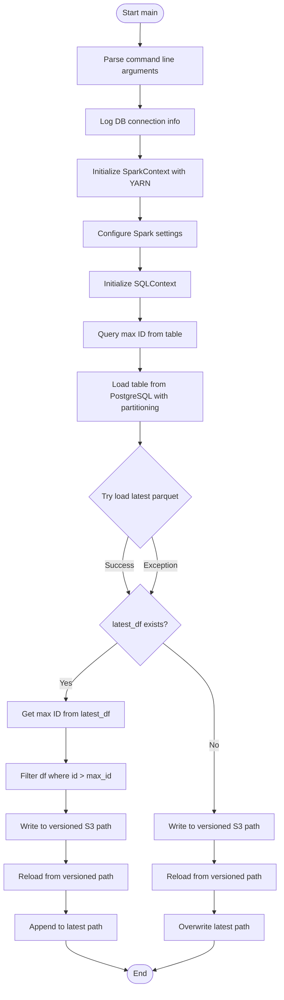
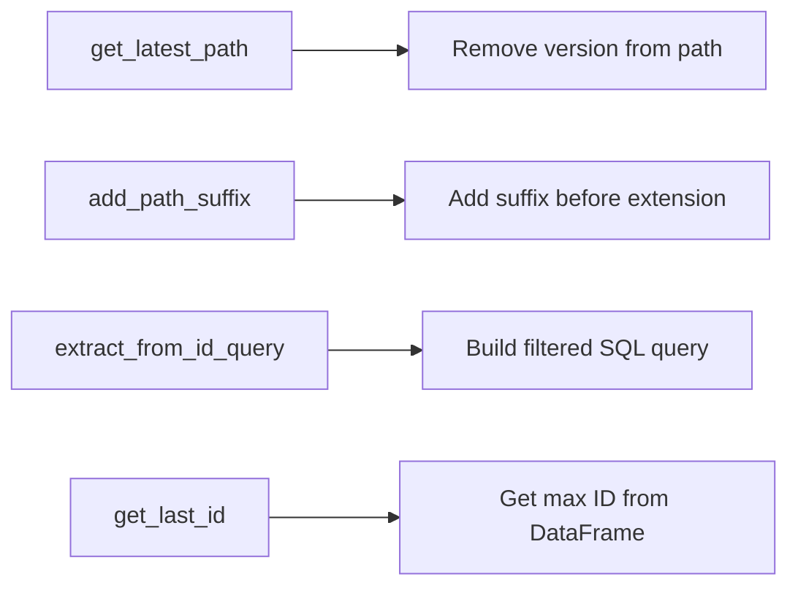
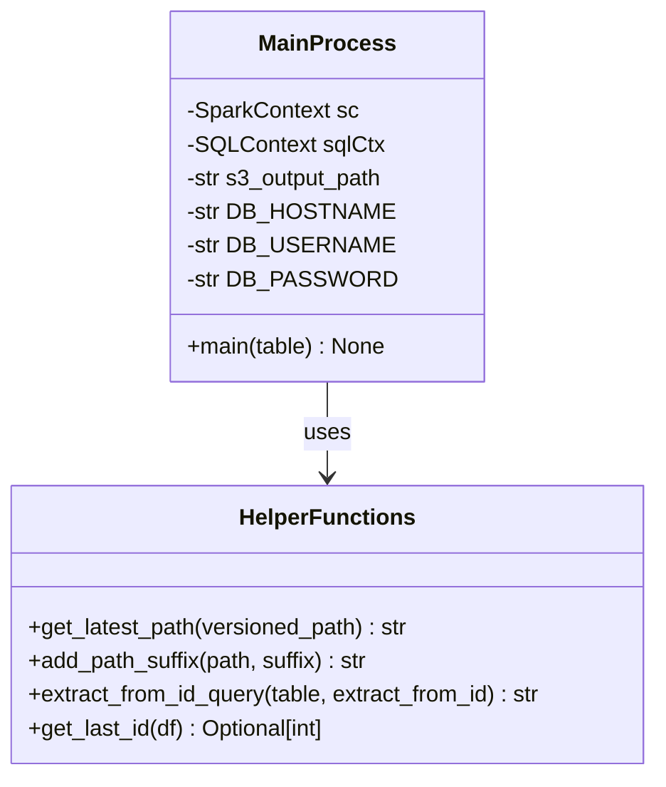
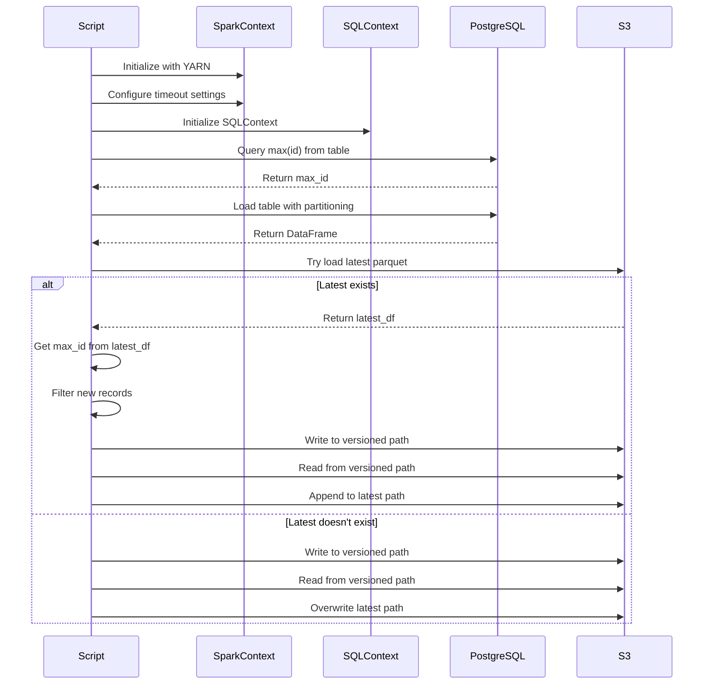

# Diagram: research/orchestrator/tasks/etl/extract_public_progress_update_spark.py

> Auto-generated by Obscura crawlers

## Diagram 1

### SVG

<svg id="container" width="586" xmlns="http://www.w3.org/2000/svg" class="flowchart" height="2072.984375" viewBox="0 0 586 2072.984375" role="graphics-document document" aria-roledescription="flowchart-v2"><g><marker id="container_flowchart-v2-pointEnd" class="marker flowchart-v2" viewBox="0 0 10 10" refX="5" refY="5" markerUnits="userSpaceOnUse" markerWidth="8" markerHeight="8" orient="auto"><path d="M 0 0 L 10 5 L 0 10 z" class="arrowMarkerPath" style="stroke-width: 1; stroke-dasharray: 1, 0;"></path></marker><marker id="container_flowchart-v2-pointStart" class="marker flowchart-v2" viewBox="0 0 10 10" refX="4.5" refY="5" markerUnits="userSpaceOnUse" markerWidth="8" markerHeight="8" orient="auto"><path d="M 0 5 L 10 10 L 10 0 z" class="arrowMarkerPath" style="stroke-width: 1; stroke-dasharray: 1, 0;"></path></marker><marker id="container_flowchart-v2-circleEnd" class="marker flowchart-v2" viewBox="0 0 10 10" refX="11" refY="5" markerUnits="userSpaceOnUse" markerWidth="11" markerHeight="11" orient="auto"><circle cx="5" cy="5" r="5" class="arrowMarkerPath" style="stroke-width: 1; stroke-dasharray: 1, 0;"></circle></marker><marker id="container_flowchart-v2-circleStart" class="marker flowchart-v2" viewBox="0 0 10 10" refX="-1" refY="5" markerUnits="userSpaceOnUse" markerWidth="11" markerHeight="11" orient="auto"><circle cx="5" cy="5" r="5" class="arrowMarkerPath" style="stroke-width: 1; stroke-dasharray: 1, 0;"></circle></marker><marker id="container_flowchart-v2-crossEnd" class="marker cross flowchart-v2" viewBox="0 0 11 11" refX="12" refY="5.2" markerUnits="userSpaceOnUse" markerWidth="11" markerHeight="11" orient="auto"><path d="M 1,1 l 9,9 M 10,1 l -9,9" class="arrowMarkerPath" style="stroke-width: 2; stroke-dasharray: 1, 0;"></path></marker><marker id="container_flowchart-v2-crossStart" class="marker cross flowchart-v2" viewBox="0 0 11 11" refX="-1" refY="5.2" markerUnits="userSpaceOnUse" markerWidth="11" markerHeight="11" orient="auto"><path d="M 1,1 l 9,9 M 10,1 l -9,9" class="arrowMarkerPath" style="stroke-width: 2; stroke-dasharray: 1, 0;"></path></marker><g class="root"><g class="clusters"></g><g class="edgePaths"><path d="M293.5,47.5L293.417,51.583C293.333,55.667,293.167,63.833,293.083,71.417C293,79,293,86,293,89.5L293,93" id="L_Start_ParseArgs_0" class="edge-thickness-normal edge-pattern-solid edge-thickness-normal edge-pattern-solid flowchart-link" style=";" data-edge="true" data-et="edge" data-id="L_Start_ParseArgs_0" data-points="W3sieCI6MjkzLjUsInkiOjQ3LjV9LHsieCI6MjkzLCJ5Ijo3Mn0seyJ4IjoyOTMsInkiOjk3fV0=" marker-end="url(#container_flowchart-v2-pointEnd)"></path><path d="M293,175L293,179.167C293,183.333,293,191.667,293,199.333C293,207,293,214,293,217.5L293,221" id="L_ParseArgs_LogInfo_0" class="edge-thickness-normal edge-pattern-solid edge-thickness-normal edge-pattern-solid flowchart-link" style=";" data-edge="true" data-et="edge" data-id="L_ParseArgs_LogInfo_0" data-points="W3sieCI6MjkzLCJ5IjoxNzV9LHsieCI6MjkzLCJ5IjoyMDB9LHsieCI6MjkzLCJ5IjoyMjV9XQ==" marker-end="url(#container_flowchart-v2-pointEnd)"></path><path d="M293,279L293,283.167C293,287.333,293,295.667,293,303.333C293,311,293,318,293,321.5L293,325" id="L_LogInfo_InitSpark_0" class="edge-thickness-normal edge-pattern-solid edge-thickness-normal edge-pattern-solid flowchart-link" style=";" data-edge="true" data-et="edge" data-id="L_LogInfo_InitSpark_0" data-points="W3sieCI6MjkzLCJ5IjoyNzl9LHsieCI6MjkzLCJ5IjozMDR9LHsieCI6MjkzLCJ5IjozMjl9XQ==" marker-end="url(#container_flowchart-v2-pointEnd)"></path><path d="M293,407L293,411.167C293,415.333,293,423.667,293,431.333C293,439,293,446,293,449.5L293,453" id="L_InitSpark_ConfigSpark_0" class="edge-thickness-normal edge-pattern-solid edge-thickness-normal edge-pattern-solid flowchart-link" style=";" data-edge="true" data-et="edge" data-id="L_InitSpark_ConfigSpark_0" data-points="W3sieCI6MjkzLCJ5Ijo0MDd9LHsieCI6MjkzLCJ5Ijo0MzJ9LHsieCI6MjkzLCJ5Ijo0NTd9XQ==" marker-end="url(#container_flowchart-v2-pointEnd)"></path><path d="M293,511L293,515.167C293,519.333,293,527.667,293,535.333C293,543,293,550,293,553.5L293,557" id="L_ConfigSpark_InitSQL_0" class="edge-thickness-normal edge-pattern-solid edge-thickness-normal edge-pattern-solid flowchart-link" style=";" data-edge="true" data-et="edge" data-id="L_ConfigSpark_InitSQL_0" data-points="W3sieCI6MjkzLCJ5Ijo1MTF9LHsieCI6MjkzLCJ5Ijo1MzZ9LHsieCI6MjkzLCJ5Ijo1NjF9XQ==" marker-end="url(#container_flowchart-v2-pointEnd)"></path><path d="M293,615L293,619.167C293,623.333,293,631.667,293,639.333C293,647,293,654,293,657.5L293,661" id="L_InitSQL_GetMaxID_0" class="edge-thickness-normal edge-pattern-solid edge-thickness-normal edge-pattern-solid flowchart-link" style=";" data-edge="true" data-et="edge" data-id="L_InitSQL_GetMaxID_0" data-points="W3sieCI6MjkzLCJ5Ijo2MTV9LHsieCI6MjkzLCJ5Ijo2NDB9LHsieCI6MjkzLCJ5Ijo2NjV9XQ==" marker-end="url(#container_flowchart-v2-pointEnd)"></path><path d="M293,719L293,723.167C293,727.333,293,735.667,293,743.333C293,751,293,758,293,761.5L293,765" id="L_GetMaxID_LoadTable_0" class="edge-thickness-normal edge-pattern-solid edge-thickness-normal edge-pattern-solid flowchart-link" style=";" data-edge="true" data-et="edge" data-id="L_GetMaxID_LoadTable_0" data-points="W3sieCI6MjkzLCJ5Ijo3MTl9LHsieCI6MjkzLCJ5Ijo3NDR9LHsieCI6MjkzLCJ5Ijo3Njl9XQ==" marker-end="url(#container_flowchart-v2-pointEnd)"></path><path d="M293,871L293,875.167C293,879.333,293,887.667,293,895.333C293,903,293,910,293,913.5L293,917" id="L_LoadTable_TryLoadLatest_0" class="edge-thickness-normal edge-pattern-solid edge-thickness-normal edge-pattern-solid flowchart-link" style=";" data-edge="true" data-et="edge" data-id="L_LoadTable_TryLoadLatest_0" data-points="W3sieCI6MjkzLCJ5Ijo4NzF9LHsieCI6MjkzLCJ5Ijo4OTZ9LHsieCI6MjkzLCJ5Ijo5MjF9XQ==" marker-end="url(#container_flowchart-v2-pointEnd)"></path><path d="M268.741,1115.303L265.828,1125.513C262.914,1135.723,257.088,1156.143,257.3,1175.504C257.513,1194.865,263.763,1213.168,266.889,1222.319L270.014,1231.47" id="L_TryLoadLatest_HasLatest_0" class="edge-thickness-normal edge-pattern-solid edge-thickness-normal edge-pattern-solid flowchart-link" style=";" data-edge="true" data-et="edge" data-id="L_TryLoadLatest_HasLatest_0" data-points="W3sieCI6MjY4Ljc0MDc1NjczMTM0ODU0LCJ5IjoxMTE1LjMwMzI1NjczMTM0ODV9LHsieCI6MjUxLjI2MTcxODc1LCJ5IjoxMTc2LjU2MjV9LHsieCI6MjcxLjMwNjk1MzIwMTMxNzYsInkiOjEyMzUuMjU1NTQ2Nzk4NjgyNH1d" marker-end="url(#container_flowchart-v2-pointEnd)"></path><path d="M317.259,1115.303L320.172,1125.513C323.086,1135.723,328.912,1156.143,328.7,1175.504C328.487,1194.865,322.237,1213.168,319.111,1222.319L315.986,1231.47" id="L_TryLoadLatest_HasLatest_2" class="edge-thickness-normal edge-pattern-solid edge-thickness-normal edge-pattern-solid flowchart-link" style=";" data-edge="true" data-et="edge" data-id="L_TryLoadLatest_HasLatest_2" data-points="W3sieCI6MzE3LjI1OTI0MzI2ODY1MTQ2LCJ5IjoxMTE1LjMwMzI1NjczMTM0ODV9LHsieCI6MzM0LjczODI4MTI1LCJ5IjoxMTc2LjU2MjV9LHsieCI6MzE0LjY5MzA0Njc5ODY4MjQsInkiOjEyMzUuMjU1NTQ2Nzk4NjgyNH1d" marker-end="url(#container_flowchart-v2-pointEnd)"></path><path d="M245.355,1336.339L227.463,1350.447C209.57,1364.554,173.785,1392.769,155.893,1412.377C138,1431.984,138,1442.984,138,1448.484L138,1453.984" id="L_HasLatest_GetLatestMaxID_0" class="edge-thickness-normal edge-pattern-solid edge-thickness-normal edge-pattern-solid flowchart-link" style=";" data-edge="true" data-et="edge" data-id="L_HasLatest_GetLatestMaxID_0" data-points="W3sieCI6MjQ1LjM1NTA3MTQ0MjY2MjY4LCJ5IjoxMzM2LjMzOTQ0NjQ0MjY2MjZ9LHsieCI6MTM4LCJ5IjoxNDIwLjk4NDM3NX0seyJ4IjoxMzgsInkiOjE0NTcuOTg0Mzc1fV0=" marker-end="url(#container_flowchart-v2-pointEnd)"></path><path d="M138,1511.984L138,1518.151C138,1524.318,138,1536.651,138,1548.318C138,1559.984,138,1570.984,138,1576.484L138,1581.984" id="L_GetLatestMaxID_FilterNew_0" class="edge-thickness-normal edge-pattern-solid edge-thickness-normal edge-pattern-solid flowchart-link" style=";" data-edge="true" data-et="edge" data-id="L_GetLatestMaxID_FilterNew_0" data-points="W3sieCI6MTM4LCJ5IjoxNTExLjk4NDM3NX0seyJ4IjoxMzgsInkiOjE1NDguOTg0Mzc1fSx7IngiOjEzOCwieSI6MTU4NS45ODQzNzV9XQ==" marker-end="url(#container_flowchart-v2-pointEnd)"></path><path d="M138,1639.984L138,1644.151C138,1648.318,138,1656.651,138,1664.318C138,1671.984,138,1678.984,138,1682.484L138,1685.984" id="L_FilterNew_WriteVersioned_0" class="edge-thickness-normal edge-pattern-solid edge-thickness-normal edge-pattern-solid flowchart-link" style=";" data-edge="true" data-et="edge" data-id="L_FilterNew_WriteVersioned_0" data-points="W3sieCI6MTM4LCJ5IjoxNjM5Ljk4NDM3NX0seyJ4IjoxMzgsInkiOjE2NjQuOTg0Mzc1fSx7IngiOjEzOCwieSI6MTY4OS45ODQzNzV9XQ==" marker-end="url(#container_flowchart-v2-pointEnd)"></path><path d="M138,1743.984L138,1748.151C138,1752.318,138,1760.651,138,1768.318C138,1775.984,138,1782.984,138,1786.484L138,1789.984" id="L_WriteVersioned_ReloadVersioned_0" class="edge-thickness-normal edge-pattern-solid edge-thickness-normal edge-pattern-solid flowchart-link" style=";" data-edge="true" data-et="edge" data-id="L_WriteVersioned_ReloadVersioned_0" data-points="W3sieCI6MTM4LCJ5IjoxNzQzLjk4NDM3NX0seyJ4IjoxMzgsInkiOjE3NjguOTg0Mzc1fSx7IngiOjEzOCwieSI6MTc5My45ODQzNzV9XQ==" marker-end="url(#container_flowchart-v2-pointEnd)"></path><path d="M138,1871.984L138,1876.151C138,1880.318,138,1888.651,138,1896.318C138,1903.984,138,1910.984,138,1914.484L138,1917.984" id="L_ReloadVersioned_AppendLatest_0" class="edge-thickness-normal edge-pattern-solid edge-thickness-normal edge-pattern-solid flowchart-link" style=";" data-edge="true" data-et="edge" data-id="L_ReloadVersioned_AppendLatest_0" data-points="W3sieCI6MTM4LCJ5IjoxODcxLjk4NDM3NX0seyJ4IjoxMzgsInkiOjE4OTYuOTg0Mzc1fSx7IngiOjEzOCwieSI6MTkyMS45ODQzNzV9XQ==" marker-end="url(#container_flowchart-v2-pointEnd)"></path><path d="M138,1975.984L138,1980.151C138,1984.318,138,1992.651,159.158,2002.95C180.316,2013.249,222.633,2025.513,243.791,2031.645L264.949,2037.777" id="L_AppendLatest_End_0" class="edge-thickness-normal edge-pattern-solid edge-thickness-normal edge-pattern-solid flowchart-link" style=";" data-edge="true" data-et="edge" data-id="L_AppendLatest_End_0" data-points="W3sieCI6MTM4LCJ5IjoxOTc1Ljk4NDM3NX0seyJ4IjoxMzgsInkiOjIwMDAuOTg0Mzc1fSx7IngiOjI2OC43OTA2NjQyOTQyMTM5NywieSI6MjAzOC44OTA0MDQ0MjY0MDM0fV0=" marker-end="url(#container_flowchart-v2-pointEnd)"></path><path d="M340.645,1336.339L358.537,1350.447C376.43,1364.554,412.215,1392.769,430.107,1417.544C448,1442.318,448,1463.651,448,1484.984C448,1506.318,448,1527.651,448,1548.984C448,1570.318,448,1591.651,448,1610.984C448,1630.318,448,1647.651,448,1659.818C448,1671.984,448,1678.984,448,1682.484L448,1685.984" id="L_HasLatest_WriteNew_0" class="edge-thickness-normal edge-pattern-solid edge-thickness-normal edge-pattern-solid flowchart-link" style=";" data-edge="true" data-et="edge" data-id="L_HasLatest_WriteNew_0" data-points="W3sieCI6MzQwLjY0NDkyODU1NzMzNzMsInkiOjEzMzYuMzM5NDQ2NDQyNjYyNn0seyJ4Ijo0NDgsInkiOjE0MjAuOTg0Mzc1fSx7IngiOjQ0OCwieSI6MTQ4NC45ODQzNzV9LHsieCI6NDQ4LCJ5IjoxNTQ4Ljk4NDM3NX0seyJ4Ijo0NDgsInkiOjE2MTIuOTg0Mzc1fSx7IngiOjQ0OCwieSI6MTY2NC45ODQzNzV9LHsieCI6NDQ4LCJ5IjoxNjg5Ljk4NDM3NX1d" marker-end="url(#container_flowchart-v2-pointEnd)"></path><path d="M448,1743.984L448,1748.151C448,1752.318,448,1760.651,448,1768.318C448,1775.984,448,1782.984,448,1786.484L448,1789.984" id="L_WriteNew_ReloadNew_0" class="edge-thickness-normal edge-pattern-solid edge-thickness-normal edge-pattern-solid flowchart-link" style=";" data-edge="true" data-et="edge" data-id="L_WriteNew_ReloadNew_0" data-points="W3sieCI6NDQ4LCJ5IjoxNzQzLjk4NDM3NX0seyJ4Ijo0NDgsInkiOjE3NjguOTg0Mzc1fSx7IngiOjQ0OCwieSI6MTc5My45ODQzNzV9XQ==" marker-end="url(#container_flowchart-v2-pointEnd)"></path><path d="M448,1871.984L448,1876.151C448,1880.318,448,1888.651,448,1896.318C448,1903.984,448,1910.984,448,1914.484L448,1917.984" id="L_ReloadNew_OverwriteLatest_0" class="edge-thickness-normal edge-pattern-solid edge-thickness-normal edge-pattern-solid flowchart-link" style=";" data-edge="true" data-et="edge" data-id="L_ReloadNew_OverwriteLatest_0" data-points="W3sieCI6NDQ4LCJ5IjoxODcxLjk4NDM3NX0seyJ4Ijo0NDgsInkiOjE4OTYuOTg0Mzc1fSx7IngiOjQ0OCwieSI6MTkyMS45ODQzNzV9XQ==" marker-end="url(#container_flowchart-v2-pointEnd)"></path><path d="M448,1975.984L448,1980.151C448,1984.318,448,1992.651,427.008,2002.948C406.016,2013.246,364.033,2025.507,343.041,2031.638L322.049,2037.769" id="L_OverwriteLatest_End_0" class="edge-thickness-normal edge-pattern-solid edge-thickness-normal edge-pattern-solid flowchart-link" style=";" data-edge="true" data-et="edge" data-id="L_OverwriteLatest_End_0" data-points="W3sieCI6NDQ4LCJ5IjoxOTc1Ljk4NDM3NX0seyJ4Ijo0NDgsInkiOjIwMDAuOTg0Mzc1fSx7IngiOjMxOC4yMDkzMzY2MzQ0MTc0NywieSI6MjAzOC44OTA0MDQxNTk3OTYyfV0=" marker-end="url(#container_flowchart-v2-pointEnd)"></path></g><g class="edgeLabels"><g class="edgeLabel"><g class="label" data-id="L_Start_ParseArgs_0" transform="translate(0, 0)"><foreignObject width="0" height="0">

</foreignObject></g></g><g class="edgeLabel"><g class="label" data-id="L_ParseArgs_LogInfo_0" transform="translate(0, 0)"><foreignObject width="0" height="0">

</foreignObject></g></g><g class="edgeLabel"><g class="label" data-id="L_LogInfo_InitSpark_0" transform="translate(0, 0)"><foreignObject width="0" height="0">

</foreignObject></g></g><g class="edgeLabel"><g class="label" data-id="L_InitSpark_ConfigSpark_0" transform="translate(0, 0)"><foreignObject width="0" height="0">

</foreignObject></g></g><g class="edgeLabel"><g class="label" data-id="L_ConfigSpark_InitSQL_0" transform="translate(0, 0)"><foreignObject width="0" height="0">

</foreignObject></g></g><g class="edgeLabel"><g class="label" data-id="L_InitSQL_GetMaxID_0" transform="translate(0, 0)"><foreignObject width="0" height="0">

</foreignObject></g></g><g class="edgeLabel"><g class="label" data-id="L_GetMaxID_LoadTable_0" transform="translate(0, 0)"><foreignObject width="0" height="0">

</foreignObject></g></g><g class="edgeLabel"><g class="label" data-id="L_LoadTable_TryLoadLatest_0" transform="translate(0, 0)"><foreignObject width="0" height="0">

</foreignObject></g></g><g class="edgeLabel" transform="translate(251.49253, 1175.75356)"><g class="label" data-id="L_TryLoadLatest_HasLatest_0" transform="translate(-28.1015625, -12)"><foreignObject width="56.203125" height="24">

Success

</foreignObject></g></g><g class="edgeLabel" transform="translate(334.50747, 1175.75356)"><g class="label" data-id="L_TryLoadLatest_HasLatest_2" transform="translate(-35.375, -12)"><foreignObject width="70.75" height="24">

Exception

</foreignObject></g></g><g class="edgeLabel" transform="translate(138, 1420.984375)"><g class="label" data-id="L_HasLatest_GetLatestMaxID_0" transform="translate(-12.03125, -12)"><foreignObject width="24.0625" height="24">

Yes

</foreignObject></g></g><g class="edgeLabel"><g class="label" data-id="L_GetLatestMaxID_FilterNew_0" transform="translate(0, 0)"><foreignObject width="0" height="0">

</foreignObject></g></g><g class="edgeLabel"><g class="label" data-id="L_FilterNew_WriteVersioned_0" transform="translate(0, 0)"><foreignObject width="0" height="0">

</foreignObject></g></g><g class="edgeLabel"><g class="label" data-id="L_WriteVersioned_ReloadVersioned_0" transform="translate(0, 0)"><foreignObject width="0" height="0">

</foreignObject></g></g><g class="edgeLabel"><g class="label" data-id="L_ReloadVersioned_AppendLatest_0" transform="translate(0, 0)"><foreignObject width="0" height="0">

</foreignObject></g></g><g class="edgeLabel"><g class="label" data-id="L_AppendLatest_End_0" transform="translate(0, 0)"><foreignObject width="0" height="0">

</foreignObject></g></g><g class="edgeLabel" transform="translate(448, 1548.984375)"><g class="label" data-id="L_HasLatest_WriteNew_0" transform="translate(-10.140625, -12)"><foreignObject width="20.28125" height="24">

No

</foreignObject></g></g><g class="edgeLabel"><g class="label" data-id="L_WriteNew_ReloadNew_0" transform="translate(0, 0)"><foreignObject width="0" height="0">

</foreignObject></g></g><g class="edgeLabel"><g class="label" data-id="L_ReloadNew_OverwriteLatest_0" transform="translate(0, 0)"><foreignObject width="0" height="0">

</foreignObject></g></g><g class="edgeLabel"><g class="label" data-id="L_OverwriteLatest_End_0" transform="translate(0, 0)"><foreignObject width="0" height="0">

</foreignObject></g></g></g><g class="nodes"><g class="node default" id="flowchart-Start-0" transform="translate(293, 27.5)"><g class="basic label-container outer-path"><path d="M-30.671875 -19.5 C-6.335135454428709 -19.5, 18.001604091142582 -19.5, 30.671875 -19.5 C30.671875 -19.5, 30.671875 -19.5, 30.671875 -19.5 C31.02935951257369 -19.488536167483154, 31.386844025147383 -19.47707233496631, 31.9212442896239 -19.45993515863156 C32.19817747513446 -19.43321974728624, 32.47511066064501 -19.40650433594092, 33.165479652847864 -19.3399052695533 C33.448387732610385 -19.29416688520222, 33.7312958123729 -19.248428500851144, 34.39946825967676 -19.140403561325776 C34.73426526135326 -19.063988330447728, 35.06906226302975 -18.98757309956968, 35.61813938623539 -18.862249829261074 C36.007721377996965 -18.746623939063845, 36.39730336975853 -18.630998048866616, 36.816485251460605 -18.50658706670804 C37.05893973713217 -18.417361574756207, 37.30139422280373 -18.328136082804374, 37.9895815951478 -18.074876768247425 C38.350096469396135 -17.91528752771146, 38.71061134364448 -17.755698287175495, 39.13260791279238 -17.568892924097174 C39.46830857910059 -17.393758101510723, 39.80400924540879 -17.21862327892427, 40.24086726407678 -16.990714730406097 C40.55576899864797 -16.79981944834104, 40.87067073321916 -16.608924166275987, 41.3098055736057 -16.342718045390892 C41.580135352734025 -16.154147693858505, 41.85046513186234 -15.965577342326114, 42.33503034457871 -15.627565626425154 C42.66425731011319 -15.365015882508901, 42.99348427564767 -15.10246613859265, 43.312328708501866 -14.848196188198123 C43.6244670362004 -14.564720417709907, 43.93660536389893 -14.28124464722169, 44.23768473676799 -14.007812326905688 C44.50435616750325 -13.732452180539886, 44.77102759823852 -13.457092034174083, 45.10729594296865 -13.10986736009568 C45.33690263347468 -12.840158276436489, 45.56650932398072 -12.570449192777298, 45.91758890812658 -12.158051136245305 C46.190181946491684 -11.792801298572737, 46.46277498485679 -11.427551460900169, 46.665233964640635 -11.156274872382312 C46.81783096892947 -10.921844895761541, 46.97042797321831 -10.687414919140773, 47.34715887860425 -10.108655082055241 C47.57179404925335 -9.709792589790155, 47.79642921990246 -9.310930097525068, 47.960561474273504 -9.019496659696287 C48.10686271831 -8.715698996109351, 48.2531639623465 -8.411901332522413, 48.50292114880834 -7.893275190886684 C48.63312478403608 -7.571669694558133, 48.76332841926382 -7.25006419822958, 48.972009229970325 -6.734618561215508 C49.07982714580219 -6.409888177181939, 49.18764506163406 -6.085157793148369, 49.36589813421488 -5.548287939305138 C49.45379781145184 -5.213088374039518, 49.5416974886888 -4.877888808773898, 49.68296928754556 -4.339158212148133 C49.7667094530056 -3.909170161001043, 49.850449618465646 -3.4791821098539533, 49.921919776581774 -3.1121979531509023 C49.98480013749269 -2.6245102910575673, 50.04768049840361 -2.1368226289642323, 50.08176770250937 -1.872449005199798 C50.11309728521626 -1.384465465755909, 50.14442686792316 -0.8964819263120203, 50.16185621591342 -0.6250057626472757 C50.16185621591342 -0.1985538829900262, 50.16185621591342 0.22789799666722332, 50.16185621591342 0.625005762647271 C50.140798474141754 0.9529970882441107, 50.1197407323701 1.2809884138409502, 50.08176770250937 1.8724490051997846 C50.02526074809116 2.310705785107073, 49.96875379367297 2.748962565014362, 49.921919776581774 3.1121979531508885 C49.8622509200822 3.41858492025893, 49.80258206358262 3.7249718873669715, 49.68296928754556 4.339158212148129 C49.6182696446763 4.5858859914112164, 49.55357000180704 4.832613770674304, 49.36589813421489 5.548287939305125 C49.28503013268862 5.7918494753359635, 49.20416213116235 6.0354110113668025, 48.972009229970325 6.734618561215495 C48.83605588221402 7.070425958652735, 48.70010253445771 7.406233356089975, 48.50292114880834 7.893275190886679 C48.34770532875572 8.215584162312458, 48.19248950870311 8.537893133738237, 47.960561474273504 9.019496659696284 C47.802014035371 9.301013692136776, 47.64346659646849 9.582530724577268, 47.34715887860425 10.108655082055236 C47.2100704080104 10.319259786296099, 47.07298193741656 10.529864490536962, 46.66523396464064 11.156274872382301 C46.45703100642195 11.435247868715658, 46.24882804820325 11.714220865049013, 45.91758890812658 12.158051136245302 C45.605782353812415 12.52431685723828, 45.293975799498256 12.890582578231257, 45.10729594296866 13.10986736009567 C44.770047937331434 13.458103614492307, 44.432799931694205 13.806339868888944, 44.23768473676799 14.007812326905684 C44.03049495104239 14.195976608360342, 43.823305165316796 14.384140889814997, 43.31232870850189 14.848196188198111 C42.93244106276351 15.151146476439651, 42.55255341702514 15.454096764681191, 42.33503034457871 15.627565626425152 C41.933163290547874 15.90789068677268, 41.531296236517036 16.188215747120207, 41.30980557360571 16.34271804539089 C41.09383393970683 16.473641319050582, 40.877862305807966 16.60456459271028, 40.24086726407678 16.990714730406093 C39.99771584123049 17.117566671959086, 39.75456441838419 17.24441861351208, 39.13260791279239 17.56889292409717 C38.832638680862566 17.701680404801394, 38.53266944893275 17.834467885505614, 37.989581595147804 18.07487676824742 C37.67439656705622 18.190867772123585, 37.35921153896464 18.306858775999746, 36.81648525146062 18.506587066708033 C36.5345648662312 18.590259557213827, 36.25264448100178 18.673932047719617, 35.61813938623541 18.86224982926107 C35.235339631372796 18.94962137530661, 34.852539876510185 19.03699292135215, 34.399468259676766 19.140403561325773 C34.05962786314446 19.195346321135478, 33.71978746661217 19.250289080945187, 33.16547965284788 19.3399052695533 C32.71801140457868 19.383071993304522, 32.27054315630949 19.42623871705575, 31.9212442896239 19.45993515863156 C31.51325609213965 19.47301854602403, 31.105267894655398 19.486101933416496, 30.671875000000004 19.5 C30.671875000000004 19.5, 30.671875000000004 19.5, 30.671875 19.5 C17.601977088426242 19.5, 4.532079176852484 19.5, -30.671874999999996 19.5 C-30.996170571178602 19.489600472235338, -31.32046614235721 19.479200944470676, -31.921244289623893 19.45993515863156 C-32.227859729656046 19.430356335890675, -32.5344751696882 19.40077751314979, -33.16547965284787 19.3399052695533 C-33.51687533534601 19.283094340721217, -33.86827101784415 19.226283411889135, -34.39946825967676 19.140403561325773 C-34.7092506032987 19.069697762912778, -35.019032946920646 18.998991964499783, -35.618139386235384 18.862249829261074 C-36.02961913850866 18.740124798687663, -36.44109889078193 18.617999768114252, -36.81648525146059 18.506587066708043 C-37.13417319279444 18.38967496762205, -37.45186113412829 18.272762868536056, -37.9895815951478 18.074876768247425 C-38.25883209724904 17.95568755799957, -38.52808259935028 17.836498347751718, -39.13260791279238 17.568892924097174 C-39.37751504423904 17.441125030491957, -39.6224221756857 17.31335713688674, -40.24086726407678 16.990714730406097 C-40.56641621027701 16.793365046081558, -40.891965156477234 16.596015361757015, -41.309805573605686 16.3427180453909 C-41.54110076660441 16.18137653136252, -41.77239595960313 16.020035017334145, -42.33503034457871 15.627565626425156 C-42.7195657718359 15.320908856105019, -43.104101199093094 15.014252085784882, -43.312328708501866 14.848196188198125 C-43.499145106558764 14.678534478373882, -43.68596150461566 14.50887276854964, -44.237684736767974 14.007812326905697 C-44.56236439519296 13.6725539228862, -44.88704405361794 13.337295518866702, -45.107295942968655 13.109867360095677 C-45.284283659088125 12.901967517855402, -45.4612713752076 12.694067675615125, -45.917588908126575 12.158051136245307 C-46.10750363575425 11.903582702811839, -46.29741836338192 11.649114269378373, -46.665233964640635 11.156274872382316 C-46.82213803923856 10.915228079156474, -46.97904211383648 10.674181285930631, -47.34715887860425 10.108655082055249 C-47.54275116219233 9.761361176678216, -47.738343445780416 9.414067271301183, -47.960561474273504 9.019496659696289 C-48.16550687654539 8.593923146749589, -48.370452278817275 8.168349633802888, -48.50292114880834 7.893275190886686 C-48.63576111246232 7.565157912375383, -48.7686010761163 7.237040633864082, -48.972009229970325 6.73461856121551 C-49.075738957436016 6.422201149176494, -49.17946868490171 6.1097837371374775, -49.36589813421488 5.5482879393051325 C-49.48193097762173 5.105804418442383, -49.59796382102858 4.663320897579634, -49.68296928754556 4.339158212148136 C-49.771095031634246 3.8866511416353298, -49.85922077572293 3.4341440711225233, -49.921919776581774 3.112197953150904 C-49.96790868794874 2.755517038126462, -50.013897599315705 2.3988361231020203, -50.08176770250937 1.872449005199809 C-50.10581291871823 1.4979253537976518, -50.12985813492708 1.1234017023954945, -50.16185621591342 0.6250057626472781 C-50.16185621591342 0.3739804860376523, -50.16185621591342 0.12295520942802651, -50.16185621591342 -0.6250057626472687 C-50.13996131718533 -0.9660364835813646, -50.118066418457246 -1.3070672045154605, -50.08176770250937 -1.8724490051997822 C-50.03509712157305 -2.2344168147932244, -49.98842654063674 -2.5963846243866664, -49.921919776581774 -3.112197953150895 C-49.846251246336514 -3.50073986341078, -49.770582716091255 -3.889281773670665, -49.68296928754556 -4.339158212148126 C-49.57419749723942 -4.753952190577568, -49.46542570693328 -5.168746169007011, -49.36589813421489 -5.548287939305123 C-49.224177219174564 -5.975128755245213, -49.08245630413424 -6.401969571185303, -48.97200922997033 -6.734618561215485 C-48.808092093144346 -7.139497058297921, -48.64417495631836 -7.544375555380357, -48.50292114880834 -7.893275190886676 C-48.367657261694184 -8.17415354666277, -48.23239337458003 -8.455031902438865, -47.960561474273504 -9.019496659696282 C-47.822296665840895 -9.264999827898434, -47.68403185740828 -9.510502996100588, -47.34715887860425 -10.108655082055243 C-47.18925660366296 -10.351235379062818, -47.031354328721676 -10.593815676070392, -46.66523396464064 -11.156274872382308 C-46.50260176261171 -11.374187207002672, -46.33996956058279 -11.592099541623037, -45.91758890812659 -12.158051136245302 C-45.624587737701745 -12.502226983265228, -45.331586567276894 -12.846402830285152, -45.10729594296866 -13.10986736009567 C-44.77888892140758 -13.448974572575395, -44.4504818998465 -13.78808178505512, -44.237684736767996 -14.007812326905677 C-43.94812968712255 -14.27077856178688, -43.6585746374771 -14.533744796668081, -43.31232870850189 -14.848196188198107 C-43.0509956147764 -15.0566023760785, -42.7896625210509 -15.265008563958892, -42.33503034457872 -15.627565626425149 C-41.96549024440726 -15.885340803171651, -41.5959501442358 -16.143115979918154, -41.309805573605715 -16.342718045390885 C-40.889042777349644 -16.59778692515797, -40.468279981093566 -16.852855804925056, -40.24086726407679 -16.99071473040609 C-39.81763149153882 -17.2115165618437, -39.39439571900085 -17.43231839328131, -39.13260791279239 -17.56889292409717 C-38.80146635843251 -17.715479467247086, -38.470324804072646 -17.862066010397, -37.989581595147804 -18.07487676824742 C-37.60112999559743 -18.21783054768918, -37.21267839604707 -18.36078432713094, -36.81648525146062 -18.506587066708033 C-36.48521152117346 -18.604907370965964, -36.15393779088631 -18.7032276752239, -35.61813938623541 -18.862249829261067 C-35.26810721045495 -18.942142389209543, -34.918075034674494 -19.02203494915802, -34.399468259676766 -19.140403561325773 C-34.07483894327735 -19.192887111663282, -33.75020962687794 -19.24537066200079, -33.16547965284788 -19.3399052695533 C-32.80859161923982 -19.37433382893481, -32.45170358563177 -19.408762388316323, -31.921244289623903 -19.45993515863156 C-31.522685234207156 -19.472716171790633, -31.12412617879041 -19.48549718494971, -30.671875000000007 -19.5 C-30.671875000000007 -19.5, -30.671875000000004 -19.5, -30.671875 -19.5" stroke="none" stroke-width="0" fill="#ECECFF" style=""></path><path d="M-30.671875 -19.5 C-11.53788593311819 -19.5, 7.59610313376362 -19.5, 30.671875 -19.5 M-30.671875 -19.5 C-13.831219280313636 -19.5, 3.0094364393727275 -19.5, 30.671875 -19.5 M30.671875 -19.5 C30.671875 -19.5, 30.671875 -19.5, 30.671875 -19.5 M30.671875 -19.5 C30.671875 -19.5, 30.671875 -19.5, 30.671875 -19.5 M30.671875 -19.5 C30.956684444791872 -19.49086671545348, 31.241493889583747 -19.481733430906957, 31.9212442896239 -19.45993515863156 M30.671875 -19.5 C31.024663220934904 -19.48868676841523, 31.37745144186981 -19.477373536830466, 31.9212442896239 -19.45993515863156 M31.9212442896239 -19.45993515863156 C32.18547606048899 -19.434445037481403, 32.44970783135407 -19.408954916331243, 33.165479652847864 -19.3399052695533 M31.9212442896239 -19.45993515863156 C32.31506168214492 -19.421944068409765, 32.708879074665944 -19.38395297818797, 33.165479652847864 -19.3399052695533 M33.165479652847864 -19.3399052695533 C33.4855939283108 -19.288151676019737, 33.805708203773726 -19.236398082486172, 34.39946825967676 -19.140403561325776 M33.165479652847864 -19.3399052695533 C33.62897799802929 -19.26497045158772, 34.09247634321072 -19.190035633622134, 34.39946825967676 -19.140403561325776 M34.39946825967676 -19.140403561325776 C34.88637735103521 -19.029269738601972, 35.373286442393656 -18.918135915878167, 35.61813938623539 -18.862249829261074 M34.39946825967676 -19.140403561325776 C34.84763658470906 -19.03811206570879, 35.295804909741356 -18.935820570091803, 35.61813938623539 -18.862249829261074 M35.61813938623539 -18.862249829261074 C35.954990151928705 -18.76227429016905, 36.291840917622025 -18.662298751077024, 36.816485251460605 -18.50658706670804 M35.61813938623539 -18.862249829261074 C36.0172437344909 -18.743797753640315, 36.416348082746396 -18.625345678019556, 36.816485251460605 -18.50658706670804 M36.816485251460605 -18.50658706670804 C37.21124119147535 -18.361313231698706, 37.6059971314901 -18.216039396689368, 37.9895815951478 -18.074876768247425 M36.816485251460605 -18.50658706670804 C37.274987361137356 -18.337854051999955, 37.7334894708141 -18.16912103729187, 37.9895815951478 -18.074876768247425 M37.9895815951478 -18.074876768247425 C38.314793477123615 -17.93091511516445, 38.640005359099426 -17.786953462081474, 39.13260791279238 -17.568892924097174 M37.9895815951478 -18.074876768247425 C38.38664161142226 -17.899110077409617, 38.78370162769672 -17.72334338657181, 39.13260791279238 -17.568892924097174 M39.13260791279238 -17.568892924097174 C39.3953850697078 -17.431802249651202, 39.658162226623226 -17.294711575205227, 40.24086726407678 -16.990714730406097 M39.13260791279238 -17.568892924097174 C39.57356742458437 -17.338844629243344, 40.01452693637635 -17.108796334389513, 40.24086726407678 -16.990714730406097 M40.24086726407678 -16.990714730406097 C40.58771099137255 -16.780456024639413, 40.93455471866833 -16.570197318872726, 41.3098055736057 -16.342718045390892 M40.24086726407678 -16.990714730406097 C40.55268414019107 -16.801689507666257, 40.86450101630535 -16.612664284926417, 41.3098055736057 -16.342718045390892 M41.3098055736057 -16.342718045390892 C41.624382500424694 -16.123282799057645, 41.93895942724368 -15.903847552724399, 42.33503034457871 -15.627565626425154 M41.3098055736057 -16.342718045390892 C41.62612165514941 -16.122069640008473, 41.94243773669313 -15.901421234626055, 42.33503034457871 -15.627565626425154 M42.33503034457871 -15.627565626425154 C42.611341740809934 -15.407214640885812, 42.887653137041156 -15.18686365534647, 43.312328708501866 -14.848196188198123 M42.33503034457871 -15.627565626425154 C42.69498906703828 -15.340508124167542, 43.054947789497845 -15.053450621909931, 43.312328708501866 -14.848196188198123 M43.312328708501866 -14.848196188198123 C43.67201936203379 -14.521534653553621, 44.0317100155657 -14.19487311890912, 44.23768473676799 -14.007812326905688 M43.312328708501866 -14.848196188198123 C43.669027288921576 -14.524251975188214, 44.02572586934128 -14.200307762178305, 44.23768473676799 -14.007812326905688 M44.23768473676799 -14.007812326905688 C44.5492622431289 -13.686082970599028, 44.86083974948982 -13.364353614292368, 45.10729594296865 -13.10986736009568 M44.23768473676799 -14.007812326905688 C44.518390310678505 -13.717960775486858, 44.799095884589015 -13.42810922406803, 45.10729594296865 -13.10986736009568 M45.10729594296865 -13.10986736009568 C45.269753536452846 -12.919035426690197, 45.43221112993705 -12.728203493284713, 45.91758890812658 -12.158051136245305 M45.10729594296865 -13.10986736009568 C45.3446355065863 -12.831074803666636, 45.58197507020395 -12.552282247237592, 45.91758890812658 -12.158051136245305 M45.91758890812658 -12.158051136245305 C46.115017715899064 -11.893514519964572, 46.31244652367155 -11.628977903683841, 46.665233964640635 -11.156274872382312 M45.91758890812658 -12.158051136245305 C46.13859634357876 -11.861921306930949, 46.35960377903095 -11.565791477616592, 46.665233964640635 -11.156274872382312 M46.665233964640635 -11.156274872382312 C46.85673482071771 -10.862078132267866, 47.04823567679478 -10.56788139215342, 47.34715887860425 -10.108655082055241 M46.665233964640635 -11.156274872382312 C46.83778417847457 -10.891191407713286, 47.01033439230851 -10.62610794304426, 47.34715887860425 -10.108655082055241 M47.34715887860425 -10.108655082055241 C47.51561091768493 -9.809551429048872, 47.68406295676561 -9.510447776042502, 47.960561474273504 -9.019496659696287 M47.34715887860425 -10.108655082055241 C47.575964202112054 -9.702388061115768, 47.804769525619854 -9.296121040176295, 47.960561474273504 -9.019496659696287 M47.960561474273504 -9.019496659696287 C48.168057772036185 -8.588626157682532, 48.375554069798866 -8.157755655668778, 48.50292114880834 -7.893275190886684 M47.960561474273504 -9.019496659696287 C48.10380051383009 -8.722057729232574, 48.247039553386664 -8.424618798768861, 48.50292114880834 -7.893275190886684 M48.50292114880834 -7.893275190886684 C48.61784046337557 -7.609422262091831, 48.732759777942796 -7.325569333296977, 48.972009229970325 -6.734618561215508 M48.50292114880834 -7.893275190886684 C48.623824200770784 -7.5946423150379605, 48.74472725273323 -7.296009439189237, 48.972009229970325 -6.734618561215508 M48.972009229970325 -6.734618561215508 C49.08851337535939 -6.3837266377183814, 49.205017520748456 -6.032834714221256, 49.36589813421488 -5.548287939305138 M48.972009229970325 -6.734618561215508 C49.12787005353654 -6.265190593683903, 49.283730877102755 -5.7957626261523, 49.36589813421488 -5.548287939305138 M49.36589813421488 -5.548287939305138 C49.47595410381421 -5.128596828663956, 49.58601007341353 -4.708905718022774, 49.68296928754556 -4.339158212148133 M49.36589813421488 -5.548287939305138 C49.44400484756942 -5.250433189620585, 49.52211156092395 -4.9525784399360315, 49.68296928754556 -4.339158212148133 M49.68296928754556 -4.339158212148133 C49.76427841620005 -3.9216530211977387, 49.845587544854546 -3.5041478302473443, 49.921919776581774 -3.1121979531509023 M49.68296928754556 -4.339158212148133 C49.76082977264507 -3.9393610769815313, 49.83869025774457 -3.5395639418149294, 49.921919776581774 -3.1121979531509023 M49.921919776581774 -3.1121979531509023 C49.95938913863234 -2.821592980249182, 49.9968585006829 -2.5309880073474615, 50.08176770250937 -1.872449005199798 M49.921919776581774 -3.1121979531509023 C49.95545828521764 -2.852079903098763, 49.98899679385351 -2.5919618530466244, 50.08176770250937 -1.872449005199798 M50.08176770250937 -1.872449005199798 C50.099976437480954 -1.5888332601910389, 50.118185172452534 -1.3052175151822798, 50.16185621591342 -0.6250057626472757 M50.08176770250937 -1.872449005199798 C50.11306467475301 -1.3849734000437754, 50.14436164699665 -0.8974977948877528, 50.16185621591342 -0.6250057626472757 M50.16185621591342 -0.6250057626472757 C50.16185621591342 -0.3081168278697087, 50.16185621591342 0.008772106907858346, 50.16185621591342 0.625005762647271 M50.16185621591342 -0.6250057626472757 C50.16185621591342 -0.19038894841880016, 50.16185621591342 0.24422786580967537, 50.16185621591342 0.625005762647271 M50.16185621591342 0.625005762647271 C50.14375652905697 0.9069229952406631, 50.12565684220053 1.188840227834055, 50.08176770250937 1.8724490051997846 M50.16185621591342 0.625005762647271 C50.14019913473616 0.9623322832643486, 50.1185420535589 1.2996588038814263, 50.08176770250937 1.8724490051997846 M50.08176770250937 1.8724490051997846 C50.03696781631537 2.2199080757822878, 49.99216793012136 2.5673671463647905, 49.921919776581774 3.1121979531508885 M50.08176770250937 1.8724490051997846 C50.03340463666108 2.247543393551509, 49.9850415708128 2.622637781903233, 49.921919776581774 3.1121979531508885 M49.921919776581774 3.1121979531508885 C49.868978466176166 3.3840403929337852, 49.81603715577055 3.6558828327166824, 49.68296928754556 4.339158212148129 M49.921919776581774 3.1121979531508885 C49.859141815055374 3.434549517462105, 49.796363853528966 3.7569010817733206, 49.68296928754556 4.339158212148129 M49.68296928754556 4.339158212148129 C49.584582679341544 4.7143489902557825, 49.48619607113753 5.089539768363435, 49.36589813421489 5.548287939305125 M49.68296928754556 4.339158212148129 C49.57427380230957 4.753661206274277, 49.46557831707357 5.168164200400425, 49.36589813421489 5.548287939305125 M49.36589813421489 5.548287939305125 C49.21855653191719 5.992057369729532, 49.07121492961949 6.435826800153939, 48.972009229970325 6.734618561215495 M49.36589813421489 5.548287939305125 C49.25326648044945 5.887516535029644, 49.140634826684 6.226745130754163, 48.972009229970325 6.734618561215495 M48.972009229970325 6.734618561215495 C48.861160368480775 7.00841739221163, 48.750311506991224 7.282216223207765, 48.50292114880834 7.893275190886679 M48.972009229970325 6.734618561215495 C48.87154179642752 6.982775064471904, 48.77107436288472 7.230931567728313, 48.50292114880834 7.893275190886679 M48.50292114880834 7.893275190886679 C48.30043739770197 8.313737032517293, 48.09795364659559 8.734198874147907, 47.960561474273504 9.019496659696284 M48.50292114880834 7.893275190886679 C48.290758133233446 8.333836232289258, 48.07859511765855 8.774397273691836, 47.960561474273504 9.019496659696284 M47.960561474273504 9.019496659696284 C47.72583544565589 9.436276492094633, 47.491109417038274 9.85305632449298, 47.34715887860425 10.108655082055236 M47.960561474273504 9.019496659696284 C47.78955090287366 9.323143245914828, 47.6185403314738 9.626789832133372, 47.34715887860425 10.108655082055236 M47.34715887860425 10.108655082055236 C47.194716080976384 10.342848155834467, 47.04227328334852 10.577041229613698, 46.66523396464064 11.156274872382301 M47.34715887860425 10.108655082055236 C47.151194806520344 10.409708520497478, 46.95523073443645 10.71076195893972, 46.66523396464064 11.156274872382301 M46.66523396464064 11.156274872382301 C46.44433869396284 11.452254411117408, 46.22344342328503 11.748233949852517, 45.91758890812658 12.158051136245302 M46.66523396464064 11.156274872382301 C46.46075793930641 11.43025411818105, 46.256281913972174 11.7042333639798, 45.91758890812658 12.158051136245302 M45.91758890812658 12.158051136245302 C45.609916226757264 12.519460974853232, 45.30224354538794 12.88087081346116, 45.10729594296866 13.10986736009567 M45.91758890812658 12.158051136245302 C45.72264566418586 12.387042563162893, 45.52770242024514 12.616033990080485, 45.10729594296866 13.10986736009567 M45.10729594296866 13.10986736009567 C44.82261986679499 13.40381878108551, 44.53794379062131 13.697770202075349, 44.23768473676799 14.007812326905684 M45.10729594296866 13.10986736009567 C44.86006608012562 13.365152491430342, 44.61283621728258 13.620437622765014, 44.23768473676799 14.007812326905684 M44.23768473676799 14.007812326905684 C43.88006132948241 14.3325964432056, 43.522437922196836 14.657380559505519, 43.31232870850189 14.848196188198111 M44.23768473676799 14.007812326905684 C43.96624746094546 14.254324478970938, 43.69481018512294 14.50083663103619, 43.31232870850189 14.848196188198111 M43.31232870850189 14.848196188198111 C43.01268142987242 15.087156918956142, 42.71303415124295 15.326117649714172, 42.33503034457871 15.627565626425152 M43.31232870850189 14.848196188198111 C42.9272998262632 15.155246475734597, 42.54227094402452 15.462296763271082, 42.33503034457871 15.627565626425152 M42.33503034457871 15.627565626425152 C41.960627025187705 15.888733174373847, 41.5862237057967 16.149900722322542, 41.30980557360571 16.34271804539089 M42.33503034457871 15.627565626425152 C42.085788208012744 15.801426151375377, 41.836546071446776 15.975286676325602, 41.30980557360571 16.34271804539089 M41.30980557360571 16.34271804539089 C40.92884534504893 16.57365837471281, 40.54788511649215 16.804598704034735, 40.24086726407678 16.990714730406093 M41.30980557360571 16.34271804539089 C40.95505541740742 16.557769674821607, 40.600305261209144 16.772821304252325, 40.24086726407678 16.990714730406093 M40.24086726407678 16.990714730406093 C39.86626856484816 17.186142631851745, 39.49166986561954 17.3815705332974, 39.13260791279239 17.56889292409717 M40.24086726407678 16.990714730406093 C39.96292005677247 17.13571961042307, 39.68497284946815 17.28072449044005, 39.13260791279239 17.56889292409717 M39.13260791279239 17.56889292409717 C38.78478461772119 17.722863979013734, 38.43696132264999 17.8768350339303, 37.989581595147804 18.07487676824742 M39.13260791279239 17.56889292409717 C38.73300817107781 17.74578387604904, 38.33340842936324 17.922674828000908, 37.989581595147804 18.07487676824742 M37.989581595147804 18.07487676824742 C37.6753190631212 18.190528285044213, 37.3610565310946 18.306179801841, 36.81648525146062 18.506587066708033 M37.989581595147804 18.07487676824742 C37.754166874059884 18.161511561757603, 37.51875215297197 18.24814635526778, 36.81648525146062 18.506587066708033 M36.81648525146062 18.506587066708033 C36.3811330647875 18.635797310502355, 35.94578087811438 18.76500755429668, 35.61813938623541 18.86224982926107 M36.81648525146062 18.506587066708033 C36.50930100273309 18.59775773928734, 36.20211675400556 18.688928411866648, 35.61813938623541 18.86224982926107 M35.61813938623541 18.86224982926107 C35.31264607583362 18.931976683830122, 35.00715276543183 19.001703538399177, 34.399468259676766 19.140403561325773 M35.61813938623541 18.86224982926107 C35.1313536772614 18.97335549076077, 34.64456796828739 19.08446115226047, 34.399468259676766 19.140403561325773 M34.399468259676766 19.140403561325773 C33.925624084472815 19.217011012856286, 33.451779909268865 19.293618464386803, 33.16547965284788 19.3399052695533 M34.399468259676766 19.140403561325773 C33.976795829581384 19.208737961949943, 33.554123399486 19.277072362574117, 33.16547965284788 19.3399052695533 M33.16547965284788 19.3399052695533 C32.91248882711464 19.3643109902458, 32.6594980013814 19.3887167109383, 31.9212442896239 19.45993515863156 M33.16547965284788 19.3399052695533 C32.82704078578564 19.372554060026506, 32.4886019187234 19.40520285049971, 31.9212442896239 19.45993515863156 M31.9212442896239 19.45993515863156 C31.648788373956684 19.46867228954374, 31.37633245828947 19.477409420455917, 30.671875000000004 19.5 M31.9212442896239 19.45993515863156 C31.542730649264342 19.472073354345785, 31.16421700890479 19.48421155006001, 30.671875000000004 19.5 M30.671875000000004 19.5 C30.671875000000004 19.5, 30.671875 19.5, 30.671875 19.5 M30.671875000000004 19.5 C30.671875000000004 19.5, 30.671875 19.5, 30.671875 19.5 M30.671875 19.5 C18.081468783380664 19.5, 5.491062566761325 19.5, -30.671874999999996 19.5 M30.671875 19.5 C14.615906504412518 19.5, -1.4400619911749644 19.5, -30.671874999999996 19.5 M-30.671874999999996 19.5 C-31.070009797201283 19.487232591976127, -31.46814459440257 19.47446518395225, -31.921244289623893 19.45993515863156 M-30.671874999999996 19.5 C-31.03164460272625 19.488462889089618, -31.391414205452506 19.47692577817924, -31.921244289623893 19.45993515863156 M-31.921244289623893 19.45993515863156 C-32.255251835415216 19.427713852391914, -32.58925938120654 19.395492546152273, -33.16547965284787 19.3399052695533 M-31.921244289623893 19.45993515863156 C-32.25933986622125 19.427319484976636, -32.5974354428186 19.39470381132171, -33.16547965284787 19.3399052695533 M-33.16547965284787 19.3399052695533 C-33.4269656200803 19.297630246225122, -33.688451587312734 19.25535522289694, -34.39946825967676 19.140403561325773 M-33.16547965284787 19.3399052695533 C-33.640786996133514 19.263061264354373, -34.11609433941916 19.18621725915545, -34.39946825967676 19.140403561325773 M-34.39946825967676 19.140403561325773 C-34.72933508448964 19.065113611144433, -35.05920190930252 18.989823660963093, -35.618139386235384 18.862249829261074 M-34.39946825967676 19.140403561325773 C-34.709233138212916 19.069701749204636, -35.01899801674908 18.9989999370835, -35.618139386235384 18.862249829261074 M-35.618139386235384 18.862249829261074 C-36.004106399373555 18.74769684574386, -36.39007341251172 18.63314386222665, -36.81648525146059 18.506587066708043 M-35.618139386235384 18.862249829261074 C-36.077706008097564 18.725852868206804, -36.537272629959745 18.589455907152537, -36.81648525146059 18.506587066708043 M-36.81648525146059 18.506587066708043 C-37.07075627542421 18.41301297943385, -37.32502729938783 18.319438892159663, -37.9895815951478 18.074876768247425 M-36.81648525146059 18.506587066708043 C-37.071779237484826 18.412636519939387, -37.32707322350906 18.31868597317073, -37.9895815951478 18.074876768247425 M-37.9895815951478 18.074876768247425 C-38.33253562903691 17.92306119081467, -38.67548966292602 17.771245613381915, -39.13260791279238 17.568892924097174 M-37.9895815951478 18.074876768247425 C-38.42442551451182 17.88238426433153, -38.85926943387584 17.68989176041564, -39.13260791279238 17.568892924097174 M-39.13260791279238 17.568892924097174 C-39.45730627186336 17.39949799814907, -39.78200463093434 17.230103072200965, -40.24086726407678 16.990714730406097 M-39.13260791279238 17.568892924097174 C-39.371484728128095 17.444271042544433, -39.61036154346382 17.31964916099169, -40.24086726407678 16.990714730406097 M-40.24086726407678 16.990714730406097 C-40.46817977841512 16.85291654837759, -40.69549229275346 16.715118366349078, -41.309805573605686 16.3427180453909 M-40.24086726407678 16.990714730406097 C-40.58320464776047 16.783187796619274, -40.92554203144415 16.575660862832454, -41.309805573605686 16.3427180453909 M-41.309805573605686 16.3427180453909 C-41.67059416059432 16.091047545393838, -42.03138274758295 15.839377045396779, -42.33503034457871 15.627565626425156 M-41.309805573605686 16.3427180453909 C-41.712091664868105 16.062100682810456, -42.114377756130516 15.781483320230011, -42.33503034457871 15.627565626425156 M-42.33503034457871 15.627565626425156 C-42.53360516961909 15.46920748775347, -42.732179994659475 15.310849349081785, -43.312328708501866 14.848196188198125 M-42.33503034457871 15.627565626425156 C-42.601718447853074 15.414888960932329, -42.868406551127435 15.202212295439502, -43.312328708501866 14.848196188198125 M-43.312328708501866 14.848196188198125 C-43.62544098873292 14.56383589978924, -43.93855326896398 14.279475611380354, -44.237684736767974 14.007812326905697 M-43.312328708501866 14.848196188198125 C-43.64459045353699 14.54644486252126, -43.97685219857211 14.244693536844395, -44.237684736767974 14.007812326905697 M-44.237684736767974 14.007812326905697 C-44.46502774595834 13.773062004708466, -44.6923707551487 13.538311682511237, -45.107295942968655 13.109867360095677 M-44.237684736767974 14.007812326905697 C-44.48641319518568 13.7509797726032, -44.73514165360339 13.494147218300704, -45.107295942968655 13.109867360095677 M-45.107295942968655 13.109867360095677 C-45.386876692105005 12.781455903564819, -45.66645744124136 12.45304444703396, -45.917588908126575 12.158051136245307 M-45.107295942968655 13.109867360095677 C-45.3926442757581 12.77468097162109, -45.67799260854754 12.439494583146503, -45.917588908126575 12.158051136245307 M-45.917588908126575 12.158051136245307 C-46.07574292974968 11.946139155398118, -46.23389695137279 11.734227174550927, -46.665233964640635 11.156274872382316 M-45.917588908126575 12.158051136245307 C-46.09703290221283 11.917612531853893, -46.27647689629909 11.677173927462476, -46.665233964640635 11.156274872382316 M-46.665233964640635 11.156274872382316 C-46.90557465455967 10.787047032154915, -47.1459153444787 10.417819191927514, -47.34715887860425 10.108655082055249 M-46.665233964640635 11.156274872382316 C-46.80870668886058 10.935862240159624, -46.95217941308053 10.71544960793693, -47.34715887860425 10.108655082055249 M-47.34715887860425 10.108655082055249 C-47.513076911351945 9.81405081388906, -47.678994944099635 9.519446545722872, -47.960561474273504 9.019496659696289 M-47.34715887860425 10.108655082055249 C-47.53583248689014 9.773645985269093, -47.72450609517605 9.438636888482936, -47.960561474273504 9.019496659696289 M-47.960561474273504 9.019496659696289 C-48.1300275108111 8.667596808833668, -48.29949354734869 8.31569695797105, -48.50292114880834 7.893275190886686 M-47.960561474273504 9.019496659696289 C-48.123148125057824 8.681882000545613, -48.285734775842144 8.344267341394938, -48.50292114880834 7.893275190886686 M-48.50292114880834 7.893275190886686 C-48.686010369741766 7.441041275391854, -48.86909959067519 6.988807359897021, -48.972009229970325 6.73461856121551 M-48.50292114880834 7.893275190886686 C-48.598650661542145 7.656821443629979, -48.69438017427594 7.420367696373271, -48.972009229970325 6.73461856121551 M-48.972009229970325 6.73461856121551 C-49.09110232640701 6.375929129656286, -49.2101954228437 6.017239698097062, -49.36589813421488 5.5482879393051325 M-48.972009229970325 6.73461856121551 C-49.123669386980225 6.2778423320662, -49.275329543990125 5.82106610291689, -49.36589813421488 5.5482879393051325 M-49.36589813421488 5.5482879393051325 C-49.48777452160222 5.083520452636777, -49.609650908989565 4.6187529659684206, -49.68296928754556 4.339158212148136 M-49.36589813421488 5.5482879393051325 C-49.43180439573302 5.296958800182045, -49.497710657251154 5.045629661058958, -49.68296928754556 4.339158212148136 M-49.68296928754556 4.339158212148136 C-49.73344848331258 4.079958210666298, -49.783927679079596 3.8207582091844605, -49.921919776581774 3.112197953150904 M-49.68296928754556 4.339158212148136 C-49.747286792059185 4.008901419980071, -49.8116042965728 3.6786446278120053, -49.921919776581774 3.112197953150904 M-49.921919776581774 3.112197953150904 C-49.96835009020134 2.752093609420039, -50.01478040382091 2.3919892656891744, -50.08176770250937 1.872449005199809 M-49.921919776581774 3.112197953150904 C-49.95666305594278 2.8427359392635028, -49.99140633530378 2.573273925376102, -50.08176770250937 1.872449005199809 M-50.08176770250937 1.872449005199809 C-50.10450492932596 1.5182983443722433, -50.12724215614255 1.1641476835446776, -50.16185621591342 0.6250057626472781 M-50.08176770250937 1.872449005199809 C-50.113427936263065 1.3793153088053043, -50.145088170016756 0.8861816124107995, -50.16185621591342 0.6250057626472781 M-50.16185621591342 0.6250057626472781 C-50.16185621591342 0.32902521584405453, -50.16185621591342 0.03304466904083092, -50.16185621591342 -0.6250057626472687 M-50.16185621591342 0.6250057626472781 C-50.16185621591342 0.17188301992452748, -50.16185621591342 -0.2812397227982232, -50.16185621591342 -0.6250057626472687 M-50.16185621591342 -0.6250057626472687 C-50.14375653125236 -0.9069229610457448, -50.1256568465913 -1.1888401594442208, -50.08176770250937 -1.8724490051997822 M-50.16185621591342 -0.6250057626472687 C-50.132045588237034 -1.0893303514124981, -50.10223496056065 -1.5536549401777275, -50.08176770250937 -1.8724490051997822 M-50.08176770250937 -1.8724490051997822 C-50.043186970529945 -2.1716735438049173, -50.00460623855052 -2.4708980824100526, -49.921919776581774 -3.112197953150895 M-50.08176770250937 -1.8724490051997822 C-50.02489652244954 -2.3135306472590567, -49.96802534238971 -2.7546122893183314, -49.921919776581774 -3.112197953150895 M-49.921919776581774 -3.112197953150895 C-49.870919342400185 -3.3740744037277755, -49.8199189082186 -3.635950854304656, -49.68296928754556 -4.339158212148126 M-49.921919776581774 -3.112197953150895 C-49.86847469866569 -3.386627132628754, -49.81502962074961 -3.6610563121066133, -49.68296928754556 -4.339158212148126 M-49.68296928754556 -4.339158212148126 C-49.556352007864945 -4.822004775846455, -49.429734728184336 -5.304851339544785, -49.36589813421489 -5.548287939305123 M-49.68296928754556 -4.339158212148126 C-49.58678289883202 -4.70595859975742, -49.490596510118486 -5.072758987366713, -49.36589813421489 -5.548287939305123 M-49.36589813421489 -5.548287939305123 C-49.28410104492774 -5.794647739641698, -49.20230395564059 -6.041007539978275, -48.97200922997033 -6.734618561215485 M-49.36589813421489 -5.548287939305123 C-49.233226588472554 -5.947873496740866, -49.100555042730214 -6.347459054176609, -48.97200922997033 -6.734618561215485 M-48.97200922997033 -6.734618561215485 C-48.869685921155025 -6.98735911227588, -48.767362612339724 -7.240099663336275, -48.50292114880834 -7.893275190886676 M-48.97200922997033 -6.734618561215485 C-48.82695213210047 -7.092912397442237, -48.681895034230614 -7.451206233668988, -48.50292114880834 -7.893275190886676 M-48.50292114880834 -7.893275190886676 C-48.383501953728306 -8.141251704631811, -48.26408275864828 -8.389228218376946, -47.960561474273504 -9.019496659696282 M-48.50292114880834 -7.893275190886676 C-48.378371111747896 -8.151906007786565, -48.25382107468746 -8.410536824686453, -47.960561474273504 -9.019496659696282 M-47.960561474273504 -9.019496659696282 C-47.8086421090855 -9.289244876091441, -47.65672274389749 -9.558993092486602, -47.34715887860425 -10.108655082055243 M-47.960561474273504 -9.019496659696282 C-47.717568772677524 -9.450954807059134, -47.47457607108154 -9.882412954421984, -47.34715887860425 -10.108655082055243 M-47.34715887860425 -10.108655082055243 C-47.09954379155973 -10.489058349716522, -46.85192870451522 -10.869461617377802, -46.66523396464064 -11.156274872382308 M-47.34715887860425 -10.108655082055243 C-47.08392333303014 -10.513055568698396, -46.82068778745604 -10.91745605534155, -46.66523396464064 -11.156274872382308 M-46.66523396464064 -11.156274872382308 C-46.484483069973045 -11.39846460449163, -46.30373217530545 -11.640654336600955, -45.91758890812659 -12.158051136245302 M-46.66523396464064 -11.156274872382308 C-46.468887770216234 -11.419360885404721, -46.272541575791834 -11.682446898427132, -45.91758890812659 -12.158051136245302 M-45.91758890812659 -12.158051136245302 C-45.69895633161049 -12.41486940116714, -45.48032375509439 -12.67168766608898, -45.10729594296866 -13.10986736009567 M-45.91758890812659 -12.158051136245302 C-45.70993515055863 -12.401973055718159, -45.50228139299067 -12.645894975191018, -45.10729594296866 -13.10986736009567 M-45.10729594296866 -13.10986736009567 C-44.862427487004126 -13.362714144953168, -44.6175590310396 -13.615560929810668, -44.237684736767996 -14.007812326905677 M-45.10729594296866 -13.10986736009567 C-44.84108536548478 -13.384751637642658, -44.574874788000905 -13.659635915189646, -44.237684736767996 -14.007812326905677 M-44.237684736767996 -14.007812326905677 C-43.9756015846112 -14.245829311354266, -43.7135184324544 -14.483846295802856, -43.31232870850189 -14.848196188198107 M-44.237684736767996 -14.007812326905677 C-43.90907138446331 -14.30625027883594, -43.58045803215863 -14.604688230766202, -43.31232870850189 -14.848196188198107 M-43.31232870850189 -14.848196188198107 C-42.99274315788836 -15.103057160283727, -42.67315760727483 -15.357918132369347, -42.33503034457872 -15.627565626425149 M-43.31232870850189 -14.848196188198107 C-43.018929883043036 -15.082173943830897, -42.72553105758418 -15.316151699463688, -42.33503034457872 -15.627565626425149 M-42.33503034457872 -15.627565626425149 C-42.06119956350426 -15.818578125359233, -41.787368782429795 -16.009590624293317, -41.309805573605715 -16.342718045390885 M-42.33503034457872 -15.627565626425149 C-42.10392961969269 -15.788771487916502, -41.87282889480666 -15.949977349407856, -41.309805573605715 -16.342718045390885 M-41.309805573605715 -16.342718045390885 C-40.96794547114616 -16.549955648494823, -40.6260853686866 -16.757193251598764, -40.24086726407679 -16.99071473040609 M-41.309805573605715 -16.342718045390885 C-40.88291310362667 -16.601502769390795, -40.45602063364763 -16.860287493390704, -40.24086726407679 -16.99071473040609 M-40.24086726407679 -16.99071473040609 C-39.95180204755888 -17.141519868708375, -39.66273683104097 -17.292325007010664, -39.13260791279239 -17.56889292409717 M-40.24086726407679 -16.99071473040609 C-39.829095717790906 -17.205535682351172, -39.41732417150502 -17.420356634296258, -39.13260791279239 -17.56889292409717 M-39.13260791279239 -17.56889292409717 C-38.81880382720933 -17.707804684117328, -38.50499974162627 -17.846716444137485, -37.989581595147804 -18.07487676824742 M-39.13260791279239 -17.56889292409717 C-38.737502221333884 -17.743794493311942, -38.34239652987537 -17.91869606252671, -37.989581595147804 -18.07487676824742 M-37.989581595147804 -18.07487676824742 C-37.584429300168196 -18.223976557986678, -37.17927700518858 -18.373076347725934, -36.81648525146062 -18.506587066708033 M-37.989581595147804 -18.07487676824742 C-37.70982159251231 -18.1778310352904, -37.43006158987682 -18.280785302333374, -36.81648525146062 -18.506587066708033 M-36.81648525146062 -18.506587066708033 C-36.43369650449612 -18.620196757507962, -36.05090775753161 -18.73380644830789, -35.61813938623541 -18.862249829261067 M-36.81648525146062 -18.506587066708033 C-36.51629740919297 -18.595681242574933, -36.21610956692532 -18.68477541844183, -35.61813938623541 -18.862249829261067 M-35.61813938623541 -18.862249829261067 C-35.18612955732132 -18.960853253583114, -34.754119728407225 -19.05945667790516, -34.399468259676766 -19.140403561325773 M-35.61813938623541 -18.862249829261067 C-35.1505933100937 -18.968964170117133, -34.68304723395199 -19.0756785109732, -34.399468259676766 -19.140403561325773 M-34.399468259676766 -19.140403561325773 C-33.954128035941196 -19.212402715034326, -33.508787812205625 -19.284401868742876, -33.16547965284788 -19.3399052695533 M-34.399468259676766 -19.140403561325773 C-34.09953200884115 -19.18889492832051, -33.799595758005545 -19.237386295315247, -33.16547965284788 -19.3399052695533 M-33.16547965284788 -19.3399052695533 C-32.793292600700575 -19.37580970685353, -32.42110554855327 -19.411714144153763, -31.921244289623903 -19.45993515863156 M-33.16547965284788 -19.3399052695533 C-32.75602401672283 -19.379404962327833, -32.34656838059778 -19.418904655102367, -31.921244289623903 -19.45993515863156 M-31.921244289623903 -19.45993515863156 C-31.58363559027952 -19.470761612504067, -31.246026890935138 -19.48158806637657, -30.671875000000007 -19.5 M-31.921244289623903 -19.45993515863156 C-31.504330170749988 -19.473304782949743, -31.087416051876072 -19.486674407267927, -30.671875000000007 -19.5 M-30.671875000000007 -19.5 C-30.671875000000004 -19.5, -30.671875000000004 -19.5, -30.671875 -19.5 M-30.671875000000007 -19.5 C-30.671875000000004 -19.5, -30.671875000000004 -19.5, -30.671875 -19.5" stroke="#9370DB" stroke-width="1.3" fill="none" stroke-dasharray="0 0" style=""></path></g><g class="label" style="" transform="translate(-37.796875, -12)"><rect></rect><foreignObject width="75.59375" height="24">

Start main

</foreignObject></g></g><g class="node default" id="flowchart-ParseArgs-1" transform="translate(293, 136)"><rect class="basic label-container" style="" x="-130" y="-39" width="260" height="78"></rect><g class="label" style="" transform="translate(-100, -24)"><rect></rect><foreignObject width="200" height="48">

Parse command line arguments

</foreignObject></g></g><g class="node default" id="flowchart-LogInfo-3" transform="translate(293, 252)"><rect class="basic label-container" style="" x="-113.609375" y="-27" width="227.21875" height="54"></rect><g class="label" style="" transform="translate(-83.609375, -12)"><rect></rect><foreignObject width="167.21875" height="24">

Log DB connection info

</foreignObject></g></g><g class="node default" id="flowchart-InitSpark-5" transform="translate(293, 368)"><rect class="basic label-container" style="" x="-130" y="-39" width="260" height="78"></rect><g class="label" style="" transform="translate(-100, -24)"><rect></rect><foreignObject width="200" height="48">

Initialize SparkContext with YARN

</foreignObject></g></g><g class="node default" id="flowchart-ConfigSpark-7" transform="translate(293, 484)"><rect class="basic label-container" style="" x="-117.6953125" y="-27" width="235.390625" height="54"></rect><g class="label" style="" transform="translate(-87.6953125, -12)"><rect></rect><foreignObject width="175.390625" height="24">

Configure Spark settings

</foreignObject></g></g><g class="node default" id="flowchart-InitSQL-9" transform="translate(293, 588)"><rect class="basic label-container" style="" x="-104.2578125" y="-27" width="208.515625" height="54"></rect><g class="label" style="" transform="translate(-74.2578125, -12)"><rect></rect><foreignObject width="148.515625" height="24">

Initialize SQLContext

</foreignObject></g></g><g class="node default" id="flowchart-GetMaxID-11" transform="translate(293, 692)"><rect class="basic label-container" style="" x="-118.3046875" y="-27" width="236.609375" height="54"></rect><g class="label" style="" transform="translate(-88.3046875, -12)"><rect></rect><foreignObject width="176.609375" height="24">

Query max ID from table

</foreignObject></g></g><g class="node default" id="flowchart-LoadTable-13" transform="translate(293, 820)"><rect class="basic label-container" style="" x="-130" y="-51" width="260" height="102"></rect><g class="label" style="" transform="translate(-100, -36)"><rect></rect><foreignObject width="200" height="72">

Load table from PostgreSQL with partitioning

</foreignObject></g></g><g class="node default" id="flowchart-TryLoadLatest-15" transform="translate(293, 1030.28125)"><polygon points="109.28125,0 218.5625,-109.28125 109.28125,-218.5625 0,-109.28125" class="label-container" transform="translate(-108.78125, 109.28125)"></polygon><g class="label" style="" transform="translate(-82.28125, -12)"><rect></rect><foreignObject width="164.5625" height="24">

Try load latest parquet

</foreignObject></g></g><g class="node default" id="flowchart-HasLatest-17" transform="translate(293, 1298.7734375)"><polygon points="85.2109375,0 170.421875,-85.2109375 85.2109375,-170.421875 0,-85.2109375" class="label-container" transform="translate(-84.7109375, 85.2109375)"></polygon><g class="label" style="" transform="translate(-58.2109375, -12)"><rect></rect><foreignObject width="116.421875" height="24">

latest_df exists?

</foreignObject></g></g><g class="node default" id="flowchart-GetLatestMaxID-21" transform="translate(138, 1484.984375)"><rect class="basic label-container" style="" x="-122.3046875" y="-27" width="244.609375" height="54"></rect><g class="label" style="" transform="translate(-92.3046875, -12)"><rect></rect><foreignObject width="184.609375" height="24">

Get max ID from latest_df

</foreignObject></g></g><g class="node default" id="flowchart-FilterNew-23" transform="translate(138, 1612.984375)"><rect class="basic label-container" style="" x="-125.8515625" y="-27" width="251.703125" height="54"></rect><g class="label" style="" transform="translate(-95.8515625, -12)"><rect></rect><foreignObject width="191.703125" height="24">

Filter df where id &gt; max_id

</foreignObject></g></g><g class="node default" id="flowchart-WriteVersioned-25" transform="translate(138, 1716.984375)"><rect class="basic label-container" style="" x="-125.640625" y="-27" width="251.28125" height="54"></rect><g class="label" style="" transform="translate(-95.640625, -12)"><rect></rect><foreignObject width="191.28125" height="24">

Write to versioned S3 path

</foreignObject></g></g><g class="node default" id="flowchart-ReloadVersioned-27" transform="translate(138, 1832.984375)"><rect class="basic label-container" style="" x="-130" y="-39" width="260" height="78"></rect><g class="label" style="" transform="translate(-100, -24)"><rect></rect><foreignObject width="200" height="48">

Reload from versioned path

</foreignObject></g></g><g class="node default" id="flowchart-AppendLatest-29" transform="translate(138, 1948.984375)"><rect class="basic label-container" style="" x="-108.734375" y="-27" width="217.46875" height="54"></rect><g class="label" style="" transform="translate(-78.734375, -12)"><rect></rect><foreignObject width="157.46875" height="24">

Append to latest path

</foreignObject></g></g><g class="node default" id="flowchart-End-31" transform="translate(293, 2045.484375)"><g class="basic label-container outer-path"><path d="M-6.5546875 -19.5 C-2.83296105889492 -19.5, 0.8887653822101598 -19.5, 6.5546875 -19.5 C6.5546875 -19.5, 6.5546875 -19.5, 6.554687499999999 -19.5 C6.9790119842637806 -19.486392739687165, 7.403336468527562 -19.47278547937433, 7.8040567896239 -19.45993515863156 C8.228179325085677 -19.41902056771754, 8.652301860547453 -19.378105976803514, 9.048292152847864 -19.3399052695533 C9.458718864651173 -19.273550661695626, 9.869145576454482 -19.207196053837958, 10.282280759676757 -19.140403561325776 C10.547522610428407 -19.079863839756545, 10.812764461180057 -19.019324118187313, 11.50095188623539 -18.862249829261074 C11.80891658075273 -18.770847524467996, 12.11688127527007 -18.67944521967492, 12.699297751460602 -18.50658706670804 C13.123082287856105 -18.350630439893184, 13.546866824251607 -18.194673813078328, 13.872394095147794 -18.074876768247425 C14.103782700201103 -17.97244789668942, 14.335171305254411 -17.870019025131413, 15.015420412792382 -17.568892924097174 C15.340136226710072 -17.399488891966723, 15.66485204062776 -17.230084859836268, 16.123679764076783 -16.990714730406097 C16.53341234811505 -16.742332430106167, 16.943144932153317 -16.493950129806237, 17.192618073605697 -16.342718045390892 C17.530473933898598 -16.107044422795035, 17.868329794191496 -15.871370800199179, 18.217842844578712 -15.627565626425154 C18.429930280342923 -15.45843154028689, 18.642017716107134 -15.289297454148626, 19.19514120850187 -14.848196188198123 C19.387619117449045 -14.673392843978698, 19.580097026396224 -14.498589499759273, 20.120497236767985 -14.007812326905688 C20.427354254904664 -13.690957262249842, 20.734211273041343 -13.374102197593999, 20.990108442968648 -13.10986736009568 C21.257934660064986 -12.795263445750846, 21.52576087716133 -12.480659531406012, 21.800401408126582 -12.158051136245305 C22.057113794011794 -11.814079926138588, 22.31382617989701 -11.47010871603187, 22.548046464640635 -11.156274872382312 C22.774839327722717 -10.807860132277357, 23.001632190804795 -10.459445392172404, 23.229971378604247 -10.108655082055241 C23.43497546177572 -9.74464957346985, 23.639979544947195 -9.380644064884459, 23.8433739742735 -9.019496659696287 C23.95973354384682 -8.777873523781343, 24.07609311342014 -8.536250387866398, 24.38573364880834 -7.893275190886684 C24.50012081483576 -7.610736679273554, 24.614507980863177 -7.328198167660425, 24.854821729970325 -6.734618561215508 C25.010977721210303 -6.264301595679124, 25.167133712450276 -5.793984630142741, 25.24871063421488 -5.548287939305138 C25.33909120702823 -5.203627643979801, 25.429471779841577 -4.858967348654464, 25.56578178754556 -4.339158212148133 C25.65481436489306 -3.8819947445106133, 25.74384694224056 -3.4248312768730935, 25.804732276581777 -3.1121979531509023 C25.84535943651296 -2.7971017234648072, 25.885986596444145 -2.4820054937787117, 25.964580202509367 -1.872449005199798 C25.983419255455907 -1.5790155489475748, 26.00225830840245 -1.2855820926953516, 26.044668715913414 -0.6250057626472757 C26.044668715913414 -0.3741576162228422, 26.044668715913414 -0.12330946979840873, 26.044668715913414 0.625005762647271 C26.02608011114476 0.914538286370752, 26.00749150637611 1.2040708100942328, 25.964580202509367 1.8724490051997846 C25.908500833769736 2.30738951502044, 25.852421465030105 2.7423300248410953, 25.804732276581777 3.1121979531508885 C25.754353066884633 3.370884547295979, 25.703973857187492 3.62957114144107, 25.56578178754556 4.339158212148129 C25.462360052859044 4.733550109771175, 25.358938318172523 5.127942007394223, 25.248710634214884 5.548287939305125 C25.099877727227604 5.996548941847412, 24.951044820240327 6.4448099443897, 24.85482172997033 6.734618561215495 C24.759982755231214 6.968872662407946, 24.6651437804921 7.203126763600396, 24.385733648808344 7.893275190886679 C24.230381811836978 8.21586660435454, 24.07502997486561 8.538458017822402, 23.843373974273504 9.019496659696284 C23.70836132973627 9.259225281584888, 23.573348685199036 9.498953903473494, 23.22997137860425 10.108655082055236 C22.99082238088851 10.476052163044216, 22.751673383172772 10.843449244033195, 22.54804646464064 11.156274872382301 C22.35268230907197 11.418045042803612, 22.157318153503294 11.679815213224922, 21.800401408126582 12.158051136245302 C21.604407287873343 12.38827698227613, 21.408413167620107 12.618502828306958, 20.99010844296866 13.10986736009567 C20.642996837062782 13.46828859158633, 20.295885231156905 13.82670982307699, 20.12049723676799 14.007812326905684 C19.807383972985637 14.292173508549837, 19.49427070920328 14.576534690193988, 19.195141208501887 14.848196188198111 C18.813864486321307 15.152254227937433, 18.432587764140727 15.456312267676756, 18.217842844578715 15.627565626425152 C17.850673281915377 15.883687218824905, 17.483503719252038 16.139808811224658, 17.192618073605708 16.34271804539089 C16.929175623191256 16.50241840699181, 16.665733172776804 16.662118768592734, 16.123679764076787 16.990714730406093 C15.889794017370695 17.11273277465169, 15.655908270664604 17.234750818897286, 15.015420412792386 17.56889292409717 C14.761719116220549 17.681198962307953, 14.508017819648712 17.79350500051873, 13.872394095147804 18.07487676824742 C13.413825298565534 18.243634324353184, 12.955256501983266 18.412391880458944, 12.699297751460616 18.506587066708033 C12.30886668257787 18.622464958537932, 11.918435613695122 18.738342850367832, 11.500951886235413 18.86224982926107 C11.231102631484902 18.92384116072692, 10.96125337673439 18.985432492192768, 10.282280759676766 19.140403561325773 C9.800454780235128 19.21830144906562, 9.318628800793489 19.29619933680547, 9.048292152847878 19.3399052695533 C8.67248672245761 19.376158767450892, 8.296681292067339 19.412412265348486, 7.804056789623901 19.45993515863156 C7.5423603480571435 19.468327254151383, 7.280663906490387 19.476719349671207, 6.5546875000000036 19.5 C6.554687500000003 19.5, 6.554687500000002 19.5, 6.5546875 19.5 C2.321566977754573 19.5, -1.9115535444908538 19.5, -6.5546874999999964 19.5 C-6.897084531751745 19.489019993627114, -7.239481563503494 19.478039987254228, -7.8040567896238935 19.45993515863156 C-8.240120631164336 19.41786860428165, -8.67618447270478 19.375802049931742, -9.048292152847871 19.3399052695533 C-9.418079118522778 19.280120980683726, -9.787866084197686 19.220336691814158, -10.282280759676759 19.140403561325773 C-10.630418247985682 19.060943451428685, -10.978555736294606 18.981483341531597, -11.500951886235388 18.862249829261074 C-11.885924393088732 18.747992009988927, -12.270896899942075 18.63373419071678, -12.699297751460593 18.506587066708043 C-13.13596195992618 18.345890601513013, -13.572626168391766 18.185194136317982, -13.872394095147797 18.074876768247425 C-14.157839279780353 17.948518652441145, -14.443284464412908 17.82216053663487, -15.01542041279238 17.568892924097174 C-15.398321060990764 17.36913390119165, -15.781221709189147 17.16937487828612, -16.12367976407678 16.990714730406097 C-16.380952733987648 16.834754344142336, -16.63822570389852 16.67879395787858, -17.192618073605686 16.3427180453909 C-17.456501917805195 16.158644099024826, -17.720385762004707 15.974570152658751, -18.217842844578712 15.627565626425156 C-18.526813304355265 15.381169906802594, -18.835783764131815 15.134774187180032, -19.19514120850187 14.848196188198125 C-19.43303424755798 14.63214802443226, -19.670927286614095 14.416099860666394, -20.120497236767974 14.007812326905697 C-20.314330995983873 13.80766305646769, -20.50816475519977 13.607513786029685, -20.990108442968655 13.109867360095677 C-21.164595385151397 12.904905069219554, -21.33908232733414 12.699942778343429, -21.80040140812658 12.158051136245307 C-22.050041081394824 11.823556716707953, -22.299680754663072 11.489062297170598, -22.548046464640635 11.156274872382316 C-22.79161817475648 10.782083317482208, -23.03518988487232 10.4078917625821, -23.229971378604244 10.108655082055249 C-23.36518387932123 9.86857159528186, -23.500396380038215 9.628488108508474, -23.8433739742735 9.019496659696289 C-23.9956303578461 8.703333021443063, -24.1478867414187 8.387169383189837, -24.38573364880834 7.893275190886686 C-24.54835500969983 7.491597285414585, -24.710976370591318 7.089919379942485, -24.854821729970325 6.73461856121551 C-24.983461027440573 6.347177493123782, -25.112100324910816 5.959736425032054, -25.24871063421488 5.5482879393051325 C-25.319493013430414 5.278364050079101, -25.390275392645947 5.008440160853069, -25.565781787545557 4.339158212148136 C-25.645727757846487 3.928652551239682, -25.725673728147413 3.518146890331228, -25.804732276581777 3.112197953150904 C-25.85012878178469 2.7601116233510243, -25.895525286987603 2.4080252935511446, -25.964580202509364 1.872449005199809 C-25.985986982934364 1.539021120838259, -26.007393763359367 1.2055932364767088, -26.044668715913414 0.6250057626472781 C-26.044668715913414 0.3471831307730931, -26.044668715913414 0.06936049889890805, -26.044668715913414 -0.6250057626472687 C-26.015268161848464 -1.0829431239089706, -25.985867607783515 -1.5408804851706726, -25.964580202509367 -1.8724490051997822 C-25.91307677566621 -2.2718994132933372, -25.861573348823047 -2.6713498213868925, -25.804732276581777 -3.112197953150895 C-25.70984959085947 -3.5994004908722124, -25.614966905137162 -4.0866030285935295, -25.56578178754556 -4.339158212148126 C-25.46360152132984 -4.728815852436186, -25.361421255114116 -5.118473492724246, -25.248710634214884 -5.548287939305123 C-25.164579722568106 -5.801676840744804, -25.08044881092133 -6.055065742184486, -24.854821729970332 -6.734618561215485 C-24.75312032066422 -6.985823008464568, -24.651418911358107 -7.23702745571365, -24.385733648808344 -7.893275190886676 C-24.271524438936126 -8.130433058871956, -24.15731522906391 -8.367590926857234, -23.843373974273504 -9.019496659696282 C-23.6998943067968 -9.274259338192964, -23.556414639320092 -9.529022016689646, -23.229971378604247 -10.108655082055243 C-23.041325782349325 -10.39846537633825, -22.852680186094403 -10.688275670621255, -22.54804646464064 -11.156274872382308 C-22.35810759582698 -11.410775652805695, -22.168168727013317 -11.66527643322908, -21.800401408126586 -12.158051136245302 C-21.553950335563947 -12.447546589540675, -21.307499263001304 -12.737042042836048, -20.990108442968662 -13.10986736009567 C-20.733073999235206 -13.375276526170753, -20.476039555501753 -13.640685692245835, -20.120497236767996 -14.007812326905677 C-19.84234754059913 -14.260420521528566, -19.56419784443026 -14.513028716151455, -19.195141208501887 -14.848196188198107 C-18.949791033206736 -15.043856423953624, -18.704440857911585 -15.239516659709142, -18.21784284457872 -15.627565626425149 C-17.963164010053298 -15.805218556521027, -17.708485175527873 -15.982871486616904, -17.19261807360571 -16.342718045390885 C-16.840432737179217 -16.556214866003394, -16.488247400752723 -16.7697116866159, -16.12367976407679 -16.99071473040609 C-15.89623443283583 -17.109372814028813, -15.66878910159487 -17.228030897651532, -15.01542041279239 -17.56889292409717 C-14.682356200954048 -17.716330570679197, -14.34929198911571 -17.86376821726122, -13.872394095147806 -18.07487676824742 C-13.531763602164284 -18.200231938419115, -13.191133109180763 -18.325587108590813, -12.699297751460618 -18.506587066708033 C-12.453383310497474 -18.57957318195465, -12.207468869534331 -18.65255929720127, -11.500951886235413 -18.862249829261067 C-11.245489924518296 -18.920557354977905, -10.99002796280118 -18.978864880694744, -10.282280759676768 -19.140403561325773 C-9.89961338288242 -19.202270255176053, -9.516946006088071 -19.264136949026337, -9.04829215284788 -19.3399052695533 C-8.61341476927124 -19.381857367730365, -8.178537385694597 -19.42380946590743, -7.804056789623903 -19.45993515863156 C-7.523418622942205 -19.468934678407987, -7.242780456260507 -19.477934198184414, -6.554687500000006 -19.5 C-6.554687500000004 -19.5, -6.554687500000003 -19.5, -6.5546875 -19.5" stroke="none" stroke-width="0" fill="#ECECFF" style=""></path><path d="M-6.5546875 -19.5 C-3.45057766760764 -19.5, -0.3464678352152797 -19.5, 6.5546875 -19.5 M-6.5546875 -19.5 C-2.7098483275253926 -19.5, 1.1349908449492148 -19.5, 6.5546875 -19.5 M6.5546875 -19.5 C6.5546875 -19.5, 6.5546875 -19.5, 6.554687499999999 -19.5 M6.5546875 -19.5 C6.5546875 -19.5, 6.554687499999999 -19.5, 6.554687499999999 -19.5 M6.554687499999999 -19.5 C6.83389231542812 -19.491046445008426, 7.113097130856239 -19.48209289001685, 7.8040567896239 -19.45993515863156 M6.554687499999999 -19.5 C7.038271073256892 -19.484492416043974, 7.521854646513784 -19.46898483208795, 7.8040567896239 -19.45993515863156 M7.8040567896239 -19.45993515863156 C8.084114178681142 -19.432918359127495, 8.364171567738387 -19.40590155962343, 9.048292152847864 -19.3399052695533 M7.8040567896239 -19.45993515863156 C8.260936290337726 -19.415860542675688, 8.717815791051555 -19.371785926719813, 9.048292152847864 -19.3399052695533 M9.048292152847864 -19.3399052695533 C9.513995309316513 -19.264613994797365, 9.979698465785162 -19.18932272004143, 10.282280759676757 -19.140403561325776 M9.048292152847864 -19.3399052695533 C9.388236039648476 -19.284945778239592, 9.728179926449089 -19.229986286925886, 10.282280759676757 -19.140403561325776 M10.282280759676757 -19.140403561325776 C10.56445262373802 -19.07599967469729, 10.846624487799284 -19.0115957880688, 11.50095188623539 -18.862249829261074 M10.282280759676757 -19.140403561325776 C10.700582482575406 -19.044928922748003, 11.118884205474055 -18.94945428417023, 11.50095188623539 -18.862249829261074 M11.50095188623539 -18.862249829261074 C11.788586919980709 -18.776881261072567, 12.07622195372603 -18.691512692884057, 12.699297751460602 -18.50658706670804 M11.50095188623539 -18.862249829261074 C11.787328078268912 -18.777254878684833, 12.073704270302434 -18.69225992810859, 12.699297751460602 -18.50658706670804 M12.699297751460602 -18.50658706670804 C12.999125433946048 -18.39624770797668, 13.298953116431495 -18.28590834924532, 13.872394095147794 -18.074876768247425 M12.699297751460602 -18.50658706670804 C13.038295055801933 -18.3818329250537, 13.377292360143265 -18.25707878339936, 13.872394095147794 -18.074876768247425 M13.872394095147794 -18.074876768247425 C14.2599783217868 -17.90330472839192, 14.647562548425809 -17.731732688536418, 15.015420412792382 -17.568892924097174 M13.872394095147794 -18.074876768247425 C14.307298104827437 -17.882357664131323, 14.742202114507078 -17.68983856001522, 15.015420412792382 -17.568892924097174 M15.015420412792382 -17.568892924097174 C15.399866611898947 -17.368327588272823, 15.784312811005512 -17.167762252448473, 16.123679764076783 -16.990714730406097 M15.015420412792382 -17.568892924097174 C15.40661971292584 -17.36480449979266, 15.797819013059298 -17.160716075488146, 16.123679764076783 -16.990714730406097 M16.123679764076783 -16.990714730406097 C16.440795534208668 -16.79847728697303, 16.757911304340553 -16.606239843539957, 17.192618073605697 -16.342718045390892 M16.123679764076783 -16.990714730406097 C16.517953733412963 -16.751703533183473, 16.912227702749146 -16.512692335960853, 17.192618073605697 -16.342718045390892 M17.192618073605697 -16.342718045390892 C17.51389311061764 -16.11861048734356, 17.83516814762958 -15.894502929296229, 18.217842844578712 -15.627565626425154 M17.192618073605697 -16.342718045390892 C17.548621990452148 -16.094385124159984, 17.9046259072986 -15.846052202929076, 18.217842844578712 -15.627565626425154 M18.217842844578712 -15.627565626425154 C18.592980733363422 -15.32840314295782, 18.968118622148136 -15.029240659490485, 19.19514120850187 -14.848196188198123 M18.217842844578712 -15.627565626425154 C18.573315991089547 -15.344085251620468, 18.92878913760038 -15.06060487681578, 19.19514120850187 -14.848196188198123 M19.19514120850187 -14.848196188198123 C19.513229186800842 -14.559317102453711, 19.831317165099815 -14.2704380167093, 20.120497236767985 -14.007812326905688 M19.19514120850187 -14.848196188198123 C19.559870248207996 -14.516958924538596, 19.924599287914123 -14.185721660879066, 20.120497236767985 -14.007812326905688 M20.120497236767985 -14.007812326905688 C20.342251938165706 -13.778832391312964, 20.564006639563424 -13.54985245572024, 20.990108442968648 -13.10986736009568 M20.120497236767985 -14.007812326905688 C20.30903475158092 -13.813131863643491, 20.497572266393856 -13.618451400381296, 20.990108442968648 -13.10986736009568 M20.990108442968648 -13.10986736009568 C21.192717569650114 -12.871871151109728, 21.39532669633158 -12.633874942123775, 21.800401408126582 -12.158051136245305 M20.990108442968648 -13.10986736009568 C21.16866986417558 -12.90011895431332, 21.347231285382513 -12.690370548530959, 21.800401408126582 -12.158051136245305 M21.800401408126582 -12.158051136245305 C22.057213745741024 -11.813945999927212, 22.314026083355465 -11.469840863609118, 22.548046464640635 -11.156274872382312 M21.800401408126582 -12.158051136245305 C22.005156878583346 -11.88369745944034, 22.20991234904011 -11.609343782635374, 22.548046464640635 -11.156274872382312 M22.548046464640635 -11.156274872382312 C22.798258579898132 -10.771881871986176, 23.048470695155626 -10.387488871590039, 23.229971378604247 -10.108655082055241 M22.548046464640635 -11.156274872382312 C22.817660982159815 -10.742074571837712, 23.087275499679 -10.327874271293112, 23.229971378604247 -10.108655082055241 M23.229971378604247 -10.108655082055241 C23.396177732957984 -9.8135388696818, 23.562384087311717 -9.51842265730836, 23.8433739742735 -9.019496659696287 M23.229971378604247 -10.108655082055241 C23.381060520345848 -9.840381011458414, 23.532149662087452 -9.572106940861584, 23.8433739742735 -9.019496659696287 M23.8433739742735 -9.019496659696287 C24.047444363335227 -8.595740130402772, 24.25151475239695 -8.171983601109257, 24.38573364880834 -7.893275190886684 M23.8433739742735 -9.019496659696287 C23.97463105504488 -8.746938523022893, 24.10588813581626 -8.474380386349498, 24.38573364880834 -7.893275190886684 M24.38573364880834 -7.893275190886684 C24.56522496701178 -7.4499281646956295, 24.74471628521522 -7.0065811385045755, 24.854821729970325 -6.734618561215508 M24.38573364880834 -7.893275190886684 C24.52187067964395 -7.557014092692298, 24.658007710479556 -7.2207529944979125, 24.854821729970325 -6.734618561215508 M24.854821729970325 -6.734618561215508 C24.988105383765216 -6.333189431851644, 25.121389037560103 -5.931760302487781, 25.24871063421488 -5.548287939305138 M24.854821729970325 -6.734618561215508 C24.97784899976148 -6.364080026338024, 25.100876269552636 -5.993541491460539, 25.24871063421488 -5.548287939305138 M25.24871063421488 -5.548287939305138 C25.35121288037103 -5.157402449957241, 25.45371512652718 -4.766516960609343, 25.56578178754556 -4.339158212148133 M25.24871063421488 -5.548287939305138 C25.343315722993342 -5.1875177336880265, 25.4379208117718 -4.826747528070914, 25.56578178754556 -4.339158212148133 M25.56578178754556 -4.339158212148133 C25.626103063801107 -4.029421207482158, 25.686424340056654 -3.7196842028161816, 25.804732276581777 -3.1121979531509023 M25.56578178754556 -4.339158212148133 C25.646429022254488 -3.9250517067168857, 25.727076256963414 -3.5109452012856384, 25.804732276581777 -3.1121979531509023 M25.804732276581777 -3.1121979531509023 C25.859319602480934 -2.688829432963787, 25.91390692838009 -2.2654609127766725, 25.964580202509367 -1.872449005199798 M25.804732276581777 -3.1121979531509023 C25.849629308173355 -2.7639854420483068, 25.894526339764937 -2.415772930945711, 25.964580202509367 -1.872449005199798 M25.964580202509367 -1.872449005199798 C25.989680930668854 -1.4814849031726998, 26.014781658828337 -1.0905208011456013, 26.044668715913414 -0.6250057626472757 M25.964580202509367 -1.872449005199798 C25.991781980266232 -1.4487593597567918, 26.0189837580231 -1.0250697143137857, 26.044668715913414 -0.6250057626472757 M26.044668715913414 -0.6250057626472757 C26.044668715913414 -0.2733023532172089, 26.044668715913414 0.07840105621285787, 26.044668715913414 0.625005762647271 M26.044668715913414 -0.6250057626472757 C26.044668715913414 -0.30791655915506255, 26.044668715913414 0.009172644337150593, 26.044668715913414 0.625005762647271 M26.044668715913414 0.625005762647271 C26.019074033262832 1.0236636045860787, 25.99347935061225 1.4223214465248866, 25.964580202509367 1.8724490051997846 M26.044668715913414 0.625005762647271 C26.02355586993923 0.953855380677747, 26.002443023965043 1.2827049987082229, 25.964580202509367 1.8724490051997846 M25.964580202509367 1.8724490051997846 C25.9194593452465 2.22239746400951, 25.874338487983632 2.572345922819235, 25.804732276581777 3.1121979531508885 M25.964580202509367 1.8724490051997846 C25.91112502317968 2.2870368201617413, 25.857669843849987 2.7016246351236974, 25.804732276581777 3.1121979531508885 M25.804732276581777 3.1121979531508885 C25.719873248717953 3.547931126269737, 25.63501422085413 3.983664299388585, 25.56578178754556 4.339158212148129 M25.804732276581777 3.1121979531508885 C25.741387694807532 3.437458992679544, 25.678043113033286 3.762720032208199, 25.56578178754556 4.339158212148129 M25.56578178754556 4.339158212148129 C25.498991516197247 4.593858463885957, 25.432201244848937 4.848558715623786, 25.248710634214884 5.548287939305125 M25.56578178754556 4.339158212148129 C25.447305480643315 4.7909597183226085, 25.328829173741074 5.242761224497089, 25.248710634214884 5.548287939305125 M25.248710634214884 5.548287939305125 C25.14631700080418 5.856681248928194, 25.04392336739348 6.165074558551262, 24.85482172997033 6.734618561215495 M25.248710634214884 5.548287939305125 C25.16532391835018 5.7994354416207, 25.081937202485474 6.050582943936275, 24.85482172997033 6.734618561215495 M24.85482172997033 6.734618561215495 C24.69475542280815 7.129985434577599, 24.53468911564597 7.525352307939705, 24.385733648808344 7.893275190886679 M24.85482172997033 6.734618561215495 C24.719871844123784 7.0679473883350115, 24.58492195827724 7.401276215454527, 24.385733648808344 7.893275190886679 M24.385733648808344 7.893275190886679 C24.218806054713482 8.239903911703001, 24.05187846061862 8.586532632519324, 23.843373974273504 9.019496659696284 M24.385733648808344 7.893275190886679 C24.264084738801227 8.14588175538616, 24.14243582879411 8.39848831988564, 23.843373974273504 9.019496659696284 M23.843373974273504 9.019496659696284 C23.715007018394893 9.247425188422557, 23.58664006251628 9.475353717148831, 23.22997137860425 10.108655082055236 M23.843373974273504 9.019496659696284 C23.643069513902397 9.375157512111215, 23.442765053531286 9.730818364526149, 23.22997137860425 10.108655082055236 M23.22997137860425 10.108655082055236 C22.998943529416916 10.463575898070859, 22.76791568022958 10.818496714086484, 22.54804646464064 11.156274872382301 M23.22997137860425 10.108655082055236 C22.98349031035759 10.487316192316328, 22.737009242110926 10.865977302577422, 22.54804646464064 11.156274872382301 M22.54804646464064 11.156274872382301 C22.25204790535695 11.552885975798956, 21.956049346073257 11.949497079215611, 21.800401408126582 12.158051136245302 M22.54804646464064 11.156274872382301 C22.331442207004404 11.446504844561042, 22.114837949368166 11.736734816739784, 21.800401408126582 12.158051136245302 M21.800401408126582 12.158051136245302 C21.499376404715772 12.51165223405957, 21.198351401304965 12.865253331873838, 20.99010844296866 13.10986736009567 M21.800401408126582 12.158051136245302 C21.63358638119961 12.354001558917652, 21.46677135427264 12.549951981590002, 20.99010844296866 13.10986736009567 M20.99010844296866 13.10986736009567 C20.7688007645507 13.33838570776052, 20.547493086132746 13.566904055425367, 20.12049723676799 14.007812326905684 M20.99010844296866 13.10986736009567 C20.767409699954197 13.339822096164939, 20.544710956939735 13.569776832234206, 20.12049723676799 14.007812326905684 M20.12049723676799 14.007812326905684 C19.90677427769416 14.20190986353691, 19.693051318620334 14.396007400168138, 19.195141208501887 14.848196188198111 M20.12049723676799 14.007812326905684 C19.776821997453712 14.319929086102368, 19.433146758139436 14.632045845299052, 19.195141208501887 14.848196188198111 M19.195141208501887 14.848196188198111 C18.956430257229393 15.03856181947273, 18.7177193059569 15.228927450747348, 18.217842844578715 15.627565626425152 M19.195141208501887 14.848196188198111 C18.809814535765884 15.155483955731672, 18.42448786302988 15.462771723265233, 18.217842844578715 15.627565626425152 M18.217842844578715 15.627565626425152 C17.8474676431437 15.885923333662161, 17.477092441708685 16.14428104089917, 17.192618073605708 16.34271804539089 M18.217842844578715 15.627565626425152 C17.98542796259961 15.789688187015694, 17.753013080620498 15.951810747606235, 17.192618073605708 16.34271804539089 M17.192618073605708 16.34271804539089 C16.88232829143185 16.53081753480984, 16.57203850925799 16.718917024228798, 16.123679764076787 16.990714730406093 M17.192618073605708 16.34271804539089 C16.77908241021641 16.593405794742786, 16.365546746827114 16.844093544094687, 16.123679764076787 16.990714730406093 M16.123679764076787 16.990714730406093 C15.692065112129955 17.215887817864377, 15.260450460183122 17.441060905322658, 15.015420412792386 17.56889292409717 M16.123679764076787 16.990714730406093 C15.834519966116318 17.14156921178638, 15.54536016815585 17.292423693166665, 15.015420412792386 17.56889292409717 M15.015420412792386 17.56889292409717 C14.734615577377928 17.693196894955665, 14.45381074196347 17.81750086581416, 13.872394095147804 18.07487676824742 M15.015420412792386 17.56889292409717 C14.681169115310093 17.71685605828013, 14.346917817827801 17.864819192463088, 13.872394095147804 18.07487676824742 M13.872394095147804 18.07487676824742 C13.424630924489671 18.23965775412699, 12.976867753831538 18.404438740006558, 12.699297751460616 18.506587066708033 M13.872394095147804 18.07487676824742 C13.510185955922298 18.208172711697742, 13.147977816696791 18.341468655148063, 12.699297751460616 18.506587066708033 M12.699297751460616 18.506587066708033 C12.449864681680248 18.580617492517945, 12.20043161189988 18.654647918327857, 11.500951886235413 18.86224982926107 M12.699297751460616 18.506587066708033 C12.23425157514275 18.644610330761985, 11.769205398824884 18.782633594815938, 11.500951886235413 18.86224982926107 M11.500951886235413 18.86224982926107 C11.047208182411405 18.965813868704515, 10.593464478587396 19.069377908147963, 10.282280759676766 19.140403561325773 M11.500951886235413 18.86224982926107 C11.20167027741938 18.930558903478314, 10.902388668603349 18.99886797769556, 10.282280759676766 19.140403561325773 M10.282280759676766 19.140403561325773 C9.860593418928936 19.208578700343715, 9.438906078181107 19.276753839361653, 9.048292152847878 19.3399052695533 M10.282280759676766 19.140403561325773 C9.883340432896498 19.204901139531167, 9.484400106116228 19.26939871773656, 9.048292152847878 19.3399052695533 M9.048292152847878 19.3399052695533 C8.565939039577199 19.38643729427603, 8.08358592630652 19.432969318998758, 7.804056789623901 19.45993515863156 M9.048292152847878 19.3399052695533 C8.739663159701783 19.369678337341433, 8.431034166555687 19.399451405129568, 7.804056789623901 19.45993515863156 M7.804056789623901 19.45993515863156 C7.534264966817015 19.46858685727105, 7.264473144010131 19.47723855591054, 6.5546875000000036 19.5 M7.804056789623901 19.45993515863156 C7.410254050141011 19.472563645996242, 7.01645131065812 19.485192133360925, 6.5546875000000036 19.5 M6.5546875000000036 19.5 C6.554687500000003 19.5, 6.554687500000001 19.5, 6.5546875 19.5 M6.5546875000000036 19.5 C6.554687500000003 19.5, 6.554687500000002 19.5, 6.5546875 19.5 M6.5546875 19.5 C2.9109617531378564 19.5, -0.7327639937242871 19.5, -6.5546874999999964 19.5 M6.5546875 19.5 C1.801063571843991 19.5, -2.952560356312018 19.5, -6.5546874999999964 19.5 M-6.5546874999999964 19.5 C-6.983881738659795 19.486236576142087, -7.413075977319594 19.472473152284174, -7.8040567896238935 19.45993515863156 M-6.5546874999999964 19.5 C-6.833231449936104 19.49106763767846, -7.111775399872212 19.482135275356914, -7.8040567896238935 19.45993515863156 M-7.8040567896238935 19.45993515863156 C-8.2545697005074 19.416474719939675, -8.705082611390905 19.373014281247787, -9.048292152847871 19.3399052695533 M-7.8040567896238935 19.45993515863156 C-8.23736368517941 19.418134563545102, -8.670670580734926 19.37633396845865, -9.048292152847871 19.3399052695533 M-9.048292152847871 19.3399052695533 C-9.329525292616067 19.294437676511148, -9.610758432384262 19.248970083468997, -10.282280759676759 19.140403561325773 M-9.048292152847871 19.3399052695533 C-9.436806585067858 19.277093269126393, -9.825321017287843 19.214281268699484, -10.282280759676759 19.140403561325773 M-10.282280759676759 19.140403561325773 C-10.566045066402621 19.07563621005075, -10.849809373128481 19.010868858775726, -11.500951886235388 18.862249829261074 M-10.282280759676759 19.140403561325773 C-10.669403669931809 19.052045283273134, -11.056526580186858 18.963687005220496, -11.500951886235388 18.862249829261074 M-11.500951886235388 18.862249829261074 C-11.814547305382872 18.76917635495405, -12.128142724530354 18.676102880647022, -12.699297751460593 18.506587066708043 M-11.500951886235388 18.862249829261074 C-11.85904353954853 18.75597010621918, -12.217135192861674 18.649690383177283, -12.699297751460593 18.506587066708043 M-12.699297751460593 18.506587066708043 C-12.977414859852232 18.404237399933553, -13.25553196824387 18.301887733159063, -13.872394095147797 18.074876768247425 M-12.699297751460593 18.506587066708043 C-13.136613066014572 18.345650988453727, -13.57392838056855 18.184714910199407, -13.872394095147797 18.074876768247425 M-13.872394095147797 18.074876768247425 C-14.306684749988776 17.882629178123874, -14.740975404829754 17.69038158800032, -15.01542041279238 17.568892924097174 M-13.872394095147797 18.074876768247425 C-14.215793910264889 17.92286385668867, -14.55919372538198 17.770850945129922, -15.01542041279238 17.568892924097174 M-15.01542041279238 17.568892924097174 C-15.282181066965336 17.429724061683498, -15.548941721138293 17.290555199269818, -16.12367976407678 16.990714730406097 M-15.01542041279238 17.568892924097174 C-15.244902774250905 17.449172123114728, -15.47438513570943 17.329451322132286, -16.12367976407678 16.990714730406097 M-16.12367976407678 16.990714730406097 C-16.345426322916314 16.856290663310148, -16.567172881755848 16.721866596214195, -17.192618073605686 16.3427180453909 M-16.12367976407678 16.990714730406097 C-16.522233210953374 16.749109288749477, -16.920786657829968 16.507503847092856, -17.192618073605686 16.3427180453909 M-17.192618073605686 16.3427180453909 C-17.4078313003661 16.192594614833265, -17.62304452712652 16.04247118427563, -18.217842844578712 15.627565626425156 M-17.192618073605686 16.3427180453909 C-17.481546449551683 16.141174117838784, -17.77047482549768 15.939630190286666, -18.217842844578712 15.627565626425156 M-18.217842844578712 15.627565626425156 C-18.56287294511992 15.352413302880121, -18.90790304566113 15.077260979335087, -19.19514120850187 14.848196188198125 M-18.217842844578712 15.627565626425156 C-18.436055124877633 15.453547139759417, -18.654267405176558 15.279528653093678, -19.19514120850187 14.848196188198125 M-19.19514120850187 14.848196188198125 C-19.397247559064237 14.664648548058388, -19.599353909626604 14.48110090791865, -20.120497236767974 14.007812326905697 M-19.19514120850187 14.848196188198125 C-19.447151451955644 14.619327152919062, -19.699161695409423 14.390458117639998, -20.120497236767974 14.007812326905697 M-20.120497236767974 14.007812326905697 C-20.44091441954862 13.676955278944737, -20.761331602329264 13.346098230983777, -20.990108442968655 13.109867360095677 M-20.120497236767974 14.007812326905697 C-20.373772832468017 13.746284480032276, -20.627048428168056 13.484756633158858, -20.990108442968655 13.109867360095677 M-20.990108442968655 13.109867360095677 C-21.28991809142894 12.757693887361949, -21.589727739889224 12.405520414628223, -21.80040140812658 12.158051136245307 M-20.990108442968655 13.109867360095677 C-21.26214195991463 12.790321311945318, -21.5341754768606 12.470775263794959, -21.80040140812658 12.158051136245307 M-21.80040140812658 12.158051136245307 C-21.973442324832682 11.926192072210943, -22.146483241538785 11.694333008176582, -22.548046464640635 11.156274872382316 M-21.80040140812658 12.158051136245307 C-22.012431958857007 11.873949514647082, -22.224462509587433 11.589847893048857, -22.548046464640635 11.156274872382316 M-22.548046464640635 11.156274872382316 C-22.76140467436471 10.828499367544813, -22.974762884088783 10.50072386270731, -23.229971378604244 10.108655082055249 M-22.548046464640635 11.156274872382316 C-22.7694988837402 10.816064488344509, -22.990951302839765 10.4758541043067, -23.229971378604244 10.108655082055249 M-23.229971378604244 10.108655082055249 C-23.394139298168522 9.817158317064395, -23.558307217732796 9.525661552073542, -23.8433739742735 9.019496659696289 M-23.229971378604244 10.108655082055249 C-23.365437887472247 9.868120578088616, -23.50090439634025 9.627586074121984, -23.8433739742735 9.019496659696289 M-23.8433739742735 9.019496659696289 C-23.99510880892484 8.704416028937418, -24.14684364357618 8.389335398178547, -24.38573364880834 7.893275190886686 M-23.8433739742735 9.019496659696289 C-24.03582389922979 8.619870272755815, -24.22827382418608 8.220243885815341, -24.38573364880834 7.893275190886686 M-24.38573364880834 7.893275190886686 C-24.544054949059007 7.502218518333437, -24.702376249309673 7.111161845780188, -24.854821729970325 6.73461856121551 M-24.38573364880834 7.893275190886686 C-24.527661597939503 7.542710412542489, -24.669589547070668 7.19214563419829, -24.854821729970325 6.73461856121551 M-24.854821729970325 6.73461856121551 C-24.993525058068407 6.316866236358262, -25.13222838616649 5.899113911501014, -25.24871063421488 5.5482879393051325 M-24.854821729970325 6.73461856121551 C-24.94072152443561 6.475902066559688, -25.026621318900894 6.217185571903865, -25.24871063421488 5.5482879393051325 M-25.24871063421488 5.5482879393051325 C-25.334163811674532 5.2224179380101, -25.41961698913418 4.896547936715066, -25.565781787545557 4.339158212148136 M-25.24871063421488 5.5482879393051325 C-25.372241535760583 5.077211073079975, -25.495772437306282 4.606134206854817, -25.565781787545557 4.339158212148136 M-25.565781787545557 4.339158212148136 C-25.6176658042217 4.072744752206949, -25.669549820897846 3.8063312922657633, -25.804732276581777 3.112197953150904 M-25.565781787545557 4.339158212148136 C-25.623009805910623 4.045304432989497, -25.680237824275686 3.751450653830859, -25.804732276581777 3.112197953150904 M-25.804732276581777 3.112197953150904 C-25.85377148141183 2.731859564375339, -25.902810686241878 2.351521175599774, -25.964580202509364 1.872449005199809 M-25.804732276581777 3.112197953150904 C-25.86217915657659 2.6666512960806843, -25.919626036571408 2.221104639010465, -25.964580202509364 1.872449005199809 M-25.964580202509364 1.872449005199809 C-25.98994015634441 1.47744725403266, -26.015300110179457 1.082445502865511, -26.044668715913414 0.6250057626472781 M-25.964580202509364 1.872449005199809 C-25.99645314593532 1.3760021839636731, -26.028326089361276 0.8795553627275371, -26.044668715913414 0.6250057626472781 M-26.044668715913414 0.6250057626472781 C-26.044668715913414 0.16513282927256695, -26.044668715913414 -0.29474010410214424, -26.044668715913414 -0.6250057626472687 M-26.044668715913414 0.6250057626472781 C-26.044668715913414 0.28827184835029857, -26.044668715913414 -0.04846206594668101, -26.044668715913414 -0.6250057626472687 M-26.044668715913414 -0.6250057626472687 C-26.02043484123717 -1.0024679219613266, -25.996200966560927 -1.3799300812753845, -25.964580202509367 -1.8724490051997822 M-26.044668715913414 -0.6250057626472687 C-26.018731452622887 -1.0289995745793439, -25.992794189332358 -1.432993386511419, -25.964580202509367 -1.8724490051997822 M-25.964580202509367 -1.8724490051997822 C-25.911152729199156 -2.2868219377458314, -25.857725255888948 -2.7011948702918804, -25.804732276581777 -3.112197953150895 M-25.964580202509367 -1.8724490051997822 C-25.92452790033095 -2.1830867516739256, -25.884475598152534 -2.493724498148069, -25.804732276581777 -3.112197953150895 M-25.804732276581777 -3.112197953150895 C-25.728895447684174 -3.501604041420633, -25.653058618786567 -3.891010129690371, -25.56578178754556 -4.339158212148126 M-25.804732276581777 -3.112197953150895 C-25.751489963974876 -3.3855859756205837, -25.69824765136797 -3.658973998090272, -25.56578178754556 -4.339158212148126 M-25.56578178754556 -4.339158212148126 C-25.46804722072732 -4.711862473855274, -25.370312653909085 -5.084566735562423, -25.248710634214884 -5.548287939305123 M-25.56578178754556 -4.339158212148126 C-25.483755644237405 -4.6519594469375125, -25.40172950092925 -4.964760681726899, -25.248710634214884 -5.548287939305123 M-25.248710634214884 -5.548287939305123 C-25.151541801828294 -5.840944980702558, -25.0543729694417 -6.133602022099993, -24.854821729970332 -6.734618561215485 M-25.248710634214884 -5.548287939305123 C-25.125338477690647 -5.919865218072413, -25.00196632116641 -6.2914424968397045, -24.854821729970332 -6.734618561215485 M-24.854821729970332 -6.734618561215485 C-24.70755820043376 -7.098362326317475, -24.560294670897186 -7.462106091419464, -24.385733648808344 -7.893275190886676 M-24.854821729970332 -6.734618561215485 C-24.703540376719392 -7.108286428571302, -24.55225902346845 -7.481954295927119, -24.385733648808344 -7.893275190886676 M-24.385733648808344 -7.893275190886676 C-24.171942305995003 -8.337217488640507, -23.958150963181666 -8.781159786394339, -23.843373974273504 -9.019496659696282 M-24.385733648808344 -7.893275190886676 C-24.255175982705023 -8.164380978036771, -24.1246183166017 -8.435486765186864, -23.843373974273504 -9.019496659696282 M-23.843373974273504 -9.019496659696282 C-23.689323042277742 -9.293029688803157, -23.53527211028198 -9.566562717910035, -23.229971378604247 -10.108655082055243 M-23.843373974273504 -9.019496659696282 C-23.666419874356436 -9.333696582644672, -23.48946577443937 -9.647896505593062, -23.229971378604247 -10.108655082055243 M-23.229971378604247 -10.108655082055243 C-23.023341039117582 -10.426094771521967, -22.816710699630917 -10.743534460988693, -22.54804646464064 -11.156274872382308 M-23.229971378604247 -10.108655082055243 C-22.99190459452422 -10.474389592284716, -22.753837810444196 -10.84012410251419, -22.54804646464064 -11.156274872382308 M-22.54804646464064 -11.156274872382308 C-22.32852281413058 -11.450416565049812, -22.108999163620517 -11.744558257717316, -21.800401408126586 -12.158051136245302 M-22.54804646464064 -11.156274872382308 C-22.350143661655228 -11.421446599066513, -22.152240858669813 -11.686618325750718, -21.800401408126586 -12.158051136245302 M-21.800401408126586 -12.158051136245302 C-21.505677610062303 -12.504250479710796, -21.210953811998024 -12.850449823176293, -20.990108442968662 -13.10986736009567 M-21.800401408126586 -12.158051136245302 C-21.56418881547239 -12.435519888454204, -21.327976222818197 -12.712988640663106, -20.990108442968662 -13.10986736009567 M-20.990108442968662 -13.10986736009567 C-20.809334015996797 -13.296531797800597, -20.628559589024928 -13.483196235505524, -20.120497236767996 -14.007812326905677 M-20.990108442968662 -13.10986736009567 C-20.674512542470186 -13.435746038265654, -20.35891664197171 -13.761624716435637, -20.120497236767996 -14.007812326905677 M-20.120497236767996 -14.007812326905677 C-19.906555122224564 -14.202108894735861, -19.692613007681132 -14.396405462566046, -19.195141208501887 -14.848196188198107 M-20.120497236767996 -14.007812326905677 C-19.839086218259688 -14.263382368187386, -19.55767519975138 -14.518952409469096, -19.195141208501887 -14.848196188198107 M-19.195141208501887 -14.848196188198107 C-18.817126372822862 -15.149652960254885, -18.439111537143837 -15.451109732311663, -18.21784284457872 -15.627565626425149 M-19.195141208501887 -14.848196188198107 C-18.899277045862878 -15.084139984626695, -18.603412883223864 -15.320083781055283, -18.21784284457872 -15.627565626425149 M-18.21784284457872 -15.627565626425149 C-17.91116899866391 -15.841488025638496, -17.604495152749106 -16.055410424851843, -17.19261807360571 -16.342718045390885 M-18.21784284457872 -15.627565626425149 C-17.894264210302453 -15.853280074202955, -17.57068557602619 -16.07899452198076, -17.19261807360571 -16.342718045390885 M-17.19261807360571 -16.342718045390885 C-16.96758548391852 -16.479134123697545, -16.74255289423133 -16.615550202004204, -16.12367976407679 -16.99071473040609 M-17.19261807360571 -16.342718045390885 C-16.795688473941254 -16.58333910132472, -16.3987588742768 -16.823960157258558, -16.12367976407679 -16.99071473040609 M-16.12367976407679 -16.99071473040609 C-15.830399988230031 -17.143718601610683, -15.537120212383272 -17.296722472815276, -15.01542041279239 -17.56889292409717 M-16.12367976407679 -16.99071473040609 C-15.816232025432075 -17.151110018727362, -15.50878428678736 -17.311505307048638, -15.01542041279239 -17.56889292409717 M-15.01542041279239 -17.56889292409717 C-14.610799675041234 -17.748006522051877, -14.206178937290078 -17.927120120006585, -13.872394095147806 -18.07487676824742 M-15.01542041279239 -17.56889292409717 C-14.65410163853927 -17.728838027318403, -14.29278286428615 -17.88878313053964, -13.872394095147806 -18.07487676824742 M-13.872394095147806 -18.07487676824742 C-13.408088051919863 -18.245745684153317, -12.94378200869192 -18.416614600059212, -12.699297751460618 -18.506587066708033 M-13.872394095147806 -18.07487676824742 C-13.528468374730382 -18.201444612575543, -13.184542654312958 -18.32801245690366, -12.699297751460618 -18.506587066708033 M-12.699297751460618 -18.506587066708033 C-12.322185492553567 -18.618512005649006, -11.945073233646516 -18.730436944589975, -11.500951886235413 -18.862249829261067 M-12.699297751460618 -18.506587066708033 C-12.353154616904824 -18.6093205321018, -12.00701148234903 -18.71205399749557, -11.500951886235413 -18.862249829261067 M-11.500951886235413 -18.862249829261067 C-11.042716104455158 -18.96683915618448, -10.584480322674901 -19.071428483107894, -10.282280759676768 -19.140403561325773 M-11.500951886235413 -18.862249829261067 C-11.132969630564865 -18.94623937780924, -10.76498737489432 -19.03022892635741, -10.282280759676768 -19.140403561325773 M-10.282280759676768 -19.140403561325773 C-9.951724071981983 -19.19384540308687, -9.621167384287197 -19.24728724484796, -9.04829215284788 -19.3399052695533 M-10.282280759676768 -19.140403561325773 C-9.804862381704385 -19.21758886224153, -9.327444003732005 -19.29477416315729, -9.04829215284788 -19.3399052695533 M-9.04829215284788 -19.3399052695533 C-8.622412185156348 -19.380989397840903, -8.196532217464817 -19.422073526128507, -7.804056789623903 -19.45993515863156 M-9.04829215284788 -19.3399052695533 C-8.778377784232525 -19.3659435840741, -8.50846341561717 -19.391981898594903, -7.804056789623903 -19.45993515863156 M-7.804056789623903 -19.45993515863156 C-7.319447795510297 -19.475475625838598, -6.834838801396691 -19.491016093045637, -6.554687500000006 -19.5 M-7.804056789623903 -19.45993515863156 C-7.444880860530722 -19.471453231584043, -7.08570493143754 -19.482971304536527, -6.554687500000006 -19.5 M-6.554687500000006 -19.5 C-6.554687500000004 -19.5, -6.5546875000000036 -19.5, -6.5546875 -19.5 M-6.554687500000006 -19.5 C-6.554687500000004 -19.5, -6.554687500000003 -19.5, -6.5546875 -19.5" stroke="#9370DB" stroke-width="1.3" fill="none" stroke-dasharray="0 0" style=""></path></g><g class="label" style="" transform="translate(-13.6796875, -12)"><rect></rect><foreignObject width="27.359375" height="24">

End

</foreignObject></g></g><g class="node default" id="flowchart-WriteNew-33" transform="translate(448, 1716.984375)"><rect class="basic label-container" style="" x="-125.640625" y="-27" width="251.28125" height="54"></rect><g class="label" style="" transform="translate(-95.640625, -12)"><rect></rect><foreignObject width="191.28125" height="24">

Write to versioned S3 path

</foreignObject></g></g><g class="node default" id="flowchart-ReloadNew-35" transform="translate(448, 1832.984375)"><rect class="basic label-container" style="" x="-130" y="-39" width="260" height="78"></rect><g class="label" style="" transform="translate(-100, -24)"><rect></rect><foreignObject width="200" height="48">

Reload from versioned path

</foreignObject></g></g><g class="node default" id="flowchart-OverwriteLatest-37" transform="translate(448, 1948.984375)"><rect class="basic label-container" style="" x="-106.3515625" y="-27" width="212.703125" height="54"></rect><g class="label" style="" transform="translate(-76.3515625, -12)"><rect></rect><foreignObject width="152.703125" height="24">

Overwrite latest path

</foreignObject></g></g></g></g></g></svg>

## Diagram 2

### SVG

<svg id="container" width="548.171875" xmlns="http://www.w3.org/2000/svg" class="flowchart" height="382" viewBox="0 0 548.171875 382" role="graphics-document document" aria-roledescription="flowchart-v2"><g><marker id="container_flowchart-v2-pointEnd" class="marker flowchart-v2" viewBox="0 0 10 10" refX="5" refY="5" markerUnits="userSpaceOnUse" markerWidth="8" markerHeight="8" orient="auto"><path d="M 0 0 L 10 5 L 0 10 z" class="arrowMarkerPath" style="stroke-width: 1; stroke-dasharray: 1, 0;"></path></marker><marker id="container_flowchart-v2-pointStart" class="marker flowchart-v2" viewBox="0 0 10 10" refX="4.5" refY="5" markerUnits="userSpaceOnUse" markerWidth="8" markerHeight="8" orient="auto"><path d="M 0 5 L 10 10 L 10 0 z" class="arrowMarkerPath" style="stroke-width: 1; stroke-dasharray: 1, 0;"></path></marker><marker id="container_flowchart-v2-circleEnd" class="marker flowchart-v2" viewBox="0 0 10 10" refX="11" refY="5" markerUnits="userSpaceOnUse" markerWidth="11" markerHeight="11" orient="auto"><circle cx="5" cy="5" r="5" class="arrowMarkerPath" style="stroke-width: 1; stroke-dasharray: 1, 0;"></circle></marker><marker id="container_flowchart-v2-circleStart" class="marker flowchart-v2" viewBox="0 0 10 10" refX="-1" refY="5" markerUnits="userSpaceOnUse" markerWidth="11" markerHeight="11" orient="auto"><circle cx="5" cy="5" r="5" class="arrowMarkerPath" style="stroke-width: 1; stroke-dasharray: 1, 0;"></circle></marker><marker id="container_flowchart-v2-crossEnd" class="marker cross flowchart-v2" viewBox="0 0 11 11" refX="12" refY="5.2" markerUnits="userSpaceOnUse" markerWidth="11" markerHeight="11" orient="auto"><path d="M 1,1 l 9,9 M 10,1 l -9,9" class="arrowMarkerPath" style="stroke-width: 2; stroke-dasharray: 1, 0;"></path></marker><marker id="container_flowchart-v2-crossStart" class="marker cross flowchart-v2" viewBox="0 0 11 11" refX="-1" refY="5.2" markerUnits="userSpaceOnUse" markerWidth="11" markerHeight="11" orient="auto"><path d="M 1,1 l 9,9 M 10,1 l -9,9" class="arrowMarkerPath" style="stroke-width: 2; stroke-dasharray: 1, 0;"></path></marker><g class="root"><g class="clusters"></g><g class="edgePaths"><path d="M206.547,35L214.961,35C223.375,35,240.203,35,252.721,35C265.24,35,273.448,35,277.552,35L281.656,35" id="L_A_B_0" class="edge-thickness-normal edge-pattern-solid edge-thickness-normal edge-pattern-solid flowchart-link" style=";" data-edge="true" data-et="edge" data-id="L_A_B_0" data-points="W3sieCI6MjA2LjU0Njg3NSwieSI6MzV9LHsieCI6MjU3LjAzMTI1LCJ5IjozNX0seyJ4IjoyODUuNjU2MjUsInkiOjM1fV0=" marker-end="url(#container_flowchart-v2-pointEnd)"></path><path d="M208.414,139L216.517,139C224.62,139,240.826,139,252.44,139C264.055,139,271.078,139,274.59,139L278.102,139" id="L_C_D_0" class="edge-thickness-normal edge-pattern-solid edge-thickness-normal edge-pattern-solid flowchart-link" style=";" data-edge="true" data-et="edge" data-id="L_C_D_0" data-points="W3sieCI6MjA4LjQxNDA2MjUsInkiOjEzOX0seyJ4IjoyNTcuMDMxMjUsInkiOjEzOX0seyJ4IjoyODIuMTAxNTYyNSwieSI6MTM5fV0=" marker-end="url(#container_flowchart-v2-pointEnd)"></path><path d="M232.031,243L236.198,243C240.365,243,248.698,243,258.546,243C268.393,243,279.755,243,285.436,243L291.117,243" id="L_E_F_0" class="edge-thickness-normal edge-pattern-solid edge-thickness-normal edge-pattern-solid flowchart-link" style=";" data-edge="true" data-et="edge" data-id="L_E_F_0" data-points="W3sieCI6MjMyLjAzMTI1LCJ5IjoyNDN9LHsieCI6MjU3LjAzMTI1LCJ5IjoyNDN9LHsieCI6Mjk1LjExNzE4NzUsInkiOjI0M31d" marker-end="url(#container_flowchart-v2-pointEnd)"></path><path d="M189.781,347L200.99,347C212.198,347,234.615,347,249.323,347C264.031,347,271.031,347,274.531,347L278.031,347" id="L_G_H_0" class="edge-thickness-normal edge-pattern-solid edge-thickness-normal edge-pattern-solid flowchart-link" style=";" data-edge="true" data-et="edge" data-id="L_G_H_0" data-points="W3sieCI6MTg5Ljc4MTI1LCJ5IjozNDd9LHsieCI6MjU3LjAzMTI1LCJ5IjozNDd9LHsieCI6MjgyLjAzMTI1LCJ5IjozNDd9XQ==" marker-end="url(#container_flowchart-v2-pointEnd)"></path></g><g class="edgeLabels"><g class="edgeLabel"><g class="label" data-id="L_A_B_0" transform="translate(0, 0)"><foreignObject width="0" height="0">

</foreignObject></g></g><g class="edgeLabel"><g class="label" data-id="L_C_D_0" transform="translate(0, 0)"><foreignObject width="0" height="0">

</foreignObject></g></g><g class="edgeLabel"><g class="label" data-id="L_E_F_0" transform="translate(0, 0)"><foreignObject width="0" height="0">

</foreignObject></g></g><g class="edgeLabel"><g class="label" data-id="L_G_H_0" transform="translate(0, 0)"><foreignObject width="0" height="0">

</foreignObject></g></g></g><g class="nodes"><g class="node default" id="flowchart-A-0" transform="translate(120.015625, 35)"><rect class="basic label-container" style="" x="-86.53125" y="-27" width="173.0625" height="54"></rect><g class="label" style="" transform="translate(-56.53125, -12)"><rect></rect><foreignObject width="113.0625" height="24">

get_latest_path

</foreignObject></g></g><g class="node default" id="flowchart-B-1" transform="translate(411.1015625, 35)"><rect class="basic label-container" style="" x="-125.4453125" y="-27" width="250.890625" height="54"></rect><g class="label" style="" transform="translate(-95.4453125, -12)"><rect></rect><foreignObject width="190.890625" height="24">

Remove version from path

</foreignObject></g></g><g class="node default" id="flowchart-C-2" transform="translate(120.015625, 139)"><rect class="basic label-container" style="" x="-88.3984375" y="-27" width="176.796875" height="54"></rect><g class="label" style="" transform="translate(-58.3984375, -12)"><rect></rect><foreignObject width="116.796875" height="24">

add_path_suffix

</foreignObject></g></g><g class="node default" id="flowchart-D-3" transform="translate(411.1015625, 139)"><rect class="basic label-container" style="" x="-129" y="-27" width="258" height="54"></rect><g class="label" style="" transform="translate(-99, -12)"><rect></rect><foreignObject width="198" height="24">

Add suffix before extension

</foreignObject></g></g><g class="node default" id="flowchart-E-4" transform="translate(120.015625, 243)"><rect class="basic label-container" style="" x="-112.015625" y="-27" width="224.03125" height="54"></rect><g class="label" style="" transform="translate(-82.015625, -12)"><rect></rect><foreignObject width="164.03125" height="24">

extract_from_id_query

</foreignObject></g></g><g class="node default" id="flowchart-F-5" transform="translate(411.1015625, 243)"><rect class="basic label-container" style="" x="-115.984375" y="-27" width="231.96875" height="54"></rect><g class="label" style="" transform="translate(-85.984375, -12)"><rect></rect><foreignObject width="171.96875" height="24">

Build filtered SQL query

</foreignObject></g></g><g class="node default" id="flowchart-G-6" transform="translate(120.015625, 347)"><rect class="basic label-container" style="" x="-69.765625" y="-27" width="139.53125" height="54"></rect><g class="label" style="" transform="translate(-39.765625, -12)"><rect></rect><foreignObject width="79.53125" height="24">

get_last_id

</foreignObject></g></g><g class="node default" id="flowchart-H-7" transform="translate(411.1015625, 347)"><rect class="basic label-container" style="" x="-129.0703125" y="-27" width="258.140625" height="54"></rect><g class="label" style="" transform="translate(-99.0703125, -12)"><rect></rect><foreignObject width="198.140625" height="24">

Get max ID from DataFrame

</foreignObject></g></g></g></g></g></svg>

## Diagram 3

### SVG

<svg id="container" width="473.2578125" xmlns="http://www.w3.org/2000/svg" class="classDiagram" height="552" viewBox="0 0 473.2578125 552" role="graphics-document document" aria-roledescription="class"><g><defs><marker id="container_class-aggregationStart" class="marker aggregation class" refX="18" refY="7" markerWidth="190" markerHeight="240" orient="auto"><path d="M 18,7 L9,13 L1,7 L9,1 Z"></path></marker></defs><defs><marker id="container_class-aggregationEnd" class="marker aggregation class" refX="1" refY="7" markerWidth="20" markerHeight="28" orient="auto"><path d="M 18,7 L9,13 L1,7 L9,1 Z"></path></marker></defs><defs><marker id="container_class-extensionStart" class="marker extension class" refX="18" refY="7" markerWidth="190" markerHeight="240" orient="auto"><path d="M 1,7 L18,13 V 1 Z"></path></marker></defs><defs><marker id="container_class-extensionEnd" class="marker extension class" refX="1" refY="7" markerWidth="20" markerHeight="28" orient="auto"><path d="M 1,1 V 13 L18,7 Z"></path></marker></defs><defs><marker id="container_class-compositionStart" class="marker composition class" refX="18" refY="7" markerWidth="190" markerHeight="240" orient="auto"><path d="M 18,7 L9,13 L1,7 L9,1 Z"></path></marker></defs><defs><marker id="container_class-compositionEnd" class="marker composition class" refX="1" refY="7" markerWidth="20" markerHeight="28" orient="auto"><path d="M 18,7 L9,13 L1,7 L9,1 Z"></path></marker></defs><defs><marker id="container_class-dependencyStart" class="marker dependency class" refX="6" refY="7" markerWidth="190" markerHeight="240" orient="auto"><path d="M 5,7 L9,13 L1,7 L9,1 Z"></path></marker></defs><defs><marker id="container_class-dependencyEnd" class="marker dependency class" refX="13" refY="7" markerWidth="20" markerHeight="28" orient="auto"><path d="M 18,7 L9,13 L14,7 L9,1 Z"></path></marker></defs><defs><marker id="container_class-lollipopStart" class="marker lollipop class" refX="13" refY="7" markerWidth="190" markerHeight="240" orient="auto"><circle stroke="black" fill="transparent" cx="7" cy="7" r="6"></circle></marker></defs><defs><marker id="container_class-lollipopEnd" class="marker lollipop class" refX="1" refY="7" markerWidth="190" markerHeight="240" orient="auto"><circle stroke="black" fill="transparent" cx="7" cy="7" r="6"></circle></marker></defs><g class="root"><g class="clusters"></g><g class="edgePaths"><path d="M236.629,272L236.629,278.167C236.629,284.333,236.629,296.667,236.629,308C236.629,319.333,236.629,329.667,236.629,334.833L236.629,340" id="id_MainProcess_HelperFunctions_1" class="edge-thickness-normal edge-pattern-solid relation" style=";;;" data-edge="true" data-et="edge" data-id="id_MainProcess_HelperFunctions_1" data-points="W3sieCI6MjM2LjYyODkwNjI1LCJ5IjoyNzJ9LHsieCI6MjM2LjYyODkwNjI1LCJ5IjozMDl9LHsieCI6MjM2LjYyODkwNjI1LCJ5IjozNDZ9XQ==" marker-end="url(#container_class-dependencyEnd)"></path></g><g class="edgeLabels"><g class="edgeLabel" transform="translate(236.62890625, 309)"><g class="label" data-id="id_MainProcess_HelperFunctions_1" transform="translate(-16.4921875, -12)"><foreignObject width="32.984375" height="24">

uses

</foreignObject></g></g></g><g class="nodes"><g class="node default" id="classId-HelperFunctions-0" transform="translate(236.62890625, 445)"><g class="basic label-container"><path d="M-228.62890625 -99 L228.62890625 -99 L228.62890625 99 L-228.62890625 99" stroke="none" stroke-width="0" fill="#ECECFF" style=""></path><path d="M-228.62890625 -99 C-79.63355545531971 -99, 69.36179533936058 -99, 228.62890625 -99 M-228.62890625 -99 C-94.7840841541354 -99, 39.0607379417292 -99, 228.62890625 -99 M228.62890625 -99 C228.62890625 -43.86891858049694, 228.62890625 11.262162839006123, 228.62890625 99 M228.62890625 -99 C228.62890625 -57.83415285887233, 228.62890625 -16.66830571774466, 228.62890625 99 M228.62890625 99 C46.327377410683994 99, -135.974151428632 99, -228.62890625 99 M228.62890625 99 C135.8019927829813 99, 42.97507931596263 99, -228.62890625 99 M-228.62890625 99 C-228.62890625 46.49359056557351, -228.62890625 -6.012818868852975, -228.62890625 -99 M-228.62890625 99 C-228.62890625 59.26213344433935, -228.62890625 19.524266888678696, -228.62890625 -99" stroke="#9370DB" stroke-width="1.3" fill="none" stroke-dasharray="0 0" style=""></path></g><g class="annotation-group text" transform="translate(0, -75)"></g><g class="label-group text" transform="translate(-59.6484375, -75)"><g class="label" style="font-weight: bolder" transform="translate(0,-12)"><foreignObject width="119.296875" height="24">

HelperFunctions

</foreignObject></g></g><g class="members-group text" transform="translate(-216.62890625, -27)"></g><g class="methods-group text" transform="translate(-216.62890625, 3)"><g class="label" style="" transform="translate(0,-12)"><foreignObject width="276.140625" height="24">

+get_latest_path(versioned_path) : str

</foreignObject></g><g class="label" style="" transform="translate(0,12)"><foreignObject width="247.03125" height="24">

+add_path_suffix(path, suffix) : str

</foreignObject></g><g class="label" style="" transform="translate(0,36)"><foreignObject width="373.609375" height="24">

+extract_from_id_query(table, extract_from_id) : str

</foreignObject></g><g class="label" style="" transform="translate(0,60)"><foreignObject width="219.359375" height="24">

+get_last_id(df) : Optional[int]

</foreignObject></g></g><g class="divider" style=""><path d="M-228.62890625 -51 C-67.20028937469922 -51, 94.22832750060155 -51, 228.62890625 -51 M-228.62890625 -51 C-130.50672499222605 -51, -32.38454373445214 -51, 228.62890625 -51" stroke="#9370DB" stroke-width="1.3" fill="none" stroke-dasharray="0 0" style=""></path></g><g class="divider" style=""><path d="M-228.62890625 -27 C-47.72451038859862 -27, 133.17988547280277 -27, 228.62890625 -27 M-228.62890625 -27 C-80.35432148416163 -27, 67.92026328167674 -27, 228.62890625 -27" stroke="#9370DB" stroke-width="1.3" fill="none" stroke-dasharray="0 0" style=""></path></g></g><g class="node default" id="classId-MainProcess-1" transform="translate(236.62890625, 140)"><g class="basic label-container"><path d="M-106.69140625 -132 L106.69140625 -132 L106.69140625 132 L-106.69140625 132" stroke="none" stroke-width="0" fill="#ECECFF" style=""></path><path d="M-106.69140625 -132 C-44.84748993748087 -132, 16.996426375038254 -132, 106.69140625 -132 M-106.69140625 -132 C-34.14063696064727 -132, 38.41013232870546 -132, 106.69140625 -132 M106.69140625 -132 C106.69140625 -43.89797052446981, 106.69140625 44.204058951060375, 106.69140625 132 M106.69140625 -132 C106.69140625 -44.72190391185774, 106.69140625 42.556192176284526, 106.69140625 132 M106.69140625 132 C56.35688885356205 132, 6.022371457124095 132, -106.69140625 132 M106.69140625 132 C49.59004196138384 132, -7.511322327232321 132, -106.69140625 132 M-106.69140625 132 C-106.69140625 57.31989159214983, -106.69140625 -17.36021681570034, -106.69140625 -132 M-106.69140625 132 C-106.69140625 68.59279944864802, -106.69140625 5.185598897296046, -106.69140625 -132" stroke="#9370DB" stroke-width="1.3" fill="none" stroke-dasharray="0 0" style=""></path></g><g class="annotation-group text" transform="translate(0, -108)"></g><g class="label-group text" transform="translate(-45.5859375, -108)"><g class="label" style="font-weight: bolder" transform="translate(0,-12)"><foreignObject width="91.171875" height="24">

MainProcess

</foreignObject></g></g><g class="members-group text" transform="translate(-94.69140625, -60)"><g class="label" style="" transform="translate(0,-12)"><foreignObject width="121.3125" height="24">

-SparkContext sc

</foreignObject></g><g class="label" style="" transform="translate(0,12)"><foreignObject width="135.828125" height="24">

-SQLContext sqlCtx

</foreignObject></g><g class="label" style="" transform="translate(0,36)"><foreignObject width="143.796875" height="24">

-str s3_output_path

</foreignObject></g><g class="label" style="" transform="translate(0,60)"><foreignObject width="137.84375" height="24">

-str DB_HOSTNAME

</foreignObject></g><g class="label" style="" transform="translate(0,84)"><foreignObject width="136.21875" height="24">

-str DB_USERNAME

</foreignObject></g><g class="label" style="" transform="translate(0,108)"><foreignObject width="137.015625" height="24">

-str DB_PASSWORD

</foreignObject></g></g><g class="methods-group text" transform="translate(-94.69140625, 108)"><g class="label" style="" transform="translate(0,-12)"><foreignObject width="142.546875" height="24">

+main(table) : None

</foreignObject></g></g><g class="divider" style=""><path d="M-106.69140625 -84 C-23.99174253116601 -84, 58.70792118766798 -84, 106.69140625 -84 M-106.69140625 -84 C-43.24892427955798 -84, 20.193557690884035 -84, 106.69140625 -84" stroke="#9370DB" stroke-width="1.3" fill="none" stroke-dasharray="0 0" style=""></path></g><g class="divider" style=""><path d="M-106.69140625 84 C-59.82109199279979 84, -12.950777735599587 84, 106.69140625 84 M-106.69140625 84 C-35.02928755580953 84, 36.632831138380936 84, 106.69140625 84" stroke="#9370DB" stroke-width="1.3" fill="none" stroke-dasharray="0 0" style=""></path></g></g></g></g></g></svg>

## Diagram 4

### SVG

<svg id="container" width="1139.5" xmlns="http://www.w3.org/2000/svg" height="1147" viewBox="-78.5 -10 1139.5 1147" role="graphics-document document" aria-roledescription="sequence"><g><rect x="861" y="1061" fill="#eaeaea" stroke="#666" width="150" height="65" name="S3" rx="3" ry="3" class="actor actor-bottom"></rect><text x="936" y="1093.5" dominant-baseline="central" alignment-baseline="central" class="actor actor-box" style="text-anchor: middle; font-size: 16px; font-weight: 400;"><tspan x="936" dy="0">S3</tspan></text></g><g><rect x="661" y="1061" fill="#eaeaea" stroke="#666" width="150" height="65" name="PostgreSQL" rx="3" ry="3" class="actor actor-bottom"></rect><text x="736" y="1093.5" dominant-baseline="central" alignment-baseline="central" class="actor actor-box" style="text-anchor: middle; font-size: 16px; font-weight: 400;"><tspan x="736" dy="0">PostgreSQL</tspan></text></g><g><rect x="461" y="1061" fill="#eaeaea" stroke="#666" width="150" height="65" name="SQLContext" rx="3" ry="3" class="actor actor-bottom"></rect><text x="536" y="1093.5" dominant-baseline="central" alignment-baseline="central" class="actor actor-box" style="text-anchor: middle; font-size: 16px; font-weight: 400;"><tspan x="536" dy="0">SQLContext</tspan></text></g><g><rect x="261" y="1061" fill="#eaeaea" stroke="#666" width="150" height="65" name="SparkContext" rx="3" ry="3" class="actor actor-bottom"></rect><text x="336" y="1093.5" dominant-baseline="central" alignment-baseline="central" class="actor actor-box" style="text-anchor: middle; font-size: 16px; font-weight: 400;"><tspan x="336" dy="0">SparkContext</tspan></text></g><g><rect x="0" y="1061" fill="#eaeaea" stroke="#666" width="150" height="65" name="Script" rx="3" ry="3" class="actor actor-bottom"></rect><text x="75" y="1093.5" dominant-baseline="central" alignment-baseline="central" class="actor actor-box" style="text-anchor: middle; font-size: 16px; font-weight: 400;"><tspan x="75" dy="0">Script</tspan></text></g><g><line id="actor4" x1="936" y1="65" x2="936" y2="1061" class="actor-line 200" stroke-width="0.5px" stroke="#999" name="S3"></line><g id="root-4"><rect x="861" y="0" fill="#eaeaea" stroke="#666" width="150" height="65" name="S3" rx="3" ry="3" class="actor actor-top"></rect><text x="936" y="32.5" dominant-baseline="central" alignment-baseline="central" class="actor actor-box" style="text-anchor: middle; font-size: 16px; font-weight: 400;"><tspan x="936" dy="0">S3</tspan></text></g></g><g><line id="actor3" x1="736" y1="65" x2="736" y2="1061" class="actor-line 200" stroke-width="0.5px" stroke="#999" name="PostgreSQL"></line><g id="root-3"><rect x="661" y="0" fill="#eaeaea" stroke="#666" width="150" height="65" name="PostgreSQL" rx="3" ry="3" class="actor actor-top"></rect><text x="736" y="32.5" dominant-baseline="central" alignment-baseline="central" class="actor actor-box" style="text-anchor: middle; font-size: 16px; font-weight: 400;"><tspan x="736" dy="0">PostgreSQL</tspan></text></g></g><g><line id="actor2" x1="536" y1="65" x2="536" y2="1061" class="actor-line 200" stroke-width="0.5px" stroke="#999" name="SQLContext"></line><g id="root-2"><rect x="461" y="0" fill="#eaeaea" stroke="#666" width="150" height="65" name="SQLContext" rx="3" ry="3" class="actor actor-top"></rect><text x="536" y="32.5" dominant-baseline="central" alignment-baseline="central" class="actor actor-box" style="text-anchor: middle; font-size: 16px; font-weight: 400;"><tspan x="536" dy="0">SQLContext</tspan></text></g></g><g><line id="actor1" x1="336" y1="65" x2="336" y2="1061" class="actor-line 200" stroke-width="0.5px" stroke="#999" name="SparkContext"></line><g id="root-1"><rect x="261" y="0" fill="#eaeaea" stroke="#666" width="150" height="65" name="SparkContext" rx="3" ry="3" class="actor actor-top"></rect><text x="336" y="32.5" dominant-baseline="central" alignment-baseline="central" class="actor actor-box" style="text-anchor: middle; font-size: 16px; font-weight: 400;"><tspan x="336" dy="0">SparkContext</tspan></text></g></g><g><line id="actor0" x1="75" y1="65" x2="75" y2="1061" class="actor-line 200" stroke-width="0.5px" stroke="#999" name="Script"></line><g id="root-0"><rect x="0" y="0" fill="#eaeaea" stroke="#666" width="150" height="65" name="Script" rx="3" ry="3" class="actor actor-top"></rect><text x="75" y="32.5" dominant-baseline="central" alignment-baseline="central" class="actor actor-box" style="text-anchor: middle; font-size: 16px; font-weight: 400;"><tspan x="75" dy="0">Script</tspan></text></g></g><g></g><defs><symbol id="computer" width="24" height="24"><path transform="scale(.5)" d="M2 2v13h20v-13h-20zm18 11h-16v-9h16v9zm-10.228 6l.466-1h3.524l.467 1h-4.457zm14.228 3h-24l2-6h2.104l-1.33 4h18.45l-1.297-4h2.073l2 6zm-5-10h-14v-7h14v7z"></path></symbol></defs><defs><symbol id="database" fill-rule="evenodd" clip-rule="evenodd"><path transform="scale(.5)" d="M12.258.001l.256.004.255.005.253.008.251.01.249.012.247.015.246.016.242.019.241.02.239.023.236.024.233.027.231.028.229.031.225.032.223.034.22.036.217.038.214.04.211.041.208.043.205.045.201.046.198.048.194.05.191.051.187.053.183.054.18.056.175.057.172.059.168.06.163.061.16.063.155.064.15.066.074.033.073.033.071.034.07.034.069.035.068.035.067.035.066.035.064.036.064.036.062.036.06.036.06.037.058.037.058.037.055.038.055.038.053.038.052.038.051.039.05.039.048.039.047.039.045.04.044.04.043.04.041.04.04.041.039.041.037.041.036.041.034.041.033.042.032.042.03.042.029.042.027.042.026.043.024.043.023.043.021.043.02.043.018.044.017.043.015.044.013.044.012.044.011.045.009.044.007.045.006.045.004.045.002.045.001.045v17l-.001.045-.002.045-.004.045-.006.045-.007.045-.009.044-.011.045-.012.044-.013.044-.015.044-.017.043-.018.044-.02.043-.021.043-.023.043-.024.043-.026.043-.027.042-.029.042-.03.042-.032.042-.033.042-.034.041-.036.041-.037.041-.039.041-.04.041-.041.04-.043.04-.044.04-.045.04-.047.039-.048.039-.05.039-.051.039-.052.038-.053.038-.055.038-.055.038-.058.037-.058.037-.06.037-.06.036-.062.036-.064.036-.064.036-.066.035-.067.035-.068.035-.069.035-.07.034-.071.034-.073.033-.074.033-.15.066-.155.064-.16.063-.163.061-.168.06-.172.059-.175.057-.18.056-.183.054-.187.053-.191.051-.194.05-.198.048-.201.046-.205.045-.208.043-.211.041-.214.04-.217.038-.22.036-.223.034-.225.032-.229.031-.231.028-.233.027-.236.024-.239.023-.241.02-.242.019-.246.016-.247.015-.249.012-.251.01-.253.008-.255.005-.256.004-.258.001-.258-.001-.256-.004-.255-.005-.253-.008-.251-.01-.249-.012-.247-.015-.245-.016-.243-.019-.241-.02-.238-.023-.236-.024-.234-.027-.231-.028-.228-.031-.226-.032-.223-.034-.22-.036-.217-.038-.214-.04-.211-.041-.208-.043-.204-.045-.201-.046-.198-.048-.195-.05-.19-.051-.187-.053-.184-.054-.179-.056-.176-.057-.172-.059-.167-.06-.164-.061-.159-.063-.155-.064-.151-.066-.074-.033-.072-.033-.072-.034-.07-.034-.069-.035-.068-.035-.067-.035-.066-.035-.064-.036-.063-.036-.062-.036-.061-.036-.06-.037-.058-.037-.057-.037-.056-.038-.055-.038-.053-.038-.052-.038-.051-.039-.049-.039-.049-.039-.046-.039-.046-.04-.044-.04-.043-.04-.041-.04-.04-.041-.039-.041-.037-.041-.036-.041-.034-.041-.033-.042-.032-.042-.03-.042-.029-.042-.027-.042-.026-.043-.024-.043-.023-.043-.021-.043-.02-.043-.018-.044-.017-.043-.015-.044-.013-.044-.012-.044-.011-.045-.009-.044-.007-.045-.006-.045-.004-.045-.002-.045-.001-.045v-17l.001-.045.002-.045.004-.045.006-.045.007-.045.009-.044.011-.045.012-.044.013-.044.015-.044.017-.043.018-.044.02-.043.021-.043.023-.043.024-.043.026-.043.027-.042.029-.042.03-.042.032-.042.033-.042.034-.041.036-.041.037-.041.039-.041.04-.041.041-.04.043-.04.044-.04.046-.04.046-.039.049-.039.049-.039.051-.039.052-.038.053-.038.055-.038.056-.038.057-.037.058-.037.06-.037.061-.036.062-.036.063-.036.064-.036.066-.035.067-.035.068-.035.069-.035.07-.034.072-.034.072-.033.074-.033.151-.066.155-.064.159-.063.164-.061.167-.06.172-.059.176-.057.179-.056.184-.054.187-.053.19-.051.195-.05.198-.048.201-.046.204-.045.208-.043.211-.041.214-.04.217-.038.22-.036.223-.034.226-.032.228-.031.231-.028.234-.027.236-.024.238-.023.241-.02.243-.019.245-.016.247-.015.249-.012.251-.01.253-.008.255-.005.256-.004.258-.001.258.001zm-9.258 20.499v.01l.001.021.003.021.004.022.005.021.006.022.007.022.009.023.01.022.011.023.012.023.013.023.015.023.016.024.017.023.018.024.019.024.021.024.022.025.023.024.024.025.052.049.056.05.061.051.066.051.07.051.075.051.079.052.084.052.088.052.092.052.097.052.102.051.105.052.11.052.114.051.119.051.123.051.127.05.131.05.135.05.139.048.144.049.147.047.152.047.155.047.16.045.163.045.167.043.171.043.176.041.178.041.183.039.187.039.19.037.194.035.197.035.202.033.204.031.209.03.212.029.216.027.219.025.222.024.226.021.23.02.233.018.236.016.24.015.243.012.246.01.249.008.253.005.256.004.259.001.26-.001.257-.004.254-.005.25-.008.247-.011.244-.012.241-.014.237-.016.233-.018.231-.021.226-.021.224-.024.22-.026.216-.027.212-.028.21-.031.205-.031.202-.034.198-.034.194-.036.191-.037.187-.039.183-.04.179-.04.175-.042.172-.043.168-.044.163-.045.16-.046.155-.046.152-.047.148-.048.143-.049.139-.049.136-.05.131-.05.126-.05.123-.051.118-.052.114-.051.11-.052.106-.052.101-.052.096-.052.092-.052.088-.053.083-.051.079-.052.074-.052.07-.051.065-.051.06-.051.056-.05.051-.05.023-.024.023-.025.021-.024.02-.024.019-.024.018-.024.017-.024.015-.023.014-.024.013-.023.012-.023.01-.023.01-.022.008-.022.006-.022.006-.022.004-.022.004-.021.001-.021.001-.021v-4.127l-.077.055-.08.053-.083.054-.085.053-.087.052-.09.052-.093.051-.095.05-.097.05-.1.049-.102.049-.105.048-.106.047-.109.047-.111.046-.114.045-.115.045-.118.044-.12.043-.122.042-.124.042-.126.041-.128.04-.13.04-.132.038-.134.038-.135.037-.138.037-.139.035-.142.035-.143.034-.144.033-.147.032-.148.031-.15.03-.151.03-.153.029-.154.027-.156.027-.158.026-.159.025-.161.024-.162.023-.163.022-.165.021-.166.02-.167.019-.169.018-.169.017-.171.016-.173.015-.173.014-.175.013-.175.012-.177.011-.178.01-.179.008-.179.008-.181.006-.182.005-.182.004-.184.003-.184.002h-.37l-.184-.002-.184-.003-.182-.004-.182-.005-.181-.006-.179-.008-.179-.008-.178-.01-.176-.011-.176-.012-.175-.013-.173-.014-.172-.015-.171-.016-.17-.017-.169-.018-.167-.019-.166-.02-.165-.021-.163-.022-.162-.023-.161-.024-.159-.025-.157-.026-.156-.027-.155-.027-.153-.029-.151-.03-.15-.03-.148-.031-.146-.032-.145-.033-.143-.034-.141-.035-.14-.035-.137-.037-.136-.037-.134-.038-.132-.038-.13-.04-.128-.04-.126-.041-.124-.042-.122-.042-.12-.044-.117-.043-.116-.045-.113-.045-.112-.046-.109-.047-.106-.047-.105-.048-.102-.049-.1-.049-.097-.05-.095-.05-.093-.052-.09-.051-.087-.052-.085-.053-.083-.054-.08-.054-.077-.054v4.127zm0-5.654v.011l.001.021.003.021.004.021.005.022.006.022.007.022.009.022.01.022.011.023.012.023.013.023.015.024.016.023.017.024.018.024.019.024.021.024.022.024.023.025.024.024.052.05.056.05.061.05.066.051.07.051.075.052.079.051.084.052.088.052.092.052.097.052.102.052.105.052.11.051.114.051.119.052.123.05.127.051.131.05.135.049.139.049.144.048.147.048.152.047.155.046.16.045.163.045.167.044.171.042.176.042.178.04.183.04.187.038.19.037.194.036.197.034.202.033.204.032.209.03.212.028.216.027.219.025.222.024.226.022.23.02.233.018.236.016.24.014.243.012.246.01.249.008.253.006.256.003.259.001.26-.001.257-.003.254-.006.25-.008.247-.01.244-.012.241-.015.237-.016.233-.018.231-.02.226-.022.224-.024.22-.025.216-.027.212-.029.21-.03.205-.032.202-.033.198-.035.194-.036.191-.037.187-.039.183-.039.179-.041.175-.042.172-.043.168-.044.163-.045.16-.045.155-.047.152-.047.148-.048.143-.048.139-.05.136-.049.131-.05.126-.051.123-.051.118-.051.114-.052.11-.052.106-.052.101-.052.096-.052.092-.052.088-.052.083-.052.079-.052.074-.051.07-.052.065-.051.06-.05.056-.051.051-.049.023-.025.023-.024.021-.025.02-.024.019-.024.018-.024.017-.024.015-.023.014-.023.013-.024.012-.022.01-.023.01-.023.008-.022.006-.022.006-.022.004-.021.004-.022.001-.021.001-.021v-4.139l-.077.054-.08.054-.083.054-.085.052-.087.053-.09.051-.093.051-.095.051-.097.05-.1.049-.102.049-.105.048-.106.047-.109.047-.111.046-.114.045-.115.044-.118.044-.12.044-.122.042-.124.042-.126.041-.128.04-.13.039-.132.039-.134.038-.135.037-.138.036-.139.036-.142.035-.143.033-.144.033-.147.033-.148.031-.15.03-.151.03-.153.028-.154.028-.156.027-.158.026-.159.025-.161.024-.162.023-.163.022-.165.021-.166.02-.167.019-.169.018-.169.017-.171.016-.173.015-.173.014-.175.013-.175.012-.177.011-.178.009-.179.009-.179.007-.181.007-.182.005-.182.004-.184.003-.184.002h-.37l-.184-.002-.184-.003-.182-.004-.182-.005-.181-.007-.179-.007-.179-.009-.178-.009-.176-.011-.176-.012-.175-.013-.173-.014-.172-.015-.171-.016-.17-.017-.169-.018-.167-.019-.166-.02-.165-.021-.163-.022-.162-.023-.161-.024-.159-.025-.157-.026-.156-.027-.155-.028-.153-.028-.151-.03-.15-.03-.148-.031-.146-.033-.145-.033-.143-.033-.141-.035-.14-.036-.137-.036-.136-.037-.134-.038-.132-.039-.13-.039-.128-.04-.126-.041-.124-.042-.122-.043-.12-.043-.117-.044-.116-.044-.113-.046-.112-.046-.109-.046-.106-.047-.105-.048-.102-.049-.1-.049-.097-.05-.095-.051-.093-.051-.09-.051-.087-.053-.085-.052-.083-.054-.08-.054-.077-.054v4.139zm0-5.666v.011l.001.02.003.022.004.021.005.022.006.021.007.022.009.023.01.022.011.023.012.023.013.023.015.023.016.024.017.024.018.023.019.024.021.025.022.024.023.024.024.025.052.05.056.05.061.05.066.051.07.051.075.052.079.051.084.052.088.052.092.052.097.052.102.052.105.051.11.052.114.051.119.051.123.051.127.05.131.05.135.05.139.049.144.048.147.048.152.047.155.046.16.045.163.045.167.043.171.043.176.042.178.04.183.04.187.038.19.037.194.036.197.034.202.033.204.032.209.03.212.028.216.027.219.025.222.024.226.021.23.02.233.018.236.017.24.014.243.012.246.01.249.008.253.006.256.003.259.001.26-.001.257-.003.254-.006.25-.008.247-.01.244-.013.241-.014.237-.016.233-.018.231-.02.226-.022.224-.024.22-.025.216-.027.212-.029.21-.03.205-.032.202-.033.198-.035.194-.036.191-.037.187-.039.183-.039.179-.041.175-.042.172-.043.168-.044.163-.045.16-.045.155-.047.152-.047.148-.048.143-.049.139-.049.136-.049.131-.051.126-.05.123-.051.118-.052.114-.051.11-.052.106-.052.101-.052.096-.052.092-.052.088-.052.083-.052.079-.052.074-.052.07-.051.065-.051.06-.051.056-.05.051-.049.023-.025.023-.025.021-.024.02-.024.019-.024.018-.024.017-.024.015-.023.014-.024.013-.023.012-.023.01-.022.01-.023.008-.022.006-.022.006-.022.004-.022.004-.021.001-.021.001-.021v-4.153l-.077.054-.08.054-.083.053-.085.053-.087.053-.09.051-.093.051-.095.051-.097.05-.1.049-.102.048-.105.048-.106.048-.109.046-.111.046-.114.046-.115.044-.118.044-.12.043-.122.043-.124.042-.126.041-.128.04-.13.039-.132.039-.134.038-.135.037-.138.036-.139.036-.142.034-.143.034-.144.033-.147.032-.148.032-.15.03-.151.03-.153.028-.154.028-.156.027-.158.026-.159.024-.161.024-.162.023-.163.023-.165.021-.166.02-.167.019-.169.018-.169.017-.171.016-.173.015-.173.014-.175.013-.175.012-.177.01-.178.01-.179.009-.179.007-.181.006-.182.006-.182.004-.184.003-.184.001-.185.001-.185-.001-.184-.001-.184-.003-.182-.004-.182-.006-.181-.006-.179-.007-.179-.009-.178-.01-.176-.01-.176-.012-.175-.013-.173-.014-.172-.015-.171-.016-.17-.017-.169-.018-.167-.019-.166-.02-.165-.021-.163-.023-.162-.023-.161-.024-.159-.024-.157-.026-.156-.027-.155-.028-.153-.028-.151-.03-.15-.03-.148-.032-.146-.032-.145-.033-.143-.034-.141-.034-.14-.036-.137-.036-.136-.037-.134-.038-.132-.039-.13-.039-.128-.041-.126-.041-.124-.041-.122-.043-.12-.043-.117-.044-.116-.044-.113-.046-.112-.046-.109-.046-.106-.048-.105-.048-.102-.048-.1-.05-.097-.049-.095-.051-.093-.051-.09-.052-.087-.052-.085-.053-.083-.053-.08-.054-.077-.054v4.153zm8.74-8.179l-.257.004-.254.005-.25.008-.247.011-.244.012-.241.014-.237.016-.233.018-.231.021-.226.022-.224.023-.22.026-.216.027-.212.028-.21.031-.205.032-.202.033-.198.034-.194.036-.191.038-.187.038-.183.04-.179.041-.175.042-.172.043-.168.043-.163.045-.16.046-.155.046-.152.048-.148.048-.143.048-.139.049-.136.05-.131.05-.126.051-.123.051-.118.051-.114.052-.11.052-.106.052-.101.052-.096.052-.092.052-.088.052-.083.052-.079.052-.074.051-.07.052-.065.051-.06.05-.056.05-.051.05-.023.025-.023.024-.021.024-.02.025-.019.024-.018.024-.017.023-.015.024-.014.023-.013.023-.012.023-.01.023-.01.022-.008.022-.006.023-.006.021-.004.022-.004.021-.001.021-.001.021.001.021.001.021.004.021.004.022.006.021.006.023.008.022.01.022.01.023.012.023.013.023.014.023.015.024.017.023.018.024.019.024.02.025.021.024.023.024.023.025.051.05.056.05.06.05.065.051.07.052.074.051.079.052.083.052.088.052.092.052.096.052.101.052.106.052.11.052.114.052.118.051.123.051.126.051.131.05.136.05.139.049.143.048.148.048.152.048.155.046.16.046.163.045.168.043.172.043.175.042.179.041.183.04.187.038.191.038.194.036.198.034.202.033.205.032.21.031.212.028.216.027.22.026.224.023.226.022.231.021.233.018.237.016.241.014.244.012.247.011.25.008.254.005.257.004.26.001.26-.001.257-.004.254-.005.25-.008.247-.011.244-.012.241-.014.237-.016.233-.018.231-.021.226-.022.224-.023.22-.026.216-.027.212-.028.21-.031.205-.032.202-.033.198-.034.194-.036.191-.038.187-.038.183-.04.179-.041.175-.042.172-.043.168-.043.163-.045.16-.046.155-.046.152-.048.148-.048.143-.048.139-.049.136-.05.131-.05.126-.051.123-.051.118-.051.114-.052.11-.052.106-.052.101-.052.096-.052.092-.052.088-.052.083-.052.079-.052.074-.051.07-.052.065-.051.06-.05.056-.05.051-.05.023-.025.023-.024.021-.024.02-.025.019-.024.018-.024.017-.023.015-.024.014-.023.013-.023.012-.023.01-.023.01-.022.008-.022.006-.023.006-.021.004-.022.004-.021.001-.021.001-.021-.001-.021-.001-.021-.004-.021-.004-.022-.006-.021-.006-.023-.008-.022-.01-.022-.01-.023-.012-.023-.013-.023-.014-.023-.015-.024-.017-.023-.018-.024-.019-.024-.02-.025-.021-.024-.023-.024-.023-.025-.051-.05-.056-.05-.06-.05-.065-.051-.07-.052-.074-.051-.079-.052-.083-.052-.088-.052-.092-.052-.096-.052-.101-.052-.106-.052-.11-.052-.114-.052-.118-.051-.123-.051-.126-.051-.131-.05-.136-.05-.139-.049-.143-.048-.148-.048-.152-.048-.155-.046-.16-.046-.163-.045-.168-.043-.172-.043-.175-.042-.179-.041-.183-.04-.187-.038-.191-.038-.194-.036-.198-.034-.202-.033-.205-.032-.21-.031-.212-.028-.216-.027-.22-.026-.224-.023-.226-.022-.231-.021-.233-.018-.237-.016-.241-.014-.244-.012-.247-.011-.25-.008-.254-.005-.257-.004-.26-.001-.26.001z"></path></symbol></defs><defs><symbol id="clock" width="24" height="24"><path transform="scale(.5)" d="M12 2c5.514 0 10 4.486 10 10s-4.486 10-10 10-10-4.486-10-10 4.486-10 10-10zm0-2c-6.627 0-12 5.373-12 12s5.373 12 12 12 12-5.373 12-12-5.373-12-12-12zm5.848 12.459c.202.038.202.333.001.372-1.907.361-6.045 1.111-6.547 1.111-.719 0-1.301-.582-1.301-1.301 0-.512.77-5.447 1.125-7.445.034-.192.312-.181.343.014l.985 6.238 5.394 1.011z"></path></symbol></defs><defs><marker id="arrowhead" refX="7.9" refY="5" markerUnits="userSpaceOnUse" markerWidth="12" markerHeight="12" orient="auto-start-reverse"><path d="M -1 0 L 10 5 L 0 10 z"></path></marker></defs><defs><marker id="crosshead" markerWidth="15" markerHeight="8" orient="auto" refX="4" refY="4.5"><path fill="none" stroke="#000000" stroke-width="1pt" d="M 1,2 L 6,7 M 6,2 L 1,7" style="stroke-dasharray: 0, 0;"></path></marker></defs><defs><marker id="filled-head" refX="15.5" refY="7" markerWidth="20" markerHeight="28" orient="auto"><path d="M 18,7 L9,13 L14,7 L9,1 Z"></path></marker></defs><defs><marker id="sequencenumber" refX="15" refY="15" markerWidth="60" markerHeight="40" orient="auto"><circle cx="15" cy="15" r="6"></circle></marker></defs><g><line x1="-28.5" y1="459" x2="947" y2="459" class="loopLine"></line><line x1="947" y1="459" x2="947" y2="1041" class="loopLine"></line><line x1="-28.5" y1="1041" x2="947" y2="1041" class="loopLine"></line><line x1="-28.5" y1="459" x2="-28.5" y2="1041" class="loopLine"></line><line x1="-28.5" y1="857" x2="947" y2="857" class="loopLine" style="stroke-dasharray: 3, 3;"></line><polygon points="-28.5,459 21.5,459 21.5,472 13.1,479 -28.5,479" class="labelBox"></polygon><text x="-3" y="472" text-anchor="middle" dominant-baseline="middle" alignment-baseline="middle" class="labelText" style="font-size: 16px; font-weight: 400;">alt</text><text x="484.25" y="477" text-anchor="middle" class="loopText" style="font-size: 16px; font-weight: 400;"><tspan x="484.25">[Latest exists]</tspan></text><text x="459.25" y="875" text-anchor="middle" class="loopText" style="font-size: 16px; font-weight: 400;">[Latest doesn't exist]</text></g><text x="204" y="80" text-anchor="middle" dominant-baseline="middle" alignment-baseline="middle" class="messageText" dy="1em" style="font-size: 16px; font-weight: 400;">Initialize with YARN</text><line x1="76" y1="113" x2="332" y2="113" class="messageLine0" stroke-width="2" stroke="none" marker-end="url(#arrowhead)" style="fill: none;"></line><text x="204" y="128" text-anchor="middle" dominant-baseline="middle" alignment-baseline="middle" class="messageText" dy="1em" style="font-size: 16px; font-weight: 400;">Configure timeout settings</text><line x1="76" y1="161" x2="332" y2="161" class="messageLine0" stroke-width="2" stroke="none" marker-end="url(#arrowhead)" style="fill: none;"></line><text x="304" y="176" text-anchor="middle" dominant-baseline="middle" alignment-baseline="middle" class="messageText" dy="1em" style="font-size: 16px; font-weight: 400;">Initialize SQLContext</text><line x1="76" y1="209" x2="532" y2="209" class="messageLine0" stroke-width="2" stroke="none" marker-end="url(#arrowhead)" style="fill: none;"></line><text x="404" y="224" text-anchor="middle" dominant-baseline="middle" alignment-baseline="middle" class="messageText" dy="1em" style="font-size: 16px; font-weight: 400;">Query max(id) from table</text><line x1="76" y1="257" x2="732" y2="257" class="messageLine0" stroke-width="2" stroke="none" marker-end="url(#arrowhead)" style="fill: none;"></line><text x="407" y="272" text-anchor="middle" dominant-baseline="middle" alignment-baseline="middle" class="messageText" dy="1em" style="font-size: 16px; font-weight: 400;">Return max_id</text><line x1="735" y1="305" x2="79" y2="305" class="messageLine1" stroke-width="2" stroke="none" marker-end="url(#arrowhead)" style="stroke-dasharray: 3, 3; fill: none;"></line><text x="404" y="320" text-anchor="middle" dominant-baseline="middle" alignment-baseline="middle" class="messageText" dy="1em" style="font-size: 16px; font-weight: 400;">Load table with partitioning</text><line x1="76" y1="353" x2="732" y2="353" class="messageLine0" stroke-width="2" stroke="none" marker-end="url(#arrowhead)" style="fill: none;"></line><text x="407" y="368" text-anchor="middle" dominant-baseline="middle" alignment-baseline="middle" class="messageText" dy="1em" style="font-size: 16px; font-weight: 400;">Return DataFrame</text><line x1="735" y1="401" x2="79" y2="401" class="messageLine1" stroke-width="2" stroke="none" marker-end="url(#arrowhead)" style="stroke-dasharray: 3, 3; fill: none;"></line><text x="504" y="416" text-anchor="middle" dominant-baseline="middle" alignment-baseline="middle" class="messageText" dy="1em" style="font-size: 16px; font-weight: 400;">Try load latest parquet</text><line x1="76" y1="449" x2="932" y2="449" class="messageLine0" stroke-width="2" stroke="none" marker-end="url(#arrowhead)" style="fill: none;"></line><text x="507" y="509" text-anchor="middle" dominant-baseline="middle" alignment-baseline="middle" class="messageText" dy="1em" style="font-size: 16px; font-weight: 400;">Return latest_df</text><line x1="935" y1="542" x2="79" y2="542" class="messageLine1" stroke-width="2" stroke="none" marker-end="url(#arrowhead)" style="stroke-dasharray: 3, 3; fill: none;"></line><text x="76" y="557" text-anchor="middle" dominant-baseline="middle" alignment-baseline="middle" class="messageText" dy="1em" style="font-size: 16px; font-weight: 400;">Get max_id from latest_df</text><path d="M 76,590 C 136,580 136,620 76,610" class="messageLine0" stroke-width="2" stroke="none" marker-end="url(#arrowhead)" style="fill: none;"></path><text x="76" y="635" text-anchor="middle" dominant-baseline="middle" alignment-baseline="middle" class="messageText" dy="1em" style="font-size: 16px; font-weight: 400;">Filter new records</text><path d="M 76,668 C 136,658 136,698 76,688" class="messageLine0" stroke-width="2" stroke="none" marker-end="url(#arrowhead)" style="fill: none;"></path><text x="504" y="713" text-anchor="middle" dominant-baseline="middle" alignment-baseline="middle" class="messageText" dy="1em" style="font-size: 16px; font-weight: 400;">Write to versioned path</text><line x1="76" y1="746" x2="932" y2="746" class="messageLine0" stroke-width="2" stroke="none" marker-end="url(#arrowhead)" style="fill: none;"></line><text x="504" y="761" text-anchor="middle" dominant-baseline="middle" alignment-baseline="middle" class="messageText" dy="1em" style="font-size: 16px; font-weight: 400;">Read from versioned path</text><line x1="76" y1="794" x2="932" y2="794" class="messageLine0" stroke-width="2" stroke="none" marker-end="url(#arrowhead)" style="fill: none;"></line><text x="504" y="809" text-anchor="middle" dominant-baseline="middle" alignment-baseline="middle" class="messageText" dy="1em" style="font-size: 16px; font-weight: 400;">Append to latest path</text><line x1="76" y1="842" x2="932" y2="842" class="messageLine0" stroke-width="2" stroke="none" marker-end="url(#arrowhead)" style="fill: none;"></line><text x="504" y="902" text-anchor="middle" dominant-baseline="middle" alignment-baseline="middle" class="messageText" dy="1em" style="font-size: 16px; font-weight: 400;">Write to versioned path</text><line x1="76" y1="935" x2="932" y2="935" class="messageLine0" stroke-width="2" stroke="none" marker-end="url(#arrowhead)" style="fill: none;"></line><text x="504" y="950" text-anchor="middle" dominant-baseline="middle" alignment-baseline="middle" class="messageText" dy="1em" style="font-size: 16px; font-weight: 400;">Read from versioned path</text><line x1="76" y1="983" x2="932" y2="983" class="messageLine0" stroke-width="2" stroke="none" marker-end="url(#arrowhead)" style="fill: none;"></line><text x="504" y="998" text-anchor="middle" dominant-baseline="middle" alignment-baseline="middle" class="messageText" dy="1em" style="font-size: 16px; font-weight: 400;">Overwrite latest path</text><line x1="76" y1="1031" x2="932" y2="1031" class="messageLine0" stroke-width="2" stroke="none" marker-end="url(#arrowhead)" style="fill: none;"></line></svg>
