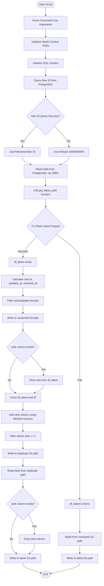
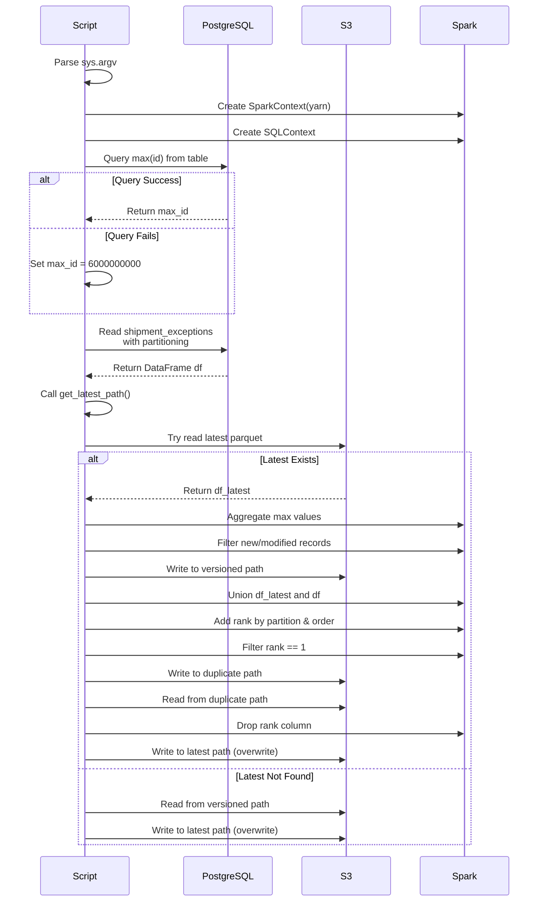
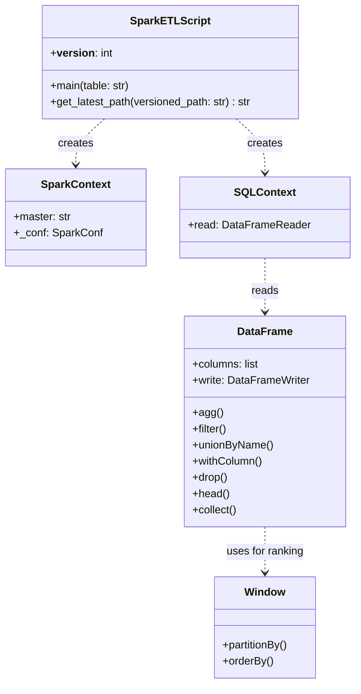

# Diagram: research/orchestrator/tasks/etl/extract_public_shipmentexceptions_spark.py

> Auto-generated by Obscura crawlers

## Diagram 1

### SVG

<svg id="container" width="620.30859375" xmlns="http://www.w3.org/2000/svg" class="flowchart" height="3467.03125" viewBox="0 0 620.30859375 3467.03125" role="graphics-document document" aria-roledescription="flowchart-v2"><g><marker id="container_flowchart-v2-pointEnd" class="marker flowchart-v2" viewBox="0 0 10 10" refX="5" refY="5" markerUnits="userSpaceOnUse" markerWidth="8" markerHeight="8" orient="auto"><path d="M 0 0 L 10 5 L 0 10 z" class="arrowMarkerPath" style="stroke-width: 1; stroke-dasharray: 1, 0;"></path></marker><marker id="container_flowchart-v2-pointStart" class="marker flowchart-v2" viewBox="0 0 10 10" refX="4.5" refY="5" markerUnits="userSpaceOnUse" markerWidth="8" markerHeight="8" orient="auto"><path d="M 0 5 L 10 10 L 10 0 z" class="arrowMarkerPath" style="stroke-width: 1; stroke-dasharray: 1, 0;"></path></marker><marker id="container_flowchart-v2-circleEnd" class="marker flowchart-v2" viewBox="0 0 10 10" refX="11" refY="5" markerUnits="userSpaceOnUse" markerWidth="11" markerHeight="11" orient="auto"><circle cx="5" cy="5" r="5" class="arrowMarkerPath" style="stroke-width: 1; stroke-dasharray: 1, 0;"></circle></marker><marker id="container_flowchart-v2-circleStart" class="marker flowchart-v2" viewBox="0 0 10 10" refX="-1" refY="5" markerUnits="userSpaceOnUse" markerWidth="11" markerHeight="11" orient="auto"><circle cx="5" cy="5" r="5" class="arrowMarkerPath" style="stroke-width: 1; stroke-dasharray: 1, 0;"></circle></marker><marker id="container_flowchart-v2-crossEnd" class="marker cross flowchart-v2" viewBox="0 0 11 11" refX="12" refY="5.2" markerUnits="userSpaceOnUse" markerWidth="11" markerHeight="11" orient="auto"><path d="M 1,1 l 9,9 M 10,1 l -9,9" class="arrowMarkerPath" style="stroke-width: 2; stroke-dasharray: 1, 0;"></path></marker><marker id="container_flowchart-v2-crossStart" class="marker cross flowchart-v2" viewBox="0 0 11 11" refX="-1" refY="5.2" markerUnits="userSpaceOnUse" markerWidth="11" markerHeight="11" orient="auto"><path d="M 1,1 l 9,9 M 10,1 l -9,9" class="arrowMarkerPath" style="stroke-width: 2; stroke-dasharray: 1, 0;"></path></marker><g class="root"><g class="clusters"></g><g class="edgePaths"><path d="M275.746,47.5L275.663,51.583C275.579,55.667,275.413,63.833,275.329,71.417C275.246,79,275.246,86,275.246,89.5L275.246,93" id="L_Start_ParseArgs_0" class="edge-thickness-normal edge-pattern-solid edge-thickness-normal edge-pattern-solid flowchart-link" style=";" data-edge="true" data-et="edge" data-id="L_Start_ParseArgs_0" data-points="W3sieCI6Mjc1Ljc0NjA5Mzc1LCJ5Ijo0Ny41fSx7IngiOjI3NS4yNDYwOTM3NSwieSI6NzJ9LHsieCI6Mjc1LjI0NjA5Mzc1LCJ5Ijo5N31d" marker-end="url(#container_flowchart-v2-pointEnd)"></path><path d="M275.246,175L275.246,179.167C275.246,183.333,275.246,191.667,275.246,199.333C275.246,207,275.246,214,275.246,217.5L275.246,221" id="L_ParseArgs_InitSpark_0" class="edge-thickness-normal edge-pattern-solid edge-thickness-normal edge-pattern-solid flowchart-link" style=";" data-edge="true" data-et="edge" data-id="L_ParseArgs_InitSpark_0" data-points="W3sieCI6Mjc1LjI0NjA5Mzc1LCJ5IjoxNzV9LHsieCI6Mjc1LjI0NjA5Mzc1LCJ5IjoyMDB9LHsieCI6Mjc1LjI0NjA5Mzc1LCJ5IjoyMjV9XQ==" marker-end="url(#container_flowchart-v2-pointEnd)"></path><path d="M275.246,303L275.246,307.167C275.246,311.333,275.246,319.667,275.246,327.333C275.246,335,275.246,342,275.246,345.5L275.246,349" id="L_InitSpark_InitSQL_0" class="edge-thickness-normal edge-pattern-solid edge-thickness-normal edge-pattern-solid flowchart-link" style=";" data-edge="true" data-et="edge" data-id="L_InitSpark_InitSQL_0" data-points="W3sieCI6Mjc1LjI0NjA5Mzc1LCJ5IjozMDN9LHsieCI6Mjc1LjI0NjA5Mzc1LCJ5IjozMjh9LHsieCI6Mjc1LjI0NjA5Mzc1LCJ5IjozNTN9XQ==" marker-end="url(#container_flowchart-v2-pointEnd)"></path><path d="M275.246,407L275.246,411.167C275.246,415.333,275.246,423.667,275.246,431.333C275.246,439,275.246,446,275.246,449.5L275.246,453" id="L_InitSQL_GetMaxId_0" class="edge-thickness-normal edge-pattern-solid edge-thickness-normal edge-pattern-solid flowchart-link" style=";" data-edge="true" data-et="edge" data-id="L_InitSQL_GetMaxId_0" data-points="W3sieCI6Mjc1LjI0NjA5Mzc1LCJ5Ijo0MDd9LHsieCI6Mjc1LjI0NjA5Mzc1LCJ5Ijo0MzJ9LHsieCI6Mjc1LjI0NjA5Mzc1LCJ5Ijo0NTd9XQ==" marker-end="url(#container_flowchart-v2-pointEnd)"></path><path d="M275.246,535L275.246,539.167C275.246,543.333,275.246,551.667,275.246,559.333C275.246,567,275.246,574,275.246,577.5L275.246,581" id="L_GetMaxId_HandleError_0" class="edge-thickness-normal edge-pattern-solid edge-thickness-normal edge-pattern-solid flowchart-link" style=";" data-edge="true" data-et="edge" data-id="L_GetMaxId_HandleError_0" data-points="W3sieCI6Mjc1LjI0NjA5Mzc1LCJ5Ijo1MzV9LHsieCI6Mjc1LjI0NjA5Mzc1LCJ5Ijo1NjB9LHsieCI6Mjc1LjI0NjA5Mzc1LCJ5Ijo1ODV9XQ==" marker-end="url(#container_flowchart-v2-pointEnd)"></path><path d="M222.392,749.005L208.15,763.981C193.907,778.957,165.422,808.908,151.18,829.384C136.938,849.859,136.938,860.859,136.938,866.359L136.938,871.859" id="L_HandleError_UseMaxId_0" class="edge-thickness-normal edge-pattern-solid edge-thickness-normal edge-pattern-solid flowchart-link" style=";" data-edge="true" data-et="edge" data-id="L_HandleError_UseMaxId_0" data-points="W3sieCI6MjIyLjM5MTkwMTczNjExNTksInkiOjc0OS4wMDUxODI5ODYxMTU5fSx7IngiOjEzNi45Mzc1LCJ5Ijo4MzguODU5Mzc1fSx7IngiOjEzNi45Mzc1LCJ5Ijo4NzUuODU5Mzc1fV0=" marker-end="url(#container_flowchart-v2-pointEnd)"></path><path d="M328.1,749.005L342.343,763.981C356.585,778.957,385.07,808.908,399.312,829.384C413.555,849.859,413.555,860.859,413.555,866.359L413.555,871.859" id="L_HandleError_UseDefault_0" class="edge-thickness-normal edge-pattern-solid edge-thickness-normal edge-pattern-solid flowchart-link" style=";" data-edge="true" data-et="edge" data-id="L_HandleError_UseDefault_0" data-points="W3sieCI6MzI4LjEwMDI4NTc2Mzg4NDEzLCJ5Ijo3NDkuMDA1MTgyOTg2MTE1OX0seyJ4Ijo0MTMuNTU0Njg3NSwieSI6ODM4Ljg1OTM3NX0seyJ4Ijo0MTMuNTU0Njg3NSwieSI6ODc1Ljg1OTM3NX1d" marker-end="url(#container_flowchart-v2-pointEnd)"></path><path d="M136.938,929.859L136.938,934.026C136.938,938.193,136.938,946.526,145.337,954.579C153.736,962.633,170.535,970.406,178.935,974.293L187.334,978.18" id="L_UseMaxId_ReadJDBC_0" class="edge-thickness-normal edge-pattern-solid edge-thickness-normal edge-pattern-solid flowchart-link" style=";" data-edge="true" data-et="edge" data-id="L_UseMaxId_ReadJDBC_0" data-points="W3sieCI6MTM2LjkzNzUsInkiOjkyOS44NTkzNzV9LHsieCI6MTM2LjkzNzUsInkiOjk1NC44NTkzNzV9LHsieCI6MTkwLjk2NDI5NDQzMzU5Mzc1LCJ5Ijo5NzkuODU5Mzc1fV0=" marker-end="url(#container_flowchart-v2-pointEnd)"></path><path d="M413.555,929.859L413.555,934.026C413.555,938.193,413.555,946.526,405.155,954.579C396.756,962.633,379.957,970.406,371.558,974.293L363.158,978.18" id="L_UseDefault_ReadJDBC_0" class="edge-thickness-normal edge-pattern-solid edge-thickness-normal edge-pattern-solid flowchart-link" style=";" data-edge="true" data-et="edge" data-id="L_UseDefault_ReadJDBC_0" data-points="W3sieCI6NDEzLjU1NDY4NzUsInkiOjkyOS44NTkzNzV9LHsieCI6NDEzLjU1NDY4NzUsInkiOjk1NC44NTkzNzV9LHsieCI6MzU5LjUyNzg5MzA2NjQwNjI1LCJ5Ijo5NzkuODU5Mzc1fV0=" marker-end="url(#container_flowchart-v2-pointEnd)"></path><path d="M275.246,1057.859L275.246,1062.026C275.246,1066.193,275.246,1074.526,275.246,1082.193C275.246,1089.859,275.246,1096.859,275.246,1100.359L275.246,1103.859" id="L_ReadJDBC_GetLatestPath_0" class="edge-thickness-normal edge-pattern-solid edge-thickness-normal edge-pattern-solid flowchart-link" style=";" data-edge="true" data-et="edge" data-id="L_ReadJDBC_GetLatestPath_0" data-points="W3sieCI6Mjc1LjI0NjA5Mzc1LCJ5IjoxMDU3Ljg1OTM3NX0seyJ4IjoyNzUuMjQ2MDkzNzUsInkiOjEwODIuODU5Mzc1fSx7IngiOjI3NS4yNDYwOTM3NSwieSI6MTEwNy44NTkzNzV9XQ==" marker-end="url(#container_flowchart-v2-pointEnd)"></path><path d="M275.246,1185.859L275.246,1190.026C275.246,1194.193,275.246,1202.526,275.246,1210.193C275.246,1217.859,275.246,1224.859,275.246,1228.359L275.246,1231.859" id="L_GetLatestPath_TryReadParquet_0" class="edge-thickness-normal edge-pattern-solid edge-thickness-normal edge-pattern-solid flowchart-link" style=";" data-edge="true" data-et="edge" data-id="L_GetLatestPath_TryReadParquet_0" data-points="W3sieCI6Mjc1LjI0NjA5Mzc1LCJ5IjoxMTg1Ljg1OTM3NX0seyJ4IjoyNzUuMjQ2MDkzNzUsInkiOjEyMTAuODU5Mzc1fSx7IngiOjI3NS4yNDYwOTM3NSwieSI6MTIzNS44NTkzNzV9XQ==" marker-end="url(#container_flowchart-v2-pointEnd)"></path><path d="M221.393,1407.053L207.494,1422.195C193.595,1437.338,165.798,1467.622,151.899,1488.264C138,1508.906,138,1519.906,138,1525.406L138,1530.906" id="L_TryReadParquet_HasLatest_0" class="edge-thickness-normal edge-pattern-solid edge-thickness-normal edge-pattern-solid flowchart-link" style=";" data-edge="true" data-et="edge" data-id="L_TryReadParquet_HasLatest_0" data-points="W3sieCI6MjIxLjM5MzA4NDM4NDMyMjI2LCJ5IjoxNDA3LjA1MzI0MDYzNDMyMjN9LHsieCI6MTM4LCJ5IjoxNDk3LjkwNjI1fSx7IngiOjEzOCwieSI6MTUzNC45MDYyNX1d" marker-end="url(#container_flowchart-v2-pointEnd)"></path><path d="M340.586,1395.566L364.207,1412.623C387.827,1429.679,435.068,1463.793,458.688,1491.516C482.309,1519.24,482.309,1540.573,482.309,1559.906C482.309,1579.24,482.309,1596.573,482.309,1615.906C482.309,1635.24,482.309,1656.573,482.309,1677.906C482.309,1699.24,482.309,1720.573,482.309,1739.906C482.309,1759.24,482.309,1776.573,482.309,1793.906C482.309,1811.24,482.309,1828.573,482.309,1845.906C482.309,1863.24,482.309,1880.573,482.309,1897.906C482.309,1915.24,482.309,1932.573,482.309,1961.786C482.309,1991,482.309,2032.094,482.309,2075.188C482.309,2118.281,482.309,2163.375,482.309,2196.589C482.309,2229.802,482.309,2251.135,482.309,2270.469C482.309,2289.802,482.309,2307.135,482.309,2324.469C482.309,2341.802,482.309,2359.135,482.309,2376.469C482.309,2393.802,482.309,2411.135,482.309,2430.469C482.309,2449.802,482.309,2471.135,482.309,2492.469C482.309,2513.802,482.309,2535.135,482.309,2554.469C482.309,2573.802,482.309,2591.135,482.309,2608.469C482.309,2625.802,482.309,2643.135,482.309,2660.469C482.309,2677.802,482.309,2695.135,482.309,2712.469C482.309,2729.802,482.309,2747.135,482.309,2766.469C482.309,2785.802,482.309,2807.135,482.309,2828.469C482.309,2849.802,482.309,2871.135,482.309,2897.182C482.309,2923.229,482.309,2953.99,482.309,2969.37L482.309,2984.75" id="L_TryReadParquet_NoLatest_0" class="edge-thickness-normal edge-pattern-solid edge-thickness-normal edge-pattern-solid flowchart-link" style=";" data-edge="true" data-et="edge" data-id="L_TryReadParquet_NoLatest_0" data-points="W3sieCI6MzQwLjU4NjI1OTU0NzYwMzE2LCJ5IjoxMzk1LjU2NjA4NDIwMjM5N30seyJ4Ijo0ODIuMzA4NTkzNzUsInkiOjE0OTcuOTA2MjV9LHsieCI6NDgyLjMwODU5Mzc1LCJ5IjoxNTYxLjkwNjI1fSx7IngiOjQ4Mi4zMDg1OTM3NSwieSI6MTYxMy45MDYyNX0seyJ4Ijo0ODIuMzA4NTkzNzUsInkiOjE2NzcuOTA2MjV9LHsieCI6NDgyLjMwODU5Mzc1LCJ5IjoxNzQxLjkwNjI1fSx7IngiOjQ4Mi4zMDg1OTM3NSwieSI6MTc5My45MDYyNX0seyJ4Ijo0ODIuMzA4NTkzNzUsInkiOjE4NDUuOTA2MjV9LHsieCI6NDgyLjMwODU5Mzc1LCJ5IjoxODk3LjkwNjI1fSx7IngiOjQ4Mi4zMDg1OTM3NSwieSI6MTk0OS45MDYyNX0seyJ4Ijo0ODIuMzA4NTkzNzUsInkiOjIwNzMuMTg3NX0seyJ4Ijo0ODIuMzA4NTkzNzUsInkiOjIyMDguNDY4NzV9LHsieCI6NDgyLjMwODU5Mzc1LCJ5IjoyMjcyLjQ2ODc1fSx7IngiOjQ4Mi4zMDg1OTM3NSwieSI6MjMyNC40Njg3NX0seyJ4Ijo0ODIuMzA4NTkzNzUsInkiOjIzNzYuNDY4NzV9LHsieCI6NDgyLjMwODU5Mzc1LCJ5IjoyNDI4LjQ2ODc1fSx7IngiOjQ4Mi4zMDg1OTM3NSwieSI6MjQ5Mi40Njg3NX0seyJ4Ijo0ODIuMzA4NTkzNzUsInkiOjI1NTYuNDY4NzV9LHsieCI6NDgyLjMwODU5Mzc1LCJ5IjoyNjA4LjQ2ODc1fSx7IngiOjQ4Mi4zMDg1OTM3NSwieSI6MjY2MC40Njg3NX0seyJ4Ijo0ODIuMzA4NTkzNzUsInkiOjI3MTIuNDY4NzV9LHsieCI6NDgyLjMwODU5Mzc1LCJ5IjoyNzY0LjQ2ODc1fSx7IngiOjQ4Mi4zMDg1OTM3NSwieSI6MjgyOC40Njg3NX0seyJ4Ijo0ODIuMzA4NTkzNzUsInkiOjI4OTIuNDY4NzV9LHsieCI6NDgyLjMwODU5Mzc1LCJ5IjoyOTg4Ljc1fV0=" marker-end="url(#container_flowchart-v2-pointEnd)"></path><path d="M138,1588.906L138,1593.073C138,1597.24,138,1605.573,138,1613.24C138,1620.906,138,1627.906,138,1631.406L138,1634.906" id="L_HasLatest_CalcMaxValues_0" class="edge-thickness-normal edge-pattern-solid edge-thickness-normal edge-pattern-solid flowchart-link" style=";" data-edge="true" data-et="edge" data-id="L_HasLatest_CalcMaxValues_0" data-points="W3sieCI6MTM4LCJ5IjoxNTg4LjkwNjI1fSx7IngiOjEzOCwieSI6MTYxMy45MDYyNX0seyJ4IjoxMzgsInkiOjE2MzguOTA2MjV9XQ==" marker-end="url(#container_flowchart-v2-pointEnd)"></path><path d="M138,1716.906L138,1721.073C138,1725.24,138,1733.573,138,1741.24C138,1748.906,138,1755.906,138,1759.406L138,1762.906" id="L_CalcMaxValues_FilterNew_0" class="edge-thickness-normal edge-pattern-solid edge-thickness-normal edge-pattern-solid flowchart-link" style=";" data-edge="true" data-et="edge" data-id="L_CalcMaxValues_FilterNew_0" data-points="W3sieCI6MTM4LCJ5IjoxNzE2LjkwNjI1fSx7IngiOjEzOCwieSI6MTc0MS45MDYyNX0seyJ4IjoxMzgsInkiOjE3NjYuOTA2MjV9XQ==" marker-end="url(#container_flowchart-v2-pointEnd)"></path><path d="M138,1820.906L138,1825.073C138,1829.24,138,1837.573,138,1845.24C138,1852.906,138,1859.906,138,1863.406L138,1866.906" id="L_FilterNew_WriteVersioned_0" class="edge-thickness-normal edge-pattern-solid edge-thickness-normal edge-pattern-solid flowchart-link" style=";" data-edge="true" data-et="edge" data-id="L_FilterNew_WriteVersioned_0" data-points="W3sieCI6MTM4LCJ5IjoxODIwLjkwNjI1fSx7IngiOjEzOCwieSI6MTg0NS45MDYyNX0seyJ4IjoxMzgsInkiOjE4NzAuOTA2MjV9XQ==" marker-end="url(#container_flowchart-v2-pointEnd)"></path><path d="M138,1924.906L138,1929.073C138,1933.24,138,1941.573,138,1949.24C138,1956.906,138,1963.906,138,1967.406L138,1970.906" id="L_WriteVersioned_DropRank1_0" class="edge-thickness-normal edge-pattern-solid edge-thickness-normal edge-pattern-solid flowchart-link" style=";" data-edge="true" data-et="edge" data-id="L_WriteVersioned_DropRank1_0" data-points="W3sieCI6MTM4LCJ5IjoxOTI0LjkwNjI1fSx7IngiOjEzOCwieSI6MTk0OS45MDYyNX0seyJ4IjoxMzgsInkiOjE5NzQuOTA2MjV9XQ==" marker-end="url(#container_flowchart-v2-pointEnd)"></path><path d="M185.024,2124.445L197.872,2138.449C210.719,2152.453,236.414,2180.461,249.262,2199.965C262.109,2219.469,262.109,2230.469,262.109,2235.969L262.109,2241.469" id="L_DropRank1_DropRank2_0" class="edge-thickness-normal edge-pattern-solid edge-thickness-normal edge-pattern-solid flowchart-link" style=";" data-edge="true" data-et="edge" data-id="L_DropRank1_DropRank2_0" data-points="W3sieCI6MTg1LjAyNDE1MzI4ODk1ODUsInkiOjIxMjQuNDQ0NTk2NzExMDQxNH0seyJ4IjoyNjIuMTA5Mzc1LCJ5IjoyMjA4LjQ2ODc1fSx7IngiOjI2Mi4xMDkzNzUsInkiOjIyNDUuNDY4NzV9XQ==" marker-end="url(#container_flowchart-v2-pointEnd)"></path><path d="M100.96,2134.429L93.497,2146.769C86.033,2159.109,71.107,2183.789,63.643,2206.795C56.18,2229.802,56.18,2251.135,56.18,2270.469C56.18,2289.802,56.18,2307.135,62.173,2319.611C68.167,2332.087,80.154,2339.705,86.147,2343.514L92.14,2347.323" id="L_DropRank1_Union_0" class="edge-thickness-normal edge-pattern-solid edge-thickness-normal edge-pattern-solid flowchart-link" style=";" data-edge="true" data-et="edge" data-id="L_DropRank1_Union_0" data-points="W3sieCI6MTAwLjk2MDE4MDk2MTg5MTQsInkiOjIxMzQuNDI4OTMwOTYxODkxfSx7IngiOjU2LjE3OTY4NzUsInkiOjIyMDguNDY4NzV9LHsieCI6NTYuMTc5Njg3NSwieSI6MjI3Mi40Njg3NX0seyJ4Ijo1Ni4xNzk2ODc1LCJ5IjoyMzI0LjQ2ODc1fSx7IngiOjk1LjUxNjM3NjIwMTkyMzA4LCJ5IjoyMzQ5LjQ2ODc1fV0=" marker-end="url(#container_flowchart-v2-pointEnd)"></path><path d="M262.109,2299.469L262.109,2303.635C262.109,2307.802,262.109,2316.135,252.78,2324.211C243.45,2332.287,224.79,2340.105,215.46,2344.014L206.131,2347.923" id="L_DropRank2_Union_0" class="edge-thickness-normal edge-pattern-solid edge-thickness-normal edge-pattern-solid flowchart-link" style=";" data-edge="true" data-et="edge" data-id="L_DropRank2_Union_0" data-points="W3sieCI6MjYyLjEwOTM3NSwieSI6MjI5OS40Njg3NX0seyJ4IjoyNjIuMTA5Mzc1LCJ5IjoyMzI0LjQ2ODc1fSx7IngiOjIwMi40NDE0MDYyNSwieSI6MjM0OS40Njg3NX1d" marker-end="url(#container_flowchart-v2-pointEnd)"></path><path d="M138,2403.469L138,2407.635C138,2411.802,138,2420.135,138,2427.802C138,2435.469,138,2442.469,138,2445.969L138,2449.469" id="L_Union_AddRank_0" class="edge-thickness-normal edge-pattern-solid edge-thickness-normal edge-pattern-solid flowchart-link" style=";" data-edge="true" data-et="edge" data-id="L_Union_AddRank_0" data-points="W3sieCI6MTM4LCJ5IjoyNDAzLjQ2ODc1fSx7IngiOjEzOCwieSI6MjQyOC40Njg3NX0seyJ4IjoxMzgsInkiOjI0NTMuNDY4NzV9XQ==" marker-end="url(#container_flowchart-v2-pointEnd)"></path><path d="M138,2531.469L138,2535.635C138,2539.802,138,2548.135,138,2555.802C138,2563.469,138,2570.469,138,2573.969L138,2577.469" id="L_AddRank_FilterRank_0" class="edge-thickness-normal edge-pattern-solid edge-thickness-normal edge-pattern-solid flowchart-link" style=";" data-edge="true" data-et="edge" data-id="L_AddRank_FilterRank_0" data-points="W3sieCI6MTM4LCJ5IjoyNTMxLjQ2ODc1fSx7IngiOjEzOCwieSI6MjU1Ni40Njg3NX0seyJ4IjoxMzgsInkiOjI1ODEuNDY4NzV9XQ==" marker-end="url(#container_flowchart-v2-pointEnd)"></path><path d="M138,2635.469L138,2639.635C138,2643.802,138,2652.135,138,2659.802C138,2667.469,138,2674.469,138,2677.969L138,2681.469" id="L_FilterRank_WriteDupe_0" class="edge-thickness-normal edge-pattern-solid edge-thickness-normal edge-pattern-solid flowchart-link" style=";" data-edge="true" data-et="edge" data-id="L_FilterRank_WriteDupe_0" data-points="W3sieCI6MTM4LCJ5IjoyNjM1LjQ2ODc1fSx7IngiOjEzOCwieSI6MjY2MC40Njg3NX0seyJ4IjoxMzgsInkiOjI2ODUuNDY4NzV9XQ==" marker-end="url(#container_flowchart-v2-pointEnd)"></path><path d="M138,2739.469L138,2743.635C138,2747.802,138,2756.135,138,2763.802C138,2771.469,138,2778.469,138,2781.969L138,2785.469" id="L_WriteDupe_ReadDupe_0" class="edge-thickness-normal edge-pattern-solid edge-thickness-normal edge-pattern-solid flowchart-link" style=";" data-edge="true" data-et="edge" data-id="L_WriteDupe_ReadDupe_0" data-points="W3sieCI6MTM4LCJ5IjoyNzM5LjQ2ODc1fSx7IngiOjEzOCwieSI6Mjc2NC40Njg3NX0seyJ4IjoxMzgsInkiOjI3ODkuNDY4NzV9XQ==" marker-end="url(#container_flowchart-v2-pointEnd)"></path><path d="M138,2867.469L138,2871.635C138,2875.802,138,2884.135,138,2891.802C138,2899.469,138,2906.469,138,2909.969L138,2913.469" id="L_ReadDupe_DropRank3_0" class="edge-thickness-normal edge-pattern-solid edge-thickness-normal edge-pattern-solid flowchart-link" style=";" data-edge="true" data-et="edge" data-id="L_ReadDupe_DropRank3_0" data-points="W3sieCI6MTM4LCJ5IjoyODY3LjQ2ODc1fSx7IngiOjEzOCwieSI6Mjg5Mi40Njg3NX0seyJ4IjoxMzgsInkiOjI5MTcuNDY4NzV9XQ==" marker-end="url(#container_flowchart-v2-pointEnd)"></path><path d="M171.455,3080.576L177.516,3092.318C183.576,3104.061,195.696,3127.546,201.756,3146.789C207.816,3166.031,207.816,3181.031,207.816,3188.531L207.816,3196.031" id="L_DropRank3_DropRank4_0" class="edge-thickness-normal edge-pattern-solid edge-thickness-normal edge-pattern-solid flowchart-link" style=";" data-edge="true" data-et="edge" data-id="L_DropRank3_DropRank4_0" data-points="W3sieCI6MTcxLjQ1NTQ5NTMwOTk3MDQ3LCJ5IjozMDgwLjU3NTc1NDY5MDAyOTV9LHsieCI6MjA3LjgxNjQwNjI1LCJ5IjozMTUxLjAzMTI1fSx7IngiOjIwNy44MTY0MDYyNSwieSI6MzIwMC4wMzEyNX1d" marker-end="url(#container_flowchart-v2-pointEnd)"></path><path d="M104.545,3080.576L98.484,3092.318C92.424,3104.061,80.304,3127.546,74.244,3151.955C68.184,3176.365,68.184,3201.698,68.184,3225.031C68.184,3248.365,68.184,3269.698,73.243,3284.133C78.303,3298.568,88.422,3306.105,93.482,3309.873L98.541,3313.642" id="L_DropRank3_WriteFinal_0" class="edge-thickness-normal edge-pattern-solid edge-thickness-normal edge-pattern-solid flowchart-link" style=";" data-edge="true" data-et="edge" data-id="L_DropRank3_WriteFinal_0" data-points="W3sieCI6MTA0LjU0NDUwNDY5MDAyOTUzLCJ5IjozMDgwLjU3NTc1NDY5MDAyOTV9LHsieCI6NjguMTgzNTkzNzUsInkiOjMxNTEuMDMxMjV9LHsieCI6NjguMTgzNTkzNzUsInkiOjMyMjcuMDMxMjV9LHsieCI6NjguMTgzNTkzNzUsInkiOjMyOTEuMDMxMjV9LHsieCI6MTAxLjc0OTE3MzY3Nzg4NDYxLCJ5IjozMzE2LjAzMTI1fV0=" marker-end="url(#container_flowchart-v2-pointEnd)"></path><path d="M207.816,3254.031L207.816,3260.198C207.816,3266.365,207.816,3278.698,202.757,3288.633C197.697,3298.568,187.578,3306.105,182.518,3309.873L177.459,3313.642" id="L_DropRank4_WriteFinal_0" class="edge-thickness-normal edge-pattern-solid edge-thickness-normal edge-pattern-solid flowchart-link" style=";" data-edge="true" data-et="edge" data-id="L_DropRank4_WriteFinal_0" data-points="W3sieCI6MjA3LjgxNjQwNjI1LCJ5IjozMjU0LjAzMTI1fSx7IngiOjIwNy44MTY0MDYyNSwieSI6MzI5MS4wMzEyNX0seyJ4IjoxNzQuMjUwODI2MzIyMTE1NCwieSI6MzMxNi4wMzEyNX1d" marker-end="url(#container_flowchart-v2-pointEnd)"></path><path d="M482.309,3042.75L482.309,3060.797C482.309,3078.844,482.309,3114.938,482.309,3138.484C482.309,3162.031,482.309,3173.031,482.309,3178.531L482.309,3184.031" id="L_NoLatest_ReadVersioned_0" class="edge-thickness-normal edge-pattern-solid edge-thickness-normal edge-pattern-solid flowchart-link" style=";" data-edge="true" data-et="edge" data-id="L_NoLatest_ReadVersioned_0" data-points="W3sieCI6NDgyLjMwODU5Mzc1LCJ5IjozMDQyLjc1fSx7IngiOjQ4Mi4zMDg1OTM3NSwieSI6MzE1MS4wMzEyNX0seyJ4Ijo0ODIuMzA4NTkzNzUsInkiOjMxODguMDMxMjV9XQ==" marker-end="url(#container_flowchart-v2-pointEnd)"></path><path d="M482.309,3266.031L482.309,3270.198C482.309,3274.365,482.309,3282.698,482.309,3290.365C482.309,3298.031,482.309,3305.031,482.309,3308.531L482.309,3312.031" id="L_ReadVersioned_WriteLatest_0" class="edge-thickness-normal edge-pattern-solid edge-thickness-normal edge-pattern-solid flowchart-link" style=";" data-edge="true" data-et="edge" data-id="L_ReadVersioned_WriteLatest_0" data-points="W3sieCI6NDgyLjMwODU5Mzc1LCJ5IjozMjY2LjAzMTI1fSx7IngiOjQ4Mi4zMDg1OTM3NSwieSI6MzI5MS4wMzEyNX0seyJ4Ijo0ODIuMzA4NTkzNzUsInkiOjMzMTYuMDMxMjV9XQ==" marker-end="url(#container_flowchart-v2-pointEnd)"></path><path d="M138,3370.031L138,3374.198C138,3378.365,138,3386.698,156.261,3396.84C174.521,3406.982,211.043,3418.932,229.304,3424.907L247.564,3430.882" id="L_WriteFinal_End_0" class="edge-thickness-normal edge-pattern-solid edge-thickness-normal edge-pattern-solid flowchart-link" style=";" data-edge="true" data-et="edge" data-id="L_WriteFinal_End_0" data-points="W3sieCI6MTM4LCJ5IjozMzcwLjAzMTI1fSx7IngiOjEzOCwieSI6MzM5NS4wMzEyNX0seyJ4IjoyNTEuMzY1OTU2ODgyMDk4NDYsInkiOjM0MzIuMTI2MzU0MDUwMTE3Mn1d" marker-end="url(#container_flowchart-v2-pointEnd)"></path><path d="M482.309,3370.031L482.309,3374.198C482.309,3378.365,482.309,3386.698,452.746,3397.317C423.183,3407.936,364.058,3420.841,334.496,3427.293L304.933,3433.746" id="L_WriteLatest_End_0" class="edge-thickness-normal edge-pattern-solid edge-thickness-normal edge-pattern-solid flowchart-link" style=";" data-edge="true" data-et="edge" data-id="L_WriteLatest_End_0" data-points="W3sieCI6NDgyLjMwODU5Mzc1LCJ5IjozMzcwLjAzMTI1fSx7IngiOjQ4Mi4zMDg1OTM3NSwieSI6MzM5NS4wMzEyNX0seyJ4IjozMDEuMDI1MTA2MDAyODgwMTQsInkiOjM0MzQuNTk4NTEzMjg4ODQ3Mn1d" marker-end="url(#container_flowchart-v2-pointEnd)"></path></g><g class="edgeLabels"><g class="edgeLabel"><g class="label" data-id="L_Start_ParseArgs_0" transform="translate(0, 0)"><foreignObject width="0" height="0">

</foreignObject></g></g><g class="edgeLabel"><g class="label" data-id="L_ParseArgs_InitSpark_0" transform="translate(0, 0)"><foreignObject width="0" height="0">

</foreignObject></g></g><g class="edgeLabel"><g class="label" data-id="L_InitSpark_InitSQL_0" transform="translate(0, 0)"><foreignObject width="0" height="0">

</foreignObject></g></g><g class="edgeLabel"><g class="label" data-id="L_InitSQL_GetMaxId_0" transform="translate(0, 0)"><foreignObject width="0" height="0">

</foreignObject></g></g><g class="edgeLabel"><g class="label" data-id="L_GetMaxId_HandleError_0" transform="translate(0, 0)"><foreignObject width="0" height="0">

</foreignObject></g></g><g class="edgeLabel" transform="translate(136.9375, 838.859375)"><g class="label" data-id="L_HandleError_UseMaxId_0" transform="translate(-12.03125, -12)"><foreignObject width="24.0625" height="24">

Yes

</foreignObject></g></g><g class="edgeLabel" transform="translate(413.5546875, 838.859375)"><g class="label" data-id="L_HandleError_UseDefault_0" transform="translate(-10.140625, -12)"><foreignObject width="20.28125" height="24">

No

</foreignObject></g></g><g class="edgeLabel"><g class="label" data-id="L_UseMaxId_ReadJDBC_0" transform="translate(0, 0)"><foreignObject width="0" height="0">

</foreignObject></g></g><g class="edgeLabel"><g class="label" data-id="L_UseDefault_ReadJDBC_0" transform="translate(0, 0)"><foreignObject width="0" height="0">

</foreignObject></g></g><g class="edgeLabel"><g class="label" data-id="L_ReadJDBC_GetLatestPath_0" transform="translate(0, 0)"><foreignObject width="0" height="0">

</foreignObject></g></g><g class="edgeLabel"><g class="label" data-id="L_GetLatestPath_TryReadParquet_0" transform="translate(0, 0)"><foreignObject width="0" height="0">

</foreignObject></g></g><g class="edgeLabel" transform="translate(138, 1497.90625)"><g class="label" data-id="L_TryReadParquet_HasLatest_0" transform="translate(-28.1015625, -12)"><foreignObject width="56.203125" height="24">

Success

</foreignObject></g></g><g class="edgeLabel" transform="translate(482.30859375, 2272.46875)"><g class="label" data-id="L_TryReadParquet_NoLatest_0" transform="translate(-12.40625, -12)"><foreignObject width="24.8125" height="24">

Fail

</foreignObject></g></g><g class="edgeLabel"><g class="label" data-id="L_HasLatest_CalcMaxValues_0" transform="translate(0, 0)"><foreignObject width="0" height="0">

</foreignObject></g></g><g class="edgeLabel"><g class="label" data-id="L_CalcMaxValues_FilterNew_0" transform="translate(0, 0)"><foreignObject width="0" height="0">

</foreignObject></g></g><g class="edgeLabel"><g class="label" data-id="L_FilterNew_WriteVersioned_0" transform="translate(0, 0)"><foreignObject width="0" height="0">

</foreignObject></g></g><g class="edgeLabel"><g class="label" data-id="L_WriteVersioned_DropRank1_0" transform="translate(0, 0)"><foreignObject width="0" height="0">

</foreignObject></g></g><g class="edgeLabel" transform="translate(262.109375, 2208.46875)"><g class="label" data-id="L_DropRank1_DropRank2_0" transform="translate(-12.03125, -12)"><foreignObject width="24.0625" height="24">

Yes

</foreignObject></g></g><g class="edgeLabel" transform="translate(56.1796875, 2272.46875)"><g class="label" data-id="L_DropRank1_Union_0" transform="translate(-10.140625, -12)"><foreignObject width="20.28125" height="24">

No

</foreignObject></g></g><g class="edgeLabel"><g class="label" data-id="L_DropRank2_Union_0" transform="translate(0, 0)"><foreignObject width="0" height="0">

</foreignObject></g></g><g class="edgeLabel"><g class="label" data-id="L_Union_AddRank_0" transform="translate(0, 0)"><foreignObject width="0" height="0">

</foreignObject></g></g><g class="edgeLabel"><g class="label" data-id="L_AddRank_FilterRank_0" transform="translate(0, 0)"><foreignObject width="0" height="0">

</foreignObject></g></g><g class="edgeLabel"><g class="label" data-id="L_FilterRank_WriteDupe_0" transform="translate(0, 0)"><foreignObject width="0" height="0">

</foreignObject></g></g><g class="edgeLabel"><g class="label" data-id="L_WriteDupe_ReadDupe_0" transform="translate(0, 0)"><foreignObject width="0" height="0">

</foreignObject></g></g><g class="edgeLabel"><g class="label" data-id="L_ReadDupe_DropRank3_0" transform="translate(0, 0)"><foreignObject width="0" height="0">

</foreignObject></g></g><g class="edgeLabel" transform="translate(207.81640625, 3151.03125)"><g class="label" data-id="L_DropRank3_DropRank4_0" transform="translate(-12.03125, -12)"><foreignObject width="24.0625" height="24">

Yes

</foreignObject></g></g><g class="edgeLabel" transform="translate(68.18359375, 3227.03125)"><g class="label" data-id="L_DropRank3_WriteFinal_0" transform="translate(-10.140625, -12)"><foreignObject width="20.28125" height="24">

No

</foreignObject></g></g><g class="edgeLabel"><g class="label" data-id="L_DropRank4_WriteFinal_0" transform="translate(0, 0)"><foreignObject width="0" height="0">

</foreignObject></g></g><g class="edgeLabel"><g class="label" data-id="L_NoLatest_ReadVersioned_0" transform="translate(0, 0)"><foreignObject width="0" height="0">

</foreignObject></g></g><g class="edgeLabel"><g class="label" data-id="L_ReadVersioned_WriteLatest_0" transform="translate(0, 0)"><foreignObject width="0" height="0">

</foreignObject></g></g><g class="edgeLabel"><g class="label" data-id="L_WriteFinal_End_0" transform="translate(0, 0)"><foreignObject width="0" height="0">

</foreignObject></g></g><g class="edgeLabel"><g class="label" data-id="L_WriteLatest_End_0" transform="translate(0, 0)"><foreignObject width="0" height="0">

</foreignObject></g></g></g><g class="nodes"><g class="node default" id="flowchart-Start-0" transform="translate(275.24609375, 27.5)"><g class="basic label-container outer-path"><path d="M-33.6875 -19.5 C-12.028143192049875 -19.5, 9.63121361590025 -19.5, 33.6875 -19.5 C33.6875 -19.5, 33.6875 -19.5, 33.6875 -19.5 C34.091447031749716 -19.487046204926987, 34.49539406349943 -19.474092409853974, 34.9368692896239 -19.45993515863156 C35.25816059147088 -19.428940573151703, 35.579451893317874 -19.39794598767185, 36.181104652847864 -19.3399052695533 C36.46965060711806 -19.29325539737419, 36.75819656138827 -19.24660552519508, 37.41509325967676 -19.140403561325776 C37.889449223310784 -19.03213490808826, 38.3638051869448 -18.92386625485074, 38.63376438623539 -18.862249829261074 C38.89577483339242 -18.78448650386577, 39.15778528054945 -18.706723178470465, 39.832110251460605 -18.50658706670804 C40.08320356403244 -18.414182406600467, 40.33429687660428 -18.321777746492895, 41.0052065951478 -18.074876768247425 C41.348903652945154 -17.922732276171512, 41.69260071074251 -17.770587784095596, 42.14823291279238 -17.568892924097174 C42.58781666829719 -17.33956236041715, 43.027400423801986 -17.110231796737132, 43.25649226407678 -16.990714730406097 C43.609127689006 -16.776945063498225, 43.96176311393522 -16.563175396590353, 44.3254305736057 -16.342718045390892 C44.55961316720102 -16.179362405699887, 44.793795760796336 -16.01600676600888, 45.35065534457871 -15.627565626425154 C45.58108035249165 -15.443807814481572, 45.81150536040458 -15.260050002537989, 46.327953708501866 -14.848196188198123 C46.576706568276634 -14.622285422590688, 46.8254594280514 -14.396374656983252, 47.25330973676799 -14.007812326905688 C47.48951948368491 -13.763906370033082, 47.72572923060183 -13.520000413160474, 48.12292094296865 -13.10986736009568 C48.37216651766546 -12.817089325581833, 48.62141209236228 -12.524311291067983, 48.93321390812658 -12.158051136245305 C49.086059248182536 -11.95325230506726, 49.23890458823849 -11.748453473889214, 49.680858964640635 -11.156274872382312 C49.92833719201293 -10.776081857929531, 50.17581541938522 -10.395888843476751, 50.36278387860425 -10.108655082055241 C50.49305122180755 -9.877352223198894, 50.623318565010855 -9.646049364342549, 50.976186474273504 -9.019496659696287 C51.183856881409966 -8.588264615842531, 51.39152728854643 -8.157032571988777, 51.51854614880834 -7.893275190886684 C51.67980262935575 -7.494968566252623, 51.84105910990316 -7.096661941618561, 51.987634229970325 -6.734618561215508 C52.068437195196886 -6.491252904157259, 52.14924016042345 -6.247887247099008, 52.38152313421488 -5.548287939305138 C52.47493029602491 -5.192085948403505, 52.56833745783493 -4.835883957501872, 52.69859428754556 -4.339158212148133 C52.74955559136972 -4.077482687686452, 52.80051689519388 -3.8158071632247705, 52.937544776581774 -3.1121979531509023 C52.990853631213156 -2.6987450036539227, 53.044162485844545 -2.285292054156943, 53.09739270250937 -1.872449005199798 C53.11905652281853 -1.5350175171635414, 53.1407203431277 -1.1975860291272848, 53.17748121591342 -0.6250057626472757 C53.17748121591342 -0.23159356266937886, 53.17748121591342 0.16181863730851798, 53.17748121591342 0.625005762647271 C53.153530929549746 0.9980508050846322, 53.129580643186074 1.3710958475219934, 53.09739270250937 1.8724490051997846 C53.06434538921693 2.1287574411657655, 53.0312980759245 2.385065877131746, 52.937544776581774 3.1121979531508885 C52.86080424520823 3.5062443626369895, 52.78406371383469 3.900290772123091, 52.69859428754556 4.339158212148129 C52.59512191850814 4.73374320049624, 52.491649549470715 5.128328188844351, 52.38152313421489 5.548287939305125 C52.22878023089202 6.00832522783688, 52.07603732756915 6.468362516368634, 51.987634229970325 6.734618561215495 C51.80740200811476 7.179795633751706, 51.62716978625919 7.624972706287916, 51.51854614880834 7.893275190886679 C51.33814393118736 8.267884255765738, 51.15774171356639 8.642493320644798, 50.976186474273504 9.019496659696284 C50.82245766960227 9.292457719119527, 50.66872886493104 9.565418778542771, 50.36278387860425 10.108655082055236 C50.15667219698636 10.425297973756388, 49.950560515368466 10.74194086545754, 49.68085896464064 11.156274872382301 C49.52899815101747 11.359754527832628, 49.37713733739429 11.563234183282955, 48.93321390812658 12.158051136245302 C48.74194811997469 12.382722814340179, 48.55068233182279 12.607394492435054, 48.12292094296866 13.10986736009567 C47.85698038936064 13.384472815821459, 47.591039835752625 13.659078271547246, 47.25330973676799 14.007812326905684 C46.967223498617464 14.267628278966923, 46.68113726046694 14.527444231028163, 46.32795370850189 14.848196188198111 C46.122907605239966 15.011714999043527, 45.917861501978045 15.175233809888942, 45.35065534457871 15.627565626425152 C44.955806211763395 15.902995288733647, 44.56095707894808 16.178424951042143, 44.32543057360571 16.34271804539089 C44.026291837193575 16.524057705338265, 43.727153100781436 16.705397365285645, 43.25649226407678 16.990714730406093 C43.034173485522466 17.10669829477591, 42.81185470696814 17.222681859145723, 42.14823291279239 17.56889292409717 C41.82946878492731 17.710000347701154, 41.51070465706222 17.851107771305138, 41.005206595147804 18.07487676824742 C40.65407430068863 18.204096698439745, 40.30294200622946 18.33331662863207, 39.83211025146062 18.506587066708033 C39.542328102066875 18.592592887550556, 39.25254595267313 18.67859870839308, 38.63376438623541 18.86224982926107 C38.291814673201856 18.940297619830563, 37.9498649601683 19.01834541040006, 37.415093259676766 19.140403561325773 C36.97110987291894 19.21218335215419, 36.5271264861611 19.28396314298261, 36.18110465284788 19.3399052695533 C35.735039247238916 19.382936662760258, 35.288973841629954 19.425968055967214, 34.9368692896239 19.45993515863156 C34.60027980022369 19.470728928424926, 34.263690310823485 19.481522698218296, 33.68750000000001 19.5 C33.68750000000001 19.5, 33.6875 19.5, 33.6875 19.5 C9.382908359033273 19.5, -14.921683281933454 19.5, -33.68749999999999 19.5 C-34.062759774241016 19.48796614943893, -34.43801954848204 19.47593229887786, -34.93686928962389 19.45993515863156 C-35.40869945340933 19.414418270189973, -35.88052961719476 19.368901381748387, -36.18110465284787 19.3399052695533 C-36.43039606920263 19.29960176664087, -36.67968748555739 19.25929826372844, -37.41509325967676 19.140403561325773 C-37.83111181634389 19.04545004054129, -38.24713037301103 18.950496519756808, -38.633764386235384 18.862249829261074 C-38.972177265069476 18.761810663188566, -39.31059014390357 18.661371497116058, -39.83211025146059 18.506587066708043 C-40.094480750410305 18.410032297768243, -40.35685124936003 18.31347752882844, -41.0052065951478 18.074876768247425 C-41.33904034673334 17.927098469246896, -41.672874098318886 17.77932017024637, -42.14823291279238 17.568892924097174 C-42.58084054133289 17.343201801386, -43.01344816987339 17.117510678674833, -43.25649226407678 16.990714730406097 C-43.55320678371788 16.810844644911597, -43.84992130335898 16.630974559417098, -44.325430573605686 16.3427180453909 C-44.532841901892255 16.198036881469882, -44.74025323017882 16.053355717548865, -45.35065534457871 15.627565626425156 C-45.64641548615862 15.391704784023087, -45.94217562773852 15.155843941621018, -46.327953708501866 14.848196188198125 C-46.53440330353887 14.660704128342472, -46.74085289857588 14.473212068486816, -47.253309736767974 14.007812326905697 C-47.458732005236264 13.795696969230288, -47.66415427370456 13.583581611554882, -48.122920942968655 13.109867360095677 C-48.41237070443407 12.769863200120396, -48.70182046589948 12.429859040145113, -48.933213908126575 12.158051136245307 C-49.228663599765504 11.762175465469769, -49.52411329140443 11.36629979469423, -49.680858964640635 11.156274872382316 C-49.93999144073113 10.758177802294417, -50.19912391682162 10.36008073220652, -50.36278387860425 10.108655082055249 C-50.579787877930386 9.723342507213976, -50.796791877256524 9.338029932372704, -50.976186474273504 9.019496659696289 C-51.11760942619774 8.725828874059198, -51.25903237812197 8.432161088422106, -51.51854614880834 7.893275190886686 C-51.65936387061103 7.545452695508604, -51.80018159241372 7.19763020013052, -51.987634229970325 6.73461856121551 C-52.11677091473563 6.345679441838973, -52.24590759950093 5.956740322462435, -52.38152313421488 5.5482879393051325 C-52.46900081756291 5.214697619631318, -52.556478500910934 4.881107299957503, -52.69859428754556 4.339158212148136 C-52.7760900711784 3.941233741933166, -52.85358585481124 3.5433092717181967, -52.937544776581774 3.112197953150904 C-52.97932999379215 2.7881200598916855, -53.021115211002524 2.464042166632467, -53.09739270250937 1.872449005199809 C-53.11617591618228 1.5798852907070655, -53.13495912985518 1.2873215762143217, -53.17748121591342 0.6250057626472781 C-53.17748121591342 0.162863275133855, -53.17748121591342 -0.2992792123795681, -53.17748121591342 -0.6250057626472687 C-53.15417380926871 -0.9880374345386038, -53.130866402624 -1.351069106429939, -53.09739270250937 -1.8724490051997822 C-53.0384848539607 -2.32932664587276, -52.97957700541204 -2.7862042865457384, -52.937544776581774 -3.112197953150895 C-52.868469544947004 -3.4668846685400645, -52.799394313312234 -3.821571383929234, -52.69859428754556 -4.339158212148126 C-52.58262129256783 -4.78141350501218, -52.466648297590105 -5.223668797876234, -52.38152313421489 -5.548287939305123 C-52.28303613144067 -5.844915099888157, -52.184549128666454 -6.141542260471191, -51.98763422997033 -6.734618561215485 C-51.83142500545478 -7.12045836586879, -51.67521578093923 -7.506298170522095, -51.51854614880834 -7.893275190886676 C-51.30533106560532 -8.336020873229696, -51.092115982402305 -8.778766555572718, -50.976186474273504 -9.019496659696282 C-50.770293230778684 -9.385080962473026, -50.564399987283856 -9.75066526524977, -50.36278387860425 -10.108655082055243 C-50.10200142424924 -10.50928696183864, -49.84121896989423 -10.909918841622037, -49.68085896464064 -11.156274872382308 C-49.50129391886861 -11.39687567500463, -49.32172887309658 -11.63747647762695, -48.93321390812659 -12.158051136245302 C-48.69685926149667 -12.435686753137192, -48.46050461486675 -12.713322370029083, -48.12292094296866 -13.10986736009567 C-47.8581867346528 -13.38322716526452, -47.59345252633693 -13.65658697043337, -47.253309736767996 -14.007812326905677 C-46.972176109358266 -14.263130448931028, -46.69104248194853 -14.518448570956377, -46.32795370850189 -14.848196188198107 C-46.07176091760048 -15.052503121365497, -45.81556812669907 -15.256810054532886, -45.35065534457872 -15.627565626425149 C-45.04415587283966 -15.841366389762033, -44.737656401100594 -16.055167153098918, -44.325430573605715 -16.342718045390885 C-43.95096561949104 -16.56972090117553, -43.57650066537638 -16.796723756960173, -43.25649226407679 -16.99071473040609 C-42.99369850582448 -17.127814065758884, -42.730904747572175 -17.264913401111677, -42.14823291279239 -17.56889292409717 C-41.822426849304556 -17.713117603709748, -41.49662078581673 -17.85734228332232, -41.005206595147804 -18.07487676824742 C-40.5850085156532 -18.2295135457699, -40.1648104361586 -18.384150323292385, -39.83211025146062 -18.506587066708033 C-39.43807559382317 -18.623534484764704, -39.04404093618572 -18.740481902821372, -38.63376438623541 -18.862249829261067 C-38.19622232702436 -18.96211594904722, -37.758680267813304 -19.061982068833373, -37.415093259676766 -19.140403561325773 C-37.16298026815404 -19.181163234629718, -36.9108672766313 -19.221922907933664, -36.18110465284788 -19.3399052695533 C-35.78186466696964 -19.37841947083464, -35.3826246810914 -19.41693367211598, -34.9368692896239 -19.45993515863156 C-34.471896572981024 -19.474845928639805, -34.00692385633815 -19.489756698648055, -33.68750000000001 -19.5 C-33.68750000000001 -19.5, -33.6875 -19.5, -33.6875 -19.5" stroke="none" stroke-width="0" fill="#ECECFF" style=""></path><path d="M-33.6875 -19.5 C-15.697560154569537 -19.5, 2.292379690860926 -19.5, 33.6875 -19.5 M-33.6875 -19.5 C-10.039601695217897 -19.5, 13.608296609564206 -19.5, 33.6875 -19.5 M33.6875 -19.5 C33.6875 -19.5, 33.6875 -19.5, 33.6875 -19.5 M33.6875 -19.5 C33.6875 -19.5, 33.6875 -19.5, 33.6875 -19.5 M33.6875 -19.5 C34.05051304742843 -19.488358878131002, 34.41352609485686 -19.476717756262005, 34.9368692896239 -19.45993515863156 M33.6875 -19.5 C34.029579463766325 -19.489030177414296, 34.37165892753265 -19.478060354828596, 34.9368692896239 -19.45993515863156 M34.9368692896239 -19.45993515863156 C35.204009905539465 -19.43416442469778, 35.47115052145504 -19.408393690764, 36.181104652847864 -19.3399052695533 M34.9368692896239 -19.45993515863156 C35.429810387712685 -19.41238172374734, 35.92275148580148 -19.364828288863123, 36.181104652847864 -19.3399052695533 M36.181104652847864 -19.3399052695533 C36.59095926872119 -19.273643153728916, 37.00081388459452 -19.207381037904533, 37.41509325967676 -19.140403561325776 M36.181104652847864 -19.3399052695533 C36.4811932238352 -19.291389276617693, 36.78128179482253 -19.242873283682087, 37.41509325967676 -19.140403561325776 M37.41509325967676 -19.140403561325776 C37.7493467463679 -19.064112384196367, 38.083600233059045 -18.987821207066958, 38.63376438623539 -18.862249829261074 M37.41509325967676 -19.140403561325776 C37.750922620758544 -19.063752701150246, 38.08675198184032 -18.987101840974713, 38.63376438623539 -18.862249829261074 M38.63376438623539 -18.862249829261074 C39.068444641835995 -18.733239011082038, 39.5031248974366 -18.604228192903, 39.832110251460605 -18.50658706670804 M38.63376438623539 -18.862249829261074 C38.88707520469631 -18.787068507997493, 39.14038602315723 -18.711887186733914, 39.832110251460605 -18.50658706670804 M39.832110251460605 -18.50658706670804 C40.13892579509935 -18.393676110477188, 40.44574133873809 -18.280765154246335, 41.0052065951478 -18.074876768247425 M39.832110251460605 -18.50658706670804 C40.15495690534044 -18.387776513718507, 40.47780355922028 -18.268965960728973, 41.0052065951478 -18.074876768247425 M41.0052065951478 -18.074876768247425 C41.400784081813505 -17.899766349289735, 41.796361568479206 -17.724655930332045, 42.14823291279238 -17.568892924097174 M41.0052065951478 -18.074876768247425 C41.30148238423521 -17.943724265127447, 41.597758173322624 -17.81257176200747, 42.14823291279238 -17.568892924097174 M42.14823291279238 -17.568892924097174 C42.39155689665905 -17.441950957570384, 42.63488088052571 -17.315008991043598, 43.25649226407678 -16.990714730406097 M42.14823291279238 -17.568892924097174 C42.392067055560176 -17.44168480799844, 42.63590119832798 -17.3144766918997, 43.25649226407678 -16.990714730406097 M43.25649226407678 -16.990714730406097 C43.61948461285638 -16.770666635396083, 43.98247696163599 -16.550618540386065, 44.3254305736057 -16.342718045390892 M43.25649226407678 -16.990714730406097 C43.649006903674234 -16.752770049210064, 44.041521543271685 -16.51482536801403, 44.3254305736057 -16.342718045390892 M44.3254305736057 -16.342718045390892 C44.604713177176556 -16.147902591088915, 44.88399578074741 -15.95308713678694, 45.35065534457871 -15.627565626425154 M44.3254305736057 -16.342718045390892 C44.735324920586855 -16.056793492977135, 45.14521926756801 -15.770868940563378, 45.35065534457871 -15.627565626425154 M45.35065534457871 -15.627565626425154 C45.69228176482229 -15.35512764734174, 46.033908185065876 -15.082689668258325, 46.327953708501866 -14.848196188198123 M45.35065534457871 -15.627565626425154 C45.64667112773698 -15.391500916667248, 45.942686910895254 -15.155436206909343, 46.327953708501866 -14.848196188198123 M46.327953708501866 -14.848196188198123 C46.6621463873498 -14.544691239522177, 46.99633906619773 -14.241186290846228, 47.25330973676799 -14.007812326905688 M46.327953708501866 -14.848196188198123 C46.57820408107521 -14.620925421089044, 46.82845445364855 -14.393654653979963, 47.25330973676799 -14.007812326905688 M47.25330973676799 -14.007812326905688 C47.597998027584204 -13.651893367202966, 47.942686318400426 -13.295974407500246, 48.12292094296865 -13.10986736009568 M47.25330973676799 -14.007812326905688 C47.566764815768884 -13.684144222696668, 47.88021989476978 -13.360476118487647, 48.12292094296865 -13.10986736009568 M48.12292094296865 -13.10986736009568 C48.36187824298167 -12.829174518444827, 48.600835542994695 -12.548481676793973, 48.93321390812658 -12.158051136245305 M48.12292094296865 -13.10986736009568 C48.30267577793452 -12.898717102604909, 48.48243061290038 -12.687566845114139, 48.93321390812658 -12.158051136245305 M48.93321390812658 -12.158051136245305 C49.19484838025618 -11.807484778982394, 49.456482852385776 -11.456918421719482, 49.680858964640635 -11.156274872382312 M48.93321390812658 -12.158051136245305 C49.20344794834583 -11.795962141179032, 49.473681988565076 -11.433873146112761, 49.680858964640635 -11.156274872382312 M49.680858964640635 -11.156274872382312 C49.92826861529231 -10.776187210187835, 50.17567826594398 -10.396099547993359, 50.36278387860425 -10.108655082055241 M49.680858964640635 -11.156274872382312 C49.83020501242796 -10.926839237951915, 49.979551060215286 -10.69740360352152, 50.36278387860425 -10.108655082055241 M50.36278387860425 -10.108655082055241 C50.55896211311896 -9.760320761474015, 50.75514034763368 -9.411986440892788, 50.976186474273504 -9.019496659696287 M50.36278387860425 -10.108655082055241 C50.57152372741401 -9.738016343291779, 50.780263576223774 -9.367377604528315, 50.976186474273504 -9.019496659696287 M50.976186474273504 -9.019496659696287 C51.09411000445089 -8.774625926123601, 51.212033534628276 -8.529755192550915, 51.51854614880834 -7.893275190886684 M50.976186474273504 -9.019496659696287 C51.132397988997866 -8.695120106980172, 51.28860950372223 -8.370743554264058, 51.51854614880834 -7.893275190886684 M51.51854614880834 -7.893275190886684 C51.65782092427012 -7.5492638028014944, 51.7970956997319 -7.205252414716304, 51.987634229970325 -6.734618561215508 M51.51854614880834 -7.893275190886684 C51.69162932531033 -7.465756398591203, 51.86471250181232 -7.038237606295723, 51.987634229970325 -6.734618561215508 M51.987634229970325 -6.734618561215508 C52.106262717569884 -6.3773284574483435, 52.22489120516944 -6.020038353681179, 52.38152313421488 -5.548287939305138 M51.987634229970325 -6.734618561215508 C52.078698104119546 -6.460348681336032, 52.16976197826877 -6.186078801456556, 52.38152313421488 -5.548287939305138 M52.38152313421488 -5.548287939305138 C52.501244932943486 -5.091736832997164, 52.6209667316721 -4.6351857266891905, 52.69859428754556 -4.339158212148133 M52.38152313421488 -5.548287939305138 C52.49226807225884 -5.125969493383778, 52.60301301030279 -4.703651047462417, 52.69859428754556 -4.339158212148133 M52.69859428754556 -4.339158212148133 C52.75502691139755 -4.049388615707445, 52.81145953524954 -3.759619019266756, 52.937544776581774 -3.1121979531509023 M52.69859428754556 -4.339158212148133 C52.76525174037807 -3.9968862799108593, 52.83190919321057 -3.6546143476735855, 52.937544776581774 -3.1121979531509023 M52.937544776581774 -3.1121979531509023 C52.971865448007506 -2.8460136029560834, 53.00618611943324 -2.5798292527612645, 53.09739270250937 -1.872449005199798 M52.937544776581774 -3.1121979531509023 C52.99335750245174 -2.6793254727728266, 53.0491702283217 -2.246452992394751, 53.09739270250937 -1.872449005199798 M53.09739270250937 -1.872449005199798 C53.1135660051267 -1.6205367620799138, 53.12973930774404 -1.3686245189600297, 53.17748121591342 -0.6250057626472757 M53.09739270250937 -1.872449005199798 C53.11834192371273 -1.5461479750504352, 53.13929114491609 -1.2198469449010725, 53.17748121591342 -0.6250057626472757 M53.17748121591342 -0.6250057626472757 C53.17748121591342 -0.2574410960200792, 53.17748121591342 0.1101235706071173, 53.17748121591342 0.625005762647271 M53.17748121591342 -0.6250057626472757 C53.17748121591342 -0.1525736811917776, 53.17748121591342 0.3198584002637205, 53.17748121591342 0.625005762647271 M53.17748121591342 0.625005762647271 C53.15320982433488 1.003052277997694, 53.128938432756335 1.381098793348117, 53.09739270250937 1.8724490051997846 M53.17748121591342 0.625005762647271 C53.16115849078234 0.8792453820304077, 53.14483576565126 1.1334850014135442, 53.09739270250937 1.8724490051997846 M53.09739270250937 1.8724490051997846 C53.038880593931985 2.326257364803181, 52.98036848535461 2.780065724406578, 52.937544776581774 3.1121979531508885 M53.09739270250937 1.8724490051997846 C53.045025501092695 2.2785986783138985, 52.99265829967602 2.684748351428012, 52.937544776581774 3.1121979531508885 M52.937544776581774 3.1121979531508885 C52.86557159905358 3.4817650082217035, 52.79359842152539 3.851332063292519, 52.69859428754556 4.339158212148129 M52.937544776581774 3.1121979531508885 C52.84977775665553 3.5628630509059356, 52.76201073672929 4.013528148660982, 52.69859428754556 4.339158212148129 M52.69859428754556 4.339158212148129 C52.57813245012814 4.798531406711348, 52.45767061271072 5.257904601274566, 52.38152313421489 5.548287939305125 M52.69859428754556 4.339158212148129 C52.61966819009651 4.640137628508379, 52.540742092647456 4.94111704486863, 52.38152313421489 5.548287939305125 M52.38152313421489 5.548287939305125 C52.265647729573956 5.897286195845087, 52.14977232493303 6.246284452385048, 51.987634229970325 6.734618561215495 M52.38152313421489 5.548287939305125 C52.2792411341825 5.856345026979071, 52.17695913415011 6.164402114653016, 51.987634229970325 6.734618561215495 M51.987634229970325 6.734618561215495 C51.814868077507924 7.161354298003947, 51.64210192504553 7.5880900347924, 51.51854614880834 7.893275190886679 M51.987634229970325 6.734618561215495 C51.84066234493293 7.0976419587659505, 51.693690459895535 7.460665356316405, 51.51854614880834 7.893275190886679 M51.51854614880834 7.893275190886679 C51.373312381308665 8.194856216604563, 51.228078613809 8.496437242322449, 50.976186474273504 9.019496659696284 M51.51854614880834 7.893275190886679 C51.37174425223867 8.198112470171, 51.224942355669 8.502949749455324, 50.976186474273504 9.019496659696284 M50.976186474273504 9.019496659696284 C50.7374353315873 9.443423489710414, 50.49868418890109 9.867350319724542, 50.36278387860425 10.108655082055236 M50.976186474273504 9.019496659696284 C50.81843629711963 9.299598073170573, 50.66068611996576 9.579699486644863, 50.36278387860425 10.108655082055236 M50.36278387860425 10.108655082055236 C50.186683309431054 10.379192845929254, 50.01058274025787 10.649730609803271, 49.68085896464064 11.156274872382301 M50.36278387860425 10.108655082055236 C50.22631232158541 10.3183120413804, 50.08984076456657 10.527969000705566, 49.68085896464064 11.156274872382301 M49.68085896464064 11.156274872382301 C49.38368887528063 11.554455719372637, 49.086518785920624 11.95263656636297, 48.93321390812658 12.158051136245302 M49.68085896464064 11.156274872382301 C49.50735072488742 11.388760106725801, 49.33384248513419 11.6212453410693, 48.93321390812658 12.158051136245302 M48.93321390812658 12.158051136245302 C48.62914572788728 12.515226922723992, 48.32507754764797 12.872402709202682, 48.12292094296866 13.10986736009567 M48.93321390812658 12.158051136245302 C48.66727451328351 12.470438681808226, 48.401335118440436 12.782826227371148, 48.12292094296866 13.10986736009567 M48.12292094296866 13.10986736009567 C47.794663238028775 13.44882039090489, 47.46640553308888 13.78777342171411, 47.25330973676799 14.007812326905684 M48.12292094296866 13.10986736009567 C47.819417166900436 13.423259927009543, 47.51591339083221 13.736652493923415, 47.25330973676799 14.007812326905684 M47.25330973676799 14.007812326905684 C46.98699302675569 14.249674116584833, 46.7206763167434 14.491535906263982, 46.32795370850189 14.848196188198111 M47.25330973676799 14.007812326905684 C47.0290552990411 14.211474273801969, 46.804800861314206 14.415136220698253, 46.32795370850189 14.848196188198111 M46.32795370850189 14.848196188198111 C46.101010544131825 15.029177322572002, 45.87406737976176 15.210158456945893, 45.35065534457871 15.627565626425152 M46.32795370850189 14.848196188198111 C45.974481639570804 15.130080756883853, 45.62100957063973 15.411965325569595, 45.35065534457871 15.627565626425152 M45.35065534457871 15.627565626425152 C45.03793674318663 15.845704585386203, 44.725218141794535 16.063843544347254, 44.32543057360571 16.34271804539089 M45.35065534457871 15.627565626425152 C45.02964106502031 15.851491291360906, 44.7086267854619 16.07541695629666, 44.32543057360571 16.34271804539089 M44.32543057360571 16.34271804539089 C44.0813699090699 16.49066905449216, 43.8373092445341 16.63862006359343, 43.25649226407678 16.990714730406093 M44.32543057360571 16.34271804539089 C44.042936093865336 16.513967859131334, 43.760441614124964 16.68521767287178, 43.25649226407678 16.990714730406093 M43.25649226407678 16.990714730406093 C42.98552759437175 17.132076825030055, 42.71456292466672 17.273438919654016, 42.14823291279239 17.56889292409717 M43.25649226407678 16.990714730406093 C42.865332210024874 17.194782680055003, 42.47417215597297 17.398850629703908, 42.14823291279239 17.56889292409717 M42.14823291279239 17.56889292409717 C41.85650184534725 17.698033613760487, 41.56477077790212 17.827174303423806, 41.005206595147804 18.07487676824742 M42.14823291279239 17.56889292409717 C41.75790105887119 17.741681257045034, 41.367569204949994 17.914469589992894, 41.005206595147804 18.07487676824742 M41.005206595147804 18.07487676824742 C40.6888094642955 18.191313837144087, 40.372412333443194 18.30775090604075, 39.83211025146062 18.506587066708033 M41.005206595147804 18.07487676824742 C40.72191370763856 18.179131169581566, 40.43862082012932 18.283385570915712, 39.83211025146062 18.506587066708033 M39.83211025146062 18.506587066708033 C39.522807196050444 18.598386589988905, 39.21350414064027 18.690186113269778, 38.63376438623541 18.86224982926107 M39.83211025146062 18.506587066708033 C39.552888117546836 18.589458730386756, 39.27366598363305 18.672330394065476, 38.63376438623541 18.86224982926107 M38.63376438623541 18.86224982926107 C38.2560234082922 18.948466742486364, 37.87828243034899 19.034683655711653, 37.415093259676766 19.140403561325773 M38.63376438623541 18.86224982926107 C38.35128598846052 18.926723680209374, 38.06880759068562 18.99119753115768, 37.415093259676766 19.140403561325773 M37.415093259676766 19.140403561325773 C36.98461577805735 19.20999982215127, 36.55413829643794 19.279596082976767, 36.18110465284788 19.3399052695533 M37.415093259676766 19.140403561325773 C37.103755841660444 19.190738180612914, 36.79241842364413 19.241072799900056, 36.18110465284788 19.3399052695533 M36.18110465284788 19.3399052695533 C35.77021755878509 19.37954305335351, 35.359330464722305 19.419180837153714, 34.9368692896239 19.45993515863156 M36.18110465284788 19.3399052695533 C35.925569681124806 19.364556420949658, 35.67003470940174 19.389207572346013, 34.9368692896239 19.45993515863156 M34.9368692896239 19.45993515863156 C34.49439665506122 19.474124394801247, 34.05192402049855 19.488313630970936, 33.68750000000001 19.5 M34.9368692896239 19.45993515863156 C34.55562032090931 19.472161071002137, 34.174371352194726 19.484386983372712, 33.68750000000001 19.5 M33.68750000000001 19.5 C33.68750000000001 19.5, 33.6875 19.5, 33.6875 19.5 M33.68750000000001 19.5 C33.68750000000001 19.5, 33.6875 19.5, 33.6875 19.5 M33.6875 19.5 C7.4866670259716095 19.5, -18.71416594805678 19.5, -33.68749999999999 19.5 M33.6875 19.5 C12.27166013299411 19.5, -9.144179734011779 19.5, -33.68749999999999 19.5 M-33.68749999999999 19.5 C-33.96096234654569 19.491230594808446, -34.234424693091384 19.482461189616895, -34.93686928962389 19.45993515863156 M-33.68749999999999 19.5 C-34.138608768547435 19.485533819822635, -34.58971753709487 19.47106763964527, -34.93686928962389 19.45993515863156 M-34.93686928962389 19.45993515863156 C-35.36123398413607 19.418997206925184, -35.78559867864825 19.37805925521881, -36.18110465284787 19.3399052695533 M-34.93686928962389 19.45993515863156 C-35.307942071826886 19.42413821361275, -35.67901485402987 19.38834126859394, -36.18110465284787 19.3399052695533 M-36.18110465284787 19.3399052695533 C-36.618277174548666 19.269226606568253, -37.05544969624946 19.198547943583208, -37.41509325967676 19.140403561325773 M-36.18110465284787 19.3399052695533 C-36.57780995483967 19.27576903282283, -36.97451525683148 19.211632796092356, -37.41509325967676 19.140403561325773 M-37.41509325967676 19.140403561325773 C-37.75884882750352 19.061943596184033, -38.10260439533028 18.983483631042294, -38.633764386235384 18.862249829261074 M-37.41509325967676 19.140403561325773 C-37.77483957001358 19.05829381355546, -38.134585880350414 18.976184065785144, -38.633764386235384 18.862249829261074 M-38.633764386235384 18.862249829261074 C-39.09274392749894 18.72602711064683, -39.551723468762496 18.58980439203258, -39.83211025146059 18.506587066708043 M-38.633764386235384 18.862249829261074 C-39.097402141770395 18.724644577102527, -39.561039897305406 18.587039324943976, -39.83211025146059 18.506587066708043 M-39.83211025146059 18.506587066708043 C-40.27034965957704 18.345310913480507, -40.7085890676935 18.18403476025297, -41.0052065951478 18.074876768247425 M-39.83211025146059 18.506587066708043 C-40.098775581490585 18.408451760229717, -40.36544091152057 18.310316453751394, -41.0052065951478 18.074876768247425 M-41.0052065951478 18.074876768247425 C-41.45091463759777 17.87757503931414, -41.89662268004774 17.68027331038086, -42.14823291279238 17.568892924097174 M-41.0052065951478 18.074876768247425 C-41.351451328881524 17.9216044956086, -41.69769606261526 17.768332222969775, -42.14823291279238 17.568892924097174 M-42.14823291279238 17.568892924097174 C-42.383311338855115 17.446252659795164, -42.61838976491784 17.323612395493157, -43.25649226407678 16.990714730406097 M-42.14823291279238 17.568892924097174 C-42.49147831549229 17.389822017367806, -42.8347237181922 17.210751110638437, -43.25649226407678 16.990714730406097 M-43.25649226407678 16.990714730406097 C-43.48960177944836 16.849402372284278, -43.72271129481994 16.708090014162458, -44.325430573605686 16.3427180453909 M-43.25649226407678 16.990714730406097 C-43.64087242314147 16.75770121911254, -44.02525258220615 16.52468770781898, -44.325430573605686 16.3427180453909 M-44.325430573605686 16.3427180453909 C-44.670198479117744 16.102222879267774, -45.0149663846298 15.86172771314465, -45.35065534457871 15.627565626425156 M-44.325430573605686 16.3427180453909 C-44.642867288359106 16.12128793479282, -44.960304003112526 15.89985782419474, -45.35065534457871 15.627565626425156 M-45.35065534457871 15.627565626425156 C-45.61498442628609 15.416770217855793, -45.87931350799348 15.205974809286433, -46.327953708501866 14.848196188198125 M-45.35065534457871 15.627565626425156 C-45.64334494723005 15.394153457108152, -45.93603454988138 15.160741287791147, -46.327953708501866 14.848196188198125 M-46.327953708501866 14.848196188198125 C-46.55987661358202 14.637569942148138, -46.79179951866217 14.426943696098153, -47.253309736767974 14.007812326905697 M-46.327953708501866 14.848196188198125 C-46.675192788806015 14.532842842908508, -47.02243186911016 14.21748949761889, -47.253309736767974 14.007812326905697 M-47.253309736767974 14.007812326905697 C-47.529736577481906 13.722378918802875, -47.80616341819583 13.43694551070005, -48.122920942968655 13.109867360095677 M-47.253309736767974 14.007812326905697 C-47.5367275483922 13.715160167368607, -47.820145360016426 13.422508007831517, -48.122920942968655 13.109867360095677 M-48.122920942968655 13.109867360095677 C-48.3717444709132 12.81758508571218, -48.620567998857744 12.525302811328682, -48.933213908126575 12.158051136245307 M-48.122920942968655 13.109867360095677 C-48.30920908153606 12.891042712439027, -48.495497220103466 12.67221806478238, -48.933213908126575 12.158051136245307 M-48.933213908126575 12.158051136245307 C-49.10057403874029 11.933803808044482, -49.267934169354014 11.709556479843656, -49.680858964640635 11.156274872382316 M-48.933213908126575 12.158051136245307 C-49.11454883272554 11.915078857234176, -49.2958837573245 11.672106578223046, -49.680858964640635 11.156274872382316 M-49.680858964640635 11.156274872382316 C-49.91253492438857 10.800358384503557, -50.144210884136506 10.444441896624799, -50.36278387860425 10.108655082055249 M-49.680858964640635 11.156274872382316 C-49.82079518689546 10.941295256861796, -49.960731409150284 10.726315641341278, -50.36278387860425 10.108655082055249 M-50.36278387860425 10.108655082055249 C-50.59065956968498 9.704038717625528, -50.818535260765714 9.299422353195807, -50.976186474273504 9.019496659696289 M-50.36278387860425 10.108655082055249 C-50.57294326145729 9.735495816854536, -50.783102644310326 9.362336551653826, -50.976186474273504 9.019496659696289 M-50.976186474273504 9.019496659696289 C-51.15273255349893 8.652894948703745, -51.329278632724346 8.2862932377112, -51.51854614880834 7.893275190886686 M-50.976186474273504 9.019496659696289 C-51.09752839907067 8.767527556553697, -51.21887032386784 8.515558453411106, -51.51854614880834 7.893275190886686 M-51.51854614880834 7.893275190886686 C-51.677927017425546 7.499601363982723, -51.83730788604275 7.1059275370787605, -51.987634229970325 6.73461856121551 M-51.51854614880834 7.893275190886686 C-51.63113292204022 7.615183684286759, -51.743719695272105 7.337092177686831, -51.987634229970325 6.73461856121551 M-51.987634229970325 6.73461856121551 C-52.08766172691872 6.433351677624267, -52.18768922386711 6.132084794033023, -52.38152313421488 5.5482879393051325 M-51.987634229970325 6.73461856121551 C-52.068596156709624 6.490774137407966, -52.14955808344893 6.246929713600422, -52.38152313421488 5.5482879393051325 M-52.38152313421488 5.5482879393051325 C-52.463981600218546 5.233838070707942, -52.5464400662222 4.919388202110752, -52.69859428754556 4.339158212148136 M-52.38152313421488 5.5482879393051325 C-52.46853080642565 5.216489975801805, -52.555538478636414 4.884692012298477, -52.69859428754556 4.339158212148136 M-52.69859428754556 4.339158212148136 C-52.76373451616173 4.004676905596262, -52.82887474477791 3.670195599044389, -52.937544776581774 3.112197953150904 M-52.69859428754556 4.339158212148136 C-52.76480877379698 3.9991608196837354, -52.83102326004839 3.6591634272193345, -52.937544776581774 3.112197953150904 M-52.937544776581774 3.112197953150904 C-52.97197031082801 2.8452003076277155, -53.00639584507426 2.578202662104527, -53.09739270250937 1.872449005199809 M-52.937544776581774 3.112197953150904 C-52.982998503450034 2.759667823414299, -53.028452230318294 2.4071376936776936, -53.09739270250937 1.872449005199809 M-53.09739270250937 1.872449005199809 C-53.12863106722118 1.3858862596592112, -53.15986943193299 0.8993235141186132, -53.17748121591342 0.6250057626472781 M-53.09739270250937 1.872449005199809 C-53.12019526541025 1.5172806821210634, -53.14299782831113 1.1621123590423177, -53.17748121591342 0.6250057626472781 M-53.17748121591342 0.6250057626472781 C-53.17748121591342 0.15627326047052154, -53.17748121591342 -0.31245924170623507, -53.17748121591342 -0.6250057626472687 M-53.17748121591342 0.6250057626472781 C-53.17748121591342 0.329485902781303, -53.17748121591342 0.0339660429153279, -53.17748121591342 -0.6250057626472687 M-53.17748121591342 -0.6250057626472687 C-53.15750549877323 -0.9361436812142602, -53.137529781633056 -1.2472815997812516, -53.09739270250937 -1.8724490051997822 M-53.17748121591342 -0.6250057626472687 C-53.1596827024399 -0.9022319766987342, -53.14188418896639 -1.1794581907501998, -53.09739270250937 -1.8724490051997822 M-53.09739270250937 -1.8724490051997822 C-53.05354296922101 -2.2125388774750037, -53.00969323593266 -2.5526287497502254, -52.937544776581774 -3.112197953150895 M-53.09739270250937 -1.8724490051997822 C-53.05182818491661 -2.2258384059175214, -53.00626366732384 -2.5792278066352603, -52.937544776581774 -3.112197953150895 M-52.937544776581774 -3.112197953150895 C-52.876143294467305 -3.427481586600853, -52.814741812352835 -3.742765220050811, -52.69859428754556 -4.339158212148126 M-52.937544776581774 -3.112197953150895 C-52.848350166945515 -3.5701934223456524, -52.75915555730926 -4.02818889154041, -52.69859428754556 -4.339158212148126 M-52.69859428754556 -4.339158212148126 C-52.61387965627452 -4.662211816738042, -52.529165025003486 -4.9852654213279575, -52.38152313421489 -5.548287939305123 M-52.69859428754556 -4.339158212148126 C-52.63387385461805 -4.585965272913796, -52.56915342169054 -4.832772333679467, -52.38152313421489 -5.548287939305123 M-52.38152313421489 -5.548287939305123 C-52.299109851240964 -5.796503616849122, -52.21669656826705 -6.044719294393123, -51.98763422997033 -6.734618561215485 M-52.38152313421489 -5.548287939305123 C-52.26818870311942 -5.889633188375318, -52.154854272023954 -6.230978437445514, -51.98763422997033 -6.734618561215485 M-51.98763422997033 -6.734618561215485 C-51.85940769116257 -7.051340591162126, -51.731181152354814 -7.368062621108766, -51.51854614880834 -7.893275190886676 M-51.98763422997033 -6.734618561215485 C-51.82053148249341 -7.147365578195323, -51.65342873501648 -7.560112595175163, -51.51854614880834 -7.893275190886676 M-51.51854614880834 -7.893275190886676 C-51.40888776550144 -8.120983170136993, -51.29922938219453 -8.34869114938731, -50.976186474273504 -9.019496659696282 M-51.51854614880834 -7.893275190886676 C-51.40394168156195 -8.13125381926658, -51.28933721431556 -8.369232447646485, -50.976186474273504 -9.019496659696282 M-50.976186474273504 -9.019496659696282 C-50.80825993089444 -9.317667241872227, -50.64033338751537 -9.615837824048175, -50.36278387860425 -10.108655082055243 M-50.976186474273504 -9.019496659696282 C-50.734642443604685 -9.44838254513412, -50.493098412935865 -9.87726843057196, -50.36278387860425 -10.108655082055243 M-50.36278387860425 -10.108655082055243 C-50.140425273484794 -10.450257611164618, -49.91806666836534 -10.791860140273993, -49.68085896464064 -11.156274872382308 M-50.36278387860425 -10.108655082055243 C-50.18854410490276 -10.376334164391173, -50.014304331201274 -10.6440132467271, -49.68085896464064 -11.156274872382308 M-49.68085896464064 -11.156274872382308 C-49.390330248729065 -11.54555688399331, -49.09980153281749 -11.934838895604313, -48.93321390812659 -12.158051136245302 M-49.68085896464064 -11.156274872382308 C-49.52954921247975 -11.359016155675905, -49.37823946031886 -11.5617574389695, -48.93321390812659 -12.158051136245302 M-48.93321390812659 -12.158051136245302 C-48.6738862306522 -12.462672182369591, -48.41455855317781 -12.76729322849388, -48.12292094296866 -13.10986736009567 M-48.93321390812659 -12.158051136245302 C-48.625899050257004 -12.5190406550097, -48.318584192387426 -12.880030173774099, -48.12292094296866 -13.10986736009567 M-48.12292094296866 -13.10986736009567 C-47.818067079767076 -13.424654002818947, -47.5132132165655 -13.739440645542226, -47.253309736767996 -14.007812326905677 M-48.12292094296866 -13.10986736009567 C-47.83331086362504 -13.408913544447678, -47.543700784281405 -13.707959728799686, -47.253309736767996 -14.007812326905677 M-47.253309736767996 -14.007812326905677 C-47.00846066540485 -14.230177775166261, -46.763611594041706 -14.452543223426845, -46.32795370850189 -14.848196188198107 M-47.253309736767996 -14.007812326905677 C-46.883267181515976 -14.343875184796072, -46.51322462626395 -14.679938042686466, -46.32795370850189 -14.848196188198107 M-46.32795370850189 -14.848196188198107 C-46.015616100019 -15.097277119310382, -45.70327849153612 -15.346358050422655, -45.35065534457872 -15.627565626425149 M-46.32795370850189 -14.848196188198107 C-46.01352047077472 -15.09894832786566, -45.69908723304755 -15.349700467533212, -45.35065534457872 -15.627565626425149 M-45.35065534457872 -15.627565626425149 C-45.00451927010157 -15.869015167991249, -44.65838319562441 -16.11046470955735, -44.325430573605715 -16.342718045390885 M-45.35065534457872 -15.627565626425149 C-45.08023991366756 -15.816195724933436, -44.80982448275641 -16.004825823441724, -44.325430573605715 -16.342718045390885 M-44.325430573605715 -16.342718045390885 C-44.07895576750532 -16.49213252129568, -43.83248096140492 -16.641546997200475, -43.25649226407679 -16.99071473040609 M-44.325430573605715 -16.342718045390885 C-43.93410807285255 -16.579940045013725, -43.54278557209938 -16.817162044636568, -43.25649226407679 -16.99071473040609 M-43.25649226407679 -16.99071473040609 C-42.964158643297424 -17.143224993118068, -42.67182502251805 -17.295735255830042, -42.14823291279239 -17.56889292409717 M-43.25649226407679 -16.99071473040609 C-42.9530054851592 -17.149043588574838, -42.649518706241615 -17.307372446743585, -42.14823291279239 -17.56889292409717 M-42.14823291279239 -17.56889292409717 C-41.882689492721504 -17.686441119096866, -41.61714607265063 -17.80398931409656, -41.005206595147804 -18.07487676824742 M-42.14823291279239 -17.56889292409717 C-41.83536099609118 -17.70739204060514, -41.52248907938998 -17.84589115711311, -41.005206595147804 -18.07487676824742 M-41.005206595147804 -18.07487676824742 C-40.62395301092698 -18.215181611510182, -40.24269942670615 -18.355486454772947, -39.83211025146062 -18.506587066708033 M-41.005206595147804 -18.07487676824742 C-40.716674840507835 -18.181059121113233, -40.428143085867866 -18.287241473979044, -39.83211025146062 -18.506587066708033 M-39.83211025146062 -18.506587066708033 C-39.53330429658274 -18.595271105651324, -39.23449834170486 -18.683955144594616, -38.63376438623541 -18.862249829261067 M-39.83211025146062 -18.506587066708033 C-39.43380598698381 -18.624801681663, -39.035501722507 -18.74301629661797, -38.63376438623541 -18.862249829261067 M-38.63376438623541 -18.862249829261067 C-38.32573978820008 -18.93255443371428, -38.01771519016474 -19.002859038167497, -37.415093259676766 -19.140403561325773 M-38.63376438623541 -18.862249829261067 C-38.223513214322935 -18.955886982111004, -37.813262042410464 -19.049524134960937, -37.415093259676766 -19.140403561325773 M-37.415093259676766 -19.140403561325773 C-36.97319022809228 -19.21184701646316, -36.5312871965078 -19.283290471600548, -36.18110465284788 -19.3399052695533 M-37.415093259676766 -19.140403561325773 C-36.928114939295185 -19.21913443959179, -36.4411366189136 -19.297865317857806, -36.18110465284788 -19.3399052695533 M-36.18110465284788 -19.3399052695533 C-35.709606531016526 -19.385390126306913, -35.23810840918517 -19.43087498306053, -34.9368692896239 -19.45993515863156 M-36.18110465284788 -19.3399052695533 C-35.767394388307736 -19.3798154012141, -35.353684123767586 -19.419725532874896, -34.9368692896239 -19.45993515863156 M-34.9368692896239 -19.45993515863156 C-34.57920282644669 -19.471404825950113, -34.22153636326948 -19.48287449326867, -33.68750000000001 -19.5 M-34.9368692896239 -19.45993515863156 C-34.451756169074436 -19.475491792192173, -33.96664304852497 -19.491048425752787, -33.68750000000001 -19.5 M-33.68750000000001 -19.5 C-33.68750000000001 -19.5, -33.68750000000001 -19.5, -33.6875 -19.5 M-33.68750000000001 -19.5 C-33.68750000000001 -19.5, -33.6875 -19.5, -33.6875 -19.5" stroke="#9370DB" stroke-width="1.3" fill="none" stroke-dasharray="0 0" style=""></path></g><g class="label" style="" transform="translate(-40.8125, -12)"><rect></rect><foreignObject width="81.625" height="24">

Start Script

</foreignObject></g></g><g class="node default" id="flowchart-ParseArgs-1" transform="translate(275.24609375, 136)"><rect class="basic label-container" style="" x="-130" y="-39" width="260" height="78"></rect><g class="label" style="" transform="translate(-100, -24)"><rect></rect><foreignObject width="200" height="48">

Parse Command Line Arguments

</foreignObject></g></g><g class="node default" id="flowchart-InitSpark-3" transform="translate(275.24609375, 264)"><rect class="basic label-container" style="" x="-130" y="-39" width="260" height="78"></rect><g class="label" style="" transform="translate(-100, -24)"><rect></rect><foreignObject width="200" height="48">

Initialize Spark Context YARN

</foreignObject></g></g><g class="node default" id="flowchart-InitSQL-5" transform="translate(275.24609375, 380)"><rect class="basic label-container" style="" x="-106.7421875" y="-27" width="213.484375" height="54"></rect><g class="label" style="" transform="translate(-76.7421875, -12)"><rect></rect><foreignObject width="153.484375" height="24">

Initialize SQL Context

</foreignObject></g></g><g class="node default" id="flowchart-GetMaxId-7" transform="translate(275.24609375, 496)"><rect class="basic label-container" style="" x="-130" y="-39" width="260" height="78"></rect><g class="label" style="" transform="translate(-100, -24)"><rect></rect><foreignObject width="200" height="48">

Query Max ID from PostgreSQL

</foreignObject></g></g><g class="node default" id="flowchart-HandleError-9" transform="translate(275.24609375, 693.4296875)"><polygon points="108.4296875,0 216.859375,-108.4296875 108.4296875,-216.859375 0,-108.4296875" class="label-container" transform="translate(-107.9296875, 108.4296875)"></polygon><g class="label" style="" transform="translate(-81.4296875, -12)"><rect></rect><foreignObject width="162.859375" height="24">

Max ID Query Success?

</foreignObject></g></g><g class="node default" id="flowchart-UseMaxId-11" transform="translate(136.9375, 902.859375)"><rect class="basic label-container" style="" x="-106.375" y="-27" width="212.75" height="54"></rect><g class="label" style="" transform="translate(-76.375, -12)"><rect></rect><foreignObject width="152.75" height="24">

Use Retrieved Max ID

</foreignObject></g></g><g class="node default" id="flowchart-UseDefault-13" transform="translate(413.5546875, 902.859375)"><rect class="basic label-container" style="" x="-120.2421875" y="-27" width="240.484375" height="54"></rect><g class="label" style="" transform="translate(-90.2421875, -12)"><rect></rect><foreignObject width="180.484375" height="24">

Use Default: 6000000000

</foreignObject></g></g><g class="node default" id="flowchart-ReadJDBC-15" transform="translate(275.24609375, 1018.859375)"><rect class="basic label-container" style="" x="-130" y="-39" width="260" height="78"></rect><g class="label" style="" transform="translate(-100, -24)"><rect></rect><foreignObject width="200" height="48">

Read Data from PostgreSQL via JDBC

</foreignObject></g></g><g class="node default" id="flowchart-GetLatestPath-19" transform="translate(275.24609375, 1146.859375)"><rect class="basic label-container" style="" x="-130" y="-39" width="260" height="78"></rect><g class="label" style="" transform="translate(-100, -24)"><rect></rect><foreignObject width="200" height="48">

Call get_latest_path function

</foreignObject></g></g><g class="node default" id="flowchart-TryReadParquet-21" transform="translate(275.24609375, 1348.3828125)"><polygon points="112.5234375,0 225.046875,-112.5234375 112.5234375,-225.046875 0,-112.5234375" class="label-container" transform="translate(-112.0234375, 112.5234375)"></polygon><g class="label" style="" transform="translate(-85.5234375, -12)"><rect></rect><foreignObject width="171.046875" height="24">

Try Read Latest Parquet

</foreignObject></g></g><g class="node default" id="flowchart-HasLatest-23" transform="translate(138, 1561.90625)"><rect class="basic label-container" style="" x="-84.6171875" y="-27" width="169.234375" height="54"></rect><g class="label" style="" transform="translate(-54.6171875, -12)"><rect></rect><foreignObject width="109.234375" height="24">

df_latest exists

</foreignObject></g></g><g class="node default" id="flowchart-NoLatest-25" transform="translate(482.30859375, 3015.75)"><rect class="basic label-container" style="" x="-91.1328125" y="-27" width="182.265625" height="54"></rect><g class="label" style="" transform="translate(-61.1328125, -12)"><rect></rect><foreignObject width="122.265625" height="24">

df_latest is None

</foreignObject></g></g><g class="node default" id="flowchart-CalcMaxValues-27" transform="translate(138, 1677.90625)"><rect class="basic label-container" style="" x="-130" y="-39" width="260" height="78"></rect><g class="label" style="" transform="translate(-100, -24)"><rect></rect><foreignObject width="200" height="48">

Calculate max id, updated_at, resolved_at

</foreignObject></g></g><g class="node default" id="flowchart-FilterNew-29" transform="translate(138, 1793.90625)"><rect class="basic label-container" style="" x="-128.78125" y="-27" width="257.5625" height="54"></rect><g class="label" style="" transform="translate(-98.78125, -12)"><rect></rect><foreignObject width="197.5625" height="24">

Filter new/updated records

</foreignObject></g></g><g class="node default" id="flowchart-WriteVersioned-31" transform="translate(138, 1897.90625)"><rect class="basic label-container" style="" x="-125.640625" y="-27" width="251.28125" height="54"></rect><g class="label" style="" transform="translate(-95.640625, -12)"><rect></rect><foreignObject width="191.28125" height="24">

Write to versioned S3 path

</foreignObject></g></g><g class="node default" id="flowchart-DropRank1-33" transform="translate(138, 2073.1875)"><polygon points="98.28125,0 196.5625,-98.28125 98.28125,-196.5625 0,-98.28125" class="label-container" transform="translate(-97.78125, 98.28125)"></polygon><g class="label" style="" transform="translate(-71.28125, -12)"><rect></rect><foreignObject width="142.5625" height="24">

rank column exists?

</foreignObject></g></g><g class="node default" id="flowchart-DropRank2-35" transform="translate(262.109375, 2272.46875)"><rect class="basic label-container" style="" x="-118.5" y="-27" width="237" height="54"></rect><g class="label" style="" transform="translate(-88.5, -12)"><rect></rect><foreignObject width="177" height="24">

Drop rank from df_latest

</foreignObject></g></g><g class="node default" id="flowchart-Union-37" transform="translate(138, 2376.46875)"><rect class="basic label-container" style="" x="-110.9609375" y="-27" width="221.921875" height="54"></rect><g class="label" style="" transform="translate(-80.9609375, -12)"><rect></rect><foreignObject width="161.921875" height="24">

Union df_latest and df

</foreignObject></g></g><g class="node default" id="flowchart-AddRank-41" transform="translate(138, 2492.46875)"><rect class="basic label-container" style="" x="-130" y="-39" width="260" height="78"></rect><g class="label" style="" transform="translate(-100, -24)"><rect></rect><foreignObject width="200" height="48">

Add rank column using Window function

</foreignObject></g></g><g class="node default" id="flowchart-FilterRank-43" transform="translate(138, 2608.46875)"><rect class="basic label-container" style="" x="-106.3515625" y="-27" width="212.703125" height="54"></rect><g class="label" style="" transform="translate(-76.3515625, -12)"><rect></rect><foreignObject width="152.703125" height="24">

Filter where rank == 1

</foreignObject></g></g><g class="node default" id="flowchart-WriteDupe-45" transform="translate(138, 2712.46875)"><rect class="basic label-container" style="" x="-123.9296875" y="-27" width="247.859375" height="54"></rect><g class="label" style="" transform="translate(-93.9296875, -12)"><rect></rect><foreignObject width="187.859375" height="24">

Write to duplicate S3 path

</foreignObject></g></g><g class="node default" id="flowchart-ReadDupe-47" transform="translate(138, 2828.46875)"><rect class="basic label-container" style="" x="-130" y="-39" width="260" height="78"></rect><g class="label" style="" transform="translate(-100, -24)"><rect></rect><foreignObject width="200" height="48">

Read back from duplicate path

</foreignObject></g></g><g class="node default" id="flowchart-DropRank3-49" transform="translate(138, 3015.75)"><polygon points="98.28125,0 196.5625,-98.28125 98.28125,-196.5625 0,-98.28125" class="label-container" transform="translate(-97.78125, 98.28125)"></polygon><g class="label" style="" transform="translate(-71.28125, -12)"><rect></rect><foreignObject width="142.5625" height="24">

rank column exists?

</foreignObject></g></g><g class="node default" id="flowchart-DropRank4-51" transform="translate(207.81640625, 3227.03125)"><rect class="basic label-container" style="" x="-94.4921875" y="-27" width="188.984375" height="54"></rect><g class="label" style="" transform="translate(-64.4921875, -12)"><rect></rect><foreignObject width="128.984375" height="24">

Drop rank column

</foreignObject></g></g><g class="node default" id="flowchart-WriteFinal-53" transform="translate(138, 3343.03125)"><rect class="basic label-container" style="" x="-110.3203125" y="-27" width="220.640625" height="54"></rect><g class="label" style="" transform="translate(-80.3203125, -12)"><rect></rect><foreignObject width="160.640625" height="24">

Write to latest S3 path

</foreignObject></g></g><g class="node default" id="flowchart-ReadVersioned-57" transform="translate(482.30859375, 3227.03125)"><rect class="basic label-container" style="" x="-130" y="-39" width="260" height="78"></rect><g class="label" style="" transform="translate(-100, -24)"><rect></rect><foreignObject width="200" height="48">

Read from versioned S3 path

</foreignObject></g></g><g class="node default" id="flowchart-WriteLatest-59" transform="translate(482.30859375, 3343.03125)"><rect class="basic label-container" style="" x="-110.3203125" y="-27" width="220.640625" height="54"></rect><g class="label" style="" transform="translate(-80.3203125, -12)"><rect></rect><foreignObject width="160.640625" height="24">

Write to latest S3 path

</foreignObject></g></g><g class="node default" id="flowchart-End-61" transform="translate(275.24609375, 3439.53125)"><g class="basic label-container outer-path"><path d="M-6.5546875 -19.5 C-3.2684378911593233 -19.5, 0.01781171768135348 -19.5, 6.5546875 -19.5 C6.5546875 -19.5, 6.554687499999999 -19.5, 6.554687499999999 -19.5 C6.84673280520891 -19.490634675493652, 7.138778110417821 -19.481269350987304, 7.8040567896239 -19.45993515863156 C8.211844933706017 -19.420596326808955, 8.619633077788134 -19.381257494986347, 9.048292152847864 -19.3399052695533 C9.477900130842052 -19.270449583330826, 9.90750810883624 -19.200993897108354, 10.282280759676757 -19.140403561325776 C10.663083226028661 -19.05348788334928, 11.043885692380565 -18.96657220537278, 11.50095188623539 -18.862249829261074 C11.88412522851554 -18.748525992590242, 12.267298570795692 -18.634802155919413, 12.699297751460602 -18.50658706670804 C13.15080426100134 -18.340428497516626, 13.602310770542077 -18.174269928325213, 13.872394095147794 -18.074876768247425 C14.268044412409141 -17.899734109345488, 14.663694729670489 -17.72459145044355, 15.015420412792382 -17.568892924097174 C15.280606850177815 -17.430545329573214, 15.54579328756325 -17.292197735049253, 16.123679764076783 -16.990714730406097 C16.358631654461668 -16.848285513724214, 16.593583544846553 -16.705856297042327, 17.192618073605697 -16.342718045390892 C17.414964431739318 -16.187618851175593, 17.637310789872934 -16.032519656960293, 18.217842844578712 -15.627565626425154 C18.5066046317426 -15.397285785435828, 18.795366418906486 -15.167005944446505, 19.19514120850187 -14.848196188198123 C19.422061899296107 -14.642112820811267, 19.648982590090345 -14.436029453424412, 20.120497236767985 -14.007812326905688 C20.302311181253003 -13.820074502022456, 20.484125125738025 -13.632336677139222, 20.990108442968648 -13.10986736009568 C21.306320780829527 -12.738426355052551, 21.622533118690406 -12.366985350009422, 21.800401408126582 -12.158051136245305 C21.96992397470191 -11.930906340857891, 22.139446541277234 -11.703761545470476, 22.548046464640635 -11.156274872382312 C22.68815000839226 -10.941038206110596, 22.82825355214388 -10.725801539838878, 23.229971378604247 -10.108655082055241 C23.364519060259777 -9.8697520488457, 23.499066741915307 -9.630849015636155, 23.8433739742735 -9.019496659696287 C24.015423608637704 -8.662231912666572, 24.187473243001907 -8.304967165636858, 24.38573364880834 -7.893275190886684 C24.549907579706627 -7.487762407480899, 24.71408151060491 -7.082249624075113, 24.854821729970325 -6.734618561215508 C25.010537098601652 -6.265628680772693, 25.16625246723298 -5.796638800329878, 25.24871063421488 -5.548287939305138 C25.361845822906922 -5.116854431721437, 25.474981011598963 -4.685420924137736, 25.56578178754556 -4.339158212148133 C25.65960308044265 -3.857405702258858, 25.753424373339737 -3.375653192369583, 25.804732276581777 -3.1121979531509023 C25.84542403685547 -2.7966006959651044, 25.886115797129158 -2.4810034387793065, 25.964580202509367 -1.872449005199798 C25.981266343218586 -1.6125488948433804, 25.9979524839278 -1.3526487844869628, 26.044668715913414 -0.6250057626472757 C26.044668715913414 -0.20566498377720283, 26.044668715913414 0.21367579509287005, 26.044668715913414 0.625005762647271 C26.02422537977098 0.9434272246296134, 26.003782043628547 1.2618486866119556, 25.964580202509367 1.8724490051997846 C25.920650923917762 2.2131558151390274, 25.876721645326157 2.55386262507827, 25.804732276581777 3.1121979531508885 C25.736716331883326 3.461445454002432, 25.668700387184877 3.8106929548539754, 25.56578178754556 4.339158212148129 C25.477301436587204 4.6765721379790275, 25.388821085628845 5.013986063809926, 25.248710634214884 5.548287939305125 C25.162368235973712 5.80833748601458, 25.076025837732544 6.0683870327240355, 24.85482172997033 6.734618561215495 C24.679623029884116 7.167362737664875, 24.504424329797907 7.600106914114254, 24.385733648808344 7.893275190886679 C24.207050622657185 8.264314317893856, 24.028367596506026 8.635353444901034, 23.843373974273504 9.019496659696284 C23.61002607998375 9.43382947504428, 23.376678185694 9.848162290392278, 23.22997137860425 10.108655082055236 C23.044461385791017 10.393648247424387, 22.858951392977783 10.678641412793537, 22.54804646464064 11.156274872382301 C22.304813758931363 11.482184539077393, 22.061581053222085 11.808094205772484, 21.800401408126582 12.158051136245302 C21.54423957364731 12.458953403045955, 21.288077739168042 12.75985566984661, 20.99010844296866 13.10986736009567 C20.71088700493666 13.398186419370111, 20.43166556690466 13.68650547864455, 20.12049723676799 14.007812326905684 C19.89873464795837 14.209211242546008, 19.676972059148756 14.410610158186332, 19.195141208501887 14.848196188198111 C18.891704229949543 15.090179103796487, 18.588267251397195 15.332162019394865, 18.217842844578715 15.627565626425152 C17.9870254379355 15.788573857374969, 17.75620803129228 15.949582088324783, 17.192618073605708 16.34271804539089 C16.948450543687176 16.49073383691518, 16.704283013768645 16.638749628439466, 16.123679764076787 16.990714730406093 C15.727359249549393 17.197474888979627, 15.331038735022 17.404235047553165, 15.015420412792386 17.56889292409717 C14.651047199989028 17.730190136657896, 14.286673987185672 17.891487349218618, 13.872394095147804 18.07487676824742 C13.480243570561013 18.21919178629507, 13.088093045974222 18.36350680434272, 12.699297751460616 18.506587066708033 C12.341570861557518 18.61275852988451, 11.983843971654421 18.71892999306099, 11.500951886235413 18.86224982926107 C11.196836147553537 18.93166226207455, 10.89272040887166 19.001074694888025, 10.282280759676766 19.140403561325773 C9.998778352332321 19.186238031951216, 9.715275944987875 19.232072502576663, 9.048292152847878 19.3399052695533 C8.662239343574557 19.377147319767463, 8.276186534301234 19.41438936998163, 7.804056789623901 19.45993515863156 C7.382158890686005 19.473464603076053, 6.960260991748111 19.48699404752055, 6.5546875000000036 19.5 C6.554687500000003 19.5, 6.554687500000002 19.5, 6.5546875 19.5 C2.930810981162236 19.5, -0.6930655376755279 19.5, -6.5546874999999964 19.5 C-6.816892034743716 19.491591610920935, -7.079096569487435 19.48318322184187, -7.8040567896238935 19.45993515863156 C-8.133365057638015 19.428167186067373, -8.462673325652137 19.396399213503187, -9.048292152847871 19.3399052695533 C-9.384485991767187 19.285552056898982, -9.720679830686503 19.231198844244666, -10.282280759676759 19.140403561325773 C-10.66389540289287 19.05330250927997, -11.04551004610898 18.966201457234167, -11.500951886235388 18.862249829261074 C-11.873406790002582 18.751707168878657, -12.245861693769776 18.64116450849624, -12.699297751460593 18.506587066708043 C-13.016996666290401 18.3896709292741, -13.33469558112021 18.272754791840153, -13.872394095147797 18.074876768247425 C-14.17681416546422 17.940119033418885, -14.481234235780642 17.80536129859034, -15.01542041279238 17.568892924097174 C-15.274958638049641 17.433491998222628, -15.534496863306902 17.298091072348083, -16.12367976407678 16.990714730406097 C-16.544594738298674 16.735553599461834, -16.96550971252057 16.480392468517568, -17.192618073605686 16.3427180453909 C-17.501803719559113 16.127043523204684, -17.810989365512544 15.911369001018468, -18.217842844578712 15.627565626425156 C-18.492405054790343 15.408609570188643, -18.766967265001973 15.189653513952132, -19.19514120850187 14.848196188198125 C-19.532262990956518 14.542031105126389, -19.869384773411166 14.235866022054655, -20.120497236767974 14.007812326905697 C-20.37001766433472 13.75016199943494, -20.619538091901468 13.492511671964186, -20.990108442968655 13.109867360095677 C-21.18607737568253 12.879671100781794, -21.382046308396408 12.64947484146791, -21.80040140812658 12.158051136245307 C-21.986793471206802 11.908302752384078, -22.17318553428703 11.658554368522848, -22.548046464640635 11.156274872382316 C-22.724347289777313 10.885429461572127, -22.900648114913995 10.614584050761936, -23.229971378604244 10.108655082055249 C-23.355008192212434 9.88663955814358, -23.480045005820624 9.66462403423191, -23.8433739742735 9.019496659696289 C-23.97253689165367 8.751287098112657, -24.101699809033843 8.483077536529027, -24.38573364880834 7.893275190886686 C-24.530946755320453 7.534596010297349, -24.676159861832563 7.175916829708013, -24.854821729970325 6.73461856121551 C-24.978961242734627 6.360730127714762, -25.103100755498925 5.986841694214013, -25.24871063421488 5.5482879393051325 C-25.34244934811241 5.190821596598264, -25.436188062009936 4.833355253891396, -25.565781787545557 4.339158212148136 C-25.636021568738496 3.9784917809054097, -25.706261349931435 3.617825349662684, -25.804732276581777 3.112197953150904 C-25.846226206679827 2.7903792252137345, -25.887720136777872 2.468560497276565, -25.964580202509364 1.872449005199809 C-25.98208446750546 1.5998059486972274, -25.999588732501554 1.3271628921946454, -26.044668715913414 0.6250057626472781 C-26.044668715913414 0.24086916588725343, -26.044668715913414 -0.14326743087277127, -26.044668715913414 -0.6250057626472687 C-26.018433621305146 -1.0336385377582566, -25.99219852669688 -1.4422713128692446, -25.964580202509367 -1.8724490051997822 C-25.920418594759365 -2.214957714212967, -25.876256987009363 -2.5574664232261517, -25.804732276581777 -3.112197953150895 C-25.714065755766896 -3.5777513751593464, -25.623399234952018 -4.043304797167798, -25.56578178754556 -4.339158212148126 C-25.490588266416946 -4.625903697289734, -25.415394745288335 -4.912649182431341, -25.248710634214884 -5.548287939305123 C-25.108842584356346 -5.969548220531655, -24.968974534497807 -6.390808501758186, -24.854821729970332 -6.734618561215485 C-24.680710071549466 -7.164677723734943, -24.506598413128597 -7.594736886254401, -24.385733648808344 -7.893275190886676 C-24.260477718693068 -8.153371809818617, -24.13522178857779 -8.413468428750557, -23.843373974273504 -9.019496659696282 C-23.635757818339194 -9.388140167973138, -23.428141662404887 -9.756783676249993, -23.229971378604247 -10.108655082055243 C-23.042073299236318 -10.397316989663441, -22.854175219868385 -10.685978897271639, -22.54804646464064 -11.156274872382308 C-22.366582301280474 -11.399420319559562, -22.185118137920306 -11.642565766736817, -21.800401408126586 -12.158051136245302 C-21.622323513684176 -12.367231563976603, -21.444245619241766 -12.576411991707905, -20.990108442968662 -13.10986736009567 C-20.6573305588998 -13.45348784696916, -20.324552674830944 -13.797108333842651, -20.120497236767996 -14.007812326905677 C-19.764800203548898 -14.330846961247481, -19.409103170329804 -14.653881595589285, -19.195141208501887 -14.848196188198107 C-18.963919037696254 -15.032589716335222, -18.732696866890624 -15.216983244472337, -18.21784284457872 -15.627565626425149 C-17.97423861471431 -15.797493391721412, -17.730634384849903 -15.967421157017675, -17.19261807360571 -16.342718045390885 C-16.82752179586505 -16.564041554501152, -16.46242551812439 -16.785365063611422, -16.12367976407679 -16.99071473040609 C-15.766823304006875 -17.176886517047095, -15.40996684393696 -17.3630583036881, -15.01542041279239 -17.56889292409717 C-14.63687654325818 -17.736463066035046, -14.258332673723974 -17.90403320797292, -13.872394095147806 -18.07487676824742 C-13.518719603817324 -18.205032250388197, -13.165045112486844 -18.335187732528972, -12.699297751460618 -18.506587066708033 C-12.268591755872517 -18.634418345376677, -11.837885760284417 -18.762249624045317, -11.500951886235413 -18.862249829261067 C-11.198413610983923 -18.93130221634047, -10.895875335732436 -19.000354603419876, -10.282280759676768 -19.140403561325773 C-9.895947300420602 -19.20286295895759, -9.509613841164438 -19.2653223565894, -9.04829215284788 -19.3399052695533 C-8.793752543559716 -19.36446039953266, -8.539212934271553 -19.38901552951202, -7.804056789623903 -19.45993515863156 C-7.338994665720608 -19.47484879575663, -6.873932541817314 -19.489762432881697, -6.554687500000006 -19.5 C-6.554687500000004 -19.5, -6.554687500000003 -19.5, -6.5546875 -19.5" stroke="none" stroke-width="0" fill="#ECECFF" style=""></path><path d="M-6.5546875 -19.5 C-2.5504709364313936 -19.5, 1.453745627137213 -19.5, 6.5546875 -19.5 M-6.5546875 -19.5 C-2.0433849099121257 -19.5, 2.4679176801757485 -19.5, 6.5546875 -19.5 M6.5546875 -19.5 C6.5546875 -19.5, 6.5546875 -19.5, 6.554687499999999 -19.5 M6.5546875 -19.5 C6.5546875 -19.5, 6.5546875 -19.5, 6.554687499999999 -19.5 M6.554687499999999 -19.5 C6.976002835734886 -19.486489237223534, 7.397318171469773 -19.472978474447068, 7.8040567896239 -19.45993515863156 M6.554687499999999 -19.5 C6.825141279895444 -19.4913270736851, 7.095595059790889 -19.4826541473702, 7.8040567896239 -19.45993515863156 M7.8040567896239 -19.45993515863156 C8.288035639458055 -19.413246301057786, 8.77201448929221 -19.36655744348401, 9.048292152847864 -19.3399052695533 M7.8040567896239 -19.45993515863156 C8.102638602874082 -19.431131330204483, 8.401220416124264 -19.402327501777403, 9.048292152847864 -19.3399052695533 M9.048292152847864 -19.3399052695533 C9.434374235955604 -19.27748651246771, 9.820456319063343 -19.215067755382126, 10.282280759676757 -19.140403561325776 M9.048292152847864 -19.3399052695533 C9.395496955709955 -19.28377188964002, 9.742701758572046 -19.227638509726734, 10.282280759676757 -19.140403561325776 M10.282280759676757 -19.140403561325776 C10.598288384769697 -19.068276883040784, 10.914296009862637 -18.99615020475579, 11.50095188623539 -18.862249829261074 M10.282280759676757 -19.140403561325776 C10.67449574174365 -19.050883051110958, 11.06671072381054 -18.96136254089614, 11.50095188623539 -18.862249829261074 M11.50095188623539 -18.862249829261074 C11.864022889302804 -18.754492261349252, 12.227093892370217 -18.64673469343743, 12.699297751460602 -18.50658706670804 M11.50095188623539 -18.862249829261074 C11.888248216907119 -18.74730231127763, 12.275544547578846 -18.632354793294187, 12.699297751460602 -18.50658706670804 M12.699297751460602 -18.50658706670804 C13.04331625718669 -18.379985076528634, 13.387334762912777 -18.253383086349224, 13.872394095147794 -18.074876768247425 M12.699297751460602 -18.50658706670804 C13.098515491824916 -18.359671247925633, 13.497733232189232 -18.21275542914323, 13.872394095147794 -18.074876768247425 M13.872394095147794 -18.074876768247425 C14.295265293426054 -17.887684232798048, 14.718136491704316 -17.700491697348667, 15.015420412792382 -17.568892924097174 M13.872394095147794 -18.074876768247425 C14.128605442816118 -17.96145960487425, 14.384816790484445 -17.84804244150107, 15.015420412792382 -17.568892924097174 M15.015420412792382 -17.568892924097174 C15.296141948868765 -17.42244067853685, 15.57686348494515 -17.275988432976526, 16.123679764076783 -16.990714730406097 M15.015420412792382 -17.568892924097174 C15.239488899694736 -17.45199653800293, 15.46355738659709 -17.33510015190869, 16.123679764076783 -16.990714730406097 M16.123679764076783 -16.990714730406097 C16.3624526298567 -16.8459692159852, 16.60122549563662 -16.701223701564302, 17.192618073605697 -16.342718045390892 M16.123679764076783 -16.990714730406097 C16.422849596254043 -16.809356220023158, 16.722019428431302 -16.627997709640223, 17.192618073605697 -16.342718045390892 M17.192618073605697 -16.342718045390892 C17.463262435029087 -16.153928254867516, 17.733906796452473 -15.965138464344136, 18.217842844578712 -15.627565626425154 M17.192618073605697 -16.342718045390892 C17.564261119566094 -16.083475944697085, 17.93590416552649 -15.824233844003276, 18.217842844578712 -15.627565626425154 M18.217842844578712 -15.627565626425154 C18.481478986585422 -15.41732281882718, 18.745115128592133 -15.207080011229207, 19.19514120850187 -14.848196188198123 M18.217842844578712 -15.627565626425154 C18.51528177127642 -15.390365997565986, 18.81272069797413 -15.15316636870682, 19.19514120850187 -14.848196188198123 M19.19514120850187 -14.848196188198123 C19.504769932674176 -14.566999573231952, 19.814398656846482 -14.28580295826578, 20.120497236767985 -14.007812326905688 M19.19514120850187 -14.848196188198123 C19.55646773907238 -14.520048993310102, 19.917794269642894 -14.19190179842208, 20.120497236767985 -14.007812326905688 M20.120497236767985 -14.007812326905688 C20.29599674713131 -13.826594673677791, 20.47149625749463 -13.645377020449892, 20.990108442968648 -13.10986736009568 M20.120497236767985 -14.007812326905688 C20.341155647933714 -13.779964400984596, 20.561814059099444 -13.552116475063507, 20.990108442968648 -13.10986736009568 M20.990108442968648 -13.10986736009568 C21.25048447263991 -12.804014859828014, 21.510860502311175 -12.498162359560348, 21.800401408126582 -12.158051136245305 M20.990108442968648 -13.10986736009568 C21.270010685389682 -12.781078259259154, 21.549912927810716 -12.452289158422627, 21.800401408126582 -12.158051136245305 M21.800401408126582 -12.158051136245305 C22.084785528203493 -11.777002323268556, 22.36916964828041 -11.395953510291806, 22.548046464640635 -11.156274872382312 M21.800401408126582 -12.158051136245305 C22.080477992007584 -11.782774029346456, 22.360554575888585 -11.407496922447606, 22.548046464640635 -11.156274872382312 M22.548046464640635 -11.156274872382312 C22.700312341905256 -10.922353595790792, 22.852578219169878 -10.68843231919927, 23.229971378604247 -10.108655082055241 M22.548046464640635 -11.156274872382312 C22.690208102650704 -10.937876420653934, 22.83236974066077 -10.719477968925554, 23.229971378604247 -10.108655082055241 M23.229971378604247 -10.108655082055241 C23.433972452726856 -9.746430517601787, 23.637973526849468 -9.384205953148332, 23.8433739742735 -9.019496659696287 M23.229971378604247 -10.108655082055241 C23.42452501404982 -9.76320540162977, 23.61907864949539 -9.4177557212043, 23.8433739742735 -9.019496659696287 M23.8433739742735 -9.019496659696287 C23.95249030396159 -8.792914266383532, 24.061606633649674 -8.566331873070776, 24.38573364880834 -7.893275190886684 M23.8433739742735 -9.019496659696287 C24.00984176905099 -8.67382272200062, 24.17630956382848 -8.328148784304954, 24.38573364880834 -7.893275190886684 M24.38573364880834 -7.893275190886684 C24.520447038340205 -7.560530514236776, 24.65516042787207 -7.227785837586868, 24.854821729970325 -6.734618561215508 M24.38573364880834 -7.893275190886684 C24.529200448003998 -7.538909423131549, 24.67266724719965 -7.184543655376413, 24.854821729970325 -6.734618561215508 M24.854821729970325 -6.734618561215508 C24.957994834597073 -6.423877608481585, 25.06116793922382 -6.113136655747663, 25.24871063421488 -5.548287939305138 M24.854821729970325 -6.734618561215508 C24.951460134525256 -6.443559083934835, 25.048098539080186 -6.152499606654161, 25.24871063421488 -5.548287939305138 M25.24871063421488 -5.548287939305138 C25.32307279524497 -5.264712790532961, 25.397434956275053 -4.981137641760784, 25.56578178754556 -4.339158212148133 M25.24871063421488 -5.548287939305138 C25.315033244150946 -5.295371083217948, 25.381355854087012 -5.042454227130758, 25.56578178754556 -4.339158212148133 M25.56578178754556 -4.339158212148133 C25.623276902682687 -4.043932947515887, 25.68077201781981 -3.7487076828836408, 25.804732276581777 -3.1121979531509023 M25.56578178754556 -4.339158212148133 C25.657075733292054 -3.8703830957221603, 25.748369679038547 -3.401607979296187, 25.804732276581777 -3.1121979531509023 M25.804732276581777 -3.1121979531509023 C25.86839492272387 -2.6184430412842605, 25.93205756886596 -2.1246881294176188, 25.964580202509367 -1.872449005199798 M25.804732276581777 -3.1121979531509023 C25.86190637015375 -2.668766973708476, 25.919080463725724 -2.2253359942660493, 25.964580202509367 -1.872449005199798 M25.964580202509367 -1.872449005199798 C25.992756028373183 -1.4335877742535619, 26.020931854237 -0.9947265433073258, 26.044668715913414 -0.6250057626472757 M25.964580202509367 -1.872449005199798 C25.983331095668703 -1.580388708794616, 26.002081988828035 -1.288328412389434, 26.044668715913414 -0.6250057626472757 M26.044668715913414 -0.6250057626472757 C26.044668715913414 -0.34627291495242224, 26.044668715913414 -0.06754006725756878, 26.044668715913414 0.625005762647271 M26.044668715913414 -0.6250057626472757 C26.044668715913414 -0.15132821501791394, 26.044668715913414 0.3223493326114478, 26.044668715913414 0.625005762647271 M26.044668715913414 0.625005762647271 C26.01923612605708 1.0211388784767015, 25.993803536200748 1.417271994306132, 25.964580202509367 1.8724490051997846 M26.044668715913414 0.625005762647271 C26.01290918796026 1.119686046347196, 25.981149660007105 1.6143663300471212, 25.964580202509367 1.8724490051997846 M25.964580202509367 1.8724490051997846 C25.912490204877955 2.2764487404955345, 25.86040020724654 2.680448475791284, 25.804732276581777 3.1121979531508885 M25.964580202509367 1.8724490051997846 C25.907408887966024 2.315858431044931, 25.85023757342268 2.7592678568900775, 25.804732276581777 3.1121979531508885 M25.804732276581777 3.1121979531508885 C25.739170266328646 3.4488450192649416, 25.673608256075518 3.7854920853789946, 25.56578178754556 4.339158212148129 M25.804732276581777 3.1121979531508885 C25.716841610864208 3.5634979459118363, 25.628950945146638 4.014797938672784, 25.56578178754556 4.339158212148129 M25.56578178754556 4.339158212148129 C25.450163086525848 4.780062428598292, 25.334544385506135 5.220966645048455, 25.248710634214884 5.548287939305125 M25.56578178754556 4.339158212148129 C25.461713615442147 4.736015255809549, 25.357645443338733 5.13287229947097, 25.248710634214884 5.548287939305125 M25.248710634214884 5.548287939305125 C25.14517857605653 5.86011000288477, 25.041646517898172 6.171932066464416, 24.85482172997033 6.734618561215495 M25.248710634214884 5.548287939305125 C25.16821009209773 5.790742746142417, 25.087709549980573 6.0331975529797095, 24.85482172997033 6.734618561215495 M24.85482172997033 6.734618561215495 C24.688792425247463 7.144714153839208, 24.522763120524598 7.5548097464629205, 24.385733648808344 7.893275190886679 M24.85482172997033 6.734618561215495 C24.719444104433133 7.0690039136406995, 24.58406647889594 7.403389266065904, 24.385733648808344 7.893275190886679 M24.385733648808344 7.893275190886679 C24.237623430999285 8.200829227218177, 24.08951321319023 8.508383263549675, 23.843373974273504 9.019496659696284 M24.385733648808344 7.893275190886679 C24.18550463597127 8.309055020257421, 23.985275623134196 8.724834849628163, 23.843373974273504 9.019496659696284 M23.843373974273504 9.019496659696284 C23.7062805566893 9.262919904830904, 23.569187139105097 9.506343149965522, 23.22997137860425 10.108655082055236 M23.843373974273504 9.019496659696284 C23.629908468894907 9.39852628022233, 23.41644296351631 9.777555900748377, 23.22997137860425 10.108655082055236 M23.22997137860425 10.108655082055236 C22.99572758682879 10.468516449487725, 22.761483795053326 10.828377816920213, 22.54804646464064 11.156274872382301 M23.22997137860425 10.108655082055236 C23.01596467908134 10.437426841367646, 22.801957979558427 10.766198600680058, 22.54804646464064 11.156274872382301 M22.54804646464064 11.156274872382301 C22.30929253734833 11.476183384023763, 22.070538610056023 11.796091895665224, 21.800401408126582 12.158051136245302 M22.54804646464064 11.156274872382301 C22.285890073961454 11.507540552953902, 22.02373368328227 11.858806233525504, 21.800401408126582 12.158051136245302 M21.800401408126582 12.158051136245302 C21.511835592033606 12.497016963688203, 21.223269775940626 12.835982791131105, 20.99010844296866 13.10986736009567 M21.800401408126582 12.158051136245302 C21.60772760980774 12.38437674320032, 21.415053811488896 12.610702350155337, 20.99010844296866 13.10986736009567 M20.99010844296866 13.10986736009567 C20.681117473130804 13.428925905083672, 20.372126503292947 13.747984450071673, 20.12049723676799 14.007812326905684 M20.99010844296866 13.10986736009567 C20.739935136672717 13.368191838456664, 20.48976183037677 13.626516316817655, 20.12049723676799 14.007812326905684 M20.12049723676799 14.007812326905684 C19.898676730624874 14.209263841535885, 19.676856224481757 14.410715356166085, 19.195141208501887 14.848196188198111 M20.12049723676799 14.007812326905684 C19.872021608660862 14.233471318047716, 19.62354598055374 14.45913030918975, 19.195141208501887 14.848196188198111 M19.195141208501887 14.848196188198111 C18.944596977065377 15.047998545506722, 18.694052745628866 15.247800902815335, 18.217842844578715 15.627565626425152 M19.195141208501887 14.848196188198111 C18.9408609657245 15.050977915131634, 18.686580722947113 15.253759642065157, 18.217842844578715 15.627565626425152 M18.217842844578715 15.627565626425152 C17.929741164642596 15.828532886627874, 17.641639484706477 16.029500146830596, 17.192618073605708 16.34271804539089 M18.217842844578715 15.627565626425152 C17.93345121202115 15.825944918181957, 17.649059579463582 16.02432420993876, 17.192618073605708 16.34271804539089 M17.192618073605708 16.34271804539089 C16.76874580983913 16.5996719026361, 16.344873546072556 16.85662575988131, 16.123679764076787 16.990714730406093 M17.192618073605708 16.34271804539089 C16.951401397623265 16.48894501191798, 16.710184721640818 16.635171978445072, 16.123679764076787 16.990714730406093 M16.123679764076787 16.990714730406093 C15.762423981704373 17.179181640674408, 15.40116819933196 17.367648550942725, 15.015420412792386 17.56889292409717 M16.123679764076787 16.990714730406093 C15.853710352939464 17.131557599272774, 15.58374094180214 17.272400468139455, 15.015420412792386 17.56889292409717 M15.015420412792386 17.56889292409717 C14.644251822084279 17.733198248878605, 14.273083231376173 17.897503573660035, 13.872394095147804 18.07487676824742 M15.015420412792386 17.56889292409717 C14.708053393518613 17.704955185810995, 14.400686374244842 17.841017447524823, 13.872394095147804 18.07487676824742 M13.872394095147804 18.07487676824742 C13.4469023709874 18.23146165594083, 13.021410646826995 18.388046543634243, 12.699297751460616 18.506587066708033 M13.872394095147804 18.07487676824742 C13.457565577545836 18.227537497357726, 13.042737059943867 18.380198226468032, 12.699297751460616 18.506587066708033 M12.699297751460616 18.506587066708033 C12.27890246717197 18.631358180385025, 11.858507182883326 18.75612929406202, 11.500951886235413 18.86224982926107 M12.699297751460616 18.506587066708033 C12.231675469585985 18.64537490536898, 11.764053187711355 18.784162744029924, 11.500951886235413 18.86224982926107 M11.500951886235413 18.86224982926107 C11.032124715902238 18.969256571506417, 10.563297545569062 19.076263313751763, 10.282280759676766 19.140403561325773 M11.500951886235413 18.86224982926107 C11.074837053487654 18.959507759176596, 10.648722220739893 19.05676568909212, 10.282280759676766 19.140403561325773 M10.282280759676766 19.140403561325773 C9.965895069157474 19.191554346161258, 9.649509378638182 19.242705130996743, 9.048292152847878 19.3399052695533 M10.282280759676766 19.140403561325773 C9.832751914947522 19.213079898793342, 9.383223070218277 19.28575623626091, 9.048292152847878 19.3399052695533 M9.048292152847878 19.3399052695533 C8.798059972553089 19.36404486703811, 8.547827792258301 19.388184464522922, 7.804056789623901 19.45993515863156 M9.048292152847878 19.3399052695533 C8.726102982849993 19.370986471293826, 8.403913812852107 19.402067673034352, 7.804056789623901 19.45993515863156 M7.804056789623901 19.45993515863156 C7.460063472748653 19.470966354761376, 7.116070155873405 19.48199755089119, 6.5546875000000036 19.5 M7.804056789623901 19.45993515863156 C7.335972313138946 19.47494571672127, 6.867887836653991 19.48995627481098, 6.5546875000000036 19.5 M6.5546875000000036 19.5 C6.554687500000003 19.5, 6.554687500000002 19.5, 6.5546875 19.5 M6.5546875000000036 19.5 C6.554687500000003 19.5, 6.554687500000001 19.5, 6.5546875 19.5 M6.5546875 19.5 C2.712995766253705 19.5, -1.1286959674925896 19.5, -6.5546874999999964 19.5 M6.5546875 19.5 C2.5438858921898593 19.5, -1.4669157156202814 19.5, -6.5546874999999964 19.5 M-6.5546874999999964 19.5 C-6.901998007583205 19.4888624280207, -7.249308515166414 19.477724856041398, -7.8040567896238935 19.45993515863156 M-6.5546874999999964 19.5 C-6.8772600576280825 19.489655725926262, -7.1998326152561685 19.479311451852524, -7.8040567896238935 19.45993515863156 M-7.8040567896238935 19.45993515863156 C-8.274018003349497 19.414598565554503, -8.7439792170751 19.369261972477446, -9.048292152847871 19.3399052695533 M-7.8040567896238935 19.45993515863156 C-8.284834627082866 19.41355509887184, -8.765612464541837 19.367175039112116, -9.048292152847871 19.3399052695533 M-9.048292152847871 19.3399052695533 C-9.474476642860475 19.27100306631814, -9.900661132873077 19.202100863082986, -10.282280759676759 19.140403561325773 M-9.048292152847871 19.3399052695533 C-9.314245075214764 19.296908063560736, -9.580197997581655 19.253910857568172, -10.282280759676759 19.140403561325773 M-10.282280759676759 19.140403561325773 C-10.568077470413897 19.075172327097853, -10.853874181151033 19.00994109286993, -11.500951886235388 18.862249829261074 M-10.282280759676759 19.140403561325773 C-10.527177113564449 19.084507566648966, -10.772073467452138 19.02861157197216, -11.500951886235388 18.862249829261074 M-11.500951886235388 18.862249829261074 C-11.800962954596882 18.773208118961616, -12.100974022958376 18.68416640866216, -12.699297751460593 18.506587066708043 M-11.500951886235388 18.862249829261074 C-11.827924136481364 18.765206181700435, -12.15489638672734 18.668162534139796, -12.699297751460593 18.506587066708043 M-12.699297751460593 18.506587066708043 C-13.003978315386245 18.394461802747145, -13.3086588793119 18.282336538786247, -13.872394095147797 18.074876768247425 M-12.699297751460593 18.506587066708043 C-13.08533561339133 18.364521565022656, -13.471373475322066 18.222456063337265, -13.872394095147797 18.074876768247425 M-13.872394095147797 18.074876768247425 C-14.165157884457651 17.9452789232492, -14.457921673767505 17.815681078250975, -15.01542041279238 17.568892924097174 M-13.872394095147797 18.074876768247425 C-14.152216868727738 17.95100752703124, -14.432039642307677 17.827138285815057, -15.01542041279238 17.568892924097174 M-15.01542041279238 17.568892924097174 C-15.366827221615386 17.385564217021017, -15.718234030438394 17.202235509944856, -16.12367976407678 16.990714730406097 M-15.01542041279238 17.568892924097174 C-15.43305025726459 17.351015701740703, -15.850680101736799 17.133138479384236, -16.12367976407678 16.990714730406097 M-16.12367976407678 16.990714730406097 C-16.435332863556244 16.80178879002474, -16.746985963035712 16.612862849643385, -17.192618073605686 16.3427180453909 M-16.12367976407678 16.990714730406097 C-16.373852602423828 16.83905848562133, -16.624025440770875 16.687402240836565, -17.192618073605686 16.3427180453909 M-17.192618073605686 16.3427180453909 C-17.433830153057905 16.17445894066766, -17.675042232510123 16.006199835944418, -18.217842844578712 15.627565626425156 M-17.192618073605686 16.3427180453909 C-17.55783765586907 16.087956674904866, -17.92305723813245 15.833195304418835, -18.217842844578712 15.627565626425156 M-18.217842844578712 15.627565626425156 C-18.454321379208775 15.438980288015776, -18.690799913838838 15.250394949606394, -19.19514120850187 14.848196188198125 M-18.217842844578712 15.627565626425156 C-18.441384543975627 15.449297069850568, -18.664926243372538 15.27102851327598, -19.19514120850187 14.848196188198125 M-19.19514120850187 14.848196188198125 C-19.541125929178886 14.533982019133331, -19.8871106498559 14.219767850068537, -20.120497236767974 14.007812326905697 M-19.19514120850187 14.848196188198125 C-19.531922991992836 14.542339883189326, -19.868704775483803 14.236483578180527, -20.120497236767974 14.007812326905697 M-20.120497236767974 14.007812326905697 C-20.37349601915355 13.74657031250626, -20.626494801539124 13.485328298106822, -20.990108442968655 13.109867360095677 M-20.120497236767974 14.007812326905697 C-20.334761482338834 13.786566901932067, -20.549025727909694 13.56532147695844, -20.990108442968655 13.109867360095677 M-20.990108442968655 13.109867360095677 C-21.227029187636653 12.83156677223637, -21.46394993230465 12.553266184377062, -21.80040140812658 12.158051136245307 M-20.990108442968655 13.109867360095677 C-21.211723603690483 12.849545582051936, -21.433338764412316 12.589223804008197, -21.80040140812658 12.158051136245307 M-21.80040140812658 12.158051136245307 C-22.009609953498718 11.877730744737212, -22.218818498870856 11.597410353229117, -22.548046464640635 11.156274872382316 M-21.80040140812658 12.158051136245307 C-22.014116765253437 11.871692027564887, -22.227832122380292 11.585332918884465, -22.548046464640635 11.156274872382316 M-22.548046464640635 11.156274872382316 C-22.720164627979877 10.891855153294944, -22.89228279131912 10.627435434207575, -23.229971378604244 10.108655082055249 M-22.548046464640635 11.156274872382316 C-22.721167419634252 10.890314596026563, -22.894288374627866 10.624354319670811, -23.229971378604244 10.108655082055249 M-23.229971378604244 10.108655082055249 C-23.433834536268527 9.746675402239106, -23.637697693932815 9.384695722422963, -23.8433739742735 9.019496659696289 M-23.229971378604244 10.108655082055249 C-23.428868084220333 9.755493840758477, -23.627764789836426 9.402332599461706, -23.8433739742735 9.019496659696289 M-23.8433739742735 9.019496659696289 C-23.979041486377582 8.737780167992424, -24.114708998481667 8.45606367628856, -24.38573364880834 7.893275190886686 M-23.8433739742735 9.019496659696289 C-24.039344822020034 8.612559001246192, -24.235315669766567 8.205621342796094, -24.38573364880834 7.893275190886686 M-24.38573364880834 7.893275190886686 C-24.523542560859397 7.552884513766514, -24.661351472910457 7.212493836646342, -24.854821729970325 6.73461856121551 M-24.38573364880834 7.893275190886686 C-24.53678379514821 7.5201784090712955, -24.687833941488083 7.147081627255904, -24.854821729970325 6.73461856121551 M-24.854821729970325 6.73461856121551 C-24.954684672380708 6.433847289674553, -25.05454761479109 6.133076018133595, -25.24871063421488 5.5482879393051325 M-24.854821729970325 6.73461856121551 C-25.003375777400553 6.287197439228821, -25.15192982483078 5.839776317242133, -25.24871063421488 5.5482879393051325 M-25.24871063421488 5.5482879393051325 C-25.320939581420582 5.272847659386056, -25.393168528626283 4.997407379466979, -25.565781787545557 4.339158212148136 M-25.24871063421488 5.5482879393051325 C-25.372515515979963 5.076166267759701, -25.49632039774504 4.604044596214269, -25.565781787545557 4.339158212148136 M-25.565781787545557 4.339158212148136 C-25.65451266581331 3.8835439055209844, -25.743243544081068 3.427929598893833, -25.804732276581777 3.112197953150904 M-25.565781787545557 4.339158212148136 C-25.634371131011566 3.9869664298130605, -25.702960474477575 3.6347746474779856, -25.804732276581777 3.112197953150904 M-25.804732276581777 3.112197953150904 C-25.852332373422286 2.743021001758228, -25.89993247026279 2.373844050365552, -25.964580202509364 1.872449005199809 M-25.804732276581777 3.112197953150904 C-25.85614586257684 2.7134443329341047, -25.907559448571902 2.3146907127173053, -25.964580202509364 1.872449005199809 M-25.964580202509364 1.872449005199809 C-25.988682710516823 1.4970329877893227, -26.012785218524286 1.1216169703788361, -26.044668715913414 0.6250057626472781 M-25.964580202509364 1.872449005199809 C-25.98148891176242 1.6090822101190136, -25.998397621015474 1.3457154150382182, -26.044668715913414 0.6250057626472781 M-26.044668715913414 0.6250057626472781 C-26.044668715913414 0.21400391301318306, -26.044668715913414 -0.19699793662091203, -26.044668715913414 -0.6250057626472687 M-26.044668715913414 0.6250057626472781 C-26.044668715913414 0.3662514724363965, -26.044668715913414 0.10749718222551485, -26.044668715913414 -0.6250057626472687 M-26.044668715913414 -0.6250057626472687 C-26.02041489634438 -1.0027785797657254, -25.99616107677535 -1.380551396884182, -25.964580202509367 -1.8724490051997822 M-26.044668715913414 -0.6250057626472687 C-26.027634299241086 -0.8903305522524231, -26.01059988256876 -1.1556553418575775, -25.964580202509367 -1.8724490051997822 M-25.964580202509367 -1.8724490051997822 C-25.907395950259787 -2.315958773339674, -25.850211698010206 -2.7594685414795657, -25.804732276581777 -3.112197953150895 M-25.964580202509367 -1.8724490051997822 C-25.927594472861774 -2.1593030206880974, -25.89060874321418 -2.446157036176413, -25.804732276581777 -3.112197953150895 M-25.804732276581777 -3.112197953150895 C-25.74095629404195 -3.439674144434228, -25.677180311502124 -3.76715033571756, -25.56578178754556 -4.339158212148126 M-25.804732276581777 -3.112197953150895 C-25.729876834866293 -3.4965648256566975, -25.655021393150808 -3.8809316981624997, -25.56578178754556 -4.339158212148126 M-25.56578178754556 -4.339158212148126 C-25.478593960495697 -4.6716431841325345, -25.39140613344583 -5.004128156116944, -25.248710634214884 -5.548287939305123 M-25.56578178754556 -4.339158212148126 C-25.439911720263854 -4.819155331125519, -25.314041652982144 -5.299152450102913, -25.248710634214884 -5.548287939305123 M-25.248710634214884 -5.548287939305123 C-25.15298554714891 -5.836596649826442, -25.057260460082933 -6.124905360347761, -24.854821729970332 -6.734618561215485 M-25.248710634214884 -5.548287939305123 C-25.114267612278883 -5.953208900789783, -24.979824590342883 -6.358129862274443, -24.854821729970332 -6.734618561215485 M-24.854821729970332 -6.734618561215485 C-24.7514701017584 -6.989899081066756, -24.648118473546468 -7.2451796009180285, -24.385733648808344 -7.893275190886676 M-24.854821729970332 -6.734618561215485 C-24.741991263427984 -7.013311995003758, -24.629160796885632 -7.292005428792032, -24.385733648808344 -7.893275190886676 M-24.385733648808344 -7.893275190886676 C-24.245577550122533 -8.184312328667865, -24.105421451436722 -8.475349466449055, -23.843373974273504 -9.019496659696282 M-24.385733648808344 -7.893275190886676 C-24.256775001705883 -8.16106058086796, -24.127816354603418 -8.428845970849245, -23.843373974273504 -9.019496659696282 M-23.843373974273504 -9.019496659696282 C-23.68312078935129 -9.304042416920286, -23.522867604429074 -9.588588174144292, -23.229971378604247 -10.108655082055243 M-23.843373974273504 -9.019496659696282 C-23.71702301372589 -9.243845584570709, -23.590672053178274 -9.468194509445137, -23.229971378604247 -10.108655082055243 M-23.229971378604247 -10.108655082055243 C-23.083112025132127 -10.334270486246567, -22.936252671660004 -10.55988589043789, -22.54804646464064 -11.156274872382308 M-23.229971378604247 -10.108655082055243 C-23.027283835294995 -10.420037577804443, -22.824596291985745 -10.731420073553641, -22.54804646464064 -11.156274872382308 M-22.54804646464064 -11.156274872382308 C-22.330568739725155 -11.447675211140735, -22.11309101480967 -11.739075549899164, -21.800401408126586 -12.158051136245302 M-22.54804646464064 -11.156274872382308 C-22.331956361790755 -11.445815923987803, -22.11586625894087 -11.735356975593298, -21.800401408126586 -12.158051136245302 M-21.800401408126586 -12.158051136245302 C-21.563551803342364 -12.43626815914915, -21.32670219855814 -12.714485182053, -20.990108442968662 -13.10986736009567 M-21.800401408126586 -12.158051136245302 C-21.572330970025213 -12.425955650414739, -21.34426053192384 -12.693860164584178, -20.990108442968662 -13.10986736009567 M-20.990108442968662 -13.10986736009567 C-20.704351628161795 -13.404934732454572, -20.418594813354925 -13.700002104813477, -20.120497236767996 -14.007812326905677 M-20.990108442968662 -13.10986736009567 C-20.660290810982218 -13.45043114365285, -20.330473178995774 -13.790994927210031, -20.120497236767996 -14.007812326905677 M-20.120497236767996 -14.007812326905677 C-19.855326294104795 -14.248633560993719, -19.5901553514416 -14.489454795081759, -19.195141208501887 -14.848196188198107 M-20.120497236767996 -14.007812326905677 C-19.77571196035162 -14.320937192428515, -19.430926683935244 -14.63406205795135, -19.195141208501887 -14.848196188198107 M-19.195141208501887 -14.848196188198107 C-18.893087113257568 -15.089076291158403, -18.591033018013253 -15.329956394118698, -18.21784284457872 -15.627565626425149 M-19.195141208501887 -14.848196188198107 C-18.899269953146543 -15.084145640879226, -18.603398697791196 -15.320095093560347, -18.21784284457872 -15.627565626425149 M-18.21784284457872 -15.627565626425149 C-17.985664225278907 -15.78952338039826, -17.753485605979094 -15.95148113437137, -17.19261807360571 -16.342718045390885 M-18.21784284457872 -15.627565626425149 C-17.84676173180799 -15.886415746851542, -17.47568061903726 -16.145265867277935, -17.19261807360571 -16.342718045390885 M-17.19261807360571 -16.342718045390885 C-16.76723513975685 -16.600587679717663, -16.341852205907983 -16.85845731404444, -16.12367976407679 -16.99071473040609 M-17.19261807360571 -16.342718045390885 C-16.77325743668988 -16.59693692792591, -16.353896799774056 -16.851155810460938, -16.12367976407679 -16.99071473040609 M-16.12367976407679 -16.99071473040609 C-15.845042255163408 -17.13607974033036, -15.566404746250026 -17.28144475025463, -15.01542041279239 -17.56889292409717 M-16.12367976407679 -16.99071473040609 C-15.691040741169646 -17.21642223153823, -15.258401718262501 -17.442129732670367, -15.01542041279239 -17.56889292409717 M-15.01542041279239 -17.56889292409717 C-14.758063420658173 -17.68281723029106, -14.500706428523959 -17.79674153648495, -13.872394095147806 -18.07487676824742 M-15.01542041279239 -17.56889292409717 C-14.616573331574406 -17.74545069557408, -14.217726250356423 -17.922008467050983, -13.872394095147806 -18.07487676824742 M-13.872394095147806 -18.07487676824742 C-13.564325460602477 -18.18824887351534, -13.256256826057147 -18.301620978783262, -12.699297751460618 -18.506587066708033 M-13.872394095147806 -18.07487676824742 C-13.47381637473123 -18.221557053772777, -13.075238654314656 -18.368237339298137, -12.699297751460618 -18.506587066708033 M-12.699297751460618 -18.506587066708033 C-12.288528572162896 -18.628501202952176, -11.877759392865174 -18.75041533919632, -11.500951886235413 -18.862249829261067 M-12.699297751460618 -18.506587066708033 C-12.307087887675461 -18.62299289552788, -11.914878023890305 -18.73939872434773, -11.500951886235413 -18.862249829261067 M-11.500951886235413 -18.862249829261067 C-11.150091713106733 -18.94233137420109, -10.79923153997805 -19.022412919141107, -10.282280759676768 -19.140403561325773 M-11.500951886235413 -18.862249829261067 C-11.20193249302796 -18.930499054476773, -10.902913099820505 -18.998748279692474, -10.282280759676768 -19.140403561325773 M-10.282280759676768 -19.140403561325773 C-9.983913361573487 -19.188641288377383, -9.685545963470208 -19.23687901542899, -9.04829215284788 -19.3399052695533 M-10.282280759676768 -19.140403561325773 C-9.875632298371935 -19.206147330943622, -9.468983837067103 -19.271891100561472, -9.04829215284788 -19.3399052695533 M-9.04829215284788 -19.3399052695533 C-8.775787181175573 -19.366193496435347, -8.503282209503265 -19.3924817233174, -7.804056789623903 -19.45993515863156 M-9.04829215284788 -19.3399052695533 C-8.704627563977072 -19.373058179124527, -8.360962975106261 -19.406211088695756, -7.804056789623903 -19.45993515863156 M-7.804056789623903 -19.45993515863156 C-7.5085769676493594 -19.4694106214057, -7.2130971456748165 -19.47888608417984, -6.554687500000006 -19.5 M-7.804056789623903 -19.45993515863156 C-7.396955406256007 -19.472990107621396, -6.98985402288811 -19.486045056611232, -6.554687500000006 -19.5 M-6.554687500000006 -19.5 C-6.554687500000004 -19.5, -6.554687500000002 -19.5, -6.5546875 -19.5 M-6.554687500000006 -19.5 C-6.554687500000004 -19.5, -6.554687500000002 -19.5, -6.5546875 -19.5" stroke="#9370DB" stroke-width="1.3" fill="none" stroke-dasharray="0 0" style=""></path></g><g class="label" style="" transform="translate(-13.6796875, -12)"><rect></rect><foreignObject width="27.359375" height="24">

End

</foreignObject></g></g></g></g></g></svg>

## Diagram 2

### SVG

<svg id="container" width="941.5" xmlns="http://www.w3.org/2000/svg" height="1614" viewBox="-76.5 -10 941.5 1614" role="graphics-document document" aria-roledescription="sequence"><g><rect x="665" y="1528" fill="#eaeaea" stroke="#666" width="150" height="65" name="Spark" rx="3" ry="3" class="actor actor-bottom"></rect><text x="740" y="1560.5" dominant-baseline="central" alignment-baseline="central" class="actor actor-box" style="text-anchor: middle; font-size: 16px; font-weight: 400;"><tspan x="740" dy="0">Spark</tspan></text></g><g><rect x="465" y="1528" fill="#eaeaea" stroke="#666" width="150" height="65" name="S3" rx="3" ry="3" class="actor actor-bottom"></rect><text x="540" y="1560.5" dominant-baseline="central" alignment-baseline="central" class="actor actor-box" style="text-anchor: middle; font-size: 16px; font-weight: 400;"><tspan x="540" dy="0">S3</tspan></text></g><g><rect x="265" y="1528" fill="#eaeaea" stroke="#666" width="150" height="65" name="PostgreSQL" rx="3" ry="3" class="actor actor-bottom"></rect><text x="340" y="1560.5" dominant-baseline="central" alignment-baseline="central" class="actor actor-box" style="text-anchor: middle; font-size: 16px; font-weight: 400;"><tspan x="340" dy="0">PostgreSQL</tspan></text></g><g><rect x="0" y="1528" fill="#eaeaea" stroke="#666" width="150" height="65" name="Script" rx="3" ry="3" class="actor actor-bottom"></rect><text x="75" y="1560.5" dominant-baseline="central" alignment-baseline="central" class="actor actor-box" style="text-anchor: middle; font-size: 16px; font-weight: 400;"><tspan x="75" dy="0">Script</tspan></text></g><g><line id="actor3" x1="740" y1="65" x2="740" y2="1528" class="actor-line 200" stroke-width="0.5px" stroke="#999" name="Spark"></line><g id="root-3"><rect x="665" y="0" fill="#eaeaea" stroke="#666" width="150" height="65" name="Spark" rx="3" ry="3" class="actor actor-top"></rect><text x="740" y="32.5" dominant-baseline="central" alignment-baseline="central" class="actor actor-box" style="text-anchor: middle; font-size: 16px; font-weight: 400;"><tspan x="740" dy="0">Spark</tspan></text></g></g><g><line id="actor2" x1="540" y1="65" x2="540" y2="1528" class="actor-line 200" stroke-width="0.5px" stroke="#999" name="S3"></line><g id="root-2"><rect x="465" y="0" fill="#eaeaea" stroke="#666" width="150" height="65" name="S3" rx="3" ry="3" class="actor actor-top"></rect><text x="540" y="32.5" dominant-baseline="central" alignment-baseline="central" class="actor actor-box" style="text-anchor: middle; font-size: 16px; font-weight: 400;"><tspan x="540" dy="0">S3</tspan></text></g></g><g><line id="actor1" x1="340" y1="65" x2="340" y2="1528" class="actor-line 200" stroke-width="0.5px" stroke="#999" name="PostgreSQL"></line><g id="root-1"><rect x="265" y="0" fill="#eaeaea" stroke="#666" width="150" height="65" name="PostgreSQL" rx="3" ry="3" class="actor actor-top"></rect><text x="340" y="32.5" dominant-baseline="central" alignment-baseline="central" class="actor actor-box" style="text-anchor: middle; font-size: 16px; font-weight: 400;"><tspan x="340" dy="0">PostgreSQL</tspan></text></g></g><g><line id="actor0" x1="75" y1="65" x2="75" y2="1528" class="actor-line 200" stroke-width="0.5px" stroke="#999" name="Script"></line><g id="root-0"><rect x="0" y="0" fill="#eaeaea" stroke="#666" width="150" height="65" name="Script" rx="3" ry="3" class="actor actor-top"></rect><text x="75" y="32.5" dominant-baseline="central" alignment-baseline="central" class="actor actor-box" style="text-anchor: middle; font-size: 16px; font-weight: 400;"><tspan x="75" dy="0">Script</tspan></text></g></g><g></g><defs><symbol id="computer" width="24" height="24"><path transform="scale(.5)" d="M2 2v13h20v-13h-20zm18 11h-16v-9h16v9zm-10.228 6l.466-1h3.524l.467 1h-4.457zm14.228 3h-24l2-6h2.104l-1.33 4h18.45l-1.297-4h2.073l2 6zm-5-10h-14v-7h14v7z"></path></symbol></defs><defs><symbol id="database" fill-rule="evenodd" clip-rule="evenodd"><path transform="scale(.5)" d="M12.258.001l.256.004.255.005.253.008.251.01.249.012.247.015.246.016.242.019.241.02.239.023.236.024.233.027.231.028.229.031.225.032.223.034.22.036.217.038.214.04.211.041.208.043.205.045.201.046.198.048.194.05.191.051.187.053.183.054.18.056.175.057.172.059.168.06.163.061.16.063.155.064.15.066.074.033.073.033.071.034.07.034.069.035.068.035.067.035.066.035.064.036.064.036.062.036.06.036.06.037.058.037.058.037.055.038.055.038.053.038.052.038.051.039.05.039.048.039.047.039.045.04.044.04.043.04.041.04.04.041.039.041.037.041.036.041.034.041.033.042.032.042.03.042.029.042.027.042.026.043.024.043.023.043.021.043.02.043.018.044.017.043.015.044.013.044.012.044.011.045.009.044.007.045.006.045.004.045.002.045.001.045v17l-.001.045-.002.045-.004.045-.006.045-.007.045-.009.044-.011.045-.012.044-.013.044-.015.044-.017.043-.018.044-.02.043-.021.043-.023.043-.024.043-.026.043-.027.042-.029.042-.03.042-.032.042-.033.042-.034.041-.036.041-.037.041-.039.041-.04.041-.041.04-.043.04-.044.04-.045.04-.047.039-.048.039-.05.039-.051.039-.052.038-.053.038-.055.038-.055.038-.058.037-.058.037-.06.037-.06.036-.062.036-.064.036-.064.036-.066.035-.067.035-.068.035-.069.035-.07.034-.071.034-.073.033-.074.033-.15.066-.155.064-.16.063-.163.061-.168.06-.172.059-.175.057-.18.056-.183.054-.187.053-.191.051-.194.05-.198.048-.201.046-.205.045-.208.043-.211.041-.214.04-.217.038-.22.036-.223.034-.225.032-.229.031-.231.028-.233.027-.236.024-.239.023-.241.02-.242.019-.246.016-.247.015-.249.012-.251.01-.253.008-.255.005-.256.004-.258.001-.258-.001-.256-.004-.255-.005-.253-.008-.251-.01-.249-.012-.247-.015-.245-.016-.243-.019-.241-.02-.238-.023-.236-.024-.234-.027-.231-.028-.228-.031-.226-.032-.223-.034-.22-.036-.217-.038-.214-.04-.211-.041-.208-.043-.204-.045-.201-.046-.198-.048-.195-.05-.19-.051-.187-.053-.184-.054-.179-.056-.176-.057-.172-.059-.167-.06-.164-.061-.159-.063-.155-.064-.151-.066-.074-.033-.072-.033-.072-.034-.07-.034-.069-.035-.068-.035-.067-.035-.066-.035-.064-.036-.063-.036-.062-.036-.061-.036-.06-.037-.058-.037-.057-.037-.056-.038-.055-.038-.053-.038-.052-.038-.051-.039-.049-.039-.049-.039-.046-.039-.046-.04-.044-.04-.043-.04-.041-.04-.04-.041-.039-.041-.037-.041-.036-.041-.034-.041-.033-.042-.032-.042-.03-.042-.029-.042-.027-.042-.026-.043-.024-.043-.023-.043-.021-.043-.02-.043-.018-.044-.017-.043-.015-.044-.013-.044-.012-.044-.011-.045-.009-.044-.007-.045-.006-.045-.004-.045-.002-.045-.001-.045v-17l.001-.045.002-.045.004-.045.006-.045.007-.045.009-.044.011-.045.012-.044.013-.044.015-.044.017-.043.018-.044.02-.043.021-.043.023-.043.024-.043.026-.043.027-.042.029-.042.03-.042.032-.042.033-.042.034-.041.036-.041.037-.041.039-.041.04-.041.041-.04.043-.04.044-.04.046-.04.046-.039.049-.039.049-.039.051-.039.052-.038.053-.038.055-.038.056-.038.057-.037.058-.037.06-.037.061-.036.062-.036.063-.036.064-.036.066-.035.067-.035.068-.035.069-.035.07-.034.072-.034.072-.033.074-.033.151-.066.155-.064.159-.063.164-.061.167-.06.172-.059.176-.057.179-.056.184-.054.187-.053.19-.051.195-.05.198-.048.201-.046.204-.045.208-.043.211-.041.214-.04.217-.038.22-.036.223-.034.226-.032.228-.031.231-.028.234-.027.236-.024.238-.023.241-.02.243-.019.245-.016.247-.015.249-.012.251-.01.253-.008.255-.005.256-.004.258-.001.258.001zm-9.258 20.499v.01l.001.021.003.021.004.022.005.021.006.022.007.022.009.023.01.022.011.023.012.023.013.023.015.023.016.024.017.023.018.024.019.024.021.024.022.025.023.024.024.025.052.049.056.05.061.051.066.051.07.051.075.051.079.052.084.052.088.052.092.052.097.052.102.051.105.052.11.052.114.051.119.051.123.051.127.05.131.05.135.05.139.048.144.049.147.047.152.047.155.047.16.045.163.045.167.043.171.043.176.041.178.041.183.039.187.039.19.037.194.035.197.035.202.033.204.031.209.03.212.029.216.027.219.025.222.024.226.021.23.02.233.018.236.016.24.015.243.012.246.01.249.008.253.005.256.004.259.001.26-.001.257-.004.254-.005.25-.008.247-.011.244-.012.241-.014.237-.016.233-.018.231-.021.226-.021.224-.024.22-.026.216-.027.212-.028.21-.031.205-.031.202-.034.198-.034.194-.036.191-.037.187-.039.183-.04.179-.04.175-.042.172-.043.168-.044.163-.045.16-.046.155-.046.152-.047.148-.048.143-.049.139-.049.136-.05.131-.05.126-.05.123-.051.118-.052.114-.051.11-.052.106-.052.101-.052.096-.052.092-.052.088-.053.083-.051.079-.052.074-.052.07-.051.065-.051.06-.051.056-.05.051-.05.023-.024.023-.025.021-.024.02-.024.019-.024.018-.024.017-.024.015-.023.014-.024.013-.023.012-.023.01-.023.01-.022.008-.022.006-.022.006-.022.004-.022.004-.021.001-.021.001-.021v-4.127l-.077.055-.08.053-.083.054-.085.053-.087.052-.09.052-.093.051-.095.05-.097.05-.1.049-.102.049-.105.048-.106.047-.109.047-.111.046-.114.045-.115.045-.118.044-.12.043-.122.042-.124.042-.126.041-.128.04-.13.04-.132.038-.134.038-.135.037-.138.037-.139.035-.142.035-.143.034-.144.033-.147.032-.148.031-.15.03-.151.03-.153.029-.154.027-.156.027-.158.026-.159.025-.161.024-.162.023-.163.022-.165.021-.166.02-.167.019-.169.018-.169.017-.171.016-.173.015-.173.014-.175.013-.175.012-.177.011-.178.01-.179.008-.179.008-.181.006-.182.005-.182.004-.184.003-.184.002h-.37l-.184-.002-.184-.003-.182-.004-.182-.005-.181-.006-.179-.008-.179-.008-.178-.01-.176-.011-.176-.012-.175-.013-.173-.014-.172-.015-.171-.016-.17-.017-.169-.018-.167-.019-.166-.02-.165-.021-.163-.022-.162-.023-.161-.024-.159-.025-.157-.026-.156-.027-.155-.027-.153-.029-.151-.03-.15-.03-.148-.031-.146-.032-.145-.033-.143-.034-.141-.035-.14-.035-.137-.037-.136-.037-.134-.038-.132-.038-.13-.04-.128-.04-.126-.041-.124-.042-.122-.042-.12-.044-.117-.043-.116-.045-.113-.045-.112-.046-.109-.047-.106-.047-.105-.048-.102-.049-.1-.049-.097-.05-.095-.05-.093-.052-.09-.051-.087-.052-.085-.053-.083-.054-.08-.054-.077-.054v4.127zm0-5.654v.011l.001.021.003.021.004.021.005.022.006.022.007.022.009.022.01.022.011.023.012.023.013.023.015.024.016.023.017.024.018.024.019.024.021.024.022.024.023.025.024.024.052.05.056.05.061.05.066.051.07.051.075.052.079.051.084.052.088.052.092.052.097.052.102.052.105.052.11.051.114.051.119.052.123.05.127.051.131.05.135.049.139.049.144.048.147.048.152.047.155.046.16.045.163.045.167.044.171.042.176.042.178.04.183.04.187.038.19.037.194.036.197.034.202.033.204.032.209.03.212.028.216.027.219.025.222.024.226.022.23.02.233.018.236.016.24.014.243.012.246.01.249.008.253.006.256.003.259.001.26-.001.257-.003.254-.006.25-.008.247-.01.244-.012.241-.015.237-.016.233-.018.231-.02.226-.022.224-.024.22-.025.216-.027.212-.029.21-.03.205-.032.202-.033.198-.035.194-.036.191-.037.187-.039.183-.039.179-.041.175-.042.172-.043.168-.044.163-.045.16-.045.155-.047.152-.047.148-.048.143-.048.139-.05.136-.049.131-.05.126-.051.123-.051.118-.051.114-.052.11-.052.106-.052.101-.052.096-.052.092-.052.088-.052.083-.052.079-.052.074-.051.07-.052.065-.051.06-.05.056-.051.051-.049.023-.025.023-.024.021-.025.02-.024.019-.024.018-.024.017-.024.015-.023.014-.023.013-.024.012-.022.01-.023.01-.023.008-.022.006-.022.006-.022.004-.021.004-.022.001-.021.001-.021v-4.139l-.077.054-.08.054-.083.054-.085.052-.087.053-.09.051-.093.051-.095.051-.097.05-.1.049-.102.049-.105.048-.106.047-.109.047-.111.046-.114.045-.115.044-.118.044-.12.044-.122.042-.124.042-.126.041-.128.04-.13.039-.132.039-.134.038-.135.037-.138.036-.139.036-.142.035-.143.033-.144.033-.147.033-.148.031-.15.03-.151.03-.153.028-.154.028-.156.027-.158.026-.159.025-.161.024-.162.023-.163.022-.165.021-.166.02-.167.019-.169.018-.169.017-.171.016-.173.015-.173.014-.175.013-.175.012-.177.011-.178.009-.179.009-.179.007-.181.007-.182.005-.182.004-.184.003-.184.002h-.37l-.184-.002-.184-.003-.182-.004-.182-.005-.181-.007-.179-.007-.179-.009-.178-.009-.176-.011-.176-.012-.175-.013-.173-.014-.172-.015-.171-.016-.17-.017-.169-.018-.167-.019-.166-.02-.165-.021-.163-.022-.162-.023-.161-.024-.159-.025-.157-.026-.156-.027-.155-.028-.153-.028-.151-.03-.15-.03-.148-.031-.146-.033-.145-.033-.143-.033-.141-.035-.14-.036-.137-.036-.136-.037-.134-.038-.132-.039-.13-.039-.128-.04-.126-.041-.124-.042-.122-.043-.12-.043-.117-.044-.116-.044-.113-.046-.112-.046-.109-.046-.106-.047-.105-.048-.102-.049-.1-.049-.097-.05-.095-.051-.093-.051-.09-.051-.087-.053-.085-.052-.083-.054-.08-.054-.077-.054v4.139zm0-5.666v.011l.001.02.003.022.004.021.005.022.006.021.007.022.009.023.01.022.011.023.012.023.013.023.015.023.016.024.017.024.018.023.019.024.021.025.022.024.023.024.024.025.052.05.056.05.061.05.066.051.07.051.075.052.079.051.084.052.088.052.092.052.097.052.102.052.105.051.11.052.114.051.119.051.123.051.127.05.131.05.135.05.139.049.144.048.147.048.152.047.155.046.16.045.163.045.167.043.171.043.176.042.178.04.183.04.187.038.19.037.194.036.197.034.202.033.204.032.209.03.212.028.216.027.219.025.222.024.226.021.23.02.233.018.236.017.24.014.243.012.246.01.249.008.253.006.256.003.259.001.26-.001.257-.003.254-.006.25-.008.247-.01.244-.013.241-.014.237-.016.233-.018.231-.02.226-.022.224-.024.22-.025.216-.027.212-.029.21-.03.205-.032.202-.033.198-.035.194-.036.191-.037.187-.039.183-.039.179-.041.175-.042.172-.043.168-.044.163-.045.16-.045.155-.047.152-.047.148-.048.143-.049.139-.049.136-.049.131-.051.126-.05.123-.051.118-.052.114-.051.11-.052.106-.052.101-.052.096-.052.092-.052.088-.052.083-.052.079-.052.074-.052.07-.051.065-.051.06-.051.056-.05.051-.049.023-.025.023-.025.021-.024.02-.024.019-.024.018-.024.017-.024.015-.023.014-.024.013-.023.012-.023.01-.022.01-.023.008-.022.006-.022.006-.022.004-.022.004-.021.001-.021.001-.021v-4.153l-.077.054-.08.054-.083.053-.085.053-.087.053-.09.051-.093.051-.095.051-.097.05-.1.049-.102.048-.105.048-.106.048-.109.046-.111.046-.114.046-.115.044-.118.044-.12.043-.122.043-.124.042-.126.041-.128.04-.13.039-.132.039-.134.038-.135.037-.138.036-.139.036-.142.034-.143.034-.144.033-.147.032-.148.032-.15.03-.151.03-.153.028-.154.028-.156.027-.158.026-.159.024-.161.024-.162.023-.163.023-.165.021-.166.02-.167.019-.169.018-.169.017-.171.016-.173.015-.173.014-.175.013-.175.012-.177.01-.178.01-.179.009-.179.007-.181.006-.182.006-.182.004-.184.003-.184.001-.185.001-.185-.001-.184-.001-.184-.003-.182-.004-.182-.006-.181-.006-.179-.007-.179-.009-.178-.01-.176-.01-.176-.012-.175-.013-.173-.014-.172-.015-.171-.016-.17-.017-.169-.018-.167-.019-.166-.02-.165-.021-.163-.023-.162-.023-.161-.024-.159-.024-.157-.026-.156-.027-.155-.028-.153-.028-.151-.03-.15-.03-.148-.032-.146-.032-.145-.033-.143-.034-.141-.034-.14-.036-.137-.036-.136-.037-.134-.038-.132-.039-.13-.039-.128-.041-.126-.041-.124-.041-.122-.043-.12-.043-.117-.044-.116-.044-.113-.046-.112-.046-.109-.046-.106-.048-.105-.048-.102-.048-.1-.05-.097-.049-.095-.051-.093-.051-.09-.052-.087-.052-.085-.053-.083-.053-.08-.054-.077-.054v4.153zm8.74-8.179l-.257.004-.254.005-.25.008-.247.011-.244.012-.241.014-.237.016-.233.018-.231.021-.226.022-.224.023-.22.026-.216.027-.212.028-.21.031-.205.032-.202.033-.198.034-.194.036-.191.038-.187.038-.183.04-.179.041-.175.042-.172.043-.168.043-.163.045-.16.046-.155.046-.152.048-.148.048-.143.048-.139.049-.136.05-.131.05-.126.051-.123.051-.118.051-.114.052-.11.052-.106.052-.101.052-.096.052-.092.052-.088.052-.083.052-.079.052-.074.051-.07.052-.065.051-.06.05-.056.05-.051.05-.023.025-.023.024-.021.024-.02.025-.019.024-.018.024-.017.023-.015.024-.014.023-.013.023-.012.023-.01.023-.01.022-.008.022-.006.023-.006.021-.004.022-.004.021-.001.021-.001.021.001.021.001.021.004.021.004.022.006.021.006.023.008.022.01.022.01.023.012.023.013.023.014.023.015.024.017.023.018.024.019.024.02.025.021.024.023.024.023.025.051.05.056.05.06.05.065.051.07.052.074.051.079.052.083.052.088.052.092.052.096.052.101.052.106.052.11.052.114.052.118.051.123.051.126.051.131.05.136.05.139.049.143.048.148.048.152.048.155.046.16.046.163.045.168.043.172.043.175.042.179.041.183.04.187.038.191.038.194.036.198.034.202.033.205.032.21.031.212.028.216.027.22.026.224.023.226.022.231.021.233.018.237.016.241.014.244.012.247.011.25.008.254.005.257.004.26.001.26-.001.257-.004.254-.005.25-.008.247-.011.244-.012.241-.014.237-.016.233-.018.231-.021.226-.022.224-.023.22-.026.216-.027.212-.028.21-.031.205-.032.202-.033.198-.034.194-.036.191-.038.187-.038.183-.04.179-.041.175-.042.172-.043.168-.043.163-.045.16-.046.155-.046.152-.048.148-.048.143-.048.139-.049.136-.05.131-.05.126-.051.123-.051.118-.051.114-.052.11-.052.106-.052.101-.052.096-.052.092-.052.088-.052.083-.052.079-.052.074-.051.07-.052.065-.051.06-.05.056-.05.051-.05.023-.025.023-.024.021-.024.02-.025.019-.024.018-.024.017-.023.015-.024.014-.023.013-.023.012-.023.01-.023.01-.022.008-.022.006-.023.006-.021.004-.022.004-.021.001-.021.001-.021-.001-.021-.001-.021-.004-.021-.004-.022-.006-.021-.006-.023-.008-.022-.01-.022-.01-.023-.012-.023-.013-.023-.014-.023-.015-.024-.017-.023-.018-.024-.019-.024-.02-.025-.021-.024-.023-.024-.023-.025-.051-.05-.056-.05-.06-.05-.065-.051-.07-.052-.074-.051-.079-.052-.083-.052-.088-.052-.092-.052-.096-.052-.101-.052-.106-.052-.11-.052-.114-.052-.118-.051-.123-.051-.126-.051-.131-.05-.136-.05-.139-.049-.143-.048-.148-.048-.152-.048-.155-.046-.16-.046-.163-.045-.168-.043-.172-.043-.175-.042-.179-.041-.183-.04-.187-.038-.191-.038-.194-.036-.198-.034-.202-.033-.205-.032-.21-.031-.212-.028-.216-.027-.22-.026-.224-.023-.226-.022-.231-.021-.233-.018-.237-.016-.241-.014-.244-.012-.247-.011-.25-.008-.254-.005-.257-.004-.26-.001-.26.001z"></path></symbol></defs><defs><symbol id="clock" width="24" height="24"><path transform="scale(.5)" d="M12 2c5.514 0 10 4.486 10 10s-4.486 10-10 10-10-4.486-10-10 4.486-10 10-10zm0-2c-6.627 0-12 5.373-12 12s5.373 12 12 12 12-5.373 12-12-5.373-12-12-12zm5.848 12.459c.202.038.202.333.001.372-1.907.361-6.045 1.111-6.547 1.111-.719 0-1.301-.582-1.301-1.301 0-.512.77-5.447 1.125-7.445.034-.192.312-.181.343.014l.985 6.238 5.394 1.011z"></path></symbol></defs><defs><marker id="arrowhead" refX="7.9" refY="5" markerUnits="userSpaceOnUse" markerWidth="12" markerHeight="12" orient="auto-start-reverse"><path d="M -1 0 L 10 5 L 0 10 z"></path></marker></defs><defs><marker id="crosshead" markerWidth="15" markerHeight="8" orient="auto" refX="4" refY="4.5"><path fill="none" stroke="#000000" stroke-width="1pt" d="M 1,2 L 6,7 M 6,2 L 1,7" style="stroke-dasharray: 0, 0;"></path></marker></defs><defs><marker id="filled-head" refX="15.5" refY="7" markerWidth="20" markerHeight="28" orient="auto"><path d="M 18,7 L9,13 L14,7 L9,1 Z"></path></marker></defs><defs><marker id="sequencenumber" refX="15" refY="15" markerWidth="60" markerHeight="40" orient="auto"><circle cx="15" cy="15" r="6"></circle></marker></defs><g><line x1="-26.5" y1="297" x2="351" y2="297" class="loopLine"></line><line x1="351" y1="297" x2="351" y2="543" class="loopLine"></line><line x1="-26.5" y1="543" x2="351" y2="543" class="loopLine"></line><line x1="-26.5" y1="297" x2="-26.5" y2="543" class="loopLine"></line><line x1="-26.5" y1="395" x2="351" y2="395" class="loopLine" style="stroke-dasharray: 3, 3;"></line><polygon points="-26.5,297 23.5,297 23.5,310 15.1,317 -26.5,317" class="labelBox"></polygon><text x="-1" y="310" text-anchor="middle" dominant-baseline="middle" alignment-baseline="middle" class="labelText" style="font-size: 16px; font-weight: 400;">alt</text><text x="187.25" y="315" text-anchor="middle" class="loopText" style="font-size: 16px; font-weight: 400;"><tspan x="187.25">[Query Success]</tspan></text><text x="162.25" y="413" text-anchor="middle" class="loopText" style="font-size: 16px; font-weight: 400;">[Query Fails]</text></g><g><line x1="64" y1="794" x2="751" y2="794" class="loopLine"></line><line x1="751" y1="794" x2="751" y2="1508" class="loopLine"></line><line x1="64" y1="1508" x2="751" y2="1508" class="loopLine"></line><line x1="64" y1="794" x2="64" y2="1508" class="loopLine"></line><line x1="64" y1="1372" x2="751" y2="1372" class="loopLine" style="stroke-dasharray: 3, 3;"></line><polygon points="64,794 114,794 114,807 105.6,814 64,814" class="labelBox"></polygon><text x="89" y="807" text-anchor="middle" dominant-baseline="middle" alignment-baseline="middle" class="labelText" style="font-size: 16px; font-weight: 400;">alt</text><text x="432.5" y="812" text-anchor="middle" class="loopText" style="font-size: 16px; font-weight: 400;"><tspan x="432.5">[Latest Exists]</tspan></text><text x="407.5" y="1390" text-anchor="middle" class="loopText" style="font-size: 16px; font-weight: 400;">[Latest Not Found]</text></g><text x="76" y="80" text-anchor="middle" dominant-baseline="middle" alignment-baseline="middle" class="messageText" dy="1em" style="font-size: 16px; font-weight: 400;">Parse sys.argv</text><path d="M 76,113 C 136,103 136,143 76,133" class="messageLine0" stroke-width="2" stroke="none" marker-end="url(#arrowhead)" style="fill: none;"></path><text x="406" y="158" text-anchor="middle" dominant-baseline="middle" alignment-baseline="middle" class="messageText" dy="1em" style="font-size: 16px; font-weight: 400;">Create SparkContext(yarn)</text><line x1="76" y1="191" x2="736" y2="191" class="messageLine0" stroke-width="2" stroke="none" marker-end="url(#arrowhead)" style="fill: none;"></line><text x="406" y="206" text-anchor="middle" dominant-baseline="middle" alignment-baseline="middle" class="messageText" dy="1em" style="font-size: 16px; font-weight: 400;">Create SQLContext</text><line x1="76" y1="239" x2="736" y2="239" class="messageLine0" stroke-width="2" stroke="none" marker-end="url(#arrowhead)" style="fill: none;"></line><text x="206" y="254" text-anchor="middle" dominant-baseline="middle" alignment-baseline="middle" class="messageText" dy="1em" style="font-size: 16px; font-weight: 400;">Query max(id) from table</text><line x1="76" y1="287" x2="336" y2="287" class="messageLine0" stroke-width="2" stroke="none" marker-end="url(#arrowhead)" style="fill: none;"></line><text x="209" y="347" text-anchor="middle" dominant-baseline="middle" alignment-baseline="middle" class="messageText" dy="1em" style="font-size: 16px; font-weight: 400;">Return max_id</text><line x1="339" y1="380" x2="79" y2="380" class="messageLine1" stroke-width="2" stroke="none" marker-end="url(#arrowhead)" style="stroke-dasharray: 3, 3; fill: none;"></line><text x="76" y="440" text-anchor="middle" dominant-baseline="middle" alignment-baseline="middle" class="messageText" dy="1em" style="font-size: 16px; font-weight: 400;">Set max_id = 6000000000</text><path d="M 76,473 C 136,463 136,503 76,493" class="messageLine0" stroke-width="2" stroke="none" marker-end="url(#arrowhead)" style="fill: none;"></path><text x="206" y="558" text-anchor="middle" dominant-baseline="middle" alignment-baseline="middle" class="messageText" dy="1em" style="font-size: 16px; font-weight: 400;">Read shipment_exceptions</text><text x="206" y="577" text-anchor="middle" dominant-baseline="middle" alignment-baseline="middle" class="messageText" dy="1em" style="font-size: 16px; font-weight: 400;">with partitioning</text><line x1="76" y1="610" x2="336" y2="610" class="messageLine0" stroke-width="2" stroke="none" marker-end="url(#arrowhead)" style="fill: none;"></line><text x="209" y="625" text-anchor="middle" dominant-baseline="middle" alignment-baseline="middle" class="messageText" dy="1em" style="font-size: 16px; font-weight: 400;">Return DataFrame df</text><line x1="339" y1="658" x2="79" y2="658" class="messageLine1" stroke-width="2" stroke="none" marker-end="url(#arrowhead)" style="stroke-dasharray: 3, 3; fill: none;"></line><text x="76" y="673" text-anchor="middle" dominant-baseline="middle" alignment-baseline="middle" class="messageText" dy="1em" style="font-size: 16px; font-weight: 400;">Call get_latest_path()</text><path d="M 76,706 C 136,696 136,736 76,726" class="messageLine0" stroke-width="2" stroke="none" marker-end="url(#arrowhead)" style="fill: none;"></path><text x="306" y="751" text-anchor="middle" dominant-baseline="middle" alignment-baseline="middle" class="messageText" dy="1em" style="font-size: 16px; font-weight: 400;">Try read latest parquet</text><line x1="76" y1="784" x2="536" y2="784" class="messageLine0" stroke-width="2" stroke="none" marker-end="url(#arrowhead)" style="fill: none;"></line><text x="309" y="844" text-anchor="middle" dominant-baseline="middle" alignment-baseline="middle" class="messageText" dy="1em" style="font-size: 16px; font-weight: 400;">Return df_latest</text><line x1="539" y1="877" x2="79" y2="877" class="messageLine1" stroke-width="2" stroke="none" marker-end="url(#arrowhead)" style="stroke-dasharray: 3, 3; fill: none;"></line><text x="406" y="892" text-anchor="middle" dominant-baseline="middle" alignment-baseline="middle" class="messageText" dy="1em" style="font-size: 16px; font-weight: 400;">Aggregate max values</text><line x1="76" y1="925" x2="736" y2="925" class="messageLine0" stroke-width="2" stroke="none" marker-end="url(#arrowhead)" style="fill: none;"></line><text x="406" y="940" text-anchor="middle" dominant-baseline="middle" alignment-baseline="middle" class="messageText" dy="1em" style="font-size: 16px; font-weight: 400;">Filter new/modified records</text><line x1="76" y1="973" x2="736" y2="973" class="messageLine0" stroke-width="2" stroke="none" marker-end="url(#arrowhead)" style="fill: none;"></line><text x="306" y="988" text-anchor="middle" dominant-baseline="middle" alignment-baseline="middle" class="messageText" dy="1em" style="font-size: 16px; font-weight: 400;">Write to versioned path</text><line x1="76" y1="1021" x2="536" y2="1021" class="messageLine0" stroke-width="2" stroke="none" marker-end="url(#arrowhead)" style="fill: none;"></line><text x="406" y="1036" text-anchor="middle" dominant-baseline="middle" alignment-baseline="middle" class="messageText" dy="1em" style="font-size: 16px; font-weight: 400;">Union df_latest and df</text><line x1="76" y1="1069" x2="736" y2="1069" class="messageLine0" stroke-width="2" stroke="none" marker-end="url(#arrowhead)" style="fill: none;"></line><text x="406" y="1084" text-anchor="middle" dominant-baseline="middle" alignment-baseline="middle" class="messageText" dy="1em" style="font-size: 16px; font-weight: 400;">Add rank by partition &amp; order</text><line x1="76" y1="1117" x2="736" y2="1117" class="messageLine0" stroke-width="2" stroke="none" marker-end="url(#arrowhead)" style="fill: none;"></line><text x="406" y="1132" text-anchor="middle" dominant-baseline="middle" alignment-baseline="middle" class="messageText" dy="1em" style="font-size: 16px; font-weight: 400;">Filter rank == 1</text><line x1="76" y1="1165" x2="736" y2="1165" class="messageLine0" stroke-width="2" stroke="none" marker-end="url(#arrowhead)" style="fill: none;"></line><text x="306" y="1180" text-anchor="middle" dominant-baseline="middle" alignment-baseline="middle" class="messageText" dy="1em" style="font-size: 16px; font-weight: 400;">Write to duplicate path</text><line x1="76" y1="1213" x2="536" y2="1213" class="messageLine0" stroke-width="2" stroke="none" marker-end="url(#arrowhead)" style="fill: none;"></line><text x="306" y="1228" text-anchor="middle" dominant-baseline="middle" alignment-baseline="middle" class="messageText" dy="1em" style="font-size: 16px; font-weight: 400;">Read from duplicate path</text><line x1="76" y1="1261" x2="536" y2="1261" class="messageLine0" stroke-width="2" stroke="none" marker-end="url(#arrowhead)" style="fill: none;"></line><text x="406" y="1276" text-anchor="middle" dominant-baseline="middle" alignment-baseline="middle" class="messageText" dy="1em" style="font-size: 16px; font-weight: 400;">Drop rank column</text><line x1="76" y1="1309" x2="736" y2="1309" class="messageLine0" stroke-width="2" stroke="none" marker-end="url(#arrowhead)" style="fill: none;"></line><text x="306" y="1324" text-anchor="middle" dominant-baseline="middle" alignment-baseline="middle" class="messageText" dy="1em" style="font-size: 16px; font-weight: 400;">Write to latest path (overwrite)</text><line x1="76" y1="1357" x2="536" y2="1357" class="messageLine0" stroke-width="2" stroke="none" marker-end="url(#arrowhead)" style="fill: none;"></line><text x="306" y="1417" text-anchor="middle" dominant-baseline="middle" alignment-baseline="middle" class="messageText" dy="1em" style="font-size: 16px; font-weight: 400;">Read from versioned path</text><line x1="76" y1="1450" x2="536" y2="1450" class="messageLine0" stroke-width="2" stroke="none" marker-end="url(#arrowhead)" style="fill: none;"></line><text x="306" y="1465" text-anchor="middle" dominant-baseline="middle" alignment-baseline="middle" class="messageText" dy="1em" style="font-size: 16px; font-weight: 400;">Write to latest path (overwrite)</text><line x1="76" y1="1498" x2="536" y2="1498" class="messageLine0" stroke-width="2" stroke="none" marker-end="url(#arrowhead)" style="fill: none;"></line></svg>

## Diagram 3

### SVG

<svg id="container" width="510.6796875" xmlns="http://www.w3.org/2000/svg" class="classDiagram" height="1012" viewBox="0 0 510.6796875 1012" role="graphics-document document" aria-roledescription="class"><g><defs><marker id="container_class-aggregationStart" class="marker aggregation class" refX="18" refY="7" markerWidth="190" markerHeight="240" orient="auto"><path d="M 18,7 L9,13 L1,7 L9,1 Z"></path></marker></defs><defs><marker id="container_class-aggregationEnd" class="marker aggregation class" refX="1" refY="7" markerWidth="20" markerHeight="28" orient="auto"><path d="M 18,7 L9,13 L1,7 L9,1 Z"></path></marker></defs><defs><marker id="container_class-extensionStart" class="marker extension class" refX="18" refY="7" markerWidth="190" markerHeight="240" orient="auto"><path d="M 1,7 L18,13 V 1 Z"></path></marker></defs><defs><marker id="container_class-extensionEnd" class="marker extension class" refX="1" refY="7" markerWidth="20" markerHeight="28" orient="auto"><path d="M 1,1 V 13 L18,7 Z"></path></marker></defs><defs><marker id="container_class-compositionStart" class="marker composition class" refX="18" refY="7" markerWidth="190" markerHeight="240" orient="auto"><path d="M 18,7 L9,13 L1,7 L9,1 Z"></path></marker></defs><defs><marker id="container_class-compositionEnd" class="marker composition class" refX="1" refY="7" markerWidth="20" markerHeight="28" orient="auto"><path d="M 18,7 L9,13 L1,7 L9,1 Z"></path></marker></defs><defs><marker id="container_class-dependencyStart" class="marker dependency class" refX="6" refY="7" markerWidth="190" markerHeight="240" orient="auto"><path d="M 5,7 L9,13 L1,7 L9,1 Z"></path></marker></defs><defs><marker id="container_class-dependencyEnd" class="marker dependency class" refX="13" refY="7" markerWidth="20" markerHeight="28" orient="auto"><path d="M 18,7 L9,13 L14,7 L9,1 Z"></path></marker></defs><defs><marker id="container_class-lollipopStart" class="marker lollipop class" refX="13" refY="7" markerWidth="190" markerHeight="240" orient="auto"><circle stroke="black" fill="transparent" cx="7" cy="7" r="6"></circle></marker></defs><defs><marker id="container_class-lollipopEnd" class="marker lollipop class" refX="1" refY="7" markerWidth="190" markerHeight="240" orient="auto"><circle stroke="black" fill="transparent" cx="7" cy="7" r="6"></circle></marker></defs><g class="root"><g class="clusters"></g><g class="edgePaths"><path d="M150.443,176L143.504,182.167C136.564,188.333,122.684,200.667,115.744,212C108.805,223.333,108.805,233.667,108.805,238.833L108.805,244" id="id_SparkETLScript_SparkContext_1" class="edge-thickness-normal edge-pattern-dashed relation" style=";;;" data-edge="true" data-et="edge" data-id="id_SparkETLScript_SparkContext_1" data-points="W3sieCI6MTUwLjQ0MzQyMzk0MTExNTcsInkiOjE3Nn0seyJ4IjoxMDguODA0Njg3NSwieSI6MjEzfSx7IngiOjEwOC44MDQ2ODc1LCJ5IjoyNTB9XQ==" marker-end="url(#container_class-dependencyEnd)"></path><path d="M339.506,176L346.446,182.167C353.385,188.333,367.265,200.667,374.205,214C381.145,227.333,381.145,241.667,381.145,248.833L381.145,256" id="id_SparkETLScript_SQLContext_2" class="edge-thickness-normal edge-pattern-dashed relation" style=";;;" data-edge="true" data-et="edge" data-id="id_SparkETLScript_SQLContext_2" data-points="W3sieCI6MzM5LjUwNTc5NDgwODg4NDMsInkiOjE3Nn0seyJ4IjozODEuMTQ0NTMxMjUsInkiOjIxM30seyJ4IjozODEuMTQ0NTMxMjUsInkiOjI2Mn1d" marker-end="url(#container_class-dependencyEnd)"></path><path d="M381.145,382L381.145,390.167C381.145,398.333,381.145,414.667,381.145,428C381.145,441.333,381.145,451.667,381.145,456.833L381.145,462" id="id_SQLContext_DataFrame_3" class="edge-thickness-normal edge-pattern-dashed relation" style=";;;" data-edge="true" data-et="edge" data-id="id_SQLContext_DataFrame_3" data-points="W3sieCI6MzgxLjE0NDUzMTI1LCJ5IjozODJ9LHsieCI6MzgxLjE0NDUzMTI1LCJ5Ijo0MzF9LHsieCI6MzgxLjE0NDUzMTI1LCJ5Ijo0Njh9XQ==" marker-end="url(#container_class-dependencyEnd)"></path><path d="M381.145,780L381.145,786.167C381.145,792.333,381.145,804.667,381.145,816C381.145,827.333,381.145,837.667,381.145,842.833L381.145,848" id="id_DataFrame_Window_4" class="edge-thickness-normal edge-pattern-dashed relation" style=";;;" data-edge="true" data-et="edge" data-id="id_DataFrame_Window_4" data-points="W3sieCI6MzgxLjE0NDUzMTI1LCJ5Ijo3ODB9LHsieCI6MzgxLjE0NDUzMTI1LCJ5Ijo4MTd9LHsieCI6MzgxLjE0NDUzMTI1LCJ5Ijo4NTR9XQ==" marker-end="url(#container_class-dependencyEnd)"></path></g><g class="edgeLabels"><g class="edgeLabel" transform="translate(108.8046875, 213)"><g class="label" data-id="id_SparkETLScript_SparkContext_1" transform="translate(-26.171875, -12)"><foreignObject width="52.34375" height="24">

creates

</foreignObject></g></g><g class="edgeLabel" transform="translate(381.14453125, 213)"><g class="label" data-id="id_SparkETLScript_SQLContext_2" transform="translate(-26.171875, -12)"><foreignObject width="52.34375" height="24">

creates

</foreignObject></g></g><g class="edgeLabel" transform="translate(381.14453125, 431)"><g class="label" data-id="id_SQLContext_DataFrame_3" transform="translate(-20.0078125, -12)"><foreignObject width="40.015625" height="24">

reads

</foreignObject></g></g><g class="edgeLabel" transform="translate(381.14453125, 817)"><g class="label" data-id="id_DataFrame_Window_4" transform="translate(-58.140625, -12)"><foreignObject width="116.28125" height="24">

uses for ranking

</foreignObject></g></g></g><g class="nodes"><g class="node default" id="classId-SparkETLScript-0" transform="translate(244.974609375, 92)"><g class="basic label-container"><path d="M-191.59765625 -84 L191.59765625 -84 L191.59765625 84 L-191.59765625 84" stroke="none" stroke-width="0" fill="#ECECFF" style=""></path><path d="M-191.59765625 -84 C-47.930168422860135 -84, 95.73731940427973 -84, 191.59765625 -84 M-191.59765625 -84 C-53.58102199419528 -84, 84.43561226160944 -84, 191.59765625 -84 M191.59765625 -84 C191.59765625 -24.25388862343671, 191.59765625 35.49222275312658, 191.59765625 84 M191.59765625 -84 C191.59765625 -23.526820041090566, 191.59765625 36.94635991781887, 191.59765625 84 M191.59765625 84 C72.0801386184704 84, -47.4373790130592 84, -191.59765625 84 M191.59765625 84 C45.99948451236287 84, -99.59868722527426 84, -191.59765625 84 M-191.59765625 84 C-191.59765625 27.5247692103703, -191.59765625 -28.950461579259397, -191.59765625 -84 M-191.59765625 84 C-191.59765625 25.983852976350377, -191.59765625 -32.032294047299246, -191.59765625 -84" stroke="#9370DB" stroke-width="1.3" fill="none" stroke-dasharray="0 0" style=""></path></g><g class="annotation-group text" transform="translate(0, -60)"></g><g class="label-group text" transform="translate(-55.5546875, -60)"><g class="label" style="font-weight: bolder" transform="translate(0,-12)"><foreignObject width="111.109375" height="24">

SparkETLScript

</foreignObject></g></g><g class="members-group text" transform="translate(-179.59765625, -12)"><g class="label" style="" transform="translate(0,-12)"><foreignObject width="89.6875" height="24">

+<strong>version</strong>: int

</foreignObject></g></g><g class="methods-group text" transform="translate(-179.59765625, 36)"><g class="label" style="" transform="translate(0,-12)"><foreignObject width="119.375" height="24">

+main(table: str)

</foreignObject></g><g class="label" style="" transform="translate(0,12)"><foreignObject width="303.640625" height="24">

+get_latest_path(versioned_path: str) : str

</foreignObject></g></g><g class="divider" style=""><path d="M-191.59765625 -36 C-89.98732698987824 -36, 11.623002270243518 -36, 191.59765625 -36 M-191.59765625 -36 C-90.18252189077401 -36, 11.232612468451975 -36, 191.59765625 -36" stroke="#9370DB" stroke-width="1.3" fill="none" stroke-dasharray="0 0" style=""></path></g><g class="divider" style=""><path d="M-191.59765625 12 C-62.357141927198654 12, 66.88337239560269 12, 191.59765625 12 M-191.59765625 12 C-92.98836648746068 12, 5.620923275078638 12, 191.59765625 12" stroke="#9370DB" stroke-width="1.3" fill="none" stroke-dasharray="0 0" style=""></path></g></g><g class="node default" id="classId-SparkContext-1" transform="translate(108.8046875, 322)"><g class="basic label-container"><path d="M-100.8046875 -72 L100.8046875 -72 L100.8046875 72 L-100.8046875 72" stroke="none" stroke-width="0" fill="#ECECFF" style=""></path><path d="M-100.8046875 -72 C-44.14880510445576 -72, 12.507077291088478 -72, 100.8046875 -72 M-100.8046875 -72 C-30.21205229214756 -72, 40.38058291570488 -72, 100.8046875 -72 M100.8046875 -72 C100.8046875 -20.347197663699603, 100.8046875 31.305604672600793, 100.8046875 72 M100.8046875 -72 C100.8046875 -26.96571009607164, 100.8046875 18.06857980785672, 100.8046875 72 M100.8046875 72 C52.9106156071463 72, 5.016543714292595 72, -100.8046875 72 M100.8046875 72 C30.930630570999554 72, -38.94342635800089 72, -100.8046875 72 M-100.8046875 72 C-100.8046875 33.20982003284311, -100.8046875 -5.580359934313776, -100.8046875 -72 M-100.8046875 72 C-100.8046875 30.592358917964866, -100.8046875 -10.815282164070268, -100.8046875 -72" stroke="#9370DB" stroke-width="1.3" fill="none" stroke-dasharray="0 0" style=""></path></g><g class="annotation-group text" transform="translate(0, -48)"></g><g class="label-group text" transform="translate(-49.453125, -48)"><g class="label" style="font-weight: bolder" transform="translate(0,-12)"><foreignObject width="98.90625" height="24">

SparkContext

</foreignObject></g></g><g class="members-group text" transform="translate(-88.8046875, 0)"><g class="label" style="" transform="translate(0,-12)"><foreignObject width="85.8125" height="24">

+master: str

</foreignObject></g><g class="label" style="" transform="translate(0,12)"><foreignObject width="128.15625" height="24">

+_conf: SparkConf

</foreignObject></g></g><g class="methods-group text" transform="translate(-88.8046875, 72)"></g><g class="divider" style=""><path d="M-100.8046875 -24 C-59.58211355036672 -24, -18.35953960073344 -24, 100.8046875 -24 M-100.8046875 -24 C-39.664364890062984 -24, 21.47595771987403 -24, 100.8046875 -24" stroke="#9370DB" stroke-width="1.3" fill="none" stroke-dasharray="0 0" style=""></path></g><g class="divider" style=""><path d="M-100.8046875 48 C-51.35741433914249 48, -1.9101411782849738 48, 100.8046875 48 M-100.8046875 48 C-33.777179862202374 48, 33.25032777559525 48, 100.8046875 48" stroke="#9370DB" stroke-width="1.3" fill="none" stroke-dasharray="0 0" style=""></path></g></g><g class="node default" id="classId-SQLContext-2" transform="translate(381.14453125, 322)"><g class="basic label-container"><path d="M-121.53515625 -60 L121.53515625 -60 L121.53515625 60 L-121.53515625 60" stroke="none" stroke-width="0" fill="#ECECFF" style=""></path><path d="M-121.53515625 -60 C-58.6698066107614 -60, 4.1955430284772035 -60, 121.53515625 -60 M-121.53515625 -60 C-27.810739739150563 -60, 65.91367677169887 -60, 121.53515625 -60 M121.53515625 -60 C121.53515625 -35.51998258979939, 121.53515625 -11.03996517959878, 121.53515625 60 M121.53515625 -60 C121.53515625 -34.97345823327076, 121.53515625 -9.946916466541516, 121.53515625 60 M121.53515625 60 C32.22236400839181 60, -57.090428233216386 60, -121.53515625 60 M121.53515625 60 C37.66424801315168 60, -46.206660223696645 60, -121.53515625 60 M-121.53515625 60 C-121.53515625 31.12054126731042, -121.53515625 2.241082534620837, -121.53515625 -60 M-121.53515625 60 C-121.53515625 26.781985254135613, -121.53515625 -6.436029491728775, -121.53515625 -60" stroke="#9370DB" stroke-width="1.3" fill="none" stroke-dasharray="0 0" style=""></path></g><g class="annotation-group text" transform="translate(0, -36)"></g><g class="label-group text" transform="translate(-42.0390625, -36)"><g class="label" style="font-weight: bolder" transform="translate(0,-12)"><foreignObject width="84.078125" height="24">

SQLContext

</foreignObject></g></g><g class="members-group text" transform="translate(-109.53515625, 12)"><g class="label" style="" transform="translate(0,-12)"><foreignObject width="177.03125" height="24">

+read: DataFrameReader

</foreignObject></g></g><g class="methods-group text" transform="translate(-109.53515625, 60)"></g><g class="divider" style=""><path d="M-121.53515625 -12 C-63.67654726222526 -12, -5.817938274450526 -12, 121.53515625 -12 M-121.53515625 -12 C-68.56787503140808 -12, -15.600593812816143 -12, 121.53515625 -12" stroke="#9370DB" stroke-width="1.3" fill="none" stroke-dasharray="0 0" style=""></path></g><g class="divider" style=""><path d="M-121.53515625 36 C-29.298303577084823 36, 62.93854909583035 36, 121.53515625 36 M-121.53515625 36 C-33.17835084912318 36, 55.178454551753646 36, 121.53515625 36" stroke="#9370DB" stroke-width="1.3" fill="none" stroke-dasharray="0 0" style=""></path></g></g><g class="node default" id="classId-DataFrame-3" transform="translate(381.14453125, 624)"><g class="basic label-container"><path d="M-118.50390625 -156 L118.50390625 -156 L118.50390625 156 L-118.50390625 156" stroke="none" stroke-width="0" fill="#ECECFF" style=""></path><path d="M-118.50390625 -156 C-57.24208833588464 -156, 4.019729578230724 -156, 118.50390625 -156 M-118.50390625 -156 C-46.623278445353606 -156, 25.25734935929279 -156, 118.50390625 -156 M118.50390625 -156 C118.50390625 -91.47689020307091, 118.50390625 -26.953780406141817, 118.50390625 156 M118.50390625 -156 C118.50390625 -81.96802923803902, 118.50390625 -7.9360584760780455, 118.50390625 156 M118.50390625 156 C24.016987014643803 156, -70.4699322207124 156, -118.50390625 156 M118.50390625 156 C53.19572900509253 156, -12.112448239814938 156, -118.50390625 156 M-118.50390625 156 C-118.50390625 72.317867546146, -118.50390625 -11.364264907707991, -118.50390625 -156 M-118.50390625 156 C-118.50390625 92.85845594299838, -118.50390625 29.716911885996765, -118.50390625 -156" stroke="#9370DB" stroke-width="1.3" fill="none" stroke-dasharray="0 0" style=""></path></g><g class="annotation-group text" transform="translate(0, -132)"></g><g class="label-group text" transform="translate(-38.9921875, -132)"><g class="label" style="font-weight: bolder" transform="translate(0,-12)"><foreignObject width="77.984375" height="24">

DataFrame

</foreignObject></g></g><g class="members-group text" transform="translate(-106.50390625, -84)"><g class="label" style="" transform="translate(0,-12)"><foreignObject width="99.75" height="24">

+columns: list

</foreignObject></g><g class="label" style="" transform="translate(0,12)"><foreignObject width="174.015625" height="24">

+write: DataFrameWriter

</foreignObject></g></g><g class="methods-group text" transform="translate(-106.50390625, -12)"><g class="label" style="" transform="translate(0,-12)"><foreignObject width="43.296875" height="24">

+agg()

</foreignObject></g><g class="label" style="" transform="translate(0,12)"><foreignObject width="52.4375" height="24">

+filter()

</foreignObject></g><g class="label" style="" transform="translate(0,36)"><foreignObject width="119.9375" height="24">

+unionByName()

</foreignObject></g><g class="label" style="" transform="translate(0,60)"><foreignObject width="104.5625" height="24">

+withColumn()

</foreignObject></g><g class="label" style="" transform="translate(0,84)"><foreignObject width="52.46875" height="24">

+drop()

</foreignObject></g><g class="label" style="" transform="translate(0,108)"><foreignObject width="54.5625" height="24">

+head()

</foreignObject></g><g class="label" style="" transform="translate(0,132)"><foreignObject width="66.46875" height="24">

+collect()

</foreignObject></g></g><g class="divider" style=""><path d="M-118.50390625 -108 C-46.72161124896422 -108, 25.060683752071554 -108, 118.50390625 -108 M-118.50390625 -108 C-35.091268431393814 -108, 48.32136938721237 -108, 118.50390625 -108" stroke="#9370DB" stroke-width="1.3" fill="none" stroke-dasharray="0 0" style=""></path></g><g class="divider" style=""><path d="M-118.50390625 -36 C-26.890227236037518 -36, 64.72345177792496 -36, 118.50390625 -36 M-118.50390625 -36 C-33.607965542887456 -36, 51.28797516422509 -36, 118.50390625 -36" stroke="#9370DB" stroke-width="1.3" fill="none" stroke-dasharray="0 0" style=""></path></g></g><g class="node default" id="classId-Window-4" transform="translate(381.14453125, 929)"><g class="basic label-container"><path d="M-76.30078125 -75 L76.30078125 -75 L76.30078125 75 L-76.30078125 75" stroke="none" stroke-width="0" fill="#ECECFF" style=""></path><path d="M-76.30078125 -75 C-17.831194589891666 -75, 40.63839207021667 -75, 76.30078125 -75 M-76.30078125 -75 C-16.373412130762354 -75, 43.55395698847529 -75, 76.30078125 -75 M76.30078125 -75 C76.30078125 -26.630580689283562, 76.30078125 21.738838621432876, 76.30078125 75 M76.30078125 -75 C76.30078125 -20.577928484367554, 76.30078125 33.84414303126489, 76.30078125 75 M76.30078125 75 C16.40293006510899 75, -43.49492111978202 75, -76.30078125 75 M76.30078125 75 C29.16302679194161 75, -17.974727666116777 75, -76.30078125 75 M-76.30078125 75 C-76.30078125 38.256084594659534, -76.30078125 1.5121691893190672, -76.30078125 -75 M-76.30078125 75 C-76.30078125 30.354488656424486, -76.30078125 -14.291022687151028, -76.30078125 -75" stroke="#9370DB" stroke-width="1.3" fill="none" stroke-dasharray="0 0" style=""></path></g><g class="annotation-group text" transform="translate(0, -51)"></g><g class="label-group text" transform="translate(-29.1171875, -51)"><g class="label" style="font-weight: bolder" transform="translate(0,-12)"><foreignObject width="58.234375" height="24">

Window

</foreignObject></g></g><g class="members-group text" transform="translate(-64.30078125, -3)"></g><g class="methods-group text" transform="translate(-64.30078125, 27)"><g class="label" style="" transform="translate(0,-12)"><foreignObject width="99.484375" height="24">

+partitionBy()

</foreignObject></g><g class="label" style="" transform="translate(0,12)"><foreignObject width="75.46875" height="24">

+orderBy()

</foreignObject></g></g><g class="divider" style=""><path d="M-76.30078125 -27 C-27.29787345487403 -27, 21.70503434025194 -27, 76.30078125 -27 M-76.30078125 -27 C-18.249462096062352 -27, 39.801857057875296 -27, 76.30078125 -27" stroke="#9370DB" stroke-width="1.3" fill="none" stroke-dasharray="0 0" style=""></path></g><g class="divider" style=""><path d="M-76.30078125 -3 C-35.45991354275246 -3, 5.38095416449508 -3, 76.30078125 -3 M-76.30078125 -3 C-21.322736375224146 -3, 33.65530849955171 -3, 76.30078125 -3" stroke="#9370DB" stroke-width="1.3" fill="none" stroke-dasharray="0 0" style=""></path></g></g></g></g></g></svg>
